# 代数（第一册）

**丛书：** 数理化自学丛书  
**编者：** 数理化自学丛书编委会  
**出版社：** 上海科学技术出版社

## 内容提要

> 编辑说明：现有扫描来源未包含原书“内容提要”页，以下文字根据目录整理。

本书是《数理化自学丛书》的代数第一册，主要内容包括有理数、代数式、整式的运算、因式分解以及分式的变形和运算；另有数的进位制选学内容。

## 版本信息

- **书名：** 代数（第一册）
- **丛书：** 数理化自学丛书
- **编者：** 数理化自学丛书编委会
- **出版社：** 上海科学技术出版社
- **版次：** 第二版
- **印次、统一书号及定价：** 现有扫描来源未提供
- **电子版说明：** 根据现有扫描版重建整理

## 前言

> 来源说明：原书目录列有“第二版出版说明”和“编者的话”，但现有扫描来源未包含对应正文。

## 目录

- 第二版出版说明
- 编者的话
- 1. 有理数
  - §1·1 算术里有关数的运算知识
  - §1·2 负数的引进
  - §1·3 有理数
  - §1·4 数轴
  - §1·5 相反的数
  - §1·6 数的绝对值
  - §1·7 有理数大小的比较
  - §1·8 有理数的加法
  - §1·9 加法的运算性质
  - §1·10 有理数的减法
  - §1·11 加减法中的去括号法则
  - §1·12 代数和
  - §1·13 有理数的乘法
  - §1·14 乘法的运算性质
  - §1·15 有理数的除法
  - §1·16 倒数
  - §1·17 有理数的乘方
  - §1·18 平方表
  - §1·19 有理数的运算顺序
  - 本章提要
  - 复习题一A
  - 复习题一B
  - 第一章测验题
- 2. 代数式
  - §2·1 代数式
  - §2·2 列代数式
  - §2·3 代数式的值
  - §2·4 已知代数式的值求某个字母的值
  - §2·5 整式和分式
  - §2·6 单项式
  - §2·7 多项式
  - §2·8 有理式中字母的允许值
  - 本章提要
  - 复习题二A
  - 复习题二B
  - 第二章测验题
- 3. 整式的运算
  - §3·1 整式的加减法
  - §3·2 去括号与添括号
  - \*§3·3 含有绝对值符号的代数式的化简
  - §3·4 整式的乘法
  - §3·5 整式的乘方
  - §3·6 乘法公式
  - §3·7 整式的除法
  - \*§3·8 分离系数法
  - \*§3·9 综合除法
  - §3·10 代数式的恒等变形
  - 本章提要
  - 复习题三A
  - 复习题三B
  - 第三章测验题
- 4. 因式分解
  - §4·1 因式分解的意义
  - §4·2 提取公因式的因式分解法
  - §4·3 分组提取公因式的因式分解法
  - §4·4 公式分解法
  - §4·5 十字相乘法的因式分解法
  - \*§4·6 综合除法在因式分解中的应用
  - \*§4·7 \(a^n - b^n\) 和 \(a^n + b^n\) 的因式分解
  - §4·8 因式分解的一般步骤
  - §4·9 最高公因式
  - §4·10 最低公倍式
  - \*§4·11 辗转相除法
  - 本章提要
  - 复习题四A
  - 复习题四B
  - 第四章测验题
- 5. 分式的变形和运算
  - §5·1 分式的基本性质
  - §5·2 约分
  - §5·3 通分
  - §5·4 分式的加减法
  - §5·5 分式的乘法
  - §5·6 分式的乘方
  - §5·7 分式的除法
  - §5·8 繁分式
  - §5·9 分式化简和运算中字母允许值的变化
  - §5·10 代数式的比
  - 本章提要
  - 复习题五A
  - 复习题五B
  - 第五章测验题
- \*6. 数的进位制
  - §6·1 二进制数
  - §6·2 化十进制数为二进制数
  - §6·3 八进制数
  - §6·4 二进制数的四则运算
- 总复习题 A
- 总复习题 B
- 第一册总测验题
- 习题答案
- 附录 英语字母表
- 常用希腊字母表

> [来源缺页提示：RAW 文件仅含目录中的“第二版出版说明”“编者的话”条目，未包含相应正文页。]

## 1. 有理数

读者们都学过了算术。我们现在要开始学习代数了。代数和算术，虽然是数学的两门分科，但它们却是紧密地联系着的。算术里有许多内容，都是在学习代数时必须用到而且经常要用到的，因此，我们在开始学习代数的时候，先来复习一下算术里学过的一些有关数的运算知识。

### §1·1 算术里有关数的运算知识

#### 1. 算术里学过的数

算术里学过哪一些数呢？我们先来看一看下面这些数：

（1） 1， 2， 3， 5， 16， 30， 132， 478；

（2） 0；

（3） 3.5， 0.326， 0.0037， 364.24；

（4）\(\frac{1}{2}, \frac{5}{13}, 1\frac{2}{3}, \frac{13}{7}\)。

在第一类数里，1， 2， 3， 5， 16 等，它们都是在我们按照 1， 2， 3， 4， 5， 6， … 这样的次序一个一个顺次数数时会数到的。这样的数叫做自然数。自然数的个数是无限多的。对于任何一个自然数来说，总还有比它更大的自然数。

第二类数只有一个，就是0，读做“零”。零不是自然数。

第一类和第二类数都叫做整数，也就是说，自然数和零都是整数。

第三类数 3.5，0.326，0.0037 等叫做小数，小数里的圆点叫做小数点。

第四类数\(\frac{1}{2}, \frac{5}{13}, 1\frac{2}{3}\)等叫做分数。各个分数中间的一条横线叫做分数线，分线上面的数叫做分子，分数线下面的数叫做分母。

在算术里所学过的小数，实际上就是分母为10， 100， 1000， …的分数。例如，3.5就是\(3\frac{5}{10}\)，0.326就是\(\frac{326}{1000}\)，0.0037就是\(\frac{37}{10000}\)，364.24就是\(364\frac{24}{100}\)。所以我们说：算术里所学过的数就是整数和分数。

#### 2. 算术里学过的运算

（1） 四种基本运算： 我们在算术里学过哪几种运算呢？

我们学过四种运算，就是加法、减法、乘法和除法。这四种运算，总起来叫做四则运算。

加法是求两个数的和的运算。这两个数都叫做加数。如\(3 + 5 = 8\)，就是

\[
\text{ 加数甲 } + \text{ 加数乙 } = \text{ 和 }.
\]

任意两个数， 总可以相加， 求出它们的和。

减法是已知两个加数的和与其中一个加数求另一个加数的运算。已知的和叫做被减数，已知的一个加数叫做减数，所求的另一个加数叫做差。如\(8 - 5 = 3\)，就是

\[
\text{ 被减数 } - \text{ 减数 } = \text{ 差 }.
\]

在算术里，减法不是一定可以进行的。只有当减数小于或者等于被减数的时候，减法才能够进行。如果减数大于被减数，如3-4，在算术里，这个减法就不能做。

乘法是求两个数的积的运算，这两个数中的一个叫做被乘数，另一个叫做乘数，也可以把这两个数都叫做因数。如\(8 \times 5 = 40\)，这里是被乘数\(\times\)乘数\(=\)积；

或

因数甲\(\times\)因数乙\(=\)积。

任意两个数， 总可以相乘， 求出它们的积。

除法是已知两个因数的积与其中一个因数求另一个因数的运算。已知的积叫做被除数，已知的一个因数叫做除数，所求的另一个因数叫做商。如\(40 \div 5 = 8\)，就是

被除数÷除数=商。

当我们只学到整数的时候，除法不一定可以除尽。例如\(16 \div 3\)就不能除尽，只能得到部分的商5，同时得余数1。但当我们学习了分数以后，那末只要除数不是零，除法就总可以进行。例如

\[
16 \div 3 = 5 \frac{1}{3}.
\]

零不能作为除数，因为零和任何数相乘所得的结果都等于零，所以用零作为除数是没有意义的。

（2） 逆运算关系：减法是加法的逆运算。被减数就是减数与差的和。例如\(13 - 5 = 8, 13 = 5 + 8\)。

除法是乘法的逆运算。被除数就是除数与商的积。例如\(40 \div 5 = 8, 40 = 5 \times 8\)。

#### 3. 算术里学过的运算符号和关系符号

在算术里， 我们学过下面这三类符号：

（1） 有关运算种类的符号：

加号 + 读做“加”，或“加上”；

减号 - 读做“减”，或“减去”；

乘号 × 读做“乘以”；

除号 ÷ 读做“除以”。

**注** 除号的读法要特别注意，有人读做“除”，那是不确切的。如\(16 \div 2\)，应该读做“十六除以二”，不要读做“十六除二”，我们要养成正确读出符号的习惯。

分数里把分子分母隔开的这条“分数线”，实际上也是一个除号。例如\(\frac{11}{12}\)，实际上就是\(11 \div 12\)。

（2） 有关运算顺序的符号： 括号， 括号是用来表示运算顺序的一种符号。括号有小括号 （ ）、中括号 ［ ］ 和大括号 { }。

**注** 有些书中还应用“括线”，例如\(\{[ (3 - 5 - 4) \times 8 + 3] \times 2 + 1\} \times 3 + 5\)小括号里边\(5 - 4\)上面的一条线就是括线，表示5-4要先进行运算。

在分数里的分数线，既有除号的意义，有时也带有括号的意义。例如\(\frac{25 - 4}{8 + 6}\)，\(25 - 4\)与\(8 + 6\)都要先做，然后再把分子除以分母，这里的分数线就既有除号的意义，又有括号的意义。在繁分数里，我们还要依照分数线的长短来确定运算次序的先后，例如\(\frac{32}{\frac{4}{2}}\)就是\(32 \div (4 \div 2) = 32 \div 2 = 16\)，而\(\frac{\frac{32}{4}}{2}\)就是\((32 \div 4) \div 2 = 8 \div 2 = 4\)。这里两条分数线的长短，就相当于括号的区别了。

（3） 数的大小关系的符号：在算术里，我们学习过三种关于数的大小关系的符号：

等号 = 读做“等于”。例如\(3+5=8\)。

大于号 > 读做“大于”。例如 5>2，

小于号 < 读做“小于”。例如 1<4.

#### 4. 算术里学过的运算顺序的规定

在一个包含几种运算的式子里， 对运算的先后次序， 有下面这些规定：

（1） 在一个没有括号的算式里，如果只含有加减运算（叫做第一级运算），或者只含有乘除运算（叫做第二级运算），应该从左往右依次运算。

（2） 在一个没有括号的算式里，如果既含有第一级运算，也含有第二级运算，应该先做第二级运算（乘、除），后做第一级运算（加、减）。简单说起来，就叫做“先乘除、后加减”。

（3） 一个算式里有括号的，括号里面的运算要先做。如果有几种括号，先算最里层的小括号里面的运算，再算较外面的中括号里面的运算，最后才算最外面的大括号里面的运算。如果括号里面也有几种运算，同样按照上面（1）、（2）两条规定的次序进行演算。

#### 5. 四舍五入法和近似小数

在算术里， 我们还学习过四舍五入法和近似小数， 例如把小数 1.34596 用四舍五入法可以得到：

精确到一位小数的近似小数 1.3；

精确到二位小数的近似小数 1.35；

精确到四位小数的近似小数 1.3460.

在运用四舍五入法时，要注意两点：

（1） 是舍或入，主要是看要求得到的小数位的下一位数，因此不能把 1.34596 先化到 1.35，再化到 1.4，这样做是错误的。

（2） 四舍五入后， 如果最后的一位数字是 0 ， 要保留下来， 不能省略， 因此不能把 1.3460 省略成 1.346 ， 这与准确小数是不同的。

在把小数四舍五入得出它的近似值时，我们经常用一个近似符号 \(\approx\)（或 \(\doteq\)）。

如 1.34596≈1.3，“≈”读做“近似于”或“约等于”。

**例1** 计算：\(16+5-8+100-113\)。

**【审题】** 这里只有第一级运算——加、减运算， 按照规定（1）， 运算从左到右一步一步地进行。

**【解】**\(16 + 5 - 8 + 100 - 113 = 21 - 8 + 100 - 113\)\(= 13 + 100 - 113 = 113 - 113 = 0.\)

**例2** 计算：\(18\div 3\times 2\times 4.\)

**【审题】** 这里只有第二级运算，按照规定（1），运算从左到右一步一步进行。

**【解】**\(18 \div 3 \times 2 \times 4 = 6 \times 2 \times 4 = 12 \times 4 = 48.\)

**例3** 计算：\(540 \div 18 + 5 \times 64 - 40 \div 2.\)

**【审题】** 这里既有第一级运算，又有第二级运算，按照规定（2），先做乘除，后做加减。

**【解】**\(540 \div 18 + 5 \times 64 - 40 \div 2 = 30 + 320 - 20 = 350 - 20 = 330.\)

**例4** 计算：\(8 - \{7 - [6 - (5 - 1) - 2] - 1\}\)

**【审题】** 这里有三层括号， 先做小括号里面的运算， 再做中括号里面的运算， 然后做大括号里面的运算， 最后做括号外面的运算。 每一次把括号内的式子算出结果以后， 这个括号就失去作用， 可以不必再写了。

**【解】**\(8 - \{7 - [6 - (5 - 1) - 2] - 1\} = 8 - \{7 - [6 - 4 - 2] - 1\} = 8 - \{7 - 0 - 1\} = 8 - 6 = 2.\)

**例5** 计算：\(\left[\left(1\frac{1}{2} + 2\frac{2}{3}\right) \div 3\frac{3}{4} - \frac{2}{5}\right] \div 8\frac{8}{9} + \frac{1}{4}\)。

\[
\begin{array}{l} = \left[ 4 \frac{1}{6} \div 3 \frac{3}{4} - \frac{2}{5} \right] \div 8 \frac{8}{9} + \frac{1}{4} \\ = \left[ \frac{25}{6} \times \frac{4}{15} - \frac{2}{5} \right] \div \frac{80}{9} + \frac{1}{4} \\ \end{array}
\]

**【解】**\(\left[\left(1\frac{1}{2} + 2\frac{2}{3}\right) \div 3\frac{3}{4} - \frac{2}{5}\right] \div 8\frac{8}{9} + \frac{1}{4}\)

\[
\begin{array}{l} = \left[ \frac{10}{9} - \frac{2}{5} \right] \div \frac{80}{9} + \frac{1}{4} \\ = \frac{32}{45} \times \frac{9}{80} + \frac{1}{4} = \frac{2}{25} + \frac{1}{4} = \frac{33}{100}. \\ \end{array}
\]

**【注意】** 分数的加减法里， 如果原有的分母不相同， 必须先进行通分。 在乘除运算中， 各个带分数要化成假分数， 并须随时注意约分， 化成最简分数。

**例6** 计算：\(\frac{3 + \frac{1}{7}}{5 - \frac{1}{3}}.\)

**【审题】** 这是繁分数，中间的分数线兼有括号的作用，所以\(3 + \frac{1}{7}\)的加法与\(5 - \frac{1}{3}\)的减法都要先做。

**【解】**\(\frac{3 + \frac{1}{7}}{5 - \frac{1}{3}} = \frac{\frac{22}{7}}{\frac{14}{3}} = \frac{22}{7} \div \frac{14}{3} = \frac{22}{7} \times \frac{3}{14} = \frac{33}{49}\)。

**例7** 计算：\(\left(5\frac{1}{2} -0.37\right)\times 0.4 + 1\frac{1}{8}\)

**【审题】** 这个算式里既有分数又有小数，因为\(\frac{1}{2}\)和\(\frac{1}{8}\)都可以化做有限小数，所以这个题目可以用两种方法来计算：（1） 把小数先化成分数后再算；（2） 把分数先化成小数后再算。

**【解1】** 化成分数做：

\[
\begin{array}{l} \left(5 \frac{1}{2} - 0.37\right) \times 0.4 + \frac{1}{8} \\ = \left(5 \frac{1}{2} - \frac{37}{100}\right) \times \frac{4}{10} + 1 \frac{1}{8} \\ = 5 \frac{13}{100} \times \frac{2}{5} + 1 \frac{1}{8} = \frac{513}{100} \times \frac{2}{5} + 1 \frac{1}{8} \\ = \frac{513}{250} + 1 \frac{1}{8} = 2 \frac{13}{250} + 1 \frac{1}{8} = 3 \frac{177}{1000}. \\ \end{array}
\]

**【解2】** 化成小数做：

\[
\begin{array}{l} \left(5 \frac{1}{2} - 0.37\right) \times 0.4 + 1 \frac{1}{8} \\ = (5.5 - 0.37) \times 0.4 + 1.125 \\ = 5.13 \times 0.4 + 1.125 \\ = 2.052 + 1.125 = 3.177. \\ \end{array}
\]

**例8** 计算：\(\left(3\frac{1}{3} +0.33\right)\times \frac{1}{2} -1.35.\)

**【审题】** 这里\(\frac{1}{3}\)不能化成有限小数， 所以要先把小数化成分数后再算。

\[
\begin{array}{l} = \left(3 \frac{1}{3} + \frac{33}{100}\right) \times \frac{1}{2} - 1 \frac{35}{100} \\ = 3 \frac{199}{300} \times \frac{1}{2} - 1 \frac{35}{100} = \frac{1099}{300} \times \frac{1}{2} - \frac{135}{100} \\ = \frac{1099}{600} - \frac{810}{600} = \frac{289}{600}. \\ \end{array}
\]

#### 习题1·1

回答下列问题（1~7）：

1. 写出三个自然数。写出最小的自然数。有没有最大的自然数？

2. 在算术里，“整数”和“自然数”这两个名称有没有区别？有什么区别？

3. 写出四个分数，其中两个是真分数，两个是假分数，\(\frac{3}{3}\)是真分数还是假分数？

4. 写出三个繁分数，其中一个的分母是整数，分子是分数；另一个的分母是分数，分子是整数；还有一个的分母分子都是分数。再把它们化成普通分数。

5. 写出三个小数，并把它们化成分数。

6. 在算术里， 加法、乘法、减法、除法是不是总可以进行？ 哪些运算在怎样的情况下不能进行？

7. 零可以做除数吗？零可以做被除数吗？

计算（8~20）：

8.\(328+672\div(72\div9\times4)\)。

9.\((56+44)\times0+1\div1+0\div100+9.\)

10.\(1+2\times\{2+3\times[3+4\times(4+5\times6)\times7\div8]-9\}\)。

11.\(18 \div \left\{1 - \left[\frac{2}{5} + \left(1 - \frac{2}{5}\right) \times \frac{2}{5}\right]\right\}\)。

12.\(\left(13\frac{1}{2} - 3\frac{2}{3} \times 1 + 5\frac{5}{13} \div 2\frac{1}{6}\right) \times \frac{3}{37}\)。

13.\(3.6 + 43.05 + 1.8 - 13.08 - 4.87\)

14.\(7.5 \times 15.2 \div (38 \times 2.5 \times 0.06)\)。

15. （3.54-2.54×0.7）×1.2.

16.\(\left[\left(\frac{1}{2} + 0.3\right) \times 0.5 + \frac{1}{4} \times 0.16\right] \div 11.\)

17.\(0.3 \times 0.2 - \frac{1}{7} \times 0.15\)。

18.\(\frac{3}{\frac{2}{5}} - \frac{\frac{3}{2}}{\frac{5}{5}}.\)

19.\(\frac{\frac{1}{3}}{\frac{5}{5}} \div \frac{1}{\frac{3}{5}}\)。

20.\(\left(1 - \frac{426}{697} + \frac{2\frac{1}{2}}{8\frac{1}{2}}\right) \div \frac{3\frac{1}{2}}{\frac{5}{8}}.\)

21. 把下列小数四舍五入到二位小数：

（1） 0.3649.

（2） 4.5974.

22. 51 是 72 的百分之几（精确到 1%）？

23. 42 比 36 多百分之几？36 比 42 少百分之几（精确到 0.1%）？

### §1·2 负数的引进

让我们看这样的问题：

在温度计上，某一天下午的温度是\(7^{\circ}\)（通常记为\(7^{\circ} \mathrm{C}\)，以下\(\mathrm{C}\)省去）。如果半夜里的温度比下午的温度下降\(6^{\circ}\)，那末半夜里的温度是多少呢？

这个问题很容易做， 只要用减法， 得

\[
7 - 6 = 1，
\]

就可以知道半夜的温度是\(1^{\circ}\)

现在让我们再看一个类似的问题：

在温度计上，某一天下午的温度是\(3^{\circ}\)，如果半夜里的温度比下午的温度下降\(4^{\circ}\)，那末半夜里的温度是多少呢？

这个问题和上面问题的性质是一样的。照理它也可以用减法来解。但是，如果我们列出式子，就得到3-4。这里被减数小于减数，在算术里这个算式是没有意义的。

这个问题到底有没有意义呢？

在实际生活中，我们都了解这个问题是有意义的。从\(3^{\circ}\)下降\(4^{\circ}\)，半夜里的温度是零下\(1^{\circ}\)。

从温度计上， 我们知道， 有零上\(1^{\circ}\)， 也有零下\(1^{\circ}\)， 虽然同样是\(1^{\circ}\)， 实际意义是不同的。要说明它们之间的区别， 必须说明是“零上”还是“零下”。

如果我们想省去“零上”“零下”这些字眼，而又不使零上的度数与零下的度数混淆不清，那么，除了原有算术里所学过的数以外，还需要引进新的数来解决这个问题。

我们采用原有的算术里的数来表示零和零上的度数，如零度写成\(0^{\circ}\)，零上1度写成\(1^{\circ}\)，把原来算术里的数的前面加上一个符号“-”（读做“负”）来表示零下的度数，如零下1度就写成\(-1^{\circ}\)，零下20度就写成\(-20^{\circ}\)。这里-1，-20是一种新的数，叫做负数。在引进了负数以后，我们把算术里学过的数，除了0以外，都叫做正数。为了使正数与负数区别清楚起见，我们也可以在正数的前面加上一个符号“+”（读做“正”），如20写成+20，1写成+1等。

+30 读做正三十。-30 读做负三十，正数前面的“+”

> [图像：原扫描页含图示；RAW OCR 未提供可还原的图像像素内容。]

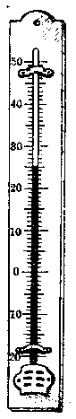

*图1-1*

号叫做“正号”，负数前面的“-”号叫做“负号”。

**注** 正号“+”和负号“-”，它们指出数的性质，所以把它们叫做性质符号。

+1， -1， +20， -20 这些数是不是只有温度计里用得到呢？让我们再看一个例子。

某人在一条公路上骑自行车要从甲地到乙地。有人告诉他要行20公里路程。这个人骑自行车走了20公里以后，并没有到达乙地，却和乙地相差40公里了。

为什么会这样呢？

原来他走错了一个方向。从甲地到乙地，应该是往东走的，但他却往西走，所以越走越远了。

从这里可以看出有一个方向的问题。例如向东和向西是两个相反的方向，同样走20公里路，方向不同，效果就完全不一样。向东走20公里和向西走20公里是两个具有相反方向的量，这和温度计上零上与零下的温度是两个具有相反方向的量一样。为了表示路程及其方向，我们可以象温度计上的度数一样，指定一个方向作为正方向，譬如把向东作为正方向，那末向东的20公里就用+20公里或20公里来表示，读做正二十公里，把相反的方向向西的20公里用-20公里来表示，读做负二十公里，这样，相反的方向就可以区别开来了。

在生活实践中，具有两种相反方向或两种相反意义的量是很多的，都可以用正数和负数来表示。例如，把高出海面的高度作为正方向，那末某一个高山高出海面7000米可以写做高度是+7000米或7000米，另一个低地低于海面100米可以写做高度是-100米；又如把收入当做正，支出当做负。某人每月工资收入60元可以写做+60元，生活支出20元可以写做-20元等。具有相反意义或相反方向的量是很多的，因此负数的应用是非常广泛的。

#### 习题1·2

1. 读出下列各数：

\[
+ 24， - 16， + 3 \frac{1}{3}， - 5 \frac{2}{7}，
\]

\[
+ 3.6， - 0.43， - 30543.
\]

2. 用正数或负数来表示下列温度：

零上\(18^{\circ}\)，零上\(100^{\circ}\)，零下\(16^{\circ}\)，零下\(273^{\circ}\)。

3. 如果在一条东西向的公路上， 把向东的方向作为正方向， 怎样表示向东 75 公里？ 向西 75 公里？ 向西\(9 \frac{1}{2}\)公里？ +50 公里是什么意思？ -50 公里是什么意思？

4. 如果某仓库运入某种货物 5000 斤， 用 +5000 斤来表示， 那么运出 3000 斤如何表示？

5. 用正数或负数表示下列各位置的高度：

（1） 喜马拉雅山的主峰珠穆朗玛峰高出海面 8848 米；

（2） 我国新疆吐鲁番洼地的最低处低于海面 154 米。

6. 如果 3 小时以后用 +3 小时来表示， 怎样表示 5 小时以后？ 3 小时以前？ +8 小时是什么意思？ -6 小时呢？

### §1·3 有理数

我们在上节里学到了负数， 为了区别， 把算术里学到过的数， 除零以外， 都叫做正数。 这样， 我们就有三种数： 正数、负数和零。 正数可以有整数、分数和小数， 负数也可以有整数、分数和小数。 例如 +1， +2， +135 等既是正数， 又是整数， 我们把它们叫做正整数。 正整数实际上就是自然数。\(3\frac{1}{3}, + \frac{2}{5}\)等叫做正分数， 0.7， +3.23 等叫做正小数。 同样， -1， -2， -100 等叫做负整数；\(-3\frac{1}{3}, -\frac{2}{5}\)等叫做负分数； -0.7， -3.23 等叫做负小数。 零既不是正数， 也不是负数。 这些数总起来应该有一个名称， 我们把它们都叫做有理数。 它们之间的关系， 可以列成下表：

> [图像：原扫描页含图示；RAW OCR 未提供可还原的图像像素内容。]

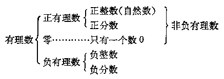

**注** 1. 正有理数和零，就是我们在算术里学过的数，总称为非负有理数。注意非负和正是有区别的。

2. 有理数里所讲的小数，是指算术里学过的有限小数或循环小数。

正整数、零与负整数都是整数。所以在代数里，我们所说的整数与在算术里所讲的整数的意义不同了。在算术里，整数只指正整数（自然数）和零，而在代数里，它就包括负整数了。以后我们讲到整数，都应该这样来理解。

因此，有理数所包含的数的范围，也可以用下表表明：

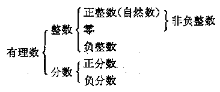

> [图像：原扫描页含图示；RAW OCR 未提供可还原的图像像素内容。]

#### 习题1·3

1. 写出三个正整数；写出三个负整数；写出一个既不是正的也不是负的整数。

2. 写出三个正分数；写出三个正小数；写出三个负分数；写出三个负小数。

3. 354 是正数吗？是整数吗？是正整数吗？是自然数吗？是有理数吗？

4. -354 是自然数吗？是整数吗？是有理数吗？

5. 零是自然数吗？是正数吗？是负数吗？是整数吗？是有理数吗？

6. 写出任意 5 个不同的有理数； 写出任意 3 个非负有理数； 写出任意 3 个非负整数。

7. 自然数一定是正整数吗？一定是整数吗？整数一定是自然数吗？

### §1·4 数轴

我们在量身高的时候，通常可用一根直立的木尺，划上许多横格，并注明一些表示长度的数字（一般用厘米作为单

位长度）。 当一个人站到下面的垫板上时， 他的足底刚刚对准这根尺的起点， 从他的头顶所对的尺上的位置， 可以读出他的身高的厘米数。 这就是说， 对于每一个身体高度的厘米数， 这根木尺上有一个和它对应的位置。

我们容易想到，是不是对于所有的有理数，正的、负的和零，也可以有类似这样的尺，使每一个有理数都能在尺上找到它对应的位置呢？

有的，事实上温度计就是这样一根尺。在温度计上，我们既有对应于正的度数的点，也有对应于零度的点，并且还有对应于负的度数的点。

用同样的方法，我们可以用一条直线上的点来表示全部有理数。

现在说明如下：

任意画一条水平方向的直线，规定它的一个方向是正的，和它相反的方向是负的（通常规定向右的方向是正的，向左的方向是负的），画一个箭头表示它的正方向，如图1·3所示。

> [图像：原扫描页含图示；RAW OCR 未提供可还原的图像像素内容。]

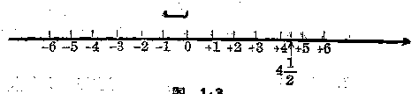

*图1-3*

如同木尺上的起点和温度计上的零度点一样，我们在这条直线上任意取一点0，表示有理数零，这一点叫做原点。如同木尺上的厘米长度和温度计上的一度的格子一样，我们可以任意指定一个单位长度，画在这条直线的旁边。然后在直线上，从原点0开始，依照这个单位长度，向右一次一次地截过去，顺次得到对应于正整数的各点的位置+1，+2，+3，+4，…；再从原点0开始，依照这个单位长度，向左一次一次地截过去，顺次得到对应于负整数的各点的位置，-1，-2，-3，-4，…。如果我们要表示分数\(4\frac{1}{2}\)的位置，那末只要从原点0向右依照单位长度截取4次，再截取相当于单位长度的一半，得到的点就表示有理数\(4\frac{1}{2}\)了。用同样的方法，我们可以在这条直线上找出表示任意有理数的点。这种用来表示数的直线叫做数轴。

从上面所讲， 我们可以看出：

数轴是一条用来表示数的直线， 它要有规定的正方向， 原点和单位长度。

从图上可以看出， 所有表示正数的点都在原点的右边， 所有表示负数的点都在原点的左边。原点本身就表示既不是正数也不是负数的数 0.

数轴上表示某个数的点叫做这个数的对应点。所有不相等的数都有不同的对应点。

#### 习题1·4

1. 画出一条数轴，标出它的原点，正方向和单位长度。在这条数轴上指出下列各数的对应点：+3，-3，0，\(1\frac{1}{2}\)，\(-2\frac{1}{3}\)。

2. 数轴上原点右面的点表示的是什么数？左面的点呢？

3. 数轴上会不会有两个不同的点表示同样的数？

4. 数轴上会不会有一个点表示两个不同的数？

5. 画出一条数轴，在数轴上作出下列各个数的对应点：+5，-5，

\[
+ 1， - 1， + 2 \frac{1}{2}， - 2 \frac{1}{2}， 0， - \frac{1}{3}， - 1 \frac{1}{3}.
\]

从图上各点的左右位置， 把这 9 个数依照对应点的位置， 从左到右排列起来。

6. 从上面这个题目的各点的位置看看：+5与-5的两个对应点与原点的距离一样吗？这两点的位置有什么不同？+1与-1呢？\(+2\frac{1}{2}\)与\(-2\frac{1}{2}\)呢？

### §1·5 相反的数

#### 1. 相反的数的概念

在数轴上，+5 和 -5 是由两个不同的点表示的，一个在原点的正方向，一个在原点的负方向，方向恰恰相反，但它们和原点的距离却是相等的。同样，+1 与 -1 的两个对应点也在原点的相反方向而和原点的距离相等；\(+2\frac{1}{2}\)与\(-2\frac{1}{2}\)的两个对应点也在原点的相反方向而和原点的距离相等。我们把这样的两个数叫做相反的数。例如，+5 与 -5 是相反的数，我们说 +5 是 -5 的相反的数，-5 也是 +5 的相反的数。同样，+1 与 -1 是两个相反的数，+1 的相反的数是 -1，-1 的相反的数是 +1。每一个正数，总有一个负数和它对应，成为它的相反的数；每个负数，总有一个正数和它对应，成为它的相反的数。只有数零，它的相反的数就是这个数零本身。

> [图像：原扫描页含图示；RAW OCR 未提供可还原的图像像素内容。]

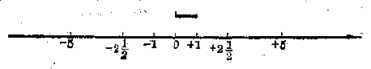

*图1-4*

就是：

任何一个正数的相反的数是一个负数；

任何一个负数的相反的数是一个正数；

0 的相反的数还是 0.

#### 2. 一个数的相反数的表示方法

因为 +3 就是 3， 所以在 3 的前面添上一个“+”号， 和 3 没有任何区别。 同样， 在 +3 前面再添上一个“+”号， 写成 + （+3）， 和 +3 或者 3 也没有任何区别 （这个括号是为了避免两个“+”号连写而加上去的）； 在 -3 前面再添上一个“+”号， 写成 + （-3）， 它和 -3 没有区别。

因为 -3 是 3 的相反的数，所以在 3 的前面添上一个 “-” 号，就成为 3 的相反的数了。同样，在 +3 前面添上一个 “-” 号，写成 - （+3），也表示它是 +3 的相反的数，就是 -3；在 -3 的前面再添上一个负号，写成 - （-3），它就是 -3 的相反的数 +3。

在0的前面添上一个“+”号或者“-”号，仍旧是0，即\(+0=0; -0=0; +(+0)=0; +(-0)=0;\)\(-(+0)=0; -(-0)=0.\)

一个数的相反的数表示法则：要表示一个数的相反的数，只要在这个数前面添上一个“-”号；如果这个数前面原来有正负号，要先添上括号后再在括号前面添上“-”号。表示下列各数的相反的数，并把它化简：

（1）\(+3.5\)

（2）\(-7\frac{1}{2}\)。

**【解】** （1） +3.5 的相反的数是\(-(+3.5) = -3.5\)；

（2）\(-7\frac{1}{2}\)的相反的数是\(-\left(-7\frac{1}{2}\right) = +7\frac{1}{2}\)。

从上面的例子和正号可以省略的规定，我们得到：

\[
\left. \begin{array}{l} {+ (+ a) \rightarrow + a} \\ {- (- a) \rightarrow + a} \\ {+ (- a) \rightarrow - a} \\ {- (+ a) \rightarrow - a} \end{array} \right\} \text{同号得正，} \text{异号得负。}
\]

**性质符号简化法则**

#### 习题1·5

1. 写出下列各个数的相反的数：+3， -2，\(\frac{2}{3}\)， -1.5， 0， 把这些数和它们的相反的数在数轴上标注出来。

2. 有没有一个数的相反的数就是这个数本身？说出这个数。还有没有其他的数的相反的数也和它本身相等？

3. +5 的相反的数是什么？+5 的相反的数 的相反的数是什么？-3 的相反的数是什么？-3 的相反的数的相反的数是什么？\(\frac{2}{3}\)的相反的数的相反的数是什么？-3.64 的相反的数的相反的数是什么？

从上面的一些例子， 回答下列的问题：

一个数的相反的数 的相反的数是什么？

4. 表示下列各数的相反的数并化简：

（1） +5；

（2） -3；

（3） +2\(\frac{1}{2}\)；

（4） -106.3.

5. 化简：

（1） + （+5）；

（2） + （-16.3）；

（3） +\(\left( {3\frac{2}{3}}\right)\)；

（4） + （-301）；

（5） - （+6）；

（6） - （-24）；

（7） - （+1.36）；

（8）\(-\left(-3\frac{1}{3}\right)\)；

（9） - ［+（-5）］；

（10） + ［- （+3.2）］；

（11） - ［- （+1）］；

（12） - ［-（-3）］。

［解法举例：（1） + （+5） = +5 = 5.］

### §1·6 数的绝对值

在一条公路上， 从某一点甲处向一个方向行 30 公里到乙处和向相反的方向行 30 公里到丙处， 乙和丙是不同的地点。 但这两个点和出发点的距离却是一样的， 都是 30 公里。

> [图像：原扫描页含图示；RAW OCR 未提供可还原的图像像素内容。]

*图1-5*

有的时候，我们只需要研究两个地点之间的距离而不需要研究它们的方向。例如我们要研究从甲地到乙地或从甲地到丙地的火车运行的时间，或者火车所消耗的煤的数量，那末只要它们的距离都是30公里，就知道运行的时间和消耗的煤量是相等的，至于向东或向西的方向问题，在这里就不必研究了。

从这个例子可以看出， 以向东方向为正方向， 我们向东行 30 公里就是走了 +30 公里， 到达的目的地与出发点的距离是 30 公里； 向西行 30 公里就是走了 -30 公里， 到达的目的地与出发点的距离也是 30 公里。

> [图像：原扫描页含图示；RAW OCR 未提供可还原的图像像素内容。]

*图1-6*

同样地， 在一个数轴上， 数 +3 的对应点与原点的距离是 3 （或 +3）， 数 -3 的对应点与原点的距离也是 3 （或 +3）。 在数轴上表示一个数的点离开原点的距离的数叫做这个数的绝对值。

根据上面一些例子， 对于数的绝对值， 我们规定：

正数的绝对值就是这个正数本身，负数的绝对值是它的相反的数，零的绝对值就是0.

我们在数的两旁各画一条竖线，来表示这个数的绝对值。例如我们说\(+30\)的绝对值就是\(+30\)，写做

\(|+30|=+30\)； 读做“+30 的绝对值等于 +30”； 同样，

\(|-30|=+30;\)读做“-30 的绝对值等于 +30”；

\(|0|=0;\)读做“0 的绝对值等于 0”。

因为\(|+5|=+5, |-5|=+5,\)

所以\(\left|+5\right|=|-5|\)。

同样地我们有：\(|-3|=|+3|\)；\(\left|+3\frac{1}{3}\right|=\left|-3\frac{1}{3}\right|\)等等。

我们说：两个相反数的绝对值是相等的。

#### 习题1·6

1. 一个数的绝对值，能够是负数吗？一个数的绝对值一定是正数吗？

2. 写出下列各数的绝对值，并把它的读法写出来：

\[
+ 5， - 3， 7， - 6.33， 0， 11 \frac{7}{12}， - 6 \frac{5}{8}.
\]

［解法举例：\(|+5|=+5\)，读法：+5的绝对值等于+5；

\(|-3|=+3\)，读法：-3的绝对值等于+3.］

3. 计算：

（1）\(|-16|+|-24|+|+30|\)；

（2）\(|-16+|-24|-|-30|\)；

（3）\(|-16|\times\left|-3\frac{1}{2}\right|;\)（4）\(|-5.2|-|-3.56|;\)

（5）\(|-0.3|\times|+0.2|\)。

［解法举例：（1）\(|-16|+|-24|+|-30|=16+24+30=70.\)］

4. 化简：

（1）\(-(-3)\)；

（2）\(-| - 3|\)；

说明它们的区别。

5. 写出 +5 与 -5 的绝对值。

6. 写出绝对值等于 3 的两个数。

### §1·7 有理数大小的比较

在算术里，我们已经知道数可以比较大小。现在我们把数扩充到有理数，是不是所有的有理数也都能够比较大小呢？

我们不妨仍旧从温度计上来研究。零上\(5^{\circ}\)与零下\(5^{\circ}\)是不是相等的温度呢？如果不相等，那末哪一个温度高呢？零上\(5^{\circ}\)与零下\(6^{\circ}\)哪一个温度高呢？零下\(2^{\circ}\)与零下\(1^{\circ}\)哪

> [图像：原扫描页含图示；RAW OCR 未提供可还原的图像像素内容。]

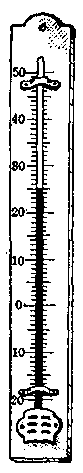

*图1.7*

一个温度高呢？零度与零下\(1^{\circ}\)哪一个温度高呢？从温度计上可以看出：零上\(5^{\circ}\)与零下\(5^{\circ}\)的温度是不相等的，零上\(5^{\circ}\)高于零下\(5^{\circ}\)，零上\(5^{\circ}\)也高于零下\(6^{\circ}\)，零下\(2^{\circ}\)则低于零下\(1^{\circ}\)，零度也高于零下\(1^{\circ}\)。

如果把零上的度数用正数来表示，零下的度数用负数来表示，那末上面的结果就是：

\[
+ 5 ^{\circ} > - 5 ^{\circ}， + 5 ^{\circ} > - 6 ^{\circ}，
\]

\[
- 2 ^{\circ} < - 1 ^{\circ}， 0 ^{\circ} > - 1 ^{\circ}.
\]

同样，我们也可以从它们在数轴上的对应点的位置来确定有理数的大小：

有理数大小的规定：在水平数轴上表示的两个有理数，如果把向右方向作为正方向，那末，在右边的一个数总比在左边的一个数大。

例如：\(+5>-5_{+}+5>-6; -1>-2; 0>-1.\)

从数轴上的左右关系， 我们又可以清楚地看出：

> [图像：原扫描页含图示；RAW OCR 未提供可还原的图像像素内容。]

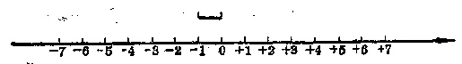

*图1-8*

（i） 任何正数， 大于任何负数；

（ii） 任何正数， 大于零；

（iii） 任何负数， 小于零；

（iv） 两个正数中， 绝对值大的那个数较大；

（v） 两个负数中， 绝对值大的那个数较小。

**有理数大小的比较法则**

**例1** 比较 3.56 与 -8.39 的大小。

**【解】** 3.56 是正数，-8.39 是负数，

∵ 任何正数大于任何负数，

∴ 3.56 > -8.39.

**注** 记号“\(\because\)”读做“因为”，“\(\therefore\)”读做“所以”。

**例2** 比较0与-7.8的大小。

**【解】** 因为任何负数小于零，

\[
\therefore - 7.8 < 0.
\]

**例3** 比较-3.56与-4.07的大小。

**【审题】** -3.56 与 -4.07 都是负数， 先看它们的绝对值。

**【解】**\(|-3.56| = 3.56, |-4.07| = 4.07,\)

\[
4.07 > 3.56，
\]

\[
\therefore \quad | - 4.07 | > - 3.56 ]。
\]

绝对值大的负数较小，

\[
\therefore - 4.07 < - 3.56.
\]

**例4** 比较\(-\frac{2}{3}\)与\(-\frac{3}{4}\)的大小。

**【解】**\(\left| -\frac{2}{3} \right| = \frac{2}{3}, \left| -\frac{3}{4} \right| = \frac{3}{4}.\)

\[
\because \frac{2}{3} < \frac{3}{4}， \therefore - \frac{2}{3} > - \frac{3}{4}.
\]

**例5** 比较下列三个数的大小：\(+3, -5, -1\)。

**【解】** 在这三个数中，+3 最大，-1 又比 -5 大，

\[
\therefore + 3 > - 1 > - 5.
\]

**【注意】** 三个数同时比较大小时，书写的次序必须使两个不等号都是“大于号”或者都是“小于号”。所以这一题也可以写做\(-5 < -1 < +3\)。但下列写法是错误的：\(-5 < 3 > -1\)，因为这样就看不出\(-5\)与\(-1\)之间的大小了。

1. 写出四个大于 0 的整数；写出四个小于 0 的整数。

2. 写出所有小于 7 的正整数；写出所有大于 -5 的负整数。

3. 写出所有大于 -3 而小于 +4 的整数，并在数轴上把它们表示出来。这些数里面，有几对相反的数？

4. 比较下列各组数的大小， 用关系符号“<”连接起来：

（1） 7， 10；

（2）\(+6\frac{2}{3}, +6\frac{3}{4};\)

（3） 7， -3；

（4） -3， -8；

（5）\(-3\frac{1}{3}, -3\frac{1}{4};\)

（6） 0， -7.

［解法举例：（1） 7<10.］

5. 比较下列各组数的大小， 用关系符号“>”连接起来：

（1） 3.7， +3\(\frac{5}{8}\)；

（2） -3， 0；

（3） 165， -200；

（4）\(-\frac{12}{7}, -1\frac{3}{4}\)；

（5） 3.1， -3.1；

（6） -3.1， -3.2.

6. 比较下列各组数的大小：

（1） 0，\(-\frac{1}{2}\)，\(-\frac{1}{3}\)（用关系符号<连接起来）；

（2）\(1\frac{2}{3}, 1\frac{3}{4}, -3\frac{1}{4}\)（用关系符号\(>\)连接起来）。

7. 比较下列各题中两个数的大小：

（1） +5， |-6|；

（2）\(|+5|, |-7|\)；

（3）\(|-7|, |-2|\)；

（4）\(-|+5|,-|-7|;\)

（5）\(-(-6),-|-6|\)。

8. 写出绝对值大于 4 的三个正数和三个负数；写出绝对值小于 3 的三个正数和三个负数。

9. 写出绝对值等于 2 的一个正数和一个负数。

10. 在数轴上指出绝对值等于 5 的数， 这样的数有几个？

11. 写出绝对值小于 4 的所有整数， 这样的数里有几组是相反的数？

12. 写出绝对值大于 4 而小于 8 的所有整数。

### §1·8 有理数的加法

在算术里我们学过整数、分数和小数的加法、减法、乘法和除法。应用这四种运算，可以解决许多实际问题。现在我们已经学习了有理数，要应用它来解决更多的实际问题，就需要学会怎样进行有理数的运算。

这一节里，我们先来研究有理数的加法。让我们来看下面的一些问题。

#### 1. 符号相同的两个有理数相加

**问题1** 在一条东西方向的公路上，一个人从甲地出发先向东走4公里，以后又向东走3公里。结果这个人离开甲地几公里？它的位置在甲地的哪一边？

**【解】** 从下面的图上可以看出，这个人现在在甲地东边7公里。

> [图像：原扫描页含图示；RAW OCR 未提供可还原的图像像素内容。]

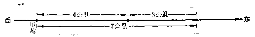

*图1.9*

从算术里我们已经知道，这个问题可以用加法来算。但是为了在算式里能够把方向也表示出来，我们取向东的方向作为正方向，那末只要把向东4公里记做+4公里，向东3公里记做+3公里，东边7公里记做+7公里，这个题目的解答就可以列成算式：

\[
(+ 4) + (+ 3) = + 7.
\]

**答：**在甲地东边7公里。

**问题2** 如果在上题中， 这个人先向西走4公里， 再向西走3公里， 结果这个人离开甲地几公里？ 在甲地的哪一边？

**【解】** 从下图可以看出， 他现在在甲地西边 7 公里。

> [图像：原扫描页含图示；RAW OCR 未提供可还原的图像像素内容。]

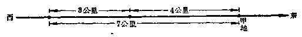

*图1-10*

我们仍旧把向东的方向作为正方向，那末向西4公里记做-4公里，向西3公里记做-3公里，西边7公里记做-7公里。因为这个题目的性质和问题1是相同的（只是走的方向不同），仍旧应该用加法来算。这样就要把这个人走了两次以后离开原地的公里数和方向用

\[
(- 4) + (- 3)
\]

来表示，并且得到算式

\[
(- 4) + (- 3) = - 7.
\]

**答：**在甲地西边7公里。

从上面两个问题的解答中，我们看到：两个正数相加，它们的和还是一个正数，和的绝对值就是这两个加数的绝对值的和；两个负数相加，它们的和仍旧是个负数，和的绝对值是这两个加数的绝对值的和。

#### 2. 符号相反的两个有理数相加

**问题3** 在问题 1 中， 如果这个人先向东走 4 公里， 后来又向西走 3 公里， 那末结果他离开甲地几公里？ 在甲地哪一边？

**【解】** 从下图中可以看出他应该在甲地东边1公里。

> [图像：原扫描页含图示；RAW OCR 未提供可还原的图像像素内容。]

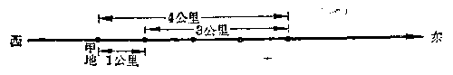

*图1-11*

我们仍旧把向东的方向作为正方向，那末向东4公里记做+4公里，向西3公里记做-3公里，东边1公里记做+1公里。

因为这个题目的性质还是和问题1相同的（只是两次走的方向不同）， 我们仍旧可以用加法来做。这样就要把他最后离开原地的公里数和方向， 用

\[
(+ 4) + (- 3)
\]

来表示， 并且得到算式

\[
(+ 4) + (- 3) = + 1.
\]

**答：**在东边1公里。

**问题4** 如果这个人先向西走 4 公里， 再向东走 3 公里， 结果他离开甲地几公里？ 在甲地哪一边？

**【解】** 从下图可以看出，他在甲地西边1公里。

> [图像：原扫描页含图示；RAW OCR 未提供可还原的图像像素内容。]

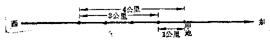

*图1·12*

我们仍旧把向东的方向作为正方向，那末向西4公里只要记做-4公里，向东3公里只要记做+3公里，西边1公里只要记做-1公里。

这个问题的性质还是和问题1相同，所以我们仍旧用加法，把这个人最后离甲地的公里数和方向用

\[
(- 4) + (+ 3)
\]

来表示，并且得到算式

\[
(- 4) + (+ 3) = - 1.
\]

**答：**在西边1公里。

**问题5** 如果这个人先向东走4公里，再向西走4公里，结果他离甲地几公里？在哪一边？

**【解】** 很明显，他仍在原地，就是离开原地0公里。

象上面的问题3和问题4一样，我们可以用

\[
(+ 4) + (- 4)
\]

来表示他最后离开原地的公里数和方向， 并且得到算式

\[
(+ 4) + (- 4) = 0.
\]

从上面的三个问题的解答中可以看到，符号相反的两个数相加，它们的和的符号与加数里绝对值大的这个数的符号相同，和的绝对值应该等于加数的绝对值的差；如果这两个数是相反的数，那末和就是0。

#### 3. 关于零的加法

在算术里， 我们已经知道一个数和零相加， 结果仍旧等于这个数。 例如

\[
3 + 0 = 3， \quad 0 + 3 = 3， \quad 0 + 0 = 0.
\]

对于加数中有负数的时候， 这个性质还是一样的。 例如

\[
(- 4) + 0 = - 4， \quad 0 + (- 4) = - 4.
\]

读者可以自己用上面的问题来解释这两个式子的实际意义。

#### 4. 有理数加法法则

把上面这些情况归纳起来，我们就可以得到：

（i） 正负符号相同的两个数的和， 它的符号与这两个数的符号相同， 它的绝对值等于这两个数的绝对值的和。

（ii） 正负符号相反的两个数的和， 它的符号与绝对值较大的加数的符号相同， 它的绝对值等于这两个数的绝对值的差 （特殊情况： 两个相反的数的和等于零）。

（iii） 零同任何一个数的和就等于这个数（特殊情况：零加零等于零）。

**有理数的加法法则**

**例1** 计算：

（1）\((+15) + (+24)\)；

（2）\((+5.36) + (+2.73)\)；

（3）\((-16) + (-31)\)；

（4）\(\left(-2\frac{1}{3}\right) + \left(-5\frac{1}{2}\right)\)。

**【解】** （1）\((+15) + (+24) = +39\)；

（2）\((+5.36) + (+2.73) = +8.09;\)

（3）\((-16) + (-31) = -47\)；

（4）\(\left(-2\frac{1}{3}\right) + \left(-5\frac{1}{2}\right) = -\left(2\frac{1}{3} + 5\frac{1}{2}\right) = -7\frac{5}{6}\)。

**【注意】** （1） 这里都是两个符号相同的数的加法，只要把它们的绝对值相加，再写上相同的性质符号就是了。

（2） 正数的性质符号可以省略。如\((+15)+(+24)=+39\)，可以写成\(15+24=39\)。

**例2** 计算下列加法：

（1）\((+3.5) + (-7.2)\)；

（2）\((+364) + (-120)\)；

（3）\(\left(-3\frac{2}{3}\right) + \left(+2\frac{1}{2}\right)\)；

（4）\((-5.74) + (+5.74)\)。

**【解】** （1）\((+3.5) + (-7.2) = -3.7;\)

（2）\((+364) + (-120) = +244;\)

（3）\(\left(-3\frac{2}{3}\right) + \left(+2\frac{1}{2}\right) = -1\frac{1}{6};\)

（4）\((-5.74) + (+5.74) = 0.\)

**【注意】** （1） 这里都是两个符号不同的数的加法，要把它们的绝对值相减，求出绝对值的差，再写上绝对值较大的那个加数的符号。

（2） 正数的性质符号可以省略。例如\((+3.5) + (-7.2)\)可以写成\(3.5 + (-7.2)\)；\(\left(-3\frac{2}{3}\right) + \left(+2\frac{1}{2}\right)\)可以写成\(\left(-3\frac{2}{3}\right) + 2\frac{1}{2}\)， 或者写成\(-3\frac{2}{3} + 2\frac{1}{2}\)。

**例3** 计算：

（1）\((+245) + 0\)；

（2）\(0 + \left(-3\frac{1}{3}\right)\)；

（3）\(0 + (+5.32)\)；

（4）\(0 + 0\)。

**【解】** （1）\((+245) + 0 = +245\)；

（2）\(0 + \left(-3\frac{1}{3}\right) = -3\frac{1}{3};\)

（3）\(0 + 5.32 = 5.32\)；

（4）\(0 + 0 = 0\)。

**例4** 计算：

（1）\((+15) + (-16) + (-8) + (+9)\)；

（2）\(\left(-3\frac{3}{5}\right) + (-2.7) + (+5.4) + \left(-7\frac{1}{5}\right)\)。

**【解】** 依从左到右顺次计算：

\[
(+ 15) + (- 16) + (- 8) + (+ 9) \tag {1}
\]

\[
= (- 1) + (- 8) + (+ 9)
\]

\[
= (- 9) + (+ 9) = 0；
\]

\[
(- 3 \frac{3}{5}) + (- 2.7) + (+ 5.4) + (- 7 \frac{1}{5}) \tag {2}
\]

\[
= (- 3.6) + (- 2.7) + (+ 5.4) + (- 7.2)
\]

\[
= (- 6.3) + (+ 5.4) + (- 7.2)
\]

\[
= (- 0.9) + (- 7.2) = - 8.1.
\]

#### 习题1·8

1. 回答下列问题：在算术里，两个数的和会小于任意一个加数吗？在代数里呢？举一个例子。

2. 做下列加法：

（1）\((+172) + (+288)\)；

（2）\((-31) + (-72)\)；

（3）\((-103) + (-207)\)；

（4）\((+15) + (-11)\)；

（5）\((+284) + (-316)\)；

（6）\((-72) + (+28)\)；

（7）\((-123) + (+319)\)；

（8）\(\left(+\frac{1}{2}\right)+\left(+\frac{2}{3}\right)\)；

（9）\(\left(-\frac{1}{3}\right) + \left(-\frac{1}{6}\right)\)；

（10）\(\left(-3\frac{1}{3}\right) + \left(-5\frac{3}{5}\right)\)；

（11）\(\left(+8\frac{1}{3}\right) + \left(-4\frac{2}{3}\right)\)；

（12）\(\left(+5\frac{1}{4}\right) + \left(-7\frac{1}{3}\right)\)；

（13）\(\left(-16\frac{5}{12}\right) + \left(+12\frac{7}{12}\right)\)；

（14）\(\left(-3\frac{1}{7}\right) + \left(+5\frac{1}{3}\right)\)；

（15）\((+8.63) + (+0.7)\)；

（16）\((-12.43) + (-34.507)\)；

（17）\((+8.63) + (-6.234)\)；

（18）\((-32.8) + (+51.76)\)；

（19）\(\left(+3\frac{1}{3}\right) + (+0.3)\)；

（20）\(\left(-5\frac{2}{3}\right) + (-2.71)\)。

3. 计算：

（1）\((+3) + (+5) + (-7) + (-4) + (-3) + (+6)\)；

（2）\((+12) + (-18) + (-23) + (+51) + (-7) + (+4)\)；

（3）\((-35) + (-6) + (-7) + (+8) + (+9) + (+14)\)\(+ (+17)\)；

（4）\(\left(+6\frac{1}{4}\right) + \left(-6\frac{1}{4}\right) + (-3.3) + (+3.3) + (+6) + (-6)\)。

### §1·9 加法的运算性质

#### 1. 加法交换律

让我们先看一个问题：一个人在一条东西向的公路上第一天向东行50公里，第二天向西行30公里，他所到达的地方，与第一天先向西行30公里，而后在第二天再向东行50公里所到达的地方，结果是否相同？

如果我们把向东的方向作为正方向，那末：

在第一种情况下

> [图像：原扫描页含图示；RAW OCR 未提供可还原的图像像素内容。]

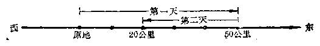

*图1-13*

得算式\((+50) + (-30) = +20;\)

在第二种情况下

> [图像：原扫描页含图示；RAW OCR 未提供可还原的图像像素内容。]

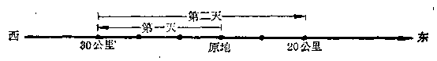

*图1-14*

得算式\((-30) + (+50) = +20.\)

两种情况的结果是相同的，他所到达的地方都是在原地东边20公里。可见

\[
(+ 50) + (- 30) = (- 30) + (+ 50)。
\]

同样地，\((-3.54)+(-6.27)=-9.81,\)

\[
(- 6.27) + (- 3.54) = - 9.81；
\]

\[
\therefore (- 3.54) + (- 6.27) = (- 6.27) + (- 3.54)。
\]

在算术里， 我们曾经学过： 加法中的两个加数， 交换它们的位置， 它们的和不变， 这叫做加法交换律。 这个性质对于有理数的加法， 也是适用的。 我们可以用字母表示如下：

\(a + b = b + a\)

**加法交换律**

这里 a 和 b 表示任意两个有理数。

#### 2. 加法结合律

让我们再看：

（1）\((3 + 5) + 7 = 8 + 7 = 15,\)

\[
3 + (5 + 7) = 3 + 12 = 15，
\]

\[
\therefore (3 + 5) + 7 = 3 + (5 + 7)；
\]

（2）\(\left[(-3) + (+5)\right] + (-12) = (+2) + (-12)\)

\[
= - 10，
\]

\[
(- 3) + [ (+ 5) + (- 12) ] = (- 3) + (- 7)
\]

\[
= - 10，
\]

\[
\therefore [ (- 3) + (+ 5) ] + (- 12)
\]

\[
= (- 3) + [ (+ 5) + (- 12) ]。
\]

这样的性质，在加法里，对于任意三个加数都是成立的。这种性质叫做加法结合律，那就是：如果有三个加数，先把前面两个加数相加，再加上第三个加数，与先把后面两个加数相加，再和第一个加数相加，结果相同。我们可以用字母表示如下：

\[
(a + b) + c = a + (b + c)
\]

**加法结合律**

这里\(a, b, c\)表示任意三个有理数。

**例1** 计算：3764+2985+6286.

**【解1】** 依照从左到右的次序演算：

\[
3764 + 2985 + 6236 = 6749 + 6236
\]

\[
= 12985.
\]

**【解2】** 应用加法交换律交换第二个与第三个加数的位置：

\[
\begin{array}{l} 3764 + 2985 + 6236 = 3764 + 6236 + 2985 \\ = 10000 + 2985 = 12985. \\ \end{array}
\]

显然，第二种解法因为凑成了一个比较整齐的数10000，就比第一种解法简便些。

**例2** 计算：

\[
\begin{array}{l} \left(+ 6 \frac{3}{5}\right) + \left(- 5 \frac{2}{3}\right) + \left(+ 4 \frac{2}{5}\right) + \left(+ 2 \frac{1}{7}\right) \\ + \left(- 1 \frac{1}{3}\right) + \left(- 1 \frac{1}{7}\right)。 \\ \end{array}
\]

**【解】** 应用加法交换律和加法结合律，把分母相同的数先合并起来：

\[
\begin{array}{l} \left(+ 6 \frac{3}{5}\right) + \left(- 5 \frac{2}{3}\right) + \left(+ 4 \frac{2}{5}\right) + \left(+ 2 \frac{1}{7}\right) \\ + \left(- 1 \frac{1}{3}\right) + \left(- 1 \frac{1}{7}\right) \\ = \left(+ 6 \frac{3}{5}\right) + \left(+ 4 \frac{2}{5}\right) + \left(- 5 \frac{2}{3}\right) + \left(- 1 \frac{1}{3}\right) \\ + \left(+ 2 \frac{1}{7}\right) + \left(- 1 \frac{1}{7}\right) \\ = \left[ \left(+ 6 \frac{3}{5}\right) + \left(+ 4 \frac{2}{5}\right) \right] + \left[ \left(- 6 \frac{2}{3}\right) + \left(- 1 \frac{1}{3}\right) \right] \\ + \left[ \left(+ 2 \frac{1}{7}\right) + \left(- 1 \frac{1}{7}\right) \right] \\ = (+ 11) + (- 7) + (+ 1) = (+ 4) + (+ 1) = 5. \\ \end{array}
\]

**例3** 计算：

\[
(+ 32) + (- 18) + (+ 164) + (- 32) + (- 164)。
\]

**【解】** 应用加法交换律与加法结合律，先把相反的数合并成零：

\[
\begin{array}{l} (+ 32) + (- 18) + (+ 164) + (- 32) + (- 164) \\ = (+ 32) + (- 32) + (- 18) + (+ 164) + (- 164) \\ = 0 + (- 18) + 0 = - 18. \\ \end{array}
\]

**例4** 计算：

\[
(+ 32) + (- 17) + (+ 157) + (- 243) + (+ 24) + (- 7)。
\]

**【解】** 应用加法交换律和加法结合律，先把符号相同的数合并起来：

\[
\begin{array}{l} (+ 32) + (- 17) + (+ 157) + (- 243) + (+ 24) + (- 7) \\ = (+ 32) + (+ 157) + (+ 24) + (- 17) \\ + (- 243) + (- 7) \\ = (+ 213) + (- 267) = - 54. \\ \end{array}
\]

从上面这些例子可以看出，做有理数加法的时候，在下列情况下，一般可以应用加法交换律和加法结合律，使计算变得简便：

（1） 有些加数相加后可以得到比较整齐的整数时，可先行相加；

（2） 分母相同或易于通分的分数， 可以先行相加；

（3） 有相反的数可以互相消去得零的，可以先行相加；

（4） 许多正数和许多负数相加时，可以先把符号相同的数相加，即正数与正数相加，负数与负数相加，最后再把一个正数与一个负数相加。

#### 习题1·9

应用加法交换律、结合律，选取最合理的方法进行计算：

1.\((+132) + (-124) + (-16) + 0 + (-132) + (+16)\)。

2.\((+127) + (+13) + (-300) + (-140) + (-189) + (+300)\)。

3.\((+127) + (-373) + (+233) + (-125) + (-12) + (+540)\)。

4.\((+6) + (-12) + (+8.3) + (-7.4) + (+9.1) + (-2.5)\)。

5.\(\left(+3\frac{5}{6}\right)+\left(+5\frac{1}{7}\right)+\left(-2\frac{1}{6}\right)+\left(+32\frac{6}{7}\right)\)。

6.\(\left(+7\frac{3}{4}\right)+\left(-5\frac{4}{11}\right)+\left(-3\frac{1}{2}\right)+\left(-6\frac{5}{11}\right)\)

\[
+ \left(+ 17 \frac{1}{4}\right) + \left(+ 1 \frac{1}{4}\right)。
\]

7.\((+3.543) + (-0.543) + (+6.457) + (-0.417)\)。

\[
\begin{array}{l} 8. \left(+ 3 \frac{2}{5}\right) + \left(- 2 \frac{7}{8}\right) + \left(- 3 \frac{5}{12}\right) + \left(+ 5 \frac{3}{5}\right) \\ + \left(- 1 \frac{1}{8}\right) + \left(+ 5 \frac{5}{12}\right)。 \\ \end{array}
\]

### §1·10 有理数的减法

在算术里， 我们已经知道， 减法是加法的逆运算。有理数减法的意义还是一样的。

例如，在有理数加法中，我们知道

\[
(- 4) + (+ 3) = - 1， \tag {1}
\]

写成减法， 就是

\[
(- 1) - (+ 3) = - 4， \tag {2}
\]

以及

\[
(- 1) - (- 4) = + 3. \tag {3}
\]

现在我们来研究，怎样做有理数的减法。首先我们考虑下面的问题：

-1 加上什么数， 结果是 -4？ 是 +3？

根据有理数的加法法则，很容易得到

\[
(- 1) + (- 3) = - 4， \tag {4}
\]

\[
(- 1) + (+ 4) = + 3. \tag {5}
\]

现在来比较上面的（2）和（4）。 容易看到，\((-1)-(+3)\)的结果和\((-1)+(-3)\)的结果是一样的。 就是

\[
(- 1) - (+ 3) = (- 1) + (- 3)。
\]

这告诉我们：一个数减去一个正数，就只要加上它的相反的数（负数）。

同样地， 比较（3）和（5）， 可以得到

\[
(- 1) - (- 4) = (- 1) + (+ 4)。
\]

这告诉我们：一个数减去一个负数，就只要加上它的相反的数（正数）。

这样， 我们就把有理数减法的问题， 变做了有理数加法的问题来处理了。

一般地，我们有下面的有理数的减法法则：减去一个数等于加上这个数的相反的数。这可以用字母表示如下：

\[
a - b = a + (- b)。
\]

**有理数的减法法则**

这里\(a, b\)表示任意两个有理数。

**【注意】** 在算术里， 我们知道做减法的时候， 被减数不能小于减数。 但是学了有理数， 因为有理数的加法总是可以进行的， 所以有理数的减法， 不管被减数和减数有怎样的关系， 它总是可以进行的。 例如

\[
(+ 3) - (+ 4) = (+ 3) + (- 4) = - 1.
\]

**例1** 计算：

（1）\((+16) - (+12)\)；

（2）\((+12) - (+16)\)；

（3）\((-12) - (+14)\)；

（4）\((+10) - (-15)\)；

（5）\((-16) - (-20)\)；

（6）\((-16) - (-16)\)；

（7）\(0 - (+5)\)；

（8）\((-5) - 0\)。

**【解】**

（1）\((+16) - (+12) = (+16) + (-12) = +4;\)

（2）\((+12) - (+16) = (+12) + (-16) = -4;\)

（3）\((-12) - (+14) = (-12) + (-14) = -26;\)

（4）\((+10) - (-15) = (+10) + (+15) = +25;\)

（5）\((-16) - (-20) = (-16) + (+20) = +4;\)

（6）\((-16) - (-16) = (-16) + (+16) = 0;\)

（7）\(0 - (+5) = 0 + (-5) = -5;\)

（8）\((-5) - 0 = (-5) + 0 = -5\)或\((-5) - 0 = -5\)。

**例2** 计算：

（1）\((-3) - (-6) - (-8)\)；

（2）\((-5) - (+7) + (-9)\)；

（3）\((+7)+(-12)-(+9);\)

（4）\((-3) - (-5) - (-7) + (-9)\)。

**【解】** （1）\((-3) - (-6) - (-8)\)

\[
= (- 3) + (+ 6) + (+ 8) = + 11；
\]

（2）\((-5) - (+7) + (-9)\)

\[
= (- 5) + (- 7) + (- 9) = - 21；
\]

（3）\((+7) + (-12) - (+9)\)

\[
= (+ 7) + (- 12) + (- 9) = - 14；
\]

（4）\((-3) - (-5) - (-7) + (-9)\)

\[
= (- 3) + (+ 5) + (+ 7) + (- 9)
\]

\[
= (- 12) + (+ 12) = 0.
\]

**例3** 计算：

（1）\((-2.4) - (+3.65) + \left(-1\frac{1}{4}\right)\)；

（2）\((+1.7) - \left(-3\frac{1}{3}\right) + \left(-2\frac{2}{5}\right)\)。

**【解】** （1）\((-2.4) - (+3.65) + (-1\frac{1}{4})\)

\[
= (- 2.4) + (- 3.65) + (- 1.25) = - 7.3；
\]

（2）\((+1.7) - \left(-3\frac{1}{3}\right) + \left(-2\frac{2}{5}\right)\)

\[
= \left(+ 1 \frac{7}{10}\right) + \left(+ 3 \frac{1}{3}\right) + \left(- 2 \frac{2}{5}\right) = 2 \frac{19}{30}.
\]

#### 习题1·10

1. 回答下列问题：

（1） 在算术里， 减法是不是总可以进行？ 在代数里呢？

（2） 在算术里，两个数的差会大于被减数吗？在代数里呢？举一个例子。

2. 计算：

（1） （+6） - （+11）；

（2）\((-6) - (+11)\)；

（3） （+13） - （-11）；

（4）\((-13) - (-11)\)；

（5）\((-13) - (-23)\)；

（6）\((-13) - (-13)\)；

（7）\((+5) - \left(-3\frac{1}{2}\right)\)；

（8）\(\left(-2\frac{3}{4}\right)-\left(+1\frac{1}{2}\right);\)

（9）\((-1.24) - (+5.73)\)；

（10）\((-1.12) - \left(-3\frac{1}{3}\right)\)；

（11）\(\left(+3\frac{3}{5}\right) - \left(+6\frac{2}{7}\right);\)

（12）\(\left(-11\frac{1}{3}\right) - \left(-7\frac{2}{5}\right)\)；

（13）\((+12) + (-16) - (+7)\)；

（14）\((-12) - (+8) + (-13)\)；

（15）\((-6) - (+6) - (-7)\)；

（16）\((-1) + (-1.2) - (+3.5)\)；

（17）\(\left(+\frac{1}{2}\right) - \left(-\frac{1}{2}\right) - \left(-\frac{3}{4}\right)\)；

（18）\(\left(-3\frac{1}{2}\right) + \left(+5\frac{1}{3}\right) - \left(+7\frac{1}{5}\right)\)；

（19）\(\left(+2\frac{3}{4}\right) - \left(-1\frac{1}{2}\right) + \left(-\frac{5}{6}\right) - \left(-\frac{3}{8}\right) - \left(+4\frac{2}{3}\right)\)；

（20）\((+6) - [(-3) + (-7)] - [(-1) + (-5) - (-8)]\)。

### §1·11 加减法中的去括号法则

让我们先看一些例子：

**问题1** 某生产队要播种水稻 63 亩， 第一天播种了 25 亩 3 分， 第二天又播种了 26 亩 2 分， 还有几亩几分要在第三天播种？

**【解1】** 先计算两天中已播种的亩分数，再从总的计划播种数里减去，得算式：

\[
63 - (25.8 + 26.2) = 63 - 51.5 = 11.5 (\text{亩})。
\]

**答：**第三天还要播种11亩5分。

**【解2】** 从总的计划播种数里先减去第一天的播种数，再减去第二天的播种数，得算式：

\[
63 - 25.3 - 26.2 = 37.7 - 26.2 = 11.5 (\text{亩})。
\]

**答：**第三天还要播种11亩5分。

两种结果是相同的。

从两种解法中，我们可以得出一个性质：从一个数减去两个数的和，与从这个数里连续减去这两个数的结果是一样的。这个性质对于有理数的减法也是适用的。例如：

**问题2** 计算：\((-36)-[(-54)+(+32)]\)。

**【解1】** 先求括号内的两数和， 再做减法：

\[
\begin{array}{l} (- 36) - [ (- 54) + (+ 32) ] = (- 36) - (- 22) \\ = (- 36) + (+ 22) \\ = - 14. \\ \end{array}
\]

**【解2】** 从被减数连续减去括号内的两个加数：

\[
\begin{array}{l} (- 36) - [ (- 54) + (+ 32) ] \\ = (- 36) - (- 54) - (+ 32) \\ = (- 36) + (+ 54) + (- 32) \\ = (+ 18) + (- 32) \\ = - 14， \\ \end{array}
\]

两种解法的结果是相同的。

从上面所得的性质和加法的结合律，我们可以得到在加减法里的去括号法则，用字母表示如下：

\[
a + (b + c) = a + b + c. \tag {1}
\]

\[
a - (b + c) = a - b - c. \tag {2}
\]

**去括号法则**

这里\(a, b, c\)表示任意三个有理数。

**例1** 计算：

\[
\left(- 15 \frac{2}{3}\right) - \left[ \left(- 13 \frac{2}{3}\right) + \left(- 31 \frac{2}{15}\right) + (+ 14) \right]。
\]

**【解】**\(\left(-15\frac{2}{3}\right) - \left[\left(-13\frac{2}{3}\right) + \left(-31\frac{2}{15}\right) + (+14)\right]\)

\[
= \left(- 15 \frac{2}{3}\right) - \left(- 13 \frac{2}{3}\right) - \left(- 31 \frac{2}{15}\right) - (+ 14)
\]

\[
\begin{array}{l} = (- 2) - \left(- 31 \frac{2}{15}\right) - (+ 14) \\ = \left(+ 29 \frac{2}{15}\right) - (+ 14) = 15 \frac{2}{15}. \\ \end{array}
\]

**例2** 计算：

\[
(- 16) - \left[ \left(- 5 \frac{1}{3}\right) + \left(- 3 \frac{2}{3}\right) + \left(3 \frac{1}{7}\right) + \left(- 2 \frac{1}{7}\right) \right]。
\]

**【解】**\((-16) - \left[(-5\frac{1}{3}) + (-3\frac{2}{3}) + (+3\frac{1}{7}) + (-2\frac{1}{7})\right]\)

\[
= (- 16) - [ - 9 + 1 ] = (- 16) - (- 8) = - 8.
\]

**【注意】** 例1先去括号， 计算比较简便。 但在例2里， 不必先去括号。 把括号内四个加数， 应用加法结合律， 先合并分母相同的数， 则比较简便。

#### 习题1·11

用较简便的方法， 计算：

1.\(\left(-3\frac{1}{4}\right) - \left[\left(-3\frac{1}{4}\right) + \left(+5\frac{1}{3}\right)\right].\)

2.\((+163) - [(+63) + (-259) + (-41)]\)

3.\(\left(-12\frac{1}{3}\right) - \left[\left(+10\frac{2}{3}\right) + \left(-8\frac{1}{5}\right) + \left(+3\frac{2}{7}\right)\right].\)

4.\((+3.74) - [(+2.74) + (-5.91) + (-2.78)]\)

5.\((+3.3) - \left[(-3.3) + (-3.4) + \left(+10\frac{1}{3}\right)\right].\)

6.\((-3.635) - [(-2.635) + (-1.456) + (+3.456)]\)。

7.\((-3.635) - [(+3.635) + (-1.635) + (-2)]\)。

8.\(\left(-32\frac{1}{3}\right) - \left[\left(+5\frac{1}{4}\right) + \left(-3\frac{1}{7}\right) + \left(-5\frac{1}{4}\right) + \left(-2\frac{6}{7}\right)\right].\)

### §1·12 代数和

看下面的算式：

\[
(- 5) - \left(- 3 \frac{1}{2}\right) + (- 7) - \left(+ 2 \frac{1}{3}\right)。
\]

这个式子里，有加法，也有减法。

因为减去一个数， 就等于加上它的相反的数， 所以这个算式里的减法可以转变为加法， 即

\[
\begin{array}{l} (- 5) - \left(- 3 \frac{1}{2}\right) + (- 7) - \left(+ 2 \frac{1}{3}\right) \\ = (- 5) + \left(+ 3 \frac{1}{2}\right) + (- 7) + \left(- 2 \frac{1}{3}\right)。 \\ \end{array}
\]

这样， 所有的数都是加数了。 那就是说， 代数里的加法和减法都可以统一起来变成加法， 其中加数或者是正数， 或者是负数， 或者是 0. 我们把这样的形式相加所得的和叫做这几个加数的代数和。

表示几个正数、负数或者零相加所得的和叫做这几个数的代数和。

例如\((+1) + (+3) + (-5) + (-11) = -12, -12\)就叫做\(+1, +3, -5\)及-11四个数的代数和。

在一个代数和的式子里， 因为所有的运算都是加法， 所以运算符号可以省略不写， 例如\((+1) + (+3) + (-5) + (-11)\)， 可以写做\(1 + 3 - 5 - 11\)。

**【注意】**

\(1 + 3 - 5 - 11\)可以读做1加3减5再减11，也可以读做\(+1, +3, -5, -11\)的代数和，所以这里\(+3, -5\)与-11的符号\(+\)、-等，可以当做运算符号，也可以当做性质符号。这就是说，运算符号与性质符号是既有区别又有联系，有时可以互相转化的。

例 计算：

\[
- 5 + 7 - 12 + 136 - 88 - 4 \frac{1}{3} - 5 \frac{1}{2} + 7 \frac{1}{3} - 10.3.
\]

**【解】**\(-5 + 7 - 12 + 136 - 88 - 4\frac{1}{3} - 5\frac{1}{2} + 7\frac{1}{3} - 10.3\)

\[
= 7 + 136 - 5 - 12 - 88 - 4 \frac{1}{3} + 7 \frac{1}{3} - 5.5 - 10.3
\]

\[
= 143 - 105 + 3 - 15.8
\]

\[
= 146 - 120.8
\]

\[
= 25.2.
\]

**【注意】** 我们把这一式子当作代数和的形式，应用加法交换律和结合律把易于合并的先合并起来。

#### 习题1·12

用简便的方法计算：

1.\(-12 + 11 - 8 + 39\)。

2. +45-9-91+5.

3. -5-5-3-3.

4. -5.4+0.2-0.6+0.8.

5.\(\left(-2\frac{1}{2}\right) + \left[\left(+\frac{5}{6}\right) + (-0.5) + \left(-1\frac{1}{6}\right)\right]\)。

6.\((+4.4) + \left[(-0.1) + \left(+8\frac{1}{3}\right) + \left(+11\frac{2}{3}\right)\right]\)。

7. -6-8-2+3.54-4.72+16.46-5.28.

8.\(\frac{12}{25} + \frac{4}{15} - \frac{7}{30}\)。

9. 0.12-0.54-\(\frac{3}{20}\)。

10. \(-5\frac{6}{25}-14.3-8.14\)。

### §1·13 有理数的乘法

#### 1. 两个有理数的乘法

我们来看下面的问题：

**问题1** 一列火车在东西方向的铁路上行驶， 速度是每小时 40 公里。 如果中午的时候恰巧经过甲车站。 问在与中午相距 3 小时的时候， 它离开甲车站多少公里？

**【解】** 我们知道， 这个问题可以用乘法来解决， 就是

速度\(\times\)时间\(=\)路程。

\[
40 \times 3 = 120. \tag {1}
\]

**答：**离开甲车站 120 公里。

在这个问题里，没有指出火车究竟是向哪一个方向行驶，也没有指出这个时间究竟是在中午以前还是中午以后，所以我们计算出来的结果，也只能知道火车离开甲车站的公里数，而还不知道火车究竟在甲车站的东边还是西边。

如果要确切地知道火车在所问的时间究竟在哪里，那末就需要知道火车行驶的方向，是向东还是向西，所问的时间是在中午以前还是在中午以后。在这种情况下，我们就需要用有理数的乘法来解决这个问题。

我们规定从西到东的方向作为正方向。那末火车从西到东行驶的速度就可以用正数来表示，从东到西行驶的速度，用负数来表示。

例如：每小时向东行驶 40 公里，记做每小时 +40 公里，

每小时向西行驶 40 公里，记做每小时 -40 公里，

火车在甲车站东边时， 这段路程可以用正数来表示， 在西边时， 这段路程就用负数来表示。

例如：在东边120公里，记做+120公里，

在西边120公里，记做-120公里。

对于时间来说， 我们也可以作这样的规定， 以中午时间为标准， 午后的时间用正数来表示， 午前的时间用负数来表示。

例如：午前3小时，记做-3小时，

午后3小时，记做+3小时。

现在， 我们来研究问题 1 里的各种可能情况：

**问题2** 火车以每小时 40 公里的速度从西向东行驶， 中午经过甲车站， 问午后 3 小时， 火车在甲车站的哪一边？ 离开甲车站几公里？

**【解】** 从下面的图可以看到，这时火车应该在甲车站的东边120 公里（就是离开甲车站 + 120 公里）。

> [图像：原扫描页含图示；RAW OCR 未提供可还原的图像像素内容。]

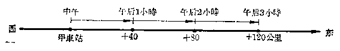

*图1-15*

这里速度是每小时 +40 公里， 时间是 +3 小时。

∴ 速度×时间是\((+40)\times(+3)\)公里。

这段路程是 +120 公里。

我们得到算式：

\[
(+ 40) \times (+ 3) = + 120. \tag {2}
\]

**答：**在甲车站东边120公里。

**问题3** 火车以每小时 40 公里的速度， 从东向西行驶， 中午经过甲车站。 问午后 3 小时， 火车在甲车站的哪一边？ 离开甲车站几公里？

**【解】** 从下图可以看到，这时火车应该在甲车站的西边120公里（就是离开甲车站-120公里）。

> [图像：原扫描页含图示；RAW OCR 未提供可还原的图像像素内容。]

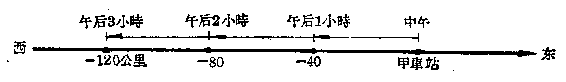

*图1-16*

这里速度是每小时 -40 公里， 时间是 +3 小时。

速度\(\times\)时间是\((-40) \times (+3)\)公里。

这段路程是 -120 公里。

我们得到算式：

\[
(- 40) \times (+ 3) = - 120. \tag {3}
\]

**答：**火车在甲车站西边120公里。

**问题4** 火车以每小时 40 公里的速度，从西向东行驶，中午经过甲车站。问午前 3 小时，火车在甲车站的哪一边？离开甲车站几公里？

**【解】** 从下图可以看到，为了要火车在中午到达甲车站，午前3小时的时候火车应该在甲车站西边120公里（就是离开甲车站-120公里）。

> [图像：原扫描页含图示；RAW OCR 未提供可还原的图像像素内容。]

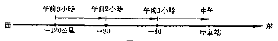

*图1-17*

这里速度是每小时 +40 公里， 时间是 -3 小时。

速度\(\times\)时间是\((+40) \times (-3)\)公里。

这段路程就是 -120 公里。

我们得到算式：

\[
(+ 40) \times (- 3) = - 120. \tag {4}
\]

**答：**火车在甲车站西边120公里。

**问题5** 火车以每小时40公里的速度，从东向西行驶，中午经过甲车站。问午前3小时，火车在甲车站的哪一边？离开甲车站几公里？

**【解】** 从下图可以看到，为了要火车在中午到达甲车站，在午前3小时的时候，火车应该在甲车站东边120公里（就是离开甲车站+120公里）。

> [图像：原扫描页含图示；RAW OCR 未提供可还原的图像像素内容。]

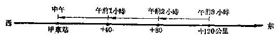

*图1-18*

这里速度是每小时 -40 公里， 时间是 -3 小时。

速度\(\times\)时间是\((-40) \times (-3)\)公里。

这段路程是 +120 公里。

我们得到算式：

\[
(- 40) \times (- 3) = + 120. \tag {5}
\]

**答：**火车在甲车站东边120公里。

从上面问题 2~5 的解答中，可以发现一个重要的事实。在（2）和（5）里，我们做的是两个符号相同的有理数的乘法，我们看到：

符号相同的两个有理数相乘，它们的积应该是一个正数，积的绝对值就是两个因数的绝对值的积。

在（3）和（4）里，我们做的是符号相反的两个有理数的乘法，我们看到：

符号相反的两个有理数相乘，它们的积应该是一个负数，积的绝对值等于两个因数的绝对值的积。

很明显的， 在上面的问题里， 如果速度和时间中有一个是零， 或者两个都是零， 那末火车仍旧在甲车站。 也就是说， 火车离开甲车站的距离是零。 这就说明了：

任何一个有理数和零相乘， 积是零。

例如：\((+40)\times 0 = 0,\quad 0\times (+3) = 0,\)

\[
(- 40) \times 0 = 0， \quad 0 \times (- 3) = 0，
\]

\[
0 \times 0 = 0.
\]

把上面这些情况综合起来， 我们得到：

（i） 正负符号相同的两个数的积是一个正数，它的绝对值等于这两个数的绝对值的积；

（ii） 正负符号相反的两个数的积是一个负数，它的绝对值等于这两个数的绝对值的积；

（iii） 零同任何一个数的积总等于零。

**有理数的乘法法则**

为了便于记忆，我们把上面（i）、（ii）两条法则，概括起来，得到决定积的符号的口诀：同号相乘得正数，异号相乘得负数。用字母表示如下：

\[
(+ a) (+ b) = + a b. \quad (- a) (+ b) = - a b.
\]

\[
(- a) (- b) = + a b. \quad (+ a) (- b) = - a b.
\]

**有理数乘法的符号法则**这里 a， b 表示任意两个正有理数。

**例1** 计算：

（1）\((+12) \times (-16)\)；

（2）\((-10) \times \left(+\frac{1}{2}\right)\)；

（3）\((-3) \times (-0.3)\)；

（4）\((-5\frac{1}{2}) \times \left(-3\frac{1}{3}\right)\)；

（5）\((0) \times (-16)\)；

（6）\((-3.5) \times \left(+1\frac{1}{3}\right)\)。

**【解】** （1）\((+12)\times (-16) = -192;\)

（2）\((-10) \times \left(+\frac{1}{2}\right) = -5;\)

（3）\((-3) \times (-0.3) = 0.9\)；

（4）\(\left(-5\frac{1}{2}\right)\times \left(-3\frac{1}{3}\right) = \left(-\frac{11}{2}\right)\times \left(-\frac{10}{3}\right)\)

\[
= + \frac{55}{3} = 18 \frac{1}{3}；
\]

（5） （0） × （-16） = 0；

（6）\((-3.5) \times \left(+1\frac{1}{3}\right) = \left(-\frac{7}{2}\right) \times \left(+\frac{4}{3}\right)\)

\[
= - \frac{14}{3} = - 4 \frac{2}{3}.
\]

#### 习题1·13

做下列乘法（1~12）：

1.\((+5)\times (-8)\)

2.\((-5) \times (-7)\)。

3.\((-12) \times (+17)\)。

4.\((-8) \times \left(-\frac{3}{4}\right)\)。

5.\(\left(+3\frac{1}{2}\right)\times \left(-5\frac{1}{7}\right).\)

6.\((-0.4) \times (-0.2)\)。

7.\((-3.125) \times (+8)\)。

8.\((-0.1) \times (-0.1)\)。

9.\((+3.732)\times 0.\)

10.\(0 \times (-3)\)。

11.\((-0.625) \times (+16)\)。

12.\((-7.23) \times \left(+\frac{1}{3}\right)\)。

计算（13~16）：

13.\((-5) \times (-3) + (+7) \times (-2)\)。

14.\(\left(+\frac{1}{2}\right) \times \left(-\frac{2}{3}\right) - \left(-1\frac{1}{2}\right) \times \left(-1\frac{1}{3}\right)\)。

15. （3.54-5.28）×（-2）。

16.\(\left(6\frac{1}{3} - 8\frac{1}{4}\right) \times \left(+1\frac{1}{2}\right)\)。

#### 2. 三个或三个以上有理数的乘法

**例2** 计算：

（1）\((-3) \times (+5) \times (-2)\)；

（2）\((-1) \times (-5) \times (+3) \times (-4) \times (+2)\)。

**【解】** 依照由左向右的顺序进行：

（1）\((-3) \times (+5) \times (-2) = (-15) \times (-2) = +30;\)

（2）\((-1) \times (-5) \times (+3) \times (-4) \times (+2)\)

\[
= (+ 5) \times (+ 3) \times (- 4) \times (+ 2)
\]

\[
= (+ 15) \times (- 4) \times (+ 2)
\]

\[
= (- 60) \times (+ 2) = - 120.
\]

**【注意】** （1） 里有两个负数，乘积是正数；（2） 里有三个负数，乘积是负数。我们也可以先把各因数的绝对值相乘，再根据负号的个数是偶数或者奇数，确定积是正的或负的。

从上面的例子，我们可以看出：三个或者更多个有理数的乘法，可以由左向右逐一进行。但为了方便起见，我们也可以把三个或者更多个有理数的乘法，分为定性质符号与定绝对值两步，得到：

（i） 定正负符号：如果因数里的负号有偶数个，那末所得的积是正数；如果因数里的负号有奇数个，那末所得的积是负数。

（ii） 定绝对值：把各因数的绝对值相乘，所得的积就是积的绝对值。

**三个或者更多个有理数的乘法法则**

**例3** 计算：

（1）\((+2) \times (-1) \times (-3) \times (-10) \times (-4) \times (-5)\)；

（2）\(\left(+\frac{2}{3}\right) \times \left(-\frac{1}{2}\right) \times \left(-5\frac{1}{3}\right) \times \left(-1\frac{1}{5}\right)\)。

**【解】** （1） 这里有四个负号， 积是正的。

\[
\begin{array}{l} \therefore (+ 2) \times (- 1) \times (+ 3) \times (- 10) \times (- 4) \times (- 5) \\ = + (2 \times 1 \times 3 \times 10 \times 4 \times 5) = 1200； \\ \end{array}
\]

（2） 这里有三个负号， 积是负的。

\[
\begin{array}{l} \therefore \left(+ \frac{2}{3}\right) \times \left(- \frac{1}{2}\right) \times \left(- 5 \frac{1}{3}\right) \times \left(- 1 \frac{1}{5}\right) \\ = - \left(\frac{2}{3} \times \frac{1}{2} \times \frac{16}{3} \times \frac{6}{5}\right) = - \frac{32}{15} = - 2 \frac{2}{15}. \\ \end{array}
\]

计算：

1.\((-4) \times (+96) \times (-25)\)。

2.\((-6) \times (2.5) \times (-0.04)\)。

3.\(\left(-\frac{5}{6}\right)\times(+2.4)\times\left(+\frac{3}{5}\right).\)

4.\((+1.25) \times \left(-4\frac{1}{20}\right) \times (-8)\)。

5.\((-8) \times (-4) \times (+25) \times (-125)\)。

6.\((-3.2) \times (+2) \times \left(-1\frac{1}{2}\right) \times (-6) \times (-3.8)\)。

7.\((-0.2) \times (-0.2) \times (-0.5) \times (-0.5)\)。

8.\((-8) \times (-12) \times (-0.125) \times \left(-\frac{1}{3}\right) \times (-0.001)\)。

9.\(\left(-1\frac{1}{2}\right) \times \left(-1\frac{1}{3}\right) \times \left(-1\frac{1}{4}\right) \times \left(-1\frac{1}{5}\right) \times \left(-1\frac{1}{6}\right) \times \left(-1\frac{1}{7}\right)\)。

10.\((-0.1) \times (-10) \times (-0.01) \times (-100) \times (-0.001)\)

\[
\times (+ 10000)。
\]

### §1·14 乘法的运算性质

#### 1. 乘法交换律

在算术里， 我们已经学习过乘法交换律， 如

\[
5 \times 8 = 8 \times 5，
\]

就是， 两个因数交换位置， 乘积不变。

乘法交换律， 对于有理数也是适用的。 例如

\[
(- 8) \times (+ 6) = (+ 6) \times (- 8) = - 48；
\]

\[
(- 3) \times (- 4) = (- 4) \times (- 3) = + 12；
\]

\[
0 \times (- 7) = (- 7) \times 0 = 0.
\]

乘法交换律：两个数相乘，交换它们的相互位置，它们的积不变。

#### 2. 乘法结合律

我们来看下面的计算：

\[
(3 \times 2) \times 5 = 6 \times 5 = 30，
\]

\[
3 \times (2 \times 5) = 3 \times 10 = 30；
\]

\[
\therefore (3 \times 2) \times 5 = 3 \times (2 \times 5)。
\]

对于有理数， 同样地有

\[
[ (- 3) \times (- 5) ] \times (+ 7) = (+ 15) \times (+ 7) = + 105，
\]

\[
(- 3) \times [ (- 5) \times (+ 7) ] = (- 3) \times (- 35) = + 105；
\]

\[
\therefore [ (- 3) \times (- 5) ] \times (+ 7) = (- 3) \times [ (- 5) \times (+ 7) ]。
\]

这个性质， 就是如下的乘法结合律： 三个因数相乘， 先把前面两个因数相乘， 再乘以第三个因数； 所得的结果与先把后面两个因数相乘再乘以第一个因数所得的结果是相等的。 换句话说， 因数可以任意结合。

#### 3. 乘法对于加法的分配律

我们来看下面的计算：

\[
5 \times (4 + 8) = 5 \times 12 = 60，
\]

\[
5 \times 4 + 5 \times 8 = 20 + 40 = 60；
\]

\[
\therefore 5 \times (4 + 8) = 5 \times 4 + 5 \times 8.
\]

对于有理数， 同样地有

\[
(- 3) \times [ (- 2) + (+ 5) + (- 11) ] = (- 3) \times (- 8) = + 24，
\]

\[
(- 3) \times (- 2) + (- 3) \times (+ 5) + (- 3) \times (- 11)
\]

\[
= (+ 6) + (- 15) + (+ 33) = + 24；
\]

\[
\begin{array}{l} \therefore (- 3) \times [ (- 2) + (+ 5) + (- 11) ] \\ = (- 3) \times (- 2) + (- 3) \times (+ 5) + (- 3) \times (- 11)。 \\ \end{array}
\]

这个性质，就是如下的乘法对于加法的分配律：一个数与几个数的和相乘所得的积，等于这个数与各个加数分别相乘所得的积的和。

这三条关于乘法运算的性质，用字母表示如下：

**乘法交换律**

\[
a \cdot b = b \cdot a.
\]

**乘法结合律**

\[
(a \cdot b) \cdot c = a \cdot (b \cdot c)。
\]

乘法对于加法的分配律

\[
a (b + c) = a b + a c.
\]

乘法运算的性质

这里\(a, b, c\)表示任意三个有理数。

**例1** 计算：\((+8)\times (+136)\times \left(+\frac{1}{8}\right)\times \left(-\frac{1}{68}\right).\)

**【审题】** 这里\(8 \times \frac{1}{8} = 1, 136 \times \frac{1}{68} = 2\)，所以可以应用乘法交换律与乘法结合律，使运算简便。

**【解】**\((+8)\times (+136)\times \left(+\frac{1}{8}\right)\times \left(-\frac{1}{68}\right)\)

\[
= (+ 8) \times \left(+ \frac{1}{8}\right) \times (+ 136) \times \left(- \frac{1}{68}\right)
\]

\[
= 1 \times (- 2)
\]

\[
= - 2.
\]

**例2** 计算：\((-105)\times \left[\left(-\frac{1}{3}\right) + \left(-\frac{1}{5}\right) + \left(+\frac{1}{7}\right)\right].\)

**【审题】** 这里三个加数分母不相同，通分较繁，可以应用乘法对于加法的分配律，先乘后加。

**【解】**\((-105)\times \left[\left(-\frac{1}{3}\right) + \left(-\frac{1}{5}\right) + \left(+\frac{1}{7}\right)\right]\)

\[
= (- 105) \times \left(- \frac{1}{3}\right) + (- 105) \times \left(- \frac{1}{5}\right)
\]

\[
+ (- 105) \times \left(+ \frac{1}{7}\right)
\]

\[
= (+ 35) + (+ 21) + (- 15) = 41.
\]

**例3** 计算：\((-53) \times (-3.54) + (-53) \times (+4.54)\)。

**【审题】** 这里乘法较繁，但在两个乘法里都有因数 -53，且 -3.54 与 4.54 的和是 1，很简单，可以反过来应用乘法对于加法的分配律，先加后乘。

**【解】**\((-53)\times (-3.54) + (-53)\times (+4.54)\)

\[
= (- 53) \times [ - 3.54 + 4.54 ] = (- 53) \times 1 = - 53.
\]

#### 习题1·14

应用运算性质，用简便的方法计算：

1.\(125 \times 3874 \times 9 \times 8 \times \frac{1}{9}\)。

2.\(\left(-3\frac{1}{3}\right)\times (+246)\times \left(-\frac{3}{10}\right)\times \left(-\frac{1}{41}\right).\)

3.\((-354)\times (-3) + (-354)\times (+5) + (-354)\times (-2).\)

4.\((-66)\times \left[\left(+\frac{1}{2}\right) + \left(-\frac{1}{3}\right) + \left(-\frac{5}{11}\right)\right].\)

5.\((+37)\times (-125)\times (+4)\times (-4)\times (-2)\times (+25).\)

6.\((+74)\times (-1280) + (+74)\times (+1140) + (+74)\times (+141).\)

7.\((-124) \times (+38) + (-124) \times (+51) + (-124) \times (+14)\)

\[
+ (- 76) \times (+ 96) + (- 76) \times (+ 7)。
\]

8.\(\left[\left(+\frac{1}{5}\right)+\left(-\frac{1}{2}\right)+\left(-\frac{5}{12}\right)\right]\times(-60)\)。

### §1·15 有理数的除法

在算术里， 我们已经知道， 除法是乘法的逆运算。 有理数除法的意义还是一样。 象有理数的减法一样， 我们可以从这个逆运算关系来研究有理数的除法法则。

从乘法\((+7)\times(+3)=+21,\)

依照逆运算关系，可得

\[
(+ 21) \div (+ 3) = + 7. \tag {1}
\]

从乘法\((+7)\times(-3)=-21,\)依照逆运算关系，可得

\[
(- 21) \div (- 3) = + 7. \tag {2}
\]

从乘法\((-7) \times (+3) = -21,\)

依照逆运算关系，可得

\[
(- 21) \div (+ 3) = - 7. \tag {3}
\]

从乘法\((-7) \times (-3) = +21,\)

依照逆运算关系，可得

\[
(+ 21) \div (- 3) = - 7. \tag {4}
\]

从乘法\(0 \times (+3) = 0\)，及\(0 \times (-3) = 0\)

依照逆运算关系，可得

\[
0 \div (+ 3) = 0. \tag {5}
\]

\[
0 \div (- 3) = 0. \tag {6}
\]

从上面这些例子中， 可以看出：

（1） 正数除以正数， 商是正数；

（2） 负数除以负数， 商也是正数；

（3） 负数除以正数， 商是负数；

（4） 正数除以负数， 商也是负数；

（5） 零除以正数， 商是零；

（6） 零除以负数， 商也是零。

至于商的绝对值， 则在任何一个情况下， 都等于被除数的绝对值除以除数的绝对值所得的商。

综合上面的结论， 就得到：

（i） 正负符号相同的两个数相除，商是一个正数，它的绝对值等于这两个数的绝对值的商；

（ii） 正负符号相反的两个数相除，商是一个负数，它的绝对值等于这两个数的绝对值的商；

（iii） 零除以一个不等于零的数， 商是零。

**有理数的除法法则**为了便于记忆，我们把上面（i）、（ii）两条法则概括起来，得到决定商的正负符号的口诀：同号相除得正数，异号相除得负数。

这里还必须注意：在有理数范围内，和在算术里一样，零不能做除数，任何数除以零没有意义，零除以零也没有意义。

**例1** 做下列除法：

（1）\((+48) \div (+6)\)；

（2）\((-48) \div (-6)\)；

（3）\((-0.4) \div (+0.002)\)；

（4）\((+1) \div (-1)\)；

（5）\(\left(-3\frac{2}{3}\right) \div \left(-5\frac{1}{2}\right)\)；

（6）\((+3.3) \div \left(-3\frac{1}{3}\right)\)；

（7）\(\left(-2\frac{1}{2}\right) \div (-5) \times \left(-3\frac{1}{3}\right)\)；

（8）\(\left(-3\frac{1}{3}\right) \div \left(+2\frac{1}{3}\right) \div \left(+1\frac{1}{5}\right)\)。

**【解】** （1）\((+48)\div (+6) = +8;\)

（2）\((-48) \div (-6) = +8\)；

（3）\((-0.4) \div (+0.002) = -\frac{0.4}{0.002} = -\frac{400}{2}\)\(= -200;\)

（4）\((+1) \div (-1) = -1\)；

（5）\(\left(-3\frac{2}{3}\right) \div \left(-5\frac{1}{2}\right) = \div \left(\frac{11}{3} \div \frac{11}{2}\right)\)

\[
= \frac{11}{3} \times \frac{2}{11} = \frac{2}{3}；
\]

（6）\((+3.3)\div\left(-3\frac{1}{3}\right)=\frac{33}{10}\div\left(-\frac{10}{3}\right)\)

\[
= - \left(\frac{33}{10} \times \frac{3}{10}\right) = - \frac{99}{100}；
\]

（7）\(\left(-2\frac{1}{2}\right) \div (-5) \times \left(-3\frac{1}{3}\right)\)

\[
\begin{array}{l} = + \left(\frac{5}{2} \times \frac{1}{5}\right) \times \left(- 3 \frac{1}{3}\right) \\ = + \frac{1}{2} \times \left(- \frac{10}{3}\right) = - \frac{5}{3} = - 1 \frac{2}{3}， \\ \end{array}
\]

（8）\(\left(-3\frac{1}{3}\right) \div \left(+2\frac{1}{3}\right) \div \left(+1\frac{1}{5}\right)\)

\[
= \left(- \frac{10}{3}\right) \times \left(+ \frac{3}{7}\right) \times \left(+ \frac{5}{6}\right)
\]

\[
= - \left(\frac{10}{3} \times \frac{3}{7} \times \frac{5}{6}\right) = - \frac{50}{42}
\]

\[
= - \frac{25}{21} = - 1 \frac{4}{21}.
\]

**例2** 化简下列分数：

（1）\(\frac{-3}{-5};\)

（2）\(-\frac{10}{-6}\)；

（3）\(-\frac{-12}{18}\)；

（4）\(-\frac{-4}{-8}\)。

**【解】** （1）\(\frac{-3}{-5} = \frac{3}{5}\)；

（2）\(-\frac{10}{-6} = -\left(-\frac{5}{3}\right) = +\frac{5}{3};\)

（3）\(-\frac{-12}{18} = -\left(-\frac{2}{3}\right) = +\frac{2}{3};\)

（4）\(-\frac{-4}{-8} = -\frac{1}{2}\)。

从上例可以知道：在一个分数中，分子、分母与分数本身都有性质符号，如果这三个性质符号中有两个负号，这两个负号可以互相约掉。

#### 习题1·15

计算：

1.\((-128) \div (-4)\)。

2.\((+5) \div \left(-\frac{1}{2}\right)\)。

3.\((-6) \div (+10)\)。

4.\(\left(-\frac{2}{3}\right) \div \left(+\frac{5}{6}\right)\)。

5. （+14） ÷ （-0.4）。

6.\((-0.02) \div (+0.1)\)。

7.\(0 \div (-16)\)。

9.\(\left(+5\frac{1}{3}\right)\div \left(-7\frac{1}{3}\right).\)

11.\((-0.5) \div (-0.32)\)。

13.\(\left(+\frac{2}{3}\right) \div (-5)\)。

15.\(\frac{-0.3}{3\frac{2}{3}}.\)

17.\(\frac{1}{-\frac{1}{2}}.\)

19.\((-0.33) \div \left(+\frac{1}{3}\right) \div (-9)\)。

20.\(\left(-\frac{1}{3}\right) \div \left(-\frac{1}{0.9}\right) \div \left(-\frac{2}{7}\right)\)。

8.\(0 \div \left(+\frac{1}{3}\right)\)。

10.\(\left(-3\frac{2}{3}\right)\div \left(+1\frac{2}{9}\right).\)

12.\((-3) \div \left(+ \frac{1}{3}\right)\)。

14.\(3 \div (-0.3)\)。

16.\(-\frac{1}{-0.3}\)。

18.\(\frac{-\frac{1}{2}}{3}\)。

### §1·16 倒数

在算术里，我们学到过：

\[
3 \div \frac{2}{5} = 3 \times \frac{5}{2}， \quad 11 \div 12 = 11 \times \frac{1}{12}.
\]

就是：一个数除以\(\frac{2}{5}\)等于这个数乘以\(\frac{5}{2}\)；一个数除以12等于这个数乘以\(\frac{1}{12}\)。这里\(\frac{2}{5}\)与\(\frac{5}{2}, 12\)与\(\frac{1}{12}\)，有一个共同的性质：乘积等于1。

如果有两个数的乘积等于1，那末它们叫做互为倒数。这两个数中的每一个就叫做另一个的倒数。容易看出，1的倒数等于1。

例如\(\frac{2}{5}\)的倒数是\(\frac{5}{2}, \frac{5}{2}\)的倒数是\(\frac{2}{5}, \frac{2}{5}\)与\(\frac{5}{2}\)互为倒数；12的倒数是\(\frac{1}{12}\)，\(\frac{1}{12}\)的倒数是\(12\)，\(\frac{1}{12}\)与 12 互为倒数。

要求一个数的倒数， 只要把 1 除以这个数， 所得的商就是它的倒数。 例如 -3 的倒数是\(-\frac{1}{3}, -1\frac{2}{7}\)的倒数是\(\frac{1}{-1\frac{2}{7}} = -\frac{7}{9}\)。

因为一个数除以另一个数，就等于第一个数乘以第二个数的倒数，这样，我们可以利用倒数把除法转化为乘法。这个性质，在有理数里也是适用的。

#### 习题1·16

1. 求下列各个数的倒数：13， -7，\(\frac{3}{4}\)，\(-\frac{1}{5}\)， 1， -1， 0.33.

2. 一个正数的倒数是怎样的数？一个负数的倒数是怎样的数？ “零”有没有倒数？

3. 有没有一个数的倒数就是这个数本身？有几个？哪几个？

4. 求下列各数的倒数， 和这些倒数的相反的数：

\[
- 13， \quad 200， \quad 0.03， \quad - 0.1.
\]

5. 求下列各数的相反的数， 和这些相反的数的倒数：

\[
\frac{2}{3}， \quad - \frac{6}{5}， \quad - 16， \quad + 8.
\]

6. 求\(-\frac{2}{3}\)及\(\frac{2}{5}\)各自的倒数的和以及它们的和的倒数。

7. 把下列除法， 转化为乘法演算：

（1）\(\left(-\frac{2}{3}\right)\div(-5);\)

（2）\(3 \div \left(-\frac{3}{2}\right)\)。

### §1·17 有理数的乘方

我们来看下面的问题：

**问题1** 一块正方形的地的一边长 8 米，它的面积是多少平方米？

**【解】** 可以用乘法计算：

\[
8 \times 8 = 64.
\]

**答：**这块地的面积是64平方米。

> [图像：原扫描页含图示；RAW OCR 未提供可还原的图像像素内容。]

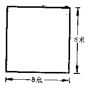

*图1-19*

> [图像：原扫描页含图示；RAW OCR 未提供可还原的图像像素内容。]

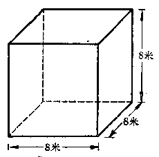

*图1-20*

**问题2** 一个正方体的每一条棱长是 8 米，它的体积是多少立方米？

**【解】** 也可以用乘法计算：

\[
8 \times 8 \times 8 = 512.
\]

**答：**这个正方体的体积是512立方米。

上面两个问题里的乘法都是相同因数的乘法。为了简便起见，我们把\(8 \times 8\)用\(8^{2}\)来表示，把\(8 \times 8 \times 8\)用\(8^{3}\)来表示。

这就是说：相同因数的乘法，我们可以只写出一个因数，而在这个因数的右上角写上相同因数的个数。

同样地，

\[
3 \times 3 \times 3 \times 3
\]

可以用\(3^{4}\)来表示；

\[
(- 1) \times (- 1) \times (- 1) \times (- 1) \times (- 1)
\]

可以用\((-1)^{5}\)来表示。

一般地， 如果用字母\(a\)表示有理数， 用字母\(n\)表示在乘法中相同因数的个数， 那末， 这\(n\)个因数\(a\)相乘就可用\(a^n\)来表示。

这种求相同因数的积的运算叫做乘方。乘方的结果叫做幂。在\(a^n\)中，\(a\)叫做底数，\(n\)叫做指数，\(a^n\)读作\(a\)的\(n\)次方。把\(a^n\)看作\(a\)的\(n\)次方的结果时，也可以读作\(a\)的\(n\)次幂。

例如\(8^{2}\)读做8的二次方或者8的二次幂，也叫做8的平方；\(8^{3}\)读做8的三次方或者8的三次幂，也叫做8的立方；\(3^{4}\)读做3的四次方或者3的四次幂，\((-1)^{5}\)读做-1的五次方或者-1的五次幂。这里8， 3， -1等是底数，而右上角的2， 3， 4， 5等分别是指数。

**注** 一个数也可以当做这个数的一次幂或一次方，例如5可以看做\(5^{1}\)，而这个指数1字是省略不写的。

乘方就是相同因数的乘法，所以有理数的乘方，就只要依照有理数的乘法法则进行计算。

**例1** 计算：\((-2)^{2}\)；\((-2)^{3}\)；\((-1)^{4}\)；\((-1)^{5}\)。

**【解】**\((-2)^{2} = (-2)\times (-2) = +4;\)

\[
(- 2) ^{3} = (- 2) \times (- 2) \times (- 2) = - 8；
\]

\[
(- 1) ^{4} = (- 1) \times (- 1) \times (- 1) \times (- 1) = + 1；
\]

\[
(- 1) ^{5} = (- 1) \times (- 1) \times (- 1) \times (- 1) \times (- 1)
\]

\[
= - 1.
\]

在这个例子里， 可以看到： 底数是负数时， 它的偶次幂是正数， 奇次幂是负数。

这样，我们就得到

（i） 正数的任何次幂都是正数；

（ii） 负数的偶数次幂是正数， 负数的奇数次幂是负数；

（iii） 幂的绝对值， 就是底数的绝对值按指数的次数实际进行乘法运算的结果。

**乘方的运算法则**

**例2** 读出下列各式子，并说明这个幂里面的底数和指数：

\[
(- 3) ^{2}； \left(\frac{2}{3}\right) ^{3}； (- 1) ^{4}； (- 0.3) ^{5}.
\]

**【解】**\((-3)^{2}\)； 读做“负三的平方”或“负三的二次幂”，底数是\(-3\)，指数是\(2\)；

\(\left(\frac{2}{3}\right)^3\)：读做“三分之二的立方”或“三分之二的三次幂”，底数是\(\frac{2}{3}\)，指数是3；

\((-1)^{4}\)： 读做负一的四次方或四次幂， 底数是 -1， 指数是 4；

\((-0.3)^{5}\)；读做负零点三的五次方或五次幂， 底数是\(-0.3\)， 指数是\(5\)。

**例3** 计算：

（1）\(3^{5}\)；

（2）\(2^{4}\)；

（3）\((-1)^{2}\)；

（4）\((-2)^{3}\)；

（5）\((-3)^{2}\)；

（6）\((-1)^{100}\)；

（7）\((0.1)^{2}\)；

（8）\((-0.1)^{2}\)；

（9）\(\left(-\frac{2}{3}\right)^{2}\)；

（10）\(\left(-\frac{3}{4}\right)^3\)。

**【解】**

（1）\(3^{5} = 243\)；

（2）\(2^{4} = 16\)；

（3）\((-1)^{2} = +1\)；

（4）\((-2)^{3} = -8\)；

（5）\((-3)^{2} = +9\)；

（6）\((-1)^{100} = +1\)；

（7）\((0.1)^{2} = 0.01\)；

（8）\((-0.1)^{2} = +0.01\)；

（9）\(\left(-\frac{2}{3}\right)^2 = +\frac{4}{9};\)

（10）\(\left(-\frac{3}{4}\right)^3 = -\frac{27}{64}\)。

**例4** 计算：（1）\(2^{3}\)； （2）\(3^{2}\)； （3）\(2 \times 3\)； 并说明它们的区别。

**【解】**

（1）\(2^{3} = 8\)；

（2）\(3^{2} = 9\)；

（3）\(2 \times 3 = 6\)。

\(2^{3}\)是 2 的立方，就是\(2 \times 2 \times 2\)；\(3^{2}\)是 3 的平方，就是\(3 \times 3\)；\(2 \times 3\)是两个不同的因数 2 与 3 的积，这三个式子是不相同的。

**例5** 说明下面两个式子的区别并分别计算出结果来：

\[
(- 3) ^{2}； \quad - 3 ^{2}.
\]

**【解】**\((-3)^{2}\)等于\((-3) \times (-3)\)， 表示负三的平方， 读做“负三的平方”，

\[
(- 3) ^{2} = (- 3) \times (- 3) = + 9；
\]

\(-3^{2}\)等于\(-(3\times3)\)，表示三的平方的相反数，读做“负的三平方”，

\[
- 3 ^{2} = - (3 \times 3) = - 9.
\]

1. 把下列各个式子读出来，说明它的底数和指数，用乘法式子来表示它，并算出结果：

（1）\(5^{3}\)；

（2）\((-2)^{n}\)；

（3）\(\left(\frac{1}{3}\right)^3;\)

（4）\(\left(-\frac{3}{4}\right)^{4}\)

2. 计算：

（1）\(3^{4}\)；

（2）\(2^{5}\)；

（3）\((-3)^{4}\)；

（4）\((-2)^{5}\)；

（5）\(0^{3}\)；

（6）\((-1)^{2}\)；

（7）\((-1)^{3}\)；

（8）\((-5)^{4}\)。

3. 计算：

（1）\(\left(\frac{1}{3}\right)^4\)；

（2）\(\left(\frac{1}{2}\right)^5\)；

（3）\(\left(-\frac{1}{2}\right)^5\)；

（4）\(\left(-\frac{1}{3}\right)^{4}\)；

（5）\(\left(-\frac{3}{2}\right)^{4}\)；

（6）\(\left(-\frac{5}{7}\right)^{2}\)；

（7）\(\left(-\frac{11}{12}\right)^{2}\)；

（8）\(\left(-\frac{5}{9}\right)^{3}\)。

4. 计算：

（1）\((0.1)^{2}\)；

（2）\((-0.1)^{2}\)；

（3）\((-0.1)^{3}\)；

（4）\((0.02)^{4}\)；

（5）\((-0.3)^{3}\)；

（6）\((-0.7)^{2}\)；

（7）\((0.03)^{3}\)；

（8）\((-1.2)^{3}\)。

5. 计算：

（1）\((-1)^{200}\)；

（2）\((-1)^{127}\)；

（3）\((-1)^{1016}\)；

（4）\((-1)^{3033}\)。

6. 计算：

（1）\((-5)^{2}\)；

（2）\(-5^{2}\)；

（3）\(-1^{400}\)；

（4）\((-1)^{400}\)；

（5）\(\left(-\frac{1}{2}\right)^{5}\)；

（6）\(-\left(\frac{1}{2}\right)^{5}\)；

（7）\(\left(-\frac{2}{3}\right)^{4}\)；

（8）\(-\left(\frac{2}{3}\right)^{4}\)。

### §1·18 平方表

在实际应用中，我们有时需要计算数字位数较多的数的平方或立方，这些计算比较烦琐，而实际需要的又往往只是它们的近似值。在前面我们已经复习过四舍五入法求近似值的法则了，现在再来学习一个近似数的有效数字的位数的概念。

在把 3.04695 这个小数用四舍五入法得到 3.05 的时候， 我们说这个近似数有两位小数， 或者说这个近似数是精确到 0.01 的。

如果把这个数乘上100，得304.695，用四舍五入法求精确到1的近似值，得到近似数305。如果把304.695再乘上100，用四舍五入法求精确到100的近似值，得到近似数305，而这个近似数是以100为单位计数的。

这三个近似数，实际上都包含数字305，我们就把它叫做有效数字，这三个近似数含有相同的有效数字，但是精确到的数位不同。

有效数字 一个近似数从左边第一个不是零的数字起到右边最后一位四舍五入所得到的数字止，一共包含的数字的个数叫做这个近似数的有效数字的位数。其中任意一位上的数字都是有效数字。

现在把 3.04695 四舍五入所得的近似数和它们的有效数字的位数说明如下：

3.05 有三位有效数字。

3.047 有四位有效数字。

3.0470 有五位有效数字。

应该注意：如果一个近似数左边第一位是零，这个零就不作为有效数字。例如把小数0.0036754四舍五入得到近似数：

0.0037，只有两位有效数字。

0.00368，只有三位有效数字。

在介绍平方表之前， 我们还要熟悉下面的关系：

（1） 如果一个数扩大 10 倍，它的平方数就扩大 100 倍，如果这个数扩大 100 倍，它的平方数就扩大 10000 倍。

例如\(6^{2} = 36\)，而\((6\times 10)^{2} = 6\times 10\times 6\times 10\)

\[
= 6 ^{2} \times 100 = 3600.
\]

\[
(6 \times 100) ^{2} = 6 \times 100 \times 6 \times 100 = 6 ^{2} \times 10000 = 360000.
\]

（2） 如果一个数缩小 10 倍，它的平方数就缩小 100 倍，如果这个数缩小 100 倍，它的平方数就缩小 10000 倍。

例如\(6^{2} = 36\)，而\(\left(6\times \frac{1}{10}\right)^2 = 6\times \frac{1}{10}\times 6\times \frac{1}{10}\)

\[
= 36 \times \frac{1}{100} = 0.36.
\]

\[
\left(6 \times \frac{1}{100}\right) ^{2} = 6 \times \frac{1}{100} \times 6 \times \frac{1}{100} = 36 \times \frac{1}{10000} = 0.0036.
\]

下表是1.000到9.999的平方（有四位有效数字的近似数）表的一部分（头和尾）。从这个表上可以查出其中有四位有效数字的数的平方的结果（有四位有效数字）。

**例1** 求\((1.436)^{2}\)。

**【查表】** （1） 先从左边“底数\(a\)”的直列里查含有开始两位数字 1.4 的那一横行；

（2） 再从上边“底数\(a\)”的横行里查含有第三位数字3的那一直列；

（3） 从含有 1.4 的横行和含有 3 的直列的交叉处查得 2.045，就是\((1.43)^{2} \approx 2.045\)；

（4） 再从右侧首行“1~9”那些数字里查到第四位数6，并查出这一直列与含有1.4的那一横行的交叉处，得17，这个17应是0.017，表中是简略的写法，这一部分叫做修平方表

| 底数 \(a\) | 0 | 1 | 2 | 3 | 4 | 5 | 6 | 7 | 8 | 9 | 1 | 2 | 3 | 4 | 5 | 6 | 7 | 8 | 9 |
| --- | --- | --- | --- | --- | --- | --- | --- | --- | --- | --- | --- | --- | --- | --- | --- | --- | --- | --- | --- |
| 1.0 | 1.000 | 1.020 | 1.040 | 1.061 | 1.082 | 1.103 | 1.124 | 1.145 | 1.166 | 1.188 | 2 | 4 | 6 | 8 | 10 | 13 | 15 | 17 | 19 |
| 1.1 | 1.210 | 1.232 | 1.254 | 1.277 | 1.300 | 1.323 | 1.346 | 1.369 | 1.392 | 1.416 | 2 | 5 | 7 | 9 | 11 | 14 | 16 | 18 | 21 |
| 1.2 | 1.440 | 1.464 | 1.488 | 1.513 | 1.538 | 1.563 | 1.588 | 1.613 | 1.638 | 1.664 | 2 | 5 | 7 | 10 | 12 | 15 | 17 | 20 | 22 |
| 1.3 | 1.690 | 1.716 | 1.742 | 1.769 | 1.796 | 1.823 | 1.850 | 1.877 | 1.904 | 1.932 | 3 | 5 | 8 | 11 | 13 | 16 | 19 | 22 | 24 |
| 1.4 | 1.960 | 1.988 | 2.016 | 2.045 | 2.074 | 2.103 | 2.132 | 2.161 | 2.190 | 2.220 | 3 | 6 | 9 | 12 | 14 | 17 | 20 | 23 | 26 |
| 1.5 | 2.250 | 2.280 | 2.310 | 2.341 | 2.372 | 2.403 | 2.434 | 2.465 | 2.496 | 2.528 | 3 | 6 | 9 | 12 | 15 | 19 | 22 | 25 | 28 |
| 1.6 | 2.560 | 2.592 | 2.624 | 2.657 | 2.690 | 2.723 | 2.756 | 2.789 | 2.822 | 2.856 | 3 | 7 | 10 | 13 | 16 | 20 | 23 | 26 | 30 |
| 1.7 | 2.890 | 2.924 | 2.958 | 2.993 | 3.028 | 3.063 | 3.098 | 3.133 | 3.168 | 3.204 | 3 | 7 | 10 | 14 | 17 | 21 | 24 | 28 | 31 |
| 1.8 | 3.240 | 3.276 | 3.312 | 3.349 | 3.386 | 3.423 | 3.460 | 3.497 | 3.534 | 3.572 | 4 | 7 | 11 | 15 | 18 | 22 | 26 | 30 | 33 |
| 1.9 | 3.610 | 3.648 | 3.686 | 3.725 | 3.764 | 3.803 | 3.842 | 3.881 | 3.920 | 3.960 | 4 | 8 | 12 | 16 | 19 | 23 | 27 | 31 | 35 |
| 2.0 | 4.000 | 4.040 | 4.080 | 4.121 | 4.162 | 4.203 | 4.244 | 4.285 | 4.326 | 4.368 | 4 | 8 | 12 | 16 | 20 | 25 | 29 | 33 | 37 |
| 2.1 | 4.410 | 4.452 | 4.494 | 4.537 | 4.580 | 4.623 | 4.666 | 4.709 | 4.752 | 4.796 | 4 | 9 | 13 | 17 | 21 | 26 | 30 | 34 | 39 |
| 2.2 | 4.840 | 4.884 | 4.928 | 4.973 | 5.018 | 5.063 | 5.108 | 5.153 | 5.198 | 5.244 | 4 | 9 | 13 | 18 | 22 | 27 | 31 | 36 | 40 |
| 2.3 | 5.290 | 5.336 | 5.382 | 5.429 | 5.476 | 5.523 | 5.570 | 5.617 | 5.664 | 5.712 | 5 | 9 | 14 | 19 | 23 | 28 | 33 | 38 | 42 |
| 2.4 | 5.760 | 5.808 | 5.856 | 5.905 | 5.954 | 6.003 | 6.052 | 6.101 | 6.150 | 6.200 | 5 | 10 | 15 | 20 | 24 | 29 | 34 | 39 | 44 |

（中间部分从略）

| 底数 \(a\) | 0 | 1 | 2 | 3 | 4 | 5 | 6 | 7 | 8 | 9 | 1 | 2 | 3 | 4 | 5 | 6 | 7 | 8 | 9 |
| --- | --- | --- | --- | --- | --- | --- | --- | --- | --- | --- | --- | --- | --- | --- | --- | --- | --- | --- | --- |
| 8.5 | 72.25 | 72.42 | 72.59 | 72.76 | 72.93 | 73.10 | 73.27 | 73.44 | 73.62 | 73.79 | 2 | 3 | 5 | 7 | 9 | 10 | 12 | 14 | 15 |
| 8.6 | 73.96 | 74.13 | 74.30 | 74.48 | 74.65 | 74.82 | 75.00 | 75.17 | 75.34 | 75.52 | 2 | 3 | 5 | 7 | 9 | 10 | 12 | 14 | 16 |
| 8.7 | 75.69 | 75.86 | 76.04 | 76.21 | 76.39 | 76.56 | 76.74 | 76.91 | 77.09 | 77.26 | 2 | 3 | 5 | 7 | 9 | 10 | 12 | 14 | 16 |
| 8.8 | 77.44 | 77.62 | 77.79 | 77.97 | 78.15 | 78.32 | 78.50 | 78.68 | 78.85 | 79.03 | 2 | 4 | 5 | 7 | 9 | 11 | 12 | 14 | 16 |
| 8.9 | 79.21 | 79.39 | 79.57 | 79.74 | 79.92 | 80.10 | 80.28 | 80.46 | 80.64 | 80.82 | 2 | 4 | 5 | 7 | 9 | 11 | 13 | 14 | 16 |
| 9.0 | 81.00 | 81.18 | 81.36 | 81.54 | 81.72 | 81.90 | 82.08 | 82.26 | 82.45 | 82.63 | 2 | 4 | 5 | 7 | 9 | 11 | 13 | 14 | 16 |
| 9.1 | 82.81 | 82.99 | 83.17 | 83.36 | 83.54 | 83.72 | 83.91 | 84.09 | 84.27 | 84.46 | 2 | 4 | 5 | 7 | 9 | 11 | 13 | 15 | 16 |
| 9.2 | 84.64 | 84.82 | 85.01 | 85.19 | 85.38 | 85.56 | 85.75 | 85.93 | 86.12 | 86.30 | 2 | 4 | 6 | 7 | 9 | 11 | 13 | 15 | 17 |
| 9.3 | 86.49 | 86.68 | 86.86 | 87.05 | 87.24 | 87.42 | 87.61 | 87.80 | 87.98 | 88.17 | 2 | 4 | 6 | 7 | 9 | 11 | 13 | 15 | 17 |
| 9.4 | 88.36 | 88.55 | 88.74 | 88.92 | 89.11 | 89.30 | 89.49 | 89.68 | 89.87 | 90.06 | 2 | 4 | 6 | 8 | 9 | 11 | 13 | 15 | 17 |
| 9.5 | 90.25 | 90.44 | 90.63 | 90.82 | 91.01 | 91.20 | 91.39 | 91.58 | 91.78 | 91.97 | 2 | 4 | 6 | 8 | 10 | 11 | 13 | 15 | 17 |
| 9.6 | 92.16 | 92.35 | 92.54 | 92.74 | 92.93 | 93.12 | 93.32 | 93.51 | 93.70 | 93.90 | 2 | 4 | 6 | 8 | 10 | 12 | 14 | 15 | 17 |
| 9.7 | 94.09 | 94.28 | 94.48 | 94.67 | 94.87 | 95.06 | 95.26 | 95.45 | 95.65 | 95.84 | 2 | 4 | 6 | 8 | 10 | 12 | 14 | 16 | 18 |
| 9.8 | 96.04 | 96.24 | 96.43 | 96.63 | 96.83 | 97.02 | 97.22 | 97.42 | 97.61 | 97.81 | 2 | 4 | 6 | 8 | 10 | 12 | 14 | 16 | 18 |
| 9.9 | 98.01 | 98.21 | 98.41 | 98.60 | 98.80 | 99.00 | 99.20 | 99.40 | 99.60 | 99.80 | 2 | 4 | 6 | 8 | 10 | 12 | 14 | 16 | 18 |

正值，要加在刚才得到的数2.045上；

（5） 求和。 得\(2.045 + 0.017 = 2.062\)。

**【解】**\((1.436)^{2}\approx 2.062.\)

**例2** 求（14.36）\(^{2}\)。

**【查表】** （1） 查表的方法同例 1， 得 2.062.

（2） 因为\(14.36 = 1.436 \times 10\)，所以

\[
(14.36) ^{2} \approx 2.062 \times 100 = 206.2.
\]

**【解】** （14.36）\(^{2}\)≈206.2.

**例3** 求\((1436)^{2}\)和\((0.01436)^{2}\)。

**【审题】**\(\because 1436 = 1.436 \times 1000,\)

\[
\therefore (1436) ^{2} = (1.436) ^{2} \times 1000 ^{2}.
\]

\[
\because 0.01436 = 1.436 \times \frac{1}{100}，
\]

\[
\therefore (0.01436) ^{2} = (1.436) ^{2} \times \frac{1}{100 ^{2}}.
\]

**【解】** （1436）\(^{2}\)≈2062000.

\[
(0.01436) ^{2} \approx 0.0002062.
\]

这里我们再加几点说明：

1. 查表所得的平方数绝大部分并非准确值而是近似值，为了避免近似符号的写法麻烦，也可以写等号。

2. 立方表和立方表的查法与平方表类似。不过，当底数扩大或缩小10倍时，立方数要相应地扩大或缩小1000倍。即每当底数的小数点向左或向右移一位时，立方数的小数点要相应地向左或向右移三位。

3. 如果底数的数字位数少于四个时， 平方数可以在表上查得； 如果底数的数字位数多于四个时， 要先把底数用四舍五入法化成相应的四位数（近似数）， 再行查表。

从查平方表的过程中可以了解， 不但小数有近似数， 整数也有近似数。 为了要说明一个近似数的有效数字的位数， 我们把有四位有效数字的数 2062000 写做\(2.062 \times 10^{6}\)。

同样地，从表上查得\((2490)^{2} \approx 6200000\)就应该写做6.200\(\times 10^{6}\)。这里，6.200的两个0都不能省略。

这种记数法叫做科学记数法。

#### 习题1·18

1. 查平方表求下列各平方数的近似值：

（1） （1.953）\(^{2}\)；

（2） （2.484）\(^{2}\)；

（3） （9.57）\(^{2}\)；

（4） （14.73）\(^{2}\)；

（5） （2093）\(^{2}\)；

（6） （0.9034）\(^{2}\)；

（7） （0.0228）\(^{2}\)；

（8）\((-13.45)^{2}\)；

（9）\((-0.01111)^{2}\)；

（10）\((-0.1835)^{2}\)

2. 回答下列问题及其可能情况：

（1） 大于 1 而小于 10 的数的平方有几位整数？

（2） 大于 1 而小于 10 的数的立方有几位整数？

（3） 大于 10 而小于 100 的数的平方有几位整数？

（4） 大于 10 而小于 100 的数的立方有几位整数？

（5） 有五位整数的数的平方有几位整数？立方呢？

3. 小于 1 而大于 0.1 的数的平方紧接小数点后面有没有 0？ 有几种可能？ 立方呢？

4. 小于 0.1 而大于 0.01 的数的平方紧接小数点后面有几位 0？ 立方呢？

5. 绝对值大于 1 的数的平方或立方的绝对值会小于 1 吗？绝对值小于 1 的数的平方或立方的绝对值会大于 1 吗？

6. 下列各近似数有几位有效数字？

3.64， 0.0332， 364.0， 5.7， 5.700.

7. 把下列各数用四舍五入法写做三位有效数字的近似值。

0.3647， 0.02585， 36473， 56.948， 32.449， 5.696.

8. 如果下列各数都是 4 位有效数字的近似数，用科学记数法表示下列各数：

35470， 35.79， 23000.

### §1·19 有理数的运算顺序

到这里为止，我们已经学过有理数的加、减、乘、除和乘方五种运算，这五种运算里：加、减法叫做第一级运算，乘、除法叫做第二级运算，乘方叫做第三级运算。

在具有各种运算的式子里，对于有理数的运算顺序，和算术里一样，作如下的规定：

（i） 如果没有括号， 那末运算顺序是： 先做第三级运算乘方， 次做第二级运算乘、除， 再做第一级运算加、减；

（ii） 在同一级的几个连续运算中， 依照由左到右的次序进行演算；

（iii） 有括号的部分， 括号里的运算先做。

有理数的运算顺序

遇有可以应用加法交换律、结合律，乘法交换律、结合律或乘法对于加法的分配律使演算比较简便的地方，可以应用这些性质，变更上面规定的运算顺序。

**例1** 计算：

\[
\left(- \frac{5}{8}\right) \times (- 4) ^{2} - 0.25 \times (- 5) \times (- 4) ^{3}.
\]

**【审题】** 要先做乘方， 次做乘法， 再做减法。

**【解】**\(\left(-\frac{5}{8}\right) \times (-4)^2 - 0.25 \times (-5) \times (-4)^3\)

\[
= \left(- \frac{5}{8}\right) \times (+ 16) - 0.25 \times (- 5) \times (- 64)
\]

\[
= - 10 - (+ 80)
\]

\[
= - 90.
\]

**例2** 计算：\(\left\{(+12)\div[(-3)+(-15)]\div5\right\}^{3}\)

**【审题】** 因为有括号的关系，要先做中括号里的加法，然后做大括号里的除法，最后做乘方。

**【解】**\(\{(+12)\div[(-3)+(-15)]\div 5\}^3\)

\[
= \left\{(+ 12) \div (- 18) \div 5 \right\} ^{3}
\]

\[
= \left\{- \frac{2}{3} \div 5 \right\} ^{3} = \left(- \frac{2}{15}\right) ^{3} = - \frac{8}{3375}.
\]

**例3** 计算：

\[
(- 5) \times \left(- 3 \frac{6}{7}\right) + (- 7) \times \left(- 3 \frac{6}{7}\right) + (+ 12) \times \left(- 3 \frac{6}{7}\right)。
\]

**【审题】** 可应用乘法对于加法的分配律。

**【解】**\((-5) \times \left(-3\frac{6}{7}\right) + (-7) \times \left(-3\frac{6}{7}\right) + (+12) \times \left(-3\frac{6}{7}\right)\)

\[
= [ (- 5) + (- 7) + (+ 12) ] \times \left(- 3 \frac{6}{7}\right)
\]

\[
= 0 \times \left(- 3 \frac{6}{7}\right) = 0.
\]

#### 习题1·19

计算：

1.\((-5) \times (-4) \div 3 \times (-2)\)。

2.\(1\frac{1}{2} + \left(-2\frac{1}{2}\right) \div 2.\)

3.\(12 \times \left(-\frac{3}{4}\right) - (-15) \times 1\frac{1}{5}\)。

4.\(\left[\left(-1\frac{1}{2}\right)+\left(-2\frac{1}{2}\right)\right]\div(-2)^{3}\)。

5.\((-12) \div (-3)^{2} + (-15) \div 5\)。

6.\((-1) - \left(-5\frac{1}{2}\right) \times \frac{4}{11} + (-8) \div [(-3) + 5]\)。

7.\([0 - (-3)] \times (-6) - 12 \div [(-3) + (-15) \div 5]\)。

8.\(-6\frac{7}{9} - \left[\frac{3}{2} \times \left(-\frac{4}{5}\right) + 0.2 + 1\frac{3}{5} \div \frac{8}{7}\right]\)。

9.\(2 \times \left(-\frac{1}{2}\right)^{3} - 3 \times \left(-\frac{1}{2}\right)^{2} \div 3 \times \left(-\frac{1}{2}\right) - 1.\)

10.\(-2^{2} - (-2)^{2} - 2^{3} + (-2)^{3}\)。

### 本章提要

1. 本章的几个重要概念：数轴，数的绝对值，相反的数，倒数，代数和，有效数字。

2. 有理数的分类：有两种分法。

（1） 有理数\(\left\{\begin{array}{l} 正有理数 \left\{\begin{array}{l} 正整数(自然数) \\ 正分数 \end{array}\right\} \\ 零……只有一个数 0 \end{array}\right\}\)非有理负 数

负有理数\(\left\{\begin{array}{l} 负整数 \\ 负分数 \end{array}\right.\)

（2） 有理数\(\left\{\begin{array}{l} 整 数 \\ 分 数 \end{array}\right.\)\(\left\{\begin{array}{l} 正整数 \\ 零 \\ 负整数 \\ 正分数 \\ 负分数 \end{array}\right\}\)非负整数

3. 有理数的运算：

（1） 运算种类——加、减（第一级）， 乘、除（第二级）， 乘方（第三级）。

（2） 运算法则——有理数加法法则；有理数减法法则；有理数乘法法则；有理数除法法则；有理数乘方法的法则。

（3） 运算性质——加法交换律；加法结合律；

乘法交换律； 乘法结合律；

乘法对于加法的分配律。

（4） 运算顺序——先做括号内。除此之外，先第三级运算，次第二级运算，再第一级运算；同级运算，从左到右。

### 复习题一A

1. 画一根数轴， 并在数轴上指出下列各数的对应点：

\[
+ 3， \quad - 2， \quad 1 \frac{1}{2}， \quad - 3 \frac{1}{2}.
\]

2. 用小于号把下列各组数联接起来：

（1） -5， -7；

（2）\(-3\frac{1}{2}, -3\frac{2}{3}\)；

（3）\(-\frac{1}{3}, -0.34.\)

3. 求下列各数的相反的数， 各数的倒数， 各数的相反的数的倒数：

（1） -6；

（2）\(-\frac{2}{3}\)；

（3）\(-1\frac{2}{3}\)。

4. 求\(-\frac{2}{3}\)与\(+\frac{4}{5}\)的和的相反的数；求它们的绝对值的和的倒数；求它们的倒数的和。

5. 计算：

（1）\((-1249) + (-851) + (+379) + (-224) + (-179)\)\(+(-376)\)；

（2）\((-1000) \div (-250) \times (+36) \div (-144)\)；

（3）\(\left(-3\frac{1}{3}\right) \div \left(-5\frac{1}{2}\right) \div \left(+1\frac{2}{9}\right) - \left(-5\frac{1}{3}\right) \times \left(+ \frac{9}{16}\right)\)；

（4）\(\left[\left(-7\frac{1}{9}\right)-\left(-2\frac{14}{15}\right)\right] \div \left[2\frac{2}{3}-\left(-1\frac{2}{5}\right)\right]\)。

6. 计算：

（1）\((-1)^{1324} + (-1)^{57} - (-1)^{365}\)；

（2）\((-0.2)^{3} - (0.3)^{3} + (-0.12)^{2} - (-0.15)^{2}\)。

7. 化去绝对值符号并化简：

（1）\(-| - 5| - | - 7|\)；

（2）\(\left|3\frac{1}{2} - \left(-2\frac{1}{3}\right)\right| - \left|\left(-5\frac{1}{3}\right) - 2\frac{1}{2}\right|\)。

### 复习题一B

1. 0 是最小的有理数吗？0 是最小的整数吗？有没有最小的有理数？有没有最小的整数？

2. 写出大于 -3 而小于 4 的所有整数，并求它们的和。

3. 写出绝对值大于 3 而小于 8 的所有整数。

4. 写出绝对值大于 5.1 而小于 9.3 的所有负整数并求它们的积？

5. 计算：\(-3^{2} \times (1.2)^{2} \div (-0.3)^{2} + \left(-\frac{1}{3}\right)^{2} \times (-3)^{3} \div (-1)^{26}\)

6. 计算：\(\frac{1}{(-0.2)^3} - \frac{-3 - 5}{(-0.2)^3}\)。

7. 计算：\(\frac{3\times\left(-\frac{2}{3}\right)^{2}-2\times\left(-\frac{2}{3}\right)\times1\frac{1}{2}-4\times\left(1\frac{1}{2}\right)^{2}}{2\times\left(-\frac{2}{3}\right)^{3}\times\left(1\frac{1}{2}\right)^{2}-1}.\)

8. 两个数的和一定大于两个加数吗？举出一个反面的例子。

9. 两个数的差一定小于被减数吗？举出一个反面的例子。

10. 两个数的积一定大于两个因数吗？举出一个反面的例子。

11. 两个数的商一定小于被除数吗？举出一个反面的例子。

12. 一个数的平方一定大于原数吗？举出一个反面的例子。

13. 一个数的立方一定大于原数吗？举出一个反面的例子。

14. 一个有理数的平方总是正数。这句话对吗？什么时候不对？

15. 一个有理数乘以什么数，总可以得到它的相反的数？一个有理数除以什么数，总可以得到它的相反的数？

16. 有没有一个数的相反的数就是这个数本身？有几个这样的数？

17. 有没有一个数的倒数就是这个数本身？有几个这样的数？

18. 怎么样的数的相反数比它本身大？比它本身小？等于它本身？

19. 怎么样的数的倒数比它本身大？ 比它本身小？ 等于它本身？

20. 在自然数范围内，加法总可以进行吗？减法呢？乘法呢？除法呢？

21. 在整数范围内， 加法总可以进行吗？ 减法呢？ 乘法呢？ 除法（除数不是零）呢？

22. 在有理数范围内，加法总可以进行吗？减法呢？乘法呢？除法（除数不是零）呢？

### 第一章测验题

1. 计算：

（1） -35-14；

（2）\(-3\frac{1}{2} + 2\frac{2}{3}\)；

（3） 0.36-\(\frac{4}{7}\)；

（4）\(-7\frac{3}{16} - \left(-1\frac{5}{24}\right)\)；

（5）\((-0.32) \times \left(-5\frac{1}{2}\right)\)；

（6）\(\left(-2\frac{1}{3}\right) \div \left(+5\frac{1}{4}\right)\)；

（7）\(-8^{2}\)；

（8）\((-0.3)^{3}\)；

（9）\(\frac{-3^2}{(-0.3)^2}\)；

（10）\((0.1 - 1)^2\)。

2. 计算：

（1）\(-2^{2} - [-3 - (1 - 0.2 \times 3) \div (-5)]\)；

（2）\(-5 - 5 - 8^{2} - 3 \times (-5)^{2}\)；

（3）\(\left\{ +3\frac{1}{2} - \left[3 + 5\frac{2}{3} \times \left(-2 - \frac{2}{17}\right)\right] \right\}^2\)；

（4）\(3 \times \left[5\frac{1}{3} - \left(2\frac{1}{2} - 4\frac{2}{3}\right) + 1\frac{1}{2}\right] - 6.\)

3. 计算：

（1）\(\frac{-2\frac{1}{3}}{-1 - 1\frac{1}{4}};\)

（2）\(-1^{100} + (0.2)^{2} - 2^{2}\)；

（3）\(-\frac{-2}{1\frac{2}{3} - 5\frac{5}{6}};\)

（4）\(\frac{-\frac{1}{2}}{-1 + 3\frac{1}{3}} + 5 \times \frac{-1}{-\frac{2}{3} - 1}\)。

4. 用四舍五入法计算下列各式：

（1）\(3.65 \times (-4.78)\)，精确到三位有效数字；

（2）\(-0.341^{2}\)， 精确到 0.001.

5. （1） 求绝对值大于 2 而小于 5 的所有整数的乘积。

（2） 比较\(-2\frac{2}{3}\)，\(-2\frac{3}{4}\)，-2.7 三个数的大小，用小于号“<”把它们联接起来。

（3） 求\(-\frac{2}{3}\)的倒数的平方与\(-\frac{2}{3}\)的立方的绝对值的和。

（4）\(-\frac{3}{5}\)的\(7\%\)比\(-6\frac{1}{2}\)的\(5\%\)大多少？

在有理数范围内，哪些数的平方比原数大？比原数小？等于原数？

## 2. 代数式

在上一章里我们学习了关于有理数的知识。从算术里的数扩大到有理数，这是从算术到代数的一个重要的发展。现在，我们还要学习从算术到代数的另一个重要的发展——用字母表示数，从而引进代数式。

### §2·1 代数式

#### 1. 用字母表示数

我们曾经在有理数这一章里学到过加法交换律，就是：在加法里，两个加数的前后位置可以互相对调，它们的和相等。

但是，这句话写起来比较长，领会起来有时也不太容易。可不可以用比较简单明确的方法来叙述呢？

如果我们用两个字母\(a\)和\(b\)来表示这两个加数， 那末， 加法交换律就可以用

\[
a + b = b + a
\]

来表示， 它就很简单， 而且很明确。 我们在上一章里已经这样用过了。

在算术里我们知道，做两个真分数或假分数的乘法只要把分子分母分别相乘，如果我们用字母\(a\)和\(b\)分别表示一个分数的分子和分母，字母\(c\)和\(d\)分别表示另一个分数的分子和分母，这个运算法则就可以简单明确地表示成

\[
\frac{a}{b} \times \frac{c}{d} = \frac{a \times c}{b \times d}.
\]

用同样的方法， 我们可以把分数的除法法则表示成

\[
\frac{a}{b} \div \frac{c}{d} = \frac{a}{b} \times \frac{d}{c}.
\]

在生产、学习、生活和科学研究上，我们会碰到许多计算的公式，用字母来表示有关的数，就可以使这些公式大大简化。例如，在算术里，我们学过矩形（长方形）的面积计算公式是：面积=长×宽；正方形的面积计算公式是：面积=边长×边长。如果我们用字母S表示矩形或正方形的面积，字母b和h表示矩形的长和宽，a表示正方形的边长，那末，

矩形的面积公式为

\[
S = b \times h.
\]

正方形的面积公式为

\[
S = a \times a = a ^{2}.
\]

这样就很简单明确。

#### 2. 代数式

用字母表示数之后，我们就会得到包含字母的一些计算式子，象\(a + b, \frac{1}{2} \times a \times b, \frac{a \times c}{b \times d}, a^2, (a + b) \times c, \pi \times r^2,\)等。我们把这类式子叫做代数式。代数式的共同特点是，它们都包含表示数的数字或字母，同时还常常包含运算的符号，所以我们说：

用有限次的加、减、乘、除、乘方等运算符号把数字、字母连接起来的式子叫做代数式。

用数字或者字母表示的一个单独的数，也可以看作是代数式。

例如：3，-5，x，1，0等也可以看作是代数式。

在算术里， 乘号总是用“×”来表示的。在代数里， 我们仍旧使用这个乘号“×”。但有时， 如果两个有理数用括号括起来之后再相乘， 或者一个数乘以一个用字母表示的数， 或者两个用字母表示的数相乘， 我们可以把乘号写做“·”， 或者就把乘号省略掉。

例如：

\((-3) \times (-5)\)可以写做\((-3) \cdot (-5)\)或者\((-3)(-5)\)；

\(3 \times a\)可以写做\(3 \cdot a\)或者\(3a\)；

\(a \times b\)可以写做\(a \cdot b\)或者\(ab\)。

1. 用字母来表示有理数的减法法则：从一个数减去另一个数，等于这个数加上另一个数的相反的数。

［提示：以字母\(a\)表示一个数，用字母\(b\)表示另一个数，那末另一个数的相反的数就可以用\(-b\)来表示.］

2. 用字母来表示分数的基本性质：一个分数的分子分母同乘以一个不是零的数，分数的值不变。

［提示：把分数的分子分母分别用字母\(a\)和\(b\)来表示，一个不是零的数用\(m\)来表示，并注明\(m \neq 0\).］

3. 一个三角形的面积等于它的底边与高的乘积的二分之一。如果用字母\(S\)表示三角形的面积，\(b\)表示它的底边，\(h\)表示它的高，试用\(S, b, h\)写出三角形的面积公式。

> [图像：原扫描页含图示；RAW OCR 未提供可还原的图像像素内容。]

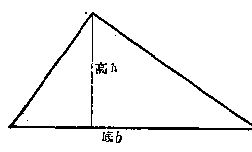

*（第3题）*

> [图像：原扫描页含图示；RAW OCR 未提供可还原的图像像素内容。]

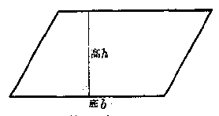

*（第4题）*

4. 一个平行四边形的面积等于它的底边与高的乘积。用字母\(S\)表示面积，\(b\)表示底边，\(h\)表示高，试用\(S, b, h\)写出平行四边形的面积公式。

5. 一个圆的周长等于它的半径乘以圆周率的2倍。如果用字母\(C\)表示圆的周长，\(r\)表示半径，用希腊字母\(\pi\)表示圆周率，写出圆的周长的公式。

6. 一个圆的面积等于它的半径的平方乘以圆周率。如果用字母\(S\)表示圆的面积，\(r\)表示它的半径，用希腊字母\(\pi\)表示圆周率，写出圆的面积公式。

7. 一列火车行驶的路程等于它的平均速度乘上行驶的时间。如果用字母\(s\)表示它行驶的路程，\(v\)表示它的平均速度，\(t\)表示它行驶的时间，写出火车行驶路程

> [图像：原扫描页含图示；RAW OCR 未提供可还原的图像像素内容。]

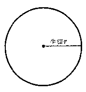

*（第5题）*

### §2·2 列代数式

在代数里，我们常常需要把用文字叙述的一句话或一些计算关系列成代数式，举例如下：

**例1** 用代数式表示：

（1） 一个数\(a\)的 3 倍； （2） 一个数\(b\)的平方；

（3） 两个数\(a\)与\(b\)的和； （4） 一个数\(a\)的 3 倍加上 5.

**【解】** （1）\(3a\)； （2）\(b^{2}\)； （3）\(a + b\)； （4）\(3a + 5\)。

**【注意】**\(a\)的3倍， 就是\(a \times 3\)， 但是， 习惯上总把数字因数写在前面， 所以写做\(3a\)。

**例2** 用代数式表示：

（1） 两个数 a 与 b 的和的 3 倍；

（2） 一个数\(a\)的 3 倍与另一个数\(b\)的 5 倍的和；

（3） 数\(a\)的平方与数\(b\)的平方的和；

（4） 两个数 a 与 b 的和的平方。

**【解】** （1）\(3(a + b)\)；

（2）\(3a + 5b\)；

（3）\(a^2 + b^2\)；

（4）\((a + b)^2\)。

**【注意】** 根据先乘除、后加减的运算顺序的规定，在代数式里，要表示先乘除后加减的运算就不必用括号；如果要表示先加减后乘除的运算，就需要用括号。同样的，先乘方后加就不需要括号， 先加后乘方就需用括号。

**例3** 用代数式表示：

（1） 一个数 a 的平方的 3 倍；

（2） 一个数 a 的 3 倍的平方；

（3） 一个数 a 的平方的相反的数；

（4） 一个数 a 的相反的数 的平方。

**【解】** （1）\(3a^{2}\)； （2）\((3a)^{2}\)； （3）\(-a^{2}\)； （4）\((-a)^{2}\)。

**【注意】** 根据先乘方后乘除的运算顺序的规定， 在代数式里， 表示先乘方后乘除， 不必用括号； 如果要表示先乘除后乘方， 就要用括号。

**例4** 有一个数是\(x\)，列出代数式表示比\(x\)的3倍还大5的数以及比\(x\)的倒数小6的数。

**【解】** 比\(x\)的3倍还大5的数：\(3x + 5\)

比\(x\)的倒数小6的数：\(\frac{1}{x} -6.\)

**例5** 一个分数的分子是 x，分母比分子的 2 倍大 3，列出代数式表示这个分数，并列出代数式表示这个分数的倒数。

**【解】** 这个分数是\(\frac{x}{2x + 3}\)；

这个分数的倒数是\(\frac{2x + 3}{x}\)。

**例6** 汽车的速度平均每小时\(m\)公里，（1）3小时共行多少公里？（2）t小时共行多少公里？（3）要行100公里需要多少小时？（4）要行8公里需要多少小时？

**【审题】** 速度、时间与行程三个量之间的关系是：

\[
\text{ 速度 } \times \text{ 时间 } = \text{ 行程，或 } \quad \text{ 时间 } = \frac{\text{ 行程 }}{\text{ 速度 }}.
\]

**【解】** （1） 汽车 3 小时共行 3m 公里；

（2） 汽车 t 小时共行 mt 公里；

（3） 要行 100 公里需要\(\frac{100}{m}\)小时；

（4） 要行 s 公里需要\(\frac{s}{m}\)小时。

**例7** 有一块长方形土地， 它的长是 a 米， 宽是 b 米， （1） 面积是多少平方米？ （2） 如果要在这块地的四边挖掘一条沟， 这条沟的内圈一共多少长？

**【审题】** 长方形的面积 = 长 × 宽。

长方形的周长=\((长+宽)\times2\)。

**【解】** （1） 这块土地的面积是\(ab\)平方米；

（2） 这条沟的内圈的总长是\(2(a + b)\)米。

#### 习题2·2

1. 写出下列代数式：

（1） 一个数\(a\)的 10 倍； ［解法举例： 10a.］

（2） 一个数 a 加上 10；

（3） 一个数\(a\)减去 5；

（4） 从 5 减去一个数 a；

（5） 一个数\(a\)除以 5；

（6） 5 除以一个数 a；

2. 如\(a, b\)表示数，写出下列代数式：

（1） a 与 b 的和； ［解法举例：\(a + b\)。 ］

（2） a 与 b 的积；

（3） a 的 4 倍与 b 的 3 倍的和；

（4） a 与 b 的积再加上 5；

（5） a 的 3 倍与 b 的五分之一的和；

（6） a 的平方与 b 的平方的和；

3. 写出下列代数式：

（1） a 与 b 的和的 3 倍； ［解法举例：\(3(a+b)\)。 ］

（2） a 与 b 的和的平方；

（3） a 加 3 所得的和的平方；

（4） a 加 b 所得的和除以 a 与 b 的积；

（5） a 的平方与 b 的平方的和的平方。

4. 写出下列代数式：

（1） a 与 b 的和的相反的数； ［解法举例：\(-(a+b)\)。 ］

（2） a 的相反的数与 b 的相反数的代数和；

（3） a 的平方的相反数加上 5；

（4） a 的相反数的平方减去 5；

（5） a 的倒数；

（6） a 的倒数与 b 的倒数的和；

（7） a 的平方的倒数加上 b 的平方的倒数；

（8） a 与 b 的和的倒数。

5. 写出下列代数式：

（1） a 的绝对值； ［解法举例：\(|a|\)。 ］

（2） a 的相反的数的绝对值；

（3） a 的倒数的绝对值；

（4） a 与 b 的和的绝对值；

（5） a 减去 b 的 3 倍所得的差的绝对值；

6. 一个分数，分子是\(x\)，分母比分子的5倍小3，列出这个分数的代数式；列出另一个分子分母都比这个分数的分子分母小1的分数的代数式。

7. 如果一个人骑自行车每小时平均可行\(a\)公里， （1） 2 小时可行多少公里？ （2）\(b\)小时可行多少公里？ （3） 要行 50 公里需要多少小时？ （4） 要行\(d\)公里需要多少小时？

8. 如果一辆汽车平均每小时行\(a\)公里，自行车平均每小时行\(b\)公里，（1）汽车与自行车同时行3小时，路程相差多少？（2）乘自行车行2小时后再乘汽车行3小时，一共行了多少路程？（3）汽车和自行车各行\(d\)公里，汽车比自行车快多少时间？

9. 一个正方形的一边长\(a\)厘米，（1）它的面积是多少平方厘米？（2）它的周长是多少厘米？

10. 两个正方形的边长分别是\(a\)厘米与\(b\)厘米\((a > b)\)， （1） 它们的面积一共多少？ （2） 它们的面积相差多少？ （3） 它们的周长一共多少？ （4） 它们的周长相差多少？ ［提示： 要注明单位.］

### §2·3 代数式的值

代数式是表示数的计算式子。如果代数式里的字母用指定的数去代替，再依照代数式里所表示的运算进行计算，所得的结果就叫做代数式的值。

**例1** 计算代数式\(-3a^{2}b\)的值：

（1） 当\(a = -3, b = 5\)；

（2） 当\(a = 0.1, b = 8\)；

（3） 当\(a = \frac{3}{5}, b = -8\frac{1}{3}\)。

**【解】** （1）\(-3a^{2}b = -3(-3)^{2}(5) = -3\cdot (+9)\cdot 5 = -135;\)

（2）\(-3a^{2}b = -3(0.1)^{2}(8) = -3(0.01)(8)\)

\[
= - 0.24；
\]

（3）\(-3a^{2}b = -3\left(\frac{3}{5}\right)^{2}\left(-8\frac{1}{3}\right) = -3\cdot \frac{9}{25}\cdot \left(-\frac{25}{3}\right)\)

\[
= + 9.
\]

**例2** 计算代数式\(2x^{3} - 5x^{2} + 3x - 8\)的值：

（1） 当\(x = 1\)；

（2） 当\(x = -\frac{1}{2}\)。

**【解】** （1）\(2x^{3} - 5x^{2} + 3x - 8 = 2(1)^{3} - 5(1)^{2} + 3(1) - 8\)

\[
= 2 - 5 + 3 - 8 = - 8；
\]

（2）\(2x^{3} - 5x^{2} + 3x - 8\)

\[
= 2 \left(- \frac{1}{2}\right) ^{3} - 5 \left(- \frac{1}{2}\right) ^{2} + 3 \left(- \frac{1}{2}\right) - 8
\]

\[
= 2 \left(- \frac{1}{8}\right) - 5 \left(+ \frac{1}{4}\right) + 3 \left(- \frac{1}{2}\right) - 8
\]

\[
= - \frac{1}{4} - \frac{5}{4} - \frac{3}{2} - 8 = - \frac{3}{2} - \frac{3}{2} - 8 = - 11.
\]

**【注意】** 把字母的指定数值代入代数式后，有些乘方或原来省略乘号的地方，需要添上括号或者乘号。

**例3** 计算代数式\(3(3a-2b)^{2}\)的值：

（1） 当\(a = -2, b = +3\)；

（2） 当\(a = -0.4, b = -0.3\)。

**【解】** （1）\(3(3a - 2b)^{2} = 3[3(-2) - 2(+3)]^{2}\)

\[
= 3 (- 6 - 6) ^{2} = 3 (- 12) ^{2}
\]

\[
= 3 (+ 144) = 432；
\]

（2）\(3(3a - 2b)^{2} = 3[3(-0.4) - 2(-0.3)]^{2}\)

\[
= 3 (- 1.2 + 0.6) ^{2} = 3 (- 0.6) ^{2}
\]

\[
= 3 \times 0.36 = 1.08.
\]

**例4** 计算代数式\(\frac{a + 2b}{2a + b}\)的值：

（1）\(a = -1\frac{1}{2}, b = 1\frac{2}{3};\)

（2）\(a = -1.3, b = -1.5.\)

**【解】** （1）\(\frac{a + 2b}{2a + b} = \frac{-1\frac{1}{2} + 2\left(1\frac{2}{3}\right)}{2\left(-1\frac{1}{2}\right) + \left(1\frac{2}{3}\right)} = \frac{-\frac{3}{2} + \frac{10}{3}}{-3 + \frac{5}{3}}\)\(= \frac{-9 + 20}{-18 + 10} = \frac{11}{-8} = -1\frac{3}{8};\)

（2）\(\frac{a + 2b}{2a + b} = \frac{-1.3 + 2(-1.5)}{2(-1.3) + (-1.5)} = \frac{-1.3 - 3}{-2.6 - 1.5}\)\(= \frac{-4.3}{-4.1} = \frac{43}{41} = 1\frac{2}{41}\)。

**例5** 计算代数式\(-a^2\)与\((-a)^2\)的值：

（1）\(a = 5\)；

（2）\(a = -5\)；

（3）\(a = 0.13\)；

（4）\(a = -0.13\)。

**【审题】**\(-a^2\)要先平方再添上负号，\((-a)^2\)要先添上括号再平方。

**【解】** （1）\(-a^{2} = -5^{2} = -25,\)

\[
(- a) ^{2} = (- 5) ^{2} = + 25；
\]

（2）\(-a^{2} = -(-5)^{2} = -25,\)

\[
(- a) ^{2} = [ - (- 5) ] ^{2} = 5 ^{2} = 25；
\]

（3）\(-a^{2} = -(0.13)^{2} = -0.0169,\)

\[
(- a) ^{2} = (- 0.13) ^{2} = + 0.0169；
\]

（4）\(-a^{2} = -(-0.13)^{2} = -0.0169,\)

\[
(- a) ^{2} = [ - (- 0.13) ] ^{2} = (0.13) ^{2} = 0.0169.
\]

#### 习题2·3

1. 求代数式\(a - b\)的值（填下表）：

| a | +5 | +5 | -12 | -12 | +\(\frac{1}{2}\) | -\(\frac{1}{2}\) | -1\(\frac{2}{3}\) | +3.54 |
| --- | --- | --- | --- | --- | --- | --- | --- | --- |
| b | +7 | -7 | -3 | -20 | +\(\frac{2}{3}\) | +\(\frac{2}{3}\) | -3\(\frac{1}{4}\) | -5.09 |
| a-b |  |  |  |  |  |  |  |  |

计算下列代数式的值（2~7）：

2.\(-\frac{2}{3} ab^2,\)

（1）\(a = -3, b = -2;\)

（2）\(a = -2\frac{1}{3}, b = -1\frac{1}{7}\)。

3.\(-x^{3} + 2x^{2} - 3x + 4,\)

（1）\(x = 2\)；

（2）\(x = -0.3.\)

4.\(a^2 - b^2\)

（1）\(a = -3, b = -5;\)

（2）\(a = -5.3, b = 4.7.\)

5.\((a - b)^{2}\)，

（1）\(a = -3, b = -5;\)

（2）\(a = -3\frac{2}{3}, b = 5\frac{1}{2}\)。

6.\(\frac{(a + b)^2}{a^2 + b^2}\)，

（1）\(a = -2, b = -3;\)

（2）\(a = 0.3, b = -0.4\)。

7.\(\frac{1 + a + a^2}{1 - a + a^2}\)，

（1）\(a = -5\)；

（2）\(a = +3\frac{1}{3}\)。

8. 求下表空格内有关代数式的值：

| a | 5 | -5 | \(\frac{2}{3}\) | \(-\frac{2}{3}\) | 0 | \(-5\frac{1}{3}\) |
| --- | --- | --- | --- | --- | --- | --- |
| -a |  |  |  |  |  |  |
| \|a\| |  |  |  |  |  |  |
| \(\| -a\|\) |  |  |  |  |  |  |
| \(-(-a)\) |  |  |  |  |  |  |

9. 梯形的面积公式是\(S = \frac{(a + b)h}{2}\)，这里\(S\)表示梯形的面积，\(a\)和\(b\)表示梯形的两底，\(h\)表示梯形的高；底和高的单位如果是厘米，那末面积的单位是平方厘米。从下列各已知量，求梯形的面积\(S\)：

（1） a=15 厘米， b=7 厘米， h=3 厘米；

（2） a=2.4 厘米， b=1.2 厘米， h=0.9 厘米。

算法举例：（1）\(S = \frac{(a + b)h}{2} = \frac{(15 + 7)\times 3}{2} = 33\)（平方厘米）。

> [图像：原扫描页含图示；RAW OCR 未提供可还原的图像像素内容。]

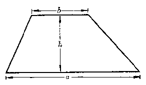

*（第9题）*

> [图像：原扫描页含图示；RAW OCR 未提供可还原的图像像素内容。]

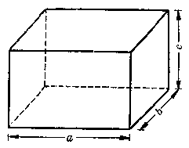

*（第10题）*

10. 长方体的表面积公式是\(S = 2(ab + ac + bc)\)，这里\(S\)表示长方体的表面积，\(a, b, c\)分别表示它的长、宽和高。从下列各已知量，求长方体的表面积：

（1） a=5 厘米， b=7 厘米， c=9 厘米；

（2） a=0.3 厘米， b=0.2 厘米， c=0.4 厘米。

### §2·4 已知代数式的值求某个字母的值

在上一节里，我们研究了已知字母的值求含有这个字母的代数式的值。现在，我们要研究一个相反的问题：已知含有一个字母的代数式的值，求这个字母的数值。让我们先看下面的例子。

**例1** 已知代数式\(x+5\)的值等于 16，求 x 的值。

**【审题】** 这里\(x\)和 5 是两个加数， 而 16 是它们的和数。 求\(x\)的值就是已知两个加数的和与一个加数求另一个加数。 这样的求法是加法的逆运算， 就是减法。

根据逆运算的关系， 得解如下。

**【解】**\(\because x + 5 = 16,\)

\[
\therefore x = 16 - 5 = 11.
\]

这里所写的\(x + 5 = 16\)是一个等式，其中字母\(x\)的数值是要求的，叫做未知数，这样含有未知数的等式叫做方程。关于方程的系统研究，我们将在第二册里再讲。

**例2** 已知代数式\(3x\)的值是20，求\(x\)的值。

**【审题】** 这里\(x\)和3是两个乘数， 而20是它们的积。 求\(x\)的值就是已知两个数的积和一个乘数求另一个乘数。 这样的求法是乘法的逆运算， 就是除法。

根据逆运算的关系， 得解如下。

**【解】**\(\because 3x = 20,\)

\[
\therefore x = 20 \div 3 = 6 \frac{2}{3}.
\]

**例3** 已知代数式\(\frac{x}{3} - 5\)的值是3，求\(x\)的值。

**【审题】** 这里代数式的值 3 是\(x\)除以 3 以后再减去 5 所得的结果。根据逆运算的关系，\(x\)除以 3 以后所得的结果应该是\(3 + 5\)，而\(x\)的值又应该是\(3 + 5\)的和再乘以 3。因此，得解如下。

**【解】**\(\because \frac{x}{3} - 5 = 3,\)

\[
\therefore \quad \frac{x}{3} = 3 + 5 = 8，
\]

\[
x = 8 \times 3 = 24.
\]

#### 习题2·4

1. 已知\(x - 3\)的值等于 3，求\(x\)的值。

2. 已知\(\frac{x}{5}\)的值等于\(-3\)，求\(x\)的值。

3. 已知\(3x + 2 = 1\)，求\(x\)。

4. 已知\(\frac{x}{2} - 6 = -11\)，求\(x\)。

5. 已知\(\frac{x - 3}{2} + 1 = 8\)，求\(x\)。

### §2·5 整式和分式

让我们看下面的这些代数式：

\[
3 a， x + y， a ^{2} - b ^{2}， \frac{(a + b) h}{2}，
\]

\[
\frac{1}{a}， \frac{5}{x - 3}， \frac{x - y}{x + y}， \left(x + \frac{1}{x}\right) ^{2}.
\]

这些代数式里所包含的运算都不外乎加、减、乘、除和乘方五种。这样的代数式叫做有理代数式，简称有理式。

上面这些有理式里，\(3a, x+y, a^{2}-b^{2}\)等，都没有除法，\(\frac{(a+b)h}{2}\)虽然有除法，但除式里没有字母。这样的有理式叫做有理整式，简称整式。

上面这些有理式里，\(\frac{1}{a}\)，\(\frac{5}{x-3}\)，\(\frac{x-y}{x+y}\)，\(\left(x+\frac{1}{x}\right)^{2}\)等，不但有除法，而且在除式里有字母出现。这样的有理式叫做有理分式，简称分式。

1. 在下列代数式中， 指出哪些是整式， 哪些是分式：

\[
a + 5， \frac{1}{a + 5}， \frac{a - 5}{5}， a + \frac{1}{b}，
\]

\[
\frac{1}{3} x ^{2} + 5 x - \frac{2}{3}， \frac{y}{x}， \frac{x}{x - y}， x ^{2} - x y + \frac{1}{2} y ^{2}.
\]

2. 当\(a = \frac{1}{2}\)时，\(a + 5\)的值是多少？

3. 当\(a = 3\)时，\(\frac{12}{a}\)的值是多少？

4. 整式的值一定是整数吗？举例说明。

5. 分式的值一定是分数吗？举例说明。

### §2·6 单项式

#### 1. 单项式的概念

让我们研究下列整式：

\[
3， - \frac{1}{2}， a， - 3 a ^{2}， + \frac{1}{3} a ^{3} b ^{2} c， - \frac{1}{3} x ^{2} y ^{3}.
\]

这些整式有一个共同的特点，就是没有加减运算。这些整式，叫做单项式；这就是说：没有加减运算的整式叫做单项式。

象整式\(3x + 5y\)就不是单项式，因为这里有加法运算，象代数式\(\frac{b}{a}\)也不是单项式，因为\(\frac{b}{a}\)不是整式。

#### 2. 系数

在单项式\(3a\)里，\(3a\)是数字因数 3 与字母因数\(a\)的积；在代数式\(-5x\)里，\(-5x\)是数字因数\(-5\)与字母因数\(x\)的积；在代数式\(\frac{2}{3} a^2 x\)里，\(\frac{2}{3} a^2 x\)是数字因数\(\frac{2}{3}\)与字母部分的因数\(a^2 x\)的积。我们把数字部分的因数叫做字母部分因数的数字系数，简称系数。

例如：在\(3a\)里，3是\(a\)的系数；

在\(-5x\)里，\(-5\)是\(x\)的系数；

在\(\frac{2}{3} a^2 x\)里，\(\frac{2}{3}\)是\(a^2 x\)的系数。

**注** 1. 代数式\(a\)就是 1 与\(a\)的积， 所以\(a\)的系数是 1 ， 同样的在\(a^2 x^3\)里，\(a^2 x^3\)的系数也是 1 ； 在\(-abc\)里，\(abc\)的系数是 -1 ， 不要把\(a\)的系数说成是零， 也不要把\(-abc\)的系数说成是负号。

2. 在将来，我们还可以把一个或几个字母作为主要字母，而把其他字母因数也作为系数或系数的一部分，例如我们可以把\(x\)作为主要字母，在\(ax\)里，将\(a\)看作\(x\)的系数，在\(-3a^2 x^3\)里，将\(-3a^2\)看作\(x^{3}\)的系数；又如我们可以把 x 与 y 作为主要字母，在\(3ac^{2}y\)里，将 3a 看作\(x^{2}y\)的系数等。所以系数是对特定的字母来说的。在这里，我们还只讲数字系数。

#### 3. 幂

在讨论有理数的乘方运算时， 我们已讲过底数、指数这些名词了。 对于含有字母的式子来说， 这些名词仍具有同样的意义。 例如\(a^3\)就叫做\(a\)的三次方， 底数是\(a\)， 指数是 3， 而\(a^3\)就是\(a \cdot a \cdot a\)的简写。\(a^3\)也叫做\(a\)的三次幂。 同样，\(x^5\)叫做\(x\)的五次方或五次幂， 这里底数是\(x\)， 指数是 5， 而\(x^5\)就是\(x \cdot x \cdot x \cdot x \cdot x\)的简写。 一般说来，

\[
a ^{n} = \underbrace {a \cdot a \cdot a \cdot a \cdot \cdots a} _{\text{一共有} n \text{个}}，
\]

这里底数是\(a\)，指数是\(n, n\)是任意自然数，\(a^n\)读做\(a\)的\(n\)次方或\(a\)的\(n\)次幂。

**【注意】**\(a\)也是一个幂， 叫做\(a\)的一次幂或一次方， 这里指数是 1. 指数是 1 时， 不必写出来。 反过来说， 不写出来的指数就是 1， 不要说\(a\)没有指数， 或者说它的指数是 0.

#### 4. 单项式的次数

看单项式\(-3x^{4}, 2x^{3}, a^{2}bc, \frac{1}{2}x^{3}y, -5, ax^{2}, +\frac{1}{2}, a.\)这些单项式里，有的只有一个字母，有的有两个字母，有的有三个字母，有的只有数字没有字母；各个字母的指数也有是1的，也有是2的，也有是3的或者是4的。我们把一个单项式里各个字母的指数的和叫做这个单项式关于这些字母的次数。例如\(-3x^{4}\)是关于\(x\)的四次单项式，或者简称四次式；\(2x^{3}\)是关于\(x\)的三次单项式；\(a^{2}bc\)是关于字母\(a, b, c\)的四次单项式（因为这里\(a\)的指数是2，\(b\)和\(c\)的指数各是1，而它们的指数的和是\(2 + 1 + 1 = 4\)；\(\frac{1}{2} x^3 y\)是关于\(x\)与\(y\)的四次单项式；\(ax^2\)是关于\(a\)与\(x\)的三次单项式；\(a\)是关于\(a\)的一次单项式。单项式\(-5\)与\(+\frac{1}{2}\)，都只有数字没有字母，叫做零次单项式。

**【注意】**

有时我们只把一个或几个字母作为主要字母，根据这几个字母的指数来计算单项式的次数。例如\(ax^2\)可以看做是关于\(x\)的二次单项式，而把\(a\)作为主要字母\(x^2\)的系数，又如\(3ax^2y\)可以看做是关于\(x\)与\(y\)的三次单项式，\(3a\)可以当做\(x^2y\)的系数。

#### 5. 单项式的整理

单项式的整理，一般包括两个内容：

（i） 排列各因数的前后次序：一个单项式可以包含几个因数，有数字的，也有字母的。因为字母表示的也是数，所以可根据乘法交换律，把这些因数的前后次序互相调换。在习惯上，我们总把数字因数连同性质符号写在最前面，各个字母的前后次序，一般按照拉丁字母的前后次序（也就是拼音字母的次序）排列。

**例1** 整理单项式：（1）\(a3\)；（2）\(b^35a\)；（3）\(-x\frac{1}{3} a^2\)。

**【解】** 整理后得：（1）\(3a\)； （2）\(5ab^3\)； （3）\(-\frac{1}{3} a^2 x\)。

（ii） 相同的字母因数， 应该用指数表示成一个幂。

**例2** 整理单项式：（1）\(8aaa\)； （2）\(-3abababa\)。

**【审题】** 根据相同因数可以写成幂的形式，aaa 可以写做\(a^{3}\)，根据乘法交换律，-3abababa 可以写成 -3aaaabbb，再根据相同因数可以写成幂的形式，aaaa 可以写做\(a^{4}\)，bbb 可以写做\(b^{3}\)。

**【解】** 整理后得：（1）\(8a^{3}\)；（2）\(-3a^{4}b^{3}\)。

#### 习题2·6

1. 下列代数式是不是单项式，为什么？

\[
\begin{array}{l} 3； \quad - 5 x y； \quad + \frac{1}{3} a x ^{5}； \\ a + b； \quad \frac{3}{x}； \quad \frac{7}{x + y}. \\ \end{array}
\]

2. 说出下列各代数式里的系数：

（1） 3a； （2） -5ab； （3） x； （4）\(-a^{2}\)；

（5）\(\frac{1}{2} a^2 b^4\)； （6）\(-\frac{2}{3} a^2 y\)； （7）\(0.3x\)； （8）\(-1.5a^4\)。

［解法举例：在\(3a\)里，\(a\)的系数是3.］

3. 说出下列代数式里各个字母的指数：

（1）\(5a^{2}b^{4}x\)； （2）\(-7ax^{4}\)； （3）\(\frac{1}{3} x^{2}y^{5}\)； （4）\(6abcy^{3}\)。

［解法举例：在\(5a^{2}b^{4}x\)里，\(a\)的指数是 2，\(b\)的指数是 4，\(x\)的指数是 1.］

4. 说出下列各单项式的次数：

（1）\(-5a\)；

（2）\(a^2 b^3\)；

（3）\(4x^{2}\)；

（4）\(-\frac{1}{2} x^{2}y^{5}z.\)

［解法举例：-5a是一次单项式.］

5. 整理下列各单项式：

（1）\(a4\)；

（2）\(aba\)；

（3） 5axxaa；

（4）\(a\frac{1}{2} xbaa,\)

### §2·7 多项式

#### 1. 多项式的概念

让我们来观察下面这些代数式：

\[
a + 3， x - y， - x ^{2} + x y + 3 y ^{2}， \frac{1}{3} x ^{3} - 2 x ^{2} + \frac{1}{2} x - 5.
\]

这些代数式里， 因为都没有用字母做除数， 所以它们都是整式， 但是它们都含有加减运算符号， 所以它们都不是单项式。

我们可以把这些代数式看做是几个单项式的代数和，例如：

\(a + 3\)是\(a\)和\(+3\)的代数和；

\(x - y\)是\(x\)和\(-y\)的代数和；

\(-x^{2} + xy + 3y^{2}\)是\(-x^{2}, +xy\)和\(+3y^{2}\)的代数和；

\(\frac{1}{3} x^3 - 2x^2 + \frac{1}{2} x - 5\)是\(\frac{1}{3} x^3, -2x^2, +\frac{1}{2} x\)和\(-5\)的

代数和。

我们把几个单项式的代数和叫做多项式。

#### 2. 多项式的项

在多项式里的每一个单项式， 叫做这个多项式的项。 多项式里含有几项就叫几项式。 例如， 在上面这些多项式里，

\(a + 3\)和\(x - y\)都是二项式；

\(-x^{2} + xy + 3y^{2}\)是三项式；

\(\frac{1}{3} x^3 - 2x^2 + \frac{1}{2} x - 5\)是四项式。

**【注意】** 多项式中的项，是包括它前面的正负号的。例如\(x - y\)的两项是\(x\)和\(-y\)，不能说是\(x\)和\(y\)。

#### 3. 多项式的次数

在二项式\(a + 3\)里，第一项\(a\)的次数是1，我们把它叫做一次项，\(+3\)没有字母，我们把它叫做常数项（或者叫做零次项），这里次数最高的项是一次项。

在三项式\(3x^{2} - 5x - 1\)里，第一项\(3x^{2}\)的次数是2，我们把它叫做二次项，\(-5x\)是一次项，-1是常数项，这里次数最高的项是二次项。

在四项式\(-3x^{3}+2x^{2}-\frac{1}{2}x+5\)里，次数最高的项是三次项\(-3x^{3}\)。

我们把一个多项式里次数最高的项的次数叫做这个多项式的次数。多项式的次数是几的，就叫做几次多项式。

例如：\(a + 3\)是一次式；

\(3x^{2}-5x-1\)是二次式；

\(-3x^{3} + 2x^{2} - \frac{1}{2} x + 5\)是三次式。

又如：\(x^{3} - x^{2}y + xy^{2} - y^{3}\)，它的四项的次数都是3，它是关于\(x\)与\(y\)的三次式。

#### 4. 多项式的整理

为了便于运算，通常我们总要把一个多项式，按照一定的要求进行整理。 多项式的整理，一般包括两个内容。

（1） 排幂：我们来看多项式

\[
x ^{2} - 2 - 5 x + 3 x ^{3}，
\]

这个多项式的许多项都有字母\(x\)，我们常常把这样表示变数的字母叫做元。这个多项式是四个单项式\(x^2, -2, -5x, +3x^3\)的代数和，按照元\(x\)的次数来研究；这里第一项的次数是 2，第二项是常数项（或者说它的次数是 0），第三项的次数是 1，第四项的次数是 3。为了把它整理成整齐形式，通常我们应该按照各项次数从大到小或者从小到大的顺序，把它们重行排列起来。这种整理方法叫做排幂。例如：

多项式\(x^{2} - 2 - 5x + 3x^{3}\)可以重新排列成

\[
3 x ^{3} + x ^{2} - 5 x - 2 \tag {1}
\]

或者

\[
- 2 - 5 x + x ^{2} + 3 x ^{3} \tag {2}
\]

两种形式。

**【注意】** 在有理数这一章里， 我们已经知道， 在加法运算中， 可以交换加数的前后次序（加法交换律）。 代数式里的字母都表示数， 每个单项式表示的也就是数， 所以我们可以象有理数加法一样， 交换多项式里各项的先后次序。

我们看到，在（1）中，各项是按照字母\(a\)的幂的指数从大到小的顺序来排列的， 这种排列方法， 叫做按这个字母的降幂排列； 在（2）中， 各项是按照字母\(x\)的幂的指数从小到大的顺序来排列的， 这种排列方法， 叫做按这个字母的升幂排列。

**例1** 依照\(x\)的降幂排列，整理下列两个多项式：

（1）\(x^{2} - 2 - 5x^{4} + 3x^{3}\)；

（2）\(3 - 4x + 5x^{6} - 4x^{5} + x^{2} - x^{3}\)。

**【解】** 整理后， 得

（1）\(-5x^{4} + 3x^{3} + x^{2} - 2;\)

（2）\(5x^{6} - 4x^{5} - x^{3} + x^{2} - 4x + 3.\)

**【注意】** 多项式中的项，是包括它前面的性质符号的。在排幂时，每一项的性质符号仍须看作是这一项的一个部分而一起移动。如果原来的第一项省略掉性质符号“+”，搬到后面时就要补上这个“+”号；如果原来的中间项搬到第一项而性质符号是正的，也可以省略掉这一“+”号，但性质符号“-”不能省略。

**例2** 按 a 的降幂排列整理下列多项式：

（1）\(a^3 - 3ab^2 + 5b^3 - 6a^2b\)； （2）\(-3ab + b^2 - 3a^2\)。

**【解】** 整理后， 得

（1）\(a^3 - 6a^2b - 3ab^2 + 5b^3\)； （2）\(-3a^2 - 3ab + b^2\)。

**例3** 按 x 的升幂排列整理下列多项式：

（1）\(x^{2} - 3x^{3} + 5x - 7\)； （2）\(y^{3} - 3x^{2}y + 2xy^{2} + x^{3}\)。

**【解】** 整理后， 得

（1）\(-7 + 5x + x^2 - 3x^3\)； （2）\(y^3 + 2xy^2 - 3x^2y + x^3\)。

（ii） 合并同类项：我们来看多项式

\[
3 a ^{2} b - 5 a b ^{2} + 3 a ^{2} b + a b ^{2} + a ^{2} b ^{2}.
\]

它是五个单项式\(3a^{2}b, -5ab^{2}, + 3a^{2}b, + ab^{2}, + a^{2}b^{2}\)的代数和。这些单项式都只含有两个字母，就是\(a\)和\(b\)，并且：

第一项\(3a^{2}b\)和第三项\(3a^{2}b, a\)的幂的指数都是2，\(b\)的幂的指数都是1，系数也相同，这两个项是完全一样的。

第二项\(-5ab^{2}\)和第四项\(ab^{2}\)，\(a\)的幂的指数都是 1，b 的幂的指数都是 2，这两项里只有系数不相同。

多项式里具有这种性质的两个或几个项，叫做同类项.例如第一项\(3a^{2}b\)和第三项\(3a^{2}b\)是同类项，第二项\(-5ab^{2}\)和第四项\(ab^{2}\)也是同类项.一般地说，

多项式里的某些项， 如果彼此完全没有差别， 或者彼此只有系数不同， 那末这些项就叫做同类项。

常数项和常数项也是同类项。

**【注意】**

多项式里的两个项虽然所含字母相同，但是相同字母的幂的指数不同，就不是同类项。例如\(3a^{2}b\)和\(3ab^{2}\)就不是同类项，\(3a^{2}b\)和\(3a^{2}b^{2}\)也不是同类项。

在一个多项式里，同类项可以根据乘法对于加法的分配律，把它们合并成一项，

例如：\(3a^{2}b + 3a^{2}b = 3\times a^{2}b + 3\times a^{2}b\)

\[
= (3 + 3) \times a ^{2} b = 6 a ^{2} b；
\]

\[
- 5 a b ^{2} + a b ^{2} = - 5 \times a b ^{2} + 1 \times a b ^{2}
\]

\[
= (- 5 + 1) \times a b ^{2} = - 4 a b ^{2}；
\]

因此， 根据加法的交换律和结合律， 上面所提出的这个多项式可以写成

\[
(3 a ^{2} b + 3 a ^{2} b) + (- 5 a b ^{2} + a b ^{2}) + a ^{2} b ^{2}.
\]

再合并同类项，把它化简成

\[
6 a ^{2} b - 4 a b ^{2} + a ^{2} b ^{2}.
\]

把多项式里的同类项合并成一项叫做合并同类项。从上面的例子得到：

合并同类项， 只要把系数相加， 所得的和作为系数， 字母部分连同它们原来的指数仍旧不变。

**合并同类项法则**

**例4** 整理下列多项式：

\[
5 x ^{4} - 3 x ^{2} + 6 - 7 x ^{3} + 12 x ^{4} + 10 x ^{3} + 2 x ^{2} - 3 x ^{3} + 7 + 10 x.
\]

**【审题】** 先按\(x\)的降幂排列， 再合并同类项。

\[
\begin{array}{l} \text{[解]} \quad \frac{5 x ^{4} - 3 x ^{2} + 6 - 7 x ^{3} + 12 x ^{4} + 10 x ^{3} + 2 x ^{2} - 3 x ^{3} + 7 + 10 x}{=} \\ = \frac{5 x ^{4} + 12 x ^{4} - 7 x ^{3} + 10 x ^{3} - 3 x ^{3} - 3 x ^{2} + 2 x ^{2}}{=} \\ + 10 x + 6 + 7 \\ = 17 x ^{4} + 0 \cdot x ^{3} - x ^{2} + 10 x + 13 \\ = 17 x ^{4} - x ^{2} + 10 x + 13. \\ \end{array}
\]

**【注意】** 1. 为了便于整理， 我们可以在同类项下面用横线记号标明， 这样就不至于重复或遗漏。

2.\(-7x^{3} + 10x^{3} - 3x^{3} = (-7 + 10 - 3)x^{3} = 0 \cdot x^{3} = 0\)，这一项没有了，因为0乘任何数等于0。

**例5** 整理下列多项式：

\[
2 a ^{4} - 8 a ^{2} b ^{2} - a b ^{3} + 5 a ^{3} b + 3 a ^{4} + 6 a b ^{3} + 5 b ^{4} + 8 a ^{2} b ^{2}.
\]

**【审题】** 先按\(a\)的降幂排列， 再合并同类项。

**【解】** 原式\(= 2a^{4} + 3a^{4} + 5a^{3}b - 8a^{2}b^{3} + 8a^{2}b^{2} - ab^{3} + 6ab^{3} + 5b^{4}\)

\[
= 5 a ^{4} + 5 a ^{3} b + 5 a b ^{3} + 5 b ^{4}.
\]

**【注意】**\(-8a^{2}b^{3} + 8a^{2}b^{2} = 0\)，这一项没有了。

#### 习题2·7

1. 说明下列多项式是几项式， 是几次式， 并指出它的次数最高的项和常数项：

（1）\(3a^{2} - 5a - 7;\)

（2）\(x^{4} - 3x^{3} + 2x^{2} - 56;\)

（3） 7-y-y²；

（4）\(3a^{3} + 5a^{2} - 7a^{2} + 8.\)

2. 整理下列多项式， 按 a 或 x 的降幂排列：

（1）\(3 + a;\)

（2）\(5x - x^{2} - 3;\)

（3）\(5a - 7a^{2} + 16 - 14a^{4}\)；

（4）\(a^3 b - 5a^2 b^2 + a^4 + 3ab^3 - b^4\)；

（5）\(x^{3} - x^{2}y + y^{3} - xy^{2}\)。

3. 合并下列多项式里的同类项：

（1）\(a^3 + a^3\)；

（2）\(5a - 3a + 7a\)；

（3）\(a^2 b - 3a^2 b + 2x^2 b;\)

（4）\(-3x^{2}y + 2x^{2}y + 3xy^{2} - 2xy^{2}\)；

（5）\(\frac{2}{3} a^2 - 6a^3 + 5a - \frac{1}{4} + 5a^3 - \frac{1}{2} - \frac{4}{3} a^2.\)

4. 整理下列多项式：

（1）\(3a - 2x + 5a - 7x;\)

（2）\(7a^{2} + 3a + 8 - 5a^{3} - 3a - 8;\)

（3）\(3a + 5b - 3c - 3a + 7b - 6c;\)

（4）\(a^2 - 3a + 8 - 3a^2 + 5a - 7\)；

（5）\(x^{4} - x + x^{2} + 3 + x^{3} - 3x^{2} + 1;\)

（6）\(-10x^{2} + 13x^{3} - 2 + 3x^{4} - 4x - 3 + x^{3}\)。

5. 求当\(x = 0.1\)时，下列各式约值：

（1）\(3x^{2} + 5x - \frac{1}{2} x^{2} - 4\frac{1}{2} x + 0.5 - \frac{1}{2} x;\)

（2）\(\frac{1}{3} x^3 - 2x^2 + \frac{2}{3} x^3 + 3x^2 + 5x - 4x + 7.\)

［提示：先整理多项式，再行代入.］

### §2·8 有理式中字母的允许值

在有理式里的字母， 有的可以取任意的数值， 但是有的却只能取某一个范围内的数值。

让我们先看整式。

例如整式\(3x^{2} - 5x + 7\)。在这个整式里，只有加法、减法、乘法和乘方这四种运算。字母\(x\)不论取怎样的有理数，包括正的、负的整数、分数或者零，加法、减法、乘法和乘方都总是可以进行的。当\(x\)的数值确定以后，这个代数式总可以计算出确定的数值来。这就是说，字母\(x\)可以取有理数范围内的任意值。通常我们说，这个整式里字母的允许值是任意有理数。

又如整式\(\frac{1}{3} x^2 - 5x + \frac{1}{6}\)。 在这个整式里， 虽然有除法运算， 但除数是已知的确定的数 （不是零）， 因此， 这里字母\(x\)不论取怎样的有理数， 这个代数式还是总可以求出确定的数值的。这样的代数式里字母\(a\)还是可以取任意有理数。

从这两个例子，我们可以得出结论：

整式里的字母的允许值是任意有理数。

现在让我们再来看分式：

例如有分式\(\frac{5}{a}\)。这个分式里分母\(a\)是一个字母。如果\(a\)的值不是零，这个分式的值总是可以计算出来的。但如果\(a\)的数值是零，那末因为零不能做除数，分式\(\frac{5}{a}\)就没有意义了。所以这个分式里字母\(a\)的允许值是不等于0的任意有理数，或者说\(x \neq 0\)（符号“≠”读做“不等于”）。

同样地，分式\(\frac{a + 3}{a - 3}\)里，分母\(a - 3\)不能等于0，也就是说字母\(a\)不可以等于3。所以这个分式的字母\(a\)的允许值是除去3以外的任意有理数，或者说\(a \neq 3\)。

从上面这两个例子可以看到，在分式里字母的允许值有时是有限制的。明确一些说，分式里的字母的允许值是不使分母等于零的字母的值。

对于一些简单的分式，字母的允许值可以用观察法找出来。

**例1** 求下列代数式里有关字母的允许值：

（1）\(\frac{5}{a + 3}\)；

（2）\(\frac{7}{2x - 3}\)；

（3）\(\frac{7x}{x^2 - 4}\)；

（4）\(\frac{5}{x^2 + 1}\)。

**【审题】** 只要看什么时候分母等于零，把这些不允许的值去掉。

**【解】** （1） 在\(\frac{5}{a + 3}\)里，当\(a = -3\)时，\(a + 3 = 0\)。所以\(a\)的允许值是除去\(-3\)以外的任意有理数，即\(a \neq -3\)。

（2） 在\(\frac{7}{2x - 3}\)里， 当\(x = \frac{3}{2}\)时，\(2x - 3 = 0\)。

\[
\therefore x \neq \frac{3}{2}.
\]

（3） 在\(\frac{7x}{x^2 - 4}\)里， 当\(x = 2\)或\(x = -2\)时，\(x^2 - 4 = 0\)。

∴\(x \neq 2\)且\(x \neq -2\)。

（4） 在\(\frac{5}{x^2 + 1}\)里，不论\(x\)是什么有理数，\(x^2 + 1\)都不等于零。

所以\(x\)可以取任意有理数。

**例2** 代数式\(\frac{|x + 1|}{x - 1}\)里的\(x\)取怎样的值时，

（1） 代数式等于零？ （2） 代数式没有意义？

（3） 代数式的值是正数？（4） 代数式的值是负数？

**【审题】** 可以用观察法来求解。

**【解】** （1） 当\(x = -1\)时， 代数式\(\frac{|x + 1|}{x - 1}\)等于零。

（2） 当\(x = 1\)时， 代数式\(\frac{|x + 1|}{x - 1}\)没有意义。

（3） 当\(x > 1\)时， 代数式的值是正的。

（4） 当\(x < 1\)但不等于\(-1\)时， 代数式的值是负的。

#### 习题2·8

1. 用观察法指出下列代数式里字母的允许值：

（1） 3a； （2）\(-x + y\)； （3）\(\frac{2}{3a}\)； （4）\(\frac{a + 4}{a - 4}\)； （5）\(\frac{a - 4}{a + 4}\)。

2. 用观察法指出下列代数式里字母的允许值：

（1）\(\frac{5}{2x - 4}\)；

（2）\(\frac{6x}{3x + 1}\)；

（3）\(\frac{x^2 + 1}{x^2 - 1}\)；

（4）\(\frac{x^2 - 1}{x^2 - 1}\)。

3. 用观察法说明在下列各式里，x 取什么值时代数式的值是零，x 取什么值时代数式没有意义：

（1）\(\frac{a + 3}{a - 3}\)；

（2）\(\frac{a - 3}{a + 3}\)；

（3）\(\frac{a + 5}{2a - 3}\)；

（4）\(\frac{x^2 - 1}{x^2 + 1}\)。

4. 用观察法说明下列各式里，x 取什么值时代数式的值是正的，是负的，是零；

（1）\(-x\)；

（2）\(x - 3\)；

（3） 3 - x；

（4）\(\frac{x + 3}{x^2 + 1}\)。

### 本章提要

**1. 用字母表示数来叙述数的运算性质**

（1）\(a + b = b + a\)（加法交换律）；

（2）\((a + b) + c = a + (b + c)\)（加法结合律）；

（3）\(ab = ba\)（乘法交换律）；

（4）\((ab)c = a(bc)\)（乘法结合律）；

（5）\(a(b + c) = ab + ca\)（乘法对于加法的分配律）。

2. 有理代数式的分类

有理代数式\(\left\{ \begin{array}{l} \text{整式} \\ \text{分式} \end{array} \right.\)单项式多项式

3. 本章的重要概念

（1） 有理代数式（有理式）， 有理整式（整式）， 有理分式 （分式）， 字母的允许值， 代数式的值；

（2） 单项式， 系数， 幂， 指数， 单项式的次数；

（3） 多项式， 多项式的项， 常数项， 同类项， 多项式的元， 多项式的次数。

4. 整式的整理化简

（1） 单项式的整理\(\left\{\begin{array}{l} 排因数次序, \\ 把相同字母的因数写做一个幂; \end{array}\right.\)

（2） 多项式的整理\(\left\{\begin{array}{l} 排幂(依某一字母的降幂或升幂排列), \\ 合并同类项. \end{array}\right.\)

### 复习题二A

1. 什么叫做代数式？写出三个代数式。

2. 什么叫做整式？写出三个整式。

3. 什么叫做分式？写出三个分式。

4. 什么叫做代数式的值？计算当\(a = 5\)时，\(a^2 - 5a + 3\)的值。

5. 计算下列代数式的值：

（1）\(a^3 - 3a^2 + 5a - 7\)，当\(a = -3\)时，当\(a = -\frac{1}{3}\)时；

（2）\(2a^{3}-5a+7\)，当a=-4时，当a=0.2时。

6. 计算下列代数式的值：

（1）\(\frac{x^2 - 1}{x^2 - 3x - 4}\)， 当\(x = -5\)时， 当\(x = -\frac{2}{3}\)时；

（2）\(\frac{3x - 5}{-x^2 + x - 3}\)， 当\(x = -0.2\)时， 当\(x = -1\frac{1}{2}\)时。

7. 计算下列代数式的值：

（1）\(-3x^{2} - 2xy + y^{2}\)， 当\(x = \frac{1}{3}, y = -\frac{1}{2}\)时，

当\(x = -\frac{1}{2}, y = -\frac{1}{3}\)时；

（2）\((3a^{2} - 2b)^{2}\)， 当\(a = -\frac{1}{3}, b = \frac{1}{2}\)时，

当\(a = -\frac{1}{3}, b = -\frac{1}{2}\)时。

8. 计算\(\frac{1}{\frac{1}{x} + \frac{1}{y}}\)的值，当\(x = -\frac{2}{3}, y = \frac{1}{2}\)时。

9. 如果字母\(a\)表示一个有理数， 列出代数式表示它的相反的数， 表示它的绝对值， 表示它的 3 倍， 表示比它大 3 的数， 表示它的平方。

10. 如果字母\(a\)表示一个不是零的数， 列出代数式表示它的倒数， 表示它的倒数的相反的数， 表示它的平方的倒数， 表示它和它的倒数的和的平方。

11. 如果字母\(a\)和\(b\)表示两个有理数， 列出代数式表示它们的和， 表示它们的平方的和， 表示它们的和的平方。

12. 用观察法说出下列各代数式里的字母的允许值各有什么限制？

（1）\(\frac{3}{a - 5}\)； （2）\(\frac{a - 7}{a + 7}\)； （3）\(\frac{4}{2a + 7}\)； （4）\(\frac{a^2 + 1}{a^2 - 1}\)。

13. 指出下列各式是单项式还是多项式：

（1）\(3xy^{2}\)； （2）\(-5ab^{2}x^{3}\)； （3）\(a + 5\)； （4）\(3x^{2} - x + 1\)。

14. 说出下列单项式的系数， 各字母的指数： （1）\(-5xy^{3}\)； （2）\(a\)。

15. 说出下列多项式关于字母\(x\)的次数：

（1）\(-x + 3 - x^2\)；

（2）\(ax^3 - 5x^2 + 6ax - 7\)。

16. 整理下列单项式：

（1）\(a5ax\)；

（2） -3xyxyx。

17. 整理下列多项式并按\(x\)的降幂排列：

（1）\(3x^{2} - 5x^{3} + 6 - 7x;\)

（2）\(5 - 4x - 5x^{2} - 7x^{3}\)；

（3）\(x^{2}y - 5xy^{2} - 3xy^{2} - 5x^{2}y + y^{3} - 3x^{3}\)。

### 复习题二B

1.\(a\)一定是正数吗？\(a\)取什么值的时候是正数？是负数？是零？

2. -a 一定是负数吗？a 取什么值的时候 -a 是负数？a 取什么值的时候 -a 是正数？a 取什么值的时候 -a 既不是正数也不是负数？

3. 计算下列代数式的值：

（1）\(\frac{xy}{x + y}\)， 当\(x = -5, y = -7\)时，

当\(x = -\frac{1}{5}, y = -\frac{1}{7}\)时；

（2）\(\frac{a^3 + ab + b^3}{a^2 - ab + b^2}\)， 当\(a = -3, b = 2\)时，

当\(a = \frac{1}{3}, b = -\frac{1}{2}\)时。

4. 计算\(-3(x-2y)^{6}-2(2x-y)^{3}\)的值， 当 x=-2， y=-1 时。

5. 计算：

（1）\(|x+y|+|x-y|\)的值， 当\(x=-3,y=-5\)时；

（2）\(|3x-2y|-|2x-3y|\)的值， 当\(x=-0.3, y=0.2\)时。

6. 计算\(|x| + |y|\)的值与\(|x + y|\)的值：

（1） 当 x=3， y=5 时；

（2） 当 x = -3， y = -5 时；

（3） 当 x=3， y=-5 时；

（4） 当 x = -3， y = 5 时。

从上面的实践结果回答下列问题：当\(x\)和\(y\)是怎样的数时，这两个式子相等？当\(a\)和\(y\)取怎样的数时，这两个式子不相等？不相等时哪一个比较大？

7. 列出代数式，表示两个数\(x\)与\(y\)的和的平方减去这两个数的平方的和。

8. 列出代数式， 表示两个数\(x\)与\(y\)的积除以这两个数的和。

9. 如果两个数的和是 26，其中一个数用字母\(x\)来表示，列出代数式表示这两个数的积。

10. 如果两个数的积是 48，其中一个数用字母\(x\)来表示，列出代数式表示这两个数的和。

11. 一个矩形的周长等于50厘米， 用一个字母的代数式表示这个矩形的面积。

12. 两个圆的半径的和是15厘米， 用一个字母的代数式表示这两个圆的面积的和。

13. 一个圆的半径是另一个圆的半径的3倍，用一个字母的代数式表示这两个圆的周长的和。

14. 一个梯形的下底是上底的2倍， 高比上底小3厘米， 列出一个字母的代数式表示这个梯形的面积。

15.\(a + b\)的值一定大于\(a\)吗？讨论它。

16.\(a - b\)的值一定小于\(a\)吗？什么时候\(a - b < a\)？什么时候\(a - b = a\)？什么时候\(a - b > a\)？

17. 3a一定大于a吗？什么时候3a>a？什么时候3a=a？什么时候3a<a？

18.\(\frac{a}{3}\)一定小于\(a\)吗？什么时候\(\frac{a}{3} < a\)？什么时候\(\frac{a}{3} = a\)？什么时候\(\frac{a}{3} > a\)？

19. 如\(|a| = a\)，\(a\)是怎样的数？

20. 如\(|a| = -a\)，\(a\)是怎样的数？

21. 如\(|a| = |b|\)，\(a\)一定等于\(b\)吗？如果\(a\)与\(b\)不相等时，它们是怎样关系的数？

22. 如\(|a| > |b|\)，\(a\)一定大于\(b\)吗？什么时候\(a > b\)？ 什么时候\(a < b\)？ 会不会\(a = b\)呢？\(a\)会不会等于零呢？

### 第二章测验题

求下列代数式的值： （1， 2）

1.\(3x^{2} - 5x + 6\)，（1）\(x = 0.2\)（2）\(x = -1\frac{1}{3}\)

2.\(\frac{x - 5}{x + 5}\)， （1）\(x = -2\)； （2）\(x = -0.4\)。

求下列代数式的值： （3， 4）

3.\(\frac{2xy}{2x - 3y}\)， （1）\(x = -2, y = -4\)；

（2）\(x = -2\frac{1}{2}, y = 3\frac{1}{2}\)。

4.\(\frac{|x - y|}{2x - y}\)， （1）\(x = -3, y = \frac{1}{3}\)；

（2）\(x = -1\frac{1}{3}, y = -0.3.\)

5. 如果一个圆的半径是\(r\)，另一个圆的半径比这个圆的半径的 2 倍小 3，列出代数式表示两个圆的面积的和（用\(\pi\)表示圆周率）。

6. 一个正方形的周长是\(p\)，列出代数式表示这个正方形的面积的 10 倍。

7. 整理下列代数式， 按\(x\)的降幂排列并合并同类项：

（1）\(-x^{3} + 5x^{2} - 5x^{4} + 3x^{3} - 5x^{2} + 6x - 7 + 4x;\)

（2）\(-\frac{1}{3} x^{2}y + \frac{1}{2} xy^{2} - \frac{2}{3} x^{3} + 4y^{3} + 2x^{2}y + \frac{1}{3} xy^{2} - 0.6x^{2}\)。

8. 用观察法说出下列代数式的值什么时候等于零？什么时候没有意义？

\[
\frac{5}{2 x + 3} - 1.
\]

9. （1） 如\(\frac{12}{a}\)的值是正整数， 求\(a\)的一切可能的正整数值；

（2） 如\(\frac{12}{a}\)的值是整数， 求 a 的一切可能的整数值。

10. （1） 如\(\frac{-18}{a}\)的值是正整数， 求\(a\)的一切可能的整数值；

（2） 如\(\frac{-18}{a}\)的值是整数， 求 a 的一切可能的整数值。

## 3. 整式的运算

我们已经学习过整式的意义和整式的整理方法了。现在让我们来进一步研究关于整式的运算。

### §3·1 整式的加减法

#### 1. 单项式的加法

应用合并同类项的法则，我们很容易做关于单项式的加法.举例说明如下：

**例1** 求下面各题里的这些单项式的和：

（1） 3a， -5a；

（2） 3a， -4b， -5a；

（3） 3a， -4b。

**【解】** （1）\(3a + (-5a) = 3a - 5a = -2a.\)

（2）\(3a + (-4b) + (-5a)\)

\[
= 3 a - 4 b - 5 a = 3 a - 5 a - 4 b = - 2 a - 4 b.
\]

（3）\(3a + (-4b) = 3a - 4b.\)

从上面的例子可以看到， 做单项式的加法， 有下面的法则：

几个单项式相加，只要把这些单项式连结起来写成代数和的形式，再合并同类项。

**单项式的加法法则**

**注** 把几个代数式相加时， 我们把这些代数式都叫做加式。

**例2** 做下面的加法：

（1）\((-3ab) + (-2ab) + (+5ab)\)；

（2）\(\left(-\frac{1}{2} x\right) + \left(-\frac{1}{3} x\right) + \left(+\frac{1}{2} x\right) + \left(+\frac{1}{3} x^2\right)\)。

**【解】** （1）\((-3ab) + (-2ab) + (+5ab)\)

\[
= - 3 a b - 2 a b + 5 a b = 0.
\]

（2）\(\left(-\frac{1}{2} x\right) + \left(-\frac{1}{3} x\right) + \left(+\frac{1}{2} x\right) + \left(+\frac{1}{3} x^2\right)\)

\[
= - \frac{1}{2} x - \frac{1}{3} x + \frac{1}{2} x + \frac{1}{3} x ^{2}
\]

\[
= - \frac{1}{3} x + \frac{1}{3} x ^{2} = \frac{1}{3} x ^{2} - \frac{1}{3} x.
\]

（注意） 在（1）中合并同类项以后\(ab\)的系数是0， 所以结果是0.

在（2）中\(-\frac{1}{3}x\)和\(\frac{1}{3}x^{2}\)不是同类项，所以不能再合并。最后结果用 x 的降幂排列，这样可以避免第一项的系数是负数。但是把\(-\frac{1}{3}x + \frac{1}{3}x^{2}\)当做最后的结果也是可以的。

#### 习题3·1（1）

1. 做下面的加法：

（1）\(3a + (+7a)\)；

（2）\((-3a) + (-7a)\)；

（3）\(3x + (-7x)\)；

（4）\((-3x) + (+7x)\)；

（5）\(\frac{1}{2} x + \frac{1}{3} x;\)

（6）\(\left(-\frac{1}{3} a\right) + \left(+\frac{1}{2} a\right)\)。

2. 求下列各式的和：

（1）\(3x^{2}, -5x^{2}\)；

（2）\(-3a^{3}, -5a^{3}\)；

（3）\(-8a^{2}b^{3}, + 9a^{2}b^{3};\)

（4）\(x^{2}y, - x^{2}y;\)

（5）\(\frac{2}{3} a^2 x^2, -\frac{3}{4} a^2 x^2;\)

（6）\(0.3a^{2}b^{3}c, -\frac{1}{3} a^{2}b^{3}c.\)

3. 计算：

（1）\((+3a) + (-5b)\)；

（2）\((-5a^{3}) + (-5a)\)；

（3）\((-3a^{2}b) + (-5ab^{2})\)；

（4）\(\left(+\frac{1}{2} a^2 b^3\right) + \left(+\frac{1}{3} a^3 b^2\right)\)；

4. 计算：

（1）\((+3a) + (-5a) + (-7a)\)；

（2）\((-7a^{2}) + (+5a^{2}) + (+2a^{2})\)；

（3）\((-7a^{2}b^{2}) + (-11a^{2}b^{3}) + (-14a^{3}b^{2});\)

（4）\((-5a^{2}x^{3}) + (+5a^{3}x^{2}) + (-3a^{3}x^{2})\)。

5. 计算：

（1）\(\left(+\frac{1}{2} ab\right)+\left(-\frac{1}{3} ab\right)+\left(+\frac{1}{4} ab\right)+\left(-\frac{1}{5} ab\right);\)

（2）\(\left(+\frac{2}{3} x^2 y\right) + \left(-\frac{3}{2} x^2 y\right) + \left(-\frac{2}{3} xy^2\right) + \left(+\frac{1}{4} xy^2\right)\)；

（3）\((-2a^2 b^3 xy) + (-3a^2 b^3 xy) + (-5a^3 b^2 xy) + (-6a^2 b^2 xy)\)。

#### 2. 单项式的减法

在有理数的减法里， 我们知道， 减去一个数， 等于加上它的相反的数。 用字母来表示， 就是

\[
a - (+ b) = a + (- b)， \quad a - (- b) = a + (+ b)。
\]

所以做单项式的减法，只需应用下面的法则：

减去一个单项式，只要把这个单项式的性质符号改成相反的符号，再做加法。

**单项式的减法法则**

**注** 一个代数式减去另一个代数式，我们把第一个代数式叫做被减式，第二个代数式叫做减式。

**例3** 做下列减法：

（1）\(5a - (+3a)\)；

（2）\(5a - (+8a)\)；

（3）\((-5a) - (+3a)\)；

（4）\((-5a) - (-8a)\)。

**【解】** （1）\(5a - (+3a) = 5a + (-3a) = 5a - 3a = 2a;\)

（2）\(5a - (+8a) = 5a + (-8a) = 5a - 8a = -3a;\)

（3）\((-5a) - (+3a) = (-5a) + (-3a)\)

\[
= - 5 a - 3 a = - 8 a，
\]

\[
(- 5 a) - (- 8 a) = (- 5 a) + (+ 8 a) \tag {4}
\]

\[
= - 5 a + 8 a = + 3 a.
\]

**例4** 计算：

（1）\(3a^{2} - 5a + (-7a^{2})\)；

（2）\((+a^{2}b) + (-ab^{2}) - (-2a^{2}b)\)。

**【解】** （1）\(3a^{2} - 5a + (-7a^{2}) = 3a^{2} - 5a - 7a^{2} = -4a^{2} - 5a;\)

（2）\((+a^{2}b) + (-ab^{2}) - (-2a^{2}b)\)

\[
= + a ^{2} b - a b ^{2} + 2 a ^{2} b = 3 a ^{2} b - a b ^{2}.
\]

#### 习题3·1（2）

1. 计算：

（1）\((-5a) - (-7a)\)； （2）\((+3a) - (+8a)\)；

（3）\((+5ab) - (-6ab)\)； （4）\((-3a^3) - (-3a^3)\)。

2. 做下列减法：

（1）\((+5ab) - (-6ac)\)； （2）\((-5a) - (+7a^2)\)；

（3）\((+3a^{2}b^{3}) - (+3a^{3}b^{2})\)； （4）\(3a^{2}b^{2}c - (-3ab^{2}c^{2})\)。

3. 计算：

（1）\(3a + (+5a) - (-3a)\)； （2）\(5a^2 - (+6a^2) + (-3a^2)\)；

（3）\(3a^{2}b + 2a^{2}b - (+6a^{2}b)\)；

（4）\((-3a^{2}) - (+3a^{2}) - (-6a^{2})\)。

4. 计算：

（1）\((-5a) - (-4a) + (+7a)\)；

（2）\(\frac{1}{2} a^2 b^3 - \left(-\frac{1}{3} a^2 b^3\right) - \left(-\frac{1}{4} a^2 b^3\right)\)。

5. 计算：

（1）\((-8x^{2}y) + (+10x^{2}y) - (-3xy^{2}) + (-5xy^{2})\)；

（2）\((-7y^{3}) + (-4y) - (-y^{2}) - (+5y) + (-8y^{2})\)。

#### 3. 多项式的加法和减法

我们已经学习过去括号的法则：

\[
a + (b + c + d) = a + b + c + d.
\]

\[
a - (b + c + d) = a - b - c - d.
\]

所以做多项式的加法和减法， 可以应用下面的法则：

（i） 加上一个多项式，可以依次加上这个多项式的各项；

（ii） 减去一个多项式，可以改变减式各项的符号，把它们依次加在被减式上。

**- 多项式的加减法法则**

**例5** 做下面的加法：

（1）\((3a^{3} + 2a^{2} + 5a - 7) + (-2a^{3} + 3a^{2} - 5a + 4)\)；

（2）\((3a + 2b - 3a) + (5a - 3b + 2c)\)。

**【解】** （1）\((3a^{3} + 2a^{2} + 5a - 7) + (-2a^{3} + 3a^{2} - 5a + 4)\)

\[
= 3 a ^{3} + 2 a ^{2} + 5 a - 7 - 2 a ^{3} + 3 a ^{2} - 5 a + 4
\]

\[
= 3 a ^{3} - 2 a ^{2} + 2 a ^{2} + 3 a ^{2} + 5 a - 5 a - 7 + 4
\]

\[
= a ^{3} + 5 a ^{2} - 3；
\]

（2）\((3a + 2b - 3c) + (5a - 3b + 2c)\)

\[
= 3 a + 2 b - 3 a + 5 a - 3 b + 2 c
\]

\[
= 3 a + 5 a + 2 b - 3 b - 3 c + 2 c = 8 a - b - c.
\]

**例6** 计算：

（1）\((2a^{2} - 5a) - (5a^{2} - 7a)\)；

（2）\((3a + 2b - 3c) - (5a - 2b + 3c)\)；

（3）\((a^{3} - 3a^{2}b + 3ab^{2} - b^{3}) - (a^{3} + 3a^{2}b + 3ab^{2} + b^{3})\)；

（4）\((x^{3} - 3x^{2}y + 3xy^{2}) - (x^{3} - 3x^{2}y - 3xy^{2} - y^{3})\)。

**【解】** （1）\((3a^{2} - 5a) - (5a^{2} - 7a) = 3a^{2} - 5a - 5a^{2} + 7a\)

\[
= - 2 a ^{2} + 2 a；
\]

（2）\((3a + 2b - 3c) - (5a - 2b + 3c)\)

\[
= 3 a + 2 b - 3 c - 5 a + 2 b - 3 c = - 2 a + 4 b - 6 c；
\]

（3）\((a^{3} - 3a^{2}b + 3ab^{2} - b^{3}) - (a^{3} + 3a^{2}b + 3ab^{2} + b^{3})\)

\[
= a ^{3} - 3 a ^{2} b + 3 a b ^{2} - b ^{3} - a ^{3} - 3 a ^{2} b - 3 a b ^{2} - b ^{3}
\]

\[
= - 6 a ^{2} b - 2 b ^{3}；
\]

\[
\begin{array}{l} = x ^{3} - 3 x ^{2} y + 3 x y ^{2} - x ^{3} + 3 x ^{2} y + 3 x y ^{2} + y ^{3} \\ = 6 x y ^{2} + y ^{3}. \\ \end{array}
\]

（4）\((x^{3} - 3x^{2}y + 3xy^{2}) - (x^{3} - 3x^{2}y - 3xy^{2} - y^{3})\)

**例7** 比较下列各组代数式的大小：

（1）\(3x^{2} - 5x + 2, 3x^{2} - 5x + 6;\)

（2）\(3x^{2} - 5x + 2, 3x^{2} - 4x + 2;\)

（3）\(3x^{2} - 5x + 2, 4x^{2} - 5x + 2.\)

**【审题】** 比较两个代数式的大小，可以看它们的差是正的。是负的或者是零。

**【解】** （1）\((3x^{2} - 5x + 2) - (3x^{2} - 5x + 6)\)

\[
= 3 x ^{2} - 5 x + 2 - 3 x ^{2} + 5 x - 6 = - 4，
\]

\[
\therefore 3 x ^{2} - 5 x + 2 < 3 x ^{2} - 5 x + 6；
\]

（2）\((3x^{2} - 5x + 2) - (3x^{2} - 4x + 2)\)

\[
= 3 x ^{2} - 5 x + 2 - 3 x ^{2} + 4 x - 2 = - x，
\]

如\(x > 0\)，则\(3x^{2} - 5x + 2 < 3x^{2} - 4x + 2;\)

如\(x = 0\)，则\(3x^{2} - 5x + 2 = 3x^{2} - 4x + 2;\)

如\(x < 0\)，则\(3x^{2} - 5x + 2 > 3x^{2} - 4x + 2;\)

（3）\((3x^{2} - 5x + 2) - (4x^{2} - 5x + 2)\)

\[
= 3 x ^{2} - 5 x + 2 - 4 x ^{2} + 5 x - 2 = - x ^{2}，
\]

如\(x = 0\)，则\(3x^{2} - 5x + 2 = 4x^{2} - 5x + 2;\)

如\(x \neq 0\)，则\(3x^{2} - 5x + 2 < 4x^{2} - 5x + 2\)。

1. 计算：

（1）\((2x^{3} - 3x^{2} + 6x + 5) + (x^{3} - 6x + 9)\)；

（2）\((2a^{3} + 5a^{2} + 3a - 1) + (3 - 8a + 2a^{2} - 6a^{3})\)。

2. 做下列加法：

（1）\((3a^{3} - 5x^{2} - a + 4) + (-2a^{4} - 5a^{2} + a - 3)\)

\[
+ (- 3 a ^{3} + 5 a - 7)；
\]

（2）\((-3a^{2} - 5b^{2} + 3c^{2}) + \left(\frac{1}{2} a^{3} - \frac{1}{3} b^{2} - 3c^{2}\right)\)

\[
+ \left(1 \frac{1}{2} a ^{2} + \frac{2}{3} b ^{2} + \frac{1}{4} c ^{2}\right)。
\]

3. 做下列减法：

（1）\((6a + 10b) - (2a + 13b)\)；

（2）\((2a - 2b + 4c) - (-2a - 6b + 4c)\)；

（3）\((ax + bx + ay + by) - (ax - bx - ay + by)\)；

（4）\((-3x^{3} - 5x^{2}y + 3xy^{2} - y^{3}) - (-2x^{3} + 5x^{2}y - 2y^{3})\)。

4. 计算：

（1）\((3a + 5b) + (5a - 7b) - (2a - 4b)\)；

（2）\((a^3 - 2a^2 + a - 7) - (5a^2 - 7a + 8) + (a^3 - 3a^2 - 5)\)；

（3）\((-x^{3} - 3x^{2} + 7x - 8) - (3x^{3} - 2x^{2} - 5x + 4)\)

\[
- (- x ^{3} - 2 x ^{2} + 2)；
\]

（4）\((x^{3} - 3x^{2}y + 3xy^{2} - y^{3}) - (x^{3} + 3x^{2}y + 3xy^{2} + y^{3}) - (6x^{2}y)\)。

5. 比较下列各组代数式的大小：

（1）\(x^{3} - 5x^{3} + 6x - 7, x^{3} - 5x^{2} + 6x - 5;\)

（2）\(x^{3} - 5x^{2} + 6x - 7, x^{3} - 5x^{2} + 5x - 7;\)

（3）\(x^{3} - 5x^{2} + 6x - 7, x^{3} - 6x^{2} + 6x - 7;\)

（4）\(x^{3} - 5x^{2} + 6x - 7, 2x^{3} - 5x^{2} + 6x - 7.\)

#### 4. 用直式演算多项式的加减法

在做多项式的加减法时，为了便于合并同类项，我们也可以用直式来进行演算。

**例8** 计算：

\[
(10 x ^{3} - 6 x ^{2} + 5 x - 4) + (9 x ^{3} - 2 x ^{2} + 4 x + 2)。
\]

**【解】** 用直式演算：

\[
10 x ^{3} - 6 x ^{2} + 5 x - 4
\]

\[
\frac{9 x ^{3} - 2 x ^{2} + 4 x + 2}{19 x ^{3} - 8 x ^{2} + 9 x - 2} (+ \text{ }
\]

\[
\begin{array}{l} \therefore (10 x ^{3} - 6 x ^{2} + 5 x - 4) + (9 x ^{3} - 2 x ^{2} + 4 x + 2) \\ = 19 x ^{3} - 8 x ^{2} + 9 x - 2. \\ \end{array}
\]

**【注意】** 用直式进行加法演算时，首先要把第一个加式按照某一字母的降幂（或升幂）整理排列，其他的加式排在下面，要注意对齐同类项，这样，合并同类项时只要注意进行直行的系数的加法，写出对应的同类项来就是了。

用直式进行加法演算时，最后仍应列出横式来。

**例9** 计算：

\[
(8 x ^{3} - 6 x ^{2} - 12) + (- 4 x ^{2} + 3 x - 8) + (- 5 x ^{3} + 5 x + 7)。
\]

**【审题】** 第一个和第三个式子中有缺项，要注意书写位置，留出空位，使同类项对齐。

**【解】** 用直式演算：

\[
8 x ^{3} - 6 x ^{2} \quad - 12
\]

\[
- 4 x ^{2} + 3 x - 8
\]

\[
\frac{- 5 x ^{3} + 5 x + 7}{3 x ^{3} - 10 x ^{2} + 8 x - 13} (+
\]

\[
\therefore (8 x ^{3} - 6 x ^{2} - 12) + (- 4 x ^{2} + 3 x - 8)
\]

\[
+ (- 5 x ^{3} + 5 x + 7) = 3 x ^{3} - 10 x ^{2} + 8 x - 13.
\]

**例10** 计算：\((3+x^{2}-4x)-(5x-8+3x^{2})\)

**【审题】** 把被减式和减式先按\(x\)的降幂排好，然后使同类项对齐。

**【解】**\(x^{2} - 4x + 3\)

\[
\frac{3 x ^{2} + 5 x - 8}{- 2 x ^{2} - 9 x + 11} (-
\]

\[
\therefore (3 + x ^{2} - 4 x) - (5 x - 8 + 3 x ^{2}) = - 2 x ^{2} - 9 x + 11.
\]

**例11** 计算：

\[
(5 a ^{4} + 2 a ^{2} b ^{2} + a b ^{3} - 3 a ^{3} b) - (5 a ^{3} b - 2 a b ^{3} + 3 a ^{2} b ^{2} + b ^{4})。
\]

**【解】**\(5a^{4} - 3a^{3}b + 2a^{2}b^{2} + ab^{3}\)

\[
+ 5 a ^{3} b + 3 a ^{2} b ^{2} - 2 a b ^{3} + b ^{4}
\]

\[
\overline {{5 a ^{4} - 8 a ^{3} b}} - a ^{2} b ^{2} + 3 a b ^{3} - b ^{4}
\]

∴ 差=\(5a^{4}-8a^{3}b-a^{2}b^{2}+3ab^{3}-b^{4}\)

用直式进行演算：

1.\((2x^{3} - 16 - x^{4} - 2x) + (x + 2) + (6x^{2} + 8x + 7x^{4})\)。

2.\((2x - 14x^{3} - 7x^{2} + 5) + (5 + 9x^{2} - 2x^{3} + x)\)

\[
+ (- 4 x ^{2} - 3 + 2 x ^{3} + 5 x)。
\]

3.\((2x^{3} - 2x^{2} + x^{4}) + (2x^{2} + 3x^{4} - 4) + (-3x^{3} - 3x - 5)\)。

4.\((12ab - 6a^2 + 10b^2) + (2a^2 - 3ab + 2b^2) + (-8ab + a^2 - 5b^2)\)。

5.\((x^{2} - 3xy - y^{2}) + (x^{2} + 2xy + y^{2}) + (-2x^{2} - xy)\)。

6.\(\left(\frac{2}{3} x^2 + xy + \frac{3}{2} y^2\right) + \left(-\frac{1}{3} x^2 - \frac{1}{2} xy - \frac{1}{2} y^2\right) + (x^2 - y^2)\)。

7.\((4x + 2y - 3z) - (4x - 2y + 3z)\)。

8.\((4x^{3} + x^{2} - 5x - 12) - (-x^{3} + x^{2} - 4x + 11)\)。

9.\((12x^{7} - 8x^{5} + 4x^{4} - 12x^{3}) - (-3x^{5} + 2x^{4} - x^{3} + 3x^{2})\)。

10.\((a^2 - ab + 2b^2) - (a^2 + ab - 2b^2)\)。

### §3·2 去括号与添括号

#### 1. 去括号

我们已经学习过的去括号法则如下：

（i） 如果一个括号前面是“+”号，可把括号和括号前面的“+”号一并去掉，括号里面的各项一律不变，但原来括号里面的第一项如果省略掉正号的，要补上去；

（ii） 如果一个括号前面是“-”号，把括号和括号前面的“-”号一并去掉时，括号里面的各项，原来带有“+”号的改做“-”号，原来带有“-”号的，改做“+”号。

**去括号法则**

**例1** 去掉下面各式里的括号， 并进行化简：

（1）\(7a + (a + 2b) + (-3a - b) + (+4a - 3b)\)；

（2）\(2x - (x + 3y) - (-x - y) - (+x - y + 2z)\)

\[
- (2 x - 3 y + 4 z)。
\]

**【解】** （1）\(7a + (a + 2b) + (-3a - b) + (+4a - 3b)\)

\[
= 7 a + a + 2 b - 3 a - b + 4 a - 3 b = 9 a - 2 b；
\]

（2）\(2x - (x + 3y) - (-x - y)\)

\[
- (+ x - y + 2 z) - (2 x - 3 y + 4 z)
\]

\[
= 2 x - x - 3 y + x + y - x + y - 2 z - 2 x + 3 y - 4 z
\]

\[
= - x + 2 y - 6 z.
\]

**例2** 去括号并化简：

（1）\(a + \{3b + [2b - (5c + 3a)]\}\)；

（2）\(3x^{3} - \{5x^{2} - [2x - (3x^{2} - 3x + x^{3})] - 5x\}\)。

**【解】** （1）\(a + \{3b + [2b - (5c + 3a)]\}\)

\[
= a + \{3 b + [ 2 b - 5 c - 3 a ] \}
\]

\[
= a + \{3 b + 2 b - 5 c - 3 a \} = a + \{5 b - 5 c - 3 a \}
\]

\[
= a + 5 b - 5 c - 3 a = - 2 a + 5 b - 5 c；
\]

（2）\(3x^{3} - \{5x^{2} - [2x - (3x^{2} - 3x + x^{3})] - 5x\}\)

\[
= 3 x ^{3} - \{5 x ^{2} - [ 2 x - 3 x ^{2} + 3 x - x ^{3} ] - 5 x \}
\]

\[
= 3 x ^{3} - \{5 x ^{2} - [ 5 x - 3 x ^{2} - x ^{3} ] - 5 x \}
\]

\[
= 3 x ^{3} - \{5 x ^{2} - 5 x + 3 x ^{2} + x ^{3} - 5 x \}
\]

\[
= 3 x ^{3} - \left\{x ^{3} + 8 x ^{2} - 10 x \right\}
\]

\[
= 3 x ^{3} - x ^{3} - 8 x ^{2} + 10 x = 2 x ^{3} - 8 x ^{2} + 10 x.
\]

**【注意】** 有几层括号的， 先去里层括号， 再去外层的； 在去掉一层括号后， 如果括号里可以先行合并同类项的， 应该先行合并， 这样就比较简便。

#### 习题3·2（1）

去下列各式的括号并化简：

1.\(5a + (4b - 3a - 2c)\)。

2.\(6x-(5y-4x+3z)\)。

3.\(4xy + (x^{2} + 3xy - 2y^{2}) - (x^{2} - 5xy + y^{2})\)。

4.\(5a + \{9a - [7a - (3a - 5b)]\}\)。

5.\(a + 2b - [c + 2a - (3b + 2c)] + c.\)

6.\(x - \{y - 2z + [3x - (y + 2z) + 5y]\}\)。

7.\(-3a-\{3x+[3c-(2y+4x+5a)]\}\)。

8.\(2a^{3}-[3a^{2}+(2a-5)+3a]\)。

9.\(9x - \{15y - [4x - (11y - 2x) - 10y] + 2x\}\)。

10.\(x - [y + z - x - (x + y) - z] - (2x + y - 3z)\)。

11.\(x + [4x - (13y - 4x)] - [4x - (9x - 7y)]\)。

12.\(x^{3} - [7x^{3} - 2 - 2x^{3} + 2x - (4x^{3} - 2x - 2x^{2} - 14)] - (2x^{3} - 8x^{2})\)。

#### 2. 添括号

有时我们也需要把一个多项式的几个项用括号括起来， 表示这几项要先行合并， 这个手续叫做添括号。 根据去括号的法则可以得到下面的法则：

（1） 在添括号的时候，如果要在括号前面用一个“+”号，那末括起来的各项的性质符号不必变动；

（ii） 在添括号的时候，如果要在括号前面用一个“-”号，那末括起来的各项的性质符号都要改为相反的符号。

**添括号法则**

**例3** 把下面各式的后面两项用括号括起来，并在括号前面用一个“+”号：

（1）\(3x + 5y - 3z;\)

（2） 3x - 5y + 3z。

**【解】** （1）\(3x + 5y - 3z = 3x + (+5y - 3z)\)；

（2）\(3x - 5y + 3z = 3x + (-5y + 3z)\)。

**【注意】** 括起来各项的符号完全不变。

**例4** 把下面各式的后面两项用括号括起来，并在括号前面用一个“-”号：

（1）\(3a + 5b - 3c;\)（2）\(-5a - 3b + 5c.\)

**【解】** （1）\(3a + 5b - 3c = 3a - (-5b + 3c)\)；

（2）\(-5a - 3b + 5c = -5a - (+3b - 5c)\)。

**【注意】** 括起来各项的符号，一律改成相反的符号。

**例5** 把下面各式的后面两项用括号括起来，并把原来第二项的性质符号保留在括号外面：

（1）\(3a + 5b - 3c\)； （2）\(3a - 5b - 3c\)。

**【解】** （1）\(3a + 5b - 3c = 3a + (5b - 3c)\)；

（2）\(3a - 5b - 3c = 3a - (5b + 3c)\)。

**【注意】** （1）的第二项前面原来是一个正号，保留在括号外面，里面各项符号一律不变，括号内的第一项的正号可以省略不写。

（2）的第二项原来是一个负号，保留在括号外面，里面各项符号一律改变，括号内的第一项改成正号后，正号可以省略不写。

#### 习题3·2（2）

把下面各式的后面两项用括号括起来， 并把第二项的性质符号， 保留在括号外面：

1.\(3x + 5y - 6z;\)

2.\(3x - 6y + 5z;\)

3.\(-2a + 3b + 5c;\)

4.\(3x - 6y - 5z;\)

5.\(-2a + 3b - 5c;\)

6.\(-2a - 3b - 5c;\)

7.\(x^{2} - 3x - 5;\)

8.\(x^{2} + 3x - 5;\)

9.\(a^3 - 3a^2b - b^3\)；

10.\(a^3 + 3a^2b + b^3\)。

［解法举例：\(3x+5y-6z=3x+(5y-6z)\)；

\[
3 x - 6 y + 5 z = 3 x - (6 y - 5 z)。 ]
\]

### \*§3·3 含有绝对值符号的代数式的化简

在含有绝对值的代数式的运算中，必须先去掉绝对值的符号。但绝对值符号内如果含有字母，往往需要讨论这个字母取值的情况，举例说明如下：

**例1** 化去下式的绝对值符号：

\[
| a |.
\]

**【解】** 分三种情况：

i。 当\(a > 0\)，即\(a\)是正数时，\(|a| = a\)；

ii。 当\(a = 0\)时，\(|a| = 0\)；

iii。 当\(a < 0\)，即\(a\)是负数时，\(|a| = -a\)。

**【注意】** 当\(a\)是负数时， 它的相反数\(-a\)是正数。

**例2** 化去下式的绝对值符号：

\[
\left| a - 3 \right|.
\]

**【解】** i。 当\(a > 3\)时，\(a - 3\)是正数，\(\therefore |a - 3| = a - 3\)；

ii。 当\(a = 3\)时，\(a - 3 = 0\)，\(\therefore |a - 3| = 0\)；

iii。 当\(a < 3\)时，\(a - 3\)是负数，\(\therefore |a - 3| = -(a - 3)\)。

**【注意】** 当\(a < 3\)时，\(a - 3\)是负数，它的相反数\(-(a - 3)\)是正数。

遇有一个代数式中有几个式子含有绝对值符号时，要把绝对值符号去掉，必须考虑在每一个绝对值符号内的式子是正数、负数或零，分别加以处理。

**例3** 当 a > 5 时，化简\(\left|a - 3\right| + \left|4 - a\right| - \left|-5 - a\right|\)。

**【解】** 当\(a > 5\)时，\(a - 3 > 0\)，\(\therefore |a - 3| = a - 3\)；

\[
4 - a < 0， \therefore | 4 - a | = - (4 - a) = - 4 + a；
\]

\[
- 5 - a < 0， \therefore | - 5 - a | = - (- 5 - a) = 5 + a；
\]

\[
\therefore \quad | a - 3 | + | 4 - a | - | - 5 - a |
\]

\[
= a - 3 + (- 4 + a) - (5 + a)
\]

\[
= a - 3 - 4 + a - 5 - a = a - 12.
\]

**例4** 当 3 < a < 7 时， 化简\(\left|a - 3\right| + \left|a - 7\right|\)。

**【解】** 当\(3 < a < 7\)时，

\[
a - 3 > 0， \quad \therefore \quad | a - 3 | = a - 3；
\]

\[
a - 7 < 0， \quad \therefore \quad | a - 7 | = - (a - 7) = - a + 7；
\]

\[
\therefore \quad | a - 3 | + | a - 7 | = a - 3 + (- a + 7)
\]

\[
= a - 3 - a + 7 = 4.
\]

#### 习题3·3

1. 当\(a > 3\)时，化简\(|3 - a| - |2 - a|\)。

2. 当\(a > 5\)时，化简\(|5 - a| + |-a|\)。

3. 当\(a < 5\)时，化简\(|a - 5| - |a - 7|\)。

4. 当\(a < -3\)时，化简\(|a + 3| + |a|\)。

5. 当 -1 < a < 5 时，化简\(\left|a + 1\right| + \left|a - 5\right|\)。

6. 当 -3 < a < -1 时，化简\(\left|a + 3\right| - \left|a + 1\right|\)。

7. 化简\(\left|-a\right|\)。

8. 化简\(\left|a+1\right|\)。

### §3·4 整式的乘法

#### 1. 同底数的幂的乘法

让我们计算：

\[
a ^{3} \cdot a ^{2}，
\]

这里我们要做的是乘法。两个相乘的代数式叫做因式，求得的结果叫做积。这里的两个因式都是以\(a\)做底数的幂，一个是\(a\)的三次幂，另一个是\(a\)的二次幂。因为这两个幂的底数相同，我们把这两个幂叫做同底数的幂，这个乘法叫做同底数的幂的乘法。

我们先复习一下幂的意义。\(a^3\)的意义是\(a \cdot a \cdot a, a^2\)的意义是\(a \cdot a\)。因此

\[
a ^{3} \cdot a ^{2} = (a \cdot a \cdot a) \cdot (a \cdot a)。
\]

再根据乘法的结合律，\((a\cdot a\cdot a)\cdot (a\cdot a)\)与\(a\cdot a\cdot a\cdot a\cdot a\)是相等的，而\(a\cdot a\cdot a\cdot a\cdot a\)可以写成幂的形式\(a^5\)，于是有

\[
a ^{3} \cdot a ^{2} = (a \cdot a \cdot a) \cdot (a \cdot a) = a \cdot a \cdot a \cdot a \cdot a = a ^{5}.
\]

同样，\(b^{4} \cdot b^{5} = (b \cdot b \cdot b \cdot b) \cdot (b \cdot b \cdot b \cdot b \cdot b)\)

\[
= b \cdot b \cdot b \cdot b \cdot b \cdot b \cdot b \cdot b \cdot b \cdot b = b ^{9}.
\]

从这两个例子， 我们可以看出， 两个同底数的幂的乘积还是这个底数的幂， 它的指数等于两个因式的指数的和。

例如：\(a^3\cdot a^2 = a^{3 + 2} = a^5,\)

\[
b ^{4} \cdot b ^{5} = b ^{4 + 5} = b ^{9}.
\]

同样地，\(x^8\cdot x^7 = x^{8 + 7} = x^{15};\)

\[
y ^{120} \cdot y ^{201} = y ^{120 + 201} = y ^{321}.
\]

一般地说，\(a^m\cdot a^n = \underbrace{(a\cdot a\cdot a\cdots a)}_{m\text{个}}\underbrace{(a\cdot a\cdot a\cdots a)}_{n\text{个}}\)

\[
= \underbrace {a \cdot a \cdot a \cdot a \cdot a \cdot \cdots a} _{(m + n) \text{个}} = a ^{m + n}
\]

\((m, n \text{ 都是自然数})\)。

同底数的幂相乘， 可以应用以下的法则：

同底数的两个幂相乘，底数不变，指数相加，即

\[
a ^{m} \cdot a ^{n} = a ^{m + n} \quad (m， n \text{是自然数})。
\]

**同底数幂的乘法法则**

**【注意】** 在本章里， 遇到一个幂的指数用字母表示的时候， 都假定它是表示某一个自然数。

**例1** 化简：

（1）\(a^{30} \cdot a^{54}\)；

（2）\(a^5 \cdot a^5\)；

（3）\(a^8 \cdot a\)；

（4）\(a^{m} \cdot a^{2n}\)；

（5）\(a^5 \cdot a^7 \cdot a^5\)；

（6）\(a^{2m} \cdot a^n \cdot a^{m+n}\)。

**【解】** （1）\(a^{30} \cdot a^{54} = a^{30 + 54} = a^{90}\)；

（2）\(a^5 \cdot a^7 = a^{5 + 5} = a^{10}\)；

（3）\(a^8 \cdot a = a^{8 + 1} = a^9\)；

（4）\(a^m \cdot a^{2n} = a^{m+2n}\)；

（5）\(a^3 \cdot a^7 \cdot a^5 = a^{3+7+5} = a^{15}\)；

（6）\(a^{2m} \cdot a^n \cdot a^{m+n} = a^{2m+n+m+n} = a^{3m+2n}\)。

**【注意】**\(a\)就是\(a^1, \therefore a^6 \cdot a = a^9\)，不是\(a^4\)。

\(a^{m} \cdot a^{2n} = a^{m+2n}\)， 不是\(a^{2mn}\)。

习题

3.4

（1）

化简下面各题：

1.\(x^{2} \cdot x^{3}\)。

4.\(x^{5} \cdot x \cdot x^{3}\)。

7.\(x^{2} \cdot x^{7}\)。

10.\(x^{3} \cdot x^{2b} \cdot x\)。

2.\(x \cdot x^3\)。

5.\(x^{3} \cdot x^{5} \cdot x^{3}\)。

8.\(x^{2} \cdot x^{2} \cdot x^{2} \cdot x\)。

3.\(x^{5} \cdot x^{7} \cdot x^{16}\)。

6.\(x^{2} \cdot x\)。

9.\(a^n \cdot a^n \cdot a^{2n} \cdot a^2\)。

#### 2. 单项式乘以单项式

利用同底数幂的乘法法则，我们可以很方便地做单项式和单项式的乘法。例如，要计算

\[
(3 a ^{3} x ^{2}) \cdot (- 5 a x ^{2} y ^{2})，
\]

应用乘法交换律和乘法结合律，我们可以把两个单项式里的数字因数结合成一组，把同底数的幂的各个因式也结合成一组，再应用同底数幂的乘法法则，就得到

\[
\begin{array}{l} (3 a ^{3} x ^{2}) \cdot (- 5 a x ^{3} y ^{2}) = [ 3 \cdot (- 5) ] (a ^{3} \cdot a) (x ^{2} x ^{3}) y ^{2} \\ = - 15 a ^{3 + 1} x ^{2 + 3} y ^{2} = - 15 a ^{4} x ^{5} y ^{2}. \\ \end{array}
\]

一般地说， 做单项式和单项式的乘法， 可以应用下面的法则：

单项式乘以单项式，只要把它们的系数的积作为积的系数，把相同字母的指数的和作为积里这个字母的指数，只在一个单项式里含有的字母，连同它的指数写在积里。

**单项式相乘法则**

**例2** 计算：

（1）\((a)(-b)\)；

（2）\((-a^{2})(-ab)\)；

（3）\((-5a^{3}b^{2}c)\cdot (-7a^{2}b^{4}c^{3}d);\)

（4）\(\left(\frac{2}{3} x^3 y^5\right) \cdot \left(-\frac{9}{5} xy^3 z^2\right)\)；

（5）\((3a^{m}b^{n})\cdot (-2a^{3m}b)\)

**【解】** （1）\((a)(-b) = -ab;\)

（2）\((-a^2)(-ab) = +a^5b;\)

（3）\((-5a^{3}b^{2}c)\cdot (-7a^{2}b^{4}c^{3}d) = +35a^{5}b^{6}c^{6}d;\)

（4）\(\left(\frac{2}{3} x^3 y^5\right) \cdot \left(-\frac{9}{5} xy^3 z^2\right) = -\frac{6}{5} x^4 y^8 z^2;\)

（5）\((3a^{m}b^{n})\cdot (-2a^{3m}b) = -6a^{4m}b^{n + 1}.\)

#### 习题3·4（2）

计算（1~16）：

1.\((+a)(+b)\)。

2.\((-c)(-d)\)。

3.\((+m)(-n)\)。

4.\((+2a)(-b)\)。

5.\((3x^{3})(2x^{2})\)

6.\((+6y^{3})(-3y)\)。

7.\((-6a^{4})\left(-\frac{1}{2} a^{3}\right)\)。

8.\((+5a^{2}b^{3})(-6a^{5}b^{2}c)\)。

9.\(\left(\frac{2}{3} x^3 y^4\right)\left(-\frac{4}{5} x^2 y^5 z\right)\)。

10.\((-6x^{3})(-6x^{5})\)

11.\((-0.6a^{3}b^{2}c)\cdot (+0.5a^{3}b^{3})\)

12.\((0.1a^{2}b^{3})\cdot (0.2ab^{4})\)

13.\((+5a^{2}b^{3})(-4a^{3}bc)\cdot (-5ab^{2})\)

14.\((-3x)\left(-\frac{2}{3} x^2 y\right)\left(-\frac{3}{4} y^3 z^2\right)\)。

15.\((-3x^{2})(+3x)\)。

16.\((-8x^{3})(-9x^{n-3})(n\)是大于3的自然数）。

17. 把\([-3(a - b)^2][+2(a - b)^3]\left[-\frac{2}{3}(a - b)\right]\)化成\(k(a - b)^n\)的形式。

18. 把\((-5 \times 10^{5}) \cdot (-3 \times 10^{5})(-5 \times 10^{4})\)化成\(k \times 10^{n}\)的形式\((1 \leqslant k < 10)\)。

#### 3. 多项式与单项式相乘

应用乘法对于加法的分配律和单项式乘以单项式的法则，我们还可以方便地做多项式与单项式相乘的乘法。例如计算

\[
m \cdot (a + b + c)；
\]

根据乘法对于加法的分配律，就得

\[
m (a + b + c) = m a + m b + m c.
\]

同样地，我们要计算\((a + b + c)m\)，根据乘法对于加法的分配律，就得

\[
(a + b + c) m = a m + b m + c m.
\]

单项式与多项式相乘，只要把多项式的各项乘以单项式，然后把各个积相加。

**单项式与多项式相乘的法则**

**例3** 求多项式\(3x^{2}-2ax+5a^{2}\)与单项式 -5ax 的积。

**【解】**\((3x^{2} - 2ax + 5a^{2})\cdot (-5ax)\)

\[
\begin{array}{l} = 3 x ^{2} (- 5 a x) + (- 2 a x) (- 5 a x) + (5 a ^{2}) (- 5 a x) \\ = - 15 a x ^{3} + 10 a ^{2} x ^{2} - 25 a ^{3} x. \\ \end{array}
\]

**例4** 求单项式\(\frac{1}{2} a^2 b\)与多项式\(\frac{2}{3} a^2 - \frac{1}{2} ab - b^2\)的积。

**【解】**\(\left(\frac{1}{2} a^2 b\right)\left(\frac{2}{3} a^2 -\frac{1}{2} ab - b^2\right)\)

\[
= \frac{1}{3} a ^{2} b - \frac{1}{4} a ^{3} b ^{2} - \frac{1}{2} a ^{2} b ^{3}.
\]

**例5** 化简：

\[
x (x - y - z) + y (x + y - z) - z (- x - y + z)。
\]

**【解】**\(x(x - y - z) + y(x + y - z) - z(-x - y + z)\)

\[
= x ^{2} - x y - x z + x y + y ^{2} - y z + x z + y z - z ^{2}
\]

\[
= x ^{2} + y ^{2} - z ^{2}.
\]

#### 习题3·4（3）

计算，并整理（1~8）：

1.\((2a - b + 3c)d.\)

2.\((2x - x^{2} + x^{3} + 3)(-3x)\)。

3.\((-4xy^{2} + 5x^{2}y + 8x^{3})(-3xy^{2})\)

4.\((-9a^{6} - 3a^{3}b^{2} - 4a^{2}b^{3} - b^{5})(-3ab^{3})\)

5.\(\left(\frac{2}{3} a + \frac{5}{6} b - \frac{8}{3} c\right)\left(-\frac{3}{8} abc\right)\)。

6.\(\left(1\frac{1}{2} a^2 + a b - \frac{3}{5} b^2\right)\left(-1\frac{1}{3} a^2 b^2\right)\)。

7.\((x^{m}y - 2x^{n}y + 6x^{2n}y)(4xy)\)。

8.\((7x^{a}y^{2}c^{2} - 9xyz)(-x^{2}y^{2}z^{2})\)

化简下列各式（9~13）：

9.\(4(x - y + z) - 2(x + y - z) - 3(-x - y - z)\)。

10.\(2(x^{2} - 2xy + y^{2}) + 3(x^{2} - y^{2}) - (x^{2} + 2xy + y^{2}).\)

11.\(2a(a^{2} - ab - b^{2}) - 3ab(4a - 2b) + 2b(7a^{2} - 4ab + b^{2})\)

12.\(x - \frac{1}{2} (x + 1) + \frac{1}{3} (x - 1) + \frac{1}{6} (x - 2)\)。

13.\(4x - 2(x - 3) - 3[x - 3(4 - 2x) + 8]\)。

#### 4. 多项式乘以多项式

应用乘法对于加法的分配律和多项式与单项式相乘的法则， 我们就可以做多项式乘以多项式的乘法。 例如， 要计算

\[
(a + b) (x + y)，
\]

我们先把\(a + b\)这个二项式看作一个整体，把\(x + y\)看做一个二项式，各项分别与\(a + b\)相乘，根据乘法对于加法的分配律，可得

\[
(a + b) (x + y) = (a + b) x + (a + b) y.
\]

再根据多项式乘以单项式的法则， 得

\[
(a + b) x + (a + b) y = a x + b x + a y + b y.
\]

多项式乘以多项式，只要把一个多项式的所有各项乘以另一个多项式的每一项，再把所得的积相加，有同类项要加以合并。

**多项式乘以多项式的法则**

**例6** 求多项式\(a - b\)与\(x - y\)的积。

**【解】**\((a - b)(x - y) = ax - ay - bx + by.\)

**【注意】** 先拿\((a - b)\)的第一项\(a\)分别与\((x - y)\)的各项相乘，得\(ax - ay\)，再拿\((a - b)\)的第二项\(-b\)分别与\((x - y)\)的各项相乘，得\(-bx + by\)，再把这两个积相加，我们也可以先拿\(x\)与\(a - b\)相乘，再拿\(-y\)与\(a - b\)相乘，再相加，结果是一样的。

**例7** 求\((x - 3)(x - 5)\)的积。

**【解】**\((x - 3)(x - 5) = x^2 - 3x - 5x + 15 = x^2 - 8x + 15.\)

**例8** 计算：\((x^{2} - 3x - 5)(x - 3)\)

**【解】**

\[
(x ^{2} - 3 x - 5) (x - 3) = x ^{3} - 3 x ^{2} - 5 x - 3 x ^{2} + 9 x + 15
\]

\[
= x ^{3} - 6 x ^{2} + 4 x + 15.
\]

计算：

1.\((a + b)(c + d)\)。

2.\((a + b)(c - d)\)。

3.\((-a + b)(-c + d)\)。

4.\((x + 3)(x + 5)\)。

5.\((x + 8)(x - 13)\)。

6.\((2x + 3)(3x - 5)\)。

7.\((5a + 8)(6a + 7)\)。

8.\((a + b)(a + b)\)。

9.\((a + b)(a - b)\)。

10.\((a^{2} + a + 3)(a - 2)\)。

11.\((a^{2} + ab + b^{2})(a - b)\)。

12.\((x^{2} + x^{2} + 1)(x^{2} - 1)\)。

13.\((3a^{2} - 5a + 4)(2a^{2} - 7)\)。

14.\(\left(x^{2} + \frac{1}{2} x + \frac{1}{4}\right)\left(x - \frac{1}{3}\right)\)。

15.\(\left(3x^{2} + \frac{1}{2} x - 4\right)\left(\frac{1}{2} x^{2} - 5\right)\)。

#### 5. 用直式演算多项式的乘法

在多项式乘法里， 如果两个因式的项数都比较多时， 横式的写法在合并同类项时， 容易搞错。 我们也可以象算术里做乘法一样用直式的写法来进行演算。 举例如下：

**例9** 用直式演算：\((-5x+3x^{2}+4)(-5+3x)\)。

**【解】**\(8x^{2} - 5x + 4\)……（1）

\[
3 x - 5 \quad \dots \dots (2)
\]

\[
9 x ^{3} - 15 x ^{2} + 12 x \quad \dots \dots (3)
\]

\[
- 15 x ^{2} + 25 x - 20 \dots \dots (4)
\]

\[
9 x ^{3} - 30 x ^{2} + 37 x - 20 \dots \dots (5)
\]

\[
\therefore (3 x ^{2} - 5 x + 4) (3 x - 5) = 9 x ^{3} - 30 x ^{2} + 37 x - 20.
\]

我们来说明上面这个演算的步骤：

（1） 先把第一个因式按照\(x\)的降幂排好， 成为\(3x^{2} - 5x + 4\)写在第一排。

（2） 再把第二个因式也按照\(x\)的降幂排好， 成为\(3x - 5\)， 写在第二排， 使左边第一项对齐。

（3） 以第二个因式的第一项\(3x\)乘第一个因式的各项， 得\(9x^{3} - 15x^{2} + 12x\)， 写在横线的下面， 作为积的第一个部分。

（4） 以第二个因式的第二项 -5 乘第一个因式的各项，得\(-15x^{2}+25x-20\)，是积的另一部分，写在积的第二排，并且把这个多项式的各项和第一排的多项式里的同类项分别对齐（如果第二个因式还有第三项、第四项等，依次写在下面，都要使同类项上下对齐）。

（5） 把各排的部分积相加， 就得最后的乘积。

**【注意】** 代数乘法的直式写法，与算术乘法的直式写法，有下列不同点：

（1） 算术的写法是两个因数右面个位数对齐，代数的写法是两个因式的左面第一项对齐；

（2） 算术乘法一般从右到左地进行计算，但是代数乘法一般要从左到右地进行计算。

**例10** 求积：\((3x^{4} - 2x^{2} + x - 3)(4x^{3} - x^{2} + 5)\)

**【审题】** 式子中有缺项时应留出缺项所占的空位，

**【解】**\(3x^{4} - 2x^{2} + x - 3\)

\[
\frac{4 x ^{3} - x ^{2} + 5}{12 x ^{7} \quad - 8 x ^{5} + 4 x ^{4} - 12 x ^{3}} (\times
\]

\[
- 3 x ^{3} + 2 x ^{4} - x ^{3} + 3 x ^{2}
\]

\[
15 x ^{4} \quad - 10 x ^{2} + 5 x - 15
\]

\[
12 x ^{7} - 8 x ^{5} - 8 x ^{5} + 21 x ^{4} - 13 x ^{3} - 7 x ^{2} + 5 x - 15
\]

**答：**积是\(12x^{7} - 3x^{6} - 8x^{5} - 21x^{4} - 13x^{3} - 7x^{2} + 5x - 15.\)

**例11** 计算：\((a^{2} + b^{2} + c^{2} - ab - bc - ac)(b + a + c)\)

**【审题】** 这题的第一个因式有三个字母\(a, b, c\)，依照\(a\)的降幂排列时\(a\)的一次项有两项\(-ab\)与\(-ac\)，没有\(a\)的项有三项\(+b^2, +c^2, -bc\)，我们可以在\(a\)的幂相同的各项内，按照\(b\)的降幂排列。

**【解】**\(a^2 - ab - ac + b^2 - bc + c^2\)

\[
\frac{a + b + c}{a ^{3} - a ^{2} b - a ^{2} c + a b ^{2} - a b c + a c ^{2}} (\times
\]

\[
+ a ^{2} b - a b ^{2} - a b c + b ^{3} - b ^{2} c + b c ^{2}
\]

\[
\frac{+ a ^{2} c}{a ^{3}} \quad - \frac{a b c - a c ^{2}}{- 3 a b c} \quad + b ^{3} - b ^{2} c - b c ^{2} + c ^{3}
\]

\[
\therefore (a ^{2} + b ^{2} + c ^{2} - a b - b c - a c) (b - a - c)
\]

\[
= a ^{3} - 3 a b c + b ^{2} + c ^{3}.
\]

**【注意】** 1. 为了书写上的方便，最后写出结果时，也可以简单地写做：

\[
\text{ 原式 } = a ^{3} - 3 a b c + b ^{3} + c ^{3}.
\]

2. 所算得的积也可以将三个三次幂排在前面，按照\(a, b, c\)的次序排列，写做\(a^3 + b^3 + c^3 - 3abc\)。

求下列的乘积，用直式演算（1~3）：

1.\((3x^{2} - 5x - 8)(x - 3)\)。

2.\((2x^{3} + 4x^{2} + 5x + 10)(4x - 3)\)。

3.\((x^{3} + 4x^{2} + 5x - 24)(x^{2} - 5x + 7)\)。

求下列的乘积，用直式演算（要注意先按字母的降幂排列）\((4\sim5)\)：

4.\((x^{2} - 5 + 3x^{3} - 2x)(6 + x^{2} - 5x)\)。

5.\((5x - 4 + 7x^{2} + 2x^{3})(6x^{2} + x^{3} - 3 + 2x)\)。

用直式演算下列乘法（注意按幂排列时有缺项）（6~7）：

6.\((x^{3} - x + 5)(3 + x)\)。

7.\((3x^{2} + 5x^{4} - x - 4)(x^{3} - 3x + 4)\)。

用直式演算（8~12）：

8.\((x^{4} + x^{3} + x^{2} + x + 1)(x - 1)\)。

9.\((x^{2} + xy + y^{2})(x^{2} - xy + y^{2})\)

10.\((x^{5} - x^{4}y + x^{3}y^{2} - x^{2}y^{3} + xy^{4} - y^{5})(x + y)\)。

11.\((x^{2} + 1 + y + x + y^{2} - xy)(y - 1 + x)\)。

12.\((y^{2} + x^{2} + z^{2} - yz - zx - xy)(y + z + x)\)。

### §3·5 整式的乘方

#### 1. 幂的乘方

我们来计算\(a^4 \cdot a^4 \cdot a^4\)。这是同底数的幂的乘法。应用 §3·4 里讲过的同底数的幂的乘法法则，容易算出

\[
a ^{4} \cdot a ^{4} \cdot a ^{4} = a ^{4 + 4 + 4} = a ^{4 \times 3} = a ^{12}.
\]

在积\(a^4 \cdot a^4 \cdot a^4\)里，它的三个因式都是\(a^4\)，所以，这个积的意思就是要计算出幂\(a^4\)的三次方的结果，我们可以把它写成以\(a^4\)为底的幂的形式，就是\((a^4)^3\)。

我们把这种求一个幂的几次方的计算， 叫做幂的乘方。

现在我们再来计算\((a^5)^6\)。根据乘方的意义，并且应用同底数的幂的乘法法则，容易得到

\[
(a ^{5}) ^{6} = a ^{5} \cdot a ^{5} \cdot a ^{5} \cdot a ^{5} \cdot a ^{5} \cdot a ^{5} = a ^{5 + 5 + 5 + 5 + 5 + 5} = a ^{5 \times 6} = a ^{30}.
\]

同样可得

\[
(a ^{2}) ^{4} = a ^{2} \cdot a ^{2} \cdot a ^{2} \cdot a ^{2} = a ^{2 + 2 + 2 + 2} = a ^{2 \times 4} = a ^{8}.
\]

一般地说， 如果\(m\)和\(n\)都是自然数， 那末

\[
(a ^{m}) ^{n} = \underbrace {a ^{m} \cdot a ^{m} \cdot \cdots \cdot a ^{m}} _{n \text{个}} = a ^{m + m + \dots + m} = a ^{m \cdot n}.
\]

这样我们就得到：

一个幂的乘方， 底数不变， 把这个幂的指数乘以乘方的指数。 即

\[
(a ^{m}) ^{n} = a ^{m n} \quad (m， n \text{都是自然数})。
\]

**幂的乘方法则**

**例1** 化简：

（1）\((a^{2})^{3}\)；

（2）\((a^3)^2\)；

（3）\((x^{12})^3\)；

（4）\((a^{2m})^n;\)

（5）\((a^{n + 1})^m;\)

（6）\((a^{m + 1})^{m + 1}\)。

**【解】** （1）\((a^2)^3 = a^{2\cdot 3} = a^6;\)

（2）\((a^3)^2 = a^{3\cdot 2} = a^6;\)

（3）\((a^{12})^3 = a^{12\cdot 3} = a^{36}\)；

（4）\((a^{2m})^n = a^{2m\cdot n} = a^{2mn}\)；

（5）\((a^{m + 1})^m = a^{(m + 1)m} = a^{m^2 + m}\)；

（6）\((a^{m + 1})^{m + 1} = a^{(m + 1)(m + 1)} = a^{m^2 + 2m + 1}\)。

**【注意】** 必须弄清同底数的幂的乘法与幂的乘方的区别，

\(a^2 \cdot a^3\)是同底数的幂相乘，\(a^2 \cdot a^3 = a^{2+3} = a^5\)（指数相加）。

\((a^{2})^{3}\)是幂的乘方，\((a^{2})^{3}=a^{2\times3}=a^{6}\)（指数相乘）。

\(a^m \cdot a^n\)是同底数的幂相乘，\(a^m \cdot a^n = a^{m+n}\)（指数相加）。

\((a^{m})^{n}\)是幂的乘方，\((a^{m})^{n}=a^{mn}\)（指数相乘）。

#### 习题3·5（1）

计算下列各题：

1.\((x^{2})^{2}\)。

2.\((a^{2})^{4}\)。

3.\(x^{2} \cdot x^{2}\)。

4.\(a^2 \cdot a^4\)。

5.\((a^{12})^3\)。

6.\(a^{12} \cdot a^3\)。

7.\((b^3)^4\)

8.\(b^{3} \cdot b^{4}\)。

9.\((y^{5})^{5}\)。

10.\(y^{5} \cdot y^{5}\)。

11.\((a^{2m})^n\)

12.\(a^{2m} \cdot a^n\)。

13.\(a^m \cdot a^2\)。

14.\((a^{m})^{2}\)。

15.\((a^{16})^{20}\)。

16.\(a^{16} \cdot a^{20}\)。

17.\(\left[(a^3)^2\right]^4\)。

18.\(a^3 \cdot a^2 \cdot a^4\)。

19.\(\left[(a^m)^n\right]^2\)

20.\(a^m \cdot a^n \cdot a^p\)。

21.\((a^2)^3 \cdot (a^5)^2\)。

22.\((a^3)^4 \cdot (a^2)^4\)。

23.\((a^{m})^{2} \cdot (a^{n})^{3}\)。

24.\((x^{2})^{m} \cdot (x^{3})^{n}\)。

25.\((a^2)^3 \cdot a^5\)。

26.\((a^2 \cdot a^3)^5\)。

27.\(a^2 \cdot a^3 + a^5\)。

28.\((a^2)^3 + (a^3)^2\)。

29.\((a^2)^3 + a^5\)。

30.\(a^2 \cdot a^5 + a^6\)。

#### 2. 积的乘方

让我们来计算：\((ab)^{3}\)

这里\(a, b\)是两数的积，我们要求的是这积\(ab\)的三次方。我们把这类计算叫做积的乘方。

根据乘方的意义， 得

\[
(a b) ^{3} = (a b) (a b) (a b)。
\]

再根据乘法交换律与结合律， 得

\[
(a b) (a b) (a b) = a b \cdot a b \cdot a b = a \cdot a \cdot a \cdot b \cdot b \cdot b = a ^{3} b ^{3}.
\]

\[
\therefore (a b) ^{3} = a ^{3} b ^{3}.
\]

同样，\((xyz)^{5}=(xyz)(xyz)(xyz)(xyz)(xyz)\)

\[
= 200000 \cdot y y y y y y \cdot z z z z z = x ^{5} y ^{5} z ^{5}.
\]

一般地就有：

一个积的乘方， 先把各个因式分别乘方， 再把所得的结果相乘。 即

\((ab)^{n} = a^{n} \cdot b^{n}\)（\(n\)是自然数）。

**积的乘方法则**

**例2** 计算：

（1）\((2ab)^{3}\)；

（2）\((-3ab)^{2}\)；

（3）\((-2xyz)^{3}\)；

（4）\((-ab)^{5}\)；

（5）\((-ab)^{8}\)；

（6）\(-(ab)^{8}\)。

**【解】** （1）\((2ab)^{3} = 2^{3}a^{3}b^{3} = 8a^{3}b^{3};\)

（2）\((-8ab)^{2} = (-3)^{2}a^{2}b^{2} = 9a^{2}b^{2};\)

（3）\((-2xyz)^{3} = (-2)^{3}x^{3}y^{3}z^{3} = -8x^{5}y^{3}z^{3};\)

（4）\((-ab)^{5} = (-1)^{5}a^{5}b^{5} = -a^{5}b^{5};\)

（5）\((-ab)^{8} = (-1)^{8}a^{8}b^{8} = a^{8}b^{8};\)

（6）\(-(ab)^{8} = -a^{8}b^{8}\)。

**【注意】** 1. 积的各因式中如果有数字的因数， 计算结果中要把它的乘方的结果算出来， 特别要注意负数的乘方法则， 不要搞错符号。

2. 在第（4）和第（5）小题中，要把\(-ab\)看做是三个因式\(-1, a, b\)的积。

3. 第（6）小题中， 符号“-”在括号的外边， 所以只要先计算出\((ab)^{8}\)的结果， 再在前面加上“-”号。

**例3** 计算：\((2x^{2}y^{5}z)^{4}\)

**【解】**\((2x^{2}y^{3}z)^{4} = 2^{4}\cdot (x^{2})^{4}\cdot (y^{3})^{4}\cdot z^{4} = 16x^{8}y^{12}z^{4}\)

**【注意】** 这里积的系数 2 和积中因式\(x^{2}\)的指数 2，在乘方以后的情况是不同的。

\[
2 ^{4} = 2 \times 2 \times 2 \times 2 = 16. \quad (x ^{2}) ^{4} = x ^{2 \times 4} = x ^{8}.
\]

**例4** 计算：

（1）\((x^{2}y^{3}z)^{m}\)； （2）\((x^{m}y^{m + 1}z^{2m})^{n}\)。

**【解】** （1）\((x^{2}y^{3}z)^{m} = (x^{2})^{m}(y^{3})^{m}z^{m} = x^{2m}y^{3m}z^{m}\)。

（2）\((x^{m}y^{m + 1}z^{2m})^{n} = (x^{m})^{n}(y^{m + 1})^{n}(z^{2m})^{n}\)\(= x^{mn}y^{(m + 1)n}z^{2mn} = x^{mn}y^{mn + n}z^{2mn}\)

**【注意】** 在计算熟练以后，也可以省去中间步骤，直接写出结果。例如

\[
(x ^{2} y ^{3} z) ^{m} = x ^{2 m} y ^{3 m} z ^{m}.
\]

**例5** 计算：\((-ab)^{3}(-a^{2}b^{4}c)^{2}\)

**【解】**\((-ab)^{3}(-a^{2}b^{4}c)^{2} = (-a^{3}b^{3})(a^{4}b^{8}c^{2}) = -a^{7}b^{11}c^{2}\)。

**【注意】** 在第一个括号中，\((-1)^{3}=-1\)，第二个括号中\((-1)^{2}=+1\)。

#### 习题3·5（2）

计算：

1.\((3a^{2}b^{3})^{4}\)。

2.\((-2a^{5}b^{3}c)^{4}\)。

3.\((-ab^{2}c^{3})^{101}\)。

4.\(\left(\frac{1}{2} x^2 y\right)^3.\)

5.\(\left(-\frac{2}{3} a^{3}b c^{2}\right)^{3}\)。

6.\(\left(1\frac{1}{2}a^{2}x\right)^{4}\)。

7.\((0.3a^{2})^{3}\)。

8.\((3a^{2}b^{3}xy)^{4}\)。

9.\((2a^{2}b^{4}xy^{3})^{3}\)。

10.\((x^{2}y)^{m}\)。

11.\((x^{m}y)^{2}\)。

12.\((x^{m}y^{n})^{2}\)。

13.\((x^{m}y)^{n}\)。

14.\((2a^{2})^{3} \cdot (3a^{3})^{2}\)。

15.\((x^{2}y^{3})^{5} \cdot (xy^{2})^{4}\)。

16.\((-a^3 b^2)^5 \cdot (a^3 b^3)^4\)。

17.\(\left(\frac{1}{2} a^3\right)^2 \cdot (-2a^2)^3\)。

18.\((-a^3 b^5)^4 \cdot (-a^2 c)^3\)。

19.\(3a^{2}b^{3}(3ab^{2})^{3}\cdot (2a^{2}b)^{2}\)。

20.\((a^{m}b^{n}c)^{3}\cdot (a^{n}b^{m}c^{m})^{2}\)。

21.\((3a^{3})^{2} + a^{6}\)。

22.\((3a^{3})^{3} + a^{9}\)。

23.\((a^6)^6 + a^6 \cdot a^6\)。

24.\((-5a^{5})^{3} + (3a^{3})^{3}\)。

#### 3. 多项式的乘方

多项式的乘方， 可以根据乘方的意义， 改做多项式的乘法来进行计算。

**例6** 计算：\((a + b)^{2}\)

**【解】**\((a + b)^2 = (a + b)(a + b) = a^2 + ab + ab + b^2\)

\[
= a ^{2} + 2 a b + b ^{2}.
\]

**【注意】**\((a + b)^2\)不等于\(a^2 + b^2\)。

**例7** 计算：\((a + b)^{3}\)

**【解】**\((a + b)^{3} = (a + b)(a + b)(a + b)\)

\[
= (a ^{2} + a b + a b + b ^{2}) (a + b)
\]

\[
= (a ^{2} + 2 a b + b ^{2}) (a + b)
\]

\[
= a ^{3} + 2 a ^{2} b + a b ^{2} + a ^{2} b + 2 a b ^{2} + b ^{3}
\]

\[
= a ^{3} + 3 a ^{2} b + 3 a b ^{2} + b ^{3}.
\]

**例8** 计算：\((x^{2} + 3x - 1)^{2}\)

**【解】** 用直式演算：

\[
x ^{2} + 3 x - 1
\]

\[
\frac{x ^{2} + 3 x - 1}{x ^{4} + 3 x ^{3} - x ^{2}} (\times
\]

\[
3 x ^{3} + 9 x ^{2} - 3 x
\]

\[
- x ^{2} - 3 x + 1
\]

\[
\frac{x ^{4} + 6 x ^{3} + 7 x ^{2} - 6 x + 1}{}
\]

\[
\therefore (x ^{2} + 3 x - 1) ^{2} = x ^{4} + 6 x ^{3} + 7 x ^{2} - 6 x + 1.
\]

计算（用直式或横式都可以）：

1.\((x + y)^{2}\)。

2.\((x - y)^{2}\)。

3.\((a + 2b)^{2}\)。

4.\((3a - 4b)^{2}\)。

5.\((x + y)^{2}\)。

6.\((x - y)^{2}\)。

7.\((a + b + c)^{2}\)。

8.\((a - b - c)^{2}\)。

9.\((3x^{2} - 3x + 2)^{2}\)。

10.\((a + b)^{4}\)。

### §3·6 乘法公式

我们现在要来研究，怎样利用一些公式使某些多项式的乘法做起来比较简便。这些公式叫做乘法公式。

#### 1. 两数和与差的积

先来计算下列一些乘法：

（1）\((x + y)(x - y)\)； （2）\((m + n)(m - n)\)；

（3）\((a + b)(a - b)\)； （4）\((3x + 5)(3x - 5)\)。

这里都是二项式与二项式的乘法， 直接做乘法， 可以得到。

（1）\((x + y)(x - y) = x^2 + xy - xy - y^2 = x^2 - y^2;\)

（2）\((m + n)(m - n) = m^2 + mn - mn - n^2 = m^2 - n^2;\)

（3）\((a + b)(a - b) = a^2 + ab - ab - b^2 = a^2 - b^2;\)

（4）\((3x + 5)(3x - 5) = (3x)^2 + 5(3x) - 5(3x) - 5^2\)

\[
= (3 x) ^{2} - 5 ^{2} = 9 x ^{2} - 25.
\]

仔细地比较一下上面这四个乘法里的两个因式，可以看到它们有一个共同的特点，就是每一个题目中的第一个因式是两个代数式的和，而第二个因式恰巧就是这两个代数式的差。例如在（1）里，第一个因式是\(x\)与\(y\)的和，而第二个因式恰巧就是\(x\)与\(y\)的差。

再观察这四个乘法里计算所得的结果，可以看出它们也有共同的特点，就是所求得的积，恰巧就是因式里两个代数式的平方的差。例如，在（1）里，积\(x^{2}-y^{2}\)恰巧是x的平方与y的平方的差。

我们把这种特殊形式的乘法，叫做求两数的和与差的积。

从上面的例子， 我们可以得出下面的结论： 两数的和与这两数的差的积等于这两个数的平方差。

把这个结论用字母来表示， 就得到下面的公式：

\[
(a + b) (a - b) = a ^{2} - b ^{2} (\text{乘法公式} 1)。
\]

**【注意】** 这里\(a\)与\(b\)可以表示任意的代数式，但公式里所有的\(a\)都要表示同样的代数式，所有的\(b\)也都要表示另一个同样的代数式。

**例1** 利用乘法公式1计算：

（1）\((x + a)(x - a)\)； （2）\((2x + 3a)(2x - 3a)\)；

（3）\((x^{2} + a^{3})(x^{2} - a^{3})\)

（4）\((2x^{3} + 3a^{2})(2x^{3} - 3a^{2})\)。

**【审题】** （1） 公式 1 里的\(a\)， 在这里是\(x\)， 公式 1 里的\(b\)， 在这里是\(a\)， 只要把公式里所有的\(a\)都写做\(x\)， 所有的\(b\)都写做\(a\)就可以了。

**【解】**\((x + a)(x - a) = x^{2} - a^{2}\)

**【审题】** （2） 公式 1 里的\(a\)， 在这里是\(2x\)， 公式 1 里的\(b\)， 在这里是\(3a\)， 公式里的\(a^2\)写做\((2x)^2\)， 公式里的\(b^2\)写做\((3a)^2\)， 再化简。

**【解】**\((2x + 3a)(2x - 3a) = (2x)^{2} - (3a)^{2} = 4x^{2} - 9a^{2}\)。

（3）\((x^{2} + a^{3})(x^{2} - a^{3}) = (x^{2})^{2} - (a^{3})^{2} = x^{4} - a^{6}\)。

（4）\((2x^{3} + 3a^{2})(2x^{3} - 3a^{2}) = (2x^{3})^{2} - (3a^{2})^{2}\)

\[
= 4 x ^{6} - 9 a ^{4}.
\]

**例2** 利用乘法公式计算：

（1）\((2a - 3b)(2a + 3b)\)；

（2）\((3ab - 5x^{2}y^{3})(3ab + 5x^{2}y^{3})\)

**【审题】** 这里第一个因式是两数的差，第二个因式就是同样的两个数的和。根据乘法交换律，这两个因式前后次序可以对调，因此仍旧可以应用两数和与差的积的公式。

**【解】** （1）\((2a - 3b)(2a + 3b) = (2a)^2 - (3b)^2 = 4a^2 - 9b^2;\)

（2）\((3ab - 5x^{2}y^{3})(3ab + 5x^{2}y^{3})\)

\[
= (3 a b) ^{2} - (5 x ^{2} y ^{3}) ^{2} = 9 a ^{2} b ^{2} - 25 x ^{4} y ^{6}.
\]

**例3** 利用乘法公式计算：

（1）\((3a + 2b)(2b - 3a)\)；

（2）\((5a^{3}x^{2} - 4by^{3})(4by^{3} + 5a^{3}x^{2})\)

**【审题】** 这里\(3a + 2b = 2b + 3a; 4by^3 + 5a^3x^2 = 5a^3x^2 + 4by^3\)，根据加法交换律交换位置以后，就和公式里两数和与差的形式一致了。

**【解】** （1）\((3a + 2b)(2b - 3a) = (2b + 3a)(2b - 3a)\)

\[
= (2 b) ^{2} - (3 a) ^{2} = 4 b ^{2} - 9 a ^{2}；
\]

（2）\((5a^{3}x^{2} - 4by^{3})(4by^{3} + 5a^{3}x^{2})\)

\[
= (5 a ^{3} x ^{2} - 4 b y ^{3}) (5 a ^{3} x ^{2} + 4 b y ^{3})
\]

\[
= (5 a ^{3} x ^{2}) ^{2} - (4 b y ^{3}) ^{2} = 25 a ^{6} x ^{4} - 16 b ^{2} y ^{6}.
\]

**注** 不要把\(2b - 3a\)变成\(3a - 2b\)，因为\(2b - 3a \neq 3a - 2b\)。

应用乘法公式计算（1~16）：

1.\((x + 3)(x - 3)\)。

2.\((5 + a)(5 - a)\)。

3.\((2x + y)(2x - y)\)。

4.\((a + 2b)(a - 2b)\)。

5.\((3a + 5b)(3a - 5b)\)。

6.\((12x - 7y)(12x + 7y)\)。

7.\((x^{2} + a)(x^{2} - a)\)。

8.\((a - b^3)(a + b^3)\)。

9.\((a^2 - b^6)(a^2 + b^6)\)。

10.\((3a^{3} - 2b^{2})(3a^{3} + 2b^{2})\)

11.\((5a^{6} - 4x^{4})(5a^{6} + 4x^{4})\)

12.\((9x^{2} + 8y^{2})(9x^{2} - 8y^{2})\)

13.\((3a^{2}b^{3} + 5xy^{4})(3a^{2}b^{3} - 5xy^{4})\)

14.\((2a^{5}x^{2} - 3b^{4}y^{3})(2a^{5}x^{2} + 3b^{4}y^{3})\)

15.\((11ax^{7} - 31b^{2}y)(31b^{2}y + 11ax^{7})\)

16.\((3ab^{2}c - 5)(5 + 3ab^{2}c)\)

［解法举例：\((x + 3)(x - 3) = (x)^2 - (3)^2 = x^2 - 9.\)］

应用乘法公式直接写出乘积，并验算（17~26）：

17.\((m + 3n)(m - 3n)\)。

18.\((3a + 5b)(3a - 5b)\)。

19.\((a^2 + b^2)(a^2 - b^2)\)。

20.\((a^6 - x^3)(a^6 + x^3)\)。

21.\((5a^{3} - 2b^{2})(5a^{3} + 2b^{2})\)

22.\((a^6 - 2b^4)(a^6 + 2b^4)\)。

23.\((3a^{2} - 5x^{2}y^{3})(3a^{2} + 5x^{2}y^{3})\) 24.\((3a^{2}b^{3} + 4x^{2}y^{5})(3a^{2}b^{3} - 4x^{3}y^{5})\) 25.\(\left(\frac{1}{3} a^2 -\frac{1}{2} x^2\right)\left(\frac{1}{3} a^3 +\frac{1}{2} x^2\right).\) 26.\((0.3a - b^4)(0.3a + b^4)\)。

［解法举例：\((m+3n)(m-3n)=m^{2}-9n^{2}\).］

**【注意】** 有关乘法公式的习题， 可用直接乘法自己核对结果。

**例4** 利用乘法公式计算：

（1）\((-a + b)(-a - b)\)；

（2）\((-5a^{3} - 6b^{2})(5a^{3} - 6b^{2})\)

**【审题】** （1） 这里第一个因式\(-a + b\)是\(-a\)与\(b\)两个数的和，第二个因式\(-a - b\)是同样的两个数\(-a\)与\(b\)的差，所以还可以应用\((a + b)(a - b) = a^2 - b^2\)这个公式，公式里的\(a\)在这里是\(-a\)，公式里的\(b\)在这里还是\(b\)。

**【解】**\((-a + b)(-a - b) = (-a)^{2} - b^{2} = a^{2} - b^{2}\)。

**【审题】** （2） 这里\(-5a^{3} - 6b^{2} = -6b^{2} - 5a^{3}, 5a^{3} - 6b^{2} = -6b^{2} + 5a^{3}\)， 把\(-6b^{2}\)当做公式里的\(a\)， 把\(5a^{3}\)当做公式里的\(b\)， 还是两数和与差的积。

**【解】**\((-5a^{3} - 6b^{2})(5a^{3} - 6b^{2})\)

\[
= [ (- 6 b ^{2}) - 5 a ^{3} ] [ (- 6 b ^{2}) + 5 a ^{3} ]
\]

\[
= (- 6 b ^{2}) ^{2} - (5 a ^{3}) ^{2} = 36 b ^{4} - 25 a ^{6}.
\]

**例5**. 利用乘法公式计算：

（1）\((a + b)(a - b)(a^2 + b^2)\)；

（2）\((x - 3)(x + 3)(x^2 + 9)\)。

**【解】** （1）\((a + b)(a - b)(a^2 + b^2) = (a^2 - b^2)(a^2 + b^2)\)

\[
= (a ^{2}) ^{2} - (b ^{2}) ^{2} = a ^{4} - b ^{4}；
\]

（2）\((x - 3)(x + 3)(x^2 + 9) = (x^2 - 3^2)(x^2 + 9)\)

\[
= (x ^{2} - 9) (x ^{2} + 9) = (x ^{2}) ^{2} - 9 ^{2} = x ^{4} - 81.
\]

**例6** 利用乘法公式计算：

（1）\(99 \times 101;\)

（2）\(302 \times 298\)。

**【审题】** 因为\(99 = 100 - 1, 101 = 100 + 1; 302 = 300 + 2, 298 = 300 - 2.\)所以可应用公式计算，比较方便。

**【解】** （1）\(99 \times 101 = (100 - 1)(100 + 1)\)

\[
= 100 ^{2} - 1 ^{2} = 10000 - 1 = 9999；
\]

（2）\(302 \times 288 = (300 + 2)(300 - 2)\)

\[
= (300) ^{2} - 2 ^{2} = 90000 - 4 = 89996.
\]

#### 习题3·6（1）

应用乘法公式计算（1~10）：

1.\((4a^{2} - b^{3})(b^{3} + 4a^{2})\)

2.\((5x^{2} + 3a^{2}b)(3a^{2}b - 5x^{2})\)

3.\((-3a + 2b)(-3a - 2b)\)。

4.\((-3a - 5b^{2})(-3a + 5b^{2})\)

5.\((-2a^{5} + 3b^{2})(-2a^{3} - 3b^{5})\)

6.\((-5x^{8} - 6y^{2})(-5x^{3} + 6y^{2})\)

7.\((x + y)(-x + y)\)。

8.\((12a + 13b)(-12a + 13b)\)。

9.\((-5x^{2} - 3y^{3})(+5x^{3} - 3y^{2})\)

10.\((+7a^{3} - 3b^{2})(-7a^{3} - 3b^{2})\)。

应用乘法公式计算（11~16）：

11.\(103 \times 97\)。

12.\(201 \times 199\)。

13.\(75 \times 85\)

14.\(34 \times 26\)。

15.\(1005 \times 995\)。

16.\(1.02 \times 0.98\)

用乘法公式求积（17~22）：

17.\((x + y)(x - y)(x^2 + y^2)\)。 18.\((a + 1)(a - 1)(a^2 + 1)\)。

19.\((a + b)(a - b)(a^2 + b^2)(a^4 + b^4)\)。

20.\((3a + 2b)(3a - 2b)(9a^2 + 4b^2)\)。

21.\((a^4 + b^2)(a^2 + b)(a^2 - b)\)。

22.\((x^{3} + y^{3})(x^{4} + y^{4})(x^{2} + y^{2})(x + y)(x - y)\)。

下列乘法，如果能应用乘法公式，就用公式求积，如果不能应用公式，用多项式乘法求积（23~30）：

23.\((a + 2b)(a - b)\)。

24.\((3a^{2} + 4b)(3a^{2} - b)\)。

25.\((2a + 3b)(3a - 2b)\)。

26.\((a^2 + b^2)(a^2 - 2b^2)\)。

27.\((a + b)(a - c)\)。

28.\((-3a^{2} - b^{2})(3a^{2} - b^{2})\)

29.\((x + 3)(x - 3)(x^2 +6)\)。

30.\((-a + b)(-a - b)(b^2 + a^2)\)。

#### 2. 二项式的平方

让我们计算：

（1）\((a + b)^2\)； （2）\((a - b)^2\)。

这里\(a + b\)与\(a - b\)都是二项式。要求二项式的平方，可以根据乘法演算，得到

\[
\begin{array}{l} (a + b) ^{2} = (a + b) (a + b) = a ^{2} + a b + a b + b ^{2} \\ = a ^{2} + 2 a b + b ^{2}； \\ \end{array}
\]

\[
(a - b) ^{2} = (a - b) (a - b) = a ^{2} - a b - a b + b ^{2}
\]

\[
= a ^{2} - 2 a b + b ^{2}.
\]

这里\(a\)和\(b\)都可以表示任意的数或任意的代数式。计算的结果也总与把乘积里的\(a\)和\(b\)用这些数或代数式代入后一样，所以这些结果可以作为公式来应用。这就是说：

两数和的平方等于这两个数的平方的和加上这两个数的积的两倍；

两数差的平方等于这两个数的平方的和减去这两个数的积的两倍。

用字母来表示上面的结论，就得到下面的二项式的平方公式：

\[
(a + b) ^{2} - a ^{2} + 2 a b + b ^{2} \quad (\text{乘法公式} 2)。
\]

\[
(a - b) ^{2} = a ^{2} - 2 a b + b ^{2} \quad (\text{乘法公式} 3)。
\]

**例7** 计算：

（1）\((m + 2n)^{2}\)； （2）\((3m - 5n)^{2}\)。

**【审题】** （1） 是两数和， 应用公式 2， 以\(m\)代公式里的\(a\)， 以\(2n\)代公式里的\(b\)， 得到

**【解】**\((m + 2n)^{2} = m^{2} + 2(m)(2n) + (2n)^{2}\)

\[
= m ^{2} + 4 m n + 4 n ^{2}；
\]

**【审题】** （2） 是两数差， 应用公式 3， 以\(3m\)代公式里的\(a\)， 以\(5n\)代公式里的\(b\)， 得到

**【解】**\((3m - 5n)^{2} = (3m)^{2} - 2(3m)(5n) + (5n)^{2}\)

\[
= 9 m ^{2} - 30 m n + 25 n ^{2}.
\]

**例8** 计算：

（1）\((m^2 + 0.3n^3)^2\)； （2）\(\left(\frac{3}{2} m^2 - \frac{2}{3} n^3\right)^2\)。

**【解】** （1）\((m^2 + 0.3n^3)^2 = (m^2)^2 + 2(m^2)(0.3n^3) + (0.3n^3)^2\)

\[
= m ^{4} + 0.6 m ^{2} n ^{3} + 0.09 n ^{6}；
\]

（2）\(\left(\frac{3}{2} m^2 - \frac{2}{3} n^3\right)^2 = \left(\frac{3}{2} m^2\right)^2 - 2\left(\frac{3}{2} m^2\right)\left(\frac{2}{3} n^3\right)\)

\[
+ \left(\frac{2}{3} n ^{3}\right) ^{2} = \frac{9}{4} n ^{4} - 2 m ^{2} n ^{3} + \frac{4}{9} n ^{6}.
\]

**例9** 计算：

（1）\((-3a^{3} + 5b^{2})^{2}\)； （2）\((-2x^{4} - 5y^{5})^{2}\)。

**【审题】** （1） 可以当做两数和， 应用公式 2， 以\(-3a^{3}\)代公式 2 里的\(a\)， 以\(5b^{2}\)代公式 2 里的\(b\)， 也可以把\(-3a^{3} + 5b^{2}\)变做\(5b^{2} - 3a^{3}\)当做两数差， 再利用公式 3 来做。

**【解】**\((-3a^{3} + 5b^{2})^{2} = (-3a^{3})^{2} + 2(-3a^{3})(5b^{2}) + (5b^{2})^{2}\)

\[
= 9 a ^{6} - 30 a ^{3} b ^{2} + 25 b ^{4}.
\]

或\((-3a^{3} + 5b^{2})^{2} = (5b^{2} - 3a^{3})^{2}\)

\[
= (5 b ^{2}) ^{2} - 2 (5 b ^{2}) (3 a ^{3}) + (3 a ^{3}) ^{2}
\]

\[
= 25 b ^{4} - 30 a ^{3} b ^{2} + 9 a ^{6}.
\]

**【审题】** （2） 可以当做\(-2x^{4}\)与\(5y^{5}\)的差， 应用公式 3 来做， 也可以当做\(-2x^{4}\)与\(-5y^{5}\)的和， 应用公式 2 来做。

**【解】**\((-2x^{4} - 5y^{5})^{2} = (-2x^{4})^{2} - 2(-2x^{4})(5y^{5}) + (5y^{8})^{2}\)

\[
= 4 x ^{6} + 20 x ^{4} y ^{5} + 25 y ^{10}.
\]

或\((-2x^{4} - 5y^{5})^{2}\)

\[
= (- 2 x ^{4}) ^{2} + 2 (- 2 x ^{4}) (- 5 y ^{5}) + (- 5 y ^{5}) ^{2}
\]

\[
= 4 x ^{8} + 20 x ^{4} y ^{5} + 25 y ^{10}.
\]

**【注意】** 从这个例子可以看到，有时解一个问题可以应用不同的方法，但是算出来的结果应该是一样的。

#### 习题3·6（2）

用公式计算（1~20）：

1.\((3a^{3} - 2b^{2})^{2}\)。

2.\((2a + 3b)^{2}\)。

3.\((5x - 4y)^{2}\)。

4.\((7m - 6n)^{2}\)。

5.\(\left(11x - \frac{1}{2} y\right)^2.\)

6.\((a^2 + b^2)^2\)。

7.\((a^3 - b^3)^2\)。

8.\((x^{3} + x^{2})^{2}\)。

9.\((a^3 - a)^2\)。

10.\((3x^{3} - 5a^{2})^{2}\)。

11.\((11a^{5} + 7b^{4})^{2}\)。

12.\(\left(\frac{1}{3} a^3 +\frac{1}{2} b^3\right)^2.\)

13.\((0.3a^{2} - 0.2a)^{2}\)。

14.\((5a^{3}x^{2} - 4b^{2}y)^{2}\)。

15.\((-7a^{2}x^{4} - 8bx^{2})^{2}\)。

16.\(\left(-8ab^{3}c^{3} + \frac{1}{4}\right)^{2}\)。

17. （99）\(^{2}\)。 ［提示： 99=100-1.］

18. （102）\(^{2}\)。

19. （1.99）\(^{2}\)。 ［提示：1.99=2-0.01.］

20. （91）\(^{2}\)。

［解法举例：\((3a^{3} - 2b^{2})^{2} = (3a^{3})^{2} - 2(3a^{3})(2b^{2}) + (2b^{3})^{2}\)

\[
= 9 a ^{6} - 12 a ^{3} b ^{2} + 4 b ^{4}. ]
\]

用公式计算，直接写出结果（21~30）：

21.\((3x^{2} - 5y)^{2}\)。 22.\((3x + 2y)^{2}\)。

23.\((5a - b)^2\)。 24.\((a^2 + 3)^2\)。

25.\((3a^{5} - 2b^{3})^{2}\)。 26.\((3a^{2}b^{2} + 1)^{2}\)。

27.\((3ax^{2}y - 2b^{3})^{2}\)。 28.\((a^{2} - 10b^{3})^{2}\)。

29.\((-abc - 3)^{2}\)。 30.\((-a^{3} + 2a^{2})^{2}\)。

［解法举例：\((3x^{2} - 5y)^{2} = 9x^{4} - 30x^{2}y + 25y^{2}.]\)

**例10** 利用乘法公式求\((a + b + c)^2\)。

**【审题】** 演算分两步，先把前面两项添上括号作为公式里的\(a\)，求出积，而后再应用一次公式。或把后面两项添上括号作为公式里的\(b\)，逐步求积。

**【解】**\((a + b + c)^2 = [(a + b) + c]^2\)

\[
= (a + b) ^{2} + 2 (a + b) c + c ^{2}
\]

\[
= a ^{2} + 2 a b + b ^{2} + 2 a c + 2 b c + c ^{2}.
\]

或\((a + b + c)^2 = [a + (b + c)]^2\)

\[
= a ^{2} + 2 a (b + c) + (b + c) ^{2}
\]

\[
= a ^{2} + 2 a b + 2 a c + b ^{2} + 2 b c + c ^{2}.
\]

这个结果也可以作为公式。

\[
(a + b + c) ^{2} = a ^{2} + b ^{2} + c ^{2} + 2 a b + 2 a c + 2 b c
\]

（乘法公式4）。

**例11** 利用乘法公式求\((a - 2b + 3c)^2\)

**【解】**

\[
\begin{array}{l} (a - 2 b + 3 c) ^{2} = [ (a - 2 b) + 3 c ] ^{2} \\ = (a - 2 b) ^{2} + 2 (a - 2 b) 3 c + (3 c) ^{2} \\ = a ^{2} - 4 a b + 4 b ^{2} + 6 a c - 12 b c + 9 c ^{2}. \\ \end{array}
\]

或\((a - 2b + 3c)^{2} = [a - (2b - 3c)]^{2}\)

\[
= a ^{2} - 2 a (2 b - 3 c) + (2 b - 3 c) ^{2}
\]

\[
= a ^{2} - 4 a b + 6 a c + 4 b ^{2} - 12 b c + 9 c ^{2}.
\]

或直接应用公式4：

\[
(a - 2 b + 3 c) ^{2} = a ^{2} + (- 2 b) ^{2} + (3 c) ^{2}
\]

\[
+ 2 a (- 2 b) + 2 a (3 c) + 2 (- 2 b) (3 c)
\]

\[
= a ^{2} + 4 b ^{2} + 9 c ^{2} - 4 a b + 6 a c - 12 b c.
\]

**例12** 利用乘法公式求\((2a+3b-4c)(2a+3b+4c)\)。

**【审题】** 这里是三项式乘以三项式， 其中有两项完全相同， 而另外一项差一性质符号， 对前两项添加括号， 先应用两数和与差的积的公式， 再应用两项式平方公式。

**【解】**\((2a + 3b - 4c)(2a + 3b + 4c)\)

\[
= [ (2 a + 3 b) - 4 c ] [ (2 a + 3 b) + 4 c ]
\]

\[
= (2 a + 3 b) ^{2} - (4 c) ^{2} = 4 a ^{2} + 12 a b + 9 b ^{2} - 16 c ^{2}.
\]

**例13** 利用乘法公式求\((3a-4b+5c)(3a+4b-5c)\)。

**【审题】** 这里也是三项式乘以三项式， 其中有一项完全相同， 而另外两项都恰巧相差一性质符号， 在这两项外面添上括号， 这样可以先应用两数和与差的积的公式， 再应用二项式的平方公式。

**【解】**

\[
\begin{array}{l} (3 a - 4 b + 5 c) (3 a + 4 b - 5 c) \\ = [ 3 a - (4 b - 5 c) ] [ 3 a + (4 b - 5 c) ] \\ = (3 a) ^{2} - (4 b - 5 c) ^{2} = 9 a ^{2} - (16 b ^{2} - 40 b c + 25 c ^{2}) \\ = 9 a ^{2} - 16 b ^{2} + 40 b c - 25 c ^{2}. \\ \end{array}
\]

**【注意】** 下面的做法是错误的：

\[
\begin{array}{l} (3 a - 4 b + 5 c) (3 a + 4 b - 5 c) \\ = [ (3 a - 4 b) + 5 c ] [ (3 a + 4 b) - 5 c ] \\ = (3 a - 4 b) (3 a + 4 b) - (5 c) ^{2} = 9 a ^{2} - 16 b ^{2} - 25 c ^{2}. \\ \end{array}
\]

因为这里\((3a - 4b)\)与\((3a + 4b)\)不相同，公式里的\(a\)应该是相同的。

**例14** 利用乘法公式求\((3a+4b-5c)(3a-4b-5c)\)。

**【审题】** 这里两个因式的第一项与第三项都相同，第二项相差一个性质符号，所以根据加法交换律把各因式中的第二项与第三项交换位置，然后各添一个括号，再应用乘法公式。

**【解】**\((3a + 4b - 5c)(3a - 4b - 5c)\)

\[
\begin{array}{l} = [ (3 a - 5 c) + 4 b ] [ (3 a - 5 c) - 4 b ] \\ = (3 a - 5 c) ^{2} - (4 b) ^{2} = 9 a ^{2} - 30 a c + 25 c ^{2} - 16 b ^{2}. \\ \end{array}
\]

**【注意】** 下列添括号的做法都是错误的：

（1）\((3a + 4b - 5c)(3a - 4b - 5c)\)

\[
= [ 3 a + (4 b - 5 c) ] [ 3 a - (4 b - 5 c) ]。
\]

这个做法的错误是在后面因式添括号时外面保留负号而没有把括号内 -5c 调换性质符号。

（2）\((3a + 4b - 5c)(3a - 4b - 5c)\)

\[
= [ 3 a + (4 b - 5 c) ] [ 3 a - (4 b + 5 c) ]。
\]

这个做法在添括号时注意了变换性质符号，但这样括法并没有作用，因为两个因式中后面的一项不相同，一个是\(4b - 5c\)，另一个是\(4b + 5c\)，所以不能应用两数和与差的积的公式。

\[
\begin{array}{l} (3) (3 a + 4 b - 5 c) (3 a - 4 b - 5 c) \\ = [ (3 a + 4 b) - 5 c ] [ (3 a - 4 b) - 5 c ]。 \\ \end{array}
\]

这样做法虽然也和原式相等， 但同上面一样， 由于前面这一项不相同， 不能应用乘法公式。

应用乘法公式求下列的积（1~12）：

1.\((a - b - c)^{2}\)。

2.\((2a + 3b + c)^{2}\)。

3.\((3a - 2b + 4c)^{2}\)，

4.\((5a + b - 2c)^{2}\)。

5.\((2a + 3b - 4c)(2a + 3b + 4c)\)。

6.\((5a - 3b + 4c)(5a - 3b - 4c)\)。

7.\((a - 2b + 3c)(a + 2b - 3c)\)。

8.\((7a + 3b - 5c)(7a - 3b - 5c)\)。

9.\((2a - 5b + 3c)(2a + 5b + 3c)\)。

10.\((a^2 - b^2 + c^2)(a^2 + b^2 - c^2)\)。

11.\((3a^{2} - 5b^{2} + 2c^{2})(3a^{2} - 5b^{2} - 2c^{2})\)

12.\((3x^{2} - 5x + 2)(3x^{2} + 5x + 2)\)。

应用乘法公式化简（13~20）。

13.\((a + b)^2 - (a - b)^2\)。

14.\((3x - 2y)^{2} - (3x + 2y)^{2}\)。

15.\((a + b)(a - b) - (b + a)(b - a)\)。

16.\((3a + 2b)(3a - 2b) + (3a - 2b)^{3}\)。

17.\((a + b + c)^2 - (a - b - c)^2\)。

18.\((2a + b - 3c)^{2} - (2a - b + 3c)^{2}\)。

19.\((a + 2b + 3c)(a + 2b - 3c) - (a - 2b + 3c)(a + 2b - 3c)\)。

20.\((3x - 2y + 5z)(5z + 2y - 3x) + (3x + 2y + 5z)(3x + 2y - 5z)\)。

［解法举例：\((a + b)^{2} - (a - b)^{2} = a^{2} + 2ab + b^{2} - (a^{2} - 2ab + b^{2})\)

\[
= a ^{2} + 2 a b + b ^{2} - a ^{2} + 2 a b - b ^{2} = 4 a b. ]
\]

#### 3. 两数和（或差）乘以它们的平方和与它们的积的差（或和）

我们来计算：

\[
(a + b) (a ^{2} - a b + b ^{2}) \quad \text{及} \quad (a - b) (a ^{2} + a b + b ^{2})。
\]

用乘法计算， 得到：

\[
\begin{array}{l} (a + b) \left(a ^{2} - a b + b ^{2}\right) = a ^{3} - a ^{2} b + a b ^{2} + a ^{2} b - a b ^{2} + b ^{3} \\ = a ^{3} + b ^{3}； \\ \end{array}
\]

\[
(a - b) \left(a ^{2} + a b + b ^{2}\right) = a ^{3} + a ^{2} b + a b ^{2} - a ^{2} b - a b ^{2} - b ^{2}
\]

\[
= a ^{3} - b ^{3}.
\]

这就是说：

两数和乘以它们的平方和与它们的积的差等于它们的立方和；

两数差乘以它们的平方和与它们的积的和等于它们的立方差。

用字母来表达，就得到两数和（或差）乘以它们的平方和与它们的积的差（或和）的公式：

\[
(a + b) (a ^{2} - a b + b ^{2}) = a ^{3} + b ^{3} \quad (\text{乘法公式} 5)。
\]

\[
(a - b) (a ^{2} + a b + b ^{2}) = a ^{3} - b ^{3} \quad (\text{乘法公式} 6)。
\]

**例15** 用公式计算：

（1）\((2a + 3b)(4a^{2} - 6ab + 9b^{2})\)

（2）\((3x^{2} - 5y^{2})(9x^{4} + 15x^{2}y^{2} + 25y^{4})\)

**【审题】** （1） 在第一个因式里，我们有两数\(2a\)与\(3b\)的和，在第二个因式里，\(4a^2 = (2a)^2, 9b^2 = (3b)^2\)，而\(-6ab = -(2a)(3b)\)，刚刚是这两数的平方和与它们的积的差，可用乘法公式5.

**【解】**\((2a + 3b)(4a^{2} - 6ab + 9b^{2})\)

\[
= (2 a + 3 b) [ (2 a) ^{2} - (2 a) (3 b) + (3 b) ^{2} ]
\]

\[
= (2 a) ^{3} + (3 b) ^{3} = 8 a ^{3} + 27 b ^{3}.
\]

**【审题】** （2）\(9x^{4} = (3x^{2})^{2}, 25y^{4} = (5y^{2})^{2}, 15x^{2}y^{2} = (3x^{2})(5y^{2})\)；

第一个因式是两数差，第二个因式刚刚是它们的平方和与它们的积的和，可用乘法公式6.

**【解】**\((3x^{2} - 5y^{2})(9x^{4} + 15x^{2}y^{2} + 25y^{4})\)

\[
= (3 x ^{2} - 5 y ^{2}) [ (3 x ^{2}) ^{2} + (3 x ^{2}) (5 y ^{2}) + (5 y ^{2}) ^{2} ]
\]

\[
\therefore (3 x ^{2}) ^{3} - (5 y ^{2}) ^{3} = 27 x ^{6} - 125 y ^{6}.
\]

**例16** 用公式计算：

（1）\((3a^{3} - 4b^{2})(9a^{6} + 12a^{3}b^{2} + 16b^{2}c^{4})\)

（2）\(\left(4x^{2}y^{3} + \frac{1}{2}\right)\left(16x^{4}y^{6} - 2x^{2}y^{3} + \frac{1}{4}\right)\)。

**【解】** （1）\((3a^{3} - 4bc^{2})(9a^{6} + 12a^{3}bc^{2} + 16b^{2}c^{4})\)

\[
= (3 a ^{3} - 4 b c ^{2}) \left[ (3 a ^{3}) ^{2} + (3 a ^{3}) (4 b c ^{2}) + (4 b c ^{2}) ^{2} \right]
\]

\[
= (3 a ^{3}) ^{3} - (4 b c ^{2}) ^{3} = 27 a ^{3} - 64 b ^{3} c ^{3}；
\]

（2）\(\left(4x^{2}y^{3} + \frac{1}{2}\right)\left(16x^{4}y^{6} - 2x^{2}y^{3} + \frac{1}{4}\right)\)

\[
= \left(4 x ^{2} y ^{3} + \frac{1}{2}\right) \left[ (4 x ^{2} y ^{3}) ^{2} - (4 x ^{2} y ^{3}) \frac{1}{2} + \left(\frac{1}{2}\right) ^{2} \right]
\]

\[
= (4 x ^{2} y ^{3}) ^{3} + \left(\frac{1}{2}\right) ^{3} = 64 x ^{6} y ^{3} + \frac{1}{8}.
\]

#### 习题3·6（3）

用乘法公式计算：

1.\((3a + b)(9a^2 - 3ab + b^2)\)。 2.\((a - 2x)(a^2 + 2ax + 4x^2)\)。

3.\((2a - 3b)(4a^2 + 6ab + 9b^2)\)。 4.\((x^2 + b)(a^4 - a^2b + b^2)\)。

5.\((2a^{2} + 3b^{3})(4a^{4} - 6a^{2}b^{3} + 9b^{6})\)

6.\((3x^{4} - 5y^{3})(9x^{8} + 15x^{4}y^{3} + 25y^{6})\)

7.\((x^{5} - x^{2})(x^{10} + x^{7} + x^{4})\)

8.\((3x^{2}y + 2xy^{2})(9x^{4}y^{2} - 6x^{4}y^{3} + 4x^{2}y^{4})\)

9.\((x^{4} - x^{2} + 1)(x^{2} + 1)\)。 10.\((a^{4} + a^{2}b^{2} + b^{4})(a^{2} - b^{2})\)。

**例17** 用公式计算：

（1）\((a + b)(a^2 - ab + b^2)(a - b)(a^2 + ab + b^2)\)；

（2）\((x + 2y)(x - 2y)(x^4 + 4x^2y^2 + 16y^4)\)。

**【审题】** （1） 先用乘法公式 5 与 6 得两个数的立方和与立方差的因式， 再用乘法公式 1.

（2） 先用乘法公式 1 把前面两个因式变成两数差，再用乘法公式 6 求得这两个式子的立方差。

**【解】**

（1）\((a + b)(a^2 - ab + b^2)(a - b)(a^2 + ab + b^2)\)

\[
= (a ^{3} + b ^{3}) (a ^{3} - b ^{3}) = (a ^{3}) ^{2} - (b ^{3}) ^{2} = a ^{6} - b ^{6}；
\]

（2）\((x + 2y)(x - 2y)(x^4 + 4x^2y^2 + 16y^4)\)

\[
= (x ^{2} - 4 y ^{2}) (x ^{4} + 4 x ^{2} y ^{2} + 16 y ^{4})
\]

\[
= (x ^{2} - 4 y ^{2}) [ (x ^{2}) ^{2} + x ^{2} (4 y ^{2}) + (4 y ^{2}) ^{2} ]
\]

\[
= (x ^{2}) ^{3} - (4 y ^{2}) ^{3} = x ^{5} - 64 y ^{6}.
\]

用乘法公式计算（1~6）：

1.\((a + 1)(a - 1)(a^4 + a^2 + 1)\)。

2.\((2a + b)(2a - b)(16a^4 + 4x^2b^2 + b^4)\)。

3.\((x - y)(x + y)(x^4 + x^2y^2 + y^4)\)。

4.\((2a^{2} - 3b^{2})(2a^{2} + 3b^{2})(16a^{8} + 3b a^{4}b^{4} + 81b^{3})\)

5.\((a - 1)(a^2 + a + 1)(a^6 + a^3 + 1)\)。

6.\((x + y)(x^{2} - xy + y^{2})(x^{3} - x^{3}y^{3} + y^{6})\)

利用乘法公式化简（7~10）：

7.\((x - y)(x^2 + xy + y^2) + (2x + y)(4x^2 - 2xy + y^2)\)。

8.\((x^{2} + y^{2})(x^{4} - x^{2}y^{2} + y^{4}) - (x^{2} - y^{2})(x^{4} + x^{2}y^{2} + y^{4}).\)

9.\((x^{2} - 4y^{2})(x^{4} + 4x^{2}y^{2} + 16y^{4}) - (x^{2} - 8y^{2})(x^{3} + 8y^{3})\)

10.\((x^{2} + y^{2})(x^{4} - x^{2}y^{2} + y^{4}) - (x^{3} + y^{3})^{2}\)。

#### 4. 二项式的立方

我们来计算：

\[
(a + b) ^{3} \quad \text{和} \quad (a - b) ^{3}.
\]

用乘法计算， 得到

\[
\begin{array}{l} (a + b) ^{3} = (a + b) ^{2} (a + b) = (a ^{2} + 2 a b + b ^{2}) (a + b) \\ = a ^{3} + 2 a ^{2} b + a b ^{2} + a ^{2} b + 2 a b ^{2} + b ^{3} \\ = a ^{3} + 3 a ^{2} b + 3 a b ^{2} + b ^{3}. \\ \end{array}
\]

\[
\begin{array}{l} (a - b) ^{3} = (a - b) ^{2} (a - b) = (a ^{2} - 2 a b + b ^{2}) (a - b) \\ = a ^{3} - 2 a ^{2} b + a b ^{2} - a ^{2} b + 2 a b ^{2} - b ^{3} \\ = a ^{3} - 3 a ^{2} b + 3 a b ^{2} - b ^{3}. \\ \end{array}
\]

这就是说：

两数和的立方等于第一数的立方、第一数的平方与第二数的积的3倍、第二数的平方与第一数的积的3倍以及第二数的立方这四项的和；

两数差的立方等于第一数的立方，减去第一数的平方与第二数的积的3倍，加上第二数的平方与第一数的积的3倍，再减去第二数的立方。

用字母来表示， 可以得到下面的二项式的立方公式：

\[
(a + b) ^{3} = a ^{3} + 3 a ^{2} b + 3 a b ^{2} + b ^{3} \quad (\text{乘法公式7})。
\]

\[
(a - b) ^{3} = a ^{3} - 3 a ^{2} b + 3 a b ^{2} - b ^{3} \quad (\text{乘法公式8})。
\]

**例18** 用公式计算：

（1）\((x + y)^{3}\)； （2）\((x - y)^{3}\)。

**【解】** （1）\((x + y)^{3} = x^{3} + 3x^{2}y + 3xy^{2} + y^{3};\)

（2）\((x - y)^{3} = x^{3} - 3x^{2}y + 3xy^{2} - y^{3}\)。

**例19** 用公式计算：

（1）\((2x + 3y)^{3}\)； （2）\((x^{2} - y^{3})^{3}\)。

**【解】** （1）\((2x + 3y)^{3}\)

\[
= (2 x) ^{3} + 3 (2 x) ^{2} (3 y) + 3 (2 x) (3 y) ^{2} + (3 y) ^{3}
\]

\[
= 8 x ^{3} + 36 x ^{2} y + 54 x y ^{2} + 27 y ^{3}；
\]

（2）\((x^{2} - y^{3})^{3}\)

\[
= (x ^{2}) ^{3} - 3 (x ^{2}) ^{2} (y ^{3}) + 3 (x ^{2}) (y ^{3}) ^{2} - (y ^{3}) ^{3}
\]

\[
= x ^{6} - 3 x ^{4} y ^{3} + 3 x ^{2} y ^{6} - y ^{9}.
\]

#### 习题3·6（4）

用乘法公式计算：

1.\((m + n)^{3}\)。

2.\((m - 2n)^{3}\)。

3.\((2x + y)^{3}\)。

4.\((3a - 2b)^{3}\)。

5.\((x^{2} + 2)^{3}\)。

6.\((x^{2} - a^{2})^{3}\)。

7.\((3x^{2} - 2x)^{3}\)。

8.\((5x^{3} + 2a)^{3}\)。

9.\(\left(\frac{1}{2} ax - \frac{1}{3} b\right)^3.\)

10.\(\left(\frac{1}{3} a^3 - \frac{1}{2} a\right)^3\)。

#### 5. 两个一元一次二项式的积

（i）\((x + a)(x + b)\)的积： 直接做乘法， 得到

\[
(x + a) (x + b) = x ^{2} + a x + b x + a b = x ^{2} + (a + b) x + a b.
\]

这就是说，形如\((x+a)(x+b)\)的积是x的二次三项式，其中，\(x^{2}\)的系数是1，x的系数是两个因式的常数项的代数和， 而常数项是两个因式的常数项的积。

\[
(x + a) (x + b) = x ^{2} + (a + b) x + a b
\]

（乘法公式9）。

**例20**

计算：

（1）\((x + 7)(x + 11)\)；

（2）\((x + 12)(x + 8)\)；

（3）\((x - 8)(x - 9)\)；

（4）\((x-12)(x-16)\)。

**【解】** （1）\((x + 7)(x + 11) = x^2 + (7 + 11)x + 7 \cdot 11\)

\[
- x ^{2} + 18 x + 77；
\]

（2）\((x + 12)(x + 8) = x^2 +(12 + 8)x + 12\cdot 8\)

\[
= x ^{2} + 20 x + 96；
\]

（3）\((x - 8)(x - 9) = x^2 + (-8 - 9)x + (-8)(-9)\)

\[
= x ^{2} - 17 x + 72；
\]

（4）\((x - 12)(x - 16)\)

\[
= x ^{2} + (- 12 - 16) x + (- 12) (- 16)
\]

\[
= x ^{2} - 28 x + 192.
\]

从上面四个例子， 我们可以看出：

当\(a, b\)都是正数或都是负数时，积的常数项是正的，\(x\)的系数的绝对值等于\(a\)与\(b\)的绝对值的和，符号与\(a, b\)的符号相同。

**例21** 计算：

（1）\((x + 7)(x - 5)\)；

（2）\((x + 12)(x - 18)\)；

（3）\((x - 12)(x + 3)\)；

（4）\((x - 8)(x + 10)\)。

**【解】** （1）\((x + 7)(x - 5) = x^{2} + (7 - 5)x + (7)(-5)\)

\[
= x ^{2} + 2 x - 35；
\]

（2）\((x + 12)(x - 18) = x^2 + (12 - 18)x + (12)(-18)\)

\[
= x ^{2} - 6 x - 216；
\]

（3）\((x - 12)(x + 3) = x^2 + (-12 + 3)x + (-12)(3)\)

\[
= x ^{2} - 9 x - 36；
\]

\[
(4) (x - 8) (x + 10) = x ^{2} + (- 8 + 10) x + (- 8) (10)
\]

\[
= x ^{2} + 2 x - 80.
\]

从上面四个例子，我们可以看出：

当\(a, b\)两数的性质符号相反时，积的常数项是负的；\(x\)的系数的绝对值等于\(a, b\)两数绝对值的差，符号与\(a, b\)中绝对值较大的一致符号相同。

计算：

1.\((x + 1)(x + 2)\)。

3.\((x + 7)(x + 12)\)。

5.\((x - 2)(x - 4)\)。

7.\((x - 12)(x - 6)\)。

9.\((x + 5)(x - 3)\)。

11.\((x - 24)(x + 18)\)。

13.\((a - 51)(a + 40)\)。

15.\((a - 7)(a - 100)\)。

17.\((x - 20)(x + 30)\)。

19.\(\left(x - \frac{1}{2}\right)\left(x + \frac{1}{3}\right)\)。

2.\((x + 3)(x + 4)\)。

4.\((x + 20)(x + 18)\)。

6.\((x - 7)(x - 8)\)。

8.\((x - 18)(x - 30)\)。

10.\((x + 2)(x - 6)\)。

12.\((x - 32)(x - 7)\)。

14.\((a + 20)(a + 50)\)。

16.\((a - 13)(a + 32)\)。

18.\((x - 12)(x - 50)\)。

20.\(\left(x + \frac{1}{2}\right)\left(x + \frac{1}{3}\right)\)。

（ii）\((ax + b)(cx + d)\)的积： 直接做乘法， 得到

\[
\begin{array}{l} (a x + b) (c x + d) = a c x ^{2} + b c x + a d x + b d \\ = a c x ^{2} + (b c + a d) x + b d. \\ \end{array}
\]

这就是说：形如\((ax + b)(cx + d)\)的积是\(x\)的二次三项式，其中，\(x^2\)的系数等于两个因式中\(x\)的系数的积，常数项等于两个因式中常数项的积，而\(x\)的系数是两个因式的\(x\)的系数与常数项交叉相乘的积的和。

\[
(a x + b) (c x + d) = a c x ^{2} + (b c + a d) x + b d \text{ 乘法公式 } 10)。
\]

**【注意】** 在应用这个公式来计算时，为了便于求出积中\(x^{2}\)、\(x\)的系数及常数项，也可以先把因式里\(x\)项的系数和常数项排成下面的形式：

> [图像：原扫描页含图示；RAW OCR 未提供可还原的图像像素内容。]

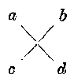

把第一直行里两个数\(a\)和\(c\)相乘，就得积里\(x^2\)的系数\(ac\)，把第二直行里两个数\(b\)和\(d\)相乘，就得积里的常数频\(bd\)，把两条对角线（斜线表示的）两数\(a\)和\(d\)，\(b\)和\(c\)分别相乘，它们的代数和就是积里\(x\)的系数\((ad + bc)\)。

这种算法， 可以叫做十字相乘法。

**例22** 计算：

（1）\((3x + 2)(4x + 5)\)；

（2）\((3x - 5)(2x - 7)\)；

（3）\((6x - 2)(3x + 4)\)；

（4）\((2x + 3)(3x - 7)\)。

**【解】**

（1）\((3x + 2)(4x + 5)\)

\[
= 12 x ^{2} + 23 x + 10；
\]

（2）\((3x - 5)(2x - 7)\)

\[
= 6 x ^{2} - 31 x + 35；
\]

（3）\((6x - 2)(3x + 4)\)

\[
= 18 x ^{2} + 18 x - 8；
\]

（4）\((2x + 3)(3x - 7)\)

\[
= 6 x ^{2} - 5 x - 21.
\]

草稿：十字相乘的算式

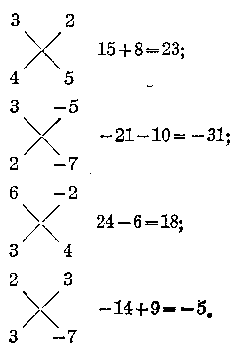

> [图像：原扫描页含图示；RAW OCR 未提供可还原的图像像素内容。]

计算（1~10）：

1.\((x + 3)(2x + 1)\)。

3.\((2x - 3)(3x - 2)\)。

5.\((3x + 7)(2x - 4)\)。

7.\((3x - 2)(3x + 5)\)。

9.\((4x - 1)(4x + 3)\)。

计算（11~20）：

11.\((a + 3b)(a + 5b)\)。

2.\((3x + 4)(5x + 2)\)。

4.\((5x - 4)(4x - 5)\)。

6.\((4x - 3)(3x + 1)\)。

8.\((5x - 1)(5x - 3)\)。

10.\((3x - 5)(5x + 6)\)。

12.\((a - 3b)(a + 7b)\)。

13.\((x + 2a)(x + 3a)\)。

15.\((a + 10b)(a - 7b)\)。

17.\((2a + 3b)(3a - 4b)\)。

19.\((2a - 5b)(3a + 4b)\)。

计算（21~34）：

21.\((x^{2} - 3y)(x^{2} - 5y)\)。

23.\((a^2 b^2 - 5)(a^2 b^2 + 7)\)。

25.\((xy + ab)(xy - 2ab)\)。

27.\((a - 2b)(2a - 3b)\)。

29.\((x^{2} - 5)(2x^{2} + 4)\)。

31.\((a + b + 7)(a + b - 4)\)。

33.\((a + b - 5)[3(a + b) + 2]\)。

34.\([2(a - b) + 7][5(a - b) - 4]\)。

14.\((x - 3a)(x + 8a)\)。

16.\((a + 7b)(a - 3b)\)。

18.\((3x - 2a)(5x - 3a)\)。

20.\((3a - 5b)(4a - 11b)\)。

22.\((x^{2} - 7y^{2})(x^{2} + 4y^{2})\)

24.\((a^2 bc + 12)(a^2 bc + 14)\)。

26.\((x^{2} + 3x)(x^{2} + x)\)

28.\((3a + b)(a + 3b)\)。

30.\((ax^{2} - 7b)(3ax^{2} + 5b)\)。

32.\((x - y - 3)(x - y - 4)\)。

*6.\((a + b + c)(a^2 + b^2 + c^2 - ab - bc - ac)\)的积

从实际运算可以得到：

\[
\begin{array}{l} (a + b + c) \left(a ^{2} + b ^{2} + c ^{2} - a b - b c - a c\right) \\ = a ^{3} + b ^{3} + c ^{3} - 3 a b c \quad (\text{乘法公式11})。 \\ \end{array}
\]

这个式子左边的两个因式，第一个是三个数的和，第二个是包括六项的代数和，其中三项分别是这三个数的平方，另外三项是这三个数中两两相乘的积的相反数.这个式子右边的乘积是一个四项式，其中三项分别是这三个数的立方，第四项是这三个数的乘积的相反数。

**例23** 利用乘法公式计算：

\[
(a + 2 b - 3 c) (a ^{2} + 4 b ^{2} + 9 c ^{2} - 2 a b + 3 a c + 6 b c)。
\]

**【审题】**\(a^2, 4b^2, 9c^2\)分别是\(a, 2b, -3c\)的平方，\(-2ab, +3ac, +6bc\)分别是这三个数中两两相乘的积的相反数，因此，可用公式。

**【解】**\((a + 2b - 3c)(a^2 + 4b^2 + 9c^2 - 2ab + 3ac + 6bc)\)

\[
= a ^{3} + (2 b) ^{3} + (- 3 c) ^{3} - 3 a (2 b) (- 3 c)
\]

\(= a^{3} + 8b^{3} - 27c^{3} + 18abc.\)

利用乘法公式计算：

1.\((a - b - c)(a^2 + b^2 + c^2 + ab + ac - bc)\)。

2.\((2a + b - 5c)(4a^2 + b^2 + 25c^3 - 2ab + 10ac + 5bc)\)。

3.\((3a + 2b + 1)(9a^2 + 4b^2 + 1 - 6ab - 3a - 2b)\)。

4.\((-2a + 3b - 4c)(4a^2 + 9b^2 + 16c^2 + 6ab - 8cc + 12bc)\)。

### §3·7 整式的除法

#### 1. 同底数的幂的除法

让我们计算：

\[
a ^{5} \div a ^{2} \quad (a \neq 0)。
\]

在代数除法里， 表示被除数的代数式叫做被除式， 表示除数的代数式叫做除式， 所得的结果叫做商。

这里，被除式\(a^5\)与除式\(a^2\)都是以\(a\)做底数的幂，所以这个除法叫做同底数的幂的除法。在除法里，因为除数不能是零，所以这里要规定\(a \neq 0\)（以后遇到除法时，我们都假定除式的值不是零）。

根据除法是乘法的逆运算的规定， 我们只要研究\(a^5\)是\(a^2\)与怎样的代数式的积。 我们知道，

\[
a ^{2} a ^{3} = a ^{5}， \quad \therefore \quad a ^{5} \div a ^{2} = a ^{3}.
\]

在这个式子里， 可以看到商仍旧是以\(a\)为底的幂， 它的指数 3， 就是被除式的指数 5 与除式的指数 2 的差， 即

\[
a ^{5} \div a ^{2} = a ^{3} = a ^{5 - 2}.
\]

同样地， 我们可以求出

\[
a ^{5} \div a ^{3} = a ^{5 - 3} \quad (a \neq 0)，
\]

\[
a ^{5} \div a ^{4} = a ^{5 - 4} \quad (a \neq 0)。
\]

一般地说，

\[
\because \quad a ^{n} \cdot a ^{m - n} = a ^{m} \quad (m > n， a \neq 0)，
\]

\[
\therefore \quad a ^{m} \div a ^{n} = a ^{m - n}. \tag {1}
\]

现在，我们再来计算

\[
a ^{5} \div a ^{5} \quad (a \neq 0)，
\]

很明显，所得的商是1.

一般地说，

\[
\because \quad a ^{m} \cdot 1 = a ^{m}，
\]

\[
\therefore \quad a ^{m} \div a ^{m} = 1 \quad (a \neq 0)。 \tag {2}
\]

从上面的（1）和（2），我们得到：

（i） 同底数的两个幂相除， 如果被除式的指数大于除式的指数， 那末底数不变， 指数相减。

\[
a ^{m} \div a ^{n} = a ^{m - n} (m > n)， m， n \text{都是自然数}， a \neq 0.
\]

（ii） 同底数的两个幂相除，如果被除式的指数与除式的指数相等，那末商等于1.

\[
a ^{m} \div a ^{m} = 1， \quad m \text{是任意自然数，} a \neq 0.
\]

**同底数的幂的除法法则**

**【注意】** 同底数的两个幂相除，如果被除式的指数小于除式的指数，这情况以后再讲。

**例1** 计算（这里所有字母都不等于 0； m， n 是自然数）：

（1）\(x^{4} \div x^{2}\)；

（2）\(x^{8} \div x^{2}\)；

（3）\(x^{15} \div x^5\)；

（4）\(x^{6} \div x^{5}\)；

（5）\(x^{6} \div x^{6}\)；

（6）\(a^{m + n} \div a^m\)；

（7）\(a^{2m} \div a^m\)；

（8）\(a^{3m + 2n} \div a^{m + n}\)。

**【解】**

（1）\(x^{4} \div x^{2} = x^{4 - 2} = x^{2}\)；

（2）\(x^{8} \div x^{2} = x^{8 - 2} = x^{6}\)；

（3）\(x^{15} \div x^5 = x^{15 - 5} = x^{10}\)；

（4）\(x^{6} \div x^{5} = x^{6 - 5} = x^{1} = x;\)

（5）\(x^{6} \div x^{6} = 1\)；

（6）\(a^{m + n} \div a^m = a^{(m + n) - m} = a^n\)；

（7）\(a^{2m} \div a^{m} = a^{2m - m} = a^{m}\)；

（8）\(a^{3m + 2n} \div a^{m + n} = a^{(3m + 2n) - (m + n)} = a^{2m + n}\)，

**【注意】** 同底数的幂相除时， 指数相减， 不是指数相除，\(\because x^{4} \div x^{2} = x^{4-2} = x^{2}\)， 不是\(x^{4} \div x^{2} = x^{4\div2} = x^{2}\)； 同样，\(x^{8} \div x^{2} = x^{8-2} = x^{6}\)，不是\(x^{8} \div x^{2} = x^{8 + 2} = x^{4}; x^{15} \div x^{5} = x^{15 - 5}\)不等于\(x^{15 + 5}\)。

**例2** 计算：

（1）\((x^{3})^{2} \div x^{2}\)；

（2）\((x^{5})^{3} \div (x^{2})^{3}\)；

（3）\((x^{5})^{3} \div (x^{3})^{5}\)；

（4）\((x^{4} \div x)^{3}\)。

**【解】** （1）\((x^{3})^{2} \div x^{2} = x^{4} \div x^{2} = x^{6 - 2} = x^{4}\)；

（2）\((x^{6})^{3} \div (x^{2})^{3} = x^{15} \div x^{6} = x^{15 - 6} = x^{9}\)；

（3）\((x^{5})^{3} \div (x^{3})^{5} = x^{15} \div x^{15} = 1;\)

（4）\((x^{4} \div x)^{3} = (x^{4-1})^{3} = (x^{3})^{3} = x^{3}\)。

**例3** 计算：

（1）\((x^{3} \cdot x^{5}) \div x^{2}\)；

（2）\(\left[(x^3)^2 \cdot x^5\right] \div x^{10}\)；

（3）\((x^{2} \cdot x^{3})^{3} \div (x^{2})^{4}\)；

（4）\(\left[(a^2)^3 \cdot (a^3)^4\right] \div (a^5)^2\)。

**【解】** （1）\((x^{3} \cdot x^{5}) \div x^{2} = x^{8} \div x^{2} = x^{6}\)；

（2）\(\left[(x^3)^2 \cdot x^5\right] \div x^{10} = [x^6 \cdot x^5] \div x^{10} = x^{11} \div x^{10} = x;\)

（3）\((x^{2} \cdot x^{3})^{3} \div (x^{2})^{4} = (x^{5})^{3} \div x^{8} = x^{15} \div x^{8} = x^{7}\)；

（4）\(\left[(a^2)^3 \cdot (a^3)^4\right] \div (a^5)^2 = [a^6 \cdot a^{12}] \div a^{10}\)

\[
= a ^{18} \div a ^{10} = a ^{8}.
\]

#### 习题3·7（1）

计算：

1.\(a^8 \div a^2\)。

3.\(a^{20} \div a^5\)。

5.\(x^{m + 1}\div x^{m}\)

7.\((a^8)^2 \div a^7\)。

9.\(b^{16} \div (b^3)^5\)。

11.\((a^3, a^5) \div a^2\)。

13.\(a^{12} \div a^3 \div a^9\)。

15.\(x^{m}, x^{2n} \div x^{n}\)。

17.\((a^3 \cdot a^5 \cdot a^4 \div a^5)^3\)。

19.\(a^{24} \div [(a^2)^2]^4\)。

2.\(b^{12} \div b^{11}\)。

4.\(x^{100} \div x^{10}\)。

6.\(x^{2m + n} \div x^m\)。

8.\((a^3)^5 \div a^5\)。

10.\((x^{3})^{4} \div (x^{2})^{6}\)。

12.\(a^{16} \div (a^3 \cdot a^6)\)。

14.\((x^{m})^{2} \div x^{m}\)。

16.\((x^{m} \cdot x^{2n})^{3} \div x^{m+n}\)。

18.\(\left[(a^3)^2\right]^3 \div a^6\)。

20.\((x^{5} \cdot x^{8} \cdot x^{m})^{2} \div x^{6}\)。

#### 2. 单项式除以单项式

我们来计算：

\[
36 a ^{3} b ^{5} c ^{2} \div 12 a ^{3} b ^{3}.
\]

这是一个单项式除以单项式的问题。我们仍旧可以利用除法是乘法的逆运算这一关系来推出计算的法则。

\[
\because 12 a ^{3} b ^{3} \times 3 b ^{2} c ^{2} = 36 a ^{3} b ^{5} c ^{2}，
\]

\[
\therefore 36 a ^{3} b ^{5} c ^{2} \div 12 a ^{3} b ^{3} = 3 b ^{2} c ^{2}.
\]

很明显，3 就是\(36 \div 12\)；\(b^{2}\)就是\(b^{5} \div b^{3}\)； 而\(a^{3} \div a^{3} = 1\)， 在商里就没有字母 a 了； 在被除式里有\(c^{2}\)， 而除式里没有字母 c， 所以商里还是\(c^{2}\)。

一般地说，我们有：

单项式除以单项式，系数和相同字母的幂分别相除，只在被除式里有的字母的幂，保留在商里。

**单项式除以单项式的法则**

**【注意】** 在单项式与单项式相除时，如果某些字母在被除式里的指数小于在除式里的指数，或者在除式里出现某些在被除式里所没有的字母，这些情况要在以后讲到分式时再讲。

**例4** 计算：\((-136a^{5}b^{3}c^{2}d)\div (-4a^{3}b^{2}c^{2})\)

**【解】**\((-136a^{5}b^{3}c^{2}d)\div (-4a^{3}b^{2}c^{2}) = 34a^{2}bd.\)

**【注意】**\((-136) \div (-4) = 34\)，就是商的系数，\(a^5 \div a^3 = a^2\)，\(b^3 \div b^2 = b\)，\(c^2 \div c^2 = 1\)，\(d\)保留不动，所以商是\(34a^2bd\)。

**例5** 计算：\(\left(-1\frac{2}{3} x^5 y^7 z^3\right) \div \left(3\frac{1}{3} x^3 y z^3\right)\)。

**【解】**\(\left(-1\frac{2}{3} x^{5}y^{7}z^{3}\right)\div \left(3\frac{1}{3} x^{3}y z^{3}\right) = -\frac{1}{2} x^{2}y^{6}.\)

**例6** 计算：\((-324a^{2m + n}b^{3m}c^{m + 3})\div (-12a^{m}b^{2m}c^{2})\)

**【解】**\((-324a^{2m + n}b^{3m}c^{m + 3})\div (-12a^{m}b^{2m}c^{2})\)\(= 27a^{(2m + n) - m}b^{3m - 2m}c^{(m + 3) - 2} = 27a^{m + n}b^{m}c^{m + 1}\)

**【注意】** 在计算熟练以后， 中间步骤可以不写出来。

计算：

1.\(6a^{2} \div (-2a)\)。

2.\(-12a^{2}b^{3}\div(-3ab^{3})\)

3.\((24a^{3}b^{4}c)\div (6a^{2}bc)\)。

4.\(\left(\frac{2}{3} x^3 x^2\right) \div \left(\frac{1}{2} a^2 x\right)\)。

5.\(0.4a^{3}x^{5}y^{10}\div 0.2vx^{4}y.\)

6.\((6a^{3})^{2} \div (4a)\)。

7.\((-12a^{3}b^{4})^{2} \div (2ab)^{3}\)。

8.\((3a^{m})^{2} \div x^{2m}\)。

9.\((4a^{m + 1})^3 \div 8a^{2m + 1}\)。

10.\(x^{m + 3}\cdot (2x^2)^3\div 4x^m.\)

#### 3. 多项式除以单项式

让我们计算：

\[
(3 a ^{3} - 6 a ^{2} - 9 a) \div 3 a.
\]

这里被除式是一个多项式， 除式是一个单项式。

我们知道，除法可以转化为被除数与除数的倒数的乘法，根据乘法对于加法的分配定律，可得

\[
(a + b + c) \div m = a \div m + b \div m + c \div m，
\]

我们有

\[
\begin{array}{l} (3 a ^{3} - 6 a ^{2} - 9 a) \div 3 a = 3 a ^{3} \div 3 a + (- 6 a ^{2}) \div 3 a \\ + (- 9 a) \div 3 a = a ^{2} - 2 a - 3. \\ \end{array}
\]

一般地说， 我们有：

多项式除以单项式，只要把被除式的各项分别除以除式，把所得的各商写成代数和。

**多项式除以单项式的法则**

**例7** 计算：（1）\((3a^{2} - 6a + 18) \div (-3)\)；

（2）\((24x^{4}y^{5} - 36x^{2}y^{4})\div (-12xy^{2})\)

**【解】** （1）\((3a^{2} - 6a + 18) \div (-3) = -a^{2} + 2a - 6;\)

（2）\((24x^{4}y^{3} - 36x^{3}y^{4})\div (-12xy^{2}) = -2x^{3}y + 3x^{2}y^{2}\)。

**例8** 计算：

\[
(0.12 a ^{3} b ^{4} c - 0.4 a ^{2} b ^{3} c + 0.6 a b ^{3} d) \div (0.2 a b ^{3})。
\]

**【解】**\((0.12a^{3}b^{4}c - 0.4a^{2}b^{3}c + 0.6ab^{3}d)\div (0.2ab^{3})\)

\[
= 0.6 a ^{2} b c - 2 a c + 3 d.
\]

**【注意】**\(0.4 \div 0.2 = 2\)，不是\(0.2\)。

**例9** 计算：\((x^{3m+2n}-x^{3m+n}+3x^{2m})\div(-x^{2m})\)

**【解】**\((x^{3m + 2n} - x^{3m + n} + 3x^{2m})\div (-x^{2m})\)

\[
= - x ^{m + 2 n} + x ^{m + n} - 3.
\]

**【注意】**\(3x^{2m} \div (-x^{2m}) = -3\)，不是\(-3x\)。

习题

3.7
（3）

计算：

1.\((12a^{4} - 16a^{3} + 24a^{2})\div (-4a^{2})\)

2.\((36a^{4}x^{5} - 24a^{3}x^{4} + 48a^{2}x^{3})\div (-6a^{2}x^{3})\)

3.\((-81x^{5}y^{6} + 27x^{4}y^{4} - 9x^{5}y^{3})\div (+9x^{3}y^{6})\)

4.\((3a^{2}b - 6a^{3}c + 12a^{4}d)\div (-3a)\)

5.\((0.6a^{3}b^{2}c - 0.8a^{2}b^{3}c^{2} + 0.4ab^{2}c^{3})\div (-0.02abc)\)。

6.\(\left(\frac{1}{2} a^4 x^2 -\frac{1}{3} a^3 x^3 -\frac{3}{4} a^2 x^4\right)\div \left(-\frac{2}{3} x^2\right).\)

7.\((a^{2m + 5} - 3a^{2m + 3} + 9a^{2m + 2})\div (3a^{2m + 1}).\)

8.\((a^{2m + 2}b^{n + 3} - 3a^{2m + 1}b^{n + 1})\div (-a^{m}b).\)

#### 4. 多项式除以多项式

多项式除以多项式，一般可用直式演算，方法与算术里多位数的除法很相象，举例说明如下：

**例10** 计算：\((x^{2} + 5x + 6)\div (x + 3)\)

**【解】**

\[
x + 3 \frac{x + 2}{x ^{2} + 5 x + 6}
\]

\[
\frac{x ^{2} + 3 x}{2 x + 6}
\]

\[
\frac{2 x + 6}{x}
\]

\[
\therefore (x ^{2} + 5 x + 6) \div (x + 3) = x + 2.
\]

解法步骤说明 （1） 先把被除式\(x^{2} + 5x + 6\)及除式\(x + 3\)写好。

（2） 将被除式\(x^{2} + 5x + 6\)的第一项\(x^{2}\)除以除式\(x + 3\)的第一项\(x\)， 得\(x^{2} + x = x\)， 这就是商的第一项， 写在被除式第一项\(x^{2}\)的上面。

（3） 以商的第一项\(x\)与除式\(x + 3\)相乘，得\(x(x + 3) = x^2 + 3x\)就是被除式应该拆出的一个部分，写在\(x^2 + 5x + 6\)的下面。

（4） 从\(x^{2} + 5x + 6\)减去\(x^{2} + 3x\)， 得差\(2x + 6\)， 写在下面， 就是被除式去掉\(x^{2} + 3x\)后的一部分。

（5） 再让\(2x + 6\)的第一项\(2x\)除以除式的第一项\(x\)， 得\(2x + x = +2\)， 这就是商的第二项， 写在商的第一项\(x\)的后面， 写成代数和形式。

（6） 以商的第二项 +2 与除式\(x + 3\)相乘， 得\(2x + 6\)， 写在刚才的差\(2x + 6\)的下面。

（7） 相减得差零， 就表示刚好能够除尽。

（8） 所以\((x^{2}+5x+6)\div(x+3)=x+2.\)

**例11** 计算：

\[
(- 24 x ^{2} + 7 x ^{3} - 21 + 58 x) \div (- 3 + 7 x)。
\]

**【审题】** 被除式和除式的幂的排列比较乱，先按\(x\)的降幂将被除式整理为\(7x^{3} - 24x^{2} + 58x - 21\)，除式整理为\(7x - 3\)

**【解】**

\[
\begin{array}{l} 7 x - 3 \sqrt {7 x ^{3} - 24 x ^{2} + 58 x - 21} \\ \frac{7 x ^{3} - 3 x ^{2}}{- 21 x ^{2} + 58 x} \\ \frac{- 21 x ^{2} + 9 x}{49 x - 21} \\ \frac{49 x - 21}{49 x - 21} \\ \end{array}
\]

\[
\therefore (7 x ^{3} - 24 x ^{2} + 58 x - 21) \div (7 x - 3) = x ^{2} - 3 x + 7.
\]

**【注意】** 多项式的直式除法， 必须先排幂， 然后再进行演算。

**例12** 计算：\((x^{3}-8x-3)\div(3-x)\)。

**【审题】** 被除式按\(x\)的降幂排列时，缺\(x^{2}\)这一项，要空出适当地位，除式按\(x\)的降幂排列，应为\(-x + 3\)。

**【解】**

\[
\begin{array}{l} - x + 3 \int \frac{x ^{3} - 8 x - 3}{x ^{3}} \\ \frac{+ x ^{3} - 3 x ^{2}}{+ 3 x ^{2} - 8 x} \\ \frac{- 3 x ^{2} - 9 x}{x - 3} \\ \frac{x - 3}{x - 3} \\ \end{array}
\]

\[
\therefore (x ^{3} - 8 x - 3) \div (- x + 3) = - x ^{2} - 3 x - 1.
\]

计算：

1.\((2x^{2} - 3x + 1)\div (x - 1).\)

2.\((6x^{3} + 14x^{2} - 4x + 24)\div (2x + 6)\)

3.\((3x^{2} + x + 9x^{3} - 1)\div (3x - 1)\)

4.\((2x^{3} - 5x^{2} + 18)\div (2x + 3).\)

5.\((x^{4} + 2x^{2} - x + 2)\div (1 - x + x^{2})\)

6.\((18a^{4} + 82a^{2} + 40 - 67a - 45a^{3})\div (3a^{2} + 5 - 4a)\)

**例18** 计算：\((6x^{3}-x^{2}y-14xy^{2}+3y^{3})\div(2x-3y)\)。

**【审题】** 这里有两个字母\(x\)与\(y\)， 按\(x\)的降幂排列， 而后演算。

**【解】**

\[
\begin{array}{l} 2 x - 3 y \sqrt {\frac{6 x ^{3} - x ^{2} y - 14 x y ^{2} + 3 y ^{3}}{8 x ^{2} y - 14 x y ^{2}}} \\ \frac{6 x ^{3} - 9 x ^{2} y}{8 x ^{2} y - 14 x y ^{2}} \\ \frac{8 x ^{2} y - 12 x y ^{2}}{- 2 x y ^{2} + 9 y ^{3}} \\ \frac{- 2 x y ^{2} + 3 y ^{3}}{- 2 x y ^{2} + 9 y ^{3}} \\ \end{array}
\]

\(\therefore (6x^{3} - x^{2}y - 14xy^{2} + 3y^{3})\div (2x - 3y) = 3x^{2} + 4xy - y^{3}.\)

计算：

1.\((a^{2} - 4ab + 3b^{2})\div (a - 3b)\)

2.\((4x^{2} - 5xy + y^{2})\div (4x - y)\)

3.\((a^3 - b^2) \div (a + b)\)。

4.\((a^3 \div b^3) \div (a + b)\)。

5.\((8x^{3} - 27y^{3})\div (2x - 3y)\)

6.\((a^4 + 2a^2b^2 + 9b^4) \div (a^2 - 2ab + 3b^2)\)。

7.\((a^5 + 32b^5) \div (a + 2b)\)。

8.\((2a b + b^2 + a^2 + 2ac + 2bc + c^2) \div (b + c + c)\)。

9.\((a^3 + b^3 + c^3 - 3abc) \div (a + b + c)\)。

10.\((a^3 + b^3 - c^3 + 3abc) \div (a + b - c)\)。

#### 5. 有余式的除法

上面我们所遇到的整式除法， 都是恰巧能够除尽， 求到整式的商， 它们可以用下面的关系式来验算：

被除式\(\approx\)除式\(\times\)商。

但这种情形是比较特殊的，正象算术里整数的除法常常不能整除一样，整式的除法有时也不能恰巧得到整式的商。例如，我们来计算

\[
(x ^{2} - 2 x + 3) \div (x + 1)。
\]

列出算式如下：

\[
\begin{array}{l} \frac{x - 3}{x + 1} \sqrt {\frac{x ^{2} - 2 x + 3}{x ^{2} + x}} \\ \frac{- 3 x \div 3}{- 3 x - 3} \\ \frac{- 3 x - 3}{6} \\ \end{array}
\]

这里最后一步相减后得到一个不是零的常数6，并且它的次数已经低于除式的次数，除法不能再做下去了。

象算术里不能整除的除法一样， 我们把\(x - 3\)叫做不完全的商， 简单地就把它叫做商， 把 6 叫做余式。

这样本题的答案，就可以写成：

**答：**商是\(x - 3\)，余式是6.

在算术的有余数除法里，被除数，除数，商和余数有下面的关系：

被除数\(=\)除数\(\times\)商\(+\)余数。

同样地， 在代数的有余式的除法里， 被除式， 除式， 商和余式之间有两下的关系：

被除式\(=\)除式\(\times\)商\(\div\)余式。

我们可以利用这个关系式来进行除法的验算。例如

\[
\begin{array}{l} (x + 1) (x - 3) + 6 = x ^{2} - 2 x - 3 + 6 \\ = x ^{2} - 2 x + 3. \\ \end{array}
\]

**例14** 计算：

\[
(x ^{4} + 3 x ^{3} - 2 x ^{2} + 5 x + 1) \div (x ^{2} - x + 2)。
\]

**【解】**

\[
\begin{array}{l} x ^{2} + 4 x \\ x ^{2} - x + 2 \int \frac{x ^{4} + 3 x ^{3} - 2 x ^{2} + 5 x + 1}{x ^{4} - x ^{3} + 2 x ^{2}} \\ \frac{4 x ^{3} - 4 x ^{2} + 5 x}{4 x ^{3} - 4 x ^{2} + 8 x} \\ - 3 x + 1 \\ \end{array}
\]

**答：**部分商是\(x^{2} + 4x\)，余式是\(-3x + 1\)

**注** 因为\(-3x + 1\)是\(x\)的一次式， 它的次数已比除式\(x^{2} - x + 2\)这个二次式的次数低， 除法不能再做下去了。 所以得商\(x^{2} + 4x\)， 余式\(-3x + 1\)。

演算下列除法，说明商和余式，并进行验算：

1.\((x^{2} - 3x + 5)\div (x - 1)\)

2.\((3x^{2} + 4x - 8)\div (x + 2)\)

3.\((x^{3} + 3x^{2} - 5x + 1)\div (x - 2)\)

4.\((2x^{3} - 3x^{2} - 5x \div 12) \div (x + 2)\)。

5.\((2x^{3} - 3x^{2} + 6x + 8) \div (x^{3} + 3x + 1)\)。

6.\((x^{4} - 3x^{3} + 6x^{2} - 8x + 10)\div (x^{3} - 2x - 1).\)

### \*§3·8 分离系数法

我们在前面做过含有一个字母的多项式的乘法和除法， 这些乘法和除法， 一般是要在排幂之后用直式进行运算的。我们不妨再举一个例子来研究。

**例1** 计算：\((3x^{2} - 5x + 1)(5x^{2} + 3x - 1)\)

**【解】** 按降幂排列

\[
\begin{array}{l} 3 x ^{2} - 5 x + 1 \\ \frac{5 x ^{2} + 3 x - 1}{15 x ^{4} - 25 x ^{3} + 5 x ^{2}} (\times \\ + 9 x ^{3} - 15 x ^{2} + 3 x \\ - 3 x ^{2} + 5 x - 1 \\ 15 x ^{4} - 16 x ^{3} - 13 x ^{2} + 8 x - 1. \\ \end{array}
\]

这样的写法比较繁琐，能不能再简单一些呢？

这里，两个因式和乘积都是按降幂排列的。每一个式子里后一项的幂的次数总比前一项小1，积的最高项的幂次数等于两个因式最高项幂的次数的和。根据这样的规律，我们可以把直式的写法简化一些，把字母部分省略，只把系数写出，列式如下：

\[
\begin{array}{l} 3 - 5 + 1 \\ \frac{5 + 3 - 1}{15 - 25 + 5} \\ 9 - 15 + 3 \\ - 3 + 5 - 1 \\ \frac{15 - 16 - 13 + 8 - 1}{15 - 16 - 13 + 8 - 1}， \\ \end{array}
\]

然后，添上字母的部分，写出结果，得

\[
(3 x ^{2} - 5 x + 1) (5 x ^{2} + 3 x - 1) = 15 x ^{4} - 16 x ^{3} - 13 x ^{2} + 8 x - 1.
\]

这种演算方法叫做分离系数法。

**例2** 计算：\((3x^{3}-5x^{2}+1)(4x^{2}-1)\)。

**【审题】** 这里，两个因式按降幂排列时中间都有缺项，在用分离系数法列式时要把缺项的系数0补上去，乘积的最高项应为\(12x^{5}\)。

**【解】**

\[
3 - 5 + 0 + 1
\]

\[
4 + 0 - 1
\]

\[
12 - 20 + 0 + 4
\]

\[
0 + 0 + 0 + 0
\]

\[
- 3 + 5 + 0 - 1
\]

\[
12 - 20 - 3 + 9 \div 0 - 1，
\]

\[
\therefore (3 x ^{3} - 5 x ^{2} + 1) (4 x ^{2} - 1)
\]

\[
= 12 x ^{5} - 20 x ^{4} - 3 x ^{3} + 9 x ^{2} - 1.
\]

我们把含有两个字母而且各项的次数都相同的多项式叫做二元齐次多项式，应用分离系数法，我们还可以演算这种多项式的乘法，举例如下。

**例3** 计算\((3x^{3}-5x^{2}y+6xy^{2}-y^{3})(x^{2}-3xy+y^{2})\)。

**【审题】** 这里第一个因式是\(x, y\)的三次齐次式，第二个因式是\(x, y\)的二次齐次式，它们都是按照\(x\)的降幂（\(y\)的升幂）排列的。容易看出，积应该是按\(x\)的降幂排列着的\(x, y\)的五次齐次式，首项是\(3x^5\)。根据这一规律，我们可以用分离系数法来演算。

**【解】**

\[
3 - 5 + 6 - 1
\]

\[
\frac{1 - 3 + 1}{3 - 5 + 6 - 1}
\]

\[
- 9 + 15 - 18 + 3
\]

\[
3 - 5 + 6 - 1
\]

\[
3 - 14 + 24 - 24 + 9 - 1
\]

\[
\begin{array}{l} \therefore (3 x ^{3} - 5 x ^{2} y + 6 x y ^{2} - y ^{3}) (x ^{2} - 3 x y + y ^{2}) \\ = 8 x ^{3} - 14 x ^{4} y + 24 x ^{3} y ^{2} - 24 x ^{2} y ^{3} + 9 x y ^{4} - y ^{5}. \\ \end{array}
\]

应用分离系数法我们还可以演算一元多项式或者二元齐次多项式的除法。举例如下。

**例4** 计算：\((x^{3}-3x^{2}+x+1)\div(x-1)\)。

**【解】** 用分离系数法列直式：

\[
\begin{array}{rl} & 1 - 1 \frac{1 - 2 - 1}{1 - 1 - 3 + 1 + 1} \\ & \frac{1 - 1}{- 2 + 1 + 1} \\ & \frac{- 2 + 2}{- 1 + 1} \\ & \frac{- 1 + 1}{- 1 + 1}. \end{array}
\]

\[
\therefore (x ^{3} - 3 x ^{2} + x + 1) \div (x - 1) = x ^{2} - 2 x - 1.
\]

**例5** 计算：\((3x^{3}-5x+14)\div(x+2)\)。

**【审题】** 被除式缺少 x 的二次项， 要补上一个零。

**【解】**

\[
\begin{array}{l} \frac{3 - 6 + 7}{1 + 2 \sqrt {3 + 0 - 5 + 14}} \\ \frac{3 + 6}{- 6 - 5} \\ \frac{- 6 - 12}{7 + 14} \\ \frac{7 + 14}{7 + 14} \\ \end{array}
\]

\[
\therefore (3 x ^{3} - 5 x + 14) \div (x + 2) = 3 x ^{2} - 6 x + 7.
\]

**例6** 计算：\((x^{3} - y^{6})\div (x - y)\)

**【审题】** 这里被除式和除式也都是关于\(x\)和\(y\)的二元齐次式。 被除式是六次齐次式，中间有五个缺项，除式是一次齐次式。 商式一定是关于\(x\)和\(y\)的五次齐次式，第一项应该是\(x^5\)。

**【解】** 用分离系数法列直式：

\[
\begin{array}{l} \frac{1 + 1 + 1 + 1 + 1 + 1}{1 - 1} \frac{1 + 1 + 1 + 1 + 1 + 1}{1 + 0 + 0 + 0 + 0 + 0 - 1} \\ \frac{1 - 1}{1 + 0} \\ \frac{1 - 1}{1 + 0} \\ \frac{1 - 1}{1 + 0} \\ \frac{1 + 0}{1 - 1} \\ \frac{1 - 1}{1 - 1} \\ \frac{1 - 1}{1 - 1} \\ \end{array}
\]

\(\therefore (x^{6} - y^{6}) \div (x - y) = x^{5} + x^{4}y + x^{3}y^{2} + x^{2}y^{3} + xy^{4} + y^{5}\)。

用分离系数法计算：

1.\((3x^{2} - 5x - 4)(x + 2)\)。

2.\((3x^{3} - 5x + 8)(3x - 2)\)。

3.\((x^{5} + x^{4} + x^{3} + x^{2} + x + 1)(x - 1)\)。

4.\((x^{2} + xy + y^{2})(x^{2} - xy + y^{2})\)

5.\((x^{8} - 5x^{2} + x + 3)\div (x - 1).\)

6.\((2x^{3} - 5x^{2} + x + 2)\div (x - 2).\)

7.\((x^{3} - 7x^{2} + 8)\div (x + 1).\)

8.\((x^{5} + y^{5})\div (x + y)\)

### \*§3·9 综合除法

让我们看下面的分离系数法除法。

**例1** 计算：\((2x^{3} - 3x^{2} + 4x - 3)\div (x - 1).\)

**【解】** 用分离系数法做。

\[
\begin{array}{l} 1 - 1 \sqrt {\frac{2}{2} - 3 + 4 - 3} \\ \boxed {2} - 2 \\ - 1 + 4 \\ \boxed {- 1} + 1 \\ 3 \boxed {- 3} \\ \boxed {3} - 3 \\ \end{array}
\]

即\((2x^{3} - 3x^{2} + 4x - 3)\div (x - 1) = 2x^{2} - x + 3.\)

这样的写法比起不用分离系数法的直式的写法当然要简单得多。

但我们可以发现，上面式子中有方框“□”的部分都是和它们上面的数字完全相同的。如果我们把这些数字也删去了，并且把有些数字往上移到空档的地方，这个式子就可以改写得更加简单一些，如下式：

\[
\begin{array}{rl} & \boxed { \begin{array}{c} - 2 \boxed {- 1 + 3} \\ 1 - 1 \boxed {2 - 3 - 4 - 3} \\ - 2 - 1 - 3 \\ - 1 + 3 \end{array} } \end{array}
\]

在上面的式子里，再把商式的第一个系数2往下面移动（按照箭头的指示），那么，下面最后一行就是商式的系数，上面的商式可以再略去了。式子变为

\[
\begin{array}{rl} 1 - 1 & 2 - 3 + 4 - 3 \\ & - 2 + 1 - 3 \\ \hline 2 - 1 + 3 \end{array}
\]

这个式子可以直接得出， 方法如下：

（1） 因为除式的第一个系数是 1，所以商式的第一个系数和被除式的第一个系数相同，可以直接把 2 写在商式里。

（2） 把 2 和除式的第二个系数 -1 相乘， 得 -2， 写在被除式第二项的下面， 系数相减， 得 -1 写在下面， 这就是商式的第二项的系数了。

（3） 再把 -1 与除式第二项系数 -1 相乘， 得 +1， 写在被除式第三项系数 4 的下面， 系数相减， 得 +3， 就是商式的第三项的系数了。

（4） 再把 +3 与除式的第二项系数 -1 相乘， 得 -3， 写在被除式最后一项的系数的下面， 系数相减得零， 就是刚刚整除， 没有余数。

从上面的做法可以看出， 当除式的第一项系数是 1 时， 实际上这个 1 在计算中是用不到的， 也是可以省略掉的。 在计算中， 因为是除法， 我们要做系数的减法， 还容易出错误， 所以我们把除式的常数项变号， 把 -1 变做 +1， 写在右边， 这样与商式各项系数相乘的结果与原式也都变了号， 但系数可以从相减变做相加了。 这样就更方便。

变动以后， 得式子如下：

\[
\begin{array}{rl} & 2 - 3 + 4 - 3 \mid + 1 \\ & \quad + 2 - 1 + 3 \\ \hline {} & 2 - 1 + 3 \mid 0 \end{array}
\]

这个最后的写法就叫做综合除法。凡是除式是\(x - a\)的形式的除法，都可以用这种方法来做。

现在再把列式演算过程的步骤说明如下：

（1） 先写好被除式各项的系数（要按照降幂排列），有缺项时要补写0.

（2） 当除式是二项式\(x - a\)时， 把常数项\(-a\)变号成\(a\)， 写在除式的右边， 中间用一条竖线隔开 （如除式是\(x + a\)， 常数项变号成\(-a\)）。

（3） 把商式的第一个系数写在横线下面，作为商式的第一项的系数。

（4） 把这个数与写在右边的\(a\)相乘， 乘积写在被除式第二项系数的下面， 然后系数相加， 得商式的第二项的系数。

（5） 再按上法继续进行， 如果最后常数项的和等于零， 就是除法能除尽， 余数是零。 如果最后的数不是零， 那末这个数就是余数， 不能再除下去了。 在商式的系数与余数之间要加上一条竖线把它们隔开， 以免混淆。

**例2** 用综合除法计算：

\[
(3 x ^{3} - 4 x ^{2} + 2 x + 44) \div (x + 2)。
\]

**【审题】** 这里除式是\(x + 2\)，常数项\(+2\)变号成为\(-2\)。

**【解】**

\[
\begin{array}{rl} & 3 - 4 + 2 + 44 \left| - 2 \right. \\ & - 6 + 20 - 44 \\ \hline {} & 3 - 10 + 22 \end{array}
\]

\[
\therefore \quad (3 x ^{3} - 4 x ^{2} + 2 x + 44) \div (x + 2) = 3 x ^{3} - 10 x + 22.
\]

**例3** 用综合除法计算：

\[
(2 x ^{3} + x - 3) \div (x - 2)。
\]

**【审题】** 被除式缺\(x^{2}\)项， 要补上系数 0. 除式里常数项是 -2， 变号成为 +2.

**【解】**

\[
\begin{array}{rl} 2 + 0 + 1 & - 3 \mid 2 \\ 4 + 8 & + 18 \\ \hline 2 + 4 + 9 & + 15 \end{array}
\]

**答：**商是\(2x^{2} + 4x + 9\)，余数是15.

**例4** 用综合除法计算：

\[
(2 x ^{3} + x ^{2} - 5 x + 2) \div \left(x - \frac{1}{2}\right)。
\]

**【解】**

\[
\begin{array}{rl} & 2 + 1 - 5 + 2 \left| \frac{1}{2} \right. \\ & \left. \frac{+ 1 + 1 - 2}{2 + 2 - 4} \right| 0 \end{array}
\]

\[
\therefore (2 x ^{3} + x ^{2} - 5 x + 2) \div \left(x - \frac{1}{2}\right) = 2 x ^{2} + 2 x - 4.
\]

**例5** 用综合除法计算：

\[
(2 x ^{3} + x ^{2} - 5 x + 2) \div (2 x - 1)。
\]

**【审题】** 这里除式\(2x - 1\)不是\(x - a\)的形式。但我们可以把\(2x - 1\)变成\(\left(x - \frac{1}{2}\right) \times 2\)，这样就可以先除以\(x - \frac{1}{2}\)，再除以 2。

**【解】** 先把\(x - \frac{1}{2}\)作为除式， 从例4得商式\(2x^{2} + 2x - 4\)， 再以2去除\(2x^{2} + 2x - 4\)， 得\(x^{2} + x - 2\)。

\[
\therefore (2 x ^{3} + x ^{2} - 5 x + 2) \div (2 x - 1) = x ^{2} + x - 2.
\]

用综合除法演算，如有余数时，说明部分商式及余数：

1.\((x^{3} - 2x^{2} + 3x - 2)\div (x - 1)\)

2.\((x^{3} - 7x^{2}\div 20)\div (x - 2)\) 3.\((2x^{3} + 3x^{2} + 3x + 10)\div (x + 2)\) 4.\((x^{5} - 1)\div (x - 1).\) 5.\((x^{9} - 1)\div (x + 1)\) 6.\((x^{5} + 1)\div (x + 1).\) 7.\((x^{6} + 1)\div (x + 1)\) 8.\((2x^{3} - 3x^{2} - 4x - 1)\div (2x + 1)\)

### §3·10 代数式的恒等变形

在整式运算中，我们使用下面这样的等式来表示运算的结果与原来的式子之间的关系，如

\[
3 a + 5 a = 8 a.
\]

\[
(a + b) (a - b) = a ^{2} - b ^{2}.
\]

在这样的等式中，字母的数值是不受限制的。那就是说，字母可以取任意数值，代入后，等式左边的式子的值和等式右边的式子的值总是相等的。这样的等式叫做恒等式。这样从左边的式子变到右边的式子或从右边的式子变到左边的式子的过程叫做恒等变换或恒等变形。为了强调等式两边的式子恒等，我们有时把这个关系符号写做“≡”，读做“恒等于”。例如

\[
(x + 3) ^{2} \equiv x ^{2} + 6 x + 9.
\]

在除法运算中，我们也用恒等式来表示被除式、除式、商式之间的关系。如

\[
(x ^{2} - 4) \div (x - 2) = x + 2.
\]

但是， 这里字母\(x\)的值是有限制的，\(x\)的允许值是除去 2 以外的任意数， 即\(x \neq 2\)。 这里所谓恒等是指字母允许值范围之内的恒等。 在字母允许值之外， 因为左边的式子没有意义 （右边还是有意义的）， 所以两边不能说相等。 在从左边的式子变到右边的式子时，\(x\)的允许值范围扩大了。

在有余式的除法中， 在整式范围内， 我们也可以用恒等式来表示被除式、除式、部分商式及余式之间的关系。 但只能避免除法的写法而写成被除式等于除式与部分商式的积加上余式的形式。

如\((x^{2} - 3x + 2) \div (x - 4)\)时，得部分商式\(x + 1\)，余6.可以写做

\[
(x ^{2} - 3 x + 2) \equiv (x + 1) (x - 4) + 6.
\]

一般情况下， 如果把被除式叫做 A， 除式叫做 B， 部分商式叫做 Q， 余式叫做 R， 就可以写成

\[
A \equiv B Q + R.
\]

这个式子也是恒等式。

在下列恒等式中，字母\(x\)的允许值有没有限制？从左边的式子变到右边的式子，字母\(x\)的允许值有没有扩大或缩小？

1.\((x + 3)(x - 3) = x^2 -9.\)

2.\((x^{2} - 9)\div (x + 3) = x - 3.\)

3.\((x^{2} - 9)\div (x - 3) = x + 3.\)

4.\(x^{2} - 2x + 3 = x(x - 2) + 3.\)

### 本章提要

#### 1. 整式的加减运算

（1） 同类项相加：系数相加，字母指数都不变。

（2） 非同类项相加：按降幂或升幂排列，写成代数和。

（3） 减法：把减式各项变换性质符号后做加法。

#### 2. 去括号与添括号法则

（1） 去括号：括号前是正号的，符号不变。如\(a + (b + c - d) = a + b + c - d\)。括号前是负号的，括号内各项变换性质符号。如

\[
a - (b + c - d) = a - b - c + d.
\]

（2） 添括号：括号前用正号的，符号不变。如

\[
a + b + c - d = a + (b + c - d)。
\]

括号前用负号的，括号内各项变换性质符号.如

\[
a - b + c - d = a - (b - c + d)。
\]

**3. 同底数的幂的乘除法和乘方指数法则**

（1） 同底数的幂的乘法：\(a^{m} \cdot a^{n} = a^{m+n}\)。

（2） 同底数的幂的除法：\(a^m \div a^n = a^{m-n}\)

\[
(m > n， a \neq 0)。
\]

\[
a ^{m} \div a ^{m} = 1 \quad (a \neq 0)。
\]

（3） 幂的乘方：\((a^{m})^{n} = a^{mn}\)。

（4） 积的乘方：\((ab)^{m} = a^{m}b^{m}\)。

**4. 整式的乘除法则**

（1） 单项式乘以单项式：

1° 系数相乘。

\(2^{\circ}\)相同字母的幂，按同底数的幂的乘法，指数相加。

\(3^{\circ}\)不相同的字母， 作为积的不同因式排列好。

（2） 单项式与多项式相乘：应用乘法对于加法的分配律，以单项式分别乘多项式的各项：

\[
a (b + o + d) = a b + a o + a d.
\]

（3） 多项式与多项式相乘：应用乘法对于加法的分配律，以一个多项式的每一项分别乘以另一个多项式的每一项，再合并同类项。如

\[
\begin{array}{l} (a + b) (c + d) = a (c + d) + b (c + d) \\ = a c + a d + b c + b d. \\ \end{array}
\]

（4） 单项式除以单项式：

\(1^{\circ}\)系数相除。

\(2^{\circ}\)相同字母的幂，按同底数的幂的除法，指数相减。指数相同时，这个字母在商里没有了。

\(3^{\circ}\)被除式里有而除式里没有的字母的幂，保持原幂不变。

（5） 多项式除以单项式：以除式分别去除被除式的各项。

（6） 多项式除以多项式：一般用直式进行。

*（7） 分离系数法的多项式乘除法。

*（8） 综合除法。

（7）、（8）是多项式乘除法的简略写法，初学者感觉困难时，可以不学或缓学。

#### 5. 乘法公式

（1）\((a + b)(a - b) = a^2 - b^2\)。

（2）\((a + b)^2 = a^2 + 2ab + b^2.\)

（3）\((a - b)^2 = a^2 - 2ab + b^2\)。

（4）\((a + b + c)^2 = a^2 + b^2 + c^2 + 2ab + 2ac + 2bc.\)

（5）\((a + b)(a^2 - ab + b^2) = a^3 + b^3\)。

（6）\((a - b)(a^2 + ab + b^2) = a^3 - b^3\)。

（7）\((a + b)^3 = a^3 + 3a^2b + 3ab^2 + b^3\)。

（8）\((a - b)^{3} = a^{3} - 3a^{2}b + 3ab^{2} - b^{3}\)。

（9）\((x + a)(x + b) = x^2 + (a + b)x + ab\)。

（10）\((ax + b)(cx + d) = axx^2 + (bc + ad)x + bd.\)

（11）\((a + b + c)(a^2 + b^2 + c^2 - ab - ac - bc)\)

\[
= a ^{3} + b ^{3} + c ^{3} - 3 a b c.
\]

### 复习题三A

演算（1~5）：

1.\((3a^{5} + 5a^{2}b - 5ab^{2} + b^{3})\div (5a^{3} - 7a^{2}b + 3ab^{2} - b^{3})\)

2.\((3x^{3} - 2x^{2} - 5x + 7) - (5x^{2} - 2x^{2} - 3x - 4)\)

\[
+ (- 2 x ^{3} - 3 x ^{2} - 5 x - 7)。
\]

3.\((3a^{3}b - 5ab^{2})(-3ab) - (7a - 3b)(-5a^{2}b^{2})\)

4.\((30a^{2}b^{3}c^{4} - 25a^{3}b^{2}c^{5} + 20a^{4}b^{4}c^{7})\div (-5a^{2}b^{2}c)\)

5.\((3a^{3}x^{3})\div \left(\frac{1}{3} ax\right)\times (-5a^{3}x^{3})\div (15a^{2}x^{7}) - a^{3}\div a^{4}.\)

用直式演算\((6\sim 9)\)

6.\((2x^{3} - x^{2} + 5)(x - 3 + x^{2})\) 7.\((x^{2} + 2xy + y^{2})(x + 2y)\)。

8.\((x^{6} - 9x^{4} + 12x^{2} - 4)\div (x^{3} + 3x^{2} - 2)\)

9.\((a^5 - b^5) \div (a - b)\)。

化简（10~15）：

10.\(x(x^{2} - 3x + 5) - x(x - 3)\)。

11.\((-3x^{2})(x^{2} - 2x - 3) - (3x)(x^{3} - 2x^{2} - 5)\)。

12.\((x - 3)(x + 4) - (x + 3)(x - 4)\)。

13.\((3x - 5)(2x - 3) - (2x + 3)(3x - 4)\)。

14.\((x - 1)(x - 2) - 3x(x + 3) + 2[(x + 2)(x + 1) - 3]\)。

15.\(-(a - b) = [-a - (2a - b)] - 6(a - 4b)\)。

利用乘法公式演算（16~17）：

16.\((x + 3)^{2} + (x - 3)^{2} + (2x - 3)^{2} - (2x + 3)^{2}\)。

17.\((3x + 2y)(3x - 2y) - (3x + 2y)^{2} - (3x - 2y)^{2}\)。

用乘法公式化简下列各代数式， 然后求这个代数式的值（18~19）：

18.\((a + 3b)^{3} - (a - 3b)^{3}\)， 已知\(a = \frac{1}{2}\)，\(b = -\frac{2}{3}\)。

19.\((3a - 2b)(9a^2 + 6ab + 4b^2) - (3a + 2b)(9a^2 - 6ab + 4b^2)\)， 已知

\[
b = - \frac{3}{2}.
\]

化简下列各式，再求它们的值：

20.\(5x(y - z) - \{2z(3x - 2y) - [12xy - 8(4xy + xz)]\}\)， 其中\(x = -\frac{2}{3}\)，

\[
y = - \frac{1}{2}， z = - 5.
\]

21.\((x + 1)^{3} - (x - 2)^{3} - (3x - 1)^{2}\)， 其中\(x = 2.53\)。

用乘法公式计算并化简：

22.\((x^{3} - y^{3})(x^{3} + y^{3})(x^{12} + x^{6}y^{6} + y^{12})\)

23.\((a^2 - ab + b^2)(a^2 + cb - b^2) - (a^2 + ab + b^2)(a^2 - ab - b^2)\)。

24.\((2a^{2} - 3a + 1)^{2} - (2a^{2} + 3a - 1)^{2}\)。

25.\((3x - 5)(2x - 3) - (2x + 3)(3x - 5) + (x - 3)(2x - 5)\)。

用科学记数法表示下列各数，取四位有效数字：

26. 38000000.

27. 1036000000.

28.\(4.056 \times 10^{9} - 7.43 \times 10^{9}\)。

29. 一个正方形的边长等于\(a\)厘米，一个矩形的长比这个正方形的边长大4厘米，它的宽比这个正方形的边长小4厘米。列出代数式表示这个正方形和这个矩形的面积的和（差），并化简代数式。

30. 如\(|-x|=x, x\)是怎样的数？

如\(|-x|=-x,x\)是怎样的数？

### 复习题三B

计算并化简（1~12）：

1.\(6x - \{4x + [2x - (3x + (5x + 7) - 1) + 3] - 8\}\)。

2.\(2a - \{4a - c + [3a - (4b - c) - (b + 3c)] - 6c\}\)。

3.\(z - [3x + (y + 5z)] - [x - (3y + 2z)]\)

4.\((a^3\cdot a^5)^2 +(a^3\div a^2)^3.\)

5.\((-3a^{2}b^{3})^{3}\div (3ab^{2})^{2}\)。

6.\(a^3, a^5, a^8, b^3, b^4, a^3 + a^3, a^5, b^2, b^4\)。

7.\(x^{3}y^{2}x^{5}y^{2}x^{3}y^{5} - x^{5}y^{5}\div x^{2}y^{3}\)

8.\((a^8\div a^2)^2 +(a^3\div a^3)\cdot a^2.\)

9.\(a^m \cdot a^n \cdot a^{2m} \cdot a^3\)。

10.\(a^{m + 1}\div a^m\times a^{n + 7}\div a^3.\)

11.\((a^{m})^{n}\div a^{m}\)

12.\((a^{m + 1})^{n}\div a^{mn}\)

用直式演算（13~16）：

13.\((a^{m} + 2)\times (a^{m} + 3)\)

14.\((a^{2m} + 3a^m + 2) \div (a^m + 1)\)。

15.\((a^{3m} - 3a^{2m} + 3a^m - 1) \div (a^m - 1)\)。

16.\((a^{2m} + a^m + 1) \cdot (a^{2m} - a^m - 1)\)。

用乘法公式计算（17~24）：

17.\((a - 2b + 3c)^{2} - (a + 2b - 3c)^{2} - (a + 2b + 3c)(a - 2b - 3c)\)。

18.\((3x - 2y)(9x^{2} + 6xy + 4y^{2}) - (3x - 2y)^{3}\)。

19.\(a(a + b)(a - b) - (a + b)^3.\)

20.\((a - b - 4c)(a^2 + b^2 + 16c^2 + ab + 4ac - 4bc)\)。

21.\((2x - y)(2x - 3y) - (3x - y)(2x - 5y)\)。

22.\(3(x + 5)(x + 3) - 5(x - 2)(x - 3) + 2(x + 1)(x - 2)\)。

23.\((3x^{3} + x^{2} - 2x - 5)(3x^{3} - x^{2} - 2x + 5)\)。

24.\((x^{2} + 3x - 2)(x^{2} + 3x - 5)\)。

用简便方法计算（25~27）：

25.\((x - 1)(x - 2)(x - 3)(x - 4)\)。

26.\((x + 3)^{2}(x - 3)^{2} - (2x + 1)^{2}(2x - 1)^{2}\)。

27.\((x + 2y)^{3}(x - 2y)^{3} - (2x + y)^{3}(2x - y)^{3}\)。

用分离系数法计算\((28\sim30)\)：

28.\((3x^{3} - 2x^{2}y + y^{3})(x^{2} - xy + y^{2})\)

29.\((x^{4} + x^{2}y^{2} + y^{4})\div (x^{2} + xy + y^{2})\)

30.\((x^{6} + 1)\div (x^{2} + 1)\)

用综合除法计算（31~32）：

31.\((x^{4} + 3x^{3} + 2x^{2} - 6)\div (x - 1).\)

32.\((x^{5} - 3x^{2} + x - 5)\div (x + 2)\)

说明下列恒等变形中字母\(x\)的允许值有否变化\((33\sim 38)\)

33.\((x + 2)(x - 1) = x^2 + x - 2.\)

34.\((x^{2} - 3x + 2)\div (x - 2) = x - 1.\)

35.\(x - 3 = (x^2 - 9) \div (x + 3)\)。

36.\(\frac{x^2 + x + 1}{x - 1} = x + 2 - \frac{3}{x - 1}\)。

37. 当\(a > 4\)时，化简

\[
\vert 4 - a \vert + \vert 2 - a \vert - \vert a - 3 \vert .
\]

38. 当 -4 < a < 3 时， 化简

\[
\vert a + 4 \vert + \vert a - 3 \vert - \vert 2 a - 7 \vert .
\]

### 第三章测验题

1. 计算：

（1）\((3a^{3} - 2a + 5a^{2} - 1) + (3 - 8a^{2} + 8a^{3} - 5a)\)；

（2）\((6x^{2} - 5x^{3} + 4x - 1) - (3x + 4 - 5x^{3} - 2x^{2})\)。

2. 计算：

（1）\(3x^{3} - \left[7x - \left(1\frac{2}{3} x + 3\right) - 2x^{2}\right];\)

（2）\(3a + \{5b - [3a^2 - (4b^2 - 5a) + 3b] - (5b^2 + 6b)\}\)。

3. 计算：

（1）\(x^{2} \cdot x^{3} - x \cdot x^{4}\)；

（2）\((-x^{2})^{2} + (-x^{3})^{3}\)。

4. 计算：

（1）\(\left[(-2a^{3}b)^{3}\right]^{2} \div (-8ab^{2})^{2}\)；

（2）\(x^{m} \cdot x^{m+1} \div x^{2m}\)。

5. 计算：

（1）\(3(x - 3)(2x + 1) - 5(x + 3)(3x - 1)\)；

（2）\((x^{3} - 2xy^{2} - 3y^{2})(x - 2y) - 8xy(x^{3} - y^{2})\)

6. 计算：

（1）\((x^{3} - 3x^{2} - 9x + 22) \div (x - 2)\)；

（2）\((x^{3} - x^{2} - x + 10) \div (x^{2} - 3x + 5)\)。

7. 计算：

（1）\((x + y)(x - y) + (x^4 - y^4) \div (x^2 - y^2)\)；

（2）\((2x - y)^{2} - (3x + y)^{2}\)。

8. 应用乘法公式计算：

（1）\((a + 2b - 3c + 4d)(a - 2b + 3c + 4d)\)；

（2）\((102)^{2} \times (98)^{2}\)。

9. 计算：

（1）\((a^{m} + b^{m})^{3} - (a^{m} - b^{m})(a^{2m} + a^{m}b^{m} + b^{2m});\)

（2）\((a + b - c - d)^2\)。

10. 化简下列各式：

（1）\(2|x - 4| - 3|x + 1|, -1 < x < 4;\)

（2）\(|x-3|-2|2x+4|,\quad x<-2,\)

## 4. 因式分解

在上一章里，我们学习了整式的各种运算。进一步我们将学习分式的运算。但在这之前，我们要先学习多项式的因式分解，这和算术里学习分数以前，先要学习整数的因数分解一样。这一章里我们就来讨论多项式的因式分解。

### §4·1 因式分解的意义

在算术里我们知道，一个自然数如果除掉1和它本身以外，不能被其他自然数整除，那末这个数就叫做质数又叫素数；如果还能够被其他自然数整除，那末这个数就叫做合数。自然数1既不是质数，也不是合数。

对于一个合数，我们总可以把它分解成若干个质因数的连乘积。

例如：\(35 = 7 \times 5, 63 = 7 \times 9 = 7 \times 3 \times 3 = 3^2 \times 7\)，等等。

把一个自然数分解成几个因数的连乘积叫做自然数的因数分解。在进行因数分解的时候，通常总要把它分解到所有的因数都是质数为止，这种因数叫做质因数。

**例1** 把 224 分解成质因数的连乘积。

**【解】**

\[
\begin{array}{r} 2 \quad 2 \quad 2 \quad 4 \\ 2 \quad 1. \quad 1 \quad 2 \\ \hline 2 \quad 5 \quad 6 \\ 2 \quad 2 \quad 8 \\ \hline 2 \quad 1 \quad 4 \\ \hline 7 \end{array}
\]

\[
\therefore 224 = 2 ^{5} \times 7.
\]

**例2** 把 4320 分解成质因数的连乘积。

**【解】**

\[
\begin{array}{rl} & 2 \left| \begin{array}{llll} 4 & 3 & 2 & 0 \\ 2 & 1 & 6 & 0 \\ 2 & 1 & 0 & 8 & 0 \\ \hline 2 & 5 & 4 & 0 \\ 2 & 2 & 7 & 0 \\ 3 & 1 & 3 & 5 \\ \hline 3 & 4 & 5 \\ 3 & 1 & 5 \\ \hline 5 \end{array} \right| \\ & \therefore 4320 = 2 ^{5} \times 3 ^{3} \times 5. \end{array}
\]

**【注意】** 在把一个数分解成质因数的连乘积的时候，我们总把相同的质因数写成幂的形式，如\(2 \cdot 2 \cdot 2 \cdot 2 \cdot 2\)写成\(2^5, 3 \cdot 3 \cdot 3\)写成\(3^3\)等。

我们知道， 几个整式相乘， 每一个整式都叫做它们的积的因式。 例如

（1）\(a(b + c) = ab + ac\)， 整式\(a\)和整式\(b + c\)都是它们的积\(ab + ac\)的因式。

（2）\((a + b)(a - b) = a^2 - b^2\)，整式\(a + b\)和整式\(a - b\)都是它们的积\(a^2 - b^2\)的因式。

很明显，我们也可以把上面的（1）写成

\[
a b + a c = a (b + c)。
\]

这个式子把多项式\(ab + ac\)写成两个整式\(a\)和\(b + c\)的积的形式。

同样，我们可以把多项式\(a^2 - b^2\)化成两个整式的积的形式，就是

\[
a ^{2} - b ^{2} = (a + b) (a - b)。
\]

把一个多项式化成几个整式的积的形式叫做多项式的因式分解。

因式分解是整式的一种恒等变形。

在进行多项式的因式分解时， 象算术里分解因数一样， 通常也要把这多项式分解到不能再分解为止。

**【注意】**

在代数里，一个单项式已经是数字因数和字母因数的乘积的形式了。例如\(3a^{2}b^{3}c\)就是\(3 \times a \times a \times b \times b \times b \times c\)，而\(3a^{2}b^{3}c\)的写法比\(3aabbbc\)的写法简便，因此单项式不再需要分解因式了。

下面我们来研究多项式的因式分解的各种方法。

### §4·2 提取公因式的因式分解法

在上一节里，我们曾经看到，多项式\(ab + ac\)可以化成两个整式的积，就是

\[
a b + a c = a (b + c)。
\]

这里\(a\)是多项式\(ab + ac\)的第一项\(ab\)的一个因式，也是它的第二项\(ac\)的一个因式，我们把它叫做\(ab\)和\(ac\)的公因式。

一般地， 如果一个多项式的各项里有一个公因式， 我们可以象上面这样根据乘法对于加法的分配律， 把这个公因式提取出来， 把这个多项式分解成两个整式的积。例如

\[
a b + a c + a d = a (b + c + d)。
\]

这样的因式分解，叫做提取公因式法。

**例1** 分解因式：

（1）\(abc + 3bd - 5b\)； （2）\(abc + abd - 3ab\)。

**【审题】** （1）\(abc + 3bd - 5b\)是一个三项式，各项里都有因式\(b\)，把它提取出来。

**【解】**\(abc + 3bd - 5b = b(ac + 3d - 5).\)

**【审题】** （2）\(abc + abd - 3ab\)是一个三项式，各项里都有因式\(a\)和\(b\)，把\(a\)和\(b\)都提出来。

**【解】**\(abc + abd - 3ab = ab (c + d - 3).\)

**例2** 分解因式：

（1）\(6a^{3}x^{4} - 8a^{2}x^{5} + 16ax^{6};\)

（2）\(a^8 + a^7 - 2a^6 - 3a^5\)。

**【审题】** （1） 在\(6a^{3}x^{4} - 8a^{2}x^{5} + 16ax^{6}\)里， 数字系数的最大公约数是 2， 三项里都有因式\(a\)和\(x\)，\(a\)的最低次数是 1，\(x\)的最低次数是 4， 所以\(2ax^{4}\)是公因式。 把\(2ax^{4}\)提出来。

**【解】**\(6a^{3}x^{4} - 8a^{2}x^{5} + 16ax^{6} = 2ax^{4}(3a^{2} - 4ax + 8x^{2})\)

**【审题】** （2） 这里各项都有\(a\)的幂，而各项中\(a\)的最低次数是 5，\(a^5\)就是公因式，把它提出来。

**【解】**\(a^8 + a^7 - 2a^6 - 3a^5 = a^5 (a^3 + a^2 - 2a - 3)\)。

**例3** 分解因式：

（1）\(x^{3} + x^{2} + x;\)（2）\(-x^{3}y^{3} - x^{2}y^{2} - xy.\)

**【解】** （1）\(x^{3} + x^{2} + x = x(x^{2} + x + 1)\)；

（2）\(-x^{3}y^{3} - x^{2}y^{2} - xy = -xy(x^{2}y^{2} + xy + 1)\)。

**【注意】** （1）\(x\)是\(1 \cdot x\)， 提出因式\(x\)后， 另一个因式是 1， 不要漏掉。

（2） 三项都有“一”号， 表示各项都有因数 -1， 把它提出来， 把系数 -1 的 1 省略不写。

（3） 在分解因式时，各项系数如有公因数，应该提出来。

#### 习题4·2（1）

分解因式（1~10）：

1.\(ab + ac\)。

2. ax - bx。

3.\(a^2 + a\)。

4.\(x^{3} - x^{2}\)

5.\(ab - ac - ad\)。

6.\(a^2 b^2 - 3ab - 5a^2 b\)。

7.\(8a^{3}x^{2} - 6a^{5}x^{2} - 12a^{4}x^{4}\)

8.\(32a^{5}b^{4} - 16a^{3}b^{5} + 24a^{2}b^{7}\)。

9.\(3ax^{2} - a^{2}x + ax.\)

10.\(6a^{3} - 8a^{2} - 4a.\)

［解法举例：\(ab + ac = a(b + c)\).］

从下列代数式的各项中提出公因数 -1 （11~14）：

11.\(-a + x\)。

12.\(-a + b + c.\)

13.\(-x^{3} - x^{2} + x - 1.\)

14.\(-a^{2} - b^{2} - c^{2} - a^{2}\)。

［解法举例：\(-a+x=-(a-x)\).］

把下面各式的公因式连同一个负号提出来（15~18）：

15.\(-ab - ac - ad.\) 16.\(-a^2 - a^3 + a^4.\)

17.\(-x^{6}y^{2} + 2x^{2}y - xy.\) 18.\(-a^{3} + 2a^{2}b - cb^{2}\)

［解法举例：\(-ab - ac - ad = -a(b + c + d).]\)

**例4** 分解因式：

（1）\(x(a + b) + y(a + b)\)；

（2）\((a + b)^{2} + (a + b)\)。

**【审题】** 这两题都有公因式\(a + b\)，可以把它提出来。

**【解】** （1）\(x(a + b) + y(a + b) = (a + b)(x + y)\)；

（2）\((a + b)^2 + (a + b) = (a + b)[(a + b) + 1]\)

\[
= (a + b) (a + b + 1)。
\]

**【注意】**\([(a + b) + 1]\)这个因式的小括号外面还有加减号，所以要把小括号去掉，得\((a + b + 1)\)。

**例5** 分解因式：

（1）\(a^2 b(a - b) + 3ab(a - b)\)；

（2）\(3(a + b)(a - b)(x + y) - (a + b)(a - 2b)(x + y)\)。

**【解】** （1）\(a^2 b(a - b) + 3ab(a - b) = ab(a - b)(a + 3)\)；

（2）\(3(a + b)(a - b)(x + y) - (a + b)(a - 2b)(x + y)\)

\[
= (a + b) (x + y) [ 3 (a - b) - (a - 2 b) ]
\]

\[
= (a + b) (x + y) (3 a - 3 b - a + 2 b)
\]

\[
= (a + b) (x + y) (2 a - b)。
\]

**【注意】**\([3(a - b) - (a - 2b)]\)内有同类项，所以要把小括号去掉后化简。一般来说，即使没有同类项，也要去掉其中的小括号。

**例6** 分解因式：

（1）\((a - b)^2 + (b - a)(x + y)\)；

（2）\((x - 2y)(2x + 3y) - 2(2y - x)(5x - y)\)。

**【审题】** （1）\(\because b - a = -(a - b)\)， 所以\(a - b\)是公因式， 把它提出来。

**【解】**\((a - b)^2 + (b - a)(x + y) = (a - b)^2 - (a - b)(x + y)\)\(= (a - b)[(a - b) - (x + y)]\)\(= (a - b)(a - b - x - y)\)；

**【审题】** （2）\(\because 2y - x = -(x - 2y)\)，所以可以提出公因式\(x - 2y\)。

**【解】**\((x - 2y)(2x + 3y) - 2(2y - x)(5x - y)\)\(= (x - 2y)(2x + 3y) + 2(x - 2y)(5x - y)\)\(= (x - 2y)[(2x + 3y) + 2(5x - y)]\)\(= (x - 2y)(2x + 3y + 10x - 2y)\)\(= (x - 2y)(12x + y).\)

#### 习题4·2（2）

分解因式：

1.\(a(x + y) + b(x + y) + c(x + y)\)。

2.\(a(x - y) - b(x - y) - c(x - y)\)。

3.\(x(a + b + c) - 2y(a + b + c)\)。

4.\(x(a + 2b - 3c) + (a + 2b - 3c)\)。

5.\(3(x + 1)^{2} - 5(x + 1)\)。

6.\((x - 3)^{3} - (x - 3)^{2}\)。

7.\(a(a - b) + b(b - a)\)。

8.\(a^2 b(x - y) - ab(y - x)\)。

9.\((3x + y)(3x - y) - (x + 2y)(y - 3x)\)。

10.\((x - a)^{3} + a(a - x)\)。

11.\(a^2 (x - 2a)^3 -a(2a - x)^2.\)

12.\((a - b)(x - y)(x - 2y) - (b - a)(y - x)(a + b)\)。

13.\((a - 3)(a^3 + 2) + (a - 3)(a^2 + 1) - 3(3 - a)\)。

14.\((a - 3)(a^3 - 2) - (3 - a)(a^2 - 1) + 2(3 - a)\)。

15.\(x(b + c - d) + y(d - b - c)\)。

16.\(2(x - y)(a - 2b + 3c) - 3(x + y)(2b - a - 3c)\)。

17.\((x + 2)(x - 3)(x^2 -7) + (2 + x)(3 - x)(x + 3).\)

18.\((x + 1)^{2}(2x - 3) + (x + 1)(2x - 3)^{2} - (x + 1)(3 - 2x)\)。

19.\(5(x - 1)^{2}(3x - 2) + (2 - 3x)\)。

20.\((a - b)^2 (a + b)^3 -(b - a)^2 (b + a)^2.\)

### §4·3 分组提取公因式的因式分解法

我们来分解多项式

\[
a x + a y + b x + b y
\]

的因式。

这是一个四项式。在四项里没有公共的因式，所以我们不能直接应用提取公因式的因式分解法。

仔细考察这个多项式，可以看到它的前面两项都有一个因式\(a\)，把它提出以后得到

\[
a x + a y = a (x + y)。
\]

同时， 这个多项式的第三项和第四项也都有一个因式\(b\)， 把它提出以后， 得到

\[
b x + b y = b (x \div y)。
\]

所以多项式\(ax + ay + bx \div by\)可以化成

\[
\begin{array}{l} a x + a y + b x + b y = (a x + a y) + (b x + b y) \\ = a (x + y) + b (x + y)。 \\ \end{array}
\]

因为\(x + y\)是\(a (x + y)\)和\(b(x + y)\)的公因式，再把它提出就得

\[
\begin{array}{l} a x + a y + b x + b y = (a x + a y) + (b x + b y) \\ = a (x + y) + b (x + y) \\ = (x + y) (a + b)。 \\ \end{array}
\]

这样，我们就把原来的多项式分解成两个整式的积。

象这样的分解方法， 叫做分组提取公因式的分解法。

**例1** 分解因式：

\[
a x + b x + c x + a y + b y + c y.
\]

**【审题】** 把含有\(x\)的项与含有\(y\)的项分成两组， 每组各三项， 或者把含有\(a, b, c\)的项分成三组， 每组各两项， 这样才可以进一步把因式分解到底。

**【解1】**\(ax + bx + ex + ay + by + ey\)

\[
= (a x + b x + c x) + (a y + b y + e y)
\]

\[
= x (a + b + c) + y (a + b + c)
\]

\[
= (a + b + c) (x + y)；
\]

**【解2】**\(ax + bx + ex + ay + by + cy\)

\[
= (a x + a y) + (b x + b y) + (c x + c y)
\]

\[
= a (x + y) + b (x + y) + c (x + y)
\]

\[
= (x + y) (a + b + c)。
\]

**例2** 分解因式：

\[
a x + b x - a y - b y.
\]

［解1］\(ax + bx - ay - by = (ax + bx) - (ay + by)\)

\[
= x (a + b) - y (a + b) = (a + b) (x - y)；
\]

**【解2】**\(ax + bx - ay - by = (ax - ay) + (bx - by)\)

\[
= a (x - y) + b (x - y) = (x - y) (a + b)。
\]

**【注意】** 本题如果改为\(ax + bx + ay - by\)，分组后得\(x(a + y) + y(a - b)\)或\(a(x + y) + b(x - y)\)，但不再有公因式，最后的运算仍旧是加法，没有达到因式分解的要求。这样改过的四项式是不能进行因式分解的。

**例3** 分解因式：

\[
a x ^{3} - a x ^{2} + a x - a.
\]

**【审题】** 先提取公因式\(a\)，再分组分解。

**【解】**\(ax^3 - ax^2 + ax - a = a(x^3 - x^2 + x - 1)\)

\[
= a \left[ \left(x ^{3} - x ^{2}\right) + (x - 1) \right] = a \left[ x ^{2} (x - 1) + (x - 1) \right]
\]

\[
= a [ (x - 1) (x ^{2} + 1) ] = a (x - 1) (x ^{2} + 1)。
\]

**【注意】** 1. 从\(a(x^3 - x^2 + x - 1)\)变到\(a[(x^3 - x^2) + (x - 1)]\)时，不要漏掉中括号，如果写做\(a(x^3 - x^2) + (x - 1)\)，那就错了。

2.\(a[(x - 1)(x^2 + 1)]\)的中括号不需要了，因为三个因式，可以依次相乘，所以最后变成\(a(x - 1)(x^2 + 1)\)。

#### 习题4·3

分解因式：

1.\(ab + ac + 2a + bx + cx + 2x\)

2.\(ax - ay + a^2 + bx - by + ab\)。

3.\(ax + ax^2 - b - bx\)。 4.\(ax - ay - bx + by\)。

5.\(ax^2 + by^2 + ay^2 + bx^2\)。

6.\(ab + a + b + 1\) 7.\(ab - a - b + 1\)

8.\(ab - a + b - 1\) 9.\(ab - 1 + a - b\)

10.\(x^{2} - 3xy - 3y^{2} + xy.\) 11.\(2x^{2} + 4xy - 6xa + 3a - x - 2y.\)

12.\(x^{5} + x^{4} + x + 1.\) 13.\(x^{5} - x^{4} + x - 1.\)

14.\(ax^5 - ax^4 + ax - a.\) 15.\(ax^5 - ax^4 + x - 1.\)

16.\(a^2 x^5 - a^2 x^4 - a^2 + a^2 x.\)

### §4·4 公式分解法

#### 1. 平方差的因式分解公式

在乘法公式里， 我们有\((a + b)(a - b) = a^2 - b^2\)。 这是一种恒等变形， 如果把左边与右边对调， 得

\[
a ^{2} - b ^{2} = (a + b) (a - b)。 \tag {1}
\]

我们可以把（1）作为一个公式，利用它来分解由一个代数式的平方减去另一个代数式的平方所构成的多项式的因式。

\[
a ^{2} - b ^{2} = (a + b) (a - b) \quad (\text{因式分解公式1})。
\]

平方差的因式分解公式—

**例1** 分解因式：

（1）\(a^2 - x^2\)； （2）\(x^2 - y^2\)。

**【审题】** 可以直接应用公式，只要把公式里的\(a, b\)用有关字母代进去就可以了。

**【解】** （1）\(a^2 - x^2 = (a + x)(a - x)\)；

（2）\(x^{2} - y^{2} = (x + y)(x - y)\)。

**例2** 分解因式：

（1）\(4a^{2} - 9b^{2}\)； （2）\(a^4 - 4b^4\)。

**【审题】**\(4a^{2} = (2a)^{2}, 9b^{2} = (3b)^{2}\)， 以\(2a\)和\(3b\)替代公式里的\(a\)和\(b\)就可以了。

**【解】** （1）\(4a^{2} - 9b^{2} = (2a)^{2} - (3b)^{2} = (2a + 3b)(2a - 3b)\)；

（2）\(a^4 - 4b^4 = (a^2)^2 - (2b^2)^2 = (a^2 + 2b^2)(a^2 - 2b^2)\)。

**例8** 分解因式：

（1）\(16a^{10} - 25b^{2}x^{4}\)； （2）\(36a^{4}x^{10} - 9b^{6}y^{8}\)。

**【解】** （1）\(16a^{10} - 25b^{2}x^{4} = (4a^{5})^{2} - (5bx^{2})^{2}\)

\[
= (4 a ^{5} + 5 b x ^{2}) (4 a ^{5} - 5 b x ^{2})；
\]

（2）\(36a^{4}x^{10} - 9b^{6}y^{8} = (6a^{2}x^{5})^{2} - (3b^{3}y^{4})^{2}\)

\[
= (6 a ^{2} x ^{5} + 3 b ^{3} y ^{4}) (6 a ^{2} x ^{5} - 3 b ^{3} y ^{4})。
\]

**例4** 分解因式：

（1）\((x - y)^2 - z^2\)； （2）\(4(a + b)^2 - 9(a - b)^2\)。

**【审题】** （1） 把\((x - y)\)看成是一项， 就可以利用上面的公式 1.

**【解】** （1）\((x - y)^2 - z^2 = [(x - y) + z][(x - y) - z]\)

\[
= (x - y + z) (x - y - z)；
\]

**【审题】** （2）\(4(a + b)^{2} = [2(a + b)]^{2}\)，

\[
9 (a - b) ^{2} = [ 3 (a - b) ] ^{2}.
\]

**【解】** （2）\(4(a + b)^{2} - 9(a - b)^{2} = [2(a + b)]^{2} - [3(a - b)]^{2}\)

\[
= [ 2 (a + b) + 3 (a - b) ] [ 2 (a + b) - 3 (a - b) ]
\]

\[
= (2 a + 2 b + 3 a - 3 b) (2 a + 2 b - 3 a + 3 b)
\]

\[
= (5 a - b) (- a + 5 b) = (5 a - b) (5 b - a)。
\]

**【注意】** 在第一步分解成因式时， 不要省掉中括号， 但以后要把这些括号内尽量化简， 改用小括号。

分解因式：

1.\(a^2 - 9b^2\)。

2.\(9x^{2} - 4y^{2}\)。

3.\(a^4 - 4b^2\)。

4.\(a^6 - b^8\)。

5.\(16x^{16} - y^4 z^6\)

6.\(25a^{2}b^{4}c^{16} - 1.\)

7.\(1 - 4x^{2}y^{3}\)

8.\((a + b)^{2} - 9.\)

9.\((2x - 3y)^{2} - 4a^{2}\)。

10.\((a + 2b)^{2} - (x - 3y)^{2}\)。

11.\(4(a + 2b)^{2} - 25(a - b)^{2}\)。 12.\(a^{2}(a + 2b)^{2} - 3(x + y)^{2}\)。

13.\(b^{2} - (a - b + c)^{2}\)。 14.\((a + b)^{2} - 4a^{2}\)。

15.\((x - y + z)^{2} - (2x - 3y + 4z)^{2}\)。

16.\(4(x + y + z)^{2} - 9(x - y - z)^{2}\)。

**例5** 分解因式：

（1）\(a^4 - b^4\)； （2）\(a^4 - 9b^4\)；

**【解】** （1）\(a^4 - b^4 = (a^2)^2 - (b^2)^2 = (a^2 + b^2)(a^2 - b^2)\)

\[
= (a ^{2} + b ^{2}) (a + b) (a - b)。
\]

**【注意】**\(a^2 - b^2\)还可以应用公式来分解，要继续分解到不能分解为止。但\(a^2 + b^2\)不能再分解，就把这个因式照抄下来，不要漏掉。

**【解】** （2）\(a^4 - 9b^4 = (a^2)^2 - (3b^2)^2 = (a^2 + 3b^2)(a^2 - 3b^2)\)。

**【注意】**\(a^2 - 3b^2\)不能再分解了， 因为 3 不能化成一个有理数的平方的形式。

**例6** 分解因式：

（1）\(a^3 - ab^2\)； （2）\(5(a^2 - b^2) - a + b\)。

**【审题】** （1） 先提出公因式\(a\)， 再应用平方差公式， 得

**【解】** （1）\(a^3 - ab^2 = a(a^2 - b^2) = a(a + b)(a - b)\)。

（2）\(5(a^{2} - b^{2}) - a + b = 5(a + b)(a - b) - (a - b)\)

\[
= (a - b) [ 5 (a + b) - 1 ] = (a - b) (5 a + 5 b - 1)。
\]

**【注意】** 如果从\(5a^{2} - 5b^{2} - a + b\)先分组提出公因式\(a\)与\(b\)，得\(a(5a - 1) - b(5b - 1)\)，就做不下去了。

分解因式：

1.\(a^4 - x^4 y^4\)。 2.\(a^6 b^8 - 1\)。

3.\(a^4 - 16\)。 4.\(16a^4b^3 - c^3\)。

5.\(a^9 - ab^2\)。 6.\(a^2b^3 - 4a^2b\)。

7.\(x^{2} - y^{2} + x - y.\) 8.\(x^{2} - y^{2} - x - y.\)

9.\(x^{2} - y^{2} + x + y.\) 10.\(x^{2} - y^{2} - x + y.\)

11.\(a^2 - 4b^2 - a - 2b\)。 12.\(a^2 - 4b^2 - 2a + 4b\)。

13.\(a^3 - 4ab^2 - a - 2b\)。 14.\(5x^3 - 5y^2 + x + y\)。

15.\(3x^{2} - 3y^{2} - x - y.\) 16，\(2x^{3} - 2y^{2} - x + y.\) 17.\(a^2 + a - b^2 - b\)。

18.\(a^2 + a - b^2 + b\)。

19.\(a^3 - ab^2 + a - b\)。

20.\(a^3 - ab^2 - a^2 - ab\)。

#### 2. 完全平方的因式分解公式

我们计算两数和或差的平方时可以应用下面的公式：

\[
(a + b) ^{2} = a ^{2} + 2 a b + b ^{2}， \quad (a - b) ^{2} = a ^{2} - 2 a b + b ^{2}.
\]

反过来就得到

\[
\left\{ \begin{array}{ll} a ^{2} + 2 a b + b ^{2} = (a + b) ^{2} & (\text{因式分解公式} 2)。 \\ a ^{2} - 2 a b + b ^{2} = (a - b) ^{2} & (\text{因式分解公式} 3)。 \end{array} \right.
\]

完全平方的因式分解公式——

**注** 因为\(a^2 + 2ab + b^2\)和\(a^2 - 2ab + b^2\)可以分别化成两个数的和或者两个数的差的平方， 我们把它们叫做完全平方式。

**例7** 分解因式：

（1）\(x^{2} + 2x + 1\)；

（2）\(4a^{2} - 12ab + 9b^{2}\)。

**【解】** （1）\(x^{2} + 2x + 1 = x^{2} + 2\cdot x\cdot 1 + 1^{2} = (x + 1)^{2};\)

（2）\(4a^{2} - 12ab + 9b^{2} = (2a)^{2} - 2 \cdot (2a)(3b) + (3b)^{2}\)

\[
= (2 a - 3 b) ^{2}.
\]

**【注意】** 要确定能不能应用公式2或3来分解，先要看两个平方项，确定公式里的\(a\)与\(b\)在这里各是什么，然后看中间一项是不是相当于\(+2ab\)或\(-2ab\)。如果是的，就可以分解成为两数和或差的平方形式了。

在初学的时候， 中间这个过渡性步骤， 不要省掉。

**例8** 看下列各式的空格处各应该填什么，才能够应用上面的分解因式公式 2 或 3：

（1）\(x^{2} + \square xy + 25y^{2}\)； （2）\(100x^{2} - \square xy + 49y^{2}\)；

（3）\(9x^{2} - 36x + \square\)； （4）\(36a^{4} - 60a^{2}b^{2}x + \square\)。

**【解】** （1） 这里\(a\)是\(x, b\)是\(5y, \therefore 2ab\)应该是\(10xy\)， 空白处是 10；

（2） 这里\(a\)是\(10x, b\)是\(7y, \therefore 2ab\)应该是\(140xy\)， 空白处是140；

（3） 这里 a 是 3x，从 36x 里分出\(2 \cdot 3x\)，得\(2 \cdot 3x \cdot 6, \therefore b\)是 6，空白处应该是 36；

（4） 这里\(a\)是\(6a^2\)， 从\(60a^2b^2x\)里分出\(2 \cdot 6a^2\)， 得\(2 \cdot 6a^2 \cdot 5b^2x\)，\(\therefore b\)是\(5b^2x\)， 空白处应该是\(25b^2x^2\)。

**例9** 分解因式：

（1）\(a^3 - 8a^2 + 16a\)； （2）\(9(a + b)^2 + 6(a + b) + 1\)。

**【解】** （1）\(a^3 - 8a^2 + 16a = a(a^2 - 8a + 16) = a(a - 4)^2;\)

\[
\begin{array}{l} = [ 3 (a + b) ] ^{2} + 2 \cdot 3 (a + b) + 1 ^{2} \\ = [ 3 (a + b) + 1 ] ^{2} = (3 a + 3 b + 1) ^{2}. \\ \end{array}
\]

（2）\(9(a + b)^2 + 6(a + b) + 1\)

分解因式（1~10）：

1.\(x^{2} - 12x + 36\)

2.\(x^{2} + 8x + 16.\)

3.\(4a^{2} - 20ab + 25b^{2}\)

4.\(9x^{2} + 12xy + 4y^{2}\)

5.\(y^{2} - 50xy + 625x^{2}\)

6.\(x^{2} - 38x + 361\)

7.\(9x^{2}y^{4} + 30xy^{2}z + 25z^{2}\)

8.\(x^{6} + 24x^{3} + 144.\)

9.\(1 - 6ab^{3} + 9a^{2}b^{6}\)

10.\(49a^{2} - 112ab^{2} + 64b^{4}\)

在下列各题的空白处填上适当的数字或字母，使这个式子是一个完全平方式（11~14）：

11.\(\square a^{2} - 6a + 1.\)

12.\(4a^{2} + \square ab + 25b^{2}\)。

13.\(64x^{4} + \square + 9y^{2}\)。

14.\(49a^{2}b^{2}c^{2} - 28abcx^{2} + \square\)

分解因式（15~20）：

15.\(a^3 - 4a^2b + 4ab^2\)。

16.\(a^4 x^2 + 4a^2 x^2 y + 4x^2 y^2\)。

17.\(16a^{2}b^{4} - 8ab^{3}c^{2} + b^{2}c^{4}\)

18.\(9(a - b)^{2} + 6(a - b) + 1.\)

19.\((a + 2b)^{2} - 10(a + 2b) + 25.\)

20.\(4x^{2}(a + b)^{2} - 12xy(a + b)^{2} + 9y^{2}(a + b)^{2}\)。

**例10** 分解因式：

\[
x ^{2} - a ^{2} + 2 a b - b ^{2}.
\]

**【审题】** 这里不能直接应用公式， 但是把后面三项拆成一组， 先应用公式 3， 使\(a^2 - 2ab + b^2\)变成\((a - b)^2\)， 就可以应用平方差公式再进行因式分解。

**【解】**\(x^2 - a^2 + 2ab - b^2 = x^2 - (a^2 - 2ab + b^2)\)

\[
= x ^{2} - (a - b) ^{2}
\]

\[
= [ x + (a - b) ] [ x - (a - b) ]
\]

\[
= (x + a - b) (x - a + b)。
\]

**【注意】** 如果把前面两项与后面两项各分成一组，那末

\[
x ^{2} - a ^{2} + 2 a b - b ^{2} = (x ^{2} - a ^{2}) + (2 a b - b ^{2})
\]

\[
= (x + a) (x - a) + b (2 a - b)，
\]

这样就不能再分解下去， 达不到因式分解的目的。

**例11** 分解因式：

\[
2 a b - a ^{2} - b ^{2} + 1.
\]

**【审题】** 先变成\(1 - (a^2 - 2ab + b^2)\)，即可应用公式3和公式1来分解。

**【解】**\(2ab - a^2 - b^2 +1 = 1 - (a^2 -2ab + b^2)\)

\[
= 1 - (a - b) ^{2} = [ 1 + (a - b) ] [ 1 - (a - b) ]
\]

\[
= (1 + a - b) (1 - a + b)。
\]

**例12** 分解因式：

\[
x ^{2} - 2 x y + y ^{2} - a ^{2} - 2 a b - b ^{2}.
\]

**【审题】** 前面三项和后面三项分别合成一组后都是完全平方式。因此，可以用平方差公式。

**【解】**\(x^{2} - 2xy + y^{2} - a^{2} - 2ab - b^{2}\)

\[
\begin{array}{l} = (x - y) ^{2} - \left(a ^{2} + 2 a b + b ^{2}\right) \\ = (x - y) ^{2} - (a + b) ^{2} \\ = [ (x - y) + (a + b) ] [ (x - y) - (a + b) ] \\ = (x - y + a + b) (x - y - a - b)。 \\ \end{array}
\]

**例13** 分解因式：

\[
a ^{2} - 4 a b + 4 b ^{2} + 6 a - 12 b + 9.
\]

**【审题】** 不能应用平方差公式， 但前三项可变形成\((a - 2b)^2\)， 最后一项是\(3^2\)， 而中间两项恰巧能分解成\(2 \cdot 3(a - 2b)\)， 所以可用公式来分解。

**【解】**

\[
\begin{array}{l} a ^{2} - 4 a b + 4 b ^{2} + 6 a - 12 b + 9 \\ = (a - 2 b) ^{2} + 2 \cdot 3 \cdot (a - 2 b) + 9 \\ = [ (a - 2 b) + 3 ] ^{2} = (a - 2 b + 3) ^{2}. \\ \end{array}
\]

分解因式：

1.\(x^{2} + 2xy + y^{2} - 9a^{2}\)。

2.\(4x^{2} - a^{2} - 6a - 9.\)

3.\(x^{2} + 4ax + 4a^{2} - b^{2}\)。

4.\(9a^{2} - x^{2} + 4x - 4.\)

5.\(1 - x^{2} + 2xy - y^{2}\)。

6.\(a^4 - x^2 + 4ax - 4a^2\)。

7.\(a^2 - b^2 - x^2 + y^2 - 2ay + 2bx.\)

8.\(a^3 + 2ab + b^2 - 2a - 2b + 1,\)

9.\(3a^{2} - 6ab + 3b^{2} - 5a + 5b.\)

10.\(a^2 - 4ab + 4b^2 - a^3 + 4ab^2\)。

**例14** 分解因式：\(x^{4} + x^{2}y^{2} + y^{4}\)。

**【审题】** 这里中间一项的系数是1，如果是2，那倒是一个完全平方的形式了。我们可以加上\(x^{2}y^{2}\)再减去\(x^{2}y^{2}\)，然后应用完全平方公式和平方差公式进行分解。

**【解】**\(x^{4} + x^{2}y^{2} + y^{4} = x^{4} + 2x^{2}y^{2} + y^{4} - x^{2}y^{2}\)

\[
= (x ^{2} + y ^{2}) ^{2} - x ^{2} y ^{2}
\]

\[
= (x ^{2} + y ^{2} + x y) (x ^{2} + y ^{2} - x y)
\]

\[
= (x ^{2} + x y + y ^{2}) (x ^{2} - x y + y ^{2})。
\]

**【注意】**\((x^{2} + xy + y^{2})\)不要再变成\(x^{2} + 2xy + y^{2} - xy\)了。因为\(xy\)不是一个平方的形式。

**例15** 分解因式：

\[
4 x ^{4} - 13 x ^{2} + 1.
\]

**【解】**\(4x^{4} - 13x^{2} + 1 = 4x^{4} - 4x^{2} + 1 - 9x^{2}\)

\[
= (2 x ^{2} - 1) ^{2} - (3 x) ^{2}
\]

\[
= (2 x ^{2} - 1 + 3 x) (2 x ^{2} - 1 - 3 x)
\]

\[
= (2 x ^{2} + 3 x - 1) (2 x ^{2} - 3 x - 1)。
\]

**【注意】** 本题如果变形成\(4x^{4} + 4x^{2} + 1 - 17x^{2}\)，那么，因为最后一项中的系数17不是完全平方数，就不能用平方差公式来分解。

#### 习题4·4（5）

分解因式：

1.\(x^{4} + x^{3} + 1.\)

2.\(x^{4} + 4.\)

3.\(4x^{4} + 1\)

4.\(x^{4} - 11x^{2} + 1.\)

5.\(x^{4} - 31x^{2} + 9.\)

6.\(9x^{4} + 11x^{2}y^{2} + 4y^{4}\)

7.\(9x^{4} - 16x^{2}y^{2} + 4y^{4}\)。

8.\(x^{5} + x^{4}y^{4} + y^{3}\)。

9.\(64x^{3} + x.\)

10.\(25x^{4} - 71x^{2}y^{5} + 49y^{4}\)。

#### 3. 立方和或立方差的因式分解公式

从乘法公式

\[
(a + b) (a ^{2} - a b + b ^{2}) = a ^{3} + b ^{3}
\]

及\((a - b)(a^2 + ab + b^2) = a^3 - b^3,\)

反过来就得到：

\[
a ^{3} + b ^{3} = (a + b) \left(a ^{2} - a b + b ^{2}\right) (\text{因式分解公式4})。
\]

\[
a ^{3} - b ^{3} = (a - b) \left(a ^{2} + a b + b ^{2}\right) (\text{因式分解公式5})。
\]

立方和或立方差的因式分解公式

**例16** 分解因式：

（1）\(a^3 + 8b^3\)；

（2）\(27a^{3} - 1.\)

**【解】**

（1）\(a^5 + 8b^3 = a^3 + (2b)^3\)

\[
= (a + 2 b) \left[ a ^{2} - a \cdot (2 b) + (2 b) ^{2} \right]
\]

\[
= (a + 2 b) \left(a ^{2} - 2 a b + 4 b ^{2}\right)；
\]

（2）\(27a^{3} - 1 = (3a)^{3} - 1\)

\[
= (3 a - 1) [ (3 a) ^{2} + 3 a \cdot 1 + 1 ^{2} ]
\]

\[
= (3 a - 1) \left(9 a ^{2} + 3 a + 1\right)。
\]

**【注意】** 切勿把\(a^3 + b^3\)分解成为\((a + b)^3\)，把\(a^3 - b^3\)分解成为\((a - b)^3\)。

分解因式：

1.\(a^3 - 125b^3\)。

2.\(8x^{3} + 27\)

3.\(x^{6} + y^{9}\)。

4.\(x^{6} + y^{6}\)

5.\(a^{12} + b^{12}\)。

6.\(64a^{3} - 1\)

7.\(\frac{1}{8} x^3 - \frac{1}{27} y^3\)。

8.\((x + y)^{3} + 8.\)

9.\(343m^{3} - 125n^{6}\)。

10.\(1 - 8(a + b)^{3}\)。

**例17** 分解因式：

\[
x ^{6} - y ^{6}.
\]

**【解】** 先应用平方差公式， 而后再应用公式 4 和 5， 得

\[
\begin{array}{l} x ^{6} - y ^{6} = (x ^{3}) ^{2} - (y ^{3}) ^{2} = (x ^{3} + y ^{3}) (x ^{3} - y ^{3}) \\ = (x + y) \left(x ^{2} - x y + y ^{2}\right) (x - y) \left(x ^{2} + x y + y ^{2}\right)。 \\ \end{array}
\]

**注** 如果先应用立方差公式，那末

\[
\begin{array}{l} x ^{6} - y ^{6} = (x ^{2}) ^{3} - (y ^{2}) ^{5} = (x ^{2} - y ^{2}) [ (x ^{2}) ^{2} + x ^{2} y ^{2} + (y ^{2}) ^{2} ] \\ = (x + y) (x - y) \left(x ^{4} + x ^{2} y ^{2} + y ^{4}\right) \\ = (x + y) (x - y) \left[ \left(x ^{2} + y ^{2}\right) ^{2} - x ^{2} y ^{2} \right] \\ = (x + y) (x - y) \left(x ^{2} + x y + y ^{2}\right) \left(x ^{2} - x y + y ^{2}\right)。 \\ \end{array}
\]

结果相同，但比较麻烦。以后如果遇到平方差公式与立方差公式都可以应用时，总以先用平方差公式较为方便。

**例18** 分解因式：

\[
x ^{3} + x ^{2} + x - y ^{3} - y ^{2} - y.
\]

**【审题】** 先根据加法交换律与结合律把六项分成三组，第一组用立方差公式分解，第二组用平方差公式分解，这样可以有一个二项公因式\(x - y\)。

\[
\begin{array}{l} = (x ^{3} - y ^{3}) + (x ^{2} - y ^{2}) + (x - y) \\ = (x - y) \left(x ^{2} + x y + y ^{2}\right) + (x + y) (x - y) + (x - y) \\ = (x - y) \left[ \left(x ^{2} + x y + y ^{2}\right) + (x + y) + 1 \right] \\ = (x - y) \left(x ^{2} + x y + y ^{2} + x + y + 1\right)。 \\ \end{array}
\]

**【注意】** 如果把原式直接分成有\(x\)的与有\(y\)的两组， 那末

\(x^{3} + x^{2} + x - y^{3} - y^{2} - y = x(x^{3} + x + 1) - y(y^{2} + y + 1)\)。

这样就不能达到分解因式的目的。

#### 习题4·4（6）

分解因式：

1.\(a^6 - 64b^6\)

3.\(x^{3} + 6x + y^{3} + 6y.\)

5.\(x^{3} - x^{2} - x - y^{3} + y^{2} + y.\)

7.\(x^{3} + a^{2} + b^{3} + b^{2} + 2ab.\)

9.\(a^3 + 8b^3 + 2a + 4b.\)

2.\(a^{12} - b^{12}\)。

4.\(x^{3} - y^{3} - x^{2} + 2xy - y^{2}\)。

6.\(a^3 - a^2 - a + b - b^2 + 2ab - b^3\)。

8.\(a^3 + a^2 + b^3 - b^2 + a + b\)。

10.\(a^6 + a^2 + b^6 + b^2\)。

#### 4. 完全立方的因式分解公式

从乘法公式

\[
(a + b) ^{3} = a ^{3} + 3 a ^{2} b + 3 a b ^{2} + b ^{3}
\]

及\((a - b)^3 = a^3 - 3a^2b + 3ab^2 - b^3,\)

反过来可得完全立方的因式分解公式：

\[
\begin{array}{rl} & a ^{3} + 3 a ^{2} b + 3 a b ^{2} + b ^{3} = (a + b) ^{3} (\text{因式分解公式6})。 \\ & a ^{3} - 3 a ^{2} b + 3 a b ^{2} - b ^{3} = (a - b) ^{3} (\text{因式分解公式7})。 \\ & \text{完全立方的因式分解公式} \end{array}
\]

**例19** 分解因式：

\[
a ^{6} - 3 a ^{4} b + 3 a ^{2} b ^{2} - b ^{3}.
\]

**【解】**\(a^6 - 3a^4b + 3a^2b^2 - b^3\)

\[
= (a ^{2}) ^{3} - 3 (a ^{2}) ^{2} b + 3 (a ^{2}) b ^{2} - b ^{3}
\]

\[
= (a ^{2} - b) ^{3}.
\]

**例20** 分解因式：

\[
a ^{3} + 6 a ^{2} b + 12 a b ^{2} + 8 b ^{3}.
\]

**【解】**\(a^3 + 6a^2b + 12ab^2 + 8b^3\)

\[
= a ^{3} + 3 \cdot a ^{2} (2 b) + 3 \cdot a (2 b) ^{2} + (2 b) ^{3}
\]

\[
= (a + 2 b) ^{3}.
\]

**【注意】** 要应用这两个公式， 可先看两个立方项， 确定公式里的\(a\)与\(b\)各是什么， 然后看中间两项是否刚刚是\(3a^{2}b\)和\(3ab^{2}\)， 再看符号是否对头。 一定要完全合适， 才能应用公式。

分解因式：

1.\(8a^{3} - 12a^{2}b + 6ab^{2} - b^{3}\)。

2.\(27x^{3} + 54x^{2}y + 36xy^{2} + 8y^{3}\)。

3.\(27x^{3} - 108x^{2}y + 144xy^{2} - 64y^{3}\)。

4.\(1 + 12x^{2}y^{2} + 48x^{4}y^{4} + 64x^{6}y^{6}\)。 5.\(x^{6} - 6x^{4}y + 12x^{2}y^{2} - 8y^{3}\)。

6.\(27x^{3} - 9x^{2}y + xy^{2} - \frac{1}{27} y^{3},\) 7.\(a^4 - 3a^3 + 3a^2 - a.\)

8.\(1 - 3(x - y) + 3(x - y)^{2} - (x - y)^{3}\)。

9.\(x^{6} - 3x^{4}y^{2} + 3x^{2}y^{4} - y^{6}\)。 10.\(1 - 12a^{2}b^{2} + 48a^{4}b^{4} - 64a^{6}b^{6}\)。

11.\(a^3 + 3a^2b + 3ab^2 - b^3 + 1\)。 12.\(27a^2 + 27a^2 + 9a + 2\)。

#### 5.\(a^3 + b^3 + c^3 - 3abc\)的因式分解公式

在乘法公式里， 我们学到过一个公式：

\[
\begin{array}{l} (a + b + c) \left(a ^{2} + b ^{2} + c ^{2} - a b - a c - b c\right) \\ = a ^{3} + b ^{3} + c ^{3} - 3 a b c. \\ \end{array}
\]

反过来，我们就得到因式分解的公式：

\[
\left. \begin{array}{c} a ^{3} + b ^{3} + c ^{3} - 3 a b c = (a + b + c) (a ^{2} + b ^{2} + c ^{2} - a b - a c - b c) \\ (\text{因式分解公式8})。 \end{array} \right\}
\]

**例21** 分解因式：\(8a^{3} + b^{3} + 27c^{3} - 18abc\)。

**【审题】** 这里\(8a^{3} = (2a)^{3}\)，\(27c^{3} = (3c)^{3}\)， 而\(-18abc\)刚巧等于\(-3(2a)(b)(3c)\)， 因此可用上述公式来分解。

**【解】**\(8a^{3} + b^{3} + 27c^{3} - 18abc\)

\[
= (2 a + b + 3 c) (4 a ^{2} + b ^{2} + 9 c ^{2} - 2 a b - 6 a c - 3 b c)。
\]

**例22** 分解因式：\(a^3 - 8b^3 + c^3 + 6abc\)。

**【审题】** 这里\(-8b^{3} = (-2b)^{3}\)， 而\(+6abc = -3a(-2b)(c)\)， 所以可用上述公式分解。

**【解】**\(a^3 - 8b^3 + c^3 + 6abc\)

\[
= (a - 2 b + c) \left(a ^{2} + 4 b ^{2} + c ^{2} + 2 a b - a c + 2 b c\right)。
\]

#### 习题4·4（9）

分解下列因式：

1.\(27a^{3} + b^{3} + c^{3} - 9abc.\)

2.\(a^3 - b^3 - c^3 - 3abc\)。

3.\(-a^{3} + b^{3} + 8c^{3} + 6abc.\)

### §4·5 十字相乘法的因式分解法

#### 1. 二次项系数是1的二次三项式的因式分解法

在乘法公式里，我们知道，形如\((x + a)(x + b)\)的积是\(x\)的二次三项式，就是

\[
\begin{array}{l} (x + a) (x + b) = (x + a) x + (x + a) b \\ = x ^{2} + a x + b x + a b = x ^{2} + (a + b) x + a b. \\ \end{array}
\]

把上面的演算过程反过来就可以得到

\[
\begin{array}{l} x ^{2} + (a + b) x + a b = x ^{2} + a x + b x + a b \\ = x (x + a) + b (x + a) \\ = (x + a) (x + b)。 \\ \end{array}
\]

这就告诉我们：对于最高次项的系数是1的二次三项式，如果它的常数项能够分解成两个因数，使它们的代数和恰巧等于\(x\)的系数，那末就可以把它分解成两个一次因式。

\[
x ^{2} + p x + q = (x + a) (x + b)
\]

（其中\(p=a+b,\quad q=ab\)）。

**例1** 分解\(x^{2} + 6x + 8\)的因式。

**【审题】** 因为常数项 8 是个正数，所以把它分解成两个因数时这两个因数应当同号。又因为 x 的系数是正数，所以要把常数项分解成两个正的因数。

8 有两种方法分解成两个正因数：

\[
8 = 1 \times 8， \quad \text{这时} 1 + 8 = 9 \neq 6；
\]

\[
8 = 2 \times 4， \quad \text{这时} 2 + 4 = 6.
\]

由此可以知道， 只需把 8 分解成\(2 \times 4\)。

**【解】**\(x^{2} + 6x + 8 = (x + 2)(x + 4).\)

**注** 在实际分解时，我们常常先写出下面这样的草稿：

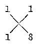

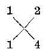

> [图像：原扫描页含图示；RAW OCR 未提供可还原的图像像素内容。]

> [图像：原扫描页含图示；RAW OCR 未提供可还原的图像像素内容。]

因为\(x^{2}\)的系数是1，所以两个因式的一次项系数都是1；因为常数项是8，两个因式的常数项有两种可能：1与8，或2与4。写成上面的式子后，交叉相乘，把乘积相加，第一个方案\(1 \times 8 + 1 \times 1 = 9\)，与原式\(a\)的一次项系数不符，所以是不对的。第二个方案\(1 \times 4 + 1 \times 2 = 6\)，刚巧与原式的一次项的系数相同，所以是正确的。这样的审题法通常叫做十字相乘法。

**例2** 分解因式：\(x^{2} - 8x + 15\)。

**【审题】** 这里常数项是正数，但是一次项的系数是负数，所以要把常数项拆成两个负数的积，才能使它们的代数和是负数，用十字相乘法：

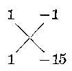

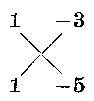

> [图像：原扫描页含图示；RAW OCR 未提供可还原的图像像素内容。]

> [图像：原扫描页含图示；RAW OCR 未提供可还原的图像像素内容。]

第一种分法中间项将得\(-16x\)，不对。第二种分法中间项得\(-8x\)，是正确的。

**【解】**\(x^{2} - 8x + 15 = (x - 3)(x - 5)\)

从上面这些例子可以看出， 当常数项是正数时， 常数项分成的两个因数或者都是正的（当一次项的系数是正数时）或者都是负的（当一次项的系数是负数时）。

**例3** 分解因式：\(x^{2} - 49x + 600\)。

**【审题】** 这个例子的常数项有许多分法， 它们是：

1， 600； 2， 300； 3， 200； 4， 150；

5， 120； 6， 100； 8， 75； 10， 60；

12， 50； 15， 40； 20， 30； 24， 25.

共12种。最后一种24和25的和是49，因为一次项的系数是-49，所以两个一次因式的常数项应为-24和-25。

**【解】**\(x^{2} - 49x + 600 = (x - 24)(x - 25).\)

**例4** 分解因式：\(x^{2} - 19xy + 90y^{2}\)。

**【审题】** 这是\(x, y\)的二次三项式，分解后得到的两个因式应该是\(x, y\)的一次齐次式，并可确定首项都是\(x\)，所以也可用十字相乘法来分解。因为\(90 = 9 \times 10\)，且\(9 + 10 = 19\)，而中间项的系数是\(-19\)，所以 9 和 10 都应该加上负号。

**【解】**\(x^{2} - 19xy + 90y^{2} = (x - 9y)(x - 10y)\)。

#### 习题4·5（1）

分解下列因式（1~16）：

1.\(x^{2} + 15x + 36,\)

2.\(a^2 - 11a + 30\)。

3.\(x^{2} + 24x + 80.\)

4.\(a^2 - 17a + 60\)。

5.\(a^2 + 19a + 60\)。

6.\(x^{2} - 23x + 60\)

7.\(x^{4} + 32x^{2} + 60.\)

8.\(a^2 - 61a + 60\)。

9.\(a^2 b^2 + 16ab + 60\)。

10.\(x^{2} - 29x + 100\)

11.\(a^2 + 25a + 100\)。

12.\(a^2 + 52a + 100\)。

13.\(a^2 - 3ab + 2b^2\)。

14.\(x^{2} + 6xy + 8y^{2}\)。

15.\(a^2 + 9ay + 8y^2\)。

16.\(x^{2} - 12xy + 27y^{2}\)。

分解下列因式， 到不能再分解为止（17~20）：

17.\(a^3 - 24a^2b + 44ab^2\)。

18.\(a^4 + 9a^3b + 18a^2b^2\)。

19.\(a^4 - 9a^2 + 8\)。

20.\(a^6 + 9a^3 + 8\)。

［解法举例\(x^{2} + 15x + 36 = (x + 3)(x + 12)\).］

**例5** 分解因式：（1）\(x^{2} - 3x - 10\)

（2）\(x^{2} + 9x - 10.\)

**【审题】** 这里常数项是负数， 把它分解成两个因数时， 符号应该是一负一正。 它们的和在（1）里应该是 -3， 在（2）里应该是 9. 用十字相乘法试验如下：

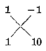

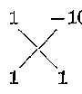

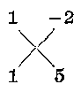

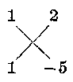

> [图像：原扫描页含图示；RAW OCR 未提供可还原的图像像素内容。]

> [图像：原扫描页含图示；RAW OCR 未提供可还原的图像像素内容。]

> [图像：原扫描页含图示；RAW OCR 未提供可还原的图像像素内容。]

> [图像：原扫描页含图示；RAW OCR 未提供可还原的图像像素内容。]

\[
1 \times 10 + 1 \times (- 1) = 9.
\]

\[
1 \times 1 + 1 \times (- 10) = - 9.
\]

\[
1 \times 5 + 1 \times (- 2) = 8.
\]

\[
1 \times (- 5) + 1 \times 2 = - 3.
\]

一共有四种可能。在（1）里用第四种，在（2）里用第一种。

**【解】** （1）\(x^{2} - 3x - 10 = (x + 2)(x - 5)\)；

（2）\(x^{2} + 9x - 10 = (x - 1)(x + 10)\)。

**例5** 告诉我们，如果二次三项式\(x^{2}+px+q\)中 q 是负数，那末 q 的两个因数应该一正一负，并且，当

\(p\)是正数时，正的因数的绝对值要较大；

p 是负数时， 负的因数的绝对值要较大。

**例6** 分解\(a^{4}-21a^{2}-100\)的因式。

**【审题】** 把原式写成\((a^2)^2 - 21(a^2) - 100\)，它仍旧是二次三项式的形式，所以可用上面的方法，只是要把原来的\(x\)代换成\(a^2\)。

**【解】**\(-100 = (-25) \times 4\)， 而\((-25) + 4 = -21\)。

\[
\begin{array}{l} a ^{4} - 21 a ^{2} - 100 = (a ^{2} - 25) (a ^{2} + 4) \\ = (a - 5) (a + 5) (a ^{2} + 4)。 \\ \end{array}
\]

#### 习题4·5（2）

分解因式：

1.\(x^{2} - 3x - 4.\)

2.\(x^{2} + 10x - 24.\)

3.\(a^2 + a - 20\)。

4.\(x^{2} + x - 30\)

5.\(a^2 - 9a - 36\)。

6.\(x^{2} - 7x - 60\)

7.\(x^{2} - 7xy - 18y^{2}\)。

8.\(x^{2} - 6xy - 16y^{2}\)。

9.\(a^2 - 12ab - 85b^2\)。

10.\(a^2 - 9ab - 52b^2\)。

11.\(a^4 + a^2 b^2 - 56b^4\)。

12.\(x^{2}y^{2} + 7xy - 44.\)

13.\(a^2 - 16a + 60\)。

14.\(a^2 - 7a - 60\)。

15.\(a^2 + 32a + 60\)。

16.\(a^2 - 11a - 60\)。

17.\(x^{2} - 20xy + 96y^{2}\)。

18.\(x^{2} - 4xy - 96y^{2}\)。

19.\(x^{2} + 10xy - 96y^{2}\)。

20.\(x^{2} + 28xy + 96y^{2}\)。

#### 2. 二次项系数不是1的二次三项式的因式分解法

在乘法公式里，我们也学到过这样一个公式：

\[
(a x + b) (c x + d) = a c x ^{2} + (b c + a d) x + b d.
\]

我们曾经把两个因式的系数排列成

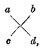

> [图像：原扫描页含图示；RAW OCR 未提供可还原的图像像素内容。]

然后用两条对角线的数相乘积的代数和来得出\(x\)的一次项的系数。

现在我们在因式分解里，仍旧可以用类似的方法分别求出\(a, b, c, d\)来，因而可以分解成两个一次因式的乘积。这样的方法通常也叫做十字相乘法。举例说明如下：

**例7** 分解因式： （1）\(3x^{2} - 5x + 2\)；

（2）\(3x^{2} + 7x + 2.\)

**【审题】** 如果这两个二次三项式都能够分解成两个一次因式的乘积，那么两个一次因式的一次项的系数一定是3的两个因数。这里只能是1和3。而两个常数项又一定是2的两个因数，就是1和2。

在（1）里， 中间项的系数是负的， 所以 2 应该分解成 -2 和 -1； 在（2）里中间项的系数是正的， 所以 2 应该分解成 +2 和 +1.

把系数排列出来， 用十字相乘法来试试， 可得（1）的两个一次式系数为

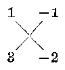

> [图像：原扫描页含图示；RAW OCR 未提供可还原的图像像素内容。]

（2）的两个一次式的系数为

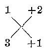

> [图像：原扫描页含图示；RAW OCR 未提供可还原的图像像素内容。]

从而可以得解。

**【解】** （1）\(3x^{2} - 5x + 2 = (x - 1)(3x - 2)\)；

（2）\(3x^{2} + 7x + 2 = (x + 2)(3x + 1)\)。

**例8** 分解因式： （1）\(5x^{2} - 14x - 3\)；

（2）\(5x^{3} + 2x - 3.\)

**【审题】** 因式的一次项的系数一定是1和5，常数项的绝对值一定是1和3。因为原式的常数项是-3，所以因式的常数项的符号应该是一正一负。十字相乘后，代数和要等于原式的一次项的系数，用十字相乘法试试：

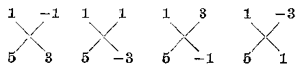

> [图像：原扫描页含图示；RAW OCR 未提供可还原的图像像素内容。]

一共有四种可能， 在（1）里， 应该选用最后一种； 在（2）里， 应该选用第二种， 从而， 得解如下。

**【解】** （1）\(5x^{2} - 14x - 3 = (x - 3)(5x + 1)\)；

（2）\(5x^{2} + 2x - 3 = (x + 1)(5x - 3)\)。

**例9** 分解因式：（1）\(4x^{2} - 15x + 9;\)

（2）\(4x^{2} - 5x - 9.\)

**【审题】** 这里的系数分解因数的方法不止一种，\(4=1\times4\)，也可以\(4=2\times2\)；\(9=1\times9\)，也可以\(9=3\times3\)。系数的排法很多，先不看正负号，可得五种排法：

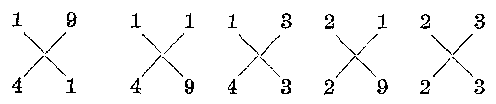

> [图像：原扫描页含图示；RAW OCR 未提供可还原的图像像素内容。]

在（1）里，第三种是合适的，加上负号就可以了。在（2）里，第二种是合适的，配上合适的一正一负的符号就可以了。因此得解如下。

**【解】** （1）\(4x^{2} - 15x + 9 = (x - 3)(4x - 3)\)；

（2）\(4x^{2} - 5x - 9 = (x + 1)(4x - 9)\)。

#### 习题4·5（3）

分解因式：

1.\(3x^{2}-14x-5\)

2.\(3x^{2}-16x+5\)

3.\(4x^{2}-25x+6\)

4.\(4x^{2}-5x-6\)

5.\(6x^{2}+5x-6\)

6.\(6x^{2}-13x+6\)

7.\(9x^{2}+5x-4\)

8.\(9x^{2}-37x+4\)

9.\(8x^{2}-21x-9\)

10.\(8x^{2}-22x+9\)

#### \*3. 二元二次六项式

让我们看式子：

\[
a x ^{2} + b x y + c y ^{2} + d x + e y + f，
\]

其中\(a, b, c, d, e, f\)都表示数字系数。这个式子有两个元\(x, y\)，这里\(ax^2, bxy, cy^2\)是关于\(x\)和\(y\)的二次项，\(dx, ey\)是关于字母\(x\)和\(y\)的一次项，\(f\)表示常数项。一共有六项。

这种二元二次六项式，有时也可以按十字相乘法分解成两个一次因式的乘积。

**例10**

分解因式：\(x^{2} + xy - 2y^{2} - x + 7y - 6.\)

**【审题】**

先把三个二次项用十字相乘法分解：

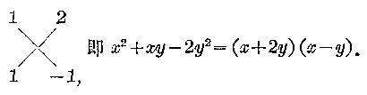

> [图像：原扫描页含图示；RAW OCR 未提供可还原的图像像素内容。]

再把没有 y 的三项\(x^{2}-x-6\)用十字相乘法分解：

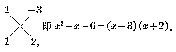

> [图像：原扫描页含图示；RAW OCR 未提供可还原的图像像素内容。]

再把上面两式中的三列系数连写而把\(y\)项的系数和常数项十字相乘

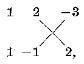

> [图像：原扫描页含图示；RAW OCR 未提供可还原的图像像素内容。]

看是否与没有\(x\)的三项相符， 结果是相符的， 就可以把上面的系数列成两个因式。

**【解】**\(x^{2} + xy - 2y^{2} - x + 7y - 6 = (x + 2y - 3)(x - y + 2)\)。

分解因式：

1.\(2x^{2} + 5xy + 2y^{2} - 8x - 7y + 6.\)

2.\(x^{2} - 4xy + 3y^{2} + 3x - 7y + 2.\)

3.\(2x^{2} + 3xy - 2y^{2} + x - 13y - 15.\)

4.\(4x^{2} + 4xy - 3y^{2} - 8y - 4.\)

### \*§4·6 综合除法在因式分解中的应用

我们在上一章里学习过综合除法。综合除法对有些整系数的多项式的因式分解是很有用处的。让我们先看下面的例子。

**例1** 已知 x-1 是\(x^{3}-7x+6\)的一个因式，试把这个式子进行因式分解。

**【审题】** 题中已指出这个三次式有因式\(x - 1\)，所以可以用综合除法求商。

**【解】**\(1 + 0 - 7 + 6 \mid 1\)\(\frac{1 + 1 - 6}{1 + 1 - 6 \mid 0}\)

\[
\begin{array}{l} \therefore x ^{3} - 7 x + 6 = (x - 1) \left(x ^{2} - x - 6\right) \\ = (x - 1) (x - 2) (x + 3)。 \\ \end{array}
\]

**例2** 已知\(3x^{3} + 2x^{2} + 16\)有因式\(x + 2\)，分解这个式子的因式。

**【解】** 用综合除法。

\[
\begin{array}{c} 3 + 2 + 0 + 16 \\ - 6 + 8 - 16 \\ \hline 3 - 4 + 8 \end{array} \left| \begin{array}{c} - 2 \\ 0 \end{array} \right.
\]

\[
\therefore 3 x ^{3} + 2 x ^{2} + 16 = (x + 2) (3 x ^{2} - 4 x + 8)。
\]

#### 习题4·6（1）

分解下列因式：

1.\(x^{3} - 3x^{2} + x + 1\)，已知一个因式\(x - 1\)

2.\(x^{3} - 2x^{2} + 3\)，已知一个因式\(x + 1\)

3.\(2x^{3} - x - 14\)，已知一个因式\(x - 2\)

4.\(3x^{3} - 5x^{2} + 126\)，已知一个因式\(x + 3\)

上面这些因式分解是已知一个因式后再进行的。如果预先并不知道一个因式，那末可以用综合除法去试探，看看有没有整系数的一次因式。举例说明如下，

**例3** 分解\(x^{3} - 3x^{2} + x + 1\)成因式的乘积。

**【审题】** 这是一个关于字母\(x\)的整数系数的多项式。如果有整数系数的一次因式，那末两个因式中一个是一次的，另一个是二次的。如

\[
a x + b \text{和} e x ^{2} + d x + e.
\]

但是，因为\(x^{3}\)的系数是1，所以系数\(a\)和\(c\)的值都应该是

1. 即两个因式应该是\(x + b\)和\(x^{2} + dx + e\)。

又因为原式的常数项是1， 所以 b 和 e 的乘积应该是 1， 从而， b 如果是整数， 只可能是 +1 或 -1.

用综合除法试试， 先把原式除以 x-1.

**【解】**

\[
\frac{1 - 3 + 1 + 1}{\frac{+ 1 - 2 - 1}{1 - 2 - 1} \mid 0} \mid 1
\]

刚巧整除，\(\therefore x^{3}-3x^{2}+x+1=(x-1)(x^{2}-2x-1)\)。

**例4** 分解因式：\(x^{3} - x^{2} + 2.\)

**【审题】**\(x^{3}\)的系数是1，所以如果有整数系数的一次因式，一次项的系数应是1。原式的常数项是2，所以因式的常数项有四种可能，\(+1, -1, +2, -2\)。

**【解】** 用综合除法。

\[
\begin{array}{l} \frac{1 - 1 + 0 + 2}{+ 1 + 0 + 0} \left| \begin{array}{l} 1 \\ \hline {} \end{array} \right. \\ \frac{1 + 0 + 0}{2} \end{array}
\]

x-1 不是因式。

\[
\frac{1 - 1 + 0 + 2}{- 1 + 2 - 2} \left| \begin{array}{l} - 1 \\ \hline {} \end{array} \right.
\]

\(x + 1\)是因式，\(\therefore x^{3} - x^{2} + 2 = (x + 1)(x^{2} - 2x + 2)\)

**例5** 分解因式：\(x^{3} - x^{2} + 12.\)

**【审题】** 如果有整数系数的一次因式，一次项的系数是1，常数项的可能性有以下十二种：1，-1，2，-2，3，-3，4，-4，6，-6，12，-12.

**【解】**\(\frac{1 - 1 + 0 + 12}{+1 + 0 + 0}\mid 1\)\(\frac{1 + 0 + 0 + 12}{1 + 0 + 0 + 12}\)

\(x - 1\)不是因式

\[
\begin{array}{l} \frac{1 - 1 + 0 + 12}{- 1 + 2 - 2} \mid - 1 \\ \frac{1 - 2 + 2 \mid + 10}{1 - 2 + 2 \mid + 10} \end{array}
\]

\[
\begin{array}{l} \frac{1 - 1 + 0 + 12}{+ 2 + 2 + 4} \left| 2 \right. \\ \frac{1 + 1 + 2 + 16}{1 - 1 + 0 + 12} \quad x - 2 \text{不是因式} \\ \frac{- 2 + 6 - 12}{1 - 3 + 6 - 0} \quad x + 2 \text{是因式} \\ \end{array}
\]

∴\(x^{3}-x^{2}+12=(x+2)(x^{2}-3x+6)\)。

从上面的例子我们可以得出用综合除法分解因式的一般规律： 如果一个整系数多项式有整系数的一次因式\(x - a\)， 那末，\(a\)一定是这个多项式的常数项的因数。 这样， 只要做有限次的综合除法， 就一定能把这个因式找到。

分解下列因式：

1.\(x^{2} - x - 6\)。

2.\(x^{2} + x + 2\)

3.\(x^{3} - x^{2} - 4.\)

4.\(x^{3} + x^{2} + 4.\)

5.\(x^{3} - 2x^{2} + x - 12.\)

6.\(x^{3} + 3x + 14.\)

7.\(x^{4} - 2x^{2} - 3x - 2.\)

8.\(x^{4} + x^{3} - 4x^{2} + 5x - 3.\)

### \*§4·7 \(a^n - b^n\)和\(a^n + b^n\)的因式分解

我们已经学习了下列多项式的因式分解：

\[
a ^{2} - b ^{2} = (a + b) (a - b)。
\]

\[
a ^{5} - b ^{3} = (a - b) \left(a ^{2} + a b + b ^{2}\right)。
\]

\[
a ^{4} - b ^{4} = (a ^{3} + b ^{2}) (a ^{2} - b ^{2}) = (a ^{2} + b ^{2}) (a + b) (a - b)。
\]

\(a^{2}-b^{2},a^{3}-b^{3},a^{4}-b^{4}\)都有因式\((a-b)\)。 从而， 我们就容易想到\(a^{5}-b^{5},a^{6}-b^{6},\cdots,a^{n}-b^{n}\)（n 是任意正整数） 是不是都有 a-b 这个因式呢？

也可以用综合除法来试试。

先看\(a^5 - b^5\)：

\[
\left. \begin{array}{cccc} a ^{5} & a ^{4} & a ^{3} & a ^{2} & a ^{1} \\ 1 + 0 + 0 & + 0 & + 0 & + 0 & - b ^{5} \\ + b + b ^{2} + b ^{3} + b ^{4} + b ^{5} \\ 1 + b + b ^{2} + b ^{3} + b ^{4} & 0 \end{array} \right| \begin{array}{l} b \\ b \\ b \\ b \\ b \\ b \\ b \\ b \\ b \\ b \\ b \\ b \\ b \\ b \\ b \\ b \\ b \\ b \\ \end{array}
\]

\[
\therefore a ^{5} - b ^{5} = (a - b) \left(a ^{4} + a ^{3} b + a ^{2} b ^{2} + a b ^{3} + b ^{4}\right)。
\]

再看\(a^n - b^n\)：

从\(a^n\)到\(b^n\)共有\(n + 1\)项

\[
\begin{array}{l} 1 + 0 + 0 + 0 + 0 + \dots + 0 - b ^{n} \mid b \\ \frac{+ b + b ^{2} + b ^{3} + b ^{4} + \dots + b ^{n - 1} + b ^{n}}{1 + b + b ^{2} + b ^{3} + b ^{4} + \dots + b ^{n - 1} \mid 0} \\ \text{共有} n \text{项} \end{array}
\]

\[
\begin{array}{l} \therefore a ^{n} - b ^{n} = (a - b) \left(a ^{n - 1} + a ^{n - 2} b + a ^{n - 3} b ^{2} + \dots a ^{n - 4} b ^{3} \right. \\ \left. + \dots + a b ^{n - 2} + b ^{n - 1}\right)。 \\ \end{array}
\]

从而可知：

\[
\begin{array}{rl} & a ^{n} - b ^{n} = (a - b) \left(a ^{n - 1} + a ^{n - 2} b + a ^{n - 3} b ^{2} + \dots \right. \\ & \left. + a b ^{n - 2} + b ^{n - 1}\right) \\ & (\text{因式分解公式9})。 \end{array}
\]

**【注意】** 第二个因式共有\(n\)项，\(a\)的指数从\(n - 1\)逐项减 1，\(b\)的指数从第二项起逐项加 1， 最后一项为\(b^{n - 1}\)， 各项的系数全部为 1.

我们还知道\(a^2 + b^2\)不能分解因式，但是\(a^3 + b^3 = (a + b)(a^2 - ab + b^2)\)，有因式\(a + b\)。现在我们来研究\(a^n + b^n\)什么条件下有因式\(a + b\)，什么条件下没有因式\(a + b\)。

先看\(a^4 + b^4\)，它是不好分解的，没有因式\(a + b\)。

再看\(a^6 + b^6 = (a^2)^3 + (b^2)^3 = (a^2 + b^2)(a^4 - a^2b^2 + b^4)\)，也没有因式\(a + b\)。

再看\(a^5 + b^5\)，用综合除法：

\[
\begin{array}{l} a ^{5} a ^{4} a ^{3} a ^{2} a ^{1} \\ \frac{1 + 0 + 0 + 0 + 0 + b ^{5}}{- b + b ^{2} - b ^{3} + b ^{4} - b ^{5}} \left| - b \right. \\ \frac{1 - b + b ^{2} - b ^{3} + b ^{4}}{1 - b + b ^{2} - b ^{3} + b ^{4}} \left| 0 \right. \\ \end{array}
\]

\[
\therefore a ^{5} + b ^{5} = (a + b) \left(a ^{4} - a ^{3} b + a ^{2} b ^{2} - a b ^{3} + b ^{4}\right)。
\]

从上面这几个例子可以看出，多项式\(a^n + b^n\)当\(n\)是奇数3、5时有因式\(a + b\)，现在我们再来看当\(n\)是任意的奇数时，多项式\(a^n + b^n\)是不是都有因式\(a + b\)，如果有这种因式，它的另一个因式是什么？

我们仍用综合除法来演算：

\[
\begin{array}{l} 1 + 0 + 0 + 0 + 0 + \dots + b ^{n} - b \\ \frac{- b + b ^{2} - b ^{3} + b ^{4} - \cdots - b ^{n}}{1 - b + b ^{2} - b ^{3} + b ^{4} - \cdots + b ^{n - 1} | 0} \\ \end{array}
\]

从上面可以看出 b 的奇数次方的项是负的，b 的偶数次方的项是正的，\(b^{n}\)是奇数次方，所以得余数为零。

从而， 我们可以得到：

\[
\begin{array}{l} a ^{n} + b ^{n} = (a + b) (a ^{n - 1} - a ^{n - 2} b + a ^{n - 3} b ^{2} - \dots \\ - a b ^{n - 2} + b ^{n - 1}) \\ (n \text{是奇数}) (\text{因式分解公式} 10)。 \\ \end{array}
\]

**【注意】** 第二个因式\(a\)的指数从\(n - 1\)起逐项减1，\(b\)的指数从第二项起逐项加1，各项系数符号为正负交替出现，一共有\(n\)项，最后一项\(b^{n - 1}\)的系数是\(+1\)。

我们可以利用以上两个公式来分解因式。

**例1** 分解因式： （1）\(a^7 - b^7\)； （2）\(a^7 + b^7\)。

**【解】** （1）\(a^7 - b^7 = (a - b)(a^6 + a^5b + a^4b^2 + a^3b^3\)

\[
+ a ^{2} b ^{4} + a b ^{5} + b ^{6})；
\]

（2）\(a^7 + b^7 = (a + b)(a^6 - a^5b + a^4b^2 - a^3b^3 + a^2b^4\)

\[
- a b ^{5} + b ^{6})。
\]

**例2** 分解因式： （1）\(a^6 - b^6\)； （2）\(a^6 + b^6\)。

**【解】** （1）\(a^6 - b^6 = (a^3 + b^3)(a^3 - b^3)\)

\[
= (a + b) \left(a ^{2} - a b + b ^{2}\right) (a - b) \left(a ^{2} + a b + b ^{2}\right)；
\]

**【注意】** 这里应该先用平方差公式，如果直接得出\(a^6 - b^6 = (a - b)(a^5 + a^4b + a^3b^2 + a^2b^3 + ab^4 + b^5)\)，那末，还必须继续分解下去，比较困难一些。

**【注意】**

\[
(2) a ^{6} + b ^{6} = (a ^{2}) ^{3} + (b ^{2}) ^{3} = (a ^{2} + b ^{2}) (a ^{4} - a ^{2} b ^{2} + b ^{4})。
\]

这里6是偶数， 没有因式\(a + b\)， 但这个式子当作\((a^2)^3 + (b^2)^3\)时， 3是奇数， 可以应用立方和公式分解。

分解因式：

1.\(x^{5} - 1\)

2.\(x^{5} + 1\)

3.\(a^{10} - b^{10}\)

4.\(a^{10} + b^{10}\)

5.\(a^9 - b^9\)。

6.\(a^9 + b^9\)。

### §4·8 因式分解的一般步骤

上面我们学过了多项式因式分解的一些基本方法，利用这些方法可以在有理数范围内分解某些多项式的因式。在分解的时候，一般可以采用以下的步骤。

（1） 先看有没有公因式， 如果有， 要首先提取出来。

（2） 其次看是不是分组后可以提取公因式。

（3） 再看能不能应用各种因式分解的公式。

（4） 如果是二次三项式或者是二元二次六项式，看看能不能用十字相乘法分解成两个一次因式的积。

*（5） 如果是一个字母的高于二次的整系数多项式，看看能不能运用综合除法进行分解。

（6） 有时要把上面各种方法联合使用。

应该注意： 多项式的因式分解， 一般都要求在有理数范围内把它分解到不能再分解为止。这样， 最后得到的那些因式叫做质因式。而分解得到的结果要进行整理， 整理的要求是：

（i） 在分解因式之后，有相同的因式时要写成幂的形式。

（ii） 在各个因式内要进行化简。

**例1** 分解因式：

\[
a ^{4} b - a ^{2} b ^{3} + a ^{3} b ^{2} - a b ^{4}.
\]

**【解】**\(a^4 b - a^2 b^3 + a^3 b^2 - ab^4 = a b(a^3 - ab^2 + a^2 b - b^3)\)

\[
= a b \left[ a \left(a ^{2} - b ^{2}\right) + b \left(a ^{2} - b ^{2}\right) \right]
\]

\[
= a b \left(a ^{2} - b ^{2}\right) (a + b)
\]

\[
= a b (a + b) (a - b) (a + b)
\]

\[
= a b (a + b) ^{2} (a - b)。
\]

**例2** 分解因式：

\[
8 (x + y) ^{3} - 27 (x - y) ^{3}.
\]

**【解】**\(8(x + y)^{3} - 27(x - y)^{3}\)

\[
= [ 2 (x + y) - 3 (x - y) ] [ 4 (x + y) ^{2}
\]

\[
+ 2 (x + y) 3 (x - y) + 9 (x - y) ^{2} ]
\]

\[
= (2 x + 2 y - 3 x + 3 y) (4 x ^{2} + 8 x y + 4 y ^{2}
\]

\[
+ 6 x ^{2} - 6 y ^{2} + 9 x ^{2} - 18 x y + 9 y ^{2})
\]

\[
= (5 y - x) (19 x ^{2} - 10 x y + 7 y ^{2})。
\]

**例3** 分解因式：

\[
x ^{18} - 3 x ^{12} y ^{6} + 3 x ^{6} y ^{12} - y ^{18}.
\]

**【审题】** 把\(x^6\)看作是\(a\)， 把\(y^6\)看作是\(b\)， 原式就能用公式

\[
a ^{3} - 3 a ^{2} b + 3 a b ^{2} - b ^{3} = (a - b) ^{3}
\]

来分解因式。

**【解】**\(x^{18} - 3x^{12}y^6 +3x^6 y^{12} - y^{18}\)

\[
= (x ^{6}) ^{3} - 3 (x ^{6}) ^{2} (y ^{6}) + 3 (x ^{6}) (y ^{6}) ^{2} - (y ^{6}) ^{3}
\]

\[
= \left(x ^{6} - y ^{6}\right) ^{3} = \left[ \left(x ^{3} + y ^{3}\right) \left(x ^{3} - y ^{3}\right) \right] ^{3}
\]

\[
= \left[ (x + y) \left(x ^{2} - x y + y ^{2}\right) (x - y) \left(x ^{2} + x y + y ^{2}\right) \right] ^{3}
\]

\[
= (x + y) ^{3} \left(x ^{2} - x y + y ^{2}\right) ^{3} (x - y) ^{3} \left(x ^{2} + x y + y ^{2}\right) ^{3}.
\]

**例4** 分解因式：\(a^{2} - 2ab + b^{2} - 5a + 5b + 6\)。

**【解】**\(a^2 - 2ab + b^2 - 5a + 5b + 6\)

\[
= (a - b) ^{2} - 5 (a - b) + 6
\]

\[
= [ (a - b) - 3 ] [ (a - b) - 2 ]
\]

\[
= (a - b - 3) (a - b - 2)。
\]

**例5** 分解因式：

（1）\(-a^{2} + 6ab - 9b^{2}\)； （2）\(-x^{2} - 3x + 4\)。

**【解】** （1）\(-a^{2} + 6ab - 9b^{2} = -(a^{2} - 6ab + 9b^{2})\)

\[
= - (a - 3 b) ^{2}；
\]

（2）\(-x^{2} - 3x + 4 = -(x^{2} + 3x - 4)\)

\[
= - (x + 4) (x - 1)。
\]

**【注意】** 这两个式子在提出负号之后，就比较容易分解因式，但是切勿漏掉负号。如果把\(-a^{2} + 6ab - 9b^{2}\)做成\(a^{2} - 6ab + 9b^{2} = (a - 3b)^{2}, -x^{2} - 3x + 4\)做成\(x^{2} + 3x - 4 = (x + 4)(x - 1)\)，那就错了。

分解因式：

1.\(3x^{6}-192y^{6}\)

2.\(64x^{6}y^{3}-y^{15}\)

3.\(a^3 (a - b) + b^3 (b - a)\)。

4. 6xy+15x-4y-10.

5.\(3x^{4}+3x^{3}-2zx-24\)

6.\(x^{2}+a^{2}-bx-ab+2ax.\)

7.\(x - x^{2} + 42\)

8.\(a^5 - 81ab^4\)。

9.\(x^{5} - 9x^{3} + 8x^{2} - 72.\)

10.\(x^{2}(x^{2} - 20) + 64.\)

11.\(x^{4} - 10x^{2}y^{2} + 9y^{4}\)。

12.\(a^4 - 18a^2b^2c^2 + 81b^4c^4\)。

13.\(x^{8} - ax^{2} - b^{2}x + ab^{2}\)。

14.\(a^2 - 9b^2 + 12bc - 4c^2\)。

15.\(x^{9} - y^{9}\)。

16.\(a^2 + a + b - b^2\)。

17.\(4(1 - b^{2} - ab) - a^{2}\)。

18.\(x^{3} - 7x^{2} - 4x + 28.\)

19.\(4(ab + cd)^{2} - (a^{2} - b^{2} - c^{2} - d^{2})^{2}\)。

20.\(ab(x^{2} + 1) + x(a^{2} + b^{2})\)

### §4·9 最高公因式

在算术里，我们学过几个整数的最大公约数。现在我们先来复习一下最大公约数的意义和求法。

任何一个整数，如果它能够整除另一个整数，它就叫做后一个数的约数（或因数）.例如12是36的约数，12也是60的约数.几个数共同的约数叫做这几个数的公约数.例如12是36和60的公约数.几个数的公约数可能不止一个，例如12是36和60的公约数，6也是36和60的公约数。在几个数的所有公约数里，最大的一个公约数叫做这几个数的最大公约数，例如12是36和60的最大公约数。

要求两个数的最大公约数，要先把这两个数分解成为质因数的连乘积，并把相同的质因数写成幂的形式。把这两个数的所有相同质因数（如果这种质因数是用幂的形式表示的，那末要把次数最低的一个幂选出来）都选取出来，它们的连乘积就是所求的最大公约数。

**例1** 求36和60的最大公约数。

**【解】**\(36 = 2^{2} \cdot 3^{2}; 60 = 2^{2} \cdot 3 \cdot 5.\)

∴ 36 和 60 的最大公约数是\(2^{2} \cdot 3 = 12\)。

**【注意】** 对于质因数 2，要取\(2^{2}\)，因为如果只选用 2，那末\(2 \times 3 = 6\)，就不是 36 和 60 的最大公约数。对于质因数 3，要取 3，因为如果取\(3^{2}\)，那末\(2^{2} \cdot 3^{2} = 36\)，就不是 60 的约数，因而不是 36 和 60 的公约数了。

通常， 两个数\(a\)和\(b\)的最大公约数可以用符号\((a, b)\)来表示。 如\((36, 60) = 12\)。

**例2** 求96，192和288的最大公约数。

**【解】** 先把它们分解成为质因数的连乘积。

\[
96 = 2 ^{5} \cdot 3， \quad 192 = 2 ^{6} \cdot 3， \quad 288 = 2 ^{5} \cdot 3 ^{2}.
\]

∴ 所求的最大公约数是\(2^{5} \cdot 3 = 96\)。

类似地在代数里，我们有时也要求几个整式的最高公因式。所谓几个整式的最高公因式，就是这些整式的公因式中次数最高的式子。现在把求几个整式的最高公因式的方法，举例说明如下：

**例3** 求\(16a^{3}b^{5}x^{2}, 24a^{2}b^{4}x^{3}, -32a^{5}bx^{4}y\)的最高公因式。

**【审题】** 这三个代数式都是单项式，已经都是各个因式的连乘积的形式。我们只要选取它们共有的因式就是了。

拿数字系数来说，16，24，-32的最大公约数是8（负号通常不要选入）。

拿字母因数来说， 我们选各个代数式共有的字母， 而且选各个字母的最低的幂， 得\(a^2 b x^2\)。

**【解】** 它们的最高公因式是\(8a^{2}b x^{2}\)。

**【注意】** 在代数里， 我们叫最高公因式， 因为我们只考虑它在所有公因式中关于各个字母的次数是最高的， 至于它的值， 如果字母取小于 1 的值， 次数越高， 代数式的值越小。

**例4** 求\(a^{4}-a^{3}b+ab^{3}-b^{4}, a^{4}-2a^{2}b^{2}+b^{4}, a^{6}-3a^{4}b^{2}+3a^{2}b^{4}-b^{6}\)的最高公因式。

**【审题】** 这几个整式都是多项式，要先分解因式。

**【解】**\(a^4 - a^3 b + ab^3 - b^4 = a^3 (a - b) + b^3 (a - b)\)

\[
= (a - b) \left(a ^{3} + b ^{3}\right)
\]

\[
= (a - b) (a + b) \left(a ^{2} - a b + b ^{2}\right)；
\]

\[
a ^{4} - 2 a ^{2} b ^{2} + b ^{4} = (a ^{2} - b ^{2}) ^{2} = [ (a + b) (a - b) ] ^{2}
\]

\[
= (a + b) ^{2} (a - b) ^{2}；
\]

\[
a ^{6} - 3 a ^{4} b ^{2} + 3 a ^{2} b ^{4} - b ^{6} = (a ^{2} - b ^{2}) ^{3} = (a + b) ^{3} (a - b) ^{3}.
\]

∴ 最高公因式是\((a+b)(a-b)\)。

**例5** 求\((a-b)(c-a)\)，\((b-a)(a+c)\)，\((a-b)(b+a)\)的最高公因式。

**【解】**\((a - b)(c - a) = -(a - b)(c - c)\)；

\[
(b - a) (a + c) = - (a - b) (a + c)；
\]

\[
(a - b) (b + a) = (a - b) (a + b)。
\]

∴ 最高公因式是 a-b。

求下列各式的最高公因式：

1.\(3^{0}a^{5}b^{3}c^{2}\)，\(2^{0}a^{3}b^{3}\)，\(-52a^{4}b^{4}c^{3}\)。

2.\(a^2 bc + ab^2 c, a^2 b - b^2, a^6 b^7.\)

3.\((x - y)(y - z)(z - x), (y - x)(z - y)(z + x)\)。

4.\(x^{2} - 3x + 2, x^{3} - 4x + 3, x^{2} + x - 2.\)

5.\((x^{2} - y^{2})^{2}, (x + y)^{2}(x - y), (y - x)^{2}(y + x)\)。

6.\((a^3 + b^3)^2, a^4 - b^4, b^2 - a^2\)。

### §4·10 最低公倍式

在算术里，我们也学过几个整数的最小公倍数。现在我们先来复习一下最小公倍数的意义和求法。

一个整数， 如果它能够被另外的一个整数整除， 它就能做后一个数的倍数， 例如 36 是 12 的倍数， 36 也是 18 的倍数。 几个数共同的倍数叫做这几个数的公倍数， 例如 36 是 12 和 18 的公倍数。 几个数的公倍数是很多的， 例如 36 是 12 和 18 的公倍数， 72 也是 12 和 18 的公倍数。 在几个数的所有公倍数里， 最小的一个公倍数叫做这几个数的最小公倍数。 例如 36 是 12 和 18 的最小公倍数。

要求两个数的最小公倍数，要先把这两个数分解成质因数的连乘积，并把相同的质因数写成幂的形式。把两个数的所有的不同质因数（如果某些质因数有幂的形式，要选取次数最高的）都选取出来，它们的连乘积就是所求的最低公倍数。

**例1** 求12和18的最小公倍数。

**【解】**\(12 = 2^{2} \cdot 3, 18 = 2 \cdot 3^{2}\)。

∴ 12 与 18 的最小公倍数是\(2^{2} \cdot 3^{2} = 36\)。

通常， 两个数\(a\)和\(b\)的最小公倍数可以用符号\([a, b]\)来表示。 如\([12, 18] = 36\)。

**例2** 求96，192和288的最小公倍数。

**【解】**\(96 = 2^{8} \cdot 3, 192 = 2^{6} \cdot 3, 288 = 2^{5} \cdot 3^{2}\)。

∴ 所求的最低公倍数是\(2^{6} \cdot 3^{2} = 576\)。

类似地，如果一个整式\(A\)能够被另一个整式\(B\)整除，那末\(A\)就叫作\(B\)的倍式。例如\(x^{2} - y^{2}\)能被\(x - y\)或者\(x + y\)整除，所以\(x^{2} - y^{2}\)是\(x - y\)的倍式，也是\(x + y\)的倍式。

几个整式共同的倍式，叫做这几个整式的公倍式。例如，对于两个整式

\[
a ^{2} b \text{和} a b ^{2}
\]

来说，下面的这些整式

\[
a ^{2} b ^{2}， a ^{2} b ^{3}， a ^{3} b ^{2}， a ^{4} b ^{2}， a ^{2} b ^{4}， \dots
\]

都是它们的公倍式。

在几个整式的公倍式中， 次数最低的一个整式， 叫做它们的最低公倍式。 例如\(a^2 b^2\)是\(a^2 b\)和\(a b^3\)的最低公倍式。

求几个整式的最低公倍式的方法，和算术里求几个整数的最小公倍数的方法很相象，举例说明如下。

**例3** 求\(-8x^{2}y^{3}z^{4}\)，\(-12x^{3}y^{3}z\)，\(-2axy^{5}z^{2}\)的最低公倍式。

**【审题】** 这三个式子都是单项式，已经都是各个因式的连乘积的形式。

拿数字系数来说，8， 12， 2 的最小公倍数是\(2^{3} \cdot 3 = 24\)（负号通常不要选入，因为没有负号也可以整除）。

对于字母\(a, a, y, z\)各取最高的幂，是\(ax^3y^5z^4\)。

**【解】** 这三个代数式的最低公倍式是\(24ax^{3}y^{3}z^{4}\)。

**例4** 求\((a^{2}-b^{2})^{2}\)，\((a^{3}+b^{3})(a^{3}-b^{3})\)，\(a(b+a)^{3}\)的最低公倍式。

**【解】** 分解各个式子成因式：

\[
(a ^{2} - b ^{2}) ^{2} = [ (a + b) (a - b) ] ^{2} = (a + b) ^{2} (a - b) ^{2}；
\]

\[
(a ^{3} + b ^{3}) (a ^{3} - b ^{3})
\]

\[
= (a + b) \left(a ^{2} - a b + b ^{2}\right) (a - b) \left(a ^{2} + a b + b ^{2}\right)；
\]

\[
a (b + a) ^{3} = a (a + b) ^{3}.
\]

∴ 最低公倍式是

\[
a (a + b) ^{3} (a - b) ^{2} \left(a ^{2} - a b + b ^{2}\right) \left(a ^{2} + a b + b ^{2}\right)。
\]

**例5** 求\(x^{2}+y^{2}\)，\(y^{2}-x^{2}\)，\(x^{3}-y^{3}\)的最低公倍式。

**【解】**\(x^{2} + y^{2} = x^{3} + y^{2};\)

\[
y ^{2} - x ^{2} = - \left(x ^{2} - y ^{2}\right) = - (x + y) (x - y)；
\]

\[
x ^{3} - y ^{3} = (x - y) \left(x ^{2} + x y + y ^{2}\right)。
\]

∴ 最低公倍式是

\[
(x ^{2} + y ^{2}) (x + y) (x - y) (x ^{2} + x y + y ^{2})。
\]

#### 习题4·10

求下列各式的最高公因式及最低公倍式：

1.\(39a^{5}b^{3}d^{2}\)，\(26a^{3}b^{2}\)，\(-52a^{4}b^{4}c^{2}\)。

2.\(a^2 bc + ab^2 c, a^2 b - b^3, a^4 b^7.\)

3.\((x - y)(y - z)(x + z), (y - x)(z - y)(z + x)\)。

4.\(x^{2} - 3x + 2, x^{2} - 4x + 3, x^{2} + x - 2.\)

5.\((x^{2} - y^{2})^{2}, (x + y)^{2}(x - y), (y - x)^{2}(y + x)\)。

6.\((a^3 + b^3)^2, a^4 - b^4, b^2 - a^2.\)

### \*§4·11 辗转相除法

我们已经学过用分解质因数的方法来求两个数的最大公约数与最小公倍数。我们也已经学过运用分解因式的方法来求两个整式的最高公因式与最低公倍式。但遇到不易分解质因数的整数和不易分解因式的整式时，要求两个整数的最大公约数和最小公倍数，或要求两个整式的最高公因式和最低公倍式时，用分解的方法就会遇到困难。现在我们来介绍一种求两个正整数的最大公约数、最小公倍数或求两个整式的最高公因式、最低公倍式的一般方法。先看下面的例子。

**例1** 求 1591 和 1961 的最大公约数和最小公倍数。

**【解】** 先以较小的数 1591 去除较大的数 1961.

\[
1591 \sqrt {\frac{1961}{1591}} \frac{1}{370}
\]

得商数1，余数370，即

\[
1961 = 1591 \times 1 + 370.
\]

再以余数 370 去除刚才的除数 1591.

\[
\begin{array}{r} 4 \\ 370 \overline {{) 1591}} \\ \underline {{1480}} \\ 111 \end{array}
\]

得商数4，余数111，即

\[
1591 = 370 \times 4 + 111.
\]

再以111去除刚才的除数370.

\[
\begin{array}{r} 3 \\ 111 \overline {{) 370}} \\ \underline {{333}} \\ 37 \end{array}
\]

得商数3，余数37，即\(370 = 111 \times 3 + 37\)。再以37去除刚才的除数111。

\[
\begin{array}{r} 3 \\ 37 \overline {{) 111}} \\ \underline {{111}} \\ 0 \end{array}
\]

刚巧除尽，即\(111 = 37 \times 3\)。

最后整除时的除数 37 就是 1591 和 1961 的最大公约数，即 （1591， 1961） = 37.

再以37去除1591和1961.

\[
\begin{array}{r} 43 \\ 37 \overline {{) 1591}} \\ \underline {{148}} \\ 111 \\ \underline {{111}} \\ 1 \end{array}
\]

\[
\begin{array}{r} 53 \\ 37 \overline {{) 1961}} \\ \underline {{185}} \\ 111 \\ \underline {{111}} \\ 1 \end{array}
\]

得 1591=87×43， 1961=37×53.

∴ 1591 和 1961 的最小公倍数是

\[
37 \times 43 \times 53 = 84323.
\]

即\([1591, 1961] = 84323\)。

为什么最后整除时的除数就是原来两个数的最大公约数呢？

因为如果有两个正整数\(A\)和\(B\)有公约数\(m\)，那末\(A = ma, B = mb, a\)和\(b\)也是整数。

如果\(A > B\)，以\(B\)去除\(A\)，得商数\(K\)，余数就是\(A - KB\)。那末

\[
A - K B = m a - K m b = m (a - K b)
\]

\((a - Kb\)还是正整数）。

就是说，\(m\)是余数\(A - KB\)的约数。

∴ m 也是 B 和 A-KB 的公约数。

显然\(A - KB\)比\(A\)和\(B\)都小， 求\(B\)和\(A - KB\)的公约数比求\(A\)和\(B\)的公约数方便得多了。

上面， 我们要求 1591 和 1961 的最大公约数， 用除法求得 1961 - 1591 = 370， 只要求 1591 和 370 的最大公约数。

再用除法求得\(1591 - 370 \times 4 = 111\)，只要求 370 和 111 的最大公约数。

再用除法求得\(370 - 111 \times 3 = 37\)，只要求37和111的最大公约数。

而 37 整除 111， 所以最后整除时的除数 37 是 37 和 111 的最大公约数， 也就是 111， 370； 370， 1591； 1591， 1961 的最大公约数了。

这样求两个正整数的最大公约数的方法叫做辗转相除法。

用同样的道理和方法，我们可以用辗转相除法求两个整式的最高公因式和最低公倍式。

**例2** 求\(x^{3}-x^{3}-3x-9\)和\(x^{3}-2x^{2}-x-6\)的最高公因式和最低公倍式。

**【解】** 用辗转相除法。 以\(x^{3} - x^{2} - 3x - 9\)去除\(x^{3} - 2x^{2} - x - 6\)。

\[
\begin{array}{l} 1 - 1 - 3 - 9 \sqrt {1 - 2 - 1 - 6} \\ \frac{1 - 1 - 3 - 9}{- 1 + 2 + 3} \\ \end{array}
\]

即余式是\(-x^{2} + 2x + 3.\)

再以\(-x^{2} + 2x + 3\)去除\(x^{3} - x^{2} - 3x - 9.\)

\[
\begin{array}{rl} - 1 + 2 + 3 & \frac{- 1 - 1}{\sqrt {\frac{1 - 1 - 3 - 9}{+ 1 - 2 - 3}}} \\ & \frac{1 + 0 - 9}{\frac{1 - 2 - 3}{2 - 6}} \end{array}
\]

即余式是\(2x - 6 = 2(x - 3)\)

因为 2 是数字系数， 在代数式中与是否整除无关， 所以可以用 x-3 去除\(-x^{2}+2x+3\)。

\[
\begin{array}{rl} 1 - 3 & \frac{- 1 - 1}{\sqrt {- 1 + 2 + 3}} \\ & \frac{- 1 + 3}{\sqrt {- 1 + 3}} \\ & \frac{- 1 + 3}{\sqrt {- 1 + 3}} \end{array}
\]

刚巧整除， 最后的除式\(x - 3\)就是原来两个整式的最高公因式。

**【注意】** 如用\(2x - 6\)去作最后的除式， 商式的系数便等于\(-\frac{1}{2}\)， 还认为可以整除。 因为在代数式里整除时， 可以允许系数是分数。 但最后作为最大公因式时， 仍应把公因数 2 去掉， 以免产生分数系数。

再求最低公倍式：

\[
\begin{array}{rl} 1 - 3 & \frac{1 + 1 + 2}{1 - 2 - 1 - 6} \\ & \frac{1 - 3}{1 - 1} \\ & \frac{1 - 3}{2 - 6} \\ & \frac{2 - 6}{2 - 6} \end{array} \quad \begin{array}{rl} 1 - 3 & \frac{1 + 2 + 3}{1 - 1 - 3 - 9} \\ & \frac{1 - 3}{2 - 3} \\ & \frac{2 - 6}{3 - 9} \\ & \frac{3 - 9}{3 - 9} \end{array}
\]

即\(x^{3} - 2x^{3} - x - 6 = (x - 3)(x^{2} + x + 2)\)。

\[
x ^{3} - x ^{2} - 3 x - 9 = (x - 3) (x ^{2} + 2 x + 3)。
\]

∴ 两式的最低公倍式是

\[
(x - 3) (x ^{2} + x + 2) (x ^{2} + 2 x + 3)。
\]

#### 习题4·11

用辗转相除法求下面的最大公约数和最小公倍数：

1. 5917， 4453； 2. 3953， 6077.

用辗转相除法求下面两式的最高公因式和最低公倍式：

3.\(x^{4} - x^{3} - 2x^{2} - 3x - 1, x^{4} - 2x^{3} - x^{2} - 2x + 1.\)

### 本章提要

#### 1. 因式分解的方法及公式

（1）\(ab + ac + ad = a(b + c + d)\)。

（2）\(ax + ay + bx + by = a(x + y) + b(x + y)\)

\[
= (x + y) (a + b)。
\]

（3）\(a^2 - b^2 = (a + b)(a - b)\)。

（4）\(a^2 \pm 2ab + b^2 = (a \pm b)^2\)。

（5）\(a^3 \pm b^3 = (a \pm b)(a^2 \mp ab + b^2)\)。

（6）\(a^3 \pm 3a^2b + 3ab^2 \pm b^3 = (a \pm b)^2\)。

（7）\(x^{2} + px + q = (x + u)(x + b)\)

\[
(a + b = p， a b = q)。
\]

（8）\(ax^2 + bx + c = (mx + p)(nx + q)\)

\[
(m n = a， p q = c， m q + n p = b)。
\]

（9）\(a^3 + b^3 + c^3 - 3abc = (a + b)(a^2 + b^2 + c^2)\)

\[
- a b - a c - b c)。
\]

（10）\(a^n - b^n = (a - b)(a^{n-1} + a^{n-2}b + \cdots + b^{n-1})\)，

当\(n\)不是质数时，先用其他公式。

（11）\(a^n + b^n = (a + b)(a^{n-1} - a^{n-2}b + \cdots + b^{n-1})\)，

只适用于\(n\)是奇数时。

（12） 利用综合除法。

2. 最高公因式与最低公倍式

| 名称 | 意义 | 因式选取法 |  |
| --- | --- | --- | --- |
| 因式种类 | 因式的指数 |  |  |
| 几个整式的最高公因式 | 能整除各式的次数最高的整式 | 各式所有相同的因式 | 各相同的因式中最低的指数 |
| 几个整式的最低公倍式 | 能被各式整除的次数最低的整式 | 各式所有的因式 | 各相同的因式中最高的指数，各不同因式的指数 |

#### 3. 辗转相除法求最大公约数和最高公因式

### 复习题四A

1. 回答下列问题：

什么叫做多项式的因式分解？

多项式的因式分解有哪些方法？有哪些公式？因式分解的公式与乘法公式有什么联系，又有什么区别？

多项式的因式分解的步骤怎样？

2. 什么叫做几个整式的最高公因式？怎样求法？

什么叫做几个整式的最低公倍式？怎样求法？

下列因式分解，是否正确？如有错误，改正右边（3~14）：

3.\(a^2 - b^2 = (a - b)^2\)。

4.\(a^2 - 4b^2 = (a + 4b)(a - 4b)\)。

5.\(16a^{16} - b^{12} = (4a^4 + b)(4a^4 - b)\)。

6.\(a^2 - (b + c)^2 = (a + b + c)(a - b + c)\)。

7.\(-a^{2} + 2ab - b^{2} = (a - b)^{2}\)。

8.\(a(x - 1)^{2} - b(x - 1) = (x - 1)^{2}(a - b)\)。

9.\(a^2 + a - b^2 - b = a(a + 1) - b(b + 1) = (a - b)(a + 1)(b + 1)\)。

10.\(a^2 - b^2 + 2b - c^2 = a^2 - (b + c)^2 = (a + b + c)(a - b - c)\)。

11.\((a^2 - b^2)(a^3 - b^3) = (a + b)(a - b)(a - b)(a^2 + ab + b^2)\)

\[
= (a + b) (a - b) \left(a ^{2} + a b + b ^{2}\right)。
\]

12.\((a^3 + b^3)^2 = (a + b)(a^2 + ab + b^2)^2.\)

13.\(x^{2} - 5x - 6 = (x - 3)(x - 2)\)。

14.\(x^{2} - x - 6 = (x - 2)(x + 3)\)。

分解下列各式的因式（15~44）：

15.\(a^4 - a^2 b^2\)。 16.\(ax^2(m - n) + 3x(n - m)\)。

17.\(3ab(c - d) - 9b^{2}(d - c)\)。 18.\((x + y)^{2} - 4xy(x + y)\)。

19.\(x^{2} + x^{4} + x^{2} + x\) 20.\(ax - a + x - 1\)

21.\(bx + 1 - b - x.\) 22.\(ax - bx - b + a.\)

23.\(ax - ay + bx + cy - cx - by.\)

24.\(3x^{2}y^{2} - 9xy - 12.\) 25.\(a^2 - b^2 - a + b.\)

26.\(a^2 + 4ab + 4b^2 - 9c^2\)。 27.\(a^2 + 2ab + b^2 - 4a - 4b\)。

28.\(a^4 c - c^5\)。 29.\(a^2 - x^2 - ab - bx\)，

30.\(x^{4} + 6x^{2} - 135.\) 31.\(x^{3} - 5x^{2} - 24x.\)

32.\(a^4 x^4 - a^3 x^3 - a^2 x^2 + 1\)。 33.\(5a^2 - 5b^2 - 3a + 3b\)。

34.\(4 - x^{2} + 2x^{3} + x^{4}\) 35.\(a^{12}b + b^{13}\)

36.\(a^2 + b^2 + 2(ab + ac + bc)\)。

37.\(a^3 - b^3 + a(a^2 - b^2) + b(a - b)^2\)。

38.\((x^{2} - y^{2} - z^{2})^{2} - 4y^{2}z^{2}\)。 39.\(x^{2} + 2xy + y^{2} - x - y - 6\)。

40.\(4a^{2}b^{2} - (a^{2} + b^{2} - c^{2})^{2}\) 41.\(a^2 - b^2 + x^2 - y^2 + 2(ax - by)\)。

42.\(x^{3} - 27y^{6} - x^{4} + 9y^{4}\) 43.\(x^{24} - y^{24}\)

44.\(x^{4} - x^{3} + 8x - 8.\)

利用因式分解， 计算下列各式（45~48）：

45.\(354^{2} - 353^{2}\)。 46.\(82^{2} - 80^{2}\)。

47.\(1.36^{2} - 0.36^{2}\)。 48.\(54.1^{2} - 51.1^{2}\)。

求下列各代数式的值（49~50）：

49.\(a^2 - b^2\)，其中\(a = -5.6, b = 4.6\)。

50.\(a^2 - 4b^2\)，其中\(a = -3.8, b = -3.1\)。

用两种不同方法，求出下列的积（51~52）：

51.\((a^2 + 2ab + b^2)(a^2 - 2ab + b^2)\)。

［提示：（1）\((a + b)^2 (a - b)^2 = [(a + b)(a - b)]^2 = (a^2 - b^2)^2 = \cdots,\)

（2）\(\left[(a^2 + b^2) + 2ab\right]\left[(a^2 + b^2) - 2ab\right] = \cdots.\)

52.\((a^3 + 3a^2b + 3ab^2 + b^3)(a^3 - 3a^2b + 3ab^2 - b^3)\)。

化简（53~55）：

53.\((a + 2b)^{3} - (a - 2b)^{3}\)。

54.\((8a^{6} + 27b^{6})\div (2a^{2} + 3b^{2}) - (8a^{6} - 27b^{6})\div (2a^{2} - 3b^{2}).\)

55.\((a^2 + b^2)(a^4 - a^2b^2 + b^4) - (a^2 - b^2)(a^4 + a^2b^2 + b^4)\)。

用简便的方法求下列各代数式的值（56~60）：

56.\((a^2 - b^2) \div (a - b) + (a - b)^2 \div (a + b)\)， 当\(a = 3\frac{3}{5}\)。

57.\((a^3 + b^3) \div (a + b) - (a + b)^3 \div (a \div b)\)， 当\(a = -3\frac{1}{3}, b = \left| -2\frac{1}{2} \right|\)。

58.\((a - b)(a^2 + ab + b^2) + 3ab(b - a)\)， 当\(a = -3.7\)，\(b = 6.3\)。

59.\(xy + 1 - x - y\)，当\(x = 0.99, y = 1.03.\)

60.\((a + b)(a^2 - ab + b^2) - 9b^3\)，当\(a = -4.368, b = -2.184\)。

### 复习题四B

分解因式：

1.\(x^{4} + x^{2}y^{2} + y^{4}\) 2.\(4x^{4} + 1\)

3.\(x^{6} + 64x^{2}\)。 4.\(x^{4} + 5x^{2}y^{2} + 9y^{4}\)。

5.\(4a^{4} - 24a^{2}b^{2} + 25b^{4}\)。 6.\(4a^{4} - 29a^{2}b^{2} + 25b^{4}\)。

7.\(9x^{4} - 25x^{2}y^{2} + 16y^{4}\)。 8.\(x^{2} + x^{4}y^{4} + y^{3}\)。

9.\(2x^{2} + 5xy + 2y^{2} - 7x - 5y + 3.\)

10.\(2x^{3} - 3xy - 2y^{2} + 4xz + 7yz - 6z^{2}\)。

11.\(x^{2} + xy - 6y^{2} - 4xz + 13yz - 5z^{2}\)。

12.\(4x^{3} - 12xy + 5y^{2} + 14x - 19y + 12.\)

13.\(x^{4} + y^{4} + z^{4} + 2x^{2}y^{2} - 2x^{2}z^{2} - 2y^{2}z^{2}\)。

14.\(x^{4} + y^{4} + z^{4} - 2x^{2}y^{2} - 2x^{2}z^{2} - 2y^{2}z^{2}\)。

15.\(x^{4} + y^{4} + z^{4} + 2x^{2}y^{2} - 2x^{2}z^{2} + 2y^{2}z^{2}\)。

16.\(x^{3} + 2x^{2} + x - 4.\) 17.\(2x^{3} - 3x - 10.\)

18.\(x^{3} - 5x + 12\) 19.\(5x^{3} - x^{3} + 6.\)

20.\(x^{3} + 2x^{2} + x + 36.\) 21.\(x^{24} - y^{21}\)

22.\(x^{24} + y^{24}\)。 23.\(a^3 + 3a^2 + 3a + 2\)。

24.\(x^{3} - 6x^{2}y + 12xy^{2} - 9y^{3}\)。

25.\(a^8 + 3a^2b + 3ab^2 + b^3 + a^2 + 2ab + b^2 + a + b.\)

26.\(a^3 + a^2 + a - 8b^3 - 4b^2 - 2b.\)

27.\(a(a + 1)(a + 2)(a + 3) - 8.\)

28.\((a + 1)(a + 3)(a + 5)(a + 7) + 15.\)

29.\(x^{15} - 1\) 30.\(x^{15} + 1\)

在有理数范围内，指出下列各式的最小值：

31.\(a^2 - 2ab + b^2 + 1\)。 32.\(a^2 + 2ab + b^2 - 4\)。

33.\(a^2 + b^2 - 2bc + c^2\)。

在有理数范围内指出下列式子中哪一个式子大？

34.\(a^2 + b^2, 2ab (a \neq b)\)。

### 第四章测验题

1. 分解下列各式为因式的积：

（1）\(4a^{4} - b^{2}\)；

（2）\(4a^{2} - 12ah^{2} + 9b^{4};\)

（3）\(2a^{3} - 7a^{2}b + 3ab^{2};\)

（4）\((x^{2} + 3x)^{2} - (2x + 6)^{2}\)；

（5）\(x^{2} + x^{2}y - xy^{2} - y^{2};\)

（6）\(x^{5} - 3x^{4} + 2x^{2};\)

（7）\(a^2 b^2 - a^2 - b^2 + 1\)；

（8）\((a^2 + b^2 - 1)^2 - 4a^2b^2\)；

（9）\((2x - 1)^{3} - x^{3}\)；

（10）\(x^{2} - y^{2} - 4x + 4;\)

（11）\(4x^{4} - 13x^{2}y^{2} + 9y^{4};\)

（12）\(a^{12} - b^{2}\)；

（13）\(a^{12} + b^{12}\)；

（14）\(x^{3} + x^{2} + x - y^{3} - y^{2} - y;\)

（15）\(5a^{2} - 5b^{2} - a + b;\)

（16）\((ax + by)^2 + (bx - ay)^2\)；

（17）\(ab(c^2 + d^2) + cd(a^2 + b^2)\)；

（18）\(4b^{2}c^{2} - (b^{2} + c^{2} - a^{2})^{2};\)

（19）\(a^3 - 3a^2 + 3a - 28\)；

（20）\((x + 2)(x + 4)(x - 1)(x - 3) + 16.\)

2. 两个连续的奇数的平方差一定是8的倍数，试用代数方法来证明它。

3. 两个连续的偶数的平方差一定是 4 的倍数， 但一定不是 8 的倍数， 试用代数方法来证明它。

## 5. 分式的变形和运算

我们已经学习过整式的运算和因式分解。现在我们再进一步研究分式的变形和运算，分式与分数有许多类似的地方，所以我们可以对比着分数来学习。

### §5·1 分式的基本性质

#### 1. 分式的基本性质

在算术里， 我们已经知道， 分数的分子和分母都乘以不是零的相同的数， 分数的值不变。 例如

\[
\frac{1}{3} = \frac{1 \times 2}{3 \times 2} = \frac{2}{6}； \quad \frac{12}{18} = \frac{12 \times \frac{1}{6}}{18 \times \frac{1}{6}} = \frac{2}{3}.
\]

这一性质叫做分数的基本性质。

在学到有理数以后，这一性质可以推广到分子分母是负数的分数。例如

\[
\frac{- 3}{- 8} = \frac{- 3 \times (- 1)}{- 8 \times (- 1)} = \frac{3}{8}；
\]

\[
\frac{3}{- 15} = \frac{3 \times \left(- \frac{1}{3}\right)}{- 15 \times \left(- \frac{1}{3}\right)} = \frac{- 1}{5}.
\]

分式的分子分母实际上都是数，而代数式的值也总是一个数，所以这一性质还可以推广到分式。

因此得到分式的基本性质：分式的分子和分母都乘以或除以不等于零的相同的代数式，分式的值不变，即

\[
\boxed { \begin{array}{l} \frac{a}{b} = \frac{a m}{b m} = \frac{a \div m}{b \div m} (m \neq 0)。 \\ \text{ 一分式的基本性质 } \end{array} }
\]

**【注意】** 分式的分母不能等于零，所以这里\(b \neq 0\)。我们约定凡是题目中已知的分式，都认为它是有意义的，即分母是不等于零的。这个条件，如无必要，以后在题中就不再指出了。

**例1** 把分式\(\frac{ay}{ax}\)的分子分母都除以\(a\)。

**【解】**\(\frac{ay}{ax} = \frac{ay \div a}{ax \div a} = \frac{y}{x}\)。

**【注意】** 这里\(a\)不会等于0，因为如果\(a\)等于0，那末原来的分式\(\frac{ay}{ax}\)就没有意义了。

**例2** 把分式\(\frac{-5}{3 - a}\)的分子分母都乘以-1.

**【解】**\(\frac{-5}{3 - a} = \frac{-5 \times (-1)}{(3 - a) \times (-1)} = \frac{5}{a - 3}\)。

**例3** 把分式\(\frac{2x}{6x - 8}\)的分子分母都除以2.

**【解】**\(\frac{2x}{6x - 8} = \frac{2x\div 2}{(6x - 8)\div 2} = \frac{x}{3x - 4}.\)

**例4** 把分式\(\frac{x^2}{3x^4}\)的分子分母都除以\(x^2\)。

**【解】**\(\frac{x^2}{3x^4} = \frac{x^2 \div x^2}{3x^4 \div x^2} = \frac{1}{3x^2}\)。

习题
5·1
（1）

1. 把\(\frac{ax}{a^2x^3}\)的分子分母都除以\(ax\)。

2. 把\(\frac{3 - x}{5 - x - x^2}\)的分子分母都乘以-1.

3. 把\(\frac{3 - x}{5 - x - x^2}\)的分子分母都除以-1.

4. 把\(\frac{x^3}{x^9}\)的分子分母都除以\(x^3\)。

5. 把\(\frac{x^3}{x^{12} - x^8}\)的分子分母都除以\(x^3\)。

6. 把\(\frac{a^2}{a^{15}}\)的分子分母都除以一个适当的代数式， 使分子变做 1.

#### 2. 分式中分子和分母的符号变换

根据有理数的除法法则，我们有

\[
\frac{+ 3}{+ 5} = + \frac{3}{5}； \frac{- 3}{- 5} = + \frac{3}{5}； \frac{- 3}{+ 5} = - \frac{3}{5}； \frac{+ 3}{- 5} = - \frac{3}{5}.
\]

从这里可以看出，一个分数的分子分母都有性质符号，分数本身也有性质符号。

我们还可以看出

\[
\frac{- 3}{- 5} = \frac{+ 3}{+ 5}， \quad \frac{+ 3}{- 5} = \frac{- 3}{5}.
\]

那就是说， 分子分母都改变性质符号， 根据分数的基本性质， 分数的值是不变的。

我们还可以看出

\[
\frac{- 3}{+ 5} = - \frac{+ 3}{+ 5}， \quad \frac{+ 3}{- 5} = - \frac{+ 3}{+ 5}.
\]

那就是说， 分子分母中一个改变性质符号， 另一个不改变性质符号， 那末必须改变分数本身的性质符号， 才能与原来的分数相等。

因为分式的分子分母表示的是数，所以这些性质也适用于分式。于是有：

\[
\boxed { \begin{array}{c} - a \\ - b \end{array} } = \frac{a}{b}； \quad \frac{- a}{b} = \frac{a}{- b} = - \frac{a}{b}
\]

**例6** 把分母里的负号去掉，但要保持分式的值不变：

（1）\(\frac{5}{-3x}\)；

（2）\(\frac{-x}{-a^2b^2c}\)；

（3）\(-\frac{b^{2}}{-a^{2}};\)

（4）\(-\frac{-bc}{-a}\)。

**【解】** （1）\(\frac{5}{-3x} = \frac{-5}{3x} = -\frac{5}{3x}\)；

（2）\(\frac{-x}{-a^2bc} = \frac{x}{a^2bc};\)

（3）\(-\frac{b^2}{-a^2} = \frac{b^2}{a^2};\)

（4）\(-\frac{-bc}{-a} = -\frac{bc}{a}\)。

**例6** 整理下列分式，依照\(x\)的降幂排列分子分母的各项，并使分子分母的第一项前面都是正号：

（1）\(\frac{5 + x}{3 - x}\)；

（2）\(\frac{5 - x}{x - x^2 + 3}\)；

（3）\(-\frac{5 + x - x^2}{3 + x}\)；

（4）\(-\frac{-2 + x + 2x^2}{-1 - x - x^2}\)。

**【解】**

（1）\(\frac{5 + x}{3 - x} = \frac{x + 5}{-x + 3} = \frac{x + 5}{(-x + 3)(-1)} = -\frac{x + 5}{x - 3}\)；

（2）\(\frac{5 - x}{x - x^2 + 3} = \frac{-x + 5}{-x^2 + x + 3} = \frac{(-x + 5)(-1)}{(-x^2 + x + 3)(-1)}\)

\[
= \frac{x - 5}{x ^{2} - x - 3}；
\]

（3）\(-\frac{5 + x - x^2}{3 + x} = -\frac{-x^2 + x + 5}{x + 3} = \frac{x^2 - x - 5}{x + 3};\)

（4）\(-\frac{-2 + x + 2x^2}{-1 - x - x^2} = -\frac{2x^2 + x - 2}{-x^2 - x - 1} = \frac{2x^2 + x - 2}{x^2 + x + 1}\)。

把分母里的负号去掉，但要所得的分式与原式相等：

1.\(\frac{-5b}{-3a}\)。

2.\(\frac{x}{-5a}\)。

3.\(-\frac{7xy^2}{-12a^3b^2}\)。

4.\(-\frac{-5y}{-7x}\)。

整理下列分式，使分子分母都按照 x 的降幂排列，并使分子分母的第一项前面都是正号：

5.\(\frac{12 - x}{3 - x}\)。

6.\(-\frac{1 - x + x^2}{3 + x - x^2}\)。

7.\(\frac{1 - x^2 + x}{-5 + x}\)。

8.\(\frac{3 - x - x^2}{1 - 2x + x^2}\)。

9.\(\frac{7 - x}{-(5 - x - x^2)}\)。

10.\(-\frac{1 + x - 2x^2 + 3x^3}{1 - x + 2x^2 - 3x^3}\)。

### §5·2 约分

#### 1. 约分的概念

在算术里，我们已经使用过约分来化简一个分数。在代数里，我们也可以应用分式的基本性质，把分式的分子分母同除以一个它们的公因式，把分式化简（或约简），这样一种变换叫做约分。

例如把分式\(\frac{a^2b}{2ab^2}\)的分子分母同除以\(ab\)，得到\(\frac{a^2b \div ab}{2ab^2 \div ab} = \frac{a}{2b}\)，这样，就把原分式\(\frac{a^2b}{2ab^2}\)约简了。

#### 2. 最简分式（既约分式）

一个分式的分子分母， 如果没有 1 以外的公因式， 这个分式就叫做最简分式或者既约分式。 如\(\frac{a}{3x}, \frac{x - y}{x + y}\)等都是最简分式， 而\(\frac{a}{a^2}, \frac{x + y}{x^2 - y^2}\)等就不是最简分式。

一个分式如果不是最简分式，我们就应该进行约分，把它化成最简分式，这就叫做分式的化简。

**例1** 化简：（1）\(\frac{a^8}{a^3}\)； （2）\(\frac{a^5}{a^5}\)； （3）\(\frac{a^4}{a^3}\)； （4）\(\frac{a^5}{a^{10}}\)。

**【审题】** 这里的分子、分母都是同底的幂。可将分子、分母同除以分子、分母中次数较低的那个幂，使分子或分母等于1。

**【解】** （1）\(\frac{a^8}{a^3} = \frac{a^8 \div a^3}{a^3 \div a^3} = \frac{a^5}{1} = a^5\)；

（2）\(\frac{a^5}{a^5} \div \frac{a^5 \div a^5}{a^5 \div a^5} = \frac{1}{1} = 1;\)

（3）\(\frac{a^4}{a^9} = \frac{a^4 \div a^4}{a^9 \div a^4} = \frac{1}{a^5}\)；

（4）\(\frac{a^5}{a^{10}} = \frac{a^5 \div a^5}{a^{10} \div a^5} = \frac{1}{a^5}\)。

**例2** 化简：（1）\(\frac{x^8}{x^2}\)； （2）\(\frac{x^4}{x^8}\)；

**【解】** （1）\(\frac{x^8}{x^2} = x^{8 - 2} = x^6;\)

（2）\(\frac{x^4}{x^8} = \frac{1}{x^{8 - 4}} = \frac{1}{x^{4}};\)

**【注意】**\(\frac{x^8}{x^2}\)不等于\(x^4, \frac{x^4}{x^8}\)不等于\(\frac{1}{x^2}\)。

#### 习题5·2（1）

化简\((m, n\)是自然数）：

1.\(\frac{a^{12}}{a^4}\)。

2.\(\frac{a^3}{a^{17}}\)。

3.\(\frac{x^{12}}{x^{24}}\)

4.\(\frac{(a^4)^3}{a^{12}}\)

5.\(\frac{(-a)^7}{a^7}\)。

6.\(\frac{(-x)^4}{x^4}\)。

7.\(\frac{a^8}{(a^4)^4}\)。

8.\(\frac{(a^5)^3}{(a^6)^5}\)。

9.\(\frac{(a^3)^2}{a^2}\)。

10.\(\frac{(a^3)^6}{(a^4)^5}\)。

11.\(\frac{a^{2m}}{a^m}\)。

12.\(\frac{a^{2n}}{a^{3n}}\)。

13.\(\frac{a^{2m}}{a^{2m+n}}\)。

14.\(\frac{a^{6m}}{a^{3m+n}}\)。

15.\(\frac{a^{m - n}}{a^{m + n}} (m > n)\)。

16.\(\frac{a^{2m + 2n}}{a^2}\)。

**例3** 化简：

（1）\(\frac{32x}{72y}\)；

（2）\(\frac{-15ab^2x^{15}}{5abx^5}\)；

（3）\(\frac{-a^3x^3}{-a^7x^6y^3};\)

（4）\(\frac{+20a^{5}b^{2}y^{20}}{-96a^{3}b^{4}x^{5}y^{10}}.\)

**【审题】** 系数和各相同字母分别约简。

**【解】** （1）\(\frac{32x}{72y} = \frac{4x}{9y}\)；

（2）\(\frac{-15ab^2x^{15}}{5abx^5} = \frac{-3bx^{10}}{1} = -3bx^{10}\)；

（3）\(\frac{-a^3x^3}{-a^7x^6y^3} = \frac{1}{a^4x^3y^3};\)

（4）\(\frac{+20a^5b^2y^{20}}{-96a^3b^4x^5y^{10}} = -\frac{5a^2y^{10}}{24b^2x^5}.\)

**【注意】** （2）中分母的因式约去后得1，分式变成整式。

（3）中分子的因式约去后得1.

（4）中分母的负号一般要移去。

#### 习题5·2（2）

化简：

1.\(\frac{16a^3b^2c^3}{24a^2b^3c^2}\)。

2.\(\frac{15hx^2yy^3z^4}{25xy^2z^3}\)。

3.\(\frac{-25a^{25}}{-15a^{15}}.\)

4.\(\frac{14ia^2b^3c^3}{-128a^3b^3c^3}\)

5.\(\frac{(a^2b^3)^2}{a^3b^7}\)。

6.\(\frac{(a^2b^3)^3 \cdot a b^2}{(a^5b^4)^3}\)。

7.\(\frac{-32a^3b^5x^2y^3}{(24a^2b^3xy^4)^2}\)。

8.\(\frac{(-a^2b^5)^3 \cdot (xy)^2}{(-ax^3)^4 \cdot (by^2)^2}\)。

9.\(\frac{3a^{m+1}b^{n+2}}{30x^{m}b^{n}}\)。

10.\(\frac{2a^{m}b^{2n+1}}{6a^{2m+1}b^{3n+4}}.\)

**例4** 化简：

（1）\(\frac{x - y}{x^2 - y^2}\)；

（2）\(\frac{(a - b)^3}{a^3 - b^3}\)；

（3）\(\frac{x^2 + 4x - 5}{x^2 - 3x + 2}\)；

（4）\(\frac{x^3 - x^2 + x - 1}{x - 1}\)。

**【审题】** 先分解因式， 再约简。

**【解】**

（1）\(\frac{x - y}{x^2 - y^2} = \frac{x - y}{(x + y)(x - y)} = \frac{1}{x + y}\)。

（2）\(\frac{(a - b)^3}{a^3 - b^3} = \frac{(a - b)^3}{(a - b)(a^2 + ab + b^2)} = \frac{(a - b)^2}{a^2 + ab + b^2}\)；

（3）\(\frac{x^2 + 4x - 5}{x^2 - 3x + 2} = \frac{(x + 5)(x - 1)}{(x - 2)(x - 1)} = \frac{x + 5}{x - 2}\)。

（4）\(\frac{x^3 - x^2 + w - 1}{x - 1} = \frac{x^2(x - 1) + (x - 1)}{x - 1}\)

\[
= \frac{(x - 1) (x ^{2} + 1)}{x - 1} = x ^{2} + 1.
\]

（注意） （1） 不要把\(\frac{x - y}{x^2 - y^2}\)约做\(\frac{x - y}{x^2 - y^2} = \frac{1}{x - y}\)， 这是错误的。

（2） 最后结果不要写做\(\frac{1}{(x + y)}\)，因为分式的横线就表示括号，再用括号就多余了。

（3） 不要把\(\frac{x^2 + 4x - 5}{x^2 - 3x + 2}\)约做\(\frac{4x - 5}{-3x + 2}\)， 因为这样是分子分母都减去\(x^2\)， 不是同除以相同的代数式。

（4） 不要把\(\frac{x^3 - x^2 + x - 1}{x - 1}\)约做\(x^3 - x^2\)，这是错误的。

**例5** 化简：

（1）\(\frac{(1 - x)^2(1 + x)^2}{(x^2 - 1)^2}\)；

（2）\(\frac{(x^2 - x - 2)^3}{(x^2 - 1)^2(2 - x)^3}\)。

**【解】**

（1）\(\frac{(1 - x)^2(1 + x)^2}{(x^2 - 1)^2} = \frac{(x - 1)^2(x + 1)^2}{[(x + 1)(x - 1)]^2}\)

\[
= \frac{(x - 1) ^{2} (x + 1) ^{2}}{(x + 1) ^{2} (x - 1) ^{2}} = 1；
\]

（2）\(\frac{(x^2 - x - 2)^3}{(x^2 - 1)^3(2 - x)^3} = \frac{[(x - 2)(x + 1)]^3}{-[(x + 1)(x - 1)]^3(x - 2)^3}\)

\[
= \frac{(x - 2) ^{3} (x + 1) ^{3}}{- (x + 1) ^{3} (x - 1) ^{3} (x - 2) ^{3}}
\]

\[
= \frac{- 1}{(x - 1) ^{3}}.
\]

**【注意】**\((1 - x)^{2} = (x - 1)^{2}\)

\[
(2 - x) ^{3} = - (x - 2) ^{3}.
\]

习题
5·2
（3）

约简（1~16）：

1.\(\frac{a + b}{a^3 + b^3}\)。

2.\(\frac{a + b}{a^4 - b^4}\)。

3.\(\frac{a^2 - b^2}{a^2 + 2ab + b^2}\)。

4.\(\frac{a^3 - b^3}{(a - b)^3}\)。

5.\(\frac{ab}{a^2b - ab^2}\)。

6.\(\frac{x^3 - x^2y}{2xy}\)。

7.\(\frac{x^2 - 1}{(x - 1)^2}\)。

8.\(\frac{x^3 - 1}{x^2 - 1}\)。

9.\(\frac{x^2 + 3x - 28}{x^3 - 64}\)。

10.\(\frac{a^2 + a - 6}{a^3 + 5a + 6}\)。

11.\(\frac{a^3 - a^2 + a - 1}{a(a - 1)}\)

12.\(\frac{(x^3 + y^3)(x^4 + xy + y^2)}{(x^5 - y^3)(x^2 - xy + y^2)}.\)

13.\(\frac{(a - b)(a^2 - b^2)}{(a^2 + ab)(a^2 - ab)}\)。

14.\(\frac{(a^2 - b^2)(a^2 + b^2)}{(a^3 - b^3)(a^3 + b^3)}\)。

15.\(\frac{a^2 - (b + c + d)^2}{(a - b)^2 - (c + d)^2}\)。

16.\(\frac{[x^2 - (y - z)^2][z^2 - (x - y)^2]}{[y^2 - (z - x)^2][(y + z)^2 - x^2]}\)。

化成最简分式后，再求值（17~18）：

17.\(\frac{x^2 - 2x + 1}{x^3 - 3x^2 + 3x - 1}\)， （1）\(x = 31\)； （2）\(x = -49\)。

18.\(\frac{x^2 - 7x + 6}{x^2 - 9x + 18}\)， （1）\(x = -7\)； （2）\(x = 3.1\)。

化简（19~30）：

19.\(\frac{a^2 - b^2}{a(b^2 - a^2)}\)。

20.\(\frac{(a + b)^3(b - a)^3}{(a^2 - b^2)^3}\)。

21.\(\frac{(a^2 - b^2)^3}{(a^2 - 2ab + b^2)^3}\)。

22.\(\frac{(a - b)^5}{(b^2 - 2ab + a^2)^3}\)。

23.\(\frac{(a^2 - b^2)(ab - a^2 - b^2)}{(b^3 + a^3)(b^3 - a^3)}\)。

24.\(\frac{(a^2 - b^2)^7}{(b - a)^7(b + a)^5}\)。

25.\(\frac{(a^3 - b^3)^3}{(b - a)^3}\)。

26.\(\frac{(6y - x)(y + x)^3}{(x^2 - 5xy - 6y^2)^2}\)。

27.\(\frac{(1 - a)(2 + a)(a + 3)}{(a - 1)(a - 2)(a - 3)}.\)

28.\(\frac{(b - a)(c - b)(a + c)}{(a - b)(b - c)(c - a)}.\)

29.\(\frac{(b - a)^2(b + c)^2(a - c)^2}{(a - b)^2(b - c)^2(c - a)^2}\)。

30.\(\frac{(b - a)^5(a + b)^4}{(a - b)^5(b + a)^5}\)。

### §5·3 通分

#### 1. 通分的概念

在演算分数加减法的时候，我们需要把两个或两个以上的分数进行通分，使它们变成分母相同而又和原来的分数分别相等的分数。同样，我们在分式的加减运算中，也需要把两个或两个以上的分式变成分母相同而又分别与原来的分式相等的分式，便于加减。这种把两个或两个以上的分式化成分母相同的分式的过程叫做通分。

#### 2. 通分的方法

在算术里，通分时要先求出几个分数的分母的最小公倍数，作为这几个分数的最小公分母，然后应用分数的基本性质，把每一个分数的分子分母，同乘以一个适当的数，使变成与原分数相等而以这个最小公分母做分母的分数。

**例1** 把分数\(\frac{5}{12}\)与\(\frac{7}{18}\)通分。

先求分母 12 与 18 的最小公倍数：

\[
12 = 2 ^{2} \cdot 3， \quad 18 = 2 \cdot 3 ^{2}；
\]

∴ 12 与 18 的最小公倍数是\(2^{2} \cdot 3^{2} = 36\)。

这两个分数的最小公分母是36.

其次，应用分数的基本性质，把两个分数都变成分母是36的分数：

\[
\frac{5}{12} = \frac{5 \times 3}{12 \times 3} = \frac{15}{36}； \quad \frac{7}{18} = \frac{7 \times 2}{18 \times 2} = \frac{14}{36}.
\]

分式的通分方法，也是类似的，举例如下：

**例2** 把分式\(\frac{5}{3a^2bc}, \frac{7}{12a^3c^2}, \frac{-3}{8bc^4}\)通分。

**【审题】** 先求三个分式的分母的最低公倍式。因为三个分式的分母都是单项式，所以从观察就可以得到它们的最低公倍式是\(3 \cdot 2^{3} a^{3} b c^{4} = 24 a^{3} b c^{4}, 24 a^{3} b c^{4}\)叫做这三个分式的最简公分母。

然后把三个分式都化到与原来的分式相等而分母等于\(24a^{3}b c^{4}\)的分式，各分式可以同乘以适当的因式。

**【解】**\(\frac{5}{3a^2ba} = \frac{5\cdot 8a e^3}{3a^2ba\cdot 8a e^3} = \frac{40a e^3}{24a^3b e^4};\)

\[
\frac{7}{12 a ^{3} b ^{2}} = \frac{7 \cdot 2 b c ^{2}}{12 c ^{3} b ^{2} \cdot 2 b c ^{2}} = \frac{14 b c ^{2}}{24 a ^{3} b c ^{4}}；
\]

\[
\frac{- 3}{8 b c ^{4}} = \frac{- 3 \cdot 3 a ^{3}}{8 b c ^{4} \cdot 3 a ^{3}} = \frac{- 9 a ^{3}}{24 a ^{3} b c ^{4}}.
\]

**【注意】** 约分把分子分母的所有公因式约掉，将分式化成较简单的形式。通分是把每一个分式的分子分母同乘以相同的因式，使较简单的分式变为较复杂的形式。约分是对一个分式来说的，通分则总是对两个或两个以上的分式来说的。通分和约分的变换过程，都是根据分式的基本性质来进行的。我们必须保证每一个分式经过变换之后的结果，与原分式相等。

**例3** 把分式\(\frac{5}{a - 3}, \frac{7}{a + 3}\)通分。

**【审题】** 两个分式的分母都是两项式，而且没有公因式。所以这两个分母的最低公倍式就是它们的积，这个最低公倍式，就是这两个分式的最简公分母。

**【解】**\(\frac{5}{a - 3} = \frac{5(a + 3)}{(a - 3)(a + 3)} = \frac{5a + 15}{(a - 3)(a + 3)};\)

\[
\frac{7}{a + 3} = \frac{7 (a - 3)}{(a - 3) (a + 3)} = \frac{7 a - 21}{(a - 3) (a + 3)}.
\]

**【注意】** 在分式里， 分母要尽可能写成因式相乘的形式， 不要乘起来， 分子一般可以乘出来。

**例4** 通分：\(\frac{4}{x^2 - 9x + 20},\frac{2}{x^2 - 11x + 30}\)

**【审题】** 为了要求这两个分式的最简公分母，先要把两个分式的分母分解因式：

\[
x ^{2} - 9 x + 20 = (x - 5) (x - 4)；
\]

\[
x ^{2} - 11 x + 30 = (x - 5) (x - 6)。
\]

所以最简公分母是\((x - 5)(x - 4)(x - 6)\)。

**【解】**\(\frac{4}{x^2 - 9x + 20} = \frac{4}{(x - 5)(x - 4)} = \frac{4(x - 6)}{(x - 5)(x - 4)(x - 6)}\)

\[
= \frac{4 x - 24}{(x - 5) (x - 4) (x - 6)}；
\]

\[
\frac{2}{x ^{2} - 11 x + 30} = \frac{2}{(x - 5) (x - 6)} = \frac{2 (x - 4)}{(x - 5) (x - 4) (x - 6)}
\]

\[
= \frac{2 x - 8}{(x - 5) (x - 4) (x - 6)}.
\]

**例5** 通分：\(\frac{3 + 2x}{2 - x},\frac{2 - 3x}{2 + x},\frac{16x - x^2}{x^2 - 4}.\)

**【审题】**\(\because 2 - x = -(x - 2),\)

\[
2 + x = x - 2，
\]

\[
x ^{2} - 4 = (x + 2) (x - 2)；
\]

它们的最低公倍式是：\((x + 2)(x - 2)\)

**【解】**

\[
\frac{3 + 2 x}{2 - x} = - \frac{2 x + 3}{x - 2} = - \frac{(2 x + 3) (x + 2)}{(x + 2) (x - 2)}；
\]

\[
\frac{2 - 3 x}{2 \div x} = - \frac{3 x - 2}{x + 2} = - \frac{(3 x - 2) (x - 2)}{(x + 2) (x - 2)}；
\]

\[
\frac{16 x - x ^{2}}{x ^{2} - 4} = - \frac{x ^{2} - 16 x}{(x + 2) (x - 2)}.
\]

**【注意】** 这里分子乘出来较长，不乘出来也可以。在求最简公分母时，负号不必引入。

**例6** 通分：

\[
\frac{a + b}{(b - c) (c - a)}， \quad \frac{b + c}{(b - a) (a - c)}， \quad \frac{a + c}{(a - b) (b - c)}.
\]

**【审题】** 分母的最低公倍式是\((a - b)(b - c)(c - a)\)。

**【解】**\(\frac{a + b}{(b - c)(c - a)} = \frac{(a + b)(a - b)}{(a - b)(b - c)(c - a)};\)

\[
\begin{array}{l} \frac{b + c}{(b - a) (a - c)} = \frac{b + c}{(a - b) (c - a)} \\ = \frac{(b + c) (b - c)}{(a - b) (b - c) (c - a)}； \\ \end{array}
\]

\[
\frac{a + c}{(a - b) (b - c)} = \frac{(a + c) (c - a)}{(a - b) (b - c) (c - a)}.
\]

**【注意】** 这里分母的三个因式， 可以依照\(a, b, c\)的轮转次序来排， 所以得\(a - b, b - c, c - a\)； 也可以按照\(a, b, c\)先后次序排， 就得\(a - b, b - c, a - c\)。 我们可以按照任一种次序排， 但自己心中必须有一标准， 前后一致。

**例7** 通分：\(\frac{x}{x^2y - y^3},\frac{2}{xy + x^2},\frac{3}{x^2 - y^2}\)

**【审题】** 先将分母分解因式：

\[
\because x ^{2} y - y ^{3} = y (x ^{2} - y ^{2}) = y (x + y) (x - y)，
\]

\[
x y + x ^{2} = x (y + x) = x (x + y)，
\]

\[
x ^{2} - y ^{2} = (x + y) (x - y)；
\]

它们的最低公倍式是：\(xy(x+y)(x-y)\)。

**【解】**

\[
\begin{array}{l} \frac{x}{x ^{2} y - y ^{3}} = \frac{x}{y (x + y) (x - y)} = \frac{x ^{2}}{x y (x + y) (x - y)}； \\ \frac{2}{x y + x ^{2}} = \frac{2}{x (x + y)} = \frac{2 y (x - y)}{x y (x + y) (x - y)}； \\ \frac{3}{x ^{2} - y ^{2}} = \frac{3}{(x + y) (x - y)} = \frac{3 x y}{x y (x + y) (x - y)}. \\ \end{array}
\]

通分：

1.\(\frac{3}{8x^2y}, -\frac{4}{-12x^3y^2}, -\frac{-3}{20xy^2z}\)。

2.\(\frac{3xy}{-10a^2b^3c}, -\frac{7cx}{-15a^3by}, -\frac{4a^2c}{-25b^2x^2}\)。

3.\(\frac{b}{a^2 - b^2}, \frac{1}{a + b}, \frac{1}{b - a}\)。

4.\(\frac{3}{x^2 - ax}, \frac{5}{x^3 - a^2x}, \frac{7}{a^3 - ax^2}\)。

5.\(\frac{x - y}{x^2 + y^3}, \frac{x + y}{x^2 - xy + y^2}\)。

6.\(\frac{a}{b(c - d)}, \frac{c}{a(d - c)}, \frac{1 + a}{ab}\)。

7.\(\frac{x + 2}{x^2 + x - 6}, \frac{x - 2}{x^2 + 5x - 6}\)。

8.\(\frac{6}{5x - 5}, \frac{2}{3x + 3}, \frac{4}{x^2 - 1}\)。

9.\(\frac{1}{(a - b)(b - c)}, \frac{1}{(b - a)(c - a)}.\)

10.\(\frac{1}{ab(a - b)(c - a)}, \frac{1}{ac(a - c)(b - a)}.\)

11.\(\frac{1}{x^2 - y^2}, \frac{1}{x^3 - y^3}, \frac{1}{x^4 - y^4}\)。

12.\(\frac{x + 2}{x^2 - x - 12}, \frac{x + 3}{x^2 - 6x + 8}, \frac{x + 4}{x^2 + x - 6}\)。

### §5·4 分式的加减法

分式的加减法，可以依照分数加减法的法则同样来进行。

#### 1. 分母相同的分式的加减法

这和分母相同的分数加减法一样，分母相同的分式相加减，分母不变，分子相加减。即

\[
\boxed { \begin{array}{cccc} \frac{b}{a} + \frac{c}{a} = \frac{b + c}{a}； & \frac{b}{a} - \frac{c}{a} = \frac{b - c}{a}. \\ \text{分母相同的分式的加减法则} \end{array} }
\]

**例1** 计算：\(\frac{5a + 6b}{3a^2bc} +\frac{3b - 4a}{3a^2bc} -\frac{a + 3b}{3a^2bc}.\)

**【审题】** 三个加式的分母相同， 只要对分子进行加减。

\[
\begin{array}{l} \frac{5 a + 6 b}{3 a ^{2} b c} + \frac{3 b - 4 a}{3 a ^{2} b c} - \frac{a + 3 b}{3 a ^{2} b c} \\ = \frac{(5 a + 6 b) + (3 b - 4 a) - (a + 3 b)}{3 a ^{2} b c} \\ = \frac{5 a + 6 b + 3 b - 4 a - a - 3 b}{3 a ^{2} b c} = \frac{6 b}{3 a ^{2} b c} = \frac{2}{a ^{2} c}. \\ \end{array}
\]

**【注意】** 1. 原来各分式的分子如果是多项式， 合并成一个分式后原来的分子要添上括号； 如果做的是减法， 去括号时要改变括号内各项的符号。 这种地方很容易做错， 且须注意。

2. 加减法合并同类项之后，如果分子分母有公因式，要进行约分，化成最简分式。

**例2** 计算：\(\frac{12x - 7}{x^2 - 5x - 6} -\frac{3x + 7}{x^2 - 5x - 6} -\frac{8x - 15}{x^2 - 5x - 6}\)

\[
\begin{array}{l} = \frac{(12 x - 7) - (3 x + 7) - (8 x - 15)}{x ^{2} - 5 x - 6} \\ = \frac{12 x - 7 - 3 x - 7 - 8 x + 15}{x ^{2} - 5 x - 6} = \frac{x + 1}{x ^{2} - 5 x - 6} \\ = \frac{x + 1}{(x - 6) (x + 1)} = \frac{1}{x - 6}. \\ \end{array}
\]

**【解】**

**【解】**

**【注意】** 分子分母约去\(x - 1\)，分子因式约掉了，应该得1，并不等于0.

**例3** 计算：\(\frac{a^2 - 2a + 1}{a^2 + a + 1} -\frac{a^2 + 3a - 3}{a^2 + a + 1} +\frac{5a - 4}{a^2 + a + 1}.\)

**【解】**\(\frac{a^2 - 2a + 1}{a^2 + a + 1} - \frac{a^2 + 3a - 3}{a^2 + a + 1} + \frac{5a - 4}{a^2 + a + 1}\)

\[
= \frac{(a ^{2} - 2 a + 1) - (a ^{2} + 3 a - 3) + (5 a - 4)}{a ^{2} + a + 1}
\]

\[
= \frac{a ^{2} - 2 a + 1 - a ^{2} - 3 a + 3 + 5 a - 4}{a ^{2} + a + 1}
\]

\[
= \frac{0}{a ^{2} + a + 1} = 0.
\]

**【注意】** 分子合并同类项，各项恰好正负相消，得0. 因为0除以任何不等于0的数是0，所以结果等于0.

**例4** 计算：\(\frac{3a^2 - 5a}{a^2 + 1} -\frac{2a^2 - 5a + 1}{a^2 + 1} +\frac{2(a^2 + 2)}{a^2 + 1}.\)

\[
\begin{array}{l} = \frac{(3 a ^{2} - 5 a) - (2 a ^{2} - 5 a + 1) + (2 a ^{2} + 4)}{a ^{2} + 1} \\ = \frac{3 a ^{2} - 5 a - 2 a ^{2} + 5 a - 1 + 2 a ^{2} + 4}{a ^{2} + 1} \\ = \frac{3 a ^{2} + 3}{a ^{2} + 1} = \frac{3 (a ^{2} + 1)}{a ^{2} + 1} = 3. \\ \end{array}
\]

**【注意】** 约分后分母变为 1，分子是 3，结果等于 3。

计算：

1.\(\frac{2a - 3b}{3a^3b^5c^2} -\frac{3b - 5c}{3a^3b^5c^2} +\frac{4a^2 - 5c}{3a^3b^5c^2}.\)

2.\(\frac{x^2 + 4}{x + 3} + \frac{2x - 7}{x + 3} - \frac{x^2 + x - 6}{x + 3}\)。

3.\(\frac{5x - 7}{x^2 + 3x} - \frac{2x + 5}{x^2 + 3x} - \frac{2x - 15}{x^2 + 3x}\)。

4.\(\frac{3a^2 + 3a - 1}{a^2 - 5a - 3} - \frac{a^2 + 2a + 7}{a^2 - 5a - 3} - \frac{a^3 + 6a - 5}{a^2 - 5a - 3}\)。

\[
\frac{x ^{2} + 3 x - 5}{x ^{2} - 3 x - 18} - \frac{2 x ^{2} - 4 x + 7}{x ^{2} - 3 x - 18} - \frac{7 x - 12 - x ^{2}}{x ^{2} - 3 x - 18}.
\]

#### 2. 分母不相同的分式的加减法

和异分母分数的加减法一样，做分母不相同的分式的加减法可以用下面的法则：

分母不相同的分式相加减，先通分，再照分母相同的分式加减法进行。分母不相同的分式的加减法则

**例5** 计算：\(\frac{4a^2 - 5ab}{2b^2} -\frac{2b^2 - 5ab}{3a^2} +\frac{a^2 + b^2}{5ab}\)

**【审题】** 各分式的最简公分母是\(30a^{2}b^{2}\)。

\[
\begin{array}{l} = \frac{(4 a ^{2} - 5 a b) 15 a ^{2} - (2 b ^{2} - 5 a b) 10 b ^{2} + (a ^{2} + b ^{2}) 6 a b}{30 a ^{2} b ^{2}} \\ = \frac{60 a ^{4} - 75 a ^{3} b - 20 b ^{4} + 50 a b ^{3} + 6 a ^{3} b + 6 a b ^{3}}{30 a ^{2} b ^{2}} \\ = \frac{60 a ^{4} - 69 a ^{3} b + 56 a b ^{3} - 20 b ^{4}}{30 a ^{2} b ^{2}}. \\ \end{array}
\]

**例6** 计算：\(\frac{1}{x - y} -\frac{3xy}{x^3 - y^3}.\)

**【解】**\(\frac{1}{x - y} -\frac{3xy}{x^3 - y^3} = \frac{1}{x - y} -\frac{3xy}{(x - y)(x^2 + xy + y^2)}\)

\[
= \frac{x ^{2} + x y + y ^{2} - 3 x y}{(x - y) (x ^{2} + x y + y ^{2})} = \frac{x ^{2} - 2 x y + y ^{2}}{(x - y) (x ^{2} + x y + y ^{2})}
\]

\[
= \frac{(x - y) ^{2}}{(x - y) (x ^{2} + x y + y ^{2})} = \frac{x - y}{x ^{2} + x y + y ^{2}}.
\]

**例2** 计算：\(\frac{x+2}{x^{2}-9x+20}-\frac{x-1}{x^{2}-11x+30}\)

**【解】**\(\frac{x + 2}{x^2 - 9x + 20} - \frac{x - 1}{x^2 - 11x + 30}\)

\[
\begin{array}{l} = \frac{x + 2}{(x - 5) (x - 4)} \cdot \frac{x - 1}{(x - 5) (x - 6)} \\ = \frac{(x + 2) (x - 6) - (x - 1) (x - 4)}{(x - 5) (x - 4) (x - 6)} \\ = \frac{(x ^{2} - 4 x - 12) - (x ^{2} - 5 x + 4)}{(x - 6) (x - 4) (x - 6)} \\ = \frac{x ^{2} - 4 x - 12 - x ^{2} + 5 x - 4}{(x - 5) (x - 4) (x - 6)} = \frac{x - 16}{(x - 5) (x - 4) (x - 6)}. \\ \end{array}
\]

计算：

1.\(\frac{5}{3x} - \frac{2x - 7}{12x^2}\)。

2.\(\frac{a + b}{3a^2b} = \frac{a - b}{5ab^2}\)。

3.\(\frac{1}{x - 7} -\frac{1}{x - 3}.\)

4.\(\frac{1 + x}{1 + x + x^2} = \frac{1 - x}{1 - x + x^2}\)。

5.\(\frac{a}{a - b} = \frac{a^3 + 2ab^3}{a^3 - b^3}\)。

6.\(\frac{1}{a - b} -\frac{a + b}{(a - b)^2} -\frac{x + 2b}{a^2 - b^2}.\)

7.\(\frac{3}{a^2 + 7a + 12} - \frac{2}{a^2 + 2a - 3}\)。

8.\(\frac{1}{x - 1} -\frac{1}{x + 2} -\frac{x + 3}{(x + 1)(x + 2)}.\)

**例8** 计算：\(\frac{1}{(a - b)(b - c)} +\frac{1}{(b - a)(a - c)}.\)

**【解】**\(\frac{1}{(a - b)(b - c)} +\frac{1}{(b - a)(a - c)}\)

\[
= \frac{1}{(a - b) (b - c)} - \frac{1}{(a - b) (a - c)}
\]

\[
= \frac{(a - c) - (b - c)}{(a - b) (b - c) (a - c)} = \frac{a - c - b + c}{(a - b) (b - c) (a - c)}
\]

\[
= \frac{a - b}{(a - b) (b - c) (a - c)} = \frac{1}{(b - c) (a - c)}.
\]

**例9** 计算：

\[
\frac{a ^{2} - b c}{(a + b) (a + c)} + \frac{b ^{2} - a c}{(b + c) (a + b)} + \frac{c ^{2} - a b}{(a + c) (b + c)}.
\]

**【解】**\(\frac{a^2 - bc}{(a + b)(a + c)} + \frac{b^2 - ac}{(b + c)(a + b)} + \frac{c^2 - ab}{(a + c)(b + c)}\)

\[
\begin{array}{l} = \frac{(a ^{2} - b c) (b + c) + (b ^{2} - a c) (a + c) + (c ^{2} - a b) (a + b)}{(a + b) (a + c) (b + c)} \\ = \frac{a ^{2} b + a ^{2} c - b ^{2} c - b c ^{2} + a b ^{2} + b ^{2} c - a c ^{2} + a c ^{2} + b c ^{2} - a ^{2} b - a b ^{2}}{(a + b) (a + c) (b + c)} \\ = \frac{(a + b) (a + c) (b + c)}{(a + b) (a + c) (b + c)} = 0. \\ \end{array}
\]

计算：

1.\(\frac{z}{x^2 - xz} + \frac{x}{z^2 - xz}\)。

2.\(\frac{x^3 + x^2y}{x^2y - y^3} - \frac{x(x - y)}{xy + x^2} - \frac{2xy}{x^3 - y^2}\)。

3.\(\frac{a}{a - b} -\frac{b}{a + 2b} +\frac{a^2 + b^2 + c^2b}{(b - a)(2b - a)}.\)

4.\(\frac{1}{(a - b)(b - c)} + \frac{1}{(b - a)(a - c)} - \frac{1}{(c - b)(c - a)}\)

5.\(\frac{1}{a^2 - (b - c)^2} - \frac{1}{b^2 - (c - a)^2} - \frac{1}{c^2 - (a - b)^2}\)。

6.\(\frac{3 + 2x}{2 - x} -\frac{2 - 3x}{2 + x} +\frac{16x - x^2}{x^2 - 4}.\)

7.\(\frac{1}{(2 - a)(3 - a)} - \frac{2}{(a - 1)(a - 3)} + \frac{1}{(a - 1)(a - 2)}.\)

8.\(\frac{a + b}{(b - c)(c - a)} + \frac{b + c}{(b - a)(a - c)} + \frac{a + c}{(a - b)(b - c)}.\)

9.\(\frac{a^2 - bc}{(a - b)(a - c)} + \frac{b^2 + ac}{(b + c)(b - a)} + \frac{c^2 + ab}{(c - a)(c + b)}.\)

**例10** 计算：\(x + 8 - \frac{x^2 + 4}{x - 2}\)

**【审题】** 这是一个整式和一个分式的代数和， 把整式\(x + 8\)当做\(\frac{x + 8}{1}\)再通分。

**【解】**\(x + 8 - \frac{x^2 + 4}{x - 2} = \frac{(x + 8)(x - 2) - (x^2 + 4)}{x - 2}\)

\[
= \frac{x ^{2} + 6 x - 16 - x ^{2} - 4}{x - 2} = \frac{6 x - 20}{x - 2}.
\]

**例11** 计算：\(a + \frac{1}{a - 1}\)

**【解】**

\[
a + \frac{1}{a - 1} = \frac{a (a - 1) + 1}{a - 1} - \frac{a ^{2} - a + 1}{a - 1}.
\]

**【注意】**

我们在整式一章中，学习过有余式的除法，如\((a^2 - a + 1) \div (a - 1)\)时得部分的商\(a\)，剩下余式1。如果要表达它们之间的关系，我们可以写做\(\frac{a^2 - a + 1}{a - 1} = a + \frac{1}{a - 1}\)，和算术里的\(\frac{36}{5} = 7\frac{1}{5}\)相类似。

这里应该注意，在算术里\(7\frac{1}{5}\)就是\(7 + \frac{1}{5}\)，普通写做带分数\(7\frac{1}{5}\)，加号可以省去。但在代数里，不能把\(a + \frac{1}{a - 1}\)写做\(a - \frac{1}{a - 1}\)，如果把加号省去了，就和\(a \times \frac{1}{a - 1}\)要混淆了。计算\((1 \sim 8)\)：

1.\(\frac{1}{a - 1} + 1\)。

2.\(a + b - \frac{a^2}{a - b}\)。

3.\(x + 3 + \frac{6 - x - 2x^2}{x - 2}\)。

4.\(a + b + \frac{a^3 - b^3}{a^2 - ab + b^2}\)。

5.\((a - b)^2 - \frac{a^3 + b^3}{a - b}\)。

6.\(a^3 - b^2 + \frac{a^3 - b^3}{a + b}\)。

7.\(\frac{y^3}{x - y} + x^2 + xy + y^2\)。

8.\(\frac{x + 5}{x^2 + 3x + 2} + 3.\)

把下面的分式化成为一个整式与一个分式的代数和（分式的分子的次数要低于分母的次数）：

9.\(\frac{x^2 + x + 1}{x - 1}\)。

10.\(\frac{a^2}{a - 1}\)。

11.\((2x^{2} + 3x - 4) \div (x + 1)\)。

12.\((x^{3} - 1) \div (x^{2} + x - 2)\)。

### §5·5 分式的乘法

分式的乘法，可以依照分数乘法的同样法则进行。分式相乘，分子分母分别相乘。即

> [图像：原扫描页含图示；RAW OCR 未提供可还原的图像像素内容。]

**例1** 计算：

（1）\(\frac{3a^2b}{5xy^2} \times \frac{2ab^4c}{7xy^3z^3}\)；

（2）\(\frac{2a^3b^2}{5cd^4} \times \frac{3a^4o^3d}{4b^2}\)；

（3）\(\frac{-7a^2b}{5ax^2} \times \left(-\frac{20cx^2}{21a^2y^3}\right) \times \left(-\frac{6ay^5}{5b^2x^3}\right)\)。

**【解】** （1）\(\frac{3a^2b}{6xy^2} \times \frac{2ab^4c}{7xy^2z^3} = \frac{3a^2b \cdot 2ab^4c}{5xy^2 \cdot 7xy^2z^3} = \frac{6a^3b^5c}{35x^3y^4z^5}\)。

（2）\(\frac{2a^3b^2}{5cd^4} \times \frac{3a^4c^3d}{4b^2} = \frac{6a^7b^2c^2d}{20b^3cd^4} = \frac{3a^7c}{10d^3}\)。

（3）\(-\frac{7a^2b}{5ax^2} \times \left(-\frac{20cx^3}{21a^2y^2}\right) \times \left(-\frac{6ay^5}{5b^2x^3}\right)\)

\[
= - \frac{7 a ^{2} b \cdot 200 x ^{2} \cdot 6 a y ^{5}}{5 c x ^{2} \cdot 21 a ^{2} y ^{2} \cdot 5 b ^{2} x ^{3}} = - \frac{7 \cdot 20 \cdot 6 a ^{3} b c x ^{2} y ^{5}}{5 \cdot 5 \cdot 21 a ^{2} b ^{2} c x ^{5} y ^{2}}
\]

\[
= - \frac{8 a y ^{3}}{5 b x ^{3}}.
\]

**【注意】** 要把乘积约简成最简分式。

**例2** 计算：

（1）\(\frac{a^2 - b^2}{a^2 + b^2} \cdot \frac{a^3 + b^3}{a^3 - b^3}\)；

（2）\(\frac{x^2 - 5x + 6}{x^2 + 8x + 16} \cdot \frac{x^2 + 7x + 12}{x^2 - 8x + 15} \cdot \frac{x^2 - x - 20}{x^2 + x - 6}\)；

（3）\((x^{2} - 4) \cdot \frac{x^{3} + 8}{x^{3} - 8} \cdot \frac{x^{2} + 2x + 4}{x^{2} + 4x + 4}\)。

**【解】** （1）\(\frac{a^2 - b^2}{a^2 + b^2} \cdot \frac{a^5 + b^3}{a^3 - b^3} = \frac{(a^2 - b^2)(a^3 + b^3)}{(a^2 + b^2)(a^3 - b^3)}\)

\[
= \frac{(a + b) (a - b) (a + b) (a ^{2} - a b + b ^{2})}{(a ^{2} + b ^{2}) (a - b) (a ^{2} + a b + b ^{2})}
\]

\[
= \frac{(a + b) ^{2} (a ^{2} - a b + b ^{2})}{(a ^{2} + b ^{2}) (a ^{2} + a b + b ^{2})}.
\]

（2）\(\frac{x^2 - 5x + 6}{x^2 + 8x + 16} \cdot \frac{x^2 + 7x + 12}{x^2 - 8x + 15} \cdot \frac{x^2 - x - 20}{x^2 + x - 6}\)

\[
\begin{array}{l} = \frac{(x - 3) (x - 2) (x + 3) (x + 4) (x - 5) (x + 4)}{(x + 4) ^{2} (x - 3) (x - 5) (x + 3) (x - 2)} \\ = \frac{1}{1} = 1. \\ \end{array}
\]

（3）\((x^{2} - 4)\cdot \frac{x^{3} + 8}{x^{3} - 8}\cdot \frac{x^{2} - 2x + 4}{x^{2} + 4x + 4}\)

\[
= \frac{(x + 2) (x - 2) (x + 2) \left(x ^{2} - 2 x + 4\right) \left(x ^{2} + 2 x + 4\right)}{(x - 2) \left(x ^{2} + 2 x + 4\right) (x + 2) ^{2}}
\]

\[
= \frac{x ^{2} - 2 x + 4}{1} = x ^{2} - 2 x + 4.
\]

**例3** 计算：

（1）\(\frac{(b^2 - a^2)^2}{(a + b)^2} \cdot \frac{a^2 + b^2}{(a - b)^2}\)；

（2）\(\frac{(b + a)^3}{(a^3 - b^3)^2} \cdot \frac{a^2 + ab + b^2}{a^2 + 2ab + b^2} \cdot (b - a)^3.\)

**【审题】** （1）\((b^{2} - a^{2})^{2} = [-(a^{2} - b^{2})]^{2} = (a^{2} - b^{2})^{2}\)

**【解】**\(\frac{(b^2 - a^2)^2}{(a + b)^2} \cdot \frac{a^2 + b^2}{(a - b)^2} = \frac{(a^2 - b^2)^2(a^2 + b^2)}{(a + b)^2(a - b)^2}\)

\[
= \frac{\left[ (a + b) (a - b) \right] ^{2} (a ^{2} + b ^{2})}{(a + b) ^{2} (a - b) ^{3}}
\]

\[
= \frac{(a + b) ^{2} (a - b) ^{2} (a ^{2} + b ^{2})}{(a + b) ^{2} (a - b) ^{2}} = a ^{2} + b ^{2}；
\]

**【审题】** （2）\((b - a)^{3} = [-(a - b)]^{3} = -(a - b)^{3}\)

**【解】**\(\frac{(b + a)^3}{(a^3 - b^3)^2} \cdot \frac{a^2 + ab + b^2}{a^2 + 2ab + b^2} \cdot (b - a)^3\)

\[
= \frac{(a + b) ^{3}}{\left[ (a - b) (a ^{2} + a b - b ^{2}) \right] ^{2}} \cdot \frac{a ^{2} + a b - b ^{2}}{(a + b) ^{2}} \cdot \frac{- (a - b) ^{3}}{1}
\]

\[
= - \frac{(a + b) ^{3} (a ^{3} + a b + b ^{2}) (a - b) ^{3}}{(a - b) ^{2} (a ^{2} + a b + b ^{2}) ^{2} (a + b) ^{2}}
\]

\[
= - \frac{(a + b) (a - b)}{a ^{2} + a b + b ^{2}}.
\]

**【注意】** 遇到这类题目， 先把分子分母中的字母， 按照同样的顺序排列， 相乘后就容易发现应该怎样把它约简。

#### 习题5·5（1）

计算：

1.\(\frac{3x^2y}{4z^2} \cdot \frac{5x}{6xy} \cdot \left(-\frac{12x^2}{y^2}\right)\)。

2.\(\frac{a - b}{a^2 + ab} \cdot \frac{a^4 + a^2b^3}{a^2 \cdots a^2b}\)。

3.\(\frac{x^3 \div y^3}{(x - y)^2} \cdot \frac{x^3 - y^3}{(x + y)^2}\)。

4.\(\frac{16x^2 - 9x^3}{x^2 - 4} \cdot \frac{x - 2}{4x - 3a}\)。

5.\(\frac{x^2 - x - 20}{x^2 + 2x - 8} \cdot \frac{x^2 - x - 2}{x^2 - 25} \cdot \frac{x^2 + 5x}{x + 1}\)。

6.\(\frac{x^4 - 8x}{x^2 - 4x - 5} \cdot \frac{x^2 + 2x + 1}{x^2 + 2x + 4} \cdot \frac{x - 5}{x^3 - x^2 - 2x}\)。

7.\(\frac{(a - b)^2 - c^2}{(a + b)^2 - c^2} \cdot \frac{a^2 - (b + c)^2}{a^2 - (b - c)^2}\)。

8.\(\frac{x^2 - (y - z)^2}{y^2 - (z - x)^2} \cdot \frac{z^2 - (x - y)^2}{(y + z)^2 - x^2}\)。

9.\(\frac{x^2 - 2xy + y^2 - z^2}{x^2 + 2xy + y^2 - z^2} \cdot \frac{x + y - z}{x - y + z}\)。

10.\(\frac{x^3 + y^3 + 3xy(x + y)}{x^3 - y^3 - 3xy(x - y)} \cdot \frac{x(x - 2y) + y^2}{x(x + 2y) + y^2}\)。

11.\((x^{2} \div 2xy + y^{2}) \cdot \frac{x - y}{x^{3} + y^{3}} \cdot \frac{x^{2} - xy + y^{2}}{x^{2} - y^{2}}\)。

12.\(\frac{(x + y)^2}{y^2 - xy} \cdot \left[-\frac{(x - y)^2}{y^2 + xy}\right]\)。

13.\(\frac{x^2 - 1}{x^2} \cdot \frac{x}{1 - x}\)。

14.\(\frac{a^2 - 4a + 3}{16 - a^2} \cdot \frac{a^2 - 3a - 4}{a^2 - 1}\)。

15.\(\frac{x^2 - 2x - 3}{x^2 + 3x - 10} \cdot \frac{9x - x^2 - 14}{x^2 - 7x + 12}\)。

16.\(\frac{(a - b)^3}{(a + b)^3} \cdot \frac{(b + a)^3}{(b - a)^3}\)。

17.\(\frac{(a^2 - b^2)^2}{b^6 - a^6} \cdot \frac{(b^3 - a^3)^3}{(b^2 - a^2)^3}\)。

**例4** 计算：

（1）\(\left(a + \frac{b^2}{a}\right)\left(1 - \frac{b^2 - a^2}{b^2 + a^2}\right)\)；

（2）\(\frac{2}{a + 2b} \cdot \frac{a^2 - b^2}{a^2 + b^2} \cdot \frac{a^4 - b^4}{(b - a)^2} - \frac{a^2 - b^2}{(a + 2b)^2} \cdot \frac{4b^2 - a^2}{b - a}\)。

**【解】** （1）\(\left(a + \frac{b^2}{a}\right)\left(1 - \frac{b^2 - a^2}{b^2 + a^2}\right)\)

\[
= \frac{a ^{2} + b ^{2}}{a} \cdot \frac{b ^{2} + a ^{2} - (b ^{2} - a ^{2})}{b ^{2} + a ^{2}}
\]

\[
= \frac{a ^{2} + b ^{2}}{a} \cdot \frac{2 a ^{2}}{a ^{2} + b ^{2}} = 2 a；
\]

（2）\(\frac{2}{a + 2b} \cdot \frac{a^2 - b^2}{a^2 + b^2} \cdot \frac{a^4 - b^4}{(b - a)^2} - \frac{a^2 - b^2}{(a + 2b)^2} \cdot \frac{4b^2 - a^2}{b - a}\)

\[
\begin{array}{l} = \frac{2 (a + b) (a - b) (a ^{2} + b ^{2}) (a + b) (a - b)}{(a + 2 b) (a ^{2} + b ^{2}) (a - b) ^{2}} \\ - \frac{(a + b) (a - b) (2 b + a) (2 b - a)}{(a + 2 b) ^{2} (b - a)} \\ = \frac{2 (a + b) ^{2}}{a + 2 b} - \frac{(a + b) (a - b) (a + 2 b) (a - 2 b)}{(a + 2 b) ^{2} (a - b)} \\ = \frac{2 (a + b) ^{2}}{a + 2 b} - \frac{(a + b) (a - 2 b)}{a + 2 b} \\ = \frac{2 (a + b) ^{2} - (a + b) (a - 2 b)}{a + 2 b} \\ = \frac{2 a ^{2} + 4 a b + 2 b ^{2} - (a ^{2} - a b - 2 b ^{2})}{a + 2 b} \\ = \frac{2 a ^{2} + 4 a b + 2 b ^{2} - a ^{2} + a b + 2 b ^{2}}{a + 2 b} \\ = \frac{a ^{2} + 5 a b + 4 b ^{2}}{a + 2 b}. \\ \end{array}
\]

**【注意】**这是加减法与乘法的混合运算，仍按照以前讲的运算次序。

计算：

1.\(\left(1 - \frac{2b}{a} +\frac{b^2}{a^2}\right)\left(1 + \frac{a + b}{a - b}\right).\)

2.\(\left(x + \frac{1}{x}\right)\left(1 - \frac{1}{x^2 + 1}\right)\)。

3.\((x^{2} - 1)\left(\frac{1}{x - 1} -\frac{1}{x + 1} -1\right),\)

4.\(\left(1 + \frac{2ab}{a^2 + b^2}\right)\left[1 - \frac{2ab}{(a + b)^2}\right].\)

5.\(\frac{x^2 - 4}{x^2 - 5x + 6} \cdot \frac{x^2 - 9}{x^2 + 5x + 6} - \frac{x^2 + 9x + 20}{x^2 - 16} \cdot \frac{x^2 - 9x + 20}{x^2 - 25}\)。

6.\(\left(1 + \frac{a}{x} +\frac{a^2}{x^2}\right)\left(1 - \frac{a}{x}\right)\left(1 - \frac{a^3 - 2x^3}{a^3 - x^3}\right).\)

7.\(\left(\frac{5a}{a + x} +\frac{5x}{a - x} +\frac{10ax}{a^2 - x^2}\right)\left(\frac{a}{a + x} +\frac{x}{a - x} +\frac{2ax}{x^2 - x^2}\right).\)

8.\(\left(\frac{2a}{a + 1} -\frac{2}{1 - a} +\frac{4a}{a^2 - 1}\right)\left(\frac{2a}{1 + a} -\frac{2}{1 - a} -\frac{4a}{a^2 - 1}\right).\)

9.\(\left(1 + \frac{y}{x - y}\right)\left(y - \frac{y^2}{x + y}\right) - \frac{x^4y}{x^4 - y^4} \cdot \frac{x^2 + y^2}{x^2}\)。

10.\(\left[\frac{a^2}{a^2 - b^2} - \frac{a^2b}{a^2 + b^2}\left(\frac{a}{ab + b^2} + \frac{b}{a^2 + ab}\right)\right] \times \frac{a - b}{b}\)。

### §5·6 分式的乘方

根据乘方的意义， 并且应用分式的乘法法则， 我们很容易做分式的乘方。

例如：\(\left(\frac{b}{a}\right)^2 = \frac{b}{a}\cdot \frac{b}{a} = \frac{b^2}{a^2};\)

\[
\left(\frac{b}{a}\right) ^{3} = \frac{b}{a} \cdot \frac{b}{a} \cdot \frac{b}{a} = \frac{b ^{3}}{a ^{3}}.
\]

一般地有\(\left(\frac{b}{a}\right)^{n}=\underbrace{\frac{b}{a}\cdot\frac{b}{a}\cdot\frac{b}{a}}_{n个}=\frac{\overbrace{b\cdot b\cdots b}^{n个}}{\overbrace{a\cdot a\cdots a}^{n个}}=\frac{b^{n}}{a^{n}}\)

分式乘方， 分子分母各自乘方。 即

**\(\left(\frac{b}{a}\right)^n = \frac{b^n}{a^n}\)（\(n\)是任意自然数）。 分式乘方法则**

**例1** 计算：\(\left(\frac{4b^3x}{3a^2}\right)^3.\)

**【解】**\(\left(\frac{4b^3x}{3a^2}\right)^3 = \frac{(4b^3x)^3}{(3a^2)^3} = \frac{64b^9x^3}{27a^6}\)。

**例2** 计算：\(\left(-\frac{3x^5y^6}{2a^3b^4}\right)^5.\)

**【解】**\(\left(-\frac{3x^5y^6}{2a^3b^4}\right)^5 = (-1)^5\frac{(3x^5y^6)^5}{(2a^3b^4)^5} = -\frac{243x^{25}y^{30}}{32a^{15}b^{20}}.\)

**例3** 计算：\(\left[-\frac{x^{2}y^{3}}{3(x+y)}\right]^{4}\cdot\left(\frac{x^{2}-y^{2}}{x^{5}y^{2}}\right)^{3}\)

**【解】**\(\left[-\frac{x^2y^3}{3(x + y)}\right]^4\cdot \left(\frac{x^2 - y^2}{x^5y^2}\right)^3\)

\[
\begin{array}{l} = + \frac{x ^{3} y ^{12}}{81 (x - y) ^{4}} \cdot \frac{(x - y) ^{3} (x - y) ^{3}}{x ^{6} y ^{6}} \\ = \frac{x ^{2} y ^{3} (x - y) ^{3}}{81 (x - y) ^{3}}. \\ \end{array}
\]

**【注意】** 分式乘方时， 如果分子分母是积的形式， 应按照积的乘方法则进行。

计算：

1.\(\left(\frac{3y^2}{2x^3}\right)^5\)

2.\(\left(-\frac{3b^3y^4}{5a^2x^2}\right)^3.\)

3.\(\left(-\frac{5x^3y^4}{4bx^5}\right)^4.\)

4.\(\left[\frac{5(x + y)}{2(x - y)}\right]^3.\)

5.\(\left(\frac{x^2y^2}{x^2 - y^2}\right)^3 \cdot \left(\frac{y^2 - x^2}{x^3y^3}\right)^2.\)

6.\(\left(\frac{a^2 + b^2}{a^2 - b^2}\right)^3 \cdot \left[\frac{(a - b)^2}{a + b}\right]^3.\)

7.\(\left(\frac{a^2 + 2ab + b^2}{a^2 - 2ab + b^2}\right)^3 \cdot \left(\frac{b^2 - a^2}{a + b}\right)^3.\)

8.\(\left(\frac{5xy}{x^2 + xy}\right)^2 \cdot \left(-\frac{xy + y^2}{2x^2y^2}\right)^3.\)

9.\(\left(1 + \frac{a - b}{a + b}\right)^2 \cdot \left(1 + \frac{b}{a}\right)^2\)。

10.\(-\left(1 - \frac{y}{x}\right)^3 \cdot \left(\frac{x}{y - x}\right)^5\)。

### §5·7 分式的除法

在分数的除法里， 我们知道， 除以一个分数， 等于乘以这个分数的倒数， 例如\(\frac{2}{3} \div \frac{4}{5} = \frac{2}{3} \times \frac{5}{4}\)。 分式的除法， 也依照分数除法的法则同样来进行。

一个代数式除以一个分式，等于乘以把这个分式的分子分母对调后所成的分式，即

\[
\boxed { \begin{array}{c} \frac{a}{b} \div \frac{c}{d} = \frac{a}{b} \times \frac{d}{c}. \\ \text{ 一分式的除法法则 } \end{array} }
\]

**例1** 计算：

（1）\(\frac{3a^2b^3}{c^4d} \div \frac{5a^2b}{c^3d^2x}\)；

（2）\(\frac{x^2 - y^2}{x^2 + y^2} \div \frac{x^3 - y^3}{x^5 + y^5}\)。

**【解】**

（1）

\[
\begin{array}{l} \frac{3 a ^{2} b ^{3}}{c ^{4} d} \div \frac{5 a ^{2} b}{c ^{5} d ^{2} x} = \frac{3 a ^{2} b ^{3}}{c ^{5} d} \times \frac{c ^{3} d ^{2} x}{\overline {{{5}}} a ^{2} b} \\ = \frac{3 a ^{2} b ^{3} c ^{3} d ^{2} x}{5 a ^{2} b c ^{4} d} = \frac{3 b ^{2} d x}{5 c}； \\ \end{array}
\]

\[
\begin{array}{l} \frac{x ^{2} - y ^{2}}{x ^{2} + y ^{2}} \div \frac{x ^{3} - y ^{3}}{x ^{4} + y ^{4}} = \frac{x ^{2} - y ^{2}}{x ^{2} + y ^{2}} \times \frac{x ^{6} + y ^{6}}{x ^{3} - y ^{3}} \\ = \frac{(x + y) (x - y) (x ^{2} + y ^{2}) (x ^{4} - x ^{2} y ^{2} + y ^{4})}{(x ^{2} + y ^{2}) (x - y) (x ^{2} + x y + y ^{2})} \\ = \frac{(x + y) (x ^{4} - x ^{2} y ^{2} + y ^{4})}{x ^{2} + x y + y ^{2}}. \\ \end{array}
\]

**例2** 计算：

（1）\(\frac{x^2 - 4x}{x + 3} \div (4 - x)\)； （2）\((3x + 6) \div \frac{x^2 + x - 2}{x}\)。

**【解】** （1）\(\frac{x^2 - 4x}{x + 3} \div (4 - x) = \frac{x^2 - 4x}{x + 3} \times \frac{1}{4 - x}\)

\[
= \frac{x (x - 4)}{(x + 3) (4 - x)} = - \frac{x}{x + 3}；
\]

（2）\((3x + 6) \div \frac{x^2 + x - 2}{x} = \frac{3(x + 2)}{1} \times \frac{x}{x^2 + x - 2}\)

\[
= \frac{3 (x + 2) x}{(x + 2) (x - 1)} = \frac{3 x}{x - 1}.
\]

**例3** 计算：

（1）\(\frac{x^2 - 9}{x^2 - 1} \div \frac{x^2 - 5x + 6}{x^2 + 5x - 6} \div \frac{x^2 + 5x + 6}{x^2 - 5x - 6}\)；

（2）\(\frac{a^2 - b^2}{a^2 + b^2} \div \frac{a^3 - b^3}{a^4 + b^4} \times \frac{a^2 + b^2}{a + b}\)。

**【解】** （1）\(\frac{x^2 - 9}{x^2 - 1} \div \frac{x^2 - 5x + 6}{x^2 + 5x - 6} \div \frac{x^2 + 5x + 6}{x^2 - 5x - 6}\)。

\[
= \frac{(x + 3) (x - 3)}{(x + 1) (x - 1)} \times \frac{x ^{2} + 5 x - 6}{x ^{3} - 5 x + 6} \times \frac{x ^{2} - 5 x - 6}{x ^{2} + 5 x + 6}
\]

\[
= \frac{(x + 3) (x - 3) (x + 6) (x - 1) (x - 6) (x + 1)}{(x + 1) (x - 1) (x - 2) (x - 3) (x + 2) (x + 3)}
\]

\[
= \frac{(x + 6) (x - 6)}{(x - 2) (x + 2)}；
\]

\[
\begin{array}{l} \frac{a ^{2} - b ^{2}}{a ^{2} + b ^{2}} \div \frac{a ^{3} - b ^{3}}{a ^{4} + b ^{4}} \times \frac{a ^{2} + b ^{2}}{a - b} \\ = \frac{a ^{2} - b ^{2}}{a ^{2} + b ^{2}} \times \frac{a ^{4} - b ^{4}}{a ^{3} - b ^{3}} \times \frac{a ^{2} + b ^{2}}{a + b} \\ = \frac{(a + b) (a - b) (a ^{4} + b ^{4}) (a ^{2} - b ^{2})}{(a ^{2} + b ^{2}) (a - b) (a ^{2} + a b + b ^{2}) (a + b)} \\ = \frac{a ^{4} + b ^{4}}{a ^{2} + a b + b ^{2}}. \\ \end{array}
\]

计算：

1.\(\frac{14x^2}{27y^2} \div \frac{7x}{9y}\)。

2.\(\frac{a^2 - 3a - 10}{a^3 - 1} \div \frac{a^2 - 4}{a^2 + a + 1}\)。

3.\((m - 1) \div \frac{m - 1}{m + 1}\)。

4.\(\frac{x^3 + y^3}{x^2 + y^2} \div (x + y)\)。

5.\(\frac{(x + y)^2}{xy - y^2} \div \frac{x^2 + 2xy + y^2}{x^2 - 2xy + y^2}\)。

6.\(\frac{x^2 - 3x - 4}{x^2 + 2x - 3} \div \frac{x^2 - 16}{x^2 + 6x + 9}\)。

7.\(\frac{ax}{(a - x)^2} \div \frac{ab}{a^2 - x^2} \div \frac{ax}{b(a - x)}\)。

8.\(16x^{2}y^{3} \div \left(-\frac{20x^{5}y^{4}}{3a^{2}b}\right) \div \frac{ab}{x + y}\)。

9.\(\frac{a^2 + 5a + 4}{a^2 + a - 2} \div 5(a + 1)^2 \div \frac{1}{a^2 - 2a + 1}\)。

10.\(\frac{(a^2 - x^2)^3}{a^2 + x^2} \div \frac{(a^3 + 2ax + x^2)^2}{a^4 - x^4} \times \frac{1}{(a^2 - 2ax + x^2)^3}\)。

**例4** 计算：

（1）\(\left(x + \frac{1}{x}\right) \div \left(x - \frac{1}{x}\right)\)；

（2）\(\left(\frac{1}{a} + \frac{1}{b}\right) \div \left(\frac{1}{a^2} - \frac{1}{b^2}\right)\)。

**【解】** （1）\(\left(x + \frac{1}{x}\right) \div \left(x - \frac{1}{x}\right) = \frac{x^2 + 1}{x} \div \frac{x^2 - 1}{x}\)

\[
= \frac{x ^{2} + 1}{x} \times \frac{x}{x ^{2} - 1} = \frac{x ^{2} + 1}{x ^{2} - 1}；
\]

（2）\(\left(\frac{1}{a} + \frac{1}{b}\right) \div \left(\frac{1}{a^2} - \frac{1}{b^2}\right) = \frac{b + a}{ab} \div \frac{b^2 - a^2}{a^2b^2}\)

\[
= \frac{b + a}{a b} \times \frac{a ^{2} b ^{2}}{b ^{2} - a ^{2}} = \frac{a ^{2} b ^{2} (b + a)}{a b (b + a) (b - a)} = \frac{a b}{b - a}.
\]

**例5** 计算：

（1）\(\frac{a - b}{a + b} \div \frac{a^2 + b^2}{a^2 - b^2} - \frac{a + b}{ab} \div \frac{a^2 + b^2}{a^2b + ab^2}\)；

（2）\(\frac{x}{x - 1} \div \frac{x}{x + 1} - \frac{x + 1}{x^3 - 1} \div \frac{1}{x^2 + x + 1}\)。

**【解】** （1）\(\frac{a - b}{a + b} \div \frac{a^2 + b^2}{a^2 - b^2} - \frac{a + b}{ab} \div \frac{a^2 + b^2}{a^2b + ab^2}\)

\[
= \frac{a - b}{a + b} \times \frac{(a + b) (a - b)}{a ^{2} + b ^{2}} - \frac{a + b}{a b} \times \frac{a b (a + b)}{a ^{2} + b ^{2}}
\]

\[
= \frac{(a - b) ^{2}}{a ^{2} + b ^{2}} - \frac{(a + b) ^{2}}{a ^{2} + b ^{2}}
\]

\[
= \frac{a ^{2} - 2 a b + b ^{2} - (a ^{2} + 2 a b + b ^{2})}{a ^{2} + b ^{2}} = \frac{- 4 a b}{a ^{2} + b ^{2}}；
\]

（2）\(\frac{x}{x - 1} \div \frac{x}{x + 1} - \frac{x + 1}{x^3 - 1} \div \frac{1}{x^2 + x + 1}\)

\[
= \frac{x}{x - 1} \times \frac{x + 1}{x}
\]

\[
- \frac{x + 1}{(x - 1) (x ^{2} + x + 1)} \times \frac{x ^{2} + x + 1}{1}
\]

\[
= \frac{x + 1}{x - 1} - \frac{x + 1}{x - 1} = 0.
\]

计算：

1.\(\left(\frac{1}{a} +\frac{1}{b}\right)\div \left(\frac{1}{a} -\frac{1}{b}\right).\)

2.\(\left(\frac{x}{y} +\frac{y}{z} +\frac{z}{x}\right)\div \left(\frac{y}{x} +\frac{z}{y} +\frac{x}{z}\right).\)

3.\(\left(5 - \frac{a^2 - 19b^2}{a^2 - 4b^2}\right) \div \left(3 - \frac{a - 3b}{a - 2b}\right)\)。

4.\(\left(\frac{a}{a + 1} + 1\right) \div \left(1 - \frac{3a^2}{1 - a^2}\right)\)。

5.\(\left[1 - \frac{(a - b)^2 - c^2}{(a + b)^2 - c^2}\right] \div \left[1 - \frac{x^2 - (b - c)^2}{x^2 - (b + c)^2}\right]\)。

6.\(\frac{x^2 - (y - z)^2}{(x - y)^2 - z^2} \div \frac{(x + y)^2 - z^2}{x^2 - (y + z)^2} - 1.\)

7.\(\left[\frac{2}{3x} -\frac{2}{x + y}\left(\frac{x + y}{3x} -x - y\right)\right]\div \frac{x - y}{x}.\)

\[
8. \left(a - \frac{2 a b}{a + b} + b\right) \div \left(\frac{a}{a + b} - \frac{b}{b - a} - \frac{2 a b}{a ^{2} - b ^{2}}\right)。
\]

### §5·8 繁分式

我们前面所学到的分式， 分子和分母都是整式。 有时， 我们也会遇到另外一种形式的分式。 例如

\[
\frac{\frac{a}{b}}{c}， \quad \frac{\frac{a}{b}}{\frac{b}{c}}， \quad \frac{\frac{a}{b}}{\frac{c}{d}}， \quad \frac{\frac{1}{a}}{\frac{a - \frac{1}{a}}{a}}
\]

等等。在这种分式里，分子或分母本身是一个分式，我们把这样的分式，叫做繁分式。

繁分式实际上是分式除法的另一种写法，因此可利用分式除法的法则，把它化成普通分式（分子分母都是整式的分式）。这种变换的过程，叫做把繁分式化简。

**例1** 化简繁分式：

（1）\(\frac{\frac{a + b}{c}}{\frac{a - b}{c}};\)（2）\(\frac{x + \frac{1}{a}}{x - \frac{1}{a}};\)（3）\(\frac{a}{1 + \frac{1}{a}};\)（4）\(\frac{1 + \frac{1}{a}}{a}.\)

**【解】** （1）\(\frac{\frac{a + b}{c}}{\frac{a - b}{c}} = \frac{a + b}{c} \div \frac{a - b}{c}\)

\[
= \frac{a + b}{c} \times \frac{c}{a - b} - \frac{a + b}{a - b}；
\]

（2）\(\frac{x + \frac{1}{a}}{x - \frac{1}{a}} = (x + \frac{1}{a}) \div (x - \frac{1}{a})\)

\[
\dots \frac{a x - 1 - 1}{a} \div \frac{a x - 1}{a}
\]

\[
- \frac{a x \cdots 1}{a} \times \frac{a}{a x - 1} - \frac{a x + 1}{a x - 1}；
\]

（3）\(\frac{a}{1 \div \frac{1}{a}} = a \div \left(1 + \frac{1}{a}\right) = a \div \frac{a + 1}{a}\)。

\[
- a \times \frac{a}{a + 1} = \frac{a ^{2}}{a + 1}；
\]

（4）\(\frac{1 + \frac{1}{a}}{a} = \left(1 + \frac{1}{a}\right) \div a = \frac{a + 1}{a} \times \frac{1}{a} = \frac{a + 1}{a^2}\)。

繁分式也可以应用分式的基本性质来化简，如

（1）\(\frac{\frac{a + b}{c}}{\frac{a - b}{c}} = \frac{\frac{a + b}{c} \times c}{\frac{a - b}{c} \times c} = \frac{a + b}{a - b}\)；

（2）\(\frac{x + \frac{1}{a}}{x - \frac{1}{a}} = \frac{(x + \frac{1}{a}) \times a}{(x - \frac{1}{a}) \times a} = \frac{ax + 1}{ax - 1};\)

（3）\(\frac{a}{1 + \frac{1}{a}} = \frac{a \times a}{\left(1 + \frac{1}{a}\right) \times a} = \frac{a^2}{a + 1}\)；

（4）\(\frac{1 + \frac{1}{a}}{a} = \frac{\left(1 + \frac{1}{a}\right) \times a}{a \times a} = \frac{a + 1}{a^2}\)。

**例2** 化简：\(\frac{2 + \frac{1}{x - 1} - \frac{1}{x - 1}}{x + \frac{x}{x^2 - 1}}.\)

**【解1】** 应用分式除法化简：

\[
\frac{2 + \frac{1}{x - 1} - \frac{1}{x + 1}}{x + \frac{x}{x ^{2} - 1}} = \left(2 + \frac{1}{x - 1} - \frac{1}{x + 1}\right) \div \left(x + \frac{x}{x ^{2} - 1}\right)
\]

\[
\begin{array}{l} = \frac{2 (x - 1) (x + 1) + (x + 1) - (x - 1)}{(x - 1) (x + 1)} \div \frac{x \left(x ^{2} - 1\right) + x}{x ^{2} - 1} \\ = \frac{2 x ^{2} - 2 + x + 1 - x + 1}{(x - 1) (x + 1)} \div \frac{x ^{3} - x + x}{x ^{2} - 1} \\ = \frac{2 x ^{2}}{(x - 1) (x + 1)} \times \frac{(x + 1) (x - 1)}{x ^{3}} = \frac{2}{x}. \\ \end{array}
\]

**【解2】** 应用分式的基本性质， 把分子分母都乘以\(x^{2} - 1\)， 得

\[
\begin{array}{l} \frac{2 + \frac{1}{x - 1} - \frac{1}{x + 1}}{x + \frac{x}{x ^{2} - 1}} = \frac{2 (x ^{2} - 1) + (x + 1) - (x - 1)}{x (x ^{2} - 1) + x} \\ = \frac{2 x ^{2} - 2 + x + 1 - x + 1}{x ^{3} - x + x} = \frac{2 x ^{2}}{x ^{3}} = \frac{2}{x}. \\ \end{array}
\]

**例3** 化简：（1）\(\frac{\frac{A}{B}}{\frac{C}{D}}\)；（2）\(\frac{\frac{c}{b}}{\frac{a}{a}}\)；（3）\(\frac{c}{\frac{b}{a}}\)。

**【解】** （1）\(\frac{\frac{A}{B}}{\frac{C}{D}} = \frac{A}{B} \div \frac{C}{D} = \frac{A}{B} \times \frac{D}{C} = \frac{AD}{BC}\)；

（2）\(\frac{\frac{c}{b}}{\frac{a}{1}} = \frac{\frac{c}{b}}{\frac{a}{1}} = \frac{c \cdot 1}{b \cdot a} = \frac{c}{ab}\)；

（3）\(\frac{\frac{c}{b}}{\frac{a}{a}} = \frac{\frac{c}{1}}{\frac{b}{a}} = \frac{ac}{b}\)。

**【注意】** 必须区别\(\frac{\frac{c}{b}}{a}\)与\(\frac{c}{\frac{b}{a}}\)，这两个式子不相等，不同之处是两条分数线的长短。

在化简时，为了避免错误，可以把整式作为以1为分母的分式，补成\(\frac{\frac{A}{B}}{D}\)的形式，然后把\(\frac{AD}{BC}\)这个结果作为化简法则来应用。

**例4** 化简\(\frac{1}{1 + \frac{1}{1 + \frac{1}{x}}}\)。

**【解】**\(\frac{1}{1 + \frac{1}{1 + \frac{1}{x}}} = \frac{1}{1 + \frac{1}{x + 1} - \frac{1}{x + 1}} = \frac{1}{1 + \frac{x}{x + 1}}\)\(= \frac{\frac{1}{2x + 1}}{\frac{x + 1}{x + 1}} = \frac{x + 1}{2x + 1}.\)

化简：

\[
1. \frac{1 + \frac{1}{a}}{1 - \frac{1}{a}}.
\]

\[
2. \frac{1 - c ^{2}}{1 + \frac{1}{c}}.
\]

\[
3. \frac{\frac{1}{a} + \frac{1}{b}}{\frac{1}{b ^{2}} - \frac{1}{a ^{3}}}.
\]

\[
4. \frac{3 a - \frac{3 x ^{2}}{a}}{1 + \frac{x}{a}}.
\]

\[
5. \frac{\frac{1}{x} - \frac{2}{x ^{2}} - \frac{3}{x ^{3}}}{\frac{9}{x} - x}.
\]

\[
6. \frac{2 x ^{2} - x}{\frac{1}{x ^{2}} - 4}.
\]

\[
7. \frac{x - 1 + \frac{6}{x - 6}}{x - 2 + \frac{3}{x - 6}}.
\]

\[
8. \frac{1}{a - \frac{a ^{2} - 1}{a + \frac{1}{a - 1}}}.
\]

\[
9. \frac{x + \frac{y - x}{1 + x y}}{1 - x \left(\frac{y - x}{1 + x y}\right)}.
\]

\[
10. \frac{1}{1 + \frac{x}{1 + x + \frac{2 x ^{2}}{1 - x}}}.
\]

### §5·9 分式化简和运算中字母允许值的变化

在分式化简和运算中，我们进行的也是代数式的恒等变形，得到的等式也是恒等式。但是，分式的恒等式是指在等式两边的字母的共同允许值范围内的恒等。事实上，在分式化简和运算中，等式两边字母的允许值的范围有时是有变化的。

例如在化简分式\(\frac{x + 2}{x^2 - 4}\)时，我们得到恒等式

\[
\frac{x + 2}{x ^{2} - 4} = \frac{1}{x - 2}.
\]

这里，等式左边\(x\)的允许值是除去2和-2以外的任意数，而等式右边\(x\)的允许值是除去2以外的任意数。这就是说，从左边变到右边，\(x\)的允许值的范围是扩大了。

反过来，我们如果把\(\frac{1}{x - 2}, \frac{1}{x + 2}\)通分：

\[
\frac{1}{x - 2} = \frac{x + 2}{(x + 2) (x - 2)}；
\]

\[
\frac{1}{x + 2} = \frac{x - 2}{(x + 2) (x - 2)}.
\]

在第一式中， 从左边到右边， 允许值的范围缩小了。 左边这个式子对于\(x = -2\)是有意义的， 而右边的式子对于\(x = -2\)是没有意义的。 同样的， 第二个式子从左边到右边，\(x\)的允许值的范围也缩小了。 左边式子对于\(x = 2\)有意义， 而右边式子对于\(x = 2\)却没有意义。

说明下列各等式中字母的允许值有否变化。如果有变化，说明有什么变化？

1.\(\frac{2x - 4}{x^3 - 8} = \frac{2}{x^2 + 2x + 4}\)。

2.\(\frac{3x^2 + 3}{(x^2 + 1)(x - 2)} = \frac{3}{x - 2}\)。

3.\(\frac{x + 3}{x - 3} = \frac{(x + 3)^2}{x^2 - 9}\)。

4.\(\frac{x^2 + x}{x(x + 3)} = \frac{x + 1}{x + 3}\)。

### §5·10 代数式的比

代数式的比，实际上只是分式的另一种写法。因为在自然科学里，或者在日常生活中，常常要用到“比”，所以在这里把比的概念和代数式的比作简单的复习和研究。

#### 1. 比的意义和有关名词

在算术里，我们学过两个数的比。现在先来复习一下。

在日常生产和生活中，我们往往需要比较两个数或两个同类的量的大小。例如要比较两个数12与4的大小。

我们说 12 比 4 大，或者说 12 大于 4。这个关系可以写做 12 > 4。

但有时我们觉得仅仅知道这两个数哪一个大还不够，还要对它们之间的大小关系研究得更深刻一些。为此，我们又有两种研究的角度：

（1） 我们计算它们的差， 得\(12 - 4 = 8\)， 我们说， 12 比 4 大 8；

（2） 我们计算它们的商， 得\(12 \div 4 = 3\)， 我们说， 12 是 4 的 3 倍。

再如我们要比较两个同类的量 20 米与 5 米的大小。

从它们的差，我们可以得 20-5=15，即 20 米比 5 米大 15 米。它们的差还是一个同类的量。

从它们的商， 我们可以得\(20 \div 5 = 4\)， 即 20 米是 5 米的 4 倍。 这个商却只表示一个倍数， 它是一个不名数。

当我们从两个数或同类的量的倍数来比较它们的大小时， 我们可以用比来表示。例如， 数 12 是数 4 的 3 倍， 我们可以说12与4的比是3比1。

同类的量 20 米是 5 米的 4 倍， 我们可以说 20 米与 5 米的比是 4 比 1.

为了表示两个数或两个同类的量的倍数关系，我们用一个符号“：”（读做“比”），例如3比1写做3：1，4比1写做4：1。

两个数或两个同类的量的倍数关系不一定是整数倍数，例如数16与6的倍数关系是\(16\div6=\frac{8}{3}=2\frac{2}{3}\).我们说16是6的\(2\frac{2}{3}\)倍，或者说16与6的比是8：3.又如10米与4米的倍数关系是\(10\div4=\frac{5}{2}=2\frac{1}{2}\).我们说10米是4米的\(2\frac{1}{2}\)倍，或者说10米与4米的比是5：2.

从这里可以看出， 比的符号“：”实际上与除法里的除号“÷”及分数里的分数线“——”意义相同， 所以8：3也可以写做\(\frac{8}{3}\)， 5：2也可以写做\(\frac{5}{2}\)， 读起来还是可以读做8比3与5比2.

**【注意】**

我们通常说“5比4大1”，这句话里的“比”字与“5比4”里的“比”字，它们的意义是有不同的。5比4大1，是说它们之间的差是1，即5-4=1，但只说5比4时，那就是表示5：4或\(\frac{5}{4}\)。

在代数里，我们用字母表示数，两个数\(a\)和\(b\)的比，可以写做\(a: b\)。\(a\)和\(b\)叫做比的项，\(a\)叫做比的前项，\(b\)叫做比的后项，\(\frac{a}{b}\)的值叫做这个比的比值（简称值）。这里后项\(b\)不能等于零。

例如在比\(5a^{2}:7b^{2}\)里，比的前项是\(5a^{2}\)，比的后项是\(7b^{2}\)，比值是\(\frac{5a^{2}}{7b^{2}}\)。

#### 2. 比的基本性质

两个数的比实际上也就是表示这两个数的商，可以写成分式的形式。例如\(a:b\)，可以写做\(\frac{a}{b}\)。在\(a:b\)里，如果\(b=0, a:b\)是没有意义的；如果\(a=0, b \neq 0\)，那末\(a:b=0\)，这样的比，没有必要进行专门研究。所以我们规定，在\(a:b\)里，\(a\)与\(b\)都不等于零。因为\(a:b\)就是\(\frac{a}{b}\)，所以分式的基本性质，对于比来说，也是适用的。比的前项和后项同乘以或除以相同的不等于零的数或代数式时，比的值不变。即

\[
\left[ \begin{array}{l} a： b = m a： m b \quad (m \neq 0)， \\ a： b = \frac{a}{m}： \frac{b}{m} \quad (m \neq 0)。 \\ \text{比的基本性质} \end{array} \right]
\]

根据比的基本性质， 我们可以化简一个比， 使比的前项和后项没有公因式或都是整式。

**例1** 化简：

（1）\(3a^{5}b^{3}c:(-18a^{5}b c^{3});\)

（2）\(a(a^{2} - b^{2}):(a^{3} - b^{3});\)

（3）\((x^{2} - 5x + 6):(x^{2} - 6x + 8)\)；

（4）\(\left(a + \frac{1}{a}\right):\left(a - \frac{1}{a}\right)\)。

**【审题】** （1），（2），（3）里前后项有公因式，（4）里前后项不是整式。

**【解】** （1）\(3a^{5}b^{3}c:(-18a^{3}b c^{3})\)

\[
= \frac{3 a ^{5} b ^{3} c}{- 18 a ^{3} b c ^{5}} = \frac{- a ^{2} b ^{2}}{6 c ^{2}} = - a ^{2} b ^{2}： 6 c ^{2}；
\]

（2）\(a(a^2 - b^2): (a^3 - b^3) = \frac{a(a + b)(a - b)}{(a - b)(a^2 + ab - b^2)}\)

\[
= \frac{a (a + b)}{a ^{2} + a b + b ^{2}} = a (a + b)： (a ^{2} + a b + b ^{2})；
\]

（3）\((x^{2} - 5x + 6):(x^{2} - 6x + 8)\)

\[
= (x - 3) (x - 2)： (x - 4) (x - 2)
\]

\[
= (x - 3)： (x - 4)；
\]

（4）\(\left(a + \frac{1}{a}\right):\left(a - \frac{1}{a}\right) = \left(a + \frac{1}{a}\right)a:\left(a - \frac{1}{a}\right)a\)

\[
= (a ^{2} + 1)： (a ^{2} - 1)。
\]

**【注意】** 在比的前项或后项中有一个带有“一”号时，通常要把这个“一”号放在前项。

**例2** 求下列各比的值：

（1）\(3a^{3}b^{2}:5a^{2}b^{3}\)， 其中\(a = -5, b = 7\)；

（2）\((x^{2} - 9):(x^{2} - 6x + 9)\)，其中\(x = -2.1\)。

**【审题】** 先把比写成分式的形式， 化简后再代入求值。

**【解】** （1）\(3a^{3}b^{2}:5a^{2}b^{3} = \frac{3a^{3}b^{2}}{5a^{2}b^{3}} = \frac{3a}{5b} = \frac{3(-5)}{5(7)} = -\frac{3}{7}\)。

（2）\((x^{2} - 9):(x^{2} - 6x + 9)\)

\[
= \frac{(x + 3) (x - 3)}{(x - 3) ^{2}} = \frac{x + 3}{x - 3} = \frac{- 2.1 + 3}{- 2.1 - 3}
\]

\[
= \frac{0.9}{- 5.1} = - \frac{9}{51} = - \frac{3}{17}.
\]

化简（1~10）：

1.\((-5a^{4}b^{3}c^{2}d):(-15a^{2}b^{3}cd^{4})\) 2.\((x^{2} - 1)^{2}:(1 - x^{2})^{2}\)

3.\((a - b)(b - c):(b + a)(c - b)\)。 4.\((x^{2} - 5x - 6):(x^{2} - 1)\)。

5.\((a - b)^{3}:(b - a)^{3}\)。 6.\((a + b)^{3}:(b + a)^{3}\)。

7.\(\left(1 + \frac{1}{a} + \frac{1}{a^2}\right): (a^3 - 1)\)。 8.\((a^2 + 1): \left(a + \frac{1}{a}\right)\)。

9.\(a: \frac{c}{b}\)。 10.\(\frac{a}{b}: c\)。

求下列各比的值（11~14）：

11.\((x^{2} + 5x - 6):(2 - x - x^{2}),\quad x = -2\frac{1}{2}.\)

12.\((x^{3} - y^{3}):(x^{4} + y^{4})(x^{2} + y^{2})(x + y), x = 5.321, y = -2.321.\) 13.\((a^2 + b^2): (a + b)(a - b), \quad a = -3, b = -0.03.\) 14.\(\left(x + \frac{1}{x}\right):\left(x - \frac{1}{x^3}\right),\quad x = -1\frac{1}{2}.\)

#### 3. 比的反比

在日常生活中，我们也常常用到一个比的反比的概念。

一个比的前项和后项对调所成的比叫做原来的比的反比。

例如：3：2 是 2：3 的反比；

a：b 的反比是 b：a（a≠0）；

2ab：5cd是5cd：2ab的反比（2ab≠0）；

\((x + y):(x - y)\)的反比是\((x - y):(x + y); x + y \neq 0.\)

**【注意】** 一个比的前项如果是0，那它就没有反比了。

**例1** 求：（1）\(5a:(-6b)\)的反比\((a \neq 0)\)；

（2）\(3x^{2}:(x^{2} - y^{2})\)的反比\((x\neq 0)\)

**【解】** （1）\(5a:(-6b)\)的反比是\(-6b:5a\)

（2）\(3x^{2}:(x^{2} - y^{2})\)的反比是\((x^{2} - y^{2}):3x^{2}\)。

**例2** 求下列各比的值， 各比的反比及反比的值， 再求这两个比值的积（原来的比值都不等于零。 我们在研究比的时候，总是规定比的比值不等于零）。

（1）\((x^{2} - 4):(x^{2} - 4x + 4), x = -3;\)

（2）\(\left(a + \frac{1}{a}\right):\left(a - \frac{1}{a}\right), a = -0.3.\)

**【解】** （1）\((x^{2} - 4):(x^{2} - 4x + 4) = (x - 2)(x + 2):(x - 2)^{2}\)

\[
= (x + 2)： (x - 2)，
\]

它的反比是\((x - 2):(x + 2)\)

当\(x = -3\)时，原来的比的值是

\[
\frac{x + 2}{x - 2} = \frac{- 3 + 2}{- 3 - 2} = \frac{- 1}{- 5} = \frac{1}{5}，
\]

它的反比的值是

\[
\frac{x - 2}{x + 2} = \frac{- 3 - 2}{- 3 + 2} = \frac{- 5}{- 1} = 5.
\]

两个比值的积是

\[
\frac{1}{5} \times 5 = 1.
\]

（2）\(\left(a + \frac{1}{a}\right):\left(a - \frac{1}{a}\right) = (a^2 + 1):(a^2 - 1),\)

它的反比是\((a^2 - 1): (a^2 + 1)\)。

当\(a = -0.3\)时，原来的比的值是

\[
\frac{a ^{2} + 1}{a ^{2} - 1} = \frac{(- 0.3) ^{2} + 1}{(- 0.3) ^{2} - 1} = \frac{1.09}{- 0.91} = - \frac{109}{91}，
\]

反比的值是

\[
\frac{a ^{2} - 1}{a ^{2} + 1} = \frac{(- 0.3) ^{2} - 1}{(- 0.3) ^{2} + 1} = \frac{- 0.91}{1.09} = - \frac{91}{109}.
\]

两个比值的积是

\[
\left(- \frac{109}{91}\right) \times \left(- \frac{91}{109}\right) = 1.
\]

从例2可以看出，一个不等于零的比和它的反比的乘积总是等于1。事实上\(a:b\)的反比是\(b:a\)，而\(a:b\)和\(b:a\)的积是\(\frac{a}{b} \times \frac{b}{a} = 1\)。

求下列各比（比值不等于零）的反比并化简（1~5）：

1.\(-3a^{2}:5ab.\)

2.\((x^{2} - y^{2}):\left(\frac{y^{2}}{x^{2}} -1\right).\)

3.\((ab + a + b + 1):(ab - 1 - a + b)\)。

4.\((a^2 - x^2 - 2xy - y^2): (a^2 - 2ax + x^2 - y^2)\)。

5.\(\left[(a + b - c)(a - b - c) - (a + b + c)(a - b - c)\right]:[(a - b + c)^2\)

\[
- (b + c - a) ^{2} ]。
\]

求下列各比的反比和反比的值（6~8）：

6.\(3a^{2}:(a^{2}-1), a=-2.\)

7.\((a^{2} + 2ab + b^{2}):(a^{2} - ab - 2b^{2}), a = 2.1, b = -1.1.\) 8.\(\left(\frac{1}{x^3} -\frac{1}{y^3}\right):\left(\frac{x^3}{y^3} -1\right),x = -0.2.\)

### 本章提要

#### 1. 本章的重要概念

分式， 最简分式（既约分式）， 约分， 通分， 繁分式， 比， 比的前项、后项、比值， 比的反比。

#### 2. 本章的重要法则

（1） 分式的基本性质， 比的基本性质：

\[
\frac{a}{b} = \frac{a m}{b m} = \frac{a \div m}{b \div m} (m \neq 0)；
\]

\[
a： b = a m： b m = \frac{a}{m}： \frac{b}{m} \quad (m \neq 0)。
\]

（2） 分式的分子分母变换符号的法则：

\[
\frac{- a}{- b} = \frac{a}{b}； \quad \frac{- a}{b} = \frac{a}{- b} = - \frac{a}{b}.
\]

（3） 分式的加减法则——同分母分式的加减法：

\[
\frac{b}{a} \pm \frac{c}{a} = \frac{b \pm c}{a}；
\]

分母不同的分式的加减法： 先通分， 再按同分母分式加减法做。

\[
\frac{b}{a} \pm \frac{d}{c} = \frac{b c \pm a d}{a c}.
\]

（4） 分式的乘法法则：

\[
\frac{a}{b} \times \frac{c}{d} = \frac{a c}{b d}.
\]

（5） 分式的除法法则：

\[
\frac{a}{b} \div \frac{c}{d} = \frac{a}{b} \times \frac{d}{c} = \frac{a d}{b c}.
\]

（6） 繁分式的化简法则：

\[
\frac{\frac{a}{b}}{\frac{c}{d}} = \frac{a}{b} \times \frac{d}{c} = \frac{a d}{b c}.
\]

### 复习题五A

1. 叙述分式的基本性质。

2. 什么叫做最简分式（既约分式）？ 写出两个最简分式来， 写出两个不是最简分式的分式来， 再把这两个分式化成最简分式。

3. 下列约分方法是否正确？如果不正确，错在哪里？

（1）\(\frac{x^2}{x^6} = \frac{1}{x^3}\)；

（2）\(\frac{4x^4}{8x^3} = \frac{1}{4x^2}\)；

（3）\(\frac{y^2 + a^2}{x^2 + a^2} = \frac{y^2}{x^2}\)；

（4）\(\frac{y^2}{x^2} = \frac{y}{x}\)。

4. 下列演算， 是否正确？ 如果不正确， 错在哪里？

（1）\(\frac{x + 3}{x} - \frac{a - 3}{a} = \frac{ax + 3a - ax - 3x}{ax}\)；

（2）\(\frac{x}{x + a} - \frac{x}{x - a} = \frac{x}{x + a} + \frac{x}{x + a}\)。

5. 下列演算， 是否正确？ 如果不正确， 错在哪里？

（1）\(\frac{(a - x)^2}{x^2 - a^2} = \frac{-(x - a)^2}{x^2 - a^2};\)

（2）\(\frac{a - x}{(a^2 - x^2)^2} = \frac{1}{(a + x)^2}\)。

求下列代数式的值（6~11）：

6.\(\frac{a + b}{a - b}\)， 其中\(a = -\frac{1}{2}, b = \frac{1}{3}\)。

7.\(\frac{b}{a} - \frac{a}{b}\)， 其中\(a = -3, b = -5\)。

8.\(\frac{x + 3}{|x| + 3}\)， 其中\(x = -5\)。

9.\(\frac{x - 3}{|x| - 3}\)， 其中\(x = -3\)。

10.\(\frac{x + 3}{|x - 3|}\)， 其中\(x = -1\)。

11.\(\frac{3x}{|x - 8|}\)， 其中\(x = -5\)。

在下列分式里，哪些字母的值有哪些限制（12~15）？

12.\(\frac{3}{x}\)。

13.\(\frac{x + 3}{x - 2}\)。

14.\(\frac{x - 3}{x + 3}\)。

15.\(\frac{5}{3 - x}\)。

化成既约分式（16~21）：

16.\(\frac{x^2y^3 - 4x^2y^5}{x^3y^3 - 2x^2y^3}\)。

17.\(\frac{(x^6 - y^6)(x + y)}{(x^3 + y^3)(x^4 - y^4)}.\) 18.\(\frac{x^2 - 4x - 21}{x^2 + 2x - 13}\)。

19.\(\frac{3x^2 - 18bx + 27b^2}{2x^2 - 18b^2}\)。

20.\(\frac{(x^2 - 25)(x^2 - 8x + 15)}{(x^2 - 9)(x^2 - 7x + 10)}\)。

21.\(\frac{(x^2 + c^2)^2 - 4b^2x^2}{x^4 + 4bx^2 + 4b^2x^2 - c^4}\)。

计算（22~31）：

22.\(\frac{1}{2a - 3b} +\frac{1}{2a + 3b} -\frac{6b}{4a^2 - 3b^2}.\)

23.\(\frac{1}{x + 1} +\frac{1}{x^2 - 1}\div \frac{1}{x^3 + 1}.\)

24.\(\frac{x + 1}{(x - 1)(x - 2)} -\frac{x + 2}{(2 - x)(x - 3)} +\frac{x + 3}{(3 - x)(1 - x)}\)

25.\(\frac{x^3 - 1}{x^4 + 1} \cdot \frac{x + 1}{x - 1}\)。

26.\(\left(1 - \frac{x - 2}{x^2 + x - 2}\right) \cdot \frac{x + 2}{x}\)。

27.\(\frac{x^2 + 5x + 6}{x + 1} \div (x^2 + 6x + 8)\)。

28.\(\frac{\frac{a + b}{a - b} + 1}{\frac{a - b}{a + b} + 1}\)。

29.\(\frac{a}{a - b} - \frac{b}{a + b}\)\(\frac{a}{a + b} + \frac{b}{a - b}\)

30.\(\frac{a}{b + \frac{c}{d + \frac{e}{f}}}\)。

31.\(\frac{x^2 - y^2 - z^2 + 2yz}{x - y + z}\)\(\frac{x - y - z}{x - y - z}\)

约简下列分式，再求它的值（32~35）：

32.\(\frac{4a^2 + 8ab + 4b^2}{2a^2 - 2b^2}\)， 其中\(a = 6\frac{7}{40}\)，\(b = -1.375\)。

33.\(\frac{b^3 - b}{(1 + ab)^2 - (a + b)^2}\)， 其中\(a = -51, b = 26\)。

34.\(\frac{m^2 + n^2 - p^2 + 2mn}{m^2 - n^2 + p^2 + 2mp}\)， 其中\(m = 15, n = -7, p = -12\)。

35.\(\frac{x^2 - 3x - 18}{x^2 - 12x + 36}\)， 其中\(x = 23\)。

36. 把一个比的前项和后项都加上1， 所得的比和原来的比相等吗？

37. 把一个比的前项和后项都平方， 所得的比和原来的比相等吗？

### 复习题五B

计算和化简1.\(\frac{x - 1}{x^2 + 3x + 2} -\frac{6}{x^2 - x - 2} -\frac{x - 10}{x^2 - 4}.\) 2.\(\left(x - \frac{3}{2x - 1}\right) \times \frac{4x^2 - 9}{x + 1} \div (4x^2 - 12x + 9)\)。

3.\(\frac{(2a^{n+1})^4}{(3a^{2n}b^n)^2}\)。 4.\(\left(\frac{-ab}{a^2 - b^2}\right)^2 \div \left(\frac{b - a}{b + a}\right)^3\)。

5.\(1 - \left(a - \frac{1}{1 - a}\right)^2 \div \frac{a^2 - a + 1}{a^2 - 2a + 1}\)。

6.\(\left(1 + \frac{a}{x} +\frac{a^2}{x^2}\right)\left(1 - \frac{a}{x}\right) - \frac{x^3 - a^3}{x^3}.\)

7.\(\left[\frac{1}{(a + b)^2} -\frac{1}{(a - b)^2}\right]\div \left[\frac{1}{a + b} -\frac{1}{a - b}\right].\)

8.\(\left(1 + \frac{y}{x - y}\right)\left(y - \frac{y^2}{x + y}\right) - \frac{x^4y}{x^4 - y^4} \div \frac{x^2}{x^2 - y^2}\)。

9.\(\left(\frac{x - y}{2y - x} -\frac{x^2 + y^2 + y - 2}{x^2 - xy - 2y^2}\right)\div \frac{4x^4 + 4x^2y + y^2 - 4}{x^2 + y + xy + x}.\)

10.\(\frac{a^2 + a - 2}{a^{n - 1} - 3a^n}\cdot \left[\frac{(a + 2)^2 - a^2}{4a^2 - 4} -\frac{3}{a^2 - a}\right].\)

11.\(\frac{3}{x + 1} -\frac{x - 1}{\frac{x^2}{2} + \frac{x}{2} - 1}.\)

12.\(\frac{x}{1 + \frac{1}{x}} + 1 - \frac{1}{x + 1}\)。

13.\(\frac{\frac{1}{ab} + \frac{1}{a^2} + \frac{1}{bc}}{a^2 - (b + c)^2}.\)

14.\(\frac{3}{1 + \frac{3}{1 - x}}.\)

在下列等式里，两边的代数式中字母\(x\)的允许值有没有变化？有什么变化？

15.\(\frac{x - 2}{x^3 - 8} = \frac{1}{x^2 + 2x + 4}\)。

16.\(\frac{x + 2}{x^2 + 4x + 4} = \frac{1}{x + 2}\)。

17.\(\frac{x - 1}{x^3 + x^2 + x + 1} \times \frac{x^2 + 1}{x - 1} = \frac{1}{x + 1}\)。

18.\(\frac{x}{x^2 - 1} \div \frac{x^2}{(x - 1)^2} = \frac{x - 1}{x(x + 1)}\)。

比较下列各组分式的大小：

19.\(\frac{x}{x - 1}, \frac{x + 1}{x + 2} (x > 0)\)。

20.\(\frac{1}{(x + 1)^2}, \frac{1}{(x - 1)^2} (x < 0)\)。

讨论比较下列分式的大小\((a, b\)都是正数）：

21.\(\frac{b}{a}, \frac{b + 1}{a + 1}\)。

化简：

22.\(\frac{8^{n+1}}{2^{3n}}\)。

23.\(\frac{12^{n+3}}{2^{2n} \cdot 3^{n+6}}\)。

24.\((2^{m} \cdot 2 - 2^{2 + m}) \div (8 \times 2^{2 + m})\)。

### 第五章测验题

1. 下列各分式里字母的允许值有没有限制？有什么限制？

（1）\(\frac{a - 3}{a + 3}\)；

（2）\(\frac{x + 1}{x(x - 3)}\)。

2. 下列各代数式中字母取怎样的数值时代数式的值等于零？代数式没有意义？

（1）\(\frac{x - 3}{x + 3}\)；

（2）\(\frac{x^3 - 5x + 4}{x^2 + 3x + 2}\)。

3. 化成最简分式：

（1）\(\frac{25a^2(x^2 - 2xy + y^2)}{30a^3b(x^2 - y^2)}\)；

（2）\(\frac{(a^2 - 2a)(x^2 + 4a + 3)}{(a^2 + a)(a^2 + a - 6)}\)。

4. 计算：

（1）\(\frac{5}{6x^2y} - \frac{7}{4xy^2}\)；

（2）\(\frac{10x}{x^2 - 9} - \frac{5}{3 - x}\)。

5. 计算：

（1）\(\frac{3x + 2}{2x^2 + 5x + 2} - \frac{x + 3}{x^2 + x - 2}\)；

（2）\(\frac{a^2 - 2ab + b^2 - c^2}{a^2 + 2ab + b^2 - c^2} + \frac{a - b - c}{a \div b + c}\)。

6. 计算：

（1）\(\frac{-13a^2b^3}{5cd} \times \frac{10c^2d^2}{9ab^3}\)；

（2）\(\left(\frac{3a^2b^4}{-2c^3}\right)^3.\)

7. 计算：

（1）\(\frac{6x^2 + 5x - 6}{6x^2 - 12x + 6} \div (9x^2 - 4) \times (3x^2 - x - 2)\)；

（2）\(\left(\frac{a}{a + 1} + 1\right) \div \left(1 - \frac{3a^2}{1 - a^2}\right)\)。

8. 化简：

（1）\(\frac{x + 2}{1 + \frac{a}{x}};\)

（2）\(a^2 - \frac{a}{1 - \frac{a}{a + 1}}.\)

9. 写出\(R_{1}\)与\(R_{2}\)的倒数的和的倒数，并把所得的代数式与\(R_{1} + R_{2}\)比较大小\((R_{1}, R_{2}\)都表示正数）。

10. 化简：\(\left(\frac{2^{2n}}{6^n}\right)^2 \div \left(\frac{2}{3}\right)^{2n + 2}\)。

11. 代数式\(\frac{x^2 + 1}{x^2 + 2x + 1}\)中，\(x\)的允许值有限制吗？代数式\(\frac{x^2 - 1}{x^2 + 2x + 2}\)中，\(x\)的允许值有限制吗？

## \*6. 数的进位制

我们常用的记数方法是十进制记数法。但是，有时也需要采用其它的进位制，例如电子数字计算机中，就采用二进制、八进制等进位制来记数。下面我们将学习这方面的一些知识。

### §6·1 二进制数

我们常用的十进制记数法是用十个阿拉伯数码0、1、2、3、4、5、6、7、8、9来记数的，这种记数法的特点是“逢十进一”，所以叫做十进制记数法。用这种方法写出的数叫做十进制数。

一个十进制数的整数部分实际上是以10为底的幂组成的一个多项式， 而它的小数部分则是以10的幂为分母的一系列分式的和。 例如

\[
2314.56 = (2 \times 10 ^{3} + 3 \times 10 ^{2} - 1 \times 10 ^{1} + 4)
\]

\[
+ \left(5 \times \frac{1}{10} + 6 \times \frac{1}{10 ^{2}}\right)。
\]

把等号左端的这个十进制数写成右端的形式叫做把十进制数用10的幂展开，这里的10叫做十进制数的基数。

应用这种记数方法，我们只需用十个阿拉伯数码就能把任何一个整数或小数写出来，因为我们已经习惯了这种记数方法，所以应用起来觉得非常方便。但是，在电子数字计算机里，我们却需要采用另外的进位制。

电子数字计算机是由各种电子元件组成的。很多电子元件都普遍存在着两种稳定状态。例如继电器的“断”与“合”，晶体管的“导通”与“截止”等等。我们把其中的一种稳定状态，例如“合”、“导通”等用1来表示，另一种稳定状态“断”、“截止”等用0表示，那末就可以仿照十进制那样用它们来计数，只需把进位规律改为“逢二进一”就行了。正因为这样，电子数字计算机广泛地采用着两个数字符号“0”和“1”表示的记数法，用这种方法表示的数叫做二进制数。

象十进制记数法一样， 一个二进制数， 可以用基数 2 的幂展开。 例如

\[
(1101) _{2} = 1 \times 2 ^{5} + 1 \times 2 ^{2} + 0 \times 2 ^{1} + 1.
\]

\[
(0.101) _{2} = 1 \times \frac{1}{2} + 0 \times \frac{1}{2 ^{2}} + 1 \times \frac{1}{2 ^{3}}.
\]

**注** 为了与十进制数区别， 我们在写出二进制数时， 外面要添上一个括号， 并在括号的右下角写上二进制的基数 2. 以后遇到没有标记符号的数， 便认为是十进制数。

很明显，应用上面的方法，我们就可以把一个二进制数化成十进制数.例如，通过计算我们容易得出：

\[
(1101) _{2} = 13； \quad (0.101) _{2} = 0.625.
\]

例 把下列各数化成十进制数：

（1） （110110）\(_{2}\)；

（2） （0.1101）\(_{2}\)。

**【解】** （1）\((110110)_2 = 1 \times 2^3 + 1 \times 2^2 + 0 \times 2^3\)

\[
+ 1 \times 2 ^{3} + 1 \times 2 ^{2}
\]

\[
= 32 + 16 + 4 + 2 = 54.
\]

（2）\((0.1101)_2 = \frac{1}{2} + \frac{1}{4} + \frac{0}{8} + \frac{1}{16} = \frac{13}{16} = 0.8125.\)

把下列二进制数化成十进制数：

1. （101001）\(_{2}\)。

2. （100100）\(_{2}\)。

3. （11.001）\(_{2}\)。

4. （101.101）\(_{2}\)。

### §6·2 化十进制数为二进制数

要使用二进制数，我们不仅要学会怎样把二进制数化成十进制数，而且还必须学会怎样把十进制数化成二进制数。现在我们就来研究后面这个问题。

#### 1. 化十进制整数为二进制数

一个二进制整数一般地可以表示成

\[
(a _{n} a _{n - 1} a _{n - 2} \dots a _{1} a _{0}) _{2}
\]

的形式，这里的字母表示二进制数字符号1或者0。从上面的例子容易看出：要把一个十进制整数化成二进制数，只需把这个整数表示成2的各次幂的多项式的形式

\[
a _{n} 2 ^{n} + a _{n - 1} 2 ^{n - 1} + \dots + a _{1} 2 + a _{0}.
\]

式中的字母系数可以用除数是2的除法求出。

例如 把 89 化成二进制数， 可以这样来解。

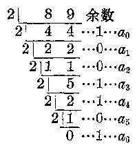

> [图像：原扫描页含图示；RAW OCR 未提供可还原的图像像素内容。]

\[
\begin{array}{l} 89 = 1 \times 2 ^{8} + 0 \times 2 ^{5} + 1 \times 2 ^{4} + 1 \times 2 ^{3} + 0 \times 2 ^{2} + 0 \times 2 ^{1} + 1 \\ = (1011001) _{2}. \\ \end{array}
\]

由此，我们可以得出把一个十进制整数化成二进制数的法则：

（1） 用 2 去除这个整数以及各次除得的商，一直除到商数是零为止，求出余数\(a_0, a_1, a_2, \cdots a_n\)。

（2） 把最后得到的余数\(a_{n}\)作为二进制数的首位数字，再把在它前面的余数（1或0）依次写出来，就可以得出这个二进制数\((a_{n}a_{n - 1}\dots a_{1}a_{0})_{2}\)。

**例1** 化113为二进制数。

**【解】**

\[
\begin{array}{rl} {2 ^{1}} & {113 \text{余数}} \\ {2 ^{1}} & {56 \dots 1} \\ {2 | 28 \dots 0} \\ {214 \dots 0} \\ {2 | 7 \dots 0} \\ {2 | 3 \dots 1} \\ {21 \dots 1} \\ \hline {0 \dots 1} \end{array}
\]

\[
\therefore \quad 113 = (1110001) _{2}.
\]

为了讲法上的方便， 我们不妨把这种解法叫做“除 2 取余”法。 应用时要注意余数的取法应该从后到前逆推上去。

#### 2. 化十进制纯小数为二进制数

从前面举过的例子也可以看到，把一个十进制的纯小数化成二进制数，首先要把它展开成2的幂为分母的分数的和的形式。

因为\(\frac{1}{2} = 0.5, \frac{1}{2^2} = \frac{1}{4} = 0.25,\)

\[
\frac{1}{2 ^{3}} = \frac{1}{8} = 0.125， \quad \frac{1}{2 ^{4}} = \frac{1}{16} = 0.0625， \dots
\]

所以把一个纯小数化成二进制数可以用减法来计算。例如

\[
\begin{array}{l} 0.8125 \\ 0.5 \\ \frac{0.8125}{0.3125} \\ \frac{0.25}{0.0625} \\ \end{array}
\]

0.8125

0.8125=0.5+0.25+0.0625

\[
= \frac{1}{2} + \frac{1}{4} + \frac{0}{8} + \frac{1}{16}，
\]

\[
\therefore 0.8125 = (0.1101) _{2}.
\]

但是， 这样计算一般来说比较麻烦， 所以我们还要设法采用另一种方法。

我们先假定 0.8125 所化成的二进制数可以展开成以下的形式：

\[
0.8125 = \frac{b _{1}}{2} + \frac{b _{2}}{2 ^{2}} + \frac{b _{3}}{2 ^{3}} + \frac{b _{4}}{2 ^{4}} + \dots . \tag {1}
\]

这里，\(b_{1}\)，\(b_{2}\)，\(b_{3}\)，\(b_{4}\cdots\)表示二进制数字0或者1。

把（1）式的两端同乘以2，可得

\[
1.625 = b _{1} + \frac{b _{2}}{2} + \frac{b _{3}}{2 ^{2}} + \frac{b _{4}}{2 ^{3}} + \dots . \tag {2}
\]

比较（2）式等号两端的整数部分， 得

\[
b _{1} = 1.
\]

在（2）式中两边都减去这个整数，然后，两端再同时乘以2，得

\[
1.25 = b _{2} + \frac{b _{3}}{2} + \frac{b _{4}}{2 ^{2}} + \dots \tag {3}
\]

比较（3）式两端的整数部分，得

\[
b _{2} = 1.
\]

仿照以上的方法，继续演算下去，可得

\[
0.50 = b _{3} + \frac{b _{4}}{2} + \dots ， \quad \therefore \quad b _{3} = 0.
\]

\[
1.0 = b _{4}， \quad \therefore b _{4} = 1.
\]

很明显，再演算下去，得到的数字都将是0。因此，我们所求的这个二进制数是（0.1101）\(_{2}\)。

应该注意， 把一个十进制纯小数化成二进制数， 在通常情况下所得到的结果 （除去这个纯小数是 0.5 的正整数次幂以外） 往往都是一个无限二进制小数。在这种情况下， 我们只要根据需要计算到某一个数位就可以了。

**例2** 化 0.6215 为二进制数（算到小数第六位）。

**【解】**

\[
\begin{array}{l} \begin{array}{rl} & 0.6215 \\ & \times \quad 2 \\ b _{1} & [ 1 ]。 2430 \\ & \times \quad 2 \\ b _{2} & [ 0 ]。 486 \\ & \times \quad 2 \\ b _{3} & [ 0 ]。 972 \\ & \times \quad 2 \\ b _{4} & [ 1 ]。 944 \\ & \times \quad 2 \\ b _{5} & [ 1 ]。 888 \\ & \times \quad 2 \\ b _{6} & [ 1 ]。 776 \end{array} \quad \therefore \quad 0.6215 = (0.100111 \dots) _{2} \end{array}
\]

我们把上面这种解法叫做“乘2取整”法。应用时要注意，求得的这个二进制数在小数点后面的第一个数字要取第一次求出的积的整数部分（1或者0），在以后用2去乘时，只求前一次得到的积的小数部分。为了方便，在实际演算时，也可采用把小数部分逐次加倍的办法。

**例8** 化 0.71875 为二进制小数。

**【解】**

\[
\begin{array}{l} \begin{array}{cc} \underline {{0.71875}} \\ \hline 1 \end{array} \\ \begin{array}{cc} \underline {{1}} & 43750 \\ \underline {{0}} & 8750 \\ \underline {{1}} & 750 \end{array} \\ \begin{array}{cc} \text{答：} & 0.71875 = (0.10111) _{2}. \end{array} \\ \begin{array}{cc} \underline {{1}} & 50 \\ \underline {{1}} & 0 \end{array} \\ \end{array}
\]

#### 3. 化十进制带小数为二进制数

上面我们已经看到把十进制整数或者纯小数化成二进制数的方法是不同的，所以要把一个十进制带小数化成二进制数，就应该按下列两个步骤来做：

（1）。 先把这个带小数的整数部分， 用“除 2 取余”法， 化成二进制整数，并在后面加上小数点“.”

（2） 再把这个带小数的小数部分，用“乘2取整”法化成二进制小数，接写在小数点的后面。

**例4** 化 180.625 为二进制数。

**【解】**

> [图像：原扫描页含图示；RAW OCR 未提供可还原的图像像素内容。]

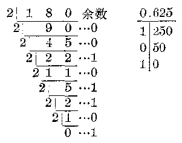

**答：**180.625=（10110100.101）\(_{2}\)

**【注意】** 第一次做除法得余数是0，不要漏掉不写。

#### 习题6·2

1. 把下列十进制数化成二进制数：

（1） 948；

（2） 1356；

（3） 4304；

（4） 3333.

2. 把下列十进制数化成二进制数（如果是无限小数， 最多只要保留五个小数数位）：

（1） 0.6875；

（2） 0.440625；

（3） 0.152；

（4） 0.075.

3. 把下列十进制数化成二进制数：

（1） 762.984375；

（2） 23.1875.

### §6·3 八进制数

在二进制记数法中，只要用0和1这两个数字符号就能把一个数表示出来。这样，便于应用物理元件的两种稳定状态把它表征出来。这是二进制记数法的优点。但是用二进制记数法表示一个数时，数位往往很多，例如用二进制数来表示数1170就得写成

\[
(10010010010) _{2}，
\]

共有11个数位。这样使用时也会带来不便。为了弥补这一不足，人们还采用了能够与二进制数迅速进行互换的其它记数法——八进制和十六进制等。八进制数应用较多，这一节里，我们就来学习八进制数的一些知识。

#### 1. 八进制数与十进制数的互换

八进制记数法中要应用八个阿拉伯数码0、1、2、3、4、5、6、7，由低位到高位是“逢八进一”的。八叫做它的基数。以下我们将在一个数的外面加上括号，并在括号的右下角标上它的基数八，以此来表示一个八进制数。

例如 （7）\(_{8}=7\)， （10）\(_{8}=8\)，

\[
(100) _{8} = 8 ^{3}， \quad (0.1) _{8} = \frac{1}{8}，
\]

\[
(0.01) _{8} = \frac{1}{8 ^{2}}， \dots .
\]

仿照二进制数那样，我们可以把一个八进制数写成它的基数8的各次幂的多项式和以8的幂为分母的许多分式的和。这样，只要通过计算，就能把它化成一个十进制数。

**例1** 把下列八进制数化成十进制数：

（1） （1284）\(_{8}\)；

（2） （0.12）\(_{8}\)。

**【解】**

（1）\((1234)_{8} - 1 \times 8^{3} - 2 \times 8^{2} + 3 \times 8 + 4\)

\[
= 512 + 128 + 24 + 4 = 668；
\]

（2）\((0.12)_{8} = 1 \times \frac{1}{8} + 2 \times \frac{1}{8^{2}}\)

\[
= 0.125 + 0.03125 = 0.15625.
\]

反过来， 如果我们要把一个十进制数化成八进制数， 也可以仿照化十进制数为二进制数的方法。就是整数部分 “除 8 取余”， 小数部分 “乘 8 取整”。

**例2** 把下列各数改用八进制数来表示：

**【解】**

（1） 13579；

（1） 8：13579 余数

\[
\begin{array}{rl} & \dot {8} \overline {{1697}} \dots 3 \\ & \dot {8} \overline {{212}} \dots 1 \\ & \dot {8} \overline {{26}} \dots 4 \\ & \dot {8} \overline {{3}} \dots 2 \\ \hline {} & 0 \dots 3 \end{array}
\]

（2） 0.4375.

（2） 0.4375

\[
\begin{array}{rl} & \times \quad 8 \\ \hline {} & [ 3 ]。 5000 \\ & \times \quad 8 \\ \hline {} & [ 4 ]。 0 \end{array}
\]

**答：**\(13579 = (82413)_{s}\)；\(0.4376 = (0.34)_{s}\)

#### 2. 八进制数与二进制数的互换

我们先把0到7这八个数，用两种记数法表示出来。列表如下：

| 八进制数 | 0 | 1 | 2 | 3 | 4 | 5 | 6 | 7 |
| --- | --- | --- | --- | --- | --- | --- | --- | --- |
| 二进制数 | 000 | 001 | 010 | 011 | 100 | 101 | 110 | 111 |

从这个表里可以看到，一个有三个数位（不足三位时，左边用0记足）的二进制数，可以用一个只有一个数位的八进制数来表示。

利用这种对应，我们就可以方便地把八进制数和二进制数互相变换。方法如下：

（1） 如果把一个二进制数变换成八进制数，只要把这个二进制数的整数部分的数字从右向左（小数部分的数字则要从左向右）每三位依次分组，最后一组不满三位时可以在左面添上0（小数部分最后一组不满三位时可以在右边添0），然后再应用上面列出的表进行变换。

例如\((1101)_2 = (001101)_2 = (15)_8\)

\[
(10.01) _{2} = (010.010) _{2} = (2.2) _{8}.
\]

（2） 如果要把一个八进制数变换成二进制数，只要把每一位上的数字改用上表中与它对应的二进制数来代替。

例如\((701)_{8} = (111000001)_{2}\)

\[
(1.06) _{8} = (001.000110) _{2} = (1.00011) _{2}.
\]

由于上面这种变换方法非常简单，所以当要把一个数位较多的十进制数与二进制数进行变换时，我们常常可以用八进制数作为媒介进行变换，使计算比较简便。例如，应用例2求得的结果，我们可以进一步把题中的这两个十进制数化为二进制数。得出：

（1）\(13579 = (32418)_{8} = (11010100001011)_{2}\)；

（2）\(0.4875 = (0.84)_8 = (0.011100)_2 = (0.0111)_2.\)

**例3** 把下列各数化为二进制数：

（1） 4967； （2） 0.828125.

**【解】** （1） 先化成八进制数， 再化成二进制数。

\[
\begin{array}{r} 8 \sqrt {4967} \\ \hline 8 \sqrt {620} \dots 7 \\ 8 \sqrt {77} \dots 4 \\ 8 \sqrt {9} \dots 5 \\ \hline 8 \sqrt {1} \dots 1 \\ \hline 0 \dots 1 \end{array}
\]

\[
\begin{array}{l} 4967 = (11547) _{8} \\ = (1001101100111) _{2}. \\ \end{array}
\]

（2） 先化成八进制数， 再化成二进制数。

\[
\begin{array}{l} 0.828125 \\ \begin{array}{cc} \times & 8 \\ \hline [ 6 ] & . 625000 \end{array} \\ \begin{array}{cc} \times & 8 \\ \hline [ 5 ] & . 000 \end{array} \\ 0.828125 = (0.65) _{8} \\ = (0.110101) _{2}. \\ \end{array}
\]

1. 把下列二进制数变换成八进制数， 然后再变换成十进制数：

（1） （10100101）\(_{3}\)；

（2） （1100101110）\(_{2}\)；

（3） （1001.11）\(_{2}\)；

（4） （11.0011）\(_{2}\)。

2. 把下列各十进制数变换成八进制数， 然后再变换成二进制数：

（1） 7654；

（2）\(10^{6}\)；

（3） 100.1875；

（4） 143.375.

### §6·4 二进制数的四则运算

二进制数可以象十进制数那样进行四则运算，除了进位要改为“逢二进一”，借位要用“借一还二”以外，其它法则都和十进制数运算的法则完全一样，下面分别举例说明。

#### 1. 加法

因为二进制数只有两个数字符号，所以加法特别简便.我们只需应用下面的加法口诀表：

| + | 0 | 1 |
| --- | --- | --- |
| 0 | 0 | 1 |
| 1 | 1 | 10 |

即\(0 + 0 = 0, 0 + 1 = 1, 1 + 0 = 1, 1 + 1 = 10.\)

例 做下列二进制数的加法，并把它化成十进制数来验算：

（1）\((111010)_2 + (10111)_2\)；

（2）\((111.01)_2 + (1.11)_2.\)

**【解】** （1） 验算

\[
\begin{array}{rl} & 111010 \quad \dots 58 \\ & 10111 (+ \dots 23 (+ \\ \hline {} & 1010001 \quad 81 \end{array}
\]

**答：**和是（1010001）\(_{2}\)。

（2） 111.01 … 7.25

\[
\frac{1.11 (+ \cdots 1.75 (+}{1001.00 \quad 9.00}
\]

**答：**和是（1001）\(_{2}\)。

**【注意】** （1） 在演算过程中， 可以把基数 2 略去不写， 但最后求得的结果中仍要标出， 以免混淆。

（2） 做小数加法时， 小数点要对齐。

#### 2. 减法

减法是加法的逆运算，所以我们仍可以利用加法口诀表来演算，但是这里要注意，遇到不够减时要“借1还2”。

**例2** 用直式演算下面的减法：

（1）\((100001)_2 - (1111)_2\)；

（2）\((10.101)_2 - (1.01)_2.\)

**【解】** （1） 100001

\[
\frac{1111 (-}{10010}
\]

**答：**差是（10010）\(_{2}\)。

（2） 10.101

\[
\frac{1.01 (-}{1.011}
\]

**答：** 差是（1.011）\(_{2}\)。

**【注意】** 做小数减法时， 小数点要对齐。

从上面的减法，可以发现做二进制的减法不象加法那样简单，因为它有一个借位问题。当我们需要连续借位的时候，往往很容易发生错误。要解决这个问题，我们可以采用另一种演算方法。

我们在学习算术的时候，曾经有这样的经验，如果一个减法与10、100、1000等这种数（10的乘方）很接近的时候，可以先把减数补上一个数，凑成一个十的乘方数。这样只要把被减数与补上去的数相加，再减去这个十的乘方数，就可以方便地求得结果。例如

\[
\begin{array}{l} 3458 - 998 = 3458 - (1000 - 2) = 3458 + 2 - 1000 \\ = 3460 - 1000 = 2460. \\ \end{array}
\]

我们把这个补上去的数又叫做 998 的补数。这种计算方法叫做补数法。

类似地， 我们在演算二进制数的减法时， 也可以先求出减数的补数， 把它化成一个首位数码是 1 而后面的数码都是 0 的二进制数。 然后再应用补数法来计算。 例如， 例 2的（1）可以如下来解，因为

\[
(1111) _{2} + (1) _{2} = (10000) _{2}，
\]

\[
\therefore (1111) _{2} = (10000) _{2} - (1) _{2}.
\]

\[
\therefore (100001) _{2} - (1111) _{2}
\]

\[
= (100001) _{2} - [ (10000) _{2} - (1) _{2} ]
\]

\[
- (100001) _{2} + (1) _{2} - (10000) _{2}
\]

\[
= (100010) _{2} - (10000) _{2} = (10010) _{2}.
\]

这里（1）2就是（1111）2的补数。

要找出一个二进制数的补数， 方法是很简单的。 设有一个二进制数\((a_{n}a_{n-1}\cdots a_{0})_{2}\)：

（1） 如果\(a_0 = 1\)，那末\(a_0\)不变，其余的数位上原来是 1 的改成 0，原来是 0 的改成 1。这样写出的数就是原来这个二进制数的补数。例如：

（1001）\(_{2}\)的补数是（0111）\(_{2}\)，即（111）\(_{2}\)。

（10101）\(_{2}\)的补数是（01011）\(_{2}\)，即（1011）\(_{2}\)。

（2） 如果\(a_0 = a_1 = \cdots = a_k = 0, a_{k+1} = 1\)。那末，这些数位上的数字都不变。在\(a_{k+1}\)前面的数字，原来是 1 的改成 0，原来是 0 的改成 1。这样就可以得到它的补数。例如

（10100）\(_{2}\)的补数是（01100）\(_{2}\)，即（1100）\(_{2}\)。

（11010）\(_{2}\)的补数是（00110）\(_{2}\)，即（110）\(_{2}\)。

**例3** 计算

\[
(11011) _{2} + (1001) _{2} - (10101) _{2}.
\]

**【审题】** 先求出\((10101)_{2}\)的补数\((1011)_{2}\)，把它化成\((100000)_{2}-(1011)_{2}\)。 这样只要先把三个二进制数\((11011)_{2}, (1001)_{2}, (1011)_{2}\)相加，再在所得的和中减去\((10000)_{2}\)就能求出结果。

**【解】**

\[
\begin{array}{l} \begin{array}{rl} {11011} & \\ {1001} & \\ {1011 (+} & \\ {101111} & \end{array} \\ \begin{array}{rl} & - [ (100000) _{2} - (1011) _{2} ] \\ & = (11011) _{2} + (1001) _{2} \\ & + (1011) _{2} - (100000) _{2} \\ & = (101111) _{2} - (100000) _{2} = (1111) _{2}. \end{array} \\ \end{array}
\]

#### 3. 乘法

二进制数的乘法，可以仿照十进制数的乘法那样来进行，在计算时要用到以下的乘法口诀表：

| × | 0 | 1 |
| --- | --- | --- |
| 0 | 0 | 0 |
| 1 | 0 | 1 |

即\(0 \times 0 = 0, 0 \times 1 = 0, 1 \times 0 = 0, 1 \times 1 = 1.\)

**例4** 做下列二进制数的乘法，并把它化成十进制数来验算：

（1）\((1011)_2 \times (101)_2\)； （2）\((11.01) \times (1.01)_2\)。

**【解】** （1）\(\frac{1011}{1011}\)验算\(\frac{1011}{1011}\)\(\frac{1}{5} (\times\)\(\frac{1}{1011}\) 5 5

**答：**\((1011)_2\times (101)_2 = (110111)_2.\)

（2） 验算

\[
\begin{array}{ccc} \frac{11.01}{1.01} & \dots & \frac{3.25}{1.25 (\times} \\ \hline 1101 & & \frac{1625}{650} \\ 1101 & & \frac{325}{4.0625} \end{array}
\]

**答：**\((11.01)_{2}\times(1.01)_{2}=(100.0001)_{2}\)

#### 4. 除法

二进制数的除法，也可以仿照十进制数除法那样来进行。如果除数是二进制小数，要先把被除数、除数扩大相同的倍数，使除数变成整数，然后再进行运算。

**例6** 做下列二进制数的除法，并求出商：

（1）\((101010)_2 \div (11)_2\)；

（2）\((101.101)_2 \div (11.11)_2\)。

**【解】**

\[
\begin{array}{rl} (1) & \frac{1110}{11 \sqrt {101010}} \\ & \frac{11}{100} \\ & \frac{11}{11} \\ & \frac{11}{0} \end{array}
\]

**答：**商是（1110）\(_{2}\)。

（2）\((101.101)_2 \div (11.11)_2 = (10110.1)_2 \div (1111)_2\)。

\[
\begin{array}{r} 1.1 \\ 1111 \overline {{) 10110.1}} \\ \underline {{1111}} \\ 1111 \\ \underline {{1111}} \\ 0 \end{array}
\]

**答：**商是\((1,1)_2\)

#### 习题6·4

计算下列各式：

1. （110101）\(_{2}\)+ （11011）\(_{2}\)+ （1001）\(_{2}\)。

2. （111001）\(_{2}\)+ （1010）\(_{2}\)+ （11111）\(_{2}\)。

3. （11.011）\(_{2}\)+ （110.11）\(_{2}\)+ （1.1001）\(_{2}\)。

4. （11000）\(_{2}\)- （1111）\(_{2}\)- （101）\(_{2}\)。

5. （1001.1）\(_{2}\)- （111.001）\(_{2}\)+ （110.1）\(_{2}\)。

6. （101001）\(_{2}\)- （11010）\(_{2}\)+ （100101）\(_{2}\)。

7. （11010）\(_{2}\)× （1010）\(_{2}\)× （101）\(_{2}\)。 8. （11.101）\(_{2}\)× （10.01）\(_{2}\)。

9. （1100011）\(_{2}\)÷ （100001）\(_{2}\)。 10. （11.0001）\(_{2}\)÷ （11.1）\(_{2}\)。

## 总复习题A

1. 如\(4 < a < 16\)，写出所有\(a\)的整数值来；写出所有\(a\)的偶数值来；写出所有\(a\)的奇数值来；写出所有\(a\)的质数的值来。

2. 如\(3 < |a| < 6\)，写出所有\(a\)的整数值来；写出所有\(a\)的正整数值来；写出所有\(a\)的负整数值来。

3. 如\(|a| \leqslant 2\)，写出所有\(a\)的整数值来；写出所有\(a\)的正整数值来；写出所有\(a\)的负整数值来。

注\(\leqslant 2\)读做小于或等于2，表示既可以小于2，也可以等于2.

4. 如\(a\)的绝对值不大于 3，写出所有\(a\)的整数值来；写出所有\(a\)的正整数值来；写出所有\(a\)的负整数值来。

求下列代数式的值（5~10）：

5. （1）\(-a^4\)， 其中\(a = -3\)；

（2）\((-a)^{5}\)， 其中\(a = -\frac{2}{3}\)；

（3）\(-a^{103}\)， 其中\(a = -1\)；

（4）\((-a)^{150}\)， 其中\(a = 0\)。

6. （1）\(a - b\)， 其中\(a = -3, b = 13\)；

（2）\(2a - 3b\)，其中\(a = 3\frac{1}{3}\)，\(b = -5\frac{1}{2}\)。

7. （1）\(\frac{3}{x} - \frac{x}{3}\)， 其中\(x = \frac{1}{2}\)；

（2）\(\frac{4}{x} - \frac{x}{4}\)， 其中\(x = -\frac{1}{3}\)。

8. （1）\(3x^{3} + 2x^{2} - x + 1\)， 其中\(x = 1\frac{1}{3}\)；

（2）\(x^{3} - 2x^{2} - 3x - 2\)，其中\(x = -\frac{1}{2}\)。

9.\(\frac{1 + a - 3a^2}{1 - a + 3a^2}\)， 其中\(a = -\frac{2}{3}\)。

10.\(\frac{(a - b)^2}{a^2b^2}\)， 其中\(a = 0.2, b = -0.3\)。

计算（11~16）：

11.\(13\frac{5}{12} +\left(-3\frac{7}{15}\right) + (-13) + 4\frac{11}{18}.\)

12.\(3.73 + \left(-\frac{1}{4}\right) + \left(-3\frac{5}{6}\right) + 9.37 = -20\frac{1}{10} + 4\frac{5}{6}.\) 13.\((-1932) - [(-852) - 932 - (-322)]\)。

14.\(32\frac{3}{4} - [(-4.15) - 3]\)。

15.\(\left[1 - \frac{1}{12} -\left(-\frac{2}{15}\right)\right] - \left[\left(-\frac{1}{12}\right) - \frac{7}{15} +\left(-1\frac{19}{20}\right)\right].\)

16.\(12\frac{5}{12} -\left(-3\frac{17}{13}\right) - 4\frac{3}{4} +\left(-4\frac{11}{18}\right) - 1\frac{1}{24}.\)

17. 计算：\(|a+b|\)，\(|a|+|b|\)及\(|a|+|b|-|a+b|\)，

\[
a = - 2 \frac{1}{2}， b = - 3 \frac{1}{3}.
\]

18. 计算：\(|a+b|\)，\(|a|+|b|\)及\(|a|+|b|-|a+b|\)，

\[
a = - 5.32， b = + 3.47.
\]

19. 计算：\(|a-b|\)，\(|a|+|b|\)及\(|a|+|b|-|a-b|\)，

\[
a = - 2 \frac{1}{2}， b = - 5 \frac{1}{3}.
\]

20. 计算：\(|a-b|\)，\(|a|+|b|\)及\(|a|+|b|-|a-b|\)，

\[
a = - 3.245； b = - 5.148.
\]

计算（21~24）：

21.\((-0.1) \times \left[(-5) \times (-12) \times (-7) \times \left(-\frac{1}{3}\right) \times \left(-\frac{1}{21}\right)\right]\)。

22.\((-6.4) \times \left[1 \times \left(-1\frac{1}{2}\right) \times 10.8354 \times 0 \times (-3.8)\right]\)。

23.\((-1) - \left(-60\frac{1}{2}\right) \times \frac{4}{11}\)。

24.\(1.12 \times 3\frac{1}{8} - (-1.75) \times 2\frac{2}{7} + (-3.4) \times 1.25.\)

25. 求\(-\frac{1}{3}\)与\(\frac{1}{15}\)的和的倒数的相反数。

26. 求\(\frac{1}{5}\)的相反数与 0.3 的倒数的和的平方。

27. 求 -3.2 与 5.4 的绝对值的和的相反的数。

28. 求 -5 与 0.3 的和的绝对值的相反的数。

29. 把 3， -2， 0.4 等三个数的倒数按照由小到大的次序排列，并用不等号连接起来。

30. 把 -5，\(\frac{1}{6}\)， 0.17 等三个数的相反的数按照由小到大的次序排列， 并用不等号连接起来。

31. 计算：\(4 \times (-0.5)^{2} - \left(-2\frac{2}{3}\right) \div (-2)^{3} + (-5)\)。

32. 计算：\(\left(-1\frac{1}{2}\right)\div\left(-\frac{3}{4}\right)-4\times\left(-1\frac{1}{2}\right)^{3}\div\left(-\frac{27}{11}\right).\)

33. 求值：\(3a^{2}-2b^{3}\)，其中 a=-1， b=-2.

34. 求值：\(\frac{2x^4 - 3y^3}{1 - x^2}\)， 其中\(x = -\frac{1}{2}, y = -\frac{1}{3}\)。

计算（35~41）：

35.\(\left(-\frac{2}{3} x^{n-1}y\right)\left(\frac{1}{2}\frac{1}{3} xy^{m-1}\right)\quad (m,n\)是大于1的自然数）。

36.\(\left(-1\frac{1}{2} x^2 y^{n-1}z\right)\left(-1\frac{1}{3} xy z^n\right)\)（\(n\)是大于1的自然数）。

37.\([-(-2a^2)^2]^3\)。

38.\(-(3ab^{2}c^{3})^{3}\)。

39.\((-x^{2})^{3} \cdot (x^{3})^{4}\)。

40.\((ab^{2}c^{3})^{2} - (0.5ab^{2}c^{3})^{2}(4ab^{2})(-5c)^{2}\)。

41.\(4(x - 2y + 3z) - 2(x + y - 2z) - 3(-x \div y - 3z)\)。

用直式计算（42~45）：

42.\((2x^{2} \div 3y^{2} - 4xy)(3xy + 3x^{2} - 2y^{2})\)。

43.\((3a^{3} - 5a^{2}b + 6b^{3})(-3a^{2} - 4ab + 5b^{2})\)

44.\((6a^{3} + a^{2} - 29a + 21)\div (2a - 3).\)

45.\((5x^{2} - 19x^{3} + 17x + 6x^{4} - 4)\div (1 - 5x + 3x^{2})\)

用乘法公式演算（46~53）：

46. （1）\((a + 2b - 3c)^2\)； （2）\((a - 2b - 3c)(a + 2b + 3c)\)。

47. （1）\((a - 2b - 2c)(a + 2b - 3c)\)； （2）\((-a + 2b - 3c)(a - 2b - 3c)\)。

48. （1）\((a + 2b + c - 2d)(a - 2b + c + 2d)\)；

（2）\((a - b + 2c - 3d)(a + b - 2c + 3d)\)。

49. （1）\((3a^{5} - 2b^{4})^{2} \cdot (3a^{5} + 2b^{4})^{2}\)； （2）\((2x^{2} - 3y^{3})^{2} \cdot (4x^{4} + 6x^{3}y^{3} + 9y^{6})^{2}\)。

50.\((a^2 + b^3)^3 (a^4 - a^2 b^3 - b^6)^3\)。

51.\((a + b)(a - b)(a^2 + b^2)(a^4 + b^4)(a^8 + b^8)(a^{16} + b^{16})\)。

52.\((x + 3)(x - 5) \div (x - 7)(x + 9)\)。

53.\((2x + 3)(3x + 1) - (2x - 1)(3x - 2)\)。

54. 用简便方法计算：

（1）\(298 \times 302;\)

（2）\(15.4 \times 16.6.\)

55. 用简便方法计算：

（1）\((59.9)^{2}\)；

（2）\((502)^{2}\)。

56. 先化简再求值：

\[
5 x (y - z) - \{2 z (3 x - 2 y) - [ 4 y (3 x + z) - 8 (4 x y - x z + y z) ] \}，
\]

其中\(x = -\frac{2}{3}, y = -\frac{1}{2}, z = -5.\)

57. 先化简再求值：

\((x^{3} - 2)^{2} - (x^{3} + 2)^{2}\)，其中\(x = -2\)

分解因式（58~62）：

58.\(a^3 + a^2 + b^3 - b^2\)。

59.\(x^{5} - x^{4} - 27y^{5} + 9y^{4}\)。

60.\(xz - yz - x^2 - y^2 + 2xy\)。

61.\(x^{2} - 4xy + 4y^{2} - z^{2} - 2z - 1.\)

62.\(x^{4} - 8x^{2} - 9.\)

化简（63~68）：

63.\(\frac{a^2 - 2ab - b^2 - a - b}{a^2 - b^2}\)。

64.\(\frac{3y - 3x + 9x^2 - 9y^2}{x^3 - y^3}\)。

65.\(\frac{1 - 3x + 3x^2 - x^3}{x^4 - 2x^3 + 1}\)。

66.\(\frac{6x^3 + 18x^2 - 60a}{15x^2 + 90a^3 + 75a^3}\)。

67.\(\frac{\frac{1}{x^2} - \frac{3}{x} + 4}{-\frac{3}{x^2} - \frac{1}{x} + 1}\)。

68.\(\frac{1}{1 - \frac{1}{1 - \frac{1}{1 - x}}}\)。

演算（69~74）：

69.\(\left(\frac{3x^2 + 1}{x^3 - 1} - \frac{x - 1}{x^2 + x + 1}\right)\left(1 + \frac{x + 1}{x} - \frac{x^2 + 5x}{x^2 + x}\right)\)。

70.\(\left(\frac{2a}{2a + b} -\frac{4a^2}{4a^2 + 4ab + b^2}\right)\div \left(\frac{2a}{4a^2 - b^2}\div \frac{1}{b - 2a}\right).\)

71.\(\left[\frac{m^2 - n^2}{m^2 + 2mn + n^2} + \frac{2}{mn} \div \left(\frac{1}{m} + \frac{1}{n}\right)^2\right] \div \frac{1}{m + n}\)。

72.\(\left[\frac{a^2}{a^2 - b^2} - \frac{a^2b}{a^2 + b^2}\left(\frac{a}{ab + b^2} + \frac{b}{a^2 + ab}\right)\right] \times \frac{a - b}{b}\)。

73.\(\left[\frac{2}{3x} -\frac{2}{x + y}\left(\frac{x + y}{3x} -x - y\right)\right]\div \frac{x - y}{x}.\)

74.\(\left(a - \frac{4ab}{a + b} + b\right) \div \left(\frac{a}{a + b} - \frac{b}{b - a} - \frac{2ab}{a^3 - b^2}\right)\)。

依照下面的叙述列出代数式（75~81）：

75. 两数\(a\)与\(b\)的和的平方除以它们的倒数的和。

76. 两数\(a\)与\(b\)的比与它的反比的和的平方。

77. 一个两位数， 它的个位数上的数是\(a\)， 它的十位数上的数是个位数上的数的平方。

78. 一个三位数， 它的十位数上的数是\(x\)， 它的个位数上的数比十位数上的数的平方小 4， 它的百位数上的数比个位数上的数小 2.

79.\(a\)与\(b\)的和的绝对值加上它们的绝对值的和。

80.\(a\)与\(b\)的差的绝对值加上它们的绝对值的和。

81. 两个数\(a\)与\(b\)的倒数的比的反比。

如\(m, n\)是自然数，演算下列各题\((82 \sim 90)\)：

82.\((a^{m})^{2} \cdot (a^{n})^{3}\)。

83.\((a^{m + 1}b^{n + 2})^2\)

84.\(a^{2n + n}\div a^{m + n}\)

85.\(a^{2m + 3n}\div (a^{m + n})^2\)

86.\((a^{m + 1})^2\div (a^{2m + 1})\)

87.\((a^{m} + b^{n})^{2}\)。

88.\((a^{m} - b^{n})^{2}\)

89.\((a^{m} + b^{n})(a^{m} - b^{n})\)

90.\((a^{m} - b^{n})^{3}\)

如\(m, n\)是自然数，分解下列因式（91~96）：

91.\(a^{2m} + 2a^{m} + 1.\)

92.\(a^{4m} - b^{8n}\)

93.\(a^{3m} + b^{6n}\)

94.\(a^{2m + 2} - 2a^{m + 2} + a^2\)

95.\(a^{3m + 6} + a^{3}b^{3}\)

96.\(a^{3m + 8} - a^{2}b^{3m}\)

## 总复习题B

1. 在所有的自然数中，最小的奇数是什么？最小的偶数是什么？最小的质数是什么？最小的合数是什么？奇数一定是质数吗？质数一定是奇数吗？偶数一定是合数吗？合数一定是偶数吗？

2. 有最小的自然数吗？有最小的整数吗？有最小的有理数吗？

3. 如果\(n\)表示任意整数，写出可以表示任意偶数的代数式。写出可以表示任意奇数的代数式。写出可以表示任意被3整除的数的代数式。写出可以表示任意被3除后余1的数的代数式。写出可以表示任意被3除后余2的数的代数式。写出可以表示任意2的倍数但不是4的倍数的数的代数式。写出可以表示任意3的倍数但不是2的倍数的数的代数式。

4. 如果\(n\)表示任意整数，\(4n\)表示怎样的数？\(4n + 1\)呢？\(4n + 2\)呢？\(4n + 3\)呢？\(4n - 1\)呢？

5. 用3、4、5、6四个数字排成一个四位数，使这个四位数是4的倍数。有几个这样的数？

6. 用3、4、5、6四个数字写成一个四位数，使它是四位数中9的最大倍数，使它是四位数中9的最小倍数，能写出不是9的倍数的数吗？

7. 任意两个数的绝对值的和与这两个数的和的绝对值一定相等吗？怎样的情况下二者相等？怎样的情况下二者不等？不等时哪一个人？

8. 任意两个数的绝对值的差（取非负数）与这两个数的差的绝对值一定相等吗？怎样的情况下二者相等？怎样的情况下二者不等？不等时哪一个大？

9. 有一个两位数，它的十位数字是个位数字的平方。试用一个字母的代数式表示这个两位数的平方。

10. 有一个三位数，它的三个数字从左到右依次增加1，试用一个字母的代数式表示这个三位数。

11. 有一个三位数\(x\)，另有一个两位数\(y\)，把两位数\(y\)接在三位数\(x\)的右边做成一个五位数，列出这个五位数的代数式。如果把三位数\(x\)接在两位数\(y\)的右边，列出这个五位数的代数式。

12. 有四个整数，其中两个是差为2的偶数，另外两个是紧接在较大偶数后面的差为2的奇数，列出代数式表示这四个数的平方和。

13. 有四个整数，其中两个是差为2的奇数，另外两个是紧接在较大奇数后面的差为2的偶数，列出代数式表示这四个数的和的平方。

14. 已知：\(a:b=5:5,\ b:c=2:5\)，求a：c。

15. 甲乙两容器内都盛有酒精。甲有\(V_{1}\)公斤，乙有\(V_{2}\)公斤，甲中纯酒精与水的重量之比为\(m_{1}: n_{1}\)，乙中纯酒精与水的重量之比为\(m_{2}: m_{2}\)。求将二者混合后所得液体中纯酒精与水的重量之比。

分解因式：

16.\(2(a^{2} + b^{2})(a + b)^{2} - (a^{2} - b^{2})^{2}\)。

17.\(4y(x - y) + (x + y)(y - x)^{2} + 4x(y - x)\)。

18.\(3x^{2} - 8y^{2} + 2xy - 2x - 4y.\)

19.\(x^{4} + x^{2} - a^{4} - 2ax + a^{2}\)。

20.\(9^{n} - 3^{n + 1} - 18.\)

21.\(2x^{n + 2} - 3x^{n + 1} + x^n\)

22.\(4abx^{2} - 2(a^{2} + b^{2})xy + aby^{2}\)。

23.\((x - x)^{2} - 4(x - y)(y - z)\)。

24.\(4(x^{2} + 3x + 1)^{2} - (x^{2} + x - 4)^{2} - (x^{2} + 5x + 6)^{2}\)。

25.\(x^{2} + y^{2} - 2xy - x + y - 6.\)

23.\(x^{2} - 2x^{2}y - 3y^{2} - 4y - 1.\)

27.\(x^{4} - 6x^{3} + 7x^{2} + 6x - 8.\)

28.\(x^{3} + (a + 1)x^{2} - x^{2}\)。

29.\(-a^{2} - b^{2} - c^{2} - 2a b + 2a c - 2b c.\)

30.\(x^{2} - (a^{2} - 1)x - a.\)

化简：

31.\(\left(\frac{1}{x - 1} -\frac{1}{x + 1} -1\right)(x - \frac{1}{x}).\)

32.\(\left(\frac{a^2 - ab}{a^2b + b^3} - \frac{2a^2}{b^3 - ab^2 + a^2b - ab^3}\right)\left(1 - \frac{b - 1}{a} - \frac{b}{a^2}\right)\)。

33.\(\left(\frac{1}{x^2 - xy} - \frac{3y^2}{x^4 - xy^3} - \frac{y}{x^3 + x^2y + xy^2}\right)\left(x + \frac{y^2}{x + y}\right)\)。

34.\(\left(\frac{a}{b} +\frac{b}{a}\right)^3 -\left(\frac{b}{a} -\frac{a}{b}\right)^3.\)

35.\(\left(x - \frac{4xy}{x + y} - y\right) \div \left(\frac{x}{x + y} - \frac{y}{y - x} - \frac{2xy}{x^2 - y^2}\right)\)。

36.\(\left[\frac{b^2 + c^2}{b^2c^2}\left(\frac{1}{b^2} - \frac{1}{c^2}\right) - \left(\frac{1}{a^2} - \frac{1}{c^2}\right)\frac{a^2 + c^2}{a^2c^2}\right] \div \frac{a^2 + b^2}{a^2b^2}\)。

37.\(\frac{1}{x - \frac{x}{x - \frac{x - 1}{x}}}\)

38.\(\frac{a^3 - 1}{2a + 1 - \frac{a}{1 - \frac{1}{a}}}\)

39. 已知\(x = a + b + \frac{(a - b)^2}{4(a + b)}, y = \frac{a + b}{4} + \frac{ab}{a + b}\)， 求证

\[
x ^{2} - y ^{2} = \frac{3}{2} (a ^{2} + b ^{2})。
\]

*40. 求证：如果\(a, b, c\)都是有理数，那末代数式\(2a^2 + 5b^2 + 9c^2 + 6ab - 6ac - 12bc\)的值一定不是负数。

*41. （1） 求证： 如果\(a\)是不等于 1 的有理数， 那末\(a^2 + 1\)的值一定大于 2a；

（2） 如\(a\)是不等于 1 且不等于 0 的有理数。\(a^2 + \frac{1}{a^2}\)的值一定大于 2.

*42. 如果\(\frac{216}{ab}\)是一个质数，\(a\)与\(b\)是互质数。\(a, b\)这两个数是什么？

## 第一册总测验题

1. 计算：

（1）\(\left[\left(\frac{1}{2} - \frac{1}{3}\right) \times \left(-\frac{3}{3}\right) - \left(1 \div \frac{1}{3}\right) \times \left(-\frac{3}{4}\right)\right] \div 1\frac{1}{2};\)

（2）\(5\frac{1}{2} \times \left(-\frac{6}{11}\right) + 0.25 - (-2)^{3} \div \left(-2\frac{2}{3}\right)^{2}\)。

2. 用“>”、“<”或“=”符号连接下列各组数：

（1）\(0.25 - 3\frac{1}{8}, | - 3.375!;\)

（2）\(|a+3|, |a-3|\)，已知\(a<-3\)。

3. 化简\(|-2a| - |a|\)。

4. 分解因式：

（1）\(18a^{3} - 48a^{2}b + 32ab^{2}\)；

（2）\(a^2 - 2ab + b^2 - 6a + 6b + 5\)。

5. 分解因式：

（1）\(x^{4} + 2x^{3} - 3x^{2} - 4x - 96;\)

（2）\((2x^{2} - 3x + 1)^{2} - 22x^{2} + 33x - 1.\)

6. 分解因式：

（1）\(x^{2} - 2kx - 2x + 2k + k^{2};\)

（2）\((x - 7)(x - 3)(x + 5)(x + 1) - 1680.\)

7. 化简：

（1）\(\left(\frac{a}{a + b} - \frac{a^2}{a^2 + 2ab + b^2}\right) \div \left(\frac{a}{a + b} - \frac{a^2}{a^2 - b^2}\right)\)；

（2）\(\frac{2a}{a - 3b} - \frac{6ab - 24b^2}{a^2 - 7ab + 12b^2}\)。

8. 化简：

（1）\(\frac{a^2 - b^2}{(b - a)^2} + \frac{a^3 - b^3}{(b - a)^3}\)；

（2）\(\frac{a^{n - 2} \cdot (a^3)^n}{(a^{2n + 1})^2} + \frac{(-a)^2 - 1}{-a + 1}\)。

9. 已知\(m + \frac{1}{m} = 3\)，求：

（1）\(m^2 + \frac{1}{m^2}\)的值；

（2）\(m^3 + \frac{1}{m^3}\)的值。

10. （1） 某人于\(x\)天内行路\(y\)里， 如果他平均每天比以前多行\(a\)里， 那末再行\(y\)里时需要多少天？ 列出这个关于天数的代数式并把它化简。

（2） 一个工程， 甲单独做需要\(a\)天完成， 乙单独做需要\(b\)天完成， 如果甲乙两人合做， 每人每天的工作量不变， 那末两人需做几天才能完成？ 列出表示这个关于天数的代数式并把它化简。

## 习题答案

### 第一章

习题1·1 8.349； 9.10； 10.719； 11.50； 12.1； 13.30.5；

14. 20； 15. 2.1144； 16. 0.04； 17.\(\frac{27}{700}\)； 18.\(7\frac{1}{5}\)； 19.\(\frac{1}{25}\)；

20. 1； 21. 0.36， 4.60； 22. 71%； 23. 16.7%， 14.3%。

习题1-6 3. （2） 10， （3） 56， （4） 1.64， （5） 0.06，

习题1·8 2. （11）\(3\frac{2}{3}\)， （12）\(-2\frac{1}{12}\)， （13）\(-3\frac{5}{6}\)， （14）\(2\frac{2}{35}\)，

（15） 9.33， （16） -46.937， （17） 2.396， （18） 18.96， （19）\(3\frac{19}{30}\)，

（20）\(-8\frac{113}{300}\)； 3. （1） 0， （2） 19， （3） 0， （4） 0.

习题1·9 1. -124； 2. -189； 3. 390； 4. 1.5； 5.\(39\frac{2}{3}\)；

6.\(11\frac{2}{11}\)； 7. 9.04； 8. 7.

习题1.10 2. （13） -11， （14） -33， （15） -5， （16） -5.7，

（17）\(1\frac{3}{4}\)， （18）\(-5\frac{11}{30}\)， （19）\(-\frac{7}{8}\)， （20） 14.

习题1.11 1.\(-5\frac{1}{3}\)； 2. 400； 3.\(-18\frac{3}{35}\)； 4. 9.69； 5.\(-\frac{1}{3}\)；

6. -3； 7. -3.635； 8. -26\(\frac{1}{3}\)。

习题1·12 1.30； 2.-50； 3.-16； 4.-5； 5.-1；

6. 24.3； 7. -6； 8.\(\frac{77}{150}\)； 9. -0.57； 10. -27.68.

习题1·13（1） 13.1； 14.\(-2\frac{1}{3}\)； 15.3.48； 16.\(-2\frac{7}{8}\)。

习题1·13（2） 1. 9600； 2. 0.6； 3. -1.2； 4.\(40\frac{1}{2}\)； 5. -100000；

6. 218.88； 7. 0.01； 8. -0.004； 9. 4； 10. -10.

习题1·14 1.3874000； 2.-6； 3.0； 4.19； 5.-3700000；

6. 74； 7. -20600； 8. -43.

习题1.15 15.\(-\frac{9}{110}\)； 16.\(-\frac{3\frac{1}{2}}{3}\)； 17. -2； 18.\(-\frac{1}{6}\)；

19.\(\frac{11}{100}\)； 20.\(-1\frac{1}{20}\)。

习题1.18 1. （1） 3.815； （4） 217.0； （7） 0.0005198. 2. （1） 大于1而小于10的数的平方有一位或二位整数。 3. 小于1而大于0.1的数的平方紧缩小数点之后没有零或有一个零， 它的立方没有零或有一个到两个零。 8.\(35470 = 3.547 \times 10^{4}\)，\(35.79 = 3.579 \times 10\)，\(23000 = 2.300 \times 10^{4}\)。

习题1.19 1.14； 2.\(\frac{1}{4}\)； 3.9； 4.\(\frac{1}{3}\)； 5.\(-4\frac{1}{3}\)； 6. -3.

7. -16； 8.\(-7\frac{8}{45}\)； 9.\(-3\frac{1}{2}\)； 10. -24.

#### 复习题一A

4.\(-\frac{2}{15}, \frac{15}{22}, -\frac{1}{4}\)； 5. （1） -2500， （2） -1， （3）\(-4\frac{5}{6}\)，

（4）\(-1\frac{5}{188}\)； 6. （1） +1， （2） -0.0431； 7. （1） -12， （2） -2.

#### 复习题一B

5. -141， 6. -1125， 7.\(2\frac{3}{7}\)。 19. 当这个数小于1而大于0，或小于-1时，倒数比本身大。当这个数大于1，或小于0而大于-1时，倒数比本身小。当这个数等于1或等于-1时，倒数与本身相等。

#### 第一章测验题

1. （1） -49， （2）\(-\frac{5}{6}\)， （3）\(-\frac{37}{175}\)， （4）\(-5\frac{47}{48}\)， （5）\(1\frac{19}{25}\)， （6）\(-\frac{4}{9}\)， （7） -64， （8） -0.027， （9） -100， （10） 0.81.

2. （1） -1.08， （2） -149， （3）\(156\frac{1}{4}\)， （4） 21. 3. （1）\(1\frac{1}{27}\)， （2） -4.96， （3）\(-\frac{12}{25}\)， （4）\(2\frac{11}{14}\)。 4. （1） -17.4， （2） 0.116.

5. （1） 144， （2）\(-2\frac{3}{4} < -2.7 < -2\frac{2}{3}\)， （3）\(2\frac{59}{108}\)， （4）\(\frac{283}{1000}\)。

6. 平方比原来大的数：大于1的数，负数，平方比原数小的数：小于1的正数，平方等于原数的数：0，1。

### 第二章

习题2.2 6.\(\frac{x}{5x - 3},\frac{x - 1}{5x - 3 - 1};\) 7.（1）\(2a\)，（2）\(ab\)，（3）\(\frac{50}{a}\)

（4）\(\frac{d}{a}\)； 8. （1）\(3a - 3b\)（公里）， （2）\(2b + 3a\)（公里）， （3）\(\frac{d}{b} - \frac{d}{a}\)（小时）；

9. （1）\(a^2\)， （2）\(4a\)； 10. （1）\(a^2 + b^2\)平方厘米， （2）\(a^2 - b^2\)平方厘米，

（3）\(4a + 4b\)厘米，（4）\(4a - 4b\)厘米。

习题2.3 2. （1） 8， （2）\(2\frac{2}{63}\)， 3. （1） -2， （2） 5.107，

4. （1） -16， （2） 6， 5. （1） 4， （2）\(8\frac{1}{36}\)， 6. （1）\(1\frac{12}{13}\)，

（2）\(\frac{1}{25}\)， 7. （1）\(\frac{21}{31}\)， （2）\(1\frac{60}{79}\)， 9. （2） 1.62 平方厘米；

10. （2） 0.52 平方厘米。

习题2.4 1.11； 2. -15； 3.\(-\frac{1}{3}\)； 4. -10； 5. 17.

习题2.7 5. （1） 0.525， （2） 7.111.

习题2.8 1. （2）\(x\)和\(y\)都可以取任意值，（4）\(a \neq 4\)，（5）\(a \neq -4\)；

2. （1）\(x \neq 2\)， （2）\(x \neq -\frac{1}{3}\)， （3）\(x \neq 1\)且\(x \neq -1\)， （4）\(x\)可以取任意值；

3. （1）\(a = -3, a = 3\)， （2）\(a = 3, a = -3\)， （3）\(a = -5, a = 1\frac{1}{2}\)，

（4）\(x = \pm 1, x\)不论取什么有理值，代数式\(\frac{x^2 - 1}{x^2 + 1}\)总有意义；4. （1）\(x < 0\)，\(x > 0, x = 0\)，（2）\(x > 3, x < 3, x = 3\)，（3）\(x < 3, x > 3, x = 3\)，（4）\(x > -3, x < -3, x = -3\)。

#### 复习题二A

5. （1）\(-76, -9\frac{1}{27}\)， （2）\(-101, 6.016\)； 6. （1）\(\frac{2}{3}, \frac{5}{14}\)； （2）\(1\frac{59}{81}\)，\(1\frac{11}{27}\)； 7. （1）\(\frac{1}{4}, -\frac{35}{36}\)， （2）\(\frac{4}{9}, \frac{16}{9}\)； 8. 2； 11.\(a + b, a^2 + b^2\)，\((a + b)^2\)； 12. （1）\(a \neq 5\)， （2）\(a \neq -7\)， （3）\(a \neq -3\frac{1}{2}\)， （4）\(a \neq \pm 1\)。

#### 复习题二B

3. （1）\(-2\frac{11}{12}, -\frac{1}{12}\)， （2）\(\frac{7}{19}, \frac{7}{19}\)； 4. 486； 5. （1） 10， （2） 0.1；

6. （1） 8， 8， （2） 8， 8， （3） 8， 2， （4） 8， 2； 当\(x\)和\(y\)同号时，\(|x + y| = |x| + |y|\)（包括\(x\)或\(y\)等于零）。 当\(x\)和\(y\)异号时，

\[
| x | + | y | > | x + y |.
\]

7.\((x + y)^2 - (x^2 + y^2)\)； 8.\(\frac{xy}{x + y}\)； 9.\(x(26 - x)\)； 10.\(x + \frac{48}{x}\)；

11.\(x(25 - x)\)； 12.\(\pi x^2 + \pi (15 - x)^2\)； 13.\(2\pi x + 2\pi \cdot 3x\)；

14.\(\frac{(x + 2x)(x - 3)}{2}\)； 15. 当\(b > 0\)时、\(a + b > a, b = 0\)时、\(a + b = a, b < 0\)

时，\(a + b < a\)；16.\(b > 0\)时，\(a - b < a, b = 0\)时，\(a - b = a, b < 0\)时，\(a - b > a\)

17.\(a > 0\)时，\(3a > a, a = 0\)时，\(3a = a, a < 0\)时，\(3a < a;\) 18.\(a > 0\)时，\(\frac{a}{3} < a, a = 0\)时，\(\frac{a}{3} = a, a < 0\)时，\(\frac{a}{3} > a;\) 19.\(a\)是正数或零；20.\(a\)是负数

（也可以\(a = 0\)）； 21.\(a = b\)或\(a = -b\)， 即\(a\)与\(b\)可能相等， 可能是相反的数； 22.\(a > 0\)时，\(a > b\)，\(a < 0\)时，\(a < b\)，\(a\)不会等于\(b, a\)不会等于\(0\)。

#### 第二章测验题

1. （1） 5.12， （2） 18； 2. （1）\(-2\frac{1}{3}\)， （2）\(-1\frac{4}{23}\)； 3. （1） 2，

（2）\(1\frac{4}{31}\)； 4. （1）\(-\frac{10}{19}\)， （2）\(-\frac{31}{71}\)； 5.\(\pi r^{2} + \pi(2r - 3)^{2}\)；

6.\(10 \cdot \left(\frac{p}{4}\right)^2\)； 7. （1）\(-5x^4 + 2x^3 + 10x - 7\)， （2）\(-\frac{19}{15}x^3 + \frac{5}{3}x^2y + \frac{5}{6}xy^2 + 4y^3\)（系数一般不用带分数）； 8. 当\(x = 1\)时， 0， 当\(x = -\frac{3}{2}\)时， 没有

意义；9. （1） 1， 2， 3， 4， 6， 12， （2） 1， 2， 3， 4， 6， 12， -1， -2， -3， -4， -6， -12； 10. （1） -1， -2， -3， -6， -9， -18， （2） -1， -2， -3， -6， -9， -18， 1， 2， 3， 6， 9， 18.

### 第三章

习题3·1（1） 4. （1） -9a， （2） 0， （3）\(-18a^{2}b^{3} - 14a^{3}b^{2}\)，

（4）\(-5a^{2}x^{3} + 2a^{3}x^{2},\) 5. （1）\(\frac{13}{60} a b,\)（2）\(-\frac{5}{6} x^{2}y - \frac{5}{12} xy^{2},\)

（3）\(-5a^{2}b^{3}xy - 11a^{3}b^{2}xy.\)

习题3·1（2） 3. （1） 11a， （2）\(-4a^{2}\)， （3）\(-a^{2}b\)， （4） 0，

4. （1） 6a， （2）\(\frac{13}{12} a^2 b^3\)； 5. （1）\(2x^2y - 2xy^2\)， （2）\(-14y^2 - 9y\)。

习题3·1（3） 1. （1）\(3x^{3} - 3x^{2} + 14\)， （2）\(-4a^{3} + 7a^{2} - 5a + 2\)，

2. （1）\(-2a^{4} - 10a^{2} + 5a - 6\)， （2）\(-a^{3} - 4\frac{2}{3}b^{2} + \frac{1}{4}c^{2}\)； 3. （1）\(4a - 3b\)，

（2）\(4a + 4b\)， （3）\(2bx + 2ay\)， （4）\(-x^{3} - 10x^{2}y + 3xy^{2} + y^{2}\)

4. （1）\(6a + 2b\)， （2）\(2a^3 - 10a^2 + 8a - 20\)， （3）\(-3x^3 + x^2 + 12x - 14\)。

（4）\(-12x^{2}y - 2y^{3}\)。 5. （1）\(x^{3} - 5x^{2} + 6x - 7 < x^{3} - 5x^{2} + 6x - 5\)， （2）\(x\)

>0 时，第一式大。x=0 时，两式相等。x<0 时，第一式小。（3）x=0 时，两式相等。x≠0 时，第一式大。（4）x<0 时，第一式大。x=0 时，两式相等。x>0 时，第一式小。

习题3·1（4） 1.\(8x^{4} + 2x^{3} + 6x^{2} + 7x - 14;\) 2.\(-14x^{3} - 2x^{2} + 8x + 7;\)

3.\(4x^{4} - x^{3} - 3x - 9;\) 4.\(-3a^{2} + ab + 7b^{2};\) 5.\(-2xy;\) 6.\(\frac{4}{3} x^2 +\frac{1}{2} xy;\)

7.\(4y - 6z;\) 8.\(5x^{3} - x - 23;\) 9.\(12x^{7} + 3x^{6} - 8x^{5} + 2x^{4} - 11x^{3} - 3x^{2};\)

10.\(-2ab + 4b^{2}\)；

习题3.2（1） 1.\(2a + 4b - 2c;\) 2.\(10x - 5y - 3z;\) 3.\(12xy - 3y^{2};\)

4.\(10a - 5b;\) 5.\(-a + 5b + 2c;\) 6.\(-2x - 5y + 4z;\) 7.\(2a - 3c + x + 2y;\)

8.\(2a^{3} - 3a^{2} - 5a + 5;\) 9.\(13x - 36y;\) 10.\(x - y + 3s;\) 11.\(14x - 20y;\)

12.\(-4x^{3} + 8x^{2} - 4x - 12.\)

习题3·2（2） 3.\(-2a + (3b + 5c)\)； 4.\(3x - (6y + 5z)\)；

5.\(-2a + (3b - 5c)\)； 6.\(-2a - (3b + 5c)\)； 7.\(x^{2} - (3x + 5)\)；

8.\(x^{2} + (3x - 5)\)； 9.\(a^3 - (3a^2b + b^5)\)； 10.\(a^3 + (3a^2b + b^3)\)。

习题3.3 1. -1； 2.\(2a - 5\)； 3. -2； 4.\(-2a - 3\)； 5. 6；

6.\(2a + 4\)； 7.\(a > 0\)，\(a \cdot a = 0\)，\(0 \cdot a < 0\)，\(-a\)； 8.\(a > -1\)，\(a + 1\)。\(a = -1\)，

0.\(a < -1, - (a + 1)\)。

习题3.4（1） 1.\(x^{15}\)； 2.\(x^4\)； 3.\(x^{28}\)； 4.\(x^3\)； 5.\(x^{a + b + c}\)； 6.\(x^{a + 1}\)；

7.\(x^{2}\)； 8.\(x^{3r+1}\)； 9.\(a^{4n+2}\)； 10.\(x^{a+2b+1}\)。

习题3.4（2） 15.\(-9x^{a + 4};\quad 16.72x^{a};\quad 17.4(a - b)^{6};\)

18.\(-7.5 \times 10^{16}\)。

习题3.4（3） 6.\(-2a^{4}b^{2}-\frac{4}{3}a^{5}b+\frac{4}{5}a^{2}b^{4};\)

7.\(4x^{m + 1}y^{2} - 8x^{n + 1}y^{2} + 24x^{2n + 1}y^{2};\) 8.\(-7x^{2a}y^{2b}z^{2c}\div 9x^{a + 1}y^{b + 1}z^{c + 1};\)

9.\(5x - 3y + 9z\)； 10.\(4x^{2} - 6xy - 2y^{2}\)； 11.\(2a^{3} - 4ab^{2} + 2b^{3}\)； 12.\(x - \frac{7}{6}\)；

13.\(-19x + 18\)

习题3.4（4） 13.\(6a^{4} - 10a^{3} - 13a^{2} + 35a - 28;\) 14.\(x^{2} + \frac{1}{6} x^{2} + \frac{1}{12} x - \frac{1}{12}\)； 15.\(\frac{3}{2} x^{4} + \frac{1}{4} x^{3} - 17x^{2} - \frac{5}{2} x + 20\)；

习题3.4（5） 4.\(3x^{5} - 14x^{4} + 11x^{3} + 11x^{2} + 13x - 30;\)

5.\(2x^{8} + 19x^{5} + 51x^{4} + 34x^{3} - 35x^{2} - 23x + 12;\) 6.\(x^{4} + 3x^{3} - x^{2} + 2x + 15;\)

7.\(5x^{7} - 12x^{5} + 19x^{4} - 13x^{3} + 15x^{2} + 8x - 16;\) 8.\(x^{5} - 1;\) 9.\(x^{4} + x^{2}y^{2} + y^{4};\)

10.\(x^{5} - y^{6}\)； 11.\(x^{3} + 3xy + y^{3} - 1\)； 12.\(x^{3} + y^{3} + z^{3} - 3xyz\)。

习题3·5（1） 1.\(x^4\)； 2.\(a^3\)； 3.\(x^4\)； 4.\(a^6\)； 5.\(a^{36}\)； 6.\(a^{15}\)；

7.\(b^{12}\)； 8.\(b^7\)； 9.\(y^{25}\)； 10.\(y^{10}\)； 11.\(a^{2mn}\)； 12.\(a^{2m+n}\)；

13.\(a^{m+2}\)； 14.\(a^{2n}\)； 15.\(a^{320}\)； 16.\(a^{36}\)； 17.\(a^{24}\)； 18.\(a^2\)；

19.\(a^{mnP}\)； 20.\(a^{m+n+}\)， 21.\(a^{16}\)； 22.\(a^{20}\)； 23.\(a^{2m+3n}\)；

24.\(x^{3m + 2n}\)； 25.\(a^{11}\)； 26.\(a^{25}\)； 27.\(2a^5\)； 28.\(2a^6\)； 29.\(a^6 + a^5\)；

30.\(a^5 \div a^6\)。

习题3·5（2） 1.\(81a^{5}b^{12}\)； 2.\(16a^{20}b^{12}c^{4}\)。 3.\(-a^{101}b^{202}c^{203}\)。

4.\(\frac{1}{8} x^{6}y^{3}\)； 5.\(-\frac{8}{27} a^{6}b^{3}c^{6}\)； 6.\(\frac{81}{16} a^{8}x^{4}\)； 7.\(0.027a^{6}\)；

8.\(81a^{8}b^{12}x^{4}y^{4}\)； 9.\(4a^{4}b^{3}x^{2}y^{6}\)； 10.\(x^{2m}y^{m}\)； 11.\(x^{2m}y^{2}\)； 12.\(x^{2m}y^{2m}\)；

13.\(x^{mn}y^n\)； 14.\(72a^{12}\)； 15.\(x^{14}y^{23}\)； 16.\(-a^{27}b^{28}\)； 17.\(-2a^{12}\)；

18.\(-a^{18}b^{30}c^{3}\)； 19.\(324a^{9}b^{11}\)； 20.\(a^{3m+2n}b^{2m+3n}c^{2m+3}\)， 21.\(10a^{6}\)；

22.\(28a^{9}\)； 23.\(a^{36} + a^{12}\)； 24.\(25a^{11} + 27a^{9}\)。

习题3·6（2） 1.\(16a^{4} - b^{6}\)； 2.\(9a^{3}b^{2} - 25a^{4}\)； 3.\(9a^{3} - 4b^{2}\)；

4.\(9a^{2} - 25b^{4}\)； 5.\(4a^{6} - 9b^{4}\)； 6.\(25x^{6} - 36y^{4}\)； 7.\(y^{2} - x^{2}\)；

8.\(169b^{3} - 144a^{2}\)； 9.\(9y^{6} - 25x^{4}\)； 10.\(9b^{4} - 49a^{6}\)； 11. 9991；

12. 39999； 13. 6975； 14. 884； 15. 999975； 16. 0.9996；

17.\(x^{4} - y^{4}\)； 18.\(a^4 - 1\)； 19.\(a^8 - b^8\)； 20.\(81a^4 - 16b^4\)； 21.\(a^8 - b^4\)；

22.\(x^{16} - y^{16}\)； 23.\(a^3 + ab - 2b^2\)； 24.\(9a^4 + 9a^2b - 4b^2\)；

25.\(6a^{2} + 5ab - 6b^{2}\)； 26.\(a^4 - a^{2b^2} - 2b^4\)； 27.\(a^2 + ab - ac - bc\)；

28.\(b^4 - 9a^4\)； 29.\(x^4 - 3x^2 - 54\)； 30.\(a^4 - b^4\)。

习题3.6（4） 1.\(a^2 - 2ab - 2ac + b^3 + 2bc + c^2\)；

2.\(4a^{2} + 12ab + 4ac + 9b^{2} + 6bc + c^{2}\)；

3.\(9a^{2} - 12ab + 24ac + 4b^{2} - 16bc + 16c^{2}\)；

4.\(25a^{2} + 10ab - 20ac + b^{2} - 4bc + 4c^{2}\)； 5.\(4a^{2} + 12ab + 9b^{2} - 16c^{2}\)；

6.\(25a^{2} - 30ab + 9b^{2} - 16c^{2}\)； 7.\(a^{3} - 4b^{2} + 12bc - 9c^{2}\)；

8.\(4a^{2} - 70ac + 25c^{2} - 9b^{2}\)； 9.\(4a^{2} + 12ac + 9c^{2} - 25b^{2}\)；

10.\(a^4 - b^4 + 2b^2c^2 - c^4\)； 11.\(9a^4 - 30a^2b^2 + 25b^4 - 4c^4\)；

12.\(9x^{3} - 13x^{2} + 4;\) 14.\(-24xy;\) 15.\(2a^{2} - 2b^{2};\) 16.\(19a^{2} - 12ab;\)

17.\(4ab + 4ac;\) 18.\(8ab - 24ac;\) 19.\(4ab + 8b^{2} - 12bc;\) 20. 24xy。

习题3·6（6） 1.\(a^2 - 1\)； 2.\(64a^6 - b^6\)； 3.\(x^6 - y^6\)； 4.\(64a^{12} - 729b^{12}\)；

5.\(a^3 - 1\)； 6.\(x^9 + y^8\)； 7.\(9x^3\)； 8.\(2y^6\)； 9. 0； 10.\(-2x^3y^3\)。

习题3·6（7） 7.\(27x^{6} - 54x^{5} + 36x^{4} - 8x^{3}\)；

8.\(125x^{6} + 150x^{5}a + 60x^{3}a^{2} + 8a^{3}\)； 9.\(\frac{1}{8} a^{3}x^{3} - \frac{1}{4} a^{2}bx^{2} + \frac{1}{6} ab^{2}x - \frac{1}{27} b^{3}\)；

10.\(\frac{1}{27} a^9 - \frac{1}{6} a^7 + \frac{1}{4} a^5 - \frac{1}{8} a^3\)。

习题3·6（9） 31.\(a^2 + 2ab + b^2 + 3a + 3b - 28\)；

32.\(x^{2} - 2xy + y^{2} - 7x + 7y + 12;\) 33.\(3a^{2} + 6ab + 3b^{2} - 13a - 13b - 10;\)

34.\(10a^{2} - 20ab + 10b^{2} + 27a - 27b - 28.\)

习题3·6（10） 1.\(a^3 - b^3 - c^3 - 3abc\)； 2.\(8a^3 + b^3 - 125c^3 + 30abc\)；

3.\(27a^{2} + 8b^{3} + 1 - 18ab\)； 4.\(-8a^{3} + 27b^{3} - 64c^{3} - 72abc\)。

习题3·7（1） 1.\(a^6\)； 2.\(b\)； 3.\(a^{15}\)； 4.\(x^{60}\)； 5.\(x\)； 6.\(x^{m+n}\)；

7.\(a^3\)； 8.\(a^{10}\)； 9.\(b\)； 10.\(x^2\)； 11.\(a^6\)； 12.\(a^3\)； 13. 1； 14.\(x^m\)；

15.\(x^{m + n}\)； 16.\(x^{2m + 5n}\)； 17.\(a^{15}\)； 18.\(a^{18}\)； 19. 1； 20.\(x^{2m + 10}\)。

习题3·7（2） 6.\(9a^{6}\)； 7.\(18a^{3}b^{5}\)； 8. 9； 9.\(8a^{m+2}\)； 10.\(2x^{9}\)。

习题3·7（3） 5.\(-30a^{2}b + 40ab^{2}c - 20bc^{2}\)

6.\(-\frac{3}{4} a^2 x^2 + \frac{1}{2} ax^2 + \frac{9}{8} x^4;\) 7.\(\frac{1}{3} a^4 - a^2 + 3x;\)

8.\(-a^{m+2}b^{n+2} + 3a^{m+1}b^n\)

习题3.7（4） 5.\(x^{2} + x + 2\)；6.\(6a^{2} - 7a + 8\)

习题3.7（5） 6.\(a^2 + 2ab + 3b^2\)； 7.\(a^4 - 2a^3b + 4a^2b^2 - 8ab^3 + 16b^4\)，

8.\(a + b + c;\) 9.\(a^2 + b^2 + c^2 - ab - ac - bc;\) 10.\(a^2 + b^2 + c^2 - ab + ac + bc.\)

习题3.7（6） 5.\(2x - 9\)余\(31x + 17\)； 6.\(x^{2} - x + 5\)余\(x + 15\)。

习题3.8 1.\(3x^{3} + x^{2} - 14x - 8;\) 2.\(9x^{4} - 6x^{3} - 15x^{2} + 34x - 16;\)

3.\(x^{6} - 1;\) 4.\(x^{4} + x^{2}y^{2} + y^{4};\) 5.\(x^{2} - 4x - 3;\) 6.\(2x^{2} - x - 1;\)

7.\(x^{2} - 8x + 8;\) 8.\(x^{4} - x^{3}y + x^{2}y^{2} - xy^{3} + y^{4}\)。

习题3·9 1.\(x^{2} - x + 2;\) 2.\(x^{2} - 5x - 10;\) 3.\(2x^{2} - x + 5;\)

4.\(x^{5} + x^{4} + x^{3} + x^{2} + x + 1;\) 5.\(x^{5} - x^{4} + x^{3} - x^{2} + x - 1;\)

6.\(x^{4} - x^{3} + x^{2} - x + 1;\) 7.\(x^{5} - x^{4} + x^{3} - x^{2} + x - 1\)余2. 8.\(x^{2} - 2x - 1.\)

#### 复习题三A

1.\(8a^{3} - 2a^{2}b - 2ab^{2}\)； 2.\(-4x^{3} - 3x^{2} - 7x + 4\)； 3.\(26a^{3}b^{4}\)；

4.\(-6bc^{3} + 5ac^{4} - 4a^{2}b^{2}c^{5};\) 5.\(-2a^{2} - a^{4};\)

6.\(2x^{5} + x^{4} - 7x^{3} + 8x^{2} + 5x - 15;\) 7.\(x^{3} - 4x^{2}y + 5xy^{2} + 2y^{3};\)

8.\(x^{3} - 3x^{2} + 2;\) 9.\(a^4 \div a^2 b + a^2 b^2 + ab^3 + b^4;\) 10.\(x^3 - 4x^2 + 8x;\)

11.\(-6x^{4} + 12x^{3} + 9x^{2} + 15x;\) 12.\(2x;\) 13.\(-20x + 27;\) 14.\(-6x;\)

15.\(-10a + 24b;\) 16.\(2x^{2} - 24x + 18;\) 17.\(-9x^{2} - 12y^{2};\)

18.\(18a^{2}b + 54b^{3}, - 19;\) 19.\(-16b^{3},54;\)

20.\(-15xy - 19xz + 4yz, -\frac{175}{3};\) 21.\(-3x \div 8, 0.41;\) 22.\(x^{18} - y^{18}\)；

23.\(4ab^{3}\)； 24.\(-24a^{3} + 8a^{2}\)； 25.\(2x^{2} - 29x + 45\)； 26.\(3.800 \times 10^{7}\)；

27.\(1.036 \times 10^{9}\)； 28.\(3.313 \times 10^{9}\)； 29.\(2a^{2} - 16, 16\)； 30.\(x\)是正数或零，\(x\)是负数或零。

#### 复习题三B

1.\(8x + 11\)； 2.\(-5a + 5b + 9c\)； 3.\(-4x + 2y - 2z\)； 4.\(a^{16} + a^3\)；

5.\(-3a^{4}b^{5}\)； 6.\(a^{17}b^{7} + a^{3}b^{6}\)； 7.\(x^{12}y^{9} - x^{5}y^{2}\)； 8.\(2a^{8}\)； 9.\(a^{3n + n + 3}\)；

10.\(a^{n + 5}\)； 11.\(a^{m n - m}\)； 12.\(a^n\)； 13.\(a^{2m} + 5a^{m} + 6\)； 14.\(a^m + 2\)；

15.\(a^{2m} - 2a^m + 1\)； 16.\(a^{4m} - a^{2m} - 2a^m - 1\)；

17.\(-a^{2} + 4b^{2} + 9c^{2} + 12bc - 8ab + 12ac\)； 18.\(54x^{2}y - 36xy^{2}\)；

19.\(-3a^{2}b - 4ab^{2} - b^{3}\)； 20.\(a^3 - b^3 - 6dc^3 - 12abc\)；

21.\(-2x^{2} + 9xy - 2y^{2}\)； 22.\(47x + 11\)； 23.\(9x^{6} - 13x^{4} + 14x^{2} - 25\)；

24.\(x^{4} + 6x^{3} + 2x^{2} - 21x + 10\)； 25.\(x^{4} - 10x^{3} + 35x^{2} - 50x + 24\)；

26.\(-15x^{4} - 10x^{2} + 80\)； 27.\(-63x^{6} + 36x^{4}y^{2} + 36x^{2}y^{4} - 63y^{6}\)；

28.\(3x^{5} - 5x^{4}y + 5x^{3}y^{2} - x^{2}y^{3} - xy^{4} + y^{5}\)； 29.\(x^{2} - xy + y^{2}\)；

30.\(x^{4} - x^{2} + 1\)； 31.\(x^{8} + 4x^{2} + 6x + 6\)； 32. 商\(x^{2} - 5x + 11\)余-27；

33. 无变化；34. 扩大\(x = 2\)；35. 缩小\(x = -3\)；36. 无变化\(x \neq 1\)；

37.\(a - 3;\) 38.\(2a\)

#### 第三章测验题

1. （1）\(11a^{3} - 3a^{2} - 7a + 2,\)（2）\(8x^{2} + x - 5;\) 2. （1）\(5x^{2} - 5\frac{1}{3} x + 3,\)

（2）\(-3a^{2} - 2a - 4b - b^{2}\)； 3. （1） 0， （2）\(x^{4} - x^{9}\)； 4. （1）\(a^{16}b^{2}\)，

（2）\(x;\) 5. （1）\(-9x^{2} - 55x + 6,\)（2）\(x^{4} - 10x^{3}y - 2x^{2}y^{2} + 9xy^{3} + 6y^{4};\)

6. （1）\(x^{2} - x - 11\)； （2）\(x + 2\)； 7. （1）\(2x^{2}\)， （2）\(-5x^{2} - 10xy\)；

8. （1）\(a^2 + 8ad + 16d^2 - 4b^2 + 12bc - 9c^2\)， （2） 99920016；

9. （1）\(3a^{2m}b^{m} + 3a^{m}b^{2m} + 2b^{3m}\)，

（2）\(a^2 + b^2 + c^2 + d^2 + 2ab - 2ac - 2ad - 2bc - 2bd + 2cd;\)

10. （1） 5-5x， （2） 3x+11.

### 第四章

习题4.2（2） 1.\((x + y)(a + b + c)\)； 2.\((x - y)(a - b - c)\)；

3.\((a + b + c)(x - 2y)\)； 4.\((a + 2b - 3c)(x + 1)\)； 5.\((x + 1)(3x - 2)\)；

6.\((x - 3)^{2}(x - 4)\)； 7.\((a - b)^{2}\)； 8.\(ab(x - y)(a + 1)\)；

9.\((3x - y)(4x + 3y)\)； 10.\((x - a)(x^2 - 2ax + a^3 - a)\)；

11.\(a(x - 2a)^{2}(ax - 2a^{2} - 1)\)； 12.\((a - b)(x - y)(x - 2y - a - b)\)；

13.\((a - 3)(a^3 + a^2 + 6)\)； 14.\((a - 3)(a^3 + a^2 - 5)\)；

15.\((b + c - d)(x - y)\)； 16.\((a - 2b + 3c)(5x - y)\)；

17.\((x + 2)(x - 3)(x^2 - x - 10)\)； 18.\((x + 1)(2x - 3)(3x - 1)\)；

19.\((3x - 2)(5x^2 - 10x + 4)\)； 20.\((a - b)^2(a + b)^2(a + b - 1)\)。

习题4.3 1.\((b + c + 2)(a + x)\)； 2.\((x - y + a)(a + b)\)；

3.\((1 + x)(ax - b)\)； 4.\((x - y)(a - b)\)； 5.\((x^2 + y^2)(a + b)\)；

6.\((a + 1)(b + 1)\)； 7.\((b - 1)(a - 1)\)； 8.\((b - 1)(a + 1)\)；

9.\((a - 1)(b + 1)\)； 10.\((x - 3y)(x + y)\)； 11.\((x + 2y - 3a)(2x - 1)\)；

12.\((x + 1)(x^4 + 1)\)； 13.\((x - 1)(x^4 + 1)\)； 14.\(a(x - 1)(x^4 + 1)\)；

15.\((x - 1)(ax^4 + 1)\)； 16.\(a^2(x - 1)(x^4 + 1)\)。

习题4.4（1） 9.\((2x - 3y + 2a)(2x - 3y - 2a)\)；

10.\((a + 2b + x - 3y)(a + 2b - x + 3y)\)； 11.\(3(7a - b)(3b - a)\)；

12.\((a^2 + 2ab + 3x + 3y)(a^2 + 2ab - 3x - 3y)\)； 13.\((a + c)(2b - a - c)\)；

14.\((3a + b)(b - a)\)； 15.\((3x - 4y + 5z)(-x + 2y - 3z)\)；

16.\((5x - y - z)(-x + 5y + 5z)\)。

习题4.4（2） 1.\((a^2 + x^2y^2)(a + xy)(a - xy)\)；

2.\((a^4 b^4 + 1)(a^2 b^2 + 1)(ab + 1)(ab - 1)\)； 3.\((a^2 + 4)(a + 2)(a - 2)\)；

4.\((4a^{2}b^{4} + c^{4})(2ab^{2} + c^{2})(2ab^{2} - c^{2})\)； 5.\(a(a^4 + b)(a^4 - b)\)；

6.\(a^2 b(b + 2)(b - 2)\)； 7.\((x - y)(x + y + 1)\)； 8.\((x + y)(x - y - 1)\)；

9.\((x + y)(x - y + 1)\)； 10.\((x - y)(x + y - 1)\)；

11.\((a + 2b)(a - 2b - 1)\)； 12.\((a - 2b)(a + 2b - 2)\)；

13.\((a + 2b)(a^2 - 2ab - 1)\)； 14.\((x - y)(5x - 5y + 1)\)；

15.\((x + y)(3x - 3y - 1)\)； 16.\((x - y)(2x + 2y - 1)\)；

17.\((a - b)(a + b + 1)\)； 18.\((a + b)(a - b + 1)\)；

19.\((a - b)(a^2 + ab + 1)\)； 20.\(a(a + b)(a - b - 1)\)。

习题4.4（3） 1.\((x - 6)^{2}\)； 2.\((x + 4)^{2}\)； 3.\((2a - 5b)^{2}\)；

4.\((3x + 2y)^{2}\)； 5.\((y - 25x)^{2}\)； 6.\((x - 19)^{2}\)； 7.\((3xy^{2} + 5z)^{2}\)；

8.\((x^{3} + 12)^{2}\)； 9.\((1 - 3ab^{3})^{2}\)； 10.\((7a - 8b^{2})^{2}\)； 11. 9；

12. 20； 13.\(48x^{2}y\)； 14.\(4d^{4}\)； 15.\(x(a - 2b)^{2}\)； 16.\(x^{2}(a^{2} + 2y)^{2}\)；

17.\(b^{2}(4ab - c^{2})^{2}\)； 18.\((3a - 5b + 1)^{2}\)； 19.\((a + 2b - 5)^{2}\)；

20.\((a + b)^{2}(2x - 3y)^{2}\)。

习题4.4.4（4） 1.\((x + y + 3a)(x + y - 3a)\)； 2.\((2x + a + 3)(2x - a - 3)\)；

3.\((x + 2a + b)(x + 2a - b)\)； 4.\((3a + x - 2)(3a - x + 2)\)；

5.\((1 + x - y)(1 - x + y)\)； 6.\((a^2 + x - 2a)(a^2 - x + 2a)\)；

7.\((a - y + b - x)(a - y - b + x)\)； 8.\((a - b - 1)^2\)；

9.\((a - b)(3a - 3b - 5)\)； 10.\((a - 2b)(a - 2b - a^2 - 2ab)\)。

习题4.4（5） 1.\((x^{2} + x + 1)(x^{2} - x + 1)\)； 2.\((x^{2} + 2x + 2)(x^{2} - 2x + 2)\)；

3.\((2x^{2} + 2x + 1)(2x^{2} - 2x + 1)\)； 4.\((x^{2} + 3x - 1)(x^{2} - 3x - 2)\)；

5.\((x^{2} + 5x - 3)(x^{2} - 5x - 3)\)； 6.\((3x^{2} + xy + 2y^{2})(3x^{2} - xy + 2y^{2})\)；

7.\((3x^{2} + 2xy - 2y^{2})(3x^{2} - 2xy - 2y^{2})\)

8.\((x^{4} - x^{2}y^{2} + y^{4})(x^{2} + xy + y^{2})(x^{2} - xy + y^{2})\)

9.\(x(8x^{2} + 4x + 1)(8x^{2} - 4x + 1)\)； 10.\((5x^{4} + xy - 7y^{2})(5x^{2} - xy - 7y^{2})\)。

习题4.4（6） 5.\((a^4 + b^4)(a^4 - a^6b^4 + b^8)\)； 6.\((4a - 1)(16a^2 + 4a + 1)\)；

7.\(\left(\frac{1}{2} x - \frac{1}{3} y\right)\left(\frac{1}{4} x^2 + \frac{1}{6} xy + \frac{1}{9} y^2\right)\)；

8.\((x + y + 2)(x^2 + 2xy + y^2 - 2x - 2y + 4)\)；

9.\((7m - 5n^2)(49m^2 + 35mn^2 - 25n^4)\)；

10.\((1 - 2a - 2b)(1 + 2a + 2b + 4a^2 + 8ab + 4b^2)\)。

习题4.4（7） 1.\((x + 2b)(a^2 - 2ab + 4b^2)(a - 2b)(a^2 + 2ab + 4b^2)\)；

2.\((a^3 + b^2)(a^4 - a^2b^2 + b^4)(a + b)(a^2 - ab + b^2)(a - b)(a^3 + ab + b^2)\)；

3.\((x + y)(x^2 - xy + y^3 + 6)\)； 4.\((x - y)(x^2 + xy + y^2 - x + y)\)；

5.\((x - y)(x^2 + xy + y^2 - x - y - 1)\)； 6.\((a - b)(a^2 + ab + b^2 - a + b - 1)\)；

7.\((a + b)(a^2 - a b + b^2 + a + b)\)； 8.\((a + b)(a^2 - a b + b^2 + a - b + 1)\)；

9.\((a + 2b)(a^2 - 2ab - 4b^2 + 2)\)； 10.\((a^2 + b^2)(a^4 - a^2b^2 + b^4 + 1)\)。

习题4.4（8） 1.\((2a - b)^{3}\)； 2.\((3x + 2y)^{3}\)； 3.\((3x - 4y)^{2}\)；

4.\((1 + 4x^{2}y^{2})^{3}\)； 5.\((x^{2} - 2y)^{3}\)； 6.\(\left(3x - \frac{1}{3} y\right)^{3}\)； 7.\(a(a - 1)^{3}\)；

8.\((1 - x + y)^{3}\)； 9.\((x + y)^{3}(x - y)^{3}\)； 10.\((1 + 2ab)^{3}(1 - 2ab)^{3}\)；

11.\((a + b + 1)(a^2 + 2ab + b^3 - a - b + 1)\)； 12.\((3a + 2)(9a^2 + 3a + 1)\)。

习题4.4.4（9） 1.\((3a + b + c)(9a^2 + b^2 + c^2 - 3ab - 3ac - bc)\)；

2.\((a - b - c)(c^2 + b^2 + c^2 + ab + ac - bc)\)；

3.\((-a + b + 2c)(a^3 + b^3 + 4c^2 + ab + 2ac - 2bc)\)。

习题4.5（1） 17.\(a(a - 2b)(a - 22b)\)； 18.\(a^2 (a + 3b)(a + 6b)\)；

19.\((a^2 - 8)(a + 1)(a - 1)\)； 20.\((a + 1)(a^2 - a + 1)(a + 2)(a^2 - 2a + 4)\)。

习题4.5（2） 10.\((a - 13b)(a + 4b)\)； 11.\((a^2 + 8b^2)(a^2 - 7b^2)\)；

12.\((xy + 11)(xy - 4)\)； 13.\((a - 10)(a - 6)\)； 14.\((a - 12)(a + 5)\)；

15.\((a + 30)(a + 2)\)； 16.\((a + 15)(a - 4)\)； 17.\((x - 12y)(x - 8y)\)；

18.\((x - 12y)(x + 8y)\)； 19.\((x + 16y)(x - 6y)\)；

20.\((x + 4y)(x + 24y)\)。

习题4.5（3） 1.\((3x + 1)(x - 5)\)； 2.\((3x - 1)(x - 5)\)；

3.\((4x - 1)(x - 6)\)； 4.\((4x + 3)(x - 2)\)； 5.\((3x - 2)(2x + 3)\)；

6.\((3x - 2)(2x - 3)\)； 7.\((9x - 4)(x + 1)\)； 8.\((9x - 1)(x - 4)\)；

9.\((8x + 3)(x - 3)\)； 10.\((2x - 1)(4x - 9)\)。

习题4.5（4） 1.\((x + 2y - 3)(2x + y - 2)\)； 2.\((x - 3y + 1)(x - y + 2)\)；

3.\((2x - y - 5)(x + 2y + 3)\)； 4.\((2x + 3y + 2)(2x - y - 2)\)。

习题4.6（1） 1.\((x - 1)(x^2 - 2x - 1)\)； 2.\((x + 1)(x^2 - 3x + 3)\)；

3.\((x - 2)(2x^{2} + 4x + 7)\)； 4.\((x + 3)(3x^{3} - 14x + 42)\)。

习题4.6（2） 1.\((x - 2)(x^2 + 2x + 3)\)； 2.\((x + 1)(x^2 - x + 2)\)；

3.\((x - 2)(x^{2} + x + 2)\)； 4.\((x + 2)(x^{2} - x + 2)\)； 5.\((x - 3)(x^{2} + x + 4)\)；

6.\((x + 2)(x^2 - 2x + 7)\)； 7.\((x + 1)(x - 2)(x^2 + x + 1)\)；

8.\((x - 1)(x + 3)(x^2 - x + 1)\)。

习题4.7 1.\((x - 1)(x^4 + x^3 + x^2 + x + 1)\)；

2.\((x + 1)(x^4 - x^3 + x^2 - x + 1)\)；

3.\((a + b)(a^4 - a^3b + a^2b^2 - ab^3 + b^4)(a - b)(a^4 + a^3b + a^2b^2 + ab^3 + b^4)\)；

4.\((a^2 + b^2)(a^3 - a^6b^3 + a^4b^4 - a^2b^6 + b^8)\)；

5.\((a - b)(a^2 + ab + b^9)(a^6 + a^3b^3 + b^6)\)；

6.\((a + b)(a^2 - ab + b^2)(a^6 - a^3b^3 + b^6)\)。

习题4.8 1.\(3(x - 2y)(x^2 + 2xy + 4y^2)(x + 2y)(x^2 - 2xy + 4y^2)\)；

2.\(y^{3}(2x + y^{2})(4x^{2} - 2xy^{2} + y^{2})(2x - y^{2})(4x^{2} + 2xy^{2} + y^{4})\)

3.\((a - b)^{2}(a^{2} + ab + b^{2})\)； 4.\((2y + 5)(3x - 2)\)；

5.\(3(x+1)(x-2)(x^{2}+2x+4)\)； 6.\((x+a)(x+a-b)\)；

7.\(-(x-7)(x+6)\)； 8.\(a(a^{2}+9b^{2})(a+3b)(a-3b)\)；

9.\((x + 3)(x - 3)(x + 2)(x^2 - 2x + 4)\)； 10.\((x + 4)(x - 4)(x + 2)(x - 2)\)；

11.\((x + y)(x - y)(x + 3y)(x - 3y)\)； 12.\((a + 3bc)^2(a - 3bc)^2\)；

13.\((x - a)(x + b)(x - b)\)； 14.\((a + 3b - 2c)(a - 3b + 2c)\)；

15.\((x - y)(x^2 + xy + y^3)(x^6 + x^3y^3 \div y^6)\)； 16.\((a + b)(a - b + 1)\)；

17.\((2 + 2b + a)(2 - 2b - a)\)； 18.\((x - 7)(x + 2)(x - 2)\)；

19.\((a + b + c - d)(a + b - c + d)(c + d + a - b)(c + d - a + b)\)；

20.\((bx + a)(cx + b)\)。

习题4.9 1.\(13a^{3}b^{2}\)； 2. b； 3.\((x - y)(y - z)\)； 4.\(x - 1\)；

5.\((x - y)(x + y)\)； 6.\(a + b\)。

习题4.10 1.\(13a^{3}b^{2}\)，\(156a^{5}b^{4}c^{2}d^{2}\)； 2.\(b\)，\(a^{5}b^{7}c(a+b)(a-b)\)；

3.\((x - y)(y - z)(x + z), (x - y)(y - z)(x + z)\)；

4.\(x - 1, (x - 1)(x - 2)(x - 3)(x + 2)\)；

5.\((x + y)(x - y), (x + y)^2(x - y)^2;\)

6.\(a + b, (a + b)^2 (a^2 - ab + b^2)(a^2 + b^2)(a - b)\)。

习题4.11 1.61， 431.941； 2.59， 407.159；

3.\(x^{2} + x + 1, x^{2} - 4x^{5} + 2x^{4} + 2x^{3} + 6x^{2} - 1,\)

#### 复习题四A

15.\(a^2 (a + b)(a - b)\)； 16.\(x(m - n)(ax - 3)\)； 17.\(3b(c - d)(a + 3b)\)；

18.\((x + y)(x - y)^2\)； 19.\(x(x + 1)^2 (x^2 - x + 1)\)； 20.\((x - 1)(a + 1)\)；

21.\((x - 1)(b - 1)\)； 22.\((x + 1)(a - b)\)； 23.\((x - y)(a + b - c)\)；

24.\(3(xy-4)(xy+1)\)； 25.\((a-b)(a+b-1)\)；

26.\((a + 2b + 3c)(a + 2b - 3c)\)； 27.\((a + b)(a + b - 4)\)；

28.\(c(a^{2} + c^{2})(a + c)(a - c)\)； 29.\((a + x)(a - x - b)\)；

30.\((x^{2} + 15)(x + 3)(x - 3)\)； 31.\(x(x - 8)(x + 3)\)；

32.\((ax - 1)(a^3 x^2 - ax - 1)\)； 33.\((a - b)(5a + 5b - 3)\)；

34.\((2 + x)(2 - x + x^3)\)； 35.\(b(a^4 + b^4)(a^8 - a^4b^4 + b^3)\)；

36.\((a + b)(a + b + 2c)\)； 37.\(a(a - b)(2a + 3b)\)；

38.\((x + y - z)(x - y + z)(x + y + z)(x - y - z)\)；

39.\((x + y - 3)(x + y + 2)\)；

40.\((a + b + c)(a + b - c)(c + a - b)(c - a + b)\)；

41.\((a + x + b + y)(a + x - b - y)\)；

42.\((x^{2} - 3y^{2})(x^{4} + 3x^{2}y^{2} + 9y^{4} - x^{2} - 3y^{2})\)

43.\((x^{4} + y^{4})(x^{8} - x^{4}y^{4} + y^{8})(x^{2} + y^{2})(x^{4} - x^{2}y^{2} + y^{4})(x + y)(x^{2} - xy + y^{2})\)

\(\times(x-y)(x^{2}+xy+y^{2});\) 44.\((x-1)(x+2)(x^{2}-2x+4);\)

45. 707； 46. 324； 47. 1.72； 48. 315.6； 49 10.2；

50. -24； 51.\(a^4 - 2a^2b^2 + b^4\)； 52.\(a^6 - 3a^2b^2 + 3a^2b^4 - b^4\)；

53.\(12a^{2}b + 16b^{3}\)； 54.\(-12a^{2}b^{2}\)； 55.\(2b^{6}\)； 56.\(7\frac{1}{5}\)；

57. -25； 58. -1000； 59. -0.0003； 60. 0.

#### 复习题四B

1.\((x^{2} + xy + y^{3})(x^{2} - xy + y^{2})\)； 2.\((2x^{2} + 2x + 1)(2x^{2} - 2x + 1)\)；

3.\(x^{2}(x^{2} + 4x + 8)(x^{2} - 4x + 8)\)； 4.\((x^{2} + xy + 3y^{2})(x^{2} - xy + 3y^{2})\)；

5.\((2a^{2} + 2ab - 5b^{2})(2a^{2} - 2ab - 5b^{2})\)

6.\((a + b)(a - b)(2a + 5b)(2a - 5b)\)；

7.\((x + y)(x - y)(3x + 4y)(3x - 4y)\)；

8.\((x^{2} + xy + y^{2})(x^{2} - xy + y^{2})(x^{4} - x^{2}y^{2} + y^{4})\)

9.\((2x + y - 1)(x + 2y - 3)\)； 10.\((2x + y - 2z)(x - 2y + 3z)\)；

11.\((x - 2y + z)(x + 3y - 5z)\)； 12.\((2x - 5y + 4)(2x - y + 3)\)；

13.\((x^{2} + y^{2} - z^{2})^{2}\)； 14.\((x + y + z)(x + y - z)(x - y + z)(x - y - z)\)；

15.\((x^{2} + y^{2} + z^{2} + 2xz)(x^{2} + y^{2} + z^{2} - 2xz)\)； 16.\((x - 1)(x^{2} + 3x + 4)\)；

17.\((x - 2)(2x^{2} + 4x + 5)\)； 18.\((x + 3)(x^{2} - 3x + 4)\)；

19.\((x + 1)(5x^{2} - 6x + 6)\)； 20.\((x + 4)(x^{2} - 2x - 9)\)；

21.\((x + y)(x - y)(x^3 +xy + y^2)(x^2 -xy + y^2)(x^2 +y^2)(x^4 -x^2y^2 +y^4)\)

\(\times (x^{4} + y^{4})(x^{3} - x^{4}y^{4} + y^{8})\) 22.\((x^{3} + y^{3})(x^{16} - x^{5}y^{8} + y^{16})\)

23.\((a + 2)(a^2 + a + 1)\)； 24.\((x - 3y)(x^2 - 3xy + 3y^2)\)；

25.\((a + b)(a^2 + 2ab + b^2 + a + b + 1)\)；

26.\((a - 2b)(a^2 + 2ab + 4b^2 + a + 2b + 1)\)；

27.\((a^2 \div 3a \div 4)(a^2 + 3a - 2)\)； 28.\((a + 2)(a + 6)(a^2 + 8a + 10)\)；

29.\((x - 1)(x^2 + x + 1)(x^4 + x^3 + x^2 + x + 1)(x^3 - x^7 + x^5 - x^4 + x^3 - x + 1)\)；

30.\((x + 1)(x^2 - x + 1)(x^4 - x^3 + x^2 - x + 1)(x^3 + x^7 - x^5 - x^4 - x^3 + x + 1)\)；

31. 1； 32. -4； 33. 0； 34.\(a^2 + b^2 > 2ab\)。

#### 第四章测验题

1. （1）\((2a^{2} + b)(2a^{2} - b)\)； （2）\((2a - 3b^{2})^{2}\)； （3）\(a(2a - b)(a - 3b)\)；

（4）\((x + 2)(x - 2)(x + 3)^{2}\)； （5）\((x + y)^{2}(x - y)\)；

（6）\(x^{2}(x + 1)(x - 1)(x^{2} - 2)\)； （7）\((a + 1)(a - 1)(b + 1)(b - 1)\)；

（8）\((a + b + 1)(a + b - 1)(a - b + 1)(a - b - 1)\)； （9）\((x - 1)(7x^2 - 5x + 1)\)；

（10）\((x + y - 2)(x - y - 2)\)； （11）\((x + y)(x - y)(2x + 3y)(2x - 3y)\)；

（12）\((a^2 + b^2)(a^4 - a^2b^2 + b^4)(a + b)(a - b)(a^2 - ab + b^2)(a^2 + ab + b^2)\)；

（13）\((a^4 + b^4)(a^8 - a^4b^4 + b^8)\)； （14）\((x - y)(x^2 + xy + y^2 + x + y + 1)\)；

（15）\((a - b)(5a + 5b - 1)\)； （16）\((a^2 + b^3)(x^2 + y^2)\)；

（17）\((ac + bd)(ad + bc)\)； （18）\((a + b + c)(b + c - a)(a + b - c)(a - b + c)\)；

（19）\((a - 4)(a^2 + a + 7)\)； （20）\((x^2 + x - 10)(x^2 + x - 4)\)；

2.\((2n + 3)^{2} - (2n + 1)^{2} = (4n + 4)\times 2 = 8(n + 1)\)，是8的倍数；

3.\((2n + 2)^{2} - (2n)^{2} = (4n + 2) \times 2 = 4(2n + 1), 2n + 1\)是奇数，所以\(4(2n + 1)\)是4的倍数而不是8的倍数。

### 第五章

习题5.1（2） 5.\(\frac{x - 12}{x - 3}\)； 6.\(\frac{x^2 - x + 1}{x^2 - x - 3}\)； 7.\(-\frac{x^2 - x - 1}{x - 5}\)；

8.\(-\frac{x^2 + x - 3}{x^2 - 2x + 1}\)； 9.\(-\frac{x - 7}{x^2 + x - 5}\)； 10.\(\frac{3x^3 - 2x^2 + x + 1}{3x^3 - 2x^2 + x - 1}\)。

习题5.2（1） 1.\(a^8\)； 2.\(\frac{1}{a^3}\)； 3.\(\frac{1}{x^{12}}\)； 4. 1； 5. -1； 6. 1；

7.\(\frac{1}{a^3}\)； 8.\(\frac{1}{a^{18}}\)； 9.\(a^4\)； 10.\(\frac{1}{a^6}\)； 11.\(a^m\)； 12.\(\frac{1}{a^n}\)； 13.\(\frac{1}{a^n}\)；

14.\(\frac{1}{a^{3m+n}}\)； 15.\(\frac{1}{a^{2n}}\)； 16.\(a^{2m+2n-2}\)。

习题5.2（2） 6.\(\frac{1}{a^6b}\)； 7.\(\frac{-1}{18ab^b}\)； 8.\(\frac{-a^2b^{18}}{x^{10}y^3}\)； 9.\(\frac{ab^2}{10}\)；

10.\(\frac{1}{3(a^{n+1}b^{n+3}}.\)

习题5.2（3） 11.\(\frac{a^2 + 1}{a}\)； 12.\(\frac{x + y}{x - y}\)； 13.\(\frac{a - b}{a^2}\)；

14.\(\frac{a^2 + b^2}{(a^2 + ab + b^2)(c^2 - (ab + b^2)}\)； 15.\(\frac{a + b + c + d}{a - b + c + d}\)；

16.\(\frac{(x - y + z)^2}{(y + z + x)(y + z - x)}\)； 17.\(\frac{1}{x - 1}\)， （1）\(\frac{1}{30}\)， （2）\(-\frac{1}{50}\)；

18.\(\frac{x - 1}{x - 3}\)， （1）\(\frac{1}{5}\)， （2）\(21\)； 19.\(-\frac{1}{a}\)； 20.\(-1\)；

21.\(\frac{(a + b)^3}{(a - b)^3}\)； 22.\(\frac{1}{a - b}\)； 23.\(\frac{1}{a^2 + ab + b^2}\)； 24.\(-(a + b)^2\)；

25.\(-(a^{2}+ab+b^{2})^{8}\)；

26.\(-\frac{x+y}{x-6y};\)

27.\(-\frac{(a + 2)(a + 3)}{(a - 2)(a - 3)};\)

28.\(-\frac{a+c}{a-c}\)； 29.\(\frac{(b+c)^{2}}{(b-c)^{2}}\)；

30.\(-\frac{1}{a+b}.\)

习题5.4（1） 4.1； 5.0；

习题5.4（2） 1.\(\frac{18x + 7}{12x^2}\)；

2.\(\frac{-3a^2 + 8cb + 5b^2}{15a^2b^2}\)；

3\(\frac{4}{(x - 7)(x - 3)}\)；

4.\(\frac{2x^3}{(1 + x + x^2)(1 - x + x^2)}\)；

5.\(\frac{ab}{a^2 + ab - b^2}\)；

6.\(\frac{-(a^2 + 3ab)}{(a + b)(a - b)^2}\)；

7.\(\frac{a - 12}{(a + 3)(a + 4)(a - 2)}\)；

8.\(\frac{-(x - 3)}{(x - 1)(x + 1)}\)；

#### 习题5·4（3）

1.\(-\frac{x + z}{xz}\)；

2.\(\frac{x^2 + xy + y^2}{y(x + y)}\)；

3. 0； 4. 0；

5.\(\frac{b + c - 3a}{(a - b + c)(a + b - c)(b + c - a)}\)；

6.\(\frac{1}{x + 2}\)；

7. 0； 8. 0； 9. 0.

#### 习题5·4（4）

9.\(x + 2 + \frac{3}{x - 1}\)；

10.\(a + 1 + \frac{1}{a - 1}\)；

11.\(2x + 1 - \frac{5}{x - 1}\)；

12.\(x - 1 + \frac{3x - 3}{x^2 + x - 2}\)。

#### 习题5·5（1）

12.\(\frac{x^2 - y^2}{y^2}\)；

13.\(-\frac{x + 1}{x}\)；

14.\(-\frac{a - 3}{a + 1}\)；

15.\(-\frac{(x+1)(x-7)}{(x+5)(x-4)};\)

16. -1；

17.\(\frac{a^2 - ab + b^2}{(a^3 - b^3)(a - b)}\)。

#### 习题5·5（2）

1.\(\frac{2a - 2b}{a}\)；

2.\(x\)；

3.\(3 - x^{2}\)；

4. 1；

5. 0；

6. -1；

7. 5；

8. 4；

9. 0；

10.\(\frac{a}{a + b}\)。

#### 习题5·6

7.\(-\frac{(a + b)^6}{(a - b)^3}\)；

8.\(-\frac{25(x + y)}{8x^6y}\)；

9. 4；

10.\(\frac{x - y}{x}\)。

#### 习题5·7（1）

7.\(\frac{a + x}{a}\)；

8.\(-\frac{12a(x + y)}{5x^3y}\)；

9.\(\frac{(a + 4)(a - 1)}{5(a + 2)(a + 1)}\)；

10. 1.

#### 习题5·7（2）

6. 0；

7.\(\frac{2x}{x - y}\)；

8.\(a - b\)；

#### 习题5·8

1.\(\frac{a + 1}{a - 1}\)；

2.\(c(1 - c)\)；

3.\(\frac{ab}{a - b}\)；

4.\(3(a-x)\)；

5.\(-\frac{x + 1}{x^2(x + 3)};\)

6.\(-\frac{x^3}{2x + 1}\)；

7.\(\frac{x - 4}{x - 5}\)；

8.\(\frac{c^2 - a + 1}{2a - 1}\)；

9. y；

10.\(\frac{1 + x^2}{1 + x}\)。

#### 习题5·9

1. 扩大了\(x = 2\)；

2. 无变化；

3. 缩小了\(x = -3\)；

4. 扩大

\[
\text{ 了 } x = 0.
\]

习题 5.10（1） 11. 7； 12. 7.642； 13.\(\frac{10001}{9999}\)； 14.\(\frac{9}{5}\)。

习题 5·10（2） 1. -5b：3a； 2. -1：x²； 3. （b-1）：（b+1）；

4.\((a - x + y):(a + x + y)\)； 5.\((2a - 2b):(b - a + c)\)；

6.\((a^{2} - 1):3a^{2},\frac{1}{4};\) 7.\((a - 2b):(a + b),4.3;\) 8.\(-x^{3}:1,0.008,\)

#### 复习题五A

6.\(\frac{1}{5}\)； 7.\(1\frac{1}{15}\)； 8.\(-\frac{1}{4}\)； 9. 1； 10.\(\frac{1}{2}\)； 11.\(-1\frac{2}{13}\)；

12.\(x \neq 0\)； 13.\(x \neq 2\)； 14.\(x \neq -3\)； 15.\(x \neq 3\)； 16.\(xy(x + 2y)\)；

17.\(\frac{x^2 + xy + y^2}{x^2 + y^2}\)； 18.\(\frac{x + 3}{x + 9}\)； 19.\(\frac{3(x - 3b)}{2(x + 3b)}\)； 20.\(\frac{x^2 - 25}{(x + 3)(x - 2)}\)；

21.\(\frac{x^2 - 2bx + c^2}{x^2 + 2bx - c^2}\)； 22.\(\frac{2}{2a + 3b}\)； 23.\(\frac{x^3 - x^2 + 2x - 1}{(x + 1)(x - 1)(x^2 - x + 1)}\)；

24.\(\frac{3x^2 - 11}{(x - 1)(x - 2)(x - 3)}\)； 25.\(\frac{x^2 + x + 1}{x^2 - x + 1}\)； 26.\(\frac{x}{x - 1}\)；

27.\(\frac{x + 3}{(x + 1)(x + 4)}\)； 28.\(\frac{a + b}{a - b}\)； 29. 1； 30.\(\frac{adf + ae}{bdf + be + cf}\)；

31.\((x + y - z)(x - y - z)\)； 32.\(1\frac{41}{151}\)； 33.\(\frac{1}{100}\)； 34. 2；

35.\(1\frac{9}{17}\)； 36. 一般不相等， 只有当原来的比值是 1 时比值相等。

37. 同 36.

#### 复习题五B

1. 0； 2.\(\frac{2x + 3}{2x - 1}\)； 3.\(\frac{16x^4}{9b^{3m}}\)； 4.\(\frac{-a^2b^2(a + b)}{(a - b)^5}\)； 5.\(-a^2 + a\)；

6. 0； 7.\(\frac{2a}{(a + b)(a - b)}\)； 8.\(\frac{2x^2y^3}{(x^3 + y^2)(x^2 - y^2)}\)；

9.\(\frac{x + 1}{(2y - x)(2x^2 + y + 2)}\)； 10.\(\frac{a + 2}{a^{n + 1}}\)； 11.\(\frac{x + 4}{(x + 1)(x + 2)}\)； 12.\(x\)；

13.\(\frac{1}{c(a - b - c)}\)； 14.\(\frac{12 - 3x}{7 - 4x}\)； 15. 扩大\(x = 2\)； 16. 无变化；

17. 扩大\(x = 1\)； 18. 扩大\(x = 1\)； 19. 第一式小； 20. 第一式大；

21.\(a < b\)时第一式大，\(a = b\)时两式相等，\(a > b\)时第一式小；22. 8；

23.\(\frac{64}{27}\)； 24.\(-\frac{3}{16}\)。

#### 第五章测验题

1. （1）\(a \neq -3\)， （2）\(x \neq 0, x \neq 3\)； 2. （1） 3， -3， （2） 1， 4， -2， -1；

3. （1）\(\frac{5(x - y)}{6ab(x + y)}\)， （2） 1； 4. （1）\(\frac{10y - 21x}{12x^2y^3}\)， （2）\(\frac{15x + 15}{(x - 3)(x - 3)}\)；

5. （1）\(\frac{x^2 - 8x - 5}{(2x + 1)(x + 2)(x - 1)}\)， （2）\(\frac{2a^2 - 2a + 5 - 2ac}{(a - b + c)(a + b - c)}\)；

6. （1）\(-\frac{4acd}{b}\)， （2）\(-\frac{27a^6b^{12}}{8c^3}\)；
7. （1）\(\frac{2x + 3}{6(x - 1)}\)， （2）\(\frac{a - 1}{2a - 1}\)；

8. （1）\(x\)， （2）\(-a\)； 9.\(\frac{R_1R_2}{R_1 + R_2}\)，\(R_1 + R_2\)大； 10.\(\frac{9}{4}\)；

11.\(x \neq -1\)，没有限制。

### \*第六章

习题6.1 1.41； 2.36； 3.3.125； 4.5.625.

习题6.2 1. （1）\((110110100)_2\)（2）\((10101001100)_2\)

（3） （1000011010000）\(_{2}\)； （4） （110100000101）\(_{2}\)； 2. （1） （0.1011）\(_{2}\)；

（2） （0.01110）\(_{2}\)； （3） （0.00100）\(_{2}\)； （4） （0.00010）\(_{2}\)；

3. （1） （1011111010.111111）\(_{2}\)； （2） （10111.0011）\(_{2}\)。

习题6.3 1. （1）\((245)_8, 165\)； （2）\((1456)_8, 814\)；

（3） （11.6）\(_{8}\)， 9.75； （4） （3.14）\(_{8}\)， 3.1875；

2. （1） （16746）\(_{8}\)， （11101110010）\(_{5}\)；

（2） （3641100）\(_{8}\)， （1111010000100100000）\(_{2}\)；

（3） （144.14）\(_{8}\)， （1100100.0011）\(_{5}\)； （4） （217.3）\(_{8}\)， （10001111.011）\(_{2}\)。

习题6.4 1. （1011001）\(_{2}\)； 2. （1100010）\(_{3}\)； 3. （1011.1011）\(_{2}\)；

4. （100）\(_{2}\)； 5. （1000.111）\(_{2}\)； 6. （110100）\(_{2}\)； 7. （10100010100）\(_{2}\)

8. （1000.00101）\(_{8}\)； 9. （11）\(_{3}\)； 10. （0.111）\(_{2}\)。

### 总复习题A

1. 5、6、7、8、9、10、11、12、13、14、15、6、8、10、12、14、5、7、9、11、13、15、5、7、11、13；2. 4、5、-4、-5、4、5、-4、-5；3. -2、-1、0、1、2、1、2，-1、-2；4. -3、-2、-1、0、1、2、3，1、2、3，-1、-2、-3；

5. （1） -81， （2）\(\frac{32}{243}\)， （3） +1， （4） 0； 6. （1） -16，

（2）\(23\frac{1}{0}\)； 7. （1）\(5\frac{5}{6}\)； （2）\(-11\frac{11}{12}\)； 8. （1）\(10\frac{1}{3}\)， （2）\(-1\frac{1}{8}\)；

9.\(-\frac{1}{3}\)； 10.\(63\frac{4}{9}\)； 11.\(1\frac{101}{180}\)； 12.\(-6\frac{1}{4}\)； 13. -470；

14. 39.9； 15.\(3\frac{11}{20}\)； 16.\(5\frac{23}{24}\)； 17.\(5\frac{5}{6}, 5\frac{5}{6}, 0\)；

18. 1.85， 8.79， 6.94； 19.\(2\frac{5}{6}, 7\frac{3}{6}, 5\)； 20. 1.903， 8.393，

6.49； 21.\(\frac{2}{3}\)； 22.0； 23.21； 24.\(3\frac{2}{4}\)； 25.\(3\frac{3}{4}\)；

26.\(\frac{2209}{225}\)； 27. -8.6； 28. -4.7； 29.\(-\frac{1}{2} < \frac{1}{3} < \frac{5}{2}\)；

30.\(-0.17 < -\frac{1}{6} < 5\)； 31.\(-4\frac{1}{3}\)； 32.\(-3\frac{1}{2}\)； 33. 19；

34.\(\frac{17}{54}\)； 35.\(-\frac{4}{5} x^n y^m\)； 36.\(2x^3y^z z^{n+1}\)； 37.\(-64a^{12}\)；

38.\(27a^{3}b^{6}c^{3}\)； 39.\(-x^{2b}\)； 40.\(126a^{3}b^{6}c^{6}\)； 41.\(5x - 13y + 25z\)；

42.\(6x^{4} - 6x^{2}y - 7x^{2}y^{2} + 17xy^{3} - 6y^{4};\)

43.\(-9a^{6} + 3a^{4}b + 35a^{3}b^{2} - 43a^{2}b^{3} - 24ab^{4} + 30b^{5}\)； 44.\(3a^{2} + 5a - 7\)；

45.\(2x^{2} - 3x - 4;\) 46. （1）\(a^2 + 4ab - 6ac + 4b^2 - 12bc + 9c^2,\)

（2）\(a^2 - 4b^2 - 12b - 9c^2\)； 47. （1）\(a^2 - 6ac + 9c^2 - 4b^2\)，

（2）\(9c^{2} - a^{2} + 4ab - 4b^{2}\)； 48. （1）\(a^{2} + 2ac + a^{2} - 4b^{2} + 8bd - 4d^{2}\)，

（2）\(a^2 - b^2 - 4c^2 - 9d^2 + 4bc - 6bd + 12c^2\)；

49. （1）\(81a^{20} - 72a^{10}b^{8} + 16b^{15}\)， （2）\(64x^{12} - 432x^{6}y^{3} + 729y^{18}\)；

50.\(a^{18} + 3a^{12}b^2 + 3a^6b^{18} + b^{27}\)； 51.\(a^{32} - b^{32}\)； 52.\(2x^2 - 78\)；

53. 18x+1； 54. （1） 89996， （2） 255.64； 55. （1） 3588.01，

（2） 252004； 56. -15xy - 3xz， -15； 57. -8x³， 64；

58.\((a + b)(a^2 - ab + b^2 + a - b)\)；

59.\((x^{2} - 3y^{2})(x^{4} + 3x^{2}y^{2} + 9y^{4} - x^{2} - 3y^{2})\)

60.\((x - y)(z - x + y)\)； 61.\((x - 2y + z + 1)(x - 2y - z - 1)\)；

62.\((x + 3)(x - 3)(x^2 + 1)\)； 63.\(\frac{a - b - 1}{a + b}\)； 64.\(\frac{9x + 9y - 3}{x^2 + xy + y^2}\)；

65.\(\frac{1 - x}{(1 + x)^2}\)； 66.\(\frac{2(a - 2)}{5a(a + 1)}\)； 67.\(\frac{4x^2 - 3x + 1}{x^2 - x - 3}\)； 68.\(x\)；

69.\(\frac{2x - 2}{x^2 + x + 1}\)； 70.\(\frac{-2a(2a - b)}{2a + b}\)； 71.\(\frac{m^2 - n^2 - 2mn}{m + n}\)；

72.\(\frac{a}{a + b}\)；

73.\(\frac{2x}{x - y}\)；

74.\(a - b\)；

75.\(\frac{(a + b)^2}{\frac{1}{a} + \frac{1}{b}};\)

76.\(\left(\frac{a}{b} +\frac{b}{a}\right)^2;\)

77.\(10a^{2}+a;\)

78.\(100(x^{2} - 6) + 10x + (x^{2} - 4) = 101x^{2} + 10x - 604;\)

79.\(|a + b| + |a| + |b|\)；80.\(|a - b| + |a| + |b|\)；

81.\(\frac{\frac{1}{b}}{\frac{1}{a}} = \frac{a}{b};\)

82.\(a^{2m + 3n}\)；

83.\(a^{2m + 2}b^{2n + 4}\)；

84.\(a^n\)；

85.\(a^2\)；

86. a； 87.\(a^{2m} + 2a^{m}b^{n} + b^{2n}\)； 88.\(a^{2m} - 2a^{m}b^{n} + b^{2n}\)； 89.\(a^{2m} - b^{2n}\)；

90.\(a^{3m} - 3a^{2m}b^n + 3a^m b^{2n} - b^{3n}\)； 91.\((a^m + 1)^2\)；

92.\((a^{2m} + b^{4n})(a^m + b^{2n})(a^m - b^{2n})\)； 93.\((a^m + b^{2n})(a^{2m} - a^m b^{2n} + b^{4n})\)；

94.\(a^2 (a^m - 1)^2\)； 95.\(a^3 (a^{m + 1} + b)(a^{2m + 2} - a^{m + 1}b + b^2)\)；

96.\(a^2 (a^{m + 2} - b^m)(a^{2m + 4} + a^{m + 2}b^{m} + b^{2m})\)

### 总复习题B

1. 1， 2， 2， 4， 否， 否， 否； 2. 有， 1， 没有， 没有； 3. 2n， 2n-1 或 2n+1， 3n， 3n+1， 3n+2， 4n+2， 6n+3； 5. 4536， 5436， 3456， 4356， 3564， 5364， 一共六个； 6. 6543， 3456， 不能； 7. 不一定。 如果两个数同号或其中有一个或两个是零时相等。 如两个数一个是正的一个是负的时， 不相等； 绝对值的和大于和的绝对值。 8. 不一定。 如果两个数同号或其中有一个或两个是零时相等。 如两个数一个是正的一个是负的时， 不相等； 绝对值的差小于差的绝对值。 9.\((10x^{2} + x)^{2}\)；

10.\(100x + 10(x + 1) + x + 2\)； 11.\(100x + y\)，\(1000y + x\)；

12.\((2x)^{2} + (2x + 2)^{2} + (2x + 3)^{2} + (2x + 5)^{2}\)；

13.\(\left[(2x + 1) + (2x + 3) + (2x + 4) + (2x + 6)\right]^2\)； 14.\(a:c = 6:25\)；

15.\(\frac{V_1m_1(m_2 + n_2) + V_2m_2(m_1 + n_1)}{V_1n_1(m_2 + n_2) + V_2n_2(m_1 + n_1)}\)；16.\((a + b)^4\)；

17.\((x - y)^{2}(x + y - 4)\)； 18.\((x + 2y)(3x - 4y - 2)\)；

19.\((x - a)(x^3 + ax^2 + ax^2x + a^3 + x - a)\)； 20.\((3^n - 6)(3^n + 3)\)；

21.\(x^n (2x - 1)(x - 1)\)； 22.\((2ax - by)(2bx - ay)\)； 23.\((x + x - 2y)^2\)；

24.\(2(x + 3)(x + 2)(x^2 + x - 4)\)； 25.\((x - y - 3)(x - y + 2)\)；

26.\((x^{2} + y + 1)(x^{2} - 3y - 1)\)； 27.\((x - 1)(x + 1)(x - 2)(x - 4)\)；

28.\((x + a)(x^2 + x - a)\)； 29.\(-(a + b - c)^2\)；

30.\((x - a)(x^2 + ax + 1)\)； 31.\(\frac{3 - x^2}{x}\)； 32.\(\frac{a + 1}{ab}\)； 33.\(\frac{1}{x}\)；

34.\(\frac{2(a^2 + b^2)}{ab^3}\)； 35.\(x - y\)； 36.\(\frac{a^2 - b^2}{a^2b^2}\)； 37.\(\frac{x}{x^2 - x - 1}\)；

38.\(a - 1\)；40. 提示：化成\((a + b)^2 + (a + 2b - 3c)^2\)。41. （1） 提示：

\(a^2 + 1 - 2a\)的值是正的。 （2） 提示：\(a^2 \div \frac{1}{a^2} - 2\)的值是正的。 42. 4 和 27 或 8 和 9.

### 第一册总测验题

1. （1）\(\frac{1}{2}\)， （2）\(-1\frac{5}{8}\)； 2. （1） =， （2） <； 3.\(a > 0\)，\(a\)。\(a = 0\)，

0.\(a < 0, -a\)； 4. （1）\(2a(3a - 4b)^2\)， （2）\((a - b - 5)(a - b - 1)\)；

5. （1）\((x + 4)(x - 3)(x^2 + x + 8)\)， （2）\(x(2x - 3)(2x + 3)(x - 3)\)；

6. （1）\((x - k)(x - k - 2)\)， （2）\((x - 9)(x + 7)(x^2 - 2x + 25)\)；

7. （1）\(-\frac{a - b}{a + b}\)， （2） 2； 8. （1）\(-\frac{ab + 2b^2}{(a - b)^2}\)， （2）\(-a\)；

9. （1） 7， （2） 18； 10. （1）\(\frac{xy}{ax + y}\)， （2）\(\frac{ab}{a + b}\)。

## 附录

### 英语字母表

| 正体大写 | 正体小写 | 斜体大写 | 斜体小写 | 国际音标注音 |
| --- | --- | --- | --- | --- |
| A | a | *A* | *a* | [eɪ] |
| B | b | *B* | *b* | [biː] |
| C | c | *C* | *c* | [siː] |
| D | d | *D* | *d* | [diː] |
| E | e | *E* | *e* | [iː] |
| F | f | *F* | *f* | [ef] |
| G | g | *G* | *g* | [dʒiː] |
| H | h | *H* | *h* | [eɪtʃ] |
| I | i | *I* | *i* | [aɪ] |
| J | j | *J* | *j* | [dʒeɪ] |
| K | k | *K* | *k* | [keɪ] |
| L | l | *L* | *l* | [el] |
| M | m | *M* | *m* | [em] |
| N | n | *N* | *n* | [en] |
| O | o | *O* | *o* | [oʊ] |
| P | p | *P* | *p* | [piː] |
| Q | q | *Q* | *q* | [kjuː] |
| R | r | *R* | *r* | [ɑː] |
| S | s | *S* | *s* | [es] |
| T | t | *T* | *t* | [tiː] |
| U | u | *U* | *u* | [juː] |
| V | v | *V* | *v* | [viː] |
| W | w | *W* | *w* | [ˈdʌbəljuː] |
| X | x | *X* | *x* | [eks] |
| Y | y | *Y* | *y* | [waɪ] |
| Z | z | *Z* | *z* | [zed] |

### 常用希腊字母表

| 正体大写 | 正体小写 | 斜体大写 | 斜体小写 | 读音 | 拼音 |
| --- | --- | --- | --- | --- | --- | --- |
| Α | α | *Α* | *α* | 阿尔法 | alpha |
| Β | β | *Β* | *β* | 贝塔 | beta |
| Γ | γ | *Γ* | *γ* | 伽马 | gamma |
| Δ | δ | *Δ* | *δ* | 德耳塔 | delta |
| Ε | ε | *Ε* | *ε* | 伊普西隆 | epsilon |
| Θ | θ | *Θ* | *θ* | 西塔 | theta |
| Λ | λ | *Λ* | *λ* | 拉姆达 | lambda |
| Μ | μ | *Μ* | *μ* | 米尤 | mu |
| Ν | ν | *Ν* | *ν* | 纽 | nu |
| Π | π | *Π* | *π* | 派 | pi |
| Ρ | ρ | *Ρ* | *ρ* | 柔 | rho |
| Σ | σ | *Σ* | *σ* | 西格马 | sigma |
| Φ | φ | *Φ* | *φ* | 斐 | phi |
| Ω | ω | *Ω* | *ω* | 奥米伽 | omega |
