# 代数（第三册）

**丛书：** 数理化自学丛书  
**编者：** 数理化自学丛书编委会  
**出版社：** 上海科学技术出版社

## 内容提要

> 编辑说明：现有扫描来源未包含原书“内容提要”页，以下文字根据目录整理。

本书是《数理化自学丛书》的代数第三册，主要内容包括集合、不等式、函数、一次函数与二次函数、指数和对数、指数函数与对数函数、数列、数学归纳法以及数列的极限。

## 版本信息

- **书名：** 代数（第三册）
- **丛书：** 数理化自学丛书
- **编者：** 数理化自学丛书编委会
- **出版社：** 上海科学技术出版社
- **版次：** 第二版
- **印次、统一书号及定价：** 现有扫描来源未提供
- **电子版说明：** 根据现有扫描版重建整理

## 前言

> 来源说明：原书目录列有“第二版出版说明”和“编者的话”，但现有扫描来源未包含对应正文。

## 目录

- 第二版出版说明
- 编者的话
- 1. 集合的初步知识
  - §1·1 集合的意义和表示法
  - §1·2 有限集合、无限集合、空集合
  - §1·3 子集、真子集、集合的相等
  - §1·4 交集、并集
  - §1·5 全集、补集
  - 本章提要
  - 复习题一 A
  - 复习题一 B
  - 第一章测验题
- 2. 不等式
  - §2·1 不等式的概念
  - §2·2 不等式的基本性质
  - §2·3 一元不等式的解和解集
  - §2·4 一元一次不等式组
  - §2·5 区间
  - §2·6 一元二次不等式
  - \*§2·7 一元二次不等式组
  - \*§2·8 一元高次不等式
  - §2·9 一元分式不等式
  - §2·10 不等式的其他一些性质
  - §2·11 一元无理不等式
  - §2·12 不等式的证明
  - \*§2·13 代数式的最大值和最小值
  - §2·14 含有绝对值的不等式
  - 本章提要
  - 复习题二 A
  - 复习题二 B
  - 第二章测验题
- 3. 函数的初步知识
  - §3·1 常量和变量
  - §3·2 函数
  - §3·3 平面上的直角坐标系
  - §3·4 函数关系的表示法
  - §3·5 正比例函数
  - §3·6 反比例函数
  - 本章提要
  - 复习题三 A
  - 复习题三 B
  - 第三章测验题
- 4. 一次函数和二次函数
  - §4·1 一次函数的图象和性质
  - §4·2 根据已知条件确定一次函数
  - §4·3 二元一次方程的图象
  - §4·4 二次函数的图象和性质
  - §4·5 二次函数图象的作法
  - §4·6 根据已知条件确定二次函数
  - §4·7 二次函数的极值
  - §4·8 二次函数图象的应用
  - 本章提要
  - 复习题四 A
  - 复习题四 B
  - 第四章测验题
- 5. 有理数指数的幂函数
  - §5·1 对应和函数
  - §5·2 函数的一些重要性质
  - §5·3 整数指数的幂函数、有理函数
  - §5·4 分数指数的幂函数、无理函数
  - §5·5 反函数
  - \*§5·6 单值函数和多值函数
  - 本章提要
  - 复习题五 A
  - 复习题五 B
  - 第五章测验题
- 6. 指数和对数
  - §6·1 幂的概念的扩展
  - §6·2 对数
  - §6·3 关于对数的定理
  - §6·4 常用对数
  - §6·5 对数表
  - §6·6 常用对数的求法
  - §6·7 反对数表
  - §6·8 利用对数进行计算
  - §6·9 对数的换底公式
  - 本章提要
  - 复习题六 A
  - 复习题六 B
  - 第六章测验题
- 7. 指数函数和对数函数
  - §7·1 指数函数
  - §7·2 对数函数
  - §7·3 指数方程
  - §7·4 对数方程
  - \*§7·5 指数方程和对数方程的图象解法
  - \*§7·6 指数和对数方程组
  - §7·7 指数和对数不等式
  - 本章提要
  - 复习题七 A
  - 复习题七 B
  - 第七章测验题
- 8. 数列、数学归纳法
  - §8·1 数列
  - §8·2 等差数列
  - §8·3 等比数列
  - §8·4 等差中项和等比中项
  - §8·5 数学归纳法
  - §8·6 数列前 n 项的和
  - 本章提要
  - 复习题八 A
  - 复习题八 B
  - 第八章测验题
- 9. \*数列的极限
  - §9·1 数列极限的意义
  - §9·2 关于数列极限的一些定理
  - §9·3 无穷递缩等比数列
  - §9·4 化循环小数为分数
  - §9·5 无穷数列各项的和
  - 本章提要
  - 复习题九 A
  - 复习题九 B
  - 第九章测验题
- 总复习题 A
- 总复习题 B
- 总测验题
- 习题答案

## 1. 集合的初步知识

集合是数学里一个重要的基本概念。这一章里，我们将学习集合的一些初步知识，包括集合的意义，集合的表示法，以及集合的一些常用术语和符号，这些都是学习下面各章内容的基础。

### § 1·1 集合的意义和表示法

#### 1. 集合的意义

什么叫做集合？粗略地来回答，所谓“集合”，也就是我们通常所说的“全体”或者“整体”。例如：

（1） 右手掌上五个手指：大拇指、食指、中指、无名指和小指；

（2） 五个英文元音字母：a、e、i、o、u；

（3） 车间里所有的工人；

（4） 所有的自然数：1，2，3，…，n，…；

（5） 和线段\(AB\)的两个端点等距离的所有的点；

（6） 一切大小不同的等边三角形 等等；当我们分别把它们看成是一个整体来考察时，我们就说这些对象（手指、字母、工人、数、点、图形）分别组成了一个集合，并把它们分别叫做

（1） 右手掌上手指的集合；

（2） 英文元音字母的集合；

（3） 车间里工人的集合；

（4） 自然数的集合；

（5） 和线段\(AB\)的两个端点等距离的点的集合；

（6） 等边三角形的集合。

在每个集合里的各个对象，叫做组成这个集合的元素。

一般地说：当我们把具有某种共同属性的对象看成是一个整体来考察，就说这些对象组成了一个集合，集合里的各个对象叫做集合中的元素。

有时，我们也把集合简单地叫做集。例如，由一切自然数组成的集合，简称自然数集。自然数 1，2，3，… 都是自然数集中的元素。

当我们一般地研究某一个集合时，常用大写英文字母\(A, B, \cdots\)表示集合，小写英文字母\(a, b, \cdots\)表示集合中的元素。如果\(a\)是集合\(A\)中的元素，就说：“\(a\)属于\(A\)”，并把它表示为

\[
a \in A.
\]

如果\(b\)不是集合\(A\)中的元素，就说：“\(b\)不属于\(A\)”，并把它表示为

\[
b \notin A.
\]

这里符号∈读做“属于”，符号∉读做“不属于”。

例如，用符号\(N\)表示自然数集，那末

\[
3 \in N, \quad \frac{1}{3} \notin N.
\]

应该注意：数学里所称的集合，它的元素必须是确定的。也就是说，只有当我们能够判断出任何考察的对象是不是这个集合中的元素时，才能说确定了一个集合。例如，我们能够判断出一个数是自然数或者不是自然数，所以我们可以说一切自然数组成了自然数集；但是我们无法判断出怎样的数是大数或者不是大数，所以我们就不能说所有的大数组成了“大数的集合”。

#### 2. 集合的表示法

对于一个具体的集合，常用的表示法有两种：

（1） 列举法。把集合中的元素一一列举出来，写在大括号内，用来表示集合的方法叫做列举法。例如：

\(1^{\circ}\)英文字母中元音字母的集合，可以记做

\[
\{a, e, i, o, u \};
\]

\(2^{\circ}\)比10小的质数的集合，可以记做\(\{2, 3, 5, 7\}\)；

\(3^{\circ}\)方程\(x^{2} - 1 = 0\)的根的集合，可以记做\(\{1, -1\}\)。

当集合里的元素很多时，只要我们能够判断出它指的是什么，也可只写出其中的几个元素，而把其它的元素用省略号来代替。例如：

比 100 小的自然数的集合，可以记作\( \{1, 2, 3, \cdots, 99\} \)；自然数的集合可以记做\( \{1, 2, 3, \cdots, n, \cdots\} \)。

应用列举法来表示集合时，要注意两点：

\(1^{\circ}\)集合里元素出现的先后顺序是不考虑的，只要元素完全相同，就认为是同一个集合。例如\(\{1, -1\}\)和\(\{-1, 1\}\)表示同一个集合。

\(2^{\circ}\)一个元素在集合里不能重复出现。

（2） 描述法，表示一个集合，也常常采用把集合中元素的公共属性或约束条件在大括号里写出的方法，这种方法叫做描述法。例如：

\(1^{\circ}\)由所有等边三角形组成的集合，可以表示为{等边三角形}；

\(2^{\circ}\)由所有比10小的质数组成的集合\(\{2, 3, 5, 7\}\)，可以表示为{比10小的质数}；

\(3^{\circ}\)一切正数组成的集合，可以表示为

\[
\{x \mid x > 0 \}. \tag {①}
\]

在这一表示法中，竖线前面的\(x\)表示这个集合中的元素，后面那个不等式\(x > 0\)，就表示这种元素所受到的约束条件。

##### 例1

把下面这两个集合，分别用列举法表示出来：

（1）\(20\)以内的正偶数；

（2）\(\{x \mid x^2 - 3x + 1 = 0\}\)。

**［解］** （1） 这个集合就是：\(\{2, 4, 6, 8, 10, 12, 14, 16, 18\}\)。

（2） 因为方程\(x^{2} - 3x + 1 = 0\)有两个根\(x_{1,2} = \frac{3 \pm \sqrt{5}}{2}\)，所以这个集合就是\(\left\{\frac{3 + \sqrt{5}}{2}, \frac{3 - \sqrt{5}}{2}\right\}\)。

##### 例2

如果用字母\(A\)表示由方程组

\[
\left\{ \begin{array}{l} x^{2} + y^{2} = 25, \\ x - y = 1 \end{array} \right.
\]

的解所组成的集合

\[
\{(x, y) \mid x^{2} + y^{2} = 25 \text{且} x - y = 1 \},
\]

判断下列各数对是不是属于这个集合，用符号∈或者∉表示出来。

（1） （4，3）；

（2） （3，4）；

（3）\( (-4,-3) \)；

（4）\( (-3,-4) \)。

**［解］** 解这个方程组，得到它有两个解：

\[
\left\{ \begin{array}{ll} x = 4, \\ y = 3 \end{array} \right. \text{和} \left\{ \begin{array}{ll} x = - 3, \\ y = - 4. \end{array} \right.
\]

所以

（1）\((4,3)\in A;\)

（2）\((3,4)\notin A;\)

（3）\((-4, -3) \notin A\)；

（4）\((-3, -4) \in A\)。

#### 习题1·1

1. 用列举法写出由下列各题中的事物所组成的集合：

（1） 比 20 小的质数；

（2） 绝对值小于 10 的奇数；

（3） 16 和 24 的公约数；

（4） 540 的质因数；

（5） 方程\( x^{4}-6x^{2}+8=0 \)的根；

（6） 多项式\( x^{3}-6x^{2}+9x-4 \)的一次因式。

2 写出下面各集合中的元素：

（1）\(\{x \mid -3 < x < 2, \text{且 } x \text{ 是整数}\}\)；

（2）\(\{x: |x| \leqslant 2, \text{且 } x \text{ 是整数}\}\)。

3 设字母 N 表示自然数集，在下面的 ____ 处填上符号\( \in \)或\( \notin \)：

（1） 0____N；（2） -1____N；

（3） 如果\(a \in N, b \in N\)，那末\(a + b\)____\(N\)；

（4） 如果\(a \in N, b \in N\)，那末\(a \cdot b\)____\(N\)。

4. 用两种不同方法，表示出下列各方程的解的集合：

（1）\(3x^{2} - 4x + 1 = 0;\)

（2）\(x^{2} - x - 1 = 0.\)

### § 1·2 有限集合、无限集合、空集合

#### 1. 有限集合和无限集合

从§1.1所举的那些集合的例子中，可以看到有些集合只含有有限个元素。例如{比10小的质数}中只含有4个元素2、3、5、7。而有些集合却有无限多个元素。例如，因为自然数可以从1开始无限止地延续下去，在自然数集{1，2，3，…，n，…}里就含有无限多个元素。为了区别这两类不同性质的集合，我们把只含有有限多个元素的集合叫做有限集合（简称有限集），否则就叫做无限集合（简称无限集）。

##### 例1

判断下面这些集合，哪些是有限集，哪些是无限集：

（1）\(\{x \mid x - 3 > 2\}\)；

（2） {12，16 的公约数}；

（3） {12，16 的公倍数}。

**［解］** （1） 由\(x - 3 > 2\)可知\(x > 5\)，这个集合是由一切比 5 大的实数组成的，它是一个无限集。

（2） 12，16 的公约数只有 1，2，4 等 3 个，这个集合就是\(\{1, 2, 4\}\)，它是一个有限集。

（3） 12，16 的最小公倍数是 48，一切能被 48 整除的自然数都是这个集合中的元素，所以它是一个无限集。

#### 2. 单元素集合和空集合

现在我们来考察下面这两个集合：

（1）\(\{x\mid x-3=0\}\)；（2）\(\{x\mid x^2+1=0\}\)。

在（1）中，因为方程\(x - 3 = 0\)只有一个根\(x = 3\)，所以这个集合中只含有一个元素 3. 象这类只含有一个元素的有限集，叫做单元素集合。一般地，以\(\alpha\)为元素的单元素集合，可以记做\(\{\alpha\}\)。

应该注意\(a\)与\(\{a\}\)的意义是不同的。\(a\)表示元素，而\(\{a\}\)表示以\(a\)为元素的集合，它们间的关系是

\[
a \in \{a \}.
\]

在（2）中，因为在实数范围里，方程\( x^{2}+1=0 \)是无解的，也就是说，没有一个实数x，能够满足条件\( x^{2}+1=0 \)，所以在\( \{x\mid x^{2}+1=0\} \)里，实际上并不包含任何元素。为了讲法上的方便，我们也把它看做是一个集合。象这种不含有任何元素的集合，叫做空集合（简称空集）。空集一般可用符号\( \varnothing \)来表示。与之区别，我们把至少含有一个元素的集合，叫做非空集合（或非空集）。

##### 例2

说明符号0，\(\{0\}\)，\(\emptyset\)各有什么意义。并用符号\(\in\)或者\(\notin\)表示出0与\(\{0\}\)以及0与\(\emptyset\)间的关系。

**［解］** 0 表示一个元素，\( \{0\} \)表示以 0 为元素的单元素集合，\( \emptyset \)表示不含有任何元素的空集。

\[
0 \in \{0 \}, \quad 0 \notin \emptyset.
\]

#### 习题1·2

1. 判断下面各集合，哪些是有限集，哪些是无限集，如果是有限集，把它改用另一种方法表示出来。

（1）\( \{x\mid0\leqslant x<3\} \)；

（2）\( \{x\mid0\leqslant x<3, \)且 x 为整数\( \} \)；

（3）\(\{x\mid x^2 +x + 1 = 0\}\)（4）\(\{x\mid x^3 -1 = 0\}\)。

2. 如果把二元一次方程\(ax + by + c = 0\)的解的集合，用符号\(\{(x, y) | ax + by + c = 0\}\)来表示，判断下面的集合是有限集还是无限集，如果是有限集，把它改用列举法表示出来：

（1）\( \{(x,y)\mid2x+3y=5\} \)；

（2）\( \{(x,y):2x+3y=5,\text{且}x,y\text{为正整数}\} \)

### § 1·3 子集、真子集、集合的相等

我们来考察下面这两个集合 \( \{1, 2, 3, 4, 5\}, \{1, 3, 5\} \) 和集合\( \{5,4,3,2,1\} \) 之间的关系。

很明显，集合\(\{1, 2, 3, 4, 5\}\)和集合\(\{1, 3, 5\}\)中的每一个元素，都是集合\(\{5, 4, 3, 2, 1\}\)中的元素；反过来，集合\(\{5, 4, 3, 2, 1\}\)的每一个元素，也都是集合\(\{1, 2, 3, 4, 5\}\)中的元素，但却不都是集合\(\{1, 3, 5\}\)中的元素 （例如 4 就不是集合\(\{1, 3, 5\}\)中的元素）。

为了描述两个集合之间的这几种相互关系，下面我们引进几个重要的概念。

#### 1. 子集

对于两个集合\(A\)和\(B\)，如果集合\(A\)的任何一个元素都是集合\(B\)的元素，集合\(A\)就叫做集合\(B\)的子集。集合\(A\)是集合\(B\)的子集，表示为

\[
A \subseteq B, \text{或} B \supseteq A.
\]

读做“A 包含于 B”或“B 包含 A”。

例如：\( \{1,2,3,4,5\} \)是\( \{5,4,3,2,1\} \)的子集，可以记作

\[
\{1, 2, 3, 4, 5 \} \subseteq \{5, 4, 3, 2, 1 \},
\]

或\(\{5,4,3,2,1\} \supseteq \{1,2,3,4,5\}\)；

\(\{1,3,5\}\)是\(\{5,4,3,2,1\}\)的子集，可以记作

\[
\{1, 3, 5 \} \subseteq \{5, 4, 3, 2, 1 \},
\]

或\(\{5,4,3,2,1\} \supseteq \{1,3,5\}\)。

根据上面所说的子集的意义，容易知道：要证明一个集合是另一个集合的子集。只要证明这个集合中的任一个元素都属于另一个集合。

例如，对于任何一个非空集合\(A\)，因为它的任何一个元素都属于集合\(A\)，所以

\[
A \subseteq A.
\]

也就是说，任何一个集合就是它本身的子集。

另外，空集\(\varnothing\)是不含有任何元素的集合，所以它可以看成是任何一个集合的子集，

\[
\emptyset \subseteq A.
\]

##### 例1

证明：如果\(A \subseteq B, B \subseteq C\)。那末\(A \subseteq C\)。

**［证］** 设\(x\)是集合\(A\)的任意一个元素，\(x \in A\)。

因为\(A \subseteq B\)，所以\(x \in B\)。又因\(B \subseteq C\)，所以\(x \in C\)。

既然集合\(A\)的任意一个元素都属于集合\(C\)，从而可知

\[
A \subseteq C.
\]

#### 2、集合的相等

前面我们已经看到：

\[
\{1, 2, 3, 4, 5 \} \supseteq \{5, 4, 3, 2, 1 \},
\]

而\(\{5, 4, 3, 2, 1\} \supseteq \{1, 2, 3, 4, 5\}\)。

事实上，这两个集合是由相同的元素所组成的，只是元素排 列的位置不同而已，象这样的两个集合，我们把它称做是相等的，并且也用“=”号来表示它们之间的这种关系，记作

\[
\{1, 2, 3, 4, 5 \} = \{5, 4, 3, 2, 1 \}.
\]

一般地，如果\(A \subseteq B\)，同时\(B \subseteq A\)，那末就称集合\(A\)与集合\(B\)相等，记作

\[
A = B,
\]

读做“集合 A 等于集合 B”。

#### 3. 真子集

前面我们还曾看到：

\[
\{1, 3, 5 \} \subseteq \{5, 4, 3, 2, 1 \}.
\]

但是，因为\(\{5, 4, 3, 2, 1\}\)中的元素不都属于\(\{1, 3, 5\}\)。例如\(2 \notin \{1, 3, 5\}\)。所以\(\{5, 4, 3, 2, 1\}\)不是\(\{1, 3, 5\}\)的子集。描述两个集合间的这种关系，我们把\(\{1, 3, 5\}\)叫做\(\{5, 4, 3, 2, 1\}\)的真子集，并且把它记作

\[
\{1, 3, 5 \} \subset \{5, 4, 3, 2, 1 \}.
\]

一般地，如果\(A\)是\(B\)的子集，并且\(B\)中至少有一个元素不属于\(A\)，那末集合\(A\)就叫做集合\(B\)的真子集，记作

\[
A \subset B \quad \text{或} \quad B \supset A.
\]

读做“A 包含于 B，但不等于 B”，或者“B 包含 A，但不等于 A”。

例如，到现在为止，我们已经学过的数的集合，主要有自然数集、整数集、有理数集和实数集，它们是一个被一个包含着的，如果设

\[
N = \{\text{自然数} \}, J = \{\text{整数} \},
\]

\[
Q = \{\text{有理数} \}, R = \{\text{实数} \}.
\]

它们间的关系，就可以表示为

\[
N \subset J \subset Q \subset R.
\]

（注意） 本书中今后提到这些数集，规定就用这些大写字母来 分别表示。在有些书上，也常用大写字母 Z 来表示整数集。

集合间的这种包含关系，也可以用图1·1中两个圆\(A\)和\(B\)间的位置关系来说明，这里圆\(A\)表示集合\(A\)，圆\(B\)表示集合\(B\)，这个图就清楚地说明了集合\(A\)的元素都是集合\(B\)的元素，即\(A \subset B\)。

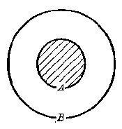

*图1·1*

这种用封闭曲线（一般用圆）来表示集合的方法，叫做集合的文氏图表示法。利用它可以帮助我们理解集合的意义。

##### 例2

已知有两个集合：

（1）\(A = \{x \mid x = a + b, \text{且} a, b \in Q\}\)；

（2）\(B = \{y \mid y=x^2,\text{且 }x\in Q\}\)。

分别说明集合\(A\)、\(B\)与有理数集\(Q\)间的关系，并写出关系式。

**［解］** （1） 因为任意两个有理数\(a, b\)的和都是有理数，都属于集合\(Q\)，所以\(A \subseteq Q\)。

反之，任意一个有理数 r 都可以表示成两个有理数的和，都属于集合 A，所以\( Q \subseteq A \)。

由此可知，\(A\)与\(Q\)是相等集合，即\(A = Q\)

（2） 因为任意一个有理数的平方，也是有理数，都属于\(Q\)，所以\(B \subseteq Q\)。

但是，并不是所有的有理数都属于集合\(B\)，例如 -1\(\notin B\) 由此可知，\(B\)是\(Q\)的真子集，即\(B \subset Q\)。

（注意） 判断一个集合\(A\)是另一个集合\(B\)的真子集，需要说明两点：

\(1^{\circ} A \subseteq B; 2^{\circ} B\)中至少有一个元素不属于\(A\)。

#### 习题1·3

1. 在下面各题中的_处填上适当的符号（∈，∈，→，→，c）：

（1） 1 \{1\}；

（2）\(\emptyset\)\{0\}；

（3） a\(\{a, b, c\}\)；

（4）\( \{a\} \)\( \{a, b, c\} \)；

（5）\( \{a, b\} \)\{a，b，c\}；

（6）\( \{c, b, a\} \)\{a，b\}；

（7）\( \{c, b, a\} \)\{a，b，c\}；

（8） 0 \{x，b，c\}。

2. 把下面的三个集合\(A, B, C\)间的关系，用文氏图表示出来：

\[
A \subset B \subset C.
\]

3. 写出集合\(\{1, 2, 3\}\)的所有的子集，其中有多少个非空真子集？

4. 证明：\(\{x\mid x^2 -3x + 2 = 0\} \supset \{x|x - 1 = 0\}\)

### § 1·4 交集、并集

上一节里，我们所学习的子集、真子集、集合的相等都是关于两个集合间的包含关系。对于两个集合\(A\)与\(B\)，我们还常常要研究它们间的另一类重要关系——交和并。

先来看下面的例子：

设有四个集合：

\[
A = \{1, 2, 3, 4, 5 \}; \quad B = \{3, 4, 5, 6, 7 \};
\]

\[
C = \{3, 4, 5 \}; \quad D = \{1, 2, 3, 4, 5, 6, 7 \}.
\]

我们来分别考察集合\(C\)、\(D\)的元素与集合\(A\)及\(B\)的元素间有怎样的关系。

很明显：集合\(C\)的元素 3、4、5，既是集合\(A\)的元素，同时也是集合\(B\)的元素，也就是说，集合\(C\)是由\(A\)与\(B\)这两个集合的公共元素所组成的；而集合\(D\)的元素，有的是集合\(A\)的元素 （如 1，2，3，4，5），有的则是集合\(B\)的元素 （如 3，4，5，6，7），也就是说，集合\(D\)可以看成是由\(A, B\)这两个集合的元素并起来组成的 （不过相同的元素只用一次）。为了描述集合间这两种不同性质的关系，下面我们引进交集和并集这两个重要概念。

#### 1. 交集

由同时属于集合\(A\)和集合\(B\)的一切元素所组成的集合，叫做集合\(A\)与\(B\)的交集。表示为

\[
A \cap B.
\]

读做“A交B”，或者“A与B的交”。

交集的意义，用式子来表示，也就是

\[
A \cap B = \{x | x \in A \text{且} x \in B \}.
\]

图1.2中的斜线部分，就表示集合\(A\)与\(B\)的交集\(A \cap B\)。

根据交集的定义，容易知道，对于任何集合\(A\)总有

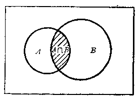

*图1·2*

\[
A \cap A = A, \quad A \cap \emptyset = \emptyset.
\]

##### 例1

设\(A = \{x \mid x > -2\}\)，\(B = \{x \mid x < 3\}\)，求\(A \cap B\)，并利用数轴把图象画出来。

**［审题］**  A 是由一切比 -2 大的数组成的，数轴上可以用表示 -2 的那个点 P 为端点向右方向的射线（不包括 P 点）来表示；B 是一切比 3 小的数组成的，数轴上可以用表示 3 的那个点 Q 为端点向左方向的射线（不包括 Q 点）来表示。\( A \cap B \)是由一切比 -2 大同时又比 3 小的数组成的，数轴上可用不包括端点在内的那条线段 PQ 来表示。

**［解］** 

\[
\begin{array}{l} A \cap B = \{x | x > - 2 \} \cap \{x | x < 3 \} \\ = \{x \mid - 2 < x < 3 \}. \\ \end{array}
\]

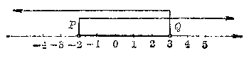

*图1·3*

#### 2. 并集

由属于集合\(A\)或者属于集合\(B\)的一切元素所组成的集合，叫做集合\(A\)与\(B\)的并集，表示为

\[
A \cup B,
\]

读做“A 并 B”，或者“A 与 B 的并”。

并集的意义，用式子来表示，也就是

\[
A \cup B = \{x | x \in A \text{或} x \in B \}.
\]

图 1·4 中的斜线部分，表示集合 A 与 B 的并集\( A \cup B \)。

根据并集的定义，容易知道，对于任何集合\(A\)，总有

\[
A \cup A = A, A \cup \emptyset = A.
\]

##### 例2

设：\(A = \{\)锐角三角形\(\}\) \(B = \{\)直角三角形\(\}\) \(C = \{\)钝角三角形\(\}\) \(D = \{\)斜三角形\(\}\)，\(I = \{\)三角形\(\}\)。

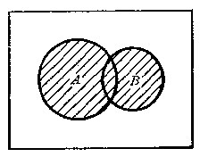

*图1·4*

求 （1）\(A \cup C\)；（2）\(B \cup D\) 并说明理由。

**［解］** （1）\(\because\){锐角三角形}\(\cup\){钝角三角形} \(= \{\)锐角三角形或钝角三角形\(\}\) \(= \{\)斜三角形\(\}\)

\[
\therefore A \cup C = D.
\]

（2）\(\because\){直角三角形}\(\cup\){斜三角形} \(= \{\)直角三角形或斜三角形 \(= \{\)三角形\(\}\)

\[
\therefore \quad B \cup D = I.
\]

##### 例3

证明：\( \{x\mid x\leqslant-2\}\cup\{x|x\geqslant2\}=\{x\mid |x|\geqslant2\} \)，并利用数轴说明这个关系式的意义。

**［解］** 

\[
\because \quad \{x | x \leqslant - 2 \} \cup \{x | x \geqslant 2 \} = \{x | x \leqslant - 2 \text{或} x \geqslant 2 \},
\]

\[
\{x\mid |x|\geqslant2\} = \{x \mid x \leqslant - 2 \text{或} x \geqslant 2 \}.
\]

\[
\therefore \quad \{x \mid x \leqslant - 2 \} \cup \{x \mid x \geqslant 2 \} = \{x\mid |x|\geqslant2\}.
\]

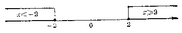

*图1·5*

这说明数轴上在原点左边且与原点的距离不小于2个单位的点的集合和在原点右边的且与原点的距离不小于2个单位的点的集合并起来就是与原点的距离不小于2个单位的点的集合。

1. 在下面各题的{ }内填上适当的语句，并用文氏图表示出来：

（1） {菱形} ∩ {矩形} = { }；

（2） {等腰三角形} ∩ {直角三角形} = { }；

（3） {等腰三角形} ∪ {等边三角形} = { }；

（4） {质数} ∪ {合数} = { }。

2. 设\(A = \{1, 2, 3, 4\}\)，\(B = \{3, 4, 5, 6\}\)，\(C = \{6, 7, 8\}\)，求：

（1）\(A \cup B \cup C\)；

（2）\(A \cap B \cap C\)；

（3）\((A \cap C) \cup B\)；

（4）\((B \cap C) \cup A\)。

3. 在下面各题的____处，填上适当的符号（C，D，=）；

（1）\(A \cup B\)____ B\(\cup A\)；

（2）\(A \cap B\)____\(B \cap A\)；

（3）\(A \cup B\)____\(A\)；

（4）\(A \cap B\)____\(A\)。

4. 设\(A = \{(x, y) | x + 2y = 3\}\)，\(B = \{(x, y) | 2x - y = 0\}\)，

\[
C = \{(x, y) | x^{2} + 4 y^{2} = 5 \},
\]

求：（1）\(A \cap B\)；（2）\(A \cap C\)。

### § 1·5 全集、补集

上一节里，我们学习了求两个集合\(A\)与\(B\)的交集或者并集这两种关于集合的运算——“交”和“并”。这一节里，我们将学习关于集合的另一种运算。

先来看一个例子。

在实数范围里解方程\(x^{2} - 2 = 0\)，因为当\(x = \sqrt{2}\)或\(x = -\sqrt{2}\)时，这个等式都能成立；但是当\(x \neq \pm \sqrt{2}\)时，这个等式就不成立。所以我们可以确定：

\(1^{\circ}\)一切属于集合\(A = \{\sqrt{2}, -\sqrt{2}\}\)的元素，都是这个方程的解；

\(2^{\circ}\)一切属于集合\(R\)，但不属于集合\(A\)的元素都不是这个方程的解。

由此我们也就可以说，在实数集\(R\)里，这个方程的解集是\(A = \{\sqrt{2}, -\sqrt{2}\}\)。

但是，如果在有理数范围里解这个方程，因为没有一个有理数的平方能够等于 2，这个方程就没有解。应用集合的语言来说，也就是这个方程在有理数集\(Q\)里的解集是空集\(\varnothing\)。

从这个例子中可以看到，在研究方程的解时，总是在某一个给定的集合里讨论的，这个集合包含了未知数\(x\)的一切允许值。这样的一个预先给定的集合，叫做全集。方程的解集，以及不属于这个解集的元素所组成的集合，都是它的子集。

一般地说，所谓全集，也就是预先给定的包含有我们所要研究的各个集合全部元素的集合。全集用符号\(I\)表示，在文氏图中，通常画出一个矩形来表示。

例如在实数范围里研究方程的解集时全集\(I = R\)，而在有理数范围里研究方程的解集时全集\(I = Q\)。

从上面所举的例子中，还可看到方程\(x^{2} - 2 = 0\)的解集\(A = \{\sqrt{2}, -\sqrt{2}\}\)把全集\(I = R\)分成了两个部分，\(R\)中的一部分元素属于\(A\)，而另一部分元素不属于\(A\)。我们把由这些不属于\(A\)的元素所组成的集合，叫做集合\(A\)关于\(R\)的补集，并且用符号\(\overline{A}\)来表示。

一般地，已知全集\(I\)和集合\(A(A \subseteq I)\)，由\(I\)中所有不属于 A 的元素所组成的集合，叫做集合 A 关于 I 的补集（简称集合 A 的补集），表示为\( \overline{A} \)。

图1·6中的矩形表示全集I，圆表示集合A，斜线部分就表示集合A的补集\( \overline{A} \)。

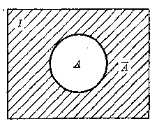

*图1·6*

补集也可以叫做余集，求 集合 A 的补集\( \overline{A} \)的运算，叫做“余”。

根据补集的定义，并利用图1·6容易知道对于任意集合\(A\)，总有

\[
A \cup \overline {{{A}}} = I, \quad A \cap \overline {{{A}}} = \emptyset.
\]

#### 例1

设\(I = \{1, 2, 3, 4, 5, 6, 7, 8, 9, 10\}\)，

\[
A = \{1, 3, 5, 7, 9 \}, \quad B = \{3, 6, 9 \}.
\]

求 （1）\(\overline{A} \cup \overline{B}\)和\(\overline{A} \cap \overline{B}\)；

（2）\(\overline{A} \cup \overline{B}\)和\(\overline{A \cap B}\)。

**［解］** （1）\(\because \overline{A} = \{2, 4, 6, 8, 10\}\)，

\[
\overline {{{B}}} = \{1, 2, 4, 5, 7, 8, 10 \},
\]

∴\( \overline{A} \cup \overline{B} = \{2, 4, 6, 8, 10\} \)

\[
\cup \{1, 2, 4, 5, 7, 8, 10 \}
\]

\[
= \{1, 2, 4, 5, 6, 7, 8, 10 \}.
\]

\[
\overline {{{A}}} \cap \overline {{{B}}} = \{2, 4, 6, 8, 10 \}
\]

\[
\cap \{1, 2, 4, 5, 7, 8, 10 \}
\]

\[
= \{2, 4, 8, 10 \}.
\]

（2）\(\because A \cup B = \{1, 3, 5, 7, 9\} \cup \{3, 6, 9\}\)

\[
= \{1, 3, 5, 6, 7, 9 \},
\]

\[
\therefore \overline {{A}} \cup \overline {{B}} = \{2, 4, 8, 10 \}.
\]

\[
\begin{array}{l} \because A \cap B = \{1, 3, 5, 7, 9 \} \cap \{3, 6, 9 \} \\ = \{3, 9 \}, \\ \end{array}
\]

\[
\therefore \overline {{A \cap B}} = \{1, 2, 4, 5, 6, 7, 8, 10 \}.
\]

##### 例2

设 I = N，A = {质数}，B = {合数}，求\(\overline{A\cup B}\) **［解］** \(\because\)自然数可以分为1，质数和合数三类，\( A \cup B = \{质数\} \cup \{合数\} = \{质数或合数\} \)，

\[
\therefore \overline {{A \cup B}} = \{1 \}.
\]

**［注意］** 本题结果不能写成\(\overline{A\cup B} = 1\)

1. 图中\(I\)是全集，用关于\(A, B\)的集合符号把斜线部分表示出来：

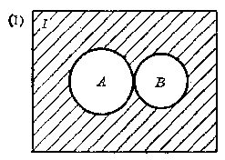

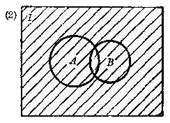

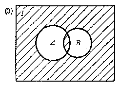

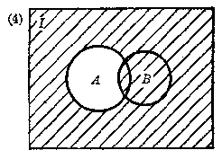

*（第1题）*

2. 设\(I = R = \{\text{实数}\}, A = Q = \{\text{有理数}\}\)，求\(\overline{A}\)，并用文氏图表示出来。

3. 设\(I = \{a, b, c, d, e, f, g\}\)，\(A = \{a, b, c\}\)，\(B = \{c, d, e, f\}\)，求：\(\overline{A}, \overline{B}, \overline{A \cup B}, \overline{A \cap B}, A \cup \overline{B}, A \cap \overline{B}\)。

4. 设\(I = R = \{\text{实数}\}\)，\(A = \{x: x \leqslant -3 \text{ 或 } x \geqslant 3\}\)，求\(\overline{A}\)。并在数轴上表示出来。

### 本章提要

#### 1. 集合的概念

集合是数学中一个重要的不定义概念，意思是指具有某种属性的事物的整体。

#### 2. 集合的表示法

（1） 列举法；（2） 描述法；（3） 文氏图表示法。

#### 3. 元素与集合间的关系

\(a\in A\)——\(a\)是集合\(A\)的元素\((a\)属于\(A)\)。

\(a\notin A\)——\(a\)不是集合\(A\)的元素\((a\)不属于\(A)\)。

#### 4. 集合间的包含关系

\(A\subseteq B\)——\(A\)是\(B\)的子集\((a \in A\)必有\(a \in B)\)。

\(A\subset B\)——\(A\)是\(B\)的真子集\((a \in A\)必有\(a \in B\)，但\(B\)中至少有一元素\(b \notin A)\)。

\(A = B\)集合\(A\)与\(B\)相等\((A \subseteq B, \text{且} B \subseteq A)\)。

#### 5. 集合的交与并

（1） 交集\(A\cap B=\{x\mid x\in A\}\cap\{x\mid x\in B\}\)

\[
- \{x \mid x \in A \text{且} x \in B \}.
\]

（2） 并集\(A \cup B = \{x \mid x \in A\} \cup \{x \mid x \in B\}\)

\[
= \{x \mid x \in A \text{或} x \in B \},
\]

#### 6. 全集、补集、空集

（1） 全集\(I\)一所考察的各集合的全部元素所组成的集合。

（2） 补集\(-A \subseteq I, \overline{A}\)称\(A\)关于\(I\)的补集。

\[
\overline {{{A}}} = \{x | x \notin A, A \subseteq I \}.
\]

（3） 空集\( \varnothing \)不含有任何元素的集合。

\[
I = A, \text{则} \overline {{A}} = \emptyset.
\]

### 复习题一A

1. 回答下面的问题：

（1） 什么叫做有限集、无限集？各举一个例子；

（2） 什么叫做单元素集合？举一个例子。

2 下面写出的表达式是不是正确？如果不正确把它改正过来：

（1）\(\emptyset\neq\{0\}\)；

（2）\(0\neq\{0\}\)；

（3）\(A \cup A \subset I\)；

（4）\(A \cap \overline{A} = \emptyset\)。

3. 在下面表格的空格里，填入适当的集合：

（1）

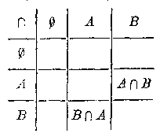

（2）

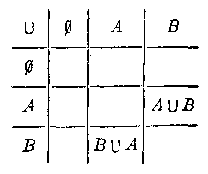

4. 在下面表格的空格里，填入适当的集合：

（1）

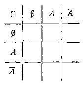

（2）

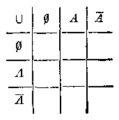

5. 用列举法把下面的集合表示出来：

（1）\(\{x|x > -3\)且\(x\in J\} \cap \{x|x\leqslant 2\)且\(x\in J\}\)；

（2）\(\{x|x < 3\)且\(x\in N\} \cup \{x|x\leqslant 5\)且\(x\in N\}\)。

6. 在下面的____处填上适当的符号（U，∩，⊂，⊃）：

（1）\(\{x \mid x < -2 \text{ 或 } x > 3\} = \{x \mid x < -2\} \_ \{x \mid x > 3\}\)；

（2）\(\{x|x > -2\)且\(x < 3\} = \{x|x > -2\} \quad \{x|x < 3\}\)；

（3）\(\{x|x < -4\} \quad \{x|x < -3\)或\(x > 3\}\)；

（4）\(\{x|x > -2\} \quad \{x|x > -2\)且\(x < 3\}\)。

［提示：要注意“或”和“且”这两个字的用法，也可以利用数轴找出答案.］

### 复习题一B

1. 用列举法写出下面的集合：

（1）\(\{x\mid x^{3} - 3x^{2} + x - 1 = 0\}\)；

（2）\(\left\{(x, y) \mid \sqrt{\frac{x}{y}} + \sqrt{\frac{y}{x}} = \frac{13}{6} \text{且} x + y = 13\right\}\)。

2. 如果用符号\(n(X)\)表示有限集\(X\)中的元素的个数，今有有限集

\[
A = \{a, b, c, d \}, \quad B = \{c, d, e, f, g \},
\]

（1） 证明\(n(A \cup B) = n(A) + n(B) - n(A \cap B)\)。

（2） 用文氏图来验证这个等式对于一般的有限集合\(A, B\)都成立。

3. 设\(I = \{1, 2, 3, \cdots, 9\}\)，\(A = \{1, 2, 3, 4\}\)，\(B = \{3, 4, 5, 6, 7\}\)，

（1） 验证下面这两个等式成立。

\[
\overline{A \cup B} = \overline{A} \cap \overline{B}, \quad \overline{A \cap B} = \overline{A} \cup \overline{B};
\]

（2） 利用文氏图验证这两个等式，对于一般的集合\(A\)和\(B\)都成立。

**注** 这两个等式叫做德·摩根法则。

4. 班级里有 45 个学生，其中有 15 个学生有哥哥，13 个学生有姐姐，其中有 2 个学生既有哥哥又有姐姐。如果用\(I\)表示全班学生的集合，\(A\)表示有哥哥的学生的集合，\(B\)表示有姐姐的学生的集合。

（1） 求\(n(A), n(B), n(A \cap B), n(\overline{A}), n(\overline{B})\)；

（2） 问这班学生中：

（i） 有哥哥或有姐姐的，

（ii） 没有哥哥且没有姐姐的，

（iii） 有哥哥但没有姐姐的，

（iv） 有姐姐但没有哥哥的学生各有几人？

### 第一章测验题

3. 在下面各题的____处填入适当的符号：

（1） 1 ____ N；

（2） 0 ____ N；

（3）\(\emptyset\)____ N；

（4） J ____ N；

（5）\(\{1\}\)____\(\{1,2,5\}\)；

（6） 1 ____\(\{1,2,3\}\)；

（7）\(\{1,2,3\}\)____\(\{5,2,1\}\)；

（8）\(A\)____\(\overline{A}=I\)；

（9）\(A\)____\(\overline{A}=\emptyset\)；

（10） A ____ A = A，A ____ A = A。

2. 在下面的{ }内填入集合中的元素的限制条件：

（1）\(\{x|x < 0\} \cup \{x|x > 5\} = \{x|\}\)；

（2）\(\{x|x > 0\} \cap \{x|x < 5\} = \{x|\}\)。

3. 已知\(I = \{0, 1, 2, 3, 4, 5, 6, 7, 8, 9\}\)，

\[
A = \{1, 3, 5, 7, 9 \}, \quad B = \{1, 2, 3, 4, 5 \},
\]

\[
C = \{2, 4, 6, 8 \}.
\]

求 （1）\(A \cup B\)；

（2）\(A \cap C\)；

（3）\((A\cap B)\cup C;\)

（4）\(\overline{A} \cup \overline{B}\)；

（5）\(\overline{A} \cap \overline{B}\)；

（6）\((A \cup B) \cap C\)。

4. 用两种方法（描述法，列举法）写出下列方程或方程组的解集：

（1）\(2x^{4} - 3x^{2} + 1 = 0;\)

（2）\(\left\{ \begin{array}{l} (x - y + 2)x = 0, \\ (x - y - 2)y = 0. \end{array} \right.\)

#### 本章脚注

① 有的书上，也把它写成\(\{x: x > 0\}\)。

## 2. 不等式

在代数第二册里，曾经学过关于不等式的一些概念、性质和一元一次不等式的解法。本章将在复习这些知识的基础上，学习关于不等式的其它一些重要性质、各种代数不等式的解法以及不等式的证明。

不等式与等式有许多类似的性质，但也有一些不同的性质。关于不等式的两类问题：“解不等式”和“不等式的证明”，与等式中的“解方程”和“恒等式的证明”也很相象。对比着等式来学习，可以帮助我们更好地理解以下所讲的内容。

### § 2·1 不等式的概念

我们先来复习一下过去学过的一些知识。

#### 1. 实数大小的比较

我们知道，两个实数\(a\)与\(b\)之间，存在且只存在下面三种关系中的一种：

（1） a 大于 b，记作\( a > b; \)

（2） a 小于 b，记作\( a < b; \)

（3） a 等于 b，记作\( a = b \)。

我们还知道，要比较两个实数\(a\)和\(b\)的大小，只要考察它们的差就可以了，就是：

如果\(a - b\)是正的，那末\(a > b\)，如果\(a - b\)是负的，那末 \(a < b\)，如果\(a - b\)是零，那末\(a = b\) 反过来，如果\(a > b\)，那末\(a - b\)是正的，如果\(a < b\)，那末\(a - b\)是负的，如果\(a = b\)，那末\(a - b\)是零。

这个性质叫做实数的运算比较性质，它是研究不等式的主要理论基础。用式子来表示就是：

如果\(a - b\left\{ \begin{array}{ll} > 0, & \\ = 0, & \\ < 0, & \end{array} \right.\)那末\(a\left\{ \begin{array}{ll} > b, & \\ - b, & \\ < b; & \end{array} \right.\) 反过来，如果\( a\left\{\begin{aligned}&>b,\\&=b,\\&<b,\end{aligned}\right. \)那末\( a-b\left\{\begin{aligned}&>0,\\&=0,\\&<0.\end{aligned}\right. \) 在数学里，我们也常把语句“如果…，那末…”，简单地表示成“…⇒…”。符号“⇒”读作“可以推出”，意思是说从“⇒”前的条件，就可以推出“⇒”后的结论。如果这个命题的逆命题也成立，那末中间就用\( \Leftrightarrow \)来连接。应用这种表示方法，那末上面的这两个互为正逆的命题，就可以表示成：

\[
\left. \begin{array}{c} a - b \left\{ \begin{array}{l} > 0, \\ = 0, \end{array} \right. \Leftrightarrow a \left\{ \begin{array}{l} > b, \\ = b, \\ < b. \end{array} \right. \\ \text{实数的运算比较性质} \end{array} \right\}
\]

这样的两个命题，叫做等价命题。

#### 2. 代数式的值的大小比较

有时候，我们也要比较两个代数式的值的大小。这时，可以根据一个代数式的值大于、小于、或者等于另一个代数式的值，而分别用符号“>”，“<”，或者“=”把它们连接起来。

象比较两个实数的大小一样，比较两个代数式的值的大小，也只要考察它们的差就可以了。

##### 例1

比较\((x + 3)(x - 5)\)和\((x + 2)(x - 4)\)的大小。

**［解］** \((x + 3)(x - 5) - (x + 2)(x - 4)\)

\[
= (x^{2} - 2 x - 15) - (x^{2} - 2 x - 8) = - 7 < 0,
\]

\[
\therefore (x + 3) (x - 5) < (x + 2) (x - 4).
\]

##### 例2

比较\((x^{2} + 1)^{2}\)和\(x^{4} + x^{2} + 1\)的大小。

**［解］** \((x^{2} + 1)^{2} - (x^{4} + x^{2} + 1)\)

\[
- (x^{4} + 2 x^{2} + 1) - (x^{4} + x^{2} + 1) = x^{2}.
\]

（1） 如果\(x = 0\)，那末\(x^2 = 0\)，这时有

\[
(x^{2} + 1)^{2} - (x^{4} + x^{2} + 1) = 0,
\]

\[
\therefore (x^{2} + 1)^{2} = x^{4} + x^{2} + 1.
\]

（2） 如果\(x \neq 0\)，因为不等于零的任何实数的平方都是正数，所以\(x^2 > 0\)，这时有

\[
(x^{2} + 1)^{2} - (x^{4} + x^{2} + 1) > 0,
\]

\[
\therefore \quad (x^{2} + 1)^{2} > x^{4} + x^{2} + 1.
\]

**注** 上面这两种情况，合在一起可以写做

\[
(x^{2} + 1)^{2} \geqslant x^{4} + x^{2} + 1.
\]

这个式子表示\((x^{2} + 1)^{2}\)的值不小于\(x^{4} + x^{2} + 1\)的值。

##### 例3

比较\((a - 1)^2\)和\(a^2 + 1\)的大小。

**［解］** \((a - 1)^{2} - (a^{2} + 1) = (a^{2} - 2a + 1) - (a^{2} + 1) = -2a.\) 因为字母\(a\)可能表示正数或负数，也可能表示零，所以要分三种情况来考察：

（1） 如果\(\alpha\)是正数，那末\(-2\alpha\)就是负数，这时有

\[
(a-1)^2 < a^2+1.
\]

（2） 如果\(\alpha\)是零，那末\(-2\alpha\)也是零，这时有

\[
(a - 1)^{2} = a^{2} + 1.
\]

（3） 如果\(\alpha\)是负数，那末\(-2\alpha\)就是正数；这时有

\[
(\alpha - 1)^{2} > \alpha^{2} + 1.
\]

上面讨论的三种情况，合在一起就是

\[
(a-1)^{2} \left\{ \begin{array}{ll} < a^{2} + 1 & \text{如果} a > 0, \\ = a^{2} + 1 & \text{如果} a = 0, \\ > a^{2} + 1 & \text{如果} a < 0. \end{array} \right.
\]

#### 3. 严格不等式和非严格不等式

我们知道：用等号“=”把两个代数式连接起来所成的式子叫做等式。类似地，用不等号“>”或者“<”把两个代数式连接起来所成的式子我们叫做不等式。

**注** 因为这里所指的等式或者不等式都是由代数式组成的，所以明确些说，可以把它们称做代数等式或者代数不等式。以后我们还将学到由其它数学式子所组成的等式和不等式。

在比较两个代数式的值的大小的时候，有时我们只需作出判断：前一个代数式的值不小于（或者不大于）后一个代数式的值，这时我们可以用符号“≥”（或者“≤”）把它们连接起来。例如，在上面例2中，我们曾判断过，当\( x\neq0 \)的时候，总有

\[
(x^{2} + 1)^{2} \geqslant x^{4} + x^{2} + 1.
\]

象这种用符号“≥”（读做大于或等于）或者“≤”（读做小于或等式）把两个代数式连接起来的式子，也叫做不等式。为了区别，我们把用符号“＞”或者“＜”连接而成的不等式叫做严格不等式，而用符号“≥”或者“≤”连接而成的不等式叫做非严格不等式。

**注** 从例2的解答中，可以看到非严格不等式实际上是由一个等式和一个严格不等式并合起来的，所以它具有等式和不等式所公有的性质。在以下我们讨论不等式的性质时，只需着重讨论严格不等式所具有的性质。

#### 4. 绝对不等式、条件不等式和矛盾不等式

我们知道等式是在给定的数集里研究的，它可以区分为三类：

\(1^{\circ}\)如果不论用什么数值代替等式中的字母（只要是允许的）它都能成立，这样的等式叫做恒等式；

\(2^{\circ}\)如果只有用某些数值代替等式中的字母，它才能够成立，这样的等式叫做条件等式；

\(3^{\circ}\)如果不论用什么数值代替等式中的字母，它都不能成立，这样的等式叫做矛盾等式。

同样的，不等式也是在给定的数集里研究的，它也可以分成三类，就是：

\(1^{\circ}\)如果不论用什么数值代替不等式中的字母（只要是允许的）它都能成立，这样的不等式叫做绝对不等式；

\(2^{\circ}\)如果只有用某些范围内的数值代替不等式中的字母，它才能够成立，这样的不等式叫做条件不等式；

\(3^{\circ}\)如果不论用什么数值代替不等式中的字母，它都不能成立，这样的不等式叫做矛盾不等式。

例如，任何一个实数的平方都不能是负数，根据这一性质，我们就能判断出：

（1）\(a^2+b^2+1 > 0\)是一个绝对不等式；

（2）\(a^2 + b^2 < 0\)是一个矛盾不等式；

（3）\((a - b)^2 > 0\)是一个条件不等式。（因为只有当\(a \neq b\)时这个不等式才能够成立。）

#### 习题2·1

比较下列各题中两个代数式的值的大小（1~5）：

1.\((a - 5)(a - 7)\)和\((a - 6)^{2}\)。

2.\((a + 1)(a^2 - a + 1)\)和\((a - 1)(a^2 + a + 1)\)。

3.\((a^2 + \sqrt{2} x + 1)(x^2 - \sqrt{2} x + 1)\)和\((x^2 + x + 1)(x^2 - x + 1)\)\((x \neq 0)\)。

4.\(a^2 + b^2\)和\(2ab\)。［提示：按照\(a = b\)或者\(a \neq b\)分别考察.］ 5.\(\sqrt{x^2 - 4x + 4} + 2x\)和\(\sqrt{1 - 2x + x^2}, (1 < x < 2)\)。

6. 应用比较不等式左右两边两个代数式值的大小的方法，证明下列各不等式是绝对不等式：

（1）\((x + 1)(x - 5) < (x - 2)^{2}\)；

（2）\((a + 1)\left(a^2 + \frac{1}{2} a + 1\right) > \left(a + \frac{1}{2}\right)(a^2 + a + 1)\)。

7. 把下列不等式叫左边的式子先配方化成\((x + m)^2 + b\)的形式，再确定它们各是那一类的不等式：

（1）\(x^{2} - 2x + 3 > 0\)；

（2）\(x^{2} - x + 1 < 0\)；

（3）\(x^{2} + 3x + \frac{9}{4} > 0;\)

（4）\(x^{2} + x + \frac{1}{4} < 0.\)

### § 2·2 不等式的基本性质

对于等式来说，我们已经知道它具有下面这些基本性质：

（1） 如果\(a = b\)，那末\(b = a\)；反过来，如果\(b = a\)，那末\(a = b\)。

（2） 如果\(a = b, b = c\)，那末\(a = c\)（相等的传递性）。

（3） 如果\(a = b\)，那末\(a + c = b + c\)。

（4） 如果\(a = b\)，那末\(ac = bc\)。

#### 等式的基本性质

不等式也有一些类似的基本性质：

**性质 1** 如果 a > b，那末 b < a；反过来，如果 b < a，那末 a > b。

**性质 2** 如果 a > b，b > c，那末 a > c （不等的传递性）。

**性质 3** 如果 a > b，那末\( a + c > b + c \)。

**性质 4** 如果 a > b，那末

\[
a c \left\{ \begin{array}{ll} > b c & (\text{当} c > 0 \text{的时候}), \\ = b c & (\text{当} c = 0 \text{的时候}), \\ < b c & (\text{当} c < 0 \text{的时候}). \end{array} \right.
\]

不等式的基本性质 这些基本性质都可以利用上一节里提出过的实数运算的比较性质来证明。作为例子，我们来证明不等式的性质4. **［证明］** 

\[
a c - b c = (a - b) c.
\]

\(\because a > b, \therefore a - b\)是正数。

（1） 如果\(c\)是正数，那末因为两个正数的积仍是正数，所以\((a - b)c > 0\)，这时\(ac > bc\)。

（2） 如果\(c\)是负数，那末因为一个正数与一个负数的积是负数，所以\((a - b)c < 0\)，这时\(ac < bc\)

（3） 如果\(c\)等于零，那末\((a - b)c\)等于零，所以

\[
a c = b c.
\]

综合上面三种情况，命题得证。

为了讲法上的方便，当同时研究两个或几个不等式的时候，如果这些不等式里，每一个的左边都大于右边，或者每一个的左边都小于右边，那末就把这些不等式叫做同向不等式。

如果两个不等式里，一个不等式的左边大于右边，而另一个不等式的左边小于右边，那末就把这两个不等式叫做异向不等式。例如不等式

\[
3 x - 1 > 2 x, \quad 3 x - 2 x > 1 \quad \text{和} \quad x > 1
\]

是同向不等式，而不等式

\[
- 7 x > - 14 \quad \text{和} \quad x < 2
\]

是异向不等式。

这样，我们也可把不等式的基本性质 4 说成：

不等式的两边同乘以一个正数，那末得到和原不等式同向的不等式；如果同乘以一个负数，那末得到和原不等式异向的不等式；如果同乘以零，那末得到一个等式。

在研究不等式时，经常要用到以上这些性质：

（1） 利用性质 1，我们只需改变一下不等号的方向，就 可以从不等式\(a > b\)所具有的性质，推出不等式\(a < b\)所具有的类似性质。例如，性质2也可以叙述成：

如果\(a < b, b < c\)，那末\(a < b < c\)。

（2） 利用性质 2，我们就可以把几个代数式按照它的值由小到大（或者由大到小）用不等号“<”（或者“>”）顺次地连接起来。例如

\[
a + 1 < n + 3 < a + 5, \quad \text{或者} \quad a + 5 > a + 3 > a + 1.
\]

（3） 利用性质 3，我们就可以推出不等式的移项法则：

不等式中任何一项可以把它的符号变成相反符号后，从一边移到另一边。

（4） 利用性质 4，我们可以在不等式的两边同乘以（除以）一个相同的正数或负数。但是必须注意乘以（除以）一个正数不等号的方向不变，乘以（除以）一个负数，不等号要改变方向。因为乘以 0，不等式就变成了等式，所以在不等式的变形中，这是不允许的。

##### 例1

已知不等式

\[
m x - 2 > x - 3 m \quad (m \neq 1).
\]

应用不等式的基本性质，证明：

\[
x \left\{ \begin{array}{l} > \frac{2 - 3 m}{m - 1}, \\ < \frac{2 - 3 m}{m - 1}. \end{array} \right.
\]

**［证明］** 由

\[
m x - 2 > x - 3 m, \tag {1}
\]

移项后得

\[
(m - 1) x > 2 - 3 m. \tag {2}
\]

\(1^{\circ}\)如果\(m > 1\)，这时\(m - 1 > 0\)，在不等式（2）的两边同乘以正数\(\frac{1}{m - 1}\)，得

\[
x > \frac{2 - 3 m}{m - 1}.
\]

\(2^{\circ}\)如果\(m < 1\)，这时\(m - 1 < 0\)，在不等式（2）的两边同乘以负数\(\frac{1}{m - 1}\)，得

\[
a < \frac{2 - 3 m}{m - 1}.
\]

#### 习题2·2

1. 求证：

（1） 如果\(a > b, b > c\)，那末\(a > c\)；

（2） 如果\(a > b, b = c\)，那末\(a > c\)；

（3） 如果\(a = b, b < c\)，那末\(a < c\)。

［解法举例：（1）\(\because a > b, b > c,\)

\[
\therefore a - b > 0, b - c > 0.
\]

今\(a - c = (a - b) + (b - c),\) 因为两个正数的和仍旧是正数，所以\(a - c > 0\)，由此可知\(a > c\)。

2. （1） 如果\(a > b, c = d\)，是否一定能得出\(ac > bd\)，为什么？

（2） 如果\(ac > bc\)，是否一定能得出\(a > b\)，为什么？

（3） 如果\(a < b\)，是否一定能得出\(ac^2 < bc^2\)，为什么？

（4） 如果\(ac^2 < bc^2\)，是否一定能得出\(a < b\)，为什么？

（5） 如果\(\frac{a}{c^2} < \frac{b}{c^2}\)，是否一定能得出\(a < b\)，为什么？

［解法举例：（1） 不一定。因为\(c\)和\(d\)可能同时是正数，也可能同时是负数，也可能同时是零。根据不等式基本性质4，只有在第一种情况下，才能得到\(ac > bd\)这一结论。］

3. 应用不等式的基本性质，证明：

（1） 如果\(ax+b^2 > bx+a^2\)，且\(a>b\)，那末\(x > a + b\)；

（2） 如果\(mx+m^3 < nx+n^3\)，且\(m < n\)，那末

\[
x > - (m^{2} + m n + n^{2}).
\]

### § 2·3 一元不等式的解和解集

在代数第二册里，我们曾经学过在有理数的范围里解一元一次不等式；并且已经看到解一元一次不等式和解一元一次方程有许多相似的地方。现在我们进一步来学习有关解不等式的一些重要概念。

#### 1. 一元不等式的解和解集

含有一个未知数的不等式叫做一元不等式；在给定的未知数的允许值集合里能够使不等式成立的未知数的值，叫做不等式的解；这些值的全体，叫做不等式的解集；求不等式的解集的过程，叫做解不等式。

例如对于不等式\(x - 2 > 0\)来说，因为\(3 - 2 = 1 > 0\)，所以\(x = 3\)就是它的一个解；又因一切大于2的实数减去2都大于0，所以它们都是这个不等式的解。但是2或比2小的数减去2都不大于0，所以它们都不是这个不等式的解，因此这个不等式的解集是\(\{x \mid x > 2\}\)。

又如，对于不等式\(|x| \geqslant 1\)来说，根据绝对值的意义，可以知道它的解应该是满足条件

\[
x \leqslant - 1 \quad \text{或} \quad x \geqslant 1
\]

的实数，反之，满足条件\(x \leqslant -1\)或\(x \geqslant 1\)的一切实数，也都满足不等式\(|x| \geqslant 1\)。所以它的解集是

\[
\{x \mid x \leqslant - 1 \} \cup \{x \mid x \geqslant 1 \} = \{x \mid x \leqslant - 1 \text{或} x \geqslant 1 \}.
\]

一元不等式的解集，可以利用数轴把它表示出来。例如图 2.1 （1） 和 （2） 中黑线画出部分就分别表示了不等式\(x - 2 > 0\)和\(|x| \geqslant 1\)的解集。

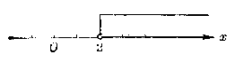

*（1）*

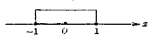

*（2）*

*图2·1*

#### 2. 不等式的同解变形

在代数第二册里学习方程的时候，曾经讲过：设有两个 - 方程，如果第一个方程的解都是第二个方程的解，并且第二个方程的解也都是第一个方程的解，那末这两个方程就叫做同解方程。把一个方程变形成它的同解方程的过程叫做方程的同解变形。

同样的，设有两个含有未知数的不等式，如果第一个不等式的解都是第二个不等式的解，并且第二个不等式的解也都是第一个不等式的解，那末这两个不等式就叫做同解不等式。把一个不等式变形成它的同解不等式的过程，叫做不等式的同解变形。

因为在 §2.2 里所提出的不等式的性质 2 和性质 3（除去乘以 0 以外）中，已知条件和得出的结论都是可逆的，也就是

\[
\begin{array}{l} 1^{c} a > b \Leftrightarrow a + c > b + c, \\ 2^{c} a > b (c > 0) \Leftrightarrow a c > b c (c > 0), \\ 3^{c} a > b (c < 0) \Leftrightarrow a c < b c (c < 0), \\ \end{array}
\]

所以这些性质可以作为我们对不等式进行同解变形的根据。

##### 例1

解下列不等式，并说明变形过程中，每一步骤的根据是什么？

\[
2 (x + 1) + \frac{x - 2}{3} > \frac{7 x}{2} - 1. \tag {1}
\]

**［解］** （1） 式两边都乘以正数 6，得

\[
12 (x + 1) + 2 (x - 2) > 21 x - 6, \quad (\text{性质} 2^{\circ})
\]

就是

\[
14 x + 8 > 21 x - 6. \tag {2}
\]

因为当\(x\)取确定值时，整式\(21x + 8\)是一个确定的值，在（2）式两边都加上整式\(-(21x + 8)\)，得

\[
14 x + 8 - (21 x + 8) > - 6 - 3, \quad (\text{性质} 1^{\circ})
\]

就是

\[
- 7 x > - 14. \tag {3}
\]

（3） 式两边都除以负数 -7，得

\[
x < 2. \quad (\text{ 性质 } 3^{0}) \tag {4}
\]

因为上面的变形，每一步骤都是可逆的，所以不等式（1）、（2）、（3）、（4）都是同解不等式。

由此可知不等式（1）的解集是\(\{x|x < 2\}\)。

1. 讨论不等式\(ax < b\)的解的各和情况。

2. 解下列各不等式，并且在数轴上表示出它们的解：

（1）\(3[x - 2(x - 1)] < 4x;\)

（2）\(5 - \frac{x}{3} < \frac{7}{2} - \frac{4x + 1}{8};\)

（3）\(x - \frac{x - 1}{2} >\frac{2x - 1}{3} -\frac{x + 1}{6};\)

（4）\((x - \sqrt{2})^2 > (x + \sqrt{2})^2;\)

（5）\(5(x - 1) - x(7 - x) < x^2\)；

（6）\((x^{2} + 1)(2x - 3) > (x^{2} + 1)(3x - 4)\)。

3. 解下列关于\(x\)的不等式：

（1）\(k(x - 1) > x - 2;\)

（2）\((p - q)x < p^2 - q^2 (p \neq q)\)。

4. 确定\(k\)取什么数值时，方程

\[
x^{2} + (2 k + 1) x + k^{2} + 1 = 0
\]

（1） 有两个不等的实数根；

（2） 有两个相等的实数根；

（3） 没有实数根。

### § 2·4 一元一次不等式组

在解一些具体问题时，有时根据问题中的条件，未知数的数值范围，需要同时满足几个不等式。例如：某天的天气预报，当天最低温度是摄氏 16 度，最高温度是摄氏 22 度，如果用\(x\)表示当天温度度数，那末\(x\)可以取值的范围，需要同时满足下面这两个不等式：

\[
\left\{ \begin{array}{l} x \geqslant 16, \\ x \leqslant 22. \end{array} \right. \tag {1}
\]

我们说，不等式（1）和（2）组成一个不等式组。

不等式（1）的解集，可用数轴上从表示数16的点A开始向右的射线AX来表示。不等式（2）的解集，可用数轴上从表示数22的点B开始向左的射线BX'来表示。这两条射线的公共部分是线段AB（图2·2）。

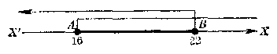

*图2·2*

由此容易看到，如果\(x\)取大于或者等于 16 同时又小于或者等于 22 的一切数值，不等式（1）和（2）就能都成立。\(x\)可以取值的范围，就是\(16 \leqslant x \leqslant 22\)，在这个范围里的每一个实数\(x\)，都是这个不等式组的解，所以这个不等式组的解集是\(\{x \mid 16 \leqslant x \leqslant 22\}\)。为了方便，通常我们也可省去上面的集合符号，把这个不等式组的解集就用 { } 里这个限制条件\(16 \leqslant x \leqslant 22\)来表示。把答案说成：“答：\(16 \leqslant x \leqslant 22\)”。

一般地说：含有相同未知数的几个一元一次不等式所组成的不等式组，叫做一元一次不等式组；能使不等式组里的各个不等式都成立的未知数的值，叫做这个不等式组的解；这些值的全体，叫做不等式组的解集。

从上面的例子可以看到，求不等式组的解集，就是要找出不等式组里各个不等式的解集的公共部分；换句话说，也就是要找出各个不等式的解集的交集。在初学时，利用数轴可以帮助我们容易找到所求的这种交集。

#### 例1

解不等式组：

\[
\left\{ \begin{array}{l} 5 (x - 3) > 3 (2 x - 3), \\ 5 (x - 2) < 3 (x - 1). \end{array} \right.
\]

**［解］** 原不等式组可以化成：

\[
\left\{ \begin{array}{l} x < - 6, \\ x < 3 \frac{1}{2}. \end{array} \right.
\]

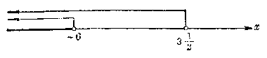

*图2·3*

**答：** \(x < -6\) **注** 应用集合的运算来叙述，就是解集为\( \left\{x\mid x<-6\right\}\cap\left\{x\mid x<\frac{7}{2}\right\}=\left\{x\mid x<-6\right\} \)

##### 例2

解不等式组：

\[
\left\{ \begin{array}{l} (x - 1)^{2} < (x + 1)^{2} - 4, \\ (x - 1) (x + 2) > (x + 3) (x - 4) - 20. \end{array} \right. \tag {1}
\]

**［解］** 由（1），\( x^{2}-2x+1<x^{2}+2x+1-4, \) 移项得 -4x<-4，所以

\[
x > 1. \tag {2}
\]

由\((2), x^{2} + x - 2 > 2 - x - 12 + 20,\) 移项得 2x>10，所以

\[
x > 5, \tag {4}
\]

因此，原不等式组可以化成：

\[
\left\{ \begin{array}{l} x > 1, \\ x > 5. \end{array} \right.
\]

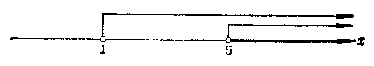

*图2·4*

**答：** \(x > 5\) **注** 应用集合的运算来叙述，就是解集为\(\{x|x > 1\} \cap \{x|x > 5\} = \{x|x > 5\}\)。

［说明］ 原来的不等式组里的两个不等式，经过变换以后都是一次不等式，所以这个不等式组是一元一次不等式组。

##### 例3

解不等式组：

\[
\left\{ \begin{array}{l} (x - 1)^{2} < (x + 1)^{2} - 4, \\ (x - 1) (x + 2) < (x + 3) (x - 4) + 20. \end{array} \right. \tag {1}
\]

**［解］** 由（1），得\(x^{2} - 2x + 1 < x^{2} + 2x + 1 - 4,\) 解之，得\(x > 1\)。（3） 由（2），得\(x^{2} + x - 2 < x^{2} - x - 12 + 20,\) 解之，得\(x < 5\)。（4） 因此，原不等式组可以化成

\[
\left\{ \begin{array}{l} x > 1, \\ x < 5. \end{array} \right.
\]

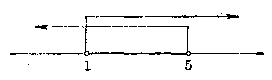

*图2·5*

**答：** \(1 < x < 5\) **注** 应用集合的运算来叙述，就是解集为\( \{x|x>1\}\cap\{x|x<5\}=\{x|x>1\text{且}x<5\} \)

\[
= \{x \mid 1 < x < 5 \}.
\]

##### 例4

解不等式组：

\[
\left\{ \begin{array}{l} (x + 2)^{3} - (x - 1)^{3} < 9 x^{2}, \\ (x + 2)^{3} - (x - 1)^{3} > 9. \end{array} \right.
\]

**［解］** 原不等式组可以化成

\[
\left\{ \begin{array}{l} x < - 1, \\ x > 1. \end{array} \right.
\]

*图2·6*

**答：** 没有解。

**注** 应用集合的运算来叙述，就是解集为\(\{x|x < -1\} \cap \{x|x > 1\} = \emptyset.\) 观察上面的这些例子，可以发现由两个一元一次不等式组成的一元一次不等式组的解集有下面几种基本情况：

（1）\(\left\{ \begin{array}{l} x>a, \\ x>b \end{array} (a < b) \right.\)它的解集是\(\{x | x > b\}\)，可以写成\(x > b\)（比大的还大）。

（2）\(\left\{ \begin{array}{l} x < a, \\ x < b \end{array} (a < b) \right.\)。它的解集是\(\{x | x < a\}\)，可以写成\(x < a\)（比小的还小）。

（3）\(\left\{ \begin{array}{l} x > a, \\ x < b \end{array} (a < b) \right.\)。它的解集是\(\{x | a < x < b\}\)，可以写成\(a < x < b\)（比小的大，比大的小）。

（4）\(\left\{ \begin{array}{l} x < a, \\ x > b \end{array} \right. (a < b) \)。它的解集是空集\(\varnothing\)，通常也说无解。

记住了上面括号内的这些结论，解这类不等式组时也就可不再用数轴来求两个不等式解集的公共部分了。

**注** 一元一次方程\(ax = b (a \neq 0)\)只有唯一的解\(x = \frac{b}{a}\)，由几个一元一次方程所组成的方程组，除去它们都是同解方程外，一般都无解，因此这样的方程组没有必要作专门研究。但是一元一次不等式的解集，一般都是一个无限集，所以对于由几个一元一次不等式所组成的一元不等式组，还有必要对它们作进一步的研究，找出这些解集的交集。这是它们间不同的地方。

#### 习题2·4（1）

1. 解下列各不等式组，并把解在数轴上表示出来：

（1）\(\left\{ \begin{array}{l} 2x - 1 > 0, \\ 2 + x < 0; \end{array} \right.\)

（2）\(\left\{ \begin{array}{l} 3x + 1 < 0, \\ 1 - 2x > 0; \end{array} \right.\)

（3）\(\left\{ \begin{array}{l} 2x - 3 > 0, \\ 3x - 5 > 0; \end{array} \right.\)

（4）\(\left\{ \begin{array}{l} 3 - 4x < 0, \\ 2 + 3x < 0. \end{array} \right.\)

2. 下列各不等式组：

（1）\(\left\{ \begin{array}{l} 2x + 3 > 5, \\ \frac{x+3}{2} > \frac{3}{4}, \end{array} \right.\)

（2）\(\left\{ \begin{array}{l} 6x + 2 < 4x, \\ \frac{2x - 1}{5} < \frac{x + 1}{2}; \end{array} \right.\)

（3）\(\left\{ \begin{array}{l} \frac{5(x - 1)}{6} - 1 > \frac{2(x + 1)}{3}, \\ 2 + \frac{3(x + 1)}{8} < 3 - \frac{x - 1}{4}; \end{array} \right.\)

（4）\(\left\{ \begin{array}{l} x - \frac{x}{2} + \frac{x + 1}{3} < 1 + \frac{x + 8}{6}, \\ \frac{3x - 1}{5} - \frac{13 - x}{2} > \frac{7x}{3} - \frac{11(x + 3)}{6}; \end{array} \right.\)

（5）\(\left\{ \begin{array}{l} 5(x + 1) + 6(x + 2) > 9(x + 3), \\ 7x - 3(2x + 3) > 2(x - 13); \end{array} \right.\)

（6）\(\left\{ \begin{array}{l} \frac{5 - x}{2} - 3 < \frac{3 + 4x}{5} - 4, \\ \frac{3}{3} x + 3(4 - x) < 2(4 - x); \end{array} \right.\)

（7）\(\left\{ \begin{array}{l} \frac{3x + 5}{7} + \frac{10 - 3x}{5} > \frac{2x + 7}{3} - 8, \\ \frac{7x}{3} - \frac{11(x + 3)}{6} > \frac{3x - 1}{5} - \frac{13 - x}{2}; \end{array} \right.\)

（8）\(\left\{ \begin{array}{l} 3 - \frac{3 - 7x}{10} + \frac{x + 1}{2} > 4 - \frac{7 - 3x}{5}, \\ 7(3x - 6) + 4(17 - x) > 11 - 5(x - 3); \end{array} \right.\)

（9）\(\left\{ \begin{array}{l} (x - 1)(x^2 + x + 1) > (x + 1)^3 - 3x^2, \\ (x + 1)(x^2 - x + 1) < (x - 1)^3 + 3x^2; \end{array} \right.\)

（10）\(\left\{ \begin{array}{l} (x - 2)^2 > (x + 1)^2, \\ (x + 1)^2 < (x - 1)^2. \end{array} \right.\) 如果不等式组里不等式的个数超过两个时，一般来说，借助于数轴来解答易把各不等式的解集的交集找出来，因 此也容易防止发生错误。

##### 例5

解不等式组：

\[
\left\{ \begin{array}{ll} x - 1 > 0, \\ x - 3 > 0, \\ x - 5 > 0; \end{array} \right. \quad (2) \quad \left\{ \begin{array}{ll} x - 1 > 0, \\ x - 3 > 0, \\ x - 5 < 0; \end{array} \right. \quad (3) \quad \left\{ \begin{array}{ll} x - 1 < 0, \\ x - 3 < 0, \\ x - 5 > 0. \end{array} \right.
\]

**［解］** 

（1） 原不等式组就是

\[
\left\{ \begin{array}{l} x > 1, \\ x > 3, \\ x > 5. \end{array} \right.
\]

由数轴上可以看出，所求的解集是 x>5.

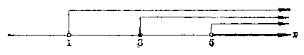

*图2·7*

（2） 原不等式组就是

\[
\left\{ \begin{array}{l} x > 1, \\ x > 3, \\ x < 5. \end{array} \right.
\]

由数轴上可以看出，所求的解集是

\[
3 < x < 5.
\]

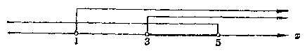

*图2·8*

（3） 原不等式组就是

\[
\left\{ \begin{array}{l} x < 1, \\ x < 3, \\ x > 5. \end{array} \right.
\]

由数轴上可以看出，这个不等式组没有解。

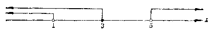

*图2·9*

上面的这些例子里，未知数都可以取满足条件的实数值。但有时根据题目中的条件，可能只要我们求出未知数的整数值或者正整数值，这时可以先求出未知数的一般解，然后再在其中找出满足条件的数值来。

##### 例6

求不等式组

\[
\left\{ \begin{array}{l} x (x^{2} + 1) \geqslant (x - 1) (x^{2} + x + 1), \\ (1 - x)^{3} + x (x^{2} + 1) > 3 (x^{2} + x - 9) \end{array} \right. \tag {1}
\]

的整数解。

**［解］** 由（1）得\(x^{3} + x \geqslant x^{3} - 1,\) 就是

\[
x \geqslant - 1. \tag {3}
\]

由（2）得\(1 - 3x + 3x^2 - x^3 + x^3 + x > 3x^2 + 3x - 27,\) 就是

\[
x < \frac{28}{5}. \tag {4}
\]

所以原不等式组可以化成不等式组

\[
\left\{ \begin{array}{l} x \geqslant - 1, \\ x < \frac{28}{5}. \end{array} \right.
\]

它的解集是\(-1 \leqslant x < \frac{28}{5}\)。

在这范围里的整数有 -1，0，1，2，3，4，5 等七个，所以所求的整数解是 -1，0，1，2，3，4，5.

##### 例7

车间里准备制作1000个零件，如果按照定额平均分配给6个小组，那末不能完成；如果每一小组多分配1件，那 末就可以超额完成。问按照定额每一小组要完成多少个零件？

**［解］** 设按照定额每一小组要完成 x 个零件，那末按照题意可列出不等式组：

\[
\left\{ \begin{array}{l} 6 x < 1000, \\ 6 (x + 1) > 1000. \end{array} \right.
\]

这个不等式组可以化成

\[
\left\{ \begin{array}{l} x < 166 \frac{2}{3}, \\ x > 165 \frac{2}{3}. \end{array} \right.
\]

所以原不等式组的解集是

\[
165 \frac{2}{3} < x < 166 \frac{2}{3}.
\]

但是零件的个数，应该是正整数，在\(165\frac{2}{3}\)和\(166\frac{2}{3}\)间的正整数，只有一个，就是166。所以\(x = 166\)。

**答：** 每一小组的定额是166件。

1. 解下列不等式组：

（1）\(\left\{ \begin{array}{l} x > -1, \\ x > -2, \\ x > -3; \end{array} \right.\)

（2）\(\left\{ \begin{array}{l} x + 1 < 0, \\ x + 2 < 0, \\ x + 3 < 0; \end{array} \right.\)

（3）\(\left\{ \begin{array}{l} x < -1, \\ x < -2, \\ x > -3; \end{array} \right.\)

（4）\(\left\{ \begin{array}{l} x + 1 > 0, \\ x + 2 > 0, \\ x + 3 < 0. \end{array} \right.\) 从解题过程中，你能总结出解这类由二个以上的简单一元一次不等式所组成的不等式组有什么简便的方法吗？

2. 已知\(a > b > c\)，解不等式组：

（1）\(\left\{ \begin{array}{l} x > a, \\ x > b, \\ x > c; \end{array} \right.\)

（2）\(\left\{ \begin{array}{l} x < a, \\ x < b, \\ x < c; \end{array} \right.\)

（3）\(\left\{ \begin{array}{l} x > a, \\ x > b, \\ x < c; \end{array} \right.\)

（4）\(\left\{ \begin{array}{l} x < a, \\ x < b, \\ x > c; \end{array} \right.\)

3. 求下列各不等式组的整数解：

（1）\(\left\{ \begin{array}{l} 3x - 10 > 0, \\ \frac{16}{3} x - 10 < 4x; \end{array} \right.\)

（2）\(\left\{ \begin{array}{l} \frac{2x - 11}{4} + \frac{19 - 2x}{2} < 2x, \\ \frac{2x + 15}{9} > \frac{1}{5}(x - 1) + \frac{x}{3}. \end{array} \right.\)

4. 小组里有 6 个工人，按照指标每天要生产零件 1000 个，如果按原来的定额平均分配给工人，就不能完成指标。如果把每人的定额增加 2 件，那末就将超过指标。问原来的定额每个工人每天要生产零件多少个？

### § 2·5 区间

在前面我们解一元一次不等式和不等式组的过程中，可以发现所求不等式或不等式组中未知数\(x\)可以取值的范围都是由下面这类不等式确定的（这里\(a < b\)）：

\[
a < x < b, \quad a \leqslant x \leqslant b, \quad a \leqslant x < b, \quad a < x \leqslant b,
\]

\[
x > a, \quad x \geqslant a, \quad x < b, \quad x \leqslant b.
\]

为了便于称呼由这些不等式所确定的实数集的子集，我们引进下面的概念：

（1） 用不等式

\[
a < x < b
\]

表示的全体实数，叫做从\(a\)到\(b\)的开区间，并且用记号\((a, b)\)来表示；在数轴上，就是由\(a\)到\(b\)但不包括端点在内的那一部分（图2.10）。

（2） 用不等式

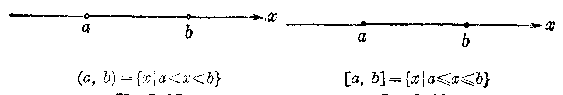

*图2·10*

*图2·11*

\[
a \leqslant x \leqslant b
\]

表示的全体实数，叫做从\(a\)到\(b\)的闭区间，并用记号\([a, b]\)来表示；在数轴上，就是由\(a\)到\(b\)包括端点在内的那一部分 （图 2·11）。

（3） 用不等式

\[
a < x \leqslant b \quad \text{或者} \quad a \leqslant x < b
\]

表示的全体实数，分别叫做从\(a\)到\(b\)的左开区间或者右开区间，并且分别用记号\((a, b]\)或者\([a, b)\)来表示；在数轴上，就是由\(a\)到\(b\)包括一个端点但不包括另一端点的那一部分（图2·12，图2·13）。

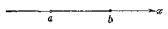

\[
(a, b ] = \{x | a < x \leqslant b \}
\]

*图2·12*

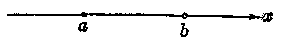

\[
[a,b)=\{x\mid a\leqslant x<b\}
\]

*图2·13*

为了记法上的统一，我们还把一切实数的全体，用不等式

\[
- \infty < x < + \infty
\]

来表示，并且把它叫做从\(-\infty\)到\(+\infty\)的开区间，记做\((-\infty, +\infty)\)。这里符号“\(\infty\)”读做无穷大，它并不表示某一个定数，而只是表明这个数的值可以愈来愈大，没有止境的意思。

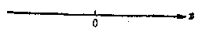

\[
(- \infty, + \infty) = \{x\mid -\infty<x<+\infty\} = \{x | x \in R \}.
\]

*图2·14*

相应地，一切大于\(a\)的实数的全体可以用不等式

\[
a<x<+\infty
\]

或者开区间\((a, +\infty)\)来表示；一切大于或等于\(a\)的实数的全体，可以用不等式

\[
a \leqslant x < + \infty
\]

或者右开区间\([a, +\infty)\)来表示；一切小于\(b\)的实数的全体，可以用不等式

\[
- \infty < x < b
\]

或者开区间\((- \infty, b)\)来表示；一切小于或者等于\(b\)的实数全体，可以用不等式

\[
- \infty < x \leqslant b
\]

或者左开区间\((- \infty, b]\)来表示。

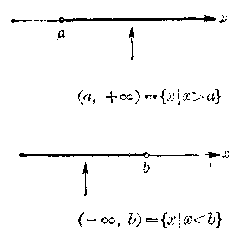

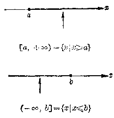

*图2·15*

开区间，闭区间，右开区间，左开区间等统称为区间。

在引进了区间这一概念及其符号以后，一元不等式或不等式组的解集就可以用三种方法来表示。例如不等式组

\[
\left\{ \begin{array}{ll} x - a > 0, \\ x - b < 0 \end{array} \right. (a < b)
\]

的解集可以用集合的一般表示法，写成\(\{x \mid a < x < b\}\)，或者应用区间符号表示成\(x \in (a, b)\)，或者更简单一些，就用未知数\(x\)所受的约束条件，用不等式\(a < x < b\)来表示。

解题时，这三种表示法可以灵活应用。一般来说，在解题过程中需要应用集合的运算来说明推理根据时，宜于用第一种表示法；写出问题解答的最后结果，不妨就用第二种或第三种表示法。

例用区间符号写出下列表达式所示的\(x\)的取值范围：

（1）\(x \in \{x \mid x < 3\} \cap \{x \mid x \geqslant -4\}\)；

（2）\(x \in \{x \mid -2 < x \leqslant 3\} \cup \{x \mid x \geqslant 0\}\)。

**［解］** （1）\(\because \{x \mid x < 3\} \cap \{x \mid x \geqslant -4\} = \{x \mid x \geqslant -4 \text{且} x < 3\}\)

\[
= \{x \mid - 4 \leqslant x < 3 \},
\]

\[
\therefore x \in [ - 4, 3).
\]

（2）\(\because \{x_{i} - 2 < x_{i} \leqslant 3\} \cup \{x \mid x \geqslant 0\}\)

\[
= \{x \mid - 2 < x \leqslant 3 \text{或} x \geqslant 0 \} = \{x: x > - 2 \},
\]

\[
\therefore x \in (- 2, + \infty).
\]

#### 习题2·5

1. 把下列不等式所示的\(x\)的取值范围用区间符号表示出来：

（1）\(x < 3\)；

（2）\(x \geqslant -2\)；

（3）\(-3 < x < 3\)；

（4）\(-3 \leqslant x \leqslant 5\)。

2. 把下列用区间符号所表示的\(x\)的取值范围用不等式表示出来：

（1）\(x \in [0, 3]\)；

（2）\(x \in (-1, 1)\)；

（3）\(x \in (-\infty, 0)\)；

（4）\(x \in [0, +\infty)\)。

### § 2·6 一元二次不等式

我们来看下面的问题：当 k 取什么值的时候，方程

\[
2x^2+kx+2 = 0 \tag {1}
\]

没有实数根？

在学习一元二次方程的时候，我们曾经讲过，一元二次方程

\[
a x^{2} + b x + c = 0
\]

（这里 a，b，c 都是实数，\(a\neq0\)），当它的判别式

\[
\Delta = b^{2} - 4 a c
\]

小于零的时候，就没有实数根。所以要解决上面的问题，只需解不等式

\[
k^{2} - 4 \cdot 2 \cdot 2 < 0,
\]

就是

\[
k^{2} - 16 < 0. \tag {2}
\]

这个不等式里，未知数\(k\)的次数是 2 次，我们把它叫做\(k\)的一元二次不等式。

容易看出，不等式 （2） 的左边的代数式\(k^2 - 16\)可以分解为\(k\)的两个一次因式：

\[
k^{2} - 16 = (k - 4) (k + 4).
\]

所以解不等式 （2），也就是解不等式

\[
(k - 4) (k + 4) < 0. \tag {3}
\]

因为要两个数的积是负数，必须而且只须这两个数具有相反的符号，所以从不等式（3）可以得出两个不等式组

\[
\text{(I)} \left\{ \begin{array}{ll} k - 4 > 0, \\ k + 4 < 0; \end{array} \right. \quad \text{(II)} \left\{ \begin{array}{ll} k - 4 < 0, \\ k + 4 > 0. \end{array} \right.
\]

这里不等式组 （I） 没有解，而不等式组 （II） 的解集是\(-4 < k < 4\)；所以不等式 （2） 的解集是\(-4 < k < 4\)。

由此可知，当\(-4 < k < 4\)时，方程（1）没有实数根。

一般地说：含有一个未知数并且未知数的次数最高是二次的不等式叫做一元二次不等式，它的一般形式是

\[
a x^{2} + b x + c > 0 \quad \text{或} \quad a x^{2} + b x + c < 0,
\]

这里\(a \neq 0\)。

从上面的例子可以看到，如果这两种形式的不等式中二次三项式\(ax^2 + bx + c\)能够分解为因式，那末解一元二次不等式的问题，就可以转化为解两个一元一次不等式组的问题。因为只要这两个不等式组中有一个能够成立，原不等式也就能够成立，所以我们只要先分别找出每一个不等 式组的解集，然后再找出他们的并集，就能得到原来这个一元二次不等式的解集。

例如，要求一元二次不等式

\[
x^{2} - 7 x + 12 > 0
\]

的解集，首先把左边分解因式，得

\[
x^{2} - 7 x + 12 = (x - 3) (x - 4).
\]

所以原不等式就是

\[
(x - 3) (x - 4) > 0. \tag {1}
\]

因为要两个数的积是正数，必须而且只须这两个数都是正数或者都是负数，所以求不等式

\[
(x - 3) (x - 4) > 0
\]

的解集。也就可以归结为求不等式组：

（I）\( \left\{\begin{aligned}x-3&>0,\\ x-4&>0;\end{aligned}\right. \)和 （II）\( \left\{\begin{aligned}x-3&<0,\\ x-4&<0\end{aligned}\right. \) 的两个解集的并集。

解 （I），得它的解集是：\( \{x|x>4\} \)；

解 （II），得它的解集是：\( \{x|x<3\} \)。

所以所求的解集是：

\[
\{x\mid x>4\}\cup\{x\mid x<3\} = \{x \mid x < 3 \text{或} x > 4 \}.
\]

这个解集可以在数轴上表示出来，如图2·16.

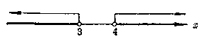

*图2·16*

这里应该注意不等式组（I）和（II）的解都是不等式（1）的解，所以求不等式（1）的解集，应该求它们的解集的并集；但是求不等式组（I）或不等式组（II）的解集，那末就要求出每一个不等式组里二个不等式的解集的交集。两者不能混淆。

象解一元一次不等式一样，在解一个一元二次不等式的问题时，通常也只需把确定解集的那个条件求出，并说这 就是所求的解集，如下面各例所示。

#### 例1

解不等式

\[
x^{2} - 7 x + 12 < 0.
\]

**［解］** 因为\(x^{2} - 7x + 12 = (x - 3)(x - 4)\)，所以原不等式就是

\[
(x - 3) (x - 4) < 0.
\]

因为要两个数的积是负数，必须而且只须这两个数中一个是正数一个是负数，所以从这个不等式可以得出两个不等式组：

\[
\left\{ \begin{array}{ll} x - 3 > 0, \\ x - 4 < 0; \end{array} \right. \quad \left\{ \begin{array}{ll} x - 3 < 0, \\ x - 4 > 0. \end{array} \right. \tag {I}
\]

不等式组（I）的解集是\(3 < x < 4\) 不等式组 （II） 没有解。

所以原不等式的解集是\(3 < x < 4\)。

##### 例2

解不等式：

\[
(x - 2) (x + 2) > 1. \tag {1}
\]

**［解］** 把不等式的左边展开得\(x^{2}-4>1\)。

移项得\(x^{2} - 5 > 0,\) 就是

\[
(x - \sqrt{5}) (x + \sqrt{5}) > 0. \tag {2}
\]

不等式（2）可以分成下面两个不等式组来解：

\[
\left\{ \begin{array}{ll} x - \sqrt{5} > 0, \\ x + \sqrt{5} > 0; \end{array} \right. \quad (\text{ II }) \quad \left\{ \begin{array}{ll} x - \sqrt{5} < 0, \\ x + \sqrt{5} < 0. \end{array} \right. \tag {I}
\]

解（1），得\(x > \sqrt{5}\)；解（II）得\(x < -\sqrt{5}\)。

所以原不等式的解集是：\(x < -\sqrt{5}\)或\(x > \sqrt{5}\) **注** 因为由两个数的积大于1，并不能肯定这两个数都大于1，或者都小于-1。所以把不等式（1）化成不等式组

\[
\left\{ \begin{array}{ll} x - 2 > 1, \\ x + 2 > 1 \end{array} \right. \quad \text{和} \quad \left\{ \begin{array}{ll} x - 2 < - 1, \\ x + 2 < - 1 \end{array} \right.
\]

来解是错误的。

#### 习题2·6（1）

1. 解下列不等式，并把解在数轴上表示出来：

（1）\((x - 2)(x + 4) > 0\)；

（2）\((x + 3)(x + 1) < 0\)；

（3）\((1 - 2x)(1 + 2x) < 0\)；

（4）\((2 - x)(1 + 3x) < 0\)；

（5）\(x^{2} - 13x + 36 > 0\)；

（6）\(x^{2} - 7x - 8 < 0;\)

（7）\(2x^{2} - 6x + 7 > 0;\)

（8）\(3 + 5x > 2x^{2}\)；

（9）\((x - 3)(x + 3) < 1\)；

（10）\((2x - 1)(x - 3) > -2\)。

2. 已知方程\(x^{2} + px + q = 0\)有两个不相等的实数根，解下列不等式：

（1）\(x^{2} + px + q < 0\)；

（2）\(x^{2} + px + q > 0.\) ［提示：先把左边分解因式，得\(x^{2}+px+q=(x-\alpha)(x-\beta)\)，\((\alpha<\beta)\)，再解一元二次不等式\((x-\alpha)(x-\beta)<0\)，\((\alpha<\beta)\)或\((x-\alpha)(x-\beta)>0\)，\((\alpha<\beta)\).］ 从前面我们解答过的这个习题中，可以发现一个重要的事实，就是：

如果二次三项式\(x^{2} + px - q\)中\(x\)项的系数\(p\)和常数项\(q\)满足条件\(\Delta = p^2 - 4q > 0\)，那末只要先解出一元二次方程\(x^{2} + px + q = 0\)的两个根：

\[
\alpha = \frac{- p - \sqrt{p^{2} - 4 q}}{2} \quad \text{和} \quad \beta = \frac{- p + \sqrt{p^{2} - 4 q}}{2}.
\]

这样一元二次不等式

（1）\(x^{2} + px + q < 0\)（\(p^{2} - 4q > 0\)） 就能变形成

\[
(x - \alpha) (x - \beta) < 0 \quad (\alpha < \beta),
\]

解这个不等式，就能求得原不等式的解集是

\[
\{x \mid \alpha < x < \beta \}.
\]

（2）\(x^{2}+px+q>0\)（\(p^{2} - 4q > 0\)） 就能变形成

\[
(x - \alpha) (x - \beta) > 0 \quad (\alpha < \beta),
\]

解这个不等式，就能求得原不等式的解集是

\[
\{x\mid x<\alpha\text{或}x>\beta\}.
\]

##### 例3

解不等式

（1）\(1 - 3x < x^2\)；（2）\((x + 1)(x - 2) < 5\)。

**［解］** （1） 原不等式可变形成\(x^{2} + 3x - 1 > 0\)。

\[
\because \quad \Delta = 3^{2} - 4 (- 1) = 13 > 0,
\]

方程\(x^{2} + 3x - 1 = 0\)有两个实数根：

\[
x_{1} = \frac{- 3 - \sqrt{13}}{2}, \quad x_{2} = \frac{- 3 + \sqrt{13}}{2}.
\]

∴ 原不等式的解集是

\[
x < \frac{- 3 - \sqrt{13}}{2} \quad \text{或} \quad x > \frac{- 3 + \sqrt{13}}{2}.
\]

（2） 原不等式可变形成\(x^{2} - x - 7 < 0\)。

\[
\because \quad \Delta = (- 1)^{2} - 4 (- 7) = 29 > 0,
\]

方程\(x^{2}-x-7=0\)有两个实数根：

\[
x_{1} = \frac{1 - \sqrt{29}}{2}, \quad x_{2} = \frac{1 + \sqrt{29}}{2}.
\]

∴ 原不等式的解集是

\[
\frac{1 - \sqrt{29}}{2} < x < \frac{1 + \sqrt{29}}{2}.
\]

##### 例4

解不等式

（1）\(4-3x-2x^{2}>0\)；（2）\(1 - 3x^{2} < x\)。

**［解］** （1） 原不等式可变形成\(2x^{2} + 3x - 4 < 0\)，即

\[
x^{2} + \frac{3}{2} x - 2 < 0.
\]

\[
\therefore \quad \Delta = \left(\frac{3}{2}\right)^{2} - 4 (- 2) = \frac{41}{4} > 0,
\]

方程\(x^{2} + \frac{3}{2} x - 2 = 0\)有两个实数根：

\[
x_{1} = \frac{- 3 - \sqrt{41}}{4}, \quad x_{2} = \frac{- 3 + \sqrt{41}}{4}.
\]

∴ 原不等式的解集是

\[
\frac{- 3 - \sqrt{41}}{4} < x < \frac{- 3 + \sqrt{41}}{4}.
\]

（2） 原不等式可以变形成\(3x^{2}+x-1>0\)，即

\[
x^{2}+\frac{1}{3}x-\frac{1}{3} > 0.
\]

\[
\because \quad \Delta = \left(\frac{1}{3}\right)^{2} - 4 \left(- \frac{1}{3}\right) = \frac{18}{9} > 0,
\]

方程\(x^{2} + \frac{1}{3} x - \frac{1}{3}\dots 0\)有两个实数根：

\[
x_{1} = \frac{- 1 - \sqrt{13}}{6}, \quad x_{2} = \frac{- 1 + \sqrt{13}}{6}.
\]

∴ 原不等式的解集是

\[
x < \frac{- 1 - \sqrt{13}}{6} \quad \text{或} \quad x > \frac{- 1 + \sqrt{13}}{6}
\]

从上例的解答中，可以发现方程\(x^{2} + \frac{3}{2} x - 2 = 0\)的两个根，也就是方程\(2x^{2} + 3x - 4 = 0\)的两个根；方程

\[
x^{2} + \frac{1}{3} x - \frac{1}{3} = 0
\]

的两个根，也就是方程\(3x^{2} + x - 1 = 0\)的两个根。这也就进一步启发我们：用一般形式

\[
a x^{2} + b x + c < 0 \quad (a > 0) \tag {1}
\]

或

\[
a x^{2} + b x + c > 0 \quad (a > 0) \tag {2}
\]

给出的一元二次不等式，当\(\Delta = b^{2} - 4ac > 0\)时，只需先求出方程\(ax^{2}+bx+c=0\)的两个实数根

\[
\alpha=\frac{-b-\sqrt{b^{2} - 4 a c}}{2 a}, \quad \beta = \frac{- b + \sqrt{b^{2} - 4 a c}}{2 a}.
\]

即可写出：

不等式（1）的解集是\(\{x\mid \alpha < x < \beta \}\) 不等式（2）的解集是\(\{x\mid x < \alpha\)或\(x > \beta \}\) 这样解题可以更加简洁。但是应用这一法则时，必须先使\(x^{2}\)的系数为正数，否则就会发生错误。

1. 直接应用法则，解下列不等式：

（1）\(\left(x - \frac{1}{2}\right)\left(x - \frac{1}{3}\right) < 0;\)

（2）\(\left(x-\frac{7}{6}\right)\left(x + \frac{6}{5}\right) > 0;\)

（3）\((x + 1.7)(x + 0.5) < 0;\)

（4）\(\left(x + \frac{3}{5}\right)(x + 0.4) > 0;\)

（5）\((2x - 3)(x + 1) \geqslant 0\)；

（6）\((x - 1)(3x + 2) \leqslant 0\)；

（7）\((1 - x)(2 + x) = 0\)；

（8）\((2 - x)(3x + 1) \geqslant 0\)。

2. 解下列不等式：

（1）\(6x^{2} < 7x + 3\)；

（2）\(5 + x - 6x^{2} \leqslant 0\)；

（3）\(12 - 5x - 2x^{2} > 0\)；

（4）\(5x + 6 \geqslant 6x^{2}\)。

3. 解下列不等式：

（1）\(x^{2} - 3x > 1\)；

（2）\(x^{2} + 2 < 4x;\)

（3）\(2x^{2} - 5x < 1\)；

（4）\(2x - 2x^{2} \geqslant -1\)。

在前面我们解过的这些一元二次不等式中，不等号左边的那个二次三项式都是能够分解成两个不同的一次因式的，也就是说，与这种一元二次不等式相对应的方程

\[
x^{2} + p x + q = 0 \text{ 的判别式 } \Delta=p^{2}-4q,
\]

或者方程

\[
a x^{2} + b x + c = 0 (a > 0) \text{ 的判别式 } \Delta = b^{2} - 4 a c
\]

都具有大于0这一条件。现在我们进一步研究，如果这种判别式等于0或者小于0，怎样来解和它相应的一元二次不等式。先来看一个判别式等于0的例子。

例如，我们要解不等式：

（1）\(x^{2} - 2\sqrt{5} x + 5 > 0,\)（2）\(x^{2} - 2\sqrt{5} x + 5 < 0.\) 这里因为\(A = (-2\sqrt{5})^2 - 4 \times 5 = 0\)，我们就不能应用前面学过的法则。但是在这情况下，不等式左边的二次三项式可以分解成两个相同的一次因式，即

\[
x^{2} - 2 \sqrt{5} x + 5 = (x - \sqrt{5})^{2},
\]

由此根据任何一个实数的平方都不能是负数，0 的平方是 0 这一性质即可得出：

（1） 不等式\(x^{2} - 2\sqrt{5} x + 5 > 0\)，即不等式\((x - \sqrt{5})^{2} > 0\)的解是一切不等于\(\sqrt{5}\)的实数。也就是说这个不等式的解集是

\[
\{x \mid x \neq \sqrt{5} \}.
\]

通常我们也可以简单地把它说成：这个不等式的解集是

\[
x \neq \sqrt{5}.
\]

（2） 不等式\(x^{2} - 2\sqrt{5} x + 5 < 0\)，即不等式\((x - \sqrt{5})^{2} < 0\)没有解。也就是说这个不等式的解集是一个空集。

下面我们再来看一个判别式小于0的例子。

例如，我们要解不等式\(x^{2} + x + 1 > 0\)，这里，因为\(\Delta = (-1)^{2} - 4 = -3 < 0\)，我们也不能够应用上面学过的法则，而且由此还可知道，左边的这个二次三项式，在实数集里不能分解成一次因式（这种二次三项式叫做二次质因式）。为了解这个不等式，我们可以先仿照解一元二次方程那样，把二次三项式的前面两项配成完全平方，得

\[
x^{2} + x + 1 = \left(x + \frac{1}{2}\right)^{2} - \frac{1}{4} + 1 = \left(x + \frac{1}{2}\right)^{2} + \frac{3}{4},
\]

由此把原不等式变形成

\[
\left(x + \frac{1}{2}\right)^{2} +\frac{3}{4}>0.
\]

这样只要再根据任何一个实数的平方都不是负数，它与一个正数的和总大于0这一性质，就能得出任何实数都是这个不等式的解，即这个不等式的解集是实数集R。实际上，这个不等式是一个绝对不等式。

同样的，如果我们要解不等式\(x^{2} + x + 1 < 0\)，那末，因为这个不等式可以变形成\(\left(x + \frac{1}{2}\right)^2 +\frac{3}{4} < 0\)，由此可以得出结论，这个不等式无解，即它的解集是一个空集。

一般地，我们可以证明：

（1） 当判别式\( \Delta = b^{2} - 4ac = 0 \)时，不等式\(ax^2 + bx + c > 0, (a > 0)\)的解集是\(\left\{x \mid x \neq -\frac{b}{2a}\right\}\)。不等式\(ax^2 + bx + c < 0, (a > 0)\)没有解（解集是\(\emptyset\)）。

（2） 当判别式\( \Delta = b^{2} - 4ac < 0 \)时，不等式\(ax^2 + bx + c > 0 (a > 0)\)是绝对不等式（解集是R）。

不等式\(ax^2+bx+c<0\ (a>0)\)没有解（解集是\(\varnothing\)）。

（证明留给读者.）

##### 例5

解下列不等式：

（1）\(x^{2}+2(\sqrt{2}+1)x+3+2\sqrt{2}>0\)；

（2）\(2x^{2}-3x+4<0\)。

**［解］** （1） 这里\(\Delta = 4(\sqrt{2} + 1)^2 - 4(3 + 2\sqrt{2}) = 0\)，原不等式可变形成

\[
[ x + (\sqrt{2} + 1) ]^{2} > 0.
\]

所以这个不等式的解集是\(\{x|x\neq -(\sqrt{2} +1)\}\)

（2） 这里\(\Delta = (-3)^{2} - 4 \cdot 2 \cdot 4 < 0\)，这个不等式没有解。

1. 应用配方法解下列不等式：

（1）\(2x^{2} + 4x + 3 > 0\)；

（2）\((1 - 2x)(3 + 2x) - 5 > 0.\)

3. 证明第 53 页中的结论。

3. 解下列不等式（用最简便的方法）：

（1）\(x^{2} - 3x + 4 > 0;\)

（2）\( 2x^{2}-5x+3<0; \)

（3）\(3x^{2} - x - 3 < 0\)；

（4）\(3x^{2} - x - 4 > 0;\)

（5）\(x^{2} + 2x > 0x - 15;\)

（6）\(3x^{2} - 7x < 6;\)

（7）\(3 - x > 3x + 5x^{2}\)；

（8）\((3x - 1)(x + 1) > 4;\)

（9）\(x^{2} - 3x > 3x - 9;\)

（10）\(1 - 4x^{2} > 4x + 2.\)

### \*§ 2·7 一元二次不等式组

学会了解一元一次不等式、一元二次不等式以及一元一次不等式组的解法，我们也就可以来解由一元一次不等式和一元二次不等式所组成的，或者都是由一元二次不等式所组成的不等式组。这样的不等式组都叫做一元二次不等式组。

象解一元一次不等式组一样，解一元二次不等式组也只需先找出不等式组中各个不等式的解集，然后再求出它 们的交集。

#### 例1

解不等式组

\[
\left\{ \begin{array}{ll} x - 1 > 0, & (1) \\ (x + 1) (x - 2) > 0. & (2) \end{array} \right.
\]

**［解］** 不等式（1）的解集是\(x > 1\)，不等式（2）的解集是\(x < -1\)或\(x > 2\)。

把这两个不等式的解集在数轴上表示出来如图2·17.

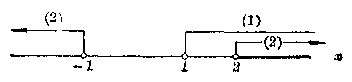

*图2·17*

从图中可以看出，它们的公共部分是 x > 2. 所以原不等式组的解集是\(x > 2\) **注** 详细地叙述就是解集是\(\{x|x > 1\} \cap \{x|x < -1\)或\(x > 2\} = \{x|x > 2\}\)。

##### 例2

解不等式组

\[
\left\{ \begin{array}{l} x^{2} - 2 x - 3 < 0, \\ x^{2} + 3 x - 4 > 0. \end{array} \right. \tag {1}
\]

**［解］** 不等式（1）就是\( (x+1)(x-3)<0 \)，它的解集是\( -1<x<3 \)。

不等式（2）就是\( (x-1)(x+4)>0 \)，它的解集是x<-4，或x>1。

这两个不等式的解集的公共部分是\(1 < x < 3\)。

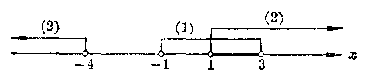

*图2·18*

所以原不等式组的解集是\(1 < x < 3\)。

#### 习题2·7

1. 解不等式组：

（1）\(\left\{ \begin{array}{l} x + 1 > 0, \\ (x + 2)(x - 3) < 0; \end{array} \right.\)

（2）\(\left\{ \begin{array}{l} x + 1 < 0, \\ (x + 2)(x - 3) > 0; \end{array} \right.\)

（3）\(\left\{ \begin{array}{l} x^{2} - 2x - 3 > 0, \\ x^{2} + 3x - 4 > 0; \end{array} \right.\)

（4）\(\left\{ \begin{array}{l} x^{2}-2x-3<0, \\ x^{2} + 3x - 4 < 0. \end{array} \right.\)

2. 下列代数式在\(x\)取怎样的数值时才有意义？

（1）\(\sqrt{1 - x^2} + \sqrt{4x^2 - 1}\)；

（2）\(\frac{\sqrt{x^2 - x - 1} + \sqrt{x} - 1}{\sqrt{x^2 + x + 1} + 1}\)。

### \*§ 2·8 一元高次不等式

利用解不等式组的方法，我们还可以解一些简单的一元高次不等式。

#### 例1

解不等式\((x^{2}-1)(x+2)>0\)。

**［解］** 这个不等式可以分成下面的不等式组 （I） 和 （II） 来解：

\[
\left\{ \begin{array}{l} x^{2}-1 > 0, \\ x + 2 > 0. \end{array} \right. \tag {1}
\]

解不等式（1）得 x<-1 或 x>1. 解不等式（2）得\(x > -2\) 因此，不等式组\((\mathrm{I})\)的解集是\(-2 < x < -1\)或\(x > 1\)（图2·19）。

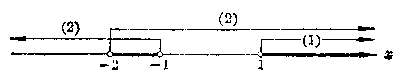

*图2·19*

\[
\text{(II)} \left\{ \begin{array}{ll} x^{2} - 1 < 0, & \\ x + 2 < 0. & \end{array} \right. \tag {3}
\]

解不等式（3）得\(-1 < x < 1\)。

解不等式（4）得 x<-2. 因此，不等式组 （II） 没有解 （图 2·20）。

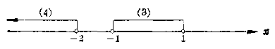

*图2·20*

由此可知，原不等式的解集是

\[
\{x \mid - 2 < x < - 1 \text{或} x > 1 \}.
\]

在解上面这种不等式的时候，用列表的方法来寻找所求的解，可以更加方便。现在把解法步骤说明如下：

（1） 先把原不等式变形成\( (x+1)(x-1)(x+2)>0 \)。

（2） 令\( (x+1)(x-1)(x+2)=0 \)，求出它的三个根：-1，1，-2.

（3） 以这三个值为界，把全体实数（除去这三个数）按照数轴上从左到右的顺序顺次地分成4个部分。

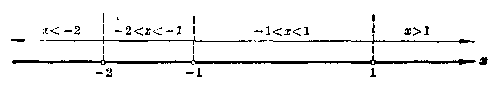

*图2·21*

（4） 分别考察当\(x < -2, -2 < x < -1, -1 < x < 1, x > 1\)的时候，因式\(x + 2, x + 1, x - 1\)的值的符号，由此求出在每一个情况下积\((x + 2)(x + 1)(x - 1)\)的符号，填入下面的表格。

|  | \( x < -2 \) | \( -2 < x < -1 \) | \( -1 < x < 1 \) | \( x > 1 \) |
| --- | --- | --- | --- | --- |
| \( x + 2 \) | — | + | + | + |
| \( x + 1 \) | — | — | + | + |
| \( x - 1 \) | — | — | — | + |
| 积 | ..。 | + | — | + |

例如取此 -2 小的数 -3 来考察，可以看到\(x + 2, x + 1, x - 1\)的值都是负数，所以在表格中第二直行的中间一栏里都填入“-”号，然后根据三个负数的积应该是负数，在第二直行最后一栏里也填入“-”号。

（5） 现在要求的是\(x\)取什么值的时候，积

\[
(x + 2) (x + 1) (x - 1)
\]

的值是正数。从表中可以看出\(x\)可取的值应该满足条件\(-2 < x < -1\)或\(x > 1\)。由此即得原不等式的解集是

\[
\{x \mid - 2 < x < - 1 \text{或} x > 1 \}.
\]

##### 例2

解不等式\( (2x+1)(2x-1)(x+2)<0. \) **［解］** \((2x + 1)(2x - 1)(x + 2) = 0\)的三个根是\(-\frac{1}{2}, \frac{1}{2}\)和 -2.

|  | \( x < -2 \) | \( -2 < x < -\frac{1}{2} \) | \( -\frac{1}{2} < x < \frac{1}{2} \) | \( x > \frac{1}{2} \) |
| --- | --- | --- | --- | --- |
| \( x + 2 \) | — | + | + | + |
| \( 2x + 1 \) | — | — | + | + |
| \( 2x - 1 \) | — | — | — | + |
| 积 | ..。 | + | — | + |

∴ 原不等式的解集是

\[
x < - 2 \quad \text{或} \quad - \frac{1}{2} < x < \frac{1}{2}.
\]

**注** 第一行里各个一次因式的次序，要按照根从小到大的顺序来排列，就是把有最小根的一次式排在最上面，依次排下去，这样考察起来就更方便（读者可考虑一下，这样安排以后将有怎样的规律出现？）。

##### 例3

解不等式\( (x^{2}-4)(9-x^{2})>0. \) **［解］** 原不等式就是

\[
(x^{2} - 4) (x^{2} - 9) < 0,
\]

也就是\((x + 3)(x + 2)(x - 2)(x - 3) < 0.\)

|  | \( x < -3 \) | \( -3 < x < -2 \) | \( -2 < x < 2 \) | \( 2 < x < 3 \) | \( x > 3 \) |
| --- | --- | --- | --- | --- | --- |
| \(x+3\) | — | + | + | + | + |
| \( x+2 \) | — | — | + | + | + |
| \( x-2 \) | — | — | — | + | + |
| \( x-3 \) | — | — | — | — | + |
| 积 | + | — | + | — | + |

∴ 原不等式的解集是

\[
- 3 < x < - 2, \quad \text{或} \quad 2 < x < 3.
\]

1. 解不等式：

（1）\((x - 1)(x - 3)(x - 5) > 0\)；（2）\((x - 1)(x - 3)(x - 5) < 0\)；

（3）\((x^{2}-1)(x^{2}-4)>0\)；（4）\((1-x^2)(4-x^2)<0\)。

2. 解不等式：

（1）\(x^{6}-x^{4}-2>0\)；（2）\(x^{3} + 2x^{2} - x - 2 < 0;\)

（3）\(x^{4}-3x^{2}+2<0\)；（4）\(x^{4}+2x^{2}-1>0\)。

### § 2·9 一元分式不等式

我们来看下面这个问题：\(x\)是什么值的时候，分式

\[
\frac{2 x - 3}{3 x - 5} \tag {1}
\]

的值是正的？

容易知道，这个问题就是要找出 x 的值的范围，使不等式

\[
\frac{2 x - 3}{3 x - 5} > 0 \tag {2}
\]

能够成立。这个不等式含有分式，我们把它叫做分式不等式。

现在我们来解这个不等式。

因为要使左边这个分式有意义，\( 3x-5\neq0 \)，\( (3x-5)^{2}>0 \)，所以我们可以用\( (3x-5)^{2} \)乘不等式的两边，得出和它同解的不等式

\[
(2 x - 3) (3 x - 5) > 0. \tag {3}
\]

这样，只要解这个一元二次不等式，就能求出不等式（2）的解集是

\[
\{x \mid x < \frac{3}{2} \text{或} x > \frac{5}{3} \}.
\]

由此可知，当\(x < \frac{3}{2}\)或\(x > \frac{5}{3}\)时分式（1）的值是正的。

从上面的解法中，可以看出解形似

\[
\frac{P (x)}{Q (x)} < 0 \quad \text{或者} \quad \frac{P (x)}{Q (x)} > 0
\]

的分式不等式，可以在\(Q(x) \neq 0\)的条件下，用\([Q(x)]^2\)乘不等式的两边，把它转化成整式不等式

\[
P (x) Q (x) < 0 \quad \text{或者} \quad P (x) Q (x) > 0
\]

来解，这里符号\(P(x)\)和\(Q(x)\)表示\(x\)的两个多项式。

#### 例1

解不等式

\[
\frac{x}{x + 2} + \frac{3}{x - 2} + \frac{4 x}{x^{2} - 4} < 0. \tag {1}
\]

**［解］** \(\because \frac{x}{x + 2} + \frac{3}{x - 2} + \frac{4x}{x^2-4} = \frac{x(x - 2) + 3(x + 2) + 4x}{(x + 2)(x - 2)}\)

\[
= \frac{x^{2} + 5 x + 6}{(x + 2) (x - 2)} = \frac{(x + 2) (x + 3)}{(x + 2) (x - 2)}
\]

\[
= \frac{x + 3}{x - 2}.
\]

在\(x^{2} - 4 \neq 0\)的条件下不等式（1）可以变形成与它同解的不等式

\[
\frac{x + 3}{x - 2} < 0, \tag {2}
\]

\(\because x - 2 \neq 0\)，用\((x - 2)^{2}\)乘（2）的两边得同解不等式

\[
(x + 3) (x - 2) < 0. \tag {3}
\]

解之，即得原不等式的解集是\(\{x\mid -3 < x < 2\}\) **思考题：** 本题如果改为解不等式

\[
\frac{x}{x + 2} + \frac{3}{x - 2} + \frac{4 x}{x^{2} - 1} \leqslant 0,
\]

结果应该是什么？

从这个例子的解法中，可以看出解一元分式不等式的一般法则是：

\(1^{\circ}\)把原不等式变形成

\[
\frac{P (x)}{Q (x)} < 0 \quad \text{或} \quad \frac{P (x)}{Q (x)} > 0
\]

的形式，这里\(\frac{P(x)}{Q(x)}\)是一个既约分式；

\(2^{\circ}\)在\(Q(x) \neq 0\)的条件下解整式不等式

\[
P (x) Q (x) < 0 \quad \text{或} \quad P (x) Q (x) > 0.
\]

##### 例2

解不等式

\[
\frac{3 x + 2}{x - 3} < 1. \tag {1}
\]

**［解］** 移项，得

\[
\frac{3 x + 2}{x - 3} - 1 < 0.
\]

通分，得

\[
\frac{3 x + 2 - (x - 3)}{x - 3} < 0,
\]

就是

\[
\frac{2 x + 5}{x - 3} < 0. \tag {2}
\]

以\((x - 3)^{2}\)乘（2）的两边得同解不等式

\[
(2 x + 5) (x - 3) < 0. \tag {3}
\]

解之，即得原不等式的解集是\(\left\{x\mid -\frac{5}{2} < x < 3\right\}\) **［注意］** 在解分式方程

\[
\frac{3x+2}{x-3} = 1
\]

时，通常我们可以在假定\(x - 3 \neq 0\)的条件下，两边同乘以整式\(x - 3\)，得方程

\[
3 x + 2 = x - 3,
\]

由此解得

\[
x = - \frac{5}{2}.
\]

在解分式不等式时，不能套用这个方法。因为虽然我们也可以假定\(x - 3 \neq 0\)，但却不能肯定\(x - 3\)的值是正的还是负的，因此不可能直接应用不等式的性质4。

有些分式不等式，也可以仿照解一元高次不等式那样直接利用列表法来解，如下例所示。

##### 例8

解不等式

\[
\frac{x-1}{(x+1)(x-2)} > 0,
\]

**［解］** 当\(x = 1\)的时候，分式\(\frac{x - 1}{(x + 1)(x - 2)}\)的值是0，当\(x = -1\)或者\(x = 2\)的时候，分式\(\frac{x - 1}{(x + 1)(x - 2)}\)失去意义。我们以这三个数-1，1和2为界把全体实数（除去这三个数）划分成4个部分，列成下表来考察。

|  | \( x < -1 \) | \( -1 < x < 1 \) | \( 1 < x < 2 \) | \( x > 3 \) |
| --- | --- | --- | --- | --- |
| \( x + 1 \) | — | + | + | + |
| \( x - 1 \) | — | — | + | + |
| \( x - 2 \) | — | — | — | + |
| \( x - 1 \)\( (x + 1)(x - 2) \) |  | — | — | + |

∴ 原不等式的解集是

\[
- 1 < x < 1 \quad \text{或} \quad x > 2.
\]

综合应用解分式不等式和解不等式组的知识，我们还可以解某些简单的分式不等式组。

##### 例4

一个分数的分子和分母都是正整数，并且分子比分母小1。如果分子加上2，那末分数就大于1.1；如果分子和分母都加上2，那末分数就大于0.9。求原来的分数。

**［解］** 设所求的分数是\(\frac{x}{x + 1}\)，这里\(x\)是正整数，根据条件可列出不等式组

\[
\left\{ \begin{array}{l} \frac{x + 2}{x + 1} > 1.1, \\ \frac{x + 2}{x + 3} > 0.9. \end{array} \right. \tag {1}
\]

因为\(x\)是正整数，所以\(x - 1\)和\(x + 3\)的值都是正整数。把不等式（1）的两边同乘以\(x+1\)，不等式（2）的两边同乘以\(x + 3\)，得

\[
\left\{ \begin{array}{l} x + 2 > 1.1 x + 1.1, \\ x + 2 > 0.9 x + 2.7. \end{array} \right. \tag {3}
\]

移项得\(\left\{ \begin{array}{l} -0.1x > -0.9,\\ 0.1x > 0.7. \end{array} \right.\) 所以\(\left\{ \begin{array}{l} x < 9, \\ x > 7. \end{array} \right.\) 这个不等式组的解集是\(7 < x < 9\)。

但是\(x\)必须是正整数，而在7和9之间的正整数只有一个，就是8．所以\(x = 8\) 由此可知所求的分数是\(\frac{8}{9}\)。

**［注意］**  把不等式（1）和（2）变形成不等式（3）和（4）的时候，必须先知道\(x + 1 > 0\)和\(x + 3 > 0\)

1. 解下列不等式：

（1）\(\frac{4 - 2x}{1 + 3x} > 0\)；

（2）\(\frac{3x + 7}{2 - 6x} > 0;\)

（3）\(\frac{5 - 2x}{8 + 5x} < 0;\)

（4）\(\frac{5x - 8}{2x + 4} < 0.\)

2. 解下列不等式：

（1）\(\frac{1}{x - 1} > 1\)；

（2）\(\frac{x + 1}{x - 1} < \frac{4}{5}\)；

（3）\(\frac{3x - 1}{x - 5} < 2;\)

（4）\(\frac{1}{x - 4} < 1 - \frac{x}{4 - x}\)。

3. 解下列不等式：

（1）\(\frac{x - 1}{x^2 + 1} > 0;\)

（2）\(\frac{x^2}{3 - x} - \frac{3}{x - 3} > 0.\)

4. 解下列不等式：

（1）\(\frac{x + 1}{(x + 2)(x - 3)} < 0;\)

（2）\(\frac{x^2 - 2x - 3}{x^2 + 3x - 4} > 0;\)

（3）\(\frac{1}{x + 3} \div \frac{2}{x - 3} > 0\)；

（4）\(\frac{x}{x + 2} + \frac{1}{x - 3} > 1\)；

（5）\(\frac{x^2 - 2}{x^2 - 4} < 0\)；

（6）\(2 + \frac{2}{x - 1} < \frac{5}{4 - x}\)。

5.\(k\)是什么数的时候，方程\(kx + 2 = 5x + k\)的解是正数？是负数？是零？

6. 一个分数的分子和分母都是自然数，并且分子比分母小1. 如果分子和分母分别加上1，那末所得的分数就大于\(\frac{1}{2}\)；如果分子和分母分别减去1，那末所得的分数就小于\(\frac{6}{7}\)。求这个分数。

### § 2·10 不等式的其他一些性质

在研究等式的时候，有时我们需要把两个等式的等号两边分别相加、相减、相乘、相除，或者把一个等式的两边分别自乘同次方、开同次方。我们知道，通过这些运算，结果还是得到一个等式，就是：

如果\(a = b, c = d\)，那末一定有

（1）\(a + c = b + d;\)

（2）\(a - c = b - d;\)

（3）\(ac=bd\)；

（4）\(\frac{a}{c} = \frac{b}{d}\)（\(c \neq 0, d \neq 0\)）；

（5）\(a^{n}=b^{n}\)（\(n\)是自然数）；

（6）\(\sqrt[n]{a} = \sqrt[n]{b}\)（\(a > 0, b > 0, n\)是大于 1 的整数）。

同样地，在研究不等式的时候，有时我们也需要把两个不等式的左右两边分别相加、相减、相乘、相除，或者把一个不等式的左右两边分别自乘同次方、开同次方。

现在，我们来研究这些运算在什么情况下才能够进行，并且通过这些运算，将会产生怎样的结果。

#### 1. 不等式两边分别相加和分别相减

很明显，两个大的数的和总比两个小的数的和大。例如：

\[
5 > 3, \quad 4 > 2,
\]

而\(5 + 4 > 3 + 2;\)

\[
- 3 > - 5, \quad - 2 > - 4,
\]

而\((-3) + (-2) > (-4) + (-5)\)。

这个事实指出了不等式有下面的性质：

**性质5** 如果\(a > b, c > d\)，那末\(a + c > b + d\)。

这个性质，我们可以从不等式的基本性质3和2中推导出来，证法如下：

**［证明］** \(\because a > b, \therefore a + c > b + c.\)（性质3） （1） 又\(\because c > d, \therefore b + c > b + d.\)（性质3）（2） 从（1）和（2）得

\[
a + c > b + d. \quad (\text{ 性 质 } 2)
\]

很明显，不等式的这个性质可以推广到任意多个（有限的）同向不等式两边分别相加的情形。这就是说：

两个或者几个同向不等式两边分别相加，仍得同向不等式。

**［注意］** 把两个异向不等式两边分别相加，就不能作出一般的结论。例如：

\[
5>3, \quad 2 < 3, \quad \text{这时} \quad 5 + 2 > 3 + 3;
\]

\[
5>3, \quad 2 < 4, \quad \text{这时} \quad 5 + 2 = 3 + 4;
\]

\[
5>3, \quad 2 < 5, \quad \text{这时} \quad 5 + 2 < 3 + 5.
\]

所以仅知\(a > b, c < d\)，就不能判断\(a + c\)和\(b + d\)中哪一个大。

但是，如果把两个异向不等式，两边分别相减，那末就可以断定得到的一定是和被减的不等式同向的不等式。这 就是说，不等式有下面的性质：

**性质6**

如果\(a > b, c < d\)，那末\(a - c > b - d\)。

这个性质可以从不等式的性质4和5推导出来，证法如下。

**［证明］** 

\[
\because \quad c < d, \quad \therefore \quad - c > - d. \quad (\text{性质4})
\]

又\(\because a > b, -c > -d;\)

\[
\therefore a+(-c) > b + (- d). \quad (\text{性质} 5)
\]

就是\(a - c > b - d.\) 不等式的这个性质也就是说：

两个异向不等式两边分别相减，得到的是和被减的不等式同向的不等式。

**［注意］** 两个同向不等式两边分别相减，就不能作出一般的结论。

##### 例1

已知\( \sqrt{2} \)的值比 1.4 大而比 1.5 小，\( \sqrt{3} \)的值比 1.7 大而比 1.8 小。问\( \sqrt{2} + \sqrt{3} \)的值比什么数大，比什么数小？

**［解］** \(\because \sqrt{2} > 1.4, \sqrt{3} > 1.7,\) 两边分别相加得

\[
\sqrt{2} + \sqrt{3} > 3.1,
\]

又\(\because \sqrt{2} < 1.5, \sqrt{3} < 1.8,\) 两边分别相加得

\[
\sqrt{2} + \sqrt{3} < 3.3.
\]

所以\(\sqrt{2} +\sqrt{3}\)一定比3.1大而比3.3小，这个结果可以写做\(3.1 < \sqrt{2} +\sqrt{3} < 3.3.\)

##### 例2

问\(\sqrt{3} - \sqrt{2}\)的值一定介于哪两个数之间（精确到0.1）。

**［解］** \(\sqrt{3} > 1.7,\)

\[
\sqrt{2} < 1.5,
\]

两边分别相减得

\[
\sqrt{3} - \sqrt{2} > 0.2, \tag {1}
\]

因为\(\sqrt{3} < 1.8,\) 而\(\sqrt{2} > 1.4,\) 两边分别相减得

\[
\sqrt{3} - \sqrt{2} < 0.4. \tag {2}
\]

把（1）和（2）结合起来，就得到

\[
0.2 < \sqrt{3} - \sqrt{2} < 0.4.
\]

这就是说\(\sqrt{3} -\sqrt{2}\)的值一定介于0.2和0.4之间。

1. 已知\(\sqrt{5}\)的值介于2.23和2.24之间，\(\sqrt{2}\)的值介于1.41和1.42之间，求

（1）\(\sqrt{5} + \sqrt{2}\)的值介于哪两个数之间？

（2）\(\sqrt{5} - \sqrt{2}\)的值介于哪两个数之间？

（精确到0.01）。

2. 已知\(a^2 + b^2 > 2ab, b^2 + c^2 > 2bc, c^2 + a^2 > 2ca\)，求证

\[
a^{2} + b^{2} + c^{2} > a b + b c + c a.
\]

3. 已知\(a < b, c < d\)，能不能作出下面的判断？为什么？

（1）\(a - d < b - c\)；

（2）\(a - c < b - d\)。

4. 已知\(a - b < c, c < b\)，求证\(c - 2b < 0\)。

#### 2. 不等式两边分别相乘和相除

先来看下面的例子：

\[
5 > 3, \quad 4 > 2, \quad \text{而} \quad 5 \times 4 > 3 \times 2;
\]

\[
4 > 3, \quad 6 > 5, \quad \text{而} \quad 4 \times 6 > 3 \times 5.
\]

在这两个例子里我们看到：两个两边都是正数的同向不等式，如果把它们的两边分别相乘，可以得到一个和原不等式同向的不等式。这就是说，不等式有下面的性质：

**性质 7** 如果\(a > b, c > d\)，并且\(a, b, c, d\)都是正数，那末

\[
a c > b d.
\]

**［证明］** \(\because a > b, c > 0, \therefore ac > bc.\)（性质4）（1） 又

\[
\because \quad c > d, \quad b > 0, \quad \therefore \quad b c > b d. \quad (\text{性质4}) \tag {2}
\]

从（1）和（2）得

\[
a c > b d. \quad (\text{ 性 质 } 2)
\]

**［注意］** 这里如果没有\(b > 0, d > 0\)这一条件，就不能作出一般的结论。例如：

\[
5 > - 3, \quad 1 > - 2, \quad \text{这时} \quad 5 \times 1 < (- 3) \times (- 2);
\]

\[
5 > - 2, \quad 1 > - 2, \quad \text{这时} \quad 5 \times 1 > (- 2) \times (- 2).
\]

所以只知道\(a > b, c > d\)，就不能肯定\(ac\)与\(bd\)哪一个大。

对于两个异向不等式\(a > b, c < d\)，即使知道了\(a,b,c,d\)都是正数，一般也不能判断出\(ac\)和\(bd\)之间哪一个大。例如\(5 > 3, 2 < 4\)，这时\(5 \times 2 < 3 \times 4\)；而\(5 > 3, 2 < 3\)，这时却有\(5 \times 2 > 3 \times 3\)。

很明显，不等式的这个性质可以推广到任意多个（有限的）两边都是正数的同向不等式的情形。这就是说：

两个或者几个两边都是正数的同向不等式两边分别相乘，仍得同向不等式。

##### 例3

已知\(a > b > 0\)，求证\(a^3 > b^3\)。

**［证明］** 因为\(a, b\)都是正数，把下面这三个不等式：

\[
a > b, \quad a > b, \quad a > b
\]

的两边分别相乘，就得到\( a^{3} > b^{3} \)。

为了研究两个不等式两边分别相除的问题，我们先引进不等式的下面这个性质。

**性质8** 如果\(a > b, a, b\)都是正数，那末\(\frac{1}{a} < \frac{1}{b}\)。

**［证明］** 因为\(a, b\)都是正数，所以\(ab > 0\)，因此\(\frac{1}{ab} > 0\)。在不等式\(a > b\)的两边同乘以正数\(\frac{1}{ab}\)，得

\[
a \left(\frac{1}{a b}\right) > b \left(\frac{1}{a b}\right),
\]

就是\(\frac{1}{b} >\frac{1}{a}\) ∴\( \frac{1}{a}<\frac{1}{b} \)。（性质1） 应用这个性质和性质7，容易得出不等式的下面这个性质。

**性质9** 如果\(a > b, c < d, a, b, c, d\)都是正数，那末

\[
\frac{a}{c} > \frac{b}{d}.
\]

**［证明］** \(\because c < d, c, d\)都是正数，∴\( \frac{1}{c} > \frac{1}{d} \)。（性质8） 又\(\because a > b, \frac{1}{c} > \frac{1}{d}, a,b,\frac{1}{c},\frac{1}{d}\)都是正数，∴\( a\left(\frac{1}{c}\right)>b\left(\frac{1}{d}\right) \)。（性质7） 就是\(\frac{a}{c} >\frac{b}{d}\) 不等式的这个性质就是说：两个两边都是正数的异向不等式两边分别相除，得到和被除的不等式同向的不等式。

##### 例4

已知一个圆和一个正方形有同样的周长，求证这个圆的面积大于这个正方形的面积。

**［证明］** 设圆和正方形的周长都是\(p\)。那末 圆的半径\(r = \frac{p}{2\pi}\)，圆的面积\(S = \left(\frac{p}{2\pi}\right)^2\pi = \frac{p^2}{4\pi}\)；

又，正方形一边的长\(a = \frac{p}{4}\)，正方形的面积\(A = \left(\frac{p}{4}\right)^2\)。

\( \because \pi<4, \)并且\( \pi \)和4都是正数，∴\( \frac{1}{\pi} > \frac{1}{4} \)。（性质 8） 又\(\frac{p^2}{4}>0\)，∴\( \frac{p^{2}}{4}\cdot\frac{1}{\pi}>\frac{p^{2}}{4}\cdot\frac{1}{4}. \)（性质 4） 就是\(S > A.\) 这就证明了有同样周长的圆的面积大于正方形的面积。

1. 已知\(a + b > 2\sqrt{ab}, b + c > 2\sqrt{bc}, c + a > 2\sqrt{ca}\)，且\(a, b, c\)都是正数，求证：

\[
(a + b) (b + c) (c + a) > 8 a b c.
\]

2. 如果\(a > b, c > 4\)，并且\(b > 0, d > 0\)，能不能作出判断\(ac > bd\)？为什么？

3. 如果\(a > b, c < d\)，并且\(c, d\)都不等于零，能不能作出判断\(\frac{a}{c} > \frac{b}{d}\)？为什么？

4.\(a > b, a, b\)同号，那末\(\frac{1}{a}\)和\(\frac{1}{b}\)之间有怎样的关系？

#### 3. 不等式两边分别自乘同次方和开同次方

在例3里我们曾看到，如果\(a > b\)，\(a\)和\(b\)都是正数，那末一定有\(a^3 > b^3\)。很明显，这个结论可以推广到把不等式\(a > b (a > 0, b > 0)\)的两边分别自乘\(n\)次方的情形。这就是说，不等式有下面的性质：

**性质 10** 如果\(a > b, a, b\)都是正数，\(n\)是自然数，那末

\[
a^{n} > b^{n}.
\]

现在，我们来看如果把不等式\(a > b (a > 0, b > 0)\)两边分别开\(n\)次方，将会有怎样的结果。先来看几个具体的例子：

\[
8 > 1, \quad \text{而} \quad \sqrt[3]{8} > \sqrt[3]{1};
\]

\[
16 > 4, \quad \text{而} \quad \sqrt{16} > \sqrt{4}.
\]

从这两个例子可以看到，把两边都是正数的不等式两边分别开同次方，得到和原来不等式同向的不等式，就是说，不等式有下面的性质：

**性质11**

如果\(a > b, a, b\)都是正数，\(n\)是大于1的整数，那末

\[
\sqrt[n]{a} > \sqrt[n]{b},
\]

这个性质不容易直接证明，我们改用间接证法，就是证明：如果这个结论不对，那末就会引出矛盾。我们可以这样想：

\(\sqrt{a}\)和\(\sqrt{b}\)只能有下面三种关系之一：

（1） 或者\( \sqrt{a} > \sqrt[3]{b} \)；

（2） 或者\( \sqrt[3]{a} = \sqrt[3]{b} \)；

（3） 或者\( \sqrt[3]{a} < \sqrt[3]{b} \)。

要证明第1种关系成立，只需证明后面这两种关系都不成立，也就是要证明：如果后面这两种关系成立，就会引出矛盾。

**［证明］**  \(\sqrt[3]{a}\)和\(\sqrt[3]{b}\)之间的关系，只可能是下面这三种情况之一：

（1） 或者\( \sqrt[n]{a} > \sqrt[n]{b} \)；（2） 或者\( \sqrt[n]{a} = \sqrt[n]{b} \)；

（3） 或者\( \sqrt[n]{a} < \sqrt[n]{b} \)。

因为\(a, b\)是正数，所以\(\sqrt[n]{a}, \sqrt[n]{b}\)都是正数，如果\(\sqrt[n]{a} = \sqrt[n]{b}\)，那么就有\((\sqrt[n]{a})^n = (\sqrt[n]{b})^n,\) 就是\(a=b\)。

这和已知条件\(a > b\)矛盾，所以是不可能的。

如果\(\sqrt[n]{a} < \sqrt[n]{b}\)，那末就有\((\sqrt[n]{a})^n < (\sqrt[n]{b})^n\)，就是\(a < b\)。

这也和已知条件\(a > b\)矛盾，所以也是不可能的。

既然这两种关系都不能成立，所以一定有

\[
\sqrt[n]{a} > \sqrt[n]{b}.
\]

##### 例5

求证\( \sqrt{6} + \sqrt{7} > 2\sqrt{2} + \sqrt{5} \)。

**［证明］** \(\sqrt{6} +\sqrt{7})^2 = 13 + 2\sqrt{42},\)

\[
(2 \sqrt{2} + \sqrt{5})^{2} = 13 + 2 \sqrt{40}.
\]

\( \because 42>40,\quad\therefore\sqrt{42}>\sqrt{40}. \)（性质11） ∴\( 2\sqrt{42}>2\sqrt{40} \)，（性质4） ∴\( 13+2\sqrt{42}>13+2\sqrt{40} \)，（性质3） ∴\( \sqrt{13+2\sqrt{42}}>\sqrt{13+2\sqrt{40}} \)，（性质11） 就是\(\sqrt{6} +\sqrt{7} >2\sqrt{2} +\sqrt{5}.\) 把上面所讲的这些归纳起来，我们就可以得到下面这些关于不等式的运算性质：

（5） （加法）\(a > b, c > d \Rightarrow a + c > b + d.\)

（6） （减法）\(a > b, c < d \Rightarrow a - c > b - d.\)

（7） （乘法）\(a > b > 0, c > d > 0 \Rightarrow ac>bd\)。

（8） （倒数）\(a > b > 0 \Rightarrow \frac{1}{a} < \frac{1}{b}\)。

（9） （除法）\(a > b > 0, 0<c<d \Rightarrow \frac{a}{c} > \frac{b}{d}\)。

（10） （乘方）\(a > b > 0 \Rightarrow a^n > b^n\) （n 是大于 1 的整数）。

（11） （开方）\(a > b > 0 \Rightarrow \sqrt[n]{a} > \sqrt[n]{b}\) （n 是大于 1 的整数）。

#### 不等式的性质

1. 比较\((-2)^{a}\)和\((-3)^{n}\)的大小，这里\(n\)是自然数。

［提示：分 n 是偶数和奇数两种情况来研究.］

2. 如果\(a > b, n\)是自然数，能不能作出判断\(a^n > b^n\)？为什么？

3. 求证：

（1）\(\sqrt{3} + \sqrt{5} < 4\)；

（2）\(\sqrt{2} + \sqrt{3} < \sqrt{10}\)。

4. 如果\(a > b, a, b\)都是正数，\(n\)是自然数，求证：

\[
a^{- n} < b^{- n}.
\]

5. 如果\(a > b, a, b\)都是正数，\(m, n\)是自然数，并且\(n > 1\)，求证：

\[
a^{n} > b^{n}.
\]

### § 2·11 一元无理不等式

在代数第二册里，我们知道被开方数中有未知数的方 程叫做无理方程。类似地，被开方数中有未知数的不等式就叫做无理不等式。例如：

\[
\sqrt{x - 2} < 2, \sqrt{2 - x} > 3, \sqrt{3 x - 5} - \sqrt{x - 4} > 0,
\]

等等，都是无理不等式。

一些简单的无理不等式，可以根据算术根的意义，和把不等式变形成有理不等式的方法，归结到解一元一次或二次不等式组来解。下面我们举几个例子来说明这种不等式的解法。

#### 例1

解不等式

\[
\sqrt{x - 2} < 2. \tag {1}
\]

**［审题］** 根据算术根的意义，要使\(\sqrt{x - 2}\)有意义，必须\(x - 2 \geqslant 0\)。在这种情况下，\(\sqrt{x - 2}\)的值总不是负数。因此可以用两边同时平方的方法，把原不等式变形成一个有理不等式\(x - 2 < 4\)。这样，解由不等式\(x - 2 \geqslant 0\)和\(x - 2 < 4\)组成的不等式组，就可以得到原不等式的解。

**［解］** 不等式（1）成立的条件是

\[
\left\{ \begin{array}{l} x - 2 \geqslant 0, \\ x - 2 < 4; \end{array} \right.
\]

就是\(\left\{ \begin{array}{l}x\geqslant 2,\\ x < 6. \end{array} \right.\) 解这个不等式组即得原不等式的解集是\(2 \leqslant x < 6\)。

##### 例2

解不等式

\[
\sqrt{3 x - 5} - \sqrt{x - 4} > 0. \tag {1}
\]

**［解］** 由（1）得

\[
\sqrt{3 x - 5} > \sqrt{x - 4}. \tag {2}
\]

这个不等式成立的条件是

\[
\left\{ \begin{array}{l} 3 x - 5 \geqslant 0, \\ x - 4 \geqslant 0, \\ 3 x - 5 > x - 4; \end{array} \right. \tag {3}
\]

就是

\[
\left\{ \begin{array}{ll} x \geqslant \frac{5}{3}, & \\ x \geqslant 4, & \\ x > \frac{1}{2}. & \end{array} \right. \tag {6}
\]

解这个不等式组即得原不等式的解集是\(x \geqslant 4\)。

**注** 从这个例子可以看到，如果不考虑x在什么条件下式子\( \sqrt{5x-5} \)，\( \sqrt{x-4} \)有意义，仅仅从\( \sqrt{3x-5} \)和\( \sqrt{x-4} \)都不是负数，把不等式（2）的两边同时平方，再解不等式（5），就会引进增解。

##### \*例3

解不等式

\[
\sqrt{2 x - 1} > x - 2. \tag {1}
\]

**［审题］** 根据算术根的意义，可知\(x\)可取值的范围是\(x \geqslant \frac{1}{2}\)，但是当\(x \geqslant \frac{1}{2}\)时\(x - 2\)的值不一定是正数。所以不能直接用两边平方的方法去掉根号，而需根据\(x - 2 < 0\)和\(x - 2 \geqslant 0\)的情况分别加以考虑。

**［解］** 根据算术根的意义，可知\(2x - 1 \geqslant 0\)。

\(1^{\circ}\)如果\(x - 2 < 0\)，因为\(\sqrt{2x - 1} \geqslant 0\)，这时，不等式（1）成立的条件可以归结为不等式组

\[
\text{(I)} \left\{ \begin{array}{l} 2 x - 1 \geqslant 0, \\ x - 2 < 0. \end{array} \right.
\]

解之，得\( \frac{1}{2} \leqslant x < 2. \)

\(2^{\circ}\)如果\(x - 2 \geqslant 0\)，把不等式（1）的两边平方得\(2x - 1 > (x - 2)^{2}\)，即\(x^{2} - 6x + 5 < 0\)。这时不等式（1）成立的条件可以归结为不等式组

\[
\text{(II)} \quad \left\{ \begin{array}{l} 2 x - 1 \geqslant 0, \\ x - 2 \geqslant 0, \\ (x - 1) (x - 5) < 0. \end{array} \right.
\]

解之，得\( 2 \leqslant x < 5. \) 原不等式的解集，应该是不等式组（1）和（Ⅱ）的解集的并集，所以把\(1^{\circ}\)和\(2^{\circ}\)并合起来，即得不等式（1）的解集是\(\frac{1}{2} \leqslant x < 5\)。

**［注意］** 本题如果不分两种情况来考虑，就会失去一部分解。

解下列不等式：

1.\(\sqrt{3x - 5} < \frac{1}{2}\)。

2.\(\sqrt{2 - x} - 3 > 0\)。

3.\(\sqrt{3x - 5} >\sqrt{x + 4}\) 4.\(\sqrt{x - 4} -\sqrt{3x - 5} >0.\) 5.\(\sqrt{x^2 - x} < \sqrt{2}\)。

6.\(\sqrt{x^2 + 3x} - 3 > 0\)。

*7.\(\sqrt{2x - 1} = x - 2.\) *8.\(\sqrt{x^2 + x} + 1 > x.\)

### § 2·12 不等式的证明

在前面我们做过的一些习题中，曾经遇到过证明一个不等式是绝对不等式的问题。这类问题，象证明恒等式一样，具有一定的技巧性，而没有一般都可通用的方案。下面我们举例说明证明不等式的常用方法。同时还将引进几个重要的不等式。

#### 例1

已知 a 和 b 是不相等的正数，求证：

\[
\frac{a + b}{2} > \sqrt{a b}.
\]

我们用几种不同的方法来证明。

（1） 第一种证法：把不等式左边的代数式减去右边的代数式，根据已知条件证明这个差总大于零。

**［证明1］** 

\[
\frac{a + b}{2} - \sqrt{a b} = \frac{a + b - 2 \sqrt{a b}}{2}. \tag {1}
\]

因为已知\(a, b\)都是正数，所以可以把\(a\)和\(b\)分别写做\((\sqrt{a})^2\)和\((\sqrt{b})^2\)。由此得

\[
\begin{array}{l} a + b - 2 \sqrt{a b} = (\sqrt{a})^{2} + (\sqrt{b})^{2} - 2 \sqrt{a b} \\ = (\sqrt{a} - \sqrt{b})^{2}. \tag {2} \\ \end{array}
\]

因为\(a \neq b\)，所以\(\sqrt{a} - \sqrt{b}\)是不等于零的实数，

\[
\therefore \quad (\sqrt{a} - \sqrt{b})^{2} > 0. \tag {3}
\]

从（1），（2）和（3）得

\[
\frac{a + b}{2} - \sqrt{a b} > 0. \tag {4}
\]

由此可知\(\frac{a + b}{2} >\sqrt{ab}\) **注** 这种证法，通常把它叫做比较法。

（2） 第二种证法：我们可以这样想，假定不等式

\[
\frac{a + b}{2} > \sqrt{a b} \tag {1}
\]

能够成立，那末就可顺次推出：

\[
\left(\frac{a + b}{2}\right)^{2} > \left(\sqrt{a b}\right)^{2} = \left(\frac{a + b}{2}\right)^{2} > a b \Rightarrow (a + b)^{2} > 4 a b
\]

\[
\Rightarrow a^{2} + 2 a b + b^{2} > 4 a b \Rightarrow (a - b)^{2} > 0. \tag {2}
\]

因为\(a, b\)是不相等的正数，不等式（2）是能够成立的。所以如果能够从不等式（2）反过来推出不等式（1），那末问题就解决了。

**［证明2］** 因为\(a, b\)是不相等的正数，所以

\[
(a - b)^{2} > 0,
\]

就是\(a^2 - 2ab + b^2 > 0.\) 在上式的两边各加上\(4ab\)得

\[
a^{2} + 2 a b + b^{2} > 4 a b,
\]

就是\((a + b)^{2} > 4ab.\) 两边同除以正数4，得

\[
\frac{(a + b)^{2}}{4} > a b.
\]

因为不等式两边都是正数，我们分别取它们的算术平 方根，得

\[
\frac{a + b}{2} > \sqrt{a b}.
\]

*注这个证法通常叫做综合法，应用这种证法，我们先要设法找出一个已知能够成立的不等式，然后逐步推出所要证明的不等式。

在这个例子里，为了找出作为出发点的不等式\( (a-b)^{2}>0 \)，我们在证明前，先假定所要证明的不等式能够成立，然后逐步推出这个所需要的不等式，这一思考过程叫做“分析”。

比较上面的“分析”和“证明”这两个步骤，可以看到，在这两个步骤里，我们思考的顺序恰巧是相反的。

在应用综合法的时候，如果作为出发点的不等式能够直接观察出来，那末“分析”的步骤就可略去。

本题如果把已知条件，改为\(a, b\)都是正数，就可得到一个重要不等式

\[
\frac{a + b}{2} \geqslant \sqrt{a b} \quad (a > 0, b > 0)
\]

（等号在 a=b 时成立）。

上面的不等式中，\(\frac{a+b}{2}\)表示正数\(a, b\)的算术平均数，\(\sqrt{ab}\)表示正数\(a\)与\(b\)的几何平均数。这个绝对不等式说明：两个正数的算术平均数不小于它们的几何平均数。

##### 例2

（1） 求证：\(a^2+b^2+c^2\geqslant ab+bc+ca\)。

（2） 上式等号在什么时候成立？

**［证明］** 因为任何实数的平方都不是负数，所以

\[
(a - b)^{2} \geqslant 0, (b - c)^{2} \geqslant 0, (c - a)^{2} \geqslant 0,
\]

等号仅在\(a = b = c\)时成立。

因此，\(a^2 + b^2 \geqslant 2ab, b^2 + c^2 \geqslant 2bc, c^2 + a^2 + a^2 \geqslant 2ca.\) 把这三个不等式的两边分别相加，得

\[
2 a^{2} + 2 b^{2} + 2 a^{2} \geqslant 2 a b + 2 b c + 2 c a.
\]

两边都除以正数2，得

\[
a^2+b^2+c^2\geqslant ab+bc+ca.
\]

等号仅在\(a=b=c\)时成立。

##### 例3

如果\(a\)和\(b\)都是正数，或者都是负数，求证：

\[
\frac{a}{b} + \frac{b}{a} \geqslant 2.
\]

等号在什么时候成立？

**［证明］** 不论\(a\)和\(b\)是什么实数，都有

\[
(a - b)^{2} \geqslant 0,
\]

就是\(a^2 + b^2 \geqslant 2ab.\) 因为两个正数或者两个负数的积总是正数，所以\(ab\)是正数。以正数\(ab\)除上式的两边，得

\[
\frac{a^2+b^2}{ab} \geqslant 2,
\]

就是\(\frac{a}{b} +\frac{b}{a}\geqslant 2.\) 等号在\(a = b\)时成立。

**注** 本题证得的不等式，可以作为定理来应用，意思就是说：一个正数与它的倒数的和不小于2. 从上面这些例子的解答过程中，可以看到要证明一个不等式是绝对不等式，常常要用到：

（1） 实数的性质：

\[
1^{\circ}\ a^2\geqslant0;
\]

\[
2^{\circ}\ a^2+b^2=0 \Rightarrow a = b = 0.
\]

（2） 实数的运算比较性质：

\[
a \left\{ \begin{array}{ll} > b, \\ = b, \\ < b. \end{array} \right. \Leftrightarrow a - b \left\{ \begin{array}{ll} > 0, \\ = 0, \\ < 0. \end{array} \right.
\]

（3） 不等式的基本性质和不等式的运算性质。

#### 习题2·12（1）

1. 已知\(a \neq 1\)，求证：

（1）\(a^2 > 2a - 1\)；

（2）\(\frac{2a}{1 + a^2} < 1.\)

2. 已知\(x\)是不等子1的正数，求证：

\[
x + \frac{1}{x} > 2.
\]

3. 已知\(a, b\)是不相等的正数，求证：

（1）\((a + b)(a^{-1} + b^{-1}) > 4;\)

（2）\(a^3 + b^3 > a^2 b + ab^2\)；

（3）\((a + b)(a^2 + b^2)(a^3 + b^3) > 8a^2b^3.\)

4. 求证：

（1）\(x^2-x+1\geqslant\frac{3}{4}\)；

（2）\(1 - x - x^2 \leqslant 1\frac{1}{4}\)。

5. 已知\(a, b, m\)都是正数，并且\(a < b\)，求证：

\[
\frac{a+m}{b+m}>\frac{a}{b}.
\]

6. 已知\(a, b, c, d\)都是正数，求证

（1）\(\frac{a + b + c + d}{2} \geqslant \sqrt{ab} + \sqrt{cd}\)；

（2）\(\frac{a + b + c + d}{4} \geqslant \sqrt[4]{abcd}\)。

以上这两个不等式中，等号在什么时候成立？

##### 例4

已知\(a, b, c\)都是正数，求证

\[
a^{3} + b^{3} + c^{3} \geqslant 3 a b c.
\]

上式中等号在什么时候成立？

**［审题］** 本题可以利用因式分解的公式

\[
\begin{array}{l} a^{3} + b^{3} + c^{3} - 3 a b c \\ = (a + b + c) \left(a^{2} + b^{2} + c^{2} - a b - b c - c a\right) \\ \end{array}
\]

来证明。

**［证明］** 

\[
\begin{array}{l} \because a^{3} + b^{3} + c^{3} - 3 a b c \\ = (a + b + c) \left(a^{2} + b^{2} + c^{2} - a b - b c - c a\right) \\ = \frac{1}{2} (a + b + c) [ (a - b)^{2} + (b - c)^{2} + (c - a)^{2} ]. \tag {1} \\ \end{array}
\]

今\(a, b, c\)都是正数，所以\(a + b + c > 0\)。又\((a - b)^2 + (b - c)^2 + (c - a)^2 \geqslant 0\)（等号在\(a = b = c\)时成立）。所以由（1）可知

\[
a^{3} + b^{3} + c^{3} - 3 a b c \geqslant 0.
\]

∴\( a^{3}+b^{3}+c^{3}\geqslant3abc \)（等号在 a=b=c 时成立）。

在上面这个不等式里，如果把\(a^3\)、\(b^3\)、\(c^3\)分别用\(a\)、\(b\)、\(c\)来代替，并以 3 除两边，就可导出一个重要不等式：

\[
\frac{a + b + c}{3} \geqslant \sqrt[3]{a b c} \quad (a > 0, b > 0, c > 0)
\]

（等号在 a=b=c 时成立）。

这个不等式指出：三个正数的算术平均数不小于他们的几何平均数。一般地，可以证明（证明略）以下的定理：

定理\(n\)个\((n \geqslant 2)\)正数的算术平均数，不小于它们的几何平均数，即

\[
\frac{a_{1} + a_{2} + \cdots + a_{n}}{n} \geqslant \sqrt[n]{a_{1} a_{2} \cdots a_{n}}.
\]

这里\( a_{1}, a_{2}, \cdots, a_{n} \)都是正数，等号在\( a_{1}=a_{2}=\cdots=a_{n} \)时成立。

##### 例5

已知\(a, b, c\)是三个互不相等的正数，他们的乘积是1，求证：

\[
(1 + a + b) (1 + b + c) (1 + c + a) > 27.
\]

**［审题］** 根据上面这个重要不等式，可知当\(a \neq b\)时必有\(\frac{1 + a + b}{3} > \sqrt[3]{ab}\)。因为左边三个因式是\(a, b, c\)的对称式，所以同理可推得\(\frac{1 + b - c}{3} > \sqrt[3]{bc}\)，\(\frac{1 + c + a}{3} > \sqrt[3]{ca}\)。把三式两端分别相乘，再应用\(abc = 1\)这一条件，就可得到证明。

**［证明］** 因为\(a, b, c\)是互不相等的正数，所以

\[
\frac{1 + a + b}{3} > \sqrt[3]{a b}, \quad \frac{1 + b + c}{3} > \sqrt[3]{b c}, \quad \frac{1 + c + a}{3} > \sqrt[3]{c a}.
\]

不等号两边分别相乘得

\[
\left(\frac{1 + a + b}{3}\right) \left(\frac{1 + b + c}{3}\right) \left(\frac{1 + c + a}{3}\right) > \sqrt[3]{a^{2} b^{2} c^{3}}.
\]

又因\(abc = 1\)，代入上式，得

\[
\frac{(1 + a + b) (1 + b + c) (1 + c + a)}{27} > 1.
\]

\[
\therefore (1 + a + b) (1 + b + c) (1 + c + a) > 27.
\]

##### 例6

已知三个正数\(a, b, c\)的和是1，求证这三个正数的倒数的和必不小于9. **［审题］** 本题就是要在\(a > 0, b > 0, c > 0\)及\(a + b + c = 1\)的条件下证明\(\frac{1}{a} + \frac{1}{b} + \frac{1}{c} \geqslant 9\)是一个绝对不等式。

**［证明］** 根据题设条件\(a + b + c = 1\)，可以推得

\[
\begin{array}{l} \frac{1}{a} + \frac{1}{b} + \frac{1}{c} = \frac{a + b + c}{a} + \frac{a + b + c}{b} + \frac{a + b + c}{c} \\ = 3 + \left(\frac{b}{a} + \frac{a}{b}\right) + \left(\frac{c}{b} + \frac{b}{c}\right) + \left(\frac{a}{c} + \frac{c}{a}\right). \tag {1} \\ \end{array}
\]

\[
\because a > 0, b > 0, c > 0,
\]

\[
\therefore \quad \frac{b}{a} + \frac{a}{b} \geqslant 2; \quad \frac{c}{b} + \frac{b}{c} \geqslant 2; \quad \frac{a}{c} + \frac{c}{a} \geqslant 2.
\]

\[
\therefore \left(\frac{b}{a} + \frac{a}{b}\right) + \left(\frac{c}{b} + \frac{b}{c}\right) + \left(\frac{a}{c} + \frac{c}{a}\right) \geqslant 6. \tag {2}
\]

由（1）和（2）可知

\[
\frac{1}{a} + \frac{1}{b} + \frac{1}{c} \geqslant 9. \tag {证毕}
\]

**注** 本题也可从证明\(\frac{1}{a} + \frac{1}{b} + \frac{1}{c} - 9 \geqslant 0\)着手，证明留给读者。

从上面这些例子中，可以看到，在证明不等式的过程中，我们也常常要灵活地应用已知的恒等式和某些重要的绝对不等式。

#### 习题2·12（2）

1. 已知\(x \neq 0\)，求证：

（1）\(x^{2} + \frac{1}{x^{2} + 1} > 1;\)

（2）\(\frac{x^2 + 3}{\sqrt{x^2 + 2}} > 2.\)

2. 设\(a, b, c\)是互不相等的正数，求证：

（1）\(\frac{b + c - a}{a} + \frac{c + a - b}{b} - \frac{a + b - c}{c} > 3;\)

（2）\((x + b + c)(ab + bc + ca) > 9abc.\)

3. 已知\(a, b\)都是正数，求证：

（1）\((1 + a + b)(1 + a^2 + b^2) \geqslant 9ab\)；

（2）\((a^2 b + a + b^2)(ab^2 + a^2 + b) \geqslant 9a^2b^2\)。

4. 已知\(a, b, c, x, y, z\)都是正数，且

\[
\frac{x}{a} < \frac{y}{b} < \frac{z}{c}, \quad \text{ 求证 } \quad \frac{x}{a} < \frac{x + y + z}{a + b + c} < \frac{z}{c}.
\]

5. 已知\(a^2 + b^2 + c^2 = 1, x^2 + y^2 + z^2 = 1\)，求证

\[
a x + b y + c z \leqslant 1.
\]

### \*§ 2·13 代数式的最大值和最小值

不等式的重要应用之一是可以利用它来求某些代数式的最大值或最小值。例如，上节例6中我们已经证明了三个正数\(a, b, c\)的和如果等于1，那末它们的倒数的和必不小于9，即\(\frac{1}{a} + \frac{1}{b} + \frac{1}{c} \geqslant 9\)。这里等号当\(a = b = c\)时成立。这就指出了当\(a + b + c = 1\)时，代数式\(\frac{1}{a} + \frac{1}{b} + \frac{1}{c}\)的最小值是9。如果进一步追问当\(a, b, c\)是什么数时，才能取得最小值，那末就可根据这个不等式只有当\(a = b = c\)时等号才能成立这一论断，从已知条件\(a + b + c = 1\)推得\(a = b = c = \frac{1}{3}\)。象这类问题就属于求代数式的最小值或最大值的问题。

应用不等式求代数式的最大值或最小值，最常用的方法有两种：一种是利用 §2.12 里引进过的 n 个正数的算术 平均数不小于它们的几何平均数这一定理；另一种是应用一元二次方程的根的判别式。下面我们分别举例说明，

1. 利用算术平均数和几何平均数的性质，求代数式的最大值或最小值 我们知道，如果\(a, b\)是两个正数，那末

\[
\frac{a + b}{2} \geqslant \sqrt{a b},
\]

等号在\(a=b\)时成立，由此可以推得如果\(a, b\)是正数，\(ab = P\)是一个常数，那末当\(a=b\)时，和\(a + b\)就有最小值\(2\sqrt{P}\)；相反的，如果\(a, b\)是正数，\(a + b = S\)是一个常数，那末当\(a=b\)时，积\(ab\)也就有最大值\(\frac{S^2}{4}\)。

同样的，如果\(a 、 b 、 c\)是三个正数，那末

\[
\frac{a + b + c}{3} \geqslant \sqrt[3]{a b c}.
\]

等号当\(a = b = c\)时成立，由此可以推得

\(1^{\circ}\)如果\(a, b, c\)是正数，\(abc = P\)是常数，那末当\(a = b = c\)时和\(a + b + c\)有最小值\(3\sqrt[3]{P}\)。

\(2^{\circ}\)如果\(a, b, c\)是正数，\(a + b + c = S\)是常数，那末当\(a = b = c\)时积\(abc\)就有最大值\(\frac{1}{27} S^{3}\)。

利用上面的结论，可以解某些求最大值、最小值的问题。

#### 例1

当\(x\)取什么数值时，代数式\(4x^{2} + \frac{9}{x^{2}}\)有最小值，这个最小值是什么？

**［审题］** 因为\(4x^{2}, \frac{9}{x^{2}}\)都是正数，且\((4x^{2})\left(\frac{9}{x^{2}}\right) = 36\)是个常数，所以可以应用\(\frac{a + b}{2} \geqslant \sqrt{ab}\)这一不等式来解。

**［解］** \(\because 4x^{2}, \frac{9}{x^{2}}\)都是正数，

\[
\therefore \quad \frac{4 x^{2} + \frac{9}{x^2}}{2} \geqslant \sqrt{(4x^2)\cdot\frac{9}{x^2}} = \sqrt{36} = 6,
\]

即\(4x^{2} + \frac{9}{x^{2}}\geqslant 12.\) 上式中等号在\(4x^{2} = \frac{9}{x^{2}}\)时成立。

解方程\(4x^{2} = \frac{9}{x^{2}}\)，得\(x = \pm \frac{\sqrt{6}}{2}\) 由此可知当\(x = \pm \frac{\sqrt{6}}{2}\)时，\(4x^2 + \frac{9}{x^2}\)有最小值12.

##### 例2

要把一定量的汽油装在长方体形状的铅皮箱里，这个容器应该怎样设计，才能使所用的材料最省？

**［解］** 设长方体的长、宽、高分别是\(x, y, z\)，那末它的容积就是\(V = xyz\)；所用材料的面积\(S = 2(xy + yz + zx)\)。

现在\(V\)是一个定值，\(x, y, z\)都是正数。要使\(S\)最小，只需\(xy + yz + zx\)最小。

\[
\because \frac{x y + y z + z x}{3} \geqslant \sqrt[3]{x^2y^2z^2} = \sqrt[3]{V^{2}}.
\]

上式中当\(xy = yz = zx\)时，也就是\(x = y = z\)时等号成立。

∴ 当 x=y=z 时，\( xy+yz+zx \)有最小值\( 3\sqrt[3]{V^{2}} \)。

从而可知，这时 S 有最小值\( 6\sqrt[3]{V^{2}} \)。

所以容器应该设计成一个长、宽、高相等的正方体，才能使所用的材料最省。

#### 2. 应用一元二次方程根的判别式，求代数式的最大值或最小值

我们知道，在实数集内的一元二次方程

\[
ax^2+bx+c=0 \quad (a \neq 0)
\]

当它的判别式\( \Delta=b^{2}-4ac\geqslant0 \)时，有两个实数根（相等的或 不等的），其逆命题也成立。这个结论也可以说成：

如果实数系数的方程\(ax^2 + bx + c = 0 (a \neq 0)\)有实数根，那末\(b^2\)的最小值是\(4ac\)，或者\(ac\)的最大值是\(\frac{b^2}{4}\)。

利用这一性质，我们可以求某些代数式的最大值或最小值。

例3\(x\)取什么值时，分式\(\frac{x^2 + 4x + 1}{x^2 + x + 1}\)有最大值或最小值？最大值或最小值是什么？

**［解］** 设这个分式的值是\(y\)，即

\[
\frac{x^{2} + 4 x + 1}{x^{2} + x + 1} = y,
\]

那末就有\(x^{2} + 4x + 1 = y(x^{2} + x + 1)\) 即\((y - 1)x^{2} + (y - 4)x + (y - 1) = 0.\) 因为\(x, y\)都是实数，这个关于\(x\)的二次方程有实数根，

\[
\therefore \Delta = (y - 4)^{2} - 4 (y - 1)^{2} \geqslant 0.
\]

即\(y^{2} - 4\leqslant 0,\therefore -2\leqslant y\leqslant 2.\) 由此可知\(y\)的值在\(-2\)与2之间。

令\( y = -2 \)，即\( \frac{x^2+4x+1}{x^2+x+1} = -2 \)，解之得\( x = -1 \)。由此可知当\( x = -1 \)时，这个分式有最小值 -2。

令\(y = 2\)，即\(\frac{x^2 + 4x + 1}{x^2 + x + 1} = 2\)，解之得\(x = 1\)。由此可知当\(x = 1\)时，这个分式有最大值 2。

##### 例4

由沿河的城市\(A\)运货物到另一地点\(B, B\)到河岸的距离\(BC\)是30公里。从\(A\)城到\(C\)点的距离是40公里。如果水路运

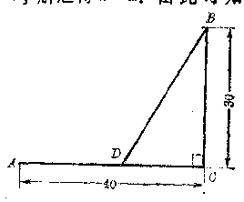

*图2·22*

费是公路运费的一半，应该从 B 点怎样筑一条公路到河 岸，才能使由 A 到 B 的运费最少？

**［解］** 图2.22里，AO表示河岸，BD表示求筑的公路，\( BC \perp AD \)。

设\(AD = x\)公里，那末\(DC = (40 - x)\)公里，

\[
B D = \sqrt{(40 - x)^{2} + 30^{2}} \text{ 公里 },
\]

因为公路每公里的运费相当于水路每公里运费的2倍，所以总的运费是水路每公里运费的\( \left[x+2\sqrt{(40-x)^2+30^2}\right] \)倍。

设\(y = x + 2\sqrt{(40 - x)^2 + 30^2},\)（1） 现在要求使 y 的值是最小的 x 的值。

由（1），得

\[
y - x = 2 \sqrt{(40 - x)^{2} + 30^{2}},
\]

两边分别平方，整理后得

\[
3 x^{2} - 2 (160 - y) x + (10000 - y^{2}) = 0. \tag {2}
\]

解（2），得

\[
x = \frac{160 - y \pm \sqrt{(160 - y)^{2} - 3 (10000 - y^{2})}}{3}. \tag {3}
\]

因为\(x\)必须是实数，所以

\[
(160 - y)^{2} - 3 (10000 - y^{2}) \geqslant 0,
\]

就是

\[
y^{2} - 80 y - 1100 \geqslant 0. \tag {4}
\]

因为\(y\)必须是正数，解（4）得

\[
y\geqslant40+30\sqrt3.
\]

由此可知\(y\)的最小值是

\[
y = 40 + 30 \sqrt{3}.
\]

代入（3），得

\[
x = \frac{1}{3} [ 160 - (40 + 30 \sqrt{3}) ] = 40 - 10 \sqrt{3} \approx 23.
\]

**答：** 应该在 AC 间取离 A 约 23 公里的一点 D 筑公路 BD，才能使 A 到 B 的运费最少。

#### 习题2·13

1. 当\(x\)取什么值时，下列各式有最小值或最大值，并求出这个最小值或最大值：

（1）\(x + x + \frac{b}{x}\)\((b > 0, x > 0)\)；

（2）\(\frac{x^4 - x^2 + 4}{x^2}\)；

（3）\((x - b)(c - ax)\left(\frac{b}{a} < x < \frac{c}{a}\right)\)；

（4）\((\sqrt{x + 1} - 2)(6 - \sqrt{x + 1})(3 < x < 35)\)。

2. （1） 已知\(x > 0\)，求证\(x^2 + 2x + \frac{4}{x^2}\)的值不小于 6；

（2） 6 是不是\(x^{2} + 2x + \frac{4}{x^{2}} (x > 0)\)的最小值？为什么？

3. 当\(x\)取什么值时，下列各分式有最小值或最大值，并求出它的最小值或最大值：

（1）\(\frac{x^2 - x + 1}{x^2 + x + 1}\)；

（2）\(\frac{3x}{x^2 + 2x + 1}\)。

4. 分 20 为两个正数，使他们的平方和为最小。

5. 下水道的截面是一个矩形上面加一个半圆，周界都用砖砌成，当 截面积 S 一定时，矩形的底边和高应该设计成怎样的比例，才能使所用的材料为最省？

［提示：设矩形的底边为\(x\)高为\(y\)，在

\[
S = x y + \frac{\pi}{4}x^2
\]

为定值的条件下，求\(x\)和\(y\)成怎样的比例时，周长最小.］

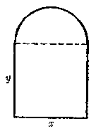

*（第5题）*

6. 建造一面靠墙的长方形小屋一间，面积为24 平方米，房屋的正面用木板修建，平均每米造价为 4a 元，房屋的两个侧面用土墙，平均每米造价为 3a 元，问这房屋应怎样设计，才能使造价最省？造价最省要多少？

### § 2·14 含有绝对值的不等式

在代数第二册里，我们曾经学过可以化为一元一次不等式来解的某些简单的含有绝对值的不等式的解法，并且知道：

\( |x|>a\quad(a>0) \)的解集是\( \{x|x<-a\text{ 或 }x>a\} \)。（I） \( |x|<a\quad(a>0) \)的解集是\( \{x|-a<x<a\} \)。（II） 在数轴上表示如图 2.23 所示。

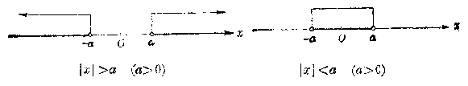

*图2·23*

关于含有绝对值的不等式的问题，也有两类，一类是解不等式，另一类是证明它是绝对不等式.下面我们分别来讨论这两类问题。

#### 1. 含有绝对值的不等式的解法

解在绝对值符号内含有未知数的不等式，关键就在于去掉绝对值的符号，把它转化成一个普通的不等式。主要的依据是绝对值的意义：

\[
| \alpha | = \left\{ \begin{array}{ll} \alpha, & \text{如果} \quad \alpha > 0, \\ 0, & \text{如果} \quad \alpha = 0, \\ - \alpha, & \text{如果} \quad \alpha < 0. \end{array} \right.
\]

如果给定的这个不等式里，只有一个绝对值符号内含有未知数，那末这类问题，就可以直接应用上面（I）和（II）这两个基本不等式来解。

##### 例1

解不等式

（1）\(|3x - 1| < x + 2\)；（2）\(|3x - 1| > 2 - x\)。

**［解］** （1） 根据绝对值的意义，得

\[
- (x + 2) < 3 x - 1 < x + 2,
\]

就是\( \left\{\begin{aligned}&3x-1>-(x+2),\\ &3x-1<x+2.\end{aligned}\right. \) 也就是\(\left\{ \begin{array}{l} 4x > -1, \\ 2x < 3. \end{array} \right.\) 解这个不等式组即得原不等式的解集是

\[
- \frac{1}{4} < x < \frac{3}{2}.
\]

（2） 根据绝对值的意义，得

\[
3 x - 1 > 2 - x, \quad \text{ 解之得 } \quad x > \frac{3}{4},
\]

或\(3x - 1 < -(2 - x)\)，解之得\(x < -\frac{1}{2}\)。

所以原不等式的解集是

\[
x < - \frac{1}{2} \quad \text{或} \quad x > \frac{3}{4}.
\]

**注** 从上面的例子，可以看到利用基本不等式\(|x| < a\)。导出的是一个关于\(x\)的不等式组，所求的解集应是这个不等式组里两个不等式的解集的交集 ［例如在 （1） 中，所求的解集是

\[
\left\{x\mid x>-\frac14\right\} \cap \left\{x\mid x<\frac32\right\} = \left\{x \mid - \frac{1}{4} < x < \frac{3}{2} \right\};
\]

而从\(|x| > a\)导出的则是两个独立的不等式，所求的解集应是这两个不等式的解集的并集［例如在（2）中，所求的解集是

\[
\left\{x \mid x > \frac{3}{4} \right\} \cup \left\{x \mid x < - \frac{1}{2} \right\} = \left\{x \mid x < - \frac{1}{2} \text{或} x > \frac{3}{4} \right\}.
\]

这一点，在解题时必须充分予以注意。

##### 例2

解不等式\( \left|x^{2}-2x-4\right|<1 \)。

**［解］** 原不等式可以变形成\( -1 < x^{2} - 2x - 4 < 1 \)，也就是不等式组

\[
\left\{ \begin{array}{l} x^{2} - 2 x - 4 > - 1, \\ x^{2} - 2 x - 4 < 1. \end{array} \right.
\]

即

\[
\left\{ \begin{array}{l} x^{2} - 2 x - 3 > 0, \\ x^{2} - 2 x - 5 < 0. \end{array} \right. \tag {1}
\]

解不等式（1）得 \(x < -1\)或\(x > 3\)。

解不等式（2）得

\[
1 - \sqrt{6} < x < 1 + \sqrt{6}.
\]

由图 2.24 可以看出它们的公共部分是

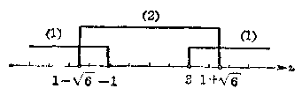

*图2·24*

\[
1 - \sqrt{6} < x < - 1, \quad 3 < x < 1 + \sqrt{6}.
\]

所以原不等式的解集是两个区间

\[
(1 - \sqrt{6}, - 1) \cup (3, 1 + \sqrt{6}).
\]

##### 例3

解不等式\(|\sqrt{3x - 2} - 3| > 1.\) **［解］** 原不等式可以变形成两个独立的不等式：

\[
\sqrt{3 x - 2} - 3 < - 1, \tag {1}
\]

\[
\sqrt{3 x - 2} - 3 > 1. \tag {2}
\]

由（1）\(\sqrt{3x - 2} < 2 \Rightarrow \left\{ \begin{array}{l} 3x - 2 \geqslant 0 \\ 3x - 2 < 4 \end{array} \right. \Rightarrow \frac{2}{3} \leqslant x < 2.\) 由（2）\(\sqrt{3x - 2} >4\Rightarrow \left\{ \begin{array}{ll}3x - 2\geqslant 0\\ 3x - 2 > 16 \end{array} \right.\Rightarrow x > 6.\) 因为能使不等式（1）或（2）成立的\(x\)的值，也都能使原不等式成立，所以原不等式的解集是两个区间

\[
\left[ \frac{2}{3}, 2\right) \cup (6, + \infty).
\]

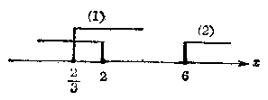

*图2·25*

**注**

在解题时，只要说理清楚，可以选用不同的叙述方法。以上两例，都用区间符号来表示不等式的解集，这种表示方法，今后常要应用，也应熟悉。

从上面所举的这些例子，可以看到解绝对值符号内含有未知数的不等式，关键就在于利用绝对值的意义设法去掉绝对值符号，把它转化成一个普通不等式或不等式组。掌握了这一点，我们也就不难解其它一些比较复杂的含有绝对值的不等式。

##### 例4

解不等式：\(|2x + 1| + |3x - 2|\geqslant 5.\)［审题］ 根据绝对值的意义，有

\[
\left| 2 x + 1 \right| = \left\{ \begin{array}{ll} 2 x + 1, & \text{如果} x \geqslant - \frac{1}{2}, \\ - (2 x + 1), & \text{如果} x \leqslant - \frac{1}{2}; \end{array} \right.
\]

\[
\left| 3 x - 2 \right| = \left\{ \begin{array}{ll} 3 x - 2, & \text{如果} x \geqslant \frac{2}{3}, \\ - (3 x - 2), & \text{如果} x \leqslant \frac{2}{3}. \end{array} \right.
\]

为了去掉绝对值符号，应该把实数集分成三个区间，即

\[
x \leqslant - \frac{1}{2}, - \frac{1}{2} \leqslant x \leqslant \frac{2}{3}, x \geqslant \frac{2}{3}.
\]

然后分别处理，**［解］** 原不等式可以转化为三个不等式组：

（1）\(\left\{ \begin{array}{l} x \leqslant -\frac{1}{2}, \\ -(2x + 1) - (3x - 2) \geqslant 5; \end{array} \right.\)即\(\left\{ \begin{array}{l} x \leqslant -\frac{1}{2}, \\ -5x + 1 \geqslant 5; \end{array} \right.\)

（2）\(\left\{ \begin{array}{l} -\frac{1}{2} \leqslant x \leqslant \frac{2}{3}, \\ (2x + 1) - (3x - 2) \geqslant 5; \end{array} \right.\)即\(\left\{ \begin{array}{l} x \geqslant -\frac{1}{2}, \\ x \leqslant \frac{2}{3}, \\ -x + 3 \geqslant 5; \end{array} \right.\)

\[
\left\{ \begin{array}{ll} {x\geqslant\frac{2}{3},} \\ {(2 x + 1) + (3 x - 2) \geqslant 5;} \end{array} \right. \quad \text{即} \left\{ \begin{array}{ll} {x \geqslant \frac{2}{3},} \\ {5 x - 1 \geqslant 5.} \end{array} \right. \tag {3}
\]

解不等式组（1）得

\[
x \leqslant - \frac{4}{5};
\]

不等式组（2）无解；解不等式组（3）得

\[
x \geqslant \frac{6}{5}.
\]

原不等式的解集应是列出的各个不等式组的解集的并集，所以原不等式的解集是

\[
\left(- \infty, - \frac{4}{5} \right] \cup \left[ \frac{6}{5}, + \infty\right).
\]

**注** 划分区间时，交界处的一点可以划入相邻的任一区间，也可以同时划入相邻的两个区间。

1. 解下列不等式：

（1）\(2 \mid 2x - 1 \mid > 1\)；

（2）\(4|1 - 3x| - 1 \leqslant 0\)；

（3）\( \left|\frac{1}{x}\right|<\frac{4}{5}; \)

（4）\( \left|\frac{2}{x}\right|>\frac{1}{2}. \)

2. 解下列不等式：

（1）\(\left|\frac{x + 2}{x - 1}\right| > 1;\)

（2）\( |x^{2}-1|>\alpha+2. \)

3. 求能使下列不等式成立的最小正整数\(n\)：

（1）\(\left|\frac{3n}{n + 1} - 3\right| < \frac{1}{100}\)；

（2）\(\left|\frac{3n^2}{3n^2 + 1} - \frac{2}{3}\right| < \frac{1}{1000}\)。

4. 解下列不等式：

（1）\( |2x-5|-|4x+7|\geq0; \)

（2）\( |x-2|-|x+1|+3>0. \)

#### 2. 含有绝对值的不等式的证明

证明一个含有绝对值的不等式是绝对不等式，除掉要应用一般不等式的那些性质以外，经常还要用到关于绝对值的和、差、积、商的性质：

**性质 1** \( \left|a\right|+\left|b\right|\geqslant\left|a+b\right| \)。

**性质 2** \( \left|a\right|-\left|b\right|\leqslant\left|a+b\right| \)。

**性质 3** \( \left|a\right|\cdot\left|b\right|=\left|a\cdot b\right| \)。

**性质 4** \( \frac{|a|}{|b|}=\left|\frac{a}{b}\right| \)\( (b\neq0) \)。

绝对值的和、差、积、商的性质 在这些性质中，绝对值的积、商的性质，都可以从正、负数和零的乘法、除法法则直接推出；而差的性质也可以利用绝对值的和的性质来导出。所以主要就是要证明上面提出的性质 1 （绝对值的和的性质） 对于任意实数都成立。下面我们就利用正、负数和零的加法法则来证明这一性质。

**［证明］**  根据加法的法则：

（1） 如果\(a, b\)都是正数，或者都是负数，那末它们的和的绝对值就等于它们的绝对值的和，所以

\[
\vert a + b \vert = \vert a \vert + \vert b \vert.
\]

也就是\(|a| + |b| = |a + b|\)。

（2） 如果\(a\)和\(b\)中一个是正数，另一个是负数，那末它们的和的绝对值就等于绝对值较大的数的绝对值减去绝对值较小的数的绝对值，所以一定小于它们的绝对值的和，就是

\[
\left| a + b \right| < \left| a \right| + \left| b \right|,
\]

也就是\(|a| + |b| > |a + b|\)。

（3） 如果\(a\)和\(b\)中有一个是零，或者两个都是零，这时很明显地有

\[
\left| a + b \right| = \left| a \right| + \left| b \right|.
\]

就是\(|a| + |b| = |a + b|\)。

综合上面这三种情况，就得到

\[
\left| a \right| + \left| b \right| \geqslant \left| a + b \right|. \quad (\text{证毕})
\]

根据性质1，有

\[
\left| a + b \right| + \left| - b \right| \geqslant \left| a + b - b \right|,
\]

就是\(|a + b| + |b| \geqslant |a|\)。

\[
\therefore \quad | a | - | b | \leqslant | a + b |.
\]

这样也就证明了性质2成立。

##### 例6

求证：

\[
\left| a \right| - \left| b \right| \leqslant \left| a - b \right| \leqslant \left| a \right| + \left| b \right|.
\]

**［证明］** 先证：\( |a-b|\leqslant|a|+|b| \)。

根据性质1，

\[
\left| a \right| + \left| - b \right| \geqslant \left| a + (- b) \right|.
\]

但是\( |-b|=|b| \)，所以\( |a|+|b|\geqslant|a-b| \)，就是\(|a - b|\leqslant |a| + |b|\)（1） 其次，证明\(|a| - |b| \leqslant |a - b|\)。

根据性质2，

\[
\vert a \vert + - \vert b \vert \leqslant \vert a + (- b) \vert,
\]

所以

\[
| a | - | b | \leqslant | a - b |. \tag {2}
\]

把不等式（1）和（2）串联起来就得到

\[
\vert a \vert - \vert b \vert \leqslant \vert a - b \vert \leqslant \vert a \vert + \vert b \vert.
\]

##### 例6

已知\(|x - a| < \frac{c}{2}, |y - b| < \frac{c}{2}\)。

求证\(|(x + y) - (a + b)| < c.\) **［证明］** 

\[
\left| (x + y) - (a + b) \right| = \left| (x - a) + (y - b) \right|
\]

\[
\leqslant | x - a | + | y - b |. \tag {1}
\]

\[
\because \quad | x - a | < \frac{c}{2}, \quad | y - b | < \frac{c}{2},
\]

\[
\therefore \quad | x - a | + | y - b | < \frac{c}{2} + \frac{c}{2}.
\]

就是

\[
\left| x - a \right| + \left| y - b \right| < c. \tag {2}
\]

从（1）和（2），根据不等的传递性，得

\[
\mid (x + y) - (a + b) \mid < c.
\]

**注** 简单地叙述，可以写成：

\[
\begin{array}{l} \left| (x + y) - (a + b) \right| = \left| (x - a) + (y - b) \right| \leqslant | x - a | + | y - b | \\ < \frac{c}{2} + \frac{c}{2} = c, \\ \therefore \quad | (x + y) - (a + b) | < c. \\ \end{array}
\]

**［注意］** 应用这种写法，在推导过程中，只能应用同一方向的不等号。否则就不能判断第一个式子和最后一个式子间的关系。

##### 例7

已知\(|x| < \frac{a}{4}, |y| < \frac{a}{6}\)，求证：

\[
\left| 2 x - 3 y \right| < a.
\]

**［证明］** 

\[
\left| 2 x - 3 y \right| \leqslant \left| 2 x \right| + \left| 3 y \right| = \left| 2 \right| \cdot \left| x \right| + \left| 3 \right| \cdot \left| y \right|
\]

\[
= 2 | x | + 3 | y | < 2 \cdot \frac{a}{4} + 3 \cdot \frac{a}{6} = \frac{a}{2} + \frac{a}{2} = a.
\]

\[
\therefore \quad |2x-3y| < a.
\]

##### \*例8

求证\(\frac{|a + b|}{1 + |a + b|} \leqslant \frac{|a|}{1 + |a|} + \frac{|b|}{1 + |b|}\)。

**［审题］** 这个不等式不容易直接证得。如果能够找到一个容易与\(\frac{|a + b|}{1 + |a + b|}\)和\(\frac{|a|}{1 + |a|} + \frac{|b|}{1 + |b|}\)比较值的大小的式子，证明它一方面不小于\(\frac{|a + b|}{1 + |a + b|}\)，另一方面又不大于\(\frac{|a|}{1 + |a|} + \frac{|b|}{1 + |b|}\)，那末就可以根据不等的传递性证明原不等式成立。

很明显的

\[
\begin{array}{l} \frac{| a | + | b |}{1 + | a | + | b |} = \frac{| a |}{1 + | a | + | b |} + \frac{| b |}{1 + | a | + | b |} \\ \leqslant \frac{| a |}{1 + | a |} + \frac{| b |}{1 + | b |}. \\ \end{array}
\]

所以下一步，只需再证明

\[
\frac{| a + b |}{1 + | a + b |} \leqslant \frac{| a | + | b |}{1 + | a | + | b |}
\]

能够成立，问题就得到解决。

**［证明］** 

\[
\because \quad | a + b | \leqslant | a | + | b |, \tag {1}
\]

两边加上\( |a+b|(|a|+|b|) \)，得\(|a + b| + |a + b|(|a| + |b|)\)

\[
\leqslant |a|+|b|+|a+b| (| a | + | b |),
\]

即

\[
\left| a + b \right| \left(1 + | a | + | b |\right) \leqslant \left(\left| a \right| + \left| b \right|\right) \left(1 + \left| a + b \right|\right). \tag {2}
\]

\[
\because \quad 1 + | a | + | b | > 0, \quad 1+|a+b|>0,
\]

两边除以\((1 + |a| + |b|)(1 + |a + b|)\)，得

\[
\frac{| a + b |}{1 + | a + b |} \leqslant \frac{| a | + | b |}{1+|a|+|b|}. \tag {3}
\]

但是

\[
\frac{|a|+|b|}{1+|a|+|b|} \leqslant \frac{| a |}{1 + | a |} + \frac{| b |}{1 + | b |}, \tag {4}
\]

由（3）和（4），根据不等的传递性，即得

\[
\frac{| a + b |}{1 + | a + b |} \leqslant \frac{| a |}{1 + | a |} + \frac{| b |}{1 + | b |}. \tag {证毕}
\]

**注** 本题的证明，关键在于找出这个中间式子\( \frac{|a|+|b|}{1+|a|+|b|} \)。这种证法，可以称为插入法。

1. 已知\(|A - a| < \frac{c}{2}\)，\(|B - b| < \frac{c}{2}\)，求证：

\[
| (A-B)-(a-b) |<c.
\]

2. 已知\(|A - x| < \frac{d}{3}\)，\(|B - b| < \frac{d}{3}\)，\(|C - c| < \frac{d}{3}\)，求证：

（1）\( |(A+B+C)-(a+b+c)|<a; \)

（2）\( |(A+B-C)-(a+b-c)|<d. \)

3. 已知\(|x| < \sqrt{a}, |y| < \sqrt{a}\)，求证

\[
\vert a y \vert < a.
\]

4. 已知\(|x| < c\bar{b}, |y| > c > 0\)，求证

\[
\left| \frac{x}{y} \right| < b.
\]

5. 已知\(|a| < 1, |b| < 1\)，求证

\[
\left| \frac{a + b}{1 - a b} \right| < 1,
\]

### 本章提要

#### 1. 等式和不等式

| 名称 | 等式 | 不等式 |
| --- | --- | --- |
| 定义 | 用等号“=”把两个代数式连接起来所构成的式子叫做等式。 | 用不等号“>”或“<”把两个代数式连接起来所构成的式子叫做不等式。 |
| 性 | （1）如果a=b，那末\( b = c \)。（2）如果a=b，b=c，那么\( a = c \)。（3）如果a=b，那末\( a + c = b + c \)。（4）如果a=b，那么\( ac = bc \)。（5）如果a=b，c=d，那末\( c + c = b + d \)。（6）如果a=b，c=d，那末\( a - c = b - d \)。 | （1）如果a>b，那末\( b < a \)。（2）如果a>b，b>c，那末\( a >c \)。（3）如果a>b，那末\( a + c >b + c \)。（4）如果a>b，那末\( a >c \)（c>0）；\( c = b \)（c>0）；\( c < b \)（c<0）。（5）如果a>b，c>d，那末\( a + c >b + d \)。（6）如果a>b，c<d，那末\( a - c >b - d \)。 |

（续表）

| 名称 | 等 | 不等式 |
| --- | --- | --- |
| 性 | （7） 如果a=b，c=d，那末a=bd.（8） 如果a=b+0，那末\( \frac{1}{a}-\frac{1}{b} \).（9） 如果a-b，c-d≠0，那末\( \frac{a}{c}=\frac{b}{d} \).（10） 如果a=b，n为自然数，那末\( a^n=b^n \).（11） 如果a=b，a，b都是正数，那么大于1的整数，那末\( \sqrt[n]{a}=\sqrt[n]{b} \)。 | （7） 如果a>b，c>d，a，b，c，d都是正数，那末\( ac>bd \).（8） 如果a>b，a，b都是正数，那末\( \frac{1}{a}<\frac{1}{b} \).（9） 如果a>b，a<d，a，b，c，d都是正数，那末\( \frac{a}{c}>\frac{b}{d} \).（10） 如果a>b，a，b都是正数，n为自然数，那末\( a^n>b^n \).（11） 如果a>b，a，b都是正数，n为大于1的整数，那末\( \sqrt[n]{a}>\sqrt[n]{b} \)。 |
| 质 | （1） 如果a=b，a，b都是正数，n为大于1的整数，那末\( \sqrt[n]{a}=\sqrt[n]{b} \)。 | （1） 如果a>b，a，b都是正数，n为大于1的整数，那末\( \sqrt[n]{a}>\sqrt[n]{b}. \) |

*用符号“≤”或“≥”把两个代数式连接起来所构成的式子，也称不等式。这种不等式具有等式和不等式所共同具有的性质。

#### 2. 不等式的证明

（1） 应用比较法则

\[
a - b \left\{ \begin{array}{ll} > 0, \\ - 0, \\ < 0; \end{array} \right. \Leftrightarrow a \left\{ \begin{array}{ll} > b, \\ - b, \\ < b. \end{array} \right.
\]

（2） 应用不等式的性质。

（3） 应用一些已知的重要不等式，如：

（i）\(a^2 \geqslant 0\)，

（ii）\((a - b)^{3} \geqslant 0,\)

（iii）\(a^2 + b^2 \geqslant 2ab,\)

（iv）\(a + b \geqslant 2\sqrt{ab}\)（\(a, b\)为正数），

（v）\(\frac{b}{a} + \frac{a}{b} \geqslant 2 (a, b\)同号），

（v）\(a + b + c \geqslant 3\sqrt[3]{abc}\)（\(a, b, c\)为正数）。

（4） 应用绝对值的性质：

（i）\( \because a + |b| \geqslant |a + b| \)，

（ii）\(|\alpha| - |b| \leqslant |a + b|\)，

（iii）\(|\alpha| \cdot |b| = |ab|\)，

（iv）\(\frac{|a|}{|b|} = \left|\frac{a}{b}\right|\)（\(b \neq 0\)）。

#### 3. 一元不等式（不等式组）的解法

（1） 一元一次不等式应用不等式的基本性质，变形成与之同解的一元一次不等式。

\[
a x > b \quad (a \neq 0).
\]

\(1^{\circ}\)如果\(a > 0\)，解集是\(\left\{x\mid x > \frac{b}{a}\right\}\)，即区间\(\left(\frac{b}{a}, + \infty\right)\) 2° 如果\(a < 0\)，解集是\(\left\{x \mid x < \frac{b}{a}\right\}\)，即区间\(\left(-\infty, \frac{b}{a}\right)\)。

*在一般情况下，只需求出解的限制条件\(x > \frac{b}{a}\)（或者\(a < \frac{b}{a}\)），即作为问题的答案。

（2） 一元一次不等式组只需求出不等式组中各个不等式的解集的交集。

一元一次不等式组的解集的几种基本情况\( (a<\beta) \)：

| 类型 | \( \begin{cases} x > \alpha \\ x > \beta \end{cases} \) | \( \begin{cases} x < \alpha \\ x < \beta \end{cases} \) | \( \begin{cases} x > \alpha \\ x < \beta \end{cases} \) | \( \begin{cases} x < \alpha \\ x > \beta \end{cases} \) |
| --- | --- | --- | --- | --- |
| 解集 | \( \{x'x > \beta\} \) | \( \{x: x < \alpha\} \) | \( \{x \| \alpha < x < \beta\} \) | \( \phi \) |

（3） 一元二次不等式

\(1^{\circ}\)一元二次不等式\((x - a)(x - \beta) > 0\)或\((x - a) \times (x - \beta) < 0\)的解法

| 类型 | \( (x-\alpha)(x-\beta)>0 \quad (\alpha<\beta) \) | \( (x-\alpha)(x-\beta)<0 \quad (\alpha<\beta) \) |
| --- | --- | --- |
| 归结成不等式组 | \( \left\{\begin{aligned}x-\alpha>0\\ x-\beta>0\end{aligned}\right. \)和\( \left\{\begin{aligned}x-\alpha<0\\ x-\beta<0\end{aligned}\right. \) | \( \left\{\begin{aligned}x-\alpha>0\\ x-\beta<0\end{aligned}\right. \)和\( \left\{\begin{aligned}x-\alpha<0\\ x-\beta>0\end{aligned}\right. \) |
| 解集 | \( \{x,x<\alpha \text{ 或 }x>\beta\} \) | \( \{x,x<\alpha<\beta\} \) |

\(2^{\circ}\)一般一元二次不等式的解法可以利用一元二次方程的根的判别式和求根公式。

| 判别式\( \Delta = b^{2} - 4ac \) | 一元二次方程\( ax^{2} + bx + c = 0 \)（a≠0）的根 | 一元二次不等式\( ax^{2} + bx + c > 0 \)（a>0）的解集 | 一元二次不等式\( ax^{2} + bx + c < 0 \)（a>0）的解集 |
| --- | --- | --- | --- |
| \( \Delta > 0 \) | \( x_{1} = \frac{-b - \sqrt{\Delta}}{2a} \)\( x_{2} = \frac{-b + \sqrt{\Delta}}{2a} \) | \( \{x \mid x < x_{1} \text{ 或 } x > x_{1}\} \) | \( \{x \mid x_{1} < x < x_{2}\} \) |
| \( \Delta = 0 \) | \( x_{1} = x_{2} = -\frac{b}{2a} \) | \( \{x \mid x \neq -\frac{b}{2a}\} \) | \( \emptyset \) |
| \( \Delta < 0 \) | 没有实根 | 实数集\( R \) | \( \emptyset \) |

（4） 一元高次不等式一般可利用列表法来解。

（5） 一元分式不等式可以转化为一元不等式组来解，也可以转化为一元整式不等式来解。

| 类型 | \( \frac{P(x)}{Q(x)} > 0 \) | \( \frac{P(x)}{Q(x)} < 0 \) |
| --- | --- | --- |
| 归结成不等式组 | \( \left\{ \begin{array}{l} P(x) > 0 \\ Q(x) > 0 \end{array} \right. \)和\( \left\{ \begin{array}{l} P(x) < 0 \\ Q(x) < 0 \end{array} \right. \) | \( \left\{ \begin{array}{l} P(x) > 0 \\ Q(x) < 0 \end{array} \right. \)和\( \left\{ \begin{array}{l} P(x) < 0 \\ Q(x)>0 \end{array} \right. \) |
| 归结成整式不等式 | \( P(x)Q(x) >0 \) | \( P(x)Q(x) < 0 \) |

表中\( P(x) \)，\( Q(x) \)分别表示 x 的某一多项式。

（6） 一元无理不等式一般可根据算术根的意义并应用不等式的性质 11，转化为一元整式不等式组来解。

几个简单无理不等式的解法

| 类型 | \( \sqrt{P(x)} >a \)（a>0） | \( \sqrt{P'(x)} >\sqrt{Q(x)} \) |
| --- | --- | --- |
| 归结成不等式组 | \( \begin{cases} P(x) \geq 0 \\ P(x) > a^2 \end{cases} \) | \( \begin{cases} P(x) \geq 0 \\ Q(x) \geq 0 \\ P(x) > Q(x) \end{cases} \) |

（7） 含有绝对值的不等式简单的问题可以直接根据绝对值的意义来解。

| 类型 | \( \|x\| > a \) | \( \|x\| < a \) | \( \|x - b\| > a \) | \( \|x - b\| < a \) |
| --- | --- | --- | --- | --- |
| 解 | \( a < 0 \) | \( a < -a \)或\( a > a \) | \( -a < c < a \) | \( a < b - a \)或\( a > b + a \) |
| 集 | \( a = 0 \) | \( \{x, x \neq 0\} \) | \( \emptyset \) | \( \{x \mid x \neq b\} \) |
| \( a < 0 \) | 实数集\( R \) | \( \emptyset \) | 实数集\( R \) |  |

不等式中含有二个或二个以上绝对值符号时，应把整个实数集划分成几个区间，然后分别去掉绝对值符号，归结为一元不等式组来解。

#### 4. 代数式的最大值和最小值的求法

（1） 利用几个正数的算术平均数不小于它们的几何平均数的性质。

\[
\frac{a_{1} + a_{2} + \cdots + a_{n}}{n} \geqslant \sqrt[n]{a_{1} a_{2} \cdots a_{n}} \quad (n \geqslant 2).
\]

\(1^{\circ}\)如果积\(a_{1}a_{2}\cdots a_{n}=P\)为定值，则当\(a_{1}=a_{2}=\cdots=a_{n}\)时，和\(a_{1}+a_{2}+\cdots+a_{n}\)有最小值\(S=n\sqrt[n]{P}\)；

\(2^{\circ}\)如果和\(a_{1} + a_{2} + \dots + a_{n} = S\)为定值，则当\(a_{1} = a_{2} = \dots = a_{n}\)时，积\(a_{1}a_{2}\cdots a_{n}\)有最大值\(P = \left(\frac{S}{a}\right)^{n}\)。

（2） 利用实系数一元二次方程\(ax^2 + bx + c = 0, (a \neq 0)\)的判别式。

### 复习题二A

1. 回答下面的问题：

（1） 如果\(a < b, c < d\)，能不能断定：

（i）\(a + c < b + d;\)

（ii）\(a - c < b - d;\) （jit）\(a c < b d\)；

（iv）\(\frac{a}{c} < \frac{b}{d}\)；

（v）\(a^n < b^n\)（n 是自然数）；

（ⅰ）\(\sqrt[n]{a} < \sqrt[n]{b}\)（n 是大于 1 的整数）。

如果再加上一个条件\(a > 0, b > 0\)呢？

（2） 如果\(a < b < 0, c < d < 0\)；那末可以断定：

（i）\(a_{0}\)和\(b_{0}\)间有什么关系？（ii）\(\frac{a}{d}\)和\(\frac{b}{c}\)间有什么关系？

（iii）\(a^n\)和\(b^n\)间有什么关系（\(n\)是自然数）？

（iv）\(\sqrt[n]{|a|}\)和\(\sqrt[n]{b^n}\)间有什么关系 （\(n\)是大于 1 的整数）？

2. 比较下面各题中两个代数式的值的大小：

（1）\(x^{2}\)和\(x^{2} - x + 1\)；

（2）\(x^{2} + x + 1\)和\((x + 1)^{2}\)。

3. 已知\(a > b > 0\)，把下列各式依照从大到大的顺序用不等号“<”连接起来（要说明理由）：

\[
a, b, \frac{a + b}{2}, \sqrt{a b}, \sqrt{\frac{a^{2} + b^{2}}{2}}.
\]

4. 设\(a \neq b\)，求证：

（1）\(a^2 + 3b^2 > 2b(a \neq b)\)；

（2）\(a^4 + 6x^2b^2 + b^4 > 4ab(a^3 + b^3)\)。

5. 设\(a, b, c\)是互不相等的正数，求证：

（1）\((ab + bc + ca)\left(\frac{1}{ab} + \frac{1}{bc} + \frac{1}{ca}\right) > 9;\)

（2）\((ab + a + b + 1)(ab + ac + bc + c^2) > 16abc,\)

6. 已知\(a > b > 0\)，求证：

（1）\(\sqrt{a} - \sqrt{b} < \sqrt{a - b}\)；

（2）\(\sqrt[3]{a} - \sqrt[3]{b} < \sqrt[3]{a - b}\)。

7. 解下列关于\(x\)的不等式：

（1）\(\frac{x}{a} - b > \frac{x}{b} - a\)（\(a > 0, b > 0\)）；

（2）\(\frac{a + x}{b} < \frac{x - b}{a} + 2\)（\(\alpha, b\)同号）。

8. 解下列各不等式组：

（1）\(\left\{ \begin{array}{l} (x - 3)(x - 4) < (x + 1)(x + 2), \\ x(x + 1) + x(x + 2) > (2x - 1)(x + 3); \end{array} \right.\)

（2）\(\left\{ \begin{array}{l} \frac{5 + x}{1} \geqslant 1 - \frac{9 - x}{14}, \\ 12 - \frac{1}{3} (47 - \frac{60}{x}) \geqslant 3. \end{array} \right.\)

9. 解下列各不等式：

（1）\((x - 3)(x - 7) < 5(x - 3)\)；（2）\(x^{2} - 5x > 3x + 4\)；

（3）\((2x - \sqrt{2})(2x + \sqrt{2}) > 1;\)

（4）\((x - \sqrt{2})^2 < 1\)；

（5）\((x - 1)^{2} > (x + 1)^{3}\)；

（i）\((1 + \sqrt{2} x)(1 - \sqrt{2} x) > 4x,\)

10. 解下列各不等式：

（1）\(\frac{x + 1}{x + 1} > 1;\)

（2）\(\frac{y + 1}{y^2 + 4} > 0;\)

（3）\(\frac{x - \sqrt{3}}{x + \sqrt{2}} < 0;\)

（4）\(\frac{y^2 + 4}{y - 2} < y^2 + 4.\)

11. 解下列各不等式：

（1）\((x - \sqrt{2})(x - \sqrt{3})(x - \sqrt{5}) > 0;\)

（2）\((2x + 1)(3x + 1)(4x + 1) < 0.\)

12. 解下列各不等式：

（1）\(\frac{(3x + 2)(2x + 3)}{(3x - 2)(2x - 3)} > 0;\)

（2）\(\frac{x + 1}{x - 1} < \frac{x - 5}{x - 3}\)。

13. 解下列各不等式组：

（1）\(\left\{ \begin{array}{l} (x - 2)(x + 3) > 0, \\ (x + 2)(x - 3) < 0; \end{array} \right.\)

（2）\(\left\{ \begin{array}{l} (x + 2)^2 > 1, \\ (x - 2)^2 < 1. \end{array} \right.\)

14. 解下列各不等式：

（1）\(\sqrt{3x + 5} + \sqrt{5x - 3} + 3 < 0\)；

（2）\(\sqrt{3x + 5} < \sqrt{5x - 3}\)。

15. 已知\(n\)为自然数，解不等式：

（1）\(\left|\frac{2n^2}{5n^2 + 1} - \frac{2}{5}\right| < \frac{1}{1000}\)；

（2）\(\left|\frac{3n}{2n + 1} -\frac{3}{2}\right| < \frac{1}{100}\)

16. 解下列不等式：

（1）\(\left|1 - \frac{1}{x}\right| \geqslant 2;\)

（2）\(\left|\frac{1}{x - 1} - \frac{1}{x + 1}\right| \leqslant 2.\)

17. （1） 一个两位数，它的十位上的数比个位上的数小2。已知它大于21而小于38，求这个数。

（2） 把一个两位数加上它的一半，所得到的数大于 128 而小于 130，求这个数。

18. 学生若干人，让若干间宿舍。如果每间住4个人，那末还余19人，如果每间住6个人，那末有一间宿舍不空也不满，求宿舍间数和学生人数。

19. m取什么值的时候，下列二次方程有两个不相等的实根：

（1）\((m - 1)a^{2} - 2(m + 1)x + m - 2 = 0;\) ［提示：注意条件\( m-1 \neq 0 \).］

（2）\((5m + 1)x^{2} + (7m + 3)x + 3m = 0.\)

20. 已知\(k\)是一个整数，问\(k\)取什么数值的时候，

（1） 方程组\( \left\{\begin{aligned}3x+7y&=k\\ 2x+5y&=20\end{aligned}\right. \)的解 x，y 都是正数；

（2） 方程组\( \left\{\begin{aligned}3x-6y&=1\\ 5x-ky&=2\end{aligned}\right. \)的解 x，y 都是负数。

### 复习题二B

1. 求下列各不等式的解集（答案用区间符号表示）：

（1）\((2x - 1)^{2} + (3x - 2)^{2} \leqslant (x - 2)(2x + 3) + (2x + 1)^{2}\)；

（2）\(\sqrt{7x - 13} - \sqrt{3x - 19} > \sqrt{5x - 27}\)；

（3）\(\frac{1}{x + 1} + \frac{2}{x + 3} - \frac{3}{x + 2} < 0;\)（4）\(\left|\frac{x + 2}{x - 1}\right| \geqslant 1.\)

2. 解下列不等式（答案只需写出 x 应满足的条件）：

（1）\(\frac{x^2 - 3x + 2}{x^2 - 5x - 6} > \frac{x^2 - 5x - 6}{x^2 - 3x + 2}\)；

（2）\((x + 1)(x + 3)(x + 5)(x + 7) + 15 > 0;\)

（3）\(\sqrt{x^2 - 3x + 2} = x > 3\)；

（4）\(|x + 1| + |x + 2| > |2x + 3|\)。

3. 解下列关于\(x\)的不等式（解答要进行讨论）：

（1）\(2x^{2} + (4k + 6)x + (2k^{2} + 3k + 9) < 0;\)

（2）\((a + 2)x^{2} + 2(a + 1)x + (a - 1) > 0.\)

4. 求下列各不等式组的整数解的集合：

（1）\(\left\{ \begin{array}{l} \frac{4}{x + 3} + \frac{2}{x - 3} < \frac{5x - 1}{x^2 - 9}, \\ \sqrt{3x - 9} - \sqrt{2} > 0; \end{array} \right.\)

（2）\(\left\{ \begin{array}{l} |x^2 - 1| < 3, \\ \frac{5x - 3}{4x + 7} \end{array} \right.\) 3，

5. 证明下列不等式：

（1）\((a^4 b^2 + b^2 c^2 + c^4 a^2)(a^2 b^4 + b^2 c^4 + c^2 a^4) > 9a^4 b^4 c^4;\)

（2）\(\left(\frac{b^2}{a} - \frac{a^2}{b}\right)\left(\frac{b}{a} + \frac{a}{b}\right)\left(\frac{1}{a} + \frac{1}{b}\right) > 8\) \( (a=0, b>0, \text{且 } a\neq b). \)

6. （1） 已知\(a^2 + b^2 = 1, x^2 + y^2 = 1\)，求证：\(|ax + by| \leqslant 1\)。

（2） 已知\(a_1, a_2, a_3, \cdots, a_n\)都是正数，且\(a_1 \cdot a_2 \cdot a_3 \cdots a_n = 1\)，求证\((1 + a_1)(1 + a_2)(1 + a_3) \cdots (1 + a_n) \geqslant 2^n\)。

7. 从火车上下来两个旅客，他们沿着同一方向走到同一地点。第一个旅客一半的时间以速度\(a\)来行走，另一半的时间以速度\(b\)来行走。第二个旅客一半的路程以速度\(a\)来行走，另一半的路程以速度\(b\)来行走\((a \neq b)\)，问哪一个旅客先到达终点。

8. 已知扇形的周长是\(40 \mathrm{~cm}\)，求这个扇形的最大面积。这时扇形的半径长多少？

9. 设\(\triangle ABC\)的三条边为\(a, b, a\)，求证

\[
a b - b c + a c \leqslant a^{2} + b^{2} + c^{2} < 2 (a b + b c + c a).
\]

［提示：不失一般性，可设\( a \geqslant b \geqslant c \)］。

10. 证明：

（1） 在给定周长为\(2p\)的三角形中，以等边三角形的面积为最大；

（2） 在给定面积为 S 的三角形中，以等边三角形的周长为最小；

（3） 如果三角形和正方形的面积相等，那末三角形的周长一定大于正方形的周长。

### 第二章测验题

1. 解下列不等式：

（1）\(30 - 11x - 2x^2 < 0\)；

（2）\(\frac{x^2 - 2x - 15}{x - 2} \geqslant 0;\)

（3）\(|2 - 3x| < \frac{1}{2}\)；

（4）\(|\sqrt{x - 3} - 2| > 1.\)

2. 已知\(a, b, c\)，都是实数，

（1） 求证：方程\( x^{2}-(a+b)x+ab-c^{2}=0 \)一定有实根；

（2） 求这一方程有等根的条件。

3. 求下列不等式或不等式组的正整数解：

（1）\(\frac{2x + 3}{2 - x} = 1.\)

（2）\(\left\{ \begin{array}{l} x^{2} - x - 6 \geqslant 0, \\ x^{2} - x - 42 < 0. \end{array} \right.\)

4. （1） 已知\(a > 1\)，求证：\(a^3 + 1 > a + \frac{1}{a}\)；

（2） 已知\(a, b, c, d\)都是正数，且有

\[
x = \sqrt{a^{2} + b^{2}}, y = \sqrt{c^{2} + d^{2}}
\]

求证：\(ay > \sqrt{(ac + bd)(ad + bc)}\)

6. 有两块布料，第一块的长度恰巧是第二块的\(\frac{1}{3}\)。如果每一块布料各剪去 8 尺，那末第二块的长度比第一块长度的 5 倍还要多一点。求这两块布料各长多少。

## 3. 函数的初步知识

函数是数学里一个重要的概念。应用数学知识来解决各种问题，经常要用到函数的知识.在本书里，我们将学习关于函数的一些基本知识。这一章先学习关于函数的一些初步知识，包括什么叫做函数。怎样确定一个函数；同时还将学习两种常见的最简单的函数——正比例函数和反比例函数的图象和性质。

### § 3·1 常量和变量

#### 1. 量和数

在日常的生活、生产以及科学技术的研究中，我们经常会遇到各种各样的量。例如：重量、时间、长度、面积、体积、温度、速度、产值等等都是量。

各种不同的量有着一个共同的性质，就是它们都可以用一个取定的同类的量作为度量单位来量它的大小。例如，重量可以取1克、1公斤、1吨等作为度量单位；长度可以取1厘米、1米等作为度量单位；时间可以取1秒、1分、1小时等作为度量单位。

表示一个量和度量单位的比的数目，叫做这个量的数值，或者叫做量数，它就是度量的结果。例如，用1厘米作为度量单位，量得一条线段的长度是5厘米，这里数5就是这条线段的长度这个量的数值。

#### 2. 常量和变量

我们所研究的量，虽然都可以用数来表达它，但是在问题的研究过程中，它们却可以有不同的性态。在问题的研究过程中，有的量始终保持着同一个数值，但是有的量却可以取某一范围里的不同的数值。

我们来看下面的一些例子：

（1） 铁的比重①是7.8克/厘米³，5立方厘米的铁重几克？10立方厘米呢？V立方厘米呢？

这个问题可以利用下面的公式来解：

物体的重量\(=\)单位体积的重量\(\times\)体积。

如果用字母 W 表示物体重量的克数，那末有5立方厘米的铁重是\(W = 7.8 \times 5 = 39\)（克），10立方厘米的铁重是\(W = 7.8\times 10 - 78\)（克），V 立方厘米的铁重是\( W = 7.8 \times V - 7.8V \)（克）。

这里我们可以看到，在问题的研究过程中，铁的比重是不变的，它只能取数值7.8，但是铁的体积和重量却是在变化着的，它们可以取正数集里某些不同的数值。

（2） 一列火车从甲站开往乙站。在离开甲站2公里后，用每分钟\(\frac{2}{3}\)公里的速度前进，那末从这时起经过1，2，\(\cdots\)，10分钟后火车离开甲站的距离是多少？

设从这时起，经过\(t\)分钟后，火车离开甲站的距离是\(s\)公里，那末有公式

\[
s = 2 + \frac{2}{3} t.
\]

这样就容易算出：

1分钟后，\(s = 2 + \frac{2}{3}\times 1 = 2\frac{2}{3}\)（公里）。

2分钟后，\(s = 2 + \frac{2}{3}\times 2 = 3\frac{1}{3}\)（公里）。

• • • • • • • • • • • • • • • • • • • • • • • • • • • • • • • • • • • • • 10分钟后，\(s = 2 + \frac{2}{3}\times 10 = 8\frac{2}{3}\)（公里）。

在这个问题里，火车行驶的速度\(\frac{2}{3}\)公里/分以及原来离开甲站的距离2公里这两个量是不变的，但是火车行驶的时间\(t\)分和最后离开甲站的距离\(s\)公里这两个量是在变化着的，\(t\)可以取集合\(\{1, 2, 3, \cdots, 10\}\)里的不同的数值，而\(s\)则可取正有理数集里的某些不同的数值。

为着区别这两种性态不同的量，我们把在问题的研究过程中，始终取同一个数值的量叫做常量，在问题的研究过程中，可以取不同数值的量叫做变量。

从上面的例子中可以看到，变量虽然在问题的研究过程中，可以取不同的数值，但是它可以取的数值，往往有着一定的范围，变量可以取的数值范围叫做这个变量的可取值范围，或者容许值范围。

例在下面的这些代数式中，字母\(x\)的可取值范围是什么？

（1）\(x^{2} - 1\)；

（2）\(\frac{1}{x^2 - 1}\)；

（3）\(\sqrt{x + 1}\)；

（4）\(\frac{1}{\sqrt{x + 1}}.\) **［解］** （1） 因为\(x\)不论取什么实数值，代数式\(x^{2} - 1\)都有意义，所以\(x\)可以取全体实数的值。

（2） 因为在分式中，分母的值不能是零，所以\(x^{2} - 1 \neq 0\)，就是\(x \neq \pm 1\)。这也就是说\(x\)可以取一切不等于\(\pm 1\)的实数。

（3） 因为在根式中，被开方数必须是正数或者零，所以

\[
x + 1 \geqslant 0, \quad \text{ 就是 } \quad x \geqslant - 1.
\]

这也就是说，x 可以取不小于 -1 的一切实数。

（4） 这里，分母的值必须是正数，所以\(\sqrt{a + 1} > 0\)，由此可知

\[
x + 1 > 0, \quad \text{ 就是 } \quad x > - 1.
\]

这也就是说，x 可以取大于 -1 的一切实数。

1. 举出常量和变量的一些实例。

2. 在下列这些公式中，哪些是常量？哪些是变量？

（1） 圆周长公式：

\[
C = 2 \pi r,
\]

其中 C 表示圆的周长，r 表示圆的半径。

（2） 球体积公式：

\[
V = \frac{4}{3} \pi r^{3},
\]

其中 V 表示球的体积，r 表示球的半径。

（3） 匀速运动公式：

\[
s = v t,
\]

其中 s 表示距离，v 表示速度，t 表示时间。

（i） 用来计算物体以同一速度运动，不同时间内所行的距离时；

（ii） 用来计算在同一时间内，按不同速度运动的距离时。

3. 下面这些代数式中，字母\(x\)的可取值范围各是什么？

（1）\(x^{6} + 2x^{5} + 3x + 4;\)

（2）\(\frac{x + 1}{x - 1}\)；

（3）\(\sqrt{1 - x^2}\)；

（4）\(\frac{x}{\sqrt{1 - x^2}}.\)

### § 3·2 函数

#### 1. 函数的意义

我们再来研究上节举过的那些例子。在例（1）里，两个 变量 W 和 V 之间存在着一定的关系，就是，当变量 V 在正数集里取定一个确定的值的时候（例如 5），按照计算物体重量的公式，变量 W 也随着在正数集里有一个确定的值和它对应（图 3·1）。

同样的，在例（2）中，当变量 t 在集合\( D = \{1, 2, 3, \cdots, 10\} \)里，取定一个确定的值的时候，按照匀速运动的距离计算公式变量 s 也随着在正数集里有一个确定的值和它对应（图 3·2）。

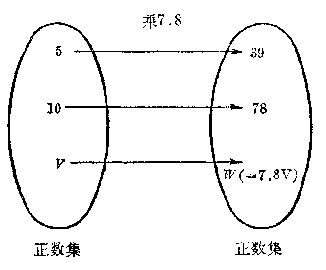

*图3·1*

在数学里，我们把两个变量同这种依从关系，叫做函数关系。

仔细观察这些例子，还可以看到，在同一个问题里的两个变量，在问题的研究过程中，所处的地位是不同的。例如在例（1）中，我们首先考虑的是变量\(V\)的变化，然后根据它所取的值来决定这时另一变量

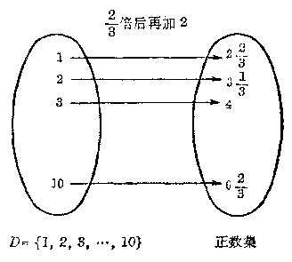

*图3·2*

W 的值；在例（2）中，我们首先考虑的是变量 t 的变化，然后根据它所取的值来决定这时另一个变量 s 的值。我们把问题研究过程中处在前一种地位的变量，叫做自变量，而把处在后一种地位的变量，叫做因变量，通常也说这一变量是前 一变量的函数。例如，在：

例（1）中，\(V\)是自变量，\(W\)是因变量。通常也说\(W\)是\(V\)的函数；

例（2）中，\(t\)是自变量，\(s\)是因变量。通常也说\(s\)是\(t\)的函数。

一般的，设在某一变化过程中有两个变量\(x\)和\(y\)，如果对于\(x\)在它可取值的范围里的每一个确定的值，按照某一对应法则，\(y\)都有唯一的值和它对应，那么就把\(x\)叫做自变量，\(y\)叫做因变量，通常也说\(y\)是\(x\)的函数。

例如，在等式\(y = x^2 - 1\)里，字母\(x\)和\(y\)表示两个变量，（这种字母，我们把它叫做变量字母），当\(x\)在实数集里取定任何一个值时，按照等号右边这个代数式所指出的计算法则 （平方后再减去 1），\(y\)也就有唯一确定的值和它对应，如下表：

| x | ..。 | -1 | \( -\frac{1}{2} \) | 0 | \( \frac{1}{2} \) | 1 | 2 | ..。 |
| --- | --- | --- | --- | --- | --- | --- | --- | --- |
| y | ..。 | 0 | \( -\frac{3}{4} \) | -1 | \( -\frac{3}{4} \) | 0 | 3 | ..。 |

所以这个等式也就确定了变量\(y\)和\(x\)间的一种函数关系。这里\(x\)是自变量，\(y\)是因变量。通常我们也把这个关系说成\(y\)是\(x\)的函数。

例已知在匀速运动中，物体经过的路程\(s\)（公里），速度\(v\)（公里/小时） 和时间\(t\)（小时） 之间有下面的关系：

\[
s = v t.
\]

（1） 如果速度不变，这个式子表示什么？哪一个字母表示自变量？哪一个字母表示因变量？

（2） 如果时间不变呢？

（3） 如果路程不变，怎样表示速度是时间的函数？怎样表示时间是速度的函数？式中的字母各表示哪一类量？

**［解］** （1） 表示路程\(s\)是时间\(t\)的函数，\(t\)是自变量，\(s\)是因变量。

（2） 表示路程 s 是速度 c 的函数，v 是自变量，s 是因变量。

（3） 速度是时间的函数，可以表示成

\[
v = \frac{s}{t},
\]

其中 t 表示自变量，v 表示因变量，s 表示常量。

时间是速度的函数，可以表示成

\[
t = \frac{s}{v},
\]

其中 v 表示自变量，t 表示因变量，s 表示常量。

1. 轮子每分钟旋转 60 转，写出轮子旋转的转数\(n\)和时间\(t\)之间的函数关系：

（1） 把时间 t 作为自变量；（2） 把转数 n 作为自变量。

2. 两个变量\(x\)和\(y\)是用下面的关系式联系起来的。试用\(x\)的代数式来表示\(y\)。在这些代数式中字母\(x\)可取值的范围有什么限制？

（1） 3x - 4y = 12；

（2）\(xy = 6;\)

（3）\( y - x^{3} = 0; \)

（4）\( y^{3}-x=0; \)

（5）\(x = \frac{y + 1}{y - 1};\)

（6）\((x + 2)(y - 3) = 6.\)

［解法举例：（1） 3x-4y=12，4y=3x-12.

\[
\therefore y = \frac{3 x - 12}{4}.
\]

x 的可取值范围是一切实数，即实数集 R.］

#### 2. 函数的符号

在研究两个变量\(y\)和\(x\)间的函数关系时，语句 “\(y\)是\(x\)的函数” 通常可以用式子

\[
y = f (x) \quad \text{或者} \quad y = F (x)
\]

等等来表示，这里字母\(f\)或者\(F\)等等叫做函数符号，它不代表任何数，而只代表把变量\(y\)和\(x\)联系起来的对应法则，也就是怎样根据自变量\(x\)的值来求出和它所对应的因变量\(y\)的值的法则。

例如，我们知道，圆的周长\(C\)，面积\(S\)和它的半径\(r\)之间有下面的关系：

\[
O = 2 \pi r, \quad S = \pi r^{3}.
\]

当半径\(r\)在正数集里取定任何一个值时，圆的周长\(C\)和面积\(S\)分别有唯一的值和它对应，所以圆的周长\(C\)、面积\(S\)都是圆的周长\(r\)的函数。说明这一事实，我们可以把它们分别表示成

\[
C = f (r), \quad S = F (r),
\]

这里\(f\)就表示“乘\(2\pi\)”这一对应法则，而\(F\)则表示“平方后再乘\(\pi\)”这一对应法则。

从上面的例子，可以看到式子\( y = f(x) \)只指出了\( y \)是\( x \)的函数这一事实，但是这两个变量究竟是怎样联系起来的，只从这个式子是看不出来的；另外，当我们同时研究几个函数时，如果变量间的对应法则不同，那末就要用不同的字母来表示对应法则。

过去我们在学习代数式时，就已知道代数式的值是由它所含字母的值确定的。代数式里字母的值，只要不使这个代数式失去意义，可以任意选取，当取定以后，通过计算就可以求出这个代数式的唯一的一个值和它对应。所以每一个含有字母的代数式都可以说成是它所含字母的函数，并用函数的符号把它表示出来。例如

\[
\frac{1}{x - 2} \text{ 是 } x \text{ 的函数, } \text{ 可以记作 } f (x) = \frac{1}{x - 2};
\]

\[
\sqrt{t^{2} - 1} \text{ 是 } t \text{ 的函数, } \text{ 可以记作 } g (t) = \sqrt{t^{2} - 1}.
\]

#### 3. 函数的定义域

在一个函数中，自变量虽然可以取各个不同的数值，但 是它可以取值的范围是有一定限制的。例如上面提到的这两个代数式所确定的函数，自变量就有不同的取值范围。

（1） 对于函数\( f(x) = \frac{1}{x - 2} \)来说，自变量\( x \)只能取一切不等于 2 的实数（当\( x = 2 \)时，分式\( \frac{1}{x - 2} \)没有意义）。

（2） 对于函数\( g(t) = \sqrt{t^2 - 1} \)来说，自变量\( t \)只能取一切绝对值不小于1的实数（当\( |t| < 1 \)时，根式\( \sqrt{t^2 - 1} \)没有意义）。

函数中自变量可取值的范围，则做函数的定义域。

一般来说，函数的定义域是由我们所研究的这个具体问题来确定的，在给出这个函数时，应该把函数的定义域指出。例如，在研究圆的面积\(s\)和它的半径\(r\)间的函数关系时，因为\(r\)只能取一切正数，所以这个函数应该表示成：

\[
s = \pi r^{2} (r > 0) \quad \text{或者} \quad s = \pi r^{2}, r \in (0, + \infty),
\]

这里\(r > 0\)或者\(r \in (0, +\infty)\)就表示了这一函数的定义域。

但是，在一般地研究一个由数学式子所表示的函数

\[
y = f (x)
\]

时，如果没有特别的声明，我们总认为函数的定义域就是使\(f(x)\)有意义的一切实数的全体，为了简便，就不一定要把它的定义域写出。

例求下列函数的定义域：

（1）\( y = x^{2} - 4x + 3; \)

（2）\( y = \frac{1}{x^2 - 4x + 3}; \)

（3）\( y = \sqrt{25 - x^2} \)。

**［解］** （1） 因为\(x\)不论取什么实数，\(x^2 - 4x + 3\)都有意义，所以这个函数的定义域是实数集\(R\)。

（2） 要使分式\(\frac{1}{x^2 - 4x + 3}\)有意义。必须而且只须\(x^2 - 4x + 3 \neq 0\)，就是\((x - 1)(x - 3) \neq 0\)。由此可知，\(x - 1\)和\(x - 3\)这两个因式都不能等于 0。\(\therefore x \neq 1, x \neq 3\)。

这个函数的定义域是除去1、3以外的所有实数组成的集合，即\( (-∞,1)∪(1,3)∪(3,+∞) \)。

（3） 要使根式\(\sqrt{25 - x^2}\)有意义，必须而且只须\(25 - x^2 \geqslant 0\)，解这个不等式得\(-5 \leqslant x \leqslant 5\)。

所以这个函数的定义域是\(\{x\mid -5\leqslant x\leqslant 5\}\) **注** 从上面的解答中，可以看到函数的定义域，象不等式的解集一样，也可以用不同的形式来表示。例如，（1） 的答案也可以说成函数的定义域是区间\((- \infty, + \infty)\)或用不等式表示成\(- \infty < x < + \infty\)；（2） 的答案也可以说成函数的定义域是\(\{x \mid x \neq 1, x \neq 3\}\)；（3） 的答案也可以说成函数的定义域是区间\([-5, 5]\)。

求下列各函数的定义域，并且用区间的记号表示出来：

1.\(y = \frac{x - 1}{x + 2}\)；

2.\(y = \sqrt{|x| + 1}\)；

3.\(y = \frac{3x}{4x^2 - 9}\)；

4.\(y = x + \frac{1}{x}\)；

5.\(y = \sqrt{x - 2} -\sqrt{3 - x};\) 6.\(y = \sqrt{(x + 2)(3 - x)}\)；

7.\(y = \frac{1}{\sqrt{x + 2} - \sqrt{3 - x}};\) 8.\(y = \frac{1}{\sqrt{(x + 2)(3 - x)}}\)。

#### 4. 函数的值

根据函数的意义，如果变量\(y\)是自变量\(x\)的函数，那末当\(x\)在定义域里取每一个确定的值的时候，变量\(y\)都有一个确定的值和它对应。我们把这个值叫做自变量取这个确定的值时的函数的值，简称函数值。函数值的全体，叫做函数的值域。

例如，在函数\( y = 0.6x \)里，\( x = 1 \)时，函数的值是 0.6，\( x = 2 \)时函数的值是 1.2 等等。

一般地，设有函数

\[
y = f (x),
\]

那末，x 在定义域里取一个确定的值 x = a 时，它所对应的函数值就用\( f(a) \)来表示。

如果\(f(x)\)是一个数学式子，那末要求\(x = a\)时的函数值。我们只须把这个式子里的\(x\)代以\(a\)再进行计算。

##### 例1

已知：\(f(x) = \frac{2x - 1}{x - 2}\)，求\(f(0), f(-1), f\left(\frac{1}{2}\right), f(a)\)。

**［解］** \(f(0) = \frac{2\times 0 + 1}{0 - 2} = -\frac{1}{2},\)

\[
f (- 1) = \frac{2 \times (- 1) + 1}{(- 1) - 2} = \frac{- 1}{- 3} = \frac{1}{3},
\]

\[
f \left(\frac{1}{2}\right) \quad \frac{2 \times \frac{1}{2} + 1}{\frac{1}{2} - 2} = \frac{2}{- 1 \frac{1}{2}} = - \frac{4}{3} = - 1 \frac{1}{3},
\]

\[
f (a) = \frac{2 a + 1}{a - 2}.
\]

##### 例2

已知\(f(x) = x^3 + x\)，求证：

\[
f (- a) = - f (a).
\]

**［证明］** \(\because f(-a) = (-a)^{3} + (-a) = -a^{3} - a\)

\[
= - (a^{3} + a).
\]

又\(f(a) = a^{3} + a,\)

\[
\therefore f (- a) = - f (a).
\]

习题3·2（3）

1. 已知\( f(x) = \frac{\sqrt{x + 1}}{\sqrt{x + 1}} \)，求\( f(0), f(1), f(4), f\left(\frac{1}{4}\right), f(2), f\left(\frac{1}{2}\right) \)。

2. 已知\( y = x^2 \)，填写下面的表：

| \( x \) | ..。 | -2 | \( -\frac{3}{2} \) | ..。 | \( -\frac{1}{2} \) | 0 | \( \frac{1}{2} \) | 1 | \( \frac{3}{2} \) | 2 | ..。 |
| --- | --- | --- | --- | --- | --- | --- | --- | --- | --- | --- | --- |
| \( y \) | ..。 |  |  |  |  | 0 |  |  |  |  |  |

3. 已知\( f(x) = x^2 + 1 \)，求\( f(a), f\left(\frac{1}{a}\right), f(a + 1) \)。

4. 已知\( f(x) = x^2 + 1 \)，求证：\( f(-a) = f(a) \)。

5. 已知\( f(x) = x^3 \)，计算：

（1）\(f(3) - f(2)\)；

（2）\(f(a + b) - f(a - b)\)。

6. 已知\( f(x) = x^2 \)，求证：

（1） 当\( x_{1}<x_{2}<0 \)时，\( f(x_{1})>f(x_{2}) \)；

（2） 当\(0 < x_{1} < x_{2}\)时，\(f(x_{1}) < f(x_{2})\)。

### § 3·3 平面上的直角坐标系

在习题3·2（3）里，我们曾经看到在函数\( y = x^2 \)中，当自变量\( x \)在定义域里取一个确定的值的时候，\( y \)都有一个确定的值和它对应，这样我们就得到了一对对的数，\( (-2, 4), \left(-\frac{3}{2}, \frac{9}{4}\right), (-1, 1), \cdots \)。括号里前面的一个数表示\( x \)的值，后面的一个数表示\( y \)的值。这里的各对实数可以用列表的方法，把它们表示出来。

| x | ..。 | -2 | \( -\frac{3}{2} \) | -1 | \( -\frac{1}{2} \) | 0 | \( \frac{1}{2} \) | 1 | \( \frac{3}{2} \) | 2 | ..。 |
| --- | --- | --- | --- | --- | --- | --- | --- | --- | --- | --- | --- |
| y | ..。 | 4 | \( \frac{9}{4} \) | 1 | \( \frac{1}{4} \) | 0 | \( \frac{1}{4} \) | 1 | \( \frac{9}{4} \) | 4 | ..。 |

在学习实数的时候，我们知道任何一个实数，都可以用数轴上的一个而且只有一个点来表示；反过来，数轴上的一个点，都表示着一个而且只有一个实数。这也就是说，数轴上的点和实数可以建立起一一对应的关系。现在，我们来研究怎样把上面所说的这样一对实数\((x, y)\)，用平面上的一个点表示出来。

#### 1. 平面上的直角坐标系

我们取两条数轴\(X'X\)和\(Y'Y①\)，分别用来表示数\(x\)和数\(y\)。把用来表示数\(x\)的数轴\(X'X\)放在水平的位置，它 的正方向指向右方；把用来表示数\(y\)的数轴\(Y'Y\)放在和\(X'X\)垂直的位置，它的正方向指向上方，并且它的原点和\(X'X\)的原点重合（图3·3）。这两条互相垂直的数轴合在一起，叫做平面上的直角坐标系，或者简称坐标系；\(X'X\)叫做横轴，或者\(x\)轴；\(Y'Y\)叫做纵轴，或者\(y\)轴。

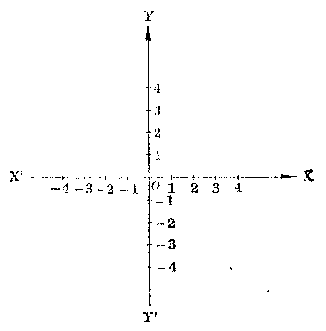

*图3·3*

#### 2. 用直角坐标系的点来表示一对实数

有了直角坐标系以后，我们就可以把排好了顺序的一 对实数\((x, y)\)用坐标系里唯一的点表示出来。例如，如果我们要表示一对实数（2，4），可以先在\(x\)轴上找出表示数2的点\(M\)，在\(y\)轴上找出表示数4的点\(N\)。过\(M\)作平行于\(Y'Y\)的直线，过\(N\)作平行于\(X'X\)的直线，它们相交于一点\(P\)（图3·4）。这个点就表示了这一

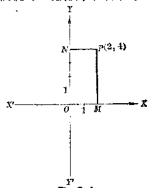

*图3·4*

对实数，我们把它记作\( P(2,4) \)。

一般地，如果要找出坐标系里的一个点\(P\)来表示一对实数\((x, y)\)，可以先在\(x\)轴上找出表示数\(x\)的点\(M\)，在\(y\)轴上找出表示数\(y\)的点\(N\)。过\(M\)和\(N\)分别作平行于\(Y'Y\)和\(X'X\)的直线，它们的交点就是所要找的\(P\)点，记作\(P(x, y)\)。我们把\(x\)叫做\(P\)点的横坐标，\(y\)叫做\(P\)点的纵坐标，合起来叫做\(P\)点的坐标。

**［注意］** 在\(P(x, y)\)中，括号里写在前面的一个数表示它的横坐标，写在后面的一个数表示它的纵坐标。

##### 例1

在坐标系里作出表示下列各对实数的点：

\[
A (1, - 2), B \left(\frac{1}{2}, 3\right),
\]

\[
C (- 3, 2), D (- 2.5, - 1),
\]

\[
L (2, 0), \quad F (- 1, 0),
\]

\[
G (0, 1.5), H \left(0, - \frac{4}{3}\right).
\]

**［解］** 

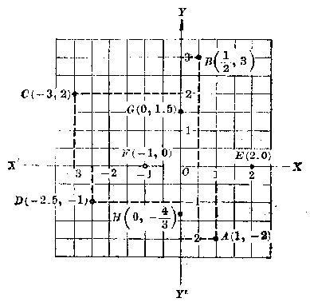

*图3·5*

［说明］ 在找表示一对实数（2，0）的点时，过\(x\)轴上表示数2的点，和\(y\)轴上表示数0的点所作平行于\(Y^{\prime}Y\)和\(X^{\prime}X\)的直线的交点，就在\(x\)轴上。所以\(E\)点就是\(x\)轴上表示数2的点。同样，可以找出其他三个点\(F, G, H\)。

例2 把第118页上表格里的各对实数\((x, y)\)用坐标系里的点表示出来。

**［解］** 

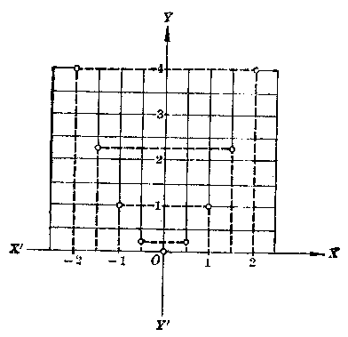

*图3·8*

**注** 1. 在这个题目里，\(y\)没有负数的值，画\(y\)轴时，在\(x\)轴下边只要保留很短的一段就可以了。

2. 为了画图的方便，可以利用印好的坐标纸。

#### 3. 用一对实数表示坐标系里的一个点

把上面所说的步骤反过来，我们就可以把坐标系里的一个点，用一对排好顺序的实数表示出来。例如，要找出图3-4里\(P\)点的坐标，我们只要从\(P\)点作平行于\(Y^{\prime}Y\)的直线，交\(X^{\prime}X\)于\(M\)；从\(P\)点作平行于\(X^{\prime}X\)的直线，交\(Y^{\prime}Y\) 于\(N\)，那末在\(\alpha\)轴上表示点\(M\)的数 2，就是\(P\)点的横坐标，在\(y\)轴上表示点\(N\)的数 4，就是\(P\)点的纵坐标。由此得到\(P\)点的坐标是 （2，4）。

##### 例3

写出下图（图3·7）中各点的坐标。

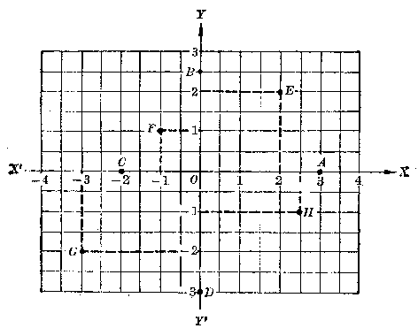

*图3·7*

**［解］** \(A(3,0), B(0,2.5),\)

\[
C (- 2, 0), \quad D (0, - 3),
\]

\[
E (2, 2), \quad F (- 1, 1),
\]

\[
G (- 3, - 2), H (2.5, - 1).
\]

**［注意］** 写出坐标时，一定要把横坐标写在前面，纵坐标写在后面，中间用“，”分开，并且要加上括号。

#### 4. 象限

在例3中，我们看到一个点如果在\(\angle XOY\)的内部，它的横坐标和纵坐标都是正数；在\(\angle YOX'\)的内部，横坐标是负数，而纵坐标是正数；在\(\angle X'OY'\)的内部，横坐标和纵坐标都是负数；在\(\angle YOX\)的内部，横坐标是正数，而纵 坐标是负数。

为了叙述的方便，今后我们将把由\(x\)轴和\(y\)轴所分成的这四个平面部分，就是\(\angle XOY, \angle YOX', \angle X'OY'\)和\(\angle YOX\)的内部顺次地叫做第一象限、第二象限、第三象限和第四象限。

这样，我们就可以从坐标系里点所在的象限，确定它的横坐标和纵坐标的符号；反过来，也可以从横坐标和纵坐标的符号，来确定它所对应的点所在的象限。

|  | 第一象限 | 第二象限 | 第三象限 | 第四象限 |
| --- | --- | --- | --- | --- |
| x | + | - | - | + |
| y | + | + | - | - |

从例3中，我们还容易看到，如果一点在坐标轴上，那末它的坐标中就有一个数是0，反过来也对。特别是，原点的坐标是（0，0）。

|  | 在OX上 | 在OT上 | 在OX上 | 在OY上 | 在原点 |
| --- | --- | --- | --- | --- | --- |
| x | + | 0 | - | 0 | 0 |
| y | 0 | + | 0 | - | 0 |

#### 习题3·3

1. 在直角坐标系里，画出表示下列各对实数\((x, y)\)的点：

\[
A (- 4, 2); B \left(- 3 \frac{1}{3}, - \frac{1}{2}\right); C (0, - 3); D (- 3, 0);
\]

\[
E (\pi, \sqrt{2}); F (\sqrt{3}, - 1); G (\sqrt{2}, 0); E (0, \pi).
\]

［提示：遇到无理数，可以先求出它的一个近似值，例如\(\pi \approx 3.1\)\(\sqrt{2} \approx 1.4\)再做.］

2. 写出下图中各点的坐标。

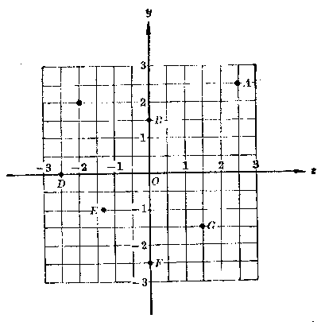

［提示：这里 E 点不恰巧在方格的顶点上，可以只写出它的坐标用一位小数表示的近似值.］

3. 已知\( y = x^3 \)，填写下面的表，然后把得到的每一对实数在坐标系里表示出来。

| x | -2 | \( -\frac{3}{2} \) | -1 | 0 | 1 | \( \frac{3}{2} \) | 2 |
| --- | --- | --- | --- | --- | --- | --- | --- |
| y |  |  |  |  |  |  |  |

### § 3·4 函数关系的表示法

在前面几节里，我们所遇到的函数\( y = f(x) \)中，\( f(x) \)都是用一个数学式子来表示的。但是表示两个变量间的函数关系，却不限于这种方法。下面我们介绍几种常用的方法。

#### 1. 解析法

两个变量间的函数关系，有时可以用一个含有这两个 变量和各种数学运算的等式来表示，这种表示方法叫做解析法。例如前面学过的许多函数，象

\[
W = 7.8 V, \quad y = 0.6 x,
\]

\[
s = 2 + \frac{2}{3} t, S = \pi r^{9},
\]

等等都是用解析法来表示的。

用解析法表示的函数\( y = f(x) \)中，等号右边的\( f(x) \)通常叫做函数的解析式。

用解析法来表示两个变量间的函数关系，优点是简单明确，便于用数学的方法来研究它们。在我们这本书里，主要研究的就是用这种方法表示的两个变量间的函数关系。

#### 2. 列表法

在许多实际问题里，两个变量间的函数关系，不一定都能用解析法来简单地表示。例如，在某一实验室里，一天的温度是随着时间的变化而变化着的。在某一个确定的时间\(t\)，就有一个确定的温度\(C\)和它对应，所以温度\(C\)是时间\(t\)的函数：

\[
C = f (t).
\]

如果，我们要粗略地了解这天温度的变化情况，可以从0时起每隔一段时间 （例如每隔2小时） 观察一次，把当时的温度记录下来，如下表：

| t | 0 | 2 | 4 | 6 | 8 | 10 | 12 | 14 | 16 | 18 | 20 | 22 | 24 |
| --- | --- | --- | --- | --- | --- | --- | --- | --- | --- | --- | --- | --- | --- |
| C | -2° | -6° | -8° | -6° | -3° | 0° | 3° | 5° | 6° | 4° | 0° | -3° | -4° |

这种表格也就表示了这天的温度和时间的函数关系。用这种方法来表示两个变量间的函数关系，叫做列表法。

用列表法来表示两个变量间的函数关系，好处是很容易找到对应于自变量的某一个值（只要表中有的）的函数值，所以一些经常用到的可用解析法来表示的函数关系，也常常改用列表法来表示。例如，我们曾经用过的平方表，平方根表，事实上就是用列表法表示的下面这两种函数关系：

\[
y = x^{2} \quad (1.000 \leqslant x \leqslant 9.999)
\]

和\(y = \sqrt{x}\)（1.000≤x≤9.999）。

但是用列表法来表示变量间的函数关系是有一定的局限性的。在许多情况下，我们往往不可能把自变量的所有的值都列在表里，因此也不可能把所有的函数值都列出来。例如，在上面的例子\(C = f(i)\)中，我们就不可能把这一天每一时刻的温度都在表格里列出来。

#### 3. 图象法

在上一节里，我们曾经讲过一对实数\((x, y)\)可以用坐标系里的一个点表示出来。在科学技术上，人们经常利用这种方法来表示变量间的函数关系。例如，要表示上面例子中的某一天的温度\(C\)和时间\(t\)之间的函数关系，可以利用特制的气温自动记录计把它记录下来（图3-8）。利用这个图就可以找出这一天某一时刻的温度。例如要找下午1时的温度，只要在表示时间的横轴上找出表示数13的点，过这一点作平行于用来表示温度的纵轴的直线，找出它与图里曲线的交点，再从这交点作平行于\(t\)轴的直线交\(C\)轴于点4，那末数4就是这一时刻温度的摄氏度数。

图中的这条曲线，我们把它叫做函数\(C = f(t)\)的图象，用图象来表示变量间的函数关系，叫做图象法。

用图象法来表示变量间的函数关系，不但象列表法那样很容易找出自变量的某一个值所对应的函数值，并且还

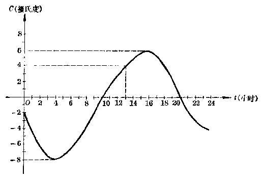

*图3·8*

可以很明显地看出当自变量变化时，函数值的变化情况。例如从图中就可以明显地看到这天的温度最低是\(-8^{\circ}\mathrm{C}\)，最高是\(6^{\circ}\mathrm{C}\)，在0时到4时之间温度逐渐下降，在4时到16时之间温度逐渐上升，从16时以后温度又逐渐下降。

正因为这样，图象法是研究两个变量间函数关系的一种非常有用的方法。不过还须指出，用图象法来表示变量间的函数关系有时却不可能得到完全的图象，并且通常只能得到近似的图象。

1. 利用一5方表，求函数\( y = x^2 \)在\( x \)取 1.25，-1.04，12.5，-10.4 时的函数值（题中所给的数都是近似数）。

2. 利用平方根表，求函数\( y = \sqrt{x} \)在\( x \)取 2.5，3，3.5，12.5 时的函数值（题中所给的数都是准确数）。

3. 设计一张表示函数\( y = a^2 \)的表（\( x \)取 1 到 100 之间的整数）。

［提示：只要设计出格式，不必把具体的函数值都算出来。］

4. 下图里的图象表示气球周围的温度\(t\)和气球离开地面的高度\(h\)之间的函数关系：\(t = f(h)\)。

根据图象求：（1）高出地面1公里，4.5公里，7公里，8.5公里地方的温度。（2）温度等于\( 6^{\circ},0^{\circ},-8^{\circ},-34^{\circ} \)的地方高出地面的公里数。

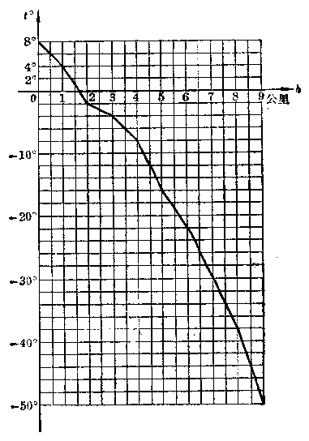

### § 3·5 正比例函数

#### 1. 正比例关系

我们来考察 §3·1 里举过的铁的重量 W 和它的体积 V 之间的函数关系：

\[
W = 7.8 V,
\]

这里 7.8 是每立方厘米的铁块重量的克数。

如果令铁的体积分别是1立方厘米，2立方厘米，3立方厘米，……就可以算出和它对应的重量如下表：

这里我们看到：当体积\(V\)扩大（或者缩小）若干倍的时候，重量\(P\)也随着扩大（或者缩小）相同的倍数。在算术里，我们已经知道具有这样性质的两个量，叫做成正比例关系的量。

从这个表里，我们还可以看到：\(W\)的任何一个数值和它所对应的 V 的数值的比，是一个常数。例如

\[
\frac{7.8}{1} = 7.8, \quad \frac{15.6}{2} = 7.8, \quad \frac{23.4}{3} = 7.8, \dots.
\]

一般地，我们有

\[
\frac{W}{V} = 7.8.
\]

这里常数7.8叫做变量\(W\)和\(V\)间的比例系数。

因为在算术里，我们所学过的数只有正数和零，所以当时所研究的成正比例的量的比例系数都是正数。现在，我们已学习了负数，需要把算术里学过的成正比例的量的定义加以推广。

我们来看下面的例子：

一列火车，以每小时 40 公里的速度，自东向西行驶，在中午到达甲站。求在中午以前\(\frac{1}{2}\)小时，1 小时，\(\frac{3}{2}\)小时，\(\cdots\)，以及中午以后\(\frac{1}{2}\)小时，1 小时，\(\frac{3}{2}\)小时，\(\cdots\)，火车离开甲站的距离与方向。

我们把自西向东的方向作为正的方向（图3·9），那末这列火车行驶的速度可以记作

\[
v = - 40 \text{ 公里 / 小时 }.
\]

*图3·9*

设在中午后\(t\)小时（在中午以前，\(t\)用负数表示；中午以后，\(t\)用正数表示）火车离开甲站\(s\)公里（在甲站以东，\(s\)是正数；在甲站以西，\(s\)是负数）。那末可得\(s\)和\(t\)之间的函数关系

\[
s = - 40 t.
\]

这样就得到下面的表：

| t（小时） | ..。 | \( -\frac{3}{2} \) | -1 | \( -\frac{1}{2} \) | \( \frac{1}{2} \) | 1 | \( \frac{3}{2} \) | ..。 |
| --- | --- | --- | --- | --- | --- | --- | --- | --- |
| s（公里） | ..。 | +60 | +40 | +20 | -20 | -40 | -60 | ..。 |

这里，我们也可以看到 s 的每一个值和它对应的 t 的值的比是一个常数，就是

\[
\frac{s}{t} = - 40.
\]

我们也把变量 s 和 t 之间的这种关系叫做正比例关系，把这个常数 “-40” 叫做 s 和 t 之间的比例系数。

一般地说：

两个变量\(y\)和\(x\)间的函数关系，如果能用公式

\[
y = k x \quad (\text{这里} k \text{是一个不等于零的常数})
\]

来表示，那末这两个变量间的函数关系就叫做正比例关系，\(k\)叫做比例系数。由这个等式确定的函数叫做正比例函数。

1. 下列各种关系里，哪些是正比例关系？为什么？

（1） 正方形的周长 p 和它的一边的长 a；

（2） 正方形的面积 A 和它的一边的长\( a_{2} \)

（3） 圆的周长 C 和它的直径\( d_{2} \)；

#### 习题3·5（1）

（4） 圆的面积 S 和它的直径 d；

（5） 速度 v 一定的时候，所走的距离 s 和所需的时间 t；

（6） 时间 t 一定的时候，运动的速度 v 和所走的距离 s；

（7） 距离 s 一定的时候，运动的速度 v 和所需的时间 t；

（8） 比重 d 一定的时候，物体的重量 W 和它的体积 V；

（9） 体积 V 一定的时候，物体的重量 W 和它的比重\( d_{2} \)

（10） 重量 W 一定的时候，物体的体积 V 和它的比重 d。

2. 把上面这些关系中，成正比例关系的写成\( y = f(x) \)的形式，并求出每一个关系中的比例系数。

3. 把汽油用均匀的速度注入桶里。注入的时间和注入的油量如下表：

| 注入的时间t（分） | 1 | 2 | 3 | 4 | 5 | 6 | 7 | 8 |
| --- | --- | --- | --- | --- | --- | --- | --- | --- |
| 注入的油量q（升） | 2 | 4 | 6 | 8 | 10 | 12 | 14 | 16 |

（1） 从表里的数据，证明\(q\)与\(t\)之间成正比例关系；

（2） 求比例系数\( \left(\frac{q}{t}\right) \)；

（3） 用解析法表示出 q 与 t （把 t 作为自变量） 之间的函数关系；

（4） 设 t=1.5，4.5 时 q 的对应值。

#### 2. 正比例函数的图象

我们先来作下面这两个函数的图象：

（1）\(y = 2x,\)

（2）\(y = -2x.\) 我们先选择一些\(x\)的值，列成下表：

（1）

| x | ..。 | 3 | -2 | -1 | 0 | 1 | 2 | 3 | ..。 |
| --- | --- | --- | --- | --- | --- | --- | --- | --- | --- |
| y | ..。 | -6 | -4 | -2 | 0 | 2 | 4 | 6 | ..。 |

（2）

| x | ..。 | -3 | -2 | -1 | 0 | 1 | 2 | 3 | ..。 |
| --- | --- | --- | --- | --- | --- | --- | --- | --- | --- |
| y | ..。 | 6 | 4 | 2 | 0 | -2 | -4 | -6 | ..。 |

把表里的每一组\(x, y\)的对应值作为点的坐标，在直角坐标系里作出这些点，并且用平滑的线连接起来，就得到图3·10 和图3·11. 从图里可以看到这两个函数的图象都是通过原点的直线。在（1）中这条直线在第一和第三象限并且通过点（1，2）；在（2）中这条直线在第二和第四象限并且通过点（1，-2）。

一般地，我们可以证明：

*图3·10*

正比例函数\( y = kx (k \neq 0) \)的图象是一条通过原点和点（1，k）的直线。

读者今后学习了平面解析几何就很容易证明这个结论。如果只应用我们已有的平面几何知识，那末也可以象下面这样来证明：

证明应该分成两个方面，一方面要证明过\(O(0,0)\)和\(N(1,k)\)的直线上的点都在函

*图3·11*

数\(y=kx\)的图象上；这也就是要证明，直线\(ON\)上的每一点\(M\)的横坐标\(x\)和纵坐标\(y\)间都有\(y = kx\)的关系。另一方 面还要证明，函数\( y = kx \)的图象上所有的点都在直线\( ON \)上，这就是要证明，如果一个点的坐标\( (x, y) \)有\( y = kx \)的关系，这个点就在直线\( ON \)上。下面我们对\( k \)是正数的情形来加以证明（当\( k \)是负数时，可以同样地证明，证明留给读者）。

**［证明］**  过原点\(O(0,0)\)和点\(N(1,k)\)作直线\(ON\)（图3·12）。

（1） 首先我们证明直线 ON 上的点都在函数\( y = kx \)的图象上。

因为原点\(O(0,0)\)的横坐标\(x\)和纵坐标\(y\)之间有

\[
0 = k \cdot 0
\]

的关系。所以原点\(O\)在函数\(y = kx\)的图象上。同样地，因为\(k = k \cdot 1\)，所以点\(N(1, k)\)也在函数\(y = kx\)的图象上。

*图3·12*

现在设点\(M(x, y)\)是直线\(ON\)上的任意一点。过点\(N\)和\(M\)分别作\(y\)轴的平行线\(NR\)和\(MQ\)交\(x\)轴于\(R\)和\(Q\)。因为在直角三角形\(ONR\)和\(OMQ\)中，有一对锐角

\[
\angle N O R = \angle M O Q, \quad \therefore \quad \triangle O N R \sim \triangle O M Q.
\]

\[
\therefore \quad \frac{R N}{O R} = \frac{Q M}{O Q}, \quad \therefore \quad Q M = \frac{R N}{O R} \cdot O Q.
\]

这里\(RN\)就是点\(N\)的纵坐标\(k, OR\)就是点\(N\)的横坐标 1：\(QM\)就是点\(M\)的纵坐标\(y, OQ\)就是点\(M\)的横坐标\(x\)。代入上面这个等式，就得到

\[
y = \frac{k}{1} \cdot x,
\]

就是\(y = kx.\) 这就证明了直线 ON 上任意的点的横坐标 x 和纵坐标 y 间 都有\(y = kx\)的关系，因此这些点都在函数\(y = kx\)的图象上。

（2） 其次，我们证明函数\( y = kx \)的图象上的每一个点都在直线\( ON \)上。

设点\(P(x, y)\)是函数\(y=kx\)的图象上的任意一点，那末点\(P\)的纵坐标\(y\)和横坐标\(x\)之间有

\[
y = k x
\]

的关系。

过点 P 作平行于 y 轴的直线交 x 轴于 T，交直线 ON 于\(V\)①（图3·13）。那末因为点\(V\)在直线\(ON\)上，所以它的纵坐标\(TV\)和横坐标\(OT\)间有

\[
T V = k \cdot O T
\]

的关系。

但是，我们已经知道，点 P 的纵坐标 y （就是 TP） 和横坐标 x （就是 OT） 之间有

*图3·13*

\[
y = k x,
\]

就是\(TP = k \cdot OT\) 的关系。因此

\[
T P \cdot T V.
\]

所以，点\(P\)一定和点\(V\)重合，也就是说，点\(P\)在直线\(ON\)上。这就证明了函数\(y = kx\)的图象上的任意一个点都在直线\(ON\)上。

函数 y-kx 的图象，以后简称为直线 y=kx。

##### 例1

作函数\( y = \frac{1}{2} x \)的图象。

**［解］** 列表：作图：

*图3·14*

**注** 要画出一条直线，只要找到直线上的任意两点就可以了，为了使画出的图精确些，我们所取的两个点要使它离开得远一些，所以这里我们取（4，2）这个点，而不是取\(\left(1, \frac{1}{2}\right)\)这个点。

1. 用描点法作出习题3.5（1）里第3题函数\(q = f(t)\)的图象。

2. 在同一坐标系里作出下列函数的图象：

（1）\( y = \frac{1}{2} x; \)

（2）\( y = x \)；

（3）\( y = 2x; \)

（4）\( y = -\frac{1}{2} x; \)

（5）\( y = -x; \)

（6）\( y = -2x. \) 3 一个物体以每小时 3 公里的速度作匀速运动，

（1） 把这个物体在 t 小时内所经过的路程 s 公里用公式表示出来；

（2） 填写下面的表：

| t（小时） | 0 | 1 | 2 | 3 | 4 |
| --- | --- | --- | --- | --- | --- |
| s（公里） |  |  |  |  |  |

（3） 根据表里的数值，画出这个物体运动的路程和时间的关系的图象；

（4） 根据图象找出\( t=1\frac{1}{2} \)，\( t=3\frac{1}{2} \)时 s 的值；

（5） 根据图象找出 s=27，s=10 时 t 的值。

*4. 证明，当\(k < 0\)的时候，函数\(y = kx\)的图象是经过原点，并且在第二和第四象限的一条直线。

#### 3. 正比例函数的性质

利用正比例函数\( y = kx (k \neq 0) \)的图象，我们就可以从图象上看出这种函数所具有的一些重要性质。

先来看比例系数\(k > 0\)的情况。

例如我们取\(k = \frac{1}{2}, k = 1, k = 2\)等值，在同一直角坐标系里作出下面这三个正比例函数

（1）\( y = \frac{1}{2} x, \)

（2）\(y = x,\)

（3）\(y = -2x\) 的图象（图3·15）。

从图象中就可以看出：

（1） 这些直线都在第一、第三象限内，并且都是从左到 右向上伸展的。这一事实，就告诉我们，正比例函数\( y = kx (k > 0) \)的值是随着自变量的值的增大而增大的。

（2） 这些直线关于\(x\)轴的倾斜程度是随着比例系数\(k\)的变化而变化着的，\(k\)越小，直线越

*图3·15*

靠近\(x\)轴；\(k\)越大，直线越离开\(x\)轴。换句话说，也就是\(k\) 越大，直线向上伸展的速度也越快。这一事实就告诉我们，\(k\)越大，函数\(y=kx\ (k>0)\)的值增加的速度也越快。

再来看\(k < 0\)的情况。

在同一直角坐标系里，作出下面这三个正比例函数

（4）\( y = -\frac{1}{2} x, \)

（5）\(y = -x,\)

（6）\(y = -2x\) 的图象（图3·16）。

*图3·16*

从图象中可以看出：

（1） 这些直线都在第二、第四象限内，并且都是从左到右向下伸展的。这一事实，就告诉我们，正比例函数\( y = kx (k < 0) \)的值是随着自变量的值的增大而减小的。

（2） 这些直线关于\(x\)轴的倾斜程度也是随着比例系数\(k\)的变化而变化着的，\(|k|\)越小，直线越靠近\(x\)轴；\(|k|\)越大，直线越离开\(x\)轴。换句话说，也就是\(|k|\)越大，直线向下伸展的速度也越快。这一事实，就告诉我们\(|k|\)越大，函数\(y = kx (k < 0)\)的值的减小的速度也越快。

#### *4. 直线的倾角和斜率

在上面的讨论中，我们可以看到直线\(y = kx\)的位置，与它的比例系数\(k\)有关。我们把\(k\)叫做直线\(y = kx\)的斜率，并且把\(x\)轴的正方向和直线\(y = kx\)的正方向 （即向上的方向） 所成的角\(\alpha\)叫做直线\(y = kx\)的倾角 （图3-17）。

*图3·17*

*利用三角学中的知识，我们可以证明

\[
k = \operatorname{tg} \alpha.
\]

**［证明］** 设\(N(x, y)\)是直线\(y = kx\)上的任意一点，\(\alpha\)轴的正方向和直线向上方向所成的角是\(\alpha\)（图3·17）。

根据三角学中正切函数的定义，得到

\[
\lg \alpha = \frac{y}{x}. \tag {1}
\]

但是，点\(N\)在直线\(y = kx\)上，所以有

\[
\frac{y}{\alpha} = k. \tag {2}
\]

从（1）和（2）得

\[
\operatorname{tg} \alpha = k.
\]

#### 习题3·5（3）

1. （1） 求下列各直线的斜率：

\[
\begin{array}{l} y = \frac{2}{3} x, \quad y = \frac{3}{2} x, \\ y = - \frac{2}{3} x, \quad y = - \frac{3}{2} x, \\ \end{array}
\]

（2） 在\(n\)一坐标系里作出这些直线；

（3） 根据斜率的变化，说明直线位置的变化；

（4） 根据图象说明当自变量 x 从小增大的时候，函数值的变化情况；

（5） 当\(k > 0\)的时候，函数值增加的速度和\(k\)的值的大小有什么关系？

［提示：从图象上研究，当自变量增加同一数值的时候，函数\( y = \frac{2}{3} x \)和\( y = \frac{3}{2} x \)所对应的值，哪一个增加得多一些，增加得多的，增加的速度也就越快。］

（6） 当\(k < 0\)的时候，函数值减小的速度和\(k\)的绝对值的大小有什么关系？

2. 求上题中这四条直线的正方向与\(x\)轴的正方向所成的角（精确到\(1^{\circ}\)）。

### § 3·6 反比例函数

#### 1. 反比例关系

我们知道，物体作匀速运动时，距离 s，速度 v 和时间 t 这三个量之间存在着以下的关系：

\[
s = v t.
\]

如果 s 是一个常量，那末行驶这段距离所需的时间 t 就与速度 v 有关，并可利用下面的公式计算出来：

\[
t = \frac{s}{v}.
\]

例如从 A 到 B 的距离是 120 米，运动的速度是 v 米/秒，运动的时间是 t 秒，那末由公式

\[
t = \frac{120}{v} \quad (v > 0) \tag {1}
\]

就可以计算出，当\(v = 3, 4, 6, 8, 10, 12, \cdots\)时\(t\)的对应值如下表：

| v（米/秒） | 3/1 | 4/1 | 6/1 | 8/1 | 10/1 | 12/1 | ..。 |
| --- | --- | --- | --- | --- | --- | --- | --- |
| t（秒） | 40 | 30 | 20 | 15 | 12 | 10 | ..。 |

这就指出，公式\(t = \frac{120}{v} (v > 0)\)确定了变量\(t\)和\(v\)之间的一种函数关系。

仔细考察一下这个例子中自变量的各个值与对应的函数值之间的关系，可以看出一个重要的事实，这就是：当变量\(v\)的值扩大（或者缩小）若干倍的时候，变量\(t\)的值随着缩小（或者扩大）相同的倍数。例如，当\(v\)从3扩大到4即扩大\(\frac{4}{3}\)倍，\(t\)就相应地从40缩小到30，即缩小\(\frac{4}{3}\)倍。

我们还可以看到，两个量\(v\)和\(t\)的每一对对应值的积都是一个常数（例如\(3 \times 40 = 4 \times 30 = \cdots = 120\)，即\(vt = 120\)），也就是说，变量\(t\)和变量\(v\)的倒数的比是一个常数，就是

\[
\frac{t}{1} = 120,
\]

在算术里，我们已经知道变量间的这种关系，叫做反比例关系。现在象正比例关系一样，我们需要把算术里的这种反比例关系的定义加以推广，我们说：

变量\(y\)和\(\alpha\)之间的函数关系，如果能用公式

\[
y = \frac{k}{x} \quad (k \text{ 是不等于零的一个常数 })
\]

来表示，那末这两个变量间的关系叫做反比例关系，k叫做 比例系数，由等式\( y = \frac{k}{x} (k \neq 0) \)确定的函数叫做反比例函数。

例圆柱的高是\(h\)（厘米），底面的半径是\(r\)（厘米），体积是\(V\)（立方厘米），底面的面积是\(S\)（平方厘米），如果体积一定时，\(h\)和\(S\)是不是成反比例关系？\(h\)和\(r\)呢？

**［解］** 根据圆柱体积的公式

\[
V = h S,
\]

可以知道\(h\)和\(S\)成反比例关系，这个函数关系就是

\[
h = \frac{V}{S}.
\]

又根据圆的面积公式\(S = \pi r^2\)，可以推出

\[
V = \pi h r^{2},
\]

即\(h = \frac{V}{\pi r^2}\) 这里\(V\)和\(\pi\)都是常数。如果令\(\frac{V}{\pi} = k\)，上式可以写成

\[
h = \frac{k}{r^{2}}.
\]

这个公式指出\(h\)和\(r^2\)存在反比例关系，所以\(h\)和\(r\)不成反比例关系。

#### 2. 反比例函数的图象

要作出一个由解析式给出的函数\( y = f(x) \)的图象，一般有三个步骤：

第一步，先取\(x\)的一些值，求出它们所对应的函数值\(y\)，列成一个表。

第二步，在直角坐标系里，画出每一对实数\((x, y)\)所对应的点。

第三步，用一条平滑的线，根据自变量由小到大的顺序把这些点连接起来。

下面我们以\(k = 6\)为例，来作出反比例函数\(y = \frac{6}{\alpha}\)的图象。

（1） 列表：

| x | ..。 | ..。 | 5 | 4 | -3 | -2 | -1 | j | 2 | 3 | 4 | 5 | ..。 |
| --- | --- | --- | --- | --- | --- | --- | --- | --- | --- | --- | --- | --- | --- |
| y | ..。 | ..。 | -1.2 | -...5 | -2 | -3 | -4 | 6 | 3 | 2 | 1.5 | 1.2 | ..。 |

（2） 根据表里的每一对实数\((x, y)\)在坐标系里画出它们所对应的点，依照自变量从小到大的顺序用平滑的线把它们连接起来，就得到下图中的两条曲线（图3·18）。

*图3·18*

**注** 因为当\(x = 0\)的时候，\(\frac{6}{x}\)没有意义。所以图象不能和\(y\)轴相交。图象是由两条曲线所组成的，这个图象叫做双曲线。

上面这个例子里，画出图象的方法叫做描点法。用描点法所画出的函数的图象，一般只能是近似的，但是图象上的点作得愈多，那末画出的图象也就越精确。

**［注意］** 用描点法画函数的图象的时候，要特别注意顺次连接

*图3·19*

*图3·20*

各点的线应该是平滑的线，而不能是折线。例如在例1中如果画成图3·19那样就是错误的。

用同样的方法，我们可以作出反比例函数\( y = \frac{k}{x} \)当\( k \)取某一个确定的值时的图象。画出来的图象都是双曲线，只是根据\( k \)的值的不同，曲线有不同的位置。

例如图3-20中画出的是\(k = \pm 2, \pm 4\)时函数\(y = \frac{k}{x}\)的图象。

#### 3. 反比例函数的性质

利用图3-20所画出的反比例函数的图象，我们可以发现反比例函数\( y = \frac{k}{x} (k \neq 0) \)有下面的一些性质：

（1） 当\(k > 0\)时，函数图象的两个分支分别分布在第一、第三象限内，在每一象限内，函数值\(y\)总是随着自变量\(x\)的增大而减小的；当\(k < 0\)时，函数的图象的两个分支分别分布在第二、第四象限，在每一象限中，函数值\(y\)总是随着自变量\(x\)的值的增大而增大的。

（2） 函数图象的两个分支都无限接近\(x\)轴和\(y\)轴，但永远不能达到\(x\)轴和\(y\)轴。这一事实也就指出，当\(|x|\)充分大时，函数\(y = \frac{k}{x}\)的值可以无限接近 0 但不能是 0。当\(|x|\)无限接近 0 时，函数\(y = \frac{k}{x}\)的值的绝对值\(|y|\)就无限增大。

1. 下面这些关系中哪些是反比例关系？为什么？

（1） 完成一定工作的时间 t 和人数 n （假定每人的工作能力相同）；

（2） 被除数一定的时候，除数 d 和商 q；

（3） 两数的和一定的时候，加数 a 与加数 b；

（4） 重量一定的时候，物体的体积 V 和比重 d；

（5） 有行驶距离一定的时候，车轮的直径 d 和车轮旋转的周数 n，

2. 已知\(y\)和\(x\)成反比例关系，比例系数是 8。写出\(y\)和\(x\)间的函数关系，指出其定义域，并用落点法作出图象。

3. 在同一坐标系里，作函数

\[
y = \frac{5}{x} \quad \text{和} \quad y = - \frac{5}{x}
\]

的图象，这两个图象有哪些相同的地方？哪些不同的地方？

4. 已知\(y\)和\(x\)间的关系可以用下列等式来表示，求\(y\)和\(x\)间的函数关系\(y = f(x)\)，并作出图象：

（1）\(xy - 10 = 0;\)

（2）\(2xy + 7 = 0\)

### 本章提要

#### 1. 常量和变量

在问题的研究过程中\( \left\{\begin{aligned}& 始终取同一数值的量——常量,\\& 可以取不同数值的量——变量.\end{aligned}\right. \)

#### 2. 函数

（1） 意义——两个变量 x 和 y，如果对于 x 在它可取

#### 习题3·6

值范围内的每一个确定的值，按照某种对应法则，\(y\)都有一个确定的值和它对应，这时就称\(x\)为自变量，\(y\)为因变量，通常也说\(y\)是\(x\)的函数。

（2） 符号——\( y = f(x) \)，其中 x 表示自变量，y 表示因变量，f 表示某种对应法则。

（3） 定义域——自变量的取值范围（这个集合一般可用字母 D 表示）。

（4） 函数的值——函数\(f(x)\)当\(x = a\)时所对应的值，以\(f(a)\)表示。

（5） 函数的值域——函数值的全体（这个集合一般可用字母\(B\)表示，\(E = \{f(x) | x \in D\}\)）。

#### 3. 作函数\( y = f(x) \)的图象的方法（描点法）

（1） 选择 x 的一些值求出 y 的对应值，列成表格；

（2） 以每一对实数作为点的坐标\( (x, y) \)，画出各点；

（3） 依自变量从小到大的顺序，用一条或几条平滑的线把各点连接起来。

#### 4. 正比例函数

（1） 一般形式：\( y = kx \quad (k \neq 0) \)。

（2） 定义域：\(D = \{\text{实数}\} = (-\infty, +\infty)\)。

（3） 图象：过原点的一条直线。

（4） 性质：\(k > 0\)时，\(y\)随\(x\)的增大而增大；\(k\)越大，增大速度越快；

k<0 时，y 随 x 的增大而减小；|k| 越大，减小速度越快。

#### 5. 反比例函数

（1） 一般形式：\( y = \frac{k}{x} \quad (k \neq 0) \)。

（2） 定义域：\(D = \{x: x \neq 0\} = (-\infty, 0) \cup (0, +\infty)\)。

（3） 图象：双曲线\( (k>0 \)时在一、三象限，k<0 时在 二、四象限）

（4） 性质：k>0 时，y 随 x 的增大而减小；

k<0 时，y 随 x 的增大而增大。

### 复习题三A

1. 回答下面的问题：

（1） 什么叫做常量？变量？举一个例子；

（2） 什么叫做自变量、因变量？举一个例子；

（3） 记号\(C = F(t)\)表示什么意思？（这里字母\(C\)表示温度的数据，\(t\)表示时间的小时数。）

（4） 平面上的直角坐标系是怎样构成的？

2. （1） 已知一个用解析法表示的函数\( y = f(x) \)，怎样求自变量\( x = a \)时的函数值？

（2） 如果\( f(x)=\frac{x+1}{x^{2}-4} \)，求\( f(0) \)，\( f\left(\frac{1}{3}\right) \)，\( f(-1) \)；

（3） 在上题中能不能求出\( f(2) \)或者\( f(-2) \)？为什么？

3. （I） 如果\( f(x) = \sqrt{9 - x^2} \)，求\( f(0), f(1), f(2), f(3) \)；

（2） 在上题中求\( f(x) \)，这里\( x \)可以取的值有什么限制？

4. 求下列各函数的定义域：

（1）\( y = x + \sqrt{x - 2} \)；

（2）\( y = \frac{3x}{\sqrt{x - 2}} \)；

（3）\( y = \frac{\sqrt{x + 1}}{x}; \)

（4）\( y = \sqrt{|x| - 1} \)。

5. 求下列函数的定义域：

（1）\( y = \sqrt{9 - x^2} \)；

（2）\( y = \sqrt{3 - x} \cdot \sqrt{3 + x} \)；

（3）\( y = \sqrt{3 - x} + \sqrt{3 + x} \)；

（4）\( y = \sqrt{\frac{3 - x}{3 + x^2}} \)。

（5）\( y = \frac{1}{\sqrt{9 - x^2}} \)；

（6）\( y = \frac{1}{\sqrt{\frac{3 - x}{3 + x}}} \)。

6. 求下列函数的定义域：

（1）\( y = \frac{1}{x^3 - 1} \)；

（2）\( y = \sqrt{x^3 - 1} \)；

（3）\( y = \frac{1}{x^2 - x + 1} \)；

（4）\( y = \sqrt{x^2 - x + 1} \)。

7. 用描点法作下列函数的图象：

（1）\(y=\frac18x^2\)（\( x = 0, \pm 1, \pm 2, \pm 3, \pm 4 \)）；

（2）\( y = \frac{1}{x} \left( x = \frac{1}{4}, \frac{1}{4}, \frac{1}{2}, \pm 1, \pm 2, \pm 4 \right); \)

（3）\( y = \sqrt{x} \)（x = 0，1，2，3，4，6，9）。

［提示：在（2）中，可以用方格纸上的2个方格的边长作为坐标轴的长度单位；在（3）中，可以利用平方根表查出\(\sqrt{x}\)有一位小数的近似值。如果需要，还可以在自变量指定的这些值之间，适当插入几个值，求出它们所对应的函数值，多作出几个点再来描图。］

8. （1） 对于下表里\(x\)的值，查表求\(y = \sqrt[6]{x}\)的对应值 （精确到 0.1）：

| x | -8 | -6 | -4 | -2 | -1 | 0 | 1 | 2 | 4 | 6 | 8 |
| --- | --- | --- | --- | --- | --- | --- | --- | --- | --- | --- | --- |
| y |  |  |  |  |  |  |  |  |  |  |  |

（2） 利用表型\(x\)和\(y\)的各组对应值，作出函数\(y = \sqrt[8]{x}\)的图象；

（3） 根据作出的图象，求\( \sqrt[8]{3} \)，\( \sqrt[8]{5} \)，\( \sqrt[8]{-7} \)（精确到 0.1）并且用立方根表中的结果加以核对。

9. 已知\(x\)和\(y\)有下面的关系，把它们改写成\(y = f(x)\)的形式，然后作出它的图象：

（1）\(xy = -4\)；

（2）\(2x + 3y - 6 = 0;\)

（3）\( y^{8}-8x=0; \)

（4）\(2x - \sqrt{y} = 0.\)

10. 作出下列函数的图象：

（1）\(y=\sqrt[3]{x}+1\)；

（2）\( y = \sqrt[8]{x + 1} \)。

［提示：设法利用第8题中已填过的表.］

11. 回答下面的问题：

（1） 怎样判断两个量之间的关系是正比例关系？反比例关系？（列举你所知道的各种方法。）

（2） 什么叫做比系数？比例系数可以取的值有没有限制？

12. 设从管口流出的水量\(Q\)（升）和时间\(t\)（秒）间的关系是\(Q = kt\)，这里\(k\)是常数：

（1）\(Q\)和\(t\)间的关系是什么关系？

（2） 已知 3 秒钟内流出的水量是 72 升，求比例系数 k （升/秒）；

（3） 用上面的比例系数，求 4.5 秒钟内管口流出的水量；

（4） 用上面的比例系数，求管口流出的水流是100升所需的时间。

### 复习题三B

1. 下面的这些等式是不是能确定\(y\)是\(x\)的函数或者\(x\)是\(y\)的函数？如果可能，把它表示成\(y = f(x)\)或者\(x = g(y)\)的形式，并写出它的定义域：

（1）\(x - 2y^{2} = 0;\)

（2）\(8x^{2} - y^{2} = 1;\)

（3）\(x^{2} + xy - 1 = 0;\)

（4）\(x^{2} + y^{2} + 1 = 0.\)

2. 求下列函数的定义域（答案用区间符号表示）：

（1）\( y = \sqrt{x^2 - 5x + 6} + \frac{1}{\sqrt{4x - x^2}} \)；

（2）\( y = \frac{\sqrt{3 + 2x - x^2}}{2 - 3x + x^2}. \)

3. 当自变数\(x\)为指定的数值时，求下列函数的值：

（1）\( f(x) = x^3 - 3\sqrt[3]{9}x + 8 \)，当\( x = 1 - \sqrt[3]{9} \)时；

（2）\( f(x) = \frac{2x\sqrt{1 + x^2}}{x + \sqrt{1 + x^2}} \)，当\( x = \frac{1}{2}\left(\sqrt{\frac{a}{b}} - \sqrt{\frac{b}{a}}\right), a > 0 \)时。

4. 求下列函数的定义域和值域，并用最简便的方法画出下列函数的图象？

（1）\( y = 3|x| \)；

（2）\( y = \frac{3|x|}{x} \)。

5. 已知\( y = y_{1} + y_{2}, y_{1} \)与\( x \)成正比例，\( y_{2} \)与\( x^{2} \)成反比例，并且当\( x = 2 \)和\( x = 3 \)时，\( y \)的值都等于 19，求\( y \)和\( x \)之间的函数关系式。

［提示：设\( y_{1} = k_{1}x, y_{2} = \frac{k_{2}}{x^{2}} \).］

6. 设有三个变量\(x, y, z\)：

（1） 如果 z 与 y 成正比例，y 又与 x 成正比例，证明 z 与 x 也成正比例；

（2） 如果\(z\)与\(y\)成反比例，\(y\)又与\(x\)成反比例，那末\(z\)与\(x\)之间有什么关系？

（3） 如果\(z\)与\(y\)成反比例，而\(y\)与\(x\)成正比例，那末\(z\)与\(x\)之间有什么关系？

### 第三章测验题

1. 已知变量\(y\)和\(x\)间有下面的关系，试用\(x\)的代数式表示\(y\)，并指出在这些关系式中，哪些可以把它说成\(y\)是\(x\)的函数，哪些不能：

（1）\(x = \frac{3y + 2}{4y - 3}\)；

（2）\( y^{2}=4x; \)

（3）\( y^{2}-4x+1=0 \)（\( y\leqslant0 \)）；（4）\( (x+3)(y-2)=y-6 \)。

2. 求下列函数的定义域（答案用区间符号表示）：

（1）\( y = -\frac{\sqrt{x} + 1}{x^2 - x + 1} \)；

（2）\( y = \sqrt{x + 2} + \frac{1}{\sqrt{2 - x}} \)；

（3）\( y = \frac{1}{x} + \sqrt{4 - x^2} \)；

（4）\( y = \frac{x^2 + 1}{x^2 - 3x + 1} \)。

3. 已知\(x\)为整数，求下列函数的定义域和值域：

（1）\( y = \sqrt{3 - |x|} \)；

（2）\( y = \frac{1}{\sqrt{8 - 2x - x^2}}. \)

4. 已知圆锥体的体积 V 和底面积 S 可以用下面的公式来计算：

\[
V = \frac{1}{3} j S, \quad S = \pi r^{2},
\]

这里 h 是圆锥体的高，r 是圆锥体底面的半径：

（1） 如果 r 是常数，V 与 h 之间的关系是什么关系？

（2） 如果 V 是常数，S 与 h 之间的关系是什么关系？

（3） 当\( V = 3\pi \)时，写出 r 与 h 之间的关系式（以 h 为自变量）。

（4） 当 V=2 时，画出\( S=f(h) \)的图象。

5. 已知\( y = y_{1} + y_{2}, y_{1} \)与\( x \)成正比例，比例系数为\( k_{1}; y_{2} \)与\( x \)成反比例，比例系数为\( k_{2} \)。

（1） 写出 y 和 x 之间的函数关系式：\( y = f(x) \)；

（2） 如果\( f(1)=5, f(2)=7 \)，求\( f(3) \)。

#### 本章脚注

① 一个物体单位体积的重量叫做它的比重。在物理学里，比重也是一个量，用“克/厘米”做单位。例如铁的比重\(d\)记做\(d = 7.8\)克/厘米\(^{2}\)，意思就是1立方厘米的铁重是7.8克。

① 在一般情况下，这两条数轴取相同的长度线段做长度单位。在图上，也可以在横轴的箭头处记上\(x\)，纵轴的箭头处记上\(y\)来代替\(X'X\)和\(Y'Y\)。

① 这里我们应用了间接证法，先不考虑点\(P\)是不是在直线\(ON\)上，故意把它不画在直线\(ON\)上，而在直线上找出另一点\(V\)，然后再证明点\(P\)和点\(V\)一定重合。

## 4. 一次函数和二次函数

一次函数和二次函数是两种常见的重要函数。这一章里我们将研究这两种函数的图象和性质。另外，还将把以前学过的二元一次方程、方程组，一元二次方程、一元二次不等式与一次函数、二次函数的图象联系起来，研究它们之间的关系，以及一些应用。

### § 4·1 一次函数的图象和性质

#### 1. 一次函数

在第三章里我们曾见到过象下面这样的函数：

\(s = 2 + \frac{2}{3} t\)（匀速运动中路程\(s\)与时间\(t\)之间的关系）；

C：2πr （圆的周长 C 与半径 r 之间的关系）；

\( y = kx \quad (k \neq 0) \)（正比例函数）。

这些函数有一个共同的特征，就是：在这些表达式里，等号右边都是自变量的一次式。

象这种由自变量的一次式给出的函数叫做一次函数。

一次函数，一般地可表示为以下的形式：

\[
y = k x + b \quad (k \neq 0).
\]

这里 k 和 b 都是常数。

**注** 因为\(k = 0\)时，\(kx + b\)就不是一次式，所以在给出这个函数的表达式时，要把这个条件写出。

因为不论\(x\)取什么数值，\(x\)的一次式\(kx + b\)都有意义，所以一次函数\(y = kx + b (k \neq 0)\)的定义域是实数集\(R\)。

在一次函数\( y = kx + b (k \neq 0) \)。中，如果\( b = 0 \)，这个函数就是正比例函数\( y = kx (k \neq 0) \)，所以正比例函数是一次函数的一个特例。

#### 2. 一次函数的图象

我们知道：正比例函数\( y = kx \)，（\( k \neq 0 \)） 的图象是经过原点斜率为\( k \)的一条直线。现在我们就利用这个特殊的一次函数的图象来研究一般的一次函数

\[
y = k x + b \quad (k \neq 0)
\]

的图象。

例如，我们在问一直角坐标系里，作下面这三个一次函数

（1）\(y=2x\)，

（2）\( y = 2x + 3, \)

（3） y 2x-3 的图象，并进行比较。

首先，我们作出如下的表：

| x | ..。 | -3 | -2 | -1 | 0 | 1 | 2 | 3 | ..。 |
| --- | --- | --- | --- | --- | --- | --- | --- | --- | --- |
| （1） y=2x | ..。 | -6 | -4 | -2 | 0 | 2 | 4 | 6 | ..。 |
| （2） y=2x+3 | ..。 | -3 | -1 | 1 | 3 | 5 | 7 | 9 | ..。 |
| （3） y=2x-3 | ..。 | -9 | -7 | -5 | -3 | -1 | 1 | 3 | ..。 |

从表里可以看到，对于自变量\(x\)的同一个值，函数\(y = 2x + 3\)所对应的值比函数\(y = 2x\)所对应的值都大3个单位。所以在函数\(y = 2x + 3\)和函数\(y = 2x\)的图象上如果各有一点，它们的横坐标相同，那末第一个点的纵坐标应该比第二个点的纵坐标多3个单位。这样，就容易看到要作出函数\(y = 2x + 3\)的图象，只要把函数\(y = 2x\)的图象向上方平行移动3个单位，就可以了（图4-1）。

这里我们看到，函数\( y = 2x + 3 \)的图象是和直线\( y = 2x \)平行的一条直线，它和\( y \)轴的交点是点（0，3）。

同样，要作出函数\( y = 2x - 3 \)的图象，只要把函数\( y = 2x \)的图象向下方平移 3 个单位就可得到 （图 4-1）。这里我们看到，函数\( y = 2x - 3 \)的图象也是和直线\( y = 2x \)平行的一条直线，它和\( y \)轴的交点是点 （0，-3）。

*图4·1*

一般地，我们可以知道：

一次函数\( y = kx + b \)的图象是一条直线，这条直线平行于直线\( y = kx \)，它和\( y \)轴的交点是\((0, b)\)。

一次函数\( y = kx + b \)的图象，以后简称直线

\[
y = k x + b.
\]

要作出一次函数\( y = kx + b \)的图象，只要先找出图象上的任意两个点，再过这两点作出一条直线就可以了。

##### 例1

作函数\( y = \frac{1}{2} x + \frac{3}{2} \)的图象。

**［解］**  列表：

作图：

*图4·2*

#### 3. 直线\( y = kx + b \)的斜率和截距

因为直线\( y = kx + b \)平行于直线\( y = kx \)，所以直线\( y = kx + b \)的正方向与\( x \)轴的正方向所成的角和直线\( y = kx \)的正方向与\( x \)轴的正方向所成的角是相等的。这个角\( \alpha \)的大小与\( k \)的值有关，就是

\[
\operatorname{tg} \alpha = k.
\]

我们把\(k\)叫做直线\(y = kx - b\)的斜率，\(\alpha\)叫做该直线的倾角。

因为\(b\)可看作直线\(y = kx + b\)和\(y\)轴的交点离开原点的距离再附以适当的符号，我们把它叫做直线\(y = kx + b\)在\(y\)轴上的截距。

##### 例2

求直线\( y = \sqrt{3}x - 1 \)的斜率，倾角和它在 y 轴上的截距。

**［解］** 这里\(k = \sqrt{3}, b = -1\)，所以直线\(y = \sqrt{3} x - 1\)的斜率是\(\sqrt{3}\)，它在\(y\)轴上的截距是\(-1\)。

设\(\alpha\)是它的倾角，那末

\[
\operatorname{tg} \alpha = \sqrt{3}, \quad \alpha = 60^{\circ}.
\]

所以直线\( y=\sqrt{3}x-1 \)的倾角是\( 60^{\circ} \)。

#### 4. 一次函数的性质

因为直线\( y = kx + b \)是和直线\( y = kx \)平行的，所以从函数\( y = kx \)的性质，可以推得函数\( y = kx + b \)也具有同样的性质，就是

（1） 如果\(k > 0\)，那末当自变量逐渐增大的时候，函数的值也逐渐增大；

（2） 如果\(k < 0\)，那末当自变量逐渐增大的时候，函数的值则逐渐减小。

例如，图4·3是函数

（1）\( y = 3x + 2 \)和 （2）\( y = -3x + 2 \) 的图象，从图中可以看出，函数\( y=3x+2 \)的值是随x的增加而增加的；而函数\( y=-3x+2 \)的值是随x的增加而减少的。

*图4·3*

从上面的图中，我们还可以看出一次函数的一个重要性质。

在函数\( y = 3x + 2 \)中，如果自变量\( x \)从-2开始每次增加同一个值1，那末对应的\( y \)的值也就从-4开始，每次增加同一值3.

| x | -2 | -1 | 0 | 1 | 2 | ..。 |
| --- | --- | --- | --- | --- | --- | --- |
| y | -4 | -1 | 2 | 5 | 8 | ..。 |

对这种现象，通常我们说函数的值是均匀增加的。可以验证函数\( y = 3x + 2 \)增加的值和自变量\( x \)增加的值的比是个常数，这个常数也就是直线\( y = 3x + 2 \)的斜率3。例如

\[
\frac{(- 1) - (- 4)}{(- 1) - (- 2)} = \frac{3}{1} - 3,
\]

\[
\frac{2 - (- 1)}{0 - (- 1)} = \frac{3}{1} - 3,
\]

\[
\frac{5 - 2}{1 - 0} = \frac{3}{1} - 3,
\]

等等。

同样可以看出函数\( y = -3x + 2 \)，当自变量每次增加同一个值的时候，对应的函数值就每次减少同一个值。

| x | -2 | -1 | 0 | 1 | 2 | ..。 |
| --- | --- | --- | --- | --- | --- | --- |
| y | 8 | 5 | 2 | -1 | -4 | ..。 |

对这种现象，通常我们说函数的值是均匀减少的。可以验证，函数\( y = -3x + 2 \)减少的值和自变量增加的值比起是一个常数，这个常数也就是直线\( y = -3x + 2 \)的斜率-3的绝对值。

一般地，我们可以证明：

函数\( y = kx + b \)当\( k > 0 \)的时候函数值是随自变量的增 加而均匀增加的，函数所增加的值与自变量增加的值的比等于\(k\)；当\(k < 0\)的时候函数值是随自变量的值的增加而均匀减少的，函数所减少的值与自变量增加的值的比等于\(|k|\)。

**［证明］**  设\(x = x_{1}, x = x_{2}\)（\(x_{1} < x_{2}\)）是自变量的任意两个值，和它们对应的两个值分别记做\(y_{1}\)和\(y_{2}\)，那末

\[
y_{1} \dots k x_{1} + b,
\]

\[
y_{2} - k x_{2} + b.
\]

两式相减，得

\[
y_{2} - y_{1} - k (x_{2} - x_{1}),
\]

\[
\therefore \quad \frac{y_{2} - y_{1}}{x_{2} - x_{1}} - k.
\]

∴ 当 k > 0 时，\( y_{2} - y_{1} > 0 \)，\( y_{2} > y_{1} \)，函数值是均匀增加的；增加的比等于 k。

当\(k < 0\)时，\(y_{2} - y_{1} < 0, y_{2} < y_{1}\)，函数值是均匀减少的。减少的比等于\(k\)。

1. 火车由 A 站以后，以每小时 40 公里的速度匀速前进：

（1） 求 t 小时后，火车离开 A 站的距离 s 公里；

（2） 由下表里的值，求 s 的值；

| t（小时） | 0.1 | 0.2 | 0.3 | 0.4 | 0.5 | 0.6 | 0.7 | 0.8 | 0.9 | 1.0 |
| --- | --- | --- | --- | --- | --- | --- | --- | --- | --- | --- |
| s（公里） |  |  |  |  |  |  |  |  |  |  |

（3） 画出 s 和 t 间函数关系的图象：

［提示：为了画图的方便，表示\(t\)的横轴和表示\(s\)的纵轴，要取不同长度的线段做长度单位.］

（4） 这个图象和函数\(s = 40t\)的图象有哪些相同的地方？哪些不同的地方？

2. 在同一坐标系里作下列这些函数的图象：

（1）\( y = \frac{2}{3} x - 2; \)

（2）\( y = \frac{2}{3} x - 2; \)

（3）\( y = -\frac{2}{3} x + 2; \)

（4）\( y = -\frac{2}{3} x - 2. \) 比较这些图象有哪些相同的地方？哪些不同的地方？

3. 在上题中，求：

（1） 这些直线的斜率，和它们在 y 轴上的截距；

（2） 这些直线的倾角（精确到1°）。

［提示：利用三角函数表.］

4. （1） 在同一坐标系里作函数

\[
y = 2 x - 3 \quad \text{和} \quad y = 3 x - 2
\]

的图象；

（2. 从图象上找出当\(x\)取什么值的时候，这两个函数有相同的值，这个值是什么？

（3） 性质方程组\( \left\{\begin{aligned}y&=2x-3\\ y&=3x-2\end{aligned}\right. \)的方法来验证（2）里得出的结果。

5. 已知变量\(x\)和\(y\)间有下面的关系：

（1） 2x+3y-4=0；

（2） 3x - 2y - 5 = 0. 写\( \left| {y\text{和}x}\right| \)间的函数关系\( y = f\left( x\right) \)，然后作出它们的图象。

### § 4·2 根据已知条件确定一次函数

在一次函数\( y = kx + b \)里，如果我们知道了\( k \)和\( b \)的值，那末这个函数就完全确定了。要确定\( k \)和\( b \)的值就需要有两个条件。下面我们举例说明怎样根据已知条件来确定一个一次函数。

#### 例1

已知函数\( y = kx + b \)的图象通过两点

\[
A (1, 2) \quad \text{和} \quad B (- 1, 1).
\]

求这个函数，并画出它的图象。

**［审题］** 这里就是要求出\(k\)和\(b\)的值。因为\(A\)点在直线上，所以它的坐标\(x = 1, y = 2\)应当适合\(y = kx + b\)。这样，把这个值代入等式可以得到关于\(k\)和\(b\)的一个方程。同样把\(x = -1, y = 1\)代入等式可以得出另一个关于\(k\)和\(b\)的方 程，解这两个方程所组成的方程组就可以了。

**［解］** 因为\(A(1,2)\)在直线上，所以

\[
2 = k \cdot 1: b. \tag {1}
\]

因为\(B(-1, 1)\)在直线上，所以

\[
1 = k (- 1) + b. \tag {2}
\]

解这两个方程所组成的方程组，得

\[
k = \frac{1}{2}, b = \frac{3}{2}.
\]

所以所求的直线是

\[
y = \frac{1}{2} x + \frac{3}{2}.
\]

图象如图4·4.

*图4·4*

##### 例2

按照下面的条件确定一个一次函数\( y = f(x) \)：

（1）\(f(0) = 3, f(1) = -1\)；

（2） 函数的图象是过点\((-1, 1)\)并且倾角是\(135^{\circ}\)的一条直线。

**［解］** 设\(f(x) = kx + b\)。

（1） 根据已知条件，可得方程组

\[
\left\{ \begin{array}{l} 3 - k \cdot 0 + b, \\ - 1 = k \cdot 1 + b. \end{array} \right.
\]

解这个方程组得 b=8，k=-4. 所以所求的函数是\( y = -4x + 8 \)。

（2） 根据已知条件，有

\[
k = \operatorname{tg} 135^{\circ} = - 1.
\]

所以所求的函数有

\[
y = - x + b
\]

的形式。因为点\( (-1,1) \)在这条直线上，所以

\[
1 = - (- 1) + b.
\]

解这个方程，得 b = 0. 所以所求的函数是\( y = -x \)。

1. 已知函数\( y = hx + b \)的图象通过\( A, B \)两点，确定这个函数，并且画出它的图象：

（1）\(A\left(\frac{1}{2}, \frac{2}{3}\right), B(-1, 2)\)；

（2）\(A(1, -1), B\left(\frac{1}{2}, 2\right)\)；

（3）\(A\left(0, \frac{1}{2}\right), B\left(\frac{1}{3}, 0\right)\)；

（4）\(A\left(1, \frac{8}{3}\right), B\left(\frac{2}{7}, 1\right)\)。

2. 按照下面的条件确定直线\( y = kx + b \)：

（1） 斜率是 -3，y 轴上的截距是\( \frac{1}{2} \)；

（2） 倾角是\(45^{\circ}\)，\(y\)轴上的截距是\(-1\)；

（3） 斜率是\(\frac{1}{2}\)，并且过点\((3, 0)\)；

（4） 斜率是\(\frac{1}{2}\)，并且过点\((0, 3)\)；

（5） 倾角是\(60^{\circ}\)，并且过点\((0, 2)\)；

（6） 倾角是\(60^{\circ}\)，并且过点\((2,0)\)。

### § 4·3 二元一次方程的图象

#### 1. 方程\(ax + by + c = 0\)的图象

在 §4·1 里，我们已经知道函数\( y = kx + b (k \neq 0) \)的图象是一条直线。事实上，函数\( y = kx + b \)也可以看做是关于 x 和 y 的一次方程

\[
k x - y + b = 0 \quad (k \neq 0),
\]

这样，我们也就可以知道二元一次方程

\[
k x - y + b = 0 \quad (k \neq 0)
\]

的图象是一条直线。

现在，我们来研究一般的情况，证明任何一个二元一次方程①

\[
a x + b y + c = 0 \quad (a, b \text{ 不同时为零 })
\]

的图象都是直线。

根据\(a, b\)可取值的条件，可以看出要证明这个结论应该分成三种情况，就是：

（1）\(a \neq 0, b \neq 0\)；

（2）\(a = 0, b \neq 0\)；

（3）\(a \neq 0, b = 0\)。

（1）\(a \neq 0, b \neq 0\)。这时方程可以化为

\[
y = - \frac{a}{b} x - \frac{c}{b}. \tag {1}
\]

这是\(x\)的一次函数，我们已经知道它的图象是一条直线。这条直线的斜率是\(-\frac{a}{b}\)，在\(y\)轴上的截距是\(-\frac{c}{b}\)。如果\(c = 0\)，那末这条直线就经过原点。

（2）\(a = 0, b \neq 0\)。这时方程可以化为

\[
y = 0 x - \frac{c}{b}. \tag {2}
\]

这里可以看到，不论变量\(x\)取什么实数值，和它对应的\(y\)的值总等于\(-\frac{c}{b}\)。所以它的图象是平行于\(x\)轴，并且和\(x\)轴的距离等于\(\left| -\frac{c}{b} \right|\)的直线。当\(-\frac{c}{b} > 0\)时，直线在\(x\) 轴上方；当\( -\frac{c}{b}<0 \)时，直线在x轴下方；特别，当c=0时，\( -\frac{c}{b}=0 \)，所以它的图象就是x轴即y=0（图4·5）。

（3）\(a \neq 0, b = 0\)。这时方程可以化为

\[
x - 0 y - \frac{c}{a}. \tag {3}
\]

可以看到，不论变量\(y\)取什么实数值，和它对应的\(x\)的值总等于\(-\frac{c}{a}\)，所以它的图象是平行于\(y\)轴，并且和\(y\)轴的距离是\(\left| -\frac{c}{a} \right|\)的一条直线。当\(-\frac{c}{a} > 0\)时，直线在\(y\)轴的右边；当\(-\frac{c}{a} < 0\)时，直线在\(y\)轴的左边；特别，当\(c = 0\)时，\(-\frac{c}{a} \cdot 0\)，所以它的图象就是\(y\)轴即\(x = 0\)（图4·6）。

*图4·5*

*图4·6*

总结上面这三种情况，我们得到 方程\(ax + by + c = 0\)（\(a, b\)不同时等于零）的图象是一条直线。

以后我们把这个图象，简称为直线\(ax + by + c = 0\) **注** 由于二元一次方程的图象是直线，所以常把一次方程叫做线性方程。

我们已经知道，画出一条直线，只要找出直线上的两个点。为了计算上的方便，如果方程\(ax + by + c = 0\)中，\(c \neq 0\)，我们可以分别使\(x = 0\)和\(y = 0\)，找出和它们对应的\(y\)和\(x\)，从而来得到这两个点。但是有时为了使所求出的点尽可能用整数来表示，以便于作图，也可以通过观察，适当地选择\(x\)的两个整数值，求出和它们对应的\(y\)的整数值，从而来得到这两个点。

##### 例1

画出方程\( 2x + 3y = 17 \)的图象，并利用图象求出它的正整数解。

**［解］** 列表：作图：

*图4·7*

从图中可以看出直线在第一象限内经过的横坐标和纵坐标都是整数的点有3个，即（1，5），（4，3），（7，1）。

所以本题的正整数解是

\[
\left\{ \begin{array}{l} x = 1, \\ y = 5; \end{array} \right. \quad \left\{ \begin{array}{l} x = 4, \\ y = 3; \end{array} \right. \quad \left\{ \begin{array}{l} x = 7, \\ y = 1. \end{array} \right.
\]

**［注意］** 

1. 本题也可采用下面的解法：

由原方程得

\[
y = \frac{17 - 2 x}{3} = 6 - \frac{1 + 2 x}{3},
\]

因为\(x, y\)都是正整数，所以\(\frac{1 + 2x}{3}\)必须是小于6的正整数。由此可知\(x\)只可能是1，4，7，从而可求得本题的正整数解是\(\left\{ \begin{array}{l} x = 1, \\ y = 5; \end{array} \right.\)\(\left\{ \begin{array}{l} x = 4, \\ y = 3; \end{array} \right.\)\(\left\{ \begin{array}{l} x = 7, \\ y = 1. \end{array} \right.\)

2. 二元一次方程\(uv + by = c (a \neq 0, b \neq 0)\)。一般都有无穷多个解。这种方程叫做二元一次不定方程。上面这个问题，通常也把它叫做求二元一次不定方程的正整数解。

#### 2. 二元一次方程组的图象解法

如果在同一直角坐标系里画出二元一次方程组里两个方程的图象，就可以根据图象求出方程组的解。这种解法叫做二元一次方程组的图象解法。举例说明如下：

##### 例2

用图象解法解方程组

\[
\left\{ \begin{array}{l} x - y + 2 = 0, \\ 7 x + 2 y + 2 = 0. \end{array} \right. \tag {1}
\]

**［解］** 列表：

作图：

（1）

| x | 0 | -2 |
| --- | --- | --- |
| y | 2 | 0 |

（2）

| x | 0 | \( \frac{2}{3} \) |
| --- | --- | --- |
| y | -1 | \( 1\frac{1}{3} \) |

*图4·8*

*· 163 ·*

直线（1）和（2）的交点是\( \left(-\frac{2}{3},1\frac{1}{3}\right) \)，所以方程组的解是

\[
\left\{ \begin{array}{l} x = - \frac{2}{3}, \\ y = i \frac{1}{3}. \end{array} \right.
\]

#### 3. 二元一次方程组的解的讨论

现在我们利用二元一次方程的图象，来讨论二元一次方程组

\[
\left\{ \begin{array}{l} a_{1} x + b_{1} y = c_{1}, \\ a_{2} x + b_{2} y = c_{2} \end{array} \right. \quad (a_{1}, a_{2}, b_{1}, b_{2} \text{都不等于0}) \tag {1}
\]

的解的各种情况。

设方程（1）和（2）所表示的直线，分别是\( L_{1} \)和\( L_{2} \)，那末直线\( L_{1} \)的斜率是\( -\frac{a_{1}}{b_{1}} \)，在y轴上的截距是\( \frac{c_{1}}{b_{1}} \)；

直线\(L_{2}\)的斜率是\(-\frac{a_{2}}{b_{2}}\)，在\(y\)轴上的截距是\(\frac{c_{2}}{b_{2}}\)。

平面上两条直线的位置关系有而且只有相交、平行和重合这三种可能情况。

（1） 如果\(L_{1}\)和\(L_{2}\)相交，那末它们只能有一个公共点，相应地方程组 （1） 有唯一的解。这时两条直线的斜率应该不同，从而可以推出：

\[
- \frac{a_{1}}{b_{1}} \neq - \frac{a_{2}}{b_{2}} \Rightarrow \frac{a_{1}}{a_{2}} \neq \frac{b_{1}}{b_{2}}.
\]

（2） 如果\(L_{1}\)和\(L_{2}\)平行，那末它们就没有公共点，相应连方程组 （I） 也就没有解。这时两条直线的斜率应该相同。但是在\(y\)轴上的截距不同。从而可以推出

\[
\left. \begin{array}{l} - \frac{c_{1}}{b_{1}} = - \frac{a_{2}}{b_{2}} \Rightarrow \frac{a_{1}}{a_{2}} = \frac{b_{1}}{b_{2}} \\ \frac{c_{1}}{b_{1}} \neq \frac{c_{2}}{b_{2}} \Rightarrow \frac{b_{1}}{b_{2}} \neq \frac{c_{1}}{c_{2}} \end{array} \right\} \Rightarrow \frac{a_{1}}{a_{2}} = \frac{b_{1}}{b_{2}} \neq \frac{c_{1}}{c_{2}}.
\]

（3） 如果\(L_{1}\)和\(L_{2}\)重合，它们就是同一条直线，因此也就有无数多个公共点，相应地方程组 （I） 就有无穷多个解。这时两条直线的斜率、在\(y\)轴上的截距都应该相同。从而可以推出

\[
\left. \begin{array}{l} - \frac{c_{1}}{b_{1}} = - \frac{a_{2}}{b_{2}} \Rightarrow \frac{a_{1}}{a_{2}} = \frac{b_{1}}{b_{2}} \\ \frac{c_{1}}{b_{1}} - \frac{c_{2}}{b_{2}} \Rightarrow \frac{b_{1}}{b_{2}} = \frac{c_{1}}{c_{2}} \end{array} \right\} \Rightarrow \frac{a_{1}}{a_{2}} = \frac{b_{1}}{b_{2}} = \frac{c_{1}}{c_{2}}.
\]

上面的讨论，反过来讲也对。这样我们就可得到以下的结论：

（1） 如果\( \frac{a_{1}}{a_{2}} \neq \frac{b_{1}}{b_{2}} \)，那末方程组（I）有唯一的解；

（2） 如果\( \frac{a_{1}}{a_{2}} = \frac{b_{1}}{b_{2}} \neq \frac{c_{1}}{c_{2}} \)，那末方程组（I）没有解；

（3） 如果\( \frac{a_{1}}{a_{2}} = \frac{b_{1}}{b_{2}} = \frac{c_{1}}{c_{2}} \)，那末方程组 （I） 有无穷多个解。

应用二元一次方程组的解的公式，上面这个结论就是；设方程组

\[
\left\{ \begin{array}{l} a_{1} x + b_{1} y = c_{1}, \\ a_{2} x + b_{2} y = c_{2} \end{array} \right. (a_{1}, a_{2}, b_{1}, b_{2} \text{ 都不等于 } 0)
\]

中，

\[
D = \left| \begin{array}{ll} a_{1} & b_{1} \\ a_{2} & b_{2} \end{array} \right| = a_{1} b_{2} - a_{2} b_{1}, \quad D_{x} = \left| \begin{array}{ll} c_{1} & b_{1} \\ c_{2} & b_{2} \end{array} \right| = c_{1} b_{2} - c_{2} b_{1},
\]

\[
D_{y} \cdot \left| \begin{array}{ll} a_{1} & c_{1} \\ a_{2} & c_{2} \end{array} \right| = a_{1} c_{2} - a_{2} c_{1},
\]

（1） 如果\(D \neq 0\)，那末方程组有唯一的解

\[
\left\{ \begin{array}{l} x = \frac{D_{x}}{D}, \\ y = \frac{D_{y}}{D}. \end{array} \right.
\]

（2） 如果\(D = 0, D_x \neq 0\)（这时\(D_y \neq 0\)），那末方程组没 有解。

（3） 如果\(D = D_{x} = D_{y} = 0\)，那末方程组有无穷多个解。

##### 例3

解下列方程组，并进行讨论：

\[
\left\{ \begin{array}{ll} {2 x - 3 y = k + 1,} \\ {k x + 6 y = 3} \end{array} \right. \quad (k \neq 0).
\]

**［解］** \(D = \left| \begin{array}{cc}2 & -3\\ k & 6 \end{array} \right| = 12\cdot 3k = 3(\Delta +k),\)

\[
D_{x} = \left| \begin{array}{cc} k + 1 & - 3 \\ 3 & 6 \end{array} \right| = 6 (k + 1) + 9 = 6 k + 15 = 3 (2 k + 5),
\]

\[
\begin{array}{l} D_{y} = \left| \begin{array}{cc} 2 & k + 1 \\ k & 3 \end{array} \right| = 6 - k (k + 1) = 6 - k - k^{2} \\ = (3 + k) (2 - k). \\ \end{array}
\]

（1） 如果\(D \neq 0\)，即\(12 + 3k \neq 0, k \neq -4\)。方程组有唯一解：

\[
\left\{ \begin{array}{l} x = \frac{2 k + 5}{4 + k}, \\ y = \frac{6 - k - k^{2}}{12 + 3 k}. \end{array} \right.
\]

（2） 如果\(D = 0\)，即\(k = -4\)，这时\(D_x = -9 \neq 0\)，方程组无解。

1. 作下列各方程的图象，并求前面三条直线的斜率和在\(y\)轴上的截距。

（1）\(\frac{x}{2} + \frac{y}{3} = 1\)；

（2） 4x - 5y - 20 = 0；

（3） y-4=0；

（4）\(x + 4 = 0\)

2. （1） 作出方程\(4x - 3y = 8\)的图象；

（2） 求这条直线的斜率，y 轴上的截距；

（3） 这条直线是不是和 x 轴相交？如果相交，交点离开原点的距离是什么？

（1） 从图象上找出当\(x = \frac{1}{2}, -\frac{3}{2}\)的时候，适合于方程的\(y\)的值；

（5） 从图象上找出当 y=4，-3 的时候，适合于方程的 x 的值。

3. 用图象法解下列各方程组，并且用代数解法（加减法或者代入法）来检验。

（1）\(\left\{ \begin{array}{l} x - 2y - 17, \\ x + y - 1; \end{array} \right.\)

（2）\(\left\{ \begin{array}{l} x + y - 6 = 0, \\ 2x - 4y + 9 = 0; \end{array} \right.\)

（3）\(\left\{ \begin{array}{l} \frac{x}{2} - \frac{y}{3} = 1, \\ \frac{x}{3} - \frac{y}{3} = 3; \end{array} \right.\)

（4）\(\left\{ \begin{array}{l} x - 3y + 4 = 0, \\ 2x + y + 1 = 0. \end{array} \right.\)

4. 已知方程组：

\[
\left\{ \begin{array}{l} y = k_{1} x + m_{1}, \\ y = k_{2} x + m_{2}. \end{array} \right.
\]

试讨论在什么情况下，这个方程组有唯一的解，有无穷多个解，或者没有解。

5. 解下列关于\(x, y\)的方程组，并进行讨论：

（1）\(\left\{ \begin{array}{l} mx + y = 3, \\ x + my = m + 2 \end{array} \right.\)

（2）\(\left\{ \begin{array}{l} y = x + k, \\ y = k^2 x - 1. \end{array} \right.\)

6. 求下列各二元一次方程的正整数解的集合：

（1）\( 3x + 5y = 33; \)

（2）\(10x + 13y = 134.\)

### § 4·4 二次函数的图象和性质

我们来看变量之间下面这些函数关系：

设正方形的一边是\(a\)厘米，它的面积是\(y\)平方厘米，那 末变量 y 和 x 间有下面的函数关系：

\[
y = x^{2}. \tag {1}
\]

设圆的半径是 r 厘米，又设它的面积是 A 平方厘米，那末变量 A 和 r 间有下面的函数关系：

\[
A = \pi r^{2}. \tag {2}
\]

*图4·9*

设在半径是20厘米的圆面上，从中心挖去一个半径为x 厘米的圆面（图 4·9），剩下的圆环面积是 y 平方厘米，那末变量 y 和 x 间有下面的函数关系：

\[
y = 400 x - \pi x^{2}. \tag {3}
\]

从上面这些例子可以看出，它们有一个共同的特点，那就是每一个函数关系中，等号右边都是自变量的二次式。

象这种由自变量的二次式给出的函数叫做二次函数。

二次函数.一般地可表示为以下的形式

\[
y = a x^{2} + b x + c \quad (a \neq 0),
\]

这里 a，b，c 都是常数。

因为不论\(x\)是什么实数，\(x\)的二次式\(ax^2 + bx + c\)都有意义，所以二次函数\(y = ax^2 + bx + c (a \neq 0)\)的定义域是实数集\(R\)。

下面我们来研究最简单的二次函数\( y = x^2 \)的图象和性质，然后以它为基础来研究一般的二次函数\( y = ax^2 + bx + c \)（\( a \neq 0 \)） 的图象和性质。

#### 1. 函数\( y = x^2 \)的图象和性质

我们先用描点法，画出二次函数\( y = x^2 \)的图象（图4·10）。

列表：

| x | y |
| --- | --- |
| \( \vdots \) | \( \vdots \) |
| -4 | \( \vdots \) |
| -3 | 9 |
| -2 | 4 |
| -1 | 1 |
| 0 | 0 |
| 1 | 1 |
| 2 | 4 |
| 3 | 9 |
| 4 | 16 |
| \( \vdots \) | \( \vdots \) |

作图：

*图4·10*

观察这个图象的特征，就可以发现二次函数\( y = x^2 \)的一些重要性质，对照如下：

| 图象的特征 | 函数\( y=f(x)=x^{2} \)的性质 |
| --- | --- |
| 1.图象过顶点，且在x轴的上方向上取最大值。 | 1.函数的值\( y\geqslant0 \).当\( x=0 \)时，\( y=0 \).函数的范围是\( \{y\|y\geqslant0\} \)。 |
| 2.图象对于y轴\( \square \)。 | 2.\( x \)取互为相反的两个值时，对应的函数值相等。\( f(-x)=f(x) \)。 |
| 3.在x轴的左侧，图象向上而下逐渐下降.在y轴的右侧，图象自下而上逐渐上升。 | 3.当\( x<0 \)时，函数值\( y \)随自变量\( x \)的增大逐渐减小。\(x_1 \leqslant x_2 < 0 \Rightarrow f(x_2) < f(x_1)\).当\( x>0 \)时，函数值\( y \)随自变量\( x \)的增大逐渐增大。\(0 \leqslant x_1 < x_2 \Rightarrow f(x_2) > f(x_1)\)。 |
| 4.图象有最低的一点，即原点、但无最高点。 | 4.函数当\( x<0 \)有最小值\( y=0 \)，但无最大值。 |

上面画出的二次函数\( y = x^{2} \)的图象叫做抛物线；y 轴叫做抛物线的对称轴（简称轴）；对称轴与抛物线的交点叫做抛物线的顶点，这个抛物线的顶点是原点。

二次函数\( y = x^2 \)的图象，以后简称抛物线\( y = x^2 \)。

#### 2. 函数\( y = ax^2 (a \neq 0) \)的图象

这里\(a\)可以是正数或负数，我们分两种情况来研究。

（1） 设\(a\)是正数。例如我们在同一坐标系中，来画下面这三个函数的图象：

\[
y = 2 x^{2}, y = x^{2}, y = \frac{1}{2} x^{2}.
\]

我们先作出下面的表：

| x | ..。 | -2 | \( -\frac{3}{2} \) | -1 | 0 | 1 | \( \frac{3}{2} \) | 2 | ..。 |
| --- | --- | --- | --- | --- | --- | --- | --- | --- | --- |
| y=2x2 | ..。 | 8 | \( \frac{9}{2} \) | 2 | 0 | 2 | \( \frac{9}{2} \) | 8 | ..。 |
| y=x3 | ..。 | 4 | \( \frac{9}{4} \) | 1 | 0 | 1 | \( \frac{9}{4} \) | 4 | ..。 |
| y=\( \frac{1}{2} \)x2 | ..。 | 2 | \( \frac{9}{8} \) | \( \frac{1}{2} \) | 0 | \( \frac{1}{2} \) | \( \frac{9}{8} \) | 2 | ..。 |

从这个表可以看到，对于同一个\(x\)的值，函数\(y = 2x^2\)所对应的值是函数\(y = x^2\)所对应的值的2倍（例如，当\(x = 1\)的时候，函数\(y=2x^2\)所对应的值是2，函数\(y = x^2\)所对应的值是1，2是1的2倍，等等）。所以要画出函数\(y = 2x^2\)的图象，可以用函数\(y = x^2\)的图象为基础，把图象上每一点的纵坐标扩大到原来的2倍，得到一些新的点，然后把这些点用平滑的线连接起来。

同理，要作出函数\( y = \frac{1}{2} x^2 \)的图象，也可以用函数 \( y = x^{2} \)的图象为基础，把图象上每一个点的纵坐标缩小到原来的\( \frac{1}{2} \)，得到一些新的点，然后用平滑的线把它们连接起来。

这样，就得到这三个函数的图象如图4·11. 这里，我们看到函数\(y=2x^{2}\)和函数\(y=\frac12x^{2}\)的

*图4·11*

图象仍旧是抛物线，它们仍都在\(x\)轴的上方，并且仍以\(y\)轴 和原点为对称轴和顶点。只是抛物线\( y = 2x^{2} \)的开口比抛物线\( y = x^{2} \)的开口小一些，而\( y = \frac{1}{2} x^{2} \)的开口，比\( y = x^{2} \)的开口大一些。

（2） 设 a 是负数，例如，我们要画函数

\[
y = - x^{3}
\]

的图象，也可以在函数\( y=x^{2} \)的图象的基础上来研究。

| x | ..。 | -2 | \( -\frac{3}{2} \) | -1 | 0 | 1 | \( \frac{3}{2} \) | 2 | ..。 |
| --- | --- | --- | --- | --- | --- | --- | --- | --- | --- |
| y=x2 | ..。 | 4 | \( \frac{9}{4} \) | 1 | 0 | 1 | \( \frac{9}{4} \) | 4 | ..。 |
| y=-x2 | ..。 | -4 | \( -\frac{9}{4} \) | -1 | 0 | -1 | \( -\frac{9}{4} \) | -4 | ..。 |

从这个表可以看到，对于同一个\(x\)的值，函数\(y = -x^2\)所对应的值，恰巧是函数\(y = x^2\)所对应的值的相反的数。所

*图4·12*

*图4·13*

以只要把函数\( y = x^3 \)的图象上的每一个点的纵坐标成为它的相反的数（就是取这个点关于\( x \)轴的对称点，或把图象沿\( x \)轴折转过来），把新得到的这些点用平滑的线连接起来，就得到函数\( y = -x^2 \)的图象（图4·12）。

这个图象仍旧是抛物线，它的对称轴还是 y 轴，顶点还是原点，不过图象是在 x 轴的下方。

同样，从函数\( y = 2x^2 \)和\( y = \frac{1}{2} x^2 \)的图象可得出函数\( y = -2x^2 \)和\( y = -\frac{1}{2} x^2 \)的图象，它们也是以\( y \)轴为对称轴，原点为顶点的抛物线，但是图象在\( x \)轴的下方（图4·13）。

总结上面这两种情况，我们知道：

函数\( y = ax^2 \)的图象是一条抛物线，它的对称轴是\( y \)轴，顶点是原点。当\( a > 0 \)的时候，抛物线\( y = ax^2 \)在\( x \)轴的上方，在\( y \)轴的左右两侧同时向上无限伸展；当\( a < 0 \)的时候，抛物线\( y = ax^2 \)在\( x \)轴的下方，在\( y \)轴的左右两侧同时向下无限伸展。

1. 石块从 40 米的高处自由落下，已知计算高度的公式是

\[
h = 40 - 4.9^{2},
\]

这里 h 是所求高度的米数，t 是所经过的时间的秒数，求：

（1） 经过 2.0 秒钟，石块的高度是多少？

（2） 经过多少时间石块落到地面（精确到0.1秒）？

2. 在坐标纸上画出函数\( y = x^2 \)的图象。

（1） 根据图象，求当\(x = 1.5, x = 2.3, x = -1.4\)时，\(y\)的值 （精确到 0.1）；

（2） 根据图象，求当\( y = 2, y = 3, y = 4.5 \)时，对应的\( x \)的值 （精确到 0.1）；

（3） 利用图象求\( \sqrt{5} \)，\( \sqrt{7} \)的值（精确到 0.1）。

3. 在同一坐标系里作函数

\[
y = \frac{1}{3} x^{2}, \quad y = 3 x^{2},
\]

\[
y = - 3 x^{2}, \quad y = - \frac{1}{3} x^{2}
\]

的图象。这些图象有哪些相同的地方？哪些不同的地方？

#### 3. 函数\( y = ax^2 + bx + c (a \neq 0) \)的图象和性质

现在我们来研究怎样利用函数\( y = ax^2 \)的图象来作出一般的二次函数\( y = ax^2 + bx + c \)的图象，并由此来看由它所具有的一些重要性质。

在研究一次函数的图象时，我们曾经利用直线\( y = kx \)上的点的平行移动来作出一次函数\( y = kx + b (k \neq 0, b \neq 0) \)的图象；并且知道只要把直线\( y = kx \)上的各点沿\( y \)轴的方向向上（或向下）平行移动\( |b| \)个单位，画出的那条直线也就是一次函数\( y = kx + b \)的图象。现在我们也用平移的方法，把二次函数

\[
y = a x^{2} \tag {1}
\]

的图象作平行移动，看会发生什么结果。

设抛物线（1）上的任意一点是\(P(x_{1},y_{1})\)，点\(P\)沿\(\pmb{x}\) 轴方向向右移动 p 个单位，沿 y 轴的方向向上移动 q 个单位所得到的点是\( Q(x, y) \)，那末从图中可以看到点 Q 的坐标\( (x, y) \)与点 P 的坐标\( (x_{1}, y_{1}) \)之间有如下的关系：

\[
\left\{ \begin{array}{l} x = x_{1} + p, \\ y = y_{1} + q; \end{array} \right.
\]

也就是

*图4·14*

\[
\left\{ \begin{array}{l} x_{1} = x - p, \\ y_{1} = y - q. \end{array} \right. \tag {2}
\]

因为\(P(x_{1},y_{1})\)是图象上的点，它的坐标应该满足（1），所以

\[
y_{1} = a x_{1}^{2}. \tag {3}
\]

把（2）代入（3）得

\[
y - q = a (x - p)^{2},
\]

即

\[
y = a (x - p)^{2} - q. \tag {4}
\]

这就是点\(Q(x, y)\)的坐标应该满足的方程。这样也就说明了点\(Q\)在二次函数\(y = a(x - p)^2 + q\)的图象上移动。

由此我们也就可以知道：

二次函数\( y = a(x - p)^2 + q \)的图象是函数\( y = ax^2 \)的图象沿\( x \)轴方向移动\( |p| \)个单位 （\( p > 0 \)时向右，\( p < 0 \)时向左），沿\( y \)轴方向移动\( |q| \)个单位 （\( q > 0 \)时向上，\( q < 0 \)时向下）所得到的抛物线，它的顶点是 （\( p, q \)），对称轴的方程是\( x = p \)。

例如，因为

\[
\begin{array}{l} y = \frac{1}{2} x^{2} + x - \frac{5}{2} = \frac{1}{2} (x^{2} + 2 x + 1) - 3 \\ = \frac{1}{2} (x + 1)^{2} - 3, \\ \end{array}
\]

由此就可知道，二次函数

\[
y = \frac{1}{2} x^{2} + x - \frac{5}{2}
\]

的图象是和二次函数

\[
y = \frac{1}{2} x^{2}
\]

形状、大小、开口方向都是一样的一条抛物线，只是它们的位置不同。

抛物线\(y = \frac{1}{2} x^2\)的

*图4·15*

顶点是\((0,0)\)，对称轴是\(y\)轴即直线\(x = 0\)。

抛物线\( y = \frac{1}{2} x^2 + x - \frac{5}{2} \)的顶点是\((-1, -3)\)，对称 轴是直线\(x = -1\)（图4·15）。

一般地，因为

\[
\begin{array}{l} a x^{2} + b x + c = a \left[ x^{2} + 2 \frac{b}{2 a} x + \left(\frac{b}{2 a}\right)^{2} \right] + \left(c - \frac{b^{2}}{4 a}\right) \\ = a \left(x + \frac{b}{2 a}\right)^{2} + \frac{4 a c - b^{2}}{4 a}, \\ \end{array}
\]

所以我们得到：

正数\( y = ax^2 + bx + c (a \neq 0) \)的图象是一条抛物线，它的对称轴是直线\( x = -\frac{b}{2a} \)，顶点的坐标是\( \left(-\frac{b}{2a}, \frac{4ac - b^2}{4a}\right) \)。

（1） 当\(a > 0\)时，抛物线从顶点起在直线\(y = \frac{4ac - b^2}{4a}\)的上方，在其对称轴的两侧同时向上无限伸展；

（2） 当\(a < 0\)时，抛物线从顶点起在直线\(y = \frac{4ac - b^2}{4a}\)的下方，在其对称轴的两侧同时向下无限伸展。

由此我们也就可以从二次函数\( y = ax^2 + bx + c (a \neq 0) \)的图象中看出它所具有的一些重要性质：

函数\( y = ax^2 - bx + c (a > 0) \)的性质

1. 当\(x < -\frac{b}{2a}\)时，函数值随\(a\)的值的增大逐渐减小。

当\(x = -\frac{b}{2a}\)时，函数值随\(x\)的值的增大，逐渐增大。

2. 当\(x = -\frac{b}{2a}\)时，函数有最小值\(y = -\frac{4ac - b^2}{4c}\)。

函数\( y = ax^2 + bx + c (a < 0) \)的性质

1. 当\(x < -\frac{b}{2a}\)时，函数值随\(x\)值的增大，逐渐增大。

当\(x > -\frac{b}{2a}\)时，函数值随\(x\)值的增大，逐渐减小。

2. 当\(x = -\frac{b}{2a}\)时，函数有最大值\(y = \frac{4ac - b^2}{4a}\)。

#### 习题4·（2）

1. 以函数\( y = x^2 \)的图象为基础，你怎样可以不通过计算就画出下面一些函数的图象（不作出图象）？

（1）\( y = x^2 + 2 \)；

（2）\( y = x^{2} - 2 \)；

（3）\( y = (x + 1)^2 \)；

（4）\( y = (x - 1)^2 \)；

（5）\( y = (x + 1)^2 + 2 \)；

（6）\( y = (x - 1)^{2} - 2; \)

（7）\( y = (x - 1)^2 - 2; \)

（8）\( y = (x - 1)^{2} + 2 \)。

2. 把下面这些函数，改写成\( y = a(x + m)^2 + k \)的形式，然后指出把函数\( y = x^2 \)作怎样的移动，就可得到这个函数的图象：

（1）\( y = x^{2} + x - 1 \)；

（2）\( y = x^{2} + 2x; \)

（3）\( y = x^{2} - x + 1 \)；

（4）\( y = (x + 2)(x + 3). \)

3. 求下压这些抛物线的对称轴、顶点和开口的方向（不作出图象）：

（1）\( y = 2x^{2} - 4x + 2; \)

（2）\( y = 2x^{2} + 4x - 6; \)

（3）\( y = 3x^{2} - 5x; \)

（4）\( y = -\frac{1}{3} x^2 - 2x - 5. \)

### § 4·5 二次函数图象的作法

在 §4·4 里，为了要说明二次函数\( y = ax^2 + bx + c (a \neq 0) \)的图象是一条抛物线，所以先作出二次函数\( y = x^2 \)的图象，在这基础上一步一步地推出一般的二次函数

\[
y = a x^{2} + b x + c
\]

的图象。但是，在实际作图的时候，却可以不必套用这种方法。我们只需找出抛物线的对称轴和顶点，然后再找出抛物线上的几个点，就可以相当精确地把抛物线画出。

例如，作函数\( y = x^2 - x + 2 \)的图象，我们可以采取以下的步骤：

\(1^{\circ}\)首先把等号右边的二次三项式配方得

\[
y = x^{2} - x + 2 = \left(x - \frac{1}{2}\right)^{2} + 1 \frac{3}{4}.
\]

由此根据 §4·4 里的结论，我们知道这条抛物线的对称轴是直线\(x = \frac{1}{2}\)，顶点是\(\Delta\left(\frac{1}{2}, 1\frac{3}{4}\right)\)。

#### 2° 列表：

| x | \( \frac{1}{2} \) | 1 | \( 1\frac{1}{2} \) | 2 | \( 2\frac{1}{2} \) | 3 | ..。 |
| --- | --- | --- | --- | --- | --- | --- | --- |
| \( x-\frac{1}{2} \) | 0 | \( \frac{1}{2} \) | 1 | \( 1\frac{1}{2} \) | 2 | \( 2\ \frac{1}{2} \) | ..。 |
| \( (x-\frac{1}{2}) \) | 0 | \( \frac{1}{4} \) | 1 | \( \frac{9}{4} \) | 4 | \( \frac{25}{4} \) | ..。 |
| y | \( 1\frac{3}{4} \) | 2 | \( \frac{3}{4} \) | 4 | \( 5\frac{3}{4} \) | 8 | ..。 |

3' 把表里的每一对实数\((x, y)\)作为点的坐标，作出这 些点，并且用平滑的线连接起来，就得到抛物线\( y = x^{2} - x + 2 \)在对称轴右边的一个部分。

\(4^{\circ}\)因为抛物线

\[
y = x^{2} - x + 2
\]

是对称于对称轴的，利用这个性质就可以画出抛物线在对称轴左边的部分（图4-16）。

*图4·18*

**注** 在图也可以不先把二 次函数\( y = x^2 - x + 2 \)用配方法改写成\( y = \left(x - \frac{1}{2}\right)^2 + \frac{3}{4} \)的形式，顶点按应用第175页里的结论。这里

\[
a = 1, b = - 1, c = 2.
\]

\[
\therefore - \frac{b}{2 a} = \frac{1}{2}, \frac{4 a c - b^{2}}{4 a} = 1 \frac{3}{4}.
\]

因此抛物线的对称轴是直线\(x = \frac{1}{2}\)，顶点是\(A\left(\frac{1}{2}, 1\frac{3}{4}\right)\)。

从\(\sigma = \frac{1}{2}\)起，取\(x\)的一些适当值，算出函数的对应值，列成下表：

| x | \( \frac{1}{2} \) | 1 | \( \frac{3}{2} \) | 2 | \( \frac{5}{2} \) | 3 |
| --- | --- | --- | --- | --- | --- | --- |
| y | \( 1\frac{3}{4} \) | 2 | \( 2\frac{3}{4} \) | 4 | \( 5\frac{3}{4} \) | 8 |

以下就按照上面解法中的步骤来做。

例作函数\( y = 3 - 4x - 2x^2 \)的图象。

**［解］** （1） 这里\(a = -2, b = -4, c = 3\)。

\[
- \frac{b}{2 a} = - \frac{- 4}{2 (- 2)} = - 1,
\]

\[
\frac{4 a c - b^{2}}{4 a} = \frac{4 (- 2) \cdot 3 - (- 4)^{2}}{4 (- 2)} = 5.
\]

所以抛物线的对称轴是直线 x = -1，顶点是\( (-1, 5) \)。

（2） 列表：（3） 作图：

| x | y |
| --- | --- |
| -1 | 5 |
| 0 | 3 |
| \( \frac{1}{2} \) | \( \frac{1}{2} \) |
| 1 | 3 |
| \( 1\frac{1}{2} \) | \( -6\frac{1}{2} \) |
| ..。 | ..。 |

*图4·17*

1. 画出下面这些函数的图象，并求出它的顶点的坐标和对称轴：

（1）\( y = x^{2} - 6x + 4 \)；

（2）\( y = -2x^{2} - 4x + 6; \)

（3）\( y = x(x - 2); \)

（5）\( y = 1 + 2x - \frac{1}{2} x^2. \)

2. 按照自变量\(x\)可取值的范围，画出下面这些函数的图象：

（1）\( y = 2x^{2} + 3 (0 \leqslant x < +\infty) \)；

（2）\( y = 1 - \frac{1}{2} x^2 (0 \leqslant x \leqslant 4); \)

（3）\( y = 3x^{2} - 5x\left(0 \leqslant x \leqslant \frac{5}{3}\right); \)

（4）\( y = 4x - \frac{2}{5} x^2 (0 \leqslant x < 10). \)

### § 4·6 根据已知条件确定二次函数

上一节里我们学习了已知一个二次函数画出它的图象的方法，但有时我们也会遇到另一类问题：已经知道一个函数是二次函数，并且还知道它具有某些特点，要求找出这个二次函数。下面我们来看几个例子：

#### 例1

已经知道函数\( y=f(x) \)是一个二次函数，并且知道它的图象通过\( A(0,1) \)，\( B(1,3) \)，\( C(-1,1) \)三点，写出这个二次函数。

**［审题］** 二次函数的一般形式是

\[
y = a x^{2} + b x + c.
\]

要确定这个函数，必须知道二次三项式里三个系数\(a, b, c\)的值。现在已知\(A, B, C\)三点在图象上，它们的坐标适合上面的方程，因此可以列出关于\(a, b, c\)的三元一次方程组：

\[
\left\{ \begin{array}{ll} 1 = a \cdot 0^{2} + b \cdot 0 + c & (\text{因为} A \text{在图象上}), \\ 3 = a \cdot 1^{2} + b \cdot 1 + c & (\text{因为} B \text{在图象上}), \\ 1 = a (- 1)^{2} + b (- 1) + c & (\text{因为} C \text{在图象上}). \end{array} \right.
\]

解这个三元一次方程组就可以确定 a，b，c。

**［解］** 设所求的二次函数是

\[
y = a x^{2} + b x + c. \tag {1}
\]

因为\(A(0,1)\)在函数的图象上，所以把\(x = 0, y = 1\)代入（1），这个等式应当成立，因此有

\[
1 = a \cdot 0^{2} + b \cdot 0 + c,
\]

就是

\[
\mathbf {1} = \mathbf {c}. \tag {2}
\]

同理，由 B，C 的坐标适合方程（1）得到

\[
3 = a + b + c, \tag {3}
\]

\[
1 = a - b + c. \tag {4}
\]

解由方程（2），（3），（4）所组成的关于\(a, b, c\)的方程组得

\[
a = 1, b = 1, c = 1.
\]

所以所求的二次函数是

\[
y = x^{2} + x + 1.
\]

##### 例2

已知函数\( y = ax^2 + bx + c \)的图象是以点（2，3）为顶点的抛物线，并且这图象通过点（3，1）。写出这个函数，并且画出它的图象。

**［审题］** 抛物线\( y = ax^2 + bx + c \)的顶点的坐标是

\[
\left(- \frac{b}{2 a}, \frac{1 a c - b^{2}}{4 a}\right).
\]

根据已知条件，可以得到两个关于 a，b，c 的方程

\[
- \frac{b}{2 a} = 2, \quad \frac{4 a c - b^{2}}{4 a} = 3,
\]

另外，根据抛物线通过点（3，1），可以得到另一个方程

\[
1 - 9 a + 3 b + c.
\]

解这三个方程所组成的方程组就可以确定\(a, b, c\)。

**［解］** 根据已知条件，有

\[
\left\{ \begin{array}{l} - \frac{b}{2 a} = 2, \\ \frac{4 a a - b^{2}}{4 a} = 3, \\ 9 a + 3 b + c - 1. \end{array} \right. \tag {1}
\]

从（1）。得

\[
b = - 4 a, \tag {4}
\]

代入（2）和（3）得

\[
\left\{ \begin{array}{l} \frac{4 a c - 16 a^{2}}{4 a} = 3, \\ 9 a - 12 a + c = 1, \end{array} \right. \quad \text{就是} \left\{ \begin{array}{l} c - 4 a = 3, \\ a - 3 a = 1. \end{array} \right. \tag {5}
\]

解（5）和（6）所组成的方程组得

\[
a = - 2, c = - 5.
\]

把\(a = -2\)代入（4）得

\[
b = 8.
\]

所以所求的二次函数是

\[
y = - 2 x^{2} + 8 x - 5.
\]

利用下面的数值表：

*图4·18*

| x | 0 | 1 | 2 | 3 |
| --- | --- | --- | --- | --- |
| y | -5 | 1 | 3 | 1 |

可以画出函数的图象如图 4·18 所示。

**注** 事实上，以点\((4, k)\)做顶点的抛物线的方程，可写成

\[
y = a (x - 1)^{2} + k.
\]

这样根据已知条件，就可以写出所求的二次函数是

\[
y = r (x - 2)^{2} + 3. \tag {7}
\]

因为点（3，1）有图象上，所以x=3，y=1代入（7），等式成立，就是

\[
1 = a (3 - 2)^{2} + 3,
\]

由比得\(a = -2\)，把它代入（7），就得

\[
y = - 2 (x - 2)^{2} + 3
\]

\[
= - 2 x^{2} + 8 x - 5.
\]

所以所求的二次函数是

\[
y = - 2 c^{2} + 8 x - 5.
\]

这个解法要比前面那个解法更方便一些。

#### 习题4·6

1. 设有二次函数\( y = x^{2} + px + q \)，按照下列条件，求出\( p \)和\( q \)的值，然后写出这个二次函数：

（1） 在 x=2 的时候，y=12；在 x=-3 的时候，y=2；

（2） 函数的图象和 x 轴的交点的坐标是\( (-1, 0) \)和\( (-1, 0) \)；

（3） 函数的图象是以点（5，-2）为顶点的抛物线。

2. 没有二次函数\( y = ax^2 + bx + c \)，按照下列条件，求出\( a, b, c \)的值。然后写出这个二次函数：

（1）

（2） 函数的图象是以点\(A(-1, -8)\)为顶点的抛物线，并且和\(y\)轴交于点\(B(0, -6)\)。

### § 4·7 二次函数的极值

#### 1. 二次函数\( y = ax^2 + bx + c \)的极大值和极小值

我们来观察下面这两个二次函数的图象：

（1）\( y = x^{2} - x + 2; \)

（2）\( y = 3 - 4x - 2x^2 \)。

*图4·19*

*图4·20*

从图4·19中可以看出，二次函数\( y = x^3 - x + 2 \)的图象都在过抛物线的顶点\( \left(\frac{1}{2}, \frac{7}{4}\right) \)所作平行于\( x \)轴的直线\( y = \frac{7}{4} \)的上方，并且在它的对称轴\( x = \frac{1}{2} \)的左边是从左到右逐渐下降的，在对称轴\( x = \frac{1}{2} \)的右边是从左到右逐渐上升的。这也就告诉我们：

当\(x < \frac{1}{2}\)的时候，函数的值随着\(x\)的增大而逐渐减小；

当\(x > \frac{1}{2}\)的时候，函数的值随着\(\pmb{x}\)的增大而逐渐增大；

当\(x = \frac{1}{2}\)的时候，函数的对应值\(y = \frac{7}{4}\)，比\(\pmb{x}\)略小于\(\frac{1}{2}\)和略大于\(\frac{1}{2}\)时，函数的对应值都要小。通常我们说：函数\(y = x^2 - x + 2\)当\(x = \frac{1}{2}\)时有极小值\(\frac{7}{4}\)，记作\(y_{\text{最小}} = \frac{7}{4}\)（或\(y_{\min} = \frac{7}{4}\)）。

很明显的，二次函数\( y = x^{2} - x + 2 \)的极小值也就是它的最小值。

同样的，通过对图 4.20 的观察，我们可以知道：

当\(x < -1\)的时候，函数的值随着\(x\)的增大而逐渐增大；

当\(x > -1\)的时候，函数的值随着\(x\)的增大而逐渐减小。

当\(x = 1\)的时候，函数的值\(y = 5\)，比\(x\)略小于-1和略大于-1时函数的对应值都大。通常我们说：函数\(y = 8 - 4x - x^2\)在\(x = -1\)时有极大值\(y = 5\)。记作\(y_{\text{最大}} = 5\)（或\(y_{\text{max}} = 5\)）。

很明显的，二次函数\( y=2-4x-x^{2} \)的极大值也就是它的最大值。

在研究一般的函数\( y = f(x) \)的极小值和极大值的时候，我们是就函数在\( x = a \)附近的情况来考察的，就是：

如果在\(x = a\)的时候，函数\(f(x)\)的值，比\(\alpha\)略小于和略大于\(\alpha\)的时候函数\(f(x)\)的值都小，我们说函数\(f(x)\)在\(x = a\)时有极小值\(f(a)\)。

如果在\(x = a\)的时候，函数\(f(x)\)的值，比\(x\)略小于和略大于\(a\)的时候函数\(f(x)\)的值都大，我们说函数\(f(x)\)在\(x = a\)的时候有极大值\(f(a)\)。

**［注意］**  函数\(f(x)\)的极小值和极大值，统称函数\(f(x)\)的极值。

函数的极值是在一点近旁来考察的，所以是局部性的，它与从某一范围来考察的函数最大值和最小值是有区别的.但对于二次函数来说，它的极大（小）值就是它的最大（小）值，所以我们可不加区分了。

从上面的例子可以看出，求二次函数的极值，只需找出它的图象的顶点的坐标\(\left(-\frac{b}{2a}, \frac{4ac - b^2}{4a}\right)\)，根据\(\alpha\)是正数或负数，就能知道：

对于二次函数\( y = ax^2 + bx + c \)，

（I） 如果\(a > 0\)，那末，当\(x = -\frac{b}{2a}\)的时候，函数有极小值

\[
y_{\text{极小}} = - \frac{4 a \sigma - b^{2}}{4 a};
\]

（2） 如果\(a < 0\)，那末，当\(x = -\frac{b}{2a}\)的时候，函数有极大值

\[
y_{\text{极大}} = - \frac{4 a x - b^{2}}{4 x}.
\]

**注** 在实际解题时，可不必记忆这个结论，只需把函数

\[
y = a x^{2} + b x + c
\]

应用配方法写成

\[
y = a \left(x + \frac{b}{2 c}\right)^{2} + \frac{4 a c - b^{2}}{4 a},
\]

这样就可以直接判断\(x\)在取什么值的时候，函数有极小值或者极大值。

##### 例1

求函数

（1）\( y = x^{2} + 4x + 7, \)

（2）\( y = 6 + 4x - x^2 \) 的极大值或者极小值。

**［解］** （1）\(\because y = x^{2} + 4x + 7 = (x + 2)^{2} + 3.\) ∴ 函数在 x = -2 时有极小值 3.

（2）\(\because y = 6 + 4x - x^2 = -(x^2 - 4x - 6)\)

\[
= - (x - 2)^{2} + 10.
\]

∴ 函数在 x=2 时有极大值 10.

#### 习题4·7（1）

1. 画出二次函数\( y = x^2 - 6x + 4 \)的图象，并且从图象上找出：

（1） x 取什么值的时候，函数值随 x 值的增大而增大？随 x 值的增大而减小？

（2） 函数在 x 取什么值的时候有极大值或极小值？

2. 仿照上题那样，画出函数\( y = -x^2 + 6x - 12 \)的图象，并且从图象上研究这个函数的性质。

3. 下列函数在\(x\)取什么值的时候有极大值或者极小值？函数的极大值或者极小值是什么？

（1）\( y = x^{2} - x + \frac{1}{4}; \)

（2）\( y = 2x^{2} - 4x + 3; \)

（3）\( y = 2 - 5x - 3x^2; \)

（4）\( y = 5 + 50x - 5x^2 \)。

#### 2. 二次函数极值的应用

求二次函数的极值有着许多实际的应用，下面我们举几个例子。

##### 例2

在墙旁的一块空地上，准备靠墙用 36 米长的篱笆围一块矩形的空地，种植蔬菜。问怎样围法，才能使所围成的园地的面积最大？这时面积是多少平方米？

**［审题］**  如图（图4·21），折线ABCD表示篱笆，如果\(AB = CD = x\)（米），那末\(BC - AD = 36 - 2x\)（米）。矩形的面积是

\[
y = x (36 - 2 x) (\text{ 平 方 米 }).
\]

所以本题只要求函数\( y = x(36 - 2x) \)的极大值。

**［解］** 设篱笆的宽是\(x\)米，那么它的长就是\(36 - 2x\)米。

又设矩形的面积是\(y\)平方米，那么有

\[
\begin{array}{l} y = x (36 - 2 x) = 36 x - 2 x^{2} \\ = - 2 (x^{2} - 18 x) = - 2 (x - 9)^{2} + 162. \\ \end{array}
\]

当\(x = 9\)的时候，二次函数\(y = -2(x - 9)^2 + 162\)有极大值162.

*图4·21*

*图4·22*

这就是说，当篱笆的宽是 9 米时，可以围成最大面积的园地，这块园地的面积是 162 平方米。

##### 例3

窗的形状是矩形上面加一个半圆（图 4·22），它的周长等于6米。要使窗能够透过最多的光线，它的尺寸应该怎样设计？

**［审题］** 这个问题就是要求出半圆的半径是多少米的时候，图形有最大的面积。因此要先求出图形的面积\( y \)（平方米）和半圆的半径\( x \)（米）间的函数关系。

**［解］** 设半圆的半径是\(x\)米，那末半圆的长就是\(\pi x\)米，矩形的底\(BC\)就是\(2x\)米，而矩形的高\(AB\)和\(CD\)就是\(\frac{6 - \pi x - 2x}{2}\)米。

设图形的总面积是\(y\)平方米，那末

\[
y = \frac{6 - \pi x - 2 x}{2} \cdot 2 x + \frac{1}{2} \pi x^{2},
\]

就是

\[
\begin{array}{l} y = 6 x - \left(\frac{\pi}{2} + 2\right) x^{2} \\ = - \frac{\pi + 4}{2} \left[ x^{2} - \frac{12}{\pi + 4} x + \left(\frac{6}{\pi + 4}\right)^{2} \right] + \frac{18}{\pi + 4} \\ = - \frac{\pi + 4}{2} \left(x - \frac{6}{\pi + 4}\right)^{2} + \frac{18}{\pi + 4}. \\ \end{array}
\]

由此可知，当\(x = \frac{6}{\pi + 4}\)的时候，\(y\)有极大值。

所以尺寸应该这样来设计：半圆的半径是\( \frac{6}{\pi+4} \approx 0.84 \)米，或者说矩形的底边长是\( \frac{12}{\pi+4}\approx1.68 \)米。

##### 例4

快艇和轮船分别从 A 地和 C 地同时开出，各沿着箭头所指的方向航行 （图 4·17）。快艇和轮船的速度分别是 40 公里/小时和 16 公里/小时。已知 AC = 145 公里，经过多少时间以后快艇和轮船之间的距离最短？（图中\( AC \perp OD \).）

*图4·23*

**［解］** 设经过\(t\)小时以后，快艇的位置在\(B\)，轮船的位置在\(D\)，这时，

\[
A B = 40 t \text{ 公里 },
\]

\(CD = 16t\)公里，\(BC = (145 - 40t)\)公里。

根据勾股定理得

\[
B D = \sqrt{B O^{2} + C D^{2}} - \sqrt{(145 - 40 t)^{2} + (16 t)^{2}}.
\]

现在要使\(BD\)最短，就只须使被开方数

\[
(145 - 40 t)^{2} + (16 t)^{2}
\]

有最小的值。

令

\[
\begin{array}{l} y = (145 - 40 t)^{2} + (16 t)^{2} \\ = 1856 t^{2} - 11600 t + 21025. \\ \end{array}
\]

这个二次函数在

\[
t = \frac{11600}{3712} = 3 \frac{1}{8}
\]

的时候有极小值，所以，快艇和轮船分别从 A 地和 C 地开出\( 3\frac{1}{8} \)小时的时候，它们间的距离最短。

#### 习题4·7（2）

1. 已知一个正方形\(ABCD\)，现在从它的四个顶点\(A, B, C, D\)分别向\(B, C, D, A\)的方向截取相等的线段\(AP, BQ, CR, DS\)。连接\(PQ, QR, RS, SP\)，成一个正方形\(PQRS\)。要使这个正方形的面积最小，这四条线段应该怎样截取？

2. 在半径是 20 厘米的圆内作一个内接矩形。这个矩形的面积最大可以是多少平方厘米？

3. 有长200米的篱笆，要把它围一块矩形园地，问围成的园地面积最大是多少？

4. 一个窗户的形状是矩形再加上一个等边三角形，如果窗户的周长是6米，

（1） 求窗户面积 y （平方米） 与等边三角形边长 x （米） 间的函数关系；

（2） 怎样才能使透射进室内来的光线最充足？

### § 4·8 二次函数图象的应用

在前面几节里，我们学习了二次函数图象的作法，并且利用图象，研究了二次函数的一些性质。利用二次函数图象，我们还可以方便地讨论一元二次方程和一元二次不等式的解的各种情况，有时还可以利用它来求一元二次方程（不等式）的解的近似值。

#### 1. 一元二次方程和一元二次不等式的解的讨论

我们已经知道，二次函数

\[
y = a x^{2} + b x + c \quad (a \neq 0)
\]

的图象是一条抛物线，它的顶点的坐标是\(\left(-\frac{b}{2a}, \frac{4ac - b^2}{4a}\right)\)。

现在我们在\(a > 0\)的条件下，根据顶点的纵坐标\(\frac{4ac - b^2}{4a}\)是正数，是零，或者是负数分别画出他们的图象（图4·24）。

*（1）\(\frac{4ac - b^2}{4a} > 0\)*

*（2）\(\frac{4ac - b^2}{4a} = 0\)*

*（3）\(\frac{4ac - b^2}{4a} < 0\)*

*图4·24*

从图象中，我们可以清楚地看出：

（1） 当\(\frac{4ac - b^2}{4a} > 0\)，也就是\(b^2 - 4ac < 0\)时，抛物线 都在直线\( y = \frac{4ac - b^2}{4a} \)的上方，不论\( x \)取什么实数值，对应的函数值\( y \)都大于零，所以 方程\(ax^2 + bx + c = 0 (a \neq 0)\)无解，不等式\(ax^2 + bx + c > 0 (a > 0)\)的解集是实数集，不等式\(ax^2 + bx + c < 0 (a > 0)\)无解。

（2） 当\(\frac{4ac - b^2}{4a} = 0\)，也就是\(b^2 - 4ac = 0\)时，抛物线和\(x\)轴相交于点\(\left(-\frac{b}{2a}, 0\right)\)，并在\(x\)轴的上方。由此可知当\(x = -\frac{b}{2a}\)时对应的函数值\(y = 0\)。而当\(x \neq -\frac{b}{2a}\)时，对应的函数值\(y\)都大于零。所以 方程\(ax^2 + bx + c = 0 (a \neq 0)\)有两个相等的根

\[
x = - \frac{b}{2 a},
\]

不等式\(ax^2 + bx + c > 0 (a > 0)\)的解集是\(x \neq -\frac{b}{2a}\)，不等式\(ax^2 + bx + c < 0\)无解。

（3） 当\(\frac{4ac - b^2}{4a} < 0\)，也就是\(b^2 - 4ac > 0\)时，抛物线和\(x\)轴有两个交点，设这两个交点的坐标是\(A(\alpha, 0)\)和\(B(\beta, 0)\)，这里\(\alpha < \beta\)。那末当\(x = \alpha\)，或\(x = \beta\)时，对应的函数值\(y = 0\)；当\(x < \alpha\)或\(x > \beta\)时，抛物线上的点在\(x\)轴的上方，对应的函数值\(y > 0\)；当\(\alpha < x < \beta\)时，抛物线上的点在\(x\)轴的下方，对应的函数值\(y < 0\)所以 方程\(ax^2 + bx + c = 0 (a \neq 0)\)有两个相异的实根

\[
x = - \alpha, \quad x = \beta,
\]

不等式\(ax^2 + bx + c > 0 (a > 0)\)的解集是

\[
x < \alpha \text{或} x > \beta,
\]

不等式\(ax^2 + bx + c < 0 (a > 0)\)的解集是\(\alpha < x < \beta\)。以上这些，也正是我们在第二章中已经得出的结论。

#### 2. 利用二次函数的图象解一元二次方程

根据上面所说的，就可以知道要求一个一元二次方程

\[
a x^{2} + b x + c = 0 \quad (a \neq 0)
\]

的实数根可以利用图象解法，就是：

（1） 先画出函数\( y = ax^{2} + bx + c \)的图象。

（2） 如果图象和 x 轴有交点，那末交点的横坐标就是这个二次方程的根。

例如用图象法解一元二次方程

\[
x^{2} - 2 x - 2 = 0.
\]

只需先作出函数\( y = x^{2} - 2x - 2 \)的图象（图4·25），抛物线和\( x \)轴交于两点\( A \)和\( B \)，从图中读出 A 点的横坐标\( x_{1} \approx -0.7 \)，B 点的横坐标\( x_{2} \approx 2.7 \)。

这就是所求的两个根。

*图4·25*

*图4·26*

但是在实际应用上，为了方便，我们常常采用象解二元一次方程组时用过的方法.就是：

先把方程\(x^{2} - 2x - 2 = 0\)改写成

\[
x^{2} = 2 x + 2.
\]

所以方程\(x^{2} - 2x - 2 = 0\)的根，也就是函数

\[
y = x^{2} \quad \text{和} \quad y = 2 x + 2
\]

的值相同的时候自变量\(x\)的值，这就是说，要求出二次方程的根，我们只需读出这两个函数图象的交点的横坐标（图4·26）。结果与上同。

一般地说，如果我们要求二次方程

\[
a x^{2} + b x + c = 0 \quad (a \neq 0)
\]

的实数根，可以

（1） 先把方程变形成

\[
x^{2} = - \frac{b}{a} x - \frac{c}{a},
\]

（2） 画出函数

\[
y = x^{2} \text{和} y = - \frac{b}{a} x - \frac{c}{a}
\]

的图象；

（3） 读出它们的交点（如果有的话）的横坐标，就得所求的根。

利用这种方法来解任何一元二次方程，只要先精确地作出抛物线\(y=x^{2}\)，然后根据系数的不同，作出直线

\[
y = - \frac{b}{a} x - \frac{c}{a}
\]

就可以了，在求大量的二次方程的近似根的时候，这种方法是很方便的。

先画出函数\( y = x^2 \)的图象，然后利用这个图象解方程（精确到0.1）；

1.\(x^{2} - x - 1 = 0\) 2.\(2x^{2} - 3x + 6 = 0\) 3.\( 3x^{2}+5x-15=0 \) 4.\( 5x^{2}-2x-10=0 \)

### 本章提要

1. 一次函数

#### 习题4·8

（1） 一般形式：\( y = kx + b (k \neq 0) \)。

特例——正比例函数：\( y=kx(k\neq0) \)。

（2） 图象是一条直线，它的斜率是\(k\)，\(y\)轴上的截距是\(b\)。（\(k = \operatorname{tg} \alpha\)，这里\(\alpha\)是直线向上方向和\(x\)轴正方向所成的角.）

（3） 性质：

（i） 当 k > 0 时，函数是均匀增加的；

（ii） 当 k<0 时，函数是均匀减少的。

2. 方程\(ax + by + c = 0\)的图象

（1）\(a \neq 0, b \neq 0\)，图象是直线\(y = -\frac{a}{b} x - \frac{c}{b}\)。

（2）\(a \neq 0, b = 0\)。图象是直线\(x = -\frac{c}{a}\)。

特例：\(x = 0\)（y轴）。

（3）\(a = 0, b \neq 0\)。图象是直线\(y = -\frac{c}{b}\)。

特例：\(y = 0\)（\(x\)轴）。

3. 用图象法解二元一次方程组的步骤

（1） 先在同一直角坐标系里作出方程组的两个方程的形象；

（2） 如果这两条直线：

（i） 相交，交点的坐标就是所求的解；

（ii） 重合，方程组有无数个解；

（iii） 平行，方程组没有解。

4. 二次函数

（1） 一般形式：\( y = ax^2 + bx + c \quad (a \neq 0) \)。

（2） 图象：抛物线；

对称轴：直线\(x = -\frac{b}{2a}\)；顶点：\(A\left(-\frac{b}{2a}, \frac{4ac - b^2}{4a}\right)\)；

开口：当\(a > 0\)的时候，向上；

当\(a < 0\)的时候，向下。

5. 二次函数\( y = ax^2 + bx + c \)的极值

（1） 如果\(a > 0\)，当\(x = -\frac{b}{2a}\)时，函数有极小值

\[
y_{\text{ 则小 }} = \frac{4 a c - b^{2}}{4 a};
\]

（2） 如果\(a < 0\)，当\(x = -\frac{b}{2a}\)时，函数有极大值

\[
y_{\text{ 则大 }} = \frac{4 a c - b^{2}}{4 a}.
\]

6. 一元二次方程\(ax^2 + bx + c = 0\)的图象解法

（1） 先把方程变形成\( x^{2}=-\frac{b}{a}x-\frac{c}{a} \)；

（2） 画出函数\( y = x^2 \)和\( y = -\frac{b}{a} x - \frac{c}{a} \)的图象；

（3） 读出它们的交点（如果有的话）的横坐标，即得所求。

### 复习题四A

1. （1） 在同一直角坐标系里，作下列一次函数的图象：

\[
y = x + 2; y = 2 x + 2; y = - 3 x + 2.
\]

（2） 在一次函数\( y = kx + b (k \neq 0) \)中，如果\( b \)是一个定值，问当\( |k| \)的值逐渐增大时，函数图象的位置将会发生怎样的变化？这些图象有什么共同的特点？

2. （1） 在同一直角坐标系里，作下列一次函数的图象：

\[
y = \frac{1}{2} x; y = \frac{1}{2} x + 3; y = \frac{1}{2} x - 2.
\]

（2） 在一次函数\( y = kx + b (k \neq 0) \)中，如果\( k \)是一定值，问当\( |b| \)的值逐渐增大时，函数图象的位置将会发生怎样的变化？这些图象有什么共同的特点？

3. 设\( y = f(x) \)是一次函数，\( f(2) = 3, f(-1) = 0 \)。

（1） 画出这个一次函数的图象；

（2） 求\( f(x) \)；

（3） 写出变量 y 与 x 间的函数关系式；

（4） 求直线\( y - f(x) = 0 \)的斜率，倾角和在 y 轴上的截距。

4. （1） 在同一直角坐标系里作出\(\sim\)面三条直线：

\[
x + y = 5; 2 x - y = 7; x - y + 1 = 0;
\]

（2） 找出这三条直线所围成的三角形的三个顶点的坐标；

（3） 用解方程组的方法，验证上面得到的结果是不是正确。

5. 按照下列条件，求直线的方程；

（1） 过\(A(a,0)\)和\(B(0,b)\)两点\((a\neq 0,b\neq 0)\)；

（2） 斜率是 m，并且过点\( (a, b) \)。

6. 弹簧的伸长和下面所挂砝码的重量成正比。现在设挂10克的砝码，弹簧的长度是12厘米；挂30克的砝码，弹簧的长度是16厘米。如果以\(x\)克表示所挂砝码的重量，\(y\)厘米表示它所对应的弹簧长度，求变量\(y\)与\(x\)之间的函数关系。弹簧不挂砝码时长度是多少？

7. 求下列函数的性质：

（1）\( y = -\frac{1}{2} x - 3 \)，当\( x \in \{x | -2 \leqslant x \leqslant 6\} \)时；

（2）\( y = 3x - \frac{1}{2} \)，已知这一函数的定义域是区间\([-2, 3]\)。

8. 设地面上的气温是\(15^{\circ} \mathrm{C}\)时，\(x \mathrm{~km}\)（千米） 高空的气温是\(y^{\circ} \mathrm{C}, y\)与\(x\)间的关系，可以近似地用关系式

\[
y = - 10 x + 15
\]

来表示。问

（1） 每升高 1 km，气温下降几度？

（2） 离地面 2km 的高空处气温是多少度？

（3） 在离地面高度什么范围内，气温是在\( -10^{\circ}C \)和\( 10^{\circ}C \)之间（可以等于\( -10^{\circ}C \)或\( 10^{\circ}C \)）。

9. 回答下面的问题：

（1） 在二次函数\( y = ax^2 \)中，\( a \)是正数或者\( a \)是负数，对于图象的位置有什么关系？

（2） 在二次函数\( y = ax^2 \)中，\( a \)的绝对值的大小，和函数值增加或减小的速度有什么关系？

（3） 在同一坐标系里，二次函数

\[
y = a x^{2}, y = a x^{2} + k, y = a (x + m)^{2}, y = a (x + m)^{2} + k
\]

的图象的形状间有什么关系？图象的位置间有什么关系？（以函数\( y = ax^2 \)的图象形状和位置为比较的标准。）

（4） 二次函数\( y = a(x + m)^2 + k \)在什么情况下有极小值？在什么情况下有极大值？

（5） 同一个二次函数能不能既有极小值又有极大值？能不能既没有极小值，又没有极大值？

10. 已知二次函数\( y = x^{2} + 4x - 5 \)，

（1） 把它改写成\( y=-a(x+m)^{2}+k \)的形式；

（2） 当 x 取什么值的时候，函数的值是零？是正数？是负数？

（3） 当\(x\)取什么值的时候，函数有极大值或者极小值？这个极大或极小值是什么？

（4） 当\(x\)取什么值的时候，函数的值随着\(x\)值的增大而增大？随着\(x\)值的增大而减小？

（5） 画出这个函数的图象。

11. 按照上题同样的步骤，研究下面的二次函数，并且画出它们的图象：

（1）\( y = x^{2} + 4x + 5; \)

（2）\( y = x^{2} + 4x + 4; \)

（3）\( y = 6 - 4x - 2x^2 \)；

（4）\( y = -\frac{1}{4} x^2 + x - 1; \)

（5）\( y = -\frac{1}{2} x^2 - x - 1. \) 12.\(x\)取什么值的时候，二次三项式\(x^{2} - 5x + 6\)的值是正数？是负数？等于零？有极小值？这个极小值是多少？

［提示：只要令\( y = x^{2} - 5x + 6 \)，这个问题就变成研究在\( x \)取什么值的时候，\( y > 0, y < 0, y = 0, y \)有极小值，并求出这个极小值。］

13. 用上题同样的方法，讨论下面这些二次三项式：

（1）\(2x^{2} - 3x + 4;\)

（2）\(2x^{2} + 5x - 3;\)

（3）\(-x^{2} + 7x - 12;\)

（4）\(-4x^{2} + 12x - 9.\)

14. 已知二次函数\( y = ax^2 + bx + c \)，按照下面的条件，确定\( a, b, c \)的值，并写出这个二次函数：

（1） x=6 时，y=0；x=4 时，\( y_{极小}=-8 \)。

（2）\(x = \frac{1}{2}\)时，\(y_{\text{最大}} = 25; x = 0\)时，\(y = 24\)。

15. 已知抛物线\( y = ax^2 + bx + c \)满足下面的条件，求\( a, b, c \)的值，并写出这个方程：

（1） 顶点是\( (i, -13) \)，开口向上，并且和 x 轴交点之一是\( (8, 0) \)；

（2） 顶点是\( (2, -7) \)，开口向下，并且和 y 轴有一个交点\( (0, -1.5) \)。

16. 利用函数\( y = x^2 \)的图象解下列二次方程（精确到0.1）：

（1）\(x^{2} - 2x - 2 = 0;\)

（2）\(2x^{2} - 3x - 4 = 0;\)

（3）\(x^{2} - 2x - 8 = 0;\)

（4）\(5x^{2} - 2x - 1 = 0.\)

17. 解下列不等式：

（1）\((x + 3)^{2} < 1\)；

（2）\((x + 2)(3 - x) < 1\)；

（3）\(x^{2} + 6x - (1,0) > 0;\)

（4）\(2x^{2} - 3x + 4 < 1\)。

18. 矩形的周长是 40 米，

（1） 用\(x\)（米） 表示矩形的长，\(y\)（平方米） 表示矩形的面积，写出\(y\)与\(x\)间的函数关系\(y = f(x)\)；

（2） 矩形的面积在什么情况下最大？这时矩形的面积是多少？矩形有怎样的特殊形状？

（3） 画出函数\( y = f(x) \)的图象来加以验证。

### 复习题四B

1. 一次函数\( y = ax + b (a \neq 0) \)的图象是一条直线，反过来能不能说平面直角坐标系里的任何一条直线都能确定变量\( y \)和\( x \)间的函数关系？如果能够，这种函数是不是都是一次函数？为什么？

2. 已知\( f(x) = 2x - 5 \)。

（1） 画出系数\( y = f(x) \)的图象；

（2） 从图象上观察，当 x 取什么值时，函数的值

（i） 等于零，（ii） 大于零，（iii） 小于零；

（3） 由此你能发现一元一次方程、一元一次不等式和一次函数之间有什么联系吗？

3. （1） 设\((x, y)\)表示平面直角坐标系里点\(P\)的坐标，下列集合

（i）\( \{(x,y)\mid2x-y=3\} \)，（ii）\( \{(x,y)\mid2x-y>3\} \)，

（iii）\( \{(x,y)\mid2x-y<3\} \) 的几何意义各是什么？

（2） 由此你能发现我们可以怎样应用二元一次方程的图象来解二元一次不等式

\[
a x + b y + c > 0 \quad \text{或} \quad a x + b y + c < 0
\]

吗？这里\(x, b, c\)都是常数。

（3） 应用图象法求\(\frac{x}{4} + \frac{y}{5} < 1\)的正整数解\((x, y)\)的集合。

**注** 含有两个未知数的一次不等式叫做二元一次不等式。

4. 解下列方程组并根据参数 k 的值进行讨论：

（1）\(\left\{ \begin{array}{l} (k - 1)x + 2ky = -2, \\ 2kx + (k - 1)y = k - 1; \end{array} \right.\)

（2）\(\left\{ \begin{array}{l} 5x + 3y = 30, \\ 2x + 6y = 36, \\ 8x + ky = 9. \end{array} \right.\)

5. 已知二次函数\( y = x^2 + bx + c (x > 0) \)的图象在第一象限的内部，

（1） 参数 a、b、c 应该满足什么条件？

（2） 如果另一二次函数\( y = g(x) \)的图象，和它有相同的顶点且形状完全相同，只是开口方向相反，求\( g(x) \)。

6. 从 53.9 米高处以 49 米/秒的初速度垂直向上射出一枝箭，

（1） 利用公式\(H = 53.9 + 49t - 4.9t^2\)，列出箭从射出到落到地面这一段时间里它的高度\(H\)（米）与时间\(t\)（秒）间的函数关系的表；

（2） 作出高度与时间关系的图象：

（3） 根据图象回答下面问题，再用计算来检验：

（i） 从射出到落地一共经过几秒钟？

（ii） 经过几秒钟达到最高处？

（iii） 最高处离开地面多少米？

（是）中数据看成是准确数。）

7. 画出下列二次函数在指定的区间里的图象，然后，求函数在这区间里的最大值、最小值、极大值、极小值。自变量\(x\)在取什么值时，函数才能取得这些值：

（1）\( y = j(x) = x^2 - 4x + 1, x \in [0, 3] \)；

（2）\( y = f(x) = x^2 - 4x + 1, x \in [2, 3); \)

（3）\( y = y(x) = -x^2 + 4x - 1, x \in [0, 3]; \)

（4）\( y = g(x) = -x^2 + 4x - 1, x \in (2, 3). \) 由此你能发现定义在区间上的二次函数有哪些特性吗？

8. 已知二次函数\( y = ax^2 + bx + c (a \neq 0) \)当\( x = 1 \)时有极大值 9，方程\( ax^2 + bx + c = 0 \)两根的平方和是 20，求这个二次函数的解析式。

9. 甲船以每小时15泄的速度，从A地向正东方向的B地航行；在甲船出发的同时，乙船以每小时12泄的速度，从B地向正南方向的C地航行。已知-1，B两地相距20泄，问几分钟后两船距离最近，这时的距离是多少？

10. 挖一条截面是等腰梯形的水渠，斜面的倾角为 45 度，渠底和两腰总长为 4 米。问渠底的宽度为多少时，水渠的流水量最大？这时水渠的高是多少？

［提示：截面面积最大时，流水量也最大.］

### 第四章测验题

1. 已知\( y = f(x) = ax^2 + bx + c \)，问什么条件下：

（1） y 与 x 成正比例；（3） y 是 x 的一次函数；

（3） y 是 x 的二次函数；

（4）\( y = f(x) \)的图象是顶点在原点且开口向上的抛物线；

（5）\( y = f(x) \)的图象是顶点在第三象限且开口向下的抛物线。

2. 已知一次函数\( y = f(x) \)的图象平行于直线\( y = 2x \)，二次函数\( y = F(x) \)的图象是以\( A(3, -2) \)为顶点的抛物线，而且它们的图象都经过点\( B(-1, 6) \)，求：

（1）\(f(x)\)和\(F(x)\)；

（2） 直线\( y=f(x) \)与抛物线\( F(x)=0 \)的另一交点的坐标；

（3） 不等式\( f(x) > F'(x) \)的正整数解的集合。

3. 已知二次函数\( y = f(x) \)在\( x = 2 \)时有极大值 3，方程\( f(x) = 0 \)的两根的积为\( \frac{5}{2} \)，求这个二次函数的表达式。

4. k 取什么值时，二次函数\( f(x)=-x^{2}+k(x-1) \)的极大值为

（1） 零；（2） 正数；（3） 负数。

5.\(x\)取什么值时，二次函数\(y = 2x^{2} - 5x - 12\)的图象

（1） 与 x 轴相交；

（2） 在 x 轴的上方；

（3） 在 x 轴的下方；

（4） 是上升的；

（5） 是下降的。

6. 三角形的两边的和是\(4 \mathrm{~cm}\)，其夹角为\(60^{\circ}\)：

（1） 试以其中一边为自变量，分别写出这个三角形的周长\(l(\mathrm{cm})\)及面积\(S(\mathrm{cm}^2)\)与它的函数关系式；

（2） 求这个三角形的最小周长；

（3） 求这个三角形的最大面积。

#### 本章脚注

① 当\(a, b\)中有一为零时，例如\(0x + ty + c = 0 (b \neq 0)\)实际上是\(y\)的一次方程，但是在研究二元一次方程组时，可把它看成是关于\(x, y\)的二元一次方程。

① 如果线段\(PP'\)被一条直线垂直平分，那就说\(P\)点和\(P'\)点是关于这条直线为对称的。

## 5. 有理数指数的幂函数

在前面二章里，我们学习了函数的一些初步知识，并对几种常见的简单函数——正比例函数、反比例函数、一次函数和二次函数的图象和性质，作了初步研究。在这基础上，这一章里，我们将应用集合的概念，进一步探讨一下函数这一概念的意义，学习应用初等数学的知识研究函数性质的方法，然后对一类以自变量的有理数指数的幂\(x^{r} (r \in Q)\)给出的函数，即有理数指数的幂函数的性质和图象作初步的研究。

### § 5·1 对应和函数

#### 1. 从集合到集合的对应

在第一章里，我们曾经学习过两个集合间的包含关系、相等关系以及两个集合间的几种运算 （交、并、补），现在我们再来考察两个集合间的另一种重要关系。先看一个例子。

设有两个集合：

\( A=\{中国、美国、日本、英国、法国\} \)，\( B=\{北京、上海、天津、纽约、华盛顿、东京、伦敦、巴黎\} \)。

容易看出，这两个集合的元素间，存在着一定的关系。例如：

（1） 对属于集合 A 的各个元素（国家），按照 “是该国的首都” 这一关系来选择集合 B 中的元素（城市）并用箭头 “→” 连接，就可得到图 5.1 所示。

*图5·1*

*图5·2*

（2） 对属于集合\(A\)中的元素，按照 “是该国的城市” 这一关系来选择集合 B 中的元素，并用箭头连接，就可得到图 5.2 所示。

象这样，已知两个集合\(A\)与\(B\)，用某种确定的法则、对集合\(A\)的每一个元素，使集合\(B\)的元素与它搭配，这种关系叫做从集合\(A\)到集合\(B\)的对应。这时，如果对于集合\(A\)的元素\(\alpha\)，选择了集合\(B\)的元素\(B\)与之搭配，就称\(b\)对应于\(\alpha\)，并把它表示成

\[
\alpha \rightarrow b_{*}
\]

观察上面的例子中画出的图形，可以看到这二种对应有不同的特点。在图5·1中，从集合\(A\)中的每一个元素所画出的箭头都只射到集合\(B\)中的一个元素，但是在图5·2中，从集合\(A\)中某些元素所画出的箭头，却可以射到集合\(B\)中不止一个元素。为了区别，我们把前面这种对应，叫做单值对应。

一般地，设给定了两个集合\(A\)和\(B\)，如果按照某种对 应法则，使\(A\)中的任何一个元素，在\(B\)中都有唯一的元素和它对应，这种对应关系，就叫做从集合\(A\)到集合\(B\)的单值对应。单值对应一般可用字母\(f, g, \cdots\)来表示。

##### 例1

判断下面各种对应关系，哪些是从集合\(A\)到集合\(B\)的单值对应？哪些不是（说明理由，并用图形表示出来）。

（1）\(A = \{0, \pm 1, \pm 2, \pm 3\}, B = \{0, 1, 4, 9\}\)，对应法则：“平方”；

（2）\(A = \{0, 1, 4, 9\}, B = \{0, \pm 1, \pm 2, \pm 3\}\)，对应法则：“开平方”；

（3）\(A = \{0, \pm 1, \pm 2, \pm 3\}, B = \{\text{整数}\}\)，对应法则：“2倍后再加上1”；

（4）\(A = \{1, 2, 3\}\)，\(B = \left\{1, \frac{1}{2}, \frac{1}{3}\right\}\)，对应法则：“取倒数”。

**［解］** 

（1）\(\because 0^{2} = 0, (\pm 1)^{2} = 1, (\pm 2)^{2} = 4, (\pm 3)^{2} = 9.\) A 中的每一个元素，B 中都有唯一的元素和它对应，所以这是从集合 A 到集合 B 的单值对应。

*图5·3*

*图5·4*

（2） 因为除去 0 以外的正数，都有 2 个平方根，它们互为相反数，

\[
\sqrt{0} = 0, \pm \sqrt{1} = \pm 1, \pm \sqrt{4} = \pm 2, \pm \sqrt{9} = \pm 3.
\]

A 中的元素 1，4，9 都有 B 中两个不同的元素和它对应，所以这不是从集合 A 到集合 B 的单值对应。

（3） 设\(x \in A, y \in B\)，那末对应法则可以表示成

\[
2 x + 1 = y.
\]

A 的每一元素都有 B 中的唯一元素与它对应，所以这是从集合 A 到集合 B 的单值对应。

*图5·5*

（4） 设\(x \in A, y \in B\)，那末对应法则，可以表示成

\[
\frac{1}{x} = y.
\]

A 的每一元素都有 B 中的唯一元素和它对应，所以这是从集合 A 到集合 B 的单值对应。

仔细考察图5·3、图5·5和图5·6，可以发现这三个单值对应，也有一些区别。

*图5·6*

1° 在图 5·3 中，A 中的不同元素，可以和 B 中的同一个元素对应（如 A 中的 2 和 -2，都和 B 中的 4 对应）。

\(2^{\circ}\)在图5·5中，\(A\)中的不同元素虽然都是和\(B\)中的不同元素对应，但是\(B\)中的许多元素，在\(A\)中找不到它所对应的元素（如\(B\)中的\(-4, -2, 0, 2, 4, 6\)在\(A\)中都找不到和它对应的元素）。

\(3^{\circ}\)在图5·6中，\(A\)的每一个元素，都有\(B\)中的唯一元素和它对应，\(A\)中不同的元素在\(B\)中所对应的元素也不同，而且在\(B\)中的每一个元素都能在\(A\)中找到和它对应的元素。

为了区别，我们把最后这种对应关系，叫做从集合 A 到集合 B 上的一一对应。这也就是说：

设有两个集合\(A\)和\(B, f\)是从集合\(A\)到集合\(B\)的单 值对应，如果对于集合\(\pmb{A}\)的不同元素，在\(\pmb{B}\)中有不同的元素和它对应，而且\(\pmb{B}\)中的每一个元素，在\(\pmb{A}\)中都有它所对应的元素，那末这个单值对应就叫做从集合\(\pmb{A}\)到集合\(\pmb{B}\)上的一一对应。

很明显的，如果\(f\)是从集合\(A\)到集合\(B\)上的一一对应，那末，从集合\(B\)到集合\(A\)的对应\(g\)也是单值对应，并且是一一对应。

例如，\(f: x \to 2x = y\)是从\(A\)到\(B\)上的一一对应，那末\(g: y \to \frac{1}{2} y = x\)就是从\(B\)到\(A\)上的一一对应（图5·7）。

\[
f: x \rightarrow 2 x = y
\]

\[
g: y \rightarrow \frac{1}{2} y = x
\]

*图5·7*

一般地，设\(f\)是从集合\(\pmb{A}\)到集合\(\pmb{B}\)上的一一对应，它使集合\(\pmb{A}\)中的每一个元素\(\pmb{x}\)与集合\(\pmb{B}\)中的元素\(\pmb{y}\)相对应，

\[
f: x \rightarrow y (x \in A, y \in B),
\]

那末也就存在一个对应关系\(g\)，能使集合\(B\)中的每一个元素\(y\)与集合\(A\)中原来和它相对应的元素\(x\)相对应。

\[
g: y \rightarrow x (y \in B, x \in A),
\]

这个从集合\(B\)到集合\(A\)上的一一对应\(g\)，叫做对应\(f\)的逆对应。

对应\(f\)的逆对应，通常也用符号\(f^{-1}\)来表示。

很明显，\(f^{-1}\)是\(f\)的逆对应，那末\(f\)也是\(f^{-1}\)的逆对应。也就是说，它们是互逆的。

**注** 本书中只是在\(f\)是一一对应时，才研究它的逆对应。

##### 例2

下列各题中的对应关系是不是有逆对应？如果有，把它找出来。

（1）\(f: x \to 2x - 3 = y\)（\(x \in R, y \in R\)）；

（2）\(g: x \to x^2 = y\)（\(x \in R, y \in \{y | y \geqslant 0\}\)）；

（3）\(h: x \to x^2 = y\)（\(x \in \{x | x \geqslant 0\}, y \in \{y | y \geqslant 0\}\)）。

**［解］** （1） 对应\(f\)是从\(R\)到\(R\)上的一一对应，它有逆对应。

由\(y = 2x - 3\)，得\(x = \frac{y + 3}{2}\)

\[
\therefore f^{- 1}: y \rightarrow \frac{y + 3}{2} = x (y \in R, x \in R).
\]

（2） 根据题设条件，从\( y = x^2 \)可求得

\[
x = \pm \sqrt{y}.
\]

这说明对应\(g\)不是从\(R\)到\(\{y|y\geqslant 0\}\)上的一一对应，所以它不存在逆对应。

（3） 根据题设条件，从\( y = x^2 \)可求得

\[
x = \sqrt{y}.
\]

这说明对应\(h\)是从\(\{x|x\geqslant 0\}\)到\(\{y|y\geqslant 0\}\)上的一一对应，它有逆对应

\[
h^{- 1}: y \rightarrow \sqrt{y} = x (y \in \{y | y \geqslant 0 \}, x \in \{x | x \geqslant 0 \}).
\]

#### 习题5·1（1）

1. 下面各图所示的对应，是不是从集合\(A\)到集合\(B\)的单值对应？为什么？

*（1）*

*（3）*

*（2）*

*（4）*

2. 已知集合\(Y\)是由集合\(X = \{-2, -1, 0, 1, 2\}\)中的元素，按照对应法则“平方后再减去\(1^{\circ}\)所得到的元素所组成的：

（1） 用列举法写出这个集合 Y；

（2） 用图形把 X 到 Y 的对应关系表示出来；

（3） 这个对应关系是不是单值对应？

（4） 反过来，从\(Y\)到\(X\)的对应关系是不是单值对应？为什么？

3. 下面的对应关系是不是从集合\(A\)到集合\(B\)上的一一对应？为什么（题中\(x\)表集合\(A\)中的元素，\(y\)表集合\(B\)中的元素）？

（1）\(A = \{\text{自然数}\}, B = \{\text{实数}\}\)，对应关系：\(x \to 2x = y\)；

（2）\(A = \{x \mid x \neq 0\}\)，\(B = \{\text{实数}\}\)，对应关系：\(x \to \frac{1}{x^2} = y\)；

（3）\(A = \{\text{实数}\}, B = \{\text{实数}\}\)，对应关系，\(x \to x^{\frac{2}{3}} = y\)；

（4）\(A = \{\text{正实数}\}, B = \{\text{正实数}\}\)，对应关系：\(x \to x^{\frac{1}{3}} = y\)。

4. 下面的单值对应是不是从集合\(X\)到集合\(Y\)上的一一对应？如果是，求出它的逆对应。

（1）\(f: x \to x^2 + 1 = y, X = \{x \mid -\infty < x < 0\}, Y = \{y \mid y > 1\}\)；

（2）\(g: x \to \frac{3x + 2}{2x - 1} = y, X = \{x | x \neq \frac{1}{2}\}, Y = \{y | y \neq \frac{3}{2}\}\)。

#### 2. 函数

理解了上面所讲的这些概念，也就可以体会到在前二章里所学习过的那些函数：

（1） 正比例函数\( y = kx \)（\( k \neq 0 \)）；

（2） 一次函数\( y = kx + b \)（\( k \neq 0 \)）；

（3） 二次函数\( y = ax^2 + bx + c \)（\( a \neq 0 \)） 都是从集合\(R\)到集合\(R\)的单值对应，而反比例函数

\[
y = \frac{k}{x} \quad (k \neq 0)
\]

则是从集合\(X = \{x \mid x \neq 0\}\)到集合\(R\)的单值对应。

由此也就可以理解到，在函数的概念中，涉及到三个因素，即自变量\(x\)所在的集合\(X\)，与之对应的因变量\(y\)所在的集合\(Y\)，以及这两个集合的元素\(x\)和\(y\)间的对应法则\(f\)。只有这三者完全确定了，我们才能说这个函数是确定了。

这里我们需要再说明几点：

（1） 现在我们所研究的函数，集合\(X\)和\(Y\)都是限于由一些实数所组成的集合，对应关系\(f\)都是从\(X\)到\(Y\)的单值对应。

（2） 在一般地研究某一函数\( y = f(x) \)时，\( y \)所在的集合\( Y \)，认为就是实数集\( R_1 \)所以给出一个函数，可以不把它指出，简单地写成

\[
y = f (x), x \in D \quad \text{或} \quad f (x), x \in D.
\]

这里\(D \subseteq R\)表示函数的定义域。特别的，如果函数的表达式能用一个解析式来写出，还可以把函数的定义域略去不写，简单地写成

\[
y = f (x) \quad \text{或} \quad f (x).
\]

这时就认为函数的定义域\(D\)，就是能使这个解析式有意义 的一切\(x\)的值所组成的集合。

（3） 函数\( y = f(x), x \in D \)的值域\( E \)，一般可以表示成\( E = \{y, y = f(x), x \in D\} \)或\( E = \{f(x) | x \in D\} \)。

这个集合可能就是实数集\(R\)，也可能只是实数集的一个真子集，即

\[
E \subsetneqq R.
\]

例如，反比例函数\( y = \frac{k}{x} (k \neq 0) \)是从集合\( D = \{x | x \neq 0\} \)到集合\( R \)的单值对应，这里函数的值域

\[
\begin{array}{l} E = \left\{y \mid y = \frac{k}{x}, k \neq 0, x \in D \right\} \\ = \{y \mid y \neq 0 \} \subset R, \\ \end{array}
\]

是实数集 R 的一个真子集。

（4） 表达式相同而定义域不同的两个函数是不同的函数，例如函数

\[
y = x^{2}, x \in R \quad \text{与} \quad y = x^{2}, x \in (0, + \infty)
\]

虽然表达式相同，但是定义域不同，它们是不同的函数。定义域相同，表达式不同，但是对于定义域里自变量的一切值所对应的函数值都分别相同的两个函数，则认为是相同的函数。例如函数

\[
y = \frac{x^{4} - 1}{x^{2} + 1} \quad \text{与} \quad y = x^{2} - 1
\]

是相同的函数。

（5） 我们目前所研究的函数，\(f(x)\)都可以用\(x\)的一个解析式来表示，但是也应注意，并不是所有的函数都能用这种方法表示出来。

例如，寄信时，信重不超过20克付邮资8分，超过20克而不超过40克付邮资1角6分，那末信重\(x\)克与邮资\(y\)分之间的关系是

\[
y = f (x) = \left\{ \begin{array}{ll} 8, & x \in (0, 20 ], \\ 16, & x \in (20, 40 ], \end{array} \right.
\]

这个函数的定义域是\((0, 40]\)，但是在两个区间\((0, 20]\)和\((20, 40]\)上，\(y\)与\(x\)间的对应法则就不相同。这个函数的图象，如图5·8所示。

*图5·8*

**注** 这种函数叫做分段函数。

（6） 通常我们说函数\( y = f(x) \)，\( x \)表示的是自变量，\( y \)表示的是因变量。自变量\( x \)是在函数的定义域里变化着的，但是它所对应的值\( y \)，有时也可能是一个常数。例如上面这个例子中，我们如果研究信重\( x \)（克） 在区间\((0, 20]\)上变化时，应付邮资\( y \)（分） 的变化情况，那末就有

\[
y - f (x) = 8, x \in (0, 20 ].
\]

1. 设\(f: x \to |x| = y\)是集合\(R\)到集合\(R\)的单值对应；

（1） 能不能说 y 是 x 的函数？为什么？

（2） 求\( f(x) \)［不用绝对值符号］。

（3） 画出\( y = f(x) \)的图象。

2. 茶杯每只 0.6 元，身边有钱 4 元。

（1） 如果至少要买一只，可有几种不同的买法？

（2） 如果把所买茶杯的只数记作\(x\)，所付的钱数记作\(y\)（元）列出算式

\[
y = 0.6 x,
\]

并说这就表示了本题中\(y\)与\(x\)之间的函数关系，是不是正确？为什么？应该怎样改正？

（3） 求本题列出的函数的值域。

（4） 画出函数的图象，它与我们过去所学过的正比例函数的图象有什么区别？为什么有这种区别？

### § 5·2 函数的一些重要性质

在第四章里，我们曾经应用描点法，画过最简单的二次函数\( y = x^2 \)的图象，并从画出的这条抛物线的特征，讨论过这种函数的一些重要性质。

用描点法我们可以作出最简单的三次函数\( y = x^3 \)的图象（图5.9），这个图象叫做三次抛物线。利用这个图象，我们就可以发现这种函数的一些重要性质，对比如下：

| 图象的特征 | 函数\( y=f(x)=x^{3} \)的性质 |
| --- | --- |
| 1. 图象通过原点，并且从这点起向左下方和右上方无限伸展。 | 1. 当\( x=0 \)时，\( y=0 \)。函数的值域是实数集\( \mathbb{R} \)。 |
| 2. 图象对称于原点1. | 2.\( x \)取互为相反数的值时，对应的函数值也互为相反数。\( f(-x)=-f(x) \)。 |
| 3. 图象自左至右始终上升。 | 3. 函数值\( y \)随自变量\( x \)值的增大而增大.\（ x_1<x_2 \rightarrow f（x_1） |

*图5·9*

① 点\(P\)和点\(P'\)关于原点对称，是指\(POP'\)在一条直线上，并且\(PO\)的长度等于\(OP'\)的长度，很明显，\(P(x, y)\)关于原点的对称点是\(P'(-x, -y)\)。

函数的这些重要性质，也可以直接根据确定函数的解析式来判定，这一节里，我们就来讨论这个问题，同时还要引进几个重要的概念。

#### 1. 偶函数和奇函数

函数\( y = x^2 \)的图象关于\( y \)轴是对称的。我们把具有这种特征的函数叫做偶函数。\( f(x) \)是偶函数的标志是：当自变量\( x \)取一对互为相反的数的值时，函数的值不变，就是

\[
f (- x) = f (x).
\]

函数\(y=x^3\)的图象关于原点是对称的。我们把具有这种特征的函数叫做奇函数。\( f(x) \)是奇函数的标志是：当自变量取一对互为相反的数的值时，函数的值也是互为相反的数，就是

\[
f (- x) = - f (x).
\]

*图5·10*

一般地说，对于函数\(f(x)\)，设\(x\)与\(-x\)都属于函数的定义域，如果

\[
f (- x) = f (x),
\]

那末函数\(f(x)\)叫做偶函数；如果

\[
f (- x) = - f (x),
\]

那末函数\(f(x)\)叫做奇函数。

##### 例1

下面这些函数，哪些是奇函数？哪些是偶函数？

（1）\(f(x) = x^4 + x^2\)；

（2）\(f(x) = x^{3} + x;\)

（3）\(f(x) = x + 1.\) **［解］** （1） 对于\( f(x) = x^4 + x^2 \)，我们有

\[
f (- x) = (- x)^{4} + (- x)^{2} = x^{4} + x^{2} = f (x).
\]

∴ 函数\( f(x)=x^{4}+x^{2} \)是偶函数。

（2） 对于\( f(x) = x^3 + x \)，我们有

\[
f (- x) = (- x)^{3} + (- x) = - (x^{3} + x) = - f (x).
\]

∴ 函数\( f(x)=x^{3}+x \)是奇函数。

（3） 对于\( f(x) = x + 1 \)，我们有

\[
f (- x) = - x + 1.
\]

这里\(f(-x) \neq f(x)\)，并且\(f(-x) \neq -f(x)\)。

∴ 函数\( f(x)=x+1 \)既不是偶函数，也不是奇函数。

考察一个函数是偶函数、奇函数，或者既不是偶函数也不是奇函数，叫做研究函数的奇偶性。对于一个奇函数或者偶函数，要了解它的性质和图象，只要了解当自变量取非负值时的性质和图象就可以了。例如，要作函数\( y = x^3 \)的图象，因为它是奇函数，所以只要作出自变量取非负值时的函数图象，就可以利用奇函数的图象必定关于原点对称这一特点，作出自变量取负值时的图象。

1. 下面这些函数中，哪些是奇函数？哪些是偶函数？哪些既不是奇函数也不是偶函数？

（1）\( y = x^{2} + x + 1; \)

（2）\( y = \frac{1}{x}; \)

（3）\( y = \sqrt{1 + x^2} \)；

（4）\(y=|x|\)；

（5）\( y = \sqrt[5]{x} \)；

（6）\( y = \sqrt{x} + 1. \)

2. 二次函数\( y = ax^2 + bx + c \)在什么条件下才是偶函数？它能不能是奇函数？

#### 习题5·2（1）

#### 2. 有界函数和无界函数

函数\( y = x^2 \)的图象总是在\( x \)轴的上方，就是说，函数值总不小于0。我们把具有这种特征的函数叫做有下界的函数。同样，函数\( y = -x^2 - 2 \)的图象总是在直线\( y = -2 \)的下方，就是说，函数值总不大于-2。我们把具有这种特征的函数叫做有上界的函数。

一个既有上界又有下界的函数叫做有界函数。例如，图5·11是函数

\[
y = \sqrt{25 - x^{2}}
\]

的图象，图象上各点都在直线\(y = 0\)和直线\(y = 5\)之间，它是一个有界函数。

但是对于函数\( y = x^3 \)来说，我们就不能找到任何一条平行于\( x \)轴的直线，使函数\( y = x^3 \)的图象只在这条直

*图5·11*

线的上方或者下方。这个函数既不是有上界的函数，也不是有下界的函数。

一般地说，对于函数\(f(x)\)，在它定义域里自变量\(\pmb{x}\)的每一个值，如果存在这样的数\(M\)，能够使不等式

\[
f (x) < M \quad (\text{或者} f (x) \leqslant M) \tag {1}
\]

成立，那末函数\(f(x)\)叫做有上界的函数；如果存在这样的数\(m\)，能够使不等式

\[
f (x) > m \quad (\text{或者} f (x) \geqslant m) \tag {2}
\]

成立，那末函数\(f(x)\)叫做有下界的函数；如果这两个不等式都能成立，就是

\[
m < f (x) < M \quad (\text{或者} m \leqslant f (x) \leqslant M) \tag {3}
\]

都成立，那末函数\(f(x)\)叫做有界函数；如果不存在这样的数\(M\)或\(m\)，能使不等式（1）或（2）成立，那末函数\(f(x)\)叫做无界函数。

**注** 这里可以看到，一个有界函数一定既是有上界的函数，又是有下界的函数，但是一个有上界（或者下界）的函数却不一定是有界函数。

##### 例2

证明函数\( y = \sqrt{25 - x^2} \)是有界函数。

**［证明］** 函数的定义域是区间\( -5 \leqslant x \leqslant 5 \)。

当\(x\)取这个区间里的任何一个值的时候，

\[
0 \leqslant 25 - x^{2} \leqslant 25.
\]

\[
\therefore 0 \leqslant \sqrt{25 - x^{2}} \leqslant 5.
\]

即\(0 \leqslant y \leqslant 5.\) 所以这个函数是有界函数。

考察一个函数是不是有界函数，叫做研究函数的有界性。了解了一个函数是有界函数，或者是有下界（有上界）的函数，那末作函数的图象时，就知道它的图象一定在某两条平行于\(x\)轴的直线之间或者某一条平行于\(x\)轴的直线的上方（下方）。

#### 习题5·2（2）

1. 证明：

（1） 函数\( y=\sqrt{x^{2}-4} \)是有下界的函数，但没有上界；

［提示：只需证明\(y \geqslant 0\).］

（2） 函数\( y = -\frac{1}{x^{2}} \)是有上界的函数，但没有下界。

2. 已知函数\( y = \sqrt{16 - x^2} + 1 \)。

（1） 求函数的定义域；

（2） 求函数的值域；

（3） 确定这个函数是不是奇函数或者偶函数；

（4） 确定这个函数是不是有界函数。

#### 3. 墙函数和减函数

函数\( y = x^3 \)的图象是从左到右逐渐上升的，我们把具有这种特征的函数，叫做增函数。同样，我们把图象从左到 右逐步下降的函数，叫做减函数。例如函数\( y = -x \)就是一个减函数。

函数\( y = x^2 \)的图象在整个定义域里不是增函数也不是减函数。但如把定义域\((- \infty, \infty)\)分成\((- \infty, 0)\)和\([0, \infty)\)两部分，那末可以看到，在区间\(-\infty < x < 0\)上，图象是从左到右逐渐下降的。我们说在这个区间上函数\(y=x^2\)是减函数；在区间\(0<x<+\infty\)上，图象是从左到右逐渐上升的，我们说函数\(y=x^2\)在这个区间上是增函数。

一般地说，对于函数\(f(x)\)，设\(x_{1}, x_{2}\)是在某一区间上自变量\(x\)的任意两个值，而且\(x_{1} < x_{2}\)，对应的函数值是\(f(x_{1})\)和\(f(x_{2})\)，如果恒有

\[
f (x_{1}) < f (x_{2}), \tag {1}
\]

那末就说函数\(f(x)\)在这个区间上是递增的，函数\(f(x)\)叫做这个区间上的增函数；如果恒有

\[
f (x_{1}) > f (x_{2}), \tag {2}
\]

那末就说函数\(f(x)\)在这个区间上是递减的，函数\(f(x)\)叫做这个区间上的减函数。

某一区间上的增函数和减函数，统称为这个区间上的单调函数，而这个区间就叫做函数的单调性区间。

**注** 当然上面所说的区间，也可能就是函数\(f(x)\)的整个定义域。这对我们就说函数\(f(x)\)在整个定义域上是增函数或者减函数。

##### 例8

证明：函数\( f(x)=x^{2} \)在区间\( -\infty<x<0 \)上是减函数。

**［审题］** 要证明函数\( f(x) = x^3 \)在区间\( -\infty < x < 0 \)上是减函数，只要在这个区间上任意取自变量的两个值\( x_1 \)和\( x_2 \)，并且\( x_1 < x_2 < 0 \)，然后来证明\( f(x_1) - f(x_2) > 0 \)就可以了。

**［证明］** 设\(x_{1}\)和\(x_{2}\)是在区间\(-\infty < x < 0\)上自变量\(x\)的两个值，且\(x_{1} < x_{2} < 0\)，那末

\[
f (x_{1}) - f (x_{2}) = x_1^2 - x_{2}^{2} = (x_{1} - x_{2}) (x_{1} + x_{2}).
\]

\[
\because \quad x_{1} < x_{2}, \quad \therefore \quad x_{1} - x_{2} < 0.
\]

又\(\because x_{1}\)和\(x_{2}\)都是负数，\(\therefore x_{1} + x_{2} < 0\)。

\[
\therefore \quad (x_{1} - x_{2}) (x_{1} + x_{2}) > 0,
\]

就是\(f(x_{1}) - f(x_{2}) > 0.\)

\[
\therefore f (x_{1}) > f (x_{2}).
\]

这就是说，函数\(f(x)\)在区间\(-\infty < x < 0\)上是减函数。

在研究函数的增减性时，我们常常可以利用函数的奇偶性，从函数在一个区间上的增减性来推导出函数在另一区间上的增减性。例如，在上题中，我们知道函数\(y=x^2\)是偶函数，它的图象对称于\( y \)轴，从而也就可以从函数\( y = x^2 \)在区间\((- \infty, 0)\)上是减函数，推出它在区间\((0, +\infty)\)上必然是增函数。

##### 例4

证明：函数\(f(x) = x^3\)在整个定义域上是增函数。

**［审题］** 因为\(f(-x) = -f(x)\)，函数\(f(x)\)是奇函数，所以只需证明在区间\([0, +\infty)\)上是增函数，就可推出它在整个定义域上是增函数。

**［证明］** 函数的定义域是\(-\infty < x < +\infty\)。

\[
\begin{array}{l} f (x_{1}) - f (x_{2}) = x_{1}^{3} - x_{2}^{3} \\ = (x_{1} - x_{2}) (x_{1}^{2} + x_{1} x_{2} + x_{2}^{2}). \\ \end{array}
\]

当\(0 \leqslant x_{1} < x_{2}\)时，\(x_{1} - x_{2} < 0, x_{1}^{2} + x_{1}x_{2} + x_{2}^{2} > 0\)，从而有

\[
f (x_{1}) - f (x_{2}) < 0, f (x_{1}) < f (x_{2}).
\]

∴ 函数\( f(x)=x^{3} \)在区间\( [0,+\infty) \)上是增函数。

\( \because f(-x)=(-x^{3})=-x^{3}=-f(x) \)，函数\( f(x)=x^{3} \)是奇函数。

由此也就证得函数\(f(x) = x^3\)在整个定义域上是增函数。

1. 不应用函数的奇偶性，直接证明函数\(f(x) = x^3\)在它的整个定义域上是增函数。

2. （1） 证明：当\(0 < x_{1} < x_{2}\)的时候，

#### 习题5·2（3）

\[
x_{1}^{2} - x_{2}^{2} < 0;
\]

（2） 证明：函数\( y = x^4 \)在区间\( 0 < x < +\infty \)上是增函数；

（3） 函数\( y = x^4 \)在区间\( -\infty < x < 0 \)上是增函数还是减函数？

3. 设\( y = \frac{1}{x^3} \)。

（1） 确定这一函数的定义域和值域；

（2） 讨论这一函数的奇偶性；

（3） 讨论这一函数的增减性；

（4） 画出它的图象。

### § 5·3 整数指数的幂函数、有理函数

由等式\( y = x^n (n \)为整数）给出的函数，叫做整数指数的幂函数。例如过去我们已见到过的那些函数

\[
y = x, y = x^{3}, y = x^{3},
\]

以及当\(k = 1\)时的反比例函数

\[
y = \frac{1}{x} \quad \text{即} \quad y = x^{- 1},
\]

都是整数指数的幂函数，其中当\(n\)为正整数时，称正整数指数的幂函数，当\(n\)为负整数时，称负整数指数的幂函数。

如果\(n = 0\)，那末因为任何一个不等于0的数的0次幂都等于1。所以对于任意不等于0的数\(x, x^0\)都与常数1相对应，这时

\[
y = x^{0} = 1 \quad (x \neq 0)
\]

就是一种常函数，对于这样的函数，我们可以不必作专门研究。

#### 1. 正整数指数的幂函数

象我们已经讨论过的那些常见的正整数指数的幂函数

\[
y = x, y - x^{2}, y = x^{3}
\]

一样，一般的正整数指数的幂函数

\[
y = x^{n} \quad (n \in N)
\]

的定义域都是实数集\(R\)。这种函数根据指数是奇数或者是偶数，有着不同的性质，列表如下：

| 函数 | \( y = x^{2k-1} (k \in N) \) | \( y = x^{2k} (k \in N) \) |
| --- | --- | --- |
| 奇偶性 | 奇函数 | 偶函数 |
| 增减性 | 在整个定义域里都递增函数 | 在区间\( (-\infty, 0) \)上是减函数在区间\( [0, +\infty) \)上是增函数 |
| 奇偶性 | 函数在上下界 | 函数有下界\( y = 0 \)，但无上界 |
| 值域 | \( -\infty < y < +\infty \) | \( y \geq 0 \) |
| 极值 | 无 | 当\( x = 0 \)时，函数有极小值\( y_{\text{极小}} = 0 \) |

掌握了函数的这些性质，就可以只找出几个特殊的点用描点法近似地画出函数的图象。

例如，要画出函数\( y = x^4 \)的近似图象，只需根据：

\(1^{\circ}\)函数在区间\([0, +\infty)\)上是增函数，当\(x = 0\)时，\(y = 0\)，图象从原点起向右上方 无限延伸，这样再找出几个特殊点，如\( \left(\frac{1}{2},\frac{1}{16}\right) \)，（1，1），\( \left(\frac{3}{2},\frac{81}{16}\right) \)，（2，16）用平滑的曲线连接起来，就得到函数在第一象限的图象。

\(2^{\circ}\)这个函数是偶函数，图象对于\(y\)轴对称，利用对称性

*图5·12*

画出在第二象限的图象，就得函数的整个图象如图 5·12 所示。

#### 2. 负整数指数的幂函数

我们已经讨论过负整数指数的幂函数

\[
y = x^{- 1} \text{即} y = \frac{1}{x}
\]

的性质和图象，知道：它的定义域是两个开区间组成的集合\((- \infty, 0) \cup (0, +\infty)\)；在每一个区间里它都是减函数。它的值域是\(\{y \mid y \neq 0\}\)；函数的图象是在第一和第三象限里的两枝双曲线。

根据负整数指数的幂的意义

\[
x^{- n} = \frac{1}{x^{n}} (n \in N, x \neq 0)
\]

可以知道：一般的负整数指数的幂函数的定义域也都是\( (-∞,0)∪(0,+∞) \)。

利用正整数指数的幂函数\( y = x^n (n \in N) \)的性质，容易推出负整数指数的幂函数\( y = x^{-n} (n \in N) \)当\( n \)为奇数或偶数时，具有不同的性质，如下表：

| 函数 | \( y = x^{(2k-1)}(k \in N) \) | \( y = x^{2n} (k \subset N) \) |
| --- | --- | --- |
| 奇偶性 | 奇函数 | 偶函数 |
| 增减性 | 在定义域的两个开区间里都是减函数 | 在区间（-∞，0）上是增函数，在区间（0，+∞）上是减函数 |
| 有界性 | 无上下界 | 有下界y>0，但无上界 |
| 值域 | \( \{y: y = 0\} \) | \( \{y: y > 0\} \) |
| 极值 | 无 | 无 |

这些性质，也可以根据函数的解析式，直接推导出来，举例如下。

##### 例1

讨论函数\( y = x^{-2} \)的性质，并画出它的图象。

**［解］** \(y = x^{-2} - \frac{1}{x^2}\)。

（1） 要使\( \frac{1}{x^{2}} \)有意义，\( x \neq 0 \)。所以函数的定义域是\( \{x \mid x \neq 0\} \)，即两个开区间\( (-∞, 0) ∪ (0, +∞) \)。

（2） 设\( f(x) = \frac{1}{x^2} \)，因为

\[
f (- x) = \frac{1}{(- x)^{2}} = \frac{1}{x^{3}} = f (x),
\]

所以函数\(f(x)\)是偶函数。

（3） 设\(x_{1}, x_{2}\)是自变量的任意两个值，并且\(x_{1} < x_{2}\)，那末

\[
f (x_{1}) - f (x_{2}) = \frac{1}{x_{1}^{2}} - \frac{1}{x_{2}^{2}} = \frac{(x_{2} - x_{1}) (x_{3} + x_{1})}{(x_{1} x_{2})^{3}}.
\]

如果\(x_{1}, x_{2}\)都属于区间\((0, +\infty)\)，则有

\[
x_{2} + x_{1} > 0, x_{2} - x_{1} > 0, (x_{1} x_{2})^{2} > 0.
\]

∴\( f(x_{1}) - f(x_{2}) > 0 \)，即\( f(x_{1}) > f(x_{2}) \)。

由此可知，函数在区间\((0, +\infty)\)上是减函数。

因为\(f(x)\)是偶函数，从而可知函数在区间\((- \infty, 0)\)上是增函数。

（4） 因为不论\(x\)是正数或负数，\(\frac{1}{x^2}\)总是正数，当\(x\)的绝对值愈来愈增大时，\(\frac{1}{x^2}\)的值就愈来愈接近 0；当\(x\)的绝对值愈来愈接近 0 时，\(\frac{1}{x^2}\)的值就愈来愈增大，而没有限制。所以函数有下界\(y > 0\)，但无上界。函数的值域是\(\{y | y > 0\}\)。

描出下表中各点，并利用图象的对称性可作出函数\( y = x^{-2} \)的近似图象（图5·13）。

*图5·13*

#### 3. 有理函数

由有理代数式确定的函数，叫做有理函数；其中由整式确定的，叫做有理整函数 （或多项式函数），由分式确定的，叫做有理分函数。例如函数

\[
y - k x + b (k \neq 0), y = a x^{2} + b x + c (a \neq 0), y = x^{3}
\]

等等都是有理整函数，函数

\[
y = \frac{k}{x} (k \neq 0), y = \frac{1}{x^{2}}, y = \frac{a x + b}{c x + d} (c \neq 0)
\]

等等都是有理分函数。

很明显，有理函数都是由一些整数指数的幂函数与常数，通过四则运算构成的。因此，我们也可以利用已知的整数指数幂函数的性质，来对他们进行研究或画出它们的图象。下面举一个简单的例子。

##### 例2

已知函数\( y = \frac{3x - 4}{x - 2} \)，

（1） 求函数的定义域和值域；

（2） 画出它的图象；

（3） 讨论函数的增减性。

**［解］** 

\[
\because \quad \frac{3 x - 4}{x - 2} - \frac{2}{x - 2} + 3,
\]

所以这一函数就是

\[
y = \frac{2}{x - 2} + 3.
\]

*图5·14*

（1） 函数的定义域是\( \{x \mid x \neq 2\} \)，值域是\( \{y \mid y \neq 3\} \)。

（2） 函数的图象可以利用函数\( y = \frac{2}{x} \)的图象画出。即把函数\( y = \frac{2}{x} \)的图象沿\( x \)轴方向向右移动 2 个单位，沿\( y \)轴的方向，向上移动 3 个单位画出，它也是两支双曲线；

直线\(x = 2\)和\(y = 3\)是它的两条渐近线。

（3） 象函数\( y = \frac{2}{x} \)一样，这一函数在定义域的两个区间里都是减函数。

1. 已知函数\( y = x^3 + 1 \)。

（1） 求函数的定义域和值域；

（2） 讨论它的奇偶性、增减性、有界性；

（3） 画出它的图象。

2. 以函数\( y = \frac{1}{x} \)的图象为基础，画出下列函数的图象：

（1）\( y = -\frac{2}{x}; \)

（2）\( y = \frac{2}{x - 1}; \)

（3）\( y = -\frac{2}{x + 1} - 3; \)

（4）\( y = -\frac{3x + 1}{x + 1}. \)

### § 5·4 分数指数的幂函数、无理函数

#### 1. 分数指数的幂函数

由等式

\[
y = x^{\frac{n}{q}} \quad \text{或} \quad y = x^{- \frac{n}{q}}
\]

给出的函数，叫做分数指数的幂函数，这里\(\frac{p}{q}\)是一个既约分数，\(p, q\)都是自然数，且\(q > 1\)。

根据分数指数幂的意义，这类函数也可以应用方根表示成

\[
y = \sqrt[q]{x^{p}} \quad \text{或} \quad y = \frac{1}{\sqrt[q]{x^{p}}}.
\]

例如，

\[
y = x^{\frac{1}{2}} = \sqrt{x} (x \geqslant 0); y = x^{\frac{1}{3}} = \sqrt[3]{x} (x \in R);
\]

\[
y = x^{\frac{2}{3}} = \sqrt[3]{x^{2}} (x \in R); y = x^{- \frac{1}{2}} = \frac{1}{\sqrt{x}} (x > 0).
\]

下面我们来研究几种简单的分数指数的幂函数的性质 和图象。

（1） 函数\( y = x^{\frac{1}{2}} \)因为当\( x \geqslant 0 \)的时候幂\( x^{\frac{1}{2}} \)（就是\( \sqrt{x} \)） 都有意义，所以函数\(y=x^{\frac{1}{2}}\)的定义域是全体非负实数，即区间\( [0, +\infty) \)。

从函数的解析式\(f(x)=x^{\frac{1}{2}}=\sqrt{x}\)可以看出，它具有以下的一些性质：

（1） 当 x = 0 时，\( f(x) = 0 \)，所以函数的图象通过原点。

（2） 当\(x\)取负值的时候，\(f(x)\)没有意义，所以函数\(y = x^{\frac{1}{2}}\)不具有奇偶性。函数的图象位于\(y\)轴的右边，既不对称于\(y\)轴，也不对称于原点。

（3） 当\(x\)取非负的值的时候，\(\sqrt{x}\)的值总是非负的数，就是\(\sqrt{x} \geqslant 0\)；并且当\(0 \leqslant x_1 < x_2\)时，\(\sqrt{x_1} < \sqrt{x_2}\)，当\(x\)的值愈来愈大的时候，\(\sqrt{x}\)的值也愈来愈大。所以函数是有下界但没有上界的增函数。函数的图象从原点起向右上方无限伸展。

根据这些特点，我们选择自变量 x 的一些值求出对应的函数值，列表作图如下（图 5·15）：

| x | 0 | 1 | 2 | 4 | 9 | 16 | ..。 |
| --- | --- | --- | --- | --- | --- | --- | --- |
| y | 0 | 1 | 1.4 | 2 | 3 | 4 | ..。 |

*图5·15*

（2） 函数\( y = x^{\frac{1}{3}} \)因为不论\( x \)是什么实数，\( x^{\frac{1}{3}} \)（就是\( \sqrt[3]{x} \)）都有意义，所以函数\( y = x^{\frac{1}{3}} \)的定义域是实数集\( R \)。

从函数的解析式\(f(x) = x^{\frac{1}{3}} = \sqrt[3]{x}\)可以看出，它具有以下的一些性质：

（1） 当 x=0 时，\( f(x)=0 \)，所以函数的图象通过原点。

（2） 因为\( f(-x) = \sqrt[3]{-x} = -\sqrt[3]{x} = -f(x) \)，所以函数\( y = x^{\frac{1}{3}} \)是奇函数，函数的图象对称于原点。

（3） 因为当自变量\(x\)取任意两个正值\(x_{1}\)和\(x_{2}(x_{1} < x_{2})\)时，

\[
\sqrt[3]{x_{1}} < \sqrt[3]{x_{2}},
\]

所以函数\( y = x^{\frac{1}{3}} \)在区间\((0, +\infty)\)上是增函数。

（4） 因为当自变量取正值而绝对值愈来愈大时，函数的值也愈来愈大，所以函数\( y = x^{\frac{1}{3}} \)在区间\((0, +\infty)\)上没有上界，函数的图象从原点起向右上方无限伸展。

根据这些特点，我们选择自变量\(x\)的一些非负的值，求出对应的函数值 （可以用立方根表），列成表格，作出函数\(y = x^{\frac{1}{3}}\)在\(y\)轴右方的图象，然后再利用图象对称于原点这一特点，就可以作出它在\(y\)轴左方的图象 （图5-16）。

| x | 0 | 1 | 4 | 8 | 12 | 16 | ..。 |
| --- | --- | --- | --- | --- | --- | --- | --- |
| y | 0 | 1 | 1.6 | 2 | 2.3 | 2.5 | ..。 |

*图5·16*

**注** 在代数第二册里，讲有理数指数幂时，我们只对底数\(a \geqslant 0\)时，对分数指数幂\(a^{\frac{m}{n}}\)作出规定

\[
a^{\frac{m}{n}} = \sqrt[n]{a^{m}} \quad (m, n \in N, \text{且} n > 1).
\]

这里我们可以看到，为了使方根与有理数指数幂一致起来，当底数 \(a<0\)，指数 \(\frac{m}{n}\)是一个既约分数，且 \(n\) 为奇数时，我们还应规定它的意义就是方根 \(\sqrt[n]{a^m}\)。

但是，在幂 \(a^{\frac{m}{n}}\) 中如果 \(n\) 是一个偶数，那末当 \(a<0\) 时，它在实数集里就没有意义，例如 \((-2)^{\frac12}\)、\((-2)^{\frac26}\) 在实数集里都没有意义。

应该注意，\((-2)^{\frac13}=\sqrt[3]{-2}\) 是有意义的，所以 \((-2)^{\frac26}\ne(-2)^{\frac13}\)。

（3）函数 \(y=x^{\frac23}\)，因不论 \(x\) 是什么实数，\(x^{\frac23}\)，即 \(\sqrt[3]{x^2}\)，都有意义，所以函数 \(y=x^{\frac23}\) 的定义域是实数集 \(R\)。

因为 \((-x)^{\frac23}=[(-x)^2]^{\frac13}=(x^2)^{\frac13}=x^{\frac23}\)，所以函数 \(y=x^{\frac23}\) 是偶函数。

因为\( y = x^{\frac{2}{3}} = \sqrt[3]{x^2} \)，为了便于讨论，我们可以先令\( x^{2} = u \)，把\( y \)值的计算分成两步：

\[
u = x^{2}, y = \sqrt[3]{u} = u^{\frac{1}{3}}.
\]

这样根据幂函数 \(u=x^2\) 与 \(y=u^{\frac13}\)（\(u\) 作为自变量）在区间 \([0,+\infty)\) 上都是增函数的性质，就可知道 \(y=x^{\frac23}\) 在区间 \([0,+\infty)\) 上也是增函数。

应用描点法，先作出它在第一象限内的图象，然后再利用对称性，就容易作出它的图象如图 5·17 所示。

*图5·17*

（4） 函数\( y = x^{-\frac{1}{2}} \)因为\( x > 0 \)时，\( x^{-\frac{1}{2}} \)（就是\( \frac{1}{\sqrt{x}} \)）才有意义，所以函数\( y = x^{-\frac{1}{2}} \)的定义域是正数的集合，即区间\( (0, +\infty) \)。

仿照研究负整数指数的幂函数那样，我们利用已知的正分数指数的幂函数

\[
y = x^{\frac{1}{2}} \quad (\text{即} \quad y - \sqrt{x})
\]

的性质和图象，容易知道：函数\( y = x^{\frac{1}{2}} \)不具有奇偶性；它是一个减函数；它的图象是

*图5·18*

在第一象限内的一条曲线，这条曲线也经过点（1，1），在这点向左与 y 轴的正方向无限制地靠近，在这点向右与 x 轴的正方向无限制地靠近（图 5-18）。

#### 2. 无理函数

一切由代数式给出的函数，都叫做代数函数，其中对应法则不能用有理代数式给出的代数函数，叫做无理函数.例如函数

\[
y = \sqrt{25 - x^{2}}, y = \frac{\sqrt{x} - 1}{x^{3} + 3}, y = \frac{1}{\sqrt{x - 3}}
\]

等等都是无理函数，但是因为\(\sqrt[3]{(x + 1)^3} = (x + 1)^{2(1)}\)①，所以函数\(y = \sqrt[3]{(x + 1)^3}\)就不是一个无理函数。

例求下列函数的定义域：

（1）\( y = (x^2 - 3x + 2)^{-\frac{1}{3}} \)；

（2）\( y = (1 - x^{2})^{\frac{1}{2}} + (x^{2} + x + 1)^{\frac{1}{2}} \)。

**［解］** （1） 函数的定义域由不等式

\[
x^{2} - 3 x + 2 > 0, \quad \text{即} \quad (x - 1) (x - 2) > 0
\]

所确定，解得\(x < 1, x > 2\)。所以函数的定义域是\(\{x \mid x < 1\)或\(x > 2\}\)，即两个开区间\((- \infty, 1) \cup (2, +\infty)\)。

（2） 函数的定义域由不等式组

\[
\left\{ \begin{array}{ll} 1 & x^{2} \geqslant 0, \\ x^{2} + x + 1 \geqslant 0, \end{array} \right. \quad \text{即} \quad \left\{ \begin{array}{ll} (x - 1) (x + 1) \leqslant 0, \\ x^{2} + x + 1 \geqslant 0 \end{array} \right.
\]

所确定，因为对于任意的实数值\(x\)，总有

\[
x^{2} + x + 1 = \left(x - \frac{1}{2}\right)^{2} + \frac{3}{4} > 0,
\]

所以这个不等式组的解集是\(-1 \leqslant x \leqslant 1\)，函数的定义域是闭区间\([-1, 1]\)。

1. 利用函数\( y = \sqrt{x} \)的图象，求下列方程的近似根（精确到0.1），并查表进行验算：

（1）\(2\sqrt{x} - 3x + 6 = 0\)；

（2）\(10\sqrt{x} + 4x - 40 = 0.\) ［提示：仿照一元二次方程的第二种图象解法.］

2. 利用函数\( y = \sqrt[3]{x} \)的图象，求下列方程的近似根（精确到0.1），并查表进行运算：

（1）\(2\sqrt[3]{x} - x = 0;\)

（2）\(x + 4x^{\frac{1}{3}} - 8 = 0.\)

3. 以函数\( y = \sqrt{x} \)的图象为基础，在同一坐标系里画出下列函数的图象：

（1）\( y = 2\sqrt{x} \)；

（2）\( y = 2\sqrt{x - 1} \)；

（3）\( y = 2\sqrt{x - 1} + 3. \)

4. 已知函数\( y = x^2 \)；

（1） 求函数的定义域和值域：

（2） 讨论这一函数有哪些重要性质；

（3） 画出它的图象。

5. 求下列函数的定义域：

（1）\( y = \sqrt{6 - x} - \frac{1}{\sqrt{2 - x}} \)；

（2）\( y = (x^2 - 3x + 2)^{\frac{1}{2}} + (3 + 2x - x^2)^{-\frac{1}{3}} \)。

### § 5·5 反函数

#### 1. 反函数的意义

在研究变量间的函数关系时，究竟把哪一个变量看做是自变量，需要根据问题的性质来决定。例如，在前面我们研究过的铁的重量\(W\)和它的体积\(V\)之间的关系，如果我们考察当体积\(V\)变化时，重量\(W\)的变化情况，那末应该把\(V\)看做自变量，列出函数关系式

\[
W = 7.8 V. \tag {1}
\]

如果我们要考察重量\(W\)变化时，体积\(V\)的变化情况，那末就要把\(W\)看做自变量，列出函数关系式

\[
V = \frac{1}{7.8} W. \tag {2}
\]

容易看出，在（2）中的对应关系

\[
W \rightarrow \frac{1}{7.8} W = V
\]

是（1）中的对应关系

\[
V \rightarrow 7.8 V = W
\]

的逆对应，所以如果把表达式（1）一般地表示成

\[
W = f (V),
\]

那末表达式（2）就可以一般地表示成

\[
V = f^{- 1} (W).
\]

我们把函数\(V = f^{-1}(W)\)叫做函数\(W = f(V)\)的反函数。

我们再来看一个例子：

设已知的函数是

\[
y = x^{2} + 1 (x \geqslant 0). \tag {3}
\]

这个函数的定义域是\(x \in [0, +\infty)\)，值域是\(y \in [1, +\infty)\)，对应关系

\[
f_{i} x \rightarrow x^{2} + 1 = y
\]

是从集合\([0, +\infty)\)到集合\([1, +\infty)\)上的一一对应，因此它有逆对应

\[
f^{-1}: y\rightarrow \sqrt{y-1}=x,
\]

这个逆对应就确定了一个以\(y\)为自变量的函数

\[
x = \sqrt{y - 1}.
\]

这个函数的定义域是\( y \in [1, +\infty) \)，值域是\( x \in [0, +\infty) \)。

函数\(x=\sqrt{y-1}\)是由函数\(y = x^2 + 1 (x \geqslant 0)\)导出的，我们把它叫做函数\(y = x^2 + 1 (x \geqslant 0)\)的反函数。

从这个例子可以看出，函数\( y = x^{2} + 1 (x \geqslant 0) \)的定义域和值域，分别是它的反函数\( x = \sqrt{y - 1} \)的值域和定义域。

一般地，如果给定的函数\( y = f(x) \)的对应关系\( f \)是从它的定义域\( X \)到值域\( Y \)上的一一对应，那末由\( f \)的逆对应\( f^{-1} \)所确定的函数\(x=f^{-1}(y)\)就叫做函数\( y = f(x) \)的反函数。函数\( y = f(x) \)的定义域和值域，分别是它的反函数\(x=f^{-1}(y)\)的值域和定义域。

**［注意］**  上面这个函数如果改为\(y=x^2+1\)，那末它的定义域是\( x \in (-\infty, +\infty) \)，值域是\( y \in [1, +\infty) \)，对应关系虽然仍旧是\(x^2+1=y\)，但不是从集合\( (-\infty, +\infty) \)到\( [1, +\infty) \)上的一一对应。所以函数\(y=x^2+1\)在它的整个定义域\( (-\infty, +\infty) \)上就没有反函数。事实上，从\( y = x^2 + 1 \)可导出\( x = \pm \sqrt{y - 1} \)，\( y \to \pm \sqrt{y - 1} = x \)，这不是单值对应。

##### 例1

求下列函数的定义域和值域。

（1）\( y = \frac{2x - 3}{x + 1} \)；

（2）\( y = \frac{1}{\sqrt{x}} - 1. \) **［审题］** 函数\( y = f(x) \)的定义域，可以直接从解析式\( f(x) \)看出，但值域不易看出。因为函数\( y = f(x) \)的值域，就是它的反函数\( x = f^{-1}(y) \)的定义域，所以可以先找出它的反函数的表达式，这样一切能使解析式\( f^{-1}(y) \)有意义的\( y \)的值的全体，就是所求的值域。

**［解］** （1） 函数\( y = \frac{2x - 3}{x + 1} \)的定义域是\( \{x \mid x \neq -1\} \)。

\[
\begin{array}{l} \because \quad y - \frac{2 x - 3}{x + 1} \Rightarrow y (x + 1) = 2 x - 3 \\ \Rightarrow (y - 2) x = - (y + 3) \Rightarrow x = \frac{y + 3}{2 - y}, \\ \end{array}
\]

函数\(x = \frac{y + 3}{2 - y}\)的定义域是\(\{y|y\neq 2\}\) ∴ 函数\( y=\frac{2x-3}{x+1} \)的值域是\( \{y^{\prime}y\neq2\} \)。

（2） 函数\( y = \frac{1}{\sqrt{x}} - 1 \)的定义域是\( \{x \mid x > 0\} \)。

\[
\because \quad y = \frac{1}{\sqrt{x}} - 1 \Rightarrow \sqrt{x} = \frac{1}{y + 1} (y + 1 > 0)
\]

\[
\Rightarrow x = - \frac{1}{(y + 1)^{2}} (y > - 1),
\]

∴ 函数\( y=\frac{1}{\sqrt{x}-1} \)的值域是\( \{y^{\prime}y>-1\} \)。

**［注意］**  在（2）中推出\( \sqrt{x}-\frac{1}{y+1} \)以后，应该及时根据算术根的意义，把y的取值范围指出，否则就会得出错误的结论\( \{y|y\neq1\} \)。其实做到这一步以后，原来这个函数的值域已能找到，所以下一步求反函数也可省略。

在研究一般的函数时，我们所要讨论的只是确定两个集合的变量间的对应法则，用什么字母来表示自变量，什么字母来表示因变量，是无关紧要的。因为习惯上，我们总是用字母\(x\)表示自变量，\(y\)表示因变量，所以求函数\(y = f(x)\)的反函数、在导出了\(x = f^{-1}(y)\)这一关系式以后，通常还要把表示变量的两个字母对调，把它写成\(y = f^{-1}(x)\)，并说函数\(y = f(x)\)的反函数是\(y = f^{-1}(x)\)。例如

（1） 函数\( y = x^2 + 1 (x \geqslant 0) \)的反函数\( x = \sqrt{y - 1} (y \geqslant 1) \)通常表示为\( y = \sqrt{x - 1} (x \geqslant 1) \)的形式；

（2） 函数\( y = \frac{2x - 3}{x + 1} (x \neq -1) \)的反函数

\[
x = \frac{y + 3}{2 - y} (y \neq 2)
\]

通常表示为\( y = \frac{x - 3}{2 - x} (x \neq 2) \)的形式。

##### 例2

求函数\( y = \sqrt{x} + 1 \)的反函数，并指出它们的定义域和值域（用不等式表示）。

**［解］** 函数\( y = \sqrt{x} + 1 \)的定义域是\( 0 \leqslant x < +\infty \)，值域是

\[
1 \leqslant y < + \infty.
\]

用\(y\)的代数式表示\(x\)，得到以\(y\)为自变量的反函数\(x - (y - 1)^2\)。定义域\(1 \leqslant y < +\infty\)，值域\(0 \leqslant x < +\infty\)。

交换字母得以\(x\)为自变量的反函数 \(y - (x - 1)^{2}\)。定义域\(1 \leqslant x < +\infty\)，值域\(0 \leqslant y < +\infty\)。

从上面这个例子，可以看到求函数\( y = f(x) \)的反函数一般可采用以下的步骤：

求下列函数的反函数（表示为\( y=f(x) \)的形式），并指出反函数的定义域和值域：

1.\(y = -\frac{1}{x - 1}\)；

2.\(y = x^{3} + 1\)；

3.\(y = \frac{2x + 3}{x - 1}\)；

4.\(y = x^{2} - 1, (x < 0)\) 5.\(y = \sqrt{x - 1} - 2;\) 6.\(y = x^{\frac{1}{3}} - 1.\)

#### 2. 反函数的图象

很明显的，函数\( y = f(x) \)的图象和它的反函数\( x = f^{-1}(y) \) 的图象是同一个图象，只是前者以\(x\)轴上的点所对应的数作为自变量，而后者则以\(y\)轴上的点所对应的数作为自变量。现在我们来研究，在变换了字母以后，在同一直角坐标系里函数\(y = f(x)\)的图象与它的反函数\(y=f^{-1}(x)\)的图象间有怎样的关系。

先来看一个例子。

##### 例3

在同一直角坐标系里，作出下列函数及其反函数的图象。

（1）\( y = 3x - 2; \)

（2）\(y=x^3\)。

**［解］** （1） 由\( y = 3x - 2 \)，得

\[
x = \frac{y - 2}{3}
\]

交换字母，得函数\(y=3x-2\)的反函数是

\[
y=\frac{x+2}{3}.
\]

他们的图象如图 5·19 所示。

*图5·19*

*图5·20*

（2） 由\( y = x^3 \)，得\( x = \sqrt[3]{y} \)。交换字母，得函数\(y=x^3\)的反函数是

\[
y = \sqrt[3]{x}.
\]

它们的图象如图5·20所示。

从上面例子中所画出的图象，可以发现一个重要的事实：

在同一平面直角坐标系里作出的函数\( y = f(x) \)的图象和它的反函数\( y = f^{-1}(x) \)的图象，关于第一、第三象限的角平分线，即直线\( y = x \)为对称。

**注** 这一事实，可以这样来证明：

设\(M(x_0, y_0)\)是\(y = f(x)\)的图象上的任意一点，即当\(x = x_0\)时，\(f(x_0) = y_0\)。

\( \because y=f^{-1}(x) \)是\( y=f(x) \)的反函数，∴ 当\( x = y_{0} \)时，\( y^{-1}(y_{0}) = x_{0} \) 即点\(M'(y_0, x_0)\)在\(y = f^{-1}(x)\)的图象上。

1° 如果\(x_0 = y_0\)，那末\(M(x_0, y_0)\)和\(M'(y_0, x_0)\)是同一个点，而且在直线\(y = x\)上。

*图5·21*

\(2^{\circ}\)如果\(x_0 \neq y_0\)，那末由图5-21所示，可以证出

\[
\triangle M N O \cong \triangle M^{\prime} N^{\prime} O,
\]

\[
\therefore \angle N O M = \angle N^{\prime} O M^{\prime}, M O = M^{\prime} O.
\]

由此可知，\(\triangle MM'O\)为等腰三角形，直线\(y = x\)平分\(\angle MOM'\)，且是线段\(MM'\)的垂直平分线。从而也就可以知道点\(M(x_0, y_0)\)和点\(M'(y_0, x_0)\)关于直线\(y = x\)对称。

因为点\(M\)是\(y = f(x)\)的图象上的任意一点，所以\(y = f(x)\)的图象和它的反函数\(y = f^{-1}(x)\)的图象，关于直线\(y = x\)对称。

利用这个关系，我们就可以从函数\( y = f(x) \)的图象作出它的反函数\( y = f^{-1}(x) \)的图象，并且从函数\(y=f(x)\)所具有的性质推出它的反函数所具有的性质。例如从图5·20中可以看出，增函数\( y = x^3 \)的反函数\( y = \sqrt[3]{x} \)仍旧是一个增函数，等等。

1. 在坐标系里，作出直线\( y = x \)，然后画出下面这些点关于直线\( y = x \)的对称点：

\[
A (2, 3); \quad B (1, 0);
\]

\[
C (- 2, - 1); \quad D (0, - 1).
\]

［提示：一点\(A(x, y)\)关于直线\(y = x\)的对称点就是\(A'(y, x)\).］

2. （1） 在坐标系里先画出函数\( y = 2x^3 \)的图象，然后利用这个图象画出函数\( y = \sqrt[3]{\frac{x}{2}} \)的图象；

（2） 从图象上可以发现函数\( y = 2x^3 \)和\( y = \sqrt[3]{\frac{x}{2}} \)有哪些相同的性质？

3. 以函数\( y = \frac{1}{x} \)的图象为例，说明在同一坐标系里：

（1）\( y = f(x) \)的图象和\( x = f^{-1}(y) \)的图象有什么关系？

（2）\(x = f^{-1}(y)\)的图象和\(y = f^{-1}(x)\)的图象有什么关系？

（3）\( y = f(x) \)的图象和\( y = f^{-1}(x) \)的图象有什么关系？

4. 以函数\( y = x^2 \)的图象为例说明：

（1） 函数\( y = f(x) \)如果在它的定义域里不是单调函数，那末在整个定义域里就没有反函数；

（2） 把函数\( y = f(x) \)的定义域，划分成几个单调区间以后，那末在每一个单调区间上都有反函数。

［提示：先画出函数的图象，再作一条与\(y\)轴平行的直线，如果这条直线和图象最多只能有一个交点，那末就有反函数，交点不止1个，那末就没有反函数.］

### \*§ 5·6 单值函数和多值函数

一个实数\(x\)的平方\(y\)，可以用等式

\[
y = x^{2} \tag {1}
\]

来表示，这里，当\(x\)取任何一个实数值的时候，\(y\)都有一个非负的值和它对应，所以\(y\)是\(x\)的函数。

反过来，如果我们问，什么数的平方等于一个非负的实数\(x\)呢？把所求的数记做\(y\)，那末\(y\)可以由等式

\[
y = \pm \sqrt{x} (x \geqslant 0) \tag {2}
\]

来确定。这里，当\(x\)取任何一个非负的值的时候，\(y\)就有两个确定的数和它对应。

这种对应关系不是单值对应，所以根据我们前面所给出的函数的定义，不能就把它说成\(y\)是\(x\)的函数。

为此，在数学里还引进了多值函数的概念：

如果两个变量\(x\)和\(y\)由一个确定的法则联系着，当变量\(x\)在它可取值的范围里，取每一个确定的值时，变量\(y\)有不止一个确定的值和它对应，就说变量\(y\)是变量\(x\)的多值函数，变量\(x\)叫做自变量。

与之区别，我们也把前面所研究的那种对于自变量\(x\)的每一个值只对应着变量\(y\)的唯一的值的函数叫做单值函数。

从等式（2），可以看到这个多值函数，可以分拆成两个单值函数

\[
y = \sqrt{x}, (x \geqslant 0, y \geqslant 0),
\]

\[
y = - \sqrt{x}, (x > 0, y < 0).
\]

研究了每一个单值函数之后，就可以知道原来这个多值函数的性质，本书中，以后所提到的函数，如果没有特别说明，一般都是指单值函数。

#### 例1

已知变量\(y\)和\(\pmb{\alpha}\)间的关系是

\[
x^{2} + y^{2} = 25,
\]

（1） 以 x 作自变量，写出 y 和 x 的单值的函数关系；

（2） 画出它的图象。

**［解］** （1） 由

\[
a^{2} + y^{2} = 25, \tag {1}
\]

得

\[
y = \pm \sqrt{25 - x^{2}}. \tag {2}
\]

等式（2）可以分成两个式子：

\[
y = \sqrt{25 - x^{2}}.
\]

\[
y = - \sqrt{25 - x^{2}}.
\]

这就是所求的两个单值函数。

（2） 函数的图象如图 5·22. 在 x 轴上边是函数

\[
y = \sqrt{25 - x^{2}}
\]

*图5·22*

的图象，在\(\alpha\)轴下边是函数

\[
y = - \sqrt{25 - x^{2}}
\]

的图象。

##### 例2

求函数\( y = x^{2} + 1 \)的单值的反函数。

**［解］** 从

\[
y = x^{2} + 1, \tag {1}
\]

得

\[
x = \pm \sqrt{y - 1}. \tag {2}
\]

为了求单值的反函数，我们把（2）分成两个式子：

\[
x = \sqrt{y - 1} \quad (y\geqslant1,x\geqslant0),
\]

\[
x = - \sqrt{y - 1} (y > 1, x < 0).
\]

这就是说，函数\( y = x^2 + 1 \)的区间\( 0 \leqslant x < +\infty \)上的反函数是

\[
x = \sqrt{y - 1},
\]

把字母\(x\)和\(y\)对调，就是

\[
y = \sqrt{x - 1};
\]

而在区间\(-\infty < x < 0\)上的反函数是

\[
x = - \sqrt{y - 1},
\]

把字母\(x\)和\(y\)对调，就是

\[
y = - \sqrt{x - 1}.
\]

从这个例子可以看到，如果函数\( f(x) \)不是一个单调函数，要求出函数\( y = f(x) \)的单值的反函数，可以先把函数的定义域划分成几个单调区间，再找出它在各个单调区间上的反函数。例如在例2中函数\(y=x^2+1\)在区间\( -\infty < x \leqslant 0 \)上是单调递减的，在区间\( 0 \leqslant x < +\infty \)上是单调递增的。我们就可以在这两个单调区间上找出它的单值的反函数。

**注**

因为\(x = 0\)既可以属于区间\(-\infty < x \leqslant 0\)又可以属于区间\(0 \leqslant x < -\infty\)，为了避免重复，通常我们只能把它列入其中的一个区间，所以在例2的解答中，我们把函数的整个定义域\(-\infty < x < +\infty\)，划分成两个区间 \(-\infty < x < 0\)与\(0 \leqslant x < +\infty\)。

#### 习题5·6

1. 已知变量\(x\)和\(y\)间有下面的关系，求\(y = f(x)\)；

（1）\(x^{2} + y^{2} = 4;\)

（2）\(x^{2} - y^{2} = 4;\)

（3）\(x^{2} - y^{2} + 4 = 0.\)

2. 画出上面所求出的这些函数当\( y \geqslant 0 \)时的图象。

3. 求下列函数的定义域和值域。在各个单调区间里的反函数以及反函数的定义域和值域：

（1）\(y=f(x)=x^4-1\)；

（2）\( y = f(x) = \frac{x^2 + 1}{x^2}. \)

### 本章提要

#### 1. 对应

（1） 单值对应 集合\(A\)中的任一元素集合\(B\)中的唯一元素

\[
x \xrightarrow {f} y
\]

f 称从集合 A 到集合 B 的单值对应（如果集合 B 中的每一元素，在 A 中都有它所对应的元素，这时称 f 是从集合 A 到集合 B 上的单值对应）。

（2） 一一对应\(f\)是从集合\(A\)到集合\(B\)的单值对应，且满足条件。

\(1^{\circ} A\)中不同的元素，在\(B\)中所对应的元素也不同；

\(2^{\circ} B\)中的每一元素，在\(A\)中都有它对应的元素。这时称\(f\)是从集合\(A\)到集合\(B\)上的一一对应。

（3） 逆对应

\[
x \in A \xrightarrow [ f^{- 1} ]{f} y \in B
\]

\(f\)是从集合\(A\)到集合\(B\)上的一一对应，则必存在一个 从集合\(B\)到集合\(A\)上的一一对应\(f^{-1}, f^{-1}\)称\(f\)的逆对应。

2. 函数\(f(x)\)几种性质的判别方法

（1） 奇偶性：\((-x\)和\(x\)都在函数\(f(x)\)的定义域里）

（i）\(f(-x) = f(x)\)——偶函数；

（ii）\(f(-x) = -f(x)\)——奇函数；

（iii）\(f(-x) \neq \pm f(x)\)——没有奇偶性。

（2） 有界性：如果存在两个数 M，m，

（i）\(m < f(x) < M\)——有界函数；

（ii）\(f(x) < M\)——有上界的函数；

（iii）\(f(x) > m\)——有下界的函数；

（iv）\(f(x) < M\)和\(f(x) > m\)中至少有一不成立——无界函数。

（3） 增减性：设\(x_{1}\)和\(x_{2}\)是自变量在定义域的某一个区间上的任意两个值，而且\(x_{1} < x_{2}\)，

（i）\(f(x_{1}) < f(x_{2})\)——增函数；

（ii）\(f(x_{1}) > f(x_{2})\)——减函数。

#### 3. 反函数

（1） 求法 原函数 反函数

\[
\begin{array}{l} y \cdot f (x) \xrightarrow {\text{ 逆对应 }} x = f^{- 1} (y) \xrightarrow {\text{ 交换字母 }} y = f (x) \\ \text{ 定义域 } x \in X \quad y \in Y \quad \longrightarrow \quad x \in Y \\ \text{ 值域 } y \in Y \quad x \in X \quad \longrightarrow \quad y \in X \\ \end{array}
\]

（2） 图象\( y = f(x) \)与\( x = f^{-1}(y) \)是同一图象，\( y=f(x) \)与\( y=f^{-1}(x) \)的图象对称于直线
y=x。

4. 有理数指数的幂函数由等式\( y = x^r \)所确定的函数，式中\( r \)是有理数。

几种常见的有理指数的幂函数的图象和性质

| 函数 | 定义性 | 值域 | 性质 | 图象 |  |
| --- | --- | --- | --- | --- | --- |
| 奇偶性 | 有界性 |  |  |  |  |
| y=x | 8+√3√3-1 | 8+√3√3-1 | 奇 | 无界 | 递增 |
| y=x-1 | x≠0 | y≠0 | 奇 | 无界 | 在区间0< x< +∞递减在区间0< x< +∞递减 |
| y=x3 | 8+√3√3-1 | 8+√3√3-1 | 奇 | 无界 | 递增 |
| u=x3 | 8+√3√3-1 | 8+√3√3-1 | 奇 | 无界 | 递增 |

（续表）

| 函数 | 定义域 | 值域 | 性质 | 图象 |  |
| --- | --- | --- | --- | --- | --- |
| 奇偶性 | 有界性 |  |  |  |  |
| \( y = x^2 \) | \( \frac{8}{x^2} \leqslant y \leqslant \frac{8}{x^2} \) | \( y \geq 0 \) | 偶 | 有下界\( y = 0 \) | 在区间\( -\infty < x < 0 \)递减在区间\( 0 \leqslant x < +\infty \)递增 |
| \( y = x^2 \) | \( x \geq 0 \) | \( y \geq 0 \) | 非 | 有下界\( y = 0 \) | 递增 |

### 复习题五A

1. 回答下面的问题：

（1） 能不能说一个函数如果不是偶函数，就一定是奇函数？为什么？

（2） 能不能说一个函数如果不是增函数，就一定是减函数？为什么？

（3） 能不能说一个有界函数，一定也是有上界的函数，并且也是有下界的函数？为什么？

（4） 能不能说一个无界函数，一定不是有上界的函数，而且也不是有下界的函数？为什么？

2. 证明：

（1） 两个偶函数的和或者差所组成的函数仍旧是偶函数；

（2） 两个奇函数的和或者差所组成的函数仍旧是奇函数。

［解法举例：（1） 设\(f(x)\)和\(\varphi(x)\)都是偶函数，那末

\[
f (- v) = f (x),
\]

\[
\varphi (- x) = \varphi (x).
\]

设把\(y(x) + \frac{1}{2}\varphi (x)\)的和组成的函数是\(F(x)\)，就是

\[
f^{\prime} (x) = f (x) + \varphi (x),
\]

那木

\[
\begin{array}{l} F (- x) = f (- x) + \varphi (- x) \\ = f (x) + \varphi (x) = F (x). \\ \end{array}
\]

所以\(F(x)\)是偶函数.］

3. 确定：

（1） 两个偶函数的积所组成的函数是不是具有奇偶性？

（2） 两个奇函数的积所组成的函数是不是具有奇偶性？

4. 判断下列函数，分别属于代数函数中的哪一类型，并求出它们的定义域和值域：

（1）\( y = x^{2} + x + 1 \)；

（2）\( y = x + \frac{1}{x}; \)

（3）\( y = 1 + \sqrt{x^2 - 1} \)；

（4）\( y = x^{\frac{1}{3}} - 1. \)

5. 研究下面这些函数（定义域，值域，奇偶性，有界性，增减性）并作出它们的图象：

（1）\( y = x^4 + 1 \)；

（2）\( y = \frac{1}{\sqrt[3]{x} + 1}. \)

8. （1） 在什么条件下，函数\( y = f(x) \)在它的整个定义域里才能存在 （单值的） 反函数？

（2） 求下列函数的反函数，并写出反函数的定义域和值域：

（i）\( y = x^4 + 1 (x < 0) \)；

（ii）\( y=\frac{1}{\sqrt[3]{x}+1}. \)

（3） 反函数的定义域、值域与原函数的定义域和值域之间有什么关系？

（4） 函数\( y = f(x) \)的图象与函数\( y = f^{-1}(x) \)的图象之间有什么关系？根据这一结论，利用上题画出的图象，画出求得的这两个反函数的图象。

7. 求下列函数的定义域和值域：

（1）\( f(x)=\frac{x+2}{x^{2}+x-1}; \)

（2）\( j(x)=\sqrt{\sqrt{4-x^{2}-1}} \)。

8. 证明：

（1） 一次函数\( y = ax + b (a \neq 0) \)的反函数仍是一次函数；

（2） 有理分函数\( y = \frac{ax + b}{cx + d} (c \neq 0) \)的反函数，仍是有理分函数；

（3） 有理数指数的幂函数，如果有反函数，它的反函数也是有理数指数的幂函数。

### 复习题五B

1. 把下列关系式表示成\( y = F(x) \)的形式（不化简），并求函数\( F(x) \)的定义域。

（1）\(y=1+\frac1u,\ u=1+\frac1v,\ v=1+\frac1x;\)

（2）\( y = 1 + u^{\frac{1}{3}}, u = 1 - \frac{5}{v}, v = 4x + x^{2}. \)

2. 已知变量\(x\)和\(y\)间有下面的关系：

（1）\(x^{2} + y^{2} - 2x + 2y - 14 = 0;\)

（2）\(x^{2} - y^{2} + 2x + 2y - 25 = 0.\) 写出以\(x\)为自变量的函数关系式（限于单值函数），并指出其定义域。

3. 证明下列各函数是有界函数：

（1）\(f(x) = 1 + \frac{6x}{x^2 - 3x - 4};\)

（2）\(f(x) = \frac{\sqrt{x}}{x + 1}\)。

4. 讨论下列各函数的主要特性，然后作出它们的图象：

（1）\( y = \sqrt{2x - x^2} \)；

（2）\( y = x^{4} - 6x^{2} + 8. \) ［提示：根据作图的需要来进行讨论.］

5. 已知函数\( y = f(x), x \in (a, b) \)

（1） 如果\(a < x_{1} < x_{2} < b\)时，\(f(x_{1}) < f(x_{2})\)，这个函数具有什么特性？

（2） 证明：函数\( y = f(x) \)在它的定义域\((a, b)\)上有反函数\( y = f^{-1}(x) \)。

（3） 函数\( y = f^{-1}(x) \)的定义域是什么？

（4） 函数\( y = f^{-1}(x) \)有什么特性？

### 第五章测验题

1. 已知变量\(y\)和\(x\)之间，有下面的关系：

（1）\(x^{2} - xy - 2y^{2} + 5x + 8y - 6 = 0,\)

（2）\(x = y^{2} - 3y^{2} + 3y.\) 试用\(x\)的代数式来表示\(y\)，并说明\(y\)与\(x\)之间是不是存在单值的函数关系（要有理由）。

2. 求下列函数的定义域、代域和极值，并指出当\(x\)取什么值时才能取得极值：

（1）\( y = \frac{1}{1 + \sqrt{1 - x^2}} \)；

（2）\( y = 2 - \sqrt{3x^2 + 10x + 9} \)。

3. 求下列函数的反函数\( y = f^{-1}(x) \)以及反函数的定义域和值域：

（1）\( y = f(x) = \frac{1}{x^2 + 1} \)；

（2）\( y = f(x) = 1 + \sqrt{x^2 - 1} (x \geqslant 1) \)。

4. 已知\( y = f(x) = \frac{\sqrt{x^2 - 4x + 4}}{|x|} \)；

（1） 求出函数\( f(x) \)的定义域；

（2） 如果不用绝对值符号，这一函数应怎样表示？

（3） 画出函数\( y = f(x) \)的图象，并指出函数的一些特性。

5. 已知函数\( y = \frac{1 + \sqrt{1 + x^2}}{\sqrt{1 + x^2}} \)。

（1） 对这一函数的定义域、值域、奇偶性、单调区间、极值等特性作出讨论（要求应用已知幂函数的性质）。

（2） 根据函数的特性，用蕴点法画出它的图象，

#### 本章脚注

① “=”是恒等的符号。

## 6. 指数和对数

以前我们学过的运算加法和减法，乘法和除法，乘方和开方（包括求有理数指数幂）都是代数运算。这一章我们将学习数学里另一种重要的运算——对数运算，并引进对数的概念。首先我们要把代数第二册里学过的有理数指数幂的概念扩展到实数指数幂。

### § 6·1 幂的概念的扩展

在代数第二册里，我们曾经引进了有理数指数幂的概念，分别规定了有理数指数幂的意义：

\[
a^{n} = \overbrace {a \cdot a \cdot \cdots \cdot a}^{n \text{个}} (n \text{是正整数,} a \text{是任意实数}),
\]

\[
a^{- n} = - \frac{1}{a^{n}} \quad (n \text{是正整数,} a \neq 0),
\]

\[
a^{\frac{n}{n}} = \sqrt[n]{a^{n}} \quad (m \text{是正整数,} n \text{是大于} 1 \text{的整数,} a \geqslant 0),
\]

\[
a^{r_{1}} = \frac{1}{a^{r_{1}}} \quad (n \text{是正整数,} n \text{是大于} 1 \text{的整数,} a > 0).
\]

我们还知道，对于有理数指数幂的运算，有以下的法则：

\[
a^{r_{1}} \cdot a^{r_{2}} = a^{r_{1} + r_{2}},
\]

\[
\left(a^{r_{1}}\right)^{r_{2}} = a^{r_{1} r_{2}},
\]

\[
(a b)^{r} = a^{r} \cdot b^{r}.
\]

上面的 r，\( r_{1} \)，\( r_{2} \)都表示有理数；a，b 都表示正数。

利用这些关系，可以使某些计算得到简化.但是在实际 计算中，只有有理数指数的幂还不够，我们还有必要引进无理数指数的幂的概念。这就是说，我们需要把幂的概念推广到指数是任意实数的情形。

现在，我们看应该怎样来规定无理数指数的幂\(a^n\)的意义。

让我们先从一个具体的例子\(10^{x/2}\)着手。

我们知道，任何一个无理数，如果取它的精确到\(\frac{1}{10^n}\)的不足近似值或者过剩近似值，就可以得到一串有理数。例如\(\sqrt{2}\)的不足近似值和过剩近似值是一串有理数：

| 精确度 | \( \frac{1}{10} \) | \( \frac{1}{10^2} \) | \( \frac{1}{10^3} \) | ..。 |
| --- | --- | --- | --- | --- |
| 不足近似值 | 1.4 | 1.41 | 1.414 | ..。 |
| 过剩近似值 | 1.5 | 1.42 | 1.415 | ..。 |

我们应用\(\sqrt{2}\)的这些近似值，写出相应的幂：

\[
10^{1.5}, 10^{1.41}, 10^{1.414}, \dots, \tag {1}
\]

\[
10^{1.5}, 10^{1.42}, 10^{1.415}, \dots, \tag {2}
\]

因为上面这些幂的指数都是有理数，所以每一个幂都表示着一个确定的数。

因为当底数大于1的时候，指数愈大，这个幂的值也愈大，所以在第一串数（1）里有

\[
10^{1.4} < 10^{1.41} < 10^{1.414} < \dots, \tag {3}
\]

在第二串数（2）里有

\[
10^{1.5} > 10^{1.42} > 10^{1.415} > \dots. \tag {4}
\]

并且第一串数里的每一个数，都小于第二串数里的每一个数，就是

\[
10^{1.4} < 10^{1.41} < 10^{1.414} \dots < 10^{1.415} < 10^{1.42} < 10^{1.45}.
\]

当\(\sqrt{2}\)的不足近似值和过剩近似值的精确度愈来愈高的时候，这两个近似值也愈来愈接近；相应的用10做底数，并且用这些近似值做指数的幂也就愈来愈接近。

这就是说，夹在（3）和（4）这两串数之间，一定有并且只有一个实数存在①。我们就把这个实数规定是\(10^{\sqrt{2}}\)。这也就是说，我们规定\(10^{\sqrt{2}}\)是满足条件

\[
\begin{array}{l} 10^{1.4} < 10^{1.41} < 10^{1.414} < \dots < 10^{\sqrt{2}} < \dots \\ < 10^{1.416} < 10^{1.42} < 10^{1.5} \\ \end{array}
\]

的唯一实数。

同样，我们规定\(\left(\frac{1}{10}\right)^{\sqrt{2}}\)是满足条件

\[
\begin{array}{l} \left(\frac{1}{10}\right)^{1.4} > \left(\frac{1}{10}\right)^{1.41} > \left(\frac{1}{10}\right)^{1.414} > \dots > \left(\frac{1}{10}\right)^{\sqrt{2}} > \dots \\ > \left(\frac{1}{10}\right)^{1.415} > \left(\frac{1}{10}\right)^{1.43} > \left(\frac{1}{10}\right)^{1.5} \\ \end{array}
\]

的唯一实数。

一般地，我们规定：以任何正数\(\alpha (\alpha \neq 1)\)为底、以正无理数\(\alpha\)为指数的幂\(\alpha^{\alpha}\)是夹在\(\alpha\)以\(\alpha\)的任何精确度的不足近似值和过剩近似值做指数的幂中间的唯一实数。

因为1的任何有理数指数的幂都是1。所以1以正无理数\(\alpha\)的任何精确度的不足近似值和过剩近似值做指数的幂总是1。我们规定：

\[
1^{\alpha} = 1 \quad (\alpha > 0).
\]

象规定负整指数的幂的意义一样，我们规定：

正数\(\alpha\)以负无理数\(-\alpha\)做指数的幂\(\alpha^{-\alpha}\)是幂\(\alpha^{\alpha}\)的倒数。就是

\[
\alpha^{- \alpha} = - \frac{1}{\alpha^{\alpha}},
\]

这样，当底数\(\alpha\)是正数的时候，它的无理数指数的幂 \( a^{\alpha} \)，不管\( \alpha \)是正数还是负数都有着确定的意义，它都表示某一个实数。

可以验证①，这样规定以后：有理数指数的幂的运算法则对于任意实数指数的幂都能够适用。

例已知\(10^{\alpha} = 4, 10^{\beta} = 3\)，求下列各式的值：

（1）\(10^{a + \beta}\)，

（2）\(10^{a - \beta}\)，

（3）\(10^{-2\alpha}\)，

（4）\(10^{\frac{\alpha}{2}}\) **［解］** （1）\(10^{\alpha + \beta} = 10^{\alpha} \cdot 10^{\beta} = 4 \times 3 = 12,\)

（2）\(10^{\alpha - \beta} = \frac{10^{\alpha}}{10^{\beta}} = \frac{4}{3} - 1\frac{1}{3}\)。

（3）\(10^{-2\alpha} = (10^{\alpha})^{-2} = 4^{-2} = \frac{1}{4^{2}} = \frac{1}{16}\)。

（4）\(10^{a} = (10^{a})^{\frac{1}{2}} = 4^{\frac{1}{2}} = \sqrt{4} = 2.\)

1. 化简下列各式，然后根据已知条件求这些式子的值：

（1）\(\left(1 + \frac{x^n - n + y^n}{x^n - y^n}\right)^{-2}\)，已知：\(x = 3, y = 0.75, n = \frac{1}{2}\)；

（2）\(-\frac{n - b}{a^2 + a^2b^{\frac{1}{2}}} - \frac{a^{\frac{1}{2}} - b^{\frac{1}{2}}}{a^{\frac{1}{2}} + b^{\frac{1}{2}}},\)（已知：\(a - \frac{1}{16}, b = \frac{1}{81}\)。

2. 比较下列这些幂的大小：

（1）\(0.1^{\frac{1}{2}}\)和\(0.1^{\frac{1}{3}}\)；

（2）\(3^{\frac{1}{2}}\)和\(5^{\frac{1}{3}}\)；

（3）\(a^{\frac{1}{2}}\)和\(a^{\frac{1}{3}} (a > 0)\)；

（4）\(a^{-\frac{1}{2}}\)和\(a^{-\frac{1}{3}} (a > 0)\)。

［提示：在最后两题中要充分\(0 < a < 1, a = 1, a > 1\)这三种情况研究.］

3. 已知\(10^{x} = 2, 10^{x} = 3\)，把下面的数写成底数是10的幂的形式：

（1）\(\frac{2}{3}\)；

（2） 1.5；

（3） 6；

（4） 48；

（5）\(\sqrt{3}\)；

（6）\(^{2} \)；

（7） 5；

（8） 0.125；

（9） 0.15；

（10）\(\sqrt{4.5}\)。

［解法系列：（7）\(5 = \frac{10}{2} -\frac{10!}{10^{2}} = 1.0^{2}\cdot \) ① 验证发现，这里我们把它略去了。

### § 6·2 对数

#### 1. 对数的意义

我们知道2的3次幂等于8，可以记作

\[
2^{3} \dots 8, \tag {1}
\]

这里2是底数，3是指数。8是2的3次幂，这种运算是乘方运算。

反过来，如果我们要问什么数的3次幂等于8，那末也就可以利用乘方运算的逆运算——开方，求得

\[
\sqrt[3]{8} = 2, \tag {2}
\]

这里8是被开方数，3是根指数，2是8的3次根。

现在，我们把问题改变一下，问 2 的几次幂等于 8？要解决这个问题就得从表达式

\[
2^{x} = 8 \tag {3}
\]

中，找出使这个等式能够成立的指数\(x\)。这是一种新的运算，我们把它叫做对数运算，并把（3）式改写成

\[
\log_{2} 8 = x,
\]

由（1）式，可知 x=3，所以

\[
\log_{2} 8 = 3. \tag {4}
\]

在（4）式中，2仍旧叫做底数，8叫做真数，3叫做以2为底8的对数，“\(\log\)”①是对数符号。

一般的，可以证明②：当\(a > 0, a \neq 1, N > 0\)的时候，一定有一个唯一的实数\(b\)，满足等式

\[
a^{b} = N.
\]

在幂\(a^b\)中的这个指数\(b\)，就叫做以\(a\)为底真数\(N\)的对数，并把它记作

\[
\log_{a} N = b,
\]

这里 a 叫做底数，N 叫做真数。

这就是说：如果不等于1的正数\(\alpha\)的\(\bar{b}\)次幂等于\(N\)，那末幂指数\(\bar{b}\)就叫做真数\(N\)的对数。

在上一节里，我们已经引进了无理数指数的幂，当\(a > 0\)时，对于任何实数\(\alpha\)（正数、负数或者零）幂\(a^{\alpha}\)都有意义，所以以不等于1的正数\(a\)为底的真数\(N\)的对数\(\bar{b}\)可以是正数，可以是负数，也可以为零。

##### 例1

证明对数具有以下的性质：

（1） 负数和零都没有对数；

（2） l 的对数等于\( 0 (\log_{a}1-0, a>0, a\neq1) \)；

（3） 底的对数等于\( 1(\log_{a}a=1, a>0, a\neq1) \)。

#### 对数的性质

**［证明］** 

（1） 根据幂的意义，当\(a > 0\)且\(a \neq 1\)时，对于任意实数\(b\)，总有\(a^b = N > 0\)。这就指出了真数必须是正数，也就是说负数和零没有对数。

（2）\(\because a^0 = 1, \therefore \log_a 1 = 0.\)

（3）\(\because a^{1} = a, \therefore \log_{a} a = 1.\)

##### 例2

求以 10 为底，下面这些数的对数：

\[
1000, 100, 10, 1, 0.1, 0.01.
\]

**［审题］** 先求出 10 的几次幂等于这些数就可以了。

**［解］** \(\because 10^{n} = 1000, \quad \therefore \log_{10}1000 = 3.\)

\[
\because 10^{2} = 100, \quad \therefore \log_{10} 100 = 2.
\]

\[
\therefore 10^{3} = 10, \quad \therefore \log_{10} 10 = 1.
\]

\[
\because 10^{0} = 1, \quad \therefore \log_{10} 1 = 0.
\]

\[
\because 10^{- 1} = \frac{1}{10} = 0.1, \quad \therefore \log_{10} 0.1 = - 1.
\]

\[
\because \quad 10^{- 2} = \frac{1}{100} = 0.01, \quad \therefore \quad \log_{10} 0.01 = - 2.
\]

#### 2. 式子\(a^b = N\)和\(\log_a N = b\)的互换

从对数的定义，对于\(a > 0, a \neq 1, N > 0\)，我们知道：

\[
a^{b} = N \tag {1}
\]

和

\[
\log_{a} N = b, \tag {2}
\]

这两个式子所表示的\(a, b\)和\(N\)三个数之间的关系是一样的，只是表达的形式，有所不同。所以我们可以根据需要，把写成指数形式的等式（1）和写成对数形式的等式（2）互相变换。

*\((a > 0, a \neq 1; N > 0)\)*

把（2）的\(b\)代入（1），就得到

\[
a^{\log_{a} N} = N (a > 0, a \neq 1, N > 0).
\]

这是一个很重要的恒等式。利用这个恒等式，可以把一个正数写成幂的形式。

##### 例3

以\(\sqrt{2}\)为底，\(\frac{1}{4}\)的对数是什么？

**［解］** 设所求的对数是\(x\)，那末

\[
\log_{\sqrt{2}} \frac{1}{4} = x.
\]

这个等式可以写成

\[
(\sqrt{2})^{x} = \frac{1}{4}.
\]

因为\(\frac{1}{4} = \frac{1}{(\sqrt{2})^4} = (\sqrt{2})^{-4}\)，代入上式得

\[
(\sqrt{2})^{x} = (\sqrt{2})^{- 4},
\]

\[
\therefore x = - 4.
\]

**答：** 所求的对数是 -4。

##### 例4

底是什么数的时候，625的对数是4. **［解］** 设所求的底是\(x\)，那末\(\log_{x}625 = 4\) 就是

\[
x^{4} = 625.
\]

\[
\therefore x = \sqrt[4]{625} = \sqrt{\sqrt{625}} = \sqrt{25} = 5.
\]

**答：** 所求的底数是5。

［说明］ 因为底只能是正数，所以只要取正的方根。

##### 例5

底是\(\frac{1}{2}\)的时候，一个数的对数是-3。求这个数。

**［解］** 设所求的数是\(x\)，那末

\[
\log_{\frac{1}{2}} x = - 3.
\]

就是\(\left(\frac{1}{2}\right)^{-3} = x,\)

\[
\therefore x = 8.
\]

**答：** 这个数是8.

##### 例8

求下列各式的值：

（1）\(2^{3 \log_{2} 3}\)；

（2）\(2^{\log_{1}5}\)。

**［解］** （1）\(2^{\log_{2}5} - (2^{\log_{2}5})^3.\)

\[
\because 2^{\log_{5} 5} = 5, \quad (2^{\log_{4} 5})^{3} = 5^{3}.
\]

\[
\therefore 2^{2 \log_{5} 5} = 5^{3} = 7.25.
\]

（2）\(\because 2 = \left(\frac{1}{2}\right)^{-1}\)，

\[
\therefore 2^{\frac{1}{2} \cdot \frac{1}{2} \cdot \frac{1}{2}} = \left[ \left(\frac{1}{2}\right)^{- 1} \right]^{\log \frac{1}{2} \cdot 5} = \left[ \left(\frac{1}{2}\right)^{\log \frac{1}{2} \cdot 3} \right]^{- 1} = 5 \cdot 1 = \frac{1}{5}.
\]

#### 习题6·2

1. 把下列等式写成对数等式的形式：

（1）\(2^{4} = 16\)；

（2）\(2^{3} = 8\)；

（3）\(2^{2} = 4\)；

（4）\(2^{4} = 2;\)

（5）\(2^{n} = 1\)；

（6）\(2^{-1} = \frac{1}{2}\)；

（7）\(2^{-2} = \frac{1}{4}\)。

2. 把下列等式写成指数等式的形式来进行检验：

（1）\(\log_11 = 0\)；

（2）\(\log_{1} \frac{1}{9} = -2\)；

（3）\(\log_{3} 3^{2} = 2\)；

（4）\(\log_{1} 3 = -1\)；

（5）\(\log_{\frac{1}{3}} \frac{1}{3} = 1\)；

（6）\(\log_{\frac{1}{8}} \frac{1}{27} = 3\)。

3. 用对数的形式来表示下列各式里的\(x\)：

（1）\(10^{x} = 5\)；

（2）\(3^{x} = 2;\)

（3）\(0.5^{x} = 2;\)

（4）\((\sqrt{2})^{x} = \frac{1}{2}\)。

4. 求下列各式的值：

（1）\(2^{1 \times 2}\)；

（2）\(3^{1 \times 2}\)；

（3）\(\left(\frac{1}{2}\right)^{-1} = 2\)

（4）\(4^{1 \times 2}\)。

5. 求：

（1）\( \log_{6}30; \)

（2）\(\log_7\frac{1}{8}\)；

（3）\(\log_7 = \frac{1}{2}\)；

（4）\(\log_7\frac{1}{81}\)。

6. 如具：

（1）\(\log_2 x = -3\)；

（2）\(\log_{2} x = -2\)；

（3）\(\log_{2} x = 2\)；

（4）\(\log_{\frac{1}{3}} x = -1,\) 求\(x\)

7. 如果：

（1）\(\log_x 3 = 1\)；

（2）\(\log_a 16 = 4\)；

（3）\(\log_2\frac{1}{27} = -3;\)

（4）\(\log_2\sqrt{3} = \frac{1}{2},\) 无法识别

### § 6·3 关于对数的定理

#### 1. 积、商、幂的对数

在§6·1里引进了无理数指数幂以后，对于以任意实 数\(\alpha, \beta\)为指数的同底数幂有下列的运算法则：

\[
\left(\iota^{\alpha} \cdot \alpha^{\beta} - \alpha^{\alpha + \beta} \right.
\]

\[
\frac{\alpha^{\alpha}}{\alpha^{\beta}} = \alpha^{\alpha - \beta};
\]

\[
\left(\alpha^{\alpha}\right)^{\beta} = \alpha^{\alpha + \beta}.
\]

幂的运算法则 在这基础上，我们可以导出计算机、商、幂的对数的法则。

法则1 两个正数的积的对数等于这两个正数的对数的和。

法则 2 两个正数的商的对数，等于被除数的对数减去除数的对数。

法则3 正数的幂的对数，等于幂的指数乘以底数的对数。

用式子来表示，就是：

\[
1. \log_{a} M N = \log_{a} M + \log_{a} N (M > 0, N > 0).
\]

\[
2. \log_{a} \frac{M}{N} = \log_{a} M - \log_{a} N (M > 0, N > 0).
\]

\[
3. \log_{a} M^{n} = \alpha \log_{a} M (M > 0).
\]

对数的运算法则 在法则3中，如果令\(\alpha = \frac{1}{n}\)（\(n\)是大于1的整数），那末就得到了方根的对数计算法则：

\[
\log_{a} \sqrt[n]{M} = \log_{a} M^{\frac{1}{n}} = \frac{1}{n} \log_{a} M (M > 0),
\]

这些法则可以这样来证明：

根据 §6·2 里的恒等式，命

\[
M = a^{\log_{a} M}, \quad N = a^{\log_{a} N},
\]

那末：（1）\(MN = a^{\log_2 M}, a^{1 - \frac{1}{2} a N} = a^{\log_2 M + \log_2 N}\)。

改写成对数等式的形式，就得

\[
\log_{a} M N = \log_{a} M + \log_{a} N.
\]

\[
\frac{M}{N} = \frac{\alpha^{\log_{a} M}}{\alpha^{\log_{a} N}} = \alpha^{\log_{a} M - \log_{a} N}. \tag {2}
\]

改写成对数等式的形式，就得

\[
\log_{a} \frac{M}{N} = \log_{1} M - \log_{a} N.
\]

\[
M^{\alpha} = \left(\alpha^{\log_{a} M}\right)^{\alpha} = \alpha^{\alpha \log_{a} M}. \tag {3}
\]

改写成对数等式的形式，就得

\[
\log_{a} M^{\alpha} = \alpha \log_{a} M.
\]

**［注意］** 应用上面这些法则的时候，必须注意真数\(M, N\)是正数这一条件。例如

\[
\log_{10} [ (- 10) (- 10) ] = \log_{10} 100 = 2;
\]

\[
\log_{10} \frac{- 10}{- 10} = \log_{10} 1 = 0
\]

是有意义的，但是\(\log_{10}(-10)\)是没有意义的，所以下面这些等式都不成立：

\[
\log_{10} [ (- 10) (- 10) ] = \log_{10} (- 10) + \log_{10} (- 10),
\]

\[
\log_{10} \frac{- 10}{- 10} = \log_{10} (- 10) - \log_{10} (- 10),
\]

\[
\log_{10} (- 10)^{2} = 2 \log_{10} (- 10).
\]

##### 例1

已知\( \log_{10}2=0.3010,\log_{10}3=0.4771 \)，求：

（1）\(\log_{10}6\)；（2）\(\log_{10}5\)；（3）\(\log_{10}\sqrt{2}\)。

**［解］** （1）\(\log_{10}6 = \log_{10}(2\times 3) = \log_{10}2+\log_{10}3\)

\[
= 0.3010 + 0.4771 = 0.7781.
\]

（2）\(\log_{10}5 = \log_{10}\frac{10}{2} = \log_{10}10 - \log_{10}2\)

\[
= 1 - 0.3010 = 0.6990.
\]

（3）\(\log_{10}\sqrt{2} = \log_{10}2^{\frac{1}{2}} = \frac{1}{2}\log_{10}2\)

\[
= \frac{1}{2} \times 0.3010 = 0.1505.
\]

#### 2. 取式子的对数

应用上面的法则，我们可以把几个正数的幂或算术根相乘除所得的式子，用式子里的各个数的对数来表示，这叫做取式子的对数。下面举例说明。

##### 例2

已知\(x, y, z\)都是正数，且

\[
S = \frac{x^{3} \sqrt{y}}{z^{3}},
\]

求\(\log_a S\)。

**［解］** \(\log_a S = \log_a \frac{x^2 \sqrt{y}}{z^3} = \log_a x^3 + \log_a \sqrt{y} - \log_a z^3\)

\[
= 2 \log_{a} x + \frac{1}{2} \log_{a} y - 3 \log_{a} z.
\]

##### 例3

设\(x = \frac{(-3)^5\sqrt[3]{-2}}{(-4)^2}\)，求\(\log_c x\)。

**［审题］** 因为等号右边这些幂的底数和根式的被开方数中有负数，不能直接取对数。所以要先把这个等式进行变换。

**［解］** \(x = \frac{(-3^5)(-3\sqrt{2})}{4^2} = \frac{3^5\cdot 3\sqrt{2}}{2^4}\)

\[
\begin{array}{l} \therefore \log_{a} x = \log_{a} \frac{3^{5} \cdot \sqrt[3]{2}}{2^{4}} \\ = \log_{a} 3^{5} + \log_{a} \sqrt[3]{2} - \log_{a} 2^{4} \\ = 5 \log_{a} 3 + \frac{1}{3} \log_{a} 2 - 4 \log_{a} 2 \\ = 5 \log_{a} 3 - \frac{11}{3} \log_{a} 2. \\ \end{array}
\]

##### 例4

如果三角形\(ABC\)的三条边分别是\(a, b, c\)，那末它的面积\(A\)可以用公式

\[
A = \sqrt{s (s - a) (s - b) (s - c)}
\]

来表示，这里\( s - \frac{1}{2}(a + b + c) \)。求\( \log_{10} A \)。

**［审题］** 只要取式子\(\sqrt{s(s - a)(s - b)(s - c)}\)的对数，但是为了 要应用定理，首先要证明，\(s, s - a, s - b, s - c\)都是正数。

**［解］** 因为三角形中任意两边的和大于第三边，所以

\[
b + c - a > 0, \quad c + a - b > 0, \quad a + b - c > 0.
\]

又\(s = \frac{1}{2} (a + b + c) > 0,\)

\[
\therefore s - a = \frac{1}{2} (c + b + c) - a = \frac{1}{2} (b + c - a) > 0.
\]

同理，\(s - b > 0\)，\(s - c > 0\)，因此我们可以取式子

\[
\sqrt{s (s - a) (s - b) (s - c)}
\]

的对数，得

\[
\log_{10} A = \log_{10} \sqrt{s (s - a) (s - b) (s - c)}
\]

\[
= \frac{1}{2} \log_{10} s (s - a) (s - b) (s - c)
\]

\[
= \frac{1}{2} [ \log_{10} s + \log_{10} (s - a)
\]

\[
+ \log_{10} (s - b) + \log_{10} (s - c) ].
\]

**［注意］**  \(\log_{10}(s - a)\)等是不能再化简的，把\(\log_{10}(s - a)\)写成等于\(\log_{10}s - \log_{10}a\)是错误的。

1. 已知\(\log_{20} = 0.3010, \log_{10}3 = 0.4771\)。求

（1）\( \log_{10}8; \)

（2）\(\log_{10}0.125\)；

（3）\( \log_{10}1.5; \)

（4）\(\log_{10}\left(\frac{2}{3}\right)^{\frac{3}{3}};\)

（5）\( \log_{10}0.3; \)

（6）\( \log_{10}\frac{1}{3}; \)

（7）\( \log_{10}\sqrt[3]{5} \)；

（8）\( \log_{10}2000. \)

2. 求下列各式以\(n\)为底的对数，式中\(a > 0, b > 0, c > 0\)，且\(a > b\)。

（1）\(r = \frac{a b}{c}\)；

（2）\(x = 2a - 2b\)；

（3）\(x = c^{n} - b^{n}\)；

（4）\(x = a^3 - b^3\)；

（5）\( y = \sqrt[4]{\frac{c^2}{b}} \)；

（6）\(x = \sqrt{\frac{5a + 5b}{3a - 3b}}.\)

5. 下列各式以10为底的对数：

（1）\(C = 2\pi r;\) （圆周长公式）

（2）\(A = \pi r^2;\)（圆面积公式）

（3）\(V = \frac{4}{3}\pi r^3;\)（球体积公式）

（4）\(A = 2\pi r h;\)（直圆柱侧面积公式）

（5）\(V = \pi r^2 h.\)（直圆柱体积公式）

4. 在上题中，分别用 C，A，V，h 的对数来表示 r 的对数，以 10 为底。

5. 利用恒等式\(N = a^{\log_{a} N}\)证明。

\[
\log_{a} N_{1} N_{2} N_{3} = \log_{a} N_{1} + \log_{a} N_{2} + \log_{a} N_{3}.
\]

这里填数\(N_{1}, N_{2}, N_{3}\)都是正数。

#### 3. 从式子的对数求原式

把第256页的法则反过来，就是

\[
\log_{a} M + \log_{a} N = \log_{a} M N,
\]

\[
\log_{a} M - \log_{a} N = \log_{a} M / N,
\]

\[
\alpha \log_{a} M = \log_{a} M^{*}.
\]

利用这些关系，我们可以从某一个式子的对数求出这个式子，这种方法叫做从式子的对数求原式。举例如下：

##### 例5

已知\(\log_a x = \frac{1}{2} [\log_a(m + n) + \log_a(m - n)]\)，求\(x\)。

**［解］** \(\log_a x = \frac{1}{2} [\log_a(m + n) + \log_a(m - n)]\)

\[
= \frac{1}{2} \log_{a} (m + n) (m - n)
\]

\[
= \frac{1}{2} \log_{a} (m^{2} - n^{2}) = \log_{a} \sqrt{m^{2} - n^{2}}.
\]

\[
\therefore x = \sqrt{m^{2} - n^{2}}.
\]

##### 例6

已知

\[
\log_{10} y - 3 \log_{10} (a - b) + \frac{1}{2} \log_{10} c - \frac{2}{5} \log_{10} (a + b),
\]

求\(y\) **［解］** 

\[
\log_{10} y = 3 \log_{10} (a - b) + \frac{1}{2} \log_{10} c - \frac{2}{5} \log_{10} (a + b)
\]

\[
= \log_{10} (a - b)^{3} + \log_{10} c^{\frac{1}{2}} - \log_{10} (a + b)^{\frac{3}{5}}
\]

\[
= \log_{10} \frac{(a - b)^{3} \sqrt{c}}{\frac{1}{5} \sqrt{\frac{a}{c} \sqrt{b})^{2}}}.
\]

\[
\therefore y = \frac{(a - b)^{3} \sqrt{c}}{\frac{5}{5} \sqrt{(a + b)^{2}}}.
\]

1. 求证：

（1）\(\log_{10}(n^2 + n + 1) + \log_{10}(n - 1) = \log_{10}(n^3 - 1)\)；

（2）\(\log_2(x + \sqrt{x^2 - 1}) = -\log_2(x - \sqrt{x^2 - 1})\) ［提示：\(x + \sqrt{x^2 - 1} = \frac{(x + \sqrt{x^2 - 1})(x - \sqrt{x^2 - 1})}{x - \sqrt{x^2 - 1}}.\)］

2. 在下列各式中，求\(\sigma\)（答案中不用分指数或负指数）：

（1）\(\log_a x = 5\log_a m + \frac{2}{3}\log_a n - \frac{\log_a p}{\frac{1}{3}};\)

（2）\(\log_{10} x = \log_{10}(a + b) - \frac{3}{4} (\log_{10} c - 2 \log_{10} d)\)。

3. 在下列各式中求\(x\)：

（1）\(\log x = 5\log m + \frac{1}{2}\)

\[
\times \left[ \log (m + n) + \frac{1}{3} \log (m - n) - \log m - \log n \right];
\]

（2）\(\log x = -\frac{1}{2} \log a + \frac{1}{4}\)

\[
\times \left[ \log b - \frac{2}{3} \log a + \frac{2}{3} \log (a - b) - \frac{4}{3} \log (a + b) \right].
\]

这里\(\log x\)表示以任意不等于1的正数为底的对数。

### § 6·4 常用对数

利用积、商、幂的对象的性质，可以分别把乘法、除法、乘方和开方的运算改成加法、减法、乘法和除法的运算。所以利用对数来进行数值计算，常可使计算的手续得到简化，这是对数的一种重要应用。

我们常用的记数制是十进位记数制。应用10做底数的对数来进行数值计算也最为方便。这种以10为底的对数叫做常用对数。为了书写的方便，我们约定把\(\log_{10}N\)的底10略去不写，并用专门的记号“lg”代替“\(\log_{10}\)”，例如：

\[
\log_{10} 100 = 2 \quad \text{ 简写成 } \quad \lg 100 = 2.
\]

以后，如果没有说明对数的底，就认为所说的对数是常用对数。例如，说 “2 的对数是 0.3010”，就是指 2 的常用对数是 0.3010，也就是\(\lg 2 = 0.3010\)。

常用对数除去具有 §6·2 例 1 中所指出的一般对数都具有的那些性质以外，还具有一些特殊的性质。下面我们提出其中最重要的几个。

#### 1. 10的整数次幂的对数

在 §6·2 例 2 里，我们曾经计算过 10 的一些整数次幂以 10 为底的对数，得到下表的结果：

| N | \( 1000 = 10^3 \) | \( 100 = 10^2 \) | \( 10 = 10^1 \) | \( 1 = 10^0 \) | \( 0.1 = 10^{-1} \) | \( 0.01 = 10^{-2} \) |
| --- | --- | --- | --- | --- | --- | --- |
| \( \lg N \) | 3 | 2 | 1 | 0 | -1 | -2 |

从这里可以看出，10 的整数次幂的对数，恰巧等于幂的次数。

一般地，我们有

\[
\lg 10^{n} = n \lg 10 = n \quad (n \text{为整数}).
\]

利用这个性质，在写出 10 的整数次幂的对数时我们有下面的法则：

（1） 1 后边带有若干个零的整数的对数是一个正整数，它等于真数中零的个数。

（2） 1 前边带有若干个零的纯小数的对数是一个负整数，它的绝对值等于真数中零的个数 （包括小数点前面表示整数的一个零）。

例如

\[
\mathrm{Ig} 100000 = 5,
\]

\[
\mathrm{Ig} 0.00001 = - 5.
\]

从上面列出的表中，我们可以看到一个重要的事实，即：真数愈大，它的常用对数也愈大。

**注** 在下一章里，我们将要证明对于任何大于1的数a为底的对数，都有这样的性质。

#### 2. 从1到10的数的对数

设\(k\)是一个比1大而比10小的数，就是

\[
1 < k < 10.
\]

因为真数愈大，常用对数也愈大，所以

\[
\lg 1 < \lg k < \lg 10.
\]

这就是说\(0 < \lg k < 1.\) 这个不等式告诉我们：

比1大而比10小的数的对数是一个正的纯小数。

#### 3. 形如\(k \cdot 10^{n} (1 \leqslant k < 10, n\)是整数） 的数的对数

因为\(\lg (k\cdot 10^{n}) = \lg 10^{n} + \lg k = n + \lg k,\) 并且当\(k = 1\)的时候，\(\lg k = 0\)，当\(1 < k < 10\)的时候，\(\lg k\)是一个正的纯小数，所以

\[
\lg (k \cdot 10^{n}) = n + \text{正的纯小数(或者零)}.
\]

这里\(n\)是整数（正整数，负整数或者零）。

因为任何一个正数，都可以写成

\[
k \cdot 10^{n} \quad (1 \leqslant k < 10, n \text{是整数})
\]

的形式，例如

\[
1230 = 1.23 \times 1000 = 1.23 \times 10^{8},
\]

\[
123 = 1.23 \times 100 = 1.23 \times 10^{3},
\]

\[
12.3 = 1.23 \times 10 = 1.23 \times 10^{4},
\]

\[
1.231 = \text{ 读 } 1237 \times 10^{0} = 1.23 \times 10^{0},
\]

\[
0.123 = 1.23 \times 10^{- 1} = 1.23 \times 10^{- 1},
\]

\[
0.0123 = 1.23 \times 10^{3} = 1.23 \times 10^{- 3}
\]

等等，所以利用上面这个性质，我们只要知道了在1和10之间的数的对数，就可以求出任何一个正数的对数。

##### 例1

已经知道 lg1.23-0.0899，求

\[
1230, 123, 12.3, 0.123, 0.0123
\]

的对数（写成“n+正的纯小数”）的形式）。

**［解］** 

\[
\lg 1230 = \lg 1.23 \times 10^{3} = 3 + \lg 1.23 = 3 + 0.0899,
\]

\[
\lg 123 = \lg 1.23 \times 10^{2} = 2 + \lg 1.23 = 2 + 0.0899,
\]

\[
\lg 12.3 = \lg 1.23 \times 10 = 1 + \lg 1.23 = 1 + 0.0899,
\]

\[
\lg 0.123 = \lg 1.23 \times 10^{- 1} = - 1 + \lg 1.23
\]

\[
= - 1 + 0.0899,
\]

\[
\lg 0.0123 = \lg 1.23 \times 10^{- 3} = - 2 + \lg 1.23
\]

\[
= - 2 + 0.0899.
\]

从这个例子中可以看到一个重要的事实，就是在所算出的那些结果中：

后边的那个正的纯小数都是0.0899；

前边的整数与真数中整数数位的个数\(p\)，或者第一个不是零的数字前面的零（包括小数点前面的1个零）的个数\(q\)有关，它们的关系如下表所示：

| N | 真数是整数或带小数 | 真数是纯小数 |  |  |  |  |
| --- | --- | --- | --- | --- | --- | --- |
| 1230 | 123 | 12.3 | 1.23 | 0.123 | 0.0123 |  |
| p | 4 | 3 | 2 | 1 |  |  |
| q |  |  |  |  | 1 | 2 |
| n | 3 | 2 | 1 | 0 | -1 | -2 |
| 关系 | \( n = p - 1 \) | \( n = -q \) |  |  |  |  |

我们把对数

\[
\lg N = n + \text{ 正数 } \text{ 纯小数 } (\text{ 或者零 })
\]

中，前面这个整数\(n\)叫做对数的首数，后面这个正的纯小数 （或者零） 叫做对数的尾数。

很明显，对数的首数可以直接从观察中得出，就是：

如果真数是整数或者带小数，那末首数就等于整数部分的位数减去1. 如果真数是纯小数，那末首数是绝对值等于真数里第一个不是零的数字前面的个数（包括整数单位的一个零）的一个负整数。

为了书写上的简便，我们把首数和尾数中间的 “+” 号略去不写，当首数是负数的时候，把 “-” 号放在这个整数的上面，例如：

\[
\lg 12.8 = 1 + 0.0899 = 1.0899,
\]

\[
\lg 0.123 = - 1 + 0.0899 = \overline {{1}}. 0899,
\]

\[
\lg 0.0123 = - 2 + 0.0899 = \overline {{2}}. 0899
\]

等等。

**［注意］** I.0899 表示小数点前面的整数部分是负数，但后面的小数部分是正数，这和 -1.0899 有不同的意义。后者表示这个数的整数部分和小数部分都是负数。事实上

\[
\overline {{1.0899}} = (- 1) + 0.0899 = - 0.9101 \neq - 1.0899.
\]

在计算中要特别注意。

##### 例2

确定下面这些数的对数中的首数。

（1） 1.034；（2） 0.0405；（3） 0.0083. **［解］** （1） 1.084 中有 1 位整数，所以\(n = 1 - 1 = 0\)；

（2） 0.0405 中第 1 个不是零的数字前有 2 个零，所以\(n = -2\)（就是\(\overline{2}\)）；

（3） 0.0083 中第 1 个不是零的数字前有 3 个零，所以\(n = -3\)（就是\(\overline{3}\)）。

反过来，如果知道了一个数的对数的首数，我们就可以 确定它究竟有几位整数，或者它是在第一个不是零的数字前有几个零的纯小数，例如

| 高数 1 | 4 | 3 | 2 | 1 | 0 | 1 | 2 | 3 |
| --- | --- | --- | --- | --- | --- | --- | --- | --- |
| 整数位数 | 5 | 4 | 3 | 2 | 1 |  |  |  |
| 第一个不是零的数字前面的零的个数 |  |  |  |  |  | 1 | 2 | 3 |

例3［审题］ 已知\(\lg 2 = 0.3010\)，问\(2^{300}\)是几位数？

先求出\(\lg 2^{100}\)的首数\(p\)，那末所求的整数位数就是\(p + 1\)。

**［解］** \(\lg 2^{100} = 100\lg 2 = 100 \times 0.3010 = 30.10.\)因首数是30，所以\(2^{100}\)里有\(30 + 1 = 31\)位整数，也就是说，\(2^{100}\)是31位数。

1. 求下列各数的常用对数：

（1）\(10^{-5}\)；

（2）\(10^{5}\)；

（3） 0.0000001；

（4） 10000009.

2. 已知\(\lg 3 = 0.4771\)，求：

（1） lg 0.003；

（2） lg 0.03；

（3） lg 0.3；

（4） lg 30；

（5） lg 300；

（6） lg 3000. 3 （1）\(3^{50}\)是几位整数？

（2）\(3^{100}\)是几位整数？

4. 把下列各数用负数来表示：

（1） 1.3235；

（2） 2.5638；

（3） 1.8436；

（4） 2.4957；

（5） 4.9879；

（6） 5.4989.

［解法举例：（1）\( 1.3235 = -1 + 0.3235 = -0.6765 \).］

5. 把下列各数改成负首数与正尾数的和的形式。

（1） -0.3678；

（2） -1.8394；

（3） -0.2310；

（4） -0.0840；

（5） -1.0101；

（6） -3.6251，

［解法举例：（1） -0.3678 = 1 - 0.3678 - 1

\[
=0.6322-1=\overline{1}.6322.
\]

### § 6·5 对数表

在上一节里，我们知道任一个正数的对数都可以分成两个部分，其中第一部分首数可以从观察中直接求出，第二部分尾数，只要知道了1到10以内的数的对数，也就可以求出。

但是，怎样来求1到10以内的数的对数呢？

因为 10 的整数指数幂以外的所有有理数，它们的对数都不是有理数，而是无理数①，所以要求一个正数的对数，一般只能得到某一精确度的近似值。为了应用上的方便，人们把 1 到 10 以内的数的对数 （也就是对数的尾数） 制成了各种精确度的对数尾数表。例如在《四位数学用表》里就载有具有四位有效数字的对数尾数表。

下表是《四位数学用表》中对数尾数表的一个部分：

| N | 0 | 1 | 2 | 3 | 4 | 5 | 6 | 7 | 8 | 9 | 1 | 2 | 3 | 4 | 5 | 6 | 7 | 8 | 9 |
| --- | --- | --- | --- | --- | --- | --- | --- | --- | --- | --- | --- | --- | --- | --- | --- | --- | --- | --- | --- |
| 30 | 4771 | 4786 | 4800 | 4814 | 4829 | 4834 | 4857 | 4871 | 4886 | 4890 | 1 | 3 | 4 | 6 | 7 | 9 | 10 | 11 | 13 |
| 31 | 4914 | 4928 | 4942 | 4955 | 4969 | 4983 | 4997 | 5011 | 5024 | 5038 | 1 | 5 | 4 | 6 | 7 | 8 | 10 | 11 | 13 |
| 32 | 5051 | 5065 | 5079 | 5092 | 5105 | 5119 | 5132 | 5145 | 5159 | 5172 | 1 | 3 | 4 | 5 | 7 | 8 | 9 | 11 | 12 |
| 33 | 5185 | 5198 | 5211 | 5224 | 5237 | 5250 | 5263 | 5276 | 5289 | 5202 | 1 | 8 | 4 | 5 | 6 | 8 | 9 | 10 | 13 |
| 34 | 5315 | 5328 | 5340 | 5353 | 5366 | 5378 | 5391 | 5403 | 5416 | 5428 | 1 | 5 | 4 | 5 | 6 | 8 | 9 | 10 | 11 |
| 35 | ..。 | ..。 | ..。 | ..。 | ..。 | ..。 | ..。 | ..。 | ..。 | ..。 | ..。 | ..。 | ..。 | ..。 | ..。 | ..。 | ..。 |  |  |

这个表分成两部分，标有 N 的第一直行和第一横行是真数，其余是对数的尾数，右边最后一栏是修正值。

这个表里所载的对数尾数，都是用四舍五入的法则求到小数第四位的，因此，这里的对数尾数是精确到0.0001的近似值。

现在，我们举例来说明利用这个表找一个数的对数尾数的方法。

#### 1. 真数只有3个或者3个以下有效数字

例如，要求真数 312，31 和 3 的对数尾数。

（1） 先在表中\(N\)所在的直行内找出这个数的左边两位数“31”，然后再在\(N\)所在的横行里找出这个数的右边的一位数“2”，从第一次所找到的数横着看，第二次所找到的数直着看，交叉的地方的数是“4942”。

| N | 0 | 1 | 2 | ..。 |
| --- | --- | --- | --- | --- |
| ..。 | ..。 | ..。 | ...↓ | ..。 |
| 31 | →..。 | ..。 | 4942 | ..。 |

这个数在第一个数字前加上小数点，就是所求的对数尾数。这就是说，312的对数尾数是0.4942。

（2） 因为 31 的对数尾数是和 310 的对数尾数一样的，用上面的同样方法求得 31 的对数尾数是 0.4914.

| N | 0 | ..。 |
| --- | --- | --- |
| ..。 | ...↓ | ..。 |
| 31 | →4914 | ..。 |

（3） 同样，只要查出 300 的对数尾数，就可以知道 3 的对数尾数是 0.4771.

| N | 0 | ..。 |
| --- | --- | --- |
| ..。 | ...↓ | ..。 |
| 30 | →4771 | ..。 |

#### 2. 真数有4个有效数字

例如，要求真数 3126 的对数尾数，可以先求出真数左 边3个数字312的对数尾数（例4942），然后向右横着看到修正值里第一横行标有“6”的那一直行相交叉的地方，找到数“8”，这表示修正值是0.0008。

| N | 0 | 1 | 2 | ..。 | ...6..。 |
| --- | --- | --- | --- | --- | --- |
| ..。 | ..。 | ..。 | ...↓ | ..。 | ...↓..。 |
| 31 | ..。 | ..。 | 4942 | ..。 | ...8..。 |

把这个修正值加到 312 的对数尾数上，得到

\[
0.4942 + 0.0008 = 0.4950,
\]

这就是3126的对数尾数。

#### 3. 真数有4个以上有效数字

例如要求真数 31257 或者 31264 的对数尾数。在《四位数学用表》的对数尾数表里，我们找不到这样的数，这时可先用四舍五入法把它们截成只具有四位有效数字的数 31260，再从表中查出 3126 的对数尾数，就可以看做是 31257 或者 31264 的对数尾数的近似值。如果需要求出较高精确度的近似值，那末要用五位或者五位以上的对数尾数表。

例求下面这些数的对数尾数：

\[
83.06; 846000; 0.033; 3.4835.
\]

**［审题］** 这些数的对数尾数分别和

\[
3306; 346; 33; 34835
\]

的对数尾数一样，所以可仿照上面所说的方法来找。

**［解］** 33.06 的对数尾数是\(0.5185 + 0.0008 = 0.5193\)；

346000 的对数尾数是 0.5391；

0.033 的对数尾数是 0.5185；

3.4835 四舍五入截成 3.484，它的对数尾数是

\[
0.5416 + 0.0011 = 0.5427.
\]

**注**

在实际解题时，只要直接写出对数就行，这时如果要用到修正值，可以把表中的尾数先看成是整数，用心算求出结果，再记上小数点。

填写下面的表：

| 声教式 | 2 | 74.6 | 48.3 | 0.14 | 0.1687 | 1354 | 55.555 | 64.713 |
| --- | --- | --- | --- | --- | --- | --- | --- | --- |
| 人数数数 |  |  |  |  |  |  |  |  |

［提示：从0.1687的对数函数时，修正值要用和表中0.2253同一模的理中的数0.0618.］

### § 6·6 常用对数的求法

#### 1. 求一个数的常用对数

从 §6·4 和 §6·5 知道，求一个数 N 的常用对数，可以分成两个步骤：第一步是先通过观察来写出它的首数；第二步是利用对数表找出它的尾数。

##### 例1

求下面这些数的对数：

\[
280.9; 33.46; 0.8317; 0.0548.
\]

**［解］** \(\lg 280.9 = 2.4486;\)

\[
\lg 33.46 = 1.5245;
\]

\[
\lg 0.8317 = 1.9200;
\]

\[
\lg 0.0548 = 2.7388.
\]

［说明］ 同时求几个数的对数的时候，不妨先写下它们的首数，然后再一起查表.在查表时，也可根据真数的第一个有效数字的大小顺序来进行，以免忙乱.例如在解这个题目时，不妨先写下首数2，1，1，2，然后再按照2809，3346，548，8317的顺序来查表求尾数。

**注** 因为要表示\(\lg 0.8317\)中\(\Gamma.9200\)是精确到0.0001的近似值，所以小数部分最后两个“0”不要删去。

#### 习题6·6（1）

求下面这些数的对数：

1. （1） 5；（2） 7；（3） 13；

（4） 78；（5） 125；（6） 240；

（7） 749；（8） 189.

2. （1） 0.7；（2） 0.015；（3） 0.407；

（4） 0.0567；（5） 4.09；（6） 1.02；

（7） 0.0084；（8） 0.000809.

3. （1） 544.6；（2） 7132；（3） 15.08；

（4） 2.197；（5） 0.04536；（6） 0.9032；

（7） 167400；（8） 638400.

4. （1） 24808；（2） 1.7384；（3） 32.1435；

（4） 286.74；（5） 0.06835；（6） 3.1416；

（7） 1.4142；（8） 152.95.

5. （1）\(1.34 \times 10^{5}\)；（2）\(2.035 \times 10^{8}\)；

（3）\( 7.4 \times 10^{-3} \)；（4）\( 4.1356 \times 10^{-4} \)。

#### 2. 求积、商、幂的对数

我们来看下面的例子：

##### 例2

求\(125 \times 2.87\)的对数。

**［审题］** 因为\(\lg MN = \lg M \cdot \lg N\)，所以这个积的对数，就是\(\lg 125\)与\(\lg 2.87\)的对数的和。

**［解］** 设\(x = 125 \times 2.87\)，那末

\[
\lg x = \lg (125 \times 2.87) = \lg 125 + \lg 2.87.
\]

\[
\frac{\lg 125 - 2.0969}{\lg 2.87 - 0.4579 (+ \lg x = 2.5548}
\]

**答：** 所求的对数是2.5548.

##### 例3

求\( 12.5 \div 2.87 \)的对数。

**［审题］** 因为\(\lg \frac{M}{N} = \lg M - \lg N\)，所以这个商的对数就是\(\lg 12.5\)和\(\lg 2.87\)的差。

**［解］** 设\(x = 12.5 \div 2.87\)，那末

\[
\lg x = \lg \frac{12.5}{2.87} = \lg 12.5 - \lg 2.87.
\]

\[
\frac{\lg 12.5 = 1.0969}{\lg 2.87 = 0.4579 (-}{\lg x = 0.6390}
\]

**答：** 所求的对数是0.6390.

##### 例4

求\((12.5)^{3}\)和\(\sqrt[3]{12.5}\)的对数。

**［审题］** 因为\(\lg M^{\alpha} - \alpha \lg M\)，所以这里所求的对数可以从\(\lg 12.5\)的对数乘以3及\(\frac{1}{3}\)求得。

**［解］** （1） 设\(x = (12.5)^3\)，那末

\[
\begin{array}{l} \lg x = \lg (12.5)^{3} = 3 \lg 12.5 \\ = 1.0969 \times 3 = 3.2907. \\ \end{array}
\]

（2） 设\( y = \sqrt[3]{12.5} \)，那末

\[
\begin{array}{l} \lg y = \lg \sqrt[3]{12.5} = \lg (12.5)^{\frac{1}{3}} = \frac{1}{3} \lg 12.5 \\ = \frac{1}{3} \times 1.0969 = 0.3656. \\ \end{array}
\]

**答：** （12.5）\(^{3} \)的对数是3.2907；

\( \sqrt[3]{12.5} \)的对数是0.3656。

**注** 尾数部分只要求出四位小数的近似值。

求下列各题中这些积、商、幂及算术根的对数：

1. （1） 24.5×1.57；

（2）\( 1.046 \times 2.86; \)

（3）\( 4.134 \times 15.48; \)

（4）\( 12.78 \times 3.392 \)

2. （1）\( 41.34 \div 15.48; \)

（2）\( 10.46 \div 2.86; \)

（3） 12.78÷3.392；

（4） 24.5÷15.7.

3. （1） 8.54；

（2） 2.036\(^{3} \)；

（3）\( \sqrt[3]{15.36} \)；

（4）\( \sqrt{3.1416} \)。

#### 3. 首数是负数的对数的运算

从上面的例子看到，求积、商、幂的对数，可归结为对数的加法、减法，或者对数与一个数的乘（或者除）法。当对数 的首数是正数或零的时候，这些运算是通常的运算，但是我们常会遇到对数的首数是负数的情形，所以我们还要学会首数是负数的对数的运算。举例如下：

（1） 对数的加法：例如，我们要求对数 2.0969 与 1.4579 的和，这就是要求\( -2+0.0969 \)与\( -1+0.4579 \)的和。这时，我们应把加数的首数和尾数分别相加，再把结果合并起来，列成直式，就是

\[
\begin{array}{r} 2.0969 \\ + \quad 1.4579 \\ \hline 3.5548 \end{array}
\]

又如，我们要求对数 2.0969，1.4579 与 1.6789 的和，仍和上面一样，先把各个加数中首数和尾数分别相加，再把结果合并起来，但是这里各个尾数十分位上的和超过了 10，要进位到首数上去，列成直式，就是

\[
\begin{array}{rl} & \frac{2.0969}{1.4579} \\ & + \frac{1.6789}{1.2337} \end{array} \quad (\text{注意}, \quad 2 + 1 + 1 + 1 = 1).
\]

（2） 对数的减法：例如，我们要求对数\(\overline{2.9969}\)减去对数\(\overline{1.4579}\)的差，这就是要求

\[
(- 2 + 0.9969) - (- 1 + 0.4579)
\]

的差，根据有理数减法的性质，我们可以把首数、尾数分别做减法，再把结果合并起来，就是求

\[
[ (- 2) - (- 1) ] + (0.9969 - 0.4579),
\]

于是得出结果是\(-1 + 0.5390\)就是I.5390，列成直式，就是

\[
\begin{array}{rl} & \frac{2.9969}{- \frac{1.4579}{1.5390}} (\text{注意}, \overline {{2}} - \overline {{1}} = \overline {{1}}). \end{array}
\]

又如，要求对数 2.0969 减去对数 3.4579 的差，仍照上面方法来做，但是因为这里被减数的尾数比减数的尾数小，先要从首数退下1来再减，列成直式，就是

\[
\begin{array}{rl} & 2.0969 \\ - & 3.4579 \\ \hline {} & 0.6390 \end{array} \quad (\text{注意,} 2 - 1 - 3 = 0)
\]

（3） 对数的乘法：例如，我们要求对数 1.4579 乘以 3 的积，这就是要求

\[
(- 1 + 0.4579) \times 3.
\]

应用乘法对加法的分配律，得到

\[
\begin{array}{l} 1.4579 \times 3 = (- 1 + 0.4579) \times 3 \\ = (- 1 \times 3) - (0.4579 \times 3) \\ = - 3 + 1.3737 \\ = (- 3 + 1) + 0.3737 \\ = - 2 + 0.3737 = 2.3737. \\ \end{array}
\]

为了简便，我们仍把它写成直式，就是

\[
\begin{array}{r} 1.4579 \\ \times \quad 3 \\ \hline 2.3737 \end{array}
\]

（注意） 尾数十分位上的数乘以 3 超过 10 要进位到首数上去，

\[
1 \times 3 + 1 = 3 + 1 = 2.
\]

又如，我们要求对数 3.4579 乘以 24 的积，可以这样来算。

\[
\begin{array}{l} 3.4579 \times 24 = (- 3 + 0.4579) \times 24 \\ = - 72 + 10.9896 \\ = 62.9869. \\ \end{array}
\]

（4） 对数的除法：例如我们要求 3.1457÷3，应用除法的运算性质，得到

\[
\begin{array}{l} 3.1457 \div 3 = (- 3 + 0.1457) \div 3 \\ = (- 3 \div 3) \div (0.1457 \div 3) \\ = - 1 + 0.0486 = 1.0486. \\ \end{array}
\]

列成直式，就是但是，如果遇到被除数的首数不能被除数整除的时候，那就要先把被除数化成能被除数整除的一个负数与一个正数的和的形式，然后再做。例如

\[
\begin{array}{l} 3.1457 \div 8 = (- 8 + 5.1457) \div 8 \\ = - 1 + 0.6432 - 1.6432. \\ \end{array}
\]

我们也可用直式来做，写成

\[
\begin{array}{rl} {8 \mid 3.1457} \\ \hline {1.6432} \end{array}
\]

**［注意］** \( 1 \times 8 = 8, 3 - 8 - 5 \)，把5并到尾数部分再除。

计算：

1. （1） 1.5436+2.3892；

（2） 1.1546+2.9835；

（3） 0.7658-1.3456；

（4） 1.2396-0.7459；

（5） 0.1548-1.2836；

（6） 1.1631-1.9448；

（7） 2.1272-3.2018；

（8） 1-1.2812.

2. （1） 1.2432×3；

（2） 1.9272×2；

（3） 2.2817÷2；

（4） 1.1536÷3；

（5） 1 7235÷4；

（6） 2.6483÷3；

（7） 2.1562×\(\frac{2}{3}\)；

（8） 1.5678×\(\frac{3}{4}\)。

##### 例5

求下列这些式子的对数：

（1）\(x = 0.1357 \times 0.086 \times 14.58\)；

（2）\( y = \frac{0.1357}{14.58} \)；

（3）\(z = (0.086)^{6}\)；

（4）\(t = \sqrt{0.1357}\)。

**［解］** （1） 取对数：

\[
\lg x = \lg 0.1857 + \lg 0.086 + \lg 14.58.
\]

列出直式：

\[
\boxed { \begin{array}{c} \lg 0.1357 = \overline {{1}}. \\ \lg 0.086 = \overline {{2}}. \\ \lg 4.58 = 1. (+ \\ \lg x = \end{array} }
\]

查表，把各个对数尾数填上去，然后再做加法：

\[
\begin{array}{l} \lg 0.1357 = \overline {{1}}. 1326 \\ \lg 0.086 = \overline {{2}}. 9345 \\ \frac{\lg 14.58 = 1.1638}{... \lg x = 1.2309} (+ \\ \end{array}
\]

（2） 取对数：\(\lg y = \lg 0.1357 - \lg 14.58\)。

列式，计算：

\[
\begin{array}{l} \lg 0.1357 = \overline {{1}}. 1326 \\ \frac{\lg 14.58 = 1.1638}{... \lg y = 3.9688} (- \\ \end{array}
\]

（3）\(\lg z = 3 \times \lg 0.086\)。

\[
\frac{\lg 0.086 = 2.9345}{3 (\times}
\]

（4）\(\lg t = \frac{1}{2} \lg 0.1357\)。

\[
\frac{2 \mid \lg 0.1357 = 1.1326}{\therefore \quad \lg t = 1.5663}
\]

**注** 在熟练以后，第一步取对数的横式可以不写出来，直接写成直式来计算。解题时最好象（1）那样先列出直式，把对数的首数写好，再一起查表，填上尾数，然后进行计算。这样有计划地进行，不但可以省事，而且也不易发生错误。

##### 例6

求下式的对数：

\[
x = \frac{0.1357 \times \sqrt{0.086}}{(14.58)^{8}}.
\]

**［解］** 第一步，先取对数，得到

\[
\begin{array}{l} \lg x = \lg \frac{0.1357 \times \sqrt{0.086}}{(14.58)^{2}} \\ = (\lg 0.1357 + \lg \sqrt{0.086}) - \lg (14.58)^{8} \\ = \left(\lg 0.1357 + \frac{1}{2} \lg 0.086\right) - 3 \lg 14.58. \\ \end{array}
\]

第二步，列出直式*写增权

\[
\begin{array}{l} \lg 0.1357 = 1. \\ \frac{1}{2} \lg 0.086 = (+ \\ \frac{3 \lg 14.58 = (-}{1 \mathrm{g} x =} \end{array}
\]

\[
\begin{array}{l} 2 \vert \frac{1 \mathrm{g} 0.086 = 2.}{1} \\ \frac{1}{2} \lg 0.086 = \\ \lg 14.58 = 1. \\ \frac{3 (\times}{3 \lg 14.58 =} \\ \end{array}
\]

（这里虚线右边是中间步骤的计算）。

第三步，查对数表，求出尾数，填到写出首数的各行中去，得到下面的式子：

\[
\begin{array}{l} \lg 0.1357 - 1.1326 \\ \frac{1}{2} \lg 0.086 = \quad (\cdot + \\ \frac{3 \lg 14.58 =}{1 \mathrm{g} x =} (- \\ \end{array}
\]

\[
\begin{array}{l} 2 \left| \frac{\lg 0.086 = 2.9345}{\frac{1}{2} \lg 0.086} = \right. \\ \lg 14.58 = 1.1638 \\ \frac{3 (\times}{3 \lg 14.58 =} \\ \end{array}
\]

·第四步，做中间步骤的计算，把结果填到左边的相应地方，最后算出如下式表示的结果：

\[
\begin{array}{l} \lg 0.1357 = 1.1326 \\ \frac{1}{2} \lg 0.086 = 1.4673 \\ \frac{2.5909}{3 \lg 14.58 - 3.4914} (- \\ \therefore \quad \lg x = 5.1085 \\ \end{array}
\]

2| lg0.086=2.9345

\[
\frac{1}{2} \lg 0.086 = \overline {{1}}. 4673
\]

\[
\begin{array}{rl} \lg 14.58 & = 1.1688 \\ & \frac{3}{3} (\times \\ \hline 3 \lg 14.58 & = 3.4914 \end{array}
\]

**答：** 所求的对数是6.1085. **注** 实际做这个题目的时候，当然只需应用第四步最后的那种式子。

求下列这些式子的对数：

1. （1） 0.046×2.86；

（3）\( \sqrt[3]{0.1536} \)；

2. （1）\(\frac{103.8 \times 20.97}{5.174 \times 13.62}\)；

（3）\( 0.156 \times \sqrt[4]{35.74} \)；

（2）\( 4.134 \div 0.1548; \)

（4） （0.273）\(^{5} \)。

（2）\(\frac{9.738 \times 21.09}{48.72 \times 0.8478}\)；

（4）\(\sqrt[3]{\frac{0.1532^2}{2.74}}.\)

### § 6·7 反对数表

要利用对数来进行数值计算，除掉要学会常用对数的求法之外，反过来还必须学会从常用对数求真数的方法。

知道了一个数的常用对数求这个数，在一般情况下也要分成两个步骤来做：第一步是从对数的尾数求出真数的四位有效数字；第二步是根据对数首数的值来确定真数中小数点的位置。

在第一步，我们可以用反对数表。下面是《四位数学用表》里反对数表的一个部分。

| m | 0 | 1 | 2 | 3 | 4 | 5 | 6 | 7 | 8 | 9 | 1 | 2 | 3 | 4 | 5 | 6 | 7 | 8 | 9 |
| --- | --- | --- | --- | --- | --- | --- | --- | --- | --- | --- | --- | --- | --- | --- | --- | --- | --- | --- | --- |
| .35 | 2239 | 2244 | 2249 | 2254 | 2259 | 2365 | 2270 | 2275 | 2280 | 2282 | 2286 | 1 | 1 | 2 | 2 | 3 | 3 | 4 | 4 |
| .36 | 2291 | 2296 | 2301 | 2307 | 2.12 | 2317 | 2323 | 2328 | 2333 | 2339 | 1 | 1 | 2 | 2 | 3 | 3 | 4 | 4 | 5 |
| .37 | 2344 | 2350 | 2355 | 2360 | 2366 | 2.71 | 2377 | 2382 | 2388 | 2393 | 1 | 1 | 2 | 2 | 3 | 3 | 4 | 4 | 5 |
| .33 | 2399 | 2404 | 2410 | 2415 | 2421 | 2.27 | 2432 | 2438 | 2443 | 2449 | 1 | 1 | 2 | 2 | 3 | 3 | 4 | 4 | 5 |
| .39 | 2455 | 2460 | 2465 | 2472 | 2477 | 2.183 | 2489 | 2495 | 2500 | 2506 | 1 | 1 | 2 | 2 | 3 | 3 | 4 | 5 | 5 |
| ..。 | ..。 | ..。 | ..。 | ..。 | ..。 | ..。 | ..。 | ..。 | ..。 | ..。 | ..。 | 1 | 1 | 2 | 2 | 3 | 3 | 4 | 5 |

这个表的构造和对数尾数表的构造正相反。标有\(m\)的直行和横行是对数的尾数，其余是真数的有效数字，最后一栏是修正值。

现在我们来说明，怎样应用反对数表从已知一个数的对数来求这个数。

#### 例1

已知\(\lg x = 1.3860\)，求\(x\)。

**［解］** 这里尾数是0.3860。在反对数表标有\(m\)的直行里找到“38”，横行里找到“6”，从38横着看，从6直着看，交叉的地方是2432。这就是真数中的有效数字。

| m | ..。 | 6 | ..。 |
| --- | --- | --- | --- |
| ..。 | ..。 | ...↓..。 | ..。 |
| .38 | ..。 | 2432 | ..。 |

因为对数的首数是1，所以真数有两位整数，小数点应该点在4和3的中间，得

\[
x = 24.32.
\]

##### 例2

已知\(\lg x = 1.3624\)，求\(x\)。

**［解］** 这里尾数是0.3624，和例1一样先根据尾数0.3629，找出对应的真数的四个有效数字“2301”。

| \( x_{1} \) | 1 | 2 | ..。 | 1 | 2 | 3 | 4 | ..。 |
| --- | --- | --- | --- | --- | --- | --- | --- | --- |
| ..。 | ..。 | ..。 | ..。 | ..。 | ..。 | ..。 | ..。 | ..。 |
| .35 | ..。 | 2301 | ..。 | ..。 | ..。 | ..。 | 2 | ..。 |

然后再在这一横行里横着看到修正值栏第一横行标有4的那一格，写着2；把这个2加在2301上，就得到2303。

因为对数的首数是 I，真数是整数位上有一个零的纯小数，所以小数点要点在 3 的前面，得

\[
x = 0.2303.
\]

同样，我们可以求出 §6·6 例 2 到例 6 各题算出的这些对数的真数：

（1）\(\lg x = 2.5548, \quad x = 358.8;\)

（2）\(\lg x = 0.6390, \quad x = 4.355;\)

（3）\(\lg x = 3.2907, \quad x = 1953;\)

（4）\(\lg y = 0.3656, \quad y = 2.320;\)

（5）\(\lg x = 1.2309, \quad x = 0.1701;\)

（6）\(\lg y = 3.9688, \quad y = 0.009307;\)

（7）\(\lg x = 4.8035, \quad z = 0.0006360;\)

（8）\(\lg t = 1.5663, \quad t = 0.3684;\)

（9）\(\lg x = 5.1085, \quad x = 0.00001283.\) **注** 应用四位数学用表中的反对数表时，已知的对数尾数如果是有4位小数的近似数，那末求出的真数也可以有4个有效数字，所以在（4）中，我们把\(y\)写成\(y = 3.320\)。

#### 习题6·7

在写出真数的解解函数对首数是正数或零，可以先写出真数的四个有效数字，然后再按照首数的值来确定小数点的位置；如果首数是负数，那末可以先写出第一个不是零的数字前应有的零，并且在第一个零的后面点上小数点，再接着写真数的其他四个有效数字。

1. 设\(\lg x\)等于下列各数，求\(x\)。

（1） 1.7482；

（2） 0.4362；

（3） 1.6415；

（4） 2.6149；

（5） 3.2648；

（6） 2.8176；

（7） 3.9340；

（8） 4.7267；

（9） 0.9236；

（10） I.10.15；

（11） 2.6995；

（12） 1.5419，

2. 在下列各式中求\(x\)：

（1）\(\lg x = -0.8342\)；

（2）\(\lg x = -1.2315\)；

（3）\(\lg x = -2.1486\)；

（4）\(\lg x = -0.0732\)。

［提示：先把负数写成负数和正的纯小数的和.］

### § 6·8 利用对数进行计算

有了上面的基础，现在我们就可以利用对数来做数值计算。下面举一些例子。

#### 例1

利用对数计算：

\[
\frac{341 \times 0.06794 \times 8.7}{0.9832 \times 4780}:
\]

**［解］** 设

\[
A = \frac{341 \times 0.06794 \times 8.7}{0.9832 \times 4780},
\]

那末

\[
\begin{array}{l} \lg A = (\lg 341 + \lg 0.06794 + \lg 8.7) \\ - (\lg 0.9832 + \lg 4780). \\ \end{array}
\]

\[
\begin{array}{l} \lg 341 = 2.5328 \\ \lg 0.06794 = 2.8322 \\ \lg 8.7 = 0.9395 (+ \\ \frac{2.3045}{3.6721 (-} \\ \lg A = 2.6324 \\ \therefore A = 0.04289. \\ \end{array}
\]

lg 0.9832=1.9927

\[
\frac{\lg 4780 = 3.6794}{3.6721} (+ \]

**注** 如果把8.7看成是只有两个确数数字的近似数，那末最后算出的结果，也只需写出两个有效数字，就是\(A\approx 0.043\)

##### 例2

已知三角形的面积可以用公式

\[
\triangle = \sqrt{s (s - x) (s - b) (s - c)}
\]

求出，这里\(a, b, c\)是三角形三条边的长，\(s = \frac{a + b + c}{2}\)。

如果\(a \approx 15.37\)厘米，\(b \approx 21.42\)厘米，\(c \approx 13.33\)厘米，求三角形\(ABO\)的面积。

**［解］** 

\[
\begin{array}{l} a = 15.37 \quad s - a = 9.94 \\ b = 21.42 \quad s - b = 3.89 \\ c = 13.83 (+ s - c = 11.48 \\ 2 s = 50.62 \\ s = 25.31. \\ \end{array}
\]

\[
\lg \triangle = \frac{1}{2} [ \lg s + \lg (s - a) + \lg (s - b) + \lg (s - c) ]
\]

\[
\lg s = 1.4033
\]

\[
\lg (s - a) = 0.9974
\]

\[
\lg (s - b) = 0.5899
\]

\[
\frac{\lg (s - c) = 1.0599 (+}{2 | 4.0505}
\]

\[
\lg \triangle = 2.0253
\]

∴\( \triangle-106.0\approx106 \)（平方厘米）。

**注** 这里\(s - a, s - b\)都只有3个有效数字，按照近似计算的法则，最后求到的\(\triangle\)也只需保留3个数字。

在上面的例子里，我们所遇到的数都是正数，现在我们再来看如果已知数据中有负数，应该怎样来计算。

##### 例3

利用对数计算：

\[
(- 2.31)^{3} \times \sqrt[3]{72}.
\]

**［审题］** 这里 -2.31 是负数，因为负数没有对数，所以不能直接用对数计算。我们需要分两步来做，第一步是求这个式子的绝对值，第二步再确定它的符号。

**［解］** 设\(A = (-2,31)^{8} \times \sqrt[5]{72} = -2.31^{8} \times \sqrt[5]{72}\)。

那末\(|A| = 2.31^{8} \times \sqrt[5]{72}\)。

\[
\therefore \quad \lg | A | = 3 \lg 2.31 + \frac{1}{5} \lg 72.
\]

\[
3 \lg 2.31 = 3 \times 0.3636 = 1.0908
\]

\[
\frac{\frac{1}{5} \lg 72 = \frac{1}{5} \times 1.8573 = 0.8715}{\lg | A |} (+ \tag {+}
\]

\[
\left| A \right| = 26.99,
\]

\[
\therefore A = - 28.99.
\]

**注** 上面的直式，也可以按照前面讲过的方法来列，但是象这类题目，做乘法、除法都可以利用心算，所以列式可以简单一些。

##### 例4

利用对数计算：

\[
43.05^{\circ} - 54.75^{\circ}.
\]

**［审题］** 这个式子里，有减法运算，不适宜用对数来计算，我们先利用平方差公式，把它分解成两个因式的积。

**［解］** 设\(A = 43.05^{2} - 54.75^{2}\)

\[
= (43.05 - 54.75) (43.05 + 54.75)
\]

\[
= - 11.70 \times 97.80
\]

\[
\lg | A | = \lg 11.70 + \lg 97.80
\]

\[
\lg 11.70 = 1.0682
\]

\[
\frac{\lg 97.80 = 1.9903}{1 g | A | = 3.0585} (+
\]

\[
\left| A \right| = 1144,
\]

\[
\therefore A = - 1144.
\]

利用对数进行计算（题中各数都是近似数）：

1. （1）\(\frac{154.8 \times 5.436}{12.72}\)；

（2）\(\frac{54.83 \times 1.367}{2.832}\)；

（3）\(\frac{103.8 \times 20.97}{5.174 \times 13.62}\)；

（4）\(\frac{9.738 \times 21.09}{48.72 \times 0.8478}\)。

2. （1）\(\frac{92.17^2 \times 5.14^3}{2.184^2 \times 0.5836^2}\)；

（2）\(\frac{1.894^4 \times 23.40^9}{44.15^2 \times 0.9647}\)；

（3）\(\frac{8*150^3\times\sqrt[3]{14.36}}{24.33\times\sqrt{8.74}};\)（4）\(\frac{12.48^3\times\sqrt[3]{5.760}}{1.842\times\sqrt[3]{673.8}}\)

3. （1）\((-5.33)^{3} \times \sqrt{0.0284}\)；（2）\(\frac{\sqrt[3]{-0.536}}{3.89^{2} \times 0.024^{2}}\)。

4. （1） 求半径\( r \approx 15.62 \)厘米的圆的面积；

（2） 设圆的面积\( A \approx 0.5670 \)平方米，求这个圆的周长；

（3） 直接柱的体积 V 可以用公式

\[
V = h S
\]

来计算，这里 S 是底面的面积，h 是直棱柱的高。如果这个直棱柱的底是正方形，边长\( a \approx 0.567 \)米，直棱柱的高\( h \approx 4.09 \)米，求直棱柱的体积；

（4） 一个圆环的内直径\(d \approx 5.27\)米，外直径\(D \approx 7.30\)米，求这个圆环的面积；

（5） 三角形的三条边的长是\(a \approx 8.975\)厘米，\(b \approx 7.863\)厘米，\(c \approx 6.456\)厘米，求它的面积。

### § 6·9 对数的换底公式

上面我们讲了常用对数的计算，但有时我们也需要求其它不等于1的正数为底的对数。例如，我们来解这样的问题：

镭每年蜕变 0.044%，究竟要经过几年，1 克镭蜕变后剩下的镭是\( \frac{1}{2} \)克？

设经过\(x\)年后所剩的镭是\(\frac{1}{2}\)克，那末

\[
\left(\frac{99956}{100000}\right)^{x} = \frac{1}{2}, \quad x = \log \frac{1}{10000} \frac{1}{2}.
\]

这里，我们就需要用到以\( \frac{99956}{100000} \)为底的对数。

这个问题可以利用常用对数来解，但要把上面这个对数化做以10为底的对数。

#### 1. 对数的换底公式

现在我们先来研究怎样把一个已知底是不等于1的正数\(b\)的对数

\[
\log_{b} N \quad (b > 0, b \neq 1, N > 0) \tag {1}
\]

变换成与它恒等的以另一个不等于1的正数\(\alpha\)为底的对数。

象证明对数的运算法则一样，首先我们把 N 写成幂的形式，得

\[
N = b^{\log_{b} N} \quad (b > 0, b \neq 1, N > 0) \tag {2}
\]

在等式两边同时取以\(a(a > 0, a \neq 1)\)为底的对数，得

\[
\log_{a} N = \log_{a} b^{\log_{b} N},
\]

应用对数的运算法则，得

\[
\log_{a} N = \log_{b} N \cdot \log_{a} b. \tag {3}
\]

\(\because b \neq 1, \log_{a} b \neq 0,\)在（3）式中两边同除以\(\log_{a} b\)，即得以\(b\)为底的对数变换成以\(a\)为底的对数的公式：

\[
\log_{b} N = \frac{\log_{a} N}{\log_{a} b}.
\]

对数换底公式 在这个公式中，如果把\(a\)换成10，就可得到以任何不等于1的正数\(b\)为底的对数变换成常用对数的公式：

\[
\log_{b} N = \frac{\lg N}{\lg b} \quad (b > 0, b \neq 1, N > 0).
\]

利用这个公式，就可以求出

\[
x = \log_{\frac{00956}{100000}} \frac{1}{2} = \frac{\lg 0.5}{\lg 0.99956}.
\]

从五位对数表上查出。

\[
\lg 0.5 = 1.69897 = - 0.30103,
\]

\[
\lg 0.99956 = 1.99981 = - 0.00019.
\]

由此得\(x = \frac{-0.30103}{-0.00019} \approx 1.6 \times 10^{8}\)。

这就是说，大约要经过1600年镭才蜕变掉一半。

**注**

（1） 因为 0.99956 和 1 很接近，利用四位对数表不能求出它的比较精确的对数，所以要利用有较高精确度的对数表。

（2） 在求\(x\)的时候，要做除法，这时应该把 I.69897 和 I.99981 都写成普通的负数，才能计算。

（3） 因为原始数据里 0.044% 只有两个有效数字，所以最后求出的结果，我们只需保留 2 个数字。

在科学技术中以及在高等数学中主要使用以无理数

\[
e = 2.71828 \dots
\]

为底的对数，这种以\(e\)为底的对数叫做自然对数，\(\log_e N\)通常记作\(\ln N\)。根据对数换底公式，可以得到自然对数和常用对数之间的关系是

\[
\ln N = \frac{\lg N}{\lg e}.
\]

因为\(\lg \varepsilon = \lg 2.718\dots \approx 0.434,\)

\[
\frac{1}{\lg \sigma} \approx \frac{1}{0.4348} \approx 2.303,
\]

所以在把自然对数化成常用对数时，经常使用下面这个近似公式

\[
\ln N \approx 2.303 \lg N.
\]

##### 例1

求（1）\(\log_{0.5}\sqrt{2}\)。（2）\(\ln \sqrt{2}\)。

**［解］** （1）\(\log_{0.5}\sqrt{2} = \frac{\lg\sqrt{2}}{\lg\frac{1}{2}} = \frac{\frac{1}{2}\lg 2}{\lg 1 - \lg 2}\)

\[
\begin{array}{l} = \frac{\frac{1}{2} \times 0.3010}{0 - 0.3010} = \frac{0.1505}{- 0.3010} \\ = - 0.5. \\ \end{array}
\]

\[
\begin{array}{l} \ln \sqrt{2} = \frac{\lg \sqrt{2}}{\lg 6} = \frac{\frac{1}{2} \lg 2}{\lg a} \tag {2} \\ \approx \frac{1}{2} \times 0.3010 \times 2.303 \approx 0.3466. \\ \end{array}
\]

#### 2. 对数换底公式的应用

对数的换底公式，除去可以把一般的不等于1的正数为底的对数化成常用对数后，利用对数表进行计算以外，还可以利用它来作关于对数式的各种恒等变换，下面举例说明：

##### 例2

求证

\[
\log_{a} b \cdot \log_{b} a = 1 \quad (a > 0, a \neq 1, b > 0, b \neq 1).
\]

**［审题］** 把\(\log_b a\)化成以\(a\)为底的对数，再进行运算。

**［证明］** \(\because \log_{b}a - \frac{\log_{a}a}{\log_{a}b} = \frac{1}{\log_{a}b},\)

\[
\therefore \log_{a} b \cdot \log_{b} a = 1.
\]

##### 例3

已知：\(\log_{15}5 = a, 18^{\mathrm{b}} = 9,\) 求证\(\log_{45}36 = \frac{2 - b}{a + b}\) **［审题］** 由\(18^{\mathrm{b}} = 9\)可推得\(\log_{15}9 = b\)，因此只需把\(\log_{45}36\)改用18为底的对数来表示，再进行化简。

**［证明］** \(\because 18^{b} = 9, \therefore \log_{18}9 = b.\)

\[
\therefore \quad \log_{18} 2 = \log_{18} \frac{18}{9} = \log_{18} 18 - \log_{18} 9 = 1 - b.
\]

由此即得

\[
\begin{array}{l} \log_{40} 36 = \frac{\log_{18} 36}{\log_{18} 45} = \frac{\log_{18} 18 + \log_{18} 2}{\log_{18} 9 + \log_{18} 5} \\ = \frac{1 + (i - b)}{a + b} = \frac{2 - b}{a + b}. \quad (\text{证毕}) \\ \end{array}
\]

#### 习题6·9

1. 已知：\( \lg 2=0.3010,\lg 3=0.4771, \) 求：（1）\( \log_{2}3 \)；（2）\( \log_{2}0.3 \)。

2. 求下列自然对数（不查对数表）：

（1） ln 6；（2） ln 0.35.

3. 在下列各式中，求\(c\)具有4个有效数字的近似值：

（1）\( \log_{5}c = -0.9508; \)

（2）\(\log_{0.1}x = 2.670;\)

（3）\( \log_{2}c = -0.874; \)

（4）\( \log_{6}x = -0.8764. \)

4. 求正

（1）\(\frac{\log_a N}{\log_a M} = \frac{\log_a N}{\log_b M}\)；

（2）\(\log_{a}N = \frac{k_{0}g_{a}N}{k};\)

（3）\(\log_a b \cdot \log_b c \cdot \log_a d \cdot \log_a u = 1\)；

（4）\(\log \sqrt{a} \sqrt{b} = \frac{2}{n} \log_a b.\)

### 本章提要

#### 1. 指数和对数

| 式子 | \( a^{b}=N \)\( (a>0,a\neq1) \)\( \Longleftrightarrow \)\( \begin{array}{l}1\cdot g_{a}N=b \\ a\cdot 0,a\neq1,N>0\end{array} \) |  |
| --- | --- | --- |
| 名称 | \( a \)-幂的底数\( b \)-幂的指数\( N \)-幂 | \( a \)-对数的底数\( N \)真数\( b \)-以\( a \)为底、\( N \)的对数 |
| 性质 | （1）\( a^{b}>0 \)（2）\( a^{b-1} \)（3）\( a^{1}=a \) | （1） 负数和零没有对数（2）\( \log_{a}1=0 \)（3）\( \log_{a}a=1 \) |
| 运算法则 | \( a^{a} \cdot a^{b}=a^{a+b} \) | \( \log_{a}M N \cdot \log_{a}M+\log_{a}N \)\( (M>0, N>0) \) |
| \( \frac{a^{a}}{a^{b}} \cdot a^{a-b} \) | \( \log_{a}\frac{M}{N}=\log_{a}M-\log_{a}N \)\( (M>0, N>0) \) |  |
| 基本恒等式 | \( N \cdot a^{a+b} = N \) | \( a>0, a \neq 1, N>0) \) |

#### 2. 常用对数的性质

（1）\(\lg 10^{n} = n\)（\(n\)是整数）。

（2）\(0 < \lg k < 1\)，如果\(1 < k < 10\)。

（3）\(\lg (k\cdot 10^{n}) = n + \lg k\)（\(1\leqslant k < 10\)，\(n\)是整数）

\[
= n + \text{正的纯小数(或者零)}.
\]

（首数） （尾数）

#### 3. 常用对数的求法设真数是\(N > 0\)

（1） 第一步求首数 n。

（i）\(N \geqslant 1\)。设\(N\)中整数数位的个数是\(p\)，则

\[
n = p - 1.
\]

（ii）\(N < 1\)。设\(N\)中第一个不是零的数字前零（包括整数数位的一个零）的个数是\(q\)，则\(n = -q\)。

（2） 第二步，从对数表中查出尾数。

#### 4. 已知一个数的常用对数求这个数

（1） 第一步，根据尾数，从反对数表中求出真数的有效数字。

（2） 第二步，根据首数，确定小数点的位置。

\(n \geqslant 0\)，真数有\(n + 1\)位整数；

\(n < 0\)，真数第一个不是零的数字前有\(|n|\)个零（包括整数数位的一个零）。

#### 5. 对数换底公式

\[
\log_{3} N = \frac{\log_{a} N}{\log_{a} b}
\]

\[
(a > 0, a \neq 1; b > 0, b \neq 1; N > 0).
\]

特例：\(\log_b N = \frac{\lg N}{\lg b}\)

### 复习题六A

1. 是不是对于\(\pmb{\alpha}\)的一切实数值，等式 \(x = \frac{\log_{n} x}{1 + \log_{n} x} (a > 0, a \neq 1)\) 都能成立？为什么？

2. 下列各式是不是恒等的？（式中\(x, y\)都是正数）

（1）\(\log_x(x + y)\)和\(\log_a x + \log_a y\)；（2）\(\log_a x^2\)和\((\log_a x)^2\)；

（3）\(\frac{\log_a x}{\log_a y}\)和\(\log_a \frac{x}{y}\)；（4）\(\frac{\log_a x}{n}\)和\(\log_a \sqrt[n]{x}\)。

［提示：如果要说明它们不恒等，可给\(x, y\)以任意数值，再来比较。例如，要说明（1）由两个式子不恒等，可令

\[
x = \frac{1}{2}, \quad y = \frac{1}{2},
\]

可是\(\log_2\left(\frac{1}{2} +\frac{1}{2}\right) = \log_21 = 0,\)

\[
\log_{2} \frac{1}{2} = \log_{2} 2^{- 1} = - \log_{2} 2 = - 1,
\]

\[
\therefore \quad \log_{2} \left(\frac{1}{2} + \frac{1}{2}\right) \neq \log_{2} \frac{1}{2} + \log_{2} \frac{1}{2}.
\]

由此即可说明\(\log_2(x + y)\)和\(\log_a x + \log_a y\)是不恒等的.］

3. 下面这些式子是不是恒等？如果不恒等，那末在什么条件下才相等？

（1）\(\log_a x^2\)和\(2\log_a x\)；

（2）\(\log_a(x^2 - y^2)\)和\(\log_a(x + y) + \log_a(x - y)\)。

4. （1） 如果两个数的常用对数具有相同首数，这两个数间有什么关系？

（2） 如果两个数的常用对数具有相同尾数，这两个数间具有什么关系？

5. x 取什么值的时候，下列不等式才是正确的：

（1）\( \lg x > 3; \)

（2）\(\lg (-x) > 1\)；

（3）\(\lg x^{2} > 1\)；

（4）\((\lg x)^{2} > 1\)；

（5）\(\lg x < 2\lg x;\)

（6）\(\lg x > 2\lg x.\)

6. 已知\(\lg 3\)和\(\lg 3\)，不查对数表，可以算出从 1 到 100 之间哪些整数的对数？

7. 下面这个推理，错在哪里？

\[
\because \lg \frac{1}{3} = \lg \frac{1}{3}; \tag {1}
\]

等式左边增大一倍，右边不变得

\[
2 \lg \frac{1}{3} > \lg \frac{1}{3}; \tag {2}
\]

由此得

\[
\lg \left(\frac{1}{3}\right)^{2} > \lg \frac{1}{3}; \tag {3}
\]

\[
\therefore \quad \frac{1}{9} \dots \frac{1}{3}. \tag {4}
\]

8. 三角形内切圆的半径\( r \)可以用公式

\[
r = \sqrt{\frac{(s - x) (s - b) (s - c)}{s}}
\]

来计算，式中\(a, b, c\)是三角形的三边的长，\(s = \frac{a + b + a}{2}\)，求\(\lg r\)。

9 以任意不等于1的正数做底，取下面这些式子的对数，

（1）\(x = \frac{c\sqrt[3]{a}}{b^2\sqrt{a}}\)（a，b，c，d 都是正数）；

（2）\(x = \frac{y(s - a)(s - b)(s - c)}{4abc}\) \(\left[\alpha, b, c \text{为三角形的三边}, s = \frac{1}{2}(a + b + c)\right];\)

（3）\(x = \sqrt{\frac{(-a)^2b(-b)^2}{a^2 - c}}\)\((a > 0, b > 0, c > 0)\)；

（4）\(x = \frac{2}{5}\sqrt[3]{m\sqrt{r}}\)（m > 0，n > 0）。

［提示：在对数符号“log”下角，不注明底数是什么，就表示可以用任何一个不等于1的正数为底.］

10. 从下列各式求\(x(n, m\)为大于1的正数）：

（1）\(\log x = \log a + n\log (a + b) - \frac{1}{n}\log (a - b)\)；

（2）\(\log x = \log b + m\log (b - c) - \frac{1}{m}\log (b + c);\)

（3）\(\log v = -\log (a + b)\)

\[
+ \frac{2}{5} \left[ 2 \log a + \frac{1}{2} \log b - \frac{1}{3} (\log a - \log b) \right.
\]

\[
\left. - \frac{5}{6} \log a \right];
\]

（4）\(\log x = \frac{2}{3}\left[\log a + \frac{1}{3}\log (a + b) - 2\log (a - b) - \frac{1}{2}\log b\right]\)。

11. 求证：

（1）\(\log (a^3 + 3a^2 + 3a + 1) - \log (a^3 - 3a^2 + 3a - 1) = 3\log \frac{a + 1}{a - 1}\)；

（2）\(\frac{\log(\sqrt{a^2 + 1} + a)}{\log(\sqrt{a^2 + 1} - a)} = -1 (a \neq 0)\)。

12. 球的体积 V 的公式是\( V = \frac{4}{3} \pi R^{3} \)，这里 R 是球的半径。

（1） 按照下列数据，求球的体积：

（i）\( R \approx 12.46 \)厘米；

（ii）\( R \approx 5.45 \)厘米。

（2） 如果要使球的体积是 200 立方厘米，那么球的半径应该是多少？（200 看做精确数）

13. 圆筒的体积由公式

\[
V = \frac{\pi}{4} (D^{2} - d^{2}) H
\]

来计算，这里 D 是圆底面的外直径，d 是内直径，B 是圆筒的高，现在有一根铝管，显得外直径\( D \approx 27.2 \)厘米，内直径\( d \approx 25.0 \)厘米，长\( l \approx 4.375 \)厘米。已知铅的比重是 11.3 克/厘米\(^{3} \)。求这根铅管的重量 W。

［提示：把铅管看成是圆筒，那末它的长1就可以看是圆筒的高H。又它的重量等于比重泵体积。］

14. 圆柱的体积\(V\)的公式是

\[
V = \pi R^{2} H,
\]

这里 R 是圆柱底面的半径，H 是它的高。设铜丝的比重是 8.55 克/厘米³，求直径是 2 毫米，长 1000 米的铜丝的重量（直径和长都把它看成是精确数）。

15. 一捆直径是2.50毫米的钢丝重15.8公斤，如果钢丝的比重是7.96克/厘米³，求这捆钢丝的长。

16. 已知\(\log_{12} 27 = a\)，求证：\(\log_616 = \frac{4(3 - a)}{3 + a}\)。

### 复习题六B

1. （1） 如果\(x, y\)都是实数，并且

\[
(2 x - 1)^{2} + (y - 8)^{2} = 0,
\]

求\(\log_3\frac{x}{y}\)的值；

（2） 求\(\lg (\sqrt{3 - \sqrt{5}} + \sqrt{3 + \sqrt{5}})\)的值。

2. （1） 已知\(\log_a \frac{x - y}{2} = \frac{\log_a x + \log_a y}{2} (a > 0, a \neq 1)\)，求\(\frac{x}{y}\)；

（2） 已知方程\(x^{2} - (m - 4)x + 4 = 0\)有等根，求\(\log_2 m\)。

3. （1） 已知：\(2x + 5y = 20\)，求\(\lg x + \lg y\)的最大值；

（2） 已知：\(\lg x + \lg y = 2\)，求\(\frac{1}{x} + \frac{1}{y}\)的最小值。

4. 已知不等边三角形的三条边分别为\(a, b, c\)，求证：

\[
\lg \frac{a + b}{2} + \lg \frac{b + c}{2} + \lg \frac{c + a}{2} > \lg a + \lg b + \lg c.
\]

5. 已知\(\log_23 = a, \log_37 = b\)，试用\(a, b\)的代数式表示\(\log_{a2} 56\)。

6. 求证：\(\frac{1}{\log_519} + \frac{2}{\log_319} + \frac{3}{\log_219} < 2.\)

7. 已知：两个正数\(x, y\)满足条件：

\[
x + y = 7 \sqrt{x y},
\]

求证：\(\log_2\frac{1}{3} (\sqrt{x} +\sqrt{y}) = \frac{1}{4} (\log_a x + \log_a y)(a > 0,a\neq 1).\)

8. （1） 已知正数\(N\)的常用对数是一个有理数，怎样把\(N\)表示成幂的形式？

（2） 证明\(\lg 35\)不是一个有理数。

### 第六章测验题

1 计算：

（1）\(\log_3\sqrt[3]{81\sqrt[4]{729\times9^{-\frac{2}{3}}}}\)

（2）\((\log_{1}3 + \log_{3}3)(\log_{3}2 + \log_{2}3)\)。

2. 已知\(\lg 2 = 0.3010, \lg 3 = 0.4771,\)

（1） 求\(2^{7} \times 8^{11} \times 5^{10}\)是几位数？

（2） 求\( (0.0144)^{20} \)在小数点后面第一个非零数字前有几个零？

（3） 求\( \lg\frac{6}{5}\sqrt{4.5} \)的值。

3. 已知方程\(ax^2 - 2bx + c = 0\)（\(a, b, c\)均为不等于 1 的正数） 有等根，求证：\(\frac{1}{\log_3 x} + \frac{1}{\log_3 x} = \frac{2}{\log_6 x}\)。

4. 已知：\( m=a^{x} \)，\( n=a^{y} \)，\( m^{x}n^{x}=a^{\frac{2}{x}} \)，求证：\( xy=x=1 \)。

5. 铜丝长 28.34 米，它的直径等于 1.40 毫米。设铜的比重是 8.85 克/立方厘米，求这条铜丝的重量。

#### 本章脚注

① 证明了提出了本句的范围，这里我们略去了。

① “log”是拉丁字logarithm的缩写。

② 证明超出本书范围，从略。

① 证明较繁，本书把它略去。

## 7. 指数函数和对数函数

第五章里我们研究的幂函数，其中自变量是作为某一个幂的底数出现的。但是我们经常还会遇到另一类的函数，在这类函数里，自变量作为某一个幂的指数出现。例如函数\(y=10^x\)，其中自变量\( x \)就是幂\( 10^x \)的指数。这类函数叫做指数函数。

指数函数以及它的反函数——对数函数，是函数中重要的两类。这一章我们将研究这两类函数的性质和图象。

在这一章里，我们还将联系这两种函数的研究，学习一些简单的指数、对数方程，以及指数、对数不等式的解法。

### § 7·1 指数函数

#### 1. 指数函数的意义

我们来研究下面的问题：

已经知道镭在一年内有 0.044% 蜕变为其它元素，1 克镭，经过 1 年，2 年，…，还剩下多少？经过\(a\)年呢？

这个问题，可以这样来考虑：

经过1年，剩下的镭是

\[
1 \times (1 - 0.044\%) = \frac{99956}{100000} (\text{克}).
\]

经过2年，剩下的镭是

\[
1 \times (1 - 0.044\%)^{2} = \left(\frac{99956}{100000}\right)^{2} (\text{克}).
\]

• • • • • • • • • • • • • • • • • • • • • • • • • • • • • • • • • • • • • 一般，如果经建前年，剩下的镇的克数是y，那末有

\[
y = \left(\frac{99956}{10000}\right)^{x}.
\]

从这个式子可以知道，当变量\(x\)在它可取值的范围\((x \geqslant 0)\)里取每一个确定的值时，变量\(y\)都有一个确定的值和它对应，所以这个等式确定了变量\(y\)和\(x\)间的一种函数关系。象这样的以不等于1的正数为底、自变量为指数的幂给出的函数叫做指数函数。

指数函数一般地可表示为

\[
y = a^{x}
\]

的形式，这里底数\(a\)是大于 0 且不等于 1 的常数。

因为\(a > 0\)且\(a \neq 1\)时，对于任意实数\(x\)，将\(a^x\)都有意义，所以函数\(y = a^x (a > 0, a \neq 1)\)的定义域是实数集\(R\)。

例如函数\( y = 2^x \)，\( y = 10^x \)，\( y = \left(\frac{1}{2}\right)^x \)等等都是\( x \)的指数函数。

**注** 因为当底数\(x = 1\)时，\(1^x\)总等于 1。这就是说函数\(y = 1^x\)中不论\(x\)取什么实数值，对应的函数值总是 1。这样的函数实际上是一种常数函数，没有专门研究的必要。所以，我们在研究指数函数的时候，规定底数\(a > 0\)，且\(x \neq 1\)。

#### 2. 指数函数的图象

我们在同一坐标系里作下面这三个指数函数的图象：

\[
y = 2^{x}, \quad y = \left(\frac{1}{2}\right)^{x}, \quad y = 10^{x}.
\]

对于前面两个函数，我们可给\(x\)以下列的整数值：

\[
- 3, - 2, - 1, 0, 1, 2, 3,
\]

来计算\(y\)的对应值。对于第三个函数，如果仍旧给\(x\)以上面的各个值，那末所得的\(y\)的对应值就很大，画图不方便，因此，我们给\(x\)以下列的一些数值：

\[
- 1, - \frac{3}{4}, - \frac{1}{2}, - \frac{1}{4}, 0, \frac{1}{4}, \frac{1}{2}, \frac{3}{4}, 1,
\]

来计算\(y\)的对应值。

把计算得到的对应值列成下面的三个表：

\[
y = 2^{x}
\]

| x | .。 | -3 | -2 | -1 | 0 | 1 | 2 | 3 | ..。 |
| --- | --- | --- | --- | --- | --- | --- | --- | --- | --- |
| y | .。 | \( \frac{1}{8} \) | \( \frac{1}{4} \) | \( \frac{1}{2} \) | 1 | 2 | 4 | 8 | ..。 |

\[
y = \left(\frac{1}{2}\right)^{x}
\]

| x | ..。 | -3 | -2 | -1 | 0 | 1 | 2 | 3 | ..。 |
| --- | --- | --- | --- | --- | --- | --- | --- | --- | --- |
| y | ..。 | 8 | 4 | 2 | 1 | \( \frac{1}{2} \) | \( \frac{1}{4} \) | \( \frac{1}{8} \) | ..。 |

\(y = 10^{x}\)

| x | ..。 | -1 | \( -\frac{3}{4} \) | \( -\frac{1}{2} \) | \( -\frac{1}{4} \) | 0 | \( \frac{1}{4} \) | \( \frac{1}{2} \) | \( \frac{3}{4} \) | 1 | ..。 |
| --- | --- | --- | --- | --- | --- | --- | --- | --- | --- | --- | --- |
| y | ..。 | 0.1 | 0.2 | 0.3 | 0.6 | 1 | 1.8 | 3.2 | 5.6 | 10 | ..。 |

第三表里\(y\)的某些值是精确到0.1的近似值，例如，在\(x =\) \( -\frac{3}{4} \)的时候，

\[
y = 10^{- \frac{3}{4}} = \frac{1}{10^{\frac{3}{4}}} = \frac{10^{\frac{3}{4}}}{10}
\]

\[
= \frac{\sqrt{\sqrt{10}}}{10} \approx \frac{\sqrt{3.16}}{10}
\]

\[
\approx \frac{1.78}{10} \approx 0.2.
\]

在同一坐标系里，用每一个

*图7·1*

表里的各对值作为点，并且分别用一条平滑的曲线把它们依次连接起来，就得出图7·1中的三个图象。

从这三个图象可以看出它们的一些特点：

（1） 这三个图象都在\(x\)轴的上方。这就是说不论\(x\)取怎样的值，函数的值总大于零。

（2） 这三个图象都通过点\((0, 1)\)，这就是说当\(x = 0\)的时候，函数的值总是 1.

（3） 随着底数\(a\)的大于 1 和小于 1，函数\(y = a^x\)的图象有不同的特点，就是：

当\(a > 1\)（例如\(a = 2\)或者\(a = 10\)）时，图象是从左到右逐渐上升的。在\(y\)轴的左方，图象位于\(x\)轴和直线\(y = 1\)之间；在\(y\)轴的右方，图象则在直线\(y = 1\)的上方。这就是说，当\(a > 1\)时，函数\(y = a^x\)是增函数，并且

\[
y = a^{x} \left\{ \begin{array}{ll} < 1, & \text{如果} x < 0, \\ > 1, & \text{如果} x > 0. \end{array} \right.
\]

当\(0 < a < 1\)（例如\(a = \frac{1}{2}\)）时，图象是从左到右逐渐下降的。在\(y\)轴的左方，图象在直线\(y = 1\)的上方，而在\(y\)轴的右方，图象则位于\(x\)轴和直线\(y = 1\)之间。这就是说，当\(0 < a < 1\)时，函数\(y=a^x\)是减函数，并且

\[
y = a^{x} \left\{ \begin{array}{ll} > 1, & \text{如果} x < 0, \\ < 1, & \text{如果} x > 0. \end{array} \right.
\]

1. 在坐标纸上以 5 毫米作为坐标轴的长度单位作出函数\( y = 2^x \)的图象，然后读出图象上点的坐标，填写下面的表（精确到 0.1）：

| \( \alpha \) | \( -\frac{3}{2} \) | \( -\frac{1}{2} \) | \( \frac{1}{2} \) |  |  | \( \frac{3}{2} \) |  |  |
| --- | --- | --- | --- | --- | --- | --- | --- | --- |
| \( y \) |  |  |  | \( \frac{3}{2} \) | \( \frac{1}{2} \) |  | 4 | 1 |

#### 习题7·1（1）

2. （1） 填写下面的表：

| x | -2 | -1 | \( -\frac{1}{2} \) | 0 | \( \frac{1}{2} \) | 1 | 2 |
| --- | --- | --- | --- | --- | --- | --- | --- |
| y=3x |  |  |  |  |  |  |  |
| y=（1/3） |  |  |  |  |  |  |  |

（2） 利用这个表格里的数值，作出函数\( y = 3^x \)和\( y = \left(\frac{1}{3}\right)^x \)的图象；

（3） 从图象里看出这两个函数，有哪些相同的和不同的性质？

3. 利用第1题中已作出的图象，怎样用简便的方法作出函数

\[
y = \left(\frac{1}{2}\right)^{x} \quad \text{和} \quad y = 4^{x}
\]

的图象？作出这两个函数的图象。

#### 3. 指数函数的性质

在上面，我们从指数函数\( y = 2^x \)，\( y = \left(\frac{1}{2}\right)^x \)，\( y = 10^x \)的图象发现了这些指数函数的一些重要性质。事实上，一般的指数函数\( y = a^x \)也都有这些性质。就是：

（1） 不论 x 是什么实数，函数的值总是正数，就是\( a^{x} > 0 \)。

（2） 当\(a > 1\)的时候，有

\[
a^{x} \left\{ \begin{array}{ll} {> 1} & {\text{如果} x > 0,} \\ {- 1} & {\text{如果} x = 0,} \\ {< 1} & {\text{如果} x < 0.} \end{array} \right.
\]

当\(0 < a < 1\)的时候，有

\[
a^{x} \left\{ \begin{array}{ll} {< 1} & {\text{如果} x > 0,} \\ {- 1} & {\text{如果} x = 0,} \\ {> 1} & {\text{如果} x < 0.} \end{array} \right.
\]

（3） 当\(a > 1\)的时候，函数\(y = a^x\)是增函数；

当\(0 < a < 1\)的时候，函数\(y=a^x\)是减函数。

指数函数\( y = a^x (a > 0, a \neq 1) \)的性质 *这三个性质可以证明如下：

（1） 第一个性质的证明这里\(a^x\)是底数大于0的幂，我们只需应用幂的意义来证明，因为\(x\)可以是正数，负数或零，所以要分成三种情况。当\(x = 0\)时\(a^0 = 1\)，这从零指数幂的定义就知道，所以只要考虑\(x > 0\)及\(x < 0\)两种情况。如果能够证明\(x > 0\)时\(a^x > 0\)，那末对于\(x < 0\)，利用负数指数的定义\(a^x = \frac{1}{a^x - x}\)也就证明了\(a^x > 0\)。所以问题只在于证明：当\(x > 0\)时\(a^x > 0\)。对于\(x > 0\)，又可分成\(x\)是正整数，正分数，正无理数这三种情况。

如果\(x\)是一个正整数，那末，由于\(a > 0\)，所以

\[
a^{x} > 0.
\]

如果\(x\)是一个正分数，记这个正分数为\(\frac{m}{n}\)，这里\(m, n\)都是正整数且\(n > 1\)，那末，

\[
a^{x} = a^{\frac{n}{n}} = \sqrt[n]{a^{m}}.
\]

由于\(a > 0\)，所以\(a^m\)是一个正数，因此

\[
\sqrt[n]{a^{m}} > 0 \quad \text{即} \quad a^{x} > 0.
\]

如果\(x\)是一个正无理数，用\(x_{1}\)和\(x_{2}\)分别代表\(x\)的任何一个相同精确度的不足近似值和过剩近似值。这时因为

\[
a^{x_{1}} > 0, \quad a^{x_{2}} > 0,
\]

根据正无理数指数幂的意义，\( a^{x} \)是夹在\( a^{x_{1}} \)和\( a^{x_{2}} \)中间的数。就是当\(a > 1\)时，

\[
0 < a^{x_{1}} < a^{x} < a^{x_{2}},
\]

当\(a < 1\)时，

\[
a^{x_{1}} > a^{x} > a^{x_{2}} > 0.
\]

\[
\therefore a^{x} > 0.
\]

综合上面这三种情况，我们就证明了当\(x\)是正数的时 候，都有

\[
a^{x} > 0.
\]

现在设\(x\)是一个负数，记这个负数为\(-p(p\)是正数），那末

\[
a^{x} = a^{- p} = \frac{1}{a^{p}}.
\]

因为\(a > 0, p\)是正数，从上面证出的结果，有

\[
a^{p} > 0, \quad \therefore \quad \frac{1}{a^{p}} > 0.
\]

就是\(a^x > 0.\) 把上面结果综合起来，就得到，不论\(x\)是什么实数，都有

\[
a^{x} > 0 \quad (a > 0).
\]

（2） 第二个性质的证明我们证明性质中的第一个部分，即\(a > 1\)的情况，至于第二部分\(0 < a < 1\)的情况可以类似地证明，这留给读者去做。

当\(x = 0\)时\(a^n = 1\)，这可直接从零指数幂的定义得出。

设\(x > 0\) 如果\(x\)是一个正整数，那末由于\(a > 1\)，所以

\[
a^{2} > 1^{2}, \quad \text{即} \quad a^{2} > 1.
\]

如果\(x\)是一个正分数\(\frac{m}{n} (m, n\)都是正整数且\(n > 1)\)，那末由于\(a > 1, m\)是正整数，根据上面已证得的结果有

\[
a^{m} > 1, \quad \therefore \sqrt[n]{a^{m}} > \sqrt[n]{1}.
\]

就是\(a^{\frac{m}{n}} > 1\)，即\(a^x > 1\) 如果\(x\)是一个正无理数，设\(x_{1}\)是它的一个不足近似值，那末，由于\(a > 1, x_{1}\)是正有理数（正整数或者正分数），根据上面已证得的结果有

\[
a^{x_{1}} > 1.
\]

但是因为\(x > x_{1}, a > 1\)所以有

\[
a^{x} > a^{x_{1}}, \quad \therefore \quad a^{x} > 1.
\]

综合上面这三种情况，可知当\(a > 1\)时，不论\(x\)是任何正数，都有

\[
a^{x} > 1.
\]

设\(x < 0\)，令\(x = -p(p\)是一个正数），那末

\[
a^{x} = a^{- p - -} \frac{1}{a^{p}}.
\]

因为\(a > 1, p\)是正数，根据上面已证明的结果，有

\[
a^{p} > 1, \quad \therefore \quad \frac{1}{a^{p}} < 1, \quad \text{即} \quad a^{r} < 1.
\]

综合上面结果，性质（2）的第一部分完全证明。

（3） 第三个性质的证明我们只证明性质中的第一部分\(a > 1\)的情况，而把第二部分的证明留给读者。

要证明函数\( y = a^x \)在\( a > 1 \)时是增函数，我们只需在它的定义域\( -\infty < x < +\infty \)里任意取自变量\( x \)的两个值\( x_1 \)和\( x_2 \)，并且\( x_1 < x_2 \)，证明\( a^{x_1} - a^{x_2} < 0 \)。

现在\(a^{x_1} - a^{x_2} = a^{x_1}(1 - a^{x_1 - x_2})\)（1） 因为\(a > 1\)，根据指数函数的第一个性质有

\[
a^{x_{1}} > 0. \tag {2}
\]

因为\(x_{1} < x_{2}\)，所以\(x_{2} - x_{1} > 0\)。又因\(a > 1\)，根据指数函数的第二个性质有

\[
a^{x_{1} - x_{1}} > 1,
\]

\[
\therefore 1 - a^{x_{1} - x_{1}} < 0. \tag {3}
\]

从（2）和（3）得\(a^{x_1}(1 - a^{x_2 - x_3}) < 0.\)（4） 由此从（1）可知\(a^{x_1} - a^{x_1} < 0,\) 即\(a^{x_1} < a^{x_2}\)。

这就是说，函数\( y = a^x \)在\( a > 1 \)时是增函数。

**注** 更简便一些，也可以利用\(\frac{a^{x_1}}{2^{x_2}} < 1\)来证明\(a^{x_1} < a^{x_2}\)，证明留给读者。

#### 习题7·1（2）

1. 下列各个幂，哪个大于 1，哪个等于 1，哪个小于 1？

\[
\left(\frac{2}{3}\right)^{\frac{1}{4}}; \left(\frac{5}{4}\right)^{\frac{2}{3}}; \left(\frac{2}{5}\right)^{- \frac{7}{3}}; \left(\frac{3}{2}\right)^{- \frac{6}{4}};
\]

\[
(0.30)^{0}; (0.12)^{0.2}.
\]

2. 如果

（1）\(a^{\frac{3}{2}} > a^{\frac{1}{4}}\)

（2）\(a^{\frac{2}{3}} < a^{\frac{4}{11}}\)

（3）\(a^{-\frac{6}{3}} > a^{\frac{7}{4}}\) 试决定\(a\)是大于1的数还是小于1的数。

3. 如果

（1） 3.5* > 3.5\(^{2} \)，

（2）\(\left(\frac{1}{3}\right)^x > \left(\frac{1}{5}\right)^y,\)

（3）\((0,3)^{x} < (0,3)^{y}\)，

（4）\(\left(\frac{7}{3}\right)^x < \left(\frac{7}{3}\right)^y,\) 比较\(x\)和\(y\)的大小。

*1. 证明，当\(a > 1, x_1 < x_2\)的时候，

\[
\frac{a^{x_{2}}}{a^{x_{*}}} < 1.
\]

由此证明，当\(a > 1\)时，函数\(y = a^x\)是增函数。

*5. 证明指数函数第二个性质的第二部分。

*6. 证明指数函数第三个性质的第二部分。

#### 4. 例题

下面我们来举例说明怎样研究同底数的两个指数函数\( y_{1} = a^{f(x)} \)和\( y_{2} = a^{g(x)} \)间的关系。

##### 例1

有两个指数函数

\[
y_{1} = 2^{2 x^{2} - 3 x + 1} \quad \text{和} \quad y_{2} = 2^{x^{2} + 2 x - 5},
\]

问\(x\)取什么值的时候，这两个函数的值\(y_{1}\)和\(y_{2}\)之间有下面的关系：

（1）\( y_{1}=y_{2}, \)

（2）\( y_{1}>y_{2}, \)

（3）\( y_{1}<y_{2} \)。

**［解］** （1） 如果\( y_{1} = y_{2} \)，那末

\[
2^{2 x^{2} + 3 x + 1} = 2^{x^{3} + 2 x - 5},
\]

要使同底数的两个不相等，必须它们的指数相等，所以

\[
2 x^{2} - 3 x + 1 = x^{2} + 2 x - 5.
\]

就是\(x^{2} - 5x + 6 = 0,\)

\[
(x - 2) (x - 3) = 0.
\]

解这个方程得

\[
x=2\quad\text{或者}\quad x=3.
\]

（2） 如果\( y_{1} > y_{2} \)，那末

\[
2^{2 x^{2} - 3 x + 1} > 2^{2 x^{2} + 2 x - 5},
\]

这里底数 2 大于 1，因为当底数大于 1 时，同底数幂中，值大的幂的指数较大，所以

\[
2 x^{2} - 3 x + 1 > x^{3} + 2 x - 5,
\]

就是\((x - 2)(x - 3) > 0.\) 解这个不等式，得

\[
x < 2 \quad \text{或} \quad x > 3.
\]

（3） 如果\( y_{1}<y_{2} \)，那末

\[
2^{2 x^{2} - 3 x + 1} < 2^{2 x + 2 x - 5},
\]

这里底数 2 大于 1。因为底数大于 1 的时候，同底数的两个幂中，值较小的幂的指数也较小，所以

\[
2 x^{2} - 3 x - 1 < x^{2} + 2 x - 5.
\]

就是\((x - 2)(x - 3) < 0.\) 解这个不等式，得

\[
2 < x < 3.
\]

##### 例2

有两个指数函数

\[
y_{1} = a^{2 x + 1} + 1 \quad \text{和} \quad y_{2} = a^{2 x + 2},
\]

这里 a 是一个正数，要使：

（1）\( y_{1}=y_{2}, \)

（2）\( y_{1} > y_{2}, \)

（3）\( y_{1}<y_{2} \) 求\(\pmb{x}\)的值。

【审题】这里没有指出\(\alpha\)的值究竟大于1还是小于1，所以在（2）和（3）中要分成两种情况研究。

**［解］** （1） 如果\( y_{1} = y_{2} \)，那末

\[
\alpha^{2 \lambda + 1} + 1 = \alpha^{x + 2},
\]

\[
\therefore 2 x^{2} + 1 = x^{2} + 2,
\]

就是\(x^{2} - 1 = 0.\) 解这个方程得

\[
x = \pm 1.
\]

（2） 如果\(y_{1} > y_{2}\)，那末

\[
a^{2 x + 1} > a^{x + 3}.
\]

（i） 当\(a > 1\)的时候，有

\[
2 x^{2} + 1 > x^{2} + 2,
\]

就是\(x^{2} - 1 > 0.\) 解这个不等式，得

\[
x < - 1 \quad \text{或} \quad x > 1.
\]

（ii） 当\(0 < a < 1\)的时候，有

\[
2 x^{2} + 1 < x^{2} + 2,
\]

就是\(x^{2} - 1 < 0\) 解这个不等式，得

\[
- 1 < x < 1.
\]

（3） 如果\( y_1 < y_2 \)，从（2）中已经求出的结果，可以知道：

（i） 当\(a > 1\)的时候，\(-1 < x < 1\)；

（ii） 当\(0 < a < 1\)的时候，\(x < -1\)或\(x > 1\)。

1. （1） 在同一坐标系里作出指数函数

\[
y_{1} = 2^{x} \quad \text{和} \quad y_{2} = 2^{x}
\]

的图象；

（2） 从图象上观察 x 取什么值的时候：

\[
y_{1} = y_{2}, \quad y_{1} > y_{2}, \quad y_{1} < y_{2};
\]

（3） 应用同底幂的性质来证明上面的结论。

2. 在\(x\)取什么值的时候，

（1）\(2e^{x + 3} > 2^{4x}\)；

（2）\(\left(\frac{1}{2}\right)^{x + 3} > \left(\frac{1}{2}\right)^{4x}\)；

（3）\(a^{x + 3} > a^{4x} (a > 0, a \neq 1)\)。

### § 7·2 对数函数

#### 1. 对数函数的意义

我们来研究和上一节里所提出的那个问题性质相反的问题。

已经知道镭在一年内蜕变0.044%，那末重是1克的镭经过多少年的蜕变，所剩下的镭是\( \frac{1}{2} \)克，\( \frac{1}{4} \)克，\( \frac{1}{8} \)克……？

在 §7·1 里，我们已经知道，1 克的镭经过 x 年以后，剩下的镭的克数 y，可以用公式

\[
y = \left(\frac{99956}{100000}\right)^{x} \tag {1}
\]

来表示，这个等式给出的是以 x 为自变量的指数函数。

现在的问题是要求出变量\(y\)取某一确定的值\(\left(\frac{1}{2}, \frac{1}{4}, \frac{1}{8}, \cdots\right)\)的时候，对应的变量\(x\)的值是什么？在 §6·2 里，我们已经知道，上式可以改写成

\[
x = \log_{\frac{100000}{100000}} y. \tag {2}
\]

这里，当\(y\)在它可取值的范围\((y > 0)\)里，取每一个确定的值的时候，都有\(x\)的一个值和它对应，所以这个等式给出了以\(y\)为自变量的函数。这也就是说，等式（2）表示的函数是原来这个指数函数的反函数。因为在这个函数中，自变量出现在对数记号后面，我们把它叫做对数函数。

一般地说，指数函数

\[
y - a^{x} \quad (a > 0, a \neq 1) \tag {1}
\]

有一个反函数，就是

\[
x = \log_{a} y \quad (a > 0, a \neq 1, y > 0). \tag {2}
\]

习惯上，我们把\(x\)表示自变量，\(y\)表示函数，在等式（2）中把两个字母\(x\)和\(y\)对调，就得到

\[
y = \log_{a} x \quad (a > 0, a \neq 1, a > 0), \tag {3}
\]

并且把它看做是指数函数\( y = a^x \)的反函数。

函数\( y = \log_a x (a > 0, a \neq 1) \)叫做对数函数。

因为函数\( y = a^x (a > 0, a \neq 1) \)的值域是\( (0, +\infty) \)，所以函数\( y = \log_a x (a > 0, a \neq 1) \)的定义域是\( (0, +\infty) \)。

##### 例1

求下列这些函数的反函数：

（1）\( y = 2^x \)，

（2）\( y = \left(\frac{1}{2}\right)^x, \)

（3）\( y = 10^{x} \)。

**［解］** （1） 由\( y = 2^x \)，得

\[
x = \log_{2} y.
\]

把字母\(x\)和\(y\)对调，就得

\[
y = \log_{2} x.
\]

（2） 由\( y = \left(\frac{1}{2}\right)^x \)，得

\[
x = \log_{\frac{1}{2}} y,
\]

把字母\(x\)和\(y\)对调，就得

\[
y = \log_{1} x.
\]

（3） 由\( y = 10^x \)，得

\[
x = \log_{10} y.
\]

把字母\(x\)和\(y\)对调，就得

\[
y = \log_{10} x.
\]

#### 2. 对数函数的图象

假设我们要画出例1里这三个对数函数的图象。因为它们分别是指数函数

\[
y = 2^{x}, \quad y = \left(\frac{1}{2}\right)^{x}, \quad y = 10^{x}
\]

的反函数，所以只需在直角坐标系里分别作出这些指数函数的图象，然后作出它们对称于直线\( y = x \)的曲线，就分别得到对数函数

\[
y = \log_{9} x, y = \log_{\frac{1}{2}} x, y = \log_{10} x
\]

的图象了。例如，图7·2就是在同一坐标系里指数函数\( y = 2^{x} \)和它的反函数，对数函数\( y = \log_2 x \)的图象。

*图7·2*

把上面三个对数函数画在同一个直角坐标系里，就得到图7·3. 从这三个图象中，可以看到：

图象都在\(y\)轴的右方；

*图7·3*

图象都经过点（1，9）；

当底大于1的时候，图象是上升的，并且这图象在x<1时在x轴的下方，在x>1时在x轴的上方；

当底小于1的时候，图象是下降的，并且这图象在x<1时在x轴的上方，在x>1时在x轴的下方。

#### 3. 对数函数的性质

从上面三个对数函数的图象中发现的特点，我们可以归纳出对数函数\( y = \log_a x \)（\( a > 0, a \neq 1 \)） 的如下性质：

（1） 自变量\(x\)只能取正数值，而函数的值可以是任意实数。

（2） 当\(a > 1\)的时候，有

\[
\log_{a} x \left\{ \begin{array}{ll} > 0, \\ \dots 0, \\ < 0, \end{array} \right. \quad \text{如果} x \left\{ \begin{array}{ll} > 1, \\ = 1, \\ < 1; \end{array} \right.
\]

当\(0 < a < 1\)的时候，有

\[
\log_{a} x \left\{ \begin{array}{ll} < 0, \\ - 0, \\ > 0, \end{array} \right. \quad \text{如果} x \left\{ \begin{array}{ll} > 1, \\ - 1, \\ < 1. \end{array} \right.
\]

（3） 当\(a > 1\)的时候，函数\(y = \log_a x\)是增函数。当\(0 < a < 1\)的时候，函数\(y = \log_a x\)是减函数。对数函数\(y = \log_a x (a > 0, a \neq 1)\)的性质

##### 例2

求下列各函数中，自变量\(x\)可取值的范围：

（1）\( y = \log_a \sqrt{x - 1} \)；（2）\( y = \log_a (x^2 - 7x + 6) \)。

**［解］** （1） 要使\(\log_a\sqrt{x - 1}\)有意义，必须并且只须

\[
\sqrt{x - 1} > 0.
\]

由此得\(x - 1 > 0, x > 1.\)

（2） 要使\(\log_a(x^2 - 7x + 6)\)有意义，必须并且只须

\[
x^{2} - 7 x + 6 > 0,
\]

就是\((x - 1)(x - 6) > 0.\) 解这个不等式，得

\[
x < 1 \quad \text{或} \quad x > 6.
\]

所以 x 可取比 1 小的或者比 6 大的一切值。

##### 例3

已知

\[
y_{1} - \log_{a} (x^{3} + 1), \quad y_{2} = \log_{a} 2 x,
\]

问 x 取什么值的时候，

（1）\( y_{1} = y_{3}; \)

（2）\( y_{1} > y_{2}; \)

（3）\( y_{1}<y_{2}. \) **［解］** 函数\( y_{1} = \log_{2}(x^{3} + 1) \)中\( x \)可以取任意实数值，但在函数\( y_{2} - \log_{a}2x \)中，\( x \)只能取正数值，所以这两个函数的公共定义域是

\[
x > 0.
\]

（1）\( y_{1} = y_{2} \)。这时

\[
\log_{a} (x^{3} + 1) - \log_{a} 2 x,
\]

由此得\(x^{2} + 1 = 2x,\) 就是\((x - 1)^{2} = 0.\) 解这个方程得

\[
x = 1.
\]

（2）\( y_{1} > y_{2} \)。这时

\[
\log_{a} (x^{2} + 1) > \log_{a} 2 x.
\]

如果\(\alpha > 1\)，那末

\[
x^{2} + 1 > 2 x,
\]

就是\((x - 1)^{2} > 0.\) 解这个不等式，得

\[
x \neq 1.
\]

因为\(x\)必须是正数，所以\(x\)可取值的范围是

\[
0 < x < 1 \quad \text{和} \quad x > 1,
\]

如果\(0 < a < 1\)，那末

\[
x^{2} + 1 < 2 x,
\]

就是\((a - 1)^{2} < 0.\) 这个不等式没有解。

所以不论\(x\)是什么实数，在这种情况下都不能使\(y_{1} > y_{2}\)。

（3）\( y_{1}<y_{2} \)，从（2）中已求出的结果，可以推得：

如果\(a > 1\)，不论\(x\)是什么实数，都不能使\(y_{1} > y_{2}\) 如果\(0 < a < 1, x\)可取值的范围是

\[
0 < a < 1 \quad \text{和} \quad x > 1.
\]

1. （1） 下面是\(x\)和\(\log_0 x\)的对应值的表：

| x | \( \frac{1}{4} \) | \( \frac{1}{2} \) | 1 | 2 | 3 | 4 | 5 | 6 | 7 | 8 | 9 | 10 |
| --- | --- | --- | --- | --- | --- | --- | --- | --- | --- | --- | --- | --- |
| \( \log_{1-x} \) | -0.60 | -0.30 | 0 | 0.30 | 0.480 | 0.60 | 0.70 | 0.780 | 0.850 | 0.900 | 0.95 | 1 |

在横轴（x轴）上取长5毫米的线段作长度单位，在纵轴（y轴）上取长50毫米的线段作长度单位，作出函数

\[
y = \log_{10} x
\]

的图象；

（2） 利用这个图象，求下面的对数（精确到 0.1）：

\[
\log_{10} 3.4, \quad \log_{10} 5.6,
\]

\[
\log_{10} 8.4, \quad \log_{10} 9.6;
\]

（3） 利用这个图象，求真数\(x\)（精确到 0.1），如果

\[
\log_{10} x = 0.4, \quad \log_{10} x = 0.5,
\]

\[
\log_{10} x = 0.7, \quad \log_{10} x = 0.8.
\]

2. （1） 在同一坐标系里，画出对数函数

\[
y = \log_{3} x \text{和} y = \log_{\frac{1}{3}} x
\]

的图象\( \left(x\text{取}9,3,1,\frac{1}{3},\frac{1}{3},\frac{1}{27}\right) \)等值；

（2） 写出这两个函数有哪些相同的性质和不同的性质。

3. 求下列这些函数的定义域：

（1）\( y = \log_a(-x); \)

（2）\( y = \log_a(1 - x); \)

（3）\( y = \log_a(1 + x) \)；（4）\( y = \log_a(1 + x^2) \)。

4. 比较下列每一组里两个对数的大小：

（1）\( \log_{1.6} \)和\( \log_{10}5; \)

（2）\( \log_{2}3 \)和\( \log_{2}4; \)

（3）\(\log_{\frac{1}{2}} 3\)和\(\log_{\frac{1}{2}} 4\)；

（4）\(\log_{\frac{1}{5}} 6\)和\(\log_{\frac{1}{5}} 7\)。

5. 指出下列各对数在那两个整数的中间：

（1：\( \log_{1,1}14; \)

（2）\( \log_{10}123; \)

（3）\( \log_{2}7; \)

（4）\( \log_{2}0.2; \)

（5）\( \log_{\frac{1}{10}}2; \)

（6）\( \log_{\frac{1}{13}}0.3. \)

［解法举例：（1）\(\because \log_{10}10 = 1, \log_{10}10 = 3,\) 而\(\log_{10}10 < \log_{10}14 < \log_{10}10^{1}\)

\[
\therefore 1 < \log_{10} 14 < 2.7
\]

6. 根据下列各条件求 m 和 n 的关系：

（1）\(\log_2 m > \log_2 n\)；

（2）\(\log_{\frac{1}{2}} m > \log_{\frac{1}{2}} n\)；

（3）\(\log_{0.3}m < \log_{0.2}n;\)

（4）\(\log_{\sqrt{3}} m < \log_{\sqrt{2}} n.\)

7. 已知：\( y_{1}=\log_{2}x^{2},\quad y_{2}=\log_{2}(3x+4). \)

（1） 求这两个函数的公共定义域：

（2）\(x\)取什么值的时候，\(y_{1} = y_{2}; y_{1} > y_{2}; y_{1} < y_{2}\)？

### § 7·3 指数方程

在代数第二册里，我们学过的那些方程，等式两边都是代数式，这类方程叫做代数方程。现在我们学过了指数函数和对数函数，就可以进一步来学习另一类方程。在这类方程里未知数出现在幂的指数里，或含在对数记号下，例如

\[
2^{x} = 8, \quad \log_{10} x = \frac{1}{2}, \quad \log_{x} 4 = 2
\]

等等。这一节里，我们先来研究在指数里含有未知数的方程的解法。

在指数里含有未知数的方程，叫做指数方程。例如

\[
2^{x} = 5, \quad 2^{2 x + 1} = 2^{2 x + 2}, \quad 2^{x} = 3^{x + 1},
\]

\[
4^{x} - 3 \cdot 2^{x} + 2 = 0,
\]

等都是指数方程。

指数方程只有在特殊情况下才能够用普通的方法来解，下面我们举例说明几种简单的指数方程的解法。

#### 1. 最简指数方程的解法

我们来看下面的例子：

##### 例1

解方程：

（1）\(10^{x} = 5\)；

（2）\(2^{2} = -\frac{1}{2}\)。

**［解］** （1） 把等式\(10^{x} = 5\)改写成对数等式的形式，得

\[
x = \lg 5.
\]

这就是所求的解。

（2） 根据指数函数的性质，不论 x 是什么实数，

\[
2^{x} > 0.
\]

所以方程\(2^{x} = -\frac{1}{2}\)没有解。

象上面例子里的这种指数方程，叫做最简指数方程。最简指数方程的一般形式是

\[
a^{x} = b \quad (a > 0, a \neq 1).
\]

很明显，当\(b > 0\)时，它有唯一的解\(x = \log_a b\)，在\(b \leqslant 0\)时，它没有解。

##### 例2

解方程\( 2^{x}-5 \)（精确到 0.01）。

**［解］** 从原方程得\(x = \log_25\)。

应用换底公式：得

\[
x = \log_{2} 5 = \frac{\lg 5}{\lg 2} = \frac{0.6990}{0.3010} \approx 2.32.
\]

2. 形如\(a^{f(x)} = a^{\varphi(x)}\)的方程的解法 我们来看下面的例子：

##### 例3

解方程\( 2^{2x+1}+1=2^{x+9} \) **［解］** 要使两个同底数的幂相等，必须并且只须它们的指数相等，所以从原方程得

\[
2 x^{2} + 1 = x^{2} + 2.
\]

就是\(x^{2} = 1.\)

\[
\therefore x \dots \pm 1.
\]

**注** 上面的解法，也可以这样叙述：

原方程的两边取对数（底可以是任意不等于1的正数），得

\[
\log 2^{2 x^{2} + 1} - \log 2^{2 x^{2} + 2},
\]

\[
\therefore (2 x^{2} + 1) \log 3 = (x^{2} + 2) \log 2.
\]

∴\( \log 2 \neq 0 \)，把这个因式约去得

\[
2 x^{2} + 1 = x^{2} + 2.
\]

解这个方程得

\[
x = \pm 1.
\]

这样的解法，叫做两边取对数的解法。

一般地，要解形如

\[
a^{f (x)} = x^{g (x)} \quad (a > 0, a \neq 1)
\]

的指数方程可以两边取对数（底可以是任意的不等于1的正数），得

\[
f (x) \log a = \varphi (x) \log a.
\]

因为\(\log a \neq 0\)，把这个因式约去即得

\[
f (x) = \varphi (x).
\]

这样，只要求出方程\(f(x) = \varphi(x)\)的实数根，也就得到了原来这个指数方程的解。

##### 例4

解方程\( 2^{x} \)\( \partial^{x+1} \)（精确到 0.01）。

**［审题］** 这里等式两边不是同底数的幂，不能仿照例3的解法，但是可以用两边取常用对数的方法来把它变形成一个代数方程解出。

**［解］** 两边取常用对数，得

\[
x \lg 2 = (x + 1) \lg 3,
\]

\[
\therefore x (\lg 3 - \lg 2) = - \lg 3.
\]

\[
\begin{array}{l} \therefore x = - \frac{\lg 3}{\lg 3 - \lg 2} = - \frac{0.4771}{0.4771 - 0.3010} \\ = - \frac{0.4771}{0.1761} \approx - 2.71. \\ \end{array}
\]

解下列方程：

1. （1）\(5^{x} - 62^{x}\)；

（3）\(2^{-x} = 16\)；

（3）\(2^{x} = \frac{1}{3}\)；

（4）\(49^{x} = \frac{1}{7}\)；

（5）\(\left(\frac{4}{9}\right)^x = \left(\frac{3}{2}\right)^3;\)

（6）\(\left(\frac{3}{4}\right)^x = \left(\frac{4}{3}\right)^5.\)

2. （1）\(2^{x - 2} = 1\)；

（2）\(3^{2x - 1} = 1;\)

（3）\(a^{(x - 2)(x - 3)} = 1\)\((a > 0, a \neq 1)\)；

（4）\(x^{a - x - 2} = 1\)\((a > 0, a \neq 1)\)。

3. （1）\(10^{m} = 300\)；

（2）\(10^{x} = 5.75\)；

（3）\(2^{x} = 10\)；

（4）\(3^{x} = 12\)

4. （1）\(2^{x - 2} - 2^{x} = 96\)；

（2）\(7^{x} - 7^{x - 1} = 6;\)

（3）\(2^{x - 1} + 2^{x - 2} + 2^{x - 3} = 443;\)

（4）\(5^{x} + 3 \times 5^{x - 2} = 140\)。

#### 3. 形如\( f(a^x) = 0 \)的指数方程的解法

在代数第二册里，我们曾经学过双二次方程的解法。类似地，我们可以用变量代换的方法来解形如

\[
f (a^{x}) = 0
\]

的方程，现在我们来看下面的例子：

##### 例5

解方程：

\[
4^{x} - 3 \cdot 2^{x} + 2 = 0. \tag {1}
\]

**［审题］** 这里\(4^{x} = 2^{2x} = (2^{x})^{2}\)，如果令\(2^{x} = y\)，就可以得到\(y\)的二次方程\(y^{2} - 3y + 2 = 0\)。由此可以求出\(y\)的正数值，然后再解最简指数方程\(2^{x} = y\)。

**［解］** 令\(2^{x} = y\)，那末\(4^{x} = 2^{2x} = y^{2}\)。代入方程（1）得

\[
y^{2} - 3 y + 2 = 0.
\]

解这个方程，得

\[
y_{1} = 1, \quad y_{2} = 2.
\]

由\(y_{1} = 1\)得

\[
2^{x} = 1, \quad \therefore \quad x = 0;
\]

由\(y_{2} = 2\)得

\[
2^{x} = 2, \quad \therefore \quad x = 1.
\]

**注** 用这种方法求出的结果，只要计算过程不发生错误，一定是原方程的解，所以通常可以略去检验这一步骤。

##### 例6

解方程：

\[
4^{x + 3} - 2^{x} = 15.
\]

**［解］** 令\(2^{x} = y\)，那末\(4^{x + 2} = 4^{x} \cdot 4^{2} = 16y^{2}\)，代入原方程得

\[
16 y^{3} - y = 15,
\]

就是\(16y^{3} - y - 15 = 0.\) 解这个方程得

\[
y_{1} = - \frac{15}{16}, \quad y_{2} = 1.
\]

但是\(2^{x}\)不能等于负值，所以\(y\)的第一个值应当舍去。由\(y\)的第二个值得

\[
2^{x} = 1, \quad \therefore \quad x = 0.
\]

##### 例7

解方程：

\[
3^{x - 2} + 3^{- 2} - 3^{- 2} - 6 = 0. \tag {1}
\]

**［解］** 令\(t = -3^x\)，那末

\[
3^{x + 2} = 3^{x} \cdot 3^{3} = 9 t, \quad 3^{- x} = \frac{1}{3^{x}} = \frac{1}{t}.
\]

代入（1）得

\[
9 t + \frac{1}{t} - 6 = 0. \tag {2}
\]

方程（2）可以变形成

\[
9 t^{2} - 6 t + 1 = 0.
\]

解这个方程得

\[
t = \frac{1}{3}.
\]

\[
\therefore 3^{x} = \frac{1}{3} = 3^{- 1}.
\]

\[
\therefore x = - 1.
\]

解下列方程：

1. （1）\(3^{2x} - 3^x = 702\)；

（2）\(2 \times 3^{2x} - 5 \times 3^{x} - 1323 = 0\)；

（3）\(2^{3x + 1} + 2^{x + 2} = 16;\)

（4）\(3^{2x + 5} = 3^{x + 2} + 2.\)

2. （1）\(3^{3x + 2} + 9^{x + 1} = 810 = 0;\)

（2）\(4^{x} + 2^{x + 1} = 80.\)

3. （1）\(2^{2x - 3} - 3 \times 2^{x - 2} + 1 = 0\)；

（2）\(3^{4\sqrt{x}} - 4 \times 3^{2\sqrt{x}} + 3 = 0.\)

4. （1）\(5^{x} - 5^{2 - x} + 2^{3} = 0\)；

（2）\(3^{x} + 3^{4 - x} - 30 = 0.\)

### § 7·4 对数方程

在对数记号下含有未知数的方程叫做对数方程。例如

\[
\log_{\sqrt{2}} x = 2, \quad \lg x + \lg (x - 3) = 1,
\]

\[
2 \log_{25} x + \log_{2} 25 = 3,
\]

等等，都是对数方程。

象指数方程一样，对数方程也只有在特殊情况下才能够用普通方法来解。下面我们举例说明几种简单的对数方程的解法。

#### 1. 最简对数方程的解法

我们来看下面的例子：

##### 例1

解方程：

（1）\(\log_{\sqrt{2}} x = 2\)；

（2）\(\log_{\frac{1}{2}} x = -1\)。

**［解］** 根据对数的定义，这两个方程可以分别写成下面的形式：

（1）\(x = (\sqrt{2})^3\)，就是\(x = 2\)。

∴ 原方程的解是 x=2。

（2）\(x = \left(\frac{1}{2}\right)^{-1}\)，就是\(x = 2\)。

∴ 原方程的解是 x=2. 象这个例子里的对数方程，叫做最简对数方程。最简对数方程的一般形式是

\[
\log_{a} x = b \quad (a > 0, a \neq 1).
\]

根据对数的定义知道，不论\(b\)是什么实数，它都有唯一的解：

\[
x = a^{b},
\]

#### 2. 形如\(\log_a f(x) = \log_a \varphi(x)\)的方程的解法

我们来看下面的例子：

##### 例2

解方程：

\[
\lg (x^{2} - x - 3) = \lg (2 x + 1).
\]

**［审题］** 先求出方程中未知数\(x\)可取值的范围。这样就可以根据：两个相同的底的对数相等，必须它们的真数相等，得出一个代数方程，再解。

**［解］** 方程里未知数可取值的范围，由下面的不等式组确定：

\[
\left\{ \begin{array}{l} x^{2} - x - 3 > 0, \\ 2 x + 1 > 0. \end{array} \right.
\]

这个不等式组的解集是\(x > \frac{1 + \sqrt{13}}{2}\)（图7·4）。

*图7·4*

当\(x\)的值在这个范围里时，要使两个同底的对数相等，必须它们的真数相等，所以得到方程

\[
x^{2} - x - 3 = 2 x + 1,
\]

就是\(x^{2} - 3x - 4 = 0.\) 解这个方程得 \(x_{1} = -1\)（不在\(\pmb{x}\)可取值范围里，把它舍去），\(x_{2} = 4\)（检验后可知适合原方程）。

**答：** 所求的解是\(x = 4\) **［注意］** 从这个例子中可以看到，方程

\[
\lg (x^{3} - x - 3) = \lg (2 x + 1)
\]

和\(x^{3} - x - 3 = 2x + 1\) 不是同解方程。

一般地，要解对数方程

\[
\log_{a} f (x) = \log_{a} \varphi (x), \tag {1}
\]

我们可以在\(f(x) > 0\)和\(\varphi (x) > 0\) 的条件下，使真数\( f(x) \)和\( \varphi(x) \)相等，得出

\[
f (x) = \varphi (x). \tag {2}
\]

解这个方程，求出能使\(f(x) > 0, \varphi(x) > 0\)的根，就是方程（1）的解。

**注** 这里把方程（1）变换成方程（2），通常也叫做在方程的两边同时取幂。

##### 例3

解方程：

\[
\lg x + \lg (x - 3) = 1. \tag {1}
\]

**［审题］** 这个方程等号左边的式子，可以变形成\(\lg x(x - 3)\)的形式\((x > 0, x - 3 > 0)\)，而右边的式子可以变形成\(\lg 10\)。因此可以利用两边取幂的解法。

**［解］** 方程（1）中未知数可取值的范围由下列不等式组确定：

\[
\left\{ \begin{array}{l} x > 0, \\ x - 3 > 0. \end{array} \right.
\]

这个不等式组的解集是\(x > 3\) 在\(x > 3\)的条件下，我们把方程（1）变形成

\[
\lg x (x - 3) = \lg 10.
\]

由此得\(x(x - 3) = 10,\) 就是\(x^{3} - 3x - 10 = 0.\) 解这个方程得 \(x_{1} = -2\)，（不合条件，舍去） \(x_{2} = 5\)（适合原方程） ∴ 所求的解是 x=5. **［注意］**  方程\(\lg x + \lg (x - 3) = 1\)和方程\(\lg x(x - 3) = 1\)的解是不同的。在前面这个方程里只有一个解\(x = 5\)，但是后面这个方程就有两个解\(x_{1} = -2\)和\(x_{2} = 5\)。所以把前面这个方程变换到后面这个方程的时候，必须注意在什么条件下，等式

\[
\lg x + \lg (x - 3) = \lg x (x - 3)
\]

才能成立。

##### 例4

解方程：

\[
\lg x^{2} = 2.
\]

**［解］** 从所给方程得

\[
\lg x^{2} = \lg 100, \quad \therefore x^{2} = 100, \quad \therefore x = \pm 10.
\]

**［注意］** 本题如果把\(\lg x^2\)变形成\(2\lg x\)，得出

\[
2 \lg x = 2,
\]

\[
\lg x = 1,
\]

\[
x = 10.
\]

这样就失去了一个解\(x = -10\)。这是因为

\[
\lg x^{2} = 2 \lg x
\]

在\(x > 0\)的条件下才能成立，所以把\(\lg x^2\)变形成\(\lg x\)就缩小了未知数\(x\)可取值的范围。正确的解法是要把\(\lg x^2\)先变形成\(2\lg |x|\)，这样就可以得到

\[
2 \lg | x | = 2, \quad \therefore \quad \lg | x | = 1,
\]

\[
\therefore | x | = 10, \quad \therefore x = \pm 10.
\]

解下列方程：

1. （1）\(\lg x = 2\lg 3\)；

（2）\(\lg x = 2 + \lg 3\)；

（3）\(\lg x = 2 - \lg 3\)；

（4）\(\lg x = \frac{1}{2} (\lg 3.\)

#### 习题7·4（1）

2. （1）\(2\lg x + \lg 7 = \lg 14\)；

（2）\(\frac{\lg x}{1 - \lg 2} = 2.\)

3. （1）\(\lg x + \lg (x - 3) = 1\)；

（2）\(\lg (x + 6) - \frac{1}{2}\lg (2x - 3) = 2 - \lg 25;\) *（3）\(2\lg x = -\lg (6 - x^2)\)；（4）\(\frac{1}{5 - \lg x} + \frac{2}{1 + \lg x} = 1.\)

4. （1）\(\lg (x^2 + 1) - 2\lg (x + 5) + \lg 2 = 0;\)

（2）\(\frac{1}{2} (\lg x - \lg 5) = \lg 2 - \frac{1}{2} \lg (9 - x)\)。

#### 3. 形如\( f(\log_a x) = 0 \)的方程的解法

这种方程也可以应用变量代换的方法来解，举例如下：

##### 例6

解方程：

\[
2 (\lg x)^{2} - 3 \lg x + 1 = 0.
\]

**［解］** 令\(\lg x - y\)，代入原方程得

\[
2 y^{2} - 3 y + 1 = 0.
\]

解这个方程得

\[
y_{1} = \frac{1}{2}, \quad y_{2} = 1.
\]

由此得\(\lg x = \frac{1}{2}, x = 10^{\frac{1}{2}} = \sqrt{10};\)

\[
\lg x = 1, \quad x = 10.
\]

**［注意］** \((\lg x)^2\)和\(\lg x^2\)表示不同的意义，\((\lg x)^2\)是\(\lg x\)的平方，就是\(x\)的常用对数的平方，但是\(\lg x^2\)是\(x^2\)的常用对数。

#### 4. 对数的底中含有未知数的对数方程的解法

有些对数方程在对数底中含有未知数，在特殊情况下也可以用普通方法来解。

##### 例8

解方程

\[
2 \log_{25} x + \log_{2} 25 = 3.
\]

**［审题］** 这里\(\log_225\)中的底和真数恰巧是\(\log_2 x\)的真数和底。我们可以利用换底公式，把\(\log_225\)变形成\(\frac{\log_225}{\log_2 x}\)再做。

**［解］** 未知数\(x\)可取值的范围是\(x > 0, x \neq 1\)。

\[
\log_{2} 25 = \frac{\log_{2} 25}{\log_{2} x} = \frac{1}{\log_{2} x}.
\]

代入原方程得

\[
2 \log_{2} x + \frac{1}{\log_{2} x} = 3.
\]

两边同乘以\(\log_{35}x\)，整理后得

\[
2 \left(\log_{25} x\right)^{2} - 3 \log_{21} x + 1 = 0.
\]

就是\((2\log_{25}x - 1)(\log_{25}x - 1) = 0.\) ∴\( \log_{2}x=\frac{1}{2} \)，这时\( x=25^{\frac{1}{2}}\cdots5 \) \(\log_{25}x = 1\)，这时\(x = 25\) 检验后知\(x = 5, x = 25\)都是本题的解。

解下列方程：

1. （1）\(\frac{1}{12} (\lg x)^2 = \frac{1}{3} - \frac{1}{4} \lg x\)；（2）\(3 \lg x - \frac{2}{\lg x} + 1 = 0\)；

（3）\((\lg x)^2 + \lg x^2 - 3 = 0\)；（4）\(\lg x^3 - 2(\lg x)^{-1} - 1 = 0\)。

2. （1）\(2\log_{3}x + 2\log_{3}4 = 5\)；（2）\(2\log_{2}25 - 3\log_{2}4x = 1\)。

### \*§ 7·5 指数方程和对数方程的图象解法

象一元二次方程的图象解法一样，我们也可以利用图象来解某些含有指数函数或对数函数的方程。例如

\[
2^{x} - 4 x = 0, \quad 2 \log_{2} x + x - 8 = 0
\]

等等，这类方程通常也把它们分别叫做指数方程和对数方程①。现在举例说明如下：

#### 例1

解方程

\[
2^{x} - 4 x = 0.
\]

**［解］** 把原方程变形成

\[
2^{x} = 4 x.
\]

作函数

\[
u = 2^{x} \quad \text{和} \quad u = 4 x
\]

的图象（图7·5）。

从图中可以看到，这两个图象有两个交点，它们的横坐标分别是

\[
x_{1} \approx 0.3, \quad x_{2} = 4.
\]

为了检验这两个值是不是原来方程的解，可以代入原方程进行验算。

当\(x = 4\)的时候，

\[
2^{4} - 4 \cdot 4 = 0,
\]

所以\(x = 4\)是方程的解。

当\(x \approx 0.3\)的时候，

\[
2^{0.3} - 4 \times 0.3 \approx 1.23 - 1.2 \approx 0,
\]

*图7·5*

所以可看做是方程的一个近似的解。

从这个例子可以看到，用图象法求得的解，一般只是一个粗略的近似值。

##### 例2

解方程

\[
2 \log_{2} x + x - 8 = 0.
\]

**［解］** 把原方程变形成

\[
\log_{2} x = 4 - \frac{1}{2} x.
\]

在同一直角坐标系里，作出函数

\[
u = \log_{2} x \quad \text{和} \quad u = 4 - \frac{1}{2} x
\]

*图7·6*

的图象（图 7 6）。

从图中看出两个图象只有一个交点，它的横坐标是

\[
x = 4.
\]

这就是所求的解。

**注** 1. 直接由观察知道，\(x = 4\)确实是方程的解，这是因为

\[
2 \log_{2} 4 + 4 - 8 = 4 + 4 - 8 = 0.
\]

但是从观察中却还不能确定方程除了这个解以外是否再有其他的解，利用图象可以解决这个问题。

2. 这里我们求出了精确的解，只是一个特例，一般情况下，利用图象法也只能求出方程的粗略的近似解。

利用图象法解下列方程：

1.\(2^{x} - x - 2 = 0\)；

2.\(2^{x} - x^{2} = 0\)；

3.\(2\log_2x - 3 = 0;\) 4.\( 3\log_{2}x+2x-6=0. \)

### \*§ 7·6 指数和对数方程组

利用解代数方程组的知识，我们可以解由指数方程和对数方程所组成的方程组。下面举几个简单的例子来说明这种方程组的解法。

#### 例1

解方程组：

\[
\left\{ \begin{array}{ll} 2^{x} = 8^{y + 1}, & \\ 9^{y} = 3^{x - y}. & \end{array} \right. \tag {1}
\]

**［解］** 从（1）得\(2^{x} = 2^{8(y + 1)}\)

\[
\therefore x = 3 (y + 1).
\]

从（2）得\(3^{y} = 3^{x - 9}\)

\[
\therefore 2 y = x - 9.
\]

这样，我们就得到了一个二元一次方程组

\[
\left\{ \begin{array}{l} x - 3 y = 3, \\ x - 2 y = 9. \end{array} \right.
\]

解这个方程组得

\[
\left\{ \begin{array}{l} x = 21, \\ y = 6. \end{array} \right.
\]

这就是原方程组的解。

##### 例2

解方程组：

\[
\left\{ \begin{array}{l} \lg x + \lg y = \lg 11 + \lg 9, \\ \lg (x + y) = \lg (x - y) = 1. \end{array} \right. \tag {1}
\]

**［解］** 从（1）知方程组有解的条件是

\[
x > 0, \quad y > 0.
\]

在这种条件下，从（1）得

\[
\lg x y = \lg 99,
\]

\[
\therefore x y = 99.
\]

从（2）知方程组有解的条件是

\[
x + y > 0, \quad x - y > 0.
\]

在这种条件下，从（2）得

\[
\lg \frac{x + y}{x - y} = \lg 10, \quad \therefore \quad \frac{x + y}{x - y} = 10.
\]

就是\(9x = 11y.\) 这样就得到了一个二元二次方程组

\[
\left\{ \begin{array}{l} x y = 99, \\ 9 x = 11 y. \end{array} \right.
\]

解这个方程组得

\[
\left\{ \begin{array}{l} x_{1} = 11, \\ y_{1} = 9, \end{array} \right. \quad \left\{ \begin{array}{l} x_{2} = - 11, \\ y_{2} = - 9. \end{array} \right.
\]

因为\(x\)和\(y\)都不能是负数，所以第二个解应该舍去。以\(x = 11, y = 9\)代入原方程组检验，知道它们适合原方程组里的两个方程，所以是原方程组的解。

**注** 当\(x = 11, y = 9\)时，\(x + y\)和\(x - y\)的值都大于零，根据这一点，可知\(x = 11, y = 9\)同时满足方程组中两个方程所需要的条件，从而可确定这一组解是原方程的解。

##### 例3

解方程组：

\[
\left\{ \begin{array}{l} x^{12} y = 100, \\ \lg x + \lg y = 3, \end{array} \right. \tag {1}
\]

**［解］** 从方程（1）知道方程组有解的条件是

\[
x > 0, \quad y > 0.
\]

在这样的条件下，两边取常用对数得

\[
\lg y \lg x = 2.
\]

原方程组可以变形成

\[
\left\{ \begin{array}{l} \lg y \lg x = 2, \\ \lg x + \lg y = 3. \end{array} \right. \tag {3}
\]

令\(\lg x = u, \lg y = v\)，得到

\[
\left\{ \begin{array}{c} u + v = 3, \\ u v = 2. \end{array} \right.
\]

解这个方程组得

\[
\left\{ \begin{array}{ll} v_{1} = 2, \\ v_{1} = 1, \end{array} \right. \quad \text{和} \quad \left\{ \begin{array}{ll} u_{2} = 1, \\ v_{2} = 2. \end{array} \right.
\]

从\(u_{1}, v_{1}\)得

\[
\left\{ \begin{array}{ll} \lg x = 2, \\ \lg y = 1. \end{array} \right. \quad \therefore \quad \left\{ \begin{array}{ll} x = 100, \\ y = 10. \end{array} \right.
\]

从\(u_{2}, v_{2}\)得

\[
\left\{ \begin{array}{ll} 1 g x = 1, \\ 1 g y = 2. \end{array} \right. \quad \therefore \quad \left\{ \begin{array}{ll} x = 10, \\ y = 100. \end{array} \right.
\]

检验后，知道这两个解都适合原方程组。

解下列各方程组：

1. （1）\(\left\{ \begin{array}{l} 9^{x + y} = 729, \\ 3^{x - y - z} = 1; \end{array} \right.\)

（2）\(\left\{ \begin{array}{l} \lg x + \lg y = 5, \\ \lg x - \lg y = 3; \end{array} \right.\)

（3）\(\left\{ \begin{array}{l} x - y = 90, \\ \lg x + \lg y = 3; \end{array} \right.\)

（4）\(\left\{ \begin{array}{l} x + y = 5, \\ 9.3^{x + y} - 3^{x - 2y} = 0. \end{array} \right.\)

2. （1）\(\left\{ \begin{array}{l} 2^x \cdot 3^y = 324, \\ 3^x \cdot 2^y = 144; \end{array} \right.\)

（2）\(\left\{ \begin{array}{l} 2^{x} - 2^{y} = 24, \\ 2^{x - 1} + 2^{y - 1} = 20. \end{array} \right.\)

3. （1）\(\left\{ \begin{array}{l} \lg x + \lg y = 3, \\ \lg (x + 90y) - 1g x = 1; \end{array} \right.\)

（2）\(\left\{ \begin{array}{l} \lg x + \lg y = \lg 143, \\ \lg (x + y) = \lg (x - y) - \lg 12. \end{array} \right.\)

### § 7·7 指数和对数不等式

在 §7·1 里，我们曾利用指数函数的性质，研究过下面这样的问题：

设\(y_{1} = 2^{2x^{2} - 3x + 1},\quad y_{2} = 2^{x + 2x - 5},\) 问：当\(x\)取什么值时

（1）\( y_{4} = y_{2}, \)

（2）\( y_{1} > y_{2}, \)

（3）\( y_{1}<y_{2}. \) 这里问题（1）就是要解指数方程\(2^{2x^3 - 3x + 1} = 2^{x^2 + 2x - 5}\)，而问题（2）和（3），也就是要解含有指数函数的不等式：

\[
2^{2 x^{2} - 3 x + 1} > 2^{x^{2} + 2 x - 3}, \tag {1}
\]

\[
2^{2 x^{2} - 3 x + 1} < 2^{x^{2} + 2 x - 5}. \tag {2}
\]

这种不等式叫做指数不等式。

同样的，由对数函数所组成的不等式叫做对数不等式.例如

\[
\lg (2 x^{2} - 3 x + 1) > \lg (x^{3} + 2 x - 5) \tag {3}
\]

是对数不等式。

解指数不等式、对数不等式的方法，主要是应用指数函数和对数函数的性质，把它转化成与之同解的代数不等式或不等式组。例如上面的这三个不等式，可以分别转化为解代数不等式：

\[
2^{2 x^{2} - 3 x + 1} > 2^{x^{2} + 2 x - 5} \Rightarrow 2 x^{2} - 3 x + 1 > x^{3} - 2 x - 5.
\]

\[
2^{2 x^{3} - 3 x + 1} < 2^{x^{2} + 2 x - 5} \Rightarrow 2 x^{3} - 3 x + 1 < x^{2} - 2 x - 5;
\]

或不等式组

\[
\begin{array}{l} \lg (2 x^{2} - 3 x + 1) > \lg (x^{3} + 2 x - 5) \\ \Rightarrow \left\{ \begin{array}{l} 2 x^{2} - 3 x + 1 > 0, \\ x^{2} + 2 x - 5 > 0, \\ 2 x^{2} - 3 x + 1 > x^{3} + 2 x - 5. \end{array} \right. \\ \end{array}
\]

但是因为当底数\(a > 1\)或\(0 < a < 1\)时，指数函数\(f(x) = a^x\)和对数函数\(f(x) = \log_a x\)的增减性有所不同，在转化时必须充分注意不等式中的不等号是否需要变向。下面举例说明。

#### 例1

解指数不等式

\[
a^{x^{2} + 6} > a^{5 x} \quad (a > 0, a \neq 1)
\]

**［审题］** 因为当底\(a > 1\)和\(0 < a < 1\)时指数函数有不同的增减性，所以要分成两种情况来解。

**［解］** （1） 当底\(a > 1\)时，指数函数是增函数，所以

\[
\begin{array}{l} a^{x^{2} + 0} > a^{x_{0}} \Rightarrow x^{2} + 6 > 5 x \Rightarrow x^2-5x+6 > 0 \\ \Rightarrow (x - 2) (x - 3) > 0, \\ \end{array}
\]

这时不等式的解集是\(x < 2\)或\(x > 3\)。

（2） 当底\(0 < a < 1\)时，指数函数是减函数，所以

\[
\begin{array}{l} a^{x + 16} > a^{62} \Rightarrow x^{2} + 6 < 5 x \Rightarrow x^2-5x+6 < 0 \\ \Rightarrow (x - 2) (x - 3) < 0, \\ \end{array}
\]

这时不等式的解集是\(2 < x < 3\)。

##### 例2

解不等式：

\[
\log_{\frac{1}{2}} (2 x^{2} - 5 x + 2) + \log_{\frac{1}{2}} (3 x^{2} + x - 2)
\]

\[
< \log_{\frac{1}{2}} \left(x^{2} - x - 2\right). \tag {1}
\]

**［审题］** 在这个不等式中各对数有意义的条件下，应用对数运算的性质，可以变形成与之同解的对数不等式

\[
\log_{\frac{1}{2}} (2 x^{2} - 5 x + 2) (3 x^{2} + x - 2) < \log_{\frac{1}{2}} (x^{2} - x - 2),
\]

再应用底数是小于1的正数时对数函数是减函数这一性质，又可把它转化为一个代数不等式

\[
(2 x^{2} - 5 x + 2) (3 x^{2} + x - 2) > x^{2} - x - 2.
\]

这样本题就可归结为解一个代数不等式组：

\[
\left\{ \begin{array}{l} 2 x^{2} - 5 x + 2 > 0, \\ 3 x^{2} + x - 2 > 0, \\ x^{2} - x - 2 > 0, \\ (2 x^{2} - 5 x + 2) (3 x^{2} + x - 2) > x^{2} - x - 2. \end{array} \right.
\]

**［解］** 请读者自行完成。

**答：** \(x < -1\)或\(x > 2\) 从本题的解答过程，读者可以又一次看到：对于一些形式上比较复杂的问题，只要仔细加以分析，也就可以把它转化为一系列简单的问题，运用已经学过的知识来解决。

#### 习题7·7

1. 解下列不等式：

（1）\(\left(\frac{1}{2}\right)^{2x^2 - 3x + 1} > \left(\frac{1}{2}\right)^{x^2 + 2x - 5};\)

（2）\(4^{3x^2 - 1} < \left(\frac{1}{2}\right)^x;\)

（3）\(3^{x} - 18 \cdot 3^{-x} + 7 \geqslant 0\)；（4）\(4^{x} + 2^{x} - 6 \leqslant 0\)。

2. 解下列不等式：

（1）\(\lg (2x + 1) < \lg (x - 1) + 1\)；

（2）\(\log_{\frac{1}{2}}(x + 2) + \log_{\frac{1}{2}}(x - 2) > \log_{\frac{1}{3}}3x;\)

（3）\(\lg \sqrt{5x + 5} \geqslant 1 - \frac{1}{2} \lg (2x - 1)\)；

（4）\(\log_{\sqrt{5}} x < \log_5 (3x - 2)\)。

### 本章提要

#### 1. 指数函数和对数函数

| 名称 | 指数函数 | 对数函数 |  |
| --- | --- | --- | --- |
| 一般形式 | \( y = a^x \)\( (a>0, a \neq 1) \) | \( y = \log_a x \)\( (a>0, a \neq 1) \) |  |
| 定义域 | \( \cdots \infty < x < +\infty \) | \( 0 < x < +\infty \) |  |
| 值域 | \( 0 < y < +\infty \) | \( -\infty < y < +\infty \) |  |
| 性质 | 1 | （1）当\( a>1 \)时\( a^c \begin{cases} >1 & (x>0) \\ =1 & (x=0) \\ <1 & (x<0) \end{cases} \)（2）当\( 0 < a < 1 \)时，\( a^c \begin{cases} <1 & (x>0) \\ =1 & (x=0) \\ >1 & (x<0) \end{cases} \) | （1）当\( a>1 \)时\( \log_a x \begin{cases} >0 & (x>1) \\ =0 & (x=1) \\ >0 & (x<1) \end{cases} \)（2）当\( 0<a<1 \)时\( \log_a x \begin{cases} <0 & (x>1) \\ =0 & (x=1) \\ >0 & (x<2) \end{cases} \) |
| 2 | （1）当\( a>1 \)时\( a^x \)是增函数（2）当\( 0<a<1 \)时\( a^x \)是减函数 | （1）当\( a>1 \)时\( \log_a x \)是增函数（2）当\( 0<a<1 \)时\( \log_a x \)是减函数 |  |

.2. 指数方程和对数方程的解法

| 类型 | 指数方程 | 对数方程 |
| --- | --- | --- |
| 最简方程 | \( a^{x}=b \quad (a>0, a\neq1) \)\( b>0, \quad x=\log_{a}b; \)\( b\leqslant0, \text{无解} \) | \( \log_{a}x=b \quad (a>0, a\neq1) \)\( x=a^{b} \) |
| 可以用取对数或者取幂解的方程 | （1）\( a^{f(x)}=a^{\phi(x)}=f(x)=\phi(x) \)（2）\( a^{f(x)}=b^{\phi(x)} \)\( \Rightarrow f(x)\lg a=\phi(x)\lg b \) | \( \log_{a}f(x)=\log_{a}\phi(x) \)\( \Rightarrow \begin{cases} f(x)>0 \\ \phi(x)>0 \\ f(x)=\phi(x) \end{cases} \) |
| 可以用变量代换解的方程 | \( f(a^{x})=0 \)令\( y=a^{x} \)，解方程\( f(y)=0 \)，再解方程\( a^{x}=y(y>0) \) | \( f(\log_{a}x)=0 \)令\( y=\log_{a}x \)，解方程\( f(y)=0 \)，再解方程\( \log_{a}x=y \) |
| 图象解法 | \( a^{x}=f(x) \)作函数\( y=a^{x} \)和\( y=f(x) \)的图象，求出交点的横坐标 | \( \log_{a}x=f(x) \)作函数\( y=\log_{a}x \)和\( y=f(x) \)的图象，求出交点的横坐标 |

3. 指数不等式和不等式的解法仿照指数方程和指数不等式的解法，把它归结为代数不等式或不等式组来解。在应用指数函数或对数函数的性质时，要特别注意：

（1） 底 a > 1 时，函数是增函数——不等号不变向；

（2） 底 0 < a < 1 时，函数是减函数——不等号要变向。

### 复习题七A

1. （1） 设有指数函数\( y = a^x \)，当\( a > 1 \)和\( 0 < a < 1 \)时，函数的增减性有什么不同？

（2） 如果\(a^{\sqrt{2}} > a^{\sqrt{3}}, a\)应该是怎样的数？如果\(a^{\sqrt{2}} < a^{\sqrt{3}}\)呢？

（3） 已知\(a^{2a^2 - 3} < a^{3a - 1}\)，求\(x\)可取值的范围。

2. （1） 设有对数函数\( y = \log_a x \)，当\( 0 < a < 1 \)及\( a > 1 \)时，函数的增减性有什么不同？

（2） 如果\(\log_a 0.2 > \log_a 0.3, a\)应该是怎样的数？如果\(\log_a 0.2 < \log_a 0.3\)呢？

（3） 已知\( \log_{a}3x^{2}<\log_{a}(2x+1) \)，求 x 可取值的范围。

3. 从下面的条件中，确定底数\(a\)应该是怎样的数：

（1）\( u^{\frac{1}{2}} > 1; \)

（2）\(a^{\frac{1}{3}} < 1\)；

（3）\(\log_a\frac{1}{2} > 0;\)

（4）\(\log_a\frac{1}{2} < 0.\)

4. 已经知道了函数\( y = 3^x \)的图象，用什么方法可以作出函数\( y = \log_3 x \)的图象？为什么可以这样作？

5. 在同一坐标系里作出函数\( y = \log_{10} x \)和\( y = \log_{\frac{1}{10}} x \)的图象，比较它们有哪些相同的地方？哪些不同的地方？

6. （1） 解下面的方程：

（i）\(2x^{3} = 5x + 7;\)

（ii）\(3^{2x^2} = 3^{7x + 7}\)。

（2） 这两个方程是不是同解方程？

（3） 方程\(a^{f(x)} = a^{p(x)} (t > 0, a \neq 1)\)和方程\(f(x) = \varphi(x)\)是不是同解方程？为什么？

7. （1） 解下面的方程：

（i）\( \log_{2}2x^{2}=\log_{2}(x+6); \)

（ii）\(3x^{2} = x + 6.\)

（2） 这两个方程是不是同解方程？

（3） 方程\( \log_{3}f(x)=\log_{3}\varphi(x) \)和方程\( f(x)=\varphi(x) \)在什么条件下才是同解方程？

8. 解下列方程：

（1）\(4 + \frac{2}{3^x - 1} = \frac{5}{3^{x - 1}};\)

（2）\(3^x\cdot2^{x-1}+3^{x-1}\cdot2^x=36\)；

（3）\(\lg (152 + x^2) = 2\lg (x + 2)\)；

（4）\(\frac{\lg(x^2 - x + 4)}{\lg x} = 2.\)

9. 如果劳动生产率平均每年比上一期提高 18.9%，那末经过多少年可以提高到原来的 2 倍？

10. 机器的价值是 10 万元，如果每年的折旧率是 8.75% （就是每年减少它的价值的 8.75%），那末，大约几年后它的价值成为 4 万元？

11. 解下列方程组：

（1）\(\left\{ \begin{array}{l} \frac{x + y}{2} - 2\frac{x - y}{4} = 12, \\ 3\lg (3y - x) = 1; \end{array} \right.\)

（2）\(\left\{ \begin{array}{l} xy = 40, \\ x^{lg}y = 4; \end{array} \right.\)

（3）\(\left\{ \begin{array}{l} x^{\sqrt{y}} = y, \\ y^{\sqrt{y}} = x^{4}; \end{array} \right.\)

（4）\(\left\{ \begin{array}{l} 2^{\sqrt{x} + \sqrt{y}} = 512, \\ \lg \sqrt{x y} = 1 + \lg 3, \end{array} \right.\)

12. 解下列不等式：

（1）\(3\lg x - \frac{2}{\lg x} + 1 > 0;\)

（2）\(2\log_{x}25 - 3\log_{25}x < 1;\)

（3）\(3^{x + 4} - 3^x < 80\)；

（4）\(3^{x + 2} + 9^{x + 1} - 810 > 0.\)

### 复习题七B

1. 求下列函数的定义域：

（1）\( y = \lg [\log_{\frac{1}{2}}(\sqrt{x - 3} - 2)] \)；

（2）\( y = \lg (\sqrt{x^2 - 3x + 2} - x - 3) + 10^{\sqrt{x + 4}} \)。

2. 求下列函数的单调性区间及极值：

（1）\( y = a^{x^2 - 3x + 3} \quad (a > 0, a \neq 1) \)；

（2）\( y = 2^{\sqrt{x + 2x - 2x}} \)；

（3）\( y = \lg (2x^2 - 5x - 3); \)

（4）\( y = (\lg x)^2 - 3\lg x - 2. \)

3. 求下列方程的解集：

（1）\((\sqrt{2 - \sqrt{3}})^2 + (\sqrt{2 + \sqrt{3}})^2 = 4;\)

（2）\(\log_{a} 2 \cdot \log_{2x} 2 = \log_{a} 2.\)

4. 解下列方程组：

（1）\(\left\{ \begin{array}{l} 2^{x} \cdot 3^{y} = 648, \\ 3^{x} \cdot 2^{y} = 432; \end{array} \right.\)

（2）\(\left\{ \begin{array}{l} \lg \sqrt{x} + \lg \sqrt{y} = \lg (4 - \sqrt{x}), \\ (25^{\sqrt{x}})^{\sqrt{y}} = 125.5^{\sqrt{y}}. \end{array} \right.\)

5. 解下列不等式：

（1）\(\log_{\frac{1}{2}}\sqrt{2x + 1} < \log_{\frac{1}{3}}(\sqrt{x + 3} + 3)\)；

（2）\( e^{e^{x} - 2} > e^{\sqrt{4} - x^2} \)。

### 第七章测验题

1. 对于怎样的数\(n\)，下列不等式是正确的：

（1）\(\log_a 3 < \log_a 5\)；

（2）\(\log_{\frac{1}{3}} x - 1 > 0\)；

（3）\(x^{2\sqrt{3}} > x^{3\sqrt{3}};\)

（4）\((2\sqrt{15})^2 < (5\sqrt{3})^2\)。

2 求下列函数的定义域：

（1）\( y = \ln (e^x - e^{-x}) \)；

（2）\( y = (3^{\frac{1}{x^2 - 1}} - 3^{\frac{x}{x - 2}})^{-1} \)。

3. 求出下列函数的单调性区间，并画出他们的图象：

（1）\( y = 3^{|x - 2| + |x + 1|} \)；

（2）\( y = \lg (x^2 + 4x + 14) \)。

4. 当整数 k 取什么值时，方程

\[
x^{2} - 2 x + \lg k^{2} = 0
\]

有实数根？

6. 解下列方程：

（1）\(6.9^{\frac{1}{x}} - 13 \cdot 6^{\frac{1}{x}} + 6 \cdot 4^{\frac{1}{x}} = 0;\)

（2）\(\log_1|x| + \log_2x^2 = \frac{\log_1|x|}{\log_2x^2}\)（\(x \neq \pm 1\)）。

#### 本章脚注

① 函数方程和对数方程都是超越方程，超越方程在一般情况下是不能严格把它们分类的。例如用图象法我们可以求方程\(\log_2 x + 2^x = 0\)的近似解，但是这个方程里既有指数函数也有对数函数，我们就不能把它分在哪一类中。

## 8. 数列、数学归纳法

前面几章里，我们研究的函数的定义域都是实数集或者是某些实数区间。这一章里，我们将要研究另一类重要的函数，他们的定义域是自然数的集合，或者自然数集的子集\(\{1, 2, 3, \cdots, n\}\)。这种函数的值，可以按自变量等于1，2，3，…的顺序顺次地排列起来，得到一连串的数，通常把它叫做数列。

结合着数列的研究，这一章里我们还将学习数学中一种重要的证明方法——数学归纳法。

### § 8·1 数列

#### 1. 数列的概念

我们来看下面的例子。

（1） 一个生产小组，把所生产的产品堆成图8·1的形状。这里从最上面的一排起，各排产品的个数依次是：

3，4，5，6，7，8，9.

（2） 把自然数从 1 起依次排列起来，得到一连串的数：

1，2，3，…，n，…。

（3） 把自然数的倒数，依次排列起来，就得到一连串的数：

*图8·1*

\[
\frac{1}{1}, \frac{1}{2}, \frac{1}{3}, \dots, \frac{1}{n}, \dots.
\]

（4） 把\( \sqrt{2} \)的不足近似值，按照精确度\( \frac{1}{10} \)，\( \frac{1}{10^{2}} \)，\( \frac{1}{10^{3}} \)，…的顺序排列起来，就得到一连串的有理数：

\[
1.4, 1.41, 1.414, \dots.
\]

（5） 把\( \sqrt{2} \)的过剩近似值，同样地排列起来，就得到一连串的数：

\[
1.5, 1.42, 1.415, \dots.
\]

（6） 把\( -\frac{1}{2} \)的 1 次幂，2 次幂，3 次幂，4 次幂……顺次排列起来，就得到一连串的数：

\[
- \frac{1}{2}, \frac{1}{4}, - \frac{1}{8}, \frac{1}{16}, \dots.
\]

（7）\(f(n) = 3 - 2n\)在自变量\(n\)依次取1，2，3，4，…时所得的函数值，排列起来就得到一连串的数：

\[
1, - 1, - 3, - 5, \dots.
\]

（8） 把\(f(n) = n^2 - (n + 1)(n - 1)\)在自变量\(n\)依次取 1，2，3，4，… 所得的函数值，排列起来就得到一连串的数：

\[
1, 1, 1, 1, \dots.
\]

象上面这些例子那样，依照某种规定排列着的一连串的数叫做数列。

**注** 在一个数列里，每一个约定的位置上都有一个确定的数。例如，在上面的数列（1）里，第3个位置上的数是5，在数列（4）里第2个位置上的数是1.4，等等。因此我们可以把一个数列里的数看做它所在位置号数的函数；自变量是位置号数，它可取的值是1，2，3，…，而对应的函数的值，就是数列里的各个数。

#### 2. 数列的项

数列的每一个数叫做数列的一个项；在第1个位置上 的数叫做数列的第1项，第2个位置上的数叫做数列的第2项……；一般，在第\( n^{①} \)个位置上的项，就叫做第n项。数列的第n项通常可以用\( a_{n} \)来表示。例如，在数列（3）里，

\[
a_{1} = \frac{1}{1}, \quad a_{2} = \frac{1}{2}, \quad a_{3} = \frac{1}{3}, \dots.
\]

数列的第\(n\)项，也叫做数列的通项。如果这个项\(a_{n}\)和项数\(n\)间的关系可以用一个公式来表示，这个公式就叫做这个数列的通项公式。例如，数列（3）里的通项公式是

\[
a_{n} = \frac{1}{n},
\]

数列（6）的通项公式是

\[
a_{n} = \left(- \frac{1}{2}\right)^{n},
\]

等等。

**［注意］** 不是每一个数列都有通项公式的。例如在数列（4）和（5）里，我们就不能写出它们的通项公式。

知道了一个数列的通项公式，依次在\(n\)可取值的范围里，让\(n\)取各个不同的值代入公式，就可以求出这个数列的各个项。

##### 例1

已知数列的通项公式是

\[
a_{n} = 2 \times 2^{n},
\]

写出它开头的四项。

**［解］** \(a_{1} = 2 \times 2^{1} = 4, \quad a_{2} = 2 \times 2^{2} = 8,\)

\[
a_{3} = 2 \times 2^{3} = 16, \quad a_{4} = 2 \times 2^{4} = 32.
\]

反过来，如果知道了一个数列的开头几个项，也可以用试探的方法，写出它的一个通项公式，但是这种通项公式并不是唯一的。

##### 例2

已知一个数列的开头几项是

\[
1, 3, 5, 7, \dots,
\]

求这个数列的一个通项公式。

**［解］** 从观察中，数列中从第二项起，后一项减去前一项的差都是 2，我们可以认为这个数列的通项公式是

\[
a_{n} = 1 + 2 (n - 1).
\]

［检验］

\[
a_{1} = 1 + 0 = 1, \quad a_{2} = 1 + 2 \cdot 1 = 3,
\]

\[
a_{3} = 1 + 2 \cdot 2 = 5, \quad a_{4} = 1 + 2 \cdot 3 = 7.
\]

**注** 我们也可以写出另一个通项公式，使以这个公式算出来的前4个项就是1，3，5，7.例如取

\[
x_{i} = 1 + 2 (n - 1) + (n - 1) (n - 2) (n - 3) (n - 4),
\]

很明显，当\(n = 1,2,3,4\)的时候，因为公式中

\[
(n - 1) (n - 2) (n - 3) (n - 4) = 0,
\]

所以有\(a_1' = 1, a_2' = 3, a_3' = 5, a_4' = 7\)，它与\(\alpha_n\)算出的结果相同。但是当\(n > 4\)的时候，应用公式\(a_n\)和\(\alpha_n'\)算出的结果就不同了，例如

\[
\alpha_{1} = 1 + 2 (5 - 1) - 1 \cdot 8 = 9,
\]

而

\[
\alpha_{6}^{\prime} = 1 + 2 (5 - 1) + (5 - 1) (5 - 2) (5 - 3) (5 - 4)
\]

\[
= 1 + 8 + 4 \cdot 3 \cdot 2 \cdot 1 = 33.
\]

通常，遇到这种题目，我们总是设法写出一个比较简单的通项公式就可以了。

1. 写出下列各数列（写出前面3项，和它的通项）：

（1） 从小到大排列着的所有正的奇数；

（2） 从小到大排列着的所有正的偶数；

（3） 从小到大排列着的所有自然数的平方；

（4） 从小到大排列着的所有自然数的立方。

［解法举例：（1） 1，3，5，…，2n-1，…］

2. 根据下列通项公式，把各数列的前 5 项写出来：

（1）\(a_{n} = 3n\)；

（2）\(a_{n} = \frac{n}{n + 1};\)

（3）\(a_{n} = (-1)^{2n - 1};\)

（4）\(a_{n} = (-1)^{n + 1}\frac{n}{n - 1}\)。

3. 找出下列各数列的组成法则，写出每一个数列的通项公式，并写出它的第5项。

（1） 10，20，30，40，…；

（2）\(\frac{2}{1}, \frac{3}{2}, \frac{4}{3}, \frac{5}{4}, \cdots\)；

（3）\(\frac{1}{1 \cdot 2}, \frac{1}{2 \cdot 3}, \frac{1}{3 \cdot 4}, \frac{1}{4 \cdot 5}, \cdots;\)

（4）\( -\frac{1}{3},\frac{1}{9},-\frac{1}{27},\frac{1}{81},\cdots. \)

4. 已知数列

\[
1 \cdot 3, 2 \cdot 4, 3 \cdot 5, \dots, n (n + 2), \dots,
\]

（1） 求这个数列的第9项；第98项；

（2） 下列每一个数是不是这个数列的一项，如果是的话是第几项？

\[
80, 100, 120, 255.
\]

［解法举例：设第\(n\)项是80，则

\[
n (n + 2) = 80, \quad n^{2} + 2 n = 80 = 0,
\]

\[
n_{1} = 8, \quad n_{2} = - 10 (\text{ 不 合 }).
\]

∴ 80 是这个数列的第 8 项。］

#### 3. 数列的图象

象函数的图象一样，我们也可以把一个数列用图象表 示出来。这时，我们把直角坐标系的横轴的正方向，作为表示数列的项数\(n\)的轴，把纵轴作为表示数列各项的值\(a_{n}\)的轴。

例如，数列3，4，5，6，7，8，9可以用右面的图象来表示（图8·2）。

应该注意，因为这里\(n\)是一个个分散开来的数，所

*图8·2*

以数列的图象是一个个分散着的一群点。但是为着容易看出数列的变化情况，我们有时也可以把这些点顺次地用虚的折线连接起来，或者把各点的纵坐标用虚线作出来。

##### 例3

作下面这两个数列的图象：

（1）\(-\frac{1}{2}, \frac{1}{4}, -\frac{1}{8}, \frac{1}{16}, \cdots, \left(-\frac{1}{2}\right)^n, \cdots;\)

（2）\(\frac{1}{1}, \frac{1}{2}, \frac{1}{3}, \frac{1}{4}, \cdots, \frac{1}{n}, \cdots\)。

从这两个数列的图象上可看出它们各有哪些特点？

**［解］** （1）

*图8·3*

这个数列中：

各项的值一负一正，在0的左右摆动；

各项的绝对值，最大的是\( \left|a_{1}\right|=\frac{1}{2} \)，以后逐渐减小，并且向零接近。

（2）

*图8·4*

这个数列中：

各项的值逐渐下降且向0接近；

最大的一项是\(a_1 = 1\) **注**

作图时，\( a_{n} \)轴上的长度单位不必与 n 轴的长度单位相同。

1. 按照下面的通项公式，作出各个数列的图象（只要画出 n 取 1 到 6 的自然数的一部分），并用虚折线连接起来：

（1）\(a_{n} = \frac{n + 1}{n};\)

（2）\(a_{n} = (-1)^{n}\cdot n;\)

（3）\(a_{n} = \frac{n}{n + 1}\)。

2. 从上题所作出的图象上可以看出这三个数列有哪些不同的特点？

#### 4. 数列的分类

我们观察第 333 页里提出的那 8 个数列，可以看到它们分别具有不同的特点。

（1） 从项数上考察：数列（1）只有7个项，但是其他的数列都可以有无穷多个项。

一个数列，如果在某一项的后面，不再有其他的项，这个数列叫做有穷数列；如果在任何一项的后面，都还有跟随着的项，这个数列就叫做无穷数列。

例如数列（1）是有穷数列，数列（2）~（8）都是无穷数列。

（2） 从前后两项的值的大小比较上考察：在函数中我们曾经学过增函数，减函数的概念；对于数列来说，也有着递增数列和递减数列的区分。就是：

一个数列里如果从第2项起，每一项都大于它的前面的一项\( (a_{n+1}>a_{n}) \)，这个数列就叫做递增数列；如果从第2项起，每一项都小于它前面的一项\( (a_{n+1}<a_{n}) \)，这个数列就叫做递减数列。

例如在上面的数列中，（1），（2），（4）是递增数列，而

（3） 和 （5） 则是递减数列。

但是上面的数列（6），（7），（8）却具有不同的特点。可以看到，在数列（6）和（7）里，从第2项起有些项大于它的前一项，有些项却小于它的前一项，我们把这类数列叫做摆动数列；在数列（8）里，它的每一项都是相等的，我们把这类数列叫做常数列。

（3） 从各项的绝对值来考察：在函数里我们曾经学过有界函数和无界函数的概念；同样地，对于数列来说，也有有界数列和无界数列的区分，就是：

任何一项的绝对值都小于某一个正数\( (|a_{n}|<M,M \)是某一个正数）的数列叫做有界数列；没有这样的数存在的数列，叫做无界数列。

例如，在第333页提出的数列里：

数列（1）的各项的绝对值最大是9，显然有\( |a_{n}|<10 \)，所以它是有界数列；

数列（2）的各项，愈到后来，绝对值就愈大，不存在一个正数\(M\)能使\(\left|a_{n}\right| < M\)成立，所以它是无界数列。

数列（3）的各项，都有\( |a_{n}|=\left|\frac{1}{n}\right|\leqslant1<2 \)，所以它也是有界数列。

用同样的方法，可以确定数列（4），（5），（6），（8）都是有界数列，而数列（7）是无界数列。

**［注意］**  凡是有穷数列，一定是有界数列。但是无穷数列，有些是有界数列，有些则是无界数列。

例4 已知无穷数列：

（1）\(\frac{1}{2}, \frac{2}{3}, \frac{3}{4}, \cdots, \frac{n}{n+1}, \cdots;\)

（2） 1，0，-1，-2，…，2-n，…。

问这两个数列是递增数列，还是递减数列？是有界数列，还是无界数列？

**［解］** （1） 令\(a_{n} = \frac{n}{n + 1}\)，那末\(a_{n + 1} = \frac{n + 1}{(n + 1) + 1} = \frac{n + 1}{n + 2}\) 令\(a_{i + 1} - a_n = \frac{n + 1}{n + 2} -\frac{n}{n + 1}\)

\[
= \frac{(n + 1)^{2} - n (n + 2)}{(n + 2) (n + 1)}
\]

\[
= - \frac{1}{(n + 1) (n + 2)} > 0,
\]

\[
\therefore a_{n + 1} > a_{n},
\]

∴ 这个数列是递增数列。

又\(|a_{n}| = \left|-\frac{n}{n + 1}\right| = \frac{n}{n + 1} < 1\quad (\because \quad n < n + 1)\)，所以这个数列是有界数列。

（2） 令\(a_{n} = 2 - n\)，那末\(a_{n+1} = 2 - (n+1) = 1 - n\)。

今\(a_{n + 1} - a_n = (1 - n) - (2 - n) = -1 < 0,\)

\[
\therefore a_{n + 1} < a_{n},
\]

这个数列是递减数列。

又\(a_{n}| = |2 - n|\) 当\(n\)愈来愈大的时候，\(|2 - n|\)也愈来愈大，没有限制，所以不存在这样的正数\(M\)，能使

\[
\left| a_{n} \right| < M
\]

成立，所以这个数列是无界数列。

**注**

从这个例子中可以看到，递增数列不一定就是无界数列，递减数列也不一定就是有界数列。通常我们把既是谁曾（递减）又是有界的数列叫做递增有界（递减有界）数列。这样，（1）的数列就可以叫做是递增有界数列。

1. 在习题8·1（1）第1题到第3题写出的12个数列中，哪些是递增数列？递减数列？摆动数列？常数列？有界数列？无界数列？

2. 把下列这些数列进行分类（就是抨出它究竟是有穷数列还是无穷数列？是递增数列，递减数列，摆动数列还是常数列？是有界

#### 习题8·1（3）

数列还是无界数列？

（1）\(\sqrt{1}, \sqrt{2}, \sqrt{3}, \cdots, \sqrt{10}\)；

（2） 0.7，0.77，0.777，0.7777，…；

（3） 1-2，2-3，3-4，4-5，…；

（4） 通项公式是\( f(n) = (-1)^n \frac{2}{n} \)的数列，这里\( n \)可取1到20的自然数；

（5） 通项公式是\( f(n) = (-1)^n \cdot n \)的数列，这里\( n \)可取全体自然数。

8. 两个数列的通项公式分别是

\[
a_{n} = 1 - \frac{1}{10^{n}} \quad \text{且} \quad b_{n} = 2 - \frac{1}{10^{n}}.
\]

第三个数列的各项依次是这两个数列的对应项的和，就是

\[
c_{1} = a_{1} + b_{1}, \quad c_{2} = a_{2} \dots b_{2}, \dots, \quad c_{n} = a_{n} + b_{n}, \dots
\]

（1） 写出这个数列的通项公式；

（2） 写出这个数列；

（3） 这个数列属于哪种类型？

### § 8·2 等差数列

#### 1. 等差数列的概念

我们来考察下面这两个数列：

（1） 3，4，5，6，7，8，9；

（2） 1，-1，-3，-3，-7，…，3-2n，…。

这里可以看出它们有一个共同的特点，就是在每一个数列里，从第2项开始，后面一项减去它前面一项的差是一个常数。这个常数在数列（1）里是1，而在数列（2）里是-2。具有这种特点的数列，我们把它叫做等差数列。就是：

如果一个数列，从第 2 项起，每一项减去它的前面一项所得的差都等于某一个常数，那末这个数列就叫做等差数列。

这个常数叫做等差数列的公差，通常用字母\(d\)来表示。

例如，在（1）里，\(d = 1\)；在（2）里\(d = -2\) **注** 很明显，常数列可以看做是公差等于 0 的等差数列。

#### 2. 等差数列的通项公式

现在我们来研究：已经知道了一个数列是等差数列，并且知道了它的第1项\(a_{1}\)和公差\(d\)，怎样找出它的通项公式？先看下面的例。

##### 例1

已知一个等差数列的第一项是1，公差是\(\sqrt{2}\)，求它的通项公式。

**［解］** 根据等差数列的定义，这个数列开头几项应该是

\[
a_{2} = 1,
\]

\[
a_{3} = a_{1} + \sqrt{2} = 1 + \sqrt{2} = 1 + (2 - 1) \sqrt{2},
\]

\[
a_{6} = a_{3} + \sqrt{2} = (1 + \sqrt{2}) + \sqrt{2} = 1 + 2 \sqrt{2}
\]

\[
= 1 + (3 - 1) \sqrt{2},
\]

\[
a_{4} = a_{3} + \sqrt{2} = (1 + 2 \sqrt{2}) + \sqrt{2} = 1 + 3 \sqrt{2}
\]

\[
= 1 + (4 - 1) \sqrt{2},
\]

• • • • • • • • • • • • • • • • • • • • • • • • • • • • • • • • • • • • • 由此，我们就可以归纳出一个一般的规律，就是：从第2项起，每一项都等于第1项加上公差的\((n - 1)\)倍，也就是

\[
a_{n} = 1 + (n - 1) \sqrt{2}.
\]

当\(n = 1\)的时候，有\(a_1 = 1 + (1 - 1)\sqrt{2} = 1\)，所以这个公式也包括了第1项，因此它就是所求的通项公式。

一般的，如果等差数列的第 1 项是\(a_{1}\)，公差是\(d\)，这个数列就应该是

\[
a_{1}, a_{1} + d, a_{1} + 2 d, \dots, a_{1} - (n - 1) d, \dots.
\]

这就是说：第1项是\(a_1\)，公差是\(\pmb{d}\)的等差数列的通项公式为

\[
a_{n} = a_{1} + (n - 1) d. \tag {I}
\]

**注** 利用这个公式，在\(a_1, d, n, a_n\)这四个量中，如果已知其中的3个，就可求出另外的一个。

##### 例2 求下表中的未知数：

|  | \( a_1 \) | d | n | \( a_n \) |
| --- | --- | --- | --- | --- |
| （1） | \( \frac{1}{2} \) | \( -\frac{1}{2} \) | 12 | ？ |
| （2） | 2 | ？ | 9 | 18 |
| （3） | 3 | 2 | ？ | 21 |
| （4） | ！ | 4 | 26 | 105 |

**［解］** （1）\(a_{12} - \frac{1}{2} + (12 - 1)\left(-\frac{1}{2}\right)\)

\[
= \frac{1}{2} + \left(- \frac{11}{2}\right) = - 5.
\]

（2）\(d = \frac{a_n - a_1}{n - 1} \cdot \frac{18 - 2}{8} = 2.\)

（3）\(\because a_{n} = a_{1} + (n - 1)d,\)

\[
\therefore a_{n} - a_{1} = (n - 1) d,
\]

\[
\therefore n = \frac{a_{n} - a_{1}}{d} - 1 = \frac{21 - 3}{2} + 1 = 9 + 1 = 10.
\]

（4）\(a_{1} \cdots a_{n} - (n - 1)d = 105 - (26 - 1) \cdot 4\)

\[
\dots 105 - 100 = 5.
\]

##### 例3

已知等差数列的第 3 项是 9，第 9 项是 12，求它的第 12 项。

**［审题］** 要先求出\(a_1\)和\(d\)。为此只需根据已知条件，利用公式 （I） 列出两个关于\(a_1\)和\(n\)的方程。解这个方程组，求出\(a_1\)和\(d\)，再代公式。

**［解］** 由\(a_{3} = 9, a_{4} = 12\)，可列出方程组

\[
\left\{ \begin{array}{l} a_{1} + (3 - 1) d = 9, \\ a_{1} - (9 - 1) d = 12, \end{array} \right.
\]

解这个方程组得

\[
d - \frac{1}{2}, \quad a_{1} = 8.
\]

\[
\therefore a_{13} = 8 + (12 - 1) \cdot \frac{1}{2} - 13 \frac{1}{2}.
\]

##### 例4

安装在一个公共轴上的 5 个滑轮的直径成等差数列。已知最大和最小的滑轮的直径分别是 216 毫米和 120 毫米，求中间三个滑轮的直径。

**［审题］** 这个问题就是要在216和120之间插入3个数，使它们成等差数列，其中\(a_1 = 216, a_5 = 120\)。因此只需先应用公式\(a_n = a_1 + (n - 1)d\)求出\(d\)。

**［解］** 设中间三个滑轮的直径分别是\(a_2, a_3, a_4\)（毫米）。那末根据题意，216，\(a_2, a_3, a_4, 120\) 成等差数列。因此

\[
216 + (5 - 1) d = 120.
\]

解这个方程得\(d = -24.\) 由此得\(a_{3} = 192, a_{3} - 168, a_{4} = 144.\) ∴ 中间的三个滑轮的直径顺次是 192 毫米，168 毫米，144 毫米。

1. 求下面这些等差数列的第\(n\)项：

（1） 3，7，11，…；

（2） 11，7，3，…；

（3） 1.\(\frac{1}{3}\)，\(-\frac{1}{3}\)，…。

2. 求下表中的未知数：

|  | \( a_1 \) | d | n | \( a_n \) |
| --- | --- | --- | --- | --- |
| （1） | 1 | \( \frac{2}{3} \) | 100 | ？ |
| （2） | 0 | 0.5 | ？ | 5 |
| （3） |  | \( \frac{3}{4} \) | 30 | \( \frac{3}{4} \) |
| （4） | -：28 | ？ | 15 | -10 |

3. （1） 在 1 和 -1 之间插入 4 个数，使它们和原来的两个数成等差数列，求这 4 个数；

（2） 在 a 和 b 之间插入 v 个数，使它们和原来的两个数成等差数列，写出这个等差数列的前面三项。

4. （1） 等差数列的第 4 项是 4，第 8 项是 -4，求它的第 12 项；

（2） 等差数列的第 3 项是 9，第 9 项是 3，求它的第 12 项；

（3） 等差数列的第\(p\)项是\(q\)，第\(q\)项是\(p\)，求它的第\(p + q\)项。

5. （1） 等差数列的第2项与第4项的和是16，第1项与第5项的积是28，求它的第3项；

（2） 等差数列的第1项与第7项的积是28，第2项与第6项的积是48，求它的第3，4，5项。

#### 3. 等差数列前\(n\)项的和的公式

我们来解下面的问题：

把木材堆成图8·5所示的形状，这里最上边的一层有4 根木材，下面每一层比上一层多 1 根，一共有 6 层。问这堆木材总共有几根？

这个问题，就是要求下面这6个数：

\[
4, 5, 6, 7, 8, 9
\]

的和：

*图8·5*

\[
s = 4 + 5 + 6 + 7 + 8 + 9.
\]

直接做加法，得到和是39。所以知道这堆木材总共有39根。

但是，当加数很多的时候，要把各个加数一个个加起来是很麻烦的。我们现在来考虑，能不能找到一个比较简单的办法来算出这个结果。

我们仔细观察这里的一连串的数，可以发现一些重要的事实：

这一连串的数，构成一个等差数列，它的第1项是4，公 差是1：

第1项与第6项，第2项与第5项，第3项与第4项的和都是13. 从上面这两个特点，可以想到，我们如果把等式

\[
s = 4 + 5 + 6 + 7 + 8 + 9
\]

中等号右边的式子倒过来写，变成

\[
s = 9 + 8 + 7 + 6 + 5 + 4,
\]

然后把两个等式的左右两边分别相加，可以得出一个等式

\[
\begin{array}{l} 2 s = (4 + 9) + (5 + 8) + (6 + 7) + (7 + 6) \\ + (8 + 5) + (9 + 4). \\ \end{array}
\]

因为这里等号右边括号里的两个数的和都是13，所以要求它们的和只需用乘法来做，就是

\[
2 s = (4 + 9) \times 6.
\]

这样就得到\(s - \frac{(4 + 9)\times 6}{2} = 13\times 3 = 39.\) 这个等式告诉我们，要计算所给等差数列开头6个项的和，就只需把首末两项的和乘以项 数再除以2. 例如，用上面所说的方法，对于按上述形状堆放的木材，只要数出了第1层的根数（例

*图8·6*

如 4 根） 和总共的层数（例如 9 层），就可以算出木材的总根数应该是

\[
\begin{array}{l} s = 4 + 5 + 6 + 7 + 8 + 9 + 10 + 11 + 12 \\ = \frac{(4 + 12) \times 9}{2} = 72 (\text{ 根 }). \\ \end{array}
\]

这种想法，用图形来说明就更清楚。在图8·5上拼上一个倒过来的图形，如图8·6，就成为各边有相同根数的一个平行四边形，计算这个平行四边形中的根数就很容易了。

一般的，设\( s_{n} \)是等差数列

\[
a_{1}, a_{2} + d, a_{4} + 2 d, \dots, a_{1} + (n - 2) d, a_{4} + (n - 1) d, \dots
\]

前\(n\)项的和

\[
\begin{array}{l} s_{n} = a_{1} + (a_{1} + i) + (a_{1} + 2 d) + \dots + [ a_{1} + (n - 2) d ] \\ + \left[ a_{1} + (n - 1) d \right]. \\ \end{array}
\]

把这个等式的右边倒过来可以改写成

\[
\begin{array}{l} s_{n} = \left[ a_{1} + (n - 1) d \right] + \left[ a_{1} + (n - 2) d \right] + \dots \\ + \left(a_{1} + 2 d\right) + \left(a_{1} + d\right) + a_{1}. \\ \end{array}
\]

把上面两式的左右两边分别相加，得到

\[
\begin{array}{l} 2 s_{n} = \left\{a_{1} + \left[ a_{1} + (n - 1) d \right] \right\} + \left\{\left(a_{1} + d\right) + \left[ a_{1} + (n - 2) d \right] \right\} \\ + \dots + \left\{\left[ a_{1} + (n - 2) d \right] + \left(a_{1} + d\right) \right\} \\ + \left\{\left[ a_{1} + (n - 1) d \right] + a_{1} \right\} = \left[ 2 a_{1} + (n - 1) d \right] \cdot n. \\ \therefore s_{n} = \frac{n [ 2 a_{1} + (n - 1) d ]}{2}. \tag {II} \\ \end{array}
\]

根据等差数列的通项公式

\[
a_{n} = a_{i} = (n - 1) d,
\]

在公式（II）里把\(a_1 + (n - 1)d\)代以\(a_{n}\)，就得

\[
s_{n} = \frac{n (a_{1} + a_{n})}{2}. \tag {III}
\]

这个公式指出：等差数列前\(n\)项的和等于第1项与第\(n\)项的和的一半的\(n\)倍。

**注** 在等差数列中，如果已知\(a_1, d, n, s_n\)这四个量中的任何三个，要求另一个，用公式（II）求解比较方便；如果已知\(a_1, a_n, n, s_n\)这四个量中的三个，要求另一个，那末用公式（III）就比较方便。倘使把这两个公式在公式（I）结合起来，那末就可以解等差数列中已知\(a_1, d, n, a_n, s_n\)这五个量中的任何三个求其他两个量的问题。

##### 例5

在等差数列中，已知

（1）\(a_{1} = 3, d = -\frac{1}{2}\)，求\(s_{10}\)；

（2）\(a_{1} - 3, a_{10} - -\frac{3}{2}\)，求\(s_{10}\)。

**［解］** （1） 这里\(n = 10\)，所以

\[
\begin{array}{l} s_{10} = \frac{10 \left[ 2 \times 3 + (10 - 1) \left(- \frac{1}{2}\right) \right]}{2} \\ = 5 \left[ \delta - \frac{9}{2} \right] - 7 \frac{1}{2}. \\ \end{array}
\]

（2） 这里 n=10，所以

\[
s_{10} = \frac{10 \left(3 - \frac{3}{2}\right)}{2} = 5 \times \frac{3}{2} - 7 \frac{1}{2}.
\]

##### 例6

在等差数列中，已知\(a_1 = 3, d = -\frac{1}{2}, s_n = 7\frac{1}{2}\)，求\(n\)。

**［解］** 由公式（Ⅱ）

\[
s_{n} = \frac{n [ 2 a_{1} + (n - 1) d ]}{2}
\]

得\(7\frac{1}{2} = \frac{n\left[6 + (n - 1)\left(-\frac{1}{2}\right)\right]}{2},\) 化简后得\(n^2 - 13n + 30 = 0.\) 解这个方程得

\[
n = 3, \quad n = 10.
\]

求得的两个数都是正整数，所以都符合题意。

##### 例7

在等差数列中，已知\(d = 2\)，\(a_{n} = 1\)，\(s_{n} = -8\)，求\(n\)。

**［审题］** 在公式（II）和（III）中，都要涉及到\(a_{1}\)，但是这里\(a_{1}\)也是未知数，所以不能直接应用这两个公式，而要把公式（I）结合起来应用。

**［解］** 把\(d = 2, a_{n} = -1, s_{n} = -8\)代入公式

\[
a_{n} = a_{1} + (n - 1) d
\]

和\(s_n = \frac{n(a_1 + a_n)}{2},\) 得\(\left\{ \begin{array}{l} a_{1} + 2(n - 1) = -1, \\ \frac{n(a_{1} - 1)}{2} = -8. \end{array} \right.\)（1） （2） 从（1）得\(a_{1} = 3 - 2n,\) 代入（2）并化简得

\[
n^{2} - 2 n - 8 = 0.
\]

解这个方程得

\[
n = 4, \quad n = - 2.
\]

因为项数不能为负数，所以只能取n=4.

##### 例8

某剧院有 25 排座位，后一排都比前一排多 2 座，最后一排有 70 个座位，这个剧院一共有多少个座位？

**［解］** 因为这个剧院各排的座位数成等差数列，其中公差\(d = 2\)，项数\(n = 25\)，而第25项是\(a_{25} = 70\)，所求的座位总数就是这个等差数列的前25项的和\(s_{25}\)。

从公式\(a_{25} = a_1 + (n - 1)d\)得

\[
70 = a_{1} + (25 - 1) \cdot 2,
\]

\[
\therefore a_{1} = 22.
\]

从公式\(s_n = \frac{n(a_1 + a_n)}{2}\)得

\[
s_{25} = \frac{25 (22 + 70)}{2} = 1150.
\]

**答：** 这个剧院总共有1150个座位。

1. 在下表中，根据已知的三个数，求未知的两个数。

| 题次 | \( a_1 \) | d | n | \( a_n \) | \( s_n \) | 题次 | \( a_1 \) | d | n | \( a_n \) | \( s_n \) |
| --- | --- | --- | --- | --- | --- | --- | --- | --- | --- | --- | --- |
| （1） | 5.2 | 0.4 | 43 |  |  | （5） | 0.2 |  |  | 5.2 | 137.7 |
| （2） | -37\( \frac{1}{2} \) | ± |  | 48\( \frac{1}{2} \) |  | （7） |  | 2 | 15 | -10 |  |
| （3） | \( \frac{5}{6} \) | -\( \frac{1}{3} \) |  |  | -138\( \frac{2}{3} \) | （8） |  | 3 | 31 |  | 0 |
| （4） | 5 |  | 26 | 105 |  | （9） |  | 2.5 |  | 27 | 157.5 |
| （5） | -28 |  | 9 |  | 0 | （10） |  |  | 10 | -37 | -55 |

2. （1） 等差数列的通项公式是\(a_{n} = 2n + 1\)，求它的前\(n\)项和的公式；

（2） 等差数列前 n 项和的公式是\( s_{n}=3n^{2} \)，求它的通项公式。

［提示：\( a_{1}=s_{1}=3 \).］

3. 一个物体第1秒降落4.90米，以后每秒比前一秒多降落9.80米。

（1） 如果它从山顶落到地面，经过 5 秒钟到达地面，那末这山的高是多少米？（5 看成是准确数.）

（2） 如果它从 1960 米的高空落到地面，要经过几秒钟？

4. 时钟在1点钟的时候打1下，在2点钟的时候打2下……，在12点钟的时候打12下。中间每半点钟也打1下，一昼夜内它一共打几下？

5. 两个超过153米的物体作相同运动，甲每秒经过10米，而乙第一秒经过3米，以后每秒都比前一秒多经过5米，经过几秒钟两个物体相遇？

6. 多边形的周长等于 158 厘米，它的边长组成公差等于 3 厘米的等差数列。已知多边形最长的一条边等于 44 厘米，问这个多边形有多少条边？

*7. 解下列方程：

（1）\( 1 + 4 + 7 + \cdots + x = 117; \)

（2）\((x + 1) + (x + 4) + (x + 7) + \cdots + (x + 28) = 155.\) *8. 求等差数列的第1项，公差，和项数，其中

（1）\(\left\{ \begin{array}{l} t_{n} = 55, \\ x_{2} + a_{5} = 32.5, \\ s_{17} = 412.5; \end{array} \right.\)

（2）\(\left\{ \begin{array}{l} x_{2} = 30, \\ g_{2} = 75, \\ s_{n} = 105. \end{array} \right.\)

### § 8·3 等比数列

#### 1. 等比数列的概念

我们来观察下面这两个数列：

（1）\(-\frac{1}{2}, \frac{1}{4}, -\frac{1}{8}, \frac{1}{16}, -\frac{1}{32}, \cdots\)

（2） 9，3，1，\(\frac{1}{3}\)，\(\frac{1}{9}\)，\(\cdots\)。

这里可以看出它们也有一个共同的特点，就是在每一个数 列里，从第2项开始，后面一项与前面一项的比是一个常数，这个常数在数列（1）里是

\[
\frac{\frac{1}{4}}{- \frac{1}{2}} - \frac{\frac{1}{8}}{- \frac{1}{4}} - \frac{\frac{1}{16}}{- \frac{1}{8}} = \dots = - \frac{1}{2},
\]

而在第二个数列里是

\[
\frac{3}{9} = \frac{1}{3} - \frac{\frac{1}{3}}{1} = \dots = \frac{1}{3}.
\]

具有这种特点的数列，我们把它叫做等比数列。就是：

如果一个数列，从第 2 项起，每一项和它的前面一项的比都等于某一个常数（不是零），那末这个数列就叫做等比数列。

这个常数叫做等比数列的公比，通常用字母\(q\)来表示。例如在（1）里，\(q = -\frac{1}{2}\)，在（2）里，\(q = \frac{1}{3}\)。

**注** 很明显，首项不是 0 的常数列，可以看做是公比等于 1 的等比数列。

#### 2. 等比数列的通项公式

现在我们来研究，如果已经知道了一个数列是等比数列，并且知道了它的第一项\(a_1\)和公比\(q\)，怎样写出它的通项公式？

设这个等比数列是：

\[
a_{1}, a_{2}, a_{3}, a_{4}, \dots, a_{n}, \dots,
\]

那末根据等比数列的定义，可以知道：

\[
\begin{array}{l} \frac{a_{3}}{a_{1}} - q, \quad \therefore a_{2} = a_{1} q, \\ \frac{a_{3}}{a_{3}} = q, \quad \therefore a_{2} - a_{2} q = (a_{1} q) q = a_{1} q^{2}, \\ \frac{a_{4}}{a_{3}} \cdot q, \quad \therefore a_{1} = a_{3} q = (a_{1} q^{2}) q = a_{1} q^{3}, \\ \end{array}
\]

■ ■ ■ ■ ■ ■ ■ ■ ■ ■ ■ ■ ■ ■ ■ ■ ■ ■ ■ ■ ■ ■ ■ ■ ■ ■ ■ ■ ■ ■ ■ ■ ■ ■ ■ ■ 观察上面这些等式，可以看到等比数列第 2 项起的各个项，都可以写成第 1 项\(a_1\)和公比\(q\)的幂的乘积；并且还可以看出，在这个积里\(q\)的幂指数就等于这一项的项数减去 1.

\[
a_{1} = a_{1} q^{2 - 1}, \quad a_{2} = a_{1} q^{3 - 1}, \quad a_{4} = a_{1} q^{4 - 2}, \quad \dots
\]

所以我们可以归纳出，这个等比数列的第\(n\)项一定是

\[
a_{n} = a_{1} q^{n - 1} \quad (n = 2, 3, 4, \dots).
\]

在这个公式里，如果令\(n = 1\)，那末可得

\[
a_{1} = a_{1} q^{1 - 1} = a_{1} q^{0} = a_{1}.
\]

由此可知\(a_{1}\)也可以应用这个公式来表示，所以这个公式就是所要求的通项公式。这就是说：

第1项是\(a_1\)，公比是\(q\)的等比数列的通项公式是

\[
a_{n} = a_{1} q^{n - 1}, \tag {IV}
\]

这里\(a_1 \neq 0, q \neq 0, n\)为自然数。

**注** 利用这个公式，在\(a_1, q, n, a_n\)这四个量中已知其中的三个时，就可以求出另外的一个。

##### 例1

求下表中的未知数：

|  | \( a_1 \) | q | n | \( a_n \) |
| --- | --- | --- | --- | --- |
| （1） | 3 | -2 | 5 | ？ |
| （2） | ？ | \( \frac{1}{2} \) | 4 | \( \frac{1}{16} \) |
| （3） | \( \frac{1}{2} \) | ？ | 4 | \( \frac{1}{16} \) |
| （4） | 3 | ？ | 5 | 48 |
| （5） | 3 | 2 | ？ | 48 |

**［解］** （1） 把\(a_1 = 3, q = -2, n = 5\)代入公式（IV）得

\[
a_{5} = 3 (- 2)^{5 - 1} = 3 (- 2)^{4} = 48.
\]

（2） 从公式（IV）得

\[
a_{1} = \frac{a_{n}}{q^{n - 1}}.
\]

把\(q = \frac{1}{2}, n = 4, a_n = \frac{1}{16}\)代入得

\[
a_{1} = \frac{\frac{1}{16}}{\left(\frac{1}{2}\right)^{4 - 1}} = \frac{\frac{1}{16}}{\left(\frac{1}{2}\right)^{8}} = \frac{1}{2}.
\]

（3） 把\(a_1 = \frac{1}{2}, n = 4, a_n = \frac{1}{16}\)代入公式 （IV） 得

\[
\frac{1}{16} = \frac{1}{2} \cdot q^{4 - 1},
\]

\[
\therefore q^{3} = \frac{1}{8}, \quad q = \sqrt[3]{\frac{1}{8}} = \frac{1}{2}.
\]

（4） 把\(a_1 = 3, n = 5, a_n = 48\)代入公式（IV）得

\[
48 = 3 q^{5 - 1},
\]

\[
\therefore q^{4} = 16, \quad q^{2} = \pm 4.
\]

因为\(q^2 = -4\)没有实数根，由\(q^3 - 4\)得\(q = \pm 2\)。

（5） 在公式（IV）中，令\(a_{1} = 3\)，\(q = 2\)，\(a_{n} = 48\)，得

\[
48 = 3 \cdot 2^{n - 1},
\]

\[
\therefore 2^{n - 1} = 16, \quad \text{即} \quad 2^{n - 1} = 2^{4},
\]

\[
\therefore n - 1 = 4, \quad n = 5.
\]

**注** 从上面这个例子可以看到：

（1） 已知\(a_1, a_n, n\)，求\(q\)，就是要求\(\frac{a_n}{a_1}\)的\(n-1\)次根，在实数范围内解这类问题，当\(n\)为偶数 （这时\(n-1\)为奇数） 时有一解，\(n\)为奇数 （这时\(n-1\)为偶数） 时有两解。

（2） 已知\(a_1, a_n, q\)，求\(n\)，就是要解指数方程

\[
q^{n - 1} = \frac{a_{n}}{a_{1}},
\]

因为\(n\)限于自然数，所以可以把\(\frac{a_n}{a_1}\)变形成\(q\)的幂，再解。

##### 例2

在81和1中间插入3个正数，使它们和这两个数成等 比数列。

**［解］** 设插入的三数是\(a_2, a_3, a_4\)，那末按题意

\[
81, a_{2}, a_{3}, a_{4}, 1
\]

成等比数列，这里\( a_{1}=81, a_{5}=1 \)。

令这个等比数列的公比是\(q\)，从公式（IV）得

\[
1 = 81 q^{3 - 1},
\]

\[
q^{4} = \frac{1}{81}.
\]

\[
\therefore q^{2} = \pm \frac{1}{9}.
\]

因为\(q^2\)不能是负数，把\(q^3 = -\frac{1}{9}\)舍去，从\(q^2 = \frac{1}{9}\)得

\[
q = \pm \frac{1}{3}.
\]

因为\(q = -\frac{1}{3}\)不合题意，把它舍去，得\(q = \frac{1}{3}\)，所以所求的三个数是

\[
a_{3} = 81 \cdot \frac{1}{3} = 27, \quad a_{3} = 27 \cdot \frac{1}{3} = 9, \quad a_{4} = 9 \cdot \frac{1}{3} = 3.
\]

**答：** 插入的三个数是27，9，3。

**［注意］** 把\(q^2 = -\frac{1}{9}\)舍去和把\(q = -\frac{1}{3}\)舍去，原因是不同的。

如果本题中没有指出插入的三个数限于正数，那末 q 有二解。就是\( q_{1}=\frac{1}{3} \)，\( q_{2}=-\frac{1}{3} \)。由此得所求的结果也有二解，即 （1）27，9，3；（2）-27，9，-3。

1. 求下列等比数列的第4项和第n项：

（1） 2，-1，\(\frac{1}{2}\)，…；

（2）\(\frac{2}{3}, \frac{1}{2}, \frac{3}{8}, \cdots\)；

（3）\(\sqrt{2} + 1, 1, \sqrt{2} - 1, \cdots\)；

（4）\((a + b)^2, a^2 - b^2, (a - b)^2, \cdots\)。

2. 求等比数列的第1项，如果：

（1）\(q = 4, \sigma_{3} = 256;\)

（2）\(q = -\frac{1}{2}, a_{10} = 7;\)

（3）\(q = -\frac{1}{3}, a_{9} = -\frac{4}{9};\)

（4）\(q = -\frac{5}{2}, a_{6} = 3125.\)

3. 求等比数列的公比，如果：

（1）\(a_{1} = 1.5, a_{4} = 96\)；

（2）\(a_{1} = 2, a_{7} = 1458;\)

（3）\(a_{1} = -1.5, a_{4} = 96;\)

（4）\(a_{1} = 74\frac{2}{3}, a_{6} = 2\frac{1}{3}\)。

4. 在公比是\(q\)的等比数列中，已知它的第 1 项和第\(n\)项，求它的项数\(n\)，如果：

（1）\(a_{1} - 3, q = \frac{1}{2}, a_{n} = \frac{3}{64}\)；

（2）\(a_{1} = 3, q = 2, a_{n} = 192.\)

5. （1） 在 9 和 243 中间插入两个数，使它们与已知数组成等比数列，求这两个数；

（2） 在 160 和 5 中间插入 4 个数，使它们与已知数组成等比数列。写出这个等比数列。

*6. 求等比数列的第1项和公比，如果：

\[
\left\{ \begin{array}{l} a_{5} - a_{1} = 15, \\ a_{4} - a_{2} = 6. \end{array} \right.
\]

7. 从盛满20升纯酒精的容器里倒出1升，然后用水填满，再倒出1升混合溶液，用水填满，这样继续进行，一共倒了5次。这时容器里有纯酒精多少？

8. 某工厂现在每年生产机器 1280 部，计划在 3 年后把产量提高到每年生产机器 2500 部，并且使每年比上一年产量提高的百分数相同，问这个百分数是多少？

#### 3. 等比数列前\(n\)项的和的公式

我们来解下面的问题：

已经知道一个等比数列的第一项\(a_1\)，公比\(q\)，怎样求出它的前\(n\)项的和\(s_n\)？

根据等比数列的定义和等比数列的通项公式，我们知道这个等比数列就是：

\[
a_{1}, a_{1} q, a_{1} q^{2}, \dots, a_{1} q^{n - 1}, \dots,
\]

所以它的前\(n\)项的和是

\[
s_{n} = a_{1} + a_{2} q + a_{3} q^{2} + \dots + a_{n} q^{n - 1}. \tag {1}
\]

现在我们来考虑怎样把这个等式化简。

首先，如果\(q = 1\)，那末上式等号右边的每一项都是\(a_{1}\)，因为这里总共有\(n\)项，所以

\[
s_{n} = n a_{1}.
\]

其次，如果\(q \neq 1\)。因为在（1）的等号右边的式子中，每一项是它前一项乘以\(q\)的积，根据这个特点，在等式（1）两边同乘以\(q\)，就可以得出另一个等式

\[
q s_{n} = a_{1} q + a_{1} q^{2} + a_{1} q^{3} + \dots + a_{1} q^{n}. \tag {2}
\]

把等式（1）和等式（2）两边分别相减，那末等号左右两边就可以都只剩下两个项，如下式所示：

\[
\frac{s_{n} = a_{1} + a_{1} q + a_{1} q^{2} + \cdots + a_{1} q^{n - 1}}{s_{n} - q s_{n} - a_{1}} \frac{a_{1} q + a_{1} q^{2} + a_{1} q^{3} + \cdots + a_{1} q^{n}}{- a_{1} q^{n}}
\]

从这个等式得

\[
(1 - q) s_{n} = a_{1} (1 - q^{n}).
\]

因为\(q \neq 1, 1 - q \neq 0\)，两边同除以\(1 - q\)就得到

\[
s_{n} = \frac{a_{1} (1 - q^{n})}{1 - q}. \tag{V₁}
\]

为了计算上的方便，如果\(q > 1\)，我们可以把这个公式改写成

\[
s_{n} = \frac{a_{1} (q^{n} - 1)}{q - 1}. \tag{V₂}
\]

利用上面的公式，在已知等比数列的四个量\(a_1, q, n, s_n\)中的三个时，就可求出另一个来。

倘使在公式（V）里，把\(a_1q^n\)用通项\(a_{n}\)表示，那么有\(a_1q^n = a_1q^{n - 1}\cdot q = a_nq\)，由此就可以推得公式

\[
s_{n} = \frac{a_{1} - a_{n} q}{1 - q}; \tag{VI₁}
\]

即\(s_n = \frac{a_nq - a_1}{q - 1}\)（VI\(_2\)） 利用这两个公式，可以解决已知等比数列的四个量\(a_1, a_n, q, s_n\)中的三个，求另一个的问题。

##### 例3

等比数列前 5 项的和是 243，而公比是 3。求这个等比数列的前 5 项。

**［解］** 把\(s_n = 242, q = 3, n = 5\)代入公式

\[
s_{n} = \frac{a_{1} (q^{n} - 1)}{q - 1}
\]

得\(242 = \frac{a_3(3^5 - 1)}{3 - 1},\) 就是\(242 = 121a_{1}\)

\[
\therefore a_{1} = 2,
\]

所以这个等比数列的前5项是2，6，18，54，162.

##### 例4

等比数列的前 3 项的和是 168，后 3 项的和是 21。求由这 6 个数所组成的等比数列。

**［审题］** 从已知条件，可以看出这个等比数列里\(s_3 = 168, s_6 = 168 + 21 = 189\)。要求出这个等比数列应该先求出\(a_1\)和\(q\)，因为后三项的和比前三项的和小，所以\(q < 1\)。我们应用公式\(s_n = \frac{a_1(1 - q^n)}{1 - q}\)来算。

**［解］** 设这个等比数列的第1项是\(a_1\)，公比是\(q\)。根据已知条件得

\[
\left\{ \begin{array}{l} \frac{a_{1} (1 - q^{8})}{1 - q} = 168, \\ \frac{a_{1} (1 - q^{6})}{1 - q} = 168 + 21. \end{array} \right. \tag {1}
\]

\(\frac{(2)}{(1)}\)得\(\frac{1 - q^6}{1 - q^2} = \frac{189}{168}\) 化简后得

\[
1 + q^{3} = \frac{9}{8}.
\]

\[
\therefore q^{3} = \frac{1}{8}, q = \frac{1}{2},
\]

将\(q\)的值代入第一式得

\[
\frac{a_{1} \left(1 - \frac{1}{8}\right)}{1 - \frac{1}{2}} = 168,
\]

就是\(\frac{7}{4} a_1 = 168\)\(\therefore a_1 = 96.\) 所以这个等比数列是96，48，24，12，6，3.

1. 求等比数列前\(n\)项的和，如果：

（1）\(a_{1} = 1, q = 3, n = 10;\)

（2）\(a_{1} = \frac{1}{2}, q = -\frac{1}{3}, n = 6;\)

（3）\(a_{1} = \frac{1}{3}, q = \frac{1}{3}, a_{n} = \frac{1}{6561}\)；

（4）\(a_{1} = 6, q = 2, a_{n} = 192.\)

2. 在下列各题里，由已知的三个数，求未知的两个数：

| 题 | \( a_1 \) | \( q \) | \( n \) | \( a_n \) | \( s_n \) | 题次 | \( a_1 \) | \( q \) | \( n \) | \( a_n \) | \( s_n \) |
| --- | --- | --- | --- | --- | --- | --- | --- | --- | --- | --- | --- |
| （1） | 2 | 2 | 6 |  |  | （6） | 1 |  |  | -512 | -341 |
| （2） | 8 | \( \frac{1}{2} \) |  | \( \frac{1}{8} \) |  | （7） |  | \( \frac{1}{2} \) | 10 | 7 |  |
| （3） | -27 | \( -\frac{1}{3} \) |  |  | -20 | （8） |  | \( \frac{2}{3} \) | 4 |  | 65 |
| （4） | 2 |  | 7 | 1458 |  | （9） |  | 2 |  | 96 | 189 |
| （5） | 2 |  | 3 |  | 26 | （10） |  |  | 3 | 3 | 3 |

3. 求等比数列的第1项，公比和项数，如果

（1）\(\left\{ \begin{array}{l} a_{7} - a_{5} = 48, \\ a_{4} + a_{3} = 48, \\ a_{3} = 1023; \end{array} \right.\)

（2）\(\left\{ \begin{array}{l} a_{6} - a_{4} = 216, \\ a_{3} - a_{1} = 8, \\ s_{n} = 40. \end{array} \right.\)

4. 有一个七层的塔，每层所点的灯的盏数都等于上面一层的2倍，一共点了381盏灯，求底层所点灯的盏数？

5. 作一个每边长2厘米的正方形，再以这个正方形的对角线为边作第二个正方形，以第二个正方形的对角线为边作第三个正方形，这样一共作了10个正方形。

（1） 求第 10 个正方形的面积；

（2） 求这 10 个正方形的面积的和。

### § 8·4 等差中项和等比中项

在一些关于等差数列和等比数列的问题里，我们常常要用到等差中项和等比中项的概念。现在，我们来研究下面两个问题：

已知三数\(a, A, b\)成等差数列，这三个数之间有什么样的关系？

已知三数\(a, G, b\)成等比数列，这三个数之间有什么样的关系？

#### 1. 等差中项

根据等差数列的定义，我们知道如果\(a, A, b\)这三个数成等差数列，那末一定有

\[
A - a = b - A,
\]

由此可得\(2A = a + b,\) 所以\(A = \frac{a + b}{2}\) 反过来，如果\( A = \frac{a + b}{2} \)，那末从

\[
A - a = \frac{a + b}{2} - a = \frac{b - a}{2},
\]

\[
b - A = b - \frac{a + b}{2} = \frac{b - a}{2},
\]

也就可以知道\(a, A, b\)这三个数成等差数列。

我们把\(A = \frac{a + b}{2}\) 叫做\(a\)和\(b\)的等差中项。

**注** 等式\(2A = a + b\)，常被用来证明\(a, A, b\)三数成等差数列的问题。

##### 例1

已知\(a, b, c\)三数成等差数列，求证

\[
b + c, c + a, a + b
\]

三数也成等差数列。

**［审题］** 要证明\(b + c, c + a, a + b\)三数成等差数列，只需证明

\[
(b + c) + (a + b) = 2 (c + a).
\]

因为\(a, b, c\)成等差数列，所以有条件

\[
a + c = 2 b.
\]

我们就利用这个条件来推出前面这个等式成立。

**［证明］** \(\because a, b, c\)成等差数列，

\[
\therefore a + c = 2 b.
\]

今

\[
\begin{array}{l} (b + c) + (a + b) = 2 b + (a + c) = (a + c) + (a + c) \\ = 2 (a + c), \\ \end{array}
\]

∴\( a+c \)是\( b+c \)与\( a+b \)的等差中项。

∴\( b+c, c+a, a+b \)这三个数成等差数列。

**注** 这个题目也可根据等差数列的定义，从已知条件\(b - a = c - b\)推出\((c + a) - (b + c) = (a + b) - (c + a)\)而得到证明。证明留给读者。

#### 2. 等比中项

根据等比数列的定义，我们知道如果\(a, G, b\)这三个数成等比数列，那末一定有

\[
\frac{G}{a} - \frac{b}{G},
\]

由此可得\(G^{2} = ab,\) 当\(ab > 0\)的时候①，就有

\[
G = \pm \sqrt{a b}.
\]

反过来，如果\(G = \pm \sqrt{ab}\)，那末从

\[
\frac{G}{a} \cdot \frac{\pm \sqrt{a b}}{a} = \pm \sqrt{\frac{b}{a}}
\]

和\(\frac{b}{G} -\frac{b}{\pm\sqrt{ab}} -\pm \sqrt{\frac{b}{a}},\) 也就可以知道，\(a, b\)这三个数成等比数列。

我们把\(G \cdots \pm \sqrt{ab}\) 叫做\(a\)和\(b\)的等比中项。

**注** 等式\(G^{2} = ab\)常被用来证明\(a, G, b\)三数成等比数列的问题。

##### 例2

求\(a^4 + a^2 b^2\)和\(b^4 + a^2 b^2 (a \neq 0, b \neq 0)\)的等比中项。

**［解］** \(G^{2} = (a^{4} + a^{2}b^{2})(b^{4} + a^{2}b^{2}) = a^{2}\cdot b^{2}(a^{2} + b^{2})^{2}.\)

\[
\begin{array}{l} \therefore G = \pm \sqrt{a^{2} b^{2} (a^{2} + b^{2})^{2}} \\ \therefore \pm | a | \cdot | b | (a^{2} + b^{2}) = \pm a b (a^{2} + b^{2}). \\ \end{array}
\]

**［注意］** 在实数范围里研究根式，当\(c, b\)不等于零时，我们有

\[
\begin{array}{l} \sqrt{a^{2}} = a \left| - \left\{ \begin{array}{ll} a & (\text{如果} a > 0), \\ - a & (\text{如果} a < 0); \end{array} \right. \right. \\ \sqrt{b^{2}} - | b | \cdot \left\{ \begin{array}{ll} b & (\text{如果} b > 0), \\ - b & (\text{如果} b < 0). \end{array} \right. \\ \end{array}
\]

当\(G - |a| \cdot |b| (a^2 + b^2)\)的时候，可以得到两个结果：

\(G = |a| \cdot |b| (a^2 + b^2) = \left\{ \begin{array}{ll} ab(a^2 + b^2) & (\text{如果 } a, b \text{ 同号}), \\ -ab(a^2 + b^2) & (\text{如果 } a, b \text{ 异号}). \end{array} \right.\) 同样，当\(G = -|a| \cdot |b| (a^2 + b^2)\)的时候，也可得到两个结果：

\[
G = - | a | \cdot | b | (a^{2} + b^{2}) = \left\{ \begin{array}{ll} a b (a^{2} + b^{2}) & (\text{如果} a, b \text{异号}), \\ - a b (a^{2} + b^{2}) & (\text{如果} a, b \text{同号}). \end{array} \right.
\]

把这两种情况合并起来，可以写成

\[
G - \pm \alpha b (a^{2} + b^{2}).
\]

在解题时，应该注意到这一点，否则答案虽然是正确的，但理由讲不出，或讲错了，都是不符合要求的。

##### 例3

三数成等比数列，已知它们的和是 26，各项的平方和是 364。求这三个数。

**［解］** 设这三个数是\(x, xy, xy^2\)。由已知条件得

\[
\left\{ \begin{array}{c} x + x y + x y^{2} = 26, \\ x^{2} + x^{3} y^{2} + x^{2} y^{4} = 364, \end{array} \right.
\]

就是

\[
\left\{ \begin{array}{l} x (1 + y + y^{2}) = 26, \\ x^{2} (1 + y^{2} + y^{4}) = 364. \end{array} \right. \tag {1}
\]

\[
\frac{(2)}{(1)} \text{得} \quad \frac{x (1 + y^{2} + y^{4})}{1 + y + y^{2}} - 14,
\]

就是

\[
x (1 - y + y^{2}) = 14. \tag {3}
\]

（1） - （3） 得\(2xy - 12,\)

\[
\therefore x = \frac{6}{y}
\]

代入（1）得\(\frac{6}{y} (1 + y + y^2) = 2\theta,\) 化简后得\(3y^{2} - 10y + 3 = 0.\) 解这个方程得

\[
y_{1} = 3, \quad y_{2} = \frac{1}{3}.
\]

由此得\(x_{1} = 2, x_{2} = 18.\) 取\(x_{1} = 2, y_{1} = 3\)得所求的三个数是2，6，18. **注** 如果取\(x_{1} = 18, y_{1} = \frac{1}{3}\)，得这三个数是 18，6，2。结果是一样的。

#### 习题8·4（1）

1. 求下列各组数的等差中项：

（1） 647 和 895；

（2）\(-12\frac{1}{3}\)和\(24\frac{3}{5}\)；

（3）\(\frac{\sqrt{3} + \sqrt{2}}{\sqrt{3} - \sqrt{2}}\)和\(\frac{\sqrt{3} - \sqrt{2}}{\sqrt{3} + \sqrt{2}}\)；

（4）\((a + b)^{2}\)和\((a - b)^{2}\)。

2. 求下列各组数的等比中项：

（1） -45 和 -80；

（2）\(9\frac{3}{8}\)和\(1\frac{1}{2}\)；

（3）\(7 + 3\sqrt{5}\)和\(7 - 3\sqrt{5}\)；（4）\((a + b)^2\)和\((a - b)^2\)。

3. 三个数成等差数列，它们的和是15，它们的平方和是83，求这三个数。

4. 一个三角形的三边成等差数列，周长是12厘米，面积等于6平方厘米，求这个三角形各边的长？这个三角形有什么特点？

［提示：\(\Delta = \sqrt{s(s - a)(s - b)(s - c)}.\)］

5. 已知\(a, b, c\)成等差数列，求证

\[
a^{2} (b + c), b^{2} (c + a), c^{2} (a + b)
\]

也成等差数列。

6. （1） 三个数成等比数列，它们的和等于 14，它们的积等于 64，求这三个数；

（2） 三个数成等比数列，它们的积等于 27，它们的平方的和等于 91，求这三个数；

（3） 三个数成等比数列，它们的和是 21，它们的平方的和是 273，求这三个数。

#### 3. 杂例

三数成等差数列、成等比数列，常常联系在一起，或者与数学中其它的知识联系在一起，组成综合性问题。解这类问题的关键，就在于能够灵活地应用等差中项和等比中项的概念。下面再举几个例子：

##### 例4

已知三数 a，b，c 成等差数列。三个正数 a，y，z 成等比数列，求证：

\[
(b - c) \lg x + (c - a) \lg y + (a - b) \lg z = 0.
\]

**［审题］** 由\(x, y, z\)成等比数列，可推得\(\frac{x}{y} = \frac{y}{z}\)，取常用对数得

\[
\lg x - \lg y = \lg y - \lg z.
\]

由\(\alpha, b, c\)成等差数列，可推得

\[
b - c = a - b.
\]

只需把这两式两边相乘，即能证得。

**［证明］** 因为\(a, b, c\)成等差数列，

\[
\therefore b - c - a - b. \tag {1}
\]

又因\(x, y, z\)成等比数列，

\[
\therefore \quad \frac{x}{y} - \frac{y}{z}.
\]

因为\(x > 0, y > 0, z > 0\)，两边取常用对数，得

\[
\lg \frac{x}{y} = \lg \frac{y}{z}.
\]

\[
\therefore \quad \lg x - \lg y = \lg y - \lg z \tag {2}
\]

（1），（2）两式两边分别相乘，得

\[
(b - c) (\lg x - \lg y) = (a - b) (\lg y - \lg z),
\]

\[
\therefore (b - c) \lg x - (c - a) \lg y + (a - b) \lg z = 0.
\]

##### 例5

已知\(x\)是实数，\(a > 0, b > 0, c > 0\)，且

\[
(a^{2} + b^{2}) x^{2} - 2 b (a + c) x + b^{3} + c^{2} = 0,
\]

求证\(\lg a, \lg b, \lg c\)成等差数列。

**［审题］** \(x\)和\(a, b, c\)都是实数，因此所给关于\(x\)的二次方程的判别式\(\Delta \geqslant 0\)，由此即可推得。

**［证明］** \(\because a, b, c, x\)都是实数，方程的判别式

\[
\begin{array}{l} \Delta = 4 b^{2} (a + c)^{2} - 4 (a^{2} + b^{2}) (b^{2} + c^{2}) \\ = - 4 \left(b^{4} - 2 a c b^{2} + a^{2} c^{2}\right) = - 4 \left(b^{2} - a c\right)^{2} \geqslant 0. \\ \end{array}
\]

因为\(a, b, c\)是实数，\((b^2 - ac)^2\)不能为负数，

\[
\therefore b^{2} - a c = 0, \quad \text{即} \quad b^{2} = a c.
\]

因为\(a, b, c\)都是正数，两边取常用对数，得

\[
2 \lg b = \lg a + \lg c.
\]

由此可知，\(\lg b\)是\(\lg a, \lg c\)的等差中项。

所以\(\lg \alpha, \lg b, \lg c\)成等差数列。

1. 已知成等差数列的三个正数的和等于15，并且这三个数分别加上1，3，9就成等比数列，求这三个数。

2. 组成等差数列的三个数的和是 30，如果从第一个数里减去 5，从第二个数里减去 4，第三个数不变，那末所得到的数组成等比数列，求这些数。

3. 成等比数列的三个数的和等于 65，如果第一个数减去 1，第三个数减去 19，那末就成等差数列，求这三个数。

4. 有四个常数，前三个数组成等差数列，后三个数组成等比数列。已知首末两个数的和是37，中间两个数的和是36，求这四个数。

5. 四个数组成等差数列，如果从这四个数里相应地减去2，6，7，2，那末所得到的数又组成等比数列，求这些数。

### § 8·5 数学归纳法

#### 1. 归纳推理

在前面，我们在求等差数列或等比数列的通项公式时，采用的方法都是先考察数列中一些特殊的项所共同具有的特征，然后归纳出一般的项（通项）也应该具有这样的特征，从而得到一个表达这种特征的公式。这种由特殊到一般的推理方法，叫做归纳推理或归纳法。

例如，设一个无穷数列的前5项是：

\[
a_{1} = 1, a_{3} = \frac{4}{3}, a_{3} = \frac{6}{4}, a_{4} = \frac{8}{5}, a_{5} = \frac{10}{6}.
\]

我们考察：这些项中，从第二项起都是分数，分子都是项数的2倍，分母都比项数大1：

\[
a_{2} = \frac{4}{3} = \frac{2 \cdot 2}{2 + 1}, a_{3} = \frac{6}{4} = \frac{2 \cdot 3}{3 + 1},
\]

\[
a_{4} = \frac{8}{5} = \frac{2 \cdot 4}{4 + 1}, a_{5} = \frac{10}{6} = \frac{2 \cdot 5}{4 + 1};
\]

而第一项也可以改写成一个分数

\[
a_{1} = \frac{1}{1} \dots \frac{2}{2} = \frac{2 \cdot 1}{1 + 1},
\]

它同样具有这种特征；于是我们就可以归纳出一个结论：这个数列的通项公式是\(a_{n} = \frac{2 \cdot n}{n + 1}\)。

这里应用的就是归纳推理。因为在这一推理过程中，我们只是考察了几个项所共同具有的特征，由此就作出了一般的项也都具有这样的特征的判断，所以通常也把这种推理方法叫做不完全归纳法。

又如，设函数\(f(x) = x^3 + 1, x \in \{1, 2, 8, \cdots, 9\}\)。把自变量的值逐个代入计算，可求得对应的函数值是：

\[
f (1) = 1 + 1 + 11 = 18, \quad f (2) = 2^{2} + 2 + 11 = 17,
\]

\[
f (3) = 3^2+3+11 = 28, f (4) = 4^{2} + 4 + 11 = 31,
\]

\[
f (5) = 5^2+5+11 = 41, f(6)=6^2+6+11 = 53,
\]

\[
f (7) = 7^{2} + 7 + 11 = 67, f (8) = 8^{2} + 8 + 11 = 83,
\]

\[
f (9) = 9^2+9+11 = 101.
\]

可以看出，上面所算出的这些值都是质数。因此，可以得出一个结论：

当\(x\)是1到9的自然数时，函数\(f(x) = x^2 + x + 11\)的值总是质数。

这里应用的也是归纳推理。因为最后作出的判断，是考察了各种可能情况才归纳出来的，所以这种推理方法是完全归纳法，通常把它叫做穷举法。

应该注意，用完全归纳法所作出的判断，只要前提正确，推理过程中不发生错误，最后作出的结论也总是正确的；但是用不完全归纳法作出的判断，就不一定都是正确的。

例如，在上面的例子中，函数的定义域，如果是自然数 集\(N\)，那末我们仅仅考察了当\(x = 1, 2, \cdots, 9\)时，\(f(x) = x^3 + x + 11\)的值都是质数，就贸然地作出“当\(x\)为任意自然数时，\(f(x)\)的值都是质数”的结论，那就错误了。因为当\(x = 10\)时，\(f(x) = 10^2 + 10 + 11 = 121 = 11^2\)，它就不是一个质数了。

所以应用不完全归纳法，它仅仅给我们提供了一个可能成立的结论。这个结论对于我们列举验证过的范围以外的情况是否能够成立，还必须作进一步的证明。

1. 已知无穷数列的前5项是：

（1）\(a_{1} = 1, a_{2} = -3, a_{3} = 5, a_{4} = -7, a_{5} = 9;\)

（2）\(a_{1} = 1\frac{1}{2}, a_{2} = 1, a_{3} = \frac{5}{6}, a_{4} = \frac{3}{4}, a_{5} = \frac{7}{10}\)。

观察这些已给出的项的特点，写出一个用项数\(n\)来表示它的通项\(a_{n}\)的公式。

［提示：\((-1)^{n}\)当\(n\)为偶数时等于1，当\(n\)为奇数时等于-1.］

2. 考察下面两个数列所给出的各项与项数间有怎样的关系？由此写出它们的通项公式：

（1） 1，4，9，16，25，…；

（2）\(\frac{3}{2}, \frac{13}{3}, \frac{37}{4}, \frac{81}{5}, \frac{151}{6}, \cdots,\) ［提示：\(\frac{3}{2} = 1 + \frac{1}{2}\).］

#### 2. 数学归纳法

我们来考察自然数列里从1开始的\(n\)个连续奇数的和与项数\(n\)之间有什么关系。

\[
\mathbf {1} = \mathbf {1} = \mathbf {1}^{2},
\]

\[
\mathbf {1} + \mathbf {3} = 4 = 2^{2},
\]

\[
\mathbf {1} + \mathbf {3} + \mathbf {5} = 9 = 3^{2},
\]

\[
\mathbf {1} + \mathbf {3} + \mathbf {5} + \mathbf {7} = 16 = 4^{2},
\]

\[
\mathbf {1} + \mathbf {3} + \mathbf {5} + \mathbf {7} + \mathbf {9} = 25 = 5^{2},
\]

从上面的计算可以发现一个重要的事实：自然数列里前1 个，2个，…，5个连续奇数的和，恰巧都等于这个和里加数个数的平方，很自然地我们可以作出这样的一般结论：

自然数列里前\(n\)个连续奇数的和等于\(n^3\)。

但是，这里毕竟只考察了少数几种情况，发现有这样的规律，这个结论是不是对于任意的自然数\(n\)都正确呢？这就必须作进一步的证明。

怎样证明这个结论确实是正确的呢？企图用一一验算的办法，显然是不行的。但是，如果能够证得“当和式里连续奇数的个数是某一个自然数（例如当\(n = k\)）时这个结论正确，可以推出对和式里连续奇数的个数再增加1个（例如，当\(n = k + 1\)）时也一定正确”这一事实，这时，就可以应用递推的方法，从这个结论对于\(n = 1\)正确，而推出对于\(n = 2\)也正确；对于\(n = 2\)正确，推出对于\(n = 3\)也正确……这样顺次地推下去，显然，这个结论对于所有的自然数\(n\)都正确。

我们就采用这样的思想方法来证明上面这个结论。因为任何一个奇数都可以表示成\(2n - 1\)（\(n\)是自然数）的形式，所以欲证明上面这个结论，也就是要证明等式

\[
1 + 3 + 5 + \dots + (2 n - 1) = n^{2} \tag {1}
\]

对于所有的自然数\(n\)都成立。

**［证］** 当\(n = 1\)时，有\(1 = 1^2\)，所以式（1）成立。

假定当\(n = k\)时等式（1）成立，即

\[
1 + 3 + 5 + \dots + (2 k - 1) = k^{2} \tag {2}
\]

成立。

那末，当\(n = k + 1\)时，式（1）的左边是

\[
\begin{array}{l} 1 + 3 + 5 + \dots + [ 2 (k + 1) - 1 ] \\ = [ 1 + 3 + 5 + \dots + (2 k - 1) ] + [ 2 (k + 1) - 1 ] \\ = k^{2} + (2 k + 1) = (k + 1)^{2}, \quad [ \text{应用式(2)} ] \\ \end{array}
\]

而这时式（1）的右边也是\((k + 1)^2\)，所以式（1）当\(n = k + 1\)时：

左边=右边。

这就是说，式（1）当\(n = k - 1\)时也成立。

这样，因为已验证了等式（1）当\(n = 1\)时成立，可以顺次地推出当\(n = 2, 3, 4, 5, \cdots\)时都成立。所以式（1）对于所有的自然数\(n\)都成立。

上面证明中所采用的方法，称为数学归纳法。从证明中可以看出，应用数学归纳法来证明一个命题，有下面这两个步骤：

\(1^{\circ}\)先证明当命题中\(n\)取第一个自然数值\(\alpha\)（例如\(n = 1\)，或者\(n = 2\)，等等）时，这个论断是正确的。

\(2^{\circ}\)假定命题中\(n\)取某一自然数值\(k\)时这个论断正确；在这基础上证明命题中\(n\)取后一个自然数值\(k + 1\)时，这个论断也正确。

在证实了这两步之后，就可以作出结论：“命题对于从\(a\)开始的所有自然数\(n\)都正确。” 在实际解题时的叙述可以比上面证明中的叙述再简化一些。

##### 例1

证明

\[
1 + 2 + 2^{2} + \dots + 2^{n - 1} = 2^{n} - 1. \tag {1}
\]

**［证］** \(1^{\circ}\)当\(n = 1\)时，左边\(= 1\)，右边\(= 2^{1} - 1 = 1\)，式（1）成立。

\(2^{\circ}\)假定当\(n = k\)时式（1）成立，即

\[
1 + 2 + 2^2+\dots + 2^{k - 1} = 2^{k} - 1, \tag {2}
\]

那末，由\((1 + 2 + 2^{2} + \dots +2^{k - 1})+2^{(k+1)-1}\)

\[
= 2^{k} - 1 + 2^{k} \quad [ \text{应用式(2)} ]
\]

\[
= 2 \cdot 2^{k} - 1 = 2^{k + 1} - 1
\]

可知，式（1）当\(n = k + 1\)时也成立。

根据\(1^{\circ}\)和\(2^{\circ}\)，这就证得了式（1）对于所有的自然数\(n\)都成立。

##### 例2

证明

\[
1 - 3 + 5 - 7 + \dots \dots (- 1)^{n - 1} (2 n - 1) = (- 1)^{n - 3} n. \tag {1}
\]

**［证］** \( \because \)当 n=1 时，式（1）的左边 =1，右边 =\( (-1)^{0}1=1 \)。所以式（1）成立。

\(2^{c}\)假定式（1）当\(n = k\)时成立，即

\[
1 - 3 \cdot 5 - 7 + \dots \dots (- 1)^{k - 1} (2 k - 1) = (- 1)^{k - 1} k. \tag {2}
\]

那末，当\(n = k + 1\)时，左边\(= [1 - 3 + 5 - 7 + \dots +(-1)^{k - 1}(2k - 1)]\)

\[
\cdot (- 1)^{(k + 1) - 1} [ 2 (k+1) - 1 ]
\]

\[
= (- 1)^{k - 1} k + (- 1)^{k} (2 k + 1) \quad [ \text{应用式(2)} ]
\]

\[
= (- 1)^{k} [ (2 k + 1) - k ] = (- 1)^{k} (k + 1),
\]

右边\(= (-1)^{(k + 1) - 1}(k + 1) = (-1)^{k}(k + 1),\) ∴ 左边 = 右边。

所以当\(n = k + 1\)时式（1）也成立。

根据\(1^{\circ}\)和\(2^{\circ}\)，可知式（1）对于所有的自然数\(n\)都成立。

**注**

1. 上面例1和例2在第2步的证明中，叙述方法虽然不同，但精神是一样的。一般来说，如果待证式子的右边比较简单，可以采用例1的叙述方法；待证式子的右边比较复杂，那末可以采用例2的叙述方法。

2. 例1和例2的证明里，在第2步都先提出了“假定待证式子当\(n = k\)时成立”，这通常称为归纳法假定，下一步在证明当\(n = k + 1\)时待证式子也成立中必须用到这个假定。

必须注意，在应用数学归纳法证题的两个步骤中，第1个步骤是递推的基础，第2个步骤是递推的依据，缺少任一步骤都是不行的。不然就会得出错误的结论。

例如，如果不考虑逆推的依据，只验证了当\(x = 1\)时，甚至\(x = 2, 3, \cdots, 9\)时，

\[
f (x) = x^{2} + x + 11
\]

的值都是质数，就作出：对于所有的自然数\(x, f(x)\)的值都是质数的结论就错误了。

又如，在例1里，如果不先验证：当\(n = 1\)时，

\[
1 + 3 + 5 + \dots + (2 n - 1) = i^{2} + 1
\]

这一等式是否正确，直接考虑第 2 个步骤：

假定这个等式当\(n = k\)时成立，就是\(1 + 3 + 5 + \dots + (2k - 1) = k^2 + 1\)，那末容易推出

\[
\begin{array}{l} 1 + 3 + 5 + \dots + (2 k - 1) + (2 k + 1) \\ = (k^{2} + 1) + 2 k + 1 = (k + 1)^{2} + 1, \\ \end{array}
\]

这个等式在\(n = k + 1\)时也成立。从而会作出错误的结论：“自然数列里前\(n\)个连续奇数的和等于\(n^2 + 1\)”。

##### 例3

证明

\[
1^{3} + 1^{2} + \dots + n^{3} = (1 + 2 + \dots + n)^{2}. \tag {1}
\]

**［证］** 根据等差数列的前\(n\)项的和的公式，可知

\[
1 + 2 + 3 + \dots + n = \frac{n (n + 1)}{2}.
\]

所以，本题只需证明

\[
1^{3} + 2^{3} + 3^{3} + \dots - n^{3} = \left[ \frac{n (n + 1)}{2} \right]^{2}. \tag {2}
\]

\(1^{\circ}\)当\(n = 1\)时，式（2）显然成立。

\(2^{\circ}\)假定当\(n = k\)时，式（2）成立，即

\[
1^{3} + 2^{3} + 3^{3} + \dots + k^{3} = \left[ \frac{k (k + 1)}{2} \right]^{2}, \tag {3}
\]

那末，当\(n = k + 1\)时，式（2）的

\[
\begin{array}{l} = \left[ \frac{k (k + 1)}{2} \right]^{2} + (k + 1)^{3} \quad [ \text{应用式(3)} ] \\ = \frac{(k + 1)^{2}}{4} [ k^{2} + 4 (k + 1) ] \\ = \left[ \frac{(k + 1) (k + 2)}{2} \right]^{2}, \\ \end{array}
\]

右边\(= \left[\frac{(k + 1)(k + 2)}{2}\right]^2, \therefore\)左边\(=\)右边。

所以当\(n = k + 1\)时式（2）成立。

根据\(1^{\circ}\)和\(2^{\circ}\)，可知式（2）对于所有的自然数\(n\)都成立，从而可知式（1）对于所有的自然数\(n\)也都成立。

应用数学归纳法，证明以下各题：

1.\(1 + 2 + 3 + \dots + n = \frac{n(n + 1)}{2}\)。

2.\(1 + 3 + 9 + \dots +3^{n - 1} = \frac{3^n - 1}{2}.\) 3.\(1 \cdot 2 + 2 \cdot 3 + 3 \cdot 4 + \cdots + n(n + 1) = \frac{1}{3} n(n + 1)(n + 2)\)。

4 1·2·3·4·3·4·3·4·5·…+n（n+1）（n+2）

\[
= \frac{1}{4} n (n + 1) (n - 2) (n + 3).
\]

5.\(1 - 2 + 4 - 8 + 16 - \dots + (-1)^{n - 12n - 1} = (-1)^{n - 1}\frac{2^n}{3} + \frac{1}{3}\)。

6.\(\frac{1}{1\cdot 3} +\frac{1}{3\cdot 5} +\frac{1}{5\cdot 7} +\dots +\frac{1}{(2n - 1)(2n + 1)} = \frac{n}{2n + 1}.\)

7. 首项是\(a_{1}\)、公差是\(d\)的等差数列：

（1） 通项是\(a_{n} = a_{1} + (n - 1)d;\)

（2） 前\(n\)项的和是\(S_{n} = na_{1} + \frac{n(n - 1)}{2} d.\)

8. 首项是\(a_{1}(a_{1} \neq 0)\)、公比是\(q(q \neq 1)\)的等比数列：

（1） 通项是\(a_{n} = a_{1}q^{n - 1}\)；

（2） 前 n 项的和是\( S_{n}=\frac{a_{1}(1-q^{n})}{1-q} \)。

9. 自然数列里，前\(n\)个自然数的平方和：

\[
S_{n} = \frac{1}{6} n (n + 1) (2 n + 1),
\]

10. 如果一个数列的通项是\(\frac{n^2}{(2n - 1)(2n + 1)}\)，那末这个数列前\(n\)项的和是\(\frac{n(n + 1)}{2(2n - 1)}\)。

#### 3. 数学归纳法的应用

在数学里一些对于所有自然数（或者从某一个自然数起的所有自然数）都能成立的命题，常常要应用数学归纳法来证明.下面再举几个例子。

##### 例4

用数学归纳法证明，若\(n\)是一个正整数，则\(x^{2n} - y^{2n}\)能被\(x + y\)整除。

**［证明］** （1） 当\(n = 1\)时，\(x^{2} - y^{2} = (x + y)(x - y)\)，显然能被\(x + y\)整除。

（2） 假设当\(n = k\)（\(k\)是任意自然数） 时，\(x^{2k} - y^{2k}\)能被\(x + y\)整除。那末，当\(n = k + 1\)时，

\[
\begin{array}{l} x^{- 2 (k + 1)} - y^{2 (k + 1)} = x^{3} \cdot x^{2 k} - y^{2} \cdot y^{2 k} \\ = x^{3} \cdot x^{3 k} - x^{2} \cdot y^{2 k} \cdot x^{3} \cdot y^{2 k} - y^{2} \cdot y^{3 k} \\ = x^{3} \left(x^{3 k} - y^{3 k}\right) + y^{3 k} \left(x^{2} - y^{3}\right). \\ \end{array}
\]

因为\(x^{2k} - y^{3k}\)与\(x^2 - y^2\)都能被\(x + y\)整除，所以它们的和\(x^2(x^{3k} - y^{3k}) + y^{2k}(x^2 - y^2)\)也能被\(x + y\)整除。这就是说，\(x^{3(k + 1)} - y^{3(k + 1)}\)能被\(x + y\)整除。

根据（1）和（2），命题成立。

##### 例5

平面上有\(n\)条直线，其中任何两条不平行，任何三条不过同一点。证明这\(n\)条直线把平面分成

\[
f (n) = \frac{1}{2} (n^{2} + n + 2)
\]

个部分。

**［证明］** （1） 当\(n = 1\)时，直线把平面分成两部分（为了简单起见，我们就说分成两块），即

\[
f (1) = \frac{1}{2} (1^{2} + 1 + 2) = 2.
\]

因此，n=1 时，命题成立。

（2） 假定 n=k 时，

\[
f (k) = \frac{1}{2} (k^{2} + k + 2)
\]

成立，如果增加一条直线（图8·7中的虚线），这条直线必与前\(k\)条直线交于\(k\)个交点，这\(k\)个点把增加的这条直线分成

*图8·7*

\(k + 1\)段，每段把它所在的原有平面块分成两块。因此，这时平面块的总数增加了\(k + 1\)，即

\[
\begin{array}{l} f (k + 1) = f (k) + (k + 1) \\ = \frac{1}{2} \left(k^{2} - 1 - k + 2\right) + (k + 1) \\ = \frac{1}{2} [ (k + 1)^{2} + (k + 1) + 2 ], \\ \end{array}
\]

这就是说，\(f(n) = \frac{1}{2} (n^2 + n + 2)\)对于\(n = k + 1\)成立。

根据（1）和（2）可知，这样的\(n\)条直线把平面分成

\[
f (n) = \frac{1}{2} (n^{2} + n + 2)
\]

部分，命题成立。

##### 例6

求证

\[
\frac{a^{n} + 1 \cdot b^{n}}{2} \Rightarrow \left(\frac{a + b}{2}\right)^{n}, \tag {1}
\]

这里\(a > 0, b > 0, n\)是自然数。

**［证］** 1° 当\(n = 1\)时，显然有\(\frac{a + b}{2} = \frac{a + b}{2}\)，这时式（1）中等号成立。

当\(n = 2\)时，式（1）的左、右端分别为：

左边\(= \frac{a^2 + b^2}{2}\)，右边\(= \left(\frac{a + b}{2}\right)^2\)。

这时，因为

\[
\begin{array}{l} \frac{a^{2} + b^{2}}{2} - \left(\frac{a + b}{2}\right)^{3} = \frac{2 a^{2} + 2 b^{2}}{4} - \frac{a^{2} + 2 a b + b^{2}}{4} \\ = \frac{a^{2} - 2 a b + b^{2}}{4} = \frac{(a - b)^{2}}{4} \geqslant 0, \\ \end{array}
\]

\[
\therefore \quad \frac{a^{3} + b^{3}}{2} \geqslant \left(\frac{a + b}{2}\right)^{2}.
\]

所以式（1）当\(n = 2\)时也成立。

\(2^{\circ}\)假设式（1）在\(n = k (k \geqslant 2)\)时成立，即

\[
\frac{a^{k} + b^{k}}{2} \geqslant \left(\frac{a + b}{2}\right)^{k}. \tag {2}
\]

因为题设\(a > 0, b > 0\)，所以\(\frac{a + b}{2} > 0\)，在式（2）的两边间乘以\(\frac{a + b}{2}\)，得

\[
\left(\frac{a^{k} + b^{k}}{2}\right) \cdot \left(\frac{a + b}{2}\right) \geqslant \left(\frac{a + b}{2}\right)^{k + 1},
\]

就是

\[
\frac{a^{k + 2} + a b^{k} + b a^{k} + b^{k + 1}}{4} \geqslant \left(\frac{a + b}{2}\right)^{k + 1}. \tag {3}
\]

\[
\frac{a^{k + 1} + b^{k + 1}}{2} - \frac{a^{k + 1} + a b^{k} + b a^{k} + b^{k + 1}}{4}
\]

\[
= \frac{a^{k + 1} - b a^{k} + b^{k + 1} - a b^{k}}{4}
\]

\[
= \frac{(a - b) a^{k} - (a - b) b^{k}}{4}
\]

\[
= \frac{(a - b) (a^{k} - b^{k})}{4}, \tag {4}
\]

这里，因为\(a, b\)都是正数，所以 当\(a > b\)时，有\(a^k > b^k, a - b, a^k - b^k\)都是正数；

当\(a < b\)时，有\(a^k < b^k, a - b, a^k - b^k\)都是负数。

所以，当\(a \neq b\)时，总有

\[
\frac{(a - b) (a^{k} - b^{k})}{4} > 0;
\]

又，当\(a = b\)时，显然有\(\frac{(a - b)(a^k - b^k)}{4} = 0\)。由此可知

\[
\frac{a^{k + 1} + b^{k + 1}}{2} \geqslant \left(\frac{a^{k} + b^{k}}{2}\right) \cdot \left(\frac{a + b}{2}\right) \geqslant \left(\frac{a + b}{2}\right)^{k + 1}.
\]

这就是说，当\(n = k + 1\)时，式（I）也成立。

根据\(1^{\circ}\)和\(2^{\circ}\)，即可断言：原式对于任意的自然数\(n\)都成立。

【注意】

1. 第1步的证明虽然比较简单，但是也应注意，如果 只验证\(n = 1\)时的情况，只能说明式（1）的等号成立，所以还必须验证\(n = 2\)时的情况。

2. 第2步的证明中，如直接比较\(\frac{a^{k+1} + b^{k+1}}{2}\)与\(\left(\frac{a + b}{2}\right)^{k+1}\)的大小，是比较困难的，所以采用了在承认（1）式的前提下，两边同乘以一个正数\(\frac{a + b}{2}\)（注意：在这一步中必须证明\(\frac{a + b}{2} > 0\)），这样，不等式的右边变成\(\left(\frac{a + b}{2}\right)^{k+1}\)就与所要证的一致，留下来只需证明\(\frac{a^{k+1} + b^{k+1}}{2}\)不小于\(\left(\frac{a^k + b^k}{2}\right)\left(\frac{a + b}{2}\right)\)就可以了。由此可以看出，应用数学归纳法证明问题时，要善于应用归纳法假定，作合理的推导。同时，在叙述上也不宜拘泥于一格。

3. 对于这个例题，读者还可考虑一下：

（1） 如果\(a > 0, b > 0, a \neq b, n\)为自然数，那末\(\frac{a^n + b^n}{2}\)与\(\left(\frac{a + b}{2}\right)^n\)将有怎样的关系？

（2） 如果题设条件改为\(a < 0, b < 0, n\)为自然数，这个不等式是否仍能成立？如果缺掉了\(a > 0, b > 0\)这一条件呢？

##### 例7

求证：当\(n\)是 1，或是不小于 5 的自然数时，总有

\[
2^{n} > n^{2}. \tag {1}
\]

**［审题］** 第2步证明中，需要从（归纳法假定）\( 2^{k}>k^{2}(k\geqslant5) \)推出

\[
2^{k + 1} > (k + 1)^{2},
\]

从归纳法假定可知\(2^{k + 1} > 2k^2\)。因此，要证明不等式\(2^{k + 1} > (k + 1)^2\)成立，只需证明\(2k^2 > (k + 1)^2\)，即

\[
k^{2} > 2 k + 1,
\]

即\(k > 2 + \frac{1}{k}\) 而当\(k \geqslant 5\)时，\(2 + \frac{1}{k} < 8\)，所以\(k > 2 + \frac{1}{k}\)显然成立。

**［证］** 1° 当\(n = 1\)时，左边\(= 2\)，右边\(= 1\)，左边\(>\)右边，式（1）成立。当\(n = 5\)时，左边\(= 2^5 = 32\)，右边\(= 5^2 = 25\)，左边\(>\)右边，式（1）也成立。

\(2^{\circ}\)假设式（1）当\(n = k (k \geqslant 5)\)时成立，即

\[
2^{k} > k^{2} \quad (k \geqslant 5). \tag {2}
\]

（2）式两边各乘以2，得

\[
2^{k + 1} > 2 k^{2}. \tag {3}
\]

从已知条件\(k \geqslant 5\)，可推得\(2 + \frac{1}{k} < 3\)，从而有

\[
k > 2 + \frac{1}{k}.
\]

两边同乘以\(k\)，得

\[
k^{2} > 2 k + 1,
\]

两边再同加上\(k^2\)，得

\[
2 k^{2} > (k + 1)^{2}. \tag {4}
\]

由式（8）和（4）得

\[
2^{k + 1} > (k + 1)^{2}.
\]

这就是说：当\(n = k + 1 (k \geqslant 5)\)时，式（1）也成立。

根据\(1^{\circ}\)和\(2^{\circ}\)，可以断言：当\(n = 1\)，或者\(n\)是不小于5的自然数时，式（1）是恒成立的。

1. 用数学归纳法证明：

（1） 当 n 为正奇数时，\( x^{n} + y^{n} \)能被\( x + y \)整除；

（2） 当 n 为正整数时，\( n^{3}+5n \)能被 6 整除。

2. 证明：三个连续自然数的立方的和能被 9 整除。

3. 用数学归纳法证明：

\[
\frac{1}{\sqrt{1}} + \frac{1}{\sqrt{2}} + \dots + \frac{1}{\sqrt{n}} > \sqrt{n} \quad (n > 1).
\]

4. 有\(n\)个圆，其中每两个圆相交于两点，并且每三个圆不相交于同一点。求证这\(n\)个圆把平面分成\(n^2 - n + 2\)个部分。

### § 8·6 数列前\(n\)项的和

前面，我们曾学习过求等差数列、等比数列的前\(n\)项和的方法，并导出了两个常用的求和公式：

（1）\(a_{1} + (a_{1} + d) + (a_{1} + 2d) + \dots + [a_{1} + (k - 1)d]\)\(+\dots +[a_1 + (n - 1)d]\)

\[
- n \frac{2 a_{1} + (n - 1) d}{2};
\]

（2）\(a_{1} + a_{1}q + a_{1}q^{2} + \dots +a_{1}q^{k - 1} + \dots +a_{1}q^{n - 1}\)

\[
= \frac{a_{1} (1 - q^{n})}{1 - q} \quad (q \neq 1).
\]

上面这两个公式中，“=”号左边的式子，通常也把它叫做有穷级数，并把其中的第\(k\)项［（1）中的\(a + (k - 1)d\)，（2）中的\(a_1q^{k - 1}\)］叫做这一级数的通项。为了写法上的方便，我们常用符号\(\Sigma\)（读做sigma）来表示和。应用这一符号，上面这两个公式就可以分别写成

（1）\(S_{n} = \sum_{k=1}^{n} [a_{j} + (k-1)d] = n \frac{2a_{1} + (n-1)d}{2};\)

（2）\(S_{n} = \sum_{k=1}^{n} a_{1} q^{k-1} = \frac{a_{1}(1 - q^{n})}{1 - q}\)（\(q \neq 1\)）。

**注** 对于一个有穷级数，我们也可以把它的最后一项（第\(n\)项）作为通项，并在它的前面加上一个符号\(\Sigma\)来表示，例如上面的（1）可以表示成\(\Sigma [a_1 + (n - 1)d]\)，（2）可以表示成\(\Sigma a_1q^{n - 1}\)。一般的，符号\(\Sigma a_{n}\)就表示

\[
\Sigma a_{n} = a_{1} + a_{2} + a_{3} + \dots + a_{n}.
\]

这样，记法就更简单了。

求一个有穷级数的和，在解某些实际问题中以及今后学习高等数学中都很有用。下面介绍解决这类问题的几种常用方法。

#### 1. 应用拆项法

我们先来看下面的例子。

求和：

\[
\begin{array}{l} \sum \frac{1}{n (n + 1)} = \frac{1}{1 \cdot 2} + \frac{1}{2 \cdot 3} + \frac{1}{3 \cdot 4} \\ + \dots + \frac{1}{n (n + 1)}. \\ \end{array}
\]

首先，把通项\(\frac{1}{n(n + 1)}\)拆成两个分式的差，得

\[
\frac{1}{n (n + 1)} = \frac{1}{n} - \frac{1}{n - 1}. \tag {1}
\]

这样原式就可以变形为：

\[
\begin{array}{l} \sum \frac{1}{n (n + 1)} = \left(\frac{1}{1} - \frac{1}{2}\right) + \left(\frac{1}{2} - \frac{1}{3}\right) \\ + \left(\frac{1}{3} - \frac{1}{4}\right) + \dots + \left(\frac{1}{n} - \frac{1}{n + 1}\right). \tag {2} \\ \end{array}
\]

容易看出，在式（2）中除去第1项1以及最后一项\( -\frac{1}{n+1} \)以外，中间的相邻两项互为相反数，恰巧能够抵消。由此就可求得

\[
\sum \frac{1}{n (n + 1)} = 1 - \frac{1}{n + 1} = \frac{n}{n + 1}.
\]

这种求和方法叫做拆项法。一般的，如果一个数列的通项\(a_{n}\)能够分拆成关于自变数\(n\)和\(n + 1\)的同一函数的两项的差，即

\[
a_{n} = f (n) - f (n + 1),
\]

那末就有

\[
\begin{array}{l} \sum a_{n} = \sum [ f (n) - f (n + 1) ] \\ = [ f (1) - f (2) ] + [ f (2) - f (3) ] \\ + \dots + [ f (n) - f (n + 1) ] \\ = f (1) - f (n + 1), \\ \end{array}
\]

从而就可求得它的前\(n\)项的和。

##### 例1

求下式的和：

\[
\begin{array}{l} \frac{1}{1 \cdot 3 \cdot 5} + \frac{1}{3 \cdot 5 \cdot 7} + \frac{1}{5 \cdot 7 \cdot 9} \\ + \dots + \frac{1}{(2 n - 1) (2 n + 1) (2 n + 3)}. \\ \end{array}
\]

**［解］** 这里

\[
\begin{array}{l} a_{n} = \frac{1}{(2 n - 1) (2 n + 1) (2 n + 3)} = \frac{1}{2 n + 1} \cdot \frac{1}{(2 n - 1) (2 n + 3)} \\ = \frac{1}{4} \cdot \frac{1}{2 n + 1} \left[ \frac{1}{2 n - 1} - \frac{1}{2 n + 3} \right] \\ = \frac{1}{4} \left[ \frac{1}{(2 n - 1) (2 n + 1)} - \frac{1}{(2 n + 1) (2 n + 3)} \right], \\ \end{array}
\]

\[
\therefore \sum u_{n} = \frac{1}{4} \left\{\left(\frac{1}{1 \cdot 3} - \frac{1}{3 \cdot 5}\right) + \left(\frac{1}{3 \cdot 5} - \frac{1}{5 \cdot 7}\right) \right.
\]

\[
+ \left(\frac{1}{5 \cdot 7} - \frac{1}{7 \cdot 9}\right) + \dots
\]

\[
- \left[ \frac{1}{(2 n - 1) (2 n + 1)} - \frac{1}{(2 n + 1) (2 n + 3)} \right] \Bigg \}
\]

\[
= \frac{1}{4} \left\{\frac{1}{1 \cdot 3} - \frac{1}{(2 n + 1) (2 n + 3)} \right\}
\]

\[
= \frac{4 n^{2} + 8 n + 3 - 3}{12 (2 n + 1) (2 n + 3)} = \frac{n (n + 2)}{3 (2 n + 1) (2 n + 3)}.
\]

#### 2. 应用自然数中前\(n\)个数的正整数次幂的和的公式

应用等差数列前\(n\)项和的公式，容易求得自然数列中前\(n\)个数的和是

\[
\sum n = \frac{n (n + 1)}{2}. \tag {1}
\]

现在我们来求自然数列中前\(n\)个数的平方和

\[
\sum n^{2} = 1^{2} + 2^{2} + 3^{2} + \dots + n^{2}.
\]

这个问题，不能直接用拆项的方法来解决。但是注意 到（1）式中和\(\sum n\)是\(n\)的二次式，就可启发我们；所求的和\(\sum n^2\)很可能是\(n\)的三次式，这样也就能想到可以利用下面的恒等式：

\[
(n + 1)^{5} - n^{8} = 3 n^{2} + 3 n + 1. \tag {2}
\]

在（2）中，分别令\(n = 1, 2, 3, \cdots, n\)代入，得\(n\)个等式：

\[
2^{3} - 1^{3} = 3 \cdot 1^{2} + 3 \cdot 1 + 1,
\]

\[
3^{3} - 2^{3} = 3 \cdot 2^{2} + 3 \cdot 2 + 1,
\]

\[
4^{3} - 3^{3} = 3 \cdot 3^{2} + 3 \cdot 3 + 1,
\]

• • • • • • • • • • • • • • • • • • • • • • • • • • • • • • • • • • • • •

\[
(n + 1)^{3} - n^{3} = 3 \cdot n^{2} + 3 \cdot n + 1.
\]

把这\(n\)个等式两边分别相加，化简后即得

\[
(n + 1)^{3} - 1 = 3 \cdot \sum n^{2} + 3\sum n+n.
\]

由此应用\(\sum n\)的公式，即可求得：

\[
\sum n^{2} \cdot \frac{1}{3} \left[ (n + 1)^{3} - 1 - 3 \cdot \frac{n (n + 1)}{2} - n \right]
\]

\[
= \frac{1}{6} [ 2 n^{3} + 6 n^{2} + 3 n - 3 n^{2} - 3 n - 2 n ]
\]

\[
= \frac{1}{6} n (2 n^{2} + 3 n + 1) = \frac{n (n + 1) (2 n + 1)}{6}.
\]

这样也就导出了自然数列里前\(n\)个数的平方和公式

\[
\sum n^{2} - \frac{n (n + 1) (2 n + 1)}{6}.
\]

应用类似的方法，可以导出自然数列里前\(n\)个数的立方和的公式：

\[
\sum n^{3} = \frac{1}{4} n^{2} (n + 1)^{2}.
\]

应用这些公式，就可以求出通项用\(n\)的多项式来表示的级数的和。

##### 例2

把半径相同的小球，堆成一个三棱锥形的堆垛，它的最上一层只有1个小球，下面一层有\(1 + 2\)个小球，再下一层有\(1 + 2 + 3\)个小球，以下依次类推，堆垛共有10层。问这 个堆垛共有多少个小球？

**［审题］** 本题就是要求数列

\[
1, 1 + 2, 1 + 2 + 3, 1 + 2 + 3 + 4, \dots, 1 + 2 + 8 + \dots + 10
\]

的和。这个数列的通项公式是

\[
a_{n} = 1 + 2 + \dots + n = \frac{n (n + 1)}{2}.
\]

所以只要先求出\(S_{n} = \sum \frac{n(n + 1)}{2}\)的公式，再用\(n = 10\)代入公式即得所求小球的个数。

**［解］** 堆垛每一层的小球数是

\[
a_{n} = 1 + 2 + 3 + \dots + n = \frac{n (n + 1)}{2}.
\]

∴ n 层的堆垛，共有小球个数是

\[
\begin{array}{l} S_{n} = \sum \frac{n (n + 1)}{2} = \sum \frac{n^{2} + n}{2} \\ = \frac{1}{2} [ (1^{2} + 1) + (2^{2} + 2) + \dots + (n^{2} + n) ] \\ = \frac{1}{2} \left[ \left(1^{2} + 2^{2} + \dots + n^{2}\right) + (1 + 2 + \dots + n) \right] \\ = \frac{1}{2} (\sum n^{2} + \sum n) \\ = \frac{1}{2} \left[ \frac{n (n + 1) (2 n + 1)}{6} + \frac{n (n + 1)}{2} \right] \\ = - \frac{1}{12} \cdot n (n + 1) (2 n + 1 + 8) \\ = \frac{1}{6} n (n - 1) (n - 2). \\ \end{array}
\]

今\(n = 10\)，∴\(S_{10} = \frac{1}{6} \times 10 \times 11 \times 12 = 220.\) **答：** 共有小球 220 个。

**注** 从这个例子的解法中，可以发现和的符号“Σ”具有一个重要性质 \(\sum \frac{(n^2 + n)}{2} = \frac{1}{2} (\sum n^2 + \sum n)\)，一般的，可以证明（证明留给读者）

（1）\(\sum Cf(n) = C\sum f(n)\)，这里\(C\)为常数；

（2）\(\sum [f(n)\pm g(n)] = \sum f(n)\pm \sum g(n).\) 应用这些性质，以后解题时，中间步骤可以略去。

#### 3. 应用等差数列、等比数列的前\(n\)项和的公式

有些级数，它的各项虽然不成等差数列或等比数列；但是经过适当的变形，往往可以利用等差数列或等比数列的求和公式来解，举例如下。

##### 例3

求\(\frac{1}{2} + 3\frac{1}{4} + 5\frac{1}{8} + 7\frac{1}{16} + \cdots\)前\(n\)项的和。

**［审题］** 从给出的各项，可以看出各项的整数部分1，3，5，7成等差数列，分数部分\(\frac{1}{2}, \frac{1}{4}, \frac{1}{8}, \frac{1}{16}\)成等比数列，因此按题意可知这个级数的通项公式应是

\[
a_{n} = (2 n - 1) + \frac{1}{2^{n}}.
\]

这样本题就可以把原级数分成两个部分，利用等差数列和等比数列的求和公式来解。

**［解］** \(S_{n} = 1\frac{1}{2} + 3\frac{1}{4} + 5\frac{1}{8} + 7\frac{1}{16} + \cdots + [(2n - 1) + \frac{1}{2^{n}}]\)

\[
\begin{array}{l} = [ 1 + 3 + 5 + 7 + \dots + (2 n - 1) ] \\ + \frac{1}{2} \left[ 1 + \frac{1}{2} + \frac{1}{4} + \frac{1}{8} + \dots + \frac{1}{2^{n - 1}} \right] \\ = \frac{(1 + 2 n - 1) \cdot n}{2} + \frac{1}{2} \cdot \frac{1 - \frac{1}{2^{n}}}{1 - \frac{1}{2}} \\ \end{array}
\]

\[
= n^{2} + 1 - \frac{1}{2^{n}}.
\]

##### 例4

求证：\(1 + \frac{2}{3} +\frac{3}{3^2} +\frac{4}{3^3} +\dots +\frac{n}{3^{n - 1}} < \frac{9}{4}.\) **［审题］** 本题不等号左边的级数中各项的分子 1，2，3，…，n 成等差数列，分母 1，3，3²，…，3^{n-1} 成等比数列。设这个 级数的和是\(S_{n}\)，那末就可求得\(S_{n} - \frac{1}{3} S_{n}\)是一个等比数列\(1 + \frac{1}{3} + \frac{1}{3^{2}} + \cdots + \frac{1}{3^{n-1}}\)与\(\frac{n}{3^n}\)的差。从而应用等比数列的求和公式来解。

**［证明］**  设

\[
S_{n} = 1 + \frac{2}{3} + \frac{3}{3^{2}} + \frac{4}{3^{3}} + \dots + \frac{n}{3^{n - 1}}, \tag {1}
\]

那末

\[
\frac{1}{3} S_{n} = \frac{1}{3} + \frac{2}{3^{2}} + \frac{3}{3^{3}} + \dots + \frac{n - 1}{3^{n - 1}} + \frac{n}{3^{n}}. \tag {2}
\]

（1） - （2） 得

\[
\frac{2}{3} S_{n} = \left[ 1 + \frac{1}{3} + \left(\frac{1}{3}\right)^{2} + \left(\frac{1}{3}\right)^{3} + \dots + \left(\frac{1}{3}\right)^{n - 1} \right] - \frac{n}{3^{n}}
\]

\[
= \frac{1 - \left(\frac{1}{3}\right)^{n}}{1 - \frac{1}{3}} - \frac{n}{3^{n}}. \tag {3}
\]

\[
\therefore S_{n} - \frac{3}{2} \left[ \frac{3}{2} \left(1 - \frac{1}{3^{n}}\right) - \frac{n}{3^{n}} \right]
\]

\[
= \frac{9}{4} - \left(\frac{1}{4 \cdot 3^{n - 3}} + \frac{n}{2 \cdot 3^{n - 1}}\right) < \frac{9}{4}.
\]

从上面的这些例子，可以看到解有穷级数的求和问题需要有一定的技巧。另外还得指出：并不是所有的有穷级数都能找到它的和的公式，例如级数

\[
1 + \frac{1}{2} + \frac{1}{3} + \dots + \frac{1}{n}
\]

就找不到它的求和公式。

**注** 各项的倒数成等差数列的级数称调和级数，上面这个级数是调和级数中最简单的一个。

1. 求以下数列前\(n\)项的和，已知：

（1）\(a_{n} = \frac{1}{4n^{2} - 1};\)

（2）\(a_{n} = n(n + 1)\)。

2. 求下列有突级数的和：

（1）\(1^{2} + 3^{2} + 5^{2} + \cdots + (2n - 1)^{2}\)；

（2）\( 1 \cdot 5 + 3 \cdot 7 + 5 \cdot 9 + \cdots + (2n - 1)(2n + 3) \)。

3. 求证：\( \frac{1}{1\cdot3}+\frac{1}{2\cdot4}+\frac{1}{3\cdot5}+\cdots+\frac{1}{n(n+2)}=\frac{3}{4} \)

4. 求下列有穷级数的和：

（1）\(\frac{1}{1} + \frac{1}{1 + 2} + \frac{1}{1 + 2 + 3} + \cdots + \frac{1}{1 + 2 + 3 + \cdots + n}\)；

（2）\(1^{2} - 2^{2} + 3^{2} - 4^{2} + \cdots + (2n + 1)^{2}\)。

### 本章提要

#### 1. 数列

（1） 定义：按照某种规定排列着的一连串的数叫做数列。

（2） 数列的通项：\( a_{n}=f(n) \)。

（3） 数列的分类：

按\(n\)可取值的范围来分\(\left\{ \begin{array}{l} \text{有穷数列} (n \text{ 取 } 1 \text{ 到某一个自然数 } N \text{ 为止}) \\ \text{无穷数列} (n \text{ 取 } 1 \text{ 开始的全体自然数}) \end{array} \right.\) 数列按\( \alpha_{n} \)的可取值范围来分\( \left\{\begin{array}{l} 有界数列 (|a_{n}| < M) \\ 无界数列 (不存在这样的数 M) \end{array}\right. \) 按相邻两项的大小来分
{ 递增数列\( (a_{n+1}>a_{n}) \)递减数列\( (a_{n+1}<a_{n}) \)常数列\( (a_{n+1}=a_{n}) \)摆动数列（不存在上面这些关系）

#### 2. 等差数列和等比数列

| 名称 | 等差数列 | 等比数列 |
| --- | --- | --- |
| 定义 | 第2项起，每一项与前项的差是常数的数列 | 第2项起，每一项与前一项的比是常数的数列 |
| 一级等比 | \( a_1, a_1 + d, a_2 + 2d, \cdots \)\( d \)，公准 | \( a_1, a_2q, a_1q^2, \cdots \)\( q \)：公比\( (a_1 \neq 0, q \neq 0) \) |
| 通项公式 | \( a_n = a_1 \cdot (n-1)d \) | \( a_n = a_1q^{n-1} \) |
| 前n项和的公式 | \( s_n = \frac{n(a_1 + a_n)}{2} \)\( s_n = \frac{n[2a_1 + (n-1)d]}{2} \) | \( s_n = \frac{a_1(q^n-1)}{q-1} (q>1) \)\( = \frac{a_1(1-q^n)}{1-q} (q<1) \)\( s_n = \frac{a_n q - a_1}{q-1} (q>1) \)\( = \frac{a_1 - a_n q}{1-q} (q<1) \) |
| 项 | \( a, b \)的等差中项\( A = \frac{a + b}{2} \) | \( a, b \)的等比中项\( G = \pm \sqrt{ab} \) |

3. 数学归纳法应用数学归纳法证题的一般步骤是：

\(1^{\circ}\)先验证\(n\)取第一个自然数值\(a\)时命题成立（这是递推的基础）；

\(2^{\circ}\)再作出归纳法假定：“设\(n = k (k \geqslant a)\)时命题成立”，然后利用这个假定以证明：“当\(n = k + 1\)时命题也成立”（这是递推的根据）。

证实了这两点，就可作出结论：“对于从\(a\)开始的所有自然数\(n\)，命题都成立”（此即是在\(1^{\circ}\)的基础上利用\(2^{\circ}\)的结论进行递推）。

#### 4. 数列前\(n\)项的和的几种求法

（1） 应用拆项法：

\[
\sum a_{n} - \sum [ f (n) - f (n + 1) ] = f (1) - f (n + 1).
\]

（2） 应用自然数列中前\(n\)个数的正整数次幂的和的公式：

\[
1^{\circ} \sum n = \frac{n (n + 1)}{2};
\]

\[
2^{\circ} \sum n^{9} = \frac{n (n + 1) (2 n + 1)}{6};
\]

\[
3^{\circ} \sum n^{3} = \left[ \frac{n (n + 1)}{2} \right]^{2}.
\]

（3） 应用等差数列、等比数列前\(n\)项的和的公式。

### 复习题八A

1. 对于下列各种数列各举一个例子：

（1） 有穷数列；

（2） 无穷数列；

（3） 递增数列；

（4） 递减数列；

（5） 摆动数列；

（6） 常数列；

（7） 有界数列；

（8） 无界数列；

（9） 递增有界数列；

（10） 递减有界数列；

（11） 递增无界数列；

（12） 递减无界数列。

2. 一个数列的通项公式是：

\[
a_{n} = \frac{n^{2}}{n^{2} + 1},
\]

（1） 求证这个数列是递增数列；

（2） 求证这个数列是有界数列；

（3） 作出这个数列的图象（取 n=1，2，3，4）；

（4） 这个数列的第几项等于 0.98？

3. （1） 一个等差数列的第2项是-2，第4项是-3，求这个等差数列的第6项；

（2） 一个等比数列的第2项是-2，第4项是-3，求这个等比数列的第6项。

4. （1） 一个等差数列前 4 项之和是 30，公差是 3，求它的第 5 项；

（2） 一个等比数列前 4 项之和是 30，公比是 3，求它的第 5 项。

5. （1） 三个数成等差数列，它们的和是 9，积是 15，求这三个数；

（2） 三个数成等比数列，它们的和是 7，积是 8，求这三个数。

6. （1） 已知\(a^2, b^2, c^2\)成等差数列，求证\(\frac{1}{b + c}, \frac{1}{c + a}, \frac{1}{a + b}\)也成等差数列；

（2） 已知\(a, b, c, d\)成等比数列，求证\(a + b, b + c, c + d\)也成等比数列；

（3） 已知三个正数\(a, b, c\)成等比数列，求证\(\lg a, \lg b, \lg c\)成等差数列。

7. 有四数，首三数成等差数列，末三数成等比数列，第一数与第四数的和是16，第二数与第三数的和是8，求这四数。

8. （1） 证明恒等式：

\[
(n + 1)^{2} - n^{2} = 2 n + 1;
\]

（2） 利用这个恒等式证明

\[
1 + 2 + 3 + \dots + n = \frac{n (n + 1)}{2}.
\]

9. 求前\(n\)项的和：

（1）\((a - 1) + (a^2 - 2) + (a^3 - 3) + \cdots + (a^n - n)\)，这里\(a \neq 1\)；

（2）\(\left(x + \frac{1}{y}\right) + \left(x^2 + \frac{1}{y^2}\right) + \left(x^3 + \frac{1}{y^3}\right) + \cdots + \left(x^n + \frac{1}{y^n}\right),\) 这里\(x \neq 1, y \neq 1\)。

10. 用数学归纳法，证明：

（1）\(1 + x + x^2 + \cdots + x^n = \frac{1 - x^{n+1}}{1 - x} (x \neq 1)\)；

（2）\(1 + 3 + 6 + \cdots + \frac{n(n + 1)}{2} = \frac{n(n + 1)(n + 2)}{6};\)

（3）\(\frac{1}{1 \cdot 2 \cdot 3} + \frac{1}{2 \cdot 3 \cdot 4} + \cdots + \frac{1}{n(n + 1)(n + 2)}\)

\[
= \frac{n (n + 3)}{4 (n + 1) (n + 2)};
\]

（4）\(1 - \frac{x}{1!} + \frac{x(x - 1)}{2!} + \cdots + (-1)^{n} \frac{x(x - 1) \cdots (x - n + 1)}{n!}\)

\[
= (- 1)^{n} \frac{(x - 1) (x - 2) \cdots (x - n)}{n ！}.
\]

**注** \(n! = 1 \cdot 2 \cdot 3 \cdots n\)，表示自然数列里前\(n\)个自然数的连乘积。

11. （1） 证明：当\(k \geqslant 4\)时，\(k^3 > 3k^2 + 3k + 1\)（\(k\)是自然数）；

（2） 要使不等式

\[
2^{n} > n^{3}
\]

成立，n可取哪些自然数的值？

［提示：n-1 是显然成立的，除此之外，应先通过直接检验，看 u 取哪一个最小的自然数值才能使这个不等式成立，然后应用数学归纳法证明 n 取比这个自然数大的一切自然数都能使这个不等式成立.］

### 复习题八B

1. 证明下列的命题：

（1） 如果\(a, b, c\)成等差数列，那末\(a^2(b + c), b^2(c + a), c^2(a + b)\)也成等差数列；

（3） 如果\(a, b, c\)成等比数列，那末

\[
a^{2} + b^{2} + c^{2} = (x + b + c) (x + b - c);
\]

（3） 如果\(a, b, c\)的倒数成等差数列\((a > c > b > 0)\)，那末

\[
\lg (a + c), \lg (a - c), \lg (a + c - 2 b)
\]

也成等差数列；

（4） 如果\(b + c, c + a, a + b\)的到数成等差数列，那末\(a^3, b^3, c^3\)也成等差数列；

上面这些命题的逆命题是不是也能成立？

2. 已知\(a, b, c\)都是实数，证明以下的命题：

（1） 如果方程\(a(b - c)x^2 + b(c - a)x + c(a - b) = 0\)有等根，那末\(a, b, c\)的倒数必成等差数列；

（2） 如果方程\((a^2 + b^2)x^2 - 2b(a + c)x + b^2 + c^2 = 0\)有实数根，那末方程的根必是等比数列\(a, b, c\)的公比。

3. 从1到200这些整数中，有多少个数是3的倍数？这些整数的和是多少？

4. 把自然数列里的数从1开始，依次取1个、2个、3个……进行分组：

\[
\{1, \{2, 3 \}, \{4, 5, 6 \}, \dots.
\]

（1） 求第 n 组里最小一个自然数的表达式；

（2） 求第 10 组里各个数的和。

5. 一个等比数列共有 10 项，公比为 2. 如果各项都取以 2 为底的对数，那末他们的和是 25，求这个等比数列各项的和。

6. 已知三个正数\(x, y, z\)成等比数列，他们的和是 62，积是 1000，其中最小的一个正数是\(x\)，求这三个数。

7. 求下列数列前\(n\)项的和：

（1）\(1\frac{1}{2}, 4\frac{1}{4}, 9\frac{1}{8}, 16\frac{1}{16}, 25\frac{1}{32}, \cdots;\)

（2）\(\frac{1}{3}, \frac{2}{9}, \frac{3}{27}, \frac{4}{81}, \frac{5}{243}, \cdots\)；

（3）\(\frac{1}{3}, \frac{3}{27}, \frac{5}{243}, \cdots\)；

（4）\(\frac{1}{3}, -\frac{2}{9}, \frac{3}{27}, -\frac{4}{81}, \frac{5}{243}, \cdots\)。

8. 应用数学归纳法证明：

（1） 三个连续自然数的立方和能被9整除；

（2）\(\frac{1}{n + 1} + \frac{1}{n + 2} + \cdots + \frac{1}{n + n} > \frac{13}{24}\)（\(n \geqslant 2\)）。

### 第八章测验题

1. 等差数列的第1项与第26项的比为1：21，前26项的和为1430，求这个等差数列的第10项及前10项的和。

2. 已知一个等比数列的各项都是正数，且满足条件

\[
a_{7} - a_{5} = a_{6} + a_{5} = 48,
\]

求这个等比数列的首项、公比及前10项的和。

3. 有\(a, b, c, d, e\)五个数，其中前三数成等差数列，中间三数成等比数列，最后三数的倒数也成等差数列，求证奇数项各数\((a, a, e)\)也成等比数列。

4. 在 12 和 2 之间，插进两个数\(x\)和\(y\)以后，前三个数成等差数列，后面三个数的常用对数也成等差数列。求插进的这两个数。

5. 已知一个数列：

\[
\frac{1}{1 + \sqrt{3}}, \frac{1}{\sqrt{3} + \sqrt{5}}, \frac{1}{\sqrt{5} + \sqrt{7}},
\]

\[
\frac{1}{\sqrt{7} + \sqrt{9}}, \frac{1}{\sqrt{9} + \sqrt{11}}, \dots.
\]

（1） 根据这些项的特征，写出它的通项公式；

（2） 求这一数列前 n 项的和；

（3） 用数学归纳法证明（2）所求得的结果。

6. 用数学归纳法证明：

\[
3^{4 n + 2} + 5^{2 n + 1}
\]

能被14整除，这里\(n\)是非负整数。

#### 本章脚注

① 本章中 n 都表示自然数。

① 因为我们现在只学到实数，而任何实数的平方都不是负数，故要加上\(ab > 0\)这个条件。

## 9. \*数列的极限

上一章里，我们主要研究了有穷数列的通项公式和前\(n\)项和的求法。这一章，我们将在这基础上学习关于无穷数列的一些知识，包括（1）当一个无穷数列的项数无限增加时。它的变化情况；（2）怎样求一个无穷数列所有项的和（如果这个和存在的话）。这类问题叫做数列的极限问题，它是学习高等数学的主要基础知识之一。

### § 9·1 数列极限的意义

我们来看下面这些数列的特征：

（1） 数列 0，\(\frac{1}{2}\)，\(\frac{2}{3}\)，\(\frac{3}{4}\)，\(\cdots\)，\(\frac{n-1}{n}\)，\(\cdots\)。

这个数列的图象如图 9·1 所示。

从图上可以看出，随着\(n\)的增大，表示一对实数\((n, a_n)\)的点就逐渐向直线\(a_n = 1\)接近，但是这些点始终在直线\(a_n = 1\)的下方。

*图9·1*

通过计算可以知道，随着\(n\)的增大，差\(a_{n} - 1\)的绝对值就逐渐减小，例如 当\(n = 1\)的时候，

\[
\left| a_{1} - 1 \right| = | 0 - 1 | = 1,
\]

\(n = 2\)的时候，

\[
\left| a_{2} - 1 \right| = \left| \frac{1}{2} - 1 \right| = \frac{1}{2},
\]

［Non-Text］ \(n = 6\)的时候，

\[
\left| a_{6} - 1 \right| = \left| \frac{5}{6} - 1 \right| = \frac{1}{6},
\]

［Non-Text］ \(n = 100\)的时候，

\[
\left| a_{100} - 1 \right| = \left| \frac{99}{100} - 1 \right| = \frac{1}{100}.
\]

进一步，还可发现：不管我们事先指定一个怎样小的正数\(\varepsilon\)，总能够找到这个数列的某一项\(a_{N}\)，使在这一项以后，数列的各项\(a_{n}\)与常数 1 的差的绝对值都小于\(\varepsilon\)。就是，当\(n > N\)时，总有

\[
\left| a_{n} - 1 \right| < s.
\]

例如，如果我们事先给定了一个很小的正数\(\frac{1}{100}\)，那末从第101项起，数列的各项与1的差的绝对值就都小于\(\frac{1}{100}\)。

再如，如果我们事先给定了一个很小的正数\(\frac{1}{1000}\)，从

\[
\left| \alpha_{n} - 1 \right| = \frac{n - 1}{n} - 1 \Big | = \frac{1}{n}
\]

容易看到，只要\(n > 1000\)，那末\(\frac{1}{n}\)就小于\(\frac{1}{1000}\)。因此从第1001项起，数列的各项与1的差的绝对值就小于\(\frac{1}{1000}\) 一般的，设给定的这个很小的正数是\(\varepsilon\)，那末从

\[
\left| a_{n} - 1 \right| = \left| \frac{n - 1}{n} - 1 \right| = \frac{1}{n} < \varepsilon
\]

就可求出，只要\(n > \frac{1}{\varepsilon}\)，那末\(\frac{1}{n}\)就小于\(\varepsilon\)。如果把\(\frac{1}{\varepsilon}\)的整数部分记作\(N\)（例如\(s = 0.03, \frac{1}{\varepsilon} = \frac{1}{0.03} = 33.3\cdots\)，就取\(N = 23\)），那末从第\(N + 1\)项起，数列各项与 1 的差的绝对值就小于\(\varepsilon\)。

我们把数列（1）的这一特征，简单地记做 当\(n \to \infty\)的时候，

\[
\left| a_{n} - 1 \right|\rightarrow 0
\]

（读做当\(n\)趋向于无穷大的时候，差\(a_{n} - 1\)的绝对值趋向于0），并且说1是数列（1）的极限。

（2） 数列 2，\(\frac{3}{2}\)，\(\frac{4}{3}\)，\(\frac{5}{4}\)，\(\cdots\)，\(\frac{n+1}{n}\)，\(\cdots\)。

这个数列的图象如图9·2所示。

从这个图上可以看到，随着n的增大，表示一对实数\( (n,a_{n}) \)的点就逐渐向直线\( a_{n}=1 \)接近，但是这些点始终在直线\( a_{n}=1 \)的上方。

通过计算可以看到，随着 n 的增大，差\( a_{n}-1 \)的绝对值就

*图9·2*

当\(n = 1\)的时候，

\[
\left| a_{1} - 1 \right| = | 2 - 1 | = 1,
\]

\(n = 2\)的时候，

\[
\left| a_{2} - 1 \right| = \left| \frac{3}{2} - 1 \right| = \frac{1}{2},
\]

\(n = 3\)的时候，

\[
\left| a_{3} - 1 \right| = \left| \frac{4}{3} - 1 \right| = \frac{1}{3},
\]

［Non-Text］ \(n = 6\)的时候，

\[
\left| a_{6} - 1 \right| = \left| \frac{7}{6} - 1 \right| = \frac{1}{6},
\]

［Non-Text］ \(n = 100\)的时候，

\[
\left| a_{100} - 1 \right| = \left| \frac{101}{100} - 1 \right| = \frac{1}{100}.
\]

进一步，还可发现：不管我们事前指定一个怎样小的正数\(\varepsilon\)，总能找到这个数列的某一项\(a_{N}\)，使在这一项以后，数列的各项\(a_{n}\)与常数 1 的差的绝对值都小于\(\varepsilon\)。就是，当\(n > N\)时，总有

\[
\left| a_{n} - 1 \right| < \varepsilon.
\]

例如，如果事先给定正数\(\frac{1}{100}\)，那末数列从第 101 项起，各项与 1 的差的绝对值就小于\(\frac{1}{100}\)等等。

我们把数列（2）的这一特征，记做 当\(n \to \infty\)的时候，

\[
\left| a_{n} - 1 \right|\rightarrow 0.
\]

并且说1是这个数列的极限。

（3） 数列 1，\( -\frac{1}{2} \)，\( \frac{1}{3} \)，\( -\frac{1}{4} \)，\( \cdots \)，\( (-1)^{n+1}\frac{1}{n} \)，\( \cdots \)。

这个数列的图象如图 9·3 所示。

从这个图上可以看到，随着\(n\)的增大，表示一对实数\((n, a_n)\)的点就逐渐向直线\(a_n \to 0 (n\)轴） 接近，但是这些点，根据\(n\)是奇数或者是偶数，时而在这条直线的上方，时而在这条直线的下方。

*图9·3*

象上面的两个例子一样，从计算中可以看到：随着\(n\)的逐渐增大，\(\left|a_{n}-0\right|\)就逐渐减小；并且不管我们事先指定怎样小的一个正数\(\varepsilon\)，总能找到数列的某一项\(a_{N}\)，使在这一项以后，数列的各项\(a_{n}\)与常数 0 的差的绝对值都小于\(\varepsilon\)，就是当\(n>N\)时，总有

\[
\left| a_{n} - 0 \right| < s.
\]

我们把数列（3）的这一特征，记做 当\(n \to \infty\)的时候，

\[
\left| a_{n} - 0 \right|\rightarrow 0.
\]

并且说0是这个数列的极限。

一般地，对于无穷数列

\[
a_{1}, a_{2}, a_{3}, \dots, a_{n}, \dots,
\]

如果存在一个这样的数\(A\)，不管我们事先指定怎样小的正数\(\varepsilon\)，总能找到数列的某一项\(a_{N}\)，使从这一项以后数列的各项\(a_{n}\)与常数\(A\)的差的绝对值都小于\(\varepsilon\)，就是，当\(n > N\)时，总有

\[
\left| a_{n} - A \right| < \varepsilon,
\]

那末就说 A 是这个无穷数列的极限。

数列\( a_{1}, a_{2}, a_{3}, \cdots, a_{n}, \cdots \)的极限是 A，又常简单地记做

\[
\lim_{n \rightarrow \infty} a_{n} = A ①.
\]

读做“当\(n\)趋于\(\infty\)时，\(a_{n}\)的极限等于\(A\)”。

**注** 用我们上面用过的记号，数列极限的上述意义，可以简单地说成：如果当\(n \to \infty\)的时候，\(|a_n - A| \to 0\)，那末

\[
\lim_{n \rightarrow \infty} a_{n} = A.
\]

#### 例1

画出下面这个数列的图象，并且从图象上说明这些数列没有极限。

（1） 数列 1，2，3，4，5，…，n，…；

（2） 数列 1，-1，1，-1，…，（-1）\(^{n+1} \)，…。

**［解］** 这两个数列的图象如图9·4和图9·5所示。

*图9·4*

*图9·5*

在第1个数列里，当\(n\)愈来愈大的时候，\(a_{n} = n\)也愈来愈大，点\((n, a_{n})\)并不向某一条平行于\(n\)轴的直线接近，所以这个数列没有极限。

在第2个数列里，按照\(n\)是奇数或是偶数，\(a_{n} = (-1)^{n + 1}\)忽而是1忽而是-1，点\((n, a_{n})\)也并不向某一条平行于\(n\)轴的固定直线接近，所以这个数列也没有极限。

##### 例2

画出下面这两个数列的图象，并且从图象上说明这两个数列的极限都是0.

（1） 数列 1，\(\frac{1}{2}\)，\(\frac{1}{3}\)，\(\frac{1}{4}\)，\(\cdots\)，\(\frac{1}{n}\)，\(\cdots\)，

（2） 数列\( \frac{1}{2} \)，\( \frac{1}{4} \)，\( \frac{1}{8} \)，\( \cdots \)，\( \left(\frac{1}{2}\right)^{n} \)，\( \cdots \)。

**［解］** 这两个数列的图象如图9·6和图9·7所示。

*图9·6*

*图9·7*

对于数列（1），当\(n \to \infty\)时，\(\frac{1}{n} \to 0\)，就是\(\left|\frac{1}{n} - 0\right| \to 0\)，所以\(\lim_{n \to \infty} \frac{1}{n} = 0\)；

对于数列（2），当\(n \to \infty\)时，\(\left(\frac{1}{2}\right)^n \to 0.\)就是\(\left|\left(\frac{1}{2}\right)^n - 0\right| \to 0\)，所以\(\lim_{n \to \infty} \left(\frac{1}{2}\right)^n = 0.\) **注** 用同样的方法，我们可以说明当\(|q| < 1\)的时候，\(\lim_{n\to \infty}q^n = 0\)。

##### 例3

已知无穷数列

\[
1, \frac{2}{3}, \frac{3}{5}, \frac{4}{7}, \dots, \frac{n}{2 n - 1}, \dots
\]

（1） 计算\( \left|a_{n}-\frac{1}{2}\right|=\left|\frac{n}{2n-1}-\frac{1}{2}\right| \)；

（2） 找出一个正整数 N，使当 n > N 时，不等式

\[
\left| a_{n} - \frac{1}{2} \right| < \frac{1}{1000}
\]

都能成立；

（3） 证明\(\frac{1}{2}\)是这个无穷数列的极限。

**［解］** 

（1）\(\because n\)是自然数，\(2n - 1 > 0\)，

\[
\therefore \quad \left| a_{n} - \frac{1}{2} \right| = \left| \frac{n}{2 n - 1} - \frac{1}{2} \right| - \frac{1}{4 n - 2}.
\]

（2） 要使\( \left|a_{n}-\frac{1}{2}\right|<\frac{1}{1000} \)成立，只要

\[
\frac{1}{4 n - 2} < \frac{1}{1000}, \quad 4 n - 2 > 1000,
\]

\[
n > \frac{1002}{4} = 250 \frac{1}{2}.
\]

不妨取\(N = 250\)，那末当\(n > N\)时，不等式就都能成立。

（3） 设\(\varepsilon\)是一个任意小的正数，由不等式

\[
\left| a_{n} - \frac{1}{2} \right| = \frac{1}{4 n - 2} < \varepsilon,
\]

可解得\(n > \frac{1}{4\varepsilon} +\frac{1}{2}\) 因此只要取比\(\frac{1}{4\varepsilon} +\frac{1}{2}\)大的一个整数\(N\)，那末当\(n > N\)时，不等式\(\left|a_n - \frac{1}{2}\right| < \varepsilon\)就都能成立。

根据定义，可知\( \frac{1}{2} \)是这个数列的极限。

1. 一个无穷数列的通项公式是\(a_{n} = \frac{1 - n}{2n}\)。

（1） 画出这个数列的 5 项的图象；

（2） 计算\( \left|a_{n}+\frac{1}{2}\right| \)；

（3） 对于下表给出的\(\varepsilon\)，各找出一个对应的正整数\(N\)，使当\(n > N\)时，不等式

\[
\left| a_{n} - \frac{1}{2} \right| < \varepsilon
\]

总能成立？

| \( \varepsilon \) | 0.1 | 0.01 | 0.001 | 0.0001 |
| --- | --- | --- | --- | --- |
| \( N \) |  |  |  |  |

（4） 对于任何预先给定的正数\(\varepsilon\)，找出一个对应的正整数\(N\)，使得当\(n > N\)时，不等式

\[
\left| a_{n} + \frac{1}{2} \right| < s
\]

总能成立；

（5） 确定这个数列的极限。

2. 已知一个无穷数列的通项公式是\(a_{n} = (-1)^{n} \frac{1}{2^{n}}\)，仿照上题的步骤，求\(\lim_{n \to \infty} a_{n}\)。

［提示：先从图象上估计出这个数列的极限是什么，再计算.］

8. 已知一个数列的通项公式是\(a_{n} = \frac{2n - 1}{3n}\)，求证：

\[
\lim_{n \rightarrow \infty} a_{n} = \frac{2}{3}.
\]

［提示：只要证明对于任意给定的正数\(\varepsilon\)，能够找到一个正整数\(N\)，使得当\(a_{n} > N\)时，不等式\(\left|a_{n} - \frac{2}{3}\right| < \varepsilon\)成立.］

### § 9·2 关于数列极限的一些定理

在研究数列极限的时候，常常要用到下面这些定理，现在我们不加证明地加以采用①。

**定理** 1 如果一个数列有极限，那末它只能有一个极限。

例如，由第395页的（2），数列2，\( \frac{3}{2} \)，\( \frac{4}{3} \)，\( \frac{5}{4} \)，…，\( \frac{n+1}{n} \)，…的极限只能是1. **定理** 2 如果一个数列是递增有界数列，或者是递减有界数列，那末它一定有极限。

例如，§9·1 里讨论过的数列（1）是递增有界数列，因为各项的值愈来愈大，但总不大于 1，所以它有一个极限。同样，§9·1 里讨论过的数列（2）是递减有界数列，因为各项的值，愈来愈小，但总不小于 1，所以它也有一个极限。

**［注意］** 

1. 不是所有有极限的数列都是递增有界数列或递减有界数列。例如 §9·1 里讨论过的数列 （3） 既不是递增数列，也不是递减数列，但它却是一个有极限的数列。

2. 有极限的数列，一定是有界数列，但有界数列却不一定有极限，例如：

数列 1，-1，1，-1，…，（-1）\(^{n+1} \)，… 是一个有界数列，但它却没有极限。

定理3 如果两个数列都有极限，就是

\[
\lim_{n \rightarrow \infty} a_{n} = A, \quad \lim_{n \rightarrow \infty} b_{n} = B,
\]

那末，由这两个数列各对应项的和、差、积、商所组成的数列，也有极限，并且

\[
\lim_{n \rightarrow \infty} (a_{n} + b_{n}) = \lim_{n \rightarrow \infty} a_{n} + \lim_{n \rightarrow \infty} b_{n} = A + B,
\]

\[
\lim_{n \rightarrow \infty} (a_{n} - b_{n}) = \lim_{n \rightarrow \infty} a_{n} - \lim_{n \rightarrow \infty} b_{n} = A - B,
\]

\[
\lim_{n \rightarrow \infty} (a_{n} \cdot b_{n}) = \lim_{n \rightarrow \infty} a_{n} \cdot \lim_{n \rightarrow \infty} b_{n} = A \cdot B,
\]

\[
\lim_{n \rightarrow \infty} \frac{a_{n}}{b_{n}} = \frac{\lim_{n \rightarrow \infty} a_{n}}{\lim_{n \rightarrow \infty} b_{n}} = \frac{A}{B}, \text{这里} B \neq 0.
\]

例如：

数列 0，\(\frac{1}{2}\)，\(\frac{2}{3}\)，\(\frac{3}{4}\)，...，\(\frac{n-1}{n}\)，..。

的极限是1. 数列\(\frac{2}{1}, \frac{3}{2}, \frac{4}{3}, \frac{5}{4}, \cdots, \frac{n+1}{n}, \cdots\) 的极限也是1. 以这两个数列各对应项的和作数列：

\[
0 + \frac{2}{1}, \frac{1}{2} - \frac{3}{2}, \frac{2}{3} + \frac{4}{3}, \frac{3}{4} + \frac{5}{4}, \dots, \frac{n - 1}{n} + \frac{n + 1}{n}, \dots,
\]

就是 2，2，2，2，…，2，…。

很明显，它的极限是2，也就是原来这两个数列的极限的和。

以这两个数列各对应项的差作数列：

\[
0 - \frac{2}{1}, \frac{1}{2} - \frac{3}{2}, \frac{2}{3} - \frac{4}{3}, \frac{3}{4} - \frac{5}{4}, \dots, \frac{n - 1}{n} - \frac{n + 1}{n}, \dots,
\]

就是\(-2, -1, -\frac{2}{3}, -\frac{2}{4}, \cdots, -\frac{2}{n}, \cdots.\) 当\(n \to \infty\)的时候，

\[
\left| - \frac{2}{n} - 0 \right| = \frac{2}{n} \rightarrow 0.
\]

所以它的极限是0，也就是原来这两个数列的极限的差。

以这两个数列各对应项的积作数列：

\[
0 \cdot \frac{2}{1}, \frac{1}{2}, \frac{3}{2}, \frac{2}{3}, \frac{4}{3}, \frac{3}{4}, \frac{5}{4}, \dots, \frac{n - 1}{n} \cdot \frac{n + 1}{n}, \dots,
\]

就是 0，\(\frac{2^3 - 1}{2^3}\)，\(\frac{3^2 - 1}{3^3}\)，\(\frac{4^2 - 1}{4^3}\)，\(\cdots\)，\(\frac{n^2 - 1}{n^2}\)，\(\cdots\)。

当\(n \to \infty\)的时候，

\[
\left| \frac{n^{3} - 1}{n^{3}} - 1 \right| = \frac{1}{n^{3}} \rightarrow 0.
\]

所以它的极限是1，也就是原来这两个数列的极限的积。

以这两个数列各对应项的商作数列：

\[
\frac{0}{\frac{2}{1}}: \frac{\frac{1}{2}}{\frac{3}{2}}, \frac{\frac{2}{3}}{\frac{4}{3}}, \frac{\frac{3}{4}}{\frac{5}{4}}, \dots, \frac{\frac{n - 1}{n}}{\frac{n + 1}{n}}, \dots,
\]

就是\(0, \frac{1}{3}, \frac{2}{4}, \frac{3}{5}, \cdots, \frac{n-1}{n+1}, \cdots.\) 当\(n \to \infty\)的时候，

\[
\left| \frac{n - 1}{n + 1} - 1 \right| = \frac{2}{n + 1} \rightarrow 0.
\]

所以它的极限是1，也就是原来这两个数列的极限的商。

#### 例1

已知\(\lim_{n\to \infty}a_n = \frac{1}{2},\quad \lim_{n\to \infty}b_n = \frac{2}{3}.\) 求：

（1）\(\lim_{n\to \infty}(a_n + b_n)\)；

（2）\(\lim_{n\to \infty}(a_n - b_n)\)；

（3）\(\lim_{n\to \infty}(a_n\cdot b_n);\)

（4）\(\lim_{n\to \infty}\frac{a_n}{b_n}\)。

**［解］** 因为\(\lim_{n\to \infty}a_n\)和\(\lim_{n\to \infty}b_n\)都存在，且\(\lim_{n\to \infty}b_n = \frac{2}{3}\neq 0\)，所以可应用定理3，得

（1）\(\lim_{n\to \infty}(a_n + b_n) = \lim_{n\to \infty}a_n + \lim_{n\to \infty}b_n = \frac{1}{2} +\frac{2}{3} = \frac{7}{6}\neq 1\frac{1}{6};\)

（2）\(\lim_{n\to \infty}(a_n - b_n) = \lim_{n\to \infty}a_n - \lim_{n\to \infty}b_n = \frac{1}{2} -\frac{2}{3} = -\frac{1}{6};\)

（3）\(\lim_{n\to \infty}(a_n\cdot b_n) = \lim_{n\to \infty}a_n\cdot \lim_{n\to \infty}b_n = \frac{1}{2}\cdot \frac{2}{3} = \frac{1}{3};\)

（4）\(\lim_{n\to \infty}\frac{a_n}{b_n} = \frac{\lim_{n\to \infty}a_n}{\lim_{n\to \infty}b_n} = \frac{\frac{1}{2}}{\frac{2}{3}}\cdot \frac{3}{4}.\)

##### 例2

求\(\lim_{n\to \infty}\frac{n}{2n + 1}\) **［解］** \(\lim_{n\to \infty}\frac{n}{2n\cdot 1} = \lim_{n\to \infty}\frac{1}{2 + \frac{1}{n}}.\) 因为1的极限就是1，而2的极限就是2。而\(\frac{1}{n}\)的极限是0，所以我们可以应用定理3，得

\[
\begin{array}{l} \lim_{n \rightarrow \infty} \frac{n}{2 n + 1} = \lim_{n \rightarrow \infty} \frac{1}{2 + \frac{1}{n}} = \frac{\lim_{n \rightarrow \infty} 1}{\lim_{n \rightarrow \infty} \left(2 + \frac{1}{n}\right)} \\ = \frac{1}{\lim_{n \rightarrow \infty} 2 + \lim_{n \rightarrow \infty} \frac{1}{n}} = \frac{1}{2 + 0} = \frac{1}{2}. \\ \end{array}
\]

**［注意］** 因为\(\lim_{n\to \infty}n\)和\(\lim_{n\to \infty}(n + 1)\)都不存在，所以如果不先把\(\frac{n}{2n+1}\)化做\(\frac{1}{2+\frac{1}{n}}\)就不能用定理3来解。

1. 把等于 1 个单位长的线段\(OS\)用\(A_{1}\)点平分，再把\(A_{2}S\)用\(A_{2}\)点平分，把\(A_{2}S\)用\(A_{3}\)点平分，这样无限地进行下去，

（1） 写出线段\( OA_{1} \)，\( OA_{2} \)，\( OA_{3} \)，…的长组成的无穷数列；

（2） 应用定理 2 证明这个数列必定有极限。

2. 已知\(\lim_{n\to \infty}x_n = \frac{1}{3},\quad \lim_{n\to \infty}y_n = \frac{2}{3}\)求

（1）\(\lim_{n\to \infty}(x_n + y_n)\)；

（2）\(\lim_{n\to \infty}(x_n - y_n)\)；

（3）\(\lim_{n\to \infty}x_n y_n;\)

（4）\(\lim_{n\to \infty}\frac{x_n}{y_n};\)

（5）\(\lim_{n\to \infty}(2x_n + 3y_n)\)；

（6）\(\lim_{n\to \infty}\left(\frac{1}{x_n} +\frac{1}{y_n}\right);\)

（7）\(\lim_{n\to \infty}\frac{3x_n^2 + 2x_n - 1}{y_n + 1};\)

（8）\(\lim_{n\to \infty}x_n^2 y_n^2.\)

3. 已知无穷数列

\[
\frac{5}{3}, \frac{10}{4}, \frac{15}{5}, \dots, \frac{5 n}{n + 2}, \dots,
\]

\[
\frac{1}{3}, \frac{2}{4}, \frac{3}{5}, \dots, \frac{n}{n + 2}, \dots.
\]

（1） 求这两个数列的极限；

（2） 作出每一项等于这两个数列的对应项的和的数列，并验证这个数列的极限等于原来两个数列极限的和。

### § 9·3 无穷递缩等比数列

我们来考察下面的问题：

图9·8的\(\triangle ABC\)是一个等腰直角三角形，它的一条直角边\(AC\)的长是1个长度单位。从\(C\)点作\(AB\)的垂直线交\(AB\)于\(D\)，得到一个等腰直角三角形\(BCD\)，设它的面积是\(S_{1}\)个平方单位；再从\(D\)点作\(AC\)的垂线，得到一个等腰直角三角形\(CDE\)，设它的面积是\(S_{2}\)个平方单位。用同样的方法作等腰直角三角形\(EDF, FEG, GFH, \cdots\)，它们的面积分别是\( S_{3} \)，\( S_{4} \)，\( S_{5} \)，…平方单位。现在来求这些三角形面积的和的极限。

从图中可以直观地看出，当这种三角形愈来愈多的时候，它们面积的和就接近于原来这个等腰直角三角形\(ABO\)的面积，就是\(\frac{1}{2}\)个平方单位。

*图9·8*

现在，我们来证明这个事实。

从平面几何知道\(\triangle BCD \cong \triangle CDA\)，所以\(\triangle BDC\)的面积是\(\triangle ABC\)面积的一半，由此可知\(S_{2} = \frac{1}{4}\)，同理可知\(S_{2} = \frac{1}{8}, S_{3} = \frac{1}{16}, S_{4} = \frac{1}{32}, S_{5} = \frac{1}{64}, \cdots.\) 所以这些三角形的面积的量数组成无穷等比数列

\[
\frac{1}{4}, \frac{1}{8}, \frac{1}{16}, \frac{1}{32}, \frac{1}{64}, \dots. \tag {1}
\]

这个数列的第1项\(a_1 = \frac{1}{4}\)，公比\(q = \frac{1}{2}\)，它的通项是

\[
a_{n} = \frac{1}{4} \left(\frac{1}{2}\right)^{n - 1}.
\]

现在的问题就是要求数列（1）所有的和。

根据等比数列前\(n\)项的和的公式，我们知道

\[
s_{n} = \frac{a_{1} (1 - q^{n})}{1 - q} = \frac{\frac{1}{4} \left[ 1 - \left(\frac{1}{2}\right)^{n} \right]}{1 - \frac{1}{2}} = \frac{1}{2} \left[ 1 - \left(\frac{1}{2}\right)^{n} \right].
\]

这样，我们的问题也就是要求当\(n \to \infty\)的时候\(s_n\)的极限，就是求

\[
\lim_{n \rightarrow \infty} s_{n} = \lim_{n \rightarrow \infty} \frac{1}{2} \left[ 1 - \left(\frac{1}{2}\right)^{n} \right].
\]

因为当\(n \to \infty\)的时候\(\left(\frac{1}{2}\right)^n \to 0\)，就是\(\lim_{n \to \infty} \left(\frac{1}{2}\right)^n = 0\)。

所以，我们可以应用上节的定理3，得

\[
\begin{array}{l} \lim_{n \rightarrow \infty} s_{n} = \lim_{n \rightarrow \infty} \frac{1}{2} \left[ 1 - \left(\frac{1}{2}\right)^{n} \right] = \frac{1}{2} \lim_{n \rightarrow \infty} \left[ 1 - \left(\frac{1}{2}\right)^{n} \right] \\ = \frac{1}{2} \left[ 1 - \lim_{n \rightarrow \infty} \left(\frac{1}{2}\right)^{n} \right] = \frac{1}{2} [ 1 - 0 ] = \frac{1}{2}. \\ \end{array}
\]

这就是所要证明的。

上面这个数列（1）的公比\(q\)的绝对值\(|q|\)小于1。我们把这样的数列叫做无穷递缩等比数列，当\(n\)无限增大的时候，无穷递缩等比数列前\(n\)项的和的极限，我们就叫做这个无穷递缩等比数列的和。一般地说：

设在无穷等比数列

\[
\alpha_{1}, \alpha_{2} q, \alpha_{2} q^{2}, \dots, \alpha_{1} q^{n - 1}, \dots
\]

中，\( |q|<1 \)，这个数列就叫做无穷递缩等比数列。当n无穷增大的时候，它的前n项的和

\[
s_{n} = \frac{\alpha_{1} (1 - q^{n})}{1 - q}
\]

的极限\(\lim_{n\to \infty}s_n = \lim_{n\to \infty}\frac{\alpha_1(1 - q^n)}{1 - q}\) 就叫做这个无穷递缩等比数列各项的和，记做

\[
s = \lim_{n \rightarrow \infty} s_{n} = \lim_{n \rightarrow \infty} \frac{\alpha_{1} (1 - q^{n})}{1 - q}.
\]

因为当\(|q| < 1\)的时候，\(\lim_{n \to \infty} q^n = 0\)，所以

\[
\begin{array}{l} s = \lim_{n \rightarrow \infty} \frac{\alpha_{1} (1 - q^{n})}{1 - q} = \lim_{n \rightarrow \infty} \left[ \frac{\alpha_{1}}{1 - q} - \frac{\alpha_{1} q^{n}}{1 - q} \right] \\ = \frac{\alpha_{1}}{1 - q} - \frac{\alpha_{1}}{1 - q} \lim_{n \rightarrow \infty} q^{n} = \frac{\alpha_{1}}{1 - q}. \\ \end{array}
\]

这就是说，第1项是\(\alpha_{1}\)，公比是\(q(|q| < 1)\)的无穷等比数列各项的和是

\[
s = \frac{\alpha_{1}}{1 - q} \quad (| q | < 1).
\]

这个公式叫做无穷递缩等比数列各项的和的公式。

#### 例1

求无穷递缩等比数列

\[
3, 1, \frac{1}{3}, \dots
\]

各项的和。

**［解］** 这里\(q = \frac{1}{3}\)

\[
\therefore s = \frac{a_{1}}{1 - q} = \frac{3}{1 - \frac{1}{3}} = \frac{3}{\frac{2}{3}} = \frac{9}{2} = 4 \frac{1}{2}.
\]

##### 例2

求无穷递缩等比数列

\[
0.9, 0.09, 0.009, \dots
\]

各项的和，并且求这个和与这个等比数列前5项的和的差。

**［解］** 这里\(q = \frac{0.09}{0.9} = \frac{1}{10}\)

\[
\therefore s = \frac{a_{1}}{1 - q} = \frac{0.9}{1 - \frac{1}{10}} = \frac{0.9}{0.9} = 1.
\]

又

\[
s_{0} = 0.9 + 0.09 + 0.009 + 0.0009 + 0.00009 = 0.9999.
\]

\[
\therefore s - s_{0} = 1 - 0.99999 = 0.00001.
\]

1. 判别下列各无穷数列中哪些是无穷递缩等比数列，哪些不是

（1）\(\frac{4}{3}, 1, \frac{3}{4}, \frac{9}{16}, \cdots\)；

（2） 10，9，8，7，…；

（3）\( \frac{3}{2} \)，\( \frac{9}{4} \)，\( \frac{27}{8} \)，…；

（4） 3，-1，\(\frac{1}{3}\)，\(-\frac{1}{9}\)，…；

（5）\( 6\frac{2}{3} \)，\( 1\frac{1}{3} \)，\( \frac{4}{15} \)，\( \frac{4}{75} \)，…；

（6）\( \sqrt{\frac{3}{2}} \)，\( \sqrt{\frac{2}{3}} \)，\( \frac{2}{3}\sqrt{\frac{2}{3}} \)，…；

（7）\(\frac{\sqrt{3} + 1}{\sqrt{3} - 1}, 1, \frac{\sqrt{3} - 1}{\sqrt{3} + 1}, \cdots;\)

（8）\( 1, -x, x^{2}, -x^{3}, \cdots (|x| < 1) \)；

（9）\(\frac{1}{(a - 1)^2}, \frac{1}{a^2 - 1}, \frac{1}{(a + 1)^2}, \cdots (a > 1)\)；

（10）\(1, -\frac{1}{x}, \frac{1}{x^2}, -\frac{1}{x^3}, \cdots (|x| < 1)\)。

#### 习题9·3

2. 求上题中各无穷递缩等比数列的和。

3. 求下列无穷递缩等比数列的和，并且求这个和与这个等比数列前3项的和的差：

（1） 0.1，0.01，0.001，…；

（2） 0.12，0.0012，0.00012，…。

4. 在无穷递缩等比数列里：

（1）\(a_{1} = 66, s = 110\)，求\(q\)；（2）\(s = 14.4, q = \frac{3}{8}\)，求\(a_{1}\)；

（3）\(q = 0.4, s = 33\frac{1}{3}\)，求\(a_4\)；（4）\(a_2 = 1\frac{2}{3}, q = \frac{2}{3}\)，求\(s\)；

（5）\(a_{2} = 1.62, s = 729\)，求\(a_{1}\)；（6）\(s_{4} = 33\frac{3}{4}, s = 36\)，求\(a_{1}\)。

5. 在每边等于\(a\)的正方形里，用连接各边中点的方法，作一个内 接正方形，在这个正方形里再用同样的方法作新的内接正方形，这样无限地继续下去。

（1） 求这些正方形（包括原来的正方形）周长的和的极限；

（2） 求这些正方形（包括原来的正方形）面积的和的极限。

6. 一个皮球，由高处落下，每次跳起的高

*（第5题）*

度是原来下落距离的\(\frac{1}{3}\)，如果皮球由6.0米高的地方落下，到停在地面上为止，这个球上下运动的距离的总和是多少米？

### § 9·4 化循环小数为分数

在算术里我们已经知道，要把分数化成小数，只要把分数的分子除以分母，但是，如果原来这个分数经约简以后，分母含2和5以外的因数，那末化得的结果是无限循环小数.例如

\[
\begin{array}{l} \frac{1}{3} = 0.333 \dots = 0. \dot {3}, \\ \frac{1}{6} = 0.1666 \dots = 0. \dot {1} \dot {6} \\ \end{array}
\]

等等。

现在，我们来研究相反的问题：怎样把一个已知的循环小数化成分数。

#### 1. 化纯循环小数为分数

例如，我们要把纯循环小数 0.3 化做分数，可以先把它写成无限小数的形式

\[
0. \dot {3} = 0.3333 \dots.
\]

这里等号右边的 0.3333… 还可以用和的形式表示成

\[
0. \dot {3} = 0.3333 \dots = \frac{3}{10} + \frac{3}{100} + \frac{3}{1000} + \frac{3}{10000} + \dots.
\]

容易看出，这里的各项组成首项是\(\frac{3}{10}\)，公比是\(\frac{1}{10}\)的无穷递缩等比数列：

\[
\frac{3}{10}, \frac{3}{10}, \frac{1}{10}, \frac{3}{10} \cdot \left(\frac{1}{10}\right)^{2}, \frac{3}{10} \cdot \left(\frac{1}{10}\right)^{3}, \dots.
\]

应用无穷递缩等比数列各项的和的公式，就可以得到

\[
s = \frac{\alpha_{1}}{1 - q} = \frac{\frac{3}{10}}{1 - \frac{1}{10}} = \frac{3}{10 - 1} = \frac{3}{9} = \frac{1}{3}.
\]

由此，就得到\( 0.5 = \frac{1}{3} \)。

##### 例1

化纯循环小数 0.16 为分数。

**［解］** 0.16=0.161616…

\[
\begin{array}{l} = \frac{16}{100} + \frac{16}{10000} + \frac{16}{1000000} + \dots \\ = \frac{16}{100} + \frac{16}{100} \cdot \frac{1}{100} + \frac{16}{100} \left(\frac{1}{100}\right)^{2} + \dots \\ = \frac{\frac{16}{100}}{1 - \frac{1}{100}} \cdot \frac{16}{99}. \\ \end{array}
\]

**［解］** 0.16=0.161616… 从上面所举的例子可以看出：纯循环小数可以化成一个分数，这个分数的分子就是一个循环节的数字所组成的数，分母的各位数字都是9，9的个数和一个循环节的位数相同。

##### 例2

化0.123，0.142857成分数。

**［解］** （1）\(0.123 = \frac{123}{999} = \frac{41}{333}\)，

（2）\(0.142857 = \frac{142857}{999999} = \frac{1}{7}\)。

（读者可以把\(\frac{41}{333}, \frac{1}{7}\)化成小数来验算.）

#### 2. 化混循环小数成分数

例如我们要把混循环小数0.16化成分数，我们把0.16改写成

\[
\begin{array}{l} 0.16 = 0.1666 \dots = \frac{1}{10} + \frac{6}{100} + \frac{6}{1000} \\ + \frac{6}{10000} + \dots. \\ \end{array}
\]

这里等号右边的式子，从第2项起，组成无穷递缩等比数列

\[
\frac{6}{100}, \frac{6}{100}, \frac{1}{10}, \frac{6}{100} \cdot \left(\frac{1}{10}\right)^{2}, \dots.
\]

这个无穷递缩等比数列各项的和是

\[
s = \frac{\frac{6}{100}}{1 - \frac{1}{10}} = \frac{6}{90}.
\]

所以

\[
\begin{array}{l} 0.16 = \frac{1}{10} + \frac{6}{90} = \frac{10 - 1 + 6}{90} = \frac{16 - 1}{90} \\ = \frac{15}{90} = \frac{1}{6}. \\ \end{array}
\]

##### 例3

化循环小数 0.223 成分数。

**［解］** \(0.2\dot{2}\dot{3} = 0.2232323\dots\)

\[
\begin{array}{l} = \frac{2}{10} + \frac{23}{1000} + \frac{23}{100000} + \frac{23}{10000000} + \dots \\ = \frac{2}{10} + \left[ \frac{23}{1000} + \frac{23}{1000} \cdot \frac{1}{100} \right. \\ + \frac{23}{1000} \left(\frac{1}{100}\right)^{3} + \dots ] \\ = \frac{2}{10} + \frac{\frac{23}{1000}}{1 - \frac{1}{100}} - \frac{2}{10} + \frac{23}{990} \\ = \frac{2 (100 - 1) + 23}{990} - \frac{223 - 2}{990} = \frac{221}{990}. \\ \end{array}
\]

从上面的例子可以看出：混循环小数可以化成一个分数，这个分数的分子就是小数第二个循环节前面的数字组成的数减去不循环部分的数字所组成的数的差，分母的头几位数字是9，末几位数字是0，9的个数和一个循环节的位数相同，0的个数和不循环部分的位数相同。

##### 例4

化\(0.125, 0.025\)为分数。

**［解］** （1）\(0.125 = \frac{123 - 12}{900} = \frac{111}{900} = \frac{37}{300}\)；

（2）\(0.025 = \frac{23 - 0}{990} = \frac{23}{990}\)。

（读者可以把\(\frac{37}{300}, \frac{23}{990}\)化成小数来验算.）

1. 把下列循环小数写成无穷数列各项和的形式，再利用无穷递缩等比数列各项和的公式把它化或分数：

（1） 0.4；

（2） 0.523；

（3） 0.57；

（4） 15.423；

（5） 0.1444…；

（6） 3.333…。

2. 利用循环小数化分数的法则直接把下列各循环小数化成分数，然后把所得的分数化成循环小数进行检验：

（1） 0.131313…；

（2） 0.13888…

3. 先把下列各式里的循环小数化成分数，然后进行计算（结果仍旧写成小数的形式）：

（1） 0.23 + 0.23；

（2） 0.54 - 0.54；

（3）\( 0.48 \times 0.43; \)

（4）\( 0.36 \div 0.036 \)

### § 9·5 无穷数列各项的和

在 §9·3 里，我们曾应用求数列极限的方法，找出了求无穷递缩等比数列各项和的公式。

对于一个一般的无穷数列

\[
a_{1}, a_{2}, a_{3}, \dots, a_{n}, \dots, \tag {1}
\]

它的前1项、2项、…、n项、…的和

\[
S_{1}, S_{2}, S_{3}, \dots, S_{n}, \dots \tag {2}
\]

也构成一个数列，如果

\[
\lim_{n \rightarrow \infty} S_{n} = \lim_{n \rightarrow \infty} (a_{1} + a_{2} + \dots + a_{n}) = A
\]

存在，那末我们就把 A 叫做无穷数列\( \{a_{n}\} \)各项的和。

表达式\( a_{1}+a_{2}+a_{3}+\cdots+a_{n}+\cdots \) 也称无穷级数，当\( \lim_{n\to\infty}S_{n}=A \)存在时，这个级数叫做收敛级数，A 叫做这个无穷级数的和。

但是并不是所有的无穷级数都有和，例如无穷级数

\[
1 - 1 + 1 - 1 + 1 - 1 + \dots;
\]

\[
1+2+3+\dots+n+\dots;
\]

\[
1 + \frac{1}{2} + \frac{1}{3} + \dots + \frac{1}{n} + \dots
\]

等等的和都是不存在的。这类级数都叫做发散级数。

下面我们举例说明怎样求某些无穷级数的和。

例求和

\[
S = \frac{1}{1 \cdot 2} + \frac{1}{2 \cdot 3} + \frac{1}{3 \cdot 4} + \dots + \frac{1}{n (n + 1)} + \dots.
\]

**［解］** 

\[
a_{n} = \frac{1}{n (n + 1)} = \frac{1}{n} - \frac{1}{n + 1}.
\]

\[
S_{n} = \sum_{n = 1}^{n} \frac{1}{n (n + 1)} = \sum \left[ \left(\frac{1}{1} - \frac{1}{2}\right) + \left(\frac{1}{2} - \frac{1}{3}\right) + \dots \right.
\]

\[
+ \left(\frac{1}{n} - \frac{1}{n + 1}\right) ] = 1 - \frac{1}{n + 1} = \frac{n}{n + 1}.
\]

\[
S=\lim_{n\rightarrow\infty}S_n = \lim_{n \rightarrow \infty} \frac{n}{n + 1} = \lim_{n \rightarrow \infty} \frac{1}{1 + \frac{1}{n}} = 1.
\]

从这个例子可以看出，求无穷级数的和，一般有以下的步骤：

（1） 求出和\( S_{n}=a_{1}+a_{2}+\cdots+a_{n} \)的公式；

（2） 再求\(S_{n}\)的极限\(\lim_{n\to \infty}S_n = A\)。如果这个极限存在，那末\(A\)就是所求的和。否则这个级数就是发散的，它的和不存在。

因为并不是所有的数列都能找到它的前\(n\)项和的公式，所以应用这种方法，我们只能求某些特殊的无穷级数的和。

1. 已知无穷数列\(\frac{1}{1.4}, \frac{1}{4.7}, \frac{1}{7.10}, \frac{1}{10.13}, \frac{1}{13.16}, \cdots\)

（1） 根据写出的各项，求通项公式\( a_{n} \)；

（2） 求这一数列前 n 项的和\( S_{i} \)；（3） 求\( \lim_{n\to\infty}S_{n} \)

2. 求下列各无穷级数前\(n\)项的和及所有项的和：

（1）\(\frac{1}{1 \cdot 2 \cdot 3} + \frac{1}{2 \cdot 3 \cdot 4} + \frac{1}{3 \cdot 4 \cdot 5} + \cdots + \frac{1}{n(n+1)(n+2)} + \cdots;\)

（2）\(\frac{1}{2} + \frac{2}{2^2} + \frac{3}{2^3} + \cdots + \frac{n}{2^n} + \cdots\)。

### 本章提要

1. 数列的极限

（1） 定义：设数列\( a_{1}, a_{2}, \cdots, a_{n}, \cdots, A \)是常数，对于 事先指定的不管怎样小的正数\(s\)，总存在这样的一项\(\alpha_{N}\)，使得当\(n > N\)时，恒有下式成立：

\[
\left| \alpha_{n} - A \right| < s,
\]

则称数列有极限，这个极限是 A。

（2） 记法：当\(n \to \infty\)时，

\[
\left| \alpha_{n} - A \right|\rightarrow 0,
\]

或\(\lim_{n\to \infty}a_n = A\)（也可简单地记做\(\lim a_n = A\)）。

（3） 定理：

（i） 一个数列如果有极限，那末它只能有一个极限。

（ii） 递增（递减）有界数列一定有极限。

（iii） 如果\(\lim_{n\to \infty}a_n = A,\lim_{n\to \infty}b_n = B\)，那末

\[
\lim_{n \rightarrow \infty} (\alpha_{n} + b_{n}) = \lim_{n \rightarrow \infty} a_{n} + \lim_{n \rightarrow \infty} b_{n},
\]

\[
\lim_{n \rightarrow \infty} (\alpha_{n} - b_{n}) = \lim_{n \rightarrow \infty} a_{n} - \lim_{n \rightarrow \infty} b_{n},
\]

\[
\lim_{n \rightarrow \infty} a_{n} b_{n} = \lim_{n \rightarrow \infty} a_{n} \cdot \lim_{n \rightarrow \infty} b_{n},
\]

\[
\lim_{n \rightarrow \infty} \frac{a_{n}}{b_{n}} = \frac{\lim_{n \rightarrow \infty} a_{n}}{\lim_{n \rightarrow \infty} b_{n}} \quad (\lim_{n \rightarrow \infty} b_{n} \neq 0).
\]

#### 2. 无穷递缩等比数列

（1） 定义：无穷等比数列

\[
a_{1}, a_{1} q, a_{1} q^{2}, \dots, a_{1} q^{n - 1}, \dots
\]

中，如果\(|q| < 1\)，这个数列叫做无穷递缩等比数列。

（2） 无穷递缩等比数列各项的和：

\[
s = \lim_{n \rightarrow \infty} s_{n} = \frac{a_{1}}{1 - q}.
\]

#### 3. 无穷数列各项的和

（1） 定义：如果\(\lim_{n\to \infty}S_n = \lim_{n\to \infty}(a_1 + a_2 + \dots +a_n) = A\)存在，则称\(S = \lim_{n\to \infty}S_n = A\)为无穷数列\(a_1 + a_2 + \dots +a_n + \dots\)的和。

（2） 求法：\( 1^{\circ} \)先求出\( S_{n}=\alpha_{1}+\alpha_{2}+\cdots+\alpha_{n} \)；

\(2^{\circ}\)再求极限\(\lim_{n\to \infty}S_{n}\)

### 复习题九A

1. 下面的命题是不是正确？如果不正确，举出一个反例来驳斥：

（1） 一个无穷数列如果有极限，它一定是一个有界数列；

（2） 一个无穷数列如果是有界数列，这个数列一定有极限；

（3） 一个无穷数列如果是递增数列（或递减数列），它就不可能有极限；

（4） 一个无穷数列如果是递增（或递减）有界数列，那末它就一定有极限；

（5） 一个无穷数列如果有极限，它必须是递增有界数列或递减有界数列；

（6） 有穷数列都有极限。

2. 判断下面这些数列中哪些有极限，哪些没有极限：

（1）\( 1, \frac{1}{3}, \frac{1}{5}, \cdots, \frac{1}{2n-1}, \cdots; \)

（2） 1，3，5，…，（2n-1），…；

（3） 1，\( 2^{2} \)，\( 3^{2} \)，\( \cdots \)，\( n^{2} \)；

（4）\(1 \rightarrow \frac{1}{2^2}, 1 \rightarrow \frac{1}{3^2}, 1 \rightarrow \frac{1}{4^3}, \cdots, 1 \rightarrow \frac{1}{n^2}, \cdots.\)

3. 求满足下列条件的最小正整数 n：

（1）\(\left|\frac{n^2 + 1}{2n^2} - \frac{1}{2}\right| < 10^{-4}\)；

（2）\(\left|\frac{1 - 2n}{3n} + \frac{2}{3}\right| < 10^{-3}\)。

4. 已知一个无穷数列：

\[
0.3, 0.33, 0.333, \dots, \underbrace {0.333 \cdots 3}_{n \text{个}}, \dots.
\]

（1） 求证：这个无穷数列的通项可以表示成

\[
a_{n} = \frac{1}{3} \left(1 - \frac{1}{10^{n}}\right);
\]

（2） 计算：\( \left|a_{n}-\frac{1}{3}\right| \)；

（3） 对于下表所示的\(\varepsilon\)，各找出一个对应的\(N\)，使得当\(n > N\)时，必有\(\left|a_{n} - \frac{1}{3}\right| < \varepsilon.\)

| e | 0.01 | 0.001 | 0.0001 | 任意正数 |
| --- | --- | --- | --- | --- |
| N |  |  |  |  |

（4） 根据上面求出的结果，可知这个数列的极限是什么？

5. 求下列各极限：

（1）\(\lim_{n\to \infty}\frac{3n^3 - 4n^2 + 2}{7n^3 + 5n - 3};\)

（2）\(\lim_{n\to \infty}\left(1 + \frac{3n}{4n^3 - 1}\right);\)

（3）\(\lim_{n\to \infty}\left(1 - \frac{1}{n}\right)\left(2 + \frac{3n + 1}{n^2}\right);\)

（4）\(\lim_{n\to \infty}\left(\frac{n}{2n - 1} -\frac{3n}{2n + 1}\right).\)

6. 求无穷项的和：

（1）\(\frac{2}{5} + \frac{3}{5^2} + \frac{2}{5^3} + \frac{3}{5^4} + \cdots\)；

（2）\(\frac{3}{7} + 1 + \frac{9}{49} - \frac{1}{3} + \frac{27}{343} + \frac{1}{9} + \cdots\)。

7. 求证：

\[
S = 1 + 2 q + 3 q^{2} + \dots + n q^{n - 1} = \frac{1 - q^{n}}{(1 - q)^{2}} - \frac{n q^{n}}{1 - q} \quad (q \neq 1).
\]

［提示：仿照求等比数列前\(n\)项的和的公式的方法，作出等式\(qS = q + 2q^2 + 3q^3 + \cdots - nq^n\)，再设法化简。］

8. 求下列各极限：

（1）\(\lim_{n\to \infty}\frac{1 + 2 + 3 + \cdots + n}{1 + 3 + 5 + \cdots + (2n - 1)}\)

（2）\(\lim_{n\to \infty}\frac{1^2 + 2^2 + 3^2 - \cdots + n^2}{n^3}\)。

［提示：先把分子化简.］

9. 在每边等于\(a\)的等边三角形里，用连接各边中点的方法，作一个

*（第9题）*

*（第10题）*

内接三角形；在这个三角形里，再用同样的方法作新的内接三角形；这样无限地继续下去。

（1） 求这些三角形（包括原来这个三角形）的底长的极限；

（2） 求这些三角形（包括原来这个三角形）的面积的和的极限。

10. 在半径等于\(R\)的圆里，作一个内接正方形，在这个正方形里作内切圆，再在这个圆里作内接正方形，这样无限地继续下去。

（1） 求这些圆的面积的和的极限；

（2） 求这些正方形面积的和的极限。

### 复习题九B

1. 应用数列极限的定义证明：

（1）\(\lim_{n\to \infty}\frac{\sqrt{n^2 + a^2}}{n} = 1;\)

（2）\(\lim_{n\to \infty}q^n = 0\)，这里\(|q| < 1\) ［提示：\( |q^{n}|<\varepsilon\Rightarrow n\lg|q|<\lg\varepsilon. \)］

2. 已知数列\(\{u_n\}\)的通项是\(u_n = \frac{1}{n} \cos \frac{n}{2} \pi\)，

（1） 证明这个数列是有界的摆动数列；

（2） 应用数列极限的定义证明\( \lim_{n\to\infty}u_{n}=0; \)

（3） 这个数列从哪一项开始就总有\(|u_n| < 0.001\)。

3. 求下列极限：

（1）\(\lim_{n\to \infty}\frac{a^{n + 1} + b^{n + 1}}{a^n + b^n}\)\((a > 0,b > 0);\)

（2）\(\lim_{n\to \infty}\frac{\cos^n\theta - \sin^n\theta}{\cos^n\theta + \sin^n\theta}\quad \left(0\leqslant \theta \leqslant \frac{\pi}{2}\right).\)

4. 已知数列\(\{w_{k}\}\)的前5项是

\[
1 \times 5, 2 \times 11, 3 \times 17, 4 \times 92, 5 \times 145.
\]

（1） 写出这个数列的一个（最简单的）通项公式；

（2） 求\( \lim_{n\to\infty}\sum_{k=1}^{n}\frac{1}{k^{5}}u_{k}. \)

5. 已知\(\sqrt{a + 3b} + |a + 2b - 3| = 0\)，求无穷等比数列\(ab, a, \frac{a}{b}, \cdots\)的和。

6. 已知\(\sin \theta + \cos \theta = \sqrt{2}, \theta\)为锐角，求无穷级数

\[
1 + \sin \theta + \sin^{2} \theta + \dots + \sin^{n} \theta + \dots
\]

的和。

7. 已知函数\( y = \sqrt{x} \)的定义域是\( 0 < x < 1 \)。

（1） 画出它的图象；

（2） 在图象上取点\(P_{1}, P_{2}, \cdots, P_{k}, \cdots, P_{n-1}\)，使它们的横坐标顺次是\(\frac{1}{n}, \frac{2}{n}, \cdots, \frac{k}{n}, \cdots, \frac{n-1}{n}\)，并分别与点\(A(1,0)\)连接得线段\(\overline{AP}_{1}, \overline{AP}_{2}, \cdots, \overline{AP}_{k}, \cdots, \overline{AP}_{n-1}\)。求证：

\[
S_{n - 1} = \sum_{k = 1}^{n - 1} \overline {{{A P}}}_{k}^{2} = \frac{1}{n^{2}} \left[ \frac{n^{2} (n - 1)}{2} + \frac{(n - 1) n (2 n - 1)}{6} \right];
\]

（3） 求\( \lim_{n\to\infty}\frac{S_{n-1}}{n} \)。

### 第九章测验题

1. 应用数列极限的定义，证明无穷数列

\[
\frac{1}{3}, \frac{2}{5}, \frac{3}{7}, \frac{4}{9}, \dots
\]

的极限是\(\frac{1}{2}\)。

2. 求下列各式的极限：

（1）\(\lim_{n\to \infty}\frac{1 + 3 + 5 + \cdots + (2n - 1)}{1 + 2 + 3 + \cdots + n};\)

（2）\(\lim_{n\to \infty}(\sqrt{n + 1} -\sqrt{n})\)

3. 已知无穷等比数列里：

（1） 前三项是\(\frac{\sqrt{3} + 1}{\sqrt{3} - 1}, 1, \frac{\sqrt{3} - 1}{\sqrt{3} + 1}\)，求各项的和；

（2） 前四项的和是\( 33\frac{3}{4} \)，各项的和是 36，求首项及公比。

4. 计算下列各式（答案用分数表示）：

（1） 0.12+0.12；

（2） 0.545 - 0.545.

6. 在半径为\(R\)的圆里，作为接正方形；在这个正方形里作内切圆，再在这个圆里作内接正方形，在正方形里作内切圆，这样无限制地继续下去。求

（1） 这些圆的周长的和的极限；

（2） 这些正方形的周长和的极限。

#### 本章脚注

① lim 是拉丁字“limes”的缩写，就是极限的意思。在研究数列极限时，lim 记号下的\(n \to \infty\)也可省略不写。

① 这些定理的证明，超出了本书的范围，以后在学习高等数学的时候，将会学到。

## 总复习题 A

1. （1） 什么叫做绝对不等式？

（2） 证明\(2c^{2} + 3x + 4 > 0\)是一个绝对不等式；

（3） 不等式\(4x^{2} - 12x + 9 > 0\)是不是一个绝对不等式？为什么？

2. 证明下面的不等式：

（1）\(\frac{b + c}{a} + \frac{c - a}{b} + \frac{a + b}{c} > 6\)，这里\(a, b, c\)是不相等的正数；

（2）\(a + b + c \geqslant \sqrt{ab} + \sqrt{bc} + \sqrt{ca}\)，这里\(a, b, c\)是正数。

3. 已知\(a_1 + a_2 + \cdots + a_n = 0\)，求证

\[
\left| x + a_{1} \right| = \left| x + a_{2} \right| + \dots + \left| x + a_{n} \right| \geqslant n | x |.
\]

4. 解不等式：

（1）\(\frac{x^2 - 5x + 6}{2x - 1} \geqslant 0\)；

（2）\(\frac{2x^2 - 3x - 459}{x^2 + 1} < 1.\)

5. 解不等式组：

（1）\(\left\{ \begin{array}{l} 9 + \frac{4x - 11}{7} > \frac{x - 3}{5}, \\ (2 + x)^2 + 8x^2 < (3x - 1)^2 - 12; \end{array} \right.\)

（2）\(\left\{ \begin{array}{l} (x^2 - 2x + 1)(x^2 + 1) > 0, \\ \frac{x^2 - 4}{x^2 + 4} < 0. \end{array} \right.\)

6. （1） 设\(a, b, c\)都表示实数，求证方程：

\[
(x - a) (x - b) = c^{3}
\]

一定有实数根；

（2） b 是什么实数的时候，方程：

\[
x^{2} + 2 x - 11 + k (x - 3) = 0
\]

的根是实数？

7. 已知方程组：

\[
\left\{ \begin{array}{l} 3 x + 2 y = n + 1, \\ 4 x + 3 y = n - 1. \end{array} \right.
\]

（1） 解这个方程组；

（2）\(n\)是什么数的时候，\(x\)和\(y\)的符号相反？

（3）\(n\)是什么数的时候，\(x\)的值大于\(y\)的值？

8. 解不等式：

（1）\(\sqrt{x^2 - 2} < 2\)；

（2）\( |x^{2}-2|<2. \)

9. 求证：

（1） 正的真分数的分子和分母分别加上同一个正数，分数的值就增大；

（2） 正的假分数的分子和分母分别加上同一个正数，分数的值就减小。

10. （1） 什么叫做函数的定义域？

（2） 确定下面这些函数的定义域：

（i）\( y=5x^{2}+2x+1; \)

（ii）\( y = \frac{1}{x^2 - 1} + \frac{1}{x^2 + 1}; \)

（iii）\( y = \sqrt{x - 3} + \sqrt{5 - x}; \)

（iv）\( y = \frac{x}{\sqrt{x^2 + x + 1}}; \)

（v）\( y = a^{\frac{1}{x - 3}} \quad (a > 0); \)

（vi）\( y = \log_a(4x^2 - 1) \quad (a > 0, a \neq 1) \)。

11. 圆柱的体积是由公式\(V = \pi r^2 h\)来决定的，这里\(V\)是圆柱的体积，\(r\)是它的底面的半径，\(h\)是它的高。

（1） 在 r 是常量的时候，V 和 h 间的关系是什么关系？为什么？

（2） 在 h 是常量的时候，V 和底面积\( A(\pi r^{2}) \)间的关系是什么关系？为什么？

（3） 在 V 是常量的时候，A 和 h 间的关系是什么关系？

（4） 在 h 是常量的时候，V 和 r 间的关系是不是正比例关系？为什么？

（5） 在 V 是常量的时候，r 和 h 间的关系是不是反比例关系？为什么？

（6） 画出 r=1 的时候，V 随着 h 变化的图象；

（7） 画出 V=6 的时候，A 随着 h 变化的图象；

（8） 画出\( h=\frac{3}{\pi} \)的时候，V 随着 r 变化的图象。

12. 已知\( y = f(x) \)是一个二次函数，按照下列条件，确定这个函数，并且画出它的图象：

（1）\(f(-1) = 0, f(1) = 0, f(2) = -3;\)

（2） 函数的图象是以\( (-2, -1) \)为顶点的抛物线，并且这图象经过点\( (0, 3) \)；

（3） 在\(x = 5\)的时候，函数有极大值 2，在\(x = -5\)的时候，函数的值是\(-98\)；

（4） 函数的图象是对称于直线 x-1=0 的抛物线，并且这图象经过原点和点\( (-1,3) \)。

13. （1）\(x\)取什么值的时候，二次函数

\[
y = 2 x^{2} - 5 x + 2
\]

的值是正数？是负数？等于零？有极大值或极小值？这些值是什么？

（2） 对于二次函数\( y=2-5x-2x^{2} \)呢？

14. （1） 什么叫做奇函数、偶函数？奇函数或者偶函数的图象各有什么特点？

（2） 确定下面这些函数，哪些是奇函数？哪些是偶函数？哪些既不是奇函数也不是偶函数？

（i）\( y = x - \frac{1}{x} \)；

（ii）\( y = \sqrt{x^2 + 1} \)；

（iii）\( y = \sqrt{x} + 1 \)；

（iv）\( y = 2^{x} \)；

（v）\( y = \log_2 |x| \)；

（vi）\( y = x + \sqrt[3]{x} \)。

15. （I） 什么叫做某一区间上的增函数、减函数？在某一区间上的增函数或者减函数的图象有什么特点？

（2） 证明函数\( y = x^4 \)在区间\((- \infty, 0)\)上是减函数，在区间\((0, +\infty)\)上是增函数。

16. （1） 什么叫做有界函数、有上界的函数、有下界的函数、无界函数？它们的图象各有什么特点？

（2） 证明函数\( y = \frac{x^2}{x^2 + 1} \)是一个有界函数。

17. （1） 已知\(\alpha\)为正数，求证函数

\[
y = x + \frac{2}{x}
\]

的值不小于\(2\sqrt{2}\)

（2） 这个函数是不是有界函数？为什么？

*18. （1） 什么时做单值函数、多值函数？

（2） 已知变量\(x\)和\(y\)之间有下面的关系：

\[
4 x^{2} + y^{2} - 4 x + 4 y - 4 = 0,
\]

把\(y\)用\(x\)的代数式来表示。这样得到的函数\(y = f(x)\)是单值函数还是多值函数？如果是多值函数，把它改用一些单值函数来表示，并写出每一个单值函数的定义域和值域。

19. （1） 已知函数\( y = \varphi(x) \)是函数\( y = f(x) \)的反函数，如果在同一直角坐标系里画出它们的图象，这两个图象有什么关系？

（2） 求下面这些函数的反函数：

（i） y=3x-5；

（ii）\( y = \sqrt{x} - 4 \)；

（iii）\( y = \sqrt[3]{x} + 1 \)；

（iv）\( y = 2^{\alpha} + 1 \)。

20. 化简下列各式（答案不用负指数或分指数）：

（1）\(\left[(ab)^{\frac{1}{4}} - b^{\frac{1}{2}}\right]^{-1}\left[\left(\frac{1}{ab}\right)^{-\frac{1}{2}} - \frac{ab}{a + \sqrt{ab}}\right] \div \frac{a^{\frac{5}{4}} + (a^4b)^{\frac{1}{2}}}{a - b},\) 其中：\(a > 0, b > 0, a > b;\)

（2）\(\left(\frac{x^{\frac{1}{2}} + x^{-\frac{1}{3}}}{x^{2} - x + 1} - \frac{x^{\frac{2}{3}} - x^{-\frac{1}{2}}}{x^{2} + x + 1}\right) \div \left(\frac{x^{\frac{1}{2}} + 2x^{-\frac{3}{2}}}{x^{3} - 1} - \frac{x^{\frac{2}{3}} - 2x^{-\frac{1}{3}}}{x^{3} + 1}\right)\)；

（3）\(\{1 - [x(1 + x^2)^{-\frac{1}{3}}]^2\}^{-1} \cdot (1 + x^2)^{-1} \cdot [x^0(1 + x^2)^{\frac{1}{2}} - x^2(1 + x^3)^{-\frac{1}{3}}]\)。

21. （1） 作出函数\( y = 2^x \)的图象；

（2） 利用这个图象作出函数\( y = 2^{-x} \)，\( y = 2^{2x} \)；\( y = 2^{x-1} \)的图象。

22. 作出下列函数的图象：

（1）\( y = -\log_2 x; \)

（2）\( y = \log_2(-x); \)

（3）\( y = \frac{1}{2} \log_2 x^2; \)

（4）\( y = \log_2 |x| \)。

23. 解不等式：

（1）\(\left(\frac{1}{2}\right)^{3a^2} > \left(\frac{1}{2}\right)^{x + 1}\)；

（2）\( 2^{\sqrt{1-2x}}<8; \)

（3）\(2\log_{1/2}x < \log_{1/2}(3x + 4)\)；

（4）\(2\log_{\frac{1}{2}}x < \log_{\frac{1}{2}}(x + 2)\)。

24. 下面这些等式在什么情况下成立（这里\(a > 0, a \neq 1\)）？

（1）\(\log_a x^2 = 2\log_a(-x)\)；

（2）\(\log_a x + \log_a yz = \log_a xy\bar{z}\)；

（3）\(\log_{a}: x \mid -\log_{a} |y| = \log_{a} \left| \frac{x}{y} \right|\)。

25. 证明：

（1）\(\log_a x = \frac{\log_a a}{\log_b b}\)；

（2）\(\frac{\log_a N}{\log_a N} = 1 + \log_a b;\)

（3）\(\log_{b} a^{m} = \log_{b} a\)；

（4）\(a^{\frac{\log_{b}(a_{b}a)}{b_{b}a}} = \log_{b}a_{a}\)

26. 求证：在不等式 \(\log_m a > \log_n a\)（\(m, n\)为大于 1 的正数） 中：（1） 如果\(a > 1\)，则\(m < n\)；

（2） 如果\(0 < a < 1\)，则\(m > n\)。

27. 不查对数表，解答下面的问题。

（1） 填写下面的表：

| N | 1 | 2 | 3 | 4 | 5 | 6 | 7 | 8 | 9 | 10 |
| --- | --- | --- | --- | --- | --- | --- | --- | --- | --- | --- |
| lg N |  | 0.3010 | 0.4771 |  |  |  | 0.8451 |  |  |  |

（2） 求下面这些数的常用对数：

\[
4.5; 2.8; \sqrt{12.5}; (6.25)^{2}.
\]

（3）\(2^{10}\)是几位整数？

（4） （0.2）\(^{10} \)的小数点后面连续有多少个零？

（5）\(\frac{81}{80}\)的多少次幂可以大于10；

（6） 0.9 的多少次幂可以小于 0.000013

（7） 比较\((\sqrt{5})^{99}\)和\((\sqrt[3]{0})^{10}\)哪一个大？

（8） 求证 0.004.\( \left(\frac{2}{3}\right)^{50}=0.001 \)。

28. 查表计算（这里的数据都是近似数）：

（1）\(\frac{78.9^{2} \cdot \sqrt{0.087} \div 0.865}{0.589 \cdot 378} = 0.865\)

（2）\(\sqrt[3]{-0.0031} = \sqrt{\frac{29.9}{0.6472}}\)

29. （1） 圆环的半径是\(22.5\)厘米，内直径是\(11.2\)厘米，求环形面积

（2） 三角形内切圆的半径 r 和它的三边 a、b、c 之间有下列的关系：

\[
r = \sqrt{\frac{(s - a) (s - b) (s - c)}{s}},
\]

这里\(s = \frac{1}{2} (a + b - c)\)，量得

\[
a \approx 15.4 \mathrm{cm}, b \approx 21.4 \mathrm{cm}, c \approx 13.8 \mathrm{cm},
\]

设\(r\)

30. 下列各题中的两个方程是不是同解方程：

（1）\(\lg (x^2 - 1) = 1\)和\(\lg (x + 1) + \lg (x - 1) = 1\)；

（2）\(a^{x} = a^{y}\)和\(x = y\)（\(a > 0, a \neq 1\)）。

81. 解方程：

（1）\(4^{x - \sqrt{x - 2}} - 5 \cdot 2^{x - 1} \cdot \sqrt{x - 2} = 6;\)

（2）\(3.4^{-\frac{1}{x}} + 6^{-\frac{1}{x}} = 2.9^{-\frac{1}{x}};\)

（3）\((\sqrt{2} + \sqrt{3})^x + (\sqrt{2} - \sqrt{3})^x = 4;\)

（4）\(\lg (152 + x^2) = 31\lg (x + 2)\)；

（5）\(\lg \left(\frac{1}{2} + x\right) = \lg \frac{1}{2} - \lg x\)

（6）\(\frac{1}{2} |x(2x - 1) + \lg \sqrt{x - 9} = 1;\) * （7）\(\log_{16} r + \log_{4} x + \log_{2} x = 7\)；

* （8）\(\lg 10^{\lg (\pi^2 + 2)} - 1 = \lg x.\) *32. 解方程组：

（1）\(\left\{ \begin{array}{l} 8^{x}, \quad 10y, \\ 2^{x} = 5y; \end{array} \right.\)

（2）\(\left\{ \begin{array}{l} x^{x + y} = y^{12}, \\ y^{x + y} = x^{13} \end{array} \right.\)（\(x > 0, y > 0\)）；

（3）\(\left\{ \begin{array}{l} \lg (x - 2) + \lg (y - 3) = 0, \\ x - y + 1 = 0, \end{array} \right.\)

（4）\(\left\{ \begin{array}{l} (10^{x - 2})^{2 - 3} = 10, \\ \lg (x - 2) - \lg (y - 3) = 0. \end{array} \right.\)

33. （1） 什么叫做有穷数列、无穷数列、有界数列、无界数列、递增数列、递减数列、常数列、摆动数列？

（2） 举出一个递增而有界的无穷数列的例子；

（3） 举出一个递减而无界的无穷数列的例子；

（4） 一个有穷数列，能不能是无界数列？为什么？

34. 在直角坐标系里作出下面这些无穷数列一部分的图象，并且指出它们各有什么特点，已知它们的通项公式分别是：

（1）\(a_n=2+\frac{1}{n}\)；

（2）\(a_{n} = 2 - \frac{1}{n}\)；

（3）\(a_{n} = (-1)^{n}\left(2 + \frac{1}{n}\right);\)

（4）\(a_{n} = 2 + (-1)^{n}\frac{1}{n}\)。

35. 能否有这样的三个数\(a_1, a_2, a_3\)，它们既顺次地是等差数列的第1项，第2项，第3项，同时又顺次地是等比数列的第1项，第2项，第3项？

36. （1） 等差数列的前\(n\)项的和是\(s_n = 2n^2 - 3n\)，求这个数列的前三项及通项公式；

［提示：\( s_{1}=a_{1} \)，\( s_{2}=a_{1}+a_{2} \).］

（2） 等差数列的前 n 项的和是\( s_{n}=3n^{2}-2n \)，求它的第 10 项。

［提示：\( a_{10}=s_{10}-s_{9} \).］

37. 一个等差数列共有10项，其中奇数项的和是12.5，偶数项的和是15，求这个等差数列的第1项和公差。

38. 一个等比数列的前三项的和是3.5，前三项平方的和是5.25，求这个等比数列的第1项和公比。

39. 用数学归纳法证明：

（1）\( 1^{2}+4^{2}+7^{2}+\cdots+(3n-2)^{2}=\frac{n}{2}(6n^{2}-3n-1); \)

（2）\(\frac{1^2}{1 \cdot 3} + \frac{2^2}{3 \cdot 5} + \frac{3^2}{5 \cdot 7} + \cdots + \frac{n^2}{(2n-1)(2n+1)} = \frac{n(n+1)}{2(2n+1)}\)。

*40. （1） 一个无穷递缩等比数列的和等于9，而各项平方的和等于40.5，求这个数列；

（2） 一个无穷递缩等比数列的第1项是1，第1项与第3项的和等于第2项的\( 2\frac{1}{6} \)倍，求这个无穷递缩等比数列的和。

*41. 计算（答案仍用无限小数表示）：

（1） 0.444…+0.2323…；

（2） 0.31212…+0.20101…

42. 已知\(n\)是自然数，解不等式：

（1）\(\left|\frac{2n + 1}{n + 1} - 2\right| < 0.001\)；

（2）\(\left|\frac{n+1}{3n-2}-\frac{1}{3}\right|<0.001;\) *（3）\( \left|\left(\frac{1}{2}\right)^{n}-0\right|<0.001 \) *43. 已知一个数列的通项公式是

\[
a_{n} = \frac{n + 1}{3 n + 2},
\]

（1） 求证这个数列是递减有界数列？

（2） 这个数列有没有极限？为什么？

（3） 要使\( \left|a_{n}-\frac{1}{3}\right|<0.001 \)，n 至少是多少？

（4） 求\( \lim_{n\to\infty}\frac{n+1}{3n+2} \)。

44. 已知\(n\)为自然数，

（1） 解方程：

\[
1 + 2 = 5 + \dots + (2 n - 1) = 169;
\]

（2） 解不等式：

\[
2 + 4 + 6 + \dots + 2 n = 182;
\]

*（3） 求\(\lim_{n\to \infty}\frac{1 + 3 + 5 + \cdots + (2n - 1)}{2 + 4 + 6 + \cdots + 2n}\)。

45. 已知\(n\)为自然数：

（1） 解方程：

\[
1 + 2 + 4 + \dots + 2^{n - 1} = 255;
\]

（2） 解不等式：

\[
1 - \frac{1}{2} + \frac{1}{4} + \dots + \left(\frac{1}{2}\right)^{n - 1} > \frac{127}{64};
\]

*（3） 求\(\lim_{n\to \infty}\left[1 + \frac{1}{2} +\frac{1}{4} +\dots +\left(\frac{1}{2}\right)^{n - 1}\right].\)

## 总复习题B

1. 已知全集\(I = \{1, 2, 3, 4, 5, 6, 7, 8, 9, 10\}\)，有三个真子集

\[
A = \{1, 2, 3, 4 \}. B = \{3, 4, 5, 6, 7 \}, C = \{1, 3, 5, 7, 9 \},
\]

验证集合的运算具有以下性质：

（1） 交换律：\(A \cup B = B \cup A\)，\(A \cap B = B \cap A\)；

（2） 结合律：\((A \cup B) \cup C = A \cup (B \cup C)\)，\((A \cap B) \cap C = A \cap (B \cap C)\)；

（3） 分配律：\((A \cup B) \cap C = (A \cap C) \cup (B \cap C)\)

\[
(A \cap B) \cup C = (A \cup C) \cap (B \cup C)
\]

（4） 吸收律：\((A \cup B) \cap A = A\)，\((A \cap B) \cup A = A\)；

（5） 德·摩根律：\(\overline{A \cap B} = \overline{A} \cup B, \overline{A \cup B} = \overline{A} \cap \overline{B}\)。

2. 设\(n(A)\)表示有限集\(A\)中所含元素的个数，应用上面这些集合，验证：

（1）\(n(A \cup B) = n(A) + n(B) - n(A \cap B)\)；

（2）\(n(A \cup B \cup C) = n(A) + n(B) + n(C) - n(A \cap B) - n(B \cap C)\)

\[
- n (C \cap A) + n (A \cap B \cap C).
\]

3. 设\(x \in N\)，用列举法写出下列各式的运算结果：

（1）\(\{x|x < 7\} \cup \{x|x > 2\} \cap \{x|x > 3\}\)；

（2）\(x \in [1, 5] \cap (1, 5)\)。

4. 班级白有 48 个学生，期中考试语文成绩不低于 85 分的有 27 人，数学成绩不低于 35 分的有 31 人，其中两种成绩都不低于 85 分的有 19 人，问这次考试两种成绩都不满 85 分的有几人？

5. 图书室借出甲种书 35 本，乙种书 30 本，丙种书 25 本。其中同时借甲乙两种，乙丙两种，甲乙丙两种的分别有 12 人、10 人、8 人，同时借这三种书的有 5 人。问向图书室背书的一共有多少人？

6. 证明下列不等式：

（1） 如果 x > 0，y > 0，那末

\[
\frac{x + y}{2} \geqslant \frac{2}{x - 1 + y - 1};
\]

（2） 如果\(x + b + c = 1\)，那末

\[
a^{2} + b^{2} + c^{2} \geqslant \frac{2}{3};
\]

（3） 如果\(a > 0, b > 0, a + b = 1\)，那末

\[
(a + a^{- 1})^{2} + (b + b^{- 1})^{2} \geqslant \frac{25}{2},
\]

（4） 如果\(\alpha\)为不等于 1 的正数，那末

\[
\lg (a + 1) + \lg (a^{2} + 1) + \lg (a^{3} + 1) > 3 \lg 2 a.
\]

7. （1） 设\(a_{1}, a_{2}, b_{1}, b_{2}\)都是实数，证明

\[
(a_{1} b_{2} + a_{2} b_{2})^{2} \leqslant (a_{1}^{2} + a_{2}^{2}) (b_{1}^{2} + b_{2}^{2}).
\]

等号在什么时候成立？

［提示：考虑方程\((a_{1}^{2} + a_{2}^{2})x^{2} - y(a_{1}b_{1} + a_{2}b_{2})x + (b_{1}^{2} + b_{2}^{2}) = 0\)什么时候才有实数解.］

（2） 设\(a_{i}, b_{i} (i = 1, 2, \cdots, n)\)都是实数，证明

\[
(a_{1} b_{1} + a_{2} b_{2} + \dots + a_{n} b_{n})^{2} \leqslant (a_{1}^{2} + a_{2}^{2} + \dots + a_{n}^{2}) (b_{1}^{2} + b_{2}^{2} + \dots + b_{n}^{2}).
\]

等号在什么时候成立？

（3） 如果\(a, b, c, d\)都是正数，证明

\[
(a + b + c + d) \left(\frac{1}{a} + \frac{1}{b} + \frac{1}{c} + \frac{1}{d}\right) = 16.
\]

这个命题能不能推广到\(n\)个正数的情况？

8. 已知\(n\)为自然数，证明下列不等式：

（1）\(\frac{1}{n^2} < \frac{1}{n(n - 1)}\)；

（2）\(\frac{1}{1 \cdot 2} + \frac{1}{2 \cdot 3} + \cdots + \frac{1}{n(n + 1)} < 1\)；

（3）\(\frac{1}{1^2} + \frac{1}{2^2} + \cdots + \frac{1}{n^2} < 2.\) ［提示：用（1），（2）证明的特点.］

9. 求下列各函数的定义域：

（1）\(f(x) = \left[\frac{x}{(x - 3)(x - 4)} - 1\right]^{-\frac{1}{2}};\)

（2）\(f(x) = \left(\frac{1}{2}\right)^{\log_2\sqrt{x - 1} - 2x - 1} + \log_{\frac{1}{2}}\sqrt{x - 4}\)。

10. （1） 证明不论\(k\)是什么实数，函数

\[
f (c) = (1^{2} + k + 1 - 3) x^{2} - 2 (k + 2) x + 3
\]

的值总是正的；

（2） 已知函数\( y = \frac{2x^2 + 2bx + 1}{4x^2 + (3x + 3)} \)的图象都在直线\( y = 1 \)的下方，且不与这直线相交，求\( b \)的取值范围。

11. 在直径为\(d\)的半圆内，以直径为底作一内接等腰梯形，

（1） 写出梯形的周长\( y \)与其腰\( x \)之间的函数关系式，及这一函数的定义域；

（2） 什么时候这个梯形的周长有最大值？最大值是什么？

12. （1） 已知\(x\)是实数，求证：

\[
4 x^{2} + \frac{1}{x} \geq 3.
\]

等号在什么时候成立？

［提示：\( 4x^{2}+\frac{1}{x}=4x^{2}+\frac{1}{2x}+\frac{1}{2x} \).］

（2） 要制作一只体积是\(T\)的圆柱形的杯子，怎样设计，才能使应用的柱料最省？

13. 通过平行四边形\(ABCD\)的一个顶点\(C\)引直线交 AB于E，交AD于F（见图），如果BC=a，DC=b，求\( AE+AF \)的最小值。

*（第13题）*

这时 BE，DF 各长多少？

14. （1） 求函数\( y = \frac{k}{3x^2 + 1\sqrt{3x + 2}} \)的极值，这里\( k \)是不等于零的常数。

（2） 求函数\( y = x + \sqrt{-x^{2} + 10ax - 23a^{2}} (a \neq 0) \)的最大值。

15. 解下列方程组：

（1）\(\left\{ \begin{array}{l} (x - 3)^{\frac{1}{2}} + (y - 1)^{\frac{1}{2}} = (x + y)^{\frac{1}{2}}, \\ \lg (x - 6) + \lg (y - 10) = 1; \end{array} \right.\)

（2）\(\left\{ \begin{array}{l} x^{p + y} = y^{10}, \\ y^{x + y} = x^{15} \end{array} \right.\)（x，y 都是整数）。

16. （1） 求满足以下不等式的最小正整数\(n\)（\(\lg 2 = 0.3010\)）：

\[
1 + \frac{5}{4} + \frac{25}{16} + \dots + \left(\frac{5}{4}\right)^{n - 1} > 396;
\]

（2） 数列：

\( \lg1000\cos60^{\circ},\lg1000\cos^{2}60^{\circ},\lg1000\cos^{3}60^{\circ},\cdots,\lg1000\cos^{n}60^{\circ},\cdots \)的前多少项的和为最大？这个最大值是多少？

17. （1） 已知\(\triangle ABC\)的三条边\(a, b, c\)顺次成等比数列，公比为\(q\)，求证：

\[
\frac{\sqrt{5} - 1}{2} < q < \frac{\sqrt{5} + 1}{2};
\]

（2） 设直角三角形两直角边为\(a, b\)，斜边为\(c\)，内切圆半径为\(r\)，外接圆半径为\(R\)。如果\(a, b, c\)顺次成等差数列，求证

\[
2 r, a, b, 2 R
\]

也必成等差数列。

18：已知三个正数\(a, b, c\)成等比数列，\(\log_a a, \log_b c, \log_a b\)又成等差数列。求这一等差数列的公差\(d(d \neq 0)\)。

［提示：\( b^{2}=ac\Rightarrow2=\log_{b}a+\log_{b}c. \)］

19. 求证：

（1）\(\frac{1}{2} + \frac{3}{4} + \frac{5}{9} + \cdots + \frac{2n - 1}{2^n} < 3\)；

（2）\(5 + 55 + 555 + \cdots + \frac{n}{555} \cdots 5 = \frac{50}{81}(10^n - 1) - \frac{5}{9} n.\)

20. 应用数学归纳法证明：

（1）\(1 \cdot 3 \cdot 5 \cdots (2n - 1) = \frac{(n + 1)(n + 2) \cdots (n + n)}{2^n}\)；

（2）\(4^{2n + 1} + 3^{n + 2}\)能被13整除。

*21. 求下列各极限：

（1）\(\lim_{n\to \infty}\frac{1\cdot 2 + 2\cdot 6 + 3\cdot 4 + \cdots + n(n + 1)}{n^3 + 1};\)

（2）\(\lim_{n\to \infty}\frac{1^5 + 2^5 + 3^5 + \cdots + n^5}{(2\cdot 4\cdot 6\cdot \cdots\cdot 2n)^2}\)。

*22. 二直线\(OM\)，\(ON\)相交于\(O\)，在\(OM\)上取一点\(A_1\)作\(ON\)的垂线，垂足为\(B_1\)，自\(B_1\)作\(OM\)的垂线，垂足为\(A_2\)，再自\(A_2\)作\(ON\)的垂线，垂足为\(B_2\)，这样继续下去，得无限多条线段

\[
A_{1} B_{1}, B_{1} A_{2}, A_{2} B_{2}, B_{2} A_{3}, A_{3} B_{3}, \dots;
\]

如果\(A_{1}B_{1} = 7, B_{1}A_{2} = 6\)，求这无限多条线段的和的极限。

*（第22题）*

## 总测验题

1. 求下列不等式组的整数解的集合：

（1）\(\left\{ \begin{array}{l} 3 + x - 2x^2 > 0, \\ \left| \frac{x}{2x - 1} - \frac{1}{2} \right| < 1; \end{array} \right.\)

（2）\(\left\{ \begin{array}{l} \frac{3 - 2x}{(3x + 1)(x - 4)} < 0, \\ \sqrt{4 - x} + 1 > 0. \end{array} \right.\)

2. 求下列函数的定义域（答案用区间符号表示）：

（1）\(f(x) = \lg \frac{3x^2 - 2x + 1}{3 - 2x - x^2};\)

（2）\(f(x) = \sqrt{\frac{2 - x}{3 + x}} +\sqrt{\frac{x + 1}{x - 4}}.\)

8. 已知\(a, b\)都是正数，求证：

（1）\(\sqrt{a} + \sqrt{b} \geq \sqrt{ab}\)；

（2）\(a + b + \frac{1}{ab}\)的最小值是3.

4. 已知二次函数\( y = f(x) \)在\( x = -2 \)时有极大值3，它的图象与\( x \)轴的两个交点间的距离等于\( \sqrt{6} \)。

（1） 写出这个二次函数的解析式，并画出它的图象；

（2） 写出它系单调递减区间里的反函数\( y = f^{-1}(x) \)的解析式、定义域和值域。

5. 试就函数\( y = \left(\frac{1}{2}\right)^x \)的定义域、奇偶性、单调性、极值、值域等方面先作出讨论，然后画出它的图象。

6. 已知有二个对数函数：

\[
y = f (x) - \log_{a} (x^{2} + 2 x - 5) \quad \text{和} \quad y = \phi (x) = \log_{a} (2 x^{2} - 3 x + 1),
\]

问\(x\)取什么值时：

（1）\(f(x) = \phi (x)\)；

（2）\(f(x) > \phi (x)\)。

7. （1） 求一切被 4 除后余数为 1 的二位数的和；

（2） 在 2 和 56 之间插入怎样的两个数，才能使前面三个数的常用对数成等差数列，后面三个数也成等差数列？

8. 应用数学归纳法证明：

\[
\frac{1}{\sqrt{1}} + \frac{1}{\sqrt{2}} + \frac{1}{\sqrt{3}} + \dots + \frac{1}{\sqrt{n}} > \sqrt{n} (n > 1).
\]

*9. 一个弹性球从100米高处自由落下，如果每次着池后可以弹回原来高度的\(\frac{2}{3}\)再自由落下，问：

（1） 当球第 5 次着地时，它所经过的距离约多少米？

（2） 这个球能够几次经过离地面 20 米高度的地方？

*10. 求下列极限值：

（1）\(\lim_{n\to \infty}\frac{1 + 3 + 5 + \cdots + (2n - 1)}{1 + 4 + 7 + \cdots + (3n - 2)};\)

（2）\(\lim_{n\to \infty}\frac{1 + (1 + 2) + (1 + 2 + 3) + \cdots + (1 + 2 + 3 + \cdots + n)}{1^2 + 2^2 + 3^2 + \cdots + n^2}\)

## 习题答案

### 第一章

#### 习题1·1

1. （1）\(\{2,3,5,7,11,13,17,19\}\)，（2）\(\{\pm 1, \pm 3, \pm 5, \pm 7, \pm 9\}\)，（3）\(\{1, 2, 4, 8\}\)，（4）\(\{2, 3, 5\}\)，（5）\(\{\pm 2, \pm \sqrt{2}\}\)，（6）\(\{(x-1), (x-4)\}\)；2. （1）\(-2, -1, 0, 1\)，（2）\(-2, -1, 0, 1, 2\)；3. （1）\(\in\)，（2）\(\in\)，（3）\(\in\)，（4）\(\in\)；4. （1）\(\{x|3x^2-4x+1=0\}\)，\(\left\{\frac{1}{3}, 1\right\}\)，（2）\(\{x\mid x^2-x-1=0\}\)，\(\left\{\frac{1-\sqrt5}{2},\frac{1+\sqrt5}{2}\right\}\)。

#### 习题1·2

1. （1） 无限集，（2）\(\{0, 1, 2\}\)，（3）\(\emptyset\)，（4）\(\{1\}\)；2. （1） 无限集，（2） 有限集，可用\(\{(1,1)\}\)表示。

#### 习题1·3

1. （1）\(\in\)，（2）\(\subset\)，（3）\(\in\)，（4）\(\subset\)，（5）\(\subset\)，（6）\(\supset\)，（7）\(=\)，（8）\(\notin\)；3.\(\emptyset\)，\(\{1\}\)，\(\{2\}\)，\(\{3\}\)，\(\{1, 2\}\)，\(\{1, 3\}\)，\(\{2, 3\}\)，\(\{1, 2, 3\}\)，有 6 个。

#### 习题1·4

1. （1） 正方形，（2） 等腰直角三角形，（3） 等腰三角形，（4） 不等于1的自然数；2. （1）\(\{1, 2, 3, 4, 5, 6, 7, 8\}\)，（2）\(\emptyset\)，（3）\(\{3, 4, 5, 6\}\)，（4）\(\{1, 2, 3, 4, 6\}\)；3. （1） =，（2） =，（3）\(\supset\)，（4）\(\subset\)；

4. （1）\(\left\{(x, y) \mid \begin{array}{l} x + 2y = 3 \\ 2x - y = 0 \end{array} \right\} = \left\{\left(\frac35,\frac65\right)\right\}\)，

（2）\(\left\{(x, y) \mid \begin{array}{l} x + 2y = 3 \\ x^2 + 4y^2 = 5 \end{array} \right\} = \left\{(1, 1), \left(2, \frac{1}{2}\right)\right\}\)。

#### 习题1·5

1. （1）\(\overline{A} \cup \overline{B}\)，（2）\(\overline{A} \cap \overline{B}\)，（3）\(\overline{A} \cup B \cup (A \cap B)\)，（4）\(\overline{A} \cup (A \cap B)\)；2. {无理数}；3.\(\{d, e, f, g\}, \{a, b, g\}, \{g\}, \{a, b, d, e, f, g\}, \{a, b, c, g\}, \{a, b\}\); 4. \(\{x\} \{x| < 3\} = \{x| - 3 < x < 3\}\)。

#### 复习题一A

2. （1）\(\varnothing \subset \{0\}\)，（2）\(0 \in \{0\}\)，（3）\(A \cup \overline{A} = I\)，（4）\(A \cap \overline{A} = \varnothing\)；

3. （1）

| n | g | A | B |
| --- | --- | --- | --- |
| g | g | g | g |
| A | g | A |  |
| E | g |  | F |

4. （1）

| n | g | A | L |
| --- | --- | --- | --- |
| g | g | g | g |
| A | g | A | g |
| A | g | g | A |

（2）

| U | g | A | B |
| --- | --- | --- | --- |
| g | g | A | B |
| A | A | A |  |
| B | B |  | B |

（2）

| U | g | A | A |
| --- | --- | --- | --- |
| g | g | A | A |
| A | A | A | I |
| A | A | I | A |

5. （1）\(\{-2, -1, 0, 1, 2\}\)，（2）\(\{1, 2, 3, 4, 5\}\)；

6. （1）\(\cup, (2) \cap, (3) \subset, (4) \supset\)。

#### 复习题一B

1. （1）\(\{1, 1 \pm \sqrt{2}\}\)，（2）\(\left\{ \begin{array}{l} x = 9 \\ y = 4 \end{array} \right.\)，\(\left\{ \begin{array}{l} x = 4 \\ y = 9 \end{array} \right\}\)；

4. （1） 15，13，2，30，32，（2） 26，19，13，11.

#### 第一章测验题

1. （1）\(\in\)，（2）\(\notin\)，（3）\(\subset\)，（4）\(\supset\)，（5）\(\subset\)，（6）\(\in\)，（7） =，（8）\(\cup\)，（9）\(\cap\)，（10）\(\cup\)，\(\cap\)；2. （1）\(x < 0\)或\(x > 5\)，（2）\(0<x<5\)；3. （1）\(\{1, 2, 3, 4, 5, 7, 9\}\)，（2）\(\emptyset\)，（3）\(\{1, 2, 3, 4, 5, 6, 8\}\)，（4）\(\{0, 2, 4, 6, 7, 8, 9\}\)，（5）\(\{0,6,8\}\)，（6）\(\{2, 4\}\)；

4. （1）\(\{x\mid 2x^4-3x^2+1=0\} = \{\pm 1, \pm \sqrt{2}/2\}\)，

（2）\(\left\{(x, y) \mid \begin{cases} (x - y + 2)x = 0 \\ (x - y - 2)y = 0 \end{cases} \right\} = \left\{\begin{array}{l} x = 0 \\ y = 0 \end{array}\right.\)\(\left\{\begin{array}{l} x = 0 \\ y = -2 \end{array}\right.\)\(\left\{\begin{array}{l} x = -2 \\ y = 0 \end{array}\right\}\)。

### 第二章

#### 习题2·1

1. 前<后；2. 前>后；3. 前<后；4. 当\(a \neq b\)时，前>后，当\(a = b\)时，前=后；5. 前<后；7. （1） 绝对，（2） 条件，（3） 条件，（4） 矛盾。

#### 习题2·2

2. （2） 不一定，（3） 不一定，（4） 一定，（5） 一定。

#### 习题2·8

1. （1）\(a > 0\)时，\(x < \frac{b}{a}\)，（2）\(a < 0\)时，\(x > \frac{b}{a}\)，（3）\(a = 0, b > 0\)时，全体实数，\(b \leqslant 0\)时，无解；2. （1）\(x > \frac{6}{7}\)，（2）\(x < -\frac{3}{4}\)，（3） {实数}，（4）\(x < 0\)，（5）\(x > -\frac{1}{2}\)，（6）\(x < 1\)；3. （1）\(k > 1\)时，\(x > \frac{k - 2}{k - 1}\)，\(k < 1\)时，\(x < \frac{k - 2}{k - 1}\)，\(k = 1\)时，{实数}，（2）\(p > q\)时，\(x < p + q\)，\(p < q\)时，\(x > p + q\)；4. （1）\(k > \frac{3}{4}\)，（2）\(k > \frac{3}{4}\)，（3）\(k < \frac{3}{4}\)。

#### 习题2·4（1）

1. （1） 无解，（2）\(x < -\frac{1}{3}\)，（3）\(x > 1\frac{2}{3}\)，（4） 无解；2. （1）\(x > 1\)，（2）\(-7 < x < -1\)，（3） 无解，（4）\(2 < x < 3\)，（5）\(5 < x < 27\)，（6）\(x > 9\)，（7）\(x < 2\)，（8）\(x > 0\)，（9） 无解，（10）\(x < 0\)。

#### 习题2·4（2）

2. （1）\(x > a\)，（2）\(x < c\)，（3） 无解，（4）\(c < x < b\)；3. （1） 4，5，6，7，（2） 3，4，5；4. 165个。

#### 习题2·5

1. （1）\((- \infty, 3)\)，（2）\([-2, +\infty)\)，（3）\((-3, 3)\)，（4）\([-3, 5]\)；2. （1）\(0 \leqslant x \leqslant 3\)，（2）\(-1 < x < 1\)，（3）\(-\infty < x < 0\)，（4）\(0 \leqslant x < +\infty\)。

#### 习题2·6（1）

1. （1）\(x < -4\)或\(x > 2\)，（2）\(-3 < x < -1\)，（3）\(x < -\frac{1}{2}\)或\(x > \frac{1}{2}\)，（4）\(x < -\frac{1}{3}\)或\(x > 2\)，（5）\(x < 4\)或\(x > 9\)，（6）\(-1 < x < 8\)，（7）\(x < 1\)或\(x > \frac{7}{2}\)，（8）\(-\frac{1}{2} < x < 3\)，（9）\(-\sqrt{10} < x < \sqrt{10}\)，（10）\(x < 1\)或\(x > \frac{5}{2}\)；2. （1）\(a < x < k\)，（2）\(x < a\)或\(x > \beta\)。

#### 习题2·6（2）

2. （1）\(-\frac{1}{3} < x < \frac{3}{2}\)，（2）\(x \leqslant -\frac{5}{6}\)或\(x \geqslant 1\)，（3）\(-4 < x < \frac{3}{2}\)，（4）\(-\frac{2}{3} < x \leqslant \frac{3}{2}\)；3. （1）\(x < \frac{3 - \sqrt{13}}{2}\)或\(x > \frac{3 + \sqrt{13}}{2}\)，（2）\(2 - \sqrt{2} < x < 2 + \sqrt{2}\)，（3）\(\frac{5 - \sqrt{33}}{4} \leqslant x \leqslant \frac{5 + \sqrt{33}}{4}\)，（4）\(\frac{1 - \sqrt{3}}{2} \leqslant x \leqslant \frac{1 + \sqrt{3}}{2}\)。

#### 习题2·6（3）

3. （1）\((- \infty, + \infty)\)，（2）\(1 < x < \frac{3}{2}\)，（3）\(\frac{1 - \sqrt{37}}{6} < x < \frac{1 + \sqrt{37}}{6}\)，（4）\(x < -1\)或\(x > \frac{4}{9}\)，（5）\((- \infty, + \infty)\)，（6）\(-\frac{2}{3} < x < 3\)，（7）\(\frac{-2 - \sqrt{19}}{5} < x < \frac{-2 + \sqrt{19}}{5}\)，（8）\(x < -\frac{5}{3}\)或\(x > 1\)，（9）\(x \neq 3\)，（10） 无解。

#### 习题2·7

1. （1）\(-1 < x < 3\)，（2）\(x < -2\)，（3）\(x < -4\)或\(x > 3\)，（4）\(-1 < x < 1\)；2. （1）\(-1 \leqslant x \leqslant -\frac{1}{2}\)或\(\frac{1}{2} \leqslant x \leqslant 1\)，（2）\(x \geqslant \frac{1 + \sqrt{5}}{2}\)。

#### 习题2·8

1. （1）\(1 < x < 3\)或\(x > 5\)，（2）\(x < 1\)或\(3 < x < 5\)，（3）\(x < -2\)或\(-1 < x < 1\)或\(x > 2\)，（4）\(-2 < x < -1\)或\(1 < x < 2\)；2. （1）\(x < -\sqrt{2}\)或\(x > \sqrt{2}\)，（2）\(x < -2\)或\(-1 < x < 1\)，（3）\(-\sqrt{2} < x < -1\)或\(1 < x < \sqrt{2}\)，（4）\(\frac{-1 - \sqrt{5}}{2} < x < -1\)或\(x > \frac{-1 + \sqrt{5}}{2}\)。

#### 习题2·9

1. （1）\(-\frac{1}{3} < x < 2\)，（2）\(-\frac{7}{3} < x < \frac{1}{3}\)，（3）\(x < -\frac{8}{5}\)或\(x > \frac{5}{2}\)，（4）\(-2 < x < \frac{8}{3}\)；2. （1）\(1 < x < 2\)，（2）\(-9 < x < 1\)，（3）\(-9 < x < 5\)，（4）\(x < \frac{5}{2}\)或\(x > 4\)；3. （1）\(x > 1\)，（2）\(x < 3\)；4. （1）\(x < -2\)或\(-1 < x < 3\)；（2）\(x < -4\)或\(-1 < x < 1\)或\(x > 3\)，（3）\(-3 < x < -1\)或\(x > 3\)，（4）\(x < -3\)或\(3 < x < 8\)，（5）\(-2 < x < -\sqrt{2}\)或\(\sqrt{2} < x < 2\)，（6）\(-1 < x < 1\)或\(\frac{5}{2} < x < 4\)；5.\(k < 2\)或\(k > 5\)时为正数，\(2 < k < 5\)时为负数，\(k = 2\)时为零；6. 有 6 个解，即\(\frac{1}{2}, \frac{2}{3}, \frac{3}{4}, \frac{4}{5}, \frac{5}{6}, \frac{6}{7}\)。

#### 习题2·10（1）

1. （1） 3.64，3.66，（2） 0.81，0.83.

#### 习题2·10（2）

4.\(\frac{1}{a} \cdot \frac{1}{b}\)。

#### 习题2·10（3）

1.\(n\)为正偶数时，前\(<\)后；\(n\)为正奇数时，前\(>\)后。

#### 习题2·11

1.\(\frac{5}{3} < x < \frac{7}{4}\)；2.\(x < -7\)；3.\(x > \frac{9}{2}\)；4. 无解；5.\(-1 < x \leqslant 0\)或\(1 \leqslant x < 2\)；6.\(x < -9\)或\(x > 1\)；7.\(x \geqslant 5\)；8.\(x \leqslant -1\)或\(x \geqslant 0\)。

#### 习题2·12（1）

6. （1）\(a = b, c = d\)，（2）\(a = b = c = d\)。

#### 习题2·13

1. （1）\(x = \sqrt{b}\)时，有最小值\(a + 2\sqrt{b}\)，（2）\(x = \pm \sqrt{2}\)时，有最小值3，（3）\(x = \frac{b + c}{2d}\)时，有最大值\(\frac{(c - b)^2}{4}\)，（4）\(x = 15\)时，有最大值4；2. （2） 不是：3. （1）\(x = 1\)时，有最小值\(\frac{1}{3}, x = -1\)时，有最大值3，（2）\(x = 1\)时，有最大值\(\frac{3}{4}\)，无最小值；4. 10，10；5.\(x: y = 2: 1\)；6. 土墙长4米，木板墙6米时，造价48a元为最省。

#### 习题2·14（1）

1. （1）\(x < \frac{1}{4}\)或\(x > \frac{3}{4}\)，（2）\(\frac{1}{4} \leqslant x \leqslant \frac{5}{12}\)，（3）\(x < -\frac{5}{4}\)或\(x > \frac{5}{4}\)，（4）\(-4 \leqslant x < 0\)或\(0 < x \leqslant 4\)；2. （1）\(-\frac{1}{2} < x < 1\)或\(x > 1\)，（2）\(x < \frac{1 - \sqrt{13}}{2}\)或\(x > \frac{1 + \sqrt{13}}{2}\)；3. （1） 300，（2） 15；4. （1）\(-6 \leqslant x \leqslant -\frac{1}{3}\)，

（2）\(x < 2\)。

#### 复习题二A

2. （1）\(x > 1\)时，前\(> \sqrt{2}\)，\(\cdots\)，（2）\(x > 0\)时，前\(< \sqrt{2}\)，\(\cdots\)；3.\(b < \sqrt{ab} < \frac{a + b}{2} < \sqrt{\frac{a^2 + b^2}{2}} < a\)，7. （1）\(a > b\)时，\(x < ab\)，\(\cdots\)，（2）\(a > b\)时，\(x < b - a\)，\(\cdots\)，

8. （1）\(1 < x < \frac{3}{2}\)，（2）\(0 < x < 3\)；9. （1）\(3 < x < 12\)，（2）\(x < 4 - 2\sqrt{5}\)或\(x > 4 + 2\sqrt{5}\)，（3）\(x < -\frac{\sqrt{8}}{2}\)或\(x > \frac{\sqrt{3}}{2}\)。（4）\(\sqrt{2} - 1 < x < \sqrt{2} + 1\)，

（5） 无解，（6）\(\frac{-2 - \sqrt{6}}{2} < x < \frac{-2 + \sqrt{6}}{2}\)；10. （1）\(x < -4\)，（2）\(y > -1\)，（3）\(-\sqrt{2} < x < \sqrt{2}\)，（4）\(y < 2\)或\(y > 3\)；11. （1）\(\sqrt{2} < x < \sqrt{5}\)或\(x > \sqrt{5}\)，（2）\(x < -\frac{1}{2}\)或\(-\frac{1}{3} < x < -\frac{1}{4}\)；12. （1）\(x < -\frac{3}{2}\)或\(-\frac{2}{3} < x < \frac{2}{3}\)，或\(x > \frac{3}{2}\)，（2）\(x < 1\)或\(2 < x < 3\)；13. （1）\(2 < x < 3\)，（2）\(1 < x < 3\)；

14. （1） 无解，（2）\(\because 4\)；15. （1）\(n \in N\)，且\(n > 8\)。（2）\(n \in N\)，且\(n > 74\)；

16. （1）\(-1 < x < 0\)或\(0 < x \leqslant \frac{1}{3}\)，（2）\(x < -\sqrt{2}\)或\(x = 0\)或\(x > \sqrt{2}\)；17.

（1） 24，35，（2） 86；18. 有三解，10，59，11，69，12，67；19. （1）\(\frac{1}{5} < m < 1\)或\(m > 1\)。（2）\(-\frac{3}{11} < m < -\frac{1}{5}\)或\(-\frac{1}{5} < m < 3\)；20. （1） 29，（2） 11.

#### 复习题二B

1. （1）\(\left[\frac{5}{7}, 2\right]\)，（2）\(\left[\frac{19}{3}, 9\right)\)，（3）\((- \infty, -3) \cup (-2, -1) \cup (1, +\infty)\)，（4）\(\left[-\frac{1}{2}, 1\right) \cup (1, +\infty)\)；2. （1）\(-4 \leqslant x < -1\)或\(2 - \sqrt{6} < x < 1\)，或\(2 < x < 2 + \sqrt{6}\)或\(x < 6\)，（2）\(x < -4 - \sqrt{6}\)或\(-6 < x < -2\)或\(x > -4 + \sqrt{6}\)，（3）\(-\frac{7}{9}\)，（4）\(-2 < x < -1\)；3. （1）\(k = \frac{3}{2}\)时，无解，\(k > \frac{8}{2}\)时，\(\frac{-2k - 3 - \sqrt{6k - 9}}{2} < x < \frac{-2k - 3 + \sqrt{6k - 9}}{2}\)，（2）\(a \leqslant -3\)时，无解，\(-3 < a < -2\)时，\(\frac{\sqrt{a + 3} - a - 1}{a + 2} > x = \frac{\sqrt{a + 3} + a + 1}{a + 2}, a = -2\)时，\(x < -1.5, a > -2\)时，\(x = \frac{\sqrt{a + 3} - a + 1}{a + 2}\)或\(x > \frac{\sqrt{a + 3} - a - 1}{a + 2}\)；

4. （1）\(\{4\}\)，（2）\(\{-1, 0, 1\}\)；7. 第一个旅客先到；8.\(S_{\text{最大}} = 100 \mathrm{~cm}^{2}\)，\(r = 10 \mathrm{~cm}\)。

#### 第二章测验题

1. （1）\(x < -\frac{15}{2}\)或\(x > 2\)，（2）\(-3 \leqslant x < 2\)或\(x \geqslant 5\)。（3）\(\frac{1}{2} < x < \frac{5}{6}\)，（4）\(3 \leqslant x < 4\)或\(x > 12\)；2. （2）\(a = b, c = 0\)；3. （1）\(\{0, 1\}\)，（2）\(\{3, 4, 5, 6\}\)；

5. 有两解（14尺，42尺）或（15尺，45尺）。

### 第三章

#### 习题3·1

3. （1） {实数}，（2）\(x \neq 1\)，（3）\(-1 \leqslant x \leqslant 1\)，（4）\(-1 < x < 1\)。

#### 习题3·2（1）

1. （1）\(n = 60t\)，（2）\(t = \frac{n}{60}\)；2. （2）\(y = \frac{6}{x}\)（\(x \neq 0\)），（3）\(y = x^3\)，（4）\(y = \sqrt[3]{x}\)，（5）\(y = \frac{x + 1}{x - 1}\)（\(x \neq 1\)），（6）\(y = \frac{3x + 12}{x + 2}\)（\(x \neq -2\)）。

#### 习题3·2（2）

1.\((- \infty, -2) \cup (-2, +\infty)\)；2\((- \infty, +\infty)\)；

3.\((- \infty, -\frac{3}{2}) \cup (-\frac{3}{2}, \frac{3}{2}) \cup (\frac{3}{2}, +\infty)\)；4.\((- \infty, 0) \cup (0, +\infty)\)；

5.\([-2, 3]\)；6.\([-2, 3]\)；7.\(\left[-2, \frac{1}{2}\right) \cup \left(\frac{1}{2}, 3\right]\)；8.\((-2, -3)\)。

#### 习题3·2（3）

1.\(1, \frac{1}{2}\sqrt{2}, \frac{1}{3}\sqrt{5}, \frac{1}{3}\sqrt{5}, \sqrt{6} - \sqrt{3}, \sqrt{6} - \sqrt{3}\)；

3.\(a^2 + 1, \frac{a^2 + 1}{a^2}, a^2 + 2a + 2;\) 5. （1） 19，（2）\(6a^2b + 2b^3\)。

#### 习题8·4

1. 1.56，1.08，156，108；2. 1.581，1.732，1.871，3.536.

#### 习题8·5（1）

2. （1）\( p = 4a \)，\( k = 4 \)，（3）\( c = \pi d \)，\( k = \pi \)，（5）\( s = vt \)，\( k = v \)；

（6）\( v = \frac{s}{t}, k = \frac{1}{t}, (8) W = dV, k = d, (9) W = Vd, k = V; \) 3. （3）\( g = 2t. \)

#### 习题8·5（8）

2. （1）\(34^{\circ}\)，（2）\(56^{\circ}\)，（3）\(145^{\circ}\)，（4）\(124^{\circ}\)。

#### 习题8·6

2.\(y = \frac{8}{x} (x\neq 0)\)

#### 复习题三A

2. （2）\(-\frac{1}{4}, -\frac{2}{5}, 0; 3\)。（1）\(3, 2\sqrt{2}, \sqrt{5}, 0\)，（2）\(\sqrt{9 - a^2}, -3 \leqslant a \leqslant 3\)；

4. （1）\(x \geqslant 2\)，（2）\(x > 2\)，（3）\(-1 \leqslant x < 0\)或\(x > 0\)，（4）\(x \leqslant -1\)或\(x \geqslant 1\)；

5. （1），（2），（3） 都是\(-3 \leqslant x \leqslant 3\)，（4）\(-3 < x \leqslant 3\)，（5），（6） 都是\(-3 < x < 3\)；

6. （1）\(x < 1\)或\(x > 1\)，（2）\(x \geqslant 1\)，（3） {实数}，（4） {实数}。9. （1）\(y =\) \(\frac{4}{x} (x \neq 0), (2) y = \frac{6 - 2x}{3}, (3) y = 2\sqrt[3]{x}, (4) y = 4x^2; 12. (2) k = 24,\)

（3） 108 开，（4）\(4\frac{1}{6}\)秒。

#### 复习题三B

1. （1）\(x = 2y^2, y \in R\)，（2）\(y = \sqrt[3]{8x^2 - 1}, x \in R\)，（3）\(y = \frac{1 - x^2}{x}\)，\(\{x | x < 0\)或\(x > 0\}\)，（4） 都不能；2. （1）\((0, 2] \cup [3, 4)\)，（2）\([-1, 1) \cup (1, 2) \cup (2, 3]\)；3. （1）\(0\)，（2）\(a + b\)；4. （1） 定义域、值域都是\(R\)，（2） 定义域是\(\{x | x < 0\)或\(x > 0\}\)，值域是\(\{-3, 3\}\)；5.\(y = 5x + \frac{36}{x^2} (x \neq 0)\)；

6. （2） 正比例，（3） 反比例。

#### 第三章测验题

1. （1）\( y = \frac{3x + 2}{4x - 3} \)，能，（2）\( y = \pm 3\sqrt{x} \)，不能，（3）\( y = -\sqrt{4x - 1} \)，能，（4）\( y = \frac{3x}{x + 2} \)，能；2. （1）\( [-1, +\infty) \)，（2）\( [-2, 2) \)，（3）\( [-2, 0) \cup (0, 2] \)，（4）\( (-\infty, \frac{3 - \sqrt{5}}{2}) \cup (\frac{3 - \sqrt{5}}{2}, \frac{3 + \sqrt{5}}{2}) \cup (\frac{3 + \sqrt{3}}{2}, +\infty) \)；3. （1） 定义域\( \{-3, -2, -1, 0, 1, 2, 3\} \)，值域\( \{0, \sqrt{2}, 1, \sqrt{3}\} \)，（2） 定义域\( \{-3, -2, -1, 0, 1\} \)，值域\( \left\{\frac{1}{5}\sqrt{5}, \frac{1}{4}\sqrt{2}, \frac{1}{3}\right\} \)；4. （1） 正比例，（2） 反比例，（3）\( r = \frac{3}{\sqrt{h}} \)；5. （1）\( y = k_1x + \frac{k_2}{x} \)；（2）\( 9\frac{2}{3} \)。

### 第四章

#### 习题4·1

3. （1）\(\frac{2}{3}, 2, \frac{2}{3}, -2, -\frac{2}{3}, 2, -\frac{2}{3}, -2,\)（2）\(34^{\circ}, 34^{\circ}, 146^{\circ},\)\(146^{\circ}\)；5. （1）\(y = -\frac{2}{3} x + \frac{4}{3}\)，（2）\(y = -\frac{3}{2} x - \frac{5}{2}\)。

#### 习题4·3

1. （1）\( y = -\frac{8}{9} x + \frac{10}{9}, \quad (2)y = -6x + 5, \quad (3)y = -\frac{3}{2} x + \frac{1}{2}, \)（4）\( y = \frac{7}{3} x + \frac{1}{3}; \) 2. （1）\( y = -3x + \frac{1}{2}, \quad (2)y = x - 1, \quad (3)y = \frac{1}{2} x - \frac{3}{2}, \)

（4）\( y = \frac{1}{2} x + 3 \)，（5）\( y = \sqrt{3} x + 2 \)，（6）\( y = \sqrt{3} x - 2\sqrt{3} \)。

#### 习题4·3

1. （1）\(-\frac{3}{2}, 3, (2) \frac{4}{5}, -4, (3) 0, 4;\) 2. （2）\(\frac{4}{3}, -\frac{8}{3}\)，

（3） 2；3. （1） 7.5，-6.5，（2） 2.5，3.5，（3） 6，-6，（4） -1，1；

4.\(k_{1} \neq k_{2}\)时有唯一解，\(k_{1} = k_{2}\)且\(m_{1} = m_{2}\)时有无穷多个解，\(k_{1} = k_{2}\)但\(m_{1} \neq m_{2}\) 时无解；5. （1）\(m \neq \pm 1\)时有唯一解\(\left\{ \begin{array}{l} x = \frac{2}{m + 1}, \\ y = \frac{m + 3}{m + 1}, \end{array} \right.\)\(m = 1\)时有无穷多个解，\(m = -1\)时无解，\((2)k\neq \pm 1\)时有唯一解\(\left\{ \begin{array}{l}x = \frac{1}{k - 1},\\ y = \frac{k^2 - k + 1}{k - 1}, \end{array} \right.\)\(k = 1\)时无解，\(k\)\(= -1\)时有无穷多个解；6.（1）\(\{(9,1),(4,4)\}\)，（2）\(\{(8,8)\}\)

#### 习题4·4（1）

1. （1）\(\approx 20\)米，（2）\(\approx 2.9\)秒；2. （1） 2.3，5.3，2.0，（2）\(\pm 1.4\)，\(\pm 1.7\)，\(\pm 2.1\)，（3）\(\sqrt{5} \approx 2.2\)，\(\sqrt{7} \approx 2.6\)。

#### 习题4·4（2）

2. （1）\( y = \left(x - \frac{1}{2}\right)^2 + \frac{3}{4} \)，（2）\( y = (x + 1)^2 - 1 \)，

（3）\( y = \left(x - \frac{1}{2}\right)^2 + \frac{3}{4}, (4) y = \left(x + \frac{5}{2}\right)^2 - \frac{1}{4}; \) 3. 对称轴：（1）\( x = 1, (2) x = -1, (3) x = \frac{5}{6}, (4) x = -3, \)顶点：（1） （1，0），（2） （-1，-8），（3）\( \left(\frac{5}{6}, -\frac{25}{12}\right), (4) (-3, -2), \)开口：（1） 向上，（2） 向上，（3） 向上，（4） 向下。

#### 习题4·5

1. 顶点坐标；（1）\((3, -5)\)，（2）\((-1, 8)\)，（3）\((1, -1)\)；（4）\((2, 3)\)，对称轴：（1）\(x = 3\)，（2）\(x = -1\)，（3）\(x = 1\)，（4）\(x = 2\)。

#### 习题4·6

1. （1）\( y = x^2 + 3x + 2 \)，（2）\( y = x^2 + 5x + 4 \)，（3）\( y = x^2 - 10x + 23 \)；2. （1）\( y = 2x^2 - 6x + 4 \)，（2）\( y = 2x^2 + 4x - 6 \)。

#### 习题4·7（1）

1. （1）\(x < 3\)时减，\(x > 3\)时增，（2）\(x = 3\)时，\(y_{\text{最小}} = -5\)；

2. （1）\(x < 3\)时增，\(x > 3\)时减；（2）\(x - 3\)时，\(y_{\text{最大}} = -3\)；3. （1）\(x = \frac{1}{2}\)，\(y_{\text{最小}} = 0\)，（2）\(x = 1\)，\(y_{\text{最小}} = 1\)，（3）\(x = -\frac{5}{6}\)，\(y_{\text{最大}} = 4\frac{1}{12}\)，（4）\(x = 5\)，\(y_{\text{最大}} = 130\)。

#### 习题4·7（2）

1.\(P, Q, R, S\)是各边的中点；2. 800平方厘米；3. 2500平方米；4. （1）\(y = 3x - \frac{6 - \sqrt{3}}{4} x^2\)，（2） 等边三角形边长约1.4米时。

#### 习题4·8

1.1，6，-0.6；2.无解；3.1.6，-3.2；4.1.6，-1.2.

#### 复习题四A

3. （3）\( y = r + 1 \)，（4）\( k = 1 \)，\( \alpha = 45^\circ \)，\( b = 1 \)；4. （2） （4，1），（8，9），（2，3）；

5. （1）\(\frac{x}{a} + \frac{y}{b} = 1\)，（2）\(y - b = m(x - a)\)；6.\(y = \frac{1}{5} x + 10\)，10 厘米；

7. （1）\(\{y \mid 0 < y \leqslant 4\}\)，（2）\(\{y \mid -\frac{1}{2} \leqslant y \leqslant 8 \frac{1}{2}\}\)；8. （1） 下降 16 度，（2） -17°，（3）\( \frac{5}{16} \)km 到\( 1\frac{9}{16} \)km 之间；10. （1）\( y=(x+2)^{2}-9 \)，（2） x= -5，\(x = 1\)时\(y = 0\)，\(x < -5\)，\(x > 1\)时\(y > 0\)，\(-5 < x < 1\)时\(y < 0\)，（3）\(x = -2\) 时\(y\)有极小值-9，（4）\(x < -2\)时减，\(x > -2\)时增。

11.

| 函数的表示式 | y=0时x的值 | y>0时x的值 | y<0时x的值 | 极值 | y增加时x的值 | y减小时x的值 |
| --- | --- | --- | --- | --- | --- | --- |
| （1） y=（x+2）2+1 |  | 全体实数 |  | x=-2y最小=1 | x>-3 | x<-2 |
| （2） y=（x+2）2 | x=-2 | x<-2x>-2 |  | x=-2y最小=0 | x>-2 | x<-2 |
| （3） y=8-2（x+1）3 | x=-3x=1 | -3x<1 | x<-3x>1 | x=-1y最大=8 | x<-1 | x>-1 |
| （4） y=-1/4（x-2）2 | x=2 |  | x<2x>2 | x=2y最大=0 | x<2 | x>2 |
| （5） y=-1/2（x+1）2-1/2 |  |  | 全体实数 | x=-1y最大=-1/2 | x<-1 | x>-1 |

12.\(x < 2, x > 3\)时是正数，\(2 < x < 3\)时是负数，\(x = 2, x = 3\)时是零，\(x = \frac{5}{2}\)时，有极小值\(-\frac{1}{4}\)；13. （1） 函数值总是正的，\(x = \frac{3}{4}\)时，\(y_{\text{最小}} = 2\frac{7}{8}\)，（2） 函数值在\(x < -3, x > \frac{1}{2}\)时是正的，\(-3 < x < \frac{1}{2}\)时是负的，\(x = -3, x = \frac{1}{2}\)时等于零，当\(x = -\frac{5}{4}, y_{\text{极小}} = -6\frac{1}{8}\)，（3） 函数值在\(3 < x < 4\)时是正的，\(x < 3, x > 4\)时是负的，\(x = 3, x = 4\)时等于零，当\(x = \frac{7}{2}\)时\(y_{\text{极大}} = \frac{1}{4}\)，（4） 函数值在\(x < \frac{3}{2}, x > \frac{3}{2}\)时是负的，\(x = \frac{3}{2}\)时等于零，但不会是正数，当\(x = \frac{3}{2}\)时 \(y_{\text{最大}} = 0; \quad 14.\)（1）\(y = 2x^{2} - 16x + 24,\)（2）\(y = -4x^{2} + 4x + 24; \quad 15.\)（1）\(y = 3x^{2} - 36x + 96,\)（2）\(y = -2x^{2} + 8x - 15; \quad 16.\)（1）\(2.7, -0.7,\)（2）\(2.4, -0.6; \quad 17.\)（1）\(-4 < x < -2,\)（2）\(x < \frac{1 - \sqrt{21}}{2}\)或\(x > \frac{1 + \sqrt{21}}{2},\)（3） {实数}，（4） 无解；

18. （1）\( y = 20x - x^2 \)，（2） 边长为 10 米的正方形时面积是 100 平方米为最大。

#### 复习题四B

1. 平行于\(y\)轴的直线不能，平行于\(x\)轴的直线不是；3. （1） 直线\(2x - y = 9\)直线\(2x - y = 3\)上方（下方）的半平面，（3）\(\{(1, 1), (1, 2), (1, 3), (2, 1), (2, 2), (3, 1)\}\)；4. （1）\(k \neq -1\)和\(k \neq \frac{1}{3}\)时有唯一解\(\left(\frac{2k - 2}{3k - 1}, \frac{k + 1}{1 - 3k}\right)\)，\(k = -1\)时有无穷多个解，\(k = \frac{1}{3}\)时无解。（2）\(k = -3\)时有唯一解（3，5），\(k \neq -3\)时无解；5. （1）\(a > 0, b < 0, c > \frac{b^2}{4a}\)，（2）\(y = -x^2 - bx + \frac{2ac - b^2}{2a}\)；6. （3） 11秒，5秒，176.4米；7. （1）\(y_{\text{最大}} = f(0) = 1, y_{\text{最小}} = y_{\text{极小}} = f(2) = -3\)，无极大值，（2）\(y_{\text{最小}} = f(2) = -3\)，无极小值，极大值，最大值，（3）\(y_{\text{最小}} = g(0) = -1, y_{\text{最大}} = y_{\text{极大}} = g(2) = 3\)，无极小值，（4）无最大值、最小值、极大值、极小值；8.\(y = -x^2 + 2x + 8\)；9. 约49分钟后最近距离约是12理；10. 宽\(\frac{4(3 + \sqrt{2})}{7} \approx 2.52\)米，高\(\frac{2(2\sqrt{2} - 1)}{7} \approx 0.52\)米。

#### 第四章测验题

1. （1）\(a = c = 0\)但\(b \neq 0\)，（2）\(a = 0\)但\(b \neq 0\)，（3）\(a \neq 0\)，（4）\(a > 0\)，\(b = c = 0\)，

（5）\(a < 0, b < 0, 4ac - b^2 > 0\)；2. （1）\(f(x) = 2x + 8, F(x) = \frac{1}{2} x^2 - 3x + \frac{5}{2}\)，

（2） （11，30），（3）\(\{1, 2, 3, \cdots, 10\}\)；3.\(y = -2x^{2} + 8x - 5\)；4. （1）\(k = 0\) 或\(k = 4\)，（2）\(k < 0\)或\(k > 4\)，（3）\(0 < k < 4\)；5. （1）\(x = -\frac{3}{2}\)或\(x = 4\)，（2） \(x < -\frac{3}{2}\)或\(x > 4\)，（3）\(-\frac{3}{2} < x < 4\)，（4）\(x > \frac{5}{2}\)，（5）\(x < \frac{5}{2}\)

6. （1）\( l = 4 + \sqrt{3} x^2 - 12x + 16 \)，\( s = -\frac{\sqrt{3}}{4} x^2 + \sqrt{3} x \)，（2）\( l_{\text{最小}} = 6 \text{ cm} \)，

（8）\(s_{\text{最大}} = \sqrt{3} \mathrm{~cm}^2\)。

### 第五章

#### 习题5·1（1）

2. （1）\(\{-1, 0, 3\}\)，（3） 是，（4） 不是；3. （1） 不是，（2） 不是，（3） 不是，（4） 是；4. （1）\(f^{-1}: y \to -\sqrt{y - 1} = x\)，（2）\(g^{-1}: y \to \frac{y + 2}{2y - 3} = x\)。

#### 习题5·1（2）

1. （2）\(y = f(x) = \begin{cases} x, & x \geqslant 0, \\ -x, & x < 0; \end{cases}\) 2. （2）\(y = 0.6x, x \in \{1, 2, 3, 4, 5, 6\}\)，（3）\(y \in \{0.6, 1.2, 1.8, 2.4, 3.0, 3.6\}\)。

#### 习题5·2（1）

1. （1） 非，（2） 奇，（3） 偶，（4） 偶，（5） 奇，（6） 非；2.\(b = 0\)是偶函数，不能是奇函数。

#### 习题5·2（2）

2. （1）\(-4 \leqslant x \leqslant 4\)，（2）\(1 \leqslant y \leqslant 5\)，（3） 偶函数，（4） 有界函数。

#### 习题5·2（3）

2. （3） 减函数：3. （1）\(x \neq 0, y \neq 0\)，（2） 奇函数，（3） 减函数。

#### 习题5·8

1. （1）\(x \neq 0, y \neq 1\)，（2） 无奇偶性，减函数，无界。

#### 习题5·4

1. （1）\(\approx 3.2\)，（2）\(\approx 4.6\)；

2. （1） 0，±2.8，（2） 2.5；

4. （1）\(x \geqslant 0, y \geqslant 0\)，（2） 不具有奇偶性，增函数，有下界，\(y = 0\)是它的一个下界，但无上界；5. （1）\([-6, 2)\)，（2）\((-1, 1] \cup [2, 3)\)。

#### 习题5·5（1）

1.\(y = \frac{1}{\varepsilon} + 1, \{x | x \neq 0\}, \{y | y \neq 1\}\)；2.\(y = \sqrt[4]{x - 1}, x \in R,\)\(y \in R\)；3.\(y = \frac{x + 3}{x - 2}, \{x | x \neq 2\}, \{y | y \neq 1\}\)；4.\(y = -\sqrt{x + 1}, \{x | x > -1\},\)\(\{y | y < 0\}\)；5.\(y = x^2 + 4x + 3, \{x | x \geqslant -2\}, \{y | y \geqslant -1\}\)；6.\(y = (x + 1)^2, x \in R, y \in R\)。

#### 习题5·6

1. （1）\( y = \pm \sqrt{4 - x^2} \)，（2）\( y = \pm \sqrt{x^2 - 4} \)，（3）\( y = \pm \sqrt{x^2 + 4} \)；

3. （1）\(x \in R, y \in [-1, +\infty)\)，反函数 ①\(y = -\sqrt[4]{x + 1}, x \in [-1, +\infty)\)，\(y \in (-\infty, 0]\)，②\(y = \sqrt[4]{x + 1}, x \in [-1, +\infty), y \in [0, +\infty)\)，

（2）\(x \in (-\infty, 0) \cup (0, +\infty), y \in (1, +\infty)\)，反函数 ①\(y = -\frac{1}{\sqrt{x - 1}}\)，\(x \in (1, +\infty), y \in (-\infty, 0)\)，②\( y = \frac{1}{\sqrt{x - 1}}, x \in (1, +\infty), y \in (0, +\infty). \)

#### 复习题五A

4.

| 函数 | 类型 | 定义域 | 值域 |
| --- | --- | --- | --- |
| （1）\( y = x^{2} + x + 1 \) | 有理数函数 | \( \mathbb{R} \) | \( \mathbb{R} \) |
| （2）\( y = x + \frac{1}{x} \) | 有理分函数 | \( \left[-\infty, 0\right] \cup \left[0, +\infty\right) \) | \( (-\infty, -2] \cup [2, +\infty) \) |
| （3）\( y = 1 + \sqrt{x - 1} \) | 无理函数 | \( -\infty, -\sqrt{1} \cup [1, +\infty) \) | \( [1, +\infty) \) |
| （4）\( y = x^{2} - 1 \) | 无理函数 | \( [0, +\infty) \) | \( [-1, +\infty) \) |

5.

| 题次 | 定义域 | 单调性 | 奇偶性 | 有界性 | 增减性 |
| --- | --- | --- | --- | --- | --- |
| （1） | \( (-\infty, +\infty) \) | \( [1, +\infty) \) | 偶 | 有下界\( y=1 \) | \( x<0 \)时减\( x\geqslant0 \)时增 |
| （2） | \( (-\infty, -1) \cup (-1, +\infty) \) | \( (-\infty, 0] \cup (0, +\infty) \) | 无 | 无 | 减 |

6. （2）

| 题次 | 反函数的解析式 | 定义域 | 值域 |
| --- | --- | --- | --- |
| （i） | \( y = -\sqrt[3]{x - 1} \) | （1，+∞） | （-∞，0） |
| （ii） | \( y = \left( \frac{1}{w} - 1 \right)^3 \) | （-∞，0） ∪ （0，+∞） | （-∞，-1） ∪ （-1，+∞） |

7. （1）\(x \neq \frac{-1 \pm \sqrt{5}}{2}, y \leq -1\)或\(y > -\frac{1}{5}\)，（2）\(-\sqrt{3} \leq x \leq \sqrt{3}\)，\(f(x) \geq 0\)。

#### 复习题五B

1. （1）\(y=1+\frac{1}{1+\frac{1}{1+\frac1x}}\)，定义域 \(( -\infty,-1)\cup(-1,-\frac12)\cup(-\frac12,0)\cup(0,+\infty)\)；

（2）\(y=1+\sqrt{1-\frac{5}{4x+x^2}}\)，定义域 \(( -\infty,-5]\cup(-4,0)\cup[1,+\infty)\)。

2. （1）\(y=-1+\sqrt{15+2x-x^2}\)，\(-3\leqslant x\leqslant5\)，\(-1\leqslant y\leqslant3\)；\(y=-1-\sqrt{15+2x-x^2}\)，\(-3\leqslant x\leqslant5\)，\(-5\leqslant y\leqslant-1\)。

（2）\(y=1+\sqrt{x^2+2x-24}\)，\(x\leqslant-6\) 或 \(x\geqslant4\)，\(y\geqslant1\)；\(y=1-\sqrt{x^2+2x-24}\)，\(x\leqslant-6\) 或 \(x\geqslant4\)，\(y\leqslant1\)。

4. （1） 定义域\([0, 2]\)，零值点\((0, 0)\)，\((2, 0)\)，\(y_{\text{最大}} = f(1) = 1\)。在区间\((0, 1)\)上递增，在区间\((1, 2)\)上递减，（2） 定义域\((- \infty, + \infty)\)，偶函数，零值点\((\pm 2, 0)\)，\((\pm \sqrt{2}, 0)\)，\(y_{\text{最小}} = f(\pm \sqrt{3}) = -1\)，\(y_{\text{最大}} = f(0) = 3\)，在区间\((- \infty, -\sqrt{3})\)上递减，在区间\((- \sqrt{3}, 0)\)上递增，在区间\((0, \sqrt{3})\)上递减，在区间\((\sqrt{3} + \infty)\)上递增；5. （1） 是增函数，（3）\(x \in (f(a), f(b))\)，（4） 也是增函数。

#### 第五章测验题

1. （1）\( y = 1 - x \)或\( y = \frac{1}{2} x + 3 \)，非单值对应，因此不能，（2）\( y = 1 + \sqrt[3]{x - 1} \)，单值对应，所以可以；2. （1） 定义域\([-1, 1]\)，值域\(\left[\frac{1}{2}, 1\right]\)，当\( x = 0 \)时\( y_{\text{最小}} = \frac{1}{2} \)，（2） 定义域\((- \infty, +\infty)\)，值域\((- \infty, 2 - \frac{\sqrt{6}}{3}]\)，当\( x = -\frac{5}{3} \)时\( y_{\text{最大}} = 2 - \frac{\sqrt{6}}{3} \)；3. （1）\( y = \sqrt[3]{\frac{1 - x}{x}} \)，定义域\( \{x | x \neq 0\} \)，值域\( \{y | y \neq -1\} \)，

（2）\( y = \sqrt{x^2 - 2x + 3} \)，定义域\( \{x | x \geqslant 1\} \)，值域\( \{y | y \geqslant 1\} \)；4. （1）\( x \neq 0 \)，

（2）\( y = \begin{cases} 1 - \frac{2}{x}, & (x < 0), \\ \frac{2}{x} - 1, & (0 < x < 2), \\ 1 - \frac{2}{x}, & (x \geqslant 2), \end{cases} \)（3） 函数的值域是\( y \geqslant 0 \)，它是无界函数，函数在区间\((- \infty, 0)\)上递增，在区间\((0, 2)\)上递减，在区间\((2, +\infty)\)上递增，当\( x = 2 \)时函数有极小值\( y = 0 \)；5. （1） 定义域\((- \infty, +\infty)\)，值域\((1, 2]\)，偶函数，在区间\((- \infty, 0)\)上递增，在区间\((0, +\infty)\)上递减，当\( x = 0 \)时\( y_{\text{最大}} = 2 \)。

### 第六章

#### 习题6·1

1. （1）\(\frac{1}{4}\)，（2）\(\frac{2}{27}\)；2. （1）\(0.1^{\frac{1}{3}} > 0.1^{\frac{1}{2}}\)，（2）\(3^{\frac{1}{2}} > 5^{\frac{1}{3}}\)，

（3）\(a^{\frac{1}{3}}\left\{ \begin{array}{l} > a^{\frac{1}{3}}, \text{如果 } a > 1, \\ = a^{\frac{1}{3}}, \text{如果 } a = 1, \\ < a^{\frac{1}{3}}, \text{如果 } 0 < a < 1, \end{array} \right.\)

（4）\(a^{-\frac{1}{3}}\left\{ \begin{array}{l} < a^{-\frac{1}{3}}, \text{如果 } a > 1, \\ = a^{-\frac{1}{3}}, \text{如果 } a = 1, \\ > a^{-\frac{1}{3}}, \text{如果 } 0 < a < 1; \end{array} \right.\)

3. （3）\(10^{-3a}\)，（9）\(10^{3a - a - 1}\)，（10）\(10^{a - \frac{a}{3}}\)。

#### 习题6·2

1. （1）\(\log_216 = 4\)，（3）\(\log_24 = 2\)，（5）\(\log_21 = 0\)；3. （1）\(x = \log_{10} 5\)，（3）\(x = \log_{10} 5\)；4. （3） 7，（4） 25；5. （1） 2，（2） -3，

（3） -2，（4）\(-\frac{4}{3}\)；6. （1）\(\frac{1}{8}\)，（2）\(\frac{1}{100}\)，（3） 3，（4） 3；7. （1） 3，

（2） 2，（3） 3，（4） 3.

#### 习题6·3（1）

1. （1） 0.9030，（2） -0.9030，（3） 0.1761，（4） -0.1174，

（5） -0.5229，（6） -0.6990，（7） 0.2330，（8） 3.3010；2. （1）\(\log_n a\) \(+\log_{n}b - \log_{n}c,\quad (2)\log_{n}2 + \log_{n}(a - b),\quad (3)\log_{n}(a - b) + \log_{n}(a + b),\)

（4）\(\log_{n}(a - b) + \log_{n}(a^{2} + ab + b^{2}),\)（5）\(\frac{3}{4}\log_{n}a - \frac{1}{4}\log_{n}b,\)

（6）\(\frac{1}{2} [\log_5 + \log_n(a + b) - \log_33 - \log_n(a - b)]\)；3. （1）\(\log_{10} C = \log_{10} 2\) \(+\log_{10}\pi + \log_{10}r;\)（3）\(\log_{10}V = \log_{10}4 + \log_{10}\pi + 3\log_{10}r - \log_{10}3,\)

（5）\(\log_{10} V = \log_{10} \pi + 2 \log_{10} r \cdot \log_{10} h;\) 4. （2）\(\log_{10} r = \frac{1}{2} [\log_{10} A - \log_{10} \pi]\)，

（4）\(\log_{10} r = \log_{10} A - (\log_{10} 2 + \log_{10} \pi + \log_{10} h)\)。

#### 习题6·3（2）

2. （1）\(m^5 \cdot \sqrt[3]{\frac{\pi^2}{p}}\)，（2）\(\frac{(a - b)a\sqrt{a}}{\sqrt[3]{a^3}}\)；

3. （1）\(\frac{m^5 \cdot \sqrt{m + n} \cdot \sqrt[3]{m - n}}{\sqrt{mn}}\)，（2）\(\frac{\sqrt[3]{b} \cdot \sqrt[3]{a - b}}{\sqrt[3]{a^2} \cdot \sqrt[3]{a + b}}\)。

#### 习题6·4

1. （1） -5，（2） 5，（3） -7，（4） 7；2. （1） 3.4771，

（3） I。£771，（5） 2.4771；3. （1） 24 倍，（2） 48 位；4. （2） -1.4362，

（4） -1.5043，（6） -4.5011；5. （2） 2.1606，（4） 7.9160，（6） 4.9749.

#### 习题6·5

0.3010，0.8727，0.9286，0.1461，0.2271，0.1316，0.7448，0.8110.

#### 习题6·6（1）

3. （1） 2.7353，（3） 1.1784，（5） 2.6567，（7） 5.2238；

4. （2） 0.2400，（4） 2.4575，（6） 0.4972，（8） 2.1847；5. （2） 8.3086，

（4） 4.6166.

#### 习题6·6（2）

1. （1） 1.5851，（3） 1.8062；2. （2） 0.5631，（4） 0.1933；

3. （1） 1.8650，（3） 0.3955.

#### 习题6·6（3）

1. （2） 2.1381，（4） 2.4937，（6） 1.2183，（8） 1.7188；

2. （1） 3.7296，（3） 1.1409，（5） 1.9309，（7） 2.7708.

#### 习题6·6（4）

1. （1） 1.1192，（2） 1.4266，（3） 1.7288，（4） 3.1810；

2. （1） 1.4898，（2） 0.6965，（3） 1.5037，（4） 1.3109.

#### 习题6·7

1. （3） 0.4380，（6） 0.06570，（9） 3.387，（12） 34.82；

2. （1） 0.1465，（2） 0.05828，（3） 0.007103，（4） 0.8448.

#### 习题6·8

1. （1） 66.16，（2） 26.46，（3） 30.89，（4） 4.972；

2. （1） 149000，（2） 87.70，（3） 2.242，（4） 186.5；3. （1） -62.3，

（2） -0.0629；4. （1） 766.7 平方厘米，（2） 2.671 米，（3） 1.32 立方米，（4） 20.0 平方米，（5） 24.73 平方厘米。

#### 习题6·9

1. （1） 1.585. （2） -1.737；2. （1） 1.792，（2） -1.897；

3. （1） 0.01254，（2） 0.002138，（3） 0.5533，（4） 0.2079.

#### 复习题六A

3. （1）\(x > 0\)时，（2）\(x > |y|\)时；5. （1）\(x > 10\)，（2）\(x < -10\)，

（3）\(x < -\sqrt{10}\)或\(x > \sqrt{10}\)，（4）\(0 < x < \frac{1}{10}\)或\(x > 10\)，（5）\(x > 1\)，

（6）\(0 < x < 1\)；6. 1，2，3，4，5，6，8，9，10，12，15，16，...，96，100共34个；8.\(\lg r = \frac{1}{2} [\lg (s - a) + \lg (s - b) + \lg (s - c) - \lg s]\)；

9. （1）\(\log x = \log c + \frac{1}{3}\log a - 2\log b - \frac{1}{2}\log d,\)

（3）\(\log x = \frac{3}{2}\log a + \log b - \frac{1}{6}\log c;\)

10. （1）\(\frac{a(a + b)^n}{\sqrt[3]{a - b}}\)，（2）\(\frac{b(b - c)^m}{\sqrt[3]{b + c}}\)，（3）\(\frac{\sqrt[3]{ab}}{a + b}\)，

（4）\(\sqrt[3]{\left(\frac{a\sqrt[3]{(a + b)}}{(a - b)^2\sqrt[3]{b}}\right)^2} = \sqrt[3]{\frac{a^2\sqrt[3]{(a + b)^2}}{(a - b)^4b}};\) 12. （1）\(8102\mathrm{cm}^3\)（2）\(678\mathrm{cm}^3\)

（3） 3.628 cm；13.4460 克；14.26.9 公斤；15.404 米。

#### 复习题六B

1. （1）\(-\frac{4}{3}\)，（2）\(\frac{1}{2}\)；2. （1）\(3 \pm 2\sqrt{2}\)，（2） 3；3. （1） 1，（2）\(\frac{1}{5}\)；

5.\(\frac{ab + 3}{ab + a + 1}\)；8. （1）\(N = 10^{\frac{m}{n}} (n \in N, m \in J)\)。

#### 第六章测验题

1. （1）\(\frac{31}{18}\)，（2）\(\frac{5}{4}\)；2. （1） 20，（2） 36，（3） 0.4057；

5. 386 克。

### 第七章

#### 习题7·1（2）

2. （1）\(a < 1\)，（2）\(a > 1\)，（3）\(a < 1\)；3. （1）\(x > y\)，（2）\(x < y\)，（3）\(x > y\)，（4）\(x < y\)。

#### 习题7·1（3）

1. （2） 当\(x = 0\)或\(x = 1\)时\(y_{1} = y_{2}\)，当\(0 < x < 1\)。时\(y_{1} > y_{2}\)，当\(x < 0\)或\(x > 1\)时\(y_{1} < y_{2}\)；2. （1）\(x < 1\)或\(x > 3\)，（2）\(1 < x < 3\)，（3） 若\(a > 1\)，则\(x < 1\)或\(x > 3\)，当\(0 < a < 1\)则\(1 < x < 3\)。

#### 习题7·2

1. （2） 0.5，0.7，0.9，1.0，（3） 2.5，3.2，5.1，6.3；

3. （1）\(x < 0\)，（2）\(x < 1\)，（3）\(x > -1\)，（4） 全体实数；5. （2） 2，3，（3） 2，3，（4） -3，-2，（5） -1，0，（6） 0，1；6. （1）\(m > n\)，（2）\(m < n\)，（3）\(m > n\)，（4）\(m < n\)；7 （1）\(-\frac{4}{3} < x < 0\)，\(x > 0\)，（2）\(x = -1\)，\(x = 4\)时\(y_1 = y_2\)，\(-\frac{4}{3} < x < -1\)，\(x > 4\)时\(y_1 > y_2\)，\(-1 < x < 0\)，\(0 < x < 4\)时\(y_1 < y_2\)。

#### 习题7·3（1）

1. （2） -4，（4）\(-\frac{1}{2}\)，（6） -5；2. （1） 2，（3） 2，3；

3. （1） 2.4771，（2） 0.7597，（3） 3.322，（4） 2.262；4. （1） 5，（3） 9.

#### 习题7·3（2）

1. （1） 3，（2） 3，（3） 1，（4） -2；

2. （1） 2，（2） 3；

3. （1） 2，1，（2） 0，\(\frac{1}{4}\)；4. （1） 0，（2） 1，3.

#### 习题7·4（1）

1. （1） 9，（2） 300，（3）\(33\frac{1}{3}\)，（4）\(\sqrt{3}\)；2. （1）\(\sqrt{2}\)，

（2） 25；3. （1） 5，（2） 6，14，（3）\(\sqrt{2} \pm 1\)，（4） 100，1000；

4. （1） 7，-1，（2） 5，4.

#### 习题7·4（2）

1. （1） 10，\(\frac{1}{10000}\)，（2）\(\frac{1}{10}\)，\(\sqrt{100}\)，（3） 10，\(\frac{1}{1000}\)，（4） 10，\(\frac{1}{\sqrt[3]{100}}\)；2. （1） 2，16，（2）\(5\sqrt[3]{5}\)，\(\frac{1}{25}\)。

#### 习题7·5

1.\(\approx -1.7, 2; 2. \approx -0.8, 2, 4; 3. \approx 2.8; 4. \approx 1.8.\)

#### 习题7·6

1. （1） 2，1，（2） 10000，10，（3） 100，10，（4）\(\frac{17}{2}, -\frac{7}{2}\)；

2. （1） 2，4，（2） 5，3；

3. （1） 100，10，（2） 13，11.

#### 习题7·7

1. （1）\(2 < x < 3\)，（2）\(-\frac{2}{3} < x < \frac{1}{2}\)，（3）\(x \geqslant \log_32\)，（4）\(x \leqslant 1\)；

2. （1）\(x > \frac{11}{8}\)，（2）\(2 < x < 4\)，（3）\(x \geqslant 3\)，（4）\(1 < x < 2\)。

#### 复习题七A

1. （3）\(a > 1\)时\(-\frac{1}{2} < x < 2, 0 < a < 1\)时\(y < -\frac{1}{2}, x > 2;\) 2. （3）\(a > 1\)时\(-\frac{1}{8} < x < 0, 0 < y < 1, 0 < a < 1\)时\(-\frac{1}{2} < x < -\frac{1}{3}, x > 1;\) 3. （1）\(a > 1,\)

（2）\(0 \leqslant a < 1\)，（3）\(0 < a < 1\)，（4）\(a > 1\)；6. （1）\(-1, 3\frac{1}{2}\)，（2） 同解，

（3） 同解；7. （1）\(-1\frac{1}{2}\)，2，（2） 同解，（3）\(f(x) > 0\)，\(\varphi(x) > 0\)时才同解；

8. （1） 1，0.2031，（2） 3，（3） 37，（4） 4；9. ±4；10. 10年；

11. （1） 17，9，（2） 16，4，4，10，（3） 1，1，2，4，（4） 16，25，25，16；

12. （1）\(x < \frac{1}{10}\)代\(x > \sqrt[3]{100}\)，（2）\(x < \frac{1}{25}\)或\(y > 5^{\frac{2}{3}}\)，（3）\(x < 0\)，（4）\(x > 2\)。

#### 复习题七B

1. （1）\(7 < x < 12\)，（2）\(-4 < x < -\frac{7}{9}\)；2. （1）\(a > 1\)时在区间\(\left(-\infty, \frac{3}{2}\right)\)上递减，区间\(\left(\frac{3}{2}, +\infty\right)\)上递增，当\(x > \frac{3}{2}\)时函数有极小值\(f\left(\frac{3}{2}\right) = \frac{1}{\sqrt[3]{a^2}}\)，\(0 < a < 1\)时，\(\cdots\)，（2） 在区间\((-2, 1)\)上递增，区间\((1, 4)\)上递减，\(y_{\text{最大}} = f(1) = 8\)，（3） 在区间\(\left(-\infty, -\frac{1}{2}\right)\)上递减，区间\((3, +\infty)\)上递增，无极值，（4） 在区间\((0, 10\sqrt{10})\)上递减，区间\((10\sqrt{10}, +\infty)\)上递增，\(y_{\text{最小}} = f(10\sqrt{10}) = -\frac{1}{1}\)；3. （1）\(\{2, -2\}\)，（2）\(\{2\sqrt{2}, 2 - \sqrt{2}\}\)；

4. （1）\(x = 3, y = 4\)，（2）\(x = 4, y = 1\)或\(x = 1, y = 9\)；

5. （1）\(a > 3 + 6\sqrt{3}\)，（2）\(-2 \leq x < -\sqrt{3}\)，或\(\sqrt{3} < x < 2\)。

#### 第七章测验题

1. （1）\(0 < x < 1\)，（2）\(0 < x < \frac{1}{3}\)，（3）\(0 < x < 1\)，（4）\(x > 0\)；

2. （1）\(x > 0\)，（2）\((-x, 0) \perp (0, 1) \cup (1, +\infty)\)；

3. （1） 在区间\((- \infty, -1)\)上递减，区间\((2, +\infty)\)上递增，区间\([-1, 2]\)上不增不减，（2） 在区间\((- \infty, -2)\)上递减，在区间\((-2, +\infty)\)上递增；

4. ±1，±2，±3；

5. （1） ±1，（2） ±√3.

### 第八章

#### 习题8·1（1）

1. （2） 2，4，6，…，2n，…，（4） 1³，2³，3³，…，n¹，…；

2. （3） -1，-1，-1，-1，-1，（4）\(\frac{1}{2}, -\frac{2}{3}, \frac{8}{4}, -\frac{4}{5}, \frac{5}{6}\)；

3. （1） 10n，50，（2）\(\frac{n+1}{n}, \frac{6}{5}\)，（3）\(\frac{1}{n(n+1)}, \frac{1}{5.6}\)，（4）\(\left(-\frac{1}{3}\right)^n\)，\(-\frac{1}{243}\)；4. （1） 99，9800，（2）\(a_{10}=120\)，\(a_{15}=255\)。

#### 习题8·1（3）

2. （1） 有穷，递增，有界，（2） 无穷，递增，有界，（3） 无穷，常数，有界，（4） 有穷，摆动，有界，（5） 无穷，摆动，无界；

3. （1）\(c_{n} = 3 - \frac{2}{10^{n}}\)（3） 无穷，递增，有界。

#### 习题8·2（1）

1. （1）\(4n - 1\)，（2）\(15 - 4n\)，（3）\(\frac{5}{3} - \frac{2}{3} n\)；2. （1） 67，（2） 11，（3） -6，（4） 2；3. （1）\(\frac{3}{5}\)，\(\frac{1}{5}\)，\(-\frac{1}{5}\)，\(-\frac{3}{5}\)，（2）\(a\)，\(\frac{ap + b}{p + 1}\)，\(\frac{a(p - 1) + 2b}{p + 1}\)；4. （1） -12，（2） 0，（3） 0；5. （1） 8，（2） ±6，±8，±10，或 ±10，±8，±6（可解）。

#### 习题8·2（2）

1. （1） 22，584.8，（2） 22，99，（3） 34，\(-10\frac{1}{6}\)，（4） 4，1430，（5） 7，28，（6） 0.1，51，（7） -38，-360，（8） -45，45，（9） 4.5，10，（10） 26，-7；2. （1）\(n^2 + 2n\)，（2）\(5n - 3\)；3. （1）\(122.5 \approx 123\)（米），（2） 20.0 秒；4. 180 下；5. 6 秒；6. 4 条；7. （1） 25，（2） 1；8. （1） 10，2.5，19，（2） 5，5，6.

#### 习题8·3（1）

1. （3）\(3 - 2\sqrt{2}, (\sqrt{2} - 1)^{n-2}, (4) \frac{(a - b)^3}{a + b}, \frac{(a - b)^{n-1}}{(x + b)^{n-3}}\)；2. （1）\(\frac{1}{64}\)，（3） 2916；3. （2）\(\pm 3\)，（4）\(\frac{1}{2}\)；4. （1） 7；5. （2） 160，80，40，20，10，5；6. -1.6，\(\frac{1}{2}\)，或 1，2；7.\(\approx 15.47\)升；8.\(\approx 25\%\)。

#### 习题8·3（2）

2. （1） 96，189，（2） 7，\(15\frac{7}{8}\)，（3） 4，1，（4） 3，2186，或 -3，1094，（5） 3，18，或 -4，32，（6） -2，10，（7） 3584，7161，（8） 27，8，（9） 3，6，（10） 3，-1；3. （1） 1，2，10，（2） 1，3，4；4. 192 点；5. （1） 2048 平方厘米，（2） 4092 平方厘米。

#### 习题8·4（1）

1. （3） 5，（4）\(a^2 + b^2\)；2. （3） ±2，（4） ±|a² - b²|；3. 3，5，7；4. 3cm，4cm，5cm，直角三角形；6. （1） 2，4，8，（2） 1，8，9，或 -1，3，-9，（3） 1，4，16.

#### 习题8·4（2）

1. 3，5，7；2. 17，10，3 或 8，10，12；3. 45，15，5 或 5，15，45；4. 12，16，20，25；5. 5，12，19，26.

#### 习题8·5（1）

1. （1）\((-1)^{n+1}(2n-1)\)，（2）\(\frac{n+2}{2n}\)；

2. （1）\(n^2\)，（2）\(n^2 + \frac{1}{n + 1}\)。

#### 习题8·6

1. （1）\(\frac{n}{2n + 1}\)，（2）\(\frac{1}{3} n(1,1)(n + 2)\)；2. （1）\(\frac{1}{3} n(4n^2 - 1)\)，

（2）\(\frac{1}{3} n(n + 1)(n + 2) - 3n\)；4. （1）\(\frac{2n}{n + 1}\)，（2）\((n + 1)(2n + 1)\)。

#### 复习题八A

2. （4） 第7项；3. （1） -14，（2） -32；4. （1） 15. （2）\(60\frac{3}{4}\)；5. （1） 1，3，5，（2） 1，2，4；7. -2，2，6，18；9. （1）\(\frac{a(1 - a^n)}{1 - a} = \frac{n(n + 1)}{2}\)，

（2）\(\frac{x(1 - x^n)}{1 - x} + \frac{y^n - 1}{(y - 1)y^n}\)。

#### 复习题八B

3. 66个，6633；4. （1）\(\frac{1}{2} (n^2 - n + 2)\)，（2） 505；5.\(255\frac{3}{4}\)；6. 2. 10，50；7. （1）\(\frac{n}{6} (n + 1)(2n + 1) + 1 - \frac{1}{2^n}\)，（2）\(\frac{3^{n+1} - 2n - 3}{4 \cdot 3^n}\)，

（2）\(\frac{5 \times 3^{2n} - 8n - 5}{32 \times 3^{2n - 1}}\)，（4）\((-1)^{n+1} \frac{4n + 3}{16 \cdot 3^n} + \frac{3}{16}\)。

#### 第八章测验题

1.\(a_{10} = 41, S_{10} = 230\)；2.\(a_1 = 1, q = 2, S_{13} = 1023\)；4.\(x = 8, y = 4\)；

5.\(a_{n} = \frac{1}{\sqrt{2n - 1} + \sqrt{2n + 1}}\left( = \frac{\sqrt{2n + 1} - \sqrt{2n - 1}}{2}\right), S_{n} = \frac{\sqrt{2n + 1} - 1}{2}.\)

### 第九章

#### 习题9·1

1. （2）\(\frac{1}{2n}\)。（4）\(\lim_{n\to \infty}\frac{1 - n}{2n} -\frac{1}{2}\)；2.\(\lim_{n\to \infty}\left[(-1)^n\frac{1}{2n}\right] = 0.\)

#### 习题9·2

1. （1）\(1 - \frac{1}{2}, 1 - \left(\frac{1}{2}\right)^2, 1 - \left(\frac{1}{2}\right)^3, \cdots, 1 - \left(\frac{1}{2}\right)^n, \cdots,\)（2） 这个数列是递增数列，又是有界数列，所以它一定有极限；2. （1） 1，（2）\(-\frac{1}{3}\)，

（3）\(\frac{2}{9}\)，（4）\(\frac{1}{2}\)，（5）\(2\frac{2}{3}\)，（6）\(4\frac{1}{2}\)，（7） 0，（8）\(\frac{8}{243}\)；3. （1） 5，1.

#### 习题9·3

2. （1）\(5\frac{1}{3}\)，（4）\(2\frac{1}{4}\)，（5）\(3\frac{1}{3}\)，（6）\(\frac{3}{2}\sqrt{6}\)，（7）\(\frac{5 + 3\sqrt{3}}{2}\)，

（8）\(\frac{1}{1 + x}\)，（9）\(\frac{x + 1}{2(x - 1)^2}\)；3. （1）\(\frac{1}{9}\)，\(\frac{1}{9000}\)，（2）\(\frac{4}{33}\)，\(\frac{1}{8,250,000}\)；

4. （1）\(\frac{2}{5}\)，（2） 9，（3） 1.28，（4）\(7\frac{1}{2}\)，（5） 243或486，（6） 18或54；

5. （1）\(4(2 + \sqrt{2})a\)，（2）\(2a^2\)；6. 12 米。

#### 习题9·4

1. （1）\(\frac{4}{9}\)，（2）\(\frac{523}{999}\)，（3）\(\frac{26}{45}\)；（4）\(15\frac{419}{990}\)，（5）\(\frac{13}{90}\)，（6）\(3\frac{1}{3}\)；

2. （1）\(\frac{13}{99}\)，（2）\(\frac{5}{30}\)；3. （1）\(0.4\delta \delta\)，（2）\(-0.00\dot{1}\)，（3）\(0.2370\)，（4） 10.

#### 习题9·5

1. （1）\( u_{n} = \frac{1}{(3n - 2)(3n + 1)} \)，（2）\( S_{n} = \frac{n}{3n + 1} \)，（3）\( \lim_{n\to \infty}S_n = \frac{1}{3} \)；

2. （1）\( S_{n} = \frac{1}{4} - \frac{1}{2(a + 1)(n + 2)} \)，\( \lim_{n\to \infty}S_n = \frac{1}{4} \)，（2）\( S_{n} = 2 - \frac{n + 2}{2^{n}} \)，\( \lim_{n\to \infty}S_{n} = 2 \)。

#### 复习题九A

2. （1） 有，（2） 没有，（3） 没有，（4） 有；3. （1） 71，（2） 334；

4. （2）\(\frac{1}{10^n}\)，（4）\(\frac{1}{3}\)；5. （1）\(\frac{3}{7}\)，（2） 1，（3） 2，（4） -1；

6. （1）\(\frac{13}{24}\)，（2）\(1\frac{1}{2}\)；8. （1）\(\frac{1}{2}\)，（2）\(\frac{1}{3}\)；9. （1）\(6u\)，（2）\(\frac{\sqrt{3}}{3}a^2\)；

10. （1）\(2\pi R^2\)，（2）\(\pm R^2\)。

#### 复习题九B

2. （3） 1001；3. （1）\(a \geqslant b\)时为\(a, a < b\)时为\(b\)，（2）\(0 \leqslant \theta < \frac{\pi}{4}\)时为 1，\(\theta = \frac{\pi}{4}\)时为 0，\(\frac{\pi}{4} < \theta \leqslant \frac{\pi}{2}\)时为 -1；4. （1）\(u_{k} = k(6k - 1)\)，（2） 2；

5.\(-20\frac{1}{4}\)；6.\(2 + \sqrt{2}\)；7.\(\frac{5}{6}\)。

#### 第九章测验题

2. （1） 2，（2） 0；3. （1）\(\frac{1}{2}(5 + 3\sqrt{3})\)，（2）\(u_{1} = 54\)，\(q = -\frac{1}{2}\)；

4. （1）\(\frac{241}{9900}\)，（2）\(\frac{1}{99000}\)；5. （1）\(2(2 + \sqrt{2})\pi R\)，（2）\(8(1 + \sqrt{2})R\)。

### 总复习题A

4. （1）\(\frac{1}{2} < x < 2\)。3. （2）\(-20 < x < 23\)；5. （1）\(-21\frac{8}{13} < x < -1\frac{1}{2}\)，（2）\(-2 < x < 1\)，1；6. （2）\(t < -12\)，\(k > -1\)；7. （1）\(x = m + 5\)，\(y = -(m + 7)\)，（2）\(m - 5\)，\(m < -7\)，（3）\(m > -6\)；8. （1）\(-\sqrt{6} < x \leqslant -\sqrt{2}\)，\(\sqrt{2}\)，\(\sqrt{2}\)，\(\sqrt{6}\)，（2）\(-2 < x < 0\)，\(0 < x < 2\)；10. （2） （i） 全体实数，（ii）\(x \neq 1\)，（iii）\(8 < x < 5\)。（iv） 全体实数，（v）\(x \neq 3\)，（vi）\(x < -\frac{1}{2}\)，\(x > \frac{1}{2}\)；12. （1）\(y = 1 - x^2\)，（2）\(y = x^2 + 4x + 3\)，（3）\(y = -x^2 + 10x - 23\)，（4）\(y = x^2 - 2x\)；13. （1）\(x < \frac{1}{2}\)或\(x \geq 2\)时\(y > 0\)，\(\frac{1}{2} < x < 2\)时\(y < 0\)，\(x = \frac{1}{2}\)或\(x = 2\)时，\(y = 0\)，\(x = \frac{5}{4}\)时\(y_{\text{最小}} = -1\frac{1}{8}\)，（2）\(\frac{-5 - \sqrt{41}}{4} < x < \frac{-5 - \sqrt{41}}{4}\)时\(y > 0\)，\(x < -\frac{-5 - \sqrt{41}}{4}\)或\(x < -\frac{-5 + \sqrt{41}}{4}\)时\(y < 0\)，\(x = \frac{-5 + \sqrt{41}}{4}\)时\(y = 0\)，\(x = -\frac{5}{4}\)时\(y_{\text{最大}} = 5\frac{1}{3}\)；14. （2） （i） 奇，（ii） 偶，（iii） 非，（iv） 非，（v） 偶，（vi） 奇；17. （2） 不足；

18. （2）\( y = -2 + 2\sqrt{2 + x - x^2}, -1 \leqslant x \leqslant 2, -2 = y < 1; \) \( y = -2 - 2\sqrt{2 + x - x^2}, -1 < x < 2, -5 < y < -2; \) 19. （1） 对称于直线\( y = x, (2) (i) y = \frac{x + 5}{3}, (ii) y = x^2 + 8x + 16, (iii) y = x^3 - 3x^2 + 3x - 1, \)（iv）\( y = \log_2(x - 1); \) 20. （1）\( \sqrt[4]{7}, (2) x = \frac{1}{x}, (3) \frac{\sqrt{1 + x^2}}{1 + x^2}; \)

23. （1）\(-\frac{1}{2} \leqslant x < 1\)，（2）\(-4 \leqslant x \leqslant \frac{1}{2}\)，（3）\(0 < x < 4\)，（4）\(x > 2\)；

24. （1）\(x < 0\)。（2）\(x > 0\)，\(y\)，\(z\)同号。（3）\(x \neq 0\)，\(y \neq 0\)；27. （2） 0.6532，0.4471，0.5485，1.5920. （3）\(4 \sqrt{4}\)，（4） 6个，（5） 196次，（6） 110次，（7）\((\sqrt{5})^{6} \sim (\sqrt[6]{9})^{110}\)；28. （1）\(\approx 677000\)，（2）\(\approx -1.33\)；

29. （1）\(\approx 297\)（平方厘米），（2）\(\approx 4.2\)（厘米）；31. （1）\(\frac{3}{2}\)，（2） -1，（3） 2或-2. （4） 4，（5）\(\frac{1}{2}\)，（6） 13，（7） 16，（8） 3或7；32. （1）\(\frac{1}{2}\)，\(\frac{\sqrt{2}}{6}\)，（2） 1、1，4，2. （3） 3、4，（4） 3、4；35.\(a_{1} = a_{2} - a_{3} \neq 0\)时，这三个数既成等差数列，也成等比数列；36. （1） -1，3，7，...，4n-5，...，

（2） 55；\( \frac{1}{2} \)，\( \frac{1}{2} \)，\( \frac{1}{2} \)，\( \frac{1}{2} \)，1，\( \frac{1}{2} \)，\( \frac{1}{2} \)，\( \frac{1}{2} \)，4，\( \frac{1}{2} \)，\( \frac{1}{2} \)，\( \frac{1}{2} \)，q1 =\( \frac{1}{2} \)；

40. （1） 6，2，\(\frac{2}{3}\)，...，\(6\left(\frac{1}{3}\right)^{n-1}\)，...，（2） 3；41. （1） 0.6767..。

（2） 0.111…；42. （1） 比 999 大的自然数，（2） 比 555 大的自然数，

（3） 比 9 大的自然数；44. （1） 13，（2） 比 13 大的自然数，（3） 1；

45. （1） 8，（2） 比7大的自然数，（3） 2.

### 总复习题B

3. （1）\(\{4, 5, 6\}\)，（2）\(\{2, 3, 4\}\)；4. 9人；5. 65人；9. （1）\(2 < x < 3\)或\(4 < x < 6\)，（2）\(-1 < x < 1\)；10. （2）\(1 < k < 3\)；

11. （1）\( y = 2d + 2x - \frac{2x^2}{d} \)，（2）\( x = \frac{d}{2} \)时\( y_{\text{最大}} = \frac{5}{2} d \)；12. （1）\( x = \frac{1}{2} \)，

（2）\( r = h = \sqrt[3]{\frac{V}{\pi}} \)时，\( S = 3\sqrt[3]{\pi V^2} \)最省；13.\( AE + EF = (\sqrt{a} + \sqrt{b})^2 \)；

\(BE = DF = \sqrt{ab};\) 14. （1）\(h > 0\)时\(y_{\text{最大}} = \frac{4}{7} h, h < 0\)时\(y_{\text{最小}} = \frac{4}{7} h,\)

（2）\(a > 0\)时\(y_{\text{最大}} = 7a, a < 0\)时\(y_{\text{最大}} = 3a\)；15. （1） 无解，

（2）\((x, y) \in \{(1, 1), (1, -1), (25, 5), (36, -6)\}\)；16. （1）\(n = 21\)，

（2）\(n = 9, S_0 \approx 13.45\)；18.\(\frac{3}{2}\)；21. （1）\(\frac{1}{3}\)，（2）\(\frac{1}{4}\)；22. 49.

### 总测验题

1. （1）\(\{0\}\)，（2）\(\{0, 1\}\)；2. （1）\((-3, 1)\)，（2）\((-3, -1]\)；

4. （1）\( y = 3 - 2(x + 2)^2 \)，（2）\( y = -2 + \sqrt{\frac{3 - x}{2}} \)，\( x \leqslant 3 \)，\( y \geqslant -2 \)；5. 定义域\( -\infty < x < +\infty \)，偶函数，在区间\( (-\infty, 0) \)上是增函数，区间\( (0, +\infty) \)上是减函数，当\( x = 0 \)时\( y_{\text{最大}} = 1 \)，值域\( 0 < y \leqslant 1 \)。6. （1）\( x = 2 \)或\( x = 3 \)，（2） 当\( a > 1 \)时\( 2 < x < 3 \)，当\( 0 < a < 1 \)时\( x < -1 - \sqrt{6} \)或\( -1 + \sqrt{6} < x < 2 \)或\( x > 3 \)；

7. （1） 1210，（2） 8，32；9. （1） 约 421 米，（2） 7 次；10. （1）\(\frac{2}{3}\)，（2）\(\frac{1}{2}\)。
