# 代数（第二册）

**丛书：** 数理化自学丛书  
**编者：** 数理化自学丛书编委会  
**出版社：** 上海科学技术出版社

## 内容提要

> 编辑说明：现有扫描来源未包含原书“内容提要”页，以下文字根据目录整理。

本书是《数理化自学丛书》的代数第二册，主要内容包括一元一次方程与分式方程、一元一次不等式、一次方程组、数的开方与实数、根式、有理数指数幂、一元二次方程以及二元二次方程组。

## 版本信息

- **书名：** 代数（第二册）
- **丛书：** 数理化自学丛书
- **编者：** 数理化自学丛书编委会
- **出版社：** 上海科学技术出版社
- **版次：** 第二版
- **印次、统一书号及定价：** 现有扫描来源未提供
- **电子版说明：** 根据现有扫描版重建整理

## 前言

> 来源说明：原书目录列有“第二版出版说明”和“编者的话”，但现有扫描来源未包含对应正文。

## 目录

- 第二版出版说明
- 编者的话
- 1. 一元一次方程和可以化为一元一次方程的分式方程
  - §1·1 等式
  - §1·2 方程
  - §1·3 同解方程
  - §1·4 方程的两个基本性质
  - §1·5 一元一次方程的解法
  - §1·6 列出方程解应用题
  - §1·7 分式方程
  - §1·8 列出分式方程解应用题
  - 本章提要
  - 复习题一 A
  - 复习题一 B
  - 第一章测验题
- 2. 一元一次不等式
  - §2·1 不等式
  - §2·2 不等式的性质
  - §2·3 一元一次不等式和它的解法
  - §2·4 含有绝对值符号的不等式的解法
  - 本章提要
  - 复习题二 A
  - 复习题二 B
  - 第二章测验题
- 3. 一次方程组
  - §3·1 二元一次方程
  - §3·2 二元一次方程组的意义
  - §3·3 用代入消元法解二元一次方程组
  - §3·4 用加减消元法解二元一次方程组
  - §3·5 含有字母系数的二元一次方程组的解法
  - §3·6 用二阶行列式解二元一次方程组
  - §3·7 三元一次方程组
  - §3·8 可化为一次方程组的分式方程组的解法
  - §3·9 列出方程组解应用题
  - ＊§ 3·10 待定系数法
  - 本章提要
  - 复习题三 A
  - 复习题三 B
  - 第三章测验题
- 4. 数的开方与实数
  - §4·1 方根的意义
  - §4·2 方根的性质
  - §4·3 方根的记法
  - §4·4 算术根
  - §4·5 完全平方数的开平方
  - §4·6 开平方的一般方法
  - §4·7 近似平方根
  - §4·8 平方根表和它的用法
  - §4·9 立方根表和它的用法
  - §4·10 无理数
  - §4·11 实数
  - 本章提要
  - 复习题四 A
  - 复习题四 B
  - 第四章测验题
- 5. 根式
  - §5·1 根式的意义
  - §5·2 根式的基本性质
  - §5·3 同次根式
  - §5·4 乘积的算术根
  - §5·5 分式的算术根
  - §5·6 根号里面和外面的因式的移动
  - §5·7 化去根号里的分母
  - §5·8 最简根式
  - §5·9 同类根式
  - §5·10 根式的加减法
  - §5·11 根式的乘法
  - §5·12 根式的乘方
  - §5·13 根式的除法
  - §5·14 把分母有理化
  - §5·15 根式的开方
  - §5·16 a±2√b 的算术平方根
  - 本章提要
  - 复习题五 A
  - 复习题五 B
  - 第五章测验题
- 6. 有理数指数幂
  - §6·1 正整数指数幂
  - §6·2 零指数幂
  - §6·3 负整数指数幂
  - §6·4 分数指数幂
  - 本章提要
  - 复习题六 A
  - 复习题六 B
  - 第六章测验题
- 7. 一元二次方程和可以化成一元二次方程来解的方程
  - §7·1 一元二次方程
  - §7·2 不完全一元二次方程的解法
  - §7·3 完全一元二次方程的解法（一）——因式分解法
  - §7·4 完全一元二次方程的解法（二）——配方法
  - §7·5 完全一元二次方程的解法（三）——公式法
  - §7·6 一元二次方程的根的判别式
  - §7·7 列出方程解应用题
  - §7·8 一元二次方程的根与系数的关系
  - §7·9 韦达定理的应用
  - §7·10 二次三项式的因式分解
  - §7·11 二元二次多项式的因式分解
  - §7·12 可化为一元二次方程的整式方程的解法
  - §7·13 分式方程
  - §7·14 无理方程
  - 本章提要
  - 复习题七 A
  - 复习题七 B
  - 第七章测验题
- 8. 二元二次方程组
  - §8·1 二元二次方程组
  - §8·2 由一个二元一次方程和一个二元二次方程所组成的方程组的解法
  - §8·3 由两个二元二次方程所组成的方程组的解法
  - §8·4 二元二次方程组的一些特殊解法
  - 本章提要
  - 复习题八 A
  - 复习题八 B
  - 第八章测验题
- 总复习题 A
- 总复习题 B
- 总测验题
- 习题答案

## 第1章 一元一次方程和可以化为一元一次方程的分式方程

### § 1·1 等式

#### 1. 等式的意义

我们来看下面这些式子：

（1）\(m + 2m = 3m\)；

（2）\(\frac{4x^2}{2x} = 2x;\)

（3）\((a + b)(a - b) = a^2 - b^2\)；

（4）\(a^3 + b^3 = (a + b)(a^2 - ab + b^2)\)；

（5）\(x - 5 = 8\)；

（6）\(x^{2} = 9\)。

在代数第一册里，我们知道，用运算符号把由数字或者字母表示的数连结起来所得的式子，叫做代数式。单独的一个用数字或者字母表示的数，也可以看做是代数式。所以上面这些式子，都是用等号 （=） 把两个代数式连结起来构成的。

用等号连结两个代数式所成的式子叫做等式。

在等式里，等号左边的代数式叫做等式的左边；等号右边的代数式叫做等式的右边。例如，在等式\(m + 2m = 3m\)里，左边是\(m + 2m\)，右边是\(3m\)。

#### 2. 恒等式和条件等式

考察上面的第一个等式\(m + 2m = 3m\)。容易看出，这个等式的右边，是等式左边的两个项合并同类项的结果，所以不论等式里的字母等于什么数值，等式两边的值总是相等的。例如，当\(m = -3\)时，左边等于-9，右边也等于-9.

同样的，等式\((a + b)(a - b) = a^2 - b^2\)是多项式乘法的结果，不论\(a\)和\(b\)等于任何数值，左边和右边的值总是相等的；等式\(a^3 + b^3 = (a + b)(a^2 - ab + b^2)\)是因式分解中常用的一个立方和公式，不论\(a\)和\(b\)等于任何数值，左边和右边的值也总是相等的。

我们再来考察上面的第二个等式\(\frac{4x^2}{2x} = 2x\)，这是根据分式的基本性质，从约分所得的结果。当\(x = 0\)时，分母\(2x\)等于0，分式没有意义，所以\(x\)的数值不允许等于0。但是除了\(x = 0\)时分式没有意义以外，不论\(x\)等于其他任何数值，左边的值总是等于右边的值。

这就是说，在上面的四个等式里，不论用任何允许取的数值代替其中的字母，等式总是成立的。

一个等式，如果不论未知数的值如何，它的左右两边的值总是相等的，这样的等式叫做恒等式。例如，上面所讲的四个等式都是恒等式。

由数字组成的等式，也都是恒等式。例如，下面这些等式，都是恒等式：

$$
- (7 - 2) = - 7 + 2； (- 2) ^ {3} = - 8
$$.

但是，并不是所有含有字母的等式都是恒等式。例如，对于等式\(x - 5 = 8\)来说，容易看出，当\(x = 13\)时，这个等式是成立的；但是当\(x\)代表 13 以外的其它的数值时，左边的值就和右边的值不相等。这也就是说：当\(x \neq 13\)时，这个等式不成立 （这里符号\(\neq\)读做“不等于”）。

同样的，当\(x = 3\)或者\(x = -3\)时，等式\(x^{2} = 9\)是成立的，但是当\(x \neq \pm 3\)时，这个等式就不成立（这里\(\pm 3\)是“3或者\(-3\)”的简便记法）。

所以等式\(x - 5 = 8\)和\(x^2 = 9\)都不是恒等式。象这类只有用某些数值代替式子中的字母才能使左右两边的值相等的等式，叫做条件等式。

##### 例

判别下列等式是不是恒等式：

（1）\((a + b)^{3} = a^{3} + 3a^{2}b + 3ab^{2} + b^{3};\)

（2）\(2x + 5 = 3x - 1;\)

（3）\((x + 1)^{2} - x(x + 1) = x + 2\).

**【解】** （1） 这是两数和的立方公式，不论\(a\)和\(b\)等于任何数值，左右两边的值总相等。所以它是恒等式。

（2） 因为\(x\)并不是取任何数值都能使左右两边的值相等，例如，当\(x = 5\)时，左边等于 15，而右边等于 14，两边的值就不相等。所以\(2x + 5 = 3x - 1\)不是恒等式。

（3） 等式的左边化简后可得

$$
\text { 左边 } = x ^ {2} + 2 x + 1 - (x ^ {2} + x) = x + 1
$$.

因为\(x\)不论取什么数值，\(x + 1\)的值总不会和\(x + 2\)的值相等，所以\((x + 1)^2 - x(x + 1) = x + 2\)不是恒等式。

**【注意】** 例题（3）中的式子\((x+1)^{2}-x(x+1)=x+2\)，因为它也是用等号把两个代数式连结起来构成的，所以我们也把它叫做等式。但是在这个等式中，不论x取什么数值，左右两边这两个代数式的值都不会相等，也就是说，不论x取什么数值，这个等式总不能成立。象这样的等式是假等式，通常也把它叫做矛盾等式。

#### 习题1·1

1. 等式和代数式有什么区别？举两个例子来说明。

2. 什么叫做恒等式？举两个例子。

3. 指出下列等式中，哪些是恒等式？哪些不是恒等式？

（1）\(4+7=11;\)

（2）\(-(x - 4) = 4 - x;\)

（3） 3x - 5 = -2；

（4）\(x^{2} = x\cdot x;\)

（5）\((a - b)^{2} = a^{2} - 2ab + b^{2};\)

（6）\(x^{2} = 2x;\)

（7）\((a - b)^{3} = a^{3} - 3a^{2}b + 3ab^{2} - b^{3};\)

（8）\(x^{2} + y = x + y^{2}\)；

（9）\((x - 2)(x + 1) = x^2 + x - 2;\)

（10）\((x - 2)(x + 1) = 0\)；

（11）\(x^{3} - y^{3} = (x - y)(x^{2} + xy + y^{2})\)；

（12）\(x^{8} - y^{3} = 1\).

4. 什么叫做条件等式？举两个例子。

### § 1·2 方程

我们来看下面这个问题：

什么数减去2等于3？

如果用\(x\)表示这个数，那末这个问题也就是问：当\(x\)是什么数值时，等式

$$
x - 2 = 3
$$

能够成立。

在这个等式里，2和3是问题中已经告诉我们的数，这种数叫做已知数。而字母\(x\)的值，需要根据它与等式里的已知数2和3之间的关系来确定。

等式里字母的值，需要根据它与等式里的已知数之间的关系来确定的，这样的字母叫做未知数。

含有未知数的等式，叫做关于这个（这些）未知数的方程，简称方程。方程中的未知数也叫做元。方程中不含未知数的项叫做常数项。

例如\(x - 2 = 3\)和\(x^2 = 9\)都是关于未知数\(x\)的方程；\(x + y = 10\)是关于未知数\(x, y\)的方程。

在方程\(x - 2 = 3\)里，如果用 5 代替未知数\(x\)，那末方程左右两边的值相等。

能够使方程左右两边的值相等的未知数的值，叫做方程的解。

例如，5是方程\(x - 2 = 3\)的解。又如，在方程\(x^{2} = 9\)里，用3或者-3代替未知数\(x\)，方程左右两边的值都相等，所以3和-3都是方程\(x^{2} = 9\)的解。

只含有一个未知数的方程的解，也叫做方程的根。例如，方程\(x - 2 = 3\)的解是5，也可以说，方程\(x - 2 = 3\)的根是5。同样可以说，方程\(5x = 2\)的根是\(\frac{2}{5}\)；方程\(x^{2} = 9\)的根是3和-3。

求方程的解（或根）的过程，叫做解方程。

#### 例

检验下列各数是不是方程\(x^{2} = x + 2\)的根：

（1） 1；（2） -1；（3） 2.

**【解】** （1） 用 1 代替方程\(x^{2} = x + 2\)里的\(x\)，这时，左边\(= 1^{2} = 1\)，右边\(= 1 + 2 = 3\)，

\(\because\)左边\(\neq\)右边，\(\therefore\) 1不是方程\(x^{2} = x + 2\)的根。

（2） 用 -1 代替方程\(x^{2} = x + 2\)里的\(x\)，这时，

左边\(= (-1)^{2} = 1\)，右边\(= -1 + 2 = 1,\)

\(\because\)左边\(=\)右边，\(\therefore -1\)是方程\(x^{2} = x + 2\)的根。

（3） 用 2 代替方程\(x^{2} = x + 2\)里的\(x\)，这时，

左边\(= 2^{2} = 4\)，右边\(= 2 + 2 = 4\)

\(\because\)左边\(=\)右边，\(\therefore\) 2是方程\(x^{2} = x + 2\)的根。

1. 用方程来表示下列数量关系：

（1）\(x\)的 2 倍加上 7 等于它的 5 倍减去 8；

（2）\(x\)的 3 倍比\(x\)的 5 倍小 4；

（3）\(y\)比\(y\)的\(\frac{1}{4}\)大12；

（4）\(x\)的\(\frac{1}{3}\)与\(x\)的\(\frac{2}{5}\)的和等于22；

（5）\(x\)与 2 的差的 5 倍等于 15；

（6）\(x\)与 3 的和的平方等于\(x\)的 10 倍与 6 的和。

2. 什么叫做方程的根？用下列方程后面括号里的数值——代替方程中的未知数，指出哪些是方程的根？哪些不是方程的根？

（1） 2x - 5 = 1，（3，4）；（2）\(x^{2} = 9\)，（3，-3）；

（3）\(x^{2} - x = 6, (3, -2)\)；

（4）\((x - 3)(x + 3) = 0, (-3, 3, 0)\)；

（5）\(3x + 8 = \frac{x}{4} - 14, (8, -8)\)；

（6）\(2x(3x + 2) = 0, \left(-\frac{2}{3}, 0, \frac{2}{3}\right)\)；

（7）\(x(x - 2) = 8, (-2, 2, -4, 4)\)；

（8）\(x^{3} - 7x = 6\)，（1，2，-3）。

### § 1·3 同解方程

我们来看下面的两个方程：

$$
3 x - 2 = 4， \tag{1}
$$

$$
3 x = 6. \tag{2}
$$

如果用\(x = 2\)代入方程（1）时，方程两边的值都等于4，所以2是方程（1）的根。如果用2以外的任何数值代替方程（1）里的\(x\)，例如用5代替\(x\)，左边的值等于13，右边的值等于4，这时方程两边的值就不相等，所以5不是方程（1）的根。因此，方程（1）只有一个根2。

用同样的方法，我们可以知道方程（2）也只有一个根2. 这就是说，方程（1）的根和方程（2）的根完全相同。

两个方程，如果第一个方程的解都是第二个方程的解，并且第二个方程的解也都是第一个方程的解，那末这两个方程叫做同解方程。

例如，方程（1）和方程（2）是同解方程。

又如方程\(x^{2} = 9\)有两个根一3和3，方程\((x - 3)(x + 3) = 0\)也有两个根一3和3，所以方程\(x^{2} = 9\)和方程

$$
(x - 3) (x + 3) = 0
$$

是同解方程。

但是，方程\(x + 2 = 0\)的根是\(-2\)，方程\((x + 2)(x - 3) = 0\)的根是\(-2\)和\(3\)，虽然方程\(x + 2 = 0\)的根是方程

$$
(x + 2) (x - 3) = 0
$$

的根，但是方程\((x + 2)(x - 3) = 0\)的两个根里，只有一个根 -2 是方程\(x + 2 = 0\)的根，而另一个根 3 却不是方程\(x + 2 = 0\)的根，所以这两个方程就不是同解方程。

#### 例

已知方程\((x + 2)(2x - 1) = 0\)有而且只有两个根：-2 和\(\frac{1}{2}\)，方程\(2x^{2} + 3x = 2\)有而且只有两个根：\(\frac{1}{2}\)和 -2，判别这两个方程是同解方程吗？

**【解】** 因为方程\((x + 2)(2x - 1) = 0\)有两个根，它们都是方程\(2x^{2} + 3x = 2\)的根，并且方程\(2x^{2} + 3x = 2\)有两个根，它们也都是方程\((x + 2)(2x - 1) = 0\)的根，所以这两个方程是同解方程。

#### 习题1·3

1. （1） 什么叫做同解方程？

（2） 方程 5x=10 和方程\(x+1=3\)是不是同解方程？

2. （1） 第一个方程的根是 3 和 5，第二个方程的根是 5 和 3，这两个方程是不是同解方程？

（2） 第一个方程的根是 3 和 5，第二个方程的根是 3 和 -5，这两个方程是不是同解方程？

（3） 第一个方程的根是 3 和 5，第二个方程的根是 5，这两个方程是不是同解方程？

（4） 第一个方程的根是 3 和 5，第二个方程的根是 3，5 和 6，这两个方程是不是同解方程？

3. 下列方程后面的括号里的数是这个方程全部的根，指出下列方程中哪些是同解方程：

（1） 2x-3=x，（3）；

（2） 2x-1=3x，（-1）；

（3）\((x+1)(x-3)=0,(-1,3);\)

（4） 5x-8=2x+1，（3）；

（5）\(x^{2} - 3x = 0, (0, 3)\)；

（6）\(x^{2} - 3 = 2x\)，（3，-1）。

4. （1）\(\frac{1}{2}\)和 -3 是方程\((2x - 1)(x + 3) = 0\)的根吗？

（2） 方程 2x-1=0 和方程\((2x-1)(x+3)=0\)是不是同解方程？

（3） 方程\((2x-1)(x+3)=0\)和方程\(x+3=0\)是不是同解方程？

5. （1） 5 是方程\(2x + 1 = 3x - 4\)的根吗？4 是方程\(2x + 4 = 3x - 1\)的根吗？

（2） 方程\(2x + 1 = 3x - 4\)和方程\(2x + 4 = 3x - 1\)是不是同解方程？

### § 1·4 方程的两个基本性质

在上一节里，要判别一个方程和另一个方程是不是同解方程，我们需要把两个方程的根一一代入检验，这样的方法是比较麻烦。为了解决这个问题，并且能够正确地掌握后面解方程的方法，我们先来研究方程的两个基本性质。

#### 1. 方程的第一个基本性质

我们看下面一个问题：

什么数减去3等于7？

如果设某数为\(x\)，可以列出方程

$$
x - 3 = 7
$$.

如果用算术方法来考虑：某数减去 3 所得的差是 7，大家都知道，这个某数（即被减数）等于差 7 与减数 3 的和。列出方程，可以得到

$$
x = 7 + 3
$$.

这里，当\(x = 10\)的时候，方程\(x - 3 = 7\)的两边都等于7，方程\(x = 7 + 3\)的两边都等于10。这就是说，10是方程\(x - 3 = 7\)的根，也是方程\(x = 7 + 3\)的根。所以方程\(x - 3 = 7\)和方程\(x = 7 + 3\)是同解方程。

再看下面这个方程：

$$
3 x - 2 = 10
$$.

从这个方程的两边都减去同一个整式\(2x - 1\)，得到

$$
3 x - 2 - (2 x - 1) = 10 - (2 x - 1)
$$。

当\(x = 4\)的时候，方程\(3x - 2 = 10\)的两边相等，这时\(2x - 1 = 7\)，所以两边都减去整式\(2x - 1\)，实际上就是两边都减去7，因此方程\(3x - 2 - (2x - 1) = 10 - (2x - 1)\)的两边也相等。所以方程\(3x - 2 = 10\)和方程\(3x - 2 - (2x - 1) = 10 - (2x - 1)\)也是同解方程。

根据上面所说的，我们得到方程的第一个基本性质：

方程的两边都加上（或者都减去）同一个数或者同一个整式，所得的方程和原方程是同解方程。

##### 例 2

利用方程的第一个基本性质，把下列方程变形成它的同解方程，使方程的左边只留下一个未知数 x，而右边是用数字表示的数：

（1）\(x - 5 = 8\)；

（2）\(9x - \frac{7}{10} = 8x + \frac{3}{5}\)。

**【解】** （1）\(x - 5 = 8\)。

方程的两边都加上5，得\(x = 8 + 5\)

就是\(x = 13\).

（2）\(9x - \frac{7}{10} = 8x + \frac{3}{5}\)。

方程的两边都加上一个整式\(-8x + \frac{7}{10}\)，得

$$
9 x - 8 x = \frac{3}{5} + \frac{7}{10}
$$.

合并同类项，得\(x = 1 \frac{3}{10}\)。

**【注意】** 把方程逐步变形成它的同解方程时，应该按照上面例题中那样一步一步分开写，而不能用“=”把前后两个方程连结起来，例如，从方程\(x - 5 = 8\)得出它的同解方程\(x = 8 + 5\)，不能错误地写成\(x - 5 = 8 = x = 8 + 5\)，很明显，如果照\(x - 5 = 8 = x = 8 + 5\)这样的写法，就会得出\(8 = 8 + 5\)这样一个错误的结论。

我们来观察一下：在上面例 1（1） 中的两个方程 x-5=8 和\(x=8+5\)里，含有\(\rightarrow5\)的一项原来在方程的左边，符号是负的；后来在方程的右边，符号变成正的了。再看例1（2）中的两个方程\(9x - \frac{7}{10} = 8x + \frac{3}{5}\)和\(9x - 8x = \frac{3}{5} + \frac{7}{10}\)里，含有\(-\frac{7}{10}\)的一项，原来在方程的左边，符号是负的，后来在方程的右边，符号变成正的；而含有\(8x\)的一项原来在方程的右边，符号是正的，后来在方程的左边，符号变成负的了。

从上面的例题可以看出：

方程中的任何一项，都可以把它的符号改变后，从方程的一边移到另一边。

把方程中的项改变符号后，从方程的一边移到另一边，这种变形，叫做移项。移项以后所得的方程和原方程是同解方程。

移项的法则是：

要把方程中的项从等号的一边移到另一边，必须改变这个项的符号。

移项法则在以后解方程中经常要用到，必须熟练掌握。

##### 例2

利用移项的方法，把下列方程变形成左边只留下一个未知数\(x\)，而右边是数字表示的数的方程：

（1）\(\frac{4}{7} x = 3 - \frac{3}{7} x;\)

（2）\(8x + 5 = 10x + 1 - 3x\).

**【解】** （1）\(\frac{4}{7} x = 3 - \frac{3}{7} x\).

移项，得\(\frac{4}{7}x + \frac{3}{7}x = 3\)

合并同类项，得 x=3.

（2）\(8x + 5 = 10x + 1 - 3x\).

移项，得\(8x - 10x + 3x = 1 - 5\)。

合并同类项，得 x = -4.

#### 习题1·4（1）

1. 根据方程的第一个基本性质，说明下列各题中的两个方程是同解方程：

（1） 5x - 3 = 2 和 5x = 5；

【解法举例：在方程 5x-3=2 的两边都加上 3，就得到 5x=5，所以方程 5x-3=2 和方程 5x=5 是同解方程。】

（2）\(4 + 7x = 10\)和\(7x = 6\)；（3）\(4x + 3 = 2x - 4\)和\(2x = -7\)；

（4） 2x-9=6-4x 和 6x=15；

（5）\(\frac{1}{2} - 3x = 1 - 5x\)和\(2x = \frac{1}{2}\)。

2. 用移项的方法把下列各方程变形成它的同解方程，使方程左边只留下一个含未知数的项，而右边是一个常数项：

（1） x-11=6；

（2）\(2.7 + x = 4.2;\)

（3）\(4x=5+3x;\)

（4） 6y - 2 = 5y；

（5）。3-2x=4-3x；

（6）\(7a + 5 = 6a + 5;\)

（7）\(9y + 2 = 8y - 6;\)

（8）\(-5x - 3 = 2 - 6x;\)

（9）\(2x - \frac{2}{3} = x + \frac{1}{6};\)

（10）\(\frac{1}{4}x + \frac{2}{5} = \frac{7}{10} - \frac{3}{4}x\)

（11） 5x-8+6x=10x-1；

（12） 9x - 3 = 13x + 4 - 5x。

**【注】** 第（4），（6），（7）各题中的未知数分别是\(y, a\)，不要错误地写成\(x\)。

#### 2. 方程的第二个基本性质

我们看下面这个问题：

什么数除以5等于3？

设某数为\(x\)，可以列出方程

$$
\frac{x}{5} = 3
$$.

如果用算术方法来做，大家都知道，这个某数（即被除数）等于商3与除数5的乘积。列出方程，可以得到

$$
x = 3 \times 5
$$.

这里，方程\(\frac{x}{5} = 3\)的根是15，方程\(x = 3 \times 5\)的根也是15。所以方程\(\frac{x}{5} = 3\)和方程\(x = 3 \times 5\)是同解方程。

同样可以看到，方程\(2x = 6\)和方程\(x = 3\)的根都是 3，所以它们也是同解方程。

从上面所说的，我们得到方程的第二个基本性质：

方程的两边都乘以（或者都除以）不等于零的同一个数，所得的方程和原方程是同解方程。

特别要注意，如果用零乘方程的两边，那末所得的方程就不是原方程的同解方程。例如，方程\(\frac{x}{5} = 3\)的两边都乘以零，得到

$$
\frac{x}{5} \times 0 = 3 \times 0
$$.

在这个等式里，不论用任何数值代替 x，左右两边的值都等于零，它们是相等的。所以这个等式就成为一个恒等式了。

因为零不能做除数，所以不能用零去除方程的两边。

##### 例 3

利用方程的第二个基本性质，把下列方程变形成它的同解方程，使方程的左边只留下一个未知数 x，而右边是一个常数项：

（1）\(\frac{x}{2} = -5\)；

（2）\(-3x = 7\)。

**【解】** （1）\(\frac{x}{2} = -5\).

方程的两边都乘以2，得\(x = -10\)

（2）\(-3x = 7\)。

方程的两边都除以 -3，得\(x = -2 \frac{1}{3}\)。

#### 习题1·4（2）

1. 根据方程的第二个基本性质，说明下列各题中的两个方程是同解方程：

（1）\(\frac{x - 2}{3} = 1\)和\(x - 2 = 3\)；

【解法举例：在方程\(\frac{x - 2}{3} = 1\)的两边都乘以3，就得到\(x - 2 = 3\)所以方程\(\frac{x - 2}{3} = 1\)和方程\(x - 2 = 3\)是同解方程。】

（2）\(4x - 8 = 6\)和\(2x - 4 = 3\)；

（3）\(\frac{1}{5} (3x - 2) = -1\)和\(3x - 2 = -5\)；

（4）\(\frac{3}{4} (5 - 2x) = 9x\)和\(5 - 2x = 12x\)。

2. 判别下列各题中的两个方程是不是同解方程：

（1） 3x = -18 和 x = -6；

（2）\(-\frac{x}{4} = -3\)和\(x = 12\)；

（3）\(x = 3\)和\(0 \cdot x = 0\)；

（4）\(x = 1\)和\(x^{2} = x\)。

【提示：\(x = 0\)是方程\(x^{2} = x\)的根，但是方程\(x = 1\)只有一个根1.】

3. 根据方程的第二个基本性质，把下列各方程变形成它的同解方程，使方程的左边只留下一个未知数\(x\)，而右边是数字表示的数：

（1） 0.2x = -3；

（2） 6x=4.2；

（3）\(\frac{x}{3} = -\frac{2}{5}\)；

（4）\(-\frac{3}{2} x = 15;\)

（5）\(-\frac{x}{7} = -\frac{3}{14}\)；

（6）\(\frac{3x}{4} = -\frac{2}{3}\)；

（7）\(-0.75x = \frac{3}{4}\)；

（8）\(\frac{3}{4} x = -0.6;\)

（9）\(-1.2x = -3\frac{3}{4};\)

（10）\(-5x = 0\).

【提示：遇到题中既有小数，又有分数时，可以先把它们都化成分数（或者小数）再行计算。如果遇到分数不能化成有限小数，象\(\frac{1}{3}\)，\(\frac{1}{7}\)，\(\frac{3}{14}\)等，只能得到循环小数时，就把别的小数化成分数后，再行计算。】

### § 1·5 一元一次方程的解法

#### 1. 一元一次方程的意义

我们来看下面的几个方程：

$$
2 x - 7 = 5 + x
$$

$$
\frac{y - 1}{3} = 1 - \frac{y}{2}；
$$

$$
7 (x - 1) - 5 (x + 2) = 8 (2 x - 1) + 2 (x - 2)
$$。

这些方程都只含有一个未知数；对于未知数来说，方程左右两边的代数式都是整式，并且未知数的次数都只有一次。

对于未知数来说，方程左右两边的代数式都是整式的方程叫做整式方程。只含有一个未知数，并且未知数的次数只有一次的整式方程叫做一元一次方程。

例如上面这三个方程，都是一元一次方程。

##### 例1

下面这些方程中所有的字母都表示未知数，判别它们是不是一元一次方程，并说明理由：

（1）\(x + y = 4\)；

（2）。\(x^{2} + x = 5\)；

（3）\(\frac{3}{y - 1} = 1 - \frac{2}{y}\)。

**【解】** （1） 在方程\(x + y = 4\)里，有两个未知数\(x\)和\(y\)，所以它不是一元一次方程。

（2） 在方程\(x^{2} + x = 5\)里，虽然只有一个未知数\(x\)，但是\(x\)的次数有 2 次的，所以也不是一元一次方程。

（3） 在方程\(\frac{3}{y - 1} = 1 - \frac{2}{y}\)里，虽然只有一个未知数\(y\)，但是方程两边的代数式都不是整式，所以也不是一元一次方程。

在下列方程里，哪些是一元一次方程？哪些不是？为什么？（题中字母\(x, y\)都表示未知数）

1. 4y-7=5.

2.\(x^{2} = 16\)

3.\(\frac{1}{2} x - 1 = x + 3\).

4. 2x-y=1.

5. 2x=0.

6.\(x + \frac{1}{x} = 2\).

7.\(3(2x-3)=5(x+1)\)

8.\((x - 1)^{2} = 9\)

解方程的方法，就是根据方程的两个基本性质，把原方程逐步变成比较简单的方程，直到最后得出象\(x = a\)这样的最简单的方程。因为根据方程的两个基本性质所变形得来的方程和原方程是同解方程，所以最后得到的方程\(x = a\)的根\(a\)，就是原方程的根。

在解方程的时候，为了使计算方便，我们常常利用移项的方法，把方程中含有未知数的项移到方程的左边，不含未知数的项移到方程的右边。

下面我们分别来研究数字系数的一元一次方程和含有字母系数的一元一次方程的解法。

#### 2. 数字系数的一元一次方程的解法

##### 例2

解方程：\(8x + 1 = 6x - 5\).

**【解】** 移项，得\(8x - 6x = -5 - 1\)。

合并同类项，得 2x = -6.

两边都除以2，得\(x = -3\)

为了检验解方程时计算有没有错误，可以把求得的根代替原方程里的未知数，检查方程左右两边的值是不是相等，如果相等，说明计算没有错误；如果不等，说明计算有错误，就应该重做。检验的方法如下：

**【检验】** 用 -3 代替原方程里的 x，得

左边\(= 8 \times (-3) + 1 = -23,\)

右边\(= 6 \times (-3) - 5 = -23\)。

\(\because\)左边\(=\)右边，\(\therefore x = -3\)是原方程的根。

**【注意】** 检验时左右两边应该分别计算，不能写成下面的形式：

$$
8 \times (- 3) + 1 = 6 \times (- 3) - 5，
$$

$$
- 23 = - 23
$$

因为在检验时，左右两边的值是不是相等还没有确定，就不应该用等号把它们连结起来。

检验时，如果计算简单，可用口算。

##### 例3

解方程：\(\frac{x}{12} - 1 = \frac{2x}{15}\)

**【审题】** 解这个方程的时候，要先算出方程里所有分母的最小公倍数，然后把方程的两边都乘以这个最小公倍数，使所得的方程不再含有分母。方程的这种变形叫做去分母。这个方程里分母的最小公倍数是60，所以我们按照下面方法来解方程。

**【解】** 两边都乘以60，得

$$
\left(\frac{x}{12} - 1\right) \times 60 = \frac{2 x}{15} \times 60，
$$

就是\(5x - 60 = 8x\).

移项，得 5x-8x=60，

就是\(-3x = 60\)。

两边都除以 -3，得 x = -20。

**【检验】** 用\(x = -20\)代入原方程，得

左边\(= \frac{-20}{12} - 1 = -2\frac{2}{3},\)

右边\(= \frac{2\times(-20)}{15} = -2\frac{2}{3}\)

\(\because\)左边\(=\)右边，\(\therefore x = -20\)是原方程的根。

在例1、例2中，我们见到的方程\(2x = -6\)和\(-3x = 60\)，都是形如\(ax = b\)（这里\(a, b\)是已知数，且\(a \neq 0\)）的方程。一元一次方程经过变形以后，都可以表示成这种形式。用\(a\)除方程的两边，就可得到这类方程的根是\(x = \frac{b}{a}\)。

##### 例4

解方程：

$$
5(x - 1) = 3(2 - 3x) - 2(x + 5)
$$.

**【解】** 去括号，得\(5x - 5 = 6 - 9x - 2x - 10\)。

移项，得\(5x + 9x + 2x = 6 - 10 + 5\)。

合并同类项，得 16x=1.

两边都除以16，得\(x = \frac{1}{16}\)

**【检验】** 用\(x = \frac{1}{16}\)代入原方程，得

左边\(= 5\left(\frac{1}{16} - 1\right) = -\frac{75}{16} = -4\frac{11}{16},\)

右边\(= 3\left(2 - 3 \times \frac{1}{16}\right) - 2\left(\frac{1}{16} + 5\right) = -4\frac{11}{16}\)。

∵ 左边=右边，∴\(x=\frac{1}{16}\)是原方程的根。

##### 例5

解方程：

$$
\frac{3x + 2}{4} - \frac{5 x + 1}{2} = 2 - \frac{7 x - 1}{3}
$$.

**【解】** 去分母（两边都乘以12），得

$$
3 (3 x + 2) - 6 (5 x + 1) = 24 - 4 (7 x - 1)
$$。

去括号，得\(9x + 6 - 30x - 6 = 24 - 28x + 4\).

移项，得\(9x - 30x + 28x = 24 + 4\).

合并同类项，得 7x=28.

两边都除以7，得\(x = 4\)

**【检验】** 用\(x = 4\)代入原方程，得

左边\(= \frac{3\times 4 + 2}{4} -\frac{5\times 4 + 1}{2} = -\frac{28}{4} = -7,\)

右边\(= 2 - \frac{7\times 4 - 1}{3} = 2 - 9 = -7\).

\(\because\)左边\(=\)右边，\(\therefore x = 4\)是原方程的根。

**【注意】** 1. 去分母和去括号时要注意符号。

2. 本题中去括号后，方程左边有“+6”和“-6”两项，显然，在合并同类项时可以消去，所以移项时，可以不列入计算，减少运算手续。

从上面几个例子里解方程的过程，我们可以概括出解

#### 一元一次方程的一般步骤是：

1. 方程里如果有分数系数，先去分母；

2. 方程里如果有括号，先去括号；

3. 移项；

4. 合并同类项，化成\(ax = b (a \neq 0)\)的形式；

5. 方程两边都除以未知数的系数\(a\)，得出方程的根\(x = \frac{b}{a}\)。

在解方程的时候，由于方程的形式不同，上面所说的几个步骤并不一定都要用到，并且也不一定都按照上面的顺序进行演算。

解下列各方程，并且加以检验（1~12）：

1.\(2(5y-9)+2=2y\).

2.\(3(x-2)=5(2x+3)\)。

3.\(\frac{2x - 1}{6} = \frac{5x + 1}{8}\)。

4.\(x - \frac{x - 1}{2} = 2 - \frac{x + 2}{3}\)。

5.\(\frac{3x - 2}{3} -\frac{x - 2}{2} = \frac{8 - 2x}{3}\).

6.\(x = 1 + \frac{x}{2} +\frac{x}{4} +\frac{x}{8} +\frac{x}{16}\)

7.\(\frac{2y - 1}{3} -\frac{3y - 5}{2} -\frac{y + 1}{6} -3 = 0\).

8.\(4x+3.14-2x-1.68=4.16-3x+2.85\)

9.\(3 - \frac{5 - 2y}{5} = 4 - \frac{4 - 7y}{10} + \frac{y + 2}{2}\).

10.\(\frac{3x - 1}{3} + 3 = \frac{3x + 5}{4} - \frac{x - 4}{6} - 2\frac{1}{2}\)。

11.\(\frac{x + 4}{5} -(x - 5) = \frac{x + 8}{3} -\frac{x - 2}{2}\).

12.\(\frac{3}{2} (y + 1) - \frac{2}{3} (2y - 1) = \frac{1}{5} (3y - 2) - \frac{1}{10}\)。

13.\(x\)等于什么数值时，代数式\(x - \frac{1 + x}{3}\)的值等于27

14.\(x\)等于什么数值时，代数式\(\frac{2x - 3}{5}\)与\(\frac{2}{3} x - 3\)的值相等？

##### 例6

解方程：

$$
\frac{3}{2}\left[ \frac{2}{3} \left(\frac{1}{4} x + 1\right) + 2 \right] - 2 \frac{1}{2} = \frac{2 x}{3}
$$.

**【解】** 去括号，得

$$
\frac{3}{2} \left[ \frac{1}{6} x + \frac{2}{3} + 2 \right] - \frac{5}{2} = \frac{2 x}{3}，
$$

就是\(\frac{x}{4} +\frac{3}{2} = \frac{2x}{3}\)

去分母（两边都乘以12），得\(3x+18=8x\)。

移项并且合并同类项，得 -5x = -18。

两边都除以 -5，得\(x=\frac{18}{5}=3\frac{3}{5}\)。

检验后可以知道\(x = 3\frac{3}{5}\)确实是本题所求的根。

**【说明】** 1. 这个题目应该先去括号，化简后再行去分母，这样做，比较简便。

2. 前面所说的检验，虽然不是解一元一次方程中的必要步骤之一，但是为了检查计算有没有错误，读者还应该进行检验。除了按照上面的方式来检验外，也可以利用口算来检验。本书为了节省篇幅起见，以下各例中检验都从略。

##### 例7

解方程：

$$
\frac{2 x}{0.3} + 2 \frac{2}{3} - \frac{1.4 - 3 x}{0.2} = 0
$$.

**【审题】** 这个方程里，分母含有小数，并且还有分数，为了运算简便，可以先把分母上的小数化成分数，然后使分母变成整数，并且把带分数也化成假分数后再解。\(0.3 = \frac{3}{10}\)，所以\(\frac{2x}{0.8} = \frac{20x}{3}\)；\(0.2 = \frac{2}{10}\)，所以\(\frac{1.4 - 3x}{0.2} = \frac{14 - 30x}{2}\)；\(2\frac{2}{3} = \frac{8}{3}\)。

**【解】** 原方程可以变形成为

$$
\frac{20 x}{3} + \frac{8}{3} - \frac{14 - 30 x}{2} = 0
$$.

去分母（两边都乘以6），得

$$
40 x + 16 - 42 + 90 x = 0
$$.

移项并且合并同类项，得 130x=26.

两边都除以130，得\(x = \frac{26}{130} = \frac{1}{5}\)

**【说明】** 方程的右边是 0，因为 0 乘以任何数的积总是 0，所以去分母后右边仍旧是 0.

#### 习题1·5（3）

解下列各方程：

1.\(2\{3[4(5x-1)-8]-20\}-7=1\).

2.\(\frac{1}{3}\left\{\frac{1}{3}\left[\frac{1}{4}\left(\frac{1}{5}x - 1\right) - 6\right] + 4\right\} = 1\).

3.\(x - 2[x - 3(x + 4) - 5] = 3\{2x - [x - 8(x - 4)]\} - 2\).

4.\(x - \frac{1}{4}\left(1 - \frac{3x}{2}\right) - \frac{1}{3}\left(2 - \frac{x}{4}\right) = 2\).

5.\(2x - \frac{2}{3}(x - 3) = \frac{1}{3}\left[x - \frac{1}{2}(3x + 1)\right]\).

6.\(\frac{x - 4}{5} - \frac{1}{3}(2x - 1) + \frac{3}{2}[(x + 1) - 2] = 0\).

7.\(1 - \frac{1}{3}\left(x - \frac{1 + x}{3}\right) = \frac{x}{2} - \frac{1}{2}\left(2x - \frac{10 - 7x}{3}\right)\)。

8.\(\frac{x - 1}{0.3} -\frac{x + 2}{0.5} = 1.2\).

9.\(\frac{0.4x + 0.9}{0.5} -\frac{0.03 + 0.02x}{0.03} = \frac{x - 5}{2}\)

10.\(\frac{1.8 - 8x}{1.2} -\frac{1.3 - 3x}{2} -\frac{5x - 0.4}{0.3} = 0\).

上面几个例子中，解方程的步骤都是按步标明，有利于正确掌握解方程的方法。但是在熟练以后，为了迅速运算起见，写法和步骤都可以简化，举例说明如下。

##### 例8

解方程：

$$
(x - 1) ^ {2} - (x + 3) (x - 3) = (x + 1) (x + 2) - (x - 1) (x + 4)
$$。

**【解】** \(x^{2} - 2x + 1 - (x^{2} - 9) = x^{2} + 3x + 2 - (x^{2} + 3x - 4)\)

$$
x ^ {2} - 2 x + 1 - x ^ {2} + 9 = x ^ {2} + 3 x + 2 - x ^ {2} - 3 x + 4，
$$

$$
- 2 x + 10 = 6，
$$

$$
- 2 x = - 4，
$$

$$
\therefore x = 2
$$.

**【说明】** 1. 这个方程虽然形式上不是一元一次方程，但是经过简化以后，就成为一元一次方程，所以仍旧可以用一元一次方程的解法来解。

2. 在简化写法和步骤的时候，必须特别注意去括号时各项的正负符号以及移项的法则。

##### 例9

解方程：

$$
(2 x - 1) (4 x ^ {2} + 2 x + 1) - (2 x + 1) ^ {3} = 1 - 12 (x - 2) ^ {2}
$$.

**【解】** \(8x^{3} - 1 - (8x^{3} + 12x^{2} + 6x + 1) = 1 - 12(x^{2} - 4x + 4),\)

$$
8 x ^ {3} - 1 - 8 x ^ {3} - 12 x ^ {2} - 6 x - 1 = 1 - 12 x ^ {2} + 48 x - 48，
$$

$$
- 6 x - 2 = 48 x - 47，
$$

$$
- 54 x = - 45，
$$

$$
\therefore x = \frac{5}{6}
$$.

**【说明】** 演算本题时应该尽量利用乘法公式，不要硬乘出来。这样，可以一方面熟练巩固过去学过的乘法公式，另一方面可以简化运算过程。

#### 习题1·5（4）

解下列各方程（可以用简化步骤演算）：

1.\((x - 1)(5x + 3) - 3x(2x - 1) = 7 - x^2\)。

2.\((2x - 1)(x + 7) - (3x - 2)(x - 4) + (x + 5)(x - 5) = 0\).

3.\((8x - 5)^{2} - (7x + 5)^{2} = 15(x^{2} - 10)\)。

4.\(3(2x - 1)^{2} - 2(x - 2)^{2} = 10(x^{2} - 2)\)。

5.\(\left(\frac{2}{3} x + \frac{1}{2}\right)\left(\frac{2}{3} x - \frac{1}{2}\right) = \left(\frac{2}{3} x - \frac{1}{2}\right)^2\).

6.\(\left(1\frac{1}{2} x + \frac{1}{3}\right)\left(1\frac{1}{2} x - \frac{1}{3}\right) = \left(\frac{3}{4} x - \frac{1}{2}\right)(3x - 1)\)。

7.\((x + 2)^{3} - (x - 2)^{3} = 3(2x + 3)(2x - 3) - 5x\).

8.\((x - 4)(x^2 - 2x + 3) = (x - 2)^3\)。

#### 3. 含有字母系数的一元一次方程的解法

前面我们所解的一些方程都是数字系数的方程，除了数字系数的方程，我们还经常会遇到含有字母系数的方程。例如在方程\(ax = b\)里，把\(x\)作为未知数时，那末\(a\)作为\(x\)的系数，叫做\(x\)的字母系数。解含有字母系数的一元一次方程的步骤和解数字系数的一元一次方程的步骤是一样的，只是要注意用字母表示的那些已知数容许取的值有什么限制。现在举例来说明。

##### 例10

解关于\(x\)的方程：

$$
a x + b = c x + d \quad (a \neq c)
$$。

**【审题】** 在这个方程里，有五个不同的字母。所谓解关于\(x\)的方程，就是把\(x\)作为这个方程里的未知数，而把其余四个字母\(a, b, c, d\)看做是已知数，其中\(a\)和\(c\)都是\(x\)的字母系数。又，题目里注明一个条件\(a \neq c\)，因此，我们在解方程的过程中，就要根据这个已知条件进行演算。

**【解】** 移项，得\(ax - cx = d - b\)。

合并同类项，得\((a-c)x=d-b\)。

因为\(a \neq c\)，所以\(a - c \neq 0\)。

方程的两边都除以\(a - c\)，得\(x = \frac{d - b}{a - c}\)

**【说明】** 根据题目条件\(a \neq c\)，所以\(a - c \neq 0\)，也就是说，未知数的系数不等于零；因此，方程的两边才可以都除以\(a - c\)。如果没有\(a - c \neq 0\)这个条件，我们就不可以进行这样的演算。

对于含有字母系数的一元一次方程，随着字母之间关系的不同，它的解可以有三种不同情况。例如，方程\(ax = b\)的解有下列三种情况：

（1） 如果\(a \neq 0\)，那末\(x = \frac{b}{a}\)。就是说，方程\(ax = b\)有一个解。

（2） 如果\(a = 0, b = 0\)，那末原方程变成\(0 \cdot x = 0\)，所以\(x\)可以取任意值，我们说，方程\(ax = b\)有无限多个解。

（3） 如果\(a = 0, b \neq 0\)，那末方程变成\(0 \cdot x = b\)，所以\(x\)不论取什么值，都不能适合这方程，我们说，方程\(ax = b\)没有解。

**【注意】** 当\(a = 0\)时，\(ax = 0x\)，实际上并不是\(x\)的一次式，但是为了方便，习惯上我们还是把方程\(ax = b (a = 0)\)叫做一元一次方程，并把方程

$$
a x = b
$$

叫做一元一次方程的一般形式。

##### 例11

解关于\(x\)的方程\(ax - b = cx + d\)，并且加以讨论。

**【解】** 移项并且整理后，得

$$
(a - c) x = b + d
$$.

讨论：

（1） 如果\(a \neq c\)，那末\(a - c \neq 0\)，所以这个方程有一个解，这个解是\(x = \frac{b + d}{a - c}\)。

（2） 如果\(a = c, b = -d\)，那末\(a - c = 0, b + d = 0\)，所以这个方程有无限多个解。

（3） 如果\(a = c, b \neq -d\)，那末\(a - c = 0, b + d \neq 0\)，所以这个方程没有解。

##### 例 12

解关于 y 的方程：

$$
\frac{y - b}{a} = 2 - \frac{y - a}{b} \quad (a + b \neq 0)
$$。

**【审题】** 根据题意，a 和 b 都不能等于零（因为如果 a 或者 b 等于零，分式\(\frac{y-b}{a}\)或者\(\frac{y-a}{b}\)就没有意义，那末原方程也就没有意义），因此，\(ab \neq 0\)。

**【解】** 去分母（方程两边都乘以\(ab\)），得

$$
b (y - b) = 2 a b - a (y - a)
$$。

去括号，得\(by - b^2 = 2ab - ay + a^2\)

移项，得\(ay + by = a^2 + 2ab + b^2\)。

合并同类项，得\((a + b)y = (a + b)^2\)

因为\(a + b \neq 0\)，方程的两边都除以\((a + b)\)，得

$$
y = a + b
$$.

1. 由等式\(ad = bc(a, b, c, d\)都不等于零），（1）用\(b, c, d\)表示\(a\)；

（2） 用\(a, b, d\)表示\(c\)；（3） 用\(a, b, c\)表示\(d\)。

解法举例：（1） 把\(a\)看做未知数，\(b, c, d\)看做已知数，那末这个等式可看做关于\(a\)的一元一次方程。两边都除以\(d\)，得\(a = \frac{bc}{d}\)。

2. 在等式\(v = \frac{s}{t}\)中，\(v\)表示速度，\(s\)表示走过的距离，\(t\)表示行走的时间。设\(v\)和\(t\)都是已知数，求\(s\)。

解下列关于\(x\)的方程\((3\sim 11)\)

3.\(3a + 4x = 7x - 6b\). 4.\((n - 1)x = n(n + x)\)。

5.\((m + 1)(x - 1) = (m - 1)(x + 1)\)。

6.\(3ax + b = 2ax + c\)\((a \neq 0)\)。7.\(mx - n = 2x - 3\)\((m \neq 2)\)。

8.\(a(x - a) = b(x - b)\)\((a\neq b)\)

9.\(3cx - 5a + b - 2c = 6b - (a + 3bx + 2c)\)\((b\neq -c)\)

10.\((b - c)(a - x) + (c - a)(b - x) + (a - b)(c - x) = 1 - x\).

11.\((x + a^2)(x + b^2) = (x + ab)^2\)\((a\neq b)\)

12. （1） 由\(v = v_0 + at\)，用\(v, v_0, a\)表示\(t\)；

（2） 由\(v^2 = 2as\)，用\(v, a\)表示\(s\)；

（3） 由\(F = \frac{f \cdot m_1 m_2}{r^2}\)，用\(F, f, m_1, r\)表示\(m_2\)。

13. 解下列各方程：

（1）\(y = mx + b, x\)是未知数，\(m \neq 0\)；

（2）\(ax + by + c = 0, y\)是未知数，\(b \neq 0\)；

（3）\(s = vt + \frac{1}{2} at^2, v\)是未知数，\(t \neq 0\)；

（4）\(s = vt + \frac{1}{2} at^2, a\)是未知数，\(t \neq 0\)。

解下列各方程，方程中\(x, y, z, t\)是未知数\((14 \sim 19)\)。

14.\(x - \frac{x}{a} = a\)\((a \neq 1)\)。

15.\(y + \frac{my}{n} = m + n \quad (m + n \neq 0)\)。

16.\(\frac{t}{a} - b = \frac{t}{b} - a \quad (a \neq b)\)。17.\(\frac{a + bx}{a + b} = \frac{c + dx}{c + d} \quad (ad \neq bc)\)。

18.\(\frac{t}{a - b} - \frac{3}{a + b} = \frac{2bt}{a^2 - b^2}\)\((a \neq b)\)。

19.\(\frac{x - n}{ac} + \frac{x - n}{bc} = \frac{x - n}{ab}\)\((a + b \neq c)\)。

20. 解关于\(x\)的方程\(\frac{x}{m} - \frac{x}{n} = 1\)，并且加以讨论。

### § 1·6 列出方程解应用题

上一节里，我们已经学过一元一次方程的解法，现在应用解方程的方法来解决一些实际问题。

我们看下面的例子：

#### 例 1

某数的 2 倍减去 1 等于这个数加上 5，求某数。

**【审题】** 现在要求某数，我们就用字母\(x\)表示这个某数，那末，某数的2倍就是\(2x\)；某数的2倍减去1就是\(2x - 1\)；这个数加上5就是\(x + 5\)。再根据已知条件“某数的2倍减去1等于这个数加上5”这个相等关系，就可以列成等式：

$$
2 x - 1 = x + 5
$$.

解这个方程，求得 x 的值，就是某数。

**【解】** 设某数是\(x\)。

因为某数的2倍减去1等于这个数加上5，所以根据这个相等关系，可以列出方程：

$$
2 x - 1 = x + 5
$$.

解这个方程，\(2x - x = 5 + 1\)

$$
\therefore x = 6
$$.

**【检验】** 某数的 2 倍减去 1 是 11，某数加上 5 是 11，恰巧相等，所以\(x = 6\)是本题的解。

**答：**某数是6.

**【注意】** 1. 解应用题，最后必须写出答语。

2. 为了检验解题有没有错误，可以把求得的结果根据题意加以验算，看是否正确。

从这里可以看出，用代数方法来解应用问题有这样一个方便，就是，如果用字母表示了问题中要求的量，那末根据所给的条件（就是题中的数量关系），可以写出与要求的量有关的一些代数式；再根据一个相等关系，就可以列出一个等式。

##### 例 2

某农具厂计划生产新式农具 144 件，现在已经生产了 19 件，其余的在5天以内完成，平均每天应当生产多少件？

**【审题】** 如果设平均每天生产\(x\)件，那末，5 天就能生产\(5x\)件，连同已经生产的 19 件，就是原计划生产的总件数。

**【解】** 设平均每天生产\(x\)件。

因为原计划生产144件，所以可以列出方程：

$$
5 x + 19 = 144
$$.

解这个方程，5x=144-19，

$$
\therefore x = 25
$$.

检验（略）。

**答：**平均每天应当生产25件。

##### 例 3

一种小麦磨成面粉后，重量要减少\(15\%\)。现在要得到 4250 斤面粉，需要多少斤小麦？

**【审题】** 重量减少\(15\%\)，就是每100斤重量要减少15斤，也就是每1斤重量要减少\(\frac{15}{100}\)斤。如果设需要\(x\)斤小麦，那么磨成面粉后，重量要减少\(\frac{15}{100} x\)斤。因此，磨成的面粉的重量就是\(\left(x - \frac{15}{100} x\right)\)斤，这个数量应当等于4250斤。

**【解】** 设需要 x 斤小麦，根据题意，得

$$
x - \frac{15}{100} x = 4250
$$.

解这个方程，\(\frac{85}{100} x = 4250,\)

$$
\therefore x = 5000
$$.

检验（略）。

**答：**需要5000斤小麦。

##### 例4

有两个卫生宣传队，第一队有32人，第二队有19人。能不能从第一队调几人到第二队，使两队的人数相等？

**【解】** 设从第一队调\(x\)人到第二队。那末，第一队调出\(x\)个后，还剩\((32 - x)\)人；

第二队调来\(x\)个后，就有\((19 + x)\)人。

因为经过调动后，两队人数相等，所以

$$
32 - x = 19 + x
$$.

解这个方程，-2x=-13，

$$
\therefore x = \frac{13}{2} = 6\frac{1}{2}
$$.

验算后，知道\(6\frac{1}{2}\)是所列方程的解。

但是人数不可能是分数，现在\(x = 6\frac{1}{2}\)就不符合实际意义。所以这个应用题没有解。

**答：**不论从第一队调多少人到第二队，两队的人数总不会相等。

通过这个例题，我们可以理解到：列出方程来解应用题的时候，从方程所求得的解不一定都符合应用题的要求，我们必须根据实际意义来判定这个应用题有解还是没有解。

列方程解应用题，应该检查求得的未知数的值是不是合理，如果合理，就写出答案，如果不合理，就说明应用题没有解。

从上面所讲的四个例子，我们可以看到，列出一元一次方程解应用题的一般步骤是：

（1） 仔细看清题意，看哪些是已知数，哪些是未知数，它们之间有什么关系。

（2） 选择一个适当的未知数，用字母\(x\)（也可以用其他字母）来表示它。根据题目里所说的已知数与未知数之间的关系，用\(x\)的代数式来表示其他的未知数。

（3） 利用（2）中没有用过的等量关系，列出方程。

（4） 解所得的方程，求出未知数的值，并且进行验算。

（5） 根据方程的根，得出题目里所求的未知数的值，并且检查求得的值是不是合理，如果合理，就写出答案 （包括单位名称），如果不合理，就说明应用题没有解。

#### 习题1·6（1）

1. 如果从 33 里减去一个数的 2 倍就得到 7，求这个数。

2. 一个数的8倍加上10等于这个数的10倍减去8，求这个数。

3. 某数与4的和的平方等于某数减去6所得差的平方，求某数。

4. 某机器制造厂，今年平均每月生产抽水机80台，比去年平均每月产量的1.5倍少13台。去年平均每月生产多少台？

5. 把黄豆发成豆芽后，重量可以增加 7.5 倍。要得到 3400 斤这样的豆芽，需要多少斤黄豆？

6. 某钢铁厂要用含铁量是 58.8% 的矿石，炼出 3000 吨铁，需用这种矿石多少吨（精确到 10 吨）？

7. 酒精加水稀释后，得到的一种酒精溶液的体积是原来酒精的体积的 4.5 倍，现在要得到这样的酒精溶液 900 毫升，需要酒精多少毫升？

8. 甲工厂有某种原料 120 吨，乙工厂有同样原料 96 吨，现在每天甲厂用原料 15 吨，乙厂用原料 9 吨，多少天以后，两厂剩下的原料相等？

9. 甲水槽里有水 34 升，乙水槽里有水 8 升，现在向两个水槽里灌的水，都是每分钟 2 升，多少分钟以后，甲槽里的水是乙槽里的水的 3 倍？

10. 甲仓存粮 32 吨，乙仓存粮 57 吨。甲仓每天存入 4 吨，乙仓每天存入 9 吨。几天以后，乙仓的存粮是甲仓的 2 倍？

11. 一个正数的3倍加上16等于4，求这个正数。

【提示：注意这个数是正数。】

##### 例 5

甲、乙两站间的距离是 189 公里。一列快车和一列慢车同时分别从甲、乙两站出发，相向而行。快车每小时走 72 公里，慢车每小时走 54 公里。两车出发后几小时相遇？

**【审题】** 设两车在丙地相遇（图1.1），这时快车从甲站到丙地的路程，加上慢车从乙站到丙地的路程，正好是甲、乙两站之间的全部路程。

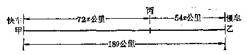

**【解】** 设两车出发后\(x\)小时相遇，那末快车走了\(72x\)公里，慢车走了\(54x\)公里，它们的和应当等于189公里。所以

$$
72 x + 54 x = 189
$$.

解这个方程，126x=189，

$$
\therefore x = 1.5
$$.

**答：**两车出发后1.5小时相遇。

**【说明】** 为了清楚地看出题中的数量关系，利用图来表示（图1.1），可以帮助我们分析理解，列出方程。这是分析应用题时一种常用的方法。

##### 例6

一队学生，去农村劳动，用每小时4公里的速度步行前去，出发20分钟后，学校有紧要事情需告诉队长。通讯员骑自行车用每小时14公里的速度追上去，通讯员要多少小时才能追上学生队伍？

**【审题】** 设通讯员追上学生队伍需要\(x\)小时。那末，通讯员每小时走14公里，\(x\)小时共走\(14x\)公里；学生队伍每小时走4公里，在前20分钟已经走了\(4 \times \frac{20}{60}\)公里。\(x\)小时又可走4 x 公里，所以总共走了\(4\left(\frac{20}{60}+x\right)\)公里。

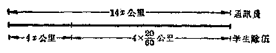

通讯员追上学生队伍时，他所走的路程，应该和学生队伍所走的路程相等。

**【解】** 设通讯员追上学生需要\(x\)小时，根据题意，得

$$
14 x = 4 \left(\frac{20}{60} + x\right)
$$。

解这个方程，\(7x = \frac{2}{3} +2x,5x = \frac{2}{3},\)

$$
\therefore x = \frac{2}{15}
$$.

**答：**通讯员需要\(\frac{2}{15}\)小时，就是8分钟才能追上学生队伍。

**【说明】** 本题中，步行的速度与自行车的速度都是每小时若干公里，而已知的时间却是20分钟，所以解题时必须化成同一单位。因此，把20分钟化成\(\frac{20}{60}\)小时。

1. 挖一条长 1210 米的水渠，由甲乙两生产队从两头同时施工。甲队每天挖 130 米，乙队每天挖 90 米。要几天水渠才能挖好？

2. 一条街长 1670 米，甲、乙两个学生从街的两头同时相向而行，甲骑自行车每小时走 21 公里，乙步行，经过 4 分钟后两人相遇，求乙每小时步行多少公里。

3. 有一架飞机，最多能在空中连续飞行 4 小时，飞出时候的速度是每小时 600 公里，飞回时候的速度是每小时 550 公里，这架飞机最远飞出多少公里就应该飞回来？

4. 两辆卡车装运棉花从产地开往仓库。第一辆卡车的速度是每小时40公里，开出半小时后，第二辆卡车也从产地开出，它的速度是每小时 50 公里，结果两车同时到达仓库。求产地和仓库之间的距离。

5. 甲、乙两站间的距离是284公里，一列慢车从甲站开往乙站，每小时走48公里；慢车走了1小时后，另有一列快车从乙站开往甲站，每小时走70公里。快车出发后几小时与慢车相遇？

6. 甲、乙两站相距360公里，一列慢车从甲站开出，每小时走48公里；一列快车从乙站开出，每小时走72公里。

（1） 两列火车同时开出，相向而行，多少小时后相遇？

（2） 快车先开 25 分钟，两车相向而行，在快车开出后几小时相遇？

7. 甲、乙两人骑自行车，同时从相距 65 公里的两地相向而行，2 小时后相遇，已知甲比乙每小时多走 2.5 公里，求乙每小时走多少公里？

8. 一人骑自行车从甲地去乙地联系工作，工作1小时，然后步行回甲地，他来回连工作共花5小时。自行车每小时走12公里，步行每小时走5公里，问甲地距乙地几公里？

##### 例7

一块农田要整地，由甲小队独做，3小时可以完成，乙小队独做6小时可以完成，两小队合做，几小时可以完成？

**【解】** 设两小队合做 x 小时完成。

甲小队独做，3小时完成全部工作，那末每小时做全部工作的\(\frac{1}{3}\)，所以\(x\)小时做了全部工作的\(\frac{1}{3} x\)；

乙小队独做，6小时完成全部工作，那末每小时做全部工作的\(\frac{1}{6}\)，所以\(x\)小时做了全部工作的\(\frac{1}{6} x\)。

因为两小队合做\(x\)小时，全部工作完成，所以

$$
\frac{1}{3} x + \frac{1}{6} x = 1
$$.

解这个方程，\(2x + x = 6\)，\(3x = 6\)，

$$
\therefore x = 2
$$.

**答：**两小队合做，2小时完成。

**【说明】** 全部工作是一件完整的工程，看做是1. 因此，甲小队每小时做了全部工作的\(\frac{1}{3}\)。以后类似这样的工程问题，都可以把全部工程作为1.

##### 例 8

某生产队要用含氨 0.15% 的氨水进行油菜追肥，现有含氨 16% 的氨水 30 斤，配制时需要加水多少斤？

**【审题】** 氨水加水后，重量和浓度都发生了变化，但是氨水中所含氨的重量没有变化，也就是有等量关系：

加水前含氨的重量 = 加水后含氨的重量。

**【解】** 设需要加水 x 斤，那末，加水前含氨的重量是\(30 \times 16\%\)斤；加水 x 斤后，氨水重量是\((30 + x)\)斤，它的浓度是 0.15%，因此氨水中含氨的重量是\((30 + x) \times 0.15\%\)斤。因为氨水中含氨的重量不变，所以

$$
(30 + x) \times \frac{0.15}{100} = 30 \times \frac{16}{100}
$$.

解这个方程，\(0.15(30+x)=30\times16\)

$$
30 + x = 3200， \quad \therefore x = 3170
$$.

**答：**需要加水 3170 斤。

1. 一件工程，甲队独做10天可以完成，乙队独做15天可以完成。两队合做多少天可以完成？

2. 一台机器的检修工作，甲小组单独修 7.5 小时完成，乙小组单独修 5 小时完成、两组合修需几小时完成。

3. 某池塘用三台抽水机抽水，单用第一台抽水机，3天就可以全部抽完，单用第二台抽水机，就需要4天，单用第三台抽水机，需要6天。如果三台同时用，几天可以全部抽完？

4. 一个蓄水池装有甲、乙、丙三个进水管。单独开放甲管，45分钟可以注满全池；单独开放乙管，60分钟可以注满全池；单独开放丙管，90分钟可以注满全池。如果三管一齐开放，几分钟可以注满全池？

5. 有含盐 15% 的盐水 20 公斤，要使盐水含盐 10%，需要加水多少公斤？

6. 有含盐 15% 的盐水 20 公斤，要使盐水含盐 20%，需要加盐多少公斤？

7. 某厂要配制浓度为 10% 的硫酸溶液 2940 公斤，需要浓度为 98% 的硫酸溶液多少公斤？

8. 要把浓度为 95% 的酒精溶液 600 克，稀释成消毒用的浓度为 75% 的酒精溶液，需加蒸馏水多少克？

9. 某生产队的试验田要喷洒 100 ppm（ppm 是浓度单位，表示百万分之一）的“稻脚青”溶液，在放 50 斤水的桶中，应加入 20% 的 “稻脚青”可湿性粉剂多少克（精确到 1 克）？

10. 在 90 克食盐中，要加入多少克水，方能配制成浓度为 15% 的盐水？

上面几个应用题里，所求的未知数都只有一个，所以设这个未知数后，就可以列出方程来。如果应用题里所求的未知数有两个或者多于两个，那末怎样设一个未知数，使得仍能列出一元一次方程呢？下面我们举例来说明。

##### 例9

两个数的和是8，它们的差是2，求这两个数。

**【审题】** 设较大的数是\(x\)，那末由于两个数的和是8，所以较小的数是\(8 - x\)。

再根据题意，“它们的差是\(2\)”，就可列出等式。

**【解】** 设较大的数是\(x\)，那末较小的数就是\(8 - x\)。根据题意，得

$$
x - (8 - x) = 2
$$.

解这个方程，2x=10，

$$
\therefore x = 5
$$.

较小的数是\(8 - x\)，将所得的\(x\)值代入，得

$$
8 - x = 8 - 5 = 3
$$.

**答：**这两个数是5与3.

**【注意】** 这个问题也可以设较小的数是\(x\)，那末较大的数是\(8 - x\)。再利用差的关系，得

$$
(8 - x) - x = 2
$$.

解这个方程，同样可以求得两个数是 5 与 3.

还可以设较大的数是\(x\)，利用差的关系，那末较小的数是\(x - 2\)。再利用和的关系列方程，得

$$
x + (x - 2) = 8
$$.

也可以设较小的数是\(x\)，利用差的关系，那末较大的数是\(x + 2\)。再利用和的关系列方程，得

$$
(x + 2) + x = 8
$$.

解这两个方程，都可以求得两个数是5与3.

从上面这个例子，我们可以看到：

列一元方程来解应用题，如果题目中所求的未知数多于一个，则可用一个字母表示其中任何一个未知数，根据题中的条件，用这个字母的代数式来表示其他的未知数，然后，再根据题中的另外条件，列出方程，求出这个未知数以后，把它代入那些代数式，就可求出另外的未知数。

##### 例10

汽车若干辆装运货物一批。每辆装3.5吨，这批货物就有2吨不能运走；每辆装4吨，那末装完这批货物后，还可以装其他货物1吨。汽车有多少辆？这批货物有多少吨？

**【审题】**

设汽车有\(x\)辆，那末按每辆装3.5吨计算，\(x\)辆汽车能装3.5x吨货物，这批货物就是\((3.5x + 2)\)吨；如果按每辆装4吨计算，\(x\)辆汽车可以装4x吨，但是装了其他货物1吨，所以这批货物就是\((4x - 1)\)吨。

因为\(3.5x+2\)和 4x-1 都表示这批货物的吨数，应该相等的，这样就可列出一个方程。

**【解】**

设汽车有\(x\)辆，那末这批货物的吨数。就是\(3.5x + 2\)，也就是\(4x - 1\)。所以

$$
3.5 x + 2 = 4 x - 1
$$.

解这个方程，-0.5x=-3，∴x=6。

代入\(4x - 1\)，得\(4x - 1 = 24 - 1 = 23\).

**答：**汽车有6辆，这批货物有23吨。

**【注意】**

也可以设这批货物有\(x\)吨，那末，如果按每辆装3.5吨计算，汽车就有\(\frac{x - 2}{3.5}\)辆；如果按每辆装4吨计算，汽车就有\(\frac{x + 1}{4}\)辆。所以列出方程是\(\frac{x - 2}{3.5} = \frac{x + 1}{4}\)。

虽然这应用题的解是一样的，但是这样列方程比较麻烦，解这个方程比较复杂，计算的时候也比较困难。

从这个例子，我们可以看到：

利用一元方程解应用题的时候，如果题目中的未知数多于一个，用字母表示哪一个未知数，就要看列方程是否容易，列出的方程是否简单，计算的时候是否简便来决定。

#### 习题1·6（4）

1. 某班师生自制教具，一共做得数学和物理教具 144 件，其中数学教具是物理教具的\(\frac{1}{2}\)，问数学和物理教具各有多少件？

2. 第一个正方形的边长比第二个多 10 厘米，它的面积比第二个多 400 平方厘米，两个正方形的边长各是多少？

3. 煤油连桶重 8 公斤，从桶中用去了一半煤油以后，连桶重 4.5 公斤。煤油和空桶各重多少公斤？

4. 在 155 米的长度内装设 25 根水管，一部分水管每根长 5 米，另一部分每根长 8 米，两种水管各要多少根？

5. 有货物一批，共重 39 吨，由载重 6 吨和 7.5 吨的驳船一次运走。已知载重 6 吨比载重 7.5 吨的驳船多 2 只，两种驳船各有多少只？

6. 用化肥若干斤给一块麦田追肥，每亩用 6 斤，还差 17 斤，每亩用 5 斤，就多 3 斤。这块麦田有多少亩？用化肥多少斤？

7. 一个工人接到加工一批零件的任务，要求在规定时间内完成。他打算每小时做10个，就可以超过任务3个，每小时做11个，就可以提前1小时完成。他加工的零件是多少个？规定多少小时完成？

8. 用两架掘土机掘土，第一架掘土机比第二架掘土机每小时多掘土40立方米。第一架工作16小时，第二架工作24小时，共掘土8640立方米。每架掘土机每小时可以掘土多少？

9. 两个水池共贮水 30 吨，现在甲池用去水 8 吨，乙池注进水 10吨，这样，甲池的水就比乙池的水少12吨。原来两个水池各有水多少吨？

10. 一辆汽车在第一次旅程中用去油箱里汽油的\(\frac{1}{4}\)，在第二次旅程中用去余下的汽油的\(\frac{1}{5}\)，这样油箱里还剩汽油 6 升。油箱里原来有汽油多少升？

11. 一条铁丝，第一次用去了它的一半少1米，第二次用去了剩下的一半多1米，结果还剩2.5米。这条铁丝原有多少长？

12. 长方形的长和宽的比是 5：3，周长是 96 厘米。求这个长方形的面积。

##### 例 11

某体育场的一条环行跑道长 400 米，甲练习长跑，平均

每分钟跑250米，乙练习自行车，平均每分钟走550米。两人同时从同地同向出发，经过多少分钟后两人又相遇？

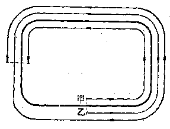

**【审题】** 因为两人从出发后到再相遇，乙必须比甲多走一圈的路程（图

1·3），就是乙比甲多走400米。这就是说，乙所走的路程比甲所走的路程多400米。

**【解】** 设经过\(x\)分钟后两人又相遇。那末两人相遇时，甲走了\(250a\)米，乙走了\(550a\)米。而实际上，乙比甲多走了400米。所以

$$
550 x - 250 x = 400
$$.

解这个方程，300x=400，

$$
\therefore x = \frac{4}{3} = 1 \frac{1}{3}
$$.

**答：**经过\(1\frac{1}{3}\)分钟后两人又相遇。

##### 例 12

一艘轮船在甲、乙两地之间航行，顺流行驶需要 4 小时，逆流行驶需要5小时。已知水流的速度是每小时2公里，求两地之间的距离。

**【审题】**

要解这个题目，首先要理解顺流里航行的速度，逆流里航行的速度，静水里航行的速度和水流的速度之间的关系。就是说，顺流里航行的速度是静水里航行的速度加上水流的速度，逆流里航行的速度是静水里航行的速度减去水流的速度。

现在用两种方法来解这个题目。

**【解1】**

设甲、乙两地之间的距离是\(x\)公里，那末：

顺流里的速度是每小时\(\frac{x}{4}\)公里，已知水流的速度是每小时 2 公里，所以静水里的速度是每小时\(\left(\frac{x}{4} - 2\right)\)公里；

逆流里的速度是每小时\(\frac{x}{5}\)公里，水流速度是每小时2公里，所以静水里的速度是每小时\(\left(\frac{x}{5} + 2\right)\)公里。

因为静水里的速度是相同的，所以\(\frac{x}{4}-2=\frac{x}{5}+2\)。

$$
5 x - 40 = 4 x + 40，
$$

$$
\therefore x = 80
$$.

**答：**甲、乙两地之间的距离是80公里。

**【解2】** 设轮船在静水里航行的速度是每小时 x 公里。那末：

顺流里航行的速度是每小时\((x + 2)\)公里；

逆流里航行的速度是每小时\((x - 2)\)公里；

顺流航行4小时，共走\(4(x+2)\)公里；

逆流航行5小时，共走\(5(x-2)\)公里。

因为甲、乙两地之间的距离是一定的，所以

$$
4 (x + 2) = 5 (x - 2)
$$。

$$
4 x + 8 = 5 x - 10， \quad - x = - 18，
$$

$$
\therefore x = 18
$$.

用\(x = 18\)代入\(4(x + 2)\)，得

$$
4 (x + 2) = 4 \times 20 = 80
$$.

**答：**甲、乙两地之间的距离是80公里，

从这个例子的两种解法，我们可以看到：

在列方程解应用题时，有时不直接设\(x\)表示题中所要求的未知数，而可间接设\(x\)表示题中另外一个未知数，通过这个未知数的值再求出题中所要求的结果。

应用这种方法，有时比较容易列出方程，解出结果来。

##### 例 13

一个两位数，它的十位上的数字比个位上的数字小 3，十位上的数字与个位上的数字的和等于这个两位数的\(\frac{1}{4}\)，求这个两位数。

**【解】** 设十位上的数字是\(x\)，那末，个位上的数字是\(x + 3\)，这个两位数是\(10x + (x + 3)\)，十位上的数字与个位上的数字的和是\(x + (x + 3)\)。根据题意，得

$$
x + (x + 3) = \frac{1}{4} [ 10 x + (x + 3) ]
$$。

解这个方程，\(2x+3=\frac{1}{4}(11x+3)\)，

$$
\begin{array}{l} 8 x + 12 = 11 x + 3， \quad - 3 x = - 9， \\ \therefore x = 3. \\ \end{array}
$$

用\(x = 3\)，代入\(x + 3\)，得

$$
x + 3 = 3 + 3 = 6
$$.

**答：**这个两位数是36.

**【说明】**

（1） 用代数式表示两位数要特别注意。例如，两位数54，实际上表示\(5 \times 10 + 4\)，因为十位上的数字1，就表示10，2表示20等等。一般地说，如果十位上的数字是\(a\)，个位上的数字是\(b\)，那末这个两位数是\(10a + b\)，不能写成\(ab\)的形式。因为代数式\(ab\)只表示\(a\)与\(b\)的乘积，它和\(10a + b\)所表示的意义是绝然不同的。决不能因为两位数54写成“54”的形式而产生误会。

同样，如果有一个三位数，它的百位上的数字是\(x\)，十位上的数字是\(y\)，个位上的数字是\(z\)，那末，这个三位数应该写成\(100x + 10y + z\)。

（2） 在这个问题里，如果直接设所求的两位数是\(x\)，显然，就不好列式。因此，我们才设十位上的数是\(x\)。

本题也可以设个位上的数是\(x\)，解法由读者自行完成。

1. 甲、乙两人练习短距离赛跑，甲每秒钟跑7米，乙每秒钟跑6.5米。

（1） 如果甲让乙先跑 5 米，几秒钟后可以追及乙？

（2） 如果甲让乙先跑 1 秒钟，几秒钟后可以追及乙？

2. 某市举行环城自行车竞赛，最快的人在出发后 35 分钟遇到最慢的人。已知最慢的人的速度是最快的人的速度的\(\frac{5}{7}\)，环城一周是 6 公里，两人的速度各是多少？

3. 甲、乙两个运动员在田径场竞走，环跑道一周是400米，乙的速度平均每分钟80米，甲的速度是乙的\(1\frac{1}{4}\)。现在甲在乙的前面100米，多少分钟以后两人才能相遇？

4. 一个通讯员骑自行车在规定时间内把信件送到某地。他每小时走15公里，可以早到24分钟；如果每小时走12公里，就要迟到15分钟，原定的时间是多少？他去某地的路程有多远？

5. 工人甲接到做 120 个零件的任务，工作 1 小时后，因为要提前完成，调来工人乙与甲合作，再做 3 小时就完成。已知乙每小时比甲能做 5 个零件，求甲、乙两工人每小时各做多少个零件。

6. 一艘轮船，航行于甲、乙两地之间，顺水要 3 小时，逆水要 3.5 小时，已知轮船在静水里航行的速度是每小时 26 公里，求水流的速度。

7. 三个连续整数的和是 15，它们的积是多少？

【提示：象2，3，4或者7，8，9等就是三个连续整数。连续整数的特点是相邻两个数的差等于1.】

8. 一个两位数的十位上的数是个位上的数的2倍，如果把十位上的数和个位上的数对调，那末得到的数就比原数小36，求原来的两位数。

9. 三个连续偶数的和比其中最大的一个大10，这三个连续偶数的和等于多少？

【提示：象2，4，6或者8，10，12就是三个连续偶数。连续偶数的特点是相邻两个数的差等于2，并且每个数都能被2整除。】

##### 例 14

某化学实验室有两种不同浓度的酒精，甲种的浓度是90%，乙种的浓度是75%。现在要配成浓度是85%的酒精12升，两种酒精应该各取多少升？

**【解】** 设甲种酒精取\(x\)升，那末乙种酒精取\((12 - x)\)升。

在\(x\)升浓度是\(90\%\)的酒精里，含有纯酒精\(\frac{90}{100} x\)升；

在\((12 - x)\)升浓度是\(75\%\)的酒精里，含有纯酒精\(\frac{75}{100} (12 - x)\)升；

在 12 升浓度是 85% 的酒精里，含有纯酒精\(\frac{85}{100} \times 12\)升。

因为甲、乙两种酒精里所含纯酒精的总量，应该等于浓度是85%的12升酒精里所含纯酒精的量，所以

$$
\frac{90}{100} x + \frac{75}{100} (12 - x) = \frac{85}{100} \times 12
$$.

解这个方程，\(90x+900-75x=1020\)

$$
15 x = 120，
$$

$$
\therefore x = 8
$$.

代入 12-x，得

$$
12 - x = 12 - 8 = 4
$$.

**答：**甲种酒精应取8升，乙种酒精应取4升。

##### 例 15

一种黑火药，它所用的原料硝酸钾、硫磺、木炭的重量比是 15：2：3. 要配制这种火药 160 斤，三种原料应分别用多少斤？

**【审题】** 这个题目要求三个未知数，如果用\(x\)表示其中一种原料的斤数，再用\(x\)的代数式来表示其余两种原料的斤数，就比较麻烦。我们知道，三种原料的重量比是15：2：3，就说明硝酸钾、硫磺、木炭的重量各占总重量的15份、2份、3份。如果设其中每一份的重量是\(x\)斤，那末三种原料的重量分别是15x斤、2x斤、3x斤。

**【解】** 因为这三种原料重量的比是15：2：3，所以可设硝酸钾、硫磺、木炭的重量分别是15x斤、2x斤、3x斤。

根据题意，得\(15x + 2x + 3x = 160\)。

解这个方程，20x=160，

$$
\therefore x = 8
$$.

所以 15x=120；2x=16；3x=24.

**答：**硝酸钾、硫磺、木炭应分别用120斤、16斤、24斤。

#### 习题1·6（6）

1. 有银和铜的合金 200 克，其中含银 2 份，含铜 3 份，现在要改变合金的成分，使它成为含银 3 份，含铜 7 份，应该再加入铜多少？【提示：含银 2 份，含铜 3 份，就是合金里\(\frac{2}{5}\)是银，\(\frac{3}{5}\)是铜。】

2. 某数学学习小组原来女同学的人数占全组人数的\(\frac{1}{3}\)，后来加入了 4 个女同学，女同学的人数就占全组人数的\(\frac{1}{2}\)。问该小组原来有多少个同学？

3. 有两种合金，第一种含金\(90\%\)，第二种含金\(80\%\)。现在要制成含金\(82.5\%\)的合金 240 克，应该每种各取多少克？

4. 甲种铁矿石含铁的百分数是乙种铁矿石含铁的百分数的1.5倍。甲种矿石5份与乙种矿石3份混合成的矿石含铁\(52.5\%\)，求各种矿石含铁的百分数。

5. 金放在水里称，要减轻本身重量的\(\frac{1}{19}\)，银放在水里称，要减轻本身重量的\(\frac{1}{10}\)。一块金和银的合金重 530 克，在水里称重量减轻 35 克。这块合金里含有金和银各多少克？

6. 甲、乙、丙三个生产队合修一条水渠，计划出工52人，按照各队受益土地亩数的比3：4：6出工。三队各要出工多少人？

7. 配制一种农药，其中生石灰、硫磺和水的重量的比是 1：2：14，要配制这种农药 2550 公斤，各种原料分别需要多少公斤？

8. 有一种绝热的泥料，它的组成物石棉丝、耐火粘土、细磨熟料的重量的比是 3：7：10。现在要配成 3000 公斤的绝热泥料，三种原料各需要多少公斤？

9. 建筑工人在施工中，使用一种混凝土，是由水、水泥、黄沙、碎石搅拌而成的。这四种原料的重量的比是 0.7：1：2：4.7。搅拌这种混凝土 2100 公斤，分别需要水、水泥、黄沙、碎石多少公斤？

10. 甲、乙、丙三个生产队合修一条水渠，计划需派120人。根据各队的具体情况，甲队出的人数是乙队出的人数的1.5倍，乙队出的人数是丙队出的人数的2倍。求各队应分别出多少人。

11. 有甲、乙、丙三种材料混在一起，甲与乙的重量的比是 3：2，乙与丙的重量的比是 3：2。如这种材料共有 380 吨，三种材料各有几吨？

12. 长方形的长是宽的 2 倍。如果宽增加 3 厘米，那末长方形的面积就增加 24 平方厘米。这个长方形原来的面积是多少？

13. 如果一个长方形的长减少 4 厘米，而宽增加 7 厘米，就成了一个正方形，并且这个正方形的面

积比长方形的面积大 100 平方厘米。求这个长方形的长和宽。

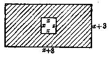

14. 因加工需要在长方形铁板的中央开一个正方形的口，口一边的长比铁板的长少8厘米，比铁板的

宽少3厘米，这样，铁板的面积就剩下68平方厘米。求原来铁板的面积。

15. 收割一块麦地，每小时收割4亩，预计若干小时完成。收割了\(\frac{2}{3}\)以后，改用新式农具，工作效率提高到原来的\(1\frac{1}{2}\)倍，因此比预定时间提早1小时完成。这块麦地的面积是多少？

### § 1·7 分式方程

#### 1. 分式方程的意义

我们来看下面这个问题：

某生产队收割全部夏收作物，共需要12天。由于学生下乡参加夏收，和农民一起劳动，结果只用了8天全部收割完毕。问学生单独去完成这项夏收任务需要几天？

设学生单独劳动需要 x 天才能完成，那末每天能完成全部任务的\(\frac{1}{x}\)。

农民单独劳动需要12天，所以每天能完成任务的\(\frac{1}{12}\)。

现在学生和农民一起劳动只需8天，所以每天能完成任务的\(\frac{1}{8}\)。

根据题意，可以列出方程：

$$
\frac{1}{x} + \frac{1}{12} = \frac{1}{8}
$$.

这个方程，分母中含有未知数，和我们前面所学过的方程不同。

分母中含有未知数的方程叫做分式方程。例如，\(\frac{5}{x} = 2, \frac{1}{x - 3} + 2 = \frac{7 - x}{x - 3}, \frac{1}{1 - x^2} = \frac{3}{1 - x} - \frac{5}{1 + x}\)等都是分式方程。

#### 2. 可以化为一元一次方程来解的分式方程的解法

有些分式方程，只要把方程的两边都乘以同一个含有未知数的整式，就能变形成为一个一元一次方程，然后解这个一元一次方程，就可以找到原来分式方程的解。下面我们举例来说明。

##### 例1

解上面问题中的方程：

$$
\frac{1}{x} + \frac{1}{12} = \frac{1}{8}
$$.

**【解】** 因为各分式的最简公分母是\(24x\)，所以方程两边都乘以\(24x\)，使它变形成为整式方程，得\(24 + 2x = 3x\)。

解这个方程，\(x = 24\)，

$$
\therefore x = 24
$$.

**【检验】** 把\(x = 24\)代入原方程，

左边\(= \frac{1}{24} +\frac{1}{12} = \frac{1}{8} =\)右边，

∴ x=24 是原方程的根。

**【说明】** 检验时，必须把求得的\(x\)的值代入原分式方程，不能代入变形后所得的整式方程。

##### 例2

解方程：

$$
\frac{5}{x - 1} = \frac{1}{x + 3}
$$.

**【解】** 方程两边都乘以\((x - 1)(x + 3)\)，得

$$
5 (x + 3) = x - 1
$$.

解这个方程，\(5x + 15 = x - 1, 4x = -16,\)

$$
\therefore x = - 4
$$.

**【检验】** 把\(x = -4\)代入原方程：

左边\(= \frac{5}{-4 - 1} = -1\)，右边\(= \frac{1}{-4 + 3} = -1\).

∵ 左边=右边，

∴ x = -4 是原方程的根。

#### 习题1·7（1）

解下列各方程：

1.\(\frac{3}{x - 1} = 5\).

2.\(\frac{7x}{x + 2} - 2 = 0\).

3.\(1 - \frac{1}{x - 4} = \frac{5 - x}{x - 4}\)。

4.\(\frac{2}{x + 2} -\frac{2 - x}{2 + x} = 3\).

5.\(\frac{3}{x - 2} = \frac{5}{x}\)。

6.\(\frac{x}{x - 5} = \frac{x - 2}{x - 6}\)。

7.\(\frac{9}{2y - 1} = \frac{2}{3y + 10}\)。

8.\(\frac{y + 1}{y - 1} = \frac{y - 5}{y - 3}\)。

9.\(\frac{9x - 7}{3x - 2} = \frac{4x - 5}{2x - 3} = 1\).

10.\(\frac{6x - 1}{3x + 2} -\frac{4x - 7}{2x - 5} = 0\).

##### 例 3

解下列方程：

（1）\(\frac{1}{x - 3} + 2 = \frac{7 - x}{x - 3}\)；

（2）\(\frac{1}{x - 3} + 2 = \frac{4 - x}{x - 3}\)。

**【解】** （1） 方程两边都乘以\(x - 3\)，得

$$
1 + 2 (x - 3) = 7 - x
$$.

解这个方程，\(3x = 12\)

$$
\therefore x = 4
$$.

**【检验】** 把\(x = 4\)代入原方程：

左边\(= \frac{1}{4 - 3} + 2 = 3\)，右边\(= \frac{7 - 4}{4 - 3} = 3\).

∵ 左边=右边，∴ x=4 是原方程的根。

（2） 方程两边都乘以\(x - 3\)，得\(1 + 2(x - 3) = 4 - x\)。

解这个方程，得 x=3.

如果把\(x = 3\)代入原方程，分式\(\frac{1}{x - 3}\)和\(\frac{4 - x}{x - 3}\)的分母都等于零，这些分式就没有意义，所以\(x = 3\)不是原方程的根，也就是说，原方程没有根。

这是怎么一回事呢？难道我们的解法有错误吗？不，解法没有错误。下面就来研究这个问题。

我们把（1）、（2）两题来对比一下，在第（1）题中，把\(x = 4\)代入变形后的方程\(1 + 2(x - 3) = 7 - x\)，两边是相等的；把\(x = 4\)代入原方程中，两边也是相等的。因此，\(x = 4\)既是原方程的根，也是变形后的方程的根。但是在第（2）题中，把\(x = 3\)代入变形后的方程\(1 + 2(x - 3) = 4 - x\)，两边是相等的，所以\(x = 3\)是变形后的方程的根。而把\(x = 3\)代入原方程，分式就没有意义，所以\(x = 3\)不是原方程的根。这个事实告诉我们，方程的两边都乘以同一个含有未知数的整式，有时所得的整式方程的根就是原方程的根，而有时所得的根却不是原方程的根。

这种解变形后的方程得出来的不适合于原方程的根叫做增根。

为什么会产生增根呢？先来看第（1）题，在去分母的时候，我们是用整式\(x - 3\)去乘原方程的两边。因为在\(x = 4\)的时候，整式\(x - 3\)不等于零，也就是说。我们只是用不等于零的同一个数去乘方程的两边，根据方程的第二个基本性质，所得的方程和原方程是同解方程，所以所得的方程的根和原方程的根完全一样。但是，在第（2）题中，我们用来乘原方程两边的，虽然也是整式\(x - 3\)，但由于当\(x = 3\)时，\(x - 3 = 0\)，所以实际上是用 0 去乘原方程的两边，因此，变形后的方程和原方程的根就不一样。\(x = 3\)只是变形后的方程的根，不是原方程的根，这样就产生了增根。

从上面所说的，我们可以看到：

如果方程的两边都乘以同一个整式，就可能产生增根。

因此，在解分式方程的时候，我们必须把解变形后的方程所得的根代入原方程，进行检验，如果适合的，才是原方程的根；如果不适合的，就是增根，应该把它去掉。

从上面所说的可以知道，凡是把求得的根代入原方程时，使分式的分母等于零的，这个根就是增根。因此，检验时为了简便起见，也可以把求得的根代入方程两边所乘的整式中去检验：只要在解的过程中不发生错误，那末如果它的值不是零，所得的根，就是原方程的根；如果它的值等于零，所得的根，就是增根。

##### 例4

解方程：

$$
\frac{1}{1 - x ^ {2}} = \frac{3}{1 - x} - \frac{5}{1 + x}
$$.

**【解】** 因为各分式的最简公分母是\(1 - x^2\)，所以方程的两边都乘以\(1 - x^2\)，得\(1 = 3(1 + x) - 5(1 - x)\)。

解这个方程，\(1 = 3 + 3x - 5 + 5x, -8x = -3,\)

$$
\therefore x = \frac{3}{8}
$$.

因为把\(x = \frac{3}{8}\)代入整式\(1 - x^2\)，所得的值不等于零，所以\(x = \frac{3}{8}\)是原方程的根。

#### 解分式方程的一般步骤

（1） 用一个适当的整式（通常取各分式的最简公分母）乘方程的两边，使它变形成为一个整式方程。

（2） 解所得的整式方程。

（3） 把所求得的根进行检验。如果适合的，就是原方程的根；如果使原方程失去意义（即某些分母等于0），就是增根，应该去掉。

##### 例5

解方程：

$$
\frac{3}{x} + \frac{6}{x - 1} - \frac{x + 5}{x(x - 1)} = 0
$$.

**【解】** 两边都乘以分式的最简公分母\(x(x - 1)\)，得

$$
3 (x - 1) + 6 x - (x + 5) = 0
$$.

解这个方程，\(8x - 8 = 0\)

$$
\therefore x = 1
$$.

**【检验】** 把\(x = 1\)代入\(x(x - 1)\)，它的值等于0，所以\(x = 1\)不是原方程的根。

∴ 原方程没有根。

##### 例6

解方程：

$$
\frac{2}{x ^ {2} + 5 x + 6} + \frac{3}{x ^ {2} + x - 6} = \frac{4}{x ^ {2} - 4}
$$.

**【审题】** 先要把各分式的分母分解因式，再求出分式的最简公分母。

**【解】** 原方程变成

$$
\frac{2}{(x + 2) (x + 3)} + \frac{3}{(x - 2) (x + 3)} = \frac{4}{(x + 2) (x - 2)}
$$.

两边都乘以最简公分母\((x + 2)(x - 2)(x + 3)\)，得

$$
2 (x - 2) + 3 (x + 2) = 4 (x + 3)
$$。

解这个方程，\(2x - 4 + 3x + 6 = 4x + 12\)

$$
\therefore x = 10
$$.

**【检验】** 把\(x = 10\)代入\((x + 2)(x - 2)(x + 3)\)，它的值不等于零，所以\(x = 10\)是原方程的根，

解下列各方程（1~11）：

1.\(\frac{4}{x + 2} -\frac{2 - x}{2 + x} = 3\).

2.\(\frac{10x}{2x - 1} +\frac{5}{1 - 2x} = 2\).

3.\(\frac{2y + 5}{3y - 6} -\frac{1}{2} = \frac{5y - 4}{2y - 4}\)

4.\(\frac{7}{x + 1} +\frac{1}{x^2 - 1} = \frac{6}{(x + 1)(x - 1)}\).

5.\(\frac{1 - 3x}{1 + 3x} +\frac{3x + 1}{3x - 1} = \frac{12}{1 - 9x^2}\).6.\(\frac{4}{x^2 - 1} +\frac{x - 3}{1 - x} +1 = 0\).

7.\(\frac{3}{1 - y^2} = \frac{2}{1 + 2y + y^2} - \frac{5}{1 - 2y + y^2}\)。

8.\(5 + \frac{96}{x^2 - 16} = \frac{2x - 1}{x + 4} - \frac{3x - 1}{4 - x}\)。

9.\(\frac{1}{x^2 - 2x - 3} + \frac{2}{x^2 - x - 6} - \frac{3}{x^2 + 3x + 2} = 0\).

10.\(\frac{1 - x}{1 + x + x^2} + \frac{6}{1 - x^2} = \frac{1}{1 - x}\)。

11.\(\frac{7}{x^2 - 1} + \frac{8}{x^2 - 2x + 1} = \frac{37 - 9x}{x^3 - x^2 - x + 1}\)。

【提示：\(x^{3} - x^{2} - x + 1 = x^{2}(x - 1) - (x - 1) = (x - 1)(x^{2} - 1) = (x - 1)^{2}\times (x + 1).]\)

12. （1）\(x\)是什么数值时，代数式\(\frac{1}{x^2 - 1} + \frac{1}{x + 1} - \frac{1}{1 - x}\)的值是零；

（2）\(x\)是什么数值时，代数式\(\frac{x}{6 - 2x} + \frac{11}{5}\)和\(\frac{x - 1}{x - 3}\)的值相等。

#### 3. 含有字母系数的分式方程的解法

解含有字母系数的分式方程的步骤和解数字系数的分式方程的步骤一样，但是要注意这些字母可以取的值有什么限制。下面举例来说明。

##### 例7

解关于\(x\)的方程：

$$
\frac{1}{a} + \frac{a}{x} = \frac{1}{b} + \frac{b}{x} \quad (a \neq 0， b \neq 0， a \neq b)
$$。

**【解】** 两边都乘以\(abx\)，得\(bx + a^2b = ax + ab^2\)。

解这个方程，

$$
b x - a x = a b ^ {2} - a ^ {2} b，
$$

$$
(b - a) x = a b (b - a)
$$。

因为\(a \neq b, b - a \neq 0\)，两边都除以\(b - a\)，得

$$
x = a b
$$.

**【检验】** 把\(x = ab\)代入整式\(abx\)，得到\(a^2b^2\)。因为\(a \neq 0, b \neq 0\)，所以\(a^2b^2 \neq 0\)。

∴ x=a b 是原方程的根。

##### 例8

解关于\(x\)的方程：

$$
\frac{x + a}{b(x + b)} + \frac{x + b}{a(x + a)} = \frac{a + b}{ab}
$$

$$
(a \neq 0， b \neq 0， a \neq b)
$$。

**【解】** 两边都乘以最简公分母\(ab(x + a)(x + b)\)，得

$$
a (x + a) ^ {2} + b (x + b) ^ {2} = (a + b) (x + a) (x + b)
$$。

整理后，得

$$
(a ^ {2} - 2 a b + b ^ {2}) x = a ^ {2} b + a b ^ {2} - a ^ {3} - b ^ {3}，
$$

$$
(a - b) ^ {2} x = a ^ {2} (b - a) + b ^ {2} (a - b)，
$$

$$
(a - b) ^ {2} x = (a - b) (b ^ {2} - a ^ {2})，
$$

$$
(a - b) ^ {2} x = - (a - b) ^ {2} (a + b)
$$。

因为\(a - b \neq 0\)，所以\((a - b)^2 \neq 0\)，两边都除以\((a - b)^2\)，得

$$
x = - (a + b)
$$。

**【检验】** 把\(x = -(a + b)\)代入整式\(ab(x + a)(x + b)\)，它不等于零。

∴\(x = -(a + b)\)是原方程的根。

#### 习题1·7（3）

解下列关于\(x\)的方程\((1 \sim 5)\)：

1.\(\frac{a + b}{x} = \frac{a}{b} + 1\)（\(b \neq 0, a + b \neq 0\)）。

2.\(\frac{x + m}{x - n} + \frac{x + n}{x - m} = 2\)（\(m + n \neq 0, m \neq n\)）。

3.\(\frac{x}{x + 2a} = \frac{x}{x - 2a} = \frac{a^2}{4a^2 - x^2}\)\((a \neq 0)\)。

4.\(\frac{a}{x^2 - 2ax + a^2} = \frac{2}{a - x} = \frac{3}{x - a}\)\((a \neq 0)\)。

5.\(\frac{a}{b}\left(1 - \frac{a}{x}\right) = 1 - \frac{b}{a}\left(1 - \frac{b}{x}\right)\)\((a^3 + b^3 \neq 0)\)。

6. 已知\(\frac{ax + b}{cx + d} = t\)，用\(a, b, c, d, t\)来表示\(x (a \neq ct)\)。

7. 已知\(\frac{1}{R} = \frac{1}{r_1} + \frac{1}{r_2}\)，推导出\(R = \frac{r_2}{1 + \frac{r_2}{r_1}}\)。

### § 1·8 列出分式方程解应用题

在 §1·6 里，我们已经学过列出一元一次方程来解应用题。在实际问题中，有时列出的方程可能是一个分式方程，那就得应用分式方程来解。

下面我们看几个例子：

#### 例 1

某农具厂新购一台自动化机床。用自动化机床与旧机床同时加工一批零件，共花了4.5小时，已知旧机床单独工作需要18小时才能完成任务，自动化机床单独工作需要几小时能完成？自动化机床的效率是旧机床的几倍？

**【解】** 设自动化机床单独工作，需要 x 小时才能完成任务，那末自动化机床每小时能完成任务的\(\frac{1}{x}\)。

因为旧机床单独工作，需要18小时才能完成任务，所以它每小时能完成任务的\(\frac{1}{18}\)。

因为两台机床同时工作，需要4.5小时，所以每小时能完成任务的\(\frac{1}{4.5} = \frac{2}{9}\)。

根据题意，列出方程\(\frac{1}{x} + \frac{1}{18} = \frac{2}{9}\)

两边都乘以最简公分母\(18x\)，得\(18 + x = 4x\)。

解这个方程，\(-3x = -18\)

$$
\therefore x = 6
$$.

把\(x = 6\)代入整式\(18x\)，它不等于0，所以\(x = 6\)是原方程的根。

因为旧机床做同样的工作，需要18小时，所以自动化机床的效率是旧机床的3倍。

**答：**自动化机床单独工作，需要6小时才能完成

任务；自动化机床的效率是旧机床的3倍。

##### 例2

一个车工加工1500个螺丝以后，由于改进了操作方法和工具，工作效率提高到原来的\(2\frac{1}{2}\)倍，因此再车1500个螺丝时，较前提早18小时完成。前后两种方法，每小时各加工多少个螺丝？

**【解】** 设车工以前每小时能加工\(x\)个螺丝，那末加工 1500 个螺丝，需要\(\frac{1500}{x}\)小时。

改进操作方法和工具后，每小时能加工\(2\frac{1}{2} \times x = \frac{5}{2}\)\(x\)个螺丝，那末加工1500个螺丝，需要\(\frac{1500}{\frac{5}{2}} x\)小时。

因为后一次比前一次提早18小时完成，所以得到方程

$$
\frac{1500}{x} - \frac{1500}{\frac{5}{2} x} = 18
$$.

就是\(\frac{1500}{x} -\frac{600}{x} = 18,\quad \frac{900}{x} = 18,\)

$$
\therefore x = 50
$$.

把\(x = 50\)代入原方程，知道\(x = 50\)是原方程的根。

把\(x = 50\)代入\(\frac{5}{2} x\)，得\(\frac{5}{2} x = 125\).

**答：**车工原来每小时能加工50个螺丝；

改进后，每小时能加工125个螺丝。

**【说明】** 在解方程时，先把\(\frac{1500}{\frac{5}{2}x}\)化成\(\frac{1500}{x} \cdot \frac{2}{5} = \frac{600}{x}\)，这样，可以和分式\(\frac{1500}{x}\)有相同的分母，运算就可以简便。

##### 例 3

某生产大队离城市 50 公里。甲乘自行车从大队出发进城，出发 1 小时 30 分钟后，乙乘摩托车也从大队出发进城，结果乙比甲先到 1 小时。已知乙的速度是甲的速度的 2.5 倍，求甲、乙两人的速度。

**【解】** 设甲的速度是每小时 x 公里，那末乙的速度是每小时 2.5x 公里；

因为大队离城市50公里，所以甲从大队到城需要\(\frac{50}{x}\)小时，乙从大队到城需要\(\frac{50}{2.5x}\)小时。

因为甲早出发1小时30分钟（即1.5小时），并且迟到1小时，所以从大队到城，甲比乙多花了\((1.5+1)\)小时。因此，可以列出方程

$$
\frac{50}{x} = \frac{50}{2.5 x} + 1.5 + 1
$$.

就是\(\frac{50}{x} = \frac{20}{x} +\frac{5}{2}\)

两边都乘以\(2x\)，得\(100 = 40 + 5x\)。

解这个方程，得 x=12.

把\(x = 12\)代入\(2x\)，不等于0，所以\(x = 12\)是原方程的根。

把\(x = 12\)代入\(2.5x\)，得\(2.5x = 2.5 \times 12 = 30\)。

**答：**甲的速度是每小时12公里，

乙的速度是每小时30公里。

**【说明】**

注意把时间单位化成同一单位，所以 1 小时 30 分钟化成 1.5 小时。

##### 例4

大小两部抽水机给一块地浇水，两部合浇了2小时以后，由小抽水机继续独浇1小时完成。已知小抽水机独浇这块地所需的时间，等于大抽水机独浇所需时间的1.5倍，求每部抽水机单独浇这块地各需要多少小时。

**【解】**

设大抽水机独浇要\(x\)小时，那末小抽水机独浇要1.5x小时。大抽水机每小时浇这块地的\(\frac{1}{x}\)，2小时浇这块地的\(\frac{2}{x}\)；小抽水机每小时浇这块地的\(\frac{1}{1.5x}\)，共浇\((2 + 1)\)小时，浇这块地的\(\frac{2 + 1}{1.5x}\)。

因为它们合起来浇的地就是这一整块的地，所以

$$
\frac{2}{x} + \frac{2 + 1}{1.5 x} = 1
$$.

化简后，得\(\frac{4}{x} = 1,\)

$$
\therefore x = 4
$$.

代入1.5x，得1.5x=6。

**答：**大抽水机独浇要4小时，小抽水机独浇要6小时。

#### 习题1·8

1. 把 96 人分成甲乙两组，使甲组人数和乙组人数的比等于 3：5，两组各有多少人？

2. 一个车间加工 720 个零件，预计每天做 48 个，就能如期完成。现在要提前 5 天完成，每天应该做多少个？

3. 国营农场一块地，用一架拖拉机来耕，4天耕完一半，后来增添了一架新式的拖拉机，两架合作，1天就耕完了其余的一半。新式拖拉机单独耕这块地，需要几天？新式拖拉机的效率是原来拖拉机的几倍？

4. 沿河有两个城市，相距 180 公里，乘船顺水航行，4 小时可以到达，如果水流速度是每小时8公里，船在静水里每小时能行多少公里？逆水回来需要多少小时？

5. 一架飞机顺风飞行 1380 公里和逆风飞行 1020 公里所需的时间相等。已知这架飞机的速度是每小时 360 公里，求风的速度。

6. 甲、乙两地相距 80 公里，一辆长途汽车从甲地开出 3 小时后，一辆小汽车也从甲地开出，结果小汽车比长途汽车迟 20 分钟到达乙地。已知小汽车和长途汽车的速度的比是 3：1，求小汽车和长途汽车的速度。

7. 甲、乙两个车工，同时分别车1500个螺丝。乙改进了操作方法，生产效率提高到等于甲的3倍，因此比甲少用20个小时完工。他们每小时各车多少个螺丝？

8. 甲、乙两个生产队共同耕完一块土地需要4天。如果由一个队单独来耕，那末甲队需要的天数等于乙队的2倍。求甲、乙两队单独耕完这块土地所需的天数。

9. 一件工程要在计划的日期内完成。如果甲单独做，刚好能够完成。如果乙单独做，就要超过计划完成日期3天。现在由甲、乙两人合作2天后，剩下的工程由乙单独做，刚好在计划日期完成。计划的日期是几天？

【提示：计划日期的天数等于甲单独做所需的天数，故可设甲单独做所需的天数是\(x\)，那末乙单独做所需的天数是\(x + 3\)。】

10. 甲乙丙三人合做一件工作 12 天完成，已知甲 1 天完成的工作，乙需要做 1.5 天，丙需要做 2 天。三人单独完成这件工作，各需要多少天？

11. 稻田一块，用甲乙两部水车浇水，一共需要12小时浇完。如果用甲水车单独来浇需要20小时，用乙水车单独来浇需要多少小时？

12. 一个作业小组，锄草 15 亩以后，因为增加了人数，每小时锄草的亩数等于原来的 1.5 倍，后来锄草 20 亩的时间比原来锄草 15 亩的时间少 20 分钟。原来每小时锄草多少亩？

### 本章提要

1. 几个重要的概念 等式，恒等式，方程，方程的解，解方程，同解方程，整式方程，分式方程，增根。

#### 2. 方程的两个基本性质

（1） 方程的两边都加上（或者都减去）同一个数或者同一个整式，所得的方程和原方程是同解方程；

（2） 方程的两边都乘以（或者都除以）同一个不等于零的数，所得的方程和原方程是同解方程。

3. 一元一次方程的解法 应用移项法则，并且合并同类项，把方程化简成\(ax = b\)的形式，再求出方程的解。

方程\(ax = b\)的解有三种情况：

（1） 当\(a \neq 0\)时，方程有一个解\(\frac{b}{a}\)；

（2） 当\(a = 0, b \neq 0\)时，方程没有解；

（3） 当\(a = 0, b = 0\)时，方程有无数个解。

#### 4. 可以化为一元一次方程的分式方程的解法

（1） 先把原方程变形成整式方程；

（2） 解所得的一元一次方程；

（3） 进行检验。

#### 5. 列方程解应用题的一般步骤

（1） 审题，要仔细阅读题目，分析题意；

（2） 设元和列出方程，要选择适当的未知数设元，再根据题意列出方程；

（3） 解方程，求出未知数的值；

（4） 检验并且写出答案。

### 复习题一A

1. （1） 等式、恒等式和方程有什么区别？各例两个例子；

（2） 什么叫做方程的根？

2. 利用乘法公式，证明下列等式是恒等式：

（1）\((a - b)(a + b)(a^2 + b^2)(a^4 + b^4) = a^8 - b^8;\)

【提示：先把开头两因式相乘，再依次与第三个、第四个因式相乘。】

（2）\((a + b)^{3}(a - b)^{3} = a^{6} - 3a^{4}b^{2} + 3a^{2}b^{4} - b^{6}\)。

【提示：\((a + b)^{3}(a - b)^{3} = [(a + b)(a - b)]^{3}\).

3. 举例说明同解方程的意义和方程的两个基本性质。

4. 判别下列各题中的两个方程是不是同解方程：

（1）\(3x + 5 = 7x - 1\)和\((3x + 5) + (2x + 1) = (7x - 1) + (2x + 1)\)；

（2）\(\frac{y - 4}{5} = \frac{y + 2}{3}\)和\(3(y - 4) = 5(y + 2)\)。

5. 解下列各方程：

（1）\(3(x - 7) - 2\{x + 9 - 3[9 - 4(2 - x)]\} = 22;\)

（2）\(\frac{5x + 1}{6} +\frac{3x - 1}{5} = \frac{9x + 1}{8} -\frac{1 - x}{3},\)

（3）\(y - \frac{5}{17}(2y - 1) = \frac{7}{34}(1 - 2y) + \frac{10y - 3}{2}\).

6. 解下列各方程：

（1）\((x - 3)^{2} + (x - 4)^{2} = (x - 2)^{2} + (x + 3)^{2}\)；

（2）\((4x + 5)(4x - 5) = 4(2x + 3)^{2} - (100x - 17)\)。

7. 解下列各方程：

（1）\(\frac{x + 5}{x - 1} - \frac{3x - 3}{x + 5} = \frac{8x + 28}{x^2 + 4x - 5} - 2;\)

（2）\(\left(1 + \frac{2}{x - 2}\right)^2 + \left(1 - \frac{2}{x - 2}\right)^2 = \frac{2x}{x - 2}\)；

（3）\(\frac{3 - x}{1 - x} - \frac{5 - x}{7 - x} = 1 - \frac{x^2 - 2}{x^2 - 8x + 7}\)。

8. 解下列关于\(x\)的方程：

（1）\(\frac{x + 1}{a + b} + \frac{x - 1}{a - b} = \frac{2a}{a^2 - b^2}\)\((a \neq 0)\)；

（2）\(\left(\frac{m}{n} + \frac{n}{m}\right)x = \frac{m}{n} - \frac{n}{m} - 2x\)（\(m + n \neq 0\)）；

（3）\(\frac{a^2 - 2x}{2x + 1} - \frac{a^2 + 2x}{1 - 2x} = \frac{2(a^4 - 1)}{4x^2 - 1}\)。

列出方程解下列应用题（9~16）：

9. 有两个修建队，甲队有 138 人，乙队有 98 人。现因任务需要，要求甲队人数是乙队人数的 3 倍，应从乙队抽调多少人到甲队？

10. 一生产队原有水田 108 亩，旱地 54 亩。现计划把一部分旱地改为水田，使旱地只占水田的 20%，改为水田的旱地应是多少亩？

11. 甲、乙两站相距 243 公里。一列慢车由甲站开出，每小时走 52 公里；同时，一列快车由乙站开出，每小时走 70 公里；两车同向而行，快车在慢车的后面。多少小时后快车可以追上慢车？

12. 一桶油连桶共重8公斤，油用去一半后，连桶还重4.5公斤。原有油多少公斤？

13. 配制一种农药，其中硫酸铜、生石灰、水的比是 1：1.5：160。要配制这种农药 650 斤，需要硫酸铜、生石灰、水各多少斤？

14. 一件工作，由甲单独做 20 小时完成，由乙单独做 12 小时完成。现在先由甲单独做 4 小时，剩下的部分由甲、乙合做。剩下部分需几小时完成。

15. 一根粗细相同的铜丝，称出它重 132 公斤。剪下 40 米后，余下的铜丝重 121 公斤。计算原来这根铜丝的长度。

16. 甲做 90 个机器零件所用的时间和乙做 120 个机器零件所用的时间相同。已知两人每小时一共做 35 个机器零件，两人每小时各做多少个？

### 复习题一B

1. 解下列各方程：

（1）\(\frac{1}{3} (x - 2) - \frac{1}{7} (5x - 6) + \frac{1}{5} (3x - 4) = \frac{22x - 63}{105}\)；

$$
\frac{1 - \frac{1}{3}}{4} = 1； \tag{2}
$$

（3）\((x + 5)^{3} + (x - 5)^{3} = 2(x + 5)(x^{3} - 5x + 25)\)；

（4）\((2x^{2} + 3x - 1)(2x^{2} - 3x + 4) = (x^{2} - 1)(4x^{2} + 1)\)。

2. 解下列各方程

（1）\(\frac{2y + 3}{3y + 3} + \frac{14y^2 + 2y - 5}{15y^2 - 15} = \frac{8y + 2}{5y - 5};\)

（2）\(\frac{6x + 12}{x^2 + 4x + 4} - \frac{x^2 - 4}{x^2 - 4x + 4} + \frac{x^2}{x^2 - 4} = 0\).

【提示：先约简分式，再解方程。】

3. 解下列各方程：

（1）\(\frac{x + 1}{x + 2} \cdot 1 - \frac{x + 6}{x + 7} = \frac{x + 2}{x + 3} + \frac{x + 5}{x + 6}\)。解集为

【解法举例：本题如果一开始就去分母，会得出很繁的方程，采用下面做法，可以简便。

因为\(\frac{x + 1}{x + 2} = 1 - \frac{1}{x + 2}, \frac{x + 6}{x + 7} = 1 - \frac{1}{x + 7}, \frac{x + 2}{x + 3} = 1 - \frac{1}{x + 3}, \frac{x + 5}{x + 6} = 1 - \frac{1}{x + 6}\)，所以原方程可以写成

$$
1 - \frac{1}{x + 2} + 1 - \frac{1}{x + 7} = 1 - \frac{1}{x + 3} + 1 - \frac{1}{x + 6}，
$$

就是\(-\frac{1}{x + 2} - \frac{1}{x + 7} = -\frac{1}{x + 3} - \frac{1}{x + 6}\)。

移项，得\(\frac{1}{x + 6} - \frac{1}{x + 7} = \frac{1}{x + 2} - \frac{1}{x + 3}\)。

两边分别通分，得\(\frac{1}{x^{2}+13x+42}=\frac{1}{x^{2}+5x+6}\)。

去分母，得

$$
x ^ {2} + 5 x + 6 = x ^ {2} + 13 x + 42， \quad \therefore x = - \frac{9}{2}. ]
$$

（2）\(\frac{x - 8}{x - 3} - \frac{x - 9}{x - 4} = \frac{x + 7}{x + 8} - \frac{x + 2}{x + 3}\)；

（3）\(\frac{x + 7}{x + 6} + \frac{x + 9}{x + 8} = \frac{x + 10}{x + 9} + \frac{x + 6}{x + 5}\)。

4. 解下列关于\(x\)的方程，并且加以讨论：

（1）\(x + \frac{ax}{b} = a + b;\)

（2）\(\frac{m + x}{n} + 2 = \frac{x - n}{m}\)。

列出方程解下列应用题（5~15）：

5. 某工厂第一个车间的人数比第二个车间的人数的\(\frac{4}{5}\)少 30 人。如果从第二个车间调 10 个人到第一个车间，那末第一个车间的人数就是第二个车间的人数的\(\frac{3}{4}\)。求原来每个车间的人数。

6. 一个拖拉机队用拖拉机耕一块地，第一天耕的比这块地的\(\frac{1}{3}\)多 2 公顷，第二天耕的比剩下的地的\(\frac{1}{2}\)多 1 公顷，这时还剩下 38 公顷没有耕。这块地一共有多少公顷？

【说明：1公顷=100亩=15市亩，1公亩=100平方米。】

7. 要从含盐 12.5% 的盐水 40 公斤里蒸发掉水分，制出含盐 20% 的盐水来，应该蒸发掉多少水？

8. 第一个正方形一边的长比第二个正方形一边的长多3厘米，而第一个正方形的面积比第二个正方形的面积多57平方厘米，求每个正方形的面积。

9. 甲、乙两工厂开展社会主义劳动竞赛，原计划两厂共生产机床360台，现在生产了400台。已知甲、乙两厂分别比原计划超额\(12\%\)和\(10\%\)，问甲、乙两工厂的原计划数和超额的机床台数。

10. 甲、乙两人，各走14公里，甲比乙快半小时；各走1小时，已知甲与乙速度之比是8：7，求两个的速度。

11. 一块地的播种工作，甲、乙两人合作，20 小时可以做完。已知甲与乙速度之比是 5：4，甲、乙两人独做各需几小时？

12. 有甲、乙、丙三个数，依次小1，已知乙数的倒数与甲数的倒数的2倍的和，与丙数的倒数的3倍相等。求这三个数。

13. 甲船从上游的 A 地顺流下行到 B 地，乙船同时从下游的 B 地逆流而上，经过 12 小时两船相遇，这时甲船已经走了全程的一半又 9 公里。已知甲船在静水中的速度是每小时 4 公里，乙船在静水中的速度是每小时 5 公里，求水流速度和 A、B 两地间的距离。

14. 同院三家的灯泡，一家是一个25瓦的，一家是一个40瓦的，一家是两个25瓦的。这个月共付电费1.84元，按瓦数分配，各家应付电费多少？

15. 一个车工小组，用普通切削法工作了 6 小时以后，改用新的快速切翻法，再工作 2 小时，一共完成全部任务的\(\frac{1}{2}\)。已知新方法工作 2 小时，可以完成普通方法工作 4 小时所完成的任务，用这两种方法单独工作去完成全部任务，各需多少小时？

### 第一章测验题

1. 下列两个方程是否同解？如果不同解，试找出所产生的增根。

$$
\frac{x + 1}{x - 1} = \frac{3 - x}{x - 1}， x + 1 = 3 - x
$$.

2. 解方程：\(3(8x - 1) - 2(5x + 1) = 6(2x + 3) + 5(5x - 2)\)。

3. 解方程：\(\frac{1}{2}(y+1)\div\frac{1}{3}(y+2)=3-\frac{1}{4}(y+3)\)。【OCR 模糊：此处“÷”与书后答案不自洽，无法由现有底稿唯一恢复原运算符。】

4. 解方程：\((x - 1)^{2} + 5\frac{5}{9} = \left(1.\frac{1}{3} x - 12\right)\left(\frac{3}{4} x + 12\right)\)。

5. 解方程：\(\frac{8 - x}{7 - x} + \frac{1}{x - 7} = 8\)。

6. 解方程：\(\frac{6}{x^2 - 25} = \frac{3}{x^3 + 8x - 15} + \frac{5}{x^2 - 2x - 15}\)。

7. 解方程：\(\frac{x}{x - 2} + \frac{x - 9}{x - 7} = \frac{x + 1}{x - 1} + \frac{x - 8}{x - 6}\)。

解下列应用题：

8. 某战壕左翼有兵力 250 人，右翼有兵力 350 人。现因作战需要，要使右翼兵力是左翼兵力的 2 倍，应从左翼调多少人去右翼？

9. 一条街长2.5公里，甲、乙两个学生从两端同时出发，相向而行。甲骑自行车，速度是每小时20公里，乙步行，经过6分钟后两人相遇。求乙每小时步行多少公里。

10. 一个拖拉机队耕一片地，第一天耕了这片地的\(\frac{1}{3}\)，第二天耕了这片地的\(\frac{1}{2}\)，这时还剩下 38 公顷没有耕。这片地一共有多少公顷？

11. 一件工程，甲单独做，15天可以完成；乙单独做，12天可以完成；甲、乙、丙三人合做，4天可以完成。丙单独做，几天可以完成？

12. 总价是 36 元的甲种零件和总价也是 36 元的乙种零件混合。混合后所得的零件，每件比甲种的少 0.3 元，而比乙种的多 0.2 元。求甲种零件和乙种零件每件的价格。

## 第2章 一元一次不等式

### § 2·1 不等式

在第一章里，我们已经学过，用等号连结两个代数式所成的式子，叫做等式。现在来研究用不等号“>”或者“<”连结两个代数式所成的式子。

#### 1. 不等式的意义

在代数第一册里，比较有理数大小的时候，我们用过

$$
3 > - 1， 0 > - 2， - 12 <   - 9， 7 <   13
$$

等来表示两个数之间的大小关系。为了表示两个代数式的值的大小，我们也可把这两个代数式用不等号“>”或“<”连结起来。例如，我们可以用

$$
a + 1 < b ， a + 5 > a + 1， x - 2 > 7， \frac{x - 5}{2} <   \frac{1}{2}
$$

等式子分别表示不等号左边的式子的值大于或小于不等号右边的式子的值。

象这样，用不等号“>”或者“<”连结两个代数式所成的式子叫做不等式。

#### 2. 绝对不等式和条件不等式

在不等式\(a + 5 > a + 1\)里，我们可以看到，不论\(a\)取任何数值，这个不等式总是成立的。例如，\(a = 3\)的时候，得到\(8 > 4; a = 0\)的时候，得到\(5 > 1; a = -2\)的时候，可以得到\(3 > -1\)。

但是，在不等式\(x - 2 > 7\)里，我们可以看到，\(x\)只有取大于9的数值，这个不等式才能够成立。例如，当\(x = 10\)时，这个不等式成立；而当\(x = 9\)或者\(x = 8\)时，这个不等式就不成立。这就是说，前一个不等式里字母可取的值不受任何限制，而后一个不等式里字母可取的值却受到数值范围的限制。

如果不论用什么数值代替不等式中的字母，它都能够成立，这样的不等式叫做绝对不等式。例如，

$$
x + 7 > x - 1， a - 2 <   a + 5， a ^ {2} + 1 > 0
$$

等等，都是绝对不等式。

两边都是数字而能够成立的不等式，也叫做绝对不等式。例如，

$$
7 > 2， 3 > 0， - 5 <   - 4
$$

等，也都是绝对不等式。

如果只有用某些数值范围内的数值代替不等式中的字母，它才能够成立，这样的不等式叫做条件不等式。例如，

$$
3 x > 1， x + 1 > 0， 3 x - 5 <   \frac{x}{2}
$$

等等，都是条件不等式。

##### 例

判断下列不等式中，哪些是绝对不等式？哪些是条件不等式？为什么？

（1）\(2a + 9 > 2a - 3\)；（2）\(x + 1 > 0\)；

（3）\(x^{2} + 1 > 0\)；（4）\(|-2| < |5|\)；

（5）\(|a| > 0\).

**【解】** （1） 因为不论\(a\)是什么数值，这个不等式总是成立，所以不等式\(2a + 9 > 2a - 3\)是绝对不等式。

（2） 因为\(x\)只有取大于\(-1\)的数值，这个不等式才能够成立，所以不等式\(x + 1 > 0\)是条件不等式。

（3） 因为不论\(x\)是什么数值，\(x^2\)都不是负数，因此，\(x^{2}+1\)的值总是大于零；这就是说，不论用什么数值代替不等式\(x^{2}+1>0\)中的 x，这个不等式都能够成立，所以不等式\(x^{2}+1>0\)是绝对不等式。

（4） 因为\(\left|-2\right|=2,\quad\left|5\right|=5\)，而\(2<5\)，所以不等式\(\left|-2\right|<\left|5\right|\)是绝对不等式。

（5） 因为只有当\(a\)是正数或者负数时，\(|a| > 0\)；而当\(a = 0\)时，\(|a| = 0\)，不等式\(|a| > 0\)不成立，所以不等式\(|a| > 0\)是条件不等式。

1. 用不等号“>”或者“<”连结下列各题中的两个式子：

（1） 5 和 3；

（2） -5 和 -3；

（3） 5 和 -3；

（4） -5 和 3；

（5） |5|和|3|；

（6）\(|-5|\)和\(|-3|\)；

（7）\(|-5|\)和3；

（8） -5 和\(\left|-3\right|\)；

（9）\(x + 7\)和\(x + 2\)；

（10） 2a-5 和 2a-9；

（11） 2x-3 和 2x+1；

（12） 3a-2 和 3a+11.

2. （1）\((x + 2)^{2} > 0\)是不是绝对不等式？为什么？

【提示：要考虑\(x = -2\)时，结果怎样？】

（2） 为什么说，\(|a|+1>0\)是绝对不等式？

3. 判断下列不等式中，哪些是绝对不等式？哪些是条件不等式？为什么？

（1）\(5a - 8 < 5a + 2;\)

（2）\(-a + 7 > -a + 3;\)

（3）\(3a^{2} + 2 > 0\)；

（4）\(x - 1 <   0;\)

（5）\(-x^{2} - 1 < 0\)；

（6）\(2x - 4 > 0\)；

（7）\(-3x > 5\)；

（8）\(|-9|>|2|\)。

### § 2·2 不等式的性质

我们知道：在等式\(a = b\)的两边，如果加上、减去、乘以或者除以（除数不能是零）相同的数，得到的结果仍旧是一个等式。这也就是说，在等式的两边作上述这些运算，等号是不变的。

现在我们来研究，在不等式\(a > b\)（或者\(a < b\)） 的两边作这些运算，将会产生怎样的结果？

#### 1. 不等式的两边加上（或减去）一个相同的数

我们看下面的例子：

$$
\begin{array}{l} 5 > 3 \quad 5 > 3 \\ \frac{2 = 2}{7 > 5} (+ \quad \frac{- 4 = - 4 (+}{1 > - 1} \\ \end{array}
$$

（加上 -4，就是减去 4）

$$
\begin{array}{l} - 4 <   - 3 \quad - 4 <   - 3 \\ \frac{5 = 5}{1 <   2} (+ \quad \frac{- 2 = - 2 (+}{- 6 <   - 5} \\ \end{array}
$$

（加上-2，就是减去2）

比较上面这些例子中的每两个不等式，可以看到：在不等式的两边同时加上一个相同的数，得到的仍旧是一个不等式，而且不等号的方向不变。

一般地，我们有以下的结论：

性质1 在不等式的两边加上（或减去）一个相同的数，不等号的方向不变。

这个性质，用式子来表示，就是：

如果\(a > b\)，那末\(a \pm c > b \pm c\)

如果\(a < b\)，那末\(a \pm c < b \pm c\).

不等式的性质1

因为当整式中的字母取定了确定的数值时，这个整式表示一个确定的数，所以从上面这一性质还可以推出一个结论：

在不等式的两边，加上（或减去）一个相同的整式，不等式的方向不变。

##### 例 1

在下列不等式的两边各加上指定的数（或者整式），会得到怎样的不等式？

（1）\(a - b > 0\)，加上\(b\)；（2）\(x + 3 <   0\)，减去3.

**【解】** 根据不等式的性质1，可以得到：

（1）\(a - b + b > 0 + b, \quad \therefore a > b\).

（2）\(x + 3 - 3 <   0 - 3,\quad \therefore \quad x <   - 3\).

从上面这个例子可以看到，在第（1）题\(a - b > 0\)中，不等号左边的\(-b\)移到了右边，并且改变了符号；在第（2）题\(a + 3 < 0\)中，左边的3也变号后移到了右边。这种变形和解一元一次方程中的移项法则是一样的。

因此，根据不等式的这个性质，我们得到解不等式的移项法则：

不等式中的任何一项，都可以把它的符号改变后，从不等号的一边移到另一边。

#### 2. 不等式的两边都乘以（或除以）一个相同的正数

我们看下面的例子：

$$
\begin{array}{l} 18 > 12 \\ \frac{2 = 2}{36 > 24} (\times \\ \frac{18 > 12}{2} \\ \frac{1}{2} = \frac{1}{2} (\times \\ \end{array}
$$

（乘以\(\frac{1}{2}\)，就是除以2）

$$
\begin{array}{l} - 9 <   - 6 \\ \frac{3 = 3}{- 27 <   - 18} (\times \\ \frac{1}{8} = \frac{1}{9} (\times \\ - 3 <   - 2 \\ \end{array}
$$

（乘以\(\frac{1}{3}\)，就是除以3）

比较上面这些例子中的每两个不等式，可以看到：在不等式的两边都乘以（或除以）一个相同的正数，得到的仍旧是一个不等式，而且不等号的方向不变。

一般地，我们有以下的结论：

性质2 不等式的两边都乘以（或除以）一个相同的正数，不等号的方向不变。

这个性质，用式子来表示，就是：

如果\(a > b, c > 0\)，那末\(ac > bc\)；

如果\(a < b, c > 0\)，那末\(ac < bc\)。

不等式性质2

##### 例2

在下列不等式的两边各乘以或除以指定的正数，会得到怎样的不等式？

（1）\(\frac{x}{3} < 5\)，乘以3；（2）\(2x > -4\)，除以2。

**【解】** 根据不等式的性质2，可以得到：

（1）\(\frac{x}{3} \times 3 < 5 \times 3\)，\(\therefore x < 15\)。

（2）\(2x \times \frac{1}{2} > (-4) \times \frac{1}{2}, \therefore x > -2\).

3. 不等式的两边都乘以（或除以）一个相同的负数

我们看下面的例子：

$$
\begin{array}{l} 18 > 12 \\ \frac{- 2 = - 2 (\times}{- 36 <   - 24} \\ \frac{- 2 = - \frac{1}{2}}{- 9 <   - 6} (\times \\ \frac{- 9 <   - 6}{- 3 = - 3 (\times} \\ \frac{- 3 = - 3 (\times}{27 > 18} \\ \frac{- 9 <   - 6}{- 3 = - \frac{1}{3} - \frac{1}{3} (\times} \\ \end{array}
$$

比较上面这些例子中的每两个不等式，可以看到：在不等式的两边都乘以（或除以）一个相同的负数，得到的仍旧是一个不等式，但是不等号的方向与原来的相反。

一般地，我们有以下的结论：

性质3

不等式的两边都乘以（或除以）一个相同的负数，不等号的方向改变。

这个性质，用式子来表示，就是：

如果\(a > b\)，\(c < 0\)，那末\(ac < bc\)

如果\(a < b, c < 0\)，那末\(ac > bc\)。

不等式性质3

应该注意，不等式的性质1和性质2与等式的性质相同，但是不等式的性质3却与等式的性质不同。另外，在等式的两边都乘以0，结果还是等式\((0 = 0)\)，但是在不等式的两边都乘以0，这个不等式就也变成了等式。例如，\(6 > 5\)，但是\(6 \times 0 = 5 \times 0\)。所以不等式的两边都乘以一个相同的数时，必须先判定这个乘数是正数、负数还是0，然后正确地应用以上的性质。

##### 例3

在下列不等式的两边各乘以或除以指定的负数，会得到怎样的不等式？

（1）\(-\frac{x}{5} > -1\)，乘以\(-5\)；

（2）\(-4x < 12\)，除以\(-4\)。

**【解】** 根据不等式的性质3，可以得到：

（1）\(\left(-\frac{x}{5}\right)\times(-5) < (-1) \times (-5), \quad \therefore x < 5;\)

（2）\((-4x) \times \left(-\frac{1}{4}\right) > 12 \times \left(-\frac{1}{4}\right), \quad \therefore x > -3\).

#### 习题2·2

1. 在下列各不等式的两边各加上指定的数，所得的不等式是否仍旧成立？

（1） 9 > 5，加上 3；

（2）\(-9 < 5\)，加上\(-5\)；

（3） -9<-5，加上4；

（4）\(-\frac{1}{2} > -\frac{2}{3}\)，加上\(\frac{1}{2}\)。

2. 把下列各不等式的两边各乘以指定的数，写出仍旧能够成立的不等式：

（1） 8>3，乘以 2；

（2） 8>3，乘以 -2；

（3） -5<2，乘以 5；

（4） -5<2，乘以 -5；

（5） -4>-8，乘以\(\frac{1}{2}\)；

（6） -4>-8；乘以\(-\frac{1}{2}\)；

（7） a<b，乘以 -1；

（8） m > n，乘以 -3.

3. 把下列各不等式的两边各除以指定的数，写出仍旧能够成立的不等式：

（1） 16>12，除以2；

（2） 16>12，除以 -2；

（3） -4<-3，除以-1；

（4） 6>-9，除以-3；

（5） -25<-10，除以-5；

（6） -a<-b，除以-1.

4. 已知\(a > b\)，用不等号“>”或者“<”连结下列各题中的两个式子：

（1）\(a + 5\)和\(b + 5\)；

（2） a-b 和 0；

（3） -7a 和 -7b；

（4）\(\frac{a}{3}\)和\(\frac{b}{3}\)；

（5）\(\frac{a}{-5}\)和\(\frac{b}{-5}\)；

（6）\(-\frac{2}{3} a\)和\(-\frac{2}{3} b\)。

### § 2·3 一元一次不等式和它的解法

#### 1. 一元一次不等式的意义

我们来看下面的问题：

什么数与1的和大于3.

如果用字母\(x\)表示所求的数，这个问题也就是问：当\(x\)取什么数值时，不等式

$$
x + 1 > 3 \tag{1}
$$

能够成立？

象方程一样，我们把不等式（1）中的这个字母\(x\)叫做未知数。在这个不等式里，只含有一个未知数，而且在不等号两边的两个整式中，只含有未知数的一次项，这样的不等式，叫做一元一次不等式。例如下面这些不等式，对未知数\(x\)（或者\(y\)）来说，都是一元一次不等式：

$$
\frac{x}{4} <   5； \quad 3 (1 - y) > 2 (y - 6)
$$。

#### 2. 一元一次不等式的解和解的集合

在上面这个不等式\(x + 1 > 3\)中，容易看出，用大于2的任何一个数（如2.1，3，3\(\frac{1}{2},\dots\)）代替\(x\)，这个不等式都能成立；而用等于2或者小于2的任何一个数代替\(x\)，这个不等式都不能成立。

在一个含有未知数的不等式中，能够使不等式成立的未知数的值，叫做不等式的解。例如

$$
2.1， 3， 3 \frac{1}{2}， \dots
$$

都是不等式\(x + 1 > 3\)的解。很明显，不等式\(x + 1 > 3\)有无数多个解。通常我们把这些解的全体，叫做这个不等式的解的集合，或者简单地把它叫做这个不等式的解集。

不等式\(x + 1 > 3\)的解集（比2大的数的全体）可以记作\(x > 2\)

求不等式的解的集合的过程叫做解不等式。

在第一章里，我们知道任何一个有理数都可以用数轴上的一个点表示出来。不等式的解的集合也可以在数轴上直观地表示出来。例如，不等式的解的集合是\(x > 2\)，就可以用数轴上表示2的点的右边部分来表示（图2.1）。图中画的一个圆圈，表示不包括2这一点。

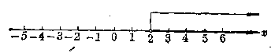

类似地，如果不等式的解的集合是\(x < -2\)，就可以象图2.2中所画的那样来表示。

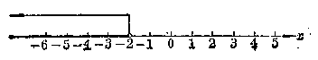

#### 3. 一元一次不等式的解法

以前我们学习解一元一次方程时已经知道，解一元一次方程的方法主要是应用方程的两个性质，把所给的方程变形成和它同解的形式象\(x = a\)那样的最简单的一元一次方程。解一元一次不等式的方法和它一样，我们只要正确地应用 § 2·2 里讲过的不等式的三个性质，把它变形成形式象\(x > a\)或者\(x < a\)那样的最简单的一元一次不等式，这种不等式就表示了所给不等式的解的集合。下面我们举例来说明。

##### 例 1

解不等式：3-2x<7.

**【解】** 根据移项法则，把 3 移到右边，得 -2x < 4.

两边都除以 -2，得 x > -2。

这个不等式的解集可以象图2.3那样，在数轴上表示出来。

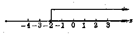

**【注意】** 在把不等式 -2x<4 的两边都除以 -2 以后，得到的一个不等式是 x>-2，不等号的方向改变了。

从这个例子可以知道，不等式\(3 - 2x < 7\)根据不等式的性质逐步变形成不等式\(-2x < 4\)和\(x > -2\)，它们的解集是相同的。象这样的两个不等式\(3 - 2x < 7\)和\(x > -2\)，叫做同解不等式。

##### 例 2

解不等式：\(2(5-3x)>3(4x+2)\)

**【解】** 去括号，得\(10-6x>12x+6\)。

移项，得\(-6x-12x>6-10\)。

合并同类项，得

$$
- 18 x > - 4
$$.

两边都除以 -18，得\(x < \frac{4}{18}\)，就是\(x < \frac{2}{9}\)。

这个不等式的解集在数轴上表示如图2.4所示。

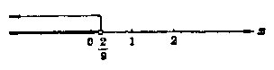

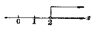

**【说明】** ．为了约简分数，从\(x < \frac{4}{18}\)得出\(x < \frac{2}{9}\)，必须分步写出，不能错误地写成\(x < \frac{4}{18} < \frac{2}{9}\)。

##### 例3

解不等式：\(2(x + 1) + \frac{x - 2}{3} < \frac{7x}{2} - 1\).

**【解】** 去分母，得

$$
12 (x + 1) + 2 (x - 2) <   21 x - 6
$$.

去括号，得

$$
12 x + 12 + 2 x - 4 <   21 x - 6
$$.

移项，得

$$
12 x + 2 x - 21 x <   - 6 - 12 + 4
$$.

合并同类项，得

$$
- 7 x <   - 14
$$.

两边都除以 -7，得

$$
x > 2
$$.

这个不等式的解集在数轴上表示如图2.5所示。

从上面的例子可以看出，解一元一次不等式的一般步骤如下：

（1） 去分母；

（2） 去括号；

（3） 移项；

（4） 合并同类项；

（5） 不等式的两边都除以未知数的系数（除数是正数，不等号的方向不变；除数是负数，不等号的方向改变）。

由于不等式的形式不同，所以在解不等式时，上面的步骤并不一定都要用到，并且也不一定都要按照上面的顺序进行演算。

#### 习题2·3

解下列各不等式，并且在数轴上把不等式的解集表示出来；

1. 2x-3>7.

2.\(6x + 4 < 2x\).

（1）

3. 8-2x>3.

4. 10<12-x。

5.\(3(x+2)>6\).

6.\(\frac{x}{2} + 1 < 4\)。

7.\(\frac{x + 5}{2} >\frac{1}{3}\)

8.\(\frac{2x - 3}{7} < \frac{3x + 2}{4}\)。

9.\(\frac{2(4x - 3)}{3} >\frac{5(3x + 1)}{4}\).

10.\(\frac{5(y - 1)}{6} - 1 > \frac{2(y + 1)}{3}\)。

##### 例4

解下列不等式：

（1）\(\frac{x - 5}{2} - \frac{x + 7}{6} > \frac{5 + x}{3}\)；

（2）\(\frac{15 - x}{2} - \frac{7 - x}{6} > \frac{5 - x}{3}\)。

**【解】** （1） 去分母，得

$$
3 x - 15 - x - 7 > 10 + 2 x
$$.

移项，得 3x - x - 2x > 10 + 15 + 7.

合并同类项，得 0·x>32.

不论\(x\)取什么数，这个不等式都不成立。

∴ 原不等式没有解。

（2） 去分母，得

$$
45 - 3 x - 7 + x > 10 - 2 x
$$.

移项，得\(-3x + x + 2x > 10 - 45 + 7\)。

合并同类项，得 0·x > -28.

不论 x 为任何值，这个不等式总是成立。

∴ 原不等式是绝对不等式。

解不等式熟练以后，写法和步骤可以简化。

##### 例 5

x 是什么数的时候，代数式 3x-7 的值

（1） 大于零？（2） 等于零？（3） 小于零？

**【解】** （1） 代数式\(3x - 7\)的值大于零，就是

$$
3 x - 7 > 0
$$.

$$
3 x > 7， \quad \therefore x > 2\frac{1}{3}
$$.

（2） 代数式\(3x - 7\)的值等于零，就是

$$
3 x - 7 = 0
$$.

$$
3 x = 7， \quad \therefore x = 2 \frac{1}{3}
$$.

（3） 代数式\(3x - 7\)的值小于零，就是

$$
3 x - 7 <   0
$$.

$$
3 x <   7， \quad \therefore x <   2 \frac{1}{3}
$$.

**答：**（1）当\(x\)取大于\(2\frac{1}{3}\)的值时，\(3x - 7\)大于零；

（2） 当\(x\)取\(2\frac{1}{3}\)这个值时，\(3x - 7\)等于零；

（3） 当\(x\)取小于\(2\frac{1}{3}\)的值时，\(3x - 7\)小于零。

##### 例6

某工人在技术革新后，完成的生产量超过原来生产定额的5倍。如果他原来的定额是每月生产60件，这位工人现在每天平均生产的产品是多少？

**【解】** 设这位工人现在每天平均生产\(x\)件产品，那末一个月生产\(30x\)件产品。

根据题意，得到不等式

$$
30 x > 5 \times 60
$$.

就是\(30x > 300, \therefore x > 10\).

**答：**这位工人现在每天的产品多于10件。

#### 习题2·3（2）

1. 解下列各不等式：

（1）\(\frac{x - 1}{3} - \frac{2 + x}{5} > \frac{x + 3}{2}\)；

（2）\(\frac{3x + 1}{3} - 1 < \frac{7x - 3}{5} + \frac{2(x - 2)}{15}\)；

（3）\(\frac{3}{2} x - 7 < \frac{1}{6} (9x - 1)\)；

（4）\(\frac{3(2x + 5)}{2} > 3x - 1;\)

（5）\(x - \frac{x}{2} + \frac{x + 1}{3} < 1 + \frac{x + 8}{6}\)；

（6）\(\frac{2x + 1}{4} < \frac{15x - 2}{6} - \frac{1}{3}(6x + 4)\)。

2. 下列各代数式中，字母取什么数的时候，它的值是负数？

（1）\(\frac{6x - 1}{4} - 2x;\)

（2）\(\frac{3y - 1}{2} - \frac{y}{2}\)。

3. 下列各代数式中，字母取什么数的时候，它的值是正数？

（1）\(\frac{2}{3} x + 8\)；

（2）\(2(x + 1) - 3\).

4.\(x\)是什么数的时候，代数式\(\frac{3x - 5}{4} - \frac{2x + 3}{7}\)的值一定小于2

5.\(x\)是什么数的时候，代数式\(\frac{2x - 3}{7} - \frac{x + 4}{3}\)的值一定大于\(-1\)？

6. 一个数的2倍加上5所得的和，大于这个数的3倍减去4所得的差，求这个数的范围。

7. 某机床厂原来的定额是年产车床 2280 台，计划今年完成的生产量要超过原定额的 2 倍。这个厂今年每月平均要生产车床多少台？

8. 敌我相距 14 公里，得知敌军于 1 小时前以每小时 4 公里的速度逃跑。现接上级命令，我军必须在不满 6 小时内追上敌人，问我军应该用什么速度追击？

我们再来看下面的问题：

x 取什么数值范围里的数时，代数式\(3x + 4\)的值才不会是负数？

我们知道，有理数可以区分为正数、负数和零三类，正数都大于0，负数都小于0。所以要使\(3x+4\)的值不是负数，那末只要它的值大于或者等于零（也就是不小于零）。我们用符号“≥”来表示“大于或者等于”（也就是不小于）这一个关系，那末上面的问题，就可以归纳为解不等式。

$$
3 x + 4 \geqslant 0
$$.

应用上面讲过的移项法则，可以求出所求的数值范围是

$$
x \geqslant - \frac{4}{3}
$$.

这个数值范围在数轴上表示出来如图2.9所示。因为\(x\)可以等于\(-\frac{4}{3}\)，所以图中数轴上表示\(-\frac{4}{3}\)这一点要用黑点表示出来。

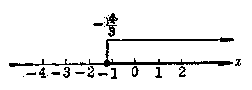

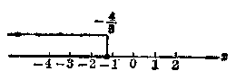

同样的，如果我们要问当\(x\)取什么数值范围里的数时，代数式\(3x + 4\)的值才不是正数，那末就可以用符号“\(\leqslant\)”表示“小于或者等于”（也就是不大于）这一个关系，把问题归结为解不等式

$$
3 x + 4 \leqslant 0
$$.

应用移项法则，容易求出所求的数值范围是

$$
x \leqslant - \frac{4}{3}
$$.

在数轴上表示出来，如图2.10所示。

##### 例 7

一个车间计划在15天内造出大型零件192个，最初3天试制，每天只做了8个。后来改进了技术，结果在规定日期内可以完成甚至可以超额完成计划。问第四天起，平均每天至少做几个？

**【解】** 设第四天起，平均每天做\(x\)个零件，那末最后的12天里共做了\((15 - 3)x\)个零件。

因为前三天共做了\(8 \times 3 = 24\)个零件，所以根据题意，得到不等式

$$
24 + (15 - 3) x \geqslant 192
$$.

就是\(24 + 12x \geqslant 192,\)

$$
12 x \geqslant 168， \quad \therefore x \geqslant 14
$$.

**答：**这个车间后来平均每天至少做14个零件。

图 2.11 表示不等式解的范围。

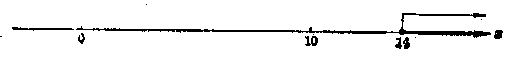

#### 习题2·3（3）

1. 求出适合下列各式的\(x\)的数值范围，并且在数轴上把它表示出来：

（1）\(4 - \frac{3x - 1}{4} \leqslant \frac{5(x + 3)}{8} + 1;\)

（2）\(\frac{3x - 1}{5} - \frac{13 - x}{2} \geqslant \frac{7x}{3} - \frac{11(x + 3)}{6}\)；

（3）\((x - 1)^{2} \leqslant (x + 1)^{2}\)；

（4）\((x - 1)(x - 2) + 1 \geqslant (x + 1)(x - 3) - 1\).

2. 某校学生下乡参加劳动，每小时走4公里，出发后2小时，校方有紧要通知，必须在40分钟内送到。通讯员骑自行车，至少以什么速度才能在40分钟内把信送到。

【提示：40 分钟内送到，意思就是可以用 40 分钟或不到 40 分钟的时间送到。】

3. 某生产队种棉花 75 亩，收得皮棉 13500 斤，计划明年在同样面积上的总产量要达到 15000 斤，问每亩平均产量至少要比现在增产多少斤？

4. 一个工程队规定要在6天内完成300土方的工程，第一天完成了60土方。现在要比原定计划至少提前2天完成任务，以后几天内平均每天至少要完成多少土方？

### § 2·4 含有绝对值符号的不等式的解法

为了研究含有绝对值符号的不等式的解法，我们先来复习一下绝对值的意义。

#### 1. 绝对值的意义

在代数第一册里，我们知道，有理数的绝对值的意义是：正数的绝对值就是它的本身，负数的绝对值是和它相反的正数，零的绝对值还是零。

用式子来表示就是：

$$
| a | = \left\{ \begin{array}{ll} a， & \text {如果} a > 0； \\ 0， & \text {如果} a = 0； \\ - a， & \text {如果} a <   0. \end{array} \right.
$$

例如，如果\(|x| = 2\)，那末\(x\)的值就有两种可能：

如果\(x > 0\)，那末\(x = 2\)

如果\(x < 0\)，那末\(-x = 2\)，∴\(x = -2\)

这个等式表明，在数轴上表示数\(x\)的点离开原点2个单位，而不管这个点在原点的右边还是左边（图2.12）。

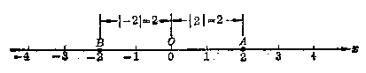

一般地说，一个有理数的绝对值，就表明这个数在数轴上所对应的点和原点间的距离（不考虑方向）。

根据绝对值的这一意义，我们也就可以知道不等式\(|x| < 2\)就是表明：在数轴上表示数\(x\)的点离开原点的距离不到2个单位。所以\(x\)可取一切既比-2大又比2小的数值；\(x\)可取值的范围是：

$$
- 2 <   x <   2
$$.

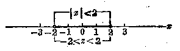

同样，不等式\(|x| > 2\)就是表明：在数轴上表示数\(x\)的点离开原点的距离超过2个单位，所以\(x\)可取一切比-2小或者比2大的数值；\(x\)可取值范围是

$$
x <   - 2 \quad \text {或} \quad x > 2
$$.

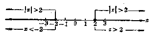

一般地，我们可以得出以下的结论：

如果\(|x| > a (a > 0)\)，那末\(x < -a\)或\(x > a\)；

如果\(|x| < a\)（\(a > 0\)），那末\(-a < x < a\)。

**【注意】**

1.\(-2 < x < 2\)读作“\(x\)大于\(-2\)且小于\(2\)”。不要把它写成“\(2 > x > -2\)”，因为这样和数轴上表示数的大小的比较的规定不相符合。

2.\(x < -2\)或\(x > 2\)只能分别写开，不能错误地写成“\(2 < x < -2\)”或者“\(-2 > x > 2\)”。

#### 2. 含有绝对值符号的不等式的解法

利用上面所说的绝对值的意义，我们很容易解一些简单的含有绝对值符号的不等式。

例如，解不等式\(2|x| - 5 < 0\)

$$
\because 2 | x | - 5 <   0， \therefore | x | <   \frac{5}{2}
$$.

根据绝对值的意义，可以知道\(x\)可以取满足条件\(-\frac{5}{2} < x < \frac{5}{2}\)的一切数。通常我们可以说：不等式\(2|x| - 5 < 0\)的解的集合 （或解集） 是\(-\frac{5}{2} < x < \frac{5}{2}\)。

又如，解不等式\(2|x| - 5 > 0\)。

$$
\because 2 | x | - 5 > 0， \quad \therefore | x | > \frac{5}{2}
$$.

根据绝对值的意义，可以知道\(x\)可以取满足条件\(x < -\frac{5}{2}\)或\(x > \frac{5}{2}\)的一切数，通常我们可以说，不等式\(2|x| - 5 > 0\)的解集是\(x < -\frac{5}{2}\)与\(x > \frac{5}{2}\)。

##### 例 1

解不等式\(\left|x-3\right|<5\).

**【审题】** 如果先设\(x - 3 = y\)，那末这个不等式就是\(|y| < 5\)，容易求出\(-5 < y < 5\)，这样也就可知\(x\)要同时满足下面两个条件：

（1）\(x - 3 > -5,\)

（2）\(x - 3 < 5\)。

这样只要解这两个不等式，就可以把 x 的取值范围求出。

**【解】**

$$
\because \quad | x - 3 | <   5， \quad \therefore - 5 <   x - 3 <   5
$$.

x 要同时满足两个条件：

（1）\(x - 3 > -5\)，由此得\(x > -2\)

（2）\(x - 3 < 5\)，由此得\(x < 8\)

因为这两个条件都要满足，所以\(x\)可取值的范围是\(-2 < x < 8\)。所以所求的解集是\(-2 < x < 8\)。

在数轴上表示如图 2.15 所示。

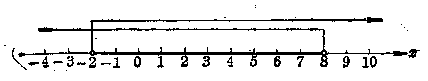

**【注意】**

从这个例子可以看到解形式象\(|x - a| < b\)的不等式，只要在数轴上找出表示不等式\(x - a > -b\)和不等式\(x - a < b\)的解集的那两条半射线的公共部分（不包括端点在内）。

理解了上面这种解法，以后在解题时可以把上面的解答过程象下面这样来叙述。

**【解】**

$$
\because \quad | x - 3 | <   5， \quad \therefore - 5 <   x - 3 <   5，
$$

$$
\therefore - 5 + 3 <   x <   5 + 3，
$$

$$
\therefore - 2 <   x <   8
$$.

所以原不等式的解集是\(-2 < x < 8\)。

##### 例 2

解不等式\(\left|x+3\right|>5\).

**【解】** \(\because |x + 3| > 5,\)

∴\(x+3<-5\)或\(x+3>5,\)

就是\(x < -8\)与\(x > 2\)。

因为\(x\)只要满足上面的任何一个条件，原不等式都能成立，所以原不等式的解集是\(x < -8\)与\(x > 2\)。

这个解集在数轴上表示如图 2.16 所示。

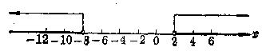

**【注】** 从这个例子可以看到形式象\(|x - a| > b\)的不等式的解集在数轴上表示，就是表示不等式\(x - a < -b\)和不等式\(x - a > b\)这两条半射线（不包括端点在内）。

##### 例3

解不等式\(|3 - 2x|\leqslant 4\).

**【解】** \(\because |3 - 2x| \leqslant 4,\)（1）

$$
\therefore - 4 \leqslant 3 - 2 x \leqslant 4， \tag{2}
$$

$$
\therefore - 7 \leqslant - 2 x \leqslant 1， \tag{3}
$$

$$
\therefore \quad \frac{7}{2} \geqslant x \geqslant - \frac{1}{2}. \tag{4}
$$

所以原不等式的解集是\(-\frac{1}{2} \leqslant x \leqslant \frac{7}{2}\)。

这个解集在数轴上表示如图 2.17 所示。

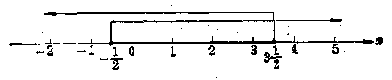

要注意，上面从不等式（1）逐步变形为不等式（4），每一步骤的根据是什么？最后得出的解集为什么要表示成\(-\frac{1}{2}\leqslant x\leqslant\frac{7}{2}\)的形式？

##### 例4

解不等式\(\left|3 - \frac{1}{2} x\right| \geqslant 1,\)

**【解】** \(\because \left|3 - \frac{1}{2} x\right| \geqslant 1\).

$$
\therefore 3 - \frac{1}{2} x \leqslant - 1 \tag{1}
$$

或

$$
3 - \frac{1}{2}x \geqslant 1. \tag{2}
$$

解不等式（1）得\(-\frac{1}{2}x \leqslant -4, \therefore x \geqslant 8\).

解不等式（2）得\(-\frac{1}{2}x \geqslant -2, \therefore x \leqslant 4\).

把这两个不等式的解集合在一起，就得到原不等式的解集是\(x \leqslant 4\)与\(x \geqslant 8\)。

这个解集在数轴表示如图2.18所示。

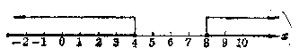

1. 解下列不等式：

（1）\(|x| + 3 > 0;\)

（2）\(|x| - 3 > 0;\)

（3）\(|x| + 3 < 0;\)

（4）\(|x| - 3 < 0\).

2. 解下列不等式：

（1）\(|x-3|<7;\)

（2）\(|x+2|>5;\)

（3）\(2|x + 1| - 3 < 0;\)

（4）\(3|x - 2| + 1 > 0\).

3. 解下列不等式：

（1）\(|2x-1|>\frac{1}{2};\)

（2）\(|1-3x|\leqslant\frac{1}{4}\).

4. 解下列不等式：

（1）\(\left|\frac{1}{x}\right|<\frac{4}{5};\)

（2）\(\left|\frac{2}{x}\right|\geqslant\frac{1}{2}\).

【提示：如果\(\frac{1}{a} < \frac{1}{2}\)，那末\(x > 2\)。】

### 本章提要

1. 几个重要概念 绝对不等式和条件不等式，不等式的解。

#### 2. 不等式的性质

（1） 如果\(a > b\)，那末\(a + c > b + c\)（或者\(a - c > b - c\)）；

（2） 如果\(a > b, c > 0\)，那末\(ac > bc\)（或者\(\frac{a}{c} > \frac{b}{c}\)）；

（3） 如果\(a > b, c < 0\)，那末\(ac < bc\)（或者\(\frac{a}{c} < \frac{b}{c}\)）；

（4） 如果\(a > b, c = 0\)，那末\(ac = bc\)。

#### 3. 一元一次不等式的解法

（1） 应用移项法则，并合并同类项，把不等式先化成下面的形式：

$$
a x > b \quad \text {或者} \quad a x <   b；
$$

（2） 再应用性质 2 或性质 3 求出不等式的解的集合。

| 不等式 |  | \( ax > b \) | \( ax < b \) |
| --- | --- | --- | --- |
| \( a > 0 \) |  | 解集是 \( x > \frac{b}{a} \) | 解集是 \( x < \frac{b}{a} \) |
| \( a < 0 \) |  | 解集是 \( x < \frac{b}{a} \) | 解集是 \( x > \frac{b}{a} \) |
| \( a = 0 \) | \( b > 0 \) | 无解 | 可以是任意值 |
| \( a = 0 \) | \( b = 0 \) | 无解 | 无解 |
| \( a = 0 \) | \( b < 0 \) | 可以是任意值 | 无解 |

4. 含有绝对值符号的不等式的解法

| 不等式 | \( \|x\| > a \) | \( \|x\| < a \) | \( \|x - b\| > a \) | \( \|x - b\| < a \) |
| --- | --- | --- | --- | --- |
| \( a > 0 \) | 解集是\( x < -a \)或\( x > a \) | 解集是\( -a < x < a \) | 解集是\( x < b - a \)或\( x > b + a \) | 解集是\( b - a < x < b + a \) |
| \( a < 0 \) | 可以是任意值 | 无解 | 可以是任意值 | 无解 |
| \( a = 0 \) | \( x \neq 0 \) | 无解 | \( x \neq b \) | 无解 |

### 复习题二A

1. 绝对不等式和条件不等式有何区别？各举两个例子。

2. （1） 如果一个正数大于另一个正数，那末它们的绝对值谁大谁小？举例说明。

（2） 如果一个负数大于另一个负数，那末它们的绝对值谁大谁小？举例说明。

（3） 如果一个数大于另一个数，那末它们的相反数谁大谁小？举例说明。

3. 下面两题的解法，对不对？为什么？

（1） -x=8，两边都乘以-1，得 x=-8；

（2）\(-x > 8\)，两边都乘以\(-1\)，得\(x > -8\)；

（3）\(-x \leqslant 8\)，两边都乘以\(-1\)，得\(x \leqslant -6\)。

4. 在下列各方框中填入大于符号或小于符号：

（1） 当\(a > 0, b \square 0\)时，那末\(ab > 0\)；

（2） 当\(a > 0, b \square 0\)时，那末\(ab < 0\)。

5. 在数轴上，指出表示下列不等式里的\(x\)的点所在的范围：

（1）\(x > 3\)；

（2）\(x < -2\)；

（3）\(1 < x < 4\)；

（4）\(-3 < x < 2\)；

（5）\(|x| > 2;\)

（6）\(|x| < 3\)。

6. 解下列各不等式，并且在数轴上把它们的解集表示出来。

（1）\(1+\frac{x}{3}>3-\frac{x-2}{2};\)

（2）\(3 - \frac{3x}{2} > \frac{5}{8} - \frac{4x - 3}{6}\)；

（3）\(\frac{3}{8} - \frac{2x - 1}{12} \leqslant \frac{3x + 1}{6} - \frac{5}{4}\)；

（4）\(x - 5 - \frac{x - 1}{3} < \frac{2x + 3}{2} + \frac{x}{3} - 1;\)

（5）\((2x - 1)^{2} - 1 > 4(x - 1)(x + 2)\)；

（6）\(\left(\frac{x}{2} - 1\right)^2 \geqslant \left(\frac{x}{2} + 3\right)\left(\frac{x}{2} - 3\right)\)。

7.\(x\)取哪些数时，代数式\(\frac{3x}{2} - 8\)的值：

（1） 大于 7-x 的值？

（2） 小于 7-x 的值？

（3） 等于 7 - x 的值？

并且在数轴上把它们表示出来。

### 复习题二B

1. （1） 如果\(a > b\)，是否一定会得到\(ac^2 > bc^2\)？为什么？

【提示：要考虑\(c > 0, c < 0, c = 0\)三种情况。】

（2） 如果\(ac^2 > bc^2\)，是否一定会得到\(a > bc\)？为什么？

2. （1）\(5 > 4\)，那末\(5a > 4a\)，对不对？为什么？

（2） a 与 -a 哪一个大？

3. 解下列各不等式，并且在数轴上把它们的解集表示出来。

（1）\(3[x-2(x-1)] \leqslant 4x;\)

（2）\(5 - \frac{x}{3} \geqslant 3\frac{1}{2} - \frac{4x + 1}{8}\)；

（3）\(\frac{(2x - 7)^2}{4} - \frac{x - 1}{3} \geqslant \left(x - 1\frac{1}{2}\right)^2;\)

（4）\(\left(\frac{3}{5} x - \frac{2}{3}\right)\left(\frac{3}{5} x + \frac{2}{3}\right) \leqslant \left(\frac{3}{5} x - \frac{1}{4}\right)^2\).

4. 解下列各不等式，并且在数轴上把它们的解集表示出来。

（1）\(|x| + 1 > 5;\)

（2）\(|x| - 2 < 3;\)

（3）\(|2x-3|>5;\)

（4）\(\left|1-\frac{x}{3}\right|<\frac{2}{3};\)

（5）\(3|2x + 1| - 4 \leqslant 0\)；

（6）\(2|1 - 3x| - 1 \leqslant 0\)；

（7）\(\left|\frac{2}{x}\right|\leqslant\frac{1}{3};\)

（8）\(\left|1-\frac{1}{x}\right|>2\).

5. 已知\(a \neq b\)，求证：

（1）\((a - b)^{2} > 0\)；

（2）\(a^2 - 2ab + b^2 > 0\)；

（3）\(a^2 + b^2 > 2ab\)；

（4）\(ab < \frac{1}{2} (a^2 + b^2)\)。

【提示：证明（1）时，因为\(a \neq b\)，只要考虑不论\(a - b\)的结果是正数还是负数，\((a - b)^2\)应该怎样？证明（2），（3），（4）时，根据（1），利用解不等式的方法来证明。】

6. 在爆破时，如果导火线燃烧的速度是每秒钟 0.8 厘米，人跑开的速度是每秒钟 5 米，那末点导火线的人要在爆破时能够跑到 120 米以外的安全地区去，这根导火线至少要有多少长？

7. 农具厂原计划在一个月内（30天）生产抽水机165部，前8天每天平均生产了\(5 \frac{1}{2}\)部，后来要求提前5天超额完成任务，以后几天里，平均每天至少要生产多少部？

8. 求两位数，其中个位数字比十位数字大 2，并且这个两位数介于 50 与 60 之间。

### 第二章测验题

1. 在下列空白处填入适当的条件：

（1） 当\(a < 0\)，____时，那末\(ac < 0\)；

（2） 当\(a < 0\)，____ 时，那末\(ac > 0\)；

（3） 当\(a < b\)，____ 时，那末\(ac^2 < bc^2\)。

2. 解下列不等式，并在数轴上把它们的解集表示出来。

（1）\(2(x-3)>4;\)

（2）\(2x - 3 \leqslant 5(x - 3)\)；

（3）\(\frac{1}{5} (x - 2) \leqslant x - \frac{2}{5}\)；

（4）\(\frac{x}{3} - \frac{x - 1}{2} < 1\)；

（5）\((3x - 4)^{2} > (3x - 2)(3x + 2) - 4\).

3. 解下列不等式：

（1）\(5|x| > 3;\)

（2）\(3|1 - 2x| - 1 \leqslant 0\)；

（3）\(\left|\frac{3x - 5}{4} - 1\right| < \frac{3}{8}\)；

（4）\(\left|2 - \frac{1}{x}\right| \leqslant 3\).

4：y 取什么值时，代数式\(\frac{5}{3}y-4\)的值：

（1） 大于\(\frac{3y-1}{2}-y;\)

（2） 小于\(\frac{3y-1}{2}-y\).

5. 某车工计划在 15 天里加工 420 个零件，最初三天中每天加工了 24 个，以后每天至少要加工多少个才能在规定的时间内超额完成任务？

## 第3章 一次方程组

### § 3·1 二元一次方程

我们来看下面的问题。

已知两个数的和是4，求这两个数。

这个问题里有两个未知数，如果设一个数是\(x\)，另一个数是\(y\)，那末根据题意，就可以列出方程：

$$
x + y = 4
$$.

因为在这个方程里含有未知数\(x\)和\(y\)的项的次数都是1，我们把它叫做二元一次方程。

含有两个未知数，并且含有未知数的项的次数都是1次的方程叫做二元一次方程。例如，

$$
x + y = 4， 2 x - 3 y = 7， \frac{1}{3} x = 5 y
$$

等等都是二元一次方程。

现在我们来看方程

$$
x + y = 4
$$.

在这个方程里，使\(x\)取不同的值，计算出对应的\(y\)值，并且把各对对应值列成下表：

| x | ... | -5 | \( -\frac{1}{2} \) | -1 | 0 | 1 | 2 | 2.5 | 8.3 | ... |
| --- | --- | --- | --- | --- | --- | --- | --- | --- | --- | --- |
| y | ... | 9 | \( 4\frac{1}{2} \) | 5 | 4 | 3 | 2 | 1.5 | -4.3 | ... |

很明显，把这个表里每一对\(x\)和\(y\)的值代入方程\(x + y = 4\)，都能使这个等式变成一个恒等式，例如，取\(x = -5, y = 9\)

代入，得到\((-5)+9=4\).

这是一个恒等式。

我们说\(x, y\)这样的一对值适合原方程。

能够适合一个二元一次方程的一对未知数的值，叫做这个二元一次方程的一个解。例如，上面表里各对\(x, y\)的值都是二元一次方程\(x + y = 4\)的解。

从上面的表里可以知道，在任何一个二元一次方程中，确定了其中一个未知数的一个值，另一个未知数的对应值就可以随着确定，因而得出这个方程的一个解，因此任何一个二元一次方程都有无数个解。我们把二元一次方程所有解构成的这个整体，叫做二元一次方程的解的集合。但是，并不是任意的一对\(x\)和\(y\)的值，都是这个方程的解。例如，在方程\(x + y = 4\)里，\(x = 3\)，\(y = -5\)就不是它的解。

为了能够清楚地表达二元一次方程的一个解是一对未知数的值，通常用括号“（）”把两个未知数的值并起来写在一起。例如，方程\(x + y = 4\)的解是

$$
\left\{ \begin{array}{l} x = 0， \\ y = 4； \end{array} \right. \quad \left\{ \begin{array}{l} x = - 1， \\ y = 5 \end{array} \right.
$$

等等。

#### 例

在方程\(2x - 3y = 5\)里，设\(x = -1, 0, \frac{1}{3}, 1, 3, 6,\)求对应的\(y\)值，并且把各对对应值列成一个表。

**【解】** 把已知方程移项，使含有 y 的项在左边，不含 y 的项在右边，得

$$
- 3 y = 5 - 2 x
$$.

两边都除以 -3，得

$$
y = - \frac{5 - 2 x}{3}
$$.

把所设的\(x\)的值依次代入上式右边，计算出对应的\(y\)的值，可以列成下面的表。

表里的每一组值都是二元一次方程\(2x - 3y = 5\)的一个解。

| x | -1 | 0 | \( \frac{1}{3} \) | 1 | 3 | 6 |
| --- | --- | --- | --- | --- | --- | --- |
| y | \( -2\frac{1}{3} \) | \( -1\frac{2}{3} \) | \( -1\frac{4}{9} \) | -1 | \( \frac{1}{3} \) | \( 2\frac{1}{3} \) |

#### 习题3·1

1. 在下列方程里，哪些是二元一次方程？哪些不是？

（1）\(3x + 4y = 0;\)

（2）\(5x - \frac{1}{2} = 7;\)

（3）\(2x^{2} = 5y - 1;\)

（4）\(y = \frac{1}{2} x;\)

（5）\(\frac{1}{3} (x - 3y + 6) = 2(4y - 5x) + 3;\)

（6）\((x + y)(2x - 3y + 4) - 7 = x(2x - y) - y(3y + 5)\)。

2. 对于下列每个方程，各求出它的四个解来：

（1）\(x = 2y\)；

（2）\(y = 3x - 2;\)

（3）\(x - y = -5\)；

（4）\(y = x + \frac{1}{2}\).

3. 先用一个未知数的代数式表示另一个未知数，然后求出方程的两个解来：

（1）\(x - 3y = 5;\)

（2）\(2(x - y) = 5;\)

（3）\(5x + 2y - 3 = 0;\)

（4）\(4x + 2y = x - 9y + 1\).

4. （1） 求二元一次方程\(4x - 3y = 12\)，在\(x = 0\)的时候适合于方程\(y\)的值，和在\(y = 0\)的时候适合于方程\(x\)的值；

（2） 把二元一次方程\(3x + y = 8\)化成用\(x\)的代数式表示\(y\)的形式，然后填写适合于方程的数值表。

| x | -2 | -1 | 0 | \( \frac{1}{3} \) | \( \frac{1}{2} \) | 1 | 2 | 3 |
| --- | --- | --- | --- | --- | --- | --- | --- | --- |
| y |  |  |  |  |  |  |  |  |

### § 3·2 二元一次方程组的意义

我们再来看下面的问题：

甲乙两数的和是4，甲数比乙数大2，求这两个数。

这个问题里有两个条件，如果我们设甲数是\(x\)，乙数是\(y\)，那末就可以列出两个方程：

$$
x + y = 4， \tag{1}
$$

$$
x - y = 2. \tag{2}
$$

这样我们只要求出既能适合方程（1），又能适合方程（2）的\(x\)和\(y\)的值，就能得到这个问题的答案。这也就是说要解答这个问题，只要求出这两个方程的公共解。

方程（1）和（2）都有无数多个解，现在我们取定\(x\)的一些值，用列表法把这两个方程的解分别写出几个来，如

方程（1）的解。

| x | ... | -3 | -2 | -1 | 0 | 1 | 2 | 3 | 4 | ... |
| --- | --- | --- | --- | --- | --- | --- | --- | --- | --- | --- |
| y | ... | 7 | 6 | 5 | 4 | 3 | 2 | 1 | 0 | ... |

方程（2）的解

| x | ... | -3 | -2 | -1 | 0 | 1 | 2 | 3 | 4 | ... |
| --- | --- | --- | --- | --- | --- | --- | --- | --- | --- | --- |
| y | ... | -5 | -4 | -3 | -2 | -1 | 0 | 1 | 2 | ... |

对比一下可以发现\(\left\{ \begin{array}{l} x = 3 \\ y = 1 \end{array} \right.\)既是方程（1）的解，也是方程（2）的解，这个解就是这两个方程的公共解。这样我们也就找到了这个问题的答案：甲数是3，乙数是1。

我们把由几个方程所组成的一组方程叫做方程组。含有相同的两个未知数的几个一次方程所组成的方程组叫做二元一次方程组。例如上面问题中的方程（1）和（2）合在一起就组成了一个二元一次方程组，记作

$$
\left\{ \begin{array}{l} x + y = 4， \\ x - y = 2. \end{array} \right.
$$

方程组里各个方程的公共解，叫做这个方程组的解。例如方程（1）和（2）的公共解\(\left\{\begin{aligned}x&=3\\ y&=1\end{aligned}\right.\)是上面这个方程组的解。

求方程组的解的过程叫做解方程组。

**【注意】**

1. 在书写方程组的时候，要用括号“{”把各个方程合写在一起。同样，方程组的解也要用括号“{”合写在一起。因为它实际上就是一个二元一次方程组。

2. 在 §1·2 里讲过，一元方程的解，也可以叫做根。但是方程组的解，只能叫解，不能叫根。

3. 方程组里方程的个数与未知数的个数，一般来说是可以不同的。本章中所研究的一次方程组，都是指未知数的个数和方程的个数相同的一次方程组。

#### 习题3·2

1. 检验下列二元一次方程组后面括号里的一对未知数的值是不是这个方程组的一个解：

（i）\(\left\{ \begin{array}{l} x + y = 3, \\ x - y = 1; \end{array} \right.\)

\(\left\{ \begin{array}{l} x = 2 \\ y = 1 \end{array} \right.\)

（2）\(\left\{ \begin{array}{l} x + y = -1, \\ 2x - y = -5. \end{array} \right.\)

\(\left\{ \begin{array}{l} x = -3 \\ y = 2 \end{array} \right.\)

2. 通过观察，确定下列二元一次方程组有没有解？

（1）\(\left\{ \begin{array}{l} x + y = 7, \\ x + y = -2; \end{array} \right.\)

（2）\(\left\{ \begin{array}{l} x - y = 5, \\ 2x - 2y = 10. \end{array} \right.\)

### § 3·3 用代入消元法解二元一次方程组

下面我们来研究二元一次方程组的解法。先来看下面的问题：

两个数的和是8，它们的差是2，求这两个数。

设两个数中较大的一个数是\(x\)，较小的一个数是\(y\)，就可以列出方程组：

$$
\left\{ \begin{array}{l} x + y = 8， \\ x - y = 2. \end{array} \right. \tag{1}
$$

如果利用一元一次方程来解这个问题，可以得出下面的方程来：

因为两数的和是8，所以设较大的数是\(x\)，那末较小的数就是\(8 - x\)，又因两数的差是2，所以可以列出一元一次方程

$$
x - (8 - x) = 2. \tag{3}
$$

实际上，从上面的二元一次方程组的方程 （1），我们可以得到\(y = 8 - x\)。因为方程组中相同的字母所表示的是同一个未知数，所以在方程 （1） 和方程 （2） 中的\(x\)和\(y\)分别表示相同的未知数，因此可以把\(8 - x\)代替方程 （2） 中的\(y\)。这样就得到了一元一次方程

$$
x - (8 - x) = 2
$$.

这显然和方程（3）是一样的。

解这个方程，得到\(x = 5\)。代入\(y = 8 - x\)，得到\(y = 3\)。

$$
\therefore \left\{ \begin{array}{l} x = 5， \\ y = 3 \end{array} \right.
$$

就是原二元一次方程组的解。

这种解方程组的方法，叫做代入消元法，简称代入法。

#### 例1

用代入法解方程组：

$$
\left\{ \begin{array}{l} x + 3 y = 5， \\ 3 x - 6 y = 6. \end{array} \right. \tag{1}
$$

**【审题】** 这里，（1）中的\(x\)的系数是1，把\(x\)化成用\(y\)的代数式表示的式子比较简单。

**【解】** 从（1），得\(x = 5 - 3y\)（3）

代入（2），得\(3(5 - 3y) - 6y = 6\)。

解这个方程，得 -15y = -9，

$$
\therefore y = \frac{3}{5}
$$.

以\(y = \frac{3}{5}\)代入（3），得\(x = 3\frac{1}{5}\)。

**【检验】** 把\(x = 3\frac{1}{5}, y = \frac{3}{5}\)代入方程（1）：

左边\(= 3\frac{1}{5} + 3 \times \frac{3}{5} = 5 =\)右边。

代入方程（2）：

左边\(= 3 \times \frac{16}{5} - 6 \times \frac{3}{5} = 6 =\)右边。

所以原方程组的解是\(\left\{ \begin{array}{l} x = 3\frac{1}{5}, \\ y = \frac{3}{5}. \end{array} \right.\)

**【注意】** 用代入法解方程组时，从一个方程得出把一个未知数用另一个未知数的代数式表示的式子，必须把这个代数式代入另一个方程中去，不能代入原来那个方程中。例如在本题中，从方程（1）得到\(x = 5 - 3y\)后，必须把这个代数式代入方程（2）中。如果代入方程（1），那末得到\(0 = 0\)，这样就不能达到求出\(x, y\)的值的目的。

##### 例2

用代入法解方程组：

$$
\left\{ \begin{array}{l} 3 x + 4 y = 2， \\ 2 x - y = 5. \end{array} \right. \tag{1}
$$

**【审题】** 这里，从（2）中把\(y\)化成用\(x\)的代数式表示的式子比较简单。

**【解】** 从（2），得

$$
y = 2 x - 5. \tag{3}
$$

以（3）代入（1），得

$$
3 x + 4 (2 x - 5) = 2
$$.

；

解这个方程，\(11x = 22\)

$$
\therefore x = 2
$$.

以\(x = 2\)代入（3），得

$$
y = 2 \times 2 - 5 = - 1
$$.

**【检验】** 把\(x = 2, y = -1\)代入方程（1）：

左边\(= 3 \times 2 + 4 \times (-1) = 2 =\)右边。

代入方程（2）：

左边\(= 2 \times 2 - (-1) = 5 =\)右边。

所以原方程组的解是\(\left\{ \begin{array}{l} x = 2, \\ y = -1. \end{array} \right.\)

**【说明】** 用代入法解方程组时，要把一个方程里的一个未知数用另一个未知数的代数式来表示，为了计算简便，一般选用未知数的系数较简单的一个。在例1中，选用方程（1），把\(x\)化成\(y\)的代数式，而在例2中，选用方程（2），把y化成x的代数式。

从上面两个例子可以看出，用代入法解二元一次方程组的一般步骤是：

（1） 把一个方程里的一个未知数（例如\(y\)）化成用另一个未知数（例如\(x\)）的代数式来表示。

（2） 把这个代数式代入另一个方程里，消去一个未知数（例如\(y\)），得到另一个未知数（例如\(x\)）的一个一元方程。

（3） 解这个一元方程，求得一个未知数 （例如\(x\)） 的值。

（4） 把所求得的值代入第一步所得到的代数式里，求得另一个未知数 （例如\(y\)） 的值。

（5） 把所求得的两个未知数的值用“{”写在一起，就是原方程组的解。

为了检查计算有没有错误，可以把所求得的两个未知数的值代入原方程组，进行检验。

1. 检验下列各题后面括号里的\(x\)和\(y\)的值是不是方程组的解：

（1）\(\left\{ \begin{array}{l} 3x + 5y = 19, \\ 4x - 3y - 6 = 0; \end{array} \right.\)

\(\left\{ \begin{array}{l} x = 3 \\ y = 2 \end{array} \right.\)

（2）\(\left\{ \begin{array}{l} 7x = 2y - 3, \\ 5x - 6y - 7 = 0. \end{array} \right.\)\(\left( \begin{array}{l} x = -1 \\ y = -2 \end{array} \right)\)。

用代入法解下列各方程组（2~13）：

2.\(\left\{ \begin{array}{l} y = 3x, \\ 7x - 2y = 2. \end{array} \right.\)

3.\(\left\{ \begin{array}{l} y = x + 3, \\ 7x + 5y = 6. \end{array} \right.\)

4.\(\left\{ \begin{array}{l} x = -2y, \\ 3x + 4y = 6. \end{array} \right.\)

5.\(\left\{ \begin{array}{l} y = \frac{2}{3} x, \\ 3x - 4y = 2. \end{array} \right.\)

6.\(\left\{ \begin{array}{l} x - 2y = 5, \\ 5x - 3y = \frac{1}{2}. \end{array} \right.\)

7.\(\left\{ \begin{array}{l} 5x + 3y = 0, \\ 12x + 7y + 1 = 0. \end{array} \right.\)

8.\(\left\{ \begin{array}{l} 8x - 12y = -40, \\ 6x + 5y = 12. \end{array} \right.\)

9.\(\left\{ \begin{array}{l} 3x - 8y - 3 = 0, \\ 5x + 3y = \frac{11}{12}. \end{array} \right.\)

10.\(\left\{ \begin{array}{l} 3x - y = 5, \\ 5x + 2y = 25.2. \end{array} \right.\)

11.\(\left\{ \begin{array}{l} 2y + 3x = -4, \\ 6x + 5y + 7 = 0. \end{array} \right.\)

12.\(\left\{ \begin{array}{l} v = 2.6 + 9.8i, \\ \frac{v}{3} - 3i = 1. \end{array} \right.\)

13.\(\left\{ \begin{array}{l} x = 2(t - 9) + 3(t - 5), \\ x = \frac{t + 3}{2} - \frac{t + 2}{3}. \end{array} \right.\)

### § 3·4 用加减消元法解二元一次方程组

从上一节用代入法解二元一次方程组的步骤中，可以看到解题的关键是要从这两个方程中设法消去一个未知数，得到一个一元一次方程。现在我们再来看上一节里做过的二元一次方程组：

$$
\left\{ \begin{array}{ll} x + y = 8， & \\ x - y = 2. & \end{array} \right. \tag{1}
$$

在这个方程组里，方程（1）中\(y\)的系数是\(+1\)，方程（2）中\(y\)的系数是\(-1\)，它们是两个相反的数。因此，只要把两个方程的左右两边分别相加，就可以消去\(y\)而得到只含有\(x\)的一个一元一次方程：

$$
2 x = 10，
$$

就是\(x = 5\)

把\(x = 5\)代入方程组的任何一个方程，就可以求得\(y = 3\)。

这种解方程组的方法，叫做加减消元法，简称加减法。

#### 例1

用加减法解方程组：

$$
\left\{ \begin{array}{l} 5 x + 2 y = 12， \\ 3 x + 2 y = 6. \end{array} \right. \tag{1}
$$

**【审题】** 这个方程组里，\(y\)的系数相同，所以把方程（1）与方程（2）相减，就可以消去\(y\)。

**【解】** （1）-（2），得

$$
2 x = 6，
$$

$$
\therefore x = 3
$$.

以\(x = 3\)代入（2），得

$$
3 \cdot 3 + 2 y = 6，
$$

$$
\therefore y = - 1 \frac{1}{2}
$$.

所以原方程组的解是

$$
\left\{ \begin{array}{l} x = 3， \\ y = - 1 \frac{1}{2}. \end{array} \right.
$$

检验从略。

**【说明】** 两个方程相减，求得\(x\)的值后，也可以用\(x = 3\)代入方程（1）中，求出\(y\)的值，结果是一样的。例如，以\(x = 3\)代入（1），那末，

$$
15 + 2 y = 12， \quad \therefore y = - 1 \frac{1}{2}
$$.

这与上节所讲必须代入另一个方程中去是不同的。

##### 例2

用加减法解方程组：

$$
\left\{ \begin{array}{l} x + 5 y = 6， \\ 3 x - 6 y - 4 = 0. \end{array} \right. \tag{1}
$$

**【审题】** 这个方程组里没有一个未知数的系数的绝对值相等，所以不能直接把两个方程相加或者相减，而消去一个未知数。但是，我们如果把方程（1）两边都乘以一个数3，那末可以得到一个和它同解的方程\(3x + 15y = 18\)，这个方程中x的系数和方程（2）中x的系数相同。这样就可以应用加减消元法把未知数x消去。

**【解】** （1）\(\times 3\)，

$$
3 x + 15 y = 18. \tag{3}
$$

由（2），

$$
3 x - 6 y = 4. \tag{4}
$$

（3） - （4），

$$
21 y = 14， \quad \therefore y = \frac{2}{3}
$$.

以\(y = \frac{2}{3}\)代入（1），得

$$
x + 5 \times \frac{2}{3} = 6， \quad \therefore x = 2 \frac{2}{3}
$$.

所以原方程组的解是

$$
\left\{ \begin{array}{l} x = 2 \frac{2}{3}， \\ y = \frac{2}{3}. \end{array} \right.
$$

检验从略。

**【注意】** 在把原方程组中的方程变形后，可加以编号。在消元时必须注意不要把方程弄错。在解题过程中，不必再把两个方程用“【】”合写在一起。

##### 例3

用加减法解方程组：

$$
\left\{ \begin{array}{l} \frac{x}{4} + \frac{y}{3} = \frac{4}{3}， \\ 5 (x - 9) = 6 (y - 2)。 \end{array} \right. \tag{1}
$$

**【解】** 由（1），

$$
3 x + 4 y = 16. \tag{3}
$$

由（2），

$$
5 x - 6 y = 33. \tag{4}
$$

（3）\(\times 3,\)

$$
9 x + 12 y = 48. \tag{5}
$$

（4）\(\times 2\)

$$
10 x - 12 y = 66. \tag{6}
$$

（5） + （6），

$$
19 x = 114， \quad \therefore \quad x = 6
$$.

以\(x = 6\)代入（3），得

$$
18 + 4 y = 16， \quad \therefore y = - \frac{1}{2}
$$.

所以原方程组的解是

$$
\left\{ \begin{array}{l} x = 6， \\ y = - \frac{1}{2}. \end{array} \right.
$$

检验从略。

**【说明】** 用加减法解方程组时，要先把两个方程变形，使含有未知数的项在左边，不含未知数的项在右边，并且合并同类项。

从上面三个例子可以看出，用加减法解二元一次方程组的一般步骤是：

（1） 把两个方程变形，使含有未知数的项在左边，不含未知数的项在右边，并且合并同类项。

（2） 把一个方程或者两个方程的两边乘以适当的数，使两个方程里的某一个未知数的系数的绝对值相等。

（3） 把所得的两个方程的两边分别相加或者相减，消去这个未知数，得出另一个未知数的一个一元一次方程。

（4） 解这个方程，求得一个未知数的值。

（5） 用这个未知数的值代入方程组的任何一个方程，求出另一个未知数的值。

（6） 把求得的两个未知数的值用“{”写在一起，就是原方程组的解。

为了检查计算有没有错误，可以把所求得的两个未知数的值代入原方程组，进行检验。

用加减法解下列各方程组（1~16）：

1.\(\left\{ \begin{array}{l} 3x + 2y = 3, \\ 3x - 2y = 1. \end{array} \right.\)

2.\(\left\{ \begin{array}{l} 2x + y = 5, \\ 3x - y = 15. \end{array} \right.\)

3.\(\left\{ \begin{array}{l} x + 3y = 33, \\ 2x - y = -4. \end{array} \right.\)

4.\(\left\{ \begin{array}{l} 2y - 3z = 8, \\ 7y - 5z = -5. \end{array} \right.\)

5.\(\left\{ \begin{array}{l} 2x + 5y = 25, \\ 4x + 3y = 15. \end{array} \right.\)

6.\(\left\{ \begin{array}{l} 12x + 21y = 15, \\ 16x - 14y = 6, \end{array} \right.\)

7.\(\left\{ \begin{array}{l} 7x - 3y + 1 = 0, \\ 4x - 5y = -17. \end{array} \right.\)

8.\(\left\{ \begin{array}{l} 3x - 4y + 11 = 0, \\ 3y - 4x + 53 = 0. \end{array} \right.\)

9.\(\left\{ \begin{array}{l} 4(x + 2) = 1 - 5y, \\ 3(y + 2) = 3 - 2x. \end{array} \right.\)

10.\(\left\{ \begin{array}{l} 3(x - 1) = 4(y - 4), \\ 5(y - 1) = 3(x + 5). \end{array} \right.\)

11.\(\left\{ \begin{array}{l} \frac{y}{2} + \frac{z}{3} = 13, \\ \frac{y}{3} - \frac{z}{4} = 3. \end{array} \right.\)

12.\(\left\{ \begin{array}{l} \frac{2x}{3} + \frac{3z}{4} = \frac{1}{2}, \\ \frac{4x}{5} + \frac{5z}{6} = \frac{7}{15}. \end{array} \right.\)

13.\(\left\{ \begin{array}{l} \frac{x + y}{2} + \frac{x - y}{3} = 6, \\ 4(x + y) - 5(x - y) = 2. \end{array} \right.\)

14.\(\left\{ \begin{array}{l} \frac{m + n}{3} - \frac{n - m}{4} = -0.46, \\ 4m + \frac{3}{4} n = -2.59. \end{array} \right.\)

15.\(\frac{x + y}{5} = \frac{x - y}{3} = 2\).

【提示：可以取任意两式相等，组成方程组，例如，\(\frac{x+y}{5}=2\)与\(\frac{x-y}{3}=2\).】

16.\(\left\{ \begin{array}{l} (x + 3)(y + 5) = (x + 1)(y + 3), \\ (2x - 3)(5y + 7) = 2(5x - 6)(y + 1). \end{array} \right.\)

### § 3·5 含有字母系数的二元一次方程组解法

解含有字母系数的二元一次方程组的方法，和数字系数的二元一次方程组的解法一样，可以采用代入消元法或者加减消元法。现在举例来说明。

#### 例 1

用代入法解关于 x 和 y 的方程组：

$$
\left\{ \begin{array}{ll} a x - b y = a ^ {2} + b ^ {2}， & (a \neq b)。 \\ x - y = 2 a \end{array} \right. \tag{1}
$$

**【解】** 从（2），得

$$
y = x - 2 a， \tag{3}
$$

代入（1），得

$$
a x - b (x - 2 a) = a ^ {2} + b ^ {2}，
$$

$$
a x - b x = a ^ {2} + b ^ {2} - 2 a b，
$$

$$
(a - b) x = (a - b) ^ {2}
$$.

因为\(a \neq b, a - b \neq 0\)，两边都除以\(a - b\)，得

$$
x = a - b
$$.

以\(x = a - b\)代入（3），得

$$
y = - a - b
$$.

所以原方程组的解是

$$
\left\{ \begin{array}{l} x = a - b， \\ y = - a - b. \end{array} \right.
$$

检验从略。

**【说明】** 解字母系数的方程组时，必须注意题目中的条件。

##### 例2

解关于\(x\)和\(y\)的方程组：

$$
\left\{ \begin{array}{ll} (a - b) x + (a + b) y = 2 (a ^ {2} - b ^ {2})， & (a \neq \pm b， a b \neq 0)。 \\ (a + b) x + (a - b) y = 2 (a ^ {2} + b ^ {2}) \end{array} \right. \tag{1}
$$

**【解】** 用加减法消去\(y\)。

因为\(a \neq b, a - b \neq 0,\)

所以，可在（1）的两边都乘以\(a - b\)，得

$$
(a - b) ^ {2} x + (a + b) (a - b) y = 2 (a ^ {2} - b ^ {2}) (a - b)。 \tag{3}
$$

因为\(a \neq -b, a + b \neq 0,\)

所以，可在（2）的两边都乘以\((a + b)\)，得

$$
(a + b) ^ {2} x + (a + b) (a - b) y = 2 (a ^ {2} + b ^ {2}) (a + b)。 \tag{4}
$$

（3）\(-(4)\)，得

$$
\begin{array}{l} [ (a - b) ^ {2} - (a + b) ^ {2} ] x \\ = 2 (a ^ {2} - b ^ {2}) (a - b) - 2 (a ^ {2} + b ^ {2}) (a + b)， \\ - 4 a b x = - 4 a ^ {2} b - 4 a b ^ {2}， \\ - 4 a b x = - 4 a b (a + b)。 \tag{5} \\ \end{array}
$$

因为\(ab \neq 0\)，所以可在（5）的两边都除以\(-4ab\)，得

$$
x = a + b
$$.

以\(x = a + b\)代入（1），得

$$
(a - b) (a + b) + (a + b) y = 2 (a ^ {2} - b ^ {2})
$$。

$$
(a + b) y = a ^ {2} - b ^ {2}. \tag{6}
$$

因为\(a + b \neq 0\)，（6）的两边都除以\(a + b\)，得

$$
y = \frac{a ^ {2} - b ^ {2}}{a + b} = a - b
$$.

所以原方程组的解是

$$
\left\{ \begin{array}{l} x = a + b， \\ y = a - b. \end{array} \right.
$$

检验从略。

解下列关于\(x\)和\(y\)的方程组\((1\sim 8)\)

1.\(\left\{ \begin{array}{l} x + y = a + b, \\ 5x - 7y = 5b - 7a. \end{array} \right.\)

2.\(\left\{ \begin{array}{l} 3x + y = 2a + b, \\ x - 3y = 2b - a. \end{array} \right.\)

3.\(\left\{ \begin{array}{l} bx + ay = ab, \\ y - mx = b \end{array} \right.\)\((am + b \neq 0)\)。

4.\(\left\{ \begin{array}{l} \frac{x}{2} + \frac{y}{3} = 3a, \\ x - y = a. \end{array} \right.\)

5.\(\left\{ \begin{array}{l} mx + y = 2m + 1, \\ x - my = 2 - m. \end{array} \right.\)

6.\(\left\{ \begin{array}{l} x + 2y = (m + n)^2, \\ x - 2y = (m - n)^2. \end{array} \right.\)

7.\(\left\{ \begin{array}{l} mx - ny = a, \\ x - y = b \end{array} \right.\)\((m \neq n)\)。

8.\(\left\{ \begin{array}{l} ax + by = (a + b)(a - b), \\ bx - ay = 2ab \end{array} \right.\)\((a^2 + b^2 \neq 0)\)。

### § 3·6 用二阶行列式解二元一次方程组

#### 1. 二元一次方程组的解的公式

我们来解下面这个方程组：

$$
\left\{ \begin{array}{l} a _ {1} x + b _ {1} y = c _ {1}. \\ a _ {2} x + b _ {2} y = c _ {2}. \end{array} \right. \tag{1}
$$

这里，\(a_1, a_2\)和\(b_1, b_2\)分别表示未知数\(x\)和\(y\)的系数，\(c_1\)和\(c_2\)表示常数项，\(a_1, a_2, b_1, b_2\)和\(a_1 b_2 - a_2 b_1\)都不等于0.

我们先用加减消元法，在方程（1）和（2）中消去一个未知数\(y\)。

（1）\(\times b_{2} - (2) \times b_{1}\)得

$$
(a _ {1} b _ {2} - a _ {2} b _ {1}) x = c _ {1} b _ {2} - c _ {2} b _ {1}. \tag{3}
$$

因为\(a_{1}b_{2} - a_{2}b_{1}\neq 0\)，由（3）可得

$$
x = \frac{c _ {1} b _ {2} - c _ {2} b _ {1}}{a _ {1} b _ {2} - a _ {2} b _ {1}}. \tag{4}
$$

把（4）代入（I），得

$$
a _ {1} \left(\frac{c _ {1} b _ {2} - c _ {2} b _ {1}}{a _ {1} b _ {2} - a _ {2} b _ {1}}\right) + b _ {1} y = c _ {1}
$$

化简并整理后可得

$$
y = \frac{a _ {1} c _ {2} - a _ {2} c _ {1}}{a _ {1} b _ {2} - a _ {2} b _ {1}}. \tag{5}
$$

这样，我们就求得方程组的解是

$$
\left\{ \begin{array}{l} x = \frac{c _ {1} b _ {2} - c _ {2} b _ {1}}{a _ {1} b _ {2} - a _ {2} b _ {1}}， \\ y = \frac{a _ {1} c _ {2} - a _ {2} c _ {1}}{a _ {1} b _ {2} - a _ {2} b _ {1}}. \end{array} \right.
$$

**【注意】** 上面的解法中，把\(x\)的值代入（1）求另一未知数\(y\)的值是比较麻烦的。为了简便，我们也可以直接从方程 （1） 和 （2） 中用加减法消去未知数\(x\)来求得。如

（2）\(\times a_{1} - (1) \times a_{2}\)得

$$
(a _ {1} b _ {2} - a _ {2} b _ {1}) y = a _ {1} c _ {2} - a _ {2} c _ {1}. \tag{6}
$$

因为\(a_{1}b_{2} - a_{2}b_{1}\neq 0\)，由（6）可得

$$
y = \frac{a _ {1} c _ {2} - a _ {2} c _ {1}}{a _ {1} b _ {2} - a _ {2} b _ {1}}
$$.

上面求出的这个结果，可以作为公式来应用。例如，解方程组

$$
\left\{ \begin{array}{l} 3 x + 4 y = 5， \\ 5 x - 3 y = 2. \end{array} \right.
$$

这里\(a_1 = 3, b_1 = 4, c_1 = 5, a_2 = 5, b_2 = -3, c_2 = 2\).

$$
a _ {1} b _ {2} - a _ {2} b _ {1} = 3 \cdot (- 3) - 5 \cdot 4 = - 9 - 20 = - 29，
$$

$$
c _ {1} b _ {2} - c _ {2} b _ {1} = 5 \cdot (- 3) - 2 \cdot 4 = - 15 - 8 = - 23，
$$

$$
a _ {1} c _ {2} - a _ {2} c _ {1} = 3 \cdot 2 - 5 \cdot 5 = 6 - 25 = - 19
$$.

代入上面的解的公式，即可求得方程组的解是\(\left\{ \begin{array}{l} x = \frac{23}{29}, \\ y = \frac{19}{29}. \end{array} \right.\)

#### 2. 二阶行列式

观察上面得出的这个二元一次方程组解的公式，发现分母\(a_1b_2 - a_2b_1\)可以应用下面的方法来计算：先把两个方程中\(x, y\)的系数排成下面的形式

\(a_{1}\)\(b_{1}\)实线上两数的积取正号\(+a_{1}b_{2}\)\(a_{2}\)\(b_{2}\)虚线上两数的积取负号\(\frac{-a_{2}b_{1}}{a_{1}b_{2}-a_{2}b_{1}}\)（+）

如果把\(x\)的系数\((a_{1}, a_{2})\)，或者\(y\)的系数\((b_{1}, b_{2})\)改用常数项\((c_{1}, c_{2})\)来表示，就可用同样方法来计算（3）或者（4）中的分子。

$$
D_x = \left|\begin{array}{cc}c_1 & b_1\\c_2 & b_2\end{array}\right| = c_1b_2 - c_2b_1
$$

$$
D_y = \left|\begin{array}{cc}a_1 & c_1\\a_2 & c_2\end{array}\right| = a_1c_2 - a_2c_1
$$

为了方便起见，我们引进记号

$$
\left| \begin{array}{cc} a _ {1} & b _ {1} \\ a _ {2} & b _ {2} \end{array} \right|
$$

来表示\(a_{1}b_{2}-a_{2}b_{1}\)，并把它叫做二阶行列式，就是

$$
\left| \begin{array}{cc} a _ {1} & b _ {1} \\ a _ {2} & b _ {2} \end{array} \right| = a _ {1} b _ {2} - a _ {2} b _ {1}，
$$

其中，\(a_{1}\)、\(a_{2}\)、\(b_{1}\)、\(b_{2}\)叫做这个二阶行列式的元素，横排叫行，竖排叫列；代数式\(a_{1}b_{2}-a_{2}b_{1}\)叫做这个行列式的展开式。

把二阶行列式左上角元素与右下角元素的积减去左下角元素与右上角元素的积就可以得到二阶行列式的值，这个法则通常叫做对角线法则。例如，

$$
\left| \begin{array}{cc} 3 & - 1 \\ 2 & - 4 \end{array} \right| = 3 \times (- 4) - 2 \times (- 1) = - 12 + 2 = - 10
$$.

$$
\begin{array}{l} \left| \begin{array}{cc} a + b & 1 \\ - b ^ {2} & a - b \end{array} \right| = (a + b) (a - b) - (- b ^ {2}) \times 1 \\ = a ^ {2} - b ^ {2} + b ^ {2} = a ^ {2}. \\ \end{array}
$$

#### 3. 用二阶行列式解二元一次方程组

应用二阶行列式，二元一次方程组

$$
\left\{ \begin{array}{l} a _ {1} x + b _ {1} y = c _ {1}， \\ a _ {2} x + b _ {2} y = c _ {2} \end{array} \right. (a _ {1} b _ {2} - a _ {2} b _ {1} \neq 0) \tag{I}
$$

的解，就可以简单地表示成\(\left\{\begin{aligned}x&=\frac{D_{x}}{D},\\ y&=\frac{D_{y}}{D},\end{aligned}\right.\)其中

$$
D = \left| \begin{array}{ll} a _ {1} & b _ {1} \\ a _ {2} & b _ {2} \end{array} \right| = a _ {1} b _ {2} - a _ {2} b _ {1} \neq 0，
$$

$$
D _ {x} = \left| \begin{array}{ll} c _ {1} & b _ {1} \\ c _ {2} & b _ {2} \end{array} \right| = c _ {1} b _ {2} - c _ {2} b _ {1}，
$$

$$
D _ {y} = \left| \begin{array}{ll} a _ {1} & c _ {1} \\ a _ {2} & c _ {2} \end{array} \right| = a _ {1} c _ {2} - a _ {2} c _ {1}
$$.

因为二阶行列式\(D\)是由方程组\(x\)和\(y\)项的系数所组成的，所以通常把它叫做二元一次方程组的系数行列式。可以看出，把二元一次方程组 （I） 中的常数项\(c_{1}\)和\(c_{2}\)顺次代替系数行列式\(D\)中的第一列的元素\(a_{1}\)和\(a_{2}\)，就能得到二阶行列式\(D_{x}\)，代替第二列的元素\(b_{1}\)和\(b_{2}\)，就能得到二阶行列式\(D_{y}\)。但是应该注意，应用这种方法写出二元一次方程组的解时，必须把方程组先写成形如 （I） 的一般形式。

##### 例1

解方程组

$$
\left\{ \begin{array}{l} 2 x - 3 y - 12 = 0， \\ 3 x + 7 y + 5 = 0. \end{array} \right.
$$

**【解】** 原方程组就是

$$
\left\{ \begin{array}{l} 2 x - 3 y = 12， \\ 3 x + 7 y = - 5. \end{array} \right.
$$

$$
D = \left| \begin{array}{cc} 2 & - 3 \\ 3 & 7 \end{array} \right| = 14 + 9 = 23，
$$

$$
D _ {x} = \left| \begin{array}{cc} 12 & - 3 \\ - 5 & 7 \end{array} \right| = 84 - 15 = 69，
$$

$$
D _ {y} = \left| \begin{array}{cc} 2 & 12 \\ 3 & - 5 \end{array} \right| = - 10 - 36 = - 46
$$.

所以方程组的解是：

$$
\left\{ \begin{array}{l} x = \frac{D _ {x}}{D} = \frac{69}{23} = 3， \\ y = \frac{D _ {y}}{D} = \frac{- 46}{23} = - 2. \end{array} \right.
$$

##### 例2

解关于\(x, y\)的方程组：

$$
\left\{ \begin{array}{l} m x + y = m + 1， \\ x + m y = 2 m \end{array} \right. (m \neq \pm 1)
$$。

**【解】**

$$
D = \left| \begin{array}{cc} m & 1 \\ 1 & m \end{array} \right| = m ^ {2} - 1 = (m + 1) (m - 1)，
$$

$$
D _ {x} = \left| \begin{array}{cc} m + 1 & 1 \\ 2 m & m \end{array} \right| = m (m + 1) - 2 m = m (m - 1)，
$$

【1】\(\therefore\)\(\therefore\)\(\therefore\)\(\therefore\)\(\therefore\)\(\therefore\)\(\therefore\)\(\therefore\)

$$
\begin{array}{l} D _ {y} = \left| \begin{array}{cc} m & m + 1 \\ 1 & 2 m \end{array} \right| = 2 m ^ {2} - m - 1 \\ = (2 m + 1) (m - 1)。 \\ \end{array}
$$

$$
\because \quad m \neq \pm 1， \quad \therefore D \neq 0
$$.

所以方程组的解是：

$$
\left\{ \begin{array}{l} x = \frac{D _ {x}}{D} = \frac{m (m - 1)}{(m + 1) (m - 1)} = \frac{m}{m + 1}， \\ y = \frac{D _ {y}}{D} = \frac{(2 m + 1) (m - 1)}{(m + 1) (m - 1)} = \frac{2 m + 1}{m + 1}. \end{array} \right.
$$

#### 习题3·6

1. 计算下列行列式的值：

（1）\(\left| \begin{array}{cc}3 & -1\\ 0 & 2 \end{array} \right|\)；

（2）\(\left| \begin{array}{cc} - 3 & 7\\ -2 & 5 \end{array} \right|\)；

（3）\(\left| \begin{array}{cc}a + b & c + d\\ b & d \end{array} \right|\)；

（4）\(\left| \begin{array}{ll}a + b & a^2 +ab + b^2\\ a - b & a^2 -ab + b^2 \end{array} \right|\)

2. 用行列式解下列方程组：

（1）\(\left\{ \begin{array}{l} 3x + 2y = 5, \\ 2x - y = 8; \end{array} \right.\)

（2）\(\left\{ \begin{array}{l} 2x - y + 4 = 0, \\ x + 3y - 3 = 0, \end{array} \right.\)

（3）\(\left\{ \begin{array}{l} 2x - 8 = 3y, \\ 7x - 5y + 5 = 0; \end{array} \right.\)

（4）\(\left\{ \begin{array}{l} x + y = 5, \\ (a - 1)x + 2y = 2(a + 2) \end{array} \right.\)\((a \neq 3)\)。

### § 3·7 三元一次方程组

#### 1. 三元一次方程

现在我们来看下面的一个方程：

$$
2 x + 3 y + z = 11
$$.

这个方程里含有三个未知数\(x, y, z\)，并且含有未知数的项的次数都是1次。

含有三个未知数，并且含有未知数的项的次数都是1次的方程，叫做三元一次方程。例如，方程\(2x + 8y + z = 11\)

就是关于\(x, y, z\)的三元一次方程。

任何一个三元一次方程，经过变形后都可以化成

$$
a x + b y + c z = d
$$

的形式。这里，a，b，c 分别叫做 x 的系数，y 的系数，z 的系数；d 是常数项。

例如，方程\(5(x - 2y) + 1 = 2(z + 2y) - 3\)化简后，就可以变成：

$$
5 x - 14 y - 2 z = - 4
$$.

在方程\(2x + 3y + z = 11\)里，如果使其中的两个未知数各任意取定一个值，那末就可以求出另一个未知数的值。例如，设\(x = 1, y = 2\)，就得出\(z = 3\)；设\(x = 3, y = \frac{1}{3}\)，就得出\(z = 4\)；设\(x = 5, y = -4\)，就得出\(z = 13, \cdots\)，所以

$$
\left\{ \begin{array}{l} x = 1， \\ y = 2， \\ z = 3； \end{array} \right. \quad \left\{ \begin{array}{l} x = 3， \\ y = \frac{1}{3}， \\ z = 4； \end{array} \right. \quad \left\{ \begin{array}{l} x = 5， \\ y = - 4， \\ z = 13 \end{array} \right. \quad \dots
$$

都能够适合于方程\(2x + 3y + z = 11\)，它们都是这个方程的解。很明显，任何一个三元一次方程都有无数多个解。

#### 2. 三元一次方程组和它的解法

含有三个相同未知数的三个一次方程所组成的方程组，叫做三元一次方程组。例如

$$
\left\{ \begin{array}{l} 2 x + 3 y + z = 11， \\ x + y + z = 6， \\ 3 x - 2 y - z = - 4， \end{array} \right. \tag{1}
$$

就是一个三元一次方程组。

解二元一次方程组时，我们已经知道解方程组的基本方法是消元。同样的，要解三元一次方程组我们也可以用消元的方法，一般的步骤是：

（1） 先从方程组的三个方程里，设法消去一个未知数，得出其它两个未知数的两个二元一次方程；

（2） 解由这两个二元一次方程所组成的二元一次方程组，求出这两个未知数的一对值；

（3） 把求得的这一对值，代入原方程组里的任何一个方程，求出先前被消去的那个未知数的值；

（4） 把求得的这三个未知数的值结合在一起，就得到原方程组的解。

例如，上面这个方程组可以这样来解：

（1） - （2），得

$$
x + 2 y = 5. \tag{4}
$$

（2） + （3），得

$$
4 x - y = 2. \tag{5}
$$

解（4），（5）组成的方程组\(\left\{ \begin{array}{l} x + 2y = 5, \\ 4x - y = 2, \end{array} \right.\)得\(\left\{ \begin{array}{l} x = 1, \\ y = 2, \end{array} \right.\)

把\(x = 1, y = 2\)代入（2），得

$$
1 + 2 + z = 6，
$$

$$
\therefore z = 3
$$.

验算后可知\(\left\{\begin{aligned}x&=1,\\ y&=2,\\ z&=3\end{aligned}\right.\)就是原方程组的解。

**【注意】** 上面第一步消去 z 时，也可以应用代入法。例如由（2）可得\(z=6-(x+y)\)，把它分别代入 （1） 和 （3），就可以得出一个二元一次方程组。具体解法，留给读者。

下面我们再举两个例子。

##### 例1

解方程组：

$$
\left\{ \begin{array}{l} 3 x + 2 y + z = 14， \\ x + y + z = 10， \\ 2 x + 3 y - z = 1. \end{array} \right. \tag{1}
$$

**【审题】** 先消去\(z\)，得出只含有\(x, y\)的二元一次方程组。因为 （1） 和 （3） 以及 （2） 和 （3） 中\(z\)的系数都分别是相反的数 -1 和 -1，所以只要把 （1） 和 （3） 相加，（2） 和 （3） 相加，就可以消去\(z\)。

**【解】** （1） + （3），得。\(5x + 5y = 15,\)就是

$$
x + y = 3. \tag{4}
$$

（2） + （3），得

$$
3 x + 4 y = 11. \tag{5}
$$

解（4）和（5）组成的二元一次方程组，得

$$
\left\{ \begin{array}{l} x = 1， \\ y = 2. \end{array} \right.
$$

以\(x = 1, y = 2\)代入（2），得

$$
1 + 2 + z = 10， \quad \therefore z = 7
$$.

所以原方程组的解是

$$
\left\{ \begin{array}{l} x = 1， \\ y = 2， \\ z = 7. \end{array} \right.
$$

检验从略。

**【说明】** 1. 要消去一个未知数，可以利用已知三个方程中的任意两个，只要选择运算比较简便的。本题中，如果消去\(x\)或者\(y\)，显然就比较麻烦。

2. 在解方程过程中，如果方程的各项系数有公约数时，可以约简，免得运算复杂。如本题中\(5x + 5y = 15\)，就应该约简成\(x + y = 3\)。

3. 求得两个未知数的值后，可以把这两个未知数的值代入已知三个方程中的任意一个，只要选择系数比较简单，使计算简便。如本题中，以\(x = -1\)，\(y = 2\)代入 （1），那末\(3 + 4 + z = 14\)，同样可以得出\(z = 7\)。

##### 例2

解方程组：

$$
\left\{ \begin{array}{ll} 2 x + 6 y + 3 z = 6， & (1) \\ 3 x + 15 y + 7 z = 6， & (2) \\ 4 x - 9 y + 4 z = 9. & (3) \end{array} \right.
$$

**【解】** 先消去\(x\)。

（1）\(\times 2 - (3)\)，

$$
4 x + 12 y + 6 z = 12
$$

$$
4 x - 9 y + 4 z = 9
$$

$$
21 y + 2 z = 3
$$

（2）\(\times 2 - (1) \times 3,\)

$$
6 x + 30 y + 14 z = 12
$$

$$
6 x + 18 y + 9 z = 18
$$

$$
12 y + 5 z = - 6
$$

解（4）和（5）组成的二元一次方程组，得

$$
\left\{ \begin{array}{l} y = \frac{1}{3}， \\ z = - 2. \end{array} \right.
$$

以\(y = \frac{1}{3}, z = -2\)代入（1），得

$$
2 x + 2 - 6 = 6， \quad \therefore \quad x = 5
$$.

所以原方程组的解是\(\left\{\begin{aligned}x&=5,\\ y&=\frac{1}{3},\\ z&=-2.\end{aligned}\right.\)

检验从略。

##### 例8

解方程组：

$$
\left\{ \begin{array}{l} x + y = 20， \\ y + z = 19， \end{array} \right. \tag{1}
$$

$$
x + z = 21. \tag{2}
$$

$$
x + z = 21. \tag{3}
$$

这个题目，用代入法或者加减法都可以解。现在介绍另一种解法。

**【解】** 因为原方程组里\(x, y, z\)的系数都相同，所以 （1） + （2） + （3），

$$
2 (x + y + z) = 60，
$$

$$
\therefore x + y + z = 30. \tag{4}
$$

（4） - （1），

$$
z = 10
$$.

（4） - （2），

$$
x = 11
$$.

（4） - （3），

$$
y = 9
$$.

所以原方程组的解是

$$
\left\{ \begin{array}{l} x = 11， \\ y = 9， \\ z = 10. \end{array} \right.
$$

检验从略。

解下列各方程组：

1.\(\left\{ \begin{array}{l} x + 2y + 3z = 11, \\ x - y + 4z = 10, \\ x + 3y + 2z = 2. \end{array} \right.\)

2.\(\left\{ \begin{array}{l} 7x + 6y + 7z = 100, \\ x - 2y + z = 0, \\ 3x + y - 2z = 0. \end{array} \right.\)

\(\left\{\frac{x}{2} + \frac{y}{3} - z = 4, \right.\)

4.\(\left\{ \begin{array}{l} 2x - 7y = -10, \\ 9y + 4z = 18, \\ 11x + 8z = -19. \end{array} \right.\)

3.\(\frac{x}{3} -\frac{y}{2} +\frac{z}{2} = 3,\)

\(\frac{x}{2} -\frac{y}{3} -\frac{z}{4} = 3\).

5.\(\left\{ \begin{array}{l} x + y = 27, \\ y + z = 33, \\ x + z = 30. \end{array} \right.\)

6.\(\left\{ \begin{array}{l} \frac{x}{7} = \frac{y}{10} = \frac{z}{5}, \\ 2x + 3y = 44. \end{array} \right.\)

7.\(\left\{ \begin{array}{l} x + y + s + u = 11, \\ x + 2y + 3z + 4u = 34, \\ 2x + 3y + 4s + u = 25, \\ 3x + 4y + 2s + u = 22. \end{array} \right.\)

8.\(\left\{ \begin{array}{l} x + y + z = 7, \\ y + z + u = 15, \\ z + u + x = 11, \\ u + x + y = 9. \end{array} \right.\)

【提示：第6题，可以把第一个方程写成两个二元一次方程。第7题，先消去其中一个未知数，得出一个三元一次方程组。】

### § 3·8 可化为一次方程组的分式方程组的解法

含有分式方程的方程组叫做分式方程组，例如，

$$
\left\{ \begin{array}{l} 2 x - y = 3， \\ \frac{x}{y} = \frac{3}{4}； \end{array} \right. \quad \left\{ \begin{array}{l} \frac{2}{x} + \frac{3}{y} = - 1， \\ \frac{1}{x} - \frac{1}{y} = - 6 \end{array} \right.
$$

等等都是分式方程组。第一个方程组里只有一个方程是分式方程，第二个方程组里，两个方程都是分式方程。

下面我们研究可以化为一次方程组来解的分式方程组的解法。

#### 例1

解方程组：

$$
\left\{ \begin{array}{l} \frac{5}{x + 2} - \frac{1}{y + 3} = 0， \\ \frac{y + 5}{x - 2} = 3. \end{array} \right. \tag{1}
$$

**【解】** 先把原方程组变形成整式方程组。

方程（1）的两边都乘以\((x+2)(y+3)\)，并加以整理，得

$$
5 (y + 3) - (x + 2) = 0，
$$

就是

$$
- x + 5 y = - 13. \tag{3}
$$

方程（2）的两边都乘以\((x - 2)\)，得

$$
y + 5 = 3 (x - 2)，
$$

就是

$$
3 x - y = 11. \tag{4}
$$

解（3）和（4）组成的方程组，得

$$
\left\{ \begin{array}{l} x = 3， \\ y = - 2. \end{array} \right.
$$

把\(x = 3, y = -2\)代入原方程组里的方程（1）和（2），都能适合。所以原方程组的解是

$$
\left\{ \begin{array}{l} x = 3， \\ y = - 2. \end{array} \right.
$$

**【说明】** 由于把分式方程变形成整式方程，所以从解整式方程组中所得到的解，必须代入原分式方程组中进行检验；如果适合，就是原方程组的解，如果不适合，就是增解，应该把它去掉。这点和第一章中解一元分式方程时必须进行检验是同样的道理。

解下列各方程组：

1.\(\left\{ \begin{array}{l} \frac{x}{y} = \frac{2}{3}, \\ \frac{x - 1}{y + 3} = \frac{1}{3}. \end{array} \right.\)

2.\(\left\{ \begin{array}{l} \frac{4}{x + 1} = \frac{1}{y + 4}, \\ \frac{y + 2}{x - 2} + 1 = 0. \end{array} \right.\)

3.\(\left\{ \begin{array}{l} \frac{y + 2}{x + 1} = \frac{1}{5}, \\ \frac{2x - 5}{4} - \frac{3y + 4}{3} = \frac{5}{12}. \end{array} \right.\)

4.\(\left\{ \begin{array}{l} \frac{4}{x} + \frac{5}{y} = 0, \\ \frac{x}{x + 4} - \frac{y + 1}{y - 3} = 0. \end{array} \right.\)

5.\(\left\{ \begin{array}{l} \frac{x - 1}{x + 15} = \frac{y - 6}{y + 2}, \\ \frac{x - 3}{x} = \frac{y - 4}{y - 1}. \end{array} \right.\)

有些特殊形式的分式方程组，我们可以利用改变未知数的方法，把它变成一次方程组再解，下面举例来说明。

##### 例2

解方程组：

$$
\left\{ \begin{array}{l} \frac{2}{x} + \frac{3}{y} = - 1， \\ \frac{1}{x} - \frac{4}{y} = - 6. \end{array} \right. \tag{1}
$$

**【审题】** 观察这个方程组，可以看出，

$$
\frac{2}{x} = 2 \cdot \frac{1}{x}， \quad \frac{3}{y} = 3 \cdot \frac{1}{y}， \quad \frac{4}{y} = 4 \cdot \frac{1}{y}
$$.

如果把\(\frac{1}{x}\)和\(\frac{1}{y}\)看做新的未知数，那末它就可以变形成二元一次方程组的形式，先求出\(\frac{1}{x}\)和\(\frac{1}{y}\)的值，然后再求\(x\)和\(y\)的值。

**【解】** 设\(\frac{1}{x} = u, \frac{1}{y} = v\)；那末原方程组就变成：

$$
\left\{ \begin{array}{l} 2 u + 3 v = - 1， \\ u - 4 v = - 6. \end{array} \right. \tag{3}
$$

解这个方程组，得

$$
\left\{ \begin{array}{l} u = - 2， \\ v = 1. \end{array} \right.
$$

就是\(\left\{ \begin{array}{l} \frac{1}{x} = -2, \\ \frac{1}{y} = 1. \end{array} \right.\)

因此\(\left\{ \begin{array}{l} x = -\frac{1}{2}, \\ y = 1. \end{array} \right.\)

把\(x = -\frac{1}{2}, y = 1\)代入原方程组都能适合。所以原方程组的解是\(\left\{ \begin{array}{l} x = -\frac{1}{2}, \\ y = 1. \end{array} \right.\)

**【说明】** 1. 象本题这样用新的未知数代替原有的未知数的方法，叫做辅助未知数法（也叫做换元法）。以后解方程或者解方程组时常会用到。

2. 本题如果按例1的方法一样，先化成整式方程，将要出现含有\(xy\)的项，这就超出了二元一次方程组的范围，不仅目前不能解，并且解法也比较麻烦。这样可以看出引入辅助未知数法的优点了。

##### 例3

解方程组：

$$
\left\{ \begin{array}{l} \frac{2}{x - 3} + \frac{5}{2 y + 3} = - 4， \\ \frac{6}{x - 3} - \frac{2}{2 y + 3} = 5. \end{array} \right. \tag{1}
$$

**【审题】** 利用辅助未知数法，把\(\frac{1}{x - 3}\)和\(\frac{1}{2y + 3}\)看做新的未知数，先求出\(\frac{1}{x - 3}\)和\(\frac{1}{2y + 3}\)的值，然后再求\(x\)和\(y\)的值。

**【解】** 设\(\frac{1}{x - 3} = u, \frac{1}{2y + 3} = v;\)那末原方程组就变成：

$$
\left\{ \begin{array}{l} 2 u + 5 v = - 4， \\ 6 u - 2 v = 5. \end{array} \right. \tag{3}
$$

解这个方程组，得

$$
\left\{ \begin{array}{l} u = \frac{1}{2}， \\ v = - 1. \end{array} \right.
$$

就是\(\left\{ \begin{array}{l} \frac{1}{x - 3} = \frac{1}{2}, \\ \frac{1}{2y + 3} = -1. \end{array} \right.\)

由\(\frac{1}{x - 3} = \frac{1}{2}, x - 3 = 2, \therefore x = 5;\)

由\(\frac{1}{2y + 3} = -1, 2y + 3 = -1, \therefore y = -2\).

以\(x = 5, y = -2\)代入原方程组都能适合。所以原方程组的解是

$$
\left\{ \begin{array}{l} x = 5， \\ y = - 2. \end{array} \right.
$$

##### 例4

解方程组：

$$
\left\{ \begin{array}{l} \frac{1}{x} - \frac{2}{y} + \frac{1}{z} = 1， \\ \frac{2}{x} + \frac{3}{y} - \frac{1}{z} = - 3 \frac{1}{2}， \end{array} \right. \tag{1}
$$

$$
\left\{ \begin{array}{l} \frac{3}{x} + \frac{1}{y} - \frac{2}{z} = - 3 \frac{1}{2}， \\ \frac{3}{x} - \frac{1}{y} - \frac{2}{z} = - 9 \frac{1}{2}. \end{array} \right. \tag{2}
$$

$$
\left\{ \begin{array}{l} \frac{1}{x} - \frac{2}{y} + \frac{1}{z} = 1， \\ \frac{2}{x} + \frac{3}{y} - \frac{1}{z} = - 3 \frac{1}{2}， \end{array} \right. \tag{3}
$$

**【审题】** 把\(\frac{1}{x}, \frac{1}{y}, \frac{1}{z}\)看做新的未知数，用辅助未知数法解这个方程组。

**【解】** 设\(\frac{1}{x} = u, \frac{1}{y} = v, \frac{1}{z} = w,\)那末原方程组就变成：

$$
\left\{ \begin{array}{l} u - 2 v + w = 1， \\ 2 u + 3 v - w = - 3 \frac{1}{2}， \\ 3 u - v - 2 w = - 3 \frac{1}{2}. \end{array} \right. \tag{4}
$$

先消去\(w\)。

（4） + （5），

$$
3 u + v = - 2 \frac{1}{2}. \tag{7}
$$

（4）\(\times 2 + (6)\)，

$$
5 u - 5 v = - 7 \frac{1}{2}. \tag{8}
$$

解（7）和（8）组成的二元一次方程组，得

$$
\left\{ \begin{array}{l} u = - 1， \\ v = \frac{1}{2}. \end{array} \right.
$$

以\(u = -1, v = \frac{1}{2}\)代入（4），得

$$
- 1 - 1 + w = 1， \quad \therefore \quad w = 3
$$.

就是\(\left\{ \begin{array}{l} \frac{1}{x} = -1, \\ \frac{1}{y} = \frac{1}{2}, \\ \frac{1}{z} = 3. \end{array} \right.\)\(\therefore \left\{ \begin{array}{l} x = -1, \\ y = 2, \\ z = \frac{1}{3}. \end{array} \right.\)

以\(x = -1, y = 2, z = \frac{1}{3}\)代入原方程组，都能适合。所以原方程组的解是

$$
\left\{ \begin{array}{l} x = - 1， \\ y = 2， \\ z = \frac{1}{3}. \end{array} \right.
$$

#### 习题3·8（2）

解下列各方程组（1~8）：

1.\(\left\{ \begin{array}{l} \frac{1}{x} + \frac{1}{y} = \frac{5}{6}, \\ \frac{1}{x} - \frac{1}{y} = \frac{1}{6}. \end{array} \right.\)

2.\(\left\{ \begin{array}{l} \frac{1}{x} - \frac{8}{y} = 8, \\ \frac{5}{x} + \frac{4}{y} = 51. \end{array} \right.\)

8.\(\left\{ \begin{array}{l} \frac{2}{x + 4} + \frac{y}{2} = 5, \\ \frac{3}{x + 4} - \frac{y}{3} = 1. \end{array} \right.\)

4.\(\left\{ \begin{array}{l} \frac{1}{x + y} + \frac{1}{y} = 2, \\ \frac{1}{x + y} - \frac{1}{y} = 0. \end{array} \right.\)

5.\(\left\{ \begin{array}{l} \frac{10}{x + y} + \frac{3}{x - y} + 5 = 0, \\ \frac{15}{x + y} - \frac{2}{x - y} + 1 = 0. \end{array} \right.\)

6.\(\left\{ \begin{array}{l} \frac{5}{2x - 1} + \frac{2}{3y + 4} = 3, \\ \frac{3}{1 - 2x} - \frac{1}{3y + 4} = -\frac{6}{5}. \end{array} \right.\)

【提示：第6题中，1-2x应该先化成-（2x-1），然后用辅助未知数法解。】

7.\(\left\{ \begin{array}{l} \frac{1}{x} + \frac{2}{y} + \frac{3}{z} = \frac{5}{12}, \\ \frac{2}{x} - \frac{1}{y} - \frac{4}{z} = \frac{5}{6}, \\ \frac{3}{x} + \frac{5}{y} - \frac{2}{z} = 2\frac{3}{4}. \end{array} \right.\)

8.\(\left\{ \begin{array}{l} \frac{2}{x} - \frac{1}{y} = 5, \\ \frac{3}{y} = -\frac{1}{x}, \\ \frac{3}{x} = \frac{5}{x} - 4. \end{array} \right.\)

解下列关于\(x\)和\(y\)的方程组\((9\sim 12)\)：

9.\(\left\{ \begin{array}{l} \frac{a}{x} + \frac{b}{y} = \frac{1}{3}, \\ \frac{b}{x} + \frac{a}{y} = \frac{1}{3} \end{array} \right.\)（\(a^2 \neq b^2\)）。10.\(\left\{ \begin{array}{l} \frac{a}{2x} + \frac{b}{y} = \frac{1}{2}, \\ \frac{a}{x} - \frac{b}{3y} = -1, \end{array} \right.\)

11.\(\left\{ \begin{array}{l} \frac{a}{2(x + y)} + \frac{b}{3(x - y)} = 5, \\ \frac{a}{3(x + y)} + \frac{b}{2(x - y)} = 5. \end{array} \right.\) 12.\(\left\{ \begin{array}{l} \frac{3a}{2x - 2} + \frac{2b}{6y - 3} = 1, \\ \frac{b}{1 - 2y} - \frac{a}{1 - x} = 0. \end{array} \right.\)

【提示：2x-2 和 6y-3 可以分别化成\(2(x-1)\)和\(3(2y-1)\)，然后用换元法来解。】

### § 3·9 列出方程组解应用题

前面我们学过列出一元一次方程来解应用题。但是遇到问题中所要求的量多于一个的时候，利用这种解法列出方程有时是比较困难的。在学过了一次方程组以后，我们就可以适当多设几个未知数，列出方程组来求这些未知量，使解题比较容易。下面举例来说明。

#### 例 1

某生产队用 1 台拖拉机和 4 架畜力双铧犁耕地，一天共耕了 128 亩。另外有一块 244 亩的地，用 2 台拖拉机和 7 架畜力双铧犁也是刚好 1 天耕完。每台拖拉机和每架畜力双铧犁每天各耕地多少亩？

**【审题】** 这个题目里要求两个未知量，如果用一元方程来解，列方程时需要较多的思考，为了容易列出方程，我们可以设两个未知数，列出方程组来解。

**【解】** 设每台拖拉机每天耕地\(x\)亩，每架畜力双铧犁每天耕地\(y\)亩，那末，1 台拖拉机和 4 架畜力双铧犁，一天耕地\((x+4y)\)亩；

2 台拖拉机和 7 架畜力双铧犁，一天耕地\((2x+7y)\)亩。

根据题意，列出方程组：

$$
\left\{ \begin{array}{l} x + 4 y = 128， \\ 2 x + 7 y = 244. \end{array} \right. \tag{1}
$$

（1）\(\times 2 - (2)\)，

$$
y = 12
$$.

以\(y = 12\)代入（1），得

$$
x = 80
$$.

$$
\therefore \quad \left\{ \begin{array}{l} x = 80， \\ y = 12. \end{array} \right.
$$

检验从略。

**答：**每台拖拉机每天耕地80亩，每架畜力双铧犁每天耕地12亩。

##### 例 2

两种硫酸，一种浓度是 60%，另一种浓度是 90%。现在要配制浓度是 70% 的硫酸 300 克，每种硫酸各取多少克？

**【解】** 设取浓度是 60% 的硫酸 x 克，浓度是 90% 的硫酸 y 克。那末，浓度是\(60\%\)的硫酸中取得纯硫酸\(\frac{60}{100} \times x\)克；

浓度是\(90\%\)的硫酸中取得纯硫酸\(\frac{90}{100} \times y\)克；

浓度是\(70\%\)的硫酸中应有纯硫酸\(\frac{70}{100} \times 300\)克。

因为纯硫酸的重量相等，所以可列出方程组：

$$
\left\{ \begin{array}{l} x + y = 300， \\ \frac{60}{100} \times x + \frac{90}{100} \times y = \frac{70}{100} \times 300. \end{array} \right. \tag{1}
$$

（2）\(\times 100 \div 30\)，

$$
2 x + 3 y = 700. \tag{3}
$$

（3）\(-(1) \times 2\)；

$$
y = 100
$$.

以\(y = 100\)代入（I），得

$$
x = 200
$$.

检验从略。

**答：**浓度是\(60\%\)的硫酸要取200克，

浓度是\(90\%\)的硫酸要取100克。

##### 例 3

一个工人用普通切削法完成一半任务以后，改用快速切削法做其余的一半，因此在2小时内完成全部任务。如果用普通切削法完成全部任务的\(\frac{1}{3}\)后，其余的改用快速切削法。1小时50分钟就可以完成全部任务。单独用普通切削法或者快速切削法完成全部任务，各需要多少小时？

**【解】** 设用普通切削法完成全部任务，需要 x 小时，用快速切削法完成全部任务，需要 y 小时。

那末，用普通切削法完成一半任务所需的时间是\(\frac{1}{2} x\)小时，用快速切削法完成其余的一半任务所需的时间是\(\frac{1}{2} y\)小时。用普通切削法完成全部任务的\(\frac{1}{3}\)后，其余的任务就是\(1 - \frac{1}{3}\)。

根据题意，列出方程组：

$$
\left\{ \begin{array}{l} \frac{1}{2} x + \frac{1}{2} y = 2， \\ \frac{1}{3} x + \left(1 - \frac{1}{3}\right) y = 1 \frac{50}{60}. \end{array} \right. \tag{3}
$$

整理后，原方程组可以变成：

$$
\left\{ \begin{array}{l} x + y = 4， \\ x + 2 y = \frac{11}{2}. \end{array} \right. \tag{3}
$$

解这个方程组，得

$$
\left\{ \begin{array}{l} x = 2 \frac{1}{2}， \\ y = 1 \frac{1}{2}. \end{array} \right.
$$

检验从略。

**答：**用普通切削法完成全部任务需要\(2\frac{1}{2}\)小时，用快速切削法完成全部任务需要\(1\frac{1}{2}\)小时。

列出二元方程组解下列各应用题：

1. 两个数的比等于5：6，它们的和等于18.7，求这两个数。

2. 用 5 辆胶轮大车和 4 辆卡车一次能运货 24 吨；10 辆胶轮大车和 2 辆卡车一次能运货 21 吨。一辆胶轮大车和一辆卡车一次各能运货多少吨？

3. 一批机器零件共 420 个。如果甲先做 2 天，乙与甲合作，那末再做 2 天完成。如果乙先做 2 天，甲、乙二人合作，那末再做 3 天完成。求两人每天各做多少个零件。

4. 一根质量均匀的棒\(AB\)，全长是1.5米。在距\(A, B\)两端分别是0.7米和0.8米的一点\(C\)的地方，挂有180公斤重的物体。在\(A, B\)两点各用多少力往上提，才能使棒\(AB\)保持平衡？

【提示：A 点往上提的力与 AC 距离的乘积，应当等于 B 点往上提的力与 BC 距离的乘积。】

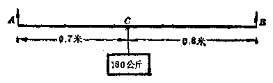

5. 某工厂第一车间的人数是第二车间人数的\(\frac{4}{5}\)少 30 人，如果从第二车间调 10 个人到第一车间，那末第一车间的人数是第二车间人数的\(\frac{3}{4}\)。求各车间的人数。

6. 一只船载重量是 520 吨，容积是 2000 立方米。现在有甲、乙两种货物，甲种货物每吨的体积是 2 立方米，乙种货物每吨的体积是8立方米。两种货物应该各装多少吨，才能最大限度利用器的载重量和容积？

【提示：所谓最大限度利用船的载重量和容积，就是说，使甲乙两种货物重量的总和等于 520 吨，体积的总和等于 2000 立方米。】

7. 甲、乙两工厂，按计划每月生产360架机床；上个月开展劳动竞赛运动，甲厂完成了计划的\(112\%\)，乙厂完成了计划的\(110\%\)，结果两厂一共生产了400架机床。上个月每个工厂各超额生产了多少架机床？

8. 玻璃厂熔炼玻璃液，原料是由石英砂和长石粉混合而成，要求配料中含二氧化硅70%。根据化验，石英砂中含二氧化硅99%，长石粉中含二氧化硅67%。在3.2吨原料中，石英砂和长石粉各需多少吨？

9. 两种酒精，一种含水\(15\%\)，另一种含水\(5\%\)。现在要配制含水\(12\%\)的酒精500克，每种酒精各需要多少克？

10. 铅蓄电池里需要装每立方厘米重1.2克的稀硫酸。已知浓硫酸每立方厘米重1.84克，水每立方厘米重1克。现在要配制2.1升蓄电池用的稀硫酸，浓硫酸和水各需要多少立方厘米？

【提示：假定原来体积的和等于后来的体积。1 升=1000 立方厘米。】

11. 有一个长方形，如果它的长增加 6 厘米，宽减少 3 厘米，它的面积不变；如果长和宽各减少 4 厘米，那末所得的面积比原来的面积少 104 平方厘米。原来长方形的面积是多少？

12. 某人乘自行车以每小时 15 公里的速度从甲地到乙地去，回来时因另有别的事情绕路回来多走了 3 公里，他行车的速度虽然每小时增加了 1 公里，但是所费的时间仍旧多用了\(7 \frac{1}{2}\)分钟。去的路程和回来的路程各多少？

13. 代数式\(ax + b\)中，已知\(x = 2\)时，它的值是1.4，\(x = -2\)时，它的值是-1.8，求\(a\)和\(b\)的值。

##### 例 4

上等稻谷三束，中等稻谷二束，下等稻谷一束，共有谷39斗；上等稻谷二束，中等稻谷三束，下等稻谷一束，共有谷34斗；上等稻谷一束，中等稻谷二束，下等稻谷三束，共有谷26斗，上、中、下三等稻谷每束各有谷多少[^p128-1]？

**【解】** 设上等稻谷一束有谷\(x\)斗，中等稻谷一束有谷\(y\)斗，下等稻谷一束有谷\(z\)斗。

根据题意，列出方程组：

$$
\left\{ \begin{array}{l} 3 x + 2 y + z = 39， \\ 2 x + 3 y + z = 34， \\ x + 2 y + 3 z = 26. \end{array} \right. \tag{1}
$$

解这个方程组，得

$$
\left\{ \begin{array}{l} x = 9 \frac{1}{4}， \\ y = 4 \frac{1}{4}， \\ z = 2 \frac{3}{4}. \end{array} \right.
$$

检验从略。

**答：**上、中、下等稻谷每束分别有谷\(9\frac{1}{4}\)斗，

\(4\frac{1}{4}\)斗，\(2\frac{3}{4}\)斗。

##### 例 5

用锌、铜、镍三种金属混合成三种不同的合金。第一种合金所含锌、铜、镍的重量的比是2：3：1；第二种合金它们的比是2：4：3；第三种合金它们的比是1：2：1。现在要用这三种合金混合成另一种新的合金，使其中含锌10克，铜18克，镍10克，问这三种合金各用多少克？

**【审题】** 第一种合金中含锌、铜、镍的比是2：3：1，实际意义就

[^p128-1]: ① 这是我国古代算书“九章算术”（公元263年刘徽重辑）方程章里的一个题目。原题是：“今有上禾三秉，中禾二秉，下禾一秉，共有实39斗；上禾二秉，中天三秉，下禾一秉，共有实84斗；上禾一秉，中禾二秉，下禾三秉，共有实26斗，问上中下禾各一秉有实多少？”古代解这问题用“直除”的方法。所谓直除，就是从一个方程累减（或累加）另一个方程的意思，它的原理和加减法解方程组相同。

是锌占这种合金的\(\frac{2}{6}\)，铜占\(\frac{3}{6}\)，镍占\(\frac{1}{6}\)。现在要用这三种合金混合成另一种新的合金，就是要从三种合金中共得到锌 10 克，铜 18 克，镍 10 克。

**【解】** 设三种合金分别用\(x\)克、\(y\)克和\(z\)克。根据题意，得

$$
\left\{ \begin{array}{ll} \frac{2}{6} x + \frac{2}{9} y + \frac{1}{4} z = 10， & (1) \\ \frac{3}{6} x + \frac{4}{9} y + \frac{2}{4} z = 18， & (2) \\ \frac{1}{6} x + \frac{3}{9} y + \frac{1}{4} z = 10. & (3) \end{array} \right.
$$

解这方程组，得

$$
\left\{ \begin{array}{l} x = 12， \\ y = 18， \\ z = 8. \end{array} \right.
$$

检验从略。

**答：**第一、第二、第三种合金分别用12克、18克和8克。

#### 习题3·9（2）

列出三元方程组解下列各应用题：

1. 有一个三位数，它的十位上的数等于个位上的数与百位上的数的和，个位上的数与十位上的数的和等于8，百位上的数与个位上的数互相调换后所得的三位数比原来的三位数大99。求这个三位数。

2. 三个数的和等于 51，第一个数除以第二个数，得到商是 2 而余 5；第二个数除以第三个数，得到商是 3 而余 2。这三个数各是多少？

3. 汽车在平路上每小时走30公里，上坡路每小时走28公里，下坡路每小时走35公里。现在走142公里的路程，去的时候用4小时30分钟，回来的时候用4小时42分钟。这段路平路有多少公里？去的时候上坡路、下坡路各有多少公里？

【提示：去时的上坡路、下坡路分别是回来时的下坡路和上坡路。】

4. 一个车间每天能生产甲种零件300个，或者乙种零件500个，或者丙种零件600个。甲、乙、丙三种零件各取一个配成一套。现在要在28天内使产品成套，生产甲、乙、丙三种零件应该各用几天？

5. 某工厂一个车间加工机轴和轴承，一个人每天平均可以加工机轴15个或者轴承12个，该车间共有90人，问应当分配多少个人加工机轴，多少个人加工轴承，才能使每天生产的机轴与轴承配套（一个轴承和一个机轴配成一套）？

6. 甲种合金含铅、锑、锡的重量的比是5：2：1；乙种合金含铅和锑的比是7：1；丙种合金含铅和锡的比是2：1。现在要得到一种铸造铅字用的合金100公斤，使其中含铅82公斤，锑15公斤，锡3公斤，甲乙丙三种合金应当各取多少公斤（精确到0.1公斤），才能使熔化后得到所需要的合金？

7. 有三种化学肥料：甲种每公斤含氮 53 克、磷 8 克、钾 2 克；乙种每公斤含氮 64 克、磷 10 克、钾 0.6 克；丙种每公斤含氮 70 克、磷 5 克、钾 1.4 克。某生产队要把上面三种化肥混成一种化肥，总重 23 公斤，其中共含磷 149 克、钾 30 克。三种化肥各需多少公斤？其中共含氮多少克？

8. 代数式\(ax^2 + bx + c\)，在\(x = 1\)时的值是 0，在\(x = 2\)时的值是 3，在\(x = -3\)时的值是 28。求这个代数式。

【提示：分别以 x=1，x=2，x=-3 代入，列出关于 a，b，c 的三元一次方程组，求 a，b，c 的值。】

##### 例 6

甲、乙两个工人共同工作，原计划6天完成全部任务。他们共同工作4天后，乙因为另有紧急任务需要调走，余下的任务由甲单独工作，5天才全部完成。如果甲、乙两工人单独完成这一任务各要多少天？

**【解】** 设甲单独完成这一任务需要\(x\)天，乙单独完成这一任务需要\(y\)天。那末，甲单独工作一天能完成全部任务的\(\frac{1}{x}\)，乙能完成全部任务的\(\frac{1}{y}\)；甲、乙两人共同工作一天，能完成全部任务的\(\frac{1}{x} + \frac{1}{y}\)。

根据题意，列出方程组：

$$
\left\{ \begin{array}{l} 6 \left(\frac{1}{x} + \frac{1}{y}\right) = 1， \\ 4 \left(\frac{1}{x} + \frac{1}{y}\right) + \frac{5}{x} = 1. \end{array} \right. \tag{1}
$$

整理后，原方程组可以变成

$$
\left\{ \begin{array}{l} \frac{6}{x} + \frac{6}{y} = 1， \\ \frac{9}{x} + \frac{4}{y} = 1. \end{array} \right. \tag{3}
$$

设\(\frac{1}{x} = u, \frac{1}{y} = v\)，那末方程（3），（4）就变成

$$
\left\{ \begin{array}{l} 6 u + 6 v = 1， \\ 9 u + 4 v = 1. \end{array} \right. \tag{5}
$$

解（5），（6）组成的方程组，得

$$
\left\{ \begin{array}{l} u = \frac{1}{15}， \\ v = \frac{1}{10}. \end{array} \right.
$$

就是\(\left\{ \begin{array}{l} \frac{1}{x} = \frac{1}{15}, \\ \frac{1}{y} = \frac{1}{10}. \end{array} \right.\therefore \left\{ \begin{array}{l} x = 15, \\ y = 10. \end{array} \right.\)

把\(x = 15, y = 10\)代入方程（1）和（2）都能适合。所以原方程组的解是

$$
\left\{ \begin{array}{l} x = 15， \\ y = 10. \end{array} \right.
$$

**答：**甲单独完成这一任务需要15天，

乙单独完成这一任务需要10天。

##### 例7

轮船顺流航行80公里，逆流航行42公里，共用7小时。另一次在同样时间里，顺流航行了40公里，逆流航行了70公里。求轮船在静水中的速度和水流的速度。

**【解】** 设轮船在静水中的速度是每小时 x 公里，水流的速度是每小时 y 公里。那末，顺流航行的速度就是每小时\((x+y)\)公里，逆流航行的速度就是每小时\((x-y)\)公里。

根据题意，列出方程组：

$$
\left\{ \begin{array}{l} \frac{80}{x + y} + \frac{42}{x - y} = 7， \\ \frac{40}{x + y} + \frac{70}{x - y} = 7. \end{array} \right. \tag{1}
$$

设\(\frac{1}{x + y} = u, \frac{1}{x - y} = v,\)那末原方程组就变成

$$
\left\{ \begin{array}{l} 80 x + 42 v = 7， \\ 40 x + 70 v = 7. \end{array} \right.
$$

解这个方程组，得

$$
\left\{ \begin{array}{l} u = \frac{1}{20}， \\ v = \frac{1}{14}. \end{array} \right.
$$

就是\(\left\{ \begin{array}{l} \frac{1}{x + y} = \frac{1}{20}, \\ \frac{1}{x - y} = \frac{1}{14}. \end{array} \right.\)

$$
\therefore \quad \left\{ \begin{array}{l} x + y = 20， \\ x - y = 14. \end{array} \right.
$$

解这个方程组，得

$$
\left\{ \begin{array}{l} x = 17， \\ y = 3. \end{array} \right.
$$

把\(x = 17, y = 3\)代入方程（1）和（2）都能适合，所以这就是原方程组的解。

**答：**轮船在静水中的速度是每小时17公里，水流的速度是每小时3公里。

#### 习题3·9（3）

列出方程组解下列应用题：

1. 两只水管同时开放，经过 1 小时 20 分钟注满水池。如果第一只水管开放 10 分钟，第二只水管开放 12 分钟，那末只能注满水池的\(\frac{2}{15}\)。每只水管单独注满水池各需多少小时？

2. 一只汽艇顺流航行了24公里，到达目的地后，逆流回来，共用2小时20分钟。另一次在1小时20分钟内，顺流航行了8公里，逆流航行了18公里。求汽艇在静水里的速度和水流的速度。

3. 甲、乙两工人合作，在12天内可以完成一件工作。如果甲工作2天，乙工作3天，那末他们只能完成全部工作的\(20\%\)。两人单独完成这件工作各要多少天？

4. 一个水池有甲、乙、丙三个进水管。甲、乙两管同时开放，1小时12分钟可以注满水池，乙、丙两管同时开放，2小时可以注满水池；甲、丙两管同时开放，1小时30分钟可以注满水池。甲、乙、丙三个水管单独开放，各要多少小时才能注满水池？

5. 甲、乙、丙三人合做一件工程，15天可以完成。如果甲、乙合做10天，其余的由丙单独做，那末还要30天才能完成；如果甲、丙合做20天，其余的由乙单独做，那末还要8天才能完成。问当甲、乙、丙每人单独做，要多少天才能完成这项工程？

### *§ 3·10 待定系数法

这一节里，我们将学习一次方程组在解某些数学问题中的应用。先来看下面的问题：

不做直式除法，怎样求多项式\(2x^{3} - x^{2} + 5x + 6\)除以多项式\(x + 2\)的商式和余式？

在代数第一册里学习带余式的除法时，我们已经知道，被除式、除式、商式和余式之间，有着如下的关系：

被除式\(=\)除式\(\times\)商式\(+\)余式。（1）

这里商式的次数，应该是被除式的次数与除式的次数的差，而余式的次数至少要比除式的次数少1.

根据这一事实，可以确定：

1. 因为被除式\(2x^{3} - x^{2} + 5x + 6\)是\(x\)的三次式，除式\(x + 2\)是\(x\)的一次式，所以所求的商式应该是 x 的二次式；

2. 因为除式\(x + 2\)是一次式，所以所求的余式，只能是一个常数。

这样，为了要求出这个商式和余式，我们不妨引进一些未知数。设商式中二次项、一次项和常数项的系数分别是\(A, B\)和\(C\)。即商式是\(Ax^2 + Bx + C\)，余式是\(D\)，代入（1）就可得到一个恒等式

$$
2 x ^ {3} - x ^ {2} + 5 x + 6 = (x + 2) (A x ^ {2} + B x + C) + D，
$$

也就是

$$
\begin{array}{l} 2 x ^ {3} - x ^ {2} + 5 x + 6 \\ = A x ^ {3} + (2 A + B) x ^ {2} + (2 B + C) x + (2 C + D)。 \tag{2} \\ \end{array}
$$

因为（2）是一个恒等式，等号两边的这两个三次式都已写成标准形式，对应项的系数要分别相等[^p134-1]，由此我们就可列出一个关于未知数\(A 、 B 、 C 、 D\)的方程组

$$
\left\{ \begin{array}{ll} A = 2， \\ 2 A + B = - 1， \\ 2 B + C = 5， \\ 2 C + D = 6. \end{array} \right. \text {解之， 得} \left\{ \begin{array}{ll} A = 2， \\ B = - 5， \\ C = 15， \\ D = - 24. \end{array} \right.
$$

代入假设的商式和除式，于是就可求得

$$
\text { 商式是 } 2 x ^ {2} - 5 x + 15， \text { 余式是 } - 24
$$.

象上面这样的解题方法，叫做待定系数法，我们解题时开始引进的那些未知数 A、B、C、D 叫做待定系数。

待定系数法是数学里一种重要的解题方法，应用时一般有以下的步骤：

1. 先引进一些待定系数，根据题设列出一个恒等式；

2. 把列出的恒等式化简，然后根据两个多项式恒等的性质列出一个方程组；

3. 解方程组求出那些待定系数，作出最后的结论。

下面我们再举几个应用待定系数法解题的例子。

#### 例 1

a、b 是什么数值时，多项式\(x^{4}-5x^{3}+11x^{2}+ax+b\)能被\(x^{2}-2x+1\)整除？并求出它的商式。

**【审题】** 根据题意，多项式能为除式整除，所以余数一定是0.现在被除

[^p134-1]: ① 这是两个多项式恒等的定理，严格的证明，今后在代数第四册里将会学到。

式是四次多项式，除式是二次式，所以商式一定是二次多项式。并且被除式的最高项是\(x^{4}\)，除式的最高项是\(x^{2}\)，所以商式的最高项一定是\(x^{2}\)项。

**【解】** 设商式是\(x^{2} + mx + n\)，那末

$$
\begin{array}{l} x ^ {4} - 5 x ^ {3} + 11 x ^ {2} + a x + b = (x ^ {2} - 2 x + 1) (x ^ {2} + m x + n) \\ = x ^ {4} + m x ^ {3} + n x ^ {2} - 2 x ^ {3} - 2 m x ^ {2} - 2 n x + x ^ {2} + m x + n \\ = x ^ {4} + (m - 2) x ^ {3} + (1 - 2 m + 1) x ^ {2} + (- 2 m + m) x + n. \\ \end{array}
$$

因为上式是恒等式，所以对应项的系数相等。

就是\(\left\{ \begin{array}{l} m - 2 = -5, \\ n - 2m + 1 = 11, \\ -2n + m = a, \\ n = b. \end{array} \right.\)

解得\(\left\{ \begin{array}{l} m = -3, \\ n = 4, \\ a = -11, \\ b = 4. \end{array} \right.\)

所以，\(n = -11\)，\(b = 4\)，商式是\(x^{2} - 3x + 4\)

##### 例2

把分式\(\frac{4x - 5}{2x^2 - 5x - 3}\)化成两个分式的和，使这两个分式的分母分别是\(2x + 1\)和\(x - 3\)。

**【审题】** 观察已知分式的分母\(2x^{2} - 5x - 3\)，它可以分解成两个一次因式，\(2x + 1\)和\(x - 3\)，用来作为另两个分式的分母。现在的问题是这两个分式的分子是什么？为此我们可以先作出一个假设。因为两个分母的代数式都是一次式，那末它们的分子都应该是常数，所以可设它们的分子分别是\(A\)和\(B\)。

**【解】** 设两个分式的分子分别为\(A\)和\(B\)。那末

$$
\begin{array}{l} \frac{4 x - 5}{2 x ^ {2} - 5 x - 3} = \frac{A}{2 x + 1} - \frac{B}{x - 3} = \frac{A (x - 3) + B (2 x + 1)}{(2 x + 1) (x - 3)} \\ = \frac{(A + 2 B) x + (- 3 A + B)}{2 x ^ {2} - 5 x - 3}. \\ \end{array}
$$

因为上式是恒等式，现在两个分式的分母相同，所以它们的分子必须是恒等式，因此对应项系数相等，就是

$$
\left\{ \begin{array}{l} A = 2 B = 4， \\ - 3 A + B = - 5. \end{array} \right.
$$

解这个方程组，得

$$
\left\{ \begin{array}{l} A = 2， \\ B = 1. \end{array} \right.
$$

所以，\(4x - 5\)\(\frac{2}{2x^2 - 5x - 3} = \frac{2}{2x + 1} +\frac{1}{x - 3}\).

**【说明】** 这种类型的题目叫做分一个分式为部份分式问题，以后在代数第四册中将作专门研究。

1. 用待定系数法求\(3x^{2} + 5x^{2} - 2x + 15\)除以\(x + 3\)所得的商式和余式；并且用直式除法检验其结果是否正确？

2. 用待定系数法求\((2x^{4} + 3x^{3} + 4x^{2} + x - 2) \div (x^{2} - x + 1)\)的商式和余式。

3. 已知\(x^4 + 4x^3 + 6ax^2 + 4bx + c\)能被\(x^3 + 3x^2 + 9x + 3\)整除，求\(a, b, c\)的值。

4. 把分式\(\frac{x + 7}{6x^2 + 7x - 3}\)化成两个分式的和，使这两个分式的分母分别是\(3x - 1\)和\(2x + 3\)。

5. 把分式\(\frac{3x - 9}{(x^2 - 1)(x - 2)}\)化成分式\(\frac{A}{x - 1}, \frac{B}{x + 1}, \frac{C}{x - 2}\)的和，求\(A, B, C\)的值。

### 本章提要

#### 1. 几个重要概念及其一般形式

（1） 二元一次方程：

$$
a x + b y = 0 \quad (a \neq 0， b \neq 0)
$$。

（2） 二元一次方程组：

\(\left\{ \begin{array}{l} a_{1}x + b_{1}y = c_{1}, \\ a_{2}x + b_{2}y = c_{2} \end{array} \right.\)（\(x\)或\(y\)的系数不能全为 0）。

（3） 三元一次方程：

$$
a x + b y + c z = d _ {*} ]
$$

（4）。三元一次方程组：

$$
\left\{ \begin{array}{ll} a _ {1} x + b _ {1} y + c _ {12} = d _ {1}， \\ a _ {2} x + b _ {2} y + c _ {22} = d _ {2}， & (x \text {或} y \text {或} z \text {的} \\ a _ {3} x + b _ {3} y + c _ {32} = d _ {3} & \text {系数不能全为} 0)。 \end{array} \right.
$$

#### 2. 二元一次方程组的解法

（1） 代入消元法，（2） 加减消元法，（3） 行列式法。

3. 二元一次方程组解的三种情况

设\(\left\{\begin{aligned}a_{1}x+b_{1}y&=a_{1},\\ a_{2}x+b_{2}y&=a_{2}\end{aligned}\right.\)\((a_{1},a_{2},b_{1},b_{2}\)都不等于0）。

|  | 情况 |  | 解的结果 |
| --- | --- | --- | --- |
|  | 从系数看 | 从行列式看 | 解的结果 |
| （1） | 当\( \frac{a_1}{a_2} \neq \frac{b_1}{b_2} \)时 | 当\( D = \left\| \begin{array}{cc}a_1 & b_1 \\ a_2 & b_2 \end{array} \right\| \neq 0 \)时 | 方程组有唯一一个解\( \left\{ \begin{array}{l} x = \frac{c_1 b_2 - c_2 b_1}{a_1 b_2 - a_2 b_1} \\ y = \frac{a_1 c_2 - a_2 c_1}{a_1 b_2 - a_2 b_1} \end{array} \right. \)即\( \left\{ \begin{array}{l} x = \frac{D_x}{D} \\ y = \frac{D_y}{D} \end{array} \right. \) |
| （2） | 当 \( \frac{a_1}{a_2} = \frac{b_1}{b_2} \neq \frac{c_1}{c_2} \) 时 | 当 \( D = 0 \) 而 \( D_x \neq 0 \) 或\( D_y \neq 0 \) 时 | 方程组没有解 |
| （3） | 当 \( \frac{a_1}{a_2} = \frac{b_1}{b_2} = \frac{c_1}{c_2} \) 时 | 当 \( D = 0 \)，且 \( D_x = 0 \)，\( D_y = 0 \) 时 | 方程组有无数多个解 |

4. 三元（三元以上）一次方程组的解法 用消元法逐次消元，最后转化为解一个二元一次方程组的问题。

5. 可化为一次方程组的分式方程组的解法

（1） 一般方法：去分母，把原方程组中的各个分式方程变成整式方程，求出解后再检验；

（2） 换元法。

6. 待定系数法 先根据题意，假设一个或几个未知系数，列出一个恒等式，然后利用两个多项式恒等，它们对应项的系数必须相等的原理，列出方程组，从而求出假设的未知系数。

### 复习题三A

解下列各二元一次方程组\((1\sim 4)\)

1.\(\left\{ \begin{array}{l} x(y + 1) - y(x - 1) = 8, \\ y = x - 2. \end{array} \right.\)

2.\(\left\{ \begin{array}{l} \frac{2x - 3y + 1}{2} + \frac{3x - 2y - 3}{3} = 1, \\ \frac{x + 2y + 6}{4} - \frac{4x + 2y - 2}{5} = 0. \end{array} \right.\)

3.\(\left\{ \begin{array}{l} \frac{2x}{3} + \frac{3y}{4} = \frac{3x - 2y}{2} + 1, \\ \frac{3x}{2} - \frac{4y}{3} = \frac{3x + 4y}{6} - 1. \end{array} \right.\) 4.\(\left\{ \begin{array}{l} \frac{x - 1}{x + 15} = \frac{y - 1}{y - 9}, \\ \frac{x - 3}{x} = \frac{y + 6}{y + 9}. \end{array} \right.\)

5. 解下列关于\(x, y\)的二元一次方程组：

（1）\(\left\{ \begin{array}{l} ax + by = a^2 + 2a + b^2, \\ bx + ay = a^2 + 2b + b^2 \end{array} \right.\)（\(a^2 - b^2 \neq 0\)）；

（2）\(\left\{ \begin{array}{l} \left( \frac{1}{a} + \frac{1}{b} \right) x + \left( \frac{1}{a} - \frac{1}{b} \right) y = 4, \\ \frac{x}{a + b} \div \frac{y}{a - b} = 2 \end{array} \right.\)（\(a > b > 0\)）。

解下列各三元一次方程组（6~7）：

7.\(\left\{ \begin{array}{l} \frac{1}{x} + \frac{1}{y} + \frac{1}{z} = 8, \\ \frac{3}{x} - \frac{2}{y} - \frac{1}{z} = 10, \\ \frac{1}{x} - \frac{1}{y} - \frac{1}{z} = 2. \end{array} \right.\)

6.\(\left\{ \begin{array}{l} x + y + z = 6, \\ y: s = 2: 3, \\ 3x = s. \end{array} \right.\)

8. 解下列关于\(x, y, z\)的三元一次方程组：

$$
\left\{ \begin{array}{l} x + y = 3 m， \\ x + z = 4 m， \\ y + z = 5 m. \end{array} \right.
$$

9. 当\(a\)为何值时，方程组\(\left\{ \begin{array}{l} ax + 3y = 9, \\ 2x - y = 1 \end{array} \right.\)才有唯一的解？

10. 一个工厂去年的总产值比总支出多500万元，今年的总产值比去年增加\(15\%\)，总支出节约\(10\%\)，因此总产值比总支出多950万元。求去年的总产值和总支出。

11. 从某人民公社到城市，要先走坡道后走平路。一个通讯员骑自行车以每小时 12 公里的速度下坡，然后以每小时 9 公里的速度通过平路，到达城市共用 55 分钟。他回来的时候，以每小时 8 公里的速度通过平路，然后以每小时 4 公里的速度上坡，回到公社就用了\(1 \frac{1}{2}\)小时。问从该人民公社到城市有多少公里？

【提示：先要分别求出坡道和平路各有多少公里。】

12. 甲、乙两仓库共存粮95吨，现在从甲仓库运出它的存粮的\(\frac{2}{3}\)，从乙仓库运出它的存粮的\(40\%\)，那末乙仓库所余的粮食是甲仓库的2倍。甲、乙两仓库原来各存粮多少吨？

13. 甲种铁矿石含铁的百分数是乙种铁矿石的1.5倍，甲种铁矿石5份和乙种铁矿石3份混合，就含铁52.5%。求甲、乙两种矿石含铁的百分数。

14. 代数式\(ax + by\)，在\(x = 5, y = 2\)的时候，它的值是7；在\(x = 8, y = 5\)的时候，它的值是4。求这个代数式。

### 复习题三B

解下列各二元一次方程组（1~2）：

2.\(\left\{ \begin{array}{l} \frac{2}{x + y} + \frac{5}{x - y} = 18, \\ \frac{9}{x + y} - \frac{10}{y - x} = 66. \end{array} \right.\)

1.\(\left\{ \begin{array}{l} (x + 2)^2 + (y - 3)^2 = x^2 + y^2, \\ (x - 3)^2 - (y + 2)^2 = x^2 - y^2. \end{array} \right.\)

【提示：把 y-x 变成\(-(x-y)\)。】

3. 解下列关于\(x, y\)的二元一次方程组：

$$
\left\{ \begin{array}{l} \frac{x}{a} + \frac{y}{b} = 1 + x， \\ \frac{x}{b} + \frac{y}{a} = 1 - y \end{array} \right. [ b ^ {2} (1 - a ^ {2}) - a ^ {2} \neq 0 ]
$$。

4. 解下列各三元一次方程组：

$$
\left\{ \begin{array}{l} \frac{x}{y + 1} = 1， \\ \frac{y}{x + 1} = \frac{1}{4}， \\ \frac{z}{x + 1} = 1； \end{array} \right. \tag{1}
$$

$$
\left\{ \begin{array}{l} \frac{x + 1}{y + z} = 2， \\ \frac{y - 2}{2 x - z} = 4， \\ \frac{z - 1}{4 x + y} = 1. \end{array} \right. \tag{2}
$$

5. 解下列关于\(x, y, z\)的三元一次方程组：

$$
\left\{ \begin{array}{l} x - 5 y - 3 z = 0， \\ 3 x - 5 y - z = b， \\ 3 y - x + 5 z = c. \end{array} \right.
$$

6. 解方程组：

$$
\left\{ \begin{array}{l} (m - 1) ^ {2} x + (m ^ {2} - 1) y = (m + 1) ^ {2}， \\ (2 m - 1) x + (m + 1) y = m ^ {2} - 1 \end{array} \right. \quad (m \neq 0， m \neq \pm 1)
$$。

7. A，B 两城的距离是 50 公里。甲乘自行车从 A 往 B，出发 1 小时 30 分钟后，乙乘摩托车也从 A 出发往 B。已知乙的速度是甲的速度的 2.5 倍，并且乙比甲早到 1 小时，求各人的速度。

8. 一只轮船在一条江里顺流航行100公里，逆流航行64公里，共用9小时。如果逆流航行80公里，顺流航行80公里，那末所需要的时间也是9小时。求轮船在静水里的速度和水流速度。

9. 代数式\(ax^2 + bx + c\)，在\(x = -1, x = 3, x = \frac{1}{2}\)的时候，它的值分别是 10，14，4。求这个代数式。

10. 某车间每天能生产甲种零件 500 只，或者乙种零件 600 只，或者丙种零件 750 只，甲、乙、丙三种零件各一只配成一套，现在要在 30 天内生产最多的成套产品，同甲、乙、丙三种零件各应生产几天？

11. 一列客车和一列货车在平行的轨道上同向行驶，客车的车身长200米，货车的车身长280米。客车的速度比较快，它从后面赶上货车，如果从车头赶上到车尾超过的时间为1分钟，而两车的速度之比是5：3，求各车的平均速度。如果两车在平行的轨道上相向行驶，从车头相遇到车尾相离的时间需要多少秒钟？

【提示：快车在1分钟内从赶上并且超过货车，实际行驶的距离是快车和货车的车身长的和，就是\((200 + 280)\)米。】

12. 把分式\(\frac{5x^2 + 14x - 1}{2x^2 + 3x^2 - 3x - 2}\)化成三个分式的和，使它们的分母分别为\(x - 1, x + 2, 2x + 1\)。

### 第三章测验题

1. 证明恒等式：

$$
\left| \begin{array}{ll} a _ {1} & k b _ {1} \\ a _ {2} & k b _ {2} \end{array} \right| = k \left| \begin{array}{ll} a _ {1} & b _ {1} \\ a _ {2} & b _ {2} \end{array} \right|
$$.

2. 解下列方程组：

（2）\(\left\{ \begin{array}{l} x = \frac{2y + 4}{3}, \\ y = \frac{3x - 4}{2}; \end{array} \right.\)

（1）\(\left\{ \begin{array}{l} 7x - 3y - 15 = 0, \\ 5x + 6y - 27 = 0; \end{array} \right.\)

（3）\(\left\{ \begin{array}{l} \frac{2x - (x - y)}{6} = \frac{x + y}{5} - 1, \\ \frac{y - 2(x + y)}{8} = y - x. \end{array} \right.\)

（4）\(\left\{ \begin{array}{l} \frac{1}{x + y} + \frac{1}{x - y} = \frac{5}{8}, \\ \frac{1}{x - y} - \frac{1}{x + y} = \frac{3}{8}; \end{array} \right.\)

（5）\(\left\{ \begin{array}{l} 2x - y - 2s = -10, \\ 4x - y - 4x - 10 = 0, \\ 3x + 4y - s - 8 = 0; \end{array} \right.\)

（6）\(\left\{ \begin{array}{l} \frac{y + s}{4} = \frac{s + x}{2} = \frac{x + y}{3}, \\ x + y + s = 9; \end{array} \right.\)

（7）\(\left\{ \begin{array}{l} \frac{1}{x} - \frac{1}{y} = 1\frac{1}{2}, \\ \frac{1}{x} + \frac{1}{s} = \frac{7}{10}, \\ \frac{1}{y} - \frac{1}{s} = -\frac{5}{6}, \end{array} \right.\)

（8）\(\left\{ \begin{array}{l} \frac{2}{x - 2} + \frac{5}{2(2y - 3)} = \frac{1}{2}, \\ \frac{10}{3 - 2y} - \frac{1}{3(2 - x)} = 2\frac{1}{6}. \end{array} \right.\)

3. 甲乙两人做同样的机器零件。如果甲先做1天，乙再开始做，5天后，两人做的零件就同样多。如果甲先做30个，乙再开始做，4天后乙反而多做10个。求两人每天各做多少个。

4. 某工厂今年第一季度生产的甲乙两种机床比去年同期多72台，增长了30%，其中甲种机床增长了40%，乙种机床增长了16%，求今年第一季度生产甲种机床和乙种机床各多少台。

5. 有三种合金：按重量算，甲种含金 5 份、银 2 份、铅 1 份；乙种含金 2 份、银 5 份、铅 1 份；丙种含金 3 份、银 1 份、铅 4 份。现在要熔成金、银、铅的量相等的合金 27 两，问甲、乙、丙三种合金需要各取多少两？

## 第4章 数的开方与实数

### § 4·1 方根的意义

我们来看这样一个问题：

什么数的平方等于25？这个问题就是要求平方后等于25的这样一个数。我们把这个数叫做25的二次方根，也叫做25的平方根。

因为\(5^{2} = 25, (-5)^{2} = 25\)，所以5和-5都是25的平方根。同样，\(\left(\frac{2}{3}\right)^{2} = \frac{4}{9}, \left(-\frac{2}{3}\right)^{2} = \frac{4}{9}\)，所以\(\frac{2}{3}\)和\(-\frac{2}{3}\)都是\(\frac{4}{9}\)的平方根；\((0.6)^{2} = 0.36, (-0.6)^{2} = 0.36\)，所以\(0.6\)和\(-0.6\)都是\(0.36\)的平方根。

一般地说，如果一个数的平方等于\(a\)，那末这个数就叫做\(a\)的平方根。

我们再看：\(4^{3}=64\)，我们就说4是64的三次方根，也叫做64的立方根。又如，\((-3)^{3}=-27\)，所以-3是-27的立方根；\(\left(\frac{2}{3}\right)^{3}=\frac{8}{27}\)，所以\(\frac{2}{3}\)是\(\frac{8}{27}\)的立方根。

一般地说，如果一个数的立方等于\(a\)，那末这个数就叫做\(a\)的立方根。

同样，因为\(2^{4} = 16, (-2)^{4} = 16\)，所以2和-2是16的四次方根。\((-3)^{5} = -243\)，所以-3是-243的五次方根。

一般地说，如果一个数\(x\)的\(n\)次方等于\(a\)，就是\(x^n = a\)，我们就说\(x\)是\(a\)的\(n\)次方根。

求一个数的方根的运算叫做开方，求\(a\)的平方根的运算叫做把\(a\)开平方；求\(a\)的立方根的运算叫做把\(a\)开立方。一般地说，求\(a\)的\(n\)次方根的运算叫做把\(a\)开\(n\)次方。这里，\(a\)叫做被开方数，\(n\)叫做开方的次数。例如：

把25开平方，被开方数是25，开方的次数是2；把64开立方，被开方数是64，开方的次数是3.

**【注意】**

开方是一种运算，方根是开方运算的结果；正象加、减、乘、除、乘方是运算，和、差、积、商、幂是运算结果一样。

根据方根的意义，我们可以知道，乘方和开方互为逆运算（就是说开方是乘方的逆运算，乘方是开方的逆运算），所以我们可以利用乘方来检验开方的结果是不是正确，或用观察的方法求某些简单的数的方根。

#### 例1

检验下列各题：

（1） 0.2 是不是 0.008 的立方根？

（2）\(\frac{3}{5}\)和\(-\frac{3}{5}\)是不是\(\frac{9}{25}\)的平方根？

（3） 3 和 -3 是不是 -27 的立方根？

**【解】** （1）\(\because (0.2)^{3} = 0.008,\)

∴ 0.2 是 0.008 的立方根。

（2）\(\because \left(\frac{3}{5}\right)^2 = \frac{9}{25}, \left(-\frac{3}{5}\right)^2 = \frac{9}{25},\)

∴\(\frac{3}{5}\)和\(-\frac{3}{5}\)都是\(\frac{9}{25}\)的平方根。

（3）\(\because (-3)^{3} = -27\)，而\(3^{3} = 27\)

∴ -3 是 -27 的立方根，

而 3 不是 -27 的立方根。

##### 例2

求下列各数的平方根：

（1） 121；

（2）\(\frac{25}{64}\)。

**【解】**

（1）\(\because (\pm 11)^{2} = 121,\)

∴ 121 有两个平方根 11 和 -11.

（2）\(\because \left(\pm \frac{5}{8}\right)^2 = \frac{25}{64},\)

∴\(\frac{25}{64}\)有两个平方根\(\frac{5}{8}\)和\(-\frac{5}{8}\)。

#### 习题4·1

回答下列各问题：

1. 7 和 -7 是不是 49 的平方根？

2.\(\frac{1}{3}\)是不是\(\frac{1}{27}\)的立方根？

3. 2 和 -2 是不是 8 的立方根？

4.\(\frac{1}{9}\)和\(-\frac{1}{9}\)是不是\(\frac{1}{81}\)的平方根？9是不是\(\frac{1}{81}\)的平方根？

5. 0.3 和 -0.3 是不是 0.0081 的四次方根？

6.\(-\frac{3}{4}\)和\(\frac{3}{4}\)是不是\(-\frac{27}{64}\)的立方根？\(-\frac{1}{4}\)是不是\(-\frac{1}{64}\)的立方根？

7.\(\frac{2}{3}\)和\(-\frac{2}{3}\)是不是\(\frac{16}{81}\)的四次方根？

8.\(\frac{1}{2}\)和\(-\frac{1}{2}\)是不是\(-\frac{1}{32}\)的五次方根？

9. 平方后等于 64 的数，共有哪几个？64 的平方根共有哪几个？

10. 平方后等于\(\frac{16}{169}\)的数有哪几个？\(\frac{16}{169}\)的平方根有哪几个？

### § 4·2 方根的性质

在上一节里，我们看到，5和-5都是25的平方根，2和-2都是16的四次方根；4是64的立方根，-3是-243的五次方根。从开方次数来看，开平方，它的开方次数是2，开四次方，它的开方次数是4，2和4都是偶数，所以说，平方根，四次方根都是偶次方根。开立方，它的开方次数是3，开五次方，它的开方次数是5，3和5都是奇数，所以说，立方根和五次方根都是奇次方根。下面就分奇次方根和偶次方根来研究方根的性质。

#### 1. 奇次方根的性质

我们来看下面的例子：

（1）\(2^{5} = 32, 2\)就是32的5次方根；任何不等于2的数，它的5次方都不等于32；所以，32的5次方根只有一个数2。又如，\(\left(\frac{1}{3}\right)^{3} = \frac{1}{27}, \frac{1}{3}\)就是\(\frac{1}{27}\)的3次方根；任何不等于\(\frac{1}{3}\)的数，它的3次方都不等于\(\frac{1}{27}\)；所以，\(\frac{1}{27}\)的3次方根只有一个数\(\frac{1}{3}\)。不仅如此，我们还可以看到，32是正数，它的5次方根2也是正数；同样，正数\(\frac{1}{27}\)的3次方根\(\frac{1}{3}\)也是正数。这就是说，正数的奇次方根是一个正数。

（2）\((-0.3)^{3} = -0.027, -0.3\)是\(-0.027\)的3次方根；任何不等于-0.3的数，它的3次方都不等于-0.027；所以，-0.027的3次方根只有一个数-0.3。又如，\(\left(-\frac{1}{2}\right)^{5} = -\frac{1}{32}, -\frac{1}{2}\)是\(-\frac{1}{32}\)的5次方根；任何不等于\(-\frac{1}{2}\)的数，它的5次方都不等于\(-\frac{1}{32}\)；所以，\(-\frac{1}{32}\)的5次方根只有一个数\(-\frac{1}{2}\)。同样我们还可以看到，-0.027是负数，而-0.3也是负数；\(-\frac{1}{32}\)是负数，而\(-\frac{1}{2}\)也是负数。这就是说，负数的奇次方根是一个负数。

（3） 因为零的任意次幂都等于零，所以零的奇次方根仍旧是零。

综合上面的例子，我们可以得出奇次方根的性质如下：

正数的奇次方根只有一个，并且是一个正数；负数的奇次方根也只有一个，并且是一个负数；零的奇次方根仍旧是零。

#### 2. 偶次方根的性质

我们再来看下面几个例子：

（1）\(7^{2} = 49, (-7)^{2} = 49, 7\)和\(-7\)都是 49 的平方根；任何绝对值不等于 7 的数，它的平方都不等于 49；我们还知道，49 是一个正数，7 和\(-7\)虽然一个是正数，一个是负数，但是它们的绝对值是相同的，它们是两个互为相反的数。所以，49 的平方根有两个，并且只有两个互为相反的数 7 和\(-7\)。

又如，\((0.2)^{4} = 0.0016\)，\((-0.2)^{4} = 0.0016\)，0.2 和 -0.2 都是 0.0016 的四次方根；任何绝对值不等于 0.2 的数，它的四次方都不等于 0.0016；同样，我们还知道，0.2 和 -0.2 是两个互为相反的数。所以，0.0016 的四次方根也有两个，并且只有两个互为相反的数 0.2 和 -0.2。

这就是说，正数的偶次方根是两个相反的数。

（2） 因为正数的平方是正数，负数的平方还是正数，零的平方也是零，所以没有一个数的平方等于负数因此负数没有平方根。

（3） 因为零的任意次幂都等于零，所以零的偶次方根仍旧是零。

综合上面的例子，我们可以得出偶次方根的性质如下

正数的偶次方根是两个相反的数；负数的偶次方根没有意义；零的偶次方根仍旧是零。

**【注意】**

关于零的方根，我们综合起来说：零的任何次方根仍旧是零。

### § 4·3 方根的记法

前面我们已经学过方根的意义，懂得了什么叫做方根。为了书写简便，我们需要用一个符号来表示它。

从上一节方根的性质里，我们知道，一个数的奇次方根只有一个，所以当\(n\)是奇数的时候，\(a\)的\(n\)次方根可以用一个符号\(\sqrt[n]{a}\)来表示 （这里\(n\)是奇数）。符号“\(\sqrt[n]{-}\)”叫做根号，这里\(a\)是被开方数，\(n\)是根指数。例如，8 的立方根用符号\(\sqrt[3]{8}\)表示；-32 的五次方根用符号\(\sqrt[5]{-32}\)表示；\(-\frac{1}{27}\)的立方根用符号\(\sqrt[3]{-\frac{1}{27}}\)表示。

因为正数的偶次方根有两个，它们是两个相反的数，所以当\(n\)是偶数时，正数\(a\)的偶次方根就需要用两个符号来表示，通常用符号\(\sqrt[n]{a}\)来表示正的一个，而用符号\(-\sqrt[n]{a}\)来表示负的一个 （这里\(a\)是正数，\(n\)是偶数）。例如，16 的四次方根有两个：+2 和 -2，我们用\(\sqrt[4]{16}\)来表示正的一个，就是 +2，而用\(-\sqrt[4]{16}\)来表示负的一个，就是 -2。

\(\frac{1}{81}\)的四次方根有两个：\(+\frac{1}{3}\)和\(-\frac{1}{3}\)，我们用\(\sqrt[4]{\frac{1}{81}}\)表示正的一个，就是\(+\frac{1}{3}\)，而用\(-\sqrt[4]{\frac{1}{81}}\)表示负的一个，就是\(-\frac{1}{3}\)。

表示正数的偶次方根，为了简便起见，有时可以把它的两个方根合并写在一起，用符号\(\pm \sqrt[n]{a}\)来表示（这里，\(n\)是偶数，\(a\)是正数）。例如，上面两个例子里，16的四次方根可以用符号\(\pm \sqrt[4]{16}\)来表示；\(\frac{1}{81}\)的四次方根可以用符号±\(\sqrt[4]{\frac{1}{81}}\)来表示。

用符号表示平方根的时候，通常把根指数 2 省略不写。例如，9 的平方根有两个，一个是\(\sqrt{9}\)，就是\(+3\)，另一个是\(-\sqrt{9}\)，就是\(-3\)，而不写成\(\sqrt[2]{9}\)和\(-\sqrt[2]{9}\)。如果合并起来写，就写成\(\pm \sqrt{9}\)，而不必写成\(\pm \sqrt[2]{9}\)。同样，36 的两个平方根可以合并写成\(\pm \sqrt{36}\)，而不必写成\(\pm \sqrt[2]{36}\)。

**【注意】**

用根号来表示方根的时候，书写必须清楚，根指数要用小一点的字体写在根号的左上角。如果写成“\(n\sqrt{a}\)”的形式，那就错误地变成\(n\)和\(\sqrt{a}\)的乘积了。

#### 习题4·3

1. 下面的一些方根里，哪些有意义？哪些没有意义？有意义的要求出方根的值，没有意义的要说明为什么没有意义。

（I） 27 的立方根；

（2） -27 的立方根；

（3）\(\frac{1}{4}\)的平方根；

（4） -4 的平方根；

（5） 0.0001 的四次方根；

（6）·0 的四次方根；

（7） -1 的四次方根；

（8） 32 的五次方根；

（9）\(-\frac{1}{8}\)的立方根；

（10） -0.0016 的四次方根。

2. 用方根的符号表示下列各题：

（1） 36 的平方根；

（2） 100 的平方根；

（3） -64 的立方根；

（4）\(-\frac{8}{27}\)的立方根；

（5） -32 的五次方根。

### § 4·4 算术根

在研究方根的性质时，我们已经知道，正数的偶次方根是两个相反的数，并且用符号\(\sqrt[n]{a}\)表示正的一个方根，而负的一个方根则用\(-\sqrt[n]{a}\)来表示。为了区别这两个方根，我们规定：

正数的正的方根，叫做算术根。

零的任何次方根都是零，通常我们也把它叫做算术根就是说，我们规定零的算术根是零。这样规定以后，当\(a\)是正数或者零的时候，符号\(\sqrt[n]{a}\)所表示的方根都是算术根。

例如，4的平方根有两个：\(\sqrt{4}\)和\(-\sqrt{4}\)，就是\(+2\)和\(-2\)，而\(+2\)叫做4的算术平方根。81的四次方根有两个：\(\sqrt[4]{81}\)和\(-\sqrt[4]{81}\)，就是\(+3\)和\(-3\)，而\(+3\)是81的四次算术根。

从算术根的意义可以看出，如果方根满足下列两个条件的，就是算术根：一个条件是被开方数是正数（或者是零），另一个条件是方根的值是正的（或者是零）。象前面所举的例子中，被开方数4是正数，取正的一个方根2，所以2是4的算术平方根。同样，我们知道，正数的奇次方根是一个正数，显然，被开方数是正的，方根的值也是正的，它也满足算术根的两个条件，所以也叫做算术根。例如，\(\sqrt[3]{8} = 2\)，被开方数8是正数，方根的值也是正数，所以2是8的算术立方根。同样，3是27的算术立方根，\(\frac{1}{2}\)也是\(\frac{1}{8}\)的算术立方根。

但是，-2 不是 -8 的算术立方根，-3 也不是 -27 的算术立方根。因为被开方数都不是正数，并且方根的值也都不是正数。

#### 例1

求下列各式的值：

（1）\(\sqrt[3]{125}\)；

（2）\(\sqrt[3]{-1}\)；

（3）\(\sqrt[4]{81}\)；

（4）\(\sqrt{(-5)^2}\)；

（5）\(\sqrt{(-3.4)^2}\)；

（6）\(\sqrt{\left(-\frac{2}{3}\right)^2}\)。

**【解】**

（1）\(\because 5^{3} = 125,\)

∴\(\sqrt[3]{125}=5\).

（2）\(\because (-1)^{3} = -1,\)

\(\sqrt[3]{-1} = -1\).

（3）\(\because 3^{4} = 81, (-3)^{4} - 81\)，而\(\sqrt[4]{81}\)表示 4 次幂是 81 的两个数中正的一个。

$$
\therefore \sqrt[4]{81} = 3
$$.

（4）\(\because \sqrt{(-5)^2} = \sqrt{25}\)，而\(\sqrt{25}\)表示平方是 25 的两个数中正的一个 （或者叫做 25 的算术平方根），

$$
\therefore \sqrt {(- 5) ^ {2}} = 5
$$.

（5）\(\because \sqrt{(-3.4)^2} = \sqrt{(3.4)^2} = \sqrt{11.56}\)，

而\(\sqrt{11.56}\)表示平方是11.56的两个数中正的一个，

$$
\therefore \sqrt {(- 3.4) ^ {2}} = 3.4
$$.

（6）\(\because \sqrt{\left(-\frac{2}{3}\right)^2} = \sqrt{\left(\frac{2}{3}\right)^2} = \sqrt{\frac{4}{9}}\)，而\(\sqrt{\frac{4}{9}}\)表示平方是\(\frac{4}{9}\)的两个数中正的一个（或者叫做\(\frac{4}{9}\)的算术平方根），

$$
\therefore \sqrt {\left(- \frac{2}{3}\right) ^ {2}} = \frac{2}{3}
$$.

##### 例2

（1）\(\sqrt{6^2}\)是不是等于6？

（2）\(\sqrt{(-6)^2}\)是不是等于\(-6\)？

**【解】** （1）\(\because \sqrt{6^2} = \sqrt{36}\)，而\(\sqrt{36}\)表示 36 的算术平方根 6，

$$
\therefore \sqrt {6 ^ {2}} = 6
$$.

（2）\(\because \sqrt{(-6)^2} = \sqrt{36}\)，而\(\sqrt{36}\)表示 36 的算术平方根 6，

$$
\therefore \sqrt {(- 6) ^ {2}} \neq - 6， \text {而} \sqrt {(- 6) ^ {2}} = 6
$$.

从这个例子可以得到启发：当\(a\)是正数的时候，\(\sqrt{a^2} = a\)；当\(a\)是负数的时候，\(\sqrt{a^2}\)不等于\(a\)，而等于\(a\)的相反的数\(-a\)；当\(a = 0\)的时候，\(\sqrt{a^2} = \sqrt{0} = 0\)。

例如上题中的（1），a=6，是正数，所以\(\sqrt{a^{2}}=a\)，就是\(\sqrt{6^{2}}=6\)。但是在（2）中，a=-6，是负数，所以\(\sqrt{a^{2}}\neq a\)，而\(\sqrt{a^{2}}=-a\)，就是\(\sqrt{(-6)^{2}}=-(6)=6\)。

在代数第一册里学有理数的绝对值时，已经知道，正数的绝对值就是它本身；负数的绝对值是和它相反的数；零的绝对值是零。如果用数学式子来写，就是

$$
| a | = \left\{ \begin{array}{ll} a & (\text {当} a > 0 \text {的时候})， \\ 0 & (\text {当} a = 0 \text {的时候})， \\ - a & (\text {当} a <   0 \text {的时候})。 \end{array} \right.
$$

如果跟这里所讲的\(\sqrt{a^2}\)的情况相对比，可以看出它们的结果是一样的。因此，我们可以得到：

$$
\sqrt {a ^ {2}} = | a | = \left\{ \begin{array}{ll} a & (\text {当} a > 0 \text {时})， \\ 0 & (\text {当} a = 0 \text {时})， \\ - a & (\text {当} a <   0 \text {时})。 \end{array} \right.
$$

**【注意】**

这个结论要清楚地掌握，以后经常要应用。

#### 习题4·4

1. 求下列各式的值：

（1）\(\sqrt[3]{64}\)；

（2）\(\sqrt[3]{-64}\)；

（3）\(\sqrt{81}\)；

（4）\(\sqrt{\frac{9}{25}};\)

（5）\(\sqrt{0.36}\)；

（6）\(\sqrt{1}\)；

（7）\(\sqrt[3]{1}\)（\(n\)是大于 1 的整数）；

（8）\(\sqrt[3]{0}\)（\(n\)是大于 1 的整数）；

（9）\(^{2n+1}\sqrt{-1}\)（n 是任意正整数）。

【提示：先考虑当\(n\)是任意正整数时，\(2n + 1\)是奇数还是偶数。】

2. 求下列各式的值：

（1）\(\sqrt{(2.54)^2}\)；

（2）\(\sqrt{(-2.54)^2}\)；

（3）\(\sqrt{\left(\frac{3}{7}\right)^2}\)；

（4）\(\sqrt{\left(-\frac{3}{7}\right)^2}\)。

### § 4·5 完全平方数的开平方

我们来看下面这些等式：

$$
25 = 5 ^ {2}， \frac{9}{16} = \left(\frac{3}{4}\right) ^ {2}， 0.04 = (0.2) ^ {2}
$$.

这里第一个等式就是说，25这个数等于另一个数5的平方的结果。同样，\(\frac{9}{16}\)和 0.04 分别是\(\frac{3}{4}\)和 0.2 的平方的结果。

如果一个有理数\(a\)等于另一个有理数\(b\)的平方，就是\(a = b^2\)，那末，这个有理数\(a\)叫做完全平方数[^p153-1]。例如，25，\(\frac{9}{16}\)，0.04等都是完全平方数。

因为没有一个数的平方等于负数，也就是说，任何一个负数都不能等于另一个数的平方。因此，很明显，负数都不可能是完全平方数。

一些简单的完全平方数，我们可以用心算的方法求得它们的算术平方根。

例如：\(\sqrt{121} = 11;\)\(\sqrt{169} = 13;\)

$$
\sqrt {225} = 15； \quad \sqrt {289} = 17；
$$

$$
\sqrt {324} = 18； \quad \sqrt {361} = 19
$$.

由以上的例子看出，被开方数越大，它们的算术平方根也越大。

分数是由分子和分母（都是整数）所组成，如果能够找到一个规律，把分数的开平方转化成分子和分母的开平方，就可以按照上面的方法计算了。我们看到：

因为\(\left(\frac{4}{5}\right)^2 = \frac{16}{25}\)，所以\(\sqrt{\frac{16}{25}} = \frac{4}{5}\)。

但是\(4 = \sqrt{16}, 5 = \sqrt{25}\)

$$
\therefore \sqrt {\frac{16}{25}} = \frac{\sqrt {16}}{\sqrt {25}}
$$.

这就是说，分子和分母都是正数的分数，它的算术平方根就是用分子的算术平方根做分子，分母的算术平方根做分母所组成的分数。

因此，如果分数里的分子和分母都是完全平方数，我们

[^p153-1]: ① 有的书上定义“自然数平方以后所得到的数叫做完全平方数”。

就可以用完全平方数的开平方方法求得它的算术平方根。

#### 例

求下列各分数的算术平方根：

$$
\frac{16}{49}， \frac{25}{144}， 2 \frac{34}{81}
$$.

**【解】**

$$
\sqrt {\frac{16}{49}} = \frac{\sqrt {16}}{\sqrt {49}} - \frac{4}{7}；
$$

$$
\sqrt {\frac{25}{144}} = \frac{\sqrt {25}}{\sqrt {144}} = \frac{5}{12}；
$$

$$
\sqrt {2 \frac{34}{81}} = \sqrt {\frac{196}{81}} = \frac{\sqrt {196}}{\sqrt {81}} = \frac{14}{9} = 1 \frac{5}{9}
$$.

**【说明】** 如果被开方数是带分数，先把它化成假分数，然后开平方，并将最后结果仍旧化成带分数。

求下列各数的算术平方根：

1. 81. 2. 400. 3. 256. 4. 3600. 5. 10000.

6.\(\frac{49}{100}\)，7.\(\frac{169}{289}\)，8.\(\frac{225}{361}\)，9.\(2\frac{46}{49}\)，10.\(18\frac{1}{16}\)。

### § 4·6 开平方的一般方法

一些简单的完全平方数的开平方，我们可以从某数的平方结果试算出来，但是比较复杂一些的，就很不容易看出。下面我们来研究一个正数的开平方的方法。

#### 1. 整数的开平方

我们来研究这样一个题目：求 529 的算术平方根。

第一步：首先确定 529 的算术平方根的位数。我们知道

$$
\begin{array}{l} 1 ^ {2} = 1， \quad 9 ^ {2} = 81， \\ 10 ^ {2} = 100， \quad 99 ^ {2} = 9801， \\ 100 ^ {2} = 10000， \quad 999 ^ {2} = 998001， \\ \end{array}
$$

这里，1和9都是一位数，1是最小的一位数，9是最大的一位数。同样，10和99是二位数，一个最小，一个最大；100和999是三位数，一个最小，一个最大，……。由此可见，一位数的平方是一位数或者两位数，两位数的平方是三位数或者四位数，三位数的平方是五位数或者六位数，……。反过来，也可以看到，一位数和二位数的平方根有一位整数，三位数和四位数的平方根有两位整数，五位数和六位数的平方根有三位整数，……。根据这个规律，我们可以把一个整数从右向左每隔两位用一个撇号“”分开，所分得的段数就是这个数的算术平方根的整数位数。例如把529撇成5'29，它有两段，所以5'29的算术平方根是两位整数。

第二步：根据它的左边第一段里的数，确定算术平方根的第一位上的数。

因为\(2^{2} = 4, 3^{2} = 9\)，而左边第一段里的数是 5，\(2^{2} < 5 < 3^{2}\)，所以 529 的算术平方根的十位数字只能是 2（如果是 3，\(3^{2}\)大于 5，显然不可能）。

第三步：确定\(\sqrt{529}\)的个位数字。假设个位数字是\(a\)，因为十位数是2，实际表示\(2 \times 10 = 20\)，所以就可以把这个算术平方根写成\(20 + a\)的形式，就是

$$
\sqrt {529} = 20 + a
$$.

两边平方，得

$$
529 = (20 + a) ^ {2}，
$$

就是\(529 = 20^{2} + 2 \times 20a + a^{2}\)。

两边都减去\(20^{2}\)（就是400），得

$$
129 = 2 \times 20 a + a ^ {2} = (2 \times 20 + a) \cdot a
$$.

就是说，所得的 129 应该等于\((2 \times 20 + a) \cdot a\)。从这个关系；我们就可以求出这个平方根的个位数字 a。

如果把\((2 \times 20 + a)\)看作近似于\(2 \times 20\)，用\(2 \times 20\)（就是40）去试除129，得到3。

要确定\(a\)的值是不是3，只要把3代入\((2\times 20 + a)\cdot a\)看它的值是不是等于129就可以了。现在\((2\times 20 + 3)\cdot 3 =\) 129.这就说明\(a\)的值的确是3.因此，\(\sqrt{529} = 23\).

上面所说的计算过程，可以用下面的形式写出来：

$$
\begin{array}{l} \sqrt[2]{529} \dots \dots (20 + a) ^ {2} \\ 400 \dots \dots 20 ^ {2} \\ 2 \times 20 + a = 40 + 3 = 43 \left| \begin{array}{l} 129 \dots \dots 2 \times 20 a + a^ {2} \\ 129 \dots \dots (2 \times 20 + a) \cdot a = 43 \times 3 \end{array} \right. \\ a = 3 \quad \frac{1}{0} \\ \end{array}
$$

在计算的时候，上面这个书写形式可以简写成下面的形式：

$$
\begin{array}{r} 2 \quad 3 \\ \sqrt {529} \\ 4 \\ 43 \overline {{) 129}} \\ \underline {{129}} \\ 0 \end{array}
$$

$$
\therefore \sqrt{529} = 23
$$.

这里，在根号上面对着第一段5，先写十位数字2（实际表示20），把\(2^{2}=4\)（实际表示400）写在5的下面，5-4=1（实际表示100），把被开方数的第二段29移下来得到129。在竖线的左边写上2的2倍（实际表示\(2\times20=40\)），用40去试除129得到试商3，在根号上面对着第二段29写上3，同时在竖线左边的4的右边写上3，得到43。用43乘以3，得到129，129-129=0，这就得到\(\sqrt{529} = 23\)。

##### 例 1

求\(\sqrt{1444}\)。

**【解】**

$$
\begin{array}{r} 3 \quad 8 \\ \sqrt {1444} \\ 9 \\ 68 \quad 544 \\ \frac{544}{0} \end{array}
$$

$$
\therefore \sqrt {1444} = 38
$$.

**【说明】** 在本题中，先把1444从右向左每隔两位用撇号分开。根据左边第一段里的数14，因为\(3^{2}=9,4^{2}=16\)，而\(3^{2}<14<4^{2}\)，所以1444的算术平方根的十位数字只能是3。从14中减去\(3^{2}\)（就是9），余5，再把被开方数的第二段44移下来得到544。在竖线的左边写上\(3\times2=6\)（实际表示60）；将544除以60，得到试商9，那末竖线左边照理应该写69，但是\(69\times9=621\)，大于544，所以改用8，而\(68\times8\)的积刚巧等于544。因此，确定了1444的算术平方根的个位数字是8。

四位数以上的整数的开平方，也可以按照同样的方法来计算。

##### 例2

求\(\sqrt{84681}\)。

**【解】** 把 84681 从右向左每隔两位用撇号分开，得到三段，计算的时候，还是根据左边第一段先确定百位数字，然后依次确定十位数字和个位数字。

$$
\begin{array}{r} 2 \quad 9 \quad 1 \\ \sqrt {8 ^ {\prime} 4 ^ {\prime} 6 ^ {\prime} 8 ^ {\prime} 1} \\ 4 \\ 49 \left| \begin{array}{l} 446 \\ 441 \end{array} \right. \\ \frac{581}{0} \end{array}
$$

$$
\therefore \sqrt {84681} = 291
$$.

**【说明】** 在本题第二步计算中，446除以40得到试商11，但是这里只能是一位数，所以改用9.\(49 \times 9 = 441\)，\(446 \rightarrow 441 = 5\)，再把被开方数的第三段81移下来得到581。在确定个位数字的时候，把\(29 \times 2 = 58\)（实际表示580）写在竖线的左边，按照第二步计算的同样方法来求得个位数字。要特别注意，不能只把\(9 \times 2 = 18\)（实际表示180）写在竖线的左边，进行计算。

##### 例 3

求\(\sqrt{501264}\)。

**【解】**

$$
\begin{array}{r} 7 \quad 0 \quad 8 \\ \sqrt {50 ^ {\prime} 12 ^ {\prime} 64} \\ 49 \\ \hline 1408 \quad \frac{11264}{11264} \\ \hline 0 \end{array}
$$

$$
\therefore \sqrt {501264} = 708
$$.

**【说明】** 在本题第一步计算中，50 减去 49，余 1. 写下被开方数的下一段 12 得到 112. 用 140 去除 112，不够商 1，所以在算术平方根的第二位上写 0 （就是十位数字等于 0），再把被开方数的第三段 64 写下来，得到 11264. 然后用 1400 去除 11264，求得商 8.

##### 例4

求\(\sqrt{22146436}\)。

**【解】**

$$
\begin{array}{r} 4 \quad 7 \quad 0 \quad 6 \\ \sqrt {2214 ^ {\prime} 64 ^ {\prime} 36} \\ \frac{16}{87} \left| \begin{array}{c} 614 \\ 609 \end{array} \right. \\ \frac{9406}{56436} \left| \begin{array}{c} 56436 \\ 56436 \\ 0 \end{array} \right. \end{array}
$$

$$
\therefore \sqrt {22146436} = 4706
$$.

**【说明】** 在本题第三步计算中，用940去除564，不够商1，所以在算术平方根的第三位上写0，再把被开方数的第四段36写下来，得到56436。然后用9400去除56436，求得商6。

（1） 把被开方数从右向左每隔两位用撇号分开。

（2） 从左边第一段求得算术平方根的第一位数字。

（3） 从第一段减去这第一位数字的平方，再把被开方数的第二段写下来，作为第一个余数。

（4） 把所得的第一位数字乘以 20，去除第一个余数，所得的商的整数部分作为试商（如果这个整数部分大于或者等于 10，就改用 9 作试商。如果第一个余数小于第一位数字乘以 20 的积，则得试商 0）。

（5） 把第一位数字的 20 倍加上试商的和，乘以这个试商，如果所得的积大于余数时，就要把试商减 1 再试，直到积小于或者等于余数为止，这个试商就是算术平方根的第二位数字。

（6） 用同样的方法，继续求算术根的其他各位数字。

#### 整数开平方的一般方法

#### 习题4·6（1）

用直式开平方法求下列各式的值：

1.\(\sqrt{676}\)。

2.\(\sqrt{1521}\)。

3.\(\sqrt{1849}\)。

4.\(\sqrt{2209}\)。

5.\(\sqrt{3364}\)。

6.\(\sqrt{3721}\)。

7.\(\sqrt{7396}\)。

8.\(\sqrt{9604}\)。

9.\(\sqrt{64009}\)。

10.\(\sqrt{256036}\)

11.\(\sqrt{499849}\)。

12.\(\sqrt{64064016}\)。

#### 2. 小数的开平方

求小数的算术平方根，也可以用整数开平方的一般方法来计算，但是在用撇号分段的时候有所不同。求纯小数的平方根，分段时要从小数点起向右每隔两位用撇号分开，如果小数点后的最后一段只有一位，就添上一个零补成两位。例如把 0.6257 撇成 0.6257，0.801 撇成 0.8010.

因为混小数有两部分，小数点的左面是整数部分，小数点的右面是小数部分，所以求混小数的平方根，分段时要从小数点起向左把整数部分每隔两位用撇号分开，从小数点起向右把小数部分每隔两位也用撇号分开。例如把175.2976撇成175.2976。

不论求纯小数或者混小数的平方根，除了分段跟求整数平方根的分段不同外，其余的计算和求整数平方根里所讲的一样，但是要注意所得的平方根里的小数点的位置，就是说平方根的小数点要对准被开方数的小数点。

##### 例 5

求（1）\(\sqrt{0.4624}\)；

（2）\(\sqrt{0.000729}\)。

**【解】** （1）

$$
\begin{array}{rl} & 0.68 \\ & \sqrt {0.46 ^ {2} 4} \\ & \frac{36}{128} \left| \begin{array}{l} 1024 \\ 1024 \\ \hline 0 \end{array} \right. \end{array}
$$

$$
\therefore \sqrt {0.4624} = 0.68
$$.

（2） 0.027\(\sqrt{0.007029}\) 4
47 329
329
0

$$
\therefore \sqrt {0.000729} = 0.027
$$.

##### 例6

求\(\sqrt{170.0416}\)。

**【解】**

$$
\begin{array}{rl} & 1 \quad 3. \quad 0 \quad 4 \\ & \sqrt {170.0416} \\ & 1 \\ & 23 \left| \begin{array}{c} 70 \\ 69 \end{array} \right. \\ & 2604 \left| \begin{array}{c} 10416 \\ 10416 \end{array} \right. \\ & \quad 0 \end{array}
$$

∴ √170.0416 = 13.04.

#### 习题4·6（2）

用直式开平方法求下列各式的值：

1.\(\sqrt{0.3481}\)。2.\(\sqrt{0.7569}\)。3.\(\sqrt{0.1369}\)。4.\(\sqrt{0.6084}\)。

5.\(\sqrt{0.000961}\)。6.\(\sqrt{0.002401}\)。7.\(\sqrt{0.003249}\)。

8.\(\sqrt{56.7009}\)。9.\(\sqrt{16.6464}\)。10.\(\sqrt{552.7201}\)。

### § 4·7 近似平方根

上两节里所讲的开平方，由于被开方数都是完全平方数，所以开方都能够开尽。但是并不是所有被开方数都是完全平方数，例如，我们要求2的算术平方根，开方就永远开不尽。

我们知道，\(1^{2}<2\)，就是\(\sqrt{2}>1\)，而\(2^{2}>2\)，就是\(\sqrt{2}<2\)，所以看出\(\sqrt{2}\)一定介于 1 和 2 之间，就是\(1<\sqrt{2}<2\)。这就是说，1 接近于\(\sqrt{2}\)但是小于\(\sqrt{2}\)，而 2 接近于\(\sqrt{2}\)但是大于\(\sqrt{2}\)。在这种情况下，我们说，1 是\(\sqrt{2}\)的精确到 1 的不足近似值，2 是\(\sqrt{2}\)的精确到 1 的过剩近似值。

**【说明】** 所谓精确到1，就是把数值计算精确到个位。如果说精确到0.1，就是把数值计算精确到十分位。余类推。

一个正数开平方，如果只求出它的不足近似值或者过剩近似值，那末这个求得的近似值，叫做这个数的近似平方根。

求一个正整数或者正小数的近似算术平方根，我们仍旧可以用前面学过的开平方的一般方法算出精确到任意哪一位的近似值。下面举例来说明。

#### 例 1

求\(\sqrt{2}\)（精确到 0.001）。

**【审题】** 题中要求精确到 0.001，开方要计算到四位小数，再应用四舍五入法则，取三位小数。

**【解】**

$$
\begin{array}{rl} & \frac{1.4142}{\sqrt {2.00000000}} \\ & \frac{1}{24} \left| \begin{array}{cc} 1 & 00 \\ & 96 \\ \hline 281 & 400 \\ & 281 \end{array} \right| \\ & \frac{2824}{\sqrt {2.0000000}} \left| \begin{array}{cc} 1 & 1900 \\ & 11296 \\ \hline 60400 \\ & 56564 \\ \hline {} & 3836 \end{array} \right| \\ & \therefore \quad \sqrt {2} \approx 1.414. \end{array}
$$

**【说明】** 1. 这里，开方开到 1 后，没有开尽，添两个零成一段再开方，得 1.4，还开不尽，再添两个零成一段再开方，得 1.41，还开不尽，再添两个零成一段再开方，直到算出平方根到四位小数为止。

2. 因为万分位上是 2，它小于 5，根据四舍五入法则把它舍去即得 2 精确到 0.001 的近似平方根 1.414.

3. 符号“≈”是近似符号，就是说这个值是近似值。

##### 例 2

求\(\sqrt{10.3}\)（精确到 0.01）。

**【审题】** 题中要求精确到0.01，开方要计算到三位小数，再应用四舍五入法则取二位小数。

**【解】**

$$
\begin{array}{rl} & \frac{3.209}{\sqrt {10.300000}} \\ & \frac{9}{62 \sqrt {130}} \\ & \frac{124}{6409} \sqrt {\frac{60000}{57681}} \\ & \frac{2319}{} \end{array}
$$

$$
\therefore \sqrt {10.3} \approx 3.21
$$.

**【说明】** 这里，被开方数原来是10.3。因为小数点后只有一位，所以先添一个零补成两位，开到3.2后，没有开尽，再添两个零成一段再开方，以下相同。照题目要求，10.3的算术平方根只要精确到0.01，但是千分位上的数开出来是9，所以根据四舍五入法则，把百分位上的0改成1，取\(\sqrt{10.3}\approx3.21\)。

求分数的近似算术平方根，可把分数化成小数后再计算，例如，

$$
\sqrt {3 \frac{2}{7}} \approx \sqrt {3.2857} \approx 1.81 (\text {精确到} 0.01)
$$。

求下列各数的近似算术平方根：

1. 15（精确到0.01）。

2. 95.3（精确到0.01）。

3. 5.57（精确到0.01）。

4. 36.85（精确到0.01）。

5. 157.1（精确到0.01）。

6. 0.0348（精确到0.01）。

7. 1866.2（精确到0.1）。

8.\(3\frac{5}{8}\)（精确到0.001）。

### § 4·8 平方根表和它的用法

利用上面的开平方的方法，我们可以求出一个正数的算术平方根或者近似算术平方根。但是这样的计算比较麻烦，为了迅速而正确地求出一个正数的算术平方根，可利用平方根表来查得。在《中学数学用表》（中小学通用教材数学编写组编，人民教育出版社出版，1978年1月第1版）这本小册子里就附有平方根表，下面就根据这个平方根表来讲它的用法。

根据《中学数学用表》中的平方根表所求出的平方根，通常是近似根。这个表中的平方根都是取四个数字。就是说，近似数从左面第一个不是零的数起到最末一位数止，有四个数字，而末位数是由四舍五入得出的。

在《中学数学用表》的平方根表（第5页至9页）中，是把1.00到99.9的各个数的算术平方根编列成的。下面举例来说明这个表的用法。

#### 例1

求\(\sqrt{1.65}\)。

**【解】** 从《中学数学用表》第5页的表里最左边的标有“N”的这一直行中，找出被开方数的前两位数1.6，从这个数横着向右看，查到顶上第一横行里标有数字5的一行，得到1.285，这就是1.65的近似算术平方根。

$$
\therefore \sqrt {1.65} \approx 1.285
$$.

| N | 0 | 1 | 2 | 3 | 4 | 5 | 6 | 7 | 8 | 9 | 修正1 | 修正2 | 修正3 | 修正4 | 修正5 | 修正6 | 修正7 | 修正8 | 修正9 |
| --- | --- | --- | --- | --- | --- | --- | --- | --- | --- | --- | --- | --- | --- | --- | --- | --- | --- | --- | --- |
| 1.5 | 1.225 | 1.229 | 1.233 | 1.237 | 1.241 | 1.245 | 1.249 | 1.253 | 1.257 | 1.261 | 0 | 1 | 1 | 2 | 2 | 3 | 3 | 4 | 4 |
| 1.6 | 1.265 | 1.269 | 1.273 | 1.277 | 1.281 | 1.285 | 1.288 | 1.292 | 1.296 | 1.300 | 0 | 1 | 1 | 2 | 2 | 2 | 3 | 3 | 3 |
| 1.7 | 1.304 | 1.308 | 1.311 | 1.315 | 1.319 | 1.323 | 1.327 | 1.330 | 1.334 | 1.338 | 0 | 1 | 1 | 2 | 2 | 2 | 3 | 3 | 3 |
| 1.8 | 1.342 | 1.345 | 1.349 | 1.353 | 1.356 | 1.360 | 1.364 | 1.367 | 1.371 | 1.375 | 0 | 1 | 1 | 1 | 2 | 2 | 3 | 3 | 3 |
| 1.9 | 1.378 | 1.382 | 1.386 | 1.389 | 1.393 | 1.396 | 1.400 | 1.404 | 1.407 | 1.411 | 0 | 1 | 1 | 1 | 2 | 2 | 3 | 3 | 3 |

##### 例2

求\(\sqrt{16.5}\)。

**【解】** 从第7页的表里最左边的标有“N”的这一直行中，找出被开方数的前面两位数16，从这个数横着向右看，查到顶上第一横行里标有数字5的一行，得到4.062，这就是16.5的近似算术平方根。

$$
\therefore \sqrt {16.5} \approx 4.062
$$.

| N | 0 | 1 | 2 | 3 | 4 | 5 | 6 | 7 | 8 | 9 | 修正1 | 修正2 | 修正3 | 修正4 | 修正5 | 修正6 | 修正7 | 修正8 | 修正9 |
| --- | --- | --- | --- | --- | --- | --- | --- | --- | --- | --- | --- | --- | --- | --- | --- | --- | --- | --- | --- |
| 15 | 3.873 | 3.886 | 3.899 | 3.912 | 3.924 | 3.937 | 3.950 | 3.962 | 3.975 | 3.987 | 1 | 3 | 4 | 5 | 6 | 8 | 9 | 10 | 11 |
| 16 | 4.000 | 4.012 | 4.025 | 4.037 | 4.050 | 4.062 | 4.074 | 4.087 | 4.099 | 4.111 | 1 | 2 | 4 | 5 | 6 | 7 | 9 | 10 | 11 |
| 17 | 4.123 | 4.135 | 4.147 | 4.159 | 4.171 | 4.183 | 4.195 | 4.207 | 4.219 | 4.231 | 1 | 2 | 4 | 5 | 6 | 7 | 8 | 10 | 11 |
| 18 | 4.243 | 4.254 | 4.266 | 4.278 | 4.290 | 4.301 | 4.313 | 4.324 | 4.336 | 4.347 | 1 | 2 | 3 | 5 | 6 | 7 | 8 | 9 | 10 |
| 19 | 4.359 | 4.370 | 4.382 | 4.393 | 4.405 | 4.416 | 4.427 | 4.438 | 4.450 | 4.461 | 1 | 2 | 3 | 5 | 6 | 7 | 8 | 9 | 10 |

从上面两个例子可以看出，查平方根表的时候，必须注意被开方数的小数点的位置。例如，\(\sqrt{1.65}\)和\(\sqrt{16.5}\)的查法就不同，因为1.65的整数部分只有一位数，而16.5的整数部分有两位数，所以在查平方根表时就要在两个不同的地方去查。

**【说明】** 在表的底下一行和顶上一行标有同样的“N”和0到9十个数字，它的作用只是为了在用到表的下半部分的数时查看方便，并且可以避免看错格子，造成错误。

我们在平方根表里，看到表的右边有九行小格子，这叫做修正值，是用来计算被开方数的第四个数字的。也就是说，利用修正值，我们可以查出有四个数字的被开方数的平方根。现在看下面的例子。

##### 例 3

求\(\sqrt{15.73}\)。

现在被开方数 15.73 有四个数字，但是按照上面两个例的那样查法，平方根表里只能查出三个数字，就是 15.7，那末第四个数字 3 怎样查呢？这就要利用修正值。

**【解】** 先按照上面例子中所讲方法查出\(\sqrt{15.7} \approx 3.962\)（就是标有“15”的横行与顶上标有“7”的直行的交叉地方的数值）。再从标有“15”的横行向右看，查到表的右边的修正值这一部分里顶上标有数字3的一行（就是从表的最右边算起的第七行），得到修正值是4，因此要在3.962的末位数上加上4。就是

$$
3.962 + 0.004 = 3.966
$$.

$$
\therefore \sqrt {15.73} \approx 3.966
$$.

如果要查四位以上的数的算术平方根，因为超出了中学数学用表可以查的范围，所以先要把这个数根据四舍五入法则变为从第一个不是零的数字起只有四个数字的数，再按上面方法查表。

##### 例 4

求\(\sqrt{46.082}\)。

**【解】** 按四舍五入法则，46.082≈46.08.

$$
\therefore \sqrt {46.082} \approx \sqrt {46.08}
$$.

先在第8页的表中查出\(\sqrt{46.0} \approx 6.782\)，再在修正值部分找到相应于8的修正值是6，所以

$$
6.782 + 0.006 = 6.788
$$.

$$
\therefore \quad \sqrt {46.082} \approx 6.788
$$.

#### 习题4·8（1）

利用平方根表，求下列各数的近似算术平方根：

1. 2.76，2.5.89，3.8.57，4.1.08，

5. 18.9，6. 37.4，7. 45，8. 50.5

9. 2.087，10. 8.649，11. 17.58，12. 42，06.

13. 66.66，14. 90.17，

上面四个例子里的被开方数都是大于1小于100的数，现在来介绍大于100和小于1的各数的算术平方根的查法。

利用平方根表求大于100或者小于1的数的算术平方根的方法是：

如果这个数大于100，因为不能直接从表里查出它的算术平方根，所以先把它缩小100倍、10000倍或者1000000倍、……（就是把小数点向左移动两位、四位或者六位、……），变成表里查得到的数，查出这个数的算术平方根后，再把这个算术平方根相应地扩大10倍、100倍或者1000倍、……（就是相应地把小数点向右移动一位、两位或者三位、……），这样就得到原来这个数的近似算术平方根了。

如果这个数小于1，先把它扩大100倍、10000倍或者1000000倍、……（就是把小数点向右移动两位，四位或者六位、……），变成表里查得到的数，查出算术平方根后，再把它相应地缩小10倍、100倍或者1000倍、……（就是相应地把小数点向左移动一位、两位或者三位、……），这样就得到原来这个数的近似算术平方根了。

下面举例来说明

##### 例5

求\(\sqrt{739}\)。

**【解】** 因为表里不能直接查出739的平方根，所以把739缩小 100 倍（就是把小数点向左移动两位），得到 7.39. 从第 6 页的表中查得\(\sqrt{7.39} \approx 2.718\)。然后把 2.718 扩大 10 倍，就是把 2.718 的小数点向右移动一位，得到 27.18.

$$
\therefore \sqrt {739} \approx 27.18
$$.

为了便于掌握查平方根表的方法，可以列成图表形式如下：

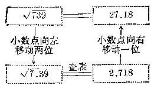

##### 例6

求\(\sqrt{8256}\)。

**【解】** 把小数点向左移动两位（就是把8256缩小100倍），得到82.56，从第9页的表中，先查出\(\sqrt{82.5} \approx 9.083\)，再查得相应于6的修正值是3，那末\(9.083 + 0.003 = 9.086\)，所以\(\sqrt{82.56} \approx 9.086\)，把9.086的小数点向右移动一位，就得到90.86.

$$
\therefore \sqrt {8256} \approx 90.86
$$.

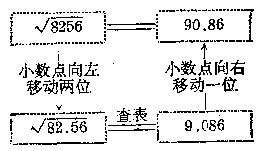

##### 例 7

求\(\sqrt{0.0236}\)。

**【解】** 把 0.0236 的小数点向右移动两位（就是把 0.0236 扩大 100 倍），得到 2.36。从第 5 页的表中，查出\(\sqrt{2.36} \approx 1.536\)。然后把 1.536 缩小 10 倍，就是把 1.536 的小数点向左移动一位，得到 0.1536。

$$
\therefore \sqrt {0.0236} \approx 0.1536
$$.

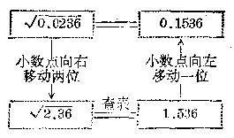

##### 例8

求\(\sqrt{0.004762}\)。

**【解】** 把 0.004762 的小数点向右移动四位（就是把 0.004762 扩大 10000 倍），得到 47.62。从第 8 页的表中，查出\(\sqrt{47.6} \approx 6.899\)，相应于 2 的修正值是 1，那末\(6.899 + 0.001 = 6.900\)，所以\(\sqrt{47.62} \approx 6.900\)。把 6.900 的小数点向左移动两位，得 0.06900。

$$
\therefore \sqrt {0.004762} \approx 0.06900
$$.

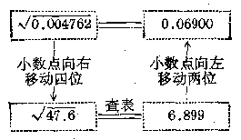

**【说明】** 本题如果还是把小数点向右移动两位，那末得到0.4762，这个数在表内还是查不到。

利用平方根表，求下列各数的近似算术平方根：

1. 345.7.

2. 536.9.

3. 790.8.

4. 917.7.

5. 4853.

6. 2108.

7. 8063.

8. 74090.

9. 0.0432.

10、0.07461。

11. 0.002819.

12、0.5805.

13. 0.7483.

14. 0.0006705.

### § 4·9 立方根表和它的用法

关于数的开立方的一般方法，因为比较复杂，并且应用也不大，所以本书不作介绍。现在只讲怎样利用立方根表来求一个数的立方根。

《中学数学用表》里，从第16页到22页有立方根表，它是把0.100到99.9的各个数的立方根编列成的。跟平方根表一样，表中所查出的立方根，通常也是近似根。立方根表的查法和平方根表的查法相类似，只是被开方数扩大或者缩小时，小数点移动的位数是不同的。下面举例来说明这个表的用法。

#### 例 1

求\(\sqrt[3]{0.214}\)。

**【解】** 从第16页的表里最左边标有“N”的这一直行中，找出0.21，横着向右查到顶上标有数字4的一行，得到0.5981，这就是0.214的近似立方根。

$$
\therefore \sqrt[3]{0.214} \approx 0.5981
$$.

##### 例 2

求\(\sqrt[3]{2.14}\)。

**【解】** 从第18页的表里最左边标有“N”的这一直行中，找出2.1，横着向右查到顶上标有数字4的一行，得到1.289，这就是2.14的近似立方根。

$$
\therefore \sqrt[3]{2.14} \approx 1.289
$$.

##### 例 3

求\(\sqrt[3]{21.4}\)。

**【解】** 从第20页的表里标有“N”的这一行中，找出21，横着向右查到顶上标有数字4的一行，得到2.776，这就是21：4的近似立方根。

$$
\therefore \sqrt[3]{21.4} \approx 2.776
$$.

如果被开方数小于0.10或者大于100，可以仿照求平方根的方法把被开方数经过扩大或者缩小后，由查表求得它的立方根。

利用立方根表求大于100或者小于0.1的数的算术立方根的方法是：

如果这个数大于 103，先把它缩小 1000 倍、1000000

倍、……（就是把小数点向左移动三位、六位、……），变成表里查得到的数，查表得到算术立方根后，再把它相应地扩大10倍、100倍、……（就是相应地把小数点向右移动一位、二位、……），这样就得到所要求的算术立方根了。

如果这个数小于0.1，先把它扩大1000倍、1000000倍、……（就是把小数点向右移动三位、六位、……），变成表里查得到的数，查表得到算术立方根后，再把它相应地缩小10倍、100倍、……（就是相应地把小数点向左移动一位、二位、……），这样就得到所要求的算术立方根了。

现在举例来说明。

##### 例4

求\(\sqrt[3]{4300}\)。

**【解】** 因为表里不能直接查出 4300 的立方根，所以把 4300 缩小 1000 倍（就是把小数点向左移动三位），得到 4.30。从第 19 页的表中，查到\(\sqrt[3]{4.30} \approx 1.626\)。然后把 1.626 扩大 10 倍，就是把 1.626 的小数点向右移动一位，得到 16.26，

$$
\therefore \sqrt[3]{4300} \approx 16.26
$$.

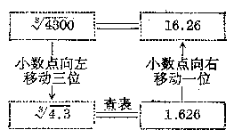

##### 例 5

求\(\sqrt[3]{63740}\)。

**【解】** 把小数点向左移动三位（就是把63740缩小1000倍），得到63.74. 因为在立方根表里只能查三个数字的立方根（没有修正值部分），所以要先把63.74四舍五入变为三个数字，得到63.7，就是\(\sqrt[3]{63.74} \approx \sqrt[3]{63.7}\)。

从第21页的表中，查得\(\sqrt[3]{63.7} \approx 3.994\)。把3.994的小数点向右移动一位，得到39.94.

$$
\therefore \sqrt[3]{63740} \approx 39.94
$$.

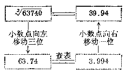

##### 例6

求\(\sqrt[3]{0.000278}\)。

**【解】** 把0.000278的小数点向右移动三位（就是把0.000278扩大1000倍），得到0.278.从第16页的表中查得\(\sqrt[3]{0.278} \approx 0.6527\)，然后把0.6527的小数点向左移动一位，得到0.06527.

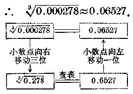

##### 例7

求\(\sqrt[3]{-521}\)。

**【解】** 根据方根的性质，我们知道，负数的立方根是一个负数，所以\(\sqrt[3]{-521} = -\sqrt[3]{521}\)。这样，我们就可以利用立方根表先求出521的立方根，再取它的相反的数就可以了。

把 521 的小数点向左移动三位，得到 0.521，从第 17 页的表中查得\(\sqrt[3]{0.521} \approx 0.8047\)，把 0.8047 的小数点向右移动一位，得到 8.047，那末\(\sqrt[3]{521} \approx 8.047\)。

$$
\therefore \sqrt[3]{- 521} \approx - 8.047
$$.

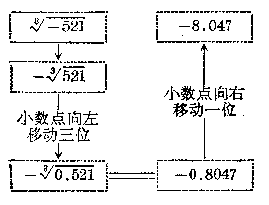

#### 习题4·9

利用立方根表，求下列各数的近似立方根：

1. 8.7. 2. 35. 3. 900. 4. 2750. 5. 69380.

6. 0.00483，7. -70，8. -742，9. -0.042，10. -0.08007.

### § 4·10 无理数

#### 1. 无理数的意义

到现在为止，我们所学到的数，还只限于有理数，如果我们把整数看成是以 1 为分母的分数，例如\(3 = \frac{3}{1}, -3 = \frac{-3}{1}, 0 = \frac{0}{1}\)，那末我们就可以把一切有理数都表示成\(\frac{m}{n}\)的形式；这里\(m\)是整数，\(n\)是自然数。反过来也就可以说，这种形式的数都是有理数。

任何一个有理数，都可以改用小数表示出来：

（1） 如果这个有理数是整数，那末可以把它看成小数点后面是 0 的小数。例如

$$
0 = 0.0， 3 = 3.0， - 3 = - 3.0
$$.

如果这个数是分母中只含有质因数2、5的分数，那末一定可以把它化成一个只含有有限个小数数位的小数。例如

$$
\frac{1}{2} = 1 \div 2 = 0.5， - \frac{9}{20} = - 9 \div 20 = 0.45
$$.

上面这类只有有限多个小数数位的小数，叫做有限小数。

（2） 如果这个数是分数，把它化成最简分数以后，分母中不含有质因数 2，5，或者含有质因数 2，5 但同时也含有其他质因数，那末这个分数一定可以化成无限循环小数。例如，

$$
\frac{1}{3} = 0.33 \dots ； \quad \frac{7}{15} = 0.466 \dots ； \quad \frac{23}{99} = 0.2323 \dots
$$.

反过来，任何一个有限小数（包括小数部分为0的整数）或者无限循环小数，也都可以把它化成\(\frac{m_2}{n}\)的形式[^p173-1]。例如

$$
0.125 = \frac{125}{1000} = \frac{1}{8}；
$$

$$
0.6 = \frac{6}{9} = \frac{2}{3}； \quad 0.16 - \frac{16 - 1}{90} = \frac{15}{90} = \frac{1}{6}
$$.

所以我们说，一切有限小数或者无限循环小数都是有理数。

但是在实际问题中，我们还会遇到不能用上面所说的这两种小数来表示的数。例如，前面我们在计算2的算术平方根时，可以发现，开方的过程可以无限继续下去，得到的那个无限小数1.41421…就不是无限循环小数。

我们把这种无限不循环小数叫做无理数。

例如，\(\sqrt{2}\)是一个无理数。除此之外，象\(\sqrt{3}, \sqrt[3]{11}, 2\sqrt{5}, -\sqrt[3]{6}\)等也都是无理数。圆周率\(\pi = 3.14159 \cdots\)也是无理数。

**【注意】** 开方得到的数并不都是无理数，因为有些数是开方开得尽的数，例如\(\sqrt{4} = 2, \sqrt[3]{27} = 3, \sqrt{\frac{9}{4}} = \frac{3}{2}, \sqrt[3]{0.125} = \sqrt[3]{\frac{1}{8}} = \frac{1}{2} = 0.5\)等等，这些数都是有理数。而无理数并不都是从开方得到的，例如上面所说的圆周率\(\pi\)。也就是说，开方开不尽的数都是无理数，而无理数就不一定都是开方开不尽的数。

#### 2. 无理数的近似值

上一节里讲过，因为无理数是无限不循环小数，所以用

[^p173-1]: ① 任何一个无限循环小数都可以化成分数。今后在代数第三册里将要学到。

小数形式，我们不可能把它全部写出来，但是我们可以按照某种法则确定它的任何一个数位上的数字。例如，我们用开平方的方法就可以确定\(\sqrt{2}\)的个位上的数字是 1，十分位上的数字是 4，百分位上的数字是 1，千分位上的数字是 4，等等。

在实际应用时，我们可以根据需要取无理数精确到某一位的近似值（不足近似值或者过剩近似值），这样得出的近似值是有限小数。例如，

（1）\(\sqrt{2} = 1.41421\dots\)

因此，\(\sqrt{2}\)的精确到 0.1，0.01，0.001，0.0001 的不足近似值和过剩近似值，可以列表如下：

| 精 确 度 | 0.1 | 0.01 | 0.001 | 0.0001 |
| --- | --- | --- | --- | --- |
| \( \sqrt{2} \)的不足近似值 | 1.4 | 1.41 | 1.414 | 1.4142 |
| \( \sqrt{2} \)的过剩近似值 | 1.5 | 1.42 | 1.415 | 1.4143 |
| 两个近似值的差 | 0.1 | 0.01 | 0.001 | 0.0001 |

（2）\(\pi = 3.14159265\cdots\)

因此，\(\pi\)的精确到 0.01，0.001，0.0001 的不足近似值和过剩近似值，可以列表如下：

| 精 确 度 | 0.01 | 0.001 | 0.0001 |
| --- | --- | --- | --- |
| π的不足近似值 | 3.14 | 3.141 | 3.1415 |
| π的过剩近似值 | 3.15 | 3.142 | 3.1416 |
| 两个近似值的差 | 0.01 | 0.001 | 0.0001 |

从上面两个表里，我们可以看到，同样精确度的过剩近似值和不足近似值的差，等于所取的小数最末一位的一个单位。这样，如果知道某一个无理数的不足近似值和过剩近似值中的任何一个，就可以得出另一个来。

例如，知道\(\sqrt{3}\)精确到 0.01 的不足近似值是 1.73，那末\(\sqrt{3}\)相应的过剩近似值就是\(1.73 + 0.01 = 1.74\)；如果知道\(\sqrt{3}\)精确到 0.001 的过剩近似值是 1.733，那末\(\sqrt{3}\)相应的不足近似值就是\(1.733 - 0.001 = 1.732\)。

一个无理数的准确值，永远介于它的不足近似值和过剩近似值之间，增加不足近似值和过剩近似值的小数位数，就可以提高近似值的精确度。需要怎样精确度的近似值，这就要由实际问题的性质来决定。

#### 习题4·10

1. 回答下列各题，并且说明理由：

（1） 整数是有理数吗？有理数都是整数吗？为什么？

（2） 小数是有理数吗？小数是无理数吗？为什么？

（3） 无限小数都是无理数吗？无理数都是无限小数吗？为什么？

（4） 带根号的数都是无理数吗？为什么？

2. 下列各数哪些是有理数？哪些是无理数？

$$
3.1416； \sqrt {8}； \sqrt {7}； \sqrt {16}； - \sqrt {16}； - 3 \frac{21}{31}；
$$

$$
0.3333 \dots ； 0.5714357143； - \sqrt {10}； 2 \pi
$$.

3. （1） 求\(\pi = 3.1415926535\cdots\)精确到 0.01，0.0001，0.00001，0.0000001 的不足近似值和过剩近似值；

（2） 求\(\sqrt{5}\)精确到 0.1，0.01，0.001，0.0001 的不足近似值和过剩近似值。

【提示：先用开平方的方法计算\(\sqrt{5}\)的值。】

4. （1） 已知\(\sqrt{2.71}\)精确到 0.01 的不足近似值是 1.64，求它的相应的过剩近似值；

（2） 已知\(\sqrt{22.146}\)精确到 0.001 的过剩近似值是 4.706，求它的相应的不足近似值。

### § 4·11 实 数

#### 1. 实数的意义

上两节里学过了无理数，这样，我们又把数的概念扩展了，就是说，把数的范围从原来知道的有理数，增添了一种新的数——无理数。

有理数和无理数总起来叫做实数。

我们把所学过的各种数，用下面的表表示出来：

$$
\text {实数} \left\{ \begin{array}{ll} \text {有理数} & \left\{ \begin{array}{ll} \text {整数(正整数，零，负整数)} \\ \text {分数(正分数，负分数)} \end{array} \right\} \\ \text {无理数(正无理数，负无理数)：无限不循环小数} \end{array} \right. \text {有限小数或者无限循环小数}
$$

从这个表里，我们可以看出，实数都可以用有限小数或者无限小数表示；其中用无限不循环小数表示的数，就是无理数。

在代数第一册里，我们知道，具有相反方向的量，可以分别用正有理数和负有理数来表示。对于无理数，同样也可以区分正无理数和负无理数。因此，对应于每一个正实数就有一个和它相反的负实数。例如，5 和 -5 是两个相反的数，\(\sqrt{2}\)和\(-\sqrt{2}\)也是两个相反的数，\(\pi\)和\(-\pi\)也是两个相反的数。一般的说，如果\(a\)表示一个正实数，\(-a\)就表示一个负实数。\(a\)和\(-a\)互为相反的数。0 的相反数仍旧是 0.

#### 2. 实数的绝对值

实数的绝对值的定义和有理数的一样：一个正实数的绝对值就是它本身，一个负实数的绝对值是和它相反的数，零的绝对值是零。例如，

$$
| \sqrt {2} | = \sqrt {2}， | - \sqrt {2} | = \sqrt {2}，
$$

$$
| \pi | = \pi ， | - \pi | = \pi ， | 0 | = 0
$$

等。

一般地说，实数 a 的绝对值是：

$$
| \boldsymbol {a} | = \left\{ \begin{array}{ll} \boldsymbol {a} & (\text {当} a > 0 \text {时})， \\ 0 & (\text {当} a = 0 \text {时})， \\ - a & (\text {当} a <   0 \text {时})。 \end{array} \right.
$$

#### 3. 用数轴上的点表示实数

在有理数里，我们已经学过，所有有理数都可以用数轴上的点来表示。但是，数轴上所有的点并不都能用有理数来表示。例如，在数轴上，从原点\(O\)起向右截取一线段\(OM\)（图4-1），使它的长度等于每边长是一个单位的正方形的对角线的长。根据勾股定理，我们知道

$$
O B ^ {2} = O A ^ {2} + A B ^ {2}，
$$

$$
\because O A = A B = 1，
$$

$$
\therefore O B ^ {2} = 2，
$$

那末\(OB = \sqrt{2}\)

就是\(OM\)的长是\(\sqrt{2}\)个单位，所以点\(M\)就不能用有理数来表示。当我们引进无理数之后，数轴上的这种点，就可以用无理数来表示。

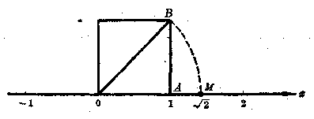

由此可以看到，数轴上的每一个点都可以用一个实数来表示它。

反过来，每一个有理数都可以用数轴上的点来表示，同样，每一个无理数也都可以用数轴上的点来表示。这就是说，每一个实数都可以用数轴上的点来表示。

根据上面所说的，归结起来说，把数从有理数扩展到实数以后，数轴上的每一个点，都可以由唯一的一个实数来表示；反过来，每一个实数，都可以用数轴上的唯一的一个点来表示。换句话说，实数和数轴上的点是一一对应的。

由于每一个实数都可以用数轴上的唯一的一个点来表示，所以实数的绝对值也可以说是：实数\(a\)的绝对值\(|a|\)，就是在数轴上表示\(a\)这个点和原点间的距离。

#### 4. 实数的运算

把有理数扩展到实数以后，在实数范围内四则运算总可实施，它的运算结果还是实数。在进行实数的四则运算时，前面学过的有理数的运算规律也同样适用。特别要指出，在有理数范围内，正数的开方运算不是都能实施，而在实数范围内，正数的开方运算就都可以实施了。我们知道，任何正数、负数或零的偶次乘方都不能是负数（或者叫做非负数）。因此，在实数范围内，负数可以有奇次方根，但是没有偶次方根。例如，\(\sqrt{-2}, \sqrt{a} (a < 0), \sqrt[4]{-5}\)等在实数范围内都是没有意义的。

在实数运算中如果遇到无理数，有时需要根据问题的要求，用它的近似值代替，然后进行计算。

##### 例

计算：

（1）\(\sqrt{5} + \pi\)（精确到 0.01）；

（2）\(\sqrt{3} \times \sqrt{2}\)（精确到 0.01）。

**【解】** （1）\(\sqrt{5} + \pi \approx 2.236 + 3.142 \approx 5.38\)；

（2）\(\sqrt{3} \times \sqrt{2} \approx 1.732 \times 1.414 \approx 2.45\)。

#### 5. 实数大小的比较

和有理数的情形一样，实数在数轴上表示出来以后，我们仍旧可以利用数轴上的点的位置关系来规定怎样比较两

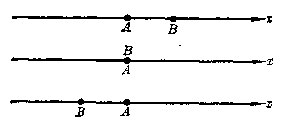

个实数的大小。

设有两个实数\(a\)和\(b\)，并且设数轴上的\(A\)点表示实数\(a\)，\(B\)点表示实数\(b\)（图4-2）。

利用 A，B 两点在数轴上不同的位置关系，我们规定实数的大小：

如果\(A\)点在\(B\)点的左边，我们说，\(a\)小于\(b\)，写成\(a < b\)；

如果 A 点和 B 点重合，我们说\(a\)等于 b，写成\(a = b\)；

如果 A 点在 B 点的右边，我们说，\(a\)大于\(b\)，写成\(a > b\)。

从这个规定我们得到：

（1） 任何正实数都大于零，任何负实数都小于零，任何正实数都大于任何负实数。

（2） 两个正实数比较大小，先比较整数部分，如果对应数位上的数字都相同，那末这两个正实数相等；如果整数部分不同，那末整数大的正实数较大；如果整数部分相同，而小数第一位不同，那末小数第一位大的正实数较大；如果小数第一位也相同，就比较第二位小数，那末小数第二位大的正实数较大；以下依次类推。

（3） 两个负实数比较大小，看它们的绝对值，如果两个负实数的绝对值相等，那末这两个负实数相等；如果两个负实数的绝对值不等，那末绝对值大的负实数较小。

##### 例 1

比较 4.7956 和\(\sqrt{23}\)的大小。

**【解】** \(\because \sqrt{23} = 4.7958\cdots, 4.7956 < 4.7958\cdots;\)

$$
\therefore 4.7956 <   \sqrt {23}
$$.

##### 例2

比较\(\pi\)和\(\frac{355}{113}\)的大小。

**【解】** \(\because \pi = 3.1415926\cdots, \frac{355}{113} = 3.1415929\cdots,\)

而 3.1415926…<3.1415929，

$$
\therefore \pi <   \frac{355}{113}
$$.

##### 例8

比较\(-\sqrt{10}\)和\(-\frac{19}{6}\)的大小。

**【解】** \(\because -\sqrt{10} = -3.162\cdots, -\frac{19}{6} = -3.166\cdots;\)

而\(-3.162\cdots > -3.166\cdots,\)

$$
\therefore - \sqrt {10} > - \frac{19}{6}
$$.

**【说明】** 在比较实数的大小时，小数位数需要计算几位，要看题目的具体情况而定。例如在例1中，\(\sqrt{23}\)要取4.7958…，因为小数部分第一位、第二位、第三位和4.7956都相同，如果不计算到小数第四位，就无法比较大小。又如例2，因为小数部分第一位到第六位都相同，所以必须计算到第七位，才能看出它们的大小。例4中，只要计算到小数部分第三位就可以了。

#### 习题4·11

1. （1） 有理数都是实数吗？实数都是有理数吗？为什么？举例说明；

（2） 无理数都是实数吗？实数都是无理数吗？为什么？举例说明。

2. 求出下列等式里的实数\(x\)

（1）\(|x| = \frac{3}{4}\)；

（2）\(|x|=0;\)

（3）\(|x|=\sqrt{5}\)；

（4）\(|x| = \pi\).

3. 计算：

（1）\(\sqrt{10} + \frac{1}{4} - \pi\)（精确到0.01）；

（2）\(\sqrt{5} \times \sqrt{2}\)（精确到0.01）。

4. 用不等式表示下列各组数的大小：

（1） 3.14159 和 3.1416；（2） 0.13762… 和 0.13563…；
【解法举例：3.14159<3.1416.】

（3） 5.368971… 和 5.369；（4） 1.5 和 -1.555…；

（5） -2.5353… 和 -2.535456…；

（6）\(\sqrt{29}\)和\(5\frac{5}{13}\)；（7）\(-\sqrt{3}\)和\(-1.731\)；

（8）\(-\sqrt[8]{2}\)和 -1.262.

*5. 把\(\sqrt{3}\)和\(-\sqrt{5}\)正确地在数轴上表示出来。

【提示：利用直角三角形，根据勾股定理，先正确地求出\(\sqrt{3}\)和\(\sqrt{5}\)的线段长度来。例如，以1个单位长做直角三角形的一条直角边，2个单位长做斜边，那末另一条直角边的长就表示\(\sqrt{3}\)，然后在数轴上从原点起向右截取一段线段等于这条直角边的长。同样，以1个单位和2个单位长的线段做直角边，那末斜边的长就是\(\sqrt{5}\)。】

### 本章提要

#### 1. 方根的性质

| 被开方数a | 根指数n | 方根 |
| --- | --- | --- |
| a>0 | n是奇数 | 只有一个正数 |
| a>0 | n是偶数 | 有两个互为相反的数 |
| a=0 | n是奇数或偶数 | 零 |
| a<0 | n是奇数 | 只有一个负数 |
| a<0 | n是偶数 | 没有意义 |

#### 2. 算术平方根

$$
\sqrt {a ^ {2}} = | a | = \left\{ \begin{array}{ll} a & (\text {当} a \geqslant 0 \text {的时候})， \\ - a & (\text {当} a <   0 \text {的时候})。 \end{array} \right.
$$

#### 3. 数的开平方

（1） 利用逆运算关系（适用于一些简单的完全平方数）；

（2） 一般方法；

（3） 查平方根表法。

4. 数的开立方 查立方根表法。

5. 实数

（1） 无理数的意义；无理数的不足近似值和过剩近似值。

（2） 实数的分类

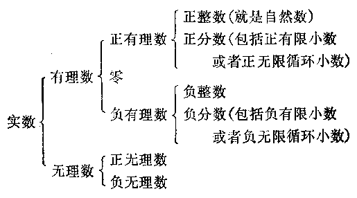

（3） 实数的绝对值

$$
| a | = \left\{ \begin{array}{ll} {a} & {(\text {当} a > 0 \text {时})，} \\ {0} & {(\text {当} a = 0 \text {时})，} \\ {- a} & {(\text {当} a <   0 \text {时}).} \end{array} \right.
$$

（4） 实数和数轴上的点的一一对应关系。

### 复习题四A

1. 下列语句是正确的还是错误的？为什么？

（1） -5 的平方是 25；

（2） -49 的平方根是 -7；

（3） -1 的立方根是 -1；

（4）\((-5)^{2}\)的算术根是 -5.

2. 求下列各式的值：

（1）\(\sqrt{m^2}\)\(\left(m = -\frac{2}{3}\right)\)；

（2）\(\sqrt{n^2}\)\(\left(n = \frac{3}{5}\right)\)。

3. 利用开平方法求下列各数的近似算术平方根，精确到 0.001，并且写出它的不足近似值和过剩近似值：

（1）\(\sqrt{3.562}\)；

（2）\(\sqrt{0.374}\)。

4. 利用平方根表或者立方根表求下列各题的值：

（1）\(\sqrt{17.468}\)；

（2）\(\sqrt{0.43592}\)；

（3）\(\sqrt[3]{4359}\)；

（4）\(\sqrt[3]{0.02807}\)；

（5）\(\sqrt{4\frac{1}{4}};\)

（6）\(\sqrt[3]{4107\frac{1}{2}}\).

5. （1） 对于任意两个实数，是不是都能够进行加、减、乘、除、乘方的运算？

（2） 在实数范围里永远可以乎奇次方吗？在有理数范围里呢？

（3） 在实数范围里永远可以开偶次方吗？

6. 在加、减、乘、除、乘方和开方六种运算中，哪些运算在正有理数范围里都能实施？哪些运算在有理数范围里都能实施？有些什么例外？哪些运算在实数范围里都能实施？有些什么例外？

7. 一个正方形的面积是 125 平方厘米，求它的边长（精确到 0.01 厘米）。

### 复习题四B

1. （1） 设\(x^{2} = a, a\)是\(x\)的什么数？\(x\)是\(a\)的什么数？

（2） 设\(y^{3}=b\)，b 是 y 的什么数？y 是 b 的什么数？

2. 查表求下列各式的值：

（1）\(3.472^{2} + 5.089^{2}\)；

（2）\(\sqrt{3.472^2 + 5.089^2}\)。

3. 回答下列各个问题：

（1） 如果\(a > 0, b < 0\)，那末\(a, b\)两数中哪一个大？

（2） 如果\(a < 0, b < 0\)，而且\(|a| > |b|\)，那末\(a, b\)两数中哪一个大？

（3） 如果\(a < b\)，那末\(|a|\)和\(|b|\)中哪一个大？（要讨论）

【提示：就\(a > 0, b > 0; a < 0, b < 0; a < 0, b > 0\)三种情况来讨论。】

4. 一个比例的两个外项分别是\(1 \frac{2}{15}\)和\(\frac{68}{375}\)，两个内项是相等的正数，这两个内项各是多少？

【提示：根据比例的性质，两个内项的乘积等于两个外项的乘积。】

5. 如果球的半径是\(r\)，那末球的体积用公式\(V = \frac{4}{3} \pi r^3\)来计算。当球体积\(V = 500\)立方厘米时，半径\(r\)是多少厘米？（\(\pi\)取3.14，\(r\)精确到0.01厘米。）

6. 把一个长方形的长和宽分别扩大相同的倍数，使面积扩大40倍，求长和宽分别扩大的倍数。（精确到0.1。）

【提示：设长方形的长和宽分别是\(a\)和\(b\)，扩大的倍数是\(k\)，列出方程再解。】

### 第四章测验题

1. 比较下列各组里两个实数的大小：

（1）\(\sqrt{2}\)和 1.414；

（2）\(-\pi\)和\(-3.1415926\)。

2. 计算：\(\sqrt[3]{-1.45}\times(-1.45)^{2}\div4.35\)

3. 一个长方体的水箱，它的底是正方形。水箱的高是1.25米，体积是2.178立方米。求这水箱的底的每边的长。（精确到0.01米。）

【提示：长方体的体积等于底面积乘以高。】

4. 如果圆的半径是\(r\)，那末圆的面积用公式\(A = \pi r^2\)来计算。当圆面积\(A = 200\)平方厘米时，半径\(r\)是多少厘米？（π取3.14，r精确到0.01厘米。）

5. 一艘轮船以每小时16海里的速度离开港口向东南方向航行；另一艘轮船在同时同地以每小时12海里的速度向西南方向航行。它们离开港口一小时半以后相距多远？

## 第5章 根式

### § 5·1 根式的意义

在第四章里，我们知道，如果\(x^n = a\)，\(x\)就叫做\(a\)的\(n\)次方根。当\(n\)是奇数的时候，\(a\)可以是任何实数，并且规定用\(\sqrt[n]{a}\)（\(n\)为奇数） 来表示这个方根；当\(n\)是偶数的时候，\(a\)可以是任何正实数或者零，并且规定用\(\sqrt[n]{a}\)（\(n\)为偶数） 表示正的一个方根，用\(-\sqrt[n]{a}\)（\(n\)为偶数） 表示负的一个方根。

我们把表示方根的代数式叫做根式。例如，\(\sqrt{3}\)，\(\sqrt[3]{-3}\)，\(\sqrt[4]{\frac{3}{4}}\)，\(\sqrt{x}\)，\(\sqrt{a^2 + 1}\)，\(\sqrt[3]{x - y}\)等都是根式。

**【注意】** 我们也把式子\(b\sqrt[3]{a}\)叫做根式，这里，\(b\)叫做根式的系数。

我们知道，负数的偶次方根没有意义，因此，在式子\(\sqrt[n]{a}\)里如果根指数\(n\)是偶数而被开方数\(a\)是负数，在实数范围里没有意义。例如，\(\sqrt{-3}, \sqrt[4]{-\frac{3}{4}}, \sqrt{-(x^2 + 1)}\)等在实数范围里没有意义。

#### 例 1

设 x，y 都是实数，下列各式在什么条件下才有意义？

（1）\(\sqrt{x}\)；

（2）\(\sqrt[3]{x}\)；

（3）\(\sqrt{1 - y}\)；

（4）\(\sqrt{\frac{1}{x}}\)

**【解】** （1） 因为根指数是偶数，所以\(x\)必须是任何正实数或者零。

（2） 因为根指数是奇数，所以\(x\)可以是任何实数。

（3） 因为根指数是偶数，所以\(1 - y\)必须大于 0 或者等于 0，就是\(1 - y \geqslant 0\)。解这个不等式，得到\(y \leqslant 1\)。

因此，\(y\)可以是不大于 1 的正实数。

（4） 因为根指数是偶数，所以\(\frac{1}{x}\)必须大于 0 或者等于 0. 但是\(\frac{1}{x}\)不能等于 0，所以\(\frac{1}{x} > 0\)。解这个不等式得到\(x > 0\)。因此，\(x\)可以是任何正实数。

例2\(x\)是什么数值的时候，下列各式才有意义：

（1）\(\sqrt{1 + x^2}\)；

（2）\(\frac{1}{\sqrt[3]{x - 1}}\).

**【解】** （1） 因为不论\(x\)是什么实数，\(x^2\)都不是负数，所以\(1 + x^2 > 0\)，因此，当\(x\)是任何实数时，\(\sqrt{1 + x^2}\)都有意义。

（2） 就根式\(\sqrt[3]{x - 1}\)看，\(x\)可以是任何实数，但是，当\(x = 1\)的时候\(\sqrt[3]{x - 1} = 0\)，这个分式没有意义。所以\(x = 1\)必须除掉。因此当\(x\)是不等于 1 的任何实数时，原式才有意义。

根据方根的意义，当\(\sqrt[n]{a}\)有意义的时候，式子\(\sqrt[n]{a}\)就表示一个数，它的\(n\)次方等于\(a\)。得到下面的公式：

$$
(\sqrt[n]{a}) ^ {n} = a
$$

（n 是大于 1 的整数）。

因为\(\sqrt[3]{-27} = -\sqrt[3]{27} = -3, \sqrt[3]{-2} = -\sqrt[6]{2}\)，所以任何负数的奇次方根都可以化成和某一个算术根相反的数。这就是说，在求负数的奇次方根时，可以把负号移到根号的前面，然后求正数的算术根。

由此可知，在根式\(\sqrt[n]{a}\)有意义的时候，根式\(\sqrt[n]{a}\)都可以改用算术根来表示。因此，我们研究根式的性质的时候，只要研究算术根的性质就可以了。

##### 例 3

把下列各式中的根式改用算术根来表示：

（1）\(\sqrt[3]{-5};\)

（2）\(\frac{1}{2}\sqrt[5]{-3}\).

**【解】** （1）\(\sqrt[3]{-5} = -\sqrt[3]{5}\)；

（2）\(\frac{1}{2}\sqrt[5]{-3} = \frac{1}{2} (-\sqrt[5]{3}) = -\frac{1}{2}\sqrt[5]{3}\)。

在本章里，如果没有特别说明，所有的字母都表示正数，所有作为根指数的字母都表示大于1的正整数。

##### 例4

在下列各种情况，求\(\sqrt{(a - 5)^2}\)的值：

（1） a > 5；

（2）\(a < 5\)；

（3）\(a = 5\)。

**【解】** 因为\(\sqrt{(a - 5)^2} = |a - 5|\)，

（1） 当\(a > 5\)时，那末\(a - 5 > 0\)，

$$
\therefore \sqrt {(a - 5) ^ {2}} = | a - 5 | = a - 5
$$.

（2） 当\(a < 5\)时，那末\(a - 5 < 0\)，

$$
\therefore \sqrt {(a - 5) ^ {2}} = | a - 5 | = - (a - 5) = 5 - a
$$.

（3） 当\(a = 5\)时，那末\(a - 5 = 0\)，

$$
\therefore \sqrt {(a - 5) ^ {2}} = | a - 5 | = 0
$$.

##### 例5

当\(2a < 3b\)时，计算：

$$
\sqrt {4 a ^ {2} - 12 a b + 9 b ^ {2}}
$$.

**【解】** 先把根号里的被开方数\(4a^{2} - 12ab + 9b^{2}\)化成完全平方式。

$$
\sqrt {4 a ^ {2} - 12 a b + 9 b ^ {2}} = \sqrt {(2 a - 3 b) ^ {2}} = | 2 a - 3 b |
$$.

$$
\because 2 a <   3 b， \quad \therefore 2 a - 3 b <   0，
$$

$$
\therefore \sqrt {4 a ^ {2} - 12 a b + 9 b ^ {2}} = | 2 a - 3 b | = - (2 a - 3 b)
$$

$$
= 3 b - 2 a
$$.

#### 习题5·1

1. 写出满足下列条件的一个根式：

（1） 一个正数，它的平方等于 15；

（2） 一个负数，它的平方等于 15；

（3） 一个数，它的立方等于 9；

（4） 一个数，它的立方等于 -9.

2. 判别下列各式哪些是根式？哪些式子在实数范围里没有意义？

$$
\sqrt {- 7}； \sqrt[3]{3}； \sqrt[3]{- 10}； \sqrt[4]{\frac{2}{5}}； \sqrt[4]{- \frac{1}{3}}
$$.

3. 设\(x, y\)都表示实数，下列各式在什么条件下才有意义：

（1）\(\sqrt{x - 3}\)；

（2）\(\sqrt{x - y}\)；

（3）\(\sqrt[3]{x - y}\)；

（4）\(\sqrt{2x - 5}\)；

（5）\(\sqrt[3]{x + 1}\)；

（6）\(\sqrt{-\frac{2}{x}};\)

（7）\(\frac{1}{\sqrt{x - 1}};\)

（8）\(\frac{1}{\sqrt[3]{x}}\)。

4. 把下列各式中的根式改用算术根来表示：

（1）\(\sqrt[3]{-1.5}\)；

（2）\(\frac{2}{5}\sqrt[3]{-6}\)。

5. 求下列各式的值：

（1）\((\sqrt{21})^2;\)

（2）\((\sqrt[3]{123})^3;\)

（3）\((\sqrt{0.35})^2;\)

（4）\(\sqrt[3]{-1^3}\)；

（5）\(\sqrt{\left(\frac{1}{2}\right)^2}\)；

（6）\(\left(\sqrt[3]{-\frac{3}{5}}\right)^3\)。

6. 求下列各式的值：

（1）\(\sqrt{(a - b)^2}\)\((a = 15, b = 20)\)；

（2）\(\sqrt{(7 - a)^2}\)（7 > a）；

（3）\(\sqrt{(7 - a)^2}\)（7 < a）；

（4）\(\sqrt{(m - n)^2}\)\((m > n)\)；

（5）\(\sqrt{(m - n)^2}\)\((m < n)\)；

（6）\(\sqrt{(4a - 3b)^2}\)\((a = 2, b = 3)\)。

7. 根据括号里的条件，计算下列各式：

（1）\(\sqrt{(5a - 2b)^2}\)

（5a<2b）；

（2）\(\sqrt{x^2 - 2x + 1}\)

\((x > 1)\)；

（3）\(\sqrt{x^2 - 2x + 1}\)

\((x < 1)\)；

（4）\(\sqrt{a^2 - 2ab + b^2}\)

\((a > b)\)；

（5）\(\sqrt{a^2 - 2ab + b^2}\)

\((a < b)\)。

8. 计算下列各式：

（1）\(\sqrt{(a - 2)^2} - \sqrt{(3 - a)^2}\)\((a > 3)\)；

【提示：根据\(a > 3\)的条件，分别求两个根式的值，再行计算。】

（2）\(\sqrt{(5 - 2m)^2} - \sqrt{(m - 4)^2}\)\((m > 5)\)。

### § 5·2 根式的基本性质

我们来解答下面的两个问题：

问题

（1） 不求方根的值，判断\(\sqrt[4]{3^{2}}\)和\(\sqrt{3}\)是否相等？

根据上一节里的公式：\((\sqrt[2n]{a})^{n}=a\)，可以得到：

$$
(\sqrt[4]{3 ^ {2}}) ^ {4} = 3 ^ {2}，
$$

$$
(\sqrt {3}) ^ {4} = [ (\sqrt {3}) ^ {2} ] ^ {2} = 3 ^ {2}，
$$

∴\(\sqrt[4]{3^{2}}\)和\(\sqrt{3}\)都是\(3^{2}\)的 4 次算术根。

但是\(3^{2}\)的4次算术根只有一个，

$$
\therefore \sqrt[4]{3 ^ {2}} = \sqrt {3}
$$.

问题 （2）\(\sqrt[8]{a^6}\)和\(\sqrt[4]{a^3}\)是否相等？（这里\(a \geqslant 0\)）

$$
\because \left(\sqrt[8]{a ^ {6}}\right) ^ {3} = a ^ {6}，
$$

$$
(\sqrt[4]{a ^ {3}}) ^ {8} = [ (\sqrt[4]{a ^ {3}}) ^ {4} ] ^ {2} = (a ^ {3}) ^ {2} = a ^ {6}，
$$

∴\(\sqrt[3]{a^{6}}\)和\(\sqrt[4]{a^{3}}\)都是\(a^{6}\)的 8 次算术根。

但是\(a^6\)的8次算术根只有一个，

$$
\therefore \sqrt[8]{a ^ {6}} = \sqrt[4]{a ^ {3}}
$$.

一般地说，如果\(a \geqslant 0\)。

$$
\because \quad \left(\sqrt[n p]{a ^ {m p}}\right) ^ {n p} = a ^ {m p}，
$$

$$
(\sqrt[n]{a ^ {m}}) ^ {n p} = [ (\sqrt[n]{a ^ {m}}) ^ {n} ] ^ {p} = (a ^ {m}) ^ {p} = a ^ {m p}，
$$

∴\(\sqrt[n]{a^{mnp}}\)和\(\sqrt[n]{a^{m}}\)都是\(a^{mnp}\)的 np 次算术根。

但是\(a^{mp}\)的\(np\)次算术根只有一个，所以得到下面的公式：

$$
\sqrt[n p]{a ^ {m p}} = \sqrt[n]{a ^ {m}} (a \geqslant 0)
$$。

这就是说，一个根式（算术根）的根指数和被开方数的指数都乘以或者除以同一个正整数，根式的值不变。

这个性质，叫做根式的基本性质。

对于根式的基本性质，应该特别注意算术根这个条件。

如果不是算术根，那末这个性质就不一定成立。例如，

$$
\sqrt[3]{- 8} = - 2，
$$

而\(\sqrt[3]{(-8)^2} = \sqrt[6]{64} = 2,\)

所以\(\sqrt[3]{-8} \neq \sqrt[6]{(-8)^2}\)。

又如，当\(a < 0\)时，\(\sqrt[8]{a^6} \neq \sqrt[4]{a^3}\)（想一想，为什么？）

用同样的方法，我们也可以证明幂的算术根公式：

$$
\sqrt[p]{a ^ {m p}} = a ^ {m} (a \geqslant 0)
$$。

在这个公式里，如果\(m = 1\)，那末\(\sqrt[p]{a^p} = a\)。所以我们知道，在\(a\)是正数或者零的时候，

$$
\sqrt[n]{a ^ {n}} = a \quad (a \geqslant 0)
$$。

根据根式的基本性质，可以知道：

一个算术根，当它的被开方数的指数和根指数有公约数时，可以约去这个公约数；反过来，也可以把被开方数的指数和根指数都扩大相同的倍数。

这个性质，在以后根式的运算中经常要用到，应该牢固掌握。

#### 例 1

约简下列各根式中被开方数的指数和根指数：

（1）\(\sqrt[4]{a^8}\)；

（2）\(\sqrt[15]{x^{10}}\)；

（3）\(\sqrt[9]{27x^6y^3}\)；

（4）\(\sqrt[4n]{a^n b^{2n}c^{3n}}\)

**【解】** （1）\(\sqrt[4]{a^8} = a^2\)；

（2）\(\sqrt[15]{x^{10}} = \sqrt[3]{x^2}\)；

（3）\(\sqrt[9]{27x^6y^3} = \sqrt[9]{(3x^2y)^3} = \sqrt[3]{3x^2y}\)；

（4）\(\sqrt[4n]{a^n b^{2n}c^{3n}} = \sqrt[4]{ab^2c^3}\).

##### 例 2

求\(\sqrt[6]{27}\)精确到 0.001 的值。

**【解】** \(\sqrt[6]{27} = \sqrt[6]{3^3} = \sqrt{3} \approx 1.732\).

#### 习题5·2

1. 下列各题的计算有没有错误？如果有错误，应当怎样改正？

（1）\(\sqrt[3]{8a^8} = \sqrt{8a}\)；

（2）\(\sqrt[3]{(-3ab^2)^2} = \sqrt[3]{-3ab^2}\)；

（3）\(\sqrt[3]{-2} = \sqrt[3]{(-2)^2} = \sqrt[3]{4}\)；

（4）\(\sqrt{a + b} = \sqrt[4]{a^2 + b^3}\)。

2. 约简下列根式中被开方数的指数和根指数：

（1）\(\sqrt[3]{x^6}\)；

（2）\(\sqrt[5]{y^2}\)；

（3）\(\sqrt[18]{x^{12}}\)；

（4）\(\sqrt[2n]{a^{2n}}\)；

（5）\(\sqrt[5]{9a^4}\)；

（6）\(\sqrt[3]{81a^4}\)；

（7）\(\sqrt[4]{25x^2y^2}\)；

（8）\(\sqrt[3]{16x^2y^3}\)；

（9）\(\sqrt[8]{8a^3b^6}\)；

（10）\(\sqrt[3]{27x^3y^{12}}\)；

（11）\(\sqrt[10]{a^{4m}b^{3m}}\)；

（12）\(\sqrt[6n]{a^{2n}b^{3n}c^{4n}}\)；

（13）\(\sqrt[4]{36(x + y)^2}\)；

（14）\(\sqrt[4]{27(a + b)^3}\)；

（15）\(\sqrt[12]{256(x + y)^3}\)；

（16）\(\sqrt[4]{a^4 + 2a^2b^2 + b^4}\)。

3. （1） 求\(\sqrt[5]{8}\)精确到 0.001 的近似值；

（2） 求\(\sqrt[4]{81}\)精确到 0.001 的近似值。

### § 5·3 同次根式

两个或者几个根式，如果它们的根指数相同，这些根式就叫做同次根式。例如，\(\sqrt[3]{2}\)和\(\sqrt[3]{3}\)是同次根式。

两个或者几个根式，如果根指数不相同，这些根式就叫做异次根式。例如，\(\sqrt{2}\)和\(\sqrt[3]{2}\)是异次根式。异次根式可以根据根式的基本性质化为同次根式。把异次根式化为同次根式的方法和分数里的通分很相象，就是，先求出各个根式的根指数的最小公倍数，然后应用根式的基本性质，把各个根式的根指数都化成这个最小公倍数。

#### 例 1

把\(\sqrt[3]{5}\)，\(\sqrt{3}\)化成同次根式。

**【审题】** 这里，两个根式的根指数一个是3，一个是2，它们的最小公倍数是6，应用根式的基本性质，把这两个根式化成6次的同次根式。

**【解】** \(\sqrt[3]{5} = \sqrt[6]{5^2} = \sqrt[6]{25},\)

$$
\sqrt {3} = \sqrt[6]{3 ^ {3}} = \sqrt[6]{27}
$$.

##### 例2

把下列根式化成同次根式：

$$
\sqrt {x y}， \sqrt[3]{2 x y ^ {2}}， \sqrt[4]{3 x ^ {3} y}
$$.

**【解】** \(\sqrt{xy} = \sqrt[12]{x^6y^6};\)

$$
\sqrt[3]{2 x y ^ {2}} = \sqrt[12]{(2 x y ^ {2}) ^ {4}} = \sqrt[12]{16 x ^ {4} y ^ {8}}；
$$

$$
\sqrt[4]{3 x ^ {3} y} = \sqrt[12]{(3 x ^ {3} y) ^ {3}} = \sqrt[12]{27 x ^ {9} y ^ {3}}
$$.

##### 例3

比较\(\sqrt[3]{-5}\)和\(-\sqrt{3}\)的大小。

**【解】** \(\sqrt[3]{-5} = -\sqrt[3]{5} = -\sqrt[6]{5^2} = -\sqrt[6]{25},\)

$$
- \sqrt {3} = - \sqrt[6]{3 ^ {3}} = - \sqrt[6]{27}
$$.

$$
\because - \sqrt[6]{25} > - \sqrt[6]{27}，
$$

$$
\therefore \sqrt[3]{- 5} > - \sqrt {3}
$$.

#### 习题5·3

1. 把下列根式化成同次根式：

（1）\(\sqrt{5}, \sqrt[3]{7}\)；

（2）\(\sqrt[4]{2x}, \sqrt{3y}\)；

（3）\(\sqrt[6]{2x^2}, \sqrt{5x}\)；

（4）\(\sqrt[6]{3xy^2}, \sqrt{2xy}\)；

（5）\(\sqrt[6]{2mn}, \sqrt{7m^2n^3}\)；

（6）\(\sqrt[6]{2x^3y}, \sqrt[6]{3x^2y^2}\)；

（7）\(\sqrt{x}, \sqrt[3]{x^2}, \sqrt[4]{x^3}\)；

（8）\(\sqrt[4]{2x}, \sqrt[4]{\frac{x^2}{3y}}, \sqrt[6]{\frac{5x}{y^3}};\)

（9）\(\sqrt{x + y}, \sqrt[6]{(x + y)^2}, \sqrt[6]{(x + y)^6}\)；

（10）\(\sqrt[6]{a - b}, \sqrt[4]{a^2 - b^2}, \sqrt[2]{a^2 + b^2} (a > b)\)。

2. 不求方根的值，比较下列根式的大小：

（1）\(\sqrt{0.8}\)和\(\sqrt[4]{0.7}\)；

（2）\(\sqrt{\frac{1}{3}}\)和\(\sqrt[4]{\frac{1}{10}};\)

（3）\(\sqrt[4]{-3}\)和\(-\sqrt{2}\)；

（4）\(\sqrt{5}, \sqrt[4]{11}, \sqrt[4]{123}\)。

### § 5·4 乘积的算术根

我们来解答下面两个问题：

（1） 不求方根的值，判断\(\sqrt{16 \times 9}\)和\(\sqrt{16} \times \sqrt{9}\)是否相等？

$$
\because (\sqrt {16 \times 9}) ^ {2} = 16 \times 9，
$$

$$
(\sqrt {16} \times \sqrt {9}) ^ {2} = (\sqrt {16}) ^ {2} \times (\sqrt {9}) ^ {2} = 16 \times 9，
$$

∴\(\sqrt{16 \times 9}\)和\(\sqrt{16} \times \sqrt{9}\)都是\(16 \times 9\)的算术平方根。

但是\(16 \times 9\)的算术平方根只有一个，

$$
\therefore \sqrt {16 \times 9} = \sqrt {16} \times \sqrt {9}
$$.

（2）\(\sqrt[3]{4\times13}\)和\(\sqrt[3]{4}\times\sqrt[3]{13}\)是否相等？

$$
\because \quad (\sqrt[3]{4 \times 13}) ^ {3} = 4 \times 13，
$$

$$
(\sqrt[3]{4} \times \sqrt[3]{13}) ^ {3} = (\sqrt[3]{4}) ^ {3} \times (\sqrt[3]{13}) ^ {3} = 4 \times 13，
$$

∴\(\sqrt[3]{4\times13}\)和\(\sqrt[3]{4\times\sqrt[3]{13}}\)都是\(4\times13\)的算术立方根。

但是\(4 \times 13\)的算术立方根只有一个，

$$
\therefore \sqrt[3]{4 \times 13} = \sqrt[3]{4} \times \sqrt[3]{13}
$$.

一般地说，

$$
\therefore \quad (\sqrt[n]{a b}) ^ {n} = a b，
$$

$$
(\sqrt[n]{a} \cdot \sqrt[n]{b}) ^ {n} = (\sqrt[n]{a}) ^ {n} \cdot (\sqrt[n]{b}) ^ {n} = a b，
$$

∴\(\sqrt[n]{ab}\)和\(\sqrt[n]{a} \cdot \sqrt[n]{b}\)都是 ab 的 n 次算术根。

但是\(ab\)的\(n\)次算术根只有一个，所以得到下面的公式：

$$
\sqrt[n]{a b} = \sqrt[n]{a} \cdot \sqrt[n]{b} (a \geqslant 0， b \geqslant 0)
$$。

应该特别注意，这个公式只能适用于算术根。

根据这个公式，我们还可以推导出

$$
\sqrt[n]{a b c} = \sqrt[n]{a} \cdot \sqrt[n]{b} \cdot \sqrt[n]{c}
$$

等等。

这就是说，乘积的算术根，等于乘积中各个因式的同次算术根的乘积。

#### 例 1

计算：\(\sqrt{169\times225}\)

**【解】** \(\sqrt{169\times 225} = \sqrt{169}\times \sqrt{225} = 13\times 15 = 195\).

##### 例2

计算：

（1）\(\sqrt{0.16}\)；

（2）\(\sqrt[3]{27000}\)；

（3）\(\sqrt{0.0367}\)；

（4）\(\sqrt{573.9}\)。

**【解】** （1）\(\sqrt{0.16} = \sqrt{16 \times 0.01} = \sqrt{16} \times \sqrt{0.01}\)

$$
= 4 \times 0.1 = 0.4
$$.

（2）\(\sqrt[3]{27000} = \sqrt[3]{27 \times 1000} = \sqrt[3]{27} \times \sqrt[3]{1000}\)

$$
= 3 \times 10 = 30
$$.

（3）\(\sqrt{0.0367} = \sqrt{3.67} \times 0.01 = \sqrt{3.67} \times \sqrt{0.01}\)

$$
\approx 1.916 \times 0.1 = 0.1916
$$.

（4）\(\sqrt{573.9} = \sqrt{5.739 \times 100} = \sqrt{5.739} \times \sqrt{100}\)

$$
\approx 2.396 \times 10 = 23.96，
$$

##### 例3

计算：

（1）\(\sqrt{65^2 - 16^2}\)；

（2）\(\sqrt[3]{-60 \times 18 \times 25}\)。

**【解】** （1） 应用两数平方差的公式来计算，可以简便。

$$
\begin{array}{l} \sqrt {65 ^ {2} - 16 ^ {2}} = \sqrt {(65 + 16) (65 - 16)} = \sqrt {81 \times 49} \\ = \sqrt {81} \times \sqrt {49} = 9 \times 7 = 63. \\ \end{array}
$$

（2） 如果利用公式计算，乘积中的三个因数开立方都开不尽，所以先作因数分解，再行计算。

$$
\begin{array}{l} \sqrt[3]{- 60 \times 18 \times 25} = - \sqrt[3]{2 ^ {2} \cdot 3 \cdot 5 \times 2 \cdot 3 ^ {2} \times 5 ^ {2}} \\ = - \sqrt[3]{2 ^ {3} \times 3 ^ {3} \times 5 ^ {3}} = - \sqrt[3]{2 ^ {3}} \times \sqrt[3]{3 ^ {3}} \times \sqrt[3]{5 ^ {3}} \\ = - (2 \times 3 \times 5) = - 30. \\ \end{array}
$$

**【注意】** 遇到求负数的奇次方根时，先把负号提到根号的前面。

1. 下列计算有没有错误？为什么？

（1）\(\sqrt[3]{6a^3} = 2a;\)

（2）\(\sqrt{4^2 + 3^2} = 4 + 3 = 7\).

2. 计算下列各题：

（1）\(\sqrt{36a^4}\)；

（2）\(\sqrt[3]{125x^6y^3}\)；

（3）\(\sqrt[3]{8 \times (-27)}\)；

（4）\(\sqrt[3]{-32x^{10}y^3}\)；

（5）\(\sqrt[6]{64a^{3n}b^{3n}};\)

（6）\(\sqrt[6]{a^{2n}b^{n}\circ^{3n}};\)

（7）\(\sqrt{121 \times 169}\)；

（8）\(\sqrt{16 \times 121 \times 144}\)；

（9）\(\sqrt[3]{-343 \times 512 \times 729}\)；

（10）\(\sqrt[4]{81 \times 16 \times 625}\)。

3. 计算下列各题：

（1）\(\sqrt{17^2 - 8^2}\)；

（2）\(\sqrt{26^2 - 10^2}\)；

（3）\(\sqrt{1.7^2 - 0.26^2}\)；

（4）\(\sqrt{(a^2 + b^2)^2 - (a^2 - b^2)^2}\)；

（5）\(\sqrt{15^2 - 12^2}\)；

（6）\(\sqrt{21 \times 6 \times 7 \times 8}\)；

（7）\(\sqrt{45 \times 10 \times 98}\)；

（8）\(\sqrt{96 \times 56 \times 189}\)；

（9）\(\sqrt[3]{12x^2y} \cdot (-18x^2y^2)\)；

（10）\(\sqrt{2a^{n}b^{n}\cdot 3a^{m}\cdot 6b^{n}}\)

### § 5·5 分式的算术根

和乘积的算术根一样，我们可以用同样的方法来证明分式的算术根的公式。

$$
\because \quad \left(\sqrt[n]{\frac{a}{b}}\right) ^ {n} = \frac{a}{b}， \left(\frac{\sqrt[n]{a}}{\sqrt[n]{b}}\right) ^ {n} = \frac{\left(\sqrt[n]{a}\right) ^ {n}}{\left(\sqrt[n]{b}\right) ^ {n}} = \frac{a}{b}，
$$

∴\(\sqrt[n]{\frac{a}{b}}\)和\(\frac{\sqrt[n]{a}}{\sqrt[n]{b}}\)都是\(\frac{a}{b}\)的 n 次算术根。

但是\(\frac{a}{b}\)的\(n\)次算术根只有一个，所以得到下面的公式：

$$
\boxed { \begin{array}{l} \sqrt[n]{\frac{a}{b}} = \frac{\sqrt[n]{a}}{\sqrt[n]{b}} (a \geqslant 0， b > 0)。 \\ \text {   分式的算术根   } \end{array} }
$$

应该注意，这个公式只能适用于算术根。

这就是说，分式的算术根，等于分子的同次算术根除以分母的同次算术根。

#### 例1

计算：

（1）\(\sqrt{\frac{4}{25}};\)

（2）\(\sqrt[3]{-4\frac{17}{27}}\)。

**【解】** （1）\(\sqrt{\frac{4}{25}} = \frac{\sqrt{4}}{\sqrt{25}} = \frac{2}{6}\)；

$$
3 ^ {2} \times 7 ^ {2} \times 5 ^ {2}
$$

（2）\(\sqrt[3]{-4\frac{17}{27}} = -\sqrt[3]{\frac{125}{27}} = -\frac{\sqrt[3]{125}}{\sqrt[3]{27}} = -\frac{5}{3}\)\(= -1\frac{2}{3}\)。

##### 例2

计算：\(\sqrt{\frac{3a^2 - 12a + 12}{12a^2 - 12a + 3}}\)（\(a > 2\)）。

**【解】** \(\sqrt{\frac{3a^2 - 12a + 12}{12a^2 - 12a + 3}} = \sqrt{\frac{3(a - 2)^2}{3(2a - 1)^2}} = \frac{\sqrt{(a - 2)^2}}{\sqrt{(2a - 1)^2}}\)\(= \frac{|a - 2|}{|2a - 1|} = \frac{a - 2}{2a - 1}\)（∵\(a > 2\)）。

**【注意】** 解题时要把用到的已知条件写出。

计算下列各题（1~3）：

1. （1）\(\sqrt{\frac{144}{289}}\)；

（2）\(\sqrt{2\frac{23}{49}};\)

（3）\(\sqrt[3]{-\frac{64}{27}};\)

（4）\(\sqrt[4]{5\frac{1}{16}}\).

2. （1）\(\sqrt{\frac{a^4}{196}};\)

（2）\(\sqrt{\frac{a^2b^4}{25}};\)

（3）\(\sqrt{\frac{4a^6b^6}{9c^2}};\)

（4）\(\sqrt[3]{\frac{27x^3y^6}{125a^6b^3}};\)

（5）\(\sqrt[3]{-\frac{8x^{12}}{27a^6b^9}};\)

（6）\(\sqrt[n]{\frac{a^3b^{3n}}{x^{3n}y^n}};\)

（7）\(\sqrt{\frac{49a^2}{(a + b)^2}};\)

（8）\(\sqrt[3]{\frac{(a - b)^6}{(x + y)^6}}\).

3. （1）\(\sqrt{\frac{a^3 + 6ab + 9b^2}{a^4 + 10a^2b^2 + 25b^4}};\)

（2）\(\sqrt[8]{\frac{x^3 - 3x^2 + 3x - 1}{x^8 + 6x^2 + 12x + 8}}\).

4. 计算\(\sqrt{\frac{a^3 - 2ab + b^2}{a^2 + 2ab + b^2}}\)的值：

（1） a > b；

（2）\(a = b;\)

（3） a < b，

### § 5·6 根号里面和外面的因式的移动

根据乘积的算术根公式，可以得到，

（1）\(\sqrt{ab^2} = \sqrt{a \cdot b^2} = \sqrt{a} \cdot \sqrt{b^2} = b\sqrt{a}\)；

（2）\(\sqrt[3]{a^4b^3} = \sqrt[3]{a^3\cdot b^3\cdot a b^2} = \sqrt[3]{a^3}\cdot \sqrt[3]{b^3}\cdot \sqrt[3]{a b^2}\)

$$
= a b \sqrt[3]{a b ^ {2}}
$$.

从上面两个例子可以看出，如果被开方数中有的因式开方能够开得尽，那末这些因式可以用它们算术根来代替而移到根号外面，开不尽的因式仍旧保留在根号里面。这样，就可以使被开方数的每一个因式的指数都低于根指数，而使被开方数比较简单。

#### 例1

把下列各式中根号里可以移到根号外面的因式移到根号外面：

（1）\(\sqrt{2a^3}\)；

（2）\(\sqrt{18a^2b^3}\)；

（3）\(\sqrt[3]{27x^8y^5}\)；

（4）\(\sqrt[3]{54}\)。

**【解】** （1）\(\sqrt{2a^3} = \sqrt{a^2 \cdot 2a} = \sqrt{a^2} \cdot \sqrt{2a} = a\sqrt{2a}\)；

（2）\(\sqrt{18a^2b a^3} = \sqrt{9a^2c^2 \cdot 2bc} = 3ac\sqrt{2bc}\)；

（3）\(\sqrt[3]{27x^3y^3} = \sqrt[3]{27x^{6}y^3 \cdot x^2y^3} = 3x^2y\sqrt[3]{x^2y^2}\)；

（4）\(\sqrt[3]{54} = \sqrt[3]{27 \times 2} = 3\sqrt[3]{2}\)。

在根式的变形过程中，有时需要把根号外面的因式移到根号里面，这时应该先把这个因式乘方，使它的乘方指数等于根指数，然后把这乘方后的式子写在根号里面。

很明显，把根号里面的因式移到根号外面，和把根号外面的因式移到根号里面，是根据根式的基本性质而进行的两种相反的变形过程。

##### 例 2

把下列各式中根号外面的因式移到根号里面：

（1）\(3\sqrt{2}\)；

（2）\(a\sqrt{ab}\)；

（3）\(2xy^{2}\sqrt[3]{2x^{2}y}\)；

（4）\(x\sqrt{\frac{1}{x}}\).

**【解】** （1）\(3\sqrt{2} = \sqrt{3^2} \cdot \sqrt{2} = \sqrt{18}\)；

（2）\(a\sqrt{ab} = \sqrt{a^2} \cdot \sqrt{ab} = \sqrt{a^3b}\)；

（3）\(2xy^{2}\sqrt[3]{2x^{2}y} = \sqrt[3]{(2xy^{2})^{3}\cdot 2x^{2}y} = \sqrt[3]{8x^{3}y^{6}\cdot 2x^{2}y}\)

$$
= \sqrt[3]{16 x ^ {5} y ^ {7}}；
$$

（4）\(x\sqrt[n]{\frac{1}{x}} = \sqrt[n]{\frac{x^n}{x}} = \sqrt[n]{\frac{x^n - 1}{x}}\).

##### 例 3

不求方根的值，比较\(3 \sqrt{5}\)和\(2 \sqrt{11}\)的大小。

**【解】** \(3\sqrt{5} = \sqrt{3^2\cdot 5} = \sqrt{45},\)

$$
2 \sqrt {11} = \sqrt {2 ^ {2} \cdot 11} = \sqrt {44}
$$.

$$
\because \sqrt {45} > \sqrt {44}，
$$

$$
\therefore 3 \sqrt {5} > 2 \sqrt {11}
$$.

1. 下列计算对不对？如果不对，应当怎样改正？

（1）\(2x\sqrt{b} = \sqrt{2a^2b}\)；

（2）\(3\sqrt{\frac{a}{3}} = \sqrt{a}\)；

（3）\(\sqrt[3]{16} = 2\sqrt{2}\)。

2. 把根号里面可以移到根号外面的因式移到根号外面：

（1）\(\sqrt[3]{2m^3}\)；

（2）\(\sqrt{27a^2}\)；

（3）\(3\sqrt{4a^3b^2c}\)；

（4）\(\frac{2}{3}\sqrt[3]{27a^{11}b^{6}c^{6}};\)

（5）\(\frac{3x}{4}\sqrt[4]{16x^6y^5}\)；

（6）\(\sqrt[3]{a^{3n}b^{n+1}};\)

（7）\(\sqrt{8(x + y)^3}\)；

（8）\(\sqrt[3]{x^5 - x^3y^3}\)；

【解法举例：\(\sqrt[3]{x^6 - x^3y^3} = \sqrt[3]{\sqrt{x^3}(x^3 - y^3)} = x\sqrt[3]{\sqrt{x^3 - y^3}}\).】

（9）\(\sqrt{2a^3 + 20a^2 + 50a}\)；

（10）\(\sqrt{(a^2 - b^2)(a^4 - b^4)} (a > b)\)。

【提示：第（9），（10）题先分解因式。】

3. 把根号外面的因式移到根号里面。

（1）\(4\sqrt{3}\)；

（2）\(3\sqrt[3]{3}\)；

（3）\(\frac{1}{2}\sqrt[4]{3}\)；

（4）\(3a \sqrt{\frac{b}{3a}};\)

（5）\(\frac{x}{3}\sqrt[8]{\frac{9}{x}};\)

（6）\(2a^{2}b\sqrt[3]{3abc^{2}};\)

（7）\(ab\sqrt{\frac{1}{a} + \frac{1}{b}};\)

（8）\(\frac{x + 2y}{2x + y}\sqrt{\frac{2y^2 + 8xy + 8x^2}{2y + x}}\).

【提示：第（8）题先把\(2y^{2} + 8xy + 8x^{2}\)分解因式。】

4. 不求方根的值，比较下列根式的大小：

（1）\(6\sqrt{3}\)和\(4\sqrt{7}\)；

（2）\(\sqrt[4]{63}\)和\(2\sqrt{2}\)；

（3）\(-3\sqrt{2}\)和\(-2\sqrt{3}\)。

【提示：第（2），（3）题要化成同次根式然后比较。】

### § 5·7 化去根号里的分母

根据分式的算术根的性质，可以得到：

$$
\sqrt {\frac{3}{4}} = \frac{\sqrt {3}}{\sqrt {4}} = \frac{\sqrt {3}}{2}；
$$

$$
\sqrt[3]{\frac{b ^ {3} c}{a ^ {3}}} = \frac{\sqrt[3]{b ^ {2} c}}{\sqrt[3]{a ^ {3}}} = \frac{\sqrt[3]{b ^ {2} c}}{a}
$$.

一般地说，

$$
\sqrt[n]{\frac{b}{a ^ {n}}} = \frac{\sqrt[n]{b}}{\sqrt[n]{a ^ {n}}} = \frac{\sqrt[n]{b}}{a}
$$.

这就是说，如果被开方数是一个分母开方开得尽的分式，那末这个分式的分母可以用它的算术根来代替而移到根号外面，这样就化去了根号里的分母。

因为分式的分子和分母同乘以一个不等于零的代数式，它的值不变，所以如果被开方数是一个分母开方开不尽的分式，我们可以把分子和分母同乘以一个适当的代数式，使分母开方开得尽。这样，仍旧可以用它的算术根来代替而移到根号外面。

#### 例 1

化去下列各式中根号里的分母：

（1）\(\sqrt{\frac{b}{a}};\)

（2）\(\sqrt[3]{\frac{1}{8}}\).

**【解】** （1）\(\sqrt{\frac{b}{a}} = \sqrt{\frac{b \cdot a}{a \cdot a}} = \frac{\sqrt{ab}}{a^2} = \frac{1}{a} \sqrt{ab}\)；

（2）\(\sqrt[3]{\frac{1}{3}} = -\sqrt[3]{\frac{1}{3}} = -\sqrt[3]{\frac{1 \times 9}{3 \times 9}} = -\sqrt[3]{\frac{9}{3^3}}\)

$$
= - \frac{1}{3} \sqrt[3]{9}
$$.

##### 例2

化去根式\(\sqrt{\frac{3}{8}}\)里的分母。

**【解】** \(\sqrt{\frac{3}{8}} = \sqrt{\frac{3 \times 2}{8 \times 2}} = \sqrt{\frac{6}{16}} = \frac{\sqrt{6}}{4} = \frac{1}{4}\sqrt{6}\)。

**【注意】** 本题虽然也可以象下面这样来做，

$$
\begin{array}{l} \sqrt {\frac{3}{8}} = \sqrt {\frac{3 \times 8}{8 \times 8}} = \frac{\sqrt {24}}{\sqrt {8 ^ {2}}} = \frac{1}{8} \sqrt {24} = \frac{1}{8} \sqrt {4 \times 6} \\ = \frac{1}{8} \times 2 \sqrt {6} = \frac{1}{4} \sqrt {6}. \\ \end{array}
$$

不过这种做法，第一步虽然化去了根号里的分母，但是得到的根式\(\sqrt{24}\)，还可以移因式到根号外面，再进行约分，这就增加了麻烦。

从这个例子可以看出，所谓适当的代数式，首先要把分母化成质因数或质因式的幂的积，然后找出一个代数式，用它同乘分子和分母，使分母能以最低次的形式开得尽。

##### 例 3

化去下列各式中根号里的分母：

（1）\(\sqrt[3]{\frac{n^2}{9m^2}};\)

（2）\(\sqrt{\frac{a - b}{(a + b)^3}}\).

**【解】** （1）\(\sqrt[3]{\frac{n^2}{9m^2}} = \sqrt[3]{\frac{n^2 \cdot 3m}{9m^2 \cdot 3m}} = \sqrt[3]{\frac{3mn^2}{27m^2}} = \frac{1}{3m} \sqrt[3]{\frac{3mn^2}{3m}}\)；

（2）\(\sqrt{\frac{a - b}{(a + b)^3}} = \sqrt{\frac{(a - b)(a + b)}{(a + b)^4}} = \frac{\sqrt{a^2 - b^2}}{(a + b)^3}\)

$$
= \frac{1}{(a + b) ^ {2}} \sqrt {a ^ {3} - b ^ {3}}
$$.

**【注意】** 把根号里的分母移到根号外面时，必须仍旧写在分母的位置上。例如（1）中，不能错误地写成\(3m\sqrt[3]{3mn^2}\)。

#### 习题5·7

1. 下列的计算对不对？如果不对，应该怎样改正？

（1）\(\sqrt[3]{\frac{x}{y^2}} = \sqrt[3]{\frac{xy}{y^3}} = \sqrt[4]{y}\sqrt[3]{xy};\)

（2）\(\sqrt{\frac{a}{b^2} + \frac{b}{a^2}} = \left(\frac{1}{b} + \frac{1}{a}\right)\sqrt{a + b}\)。

化去根号里的分母（2~4）：

2. （1）\(\sqrt{\frac{5}{2}}\)；

（2）\(\sqrt{\frac{7}{12}};\)

（3）\(\sqrt{2\frac{1}{8}};\)

（4）\(\sqrt[3]{\frac{1}{4}};\)

（5）\(\sqrt[3]{-\frac{2}{9}};\)

（6）\(\sqrt[3]{-\frac{5}{16}}\).

3. （1）\(\sqrt{\frac{1}{3x}};\)

（2）\(\sqrt{\frac{a}{50}};\)

（3）\(\sqrt{\frac{3y}{98x}};\)

（4）\(\sqrt[3]{\frac{m^2}{n}};\)

（5）\(\sqrt[3]{\frac{y^2}{25x^3}};\)

（6）\(\sqrt[3]{\frac{3b}{4a^2}};\)

（7）\(\sqrt[4]{\frac{x^2}{27a^2b^3}};\)

（8）\(\sqrt{\frac{a + b}{a - b}}\)\((a > b)\)；

（9）\(\sqrt[3]{\frac{x - y}{(x + y)^2}};\)

（10）\(\sqrt[8]{\frac{(m + n)^2}{4(m - n)}}\)。

4. （1）\((a - b)\sqrt{\frac{a - b}{a + b}}\)\((a > b)\)；

（2）\(\frac{1}{a}\sqrt[n]{\frac{2}{a^{n-1}}};\)（3）

（3）\((m^2 - n^2)\sqrt[n]{\frac{m + n}{(m - n)^2}};\)

（4）\(\sqrt[n]{\frac{a^2b}{(a + b)^{n - 2}}}\)。

【解法举例：（2）\(\frac{1}{a}\sqrt[n]{\frac{2}{a^{n-1}}} = \frac{1}{a}\sqrt[n]{\frac{2a}{a^{n-1} \cdot a}} = \frac{1}{a}\sqrt[n]{\frac{2a}{a^n}}\)

$$
= \frac{1}{a} \cdot \frac{1}{a} \times \sqrt[n]{2 a} = \frac{1}{a ^ {n}} \sqrt[n]{2 a}
$$.

### § 5·8 最简根式

我们看下面三个根式变形的例子：

$$
3 \sqrt[4]{36} = 3 \sqrt[4]{6 ^ {2}} = 3 \sqrt {6}；
$$

$$
\sqrt {54} = \sqrt {3 ^ {2} \cdot 2} = 3 \sqrt {3 \cdot 2} = 3 \sqrt {6}；
$$

$$
9 \sqrt {\frac{2}{3}} = 9 \sqrt {\frac{6}{9}} = 9 \times \frac{1}{3} \sqrt {6} = 3 \sqrt {6}
$$.

以上三个根式形式虽然不同，但都可以变形成根式\(3\sqrt{6}\)。

同样可以看到，

$$
a \sqrt[4]{a ^ {2} b ^ {2}} = a \sqrt[4]{(a b) ^ {2}} = a \sqrt {a b}；
$$

$$
\sqrt {a ^ {3} b} = \sqrt {a ^ {2} \cdot a b} = a \sqrt {a b}；
$$

$$
a ^ {2} \sqrt {\frac{b}{a}} = a ^ {2} \sqrt {\frac{a b}{a ^ {2}}} = a ^ {2} \frac{\sqrt {a b}}{a} = a \sqrt {a b}
$$.

这三个不同形式的根式都可以变形成根式\(a\sqrt{ab}\)。

观察一下根式\(3\sqrt{6}\)和\(a\sqrt{ab}\)，可以看出，它们都有这样的特点：被开方数的指数和根指数没有公约数，被开方数的每一个因式的指数都小于根指数，并且被开方数不含有分母。

如果一个根式适合下面三个条件：

（1） 被开方数的指数和根指数没有公约数；

（2） 被开方数的每一个因式的指数都小于根指数；

（3） 被开方数不含有分母；

这样的根式就叫做最简根式。例如，根式\(3\sqrt{6}\)，\(a\sqrt{ab}\)，\(\frac{1}{a^2} \sqrt{x^2y^3}\)等都是最简根式，而根式\(3\sqrt[3]{36}\)，\(\sqrt{54}\)，\(9\sqrt{\frac{2}{3}}\)；\(a\sqrt[4]{x^2b^2}\)，\(\sqrt{a^2b}\)，\(a^2\sqrt{\frac{b}{a}}\)等都不是最简根式。

一个根式，如果不是最简根式，可以经过约简被开方数的指数和根指数，把根号里能开得尽的因式移到根号外面，化去根号里的分母以后，把它化成最简根式。

应该注意，在进行根式运算时，如果没有特别说明，最后结果中的根式，都要化成最简根式。

#### 例1

把下列根式化成最简根式：

（1）\(\sqrt[6]{8a^3b^9}\)；

（2）\(x\sqrt[3]{\frac{y^4}{x^5}};\)

（3）\(\sqrt[6]{\frac{x^{10}y^8}{9a^4}}\).

**【解】** （1）\(\sqrt[6]{8a^3b^9} = \sqrt{2ab^3} = \sqrt{2ab\cdot b^2}\)

$$
= b \sqrt {2 a b}；
$$

**【说明】** 化简到\(\sqrt{2ab^3}\)，只做了符合最简根式的条件（1），必须再把可以开方的因式移到根号外面。

（2）\(x\sqrt[3]{\frac{y^4}{x^5}} = x \cdot \frac{y}{x} \sqrt[3]{\frac{y}{x^3}} = y \sqrt[3]{\frac{y}{x^2}} = y \sqrt[3]{\frac{xy}{x^3}} = \frac{y}{x} \sqrt[3]{xy}\)；

**【说明】** 化简到\(y\sqrt[3]{\frac{y}{x^2}}\)，只做了符合条件（2），必须再化去根号里的分母。

（3）\(\sqrt[6]{\frac{x^{10}y^8}{9a^4}} = \sqrt[3]{\frac{x^5y^4}{3a^2}} = xy\sqrt[3]{\frac{x^2y}{3a^2}}\)

$$
= x y \sqrt[3]{\frac{x ^ {2} y \cdot 9 a}{27 a ^ {3}}} = \frac{x y}{3 a} \sqrt[3]{9 a x ^ {2} y}
$$.

**【说明】** 化简到\(\sqrt[3]{\frac{x^5y^4}{3a^2}}\)，只做了符合条件（1）；化简到\(xy\sqrt[3]{\frac{x^2y}{3a^2}}\)，只做了符合条件（1）和（2）；必须再化去根号里的分母。

##### 例2

化简下列根式：

（1）\(3x\sqrt{\frac{a^2}{x^5} - \frac{a^3}{x^6}}\)\((x > a)\)；

（2）\(\sqrt[3]{\frac{c^{n+3}}{a^{3n}b^{3n+2}}}\).

**【解】** （1）\(3x\sqrt{\frac{a^2}{x^5} - \frac{a^3}{x^6}} = 3x\sqrt{\frac{a^2x - a^3}{x^6}} = 3x\sqrt{\frac{a^2(x - a)}{x^6}} = \frac{3a}{x^2}\sqrt{x - a}\)；

**【注意】** 最简公分母是\(x^6\)，而不是\(x^{36}\)。

（2）\(\sqrt[3]{\frac{c^{n+3}}{a^{3n}b^{3n+2}}} = \sqrt[3]{\frac{c^n \cdot c^3}{a^{3n}b^{3n} \cdot b^2}} = \frac{c}{a^n b^n} \sqrt[3]{\frac{c^n}{b^2}}\)

$$
= \frac{c}{a^n b^n} \sqrt[3]{\frac{c^n \cdot b}{b^3}} = \frac{c}{a^n b^{n+1}} \sqrt[3]{bc^n}
$$.

##### 例 3

已知 a > b > 0，化简根式

$$
a \sqrt {\frac{1}{a ^ {2}} - \frac{2}{a b} + \frac{1}{b ^ {2}}}
$$.

**【解】** \(a\sqrt{\frac{1}{a^2} - \frac{2}{ab} + \frac{1}{b^2}} = a\sqrt{\frac{b^2 - 2ab + a^2}{a^2b^2}} = a\sqrt{\frac{(b - a)^2}{a^2b^2}}\)

$$
= \frac{a}{a b} | b - a | = \frac{a - b}{b} (\because a > b > 0)
$$。

#### 习题5·8

1. 下列根式中哪些是最简根式？哪些不是？为什么？

$$
\sqrt {50}； \sqrt {9}； \frac{\sqrt {2}}{3}； \sqrt {\frac{2}{3}}； \sqrt[3]{4 a ^ {2}}； \sqrt {\frac{b}{a}}； \sqrt[6]{a ^ {2} b ^ {4}}
$$.

把下列根式化成最简根式（2~3）：

2. （1）\(\sqrt{45}\)；

（2）\(\sqrt{12}\)；

（3）\(\sqrt[3]{16a^4}\)；

（4）\(\sqrt[4]{9a^5b^4}\)；

（5）\(\sqrt[5]{108a^{3}b^{10}};\)

（6）\(\sqrt[3]{\frac{81y}{4a^2}};\)

（7）\(\sqrt{\frac{32x^5}{9a^3b}};\)

（8）\(\frac{x^2}{y} \sqrt[3]{\frac{y}{3x^2}}\).

3. （1）\(\sqrt{16a^3 + 32a^2}\)；

（2）\(\sqrt{4x^5y^2 + 12x^4y^3}\)；

（3）\((m - n)\sqrt[8]{\frac{(m + n)^4}{(m - n)^5}};\)

（4）\(m\sqrt[4]{\frac{1}{m^2} + \frac{1}{m^4}};\)

（5）\(\frac{2a}{3b}\sqrt{\frac{b^3}{a^4}} -\frac{b^5}{a^6};\)

（6）\(\sqrt[4]{a^{n+1}b^{3n+2}c^{4n}}\)

4. 已知\(a, b\)都是正数，化简下面的根式：

（1）\(\frac{a}{a - b}\sqrt{a^3 - 2a^2b + a^2b^3};\)

【提示 要分成\(a < b, a > b\)两种情况来考虑。】

（2）\(\sqrt[4]{a^3 - 2a^2b^2 + b^4}\)。

### § 5·9 同类根式

我们来化简下列的根式：

$$
\sqrt {18}； \sqrt[8]{16}； \sqrt {\frac{1}{98}}
$$.

应用上节讲过的方法，可以得到：

$$
\sqrt {18} = \sqrt {3 ^ {2} \times 2} = 3 \sqrt {2}；
$$

$$
\sqrt[8]{16} = \sqrt[8]{2 ^ {4}} = \sqrt {2}；
$$

$$
\sqrt {\frac{1}{98}} = \sqrt {\frac{1}{49 \times 2}} = \frac{1}{7} \sqrt {\frac{1}{2}} = \frac{1}{14} \sqrt {2}
$$.

观察上面化简后的三个根式\(3\sqrt{2}, \sqrt{2}\)和\(\frac{1}{14}\sqrt{2}\)，它们都已经是最简根式，而它们的被开方数相同 （都是 2），根指数也相同 （都是 2）。

几个根式化成最简根式以后，如果被开方数相同，根指数也相同，那末这几个根式就叫做同类根式。例如，\(\sqrt{18}\)，\(\sqrt[8]{16}\)和\(\sqrt{\frac{1}{98}}\)是同类根式。但是象\(\sqrt{a}\)和\(\sqrt[3]{a}\)，\(2\sqrt[3]{a}\)和\(2\sqrt[3]{a^2}\)就不是同类根式，因为这些根式虽然都是最简根式，但是\(\sqrt{a}\)和\(\sqrt[3]{a}\)的根指数不同，\(2\sqrt[3]{a}\)和\(2\sqrt[3]{a^2}\)的被开方数不同。

应该注意：要判别几个根式是不是同类根式，必须先把各个根式化成最简根式。

#### 例 1

下列各式中哪些是同类根式？

$$
\sqrt {2 x ^ {3}}； \sqrt[3]{2 x ^ {2}}； \sqrt {\frac{1}{2 x}}； \sqrt[6]{\frac{4}{x ^ {2}}}； \sqrt[6]{4 x ^ {4}}
$$.

**【解】** \(\sqrt{2x^3} = \sqrt{2x\cdot x^2} = x\sqrt{2x};\)

$$
\sqrt {\frac{1}{2 x}} = \sqrt {\frac{2 x}{(2 x) ^ {2}}} = \frac{1}{2 x} \sqrt {2 x}；
$$

$$
\sqrt[6]{\frac{4}{x ^ {2}}} = \sqrt[3]{\frac{2}{x}} = \sqrt[3]{\frac{2 x ^ {2}}{x ^ {3}}} = \frac{1}{x} \sqrt[3]{2 x ^ {2}}；
$$

$$
\sqrt[6]{4 x ^ {4}} = \sqrt[6]{(2 x ^ {2}) ^ {2}} = \sqrt[3]{2 x ^ {2}}
$$.

∴\(\sqrt{2x^{3}}\)和\(\sqrt{\frac{1}{2x}}\)是同类根式，

\(\sqrt[3]{2x^{2}}\)，\(\sqrt[6]{\frac{4}{x^{2}}}\)和\(\sqrt[6]{4x^{4}}\)是同类根式。

##### 例2

下列根式是不是同类根式？

$$
\sqrt {\frac{a ^ {4}}{b ^ {4}} - \frac{a ^ {2}}{b ^ {2}}} \text {和} \sqrt {\frac{a c ^ {2} + b c ^ {2}}{a - b}} \quad (a > b)
$$。

**【解】** \(\sqrt{\frac{a^4}{b^4} - \frac{a^2}{b^2}} = \sqrt{\frac{a^4 - a^2b^2}{b^4}} = \sqrt{\frac{a^2(a^2 - b^2)}{b^4}}\)

$$
= \frac{a}{b ^ {2}} \sqrt {a ^ {2} - b ^ {2}}；
$$

$$
\sqrt {\frac{a c ^ {2} + b c ^ {2}}{a - b}} = \sqrt {\frac{c ^ {2} (a + b) (a - b)}{(a - b) ^ {2}}}
$$

$$
= \frac{c}{a - b} \sqrt {(a - b) (a - b)}
$$

$$
= \frac{c}{a - b} \sqrt {a ^ {2} - b ^ {2}}
$$.

∴\(\sqrt{\frac{a^{4}}{b^{4}}-\frac{a^{2}}{b^{2}}}\)和\(\sqrt{\frac{ac^{2}+bc^{2}}{a-b}}\)是同类根式。

下列各组根式是不是同类根式（1~2）：

1. （1）\(3\sqrt{54}\)和\(5\sqrt{24}\)；

（2）\(\frac{1}{2}\sqrt{75}\)和\(3\sqrt{\frac{1}{27}}\)；

（3）\(\frac{1}{4}\sqrt{32}\)和\(\sqrt{0.5}\)；

（4）\(\sqrt[8]{2\frac{3}{3}}\)和\(\sqrt[8]{1.125}\)；

（5）\(\sqrt[4]{4}\)，\(\sqrt{18}\)和\(\sqrt{12}\)；

（6）\(4\sqrt[4]{27}, 2\sqrt[4]{9}\)和\(\sqrt{1\frac{1}{3}}\)。

【提示：第（3），（4）题中，0.5和1.125先化成分数；\(2\frac{2}{5}\)先化成假分数。】

2. （1）\(\sqrt[3]{a^{3}b}\)，\(\sqrt[3]{a^2b^4}\)和\(\sqrt[3]{a^{10}b^3}\)；

（2）\(\sqrt[3]{\frac{x}{y}}, \sqrt[3]{\frac{1}{x^2y}}\)和\(\sqrt[3]{\frac{y^2}{x^4}};\)

（3）\(\sqrt{ab^3c^5}\)，\(2\sqrt[4]{a^5b^6c}\)和\(3\sqrt{\frac{c}{ab}}\)；

（4）\(\sqrt[n]{a^{n+1}b^{n+2}}\)和\(\sqrt[n]{\frac{b^{3n+2}}{a^{n-1}}}\)。

### § 5·10 根式的加减法

在代数第一册里，我们知道，几个单项式相加减，只要把它们写成代数和的形式，再合并同类项。计算根式的加减，和计算单项式的加减一样，只要把它们先写成代数和的形式，再合并同类根式（把各根式的系数相加，根式的其余部分不变）。例如，计算：

$$
2 \sqrt {2} - \frac{1}{2} \sqrt {3} + \frac{1}{3} \sqrt {2} - \sqrt {2} + \sqrt {3}
$$.

这里，\(2\sqrt{2}\)，\(\frac{1}{3}\sqrt{2}\)和\(-\sqrt{2}\)是同类根式，\(-\frac{1}{2}\sqrt{3}\)和\(\sqrt{3}\)也是同类根式。

$$
\begin{array}{l} \therefore 2 \sqrt {2} - \frac{1}{2} \sqrt {3} + \frac{1}{3} \sqrt {2} - \sqrt {2} + \sqrt {3} \\ = 2 \sqrt {2} + \frac{1}{3} \sqrt {2} - \sqrt {2} + \sqrt {3} - \frac{1}{2} \sqrt {3} \\ = (2 + \frac{1}{3} - 1) \sqrt {2} + (1 - \frac{1}{2}) \sqrt {3} \\ = \frac{4}{3} \sqrt {2} + \frac{1}{2} \sqrt {3}. \\ \end{array}
$$

**【说明】** 根式的系数如果是假分数，不要化成带分数形式。例如\(\frac{4}{3}\sqrt{2}\)不要写成\(1\frac{1}{3}\sqrt{2}\)。

又如，计算。

$$
\sqrt {2} + \sqrt {8}
$$.

首先把\(\sqrt{8}\)化成最简根式\(2\sqrt{2}\)，那末可以得到

$$
\sqrt {2} + \sqrt {8} = \sqrt {2} + 2 \sqrt {2} = 3 \sqrt {2}
$$.

这里我们可以看出，为了合并同类根式，应当先把各个根式化成最简根式。

因此，根式加减法的法则是：

根式相加减，先把各个根式化成最简根式，再把同类根式分别合并。

#### 例1

计算：\(\frac{1}{2} x\sqrt{4x} + 6x\sqrt{\frac{x}{9}} - 2x^2\sqrt{\frac{1}{x}}\).

**【解】** \(\frac{1}{2} x\sqrt{4x} + 6x\sqrt{\frac{x}{9}} - 2x^2\sqrt{\frac{7}{x}}\)

$$
= x \sqrt {x} + 2 x \sqrt {x} - 2 x \sqrt {x} = x \sqrt {x}
$$.

##### 例2

计算：\((\sqrt[4]{0.25} - 2\sqrt[4]{9} + 5\sqrt{8}) - \left(\sqrt{\frac{1}{3}} - \sqrt{27}\right)\)。

**【解】** \((\sqrt[4]{0.25} - 2\sqrt[4]{9} + 5\sqrt{.8}) - \left(\sqrt{\frac{1}{3}} - \sqrt{27}\right)\)

$$
= \sqrt[4]{\frac{1}{4}} - 2 \sqrt[4]{9} + 5 \sqrt {8} - \sqrt {\frac{1}{3}} + \sqrt {27}
$$

$$
= \frac{1}{2} \sqrt {2} - 2 \sqrt {3} + 10 \sqrt {2} - \frac{1}{3} \sqrt {3} + 3 \sqrt {3}
$$

$$
= \frac{21}{2} \sqrt {2} + \frac{2}{3} \sqrt {3}
$$.

##### 例3

计算：

$$
\begin{array}{l} \frac{1}{a} \sqrt {x ^ {3}} - (a - b) \sqrt {\frac{1}{b - a}} + \frac{2}{3} \sqrt[4]{a ^ {2} - 2 a b + b ^ {2}} \\ - \sqrt {\frac{1}{x}} (a <   b)。 \\ \end{array}
$$

**【解】** \(\because a < b, \sqrt[4]{a^2 - 2ab + b^2} = \sqrt[4]{(b - a)^2} = \sqrt{b - a},\)

$$
\begin{array}{l} \therefore \frac{1}{a} \sqrt {x ^ {3}} - (a - b) \sqrt {\frac{1}{b - a}} + \frac{2}{3} \sqrt {a ^ {2} - 2 a b + b ^ {2}} - \sqrt {\frac{1}{x}} \\ = \frac{x}{a} \sqrt {x} - \frac{a - b}{b - a} \sqrt {b - a} + \frac{2}{3} \sqrt[4]{(b - a) ^ {2}} - \frac{1}{x} \sqrt {x} \\ = \frac{x}{a} \sqrt {x} + \sqrt {b - a} + \frac{2}{3} \sqrt {b - a} - \frac{1}{x} \sqrt {x} \\ = \left(\frac{x}{a} - \frac{1}{x}\right) \sqrt {x} + \left(1 + \frac{2}{3}\right) \sqrt {b - a} \\ = \frac{x ^ {2} - a}{a x} \sqrt {x} + \frac{5}{8} \sqrt {b - a}. \\ \end{array}
$$

**【注意】** 由于已知条件\(a < b, \sqrt[4]{a^2 - 2ab + b^2}\)不能错误地写成\(\sqrt{a - b}\)。

#### 习题5·10

1. 下列计算是否正确？如果有错误，指出错在哪里？

（1）\(\sqrt{2} + \sqrt{3} = \sqrt{5}\)；

（2）\(2 + \sqrt{2} = 2\sqrt{2}\)；

（3）\(a\sqrt{x} - b\sqrt{x} = a - b\sqrt{x}\)；

（4）\(2\sqrt{a} + 5\sqrt{b} = 7\sqrt{ab}\)。

计算下列各题（2~3）：

2. （1）\(\sqrt{18} - \sqrt{98} + 2\sqrt{75} - \sqrt{27}\)；

（2）\(\sqrt{6} - \sqrt{\frac{3}{2}} - \sqrt{\frac{2}{3}};\)

（3）\(\sqrt{8} + \sqrt[4]{8} + \sqrt[4]{8}\)；

（4）\(\sqrt{12} + 3\sqrt{1\frac{1}{3}} - \sqrt{5\frac{1}{3}} - \frac{2}{3}\sqrt{48};\)

（5）\(5\sqrt[6]{81} + 2\sqrt[6]{-24} - 5\sqrt{12} - 3\sqrt[6]{-3} + 4\sqrt{\frac{4}{3}};\)

（6）\(\left(\sqrt{12} - \sqrt{\frac{1}{2}} - 2\sqrt{\frac{1}{3}}\right) - \left(\sqrt{\frac{1}{8}} - \sqrt{18}\right)\)。

3. （1）\((\sqrt{9x} - \sqrt[3]{8x^2}) - (\sqrt[3]{27x} - \sqrt{16x}) + (\sqrt[3]{64x^2} - \sqrt[3]{3x})\)；

（2）\(7b\sqrt[3]{a} + 5\sqrt{a^2x} - b^2\sqrt[3]{\frac{27a}{b^8}} - 6\sqrt{\frac{b^3x}{9}};\)

$$
5 \sqrt {5} 20
$$

（3）\(\left(4b\sqrt[3]{\frac{a^2}{b^2}} + \frac{2}{a}\sqrt[8]{a^5b}\right) - \left(3a\sqrt[9]{\frac{b}{a}} + \sqrt[3]{a^2b^4}\right)\)；

（4）\(\sqrt{4b^2 - 4a^2} + \sqrt{(a + b)^2} - \sqrt{9b^2 - 9a^2} - \sqrt{(a - b)^2} (a < b)\)。

4. 已知\(x = 25, y = 15\)，计算：

$$
\sqrt {x ^ {5} + y ^ {2} y + \frac{1}{4} x y ^ {2}} + \sqrt {\frac{1}{4} x ^ {3} + y ^ {2} y + x y ^ {2}}
$$.

【提示：先把原式化简，再行代入计算。】

### § 5·11 根式的乘法

我们把乘积的算术根的公式

$$
\sqrt[n]{a b} = \sqrt[n]{a} \cdot \sqrt[n]{b} (a \geqslant 0， b \geqslant 0)
$$

反过来，就得到

$$
\sqrt[n]{a} \cdot \sqrt[n]{b} = \sqrt[n]{a b} \cdot (a \geqslant 0， b \geqslant 0)
$$。

从这个结果，可以得出同次根式相乘的法则：

同次根式相乘，把被开方数相乘，根指数不变。

如果根号前面有系数，那末把各个系数相乘，仍旧作为根号前的系数。

应该注意，在计算根式的乘法时，最后结果必须化成最简根式。

#### 例1

计算：

（1）\(a\sqrt{2x} \cdot \frac{b}{a}\sqrt{5x}\)；

（2）\(6\sqrt{3} \cdot 3\sqrt{6}\)。

**【解】** （1）\(a\sqrt{2x} \cdot \frac{b}{a}\sqrt{5x} = a \cdot \frac{b}{a}\sqrt{10x^2} = bx\sqrt{10}\)；

（2）\(6\sqrt{3} \cdot 3\sqrt{6} = 18\sqrt{18} = 18 \cdot 3\sqrt{2} = 54\sqrt{2}\)。

如果是异次根式，怎样计算呢？我们看下面的例子。

##### 例2

计算：

（1）\(\sqrt{a} \cdot \sqrt[3]{a}\)；

（2）\(\sqrt[3]{a} \cdot \sqrt[4]{a}\)。

**【审题】** 这里，\(\sqrt{a}\)和\(\sqrt[3]{a}\)与\(\sqrt[3]{a}\)和\(\sqrt[4]{a}\)都不是同次根式，就不能直接应用上面的法则，必须先把它们化成同次根式后，再根据同次根式相乘的法则进行计算。

**【解】** （1） 因为\(\sqrt{a} = \sqrt[3]{a^3}, \sqrt[3]{a} - \sqrt[6]{a^3}\)，

所以\(\sqrt{a} \cdot \sqrt[3]{a} = \sqrt[6]{a^3} \cdot \sqrt[6]{a^3} = \sqrt[6]{a^3};\)

（2） 因为\(\sqrt[3]{a} = \sqrt[12]{a^3}, \sqrt[4]{a} = \sqrt[12]{a^3}\)，

所以\(\sqrt[3]{a} \cdot \sqrt[4]{a} = \sqrt[12]{a^3} \cdot \sqrt[12]{a^3} = \sqrt[12]{a^3}\)。

从这个例子，可以得出异次根式相乘的法则：

异次根式相乘，先化成同次根式，然后相乘。

##### 例3

计算\(\sqrt[3]{a^2} \cdot \sqrt[6]{a^5} \cdot \sqrt[4]{\frac{2}{a^3}}\)。

**【解】** \(\sqrt[3]{a^2} \cdot \sqrt[6]{a^5} \cdot \sqrt[4]{\frac{2}{a^2}}\)

$$
= \sqrt[12]{a ^ {6}} \cdot \sqrt[12]{a ^ {10}} \cdot \sqrt[12]{\frac{8}{a ^ {3}}} = \sqrt[12]{\frac{8 a ^ {3} \cdot a ^ {10}}{a ^ {9}}} = \sqrt[12]{8 a ^ {3}}
$$

$$
= \sqrt[4]{2 a ^ {3}}
$$.

#### 习题5·11（1）

1. 计算下列各题：

（2）\(\sqrt[3]{15} \cdot \sqrt[9]{\frac{2}{3}}\)；

（1）\(\sqrt[3]{2} \cdot \sqrt[3]{5}\)；

（3）\(\sqrt{3x} \cdot \sqrt{6x}\)；

（4）\(\sqrt[3]{3a^2} \cdot \sqrt[3]{8a}\)；

（5）\(6\sqrt[4]{x^5} \cdot \frac{1}{2}\sqrt[4]{x}\)；

（6）\(2\sqrt{2x} \cdot \sqrt{24ax}\)；

（7）\(5\sqrt[5]{16x^3} \cdot \frac{1}{2}\sqrt[3]{5x^2}\)；

（8）\(3\sqrt[4]{2ax^3} \cdot \sqrt[4]{16a^3x^2}\)，

2. 下列各题计算是否正确？如果有错误，指出错在哪里？

（1）\(\sqrt[3]{2} \cdot \sqrt[3]{3} = \sqrt[3]{6}\)；

（2）\(3\sqrt{2} \cdot 4\sqrt{3} = 12\sqrt{6}\)；

（3）\(\sqrt{2x} \cdot \sqrt[4]{x} = \sqrt[4]{2x^3} \cdot \sqrt[4]{x^2} = \sqrt[4]{2x^5}\)。

计算下列各题：

3. （1）\(\sqrt{2} \cdot \sqrt[4]{3}\)；

（2）\(\sqrt[3]{2x} \cdot \sqrt{x}\)；

（3）\(\sqrt{\frac{2}{3}} \cdot \sqrt[3]{\frac{3}{2}};\)

（4）\(\sqrt[3]{x^2} \cdot \sqrt[3]{x^3}\)。

4. （1）\(3\sqrt{20} \cdot \frac{3}{2}\sqrt{2\frac{2}{3}};\)

（2）\(\frac{3}{4}\sqrt[3]{9} \cdot 4\sqrt[3]{2\frac{2}{3}};\)

（3）\(\sqrt[6]{a^6b} \cdot \sqrt[4]{a^6b^3}\)；

（4）\(\sqrt[6]{3x^2y^3} \cdot \sqrt[3]{x^4y^6}\)。

5. （1）\(3\sqrt{12} \cdot 2\sqrt{10} \cdot 5\sqrt{50}\)；

（2）\(\frac{a}{b}\sqrt[3]{x^2} \cdot b\sqrt{xy^3} \cdot \frac{b}{a^2}\sqrt[3]{2x^2y}\)。

##### 例4

计算：

（1）\((a + \sqrt{b})(a - \sqrt{b})\)；

（2）\((\sqrt{x} + \sqrt{x - 1})(\sqrt{x} - \sqrt{x - 1})(x > 1)\)。

**【解】** （1）\((a + \sqrt{b})(a - \sqrt{b}) = a^2 - (\sqrt{b})^2 = a^2 - b\).

（2）\((\sqrt{x} + \sqrt{x - 1})(\sqrt{x} - \sqrt{x - 1})\)

$$
= (\sqrt {x}) ^ {2} - (\sqrt {x - 1}) ^ {2} = x - (x - 1) = 1
$$.

##### 例5

计算：

$$
(2 \sqrt {3} - 3 \sqrt {2} + \sqrt {6}) (\sqrt {6} - 5 \sqrt {3})
$$。

**【解】** \((2\sqrt{3} - 3\sqrt{2} + \sqrt{6})(\sqrt{6} - 5\sqrt{3})\)

$$
= 2 \sqrt {3} \cdot \sqrt {6} - 3 \sqrt {2} \cdot \sqrt {6} + \sqrt {6} \cdot \sqrt {6}
$$

$$
- 2 \sqrt {3} \cdot 5 \sqrt {3} + 3 \sqrt {2} \cdot 5 \sqrt {3} - \sqrt {6} \cdot 5 \sqrt {3}
$$

$$
= 2 \sqrt {18} - 3 \sqrt {12} + 6 - 30 + 15 \sqrt {6} - 5 \sqrt {18}
$$

$$
= - 24 + 15 \sqrt {6} - 3 \sqrt {18} - 3 \sqrt {12}
$$

$$
= - 24 + 15 \sqrt {6} - 9 \sqrt {2} - 6 \sqrt {3}
$$.

##### 例6

计算：

$$
(\sqrt {5} - \sqrt {3} + \sqrt {2}) (\sqrt {5} + \sqrt {3} - \sqrt {2})
$$。

**【审题】** 本题应用乘法公式计算，比较简便。

**【解】** \((\sqrt{5} - \sqrt{3} + \sqrt{2})(\sqrt{5} + \sqrt{3} - \sqrt{2})\)

$$
= [ \sqrt {5} - (\sqrt {3} - \sqrt {2}) ] [ \sqrt {5} + (\sqrt {3} - \sqrt {2}) ]
$$

$$
= (\sqrt {5}) ^ {2} - (\sqrt {3} - \sqrt {2}) ^ {2}
$$

$$
= 5 - (3 - 2 \sqrt {6} + 2) = 2 \sqrt {6}
$$.

#### 习题5·11（2）

计算下列各题（1~5）：

1. （1）\((\sqrt{10} - 2\sqrt{15}) \cdot \sqrt{5}\)；

（2）\(\left(\frac{1}{2}\sqrt{a} + \frac{3}{4}\sqrt{a^3} - \frac{7}{8}\sqrt{a^5}\right) \cdot (-16\sqrt{a^3})\)。

2. （1）\((\sqrt{2} - \sqrt[4]{4} + \sqrt[4]{8}) \cdot \sqrt{2}\)；

（2）\((2\sqrt{3x^3} - 3\sqrt[3]{x})\cdot \sqrt{x}\)。

3. （1）\((\sqrt{5} + \sqrt{3})(\sqrt{5} - \sqrt{3})\)；

（2）\((4 - 3\sqrt{5})(4 + 3\sqrt{5})\)；

（3）\((7\sqrt{3} + 2\sqrt{6}) / 2\sqrt{6} - 7\sqrt{3}\)；

（4）\((\sqrt{3x + 2} + \sqrt{5x})(\sqrt{3x + 2} - \sqrt{5x})\)。

4. （1）\((3\sqrt{5} - 2\sqrt{3})^2\)；（2）\(\left(\frac{-1 + \sqrt{3}}{2}\right)^2\)；

（3）\(\left(\sqrt{\frac{a}{b}} - \sqrt{\frac{b}{a}}\right)^2\).

5. （1）\((1 + \sqrt{2} - \sqrt{3})(1 - \sqrt{2} + \sqrt{3})\)；

（2）\((\sqrt{2} - \sqrt{3} + \sqrt{5})(\sqrt{2} + \sqrt{3} - \sqrt{6})\)。

6. 求证下列恒等式：

（1）\((\sqrt[3]{a} + \sqrt[3]{b})(\sqrt[3]{a^2} - \sqrt[3]{ab} + \sqrt[3]{b^2}) = a + b;\)

【提示：如果把\(\sqrt[3]{a}\)看做公式里的\(A, \sqrt[3]{b}\)看做\(B\)，那末\(\sqrt[3]{a^2} = A^2, \sqrt[4]{b^2} = B^2\)，就可应用乘法公式\((A + B)(A^2 - AB + B^2) = A^3 + B^3\)来证明。】

（2）\((\sqrt[3]{m} - \sqrt[3]{n})(\sqrt[3]{m^2} + \sqrt[3]{mn} + \sqrt[3]{n^2}) = m - n\).

7. 下列各恒等式里，写出\(F\)应该是怎样的代数式？

（1）\((a + \sqrt{b}) \cdot F = a^2 - b\)；

【解法举例：\(\because (a + \sqrt{b})(a - \sqrt{b}) = a^2 - b, \therefore F = a - \sqrt{b}\)。】

（2）\((\sqrt{a} - \sqrt{b}) \cdot F = a - b;\)（3）\((\sqrt[3]{a} - \sqrt[3]{b}) \cdot F = a - b;\)

（4）\((\sqrt[3]{m^3} - \sqrt[3]{mn} + \sqrt[3]{n^2}) \cdot F = m + n\).

**【注意】** 第6，7题中所列的恒等式，是从乘法公式推导出来。在以后的根式运算中，应用较广，必须熟练掌握。

### § 5·12 根式的乘方

我们知道，乘方就是求相同因数的积的运算，所以计算根式的乘方，同样可以根据幂的意义和根式乘法的法则进行。例如，计算\((\sqrt[4]{2})^3\)，可以得到，

$$
(\sqrt[4]{2}) ^ {3} = \sqrt[4]{2} \cdot \sqrt[4]{2} \cdot \sqrt[4]{2} = \sqrt[4]{2 \cdot 2 \cdot 2} = \sqrt[4]{8}
$$.

一般地有

$$
\begin{array}{l} (\sqrt[n]{a}) ^ {m} = \sqrt[n]{a} \cdot \sqrt[m]{a} \cdot \dots \sqrt[m]{a} = \sqrt[n]{a \cdot a \cdots a} \\ = \sqrt[n]{a ^ {m}}. \\ \end{array}
$$

所以得到下面的公式：

$$
\left[ \begin{array}{c} (\sqrt[n]{a}) ^ {m} = \sqrt[n]{a ^ {m}} \quad (a \geqslant 0)。 \\ \text {   根式的乘方   } \end{array} \right]
$$

也就是说，根式的乘方可以应用以下的法则：

根式乘方，把被开方数乘方，根指数不变。

#### 例1

计算：

（1）\((- \sqrt[4]{a^2 y})^6;\)

（2）\(\left(\sqrt[3]{\frac{a}{1 + a}}\right)^2\).

**【解】** （1）\((- \sqrt[4]{x^2 y})^6 = (\sqrt[4]{x^2 y})^6 = \sqrt{(x^2 y)^3} = x^3 y\sqrt{y}\)；

（2）\(\left(\sqrt[3]{\frac{a}{1 + a}}\right)^2 = \sqrt[3]{\left(\frac{a}{1 + a}\right)^2} = \sqrt[3]{\frac{a^2}{(1 + a)^2}}\)

$$
= \frac{1}{1 + a} \sqrt[3]{a ^ {2} (1 + a)}
$$.

##### 例2

计算：

（1）\(\left(-\frac{a}{b}\sqrt{\frac{b}{a}}\right)^3;\)

（2）\((\sqrt[3]{a})^{3+1}\)。

**【解】**

（1）\(\left(-\frac{a}{b}\sqrt{\frac{b}{a}}\right)^3 = -\frac{a^3}{b^3}\sqrt{\left(\frac{b}{a}\right)^3} = -\frac{a^3}{b^3}\sqrt{\frac{b^3}{a^3}}\)

$$
= - \frac{a ^ {3}}{b ^ {3}} \cdot \frac{b}{a ^ {2}} \sqrt {a b} = - \frac{a}{b ^ {2}} \sqrt {a b}
$$.

**【说明】** 如果根式前有系数，把系数乘方，仍旧作系数。

（2）\((\sqrt[n]{a})^{n+1} = \sqrt[n]{a^{n+1}} = \sqrt[n]{a^n \cdot a} = a\sqrt[n]{a}\)。

##### 例3

计算：

（1）\(\sqrt{10 + \sqrt{2}} \cdot \sqrt{10 - \sqrt{2}}\)；

（2）\((\sqrt{1 - \sqrt{x}} - \sqrt{1 + \sqrt{x}})^2\)\((0 < x < 1)\)。

**【解】** （1）\(\sqrt{10 + \sqrt{2}}\cdot \sqrt{10 - \sqrt{2}}\)

$$
= \sqrt {(10 + \sqrt {2}) (10 - \sqrt {2})}
$$

$$
= \sqrt {10 ^ {2} - (\sqrt {2}) ^ {2}} = \sqrt {100 - 2}
$$

$$
= \sqrt {98} = 7 \sqrt {2}；
$$

（2）\((\sqrt{1 - \sqrt{x}} - \sqrt{1 + \sqrt{x}})^2\)

$$
= 1 - \sqrt {x} - 2 \sqrt {(1 - \sqrt {x}) (1 + \sqrt {x})}
$$

$$
+ 1 + \sqrt {x} = 2 - 2 \sqrt {1 - x} \quad (\because 0 <   x <   1)
$$。

计算下列各题（1~3）：

1. （1）\((\sqrt{5})^2\)；

（2）\((-3\sqrt[3]{x^3y})^3;\)

（3）\((0.1\sqrt[4]{a^2b^3})^8;\)

（4）\(\left(-\frac{2}{3}\sqrt[6]{a^6b^2}\right)^4;\)

（5）\((2x\sqrt{xy})^3;\)

（6）\((\sqrt[2y]{x})^{2n + 1}\)。

2. （1）\((\sqrt[3]{a} \div \sqrt[3]{b})^3\)。

（2）\(\left(\sqrt[4]{\frac{a}{b}} - \sqrt[4]{\frac{b}{a}}\right)^2\).

8. （1）\(\sqrt{x + \sqrt{x^2 + 1}} \cdot \sqrt{\sqrt{x^2 + 1} - x}\)，

（2）\(\sqrt{a + b + 2\sqrt{ab}}\cdot \sqrt{a + b - 2\sqrt{ab}}\)\((a < b)\)；

（3）\((\sqrt{2} + \sqrt{3} + \sqrt{3 - \sqrt{3}})^2\).

4. 求证：

$$
\left(\sqrt {\frac{a + \sqrt {a ^ {2} - 4 b}}{2}} + \sqrt {\frac{a - \sqrt {a ^ {2} - 4 b}}{2}}\right) ^ {2} = a + 2 \sqrt {b} \quad (a ^ {2} > 4 b)
$$。

### § 5·13 根式的除法

我们把分式的算术根的公式

$$
\sqrt[n]{\frac{a}{b}} = \frac{\sqrt[n]{\frac{a}{b}}}{\sqrt[n]{b}} \quad (a \geqslant 0， b > 0)
$$

反过来，就得到

$$
\frac{\sqrt[n]{\frac{a}{b}}}{\sqrt[n]{b}} = \sqrt[n]{\frac{a}{b}} \quad (a \geqslant 0， b > 0)
$$。

从这个结果，可以得出同次根式相除的法则：

同次根式相除，把被开方数相除，根指数不变。

和根式的乘法一样，如果根号前面有系数，那末把各个系数相除，仍旧作为根号前的系数；并且应该注意，最后结果必须化成最简根式。

#### 例1

计算：

（1）\(\sqrt[3]{5x^2} \div \sqrt[3]{x}\)；

（2）\(\frac{b}{a}\sqrt[4]{\frac{b^3}{a^3}}\div b\sqrt[4]{\frac{b}{a}}\).

**【解】** （1）\(\sqrt[3]{5x^2} \div \sqrt[3]{x} = \sqrt[3]{\frac{5x^2}{x}} = \sqrt[3]{5x}\)；

（2）\(\frac{b}{a}\sqrt[4]{\frac{b^3}{a^3}}\div b\sqrt[4]{\frac{b}{a}} = \frac{b}{a}\cdot \frac{1}{b}\sqrt[4]{\frac{b^3}{a^3}\cdot\frac{a}{b}} = \frac{1}{a}\sqrt[4]{\frac{b^2}{a^2}}\)

$$
= \frac{1}{a} \sqrt {\frac{b}{a}} = \frac{1}{a} \cdot \frac{\sqrt {a b}}{a} = \frac{1}{a ^ {2}} \sqrt {a b}
$$.

如果是异次根式相除，和根式的乘法一样，必须先把它们化成同次根式后，再按照同次根式相除的法则进行计算。

##### 例2

计算：

（1）\(\sqrt{a} \div \sqrt[3]{a}\)；

（2）\(\sqrt[3]{x^2} \cdot \sqrt[6]{x^5} \div \sqrt[4]{x^3}\)。

**【解】** （1）\(\sqrt{a} \div \sqrt[3]{a} = \sqrt[6]{a^3} \div \sqrt[6]{a^2} = \sqrt[6]{a}\)；

（2）\(\sqrt[3]{x^2} \cdot \sqrt[6]{x^5} \div \sqrt[4]{x^3} = \sqrt[12]{x^8} \cdot \sqrt[12]{x^{10}} \div \sqrt[12]{x^9}\)

$$
= \sqrt[12]{\frac{x^8\cdot x^{10}}{x^9}} = \sqrt[12]{x^9} = \sqrt[4]{x^3}
$$.

1. 计算下列各题：

（1）\(\sqrt[3]{15} \div \sqrt[3]{3}\)；

（2）\(\sqrt{1\frac{2}{3}}\div \sqrt{1\frac{1}{3}};\)

（3）\(\sqrt[4]{12a^2} \div \sqrt[3]{4a}\)；

（4）\(\sqrt[4]{9a^3} \div \sqrt[4]{\frac{a}{9}};\)

（5）\(\frac{3}{4}\sqrt[3]{9} \div 0.25\sqrt[3]{2\frac{2}{3}};\)

（6）\(4\sqrt[3]{ab^2x} \div \frac{1}{2}\sqrt[3]{\frac{a}{bx^2}}\).

2. 下列各题计算是否正确？如果不对，错误在哪里？

（1）\(\frac{\sqrt[8]{4}}{\sqrt{2}} = \sqrt[3]{\frac{4}{2}} = \sqrt[3]{2}\)；

（2）\(\sqrt{6} \div 3 = \sqrt{2}\)。

计算下列各题（3~4）：

3. （1）\(\sqrt[3]{4} \div \sqrt[3]{2}\)；

（2）\(2\sqrt[5]{x^2} \div 3\sqrt{x}\)；

（3）\(25a^{2}x \div 5a\sqrt{x}\)；

（4）\(3a^{2}b \div 2\sqrt[3]{ab^{2}};\)

（5）\(6\sqrt[3]{a^2bx^2} \div 3\sqrt[4]{ax}\)；

（6）\(\frac{a}{b}\sqrt[5]{\frac{a^3}{b^3}}\div a\sqrt[3]{\frac{a^2}{b^2}};\)

（7）\(\sqrt[3]{20b^2} \cdot \sqrt{2ab} \div \sqrt[6]{5a^4}\)；

（8）\(\sqrt[4]{\frac{x^2}{y}} \cdot 5\sqrt[6]{\frac{x^2}{y^5}} \div 2\sqrt[3]{\frac{x}{y}}\).

4. （1）\((10\sqrt{48} - 6\sqrt{27} + 4\sqrt{12}) \div \sqrt{3}\)；

（2）\((\sqrt{xy} + \sqrt{xy^2} - 3xy) \div \sqrt{xy}\)；

（3）\((4\sqrt{8} - 6\sqrt[3]{2}) \div \sqrt{2}\)；

（4）\((\sqrt[3]{xy} - \sqrt[4]{xy^2}) \div (\sqrt[4]{ax} - \sqrt[2]{ay})\)。

【提示：先提取公因式。】

### § 5·14 把分母有理化

#### 1. 有理化因式

在 § 5·11 里做根式的乘法时，我们可以发现，当两个根式相乘的时候，有时候它们的积可以是一个不含有根式的有理式。例如

$$
\begin{array}{l} (a + \sqrt {b}) (a - \sqrt {b}) = a ^ {2} - b； \\ (\sqrt {a} + \sqrt {b}) (\sqrt {a} - \sqrt {b}) = a - b； \\ (\sqrt {a} + \sqrt {b}) \left(\sqrt[3]{a ^ {2}} - \sqrt[3]{a b} + \sqrt[3]{b ^ {2}}\right) = a + b； \\ (\sqrt {a} - \sqrt {b}) \left(\sqrt[3]{a ^ {2}} + \sqrt[3]{a b} + \sqrt[3]{b ^ {2}}\right) = a - b \\ \end{array}
$$

等等。

两个含有根式的代数式相乘，如果它们的积是一个有理式，那末这两个代数式叫做互为有理化因式。例如，上面这些等式中，等号左边的两个因式，都是互为有理化因式。

##### 例1

求下列各根式的有理化因式：

（1）\(\sqrt[n]{a^m}\)\((a > 0, n < m)\)；

（2）\(m\sqrt{a} - n\sqrt{b}\)。

**【解】** （1）\(\because \sqrt[n]{a^m} \cdot \sqrt[n]{a^{n - m}} = \sqrt[n]{a^{m + (n - m)}} = \sqrt[n]{a^n} = a,\)

∴\(\sqrt[n]{a^{m}}\)的有理化因式是\(\sqrt{a^{n-m}}\)。

（2）\(\because (m\sqrt{a} - n\sqrt{b})(m\sqrt{a} + n\sqrt{b})\)

$$
= (m \sqrt {a}) ^ {2} - (n \sqrt {b}) ^ {2} = m ^ {2} a - n ^ {2} b，
$$

∴\(m\sqrt{a}-n\sqrt{b}\)的有理化因式是

$$
m \sqrt {a} + n \sqrt {b}
$$.

**【注意】** 根据有理化因式的意义，一个根式的有理化因式可以有无数多个，例如\(\sqrt[3]{a} \cdot \sqrt[3]{a^3} = a, \sqrt[3]{a} \cdot \sqrt[3]{a^5} = a^2, \sqrt[3]{a} \cdot \sqrt[3]{a^8} = a^5, \cdots \sqrt[3]{a^2}, \sqrt[3]{a^5}, \sqrt[3]{a^8}, \cdots\)都可以认为是\(\sqrt[3]{a}\)的有理化因式。找一个根式的有理化因式，通常我们都是找其中最简单的一个。

#### 2. 把分母有理化

在根式的运算中，有时需要把分母中的根号化去，使计算比较简便。

例如，计算\(\frac{1}{\sqrt{2}}\)精确，到0.001的近似值。如果直接用\(\sqrt{2}\approx 1.4142\)代入计算

$$
\frac{1}{\sqrt {2}} \approx \frac{1}{1.4142} \approx 0.707
$$.

这里要做一次除数是五位数的除法。如果先把分母中的根号化去，再来计算可得

$$
\frac{1}{\sqrt {2}} = \frac{\sqrt {2}}{2} \approx \frac{1.4142}{2} \approx 0.707
$$.

这里虽然也要做一次除法，但除数是2，就比较简单。

又如，要计算\(\frac{1}{\sqrt{3} - \sqrt{2}}\)精确到0.001的近似值，如果先把分母中的根号化去，再来计算，就比较简便。

$$
\begin{array}{l} \frac{1}{\sqrt {3} - \sqrt {2}} = \frac{\sqrt {5} + \sqrt {2}}{(\sqrt {3} - \sqrt {2}) (\sqrt {3} + \sqrt {2})} = \frac{\sqrt {3} + \sqrt {2}}{3 - 2} \\ = \sqrt {3} + \sqrt {2} \approx 1.7321 + 1.4142 \approx 3.150. \\ \end{array}
$$

把分母中的根号化去，叫做把分母有理化。

从上面的例子，可以看出要把一个根式的分母有理化，只需用分母的一个最简单的有理化因式去同乘分子和分母。

##### 例 2

把下列各式的分母有理化：

（1）\(\frac{3}{\sqrt{50}};\)

（2）\(\frac{4}{\sqrt[3]{72}}\)。

**【审题】** （1） 先把\(\sqrt{50}\)化成最简根式\(5\sqrt{2}\)，由此可知有理化因式可以取\(\sqrt{2}\)。

（2） 把 72 先分解因数，得\(72 = 9 \cdot 8 = 3^{2} \cdot 2^{3}\)。由此可知\(\sqrt[5]{72} = \sqrt[3]{3^{2} \cdot 2^{3}}\)的有理化因式，可以取\(\sqrt[5]{3^{2} \cdot 2^{2}}\)。

**【解】** （1）\(\frac{3}{\sqrt{60}} = \frac{3}{5\sqrt{2}} = \frac{3\sqrt{2}}{5\cdot\sqrt{2}\cdot\sqrt{2}} = \frac{3}{10}\sqrt{2}\)。

（2）\(\frac{4}{\sqrt[5]{72}} = \frac{4}{\sqrt[5]{3^2 \cdot 2^3}} = \frac{4 \cdot \sqrt[5]{3^2 \cdot 2^2}}{\sqrt[5]{3^2 \cdot 2^3} \cdot \sqrt[5]{3^3 \cdot 2^2}} = \frac{4\sqrt[5]{108}}{\sqrt[5]{3^5 \cdot 2^5}}\)

$$
= \frac{4 \sqrt[5]{108}}{6} = \frac{2}{3} \sqrt[5]{108}
$$.

##### 例 3

把下列各式的分母有理化：

（1）\(\frac{3\sqrt{5} + 4\sqrt{2}}{3\sqrt{5} - 4\sqrt{2}}\)

（2）\(\frac{6}{3\sqrt{7} - 3\sqrt{4}}\).

**【解】** （1）\(\frac{3\sqrt{5} + 4\sqrt{2}}{3\sqrt{5} - 4\sqrt{2}}\)

$$
= \frac{(3 \sqrt {5} + 4 \sqrt {2}) ^ {2}}{(3 \sqrt {5} - 4 \sqrt {2}) (3 \sqrt {5} + 4 \sqrt {2})}
$$

$$
= \frac{45 + 24 \sqrt {10} + 32}{45 - 32} = \frac{1}{13} (77 + 24 \sqrt {10})
$$

（2）\(\frac{6}{\sqrt[3]{7} - \sqrt[3]{4}}\)

$$
\begin{array}{l} = \frac{6 (\sqrt[3]{7 ^ {2}} + \sqrt[3]{7} \times 4 + \sqrt[3]{4 ^ {2}})}{(\sqrt[3]{7} - \sqrt[3]{4}) (\sqrt[3]{7 ^ {2}} + \sqrt[3]{7} \times 4 + \sqrt[3]{2 ^ {2}})} \\ = \frac{6 (\sqrt[3]{49} + \sqrt[3]{28} + \sqrt[3]{16})}{7 - 4} \\ = 2 \left(\sqrt[3]{49} + \sqrt[3]{28} + \sqrt[3]{16}\right) \\ = 2 \left(\sqrt[3]{49} + \sqrt[3]{28} + 2 \sqrt[3]{2}\right)。 \\ \end{array}
$$

**【说明】** 从这个例子可以看到分母中含有二次根式的要把它有理化，常常要用到平方差公式；含有三次根式的要把它有理化，常常要用到立方差公式。

##### 例4

把下式的分母有理化：

$$
\frac{2}{1 - \sqrt {2} + \sqrt {3}}
$$.

**【审题】** 本题分母\(1 - \sqrt{2} + \sqrt{3}\)中有两个二次根式，不能直接应用平方差公式，但是把前面两项并在一起，看做是一项，\(1 - \sqrt{2} + \sqrt{3} = [(1 - \sqrt{2}) + \sqrt{3}]\)，那末就可以利用平方差公式把\(\sqrt{3}\)化去，这样下一步只要把\(\sqrt{2}\)化去就可以了。

**【解】** \(\frac{2}{1 - \sqrt{2} + \sqrt{3}}\)

**【解】**

$$
\begin{array}{l} = \frac{2 (1 - \sqrt {2} - \sqrt {3})}{[ (1 - \sqrt {2}) + \sqrt {3} ] [ (1 - \sqrt {2}) - \sqrt {3} ]} \\ = \frac{2 (1 - \sqrt {2} - \sqrt {3})}{(1 - \sqrt {2}) ^ {2} - 3} = \frac{2 (1 - \sqrt {2} - \sqrt {3})}{- 2 \sqrt {2}} \\ = \frac{1 - \sqrt {2} - \sqrt {3}}{\sqrt {2}} = \frac{(\sqrt {3} + \sqrt {2} - 1) \cdot \sqrt {2}}{\sqrt {2} \cdot \sqrt {2}} \\ = \frac{1}{2} (\sqrt {6} + 2 - \sqrt {2})。 \\ \end{array}
$$

**【说明】**

解上面这类问题。一般都要分两步进行。本题也可以把\(1 - \sqrt{2} + \sqrt{3}\)看做\([(1 + \sqrt{3}) - \sqrt{2}]\)，用它的有理化因式\([(1 + \sqrt{3}) + \sqrt{2}]\)去同乘分子和分母，或者看做\([1 - (\sqrt{2} - \sqrt{3})]\)，用它的有理化因式\([1 + (\sqrt{2} - \sqrt{3})]\)去同乘分子和分母，但是运算上都比较繁一些。读者可以自行练习，以作比较。

1. 写出下列各式的有理化因式：

（1）\(\sqrt[3]{a + b}\)；

（2）\(\sqrt{40}\)；

（3）\(\sqrt{5} + \sqrt{3}\)；

（4）\(3\sqrt{2} - 4\sqrt{3}\)。

把下列各式的分母有理化（2~6）：

2. （1）\(\frac{9}{2\sqrt{3}}\)；

（2）\(\frac{ab}{\sqrt[3]{2a^2b}};\)

（3）\(\frac{3x}{\sqrt[4]{x^3}};\)

（4）\(\frac{4a^2b}{3\sqrt[3]{8a^6b^3}}\).

3. （1）\(\frac{\sqrt{3}}{5 - \sqrt{7}};\)

（2）\(\frac{12}{2\sqrt{3} + \sqrt{8}};\)

（3）\(\frac{3\sqrt{3}}{\sqrt{27} - \sqrt{18}};\)

（4）\(\frac{7\sqrt{3} - 5\sqrt{6}}{8\sqrt{3} - 7\sqrt{6}}\).

4. （1）\(\frac{a^2 - b^2}{\sqrt{a + b}}\)。

（2）\(\frac{a - b}{\sqrt{a} - \sqrt{b}};\)

（3）\(\frac{1}{a - \sqrt{1 + a^2}};\)

（4）\(\frac{\sqrt{a + b} + \sqrt{a - b}}{\sqrt{a + b} - \sqrt{a - b}}\)\((a > b)\)；

（5）\(\frac{\sqrt{x^2 + 1}}{\sqrt{x^2 + 1} - \sqrt{x^2 - 1}}\)（x>1）。

5. （1）\(\frac{1}{\sqrt{2} + \sqrt{5} - \sqrt{7}};\)

（2）\(\frac{1 - \sqrt{2} + \sqrt{3}}{1 + \sqrt{2} - \sqrt{3}}\).

6. （1）\(\frac{1}{\sqrt[3]{2} + 1}\)，

（2）\(\frac{5}{\sqrt[3]{6} + \sqrt[4]{4}}\).

化简下列各式（7~8）：

7.\(\frac{1}{\sqrt{3} + \sqrt{2}} + \frac{2}{\sqrt{2} + 1} - \frac{2}{\sqrt{3} + 1}\)。

8.\(\frac{\sqrt{x + 1} - \sqrt{x}}{\sqrt{x + 1} + \sqrt{x}} = \frac{\sqrt{x + 1} + \sqrt{x}}{\sqrt{x + 1} - \sqrt{x}}\).

【提示：第7，8题先把分母有理化。】

9. 检验\(\sqrt{3}\)是不是方程\(\frac{x + 3}{x - 1} - \frac{3}{x} = 2\)的根。

### § 5·15 根式的开方

现在我们来研究根式开方的法则，例如我们来计算\(\sqrt[3]{a} (a\geqslant 0)\)

$$
\begin{array}{l} \because \quad (\sqrt[3]{a}) ^ {6} = [ (\sqrt[3]{a}) ^ {2} ] ^ {3} = (\sqrt[3]{a}) ^ {3} = a， \\ (2 ^ {3} \sqrt[3]{a}) ^ {6} = a， \\ \end{array}
$$

∴\(\sqrt[3]{a}\)和\(2^{x3}\sqrt{a}\)都是 a 的 6 次算术根。

但是\(a\)的6次算术根只有一个，

$$
\therefore \sqrt {3 \sqrt {a}} = 2 \times 3 \sqrt {a}
$$.

一般地说，可以得到下面的公式：

$$
\left| \sqrt[m]{\sqrt[n]{a}} = ^ {m n} \sqrt {a} \quad (a \geqslant 0)。 \right.
$$

应该注意，这个公式只适用于算术根。

从这个公式，可以得到单项根式开方的法则：

单项根式开方，被开方数不变，把根指数相乘。

#### 例

计算：

（1）\(\sqrt[3]{\sqrt[4]{a^3}};\)

（2）\(\sqrt{2a\sqrt[3]{a}}\)。

**【解】** （1）\(\sqrt[3]{\sqrt[4]{a^3}} = \sqrt[12]{a^3} = \sqrt[4]{a}\)；

（2）\(\sqrt{2a\sqrt[3]{a}} = \sqrt{\sqrt[3]{8a^3 \cdot a}} = \sqrt[6]{8a^4}\)。

**【说明】** 1. 根式最后结果必须化成最简根式，如第（1）题中把\(\sqrt[12]{x^3}\)化成\(\sqrt[4]{x}\)。

2. 如果根式前面有系数，先把这系数移到根式里面，然后再按法则计算，如第（2）题中把\(2a\sqrt[3]{a}\)化成\(\sqrt[3]{8a^3 \cdot a} = \sqrt[3]{8a^4}\)。

4.218

#### 习题5·15

计算下列各题（1~3）：

1. （1）\(\sqrt{\sqrt[3]{4}}\)；

（2）\(\sqrt[3]{x^3}\)；

（3）\(\sqrt[5]{\sqrt[3]{a^{10}b^3}};\)

（4）\(\sqrt[4]{\sqrt[3]{a^{5}b^4c^3}}\).

2. （1）\(\sqrt[3]{3\sqrt{5}}\)；

（2）\(\sqrt[3]{x\sqrt[3]{x}};\)

（3）\(\sqrt{\frac{x}{y}}\sqrt{\frac{y}{x}};\)

（4）\(\sqrt{\frac{a^2}{b}}\sqrt{\frac{b^2}{a}}\).

3. （1）\(\sqrt[3]{3\sqrt{3\sqrt{3}}}\)；

（2）\(\sqrt{\frac{a}{b}}\sqrt{\frac{b}{a}}\sqrt{\frac{a}{b}}\).

4. 利用平方根表和立方根表，计算下列各式的近似值：

（1）\(\sqrt[4]{5236}\)；

（2）\(\sqrt[6]{0.38}\)。

【提示：第（1）题连续求两次算术平方根；第（2）题连续求它的算术平方根和立方根。】

### § 5·16\(a \pm 2\sqrt{b}\)的算术平方根

根据根式的乘方法则，我们知道，

$$
(\sqrt {3} + \sqrt {2}) ^ {2} = 3 + 2 \sqrt {6} + 2 = 5 + 2 \sqrt {6}，
$$

所以\(\sqrt{3} +\sqrt{2}\)是\(5 + 2\sqrt{6}\)的算术平方根，但是\(5 + 2\sqrt{6}\)的算术平方根只有一个，所以

$$
\sqrt {5 + 2 \sqrt {6}} = \sqrt {3} + \sqrt {2}
$$.

同样，因为

$$
(\sqrt {3} - \sqrt {2}) ^ {2} = 3 - 2 \sqrt {6} + 2 = 5 - 2 \sqrt {6}，
$$

所以\(\sqrt{5 - 2\sqrt{6}} = \sqrt{3} -\sqrt{2}\)

观察上面这两个结果，可以看出，5是3与2的和，6是3与2的积。

一般地说，

$$
(\sqrt {x} + \sqrt {y}) ^ {2} = x + 2 \sqrt {x y} + y = (x + y) + 2 \sqrt {x y}，
$$

$$
(\sqrt {x} - \sqrt {y}) ^ {2} = x - 2 \sqrt {x y} + y = (x + y) - 2 \sqrt {x y}
$$.

如果设\(x + y = a, xy = b\)，那末

$$
(\sqrt {x} + \sqrt {y}) ^ {2} = a + 2 \sqrt {b}，
$$

$$
\therefore \sqrt {a + 2 \sqrt {b}} = \sqrt {(\sqrt {x} + \sqrt {y}) ^ {2}} = \sqrt {x} + \sqrt {y}
$$.

$$
(\sqrt {x} - \sqrt {y}) ^ {2} = a - 2 \sqrt {b}，
$$

$$
\begin{array}{l} \therefore \sqrt {a - 2 \sqrt {b}} = \sqrt {(\sqrt {x} - \sqrt {y}) ^ {2}} = | \sqrt {x} - \sqrt {y} | \\ = \left\{ \begin{array}{ll} \sqrt {x} - \sqrt {y} & (\text {如果} x > y)， \\ \sqrt {y} - \sqrt {x} & (\text {如果} x <   y)。 \end{array} \right. \\ \end{array}
$$

从这个结果，可以看到，如果要求\(a \pm 2\sqrt{b}\)的算术平方根，只要找到两个数\(x\)与\(y\)，使\(x + y = a\)，\(xy = b\)。

根据这个道理，得到求\(a \pm 2\sqrt{b}\)的算术平方根的法则：

求\(a \pm 2\sqrt{b}\)的算术平方根，可以找出两个数，使它们的和等于\(a\)，并且它们的积等于\(b\)。那末这两个数的算术平方根的和或者差就是所要求的算术平方根[^p224-1]。

**【注意】**

1. 一定要符合\(a \pm 2\sqrt{b}\)的形式，特别是\(\sqrt{b}\)前面有系数 2.

2. 求\(\sqrt{a - 2\sqrt{b}}\)时，两个数中的大数的算术平方根写在前面，小数的算术平方根写在后面。

#### 例1

计算：\(\sqrt{6 + 2\sqrt{5}}\)

**【审题】** 要使两个数的和等于6，并且它们的积等于5，这两个数应该是5与1.

**【解】** \(\sqrt{6 + 2\sqrt{5}} = \sqrt{(\sqrt{5} + \sqrt{1})^2} = \sqrt{5} + 1\).

##### 例2

计算：\(\sqrt{9 - 2\sqrt{14}}\)

**【解】** \(\sqrt{9 - 2\sqrt{14}} = \sqrt{(\sqrt{7} - \sqrt{2})^2} = \sqrt{7} - \sqrt{2}\)。

**【说明】** 不能错误地写成\(\sqrt{9 - 2\sqrt{14}} = \sqrt{2} -\sqrt{7}\)

如果\(\sqrt{b}\)前面的系数不是2，又应该怎样计算呢？下面分三种情况来研究：

[^p224-1]: ① 如果找不到这样的两个有理数，那末\(a \pm 2\sqrt{b}\)的算术平方根就不能用两个有理数的平方根的和或者差来表示。

（1）\(\sqrt{b}\)前面的系数是 2 的倍数。把\(\sqrt{b}\)前面 2 以外的因数移到根号里面，使\(\sqrt{b}\)的系数变成 2.

##### 例8

计算：\(\sqrt{8 + 4\sqrt{3}}\)

**【审题】** 这里\(\sqrt{3}\)前面的系数是4，把因数2移到根号里面，得

$$
\sqrt {8 + 4 \sqrt {3}} = \sqrt {8 + 2 \sqrt {12}}，
$$

于是就可用上面的方法来解。

**【解】** \(\sqrt{8 + 4\sqrt{3}} = \sqrt{8 + 2\sqrt{12}} = \sqrt{(\sqrt{6} + \sqrt{2})^2}\)

$$
= \sqrt {6} + \sqrt {2}
$$.

（2）\(\sqrt{b}\)前面的系数是 1。为了使\(\sqrt{b}\)的系数变成 2，把各项乘以 2，整个式子再除以 2。

##### 例4

计算：\(\sqrt{5 - \sqrt{21}}\)

**【解】** \(\sqrt{5 - \sqrt{21}} = \sqrt{\frac{10 - 2\sqrt{21}}{2}} = \sqrt{\frac{2(10 - 2\sqrt{21})}{4}}\)

$$
= \frac{\sqrt {2}}{2} \sqrt {(\sqrt {7} - \sqrt {3}) ^ {2}}
$$

$$
= \frac{\sqrt {2}}{2} (\sqrt {7} - \sqrt {3})
$$

$$
= \frac{1}{2} (\sqrt {14} - \sqrt {6})
$$。

（3）\(\sqrt{b}\)前面的系数既不是 1，又不是 2 的倍数。先把\(\sqrt{b}\)前面的系数移到根号里面，再按照第（2）种情况计算。

##### 例5

计算：\(\sqrt{6 - 3\sqrt{3}}\)

**【解】** \(\sqrt{6 - 3\sqrt{3}} = \sqrt{6 - \sqrt{27}} = \sqrt{\frac{12 - 2\sqrt{27}}{2}}\)

$$
= \sqrt {\frac{2 (12 - 2 \sqrt {27})}{4}} = \frac{\sqrt {2}}{2} \sqrt {(\sqrt {9} - \sqrt {3}) ^ {2}}
$$

$$
= \frac{\sqrt {2}}{2} (8 - \sqrt {3}) = \frac{1}{2} (3 \sqrt {2} - \sqrt {6})
$$。

#### 习题5·16

**计算下列各题：**

1.\(\sqrt{3 + 2\sqrt{2}}\)

2.\(\sqrt{7 - 2\sqrt{10}}\)

3.\(\sqrt{9 + 4\sqrt{5}}\)

4.\(\sqrt{22 - 8\sqrt{6}}\)

5.\(\sqrt{4 + \sqrt{12}}\)

6.\(\sqrt{6 - \sqrt{20}}\)

7.\(\sqrt{3 + \sqrt{5}}\)

8.\(\sqrt{4 - \sqrt{15}}\)

### 本章提要

1. 根式\(\sqrt[n]{a}\)成立的条件

（1） 当 n 是奇数时，a 可以是任何实数；

（2） 当 n 是偶数时，\(a \geqslant 0\)。

2. 关于根式\(\sqrt[n]{a}\)的恒等式

（1）\((\sqrt[n]{a})^n = a\)（\(n\)是大于 1 的整数）；

（2）\(\sqrt[n]{a^n} = a\)（\(n\)是大于 1 的整数，\(a \geqslant 0\)）。

3. 对于算术根说，根式有下面的性质

（1）\(\sqrt[n]{a^{m p}} = \sqrt[n]{a^m}\)\((a\geqslant 0)\)

（2）\(\sqrt[n]{ab} = \sqrt[n]{a} \cdot \sqrt[n]{b}\)（\(a \geqslant 0, b \geqslant 0\)）；

（3）\(\sqrt[n]{\frac{a}{b}} = \frac{\sqrt[n]{a}}{\sqrt[n]{b}}\)（\(a \geqslant 0, b > 0\)）；

（4）\((\sqrt[n]{a})^m = \sqrt[n]{a^m}\)\((a \geqslant 0)\)；

（5）\(\sqrt[n]{\sqrt[n]{a}} = \sqrt[m]{a}\)\((a \geqslant 0)\)。

4. 最简根式的条件

（1） 被开方数的指数和根指数没有公约数；

（2） 被开方数的每一个因式的指数都小于根指数：

（3） 被开方数不含有分母。

6. 同次根式和同类根式的定义

同次根式：根指数相同的两个或几个根式；

同类根式：根指数相同而被开方数也相同（或者能够化成相同）的两个或几个根式。

#### 6. 根式的运算

（1） 根式的加减法：把各个根式化成最简根式，再合并同类根式；

（2） 根式的乘除法：把各个根式化成同次根式，再应用下列公式进行运算：

$$
\sqrt[n]{a} \cdot \sqrt[n]{b} = \sqrt[n]{a b}，
$$

$$
\frac{\sqrt[n]{a}}{\sqrt[n]{b}} = \sqrt[n]{\frac{a}{b}} \quad (b \neq 0)；
$$

（3） 根式的乘方：应用下列公式进行运算：

$$
(\sqrt[n]{a}) ^ {m} = \sqrt[n]{a ^ {m}}；
$$

（4） 根式的开方：应用下列公式进行运算：

$$
\sqrt[m]{a} = \sqrt[m]{a}，
$$

7.\(a \pm 2\sqrt{b}\)的算术平方根 应用下列公式进行运算：

$$
\sqrt {a \pm 2 \sqrt {b}} = \sqrt {x} \pm \sqrt {y} (x > y)
$$。

这里，\(x + y = a\)，\(xy = b\)，而\(x\)和\(y\)可以从观察求得。

8. 把分母有理化 把分母有理化的法则是把分子和分母都乘以分母的有理化因式。

\(\sqrt[n]{a^{m}}\)和\(\sqrt[n]{a^{n-m}}\)互为有理化因式\((n>m)\)；

\(a+\sqrt{b}\)和\(a-\sqrt{b}\)互为有理化因式；

\(a+n\sqrt{b}\)和\(a-n\sqrt{b}\)互为有理化因式；

\(\sqrt{a}+\sqrt{b}\)和\(\sqrt{a}-\sqrt{b}\)互为有理化因式；

\(m\sqrt{a} + n\sqrt{b}\)和\(m\sqrt{a} - n\sqrt{b}\)互为有理化因式；

\(\sqrt[3]{a}+\sqrt[3]{b}\)和\(\sqrt[3]{a^{2}}-\sqrt[3]{ab}+\sqrt[3]{b^{2}}\)互为有理化因式；

\(\sqrt[3]{a}-\sqrt[3]{b}\)和\(\sqrt[3]{a^{2}}+\sqrt[3]{ab}+\sqrt[3]{b^{2}}\)互为有理化因式。

### 复习题五A

1. 如果\(a\)是任何实数，等式\(\sqrt[3]{a^2} = a\)总能成立吗？等式\(\sqrt{a^2} = a\)总能成立吗？在什么条件下，等式\(\sqrt[3]{a^n} = a\)能够成立？

2. （1） 在什么条件下，\(\sqrt[3]{a}\)在实数范围内有意义？

（2） 在什么条件下，\(\sqrt[3]{a-1}\)不是实数？

3. 在实数范围内，下列各式中的\(x\)允许取哪些数值？

（1）\(\sqrt{x - 4}\)；

（2）\(\sqrt{x^2 - 4}\)；

（3）\(\frac{1}{\sqrt{4 - x^2}};\)

（4）\(\sqrt{x} \cdot \sqrt{x - 1}\)。

4. （1） 下面的计算错在什么地方？

$$
- 2 \sqrt {5} = \sqrt {(- 2) ^ {2} \cdot 5} = \sqrt {20} = 2 \sqrt {5}
$$.

（2）\(\sqrt{9a^2 + 4b^2} = 3a + 2b\)对吗？为什么？

5. 甲、乙两同学计算\(\sqrt{9 - 6x + x^2} (x > 3)\)，甲的演算是

$$
\sqrt {9 - 6 x + x ^ {2}} = \sqrt {(3 - x) ^ {2}} = 3 - x，
$$

乙的演算是

$$
\sqrt {9 - 6 x + x ^ {2}} = \sqrt {x ^ {2} - 6 x + 9} = \sqrt {(x - 3) ^ {2}} = x - 3
$$.

究竟哪一个对？为什么？

6. 计算下列各式：

（1）\(\sqrt{(x + 5)^2}\)

\((x < -5)\)；

（2）\(\sqrt{(2x - 3y)^2}\)

\(\left(x < \frac{3}{2} y\right)\)；

（3）\(\sqrt{x^2 - 2x + 1}\)

\((x \geqslant 1)\)；

（4）\(\sqrt{4x^2 - 12x + 9}\)

（2x<3）；

（5）\(\sqrt{(x + y)^2c^3}\)

\((x + y > 0, c > 0)\)；

（6）\(\sqrt{(a + b)^2(a - b)^2}\)\((0 < a < b)\)。

7. 当\(x\)是什么数值时，下列各式的值最小？这个最小值是多少？

（1）\(\sqrt{9 + x}\)；

（2）\(\sqrt{9 - x}\)；

（3）\(\sqrt{1 + x^2}\)；

（4）\(\sqrt{1 - x^2}\)。

8. 最简根式的条件是什么？把下列各式化成最简根式：

（1）\(\sqrt{500}\)；

（2）\(\sqrt{4\frac{2}{3}};\)

（3）\(\sqrt{3a^2b^2}\)

\((a > 0, b < 0)\)；

（4）\(x^{2}\sqrt{\frac{y}{8x}}\)\((x > 0)\)；

（5）\(\sqrt[3]{\frac{2}{3ab^2}}\)

\((a > 0, b > 0)\)；

（6）\(\sqrt{\frac{x^2 - y^2}{a}}\)\((a > 0)\)。

9. 什么叫做同类根式？下列根式里，哪几个是同类根式？

\(\sqrt{44}\)

\(\sqrt{\frac{1}{x}},\)

\(-\sqrt{1\frac{5}{11}}\)

$$
\sqrt {x ^ {3} y ^ {3}}， \quad \sqrt {175}， \quad 2 \sqrt {a ^ {2} x}，
$$

$$
\frac{1}{2} \sqrt {63}， \quad - \sqrt {99}， \quad 5 \sqrt {3 \frac{4}{7}}，
$$

$$
\sqrt {\frac{m}{1 - 2 x + x ^ {2}}}， \quad \sqrt {225 m ^ {2}}
$$.

10. 在实数范围内，把下列各多项式分解因式：

（1）\(x^{2} - 5;\)（2）\(4y^{4} - 1;\)

（3）\(x^{4} - 6x^{2} + 9;\)（4）\(a^4 -10a^2 b^2 +25b^4;\)

（5）\(x^{2} - 4x - 3;\)（6）\(4x^{2} + 4x - 1\).

【提示：第（5）题中，把\(x^{2} - 4x - 3\)变形成\((x - 2)^{2} - 7\)，第（6）题仿此。】

11. 计算下列各题：

（1）\(\sqrt{\frac{1}{2}} + \sqrt{\frac{1}{8}} - \sqrt{\frac{1}{32}};\)

（2）\(\left(\sqrt{24} - \sqrt{\frac{1}{2}} + 2\sqrt{\frac{2}{3}}\right) - \left(\sqrt{\frac{1}{8}} + \sqrt{6}\right)\)；

（3）\(\frac{\sqrt{5}}{\sqrt{3} + 1} + \frac{\sqrt{3}}{\sqrt{5} - \sqrt{3}} - \frac{2 + \sqrt{3}}{2 - \sqrt{3}};\)

（4）\(9\sqrt{45} \div 3\sqrt{\frac{1}{5}} \times \frac{3}{2}\sqrt{2\frac{2}{3}};\)

（5）\(\left(6\sqrt{\frac{3}{2}} - 5\sqrt{\frac{1}{2}}\right)\left(\frac{1}{4}\sqrt{8} - \sqrt{\frac{2}{3}}\right)\)；

（6）\((\sqrt{x} + \sqrt{x - 1})(\sqrt{x} - \sqrt{x - 1})(x > 1)\)；

（7）\((8\sqrt{5} + 6\sqrt{3})^2;\)

（8）\((5\sqrt{3} + 2\sqrt{5}) \div (2\sqrt{3} - \sqrt{5})\)；

（9）\(\frac{1 + \sqrt{2} + \sqrt{3}}{1 - \sqrt{2} + \sqrt{3}};\)

（10）\(\frac{n + 2 + \sqrt{n^2 - 4}}{n + 2 - \sqrt{n^2 - 4}} + \frac{n + 2 - \sqrt{n^2 - 4}}{n + 2 + \sqrt{n^2 - 4}}\).

12. 已知：\(x = \frac{1}{2} (\sqrt{7} + \sqrt{5}), y = \frac{1}{2} (\sqrt{7} - \sqrt{5})\)，求下列各式的值：

（1）\(x^{2} - xy + y^{2}\)；

（2）\(\frac{x}{y} + \frac{y}{x}\)。

### 复习题五B

1. 化简：

（1）\(x + y + \sqrt{x^2 - 2xy + y^2}\)\((x > y)\)；

（2）\((x - y)\sqrt{\frac{b^2}{x^2 - y^2}}\)\((x > y > 0)\)；

（3）\(\sqrt{(a - 3)^2} + \sqrt{(a - 7)^2}\)（3 < a < 7）；

（4）\(\sqrt[n]{\frac{c^{n+2}}{a^{2}b^{2n-1}}}\)。

（5）\(\sqrt{1 + \frac{1}{m^2}}\)（m < 0）。

2. 计算下列各题：

（1）\(\sqrt{x^3 - 10x + 25}\)；

【解题举例：本题分三种情况来计算：

1） 当\(x > 5\)时，\(\sqrt{x^2 - 10x + 25} = \sqrt{(x - 5)^2} = x - 5;\)

2） 当\(x = 5\)时，\(\sqrt{x^2 - 10x + 25} = 0;\)

3） 当\(x < 5\)时，\(\sqrt{x^2 - 10x + 25} = \sqrt{(5 - x)^2} = 5 - x\).】

（2）\(\sqrt{x^4 - 2x^2y^2 + y^4}\)。

3. 不求方根的值，决定下列各式的结果是正的，还是负的？

（1）\(\frac{3}{2}\sqrt{5} - \sqrt{13}\)；

（2）\(\sqrt[4]{65} - 2\sqrt{2}\)；

（3）\(\sqrt[4]{-12} + \sqrt{5}\)；

（4）\(\frac{1}{\sqrt{3} - \sqrt{2}} - \frac{4}{\sqrt{2}}\).

【提示：先化成同次根式，或者把分母有理化，再比较它们的大小。】

4.\(a\)和\(b\)都是正数，求证：

$$
a + b > \sqrt {a ^ {2} + b ^ {2}}
$$.

【提示：把不等式两边平方。】

5. 计算下列各题：

（1）\(^{n+1}\sqrt{a^{2n+1}b^{2n+2}n^{n+2}-1}\)；

（2）\(\sqrt[3]{54} \cdot \sqrt{6} \cdot \sqrt[6]{2}\)；

（3）\((x - 1 + \sqrt{2})(x + 2 + \sqrt{3})(x - 1 - \sqrt{2})(x + 2 - \sqrt{3})\)

（4）\(\sqrt{ab} - \sqrt{\frac{a}{b}} - \sqrt{\frac{b}{a}} + \sqrt{\frac{a}{b} + \frac{b}{a} + 2}\)；

（5）\((5 + 2\sqrt{3})^2 + (5 - 2\sqrt{3})^2\)；

（6）\(\sqrt[2]{2\sqrt{2}\sqrt{2}};\)

（7）\(\frac{(3 - \sqrt{2})(2 + \sqrt{3})}{(2 - \sqrt{3})(3 + \sqrt{2})}\)；

【提示：分子和分母都乘以分母的有理化因式。】

（8）\(\frac{1}{\sqrt[3]{2} - 1} + \frac{1}{\sqrt[3]{2} + 1}\)。

【提示：先把分母有理化。】

6. 计算：

（1）\(\frac{-b + \sqrt{b^2 - 4ac}}{2a} + \frac{-b - \sqrt{b^2 - 4ac}}{2a} (b^2 \geqslant 4ac)\)；

（2）\(\left(\frac{-b + \sqrt{b^2 - 4ac}}{2a}\right) \cdot \left(\frac{-b - \sqrt{b^2 - 4ac}}{2a}\right) (b^2 \geqslant 4ac)\)。

7. 求证下列恒等式：

（1）\(a\left(\frac{-b + \sqrt{b^2 - 4ac}}{2a}\right)^2 + b\left(\frac{-b + \sqrt{b^2 - 4ac}}{2a}\right) + c = 0\)

$$
(b ^ {2} - 4 a c \geqslant 0)；
$$

（2）\(a\left(\frac{-b - \sqrt{b^2 - 4ac}}{2a}\right)^2 + b\left(\frac{-b - \sqrt{b^2 - 4ac}}{2a}\right) + c = 0\)

$$
(b ^ {2} - 4 a c \geqslant 0)
$$。

8. 解下列方程：

（1）\(\sqrt{6} (x + 1) = \sqrt{7} (x - 1)\)；

（2）\(\frac{\sqrt{3}x}{\sqrt{2}} + 1 = \frac{2\sqrt{2}x}{\sqrt{3}}\).

9. 解方程组：

$$
\left\{ \begin{array}{l} \sqrt {3} x - \sqrt {2} y = 1， \\ \sqrt {2} x - \sqrt {3} y = 0. \end{array} \right.
$$

10. 如果\(2^{n+2}\sqrt{3a+b}\)与\(3^{n-2}\sqrt{3a-b}\)是同次根式，求\(n\)的值。

11. 已知最简根式\(a + \sqrt[3]{4a + 3b}\)与\(b + \sqrt[4]{2a - b + 6}\)是同类根式，求\(a, b\)的值。

12. 计算下列各题：

（1）\(\sqrt{5 + 2\sqrt{6}};\)

（2）\(\sqrt{11 - \sqrt{120}}\)；

（3）\(\sqrt{6 + \sqrt{20}};\)

（4）\(\sqrt{9 - 6\sqrt{2}};\)

（5）\(\sqrt{\frac{7 + 2\sqrt{10}}{2}};\)

（6）\(\sqrt{14 + 5\sqrt{3}}\)

### 第五章测验题

1. 把正确结论填入空白地方：

\(\sqrt{(1)}\)|a|=a，那末 a ____；

\(\sqrt{(2)}\sqrt{a^{2}b^{2}}=-a^{2}b,\)那末b____；

（3）\(\sqrt{(x + 3)^2} = -x - 3\)，那末\(x\)____；

（4）\(\sqrt{x - 2} + (y - 3)^2 = 0\)，那末\(x\)____，\(y\)____。

2. 在实数范围内，分解因式：

（1）\(x^{2} - 3;\)

（2）\(y^{6}-7y^{2}+10;\)

（3）\(x^{2} - 2x - 2\).

3. 计算下列各式：

（1）\(\sqrt[10]{1024a^{5}b^{10}}\)；

（2）\(\frac{2a}{x^2y}\sqrt[6]{\frac{81x^2y^{10}}{16a^4b^2}};\)

（3）\(7\sqrt{a} + 5\sqrt{a^2x} - 4\sqrt{\frac{b^2}{a}} - 6\sqrt{\frac{b^2x}{9}}\)\((b > 0)\)；

\(\sqrt{(4)\ 2\sqrt{12}\times\frac{1}{4}\sqrt{3}\div5\sqrt{2}};\)

（5）\((2\sqrt{x} - 3\sqrt{8x^3}) \div 8\sqrt{\frac{x}{4}};\)

（6）\((2\sqrt{3} + 3\sqrt{6})(2\sqrt{3} - 3\sqrt{6})\)；

（7）\(\left(\frac{3}{2}\sqrt{\frac{1}{3}}\frac{2}{3} -\sqrt{\frac{1}{4}}\frac{1}{4}\right)^2;\)（8）\(\frac{3\sqrt{2} + 2\sqrt{3}}{3\sqrt{2} - 2\sqrt{3}}\).

4. 计算下列各题：

（1）\(\sqrt{5 - \sqrt{21}};\)

（2）\(\sqrt{6 - 3\sqrt{3}}\)。

5. 求\(\sqrt{(x-2)^{2}}+\sqrt{(x+3)^{2}}\)的值\((-3<x<2)\)。

\(\sqrt{6}\)。已知\(a = \frac{1}{2 - \sqrt{3}}\)，\(b = \frac{1}{2 + \sqrt{3}}\)，求\(7a^2 + 11ab + 7b^3\)的值。

7. 已知最简根式\(\frac{4a - \sqrt[3]{5a} + 2b}{b}\)与\(\frac{b + \sqrt[3]{3a} - b + 7}{a}\)是同类根式，求\(a, b\)的值。

## 第6章 有理数指数幂

### § 6·1 正整数指数幂

我们已经知道，\(n\)个相同因数的积，叫做\(a\)的\(n\)次幂，

$$
\frac{n \text {个} a}{a ^ {n} \cdot a ^ {n} \cdot a \cdots a ^ {n} = a ^ {n}}，
$$

并且还规定过：\(a^{1}=a\)，叫做a的一次幂。有了这个规定以后，对于任意实数a和自然数n，幂\(a^{n}\)就都有了意义。这种幂叫做正整数指数幂。

根据正整数指数幂的意义，可以知道，正整数指数幂有下面一些重要性质：

（1）\(a^m \cdot a^n = a^{m+n}\)；

（2）\(a^m \div a^n = a^{m - n}\)（\(a \neq 0, m > n\)）；

（3）\((a^{m})^{n} = a^{m * n}\)；

（4）\((ab)^{n} = a^{n}b^{n}\)；

（5）\(\left(\frac{a}{b}\right)^n = \frac{a^n}{b^n}\)\((b \neq 0)\)。

应用这些性质，可以便于进行幂的运算。

#### 例1

计算：

（1）\(\frac{a^4 \cdot (a^3)^2}{a^9}\)；

（2）\(\left(-\frac{2a^3b^2}{3a^4}\right)^3\)。

**【解】** （1）\(\frac{a^4 \cdot (a^3)^2}{a^3} = \frac{a^4 \cdot a^6}{a^6} = \frac{a^{10}}{a^3} = a;\)

（2）\(\left(-\frac{2a^3b^2}{3a^4}\right)^3 = -\frac{(2a^3b^2)^3}{(3a^4)^3} = -\frac{8a^9b^6}{27a^{12}}\).

##### 例2

计算：

（1）\(\left(-\frac{5ab}{8a}\right)^3 \cdot \left(\frac{4bo}{8ad}\right)^4 \cdot \left(\frac{6ad}{5bo}\right)^5\)；

（2）\((a^3 b)^n \cdot (ab^2)^{n+1} \div (a^3 b^3)^{n-1}\)。

**【解】**

（1）\(\left(-\frac{5ab}{8c}\right)^3 \cdot \left(\frac{4bo}{3ad}\right)^4 \cdot \left(\frac{6ad}{5bc}\right)^5\)

$$
= - \frac{5 ^ {5} a ^ {5} b ^ {3}}{2 ^ {3} b ^ {3}} \cdot \frac{2 ^ {5} b ^ {4} a ^ {4}}{3 ^ {4} a ^ {4} d ^ {4}} \cdot \frac{2 ^ {5} \cdot 3 ^ {5} a ^ {5} d ^ {5}}{5 ^ {6} b ^ {5} b ^ {5}}
$$

$$
= - \frac{2 ^ {13} \cdot 3 ^ {5} \cdot 5 ^ {3} a ^ {8} b ^ {7} a ^ {4} d ^ {5}}{2 ^ {9} \cdot 3 ^ {4} \cdot 5 ^ {5} a ^ {4} b ^ {5} o ^ {3} d ^ {4}} = - \frac{2 ^ {4} \cdot 3 a ^ {4} b ^ {9} d}{5 ^ {2} o ^ {4}}
$$

$$
= - \frac{48 a ^ {4} b ^ {3} d}{25 o ^ {4}}；
$$

**【说明】** 为了计算方便，把\(8^{3}\)写成\(2^{9}, 6^{5}\)写成\(2^{8}, 8^{6}\)。

（2）\((a^{2}b)^{n} \cdot (ab^{3})^{n+1} \div (a^{2}b^{3})^{n-1}\)

$$
= \frac{a ^ {2 n} b ^ {n} \cdot a ^ {n + 1} b ^ {2 n + 2}}{a ^ {3 n - 8} b ^ {3 n - 3}}
$$

$$
= a ^ {2 n + n + 1 - (3 n - 3)} \cdot b ^ {n + 2 n + 2 - (3 n - 3)} = a ^ {2} b ^ {8}
$$

1. （1）\(-a^4\)等于\((-a)^4\)吗？为什么？

（2）\((a^3)^2\)和\(a^8 \cdot a^2\)的结果一样吗？为什么？

（3）\(\frac{a^{2n}}{a^n} = a^2\)对吗？为什么？

（4）\((-a)^n\)和\(-a^n\)一定相等吗？什么情况下可以相等？什么情况下不相等？

计算下列各题（2~6）：

2. （1）\(\left(-\frac{1}{2} a^2 b x^3\right)^3\)；

（2）\(\left(-\frac{3ax^2}{5b^2y}\right)^3\).

8. （1）\([-(-a)^{3}]^{2}\)；

（2）\([-(-a)^{2}]^{8}\)。

4. （1）\((-3a^{2}x)^{3} \cdot (-2bx^{2})^{4}\)；

（2）\((0.1a^{2}b^{2})^{3} \cdot (-2a^{3}c)^{3} \cdot (-10b^{3}c^{2})^{2}\)。

5. （1）\(\left[(2a^2)^2\right]^3\)；

（2）\(\left[-\frac{2x}{3y}\right]^3]^2\)。

6. （1）\(\left(\frac{5c^2}{6a^2b^3}\right)^2 \cdot \left(\frac{3ab^2}{4c}\right)^3 \cdot \left(-\frac{2bc^2}{5a}\right)^4\)；

（2）\(\left(\frac{x + y}{2}\right)^2 \cdot \left(\frac{1}{x^2 - y^2}\right)^3 \cdot \left(\frac{x - y}{3}\right)^2\)；

（3）\((a^{2}b^{3})^{n + 1}\div (ab^{2})^{n - 1}\cdot (a^{2}b)^{2n + 1}\)。

### § 6·2 零指数幂

在上一节里，我们知道，如果\(m\)和\(n\)都是正整数，并且\(m > n\)，那末

$$
a ^ {m} \div a ^ {n} = a ^ {m - n} \quad (a \neq 0)
$$。

但是，有时候我们也会碰到被除式里的幂的指数，恰好和除式里的幂的指数相同 （就是说\(m = n\)） 的情况。例如，我们要计算\(a^3 \div a^3\)的结果。这里，因为幂的性质\(a^m \div a^n = a^{m-n}\)受到\(m > n\)的限制，我们现在还不能应用这个性质来计算。为了要使这个性质对这样的问题也能适用，我们就有必要把幂的概念加以推广。

现在来看这个问题，如果直接按除法做，显然会得到

$$
a ^ {8} \div a ^ {3} = 1 \quad (a \neq 0)
$$。

如果幂的性质（2）推广到当\(m = n\)时，也能应用，那末就有

$$
a ^ {3} \div a ^ {3} = a ^ {3 - 3} = a ^ {0} \quad (a \neq 0)
$$。

这两个计算结果应该是相等的。这就启发我们对于指数是0的幂，应该作出如下的规定：

$$
\left. \begin{array}{c} a ^ {0} = 1 \quad (a \neq 0)。 \\ \text {零指数幂的意义} \end{array} \right\}
$$

这就是说，我们规定：不等于零的数的零次幂等于1.

应该注意：零的零次幂没有意义。

这样规定以后，原来正整数指数幂的其它几个性质，对于零指数的幂也都成立。

例如，正整数指数幂的性质（3）\((a^{m})^{n}=a^{m\cdot n}\)，当\(a\neq0\)，指数m、n一个是正整数，一个是0或者两个都是0时也成立，可以这样来证明。

【证】 根据零指数幂的意义，\(a^0 = 1 (a \neq 0)\)。

（1） 如果\(m = 0, n \neq 0\)，那末

$$
\because \quad (a ^ {m}) ^ {n} = (a ^ {0}) ^ {n} = 1 ^ {n} = 1， \quad a ^ {m n} = a ^ {0 \cdot n} = a ^ {0} = \underline {{1}}，
$$

$$
\therefore \quad (a ^ {m}) ^ {n} = a ^ {m n}
$$.

（2） 如果\(m \neq 0, n = 0\)，那末

$$
\because \quad (a ^ {m}) ^ {n} = (a ^ {m}) ^ {0} = 1， a ^ {m n} = a ^ {m \cdot 0} = a ^ {0} = 1，
$$

$$
\therefore \quad (a ^ {m}) ^ {n} = a ^ {m n}
$$.

（3） 如果\(m = n = 0\)，那末

$$
\because \quad (a ^ {m}) ^ {n} = (a ^ {0}) ^ {0} = 1 ^ {0} = 1， a ^ {m n} = a ^ {0 \cdot 0} = a ^ {0} = 1，
$$

$$
\therefore (a ^ {m}) ^ {n} = a ^ {m n}
$$.

正整数指数幂的其它几个性质，对于零指数幂也成立，可以仿照上面这样的方法来证明。

#### 习题6·2

1. 求下列各式的结果：

（1）\(a^0 + b^0\)（\(a \neq 0, b \neq 0\)）；

（2）\((2 \times 3 - 12 \div 2)^{n} (n \neq 0)\)；

（3）\((x - y)^{0} \cdot (x \neq y)\)；

（4）\((a^3 - b^3)^0\)\((|a| \neq |b|)\)。

2. 如果\(a \neq 0, b \neq 0, n = 0\)，证明：

（1）\((ab)^{n} = a^{n} \cdot b^{n}\)；

（2）\(\left(\frac{a}{b}\right)^n = \frac{a^n}{b^n}\)。

3. 证明，当\(a \neq 0\)时，正整数指数幂的性质

$$
a ^ {m} \cdot a ^ {n} = a ^ {m + n}
$$

在下面这三种情况时，也能成立：

（1）\(m = 0, n\)是正整数；

（2）\(n = 0, m\)是正整数；

（3）\(m = 0, n = 0\)。

4. 求下列各式的结果：

（1）\((- \sqrt{5})^2 - (-1)^0\)；

（2）\(\left(\frac{1}{3}\right)^2 + \left(\frac{1}{3}\right)^0 + \left(-\frac{1}{3}\right)^0;\)

（3）\(\left(-1\frac{1}{2}\right)^0 - (-3.14)^0;\)

（4）\((\sqrt{3} - \sqrt{2})^0 - (\sqrt{3})^2 - (-\sqrt{2})^3\).

**表**

### § 6·3 负整数指数幂

如果要计算\(a^2 \div a^5\)，同样因为幂的性质\(a^m \div a^n = a^{m - n}\)受到\(m > n\)的限制，我们不能利用这个公式来进行计算。

可是，如果直接按除法做，可以得到

$$
a ^ {2} \div a ^ {5} = \frac{a ^ {2}}{a ^ {5}} = \frac{1}{a ^ {3}} \quad (a \neq 0)
$$。

如果幂的性质（2）推广到\(m < n\)时也能应用，那末就有

$$
a ^ {2} \div a ^ {5} = a ^ {2 - 5} = a ^ {- 3} \quad (a \neq 0)
$$。

为了使这两个计算结果取得一致，我们规定：在\(a \neq 0\)的时候，

$$
a ^ {- 3} = \frac{1}{a ^ {3}}
$$.

一般地，我们规定：

$$
a ^ {- m} = \frac{1}{a ^ {m}} \quad (a \neq 0， m \text {是正整数})
$$。

负整数指数幂的意义

这就是说，不等于零的数的负整数一\(m\)次幂，等于这个数的正整数\(m\)次幂的倒数。零的负整数次幂没有意义。

#### 例

1\(5^{-2}\)，\(10^{-3}\)，\((-2)^{-4}\)，\((0.25)^{-1}\)各表示什么？

**【解】** \(5^{-2} = \frac{1}{5^2} = \frac{1}{25};\)

$$
10 ^ {- 3} = \frac{1}{10 ^ {3}} = \frac{1}{1000} = 0.001；
$$

$$
(- 2) ^ {- 4} = \frac{1}{(- 2) ^ {4}} = \frac{1}{16}；
$$

$$
(0.25) ^ {- 1} = \left(\frac{1}{4}\right) ^ {- 1} = 4
$$.

##### 例 2

氢原子中电子和原子核之间的最近距离为

0.000000005305 厘米，把这个距离用10的负整数指数的幂表示出来。

**【解】** 0.000000005305 厘米 =\(\frac{5305}{1000000000000}\)厘米
=5.305×10\(^{-9}\)厘米。

这样规定以后，原来正整数指数幂的性质，对于负整数指数幂也都成立。例如，如果\(a\neq0\)，我们可以得到：

$$
\because a ^ {- 2} \cdot a ^ {- 3} = \frac{1}{a ^ {2}} \cdot \frac{1}{a ^ {3}} = \frac{1}{a ^ {5}} = a ^ {- 5}，
$$

$$
a ^ {(- 2) + (- 3)} = a ^ {- 5}；
$$

$$
\therefore a ^ {- 2} \cdot a ^ {- 3} = a ^ {(- 2) + (- 3)}
$$.

##### 例3

计算：

（1）\(a^{-2} \div a^{-3}\)；

（2）\((a^2)^{-3}\)；

（3）\((a^{-2})^{-5}\)。

**【解】** （1）\(a^{-2} \div a^{-3} = a^{(-2) - (-3)} = a;\)

（2）\((a^2)^{-3} = a^{2(-3)} = a^{-6} = \frac{1}{a^{6 + 3}}\)

（3）\((a^{-2})^{-3} = a^{(-2)(-3)} = a^6\).

**【注意】** 计算的结果，最后要化成不含有负整数幂的形式，如（2）得到\(a^{-6}\)以后还要化成分式\(\frac{1}{a^6}\)。

把指数的概念加以推广，引进了零指数和负整数指数后，正整数指数幂的五个性质可以归并成三个性质。

因为\(a^m \div a^n\)可以看做\(a^m \cdot a^{-n}\)，所以正整数指数幂的性质（1）和（2）可以归并成一个性质：

$$
a ^ {m} \cdot a ^ {n} = a ^ {m + n} \quad (a \neq 0)
$$。

同样，因为\(\left(\frac{a}{b}\right)^n\)可以看做\((a \cdot b^{-1})^n\)，所以性质（4）和（5）也可以归并成一个性质：

$$
(a b) ^ {n} = a ^ {n} b ^ {n} \quad (a \neq 0)
$$。

这样，我们就得到了整数指数幂的三个性质：

$$
\left\{ \begin{array}{ll} a ^ {m} \cdot a ^ {n} = a ^ {m + n}； \\ (a ^ {m}) ^ {n} = a ^ {m n}； & (a \neq 0， m， n \text {为整数})， \\ (a b) ^ {n} = a ^ {n} b ^ {n} \end{array} \right.
$$

##### 例4

计算：\(\left(\frac{2}{5}\right)^{-3} \times \left(-\frac{1}{2}\right)^{-2} \div \left(-\frac{3}{4}\right)^0\).

**【解】** \(\left(\frac{2}{5}\right)^{-3} \times \left(-\frac{1}{2}\right)^{-2} \div \left(-\frac{B}{4}\right)^0\)

$$
= \frac{1}{\left(\frac{2}{5}\right) ^ {3}} \times \frac{1}{\left(- \frac{1}{2}\right) ^ {2}} \div 1 = \frac{125}{8} \times 4 \div 1 = 62 \frac{1}{2}
$$.

##### 例5

计算：\(\frac{(2a^{-3}b^{-2})(-3a^{-1}b)}{4a^{-4}b^{-3}}\)

**【解】** 原式\(= \frac{-6a^{-3 + (-1)b - 2 + 1}}{4a^{-4}b^{-3}} = \frac{-3a^{-4}b^{-1}}{2a^{-4}b^{-8}}\)

$$
= - \frac{3}{2} a ^ {- 4 - (- 4)} b ^ {- 1 - (- 8)} = - \frac{3}{2} a ^ {6} b ^ {2} = - \frac{3}{2} b ^ {2}
$$.

##### 例6

计算：\(\left(\frac{3a^8x^{-2}}{b^3y^{-1}}\right)^{-2}\)

**【解】** 原式\(= \frac{(3a^8x^{-2})^{-2}}{(b^2y^{-1})^{-2}} = \frac{3^{-2}a^{8\times(-2)}a^{(-2)\times(-2)}}{b^{2\times(-2)}a^{y^{(-1)\times(-2)}}} = \frac{3^{-2}a^{-6}x^4}{b^{-4}y^3}\)

$$
= \frac{b ^ {4} x ^ {4}}{9 a ^ {6} y ^ {2}}
$$.

计算下列各式的结果（1~2）：

1. （1）\(10^{-4}\)；

（2）\((-1)^{-1}\)

（3）\((-3)^{-2}\)；

（4）\(-3^{-2}\)；

（5）\(\left(-\frac{3}{4}\right)^{-3}\)；

（6）\(-0.2^{-2}\)。

2. （1）\(8 \times 4^{-2}\)；

（2）\((-3)^{-3} \times 27\)；

（3）\(\left(\frac{8}{15}\right)^{-4} \cdot \left(\frac{15}{16}\right)^{-3}\)；

（4）\(\left[\frac{5}{8} - \left(\frac{4}{5}\right)^{-1}\right]^{-1}\)。

3. 把下列各数化成一位整数乘以 10 的负整数次幂的积 （即写成\(a \times 10^{n}\)的形式，这里\(1 \leqslant a < 10\)，\(n\)是负整数）：

（1） 0.00035；

【解法举例：0.00035=3.5×0.0001=3.5×10\(^{-4}\)。】

（2） 0.005；

（3） 0.00001；

（4） 0.0000306；

（5）\(\frac{3}{10000000}\)。

4. 化下列各式，使它们不含负指数：

（1）\(\frac{ab^{-1}}{c^{-2}}\)；【解法举例：\(\frac{ab^{-1}}{c^{-2}} = \frac{ac^2}{b}\)。】

（2）\(\frac{1}{2a^{-2}b^{-3}c}\)；

（3）\(\frac{3^{-1}ax^{-2}}{2^{-1}by^{-3}};\)

（4）\(\left(\frac{a + 2b}{2a - b}\right)^{-2}\)；

（5）\(\frac{(x - y)^{-3}}{(x + y)^{-1}};\)

（6）\((2a + 2^{-1})^{-2}\)；

（7）\((a^2 + 2^{-2})(a^2 - 2^{-2})\)。

求下列各式的结果（5~7）：

5. （1）\((a^2 x^{-2}y)\cdot (b^{-1}x^2 y^{-2});\)

（2）\(3a^{-4}b^{3}\div 3^{-1}a^{2}b^{-3};\)

（3）\((2a^{-3}b^{-1}xy^{-2})^{-3};\)

（4）\(\left[\left(\frac{3a^2b^{-2}c^{-8}}{2x^2y^{-1}}\right)^{-2}\right]^3\).

6. （1）\(4a^{-2}b^{3}(a^{2}b^{-8} - a^{-2}b^{8} + 2^{-2}ab)\)；

（2）\((x^{2}y^{-2} - x^{2}y^{-1} + x - y)\div x^{2}y^{-2}\).

7. （1）\((a^{-1} + b^{-1})^3\)；

（2）\((x^{2} - y^{-2})\div (x - y^{-1});\)

【提示：\(x^{2} - y^{-2} = x^{2} - (y^{-1})^{2}\)，先分解因式，再行相除。】

（3）\(\frac{a^2 + a^{-2} - 2}{a^2 - a^{-2}}\)。

【提示：先分解因式，再行约简。】

### § 6·4 分数指数幂

在第五章里，我们知道，根据根式的基本性质，一个算术根，在被开方数的指数和根指数有公约数时，可以把这个公约数约去。

现在我们来看下面两个例子：

（1）\(\sqrt{a^8} = a^4 = a^{8 + 2}\)。

如果我们把\(8 \div 2\)写成分数形式，那末

$$
\sqrt {a ^ {8}} = a ^ {\frac{8}{2}}
$$.

（2）\(\sqrt[8]{a^{15}} = a^5 = a^{15 \div 3}\)。

同样，把\(15 \div 3\)写成分数形式，那末

$$
\sqrt[3]{a ^ {15}} = a ^ {\frac{15}{3}}
$$.

从上面的例子可以看到，如果根式的被开方数的指数\(m\)能够被根指数\(n\)整除，那末这个根式可以改写成幂的形式，而这个幂的指数就是\(\frac{m}{n}\)，也就是

$$
\sqrt[n]{a ^ {m}} = a ^ {\frac{m}{n}}，
$$

这里\(m\)是\(n\)的整倍数。

再看下面的三个根式：

$$
\sqrt[3]{a ^ {3}}， \sqrt {b}， \sqrt[4]{c ^ {3}}
$$.

它们的被开方数的指数就不能够被根指数整除。为了也可以写成幂的形式起见，我们规定

$$
\sqrt[3]{a ^ {3}} = a ^ {\frac{2}{3}}， \sqrt {b} = b ^ {\frac{1}{2}}， \sqrt[4]{c ^ {3}} = c ^ {\frac{5}{4}}
$$.

等号右边的这种形式如\(a^{\frac{m}{n}} (a \neq 0)\)的幂叫做分数指数幂。

一般地，我们规定分数指数幂的意义是：

$$
a ^ {\frac{m}{n}} = \sqrt[n]{a ^ {m}}
$$

\((a \geqslant 0, m \text{ 和 } n \text{ 都是正整数})\).

正分数指数幂的意义

这就是说，正数的正分数\(\frac{m}{n}\)次幂\((m\)和\(n\)都是正整数）等于这个正数的\(m\)次幂的\(n\)次方根。

零的正分数次幂是零。

**【说明】** 在分数指数幂里，分数指数里的分子是根式被开方数的指数，分母是根式的根指数。

#### 例 1

用分数指数幂表示下列各式（题目里的字母都表示正数）：

（1）\(\sqrt[4]{x^3}\)；

（2）\(\sqrt[3]{a^{3}b}\)；

（3）\(\sqrt[5]{(a + b)^3}\)；

（4）\(\sqrt{x^2 + y^2}\)。

**【解】** （1）\(\sqrt[4]{x^3} = x^{\frac{3}{4}};\)

（2）\(\sqrt[3]{a^2b} = (a^3b)^{\frac{1}{3}};\)

（3）\(\sqrt[5]{(a + b)^5} = (a + b)^{\frac{5}{6}};\)

（4）\(\sqrt{x^2 + y^2} = (x^2 + y^2)^{\frac{1}{2}}\)。

##### 例2

把下列各式表示成根式，再求它们的值：

（1）\(1000^{\frac{1}{3}}\)；（2）\(8^{\frac{2}{3}}\)；（3）\(32^{\frac{3}{5}}\)；（4）\(0^{\frac{2}{3}}\)。

**【解】** （1）\(1000^{\frac{1}{3}} = \sqrt[3]{1000} = 10;\)

（2）\(8^{\frac{2}{3}} = \sqrt[3]{8^3} = (\sqrt[3]{8})^2 = 2^2 = 4;\)

（3）\(32^{\frac{2}{3}} = \sqrt[4]{32^3} = (\sqrt[4]{32})^3 = 8;\)

（4）\(0^{\frac{2}{3}} = 0\).

如果分数指数是负数，我们规定，负分数指数幂的意义和负整数指数幂的意义一样，就是：

$$
a ^ {- \frac{m}{n}} = \frac{1}{a ^ {\frac{m}{n}}} = \frac{1}{\sqrt[n]{a ^ {m}}}
$$

\((a > 0, m\)和\(n\)都是正整数）。

负分数指数幂的意义

这就是说，正数的负分数\(-\frac{m}{n}\)次幂 （m 和 n 都是正整数） 等于这个正数的正分数\(\frac{m}{n}\)次幂的倒数。

例如，

$$
8 ^ {- \frac{1}{2}} = \frac{1}{3 ^ {\frac{3}{2}}} = \frac{1}{\sqrt {3}} = \frac{\sqrt {3}}{3}；
$$

$$
a ^ {- \frac{1}{3}} = \frac{1}{a ^ {\frac{1}{3}}} = \frac{1}{\sqrt[3]{a}} = \frac{1}{a} \sqrt[3]{a ^ {3}}
$$.

##### 例 3

用分数指数幂表示下列各式（题目里的字母都是正数）：

（1）\(\frac{1}{\sqrt{a}}\)；

（2）\(\frac{\sqrt{x}}{\sqrt[3]{y^3}}\).

**【解】** （1）\(\frac{1}{\sqrt{a}} = \frac{1}{a^{\frac{1}{2}}} = a^{-\frac{1}{2}};\)

（2）\(\frac{\sqrt{x}}{\sqrt[3]{y^3}} = \frac{x^{\frac{1}{2}}}{y^{\frac{2}{3}}} = x^{\frac{1}{2}}y^{-\frac{2}{3}}\).

##### 例 4

把下列各式表示成根式，再求它们的值：

（1）\(16^{-\frac{1}{2}}\)；

（2）\(27^{-\frac{2}{3}}\)。

**【解】** （1）\(16^{-\frac{1}{2}} = \frac{1}{16^{\frac{1}{2}}} = \frac{1}{\sqrt{16}} = \frac{1}{4};\)

（2）\(27^{-\frac{2}{3}} = \frac{1}{27^{\frac{2}{3}}} = \frac{1}{\sqrt[3]{27^{\frac{2}{3}}}} = \frac{1}{9}\)。

**【注意】** 当\(a < 0\)时，如果\(\frac{m}{n}\)是一个既约分数，而且分母\(n\)是一个奇数，我们也可作出规定\(a^{\frac{n}{2}} = \sqrt[n]{a^n}\)，例如\((-2)^{\frac{1}{3}} = \sqrt[3]{-2}\)，\((-2)^{\frac{2}{3}} = \sqrt[3]{(-2)^2}\)等等。但是当\(\frac{m}{n}\)不是既约分数，或者\(\frac{m}{n}\)虽是既约分数，但\(n\)是偶数时就不能作出这样的规定。在本书中我们不讨论底数是负数的分数指数幂。

1. 用分数指数幂表示下列各式（题目里的字母都表示正数）：

（1）\(\sqrt[3]{x^2}\)；

（2）\(\sqrt[3]{x^2}\)；

（3）\(\sqrt[6]{a^{3}b^4}\)；

（4）\(\sqrt[7]{x^3y^4z^5}\)；

（5）\(\sqrt[3]{(x + y)^2}\)；

（6）\(\sqrt{a^3 + b^3}\)；

（7）\(\frac{1}{\sqrt[3]{a}};\)

（8）\(\frac{3}{\sqrt{xy}}\)

（9）\(\frac{y}{\sqrt[4]{x^3}};\)

（10）\(\frac{\sqrt[3]{y}}{\sqrt[3]{x^3}};\)

（11）\(\frac{1}{\sqrt{a^2 + b^2}};\)

（12）\(\frac{\sqrt{x^2 + y^2}}{\sqrt[3]{(x + y)^2}}\).

2. 把下列各式表示成根式：

（1）\(5^{\frac{1}{2}}\)；

（2）\(2^{-\frac{1}{2}}\)；

（3）\(x^{-\frac{2}{3}}\)；

（4）\(2x^{-\frac{1}{3}}\)

3. 把下列各式表示成根式，并且求出它们的值：

（1）\(49^{\frac{1}{2}}\)；

（2）\(27^{\frac{2}{3}}\)；

（3）\(125^{\frac{1}{3}}\)；

（4）\(4^{-\frac{1}{2}}\)

（5）\(32^{-\frac{2}{3}}\)；

（6）\(64^{\frac{1}{6}}\)；

（7）\(100000^{\frac{1}{5}}\)；

（8）\(100000^{-\frac{1}{5}}\)

引进分数指数以后，可以把上一章里所说的根式的运算性质

$$
(\sqrt[2 k]{a}) ^ {m} = \sqrt[2 k]{a ^ {m}} \text {和} \sqrt[2 k]{a ^ {m}} = a ^ {m + \infty}
$$

都用分数指数幂来表示，就是

$$
\sqrt[2 k]{a ^ {m}} = (a ^ {\frac{1}{n}}) ^ {m} = (a ^ {m}) ^ {\frac{1}{n}} = a ^ {\frac{m}{n}}
$$.

这样，就把根式的这些运算性质统一为指数幂的运算性质了。

我们以前所学过的正整数指数幂的运算性质，对于分数指数幂也同样适用。例如，对于性质\(a^{m} \cdot a^{n} = a^{m + n}\)，我们可举例验证它在分数指数幂时也是适用的：

（1） 两个指数都是正分数：

$$
\begin{array}{l} a ^ {\frac{2}{5}} \cdot a ^ {\frac{1}{4}} = \sqrt[3]{a ^ {3}} \cdot \sqrt[4]{a} = \sqrt[12]{a ^ {8}} \cdot \sqrt[12]{a ^ {3}} = \sqrt[12]{a ^ {11}} \\ = a ^ {\frac{11}{12}} = a ^ {\frac{2}{3} + \frac{1}{4}}. \\ \end{array}
$$

（2） 一个指数是正分数，一个指数是负分数：

$$
\begin{array}{l} a ^ {\frac{2}{3}} \cdot a ^ {- \frac{1}{4}} = \sqrt[3]{a ^ {3}} \cdot \frac{1}{\sqrt[4]{a}} = \frac{12 \sqrt[12]{a ^ {3}}}{12 \sqrt[12]{a ^ {3}}} = a ^ {\frac{5}{12}} \sqrt {a ^ {5}} = a ^ {\frac{5}{12}} \\ = a ^ {\frac{2}{3} + \left(- \frac{1}{4}\right)}. \\ \end{array}
$$

（3） 两个都是负分数：

$$
\begin{array}{l} a ^ {- \frac{2}{3}} \cdot a ^ {- \frac{1}{4}} = \frac{1}{\sqrt[3]{a ^ {3}}} \cdot \frac{1}{\sqrt[4]{a}} = \frac{1}{\sqrt[12]{a ^ {3}}} \cdot \frac{1}{\sqrt[12]{a ^ {3}}} = \frac{1}{\sqrt[12]{a ^ {12}}} \\ = a ^ {- \frac{11}{12}} = a ^ {\left(- \frac{9}{3}\right) + \left(- \frac{1}{4}\right)}. \\ \end{array}
$$

又如\((a^{m})^{n} = a^{mn}\)，也可以举例来验证：

$$
\begin{array}{l} \left(a ^ {- \frac{2}{3}}\right) ^ {\frac{1}{5}} = \left(\frac{1}{\sqrt[3]{a ^ {2}}}\right) ^ {\frac{1}{5}} = \frac{1}{\sqrt[3]{a ^ {2}}} \frac{1}{\sqrt[3]{a ^ {2}}} \\ = a ^ {- \frac{2}{15}} = a ^ {\left(- \frac{2}{3}\right) \cdot \left(\frac{1}{5}\right)}. \\ \end{array}
$$

**【说明】** 对于其他几个性质，读者可以自行验证。

引进零指数、负整数指数、正分数和负分数指数幂以后，正整数指数幂的几个运算性质可以归并成下面有理数指数幂的运算性质：

$$
\begin{array}{l} a ^ {m} \cdot a ^ {n} = a ^ {m + n}； \\ (a ^ {m}) ^ {n} = a ^ {m n}； \\ (a b) ^ {n} = a ^ {n} b ^ {n} \\ (a > 0， b > 0， m， n \text {   都是有理数   })。 \\ \end{array}
$$

利用有理数指数幂，我们可以简化许多根式的恒等变形问题。

##### 例5

化简下列各式：

（1）\(a^{\frac{2}{3}} \cdot a^{\frac{3}{4}} \cdot a^{\frac{5}{6}};\)

（2）\(a^{\frac{2}{5}} \cdot a^{-\frac{1}{3}} \cdot a^{-\frac{1}{10}};\)

（3）\((a^{\frac{5}{4}})^{\frac{2}{3}};\)

（4）\((a^{0}b^{-0})^{-\frac{2}{8}}\)

**【解】** （1）\(a^{\frac{2}{3}} \cdot a^{\frac{3}{2}} \cdot a^{\frac{5}{3}} = a^{\frac{2}{3} + \frac{5}{4} + \frac{9}{6}} = a^{\frac{2}{4}};\)

**【说明】** 为了使分数指数表示得明确起见，通常分数指数不写成带分数形式。如本题中，\(a^{\frac{9}{4}}\)不写成\(a^{\frac{2}{4}}\)。

（2）\(a^{\frac{2}{5}} \cdot a^{-\frac{1}{5}} \cdot a^{-\frac{1}{15}} = a^{\frac{2}{5} + (-\frac{1}{5}) - (-\frac{1}{15})} = a^0 = 1;\)

（3）\((a^{\frac{9}{4}})^{\frac{2}{9}} = a^{(\frac{3}{4})}(\frac{5}{6}) = a^{\frac{1}{6}};\)

（4）\((a^{0}b^{-9})^{-\frac{2}{3}} = a^{0}(-\frac{2}{3})\cdot b^{(-9)}(-\frac{2}{3}) = a^{-4}b^{0}\)

##### 例6

计算：

（1）\((a^{\frac{1}{2}} + b^{\frac{1}{2}} - c^{-\frac{1}{2}})(a^{\frac{1}{2}} + b^{\frac{1}{2}} + c^{-\frac{1}{2}})\)；

（2）\((a^{\frac{3}{2}} + b^{\frac{3}{2}}) \div (a^{\frac{1}{3}} + b^{\frac{1}{2}})\)。

**【解】**

（1）\((a^{\frac{1}{2}} + b^{\frac{1}{2}} - c^{-\frac{1}{2}})(a^{\frac{1}{2}} + b^{\frac{1}{2}} + c^{-\frac{1}{2}})\)

$$
= (a ^ {\frac{1}{2}} + b ^ {\frac{1}{2}}) ^ {2} - (c ^ {- \frac{1}{2}}) ^ {2} = a + 2 a ^ {\frac{1}{2}} b ^ {\frac{1}{2}} + b - c ^ {- 1}
$$.

（2）\(\because (a^{\frac{3}{2}} + b^{\frac{3}{2}}) = (a^{\frac{1}{2}})^{3} + (b^{\frac{1}{2}})^{3}\)

$$
= \left(a ^ {\frac{1}{2}} + b ^ {\frac{1}{2}}\right) \left(a - a ^ {\frac{1}{2}} b ^ {\frac{1}{2}} + b\right)，
$$

$$
\therefore \quad (a ^ {\frac{3}{2}} + b ^ {\frac{8}{2}}) \div (a ^ {\frac{1}{2}} + b ^ {\frac{1}{2}})
$$

$$
= \left(a ^ {\frac{1}{2}} + b ^ {\frac{1}{2}}\right) \left(a - a ^ {\frac{1}{2}} b ^ {\frac{1}{2}} + b\right) \div \left(a ^ {\frac{1}{2}} + b ^ {\frac{1}{2}}\right)
$$

$$
= a - a ^ {\frac{1}{2}} b ^ {\frac{1}{2}} + b
$$.

**【说明】** （1）、（2）两题都是应用乘法公式进行计算，显然简便得多。

##### 例 7

利用分数指数幂计算：

（1）\(\frac{a \cdot \sqrt[6]{a^3}}{\sqrt{a \cdot \sqrt[10]{a^7}}}\)；

（2）\(\sqrt[3]{xy^2} (\sqrt{xy})^3;\)

（3）\(\sqrt{\frac{a^2}{b}}\sqrt{\frac{b^8}{a}}\sqrt{\frac{a}{b^3}};\)

（4）\((\sqrt[3]{5} - \sqrt{125}) \div \sqrt[4]{5}\)。

（1）\(\frac{a \cdot \sqrt[5]{a^5}}{\sqrt{a \cdot \sqrt[10]{a^4}}} = \frac{a \cdot a^{\frac{3}{2}}}{a^{\frac{1}{2}} \cdot a^{\frac{1}{10}}} = a^{1 + \frac{3}{5} - \frac{1}{2} - \frac{7}{10}} = a^{\frac{2}{5}} = \sqrt[6]{a^2};\)

**【解】**

（2）\(\sqrt[3]{xy^2(\sqrt{xy})^2} = (xy^2 \cdot x^{\frac{3}{2}}y^{\frac{1}{2}})^{\frac{1}{3}}\)

$$
= \left(x ^ {\frac{5}{2}} y ^ {\frac{7}{2}}\right) ^ {\frac{1}{3}} = x ^ {\frac{5}{6}} y ^ {\frac{7}{3}} = \sqrt[6]{x ^ {5}} \cdot \sqrt[6]{y ^ {7}} = y \sqrt[6]{x ^ {5} y}；
$$

（3）\(\sqrt{\frac{a^2}{b}}\sqrt{\frac{b^3}{a}}\sqrt{\frac{a}{b^8}} = \sqrt{\frac{a^2}{b}}\sqrt{\frac{b^3}{a}\cdot\frac{a^{\frac{1}{2}}}{b^{\frac{3}{2}}}}\)

$$
= \sqrt {a ^ {2} b ^ {- 1} \cdot \left(a ^ {- \frac{1}{2}} b ^ {\frac{3}{2}}\right) ^ {\frac{1}{2}}} = \left(a ^ {\frac{7}{4}} b ^ {- \frac{1}{4}}\right) ^ {\frac{1}{2}}
$$

$$
= a ^ {\frac{7}{8}} b ^ {- \frac{1}{8}} = \sqrt[8]{a ^ {7} \cdot \frac{1}{\sqrt[7]{b}}} = \frac{1}{b} \sqrt[8]{a ^ {7} b ^ {7}}，
$$

$$
\begin{array}{l} = 5 ^ {\frac{1}{3} - \frac{1}{4}} - 5 ^ {\frac{3}{2} - \frac{1}{4}} = 5 ^ {\frac{1}{12}} - 5 ^ {\frac{5}{4}} \\ = 1 \sqrt {5} - \sqrt[4]{5 ^ {5}} = 1 \sqrt[2]{5} - 5 \sqrt[4]{5}. \\ \end{array}
$$

从上面几个例子可以看出，根式的乘法、除法、乘方、开方，有时利用分数指数幂计算比较简便。因为这几个例子是以根式形式出现的，所以最后结果也化成根式 （如果最后结果用分数指数幂的形式表示也不算错误）。在以后的计算中，一般地，遇到原题是以幂的形式出现的，最后结果也用幂的形式表示；遇到原题是以根式形式出现的，最后结果也用根式形式表示，并且化成最简根式。

1. 下列计算是否正确？为什么？

（1）\(a^{\frac{3}{2}} \cdot a^{\frac{4}{3}} = a;\)

（2）\(a^{\frac{3}{3}} \cdot a^{-\frac{2}{3}} = 0;\)

（3）\(a^{\frac{2}{3}} \div a^{\frac{1}{3}} = a^{2}\)；

（4）\((a^{\frac{1}{3}})^{2} = a^{\frac{1}{3}}\)

（5）\((-a^{\frac{2}{3}})^{3} = -a^{2};\)

（6）\(2a^{-\frac{2}{3}} = \frac{1}{2a^{\frac{2}{3}}}\).

计算下列各题（2~6）：

2. （1）\(\left(\frac{27}{125}\right)^{\frac{1}{3}}\)；

（2）\(\left(\frac{144}{49}\right)^{-\frac{1}{2}};\)

（3）\(\left(6\frac{1}{4}\right)^{\frac{8}{3}};\)

（4）\(-2(0.064)^{-\frac{2}{3}}\)。

3. （1）\(x^{\frac{1}{3}} \cdot x^{-\frac{2}{3}} \cdot x^{-\frac{1}{3}}\)；

（2）\(a^{\frac{3}{3}} \cdot a^{-\frac{5}{3}} \div a^{\frac{2}{3}};\)

（3）\((a^{\frac{1}{2}}b^{-\frac{3}{2}})^{3};\)

（4）\((a^{-\frac{4}{3}}b^{\frac{10}{3}}c^{\frac{5}{3}})^{-\frac{1}{3}}\).

4. （1）\((2a^{\frac{3}{2}}b^{\frac{1}{2}})\cdot (-6a^{\frac{1}{2}}b^{\frac{1}{3}})\div (-3a^{\frac{1}{3}}b^{\frac{5}{3}});\)

（2）\(\left(\frac{1}{2} a^{\frac{1}{3}}b^{-\frac{1}{2}}c\right)\cdot \left(-\frac{2}{3} a^{-2}b^{-\frac{1}{3}}c^{\frac{1}{2}}\right)\cdot (3a^{\frac{3}{2}}b^{\frac{5}{6}}c^{-\frac{1}{6}});\)

（3）\((4a^{\frac{2}{3}}b^{-\frac{1}{3}}c^{\frac{8}{3}})\div \left(-\frac{2}{3} a^{-\frac{1}{3}}b^{-\frac{1}{3}}c^{-\frac{2}{3}}\right);\)

（4）\(\left(\frac{8a^{-\frac{3}{2}}b^{\frac{1}{3}}}{27x^{\frac{3}{2}}}\right)^{-\frac{2}{3}};\)（5）\(\sqrt{25x^{\frac{4}{3}}y^{-1}g^{-\frac{2}{3}}}\)。

5. （1）\(3x^{-\frac{1}{3}}\left(\frac{1}{3} x^{\frac{1}{3}} - 2x^{-\frac{2}{3}} + 3x^{\frac{4}{3}} - \frac{1}{6}\right);\)

（2）\((3a^{\frac{3}{2}} + 2a - 4a^{\frac{1}{2}})(2a^{\frac{1}{3}} - 3a^{-\frac{1}{2}})\)；

（3）\((x^{\frac{1}{2}} - y^{-\frac{1}{2}})^{2}\)；

（4）\((3a^{\frac{1}{2}} + 2b^{-\frac{1}{3}})(3a^{\frac{1}{2}} - 2b^{-\frac{1}{3}})\)；

（5）\((a^{\frac{1}{3}} + b^{-\frac{2}{3}})(a^{\frac{2}{3}} - a^{\frac{3}{3}}b^{-\frac{3}{3}} + b^{-\frac{4}{3}})\)；

（6）\((a^{\frac{1}{2}} + 1 + a^{-\frac{1}{2}})(a^{\frac{1}{2}} - 1 - a^{-\frac{1}{2}})\)。

【提示：\(a^{\frac{1}{2}} - 1 - a^{-\frac{1}{2}} = a^{\frac{1}{2}} - (1 + a^{-\frac{1}{2}}).]\)

6. （1）\(\frac{a - b}{a^{\frac{3}{2}} - b^{\frac{3}{2}}}\)；

（2）\(\frac{a - b}{a^{\frac{1}{3}} - b^{\frac{1}{3}}} - \frac{a + b}{a^{\frac{1}{3}} + b^{\frac{1}{3}}}\)；

（3）\(\frac{a^{\frac{4}{3}} - b^{\frac{5}{3}}}{a^{\frac{2}{3}} + b^{\frac{2}{3}}}\)。

7. 利用分数指数幂计算：

（1）\(3 \cdot \sqrt{3} \cdot \sqrt[4]{3} \cdot \sqrt[3]{9}\)；

（2）\(\sqrt{\frac{x}{y}} \cdot \sqrt[9]{\frac{3y^2}{x}};\)

（3）\(\frac{\sqrt{a} \cdot \sqrt[3]{a^2}}{2a\sqrt[3]{a}};\)

（4）\(\sqrt[4]{\left(\frac{16a^{-4}}{81b^4}\right)^{\frac{8}{6}}}\)；

（5）\(\left(\sqrt{a\sqrt{a\sqrt[3]{a}}}\right)^{\frac{3}{2}};\)

（6）\(\sqrt{a\sqrt[3]{b}}\div\sqrt[3]{b^{-1}\sqrt{a^{3}}}\)；

（7）\(\left(27a^{-\frac{1}{3}}\sqrt{x^{-\frac{1}{3}}a\sqrt{x^{\frac{2}{3}}}}\right)^{\frac{1}{3}}\).

### 本章提要

1. 正整数指数幂的性质（式中 m，n 都是正整数）

（1）\(a^m \cdot a^n = a^{m + n}\)；

（2）\((a^{m})^{n} = a^{mn}\)；

（3）\((a b)^{n} = a^{n}b^{n};\)

（4）\(\frac{a^m}{a_n} = \begin{cases} a^{m-n} & (m > n), \\ 1 & (m = n, a \neq 0) \\ \frac{1}{a^{n-m}} & (m < n); \end{cases}\)

（5）\(\left(\frac{a}{b}\right)^n = \frac{a^n}{b^n}\)\((b \neq 0)\)；

（6）\((\sqrt[n]{a^m})^m = \sqrt[n]{a^m}\)\((a\geqslant 0),n > 1)\)

（7）\(\sqrt[n]{a^m} = a^{m + n}\)\((a\geqslant 0,n > 1,m\)是\(n\)的整数倍）。

2. 零指数幂\(a^0 = 1\)\((a \neq 0)\)。

3. 负整数指数幂（式中 m 是正整数）

$$
a ^ {- m} = \frac{1}{a ^ {m}} \quad (a \neq 0)
$$。

4. 分数指数幂（式中 m 是正整数，n 是大于 1 的正整数）

（1）\(a^{\frac{m}{n}} = \sqrt[n]{a^m}\)\((a\geqslant 0)\)

（2）\(a^{-\frac{m}{n}} = \frac{1}{a^{\frac{m}{n}}} = \frac{1}{\sqrt[n]{a^m}}\)

$$
(a > 0)
$$。

5. 有理数指数幂的性质（式中，\(m, n\)都是有理数，\(a > 0\)，\(b > 0\)。）

（1）\(a^{m} \cdot a^{n} = a^{m - n}\)；

（2）\((a^{m})^{n} = a^{mn}\)；

（3）\((ab)^{n} = a^{n}b^{n}\)

### 复习题六A

1. 下面的推导，错在什么地方？

$$
\because (- 1) ^ {\frac{1}{2}} \cdot (- 1) ^ {\frac{1}{2}} = [ (- 1) (- 1) ] ^ {\frac{1}{2}} = 1 ^ {\frac{1}{2}} = 1，
$$

又\(\because (-1)^{\frac{1}{2}}\cdot (-1)^{\frac{1}{2}} = [(-1)^{\frac{1}{2}}]^{2} = -1,\)

$$
\therefore 1 = - 1
$$.

2. 指出下列各组是否一定相等？为什么？

（1）\((a^{\frac{1}{2}})^2 = (a^2)^{\frac{1}{2}};\)

（2）\((a^{\frac{1}{2}})^{2} = (a^{2})^{\frac{1}{2}}\)

计算下列各题（3~7）：

3. （1）\(6.34 \times 10^{-4} + 2.35 \times 10^{-5} - 7.45 \times 10^{-4}\)；

（2）\(\frac{(4.2 \times 10^{3})(2.5 \times 10^{-4})}{(2.1 \times 10^{-2})^{2}}\)。

4. （1）\((-125)^{\frac{1}{3}} \cdot \left(-\frac{8}{27}\right)^{\frac{1}{3}}\)；

（2）\(\left[125^{\frac{2}{3}} + \left(\frac{1}{2}\right)^{-2} + 343^{\frac{1}{3}}\right]^{\frac{1}{2}};\)

（3）\(\left(1\frac{7}{9}\right)^{\frac{1}{3}} + (-2.3)^{0} - \left(2\frac{10}{27}\right)^{-\frac{2}{3}} + (0.125)^{-\frac{1}{3}}\).

5. （1）\((a^{-\frac{3}{2}}b^{\frac{1}{2}}c^{-1})^{\frac{3}{2}};\)

（2）\((-x^{2}y^{-12})^{-\frac{3}{8}};\)

（3）\((a^{-\frac{3}{2}}\sqrt{b c^{\delta}})^{\frac{3}{2}};\)

（4）\(\sqrt{a^{\frac{2}{3}} (bc^{-1})^{-2}};\)

（5）\(\sqrt[4]{a^{-1}\sqrt[4]{a^3}}\).

6. （1）\((-2x^{\frac{1}{3}}y^{-\frac{1}{3}})(3x^{-\frac{1}{3}}y^{\frac{2}{3}})(-4x^{\frac{1}{3}}y^{\frac{3}{3}})\)；

（2）\((2x^{\frac{1}{3}}y^{-\frac{1}{3}})\left(-\frac{3}{2} x^{-1}y^{-\frac{1}{3}}\right)\div (3x^{-\frac{1}{3}}y^{-\frac{6}{3}})\)；

（3）\((x^{\frac{2}{3}} + x^{-\frac{1}{3}})(4x^{-\frac{2}{3}} - 2x^{-\frac{1}{3}} + 1)\)；

（4）\((3a^{\frac{3}{2}} - 2b^{\frac{1}{2}})(3a^{\frac{1}{3}} + 2b^{\frac{1}{2}})\)；（5）\((m^{\frac{3}{2}} - n^{\frac{3}{2}}) \div (m^{\frac{3}{2}} - n^{\frac{1}{2}})\)；

（6）\((a^2 - b) \div (a^{\frac{4}{3}} + a^{\frac{2}{3}}b^{\frac{1}{3}} + b^{\frac{2}{3}})\)。

【提示：\(a^3 - b = (a^{\frac{3}{5}})^3 - (b^{\frac{3}{5}})^3\)。】

7. （1）\((a^{\frac{3}{5}}\sqrt[3]{b^2})^{-8} \div \sqrt{b^{-4}}\sqrt{a^{-2}};\)

（2）\(\frac{\sqrt{a} \cdot \sqrt[4]{b}}{\sqrt[3]{a} \cdot \sqrt[4]{b}} \div \frac{\sqrt[4]{a^5}}{\sqrt[4]{b^3}};\)

（3）\(\frac{a^{\frac{3}{2}} - b^{\frac{3}{2}}}{a^{\frac{1}{2}} + b^{\frac{3}{2}}} + \frac{a^{\frac{1}{2}} + b^{\frac{1}{2}}}{a^{\frac{3}{2}} - b^{\frac{3}{2}}}\).

### 复习题六B

计算下列各题（1~8）：

1. （1）\(0.027^{-\frac{1}{3}} - \left(-\frac{1}{6}\right)^{-2} + 256^{\frac{3}{2}} - 3^{-1} + (2.5)^{0}\)；

（2）\([9^{-\frac{1}{4}} + (3\sqrt{3})^{-\frac{4}{3}}] \cdot [9^{-\frac{1}{4}} - (3\sqrt{3})^{-\frac{4}{3}}]\)。

2. （1）\(\sqrt[3]{xy^2\sqrt{xy^{-1}}}\cdot \sqrt{xy};\)

（2）\(\sqrt{\frac{a\sqrt{a^3}}{\sqrt[3]{b^2}}}\cdot \sqrt[3]{\frac{\sqrt[3]{b^3}}{\sqrt[3]{a^3}}}\).

3. （1）\(\frac{a^{-2} - b^{-2}}{a^{-1} + b^{-1}} + \frac{1}{b} - \frac{1}{a^2}\)；

（2）\(\frac{(a + b)^{-1} - (a - b)^{-1}}{(a + b)^{-1} + (a - b)^{-1}}\)。

4.\(\frac{a^{\frac{4}{3}} - 8a^{\frac{1}{3}}b}{a^{\frac{2}{3}} + 2\sqrt[4]{ab} + 4b^{\frac{3}{3}}} \div \left(1 - 2\sqrt[3]{\frac{b}{a}}\right) - a^{\frac{3}{3}}\).

5. （1）\((x^{\frac{1}{2}} - x^{\frac{1}{4}} + 1)(x^{\frac{1}{3}} + x^{\frac{1}{4}} + 1)(x - x^{\frac{1}{3}} + 1)\)；

（2）\((a^{m} + a^{\frac{m}{2}} + 1)(a^{-m} + a^{\frac{m}{2}} + 1)\)。

6.\(\sqrt{x^{\frac{3}{8}} - 2x^{\frac{1}{3}}y^{\frac{1}{3}} + y^{\frac{2}{3}}} (x^{\frac{1}{3}} < y^{\frac{1}{3}})\).

7. （1）\(\left( \begin{array}{c} \frac{1}{a^{\frac{1}{2}}} b^{\frac{1}{2}} - b^{\frac{1}{2}} \\ \frac{1}{a^{\frac{1}{2}}} - a^{\frac{1}{2}} b^{\frac{1}{2}} \end{array} \right)^{-4}\)；

（2）\((a^{\frac{1}{3}} - b^{-\frac{2}{3}})(a^{\frac{3}{3}} + a^{\frac{1}{3}}b^{-\frac{2}{3}} + b^{-\frac{4}{3}})\)；

（3）\((a^{\frac{1}{3}} + b^{\frac{1}{2}} - c^{\frac{1}{3}})(a^{\frac{1}{2}} - b^{\frac{1}{3}} + c^{\frac{1}{3}})\)。

8. （1）\(\left[\left(\frac{1}{2^{m-n}}\right)^{m-\frac{m}{n}}\right]^{\frac{m}{n+1}}\)；（2）\(\frac{a^{\frac{1}{2}}b^{-\frac{1}{3}}c\sqrt{ab}\cdot\sqrt[3]{a}}{\sqrt[3]{bc}\cdot a^{\frac{1}{3}}b^{\frac{1}{2}}c^2}\)；

（3）\(\left[x^{\frac{2}{3}}\quad \overline{\left(x^{\frac{1}{2}}\right)^{\frac{1}{5}}}\right]^{\frac{2}{3}}\).

9. 已知\(\sqrt{3a + 4b - 2} + (2a - b - 5)^2 = 0,\)

求证：\(m^{2a + 4b} = 1\)（\(m\neq 0\)）。

### 第六章测验题

1. 用分数指数计算下列各题：

（1）\(2\sqrt{2} \cdot \sqrt[3]{2} \cdot \sqrt[3]{4}\)；

（2）\(\sqrt{\frac{3\sqrt{4}}{x}};\)（4）\(\sqrt{\frac{x}{y}}\sqrt{\frac{y}{x}}\).

（3）\(\frac{b\sqrt{a}}{a\sqrt[3]{b^2}};\)

计算下列各题：

2. （1）\(\frac{(a - 2b - 3)(-4a - 3b)}{12a - 4b - 2c}\)；

（2）\(\frac{(a^2b)(ab^2)^{-2}}{\left(\frac{b}{a^2}\right)^{-8}}\).

3. （1）\(\frac{\sqrt[3]{a} \cdot a^{-\frac{3}{2}}}{\sqrt[3]{a^2}}\)；

（2）\(\left(\frac{x^2y}{-s}\right)^3\left(\frac{x^3a^3s^3}{-y^3}\right)^{\frac{1}{3}}\left(\frac{-x}{y/s}\right)^4\).

4. （1）\(\left(\frac{a^{-\frac{1}{3}}}{4c^2}\right)^{-2}\)；

（2）\((\sqrt{a}\sqrt{\sqrt{a}\sqrt[3]{a}})^3\).

5. （1）\(\frac{a^{\frac{2}{3}} + ab}{ab - b^3} - \frac{\sqrt{a}}{\sqrt{a - b}};\)

（2）\(\frac{a \cdot \sqrt[8]{a^3}}{\sqrt{a} \sqrt[10]{a^2}} \div \sqrt{a \sqrt[4]{a}}\)。

6. 已知\(x = a^{-3} + b^{-2}\)，求\(x^{2} - 2a^{-3}x + a^{-6}\)的值。

6. 已知\(x = a^{-3} + b^{-2}\)，求\(x^{2} - 2a^{-3}x + a^{-6}\)的值。

## 第7章 一元二次方程和可以化成一元二次方程来解的方程

### § 7·1 一元二次方程

我们来看下面这个问题：

一块矩形钢板的面积是10平方米，它的长比宽多8米。求这块钢板的长和宽。

设钢板的宽是\(x\)米，那末钢板的长是\((x + 3)\)米，钢板的面积是\(x(x + 3)\)平方米。根据题意，列出方程：

$$
x (x + 3) = 10
$$.

去括号，得

$$
x ^ {2} + 3 x = 10
$$.

我们看到，上面这个方程是含有一个未知数，并且未知数的最高次数是 2 的方程。

含有一个未知数，并且未知数的最高次数是2的整式方程，叫做一元二次方程。

在研究一元二次方程的时候，常常把方程的各项移到等号的左边，而使等号的右边为零。例如，上面这个方程，经过这样移项以后，就可以化成下面的形式：

$$
x ^ {2} + 3 x - 10 = 0
$$.

任何一个关于\(x\)的一元二次方程，经过适当的变形以后，都可以化成下面的形式：

$$
a x ^ {2} + b x + c = 0 \quad (a \neq 0)
$$。

这种形式叫做一元二次方程的一般形式。在这个方程里，\(ax^{2}\)叫做二次项，bx 叫做一次项，c 叫做常数项。a 是二次项的系数，b 是一次项的系数。

因为一元二次方程是一个等式。所以当一元二次方程中的二次项的系数是负数时，我们还可以在方程的两边都乘以 -1，使二次项的系数是正数。因此在把一个一元二次方程化成一般形式时，通常我们都把二次项的系数变成正数。

应该注意，一次项系数 b 和常数项 c 可以是任何实数（包括零），但是二次项系数 a 就不能是零，因为如果 a 是零，那末\(ax^{2}\)也是零，这个方程就变成一元一次方程了。

b 和 c 都不是零的一元二次方程，叫做完全一元二次方程；b 和 c 有一个是零或者两个都是零的一元二次方程，叫做不完全一元二次方程。

不完全一元二次方程有下面三种不同形式：

（1）\(ax^2 + c = 0\)\((a \neq 0; b = 0, c \neq 0)\)；

（2）\(ax^2 = 0\)\((a\neq 0,b = 0,c = 0)\)

（3）\(ax^2 + bx = 0\)\((a \neq 0, b \neq 0, c = 0)\)。

#### 例

把下列一元二次方程化成一般形式；并且写出方程中的二次项系数，一次项系数和常数项：

$$
(1 - 3 x) (x + 3) = 2 x ^ {3} + 1
$$.

**【解】** \((1 - 3x)(x + 3) = 2x^{3} + 1,\)

$$
x - 3 x ^ {2} + 3 - 9 x = 2 x ^ {2} + 1，
$$

$$
- 5 x ^ {2} - 8 x + 2 = 0
$$.

就是\(5x^{2} + 8x - 2 = 0\).

所以，二次项系数是5，一次项系数是8，常数项是-2。

#### 习题7·1

1. 化下列一元二次方程成一般形式，并且写出各个方程中的二次项系数，一次项系数和常数项：

（1）\(5x^{2} = 3x + 2;\)

（2）\((x + 5)(x - 4) = -6;\)

（3）\((x + 3)(2x - 5) = 3x - 2;\)

（4）\(3x(x - 1) = 2(x + 2) - 4;\)

（5）\(2x(3 - 5x) + x^5 = (x - 1)^3;\)

（6）\((y + \sqrt{6})(y - \sqrt{6}) + (2y + 1)^2 = 4y - 5\).

2. 下列方程中哪些是不完全一元二次方程？并且写出各个方程中的二次项系数，一次项系数和常数项：

（1）\(3x^{2} - 6 = 2x;\)

（2）\(4 - 5x^{2} = 0;\)

（3）\(4x^{2} = 0;\)

（4）\(16x^{2} = 1;\)

（5）\(ax^2 - bx = c\)\((a, b, c\)都不等于零）。

3. 下列方程中哪些是一元二次方程？哪些不是一元二次方程：

（1）\((x + 2)^{2} = (x + 3)(x - 3)\)；

（2）\(x^{2} + 2x + 5 = 1\)；

（3）\((4x - 3)(x + 1) = 5x^{2} - 3;\)

（4）\(9x^{3} - 4x^{2} = 0\).

### § 7·2 不完全一元二次方程的解法

和一元一次方程的情形一样，对于一元二次方程，能够使方程左右两边的值相等的未知数的值，叫做这个一元二次方程的解，也叫做方程的根。求方程的解或根的过程，叫做解方程。

下面我们先分别研究三种不完全一元二次方程的解法。

#### 1. 不完全一元二次方程\(ax^2 + c = 0 (a \neq 0, c \neq 0)\)的解法

先来看下面的二个例子：

##### 例

1\(4x^{2}-9=0\).

**【解】** 把常数项移到方程的右边，得到\(4x^{2} = 9\)，两边除以4，得到\(x^{2} = \frac{9}{4}\)根据方根的意义，\(x\)就是\(\frac{9}{4}\)的平方根，所以

$$
x = \pm \sqrt {\frac{9}{4}} = \pm \frac{3}{2}
$$.

这就是说，方程有两个根，\(+\frac{3}{2}\)和\(-\frac{3}{2}\)，如果用\(x_{1}\)和\(x_{2}\)分别表示这个一元二次方程的两个根，我们就可以写成

$$
x _ {1} = \frac{3}{2}； \quad x _ {2} = - \frac{3}{2}
$$.

**【注意】** \(x_{1}, x_{2}\)仅是表示方程的两个根。至于哪一个根应作为\(x_{1}\)，哪一个应作为\(x_{2}\)，那是可以任意指定的。

例2\(7x^{2} + 42 = 0\).

**【解】** 把常数项移到方程的右边，得到

$$
7 x ^ {2} = - 42，
$$

就是\(x^{2} = -6\).

因为任何实数的平方都不能是负数，所以\(x^{2} = -6\)在实数范围内没有意义，也就是说，这个方程没有实数根。

一般地说，我们可得不完全一元二次方程\(ax^2 + c = 0\)（\(a \neq 0, c \neq 0\)） 的解法是：

$$
a x ^ {2} + c = 0，
$$

移项，得\(ax^2 = -c,\)

两边除以\(a(c \cdot a \neq 0)\)，得\(x^2 = -\frac{c}{a}\)。

（1） 如果\(a\)和\(c\)的符号相反，那末\(-\frac{c}{a}\)是一个正数，这个方程就有两个实数根：

$$
a = \pm \sqrt {- \frac{c}{a}}， \text {   就是   } x _ {1} = \sqrt {- \frac{c}{a}}， a _ {2} = - \sqrt {- \frac{c}{a}}
$$.

（2） 如果\(a\)和\(c\)的符号相同，那末\(-\frac{c}{a}\)是一个负数；因为\(\sqrt{-\frac{c}{a}}\)在实数范围内没有意义，所以这个方程没有实数根。

**【说明】** 这种类型的方程如果有解，一定有两个根，它们互为相反的数。

##### 例 3

解下列关于 x 的方程：

（1）\(0.5x^{2} - \frac{1}{3} = 0;\)

（2）\(4x^{2} + 25 = 0;\)

（3）\((x + a)^{2} = \left(2x + \frac{a}{2}\right)^{2}\)\((a\neq 0)\)

**【解】** （1）\(0.5x^{2} - \frac{1}{3} = 0\).

$$
\frac{1}{2} x ^ {2} = \frac{1}{3}， \quad x = \pm \sqrt {\frac{2}{3}} = \pm \frac{\sqrt {6}}{3}
$$.

所以这个方程有两个根：

$$
x _ {1} = \frac{\sqrt {6}}{3}； \quad x _ {2} = - \frac{\sqrt {6}}{3}
$$.

（2）\(4x^{2} + 25 = 0\).

$$
4 x ^ {2} = - 25， \quad x ^ {2} = - \frac{25}{4}
$$.

所以这个方程没有实数根。

（3）\((x + a)^2 = (2x + \frac{a}{2})^2\)\((a \neq 0)\)。

$$
x ^ {2} + 2 a x + a ^ {2} = 4 x ^ {2} + 2 a x + \frac{a ^ {2}}{4}，
$$

$$
x ^ {2} - 4 x ^ {2} = \frac{a ^ {2}}{4} - a ^ {2}，
$$

$$
- 3 x ^ {2} = - \frac{3}{4} a ^ {2}， \quad x ^ {2} = - \frac{1}{4} a ^ {2}，
$$

$$
\therefore x = \pm \sqrt {\frac{1}{4} a ^ {2}} = \pm \frac{1}{2} | a | = \pm \frac{1}{2} a
$$.

所以这个方程有两个根：\(x_{1} = \frac{1}{2} a, x_{2} = -\frac{1}{2} a\).

**【注意】** 在（3）中，当\(a > 0\)时，\(\pm \frac{1}{2} |a| = \pm \frac{1}{2} a\)，当\(a <   0\)时，\(\pm \frac{1}{2} |a| = \pm \frac{1}{2} (-a) = \mp \frac{1}{2} a,\)所以只要\(a\neq 0\)，这个方程的两个根都是\(\frac{1}{2} a\)和\(-\frac{1}{2} a\).

2. 不完全一元二次方程\(ax^2 = 0 (a \neq 0)\)的解法

把方程的两边都除以\(a\)（因为\(a \neq 0\)），就得到

$$
x ^ {2} = 0
$$.

很明显，只有当\(x = 0\)的时候，这个等式才能成立。通常我们说方程\(ax^2 = 0\)有两个相同的根：\(x_1 = x_2 = 0\)。

**【注意】** 解这种类型的方程时，不要说方程只有一个根，x=0。

##### 例4

解方程：\((x - 2a)^{2} = 4a^{2} - 4ax\).

**【解】** \((x - 2a)^{2} = 4a^{2} - 4ax,\)

$$
x ^ {2} - 4 a x + 4 a ^ {2} = 4 a ^ {2} - 4 a x，
$$

$$
x ^ {2} = 0
$$.

所以这个方程有两个相同的根：\(x_{1} = x_{2} = 0\)

3. 不完全一元二次方程\(ax^2 + bx = 0 (a \neq 0, b \neq 0)\)的解法
我们来看下面的方程：

$$
3 x ^ {2} - 5 x = 0
$$.

这个方程的左边可以分解因式，得到

$$
x (3 x - 5) = 0
$$.

这样，方程的左边是两个因式\(x\)和\(3x - 5\)的积，而右边是零。我们知道，两个因数的积等于零，那末这两个因数中至少要有一个因数是零；反过来，如果两个因数中有一个因数是零，那末它们的积就等于零。同样，如果两个因式的积等于零，那末这两个因式中至少要有一个因式等于零；反过来，如果两个因式中有一个因式等于零，它们的积也就等于零。这就是说，要使两个整式\(A\)和\(B\)的积等于零，必须\(A = 0\)或者\(B = 0\)。因此，要使\(x(3x - 5) = 0\)，必须\(x = 0\)，或者\(3x - 5 = 0\)。

分别解两个一元一次方程\(x = 0\)和\(3x - 5 = 0\)，得到它们的根，\(x = 0\)和\(x = 1\frac{2}{3}\)。

因此，方程\(3x^{2} - 5x = 0\)有两个根：\(x_{1} = 0, x_{2} = 1\frac{2}{3}\)

一般地说，我们可得到不完全一元二次方程

$$
a x ^ {2} + b x = 0 \quad (a \neq 0， b \neq 0)
$$

的解法是：\(ax^2 +bx = 0\)，\(x(ax + b) = 0\).

使\(x = 0\)，得到一个根\(x_{1} = 0\)

使\(ax + b = 0\)，得到另一个根\(x_{2} = -\frac{b}{a}\)（\(\because a \neq 0\)）。

##### 例5

解下列各方程：

（1）\(x^{2} = x;\)

（2）\((1 - \sqrt{2})x^{2} = (1 + \sqrt{2})x\).

**【解】** （1）\(x^{2} = x\).

$$
x ^ {2} - x = 0， \quad x (x - 1) = 0
$$.

使\(x = 0, \quad \therefore x_{1} = 0;\)

使\(x - 1 = 0, \quad \therefore x_{2} = 1\).

所以这个方程有两个根：\(x_{1} = 0, x_{2} = 1\)

**【注意】** 解这个方程的时候，不能把方程两边的公因式 x 约去，否则就会使方程失去一个根 x=0.

（2）\((1 - \sqrt{2})x^{2} = (1 + \sqrt{2})x\).

$$
(1 - \sqrt {2}) x ^ {2} - (1 + \sqrt {2}) x = 0，
$$

$$
x[(1 - \sqrt{2})x - (1 + \sqrt{2})] = 0
$$.

使\(x = 0, \therefore x_{1} = 0;\)

使\((1 - \sqrt{2})x - (1 + \sqrt{2}) = 0,\)

$$
\therefore x _ {2} = \frac{1 + \sqrt {2}}{1 - \sqrt {2}} = \frac{(1 + \sqrt {2}) ^ {2}}{(1 - \sqrt {2}) (1 + \sqrt {2})}
$$

$$
= \frac{3 + 2 \sqrt {2}}{- 1} = - 3 - 2 \sqrt {2}
$$.

所以这个方程有两个根：\(x_{1} = 0\)，\(x_{2} = -3 - 2\sqrt{2}\)

#### 习题7·2

1. 下面方程的解法对吗？为什么？如果不对，应该怎样解？

（1） 解方程：\(3x^{2} = 4\)。

解

$$
3 x = \pm 2，
$$

$$
\therefore x = \pm \frac{2}{3}
$$.

（2） 解方程：\(x^{2} = 2x\)。

解 方程两边都除以\(x\)，得方程的根是：

$$
x = 2
$$.

2. 解下列各方程：

（1）\(81x^{2} - 25 = 0\)；

（2）\(x^{2} - 0.64 = 0;\)

（3）\(4.3 - 6x^{2} = 2.8;\)

（4）\(x^{2} - \sqrt{81} = 0;\)

（5）\((x - 5)(x + 3) + (x - 2)(x + 4) = 26;\)

（6）\(\frac{13x^2 - 4}{12} - \frac{20 - 3x^2}{18} = 3\frac{5}{9}\)；

（7）\(3x^{2} - 4 = 0\)（精确到0.01）；

（8）\(\frac{x^2}{5} \div 0.7 = 1\)（精确到0.01）。

9. 解下列关于\(x\)的方程：

（1）\(4a^{2}x^{2} - 9b^{2} = 0\)\((a\neq 0)\)

（2）\(2mx^{2} = 3n\)\((m > 0, n > 0)\)；

（3）\(x^{2} - 9a^{2} - 12ab - 4b^{2} = 0;\)

（4）\((2x - a)^{2} = a(3a - 4x)\)。

4. 解下列各方程：

（1）\(2x(3x + 7) = 0;\)

（2）\(3y = 8y^{2};\)

（3）\(7x^{2} - 5x = 2x^{2} + x;\)

（4）\(2x^{2} - 3x = \frac{1}{2} (x^{2} - 6x)\)

（5）\((3x + 1)(1 - 3x) = 5(x - 2) + 11;\)

（6）\((x - 3)^{2} + (x + 3)^{2} = 3(x^{2} + 6)\)；

（7）\(\sqrt{3} x^{2} - \sqrt{3} x = 0;\)

（8）\((2 + \sqrt{3})x^{2} = (2 - \sqrt{3})x,\)

（9）\(\frac{8x^2 - 3}{5} + \frac{9x^2 - 5}{4} = 2;\)

（10）\((x + 1)^{3} - (x - 1)^{3} = 2\).

5. 解下列关于\(x\)的方程：

（1）\((a + b - c)x = 2x^2;\)

（2）\((x - a)(x + b) + (x + a)(x - b) = 2a(ax - b)\)；

（3）\((ax + b)^2 + (a - bx)^2 = a^2 + b^2 (a^2 + b^2 \neq 0)\)。

### § 7·3 完全一元二次方程的解法（一）——因式分解法

在上一节里研究不完全一元二次方程\(ax^2 + bx = 0\)的时候，我们知道，如果方程的一边能够分解成两个因式而另一边等于零，那就能使每一个因式等于零，得到两个一元一次方程，解这两个方程，就得到原方程的两个根。现在来研究完全一元二次方程

$$
x ^ {2} - 7 x + 12 = 0
$$

的解法。这个方程的左边可以分解成两个一次因式，就是

$$
x ^ {2} - 7 x + 12 = (x - 3) (x - 4)
$$。

因此，这个方程就变形成

$$
(x - 3) (x - 4) = 0
$$.

使\(x - 3 = 0\)，得到一个根\(x_{1} = 3\)

使\(x - 4 = 0\)，得到另一个根\(x_{2} = 4\)

所以这个方程有两个根：\(x_{1} = 3\)，\(x_{2} = 4\)

这种解一元二次方程的方法，叫做因式分解法。

从上面这个例子可以得出，用因式分解法解一元二次方程的步骤是：

（1） 把方程变形成为两个一次因式的积等于零的形式；

（2） 使每个一次因式等于零，得到两个一元一次方程：

（3） 解所得的两个一元一次方程，就得到原方程的两个根（分别用\(x_{1}\)和\(x_{2}\)表示）。

#### 例 1

解方程：\(x^{2} + 3x - 10 = 0\)。

**【解】** 把方程的左边分解因式，得

$$
(x - 2) (x + 5) = 0
$$.

使\(x - 2 = 0, \quad \therefore x_{1} = 2;\)

使\(x + 5 = 0, \quad \therefore x_{2} = -5\).

所以原方程的根是\(x_{1} = 2, x_{2} = -5\)。

##### 例 2

解方程：\(-x^{2}+18=-3x\).

**【解】** 把方程化成标准形式，得

$$
x ^ {2} - 3 x - 18 = 0
$$.

把方程的左边分解因式，得

$$
(x - 6) (x + 3) = 0
$$.

使\(x - 6 = 0\)，得\(x = 6\)

使\(x + 3 = 0\)，得\(x = -3\).

所以原方程的根是\(x_{1} = 6, x_{2} = -3\)。

**【说明】** 如果二次项系数是负数，为了便于分解因式起见，先把二次项系数变为正数，然后再解。

##### 例 3

解关于 x 的方程：

（1）\(x^{2} + 2ax - 8a^{2} = 0;\)（2）\(x^{2} - 2ax - b^{2} = -a^{2}\)。

**【解】** （1）\(x^{2} + 2ax - 8a^{2} = 0\).

分解因式，得

$$
(x + 4 a) (x - 2 a) = 0
$$.

使\(x + 4a = 0\)，得\(x = -4a\)

使\(x - 2a = 0\)，得\(x = 2a\).

所以原方程的根是\(x_{1} = -4a, x_{2} = 2a\).

（2）\(x^{2} - 2ax - b^{2} = -a^{2}\)。

移项，得\((x^{2}-2ax+a^{2})-b^{2}=0\)，

$$
(x - a) ^ {2} - b ^ {2} = 0
$$.

分解因式，得

$$
(x - a + b) (x - a - b) = 0
$$

使\(x - a + b = 0\)，得\(x = a - b;\)

使\(x - a - b = 0\)，得\(x = a + b\).

所以原方程的根是\(x_{1} = a - b, x_{2} = a + b\)。

#### 习题7·3

1. 下面方程的解法对吗？如果不对，应该怎样解？

解方程：\((x - 2)(x - 3) = 1\).

解\(x - 2 = 1, \therefore x_{1} = 3;\)

$$
x - 3 = 1； \quad \therefore x _ {2} = 4
$$.

用因式分解法解下列各方程\((2\sim5)\)：

2. （1）\(x^{2} - 6x + 8 = 0\)；

（2）\(x^{2} + 6x + 8 = 0;\)

（3）\(x^{2} - 2x - 8 = 0;\)

（4）\(x^{2} + 2x - 8 = 0\).

3. （1）\(x^{2} - 4x = 21\)；

（2）\(10 + 3x - x^2 = 0;\)

（3）\(x^{2} - 14 = 5x;\)

（4）\(3x = 40 - x^2\)。

4. （1）\(y(y + 5) = 24\)；

（2）\(y(y - 4) = 4y;\)

（3）\((x - 1)(x + 3) = 12\)；

（4）\((x - 3)(x + 7) = -9\).

5. （1）\(x(2x + 7) = 3(2x + 7)\)；

（2）\((3x - 1)^{2} = 4(2x + 3)^{2}\)；

（3）\(3(x - 2)^{2} - x(x - 2) = 0;\)

（4）\(4(x + 3)^{2} = 25(x - 2)^{2}\)；

（5）\(\frac{(3y - 2)^2}{2} = \frac{3y - 2}{3}\)；

（6）\((x - 1)(x + 3) - 2(x + 3)^2 + 3(x + 3)(x - 3) = 0\).

6. 解下列关于\(x\)的方程：

（1）\(x^{2} + 2ax + a^{2} - b^{2} = 0;\)

（2）\(x(x + a - 1) = a;\)

（3）\(x^{2} - 2x + 1 - k(x^{2} - 1) = 0\)\((k\neq 1)\)

（4）\(a^2 x^2 + bx = b^2 x^2 + ax\)（\(a^2 \neq b^2\)）。

【提示：第（2）题，先整理成二次方程的一般形式再分解因式；第

（3）和（4）题，先提取公因式。】

### § 7·4 完全一元二次方程的解法（二）——配方法

我们先来看下面的方程：

$$
(x - 2) ^ {2} = 3. \tag{1}
$$

这个方程就是说\(x - 2\)的平方等于3，因此，根据方根的意义，\(x - 2\)就是3的平方根，所以

$$
x - 2 = \pm \sqrt {3}. \tag{2}
$$

解\(x - 2 = \sqrt{3}\)，得到一个根\(x_{1} = 2 + \sqrt{3}\)

解\(x - 2 = -\sqrt{3}\)，得到另一个根\(x_{2} = 2 - \sqrt{3}\)

这就是说，如果一元二次方程的一边是一个平方的形式，另一边是一个常数，就可利用开平方的方法来解。

现在再来看下面的方程

$$
x ^ {2} - 4 x + 1 = 0
$$.

这个方程的左边不是一个平方形式，也不容易分解因式。所以也不能直接利用因式分解法来解。

为了解这种类型的方程，我们可以设法把它化成方程（1）的形式。

先把常数项移到方程的右边，得

$$
x ^ {2} - 4 x = - 1
$$.

为了使等号左边变成一个一次二项式的平方，我们在方程的两边都加上4，得

$$
x ^ {2} - 4 x + 4 = - 1 + 4，
$$

就是\((x - 2)^{2} = 3\).

解这个方程，得

$$
x - 2 = \pm \sqrt {3}
$$.

$$
\therefore x _ {1} = 2 + \sqrt {3}， x _ {2} = 2 - \sqrt {3}
$$.

我们再来看一个例子：

$$
3 x ^ {2} + 2 x - 6 = 0
$$.

这个方程的二次项系数不是1而是3，为了容易把方程的左边变成一个平方的形式，所以先把方程的各项除以3，再把常数项移到方程的右边，得

$$
x ^ {2} + \frac{2}{3} x = 2
$$.

把方程的两边各加上\(\left(\frac{1}{3}\right)^2\)，就是各加上一次项系数\(\frac{2}{3}\)一半的平方，左边就变成一个平方的形式，右边是一个常数：

$$
x ^ {2} + \frac{2}{3} x + \left(\frac{1}{3}\right) ^ {2} = 2 + \left(\frac{1}{3}\right) ^ {2}，
$$

$$
\left(x + \frac{1}{3}\right) ^ {2} = \frac{19}{9}
$$.

解这个方程，得

$$
\therefore x _ {1} = - \frac{1}{3} + \frac{\sqrt {19}}{3} = \frac{- 1 + \sqrt {19}}{3}；
$$

$$
x _ {2} = - \frac{1}{3} - \frac{\sqrt {19}}{3} = \frac{- 1 - \sqrt {19}}{3}
$$.

这种解一元二次方程的方法，叫做配方法。

从上面两个例子，可以得出，用配方法解一元二次方程的步骤是：

（1） 如果二次项的系数不是 1，用二次项的系数除方程的各项；

（2） 把二次项和一次项移在方程的左边，常数项移在方程的右边；

（3） 方程的两边各加上一次项系数一半的平方，使方程的左边变成一个平方的形式，右边是一个常数；

（4） 求出方程左右两边的平方根，右边要添上正负号，得到两个一元一次方程，解这两个方程，就得到原方程的两个根。

#### 例

解方程：\(6x^{2}-5x-3=0\)

**【解】**

$$
x ^ {2} - \frac{5}{6} x - \frac{1}{2} = 0， \quad x ^ {3} - \frac{5}{6} x = \frac{1}{2}，
$$

$$
x ^ {2} - \frac{5}{6} x + \left(\frac{5}{12}\right) ^ {2} = \frac{1}{2} + \left(\frac{5}{12}\right) ^ {2}，
$$

$$
\left(x - \frac{5}{12}\right) ^ {2} = \frac{97}{144}， \quad x - \frac{5}{12} = \pm \frac{\sqrt {97}}{12}，
$$

$$
\therefore x _ {1} = \frac{5}{12} + \frac{\sqrt {97}}{12} = \frac{5 + \sqrt {97}}{12}；
$$

$$
x _ {2} = \frac{5}{12} - \frac{\sqrt {97}}{12} = \frac{5 - \sqrt {97}}{12}
$$.

#### 习题7·4

1. 配上适当的数，使下列各等式成为恒等式：

（1）\(x^{2} + 5x + = (x + )^{2};\)

（2）\(x^{2} - 6x + = (x - )^{2};\)

（3）\(x^{2} - \frac{1}{3} x + = (x - )^{2};\)

（4）\(x^{2} + \frac{b}{a} x + = (x + )^{2}\)。

2. 用配方法解下列各方程：

（1）\(x^{2} + x - 72 = 0;\)

（2）\(x^{2} - 25x + 156 = 0;\)

（3）\(x^{2} - 6x - 6 = 0;\)

（4）\(6x^{2} + x - 2 = 0;\)

（5）\(3x^{2} - 2 = 4x;\)

（6）\(3x^{2} + 5x + 1 = 0;\)

（7）\(2x^{2} = 3 - 7x;\)

（8）\(5x^{2} - 2 = -x\).

### § 7·5 完全一元二次方程的解法（三） ——公式法

现在我们来解一般形式的一元二次方程：

$$
a x ^ {2} + b x + c = 0 \quad (a \neq 0)
$$。

这个方程可以用配方法来解。

因为\(a \neq 0\)，用二次项系数\(a\)除方程的各项，得

$$
x ^ {2} + \frac{b}{a} x + \frac{c}{a} = 0
$$.

把常数项移到方程的右边，得

$$
x ^ {2} + \frac{b}{a} x = - \frac{c}{a}
$$.

在方程的两边各加上一次项系数一半的平方\(\left(\frac{b}{2a}\right)^2\)得

$$
x ^ {2} + \frac{b}{a} x + \left(\frac{b}{2 a}\right) ^ {2} = - \frac{c}{a} + \left(\frac{b}{2 a}\right) ^ {2}，
$$

就是\(\left(x + \frac{b}{2a}\right)^2 = \frac{b^2 - 4ac}{4a^2}\).

因为\(4a^{2} > 0\)，所以：

（1） 如果\(b^2 - 4ac > 0\)，那末\(\frac{b^2 - 4ac}{4a^2} > 0\)，就得

$$
x + \frac{b}{2 a} = \pm \frac{\sqrt {b ^ {2} - 4 a c}}{2 a}，
$$

$$
\therefore x = - \frac{b}{2 a} \pm \frac{\sqrt {b ^ {2} - 4 a c}}{2 a} = \frac{- b \pm \sqrt {b ^ {2} - 4 a c}}{2 a}
$$.

所以原方程有两个根：

$$
x _ {1} = \frac{- b + \sqrt {b ^ {2} - 4 a c}}{2 a}， x _ {2} = \frac{- b - \sqrt {b ^ {2} - 4 a c}}{2 a}
$$.

（2） 如果\(b^2 - 4ac = 0\)，那末\(\frac{b^2 - 4ac}{4a^2} = 0\)，就得

$$
\left(x + \frac{b}{2 a}\right) ^ {2} = 0
$$.

所以原方程有两个相等的根：\(x_{1} = x_{2} = -\frac{b}{2a}\)

（3） 如果\(b^2 - 4ac < 0\)，那末\(\frac{b^3 - 4ac}{4a^2} < 0\)。

所以原方程没有实数根。

从上面所说的，可以得到：一元二次方程\(ax^2 + bx + c = 0 (a \neq 0)\)的求根公式：

$$
x = \frac{- b \pm \sqrt {b ^ {2} - 4 a c}}{2 a} \quad (b ^ {2} - 4 b c \geqslant 0)
$$。

在解一元二次方程时，我们只要把方程中各项系数\(a, b, c\)代入上面这个公式，就可以求得原方程的两个根。这种解方程的方法，叫做公式法。

用公式法可以求得任何一元二次方程的两个根（只要方程有实数根），但是解某些一元二次方程，用因式分解法或者两边开平方的方法比较简便，这时，就不一定用公式法来解。

#### 例1

解下列方程：

（1）\(2x^{3} + 8x - 7 = 0\)；

（2）\(x^{3} - (2 - 2\sqrt{2})x = 2\sqrt{2} -3\).

**【解】** （1）\(2x^{3} + 8x - 7 = 0\).

这里\(a = 2, b = 8, c = -7\)。

$$
b ^ {3} - 4 a c = 8 ^ {3} - 4 \times 2 \times (- 7) = 120
$$.

$$
x = \frac{- 8 \pm \sqrt {120}}{4} = \frac{- 8 \pm 2 \sqrt {30}}{4} = \frac{- 4 \pm \sqrt {30}}{2}
$$.

所以原方程的根是

$$
x _ {1} = \frac{- 4 + \sqrt {30}}{2}， x _ {2} = \frac{- 4 - \sqrt {30}}{2}
$$.

（2） 把方程写成一般形式，得

$$
x ^ {2} - (2 - 2 \sqrt {2}) x + 3 - 2 \sqrt {2} = 0
$$.

这里\(a = 1, b = -(2 - 2\sqrt{2}), c = 3 - 2\sqrt{2}\)。

$$
b ^ {2} - 4 a c = (- 2 + 2 \sqrt {2}) ^ {2} - 4 (3 - 2 \sqrt {2}) = 0
$$.

$$
x = \frac{2 - 2 \sqrt {2} \pm 0}{2} = 1 - \sqrt {2}
$$.

$$
\therefore x _ {1} = x _ {2} = 1 - \sqrt {2}
$$.

所以原方程有两个相等的根：\(x_{1}=x_{2}=1-\sqrt{2}\)

**【注意】** 1. 应用公式法解一元二次方程，必须把原方程先写成一般形式：

$$
a x ^ {2} + b x + c = 0 \quad (a \neq 0)
$$。

2. 在这个方程里，\(b^{2}-4ac=0\)。这个方程有两个相等的根。

##### 例2

解关于\(x\)的方程：

$$
x ^ {2} - a (3 x - 2 a + b) - b ^ {2} = 0
$$.

**【解】** 整理后，得

$$
x ^ {2} - 3 a x + (2 a ^ {2} - a b - b ^ {2}) = 0
$$.

这里，\(x^{2}\)的系数是 1，x 的系数是 -3a，常数项是\(2a^{2}-ab-b^{2}\)，而

$$
\begin{array}{l} (- 3 a) ^ {2} - 4 (2 a ^ {2} - a b - b ^ {2}) = a ^ {2} + 4 a b + 4 b ^ {2} \\ = (a + 2 b) ^ {2} \geqslant 0. \\ \end{array}
$$

$$
\therefore x = \frac{3 a \pm \sqrt {(a + 2 b) ^ {2}}}{2} = \frac{3 a \pm (a + 2 b)}{2}
$$.

所以原方程的根是

$$
a _ {1} = \frac{3 a + a + 2 b}{2} = 2 a + b， x _ {2} = \frac{3 a - a - 2 b}{2} = a - b
$$.

**【说明】** 这个方程里的字母系数是\(a\)和\(b\)，因此，不能再写成\(b^2 - 4ac = (-3a)^2 - 4(2a^2 - ab - b^2)\)的形式，以免混淆，可以直接写出

$$
\begin{array}{l} (- 3 a) ^ {2} - 4 (2 a ^ {2} - a b - b ^ {2}) = a ^ {2} + 4 a b + 4 b ^ {2} \\ = (a + 2 b) ^ {2}. \\ \end{array}
$$

#### 习题7·5

1. 用公式法解下列各方程：

（1）\(3x^{2} - 5x - 2 = 0;\)

（2）\(2x^{2} - 29x + 60 = 0;\)

（3）\(2x^{2} + 2x - 1 = 0;\)

（4）\(x^{2} + 2x - 2 = 0;\)

（5）\(x(x + 8) = 16;\)

（6）\(x(x - 4) = 41;\)

（7）\(0.09x^{2} - 0.21x + 0.1 = 0;\)

（8）\(0.8x^{2} + x = 0.3;\)

（9）\(\frac{3}{2} y^2 + 4y = 1\)；

（10）\(y^{2}-\frac{5}{3}y=2;\)

（11）\(3y^{2} + 1 = 2\sqrt{3} y;\)

（12）\(\sqrt{2} x^{2} + 4\sqrt{3} x - 2\sqrt{2} = 0;\)

（13）\(x^{2} - (1 + 2\sqrt{3})x + \sqrt{3}(1 - \sqrt{3}) = 0;\)

（14）\(2\sqrt{3} x - \sqrt{2}(x^2 + 1) = 0\).

【提示：（7）~（10）题可以先化成整数系数。】

2. 用公式法解下列各方程，并且计算根的近似值（精确到0.01）：

（1）\(2x^{2} - 8x + 5 = 0;\)

（2）\(x^{2} - 4x - \sqrt{2} = 0;\)

（3）\(\frac{2}{3} x^2 - \frac{4}{5} x = 1\)。

8. 解下列各方程：

（1）\((3x - 4)^{2} = (4x - 3)^{2}\)；

（2）\(x^{3} - (x - 1)^{3} = 1;\)

（3）\((x + 5)^{2} + (2x - 1)^{2} - (x + 5)(2x - 1) = 67;\)

（4）\(\frac{1}{2}\left[1 - \frac{3}{2} x\left(x - \frac{1}{3}\right)\right] = x - \frac{1}{3}\)。

4. 解下列关于\(x\)的二次方程：

（1）\(\sqrt{2} x^{2} - 3ax + a^{2} = 0;\)

（2）\((x - a)^{2} = b(x^{2} - a^{2})\)；

（3）\((a^2 - b^2)x^2 - 4abx = a^2 - b^2;\)

（4）\(abx^{2} - (a^{4} + b^{4})x + a^{3}b^{3} = 0\).

【提示：（2），（3），（4）题用因式分解法来解比较简便。】

5. （1）\(x\)是什么值的时候，\(y = x^{2} - 8x + 12\)的值等于零？

【解法举例：\(y=x^{2}-8x+12=0,\quad(x-2)(x-6)=0,\)

$$
\therefore x _ {1} = 2； x _ {2} = 6
$$.

所以当\(x = 2\)或\(x = 6\)时，\(y\)的值是零。

（2）\(x\)是什么值的时候，\(y = x^{2} - 8x + 12\)的值等于\(-4\)？

（3）\(x\)是什么值的时候，\(x^{2} + 3x - 9\)的值和\(5 - 2x\)的值相等？

### § 7·6 一元二次方程的根的判别式

从上节，我们知道任何一个一元二次方程

$$
a x ^ {2} + b x + c = 0 \quad (a \neq 0)
$$

都能利用配方法变形成为

$$
\left(x + \frac{b}{2 a}\right) ^ {2} = \frac{b ^ {2} - 4 a c}{4 a ^ {2}}
$$.

因此，

（1）、当\(b^{2}-4ac>0\)时，方程有两个不相等的实数根。

$$
x _ {1} = \frac{- b + \sqrt {b ^ {2} - 4 a c}}{2 a}， x _ {2} = \frac{- b - \sqrt {b ^ {2} - 4 a c}}{2 a}；
$$

（2） 当\(b^{2} - 4ac = 0\)时，方程有两个相等的实数根：

$$
x _ {1} = x _ {2} = - \frac{b}{2 a}；
$$

（3） 当\(b^{2} - 4ac < 0\)时，方程没有实数根[^p269-1]。

由此可以看出，一元二次方程\(ax^{2}+bx+c=0(a\neq0)\)有没有实数根，有两个不相等的实数根还是两个相等的实数根，要从\(b^{2}-4ac\)的值来决定，也就是说，\(b^{2}-4ac\)的值可以

[^p269-1]: ① 将来数的概念从实数范围进一步扩大到复数范围以后，可以知道，当\(b^{2}-4ac<0\)时，一元二次方程\(ax^{2}+bx+c=0\)有两个不相等的虚数根。

判定一元二次方程\(ax^2 + bx + c = 0 (a \neq 0)\)的根的性质。

我们把\(b^{2} - 4ac\)叫做一元二次方程\(ax^2 + bx + c = 0\)（\(a \neq 0\)） 的根的判别式，通常用符号“\(\Delta\)”[^p270-1]来表示。

归结起来说：当\(\Delta > 0\)时，一元二次方程\(ax^2 + bx + c = 0\)有两个不相等的实数根；

当\(\Delta = 0\)时，一元二次方程\(ax^2 + bx + c = 0\)有两个相等的实数根；

当\(\Delta < 0\)时，一元二次方程\(ax^2 + bx + c = 0\)没有实数根。

反过来，一元二次方程\(ax^2 + bx + c = 0\)有两个不相等的实数根的时候，\(\Delta > 0\)；有两个相等的实数根的时候，\(\Delta = 0\)；没有实数根的时候，\(\Delta < 0\)。

应该注意，如果只研究一元二次方程\(ax^2 + bx + c = 0\)（\(a \neq 0\)） 有没有实数根，而不研究这两个根是不相等的实数根还是相等的实数根，可以说，当\(\Delta > 0\)时，一元二次方程有两个实数根；\(\Delta < 0\)时，方程没有实数根。反过来，一元二次方程有两个实数根时，\(\Delta \geqslant 0\)；一元二次方程没有实数根时，\(\Delta < 0\)。

**【说明】** 在计算判别式的值时，为了避免方程各项系数的错误，应该先把方程整理成一般形式，再代入判别式中计算。

#### 例 1

不解方程，判别下列各方程的根的情况：

（1）\(2x^{2} - 7x - 3 = 0;\)

（2）\(16x^{3} = 24x - 9;\)

（3）\(8x(x - 2) = -7;\)

（4）\(\frac{\sqrt{3}}{2} x^2 - \frac{\sqrt{2}}{2} x + 1 = 0,\)

**【解】** （1）\(\because \Delta = (-7)^{2} - 4 \cdot 2 \cdot (-3) = 49 + 24 > 0,\)

∴ 这个方程有两个不相等的实数根。

（2） 先移项，整理成一般形式，得\(16x^{2} - 24x + 9 = 0\)。

$$
\because \Delta = (- 24) ^ {2} - 4 \times 16 \times 9 = 576 - 576 = 0，
$$

∴ 这个方程有两个相等的实数根。

[^p270-1]: ① “\(\Delta\)”是希腊字母，读作delta。

（3） 整理后，得\(3x^{3} - 6x + 7 = 0\)。

$$
\because \quad \Delta = (- 6) ^ {2} - 4 \times 3 \times 7 \div 36 - 84 <   0，
$$

∴ 这个方程没有实数根。

（4） 这个方程就是\(\sqrt{3} x^{2} - \sqrt{2} x + 2 = 0\)。

$$
\because \Delta = (- \sqrt {2}) ^ {2} - 4 \cdot \sqrt {3} \cdot 2 = 2 - 8 \sqrt {3} <   0，
$$

∴ 这个方程没有实数根。

##### 例 3

m 是什么数时，方程\(9x^{2}-(m+6)x+m-2=0\)的两个根相等？

**【解】** \(\begin{array}{l} \Delta = [-(m + 6)]^2 - 4 \times 9(m - 2) \\ = m^2 + 12m + 36 - 36m + 72 \\ = m^2 - 24m + 108. \\ \end{array}\)

如果要使方程\(9x^{2} - (m + 6)x + m - 2 = 0\)的两个根相等，必须\(\Delta = 0\)

$$
\therefore m ^ {2} - 24 m + 108 = 0， (m - 6) (m - 18) = 0，
$$

$$
m _ {4} = 6， m _ {2} = 18
$$.

**答：**当\(m = 6\)或者\(m = 18\)时，方程\(9x^{2} - (m + 6)x + m - 2 = 0\)的两个根相等。

##### 例 3

k 是什么数时，方程\(kx^{2}-(2k+1)x+k=0\)有两个不相等的实数根？

**【解】**

$$
\begin{array}{l} \Delta = [ - (2 k + 1) ] ^ {2} - 4 k \cdot k = 4 k ^ {2} + 4 k + 1 - 4 k ^ {2} \\ = 4 k + 1. \\ \end{array}
$$

要使方程\(kx^{2} - (2k + 1)x + k = 0\)有两个不相等的实数根，必须\(\Delta > 0\)。

$$
\therefore 4 k + 1 > 0， k > - \frac{1}{4}
$$.

但是，根据一元二次方程的意义，二次项的系数不能是零；所以，这里\(k\)不能是零，也就是说，在\(k > -\frac{1}{4}\)的范围里，应该除掉\(k = 0\)。

**答：**当\(k > -\frac{1}{4}\)（但\(k \neq 0\)）时，方程\(kx^2 - (2k + 1)x + k = 0\)有两个不相等的实数根。

**【注意】** 解这类问题时，必须注意所得的结果不能使二次项的系数等于零；如果有某些数使二次项的系数为零，应该除掉。

##### 例4

判别关于\(x\)的方程\(2x^{2} - (4m + 3)x + 2m^{2} + 1 = 0\)的根的性质。

**【解】** \(\Delta = [-(4m + 3)]^2 - 4 \cdot 2(2m^2 + 1) = 24m + 1\).

（1） 当\(24m + 1 > 0\)时，即\(m > -\frac{1}{24}\)时，方程有两个不相等的实数根；

（2） 当\(24m + 1 = 0\)时，即\(m = -\frac{1}{24}\)时，方程有两个相等的实数根；

（3） 当\(24m + 1 < 0\)时，即\(m < -\frac{1}{24}\)时，方程没有实数根。

##### 例5

求证方程\((k^2 + 1)x^2 - 2kx + (k^2 + 4) = 0\)没有实数根。

【证】 要证明这个方程没有实数根，必须证明\(\Delta < 0\)。现在

$$
\begin{array}{l} \Delta = (- 2 k) ^ {2} - 4 (k ^ {2} + 1) (k ^ {2} + 4) \\ = 4 k ^ {2} + 4 k ^ {4} - 20 k ^ {2} - 16 \\ = - 4 (k ^ {2} + 4 k ^ {2} + 4) \\ = - 4 (k ^ {2} + 2) ^ {2}. \\ \end{array}
$$

因为\(k\)是任何实数时，\((k^2 + 2)^2\)一定是正数，那末\(-4(k^2 + 2)^2\)一定是负数。

$$
\therefore \quad \Delta <   0
$$.

所以方程\((k^2 + 1)x^2 - 2kx + (k^2 + 4) = 0\)一定没有实数根。

#### 习题7·6

1. 不解方程，判别下列各方程的根的情况：

（1）\(x^{2} - 11x + 6 = 0;\)

（2）\(2x^{2} + 7x + 5 = 0;\)

（3）\(4x^{2} + 12x + 9 = 0;\)

（4）\(3x^{2} - 2x + 1 = 0;\)

（5）\(5x(x + 2) + 6 = 0;\)

（6）\(9x^{2} + 4 = 12x;\)

（7）\(5(x^{2} - 2) - 7x = 0;\)

（8）\(0.2x^{2} - 5 = 1\frac{1}{2} x;\)

（9）\(\frac{1}{3} x^2 - \sqrt{5} = \sqrt{3} x;\)

（10）\(4(x^{2} + 0.9) = 2.4x\).

2.\(k\)是什么数时，下列各方程有两个相等的实数根？

（1）\(kx^{2} + 4x + 1 = 0;\)

（2）\(9x^{2} - kx + 4 = 0;\)

（3）\(4x^{2} - (k - 2)x + 1 = 0;\)

（4）\((x - 1)^{2} = kx,\)

（5）\(kx^{2} - (2k + 1)x + k = 0;\)

（6）\(x^{2} - 9 + k(x + 3) = 0;\)

（7）\((k - 1)x^{2} + 2(k - 7)x + 2k + 2 = 0;\)

（8）\((k - 2)x^{2} - 2(k - 2)x + 5k + 6 = 0\).

3.\(k\)是什么数时，下列各方程有两个不相等的实数根？

（1）\(x^{2} + (2k - 5)x + k^{2} = 0;\)

（2）\(2x^{2} + 2k = (4k + 1)x;\)

（3）\(2k x^{2} + (8k + 1)x = -8k\).

4. 判别下列关于\(x\)的二次方程的根的情况：

（1）\(x^{2} + 2x + m = 0;\)

（2）\((m - 2)x^{2} - 4x + 3 = 0;\)

（3）\(3x^{2} - 2(3m + 1)x + 3m^{2} - 1 = 0;\)

（4）\((a + b)x^{2} - 2ax + (a - b) = 0\).

### § 7·7 列出方程解应用题

列出一元二次方程来解应用问题，跟前几章里学过的列出一元一次方程来解应用问题一样，主要关键在于正确地选择未知数，并且根据题目里数量之间的关系列出方程来。下面举几个例子来说明。

#### 例 1

§ 7·1 里的问题：一块矩形钢板的面积是 10 平方米，它的长比宽多 3 米，求这块钢板的长和宽。

**【解】** 设钢板的宽是\(x\)米，那末钢板的长是\((x + 3)\)米，钢板的面积是\(x(x + 3)\)平方米。

根据题意，钢板的面积是10平方米，得到方程：

$$
x (x + 3) = 10
$$.

去括号、移项，得

$$
x ^ {2} + 3 x - 10 = 0， \quad (x - 2) (x + 5) = 0，
$$

$$
\therefore x _ {2} = 2， x _ {3} = - 5
$$.

因为钢板的宽不能是负数，\(x_{2}=-5\)不合题意，所以x=2。于是\(x+3=5\)。

**答：**钢板的长是5米，宽是2米。

**【说明】** 如果设钢板的长是\(x\)米，那末宽是\((x - 3)\)米。根据题意，得方程\(x(x - 3) = 10\)。解这方程，得\(x = 5(x = -2\)不合题意）。所以\(x - 3 = 2\)。

##### 例 2

有一块长方形的铁皮，长 40 厘米，宽 30 厘米。现在把它的四角各剪去一个小方块，然后把四边折起来做成一只没有盖的盒子，使这个盒子的底面积是原来铁皮面积的一半，求这盒子的高（图7·1）。

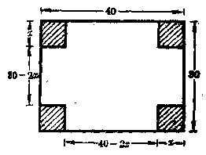

**【解】** 设盒子的高是\(x\)厘米。

因为小方块每边长\(x\)厘米，所以盒子的长和宽分别是\((40 - 2x)\)厘米和\((30 - 2x)\)厘米。

根据题意，列得方程：

$$
(40 - 2 x) (30 - 2 x) = 40 \times 30 \times \frac{1}{2}
$$.

变形得\(x^{2} - 35x + 150 = 0\)，即

$$
(x - 30) (x - 5) = 0，
$$

$$
\therefore x _ {1} = 30， x _ {2} = 5
$$.

\(x_{1} = 30\)和\(x_{2} = 5\)虽然都是正数，但是只有\(x = 5\)是适合应用题的条件。因为如果盒子的高是30厘米，那末铁皮的两边各要剪去60厘米，而原来铁皮的长和宽分别只有40 厘米和 30 厘米，显然这是不合理的。

**答：**盒子的高是5厘米。

##### 例 3

把 100 厘米长的铅丝折成一个长方形的模型。（1） 要使这个长方形的面积是525平方厘米，它的长和宽应该各是多少厘米？（2）面积是625平方厘米呢？（3）面积是700平方厘米呢？

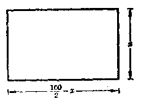

**【解】** 设这个长方形的宽是\(x\)厘

米，那末它的长是\(\left(\frac{100}{2} - x\right)\)厘米，它的面积是\(x(50 - x)\)平方厘米（图7·2）。

（1） 当长方形的面积是 525 平方厘米时，根据题意，列方程：

$$
x (50 - x) = 525，
$$

即\((x - 15)(x - 35) = 0,\)

$$
\therefore x _ {1} = 15， x _ {2} = 35
$$.

$$
50 - 15 = 35， 50 - 35 = 15
$$.

（2） 当长方形的面积是 625 平方厘米时，根据题意，列方程：

$$
x (50 - x) = 625，
$$

即\((x - 25)^{2} = 0,\)

$$
\therefore x _ {1} = x _ {2} = 25
$$.

$$
50 - 25 = 25
$$.

（3） 当长方形的面积是 700 平方厘米时，根据题意，列方程：

$$
x (50 - x) = 700
$$.

即\(x^{2} - 50x + 700 = 0,\)

$$
\therefore \Delta = (- 50) ^ {2} - 4 \cdot 1 \cdot 700 = - 300 <   0
$$.

∴ 这个方程没有实数根。

**答：**（1） 这个长方形模型的长是 35 厘米，宽是 15 厘米；

（2） 这个长方形模型的长和宽都是 25 厘米，这时做成一个正方形；

（3） 要用 100 厘米长的铅丝做成一个面积是 700 平方厘米的长方形，是不可能的。

**【说明】**

在问题（1）中，按照方程的解，可以得出长方形的长是35厘米、宽是15厘米，或者长是15厘米、宽是35厘米，但是这表明是同一大小的长方形，因此，只要回答一种结果，不必重复。

##### 例4

某钢铁厂一月份的钢产量为 5000 吨，三月份上升到 5202 吨，这两个月平均每月增长的百分率是多少？

**【解】**

设平均每月增长的百分率为\(x\)，那末二月份的钢产量是\((5000 + 5000x)\)吨，就是\(5000(1 + x)\)吨；三月份的钢产量是\([5000(1 + x) + 5000(1 + x)x]\)吨，就是

$$
5000 (1 + x) (1 + x) = 5000 (1 + x) ^ {2}
$$

吨。根据题意，列方程：

$$
5000 (1 + x) ^ {2} = 5202，
$$

即\((1 + x)^{2} = 1.0404,\)

$$
\therefore 1 + x = \pm 1.02， \quad x _ {1} = 0.02， \quad x _ {2} = - 2.02
$$.

因为增长率不能为负数，所以只能取\(x = 0.02 = 2\%\)。

**答：**平均每月增长的百分率是2%。

#### 习题7·7

1. 两个连续奇数的积是195，求这两个数。

【提示：设一个奇数是\(x\)，那末另一个奇数就是\(x + 2\)或\(x - 2\)。】

2. 两个数的和是\(-\frac{5}{9}\)，积是\(-\frac{2}{27}\)，求这两个数。

3. 三个连续正整数中，前两个数的平方和等于第三个数的平方，求这三个数。

4. 一个两位数等于它个位上的数的平方，个位上的数比十位上的数大3，求这个两位数。

5. 某人民公社为了增产粮食，计划开辟一块面积是 10800 平方米的长方形水稻田，并且要使它的宽是长的 75%，求这块水稻田的周长。

6. 某工人从一块正方形的铁片上截去3尺宽的一条长方形，剩下的面积是40平方尺。原来这块铁片的面积是多少？

7. 两个正方形的面积的和是106平方厘米，它们周长的差是16厘米，这两个正方形的边长各是多少？

8. 用一块长方形的铁皮，把它的四角各自剪去一个边长是4厘米的小方块，然后把四边折起来，做成一个没有盖的盒子。已知铁片的长是宽的2倍，做成盒子的容积是1536立方厘米，求这块铁片的长和宽。

9. 有一块长30寸、宽20寸的铁板，要在它上面挖成一个面积是200平方寸的长方形的孔，并且使剩下四周一样宽，这个孔应该挖在什么地方？

10. 一张长20寸、宽16寸的年画，要在它的四周镶上一条同样宽的金色纸边。如果要使金边的面积是年画面积的\(\frac{19}{80}\)，金边的宽应该是多少？

【提示：第9和10两题，先根据题意画出一张示意图，然后列方程。】

11. 要做一个容积是 750 立方厘米、高是 6 厘米、底面的长比宽多 5 厘米的长方体匣子，底面的长和宽应该各是多少？（精确到 0.1 厘米。）

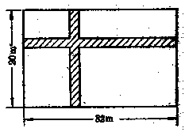

12. 如图，在宽为 20 米、长为 32 米的矩形地面上，修筑同样宽的两条互相垂直的道路，余下的部分作为耕地，要使耕地的面积为 540 平方米，道路的宽应该是多少米？

13. 解放前，老贫农杨大爷向地主借了玉米 50 斤，刚过两年，地主按 “利滚利” 计算，硬要杨大爷还 162 斤玉米，算一算，这笔阎王债的年利率是多少？

14. 某生产队的粮食产量在两年内从 60 万斤增加到 73.6 万斤，平均每年增产的百分率是多少？

15. 油质青霉素每瓶售价原来是 4.01 元，经过两次大幅度降价后，每瓶售价降低为 1.18 元，求平均每次降价百分之几（精确到 1%）。

16. 有一个两位数，它十位上的数与个位上的数的和是 8，如果把十位上的数和个位上的数调换后所得的两位数，乘以原来的两位数就得 1855，原来的数是什么？如果乘以原来的数得 1936 呢？能不能得 2665 呢？

### § 7·8 一元二次方程的根与系数的关系

在前面我们已经看到，一元二次方程

$$
a x ^ {2} + b x + c = 0 \quad (a \neq 0)，
$$

当它的判别式\(\Delta = b^{2} - 4ac \geqslant 0\)时，它的两个根\(x_{1}\)和\(x_{2}\)可以用系数\(a, b, c\)的代数式表示出来：

$$
x _ {1} = \frac{- b + \sqrt {b ^ {2} - 4 a c}}{2 a}， \tag{1}
$$

$$
x _ {2} = \frac{- b - \sqrt {b ^ {2} - 4 a c}}{2 a}. \tag{2}
$$

现在我们来讨论相反的问题：怎样应用一元二次方程\(ax^2 + bx + c = 0 (a \neq 0)\)的两个根\(x_1\)和\(x_2\)的表达式来表示它的系数\(a, b, c\)？

观察上面根的表达式（1）和（2），容易看出：

1. 把两个根相加，就可得到

$$
\begin{array}{l} x _ {1} + x _ {2} = \frac{- b + \sqrt {b ^ {2} - 4 a c}}{2 a} + \frac{- b - \sqrt {b ^ {2} - 4 a c}}{2 a} \\ = \frac{- 2 b}{2 a} = - \frac{b}{a}； \\ \end{array}
$$

2. 把两根相乘，就可得到

$$
\begin{array}{l} x _ {1} \cdot x _ {2} = \frac{- b + \sqrt {b ^ {2} - 4 a c}}{2 a} \cdot \frac{- b - \sqrt {b ^ {2} - 4 a c}}{2 a} \\ = \frac{(- b) ^ {2} - (\sqrt {b ^ {2} - 4 a c}) ^ {2}}{4 a ^ {2}} = \frac{4 a c}{4 a ^ {2}} = \frac{c}{a}. \\ \end{array}
$$

这样，我们就可以得到一元二次方程的根与系数的关系是：

设\(ax^2 + bx + c = 0 (a \neq 0)\)的两个根是\(x_1, x_2\)，那末

$$
x _ {1} + x _ {2} = - \frac{b}{a}；
$$

$$
x _ {1} \cdot x _ {2} = \frac{0}{a}，
$$

一元二次方程根与系数的关系

这就是说，一元二次方程的两个根的和，等于它的一次项系数除以二次项系数所得的商的相反数；两个根的积，等于它的常数项除以二次项系数所得的商。

根与系数的这种关系通常也把它叫做韦达定理[^p279-1]。

如果把方程\(ax^2 + bx + c = 0 (a \neq 0)\)变形为

$$
a ^ {2} + \frac{b}{a} x + \frac{c}{a} = 0，
$$

并设\(\frac{b}{a} = p, \frac{c}{a} = q\)，我们就可以把它写成下面这种简化形式：

$$
a ^ {2} + p x + q = 0
$$

从而按韦达定理，可以得出：

如果方程\(x^{2} + px + q = 0\)的两个根是\(x_{1}\)和\(x_{2}\)，那末

$$
x _ {1} + x _ {2} = - p， \quad x _ {1} \cdot x _ {2} = q
$$.

简化一元二次方程的根与系数的关系

[^p279-1]: ① 韦达是法国数学家（1540年—1603年）。

#### 例7

应用韦达定理，求下列关于\(x\)的方程中两根的和与两根的积：

（1）\(3x^{2} + 7x - 2 = 0;\)

（2）\(ax^2 + c = 0\)；

（3）\(ax^2 = 0\)；

（4）\(ax^2 + bx = 0\)。

**【解】** 设方程的两个根是\(x_{1}\)和\(x_{2}\)。

（1）\(x_{1} + x_{2} = -\frac{7}{3}; x_{1} \cdot x_{2} = -\frac{2}{3}\)。

（2）\(x_{1} + x_{2} = 0; x_{1} \cdot x_{2} = \frac{0}{a}\)。

（3）\(x_{1} + x_{2} = 0; x_{1} \cdot x_{2} = 0\).

（4）\(x_{1} + x_{2} = -\frac{b}{a}; x_{1} \cdot x_{2} = 0\).

**【说明】** 1. 从第（2）题可以知道，如果方程的两个根互为相反数，那末一次项系数一定等于0.

2. 从第（3），（4）题可以知道，如果方程有一个根是0，那末常数项一定等于0。可与§7·2中的结论相比较。

#### 习题7·8

1. 不解下列关于\(x\)的方程，求两根的和与两根的积：

（1）\(x^{2} - 7x - 2 = 0;\)

（2）\(2x^{2} - 5 = 0;\)

（3）\(3x^{2} + 4x = 0;\)

（4）\(5x^{2} + 3x - 1 = 0;\)

（5）\(2x^{2} - 5x = 2;\)

（6）\(\frac{3}{2} x^2 + 4x = 1\)；

（7）\(\sqrt{2} x^{2} - 4\sqrt{3} x - 2\sqrt{2} = 0;\)

（8）\(x^{2} - 2ax + a^{2} = b^{2}\)；

（9）\((a^2 - b^2)x^2 - 4abx = a^2 - b^2\)；

（10）\(abx^{2} - (a^{4} + b^{4})x + a^{3}b^{3} = 0\).

2. 下列答案有没有错误？如果有错误，应该怎样改正？

（1） 方程\(x^{2}+9x-8=0\)的两根的和是 9；

（2） 方程\(2x^{2}-9x+5=0\)的两根的和是 9；

（3） 方程\(2x^{2}-9x=5\)的两根的积是\(\frac{5}{2}\)；

（4） 方程\(2x^{2}+5=9x\)的两根的和是\(-\frac{9}{2}\)。

### § 7·9 韦达定理的应用

应用韦达定理，可以不通过解方程来解下面几种问题：

1. 已知一个一元二次方程的一个根，求另一个根

设方程\(ax^2 + bx + c = 0 (a \neq 0)\)的两个根是\(x_1\)和\(x_2\)，根据韦达定理，可以知道，

$$
x _ {1} + x _ {2} = - \frac{b}{a}， \quad x _ {1} \cdot x _ {2} = \frac{c}{a}
$$.

如果已知\(x_{1}, x_{2}\)中的任何一个，就可以代入上面关系式里的任何一个而求得另一个根，并且还可以用另一个关系式来检验。

#### 例1

已知\(4x^{3} - 11x + 6 = 0\)有一个根是2，求它的另一个根。

**【解】** 设另一个根是\(x_{1}\)，那末\(x_{1} \cdot 2 = \frac{6}{4}\)，

$$
\therefore x _ {1} = \frac{3}{4}
$$.

**答：**另一个根是\(\frac{3}{4}\)。

**【说明】** 本题也可以从\(x_{1} + 2 = \frac{11}{4}\)，求得\(x_{1} = \frac{3}{4}\)，证明计算没有错误。

2. 已知一个方程的两个根，作出这个方程

设\(x_{1}\)和\(x_{2}\)是一元二次方程的两个根，那末这个方程就可以表示成

$$
(x - x _ {1}) (x - x _ {2}) = 0
$$.

也就是\(x^{2} - (x_{1} + x_{2})x + x_{1}x_{2} = 0\).

所以只要把已知两个根的和的相反数做所求方程的一次项系数，两根的积做常数项，而把二次项系数作为1，这样，就能作出这个方程。

##### 例2

求作一元二次方程，使它的两个根是：

（1）\(\frac{4}{5}\)和\(-3\frac{1}{2}\)；

（2）\(3 + \sqrt{2}\)和\(3 - \sqrt{2}\)。

**【解】** （1） 设所求的一元二次方程是\(x^{2} + px + q = 0\)，那末

$$
p = - \left[ \frac{4}{5} + \left(- 3 \frac{1}{2}\right) \right] = - \left(- \frac{27}{10}\right) = \frac{27}{10}，
$$

$$
q = - \frac{4}{5} \times \left(- 3 \frac{1}{2}\right) = - \frac{14}{5}
$$.

所以所求的方程是

$$
x ^ {2} + \frac{27}{10} x - \frac{14}{5} = 0
$$.

去分母，得

$$
10 x ^ {2} + 27 x - 28 = 0
$$.

**答：**所求的方程是\(10x^{2} + 27x - 28 = 0\)

（2） 设所求的一元二次方程是\(x^{2} + px + q = 0\)，那末

$$
p = - [ (3 + \sqrt {2}) + (3 - \sqrt {2}) ] = - 6，
$$

$$
q = (3 + \sqrt {2}) (3 - \sqrt {2}) = 7
$$.

所以所求的方程是

$$
x ^ {2} - 6 x + 7 = 0
$$.

**答：**所求的方程是\(x^{2} - 6x + 7 = 0\)

**【说明】**

1、设所求方程时，只须设一元二次方程的简化形式：\(x^{2}+px+q=0\)，这样可以减少计算上的繁琐。如果所求方程的二次项系数原来并不是1，那末在计算p和q的值时，会得到分数，这时去分母后所得的方程，它的二次项系数必然不等于1，例如第（1）题可以说明这一点。

2. 所求的方程，遇有分数系数时，通常要把它变形成为整数系数的方程。

3. 这种类型的问题，在熟练之后，遇到已知两个根是比较简单时，可以直接写出所求的一元二次方程来，不必仍按上面那样的格式书写。

#### 3. 已知两数的和与积，求这两个数

利用根与系数的关系，我们可以把所求的两个数当作\(x^{2} + px + q = 0\)这样形式的一元二次方程（二次项系数作为1）的两个根，也就是说，把已知两数的和的相反数做一次项系数，两数的积做常数项而得出一元二次方程。然后解这个一元二次方程，那末方程的两个根就是所求的两个数。

##### 例 3

已知两个数的和等于 10，它们的积等于 22，求这两个数。

**【解】** 根据根与系数的关系，得出方程

$$
x ^ {2} - 10 x + 22 = 0
$$.

解这个方程，得到它的两个根是

$$
x _ {1} = 5 + \sqrt {3}， x _ {2} = 5 - \sqrt {3}
$$.

这就是所求的两个数。

**答：**这两个数是\(5 + \sqrt{3}\)和\(5 - \sqrt{3}\)。

#### 习题7·9（1）

1. （1） 已知方程\(2x^{2} - 5x - 3 = 0\)的一个根是 3，求它的另一个根；

（2） 已知方程\(x^{2} - 4x + 1 = 0\)的一个根是\(2 + \sqrt{3}\)，求它的另一个根；

（3） 1是不是方程\(3x^{2} - 64x + 61 = 0\)的根？求这个方程的另一
个根；

（4） 1是不是二次方程\((a - b)x^{2} + (b - c)x + (c - a) = 0\)的根？它的另一个根是什么？\((a - b \neq 0)\)。

2. 求作一个二次方程，使它的两个根是：

（1）\(-\frac{3}{5}\)和\(\frac{5}{3}\)；

（2） 0.6 和 0.5；

（4）\(\frac{\sqrt{2}}{3}\)和\(-\frac{\sqrt{2}}{3}\)；

（3） -7 和 0；

（5）\(2\sqrt{3} + 1\)和\(2\sqrt{3} - 1\)；

（6）\(\frac{a + b}{a - b}\)和\(\frac{a - b}{a + b}\)。

3. 已知两个数的和与它们的积分别等于下列各数，求这两个数：

（1） 和等于 -5，积等于 -14；

（2） 和等于\(\frac{13}{10}\)，积等于\(-\frac{3}{10}\)；

（3） 和等于\(\sqrt{3}\)；积等于\(\frac{1}{2}\)；

（4） 和等于\(6a\)，积等于\(9a^{2}-4b^{2}\)

4. 已知一个一元二次方程，不解这个方程，求一元二次方程根的对称式的值

设\(x_{1}\)和\(x_{2}\)是一元二次方程\(ax^{2} + bx + c = 0 (a \neq 0)\)的两个根。我们来考察下面这些代数式：

$$
x _ {1} ^ {2} + x _ {2} ^ {2}， \quad \frac{1}{x _ {1}} + \frac{1}{x _ {2}}， \quad x _ {1} ^ {3} + x _ {2} ^ {3}， \quad \frac{1}{x _ {1} ^ {3}} + \frac{1}{x _ {2} ^ {3}}
$$.

这些代数式有着一个共同的特点，就是把\(x_{1}\)和\(x_{2}\)交换以后，除去位置变换以外，原来的式子并不改变。例如，把\(x_{1}\)和\(x_{2}\)交换以后，\(x_{1}^{2} + x_{2}^{2}\)变成了\(x_{2}^{2} + x_{1}^{2}\)，只是把\(x_{1}\)和\(x_{2}\)交换了一个位置。象这样的代数式，我们把它叫做一元二次方程根的对称式。

一元二次方程根的对称式，经过恒等变形以后都可以用关于\((x_{1} + x_{2})\)和\(x_{1}x_{2}\)的代数式表示出来，例如：

（1）\(x_{1}^{2} + x_{2}^{2} = (x_{1}^{2} + 2x_{1}x_{2} + x_{2}^{2}) - 2x_{1}x_{2}\)

$$
= \left(x _ {1} + x _ {2}\right) ^ {2} - 2 x _ {1} x _ {2}
$$.

（2）\(\frac{1}{x_1} + \frac{1}{x_2} = \frac{x_1 + x_2}{x_1 x_2}\)。

（3）\(x_{1}^{2} + x_{2}^{2} = (x_{1} + x_{2})(x_{1}^{2} - x_{1}x_{2} + x_{2}^{2})\)

$$
= \left(x _ {1} + x _ {2}\right) \left[ \left(x _ {1} ^ {2} + 2 x _ {1} x _ {2} + x _ {2} ^ {2}\right) - 8 x _ {1} x _ {2} \right]
$$

$$
= \left(x _ {1} + x _ {2}\right) \left[ \left(x _ {1} + x _ {2}\right) ^ {2} - 3 x _ {1} x _ {2} \right]
$$

$$
= \left(x _ {1} + x _ {2}\right) ^ {3} - 3 x _ {1} x _ {2} \left(x _ {1} + x _ {2}\right)
$$。

（4）\(\frac{1}{x_1^2} + \frac{1}{x_2^2} = \frac{x_1^2 + x_2^2}{x_1^2 x_2^2} = \frac{(x_1 + x_2)^2 - 2x_1x_2}{(x_1x_2)^2}\)。

应用这种变换和韦达定理，我们就可以不解方程求出一元二次方程根的对称式的值。

##### 例4

已知方程\(2x^{2} + 3x - 5 = 0\)。不解方程，求出：（1）它的两个根的平方和；（2）它的两个根的负倒数的和。

**【解】** 设方程的两个根是\(x_{1}\)和\(x_{2}\)，那末根据韦达定理，

$$
x _ {1} + x _ {2} = - \frac{3}{2}， \quad x _ {1} x _ {2} = - \frac{5}{2}
$$.

（1）\(x_{1}^{2} + x_{2}^{2} = (x_{1} + x_{2})^{2} - 2x_{1}x_{2}\)

$$
= \left(- \frac{3}{2}\right) ^ {2} - 2 \cdot \left(- \frac{5}{2}\right) = 7 \frac{1}{4}
$$.

（2）\(-\frac{1}{x_1} - \frac{1}{x_2} = -\left(\frac{1}{x_1} + \frac{1}{x_2}\right) = -\frac{x_1 + x_2}{x_1 x_2}\)

$$
= - \frac{\frac{3}{2}}{- \frac{5}{2}} = - \frac{3}{5}
$$.

**答：**两个根的平方和是\(7\frac{1}{4}\)，两个

根的负倒数的和是\(-\frac{3}{5}\)。

5. 已知一个二次方程，不解这个方程，求作另一个二次方程，使它的根与原方程的根有某些特殊关系

例如，求作一个二次方程，使它的两个根是原方程的两个根的平方，或者是原方程的两个根的倒数等。

设原方程的两个根是\(x_{1}\)和\(x_{2}\)，根据韦达定理，就可以求得原方程的两根的和与两根的积的值。根据题目里所给新方程的两根与原方程的两根的关系，可以用\(x_{1}\)和\(x_{2}\)的代数式写出求作方程的两个根；并且按照第4类问题那样，还可以求得新方程的两根的和与两根的积的值。再应用韦达定理，就可以求得新方程的系数，从而得出所求的方程来。

##### 例5

已知方程\(x^{3} - 3x - 4 = 0\)。不解这个方程，求作一个新的一元二次方程，使新方程的根是原方程各根的立方。

**【解】** 设方程\(x^{2} - 3x - 4 = 0\)的两个根是\(x_{1}\)和\(x_{2}\)，那末

$$
x _ {1} + x _ {2} = 3， \quad x _ {1} x _ {2} = - 4
$$.

设所求的新方程是

$$
y ^ {2} + p y + q = 0，
$$

它的两个根是\(y_{1}\)和\(y_{2}\)，那末

$$
y _ {1} = x _ {1} ^ {2}， \quad y _ {2} = x _ {2} ^ {3}，
$$

$$
\therefore y _ {1} + y _ {2} = x _ {1} ^ {2} + x _ {2} ^ {3} = (x _ {1} + x _ {2}) ^ {8} - 3 x _ {1} x _ {2} (x _ {1} + x _ {2})
$$

$$
= 3 ^ {3} - 3 \cdot (- 4) \cdot 3 = 63；
$$

$$
y _ {1} y _ {2} = x _ {1} ^ {3} x _ {2} ^ {2} = (x _ {1} x _ {2}) ^ {3} = (- 4) ^ {3} = - 64
$$.

因此，\(p = -(y_{1} + y_{2}) = -63,\)

$$
q = y _ {1} y _ {2} = - 64
$$.

所以所求的新方程是

$$
y ^ {3} - 63 y - 64 = 0
$$.

**答：**所求的方程是\(y^{3}-63y-64=0\)。

**【说明】** 1.\(x_{1}^{3} + x_{2}^{3} = (x_{1} + x_{2})^{3} - 3x_{1}x_{2}(x_{1} + x_{2})\)见第4类问题的（3）。

2. 解这种题目的步骤可以参照下列图表的程序：

原方程\(\longrightarrow\)原方程的两根的和与两根的积的值

↓
新方程的两根的和与两根的积的值

新方程←——新方程的系数

6. 利用给出的条件，确定一个一元二次方程中某些字母系数的值根据韦达定理，列出含有某些字母的关系式，再解关于这个字母的方程，从而就可求得这个字母的值。

##### 例6

已知方程\(2x^{2} + 4x + m = 0\)的两个根的平方和是34，求\(m\)的值。

**【解】** 设原方程的两个根是\(x_{1}\)和\(x_{2}\)，那末

$$
x _ {1} + x _ {2} = - \frac{4}{2} = - 2， \quad x _ {1} x _ {2} = \frac{m}{2}，
$$

$$
x _ {1} ^ {2} + x _ {2} ^ {2} = \left(x _ {1} + x _ {2}\right) ^ {2} - 2 x _ {1} x _ {2}
$$

$$
= (- 2) ^ {2} - 2 \cdot \left(\frac{m}{2}\right) = 4 - m
$$.

根据题意，得\(x_{1}^{2} + x_{2}^{2} = 34\)

$$
\therefore 4 - m = 34， m = - 30
$$.

**答：**\(m\)的值是-30.

1. 设\(x_{1}\)和\(x_{2}\)是方程\(x^{2} + 4x - 6 = 0\)的两个根，不解这个方程，求下列各式的值：

（1）\(\frac{x_2}{x_1} + \frac{x_1}{x_2}\)；

（2）\(x_{1}^{2} + x_{1}x_{2} + x_{2}^{2}\)；

（3）\((x_{1} - 2)(x_{2} - 2)\)；

（4）\(\frac{1}{x_2^2} + \frac{1}{x_2^3}\)。

2. 不解方程，作一个新的二次方程，使它的两个根：

（1） 分别是方程\(6x^{2}-3x-2=0\)的两个根的倒数；

（2） 分别是方程\(3x^{2}+5x-10=0\)的两个根的 3 倍；

（3） 分别是方程\(2x^{2}-5x=12\)的两个根的平方；

（4） 分别是方程\(3x^{2}-5x=5\)的两个根的负数；

（5） 分别是方程\(5x^{2}+2x-3=0\)的两个根的负倒数；

（6） 分别比方程\(x + 5x^{2} = 7\)的两个根大 3.

3. （1） 已知方程\(x^{2} + mx + 21 = 0\)的两个根的平方和是 58，求\(m\)的值；

（2） 已知方程\(x^{2} + 2x + m = 0\)的两个根的差的平方是 16，求\(m\)的值；

（3） 已知方程\(x^{2} + 3x + m = 0\)的两个根的差是 5，求\(m\)的值；

（4） 已知方程\(x^{2} + 3x + m = 0\)的一个根是另一个根的 2 倍，求\(m\)的值。

4. （1） 已知方程\(2x^{2} + mx - 2m + 1 = 0\)的两个根的平方的和是\(7\frac{1}{4}\)，求\(m\)的值；

（2） 已知方程\(3x^{2} + (m + 1)x + (m - 4) = 0\)的两个根互为相反的数，求\(m\)的值。

### § 7·10 二次三项式的因式分解

在代数第一册里，我们曾经学过在有理数范围里，分解某些二次三项式\(ax^2 + bx + c\)的方法。现在我们来研究，怎样在实数范围里分解一般的二次三项式的因式。

首先，我们采用加一项减一项的方法把这个二次三项式的前二项配成一个完全平方式：

$$
\begin{array}{l} a x ^ {2} + b x + c = a \left(x ^ {2} + \frac{b}{a} x + \frac{c}{a}\right) \\ = a \left[ x ^ {2} + 2 \left(\frac{b}{2 a}\right) x + \left(\frac{b}{2 a}\right) ^ {2} - \left(\frac{b}{2 a}\right) ^ {2} + \frac{c}{a} \right] \\ = a \left[ \left(x + \frac{b}{2 a}\right) ^ {2} - \frac{b ^ {2} - 4 a c}{4 a ^ {2}} \right]。 \\ \end{array}
$$

如果\(b^{2} - 4ac > 0\)，那末因为\(\frac{b^2 - 4ac}{4a^2} = \left(\frac{\sqrt{b^2 - 4ac}}{2a}\right)^2\)，上式就可以写成

$$
\begin{array}{l} a x ^ {2} + b x + c = a \left[ \left(x + \frac{b}{2 a}\right) ^ {2} - \left(\frac{\sqrt {b ^ {2} - 4 a c}}{2 a}\right) ^ {2} \right] \\ = a \left(x + \frac{b}{2 a} - \frac{\sqrt {b ^ {2} - 4 a c}}{2 a}\right)。 \\ \times \left(x + \frac{b}{2 a} + \frac{\sqrt {b ^ {2} - 4 a c}}{2 a}\right) \\ = a \left(x - \frac{- b + \sqrt {b ^ {2} - 4 a c}}{2 a}\right) \\ \times \left(x - \frac{- b - \sqrt {b ^ {2} - 4 a c}}{2 a}\right)。 \\ \end{array}
$$

观察上面分解所得的结果，容易看出因式中的\(\frac{-b+\sqrt{b^{2}-4ac}}{2a}\)和\(\frac{-b-\sqrt{b^{2}-4ac}}{2a}\)也正是一元二次方程\(ax^{2}+bx+c=0(a\neq0)\)的两个根\(x_{1}\)和\(x_{2}\)。这就启发我们分解一般的二次三项式的因式，也可以直接利用一元二次方程的求根公式，就是

（1） 先用求根公式，求出一元二次方程\(ax^2 + bx + c = 0 (a \neq 0)\)的两个根\(x_1\)和\(x_2\)；

（2） 再把所给的二次三项式写成\(ax^2 + bx + c = a(x - x_1)(x - x_2)\)的形式。

**【注意】**

（1） 如果\(b^2 - 4ac < 0\)，二次方程没有实数根，这个二次三项式在实数范围里就不能分解因式。

（2） 因为二次三项式不是一个等式，所以\(x^{3}\)项的系数\(a\)只能用提取公因式法把它提出，而不能象解一元二次方程那样用两边同除以\(a\)的方法，把它消去。

#### 例1

分解\(x^{2} - 2x - 5\)的因式。

**【解】** 方程\(x^{2} - 2x - 5 = 0\)的根是

$$
x = \frac{2 \pm \sqrt {4 + 20}}{2} = \frac{2 \pm 2 \sqrt {6}}{2} = 1 \pm \sqrt {6}，
$$

即\(x_{1} = 1 + \sqrt{6}, x_{2} = 1 - \sqrt{6}\)。

$$
\begin{array}{l} \therefore x ^ {2} - 2 x - 5 = [ x - (1 + \sqrt {6}) ] \cdot [ x - (1 - \sqrt {6}) ] \\ = (x - 1 - \sqrt {6}) (x - 1 + \sqrt {6})。 \\ \end{array}
$$

##### 例 2

分解\(-4x^{2}+8x-1\)的因式。

**【解】** 方程\(-4x^{2}+8x-1=0\)的根是

$$
x = \frac{- 8 \pm \sqrt {64 - 16}}{- 8} = \frac{- 8 \pm 4 \sqrt {3}}{- 8} = \frac{2 \mp \sqrt {3}}{2}，
$$

即\(x_{1} = \frac{2 - \sqrt{3}}{2}, x_{2} = \frac{2 + \sqrt{3}}{2}\)。

$$
\begin{array}{l} \therefore - 4 x ^ {2} + 8 x - 1 = - 4 \left(x - \frac{2 - \sqrt {3}}{2}\right) \left(x - \frac{2 + \sqrt {3}}{2}\right) \\ = - (2 x - 2 + \sqrt {3}) (2 x - 2 - \sqrt {3})。 \\ \end{array}
$$

**【说明】** 这里，把 4 看做\(2 \times 2\)，然后把两个因式分别乘以 2.

##### 例3

分解\(2x^{2} - 8x + 5\)的因式。

**【解】** 方程\(2x^{2} - 8x + 5 = 0\)的根是

$$
x = \frac{8 \pm \sqrt {64 - 40}}{4} = \frac{8 \pm 2 \sqrt {6}}{4} = \frac{4 \pm \sqrt {6}}{2}，
$$

即\(x_{1} = \frac{4 + \sqrt{6}}{2}, x_{2} = \frac{4 - \sqrt{6}}{2}\)。

$$
\therefore 2 x ^ {2} - 8 x + 5 = 2 \left(x - \frac{4 + \sqrt {6}}{2}\right) \left(x - \frac{4 - \sqrt {6}}{2}\right)
$$。

**【说明】** 这里系数 2 无法化去两个因式里的分数，因此保持原来形式。

1. 分解下列二次三项式的因式：

（1）\(x^{2} + 3x - 28;\)

（2）\(x^{2} + 7x + 5;\)

（3）\(3x^{2} + 2x - 5;\)

（4）\(6x^{2} + 7x + 2;\)

（5）\(4x^{2} + x - 3;\)

（6）\(3x^{2} - 25x + 2;\)

（7）\(14 - 11x - 2x^{2}\)；

（8）\(1 - 3x^{2} + 5x\)

（9）\(x^{2} - 5ax + a^{2}\)；

（10）\(x^{2} - 6bx - (4a^{2} - 9b^{2})\)

（11）\(4x^{2} - 4a^{2}x + a^{4} - b^{4};\)

（12）\((a^2 - b^2)x^2 - 4abx - (a^2 - b^2)\)。

2. 化简下列各分式：

（1）\(\frac{a^2 - 3a + 2}{a^2 - 5a + 6}\)；

（2）\(\frac{6y^2 + 7y - 3}{1.5y^2 - 11y + 2}\)。

【提示：先分解分子和分母的因式，再行约简。】

3. 已知二次三项式\(2x^{2} + (m + 1)x + (5 - m)\)的两个根相等，求\(m\)的值。

### § 7·11 二元二次多项式的因式分解

在代数第一册里，我们还曾学过应用十字相乘法在有理数范围内分解某些二元二次多项式。例如，\(2x^{2}+xy-3y^{2}\)或者\(x^{2}+xy-2y^{2}-x+7y-6\)的方法。一个关于 x，y 的二次多项式，如果把其中的一个字母看作常数，那末也就可以把它变形成关于另一个字母的二次三项式。例如

$$
2 x ^ {2} + x y - 3 y ^ {2} = 2 x ^ {2} + y x - 3 y ^ {2}，
$$

$$
x ^ {3} + x y - 2 y ^ {2} - x + 7 y - 6
$$

$$
= x ^ {3} + (y - 1) x - (2 y ^ {2} - 7 y + 6)
$$

都可看成是关于\(x\)的二次三项式。这样我们也就可以应用上节所学过的方法来分解它们的因式（如果可以分解的话）。

#### 例1

分解下列各式的因式

（1）\(2x^{2} + xy - 3y^{2}\)；

（2）\(x^{2} + 2xy - y^{2}\)。

**【审题】** 本题中的（1），可以应用十字相乘法来分解因式。本题中的（2），把\(y\)看成是常数，那末因为\((2y)^{2} - 4(-y^{2}) = 8y^{2} = (\sqrt{8}y)^{2} = (2\sqrt{2}y)^{2}\)是一个完全平方式，所以也可应用求根公式来分解因式。

**【解】** （1）\(2x^{2} + xy - 3y^{2} = (2x + 3y)(x - y)\)。

（2） 把 y 看成是常数，方程\(x^{2} + 2yx - y^{2} = 0\)的根是

$$
x = \frac{- 2 y ^ {2} \pm \sqrt {4 y ^ {2} + 4 y ^ {2}}}{2} = (- 1 \pm \sqrt {2}) y
$$.

$$
\therefore x ^ {2} + 2 x y - y ^ {2} = [ x - (- 1 + \sqrt {2}) y ]
$$

$$
\times [ x - (- 1 - \sqrt {2}) y ]
$$。

**【注意】** 本题中的两个多项式，都含有二个未知数，并且各项的次数都是 2，这样的多项式叫做二元二次齐次三项式，它的一般形式可以写成\(ax^2 + bxy + ay^2\)。这类多项式，当\(\Delta = b^2 - 4ac \geqslant 0\)时，都可以在实数范围内分解成两个一次因式。

##### 例2

分解\(x^{2} + xy - 2y^{2} - x + 7y - 6\)的因式。

**【解】** 把原式整理成为\(x\)的二次三项式，并使它等于0，得到方程\(x^{2} + (y - 1)x - 2y^{2} + 7y - 6 = 0\)。它的根是

$$
\begin{array}{l} x = \frac{- (y - 1) \pm \sqrt {(y - 1) ^ {2} + 4 (2 y ^ {2} - 7 y + 6)}}{2} \\ = \frac{- y + 1 \pm \sqrt {9 y ^ {2} - 30 y + 25}}{2} = \frac{- y + 1 \pm (3 y - 5)}{2}， \\ \end{array}
$$

即\(x_{1} = y - 2, x_{2} = -2y + 3\).

$$
\begin{array}{l} \therefore x ^ {2} + x y - 2 y ^ {2} - x + 7 y - 6 \\ = [ x - (y - 2) ] [ x - (- 2 y + 3) ] \\ = (x - y + 2) (x + 2 y - 3)。 \\ \end{array}
$$

**【注意】** 本题因为根号内的式子\(9y^{2} - 30y + 25 = (3y - 5)^{2}\)是一个完全平方式，所以才能分解因式。

*例 3\(k\)是什么数值时，多项式

$$
k x ^ {2} - 2 x y - 3 y ^ {2} + 3 x - 5 y + 2 \quad (k \neq 0)
$$

才能分解成两个一次因式？这时分解的结果是什么？

**【解】** 把原式整理成\(x\)的二次三项式，并使它等于0，得到方程

$$
k x ^ {2} - (2 y - 3) x - (3 y ^ {2} + 5 y - 2) = 0
$$.

它的根是

$$
\begin{array}{l} x = \frac{2 y - 3 \pm \sqrt {(2 y - 3) ^ {2} + 4 k (3 y ^ {2} + 5 y - 2)}}{2 k} \\ = \frac{2 y - 3 \pm \sqrt {(12 k + 4) y ^ {2} + (20 k - 12) y - (8 k - 9)}}{2 k}. \tag{1} \\ \end{array}
$$

原式能够分解成两个一次因式，

$$
(12 k + 4) y ^ {2} + (20 k - 12) y - (8 k - 9) \tag{2}
$$

必须是一个完全平方式，因此方程

$$
(12 k + 4) y ^ {2} + (20 k - 12) y - (8k - 9) = 0
$$

必须有等根，所以

$$
(20 k - 12) ^ {2} + 4 (12 k + 4) (8 k - 9) = 0
$$.

化简后得\(k(k - 1) = 0\).

∴ k=0 或者 k=1。

但是题设\(k \neq 0\)，所以只能取\(k = 1\)。

当\(k = 1\)时，代入（2），得

$$
\begin{array}{l} (12 k + 4) y ^ {2} + (20 k - 12) y - (8 k - 9) \\ = 16 y ^ {2} + 8 y + 1 = (4 y + 1) ^ {2}. \\ \end{array}
$$

代入（1），得

$$
x = \frac{2 y - 3 \pm (4 y + 1)}{2}，
$$

即

$$
x _ {1} = 3 y - 1， x _ {2} = - y - 2
$$.

由此得

$$
\begin{array}{l} x ^ {2} + 2 x y - 3 y ^ {2} + 3 x - 5 y + 2 \\ = (x - 3 y + 1) (x + y + 2)。 \\ \end{array}
$$

#### 习题7·11

1. 分解下列各式的因式：

（1）\(-2x^{2} + 11xy - 12y^{2}\)；

（2）\(2a^{2}x^{2} + 5abxy - 3b^{2}y^{2}\)；

（3）\(x^{2} - 2xy - 2y^{2}\)；

（4）\(x^{2} + 4xy + y^{2}\)；

（5）\(x^{2} + 6xy + 7y^{2}\)；

（6）\(4x^{2} - 4xy - y^{2}\)。

2. 分解下列各式的因式

（1）\(2x^{2} + xy - 3y^{2} + x + 4y - 1;\)

（2）\(x^{2} - xy - 6y^{2} + x + 7y - 2;\)

（3）\(6x^{2} - xy - 15y^{2} - 5x + 21y - 6;\)

（4）\(10x^{2} - 23xy - 5y^{2} + 13x + 8y - 3\).

*3.\(m\)是什么数值时，\(12x^{2} - 10xy + 2y^{2} + 11x - 5y + m\)能分解成两个一次因式？这时求得的结果是什么？

*4.\(m\)是什么数值时，\(2x^{2} + mxy + 3y^{2} - 5y - 2\)能分解成两个一次因式？这时求得的结果是什么？

### § 7·12 可化为一元二次方程的整式方程的解法

一个整式方程，经过整理以后，如果只含有一个未知数，并且未知数的最高次数大于2，这样的方程叫做一元高次方程。例如，\(2x^{3}-8x^{2}-14x=0,\quad x^{4}-25x^{2}+144=0,\quad(x^{3}+2x)^{3}-14(x^{2}+2x)-15=0\)等等。有些特殊的一元高次方程，可以利用因式分解或者换元法（见§3·8）把它们转化成一元一次方程或者一元二次方程来解。下面分别举例来说明。

#### 1. 利用因式分解法解一元高次方程

##### 例 1

解方程：\(2x^{3}-3x^{2}-14x=0\)。

**【审题】** 这是一个三次方程，方程等号左边各项有公因式\(x\)，可以变形成两个因式\(x\)与\(2x^{2} - 3x - 14\)的积，右边为 0. 所以可以利用因式分解法，把它转化为一个一元一次方程和一个一元二次方程来解。

**【解】** 原方程可变形成

$$
x (2 x ^ {2} - 3 x - 14) = 0
$$.

使\(x = 0, \therefore x_{1} = 0;\)

使\(2x^{2} - 3x - 14 = 0, (2x - 7)(x + 2) = 0,\)

$$
\therefore x _ {2} = \frac{7}{2}， x _ {3} = - 2
$$.

所以原方程的根是\(x_{1} = 0, x_{2} = \frac{7}{2}, x_{3} = -2\).

##### 例2

解方程\(x^{3} + 2x^{2} - 5x - 6 = 0\).

**【审题】** 这个方程等号的左边是\(x\)的三次式，如果它能分解因式，其中的那个一次因式，只可能是\(x \pm 1, x \pm 2, x \pm 3\)或\(x \pm 6\)。所以可以利用综合除法试除，把这种因式找出，然后转化成一个一元一次方程和一个一元二次方程来解。

**【解】** \(\frac{1 + 2 - 5 - 6}{-1 - 1 + 6}\)

$$
\therefore x ^ {3} + 2 x ^ {2} - 5 x - 6 = (x + 1) (x ^ {2} + x - 6)，
$$

原方程可变形成\((x + 1)(x^2 + x - 6) = 0\)。

使\(x + 1 = 0\)，得\(x_{1} = -1\)

使\(x^{2} + x - 6 = 0\)，即\((x - 2)(x + 3) = 0,\)

得\(x_{2} = 2, x_{3} = -3\).

所以原方程的根是\(x_{1} = -1, x_{2} = 2, x_{3} = -3\).

**【说明】** 一个整数系数的一元三次方程\(x^{3} + px^{2} + qx + r = 0\)，如果它能够用因式分解法来解，都可以采用上题这种方法。如果经过试除，所有的那些可能的一次因式，都不是方程左边那个三次式的因式，那末这种方程就不含有有理数的根，我们现在就不能解它。

1. 解下列方程：

（1）\(x^{3} - 3x^{2} - 10x = 0;\)

（2）\(3x^{3} + 13x^{2} + 4x = 0;\)

（3）\(4x^{3} = 3x^{2}\)；

（4）\((x^{2} + 2)(x + 3) = 6\).

2. 解下列关于\(x\)的方程：

（1）\(x^{3} + 8a^{3} = 0;\)

（2）\(8x^{3} - a^{3} = 0\).

3. 解下列方程：

（1）\(x^{3} - 2x^{2} - 5x + 10 = 0;\)

（2）\(x^{3} - 16 = 4x(x - 1)\)。

#### 2. 用换元法解一元高次方程

我们来看下面这个方程：

$$
x ^ {4} - 29 x ^ {2} + 100 = 0
$$.

这个方程虽然是\(x\)的四次方程，但是，它只含有\(x^4\)项、\(x^2\)项和常数项，而不含有\(x^3\)项和\(x\)项。象这样，只含有未知数的偶次项的一元四次方程，叫做双二次方程。双二次方程的一般形式是：

$$
a x ^ {4} + b x ^ {2} + c = 0 \quad (a \neq 0)
$$。

解这类方程，我们可以用辅助未知数\(y\)来代替式子里的\(x^3\)，这样，\(x^4\)就可以用\(y^2\)来代替。于是上面这个一元四次方程就改变成关于\(y\)的一元二次方程：

$$
a y ^ {2} + b y + c = 0 \quad (a \neq 0)
$$。

这种用辅助未知数解方程的方法，叫做辅助未知数法（也叫做换元法）。

例如，在上面的方程\(x^{4} - 29x^{2} + 100 = 0\)中，设\(x^{2} = y\)那末，原方程就变成

$$
y ^ {2} - 29 y + 100 = 0
$$.

解这个方程，

$$
(y - 4) (y - 25) = 0，
$$

$$
\therefore y _ {1} = 4， y _ {2} = 25
$$.

求出\(y\)的值以后，只要求出每个值的平方根，就可以得到原方程的根。

当\(y_{1} = 4\)时，

$$
x ^ {2} = 4， \quad \therefore x = \pm 2；
$$

当\(y_{2} = 25\)时，

$$
x ^ {2} = 25， \quad \therefore x = \pm 5
$$.

所以原方程的根是\(x_{1} = 2, x_{2} = -2, x_{3} = 5, x_{4} = -5\).

##### 例3

解方程：\(x^4 -25x^3 +144 = 0\).

**【解】** 设\(x^{2} = y\)，那末\(x^{4} = y^{2}\)，于是原方程就变成

$$
y ^ {2} - 25 y + 144 = 0， \quad (y - 9) (y - 16) = 0，
$$

$$
\therefore y _ {1} = 9， y _ {2} = 16
$$.

当\(y_{1} = 9\)时，

$$
x ^ {2} = 9， \quad \therefore x = \pm 3，
$$

当\(y_{2} = 16\)时，

$$
x ^ {2} = 16， \quad \therefore x = \pm 4
$$.

所以原方程的根是：\(x_{1} = 3, x_{2} = -3, x_{3} = 4, x_{4} = -4\).

##### 例4

解方程：\(x^{4} + 5x^{3} - 36 = 0\).

**【解】** 设\(x^{2} = y\)，于是原方程就变成

$$
y ^ {2} + 5 y - 36 = 0， \quad (y - 4) (y + 9) = 0，
$$

$$
\therefore y _ {1} = 4， y _ {2} = - 9
$$.

当\(y_{1} = 4\)时，

$$
x ^ {2} = 4， \quad \therefore x = \pm 2
$$.

当\(y_{2} = -9\)时，

$$
x ^ {2} = - 9
$$.

因为任何实数的平方都不能是负数，所以\(x^{2} = -9\)没有实数根。

所以原方程只有两个实数根：\(x_{2} = 2\)，\(x_{2} = -2\)

##### 例5

解方程：\(x^{4} + 13x^{2} + 36 = 0\).

**【解】** 设\(x^{2} = y\)，得\(y^{2} + 13y + 36 = 0\)。

$$
(y + 4) (y + 9) = 0，
$$

$$
\therefore y _ {1} = - 4， y _ {2} = - 9
$$.

也就是\(x^{2} = -4, x^{2} = -9\).

这两个方程都没有实数根。所以原方程没有实数根。

从上面三个例子可以看到，解双二次方程时，在利用辅助未知数\(y\)把原方程变成

$$
a y ^ {2} + b y + c = 0 \quad (a \neq 0)
$$

的形式后，如果\(\Delta = b^{2} - 4ac \geqslant 0\)，就得到方程的两个根\(y_{1}\)和\(y_{2}\)。如果\(y_{1}\)和\(y_{2}\)都是正数，就得到\(x\)的四个根：\(x = \pm \sqrt{y_{1}}\)，\(\pm \sqrt{y_{2}}\)；如果\(y_{1}\)和\(y_{2}\)中一个是正数，一个是负数，就得到\(x\)的两个实根；如果\(y_{1}\)和\(y_{2}\)都是负数，那末原来的双二次方程没有实数根。

#### 习题7·12（2）

解下列各方程：

1. （1）\(x^{4} - 5x^{2} + 4 = 0\)；

（2）\(x^{4} - 13x^{2} + 36 = 0;\)

（3）\(4x^{4} - 5x^{2} + 1 = 0;\)

（4）\(36x^{4} - 25x^{2} + 4 = 0\).

2. （1）\(x^{4} - 7x^{2} - 18 = 0\)；

（2）\(2x^{4} - 7x^{2} - 4 = 0;\)

（3）\(25x^{4} + 71x^{2} - 12 = 0;\)

（4）\(x^{4} + 8x^{2} + 15 = 0\).

3. （1）\(2x^{4} - 19x^{2} + 9 = 0\)；

（2）\(x^{4} - 5x^{2} + 6 = 0;\)

（3）\(x^{4} - 24x^{3} + 144 = 0;\)

（4）\(81x^{4} - 400x^{2} = 25\).

下面我们再举几个利用换元法来解高次方程的例子。

##### 例6

解方程：

$$
(x ^ {2} + 2 x) ^ {2} - 14 (x ^ {2} + 2 x) - 15 = 0
$$.

**【解】** 设\(x^{2} + 2x = y\)，于是原方程就变成

$$
y ^ {2} - 14 y - 15 = 0
$$.

$$
(y + 1) (y - 15) = 0，
$$

$$
\therefore y _ {1} = - 1， y _ {2} = 15
$$.

当\(y_{1} = -1\)时，

$$
x ^ {2} + 2 x = - 1， x ^ {2} + 2 x + 1 = 0， (x + 1) ^ {2} = 0，
$$

$$
\therefore x _ {1} = - 1， x _ {2} = - 1
$$.

当\(y_{3} = 15\)时，

$$
x ^ {3} + 2 x = - 15， \quad x ^ {2} + 2 x - 15 = 0， \quad (x - 3) (x + 5) = 0，
$$

$$
\therefore x _ {3} = 3， x _ {4} = - 5
$$.

所以原方程的根是\(x_{1} = -1, x_{2} = -1, x_{3} = 3, x_{4} = -5\)。【注意】 这里当\(y = -1\)时，得到\(x^{2} + 2x = -1\)，方程是成立的。不能和例4或例5中所讲的\(x^{2} = -9\)或\(x^{2} = -4\)那样就说方程没有实数根。

##### 例7

解方程：\((2x^{3} - 3x + 1)^{2} = 22x^{2} - 33x + 1\).

**【审题】** 如果把方程左边的\((2x^{2} - 3x + 1)^{2}\)展开出来，就要得到一个一元四次方程，解起来就比较麻烦。现在利用换元法来解，设法把方程右边变成有\((2x^{2} - 3x + 1)\)项的形式。因为\(22x^{2} - 33x = 11(2x^{2} - 3x)\)，所以只要添上一个常数项11，就可以得出\(11(2x^{2} - 3x + 1)\)了。

**【解】** 原方程可以变形成

$$
(2 x ^ {2} - 3 x + 1) ^ {2} = (22 x ^ {2} - 33 x + 11) - 10，
$$

就是\((2x^{2} - 3x + 1)^{2} - 11(2x^{2} - 3x + 1) + 10 = 0\).

设\(2x^{2} - 3x + 1 = y\)，于是方程就变成

$$
y ^ {2} - 11 y + 10 = 0
$$.

$$
(y - 10) (y - 1) = 0
$$.

$$
\therefore y _ {1} = 10， y _ {2} = 1
$$.

当\(y_{1} = 10\)时，

$$
2 x ^ {2} - 3 x + 1 = 10， (x - 3) (2 x + 3) = 0，
$$

$$
\therefore x _ {1} = 3， x _ {2} = - \frac{3}{2}
$$.

当\(y_{2} = 1\)时，

$$
2 x ^ {2} - 3 x + 1 = 1， \quad x (2 x - 3) = 0，
$$

$$
\therefore x _ {3} = 0， x _ {4} = \frac{3}{2}
$$.

所以原方程的根是\(x_{1} = 3, x_{2} = -\frac{3}{2}, x_{3} = 0, x_{4} = \frac{3}{2}\)。

#### 习题7·12（3）

解下列各方程：

1. （1）\((x + 1)^{4} - 10(x + 1)^{2} \div 9 = 0\)；

（2）\((2x + 1)^{4} - 8(2x + 1)^{2} + 15 = 0\).

2. （1）\((6x^{2} - 7x)^{2} - 2(6x^{2} - 7x) - 3 = 0;\)

（2）\((x^{2} - x)^{2} - 10(x^{2} - x) = 24\).

3. （1）\((x^{2} + 2x)^{2} - 3x^{2} - 6x = 0\)；（2）\((2x^{2} - 3)^{2} - 8x^{2} + 12 = 0\)；

（3）\((3x^{2} + 1)(3x^{2} + 2) = 12;\)

（4）\((x^{2} - 2x + 3)^{2} = 4x^{2} - 8x + 17\).

### § 7·13 分式方程

在第一章里，我们已经学过可以利用一次方程来解的分式方程，现在进一步学习可以利用二次方程来解的分式方程。我们知道，解分式方程，需要把方程的两边同乘以一个含有未知数的整式，去分母后，使它变成一个整式方程，所以有引进增根的可能，因此最后必须把从整式方程中求得的根代入所乘的整式（或者代入原方程中各分式的分母）去检验：不使这个整式等于零的根就是原方程的根；使这个整式等于零的根就是增根。所有这些解分式方程的原理和步骤，现在同样适用。

#### 例1

解分式方程：

$$
\frac{1}{1 - x} - \frac{3 x - x ^ {2}}{1 - x ^ {2}} = 2
$$.

**【解】** 最简公分母是\((1 - x)(1 + x)\)，用\((1 - x)(1 + x)\)乘方程的两边，去掉分母，得

$$
1 + x - (3 x - x ^ {2}) = 2 (1 - x) (1 + x)
$$。

整理后，得\(3x^{2} - 2x - 1 = 0\)，即

$$
(3 x + 1) (x - 1) = 0，
$$

$$
\therefore x _ {1} = - \frac{1}{3}， x _ {2} = 1
$$.

**【检验】** 把\(x = -\frac{1}{8}\)代入\((1 - x)(1 + x)\)，它不等于零，

∴\(x = -\frac{1}{3}\)是原方程的根。

把\(x = 1\)代入\((1 - x)(1 + x)\)，它等于零，

∴ x=1 是增根。

所以原方程的根是\(x = -\frac{1}{3}\)。

##### 例2

解方程：

$$
\frac{x}{x + 3} + \frac{x}{x - 3} = \frac{18}{x ^ {2} - 9}
$$.

**【解】** 方程两边都乘以\(x^{2} - 9\)，得

$$
x (x - 3) + x (x + 3) = 18
$$.

整理后，得\(2x^{2}=18\).

$$
\therefore x _ {1} = 3， x _ {2} = - 3
$$.

**【检验】** 把\(x = 3\)或者\(x = -3\)代入\(x^2 - 9\)，都等于零，所以\(x = 3\)和\(x = -3\)都是增根。

所以原方程没有根。

##### 例3

解方程：

$$
\frac{3}{x - 2} - \frac{4}{x - 1} = \frac{1}{x - 4} - \frac{2}{x - 3}
$$.

**【解】** 两边分别通分，得

$$
\frac{3 x - 3 - 4 x + 8}{(x - 1) (x - 2)} = \frac{x - 3 - 2 x + 8}{(x - 3) (x - 4)}
$$.

化简后，得

$$
\frac{- x + 5}{x ^ {2} - 3 x + 2} = \frac{- x + 5}{x ^ {2} - 7 x + 12}
$$.

去分母，得

$$
\begin{array}{l} (- x + 5) (x ^ {2} - 7 x + 12) \\ - (- x + 5) (x ^ {2} - 3 x + 2) = 0. \\ \end{array}
$$

$$
(- x + 5) [ (x ^ {2} - 7 x + 12) - (x ^ {2} - 3 x + 2) ] = 0，
$$

$$
(- x + 5) (- 4 x + 10) = 0，
$$

$$
\therefore x _ {1} = 5， x _ {2} = \frac{5}{2}
$$.

**【检验】** 把\(x = 5\)和\(x = \frac{5}{2}\)分别代入原方程中，分母都不等于零，所以它们都是原方程的根。

所以原方程的根是\(x_{1} = 5, x_{2} = \frac{5}{2}\)。

**【说明】** 1. 这个方程如果一上来就去分母，计算比较繁复，所以采用两边分别通分的方法，可以简便一些。

2. 得到\(\frac{-x + 5}{x^2 - 3x + 2} = \frac{-x + 5}{x^2 - 7x + 12}\)后，决不能把因式\(-x + 5\)约去，否则就要失去一个根\(x = 5\)。

##### 例4

解方程：

$$
\frac{x}{x - 2} + \frac{x - 9}{x - 7} = \frac{x + 1}{x - 1} + \frac{x r - 8}{x - 6}
$$.

**【审题】** 这个方程中，每一个分式中分子分母都是一次式。可以先把它化成一个常数与真分式[^p301-1]的和。这样消去等号两边的常数项后再分别通分，可降低分子的次数，使解题简便。

**【解】** 原方程变形成

$$
\left(1 + \frac{2}{x - 2}\right) + \left(1 - \frac{2}{x - 7}\right) = \left(1 + \frac{2}{x - 1}\right) + \left(1 - \frac{2}{x - 6}\right)，
$$

就是\(2\left(\frac{1}{x - 2} -\frac{1}{x - 7}\right) = 2\left(\frac{1}{x - 1} -\frac{1}{x - 6}\right),\)

$$
\frac{- 5}{x ^ {2} - 9 x + 14} = \frac{- 5}{x ^ {2} - 7 x + 6}，
$$

$$
x ^ {2} - 7 x + 6 = x ^ {2} - 9 x + 14，
$$

[^p301-1]: ① 分子的次数低于分母的次数的分式，叫做真分式，否则就叫做假分式。例如\(\frac{x}{x - 2}\)是真分式；\(\frac{x}{x - 2}, \frac{x^2}{x - 2}\)都是假分式。

$$
\therefore x = 4
$$.

**【检验】** 把\(x = 4\)代入原方程，分母都不等于零。

所以原方程的根是\(x = 4\)

#### 习题7·13（1）

1. 解下列分式方程：

（1）\(\frac{x}{2x - 1} = \frac{2x}{4x^2 - 1};\)

（2）\(\frac{2}{1 - x^2} = \frac{1}{1 + x} + 1;\)

（3）\(\frac{x + 3}{2x - 7} - \frac{2x - 1}{x - 3} = 0;\)

（4）\(\frac{x + 1}{x - 1} +\frac{x - 1}{x + 1} = \frac{x^2 + 7}{2(x^2 - 1)};\)

（5）\(\frac{2}{x^2 - 4} - \frac{1}{x^2 - 2x} + \frac{x - 4}{x^2 + 2x} = 0;\)

（6）\(\frac{x - 1}{x + 1} + \frac{2}{x - 1} = \frac{4}{x^2 - 1}\)；

（7）\(\frac{1}{2 - x} - 1 = \frac{1}{x - 2} - \frac{6 - x}{3x^2 - 12}\)；

（8）\(\frac{4}{x - 5} + \frac{x - 3}{12 - x} = \frac{x - 45}{x^2 - 17x + 60}\)；

【提示：（7）、（8） 质题中，分别先把\(3x^{2} - 12\)和\(x^{2} - 17x + 60\)分解因式。】

（9）\(\frac{x + 1}{(x + 3)(x - 1)} = \frac{2x - 2}{(x + 3)(2 - x)} = \frac{6x}{(1 - x)(x - 2)};\)

（10）\(\frac{3}{1 + 3x}\left(x - \frac{x}{1 + x}\right) + \frac{x}{1 + x}\left(1 + \frac{1}{1 + 3x}\right) = 1\).

2. 解下列分式方程：

（1）\(\frac{1}{x - 9} + \frac{1}{x - 8} = \frac{1}{x - 7} + \frac{1}{x - 10}\)；

（2）\(\frac{x + 2}{x - 1} + \frac{x - 8}{x - 5} = \frac{x}{x - 3} + \frac{x - 10}{x - 7}\)；

（3）\(\frac{x - 8}{x - 10} + \frac{x - 4}{x - 6} = \frac{x - 5}{x - 7} + \frac{x^2 - 7}{x - 9}\)。

3. 解下列关于\(x\)的方程：

（1）\(x + \frac{1}{x} = m + \frac{1}{m};\)

（2）\(\frac{a - x}{b + x} = 5 - \frac{4(b + x)}{a - x}\)。

在解分式的时候，我们要设法做到变形后所得的整式方程，次数愈低愈好。为了达到这个目的，有时我们也可以采用引进辅助未知数的方法（换元法）。下面举例说明。

##### 例5

解方程：

$$
\frac{2 (x ^ {3} + 1)}{x + 1} + \frac{6 (x + 1)}{x ^ {2} + 1} = 7
$$.

**【审题】** 这个方程如果一上来就去分母，会得到一个四次方程，解起来就有困难。但是仔细观察一下，发现两个分式\(\frac{x^2 + 1}{x + 1}\)和\(\frac{x + 1}{x^2 - 1}\)中的分子和分母互相调换。根据这个特点，所以利用换元法来解。

**【解】** 设\(\frac{x^2 + 1}{x + 1} = y\)，那末\(\frac{x + 1}{x^2 + 1} = \frac{1}{y}\)，于是原方程就变成\(2y + \frac{6}{y} = 7\)。

由此得\(2y^{2} - 7y + 6 = 0,\)

$$
(2 y - 3) (y - 2) = 0，
$$

$$
\therefore y _ {1} = \frac{3}{2}， y _ {2} = 2
$$.

当\(y_{1} = \frac{3}{2}\)时，

$$
\frac{x ^ {2} + 1}{x + 1} = \frac{3}{2}， 2 x ^ {2} - 3 x - 1 = 0，
$$

$$
\therefore x = \frac{3 \pm \sqrt {17}}{4}
$$.

当\(y_{3}=2\)时，

$$
\frac{x ^ {2} + 1}{x + 1} = 2， \quad x ^ {2} - 2 x - 1 = 0，
$$

$$
\therefore x = \frac{2 \pm \sqrt {8}}{2} = 1 \pm \sqrt {2}
$$.

**【检验】** 把\(x = \frac{3 \pm \sqrt{17}}{4}, x = 1 \pm \sqrt{2}\)分别代入原方程中，分母都不等于零，所以它们都是原方程的根。

所以原方程的根是\(x = \frac{3 \pm \sqrt{17}}{4}, x = 1 \pm \sqrt{2}\)。

##### 例6

解方程：

$$
\frac{1}{x ^ {2} + 2 x - 3} + \frac{18}{x ^ {2} + 2 x + 2} - \frac{18}{x ^ {2} + 2 x + 1} = 0
$$.

**【审题】**

这个方程如果按照一般方法通分，方程的次数较高，解题就困难。观察后，可以看到方程里三个分式的分母中，二次项与一次项的系数相同，所以如果设\(x^{2} + 2x + 1 = y\)，那末，\(x^{2} + 2x - 3 = y - 4\)，\(x^{2} + 2x + 2 - y + 1\)，这样运算就较简便。

**【解】** 设\(x^{2} + 2x + 1 = y\)，那末原方程就变形成

$$
\frac{1}{y - 4} + \frac{18}{y + 1} - \frac{18}{y} = 0
$$.

就是\(\frac{1}{y - 4} = \frac{18}{y} -\frac{18}{y + 1},\quad \frac{1}{y - 4} -\frac{18}{y^2 + y},\)

化简，得\(y^{2} - 17y + 72 = 0,\)

解之，得\(y_{1} = 8, y_{3} = 9\).

当\(y_{1} = 8\)时，

$$
x ^ {2} + 2 x + 1 = 8，
$$

$$
\therefore x _ {1} = - 1 + 2 \sqrt {2}， x _ {2} = - 1 - 2 \sqrt {2}
$$.

当\(y_{2} = 9\)时，

$$
x ^ {2} + 2 x + 1 = 9，
$$

$$
\therefore x _ {3} = 2， x _ {4} = - 4
$$.

经检验，\(x_{1}, x_{2}, x_{3}, x_{4}\)都是原方程的根。

用换元法解下列各方程：

1.\(\frac{3x}{x^2 - 1} + \frac{x^2 - 1}{3x} = \frac{5}{2}\)。

2.\(\frac{x^2 - 3}{x} + \frac{3x}{x^2 - 3} = \frac{13}{2}\)。

3.\(x^{3} + 3x - \frac{20}{x^{2} + 3x} = 8\).

4.\(x^{2} + x + 1 = \frac{2}{x^{2} + x}\)

5.\(\left(\frac{x^2 - 1}{x}\right)^2 + \frac{7}{6}\left(\frac{x^2 - 1}{x}\right) = 4 = 0\).

6.\(\left(x + \frac{1}{x}\right)^2 - \frac{9}{2}\left(x + \frac{1}{x}\right) + 5 = 0\).

7.\(\frac{4x^2 + 2x}{x^2 + 6} + \frac{x^2 + 6}{4x^2 + 2x} = 2\).

8.\(\frac{6x + 2}{x^2 + 3x + 2} = 5 - \frac{2x^2 + 6x + 4}{3x + 1}\)。

##### 例 7

某车间加工 300 个零件，在加工完 60 个零件后改进了操作方法，每天可以多加工 20 个零件，最后共用 4 天完成了任务。改进操作方法后每天可以加工多少个零件？

**【解】** 设改进操作方法后每天加工\(x\)个零件，那末在这以前每天加工\((x - 20)\)个零件，根据题意，列得方程

$$
\frac{60}{x - 20} + \frac{300 - 60}{x} = 4
$$.

两边都乘以\(x(x - 20)\)，得

$$
60 x + 240 (x - 20) = 4 x (x - 20)，
$$

整理后，得\(x^{2} - 95x + 1200 = 0,\)

$$
(x - 80) (x - 15) = 0，
$$

$$
\therefore x _ {1} = 80， x _ {2} = 15
$$.

经检验，\(x_{1} = 80\)与\(x_{2} = 15\)都是原方程的根。

但就实际问题说，因为改进操作方法后每天加工的零件数应该大于20，所以\(x = 15\)不合理，就是说，不是应用题的解。

**答：**改进操作方法后每天加工80个零件。

##### 例 8

甲、乙两组工人合做某项工作，4 天以后，因乙组另有任务，剩下的工作由甲组独做，2 天后才完成。已知独做这项工作，甲组比乙组可以快 3 天完成。求各组独做这项工作所需的天数。

**【解】** 设甲组独做这项工作需\(x\)天，那末乙组独做需\((x + 3)\)天。

甲、乙两组合作4天，做这项工作的\(4\left(\frac{1}{x}+\frac{1}{x+3}\right)\)，甲组独做2天，做工作的\(2\left(\frac{1}{x}\right)\)。

根据题意，得\(4\left(\frac{1}{x} + \frac{1}{x + 3}\right) + 2\left(\frac{1}{x}\right) = 1\)。就是

$$
\frac{6}{x} + \frac{4}{x + 3} = 1
$$.

两边都乘以\(x(x + 3)\)，整理后，得

$$
(x - 9) (x + 2) = 0，
$$

$$
\therefore x _ {1} = 9， x _ {2} = - 2
$$.

因为\(x = 9\)或者\(x = -2\)都不使\(x(x + 3)\)等于零，所以它们都是原方程的根。但是实际工作的天数不能是负数，所以\(x = -2\)不是应用题的解。

从\(x = 9\)，得

$$
x + 3 = 9 + 3 = 12
$$.

**答：**甲组独做需9天，乙组独做需12天。

1. 一个生产队计划在一定时期内种蔬菜60亩，在播种的时候，每天比原定计划多种了3亩，因此提前1天完成，实际种了几天？

2. 甲、乙两个工程队合做一项工程，16天可以完成。两队一起工作了4天后，剩下的工程由乙队独做，所需要的天数比甲队单独完成全部工程所需要的天数多12天。求甲、乙两队单独完成全部工程所需要的天数。

3. 甲、乙两个车站相距96公里。快车和慢车同时从甲站开出，1小时后，快车在慢车前12公里。到达乙站，快车比慢车早40分钟。快车和慢车的速度各是多少？

【提示：1小时后，快车在慢车前12公里，就是说，快车的速度比慢车每小时多12公里。】

4. 一汽艇顺流下行63公里，到目的地，然后逆流回航，共航行了5小时20分钟。已知水流速度是每小时3公里。汽艇在静水中的速度是多少？汽艇顺流行和逆流回航的时间各是多少？

### § 7·14 无理方程

我们来看下面一个问题：

用一条 36 寸长的铅丝弯成一个直角三角形，使它的一条直角边等于 9 寸。应该怎样弯法？

如果要正确地弯成一个直角三角形，就必须先知道另一条直角边的长。

设另一条直角边的长是\(x\)寸，那末根据勾股定理，斜边的长是\(\sqrt{81 + x^2}\)寸 （图7-3）。

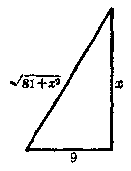

因为铅丝的全长是36寸，所以得

$$
9 + x + \sqrt {81 + x ^ {2}} = 36
$$.

这个方程的未知数\(x\)含在根号里。象这样根号里含有未知数的方程，叫做无理方程[^p307-1]。

例如，\(x=\sqrt{2x+3}\)，\(\sqrt{1-x}+\sqrt{12+x}=5\)，\(\sqrt[3]{x^{3}+1}=x+1\)，\(\sqrt{3x-1}+\frac{2}{\sqrt{3x-1}}=\sqrt{5x+3}\)等都是无理方程。但是方程\(\sqrt{2}x^{2}+3x-\sqrt{5}=0\)，\(\frac{x}{\sqrt{2}-1}+\frac{1}{x-2}=1\)等都不是无理方程，因为这些方程中根号里都不含有未知数。这两个方程中，前者是含有无理数系数的整式方程，后者是分式方程，也含有无理数系数。为了和无理方程区别起见，我们把以前所讲的整式方程和分式方程统称有理方程。

下面我们来研究无理方程的解法。

我们先来看下面的方程：

$$
x = \sqrt {2 x + 3}. \tag{1}
$$

为了把这个方程变形成有理方程，我们把方程（1）的两边平方，得

$$
x ^ {2} = 2 x + 3. \tag{2}
$$

解这个方程，

$$
x ^ {2} - 2 x - 3 = 0， \quad (x - 3) (x + 1) = 0，
$$

$$
\therefore x _ {1} = 3， x _ {2} = - 1
$$.

显然，x=3 和 x=-1 都是方程 （2） 的根。但是，它们是不是也都是方程 （1） 的根呢？

把\(x = 3\)代入方程（1），左边\(= 3\)，右边\(= \sqrt{6 + 3} = 3\)，所以\(x = 3\)是方程（1）的根。

[^p307-1]: ① 根号里含有未知数的“无理方程”，有的书上也把它叫做“根式方程”。

把\(x = -1\)代入方程（1），左边\(= -1\)，右边\(= \sqrt{-2 + 3} = 1\)，所以\(x = -1\)不是方程（1）的根，它是解方程过程中引进的增根。

为什么会引进增根呢？下面我们来研究产生增根的原因。

方程（1）就是

$$
x - \sqrt {2 x + 3} = 0
$$.

方程（2）就是\(x^{2} - (2x + 3) = 0\)，也就是

$$
(x - \sqrt {2 x + 3}) (x + \sqrt {2 x + 3}) = 0
$$.

比较这两个方程可以知道，方程（2）除了含有方程\(x - \sqrt{2x + 3} = 0\)的根之外，还有方程\(x + \sqrt{2x + 3} = 0\)的根。上面说过，\(x = 3\)是方程\(x - \sqrt{2x + 3} = 0\)的根。再看，把\(x = -1\)代入方程\(x + \sqrt{2x + 3} = 0\)，可知\(x = -1\)是方程\(x + \sqrt{2x + 3} = 0\)的根。因此，方程（2）除了含有方程\(x - \sqrt{2x + 3} = 0\)的根\(x = 3\)之外，还有方程\(x + \sqrt{2x + 3} = 0\)的根\(x = -1\)。

由此可知，增根\(x = -1\)是由于把方程（1）的两边平方引进的。因为把方程（1）的两边平方，实质上就是把方程\(x - \sqrt{2x + 3} = 0\)的两边同乘以\(x + \sqrt{2x + 3}\)，而得到方程\((x - \sqrt{2x + 3})(x + \sqrt{2x + 3}) = 0\)。

我们知道，把方程的两边同乘以一个代数式是可能引进增根的。

一般地说，如果把方程的两边都乘方相同的次数，那末就有产生增根的可能。

从上面的例子知道，解无理方程时，为了要使它变形成为有理方程，就需要把方程的两边都乘方相同的次数，这样就有产生增根的可能。因此，解无理方程时，必须把变形后所得有理方程的根，代入原方程进行检验，如果适合，那末它是原方程的根，如果不适合，它就是增根。

从上面所说的可以知道，解无理方程的一般步骤是：

（1） 把原方程适当的移项，然后把方程的两边都乘方相同的次数，使它变形成一个有理方程；

（2） 解这个有理方程；

（3） 把解有理方程所得的根，代入原方程中进行检验。适合的，就是所求的根。

#### 例1

解方程：\(\sqrt{3x^2 + x} + 2 = 4x\).

**【解】** 移项，得\(\sqrt{3x^2 + x} = 4x - 2\).

两边平方，得

$$
3 x ^ {2} + x = 16 x ^ {2} - 16 x + 4
$$.

整理后，得

$$
13 x ^ {2} - 17 x + 4 = 0， (x - 1) (13 x - 4) = 0
$$.

$$
\therefore x _ {1} = 1， x _ {2} = \frac{4}{13}
$$.

**【检验】** 把\(x = 1\)代入原方程，

左边\(= \sqrt{3 + 1} + 2 = 4\)，右边\(= 4 \times 1 = 4,\)

∴ x=1 是原方程的根。

把\(x = \frac{4}{13}\)代入原方程，

左边\(= \sqrt{3\left(\frac{4}{13}\right)^2 + \frac{4}{13} + 2} = \sqrt{\frac{100}{169} + 2} = 2\frac{10}{13}\)

右边\(= 4 \times \frac{4}{13} = 1\frac{3}{13}\)

∴\(x=\frac{4}{13}\)不是原方程的根，而是增根。

所以原方程的根是\(x = 1\)

**【说明】** 1. 计算\(\sqrt{\frac{100}{169}}\)应该取算术根\(\frac{10}{13}\)。如果取\(-\frac{10}{13}\)，那末左边\(= \frac{1}{13}\)，由此把\(x = \frac{4}{13}\)看做方程的根是错误的。

2. 解这无理方程的第一步是先移项，移项的目的是使两边平方后能变形成有理方程。如果不先移项而直接两边平方，那末会得到：\(3x^{2} + x + 4\sqrt{3x^{2} + x} + 4 = 16x^{2}\)，这样就达不到化去根号的目的，平方后得到的还是无理方程。这点应该注意。

##### 例 2

解方程：\(\sqrt{1-x}+\sqrt{12+x}=5\).

**【解】** 移项，得\(\sqrt{1 - x} = 5 - \sqrt{12 + x}\)。

平方，得\(1 - x = 25 - 10\sqrt{12 + x} + 12 + x\).

再移项，得\(10\sqrt{12 + x} = 2x + 36\)，就是

$$
5 \sqrt {12 + x} = x + 18
$$.

平方，得\(300 + 25x = x^2 + 36x + 324\).

$$
x ^ {2} + 11 x + 24 = 0， \quad (x + 3) (x + 8) = 0，
$$

$$
\therefore x _ {1} = - 3， x _ {2} = - 8
$$.

**【检验】** 把\(x = -3\)代入原方程，

左边\(= \sqrt{4} +\sqrt{9} = 5\)，右边\(= 5,\)

∴ x = -3 是原方程的根。

把\(x = -8\)代入原方程，

左边\(= \sqrt{9} +\sqrt{4} = 5\)，右边\(= 5,\)

∴ x = -8 是原方程的根。

所以原方程的根是\(x = -3\)和\(x = -8\)。

**【说明】** 1. 如果不先移项，直接平方，就得到

$$
1 - x + 2 \sqrt {(1 - x) (12 + x)} + 12 + x = 25，
$$

解起来就比较繁复。

2. 这题要平方两次才能化去根号。

##### 例3

解方程：

$$
\sqrt {2 x + 9} - \sqrt {x - 4} - \sqrt {x + 1} = 0
$$.

**【解】** 移项，得\(\sqrt{2x + 9} = \sqrt{x - 4} +\sqrt{x + 1}\)

平方，得

$$
2 x + 9 = x - 4 + 2 \sqrt {(x - 4) (x + 1)} + x + 1，
$$

整理，得

$$
2 \sqrt {(x - 4) (x + 1)} = 12， \quad \sqrt {(x - 4) (x + 1)} = 6，
$$

平方，得

$$
x ^ {2} - 3 x - 4 = 36， \quad x ^ {2} - 3 x - 40 = 0，
$$

$$
(x - 8) (x + 5) = 0，
$$

$$
\therefore x _ {1} = 8， x _ {2} = - 5
$$.

**【检验】** 把 x=8 代入原方程，左边\(= \sqrt{25} -\sqrt{4} -\sqrt{9} = 0\)，与右边相等，∴ x=8 是原方程的根。

把\(x = -5\)代入原方程，平方根号里的数是负数，负数的平方根没有意义，所以把它舍去。

所以原方程的根是\(x = 8\)

从这个例子我们可以看到，验根是解无理方程的必要步骤之一。但是，对于有些方程，根据根式的意义，可以直接判定它没有实数根，不必解方程后再行验根，这样可以简捷得多。

例如，根据算术根都不能是负数这一性质，我们立即可以看出下列的方程

$$
\sqrt {x + 2} = - 3， \sqrt {2 x + 3} + \sqrt {3 + 1} + 5 = 0
$$

都无解。

#### 习题7·14（1）

1. 下列关于\(x\)的方程中，哪些是无理方程？哪些不是无理方程？

（1）\((\sqrt{3} + 1)x^2 + \frac{x}{\sqrt{2} - 1} = 2;\)

（2）\(\sqrt{ax + b} = cx;\)

（3）\(\sqrt[3]{2} x^{2} - \sqrt[3]{3} x = 0;\)（4）\(\frac{1}{\sqrt{ax}} + \frac{x}{\sqrt{b}} = \sqrt{c}\)。

解下列各方程\((2\sim4)\)：

2. （1）\(x + \sqrt{x - 2} = 2\)；（2）\(2\sqrt{x - 3} = x - 6\)；

（3）\(5\sqrt{2x + 3} - 3 - 2x = 0;\)

（4）\(\sqrt{(x - 2)(x - 3)} - \sqrt{2} = 0;\)

（5）\(\sqrt{4x^2 + x + 10} = 2x + 1\).

3. （1）\(\sqrt{x + 10} + \sqrt{x - 11} = 7\)；（2）\(\sqrt{2x + 1} - \sqrt{x + 2} = 2\sqrt{3}\)；

（3）\(\sqrt{x^2 + 3x - 1} - \sqrt{x^2 - x - 1} = 2;\)

（4）\(x\sqrt{x^2 - 4} = x^2 + 2x\)；（5）\(\sqrt{x + 3\sqrt{x + 1}} - 3 = 0\)。

4. （1）\(\sqrt{4x + 5} + \sqrt{x + 1} = \sqrt{9x + 10}\)；

（2）\(\sqrt{3x + 1} +\sqrt{4x - 3} -\sqrt{5x + 4} = 0;\)

（3）\(\sqrt{x - 7} - \sqrt{x - 10} = \sqrt{x + 5} - \sqrt{x - 2};\)

（4）\(\sqrt{7x - 5} +\sqrt{4x - 1} = \sqrt{7x - 4} +\sqrt{4x - 2}\)

5. 不解方程，说明下列各方程为什么无解：

（1）\(\sqrt{x^2 + x - 6} = -2;\)

（2）\(\sqrt{5x + 3} + 4 = 0;\)

（3）\(\sqrt{2x - 3} + \sqrt{x + 4} = 0\)；

（4）\(\sqrt{x^3 - 9} + \sqrt{3x - 1} + 2 = 0\).

下面我们再举例说明几个比较复杂一些的无理方程的解法。

##### 例4

解方程：\(x - \sqrt[3]{x^3 - 4x - 7} = 1\).

**【解】** 移项，得\(\sqrt[3]{x^3 - 4x - 7} = x - 1\).

两边都立方，得

$$
x ^ {3} - 4 x - 7 = x ^ {3} - 3 x ^ {2} + 3 x - 1，
$$

$$
3 x ^ {2} - 7 x - 6 = 0， (x - 3) (3 x + 2) = 0，
$$

$$
\therefore x _ {4} = 3， x _ {2} = - \frac{2}{3}
$$.

检验后知道，它们都是原方程的根。

**【说明】** 如果不移项，直接乘立方，那末会得出

$$
x ^ {3} - 3 x ^ {2} \sqrt[3]{x ^ {3} - 4 x - 7} + 3 x (\sqrt[3]{x ^ {3} - 4 x - 7}) ^ {2}
$$

$$
- (x ^ {3} - 4 x - 7) = 1
$$.

这样，不仅计算繁复，并且没有化去根号，无从求解。

##### 例5

解方程：

$$
2 x ^ {2} + 3 x + 3 = 5 \sqrt {2 x ^ {2} + 3 x + 9}
$$.

**【审题】** 如果把方程的两边平方，那末会得出\(x\)的四次方程；一般不能解，即使能解，也很繁琐。可是我们观察一下，在被开方数\(2x^{2} + 3x + 9\)和左边的有理式\(2x^{2} + 3x + 3\)中，二次项和一次项都是相同的，只有常数项不同，我们可以设法把\(2x^{2} + 3x + 3\)变形成为\((2x^{2} + 3x + 9) - 6\)，这样，就可以利用换元法来解。

**【解】** 原方程变形成为

$$
(2 x ^ {2} + 3 x + 9) - 6 = 5 \sqrt {2 x ^ {2} + 3 x + 9}
$$.

设\(\sqrt{2x^2 + 3x + 9} = y\)，那末\(2x^2 + 3x + 9 = y^3\)，原方程变为

$$
y ^ {2} - 6 = 5 y，
$$

就是\(y^{2} - 5y - 6 = 0,\)

$$
\therefore y _ {1} = 6， y _ {2} = - 1
$$.

当\(y = 6\)时，

$$
\sqrt {2 x ^ {2} + 3 x + 9} = 6，
$$

$$
2 x ^ {2} + 3 x + 9 = 36， \quad 2 x ^ {2} + 3 x - 27 = 0，
$$

$$
(x - 3) (2 x + 9) = 0，
$$

$$
\therefore x _ {1} = 3， x _ {2} = - \frac{9}{2}
$$.

当\(y = -1\)时，

$$
\sqrt {2 x ^ {3} + 3 x + 9} = - 1
$$.

根据算术根的规定，\(\sqrt{2x^2 + 3x + 9} = -1\)是不可能的，所以这个方程不必去解。

**【检验】** 把\(x = 3, x = -\frac{9}{2}\)分别代入\(\sqrt{2x^2 + 3x + 9} = 6\)，都适合，所以它们都是原方程的根。

所以原方程的根是\(x = 3, x = -\frac{9}{2}\)。

**【说明】** 1. 检验时为了简便起见，只要把求得的根代入方程\(\sqrt{2x^2 + 3x + 9} = 6\)

中，不必代入原方程。

2. 解题时遇有象\(\sqrt{2x^2 + 3x + 9} = -1\)这种情况时，只需说明方程无解，不必再做下去。

解下列各方程\((1\sim4)\)：

1. （1）\(\sqrt[3]{x^3 + 1} = x + 1\)；

（2）\(\sqrt[3]{3 - \sqrt{x + 1}} + \sqrt[3]{2} = 0\).

2. （1）\(\sqrt{x + 1} + \frac{x - 6}{\sqrt{x + 1}} = 0\)；

（2）\(\frac{1}{\sqrt{x + 1}} - \frac{1}{\sqrt{x - 1}} + \frac{1}{\sqrt{x^2 - 1}} = 0;\)

（3）\(\frac{\sqrt{x + 3} + \sqrt{x - 5}}{\sqrt{x + 3} - \sqrt{x - 5}} = 2\).【提示：先把分母有理化。】

3. （1）\(x^{2} + 8x + \sqrt{x^{2} + 8x} = 1.2\)；

（2）\(x^{2} - 5x + 2\sqrt{x^{2} - 5x + 3} = 12;\)

（3）\(6\sqrt{x^2 - 2x + 6} = 21 + 2x - x^2;\)

（4）\(3x^{2} + 15x + 2\sqrt{x^{2} + 5x + 1} = 2;\)

【提示：移项后，把\(3x^{2} + 1.5x - 2\)变形成\(3(x^{2} + 5x + 1) - 5\).】

（5）\(4x^{2} - 10x - \sqrt{2x^{2} - 5x + 2} - 17;\)

（6）\(\sqrt{\frac{2x + 2}{x + 2}} -\sqrt{\frac{x + 2}{2x + 2}} = \frac{7}{12}\).【提示：设\(\sqrt{\frac{2x + 2}{x + 2}} = y\).】

4 （1）\(2\sqrt[3]{x^2} + \sqrt[3]{x} - 3 = 0\)；（2）\(\sqrt{x - 3} + 6 = 5\sqrt[4]{x - 3}\)。

5. 作一个数，它的平方根比它倒数的平方根的10倍多3，求这个数。

### 本章提要

1. 一元二次方程的分类

$$
a x ^ {2} + b x + c = 0 \left\{ \begin{array}{ll} {\text {完全的} b \neq 0， c \neq 0， a x ^ {2} + b x + c = 0，} \\ {\text {不完全的} \left\{ \begin{array}{ll} {b = 0 \left\{ \begin{array}{ll} {c \neq 0， a x ^ {2} + c = 0，} \\ {c = 0， a x ^ {2} = 0，} \end{array} \right.} \\ {b \neq 0， c = 0， a x ^ {2} + b x = 0.} \end{array} \right.} \end{array} \right.
$$

2. 方程\(ax^2 + bx + c = 0 (a \neq 0)\)的根的公式

$$
x = \frac{- b \pm \sqrt {b ^ {2} - 4 a c}}{2 a} \quad (b ^ {2} - 4 a c \geqslant 0)
$$。

3. 方程\(ax^2 + bx + c = 0 (a \neq 0)\)的根的判别式

$$
\Delta = b ^ {2} - 4 a c
$$.

| 判别式 | 方程的根 |
| --- | --- |
| \( \Delta >0 \) | 两个不相等的实数根 |
| \( \Delta = 0 \) | 两个相等的实数根 |
| \( \Delta < 0 \) | 没有实数根 |

4. 方程\(ax^2 + bx + c = 0 (a \neq 0)\)的根与系数的关系（韦达定理）。

设\(ax^2 + bx + c = 0 (a \neq 0)\)的根是\(x_1\)和\(x_2\)，那末

$$
x _ {1} + x _ {2} = - \frac{b}{a}， \quad x _ {1} x _ {2} = \frac{a}{a}
$$.

（逆命题也成立。）

5. 二次三项式\(ax^2 + bx + c (a \neq 0)\)的因式分解

设\(ax^2 + bx + c\)的根是\(x_1\)和\(x_2\)，那末

$$
a x ^ {2} + b x + c = a (x - x _ {1}) (x - x _ {2})
$$。

6. 简单高次方程的解法

解题的基本思想是：

高次方程\(\xrightarrow{\text{降次}}\)一次方程或二次方程。

解题方法是：

（1） 因式分解法；

（2） 换元法。

7. 分式方程的解法

解题的基本思想是：

分式方程\(\xrightarrow{\text{去分母}}\)整式方程

8. 无理方程的解法

解题的基本思想是：

无理方程\(\xrightarrow{\text{去根号}}\)有理方程

解题步骤是：

（1） 先把原方程变形成有理方程（两边乘同次方，或用换元法）；

（2） 解所得的有理方程；

（3） 必须检验。

### 复习题七A

1. 在一元二次方程\(ax^2 + bx + c = 0\)中\((a \neq 0)\)，

（1） 当\(b = 0\)时，用什么方法来解比较方便？这时\(a\)和\(c\)的符号应该怎样，方程才有实数根？在什么情况下，方程没有实数根？

（2） 当\(c = 0\)时，用什么方法来解比较方便？这时方程的根是什么？

2. 解下列各方程：

（1）\(\sqrt{3} (x^2 - x) = \sqrt{2} (x^2 + x)\)；

（2）\((x + 1)(x - 1) = 2\sqrt{2} x;\)（3）\((x - 1)(x - 3) = (2x - 1)^{2};\)

（4）\((x - 2)^{2}(x - 7) = (x + 2)(x - 3)(x - 6)\)；

（5）\(\left(x - \frac{1}{2}\right)\left(x - \frac{1}{3}\right) + \left(x - \frac{1}{3}\right)\left(x - \frac{1}{4}\right) = \left(x - \frac{1}{4}\right)\left(x - \frac{1}{5}\right)\)。

3.\(x\)是什么数值时，代数式\(2x^{2} - x + 1\)与

（1）\(2x + 6\)相等？

（2）\(\frac{1}{2x^2 - x + 1}\)相等？

（3）\(\sqrt{2x^2 - x + 3}\)相等？

4. k 是什么数值时，下列方程有两个相等的实数根？

（1）\((k + 2)x^{2} + 6kx + 4k + 1 = 0;\)

（2）\(x^{2} + 2(k - 4)x + k^{2} + 6k + 3 = 0\).

5.\(m\)是什么数值时，方程\(2(m + 1)x^{2} + 4mx + 3m - 2 = 0\)（1）有两个相等的实数根？（2）有一个根等于零？（3）两个根是互为相反的数？

6. 分解下列各式成\(x\)的四个一次因式的积：

（1）\((x^{2}-5x)^{2}\div10(x^{2}-5x)+24;\)

（2）\(x^{4} - (a^{2} + b^{2})x^{2} + a^{2}b^{2}\)。

7. 解下列方程：

（1）\((x^{2} - x)^{2} - 4(2x^{2} - 2x - 3) = 0;\)

【提示：把\(4(2x^{2} - 2x - 3)\)变形成\(8(x^{2} - x) + 12\)，再利用换元法解。】

（2）\((x^{2} + 5x + 4)(x^{2} + 5x + 6) = 120\).

【提示：设\(x^{2} + 5x = y\)。】

8. 解下列各方程：

（1）\(\frac{x(x - 2)}{x + 2} = \frac{3(x - 2)}{x + 2};\)

（2）\(\frac{x^2 + 3x}{x^2 - 5} = \frac{x^2 - 5}{x^2 + 3x}\)

（3）\(\frac{4}{x + 5} - \frac{3}{x + 4} = \frac{2}{x + 3} - \frac{1}{x + 2}\)；

（4）\(\frac{x + 7}{2x^2 - 7x + 3} + \frac{x}{x^2 - 2x - 3} + \frac{x + 3}{2x^2 + x - 1} = 0\).

9. 解下列关于\(x\)的方程：

（1）\(x^{2} - 4ax + 4a^{2} - b^{2} = 0;\)

（2）\(\frac{1}{x} - \frac{1}{a} - \frac{1}{b} = \frac{1}{x - a - b}\)（\(ab \neq 0, a + b \neq 0\)）。

10. 解下列各方程：

（1）\(x\sqrt{x^2 - 4} = x^2 + 2x;\)

（2）\(\sqrt{x} + \sqrt{x - \sqrt{1 - x}} = 1\)；

（3）\(\frac{\sqrt{x + 1} - \sqrt{x - 1}}{\sqrt{x + 1} + \sqrt{x - 1}} = 2 - x;\)

（4）\(\sqrt{1 + \frac{9}{x}} + \sqrt{\frac{x}{x + 9}} = 2.05\).

11. 要做一个容积是 750 立方厘米、高 6 厘米、底面的长比宽多 4 厘米的长方体匣子，底面的长和宽应该各是多少？（精确到 0.1 厘米。）

12. 甲、乙两队学生，到离校1.4公里的地方去劳动，甲队比乙队每小时多走0.7公里，所以早到4分钟。两队学生每小时的速度各是多少公里？

13. 一个两位数，它的个位上的数比十位上的数大1，如果把个位上的数与十位上的数互相交换，那末所得的新数的倒数比原数的倒数小\(\frac{1}{28}\)，求这个两位数。

14. 一汽船在顺流中航行46公里和逆流中航行34公里所需的时间，恰好等于它在静水中航行80公里所需的时间。已知水流的速度是每小时2公里，求汽船在静水中航行的速度。

### 复习题七B

1. 解下列各方程：

（1）\(\frac{8x^2 - 3}{5} + \frac{9x^2 - 5}{4} = 2;\)

（2）\(x^{2} - (4 - \sqrt{2})x + \sqrt{2} - 1 = 0;\)

（3）\((2x - 3)^{4} - 6(2x - 3)^{2} + 9 = 0;\)

（4）\((x^{2} - x)^{2} - 4(2x^{2} - 2x - 3) = 0;\)

（5）\((x^{2} + 3x + 4)(x^{2} + 3x + 5) = 6;\)

（6）\((x + 1)(x + 2)(x + 3)(x + 4) + 1 = 0\).

2. m 取什么数值时，方程\(x^{2}+(2m+1)x+(m-2)^{2}=0\)（1） 有两个不相等的实数根；（2） 有两个相等的实数根；（3） 没有实数根；

（4）两个根，它们的乘积等于1.

3. 证明方程\(x^{2} - (2m - 1)x - m^{2} - m = 0\)（\(m\)为任意实数）必定有实数根。

4. 证明方程\((x - a)(x - a - b) - 1 = 0\)有两个不相等的实数根。

5. 设\(x_{1}, x_{2}\)是方程\(x^{2} - 3x - 1 = 0\)的两个根，求下列各式的值：

（1）\(x_{1}^{2} + x_{2}^{2}\)；

（2）\(\frac{x_2}{x_1} + \frac{x_1}{x_2}\)；

（3）\(x_{1}^{3} + x_{2}^{3}\)；

（4）\(x_{1}^{4} + x_{2}^{4}\)。

6. （1） 求作一个一元二次方程，使它的根是方程\(ax^2 + bx + c = 0\)的根的倒数，相反数，\(k\)倍；

（2） 求作一个一元二次方程，使它的两个根各比方程\(ax^2 + bx + c = 0\)的两个根大\(k\)。

7. 已知关于\(x\)的方程\(a(2x + 3) + b(3x - 2) = 12x + 5\)有无数多个解，求\(a\)和\(b\)的值。

【提示：任取方程的两个解，代入方程，求 a、b 的值。】

8. 如果方程\(ax^2 + bx + c = 0\)的两个根的比为 2：3，求证\(6b^2 = 25ac\)。

9. 解下列关于\(x\)的方程：

（1）\(a^2 b^2 x^4 - (a^4 + b^4)x^2 + a^2 b^2 = 0\)（\(a \neq 0, b \neq 0\)）；

（2）\(\sqrt{a - x} + \sqrt{x - b} = \sqrt{a - b}\)\((a > b)\)。

10. 解下列各方程：

（1）\(\frac{8(x^2 + 2x)}{x^2 - 1} + \frac{3(x^2 - 1)}{x^2 + 2x} = 11;\)

（2）\((x - 3)^{2} + \sqrt{x^{2} - 6x + 16} = 13;\)

（3）\(x^{2} + 3 - \sqrt{2x^{2} - 3x + 2} = \frac{3}{2} (x + 1)\)；

（4）\(\sqrt[4]{3x^2 + 13} + \sqrt{3x^2 + 13} = 6;\)

（5）\((x - 1)^{\frac{1}{2}} - 2(x - 1)^{\frac{1}{4}} = 15\)；（6）\(x - 3x^{\frac{1}{2}} - 10 = 0\)；

（7）\(8x^{\frac{5}{2}} - 65x^{\frac{3}{2}} + 8 = 0;\)（8）\(1 + 8x^{\frac{6}{3}} + 9\sqrt[3]{x^3} = 0\).

【提示：第（6）题中设\(x^{\frac{1}{2}}=y\)；第（7）题中设\(x^{\frac{6}{3}}=y\)。】

11. 一个木工生产小组准备用6立方米杉木做课桌椅若干套。如果每套课桌椅节约\(\frac{1}{55}\)立方米杉木，那末就能多做3套。原计划做多少套？

12. 一个泥工小组，砌一道砖墙，原计划在一定日期里砌20000块砖，按原计划工作2天后，由于改进了技术，结果每天比原计划多砌2000块砖，因此提前1天完成，原计划每天砌多少块砖？实际砌了几天？

【提示：设原计划每天砌\(x\)块砖，再根据天数的等量关系列方程。】

13. 有连续的三个正整数，最大数的立方与最小数的立方之差，比中间一个数的 40 倍大 16. 求这三个数。

14. 有液体纯农药一桶，倒出8升后，用水冲满一桶。后来又倒出混合液（冲淡后的农药）4升，再用水冲满。经过测定，这时桶内的农药与水的比为18：7，求这桶的容积多少升？

### 第七章测验题

1. 解下列各方程：

$$
\checkmark (1) (2 x + 1) ^ {2} + (x - 2) ^ {2} - (2 x + 1) (x - 2) = 43；
$$

（2）\(\frac{3}{x^2 - 3x + 2} - \frac{1}{x^2 - x} = \frac{1}{x - 2} + \frac{4}{x^2 - 2x}\)；

（3）\(\sqrt{2x - 5} + \sqrt{x - 3} = \sqrt{3x + 4}\)；

（4）\(\sqrt{x + 5} + \frac{3}{\sqrt{x + 5}} = \sqrt{3x + 4};\)

（5）\(2\left(x^{2} + \frac{1}{x^{2}}\right) - 3\left(x + \frac{1}{x}\right) = 1;\)

（6）\(2x^{2} - 14x - 3\sqrt{x^{2} - 7x + 10} + 18 = 0\).

2. 如果\(2 + \sqrt{3}\)是方程\(x^{2} - 4x + c = 0\)的一个根，求方程的一个根，并求\(c\)的值。

3. 设\(x_{1}, x_{2}\)是方程\(2x^{2} - 6x + 3 = 0\)的两个根，不解方程，求下列各式的值：

（1）\(x_{1}^{2}x_{2} + x_{1}x_{2}^{2};\)

（2）\((x_{1} - x_{2})^{2}\)。

4.\(k\)取什么数值时，方程\(4x^{2} - (k + 2)x + k - 1 = 0\)有两个相等的实数根？并求出这时方程的根。

5. 证明方程\((x - 1)(x - 2) = h^2\)有两个不相等的实数根。

6. 已知 1 与 2 都是方程\(a(x - 1)^2 = 3b + x(ax - 8)\)的根，求\(a\)与\(b\)的值。

7. 大、小两台抽水机给一块地浇水，两台合浇了2小时以后，由小抽水机继续独浇了1小时才浇完。已知小抽水机独浇这块田所需的时间是大抽水机独浇所需时间的1.5倍，求大、小两台抽水机单独浇这块田各需多少小时？

8. 证明方程\((x + a)(x + b) + (x + b)(x + c) + (x + c)(x + a) = 0\)必定有实数根。

## 第8章 二元二次方程组

### § 8·1 二元二次方程组

我们来看下面两个问题：

（1） 已知直角三角形的斜边长 25 尺，两条直角边的和等于 31 尺，求两条直角边的长。

设一条直角边是\(x\)尺，另一条直角边是\(y\)尺（图8·1），那末根据题意得到方程组：

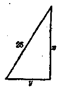

$$
\left\{ \begin{array}{l} x + y = 31， \\ x ^ {2} + y ^ {2} = 25 ^ {2}. \end{array} \right. \tag{1}
$$

解这个方程组，就可以求得两条直角边的长。

（2） 两个正整数，它们的积是 221。如果一个数减去 4，另一个数加上 2，那末它们的积就等于 171，求这两个数。

设一个数为\(x\)，另一个数为\(y\)，那末根据题意得到方程组：

$$
\left\{ \begin{array}{l} x y = 221， \\ (x - 4) (y + 2) = 171. \end{array} \right.
$$

整理后，得

$$
\left\{ \begin{array}{l} x y = 221， \\ x y + 2 x - 4 y = 179. \end{array} \right. \tag{3}
$$

解这个方程组，就可以求得这两个数。

从上面两个问题得出的方程组来看，每个方程里都含有两个未知数\(x\)和\(y\)，第一个方程组里的方程（1），含有未知数的项的次数都是1；第一个方程组里的方程（2）和第二个方程组里的方程（3），含有未知数的项的次数都是2；第二个方程组里的方程（4），含有未知数的项的最高次数是2.

象这样，一个含有两个未知数，并且各项中含未知数项的最高次数是 2 的整式方程，叫做二元二次方程。例如，上面的方程（2），（3）和（4）都是二元二次方程。

二元二次方程的一般形式是：

$$
a x ^ {2} + b x y + c y ^ {2} + d x + e y + f = 0，
$$

这里，a，b，e 至少要有一个不是零，其中\(ax^{2}\)，bxy 和\(ey^{2}\)叫做二次项，dx 和 ey 叫做一次项，f 叫做常数项。

**【说明】**

根据定义，二元二次方程是含未知数的项的最高次数为2的方程，因此，它的一般形式中除了有二次项外，还应该包含有低于2次的项，即应包含一次项和常数项，所以有上面的形式。

由（相同未知数的）一个二元一次方程和一个二元二次方程，或者由两个二元二次方程所组成的方程组，叫做二元二次方程组。

二元二次方程组有两种类型：

（1） 第一种类型的二元二次方程组 例如，问题（1）中所列出的方程组是由一个二元一次方程和一个二元二次方程所组成的，它是第一种类型的二元二次方程组。这种方程组的一般形式是：

$$
\left\{ \begin{array}{l} m x + n y + p = 0 \quad (m， n \text {不都是零})， \\ a x ^ {2} + b x y + c y ^ {2} + d x + e y + f = 0 \quad (a， b， c \text {不都是零})。 \end{array} \right.
$$

（2） 第二种类型的二元二次方程组 例如问题 （2） 中所列出的方程组是由两个二元二次方程所组成的，它是第二种类型的二元二次方程组。这种方程组的一般形式是：

\(\therefore m = \frac{3}{11}\)

\(\therefore m = \frac{3}{11}\)

\(\therefore m = \frac{3}{11}\)

\(\therefore m = \frac{3}{11}\)

$$
\left\{ \begin{array}{l} a _ {1} x ^ {2} + b _ {1} x y + c _ {1} y ^ {2} + d _ {1} x + e _ {1} y + f _ {1} = 0 \\ (a _ {1}， b _ {1}， c _ {1} \text {不都是零})， \\ a _ {2} x ^ {2} + b _ {2} x y + c _ {2} y ^ {2} + d _ {2} x + e _ {2} y + f _ {2} = 0 \\ (a _ {2}， b _ {2}， c _ {2} \text {不都是零})。 \end{array} \right.
$$

\(\therefore m = \frac{3}{11}\)

\(\therefore m = \frac{3}{11}\)

\(\therefore m = \frac{3}{11}\)

\(\therefore m = \frac{3}{11}\)

下面我们将分别研究这两种类型的二元二次方程组的解法。

\(\therefore m = \frac{3}{11}\)

\(\therefore m = \frac{3}{11}\)

\(\therefore m = \frac{3}{11}\)

\(\therefore m = \frac{3}{11}\)

\(\therefore m = \frac{3}{11}\)

\(\therefore m = \frac{3}{11}\)

\(\therefore m = \frac{3}{11}\)

1. 下列各方程是几元几次方程？

\(\therefore m = \frac{3}{11}\)

（1）\(3x + 5y = 4;\)

（2）\(xy = 1\)；

\(\therefore m = \frac{3}{11}\)

\(\therefore m = \frac{3}{11}\)

\(\therefore m = \frac{3}{11}\)

（3）\(2x^{2} - y = 7x + 5;\)

（4）\(9y^{2} - 2x = 0;\)

\(\therefore m = \frac{3}{11}\)

\(\therefore m = \frac{3}{11}\)

\(\therefore m = \frac{3}{11}\)

（5）\(5 - 8y^{2} = 3y;\)

（6）\(3x^{2} - xy = 4y^{2} - 2y + 1\).

\(\therefore m = \frac{3}{11}\)

\(\therefore m = \frac{3}{11}\)

2. 下列\(x\)和\(y\)的值是不是方程组\(\left\{ \begin{array}{l} x + y = 7, \\ x^2 + y^2 = 25 \end{array} \right.\)的解？为什么？

\(\therefore m = \frac{3}{11}\)

\(\therefore m = \frac{3}{11}\)

\(\therefore m = \frac{3}{11}\)

\(\therefore m = \frac{3}{11}\)

（1）\(x = 3, y = 4\)；

（2）\(x = 4, y = 3\)；

\(\therefore m = \frac{3}{11}\)

（3）\(x = 2, y = 5\)；

（4）\(x = -3, y = -4\)。

\(\therefore m = \frac{3}{11}\)

\(\therefore m = \frac{3}{11}\)

\(\therefore m = \frac{3}{11}\)

### § 8·2 由一个二元一次方程和一个二元二次方程所组成的方程组的解法

\(\therefore m = \frac{3}{11}\)

\(\therefore m = \frac{3}{11}\)

\(\therefore m = \frac{3}{11}\)

\(\therefore m = \frac{3}{11}\)

我们来解下面的方程组：

\(\therefore m = \frac{3}{11}\)

$$
\left\{ \begin{array}{l} 3 x + y = 2， \\ x ^ {2} + 2 x y + 3 y ^ {2} - 3 x + 1 = 0. \end{array} \right. \tag{1}
$$

\(\therefore m = \frac{3}{11}\)

\(\therefore m = \frac{3}{11}\)

过去我们曾经用代入法解过二元一次方程组，并且知道解方程组的基本方法是消元。很明显，上面这个方程组也可以利用代入消元法来解。

\(\therefore m = \frac{3}{11}\)

\(\therefore m = \frac{3}{11}\)

我们求解下面的方程组：

\(\therefore m = \frac{3}{11}\)

\(\therefore m = \frac{3}{11}\)

$$
\left\{ \begin{array}{l} 3 x + y = 2， \\ x ^ {2} + 2 x y + 3 y ^ {2} - 3 x + 1 = 0. \end{array} \right. \tag{1}
$$

\(\therefore m = \frac{3}{11}\)

由（1）得

过去我们曾经用代入法解过二元一次方程组，并且知

\(\therefore m = \frac{3}{11}\)

\(\therefore m = \frac{3}{11}\)

$$
y = 2 - 3 x. \tag{3}
$$

道解方程组的基本方法是消元。很明显，上面这个方程组

把（3）代入（2），得

\(\therefore m = \frac{3}{11}\)

也可以利用代入消元法来解。

\(\therefore m = \frac{3}{11}\)

$$
x ^ {2} + 2 x (2 - 3 x) + 3 (2 - 3 x) ^ {2} - 3 x + 1 = 0
$$.

\(\therefore m = \frac{3}{11}\)

由（1）得

化简后得

\(\therefore m = \frac{3}{11}\)

\(\therefore m = \frac{3}{11}\)

\(\therefore m = \frac{3}{11}\)

\(\therefore m = \frac{3}{11}\)

\(\therefore m = \frac{3}{11}\)

\(\therefore m = \frac{3}{11}\)

\(\therefore m = \frac{3}{11}\)

\(\therefore m = \frac{3}{11}\)

\(\therefore m = \frac{3}{11}\)

\(\therefore m = \frac{3}{11}\)

\(\therefore m = \frac{3}{11}\)

\(\therefore m = \frac{3}{11}\)

\(\therefore m = \frac{3}{11}\)

\(\therefore m = \frac{3}{11}\)

\(\therefore m = \frac{3}{11}\)

\(\therefore m = \frac{3}{11}\)

\(\therefore m = \frac{3}{11}\)

\(\therefore m = \frac{3}{11}\)

\(\therefore m = \frac{3}{11}\)

\(\therefore m = \frac{3}{11}\)

\(\therefore m = \frac{3}{11}\)

\(\therefore m = \frac{3}{11}\)

\(\therefore m = \frac{3}{11}\)

\(\therefore m = \frac{3}{11}\)

\(\therefore m = \frac{3}{11}\)

\(\therefore m = \frac{3}{11}\)

\(\therefore m = \frac{3}{11}\)

\(\therefore m = \frac{3}{11}\)

\(\therefore m = \frac{3}{11}\)

\(\therefore m = \frac{3}{11}\)

\(\therefore m = \frac{3}{11}\)

\(\therefore m = \frac{3}{11}\)

\(\therefore m = \frac{3}{11}\)

\(\therefore m = \frac{3}{11}\)

\(\therefore m = \frac{3}{11}\)

\(\therefore m = \frac{3}{11}\)

\(\therefore m = \frac{3}{11}\)

\(\therefore m = \frac{3}{11}\)

\(\therefore m = \frac{3}{11}\)

\(\therefore m = \frac{3}{11}\)

\(\therefore m = \frac{3}{11}\)

\(\therefore m = \frac{3}{11}\)

\(\therefore m = \frac{3}{11}\)

\(\therefore m = \frac{3}{11}\)

\(\therefore m = \frac{3}{11}\)

\(\therefore m = \frac{3}{11}\)

\(\therefore m = \frac{3}{11}\)

\(\therefore m = \frac{3}{11}\)

\(\therefore m = \frac{3}{11}\)

\(\therefore m = \frac{3}{11}\)

\(\therefore m = \frac{3}{11}\)

\(\therefore m = \frac{3}{11}\)

\(\therefore m = \frac{3}{11}\)

\(\therefore m = \frac{3}{11}\)

\(\therefore m = \frac{3}{11}\)

\(\therefore m = \frac{3}{11}\)

\(\therefore m = \frac{3}{11}\)

\(\therefore m = \frac{3}{11}\)

\(\therefore m = \frac{3}{11}\)

$$
22 x ^ {2} - 35 x + 13 = 0， \tag{4}
$$

$$
22 x ^ {2} - 35 x + 13 = 0， \tag{4}
$$

$$
y = 2 - 3 x. \tag{3}
$$

把（3）代入（2），得

\(\therefore m = \frac{3}{11}\)

\(\therefore m = \frac{3}{11}\)

\(\therefore m = \frac{3}{11}\)

\(\therefore m = \frac{3}{11}\)

\(\therefore m = \frac{3}{11}\)

\(\therefore m = \frac{3}{11}\)

\(\therefore m = \frac{3}{11}\)

\(\therefore m = \frac{3}{11}\)

\(\therefore m = \frac{3}{11}\)

\(\therefore m = \frac{3}{11}\)

\(\therefore m = \frac{3}{11}\)

\(\therefore m = \frac{3}{11}\)

\(\therefore m = \frac{3}{11}\)

\(\therefore m = \frac{3}{11}\)

\(\therefore m = \frac{3}{11}\)

\(\therefore m = \frac{3}{11}\)

\(\therefore m = \frac{3}{11}\)

\(\therefore m = \frac{3}{11}\)

\(\therefore m = \frac{3}{11}\)

\(\therefore m = \frac{3}{11}\)

\(\therefore m = \frac{3}{11}\)

\(\therefore m = \frac{3}{11}\)

\(\therefore m = \frac{3}{11}\)

\(\therefore m = \frac{3}{11}\)

\(\therefore m = \frac{3}{11}\)

\(\therefore m = \frac{3}{11}\)

\(\therefore m = \frac{3}{11}\)

\(\therefore m = \frac{3}{11}\)

$$
x ^ {2} + 2 x (2 - 3 x) + 3 (2 - 3 x) ^ {2} - 3 x + 1 = 0
$$.

就是\((x - 1)(22x - 13) = 0\).（5）

解这个方程，得

$$
x = 1 \quad \text {或} \quad x = \frac{13}{22}
$$.

把\(x = 1\)代入（3），得

$$
y = - 1；
$$

把\(x = \frac{13}{22}\)代入（3），得

$$
y = \frac{5}{22}
$$.

由此即得原方程组的解是

$$
\left\{ \begin{array}{l} x = 1， \\ y = - 1， \end{array} \right. \quad \left\{ \begin{array}{l} x = \frac{13}{22}， \\ y = \frac{5}{22}. \end{array} \right.
$$

从上面这个例子的解法中可以看到：解由一个二元一次方程和一个二元二次方程所组成的二元二次方程组，一般都可以采取以下的步骤：

（1） 把二元一次方程里的一个未知数用另一个未知数的代数式来表示，就是得到两个未知数的关系式；

（2） 把这个关系式代到二元二次方程里，得到一个一元方程；

（3） 解这个一元方程，求得一个未知数的值；

（4） 把所求得的值代入第一步所得到的关系式里，求得另一个未知数的值；

（5） 把所求得的一个未知数的值和相应的另一个未知数的值按组写在一起，就是原方程组的解。

#### 例 1

解 §8·1 中问题（1）列出的方程组：

$$
\left\{ \begin{array}{l} x + y = 31， \\ x ^ {2} + y ^ {2} = 25 ^ {2}. \end{array} \right. \tag{1}
$$

并求出这个问题的答案。

**【解】** 从（1），得

$$
y = 31 - x. \tag{3}
$$

把（3）代入（2），得

$$
x ^ {2} + (31 - x) ^ {2} = 625
$$.

整理后，得

$$
2 x ^ {2} - 62 x + 336 = 0， \quad x ^ {2} - 31 x + 168 = 0，
$$

$$
(x - 7) (x - 24) = 0，
$$

$$
\therefore x _ {1} = 7， x _ {2} = 24
$$.

把\(x_{1} = 7\)代入（3），得

$$
y _ {1} = 24；
$$

把\(x_{2} = 24\)代入（3），得

$$
y _ {2} = 7
$$.

∴ 这个方程组的解是

$$
\left\{ \begin{array}{l} x _ {1} = 7， \\ y _ {1} = 24； \end{array} \right. \quad \left\{ \begin{array}{l} x _ {2} = 24， \\ y _ {2} = 7. \end{array} \right.
$$

因为一条直角边是7尺，另一条直角边是24尺的直角三角形和一条直角边是24尺，另一条直角边是7尺的直角三角形，实际上是同一个直角三角形，所以就这个应用问题讲，只需回答两条直角边分别是7尺和24尺。

##### 例2

解方程组：

$$
\left\{ \begin{array}{l} x - 3 y - 2 = 0， \\ x ^ {2} - 2 x y - 3 y ^ {2} + 2 x - 3 y + 14 = 0. \end{array} \right. \tag{1}
$$

**【解】** 从（1），得

$$
x = 3 y + 2. \tag{3}
$$

把（3）代入（2），得

$$
(3 y + 2) ^ {2} - 2 (3 y + 2) y - 3 y ^ {3} + 2 (3 y + 2) - 3 y + 14 = 0
$$.

整理后，得

$$
11 y + 22 = 0，
$$

$$
\therefore y = - 2
$$.

把\(y = -2\)代入（3），得

$$
x = - 4
$$.

∴ 原方程组有一个解是

$$
\left\{ \begin{array}{l} x = - 4， \\ y = - 2. \end{array} \right.
$$

1. 在上面的例2中，如果用\(x\)的代数式来表示\(y\)，能不能解？对于这个例题来说，用哪一个未知数的代数式来表示另一个未知数，解方程组比较简便？

2. 在上面的例1中，求得\(x_{1} = 7\)，\(x_{2} = 24\)后，如果把\(x_{1} = 7\)代入（2），得

$$
y ^ {2} = 625 - 49 = 576，
$$

$$
\therefore y = \pm 24
$$.

把\(x_{2} = 24\)代入（2），得

$$
y ^ {2} = 625 - 576 = 49，
$$

$$
\therefore y = \pm 7
$$.

这样，方程组的解是

$$
\left\{ \begin{array}{ll} x = 7， \\ y = 24； \end{array} \right. \quad \left\{ \begin{array}{ll} x = 7， \\ y = - 24； \end{array} \right. \quad \left\{ \begin{array}{ll} x = 24， \\ y = 7； \end{array} \right. \quad \left\{ \begin{array}{ll} x = 24， \\ y = - 7. \end{array} \right.
$$

这样的解法正确吗？

解下列各方程组\((3\sim7)\)：

3. （1）\(\left\{ \begin{array}{l} x + y = 7, \\ xy = 10; \end{array} \right.\)

（2）\(\left\{ \begin{array}{l} x + y = 2, \\ x^2 + y^2 = 10; \end{array} \right.\)

（3）\(\left\{ \begin{array}{l} y = x + 5, \\ x^2 + y^2 = 625; \end{array} \right.\)

（4）\(\left\{ \begin{array}{l} x - 2y = 1, \\ x^2 - 4y^2 - 5 = 0. \end{array} \right.\)

4. （1）\(\left\{ \begin{array}{l} x^{2} + xy = 2, \\ y - 3x = 7; \end{array} \right.\)

（2）\(\left\{ \begin{array}{l} 7x^{2} - 6xy - 8 = 0, \\ 2x - 3y - 5 = 0; \end{array} \right.\)

（3）\(\left\{ \begin{array}{l} 2x^{2} - xy - 3y = 0, \\ 7x - 6y = 4; \end{array} \right.\)

（4）\(\left\{ \begin{array}{l} x^{2} + x = 4y^{2}, \\ 3x + 6y = 1. \end{array} \right.\)

5. （1）\(\left\{ \begin{array}{l} x^{2} + xy + y^{2} + x + 5y = 0, \\ x + 2y = 0; \end{array} \right.\)（2）\(\left\{ \begin{array}{l} x^{2} + 5y^{2} - 8x - 7y = 0, \\ x + 3y = 0. \end{array} \right.\)

6. （1）\(\left\{ \begin{array}{l} 3x^{2} - 3xy - y^{2} - 4x - 8y + 3 = 0, \\ 3x - y - 8 = 0; \end{array} \right.\)

（2）\(\left\{ \begin{array}{l} 2x^{2} - 5xy + y^{2} + 10x + 12y = 100, \\ 2x - 3y - 1 = 0. \end{array} \right.\)

7. （1）\(\left\{ \begin{array}{l} (x - 1)(y - 1) = 2, \\ \frac{x}{6} + \frac{y}{4} = 1; \end{array} \right.\)

（2）\(\left\{ \begin{array}{l} \frac{x - y}{2} = \frac{x + y}{5}, \\ 2(y + 3) = (3x - y)(3y - x). \end{array} \right.\)

有些方程组，形式上看来不是这种类型的二元二次方程组，但是经过变形后，如果可以化成由一个二元一次方程和一个二元二次方程所组成的方程组，那末就可以用上面的方法来解。

但是必须注意，如果解方程组时，因为变形时把方程的两边同乘以一个含有未知数的代数式 （遇到分式方程时），或者把方程的两边都乘方相同的次数 （遇到无理方程时），那末最后求得的解，必须代入原方程组里的每一个方程，进行检验。

##### 例3

解方程组：

$$
\left\{ \begin{array}{l} \frac{2 x - 5}{x - 2} + \frac{2 y - 3}{y - 1} = 2， \\ 3 x - 4 y = 1. \end{array} \right. \tag{1}
$$

**【解】** 方程（1）是分式方程，所以把（1）的两边都乘以\((x - 2)(y - 1)\)，得

$$
(2 x - 5) (y - 1) + (x - 2) (2 y - 3) = 2 (x - 2) (y - 1)
$$。

整理后，得

$$
2 x y - 3 x - 5 y + 7 = 0. \tag{3}
$$

因此只需在\((x - 2)(y - 1) \neq 0\)的条件下，解由（2），（3）组成的方程组：

$$
\left\{ \begin{array}{l} 3 x - 4 y = 1， \\ 2 x y - 3 x - 5 y + 7 = 0. \end{array} \right.
$$

解这个方程组，得

$$
\left\{ \begin{array}{l} x = 3， \\ y = 2； \end{array} \right. \quad \left\{ \begin{array}{l} x = \frac{11}{6}， \\ y = \frac{9}{8}. \end{array} \right.
$$

**【检验】** 把这两组解代入\((x - 2)(y - 1)\)，都不为零，所以它们都是原方程组的解。

##### 例4

解方程组：

$$
\left\{ \begin{array}{l} \sqrt {\frac{x}{y}} - \sqrt {\frac{y}{x}} = \frac{3}{2}， \\ x + y = 10. \end{array} \right. \tag{1}
$$

**【解】** 方程（1）是无理方程，所以把（1）的两边平方，得

$$
\frac{x}{y} - 2 + \frac{y}{x} = \frac{9}{4}
$$.

两边都乘以\(4xy\)，整理后，得

$$
4 x ^ {2} - 17 x y + 4 y ^ {2} = 0. \tag{3}
$$

解由（3）和（2）组成的方程组

$$
\left\{ \begin{array}{l} 4 x ^ {2} - 17 x y + 4 y ^ {2} = 0， \\ x + y = 10， \end{array} \right.
$$

得\(\left\{ \begin{array}{l} x = 8, \\ y = 2; \end{array} \right.\)\(\left\{ \begin{array}{l} x = 2, \\ y = 8. \end{array} \right.\)

**【检验】** 把\(x = 8, y = 2\)代入（1），左边\(= 2 - \frac{1}{2} = \frac{3}{2}\)，左边\(=\)右边。代入（2），左边\(= 8 + 2 = 10\)，左边\(=\)右边，所以它是原方程组的解。

把\(x = 2, y = 8\)代入（1），左边\(= \frac{1}{2} - 2 = -\frac{3}{2}\)，左边\(\neq\)右边，所以它不是原方程组的解。

因此，原方程组的解是\(\left\{ \begin{array}{l} x = 8, \\ y = 2. \end{array} \right.\)

**【说明】** 检验时，所求得的解不适合原方程组中的任何一个方程，就不是原方程组的解。

##### 例5

解方程组

$$
\left\{ \begin{array}{l} \frac{2}{x} - \frac{3}{y} = 2， \\ \frac{4}{x ^ {2}} + \frac{9}{y ^ {2}} = \frac{5}{2}. \end{array} \right. \tag{1}
$$

**【审题】** 如果把两个方程分别去分母，那末方程（2）会得出\(x^{2}y^{2}\)的四次项，方程（1）是二元二次方程，这样就不会解了。因此，我们利用换元法来解。

**【解】** 设\(\frac{2}{x} = u, \frac{3}{y} = v\)，那末\(\frac{4}{x^2} = u^2, \frac{9}{y^2} = v^2\)，原方程组就变形成

$$
\left\{ \begin{array}{l} u - v = 2， \\ u ^ {2} + v ^ {2} = \frac{5}{2}. \end{array} \right. \tag{3}
$$

从（3），得

$$
v = u - 2. \tag{5}
$$

把（5）代入（4），整理后，得

$$
4 u ^ {3} - 8 u + 3 = 0， \quad (2 u - 1) (2 u - 3) = 0，
$$

$$
\therefore u _ {1} = \frac{1}{2}， u _ {2} = \frac{3}{2}
$$.

把\(u_{1} = \frac{1}{2}, u_{2} = \frac{3}{2}\)分别代入（5），得

$$
v _ {1} = - \frac{3}{2}， v _ {2} = - \frac{1}{2}
$$.

$$
\therefore \left\{ \begin{array}{l} u _ {1} = \frac{1}{2}， \\ v _ {1} = - \frac{3}{2}； \end{array} \right. \quad \left\{ \begin{array}{l} u _ {2} = \frac{3}{2}， \\ v _ {2} = - \frac{1}{2}. \end{array} \right.
$$

$$
\left\{ \begin{array}{l} \frac{2}{x} = \frac{1}{2}， \\ \frac{3}{y} = - \frac{3}{2}； \end{array} \right. \quad \left\{ \begin{array}{l} \frac{2}{x} = \frac{3}{2}， \\ \frac{3}{y} = - \frac{1}{2}. \end{array} \right.
$$

就是

$$
\therefore \quad \left\{ \begin{array}{l} x = 4， \\ y = - 2； \end{array} \right. \quad \left\{ \begin{array}{l} x = \frac{4}{3}， \\ y = - 6. \end{array} \right.
$$

**【检验】** 把\(x\)和\(y\)的值代入原方程，分母都不等于零，所以原方程组的解是

$$
\left\{ \begin{array}{l} x = 4， \\ y = - 2； \end{array} \right. \quad \left\{ \begin{array}{l} x = \frac{4}{3}， \\ y = - 6. \end{array} \right.
$$

解下列各方程组（1~6）：

1. （1）\(\left\{ \begin{array}{l} (x - 3)(y + 2) = (x + 4)(y - 5), \\ 2x^2 - y^2 = xy + 2; \end{array} \right.\)

（2）\(\left\{ \begin{array}{l} (x + 3)(y - 3) = xy, \\ x^2 - 3y^2 + 3x - 2y + 38 = 0. \end{array} \right.\)

2. （1）\(\left\{ \begin{array}{l} \frac{2}{x} - \frac{3}{y} = 1, \\ 2x + 3y = -10; \end{array} \right.\)

（2）\(\left\{ \begin{array}{l} x - \sqrt{y} = 3, \\ x + y = 3. \end{array} \right.\)

3. （1）\(\left\{ \begin{array}{l} \frac{4}{x - 1} - \frac{5}{y + 1} = 1, \\ \frac{3}{x + 3} = \frac{2}{y}; \end{array} \right.\)

（2）\(\left\{ \begin{array}{l} \frac{3}{x + 5} + \frac{2}{y - 3} = 2, \\ \frac{4}{x - 2} = \frac{1}{y - 6}. \end{array} \right.\)

4. （1）\(\left\{ \begin{array}{l} \frac{3}{\sqrt{x}} + \frac{4}{\sqrt{y}} = 3, \\ \frac{3}{x} - \frac{1}{y} = \frac{1}{12}, \end{array} \right.\)

（2）\(\left\{ \begin{array}{l} \sqrt{x + 1} + \sqrt{y - 1} = 3, \\ \frac{3}{x} - \frac{2}{y} = 0, \end{array} \right.\)

5. （1）\(\left\{ \begin{array}{l} \frac{1}{x} + \frac{1}{y} = 9, \\ \frac{1}{x^2} + \frac{1}{y^2} = 41; \end{array} \right.\)

（2）\(\left\{ \begin{array}{l} \frac{4}{x^2} + \frac{25}{y^2} = 200, \\ \frac{2}{x} + \frac{5}{y} = 20. \end{array} \right.\)

6. （1）\(\left\{ \begin{array}{l} \sqrt{x} - \sqrt{y} = 1, \\ xy = 4; \end{array} \right.\)

（2）\(\left\{ \begin{array}{l} (x + 2)(y - 2) = xy, \\ \sqrt{(x + 1)(y + 4)} = x + 3. \end{array} \right.\)

7. k 等于什么数值时，下列方程组有相等的两个实数解？

（1）\(\left\{ \begin{array}{l} y^{2} - 4x - 2y + 1 = 0, \\ y = kx + 2, \end{array} \right.\)（2）\(\left\{ \begin{array}{l} x^{2} + y^{2} = 16, \\ x - y = k, \end{array} \right.\)

【提示：消去一个未知数后，使\(\Delta = 0\)。】

8. 已知直角三角形的面积等于 504 平方厘米，两条直角边的差等于 47 厘米。求这三角形各边的长。

【提示：直角三角形的面积等于两条直角边的乘积的一半。】

9. 某工人要把一根长 28 厘米的铁丝折成面积是 48 平方厘米的长方形零件。这长方形的长和宽应该是多少？

10. 甲、乙两列车从相距360公里的两城相向而行，如果乙车比甲车早出发1小时30分，那末两车恰巧在路途的中点相遇；如果同时出发，那末5小时后，两车还相距90公里。求各车的速度。

### § 8·3 由两个二元二次方程所组成的方程组的解法

我们先来看下面的方程组：

$$
\left\{ \begin{array}{l} x = y ^ {2} + 1， \\ y = x ^ {2} - 3. \end{array} \right. \tag{1}
$$

这个方程组是由两个二元二次方程所组成的。如果我们用代入法消去一个未知数，例如消去\(y\)，就会得出一个一元四次方程：

$$
x = (x ^ {2} - 3) ^ {2} + 1，
$$

就是

$$
x ^ {4} - 6 x ^ {2} - x + 10 = 0. \tag{3}
$$

因为我们还没有学过一般的一元四次方程的解法[^p331-1]，所以这个方程组我们现在还不能解。

但是某些第二类型的二元二次方程组，只要仔细分析方程组中两个方程各对应项的系数间的关系，进行适当纳变形，就可以导出一个二元一次方程或者一个一元二次方

[^p331-1]: ① 一般的一元四次方程\(ax^2 + bx^3 + cx^2 + dx + e = 0\)，要到高等代数中才能学到。

程，这类方程组就可以用我们前面学过的方法来解。下面我们分别举例来说明这种特殊类型的二元二次方程组的解法。

1. 可以消去二次项导出一个二元一次方程的

例如要解方程组

$$
\left\{ \begin{array}{l} 2 y ^ {2} + x - y = 3， \\ 3 y ^ {2} - 2 x + y = 0. \end{array} \right. \tag{1}
$$

这个方程组的两个二元二次方程都只含有一个二次项\(y^{2}\)。容易看出应用加减消元法，从这两个方程中可以导出一个二元一次方程。

（1）\(\times 3 - (2) \times 2\)，得

$$
7 x - 5 y = 9. \tag{3}
$$

这样只要解由方程（3）和方程（1）【或者方程（2）】组成的方程组

$$
\left\{ \begin{array}{l} 7 x - 5 y = 9， \\ 2 y ^ {2} + x - y = 3， \end{array} \right.
$$

就可以求出它的解是\(\left\{ \begin{array}{l} x = 2, \\ y = 1; \end{array} \right.\)\(\left\{ \begin{array}{l} x = \frac{33}{49}, \\ y = -\frac{6}{7}. \end{array} \right.\)

在实际解题时，可以仿照下列所示的叙述方法。

#### 例1

解方程组：

$$
\left\{ \begin{array}{l} 2 x ^ {2} + 4 a y - 2 x - y + 2 = 0， \\ 3 x ^ {2} + 6 a y - x + 3 y = 0. \end{array} \right. \tag{1}
$$

**【审题】** 这里两个方程中都含有二次项\(x^{2}\)和\(xy\)，而且这两种二次项的对应项的系数成比例，就是\(2:3 = 4:6\)。由此看出可以应用加减消元法消去这两个二次项，导出一个二元一次方程。

：336：

**【解】**

（2）\(\times 2 - (1) \times 3\)，得\(4x + 9y - 6 = 0\)，

$$
\therefore y = \frac{2}{9} (3 - 2 x)。 \tag{3}
$$

把（3）代入（1），整理后得\(x^{3}+5x+6=0\)，

$$
\therefore x = - 2 \text {或} x = - 3
$$.

把\(x = -2\)和\(x = -3\)分别代入（3），得

$$
y = \frac{14}{9}， y = 2
$$.

所以原方程组的解是\(\left\{ \begin{array}{l} x = -2, \\ y = \frac{14}{9}; \end{array} \right.\)\(\left\{ \begin{array}{l} x = -3 \\ y = 2. \end{array} \right.\)

从上面所举例子可以看到，如果二元二次方程组里两个方程都含有同类的二次项，而且各对应二次项的系数成比例，我们就可以利用加减消元法消去这些二次项，得出一个二元一次方程，这样，就可以利用§8·2里所讲的方法解。

#### 习题8·3（1）

解下列各方程组：

1. （1）\(\left\{ \begin{array}{l} xy + x = 20, \\ xy + y = 18; \end{array} \right.\)

（2）\(\left\{ \begin{array}{l} xy - x + y = 7, \\ xy + x - y = 13; \end{array} \right.\)

（3）\(\left\{ \begin{array}{l} 3x^{2} + 5x - 8y = 36, \\ 2x^{2} - 3x - 4y = 3. \end{array} \right.\)

2. （1）\(\left\{ \begin{array}{l} x^{2} - 2y^{2} - y - 1 = 0, \\ 2x^{2} - 4y^{2} + x - 6 = 0; \end{array} \right.\)

（2）\(\left\{ \begin{array}{l} 2x^{2} - 5xy + 3x - 2y = 10, \\ 5xy - 2x^{2} + 7x - 8y = 10. \end{array} \right.\)

3. （1）\(\left\{ \begin{array}{l} x^{2} - 2xy - y^{2} + 2x + y + 2 = 0, \\ 2x^{2} - 4xy - 2y^{2} + 3x + 3y + 4 = 0; \end{array} \right.\)

（2）\(\left\{ \begin{array}{l} 2x^{2} + 2xy + 4y^{2} + x = 96, \\ x^{2} + xy + 2y^{2} - y = 43. \end{array} \right.\)

2. 可以消去一个未知数，写出一个一元二次方程的例如，要解方程组。

$$
\left\{ \begin{array}{l} x ^ {2} + y ^ {2} = 5， \\ y ^ {2} = 4 x. \end{array} \right. \tag{1}
$$

容易看出，把（2）代入（1），就可导出一个关于\(x\)的二次方程

$$
x ^ {2} + 4 x - 5 = 0. \tag{3}
$$

这样只需求出方程（3）的两个根\(x = 1, x = -5\)，就把问题转化成解两个第一类型的二元二次方程组

$$
\left\{ \begin{array}{l} x = 1， \\ y ^ {2} = 4 x； \end{array} \right. \quad \left\{ \begin{array}{l} x = - 5， \\ y ^ {2} = 4 x. \end{array} \right. (\text {无解})
$$

由此即可从前面这个方程组求出原方程组的解是

$$
\left\{ \begin{array}{l} x = 1， \\ y = 2； \end{array} \right. \quad \left\{ \begin{array}{l} x = 1， \\ y = - 2. \end{array} \right.
$$

在实际解题时，可以仿照下列所示的叙述方法。

##### 例2

解方程组：

$$
\left\{ \begin{array}{l} x ^ {2} - 15 x y - 3 y ^ {2} + 2 x + 9 y - 98 = 0， \\ 5 x y + y ^ {2} - 3 y + 21 = 0. \end{array} \right. \tag{1}
$$

**【审题】** 这里两个方程都是二元二次方程，而且含\(y\)的各对应项的系数成比例，就是\((-15):5 = (-3):1 = 9:(-3)\)，因此可以用加减消元法消去所有含\(y\)的各项，得出\(x\)的一元二次方程。

**【解】** （1） + （2） × 3，得

$$
x ^ {2} + 2 x - 35 = 0， \quad (x - 5) (x + 7) = 0，
$$

∴ x=5 或 x=-7.

把\(x = 5\)代入（2），整理后得\(y^{2} + 22y + 21 = 0\)，就是

$$
(y + 1) (y + 21) = 0，
$$

$$
\therefore y = - 1， y = - 21
$$.

由此得方程组的两个解是：\(\left\{\begin{aligned}x=5,\\ y=-1,\end{aligned}\right.\quad\left\{\begin{aligned}x=5,\\ y=-21.\end{aligned}\right.\)

把\(x = -7\)代入（2），整理后得\(y^{2} - 38y + 21 = 0\)解这个方程，得

$$
y = \frac{38 \pm \sqrt {38 ^ {2} - 4 \times 21}}{2} = \frac{38 \pm \sqrt {1360}}{2} = 19 \pm 2 \sqrt {85}
$$.

由此得方程组的另外两个解是：

$$
\left\{ \begin{array}{l} x = - 7， \\ y = 19 + 2 \sqrt {85}； \end{array} \right. \quad \left\{ \begin{array}{l} x = - 7， \\ y = 19 - 2 \sqrt {85}. \end{array} \right.
$$

所以原方程组有四个解：

$$
\left\{ \begin{array}{l} x = 5， \\ y = - 1； \end{array} \right. \quad \left\{ \begin{array}{l} x = 5， \\ y = - 21； \end{array} \right. \quad \left\{ \begin{array}{l} x = - 7， \\ y = 19 + 2 \sqrt {85}； \end{array} \right. \quad \left\{ \begin{array}{l} x = - 7， \\ y = 19 - 2 \sqrt {85}. \end{array} \right.
$$

从上面所举的例子可以看到，如果二元二次方程组里两个方程中含某一个未知数的各对应项的系数成比例，我们就可以消去这个方程组里的一个未知数，得出另一个未知数的一元方程，求出这个未知数的值，再把所求得的值代入原方程组里的一个方程，就可以得出另一个未知数的对应的值。

解下列各方程组：

1. （1）\(\left\{ \begin{array}{l} x^{2} + y^{2} = 5, \\ x^{2} - y^{2} = 3; \end{array} \right.\)

（2）\(\left\{ \begin{array}{l} x^{2} + y^{2} + x + y = 6, \\ x^{2} - y^{2} - x - y = 2; \end{array} \right.\)

（3）\(\left\{ \begin{array}{l} x^{2} + y^{2} + x + y = 18, \\ x^{2} - y^{2} + x - y = 6; \end{array} \right.\)

（4）\(\left\{ \begin{array}{l} \frac{x^2}{4} + \frac{y^2}{9} = 2, \\ y^2 - x^2 = 5. \end{array} \right.\)

2. （1）\(\left\{ \begin{array}{l} x + xy - y^2 = 5, \\ x^2 - xy + y^2 = 7; \end{array} \right.\)

（2）\(\left\{ \begin{array}{l} x^{2} + xy - 3y^{2} = 3, \\ 2x^{2} - 2xy + 6y^{2} = 10; \end{array} \right.\)

（3）\(\left\{ \begin{array}{l} 9y^{2} - 4x^{2} = 32, \\ 9(y - 1)^{2} - x^{2} = 8. \end{array} \right.\)

3. （1）\(\left\{ \begin{array}{l} x^{2} - 3xy + y^{2} + 2x - 3y + 2 = 0, \\ x^{2} + 3xy - y^{2} + 2x + 3y - 2 = 0; \end{array} \right.\)

（2）\(\left\{ \begin{array}{l} x^{2} - 3xy + 2y^{2} + 4x + 3y - 1 = 0, \\ 2x^{2} - 6xy + y^{2} + 8x + 2y - 3 = 0. \end{array} \right.\)

#### 3. 一个（或者两个）方程可以分解成两个一次方程的二元二次方程组的解法

从上面所讲的两种特殊的二元二次方程组的解法中，已经可以看到解题的思想方法主要是设法把原方程组变形成和它同解的一个或两个由一个一次方程（一元的或者二元的）和一个二元二次方程所组成的方程组。这种方法也就是“降次”。根据这样的思想方法，如果所给方程组中有一个方程能够用因式分解法分解成两个二元一次方程，那末我们也就可以把解第二类型的二元二次方程组的问题，转化成解两个第一类型的二元二次方程组的问题来解决。现在举例来说明。

##### 例 3

解方程组：

$$
\left\{ \begin{array}{l} x ^ {2} - 5 x y + 6 y ^ {2} = 0， \\ x ^ {2} + y ^ {2} + x - 11 y - 2 = 0. \end{array} \right. \tag{1}
$$

**【审题】** \(x^{2} - 5xy + 6y^{2} = (x - 2y)(x - 3y)\)，所以本题可以转化成两个第一类型的二元二次方程组来解。

**【解】** 由（I），\((x-2y)(x-3y)=0\).

$$
\therefore x - 2 y = 0， \tag{3}
$$

$$
x - 3 y = 0. \tag{4}
$$

由（2）和（3），（2）和（4）分别组成方程组，那末原方程组可以化成两个方程组，就是

（I）\(\left\{ \begin{array}{l} x - 2y = 0, \\ x^2 + y^2 + x - 11y - 2 = 0. \end{array} \right.\)

（II）\(\left\{ \begin{array}{l} x - 3y = 0, \\ x^2 + y^2 + x - 11y - 2 = 0, \end{array} \right.\)

分别解方程组（I）和（II），得原方程组的解是

$$
\left\{ \begin{array}{l} x = 3， \\ y = 1； \end{array} \right. \left\{ \begin{array}{l} x = 4， \\ y = 2； \end{array} \right. \left\{ \begin{array}{l} x = - \frac{2}{5}， \\ y = - \frac{1}{5}； \end{array} \right. \left\{ \begin{array}{l} x = - \frac{3}{5}， \\ y = - \frac{1}{5}. \end{array} \right.
$$

如果所给方程组中的两个方程都可以用因式分解法，分解成两个二元一次方程，那末还可以把这种类型的方程组转化成四个二元一次方程组来解。

##### 例4

解方程组：

$$
\left\{ \begin{array}{l} x ^ {2} + 2 x y + y ^ {2} = 9， \\ (x - y) ^ {2} - 3 (x - y) + 2 = 0. \end{array} \right. \tag{1}
$$

**【审题】** 可以看出，方程 （1） 的两边都是完全平方，因此可以分解成两个一次方程；方程 （2） 也可以分解成两个一次方程，因此，原方程组可以化成四个二元一次方程组。

**【解】** 从（1），\((x + y)^{2} = 9,\)

$$
\therefore x + y = 3， \tag{3}
$$

$$
x + y = - 3. \tag{4}
$$

从（2），\((x - y - 2)(x - y - 1) = 0,\)

$$
\therefore x - y - 2 = 0， \tag{5}
$$

$$
x - y - 1 = 0. \tag{6}
$$

由（3），（4）和（5），（6），原方程组可以化成四个二元一次方程组，就是

（I）\(\left\{ \begin{array}{l} x + y = 3, \\ x - y - 2 = 0; \end{array} \right.\)

（II）\(\left\{ \begin{array}{l} x + y = 3, \\ x - y - 1 = 0; \end{array} \right.\)（3）

（III）\(\left\{ \begin{array}{l} x + y = -3, \\ x - y - 2 = 0; \end{array} \right.\)

（IV）\(\left\{ \begin{array}{l} x + y = -3, \\ x - y - 1 = 0. \end{array} \right.\)（4） （5）

分别解这四个方程组，得原方程组的解是

$$
\left\{ \begin{array}{l} x = \frac{5}{2}， \\ y = \frac{1}{2}； \end{array} \right. \quad \left\{ \begin{array}{l} x = 2， \\ y = 1； \end{array} \right. \quad \left\{ \begin{array}{l} x = - \frac{1}{2}， \\ y = - \frac{5}{2}； \end{array} \right. \quad \left\{ \begin{array}{l} x = - 1， \\ y = - 2. \end{array} \right.
$$

**【说明】** 本题的分解方法，可以这样来理解：

把（1）分解成（3）和（4）后，原方程组就分解成两个方程组\(\left\{\begin{aligned}(3),\\ (2),\end{aligned}\right.\)与\(\left\{\begin{aligned}(4),\\ (2).\end{aligned}\right.\)再把（2）分解成（5）和（6）后，那末这两个方程组又分别分解成两个方程组\(\left\{\begin{aligned}(3),\\ (5);\end{aligned}\right.\)，\(\left\{\begin{aligned}(3),\\ (6);\end{aligned}\right.\)和\(\left\{\begin{aligned}(4),\\ (5);\end{aligned}\right.\)

\(\left\{\begin{aligned}(4),\\ (6).\end{aligned}\right.\)所以最后只能分解成下面这四个二元一次方程组：

（I）\(\left\{ \begin{array}{l} (3), \\ (5); \end{array} \right.\)

（II）\(\left\{ \begin{array}{l} (3), \\ (6); \end{array} \right.\)

（III）\(\left\{ \begin{array}{l} (4), \\ (5); \end{array} \right.\)

（IV）\(\left\{ \begin{array}{l} (4), \\ (6). \end{array} \right.\)

解下列各方程组：

1. （1）\(\left\{ \begin{array}{l} x^{2} = 3, \\ y = 3x^{2}; \end{array} \right.\)

（2）\(\left\{ \begin{array}{l} x^{2} = 25, \\ (y - x)(y + x) = 0. \end{array} \right.\)

2. （1）\(\left\{ \begin{array}{l} x^{2} + y^{2} = 5, \\ 2x^{2} - 3xy - 2y^{2} = 0; \end{array} \right.\)

（2）\(\left\{ \begin{array}{l} x^{2} - 4xy + 3y^{2} = 0, \\ x^{2} + y^{2} = 10; \end{array} \right.\)

（3）\(\left\{ \begin{array}{l} x^{2} + y^{2} = 25, \\ (x + y)^{2} = 49; \end{array} \right.\)

（4）\(\left\{ \begin{array}{l} 6x^{2} - 5xy + y^{2} = 0, \\ x^{2} + xy + y^{2} = 7. \end{array} \right.\)

3. （1）\(\left\{ \begin{array}{l} x^{2} - y^{2} = 1, \\ (x - y)^{2} - 2(x - y) - 3 = 0; \end{array} \right.\)

（2）\(\left\{ \begin{array}{l} y^{2} - x^{2} - 5 = 0, \\ 4x^{2} + 4xy + y^{2} + 4x + 2y = 3. \end{array} \right.\)

4. （1）\(\left\{ \begin{array}{l} (x + y - 2)(x - y + 3) = 0, \\ (2x - y + 1)(3x + y - 4) = 0; \end{array} \right.\)

（2）\(\left\{ \begin{array}{l} (x + y)^2 = 4, \\ (x - y)^2 = 1; \end{array} \right.\)（3）\(\left\{ \begin{array}{l} 4x^2 - 9y^2 = 0, \\ 4x^2 + 12xy + 9y^2 = 1; \end{array} \right.\)

（4）\(\left\{ \begin{array}{l} x^{2} + 2xy + y^{2} + x + y - 2 = 0, \\ x^{2} - 2xy + y^{2} - x + y - 2 = 0. \end{array} \right.\)

#### 4. 两个方程都没有一次项的二元二次方程组的解法

有些二元二次方程组，虽然方程组中的两个方程都不能分解成一次方程，但是进行适当的变形以后，可以导出一个能够分解成两个一次方程的二元二次方程，那末也就可以应用前面所说的方法来解。举例如下：

##### 例5

解方程组：

$$
\left\{ \begin{array}{l} x^2 - 2xy + 3y^2 = 9， \\ 4x^2 - 5xy + 6y^2 = 30. \end{array} \right. \tag{1}
$$

**【审题】** 本题的两个方程都不能分解成一次方程。但是这两个方程都不含一次项，把这两个方程消去常数项以后，可以导出一个二元二次齐次方程，形如\(ax^2 + bxy + cy^2 = 0\)。这样只要\(\Delta = b^2 - 4ac > 0\)，我们就能把导出的这个方程分解成两个一次方程，分别与（1）【或者与（2）】组成两个第一类型的二元二次方程组来解。

**【解】** 消去常数项。

（1） ×10，

$$
10 x ^ {2} - 20 x y + 30 y ^ {2} = 90. \tag{3}
$$

（2）\(\times 3\)

$$
12x^2 - 15xy + 18y^2 = 90. \tag{4}
$$

（4）\(-\left(3\right),\)\(2x^2 + 5xy - 12y^2 = 0,\)

$$
(x + 4 y) (2 x - 3 y) = 0，
$$

$$
\therefore x + 4 y = 0， \tag{5}
$$

$$
2 x - 3 y = 0. \tag{6}
$$

由（1）和（5），（6），原方程组可以化成两个方程组，就是

（I）\(\left\{ \begin{array}{l} x^{2} - 2xy + 3y^{2} = 9, \\ x + 4y = 0; \end{array} \right.\)（II）\(\left\{ \begin{array}{l} x^{2} - 2xy + 3y^{2} = 9, \\ 2x - 3y = 0. \end{array} \right.\)

分别解这两个方程组，得原方程组的解是

$$
\left\{ \begin{array}{l} x = \frac{4}{3} \sqrt {3}， \\ y = - \frac{1}{3} \sqrt {3}； \end{array} \right. \quad \left\{ \begin{array}{l} x = - \frac{4}{3} \sqrt {3}， \\ y = \frac{1}{3} \sqrt {3}； \end{array} \right.
$$

$$
\left\{ \begin{array}{l} x = 3， \\ y = 2； \end{array} \right. \quad \left\{ \begin{array}{l} x = - 3， \\ y = - 2. \end{array} \right.
$$

**【说明】** 消去常数项，分解成两个二元一次方程，每个方程可以和原方程组里的任何一个方程组成方程组来解，选择系数比较小的，解起来可以简便。

从上面所举的这个例子，可以看出凡是所给方程组中的两个方程都没有一次项的，那末都可以利用消去常数项，导出一个二元二次齐次方程来解。

#### 习题8·3（4）

解下列各方程组：

1. （1）\(\left\{ \begin{array}{l} x^{2} + 2y^{2} = 18, \\ x^{2} + 2xy = 24; \end{array} \right.\)

（2）\(\left\{ \begin{array}{l} x^{2} + xy = 15, \\ y^{2} - 13xy - 14 = 0; \end{array} \right.\)

（3）\(\left\{ \begin{array}{l} x^{2} + y^{2} = 5, \\ xy = 2; \end{array} \right.\)

（4）\(\left\{ \begin{array}{l} x^{2} + xy + 4y^{2} = 6, \\ 3x^{2} + 8y^{2} = 14. \end{array} \right.\)

2. （1）\(\left\{ \begin{array}{l} x^{2} - 2xy - y^{2} = 2, \\ xy + y^{2} = 4; \end{array} \right.\)

（2）\(\left\{ \begin{array}{l} xy + y^2 = 12, \\ x^2 + xy = 24; \end{array} \right.\)

（3）\(\left\{ \begin{array}{l} x^{2} + xy + y^{2} = 19, \\ xy = 6. \end{array} \right.\)

3. （1）\(\left\{ \begin{array}{l} x^{2} - xy + 2y^{2} = 4, \\ 2x^{2} - 3xy - 2y^{2} = 6; \end{array} \right.\)

（2）\(\left\{ \begin{array}{l} x^{2} + 2xy + y^{2} = 25, \\ 9x^{2} - 12xy + 4y^{3} = 9; \end{array} \right.\)

（3）\(\left\{ \begin{array}{l} x^{2} + xy + y^{2} = 38, \\ x^{2} - xy + y^{2} = 14. \end{array} \right.\)

### § 8·4 二元二次方程组的一些特殊解法

二元二次方程组除去可以利用 §8·2 和 §8·3 里这些解法以外，我们还可以根据方程组中两个方程的特点，采用一些特殊的解法。下面举几个例子。

#### 例1

解方程组：

$$
\left\{ \begin{array}{l} x ^ {2} + y ^ {2} = 10， \\ x y = 3. \end{array} \right. \tag{1}
$$

**【审题】** 这个方程组消去\(y\)后可以导出一个关于\(x\)的双二次方程，所以也可用消元法来解。但是把（2）式两边乘以 2 再与 （1）式相加，可以导出方程\((x + y)^2 = 16\)，它能分解成两个方程\(x + y = 4\)，\(x + y = -4\)；同样由 （1）\(-2 \times (2)\)可以导出方程\((x - y)^2 = 4\)，它也能分解成两个方程\(x - y = 2\)，\(x - y = -2\)。所以可以把它转化为四个二元一次方程组来解。

**【解】**

（1） + （2） × 2，得\((x + y)^{2} = 16\)，

$$
\therefore x + y = \pm 4. \tag{3}
$$

（1）\(-(2) \times 2\)，得\((x - y)^{2} = 4\)

$$
\therefore x - y = \pm 2. \tag{4}
$$

由（3）和（4），原方程组可以化成四个方程组，就是

（I）\(\left\{ \begin{array}{l} x + y = 4, \\ x - y = 2; \end{array} \right.\)

（II）\(\left\{ \begin{array}{l} x + y = 4, \\ x - y = -2; \end{array} \right.\)

（III）\(\left\{ \begin{array}{l} x + y = -4, \\ x - y = 2; \end{array} \right.\)

（IV）\(\left\{ \begin{array}{l} x + y = -4, \\ x - y = -2. \end{array} \right.\)

分别解这四个方程组，得原方程组的解是

$$
\left\{ \begin{array}{l} x = 3， \\ y = 1； \end{array} \right. \quad \left\{ \begin{array}{l} x = 1， \\ y = 3； \end{array} \right. \quad \left\{ \begin{array}{l} x = - 1， \\ y = - 3； \end{array} \right. \quad \left\{ \begin{array}{l} x = - 3， \\ y = - 1. \end{array} \right.
$$

##### 例2

解方程组：

$$
\left\{ \begin{array}{l} x ^ {2} - y ^ {2} = 3， \\ x ^ {2} - 4 x y + 3 y ^ {2} = - 1. \end{array} \right. \tag{1}
$$

**【审题】** 这里方程（1）和（2）的左边都可以分解因式，而且这两个多项式有公因式\(x - y\)，又这两个方程的右边都是不等于零的常数，所以只要把（1）式和（2）式两边分别相除，就能算出一个二元一次方程。这样本题就可以转化为第一类型的二元二次方程组来解。

**【解】** 方程（1）可以变形成

$$
(x + y) (x - y) = 3. \tag{3}
$$

方程（2）可以变形成

$$
(x - 3 y) (x - y) = - 1. \tag{4}
$$

（3）÷（4），得

$$
\frac{x + y}{x - 3 y} = - 3
$$.

整理后，得

$$
x = 2 y. \tag{5}
$$

解方程组\(\left\{ \begin{array}{l} x^{2} - y^{2} = 3, \\ x = 2y, \end{array} \right.\)

即得原方程组的解是

$$
\left\{ \begin{array}{l} x = 2， \\ y = 1； \end{array} \right. \quad \left\{ \begin{array}{l} x = - 2， \\ y = - 1. \end{array} \right.
$$

从这个例子可以看到如果方程组里的两个方程，一边的两个多项式有公因式，另一边是不等于零的常数，那末就可以用除法，从这两个方程导出一个次数较低的方程，从而有可能利用学过的方法来解。

某些二元高次方程组，只要满足上面所说的条件，也可以用这种方法来解。

##### 例3

解方程组：

$$
\left\{ \begin{array}{l} x ^ {3} - y ^ {3} = 218， \\ x ^ {2} + x y + y ^ {2} = 109. \end{array} \right. \tag{1}
$$

**【审题】** 方程（1）的左边可以分解因式，得

$$
x ^ {3} - y ^ {3} = (x - y) \left(x ^ {2} + x y + y ^ {2}\right)，
$$

并且两个方程的右边都是不等于零的常数，因此可以用除法得到次数降低的方程。

**【解】** 方程（1）可以变形成

$$
(x - y) \left(x ^ {2} + x y + y ^ {2}\right) = 218. \tag{3}
$$

（3）\(\div (2)\)，得

$$
x - y = 2. \tag{4}
$$

解方程组\(\left\{ \begin{array}{l} x^{2} + xy + y^{2} = 109, \\ x - y = 2, \end{array} \right.\)

即得\(\left\{ \begin{array}{l} x = 7, \\ y = 5; \end{array} \right.\)\(\left\{ \begin{array}{l} x = -5, \\ y = -7. \end{array} \right.\)

所以原方程组的解是

$$
\left\{ \begin{array}{l} x = 7， \\ y = 5； \end{array} \right. \quad \left\{ \begin{array}{l} x = - 5， \\ y = - 7. \end{array} \right.
$$

#### 习题8·4

解下列各方程组：

1. （1）\(\left\{ \begin{array}{l} x^{2} - y^{2} = 8, \\ x - y = 2; \end{array} \right.\)

（2）\(\left\{ \begin{array}{l} x^{3} + y^{3} = 9, \\ x + y = 3. \end{array} \right.\)

2. （1）\(\left\{ \begin{array}{l} x^{2} - 4y^{2} = -11, \\ x - 2y = 11; \end{array} \right.\)

（2）\(\left\{ \begin{array}{l} x^{3} + y^{3} = 65, \\ x + y = 5; \end{array} \right.\)

（3）\(\left\{ \begin{array}{l} x^{3} - y^{3} = 117, \\ x^{2} + xy + y^{2} = 39; \end{array} \right.\)

（4）\(\left\{ \begin{array}{l} x^{2} + 4y^{2} - 5 = 0, \\ xy + 1 = 0. \end{array} \right.\)

3. （1）\(\left\{ \begin{array}{l} \frac{1}{x^3} + \frac{1}{y^3} = 28, \\ \frac{1}{x} + \frac{1}{y} = 4; \end{array} \right.\)

（2）\(\left\{ \begin{array}{l} x + y = 98, \\ \sqrt[3]{x} + \sqrt[3]{y} = 2, \end{array} \right.\)

【提示：利用换元法解。】

### 本章提要

#### 1. 二元二次方程组的两种类型

（1） 第一类型——由一个二元一次方程（或一元一次方程）和一个二元二次方程组成。

一般形式：

$$
\left\{ \begin{array}{l} m x + n y = p (m， n \text {不都是} 0)， \\ a x ^ {2} + b x y + c y ^ {2} + d x + e y + f = 0 \quad (a， b， c \text {不都是} 0)。 \end{array} \right.
$$

（2） 第二类型——由两个二元二次方程组成。

一般形式：

$$
\left\{ \begin{array}{l} a _ {1} x ^ {2} + b _ {1} x y + c _ {1} y ^ {2} + d _ {1} x + e _ {1} y + f _ {1} = 0 \\ a _ {2} x ^ {2} + b _ {2} x y + c _ {2} y ^ {2} + d _ {2} x + e _ {2} y + f _ {2} = 0 \end{array} \right. \quad (a _ {1}， b _ {1}， c _ {1} \text {不都是} 0)， \quad (a _ {2}， b _ {2}， c _ {2} \text {不都是} 0)
$$。

2. 第一类型二元二次方程组的解法 一般都可用代入法来解。

3. 第二类型二元二次方程组的解法 消元后，一般要导出一个一元四次方程，所以目前还只能解一些特殊形式的方程组。解这类方程组的基本思想是“消元”、“降次”常见的有以下几种：

（1） 消元后可以导出一个一元二次方程的 （两个方程中含某一未知数的各对应项的系数成比例时，都可用这种方法来解）。

（2） 用加减消元法可以导出一个二元一次方程的（两个方程中对应的二次项的系数成比例时，都可用这种方法来解）。

（3） 一个方程（或二个方程）可以用因式分解法拆成两个一次方程的。

（4） 由方程组的两个方程，可以导出一个二元二次齐次方程的（两个方程中都不含一次项时，都可以用这种方法来解）。

（5） 可以用除法，从两个方程中导出一个二元一次方程的（两个方程一边的两个多项式有公因式，另一边是不等于零的常数时，都可用这种方法来解）。

### 复习题八A

解下列各方程组（1~6）：

（2）\(\left\{ \begin{array}{l} \frac{(x - 1)^2}{9} + \frac{(y - 2)^2}{4} = 1, \\ \frac{x}{3} - \frac{y}{6} = 1. \end{array} \right.\)

1. （1）\(\left\{ \begin{array}{l} (x - 1)^2 + (y + 1)^2 = 25, \\ 4x + 3y = 25; \end{array} \right.\)

2. （1）\(\left\{ \begin{array}{l} \frac{x}{2} + \frac{y}{5} = 5, \\ \frac{2}{x} + \frac{5}{y} = \frac{5}{6}, \end{array} \right.\)

（2）\(\left\{ \begin{array}{l} \frac{1}{x} - \frac{3}{y} = 1, \\ \frac{7}{xy} - \frac{1}{x^2} = 12. \end{array} \right.\)

3. （1）\(\left\{ \begin{array}{l} \frac{1}{x} + \frac{1}{y} = 80, \\ \frac{1}{\sqrt{x}} + \frac{1}{\sqrt{y}} = 12; \end{array} \right.\)

（2）\(\left\{ \begin{array}{l} 3x^{2} - \frac{1}{y^{2}} = 2, \\ 5x^{2} + \frac{3}{y^{2}} = 120, \end{array} \right.\)

4. （1）\(\left\{ \begin{array}{l} (x + y)(x - y) = (x + y)(3 + y), \\ (x + y)(x - y) = (x - y)(7 - y); \end{array} \right.\)

（2）\(\left\{ \begin{array}{l} (y - 3)^2 = 4(x - 1), \\ (y - 2)^2 = 3(x + 1). \end{array} \right.\)

5. （1）\(\left\{ \begin{array}{l} x^{2} - y^{2} + x - y = 6, \\ x^{2} - y^{2} - x + y = 4; \end{array} \right.\)

（2）\(\left\{ \begin{array}{l} x^{2} - y^{2} + x - y = 6, \\ x^{2} + y^{2} - 2x + y = 9; \end{array} \right.\)

（3）\(\left\{ \begin{array}{l} x^{2} - y^{2} + x - y = 6, \\ x^{2} - 3xy + 2y^{2} = -1; \end{array} \right.\)

（4）\(\left\{ \begin{array}{l} x^{2} - y^{2} - x - y = 6, \\ x^{2} + 2xy + y^{2} = 25. \end{array} \right.\)

6. （1）\(\left\{ \begin{array}{l} (x - 1)(y + 2) = 0, \\ (x + 1)(y - 2) = 0; \end{array} \right.\)

（2）\(\left\{ \begin{array}{l} 4x^{2} - y^{2} + 2y - 1 = 0, \\ x^{2} - y^{2} - x - y = 0. \end{array} \right.\)

7. 已知

$$
\left\{ \begin{array}{l} x = - 5 \sqrt {2}， \\ y = 2， \end{array} \right. \quad \left\{ \begin{array}{l} x = 6， \\ y = - \frac{2}{5} \sqrt {11}. \end{array} \right.
$$

是方程\(\frac{x^2}{a^2} -\frac{y^2}{b^2} = 1\)的两个解，求正数\(a,b\)的值。

8. （1） 从方程组

$$
\left\{ \begin{array}{l} x ^ {2} + y ^ {2} = 8， \\ x + y = b \end{array} \right.
$$

中，消去\(y\)，得出关于\(x\)的二次方程；

（2） 当 b=3 时，这个 x 的二次方程有几个实数解？当 b=4 时呢？当 b=5 时呢？

9. 已知方程\(x^{2} + mx + n = 0\)的两根的积比两根的和大5，并且两根的平方和等于25，求\(m, n\)的值。

10. 矩形的面积是 120 平方厘米，对角线的长是 17 厘米，求矩形的长和宽。

11. 直角三角形的周长等于 48 厘米，它的面积等于 96 平方厘米，求直角三角形各边的长。

12. 两部大小不同的起重机同时工作，6小时就把船上的货物全部卸完。如果由它们单独工作，那末大的一部机器比小的一部可以少用5小时卸完。两部机器单独工作各需多少时间才能把船上的货物卸完？

### 复习题八B

解下列各方程组（1~7）：

1. （1）\(\left\{ \begin{array}{l} \sqrt{x + 1} + \sqrt{y - 1} = 5, \\ x + y = 13; \end{array} \right.\)

（2）\(\left\{ \begin{array}{l} \frac{a^2}{x^2} + \frac{b^2}{y^2} = 5, \\ \frac{ab}{xy} = 2. \end{array} \right.\)

2. （1）\(\left\{ \begin{array}{l} x^{2} - 2xy + y^{2} = 9, \\ x^{2} + 4xy + 4y^{2} + x + 2y = 2; \end{array} \right.\)

（2）\(\left\{ \begin{array}{l} x^{2} + y^{2} - 8 = 0, \\ (x + 1)^{2} = (y - 1)^{2}, \end{array} \right.\)

3. （1）\(\left\{ \begin{array}{l} x^{2} + 2xy + 2y^{2} - 3x = 0, \\ xy + y^{2} + 3y + 1 = 0; \end{array} \right.\)（2）\(\left\{ \begin{array}{l} x^{2} + y^{2} - 13, \\ xy + y - x = -1; \end{array} \right.\)

（3）\(\left\{ \begin{array}{l} 2x^{2} + xy + 5y = 0, \\ x^{2} + y^{2} + 10y = 0. \end{array} \right.\)

4. （1）\(\left\{ \begin{array}{l} x^{2} + xy + y^{2} - 2x - 2y = 1, \\ xy = 2; \end{array} \right.\)

（2）\(\left\{ \begin{array}{l} x^{2} + y^{2} - x - y = 12, \\ xy - 2x - 2y + 3 = 0. \end{array} \right.\)

5. （1）\(\left\{ \begin{array}{l} x^{2} + y^{2} = 5, \\ x^{2}y + xy^{2} = 10; \end{array} \right.\)

（2）\(\left\{ \begin{array}{l} \frac{x^2}{y} + \frac{y^2}{x} = 9, \\ x + y = 6. \end{array} \right.\)

（2）\(\left\{ \begin{array}{l} xy - \frac{x}{y} = 2, \\ xy - \frac{y}{x} = \frac{1}{2}. \end{array} \right.\)

6. （1）\(\left\{ \begin{array}{l} (x + y)^2 - 4(x + y) = 45, \\ (x - y)^2 = 2(x - y) + 3; \end{array} \right.\)

（2）\(\left\{ \begin{array}{l} (x + y)(x + s) = 12, \\ (y + s)(y + x) = 15, \\ (s + x)(s + y) = 20. \end{array} \right.\)

7. （1）\(\left\{ \begin{array}{l} x + y + \sqrt{x + y} = 20, \\ x^2 + y^2 = 136; \end{array} \right.\)

8. （1）\(m\)是什么数值时，下面的方程组有两个相同的解？并且求出这时方程组的解。

$$
\left\{ \begin{array}{l} x ^ {2} + 2 y ^ {2} - 6 = 0， \\ y = m x + 3； \end{array} \right.
$$

（2）\(m\)是什么数值时，上面的方程没有实数解？

9. 在什么情况下，关于\(x\)和\(y\)的方程组

$$
\left\{ \begin{array}{l} x + y = a， \\ x y = b \end{array} \right.
$$

（1） 有两个不相等的实数解？

4. 4. 4.

（2） 有两个相等的实数解？

（3） 没有实数解？

10. 甲、乙两地间道路的一部分是上坡路，其余的部分是下坡路。自行车在一小时内，下坡比上坡多走6公里。已知这自行车从甲地到乙地需要2小时40分钟，而从乙地回到甲地，可以少用20分钟。如果全路长36公里，求自行车上坡和下坡的速度以及上坡路和下坡路的长。

### 第八章测验题

解下列各方程组（1~7）：

1.\(\left\{ \begin{array}{l} x^{2} - y^{2} - 3x + 2y = 10, \\ x + y = 7. \end{array} \right.\)

2.\(\left\{ \begin{array}{l} (x - 2)^{2} + (y + 3)^{2} = 9, \\ 3x - 2y = 6. \end{array} \right.\)

3.\(\left\{ \begin{array}{l} (x - 2)^{2} + (y - 1)^{2} = 25, \\ 2(x - 2)^{2} - 3(y - 1)^{2} = 5. \end{array} \right.\)

4.\(\left\{ \begin{array}{l} 2x^{2} - xy - y^{2} + 3x + 2y = 3, \\ x^{2} - 3x + 2 = 0, \end{array} \right.\)

5.\(\left\{ \begin{array}{l} \frac{2}{x} + \frac{5}{y} = 1, \\ \frac{4}{x^2} + \frac{25}{y^2} = 25. \end{array} \right.\)

6.\(\left\{ \begin{array}{l} x + y + \sqrt{x + y} = 12, \\ x^2 + y^2 = 141. \end{array} \right.\)

7.\(\left\{ \begin{array}{l} x^{3} - y^{3} = 98, \\ x^{2} + xy + y^{2} = 49. \end{array} \right.\)

8. 已知

$$
\left\{ \begin{array}{l} x = 1， \\ y = \frac{3}{2} \sqrt {3}， \end{array} \right. \quad \left\{ \begin{array}{l} x = \frac{2}{3} \sqrt {5}， \\ y = - 2 \end{array} \right.
$$

是方程\(\frac{x^2}{a^2} +\frac{y^2}{b^2} = 1\)的两个解，求正数\(a,b\)的值。

9.\(m\)取什么数值时，方程组

$$
\left\{ \begin{array}{l} y ^ {2} = 4 x， \\ y = 2 x + m \end{array} \right.
$$

有两个相等的实数解？并且求出这时方程组的解。

10. 甲、丙两车同时从\(A\)站开出，十分钟后，乙车出发追赶甲车。追到后，立即返回，在回来途中 5 公里处遇到丙车。已知甲车每小时行 24 公里，乙车的速度为丙车速度的 2 倍，求乙车的速度。

## 总复习题A

1. 指出下列各方程后面括号里的数值哪些是方程的根？哪些不是方程的根？

（1）\(3x(5x + 2) = 0\)\(\left(-\frac{2}{5}, 0, \frac{2}{5}\right)\)；

（2）\(x(x + 1) = 6\)\((-2, -3, 2, 3)\)；

（3）\(x^{4} - 3x^{2} + 2 = 0\)\((-1, 1, 2, -\sqrt{2}, \sqrt{2})\)；

（4）\(x^{3} - 2 = 0\)\((1, \sqrt[3]{2}, -\sqrt[3]{2})\)。

2. 判别下列各题中的两个方程是不是同解方程？并且指出每一个方程的解：

（1）\(\frac{2cx - 1}{3} = \frac{3cx + 4}{5}\)和\(5(2x - 1) = 3(3x + 4)\)；

（2）\(\frac{x + 5}{x + 3} = \frac{2}{x + 3}\)和\(x + 5 = 2\)；

（3）\(\frac{3}{x - 2} = \frac{2}{x + 5}\)和\(3(x + 5) = 2(x - 2)\)；

（4）\(3x - \frac{1}{x - 3} = 9 - \frac{1}{x - 3}\)和\(3x = 9\)。

3. 当\(a\)是什么数值时，不列各式成立：

（1）\(|a| = |-a|\)；

（2）\(|a| = -a;\)

（3）\(a = -a\)；

（4）\(|a^{3}| = a^{3}\)。

4. 求下列各式的值：

（1）\(-[-a]\)；

（2）\(\left|-a^{2}\right|\)（a<0）；

（3）\(\frac{|a|}{a} (a \neq 0)\)；

（4）\(1 - \frac{a}{|a|} (a \neq 0)\)。

5. 解下列各方程：

（1）\(\frac{2x - 1}{3} - \frac{3x - 2}{5} = \frac{2x + 3}{4} + \frac{7 - x}{6}\)；

（2）\((3x + 1)(3x - 1) - 9\left(x - \frac{1}{3}\right)^2 = 0;\)

（3）\((2x - 3)(x + 5) + (3x - 2)(2x - 4) = (2x + 3)(4x - 7)\)；

（4）\((x - 2)^{3} + (2x - 1)(4x^{2} + 2x + 1) = x(3x - 1)^{2} - 42;\)

（5）\(x - \frac{\frac{x}{2} - \frac{3 + x}{4}}{2} = 3 - \frac{\left(1 - \frac{6 - x}{3}\right) \cdot \frac{1}{2}}{2}\)。

6. 解下列各方程：

（1）\(\frac{3}{4x^2 + 20x + 25} + \frac{2}{4x^2 - 4x + 1} = \frac{5}{4x^2 + 8x - 5}\)；

（2）\(\frac{x + 1}{3x + 1} + \frac{2x}{5 - 6x} = \frac{5}{5 + 9x - 18x^2}\)；

（3）\(\frac{x^3 + 1}{x + 1} - \frac{x^3 - 1}{x - 1} = 20;\)

（4）\(\frac{3}{x^3 - 8} + \frac{2x + 5}{2x^2 + 4x + 8} = \frac{1}{x - 2}\)。

7. 解下列关于\(x\)的方程，并且加以讨论：

（1）\(\frac{x^2 - ax + 2bx - 2ab}{x - a} + \frac{b^2 - x^2}{x - 2b} + \frac{3c^2}{x - 2c} = 0;\)

（2）\(\frac{(x - a)^2}{(x - b)(x - c)} + \frac{(x - b)^2}{(x - c)(x - a)} + \frac{(x - c)^2}{(x - a)(x - b)} = 3\).

8. （1） 当\(ab > 0\)时，\(a\)和\(b\)要适合怎样的条件？当\(ab < 0\)时，\(a\)和\(b\)要适合怎样的条件？当\(ab = 0\)时，\(a\)和\(b\)要适合怎样的条件？

（2） 如果\(a > b\)，能不能说\(\frac{a}{b} > 1\)？为什么？

（3） 如果\(a > b\)，能不能说\(a^2 > b^2\)？为什么？

9.\(a\)是哪些数时，代数式\(\frac{2a - 3}{5} -\frac{4a + 1}{3}\)的值

（1） 大于\(\frac{a + 1}{3} + \frac{3a - 5}{2}\)的值？

（2） 小于\(\frac{a + 1}{3} + \frac{3a - 5}{2}\)的值？

（3） 等于\(\frac{a + 1}{3} + \frac{3a - 5}{2}\)的值？

10.\(x\)是怎样的数，能使：

（1）\(\frac{5}{x - 5}\)是正数？

（2）\(\frac{5}{x - 5}\)是负数？

（3）\(\frac{5}{x - 5}\)没有意义？

（4）\(\frac{x - 5}{-5}\)是正数？

（5）\(\frac{x - 5}{-5}\)是负数？

（6）\(\frac{x - 5}{-5}\)等于 0？

11.\(x\)是什么数值时，分式\(\frac{4}{(x - 1)^2}\)的值是：

（1） 正数；

（2） 无意义；

（3） 等于 1。

12.\(x\)是什么数值时，分式\(\frac{|x|}{1 - |x|}\)的值是：

（1） 无意义；

（2） 零；

（3） 正数。

13. 解下列各不等式：

（1）\(\frac{7}{3} x - \frac{11(x + 3)}{6} < \frac{3x - 1}{5} - \frac{13 - x}{2}\)；

（2）\(2(x + 1)^{2} < x^{3} + (x + 2)^{3}\)；

（3）\((2x - 1)(4x^{2} + 2x + 1) - (2x + 1)^{3} > 1 - 12(x - 2)^{2}\)；

（4）\(\sqrt{3} x - \sqrt{5} x > \sqrt{3} + \sqrt{5}\)；

（5）\(\sqrt{2} x \leqslant \sqrt[3]{2}\)；（6）\(|3x - 1| > 2\)；（7）\(|3x - 1| < 2\)。

14. 方程组\(\left\{ \begin{array}{l} 3x - y = 1 \\ x + 5y = 3 \end{array} \right.\)的解是不是方程\(x + 5y = 3\)的解？反过来，方程\(x + 5y = 3\)的解是否一定是方程组\(\left\{ \begin{array}{l} 3x - y = 1 \\ x + 5y = 3 \end{array} \right.\)？的解？举例说明。

15. 解下列各方程组：

（1）\(\left\{ \begin{array}{l} 2(2x + 3y) = 3(2x - 3y) + 10, \\ 4x - 3y = 4(6y - 2x) + 3; \end{array} \right.\)

（2）\(\left\{ \begin{array}{l} (x + 2)(y + 1) = (x - 5)(y - 1), \\ x(4 + y) = -y(8 - x); \end{array} \right.\)

（3）\(\left\{ \begin{array}{l} \frac{x - y}{4} - \frac{x + 2y - 5}{6} = \frac{y - 3}{4}, \frac{y + 2x - 5}{6}, \\ 5x - 2y + 6 = 0; \end{array} \right.\)

（4）\(\left\{ \begin{array}{l} x + 2y - 3z = 3, \\ 3x - 5y + 7z = 19, \\ 5x - 8y - 11z = -13. \end{array} \right.\)

16. 解下列各方程组：

（1）\(\left\{ \begin{array}{l} 3x + 2y - s + 4u = 1, \\ 4x + 3y + 2s + u = 7, \\ x + 4y - 3s + 2u = 5, \\ 2x - y - 4s + 3u = 1, \end{array} \right.\)

（2）\(\left\{ \begin{array}{l} \frac{6}{x} = -\frac{4}{y} = \frac{2}{s}, \\ \frac{4}{x} - \frac{5}{y} = \frac{3}{s} = -\frac{5}{6}. \end{array} \right.\)

17. 解下列关于\(x, y, z\)的方程组：

（1）\(\left\{ \begin{array}{l} \frac{5a}{2x - 3y} + \frac{2b}{y + x} = \frac{5}{2} a + 12b, \\ \frac{b}{x + y} + \frac{3a}{3y - 2x} = 6b - \frac{3}{2} a; \end{array} \right.\)

（2）\(\left\{ \begin{array}{l} cx + by = l, \\ by + as = m, \\ as + cx = n. \end{array} \right.\)

18. 把分式\(\frac{7x + 10}{x^2 - 3x + 2}\)化成两个分式的和，使它们的分母分别为\(x - 1\)和\(x - 2\)。

19. 已知\(\frac{2x + 1}{x(x + 1)^2} = \frac{A}{x} + \frac{B}{x + 1} + \frac{C}{(x + 1)^2}\)是一个恒等式，求\(A, B\)和\(C\)的值。

20. （1） 一个正数的平方根和它的算术平方根有什么区别？举两个例子来说，明；

（2） 计算：\(\sqrt{4a^{2}-12ab+9b^{2}}\)（2x<3b）；

（3） 计算：\(\sqrt{4x^{2}-\frac{4}{3}xy+\frac{1}{9}y^{2}}\quad\left(\frac{1}{3}y>2x\right);\)

（4） 计算并且讨论：\(\sqrt{4x^{2}-20x+25}\)

21. 利用平方根表或者立方根表计算下列各题：

（1）\(\sqrt{11.5047}\)；

（2）\(\sqrt{0.07875}\)；

（3）\(\sqrt[3]{6043}\)；

（4）\(\sqrt[3]{0.04581}\)。

22. （1） 一个数的平方一定大于原来这个数吗？举例说明；

（2） 一个正数的算术平方根一定小于原来这个数吗？举例说明；

（3） 两个数的绝对值相等，这两个数一定相等吗？举例说明；

（4） 第一个数的绝对值大于第二个数的绝对值，第一个数一定大于第二个数吗？并且加以讨论。

23.\(x\)是什么数值时，下列各根式没有意义：

（1）\(\sqrt{x - 5}\)；

（2）\(\frac{1}{\sqrt[3]{x}}\)；

（3）\(\sqrt{x} + \sqrt{-x}\)；

（4）\(\frac{1}{1 - \sqrt{x}}\)。

24. 求下列各式中\(x\)允许取的数值范围：

（1）\(\sqrt{-3x - 5}\)；

（2）\(\frac{1}{\sqrt{3x - 5}};\)

（3）\(\frac{1}{\sqrt{3x + 5}};\)

（4）\(\frac{\sqrt{1 - x}}{\sqrt{x^2 + 1}};\)

（5）\(\sqrt{x} \cdot \sqrt{x - 1}\)；

（6）\(\frac{2\sqrt{x}}{1 - \sqrt{x}}\).

25. 化简：

（1）\(\sqrt{25 + x^2 + y^2 - 10x - 10y + 2xy}\)\((x + y > 5)\)；

（2）\(\sqrt[3]{a^6 - 3a^4b^2 + 3a^2b^4 - b^6}\)。

26. （1） 化成同次根式：\(\sqrt{\frac{1}{a} + \frac{1}{x}}\)和\(\sqrt{\frac{1}{a} - \frac{1}{x}}\)；

（2） 化成同类根式：\(\sqrt[n+1]{a^{n+1}b^{n+1}}\)和\(\sqrt[n]{\frac{b^{2n+2}}{a^n}}\)。

27. 化简下列各式：

（1）\(\sqrt{9x^2 - 9y^2} + \sqrt{(x + y)^2} = 2\sqrt{4x^2 - 4y^2} - 5\sqrt{(x - y)^2}\)（\(x > y\)）；

（2）\(\frac{1}{b}\sqrt{a - b} + b\sqrt{\frac{1}{a - b}} + \frac{1}{a - b}\sqrt{(a - b)^3} - \sqrt[4]{\frac{a^2}{b^4} - \frac{2a}{b^3}} + \frac{1}{b^2}\)（\(a > b\)）；

（3）\(\left(\sqrt{ab} + c\sqrt{\frac{b}{c}} + \sqrt[4]{4ab^2c}\right)\left(a\sqrt{\frac{b}{a}} + \sqrt{bc} - \sqrt[4]{5ab^2c}\right)\)；

（4）\(\sqrt{\frac{\frac{1}{2}\sqrt{3} + \frac{1}{\sqrt{2}}}{\frac{1}{2}\sqrt{3} - \frac{1}{\sqrt{3}}}}\)。

28. 把分母有理化：

（1）\(\frac{\sqrt{4 + a^2} - 2}{\sqrt{4 + a^2} + 2};\)

（2）\(\frac{\sqrt{10} + \sqrt{5} + \sqrt{3}}{\sqrt{3} + \sqrt{10} - \sqrt{5}};\)

（3）\(\frac{4}{\sqrt[4]{9} - \sqrt[3]{3} + 1}\)。

29. 化简下列各题：

（1）\(\frac{a + b^{-1}}{a^{\frac{1}{3}} + b^{-\frac{1}{3}}} - \frac{a - b^{-1}}{a^{\frac{1}{3}} - b^{-\frac{1}{3}}}\)；

（2）\(\frac{(x^2y)^{\frac{2}{3}} - (xy^2)^{\frac{3}{3}}}{x^{-\frac{1}{3}} - y^{-\frac{1}{3}}}\)；

（3）\(\left(\sqrt[n + 3]{n - 1}\sqrt[n - 2]{a^2}\cdot \sqrt[n + 1]{a^{-1}}\right)^{n - 1};\)

（4）\(\sqrt[n]{x - 2y - 3z - 1} \div 2\sqrt[n]{x^{m - 4}y^{m - 6}z^{m - 3}}\).

30. 求下列各关于\(x\)的方程里字母\(m\)的数值范围：

（1） 方程\(3x^{2}+5x-m=0\)有两个不相等的实数根；

（2） 方程\((m+1)x^{2}-3x+5=0\)有两个不相等的实数根；有两个实数根；

（3） 方程\((m+1)x^{2}-(2m+3)x+(m+3)=0\)。有两个不相等的实数根；有两个实数根；

（4） 方程\(3x^{2} + mx + 2 = 0\)没有实数根。

31. 解下列各方程：

（1）\(x^{3}-4x^{2}-4x+16=0;\)

（2）\(\frac{x + 3}{4(3x^2 + 5x - 2)} + \frac{2x + 1}{3(3x^2 + 11x - 4)} = \frac{17x + 7}{6(x^2 + 6x + 8)}\)

（3）\(\frac{x^2 + 3x}{x^2 - 5} = \frac{x^2 - 5}{x^2 + 3x}\)；

（4）\((x^{2} - 8)^{2} + 4x^{2} - 37 = 0\).

32. 解下列各方程：

（1）\(\sqrt{5x^2 - 6x + 1} = \sqrt{5x^2 + 9x - 2} = 5x - 1;\)

（2）\(\frac{1}{x + \sqrt{1 + x^2}} + \frac{1}{x - \sqrt{1 + x^2}} + 2 = 0;\)

（3）\(\frac{2}{\sqrt{x}} - \frac{x}{\sqrt{x} - \sqrt{1 - x}} = \frac{x}{\sqrt{x} + \sqrt{1 - x}}\).

（4）\(\sqrt[3]{x} + \sqrt[3]{2 - x} = 2\).

33. （1） 已知方程\(x^{2} + (m + 1)x + 2(m + 3) = 0\)的两个根的平方的和等于8，求\(m\)的值；

（2） 已知方程\((k+1)x^{2}-4kx+(k+6)=0\)的两个根相等，求 k 的值；

（3） 已知方程\(x^{2} - 2x + m = 0\)的两个根的差等于\(\frac{1}{2}\)，求\(m\)的值。

34. （1） 证明方程\(2mx^{2} + 2(m + n)x + n = 0\)有两个不相等的实数根，这里\(m, n\)都是不等于零的实数；

（2） 证明方程\(mx^2 + x - m = 0\)有两个实数根，其中一个根是另一个根的负倒数。

35. 解下列各方程组：

（1）\(\left\{ \begin{array}{l} \frac{x + y}{xy} = \frac{5}{6}, \\ \frac{ys}{y + z} = -\frac{3}{2}, \\ 2(x + x) + xg = 0; \end{array} \right.\)

（2）\(\left\{ \begin{array}{l} \frac{2}{x + 2y} + 2y + 2g = 3, \\ \frac{y + g}{2} - \frac{5}{g - 3a} = \frac{7}{2}, \\ \frac{4}{g - 3x} - \frac{2}{x + 3y} = -1; \end{array} \right.\)

【提示：（1）、（2）两题用换元法做。】

（3）\(\left\{ \begin{array}{l} x^{2} - xy + 2y^{2} + y = 0, \\ (x - 2y)(x + y - 3) = 0; \end{array} \right.\)

（4）\(\left\{ \begin{array}{l} (x + y)(x - 2y) = -5, \\ (x - y)(x + 2y) = 7. \end{array} \right.\)

36. 一个生产队计划在几天内开荒地 120 亩，实际上每天比原计划多开 2 亩，因此提前 5 天完成，每天实际开多少亩？共几天完成？

37. 一个工厂接受一批任务，需要在规定日期内完成。如果由第一车间单独做，正好能够如期完成任务。如果由第二车间单独做，就要超过规定日期3天。现在由两个车间合做2天后，剩下的任务由第二车间单独去做，正好在规定日期完成。规定日期是几天？

38. 三个连续正奇数的两两相乘的积的和是503，求这三个数。

39. 三个连续正整数的倒数的和是它们的倒数的积的74倍，求这三个数。

40. 一个三位数，它的十位上的数比个位上的数大 3，百位上的数等于个位上的数的平方，这个数比它的个位上的数与十位上的数的积的 25 倍大 202。求这个三位数。

41. 在一个容积是 25 升的容器里盛满酒精，从这个容器里倒出几升纯酒精后，把水加满容器；然后再倒出同样多的溶液来，再把水加满容器，这时容器里纯酒精只剩 16 升。求每次倒出溶液的升数。

42. 甲、乙、丙三台抽水机共同打水灌溉。如果甲单独打水比三台一起打水要多用6小时，乙单独打水比三台一起打水要多用30小时，丙单独打水所需要的小时数等于三台一起打水所需要的小时数的3倍。三台抽水机一起打水需要几小时？

43. 一个水池有一个进水管，一个出水管。如果两个水管同时开放，需要30小时装满水池。如果两个水管改用较粗的水管，使出水管流空水池比以前快2小时，使进水管注满水池也比以前快2小时，那末两个水管同时开放，只需要12小时就可以装满水池。求原来进水管注满水池和出水管流空水池各需要的时数。

## 总复习题B

1.\(x\)是什么数值时，下列分式没有意义？等于零？

（1）\(\frac{|x| - 2}{|2x| - x - 2}\)；

（2）\(\frac{2 + x}{2 + \frac{2}{x - 1}}\)。

2.\(x\)是什么数值时，下列根式才有意义？

（1）\(\frac{\sqrt{2x - 1}}{\sqrt[3]{3}};\)

（2）\(\frac{\sqrt{3 - x}}{\sqrt[3]{4 - x^2}}\).

3. 计算：

（1）\(\left(1 - \frac{y}{x - y}\right)\left(y - \frac{y^2}{x + y}\right) - \frac{x^2y}{x^2 - y^4} \cdot \frac{x^2 + y^2}{x^2}\)；

（2）\(\left[\frac{b^2 + c^2}{b^2c^2} \cdot \left(\frac{1}{b^2} - \frac{1}{c^2}\right) - \left(\frac{1}{a^2} - \frac{1}{c^2}\right) \cdot \frac{a^2 + c^2}{a^2c^2}\right] \div \frac{a^2 + b^2}{a^2b^2}\)；

（3）\(\frac{a}{a - 2b}\sqrt{\frac{a^3b - 4a^2b^2 + 4ab^3}{a}}\)\((a <   2b)\)

（4）\(\frac{\sqrt{4 + 4a + a^2} - \sqrt{4 - 4a + a^2}}{\sqrt{4 + 4a + a^2} + \sqrt{4 - 4a + a^2}};\)

【提示：从\(|a+2|\)、\(|a-2|\)，按不同情况讨论。】

（5）\(0.25 \times (-2)^{2} - 4 \div (\sqrt{5} - 1)^{0} - \left(\frac{1}{6}\right)^{-\frac{1}{2}} + \frac{\sqrt{3}}{\sqrt{3} - \sqrt{2}};\)

（6）\((1 - a^2)^{-\frac{1}{3}} - [(1 + a)^{-\frac{1}{3}} \cdot (1 - a)^{-\frac{1}{3}} \div a^2 (1 + a)^{-\frac{1}{3}} \cdot (1 - a)^{-\frac{1}{3}}]\)。

*4. 已知\(x = \sqrt{2} + 1\)，求\(\left(x + \frac{1}{x}\right)^2 - 4\left(x + \frac{1}{x}\right) + 4\)的值。

【提示：\(\frac{1}{x} = \sqrt{2} -1\).】

5. 当\(x\)等于\(x\)的倒数时，求分式\(\frac{x^2 - x - 6}{x - 3} \div \frac{x + 3}{x^2 + x - 6}\)的值。

【提示：\(x = \frac{1}{x}\)，则\(x = \pm 1\).

*6. 已知\(\frac{1}{a} + \frac{1}{b} = \frac{1}{a + b}\)，求分式\(\frac{b}{a} + \frac{a}{b}\)的值。

【提示：利用\(a^2 + b^2 = -ab\)。】

7. 解下列各方程：

（1）\(\frac{x}{x^2 - 1} - \frac{x^2 + x - 1}{x^3 - x^2 + x - 1} + \frac{x^2 - x + 1}{x^3 + x^2 + x + 1} + \frac{x}{x^2 - 1} = 0;\)

（2）\((2x - 4)^{\frac{1}{2}} - (x + 5)^{\frac{1}{2}} = 1;\)

（3）\((x + 1)(x + 3)(x + 5)(x + 7) + 15 = 0;\)

*（4）\((x + 1)(x + 3)(x - 4)(x - 7) + (x - 1)(x - 3)(x + 4)(x + 7) = 96\).

8. 解下列各方程组：

（1）\(\left\{ \begin{array}{l} x^{2} + xy = 77, \\ xy + y^{2} = 44; \end{array} \right.\)

（2）\(\left\{ \begin{array}{l} x + xy^2 = 104, \\ x + xy = 24; \end{array} \right.\)

（3）\(\left\{ \begin{array}{l} x^{2} - xy + y^{2} = 19(x + y), \\ xy = -6; \end{array} \right.\)

（4）\(\left\{ \begin{array}{l} xy + x + y + 19 = 0, \\ x^2y + xy^2 + 20 = 0; \end{array} \right.\)

（5）\(\left\{ \begin{array}{l} x^{2} - 3xy + 2y^{2} = 6x, \\ x^{2} - y^{2} = -5y. \end{array} \right.\)

9. 把\(x^{2} + 4x + 6\)变成\(a(x + 1)^{2} + b(x + 1) + c\)的形式。

10. 已知\(\frac{3x + 4}{x(x + 2)^2} = \frac{A}{x} + \frac{B}{x + 2} + \frac{C}{(x + 2)^2}\)是恒等式，求\(A, B, C\)的值。

*11. 已知多项式\(x^4 - 6x^3 + 13x^2 - 12x + 4\)是一个完全平方式，求这个完全平方式。

【提示：设完全平方式为\((x^{2}+bx+c)^{2}\)。】

12. 已知关于\(x\)的二次方程\(x^{2} + kx - (k^{2} - 1) = 0\)的一个根是\(-3\)，当\(k > 0\)时，求方程的另一个根。

18. 关于\(x\)的二次方程\(x^{2} - 2ax + a^{2} - 4 = 0\)的两个根都是正数，它们的差是 4，当大的根是小的根的 5 倍时，求方程的两个根以及\(a\)的值。

14. 方程\(k(x^2 + x + 1) = x^2 + x + 2\)有两个相等的实数根，求\(k\)的值以及方程的根。

15. 方程\(x^{3} + ax + b = 0\)的一个根是2，另一个根是正数，并且也是方程\((x + 4)^{2} = 3x + 52\)的根，求\(a, b\)的值。

*16. 如果\(a, b, c\)是有理数，求证下列方程的根也是有理数：

$$
(a + b + c) x ^ {2} - 2 (a + b) x + (a + b - c) = 0
$$.

【提示：证明判别式是完全平方数。】

*17. 已知\(a^2 + b^2 + c^2 = ab + bc + ac\)，求证\(a = b = c\)。

【提示：把原式变形成\((a-b)^{2}+(b-c)^{2}+(c-a)^{2}=0\).】

*18. 如果\(a + b = 1\)，求证：\(a^3 + 3ab + b^3 = 1\)。

【提示：把\(a^3 + 3ab + b^3\)变形成\((a + b)^3 - 3ab(a + b - 1)\)。】

*19. A、B 两地相距 3.5 公里，甲从 A 地向 B 地出发，走了半公里后，乙发觉甲忘记东西没有带走，从后追赶，追到交还后，立即返回 A 地，当乙返抵 A 地时，甲正好到达 B 地，如果乙每小时比甲多走半公里，求甲、乙两人的速度。

20. 某车间每天能生产甲种零件 500 只，或者乙种零件 600 只，或者丙种零件 750 只，甲、乙、丙三种零件各一只配成一套，现在要在 30 天内生产最多的成套产品，问甲、乙、丙三种零件各应生产几天？

【说明：如果甲、乙、丙各做6、5、4天，也能生产成套产品，但没有用完30天，不是生产最多的成套产品。】

## 总测验题

1. 在什么条件下，分数\(\frac{a}{b}\)（1） 是正数？（2） 是负数？（3） 是大于 1？（4） 是零？（5） 没有意义？

2. （1） 当\(x\)是什么数值时，分式\(\frac{-3}{|x| - 2}\)的值是 （i） 没有意义？（ii） 正数？

（2） 当\(x\)是什么数值时，根式\(\frac{\sqrt[5]{x}}{2 - \sqrt{x}}\)有意义？

3. 计算：

（1）\(\left(-\frac{2}{3} a^{3}b c^{n+1}\right)^{2} \cdot 1 \frac{1}{8} a b c^{n} \div 0.5a^{3}b^{2}c^{3n}\)；

（2）\((x^{\frac{1}{2}} - x^{\frac{1}{2}} + 1)(x^{\frac{1}{2}} + x^{\frac{3}{2}} + 1)(x - x^{\frac{3}{2}} + 1)\)。

4. 化简：

（1）\(\sqrt{4x^2 + 12x + 9} + \sqrt{4x^2 - 20x + 25} \cdot \left(-\frac{3}{2} \leqslant x \leqslant \frac{5}{2}\right)\)；

（2）\(\frac{x^4 - (x - 1)^2}{(x^2 + 1)^2 - x^2} + \frac{x^2 - (x^2 - 1)^2}{x^2(x + 1)^2 - 1} + \frac{x^2(x - 1)^2 - 1}{x^2 - (x + 1)^2}\)。

5. （1） 已知\(m + \frac{1}{m} = 2\)，求\(m^3 + \frac{1}{m^3}\)的值；

（2）。已知\(x = \frac{\sqrt{2} - 1}{\sqrt{2} + 1}, y = \frac{\sqrt{2} + 1}{\sqrt{2} - 1}\)，求\(\frac{x + y}{x^2 + y^2}\)的值。

6. 计算：\(\frac{|x-2|}{x-2}-\frac{|2-x|}{2-x}\)

7. 解下列方程：

（1）\((4x^{2} + 3)(4x^{2} + 2) = 12;\)

（2）\(\frac{\sqrt{x + 1} - \sqrt{x - 1}}{\sqrt{x + 1} + \sqrt{x - 1}} = 2x\).

8.\(m\)是什么数值时，方程\(8x^{2} - (m - 1)x + m - 7 = 0\)有 （1） 两个相等的实数根？（2） 符号相反而绝对值相等的两个实数根？（3） 一个根是零？（4） 乘积等于 1 的两个实数根？

9. 如果方程\(2(x - 1)(x - 3k) = x(k - 4)\)的两根的和与它们的积相等，求\(k\)的值，并求方程的根。

10. 解下列不等式，并把它的解在数轴上表示出来：

（1）\(\frac{(2x - 7)^2}{4} - \frac{x - 1}{3} \geqslant \left(x - \frac{3}{2}\right)^2;\)

（2）\(\left|\frac{3x-5}{4}-1\right|<3\).

11. 解方程组：

$$
\left\{ \begin{array}{l} \sqrt {x + \frac{1}{y}} + \sqrt {x + y - 3} = 3， \\ 2 x + y + \frac{1}{y} = 8. \end{array} \right.
$$

12. 甲、乙两人分别从\(A, B\)两地同时同向出发，甲经过\(B\)地后，再走3小时12分钟，在\(C\)地追及乙，这时两人共走72里，而\(C, A\)两地的距离等于乙走5小时的路程。求\(A, B\)两地间的距离，以及甲、乙两人的速度。

## 习题答案

### 第一章

#### 习题1·1

3. （1）、（4）、（5）、（6）、（7）、（11）、（13）、（15）都是；（2）、（3）、（8）、（9）、（10）、（12）、（14）、（16）都不是。

#### 习题1·2

1. （1）\(2x + 7 = 5x - 8\)，（2）\(3x - 5x = -4\)，（3）\(y - \frac{1}{4} y = 12\)，

（4）\(\frac{1}{3} x + \frac{2}{5} x = 22, (5) 5(x - 2) = 15, (6) (x + 3)^2 = 10x + 6\).

#### 习题1·3

2. （1） 是，（2） 不是，（3） 不是，（4） 不是；3. （1） 与 （4），（3） 与 （6） 是同解方程；4. （1） 是，（2） 不是，（3） 不是；5. （1） 5 是方程的根，4 不是方程的根；（2） 是。

#### 习题1·4（1）

2. （1）\(x = 17\)，（2）\(x = 1.5\)，（3）\(x = 5\)，（4）\(y = 2\)，（5）\(x = 1\)，

（6）\(a = 0\)，（7）\(y = -8\)，（8）\(x = 5\)，（9）\(x = \frac{5}{6}\)，（10）\(x = \frac{3}{10}\)，（11）\(x = 7\)，

（12） x=7.

#### 习题1·4（2）

2. （1） 是，（2） 是，（3） 不是，（4） 不是；3. （1）\(x = -15\)。

（2）\(x = 0.7\)，（3）\(x = -1\frac{1}{5}\)，（4）\(x = -10\)，（5）\(x = 1\frac{1}{2}\)，（6）\(x = -\frac{8}{9}\)。

（7）\(x = -1, (8)x = -\frac{4}{5}, (9)x = 3\frac{1}{8}, (10)x = 0\).

#### 习题1·5（1）

1. 是；2. 不是；3. 是；4. 不是；5. 是；6. 不是；

7. 是；8. 不是。

#### 习题1·5（2）

1. 2；2. -3；3. -1；4. 1；5. 2；6. 16；7. 5；

8. 1.11；9.\(-3\frac{1}{4}\)；10.\(-7\frac{4}{5}\)；11. 6；12.\(6\frac{2}{15}\)；13.\(3\frac{1}{2}\)；14. 9.

#### 习题1·5（3）

1. 1；2. 5；3. 6；4. 2；5.\(-1\frac{4}{9}\)；6.\(1\frac{28}{31}\)；7.\(\frac{5}{13}\)；

8. 6.4；9. 9；10. 0.1.

#### 习题1·5（4）

1. 10；2.\(1 \cdot \frac{1}{29}\)；3. 1；4.\(3 \frac{3}{4}\)；5.\(\frac{3}{4}\)；6.\(\frac{22}{81}\)；7.\(-8 \frac{3}{6}\)；

8. -4.

#### 习题1·5（5）

1. （2）\(c = \frac{ad}{b}\)，（3）\(d = \frac{bc}{a}\)；2.\(s = vt\)；3.\(a + 2b\)；4.\(-n^2\)；

5.\(m; 6. \frac{c - b}{a}; 7. \frac{n - 3}{m - 2}; 8. a + b; 9. \frac{4a + 8b}{3(b + c)}; 10.1; 11.0;\)

12. （1）\(t = \frac{v - v_0}{a}\)，（2）\(s = \frac{v^2}{2a}\)，（3）\(m_2 = \frac{Fr^2}{fm_1}\)；13. （1）\(x = \frac{y - b}{m}\)，

（2）\(y = -\frac{ax + c}{b}\)，（3）\(v = \frac{2s - a t^2}{2t}\)，（4）\(a = \frac{2s - 2vt}{t^2}\)；14.\(\frac{a^2}{a - 1}\)；15.\(n\)；

16. ab；17. 1；18. 3；19. n；20. 如果\(n \neq m\)，\(x = \frac{mn}{n - m}\)；如果\(n = m = 0\)，无数多个解；如果\(n = m \neq 0\)，无解。

#### 习题1·6（1）

1.13；2.9；3.1；4.62台；5.400斤；6.510吨；7.200毫升；8.4天；9.2.5分钟；10.7天；11.无解。

#### 习题1·6（2）

1.5.5天；2.4.05公里；3.\(1147\frac{19}{23}\)公里；4.100公里；5.2小时；6.（1）3小时；（2）2.75小时；7.15公里；8.\(14\frac{2}{17}\)公里。

#### 习题1·6（3）

1.6天；2.3小时；3.\(1\frac{1}{3}\)天；4.20分钟；5.10公斤；6.1公斤；7.300公斤；8.1240克；9.13克；10.510克。

#### 习题1·6（4）

1. 数学教具48件，物理教具96件；2. 25厘米，15厘米；3. 煤油7公斤，桶1公斤；4. 15根，10根；5. 6吨船4只，7.5吨船2只；6. 20亩，103斤；7. 77个，8小时；8. 240立方米，200立方米；9. 甲池18吨，乙池12吨；10. 10升；11. 12米；12. 54平方厘米。

#### 习题1·6（5）

1. （1） 10秒，（2） 13秒；2.\(\frac{3}{5}\)公里/分，\(\frac{3}{7}\)公里/分；3. 15分钟；4. 3小时，39公里；5. 甲15个，乙20个。6. 2公里/时；7. 120；8. 84；9. 18.

#### 习题1·6（6）

1.\(66\frac{2}{3}\)克；2. 24人；3. 第一种60克，第二种180克；4. 甲种\(60\%\)，乙种\(40\%\)；5. 金380克，银150克。6. 甲队12人，乙队16人，丙队24；7. 生石灰150公斤，硫磺300公斤，水2100公斤；8. 石棉丝450公斤，耐火粘土1050公斤，细磨熟料1500公斤；9. 水175公斤，水泥250公斤；黄沙500公斤，碎石1175公斤；10. 甲队60人，乙队40人，丙队20人；11. 甲180吨，乙120吨，丙80吨；12. 32平方厘米；13. 28厘米，17厘米；14. 84平方厘米；15. 36亩。

#### 习题1·7（1）

1.\(\frac{3}{5}\)；2.\(\frac{4}{5}\)；3. 5；4. -3；5. 5；6. 10；7. -4；8. 2；9. 1；10. 1.

#### 习题1·7（2）

1. 无解；2. 无解；3. 无解；4.\(1\frac{5}{7}\)；5.\(-1\)；6.\(-3\)；7.\(-\frac{3}{7}\)；8. 8；9.\(\frac{5}{6}\)；10. 2；11.\(1\frac{1}{2}\)；12. （1）\(-\frac{1}{2}\)，（2） 8.

#### 习题1·7（3）

1. b；2.\(\frac{m+n}{2}\)；3.\(\frac{a}{4}\)；4. 2a；5.\(a+b\)；6.\(\frac{ab-b}{a-ct}\)。

#### 习题1·8

1. 甲组36人，乙组60人；2. 72个；3.\(2\frac{2}{3}\)天，3倍；4. 37公里/时，\(6\frac{6}{29}\)小时；5. 46公里/时；6. 小汽车60公里/时，公共汽车20公里/时；7. 甲50个，乙150个；8. 甲12天，乙6天；9. 6天；10. 甲22天，乙33天，丙44天；11. 30小时；12. 5亩。

#### 复习题一A

4. （1）、（2） 都是；5. （1）\(2\frac{1}{5}\)，（2） 7，（3）\(\frac{25}{67}\)；6. （1）\(\frac{3}{4}\)，（2）\(1\frac{1}{2}\)；

7. （1） 无解，（2） 4，（3）\(-1\frac{3}{4}\)；8. （1）\(\frac{a + b}{a}\)，（2）\(\frac{m - n}{m + n}\)，

（3）\(\frac{a^2 - 1}{2}\)；9. 36人；10. 27首；11. 13.5小时；12. 7公斤；13. 硫酸铜4斤，生石灰6斤，水640斤；14. 6小时；15. 480米；16. 甲15个，乙20个。

#### 复习题一B

1. （1） 1，（2） 21，（3）\(1\frac{2}{3}\)，（4）\(\frac{1}{5}\)；2. （1）\(-1\frac{3}{23}\)，（2） 8；3. （2）\(-\frac{2}{3}\)，（3） -7；4. （1） 如果\(a + b \neq 0\)，\(x = b\)；\(a + b = 0\)，无数多解，（2） 如果\(m\)

n，\(x=\frac{(m+n)^{2}}{n-m}\)；m=n，无解；5. 第一车间 170 人，第二车间 250 人；

6. 120 公顷；7. 15 公斤；8. 121 平方厘米，64 平方厘米；9. 原计划，甲 200 台，乙 160 台；超额，甲 24 台，乙 16 台；10. 甲 4 公里/时，乙\(3\frac{1}{2}\)公里/时；11. 甲 36 小时，乙 45 小时；12.\(\frac{4}{5}, -\frac{1}{5}, -\frac{6}{5}\)；13.\(1\frac{1}{4}\)公里/时，108 公里；14. 0.4 元，0.64 元，0.8 元；15. 普通方法 20 小时，快速方法 10 小时。

#### 第一章测验题

1. 不同解，\(x = 1\)；2.\(-\frac{13}{23}\)；3.\(3\frac{2}{13}\)；4.\(\frac{202}{207}\)；5. 7；6. 4；7. 4；8. 50人；9. 5公里/时；10. 228公顷；11. 15天；12. 甲10.5元，乙10元。

### 第二章

#### 习题2·1

1. （1）\(5 > 3\)，（2）\(-5 < -3\)，（3）\(5 > -3\)，（4）\(-5 < 3\)，（5）\(|5| > |3|\)，（6）\(|-5| > |-3|\)，（7）\(|-5| > 3\)，（8）\(-5 < |-3|\)，（9）\(x + 7 > x + 2\)，（10）\(2a - 5 > 2a - 9\)，（11）\(2x - 3 < 2x + 1\)，（12）\(3a - 2 < 3a + 11\)；3. （1），（2），（3），（5），（8） 都是绝对不等式，（4），（6），（7） 都是条件不等式。

#### 习题2·2

2. （1）\(16 > 6\)，（2）\(-16 < -6\)，（3）\(-25 < 10\)，（4）\(25 > -10\)，（5）\(-2 > -4\)，（6）\(2 < 4\)，（7）\(-a > -b\)，（8）\(-3m < -3n\)；3. （1）\(8 > 6\)，（2）\(-8 < -6\)，（3）\(4 > 3\)，（4）\(-2 < 3\)，（5）\(5 > 2\)，（6）\(a > b\)；4. （1）\(a + 5 > b + 5\)，（2）\(a - b > 0\)，（3）\(-7a < -7b\)，（4）\(\frac{a}{3} > \frac{b}{3}\)，（5）\(\frac{a}{-5} < \frac{b}{-5}\)，（6）\(-\frac{2}{3} a < -\frac{2}{3} b\)。

#### 习题2·3（1）

1.\(x > 5\)；2.\(x < -1\)；3.\(x < 2\frac{1}{2}\)；4.\(x < 2\)；5.\(x > 0\)；6.\(x < 6\)；7.\(x > -4\frac{1}{3}\)；8.\(x > -2\)；9.\(x < -3\)；10.\(y > 15\)。

#### 习题2·3（2）

1. （1）\(x < -6\frac{1}{11}\)，（2）\(x > \frac{3}{8}\)，（3） 绝对不等式，（4） 绝对不等式，（5）\(x < 3\)，（6） 无解；2. （1）\(x > -\frac{1}{2}\)，（2）\(y < \frac{1}{2}\)；3. （1）\(x > -12\)，（2）\(x > \frac{1}{2}\)；4.\(x < 7\frac{12}{13}\)；5.\(x < -16\)；6.\(x < 9\)；7.\(x > 380\)（台）；

8. x>7（公里/时）。

#### 习题2·3（3）

1. （1）\(x \geqslant 1\)，（2）\(x \geqslant 2\)，（3）\(x \geqslant 0\)，（4）\(x \leqslant 7\)；2.\(x \geqslant 16\)（公里/时）；3.\(x \geqslant 20\)（斤）；4.\(x \geqslant 80\)（土方）。

#### 习题2·4

1. （1） 绝对不等式，（2）\(x < -3\)或\(x > 3\)，（3） 无解，（4）\(-3 < x < 3\)。2. （1）\(-4 < x < 10\)，（2）\(x < -7\)或\(x > 3\)，（3）\(-\frac{5}{2} < x < \frac{1}{2}\)，

（4） 绝对不等式。3. （1）\(x < \frac{1}{4}\)或\(x > \frac{3}{4}\)；（2）\(\frac{1}{4} \leqslant x \leqslant \frac{5}{12}\)。4. （1）\(x < -1\frac{1}{4}\)或\(x > 1\frac{1}{4}\)，（2）\(-4 \leqslant x \leqslant 4\)。

#### 复习题二A

4. （1）\(b > 0\)，（2）\(b < 0\)。6. （1）\(x > \frac{3}{5}\)，（2）\(x < 2\frac{1}{4}\)，（3）\(x \geqslant 2\frac{5}{16}\)，

（4）\(x > -7\frac{3}{4}, (5)x < 1, (6)x \leqslant 10\). 7. （1）\(x > 6, (2)x < 6, (3)x = 6\).

#### 复习题二B

1. （1） 不一定，（2） 一定。3. （1）\(x \geqslant \frac{6}{7}\)，（2）\(x \geqslant 9\frac{3}{4}\)，（3）\(x \leqslant 2\frac{5}{13}\)，

（4）\(x \leqslant 1\frac{149}{216}\)。4. （1）\(x < -4\)或\(x > 4\)，（2）\(-5 < x < 5\)，（3）\(x < -1\)或\(x > 4\)，（4）\(1 < x < 5\)，（5）\(-1\frac{1}{6} \leqslant x \leqslant \frac{1}{6}\)，（6）\(\frac{1}{6} \leqslant x \leqslant \frac{1}{2}\)，（7）\(x \leqslant -6\)或\(x \geqslant 6\)，（8）\(-1 < x < \frac{1}{3}\)。6.\(x \geqslant 19.2\)（厘米）。7.\(x \geqslant 7\frac{2}{17}\)（至少8部）。8. 57.

#### 第二章测验题

1. （1）\(c > 0\)，（2）\(c < 0\)，（3）\(c \neq 0\)。2. （1）\(x > 5\)，（2）\(x \geqslant 4\)，（3）\(x \geqslant 0\)，

（4）\(x > -3, (5)x \leqslant 1\)。3. （1）\(x < -\frac{3}{5}\)或\(x > \frac{3}{5}\)，（2）\(\frac{1}{3} \leqslant x \leqslant \frac{2}{3}\)，

（3）\(2\frac{1}{2} < x < 3\frac{1}{2}\)，（4）\(x \leqslant -1\)或\(x \geqslant \frac{1}{5}\)。4. （1）\(y > 3\)，（2）\(y < 3\)。

5.\(x \geqslant 29\)（至少 29 个）。

### 第三章

#### 习题3·1

1. （1）、（4）、（5）、（6）都是，（2）、（3）都不是；4. （1）\(x = 0, y = -4; y = 0, x = 3\)。

#### 习题3·2

2. （1） 没有解，（2） 无数个解。

#### 习题3·3

1. （1） 是，（2） 是；2.\(\left\{ \begin{array}{l} x = 2, \\ y = 6; \end{array} \right.\) 3.\(\left\{ \begin{array}{l} x = -\frac{8}{4}, \\ y = 2\frac{1}{4}; \end{array} \right.\) 4.\(\left\{ \begin{array}{l} x = 6, \\ y = -3; \end{array} \right.\)

5.\(\left\{\begin{aligned}x=6,\\ y=4;\end{aligned}\right.\) 6.\(\left\{\begin{aligned}x=-2,\\ y=-3\frac{1}{2};\end{aligned}\right.\) 7.\(\left\{\begin{aligned}x=-3,\\ y=5;\end{aligned}\right.\) 8.\(\left\{\begin{aligned}x=-\frac{1}{2},\\ y=3;\end{aligned}\right.\) 9.\(\left\{\begin{aligned}x=6,\\ y=-3;\end{aligned}\right.\)

10.\(\left\{ \begin{array}{l} x = 3\frac{1}{5}, \\ y = 4\frac{3}{5}; \end{array} \right.\) 11.\(\left\{ \begin{array}{l} y = 1, \\ z = -2; \end{array} \right.\) 12.\(\left\{ \begin{array}{l} v = 7\frac{1}{2}, \\ t = \frac{1}{2}; \end{array} \right.\) 13.\(\left\{ \begin{array}{l} x = 2, \\ t = 7. \end{array} \right.\)

#### 习题3·4

1.\(\left\{ \begin{array}{l} x = \frac{2}{3}, \\ y = \frac{1}{3}; \end{array} \right.\) 2.\(\left\{ \begin{array}{l} x = 4, \\ y = -3; \end{array} \right.\) 3.\(\left\{ \begin{array}{l} x = 3, \\ y = 10; \end{array} \right.\) 4.\(\left\{ \begin{array}{l} y = -5, \\ x = -6; \end{array} \right.\)

5.\(\left\{ \begin{array}{l} x = 0, \\ g = 5; \end{array} \right.\) 6.\(\left\{ \begin{array}{l} x = \frac{2}{3}, \\ y = \frac{1}{3}; \end{array} \right.\) 7.\(\left\{ \begin{array}{l} x = 2, \\ y = 5; \end{array} \right.\) 8.\(\left\{ \begin{array}{l} x = 35, \\ y = 29; \end{array} \right.\) 9.\(\left\{ \begin{array}{l} x = -3, \\ y = 1; \end{array} \right.\)

10.\(\left\{ \begin{array}{l} x = 5, \\ y = 7; \end{array} \right.\) 11.\(\left\{ \begin{array}{l} y = 18, \\ z = 12; \end{array} \right.\) 12.\(\left\{ \begin{array}{l} x = -\frac{1}{2}, \\ z = 2; \end{array} \right.\) 13.\(\left\{ \begin{array}{l} x = 7, \\ y = 1; \end{array} \right.\) 14.\(\left\{ \begin{array}{l} m = -1.24, \\ n = 3.16; \end{array} \right.\)

15.\(\left\{ \begin{array}{l} x = 8, \\ y = 2; \end{array} \right.\) 16.\(\left\{ \begin{array}{l} x = 3, \\ y = 1. \end{array} \right.\)

#### 习题3·5

1.\(\left\{ \begin{array}{l} x = b, \\ y = a; \end{array} \right.\) 2.\(\left\{ \begin{array}{l} x = \frac{1}{2} (a + b), \\ y = \frac{1}{2} (a - b); \end{array} \right.\) 3.\(\left\{ \begin{array}{l} x = 0, \\ y = b; \end{array} \right.\) 4.\(\left\{ \begin{array}{l} x = 4a, \\ y = 3a; \end{array} \right.\)

5.\(\left\{ \begin{array}{l} x = 2, \\ y = 1; \end{array} \right.\) 6.\(\left\{ \begin{array}{l} x = m^2 + n^2, \\ y = mn; \end{array} \right.\) 7.\(\left\{ \begin{array}{l} x = \frac{a - nb}{m - n}, \\ y = \frac{a - mb}{m - n}; \end{array} \right.\) 8.\(\left\{ \begin{array}{l} x = a, \\ y = -b. \end{array} \right.\)

#### 习题3·6

1. （1） 6，（2） -1，（3）\(a d - b c\)，（4）\(2 b^{8}\)。

2. （1）\(\left\{ \begin{array}{l} x = 3, \\ y = -2, \end{array} \right.\)（2）\(\left\{ \begin{array}{l} x = 3, \\ y = 10, \end{array} \right.\)（3）\(\left\{ \begin{array}{l} x = -5, \\ y = -6, \end{array} \right.\)（4）\(\left\{ \begin{array}{l} x = 2, \\ y = 3. \end{array} \right.\)

#### 习题3·7

1.\(\left\{ \begin{array}{l} x = -41, \\ y = 5, \\ s = 14; \end{array} \right.\) 2.\(\left\{ \begin{array}{l} x = 3, \\ y = 5, \\ s = 7; \end{array} \right.\) 3.\(\left\{ \begin{array}{l} x = 12, \\ y = 6, \\ s = 4; \end{array} \right.\) 4.\(\left\{ \begin{array}{l} x = -5, \\ y = 0, \\ s = 4\frac{1}{2}; \end{array} \right.\)

5.\(\left\{ \begin{array}{l} x = 12, \\ y = 15, \\ s = 18; \end{array} \right.\) 6.\(\left\{ \begin{array}{l} x = 7, \\ y = 10, \\ s = 5; \end{array} \right.\) 7.\(\left\{ \begin{array}{l} x = 1, \\ y = 2, \\ s = 3, \\ u = 5; \end{array} \right.\) 8.\(\left\{ \begin{array}{l} x = -1, \\ y = 3, \\ s = 5, \\ u = 7. \end{array} \right.\)

#### 习题3·8（1）

1.\(\left\{ \begin{array}{l} x = 4, \\ y = 6; \end{array} \right.\) 2.\(\left\{ \begin{array}{l} x = 3, \\ y = -3; \end{array} \right.\) 3.\(\left\{ \begin{array}{l} x = 4, \\ y = -1; \end{array} \right.\) 4.\(\left\{ \begin{array}{l} x = 4, \\ y = -5; \end{array} \right.\)

5.\(\left\{ \begin{array}{l} x = 9, \\ y = 10. \end{array} \right.\)

#### 习题3·8（2）

1.\(\left\{ \begin{array}{l} x = 2, \\ y = 3; \end{array} \right.\) 2.\(\left\{ \begin{array}{l} x = \frac{1}{10}, \\ y = 4; \end{array} \right.\) 3.\(\left\{ \begin{array}{l} x = -3, \\ y = 6; \end{array} \right.\) 4.\(\left\{ \begin{array}{l} x = 0, \\ y = 1; \end{array} \right.\)

5.\(\left\{ \begin{array}{l} x = -3, \\ y = -2; \end{array} \right.\) 6.\(\left\{ \begin{array}{l} x = -\frac{1}{3}, \\ y = -1\frac{2}{9}; \end{array} \right.\) 7.\(\left\{ \begin{array}{l} x = 4, \\ y = 3, \\ x = -6; \end{array} \right.\) 8.\(\left\{ \begin{array}{l} x = \frac{1}{2}, \\ y = -1, \\ x = \frac{1}{3}; \end{array} \right.\)

9.\(\left\{ \begin{array}{l} x = 3(a + b), \\ y = 3(a + b); \end{array} \right.\) 10.\(\left\{ \begin{array}{l} x = -\frac{7}{5}a, \\ y = \frac{7}{6}b; \end{array} \right.\) 11.\(\left\{ \begin{array}{l} x = \frac{a + b}{12}, \\ y = \frac{a - b}{12}; \end{array} \right.\) 12.\(\left\{ \begin{array}{l} x = \frac{1}{6}(13a + 6), \\ y = \frac{1}{12}(13b + 6). \end{array} \right.\)

#### 习题3·9（1）

1.8.5，10.2；2. 大车\(1\frac{1}{5}\)吨，卡车\(4\frac{1}{2}\)吨；3. 甲90个，乙30个；4. A点96公斤，B点84公斤；5. 第一车间170人，第二车间250人；6. 甲种360吨，乙种160吨；7. 甲厂24架，乙厂16架；8. 石英砂0.3吨，长石粉2.9吨；9. 含水\(15\%\)酒精350克，\(5\%\)酒精150克；10. 浓硫酸500立方厘米，水1600立方厘米；11. 216平方厘米；12. 去15公里，回18公里；13.\(a=0.8\)，\(b=-0.2\)。

#### 习题3·9（2）

1. 253；2. 33，14，4；3. 平路30公里，上坡42公里，下坡70公里；4. 甲种\(13\frac{1}{3}\)天，乙种8天，丙种\(6\frac{2}{3}\)天；5. 加工机轴的40人；加工轴承的50人；6. 甲种21.1公斤，乙种77.8公斤，丙种1.1公斤；7. 甲种3公斤，乙种5公斤，丙种15公斤，氮1529克；8.\(a=2\)，\(b=-3\)，\(c=-1\)，代数式\(2x^{2}-3x+1\)。

#### 习题3·9（3）

1. 第一只2小时，第二只4小时；2. 静水21公里/时，水流3公里/时；3. 甲20天，乙30天；4. 甲2小时，乙3小时，丙6小时；5. 甲45天，乙36天，丙60天。

#### 习题3·10

1. 商式\(3x^{2} - 4x + 10\)，余数-15；2. 商式\(2x^{2} + 5x + 7\)，余式\(3x - 9\)；3.\(a = 2, b = 3, c = 3\)；4.\(\frac{2}{3x - 1}\)和\(\frac{-1}{2x + 3}\)；5.\(A = 3, B = -2\)，\(C = -1\)。

#### 复习题三A

1.\(\left\{ \begin{array}{l} x = 5, \\ y = 3; \end{array} \right.\) 2.\(\left\{ \begin{array}{l} x = 4, \\ y = 3; \end{array} \right.\) 3.\(\left\{ \begin{array}{l} x = 3, \\ y = 2; \end{array} \right.\) 4.\(\left\{ \begin{array}{l} x = 7, \\ y = -2; \end{array} \right.\) 5. （1）\(\left\{ \begin{array}{l} x = \frac{a^2 + b^2 + 2(a + b)}{a + b}, \\ y = \frac{a^2 + b^2}{a + b}; \end{array} \right.\)

（2）\(\left\{ \begin{array}{l} x = a + b, \\ y = a - b; \end{array} \right.\) 6.\(\left\{ \begin{array}{l} x = 1, \\ y = 2, \\ z = 3; \end{array} \right.\) 7.\(\left\{ \begin{array}{l} x = \frac{1}{5}, \\ y = \frac{1}{2}, \\ z = 1; \end{array} \right.\) 8.\(\left\{ \begin{array}{l} x = m, \\ y = 2m, \\ z = 3m; \end{array} \right.\) 9.\(a \neq -6\)；

10. 产值 2000 万元，支出 1500 万元；11. 9 公里；12. 甲仓 45 吨，乙仓 50 吨；13. 甲种 60%，乙种 40%；14. 3x - 4y。

#### 复习题三B

1.\(\left\{ \begin{array}{l} x = -\frac{11}{26}, \\ y = 1\frac{23}{26}, \end{array} \right.\) 2.\(\left\{ \begin{array}{l} x = \frac{1}{2}, \\ y = -\frac{1}{3}; \end{array} \right.\) 3.\(x = y = \frac{ab}{a + b - ab}\)；4. （1）\(\left\{ \begin{array}{l} x = 2, \\ y = 1, \\ z = 3; \end{array} \right.\)

（2）\(\left\{ \begin{array}{l} x = 1, \\ y = -2, \\ z = 3; \end{array} \right.\) 5.\(\left\{ \begin{array}{l} x = \frac{1}{14} (7a + 4b + 5c), \\ y = \frac{1}{28} (-7a + b - 4c), \\ z = \frac{1}{28} (7a + b + 10c); \end{array} \right.\) 6.\(\left\{ \begin{array}{l} x = \frac{m^2 - 2m - 9}{m - 1}, \\ y = -\frac{m^2 - 5m + 2}{m - 1}; \end{array} \right.\)

7. 甲12公里/时，乙30公里/时；3. 静水18公里/时，水流2公里/时；9.\(2x^{2} - 3x + 5\)；10. 甲12天，乙10天，丙8天；11. 客车1200米/分，货车720米/分，15秒；12.\(\frac{2}{x - 1}, \frac{-1}{x + 2}, \frac{3}{2x + 1}\)。

#### 第三章测验题

2. （1）\(\left\{ \begin{array}{l} x = 3, \\ y = 2; \end{array} \right.\)（2） 无数多个解；（3）\(\left\{ \begin{array}{l} x = 18, \\ y = 12; \end{array} \right.\)（4）\(\left\{ \begin{array}{l} x = 5; \\ y = 3; \end{array} \right.\)（5）\(\left\{ \begin{array}{l} x = -61, \\ y = 30, \\ x = -71; \end{array} \right.\)

（6）\(\left\{ \begin{array}{l} x = 1, \\ y = 5, \\ z = 3; \end{array} \right.\)（7）\(\left\{ \begin{array}{l} x = 1\frac{19}{41}, \\ y = -1\frac{11}{49}, \\ z = 60; \end{array} \right.\)（8）\(\left\{ \begin{array}{l} x = 4, \\ y = -1. \end{array} \right.\) 3. 甲50个，乙60个。

4. 甲种140台，乙种100台。5. 甲种1两，乙种11两，丙种15两。

### 第四章

#### 习题4·1

9.8，-8；8，-8；10.\(\frac{4}{13}, -\frac{4}{13}, \frac{4}{13}, -\frac{4}{13}\)。

#### 习题4·3

1. （1）、（2）、（3）、（5）、（6）、（8）、（9）都有意义。（4）、（7）、（10）都没有意义。

#### 习题4·4

1. （1） 4，（2） -4，（3） 9，（4）\(\frac{3}{5}\)，（5） 0.6，（6） 1，（7） 1，（8） 0，（9） -1；2. （1） 2.54，（2） 2.54，（3）\(\frac{3}{7}\)，（4）\(\frac{3}{7}\)。

#### 习题4·5

1.9；2.20；3.16；4.60；5.100；6.\(\frac{7}{10}\)；7.\(\frac{13}{17}\)；

8.\(\frac{15}{19}\)；9.\(1\frac{5}{7}\)；10.\(4\frac{1}{4}\)。

#### 习题4·6（1）

1.26；2.39；3.43；4.47；5.58；6.61；7.86；

8. 98；9. 253；10. 506；11. 707；12. 8004.

#### 习题4·6（2）

1.0.59；2.0.87；3.0.37；4.0.78；5.0.031；6.0.049；

7. 0.057；8. 7.53；9. 4.08；10. 23.51.

#### 习题4·7

1.3.87；2.9.76；3.2.36；4.6.07；5.12.53；6.0.19；

7. 43.2；8. 1.904.

#### 习题4·8（1）

1.1.661；2.2.427；3.2.927；4.1.039；5.4.347；

6. 6.116；7. 6.708；8. 7.106；9. 1.444；10. 2.941；11. 4.193；

12. 6.486；13. 8.165；14. 9.496.

#### 习题4·8（2）

1. 18.59；2. 23.17；3. 28.12；4. 30.29；5. 69.66；

6. 49.07；7. 89.80；8. 272.2；9. 0.2078；10. 0.2731；11. 0.05309；

12. 0.7619；13. 0.8651；14. 0.02589.

#### 习题4·9

1.2.057；2.3.271；3.9.655；4.14.01；5.41.09；6.0.1690；

7. -4.121；8. -9.053；9. -0.3476；10. -0.4311.

#### 习题4·10

3. （2） 2.2，2.3，2.23，2.24，2.236，2.237，2.2360，2.2361；

4. （1） 1.65，（2） 4.705.

#### 习题4·11

2. （1）\(\frac{3}{4}, -\frac{3}{4}\)，（2） 0，（3）\(\sqrt{5}, -\sqrt{5}\)，（4）\(\pi, -\pi\)。

3. （1） 0.17，（2） 3.16. 4. （2） 0.13762…>0.18563…，（3） 5.368971…

<5.369，（4） 1.5>-1.555.。。，（5） -2.5353.。。>-2.535456.。。，

（6）\(\sqrt{29} > 5\frac{5}{13}\)，（7）\(-\sqrt{3} < -1.731\)，（8）\(-\sqrt[4]{2} > -1.262\)。

#### 复习题四A

1. （1）、（3） 正确，（2）、（4） 不正确；2. （1）\(\frac{2}{3}\)，（2）\(\frac{3}{5}\)，3. （1） 1.887，1.888，（2） 0.611，0.612；4. （1） 4.179，（2） 0.6602，（3） 16.34，

（4） 0.3040，（5） 2.062，（6） 16.02；7. 11.18 厘米。

#### 复习题四B

2. （1） 37.95，（2） 6.160. 3. （1）\(a > b\)，（2）\(a < b\)，（3） 如果\(a > 0\)，\(b > 0\)，

\(|a|<|b|\)；如果 a<0，b<0，\(|a|>|b|\)；如果 a<0，b>0，不定；4.\(\frac{3\pi}{75}\)；

5. 4.92 厘米；6. 6.3 倍。

#### 第四章测验题

1. （1）\(\sqrt{2} > 1.414\)，（2）\(-\pi < -3.1415926\)。2. -0.547. 3. 1.32米。

4. 7.98 厘米。5. 20 海里。

### 第五章

#### 习题5·1

1. （1）\(\sqrt{15}\)，（2）\(-\sqrt{15}\)，（3）\(\sqrt[4]{9}\)，（4）\(\sqrt[4]{-9}\)；2.\(\sqrt[4]{3}\)，\(\sqrt[4]{-10}\)，\(\sqrt[4]{\frac{2}{5}}\)是根式，\(\sqrt{-7}\)，\(\sqrt[4]{-\frac{1}{3}}\)在实数范围里没有意义；3. （1）\(a \geqslant 3\)，（2）\(x \geqslant y\)，（3）\(x, y\)可以是一切实数，（4）\(x \geqslant \frac{5}{2}\)，（5）\(x\)可以是一切实数；（6）\(x < 0\)，（7）\(x > 1\)，（8）\(x \neq 0\)的一切实数；4. （1）\(-\sqrt[3]{15}\)，（2）\(-\frac{2}{5}\sqrt[3]{6}\)；5. （1） 21，（2） 123，（3） 0.35，（4） 11，（5）\(\frac{1}{2}\)，（6）\(-\frac{3}{5}\)；6. （1） 5，（2）\(7 - a\)，（3）\(a - 7\)，（4）\(m - n\)，（5）\(n - m\)，（6） 1. 7. （1）\(2b - 5a\)，（2）\(x - 1\)，（3）\(1 - x\)，（4）\(a - b\)，（5）\(b - a\)。8. （1） 1，（2）\(m - 1\)。

#### 习题5·2

1. （1） 错，改成\(\sqrt{2a}\)，（2） 错，改成\(\sqrt[3]{3ab^3}\)，（3） 错，改成\(-\sqrt[4]{4}\)，（4） 错，改成\(\sqrt[4]{(a+b)^2}\)。2. （1）\(x^3\)，（2）\(\sqrt[3]{y}\)，（3）\(\sqrt[3]{x^2}\)，（4）\(a^2\)，（5）\(\sqrt[3]{3a^2}\)，（6）\(\sqrt{3x}\)，（7）\(\sqrt{5xy}\)，（8）\(\sqrt[4]{4xy^2}\)，（9）\(\sqrt[3]{2ab^3}\)，（10）\(\sqrt{3x^3y^4}\)，（11）\(\sqrt[4]{a^m b^{3m}}\)，（12）\(\sqrt[4]{a^2b^2c^4}\)，（13）\(\sqrt{6(x+y)}\)，（14）\(\sqrt{3(a+b)}\)，

（15）\(\sqrt[3]{4(x + y)^3}\)，（16）\(\sqrt{a^2 + b^2}\)；3. （1） 1.414，（2） 1.732.

#### 习题5·3

1. （1）\(\sqrt[3]{125}\)，\(\sqrt[3]{49}\)，（2）\(\sqrt[3]{2c}\)，\(\sqrt[3]{9y^2}\)，（3）\(\sqrt[3]{4x^2}\)，\(\sqrt[3]{125x^3}\)，

（4）\(\sqrt[3]{9x^2y^2}\)，\(\sqrt[3]{32x^5y^6}\)，（5）\(\sqrt[3]{4m^2n^2}\)，\(\sqrt[3]{343m^5n^9}\)，（6）\(\sqrt[12]{3x^5y^8}\)，

\(\sqrt[6]{81x^2y^8}\)，（7）\(\sqrt[6]{x^6}\)，\(\sqrt[6]{x^3}\)，\(\sqrt[6]{x^5}\)，（8）\(\sqrt[13]{16x^3}\)，\(\sqrt[14]{\frac{x^8}{27y^3}}\)，\(\sqrt[14]{\frac{25x^3}{y^6}}\)，

（9）\(\sqrt[4]{(x + y)^3}\)，\(\sqrt[4]{(x + y)^4}\)，\(\sqrt[4]{(x + y)^5}\)，（10）\(\sqrt[14]{(a - b)^2}\)，\(\sqrt[14]{(a^2 - b^2)^3}\)，

\(\sqrt[10]{a^{2}+b^{2}}\)；2. （1）\(\sqrt{0.8}>\sqrt[3]{0.7}\)，（2）\(\sqrt{\frac{1}{3}}>\sqrt[4]{\frac{1}{10}}\)，（3）\(\sqrt[3]{-3}<-\sqrt{2}\)，（4）\(\sqrt{5}>\sqrt{123}>\sqrt[3]{11}\)。

#### 习题5·4

1. （1） 错，应为\(\sqrt[3]{6} a\)，（2） 错，应为 5. 2. （1）\(6a^3\)，（2）\(5a^2y\)，（3） -6，（4）\(-2x^2y\)，（5）\(4a^n b^n\)，（6）\(a^2bc^3\)，（7） 143，（8） 528，（9） -504，（10） 30；3. （1） 15，（2） 24，（3） 1.88，（4）\(2ab\)，（5） 9，（6） 84，（7） 210，（8） 1008，（9）\(-6x^2y\)，（10）\(6a^m b^n\)。

#### 习题5·5

1. （1）\(\frac{12}{17}\)，（2）\(1\frac{4}{7}\)，（3）\(-1\frac{1}{3}\)，（4）\(1\frac{1}{2}\)；2. （1）\(\frac{a^2}{14}\)，

（2）\(\frac{ab^2}{5}\)，（3）\(\frac{2a^3b^2}{3c}\)，（4）\(\frac{3xy^2}{5a^3b}\)，（5）\(-\frac{2x^4}{3a^2b^3}\)，（6）\(\frac{ab^3}{x^2y}\)，（7）\(\frac{7a}{a + b}\)，

（8）\(-\frac{a - b}{(x + y)^2}\)；3. （1）\(\frac{a + 3b}{a^2 + 5b^2}\)，（2）\(\frac{x - 1}{x + 2}\)；4. （1）\(\frac{a - b}{a + b}\)，（2） 0，

（3）\(\frac{b - a}{a + b}\)。

#### 习题5·6

1. （1） 错，改为\(\sqrt{4a^2b}\)，（2） 错，改为\(\sqrt{3a}\)，（3） 错，改为\(2\sqrt{2}\)。

2. （1）\(m\sqrt[3]{2m}\)，（2）\(3a\sqrt{3}\)，（3）\(6ab\sqrt{ac}\)，（4）\(2a^{3}c\sqrt[6]{a^{2}bc^{2}}\)，

（5）\(\frac{3}{2} x^{2}y\sqrt[4]{x^{2}y}\)，（6）\(a^{3}b\sqrt[7]{b}\)，（7）\(2(x + y)\sqrt{2(x + y)}\)，（9）\((a + 5)\sqrt{2a}\)，

（10）\((a^2 - b^2)\sqrt{a^2 + b^2}\)；3. （1）\(\sqrt{48}\)，（2）\(\sqrt[3]{81}\)，（3）\(\sqrt[4]{\frac{1}{2}}\)，（4）\(\sqrt{3ab}\)，

（5）\(\sqrt[8]{\frac{x^2}{3}}\)；（6）\(\sqrt[6]{24a^2b^4c^2}\)，（7）\(\sqrt{ab(a + b)}\)，（8）\(\sqrt{2(x + 2y)}\)；

4. （1）\(6\sqrt{3} < 4\sqrt{7}\)，（2）\(\sqrt[4]{63} < 2\sqrt{2}\)，（3）\(-3\sqrt{2} < -2\sqrt[8]{3}\)。

#### 习题5·7

1. （1） 错，改为\(\frac{\sqrt[8]{xy}}{y}\)，（2） 错，改为\(\frac{\sqrt{a^3 + b^3}}{ab}\)。2. （1）\(\frac{1}{2}\sqrt{10}\)，

（2）\(\frac{1}{6}\sqrt{21}\)，（3）\(\frac{1}{4}\sqrt{34}\)，（4）\(\frac{1}{2}\sqrt[3]{2}\)，（5）\(-\frac{1}{3}\sqrt[3]{6}\)，（6）\(-\frac{1}{4}\sqrt[3]{20}\)；

3. （1）\(\frac{1}{3x}\sqrt{3x}\)，（2）\(\frac{1}{10}\sqrt{2a}\)，（3）\(\frac{1}{14x}\sqrt{6xy}\)，（4）\(\frac{1}{n}\sqrt{m^2n^2}\)，

（5）\(\frac{1}{5x}\sqrt[8]{5xy^2}\)，（6）\(\frac{1}{2a}\sqrt[8]{6ab}\)，（7）\(\frac{1}{3ab}\sqrt[4]{3a^2b x^2}\)，（8）\(\frac{1}{a-b}\sqrt{a^2-b^2}\)，

（9）\(\frac{1}{x + y}\sqrt[3]{x^2 - y^2}\)，（10）\(\frac{1}{2(m - n)}\sqrt[3]{2(m^2 - n^2)^2}\)；4. （1）\(\frac{a - b}{a + b}\sqrt{a^2 - b^2}\)，

（2）\(\frac{1}{a^3}\sqrt[3]{2a}\)，（3）\((m + n)\sqrt[3]{m^2 - n^2}\)，（4）\(\frac{1}{a + b}\sqrt[3]{a^2b(a + b)^3}\)。

#### 习题5·8

1.\(\frac{\sqrt{2}}{3}, \sqrt[3]{4a^2}\)是，其余不是；2. （1）\(3\sqrt{5}\)，（2）\(2\sqrt{3}\)，

（3）\(2a\sqrt[8]{2a}\)，（4）\(ab\sqrt{3a}\)，（5）\(3ab^{2}\sqrt{4b}\)，（6）\(\frac{3}{2x}\sqrt[3]{6xy}\)，（7）\(\frac{4x^2}{3a^2b}\sqrt{2abx}\)，

（8）\(\frac{x}{3y}\sqrt[3]{9xy}\)；3. （1）\(4a\sqrt{a + 2}\)，（2）\(2x^{2}y\sqrt{x^{2} + 3y}\)，（3）\(\frac{m + n}{m - n}\sqrt[3]{m^2 - n^2}\)。

（4）\(\sqrt[4]{m^2 + 1}\)，（5）\(\frac{2}{3a^2}\sqrt{a^2b - b^3}\)，（6）\(ab^{3}c^4\sqrt[4]{ab^2}\)。4. （1）\(a > b\)时，\(a\sqrt{a}, a < b\)时，\(-a\sqrt{a}\)；（2）\(a > b\)时，\(\sqrt{a^2 - b^4}, a < b\)时，\(\sqrt{b^2 - a^2}\)。

#### 习题5·9

1. （1）、（2）、（3）、（4）、（6）是，（5）不是；2. （1）、（2）、（4）是，（3）不是。

#### 习题5·10

1. （1） 错，改为\(\sqrt{2} + \sqrt{3}\)，（2） 错，改为\(2 + \sqrt{3}\)，（3） 错，改为\((a - b)\sqrt{x}\)，（4） 错，改为\(2\sqrt{a + 5\sqrt{b}}\)。2. （1）\(-4\sqrt{2} + 7\sqrt{3}\)，

（2）\(\frac{\sqrt{6}}{6}\)，（3）\(3\sqrt{2} + \sqrt[4]{3}\)，（4） 0，（5）\(14\sqrt{3} - \frac{22}{3}\sqrt{3}\)，（6）\(\frac{9}{4}\sqrt{\frac{3}{2}} + \frac{4}{3}\sqrt{3}\)；3. （1）\(7\sqrt{x} - 5\sqrt[3]{x} + 2\sqrt[3]{x^2}\)，（2）\(4b\sqrt[3]{a} + (5a - 2b)\sqrt{\frac{3}{a}}\)，

（3）\((3 - b)\sqrt[3]{a^2b}\)，（4）\(2a - \sqrt{b^2 - a^3}\)；4. 300.

#### 习题5·11（1）

1. （1）\(\sqrt[3]{10}\)，（2）\(\sqrt[3]{25}\)，（3）\(3x\sqrt{2}\)，（4）\(3a\)，（5）\(8x\)，

（6）\(8x\sqrt{3a}\)，（7）\(5x\sqrt[3]{10x}\)，（8）\(6ax\sqrt[4]{2x}\)；2. （1） 错，改为\(\sqrt[12]{2^{3/2}}\)，

（2） 对，（3） 错，改为\(\sqrt[6]{8x^{5}}\)。3. （1）\(\sqrt[4]{12}\)，（2）\(\sqrt[6]{2x^{2}}\)，（8）\(\frac{1}{3}\sqrt[4]{25b}\)，

（4）\(x^{2}\sqrt{x^{3}}\)；4. （1）\(6\sqrt{30}\)，（2）\(6\sqrt[3]{3}\)，（3）\(a^{3}\sqrt{a^{6}b^{11}}\)，（4）\(xy^{2}\sqrt[4]{27x^{11}y^{4}}\)；

5. （1）\(600\sqrt{15}\)，（2）\(\frac{b}{a} xy\sqrt[4]{2xy}\)。

#### 习题 5·11（2）

1. （1）\(5\sqrt{2} - 10\sqrt{3}\)，（2）\(-8a^2 - 12a^3 + 14a^4\)；2. （1）\(2-\)

\(2\sqrt{2} + 2\sqrt[4]{2}\)，（2）\(2\sqrt{3}x^{2} - 3\sqrt[6]{x^{5}}\)；3. （1） 2，（2） -29，（3） -128，

（4）\(2 - 2x\)；4. （1）\(57 - 12\sqrt{15}\)，（2）\(\frac{2 - \sqrt{3}}{2}\)，（3）\(\frac{(a - b)^2}{ab}\)；5. （1）\(-4\)

\(+2\sqrt{6}\)，（2）\(-7+6\sqrt{2}\)；7. （2）\(\sqrt{a}+\sqrt{b}\)，（3）\(\sqrt[4]{a^{2}}+\sqrt[4]{ab}+\sqrt[4]{b^{2}}\)，

（4）\(\sqrt[4]{m} + \sqrt[4]{n}\)。

#### 习题 5·12

1. （1）\(5\sqrt{5}\)，（2）\(-27x^{2}\sqrt{xy^{3}}\)，（3）\(0.001ab^{2}\sqrt{ab}\)，

（4）\(\frac{16}{81} a^3 b^3 \sqrt{ab}\)，（5）\(8x^4 y \sqrt{xy}\)，（6）\(x^2 \sqrt{x}\)；2. （1）\(a + 3\sqrt[3]{a^2 b} + 3\sqrt[3]{ab^2}\)

+b，（2）\(\frac{1}{b}\sqrt{ab} + \frac{1}{a}\sqrt{ab} - 2\)；3. （1） 1，（2）\(b - a\)，（3） 6.

#### 习题5·13

1. （1）\(\sqrt[4]{5}\)，（2）\(\frac{1}{2}\sqrt{5}\)，（3）\(\sqrt[4]{3a}\)，（4）\(3\sqrt{a}\)，（5）\(4\frac{1}{2}\)，

（6）\(8bx;^{1}3\).（1）\(\sqrt{2}\)，（2）\(\frac{2}{3}\sqrt[4]{x}\)，（3）\(5a\sqrt{x}\)，（4）\(\frac{3a}{2}\sqrt[4]{a^2b}\)，

（5）\(2\sqrt[3]{a^6b^2x^5}\)，（6）\(\frac{1}{ab}\sqrt[3]{a^{12}b}\)，（7）\(\frac{2b}{a}\sqrt[3]{10a^{5}b}\)，（8）\(\frac{5}{2y}\sqrt[12]{x^4y^2}\)；

4. （1） 30，（2）\(x + y - 3\sqrt{xy}\)，（3）\(8 - 3\sqrt[3]{32}\)，（4）\(\frac{1}{a}\sqrt[4]{a^2xy}\)。

#### 习题5·14

1. （1）\(\sqrt[3]{(a + b)^2}\)，（2）\(\sqrt{10}\)，（3）\(\sqrt{5} - \sqrt{3}\)，（4）\(3\sqrt{2} +\)

\(4\sqrt{3}\)；2. （1）\(\frac{3\sqrt{3}}{2}\)，（2）\(\frac{\sqrt{4ab^{2}}}{2}\)，（3）\(3\sqrt[3]{x}\)，（4）\(\frac{2a\sqrt[3]{2ab^{2}}}{3}\)；

3. （1）\(\frac{5\sqrt{3} + \sqrt{21}}{18}\)，（2）\(6(\sqrt{3} - \sqrt{2})\)，（3）\(3 + \sqrt{6}\)，（4）\(\frac{14 - 9\sqrt{2}}{34}\)；

4. （1）\((a - b)\sqrt{a + b}\)，（2）\(\sqrt{a} + \sqrt{b}\)，（3）\(-a - \sqrt{1 + a^2}\)，

（4）\(\frac{a + \sqrt{a^2 - b^2}}{b}, (5) \frac{x^2 + 1 + \sqrt{x^2 - 1}}{2}, 5\).（1）\(\frac{2\sqrt{5} + 5\sqrt{2} + \sqrt{70}}{20},\)

（2）\(\frac{\sqrt{3} + \sqrt{6}}{2}\)；6. （1）\(\frac{\sqrt{4} - \sqrt{2} + 1}{3}\)；（2）\(\frac{\sqrt{36} - 2\sqrt{3} + 2\sqrt{2}}{2}\)；

7.\(\sqrt{2} - 1\)；8.\(-4\sqrt{x^2 + x}\)；9. 不是根。

#### 习题5·15

1. （1）\(\sqrt[3]{2}\)，（2）\(\sqrt[3]{x^2}\)，（3）\(\sqrt[3]{a^2b}\)，（4）\(\sqrt[3]{a^3b^2c^2}\)；2. （1）\(\sqrt{45}\)，

（2）\(\sqrt[4]{x}\)，（3）\(\frac{1}{y}\sqrt[4]{xy^2}\)，（4）\(\sqrt[4]{a^3}\)；3. （1）\(\sqrt[4]{3}\)，（2）\(\frac{1}{b}\sqrt[4]{a^3b^6}\)；

4. （1） 8.509，（2） 0.851.

#### 习题5·16

1.\(\sqrt{2} + 1\)；2.\(\sqrt{5} - \sqrt{2}\)；3.\(\sqrt{5} + 2\)；4.\(4 - \sqrt{6}\)；

5.\(\sqrt{3} + 1\)；6.\(\sqrt{5} - 1\)；7.\(\frac{1}{2} (\sqrt{10} + \sqrt{2})\)；8.\(\frac{1}{2} (\sqrt{10} - \sqrt{6})\)。

#### 复习题五A

2. （2）\(n\)是偶数，\(a < 1\)；3. （1）\(x \geqslant 4\)，（2）\(x \geqslant 2\)，\(x \leqslant -2\)，（3）\(-2 < x < 2\)，

（4）\(x \geqslant 1\)；6. （1）\(-x - 5\)，（2）\(3y - 2x\)，（3）\(x - 1\)，（4）\(3 - 2x\)，（5）\(c(x + y)\)，

（6）\((a + b)(b - a)\)；7. （1）\(x = -9\)，（2）\(x = 9\)，（3）\(x = 0\)，（4）\(x = \pm 1\)

8. （1）\(10\sqrt{5}\)，（2）\(\frac{1}{3}\sqrt{42}\)，（3）\(-ab\sqrt{3}\)，（4）\(\frac{x}{9}\sqrt{3xy}\)，

（5）\(\frac{1}{3ab^2}\sqrt{18a^2b}\)，（6）\(\frac{1}{a}\sqrt{a(x^2 - y^2)}\)。9.\(\sqrt{44}, -\sqrt{1\frac{5}{11}}, -\sqrt{99}\)是

同类根式，\(\sqrt{\frac{1}{x}}\)，\(\sqrt{x^{3}y^{2}}\)，\(2\sqrt{a^{2}x}\)是同类根式，\(\sqrt{\frac{m}{1-2x+x^{2}}}\)，\(\sqrt{225m^{3}}\)是同类根式，\(\sqrt{17b}\)，\(\frac{1}{2}\sqrt{63}\)，\(5\sqrt{3\frac{4}{7}}\)是同类根式。10. （1）\((x+\sqrt{5})(x-\sqrt{5})\)，（2）\((2y^{2}+1)(\sqrt{2}y+1)(\sqrt{2}y-1)\)，（3）\((x+\sqrt{3})^{2}(x-\sqrt{3})^{2}\)，

（4）\((a + \sqrt{5} b)^2 (a - \sqrt{5} b)^2\)（5）\((x - 2 + \sqrt{7})(x - 2 - \sqrt{7})\)（6）\((2x + 1 + \sqrt{2})(2x + 1 - \sqrt{2})\) 11. （1）\(\frac{5}{8}\sqrt{2}, (2)\frac{5}{3}\sqrt{6} - \frac{3}{4}\sqrt{2},\)（1）\(\frac{1}{2}(2\sqrt{15} - 8\sqrt{3} - \sqrt{5} - 11), (4) 45\sqrt{6}, (5)\frac{14}{3}\sqrt{3} - 8\frac{1}{2},\)

（6） 1，（7）\(428 + 96\sqrt{15}\)，（8）\(\frac{1}{7}(40 + 9\sqrt{15})\)，（9）\(\sqrt{3} + \sqrt{2}\)，（10）\(\pi\)。

12. （1）\(5\frac{1}{2}\)，（2） 12.

#### 复习题五B

1. （1） 2x，（2）\(\frac{6}{x + y}\sqrt{6(x^2 - y^2)}\)，（3） 4，（4）\(\frac{c}{ab^2}\sqrt[3]{a^2 - b^2c^2}\)，

（5）\(-\frac{1}{\pi}\sqrt{m^2 + 1}\)。2. （2） （i） 当\(|x| > |y|\)时，\(x^2 - y^2\)，（ii） 当\(|x| = |y|\)

时，0，（iii） 当\(|x| < |y|\)时，\(y^2 - x^2\)；3. （1） 负，（2） 正，（3） 负，（4） 正；

5. （1）\(a^3 b^n c^{n-1}\)，（2） 6，（3）\(x^4 + 2x^3 - 8x^2 - 6x - 1\)，（4）\(\sqrt{ab}\)，（5） 610，

（6）\(\sqrt[4]{2}\)，（7）\(\frac{1}{7}(77 - 42\sqrt{2} + 44\sqrt{3} - 24\sqrt{6})\)；（8）\(\frac{4\sqrt[3]{4} + 2\sqrt[3]{2} + 4}{3}\)。

6. （1）\(-\frac{b}{a}\)，（2）\(\frac{c}{a}\)；8. （1）\(13 + 2\sqrt{42}\)，（2）\(\sqrt{6}\)；9.\(\left\{ \begin{array}{l} x = \sqrt{3}, \\ y = \sqrt{2}; \end{array} \right.\)

10. 5，11.\(a = 1, b = 1\)；12. （1）\(\sqrt{3} + \sqrt{2}\)，（2）\(\sqrt{6} - \sqrt{5}\)，

（3）\(\sqrt{5} + 1\)，（4）\(\sqrt{6} - \sqrt{3}\)，（5）\(\frac{1}{2}(2 + \sqrt{10})\)，（6）\(\frac{\sqrt{2}}{2}(5 + \sqrt{3})\)。

#### 第五章测验题

1. （1）\(a \geqslant 0\)，（2）\(b < 0\)，（3）\(x < -3\)，（4）\(x = 2, y = 3\)；2. （1）\((x + \sqrt{3})\)

\(x(x - \sqrt{3}), (2)(y + \sqrt{2})(y - \sqrt{2})(y + \sqrt{5})(y - \sqrt{5}), (3)(x - 1)\)

\(\sqrt{3})(x - 1 + \sqrt{3})\)；3. （1）\(\sqrt[3]{4ab^2}\)，（2）\(\frac{1}{bx}\sqrt[3]{18ab^2xy^3}\)，（3）\(\frac{7a - 4b}{a}\sqrt[3]{a^2}\)

\(+ (5a - 2b)\sqrt{x}, (4)\frac{3}{10}\sqrt{2}, (5)\frac{1}{2}(1 - 3\sqrt{2}x), (6) - 42,\)

（7）\(\frac{1}{2} (10 - 5\sqrt{3}), (3) 5 + 2\sqrt{6}\)；4. （1）\(\frac{\sqrt{2}}{2} (\sqrt{7} - \sqrt{3})\)，

（2）\(\frac{\sqrt{2}}{2} (3 - \sqrt{3})\)；5. 5；6. 109；7.\(a = 2, b = 1\)。

### 第六章

#### 习题6·1

2. （1）\(-\frac{1}{8} a^6 b^3 x^9\)，（2）\(\frac{9a^2 x^4}{25b^4 y^3}\)；3. （1）\(a^6\)，（2）\(-a^6\)；

4. （1）\(-43a^{2}b^{4}c^{11}\)，（2）\(-\frac{4}{5}a^{15}b^{12}c^{7}\)；5. （1）\(64a^{12}\)，（2）\(\frac{64a^{6}}{729y^{3}}\)；

6. （1）\(\frac{3b^4c^9}{400a^5}\)，（2）\(\frac{1}{36(x^2 - y^2)}\)，（3）\(a^{16n + 1}b^{3n + 2}\)。

#### 习题6·2

1. （1） 2，（2） 0，（3） 1，（4） 1；4. （1） 4，（2）\(2\frac{1}{9}\)，（3） 0，（4） -4.

#### 习题6·3

1. （1）\(\frac{1}{10000}\)，（2） -1，（3）\(\frac{1}{9}\)，（4）\(-\frac{1}{9}\)，（5）\(-2\frac{10}{27}\)，

（6） -25；2. （1）\(\frac{1}{2}\)，（2） -1，（3） 15，（4）\(-1\frac{3}{5}\)；3. （2）\(5 \times 10^{-8}\)，

（3）\(1 \times 10^{-5}\)，（4）\(3.06 \times 10^{-5}\)，（5）\(3 \times 10^{-7}\)；4. （2）\(\frac{a^2 b^3}{2c}\)，（3）\(\frac{2a y^3}{3a y^2}\)

（4）\(\left(\frac{2a - b}{a + 2b}\right)^2\)（5）\(\frac{x + y}{(x - y)^3}\)（6）\(\frac{4}{(4a + 1)^2}\)（7）\(a^4 - \frac{1}{16}\)；

5. （1）\(\frac{a^2x}{by}\)，（2）\(\frac{9b^6}{a^6}\)，（3）\(\frac{a^9b^3y^6}{8x^3}\)，（4）\(\frac{64b^{12}c^{18}x^{12}}{729a^{12}y^6}\)；6. （1）\(4-\)

\(4a^{-6}b^{6} + a^{-1}b^{4},\)（2）\(x - y + x^{-2}y^{2} - x^{-2}y^{3};\) 7. （1）\(a^{-3} + 3a^{-2}b^{-1} + 3a^{-1}b^{-2}+\)

\(b^{-3}, (2) x + y^{-1}, (3) \frac{a^2 - 1}{a^2 + 1}\)。

#### 习题6·4（1）

1. （1）\(x^{\frac{2}{3}}\)，（2）\(x^{\frac{4}{5}}\)，（3）\(a^{\frac{5}{6}}b^{\frac{1}{3}}\)，（4）\(x^{\frac{2}{7}}y^{\frac{4}{7}}z^{\frac{7}{7}}\)，（5）\((x + y)^{\frac{2}{3}}\)，

（6）\((a^3 + b^8)^{\frac{1}{3}}\)，（7）\(a^{-\frac{1}{3}}\)，（8）\(3x^{-\frac{1}{3}}y^{-\frac{1}{2}}\)，（9）\(x^{-\frac{2}{3}}y\)，（10）\(x^{-\frac{2}{3}}y^{\frac{1}{2}}\)，

（11）\((a^2 + b^2)^{-\frac{1}{3}}\)，（12）\((x^2 + y^2)^{\frac{1}{2}} \cdot (x + y)^{-\frac{2}{3}}\)；2. （1）\(\sqrt{5}\)，（2）\(\frac{1}{\sqrt{2^3}}\)，

（3）\(\frac{1}{\sqrt[4]{x^2}}\)，（4）\(\frac{2}{\sqrt[4]{x^2}}\)；3. （1） 7，（2） 9，（3） 5，（4）\(\frac{1}{2}\)，（5）\(\frac{1}{4}\)，（6） 2，

（7） 10，（8）\(\frac{1}{10}\)。

#### 习题6·4（2）

2. （1）\(\frac{3}{5}\)，（2）\(\frac{7}{12}\)，（3）\(15\frac{5}{8}\)，（4）\(-12\frac{1}{2}\)；3. （1）\(x^{-\frac{7}{15}}\)，

（2）\(a^{-\frac{2}{3}}\)，（3）\(a^{2b - 8}\)，（4）\(a^{\frac{1}{4}b - \frac{2}{3}}c^{-\frac{1}{2}}\)，4. （1）\(4a\)，（2）\(-a^{-\frac{1}{3}}c^{\frac{2}{3}}\)，

（3）\(-6ac^{\frac{2}{3}}\)，（4）\(\frac{9}{4}ab^{-2}x\)，（5）\(5x^{\frac{2}{3}}y^{-\frac{1}{2}}x^{-\frac{1}{3}}\)；5. （1）\(1 - 6x^{-1} + 9x - \frac{1}{3}x^{-\frac{2}{3}}\)，

（2）\(6a^{2} \pm 4a^{\frac{2}{3}} - 17a - 6a^{\frac{3}{3}} + 12,\)（3）\(x - 2x^{\frac{2}{3}}y^{-\frac{1}{2}} + y^{-1},\)（4）\(9a - 4b^{-\frac{2}{3}}\)

（5）\(a + b^{-2}\)，（6）\(a - 1 - 2a^{-\frac{1}{2}} - a^{-1}\)；6. （1）\(a^{\frac{1}{2}} + b^{\frac{1}{2}}\)，（2）\(2a^{\frac{1}{3}}b^{\frac{1}{2}}\)，

（3）\(a^{\frac{2}{3}} - b^{\frac{2}{3}}\)；7. （1） 9，（2）\(3\sqrt[3]{xy}\)，（3）\(\frac{1}{2}\)，（4）\(\frac{8}{27} a^{-3}b^{-3}\)，

（5）\(a^2\sqrt{a}\)，（6）\(\sqrt{b}\)，（7）\(3a^{\frac{1}{18}}\)。

#### 复习题六A

3. （1）\(-8.75 \times 10^{-3}\)，（2）\(2.38 \times 10^{8}\)。4. （1）\(3\frac{1}{3}\)，（2） 6，（3）\(3\frac{37}{48}\)；

5. （1）\(a^{-2}bc^{-3}\)，（2）\(x^{-6}y^{2}\)，（3）\(a^{-4}b^{\frac{1}{3}}c^{\frac{5}{3}}\)，（4）\(a^{\frac{1}{3}}b^{-1}a\)，（5）\(a^{-\frac{1}{12}}\)；

6. （1）\(24y\)，（2）\(-x^{-\frac{1}{2}}\)，（3）\(4x^{-\frac{1}{6}} + 4x^{-\frac{7}{6}} - 2x^{\frac{1}{3}} - 2x^{-\frac{3}{6}} + x^{\frac{1}{3}} + x^{-\frac{2}{3}}\)，

（4）\(9a^{3} - 4b^{\frac{3}{2}}, (5)m^{\frac{1}{2}} + m^{\frac{1}{2}}n^{\frac{1}{2}} + n^{\frac{1}{2}}, (6)a^{\frac{3}{2}} - b^{\frac{1}{3}}; 7\).（1）\(a^{-1}\)，

（2）\(\frac{1}{a^3}\sqrt{a^{13}b^7}, (3)\frac{2(a + b)}{a - b}\)。

#### 复习题六B

1. （1） 32，（2）\(\frac{26}{81}\)；2. （1）\(xy\)，（2）\(a\)；3. （1） 0，（2）\(-\frac{b}{a}\)；4. 0；

5. （1）\(x^{2} + x + 1\)，（2）\(3 + 2a^{\frac{m}{2}} + 2a^{-\frac{m}{2}} + a^{m} + a^{-m}\)；6.\(y^{\frac{1}{3}} - x^{\frac{1}{3}}\)，

7. （1）\(\frac{a}{b}\)，（2）\(a - b^{-2}\)，（3）\(a - b - c + 2b^{\frac{1}{2}}c^{\frac{1}{3}}\)；8. （1）\(x\)，（2）\(ab^{-\frac{5}{6}}c^{-\frac{2}{3}}\)，

（3）\(x^{\frac{13}{6}}\)；9.\(a = 2, b = -1\)。

#### 第六章测验题

1. （1） 4，（2）\(2^{\frac{1}{3}}\)，（3）\(a^{-\frac{1}{3}}b^{\frac{1}{3}}\)，（4）\(x^{\frac{1}{2}}y^{-\frac{1}{4}}\)；2. （1）\(-\frac{1}{3}ac^{-1}\)，（2）\(a^{-4}\)；

3. （1）\(a^{-1}\)，（2）\(x^{12}y^{-2}z^{-6}\)；4. （1）\(16ac\)，（2）\(a^2\sqrt{a}\)；5. （1）\(\frac{1}{b}\sqrt{a}\)，

（2）\(a^{-\frac{4}{16}}\)；6.\(b^{-4}\)。

### 第七章

#### 习题7·1

1. （1）\(5x^{2} - 3x - 2 = 0\)，（2）\(x^{2} + x - 14 = 0\)，（3）\(2x^{2} - 2x - 13 = 0\)，

（4）\(3x^{2} - 5x = 0\)，（5）\(7x^{2} - 3x - 1 = 0\)，（6）\(5y^{2} = 0\)

#### 习题7·2

2. （1） ±\(\frac{5}{9}\)，（2） ±0.8，（3） ±\(\frac{1}{2}\)，（4） ±3，（5） ±\(\frac{7\sqrt{2}}{2}\)，

（6） ±2，（7） ±1.15，（8） ±1.23；3. （1） ±\(\frac{3b}{2x}\)，（2） ±\(\frac{1}{2m}\sqrt{6mn}\)，

（3） ±（3a+2b），（4） ±\(\frac{\sqrt{2}a}{2}\)；4. （1） 0，-\(\frac{7}{3}\)，（2） 0，\(\frac{3}{8}\)，（3） 0，\(1\frac{1}{5}\)。

（4） 0，0，（5） 0，\(-\frac{5}{9}\)，（6） 0，0，（7） 0，\(\frac{1}{3}\sqrt[3]{243}\)，（8） 0，7-4\(\sqrt{3}\)，

（9） ±1，（10） 0，0；5. （1） 0，\(\frac{1}{2}(a + b - c)\)，（2） 0，\(a^2\)，（3） 0，0.

#### 习题7·3

2. （1） 2，4，（2） -2，-4，（3） -2，4，（4） 2，-4；3. （1） 7，-3，（2） 5，-2，（3） -2，7，（4） 5，-8；4. （1） 3，-8，（2） 0，8，

（3） 3，-5，（4） 2，-6；5. （1）\(-\frac{7}{2}\)，3，（2）\(-\frac{5}{7}\)，-7，（3） 2，3.

（4）\(\frac{4}{7}, 5\frac{1}{3}, (5)\frac{2}{3}, \frac{8}{9}, (6) -3, 8; 6\).（1）\(-a - b, b - a, (2) 1, -8,\)

（3） 1，\(\frac{1 + k}{1 - k}\)，（4） 0，\(\frac{1}{a + b}\)。

#### 习题7·4

1. （1）\(\left(x + \frac{5}{2}\right)^2\)，（2）\((x - 3)^2\)，（3）\(\left(x - \frac{1}{6}\right)^2\)，（4）\(\left(x + \frac{b}{2a}\right)^2\)；

2. （1） 8，-9，（2） 12，13，（3）\(3 \pm \sqrt{15}\)，（4）\(\frac{1}{2}\)，\(-\frac{2}{3}\)，（5）\(\frac{2 \pm \sqrt{10}}{3}\)，

（6）\(\frac{-5 \pm \sqrt{15}}{6}\)，（7）\(\frac{-7 \pm \sqrt{73}}{4}\)，（8）\(\frac{-1 \pm \sqrt{41}}{10}\)。

#### 习题7·5

1. （1） 2，\(-\frac{1}{3}\)，（2）\(2\frac{1}{2}\)，12，（3）\(\frac{-1 \pm \sqrt{3}}{2}\)，（4）\(-1 \pm \sqrt{3}\)；

（5）\(-4 \pm 4\sqrt{2}\)，（6）\(2 \pm 3\sqrt{5}\)，（7）\(\frac{5}{3}, \frac{2}{3}\)，（8）\(\frac{1}{4}, -\frac{3}{2}\)，

（9）\(\frac{-4\pm\sqrt{22}}{3}\)，（10）\(\frac{5\pm\sqrt{97}}{6}\)，（11）\(\frac{\sqrt{3}}{3}, \frac{\sqrt{3}}{3}\)，（12）\(-\sqrt{6}\pm 2\sqrt{2}\)，

（13）\(-2 + \sqrt{3}, 3 + \sqrt{3}\)，（14）\(\frac{\sqrt{6} \pm \sqrt{2}}{2}\)；2. （1） 3.22，0.78，

（2） 4.33，-0.33，（3） 1.96，-0.76；3. （1） 1，-1，（2） 0，1，（3） -3，

4. （4）\(\frac{2}{3}, -\frac{5}{3}\)；4. （1）\(\frac{1}{2}(2 + \sqrt{2})a, (\sqrt{2} - 1)a\)，（2）\(a, \frac{a(1 + b)}{1 - b}\)，

（3）\(\frac{a + b}{a - b} \cdot -\frac{a - b}{a + b}\)，（4）\(\frac{a^3}{b}, \frac{b^3}{a}\)；5. （2） 4，（3） 2，-7.

#### 习题7·6

1. （1）\(\Delta > 0\)，（2）\(\Delta > 0\)，（3）\(\Delta = 0\)，（4）\(\Delta < 0\)，（5）\(\Delta < 0\)，（6）\(\Delta = 0\)，（7）\(\Delta > 0\)，（8）\(\Delta > 0\)，（9）\(\Delta > 0\)，（10）\(\Delta < 0\)；2. （1） 4，（2） ±12，（3） 6，-2，（4） 0，-4，（5）\(-\frac{1}{4}\)，（6） 6，（7） 3，-17，（8） -2；3. （1）\(k < \frac{5}{4}\)，（2）\(k \neq \frac{1}{4}\)，（3）\(k > -\frac{1}{16}\)，\(k \neq 0\)；4. （1）\(m < 1\)，两不等实数根；\(m = 1\)，两相等实数根；\(m > 1\)，没有实数根，（2）\(m < \frac{10}{3}\)，\(m \neq 2\)，两不等实数根；\(m = \frac{10}{3}\)，两相等实数根；\(m > \frac{10}{3}\)，没有实数根。（3）\(m > -\frac{2}{3}\)，两不等实数根；\(m = -\frac{2}{3}\)，两相等实数根；\(m < -\frac{2}{3}\)，没有实数根。（4）\(b \neq 0\)，两不等实数根；\(b = 0\)，两相等实数根。

#### 习题7·7

1.13，15或-13，-15；2.\(\frac{1}{9}, -\frac{2}{3}\)；3. 3，4，5；4.25或36；5.420米；6.64平方尺；7.5厘米，9厘米；8.40厘米，20厘米；9.离边5寸；10.1寸；11.14.0厘米，9.0厘米；12.50米；

13. 60%；14. 10%；15. 45%；16. 35或53，44，不可能。

#### 习题7·8

1. （1） 7，-2，（2） 0，\(-\frac{5}{2}\)，（3）\(-\frac{4}{3}\)，0，（4）\(-\frac{3}{5}\)，\(-\frac{1}{8}\)，

（5）\(\frac{5}{2}, -1, (6) -\frac{8}{3}, -\frac{2}{3}, (7) 2\sqrt{6}, -2, (8) 2a, a^2 - b^2,\)

（9）\(\frac{4ab}{a^2 - b^2}, -1, (10)\frac{a^4 + b^4}{ab}, a^2b^2\).

#### 习题7·9（1）

1. （1）\(-\frac{1}{2}\)，（2）\(2 - \sqrt{3}\)，（3） 是，\(20\frac{1}{3}\)，（4） 是，\(\frac{c - a}{a - b}\)；

2. （1）\(15x^{2} - 16x - 15 = 0\)，（2）\(x^{2} - 1.1x + 0.3 = 0\)，（3）\(x^{2} + 7x = 0\)，

（4）\(9x^{2} - 2 = 0\)，（5）\(x^{2} - 4\sqrt{3} x + 11 = 0\)，（6）\((a^2 - b^2)x^2 - 2(a^2 + b^2)x + a^2\)

\(-b^{2}=0;\) 3. （1）\(-7,2,\)（2）\(-\frac{1}{5},\)\(\frac{3}{2},\)（3）\(\frac{\sqrt{3}\pm1}{2},\)（4）\(5a\pm2b\).

#### 习题7·9（2）

1. （1）\(-4\frac{2}{3}\)，（2） 22，（3） 6，（4）\(\frac{17}{27}\)；2. （1）\(2y^{2} + 3y -\)

6=0，（2）\(y^{2}+5y-30=0\)，（3）\(4y^{2}-73y+144=0\)，（4）\(3y^{2}+5y-5=0\)，

（5）\(3y^{2} + 2y - 5 = 0\)，（6）\(5y^{2} - 29y + 35 = 0\)；3.（1）\(\pm 10\)，（2）\(\sim 3\)

（3） -4，（4） 2；4，（1） 3，-11，（2） -1.

#### 习题7·10

1. （1）\((x - 4)(x + 7)\)，（2）\(\left(x + \frac{7 + \sqrt{29}}{2}\right)\left(x + \frac{7 - \sqrt{29}}{2}\right)\)。

（3）\((x - 1)(3x + 5)\)，（4）\((2x + 1)(3x + 2)\)，（5）\((x + 1)(4x - 3)\)，

（6）\(\left(x - \frac{25 + \sqrt{601}}{6}\right)\left(x - \frac{25 - \sqrt{601}}{6}\right)\)，（7）\(-2\left(x - \frac{11 + \sqrt{233}}{4}\right)\)

$$
\times \left(x + \frac{11 - \sqrt {233}}{4}\right)， (8) - 3 \left(x - \frac{5 + \sqrt {37}}{6}\right) \left(x - \frac{5 - \sqrt {37}}{6}\right)，
$$

（9）\(\left(x - \frac{5 + \sqrt{21}}{2} a\right)\left(x - \frac{5 - \sqrt{21}}{2} a\right)\)，（10）\((x - 2a - 3b)(x + 2a - 3b)\)；

（11）\((2x - a^2 - b^2)(2x - a^3 + b^2)\)，（12）\([(a + b)x + a - b][(a - b)x - a + b]\)；

2. （1）\(\frac{a - 1}{a - 3}\)，（2）\(\frac{2y + 3}{5y - 2}\)；3. 3，-13.

#### 习题7·11

1. （1）\(-(2x - 3y)(x - 4y)\)，（2）\((2ax - by)(ax + 3by)\)，（3） 由

$$
(1 + \sqrt {3}) y ] [ x - (1 - \sqrt {3}) y ]， (4) [ x - (- 2 + \sqrt {3}) y ] [ x - (- 2 - \sqrt {3}) y ]，
$$

（5）\([x - (-3 + \sqrt{2})y][x - (-3 - \sqrt{2})y],\)（6）\([2x - (1 + \sqrt{2})y][2x -\)

\((1 - \sqrt{2})y]\)。2. （1）\((x - y + 1)(2x + 3y - 1)\)，（2）\((x - 3y + 2)(x + 2y - 1)\)，

（3）\((2x + 3y - 3)(3x - 5y + 2)\)，（4）\((2x - 5y + 3)(5x + y - 1)\)。3.\(m = 2\)，

\((4x - 2y + 1)(3x - y + 2), \quad 4, m = 7, (y + 2x - 2)(3y + x + 1); m = -7, (y\)

$$
- 2 x - 2) (3 y - x + 1)
$$。

#### 习题7·12（1）

1. （1） 0，5，-2，（2） 0，-4，-\(\frac{1}{3}\)，（3） 0，0，\(\frac{3}{4}\)，（4） 0，

-1，-2. 2. （1） -2a。（2）\(\frac{a}{2}\)。3. （1） 2，±√5，（2） 4.

#### 习题7·12（2）

1. （1） ±1，±2，（2） ±2，±3，（3） ±1，±\(\frac{1}{2}\)，（4） ±\(\frac{1}{2}\)，

±\(\frac{2}{3}\)；2. （1） ±3，（2） ±2，（3） ±\(\frac{2}{5}\)，（4） 无实数根；3. （1） ±\(\frac{3}{2}\)，

\(\pm \frac{\sqrt{2}}{2}, (2) \pm \sqrt{2}, \pm \sqrt{3}, (3) \pm 2\sqrt{3}, \pm 2\sqrt{3}, (4) \pm \sqrt{5}\)。

#### 习题7·12（3）

1. （1） 0，-4，±2，（2）\(\frac{-1 \pm \sqrt{3}}{2}\)，\(\frac{-1 \pm \sqrt{5}}{2}\)；2. （1）\(\frac{3}{2}\)，\(-\frac{1}{3}, \frac{1}{6}, 1\)，（2） -3，4；3. （1） 0，-2，-3，1，（2） ±\(\frac{\sqrt{6}}{2}\)，±\(\frac{\sqrt{14}}{2}\)，

（3）\(\pm \frac{\sqrt{6}}{3}\)，（4）\(1 \pm \sqrt{3}\)。

#### 习题7·13（1）

1. （1） 0，（2） 0，（3） 4，\(\frac{4}{3}\)，（4） 无根，（5） 3，（6） 无根，（7） -3，\(\frac{2}{3}\)，（8） 2，9，（9） 0，-\(\frac{13}{9}\)，（10） 1；2. （1）\(\frac{17}{2}\)，（2） 4，（3） 8；3. （1）\(m\)，\(\frac{1}{m}\)，（2）\(\frac{a-b}{2}\)，\(\frac{a-4b}{5}\)。

#### 习题7·13（2）

1.\(2, -\frac{1}{2}, 3 \pm \sqrt{10}\)；2.\(2, -\frac{3}{2}, 3 \pm 2\sqrt{3}\)；3.\(-1, -2, 2, -5, 4, -\frac{-1 \pm \sqrt{5}}{2}\)；5.\(2, -\frac{1}{2}, -3, \frac{1}{3}\)；6.\(2, \frac{1}{2}, 1, 1\)；

7.\(\frac{-1\pm\sqrt{19}}{3}\)；8. 0，3.

#### 习题7·13（3）

1.4天；2. 甲队24天，乙队48天；3. 快车48公里/时，慢车36公里/时；4. 静水24公里/时，顺流\(2\frac{1}{3}\)小时，逆流3小时。

#### 习题7·14（1）

2. （1） 2，（2） 12，（3） 11，\(-\frac{3}{2}\)，（4） 1，4，（5） 3；

3. （1） 15，（2） 73，（3） 2，（4） -2，（5） 3；4. （1） -1，（2） 1，（3） 11，（4） 1.

#### 习题7·14（2）

1. （1） 0，-1，（2） 24；2. （1）\(\frac{5}{2}\)，（2）\(\frac{5}{4}\)，（3）\(6\)；

3. （1） 1，-9，（2） 6，-1，（3） 3，-1，（4） 0，-5，（5） -1，\(\frac{7}{2}\)，

（6） 7；4. （1） 1，-\(\frac{27}{8}\)，（2） 19，84；5. 25.

#### 复习题七A

2. （1） 0，5+2√6，（2） √2±√3，（3） ±√6/3，（4） 4，4，（5） 2/3，10/11

3. （1）\(-1, \frac{5}{2}\)，（2）\(0, \frac{1}{2}\)，（3）\(1, -\frac{1}{2}\)；4. （1）\(-\frac{1}{5}, 2\)，（2）\(\frac{13}{14}\)；

5. （1） 1，-2，（2）\(\frac{2}{3}\)，（3） 0；6. （1）\((x - 1)(x - 4)(x - 2)(x - 3)\)，

（2）\((x + a)(x - a)(x + b)(x - b)\)；7. （1） -1，2，-2，3，（2） 1，-6；

8. （1） 2，3，（2）\(-\frac{5}{3}\)，1，\(-\frac{5}{2}\)，（3） -1，\(-\frac{7}{2}\)，（4） -2，\(\frac{1}{4}\)；9. （1）\(3a\)±b，（2） a，b；10. （1） -2，（2）\(\frac{16}{25}\)，（3） 1，\(\frac{5}{3}\)，（4） 16，-25；

11. 13.4厘米，9.4厘米；12. 甲队4.2公里/时，乙队3.5公里/时；

13. 12；14.\(13\frac{1}{3}\)公里/时。

#### 复习题七B

1. （1） ±1；（2）\(1 + \sqrt{2}\)，\(3 - 2\sqrt{2}\)；（3）\(\frac{3 + \sqrt{3}}{2}\)，\(\frac{3 - \sqrt{3}}{2}\)；（4） -2，1，

-3，4；（5） -1，-2；（6）\(\frac{-5 + \sqrt{5}}{2}, \frac{-5 - \sqrt{5}}{2}\)。2. （1）\(m > \frac{3}{4}\)，

（2）\(m = \frac{3}{4}\)，（3）\(m < \frac{3}{4}\)，（4）\(m = 3\)，\(m = 1\)。5. （1） 11，（2） -11，

（3） 36，（4） 119. 6. （1） （i）\(cy^2 + by + a = 0\)，（ii）\(ay^2 - by + c = 0\)，

（iii）\(ay^2 + kby + k^2c = 0\)，（2）\(ay^2 + (b - 2ak)y + (c - bk + ak^2) = 0\)。7.\(a = 3\)，

\(b = 4\) 9. （1）\(\pm \frac{b}{a}, \pm \frac{a}{b}, (2)a, b, 10, (1) - \frac{1}{2}, -3, -\frac{1}{5}\)。

（2） 0，6，（3）\(\frac{1}{2}\)，1，（4）\(\pm 1\)，（5） 626，（6） 25，（7） 16，\(\frac{1}{16}\)，（8） -1，\(-\frac{1}{32}\)。11. 30 套。12. 4000 块，4 天。13. 6，7，8. 14. 40 升。

#### 第七章测验题

1. （1） 3，-4，（2） -3，（3） 7，（4） 4，（5） 2，\(\frac{1}{2}\)，（另两个非实数根），（6） 6，2.\(x = 2 - \sqrt{3}\)，\(c = 1\)。3. （1）\(4\frac{1}{2}\)，（2） 3. 4. 当\(k = 2\)时，\(a = \frac{1}{2}\)；当\(k = 10\)时，\(x = 1\frac{1}{2}\)。5.\(a = 4\)，\(b = \frac{4}{3}\)。7. 大，4小时；小，6小时。

### 第八章

#### 习题8·2（1）

3. （1）\(\left\{ \begin{array}{l} x = 2, \\ y = 5, \end{array} \right.\)\(\left\{ \begin{array}{l} x = 5, \\ y = 2, \end{array} \right.\)（2）\(\left\{ \begin{array}{l} x = 3, \\ y = -1, \end{array} \right.\)\(\left\{ \begin{array}{l} x = -1, \\ y = 3, \end{array} \right.\)（3）\(\left\{ \begin{array}{l} x = 15, \\ y = 20, \end{array} \right.\)

\(\left\{ \begin{array}{l} x = -20, \\ y = -15, \end{array} \right.\)（4）\(\left\{ \begin{array}{l} x = 3, \\ y = 1; \end{array} \right.\)（1）\(\left\{ \begin{array}{l} x = -2, \\ y = 1, \end{array} \right.\)\(\left\{ \begin{array}{l} x = \frac{1}{4}, \\ y = \frac{31}{4}, \end{array} \right.\)（2）\(\left\{ \begin{array}{l} x = \frac{2}{3}, \\ y = -\frac{11}{9}, \end{array} \right.\)

$$
\left\{ \begin{array}{l} x = - 4， \\ y = - \frac{13}{3}， \end{array} \right. \quad (3) \left\{ \begin{array}{l} x = 1， \\ y = \frac{1}{2}， \end{array} \right. \quad \left\{ \begin{array}{l} x = \frac{12}{5}， \\ y = \frac{32}{15}， \end{array} \right. \quad (4) \left\{ \begin{array}{l} x = \frac{1}{15}， \\ y = \frac{2}{15}； \end{array} \right. \quad 5. (1) \left\{ \begin{array}{l} x = 0， \\ y = 0， \end{array} \right.
$$

$$
\left\{ \begin{array}{l} x = 2， \\ y = - 1， \end{array} \right. \quad (2) \left\{ \begin{array}{l} x = 0， \\ y = 0， \end{array} \right. \quad \left\{ \begin{array}{l} x = \frac{51}{14}， \\ y = - \frac{17}{14}； \end{array} \right. \quad 6. (1) \left\{ \begin{array}{l} x = 3， \\ y = 1， \end{array} \right. \quad \left\{ \begin{array}{l} x = - \frac{1}{15}， \\ y = - \frac{41}{5}， \end{array} \right.
$$

（2）\(\left\{ \begin{array}{l} x = 11, \\ y = 7, \end{array} \right.\)\(\left\{ \begin{array}{l} x = \frac{85}{8}, \\ y = \frac{27}{4}; \end{array} \right.\) 7. （1）\(\left\{ \begin{array}{l} x = 3, \\ y = 2, \end{array} \right.\)\(\left\{ \begin{array}{l} x = \frac{5}{2}, \\ y = \frac{7}{3}, \end{array} \right.\)（2）\(\left\{ \begin{array}{l} x = \frac{7}{2}, \\ y = \frac{3}{2}, \end{array} \right.\)\(\left\{ \begin{array}{l} x = -\frac{7}{3}, \\ y = -1. \end{array} \right.\)

#### 习题8·2（2）

1. （1）\(\left\{ \begin{array}{l} x = -1, \\ y = 1, \end{array} \right.\)（2）\(\left\{ \begin{array}{l} x = 3, \\ y = 4, \end{array} \right.\)\(\left\{ \begin{array}{l} x = -22, \\ y = -\frac{38}{3}; \end{array} \right.\) 2. （1）\(\left\{ \begin{array}{l} x = -\frac{5}{3}, \\ y = -\frac{5}{3}, \end{array} \right.\)

\(\left\{ \begin{array}{l} x = 4, \\ y = -6, \end{array} \right.\)（2）\(\left\{ \begin{array}{l} x = 3, \\ y = 0; \end{array} \right.\) 3. （1）\(\left\{ \begin{array}{l} x = 3, \\ y \pm 4, \end{array} \right.\)\(\left\{ \begin{array}{l} x = -10, \\ y = -\frac{14}{3}, \end{array} \right.\)（2）\(\left\{ \begin{array}{l} x = -2, \\ y = 5, \end{array} \right.\)

\(\left\{ \begin{array}{l} x = -\frac{15}{2}, \\ y = \frac{29}{8}; \end{array} \right.\) 4. （1）\(\left\{ \begin{array}{l} x \neq 9, \\ y = 4, \end{array} \right.\)（2）\(\left\{ \begin{array}{l} x = 3, \\ y = 2; \end{array} \right.\) 5. （1）\(\left\{ \begin{array}{l} x = \frac{1}{5}, \\ y = \frac{1}{4}, \end{array} \right.\)\(\left\{ \begin{array}{l} x = \frac{1}{3}, \\ y = \frac{1}{2}; \end{array} \right.\)

（2）\(\left\{ \begin{array}{l} x = \frac{1}{5}, \\ y = \frac{1}{2}; \end{array} \right.\) 6. （1）\(\left\{ \begin{array}{l} x = 4, \\ y = 1, \end{array} \right.\)（2）\(\left\{ \begin{array}{l} x = 3, \\ y = 5, \end{array} \right.\) 7. （1） 1，（2）\(\pm 4\sqrt{2}\)；

8. 68厘米，16厘米，65厘米；9. 8厘米，6厘米；10. 甲车30公里/时，乙车24公里/时。

#### 习题8·3（1）

1. （1）\(\left\{ \begin{array}{l} x = 5, \\ y = 3, \end{array} \right.\)\(\left\{ \begin{array}{l} x = -4, \\ y = -6, \end{array} \right.\)（2）\(\left\{ \begin{array}{l} x = 5, \\ y = 2, \end{array} \right.\)\(\left\{ \begin{array}{l} x = -2, \\ y = -5, \end{array} \right.\)（3）\(\left\{ \begin{array}{l} x = 8, \\ y = 8, \end{array} \right.\)

\(\left\{ \begin{array}{l} x = 6, \\ y = \frac{51}{4}; \end{array} \right.\) 2. （1）\(\left\{ \begin{array}{l} x = 2, \\ y = 1, \end{array} \right.\)\(\left\{ \begin{array}{l} x = -11, \\ y = \frac{15}{2}, \end{array} \right.\)（2）\(\left\{ \begin{array}{l} x = 3, \\ y = 1, \end{array} \right.\)\(\left\{ \begin{array}{l} x = \frac{4}{3}; \\ y = -\frac{4}{3}; \end{array} \right.\)

3. （1）\(\left\{ \begin{array}{l} x = 2, \\ y = 2, \end{array} \right.\)\(\left\{ \begin{array}{l} x = -\frac{1}{2}, \\ y = -\frac{1}{2}, \end{array} \right.\)（2）\(\left\{ \begin{array}{l} x = 4, \\ y = 3, \end{array} \right.\)\(\left\{ \begin{array}{l} x = \frac{1}{2}, \\ y = \frac{19}{4}. \end{array} \right.\)

#### 习题8·3（2）

1. （1）\(\left\{ \begin{array}{l} x = 2, \\ y = 1, \end{array} \right.\)\(\left\{ \begin{array}{l} x = 2, \\ y = -1, \end{array} \right.\)\(\left\{ \begin{array}{l} x = -2, \\ y = 1, \end{array} \right.\)\(\left\{ \begin{array}{l} x = -2, \\ y = -1. \end{array} \right.\)

（2）\(\left\{ \begin{array}{l} x = 2, \\ y = 0, \end{array} \right.\)

$$
\left\{ \begin{array}{l} x = 2， \\ y = - 1， \end{array} \right. \left\{ \begin{array}{l} x = - 2， \\ y = \frac{- 1 + \sqrt {17}}{2}， \end{array} \right. \left\{ \begin{array}{l} x = - 2， \\ y = \frac{- 1 - \sqrt {17}}{2}， \end{array} \right. \tag{3}
$$

$$
\left\{ \begin{array}{l} x = - 4， \\ y = 2， \end{array} \right. \quad \left\{ \begin{array}{l} x = - 4， \\ y = - 3， \end{array} \right. \quad (4) \quad \left\{ \begin{array}{l} x = 2， \\ y = 3， \end{array} \right. \quad \left\{ \begin{array}{l} x = 2， \\ y = - 3， \end{array} \right. \quad \left\{ \begin{array}{l} x = - 2， \\ y = 3， \end{array} \right. \quad \left\{ \begin{array}{l} x = - 2， \\ y = - 3， \end{array} \right.
$$

2. （1）\(\left\{ \begin{array}{l} x = 3, \\ y = 2, \end{array} \right.\)\(\left\{ \begin{array}{l} x = 3, \\ y = 1, \end{array} \right.\)（2）\(\left\{ \begin{array}{l} x = 2, \\ y = 1, \end{array} \right.\)\(\left\{ \begin{array}{l} x = -2, \\ y = -1, \end{array} \right.\)\(\left\{ \begin{array}{l} x = 2, \\ y = -\frac{1}{3}, \end{array} \right.\)\(\left\{ \begin{array}{l} x = -2, \\ y = \frac{1}{3}, \end{array} \right.\)

（3）\(\left\{ \begin{array}{l} x = 1, \\ y = 2, \end{array} \right.\)\(\left\{ \begin{array}{l} x = -1, \\ y = 2; \end{array} \right.\) 3. （1）\(\left\{ \begin{array}{l} x = 0, \\ y = 1, \end{array} \right.\)\(\left\{ \begin{array}{l} x = 0, \\ y = 2, \end{array} \right.\)\(\left\{ \begin{array}{l} x = -2, \\ y = -1, \end{array} \right.\)\(\left\{ \begin{array}{l} x = -2, \\ y = -2, \end{array} \right.\)

（2）\(\left\{ \begin{array}{l} x = \frac{1}{3}, \\ y = -\frac{1}{3}, \end{array} \right.\)\(\left\{ \begin{array}{l} x = -\frac{16}{3}, \\ y = -\frac{1}{3}, \end{array} \right.\)\(\left\{ \begin{array}{l} x = \frac{-7 \pm \sqrt{57}}{2}, \\ y = -1. \end{array} \right.\)

#### 习题8·3（3）

1. （1）\(\left\{ \begin{array}{l} x = \pm \sqrt{3}, \\ y = 9, \end{array} \right.\)（2）\(\left\{ \begin{array}{l} x = 5, \\ y = \pm 5, \end{array} \right.\)\(\left\{ \begin{array}{l} x = -5, \\ y = \pm 5; \end{array} \right.\)

2. （1）\(\left\{ \begin{array}{l} x = 1, \\ y = -2, \end{array} \right.\)\(\left\{ \begin{array}{l} x = -1, \\ y = 2, \end{array} \right.\)\(\left\{ \begin{array}{l} x = -2, \\ y = -1, \end{array} \right.\)\(\left\{ \begin{array}{l} x = 2, \\ y = 1, \end{array} \right.\)\(\left\{ \begin{array}{l} x = 3, \\ y = 1, \end{array} \right.\)\(\left\{ \begin{array}{l} x = -3, \\ y = -1, \end{array} \right.\)

\(\left\{ \begin{array}{l} x = \sqrt{5}, \\ y = \sqrt{5}, \end{array} \right.\)\(\left\{ \begin{array}{l} x = -\sqrt{5}, \\ y = -\sqrt{5}, \end{array} \right.\)（3）\(\left\{ \begin{array}{l} x = 3, \\ y = 4, \end{array} \right.\)\(\left\{ \begin{array}{l} x = -3, \\ y = -4, \end{array} \right.\)\(\left\{ \begin{array}{l} x = 4, \\ y = 3, \end{array} \right.\)\(\left\{ \begin{array}{l} x = -4, \\ y = -3, \end{array} \right.\)

（4）\(\left\{ \begin{array}{l} x = 1, \\ y = 2, \end{array} \right.\)\(\left\{ \begin{array}{l} x = -1, \\ y = -2, \end{array} \right.\)\(\left\{ \begin{array}{l} x = \frac{\sqrt{91}}{13}, \\ y = \frac{3\sqrt{91}}{13}, \end{array} \right.\)\(\left\{ \begin{array}{l} x = -\frac{\sqrt{91}}{13}, \\ y = -\frac{3\sqrt{91}}{13}; \end{array} \right.\) 3. （1）\(\left\{ \begin{array}{l} x = -1, \\ y = 0, \end{array} \right.\)

\(\left\{ \begin{array}{l} x = \frac{5}{3}, \\ y = -\frac{4}{3}, \end{array} \right.\)（2）\(\left\{ \begin{array}{l} x = 2, \\ y = -3, \end{array} \right.\)\(\left\{ \begin{array}{l} x = -\frac{2}{3}, \\ y = \frac{7}{3}, \end{array} \right.\)\(\left\{ \begin{array}{l} x = \frac{-6 \pm 2\sqrt{6}}{3}, \\ y = \frac{3 \pm 4\sqrt{6}}{3}; \end{array} \right.\)（4）\(\left\{ \begin{array}{l} x = 1, \\ y = 2, \end{array} \right.\)\(\left\{ \begin{array}{l} x = -\frac{1}{2}, \\ y = -\frac{1}{2}, \end{array} \right.\)\(\left\{ \begin{array}{l} x = -\frac{1}{2}, \\ y = -\frac{3}{2}, \end{array} \right.\)

#### 习题8·3（4）

1. （1）\(\left\{ \begin{array}{l} x = 4, \\ y = 1, \end{array} \right.\)\(\left\{ \begin{array}{l} x = -4, \\ y = -1, \end{array} \right.\)\(\left\{ \begin{array}{l} x = 2\sqrt{3}, \\ y = \sqrt{3}, \end{array} \right.\)\(\left\{ \begin{array}{l} x = -2\sqrt{3}, \\ y = -\sqrt{3}, \end{array} \right.\)

（2）\(\left\{ \begin{array}{l} x = \frac{15}{14}\sqrt{14}, \\ y = -\frac{1}{14}\sqrt{14}, \end{array} \right.\)\(\left\{ \begin{array}{l} x = -\frac{15}{14}\sqrt{14}, \\ y = \frac{1}{14}\sqrt{14}, \end{array} \right.\)（3）\(\left\{ \begin{array}{l} x = 1, \\ y = 2, \end{array} \right.\)\(\left\{ \begin{array}{l} x = -1, \\ y = -2, \end{array} \right.\)\(\left\{ \begin{array}{l} x = 2, \\ y = 1, \end{array} \right.\)

\(\left\{ \begin{array}{l} x = -2, \\ y = -1, \end{array} \right.\)（4）\(\left\{ \begin{array}{l} x = 2, \\ y = \frac{1}{2}, \end{array} \right.\)\(\left\{ \begin{array}{l} x = -2, \\ y = -\frac{1}{2}, \end{array} \right.\)\(\left\{ \begin{array}{l} x = \frac{1}{5}\sqrt{10}, \\ y = -\frac{2}{5}\sqrt{10}, \end{array} \right.\)\(\left\{ \begin{array}{l} x = -\frac{1}{5}\sqrt{10}, \\ y = \frac{2}{5}\sqrt{10}; \end{array} \right.\)

2. （1）\(\left\{ \begin{array}{l} x = 3, \\ y = 1, \end{array} \right.\)\(\left\{ \begin{array}{l} x = -3, \\ y = -1, \end{array} \right.\)\(\left\{ \begin{array}{l} x = \sqrt{2}, \\ y = -2\sqrt{2}, \end{array} \right.\)\(\left\{ \begin{array}{l} x = -\sqrt{2}, \\ y = 2\sqrt{2}, \end{array} \right.\)（2）\(\left\{ \begin{array}{l} x = 4, \\ y = 2, \end{array} \right.\)

\(\left\{ \begin{array}{l} x = -4, \\ y = -2, \end{array} \right.\)（3）\(\left\{ \begin{array}{l} x = 3, \\ y = 2, \end{array} \right.\)\(\left\{ \begin{array}{l} x = -3, \\ y = -2, \end{array} \right.\)\(\left\{ \begin{array}{l} x = 2, \\ y = 3, \end{array} \right.\)\(\left\{ \begin{array}{l} x = -2, \\ y = -3; \end{array} \right.\) 3. （1）\(\left\{ \begin{array}{l} x = \frac{5\sqrt{22}}{11}, \\ y = \frac{1}{11}\sqrt{22}, \end{array} \right.\)

\(\left\{ \begin{array}{l} x = \frac{-5}{11}\sqrt{22}, \\ y = \frac{-1}{11}\sqrt{22}, \end{array} \right.\)\(\left\{ \begin{array}{l} x = -\sqrt{2}, \\ y = \frac{1}{2}\sqrt{2}, \end{array} \right.\)\(\left\{ \begin{array}{l} x = \sqrt{2}, \\ y = -\frac{1}{2}\sqrt{2}, \end{array} \right.\)（2）\(\left\{ \begin{array}{l} x = -\frac{7}{5}, \\ y = \frac{18}{5}, \end{array} \right.\)\(\left\{ \begin{array}{l} x = -\frac{7}{5}x, \\ y = -\frac{18}{5}. \end{array} \right.\)

\(\left\{ \begin{array}{l} x = \frac{13}{5}, \\ y = \frac{12}{5}, \end{array} \right.\)\(\left\{ \begin{array}{l} x = -\frac{13}{5}, \\ y = -\frac{12}{5}, \end{array} \right.\)

（3）\(\left\{ \begin{array}{l} x = 3\sqrt{2}, \\ y = 2\sqrt{2}, \end{array} \right.\)\(\left\{ \begin{array}{l} x = -3\sqrt{2}, \\ y = -2\sqrt{2}, \end{array} \right.\)\(\left\{ \begin{array}{l} x = 2\sqrt{2}, \\ y = 3\sqrt{2}, \end{array} \right.\)

$$
\left\{ \begin{array}{l} x = - 2 \sqrt {2}， \\ y = - 3 \sqrt {2}. \end{array} \right.
$$

#### 习题8·4

1. （1）\(\left\{ \begin{array}{l} x = 3, \\ y = 1, \end{array} \right.\)（2）\(\left\{ \begin{array}{l} x = 2, \\ y = 1, \end{array} \right.\)\(\left\{ \begin{array}{l} x = 1, \\ y = 2; \end{array} \right.\) 2. （1）\(\left\{ \begin{array}{l} x = 5, \\ y = -3, \end{array} \right.\)

（2）\(\left\{ \begin{array}{l} x = 4, \\ y = 1, \end{array} \right.\)\(\left\{ \begin{array}{l} x = 1, \\ y = 4, \end{array} \right.\)（3）\(\left\{ \begin{array}{l} x = 5, \\ y = 2, \end{array} \right.\)\(\left\{ \begin{array}{l} x = -2, \\ y = -5, \end{array} \right.\)（4）\(\left\{ \begin{array}{l} x = 2, \\ y = -\frac{1}{2}, \end{array} \right.\)\(\left\{ \begin{array}{l} x = -2, \\ y = \frac{1}{2}, \end{array} \right.\)

\(\left\{ \begin{array}{l} x = 1, \\ y = -1, \end{array} \right.\)\(\left\{ \begin{array}{l} x = -1, \\ y = 1; \end{array} \right.\)

3. （1）\(\left\{ \begin{array}{l} x = \frac{1}{3}, \\ y = 1, \end{array} \right.\)\(\left\{ \begin{array}{l} x = 1, \\ y = \frac{1}{3}; \end{array} \right.\)

（2）\(\left\{ \begin{array}{l} x = 125, \\ y = -27, \end{array} \right.\)\(\left\{ \begin{array}{l} x = -27, \\ y = 125. \end{array} \right.\)

#### 复习题八A

1. （1）\(\left\{ \begin{array}{l} x = 4, \\ y = 3, \end{array} \right.\)\(\left\{ \begin{array}{l} x = \frac{142}{25}, \\ y = \frac{19}{25}; \end{array} \right.\)

（2）\(\left\{ \begin{array}{l} x = 4, \\ y = 2, \end{array} \right.\)\(\left\{ \begin{array}{l} x = \frac{17}{5}, \\ y = \frac{4}{5}. \end{array} \right.\)

2. （1）\(\left\{ \begin{array}{l} x = 6, \\ y = 10, \end{array} \right.\)\(\left\{ \begin{array}{l} x = 4, \\ y = 15; \end{array} \right.\)

（2）\(\left\{ \begin{array}{l} x = \frac{1}{4}, \\ y = 1, \end{array} \right.\)\(\left\{ \begin{array}{l} x = -\frac{4}{9}, \\ y = -\frac{12}{13}; \end{array} \right.\)

3. （1）\(\left\{ \begin{array}{l} x = \frac{1}{64}, \\ y = \frac{1}{16}, \end{array} \right.\)\(\left\{ \begin{array}{l} x = \frac{1}{16}, \\ y = \frac{1}{64}; \end{array} \right.\)（2）\(\left\{ \begin{array}{l} x = 3, \\ y = \frac{1}{5}, \end{array} \right.\)

\(\left\{ \begin{array}{l} x = 3, \\ y = -\frac{1}{5}, \end{array} \right.\)\(\left\{ \begin{array}{l} x = -3, \\ y = \frac{1}{5}, \end{array} \right.\)\(\left\{ \begin{array}{l} x = -3, \\ y = -\frac{1}{5}; \end{array} \right.\)

4. （1）\(\left\{ \begin{array}{l} x = 0, \\ y = 0, \end{array} \right.\)\(\left\{ \begin{array}{l} x = -7, \\ y = 7, \end{array} \right.\)\(\left\{ \begin{array}{l} x = -3, \\ y = -3, \end{array} \right.\)\(\left\{ \begin{array}{l} x = 5, \\ y = 1, \end{array} \right.\)

（2）\(\left\{ \begin{array}{l} x = 2, \\ y = 5, \end{array} \right.\)\(\left\{ \begin{array}{l} x = 26, \\ y = -7; \end{array} \right.\)

5. （1）\(\left\{ \begin{array}{l} x = 3, \\ y = 2, \end{array} \right.\)（2）\(\left\{ \begin{array}{l} x = 3, \\ y = -3, \end{array} \right.\)\(\left\{ \begin{array}{l} x = 3, \\ y = 2, \end{array} \right.\)

（3）\(\left\{ \begin{array}{l} x = 3, \\ y = 2, \end{array} \right.\)\(\left\{ \begin{array}{l} x = -\frac{41}{12}, \\ y = -\frac{25}{12}, \end{array} \right.\)

（4）\(\left\{ \begin{array}{l} x = \frac{18}{5}, \\ y = \frac{7}{5}, \end{array} \right.\)\(\left\{ \begin{array}{l} x = -\frac{13}{5}, \\ y = -\frac{12}{5}; \end{array} \right.\)

6. （1）\(\left\{ \begin{array}{l} x = 1, \\ y = 2, \end{array} \right.\)

\(\left\{ \begin{array}{l} x = -1, \\ y = -2, \end{array} \right.\)（2）\(\left\{ \begin{array}{l} x = 1, \\ y = -1, \end{array} \right.\)\(\left\{ \begin{array}{l} x = -\frac{1}{3}, \\ y = \frac{1}{3}, \end{array} \right.\)\(\left\{ \begin{array}{l} x = -2, \\ y = -3, \end{array} \right.\)\(\left\{ \begin{array}{l} x = \frac{2}{3}, \\ y = -\frac{1}{3}, \end{array} \right.\) 7.\(a = 5, b = 2;\)

8. （1）\(2x^{2} - 2bx + b^{2} - 8 = 0\)；（2） 当\(b = 3\)时，两个不相等的实数解\(\frac{3 + \sqrt{7}}{2}\)和\(\frac{3 - \sqrt{7}}{2}\)；当\(b = 4\)时，两个相等的实数解 2 和 2；当\(b = 5\)时，无实数解；9.\(m = 5, n = 0; m = -7, n = 12\)；10. 15 厘米，8 厘米；11. 20 厘米，16 厘米，12 厘米；12. 大的 10 小时，小的 15 小时。

#### 复习题八B

1. （1）\(\left\{ \begin{array}{l} x = 8, \\ y = 5, \end{array} \right.\)\(\left\{ \begin{array}{l} x = 3, \\ y = 10; \end{array} \right.\)

（2）\(\left\{ \begin{array}{l} x = a, \\ y = \frac{b}{2}, \end{array} \right.\)\(\left\{ \begin{array}{l} x = 3, \\ y = -\frac{b}{2}, \end{array} \right.\)\(\left\{ \begin{array}{l} x = \frac{a}{2}, \\ y = b, \end{array} \right.\)\(\left\{ \begin{array}{l} x = -\frac{a}{2}, \\ y = -b. \end{array} \right.\)

2. （1）\(\left\{ \begin{array}{l} x = \frac{4}{3}, \\ y = -\frac{5}{3}, \end{array} \right.\)\(\left\{ \begin{array}{l} x = -\frac{8}{3}, \\ y = \frac{1}{3}, \end{array} \right.\)\(\left\{ \begin{array}{l} x = \frac{7}{3}, \\ y = -\frac{2}{3}, \end{array} \right.\)\(\left\{ \begin{array}{l} x = -\frac{5}{3}, \\ y = \frac{4}{3}, \end{array} \right.\)（2）\(\left\{ \begin{array}{l} x = 2, \\ y = -2, \end{array} \right.\)

$$
\left\{ \begin{array}{l} x = - 2， \\ y = 2， \end{array} \right. \left\{ \begin{array}{l} x = - 1 + \sqrt {3}， \\ y = 1 + \sqrt {3}， \end{array} \right. \left\{ \begin{array}{l} x = - 1 - \sqrt {3}， \\ y = 1 - \sqrt {3}. \end{array} \right. \quad 3. (1) \left\{ \begin{array}{l} x = - 3 \pm 2 \sqrt {2}， \\ y = 1 \mp \sqrt {2}， \end{array} \right.
$$

$$
\left\{ \begin{array}{l} x = - 3 \pm \sqrt {5}， \\ y = \frac{1}{2} (1 \mp \sqrt {5})， \end{array} \right. \quad (2) \left\{ \begin{array}{l} x = - 2， \\ y = 3， \end{array} \right. \left\{ \begin{array}{l} x = - 3， \\ y = 2， \end{array} \right. \left\{ \begin{array}{l} x = \frac{1}{2} (3 \pm \sqrt {17})， \\ y = \frac{1}{2} (- 3 \pm \sqrt {17})， \end{array} \right.
$$

（3）\(\left\{ \begin{array}{l} x = 0, \\ y = 0, \end{array} \right.\)\(\left\{ \begin{array}{l} x = 0, \\ y = 0, \end{array} \right.\)\(\left\{ \begin{array}{ll} x = 5, \\ y = -5, \end{array} \right.\)\(\left\{ \begin{array}{ll} x = -3, \\ y = -9, \end{array} \right.\)

4. （1）\(\left\{ \begin{array}{l} x = 1, \\ y = 2, \end{array} \right.\)\(\left\{ \begin{array}{l} x = 2, \\ y = 1, \end{array} \right.\)

（2）\(\left\{ \begin{array}{l} x = 3, \\ y = -2, \end{array} \right.\)\(\left\{ \begin{array}{l} x = -2, \\ y = 3, \end{array} \right.\)\(\left\{ \begin{array}{l} x = 4, \\ y = 0, \end{array} \right.\)\(\left\{ \begin{array}{l} x = 0, \\ y = 4, \end{array} \right.\)

5. （1）\(\left\{ \begin{array}{l} x = 2, \\ y = 1, \end{array} \right.\)\(\left\{ \begin{array}{l} x = 1, \\ y = 2, \end{array} \right.\)

\(\left\{ \begin{array}{l} x = -1, \\ y = -2, \end{array} \right.\)\(\left\{ \begin{array}{l} x = -2, \\ y = -1, \end{array} \right.\)

（2）\(\left\{ \begin{array}{l} x = 2, \\ y = 4, \end{array} \right.\)\(\left\{ \begin{array}{l} x = 4, \\ y = 2. \end{array} \right.\)

6. （1）\(\left\{ \begin{array}{l} x = 6, \\ y = 3, \end{array} \right.\)\(\left\{ \begin{array}{l} x = 4, \\ y = 5, \end{array} \right.\)

\(\left\{ \begin{array}{l} x = -1, \\ y = -4, \end{array} \right.\)\(\left\{ \begin{array}{l} x = -3, \\ y = -2, \end{array} \right.\)

（2）\(\left\{ \begin{array}{l} x = \frac{\sqrt{5}}{2}, \\ y = \sqrt{5}, \end{array} \right.\)\(\left\{ \begin{array}{l} x = -\frac{\sqrt{5}}{2}, \\ y = -\sqrt{5}. \end{array} \right.\)

7. （1）\(\left\{ \begin{array}{l} x = 10, \\ y = 6, \end{array} \right.\)

\(\left\{ \begin{array}{l} x = 6, \\ y = 10, \end{array} \right.\)（2）\(\left\{ \begin{array}{l} x = 1, \\ y = 2, \\ x = 3. \end{array} \right.\) 8. （1）\(m = \pm 1\)，（2）\(-1 < m < 1\)。9. （1）\(a^2 >\)

4b，（2）\(a^2 = 4b\)，（3）\(a^2 < 4b\)。10. 上坡速度 13 公里/时，下坡速度 18 公里/时，上坡 24 公里，下坡 12 公里。

#### 第八章测验题

1.\(\left\{ \begin{array}{l} x = 5, \\ y = 2. \end{array} \right.\) 2.\(\left\{ \begin{array}{l} x = 2, \\ y = 0, \end{array} \right.\)\(\left\{ \begin{array}{l} x = -\frac{10}{13}, \\ y = -4\frac{2}{13}. \end{array} \right.\) 3.\(\left\{ \begin{array}{l} x = 6, \\ y = 4, \end{array} \right.\)\(\left\{ \begin{array}{l} x = 6, \\ y = -2, \end{array} \right.\)\(\left\{ \begin{array}{l} x = -2, \\ y = 4, \end{array} \right.\)

\(\left\{ \begin{array}{l} x = -2, \\ y = -2. \end{array} \right.\) 4.\(\left\{ \begin{array}{l} x = 1, \\ y = 2, \end{array} \right.\)\(\left\{ \begin{array}{l} x = 1, \\ y = -1, \end{array} \right.\)\(\left\{ \begin{array}{l} x = 2, \\ y = \sqrt{11}, \end{array} \right.\)\(\left\{ \begin{array}{l} x = 2, \\ y = -\sqrt{11}. \end{array} \right.\) 5.\(\left\{ \begin{array}{l} x = \frac{1}{2}, \\ y = -1, \end{array} \right.\)

\(\left\{ \begin{array}{l} x = -\frac{2}{3}, \\ y = 1\frac{1}{4}. \end{array} \right.\) 6.\(\left\{ \begin{array}{l} x = 4, \\ y = 5, \end{array} \right.\)\(\left\{ \begin{array}{l} x = 5, \\ y = 4. \end{array} \right.\) 7.\(\left\{ \begin{array}{l} x = 5, \\ y = 3, \end{array} \right.\)\(\left\{ \begin{array}{l} x = -3, \\ y = -5. \end{array} \right.\) 8.\(a = 2, b = 3\).

9.\(m = \frac{1}{2}, \left\{ \begin{array}{l} x = \frac{1}{4}, \\ y = 1. \end{array} \right.\) 10. 30 公里/时。

### 总复习题A

1. （1） 0，\(-\frac{2}{5}\)是根，（2） -3，2 是根，（3） -1，1，\(-\sqrt{2}\)，\(\sqrt{2}\)是根，（4）\(\sqrt[3]{2}\)是根。2. （1） 同解，\(x = 17\)，（2） 不同解，无解，\(x = -3\)，（3） 同解，\(x = -19\)，（4） 不同解，无解，\(x = 3\)。3. （1） 任意实数，（2）\(a < 0\)，

（3）\(a = 0, (4)a \geqslant 0\). 4. （1）\(\left\{ \begin{array}{l} -a, \text{当 } a > 0 \text{ 时,} \\ 0, \text{当 } a = 0 \text{ 时,} \\ a, \text{当 } a < 0 \text{ 时,} \end{array} \right.\)

（3）\(\left\{ \begin{array}{l} 1, \text{当 } a > 0 \text{ 时,} \\ -1, \text{当 } a < 0 \text{ 时,} \end{array} \right.\)（4）\(\left\{ \begin{array}{l} 0, \text{当 } a > 0 \text{ 时;} \\ 2, \text{当 } a < 0 \text{ 时.} \end{array} \right.\) 5. （1）\(-6\frac{15}{16}\)，（2）\(\frac{1}{3}\)，

（3） 2，（4） -3，（5） 3. 6. （1）\(6\frac{1}{2}\)，（2） 0，（3） -10，（4） -4.

7. （1）\(x = \frac{2bo}{b + c}\)，（2）\(x = \frac{1}{3}(a + b + c)\)。9. （1）\(a < \frac{37}{83}\)，（2）\(a > \frac{37}{83}\)，

（3）\(a = \frac{37}{83}\)。11. （1）\(x \neq 1\)，（2）\(x = 1\)，（3）\(x = 3\)或\(x = -1\)。12. （1）\(x = \pm 1\)，（2）\(x = 0\)，（3）\(-1 < x < 1\)。13. （1）\(x > 2\)，（2）\(x > -1\)，（3）\(x < \frac{5}{6}\)，

（4）\(x < -4 - \sqrt{15}\)，（5）\(x \leqslant \frac{\sqrt{32}}{2}\)，（6）\(x > 1\)或\(x < -\frac{1}{3}\)，（7）\(-\frac{1}{6} < x < 1\)。

15. （1）\(\left\{ \begin{array}{l} x = -\frac{5}{2}, \\ y = 1, \end{array} \right.\)（2）\(\left\{ \begin{array}{l} x = -2, \\ y = 1, \end{array} \right.\)（3）\(\left\{ \begin{array}{l} x = -1, \\ y = \frac{1}{2}, \end{array} \right.\)（4）\(\left\{ \begin{array}{l} x = 5, \\ y = 2, \\ z = 2. \end{array} \right.\)

16. （1）\(\left\{ \begin{array}{l} x = 2, \\ y = 1, \\ z = -1, \\ u = -2, \end{array} \right.\)（2）\(\left\{ \begin{array}{l} x = -3, \\ y = 2, \\ z = -1. \end{array} \right.\) 17. （1）\(\left\{ \begin{array}{l} x = \frac{1}{2}, \\ y = -\frac{1}{3}, \end{array} \right.\)

（2）\(\left\{ \begin{array}{l} x = \frac{1 - m + n}{2c}, \\ y = \frac{1 + m - n}{2b}, \\ z = \frac{-1 + m + n}{2a}. \end{array} \right.\) 18.\(\frac{-17}{x - 1}, \frac{24}{x - 2}\)。19.\(\Delta = -1, B = 1, C = 1\)。

20. （2）\(3b - 2a\)，（3）\(\frac{1}{3} y - 2x\)，（4） 当\(x > \frac{5}{2}\)，\(2x - 5\)；当\(x = \frac{5}{2}\)，0；当\(x < \frac{5}{2}\)，\(5 - 2x\)。21. （1） 3.391，（2） 0.2806，（3） 18.21，（4） 0.3573.

23. （1）\(x < 5\)，（2）\(x = 0\)，（3）\(x \neq 0\)的一切数，（4）\(x = 1\)或\(x < 0\)。

24. （1）\(x \leqslant -\frac{5}{3}\)，（2）\(x > \frac{5}{3}\)，（3）\(x > -\frac{5}{3}\)，（4）\(x \leqslant 1\)，（5）\(x \geqslant 1\)，

（6）\(0 \leqslant x < 1\)或\(x > 1\)。25. （1）\(x + y - 5\)，（2）\(a^2 - b^2\)。

26. （1）\(\sqrt[6]{\left(\frac{1}{a} + \frac{1}{x}\right)^3}\)和\(\sqrt[6]{\left(\frac{1}{a} - \frac{1}{x}\right)^3}\)（\(x > a\)） 或\(-\sqrt[6]{\left(\frac{1}{x} - \frac{1}{a}\right)^3}\)（\(x < a\)），

（2）\(ab^{n+2}\sqrt{a}\)和\(\frac{b^2}{a} n + 2\sqrt{a}\)。27. （1）\(-4x + 6y - \sqrt{x^2 - y^2}\)，

（2）\(\frac{a}{a - b}\sqrt{a - b}, (3) ab + bc, (4)\sqrt{3} + \sqrt{2}, 28\).（1）\(\frac{1}{a^2} (3 + a^2 - 4\sqrt{4 + a^2}), (2)\frac{1}{14}(5\sqrt{30} + 6\sqrt{15} - 6 - 5\sqrt{2}), (3)\sqrt[3]{3} + 1\).

29. （1）\(-2a^{\frac{1}{3}}b^{-\frac{1}{3}}\)，（2）\(-xy(x^{\frac{1}{3}} + y^{\frac{1}{3}})\)，（3）\(a\)，（4）\((xyz)^{-\frac{1}{3}}\)。

30. （1）\(m > -2\frac{1}{12}\)，（2）\(m < -\frac{11}{20}\)，但\(m \neq -1\)；\(m \leqslant -\frac{11}{20}\)，但\(m \neq -1\)，

（3）\(m < -\frac{2}{4}\)，但\(m \neq -1\)；\(m \leqslant -\frac{3}{4}\)，但\(m \neq -1\)，（4）\(-2\sqrt{6} < m < 2\sqrt{6}\)。

31. （1） 2，-2，4，（2） 1，\(-\frac{58}{91}\)，（3）\(-\frac{5}{3}\)，1，\(-\frac{5}{2}\)，（4）\(\pm 3\)，\(\pm \sqrt{3}\)。

32. （1）\(\frac{1}{5}\)，（2） 1，（3） 1，（4） 1. 33. （1）\(1 \pm 2\sqrt{5}\)，（2） 3，\(-\frac{2}{3}\)，

（3）\(\frac{15}{16}\)。35. （1）\(\left\{ \begin{array}{l} x = 2, \\ y = 3, \\ z = -1, \end{array} \right.\)（2）\(\left\{ \begin{array}{l} x = 2, \\ y = -2, \\ z = 4, \end{array} \right.\)（3）\(\left\{ \begin{array}{l} x = 0, \\ y = 0, \\ y = -\frac{1}{4}, \end{array} \right.\)（4）\(\left\{ \begin{array}{l} x = 3, \\ y = 2, \\ y = -2. \end{array} \right.\)（5）\(x = -3, 36, 8\)亩，15天。37.6天。38.11，13，15。

39. 4，5，6. 40. 452，41. 5升，42. 6小时，43. 进水5小时，出水6小时。

### 总复习题B

1. （1） 无意义，\(x = 2\)，\(x = -\frac{2}{3}\)；零，\(x = -2\)；（2） 无意义，\(x = 0\)，\(x = 1\)；零，\(x = -2\)。2. （1）\(x \geqslant \frac{1}{2}\)；（2）\(x \leqslant 3\)且\(x \neq \pm 2\)。3. （1）\(\frac{2xy^2}{x^2 - y^2}\)；

（2）\(\frac{a^2 - b^2}{a^2b^2}\)；（3）\(-a\sqrt{b}\)；（4） 当\(a \geqslant 2\)时，\(\frac{2}{a}\)，当\(-2 \leqslant a < 2\)时，\(\frac{a}{2}\)，当\(a < -2\)时，\(\frac{2}{a}\)；（5） 0；（6） 0. 4.\(12 - 8\sqrt{2}\)。5. -3. 6. -1.

7. （1） 0，3，1 （增根）；（2） 20，4 （增根）；（3） -2，-6，\(-4 \pm \sqrt{6}\)；

（4） ±2，±3. 8. （1）\(\left\{\begin{aligned}x=7,\\ y=4,\end{aligned}\right.\left\{\begin{aligned}x=-7,\\ y=-4,\end{aligned}\right.\)（2）\(\left\{\begin{aligned}x=4,\\ y=5,\end{aligned}\right.\left\{\begin{aligned}x=72,\\ y=-\frac{2}{3};\end{aligned}\right.\)

（3）\(\left\{ \begin{array}{l} x = 3, \\ y = -2, \end{array} \right.\)\(\left\{ \begin{array}{l} x = -2, \\ y = 3, \end{array} \right.\)\(\left\{ \begin{array}{l} x = 9 + \sqrt{87}, \\ y = 9 - \sqrt{87}, \end{array} \right.\)\(\left\{ \begin{array}{l} x = 9 - \sqrt{87}, \\ y = 9 + \sqrt{87}; \end{array} \right.\)（4）\(\left\{ \begin{array}{l} x = 5, \\ y = -4, \end{array} \right.\)

\(\left\{ \begin{array}{l} x = -4, \\ y = 5, \end{array} \right.\)\(\left\{ \begin{array}{l} x = -10 + 3\sqrt{11}, \\ y = -10 - 3\sqrt{11}, \end{array} \right.\)\(\left\{ \begin{array}{l} x = -10 - 3\sqrt{11}, \\ y = -10 + 3\sqrt{11}; \end{array} \right.\)（5）\(\left\{ \begin{array}{l} x = 0, \\ y = 0, \end{array} \right.\)\(\left\{ \begin{array}{l} x = 6, \\ y = 9, \end{array} \right.\)

\(\left\{ \begin{array}{l} x = \frac{50}{21}, \\ y = -\frac{20}{21}. \end{array} \right.\) 9.\((x + 1)^2 + 2(x + 1) + 3\). 10.\(A = 1, B = -1, C = 1\).

11\((x^{2} - 3x + 2)^{2}\)。12.\(k = 2, x = 1\)。13.\(x_{1} = 1, x_{2} = 5, a = 3\)。14.\(k = \frac{7}{3}\)，\(x_{3} = x_{2} = -\frac{1}{2}\)。15.\(a = -6, b = 8\)。19. 甲1.5公里/时，乙2公里/时。20. 甲12天，乙10天，丙8天。

### 总测验题

1. （1）\(a, b\)同号；（2）\(a, b\)异号；（3）\(a > b, b > 0\)或\(a < b, b < 0\)；（4）\(a = 0, b \neq 0\)；（5）\(b = 0\)。2. （1） 没有意义，\(x = \pm 2\)；正数，\(-2 < x < 2\)；（2）\(x \geqslant 0\)且\(x \neq 4\)。3. （1）\(a^4 bc^2\)；（2）\(x^2 + x + 1\)。4. （1） 8；（2） 1. 5. （1） 6；（2）\(\frac{3}{17}\)。6.\(2(x > 2)\)，无意义，\((x = 2)\)，\(-2(x < 2)\)。7. （1）\(\frac{1}{2}, -\frac{1}{2}\)，两个非实数根；（2） 1，\(\frac{5}{3}\)。8. （1）\(m = 9\)，\(m = 25\)；（2）\(m = 1\)；（3）\(m = 7\)；（4）\(m = 15\)。9.\(k = 2\)，\(x = 3 \pm \sqrt{3}\)。10. （1）\(x \leqslant 2\frac{5}{13}\)；（2）\(-1 < x < 7\)。11.\(\left\{ \begin{array}{l} x = 3, \\ y = 1, \end{array} \right.\)\(\left\{ \begin{array}{l} x = 5, \\ y = -1, \end{array} \right.\)\(\left\{ \begin{array}{l} x = 4 + \sqrt{10}, \\ y = 3 - \sqrt{10}, \end{array} \right.\)\(\left\{ \begin{array}{l} x = 4 - \sqrt{10}, \\ y = 3 + \sqrt{10}. \end{array} \right.\) 12. 8 里，甲 10 里/时，乙 8 里/时。
