# 代数（第四册）

**丛书：** 数理化自学丛书  
**编者：** 数理化自学丛书编委会  
**出版社：** 上海科学技术出版社

## 内容提要

> 编辑说明：现有扫描来源未包含原书“内容提要”页，以下文字根据目录整理。

本书是《数理化自学丛书》的代数第四册，主要内容包括排列与组合、二项式定理、概率初步、复数、方程论初步、行列式和线性方程组。

## 版本信息

- **书名：** 代数（第四册）
- **丛书：** 数理化自学丛书
- **编者：** 数理化自学丛书编委会
- **出版社：** 上海科学技术出版社
- **版次：** 第二版
- **印次、统一书号及定价：** 现有扫描来源未提供
- **电子版说明：** 根据现有扫描版重建整理

## 前言

> 来源说明：原书目录列有“第二版出版说明”和“编者的话”，但现有扫描来源未包含对应正文。

## 目录

- 第二版出版说明
- 编者的话
- 1. 排列和组合
  - §1·1 排列
  - §1·2 乘法原则
  - §1·3 相异元素不许重复的排列
  - §1·4 全排列
  - §1·5 加法原则
  - §1·6 相异元素可以重复的排列
  - §1·7 组合
  - §1·8 组合数公式
  - §1·9 组合数的两个性质
  - §1·10 排列、组合综合应用题
  - 本章提要
  - 复习题一 A
  - 复习题一 B
  - 第一章测验题
- 2. 二项式定理
  - §2·1 杨辉三角形
  - §2·2 二项式定理
  - §2·3 二项展开式的通项公式
  - §2·4 二项展开式中系数间的关系
  - §2·5 二项展开式里各项系数的和
  - §2·6 二项式定理在近似计算中的应用
  - 本章提要
  - 复习题二 A
  - 复习题二 B
  - 第二章测验题
- 3. 概率初步
  - §3·1 随机事件
  - §3·2 事件之间的关系
  - §3·3 频率和概率
  - §3·4 古典概型
  - §3·5 概率的加法公式
  - §3·6 概率的乘法公式
  - \*§3·7 贝努利概型
  - 本章提要
  - 复习题三 A
  - 复习题三 B
  - 第三章测验题
- 4. 复数
  - §4·1 数的概念的扩展
  - §4·2 复数的概念
  - §4·3 复数与平面内的点、向量之间的对应
  - §4·4 复数的四则运算
  - §4·5 复数的三角形式
  - §4·6 复数的开方
  - §4·7 复数的指数形式
  - \*§4·8 数域
  - 本章提要
  - 复习题四 A
  - 复习题四 B
  - 第四章测验题
- 5. 方程论初步
  - §5·1 多项式的一些重要性质
  - §5·2 综合除法
  - §5·3 一元 n 次方程
  - §5·4 实系数一元 n 次方程
  - §5·5 有理系数一元 n 次方程
  - §5·6 几种特殊类型的高次方程的解法
  - \*§5·7 部分分式
  - §5·8 对称多项式
  - 本章提要
  - 复习题五 A
  - 复习题五 B
  - 第五章测验题
- 6. 行列式和线性方程组
  - §6·1 三阶行列式
  - §6·2 子行列式和代数余子式
  - §6·3 三元线性方程组
  - §6·4 n 阶行列式和 n 元线性方程组
  - §6·5 消元法与矩阵的行的初等变换
  - 本章提要
  - 复习题六 A
  - 复习题六 B
  - 第六章测验题
- 总复习题 A
- 总复习题 B
- 总测验题
- 习题答案

## 第1章 排列和组合

排列和组合是数学的重要基础知识之一，它对我们分析和解决实际问题，进一步学习某些数学知识（如二项式定理、概率、对称多项式等等）都有着重要的作用。

本章将在阐明排列和组合意义的基础上，着重学习几种基本的、常用的排列和组合问题的解法。

### § 1·1 排列

让我们来看下面这几个问题。

#### 问题 1

用红、黄、蓝三种颜色的小旗， 按不同的顺序升上旗竿，用以作出信号。 在每个信号里， 如果要求这三面小旗都要用到， 那末单凭这三面小旗可以作出哪几种不同的信号？

**［解］** 在这三面小旗中， 先取定一面（例如红旗）升上旗竿， 这时， 第二面旗子就只能在余下的两面中任取一面（要末是黄旗， 要末是蓝旗）， 第三面旗子就只能用剩下的最后一面旗了。 这样就可以作出 2 种不同的信号：

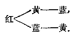

如果第一面旗是取定黄旗或者蓝旗，和上面的讨论一样，可以分别作出2种不同的信号：

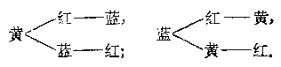

很明显，上面作出的这6种信号是各不相同的，并且，除这6种信号外，不可能再作出其他不同的信号了。由此，我们就找到了这个问题的答案：可以作出上面列举的这6种不同信号。

##### 问题 2

由数字 1， 2， 3， 可以组成： （1） 多少个没有重复数字的二位数？ （2） 多少个二位数？

**［解］**

（1） 我们可以按照先选十位上数字再选个位上数字的顺序， 把各个不同的二位数一起列举出来：

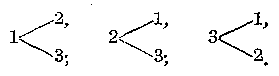

由此可知，总共可组成6个不同的二位数。

（2） 对于一般的二位数， 两个数位上的数字可以相同， 因此， 当我们选定了一个数字做十位上的数字以后， 个位上的数字仍旧可以在这三个数字中任选， 所以把这三个数字所组成的二位数一起列举出来便是：

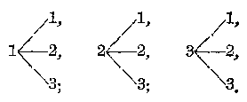

由此可知， 总共可组成 9 个不同的二位数。

上面所提出的这两个问题， 有着一个共同的特点， 它们都可以看成是： 从一些元素（旗子、数字）中， 每次取出几个元素， 按照一定的顺序摆成一排的问题。

从 \(m\) 个元素中， 每次取出 \(n\) 个元素， 按照一定的顺序摆成一排， 称为从 \(m\) 个元素里每次取出 \(n\) 个元素的排列。

**［注意］**

根据上面这个排列的定义，所给的这 \(m\) 个元素和取出的 \(n\) 个元素，都不要求各不相同。本书只讨论下面这两种排列：

（1） 从 \(m\) 个各不相同的元素里，每次取出 \(n\) 个各不相同的元素的排列（如上面的问题1和问题2中的（1）都属于这一类型），以后把这类排列简称为相异元素不许重复的排列。

（2） 从 \(m\) 个各不相同的元素里， 每次取出 \(n\) 个元素 （可以重复） 的排列 ［如问题 2 中的 （2） 就属于这一类型］， 以后把这类排列简称为相异元素可重复的排列。

在考虑排列问题时， 常常把所给的元素顺次编上号码， 用符号 \(a_{1}, a_{2}, \cdots, a_{m}\) 来代表。 当元素不多时， 还可以简单地用字母 \(a, b, c, d, \cdots\)； 或者用数字 \(0, 1, 2, \cdots, 9\) 来表示。 熟练地解这类符号、字母或者数字的排列问题， 可以帮助我们掌握解排列问题的基本方法， 提高解题能力。 在下面的例题和习题里， 列入这类问题的目的就在于此。

##### 例

写出从四个字母 \(a, b, c, d\) 中每次取出 2 个字母的所有不同排列，并要求：（1） 不许重复；（2） 可以重复。这种排列各有几个？

**［解］** （1） \(ab, ba, ca, da,\)

$$
a c， b c， c b， d b，
$$

$$
a d， b d， c d， d c.
$$

这样的排列有12种。

（2） \(aa, ba, ca, da,\)

$$
a b， b b， c b， d b，
$$

$$
a c， b c， c c， d c，
$$

$$
a d， b d， c d， d d.
$$

这样的排列共有16种。

从上面的例子中可以看到，如果两个排列里所含的元素不完全一样，例如 \(ab\) 和 \(ac\)，就是不同的排列；如果所含的元素完全一样，而排列的顺序不同，例如 \(ab\) 和 \(ba\)，那末也是不同的排列。

**［注意］** 上面例题中， 这种写出排列的方法， 叫做列举法。 用列举法把具体的排列写出，在今后解题时，考虑解题途径，或者进行检验，都很有用。读者可以自己思考一下，怎样进行列举，才能使写出的排列做到既不遗漏又不重复。

1. 用 1， 2， 3， 4 这四个数字所组成的不含重复数字的三位数有几个？把它列举出来。

2. 由 1， 2， 3， 4， 5 这五个数字所组成的二位数一共有几个？其中不含重复数字的有几个？

3. 用红色的、黄色的、蓝色的小旗各一面升上旗竿，以作出信号。总共可作出多少种不同的信号？

［提示： 作信号时， 可以只用一面小旗升上旗竿， 也可以用二面或者三面小旗按不同顺序升上旗竿。］

### § 1·2 乘法原则

对排列问题的研究，主要是求出根据已知条件所作出的不同排列的种数。对于一些简单的问题，可以采用上节例题中的方法，把所有不同的排列列举出来，数出种数找到答案。显然，这种方法是很烦的。为了能找寻出一个简单的、直接的求排列种数的方法，下面先来考察一个具体问题。

#### 问题

如果从甲地到乙地有2条路可走，乙地到丙地又有3条路可走，试问：从甲地经乙地而到丙地，可以有几种不同的走法？

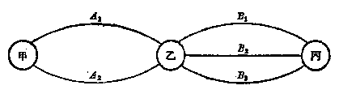

**［解］** 如果用 \(A_{1}, A_{2}\) 表示从甲地到乙地的两条路，用 \(B_{1}, B_{2}, B_{3}\) 表示从乙地到丙地的这三条路（上图），从图中可以看出，从甲地经乙地到丙地，有并且只有下面这6种走法：

$$
A _ {1} - B _ {1}， A _ {1} - B _ {2}， A _ {1} - B _ {3}，
$$

$$
A _ {2} - B _ {1}， A _ {2} - B _ {2}， A _ {2} - B _ {3}.
$$

可以看出， 解这个问题需要考虑两个步骤： 第一步， 先从由甲地到乙地的这两条路中任意选择一条（有2种选法）； 第二步， 再从乙地到丙地这三条路中任意选择一条（有3种选法）； 而最后计算出来的不同走法的种数6， 正就是这两个步骤中每一步骤的选法种数（2与3）的乘积。

对这个具体问题的解，给了我们一个重要的启示：倘使撇开了这里所说的“从甲地到乙地”、“从乙地到丙地”这些具体内容，而把它们一般地看成是要完成一件事的两个步骤，并且把这里所说的“2条路”、“3条路”一般地叙述成“有 \(m_{1}\) 个方法”、“有 \(m_{2}\) 个方法”，这样，就可以作出如下的结论：

设完成一件事要分两个步骤，完成第一步有 \(m_{1}\) 种方法，完成第二步有 \(m_{2}\) 种方法；那末完成这件事，就有

$$
N = m _ {1} \cdot m _ {2}
$$

种方法。

更一般地， 我们还可以作出这样的结论：

设完成一件事要分 \(n\) 个步骤，完成第一步有 \(m_{1}\) 种方法，完成第二步有 \(m_{2}\) 种方法，……，完成第 \(n\) 步有 \(m_{n}\) 种方法；那末完成这件事，就有

$$
\boxed {N = m _ {1} \cdot m _ {2} \cdot \dots \cdot m _ {n}}
$$

种方法。

在上面这个式子里， 等号右边是乘积的形式， 为了突出这一点， 我们把上面这个结论称为乘法原则。

应用这个原则， 就可以不通过具体作出排列， 而求出符合题设条件的所有的不同排列的种数。

例如，对 § 1·1 例题中的（1）所作的排列，可以看成是在排好顺序的两个位置

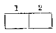

上， 从 \(a, b, c, d\) 这四个字母里， 选取字母去分别占据， 因此可以认为这是要依次完成下面两件事：

（1） 先在 \(a, b, c, d\) 这四个字母中选取 1 个， 去占据第 1 号位置；

（2） 再在余下的 3 个字母 （因为排列里不许有重复字母， 所以已经占有第 1 号位置的那个字母不能再选） 中选取 1 个去占据第 2 号位置。

因为， 完成第一件事有 4 个方法， 完成第二件事有 3 个方法， 所以完成这两件事共有

$$
N = 4 \cdot 3 = 12
$$

个方法。

类似地，读者可以自己来说明上节例题里（2）所求的排列种数是

$$
N = 4 \cdot 4 = 16.
$$

应用乘法原则解下列各题：

1. 从 \(a, b, c, d, e\) 这5个字母里，每次取出：

（1） 2个；

（2） 3个；

（3） 4个；

（4） 5个

不同字母，求所组成的各种不同排列的种数。

［解法举例：（1） \(N_{2} = 5\cdot 4 = 20.\)］

**［注意］** 本题的四个小题目都是要求排列的种数 \(N\)，为便于区别，我们用 \(N_{2}\) 表示选取 2 个字母的排列种数，\(N_{3}, N_{4}, N_{5}\) 便分别表示选取 3， 4， 5 个字母的排列种数。

2. 用数字1，2，3，4可以组成多少个：

（1） 二位数？

（2） 三位数？

（3） 四位数？

其中不含有重复数字的各有几个？

3. （1） 从 9 块不同颜色的积木里， 取出三块排成一横排， 共有多少种不同排法？

（2） 在所有的三位数里， 共有几个不含有数字 0 的？

比较一下，（1）和（2）有什么区别。

### § 1·3 相异元素不许重复的排列

在习题1·2第1题里，读者已经计算过：从a，b，c，d，e这5个字母里，每次取出2个、3个、4个、5个不同字母，所组成的各种不同排列的种数分别是：

$$
N _ {2} = 5 \cdot 4 = 20，
$$

$$
N _ {3} = 5 \cdot 4 \cdot 3 = 60，
$$

$$
N _ {4} = 5 \cdot 4 \cdot 3 \cdot 2 = 120，
$$

$$
N _ {5} = 5 \cdot 4 \cdot 3 \cdot 2 \cdot 1 = 120.
$$

观察上面这些式子， 可以看出： 所求的排列种数是若干个连续自然数的乘积， 乘积中最大的一个因数就是所给元素的个数， 乘积中因数的个数等于排列中含有的元素的个数。

为了统一起来，有时也把这5个字母里只取出1个，说成是这5个不同字母中取出1个字母的排列。很明显，这样作出的排列的种数是

$$
N _ {1} = 5.
$$

把上面这个问题推广到一般的情况， 就可以得出结论：

从 \(m\) 个不同元素里，每次取出：

1个元素的所有排列的种数是 \(m\)；

2个不同元素的所有排列的种数是 \(m(m - 1)\)；

3个不同元素的所有排列的种数是 \(m(m - 1)(m - 2)\)；

4个不同元素的所有排列的种数是

$$
m (m - 1) (m - 2) (m - 3)；
$$

\(n\) 个 \((1 \leqslant n \leqslant m)\) 不同元素的所有排列的种数是

$$
m (m - 1) (m - 2) \dots [ m - (n - 1) ]，
$$

就是 \(m(m-1)(m-2)\dots(m-n+1)\)。

上面这种排列是 \(m\) 个各不相同元素中每次取 \(n\) 个各不相同元素的排列，我们用符号 \(A_m^n\) 表示这类排列里所有不同排列的种数①。于是，

$$
\boxed{A_m^n=m(m-1)(m-2)\cdots(m-n+1)}
$$

这个公式称为排列数公式。这里 \(m, n\) 都表示自然数，且 \(n \leqslant m\)。

把这公式写成定理形式， 即是：

定理 从 \(m\) 个不同元素里每次取出 \(n\) 个不同元素的所有排列的种数， 等于 \(n\) 个连续自然数的乘积， 其中最大的一个数是 \(m\)。

为了以后解排列问题的需要，下面先来熟悉一些关于排列数的运算。

#### 例 1

计算 \(\frac{A_{16}^{3}}{2A_{8}^{4}}\) 的值。

**［解］** \(\frac{A_{18}^{3}}{2A_{3}^{4}} = \frac{16\cdot 15\cdot 14}{2\cdot 8\cdot 7\cdot 6\cdot 5} = \frac{16\cdot 15\cdot 14}{16\cdot 14\cdot 15} = 1.\)

##### 例 2

计算 \(\frac{A_{9}^{5}+A_{9}^{4}}{A_{9}^{3}}\) 的值。

**［解］** \(\frac{9\cdot 8\cdot 7\cdot 6\cdot 5 + 9\cdot 8\cdot 7\cdot 6}{9\cdot 8\cdot 7} = \frac{9\cdot 8\cdot 7\cdot 6(5 + 1)}{9\cdot 8\cdot 7} = 30.\)

1. 计算以下各式的值：

（1）\(A_6^3\)；

（2）\(A_{10}^4\)；

（3）\(\frac{A_{12}^9}{A_{12}^7}\)；

（4）\(\frac{3A_{20}^{19}}{2A_{20}^{18}}\)。

2. 计算以下各式的值：

（1） \(\frac{A_8^2 - A_8^3}{A_4^3}\)；

（2） \(\frac{A_{10}^{5} + A_{10}^{4}}{A_{12}^{5} - A_{12}^{5}};\)

（3） \(\frac{4A_5^2}{A_2^2 + A_3^2 \cdot A_4^2}\)；

（4） \(\frac{A_7^0}{A_8^3 \cdot A_3^2}\)。

> ① \(m\) 个各不相同元素中每次取 \(n\) 个各不相同元素的排列种数，也可用符号 \(P_{n}^{n}\) 表示。

应用上面的公式，可以很简便地解答一些关于相异元素的不许重复的排列问题。但在应用这公式时，必须先考察两点：

（1） 所给的元素是不是各不相同的？

（2） 在作出的排列里， 元素是不是各不相同的？

下面举例来说明这类问题的解法。

##### 例 3

某铁路线上一共有 48 个大小车站， 铁路局要为这条路线上准备几种不同车票？

**［审题］** 因为每张车票都标明起点站和终点站的站名，所以同样的两站间就有2种不同的车票。从48个车站的站名中取出两个车站名，分起点站和终点站排起来，所有这种排列的种数即是本题的解。这是求在48个不同元素中每次取2个不同元素的所有排列的种数问题，所以可以应用上面的定理来解。

**［解］** 不同的车票，只需在48个车站中，每次取两个车站各作排列，

$$
\therefore A _ {48} ^ {2} = 48 \cdot 47 = 2256.
$$

答：要准备2256种不同的车票。

**［注意］** 在解排列的具体问题时，解答中要作简要的说明，不宜只列出一个算式；在以后解组合问题时也一样。

#### 习题1·3（2）

1. 用 1， 2， 3， 4， 5， 6 这 6 个数字，可以组成多少个没有重复数字的

（1） 三位数；

（2） 四位数。

2. 有颜色不同的小旗5面，现在要取出3面顺次升入旗竿作出信号，问可以构成多少种不同的信号？

3. 有5本不同的书，要分别包上包书纸。现有花色不同的包书纸6张，问有几种不同的包法？

4. 有甲、乙、丙、丁、戊5个队进行乒乓球比赛，如果每个队都要与另一队在本队的场子里以及客队的场子里各比赛一次，问这次比赛总共要进行多少场次？

### § 1·4 全排列

在公式

$$
A _ {m} ^ {n} = m (m - 1) (m - 2) \dots (m - n + 2) (m - n + 1)
$$

中，如果令 \(n = m\)，就得

$$
A _ {m} ^ {m} = m (m - 1) (m - 2) \dots 2 \cdot 1.
$$

这个公式指出： 把 m 个不同的元素全部取出来作排列， 所有这样的排列的种数， 等于从 1 开始的 m 个连续自然数的连乘积。

这种排列称为 \(m\) 个不同元素的全排列，并且用专门的符号 \(P_{m}\) 来表示这类排列所有的排列种数，就是

$$
P _ {m} = A _ {m} ^ {m} = 1 \cdot 2 \dots (m - 1) \cdot m.
$$

为了方便起见， 把从 1 开始的 \(m\) 个自然数的连乘积， 用记号 \(m!\) （读做 \(m\) 阶乘） 来表示。 应用这一记法， \(m\) 个不同元素的全排列的种数公式就可以写成

$$
P_m=m!。
$$

#### 例 1

计算 \(\frac{8! - 6!}{7! - 6!}\) 的值。

**［审题］** \(8! = 8 \cdot 7 \cdot 6 \cdot 5 \cdot 4 \cdot 3 \cdot 2 \cdot 1 = (8 \cdot 7) \times 6!\)，

$$
7! = 7 \cdot 6 \cdot 5 \cdot 4 \cdot 3 \cdot 2 \cdot 1 = 7 \times 6!，
$$

所以分子分母中都含有因数 6！，可以先约去 6！ 后再计算。

**［解］** \(\frac{8! - 6!}{7! - 6!} = \frac{(8 \cdot 7) \times 6! - 6!}{7 \times 6! - 6!} = \frac{55 \times 6!}{6 \times 6!} = \frac{55}{6} = 9\frac{1}{6}\)。

**［注意］** \((n + 1)! = (n + 1) \cdot n! = (n + 1) \cdot n \cdot (n - 1)!\)

- - - - - - - - - - - - - - - - - - - - - - - - - - - - - - - - - - - - -

这种变换在计算中很有用，应该熟悉这些计算技巧。

##### 例 2

求证 \(P_{n+1} - P_n = nP_n\)。

**［证］**

$$
P_{n+1}-P_n=(n+1)!-n!=(n+1)n!-n!。
$$

$$
= (n + 1 - 1) \cdot n! = n \cdot n! = n \cdot P _ {n}，
$$

命题得证。

1. 计算：

（1） \(\frac{P_{10} - 9P_9 - 8P_9}{P_9}\)；

（2） \(\frac{P_{10}}{P_8 \cdot P_4}\)。

2. 求证。

（1） \(P_{8} - 8P_{7} + 7P_{6} = P_{7}\)；

（2） \(16P_{3} = P_{5} - P_{4}\)。

3. 把编上号码的 5 台车床排成一列， 共有几种不同的排法？

4 求证： \(A_{n}^{n}=\frac{m!}{(m-n)!}\) \((m>n)\)。

### § 1·5 加法原则

问题

在习题1·1里， 我们曾经解过下面这个问题：

用红色的、黄色的、蓝色的小旗各一面升上旗竿，以作出信号，总共可作出多少种不同的信号？

解这个问题时，我们是这样考虑的：

作出的信号可以按照用到的小旗的面数分成三大类，即

（1） 只用一面小旗的， 这样作出的信号有 \(A_{3}^{1} = 3\) 种；

（2） 用二面小旗的， 这样作出的信号有 \(A_{3}^{2} = 6\) 种；

（3） 三面小旗都用的，这样作出的信号有 \(A_{3}^{3} = 6\) 种。

因为上面这三类信号都不相同，并且除此之外不再有其他不同的信号可作，因此总共可作出的不同信号，应该是这三类方法所作出的各种信号的和，由此得

$$
N = 3 + 6 + 6 = 15 (\text {种})。
$$

象乘法原则一样，从这个问题的解答中，可以启发我们作出如下的一般结论：

设完成一件事有 \(n\) 类方法，只要选择任何一类方法中的一种方法，这件事就可以完成。如果已知其中第一类方法有 \(m_{1}\) 种，第二类方法有 \(\{m_{2}\) 种……，第 \(n\) 类方法有 \(m_{n}\) 种，并且这 \(m_{1} + m_{2} + \cdots + m_{n}\) 种方法里，任何两种方法都不相同，那末完成这件事就有

$$
N = m _ {1} + m _ {2} + \dots + m _ {n}
$$

种方法。

在上面这个式子里， 等号右边是和的形式， 为了突出这一点， 我们把这一结论称为加法原则。

在解一些比较复杂的排列问题时，常常要用到加法原则和§ 1·2里提出的乘法原则，下面举例来说明。

#### 例 1

用0，1，2，3这4个数字，可以组成多少个没有重复数字的四位数。

**［审题］** 因为四位数的千位上的数字不能是0，为了这一点，我们把这个四位数分成两步来排：先排千位上的数字，它可以在1，2，3这三个数字中任意选用一个；再排其他三个数位上的，它们可以选用余下的3个数字。因为只有当这两个步骤都完成后这个四位数才能排好，所以要用乘法原则。

**［解］** 千位上数字的排法有 \(A_{3}^{1}\) 种；

其他三个数位上数字的排法有 \(P_{3}\) 种。

所以，总共的排法有

$$
N = A _ {3} ^ {1} \cdot P _ {3} = 3 \cdot 6 = 18 (\text {种})。
$$

答：可以排成18个不同的四位数。

这个问题还可用另一种方法来解。

（1） 四个数字 0， 1， 2， 3 全部取来排列，共有排法 \(P_{4}\) 种。

（2） 其中 0 被排在千位上的排列有 \(P_{3}\) 种（这是因为：0 在千位上的排列，实际上就是 1， 2， 3 在个，十，百位上的排列，而后者有 \(P_{3}\) 种）。这些排列不能看成是四位数。

（3） 所以， 所求的种数应该是两者的差， 即

$$
P _ {4} - P _ {3} = 24 - 6 = 18.
$$

由此可知，总共可排成18个不同的四位数。

上面这种考虑，事实上是应用了加法原则，

$$
\because N = n _ {1} + n _ {2}，
$$

其中 N 表示四个数字的全排列数， \(n_{1}\) 是 0 被排在千位上的排列数， \(n_{2}\) 是 0 不在千位上的排列数，

$$
\therefore n _ {2} = N - n _ {1}.
$$

**［注意］** 对于一些带有特殊条件的排列，如果不合条件的情况计算比较简单，在解题过程中，常常象这一解法一样，先不考虑这个特殊条件，把所有的排列种数 \(N\) 求出，然后再减去不适合这一特殊条件的排列种数 \(n_1\)，从而得出解答。

##### 例 2

6 个队员排成一列进行操练，其中新队员甲不能站在排首，也不能站在排尾，问有几种不同排法？

下面将用两种方法来解这个问题。先运用加法原则来解，可以这样考虑：倘使对新队员甲的排法没有限制条件，那末共有排法 \(P_{6}\) 种；在这些排列里，可以分成3类情况：

（1） 甲在排首的（有 \(P_{5}\) 种排法），

（2） 甲在排尾的（有 \(P_{5}\) 种排法），

（3） 甲不在排首或排尾的。

前 2 种情况都不符合题设条件，把总共的排列种数里减去这两种情况的排列种数，即得符合条件的排列种数。

**［解 1］** 6 人的全排列种数是 \(P_{6}\)。甲在排首或在排尾的排列种数都是 \(P_{5}\)。所以，甲不在排首也不在排尾的排列种数是

$$
P _ {6} - 2 P _ {5} = (6 - 2) P _ {5} = 4 \times 120 = 480
$$

现在再运用乘法原则来解， 可以这样考虑： 要使甲既不在排首也不在排尾， 可以先让甲在中间 4 个位置上任意找一个位置站好 （有 \(4\) 种排法）， 然后， 对其余的 5 人， 再在另外 5 个位置上作全排列 （有 \(P_{5}\) 种排法）。 这两个步骤依次完成， 排列就完成。 所以， 所求的排列的种数是 \(A_{4}^{4}\) 与 \(P_{5}\) 的积。

**［解 2］**

甲可以排在除去首、尾这两个位置以外的4个位置上，共有 \(A_{4}^{4}\) 种排法。其余5人可在另外5个位置上排列，共有 \(P_{6}\) 种排法。所以，总共的排法有

$$
A_4^1P_5=4P_5=480\text{（种）}。
$$

答：有480种不同的排法。

从上面这两个例子中可以看到， 解排列应用题时， 由于思考方法不同， 同一问题可以有几种不同的解法， 但求出的结果总是一样的。 在解题时， 建议读者不仅考虑一种解法， 同时也考虑一下有没有其他解法。 这样做， 一方面可以培养解题能力， 同时也可以从两种不同解法的结果是否相同来检验作出的解答有没有错误。

#### 习题1·5（1）

1. 用数字 1， 2， 3， 4， 5 可以组成多少个没有重复数字的自然数？

［提示： 组成的自然数里包括一位数， 二位数……， 五位数。］

2. 5件不同的商品，陈列在橱窗内，将它们排成一列。

（1） 如果某一件商品必须放在中间， 问有几种排法？

（2） 如果某一件商品不放在中间，问有几种排法？

（3） 如果某一件商品不放在中间，也不放在两端，问有几种排法？

3. 6件不同的商品，陈列在橱窗内，将它们排成一列。

（1） 如果甲乙两种商品要分别放在两端，问有几种排法？

（2） 如果甲乙两种商品每一个都不放在两端，问有几种排法？

（3） 如果甲乙两种商品要放在相邻的位置， 问有几种排法？

（4） 如果甲乙两种商品， 不能放在相邻的位置， 问有几种排法？

［提示：（3）要使甲乙两种商品放在相邻位置，可以把它们两个先排定（注意这是两者之间的全排列），然后把它们看成一个整体再与其他4件商品作排列。］

4. 在 3， 5， 7， 9， 11， 13 这 6 个数中，任取 1 个做分子，1 个做分母，可以组成多少个不同的分数？其中真分数、假分数各有几个？

下面再举一些带有条件的数字排列问题，研究一下它们的解法。

##### 例 3

在 3000 到 8000 之间， 有多少个没有重复数字的、且能被 5 整除的奇数。

**［审题］** 适合题意的数，要具有以下的条件：

（1） 个位上必须是 5；

（2） 千位上必须是 3， 4， 6， 7 中之一 （5 已用过，所以不能再用）；

（3） 百位上、十位上可以是除去已排掉的 2 个数字以外的 8 个数字中的任何 2 个。

由此， 本题可以按照以上条件分步来排。

**［解］** 适合题意的数：

（1） 个位上必须是 5，只有 1 种排法；

（2） 千位上可以是 3， 4， 6， 7 中之一，共有 \(A_4^1\) 种排法；

（3） 百位和十位上， 可以把其余 8 个数字作排列， 共有 \(A_8^2\) 种排法。

所以，适合题意的数共有

$$
A_4^1A_8^2=4\times8\times7=224\text{（个）}。
$$

从这个例子的解答中可以看到，对一个带有条件的排列问题，如果把排列划分成几个步骤来排，那末应该把有条件的位置先排好，再排其余的位置。

##### 例 4

在 3000 和 8000 之间， 有多少个没有重复数字的奇数。

**［审题］** 适合题意的数，要具有以下的条件：

（1） 个位上必须是 1， 3， 5， 7， 9 中之一；

（2） 千位上必须是 3， 4， 5， 6， 7 中之一；

（3） 其他两位上可以是除去已排掉的 2 个数字以外的 8 个数字中的任意两个。

在条件（1）与（2）中，3，5，7这3个数字重复，因此还不能直接作分步排列。为了避免重复，把千位上的数字再分成两类：

（i） 千位上是 4， 6 中之一， 这时个位上就可以是 1，3，5，7，9 中之一；

（ii） 千位上是 3， 5， 7 中之一，这时个位上就可以是 1， 3， 5， 7， 9 这 5 个数字中除去已排掉的 1 个数字以外的 4 个数字中的任意一个。

由此，本题可以先分成两种情况，求出每一情况的所有排列的种数后，再相加而得。

**［解］**

适合题意的数，按千位上的数字是偶数或奇数而分成两类：

（1） 千位上是偶数。它可以在 4， 6 中任取 1 个，有 \(A_2^1\) 种排法。这时，个位上有 \(A_5^1\) 种排法，其他两个数位上有 \(A_8^2\) 种排法，所以这一类的数有

$$
A_2^1A_5^1A_8^2\text{（个）}。
$$

（2） 千位上是奇数。它可以从 3， 5， 7 中任取 1 个，有 \(A_{3}^{1}\) 种排法。这时，个位上只有 \(A_{4}^{1}\) 种排法，其他两个数位上仍有 \(A_8^2\) 种排法，所以这一类的数有

$$
A_3^1A_4^1A_8^2\text{（个）}。
$$

由（1）和（2）可知，总共可排成适合题意的数有

$$
A_2^1A_5^1A_8^2+A_3^1A_4^1A_8^2=(10+12)\times8\times7=1232\text{（个）}。
$$

**［注意］**

在解本题时， 如果不把千位上数字的情况先划分， 从个位上有 \(A_{3}^{1}\) 种排法， 千位上有 \(A_{3}^{1}\) 种排法， 其他两个数位上有 \(A_{3}^{2}\) 种排法， 直接得出共有

$$
A_3^1A_4^1A_8^2\text{（个）}。
$$

种不同的排法， 那末就错了。 这是因为， 这里包括着一类千位上和个位上数字相同的数 （如 3453）。 它们是不符合题意的。 在解题时思考必须慎密， 既要防止遗漏， 也要防止重复。

#### 习题 1·5（2）

1. 用0，1，2，3，4，5这6个数字，可以组成多少个没有重复数字的；

（1） 三位数？

（2） 能被 5 整除的三位数？

（3） 三位偶数？

（4） 三位奇数？

2. 用数字 2， 3， 4， 5， 6， 7 组成的没有重复数字的六位数里：

（1） 能被 25 整除的有几个？

（2） 能被 6 整除的有几个？

［提示：能被25整除的数，末两位必须是00，25，50，75.］

3. 求证：用 1， 2， 3， 4， 5， 6 这 6 个数字所组成的没有重复数字的六位数里，1 不在第一位、6 不在第六位的共有 \(6! - 2 \cdot 5! + 4!\) 个。

### § 1·6 相异元素可以重复的排列

在§ 1·1的问题2的（2）里，曾经计算过：用1，2，3这3个数字所组成的二位数共有9个，这个结果很容易应用乘法原则来说明。事实上，这个二位数可以分成两步来排。第1步排十位上的，显然有3种排法；第2步排个位上的，因为数字可以重复，所以仍有3种排法。由此得到总共有

$$
3 \times 3 = 3 ^ {2} = 9
$$

种排法。

这类问题称为相异元素可以重复的排列问题。应用乘法原则，很容易推出：

m 个不同元素里， 如果每个元素都可以重复选取， 那末取 n 个元素的所有排列的种数是

$$
N = m ^ {n}.
$$

这里 m、n 都是自然数。

在解相异元素可以重复的排列问题时，根据题意正确地判断哪一个数应该作为底数 \(m\)，哪一个数作为指数 \(n\)，是解题的一个重要关键。举例说明如下：

#### 例 1

3 只球放入 4 只盒子里， 问共有几种不同的放法？

**［解］** 因为每一只球都可以放入4只盒子中的任一只盒子里，都有4种分配方法，所以三只球共有

$$
N = 4 \times 4 \times 4 = 4 ^ {3} = 64
$$

种不同的放法。

想一想：9只球放入两只盒子里，有多少种不同的放法？

一般来说：n个球放入m只盒子里，共有 \(N=m^{n}\) 种不同的放法。

我们常把这种问题叫做盒子模型问题，这里以盒子数为底数，球数为指数。

##### 例 2

4个学生分配到3个车间去劳动， 问有几种不同的分配方法？

**［解］** 因为每一个学生都可以分配到3个车间中的任一个车间去劳动，都有3种分配方法，所以4个学生共有

$$
N = 3 \times 3 \times 3 \times 3 = 3 ^ {4} = 81
$$

种不同的分配方法。

##### 例 3

4个学生争夺3项体育竞赛的冠军（无并列冠军），问冠军获得者有几种可能？

**［解］** 因为每一项冠军都可以被4个学生中的任一个学生争夺到，所以3项冠军共有

$$
N = 4 \times 4 \times 4 = 4 ^ {3} = 64
$$

种可能。

##### 例 2

、例 3 中所讨论的问题实际上也是属于盒子模型问题，例 2 中是以车间数为底数，学生数为指数，而例 3 中是以学生数为底数，冠军数为指数。在解题时，首先应把题意仔细分析清楚，然后作出正确判断。

因为在相异元素的排列问题里，根据题意选出的元素有的不许重复，有的允许重复，因此，在解题时要正确地判

##### 例 4

7个运动员争取参加3项比赛，且每种比赛只派1个运动员参加：

（1） 如果每人最多只能参加1个项目，有几种分配方法？

（2） 如果每人可以参加 1 项、2 项、3 项比赛，或者 1 项比赛也不参加，有几种分配方法？

**［审题］** （1） 因为每人最多只能参加1个项目， 所以参加第1项比赛有7种分配法， 参加第2项比赛便只有6种分配法， 参加第3项比赛便只有5种分配法。 这是7个相异元素中取3个元素的不许重复的排列问题。

（2） 因为每个比赛项目都可以让这 7 人中的任一人参加， 都有 7 种分配方法， 所以这是 7 个元素中取 3 个元素允许重复的排列问题。

**［解］** （1） 分配方法有 \(A_{7}^{3} = 7 \times 6 \times 5 = 210\) 种；

（2） 分配方法有 \(7 \times 7 \times 7 = 343\) 种。

#### 习题1·6

1. 有7个体操运动员， 同时参加4项体操比赛， 分项冠军的获得者有几种可能？

2. 某城市的电话号码原来有 5 个数码，以后改成了 6 个数码。这样改变以后，可以增加多少个用户（如果规定电话号码中第 1 个数字不用 0）？

3. 用 0， 1， 2， …， 9 这 10 个数字， 可以组成多少个不同的三位数？ 在这些三位数中：

（1） 没有重复数字的有几个？

（2） 三个数字都重复的有几个？

（3） 只有两个重复数字的有几个？

4. 有5本不同的书， 准备送给3个小朋友：

（1） 如果每人只能得 1 本， 有几种送法？

（2） 如果这 5 本书都要送完， 但不限定每人都要得到， 有几种送法？

### § 1·7 组合

让我们来看下面的问题：

#### 问题

飞行在北京——上海——广州航空线上的民航飞机：

（1） 要准备多少种不同的飞机票？

（2） 有几种不同的飞机票价？

这个问题里的（1）是3个相异元素取2个元素不许重复的排列问题。从 \(A_{3}^{2}=6\) 可知共有6种不同的飞机票，具体地说，就是

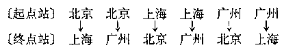

至于这个问题里的（2），性质与（1）有些不同。因为飞机票的种数和起点站、终点站有关，从北京到上海和上海到北京应当准备两种飞机票；但是，飞机票的票价只与起点站到终点站间的距离有关，从北京到上海和从上海到北京的飞机票价是相同的。由此，从（1）求出的结果可以看出，不同的飞机票价只有 \(6\div2=3\) 种。具体地说，就是

北京与广州间的票价，

北京与上海间的票价，

广州与上海间的票价。

象上面（2）这类问题，称为3个不同元素中取2个不同元素的组合问题。

一般地，在 \(m\) 个不同元素中，每次取出 \(n\) 个元素，不管怎样的顺序并成一组，称为 \(m\) 个不同元素里每次取出 \(n\) 个不同元素的组合①。

从上面的例子中可以看出，m个不同元素中每次取n

> ① 对于组合问题， 象排列问题一样， 也有元素可以重复选取的组合和不尽相异元素的组合等等， 本书中不研究这类问题。

个不同元素的排列与组合之间，有以下的主要区别：

在排列中， 要考虑元素间的先后顺序， 所以在两个排列里， 即使元素完全相同， 只要这些元素间的先后顺序不同， 就要看成是不同的排列。

在组合中，不考虑元素间的先后顺序，所以在两个组合里，只要元素完全相同，就是同一种组合。

抓住了“有没有顺序关系”这一点，就可以正确地判断被考虑的问题是排列问题还是组合问题。

正因为组合问题是可以不考虑取出元素的先后顺序的， 所以要作出具体的组合， 可把所给的元素编上号码， 规定小的号码在前、大的号码在后， 再象 § 1·1 作出具体的排列那样， 把所有的组合无遗漏无重复地写出来。

##### 例

写出在 \(a, b, c, d\) 这4个字母中每次取2个字母的所有组合。

**［解］** 我们按 \(a - b - c - d\) 这一顺序来考虑：

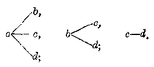

由此可知， 共有 6 种不同的组合， 即

$$
a \bar {b}， a c， a d， b c， b d， c d.
$$

#### 习题1·7

1. （1） 写出 1， 2， 3， 4， 5 这 5 个数字中每次取 3 个不同数字的所有不同的组合？这样的组合一共有几个？

（2） 在 1， 2， 3， 4， 5 这 5 个数字中取出 3 个不同数字，可以作成几个三位数？

（3） 从（1）与（2）的结果， 可以发现： 5个不同元素中每次取出3个元素所有组合的种数与5个不同元素中每次取出3个不同元素所有排列的种数之间有怎样的关系？

2. 判断下面这些问题里所指的是排列呢？还是组合？

（1） 小组里有甲、乙、丙、丁、戊 5 个组员，在假期里约定每两人要：

（i） 互通一封信，问他们总共要写多少封信？

（ii） 通一次电话， 问他们总共要通几次电话？

（2） 平面内有 A， B， C， D， E 这 5 个点， 其中无三点共线， 问：

（ii） 过这 5 点中任意两点， 可作多少条不同的直线？

（i） 以其中的一点为端点，并过另一点的射线有几条？

3. 在上题中，把每一小题的结果计算出来（如果是排列问题，可以直接应用公式来算，如果是组合问题，先把所有的组合写出，再数一数有多少个组合），由此可以发现，5个相同元素中每次取出2个不同元素的所有组合的种数与所有排列的种数间有怎样的关系？

### § 1·8 组合数公式

在 § 1·7 已经计算过：3 个不同元素中每次取出 2 个不同元素的所有组合的种数，就等于 3 个不同元素中每次取 2 个不同元素的所有排列的种数除以 2，这里“2”就是 2 个不同元素的全排列数 2！。

读者在习题1·7里也曾计算过：5个不同元素中每次取出3个不同元素的所有组合的种数，就等于5个不同元素里每次取3个不同元素的所有排列的种数除以6，这里“6”就是3个不同元素的全排列数3！

现在我们来证明： \(m\) 个不同元素中每次取出 \(n\) 个不同元素的所有组合的种数与所有排列的种数之间，都具有这样的关系。

定理

从 \(m\) 个不同元素里每次取出 \(n\) 个不同元素的所有组合的种数，等于从 \(m\) 个不同元素里每次取出 \(n\) 个不同元素的所有排列的种数除以 \(n\) 个元素的全排列数。

从 \(m\) 个不同元素里每次取出 \(n\) 个不同元素的所有组合的种数， 通常用记号 \(C_{m}^{n}\) 来表示。 所以， 证明上面的定理， 也就只要证明下面这个等式成立：

$$
C _ {m} ^ {n} = \frac {A _ {m} ^ {n}}{P _ {n}}.
$$

这里 m、n 都是自然数，且 \(n \leqslant m\)。

**［证］** 从 \(m\) 个不同元素里每次取出 \(n\) 个元素的排列，可以分成两个步骤来作出：第1步先从 \(m\) 个不同元素里取出 \(n\) 个元素；第2步再把这 \(n\) 个元素进行不同的全排列。

根据假设，\(m\) 个不同元素里每次取出 \(n\) 个不同元素的所有组合的种数是 \(C_m^n\)，而 \(n\) 个元素的全排列数是 \(P_n\)。所以，根据乘法原则，可知它们的积

$$
C _ {m} ^ {n} \cdot P _ {n}
$$

应该等于 \(m\) 个不同元素里每次取出 \(n\) 个不同元素的所有排列的种数 \(A_{m}^{n}\)。这就是说，

$$
C_m^nP_n=A_m^n。
$$

$$
\therefore \quad C _ {m} ^ {n} = \frac {A _ {m} ^ {n}}{P _ {n}}.
$$

定理得证。

上面这个等式称为组合数公式。这个公式可表成：

$$
C_m^n=\frac{A_m^n}{P_n}=\frac{m(m-1)(m-2)\cdots(m-n+1)}{1\cdot2\cdot3\cdots n}。
$$

这就是说，要计算 \(C_{m}^{n}\) 的值，只需写出一个分式，使它的分子是n个连续自然数的积，其中最大的一个数是m，分母是从1开始的n个连续自然数的积。

应用上面导出的 \(C_{m}^{n}\) 的计算公式， 就可以方便地解一些简单的组合问题。

#### 例 1

平面上有 12 个点， 其中无 3 点在一直线上。 问：

（1） 这些点可以确定多少条不同的直线？

（2） 以这些点里的任意 3 个点作为三角形的顶点，可以作出多少个不同的三角形？

**［解］**

（1） 因为每 2 点可以确定 1 条直线，所以所求的直线条数就是 12 个不同元素里每次取出 2 个不同元素的所有组合的种数，即

$$
C _ {12} ^ {2} = \frac {12 \times 11}{1 \times 2} = 66.
$$

（2） 因为每 3 个点可以确定一个三角形，所以所求的三角形个数就是 12 个不同元素里每次取出 3 个不同元素的所有组合的种数，即

$$
C _ {12} ^ {3} = \frac {12 \times 11 \times 10}{1 \times 2 \times 3} = 220.
$$

答：（1）可以确定66条直线；

（2） 可以作 220 个不同的三角形。

1. 计算：

（1） \(C_7^3\)；

（2） \(C_{7}^{4}\)；

（3） \(C_{7}^{2}\)；

（4） \(C_7^5\)；

（5） \(C_{8}^{1}\)；

（6） \(C_8^7\)；

（7） \(C_{8}^{2}\)；

（8） \(C_8^6\)。

比较上面（1）与（2），（3）与（4），（5）与（6），（7）与（8）求出的结果，可以发现组合数 \(C_{m}^{n}\) 有怎样的性质？

2. 证明：

（1） \(C_3^0 + C_8^0 = C_8^0\)；

（2） \(C_3^0 + C_3^2 = C_{10}^3\)。

3. 求适合下列等式的自然数 \(n\)：

（1） \(C_n^2=28\)；

（2） \(C_{n}^{4} = A_{n}^{3}\)。

4. 一次篮球比赛共有8个球队参加，比赛采取单循环制：

（1） 这次比赛一共要进行多少场次？

（2） 这次比赛冠军和亚军的获得者有多少种可能情况？

5. 空间有 10 个点， 其中无 4 点在同一平面上：

（1） 过每 3 个点作一平面， 一共可作多少个平面？

（2） 以其中的 4 个点为顶点的四面体一共有多少个？

象解排列问题一样， 解某些条件比较复杂的组合问题， 可以应用乘法原则或者加法原则， 把它归结为若干个简单的组合问题来解。

##### 例 2

小组里有男同学 5 人、女同学 4 人，现在要推选男、女同学各2人，组成一个爱国卫生宣传小组，共有多少种选法？

**［审题］** 这个小组的组成， 可以分成两个步骤来完成。第一步， 先从5个男同学中选出2人； 第2步， 再从4个女同学中选出2人。然后并成一组。因为， 这两个步骤都完成后小组才能组成， 所以要用乘法原则。

**［解］** 2个男同学的选法有 \(C_5^2\) 种；

2个女同学的选法有 \(C_2^2\) 种，

∴ 小组组成的方法有

$$
C_5^2C_4^2=10\times6=60\text{（种）}。
$$

答：有60种选法来组成这个小组。

##### 例 3

小组里有组员 9 人， 其中的 2 人分别担任正副小组长。 从这 9 人里， 欲派出 5 人去参加公益劳动， 并要求派出的 5 人中至少有一位组长， 共有几种不同的派法？

**［审题］** 因为派出的5人中至少要有一位组长，所以适合题意的派法有下面这两种情况：

（1） 只有一位组长在内， 另外 4 人都是组员；

（2） 有二位组长在内， 另外 3 人是组员。

根据加法原则， 只要先分别求出（1）、（2）两种选法， 再相加即可。

**［解］** 考虑如下两种情况：

（1） 2个组长中派出1人、7个组员中派出4人，共有派法

$$
C _ {2} ^ {1} \cdot C _ {7} ^ {4} = 2 \times 35 = 70 (\text {种})。
$$

（2） 2个组长都派去、另外再派3个组员，共有派法

$$
C _ {2} ^ {2} \cdot C _ {7} ^ {3} = 1 \times 35 = 35 (\text {种})。
$$

所以，总共有派法

$$
70 + 35 = 105 (\text {种})。
$$

答：共有105种不同的派法。

**［注意］**

这问题也可以用另一种方法来解。因为，如果没有至少有一组长的条件限制，那末显然有 \(C_9^5\) 种派法；中间除去派出的5人都是组员（派法有 \(C_7^5\) 种）这种派法外，余下的派法中就至少有1位组长在内。所以，只需求 \(C_9^5\) 与 \(C_7^5\) 的差即可，由此得共有派法

$$
C_9^5-C_7^5=126-21=105\text{（种）}。
$$

##### 例 4

平面上有10个点， 其中除有4个点在同一条直线上以外， 不再有3点共线。 经过这些点， 可以确定多少条直线？

**［审题］** 如果这10个点中没有任3个点在一直线上， 那末可以确定 \(C_{10}^{2}\) 条直线。 现在既有4个点在同一直线上， 确定的直线就不到 \(C_{10}^{2}\) 条， 减少的条数应该就是： 这4点不在同一直线上时可以确定的直线条数 （\(C_4^2\) 条） 与实际能确定的直线的条数（1条）之差（例如： 当点 \(A, B, C, D\) 这4个点共线时， \(AB, AC, AD, BC, BD, CD\) 这6条直线事实上只是1条直线）。

**［解］** （1） 10个点中如果没有任何3点共线时，可以确定直线 \(C_{10}^{2}\) 条。

（2） 在同一直线上的这 4 个点，如果也是无 3 点共线时，可以确定直线 \(C_4^2\) 条。现在，这 \(C_4^2\) 条直线只能算做 1 条。

从（1）和（2）可知，经过这10个点可以确定的直线只有

$$
C_{10}^2-(C_4^2-1)=45-(6-1)=40\text{（条）}。
$$

答：可以确定40条直线。

**［注意］** 解这个问题也可以用另一种解法，我们先把这10个点所确定的直线进行分类。

设 \(A, B, C, D\) 这4个点在同一直线 \(l\) 上，\(E, F, G, H, L, M\) （图中只画出其中两

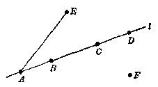

点）这6个点在直线 \(l\) 外。由图可以看出，它们所确定的直线有以下3类：

（1） 由 A， B， C， D 这 4 点所确定的直线只有 1 条。

（2） 由 A， B， C， D 这 4 点中的 1 点， 以及不在 l 上的 6 点中的 1 点， 所确定的直线有 \(C_{4}^{1} \cdot C_{6}^{1} = 24\) 条。

（3） 由不在 \(l\) 上的 6 点中的 2 点， 所确定的直线有 \(C_{6}^{2} = 15\) 条。

所以，总共可以确定直线

$$
1 + 24 + 15 = 40 (\text {条})。
$$

从例3和例4可以看出：一个条件比较复杂的组合问题，常常可以用不同的方法来解。一般地说，当应用加法原则来解题时，如果适合条件的组合种数容易计算，那末就先把适合条件的组合分成若干类（要注意：不遗漏不重复），计算出各类中组合种数，再求它们的和；如果不符合条件的组合种数容易计算，那末只需先不考虑条件，算出所有组合的种数，然后减去不适合条件的组合的种数。

1. 甲、乙、丙、丁、戊、己这6人中，选出3人出席一次会议，

（1） 如果甲、乙两人必须在内， 有几种选法？

（2） 如果甲、乙两人都不在内，有几种选法？

（3） 如果甲、乙两人中有 1 人且只有 1 人在内， 有几种选法？

（4） 如果甲、乙两人中至少有 1 人在内， 有几种选法？

（5） 如果甲、乙两人不能同时在内， 有几种选法？

［提示：（5）有下面这些情况： 甲在内可行乙不在内， 甲不在内而乙在内， 甲乙都不在内。］

2. 在 1， 2， …， 9 这 9 个连续自然数中， 任意取出两个数来：

（1） 积是奇数的取法有几种？

（2） 积是偶数的取法有几种？（用两种方法来解）

（3） 和是奇数的取法有几种？

（4） 和是偶数的取法有几种？（用两种方法来解）

3. 证明：凸 \(n\) 边形有 \(\frac{1}{2} n(n - 3)\) 条对角线。

4. 空间内有 12 个点，其中有 4 个点在同一平面内，此外不再有 4点共面。

（1） 这些点可以确定多少个平面？

（2） 以这些点里的每4个点为顶点的四面体有几个？

### § 1·9 组合数的两个性质

#### 1. 组合数的第一个性质

在习题1·8（1）的第1题里，我们曾看到：

$$
C_7^0=C_7^7，\quad C_7^2=C_7^5，\quad C_8^1=C_8^7，\quad C_8^2=C_8^6。
$$

现在来证明：对于一般的组合数 \(C_{m}^{n}\) 和 \(C_{m}^{m - n}\)，都具有这样的性质，就是

$$
\boxed{C_m^n=C_m^{m-n}}
$$

这里 \(m, n\) 是自然数，且 \(m > n\)。

**［证］** 因为

$$
C _ {m} ^ {n} = \frac {m (m - 1) \cdots (m - n + 1)}{1 \cdot 2 \cdots n}，
$$

又注意到 \(m > n\)，即 \(m - n\) 是自然数；所以，把上面这个分式的分子和分母都乘以

$$
(m - n) (m - n - 1) \dots 3 \cdot 2 \cdot 1，
$$

这时， 分子就是

$$
m (m - 1) (m - 2) \dots (m - n + 1) (m - n)
$$

$$
\times (m - n - 1) \dots 3 \cdot 2 \cdot 1 = m!，
$$

分母就是

$$
\begin{array}{l} (1 \cdot 2 \cdot 3 \dots n) [ 1 \cdot 2 \cdot 3 \dots (m - n - 1) (m - n) ] \\ = n! (m - n)!. \\ \end{array}
$$

由此即得 \(C_m^n=\frac{m!}{n!(m-n)!}\)，

这里 m、n 是自然数，且 m > n。

在上式中，用 \(m - n\) 代替 \(n\)，即得

$$
C _ {m} ^ {m - n} = \frac {m !}{(m - n) ! [ m - (m - n) ] !} = \frac {m !}{(m - n) ! n !}.
$$

由此可知 \(C_m^n=C_m^{m-n}\)

这就证得了这一性质。

**［注意］**

组合数的这一性质， 也可根据组合的意义而得到解释。 事实上， 在 \(m\) 个不同元素中， 每当取出 \(n\) 个元素作组合时， 余下的 \(m - n\) 个元素也可看作是一组合， 因此取出 \(n\) 个元素的一切组合的种数也就等于余下的 \(m - n\) 个元素的一切组合的种数， 这就说明了 \(C_{m}^{n} = C_{m}^{m - n}\)。

在上面证明过程中，导出的等式

$$
C_m^n=\frac{m!}{n!(m-n)!}。
$$

是组合数 \(C_m^n\) 的又一表达式， 它在证明有关组合数的关系式时很有用。

为了使这公式当 \(n = m\) 时也能适用，我们规定 \(0! = 1\)。这时，因为 \(C_m^m=1\)，那末 \(1 = \frac{m!}{m!(m - m)!} = \frac{m!}{m!0!}\)，可见规定 \(0! = 1\) 是合理的。

为了使上面所证得的这一组合性质对于 \(n = m\) 时也成立，通常还规定 \(C_m^0=1\)。这时，因为 \(C_m^n = 1\)，那末

$$
C _ {m} ^ {m} = 1 = C _ {m} ^ {m - m} = C _ {m} ^ {0}，
$$

可见规定 \(C_{m}^{0} = 1\) 也是合理的。

**［注意］** 在 \(m\) 个不同元素里， 如果 1 个元素也不取出， 显然只有 1 种可能选法， 这个事实就可以用符号 \(C_{m}^{0}\) 来说明。

##### 例 1

解方程 \(C_{18}^{n}=C_{18}^{n-2}\)

**［审题］** 要从上面的等式中求出 \(x\)，只需列出一个关于 \(x\) 的整式方程。这里等号两边的两个组合数符号的下指标都是 18，所以有两种可能：

（1） 它们的上指标相同。由此可得 \(x = x - 2\)，但是这个方程无解。

（2） 把 \(C_{18}^{x}\) 改用与它等值的符号 \(C_{18}^{18-x}\) 来代替， 这时从 \(C_{18}^{18-x} = C_{18}^{x - 2}\) 可得

$$
18 - x = x - 2，
$$

从中即可解出 \(x\) 的值。另一方面，如把 \(C_{18}^{x - 2}\) 代以 \(C_{18}^{10 - (x - 2)} = C_{18}^{18-x}\)，则从 \(C_{18}^{x} = C_{18}^{20 - x}\) 即有 \(x = 20 - x\)，由此也可解出 \(x\)，只是和上面的结果是同样的。

**［解］** 因为 \(C_{18}^{x} = C_{18}^{18-x}\)，代入原方程 \(C_{18}^{x} = C_{18}^{x - 2}\)，即得

$$
C _ {18} ^ {18 - x} = C _ {18} ^ {x - 2}.
$$

$$
\therefore 18 - x = x - 2，
$$

$$
\therefore x = 10.
$$

将它代入原方程验算一下是适合的，所以原方程的解是 \(x - 10\)

**［注意］** 解未知数含在组合数符号中的方程时，必须注意两点。

（1） 求到的未知数的值，必须使代入组合数符号后有意义。

（2） 题中给出的组合数符号虽是 \(C_{10}^{n}\)， 不要忽视了如果改用与 \(C_{10}^{n}\) 等值的符号 \(C_{10}^{n-1}\) 时的情况。

#### 2. 组合数的第二个性质

在习题 1·8（1） 的第 2 题里， 还曾看到：

$$
C _ {8} ^ {0} + C _ {8} ^ {2} = C _ {8} ^ {3}， C _ {8} ^ {3} \left[ - C _ {8} ^ {0} = C _ {10} ^ {3}. \right.
$$

把这一事实推广到一般的情况，就得到组合数的第二个性质：

$$
\boxed{C_m^n=C_{m-1}^n+C_{m-1}^{n-1}}
$$

**［证］** 因为 \(C_m^n = \frac{m!}{n!(m - n)!}\)， 所以

$$
\begin{array}{l} C _ {m - 1} ^ {n} + C _ {m - 1} ^ {n - 1} \\ = \frac {(m - 1) !}{n ! [ (m - 1) - n _ {1} ! ]} + \frac {(m - 1) !}{(n - 1) ! [ (m - 1) - (n - 1) ] !} \\ = \frac {(m - 1) !}{n ! (m - n - 1) !} + \frac {(m - 1) !}{(n - 1) ! (m - n) !} \\ = \frac {(m - 1) ! \cdot (m - n)}{n ! (m - n) !} + \frac {(m - 1) ! \cdot n}{n ! (m - n) !} \\ = \frac {(m - 1) ! [ (m - n) + n ]}{n ! (m - n) !} = \frac {m \cdot (m - 1) !}{n ! (m - n) !} \\ = \frac {m !}{n ! (m - n) !}， \\ \end{array}
$$

$$
\therefore C _ {m} ^ {n} = C _ {m - 1} ^ {n} + C _ {m - 1} ^ {n - 1}.
$$

**［注意］**

组合数的这个性质，也可以直接根据组合的意义利用加法原则来证明。事实上，从 \(m\) 个不同元素里每次取出 \(n\) 个不同的元素的组合，可以分成两类：

（1） 不含某一指定元素的。这就相当于从 \(m - 1\) 个不同元素中每次取出 \(n\) 个不同元素的组合，所有这样的组合的种数是 \(C_{m - 1}^{n}\)

（2） 一定含某一指定元素的。这就相当于从 \(m - 1\) 个不同元素中每次取出 \(n - 1\) 个不同元素的组合，所有这样的组合的种数是 \(C_{m - 1}^{n - 1}\)。

由此，根据加法原则，得

$$
C _ {m - 1} ^ {n} + C _ {m - 1} ^ {n - 1} = C _ {m} ^ {n}
$$

##### 例 2

求证 \(C_{m}^{n + 1} + C_{m}^{n - 1} + 2C_{m}^{n} = C_{m + 2}^{n + 1}\)

**［证］** 应用上面的组合数的第2个性质，我们有

$$
\begin{array}{l} C _ {m} ^ {n + 1} + C _ {m} ^ {n - 1} + 2 C _ {m} ^ {n} = C _ {m} ^ {n + 1} + C _ {m} ^ {n - 1} + C _ {m} ^ {n} + C _ {m} ^ {n} \\ = C _ {m} ^ {n + 1} + C _ {m} ^ {n} + C _ {m} ^ {n} + C _ {m} ^ {n - 1} \\ = C _ {m + 1} ^ {n + 1} + C _ {m + 1} ^ {n} \\ = C _ {m + 2} ^ {n + 1}. \\ \end{array}
$$

##### 例 3

求证 \(C_{m}^{n} + C_{m + 1}^{n - 1} + C_{m + 2}^{n - 1} + \dots + C_{m + k - 1}^{n} = C_{m + k}^{n + 1}\)。

**［证］** 由上面的组合数的第2个性质，有

$$
C _ {m} ^ {m} = C _ {m + 1} ^ {m + 1}，
$$

$$
C _ {m + 1} ^ {m + 1} + C _ {m + 1} ^ {m} = C _ {m + 2} ^ {m + 1}，
$$

$$
C _ {m + 2} ^ {m + 1} + C _ {m + 2} ^ {m} = C _ {m + 3} ^ {m + 1}，
$$

• • • • • • • • • • • • • • • • • • • • • • • • • • • • • • • • • • • • •

$$
C _ {m + k - 1} ^ {m + 1} + C _ {m + k - 1} ^ {m} = C _ {m + k} ^ {m + 1}.
$$

将以上各式分别相加， 得

$$
\begin{array}{l} C _ {m} ^ {m} + C _ {m + 1} ^ {m} + C _ {m + 1} ^ {m} - C _ {m + 2} ^ {m + 1} + C _ {m + 2} ^ {m} + \dots + C _ {m + k - 1} ^ {m + 1} + C _ {m + k - 1} ^ {m} \\ = C _ {m + 1} ^ {m + 1} + C _ {m + 2} ^ {m + 1} + C _ {m + 3} ^ {m + 1} + \dots + C _ {m + k - 1} ^ {m + 1} + C _ {m + k} ^ {m + 1}. \\ \end{array}
$$

经过整理， 抵消同类项后即得

$$
C _ {m} ^ {m} + C _ {m + 1} ^ {m} + C _ {m + 2} ^ {m} + \dots + C _ {m + k - 1} ^ {m} = C _ {m + k} ^ {m + 1}.
$$

1. 计算：

（1）\(C_{999}^{998}\)。

（2）\(\frac{2}{197}C_{198}^{196}\)。

2. 解方程：

$$
C _ {18} ^ {25} = C _ {18} ^ {25 + 2}.
$$

3. 求证 \(C_{m+2}^{m} = C_{m}^{m} + 2C_{m}^{m-1} + C_{m}^{m-2}\)。

4. 求证 \(C_{m-1}^{n} + C_{m-2}^{n} + C_{m-3}^{n} + \cdots + C_{m+1}^{n} + C_{n}^{n} = C_{m}^{n+1}\)。

5. 求证 \(C_{m}^{n} = \frac{n + 1}{m + 1} C_{m + 1}^{n + 1}\)。

6. 求证 \(C_m^0+C_{m+1}^1+C_{m+2}^2+C_{m+3}^3+\cdots+C_{m+k-1}^{k-1}=C_{m+k}^{k}\)。

［提示：利用组合数的第1个性质和例3的结论。］

### § 1·10 排列、组合综合应用题

下面我们再来看几个需要综合运用关于排列、组合知识来解的应用题。

#### 例 1

有不同的书6本，

（1） 平均分给甲、乙两人， 有几种分法？

（2） 平均分成两堆， 有几种分法？

**［解］** （1） 不妨让甲先任意取 3 本， 余下的就给乙， 所以共有分法

$$
C_6^3=\frac{6\times5\times4}{1\times2\times3}=20\text{（种）}。
$$

（2） 对于某 3 本书，分给甲或者分给乙要算成两种不同分法，但是分成两堆只能算做同一种分法，所以所求的分法应该把（1）的分法再除以 2，由此得共有分法

$$
\frac{C_6^3}{2}=\frac{20}{2}=10\text{（种）}。
$$

答：（1）有20种分法；（2）有10种分法。

**［注意］** 平均分组而不必考虑组的先后时，可以先假定按照组的顺序来分，然后再除以组数的全排列。

##### 例 2

将 4 个男孩子和 4 个女孩子分成两组，进行混合双打乒乓赛，不同的搭配方法有几种？

**［解］** 先把 4 个男孩子平均分成两组， 有分法 \(\frac{C_4^2}{2} = 3\) 种。

把这 4 个男孩子看作各占据 1 个位置，再把 4 个女孩子对这 4 个位置进行搭配，这只需把 4 个女孩子作各种不同排列，排法有 \(P_{4}\) 种。

这两个步骤都完成后， 搭配才能完成。 所以共有搭配方法

$$
\frac {C _ {4} ^ {2}}{2} \cdot P _ {4} = 3 \times 24 = 72 (\text {种})。
$$

**［注意］** 想一想，上面这个解法是怎样进行分析的？除掉这一解法外，还有什么不同的解法？

1. 有不同的书籍6本，分给甲、乙、丙3人，如果要使：

（1） 甲得 3 本， 乙得 2 本， 丙得 1 本；

（2） 一人得 3 本， 一人得 2 本， 一人得 1 本；

（3） 每人各得 2 本，

各有几种分法？

2. 有不同的书6本， 如果要分成三堆， 使

（1） 一堆有 3 本， 一堆有 2 本， 一堆有 1 本；

（2） 每堆各有 2 本；

（3） 两堆各有 1 本，

各有几种分法？

在解比较复杂的排列、组合应用题时，除了必须仔细审题，明确题目里的条件是什么，要求的是什么以外，其关键还在于如何把它转化成一些简单的问题，然后正确地应用乘法原则或者加法原则来解之。有时某些问题还可以有不同的解法。

##### 例 3

从 6 个男同学和 4 个女同学里，选出 3 个男同学和 2 个女同学分别担任 A、B、C、D、E 五项不同的工作，一共有多少种分配的方法？

**［审题］** 根据条件，分配工作可以分成3个步骤来完成“选出3个男同学”、“选出2个女同学”、“对选出的人再进行分配”，应该用乘法原则来计算。

［解法］ 1. 选出3个男同学的方法有 \(C_6^3\) 种，选出2个女同学的方法有 \(C_4^2\) 种，而对每种方法选出的5个同学再进行分配工作有 \(P_5\) 种方法。所以分配工作的方法有

$$
C_5^3A_6^3A_4^2=10\times120\times12=14400\text{（种）}。
$$

答：共有14400种分配的方法。

**［注意］** 本题如果认为从6个男同学里选出3个人，担任3种不同的工作，有 \(A_{3}^{3}\) 种方法；从4个女同学里选出2个人，担任2种不同的工作，有 \(A_{4}^{2}\) 种方法，因此一共有 \(A_{3}^{3}\cdot A_{4}^{2}=1440\) 种分配工作的方法，这个答案是错误的。想一想，这是为什么？

本题也可以如下解法。

［解法］ 2. 分配的方法有

$$
C _ {3} ^ {0} \cdot A _ {4} ^ {3} \cdot A _ {4} ^ {2} = 10 \times 120 \times 12 = 14400 (\text {种})。
$$

答：共有14400种分配的方法。

从上面的两种解法，可以看到由于考虑问题的出发点不同，所以解法的形式可以不相同，但是计算的结果是一样的。 在解比较复杂的排列、组合问题时，常可利用这一方法来进行检验答案是否正确。

1. 从4件甲类产品和5件乙类产品（每件产品都编号，可以辨别）里面选出4件，其中至少要有1件甲类产品、2件乙类产品，问共有多少种不同的选取方法？

2. 从5个元音字母，3个辅音字母中，每次取3个元音，2个辅音的排列共有多少种？

3. 从 52 张桥牌中任取 5 张， 计算：

（1） 有 4 张面值相同， 另外一张不同， 有多少种取法？

（2） 有 3 张面值相同，另外 2 张面值又相同，有多少种取法？

（3） 5 张面值顺序连续， 花色可以不同， 有多少种取法？

（4） 有 3 张面值相同， 另外 2 张面值不同， 有多少种取法？

**［注意］** J、Q、K 的面值分别看做 11、12、13.

### 本章提要

#### 1. 基本原则

（1） 乘法原则——一事的完成可分 \(n\) 个步骤，每一步骤各有方法 \(m_{1}, m_{2}, \cdots, m_{n}\) 种，完成此事的不同方法种数是

$$
N = m _ {1} \cdot m _ {2} \dots m _ {n}.
$$

（2） 加法原则——一事完成可有 \(n\) 类不同方法，每一类中又分别有 \(m_{1}, m_{2}, \cdots, m_{n}\) 种不同方法，完成此事的不同方法种数是

$$
N = m _ {1} + m _ {2} + \dots + m _ {n}.
$$

#### 2. 基本公式

（1） \(m\) 个不同元素中取 \(n\) 个元素的排列种数：

不许重复时： \(A_{m}^{n}=m(m-1)\cdots(m-n+1)\)；

特例： \(A_{m}^{m}=P_{m}=m!\)；

可以重复时： \(N = m^n\)

（2） \(m\) 个不同元素中取 \(n\) 个不同元素的组合种数：

$$
C_m^n=\frac{A_m^n}{P_n}=\frac{m!}{n!(m-n)!}。
$$

（3） 组合数的两个性质：

$$
C _ {m} ^ {n} = C _ {m} ^ {m - n}，
$$

$$
C _ {m} ^ {n} = C _ {m - 1} ^ {n} + C _ {m - 1} ^ {n - 1}.
$$

### 复习题一A

1. 求证 \(P_{1} + 2P_{2} + 3P_{3} + \cdots + nP_{n} = (n + 1)! - 1\)。

2. （1） 已知 \(C_{n+3}^{n+1} = C_{n+1}^{n-1} + C_{n+1}^{n} + C_{n-2}^{n-1}\)， 求 \(n\)；

（2） 已知 \(C_{n}^{2}:C_{n}^{2}=44:3\)，求 n；

（3） 已知 \(C_{18}^{6}=C_{18}^{6+2}\)，求 \(C_{18}^{6}\)；

（4） 已知 \(C_{n}^{n-1}=C_{n+1}^{n-1}\)，求证 \(m=1+2+3+\cdots+n\) 。

3. 用数字 0， 1， 2， 3， 4， 5 组成没有重复数字的数：

（1） 能够组成多少个自然数？

（2） 能够组成多少个六位的奇数？

（3） 能够组成多少个是 25 的倍数的四位数？

（4） 能够组成多少个比 201345 大的数？

4. 8个队员排成一列进行操练，如果：

（1） 其中某 2 个队员要排在一起；

（2） 其中某 2 个队员不排在一起；

（3） 其中某 4 个队员要排在一起、另外 4 个队员也要排在一起。问有多少种不同排法？

5. 用 1， 2， 3， 4， 5， 6 六个数字：

（1） 如果数字不允许重复；

1 （2） 如果数字允许重复，

可作成多少个五位的不同奇数？

6. 某校某年级的学生要从六门课程中选学两门， 如果：

（1） 选课没有任何条件限制；

（2） 有两门课程， 必须而且只能选学其中的一门， 问有几种选法？

### 复习题一B

1. 计算：

（1） \(\frac{A_8^3 - C_5^3 + C_{1100}^3}{P_3 + P_3}\)；

（2） \(C_7^1 + C_7^2 + \cdots + C_7^7\)。

2. 解下列方程（或方程组）：

（1） \(C_{15}^{9} = C_{15}^{3} - 1;\)

（2） \(\left\{ \begin{array}{l} C_3^n = C_2^n, \\ C_2^{n+1} = \frac{7}{2} C_4^{n-1}. \end{array} \right.\)

3. 求证：

$$
\begin{array}{l} 1 + \frac {1}{2} C _ {4} ^ {1} + \frac {1}{3} C _ {6} ^ {2} + \dots + \frac {1}{n + 1} C _ {n} ^ {n} \\ = \frac {1}{n + 1} (C _ {n + 1} ^ {1} + C _ {n + 1} ^ {2} + \dots + C _ {n + 1} ^ {n + 1})。 \\ \end{array}
$$

4. 有人民币10元的2张、5元的1张、1元的3张、1角的8张，问可付出几种不同的款数？

5. 用不同的七本书：

（1） 随意分给二人中之一人或二人， 可有几种分配的方法？

（2） 随意分给二人， 问有几种分配的方法？

6. 五只不同的半导体收音机和四只不同的电视机陈列成一排，任意两只电视机不能靠在一起，问有多少种陈列的方法？

7. （1） 问 \(2^{3} \times 3^{2} \times 5^{3}\) 之约数有多少个（1 也作为约数）？

（2） 问 39270 可被多少个不同的正偶数整除？

8. 某班某一天的课程表要排入： 政治、语文、数学、物理、体育、文艺六节课。如果第一节不排体育， 最后一节不排数学， 问一共有多少种不同的排法？

9. 在产品检查时，通常是从大批产品中抽出一部分来检查（这叫抽样检查），现有100件产品，其中有2件是次品，现从中任意抽出3件，问：

（1） 一共有多少种不同的抽法？

（2） 如果抽出的 3 件中恰好有 1 件是次品的抽法有多少种？

（3） 抽出的 3 件中至少有 1 件是次品的抽法有多少种？

10. 把 4 个男同志和 4 个女同志平均分成 4 个小组，到 4 辆公共汽车里参加售票劳动，如果同样两人在不同的公共汽车上服务算做不同的情况：

（1） 有几种不同的分配方法？

（2） 每个小组必须是一个男同志和一个女同志，有几种不同的分配方法？

（3） 男同志和女同志分别分组，有几种不同的分配方法？

［提示：（3）先把男女同志各分成两组，再对这4个小组作排列。］

### 第一章测验题

1. 指出下列问题是排列还是组合？并写出结果。

（1） 4人中， 每两人互送照片一张， 共要送多少张照片？

（2） 5人中， 每两人互通信一封， 共要通多少封信？

（3） 4人中选3人出席会议，有多少种不同选法？

（4） 5人中派出2人参加劳动，有几种派法？

2. （1） 从甲地到丙地可乘汽车或电车直达，汽车有 \(A, B, C\) 三种路线，电车有 \(a, b\) 两种路线，问从甲地到丙地，共有几种乘车法？

（2） 从甲地到丙地，必须经乙地中转。从甲到乙有 A、B、C 三种汽车可选乘，从乙到丙有 a、b 两种电车可选乘，问共有多少种乘车方法？

3. 求证：（1） \(P_{n+1} - P_n = n^2 P_{n-1}\)，

（2） \(A_{m}^{n} + nA_{m}^{n - 1} = A_{m + 1}^{n}\)；

（3） \(C_{m}^{n + 1}\div C_{m}^{n} = \frac{m - n}{n + 1}.\)

4. 解方程：

（1） \(\frac{A_{a}^{b} + A_{a}^{b}}{A_{a}^{b}} = 4.\)

（2） \(x C_{x}^{n - 3} + A_{x}^{3} = 4 C_{x + 1}^{3}\)。

5. 从 50 位学生、3 位老师中组成 1 位老师和 3 位学生的卫生检查小组， 问有几种方法？

6. 某科技小组共 20 人， 其中男同志 13 人， 女同志 7 人， 从这 20 人中选出 5 个人准备学术报告， 要求选出的 5 个人里至少有 2 个女同志， 问一共有多少种选法？

7. 有书信6封，随意投入三只邮筒，问有几种不同的投法？

8. 在8个划船运动员里，指定3人在右舷，2人在左舷，不能左右调换，可以前后易立，其余3人中1人加入右舷，2人加入左舷，问有多少种不同搭配法？

## 第2章 二项式定理

在本丛书代数第一册里， 曾经讲过二项式 \(a + b\) 的平方公式和立方公式。 本章将导出二项式 \(a + b\) 的任何正整数次幂的公式——二项式定理， 并研究二项展开式的一些性质以及它们的应用。

### § 2·1 杨辉三角形

我们已经知道：

$$
\begin{array}{l} (a + b) ^ {1} = a + b； \\ (a + b) ^ {2} = a ^ {2} + 2 a b + b ^ {2}； \\ (a + b) ^ {3} = a ^ {3} + 3 a ^ {2} b + 3 a b ^ {2} + b ^ {3}. \\ \end{array}
$$

通过乘法运算， 还容易得到 \(a + b\) 的 4， 5， 6 次幂是：

$$
\begin{array}{l} (a + b) ^ {4} = a ^ {4} + 4 a ^ {3} b + 6 a ^ {2} b ^ {2} + 4 a b ^ {3} + b ^ {4}； \\ (a + b) ^ {5} = a ^ {5} + 5 a ^ {4} b + 10 a ^ {3} b ^ {2} + 10 a ^ {2} b ^ {3} + 5 a b ^ {4} + b ^ {5}； \\ (a + b) ^ {6} = a ^ {6} + 6 a ^ {5} b + 15 a ^ {4} b ^ {2} + 20 a ^ {3} b ^ {3} + 15 a ^ {2} b ^ {4} + 6 a b ^ {5} + b ^ {6}. \\ \end{array}
$$

现在来观察这些展开式里各项的字母因式，看它们的组成，有什么规律。

如把展开式中单独由一个字母 \(a\) （或者 \(b\)） 的幂构成的项，看作是这个字母的幂与另一个字母的零次幂的积（例如，把 \(a^4\) 看成 \(a^4 b^0, b^4\) 看成 \(a^0 b^4\)），那末，可以看出，这些展开式里各项的字母因式有两个重要的特点：

\(1^{\circ}\) 展开式的每一项中，字母 \(a\) 与 \(b\) 的幂指数的和，都等于左边二项式 \(a + b\) 的幂指数。

\(2^{\circ}\) 展开式里， 字母 \(a\) 的幂指数是逐项减小的， 第一项中的指数与左边二项式 \(a + b\) 的幂指数相同， 以后便逐项依次减少 1， 直到 0 为止； 字母 \(b\) 的幂指数是逐项增大的， 第一项中的指数是 0， 以后便逐项依次增加 1， 直到与左边的二项式的幂指数相同为止。

把这两个特点概括起来说，也就是：二项式 \(a + b\) 的 \(n\) 次幂（这里 \(n = 1,2,\dots ,6\)）的展开式是按照字母 \(a\) 的降幂而排列的、关于字母 \(a\) 和 \(b\) 的 \(n\) 次齐次式。

进一步来考察， 展开式里各项系数间的关系， 看有什么特殊的组成规律。 为此， 把它们的系数分别列成下表的形式：

$$
\begin{array}{l} (a + b) ^ {1} \\ (a + b) ^ {2} \\ (a + b) ^ {3} \\ (a + b) ^ {4} \\ (a + b) ^ {5} \\ (a + b) ^ {6} \\ \end{array}
$$

从这表可以看出，二项式 \(a + b\) 的各次幂的首末两项的系数都是1，而中间各项的系数恰巧都等于它的肩上两个数（就是上一行中位于它的上方的两个数）的和。例如， \((a + b)^{4}\) 的展开式中各项的系数：首末两项都是1，从第二项起的中间各项系数4，6，4，顺次是它的肩上两数1与3，3与3，3与1的和。

倘使继续把 \((a + b)^7, (a + b)^8\) 的展开式写出，可以发现它们的展开式也同样具有上面所说的这些特点。例如

$$
(a+b)^7=a^7+7a^6b+21a^5b^2+35a^4b^3+35a^3b^4+21a^2b^5+7ab^6+b^7。
$$

$$
(a+b)^8=a^8+8a^7b+28a^6b^2+56a^5b^3
$$

$$
+70a^4b^4+56a^3b^5+28a^2b^6+8ab^7+b^8。
$$

早在 1261 年，我国宋朝数学家杨辉所著的“详解九章算术”一书里就已经出现了上述形式的表。由于这个表的外形很象一个三角形（如果上面再加上 \(a + b\) 的零次幂的系数 1 的话），所以把它称为杨辉三角形。

应用杨辉三角形， 可以写出 \(a + b\) 的任意正整数次幂的展开式， 方法是：

先根据二项式 \(a + b\) 的幂的指数， 写出次数与它相同的关于字母 \(a\) 和 \(b\) 的齐次式；

再根据杨辉三角形中相应这一行的各数，顺次写出展开式中各项的系数。

**［注意］**

杨辉曾经指出，他这个方法出于“释锁算术”，并且说，我国古代数学家贾宪已经用过它。所以，我国发现这个表不迟于十一世纪。在欧洲，认为这个表是法国数学家巴斯加（1623～1662）首先发现的，把它称作“巴斯加三角形”，其实比我国要迟500年左右。

#### 例 1

写出 \((2x - 3y)^{5}\) 的展开式。

**［审题］**

把 \(2x\) 看成是 \(\alpha, -3y\) 看成是 \(b\)， 代入 \((a + b)^{5}\) 的展开式， 然后把它化简即可。

**［解］**

$$
\begin{aligned}
(2x-3y)^5&=[(2x)+(-3y)]^5\\
&=(2x)^5+5(2x)^4(-3y)+10(2x)^3(-3y)^2\\
&\quad+10(2x)^2(-3y)^3+5(2x)(-3y)^4+(-3y)^5\\
&=32x^5-240x^4y+720x^3y^2-1080x^2y^3+810xy^4-243y^5。
\end{aligned}
$$

##### 例 2

求 \(\left(3a + \frac{2}{3}\right)^6\) 的展开式中 \(a^4\) 的系数。

**［审题］** 只要把 \(\left(3a + \frac{2}{3}\right)^n\) 的展开式写到含有 \(a^4\) 的一项，那末这项的系数即是所求。

**［解］**

$$
\left(3 a + \frac {2}{3}\right) ^ {6} = (3 a) ^ {6} + 6 \cdot (3 a) ^ {5} \left(\frac {2}{3}\right) + 15 (3 a) ^ {4} \left(\frac {2}{3}\right) ^ {2} + \dots .
$$

所以，所求 \(a^4\) 的系数是

$$
15 \times 3 ^ {4} \times \left(\frac {2}{3}\right) ^ {2} = 15 \times 81 \times \frac {4}{9} = 540.
$$

#### 习题2·1

1. 写出：

（1） \((a + b)^9\) 的展开式的前5项；

（2） \((a + b)^{10}\) 的展开式的前6项。

2. 应用杨辉三角形， 展开：

（1） \((2x - y)^{5}\)；

（2） \((2x + y)^{5}\)。

比较这两个展开式里的各同类项的系数，可以看出它们之间有怎样的关系？

3. （1） 求 \((2 - x)^7\) 的展开式中 \(x^3\) 的系数；

（2） 求 \(\left(x + \frac{2}{x}\right)^6\) 的展开式中的常数项。

4. 根据杨辉三角形， 指出：

（1） \((a + b)^{3}, (a + b)^{5}, (a + b)^{7}\) 的展开式中系数最大的项分别是第几项？

（2） \((a + b)^2, (a + b)^4, (a + b)^6, (a + b)^8\) 的展开式中系数最大的项分别是第几项？

从上面的观察中， 可以发现： 在 \((a + b)^n\) 的展开式中， 系数最大的项的项数 \(k\) 与 \(n\) 间有怎样的关系？

5. 根据杨辉三角形，计算 \((a + b)^2, (a + b)^3, (a + b)^4, (a + b)^5\) 的展开式中各项的系数的和是什么？由此可以发现，\((a + b)^n\) 的展开式中各项系数的和与指数 \(n\) 间有怎样的关系？

### § 2·2 二项式定理

应用杨辉三角形来确定 \((a + b)^n\) 的展开式中各项的系数，首先要知道 \((a + b)^{n - 1}\) 的展开式中各项的系数。为此，又得先知道 \((a + b)^{n - 2}\) 的展开式中各项的系数；这样逐步倒推上去。例如，要确定 \((\alpha + b)^{14}\) 的展开式中各项的系数，在第41页这个表的基础上，还必须继续顺次写出 \((\alpha + b)^7\)，\((\alpha + b)^8\)，\(\cdots\)，\((\alpha + b)^{13}\)，\((\alpha + b)^{14}\) 的展开式中各项的系数。自然，这样做是比较麻烦的。

现在进一步来研究展开式中各项的系数与指数 \(n\) 间有怎样的关系，从而找出一个能够直接写出 \((\alpha + b)^n\) 的展开式中各项的系数的法则。为此，先来研究下面这个问题。

问题

求 \((\alpha + b_{1})(\alpha + b_{2})(\alpha + b_{3})\cdots (\alpha + b_{n})\) 的展开式。

对这个问题，可以利用第三册中学过的知识，用数学归纳法来解。

首先， 直接进行计算， 求出 \(n = 2, 3, 4\) 时的展开式：

$$
\begin{array}{l} (\alpha + b _ {1}) (\alpha + b _ {2}) \\ = \alpha^ {2} + (b _ {1} + b _ {2}) \alpha + b _ {1} b _ {2}； \\ (\alpha + b _ {1}) (\alpha + b _ {2}) (\alpha + b _ {3}) \\ = \alpha^ {3} + \left(b _ {1} + b _ {2} + b _ {3}\right) \alpha^ {2} + \left(b _ {1} b _ {2} + b _ {1} b _ {3} + b _ {2} b _ {3}\right) \alpha + b _ {1} b _ {2} b _ {3}； \\ \end{array}
$$

$$
\begin{aligned}
&(a+b_1)(a+b_2)(a+b_3)(a+b_4)\\
&=a^4+(b_1+b_2+b_3+b_4)a^3\\
&\quad+(b_1b_2+b_1b_3+b_1b_4+b_2b_3+b_2b_4+b_3b_4)a^2\\
&\quad+(b_1b_2b_3+b_1b_2b_4+b_1b_3b_4+b_2b_3b_4)a+b_1b_2b_3b_4。
\end{aligned}
$$

可以看出，展开式有下面的特点：

展开式是字母 a 按降幂排列的多项式，a 的最高项的次数与乘积中因式的个数相同；

展开式中最高项的系数是1，后一项的系数是因式中各个常数项 \(b_{1}, b_{2}, b_{3}, \cdots\) 的代数和；再后一项是因式中各个常数项 \(b_{1}, b_{2}, b_{3}, \cdots\) 中每次取2个作出的所有不同的积的代数和……；最后一项是各个因式中各个常数项的积。

根据上面这两个特点，可以归纳出一个结论：

$$
\begin{array}{l} \left(a + b _ {1}\right) \left(a + b _ {2}\right) \left(a + b _ {3}\right) \dots \left(a + b _ {n}\right) \\ = a ^ {n} + \left(b _ {1} + b _ {2} + b _ {3} + \dots + b _ {n}\right) a ^ {n - 1} \\ + \left(b _ {1} b _ {2} + b _ {1} b _ {3} + \dots + b _ {1} b _ {n} \right. \\ \left. + b _ {2} b _ {3} + \dots + b _ {2} b _ {n} + \dots + b _ {n - 1} b _ {n}\right) a ^ {n - 2} \\ + \dots \\ + b _ {1} b _ {2} b _ {3} \dots b _ {n}. \tag {1} \\ \end{array}
$$

进一步，应用数学归纳法，证明这个结论对任意大于1的自然数n都成立。

\(1^{\circ}\) 当 \(n = 2\) 时，从上面的计算可知式（1）是成立的；

\(2^{\circ}\) 假设当 \(n = k\) 时式（1）成立，即

$$
\begin{array}{l} \left(a + b _ {1}\right) \left(a + b _ {2}\right) \left(a + b _ {3}\right) \dots \left(a + b _ {k - 1}\right) \left(a + b _ {k}\right) \\ = a ^ {k} + \left(b _ {1} + b _ {2} + b _ {3} + \dots + b _ {k - 1} + b _ {k}\right) a ^ {k - 1} \\ + \left(b _ {1} b _ {2} + b _ {1} b _ {3} + \dots + b _ {1} b _ {k} \right. \\ + b _ {2} b _ {3} + \dots + b _ {2} b _ {k} + \dots + b _ {k - 1} b _ {k}) a ^ {k - 2} \\ + \dots \\ + b _ {1} b _ {2} b _ {3} \dots b _ {k - 1} b _ {k}. \tag {2} \\ \end{array}
$$

为了书写简单起见，设

$$
b _ {1} + b _ {2} + b _ {3} + \dots + b _ {k - 1} + b _ {k} = s _ {1}，
$$

$$
b _ {1} b _ {2} + b _ {1} b _ {3} + \dots + b _ {1} b _ {k} + b _ {2} b _ {3} + \dots + b _ {2} b _ {k} + \dots + b _ {k - 1} b _ {k} = s _ {2}，
$$

$$
b _ {1} b _ {2} b _ {3} \dots b _ {k - 1} b _ {k} = s _ {k}.
$$

式（2）可以写成：

$$
\begin{array}{l} (a + b _ {1}) (a + b _ {2}) (a + b _ {3}) \dots (a + b _ {k - 1}) (a + b _ {k}) \\ = a ^ {k} + s _ {1} a ^ {k - 1} + s _ {2} a ^ {k - 2} + \dots + s _ {k}. \tag {3} \\ \end{array}
$$

当 \(n=k+1\) 时，可以推得：

$$
\begin{array}{l} (a + b _ {1}) (a + b _ {2}) (a + b _ {3}) \dots (a + b _ {k - 1}) (a + b _ {k}) (a + b _ {k + 1}) \\ = \left(a ^ {k} + s _ {1} a ^ {k - 1} + s _ {2} a ^ {k - 2} + \dots + s _ {k}\right) \left(a + b _ {k + 1}\right) \\ = a ^ {k + 1} + \left(s _ {1} + b _ {k + 1}\right) a ^ {k} + \left(s _ {2} + b _ {k + 1} s _ {1}\right) a ^ {k - 1} \\ + \dots + b _ {k + 1} s _ {k}. \tag {4} \\ \end{array}
$$

但是 \(s_1+b_{k+1}=b_1+b_2+b_3+\dots+b_k+b_{k+1}\)，

它就是 \(b_{1}, b_{2}, b_{3}, \cdots, b_{k+1}\) 这 \(k+1\) 个常数的代数和。

$$
\begin{array}{l} s _ {2} + b _ {k + 1} s _ {1} = (b _ {1} b _ {2} + b _ {1} b _ {3} + \dots + b _ {1} b _ {k} \\ + b _ {2} b _ {3} + \dots + b _ {2} b _ {k} + \dots + b _ {k - 1} b _ {k}) \\ + b _ {k + 1} \left(b _ {1} + b _ {2} + \dots + b _ {k}\right) \\ = b _ {1} b _ {2} + b _ {1} b _ {3} + \dots + b _ {1} b _ {k} + b _ {1} b _ {k + 1} \\ + b _ {2} b _ {3} + \dots + b _ {2} b _ {k} + b _ {2} b _ {k + 1} \\ + \dots \\ + b _ {k} b _ {k + 1}， \\ \end{array}
$$

它就是 \(b_{1}, b_{2}, b_{3}, \cdots, b_{k+1}\) 这 \(k+1\) 个常数中每两个乘积的代数和。

■ ■ ■ ■ ■ ■

最后可推得

$$
b _ {k + 1} \cdot s _ {k} = b _ {1} b _ {2} b _ {3} \dots b _ {k} b _ {k + 1}，
$$

它就是 \(b_{1}, b_{2}, b_{3}, \cdots, b_{k+1}\) 这 \(k+1\) 个常数的积。

因此，式（4）可以写成：

$$
\begin{array}{l} (a + b _ {1}) (a + b _ {2}) (a + b _ {3}) \dots (a + b _ {k}) (a + b _ {k + 1}) \\ = a ^ {k + 1} + \left(b _ {1} + b _ {2} + b _ {3} + \dots + b _ {k + 1}\right) a ^ {k} \\ + \left(b _ {1} b _ {2} + b _ {1} b _ {3} + \dots + b _ {1} b _ {k + 1} \right. \\ \left. + b _ {2} b _ {3} + \dots + b _ {2} b _ {k + 1} + \dots + b _ {k} b _ {k + 1}\right) a ^ {k - 1} \\ + \dots \\ + b _ {1} b _ {2} b _ {3} \dots b _ {k + 1}. \\ \end{array}
$$

这也就表明， 当 \(n = k + 1\) 时， 式（1）也是成立的。

这样， 根据 \(1^{\circ}\) 和 \(2^{\circ}\)， 就可以断言： 式（1）对于任意大于 1 的自然数 \(n\) 都是成立的。

#### 例 1

计算 \((x + 1)(x + 2)(x - 3)(x + 4)(x + 5)\)。

**［解］** 所求的积是 \(x\) 的5次式， 其中：

\(x^5\) 的系数 \(= 1\)

\(x^4\) 的系数 \(=1+2-3+4+5=9\)，\(x^3\) 的系数 \(=13\)，

[已按题干乘积重新验算该系数；raw 中本行存在由“−3”误识别为“+3”引起的连锁错误。]

$$
+ 3 \cdot 4 + 3 \cdot 5
$$

$$
+ 4 \cdot 5
$$

[已按题干乘积重新验算该系数；raw 中本行存在由“−3”误识别为“+3”引起的连锁错误。]

\(x^2\) 的系数 \(=-69\)，

[已按题干乘积重新验算该系数；raw 中本行存在由“−3”误识别为“+3”引起的连锁错误。]

$$
+ 3 \cdot 4 \cdot 5
$$

[已按题干乘积重新验算该系数；raw 中本行存在由“−3”误识别为“+3”引起的连锁错误。]

\(x\) 的系数 \(=-194\)，

[已按题干乘积重新验算该系数；raw 中本行存在由“−3”误识别为“+3”引起的连锁错误。]

[已按题干乘积重新验算该系数；raw 中本行存在由“−3”误识别为“+3”引起的连锁错误。]

常数项 \(=1\cdot2\cdot(-3)\cdot4\cdot5=-120\)。

所以，所求的积是

$$
x^5+9x^4+13x^3-69x^2-194x-120。
$$

应用上面所得出的公式，直接写出下列各题的结果：

1. \((x + 2)(x + 3)(x + 4)\)。

2. \((x - 1)(x - 2)(x - 3)\)。

3. \((x + 1)(x + 2)(x - 3)(x - 4)\)。

4. \((x - 2)(x + 3)(x + 1)(x - 4)\)。

有了计算二项式乘积的公式，就容易推出二项式 \(a + b\) 的 \(n\) 次幂的公式。为此，只需把（1）式中的 \(b_{1}, b_{2}, b_{3}, \cdots, b_{n}\) 都改成 \(b\)。这时，（1）式的左边就可以写成 \((a + b)^{n}\) 的形式，而右边各项的系数就有以下的规律：

\(a^n\) 的系数仍旧是1；

\(a^{n-1}\) 的系数 \(b_{1}+b_{2}+\cdots+b_{n}\) 是 n 个 b 的和，所以 \(a^{n-1}\) 的系数是 \(nb\) （也就是 \(C_{n}^{1}b\)）；

\(a^{n-2}\) 的系数 \(b_{1}b_{2} + b_{1}b_{3} + \cdots + b_{n-1}b_{n}\) 的各项都变成 \(b^{2}\)，它的项数等于 \(n\) 个元素中每次取2个元素的所有组合的种数 \(C_{n}^{2}\)，所以 \(a^{n - 2}\) 的系数是 \(C_n^2 b^2\)

同理， \(a^{n-3}\) 的系数是 \(C_{n}^{0}b^{3}\)； \(a^{n-4}\) 的系数是 \(C_{n}^{1}b^{4}\)； \(\cdots\)； \(a^{n-k}\) 的系数是 \(C_{n}^{k}b^{k}\)； \(\cdots\)； 最后一项 \(b_{1}b_{2}\cdots b_{n}\) 变成了 \(b^{n}\) 。

这样， 原来的等式就变成

$$
(a+b)^n=a^n+C_n^1a^{n-1}b+C_n^2a^{n-2}b^2+\cdots+C_n^ka^{n-k}b^k+\cdots+b^n。
$$

这个公式通常称为二项式定理，右边的式子称为 \((a+b)^{n}\) 的二项展开式。

为了写法上的一致， 用 \(C_n^0\) 和 \(C_n^n\) 来分别表示 \(a^n\) 和 \(b^n\) 的系数 1， 这时上面的公式就可以写成

$$
\begin{array}{l} (a + b) ^ {n} = C _ {n} ^ {0} a ^ {n} + C _ {n} ^ {1} a ^ {n - 1} b + C _ {n} ^ {2} a ^ {n - 2} b ^ {2} + \dots \\ + C _ {n} ^ {k} a ^ {n - k} b ^ {k} + \dots + C _ {n} ^ {n} b ^ {n}. \\ \end{array}
$$

这里的 \(C_{n}^{0}, C_{n}^{1}, C_{n}^{2}, \cdots, C_{n}^{k}, \cdots, C_{n}^{n}\) 称为二项展开式的系数，或称为二项系数。

##### 例 2

写出 \((1 + x)^{15}\) 的展开式的前4项。

**［解］** \((1+x)^{15}=1+C_{15}^{1}x+C_{15}^{2}x^2+C_{15}^{3}x^3+\cdots\)。

$$
= 1 + 15 x + 105 x ^ {2} + 455 x ^ {3} + \dots ，
$$

所以，展开式的前4项是 \(1 + 15x + 105x^2 +455x^3\)

##### 例 3

写出 \(\left(2\sqrt{x} + \frac{1}{\sqrt{x}}\right)^6\) 的展开式。

**［解］** \(\left(2\sqrt{x} +\frac{1}{\sqrt{x}}\right)^6 = \left(\frac{2x + 1}{\sqrt{x}}\right)^6 = \frac{1}{x^3} (2x + 1)^6\)

$$
= \frac {1}{x ^ {3}} \left[ (2 x) ^ {6} + C _ {6} ^ {1} (2 x) ^ {5} + C _ {6} ^ {2} (2 x) ^ {4} \right.
$$

$$
+ C _ {6} ^ {3} (2 x) ^ {3} + C _ {6} ^ {4} (2 x) ^ {2} + C _ {6} ^ {5} (2 x) + C _ {6} ^ {6} ]
$$

$$
= \frac {1}{x ^ {3}} \left(64 x ^ {6} + 6 \cdot 32 x ^ {5} + 15 \cdot 16 x ^ {4} \right.
$$

$$
+ 20 \cdot 8 x ^ {3} + 15 \cdot 4 x ^ {2} + 6 \cdot 2 x + 1)
$$

$$
64x^3+192x^2+240x+160+\frac{60}{x}+\frac{12}{x^2}+\frac{1}{x^3}。
$$

**［说明］** 1. 在熟练以后； 中间步骤可以省去一些。

2. 对于这类问题，当幂指数较小时，可以应用杨辉三角形直接把各项系数写出。

上面已经看到，凡是可以化成 \((a+b)^{n}\) 形式的式子，都可以应用二项式定理来展开。如果在这个公式里，用-b来代替b，那末也就可以得到：

$$
\begin{array}{l} (a - b) ^ {n} = [ a + (- b) ] ^ {n} \\ = C _ {n} ^ {0} a ^ {n} + C _ {n} ^ {1} a ^ {n - 1} (- b) + C _ {n} ^ {2} a ^ {n - 2} (- b) ^ {2} + \dots \\ + C _ {n} ^ {k} a ^ {n - k} (- b) ^ {k} + \dots \\ + C _ {n} ^ {n - 2} a ^ {2} (- b) ^ {n - 2} + C _ {n} ^ {n - 1} a (- b) ^ {n - 1} + C _ {n} ^ {n} (- b) ^ {n} \\ = C _ {n} ^ {0} a ^ {n} - C _ {n} ^ {1} a ^ {n - 1} b + C _ {n} ^ {2} a ^ {n - 2} b ^ {2} + \dots \\ + (- 1) ^ {k} C _ {n} ^ {k} a ^ {n - k} b ^ {k} + \dots + (- 1) ^ {n} C _ {n} ^ {n} b ^ {n}. \\ \end{array}
$$

这样， 就得到了 \((a-b)^{n}\) 的二项展开式

$$
\begin{array}{l} (a - b) ^ {n} = C _ {n} ^ {0} a ^ {n} - C _ {n} ^ {1} a ^ {n - 1} b + C _ {n} ^ {2} a ^ {n - 2} b ^ {2} + \dots \\ + (- 1) ^ {k} C _ {n} ^ {k} a ^ {n - k} b ^ {k} + \dots + (- 1) ^ {n} C _ {n} ^ {n} b ^ {n}. \\ \end{array}
$$

很明显的，对于 \((a - b)^n\) 的二项展开式，除去各项的符号是正负相间外，其他都和 \((a + b)^n\) 的二项展开式相同。

##### 例 4

应用 \((a-b)^{n}\) 的二项展开式， 展开 \((x-3)^{6}\) 。

**［解］** \((x-3)^6=C_6^0x^6-C_6^1x^5\cdot3+C_6^2x^4\cdot3^2-C_6^3x^3\cdot3^3+C_6^4x^2\cdot3^4-C_6^5x\cdot3^5+C_6^6\cdot3^6\)。

[上式已并入上一行；raw 本行末项把 \(3^6\) 误识别为 \(3^0\)，已校正。]

$$
x^6-18x^5+135x^4-540x^3+1215x^2
$$

$$
- 1458 x + 729.
$$

##### 例 5

求 \((a + \sqrt{b})^5 + (a - \sqrt{b})^5\) 的展开式。

**［解］**

$$
\begin{aligned}
&(a+\sqrt b)^5+(a-\sqrt b)^5\\
&=2\left(a^5+C_5^2a^3b+C_5^4ab^2\right)\\
&=2a^5+20a^3b+10ab^2。
\end{aligned}
$$

1. 应用二项式定理， 展开：

（1） \(\left(\frac{x^2}{2} + \frac{3}{x}\right)^8\)；

（2） \((a + \sqrt[5]{b})^9;\)

（3） \((x^{\frac{1}{2}} + x^{-\frac{1}{2}})^{5}\)。

2. 展开：

（1） \((x - 2)^{8}\)；

（2） \(\left(\sqrt{x} - \frac{1}{\sqrt{x}}\right)^7\)。

3. 写出：

（1） \((1 + 2x)^{17}\) 的展开式的前三项；

（2） \(\left(\frac{\sqrt{x}}{3} + \frac{3}{\sqrt{x}}\right)^6\) 的展开式的前四项；

（3） \((\sqrt{3} - \sqrt[3]{2})^6\) 的展开式的前四项。

4. 化简：

（1） \((2x - 1)^{5} + (2x + 1)^{5}\)；

（2） \(\left(\frac{x}{2} + \frac{2}{x}\right)^6 - \left(\frac{x}{2} - \frac{2}{x}\right)^6.\)

### § 2·3 二项展开式的通项公式

上节导出了二项式定理：

$$
\begin{array}{l} (a + b) ^ {n} = C _ {n} ^ {0} a ^ {n} + C _ {n} ^ {1} a ^ {n - 1} b + C _ {n} ^ {2} a ^ {n - 2} b ^ {2} \\ + \dots + C _ {n} ^ {k} a ^ {n - k} b ^ {k} + \dots + C _ {n} ^ {n} b ^ {n}. \\ \end{array}
$$

可以看出，二项展开式具有以下特点：

它是按照字母 \(a\) 的降幂排列的、关于字母 \(a, b\) 的 \(n\) 次完全齐次式。

展开式里一共有 \(n + 1\) 项。

展开式里各项的系数顺次是

$$
C _ {n} ^ {0}， C _ {n} ^ {1}， C _ {n} ^ {2}， \dots ， C _ {n} ^ {k}， \dots ， C _ {n} ^ {n}
$$

其中 \(C_{n}^{k}\) 是第 \(k+1\) 项 \((k=0,1,2,\cdots,n)\) 的系数。

展开式的第 \(k + 1\) 项是

$$
\boxed {T _ {k + 1} = C _ {n} ^ {k} a ^ {n - k} b ^ {k}.}
$$

这个公式称为二项展开式的通项公式。利用这公式可以直接写出展开式中某一指定的项。

#### 例 1

求 \((x + a)^{12}\) 的展开式中的第4项和倒数第4项。

**［解］** 这里，通项公式是

$$
T _ {k + 1} = C _ {12} ^ {k} x ^ {12 - k} a ^ {k}.
$$

于是

$$
T _ {4} = T _ {3 + 1} = C _ {12} ^ {3} x ^ {12 - 3} \cdot a ^ {3} = \frac {12 \cdot 11 \cdot 10}{1 \cdot 2 \cdot 3} x ^ {9} \cdot a ^ {3} = 220 a ^ {3} x ^ {9}.
$$

又， 展开式中共有 \(12 + 1 = 13\) 项， 其倒数第4项也就是第10项， 由此得

$$
T _ {10} = T _ {9 + 1} = C _ {12} ^ {9} x ^ {12 - 9} \cdot a ^ {9} = C _ {12} ^ {3} x ^ {3} a ^ {9} = 220 a ^ {9} x ^ {3}.
$$

**［注意］** 可以看到， 在 \((x+a)^{12}\) 的展开式中， 第4项与倒数第4项的系数是相同的。 想一想： 在这个展开式里， 第1， 2， 3， 5， 6项与倒数第1， 2， 3， 5， 6项的系数是不是也顺次分别相同？ 为什么？

##### 例 2

求 \(\left(\frac{x^2}{3} + \frac{2}{x}\right)^8\) 的展开式里中间一项的系数。

**［解］** 这里 \(n = 8\)，展开式共有9项。所以中间的一项是第5项。今

$$
\begin{aligned}
T_5=T_{4+1}&=C_8^4\left(\frac{x^2}{3}\right)^4\left(\frac2x\right)^4\\
&=70\cdot\frac{16}{81}x^4=\frac{1120}{81}x^4。
\end{aligned}
$$

由此可知， 中间一项的系数是 \(13 \frac{67}{81}\) 。

**［注意］**

按照题意， 求展开式的中间一项 \(\frac{8\cdot7\cdot6\cdot5}{1\cdot2\cdot3\cdot4}\cdot\frac{2^{4}}{3^{4}}x^{4}\) 的系数， 所以， 这一项里所有关于 x 的数字系数部分都要计算进去。 不要误解成只求二项系数 \(C_{3}^{1}\) 。

习题2·3（1）

1. （1） 求 \((a + \sqrt{b})^{11}\) 的展开式里的第4项和第9项；

（2） 求 \((2x+3y)^{10}\) 的展开式里的第3项和倒数第3项。

2. （1） 求 \((x+a)^{12}\) 的展开式里的中间的一项；

（2） 求 \(\left(\frac{x}{2}+\frac{2}{x}\right)^{7}\) 的展开式里的中间两项。

3. 求 \((x+a)^{9}\) 的展开式里第2项与倒数第2项；第3项与倒数第3项；第4项与倒数第4项的数字系数。

比较一下所求得的数字系数是否两两相等。

应用二项展开式的通项公式，还可以解一些比较复杂的问题，下面举例来说明。

##### 例 3

求 \(\left(\frac{\sqrt{x}}{4} + \frac{3}{\sqrt[3]{x}}\right)^{11}\) 的展开式里 \(x^3\) 的系数。这个展开式里有没有不含 \(x\) 的项？如果有，把这一项求出。

**［审题］** 这里并没有直接告诉我们所求的是哪一项，我们把 \(k\) 作为未知数，根据题意，并应用通项公式

$$
T _ {k + 1} = C _ {11} ^ {k} \left(\frac {\sqrt {x}}{4}\right) ^ {11 - k} \left(\frac {3}{\sqrt[3]{x}}\right) ^ {k}，
$$

导出一个关于 \(k\) 的方程，这样，解这个方程，求出 \(k(k = 0, 1, 2, \dots, 11)\) 代入上式即得。

**［解］** 这里，二项展开式的第 \(k + 1\) 项是

$$
\begin{array}{l} T _ {k + 1} = C _ {11} ^ {k} \left(\frac {\sqrt {x}}{4}\right) ^ {11 - k} \left(\frac {3}{\sqrt[3]{x}}\right) ^ {k} = C _ {11} ^ {k} \frac {3 ^ {k}}{4 ^ {11 - k}} \cdot x ^ {\frac {11 - k}{2} - \frac {k}{3}} \\ = C _ {11} ^ {k} \frac {3 ^ {k}}{4 ^ {11 - k}} x ^ {\frac {33 - 5 k}{6}}. \\ \end{array}
$$

首先，令 \(\frac{33 - 5k}{6} = 3\)，得 \(33 - 5k = 18\)，即得 \(k = 3\) 所以，所求含有 \(x^3\) 的项是第4项，这一项的系数是

$$
C _ {11} ^ {3} \cdot \frac {3 ^ {3}}{4 ^ {8}} = \frac {11 \cdot 10 \cdot 9}{1 \cdot 2 \cdot 3} \cdot \frac {27}{65536} = \frac {4455}{65536}.
$$

其次，令 \(\frac{33 - 5k}{6} = 0\)，得 \(33 - 5k = 0\)，这个方程没有整数解．所以，展开式里没有不含 \(x\) 的项。

##### 例 4

在 \(\left(a + \frac{1}{a}\right)^{2n}\) 的展开式里，已知其第4项与第6项的系数相等，求展开式里不含 \(a\) 的项。

**［审题］** 这里， 先要根据题中第一个条件确定 \(n\) 的值， 然后就可仿照上题确定展开式里不含 \(a\) 的项究竟是哪一项， 从而求出结果。

**［解］** 这里 \(T_4=C_{2n}^3a^{2n-3}\left(\frac1a\right)^3=C_{2n}^3a^{2n-6}\)；

$$
T_6=C_{2n}^5a^{2n-5}\left(\frac1a\right)^5=C_{2n}^5a^{2n-10}。
$$

根据题设条件： \(T_4\) 与 \(T_6\) 的系数相同，得

$$
C _ {2 n} ^ {3} = C _ {2 n} ^ {5}.
$$

但 \(C_{2n}^{3} = C_{2n}^{2n - 3},\)

故得 \(C_{2n}^{5} = C_{2n}^{2n - 3}\)

$$
\therefore \quad 5 = 2 n - 3，
$$

$$
n = 4.
$$

由此知，所给的式子就是 \(\left(a+\frac{1}{a}\right)^{8}\) 。 它的第 \(k+1\) 项是

$$
T_{k+1}=C_8^ka^{8-k}\left(\frac1a\right)^k=C_8^ka^{8-2k}。
$$

欲求不含 \(a\) 的项，只须令 \(8 - 2k = 0\)，即得 \(k = 4\)。代入上式，得

$$
T_5=C_8^4a^0=70。
$$

所以，展开式里不含 a 的项是 70.

同样，我们从 \((a-b)^{n}\) 的二项展开式

$$
\begin{array}{l} (a - b) ^ {n} = C _ {n} ^ {0} a ^ {n} - C _ {n} ^ {1} a ^ {n - 1} b + C _ {n} ^ {2} a ^ {n - 2} b ^ {2} + \dots \\ + (- 1) ^ {k} C _ {n} ^ {k} a ^ {n - k} b ^ {k} + \dots + (- 1) ^ {n} C _ {n} ^ {n} b ^ {n} \\ \end{array}
$$

中得到它的第 \(k + 1\) 项是

$$
\boxed {T _ {k + 1} = (- 1) ^ {k} C _ {n} ^ {k} a ^ {n - k} b ^ {k}.}
$$

这个公式叫做 \((a - b)^n\) 的二项展开式的通项公式。

##### 例 5

求 \((a - \sqrt{b})^5\) 的展开式中的第四项。

**［解］**

展开式中的第四项是

$$
T_4=(-1)^3C_5^3a^{2}(\sqrt b)^3=-10a^2b\sqrt b。
$$

1. 在 \((x + a)^{19}\) 的展开式里，求

（1） 含有 \(a^3\) 的项；

（2） 含有 \(x^3\) 的项。

2. 在 \(\left(x^{2} + \frac{1}{x^{2}}\right)^{15}\) 的展开式里， 有没有 （1） 不含 \(x\) 的项？ （2） 含有 \(x^{3}\) 的项？ 如果有， 把这个项求出来。

3. 求 \(\left(3x + \frac{1}{\sqrt[3]{x}}\right)^3\) 的展开式里的常数项。

4. 已知 \(\left(\sqrt[3]{x^2} + \frac{1}{a}\right)^n\) 的展开式里的第3项含有 \(a^3\)，求 \(n\)。

5. 写出 （1） \((\sqrt{3} - \sqrt[3]{2})^6\) 展开式里的第五项；

（2） \(\left(\sqrt[3]{x} - \frac{1}{2\sqrt[3]{x}}\right)^7\) 展开式里不含 \(x\) 的项。

### § 2·4 二项展开式中系数间的关系

仔细观察一下杨辉三角形中的这些二项系数，可以发现这些系数间存在着一些特殊的关系，如：

（1） 与两端等距离的一对系数分别相等；

（2） 当二项式的幂指数是偶数时，处在中间位置的一个系数最大；是奇数时，处在中间位置的两个相同的系数最大。

现在来证明，不论 \(n\) 是什么自然数，\((a + b)^n\) 的二项展开式的系数间都有这样的关系。

（1） 在二项展开式里，和两端等距离的两项的系数相等。

**［证］** 二项展开式里， 各项的系数顺次是

$$
C _ {n} ^ {0}， C _ {n} ^ {1}， C _ {n} ^ {2}， \dots ， C _ {n} ^ {k}， \dots ， C _ {n} ^ {n - 2}， C _ {n} ^ {n - 1}， C _ {n} ^ {n}.
$$

这里， \(C_{n}^{0}\) 与 \(C_{n}^{n}\)， \(C_{n}^{1}\) 与 \(C_{n}^{n-1}\)， \(C_{n}^{2}\) 与 \(C_{n}^{n-2}\)，…分别是与两端等距离的两项的系数。

$$
\because \quad C _ {n} ^ {0} = 1， C _ {n} ^ {n} = 1， \quad \therefore \quad C _ {n} ^ {0} = C _ {n} ^ {n}，
$$

根据组合的性质

$$
C _ {n} ^ {m} = C _ {n} ^ {n - m}，
$$

可以得出 \(C_{n}^{1}=C_{n}^{n-1}, C_{n}^{2}=C_{n}^{n-2}, \cdots.\)

这样，命题就得到了证明。

（2） 当 \(n\) 是偶数时，二项展开式中第 \(\frac{n}{2} + 1\) 项的系数有最大值；当 \(n\) 是奇数时，二项展开式中第 \(\frac{n + 1}{2}\) 项的系数和第 \(\frac{n + 1}{2} + 1\) 项的系数有相同的最大值。

**［证］** 二项展开式中各项的系数顺次是

$$
C _ {n} ^ {0} = 1， \quad C _ {n} ^ {1} = n，
$$

$$
C _ {n} ^ {2} = \frac {n (n - 1)}{1 \cdot 2}， C _ {n} ^ {3} = \frac {n (n - 1) (n - 2)}{1 \cdot 2 \cdot 3}，
$$

$$
C _ {n} ^ {4} = \frac {n (n - 1) (n - 2) (n - 3)}{1 \cdot 2 \cdot 3 \cdot 4}， \dots .
$$

这里，从前一项的系数到后一项的系数，分子是乘以逐渐减小1的数（如 \(n, n-1, n-2, \cdots\)），分母是乘以逐渐增大1的数（如 \(1, 2, 3, \cdots\)）。因此，一个二项展开式各项的系数，开始时总是逐渐增大（当分子上的乘数大于分母上的乘数时），但到了一定项（当分子上的乘数小于分母上的乘数时），就要逐渐减小。因为和两端等距离的两项系数分别相等，所以系数最大的项必定在中间。由此可知：

当 \(n\) 为偶数时，展开式共有 \(n + 1\) 项 \((n + 1\) 为奇数），中间的一项是第 \(\frac{n}{2} + 1\) 项，这一项具有最大的系数。

当 \(n\) 为奇数时，展开式共有 \(n + 1\) 项 \((n + 1\) 为偶数），中间项有两个，就是第 \(\frac{n + 1}{2}\) 项与第 \(\frac{n + 1}{2} + 1\) 项，这两项具有相同的最大的系数。

上面的证明中，指出二项展开式中相邻两项的系数间有着一个特定的关系：

$$
\begin{array}{l} C _ {n} ^ {k + 1} = \frac {n (n - 1) (n - 2) \cdots (n - k + 1) (n - k)}{1 \cdot 2 \cdot 3 \cdots k (k + 1)} \\ = \frac {n - k}{k + 1} C _ {n} ^ {k} \\ \end{array}
$$

这里， \(n - k\) 恰巧是第 \(k + 1\) 项中 \(\pmb{a}\) 的幂指数。由此可知，二项展开式的系数还具有下面这一性质：

（3） 展开式里， 从第 2 项起的系数， 等于它的前一项的系数乘以那一项中 \(a\) 的幂指数、再除以前一项的项数。

根据上面这些性质，在展开 \((a + b)^n\) 时，就可以不必去逐个计算二项系数 \(C_n^0, C_{n'}^1, C_{n'}^2, \cdots\) 的值，而直接把这些系数求出。

例如， 要展开 \((a + b)^{11}\)， 根据 （3）， 只需先把它的前 6 项写出， 得

$$
\begin{aligned}
(a+b)^{11}&=a^{11}+11a^{10}b+55a^9b^2+165a^8b^3\\
&\quad+330a^7b^4+462a^6b^5+\cdots。
\end{aligned}
$$

其中 \(11=1\times11\)，\(55=11\times\frac{10}{2}\)，\(165=55\times\frac{9}{3}\)，\(330=165\times\frac{8}{4}\)，\(462=330\times\frac{7}{5}\)。

由此，再根据（1），就可把后面的6项写出，得

$$
\begin{aligned}
(a+b)^{11}={}&a^{11}+11a^{10}b+55a^9b^2+165a^8b^3+330a^7b^4+462a^6b^5\\
&+462a^5b^6+330a^4b^7+165a^3b^8+55a^2b^9+11ab^{10}+b^{11}。
\end{aligned}
$$

#### 例 1

展开 \(\left(2x + \frac{1}{2} y\right)^8\)

**［解］** \(\left(2x + \frac{1}{2} y\right)^8\)

$$
=(2x)^8+8(2x)^7\left(\frac y2\right)+28(2x)^6\left(\frac y2\right)^2
$$

$$
+56(2x)^5\left(\frac y2\right)^3+70(2x)^4\left(\frac y2\right)^4
$$

$$
+56(2x)^3\left(\frac y2\right)^5+28(2x)^2\left(\frac y2\right)^6
$$

$$
+ 8 (2 x) \left(\frac {1}{2} y\right) ^ {7} + \left(\frac {1}{2} y\right) ^ {8}
$$

$$
=256x^8+512x^7y+448x^6y^2+224x^5y^3+70x^4y^4
$$

$$
+ 14 x ^ {3} y ^ {5} + \frac {7}{4} x ^ {2} y ^ {6} + \frac {1}{8} x y ^ {7} + \frac {1}{256} y ^ {8}.
$$

**［注意］** 在最后求到的展开式里，与两端等距离的两项的系数并不相等，而且中间一项的系数也不是最大。想一想这是为什么？

##### 例 2

展开 \((1 + x + x^2)^4\)

**［审题］** 把 \(1 + x\) 看成 \(a, x^2\) 看成 \(b\)，就可以应用 \((a + b)^4\) 的二项展开式展开。

**［解］** \((1 + x + x^2)^4 = [(1 + x) + x^2]^4\)

$$
= (1 + x) ^ {4} + 4 (1 + x) ^ {3} \cdot x ^ {2} + 6 (1 + x) ^ {2} \left(x ^ {2}\right) ^ {2}
$$

$$
+ 4 (1 + x) \cdot \left(x ^ {2}\right) ^ {3} + \left(x ^ {2}\right) ^ {4}
$$

$$
= 1 + 4 x + 6 x ^ {2} + 4 x ^ {3} + x ^ {4} + 4 x ^ {2} + 12 x ^ {3} + 12 x ^ {4} + 4 x ^ {5}
$$

$$
+ 6 x ^ {4} + 12 x ^ {5} + 6 x ^ {6} + 4 x ^ {3} + 4 x ^ {7} + x ^ {8}
$$

$$
= 1 + 4 x + 10 x ^ {2} + 16 x ^ {3} + 19 x ^ {4} + 16 x ^ {5}
$$

$$
+ 10 x ^ {6} + 4 x ^ {7} + x ^ {8}.
$$

##### 例 3

求 \(\left(\frac{x}{y} - \frac{y}{x}\right)^{13}\) 展开式里系数最大的项。

**［审题］** \((a - b)^n\) 的展开式里，因各项的系数除掉符号外都与\((a+b)^{n}\) 的展开式里相应的项的系数完全相同，所以仍可应用本节里的（2），先求出系数绝对值最大的项，再选择其中系数是正数的一个。

**［解］** 展开式里， 系数绝对值最大的项有两个， 就是 \(T_{7}\) 与 \(T_{8}\)， 其中 \(T_{7}\) 的系数是正数， 所以所求的是展开式里的第7项， 即

$$
T _ {7} = T _ {6 + 1} = (- 1) ^ {6} C _ {13} ^ {6} \cdot \left(\frac {x}{y}\right) ^ {7} \left(\frac {y}{x}\right) ^ {6} = \frac {1716 x}{y}.
$$

1. 求二项展开式里系数最大的项（系数只需用组合数符号表示， 不必算出）：

（1） \((a + b)^{10}\)；

（2） \((1 + x)^{17}\)。

2. 应用二项展开式系数间的关系， 展开：

（1） \(\left(\frac{x^2}{y} + \frac{y}{x^2}\right)^9;\)

（2） \(\left(x + \frac{2}{x}\right)^7.\)

3. 应用二项式定理， 展开：

（1） \((x^{2} + x + 2)^{5}\)；

（2） \((x^{2} + 2x + 1)^{5}\)。

［提示：（2） \(x^{2} + 2x + 1 = (x + 1)^{2}\)。］

4. \((a + b)^{2n}\) 的展开式里如果第5项的系数与第13项的系数相等，求展开式里系数最大的项（系数用组合符号表示，不必算出）。

［提示：先确定 \(n\) 的值。］

5. 写出 \(\left(x^{2} - \frac{1}{\sqrt{x}}\right)^{10}\) 展开式里系数绝对值最大的项。

6. 求 \((1 + x + x^2)^5 (1 - x)^5\) 展开式里的中间的项。

［提示： \((1 + x + x^{2})(1 - x) = 1 - x^{2}\)］

### § 2·5 二项展开式里各项系数的和

在杨辉三角形里， 把每一横行里的各个系数相加， 可以发现二项展开式各项系数的和， 有一个重要的特点：

$$
(a + b) ^ {1} \quad 1 + 1 = 2 = 2 ^ {1}，
$$

$$
(a + b) ^ {2} \quad 1 + 2 + 1 = 4 = 2 ^ {2}，
$$

$$
(a + b) ^ {3} \quad 1 + 2 + 3 + 1 = 8 = 2 ^ {3}，
$$

$$
(a+b)^4\quad 1+4+6+4+1=16=2^4。
$$

由此，可以归纳出

\((a+b)^n\) 展开式里各项系数的和等于 \(2^n\)。

对于这个命题， 只需在公式

$$
\begin{array}{l} (a + b) ^ {n} = C _ {n} ^ {0} a ^ {n} + C _ {n} ^ {1} a ^ {n - 1} b + C _ {n} ^ {2} a ^ {n - 2} b ^ {2} + \dots \\ + C _ {n} ^ {k} a ^ {n - k} b ^ {k} + \dots + C _ {n} ^ {n} b ^ {n} \\ \end{array}
$$

里，令 \(a = b = 1\)，即得证明。

在二项展开式各项系数的和的公式

$$
C _ {n} ^ {0} + C _ {n} ^ {1} + C _ {n} ^ {2} + \dots + C _ {n} ^ {k} + \dots + C _ {n} ^ {n} = 2 ^ {n}
$$

里，两边都减去 \(C_{n}^{0}\)，并用1来代替 \(C_{n}^{0}\)，即得

$$
C _ {n} ^ {1} + C _ {n} ^ {2} + \dots + C _ {n} ^ {k} + \dots + C _ {n} ^ {n} = 2 ^ {n} - 1.
$$

这个公式指出：在 \(n\) 个相异元素里，每次取1个、2个、…、\(k\) 个、…、\(n\) 个元素的所有组合种数的和，等于2的 \(n\) 次幂减去1，因此它通常称为组合总数公式。

#### 例 1

求证 \((a+b)^{n}\) 的展开式中， 各奇数项系数的和与各偶数项系数的和相等， 并且这个和就是 \(2^{n-1}\)。

**［审题］** 这就是要证明 \(C_n^0+C_n^2+C_n^4+\cdots=C_n^1+C_n^3+C_n^5+\cdots\)。为此，只需证明它们的差等于零：

$$
C _ {n} ^ {0} - C _ {n} ^ {1} + C _ {n} ^ {2} - C _ {n} ^ {3} + C _ {n} ^ {4} - C _ {n} ^ {5} + \dots = 0.
$$

这里，左边的式子恰巧是 \((a-b)^{n}\) 展开式里各项系数的和，所以，在 \((a-b)^{n}\) 的展开式里，令a=b=1即可证得。

**［证］** 在公式

$$
\begin{array}{l} (a - b) ^ {n} = C _ {n} ^ {0} a ^ {n} - C _ {n} ^ {1} a ^ {n - 1} b + C _ {n} ^ {2} a ^ {n - 2} b ^ {2} \\ - C _ {n} ^ {3} a ^ {n - 3} b ^ {3} + C _ {n} ^ {4} a ^ {n - 4} b ^ {4} - C _ {n} ^ {5} a ^ {n - 5} b ^ {5} + \dots \\ \end{array}
$$

里，令 \(a = b = 1\)，得

$$
C _ {n} ^ {0} - C _ {n} ^ {1} + C _ {n} ^ {2} - C _ {n} ^ {3} + C _ {n} ^ {4} - C _ {n} ^ {5} + \dots = 0. \tag {1}
$$

把所有含“-”号的各项移到等式右边，即得

$$
C _ {n} ^ {0} + C _ {n} ^ {2} + C _ {n} ^ {4} + \dots = C _ {n} ^ {1} + C _ {n} ^ {3} + C _ {n} ^ {5} + \dots . \tag {2}
$$

这就证得了展开式中各奇数项的和等于各偶数项的和。又，

$$
C _ {n} ^ {0} + C _ {n} ^ {1} + C _ {n} ^ {2} + C _ {n} ^ {3} + C _ {n} ^ {4} + C _ {n} ^ {5} + C _ {n} ^ {6} + \dots = 2 ^ {n}. \tag {3}
$$

（1） + （3）， 得

$$
2 (C _ {n} ^ {0} + C _ {n} ^ {2} + C _ {n} ^ {4} + \dots) = 2 ^ {n}，
$$

$$
\therefore C _ {n} ^ {0} + C _ {n} ^ {2} + C _ {n} ^ {4} + \dots = \frac {2 ^ {n}}{2} = 2 ^ {n - 1}. \tag {4}
$$

从（2）和（4），得

$$
C _ {n} ^ {0} + C _ {n} ^ {2} + C _ {n} ^ {4} + \dots = C _ {n} ^ {1} + C _ {n} ^ {3} + C _ {n} ^ {5} + \dots = 2 ^ {n - 1}.
$$

命题得证。

应用 \((a + b)^n\) 展开式里各项系数的和的公式以及例1的结论，还可以证明一些关于组合数的恒等式，举例如下：

##### 例 2

求证当 \(n\) 是偶数时，总有

$$
1 + 2 C _ {n} ^ {1} + C _ {n} ^ {2} + 2 C _ {n} ^ {3} + C _ {n} ^ {4} + 2 C _ {n} ^ {5} + \dots + 2 C _ {n} ^ {n - 1} + C _ {n} ^ {n} = 3 \cdot 2 ^ {n - 1}.
$$

**［证］** 左边 \(= (C_{n}^{0} + C_{n}^{1} + C_{n}^{2} + \dots + C_{n}^{n})\)

$$
+ \left(C _ {n} ^ {1} + C _ {n} ^ {3} + C _ {n} ^ {5} + \dots + C _ {n} ^ {n - 1}\right)。
$$

已知 \(C_n^0+C_n^1+C_n^2+\cdots+C_n^n=2^n\)， （组合总数公式）

\(C_{n}^{1} + C_{n}^{3} + C_{n}^{5} + \dots +C_{n}^{n - 1} = 2^{n - 1},\) （例1）

∴ 左边 = \(2^{n} + 2^{n-1} = (2 + 1)2^{n-1} = 3 \cdot 2^{n-1}\) 。

∴ 左边=右边。

1. 某小组有 7 篇稿件，现在要从中选出 1 篇或几篇编入黑板报里，共有几种不同的选法？

2. 有1分币、2分币、5分币各一枚，1角票、2角票、5角票、1元票、2元票、5元票各一张，可以组成多少种不同的币值？

3. 求证： 当 \(n\) 为奇数时， 总有

$$
2 + C _ {n} ^ {1} + 2 C _ {n} ^ {2} + C _ {n} ^ {3} + \dots + C _ {n} ^ {n - 1} + 2 C _ {n} ^ {n} = 3 \cdot 2 ^ {n - 1}.
$$

### § 2·6 二项式定理在近似计算中的应用

应用二项式定理，可以比较简捷地计算某些数的正整数次幂的近似值，使它达到一定的精确度。

#### 例 1

计算 \((1.009)^{5}\) 的近似值（精确到0.001）。

**［解］** \((1.009)^{5} = (1 + 0.009)^{5}\)

$$
= 1 + 5 \times 0.009 + 10 \times (0.009) ^ {2}
$$

$$
+ 10 \times (0.009) ^ {3} + \dots
$$

$$
= 1 + 0.045 + 0.00081 + 0.00000729 + \dots .
$$

这里可以看出， 如把第二项以后的各项一律略去， 而前二项之和作为 \((1.009)^{5}\) 的近似值， 那末它与真值间的误差不会超过0.001. 因此

$$
(1.009) ^ {5} \approx 1 + 0.045 = 1.045.
$$

##### 例 2

计算 \((0.991)^{5}\) 的近似值（精确到0.001）。

**［解］** \((0.991)^{5} = (1 - 0.009)^{5}\)

$$
= 1 - 5 \times 0.009 + 10 \times 0.000081
$$

$$
- 10 \times 0.000000729 + \dots
$$

$$
= 1 - 0.045 + 0.00081 - 0.00000729 + \dots .
$$

这里可以看出，如果略去从第三项开始的以后各项，而把前二项的代数和作为 \((0.991)^{5}\) 的近似值，它的误差不会超过0.001，因此

$$
(0.991) ^ {5} \approx 1 - 0.045 = 0.955.
$$

从上面这两个例子可以看到： 如果 a 的绝对值比起 1 来是很小、且 n 不太大的时候， 应用近似公式

$$
\boxed {(1 + a) ^ {n} \approx 1 + n a (a > 0)}
$$

或 \(\boxed{(1-a)^{n}\approx1-na\quad(a>0)}\)

可以计算出 \((1 \pm a)^n\) 的近似值， 使它具有一定的精确度。

但是，有时也会遇到这样的问题：应用上面的公式求近似值时，它的误差超出了指定的范围，这时就需要在二项展开式里再继续取一项或几项来计算。

##### 例 3

计算 \((1.009)^{20}\) 的近似值（精确到0.001）。

**［解］** \((1.009)^{20} = (1 + 0.009)^{20}\)

$$
= 1 + 20 \times 0.009 + 190 \times (0.009) ^ {2}
$$

$$
+ 1140 \times (0.009) ^ {3} + \dots
$$

$$
= 1 + 0.18 + 0.01539 + 0.00083106 + \dots .
$$

可以看出，要使所求的近似值的误差不超过0.001，需要取展开式中前三项的和，就是

$$
(1.009) ^ {20} \approx 1 + 0.18 + 0.01539 \approx 1.195.
$$

##### 例 4

计算 \((0.991)^{20}\) 的近似值（精确到0.001）。

**［解］** \((0.991)^{20} = (1 - 0.009)^{20}\)

$$
= 1 - 20 \times 0.009 + 190 \times (0.009) ^ {2}
$$

$$
- 1140 \times (0.009) ^ {3} + \dots
$$

$$
= 1 - 0.18 + 0.01539 - 0.00083106 + \dots .
$$

象例 3 一样， 这里要使所求的近似值能精确到 0.001， 应该取展开式中前三项的代数和， 就是

$$
(0.991) ^ {20} \approx 1 - 0.18 + 0.01539 \approx 0.835.
$$

**［注意］** 应用近似公式

$$
(1 \pm a) ^ {n} \approx 1 \pm n a \quad (a > 0)
$$

计算到的近似值， 它的误差接近于 \(\frac{n(n-1)}{1 \cdot 2} a^2\)， 而用近似公式

$$
(1 \pm a) ^ {n} \approx 1 \pm n a + \frac {n (n - 1)}{1 \cdot 2} a ^ {2} \quad (a > 0)
$$

计算到的近似值， 它的误差接近于 \(\frac{n(n-1)(n-2)}{1 \cdot 2 \cdot 3} a^3\)。 当 \(a\) 很小且 \(n\) 不过分大时， 这两个误差都已很小， 在实际应用上已足够保证应有的精确度了。

上面的例子， 都是求底数接近于 1 的 \(n\) 次幂的近似值， 现在再来举一个求其他一些数的 \(n\) 次幂的例子。

##### 例 5

计算 \((4.003)^{6}\) 的近似值（精确到0.01）。

**［解］** \((4.003)^{6} = (4 + 0.003)^{6}\)

$$
=4^6 + 6 \times 4 ^ {5} \times 0.003
$$

$$
+ 15 \times 4 ^ {4} \times (0.003) ^ {2} + \dots
$$

$$
= 4096 + 18.432 + 0.03456 + \dots
$$

$$
\approx 4114.47.
$$

**［注意］** 倘使 4.003 是一个近似数， 按照近似计算法则， （4.003） \(^{6}\) 的近似值只能取 4 个有效数字， 这时就有

$$
(4.003) ^ {6} = (4 + 0.003) ^ {6} \approx 4 ^ {6} + 6 \times 4 ^ {5} \times 0.003
$$

$$
\approx 4096 + 18.4 \approx 4114.
$$

习题2·6

应用近似公式 \((1\pm a)^{n}\approx1\pm na(a>0)\)，计算下列各题：

1. （1.02） \(^{4}\) 。

2. （0.998） \(^{8}\) 。

3. （0.999） \(^{10}\)

4. （1.0006） \(^{16}\)

5. （1.003） \(^{10}\)

6. （0.9997） \(^{11}\)

应用二项式定理，计算下列各题的近似值，使其值的误差不超过指定的范围：

7. （3.002） \(^{6}\)，误差不超过0.001。

8. （1.002） \(^{15}\)，误差不超过0.001。

9. （5.001） \(^{5}\)，误差不超过1。

10. （3.993） \(^{4}\)，误差不超过0.1。

### 本章提要

#### 1. 二项式定理

$$
\begin{array}{l} (a + b) ^ {n} = C _ {n} ^ {0} a ^ {n} + C _ {n} ^ {1} a ^ {n - 1} b + C _ {n} ^ {2} a ^ {n - 2} b ^ {2} + \dots \\ + C _ {n} ^ {k} a ^ {n - k} b ^ {k} + \dots + C _ {n} ^ {n} b ^ {n}. \\ \end{array}
$$

#### 2. 二项展开式的性质

（1） 通项公式

$$
T _ {k + 1} = C _ {n} ^ {k} a ^ {n - k} b ^ {k} \quad (k = 0， 1， 2， \dots ， n)；
$$

（2） 系数最大的项

当 \(n\) 为偶数时：第 \(\frac{n}{2} + 1\) 项，当 \(n\) 为奇数时：第 \(\frac{n + 1}{2}\) 项和第 \(\frac{n + 1}{2} + 1\) 项；

（3） 各项系数的和

$$
C _ {n} ^ {0} + C _ {n} ^ {1} + C _ {n} ^ {2} + \dots + C _ {n} ^ {k} + \dots + C _ {n} ^ {n} = 2 ^ {n}.
$$

3. \((a - b)^n\) 的展开式

$$
\begin{array}{l} (a - b) ^ {n} = C _ {n} ^ {0} a ^ {n} - C _ {n} ^ {1} a ^ {n - 1} b + C _ {n} ^ {2} a ^ {n - 2} b ^ {2} - \dots \\ + (- 1) ^ {k} C _ {n} ^ {k} a ^ {n - k} b ^ {k} + \dots + (- 1) ^ {n} C _ {n} ^ {n} b ^ {n}. \\ \end{array}
$$

通项公式：

$$
T _ {k + 1} = (- 1) ^ {k} C _ {n} ^ {k} a ^ {n - k} b ^ {k} \quad (k = 0， 1， 2， \dots ， n)。
$$

#### 4. 二项展开式的近似公式

当 \(a\) 是一个很小的正数时，可以用 \((1 \pm a)^n \approx 1 \pm n a\) （或者 \((1 \pm a)^n \approx 1 + na + \frac{n(n - 1)}{1 \cdot 2} a^2\)）来求 \((1 \pm a)^n\) 的近似值。

### 复习题二A

1. 展开：

（1） \((\sqrt{x} + \sqrt[5]{x})^n\)；

（2） \(\left(\frac{\sqrt{x}}{2} - \frac{2}{\sqrt{x}}\right)^2\)。

2. 化简：

（1） \((2x^{\frac{1}{3}} + 3x^{\frac{1}{3}})^{4} - (2x^{\frac{1}{3}} - 3x^{\frac{1}{3}})^{4};\)

（2） \((1 + \sqrt{a})^3 + (1 - \sqrt{a})^5.\)

5. 应用二项式定理， 展开：

（1） \((1 + x - x^2)^5\)；

（2） \((1 - 2x + x^2)^8\)。

4. \(\left(x^{2} + \frac{1}{x}\right)^{n}\) 展开式里第4项的系数与第13项的系数相等，求展开式里不含 \(x\) 的项。

5. \((x^{\frac{1}{2}} - x^{-\frac{2}{5}})^n\) 展开式里第5项的系数与第3项的系数的比是7：2， 求展开式里含有 \(x\) 项的系数。

8. 求证：

（1） \(\left(x - \frac{1}{x}\right)^{2n}\) 展开式里的常数项是 \((-2)^{n}\frac{1\cdot 3\cdot 5\cdots(2n - 1)}{n!}\)；

（2） \((1 + x)^{2n}\) 展开式里系数最大的是 \(\frac{1 \cdot 3 \cdot 5 \cdots (2n - 1)}{n!} (2x)^n\)。

7. 求：

（1） \((1 + x_{1})(1 + x_{2})(1 + x_{3})\cdots (1 + x_{n})\) 展开式里各项系数的和；

（2） \((1 + x_{1})(1 + x_{2})^{2}(1 + x_{3})^{3}\cdots (1 + x_{n})^{n}\) 展开式里各项系数的和。

8. 应用二项式定理， 证明：

（1） \(555^{5}+9\) 能被8整除；

（2） \((n + 1)^{n} - 1\) 能被 \(n^2\) 整除；

（3） \(99^{10} - 1\) 能被1000整除；

（4） \(89^{10} + 87\) 能被88整除。

［解法举例：（1） \(55^{55}+9=(56-1)^{56}+9\)

$$
= (56 ^ {55} - C _ {56} ^ {7} \cdot 56 ^ {54} + C _ {65} ^ {7} \cdot 56 ^ {53} - \dots
$$

$$
+ C _ {65} ^ {54} \cdot 56 - 1) + 9
$$

$$
= 56 [ 56 ^ {54} - C _ {65} ^ {7} 56 ^ {53} + C _ {65} ^ {2} 56 ^ {52} - \dots
$$

$$
+ C _ {65} ^ {54} ] + 8，
$$

这里最后一式的两个项都能被8整除，所以原式能被8整除。］

9. 用二项式定理， 求 \(99^{10}\) 除以 83 所得的余数。

10. 计算下列各式的值，精确到0.01：

（1） 1.04\(^{3}\)；

（2） 1.993\(^{5}\)。

### 复习题二B

1. 已知 \(\left(\sqrt{x} + \frac{1}{\sqrt[3]{x}}\right)^n\) 展开式的系数和比 \((a + b)^{2n}\) 展开式的系数和小240，求第一个展开式的第三项。

2. 求：

（1） \((1 - 2x)^{5}(1 + 3x)^{4}\) 展开式里的前三项；

（2） \((1 + x + x^2)(1 - x)^{10}\)。 展开式里含有 \(x^4\) 的项；

（3） \((1 + 2x - 3x^2)^6\) 展开式里含有 \(x^6\) 的项的系数；

（4） \(\left(x - 1 + \frac{1}{x}\right)^5\) 展开式里不含 \(x\) 的项。

3. 已知 \(\lg 2 = 0.3010\)，计算 \((1 + \lg 0.5)^6\) 展开式中第三项的值。

4. 已知 \((\sqrt[4]{27} - \sqrt[3]{3^{-2}})^{0n}\) 展开式的末项为 \(\left(\frac{1}{253}\right)^{10n+9}\)，求展开式的第七项。

5. 已知 \((1 + x)^n\) 展开式之第二项、第三项、第四项系数成等差数列，求指数 \(n\)。

6. 已知 \((x + y)^n\) 展开式之第二项为 \(\frac{80}{3}\)，第三项为 \(\frac{80}{9}\)，第四项为 \(\frac{40}{27}\)，求 \(n\) 及 \(x, y\) 之值 \((x, y\) 皆为实数）。

7. 证明： 若 \(b\) 除 \(a\) 的余数为 \(r\)， 则 \(b\) 除 \(a^n\) 的余数为 \(r^n\)。

8. 试求 \(x(1 - x)^4 + x^2(1 + 2x)^8 + x^5(1 + 3x)^{12}\) 的展开式中 \(x^4\) 的系数。

9. 证明： \(2222555 + 5555222\) 能被7整除，

10. 今天是星期一， 问 \(10^{99}\) 天后是星期几？ \(3^{1000}\) 天后是星期几？

11. 求证： （1） \(1 + C_{n}^{n} + C_{n}^{2} + C_{n}^{3} + \cdots = \frac{1}{3}\left(2^{n} + 2\cos \frac{n\pi}{3}\right)\)。

（2） \(C_{m}^{1} + 2C_{m}^{2} + 3C_{m}^{3} + \cdots + mC_{m}^{n} = m \cdot 2^{m - 1}\)。

12. 求证： \(\left(x+\frac{1}{x}\right)^{n}\) 展开式里 \(x^{r}\) 的系数是

$$
\overbrace {\left[ \frac {1}{2} (n + r) \right] ! \left[ \frac {1}{2} (n - r) \right] !} ^ {n!}
$$

\((-n<r<n, r\) 和 n 相差一个偶数 \()\)。

### 第二章测验题

1. 求二项展开式：

（1） \(\left(\frac{1}{2} + \frac{2}{3} a\right)^6\)；

（2） \(\left(\frac{x^2}{y} - \frac{y^2}{x}\right)^5\)。

2. 求 \((\sqrt{a}+\sqrt[8]{a})^{20}\) 展开式中含有 \(a^{8}\) 的项。

3. 如果 \((\sqrt[8]{a^2} + a^{-1})^n\) 展开式中的第三项含有 \(a^2\)，求二项式的指数 \(n\)。

4. 试求：

（1） \(\left(x + 1 + \frac{2}{x}\right)^6\) 展开式中的常数项；

（2） \(\left(x + \frac{1}{x}\right)^{2n}\) 展开式中的常数项。

5. 在 \((2x - 3y)^{2d}\) 展开式里，求系数的绝对值最大的项。

6. 已知 \((1 + x)^n\) 展开式里连续三项系数的比是 3：8：14，求展开式里系数最大的项。

7. 求： \((1+x)^{2}+(1+x)^{3}+(1+x)^{4}+\cdots+(1+x)^{60}\) 展开式中 \(x^{2}\) 的系数。

8. 求证： \((a+b)^{2n}\) 的展开式中最大的系数是一个偶数。

## 第3章 概率初步

概率论是研究随机现象的数量规律的一个数学分支。 它在生产实践中及科学技术领域里都有着广泛的应用。 本章将简要地阐明概率论中的一些最基本的概念并对概率的性质和概率的运算等问题作初步介绍。

### § 3·1 随机事件

在日常生活里，我们经常会遇到一类结果不确定的现象。它们的特点是：在一定条件下，具有多种可能结果，至于哪一个结果出现，事先不能确定。例如旋一枚硬币，可能“徽花朝上”，也可能“币值朝上”；某民兵一次射击，可能“命中10环”，“命中9环”，…，“命中1环”，也可能“脱靶”；抽查一件产品，可能是“正品”，也可能是“次品”；在1小时内，电话总机接到的呼唤次数，可能“小于10次”，可能是“10到20次”，也可能“大于20次”；在一定气压下，可能“下雨”，也可能“不下雨”；等等。通常称这类现象为随机现象。

考察一个随机现象，就必须对它的各种可能结果进行剖析。我们把随机现象的每一种结果称为一个随机事件，简称事件。例如抽查两件产品，其质量情况是随机现象，而“两件产品中有一件次品”就是一个事件；一次射击命中环数是随机现象，而“命中5环”，“命中10环”，“至少命中8环”就是三个不同的事件。事件通常用大写字母 \(A\)、\(B\)、\(C\)…来表示。

为了方便起见，我们把对随机现象的一次观测称为一次试验。显然，任一事件在一次试验中发生与否，事先不能确定。

有些事件较简单，有些事件较复杂。复杂事件往往可以“分解”成同一随机现象下较简单的若干事件。通常把在一定范围内不能再“分解”的事件称为基本事件。例如：如果用

\(A_{0}\) 表示“一次射击命中 0 环”，

\(A_{1}\) 表示“一次射击命中 1 环”，

• • • • • • • • • • • • • • • • • • • • • • • • • • • • • • • • • • • • •

\(A_{10}\) 表示“一次射击命中 10 环”。

那末 \(A_0, A_1, \cdots, A_{10}\) 这 11 个事件都不能再分解了，它们都是“一次射击命中环数”这一随机现象的基本事件。如果用 \(B\) 表示“一次射击至少命中 8 环”，那末，事件 \(B\) 包括了 \(A_8, A_9, A_{10}\) 所描述的情况，\(A_8, A_9, A_{10}\) 有一发生，\(B\) 就发生。所以复杂事件 \(B\) 可以分解为 \(A_8, A_9\) 和 \(A_{10}\) 这三个基本事件。

#### 例

分析下列随机现象各有几个基本事件：

（1） 三粒油菜籽的发芽情况（不考虑油菜籽出现的次序）；

（2） 不同规格的三只螺钉的质量情况；

（3） 电话总机在单位时间内接到的呼唤次数。

**［解］** （1） 在不考虑油菜籽出现的次序时，三粒油菜籽的发芽情况共有四种，即三粒都不发芽，三粒中有一粒发芽，三粒中有两粒发芽，三粒全部发芽。因此这一随机现象共有四个基本事件，可表示为

\(A_{i}\) “三粒油菜籽有 i 粒发芽”，

$$
i = 0， 1， 2， 3.
$$

（2） 螺钉的规格不同， 当三只螺钉中有一只是次品时，必须考虑是哪一种规格的螺钉是次品；当三只螺钉中有两只是次品时，也必须考虑是哪两种规格的螺钉是次品；这就是说要考虑三只螺钉出现的次序。这一随机现象共有下列八个基本事件。

| 事件名称 | 规格1 | 规格II | 规格III |
| --- | --- | --- | --- |
| \(B_1\) | 正 | 正 | 正 |
| \(B_3\) | 次 | 正 | 正 |
| \(B_3\) | 正 | 次 | 正 |
| \(B_4\) | 正 | 正 | 次 |
| \(B_5\) | 次 | 次 | 正 |
| \(B_6\) | 次 | 正 | 次 |
| \(B_7\) | 正 | 次 | 次 |
| \(B_8\) | 次 | 次 | 次 |

从表中可以看出，“三只螺钉中有一只次品”这一事件可分解为 \(B_2,B_3,B_4\) 三个基本事件；“三只螺钉中有两只次品”这一事件可分解为 \(B_{5}, B_{6}, B_{7}\) 三个基本事件。

（3） 电话总机在单位时间内接到的呼唤次数，可以有许多不同的情况，如“没有接到呼唤”，“接到1次呼唤”，“接到2次呼唤”，……等等。由于我们说不出接到多少次为止，因此从理论上来说，这一随机现象的基本事件有无穷多个，可表示为

\(E_{i}\)：“接到 i 次呼唤”，

$$
i = 0， 1， 2， \dots .
$$

一个随机现象所产生的基本事件具有下列一些性质：

1. 在一次试验中， 任何两个或两个以上的基本事件不可能同时发生；

2. 在一次试验中，对全部基本事件来说，必然有其中的一个基本事件发生；

3. 此随机现象所产生的任一事件， 都是由若干个基本事件所共同组成的。

为了便于讨论问题，我们把在一定条件下必然发生的事件称为必然事件，记作 \(U\)。在一定条件下，永远不会发生的事件称为不可能事件，记作 \(V\)。例如，“在标准大气压下，水加热到 \(100^{\circ} \mathrm{C}\) 沸腾”是必然事件，“在常温下焊锡熔化”是不可能事件。

必然事件与不可能事件实质上是确定性现象的表现。把它们看作是随机事件的两种极端情况将有助于对随机现象的考察和研究。

#### 习题3·1

1. 试举一、两个随机现象的例子。

2. 什么是基本事件？基本事件有何特性？

3. 分析下列随机现象各包含几个基本事件。

（1） a、b 两只球放入编号为 I、II、III、IV 的四只盒子里（每只盒子可以容纳两只球）。

（2） 同一规格的三只螺钉的质量情况（不考虑螺钉出现的次序）。

4. 指出下列事件是必然事件。 不可能事件还是随机事件？

（1） 从一副桥牌中抽出一张是梅花。

（2） 没有水分， 水稻种子发芽。

（3） 某地区一年中天天下暴雨。

（4） 电话总机在一小时内接到10次呼唤。

### § 3·2 事件之间的关系

有些事件并不存在相互依赖和相互影响的关系。例如，掷两枚硬币，如果以A表示“掷第一枚硬币出现徽花朝上”，B表示“掷第二枚硬币出现徽花朝上”。显然，事件A与B之间不存在相互依赖和相互影响的关系，我们把这一情况称作A与B相互独立。两个事件间的相互独立的概念可以推广到有限个事件。例如，掷n个硬币，如果以 \(A_{i}\) 表示“掷第i只硬币出现徽花朝上” \((i=1,2,\cdots,n)\)，那末，这n 个事件之间任何一个事件发生，和其他任何一个或若干个事件的发生都不存在相互依赖和相互影响关系，我们称这样的 n 个事件为一个相互独立的事件组。

但是有些事件，它们之间却存在着相互依赖和相互影响的关系。下面我们引进关于事件关系的几个重要概念。

（1） 事件的和事件 \(A\) 与 \(B\) 至少有一个发生所构成的事件称为事件 \(A\) 与 \(B\) 的和事件， 记作 \(A + B\)。

以电话总机在单位时间内接到的呼唤次数为例。设 \(A\) 表示“接到3至5次呼唤”，\(B\) 表示“接到4至7次呼唤”，那末，\(A + B\) 就表示“接到3至7次呼唤”。

事件和的概念可以推广到有限个事件， 就是：

事件 \(A_{1}, A_{2}, \cdots, A_{n}\) 至少有一个发生所构成的事件，称为这 \(n\) 个事件的和事件，记作

$$
A _ {1} + A _ {2} + \dots + A _ {n}.
$$

如果一随机现象所产生的基本事件为 \(E_{1}, E_{2}, \cdots, E_{n}\)， 那末 \(E_{1} + E_{2} + \cdots + E_{n}\) 表示 “\(E_{1}, E_{2}, \cdots, E_{n}\) 至少有一发生”， 由于在一次试验中 \(E_{1}, E_{2}, \cdots, E_{n}\) 必然有一个发生， 因此 \(E_{1} + E_{2} + E_{3} + \cdots + E_{n}\) 是必然事件， 由此可知： 全部基本事件的和是必然事件， 就是

$$
E_1+E_2+E_3+\cdots+E_n=U。
$$

（2） 事件的积 事件 \(A\) 与 \(B\) 同时发生所构成的事件， 称为事件 \(A\) 与 \(B\) 的积事件。 记作 \(AB\) 或 \(A \cdot B\)。

仍以电话总机在单位时间内接到的呼唤次数为例。设 \(A\) 表示“最多接到5次呼唤”，\(B\) 表示“至少接到4次呼唤”，那末 \(AB\) 就表示“接到4次或5次呼唤”。

事件积的概念可以推广到有限个事件，就是：

事件 \(A_{1}, A_{2}, \cdots, A_{n}\) 同时发生所构成的事件称为这 \(n\) 个事件的积事件，记作

$$
A _ {1} \cdot A _ {2} \dots A _ {n}.
$$

（3） 事件的包含关系 如果事件 \(A\) 发生必然导致事件 \(B\) 发生， 那末称事件 \(B\) 包含事件 \(A\)。 记作

$$
A \subset B \quad \text {或} \quad B \supset A.
$$

例如， 假若以 \(A\) 表示“一次射击命中 8 环”， \(B\) 表示“一次射击至少命中 7 环”， 显然， 事件 \(A\) 发生必导致 \(B\) 发生，所以 \(A \subset B\)。

如果 \(A \subset B, B \subset A\) 同时成立，那末称事件 \(A\) 与 \(B\) 等价，记作 \(A = B\)。

例如，假若以 \(A\) 表示“抽三件产品出现两件正品”，\(B\) 表示“抽三件产品出现一件次品”，显然，\(A\) 发生必导致 \(B\) 发生，反之，\(B\) 发生必导致 \(A\) 发生，也就是 \(A \subset B, B \subset A\) 同时成立，所以 \(A = B\)。

#### 例 1

图3·1表示一个开关电路， \(A_{1}\) 表示“第 \(i\) 只开关闭合”， \(i = 1,2,\) 3，4.问如何表示“灯亮”这一事件？

**［解］** 因为只有在电路接通的情况下，电灯才会亮，而电路只有当开关

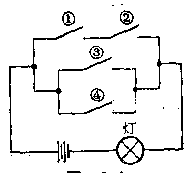

*图3-1*

①、②同时闭合，或开关③闭合，或开关④闭合时才能接通，也就是 \(A_{1}A_{2}, A_{3}, A_{4}\) 这三个事件至少有一个发生时，灯才会亮。所以 \(A_{1}A_{2} + A_{3} + A_{4}\) 表示“灯亮”这一事件。

##### 例 2

指出下列事件的包含关系：

（1） \(A_{i}\) “圆柱形零件的长度合格”；

B： “圆柱形零件合格”。

（2） \(A_{i}\) “击落飞机”；

B： “击中飞机”。

**［解］** （1） 由于长度合格时， 零件不一定合格， 而零件合格时， 长度一定合格， 所以 \(B\) 发生必导致 \(A\) 发生。 因此 \(B \subset A\)。

（2） 由于击中飞机时， 飞机不一定被击落， 而飞机被击落时， 必然被击中， 所以 \(A\) 发生必导致 \(B\) 发生， 因此 \(A \subset B\)。

##### 例 3

证明下列等式成立：

（1） \(A + AB = A;\)

（2） \(A + A = A;\)

（3） \(A \cdot A = A\)。

**［证］** （1） 如果 \(A + AB\) 发生， 即 \(A, AB\) 至少有一个发生， 不妨假定 \(AB\) 发生， 即 \(A\) 与 \(B\) 同时发生， 由此推得 \(A\) 发生， 也就是 \(A + AB \subset A\)。

反之如果 A 发生必导致 \(A + AB\) 发生， 也就是 \(A \subset A + AB\) 。 所以

$$
A + A B = A.
$$

（2） 如果 \(A+A\) 发生，必导致 \(A\) 发生；反之，\(A\) 发生也必导致 \(A+A\) 发生。所以

$$
A + A = A.
$$

（3） 同理可证： \(A \cdot A = A\) 。

1. 设 \(A\) 表示“一次射击命中 4 至 6 环”，\(B\) 表示“一次射击命中 5 至 8 环”，试表述下列事件：\(A + B, AB, A + A, A \cdot A\)。

2. 证明下列等式： \(A+U=U\)； \(A + V = A\)； \(A \cdot U = A\)； \(A V = V\)。 式中 \(U\) 为必然事件， \(V\) 为不可能事件。

3. 下列包含关系是否成立？为什么？

$$
A \subset A + B， A \cdot B \subset A.
$$

4. 指出下列事件的包含关系。

（1） A： “一次射击命中 5 环”；

B： “一次射击至少命中 4 环”；

（2） A： “圆柱形零件不合格”；

B： “圆柱形零件长度不合格”。

5. 飞机易被击毁的地方是两个发动机和驾驶室，要击落飞机必须同时击毁两个发动机或击毁驾驶室，设 \(A_{1}\) 表示“击毁第一个发动机”，\(A_{2}\) 表示“击毁第二个发动机”，\(B\) 表示“击毁驾驶室”，问如何表示“击落飞机”这一事件。

6. 某电路由五只元件串联而成，设 \(A_{4}\) 表示“第 \(i\) 只元件可靠”，\(B_{i}\) 表示“第 \(i\) 只元件损坏”，\(i = 1, 2, 3, 4, 5\)，问如何表示“电路通”和“电路断”这两个事件？

（4） 事件的互斥关系 如果事件 \(A\) 与 \(B\) 在一次试验中不能同时发生， 那末称事件 \(A\) 与 \(B\) 互斥或互不相容， 记作 \(A \cdot B = V\)。

例如，以 \(A\) 表示“投掷一颗骰子出现奇数点”，\(B\) 表示“投掷一颗骰子出现偶数点”，显然，在一次试验中，事件 \(A\) 与 \(B\) 不可能同时发生。所以 \(A\) 与 \(B\) 互斥。

事件互斥的概念可推广到有限个事件，就是：

如果一组事件中的任意两个事件都互斥，那末称这一组事件为互不相容事件组。

由基本事件的性质可知，任一随机现象的全部基本事件构成互不相容事件组。

（5） 事件的对立关系 如果事件 \(A\) 与 \(B\) 同时满足 \(A + B = U, AB = V\)， 那末称 \(A\) 是 \(B\) 的对立事件， 或 \(B\) 是 \(A\) 的对立事件， 记 \(A\) 的对立事件为 \(\overline{A}\)。

例如， 以 \(A\) 表示“种子发芽”， \(B\) 表示“种子不发芽”。 显然在一次试验中， 事件 \(A\) 与 \(B\) 必然有一个发生， 且不能同时发生， 即事件 \(A\)、\(B\) 满足关系式 \(A + B = U\)、\(A \cdot B = V\)。 所以 \(A\) 与 \(B\) 互为对立事件。

假若以 \(C\) 表示“掷一颗骰子最多出现两点”，\(D\) 表示“掷一颗骰子至少出现三点”。显然，在一次试验中，事件 \(C\) 与 \(D\) 必然有一个发生，且不能同时发生，即 \(C + D = U, C \cdot D = V\)。所以 \(C\) 与 \(D\) 互为对立事件。

一般地说， 如果一个随机现象只有两个基本事件， 那末这两个基本事件互为对立事件。如果一随机现象不止两个基本事件， 只要将全部基本事件一分为二， 那末所构成的两个事件互为对立事件。

凡对立事件一定互斥；反过来，两个互斥的事件不一定是对立事件。例如，以 \(A\) 表示“一次射击命中9环”，\(B\) 表示“一次射击命中10环”，显然，\(A\) 与 \(B\) 是互斥事件，但由于 \(A + B \neq U\)，所以 \(A\) 与 \(B\) 不是对立事件。

##### 例 4

试将 \(A + B\) 表示为互斥事件的和。

**［解］** \(\overline A\) 是 \(A\) 的对立事件，表示“长度不合格”。\(\overline B\) 是 \(B\) 的对立事件，表示“直径不合格”。\(\overline A+\overline B\) 表示“长度、直径至少有一个不合格”。\(\overline A\cdot\overline B\) 表示“长度、直径都不合格”。因为 \(\overline{A+B}\) 是 \(A+B\) 的对立事件，而 \(A+B\) 表示“长度和直径至少有一个合格”，所以 \(\overline{A+B}\) 表示“长度、直径都不合格”。

$$
A + B = A \cdot \overline {{{B}}} + \overline {{{A}}} \cdot B + A \cdot B.
$$

##### 例 5

设 \(A\) 表示“圆柱形零件的长度合格”，\(B\) 表示“圆柱形零件的直径合格”，试说明下列事件的含义：\(\overline A,\overline B,\overline A+\overline B,\overline A\cdot\overline B,\overline{A+B},\overline{A\cdot B}\)。

**［解］** \(\overline A\) 是 \(A\) 的对立事件，表示“长度不合格”。\(\overline B\) 是 \(B\) 的对立事件，表示“直径不合格”。\(\overline A+\overline B\) 表示“长度、直径至少有一个不合格”。\(\overline A\cdot\overline B\) 表示“长度、直径都不合格”。因为 \(\overline{A+B}\) 是 \(A+B\) 的对立事件，而 \(A+B\) 表示“长度和直径至少有一个合格”，所以 \(\overline{A+B}\) 表示“长度、直径都不合格”。

同理，因为 \(\overline{A\cdot B}\) 是 \(A\cdot B\) 的对立事件，而 \(A\cdot B\) 表示“长度和直径都合格”，所以 \(\overline{A\cdot B}\) 表示“长度、直径至少有一个不合格”。

由此例可得下列等式：

$$
\overline {{A + B}} = \overline {{A}} \cdot \overline {{B}}.
$$

$$
\overline {{A \cdot B}} = \overline {{A}} + \overline {{B}}.
$$

#### 习题3·2（2）

1. 判别下列各对事件是否为互斥事件：

（1） A： “三粒种子全部发芽”；

B： “三粒种子都不发芽”；

（2） A： “一次射击最多命中2环”；

B： “一次射击至少命中8环”；

（3） A： “掷一颗骰子最多出现四点”；

B： “掷一颗骰子至少出现四点”。

2. 写出下列事件的对立事件：

（1） “8 件产品中次品数不多于 3 件”；

（2） “两粒种子都发芽”；

（3） “三道工序至少有一道合格”。

3. 某城市发行甲、乙、丙三种报纸，设 A 表示“订阅甲报”，B 表示“订阅乙报”，C 表示“订阅丙报”，试表述下列事件：

（1） 只订甲报；

（2） 只订甲、乙报；

（3） 只订一种报；

（4） 至少订一种报；

（5） 不订报。

为了便于直观地理解事件及其关系，可借用集合的概念把事件之间的关系用图示法表示出来。

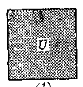

*（1）*

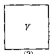

*（2）*

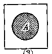

*（3）*

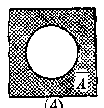

*（4）*

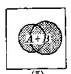

*（5）*

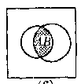

*（6）*

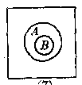

*（7）*

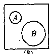

*（8）*

*图3-2*

当我们考察一个随机现象时，它的全部基本事件构成一个集合，由于每次试验出现的结果必然是基本事件中的某一个事件，所以这个集合的全体构成一个必然事件，记为 \(U\)，如图3-2（1）所示。不可能事件不包含任何一个基本事件，它可看成一个空集，记为 \(V\)，如图3-2（2）所示。任一随机事件 \(A\) 包含有全部基本事件中的某些基本事件，相当于集合 \(U\) 中的一个子集，如图3-2（3）所示。显然，\(A\) 的对立事件 \(\overline{A}\) 在图中可以用 \(A\) 以外的那一部分子集表示，如图3-2（4）所示。两个事件 \(A\) 与 \(B\) 的和事件 \(A + B\) 相当于两个集合 \(A\) 与 \(B\) 的并集，如图3-2（5）所示。两个事件 \(A\) 与 \(B\) 的积事件 \(A \cdot B\) 相当于这两个集合的交集，如图3-2（6）

所示。事件 \(A\) 包含了事件 \(B\)，即 \(B \subset A\) 这一关系，相当于集合 \(A\) 包含了集合 \(B\)，如图3·2（7）所示。两个事件 \(A\) 与 \(B\) 互斥，这一关系相当于集合 \(A\) 与集合 \(B\) 的交集是一个空集，如图3·2（8）所示。

象集合的运算一样，事件的运算满足下面的关系式：

（1） 交换律；

$$
\boldsymbol {A} + \boldsymbol {B} = \boldsymbol {B} + \boldsymbol {A}； \tag {1}
$$

$$
\boldsymbol {A} \cdot \boldsymbol {B} = \boldsymbol {B} \cdot \boldsymbol {A}. \tag {2}
$$

（2） 结合律：

$$
(A + B) + C = A + (B + C)； \tag {3}
$$

$$
(A \cdot B) C = A (B \cdot C)。 \tag {4}
$$

（3） 分配律：

$$
(A+B)C=A\cdot C+B\cdot C。\tag{5}
$$

$$
(A\cdot B)+C=(A+C)(B+C)。\tag{6}
$$

（4） 对偶律：

$$
\overline{A+B}=\overline A\cdot\overline B。\tag{7}
$$

$$
\overline{A\cdot B}=\overline A+\overline B。\tag{8}
$$

证明（5）式

$$
(A + B) C = A \cdot C + B \cdot C.
$$

**［证］** 如果 \((A + B)C\) 发生，也就是 \(A\) 与 \(B\) 至少有一个与 \(C\) 同时发生，不妨假设 \(A\) 与 \(C\) 同时发生，即 \(A \cdot C\) 发生，由此推得 \(A \cdot C + B \cdot C\) 发生，所以

$$
(A + B) C = A \cdot C + B \cdot C
$$

反之，如果 \(A \cdot C + B \cdot C\) 发生，也就是 \(A \cdot C\) 与 \(B \cdot C\) 至少有一个发生，不妨假设 \(A \cdot C\) 发生，即 \(A\) 与 \(C\) 同时发生，而 \(A\) 发生，\(A + B\) 也发生，即 \(A + B\) 与 \(C\) 同时发生，也就是 \((A + B)C\) 发生，所以 \(A \cdot C + B \cdot C \subset (A + B)C\)。

根据事件相等的概念可得

$$
(A+B)C=A\cdot C+B\cdot C。
$$

这个等式可用直观图形进行验证，等式左端即图3·3（1）的阴影部分，等式右端即图3·3（2）的阴影部分。

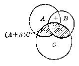

*（1）*

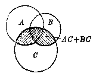

*（2）*

*图3-3*

（1）式至（3）式中的其它运算律可用类似的方法进行证明。利用上述运算律可对事件进行抽象的运算。

##### 例 6

**［解］**

化简

$$
(A + B) (B + C)。
$$

$$
(A + B) (B + C) = A \cdot B + A \cdot C + B + B \cdot C
$$

$$
= A \cdot B + A \cdot C + B
$$

$$
= A \cdot C + A \cdot B + B = A \cdot C + B.
$$

1. 证明事件运算的交换律成立：

（1） \(A + B = B + A;\)

（2） \(A \cdot B = B \cdot A\)。

2. 化简下列各式：

（1） \((A + B)(A + B)\)；

（2） \((A + B)(A + B)(\overline{A} + B)\)。

### § 3·3 频率和概率

在一定条件下，随机事件可能发生也可能不发生，它们具有偶然性。 但是，事件发生的可能性大小是可以根据人们实践中的经验作出比较的。 例如：

（1） 袋中装有 99 只红球和 1 只白球，它们的大小相同，从中任取一球，若以 A 表示“任取一球为红球”，B 表示“任取一球为白球”。显然，事件 A 发生的可能性大于事件 B 发生的可能性。

（2） 同一射击手向同一距离、大小不等的两个目标射击，若以 A 表示“击中大目标”，B 表示“击中小目标”，显然，事件 A 发生的可能性大于事件 B 发生的可能性。

事件发生的可能性大小是可以比较的，但是怎样具体度量一个事件发生可能性的大小呢？

我们先看下面的客观事实。

在大量重复试验中， 观察事件 \(A\) 发生的次数， 如果在 \(n\) 次试验中， \(A\) 发生了 \(m\) 次， 那末称比值 \(\frac{m}{n}\) 为事件 \(A\) 在 \(n\) 次试验中发生的频率。 实践证明， 在大量重复试验的情况下， 事件发生的频率是稳定的。

例如，投掷一枚硬币，观察事件 \(A\)：“徽花朝上”的频率。当投掷次数 \(n\) 比较小时，频率 \(\frac{m}{n}\) 是不稳定的。当投掷次数 \(n\) 足够大时，频率 \(\frac{m}{n}\) 就呈现出在 \(\frac{1}{2}\) 附近摆动的明显趋势。一般情况下，\(\frac{m}{n}\) 与 \(\frac{1}{2}\) 的偏差很小。

历史上不少人做过这种试验。现将法国人蒲丰和英国人皮尔逊所做的试验数据列表如下。

| 试验者 | 试验次数n（投掷硬币次数） | A出现的次数m（徽花朝上的次数） | A出现的频率\(\frac{m}{n}\) |
| --- | --- | --- | --- |
| 蒲丰 | 4040 | 2048 | 0.5069 |
| 皮尔逊 | 24000 | 12012 | 0.5005 |

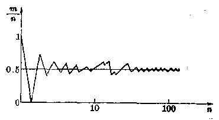

*图3-4*

可以预见， 假若在相同的条件下， 继续进行试验， 频率将稳定于 \(\frac{1}{2}\)。

应该指出，频率的稳定值不会因人而异。它是事件本身所固有的，是不随人们的主观意志而改变的一种客观属性。这种属性，正是可以对事件发生可能性大小进行度量的基础。可以认为事件发生的频率愈大，事件发生的可能性也愈大。因此，频率的稳定值能够用来表示事件发生的可能性大小。我们可以说，在一次投掷硬币时，“徽花朝上”的可能性为 \(\frac{1}{2}\)。

在现实生活中，频率稳定性的例子是普遍存在的。例如有人对英文字母被使用的情况作了统计，发现“字母 \(E\) 被使用”这一事件的频率稳定于0.1，而“字母 \(Z\) 被使用”这一事件的频率稳定于0.001。有人从世界各国人口统计中发现“男婴出生”这一事件的频率稳定于 \(\frac{22}{43}\)。

我们把上面所分析的这种频率的稳定值叫做这个事件的概率，例如“徽花朝上”这一个事件的概率为 \(\frac{1}{2}\)，“字母 \(Z\) 被使用”这一个事件的概率为0.001。

概率的统计定义： 如果在大量重复试验的条件下， 事件 A 发生的频率稳定于常数 p， 那末称事件 A 的概率是 p， 记作 \(P(A) = p\) 。

概率的概念客观地刻划了事件发生的可能程度。在我们的日常生活和工作中，概率的具体例子很多。如产品的次品率、种子的发芽率、天气预报的准确率、电话机的使用率、器件的可靠度等都是概率。由于概率是频率的稳定值而在试验次数足够大时，事件发生的频率与概率相差极小，因此在实用上，事件的概率可以通过试验来定出。

根据概率的统计定义，不难知道，概率具有以下性质：

（1） 任何随机事件 \(A\) 的概率 \(P(A)\) 总是介于 0 与 1 之间， 即 \(0 \leqslant P(A) \leqslant 1\)。 这是因为事件 \(A\) 在 \(n\) 次试验中出现的频率为 \(\frac{m}{n}\)。 由于 \(0 \leqslant \frac{m}{n} \leqslant 1\)， 所以当 \(n\) 增大时， \(\frac{m}{n}\) 稳定值也必在 0 与 1 之间。

（2） 必然事件 \(U\) 的概率等于 1， 不可能事件 \(V\) 的概率等于 0， 也就是 \(P(U) = 1\)， \(P(V) = 0\)。 这是因为必然事件 \(U\) 在 \(n\) 次试验中出现的频率为 \(\frac{n}{n} = 1\)， 而不可能事件在 \(n\) 次试验中出现的频率为 \(\frac{0}{n} = 0\)。

如果我们反问， 事件 \(A\) 的概率为 0， 即 \(P(A) = 0\)， 是否可以断定 \(A\) 是不可能事件呢？ 回答是否定的。 因为事件 \(A\) 的概率为 0， 仅仅说明它发生的频率稳定于 0， 而频率不一定就等于 0. 例如， 陨石击毁房屋的概率等于 0， 但“陨石击毁房屋”不一定是不可能事件。

在大量重复的试验中，当某事件 \(A\) 的概率 \(P(A)\) 与0非常接近时，事件 \(A\) 出现的频率非常小，我们就称事件 \(A\) 为小概率事件。小概率事件虽然不是不可能事件，但在一次试验中它几乎不会发生。

1. 怎样测定一个事件的概率。概率具有哪些性质？

2. 如果已知某河流水位超过5米的概率是 \(1\%\)，能不能断定百年内这条河流不可能遇上两次水位超过5米的情况？为什么？

3. 把事件的概率说成是事件出现的频率的极限（普通意义下的极限）， 对吗？

### § 3·4 古典概型

前一节， 我们在频率稳定性的基础上， 说明了概率的概念。下面，我们来研究一类最简单而又常见的随机现象的数学模型——古典概型。

先看两个例子。

（1） “投掷一颗匀质骰子出现的点子数”这一随机现象共有六个基本事件，即“出现一点”、“出现两点”、“出现六点”。由于骰子是一个均匀的正六面体，因而没有理由说某一面比其它各面更容易出现。因此，可以认为每一基本事件出现的可能性是相等的。也就是都有 \(\frac{1}{6}\) 的机会出现。如果以 \(A\) 表示“出现偶数点”这一事件，那末 \(A\) 含有六个基本事件中的三个基本事件，即“出现两点”、“出现四点”、“出现六点”。因此事件 \(A\) 发生的概率是 \(\frac{3}{6}\)，即

$$
P (A) = \frac {3}{6} = \frac {1}{2}.
$$

（2） “把黑、白两只球随机地放入编号为 I、II、III 的三只盒子中”这一随机现象共有下列九个基本事件。如果把第一只盒子不放球，第二只盒子放白球，第三只盒子放黑球的放法记为 （0、白、黑），其余类推，这些基本事件就是：

（0， 白， 黑）， （0， 黑， 白）， （白， 黑， 0），

（黑， 白， 0）， （白， 0， 黑）， （黑， 0， 白），

（白黑， 0， 0）， （0， 白黑， 0）， （0， 0， 白黑）。

由于两只球的放法是随机的，没有理由认为某一种放法比其它放法更容易发生，因此，这九个基本事件发生的可能性都相等，即都有 \(\frac{1}{9}\) 的机会发生。如果以 \(A\) 表示“编号为I的盒子中无球”这一事件，那么，由于它含有九个基本事件中的四个基本事件：（0， 白， 黑），（0， 黑， 白），（0， 白黑， 0），（0， 0， 白黑）。因此，事件 \(A\) 发生的概率为 \(\frac{4}{9}\)，即

$$
P (A) = \frac {4}{9}.
$$

从这两个例子，我们看到了一种既简便又直观的计算概率的方法。但是，应用这种直接计算概率的方法是有条件的，它要求随机现象具有两个特点：（1） 基本事件的总数是有限的；（2） 每一基本事件发生的可能性是相等的。凡具有这两个特点的随机现象的数学模型称为古典概型。与古典概型有关的事件的概率可根据其特点直接推算，无需进行大量试验。

概率的古典定义： 如果一随机现象， 共有 \(n\) 个等可能的彼此互斥的结果， 而其中恰有 \(m\) 个结果属于事件 \(A\)， 即总的基本事件数为 \(n\)， 事件 \(A\) 所包含的基本事件数为 \(m\)， 那末事件 \(A\) 的概率是

$$
P (A) = \frac {A \text {所包含的基本事件数}}{\text {基本事件的总数}} = \frac {m}{n}.
$$

古典概型在概率论中占有相当重要的地位，在产品抽样检验等实际问题以及理论物理研究中都有着重要作用。对于古典概型，按古典定义所得的概率正是统计定义中试验的频率所围绕着摆动的稳定值。

在概率的古典定义中，基本事件的总数 \(n\) 与 \(A\) 所包含的基本事件数 \(m\) 的计算，常常要用到排列组合的知识。

#### 例 1

从1，2，3，4，5五个数字中，任取三个排成三位数，求所得的三位数是偶数的概率。

**［解］** 设 A 表示“所得的三位数是偶数”。

从五个数字中任取三个排成的三位数共有 \(A_5^3\) 种，即基本事件的总数为 \(A_5^3\)。若所得的三位数是偶数，末位数必须是2或者是4，当末位数固定为2或4时，十位数与百位数可以从其它四个数字中任选两个进行排列，因此，A所包含的基本事件数为 \(2A_{4}^{2}\)，所以所求的概率为

$$
P(A)=\frac{2A_4^2}{A_5^3}=\frac{2\times4\times3}{5\times4\times3}=\frac25。
$$

##### 例 2

在100只零件中，混进了两只次品，现从中任取五只，求两只次品都被取到的概率。

**［解］** 设 A 表示“取出的五只零件中恰有两只为次品”。

从 100 只零件中任取五只，可能取法共有 \(C_{100}^{5}\) 种，即基本事件的总数为 \(C_{100}^{5}\)。五只零件中恰有两只是次品，三只是正品，而两只次品的可能取法有 \(C_{2}^{2}\) 种。三只正品的可能取法有 \(C_{98}^{3}\) 种。因此 A 所包含的基本事件数为 \(C_{2}^{2} \cdot C_{98}^{3}\)。所以所求的概率为

$$
P(A)=\frac{C_2^2C_{98}^3}{C_{100}^5}=\frac{1}{495}\approx0.002。
$$

#### 习题3·4（1）

1. 在例1中，求所得的三位数是奇数的概率。

2. 在例 2 中， 求取出的五个零件中

（1） 只有一个是次品的概率；

（2） 全部是正品的概率。

3. 某热水瓶厂有不合格的热水瓶 60 只作为处理品出售，其中 48 只是二等品，其余是三等品，现从这些热水瓶中任取两只，求

（1） 这两只热水瓶都是二等品的概率；

（2） 这两只热水瓶中二等品、三等品各有一只的概率。

4. 有人说掷两枚硬币，只可能出现三种不同的结果，即“两枚都出现币值”，“两枚都出现徽花”，“一枚出现币值、一改出现徽花”，因此，“两枚都出现徽花”这一事件的概率为 \(\frac{1}{3}\)，这种说法对不对？为什么？

5. 袋中装有12只大、小相同的球，其中5只为白球，7只为黑球，从中任取三只，求

（1） 两只为白球， 一只为黑球的概率；

（2） 一只为白球， 两只为黑球的概率；

（3） 三只都是黑球的概率。

下面再看两个比较复杂的例子

##### 例 3

设有 \(n\) 个不同的球，每个都能以同样的概率 \(\frac{1}{N}\) 落到 \(N\) 个格子 \((N \geqslant n)\) 的每一个格子中，并且每个格子能容纳的球数不受限制。试求：

（1） 指定的 n 个格子各有一球的概率。

（2） 任何 \(n\) 个格子各有一球的概率。

**［解］** 设 \(A\) 表示“指定的 \(n\) 个格子各有一球”。\(B\) 表示“任何 \(n\) 个格子各有一球”。

由于每只球可落入 \(N\) 个格子中的任意一个。对于第一只球的每一种装法，第二只球又可以落入 \(N\) 个格子中的任意一个，…，\(n\) 只球落入 \(N\) 个格子的不同情况，总起来共有 \(N^n\) 种，即基本事件的总数为 \(N^n\)。

在第一个问题中， 指定的 \(n\) 个格子各有一球， 相当于 \(n\) 个元素的全排列。 显然， 事件 \(A\) 所包含的基本事件数为 \(n!\)。 所以所求概率为

$$
P (A) = \frac {n !}{N ^ {n}}.
$$

在第二个问题中，\(n\) 个格子可以是任意的，也就是可以从 \(N\) 个格子中任意选出 \(n\) 个来，共有 \(C_N^n\) 种选法。因此 \(B\) 所包含的基本事件数比 \(A\) 所包含的基本事件数扩大了 \(C_N^n\) 倍，即 \(B\) 所包含的基本事件数为 \(C_N^n n!\)。所以所求的概率为

$$
P (B) = \frac {C _ {N} ^ {n} n !}{N ^ {n}} = \frac {N !}{N ^ {n} (N - n) !}.
$$

##### 例 4

袋中装有 \(a\) 只黑球，\(b\) 只白球，它们除颜色不同外，其它方面没有差别，现在把球随机地一只只摸出来，求第 \(k\) 次摸出的一只球是黑球的概率 \((1 \leqslant k \leqslant a + b)\)。

设 A 表示“第 k 次摸出的一只球是黑球”。

**［解一］** 当同色球不加区别时，把摸出的球依次排列在一直线的 \(a + b\) 个位置上。由于 \(a\) 只黑球是没有区别的，\(b\) 只白球也是没有区别的， 如果把 \(a\) 只黑球的位置固定下来， 那末其它位置放的一定是白球。 而黑球的位置可以有 \(C_{a+b}^{a}\) 种放法， 即基本事件的总数为 \(C_{a+b}^{a}\)。

第 \(k\) 个位置上必须放黑球， 剩下来的 \(a - 1\) 只黑球可以在剩下的 \(a + b - 1\) 个位置上任取 \(a - 1\) 个位置安放。 因此， \(A\) 所包含的基本事件数为 \(C_{a + b - 1}^{a - 1}\)。 所以所求的概率为

$$
P (A) = \frac {C _ {a + b - 1} ^ {a - 1}}{C _ {a + b} ^ {a}} = \frac {a}{a + b}.
$$

计算结果表明：从 \(a + b\) 只球中，任取一只取到黑球的概率与取球的次序 \(k\) 无关，这个结论与日常生活经验是一致的。例如，有20个人登记去庐山旅游，只有三张旅游票，采取抽签的办法，那末每人抽到旅游票的机会都是 \(\frac{3}{20}\)，与各人抽签的次序无关。

**［解二］**

当同色球有区别时， 如果设想把 \(a\) 只黑球， \(b\) 只白球都进行编号， 再把摸出的球依次放在排列成一直线的 \(a + b\) 个位置上， 那末一切可能的排法， 相当于把 \(a + b\) 个元素进行全排列， 共有 \((a + b)!\) 种， 即基本事件的总数为 \((a + b)!\)。

第 \(k\) 次摸得黑球， 也就是第 \(k\) 个位置上要放黑球， 共有 \(C_a^1=a\) 种不同放法。相对于每一种放法， 另外 \(a + b - 1\) 个位置， 相当于 \(a + b - 1\) 个元素进行全排列。因此， \(A\) 所包含的基本事件数为 \(C_{a}^{k}(a + b - 1)!\)， 所以所求的概率为

$$
P(A)=\frac{C_a^1(a+b-1)!}{(a+b)!}=\frac{a}{a+b}。
$$

上面两种解法的区别是前一种解法对同色球不加区别， 解法中不考虑顺序而用组合； 后一种解法把球看作是有“个性的”， 其解法中要考虑各黑球和各白球间的顺序而采用排列。 两种不同的解法得到相同的结果是毫不奇怪的。 这说明对同一随机现象可以用不同的模型来描述， 只要方法正确， 结果总是一致的。

#### 习题3·4（2）

1. 10个学生，分别佩戴若从1到10号的纪念章，任选三人记录其号码。求：

（1） 设小号码为 5 的概率；

（2） 最大号码为 5 的概率。

2. 从5双不同鞋子中任取4只，求4只鞋子中至少有两只鞋子配成一双的概率。

3. 三只球随机放入四个盒子中，问盒子中球的最多个数分别为 1、2、3 的概率各是多少？

4. 某小组共有 10 人， 为突击完成一项任务， 每人在 1 日到 10 日之间参加劳动一天， 劳动日期完全是随机的， 求每天都有人劳动的概率。

### § 3·5 概率的加法公式

为了借助简单事件的概率来推算复杂事件的概率，必须给出概率的运算法则。下面我们就古典概型的情况下，证明概率的加法公式：

1. 互斥事件的概率加法公式

如果 \(A, B\) 为两个互斥事件， 那末

$$
P (A + B) = P (A) + P (B)。 \tag {1}
$$

**［证］** 设基本事件的总数为 \(n, A\) 所包含的基本事件数为 \(m_1, B\) 所包含的基本事件数为 \(m_2\)。 由于 \(A, B\) 互斥， 所以 \(A + B\) 所含的基本事件数为 \(m_1 + m_2\)， 于是按概率的古典定义， 有

$$
P (A + B) = \frac {m _ {1} + m _ {2}}{n} = \frac {m _ {1}}{n} + \frac {m _ {2}}{n} = P (A) + P (B)。
$$

这一公式可推广到有限个互斥事件， 即

如果 \(A_{1}, A_{2}, \cdots, A_{n}\) 为 n 个互斥事件，那末，

$$
P (A _ {1} + A _ {2} + \dots + A _ {n}) = P (A _ {1}) + P (A _ {2}) + \dots + P (A _ {n})。 \tag {2}
$$

（2） 对立事件的概率加法公式

对立事件的概率之和等于1，即

$$
P (A) + P (\overline {{{A}}}) = 1. \tag {3}
$$

**［证］** 由于 \(A + \overline{A} = U\)，且 \(A, \overline{A}\) 互斥，所以

$$
1 = P (U) = P (A + \overline {{{A}}}) = P (A) + P (\overline {{{A}}})。
$$

#### 例 1

某厂产品分一、二、三三个等级，出现二级品的概率为 \(2\%\)，出现三级品的概率为 \(1\%\)，求出现非一级品的概率。

**［解］** 设 \(A_{i}\) 表示“出现 \(i\) 级品”，\(i = 1, 2, 3\)。所求概率为 \(\overline{A}_{1}\)，由于该厂产品只有三个等级，如果不是一级品那末就是二级品或者是三级品，所以有

$$
\overline {{{A}}} _ {1} = A _ {2} + A _ {3}， \quad \text {且} \quad A _ {2}， A _ {3} \quad \text {互斥。}
$$

由（1）式得

$$
P (\overline {{{A}}} _ {1}) = P (A _ {2}) + P (A _ {3}) = 2 \% + 1 \% = 3 \%.
$$

##### 例 2

袋中装有32只白球，4只红球，从中任取三只，求“至少有一只红球”的概率。

**［解一］** 设 A 表示“取出的三只球中至少有一只是红球”， \(B_{1}\) 表示“取出的三只球中有 i 只是红球”，i=1，2，3。那末

$$
A = B _ {1} + B _ {2} + B _ {3}， \text {且} B _ {1}， B _ {2}， B _ {3} \text {互斥。}
$$

由（2）式得：

$$
\begin{aligned}
P(A)&=\frac{C_4^1C_{32}^2}{C_{36}^3}+\frac{C_4^2C_{32}^1}{C_{36}^3}+\frac{C_4^3}{C_{36}^3}\\
&\approx0.2779+0.0269+0.0006=0.3053。
\end{aligned}
$$

**［解二］** 由于 \(\overline{A}\) 表示“取出的三只球都是白球”，由（3）式得：

$$
P(A)=1-P(\overline A)=1-\frac{C_{32}^3}{C_{36}^3}\approx0.3053。
$$

#### 3. 任意事件的概率加法公式

如果 \(A, B\) 为任意两个事件， 那末

$$
\boxed {P (A + B) = P (A) + P (B) - P (A \cdot B).} \tag {4}
$$

**［证］** 因为 \(A + B = A\overline{B} + \overline{A} B + AB\)，且 \(A\overline{B}, \overline{A}B, AB\) 互斥，由（2）式

$$
P (A + B) = P (A \overline {{{B}}}) + P (\overline {{{A}}} B) + P (A B)。 \tag {5}
$$

又因 \(A = A\overline{B} + AB\)，且 \(A\overline{B}, AB\) 互斥，所以

$$
P (A) = P (A \bar {B}) + P (A B)。
$$

于是有

$$
P (A \overline {{{B}}}) = P (A) - P (A B)。 \tag {6}
$$

同理可得

$$
P (\overline {{{A}}} B) = P (B) - P (A B)。 \tag {7}
$$

将（6）、（7）代入（5），即得

$$
P (A + B) = P (A) + P (B) - P (A B)。
$$

将（4）式推广到三个事件。有

如果 \(A, B, C\) 为任意三个事件，那末

$$
\left. \begin{array}{c} P (A + B + C) = P (A) + P (B) + P (C) - P (A B) \\ - P (B C) - P (C A) + P (A B C)。 \end{array} \right] \tag {8}
$$

**［证］** \(P(A + B + C) = P[A + (B + C)]\)

$$
= P (A) + P (B + C) - P [ A (B + C) ]
$$

$$
= P (A) + P (B) + P (C) - P (B C)
$$

$$
- P (A B + A C)
$$

$$
= P (A) + P (B) + P (C) - P (B C)
$$

$$
- P (A B) - P (A C) + P (A B C)。
$$

##### 例 3

某地有甲、乙、丙三种报纸，据调查，成年人中有 \(20\%\) 读甲报，\(16\%\) 读乙报，\(14\%\) 读丙报，\(8\%\) 兼读甲、乙报，\(5\%\) 兼读甲、丙报，\(4\%\) 兼读乙、丙报，\(2\%\) 兼读所有的报，求成年人中至少阅读一种报纸的概率。

**［解］** 设 \(A\) 表示“读甲报”，\(B\) 表示“读乙报”，\(C\) 表示“读丙报”，那末 \(A + B + C\) 表示“至少读一种报”。 \(A, B, C\) 相容。

由（8）式得

$$
\begin{array}{l} P (A + B + C) = P (A) + P (B) + P (C) - P (A B) \\ - P (B C) - P (C A) + P (A B C) \\ = 0.2 + 0.16 + 0.14 - 0.08 - 0.05 \\ - 0.04 + 0.02 = 0.35. \\ \end{array}
$$

1. 某射手一次射击命中10环的概率为0.28，命中9环的概率为0.24，命中8环的概率为0.19，求在一次射击中：

（1） 至少命中 9 环的概率；

（2） 至少命中 8 环的概率。

2. 据调查某地区居民血型分布为：

O型占50%，A型占14.5%，B型占31.2%，AB型占4.3%，现有一A型病人需要输血，若在该地区任选一人，求其能为A型病人输血的概率。

3. 50 只乒乓球中，有 5 只是次品，从中任取 3 只，求 3 只中至少有 2 只是正品的概率。

4. 加工某种产品需要经过两台机床，每台机床运转的概率都是80%，两台机床至少有一台运转的概率是90%，求两台机床同时运转的概率。

### § 3·6 概率的乘法公式

#### 1. 条件概率

在给出概率乘法公式之前， 先说明什么是条件概率。 在概率的计算中， 常常遇到这样的情况： 在某一事件 \(B\) 已经发生的条件下， 求另一事件 \(A\) 的概率。 通常称这一概率为事件 \(A\) 在事件 \(B\) 已经发生的条件下的条件概率， 记作 \(P(A|B)\)。

例如： 三件产品中有两件是正品， 设 A 表示“甲取一件为正品”，显然， \(P(A)=\frac{2}{3}\)。又设 B 表示“乙取一件为正品”，在事件 A 已经发生的条件下，三件产品只剩下两件，且正品只有一件了。这时，B 发生的概率为 \(\frac{1}{2}\)，即

$$
P (B \mid A) = \frac {1}{2}.
$$

#### 2. 概率的乘法公式

（1） 如果 A、B 为任意两个事件， 那末

$$
\boxed {P (A B) = P (A) P (B \mid A) = P (B) P (A \mid B)} \tag {1}
$$

**［证］** 设基本事件的总数为 \(n, A, B\) 所包含的基本事件数分别为 \(m_1, m_2, A \cdot B\) 所包含的基本事件数为 \(m\)。

显然， \(m\leqslant m_1\)， \(m\leqslant m_2\)

由概率的古典定义， 得

$$
P(A)P(B\mid A)=\frac{m_1}{n}\cdot\frac{m}{m_1}=\frac{m}{n}=P(AB)。
$$

同理可证 \(P(B)P(A|B) = P(AB)\)。

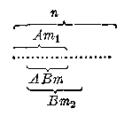

上述公式可推广到有限个任意事件。

（2） 如果 \(A_{1}\)、 \(A_{2}\)、…、 \(A_{n}\) 为任意 n 个事件，那么

$$
\boxed { \begin{array}{l} P (A _ {1} \cdot A _ {2} \dots A _ {n}) \\ = P (A _ {1}) P (A _ {2} | A _ {1}) \dots P (A _ {n} | A _ {1} \cdot A _ {2} \dots A _ {n - 1})。 \end{array} } \tag {2}
$$

§ 3·2 中曾指出如果事件 A 与 B 不存在相互依赖关系和相互影响关系， 那末称 A 与 B 相互独立， 而等式

$$
P (A \mid B) = P (A)
$$

表示 B 发生不影响 A。等式 \(P(B|A)=P(B)\) 表示 A 发生不影响 B。因此这两个等式是事件 A、B 相互独立的概率含义。即如果两事件中任一事件发生不影响另一事件的概率，那末称它们是相互独立的。

由（1）式，可得独立事件的概率乘法公式：

（3） 如果 A、B 为相互独立的两个事件， 那末

$$
P (A B) = P (A) P (B)。 \tag {3}
$$

由 § 3·2n 个事件相互独立的概念可知，其概率含义是：如果事件 \(A_{1}, A_{2}, \cdots, A_{n}\) 中的任一事件 \(A_{i} (i = 1, 2, \cdots, n)\) 对其它任一事件是独立的，并且对其它任意 \(m\) 个事件的积也是独立的，即

$$
P \left(A _ {i} \mid A _ {i _ {1}} \cdot A _ {i _ {2}} \dots A _ {i _ {m}}\right) = P \left(A _ {i}\right)。 \tag {4}
$$

其中 \(A_{i_1}, A_{i_2}, \cdots, A_{i_m}\) 是 \(n\) 个事件中除 \(A_i\) 外的其他任意 \(m\) 个事件的积 \((m = 1, 2, \cdots, n - 1)\)，那末称事件 \(A_1, A_2, \cdots, A_n\) 是相互独立。

由（2）及（4）式可得相互独立的 \(n\) 个事件的概率乘法公式如下：

（4） 如果 \(A_{1}, A_{2}, \cdots, A_{n}\) 为 \(n\) 个相互独立的事件，那末

$$
\boxed {P (A _ {1} \cdot A _ {2} \cdot \dots \cdot A _ {n}) = P (A _ {1}) P (A _ {2}) \dots P (A _ {n}).} \tag {5}
$$

##### 例 1

一批产品共100件，次品率为 \(10\%\)，每次从中任取一件，取出后不再放回，求选取三次而在第三次才取得合格品的概率。

**［解］** 设 \(A_{i}\) 表示“第 \(i\) 次取出的是合格品”，\(i = 1, 2, 3\)。所求的概率为 \(P(\overline{A}_1\overline{A}_2A_3)\)，由于

$$
P (\overline {{{A}}} _ {1}) = \frac {10}{100}， P (\overline {{{A}}} _ {2} | \overline {{{A}}} _ {1}) = \frac {9}{99}，
$$

$$
P (A _ {3} | \overline {{{A}}} _ {1} \overline {{{A}}} _ {2}) = \frac {90}{98}，
$$

根据概率的乘法公式， 得

$$
\begin{array}{l} P \left(\overline {{{A}}} _ {1} \overline {{{A}}} _ {2} A _ {3}\right) = P \left(\overline {{{A}}} _ {1}\right) P \left(\overline {{{A}}} _ {2} \mid \overline {{{A}}} _ {1}\right) P \left(A _ {3} \mid \overline {{{A}}} _ {1} \overline {{{A}}} _ {2}\right) \\ = \frac {10}{100} \cdot \frac {9}{99} \cdot \frac {90}{98} = 0.0082. \\ \end{array}
$$

##### 例 2

已知某产品的次品率为 \(4\%\)，其合格品中 \(75\%\) 为一级品，求任选一件为一级品的概率。

**［解］** 设 A 表示 “任选一件为合格品”，B 表示 “任选一件为一级品”。所求的概率为 \(P(B)\)。

因为 \(B \subset A\)，故 \(AB = B\)，由概率的乘法公式，

$$
P (B) = P (A B) = P (A) P (B | A)。
$$

由于 \(P(A) = 0.96, P(B|A) = 0.75\)，所以

$$
P (B) = P (A) P (B | A) = 0.96 \times 0.75 = 0.72.
$$

##### 例 3

用晶体管装配某部件要用123只元件，改用集成电路装配，只需12只元件，如果每一元件使用到2000小时的概率都是0.996，且能否正常工作是相互独立的。试求在上面两种情况下，这个部件能工作到2000小时的概率。

**［解］** 设 A 表示“部件能工作到 2000 小时”， \(A_{i}\) 表示“第 i 只元件能工作到 2000 小时”， \(i=1,2,\cdots,126\) 。

在一般情况下， 只有当每个元件都完好时， 部件才能正常工作， 因此用晶体管装配时

$$
A=A_1A_2\cdots A_{123}。
$$

由于各元件能否正常工作是相互独立的，且 \(P(A_{i}) = 0.996\)，所以

$$
P(A)=P(A_1)P(A_2)\cdots P(A_{123})=0.996^{123}\approx0.611。
$$

同理， 用集成电路装配时

$$
P (A) = P (A _ {1}) P (A _ {2}) \dots P (A _ {12}) = 0.996 ^ {12} = 0.954.
$$

可见， 由于元件数量的减少， 部件能正常工作的可能性大大提高了。 因此， 努力提高元件的集成度， 减少元件的总数是提高部件可靠性的重要手段之一。

##### 例 4

一批套鞋共10000双， 次品率为0.004， 从中随机抽验产品， 求事件“先取一双为次品， 然后再取两双， 这两双中至少有一双是次品”发生的概率。

**［解］** 设 \(A\) 为“先取一双为次品”，\(B\) 为“再取两双至少有一双为次品”。

由于检查套鞋的质量除一般外观检查外，还要检查套鞋的耐磨性和抗拉强度等质量指标，因此这是破坏性检查，显然抽样是不返回的，也就是事件 \(A\) 与 \(B\) 是不独立的，所以所求的概率应是

$$
P (A B) = P (A) P (B | A)。
$$

但是被抽验的套鞋有10000双，数目很大，不返回抽样可以近似地看成是返回抽样，也就是A与B可以当作独立事件处理，所以

$$
\begin{array}{l} P (A B) = P (A) P (B) = P (A) [ 1 - P (\bar {B}) ] \\ = 0.004 [ 1 - 0.996 ^ {2} ] = 0.000032. \\ \end{array}
$$

这个例子说明了如果套鞋的次品率为0.004，那末在抽验质量中，出现“先取一双为次品，再取两双又至少有一双是次品”的可能性非常小，在10万次抽验中约有3次发生，因此在一次抽验中几乎是不会发生的，如果在一次抽验中竟然发生了这种情况，这就产生了矛盾。由此可以推断该批产品的次品率不止0.004，应该采取相应措施来处理这批产品。

#### 习题3·6（1）

1. 在如图的开关电路中， 每一开关闭合的概率均独立地为 \(\frac{1}{2}\)， 求 “灯亮”的概率。

2. 某元件可靠的概率是 0.9，有一串联电路由 10 只元件串联而成，若每一只元件在电路中是独立起作用的，求电路通的概率。

3. 电压增大…倍，使电路中串联的三个元件分别以 0.3、0.4、0.6 的概

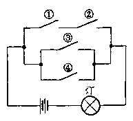

*（第1题）*

率发生故障而断路，假定这三个元件是否断路是相互独立的，求在这种情况下，不发生断路的概率。

4. 根据甲、乙两地多年的气象统计，甲地一年雨天占20%，甲、乙两地同时雨天占12%，今天甲地为雨天，求乙地也为雨天的概率。

#### 3. 独立事件的性质

两个相互独立的事件 A 与 B，具有下列性质：

1. 如果 \(P(A|B) = P(A)\)，那末 \(P(B|A) = P(B)\)，反过来也成立。

**［证］** 由概率乘法公式

$$
P (A) P (B | A) = P (A B) = P (B) P (A | B)。
$$

显然， 如果 \(P(A|B) = P(A)\)， 那末 \(P(B|A) = P(B)\)。

同理，如果 \(P(B|A) = P(B)\)，那末 \(P(A|B) = P(A)\)。

性质1说明事件的独立是一种对称的性质。

2. 如果事件 \(A, B\) 相互独立， 那末事件 \(A\) 与 \(\overline{B}, \overline{A}\) 与 \(B, \overline{A}\) 与 \(\overline{B}\) 也相互独立。

**［证］** 先证如果 \(A, B\) 相互独立，那末 \(A\) 与 \(\overline{B}\) 也相互独立。

由于在事件 A 发生的条件下，事件 B 与 \(\overline{B}\) 仍是对立事件，所以

$$
P (B \mid A) + P (\bar {B} \mid A) = 1，
$$

即 \(P(\bar{B}|A) = 1 - P(B|A)\)。

因为事件 A 与 B 相互独立，即 \(P(B|A)=P(B)\)，由上式，得

$$
P (\overline {{{B}}} | A) = 1 - P (B | A) = 1 - P (B) = P (\overline {{{B}}})。
$$

所以由 A 与 B 独立， 可推出 A 与 \(\overline{B}\) 相互独立。

由这一结论可以立即推得 \(\overline{A}\) 与 \(\overline{B}\) 也相互独立。再由 \(\overline{\overline B}=B\) 又可推得 \(\overline{A}\) 与 \(B\) 相互独立。

多个相互独立事件也具有上述性质2.

##### 例 5

加工某一零件， 需要经过三道工序， 已知第一、二、三道工序的次品率分别为 \(2\%\)、\(3\%\)、\(1\%\)， 而且各道工序是相互独立的， 求加工出来的零件的次品率。

**［解一］**

设 \(A\) 表示“零件是次品”，\(A_{i}\) 表示“第 \(i\) 道工序不合格”，\(i = 1, 2, 3\)。因为只要三道工序中任一道、任两道不合格或三道工序都不合格，加工出来的零件就是次品，所以

$$
\begin{aligned}
A={}&A_1\overline A_2\overline A_3+\overline A_1A_2\overline A_3+\overline A_1\overline A_2A_3\\
&+A_1A_2\overline A_3+A_1\overline A_2A_3+\overline A_1A_2A_3+A_1A_2A_3。
\end{aligned}
$$

这七个积事件彼此互斥，而且每一个是三个独立事件的积，根据概率乘法公式可以求出它的概率，再根据概率加法公式把这些概率相加，即得所求的概率 \(P(A)\)。但这样计算比较复杂，如果先求 \(\overline{A}\) 的概率就要简单得多。

**［解二］** 因为 \(\overline A=\overline A_1\overline A_2\overline A_3\)，所以

$$
\begin{array}{l} P (\overline {{{A}}}) = P (\overline {{{A}}} _ {1}) P (\overline {{{A}}} _ {2}) P (\overline {{{A}}} _ {3}) \\ = [ 1 - P (A _ {1}) ] [ 1 - P (A _ {2}) ] [ 1 - P (A _ {3}) ] \\ = 0.98 \times 0.97 \times 0.99 = 0.9411. \\ \end{array}
$$

因此 \(P(A) = 1 - P(\overline{A}) = 0.0589.\)

##### 例 6

如果步枪击中飞机的概率为0.004.

（1） 用 250 支步枪， 对敌机各射击一弹， 求击中敌机的概率。

（2） 如果要求以 99% 的把握击中敌机， 需要多少支步枪同时向敌机射击？

**［解］** 设 A 表示“击中敌机”， \(A_{i}\) 表示“第 i 支步枪击中敌机”， \(i=1,2,\cdots,250\) 。

（1） \(A = A_{1} + A_{2} + \dots + A_{250}(A_{1}, A_{2}, \dots, A_{250}\) 相容）。 直接求 \(P(A)\) 较困难， 先求 \(\overline{A}\) 的概率。

$$
P (\overline {{{A}}}) = P (\overline {{{A}}} _ {1} \cdot \overline {{{A}}} _ {2} \cdot \dots \cdot \overline {{{A}}} _ {250})
$$

由于 \(A_{1}, A_{2}, \cdots, A_{250}\) 相互独立，所以 \(\overline{A}_{1}, \overline{A}_{2}, \cdots, \overline{A}_{250}\) 也相互独立，且 \(P(A_{i}) = 0.004, P(\overline{A}_{i}) = 0.996\)，所以

$$
P (\overline {{{A}}}) = P (\overline {{{A}}} _ {1}) P (\overline {{{A}}} _ {2}) \dots P (\overline {{{A}}} _ {250}) = 0.996 ^ {250} = 0.3671.
$$

所求概率为

$$
P (A) = 1 - P (\overline {{{A}}}) = 1 - 0.3671 = 0.6329.
$$

（2） 由上面计算可知， 用 \(n\) 支步枪射击敌机， 则敌机被击中的概率为

$$
P(A)=1-P(\overline A)=1-0.996^n。
$$

按题意 \(P(A) = 0.99\)，即 \(1-0.996^n=0.99\)。

解之， 得

$$
n=\frac{\lg0.01}{\lg0.996}\approx1149。
$$

计算结果表明，用 1149 支步枪同时向敌机射击，就可以有 99% 的把握击中敌机。

#### 习题3·6（2）

1. 有甲、乙两批种子，发芽率分别为0.8和0.7，在两批种子中各随机抽取一粒，求：

（1） 两粒都能发芽的概率；

（2） 至少有一粒能发芽的概率；

（3） 恰好有一粒种子能发芽的概率。

2. 某产品需要经过三道工序，每道工序不合格的概率均为 \(1.5\%\)，问加工出来的产品是正品的概率。

3. 某人过去射击的成绩， 每射 5 次总有 4 次命中目标， 根据这一成绩， 求：

（1） 射击三次皆中目标的概率；

（2） 射击三次恰有两次命中目标的概率；

（3） 射击三次至少有两次命中目标的概率。

### *§ 3·7 贝努利概型

在实践中， 我们还经常遇到只有两个结果的随机现象。 例如， 在产品抽样检验中， 不是抽到正品， 就是抽到次品； 在投掷硬币时， 不是 “徽花朝上”， 就是 “币值朝上”。

有些随机现象，它的结果不止两个。例如，当车辆通过交叉路口时，要注意信号灯，可能碰到的情况有红灯、绿灯和黄灯。但是假如我们所考虑的是车辆能否立即通过，那末可以把开绿灯看作发生事件 \(A\)，把开红灯和黄灯看作发生事件 \(\overline{A}\)。那末，这一随机现象也只有两个结果了。同样如电子管的寿命可以是不小于0的任何一数值，但有时由于实际情况需要把寿命大于2000小时的电子管看作正品，否则作为次品，那末这类随机现象也可以归结为只有两个结果了。我们把只有两种结果的试验称为贝努利试验。

若进行 \(n\) 次独立的贝努利试验，在每次试验中，事件 \(\pmb{A}\) 出现的概率和事件 \(\overline{A}\) 出现的概率都保持不变，即

$$
P (A) = p， \quad P (\overline {{{A}}}) = 1 - p = q.
$$

我们称这种试验为 \(n\) 重贝努利试验或贝努利概型。

在贝努利概型中，我们所关心的是在 \(n\) 次试验中，事件 \(\pmb{A}\) 恰好出现 \(k\) 次的概率。

例如对同一目标进行三次独立射击，设每次命中率为 \(p\)，求三次射击恰好命中两次的概率。

**［解］** 三次射击是独立的， 每次射击都只能有命中或不命中两个结果， 且命中的概率是 \(p\)， 不命中的概率是 \(1 - p = q\)， 显然这是三重贝努利试验。

设 B 表示“三次射击恰好命中两次”， \(A_i\) 表示“第 \(i\) 次命中”，

$$
i = 1， 2， 3.
$$

由于三次射击命中两次，共有 \(C_3^2 = 3\) 种命中形式，即 \(A_{1}A_{2}\overline{A}_{3}\) 表示第一、二次命中，第三次未命中；\(A_{1}\overline{A}_{2}A_{3}\) 表示第一、三次命中，第二次未命中；\(\overline{A}_{1}A_{2}A_{3}\) 表示第二、三次命中，第一次未命中。

因此事件 B 可表示为上述三个互斥积事件的和。

$$
B = A _ {1} A _ {2} \bar {A} _ {3} + A _ {1} \bar {A} _ {2} A _ {3} + \bar {A} _ {1} A _ {2} A _ {3}.
$$

所以 \(P(B) = P(A_{1}A_{2}\overline{A}_{3}) + P(A_{1}\overline{A}_{2}A_{3}) + P(\overline{A}_{1}A_{2}A_{3})\)由于三次射击相互独立， 所以

$$
P (B) = p ^ {2} q + p ^ {2} q + p ^ {2} q = C _ {3} ^ {2} p ^ {2} q， \quad \text { 式中 } \quad q = 1 - p.
$$

推广到一般的情形，对贝努利概型，如果在 \(n\) 次独立试验中，每次试验事件 \(A\) 发生的概率为 \(p\)，那末，事件 \(A\) 在 \(n\) 次试验中恰好发生 \(k\) 次的概率为

$$
P _ {n} (k) = C _ {n} ^ {k} p ^ {k} q ^ {n - k}.
$$

**［证］** 由于 \(n\) 次试验相互独立，事件 \(A\) 在指定的 \(k\) 次试验中发生而其余的 \(n - k\) 次试验中不发生的概率应该是

$$
p ^ {k} q ^ {n - k}.
$$

由于我们没有指定事件 \(A\) 是在那 \(k\) 次试验中发生，因此由排列组合可知，上述事件能以 \(C_{n}^{k}\) 种方式发生。引用概率加法公式有

$$
P _ {n} (k) = C _ {n} ^ {k} p ^ {k} q ^ {n - k}.
$$

由于 \(n\) 次独立试验的所有可能结果是“\(A\) 发生0次”，“\(A\) 发生1次”，…，“\(A\) 发生 \(n\) 次”，所以

$$
P _ {n} (0) + P _ {n} (1) + \dots + P _ {n} (n) = P (U) = 1.
$$

即 \(\sum_{k=0}^{n} P_n(k) = 1.\)

#### 例 1

某医院对一种中草药的疗效进行研究，估计这种中草药的治愈率 \(p = 0.8\)，现有10个病人同时服用此药，求其中至少有6个病人治愈这一事件 \(A\) 的概率。

**［解］** 由于每个病人治愈与否是相互独立的，且每个病人服药后只有治愈或未治愈两种结果，治愈的概率为0.8，未治愈的概率为0.2，属贝努利概型，所以

$$
\begin{array}{l} P (A) = P _ {10} (6) + P _ {10} (7) + P _ {10} (8) + P _ {10} (9) + P _ {10} (10) \\ = C _ {10} ^ {6} 0.8 ^ {6} \times 0.2 ^ {4} + C _ {10} ^ {7} 0.8 ^ {7} \times 0.2 ^ {3} + C _ {10} ^ {8} 0.8 ^ {8} \times 0.2 ^ {2} \\ + C _ {10} ^ {9} 0.8 ^ {9} \times 0.2 + 0.8 ^ {10} \\ = 0.0881 + 0.2013 + 0.3020 + 0.2684 + 0.1074 \\ = 0.9672. \\ \end{array}
$$

上面计算结果表明，如果将10个病人服药看作一次试验，那末在1000次试验中，大体上有967次左右是治愈人数在6人或6人以上。因此在一次药物试验中，几乎可以认为事件A必定会发生。如果在一次药物试验中，治愈人数不到6人，这就产生矛盾，由此可以推断该药治愈率为0.8这个估计是过高的。

##### 例 2

在一个班级的50名学生中，求至少有两人出生于元旦的概率（每年以365天计算）。

**［解］** 由于每个学生的生日是相互独立的，且只有出生于元旦与非出生于元旦两种情况，出生于元旦的概率为 \(\frac{1}{365}\)，非出生于元旦的概率为 \(\frac{364}{365}\)，属贝努利概型。因此，所求概率为

$$
P _ {50} (2) + P _ {50} (3) + \dots + P _ {50} (50)。
$$

由于 \(P_{50}(0) + P_{50}(1) + \dots + P_{50}(50) = 1\)，故

$$
\begin{array}{l} P _ {50} (2) + P _ {50} (3) + \dots + P _ {50} (50) \\ = 1 - P _ {50} (0) - P _ {50} (1) = 1 - \left(\frac {364}{365}\right) ^ {50} - C _ {50} ^ {1} \left(\frac {1}{365}\right) \left(\frac {364}{365}\right) ^ {50 - 1} \\ = 1 - 0.872 - 0.120 = 0.008. \\ \end{array}
$$

1. 某气象站天气预报的准确率为 0.92，求三次预报有两次准确的概率。

2. 某药品治愈牲口的疗效为 0.96，求 10 头牲口服药后，至少有 8 头牲口被治愈的概率。

3. 一批产品的次品率为 0.01，从中任取 20 件，求其中出现 3 件次品的概率。

4. 8门炮向某一目标各射击一发炮弹，每门炮命中率均为0.6，若至少有两发炮弹命中目标，则目标就被摧毁，求摧毁目标的概率。

### 本章提要

#### 1. 事件

（1） 事件与基本事件。

（2） 事件之间的关系：和、积、包含、互斥、对立。

（3） 事件运算的定律：交换律、结合律、分配律、对偶律。

#### 2. 概率

（1） 概率的统计定义：频率的稳定值。

$$
P (A) = p.
$$

（2） 概率的性质：

$$
0 \leqslant P (A) \leqslant 1， P (U) = 1， P (V) = 0.
$$

（3） 古典概型：如果基本事件的总数有限，每一基本事件发生的可能性相等，那末

$$
P (A) = \frac {A \text {所包含的基本事件数}}{\text {基本事件的总数}} = \frac {m}{n}.
$$

（4） 贝努利概型：如果进行 \(n\) 次独立的贝努利试验，且每次试验中 \(P(A) = p\)，那末在 \(n\) 次试验中，事件 \(A\) 发生 \(k\) 次的概率为

$$
P _ {n} (k) = C _ {n} ^ {k} p ^ {k} q ^ {n - k}， \quad q = 1 - p.
$$

#### 3. 概率的运算法则

（1） 加法公式：

$$
P (A + B) = P (A) + P (B) - P (A B) \quad (\text {一般公式})。
$$

$$
P (A + B) = P (A) + P (B) \quad (A， B \text {互斥})。
$$

$$
P \left(A _ {1} + A _ {2} + \dots + A _ {n}\right) = P \left(A _ {1}\right) + P \left(A _ {2}\right) + \dots + P \left(A _ {n}\right)
$$

$$
\left(A _ {1}， A _ {2}， \dots ， A _ {n} \text {互斥}\right)。
$$

$$
P (A) + P (\overline {{{A}}}) = 1 \quad (A， \overline {{{A}}} \text {对立})。
$$

（2） 乘法公式：

$$
P (A B) = P (A) P (B | A) = P (B) P (A | B) \quad (\text {一般公式})。
$$

$$
\begin{array}{l} P \left(A _ {1} \cdot A _ {2} \cdots A _ {n}\right) \\ = P \left(A _ {1}\right) P \left(A _ {2} \mid A _ {1}\right) \dots P \left(A _ {n} \mid A _ {1} \cdot A _ {2} \cdots A _ {n - 1}\right) \\ (\text {一般公式})。 \\ \end{array}
$$

$$
P (A B) = P (A) P (B) \quad (A， B \text {独立})。
$$

$$
P \left(A _ {1} \cdot A _ {2} \cdots A _ {n}\right) = P \left(A _ {1}\right) P \left(A _ {2}\right) \dots P \left(A _ {n}\right)
$$

$$
(A _ {1}， A _ {2}， \dots ， A _ {n} \text { 独立 })，
$$

### 复习题三A

1. 某射手对靶进行射击，设事件 A 表示射中靶上的圆形区域，事件 B 表示射中靶上的方形区域，则下列图中网点部分各表示什么事件。

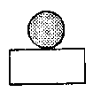

*（1）*

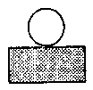

*（2）*

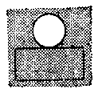

*（3）*

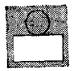

*（4）*

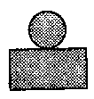

*（5）*

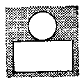

*（6）*

*（第1题）*

2. 设事件 A 表示“三件被检验的仪器中至少有一件为次品”，事件 B 表示“所有仪器为正品”，则事件 \(A + B\)，AB 各表示什么事件？

3. 在某班级中任选一学生，设 \(A\) 表示“选出的是男生”，\(B\) 表示“选出的是运动员”，\(C\) 表示“选出的是不爱唱歌的学生”。问：

（1） ABC、ABC 各表示什么事件？

（2） \(\vec{C} \subset B\) 表示什么意思？

4. 一批产品有正品也有次品， 从中抽取三件， 设 \(A_{i}\) 表示“抽出的第 \(i\) 件为正品”， \(i = 1, 2, 3\)。 试用 \(A_{1}, A_{2}, A_{3}\) 表示下列事件。

（1） 只有第一件为正品；

（2） 第一、二件为正品，第三件为次品；

（3） 三件均为正品；

（4） 至少有一件为正品；

（5） 没有一件为正品。

5. 有五段木条， 长相应地为 1， 3， 5， 7， 9 个单位， 求从中任选三段能构成三角形的概率。

6. 袋内装有两个伍分， 三个贰分， 五个壹分的硬币， 从中任取五个， 求总数超过一角的概率。

7. 试证明： 若条件概率 \(P(A|B)\) 大于非条件概率 \(P(A)\)， 则条件概率 \(P(B|A)\) 同样也大于非条件概率 \(P(B)\)。

8. A、B间的电路图如下，元件相互独立，设在时间T内电路元件损坏的概率如下表所示：

| 元件 | \(K_1\) | \(K_2\) | \(L_1\) | \(L_2\) | \(L_3\) |
| --- | --- | --- | --- | --- | --- |
| 损坏的概率 | 0.1 | 0.2 | 0.4 | 0.1 | 0.5 |

求在时间 T 内电路通的概率。

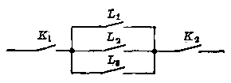

*（第8题）*

9. 某车间有 12 台车床，每台车床由于种种原因时常需要停车，设每台车床的停车或开车是相互独立的，若每台车床在任一时刻处于停车状态的概率为 \(\frac{1}{5}\)，试问，在任一时刻车间里有三台车床处于停车状态的概率是多少？

10. 在电话号码簿中， 任取一个电话号码， 求后面四个数字全不相同的概率。

11. 在四个人中，求至少有两人出生于五月份的概率。

12. 用汽车运载甲、乙两厂生产的同类产品50件，其中甲厂产品30件，乙厂产品20件，在途中损坏了2件，求被损坏的2件产品恰为甲、乙两厂各1件的概率。

### 复习题三B

1. 一个靶子由10个同心圆构成， 其半径各为 \(r_k (k=1,2,\cdots,10)\)， 且 \(r_1 < r_2 < \cdots < r_{10}\)， 设 \(A_k\) 表示“命中于半径为 \(r_k\) 的圆内”事件， 试问下列事件各表示什么？

$$
A=A_1+A_2+A_3+A_4+A_5+A_6。
$$

$$
B=A_6+A_7+A_8+A_9+A_{10}。
$$

$$
C = A _ {1} \cdot A _ {2} \dots \cdot A _ {10}.
$$

2. 一批产品有正品也有次品，从中抽取三件，设 \(A_{1}\) 表示“抽出的

第一件为正品”，B 表示“抽出的第二件为正品”，C 表示“抽出的第三件为正品”，试用 A、B、C 表示下列事件：

（1） 至少有两件为正品；

（2） 恰有一件为正品；

（3） 恰有两件为正品；

（4） 正品不多于两件。

3. 在某书库里任选一本书，设 \(A\) 表示“选出的是数学书”，\(B\) 表示“选出的是外文书”，\(C\) 表示“选出的是1966年以前出版的书”。问：

（1） \(A \overline{B} C, A \overline{B} C\) 各表示什么意思？

（2） \(\overline{C} \subset B, A\overline{B} \subset \overline{C}\) 各表示什么意思？

（3） 在什么条件下， \(ABO = A\)？

（4） 若 \(\overline{A} = B\)，是否意味着书库里所有数学书都不是外文版的？

4. 一枚各面都涂有油漆的立方体，被锯成1000个同样大小的小立方体，将这些小立方体均匀搅拌在一起，求任取一个小立方体，其两面涂有油漆的概率。

5. 某号码锁一共有三个圆盘， 其中每只圆盘都等分为 10 个分别带有数 0， 1， 2， …， 9 的扇面， 若每一圆盘上的某一号码相对锁壳为某一固定位置时， 则可将锁打开， 求任意拨出三个号码能将锁打开的概率。

6. 从一副桥牌中 （52 张） 任选四张， 求四张的花色各不相同的概率。

7. 为了减少由 \(2n\) 个运动代表队参加的比赛总次数，将其分成两组，求两个最强队被分在

（I） 不同组内的概率；

（2） 一个组内的概率。

8. 计算机内第 \(k\) 个部件在时间 \(T\) 内发生故障的概率等于 \(P_{k}(k = 1,2,\dots ,n)\)，如果所有部件的工作是相互独立的，求在所指定的间隔时间内，这架计算机的 \(n\) 个部件至少有一个部件发生故障的概率？

9. 某元件的可靠性 \(r = 0.9\)，有一电路需用 10 只元件串联，设每只

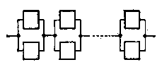

*I*

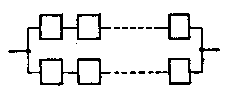

*II*

*（第9题）*

元件在电路中是独立起作用的，求电路的可靠性。为了提高电路的可靠性常再取10只元件组成并联电路，有如图所示的两种并联方式，问哪一种更有助于提高电路的可靠性。

10. 一批数量很大的产品，次品率为 0.05，试问任意抽取多少件产品，才能以 99% 的概率保证至少抽到 1 件正品（由于产品数量很大，每次抽取 1 件可看作是独立的）？

11. 一射手命中10环的概率是0.7，命中9环的概率是0.3，求该射手射击3次，得到不小于29环的概率。

12. 某人忘了电话号码的最后一个数字， 因而随意拨号。

（1） 求他拨号不超过三次而接通电话的概率。

（2） 如果已知最后一个数字是奇数， 求拨号不超过三次而接通电话的概率。

### 第三章测验题

1. 设 \(A\) 表示“某户订阅文汇报”，\(B\) 表示“某户订阅科技报”，\(C\) 表示“某户订阅红旗杂志”。试表述下列事件及事件之间的关系

$$
A B C， \quad A + B + C， \quad A \subset B， \quad A = C.
$$

2. 设事件 \(A_{1}, A_{2}, \cdots, A_{n}\) 互斥，且 \(P(A_{i}) = p_{i} (i = 1, 2, \cdots, n)\) 试求：

（1） 诸事件中至少有一发生的概率；

（2） 所有事件全不发生的概率。

3. 一电路如下图所示，已知元件 \(K\) 发生故障的概率为 0.3，元件 \(K_{1}, K_{2}\) 发生故障的概率均为 0.2，求电路不通的概率。

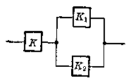

*（第3题）*

4. 甲袋装有 2 只白球、3 只红球。乙袋装有 3 只白球、2 只红球。从两袋中各取一球，问取出的两只球颜色相同的概率是多少？

5. 某领导有七个顾问， 每一顾问提供正确意见的概率为 0.6. 现为某事可行与否， 个别征求各顾问的意见， 并根据多数人的意见作出决定， 求作出正确决定的概率。

6. 某油漆公司发出17桶油漆，其中白漆10桶。黑漆4桶、红漆3桶，运输途中标签全部脱落，问某一个定购4桶白漆，3桶黑漆和2桶红漆的顾客，按所定颜色如数得到定价的概率是多少？

## 第4章 复数

数的概念的扩展， 是代数里重要内容之一， 它和代数里的其他内容 （如代数式、函数、方程等等） 的研究有着密切的联系。到目前为止， 我们所讲到的数还只限于实数； 代数式、方程等等， 还只限于在实数范围里进行研究。为了进一步研究这些内容， 同时也为了今后能更有效地掌握数的知识、处理有关实际问题， 本章将把数的概念作再一次的扩展， 引进关于复数的知识。最后还要介绍一下数域的概念。

### § 4·1 数的概念的扩展

在小学算术里学过自然数、零、正分数的基础上，“代数”第一册和第二册已经把数的概念作了两次扩展。到目前为止，读者已学过的数的系统，可以归结成下表：

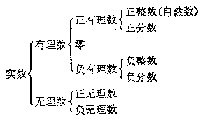

我们知道， 在实数范围里， 加法、减法、乘法、除法 （除数不能是零） 和乘方这五种运算总是可以进行的， 但是乘方的逆运算——开方——却还不是永远可以进行的。例如， 在实数范围里， 负数就不能开平方。

回顾一下， 过去对于数的概念的几次扩展， 都是从解决实际问题的需要提出的。这说明了，数的概念的每一次扩展，都是为了适应人类生产活动中实际的需要。但是，从数学运算的角度来看，这种需要也正反映在要解决“逆运算可进行”这一问题。例如，为了使加法的逆运算——减法——永远可以进行，就需要引进负数；使乘法的逆运算——除法（除数不是零）——永远可以进行，就需要引进分数；使正数的乘方的逆运算——正数的开方——永远可以进行，就需要引进无理数。新数的引进，解决了逆运算可进行的问题，数的范围也随着扩大了；由此，也就可能更有效地解决更多的实际问题。

这里还需要注意， 数的范围的每一次扩大， 都是在原有的数的基础上增添了一种新的数而构成的。因此， 在扩大了的数的范围里， 原有的数所原来具有的运算意义和运算性质， 仍旧要保持下来。

为了要使乘方的逆运算永远可以进行，需要把实数的范围再加以扩大。下面各节将根据上面所说的原则来扩展数的概念。

#### 习题4·1

1. 方程 \(4x = 3\) 在整数范围里有没有解？要使这个方程有解，需要引进怎样的数？

2. 方程 \(4x + 3 = 0\) 在正有理数范围里有没有解？要使这个方程有解，需要引进怎样的数？

3. 方程 \(x^{2} = 2\) 在有理数范围里有没有解？要使这个方程有解，需要引进怎样的数？

4. 在实数范围里， 方程 \(x^{2} + 1 = 0\) 是否有解？

5. 在什么条件下， 实数系数的一元二次方程 \(ax^2 + bx + c = 0\) 才有实数根？

### § 4·2 复数的概念

我们早已知道，在实数范围里，负数不能开平方。最简单的一个例子就是 -1 的平方根没有意义。

为了使开方运算永远能够进行，首先就得引进一个新的数，用它来确定 -1 的平方根的意义。

本节就从解决这个问题着手来引进新的数。

#### 1. 虚数单位

要确定 -1 的平方根的意义，也就是要引进一种新的数，使方程

$$
x ^ {2} = - 1 \tag {1}
$$

有确定的解。

我们用符号“i”来表示这样的新数，并且规定，数 \(i\) 具有下面的两条性质：

$$
1 ^ {\circ} i ^ {2} = - 1；
$$

\(2^{\circ}i\) 与实数在一起，可以按照实数的运算法则进行运算。

数 \(i\) 称为虚数单位。

根据上面的规定，可以知道：

$$
(- i) ^ {2} = i ^ {2} = - 1，
$$

所以 \(-i\) 也是方程 \(x^{2} + 1 = 0\) 的一个根。由此就解决原来提出的问题，可以说：在扩大了的数的范围里，方程

$$
x ^ {2} + 1 = 0
$$

有两个根 \(i\) 与 \(-i\) 或者说，-1有两个平方根 \(i\) 与 \(-i\)。

根据上面的规定，容易推出虚数单位 \(i\) 的一个重要性质：

$$
\begin{array}{l} i ^ {1} = i； \quad i ^ {2} = - 1； \\ i ^ {3} = i ^ {2} \cdot i = - i； \quad i ^ {4} = (i ^ {2}) ^ {2} = (- 1) ^ {2} = 1. \\ \end{array}
$$

一般的，对于任意整数 n， 有

$$
i ^ {4 n} = (i ^ {4}) ^ {n} = 1 ^ {n} = 1；
$$

$$
i ^ {4 n + 1} = i ^ {4 n} \cdot i = i；
$$

$$
i ^ {4 n + 2} = i ^ {4 n}， i ^ {2} = - 1；
$$

$$
i ^ {4 n + 3} = i ^ {4 n}， i ^ {3} = - i，
$$

这个性质通常称为 \(i\) 的周期性。

##### 例 1

计算： \(i^{-1},i^{-2},i^{-3},i^{-4}\)

**［解］** \(i^{-1} = \frac{1}{i} = \frac{i}{i^2} = \frac{i}{-1} = -i;\)

$$
i ^ {- 2} = \frac {1}{i ^ {2}} = \frac {1}{- 1} = - 1；
$$

$$
i ^ {- 3} = \frac {1}{i ^ {3}} = \frac {i}{i ^ {2}} = i；
$$

$$
i ^ {- 4} = \frac {1}{i ^ {4}} = 1.
$$

（注意） 解这个问题，也可应用上面的性质，把 \(i^{-1}\) 变形成 \(i^{-4 + 3}\) 来计算，具体解法请读者自己完成。

##### 例 2

计算：

$$
i\cdot i^2\cdot i^3\cdots i^{8n}。
$$

这里 \(n\) 是自然数。

**［解］** \(i \cdot i^2 \cdot i^3 \cdot \dots \cdot i^{8n} = i^{(1+2+3+\cdots+8n)}\)。

$$
\because 1 + 2 + 3 + \dots + 8 n = \frac {8 n (8 n + 1)}{2} = 4 n (8 n + 1)，
$$

∴ 原式 \(= i^{4n(8n+1)} = (i^{4n})^{(8n+1)} = 1^{8n+1} = 1\)。

1. 计算 \(i^{52}\)， \(i^{49}\)， \(i^{33}\)， \(i^{-31}\) 。

2. 计算：

（1） \(i^{27} + i^{302} + i^{203} - i^{27}\)；

（2） \(i^{k} \cdot i^{k+1} \cdot i^{k+3} \cdot i^{k-3}\) （k 是整数）；

（3） \(i \cdot i^{3} \cdot i^{5} \cdot \cdots \cdot i^{(2^{k}-1)}\) （k 是整数）。

［提示：（3）分 \(k\) 为奇数或偶数两种情况来讨论。］

#### 2. 纯虚数

我们来解下面的方程：

$$
x ^ {2} + 2 = 0.
$$

这个方程也就是

$$
x ^ {2} = - 2.
$$

很明显，它在实数范围里没有解。

但是，根据上面所规定的虚数单位 \(i\) 的意义，容易算出：

$$
(\sqrt {2} i) ^ {2} = (\sqrt {2} i) (\sqrt {2} i) = 2 i ^ {2} = - 2，
$$

$$
(- \sqrt {2} i) ^ {2} = (\sqrt {2} i) ^ {2} = - 2.
$$

这样， 把数的范围扩大以后， 这个方程就有两个根：

$$
x _ {1} = \sqrt {2} i， \quad x _ {2} = - \sqrt {2} i.
$$

一般的， 如果 \(a\) 是一个正实数， 那末 \(\sqrt{a}\) 也是一个正实数， 且有

$$
(\pm \sqrt {a} i) ^ {2} = a i ^ {2} = a \times (- 1) = - a.
$$

因此，把数的范围扩大以后，负数 -a 的平方根就有两个值：

$$
\sqrt {a} i \quad \text {和} \quad - \sqrt {a} i.
$$

形如 \(b\) （这里 \(b\) 是一个不等于零的实数） 的数称为纯虚数。

#### 3. 虚数

我们再来解下面这个方程：

$$
x ^ {2} - 2 x + 2 = 0，
$$

这里，判别式

$$
b ^ {2} - 4 a c = 4 - 8 = - 4 < 0.
$$

这个方程在实数范围里没有解。

应用配方的方法， \(x^{2}-2x+2=(x-1)^{2}-1\)，原方程可以变形成

$$
(x - 1) ^ {2} + 1 = 0，
$$

就是 \((x - 1)^{2} = -1.\)

由此可得 \(x - 1 = \pm i.\)根据 \(i\) 的意义，两边都加上1，得

$$
x = 1 \pm i.
$$

这样，在扩大了的数的范围里，方程 \(x^{2} - 2x + 2 = 0\) 也有两个根：

$$
x _ {1} = 1 + i， \quad x _ {2} = 1 - i.
$$

形如 \(a + b\) 记（这里 \(a, b\) 都是实数，且 \(b \neq 0\)） 的数称为虚数。

#### 4. 复数

在代数第二册里当引进了无理数以后，为了把这种新的数和原有的有理数用统一的名称来称呼，引进了名词“实数”，并且说“有理数和无理数总称实数”。

同样， 在引进了虚数以后， 也需要把这种新的数和原有的实数用统一的名称来称呼。 我们引进以下的定义：

如果 \(a, b\) 都表示实数， 那末形如 \(a + bi\) 的数称为复数； \(a\) 称为复数的实部， \(b\) 称为复数的虚部。

当 \(b = 0\) 时，复数 \(a + bi\) 就表示实数 \(a\)，即

$$
a + 0 i = a.
$$

特别，当 \(a = b = 0\) 时，复数 \(a + bi\) 就表示数0，即

$$
0 + 0 i = 0.
$$

当 \(b \neq 0\) 的时候，复数 \(a + bi\) 是一个虚数。这时，如果 \(a = 0\)，那末它就表示纯虚数 \(bi\)，即

$$
0 + b i = b i.
$$

根据上面这样的规定，可以把复数 \(a + bi\) 按照 \(a, b\) 是否为零分类如下：

复数 \(\left\{\begin{array}{l} 实数(a+0i=a) \\ 虚数(a+bj,b\neq0)\end{array}\right.\)

纯虚数 \((0 + bi = bi, b \neq 0)\)

非纯虚数 \((a + bi, a \neq 0, b \neq 0)\)

**［注意］**

1. 如果 \(a + b\) 表示一个虚数，必须加上 \(b \neq 0\) 这一条件。

2. 实数有有理数、无理数或正数、负数的区分（见第107页的表）， 对于虚数来说， 就没有这样的区分。

3. 为了方便， 有时也用一个单独的字母， 例如 \(z\)， 来表示一个复数。 这时， 如果要进一步指出它的实部和虚部是什么， 就说： “复数 \(z = a + b i\)”。

4. 如果没有特别的说明，本章中的字母 \(a, b\) 都表示实数。

##### 例 3

**［解］**

解方程 \(x^{4} - x^{3} - 6 = 0\)

$$
x ^ {4} - x ^ {3} - 6 = 0.
$$

$$
\therefore (x ^ {2} + 2) (x ^ {2} - 3) = 0.
$$

由 \(x^{2} - 3 = 0\)，得 \(x = \pm \sqrt{3}\)

由 \(x^{2} + 2 = 0\)，得 \(x^{2} = -2, x = \pm \sqrt{2} i.\)

由此即得，原方程有4个根：±√3，±√2i。

1. 写出下列这些复数的实部和虚部：

（1） \(1 + i;\)

（2） \(-\sqrt{3}i\)；

（3） \(-\sqrt{2}\)；

（4） 0.

2. 已知复数的实部和虚部， 写出这个复数来：

（1） 实部是 \(-\sqrt{2}\)，虚部是 1；

（2） 实部是 0， 虚部是 \(-\frac{\sqrt{2}}{2}\)；

（3） 实部是 3， 虚部是 0；

（4） 实部是 1， 虚部是 -1.

3. 回答下面的问题：

（1） 3i 是不是正数，-3i 是不是负数？

（2） \(\sqrt{5} i\) 是不是无理数？

（3） 0i 是不是虚数？

4. 解方程：

（1） \(x^{2} + 5 = 0\)；

（2） \(4x^{2} + 9 = 0;\)

（3） \(x^{4} - 16 = 0;\)

（4） \(x^{4} + x^{2} - 20 = 0.\)

### § 4·3 复数与平面内的点、向量之间的对应

在上一节里， 我们从负数开平方的需要出发， 引进了复数的概念。但是， 这样引进的新数， 究竟有什么具体意义呢？ 为了解决这个问题， 就和以往用数轴上的点与实数之间的关系来说明实数的几何意义一样， 下面我们将利用平面内的点、向量与复数间的关系来说明复数的几何意义。

#### 1. 复数平面

在代数第二册里，我们已经学过：任何一个实数 \(a\)，都可以用给定的数轴上唯一的一个点来表示；反过来，给定的数轴上任何一个点，都唯一地表示一个实数。这就是说，数轴上的点和实数间可以建立一一对应的关系。我们还曾学过：用两条互相垂直的数轴 \(x\) 和 \(y\)（它们的交点是 \(O\)）构成一个直角坐标系；那末，一对排定了顺序的实数 \((a, b)\)，就可以用这个直角坐标系里唯一的点 \(M(a, b)\) 来表示；反过来，在这个直角坐标系里的每一个点 \(M(a, b)\)，也都唯一地表示着一对排定了顺序的实数 \((a, b)\)。这就是说，平面直

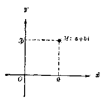

*图4.1*

角坐标系里的点，和一对排定了顺序的实数之间，可以建立一一对应的关系。

从复数 \(a + b\) 的定义可以看出，复数也是由一对排定了顺序的实数 \(a\) 和 \(b\) 构成的，这里实部 \(a\) 和虚部 \(b\) 就分别相当于点

\(M(a, b)\) 的横坐标和纵坐标。所以，在引进了复数以后，就可以用一个复数 \(z = a + bi\) 来表示平面直角坐标系里的点 \(M(a, b)\)；反过来，对于任何一个复数 \(z = a + bi\)，也就可以用平面直角坐标系里以 \(a\) 做横坐标，\(b\) 做纵坐标的点 \(M(a, b)\) 来表示它（图4·1）。这也就是说，平面直角坐标系里的点，和复数之间，可以建立起一一对应的关系。

复数 \(z = a + bi \leftrightarrow\) 点 \(M(a, b)\)。

很明显， 对于用这种方法来表示复数 \(z = a + bi\)， 当 \(b = 0\) 时， 对应的点都在 \(x\) 轴上； 当 \(a = 0\) 时， 对应的点都在 \(y\) 轴上。 这也就是说， 表示实数的点都在 \(x\) 轴上， 表示纯虚数的点都在 \(y\) 轴上。

这种用来表示复数的平面，称为复数平面。其中 \(x\) 轴称为实轴，\(y\) 轴称为虚轴。（复数平面的虚轴不包括原点；原点在实轴上，表示实数0）。

#### 2. 复数的相等与不等

在学习实数时，我们知道，利用数轴上的点的位置关系，可以规定它们所对应的实数间的相等和不等的关系。就是：

设实数 \(\alpha\) 和 \(\alpha'\) 在数轴上所对应的点是 \(A\) 和 \(A'\)，那末，

当点 A 和点 \(A'\) 重合时， \(a = a'\)；

当点 A 和点 \(A'\) 不重合时， \(a \neq a'\)，这时，

点 A 在点 \(A'\) 的右边时， \(a > a'\)；

点 A 在点 \(A'\) 的左边时， \(a < a'\) 。

类似地， 也可以利用平面内的点的位置关系， 来规定它们所对应的复数间的相等和不等的关系， 就是：

设复数 \(a + bi\) 和 \(a' + b'i\) 在平面内所对应的点是 \(A\) 和 \(A'\)， 那末：

当点 A 和点 \(A'\) 重合时， \(a + bi = a' + b'i;\)

当点 A 和点 \(A'\) 不重合时， \(a + bi \neq a' + b'i\) 。

很明显，如果两个复数 \(a + bi\) 和 \(a' + b'i\) 在平面内所对应的点 \(A\) 和 \(A'\) 重合为一点（图4·2），必须并且只须它们的实部 \(\alpha\) 和 \(\alpha'\)，虚部 \(b\) 和 \(b'\) 分别相等。因此，关于两个复数

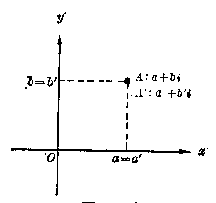

*图4-2*

相等的意义也可以说成：如果 \(a = a'\)，\(b = b'\)，那末 \(a + bi = a' + b'i\)；反过来，如果 \(a + bi = a' + b'i\)，那末 \(a = a'\)，\(b = b'\)。我们就用这种方法来判断两个复数是不是相等。

我们已经知道，在实数范围

内，对于两个不相等的数，可以规定它们之间的大小，但是对于两个复数，只要其中有一个不是实数，就不能比较它们之间哪一个大、哪一个小。例如，只能说 \(3i \neq -3i, 1 + i \neq 0\)，而不能比较 \(3i\) 与 \(-3i\) 哪一个大，\(1 + i\) 与 0 哪一个大。

**［注意］**

在第 108 页曾谈到， 把数的范围扩大以后， 要求原来的数所具有的运算意义和运算性质仍旧保持下来。 倘使企图用一种方法来规定两个任意复数间的大小， 就会对这一要求产生矛盾。

例如， 对于 \(i\) 与 0， 不论用什么方法来规定它们之间的大小， 都将得出矛盾。 这就是说， 如果

$$
i > 0， \quad \text {或} \quad i < 0，
$$

这样，在不等式两边同乘以 i， 根据不等式的性质，应有

$$
i ^ {2} > 0， \quad \text {或} \quad i ^ {2} > 0，
$$

就是 -1>0，或 -1>0，

这就引起了矛盾，这就表明，既不能 \(i > 0\)，又不能 \(i < 0\)，即 \(i\) 与0这两个数之间不能规定大小关系。

##### 例 1

求适合于方程

$$
(3 x + 2 y) + (3 x - y) i = 13 - 2 i
$$

的实数 \(x\) 和 \(y\) 的值。

**［审题］** 根据复数相等的意义，使等号两边两个复数的实部与虚部分别相等，就可以得到一个关于 \(x, y\) 的方程组，解这个方程组即得这个问题的解。

**［解］** 已知 \(x\) 和 \(y\) 是实数，所以 \(3x + 2y\) 和 \(3x - y\) 都是实数，那末，

$$
\begin{array}{l} \because (3 x - 2 y) + (3 x - y) i = 13 - 2 i， \\ \therefore \left\{ \begin{array}{l} 3 x + 2 y = 13， \\ 3 x - y = - 2. \end{array} \right. \\ \end{array}
$$

解这个方程组， 得

$$
\left\{ \begin{array}{l} x = 1， \\ y = 5. \end{array} \right.
$$

**［注意］** 应用 \(a + b i = a' + b'i\) 的关系导出 \(\left\{ \begin{array}{l} a = a' \\ b = b' \end{array} \right.\) 时，必须注意 \(a, a', b, b'\) 都应该全是实数。

#### 3. 共轭复数

考察下面这两个复数：

$$
z _ {1} = 4 + 3 i， \quad z _ {2} = 4 - 3 i.
$$

这是实部相等、而虚部互为相反的数的两个复数。把这两个复数在平面内所对应的点表示出来，可以看到，它们所对

应的点 \(M_{1}\) 与 \(M_{2}\) 对称于 \(\alpha\) 轴（图4·3）。

我们把关于 \(\alpha\) 轴为对称的两个点所对应的两个复数称为共轭复数。这就是说：

如果两个复数的实部相等、虚部是相反的数，那末这两个复数为共轭复数。

如用字母 \(z\) 来表示复数

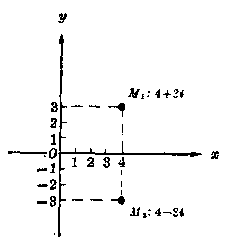

*图4-3*

\(a+bi\)，那末它的共轭复数 \(a-bi\) 就可以用符号 \(\overline{z}\) 来表示，就是

如果 \(z = a + bi\)，那末 \(\overline{z} = a - bi\)

因为0的相反数仍旧是0，所以当虚部是0时，这个复数的共轭复数就是它本身。这也就是说：实数与它本身共轭。显然，复数平面内表示两个共轭复数的点 \(M_{1}\) 与 \(M_{2}\) 关于实轴对称（图4·3）。

**［注意］**

当 \(b \neq 0\) 时，复数 \(z\) 和它的共轭复数 \(\bar{z}\) 都是虚数，所以称它们为共轭虚数。

#### 习题4·3（1）

1. 在复数平面内，作出表示下列各个复数的点：

（1） 1；

（2） -1；

（3） 0；

（4） i；

（5） -i；

（6） \(1+i;\)

（7） -1-i；

（8） 1-i；

（9） \(-1 + i\)。

2. 写出图中各点所表示的复数（方格的每边等于单位长）。

3. 指出上题中各对互为共轭的复数。

4. 求适合于下列方程的实数 \(x\) 和 \(y\) 的值：

（1） \((3x - 4) + (4y + 5)i = 0;\)

［提示： \(0=0+0i\) 。］

（2） \((3x - 4y) + (4x - 3y)i = 7i;\)

（3） \((x + y) + xy = -5 - 24i;\)

（4） \((x^{2} - y^{2}) + 2xyi = 6i - 8.\)

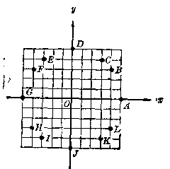

*（第2题）*

5. 实数 \(m\) 取哪些值时， 复数 \((m^2 - 3m - 4) + (m^2 - 5m - 6)i\) 是

（1） 实数；

（2） 纯虚数；

（3） 零。

#### 4. 向量、复数的向量表示

我们知道， 物理学中的力、速度等量既有大小， 又有方向， 这种量叫作向量（也叫作矢量）， 向量通常用带箭头的有向线段表示。 箭头的方向表示向量的方向， 线段的长度表示向量的量值。 长度、方向相同的向量， 不管起点在哪里，都认为是相等的向量。

复数可以用平面上的向量来表示。如图4·4所示，设 \(M\) 点表示复数 \(a + bi\)，连结 \(OM\)，如果我们把 \(OM\) 看成是一条有向线段（从 \(O\) 点指向 \(M\) 点），那么复数 \(a + bi\) 就可以用

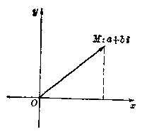

*图4-4*

这个向量来表示了①。图4·4中的向量记作 \(\overrightarrow{OM}\)。

当点 M 与点 O 重合时，线段 OM 退缩成为一点，称这样的向量为零向量。零向量没有确定的方向。

这样我们就可以把平面内的点

M， 和向量 \(\overrightarrow{OM}\) 之间建立起一一对应的关系。

前面已讲过， 平面内的点 \(M(a, b)\) 与复数 \(z = a + bi\) 之间， 可以建立起一一对应的关系。 因此， 通过平面内的点作为媒介， 可以建立起复数与平面内向量之间的一一对应关系。

复数 \(z = a + bi \leftrightarrow\) 点 \(M(a, b) \leftrightarrow\) 向量 \(\overrightarrow{OM}\)。

##### 例 2

作出与下列各复数对应的向量：

（1） \(z_{1} = -2 + i\)

（2） \(z_{2} = -\sqrt{3} i.\)

**［解］** （1） 作出点 \(M_{1}(-2, 1)\)， 联 \(OM_{1}\)， 即得与复数 \(z_{1}\) 对应的向量 \(\overrightarrow{OM_{1}}\)。

（2） 作出点 \(M_{2}(0, -\sqrt{3})\)，联 \(OM_{2}\)，即得与复数 \(z_{2}\) 对应的向量 \(\overrightarrow{OM_{2}}\)。

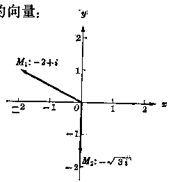

*图4-6*

> ① 方向相同的等长线段，不管它们的起点在哪里，都认为是相等的向量。这里所指的则是限定以原点为起点的向量，明确些说，应该称为位置向量。本书中所讲的向量都是位置向量，所以全简称为向量。

#### 5. 复数的模数

如果向量 \(\overrightarrow{OM}\) 与复数 \(z = a + bi\) 相对应（图4·6），向量 \(\overrightarrow{OM}\) 的长 \(r\)，就称为复数 \(z\) 的模数．容易看出，这里

$$
r = \sqrt {a ^ {2} + b ^ {2}}.
$$

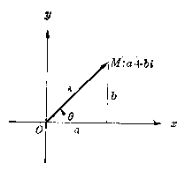

*图4-6*

如果 \(b = 0\)，那末 \(z = a + bi\) 是一个实数，这时它的模数等于 \(\sqrt{a^2 + 0^2}\)，也就是 \(|a|\)。因此，复数的模数也称为复数的绝对值，

并且也用在这个复数的两旁加上两条竖线来表示，就是

$$
| z | = | a + b i | = r = \sqrt {a ^ {2} + b ^ {2}}.
$$

例如， 例 2 里的复数 \(z_{1}\) 和 \(z_{2}\) 的模数分别是

$$
\left| z _ {1} \right| = \left| - 2 + i \right| = \sqrt {(- 2) ^ {2} + 1 ^ {2}} = \sqrt {5}，
$$

$$
\left| z _ {2} \right| = \left| - \sqrt {3} i \right| = \sqrt {0 ^ {2} + (- \sqrt {3}) ^ {2}} = \sqrt {3}.
$$

##### 例 3

求证两个共轭复数的绝对值相等。

**［证］** 设 \(z = a + bi\)，那末它的共轭复数就是 \(\bar{z} = a - bi\)。于是

$$
| z | = | a + b i | = \sqrt {a ^ {2} + b ^ {2}}，
$$

$$
| \bar {z} | = | a - b i | - \sqrt {a ^ {2} + (- b) ^ {2}} = \sqrt {a ^ {2} + b ^ {2}}.
$$

$$
\therefore \quad | z | = | \bar {z} |.
$$

*例4 求满足下列条件的复数 \(z\) 所对应的点的轨迹：

（1） \(|z|=4;\)

（2） \(|z| < 4.\)

**［审题］** 复数 \(z\) 的绝对值，从几何意义来说，就是这个复数所对应的点 \(M\) 与原点 \(O\) 间的距离。因此，本题就是求与原点的距离等于4和小于4的点的轨迹。

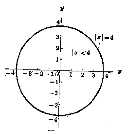

*图4-7*

**［解］**

设复数 z 所对应的点是 M。

（1） \(|z| = 4\) 的几何意义是：点 \(M\) 与原点 \(O\) 的距离永远等于4个单位长度。由此可知，点 \(M\) 的轨迹是以原点为中心、4个单位长度为半径的圆。

（2） \(|z| < 4\) 的几何意义是：点 \(M\) 与原点 \(O\) 的距离永远小于4个单位长度。由此可知，点 \(M\) 的轨迹是以原点为中心、4个单位长度为半径的圆的内部。

1. 作出下列各复数所对应的向量：

（1） \(3 + 4i;\)

（2） 3-4i；

（3） \(-3 + 4i\)；

（4） \(-3 - 4i\)；

（5） 5i；

（6） -5i；

（7） 5；

（8） -5.

2. 证明： 上题中的 8 个复数所对应的点在同一圆上。

［提示：证明这些点和原点的距离都相等。］

3. 已知复数

$$
z _ {1} = - \sqrt {3} + i， \quad z _ {2} = 2， \quad z _ {3} = \sqrt {2} - \sqrt {2} i， \quad z _ {4} = - 2 i.
$$

（1） 求作这些复数所对应的向量；

（2） 求这些复数的绝对值；

（3） 求这些复数的共轭复数， 并作出它们所对应的向量；

（4） 这 4 个复数以及它们的共轭复数所对应的点，是不是在同一圆上？为什么？

1. 求满足条件 \(1 \leqslant |z| \leqslant 2\) 的复数 \(z\) 所对应的点的轨迹。

### § 4·4 复数的四则运算

#### 1. 复数的加法和减法

复数的加法和减法可以按照多项式的加法和减法的法则进行，就是：把复数的实部和实部相加减，虚部和虚部相加减。用式子表示就是：

$$
(a_1+b_1i)\pm(a_2+b_2i)=(a_1\pm a_2)+(b_1\pm b_2)i。
$$

##### 例 1

计算：

（1） \((3-6i)+(-2-i)-(1+4i)\)；

（2） \((1 - i) + (2 - i^3) + (3 - i^5) + (4 - i^7)\)；

（3） \((\sqrt[3]{-8} + 2\sqrt{2} i) - (\sqrt{2} i - 2)\)。

**［解］** （1）原式 \(=(3-2-1)+(-6-1-4)i=-11i\)。

（2） 原式 \(= (1 - i) + (2 + i) + (3 - i) + (4 + i)\)

$$
\begin{array}{l} = (1 + 2 + 3 + 4) + (- 1 + 1 - 1 + 1) i \\ = 10. \\ \end{array}
$$

（3） 原式 \(= (-2 + 2\sqrt{2}i) + (2 - \sqrt{2}i)\)

$$
= (- 2 + 2) + (2 \sqrt {2} - \sqrt {2}) i = \sqrt {2} i.
$$

**［注意］** 复数的和， 或者差， 仍旧是复数。 在特殊情况下， 这种复数可能就是实数 ［如（2）］ 或者纯虚数 ［如（3）］。

##### 例 2

设 \((x + 2yi) + (y - 3xi) - (5 - 5i) = 0\)，求实数 \(x, y\) 的值。

**［审题］** 先把左边化简成 \(a + b i\) 的形式。从 \(a+bi=0\) 得 \(a = 0, b = 0\)。即可列出关于 \(x, y\) 的方程组，从而求出 \(x, y\) 的实数值。

**［解］** \(\because (x + 2yi) + (y - 3xi) - (5 - 5i) = 0,\)

$$
\therefore (x + y - 5) + (2 y - 3 x + 5) i = 0.
$$

既然 \(x, y\) 均为实数，所以，根据复数相等的规定，有

$$
\left\{ \begin{array}{l} x + y - 5 = 0， \\ 2 y - 3 x + 5 = 0. \end{array} \right.
$$

解这个方程组， 得

$$
x = 3， y = 2.
$$

#### 习题4·4（1）

1. 计算：

（1） \(\left(\frac{2}{3} + i\right) + \left(1 - \frac{2}{3}i\right) - \left(\frac{1}{2} + \frac{3}{4}i\right)\)；

（2） \((- \sqrt{2} + \sqrt{3} i) + (\sqrt{3} - \sqrt{2} i)\)

$$
- \left[ (\sqrt {3} - \sqrt {2}) + (\sqrt {3} + \sqrt {2}) i \right]；
$$

（3） \(\left[(a + b) + (a - b)i\right] - [(a - b) - (a + b)i]\) （a， b 均为实数）；

（4） \((2x + 3yi) - (3x - 2yi) + (y - 2xi) - 3xi\) \((x, y\) 均为实数）；

（5） \((1 - 3i^{7}) + (2 + 4i^{9}) - (3 - 5i^{3})\)。

2. 求实数 \(x\) 和 \(y\) 的值：

（1） \((2 + 5xi) - 3yi - (14i + 3x - 5y) = 0;\)

（2） \((x + xi) + (y - yi) - (-3 + i) = 0;\)

（3） \(\left(\frac{1}{y} + \frac{1}{x} i\right) + \left(-\frac{1}{x} + \frac{1}{y} i\right) + \left(\frac{1}{6} - \frac{5}{y} i\right) = 0.\)

3. 求证：两个共轭虚数的和是实数，差是纯度数。

*4. 设 \(z\) 是复数， 解下列关于 \(z\) 的方程：

（1） \(2z + \overline{z} - 6i = 6 - 3i;\)

（2） \(|z| - z = 1 + 2i.\)

［提示：设 \(z = x + yi\)，代入方程，从而解出 \(\pmb{x}\) 和 \(\pmb{y}\) 。］

#### 2. 复数加法和减法的几何意义

利用复数和向量之间的对应关系，我们不难看出复数

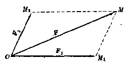

*图4-8*

的加法和减法的几何意义。

物理学里象力、速度这些量都是向量，对于两个向量，可以应用平行四边形法则进行加法运算。例如图

4·8 中 \(F_{1}\) 和 \(F_{2}\) 表示作用于同一点 \(O\) 的两个力；用表示这两个力的有向线段 \(\overrightarrow{OM_1}, \overrightarrow{OM_2}\) 作为邻边，画出平行四边形，那么通过这个作用点 \(O\) 的对角线 \(\overrightarrow{OM}\) 就表示这两个力的合力 \(F\)。这就是说：

$$
\overrightarrow {O M} = \overrightarrow {O M _ {1}} + \overrightarrow {O M _ {2}}.
$$

现在，我们来证明：如果向量 \(\overrightarrow{OM_1}\) 与 \(\overrightarrow{OM_2}\) 所对应的复数分别是：

$$
z _ {1} = a _ {1} + b _ {1} i， \quad z _ {2} = a _ {2} + \overline {{b}} _ {2} i，
$$

那末这两个向量的和 \(\overrightarrow{OM}\) 所对应的复数 \(z_{1}\) 正就是上面所规定的复数 \(z_{1}\) 与 \(z_{2}\) 的和 \((a_{1} + a_{2}) + (b_{1} + b_{2})i.\)

**［证］** \(OM_{1}MM_{2}\) 是平行四边形

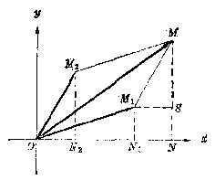

*图4-9*

（图 4·9），点 \(M_{1}\) 的坐标是 \((a_{1}, b_{1})\)，点 \(M_{2}\) 的坐标是 \((a_{2}, b_{2})\) 。

作 \(x\) 轴的垂线 \(M_{1}N_{1}\)，\(M_{2}N_{2}\) 和 \(MN\)，并且作 \(M_{1}S \perp MN\)。容易证明，这时有

$$
\triangle M _ {1} S M \cong \triangle O N _ {2} M _ {2}，
$$

四边形 \(M_{1}N_{1}NS\) 是矩形。

于是， \(ON - ON_{1} - N_{1}N - ON_{1} + M_{1}S\)

$$
= O N _ {1} + O N _ {2} = a _ {1} + a _ {2}，
$$

$$
N M = N S + S M = N _ {1} M _ {1} + N _ {2} M _ {2} = b _ {1} + b _ {2}.
$$

由此得 M 的坐标是 \((a_{1} + a_{2}, b_{1} + b_{2})\)。从而可知，向量 \(\overrightarrow{OM}\) 对应复数

$$
(a _ {1} + a _ {2}) + (b _ {1} + b _ {2}) i.
$$

这样， 复数的加法就得到了几何解释。

如果先作出与 \(z_{1}\) 对应的向量 \(\overrightarrow{OM_1}\)，与 \(z_{2}\) 对应的向量

\(\overrightarrow{OM_{2}}\)，然后，以 \(OM_{1}\) 为对角线，以 \(OM_{2}\) 为一边，作平行四边形 \(OM_{2}M_{1}M\) （图 4·10），容易证明 \(\overrightarrow{OM}\) 就对应着 \(z_{1}\) 与 \(z_{2}\) 的差

$$
(a _ {1} - a _ {2}) + (b _ {1} - b _ {2}) i.
$$

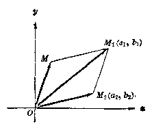

*图4-10*

这样，复数的减法也就得到了几何的解释。

既然向量 \(\overrightarrow{OM}\) 对应着复数 \(z_{1} - z_{2} = (a_{1} - a_{2}) + (b_{1} - b_{2})i\)， 那么 \(|z_1-z_2|\) 就表示向量的模长 \(|\overrightarrow{OM}|\)， 也就是 \(M_{1}\) 与 \(M_{2}\) 两点之间的距离。 这是一个很重要的结论， 利用这个结论， 我们可以使曲线的方程形式变得更为简洁， 更能反映曲线的本质。

##### 例 3

利用复数求平面直角系中两点间的距离公式。

**［解］** 如图 4·11，设平面上的两点 \(M_{1}, M_{2}\)，分别和复数 \(z_{1}, z_{2}\) 相对应，即

$$
M _ {1} \left(a _ {1}， b _ {1}\right) \leftrightarrow z _ {1} \leftrightarrow \overrightarrow {O M _ {1}}
$$

$$
M _ {2} \left(a _ {2}， b _ {2}\right) \leftrightarrow z _ {2} \leftrightarrow \overrightarrow {O M _ {2}}
$$

又设 \(d\) 表示 \(M_{1}, M_{2}\) 之间的距离，那么

$$
d = \cdot z _ {2} - z _ {1} |.
$$

这就是用复数表示的两点间的距离的公式。

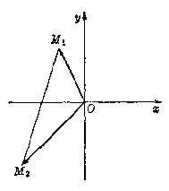

*图4-11*

把上式变换一下，就得

$$
\begin{aligned}
d=|z_2-z_1|
&=|(a_2+b_2i)-(a_1+b_1i)|\\
&=|(a_2-a_1)+(b_2-b_1)i|\\
&=\sqrt{(a_2-a_1)^2+(b_2-b_1)^2}。
\end{aligned}
$$

这与我们以前用坐标法导出的公式完全一样。

1. 用几何方法作下列加减法：

（1） \((1 + 5i) + (2 + 3i)\)；

（2） \((4 + 5i) - (2 + 3i)\)；

（3） \((3 - 4i) + (5 + 3i)\)；

（4） \((3 - 4i) + (2 + i)\)；

（5） \((4 + 2i) - (4 - 2i)\)；

（6） \((2 + i) - (3 - 4i)\)。

2. 设有平行四边形 \(ABOD\)，它的三个顶点 \(A, B, D\) 可以分别用复数 \(0 + 0i, 2 + 0i, 1 + i\) 来表示：

（1） 画出这个平行四边形；

（2） 用复数来表示它的另一顶点 C；

（3） 求对角线 AC 的长； （4） 求对角线 BD 的长。

［提示：把 \(\overrightarrow{BD}\) 平行移动到 \(\overrightarrow{AE}\) 的位置，则

$$
\overrightarrow {E D} = \overrightarrow {A E} = \overrightarrow {A D} - \overrightarrow {A B}. ]
$$

3. 求下面每题中用复数表示的两点之间的距离：

（1） \(P_{1}: 2 + i\) 和 \(P_{2}: 3 - i\)；

（2） \(M_{1}: 8 + 5i\) 和 \(M_{2}: 4 - 2i\)。

*4. 设 \(M_{1}\) 和 \(M_{2}\) 是坐标平面上的两点，试用复数形式写出线段 \(M_{1}M_{2}\) 的垂直平分线的方程。

#### 3 复数的乘法和除法

复数的乘法也可以按照多项式乘法的法则来进行，在所得的结果中把 \(i^{2}\) 换成-1，并且把实数和纯虚数分别合并。

用式子来表示， 就是

$$
\left(a _ {1} + b _ {1} i\right) \left(a _ {2} + b _ {2} i\right) = \left(a _ {1} a _ {2} - b _ {1} b _ {2}\right) + \left(a _ {1} b _ {2} + a _ {2} b _ {1}\right) i.
$$

##### 例 4

计算 \((1 + i)(4 - i^3)(2 + 3i^5)\)

**［解］** \((1 + i)(4 - i^3)(2 + 3i^5) = (1 + i)(4 + i)(2 + 3i)\)

$$
= (3 + 5 i) (2 + 3 i)
$$

$$
= - 9 + 19 i
$$

##### 例 5

验证

$$
x ^ {4} + 4 = (x - 1 - i) (x - 1 + i) (x + 1 - i) (x + 1 + i)，
$$

**［证］** \((x - 1 - i)(x - 1 + i)(x + 1 - i)(x + 1 + i)\)

$$
= [ (x - 1) ^ {2} - i ^ {2} ] [ (x + 1) ^ {2} - i ^ {2} ]
$$

$$
= (x ^ {2} - 2 x + 2) (x ^ {2} + 2 x + 2) = x ^ {4} + 4.
$$

原式得证。

##### 例 6

设 \(x, y\) 是实数，解方程

$$
(1 + 2 i) (x + y i) + (2 y - 2 x i) = - 5 + 3 i.
$$

**［解］** 原方程可化为

$$
(x - 2 y) + (2 x + y) i + (2 y - 2 x i) = - 5 + 3 i，
$$

即 \(x + yi = -5 + 3i.\)

因为 \(x, y\) 是实数，按复数相等的规定，有

$$
x = - 5， \quad y = 3.
$$

##### 例 7

求证： \(z\overline{z}=|z|^{2}\)

**［证］** 设 \(z = a + bi\)，则

左边 \(= z\overline{z} = (a + bi)(a - bi) = a^2 - (bi)^2 = a^2 + b^2,\)

右边 \(= |z|^2 = (\sqrt{a^2 + b^2})^2 = a^2 + b^2,\)

左边=右边，

$$
\therefore z \overline {{z}} = | z | ^ {2}
$$

从例7可以看到两个共轭复数的积是一个实数。根据这一性质，就可以应用复数乘法的法则来做复数的除法，设 \(z_{1} = a_{1} + b_{1}i, z_{2} = a_{2} + b_{2}i\)，并设 \(z_{2} \neq 0\)，那末

$$
\begin{array}{l} \frac {z _ {1}}{z _ {2}} = \frac {a _ {1} + b _ {1} i}{a _ {2} + b _ {2} i} = \frac {(a _ {1} + b _ {1} i) (a _ {2} - b _ {2} i)}{(a _ {2} + b _ {2} i) (a _ {2} - b _ {2} i)} \\ = \frac {a _ {1} a _ {2} + b _ {1} b _ {2}}{a _ {2} ^ {2} + b _ {2} ^ {2}} + \frac {a _ {2} b _ {1} - a _ {1} b _ {2}}{a _ {2} ^ {2} + b _ {2} ^ {2}} i. \\ \end{array}
$$

这就是说： 两个复数相除（除数不为零）， 可以先把它们写成分式的形式， 然后将分子分母同乘以分母的共轭复数， 并且把结果化简。

##### 例 8

计算 \(\frac{18 - i}{4 - 3i} + i(3 - 5i) - \frac{55 + 3i}{5 + 7i}\)。

**［解］**

$$
\begin{array}{l} = \frac {75 + 50 i}{25} + 3 i + 5 - \frac {296 - 370 i}{74} \\ = 3 + 2 i + 3 i + 5 - 4 + 5 i = 4 + 10 i. \\ \end{array}
$$

原式 \(= \frac{(18 - i)(4 + 3i)}{(4 - 3i)(4 + 3i)} +3i - 5i^2 -\frac{(55 + 3i)(5 - 7i)}{(5 + 7i)(5 - 7i)}\)

1. 计算：

（1） \((-5 + 6i)(-3i)\)；

（2） \((-3 - 4i)(2 + 3i)\)；

（3） \((0.1 + 0.3i)(-0.1 - 0.4i)\)；

（4） \(\left(-\frac{1}{2} + \frac{\sqrt{3}}{2} i\right)\left(-\frac{1}{2} - \frac{\sqrt{3}}{2} i\right)\)。

2. 已知 \(a > b > 0\)，计算

（1） \((a + \sqrt{b} i)(a - \sqrt{b} i)(-a + \sqrt{b} i)(-a - \sqrt{b} i)\)；

（2） \(\sqrt{b - a} (\sqrt{a - b} -\sqrt{b - a})\) 。 ［提示： \(\sqrt{b - a} = \sqrt{a - b} i.\)］

3. 应用公式 \((a + bi)(a - bi) = a^2 + b^2\)，分解下列各式为一次因式的乘积：

（1） \(x^{2} + 4,\)

（2） \(x^{2} + 2x + 2,\)

（3） \(x^{2} + x + 1.\)

［解法举例：（2） \(x^{2} + 2x + 2 = (x^{2} + 2x + 1) + 1 = (x + 1)^{2} - i^{2}\)

$$
= (x + 1 + i) \cdot (x + 1 - i)。 ]
$$

4. 已知 \(x, y\) 均为实数，解下列各方程：

（1） \((x + yi)i - 2 + 4i = (x - yi)(1 + i)\)；

（2） \((x + 1) + (y - 3)i = (1 + i)(5 + 3i)\)。

5. 计算：

（1） \((3 + 4i)^{4}\)；

（2） \((i - 2)^{3}\)。

6. 做下列除法：

（1） \(\frac{2i}{1 - i}\)；

（2） \(\frac{1 - 2i}{3 + 4i}\)；

（3） \(\frac{1 + 2i}{3 - 4i^3}\)；

（4） \(\frac{(1 + 2i)^2}{1 - i}\)。

7. 计算：

（1） \(\frac{\sqrt{5} + \sqrt{3}i}{\sqrt{5} - \sqrt{3}i} = \frac{\sqrt{3} + \sqrt{3}i}{\sqrt{3} - \sqrt{3}i};\)

（2） \(\frac{9 + 3\sqrt{2}i}{(3 + \sqrt{2}i)(1 + i)}.\)

8. 设 z 是复数， 解方程：

（1） \(\left(4 - \frac{3}{2} i\right) z = 27 - i;\)

（2） \(\frac{1}{2} (z - 1) = \frac{\sqrt{3}}{2} (1 + z)i.\)

9. （1） 求证 \(\left|\frac{z_1}{z_2}\right| = \frac{|z_1|}{|z_2|}\)。

（2） \(z|^2 = |z^2|\) 是否对所有的复数都成立？

10. 利用 \(|z|^2 = z\overline{z}\) 证明下式，并解释其几何意义：

$$
\left| z _ {1} + z _ {2} \right| ^ {2} + \left| z _ {1} - z _ {2} \right| ^ {2} = 2 \left| z _ {1} \right| ^ {2} + 2 \left| z _ {2} \right| ^ {2}.
$$

### § 4·5 复数的三角形式

#### 1. 复数的辐角

在图 4·12 里，表示向量 \(\overrightarrow{OM}\) 的方向的这个角 \(\theta\)，称为

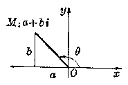

*图4-12*

这个向量所对应的复数 \(z\) 的辐角。这就是说：

x 轴的正方向与向量 \(\overrightarrow{OM}\) 所夹的角，称为向量 \(\overrightarrow{OM}\) 所对应的复数 z 的辐角。

很明显， 不等于零的复数 z 的辐角有无数多个值， 这些值相差 \(2\pi\) 的整数倍。 把其中适合于

$$
0 \leqslant \theta < 2 \pi
$$

的辐角 \(\theta\) 的值称做辐角的主值。

知道了一个复数的辐角的主值， 那末， 在这个主值上加上 \(2k\pi (k\) 是任意整数）， 就得到了这个复数的辐角的一般值。 例如， 复数 \(i\) 的辐角的主值是 \(\frac{\pi}{2}\)， 它的一般值是 \(\frac{\pi}{2} - 2k\pi\)， 这里 \(k\) 是任意的整数。

利用三角学中已经学过的知识， 可以知道： 要确定一个复数 \(z = a + bi (z \neq 0)\) 的辐角 \(\theta\)， 只需利用公式：

$$
\cos \theta = \frac {a}{r}， \quad \sin \theta = \frac {b}{r}，
$$

其中 \(r = \sqrt{a^2 + b^2}\)

必须注意， 当 \(z = a + bi = 0\) 时， 它所对应的向量 \(\overrightarrow{OM}\) 没有确定的方向， 所以 0 这个数没有确定的辐角。

##### 例 1

求下列复数的辐角的主值：

（1） \(1 + i\)

（2） \(-1 + i\)

（3） \(-1 - i\)

（4） \(1 - i\)

（5） \(\sqrt{2}\)；

（6） \(\sqrt{2} i\)

（7） \(-\sqrt{2}\)；

（8） \(-\sqrt{2} i.\)

**［解］** 容易看出，这8个复数的模数都等于 \(\sqrt{2}\)。设这8个复数的辐角的主值分别是 \(\theta_{1}, \theta_{2}, \theta_{3}, \cdots, \theta_{8}\)。

$$
\because \left\{ \begin{array}{l} \cos \theta_ {1} = \frac {1}{\sqrt {2}}， \\ \sin \theta_ {1} = \frac {1}{\sqrt {2}}， \end{array} \right.
$$

可以看出，\(\theta_{1}\) 的终边在第1象限，所以 \(0 < \theta_{1} < \frac{\pi}{2}\)。再从这两方程之一即可求得

$$
\theta_ {1} = \frac {\pi}{4}.
$$

同理，可以求得

$$
\theta_ {2} = \frac {3}{4} \pi ， \theta_ {3} = \frac {5}{4} \pi ， \theta_ {4} = \frac {7}{4} \pi .
$$

$$
\ddots \left\{ \begin{array}{l} \cos \theta_ {5} = \frac {\sqrt {2}}{\sqrt {2}} = 1， \\ \sin \theta_ {5} = \frac {0}{\sqrt {2}} = 0， \end{array} \right.
$$

可以看出，\(\theta_{6}\) 的终边在 \(x\) 轴的正方向 \(Ox\) 上，由此得 \(\theta_{5} = 0\)。同理可得

$$
\theta_ {6} = \frac {\pi}{2}， \quad \theta_ {7} = \pi ， \quad \theta_ {8} = \frac {3}{2} \pi .
$$

**［说明］** 这里如果只写出一个方程

$$
\cos \theta_ {1} = \frac {1}{\sqrt {2}}，
$$

那末因为余弦函数的值是 \(\frac{1}{\sqrt{2}}\) 的在0到 \(2\pi\) 间的角仍有两个，即 \(\frac{\pi}{4}\) 和 \(\frac{3}{4}\pi\)，所以还不能确定 \(\theta_{1}\) 的值。但是，先从这两个方程确定 \(\theta_{1}\) 的终边位置以后，那末就只需应用其中一个方程求出 \(\theta_{1}\)，这时所得的值也必适合另一个方程。

从这例子不难看出，根据 \(a\)、\(b\) 的符号就可确定复数 \(z = a + bi\) 的辐角的主值所在的范围，如下表所示：

| α | b | 辐角终边所在象限 | 辐角的主值范围 |
| --- | --- | --- | --- |
| + | + | I | 0<；θ<；π/2 |
| - | + | II | π/2<；θ<；π |
| - | - | III | π<；θ<；3/2π |
| + | - | IV | 3/2π<；θ<；2π |

这样， 确定了辐角的主值范围以后， 也就可以应用公式

$$
\operatorname{tg} \theta = \frac {b}{a}
$$

来确定 \(\theta\) 的值。例如，就复数 \(-1 - i\) 来说，从 \(a = -1\)、\(b = -1\) 可知，辐角的主值在 \(\pi\) 与 \(\frac{3}{2}\pi\) 之间，再从

$$
\operatorname{tg} \theta = \frac {- 1}{- 1} = 1
$$

就可确定辐角的主值是 \(\frac{5}{4}\pi\)

1. 设 \(a > 0, b > 0\)，求

（1） a；

（2） \(-a\)；

（3） \(b_{i}\)；

（4） \(-bi\)

的辐角的主值。

2. 求下列各复数的辐角的主值：

（1） \(\frac{1}{2} + \frac{1}{2}\sqrt{3};\)

（2） \(\frac{1}{2} - \frac{1}{2}\sqrt{3};\)

（3） \(-\frac{1}{2} + \frac{1}{2}\sqrt{3}\)；

（4） \(-\frac{1}{2} - \frac{1}{2}\sqrt{3}i.\)

3. 求下列各复数以及它们的共轭复数的辐角的主值（查表）：

（1） \(-4 - \sqrt{3} i\)；

（2） \(5+12i\)

#### 2. 复数的三角形式

从公式

$$
\left\{ \begin{array}{l} \cos \theta = \frac {a}{r}， \\ \sin \theta = \frac {b}{r}. \end{array} \right.
$$

容易看出， 复数 \(z = a + bi\) 的实部 \(a\) 和虚部 \(b\)， 可以分别用关于模数 \(r\) 和辐角 \(\theta\) 的表达式

$$
\left\{ \begin{array}{l} a = r \cos \theta ， \\ b = r \sin \theta \end{array} \right.
$$

来表示，所以，复数 \(z = a + bi\) 也就可以应用关于 \(\pmb{r}\) 和 \(\theta\) 的表达式

$$
\boxed {z = a + b i - r \cos \theta + i r \sin \theta = r (\cos \theta + i \sin \theta)}
$$

来表示。

式子 \(r(\cos \theta + i\sin \theta)\) 称为复数 \(z\) 的三角形式；与之区别，式子 \(a + bi\) 称为复数 \(z\) 的代数形式。

很明显， 知道了一个复数的代数形式， 只需应用第 129 页里的公式来确定它的模数和辐角（通常只需写出辐角的主值）， 就可以把它化成三角形式。

##### 例 2

把下列复数改用三角形式表示：

（1） \(-\sqrt{3} + i\)

（2） -1.

**［解］** （1） 这里 \(r = \sqrt{(-\sqrt{3})^2 + 1^2} = 2\)。

$$
\therefore \left\{ \begin{array}{ll} {\cos \theta - - \frac {\sqrt {3}}{2}，} \\ {\sin \theta - \frac {1}{2}，} \end{array} \right. \quad \therefore \quad \theta \text {的主值是} \frac {5}{6} \pi .
$$

$$
\therefore z _ {1} = - \sqrt {3} + i = 2 \left(\cos \frac {5}{6} \pi + i \sin \frac {5}{6} \pi\right)。
$$

（2） 这里 \(r = 1, \theta\) 的主值是 \(\pi\)。

$$
\therefore z _ {2} = - 1 = \cos \pi + i \sin \pi .
$$

##### 例 3

求复数 \(4\left(\cos\frac{\pi}{3}-i\sin\frac{\pi}{3}\right)\) 的模数与辐角。

**［审题］** 这里 \(4\left(\cos \frac{\pi}{3} - i \sin \frac{\pi}{3}\right)\) 还不是 \(r(\cos \theta + i \sin \theta)\) 的形式， 所以不能直接看出它的辐角是什么。 为此， 先把它化成三角形式。

**［解］** \(\because \cos \left(-\frac{\pi}{3}\right) = \cos \frac{\pi}{3}, \sin \left(-\frac{\pi}{3}\right) = -\sin \frac{\pi}{3},\)

$$
\therefore 4 \left(\cos \frac {\pi}{3} - i \sin \frac {\pi}{3}\right) = 4 \left[ \cos \left(- \frac {\pi}{3}\right) + i \sin \left(- \frac {\pi}{3}\right) \right]。
$$

由此可知， 这个复数的模数是4， 辐角是 \(2k\pi - \frac{\pi}{3}\) （这里 k 是整数）。

**［注意］** 这里因为并不要求求出辐角的主值，所以上面用负角的三角函数来解就比较简便。倘使要求求辐角的主值，那末只需在 \(2k\pi - \frac{\pi}{3}\) 中令 \(k = 1\)，即得主值是 \(\frac{5}{3}\pi\)。

一般的，对于形如 \(r(\cos \theta - i\sin \theta)\) 的复数，都可以用这种方法化成复数的三角形式 \(r[\cos (-\theta) + i\sin (-\theta)]\)。

1. 化下列各复数为三角形式，并且作出和它们对应的向量：

（1） \(4 + 3i;\)

（2） \(-5 - 12i\)；

（3） \(3\sqrt{3} - 3i;\)

（4） \(-5 + 5i\)；

（5） -5；

（6） 13；

（7） 6i；

（8） -4i。

2. 化下列各复数为代数形式，并且作出和它们对应的向量：

（1） \(\frac{1}{4}\left(\cos \frac{\pi}{3} + i\sin \frac{\pi}{3}\right)\)；

（2） \(4(\cos \pi + i \sin \pi)\)；

（3） \(\frac{1}{4}\left(\cos \frac{3}{2}\pi + i\sin \frac{3}{2}\pi\right)\)；

（4） \(4\left(\cos \frac{11}{6}\pi + i\sin \frac{11}{6}\pi\right)\)。

3. 已知 \(x = a + b\mathrm{i} = r(\cos \theta + i\sin \theta)\)，用复数的三角形式表示它的共轭复数 \(\bar{z}\)。

*4. 化下列各复数为三角形式， 然后求出它们的模数和辐角主值：

（1） \(2\left(\cos \frac{\pi}{6} - i \sin \frac{\pi}{6}\right)\)；

（2） \(-3\left(\cos \frac{\pi}{4} + i \sin \frac{\pi}{4}\right)\)；

（3） \(\sqrt{3} (\cos 15^{\circ} + i\sin 165^{\circ})\)

（4） \(-\cos \frac{5}{3}\pi + i\sin \frac{5}{3}\pi.\)

#### 3. 利用复数的三角形式进行复数的乘法、乘方、除法。

把复数表示成三角形式以后，进行复数的乘法、乘方、除法、开方运算，显得特别方便。

我们来计算两个复数的积， 先把复数写成三角形式

$$
z _ {1} = r _ {1} (\cos \theta_ {1} + i \sin \theta_ {1})，
$$

$$
z _ {2} = r _ {2} (\cos \theta_ {2} + i \sin \theta_ {2})，
$$

根据复数乘法法则，容易算出：

$$
\begin{array}{l} z _ {1} z _ {2} = r _ {1} r _ {2} (\cos \theta_ {1} + i \sin \theta_ {1}) (\cos \theta_ {2} + i \sin \theta_ {2}) \\ - r _ {1} r _ {2} \left[ (\cos \theta_ {1} \cos \theta_ {2} - \sin \theta_ {1} \sin \theta_ {2}) \right. \\ \left. + (\cos \theta_ {1} \sin \theta_ {2} + \sin \theta_ {1} \cos \theta_ {2}) i \right]。 \\ \end{array}
$$

根据三角学中的知识，知道：

$$
\cos \theta_ {1} \cos \theta_ {2} - \sin \theta_ {1} \sin \theta_ {2} = \cos (\theta_ {1} + \theta_ {2})，
$$

$$
\cos \theta_ {1} \sin \theta_ {2} + \sin \theta_ {1} \cos \theta_ {2} = \sin (\theta_ {1} + \theta_ {2})。
$$

代入上式，即得

$$
z_1z_2=r_1r_2[\cos(\theta_1+\theta_2)+i\sin(\theta_1+\theta_2)]。
$$

这就是说：

两复数相乘时， 积的模数等于因数模数的积， 而积的辐角等于因数的辐角的和。

从这个法则可以看出，在复数相乘时把它们表示成三角形式后进行计算就比较简便。

##### 例 4

已知

$$
\begin{array}{l} z _ {1} = r _ {1} (\cos \theta_ {1} + i \sin \theta_ {1})， \\ z _ {2} = r _ {2} (\cos \theta_ {2} + i \sin \theta_ {2})， \\ z _ {3} = r _ {3} (\cos \theta_ {3} + i \sin \theta_ {3})， \\ \end{array}
$$

求 \(z_{1}z_{2}z_{3}\)

**［解］** \(\because z_{1}z_{2} = r_{1}r_{2}[\cos (\theta_{1} + \theta_{2}) + i\sin (\theta_{1} + \theta_{2})],\)

$$
\begin{array}{l} \therefore \quad z _ {1} z _ {2} z _ {3} = r _ {1} r _ {2} [ \cos (\theta_ {1} + \theta_ {2}) + i \sin (\theta_ {1} + \theta_ {2}) ] \\ \cdot r _ {3} \left(\cos \theta_ {3} + i \sin \theta_ {3}\right) \\ = r _ {1} r _ {2} r _ {3} \left[ \cos \left(\theta_ {1} + \theta_ {2} + \theta_ {3}\right) \right. \\ + i \sin (\theta_ {1} + \theta_ {2} + \theta_ {3}) ]。 \\ \end{array}
$$

由例4容易看出，对于 \(n\) 个复数

$$
z _ {1} = r _ {1} \left(\cos \theta_ {1} + i \sin \theta_ {1}\right)，
$$

$$
z _ {2} = r _ {2} \left(\cos \theta_ {2} + i \sin \theta_ {2}\right)，
$$

$$
\bullet \quad \bullet \quad \bullet \quad \bullet \quad \bullet \quad \bullet \quad \bullet \quad \bullet \quad \bullet \quad \bullet \tag {1.1}
$$

$$
z _ {n} = r _ {n} \left(\cos \theta_ {n} + i \sin \theta_ {n}\right)
$$

的积，可以用下式直接写出：

$$
\begin{array}{l} z _ {1} z _ {2} \dots z _ {n} = r _ {1} r _ {2} \dots r _ {n} [ \cos (\theta_ {1} + \theta_ {2} + \dots + \theta_ {n}) \\ \left. + i \sin \left(\theta_ {1} + \theta_ {2} + \dots + \theta_ {n}\right) \right]。 \\ \end{array}
$$

##### 例 5

计算

$$
3 (\cos 18 ^ {\circ} + i \sin 18 ^ {\circ}) \cdot 2 (\cos 54 ^ {\circ} - i \sin 54 ^ {\circ})
$$

$$
\cdot 5 (\cos 108 ^ {\circ} + i \sin 108 ^ {\circ})。
$$

**［解］** \(3(\cos 18^{\circ} + i\sin 18^{\circ})\cdot 2(\cos 54^{\circ} + i\sin 54^{\circ})\)

$$
\cdot 5 (\cos 108 ^ {\circ} + i \sin 108 ^ {\circ})
$$

$$
= 30 \left[ \cos \left(18 ^ {\circ} + 54 ^ {\circ} + 108 ^ {\circ}\right) + i \sin \left(18 ^ {\circ} + 54 ^ {\circ} + 108 ^ {\circ}\right) \right]
$$

$$
= 30 (\cos 180 ^ {\circ} + i \sin 180 ^ {\circ}) = - 30.
$$

##### 例 6

化简 \((\cos 3\theta - i\sin 3\theta)(\cos 2\theta - i\sin 2\theta)\)。

**［审题］** 这里的两个因式， 都还不是复数的三角形式， 所以要先把它们化成复数的三角形式， 才能应用上面的法则。

**［解］** \((\cos 3\theta - i\sin 3\theta)(\cos 2\theta - i\sin 2\theta)\)

$$
\begin{array}{l} = [ \cos (- 3 \theta) + i \sin (- 3 \theta) ] [ \cos (- 2 \theta) + i \sin (- 2 \theta) ] \\ = \cos (- 3 \theta - 2 \theta) + i \sin (- 3 \theta - 2 \theta) \\ = \cos (- 5 \theta) + i \sin (- 5 \theta)。 \\ \end{array}
$$

根据复数三角形式的乘法法则，我们不难看出复数乘法的几何意义。

设复数 \(z_{1} = r_{1}(\cos \theta_{1} + i\sin \theta_{1})\)， \(z_{2} = r_{2}(\cos \theta_{2} + i\sin \theta_{2})\) 分别与向量 \(\overrightarrow{OM_1},\overrightarrow{OM_2}\) 对应．它们的积

$$
z = z _ {1} \cdot z _ {2} = r _ {1} r _ {2} [ \cos (\theta_ {1} + \theta_ {2}) + i \sin (\theta_ {1} + \theta_ {2}) ]
$$

与向量 \(\overrightarrow{OM}\) 对应（图4·13）。

从图中可以看出，复数 \(z_{1}\) 乘以复数 \(z_{2}\) 的几何意义就是：把 \(z_{1}\) 所对应的向量 \(\overrightarrow{OM_1}\) 先按照 \(z_{2}\) 的辐角 \(\theta_{2}\) 旋转一个角 \(\theta_{2}\)，再把 \(\overrightarrow{OM_1}\) 的长度按照 \(z_{2}\) 的模数 \(r_2\) 伸长 \(r_2\) 倍，

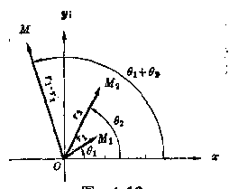

*图4-13*

所得到的一个新的向量 \(\overrightarrow{OM}\)，即是复数 \(z_{1} \cdot z_{2}\) 所对应的向量。

*例 7 用几何的方法做下面的乘法：

$$
2 (\cos 60 ^ {\circ} + i \sin 60 ^ {\circ}) \cdot 3 (\cos 45 ^ {\circ} + i \sin 45 ^ {\circ})，
$$

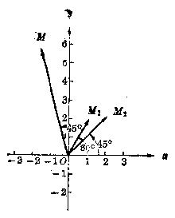

*图4.14*

并用复数的代数形式表示求得的结果。

**［解］** 作出复数 \(2(\cos 60^{\circ} + i\sin 60^{\circ})\) 与复数 \(3(\cos 45^{\circ} + i\sin 45^{\circ})\) 的向量 \(\overrightarrow{OM_1}\) 与 \(\overrightarrow{OM_2}\)， 将向量 \(\overrightarrow{OM_1}\) 旋转 \(45^{\circ}\) 的角并且伸长3倍， 得到新的向量 \(\overrightarrow{OM}\)， 它所对应的复数 \(-1.6 + 5.8i\) 即为所求的积。

1. 计算：

（1） \(\sqrt{2}\left(\cos \frac{\pi}{12} + i\sin \frac{\pi}{12}\right), \sqrt{3}\left(\cos \frac{\pi}{6} + i\sin \frac{\pi}{6}\right)\)；

（2） \(8\left(\cos \frac{\pi}{6} + i\sin \frac{\pi}{6}\right) \cdot 2\left(\cos \frac{\pi}{6} - i\sin \frac{\pi}{6}\right)\)；

（3） \((1 - i)\left(-\frac{1}{2} +\frac{\sqrt{3}}{2} i\right)\left[\cos \left(\frac{5\pi}{12} -\theta\right) - i\sin \left(\frac{5\pi}{12} -\theta\right)\right];\)

（4） \(2(\cos 12^{\circ} + i\sin 12^{\circ}) \cdot 3(\cos 78^{\circ} + i\sin 78^{\circ})\)

$$
\cdot \frac {1}{6} (\cos 45 ^ {\circ} + i \sin 45 ^ {\circ})。
$$

2. 证明：

（1） \(3(\cos 75^{\circ} - i\sin 75^{\circ})(\cos 15^{\circ} - i\sin 15^{\circ}) = -3i;\)

（2） \((\cos 3\theta + i \sin 3\theta)(\cos 2\theta - i \sin 2\theta)\)

$$
= (\cos 5 \theta + i \sin 5 \theta) (\cos 4 \theta - i \sin 4 \theta)。
$$

3. 下列各题中， 作出复数 \(z_{1}\) 与 \(z_{2}\) 以及它们的积 \(z\) 所对应的向量：

（1） \(z_{1} = 2(\cos 50^{\circ} + i\sin 30^{\circ}), z_{2} = 3(\cos 60^{\circ} + i\sin 60^{\circ}).\)

（2） \(z_{1} = 2\sqrt{2} (\cos 15^{\circ} + i\sin 15^{\circ})\)

$$
z _ {2} = \sqrt {2} (\cos 120 ^ {\circ} + i \sin 120 ^ {\circ})。
$$

（3） \(z_{1} = 1 - i, z_{2} = 2(\cos 75^{\circ} + i\sin 75^{\circ})\)

（4） \(z_{1} = 2 + i, z_{2} = 2 + 3.\)

上面两个复数相乘的法则可以推广到 \(n\) 个复数相乘的情况：

$$
\begin{array}{l} z _ {1} \cdot z _ {2} \dots z _ {n} = r _ {1} r _ {2} \dots r _ {n} [ \cos (\theta_ {1} - \theta_ {2} + \dots + \theta_ {n}) ] \\ + i \left[ \sin \left(\theta_ {1} + \theta_ {2} + \dots + \theta_ {n}\right) \right]。 \\ \end{array}
$$

当 \(n\) 个复数相等的时候，就是

$$
r _ {1} = r _ {2} = \dots = r _ {n} = r， \quad \theta_ {1} = \theta_ {2} = \dots = \theta_ {n} = \theta
$$

的时候，就有

$$
\left| z ^ {n} - r ^ {n} (\cos n \theta + i \sin n \theta) \right| (n \text {是正整数})。
$$

这就是说，

复数的 \(n\) 次幂 \((n\) 是正整数）的模数，等于这个复数的模数的 \(n\) 次幂，它的辐角等于这个复数的辐角的 \(n\) 倍。

这个定理又叫做棣美弗定理①。

##### 例 8

计算

$$
\left[ \sqrt {2} \left(\cos \frac {\pi}{4} + i \sin \frac {\pi}{4}\right) \right] ^ {0}
$$

**［解］** \(\left[\sqrt{2}\left(\cos \frac{\pi}{4} + i\sin \frac{\pi}{4}\right)\right]^0\)

$$
= (\sqrt {2}) ^ {6} \left(\cos 6 \cdot \frac {\pi}{4} + i \sin 6 \cdot \frac {\pi}{4}\right)
$$

$$
= 8 \left(\cos \frac {3 \pi}{2} + i \sin \frac {2 \pi}{2}\right) = 8 (0 - i)
$$

$$
= - 8 i.
$$

##### 例 9

计算 \((1+\sqrt{3}i)^{10}\) 的值。

> ① 核美弗（1667~1754）是法国数学家。原来定理是就 \(r = 1\) 的情况来说的：即

$$
z ^ {n} = (\cos \theta + i \sin \theta) ^ {n} = \cos n \theta + i \sin n \theta .
$$

**［解］**

$$
\begin{array}{l} (1 + \sqrt {3} i) ^ {10} = \left[ 2 \left(\cos \frac {\pi}{3} + i \sin \frac {\pi}{3}\right) \right] ^ {10} \\ = 2 ^ {10} \left(\cos \frac {\pi}{3} + i \sin \frac {\pi}{3}\right) ^ {10} \\ = 2 ^ {10} \left(\cos \frac {10 \pi}{3} + i \sin \frac {10 \pi}{3}\right) \\ = 1024 \left(- \frac {1}{2} - \frac {\sqrt {3}}{2} i\right) \\ = - 512 - 512 \sqrt {3} i. \\ \end{array}
$$

**［注意］** 本题如果应用二项式定理来计算，显然运算过程就要繁得多。

##### 例 10

如图 4·15，向量 \(\overrightarrow{OM}\) 对应于复数 \(-1+i\)。把 \(\overrightarrow{OM}\) 按逆时针方向旋转 \(120^{\circ}\)，得到 \(\overrightarrow{OM_{1}}\)，求和向量 \(\overrightarrow{OM_{1}}\) 对应的复数。

**［解］** 所求的复数就是 \(-1 + i\) 乘以一个复数的积， 这个复数的模数是 1， 辐角是 \(120^{\circ}\)， 所以所求的复数是：

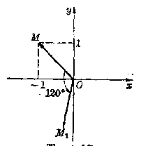

*图4-15*

$$
\begin{array}{l} (- 1 + i) \cdot 1 (\cos 120 ^ {\circ} + i \sin 120 ^ {\circ}) \\ = (- 1 + i) \left(- \frac {1}{2} + \frac {\sqrt {3}}{2} i\right) \\ = \frac {1 - \sqrt {3}}{2} - \frac {1 + \sqrt {3}}{2} i. \\ \end{array}
$$

##### 例 11

图 4·16 是并列的三个相等的正方形， 证明：

$$
\angle 1 + \angle 2 + \angle 3 = \frac {\pi}{2}.
$$

*图4-16*

*图4-17*

**［证］** 如图4·17建立坐标系，利用平行线内错角相等的性质，∠1，∠2，∠3分别可看作是复数 \(1+i\)， \(2+i\)， \(3+i\) 的辐角。由于复数相乘，积的辐角等于因数的辐角的和，因为

$$
(1 + i) (2 + i) (3 + i) = (1 + 3 i) (3 + i) = 10 i
$$

而 \(10i\) 的辐角是 \(\frac{\pi}{2}\)， 所以

$$
\angle 1 + \angle 2 + \angle 3 = \frac {\pi}{2}.
$$

复数的除法可以转化为复数的乘法来做。为此只要求出 \(\frac{1}{z}\)

$$
\begin{array}{l} \frac {1}{z} = \frac {1}{r (\cos \theta + i \sin \theta)} \\ - \frac {1}{r} \cdot \frac {\cos \theta - i \sin \theta}{(\cos \theta + i \sin \theta) (\cos \theta - i \sin \theta)} \\ = \frac {1}{r} (\cos \theta - i \sin \theta) = \frac {1}{r} [ \cos (- \theta) + i \sin (- \theta) ] \\ \end{array}
$$

$$
\therefore z _ {1} \div z _ {2} = z _ {1} \cdot \frac {1}{z _ {2}}
$$

$$
= r_1 (\cos \theta_ {1} + i \sin \theta_ {1})
$$

$$
\cdot \frac {1}{r _ {2}} [ \cos (- \theta_ {2}) + i \sin (- \theta_ {2}) ] \quad (z _ {2} \neq 0)，
$$

即

$$
z _ {1} \div z _ {2} = \frac {r _ {1}}{r _ {2}} [ \cos (\theta_ {1} - \theta_ {2}) + i \sin (\theta_ {1} - \theta_ {2}) ]。
$$

这就是说：

两个复数相除（除数不为零），商的模数等于被除数的模数除以除数的模数，商的辐角等于被除数的辐角减去除数的辐角。

##### 例 12

计算

$$
12 \left(\cos \frac {7 \pi}{4} + i \sin \frac {7 \pi}{4}\right) \div 6 \left(\cos \frac {2 \pi}{3} + i \sin \frac {2 \pi}{3}\right)。
$$

**［解］** \(12\left(\cos \frac{7\pi}{4} + \sin \frac{7\pi}{4}\right) \div 6\left(\cos \frac{2\pi}{3} + i\sin \frac{2\pi}{3}\right)\)

$$
= \frac {12}{6} \left[ \cos \left(\frac {7 \pi}{4} - \frac {2 \pi}{3}\right) + i \sin \left(\frac {7 \pi}{4} - \frac {2 \pi}{3}\right) \right]
$$

$$
= 2 \left(\cos \frac {18 \pi}{12} - i \sin \frac {13 \pi}{12}\right)。
$$

##### 例 13

求证

$$
\begin{array}{l} \frac {(1 - \sqrt {3} i) (\cos \theta + i \sin \theta)}{(1 - i) (\cos \theta - i \sin \theta)} \\ = \sqrt {2} \left[ \cos \left(2 \theta - \frac {\pi}{12}\right) + i \sin \left(2 \theta - \frac {\pi}{12}\right) \right]。 \\ \end{array}
$$

**［证］** 左边= \(\frac{2\left(\cos\frac{5\pi}{3}+i\sin\frac{5\pi}{3}\right)\left(\cos\theta+i\sin\theta\right)}{\sqrt{2}\left(\cos\frac{7\pi}{4}+i\sin\frac{7\pi}{4}\right)\left[\cos(-\theta)+i\sin(-\theta)\right]}\)

$$
= \frac {2 \left[ \cos \left(\theta - \frac {5 \pi}{3}\right) + i \sin \left(\theta + \frac {5 \pi}{3}\right) \right]}{\sqrt {2} \left[ \cos \left(\frac {7 \pi}{4} - \theta\right) + i \sin \left(\frac {7 \pi}{4} - \theta\right) \right]}
$$

$$
= \sqrt {2} \left[ \cos \left(\theta + \frac {5 \pi}{3} - \frac {7 \pi}{4} + \theta\right) \right.
$$

$$
+ i \sin \left(\theta + \frac {5 \pi}{3} - \frac {7 \pi}{4} + \theta\right) ]
$$

$$
= \sqrt {2} \left[ \cos \left(2 \theta - \frac {\pi}{12}\right) + i \sin \left(2 \theta - \frac {\pi}{12}\right) \right] = \text {右边}，
$$

**［注意］** 从上面所述的复数三角形式

的除法运算法则

$$
\frac {r _ {1} (\cos \theta_ {1} + i \sin \theta_ {1})}{r _ {2} (\cos \theta_ {2} + i \sin \theta_ {2})}
$$

$$
= \frac {r _ {1}}{r _ {2}} [ \cos (\theta_ {1} - \theta_ {2})
$$

$$
\left. + i \sin \left(\theta_ {1} - \theta_ {2}\right) \right]，
$$

读者可以利用图 4·18，自己来解释复数除法的几何意义。

*图4-18*

#### 习题4·5（4）

1. 用棣美弗定理计算：

（1） \([3(\cos 18^{\circ} + i\sin 18^{\circ})]^{5}\)； （2） \(\left[3\left(\cos \frac{\pi}{4} - i\sin \frac{\pi}{4}\right)\right]^{5}\)；

（3） \((2 + 2i)^{5}\)； （4） \(\left(\frac{\sqrt{3}}{2} - \frac{1}{2} i\right)^{12}\)。

2. 计算：

（1） \((\sqrt{3} i - 1)\left(-\frac{1}{2} + \frac{\sqrt{3}}{2} i\right)^{20}\)；

（2） \(\frac{(\sqrt{3} - i)^5}{\sqrt{3} + i}\)； （3） \(\frac{(1 + i)^5}{1 - i} + \frac{(1 - i)^5}{1 + i}\)；

（4） \(\frac{(-1 + \sqrt{3}i)^{15}}{(1 - i)^{30}} + \frac{(-1 - \sqrt{3}i)^{15}}{(1 + i)^{20}}.\)

3. 已知 \(n\) 是自然数，且 \((1 + i)^n\) 是实数。试问 \(n\) 的最小值是什么？这个实数是什么？

4. 用棣美弗定理和复数相等的条件验证下列各式：

（1） \(\cos 2\theta = \cos^2\theta -\sin^2\theta ;\sin 2\theta = 2\sin \theta \cos \theta ;\)

（2） \(\cos 3\theta = \cos^3\theta - 3\cos \theta \sin^2\theta; \sin 3\theta = 3\cos^2\theta \sin \theta - \sin^3\theta.\)

5. 计算：

（1） \(\frac{1}{3\left(\cos\frac{11\pi}{6}+i\sin\frac{11\pi}{6}\right)};\)

（2） \(\frac{\sqrt{3} (\cos 150^{\circ} + i\sin 150^{\circ})}{\sqrt{3} (\cos 225^{\circ} + i\sin 225^{\circ})};\)

（3） \(\frac{-i}{\sqrt{2} (\cos 120^{\circ} + i \sin 120^{\circ})}\)；

（4） \(\frac{(\cos 3\theta + i\sin 3\theta)^3 (\cos \theta - i\sin \theta)^3}{(\cos 5\theta + i\sin 5\theta)^3 (\cos 2\theta - i\sin 2\theta)^3}\)。

### § 4·6 复数的开方

象实数开方的意义一样，如果复数 \(w\) 的 \(n\) 次幂等于另一个复数 \(z\)，即 \(w^n = z\)，那末 \(w\) 就称为 \(z\) 的 \(n\) 次方根。求复数 \(z\) 的 \(n\) 次方根的运算，称为把复数 \(z\) 开 \(n\) 次方。

例如：因为 \(i^2 = -1\)， \((-i)^2 = -1\)，所以 \(i\) 和 \(-i\) 都是-1的二次方根；又如：因为

$$
1 ^ {3} = 1， \left(\frac {- 1 + \sqrt {3} i}{2}\right) ^ {3} = 1， \left(\frac {- 1 - \sqrt {3} i}{2}\right) ^ {3} = 1，
$$

所以 \(1, \frac{-1 + \sqrt{3}i}{2}\) 和 \(\frac{-1 - \sqrt{3}i}{2}\) 都是 1 的三次方根。

这里可以看到，在复数范围里，负数也可以开偶次方，正数的奇次方根也不只有唯一的值。

本节将根据开方是乘方的逆运算这一关系，利用棣美弗定理来导出复数开方的一般法则。由此说明：任何一个复数都可以开 \(n\) 次方，并且，任一非零复数的 \(n\) 次方根都有 \(n\) 个值。

#### 1. 复数开方的法则

先来计算一个具体的题目。

求复数 \(z = 1 + \sqrt{3} i\) 的平方根。

为了能应用棣美弗定理， 先把这个复数写成三角形式：

\(z = 2\left(\cos \frac{\pi}{3} + i\sin \frac{\pi}{3}\right)\)， 并且设所求的平方根是

$$
w = \rho (\cos \varphi + i \sin \varphi)。
$$

那末，根据方根的意义： \(w^{2} = z\)， 就有

$$
[ \rho (\cos \varphi + i \sin \varphi) ] ^ {2} = 2 \left(\cos \frac {\pi}{3} + i \sin \frac {\pi}{3}\right)，
$$

就是 \(\rho^2 (\cos 2\varphi + i\sin 2\varphi) = 2\left(\cos \frac{\pi}{3} + i\sin \frac{\pi}{3}\right)\)。

因为，两个复数相等时，它们的模数必须相等，而辐角可以相差 \(2\pi\) 的整数倍，所以

$$
\left\{ \begin{array}{l} \rho^ {2} = 2， \\ 2 \varphi = \frac {\pi}{3} + 2 k \pi \quad (k \text {是整数})。 \end{array} \right.
$$

由此可知，\(\left\{ \begin{array}{l} \rho = \sqrt{2} \\ \varphi = \frac{\pi}{6} + k\pi. \end{array} \right.\) （因为 \(\rho\) 是模数，所以只取算术根），

这样，即得所求的平方根是

$$
w = \sqrt {2} \left[ \cos \left(\frac {\pi}{6} + k \pi\right) + i \sin \left(\frac {\pi}{6} + k \pi\right) \right]，
$$

这里 \(k\) 是整数。

为了确定所求的平方根究竟有几个，不妨试取 \(k\) 的一些值代入计算，例如：

当 \(k = 0\) 时，得

$$
w _ {0} = \sqrt {2} \left(\cos \frac {\pi}{6} + i \sin \frac {\pi}{6}\right) = \frac {1}{2} \sqrt {6} + \frac {1}{2} \sqrt {2} i；
$$

当 \(k = 1\) 时，得

$$
\begin{array}{l} w _ {1} = \sqrt {2} \left(\cos \frac {7}{6} \pi + i \sin \frac {7}{6} \pi\right) \\ = - \frac {1}{2} \sqrt {6} - \frac {1}{2} \sqrt {2} i. \\ \end{array}
$$

正弦函数、余弦函数都是以 \(2\pi\) 为周期的函数，所以，倘使取 \(k\) 的其他值 \(\pm 2, \pm 4, \pm 6, \cdots\) 代入，求得的结果都与 \(w_0\) 相同；取 \(k\) 的其他值 \(\pm 1, \pm 8, \pm 5, \cdots\) 代入，求得的结果都与 \(w_1\) 相同。由此可知，\(1 + \sqrt{3}i\) 的平方根有两个值，并且只有两个值，它们可以用式子

$$
\sqrt {2} \left[ \cos \left(\frac {\pi}{6} + k \pi\right) + i \sin \left(\frac {\pi}{6} + k \pi\right) \right] (k = 0， 1)
$$

来表示。

一般地， 设复数 \(z = r(\cos \theta + i \sin \theta) (z \neq 0)\) 的 \(n\) 次方根是 \(w = \rho (\cos \varphi + i \sin \varphi)\)。 那末， 从 \(w^n = z (z \neq 0)\)， 可得

$$
\rho^ {n} (\cos n \varphi + i \sin n \varphi) = r (\cos \theta + i \sin \theta)。
$$

由此，根据复数相等的意义，有

$$
\left\{ \begin{array}{ll} \rho^ {n} = r， \\ n \varphi = \theta + 2 k \pi & (k \text {为整数})。 \end{array} \right.
$$

从而有 \(\left\{ \begin{array}{l} \rho = \sqrt[n]{r}, \\ \varphi = \frac{\theta + 2k\pi}{n}. \end{array} \right.\)

$$
\therefore w _ {k} = \sqrt [ n ]{r} \left[ \cos \frac {\theta + 2 k \pi}{n} + i \sin \frac {\theta + 2 k \pi}{n} \right]，
$$

这里 \(\sqrt[n]{r}\) 表示 r 的 n 次算术根，k 只需取 0， 1， 2， …， n-1.，这 \(n\) 个值。（想一想，这是为什么？）

为了方便起见，采用符号 \(\sqrt[n]{z}\) 来表示复数 z 的各个 n 次方根，这样就有

$$
\left[ \begin{array}{c} \sqrt [ n ]{z} - \sqrt [ n ]{r} \left[ \cos \frac {\theta + 2 k \pi}{n} + i \sin \frac {\theta + 2 k \pi}{n} \right] \\ (k = 0， 1， 2， \dots ， n - 1)。 \end{array} \right]
$$

这就是说， 复数的 \(n\) 次方根有 \(n\) 个值， 它们的模数都等于这个复数的 \(n\) 次算术根， 而它们的辐角分别等于这个复数的辐角与 \(2\pi\) 的 \(0, 1, 2, \cdots, n-1\) 倍的和的 \(n\) 分之一。

**［注意］**

在实数范围内和在复数范围内，记号 \(\sqrt[n]{-}\) 的意义有所不同。例如：在实数范围里，\(\sqrt{1}\) 只表示1的算术根1，在复数范围里 \(\sqrt{1}\) 就表示1的两个平方根 \(\pm 1\)。又如：在实数范围里，\(\sqrt[3]{-1}\) 只表示实数-1，但在复数范围里，\(\sqrt[3]{-1}\) 就表示-1的三个立方根-1，\(-\omega, -\omega^3\)。为了防止混淆，以后如要用方根符号来表示实数 \(a\) 的 \(n\) 个 \(n\) 次方根，宁可把 \(a\) 写成 \(a + 0i\) 的形式，表示成 \(\sqrt[n]{a + 0i}\)，而仍旧把符号 \(\sqrt[n]{a}\)（当它有意义时）来表示唯一的实数值。

##### 例 1

计算 \(\sqrt{-1 + i}\)。

**［解］** \(-1 + i = \sqrt{2}\left(\cos \frac{3}{4}\pi + i \sin \frac{3}{4}\pi\right)\)。

$$
\begin{array}{l} \therefore w _ {k} = \sqrt {- 1 + i} = \sqrt {\sqrt {2} \left(\cos \frac {3}{4} \pi + i \sin \frac {3}{4} \pi\right)} \\ = \sqrt[4]{2} \left[ \cos \frac {1}{2} \left(2 k \pi + \frac {3}{4} \pi\right) + i \sin \frac {1}{2} \left(2 k \pi + \frac {3}{4} \pi\right) \right] \\ = \sqrt[4]{2} \left[ \cos \left(k \pi + \frac {3}{8} \pi\right) + i \sin \left(k \pi + \frac {3}{8} \pi\right) \right]。 \\ \end{array}
$$

由此得 \(w_{0} = \sqrt[4]{2}\left(\cos \frac{3}{8}\pi + i\sin \frac{3}{8}\pi\right),\)

$$
w _ {1} = \sqrt[4]{2} \left(\cos \frac {11}{8} \pi + i \sin \frac {11}{8} \pi\right)。
$$

##### 例 2

在复数范围里，解方程 \(x^{5} + 1 = 0\)

**［解］** \(x^{5} + 1 = 0, x^{3} = -1,\)

$$
\therefore x ^ {3} = \cos \pi + i \sin \pi .
$$

于是 \(x_{k} = \cos \frac{2k\pi + \pi}{5} + i\sin \frac{2k\pi + \pi}{5}\)

$$
= \cos \frac {1}{5} (2 k + 1) \pi + i \sin \frac {1}{5} (2 k + 1) \pi
$$

$$
(k = 0， 1， 2， 3， 4)。
$$

由此得

$$
x _ {0} = \cos \frac {\pi}{5} + i \sin \frac {\pi}{5}， x _ {1} = \cos \frac {3}{5} \pi + i \sin \frac {3}{5} \pi ，
$$

$$
x _ {2} = \cos \pi + i \sin \pi = - 1， x _ {3} = \cos \frac {7}{5} \pi + i \sin \frac {7}{5} \pi ，
$$

$$
x _ {4} = \cos \frac {9}{5} \pi + i \sin \frac {9}{5} \pi .
$$

1. 计算：

（1） \(\sqrt[4]{16}\left(\cos \frac{2}{3}\pi + i\sin \frac{2}{3}\pi\right)\)；

（2） \(\sqrt[6]{8(\cos 60^\circ - i\sin 60^\circ)}\)。

2. 计算：

（1） \(\sqrt{-i}\)；

（2） \(\sqrt[4]{\sqrt{2} - \sqrt{2i}};\)

（3） \(\sqrt[6]{-1 + \sqrt{3}i}\)；

（4） \(\sqrt[4]{-3 + 3i}\)。

3. （1） 求 -8 的三个立方根；

（2） 求 -64 的四个四次方根。

4. 设 \(a\) 为正实数，应用复数开方的法则，解下列关于复数 \(x\) 的方程：

（1） \(x^{3} + a^{3} = 0;\)

（2） \(x^{3} - a^{3} = 0;\)

（3） \(x^{4} + a^{4} = 0;\)

（4） \(x^{4} - a^{4} = 0.\)

5. 设 \(a, b, c\) 都是实数，\(\square b^2 - abc < 0\)。解方程

$$
a x ^ {2} + b x + c = 0 \quad (a \neq 0)。
$$

#### 2. 复数开方的几何意义

根据复数开方的法则，不难作出复数开方的几何意义。

设 \(z = r(\cos \theta + i\sin \theta)\) 的 \(n\) 个 \(n\) 次方根是

$$
w _ {k} = \sqrt [ n ]{r} \left(\cos \frac {2 k \pi + \theta}{n} + i \sin \frac {2 k \pi + \theta}{n}\right)，
$$

其中 \(k=0,1,2,\cdots,n-1\)。并设 \(w_{k}\) 在平面内对应的点是 \(M_{k}\)。

那末， 容易看出：

（1） 这些点与原点的距离都等于 \(\sqrt[n]{r}\)。因此，这些点在以原点为中心、\(\sqrt[n]{r}\) 为半径的圆周上；

（2） 任意相邻两点（例如 \(M_0\) 与 \(M_1, M_1\) 与 \(M_2, \cdots\)）间的夹角都等于 \(\frac{2\pi}{n}\)。 因此， 只要先作出对应于 \(w_0\) 的向量 \(\overrightarrow{OM_0}\)， 把它沿逆时针方向旋转角 \(\frac{2\pi}{n}\)， 就得对应于 \(w_1\) 的向量 \(\overrightarrow{OM_1}\)， 再旋转角 \(\frac{2\pi}{n}\)， 就得对应于 \(w_2\) 的向量 \(\overrightarrow{OM_2}, \cdots\) 最后， 把对应于 \(w_{n-2}\) 的向量 \(\overrightarrow{OM_{n-2}}\) 旋转角 \(\frac{2\pi}{n}\)， 就得对应于 \(w_{n-1}\) 的向量 \(\overrightarrow{OM_{n-1}}\)。

由此，从几何观点来看，复数 \(z = r(\cos \theta + i\sin \theta)\) 的 \(n\) 个 \(n\) 次方根所对应的点，恰巧是以原点为中心，\(\sqrt[n]{r}\) 为半径的圆的一个内接正 \(n\) 多边形的顶点，其中第一个顶点（点 \(M_0\)）所对应的向量（向量 \(\overrightarrow{OM_0}\)）与 \(x\) 轴的正方向 \(\overrightarrow{Ox}\) 间的夹角是 \(\frac{1}{n}\theta\)（以 \(\overrightarrow{Ox}\) 为始边）。

例如， 图 4·19 是当 m=7 时的情况。

*图4·19*

*图4·20*

##### 例 3

根据复数开方的几何意义，试在复数平面内作出表示方程 \(x^{3} - 1 = 0\) 的五个根的点。

**［解］**

$$
\because x ^ {6} = 1 = \cos 0 + i \sin 0，
$$

$$
\therefore x = \sqrt[6]{\cos 0 + i \sin 0}.
$$

所以， 它的五个根对应的点是一个以坐标系原点 O 为中心， 其外接圆半径是 1 的正五边形的顶点 \(M_{0}, M_{1}, M_{2}, M_{3}, M_{4}\) 。 先作出顶点

$$
M _ {0} = \cos 0 + i \sin 0；
$$

然后把向量 \(\overrightarrow{OM_0}\) 沿逆时针方向旋转 \(72^{\circ}\) 角，得到向量 \(\overrightarrow{OM_1}\)，这就得到了顶点 \(M_2\)；又把向量 \(\overrightarrow{OM_1}\) 旋转 \(72^{\circ}\) 角，从而得到顶点 \(M_2\)；依次同样进行下去，即可得顶点 \(M_3\)，\(M_4\)（图4·20）。

#### 习题4·6（2）

1. 在复数平面内，作出表示：

（1） 1 的六次方根；

（2） 1 的八次方根的各点。

2. 求方程 \(x^{4} + 1 = 0\) 的复数解，并证明这些解所对应的点构成一个正方形。

### § 4·7 复数的指数形式

一个复数 \(z\) 除了有代数形式和三角形式之外，还有其它形式。在电学和无线电学中就常采用复数的另外一种形式——指数形式。

把 \(\cos \theta + i\sin \theta\) 用 \(e^{i\theta}\) 来表示，即令

$$
e ^ {i \theta} = \cos \theta + i \sin \theta ①
$$

这样，任何一个复数 \(z = r(\cos \theta + i \sin \theta)\) 就可用

$$
z = r e ^ {i \theta}，
$$

来表示。式子 \(z = re^{i\theta}\) 称为复数 \(z\) 的指数形式。在复数的指数形式中，\(r\) 表示复数的模数，\(\theta\) 表示复数的辐角，\(\theta\) 用弧度来表示，\(e\) 是自然对数的底。

把复数 \(z\) 表示成指数形式后，它们的运算完全可以按照实数中指数运算法则进行。这里我们仿照实数中的提法，把 \(e^{i\theta}\) 叫做以 \(e\) 为底，\(\mathrm{d}\theta\) 为指数的幂。

设 \(z_{1} = r_{1}e^{i\theta_{1}}; z_{2} = r_{2}e^{i\theta_{2}}.\)

乘法： \(z_{1}\cdot z_{2} = r_{1}e^{i\theta_{1}}\cdot r_{2}e^{i\theta_{2}}\)

$$
\begin{array}{l} = r _ {1} \left(\cos \theta_ {1} + i \sin \theta_ {1}\right) \cdot r _ {2} \left(\cos \theta_ {2} + i \sin \theta_ {2}\right) \\ = r _ {1} r _ {2} \left[ \cos \left(\theta_ {1} + \theta_ {2}\right) + i \sin \left(\theta_ {1} + \theta_ {2}\right) \right] \\ = r _ {1} r _ {2} e ^ {i \left(\theta_ {1} + \theta_ {2}\right)}. \\ \end{array}
$$

即

$$
z _ {1} \cdot z _ {2} = r _ {1} r _ {2} e ^ {i (\theta_ {1} + \theta_ {2})}.
$$

同理可得：

$$
\boxed { \begin{array}{l} z _ {1} \\ z _ {2} \end{array} } = \frac {r _ {1} e ^ {i \theta_ {1}}}{r _ {2} e ^ {i \theta_ {2}}} = \frac {r _ {1}}{r _ {2}} e ^ {i (\theta_ {1} - \theta_ {2})}.
$$

> ① 这个公式叫做欧拉公式，在高等数学中有严格的证明。

$$
z ^ {n} = \left(\eta^ {\prime} e ^ {i \theta}\right) ^ {n} = \eta^ {n} e ^ {i n \theta}.
$$

对于开方运算，复数 z 的 n 次方根 \(\omega\) 为

$$
\omega_ {k} = \sqrt [ n ]{\eta^ {\prime} e ^ {i \frac {\theta + 2 k \pi}{n}}} \quad (k = 0， 1， 2， \dots ， n - 1)。
$$

#### 例 1

把复数 \(\sqrt{3} + i, 1 - i, -1\) 化成指数形式。

**［解］** \(\sqrt{3} + i = 2\left(\cos \frac{\pi}{6} + i \sin \frac{\pi}{6}\right) = 2e^{i\frac{\pi}{3}};\)

$$
1 - i = \sqrt {2} \left(\cos \frac {7 \pi}{4} + i \sin \frac {7 \pi}{4}\right) = \sqrt {2} e ^ {i \frac {7 \pi}{4}}；
$$

$$
- 1 = \cos \pi + i \sin \pi = e ^ {i \pi}.
$$

##### 例 2

把复数 \(e^{2i\pi i}, \frac{1}{2} e^{-\frac{\pi}{2} i}\) 化成三角形式和代数形式。

**［解］** \(e^{2\pi i} = \cos 2\pi + i\sin 2\pi = 1;\)

$$
\frac {1}{2} e ^ {- \frac {\pi}{2} i} = \frac {1}{2} \left[ \cos \left(- \frac {\pi}{2}\right) + i \sin \left(- \frac {\pi}{2}\right) \right]
$$

$$
= \frac {1}{2} (- i) = - \frac {1}{2} i
$$

##### 例 3

用 \(e^{i\theta}\) 和 \(e^{-i\theta}\) 表示 \(\cos\theta\) 和 \(\sin\theta\) 。

**［解］** 由于 \(e^{i\theta} = \cos \theta + i\sin \theta, e^{-i\theta} = \cos \theta - i\sin \theta.\)

$$
\therefore \cos \theta = \frac {e ^ {i \theta} + e ^ {- i \theta}}{2}， \quad \sin \theta = \frac {e ^ {i \theta} - e ^ {- i \theta}}{2 i}.
$$

1. 把下列复数表示成指数形式：

（1） \(-2 + 2i\)；

（2） \(-\frac{1}{2} + \frac{\sqrt{3}}{2} i;\)

（3） \(2\left(\cos \frac{\pi}{3} + i \sin \frac{\pi}{3}\right)\)；

（4） \(-\frac{1}{2}\left(\cos \frac{\pi}{7} - i \sin \frac{\pi}{7}\right)\)。

2. 把下列复数表示成三角形式和代数形式：

（1） \(3e^{\frac{3\pi}{2}t}\)；

（2） \(\sqrt{5} e^{\frac{3\pi}{3} t}\)；

（3） \(e^{\frac{\pi}{10} t}\)。

3. 利用复数的指数形式计算：

（1） \(\frac{\sqrt{3}\left(\cos\frac{4\pi}{3}+i\sin\frac{4\pi}{3}\right)\cdot\sqrt{5}\left(\cos\frac{\pi}{4}+i\sin\frac{\pi}{4}\right)}{\sqrt{2}\left(\cos\frac{5\pi}{4}+i\sin\frac{5\pi}{4}\right)};\)

（2） \((\sqrt{3} - i - i)^{10}\)；

（3） \(\frac{2e^{i\frac{4\pi}{3}}\cdot 4e^{i\frac{5\pi}{6}}\cdot 5e^{i\frac{8\pi}{5}}}{e^{i\frac{\pi}{10}}}\)。

### * § 4·8 数域

在这一节中，我们要介绍另一个很重要的概念——数域。

§ 4·1 中我们已回顾了数的概念的发展，经过几次扩展，从小学算术里的正整数到代数中的有理数，再到实数，最后扩展到复数，数的范围是在逐步地扩大，但是可以看到一切有理数的集合（记作 Q），一切实数的集合（记作 R），和一切复数的集合（记作 C），都具有一个共同的性质，就是在这个集合中，任意两个数的和、差、积、商（当分母不等于零的时候）仍在这个集合内，在高等数学中，具有这样性质的集合，对一些问题的讨论是很重要的，下面我们将对它作一些研究。

假设 F 是一个数集， 如果满足下面的条件：

（1） F 中至少包含有两个不相同的数；

（2） 对于 \(F\) 中任意两个数 \(a, b\) （这两个数也可以相同） 来说， \(a + b, a - b, a \cdot b\) 都在 \(F\) 中， 并且当 \(b \neq 0\) 时， 商 \(\frac{a}{b}\) 也在 \(F\) 中。 那么 \(F\) 就叫做一个数域。

上面所提到的有理数集 Q，实数集 R 和复数集 C 都满足前面所讲的两个条件，所以都是数域，分别叫做有理数域，实数域和复数域。除了这三个数域以外，还有很多的数域。下面看一个例子。

#### 例 1

令 \(F_{1} = \{a + b\sqrt{2} | a, b\) 是有理数\}。

如 \(1 = 1 + 0\sqrt{2}, 0 = 0 + 0\sqrt{2}, \frac{1}{2} + 3\sqrt{2}, -3 - \frac{3}{4}\sqrt{2}, \cdots\) 等等都是 \(F_{1}\) 中的数，只要是形如 \(a + b\sqrt{2}\)，其中 \(a\) 和 \(b\) 是有理数，这样的数都是 \(F_{1}\) 中的数。

可以验证 \(F_{1}\) 是一个数域，因为：

在 \(F_{1}\) 中至少包含有两个不相同的数，如 \(1 = 0 + \sqrt{2}, \frac{1}{2} + 3\sqrt{2}\)所以条件（1）是满足的。

今设 \(a + b\sqrt{2}, c + d\sqrt{2} \in F_1\) 那么

$$
(a+b\sqrt2)+(c+d\sqrt2)=(a+c)+(b+d)\sqrt2。
$$

因为 \(a, b, c, d\) 都是有理数，所以它们的和 \(a + c, b + d\) 也是有理数，因此 \((a+c)+(b+d)\sqrt2\in F_1\) （说明 \(F_1\) 中任意两个数的和仍在 \(F_1\) 中）。同理：

$$
\begin{array}{l} (a + b \sqrt {2}) - (c + d) \sqrt {2} = (a - c) + (b - d) \sqrt {2} \in F _ {1}， \\ (a + b \sqrt {2}) (c + d \sqrt {2}) = (a c + 2 b d) + (b c + a d) \sqrt {2} \in F _ {1}. \\ \end{array}
$$

再设 \(c + d\sqrt{2} \neq 0\)，那么一定有 \(c - d\sqrt{2} \neq 0\)。否则在 \(d = 0\) 的情形将得出 \(c = 0\)，这与 \(c + d\sqrt{2} \neq 0\) 的假设矛盾；在 \(d \neq 0\) 的情形将得出 \(\sqrt{2} = \frac{c}{d}\) 是有理数，这和 \(\sqrt{2}\) 是无理数这个事实矛盾。因此，

$$
\begin{array}{l} \frac {a + b \sqrt {2}}{c + d \sqrt {2}} = \frac {(a + b \sqrt {2}) (c - d \sqrt {2})}{(c + d \sqrt {2}) (c - d \sqrt {2})} \\ = \frac {a c - 2 b d}{c ^ {2} - 2 d ^ {2}} + \frac {b c - a d}{c ^ {2} - 2 d ^ {2}} \sqrt {2} \in F _ {1} \\ \end{array}
$$

所以条件（2）也是满足的。这就证明了 \(F_{1}\) 是一个数域。

##### 例 2

令 \(F_{2} = \{a + bi|a, b\) 是有理数\}。

读者可以验证 \(F_{2}\) 也是一个数域。

最后我们证明数域的一个重要性质。

定理．任何一个数域都包含有理数域。

**［证］** 设 \(F\) 是一个数域， 由条件（1） \(F\) 中至少含有两个不相同的数， 当然必有一个非零的数存在， 现在假定这个非零的数为 \(a\)， 再由条件（2） \(\frac{a}{a} = 1 \in F\)， 用 1 和它自己相加， 得到 \(1 + 1 = 2\)， 再 \(2 + 1 = 3\)， \(3 + 1 = 4\)， \(\cdots\) 这样就得到全体正整数， 所以全体正整数都属于 \(F\)， 另外 \(a - a = 0 \in F\)， 所以 \(F\) 也包含有 0 与任一个正整数的差， 即 \(0 - 1 = -1\)， \(0 - 2 = -2\)， \(0 - 3 = -3\)， \(\cdots\)， 也就是 \(F\) 中包含有全体负整数， 因此 \(F\) 包含了全体整数， 这样， \(F\) 也包含有任意两个整数的商 （分母不为 0）， 所以 \(F\) 就包含有一切有理数。 定理得证。

在这个定理的意义下， 可以认为， 有理数域是最小的一个数域。

数域是代数中一个很重要的概念，如讨论多项式的因式分解在不同的数域中将得到不同的结果。

##### 例 3

分解因式 \(x^{4} - 4\)。

**［解］** 在有理数域中分解为

$$
x ^ {4} - 4 = (x ^ {2} - 2) (x ^ {2} + 2)。
$$

在实数域中分解为

$$
x ^ {4} - 4 = (x - \sqrt {2}) (x + \sqrt {2}) (x ^ {2} + 2)
$$

在复数域中分解为

$$
x ^ {4} - 4 = (x - \sqrt {2}) (x + \sqrt {2}) (x - \sqrt {2} i) (x + \sqrt {2} i)。
$$

1. 证明： \(F=\{a+b\sqrt{2}i|a,b\) 是有理数 \(\}\) 是一个数域。

2. 一切整数的集合（记作 z）是不是一个数域？

3. \(P = \{b\sqrt{b} \mid b\) 是整数\}是不是一个数域？

4. 证明：两个数域的交还是一个数域。

### 本章提要

#### 1. 虚数单位 \(i\)

性质：（1） \(i^{2}=-1;\)

（2） \(i\) 与实数在一起可以按照通常四则运算的法则进行四则运算。

推论： \(i\) 的整数次幂具有周期性：

$$
i ^ {4 n + 1} = i， i ^ {4 n + 2} = - 1， i ^ {4 n + 3} = - i， i ^ {4 n + 4} = 1.
$$

#### 2. 复数

定义：形如 \(a+bi\) 的数 \((a,b\) 都是实数）。

几何意义：

（1） 表示平面上的点 \(M(a, b)\)；

（2） 表示平面上的向量 \(\overrightarrow{OM}\) 。

#### 3. 复数的代数形式、三角形式和指数形式的互化

$$
z = a + b i = r (\cos \theta + i \sin \theta) = r e ^ {i \theta}.
$$

r——模数（绝对值）

$$
r = | z | = | a + b i | = \sqrt {a ^ {2} + b ^ {2}}.
$$

θ——辐角确定辐角的公式：

$$
\left\{ \begin{array}{l} \cos \theta = \frac {a}{r}， \\ \sin \theta = \frac {b}{r}. \end{array} \right.
$$

辐角的主值区间：

$$
0 \leqslant \theta^ {\prime} < 2 \pi .
$$

辐角的一般表示式：

$$
\theta = 2 k \pi + \theta^ {\prime} \quad (k \text {是整数})。
$$

#### 4. 复数的相等

（1） \(a_1+b_1i=a_2+b_2i\longleftrightarrow \left\{\begin{array}{l}a_1=a_2,\\ b_1=b_2.\end{array}\right.\)

（2） \(r_1(\cos \theta_1 + i\sin \theta_1)\)

$$
= r _ {2} \left(\cos \theta_ {2} + i \sin \theta_ {2}\right) \longleftrightarrow \left\{ \begin{array}{l} r _ {1} = r _ {2}， \\ \theta_ {1} = 2 k \pi + \theta_ {2}. \end{array} \right.
$$

#### 5. 共轭复数

z 的共轭复数 \(\bar{z}=a-bi=r[\cos(-\theta)+i\sin(-\theta)]=re^{-i\theta}\)，两个共轭复数在平面上所表示的点是关于实轴对称的，共轭复数的和与积都是实数，且 z 和 \(\bar{z}\) 互为共轭。

#### 6. 复数的运算

（1） 加法

$$
(a _ {1} + b _ {1} i) + (a _ {2} + b _ {2} i) = (a _ {1} + a _ {2}) + (b _ {1} + b _ {2}) i.
$$

（2） 减法

$$
(a _ {1} + b _ {1} i) - (a _ {2} + b _ {2} i) = (a _ {1} - a _ {2}) + (b _ {1} - b _ {2}) i.
$$

（3） 乘法

（i） \((a_{1} + b_{1}i)(a_{2} + b_{2}i)\)

$$
= \left(a _ {1} a _ {2} - b _ {1} b _ {2}\right) + \left(a _ {1} b _ {2} + a _ {2} b _ {1}\right) i.
$$

（ii） \(r_1(\cos \theta_1 + i\sin \theta_1) \cdot r_2(\cos \theta_2 + i\sin \theta_2)\)

$$
= r _ {1} r _ {2} \left[ \cos \left(\theta_ {1} + \theta_ {2}\right) + i \sin \left(\theta_ {1} + \theta_ {2}\right) \right]。
$$

（iii） \(r_1e^{i\theta_1} \cdot r_2e^{i\theta_2} = r_1r_2e^{i(\theta_1 + \theta_2)}\)。

（4） 除法

$$
\begin{array}{l} \frac {a _ {1} + b _ {1} i}{a _ {2} + b _ {2} i} = \frac {(a _ {1} + b _ {1} i) (a _ {2} - b _ {2} i)}{a _ {2} ^ {2} + b _ {2} ^ {2}} \\ = \frac {a _ {1} a _ {2} + b _ {1} b _ {2}}{a _ {2} ^ {2} + b _ {2} ^ {2}} + \frac {a _ {2} b _ {1} - a _ {1} b _ {2}}{a _ {2} ^ {2} + b _ {2} ^ {2}} i \\ \left(a _ {2} + b _ {2} \neq 0\right)。 \\ \end{array}
$$

（ii） \(\frac{r_1(\cos\theta_1 + i\sin\theta_1)}{r_2(\cos\theta_2 + i\sin\theta_2)}\)

$$
= \frac {r _ {1}}{r _ {2}} [ \cos (\theta_ {1} - \theta_ {2}) + i \sin (\theta_ {1} - \theta_ {2}) ]
$$

$$
(r _ {2} \neq 0)。
$$

（iii） \(\frac{r_1e^{i\theta_1}}{r_2e^{i\theta_2}}=\frac{r_1}{r_2}e^{i(\theta_1-\theta_2)}\)。

（5） 乘方

（i） 可应用第二章的二项式定理。

（ii） 应用棣美弗定理。

$$
[ r (\cos \theta + i \sin \theta) ] ^ {n} = r ^ {n} (\cos n \theta + i \sin n \theta)。
$$

$$
(r e ^ {i \theta}) ^ {n} = r ^ {n} e ^ {i n \theta}.
$$

（6） 开方

（i） \(\sqrt[n]{r} (\cos \theta + i\sin \theta)\)

$$
= \sqrt [ n ]{r} \left(\cos \frac {2 k \pi + \theta}{n} + i \sin \frac {2 k \pi + \theta}{n}\right)
$$

$$
(k = 0， 1， 2， \dots ， n - 1)。
$$

（ii） \(\sqrt[n]{re^{i\theta}}=\sqrt[n]{r}\,e^{i\frac{2k\pi+\theta}{n}}\)（\(k=0,1,2,\dots,n-1\)）。

#### 7. 数域

设 \(F\) 是一个数集， 如果满足下面的两个条件： （1） \(F\) 中至少包含有两个不相同的数， （2） 对于 \(F\) 中任意两个数 \(a, b\)， 它们的和、差、积、商 （分母不为 0） 都在 \(F\) 中， 那么 \(F\) 叫做一个数域。

### 复习题四A

1. 计算：

（1） \(\frac{2}{3} i + \frac{3}{4} i - \frac{5}{6} i;\)

（2） \(\sqrt{12} i - \sqrt{27} i + \sqrt{3} i;\)

（3） \(i^{13} - i^{27}\)；

（4） \(\frac{1}{i^{26}} + \frac{1}{i^{27}};\)

（5） \(i + 2i^2 + 3i^3 + 4i^4\)；

（6） i。i3.i5.。。i99；

（7） \(i^{k + 4} + i^{k + 5} + i^{k + 6} + i^{k + 7}\)

（b 是自然数）；

（8） \(1 + i + i^2 + \cdots + i^{95}\)。

2. 设 \(z_{1} = a_{1} + b_{1}i, z_{2} = a_{2} + b_{2}i\) 是两个复数，在什么条件下有：

（1） \(z_{1} + z_{2}\) 是实数？是纯虚数？

（2） \(z_{1} - z_{2}\) 是实数？是纯虚数？

（3） \(z_{1} \cdot z_{2}\) 是实数？是纯虚数？

（4） \(\frac{z_1}{z_2}\) 是实数？是纯虚数？（这里 \(z_2 \neq 0\)）。

（5） \(z_{1}^{2}\) 是实数？是纯虚数？

3. 在复数平面内任选一点 \(a\)，然后用几何方法点出下列各复数。并用 \(a = \sqrt{3} + i\) 来验证。

（1） \(-a\)；

（2） \(\overline{a}_3\)

（3） \(-a_{i}\)；

（4） \(a + \overline{a}\)；

（5） \(a - \overline{a}\)；

（6） \(a_{i}\)；

（7） \(-a_{i}\)；

（8） \(\overline{a} i\)；

（9） \(-\bar{a} i;\)

（10） \(a + |a|\)；

（11） \(a - |a|\)。

4. 把下面复数的代数形式化成三角形式：

（1） i；

（2） \(\sqrt{3} - i\)；

（3） \(-\sqrt{2} - \sqrt{2} i;\)

（4） \(-1 - \sqrt{3} i;\)

5. 证明：

（1） \(\overline{z_1 + z_2} = \overline{z}_1 + \overline{z}_2;\)

（2） \(\overline{z_1 - z_2} = \overline{z}_1 - \overline{z}_2;\)

（3） \(\overline{z_1\cdot z_2} = \overline{z}_1\cdot \overline{z}_2;\)

（4） \(\left(\frac{z_1}{z_2}\right) = \frac{\bar{z}_1}{\bar{z}_2};\)

（5） \(\bar{z} = z.\)

6. 求适合下列各式的实数 \(x\) 和 \(y\)：

（1） \((1 + 2i)x + (3 - 10i)y = 5 - 6i;\)

（2） \(x^{2} + xi + 2 - 3i = y^{2} + yi + 9 - 2i;\)

（3） \(2x^{2} - 5x + 2 + (y^{2} + y - 2)i = 0;\)

（4） \(\frac{x}{1 - i} + \frac{y}{1 - 2i} = \frac{5}{1 - 3i}\)。

7. 已知 \((x + yi)^3 = a + bi, a, b, x, y\) 是实数，求证：

$$
\frac {a}{x} + \frac {b}{y} = 4 (x ^ {2} - y ^ {2})。
$$

8. 化简：

（1） \((1 - \sqrt{3} i)^{6}[\cos (\varphi - 3\theta) + i\sin (\varphi - 3\theta)\)

$$
\times \frac {(\cos 2 \theta + i \sin 2 \theta) ^ {3} (\cos 2 \varphi - i \sin 2 \varphi)}{\cos (\theta - \varphi) + i \sin (\theta - \varphi)}.
$$

（2） \(\frac{(\sqrt{3} + i)^3\left(\cos\frac{\pi}{3} + i\sin\frac{\pi}{3}\right)}{\left(\cos\frac{\pi}{12} - i\sin\frac{\pi}{12}\right)^3}.\)

9. 计算：

（1） \((x - 1 - \sqrt{2} i)(x - 1 + \sqrt{2} i)(x + 1 - \sqrt{2} i)(x + 1 + \sqrt{2} i)\)；

（2） \((x - \sqrt{2} + i)(x + \sqrt{2} + i)(x + \sqrt{2} - i)(x - \sqrt{2} - i)\)。

10. 设 \(x^{3} = 1\) 的三个解是 \(1, \omega, \omega^{2}\)， 其中 \(\omega = -\frac{1}{2} + \frac{\sqrt{3}}{2} i\)。 求证：

（1） \(1 + \omega + \omega^2 = 0\)；

（2） \(1 \cdot \omega \cdot \omega^2 = 1\)；

（3） \((1 + \omega^2)^4 = \omega\)；

（4） \((1 - \omega + \omega^2)(1 + \omega - \omega^2) = 4\)；

（5） \(1^{n} + \omega^{n} + (\omega^{2})^{n}\)， 当 \(n\) 是 3 的整数倍时等于 3， 当 \(n\) 不是 3 的整数倍时等于 0.

［提示：可设 \(n = 3k, n = 3k + 1, n = 3k + 2\) （\(k\) 是整数）］。

11. 利用上题中 \(\omega\) 的性质计算：

（1） \((-1 + \sqrt{3} i)^{12} - (-1 - \sqrt{3} i)^{12}\)；

（2） \(\left(\frac{\sqrt{3} + i}{2}\right)^{12} - \left(\frac{\sqrt{3} - i}{2}\right)^{12}\)；

（3） \(\left(-\frac{1}{2} i - \frac{\sqrt{3}}{2}\right)^2\)； ［提示： \((-i)^{12} = 1\)］。

12. 设 \(z_{1}, z_{2}\) 是不等于零的复数，用几何方法证明：

$$
\left| z _ {1} \right| + \left| z _ {2} \right| \geqslant \left| z _ {1} + z _ {2} \right| \geqslant \left| z _ {1} \right| - \left| z _ {2} \right|.
$$

13. 一个正三角形的两个顶点为 \(A = 1, B = 2 + i\)， 求第三个顶点 \(C\)。

14. 求作关于 \(z\) 的二次方程， 使它的两根是：

（1） \(\frac{1 + \sqrt{3}i}{2}\) 和 \(\frac{1 - \sqrt{3}i}{2}\)；

（2） \(\frac{2 - i}{1 + i}\) 和 \(\frac{2 + i}{1 - i}\)。

15. 设 \(z\) 是复数， 解方程：

$$
\frac {1}{2} (z - 1) = \frac {\sqrt {3}}{2} (1 + z) i.
$$

16. 判别下列数集是否数域？试说明理由。

（1） 一切偶数的集合，

（2） \(F_{1} = \{a + b\sqrt{3} | a, b\) 是整数\}。

（3） \(F_{2} = \{a + b\sqrt{5} | a, b\) 是有理数\}。

17. 在复数域内分解因式：

（1） \(x^{4} - a^{4}\) （\(\alpha\) 为实数）；

（2） \(a^2 + 2ab + b^2 + c^2\)；

（3） \(x^{4} + x^{2} - 6,\)

### 复习题四B

1. 已知 \(x, y\) 是实数， \(x + y - 30 - xy\) 和 \(60i - |x + yi|\) 是共轭复数， 求 \(x\) 和 \(y\)。

2. 如果 \(z_{1} = 3 + 2i, z_{2} = -2 + 4i, z_{3} = -6 - i, z_{4} = 3i\)，计算下列各式，并把答案化成 \(a + bi\) 的形式：

（1） \(-z_{1}z_{2}\)；

（2） \(z_{1}^{3} - z_{2}^{3}\)；

（3） \(\frac{z_1}{z_3}\)；

（4） \(\frac{1}{z_2}\)。

3. 求证：

（1） \((1 + i)(1 + \sqrt{3}i)(\cos \theta + i\sin \theta)\)

$$
= 2 \sqrt {2} \left[ \cos \left(\frac {7 \pi}{12} + \theta\right) + i \sin \left(\frac {7 \pi}{12} + \theta\right) \right]。
$$

（2） \(\frac{(1 - \sqrt{3}i)(\cos\theta + i\sin\theta)}{(1 - i)(\cos\theta - i\sin\theta)}\)

$$
= \sqrt {2} \left[ \cos \left(2 \theta - \frac {\pi}{12}\right) + i \sin \left(2 \theta - \frac {\pi}{12}\right) \right]。
$$

4. 写出下列各复数的倒数的模数与辐角：

（1） \(z = 4\left(\cos \frac{\pi}{12} + i\sin \frac{\pi}{12}\right)\)；

（2） \(z = \cos \frac{\pi}{6} - i \sin \frac{\pi}{6}\)；

（3） \(z = \sqrt[4]{7} e^{-\frac{\pi}{3} i}\)；

（4） \(z = \frac{\sqrt{2}}{2} (1 - i)\)。

5. 计算 \(z^4\) 的值。若

（1） \(z = 4\left(\cos \frac{\pi}{12} - i\sin \frac{\pi}{12}\right)\)；

（2） \(z = \sqrt[4]{7} e^{-\frac{\pi}{8} i}\)；

（3） \(z = \frac{\sqrt{2}}{2} (1 - i)\)。

6. 已知 \(x, y\) 互为共轭复数，且

$$
(x + y) ^ {2} - 3 a y i = 4 - 6 i
$$

求 \(x, y\)。

7. 设 \(x^{3} = 1\) 的三个解是 \(1, \omega, \omega^{2}\)， 其中 \(\omega = -\frac{1}{2} + \frac{\sqrt{3}}{2} i\)。 求证：

（1） \(a^3 + b^3 = (a + b)(a\omega + b\omega^2)(a\omega^2 + b\omega)\)。

（2） \(a^3 + b^3 + c^3 - 3abc\)

$$
= (a + b + c) (a + b \omega + c \omega^ {2}) (a + b \omega^ {2} + c \omega)。
$$

（3） \(\left[(2a - b - c) + (b - c)\sqrt{3}i\right]^3\)

$$
= [ (2 b - c - a) + (c - a) \sqrt {3} i ] ^ {3}.
$$

8. 利用 \(\sqrt{x^2 - y^2} \pm 2xyi = \pm (x \pm yi)\)，计算：

（1） \(\sqrt{-3 + 4i}\)；

（2） \(\sqrt{7 + \sqrt{15}i}\)；

（3） \(\sqrt{5 - \sqrt{11}i}\)；

（4） \(\sqrt{-7 - \sqrt{15}i}\)。

9. 设 \(f(z) = \frac{z^2 - z + 1}{z^2 + z + 1}\)，当 \(z = 2 \pm 3i\) 时，求 \(f(z)\) 的值。

［提示： \(f(z)\) 表示复数 z 的函数， 在右边这个分式中， 令 \(z=2+3i\)， 化简后即得 \(f(2+3i)\) 的值。］

10. 设 \(m\) 是正整数， 求证：

（1） \((\cos \theta + i \sin \theta)^{-n} = \cos (-n\theta) + i \sin (-n\theta)\)；

（2） \((\cos \theta - i \sin \theta)^n = \cos n\theta - i \sin n\theta,\)

11. 求最小的正整数 \(n\)，使 \(\left[\frac{\sqrt{3}}{\frac{3}{2} + \frac{\sqrt{3}}{2}i}\right]^n\) 是实数，并求这个实数的值。

12. 证明： 对于任何复数 \(z_{1}\) 和 \(z_{2}\) 来说， 等式

$$
\left| z _ {1} + z _ {2} \right| ^ {2} + \left| z _ {1} - z _ {2} \right| ^ {2} = 2 (\left| z _ {1} \right| ^ {2} + \left| z _ {2} \right| ^ {2})
$$

恒成立，并给出它的几何意义。

13. 用棣美弗定理和复数相等的条件， 证明：

$$
\cos 5 \theta = \cos^ {5} \theta - 10 \cos^ {3} \theta \sin^ {2} \theta + 5 \cos \theta \sin^ {4} \theta ；
$$

$$
\sin 5 \theta = \sin^ {5} \theta - 10 \cos^ {3} \theta \sin^ {3} \theta + 5 \cos^ {4} \theta \sin \theta .
$$

*14. 设 \(\varepsilon\) 是一个 1 的 \(n\) 次方根， 且 \(s \neq 1\)。 证明：

$$
1 + 2 \varepsilon + 3 \varepsilon^ {2} + \dots + n \varepsilon^ {n - 1} = - \frac {n}{1 - s}.
$$

*15. 证明：

$$
\cos \frac {2 \pi}{n} + 2 \cos \frac {4 \pi}{n} + \dots + (n - 1) \cos \frac {2 (n - 1) \pi}{n} = - \frac {n}{2}.
$$

$$
\sin \frac {2 \pi}{n} + 2 \sin \frac {4 \pi}{n} + \dots + (n - 1) \sin \frac {2 (n - 1) \pi}{n} = - \frac {n}{2} \operatorname{ctg} \frac {\pi}{n}.
$$

［提示：可利用14题的等式。］

16. 证明：如果 \(z + \frac{1}{z} = 2\cos \theta\)，则

$$
z^m+\frac1{z^m}=2\cos m\theta。
$$

17. 讨论满足下面关系的复数 z 位于何处。

（1） \(\left|\frac{z-1}{z+1}\right|\leqslant1;\)

（2） \(az + \overline{a}\overline{z} + 1 = 0\) （其中 \(a = 1 + i\)）。

18. 证明：如果 \(|z| < \frac{1}{2}\)，则

$$
\left| (1 + i) z ^ {3} + i z \right| < \frac {3}{4}. ]
$$

### 第四章测验题

1. 实数 \(m\) 取何值时， 复数 \((m^2 - 7m - 8) + (m^2 + 10m + 9)i\) 是

（1） 实数；

（2） 纯虚数；

（3） 零。

2. 求下列等式中的实数 \(x\) 和 \(y\)。

（1） \(2x^{2} - 5x + 2 + (y^{2} + y - 2)i = 0;\)

（2） \(2x - y + yi = -5i.\)

3. （1） 在第 I 象限里有一个锐角是 \(30^{\circ}\) 的直角三角形， 它的直角顶点和 \(30^{\circ}\) 角的顶点可以分别用复数 \(x_{1} = \sqrt{3} + 0i\)， \(x_{2} = 2\sqrt{3} + i\) 来表示， 求表示第三个顶点的复数。

（2） 已知正方形两相对顶点是 \(1 + 2i, 3 - 5i\)，求表示其它二个顶点的复数。

4. （1） 已知 \(x_{1} = 2\left(\cos \frac{\pi}{3} + i \sin \frac{\pi}{3}\right), x_{2} = 4\left(\cos \frac{\pi}{6} + i \sin \frac{\pi}{6}\right)\)， 计算 \(z_{1}\) 和 \(z_{2}\) 的和。

（2） 计算： （i） \((1 + i)^{101}\)；

（ii） \(\left(\frac{-1 - \sqrt{3}i}{2}\right)^{100}\)。

5. 设 \(\omega = \frac{-1 + \sqrt{3}i}{2}\)， 求证：

$$
a ^ {3} - b ^ {3} = (a - b) (a - b \omega) ^ {2} (a - b \omega^ {2})。
$$

6. 若 \(z_{1} = \sqrt{2} + (\sqrt{3} - \sqrt{2})i, z_{2} = (\sqrt{3} - \sqrt{2}) + \sqrt{2}i,\) 求：

（1） \(\frac{1}{z_1 \cdot z_2}\)；

（2） \(\frac{1}{z_1} + \frac{1}{z_2}\)。

7. 下列复数是不是三角形式？如果不是三角形式，化成三角形式，并写出指数形式。

（1） \(-2(\cos 30^{\circ} + i\sin 30^{\circ})\)；

（2） \(2(\sin 30^{\circ} + i\cos 30^{\circ})\)；

（3） \(7\left(\cos \frac{4\pi}{3} + i\sin \frac{2\pi}{3}\right)\)；

（4） \(\cos \frac{5\pi}{6} + i\sin \left(-\frac{7\pi}{6}\right)\)。

8. 求 \(\varepsilon (\cos 60^{\circ} + i\sin 60^{\circ})\) 的六个六次方根。

## 第5章 方程论初步

方程论是代数的一个分支。方程论中的一些重要定理和方法，在我们今后进一步学习和解决实际问题时常常要用到。在代数第二册中，曾在实数域里研究了一元一次、二次方程以及某些可以化为一元一次、二次方程的高次方程的解法。本章将在学过复数的基础上，研究关于一元 \(n\) 次方程的一些初步理论和某些特殊形式的一元高次方程的解法，最后将介绍一些部分分式、多元多项式和对称多项式的初步理论。

研究一元 \(n\) 次方程的理论和解法，需要用到一元多项式的一些重要性质，所以本章将从复数域内的一元多项式的某些重要性质谈起。

### § 5·1 多项式的一些重要性质

形如

$$
a _ {0} z ^ {n} + a _ {1} z ^ {n - 1} + a _ {2} z ^ {n - 2} + \dots + a _ {n - 1} z + a _ {n}
$$

的代数式称为 \(x\) 的多项式，式中 \(a_0, a_1, a_2, \cdots, a_{n-1}, a_n\) 都是复数，\(n\) 是自然数。

如果 \(a_0 \neq 0\)，那么这个多项式称作为 \(x\) 的 \(n\) 次多项式。为了方便，通常把不等于 0 的常数称为 \(x\) 的零次多项式，把常数 0 称为零多项式。零多项式没有次数。本章凡不作特别说明，所提到的 \(n\) 次多项式都是指只含有一个变量的正整数次的多项式。

多项式

$$
a _ {0} x ^ {n} + a _ {1} x ^ {n - 1} + a _ {2} x ^ {n - 2} + \dots + a _ {n - 1} x + a _ {n}
$$

也可以看作是 \(x\) 的函数。为了方便起见，我们就用函数符号 \(f(x)\) 来表示 \(x\) 的多项式，并且用 \(f(a)\) 来表示当 \(x = a\) 时多项式 \(f(x)\) 的值。

下面将研究 \(n\) 次多项式 \(f(x)\) 的一些重要性质。

#### 1. 多项式 \(f(x)\) 被 \(x - a\) 除， 所得的余数

我们先来看下面的问题：

##### 问题

已知 \(f(x) = 2x^{2} - 5x + 1,\)

（1） 求 \(f(2)\)； （2） 求 \(f(x)\) 除以 x-2 所得的余数。

很明显，问题中的 （1）， 只需把 2 代替 \(f(x)\) 中的 \(x\)， 进行计算， 得

$$
f (2) = 2 \cdot 2 ^ {2} - 5 \cdot 2 + 1 = - 1.
$$

问题中的 （2），只需直接做除法，从

$$
\begin{array}{l} \frac {2 x ^ {2} - 5 x + 1}{2 x ^ {2} - 4 x} \left| \frac {x - 2}{2 x - 1} \right. \\ - x + 1 \\ - x + 2 \\ - 1 \\ \end{array}
$$

得余数是 -1。

这里，可以看到， \(f(x)\) 除以 x-2，所得的余数恰巧是 \(f(2)\)。现在来研究：一般的多项式 \(f(x)\) 除以 x-a，所得的余数是不是总有这样的性质。

我们知道， 在除法里， 被除式、除式、商式和余式之间， 存在着这样的关系：

$$
\text { 被除式 } = \text { 除式 } \times \text { 商式 } + \text { 余式 }，
$$

其中商式的次数应该等于被除式的次数减去除式的次数，余式的次数至少比除式的次数小1.

由此， 可以得出： 任何一个 \(n\) 次多项式 \(f(x)\)， 总可以表示成以下的形式：

$$
f (x) = (x - a) f _ {1} (x) + r， \tag {1}
$$

这里 \(f_{1}(x)\) 是 \(n - 1\) 次多项式，\(r\) 是一个常数。

等式（1）是一个恒等式，不论 \(x\) 取什么值它总能成立。特别是，当 \(x = a\) 时应该也成立，所以

$$
f (a) = (a - a) f _ {1} (a) + r. \tag {2}
$$

对于等式（2）的右边第一项的值， 不论 \(f_{1}(a)\) 的值是什么， 它总等于0， 由此可知

$$
f (a) = r. \tag {3}
$$

把（3）代入（1），就得到恒等式

$$
f (x) = (x - a) f _ {1} (x) + f (a)。 \tag {4}
$$

从（4），当 \(x \neq a\) 时，可以得出：

$$
\frac {f (x)}{x - a} = f _ {1} (x) + \frac {f (a)}{x - a}. \tag {5}
$$

这就告诉我们：

定理1 （余数定理）。 \(n\) 次多项式 \(f(x)\) 除以 \(x - a\)， 所得的余数等于 \(f(a)\)。

应用余数定理，就可以不做除法而直接求出多项式 \(f(x)\) 除以 \(x - a\) 所得的余数。这样，有时可使计算比较方便。

##### 例 1

已知 \(f(x) = 8x^{3} - 9\)，求：（1） \(f(x)\) 除以 \(x - \frac{1}{2}\) 的余数；（2） \(f(x)\) 除以 \(x + \frac{1}{2}\) 的余数。

**［解］** 根据余数定理， \(f(x)\) 除以 \(x - a\) 的余数 \(r\) 等于 \(f(a)\)。

（1） 这里 \(a=\frac{1}{2}\)，

$$
\therefore r = f \left(\frac {1}{2}\right) = 8 \left(\frac {1}{2}\right) ^ {3} - 9 = 1 - 9 = - 8；
$$

（2） 这里 \(a = -\frac{1}{2}\)，

$$
\therefore r - f \left(- \frac {1}{2}\right) = 8 \left(- \frac {1}{2}\right) ^ {3} - 9 = - 1 - 9 = - 10.
$$

##### 例 2

\(k\) 是什么数的时候， 多项式 \(f(x) = x^{3} + kx^{2} - 20x - 4\) 除以 \(x + 2\) 的余数是0.

**［解］** 根据余数定理， \(f(x)\) 除以 \(x + 2\) 的余数是：

$$
\begin{array}{l} f (- 2) = (- 2) ^ {3} + k (- 2) ^ {2} - 20 (- 2) - 4 \\ = 4 k + 28. \\ \end{array}
$$

今余数为0，所以

$$
4 k + 28 = 0， \quad k = - 7.
$$

1. 不做除法， 求下列各题中的余数：

（1） \((3x^{3} - 7x^{2} + 4x + 40)\div (x - 2)\)

（2） \((x^{4} - 2x^{3} + x + 15)\div (x - 3);\)

（3） \((3x^{3} + 5x^{2} - 5x + 1) \div (x + 1)\)；

（4） \((x^{3} - x + 2)\div \left(x + \frac{1}{2}\right).\)

2. 根据下列条件， 求多项式 \(f(x)\) 中字母系数 \(k\) 的值：

（1） \(f(x) = x^3 - 5x^2 + 13x + k\) 除以 \(x - 2\)，所得的余数是 3；

（2） \(f(x) = 2x^{3} + 3x^{2} + kx - 1\) 除以 \(x + 3\)，所得的余数是 -4.

3. \(f(x) = 6x^{3} - 19x^{2} + ax + b\) 除以 \(x + 1\)，所得的余数是 \(-24\)；除以 \(x - 3\)，所得的余数是 8。求 \(a, b\) 的值。

［提示：从 \(f(-1) = -24, f(3) = 8\) 写出两个关于 \(a, b\) 的方程组，再解这个方程组即得。］

#### 2. 多项式 \(f(x)\) 能被 \(x - a\) 所整除的条件

余数定理的一个重要应用，是用来直接判断：多项式 \(f(x)\) 能不能被 \(x - a\) 所整除。

事实上，从恒等式

$$
f (x) = (x - a) f _ {1} (x) + r
$$

直接可以看出：

只须 \(f(a)=0\)， \(f(x)\) 就能够被x-a所整除；

要使 \(f(x)\) 能被 \(x - a\) 整除，必须 \(f(a) = 0\)

把这两句话合起来说， 也就是：

推论 要使多项式 \(f(x)\) 能被 \(x - a\) 整除，只须并且必须

$$
f (a) = 0.
$$

**［注意］** 对于某一结论 B 来说，如果具备了条件 A 后，这个结论就能成立，这时说：条件 A 是结论 B 成立的充分条件；如果不具备条件 A，这个结论就不成立（或者说，要使这个结论成立，必须具有条件 A），这时说：条件 A 是结论 B 成立的必要条件。条件 A 既是结论 B 成立的充分条件，又是结论 B 成立的必要条件，那末称条件 A 是结论 B 成立的充分必要条件，简称充要条件。应用这种说法，上面的推论就可以说成：

多项式 \(f(x)\) 能被 \(x - a\) 整除的充要条件是 \(f(a) = 0\)。

因为， 当 \(f(a) = 0\) 时， \(f(x) = (x - a)Q(x)\)， 这正表示着 \(x - a\) 是 \(f(x)\) 的一个因式， 因此上面的推论通常也叙述成：

定理 多项式 \(f(x)\) 含有因式 \(x - a\) 的充要条件是

$$
f (a) = 0.
$$

##### 例 8

已知多项式

$$
f (x) = a _ {0} x ^ {n} + a _ {1} x ^ {n - 1} + \dots + a _ {n} \quad (a _ {0} \neq 0， n \geqslant 2)
$$

在 \(x = a\) 或者 \(x = b (a \neq b)\) 时的值都是零，求证 \(f(x)\) 有因式

$$
(x-a)(x-b)
$$

**［审题］** 要证明 \(f(x)\) 含有因式 \((x - a)(x - b)\)，只需证明 \(f(x)\) 能表示成 \((x - a)\)、\((x - b)\) 与另一个多项式的积的形式。根据因式定理，从 \(f(a) = 0\) 可知，\(f(x)\) 可以表示成 \((x - a)\) 与多项式 \(f_1(x)\) 的积的形式，即

$$
f (x) = (x - a) f _ {1} (x)。
$$

因此只要运用另一条件 \(f(b) = 0\)，且 \(a \neq b\)，证明 \(f_{1}(x)\) 可以表示成 \(x - b\) 与另一多项式 \(f_{2}(x)\) 的积的形式。

**［证］**

$$
\because f (a) = 0，
$$

$$
\therefore f (x) = (x - a) f _ {1} (x)， \tag {1}
$$

式中 \(f_{1}(x)\) 是 \(n - 1\) 次 \((n\geqslant 2)\) 多项式。

用 \(b\) 代替（1）式中的 \(x\)， 得

$$
f (b) = (b - a) f _ {1} (b)， \tag {2}
$$

\(\because f(b) = 0\)，而 \(a \neq b\)，从式（2）可得

$$
f _ {1} (b) = 0. \tag {3}
$$

由此，根据因式定理，

$$
f _ {1} (x) = (x - b) f _ {2} (x)。 \tag {4}
$$

从式（1）和式（4）得

$$
f (x) = (x - a) (x - b) f _ {2} (x)。
$$

这就证实了 \(f(x)\) 有因式 \((x - a)(x - b)\)。

1. 证明：

（1） \(x^{3} + 3x^{2} - x - 6\) 能被 \(x + 2\) 整除；

（2） \(x^{n} - a^{n}\) 能被 \(x - a\) 整除；

（3） 当 \(n\) 为偶数时， \(x^n - a^n\) 能被 \(x + a\) 整除。

［解法举例： 第（2）题设 \(f(x)=x^{n}-a^{n}\)。今 \(f(a)=a^{n}-a^{n}=0\)，所以 \(x^{n}-a^{n}\) 能被x-a整除。］

2. 证明 \((a - b)^3 + (b - c)^3 + (c - a)^3\) 能被 \(a - b, b - c, c - a\) 整除。

3. 设 \(f(x) = a_0 x^n + a_1 x^{n-1} + \cdots + a_n (n \geqslant 3)\)，且 \(f(\alpha_1) = 0, f(\alpha_2) = 0, f(\alpha_3) = 0\)（这里 \(\alpha_1, \alpha_2, \alpha_3\) 互不相等）。求证 \(f(x)\) 含有因式

$$
(x - a _ {1}) (x - a _ {2}) (x - a _ {3})。
$$

［提示：运用例3已证得的结果。］

4. 已知 \(f(x) = \alpha_0 x^n + \alpha_1 x^{n-1} + \cdots + \alpha_n\)，求证：

（1） 在 \(a_{0}+a_{1}+\cdots+a_{n}=0\) 时， \(f(x)\) 能被 x-1 整除；

（2） 在 \(a_{0}-a_{1}+\cdots+(-1)^{a_{n}}=0\) 时， \(f(x)\) 能被 \(x+1\) 整除。

［提示： 对于（2）， 把 n 分成偶数和奇数两种情况来证。］

#### 3. 多项式 \(f(x)\) 的标准分解式

如果当 \(x = a\) 时，\(f(x)\) 的值是0，那末 \(a\) 就称为是多项式 \(f(x)\) 的根。例如，对于二次三项式

$$
f (x) \doteq 3 x ^ {2} - 2 x - 1
$$

来说，因为 \(f(1) = 0, f\left(-\frac{1}{3}\right) = 0\)，所以1和 \(-\frac{1}{3}\) 都是它的根。由此可知，这个二次三项式可以表示成二个一次因式的积，就是

$$
f (x) = 3 (x - 1) \left(x - \frac {1}{3}\right)。
$$

在复数域里， 任何一个正整数次的多项式， 至少有一个根。 这个定理称作代数基本定理， 它的证明有好多种方法， 但或多或少地都用到了数学分析的工具， 我们在这里不给出这一定理的证明。 从这定理出发， 可以推导出下面这个定理：

定理2

任何一个 \(n\) 次多项式

$$
f (x) = a _ {0} x ^ {n} + a _ {1} x ^ {n - 1} + \dots + a _ {n - 1} x + a _ {n} \quad (a _ {0} \neq 0)
$$

都可以表示成 \(n\) 个一次因式的积。

**［证］**

根据代数基本定理， 多项式 \(f(x)\) 至少有一个根。 设这个根是 \(\alpha_{1}\)。 那末， 根据根的定义， 必有 \(f(\alpha_{1}) = 0\)。 由此， 从因式定理可知， \(f(x)\) 可以表示成

$$
f (x) = (x - \alpha_ {1}) f _ {1} (x) \tag {1}
$$

的形式。这里 \(f_{1}(x)\) 是 \(x\) 的 \(n - 1\) 次多项式，并且含 \(x^{n - 1}\) 项的系数是 \(\alpha_0\)，即

$$
f _ {1} (x) = a _ {0} x ^ {n - 1} + b _ {1} x ^ {n - 2} + \dots + b _ {n - 1} \quad (a _ {0} \neq 0)。
$$

如 \(n = 1, f_{1}(x) = a_{0}x^{0} = a_{0}\)，这时 \(f(x) = a_{0}(x - a_{1})\)。定理得证。

如果 \(n > 1\)，根据代数基本定理， \(f_{1}(x)\) 至少有一个根，设这个根是 \(\alpha_{2}\) 那末根据同样的道理，可以推出

$$
f _ {1} (x) = \left(x - \alpha_ {2}\right) f _ {2} (x)。 \tag {2}
$$

式中

$$
f _ {2} (x) = a _ {0} x ^ {n - 2} + c _ {1} x ^ {n - 3} + \dots + c _ {n - 2} \quad (a _ {0} \neq 0)。
$$

由（1）和（2）可知

$$
f (x) = \left(x - \alpha_ {1}\right) \left(x - \alpha_ {2}\right) f _ {2} (x)。 \tag {3}
$$

如果 \(n = 2, f_{2}(x) = a_{0}\)， 这时

$$
f (x) = a _ {0} \left(x - \alpha_ {1}\right) \left(x - \alpha_ {2}\right)。
$$

定理得证。

如果 \(n > 2\)，仿照上面的方法再推下去，这样到了第 \(\pmb{n}\) 步，总可得到

$$
f (x) = a _ {0} \left(x - \alpha_ {1}\right) \left(x - \alpha_ {2}\right) \dots \left(x - \alpha_ {n}\right) \quad \left(x _ {0} \neq 0\right)。 \tag {4}
$$

定理得证。

在上面的证明中，所设的 \(n\) 个数 \(\alpha_{1}, \alpha_{2}, \cdots, \alpha_{n}\) 并不要求各不相同。如果这 \(n\) 个数中有 \(k_{1}\) 个都等于 \(\alpha_{1}, k_{2}\) 个都等于 \(\alpha_{2}, \cdots, k_{j}\) 个都等于 \(\alpha_{j}\)，这里 \(k_{1}, k_{2}, \cdots, k_{j}\) 都是自然数，且 \(k_{1} + k_{2} + \cdots + k_{j} = n\)，那末这个多项式就可以表示成

$$
f (x) = a _ {0} \left(x - a _ {1}\right) ^ {k _ {1}} \left(x - a _ {2}\right) ^ {k _ {2}} \dots \left(x - a _ {j}\right) ^ {k _ {j}} \quad \left(a _ {0} \neq 0\right)。 \tag {5}
$$

上面这个式子称为多项式 \(f(x)\) 的标准分解式， 其中 \(x - \alpha_{1}, x - \alpha_{2}, \cdots, x - \alpha_{j}\) 分别称为 \(f(x)\) 的 \(k_{1}\) 重， \(k_{2}\) 重， \(\cdots, k_{j}\) 重因式。

例如， \(f(x) = (x + 2)(x^2 + 2x + 1)(x^3 - 3x^2 + 3x - 1)\) 的标准分解式是

$$
f (x) = (x + 2) (x + 1) ^ {2} (x - 1) ^ {9}，
$$

这个多项式含有一重因式（简称因式） \(x + 2\)，二重因式 \(x + 1\) 和三重因式 \(x - 1\)

从 \(f(x)\) 的标准分解式可以看出：

推论 \(f(x)\) 有 \(k\) 重因式 \(x - \alpha\) 的充分必要条件是：\(f(x)\) 能被 \((x - \alpha)^k\) 整除，但不能被 \((x - \alpha)^{k + 1}\) 整除。

##### 例 4

已知 \(f(x) = x^4 - x^3 - x + 1\) 有二重因式 \(x - 1\)，把 \(f(x)\) 写成标准分解式。

**［解］** \(f(x)\) 能被 \((x - 1)^{2} = x^{3} - 2x + 1\) 整除，做除法：

$$
\begin{array}{rl} & \frac {x ^ {4} - x ^ {3}}{x ^ {4} - 2 x ^ {3} + x ^ {2}} - \frac {x + 1}{x ^ {2} + x + 1} \\ & \frac {x ^ {3} - x ^ {2} - x}{x ^ {3} - 2 x ^ {2} + x} \\ & \frac {x ^ {2} - 2 x + 1}{x ^ {2} - 2 x + 1} \\ & \frac {x ^ {2} - 2 x + 1}{x ^ {2} - 2 x + 1} \\ & 0 \end{array}
$$

得商是 \(x^{2} + x + 1\)

$$
\begin{array}{l} \therefore f (x) = (x - 1) ^ {2} \left(x ^ {2} + x + 1\right) \\ = (x - 1) ^ {2} \left(x - \frac {- 1 + \sqrt {3} i}{2}\right) \left(x - \frac {- 1 - \sqrt {3} i}{2}\right)。 \\ \end{array}
$$

从 \(f(x)\) 的标准分解式，容易看出，当 \(x = \alpha_{1}\) 时 \((i = 1, 2, 3, \dots, j), f(\alpha_{1}) = 0\)，所以 \(\alpha_{1}\) 是多项式 \(f(x)\) 的根；当 \(x = \beta \neq \alpha_{1}\) 时，

$$
f (\beta) = \alpha_ {0} (\beta - \alpha_ {1}) ^ {k _ {1}} (\beta - \alpha_ {2}) ^ {k _ {2}} \dots (\beta - \alpha_ {j}) ^ {k _ {j}} \neq 0，
$$

所以 \(\beta\) 不能是多项式 \(f(x)\) 的根。这就是说：

多项式 \(f(x)\) 的每一个一次因式的根， 都是 \(f(x)\) 的根。 除此之外， 多项式 \(f(x)\) 不能有其他的根。

通常， 把多项式 \(f(x)\) 的 \(k\) 重因式 \(x - \alpha\) 的根， 称为 \(f(x)\) 的 \(k\) 重根， 当 \(k = 1\) 时， 这个根就称为单根。 在计算多项式 \(f(x)\) 根的个数时， \(k\) 重根算作是 \(k\) 个根。 这样， 从

$$
f (x) = a _ {0} \left(x - \alpha_ {1}\right) ^ {k _ {1}} \left(x - \alpha_ {2}\right) ^ {k _ {2}} \dots \left(x - \alpha_ {j}\right) ^ {k _ {j}} \quad (\alpha_ {0} \neq 0)
$$

和 \(k_{1}+k_{2}+\cdots+k_{j}=n\) 以及上面的结论， 就容易推出：

定理3 （多项式的根的个数定理） \(n\) 次多项式 \(f(x)\) 有， 并且只有 \(n\) 个根。

##### 例 5

已知-1是

$$
f (x) = x ^ {5} + 3 x ^ {4} + 4 x ^ {3} + 4 x ^ {2} + 3 x + 1
$$

的一个三重根， 求这个多项式所有的根。

**［审题］**

因为 -1 是多项式 \(f(x)\) 的三重根，所以 \(f(x)\) 应能被 \((x+1)^{3}\) 整除。直接做除法，可以求出 \(f(x)\) 的另一个二次因式，从而找到其他两个根。由此得下面的解法。

**［解］**

直接相除可得

\[
f(x)=(x+1)^3(x^2+1)=(x+1)^3(x+i)(x-i).
\]

所以 \(f(x)\) 的五个根是 \(-1,-1,-1,i,-i\)。

##### 例6

求作一个三次多项式 \(f(x)\)，使它满足下面三个条件：

（1）它的三个根是 \(1,\frac12,-\frac12\)；

（2）各项的系数都是整数，其最大公约数是1；

（3）最高次项的系数是正数。

**［解］** 满足条件（1）的多项式，可以一般地表示成

\[
f(x)=a_0(x-1)\left(x-\frac12\right)\left(x+\frac12\right)
=a_0\left(x^3-x^2-\frac14x+\frac14\right).
\]

要使这个多项式各项的系数满足条件（2）和（3），\(a_0\) 必须是4。所以，所求的多项式是

\[
f(x)=4x^3-4x^2-x+1.
\]

**［注意］** 1. 满足条件（2）的多项式，通常简称最简整系数多项式。

2. 本题中如无条件（3），那末有两解，另一个解是 \(f(x)=-4x^3+4x^2+x-1\)。

#### 习题5·1（3）

1. 把下列各多项式分解成一次因式的积：

（1） \(x^{3} - 1\)；

（2） \(x^{3} + 1\)；

（3） \(x^{4} + 4\)；

（4） \(x^{4} + x^{3} + 1.\)

2. 求作一个最高次项系数是正数的最简整系数四次多项式 \(f(x)\)，使它的四个根是：

（1） 1， -2， -3， 4；

（2） \(\frac{1}{3}, -\frac{1}{3}, \frac{1}{2}, -\frac{1}{2}\)。

3. 求作一个次数最低的多项式 \(f(x)\)，使它的最高次项系数是 \(i\)，并且具有根：

（1） \(\sqrt{2}\) 和 \(\sqrt{3}\)；

（2） 1， -1 和 \(1 + i\) 。

#### 4. 多项式恒等于零的条件

在多项式

$$
f (x) = a _ {0} x ^ {n} + a _ {1} x ^ {n - 1} + \dots + a _ {n - 1} x + a _ {n}
$$

里，如果 \(a_0 = a_1 = \dots = a_{n-1} = a_n = 0\)， \(f(x)\) 就表示一个零多项式。这时，不论 \(x\) 取什么值，\(f(x)\) 恒等于零。这就是说：多项式 \(f(x)\) 恒等于零的充分条件是

$$
a _ {0} = a _ {1} = \dots = a _ {n - 1} = a _ {n} = 0.
$$

可以证明， 这个条件也是使多项式 \(f(x)\) 恒等于零的必要条件。

**［证］** 用反证法。如果 \(a_0 \neq 0\)。这时，\(f(x)\) 是 \(n\) 次多项式。根据定理3， \(f(x)\) 只能有 \(n\) 个根。这就是说，最多只能有 \(n\) 个数 \(a_1, a_2, \cdots, a_n\)，能使 \(f(x) = 0\)。这与 \(f(x)\) 恒等于零这一已知事实矛盾。所以，\(a_0 \neq 0\) 是不可能的。因此 \(a_0 = 0\)。同样可以证明

$$
a _ {1} = 0， \quad \dots ， \quad a _ {n - 1} = 0， \quad a _ {n} = 0.
$$

由此可知，要使 \(f(x)\) 恒等于零，必须

$$
a _ {0} = a _ {1} = \dots = a _ {n - 1} = a _ {n} = 0.
$$

综上所述，就可以得出：

定理4 多项式

$$
a _ {0} x _ {0} ^ {n} + a _ {1} x ^ {n - 1} + \dots + a _ {n - 1} x + a _ {n}
$$

恒等于零的充要条件是

$$
a _ {0} = a _ {1} = \dots = a _ {n - 1} = a _ {n} = 0，
$$

由此， 还可以得出：

推论 两个多项式

$$
f (x) = a _ {0} x ^ {n} + a _ {1} x ^ {n - 1} + \dots + a _ {n - 1} x + a _ {n}，
$$

$$
\varphi (x) = b _ {0} x ^ {n} + b _ {1} x ^ {n - 1} + \dots + b _ {n - 1} x + b _ {n}
$$

恒等的充要条件是

$$
a _ {0} = b _ {0}， \quad a _ {1} = b _ {1}， \quad \dots ， \quad a _ {n - 1} = b _ {n - 1}， \quad a _ {n} = b _ {n}.
$$

**［证］** \(f(x)\) 与 \(\varphi (x)\) 恒等的充要条件是 \(f(x) - \varphi (x)\) 恒等于零，就是

$$
(a _ {0} - b _ {0}) x ^ {n} + (a _ {1} - b _ {1}) x ^ {n - 1} + \dots + (a _ {n - 1} - b _ {n - 1}) x + (a _ {n} - b _ {n})
$$

恒等于零。因此，根据定理4，必须并且只须

$$
a _ {0} - b _ {0} = a _ {1} - b _ {1} = \dots = a _ {n - 1} - b _ {n - 1} = a _ {n} - b _ {n} = 0，
$$

就是 \(a_0 = b_0, a_1 = b_1, \dots, a_{n-1} = b_{n-1}, a_n = b_n.\)

##### 例 7

已知二次三项式 \(x^{2} + px + q\) 的两个根是5和-3，求 \(p, q\) 的值。

**［解］** 根据题中条件， 可得恒等式

$$
x ^ {2} + p x + q = (x - 5) (x + 3)。
$$

就是 \(x^{2} + px + q = x^{2} - 2x - 15.\)

比较两边的系数， 得

$$
p = - 2， \quad q = - 15.
$$

试想： 除了上述解法以外， 本题还可以有哪些解法？

##### 例 8

已知多项式 \(f(x) = 4x^4 - 4x^3 + 13x^2 - 6x + 9\)，

（1） 求证： \(f(x)\) 能表示成 x 的二次三项式的平方；

（2） 求这个二次三项式。

**［审题］** 只要找到一个二次三项式 \(ax^2 + bx + c\)，它的平方恰巧等于 \(f(x)\)，那末问题就完全解决了。所以，这就是要从

$$
4 x ^ {4} - 4 x ^ {3} + 13 x ^ {2} - 6 x + 9 = (a x ^ {2} + b x + c) ^ {2}
$$

这一恒等式（假定能够成立）中确定 \(a, b, c\) 的值。容易看出，a 只能是 \(\pm2\)。为了方便起见，不妨假设题中的二次三项式是 \(\pm(2x^{3}+bx+c)\)。应用两个多项式恒等的定理，即可求得其解。

**［解］** 设 \(f(x)\) 能表示成一个二次三项式的平方，那末

$$
4 x ^ {4} - 4 x ^ {3} + 13 x ^ {2} - 6 x + 9 = [ \pm (2 x ^ {2} + b x + c) ] ^ {2} \tag {1}
$$

是一个恒等式，从式（1）即有

$$
\begin{array}{l} 4 x ^ {4} - 4 x ^ {3} + 13 x ^ {2} - 6 x + 9 \\ = 4 x ^ {4} + 4 b x ^ {3} + (b ^ {2} + 4 c) x ^ {2} + 2 b c x + c ^ {2}， \tag {2} \\ \end{array}
$$

比较两边同次项的系数， 得方程组

$$
\text {(I)} \left\{ \begin{array}{c} 4 b = - 4， \\ b ^ {2} + 4 c = 13， \\ 2 b c = - 6， \\ c ^ {2} = 9. \end{array} \right. \tag {3}
$$

解式（3）和式（4）组成的方程组，得 \(\left\{ \begin{array}{l} b = -1 \\ c = 3 \end{array} \right.\)。代入式（5）和式（6）都适合，所以它是方程组（I）的解。

由此可知，

$$
4 x ^ {4} - 4 x ^ {3} + 13 x ^ {2} - 6 x + 9 = [ \pm (2 x ^ {2} - x + 3) ] ^ {2}
$$

是恒等式，所以，

（1） \(f(x)\) 能表示成 \(x\) 的二次三项式的平方；

（2） 这个二次三项式是

$$
2 x ^ {2} - x + 3 \quad \text {或} \quad - 2 x ^ {2} + x - 3.
$$

**［说明］**

1. 本题解法中， 先假设这个二次三项式是 \(\pm (2x^{2} + bx + c)\)， 然后再根据已知条件来确定 \(b, c\) 的值， 这样的解法称为待定系数法， \(b, c\) 称为待定系数。 在应用待定系数法解题时， 常常要用到两个多项式恒等的条件。

2. 本题解的过程中， 待定系数只有 \(b\) 和 \(c\) 两个， 但是根据两个多项式恒等的条件列出的方程组却有 4 个方程。 对于含有两个未知数的四个方程所组成的方程组， 从其中两个方程中求出 b 和 c 的值以后，还必须代入其他两个方程中进行检验，如果不适合，那末它不是原方程组的解；如果原方程组无解，那末原先假设的恒等式就不能成立。例如，本题中在解方程组（I）时，如从（3）和（6）来解便有

$$
\left\{ \begin{array}{ll} b = - 1 \\ c = 3 \end{array} \right. \quad \text {和} \quad \left\{ \begin{array}{ll} b = - 1 \\ c = - 3 \end{array} \right.，
$$

显然后一解是不适合其余两式的。又如，本题如改成

$$
f (x) = 4 x ^ {4} - 4 x ^ {3} + 13 x ^ {2} + 6 x + 9，
$$

那末，从

$$
4 x ^ {4} - 4 x ^ {3} + 13 x ^ {2} + 6 x + 9 = [ \pm (2 x ^ {2} + b x + c) ] ^ {2} \tag{1′}
$$

可得出方程组

$$
a b = - 4， \tag {3}
$$

$$
b ^ {2} + 4 c = 13， \tag {4}
$$

$$
2 b c = 6， \tag {5}
$$

$$
c ^ {2} = 9. \tag {6}
$$

由（3'）和（4'）可解出 \(b = -1, c = 3\)，但是，代入（5'）不适合，方程组（I'）无解。这就是说，不能找到 \(b, c\) 的值，使（I'）为恒等式。由此可知 \(f(x)\) 不能表示成 \(x\) 的二次三项式的形式。

1. 已知

$$
x ^ {3} + p x ^ {2} + q x + r = (x - 1) (x + 2) (x - 3)
$$

是一个恒等式，求 \(p, q, r\) 的值。

2. 已知 \(x^{3} + 8x^{2} + 5x + a\) 能被 \(x^{2} + 3x + b\) 整除，求 \(a, b\) 的值，并求除得的商。

3. 用待定系数法求下列各式的平方根：

（1） \(9x^{4} - 12x^{3} - 14x^{2} + 12x + 9;\)

（2） \(4x^{4} - 12x^{3} + 29x^{2} - 30x + 25.\)

4. 设 \(f(x) = x^6 + 6x^5 + 3x^4 - 28x^3 - 9x^2 + 54x - 27\)，

（1） 证明 \(f(x)\) 能变形成 \((x^2 + px + q)^3\)，其中 \(p, q\) 都是实数；

（2） 分解 \(f(x)\) 的因式。

### § 5·2 综合除法

在代数第一册里， 我们曾学过用 \(x - a\) 除一个多项式 \(f(x)\) 的一种简便算法——综合除法， 现在我们再利用 § 5·1 里两个多项式恒等的定理来导出这种方法。

设

$$
f(x)=a_0x^n+a_1x^{n-1}+a_2x^{n-2}+\cdots+a_{n-1}x+a_n\quad(a_0\ne0)。
$$

除以 \(x - \alpha\)，所得的商是 \(\varphi(x)\)，余数是 \(r\)。那末，从除法的意义，可以得出一个恒等式

$$
f (x) = (x - \alpha) \varphi (x) + r. \tag {1}
$$

这里 \(\varphi(x)\) 是 \(x\) 的 \(n - 1\) 次多项式， 把它记作

$$
\varphi (x) = b _ {0} x ^ {n - 1} + b _ {1} x ^ {n - 2} + b _ {2} x ^ {n - 3} + \dots + b _ {n - 2} x + b _ {n - 1}.
$$

这样， 从式（1）可得

$$
\begin{array}{l} a _ {0} x ^ {n} + a _ {1} x ^ {n - 1} + a _ {2} x ^ {n - 2} + \dots + a _ {n - 1} x + a _ {n} \\ = (x - \alpha) \left(b _ {0} x ^ {n - 1} + b _ {1} x ^ {n - 2} + b _ {2} x ^ {n - 3} + \dots \right. \\ \left. + b _ {n - 2} x + b _ {n - 1}\right) + r， \\ \end{array}
$$

就是

$$
\begin{array}{l} a _ {0} x ^ {n} + a _ {1} x ^ {n - 1} + a _ {2} x ^ {n - 2} + \dots + a _ {n - 1} x + a _ {n} \\ = b _ {0} x ^ {n} + \left(b _ {1} - \alpha b _ {0}\right) x ^ {n - 1} + \left(b _ {2} - \alpha b _ {1}\right) x ^ {n - 2} + \dots \\ + \left(b _ {n - 1} - \alpha b _ {n - 2}\right) x + \left(r - \alpha b _ {n - 1}\right)。 \tag {2} \\ \end{array}
$$

等式（2）是一个恒等式，根据§ 5·1定理4的推论可知，式（2）的等号两边同次项的系数应该相等。由此可得：

$$
\begin{array}{l}
a_0=b_0,\quad \therefore b_0=a_0;\\
a_1=b_1-\alpha b_0,\quad \therefore b_1=a_1+\alpha b_0;\\
a_2=b_2-\alpha b_1,\quad \therefore b_2=a_2+\alpha b_1。
\end{array}
$$

$$
\bullet \quad \bullet \quad \bullet \quad \bullet \quad \bullet \quad \bullet \quad \bullet \quad \bullet \quad \bullet \quad \bullet \tag {1.1}
$$

$$
a _ {n - 1} = b _ {n - 1} - \alpha b _ {n - 2}， \quad \therefore \quad b _ {n - 1} = a _ {n - 1} + \alpha b _ {n - 2}；
$$

$$
a _ {n} = r - \alpha b _ {n - 1}， \quad \therefore \quad r = a _ {n} + \alpha b _ {n - 1}，
$$

从上面右边得出的一列等式可以看到， 商 \(\varphi(x)\) 的各项系数 \(b_{0}, b_{1}, b_{2}, \cdots, b_{n-1}\) 和余数 \(r\)， 可以从被除式 \(f(x)\) 的各项系数 \(a_{0}, a_{1}, a_{2}, \cdots, a_{n-1}, a_{n}\) 和除式 \(x - \alpha\) 中的 \(\alpha\) 顺次递推出来， 方法是：

（1） 把 \(\alpha_{0}\) 就作为 \(b_{0}\)；

（2） 把 \(b_{0}\) 与 \(\alpha\) 的积 \(\alpha b_{0}\) 加在 \(\alpha_{1}\) 上，即得 \(b_{1}\)；

（3） 把 \(b_{1}\) 与 \(\alpha\) 的积 \(\alpha b_{1}\) 加在 \(\alpha_{2}\) 上，即得 \(b_{2}\)；

（n）。 最后， 把 \(b_{n-1}\) 与 \(\alpha\) 的积 \(\alpha b_{n-1}\) 加在 \(\alpha_{n}\) 上， 即得 \(r\)。 为了方便， 上面的计算可以列式来进行：

$$
\begin{array}{ccccc} a _ {0} & a _ {1} & a _ {2} & \dots & a _ {n - 1} & a _ {n} \\ & + \alpha b _ {0} & + \alpha b _ {1} & \dots & + \alpha b _ {n - 2} & + \alpha b _ {n - 1} \\ \hline a _ {0} & a _ {1} - \alpha b _ {0} & a _ {2} + \alpha b _ {1} & & a _ {n - 1} + \alpha b _ {n - 2} & a _ {n} + \alpha b _ {n - 1} \\ \downarrow & \downarrow & \downarrow & \dots & \downarrow & \downarrow \\ b _ {0} & b _ {1} & b _ {2} & & b _ {n - 1}， & q \end{array}
$$

象上面这样求多项式 \(f(x)\) 除以 \(x - \alpha\) 的商和余数的方法，称为综合除法。

#### 例 1

求 \(f(x) = 3x - 4x^2 + 5x^4\) 除以 \(x + 1\) 的商和余数。

**［解］** 这里 \(f(x) = 5x^{4} + 0x^{3} - 4x^{2} + 3x + 0,\)

$$
\begin{array}{rl} & x + 1 = x - (- 1)， \\ & \begin{array}{ccccc} 5 & 0 & - 4 & + 3 & 0 \\ & - 5 & + 5 & - 1 & - 2 \end{array} \left| - 1 \right. \\ & \begin{array}{ccccc} 5 & - 5 & + 1 & + 2， & - 2 \end{array} \end{array}
$$

∴ 商是 \(5x^{3}-5x^{2}+x+2\)，余数是 -2.

**［注意］** 1. 一个完全四次多项式应该有5个项， 所以第一行排列出的被除式的系数应该有5个。 在计算时， 用这种方法来检验一下， 可以防止把应写出的系数漏掉（例如， 本题中最后常数项是0， 稍一疏忽是很容易被漏掉的）。

2. 一个四次多项式除以一次式， 所得的商应该是三次多项式，在计算时，注意到这一点，商就容易写出。

##### 例 2

已知 \(f(x) = 3x^5 - 4x^4 - 4x^3 + 6x^2 + x - 2\)，求 \(f\left(-\frac{2}{3}\right)\)。 ［审题］ 在本题中，直接用 \(-\frac{2}{3}\) 代替 \(f(x)\) 中的 \(x\) 来计算比较麻烦。根据余数定理，\(f\left(-\frac{2}{3}\right)\) 就是 \(f(x)\) 除以 \(x + \frac{2}{3}\) 所得的余数。于是可改用综合除法来计算。

**［解］**

$$
\begin{array}{l} \begin{array}{cccccc} 3 & - 4 & - 4 & + 6 & - 1 & - 2 \\ & - 2 & + 4 & + 0 & - 4 & + 2 \end{array} \left| - \frac {2}{3} \right. \\ \begin{array}{cccccc} 3 & - 6 & + 0 & + 6 & - 3， & 0 \end{array} \\ \therefore f \left(- \frac {2}{3}\right) = 0. \\ \end{array}
$$

1. 用综合除法求商和余数：

（1） \((3x^{4} - 5x^{3} - 4x^{2} + 3x - 2)\div (x - 2);\)

（2） \((2x^{5} - 12x^{4} + 14x^{3} - 23x^{2} + 17x - 33)\div (x - 5);\)

（3） \((x^{3} + 6x^{2} + 11x + 6)\div (x + 3);\)

（4） \((x^{4} - 1) \div (x + 1)\)。

2. 已知 \(f(x) = 1 - 3x + 5x^3 - 2x^5\)，应用综合除法求：

（1） \(f(5)\)；

（2） \(f(-4)\)。

3. 已知 \(f(x) = 3x^4 - x^3 + 5x^2 - 9x - 4\)，求：

（1） \(f\left(\frac{1}{3}\right)\)；

（2） \(f\left(-\frac{2}{3}\right)\)。

对于多项式 \(f(x)\) 除以一般的一次二项式 \(ax - b\) 的除法， 也可以应用综合除法来做。为了得出法则， 先来解答下面的问题：

##### 问题

求 \(f(x) = 3x^{3} - 11x^{2} + 18x - 3\) 除以

（1） 3x-2；

（2） \(x - \frac{2}{3}\)

的商和余数，并比较求得的两个商和两个余数之间各有怎样的关系。

对（1），做普通除法。

$$
\begin{array}{l} 3 x ^ {3} - 11 x ^ {2} + 18 x - 3 \left| \begin{array}{l} 3 x - 2 \\ \hline x ^ {2} - 3 x + 4 \end{array} \right. \\ - 9 x ^ {3} + 18 x \\ - 9 x ^ {2} + 6 x \\ \frac {12 x - 3}{12 x - 8} \\ \frac {5}{5} \\ \end{array}
$$

∴ 商是 \(x^{2}-3x+4\)，余数是 5.

对（2），运用综合除法。

$$
\begin{array}{rl} {3} & {- 11 + 18 - 3 \frac {2}{3}} \\ & {+ 2 - 6 + 8} \\ \hline {3} & {- 9 + 12， + 5} \end{array}
$$

∴ 商是 \(3x^{2}-9x+12\)，余数是 5。

比较（1）和（2）中求得的商和余数，可见 \(f(x)\) 除以\(3x - 2\) 所得的商，恰巧是 \(f(x)\) 除以 \(x - \frac{2}{3}\) 的商的 \(\frac{1}{3}\)；而它们的余数相同。

上面从比较中所得出的结论，可以直接根据除法的意义得出。事实上，设 \(f(x)\) 除以 \(x - \frac{2}{3}\) 所得的商是 \(Q'(x)\) 而余数是 \(r'\)，那末，根据除法的意义，有

$$
\begin{array}{l} f (x) = \left(x - \frac {2}{3}\right) Q ^ {\prime} (x) + r ^ {\prime} = \frac {1}{3} (3 x - 2) Q ^ {\prime} (x) + r ^ {\prime} \\ = (3 x - 2) \left[ \frac {1}{3} Q ^ {\prime} (x) \right] + r ^ {\prime}. \\ \end{array}
$$

由此可知： \(f(x)\) 除以 3x-2 所得的商应是 \(\frac{1}{3}Q'(x)\) 而余数仍是 \(r'\) 。

由此容易得出，求多项式 \(f(x)\) 除以 \(ax - b\) 的商 \(Q(x)\)和余数 r 的法则是：

\(1^{\circ}\) 先用综合除法求出 \(f(x)\) 除以 \(x - \frac{b}{a}\) 所得的商 \(Q'(x)\) 和余数 \(r'\)；

\(2^{\circ}\) 以 \(\alpha\) 除 \(Q^{\prime}(x)\) 即得所求的商 \(Q(x)\)；

\(3^{\circ}\) 即以 \(1^{\circ}\) 中求得的余数 \(r'\) 作为所求的余数 \(r\)。

例如， 上面问题中的（1）， 可以列成如下的算式来解：

$$
\begin{array}{rl} 3 & - 11 + 18 - 3 \left| \frac {2}{3} \right. \\ & + 2 - 6 + 8 \\ 3 & \boxed {3 - 9 + 12， + 5} \\ & 1 - 3 + 4 \end{array}
$$

∴ 商是 \(x^{2}-3x+4\)，余数是 5。

##### 例 3

已知 \(f(x) = 2x^{5} - 3x^{4} + 2x^{3} - 2x^{2} + 1\) 有二重根1和单根 \(-\frac{1}{2}\)，把 \(f(x)\) 分解为一次因式。

**［审题］** 根据已知条件， 显然 \(f(x)\) 能被 \((x - 1)^{2}(2x + 1)\) 所整除， 故可做除法而求得它的另一个二次因式， 再分解因式即得。

**［解］**

$$
\begin{array}{rl} & 2 - 3 + 2 - 2 \quad 0 + 1 \\ & \quad + 2 - 1 + 1 - 1 - 1 \\ & 2 - 1 + 1 - 1 - 1， \quad 0 \\ & \quad + 2 + 1 + 2 + 1 \\ & 2 + 1 + 2 + 1， \quad 0 \\ & - 1 + 0 - 1 \end{array} \quad \begin{array}{rl} & 1 \\ & 1 \\ & 1 \\ & - \frac {1}{2} \end{array}
$$

$$
2 \left| \begin{array}{ccc} 2 & 0 & + 2， \\ 1 & 0 & + 1 \end{array} \right.
$$

$$
\begin{array}{l} \therefore f (x) = (x - 1) ^ {2} (2 x + 1) (x ^ {2} + 1) \\ = (x - 1) ^ {2} (2 x + 1) (x + i) (x - i)。 \\ \end{array}
$$

#### 习题5·2（2）

1. 应用综合除法，求商和余数：

（1） \((2x^{3} - 3x^{2} + 8x - 12) \div (2x - 3)\)；

（2） \((2x^{4} + 3x^{3} + 3x^{2} + 5x - 1) \div (2x + 1)\)。

2. 已知 \(f(x) = 6x^{1} - x^{3} - 6x^{2} - x - 12\)；

（1） 求证 \(f(x)\) 能被 2x-3 整除， 也能被 \(3x+4\) 整除；

（2） 把 \(f(x)\) 分解成一次因式。

3. 已知 \(f(x) = 2x^3 + 7x^2 + k\) 有因式 \(2x + 3\)，决定 \(k\) 的值，并且把 \(f(x)\) 分解成一次因式。

### § 5·3 一元 \(n\) 次方程

把 \(n\) 次多项式

$$
f (x) = a _ {0} x ^ {n} + a _ {1} x ^ {n - 1} + \dots + a _ {n}
$$

用等号与0联结起来， 就得到方程

$$
a _ {0} x ^ {n} + a _ {1} x ^ {n - 1} + \dots + a _ {n} = 0， \tag {1}
$$

式中 \(n\) 是自然数，\(a_0, a_1, a_2, \cdots, a_n\) 是任何复数，\(a_0 \neq 0\)。这样的方程称为关于 \(x\) 的一元 \(n\) 次方程。如果 \(n > 2\)，通常也称之为高次方程。

现在， 利用 § 5·1 里讲过的关于多项式的性质， 来研究一般的一元 \(n\) 次方程的重要性质。为了方便起见， 将方程 （1） 简单地记作

$$
f (x) = 0.
$$

#### 1. 一元 \(n\) 次方程的根

根据方程的根的意义， 我们知道： 如果 \(f(a) = 0\)， 那末 \(a\) 是方程 \(f(x) = 0\) 的根； 反过来， 如果 \(a\) 是方程 \(f(x) = 0\) 的根， 那末 \(f(a) = 0\)。 这就是说， 方程 \(f(x) = 0\) 的根与多项式 \(f(x)\) 的根是完全一样的。 由此， 从多项式 \(f(x)\) 的根的性质， 可以直接得出：

多项式 \(f(x)\) 的每一个一次因式的根，都是方程 \(f(x)\)=0 的根， 除此之外， 方程 \(f(x)=0\) 不再有其他的根。

多项式 \(f(x)\) 的 \(k\) 重因式 \(x - a\) 的根，称为方程 \(f(x) = 0\) 的 \(k\) 重根。由此，进一步可以得出：

方程 \(f(x) = 0\) 有 \(\pmb{k}\) 重根 \(\alpha\) 的充要条件是多项式 \(f(x)\) 能被 \((x - \alpha)^k\) 整除但不能被 \((x - \alpha)^{k + 1}\) 整除；

n 次方程 \(f(x)=0\) 有且只有 n 个根 （k 重根算作是 k 个根）。

##### 例 1

已知方程

$$
x ^ {5} - a x ^ {2} - a x + 1 = 0
$$

有二重根 -1，求系数 a 的值。

**［审题］**

既然 -1 是方程的二重根， 那末多项式 \(f(x) = x^5 - ax^2 - ax + 1\) 必能被 \((x + 1)^2\) 整除， 但不能被 \((x + 1)^3\) 整除。 因此， \(f(x)\) 除以 \(x + 1\) 所得的余数 \(r_1\) 要等于 0， \(\frac{f(x)}{x + 1}\) 再除以 \(x + 1\) 所得的余数 \(r_2\) 也要等于 0， 但 \(\frac{f(x)}{(x + 1)^2}\) 再除以 \(x + 1\) 所得的余数 \(r_3\) 不能等于 0 。 根据以上要求， 求出 \(r_1, r_2, r_3\)， 就可决定 \(a\) 应取的值。

**［解］**

$$
\begin{array}{l} \begin{array}{ccccc} 1 & + 0 & + 0 & - a & - a & + 1 \\ & - 1 & + 1 & - 1 & + (a + 1) & - 1 \end{array} \\ \begin{array}{ccccc} 1 & - 1 & + 1 & - (a + 1) & + 1， & 0 \\ & - 1 & + 2 & - 3 & + (a + 4) \end{array} \\ \begin{array}{ccccc} 1 & - 2 & + 3 & - (a + 4)， & + (a + 5) \\ & - 1 & + 3 & - 6 \end{array} \\ \begin{array}{ccccc} 1 & - 3 & + 6， & - (a + 10) \end{array} \\ \end{array}
$$

令

$$
\left\{ \begin{array}{l} r _ {2} = a + 5 = 0， \\ r _ {3} = - (a + 10) \neq 0. \end{array} \right. \tag {1}
$$

从（1）得 a = -5，代入（2）适合。

由此可知，要使原方程有二重根 -1，必须并且只须 \(\alpha = -5\) 。

1. 求证：

（1） 各项系数都是正数的一元 \(n\) 次方程没有正根；

（2） 偶次项的系数是正数，奇次项的系数是负数的一元 \(n\) 次方程没有负根。

［解法举例：（1） 设这个一元 \(n\) 次方程是

$$
f (x) = a _ {0} x ^ {n} + a _ {1} x ^ {n - 1} + \dots + a _ {n - 1} x + a _ {n} = 0，
$$

式中 \(a_{0}, a_{1}, \cdots, a_{n-1}, a_{n}\) 都是正数。

再设 \(\alpha\) 为任一正数，根据正数的积必为正数，正数的和必为正数，可知：

$$
f (\alpha) = a _ {0} \alpha^ {n} + a _ {1} \alpha^ {n - 1} + \dots + a _ {n - 1} \alpha + a _ {n} > 0.
$$

所以 \(\alpha\) 不可能是方程 \(f(x) = 0\) 的根。这就是说，方程 \(f(x) = 0\) 没有正根。

2. 已知方程

$$
f (x) = x ^ {3} + 3 x ^ {2} + 5 x - 50 = 0，
$$

（1） 求证 -5 是这个方程的二重根；

（2） 求这个方程的另一个根。

3. 已知方程

$$
f (x) = x ^ {5} - 5 x ^ {4} + 7 x ^ {3} - 2 x ^ {2} + 4 x - 8 = 0，
$$

（1） 求证 2 是这个方程的三重根；

（2） 求这个方程的另外两个根。

4. 已知方程

$$
f (x) = 2 x ^ {4} - 11 x ^ {3} + 18 x ^ {2} - a x - 2 a = 0
$$

有三重根 2，（1） 求 a 的值；（2） 解这个方程。

#### 2. 一元 \(n\) 次方程根与系数间的关系

对于一元二次方程，我们已经知道，存在如下的性质：如果一元二次方程

$$
a x ^ {2} + b x + c = 0
$$

的两个根是 \(x_{1}\) 和 \(x_{2}\)，那末

$$
\left\{ \begin{array}{c} x _ {1} + x _ {2} = - \frac {b}{a}， \\ x _ {1} x _ {2} = \frac {c}{a}. \end{array} \right.
$$

现在把方程的这一性质推广到一般的一元 \(n\) 次方程。

定理 如果方程

$$
f (x) = a _ {0} x ^ {n} + a _ {1} x ^ {n - 1} + \dots + a _ {n - 1} x + a _ {n} = 0 \quad (a _ {0} \neq 0)
$$

的 \(n\) 个根是 \(x_{1}, x_{2}, \cdots, x_{n-1}, x_{n}\)， 那末

$$
\left\{ \begin{array}{l} x _ {1} + x _ {2} + \dots + x _ {n - 1} + x _ {n} = - \frac {a _ {1}}{a _ {0}}， \\ x _ {1} x _ {2} + x _ {1} x _ {3} + \dots + x _ {n - 1} x _ {n} = \frac {a _ {2}}{a _ {0}}， \\ \dots \dots \\ x _ {1} x _ {2} \dots x _ {n - 1} x _ {n} = (- 1) ^ {n} \frac {a _ {n}}{a _ {0}}. \end{array} \right.
$$

**［证］** 因为 \(x_{1}, x_{2}, \cdots, x_{n-1}, x_{n}\) 是方程 \(f(x) = 0\) 的根，所以多项式 \(f(x)\) 必定含有 \(n\) 个一次因式：

$$
x - x _ {1}， \quad x - x _ {2}， \quad \dots ， \quad x - x _ {n - 1}， \quad x - x _ {n}.
$$

于是

$$
\begin{array}{l} a _ {0} x ^ {n} + a _ {1} x ^ {n - 1} + \dots + a _ {n - 1} x + a _ {n} \\ = a _ {0} (x - x _ {1}) (x - x _ {2}) \dots (x - x _ {n - 1}) (x - x _ {n})。 \\ \end{array}
$$

把上式的右边按照 \(x\) 的幕展开，得

$$
\begin{array}{l} a _ {0} x ^ {n} + a _ {1} x ^ {n - 1} + \dots + a _ {n - 1} x + a _ {n} \\ = a _ {0} x ^ {n} - a _ {0} \left(x _ {1} + x _ {2} + \dots + x _ {n - 1} + x _ {n}\right) x ^ {n - 1} \\ + a _ {0} \left(x _ {1} x _ {2} + x _ {1} x _ {3} + \dots + x _ {n - 1} x _ {n}\right) x ^ {n - 2} - \dots \\ + (- 1) ^ {n} a _ {0} x _ {1} x _ {2} \dots x _ {n - 1} x _ {n}. \\ \end{array}
$$

这是一个恒等式，根据§ 5·1定理4的推论，可得

$$
\left\{ \begin{array}{l} a _ {1} = - a _ {0} (x _ {1} + x _ {2} + \dots + x _ {n - 1} + x _ {n})， \\ a _ {2} = a _ {0} (x _ {1} x _ {2} + x _ {1} x _ {3} + \dots + x _ {n - 1} x _ {n})， \\ \dots \dots \\ a _ {n} = (- 1) ^ {n} x _ {1} x _ {2} \dots x _ {n - 1} x _ {n}. \end{array} \right.
$$

$$
\therefore \quad \left\{ \begin{array}{l} x _ {1} + x _ {2} + \dots + x _ {n} = - \frac {a _ {1}}{d _ {0}}， \\ x _ {1} x _ {2} + x _ {1} x _ {3} + \dots + x _ {n - 1} x _ {n} = \frac {a _ {2}}{d _ {0}}， \\ \dots \dots \\ x _ {1} x _ {2} \dots x _ {n - 1} x _ {n} = (- 1) ^ {n} \frac {a _ {n}}{d _ {0}}. \end{array} \right.
$$

##### 例 2

已知方程 \(2x^{3} + 5x^{2} - 4x - 12 = 0\) 有重根，解这个方程。［审题］ 既然这个方程有重根，它至少要有两个根相同。因此，可设这个方程的三个根是 \(\alpha, \alpha, \beta\)，利用根与系数的关系，即可确定 \(\alpha\) 和 \(\beta\) 的值。

**［解］** 设这个方程的根是 \(\alpha, \alpha, \beta\)，那末

$$
\left\{ \begin{array}{l} \alpha + \alpha + \beta = - \frac {5}{2}， \\ \alpha^ {2} + \alpha \beta + \alpha \beta = - 2， \end{array} \right. \tag {1}
$$

$$
\left\{ \begin{array}{l} \alpha^ {2} \beta = 6. \\ \alpha^ {2} \beta = 6. \end{array} \right. \tag {2}
$$

从（1），得

$$
\beta = - \frac {5}{2} - 2 \alpha . \tag {4}
$$

代入（2），得 \(\alpha^2 + 2\alpha \left(-\frac{5}{2} - 2\alpha\right) = -2,\)

就是 \(3\alpha^{2} + 5\alpha - 2 = 0.\)

$$
\therefore \quad \alpha_ {1} = - 2， \quad \alpha_ {3} = \frac {1}{3}.
$$

代入（4），得 \(\beta_{1} = \frac{3}{2},\quad \beta_{2} = -\frac{19}{6}.\)

把 \(\left\{ \begin{array}{l} \alpha_{1} = -2 \\ \beta_{1} = \frac{3}{2} \end{array} \right.\) 代入（3）是适合的，所以它是列出的方程组的解。

把 \(\left\{ \begin{array}{l} \alpha_{2} = \frac{1}{3} \\ \beta_{2} = -\frac{19}{6} \end{array} \right.\) 代入（3）不适合，所以它不是列出的方程组的解。

所以， 原方程的三个根是 -2， -2 和 \(\frac{3}{2}\) 。

##### 例 3

已知方程

$$
x^4-4x^3-24x^2+56x+52=0。
$$

的四个根成等差数列， 解这个方程。

**［解］** 设这个方程的四个根是

$$
a - 3 b， \quad a - b， \quad a + b， \quad a + 3 b，
$$

那末， 根据根与系数的关系， 可得方程组：

$$
\left\{
\begin{aligned}
(a-3b)+(a-b)+(a+b)+(a+3b)&=4,\\
(a-3b)(a-b)+(a-3b)(a+b)+(a-3b)(a+3b)&\\
\quad +(a-b)(a+b)+(a-b)(a+3b)+(a+b)(a+3b)&=-24,\\
(a-3b)(a-b)(a+b)+(a-3b)(a-b)(a+3b)&\\
\quad +(a-3b)(a+b)(a+3b)+(a-b)(a+b)(a+3b)&=-56,\\
(a-3b)(a-b)(a+b)(a+3b)&=52。
\end{aligned}
\right.
$$

就是

$$
\left\{
\begin{aligned}
4a&=4,\\
3a^2-5b^2&=-12,\\
a(a^2-5b^2)&=-14,\\
(a^2-9b^2)(a^2-b^2)&=52。
\end{aligned}
\right.
$$

从（1）得 \(a = 1\)，代入（2），得

$$
3 - 5 b ^ {2} = - 12， \quad \therefore b ^ {2} = 3， \quad \therefore b = \pm \sqrt {3}，
$$

以 \(\left\{ \begin{array}{l} a = 1 \\ b = \sqrt{3} \end{array} \right.\) 或 \(\left\{ \begin{array}{l} a = 1 \\ b = -\sqrt{3} \end{array} \right.\) 代入（3）和（4）都适合，所以它们都是列出的方程组的解。由此可知，原方程的四个根是

$$
1 \pm 3 \sqrt {3}， \quad 1 \pm \sqrt {3}.
$$

**［说明］** 1. 已知四个根成等差数列， 虽也可设成这四个根是 \(\alpha\)，\(a + b, a + 2b, a + 3b\)，但这样列出的方程组在求解时就较繁。上面解法里采取这样假设，可以从一个等式中求出一个未知数，计算也就比较简单。解这类问题时，应该善于掌握这种技巧。

2. 本题中列出的方程组只有2个未知数 \(a\) 和 \(b\)， 但是有四个方程。 求 \(a\) 和 \(b\) 只需选取较易计算的两个方程 （一般， 可取次数较低的两个方程） 即可， 但这样求出的解还必须代入其他两个方程中进行检验， 经验算后能适合的才是方程组的解。

1. 已知方程 \(2x^{3} - 5x^{2} - 4x + 12 = 0\) 有二重根，解这个方程。

2. 已知方程 \(12x^{3} - 8x^{2} - 3x + 2 = 0\) 有两个根互为相反数，解这个方程。

3. 已知方程 \(x^4 - 4x^3 + 10x^2 - 12x + 9 = 0\) 的根两两相等，解这个方程。

4. 已知方程 \(x^{3} - (2 + 3i)x^{2} - (1 - 5i)x + 2(1 - i) = 0\) 的三根成等比数列， 解这个方程。

5. \(k\) 是什么数时， 方程 \(x^{3} + 6x^{2} + 7x + k = 0\) 的三个根成等差数列？ 这些根是什么？

在学习一元二次方程时， 曾利用根与系数的关系， 不通过解一元二次方程

$$
a x ^ {2} + b x + c = 0，
$$

而直接计算它的两个根 \(x_{1}\) 与 \(x_{2}\) 的某些特殊代数式，如

$$
\frac {1}{x _ {1}} + \frac {1}{x _ {2}}， \quad x _ {1} ^ {2} + x _ {2} ^ {2}
$$

等等的值； 以及作出另一个新的方程， 使它的两个根与原方程的两个根间有某种指定的关系， 如为原根的倒数， 原根的平方， 等等。这类问题也可推广到一元 \(n\) 次方程。

##### 例 4

已知方程 \(x^{3} + px^{2} + qx + r = 0\) 的三个根是 \(\alpha, \beta, \gamma\)， 求 \(x^{2} + \beta^{2} + \gamma^{2}\) 的值。

**［审题］** 从 \((\alpha + \beta + \gamma)^2 = \alpha^3 + \beta^2 + \gamma^2 + 2(\alpha \beta + \beta \gamma + \gamma \alpha)\) 可以推得 \(\alpha^2 +\beta^2 +\gamma^2 = (\alpha +\beta +\gamma)^2 -2(\alpha \beta +\beta \gamma +\gamma \alpha)\)，所以只需先应用根与系数的关系求出 \(\alpha +\beta +\gamma\) 和 \(\alpha \beta +\beta \gamma +\gamma \alpha\) 的值，代入即得。

**［解］** \(\because \alpha^{2} + \beta^{2} + \gamma^{2} = (\alpha +\beta +\gamma)^{2} - 2(\alpha \beta +\beta \gamma +\gamma \alpha),\)

根据根与系数的关系，有

$$
\alpha+\beta+\gamma=-p。
$$

$$
\alpha \beta + \beta \gamma + \gamma \alpha = q.
$$

$$
\alpha^2+\beta^2+\gamma^2=p^2-2q。
$$

##### 例 5

已知方程 \(x^{3} + px^{2} + qx + r = 0\) 的三个根是 \(\alpha, \beta, \gamma\)， 求作一个以 \(\alpha^{2}, \beta^{2}, \gamma^{2}\) 为其根的新方程。

**［审题］** 设所求的方程是

$$
x ^ {3} + l x ^ {2} + m x + n = 0.
$$

那末， 应有 \(\left\{ \begin{array}{l} -l = \alpha^2 + \beta^2 + \gamma^2, \\ m = \alpha^2\beta^2 + \beta^2\gamma^2 + \gamma^3\alpha^2, \\ -n = \alpha^2\beta^2\gamma^2. \end{array} \right.\)

因此， 只需先仿照例 4 计算出

$$
\alpha^ {2} + \beta^ {2} + \gamma^ {2}， \quad \alpha^ {2} \beta^ {2} + \beta^ {2} \gamma^ {2} + \gamma^ {2} \alpha^ {2} \quad \text {和} \quad \alpha^ {2} \beta^ {2} \gamma^ {2}
$$

的值， 代入上式即得所求的方程。 为了方便起见， 不妨把所求的方程假设成

$$
x ^ {3} - l x ^ {2} + m x - n = 0.
$$

**［解］** 设所求的方程是

$$
x ^ {3} - l x ^ {2} + m x - n = 0，
$$

那末

$$
\begin{aligned}
l&=p^2-2q,\\
m&=q^2-2pr,\\
n&=r^2。
\end{aligned}
$$

所以，所求的方程是

$$
x ^ {3} - (p ^ {2} - 2 q) x ^ {2} + (q ^ {2} - 2 p r) x - r ^ {2} = 0.
$$

1. 已知方程 \(2x^{2} - 3x - 5 = 0\) 的三个根是 \(\alpha, \beta, \gamma\)， 求下列各式的值：

（1） \(\frac{1}{\alpha} + \frac{1}{\beta} + \frac{1}{\gamma}\)；

（2） \(a^2 + \beta^2 + \gamma^2\)；

（3） \(\frac{1}{\beta\gamma} - \frac{1}{\gamma\alpha} + \frac{1}{\alpha\beta}\)；

（4） \(\beta^2\gamma^2 +\gamma^2\alpha^2 +\alpha^2\beta^2.\)

2. 已知方程 \(x^{3} + px^{2} + qx - r = 0\) 的三个根是 \(\alpha, \beta, \gamma\)， 求作三次方程 \(\varphi(y) = 0\)， 使它的三个根是：

（1） \(-\alpha, -\beta, -\gamma;\)

（2） \(\frac{1}{\alpha}, \frac{1}{\beta}, \frac{1}{\gamma}\)；

（3） \(k\alpha, k\beta, k\gamma;\)

（4） \(-\frac{1}{\alpha}, -\frac{1}{\beta}, -\frac{1}{\gamma}\)。

3. 已知方程 \(2x^{3} - 3x^{2} + x + 1 = 0\) 的三个根是 \(\alpha, \beta, \gamma\)， 求作一个三次方程， 使它的根是：

（1） \(\alpha - 3, \beta - 3, \gamma - 3\)；

（2） \(\frac{1}{\alpha - 3}, \frac{1}{\beta - 3}, \frac{1}{\gamma - 3}\)。

［提示：（2）可以应用（1）。求得的方程来作。］

### § 5·4 实系数一元 n 次方程

在方程

$$
f (x) = a _ {0} x ^ {n} + a _ {1} x ^ {n - 1} + \dots + a _ {n - 1} x + a _ {n} = 0 \quad (a _ {0} \neq 0)
$$

里， 如果各项的系数都是实数， 称这样的方程为实系数一元 \(n\) 次方程。 很明显， 实系数一元 \(n\) 次方程应该具有一般的一元 \(n\) 次方程的一切性质。

现在来研究实系数一元 \(n\) 次方程所特有的一个重要性质。

我们知道， 对于实系数一元二次方程

$$
a x ^ {2} + b x + c = 0 \quad (a \neq 0)
$$

来说， 如果判别式 \(b^{2} - 4ac < 0\)， 那末它的两个根

$$
x_1=\frac{-b+i\sqrt{|b^2-4ac|}}{2a},\qquad x_2=\frac{-b-i\sqrt{|b^2-4ac|}}{2a}。
$$

是共轭虚数。这里可以看到，实系数一元二次方程的虚根是成对地出现的。

下面来证明，对于一般的实系数一元 n 次方程，也都具有这样的性质。

定理

如果实系数一元 \(n\) 次方程 \(f(x) = 0\) 有一个虚根 \(a+bi\)， 这里 \(a, b\) 都是实数， \(b \neq 0\)， 那末它必定有另一个虚根 \(a-bi\)。

通常称这个定理为实系数方程虚根成对定理。

如果要证明 \(a-bi\) 是方程 \(f(x) = 0\) 的另一个根，只需证明多项式 \(f(x)\) 能被

$$
[ x - (a + b i) ] [ x - (a - b i) ]
$$

整除，因为 \(n\) 次多项式 \(f(x)\) 被 \(x\) 的二次式所除，得到的商是 \(x\) 的 \(n - 2\) 次多项式，而余式最高只能是 \(x\) 的一次式，所以可先设

$$
f (x) = [ x - (a + b i) ] [ x - (a - b i) ] Q (x) + (\varphi x + q)，
$$

再应用已知条件 \(a + bi\) 是方程 \(f(x) = 0\) 的根，来证明 \(p, q\) 都是0.

**［证］** 设用

$$
g (x) = [ x - (a + b i) ] [ x - (a - b i) ] = x ^ {2} - 2 a x + (a ^ {2} + b ^ {2})
$$

除 \(f(x)\)，所得的商是 \(Q(x)\)，余式是 \(px + q\)。那末就有

$$
f (x) = [ x - (a + b i) ] [ x - (a - b i) ] Q (x) + (p x + q)。 \tag {1}
$$

因为被除式 \(f(x)\) 和除式 \(g(x)\) 的各项系数都是实数，而通过除法是不会得出虚数的（这在具体写出相除的除式中可看得很清楚），所以，商 \(Q(x)\) 和余式 \(px + q\) 的各项系数都是实数。

> ① 当 \(b^{2} - 4ac < 0\) 时，我们可规定 \(\sqrt{b^2 - 4ac} = \pm \sqrt{|b^2 - 4ac|}\) 这样这一公式也可以用 \(x_{1,2} = \frac{-b \pm \sqrt{b^2 - 4ac}}{2a}\) 来表示。

因为 \(a + bb\) 是方程 \(f(x) = 0\) 的根，所以 \(f(a + bi) = 0\)。代入式（1），得

$$
0 = 0 + p (a + b i) + q.
$$

即

$$
(p a + q) + p b i = 0. \tag {2}
$$

因为 \(pa + q\) 和 \(pb\) 都是实数，根据复数等于零的条件，从式（2）可得

$$
\left\{ \begin{array}{c} p a + q = 0， \\ p b = 0. \end{array} \right. \tag {3}
$$

因为 \(b \neq 0\)，所以从式（4）可知 \(p = 0\)。代入式（3），得 \(q = 0\)。因此，式（1）可以写成

$$
f (x) = [ x - (a + b i) ] [ x - (a - b i) ] Q (x)， \tag {5}
$$

从而有 \(f(a - bi) = 0.\)

所以， \(a - bi\) 是方程 \(f(x) = 0\) 的根．定理得证。

#### 例 1

已知方程 \(2x^{5} - 7x^{4} + 8x^{3} - 2x^{2} + 6x + 5 = 0\) 的两个根是 \(2 - i, i,\) 解这个方程。

**［解］** 这是一个实系数一元五次方程，根据已知条件， \(2-\hat{i}\)， \(\hat{i}\) 是它的根，可知 \(2+\hat{i}\)， \(-\hat{i}\) 也是它的根。

设这个方程的第五个根是 \(\alpha\)，那末，根据根与系数关系，有

$$
\alpha + (2 + i) + (2 - i) + i + (- i) = \frac {7}{2}. \tag {1}
$$

由此可知 \(\alpha = -\frac{1}{2}\)。

所以，这个方程的五个根是 \(-\frac{1}{2}, 2 \pm i, \pm i\)。

**［注意］** 1. 在应用虚根成对定理时，首先要判定原方程各项系数都是实数；

2. 如果题设条件正确的话，应用式（1）求得的 \(\alpha\) 必定适合，所以检验的步骤这里可略去。

##### 例 2

求作一个次数最低的实系数方程 \(f(x) = 0\)，使它的一个根是 \(-\frac{1}{2}+i\)，另一个根是 \(\sqrt{2}\)。

**［解］** 因为 \(-\frac{1}{2}+i\) 是实系数方程 \(f(x)=0\) 的根，所以 \(-\frac{1}{2}-i\) 也是方程 \(f(x)=0\) 的根。要使方程 \(f(x)=0\) 的次数最低，这个方程必须，并且只能有三个根： \(-\frac{1}{2}+i, -\frac{1}{2}-i\) 和 \(\sqrt{2}\)。所以，所求的方程是

$$
\left[ x - \left(- \frac {1}{2} + i\right) \right] \left[ x - \left(- \frac {1}{2} - i\right) \right] (x - \sqrt {2}) = 0.
$$

即 \(\left[\left(x + \frac{1}{2}\right)^2 - i^2\right](x - \sqrt{2}) = 0,\)

$$
\left(x ^ {2} + x + \frac {5}{4}\right) (x - \sqrt {2}) = 0，
$$

$$
x ^ {3} + (1 - \sqrt {2}) x ^ {2} + \left(\frac {5}{4} - \sqrt {2}\right) x - \frac {5}{4} \sqrt {2} = 0.
$$

**［注意］** 在解本题时， 当确定 \(f(x) = 0\) 是三次方程以后， 也可设这个方程是

$$
x ^ {3} - l x ^ {3} + m x - n = 0，
$$

再应用根与系数的关系， 求出

$$
l = \left(- \frac {1}{2} + i\right) + \left(- \frac {1}{2} - i\right) + \sqrt {2} = - 1 + \sqrt {2}，
$$

$$
m = \sqrt {2} \left[ \left(- \frac {1}{2} + i\right) + \left(- \frac {1}{2} - i\right) \right] + \left(- \frac {1}{2} + i\right) \left(- \frac {1}{2} - i\right)
$$

$$
= \frac {5}{4} - \sqrt {2}，
$$

$$
n = \left(- \frac {1}{2} + i\right) \left(- \frac {1}{2} - i\right) \sqrt {2} = \frac {5}{4} \sqrt {2}.
$$

从而写出所求的方程。

1. （1） 已知方程 \(3x^{3} - 4x^{2} + x + 88 = 0\) 有一个根是 \(2 + \sqrt{7} i\)， 解这个方程；

（2） 已知方程

$$
x ^ {3} - (3 + \sqrt {3}) x ^ {2} + 2 (3 + \sqrt {3}) x - 4 (1 + \sqrt {3}) = 0
$$

#### 习题5·4

的一个根是 \(1 + \sqrt{3} i\)，解这个方程。

2. 求作一个次数最低的实系数方程，使它含有下列的根：

（1） -2， 2+i；

（2） \(2 + i, -1 + i;\)

（3） \(1 - \sqrt{2} i, i, 0;\)

（1） \(-1 + \sqrt{3} i, 1 - \sqrt{3} i.\)

3. 已知实系数方程 \(f(x) = 0\) 的开头两项是 \(x^3 + x^2\)，并且它有一个根是 \(-1 + \sqrt{2}i\)，

（1） 写出这个方程；

（2） 求这个方程的另外两个根。

4. 已知方程 \(x^4 - 4x^3 + 11x^2 - 14x + 10 = 0\) 的一个根是 \(a + bi\) 的形式，另一个根是 \(a + 2bi\) 的形式 \((a, b\) 都是实数，\(b \neq 0)\)，解这个方程。

5. 根据实系数方程虚根成对定理， 证明：

（1） 一个奇数次实系数方程， 至少有一个实数根；

（2） 如果 \(a + bi\) 是一元 \(n\) 次方程的 \(k\) 重虚数根， 那末 \(a - bi\) 也是这个方程的 \(k\) 重虚数根。

### § 5·5 有理系数一元 n 次方程

在方程

$$
f (x) = a _ {0} x ^ {n} + a _ {1} x ^ {n - 1} + \dots + a _ {n - 1} x + a _ {n} = 0 \quad (a _ {0} \neq 0)
$$

里， 如果各项的系数都是有理数， 这样的方程就称为有理系数一元 \(n\) 次方程。 特别， 如果各项的系数都是整数， 这样的方程就称为整系数一元 \(n\) 次方程。 很明显， 任何一个有理系数的一元 \(n\) 次方程， 都可变形成为与它同解的整系数一元 \(n\) 次方程。

有理系数一元 \(n\) 次方程，除掉具有实系数一元 \(n\) 次方程所具有的一切性质以外，还具有一些特殊的性质。

#### 1. 有理系数方程 \(f(x) = 0\) 的有理根

对于有理系数方程 \(f(x) = 0\)，最常碰到的问题是要找出它的有理根，或者确定它没有有理根。因为，任何一个有理系数方程都可以变形成为与它同解的整系数方程，所以这个问题也就可以归结为怎样来找出整系数方程

$$
f (x) - b _ {0} x ^ {n - 1} - b _ {1} x ^ {n - 1} + \dots + b _ {n - 1} x + b _ {n} = 0 \quad (b _ {0} \neq 0)
$$

的有理根。

首先，我们来看几个具有有理根的整系数方程，考察一下它们的根与系数之间有怎样特定的关系。

具有整数根2，-3，-5的三次方程是

$$
(x - 2) (x + 3) (x + 5) = 0，
$$

就是 \(x^{3} + 6x^{2} - x - 30 = 0.\)

这里， 可以看出， 2， 3， 5 正是这方程的常数项 30 的三个约数。

具有分数根 \(\frac{1}{2}, -\frac{1}{3}, -\frac{1}{5}\) 的三次方程是

$$
(2 x - 1) (3 x + 1) (5 x + 1) = 0，
$$

就是 \(30x^{3} + x^{2} - 6x - 1 = 0.\)

这里，可以看出，这三个根中的分母2，3，5恰巧是这方程的三次项系数30的三个约数。

具有分数根 \(\frac{3}{2}\) 和 \(\frac{5}{7}\) 的二次方程是

$$
(2 x - 3) (7 x - 5) = 0，
$$

就是 \(14x^{2} - 31x + 15 = 0.\)

这里， 又可以看出， 这两个根的分子 3 和 5 是这方程的常数项 15 的约数， 而分母 2， 7 却是这方程的二次项系数 14 的约数。

从上面的观察中， 可以得到启发。 如果既约分数 \(\frac{p}{q}\) 是方程 \(f(x) = 0\) 的根， 那末 \(p\) 应该是常数项的约数， \(q\) 应该是最高次项的系数的约数。

定理1 如果既约分数 \(\frac{p}{q}\) 是整系数方程

$$
f (x) = b _ {0} x ^ {n} + b _ {1} x ^ {n - 1} + \dots + b _ {n - 1} x + b _ {n} = 0 \quad (b _ {0} \neq 0)
$$

的一个根， 那末 \(p\) 一定是 \(b_{n}\) 的一个约数， \(q\) 一定是 \(b_{0}\) 的一个约数。

*［证］ 因为 \(\frac{p}{q}\) 是整系数方程 \(f(x) = 0\) 的一个根， 所以

$$
b _ {0} \left(\frac {p}{q}\right) ^ {n} + b _ {1} \left(\frac {p}{q}\right) ^ {n - 1} + \dots + b _ {n - 1} \left(\frac {p}{q}\right) + b _ {n} = 0.
$$

两边乘以 \(q^n\)，得

$$
b _ {0} p ^ {n} + b _ {1} p ^ {n - 1} q + \dots + b _ {n - 1} p q ^ {n - 1} + b _ {n} q ^ {n} = 0.
$$

$$
\therefore b _ {n} q ^ {n} = - p \left(b _ {0} p ^ {n - 1} + b _ {1} q p ^ {n - 2} + \dots + b _ {n - 1} q ^ {n - 1}\right)。
$$

$$
\frac {b _ {n} q ^ {n}}{p} = - \left(b _ {0} p ^ {n - 1} + b _ {1} q p ^ {n - 2} + \dots + b _ {n - 1} q ^ {n - 1}\right)。
$$

这个等式的等号右边是一个整数（由于 \(b_{0}, b_{1}, \cdots, b_{n-1}, p, q\) 都是整数），所以 \(\frac{b_{n}q^{n}}{p}\) 应该也是一个整数，于是 \(b_{n}q^{n}\) 应该能被p整除。但q与p互质，因此 \(q^{n}\) 不能被p整除，从而知 \(b_{n}\) 必须能被p整除。即p为 \(b_{n}\) 的约数。

类似地，从

$$
\frac {b _ {0} p ^ {n}}{q} = - (b _ {1} p ^ {n - 1} + \dots + b _ {n - 1} p q ^ {n - 2} + b _ {n} q ^ {n - 1})。
$$

可以推导出 q 必须是 \(b_{0}\) 的约数。

从上面的定理， 容易推出：

推论1 如果整系数方程

$$
f (x) = b _ {0} x ^ {n} + b _ {1} x ^ {n - 1} + \dots + b _ {n - 1} x + b _ {n} = 0
$$

有整数根 p，那末 p 是常数项 \(b_{n}\) 的约数。

推论2 如果最高次项的系数为1的整系数方程

$$
f (x) = x ^ {n} + b _ {1} x ^ {n - 1} + \dots + b _ {n - 1} x + b _ {n} = 0
$$

有有理根， 这种有理根只能是整数。

我们知道，任何一个整数的约数只有有限个，因此，应用上面的定理，通过试探的方法，就可以把整系数方程的所有有理根逐个找出，或者证实它不具有有理根。但是必须注意： 在应用定理时， 首先要判定原方程是整系数方程。

##### 例 1

**［审题］**

求方程 \(f(x) = 2x^{3} + 3x^{2} - 8x + 3 = 0\) 的有理根。

这里，最高次项系数2的约数只可能是 \(\pm 1, \pm 2\)，常数项3的约数只可能是 \(\pm 1, \pm 3\)，所以，原方程的有理根只可能是 \(\pm 1, \pm 3, \pm \frac{1}{2}, \pm \frac{3}{2}\)。容易看出，\(f(1) = 0\)，所以1是原方程的根。这样，只要用综合除法，求出 \(f(x)\) 除以 \(x - 1\) 的商 \(g(x)\)，再解二次方程 \(g(x) = 0\) 即得。

**［解］** 根据上面的定理，所给整系数方程 \(f(x) = 0\) 的有理根只能是 \(\pm 1, \pm 3, \pm \frac{1}{2}, \pm \frac{3}{2}\)，今用试除法来看一下：

$$
\begin{array}{rl} {2} & {+ 3 - 8 + 3 \mid 1} \\ & {+ 2 + 5 - 3} \\ \hline {2} & {+ 5 - 3， 0} \end{array}
$$

可见 \(x = 1\) 是原方程的根。原方程其余的根就是方程

$$
2 x ^ {2} + 5 x - 3 = 0
$$

的根。解这个方程，得 \(x = -3\) 或者 \(x = \frac{1}{2}\)。

因此，原方程的有理根是1，-3，\(\frac{1}{2}\)。

**［注意］**

1. 因为任何一个整数总有约数 \(\pm 1\)，所以在求整系数方程 \(f(x) = 0\) 的有理根时，总要考察 1 或者 -1 是不是它的根。对于这一步，只需直接计算（可以应用习题 5·1（2） 第 4 题的结论）\(f(1)\) 和 \(f(-1)\) 是不是等于零而加以肯定。

2. 当求出整系数方程 \(f(x) = 0\) 的一个有理根 \(\alpha\) 以后，用综合除法求出 \(f(x)\) 除以 \(x - \alpha\) 的商 \(g(x)\)，就会得到一个降次方程 \(g(x) = 0\)。所以，下一步只要再解这个方程就可以了。特别是，如果 \(g(x) = 0\) 已是二次方程，就不必再用试探的方法来解。

##### 例 2

求方程

$$
f (x) = 2 x ^ {5} + 3 x ^ {4} - 15 x ^ {3} - 26 x ^ {2} - 27 x - 9 = 0
$$

的有理根，然后再求出其余的根。

**［解］** 原方程可能有的有理根是：

$$
\pm 1， \pm 3， \pm 9， \pm \frac {1}{2}， \pm \frac {3}{2}， \pm \frac {9}{2}.
$$

\(\because f(1) \neq 0, f(-1) \neq 0, \therefore x = 1\) 和 \(x = -1\)

都不是它的根。

对于 \(x = 3\)

$$
\begin{array}{rl} {2} & {+ 3 - 15 - 26 - 27 - 9} \\ & {+ 6 + 27 + 36 + 30 + 9} \\ {2} & {+ 9 + 12 + 10 + 3， 0} \end{array}
$$

可知 \(x = 3\) 是原方程的根，并得降次方程

$$
f _ {1} (x) = 2 x ^ {4} + 9 x ^ {3} + 12 x ^ {2} + 10 x + 3 = 0.
$$

这个方程的各项系数都是正数， 故不可能有正数根。 因此， 它可能有的有理根是 -1， -3， \(-\frac{1}{2}\)， \(-\frac{3}{2}\) 。 但是 x = -1 不是 \(f(x) = 0\) 的根， 它当然不可能是 \(f_{1}(x) = 0\) 的根。

对于 \(x = -3\)

$$
\begin{array}{rl} & 2 + 9 + 12 + 10 + 3 - 3 \\ & - 6 - 9 - 9 - 3 \\ & 2 + 3 + 3 + 1， 0 \end{array}
$$

可知 \(x = -3\) 是它的根，并得降次方程

$$
f _ {2} (x) = 2 x ^ {3} + 3 x ^ {2} + 3 x + 1 = 0.
$$

这个方程的可能有的有理根只能是 \(-\frac{1}{2}\) 。 （想一想，这是为什么？）

对于 \(x = -\frac{1}{2}\)

$$
\begin{array}{rl} & 2 + 3 + 3 + 1 - \frac {1}{2} \\ & - 1 - 1 - 1 \\ 2 \boxed {2} + 2 + 2， & 0 \\ & 1 + 1 + 1 \end{array}
$$

可知 \(x = -\frac{1}{2}\) 是它的根，并得降次方程

$$
f _ {3} (x) = x ^ {3} + x + 1 = 0.
$$

解这个方程， 得

$$
x = \frac {- 1 \pm \sqrt {3} i}{2}.
$$

答：原方程的有理根是3，-3， \(-\frac{2}{1}\)，另两个根是 \(\frac{-1\pm\sqrt{3}i}{2}\)

**［注意］** 在实际解题时，可以略去上面解中所作的说明，而只列出如下的算式：

$$
\begin{array}{rl} {2} & {+ 3 - 15 - 26 - 27 - 9} \\ & {+ 6 + 27 + 36 + 30 + 9} \\ {2} & {+ 9 + 12 + 10 + 3， 0} \\ & {- 6 - 9 - 9 - 3} \\ {2} & {+ 3 + 3 + 1， 0} \\ & {- 1 - 1 - 1} \end{array} \quad \begin{array}{l} {3} \\ {- 3} \\ {- \frac {1}{2}} \end{array}
$$

$$
\begin{array}{rl} {2 \left| \begin{array}{llll} 2 & + 2 & + 2， & 0 \\ 1 & + 1 & + 1 \end{array} \right.} \end{array}
$$

所以，原方程的有理根是3，-3， \(-\frac{1}{2}\)。解方程 \(x^{2}+x+1=0\)，得原方程其余的根是 \(\frac{-1\pm\sqrt{3}i}{2}\)。

##### 例 3

证明方程 \(2x^{3} + 2x - 1 = 0\) 没有有理根。

**［证］** 这个方程可能有的有理根是 \(\pm 1, \pm \frac{1}{2}\)。

今 \(f(1) = 3 \neq 0, f(-1) = -5 \neq 0,\)

$$
f \left(\frac {1}{2}\right) = \frac {1}{4} \neq 0， \quad f \left(- \frac {1}{2}\right) = - 2 \frac {1}{4} \neq 0.
$$

±1，± \(\frac{1}{2}\) 都不是它的根，所以原方程没有有理根。

1. 求下列方程的有理根：

（1） \(x^{3} - 5x^{2} - 2x + 24 = 0;\)

（2） \(2x^{3} - x^{2} - 5x - 2 = 0;\)

（3） \(12x^{4} - 20x^{3} - 11x^{2} + 5x + 2 = 0;\)

（4） \(2x^{5} - 9x^{4} + 3x^{3} + 10x^{2} + 21x + 9 = 0.\)

2. 求证下列各方程都没有有理根：

（1） \(x^{3} + x + 3 = 0;\)

（2） \(x^{5} - 5 = 0;\)

（3） \(x^{4} - x + 6 = 0;\)

（4） \(x^{3} - x^{2} + 3x - 2 = 0.\)

3. 求证下列方程都没有整数根：

（1） \(16x^{4} - 12x^{3} + 4x^{2} - 3x + 1 = 0;\)

（2） \(24x^{5} + 10x^{4} + x^{3} + 19x^{2} + 5x + 6 = 0.\)

［提示：（2）只需验证 \(f(-1)\neq 0,f(-2)\neq 0,f(-3)\neq 0.\)］

4. 解下列方程：

（1） \(x^{5} + 2x^{4} + 2x^{3} + 4x^{2} + 5x + 2 = 0;\)

（2） \(x^{4} + 5x^{3} + 8x^{2} + x - 15 = 0;\)

（3） \(2x^{4} - 5x^{3} + 3x^{2} + 4x - 6 = 0;\)

（4） \(x^{5} - \frac{1}{2} x^{4} - 2x + 1 = 0.\)

［提示：先求出有理根，再解除次方程。］

5. 分解下列各多项式的有理系数因式：

（1） \(x^{3} + 3x^{2} - 16x - 48;\)

（2） \(6x^{4} + 19x^{3} - 7x^{2} - 26x + 12.\)

［提示：先求出各多项式的有理根，再用因式定理。］

#### *2. 有理系数方程 \(f(x) = 0\) 的二次不尽根

我们知道，在方程

$$
a x ^ {2} + b x + c = 0 \quad (a \neq 0)
$$

里，如果 \(a, b, c\) 都是有理数，\(b^2 - 4ac > 0\)，且 \(b^2 - 4ac\) 不是一个完全平方数，那末它的两个根

$$
x _ {1} = \frac {- b + \sqrt {b ^ {2} - 4 a c}}{2 a} \quad \text {和} \quad x _ {2} = \frac {- b - \sqrt {b ^ {2} - 4 a c}}{2 a}
$$

都是无理数。这样的根通常称为二次不尽根。这里可以看到，象二次方程的虚根一样，二次方程的二次不尽根也是成对地出现的。

现在来证明，一般的有理系数方程 \(f(x)=0\)， 都具有这样的性质。

定理2

如果有理系数方程

$$
f (x) = a _ {0} x ^ {n} + a _ {1} x ^ {n - 1} + \dots + a _ {n - 1} x + a _ {n} = 0 \quad (a _ {0} \neq 0)
$$

有无理根 \(a + \sqrt{b}\)，这里 \(a, b\) 都是有理数，\(\sqrt{b}\) 是无理数，那末它一定还有一个无理根 \(a - \sqrt{b}\)。

这个定理的证明，可以仿照虚根成对定理的证法。

**［证］** 设

$$
f (x) = [ x - (a + \sqrt {b}) ] [ x - (a - \sqrt {b}) ] Q (x) + p x + q. \tag {1}
$$

这里， 因为除式

$$
[ x - (a + \sqrt {b}) ] [ x - (a - \sqrt {b}) ] = x ^ {2} - 2 a x + a ^ {2} - b
$$

是 \(x\) 的有理系数二次多项式，被除式 \(f(x)\) 是 \(x\) 的有理系数 \(n\) 次多项式，而两个有理数的和、差、积、商（除数不等于零）仍是有理数，通过这里的除法是不会得出无理数或虚数的，所以商 \(Q(x)\) 是 \(x\) 的有理系数 \(n - 2\) 次多项式，而余式中 \(p\) 和 \(q\) 也都是有理数。

因为 \(a + \sqrt{b}\) 是方程 \(f(x) = 0\) 的根，所以 \(f(a + \sqrt{b}) = 0\)。代入式（1），得

$$
0 = 0 + p (a + \sqrt {b}) + q.
$$

就是 \((pa + q) + p\sqrt{b} = 0.\) （2）

因为 \(pa + q\) 是有理数，而 \(p\sqrt{b}\) 是无理数，所以从式（2）可推出

$$
\left\{ \begin{array}{l} p a + q = 0， \\ p \sqrt {b} = 0. \end{array} \right. \tag {3}
$$

由式（4），因为 \(\sqrt{b} \neq 0\)，所以 \(p = 0\)。代入式（3），得 \(q = 0\)。因此，式（1）可以写成

$$
f (x) = [ x - (a + \sqrt {b}) ] [ x - (a - \sqrt {b}) ] Q (x)， \tag {5}
$$

从而有

$$
f (a - \sqrt {b}) = 0，
$$

所以 \(x - a - \sqrt{b}\) 是方程 \(f(x) - 0\) 的根。定理得证。

把上面的定理加以推广， 还可以得出以下的定理①：

定理3 如果有理系数方程

$$
f (x) = a _ {0} x ^ {n} + a _ {1} x ^ {n - 1} + \dots + a _ {n - 1} x + a _ {n} = 0 \quad (a _ {0} \neq 0)
$$

（1） 有一个无理根 \(\sqrt{a} + \sqrt{b}\)， 这里 \(a, b\) 是有理数， 而 \(\sqrt{a}, \sqrt{b}\) 是无理数， 那末它一定还有三个无理根：

$$
\sqrt {a} - \sqrt {b}， - \sqrt {a} + \sqrt {b}， - \sqrt {a} - \sqrt {b}.
$$

（2） 有一个虚根 \(\sqrt{a} + \sqrt{b}i\)，这里 \(a, b\) 是有理数，而 \(\sqrt{a}, \sqrt{b}\) 是无理数，那末它一定还有三个虚根：

$$
\sqrt {a} - \sqrt {b} i， - \sqrt {a} + \sqrt {b} i， - \sqrt {a} - \sqrt {b} i.
$$

**［注意］** 定理2不能推广到任意无理根的情形。例如，有理系数方程 \(f(x) = 0\) 如具有三次不尽根 \(x = a + \sqrt[3]{b}\) （\(a\) 和 \(b\) 皆有理数，\(\sqrt[3]{b}\) 为无理数），但推不出 \(f(x) = 0\) 必具有根 \(x = a - \sqrt[3]{b}\)。

##### 例 4

已知方程

$$
f (x) = x ^ {6} - 2 x ^ {5} + 8 x ^ {2} - 32 x + 64 = 0.
$$

有一个根 \(\sqrt{3} + i\)，解这个方程。

**［解］** 这是一个有理系数方程，它既有一个虚根 \(\sqrt{3} + i\)，必定还有另外三个虚根 \(\sqrt{3} - i, -\sqrt{3} + i, -\sqrt{3} - i\)。可以推出，\(f(x)\) 能被

$$
\begin{array}{l} [ x - (\sqrt {3} + i) ] [ x - (\sqrt {3} - i) ] [ x - (- \sqrt {3} \\ + i) ] [ x - (- \sqrt {3} - i) ] = x ^ {4} - 4 x ^ {2} + 16 \\ \end{array}
$$

整除，做除法，求出商是 \(x^{2} - 2x + 4\)，再解二次方程

> ① 证明较繁，这里把它略去了。

$$
x ^ {2} - 2 x + 4 = 0，
$$

求得另两个根是 \(x - 1 + \sqrt{3}i\) 和 \(x = 1 - \sqrt{3}i\)。所以原方程的六个根是 \(\sqrt{3} \pm i, -\sqrt{3} \pm i\) 和 \(1 \pm \sqrt{3}i\)。

**［注意］** 本题在确定方程 \(f(x) = 0\) 有四个根 \(\sqrt{3} \pm i, -\sqrt{3} \pm i\) 后，也可以先假设另两个根是 \(\alpha\) 和 \(\beta\)，根据根与系数关系列出方程组，从而求得 \(\alpha\) 和 \(\beta\) 的值。

##### 例 5

求作一个次数最低的有理系数方程 \(f(x) = 0\)，使它的一个根是 \(\sqrt{3} + 2\sqrt{2}\)。

**［解］** 既然 \(\sqrt{3} + 2\sqrt{2}\) （就是 \(\sqrt{3} + \sqrt{8}\)）是有理系数方程 \(f(x) = 0\) 的一个根，根据定理3，可知所求的方程至少还要有另外三个根：

$$
\sqrt {3} - 2 \sqrt {2}， - \sqrt {3} + 2 \sqrt {2}， - \sqrt {3} - 2 \sqrt {2}.
$$

所以，所求的方程是

$$
\begin{array}{l} [ x - (\sqrt {3} + 2 \sqrt {2}) ] [ x - (\sqrt {3} - 2 \sqrt {2}) ] \\ \times [ x - (- \sqrt {3} + 2 \sqrt {2}) ] [ x - (- \sqrt {3} - 2 \sqrt {2}) ] = 0， \\ \end{array}
$$

就是 \(\left[(x - \sqrt{3})^2 - 8\right] \cdot (x + \sqrt{3})^2 - 8] = 0,\)

$$
[ (x ^ {2} - 5) - 2 \sqrt {3} x ] [ (x ^ {2} - 5) + 2 \sqrt {3} x ] = 0，
$$

$$
x ^ {4} - 22 x ^ {2} + 25 = 0.
$$

**［注意］** 对于这类问题， 还可用另一种解法。 因为， 具有根 \(\sqrt{3} + 2\sqrt{2}\) 的最低次方程是 \(x = \sqrt{3} + 2\sqrt{2}\)。 现在要使所求的方程各项系数都是有理数， 可以用逐次平方的办法， 把这个等式的系数有理化。

$$
\because x - \sqrt {3} = 2 \sqrt {2}，
$$

两边平方， 得 \(x^{2}-2\sqrt{3}x+3=8\)，

即 \(x^{2} - 5 = 2\sqrt{3} x.\)

两边再平方， 得 \(x^{4}-10x^{2}+25=12x^{2}\)，

所以 \(x^{2} - 22x^{2} + 25 = 0.\)

这就是所求的方程。

#### 习题5·5（2）

1. 已知 \(1 + \sqrt{2}\) 是下面这两个方程公有的一个根：

（1） \(x^{2} - 4x^{2} + 3x + 2 = 0.\)

（2） \(x^{3} - 2(\sqrt{2} + 1)x^{2} + (1 + 4\sqrt{2})x - 2 = 0.\)

解这两个方程。

提示：（1）可以应用本节中的定理2来解，（2）不能应用

定理，应先求出一个降次方程后再解。］

2. 已知有理系数方程 \(x^{3} - 3x^{2} + ax + b = 0\) 有一个根是 \(1 - \sqrt{2}\)，求 \(a, b\) 的值，并解这个方程。

3. 求作含有根 \(\sqrt{3} - 2\) 和 \(1 + i\) 的次数最低的有理系数方程。

4. 求证： \(1 + \sqrt{2}\) 是方程

$$
f (x) = x ^ {6} - 3 x ^ {4} - 2 x ^ {3} + 6 x ^ {2} + 5 x + 1 = 0
$$

的一个二重根，并解这个方程。

5. 已知方程 \(x^{6} + x^{4} - 2x^{3} - 2x^{2} + 25x + 25 = 0\) 有一个根是 \(\sqrt{3} - \sqrt{2}i\)，解这个方程。

### § 5·6 几种特殊类型的高次方程的解法

我们知道，一元一次方程 \(ax = b (a \neq 0)\) 有唯一的解 \(x = \frac{b}{a}\)，一元二次方程 \(ax^2 + bx + c = 0 (a \neq 0)\) 在复数域内有两个根，\(x_1, 2 = \frac{-b \pm \sqrt{b^2 - 4ac}}{2a}\)。在高等代数里，还可以证明任何一个一元三次方程或四次方程都可以求出它的根的公式，但是一般高于四次的方程就不能应用代数方法来解出。所以应用代数方法只能解一些特殊类型（也就是可以转化为一元一次方程或二次方程）的高次方程。

下面介绍几种特殊类型的高次方程的解法。

#### 1. 二项方程

形如

$$
a _ {0} x ^ {n} + a _ {n} = 0
$$

的方程称为二项方程，这里 \(n\) 是自然数，\(a_0\) 和 \(a_n\) 是不等于零的复数。

很明显，这类方程都可以化成

$$
x ^ {n} = - \frac {a _ {n}}{a _ {0}}，
$$

从而应用复数的开 \(n\) 次方的方法解出。

##### 例 1

解方程 \((-2 - 2i)x^4 - 8 = 0.\)

**［解］** 原方程可化为 \(x^4 = \frac{8}{-2 - 2i}\)，即

$$
x ^ {4} = - 2 + 2 i.
$$

$$
\therefore x ^ {4} = 2 \sqrt {2} \left(\cos \frac {3 \pi}{4} + i \sin \frac {3 \pi}{4}\right)。
$$

$$
\therefore x = \sqrt[3]{8} \left(\cos \frac {\frac {3 \pi}{4} + 2 k \pi}{4} + i \sin \frac {\frac {3 \pi}{4} + 2 k \pi}{4}\right) \tag {k=0，1，2，3}.
$$

就是

$$
x _ {1} = \sqrt[3]{8} \left(\cos \frac {3 \pi}{16} + i \sin \frac {3 \pi}{16}\right)，
$$

$$
x _ {2} = \sqrt[3]{8} \left(\cos \frac {11 \pi}{16} + i \sin \frac {11 \pi}{16}\right)，
$$

$$
x _ {3} = \sqrt[3]{8} \left(\cos \frac {19 \pi}{16} + i \sin \frac {19 \pi}{16}\right)，
$$

$$
x _ {4} = \sqrt[3]{8} \left(\cos \frac {27 \pi}{16} + i \sin \frac {27 \pi}{16}\right)。
$$

当二项方程 \(x^n + b = 0\) 的 \(n\) 是3，4或6，且 \(b\) 是实数时，还可用因式分解的方法来解。

##### 例 2

解方程：

（1） \(x^{4} + 16 = 0\)；

（2） \(x^{6} + a^{6} = 0.\)

**［解］** （1） \(\because x^{4} + 16 = x^{4} + 8x^{3} + 16 - 8x^{2}\)

$$
= (x ^ {2} + 4) ^ {2} - (\sqrt {8} x) ^ {2}
$$

$$
= (x ^ {2} + 2 \sqrt {2} x + 4) (x ^ {3} - 2 \sqrt {2} x + 4)，
$$

所以，原方程可化成

$$
(x ^ {2} + 2 \sqrt {2} x + 4) (x ^ {2} - 2 \sqrt {2} x + 4) = 0.
$$

由 \(x^{2} + 2\sqrt{2} x + 4 = 0\)，得

$$
x _ {1， 2} = - \sqrt {2} \pm \sqrt {2} i，
$$

由 \(x^{2} - 2\sqrt{2} x + 4 = 0\)，得

$$
x _ {3， 4} = \sqrt {2} \pm \sqrt {2} i.
$$

（2） \(\because x^{6} + a^{6} = (x^{2})^{3} + (a^{2})^{3}\)

$$
= (x ^ {2} + a ^ {2}) (x ^ {4} - a ^ {2} x ^ {2} + a ^ {4})
$$

$$
= (x ^ {2} + a ^ {2}) (x ^ {4} + 2 a ^ {2} x ^ {2} + a ^ {4} - 3 a ^ {2} x ^ {2})
$$

$$
= (x ^ {2} + a ^ {2}) (x ^ {2} - \sqrt {3} a x + a ^ {2})
$$

$$
\times (x ^ {2} + \sqrt {3} a x + a ^ {2})，
$$

所以， 原方程可以拆成 3 个方程：

$$
x ^ {2} + a ^ {2} = 0， \quad \text {从而得} x _ {1， 2} = \pm a i；
$$

$$
x ^ {2} - \sqrt {3} a x + a ^ {2} = 0， \quad \text {从而得} x _ {3， 4} = \frac {1}{2} (\sqrt {3} \pm i) a；
$$

$$
a ^ {2} + \sqrt {3} a x + a ^ {2} = 0， \quad \text {从而得} x _ {5， 6} = - \frac {1}{2} (\sqrt {3} \pm i) a.
$$

1. 解下列二项方程：

（1） \(x^{4} - 4i = 0;\)

（2） \(x^{5} - 1 = 0;\)

（3） \(x^{5} - 2 + 2i = 0;\)

（4） \((1 - \sqrt{3} i)x^{3} - 2 = 0;\)

（5） \(\left(\frac{1}{2} + \frac{\sqrt{3}}{2} i\right)x^4 - \sqrt{3} - i = 0.\)

2. 用因式分解的方法， 解下列各二项方程：

（1） \(x^{3} - 64 = 0;\)

（2） \(8x^{3} + 27 = 0;\)

（3） \(81x^{4} - 16 = 0;\)

（4） \(x^{4} + 625 = 0;\)

（5） \(x^{6} - 64 = 0;\)

（6） \(64x^{6} + 1 = 0.\)

#### 2. 三项方程

形如

$$
a x ^ {3 n} + b x ^ {n} + c = 0
$$

的方程称为三项方程，这里 \(n\) 是自然数，\(a, b, c\) 是不等于零的复数。

当 \(n = 2\) 时，这个方程就是在代数第二册里学过的双二次方程

$$
a x ^ {4} + b x ^ {3} + c = 0，
$$

所以， 三项方程也可以象双二次方程一样， 令 \(x^n = y\) 而化成二次方程

$$
a y ^ {3} + b y + c = 0.
$$

这样，在这个方程里，求出 \(y\) 的两个根 \(y_{1}, y_{2}\) 以后，只要再解下面的两个二项方程

$$
x ^ {n} = y _ {1} \quad \text {和} \quad x ^ {n} = y _ {2}，
$$

即得原方程的解。

##### 例 3

解方程 \(12x^{6} - 8x^{3} + 1 = 0\)

**［解］** 令 \(x^{3} = y\)，得

$$
12 y ^ {2} - 8 y + 1 = 0.
$$

解这个方程， 得

$$
y _ {1} = \frac {1}{2}， \quad y _ {2} = \frac {1}{6}.
$$

从 \(x^{3} = \frac{1}{2}\)，得 \(x_{1} = \frac{3\sqrt{4}}{2}, x_{2,3} = \frac{3\sqrt{4}}{2}\left(-\frac{1}{2}\pm \frac{\sqrt{3}}{2} i\right).\)

从 \(x^{3} = \frac{1}{6}\)，得 \(x_{4} = \frac{\sqrt[3]{36}}{6}, x_{5,6} = \frac{\sqrt[3]{36}}{6}\left(-\frac{1}{2}\pm \frac{\sqrt{3}}{2} i\right).\)

**［注意］** 从 \(x^3 = 1\) 的三个根是 \(1, \frac{-1 + \sqrt{3}i}{2}, \frac{-1 - \sqrt{3}i}{2}\)， 直接可以知道： 方程 \(x^3 = \frac{1}{2}\) 的三个根分别是 \(x^3 = 1\) 的三个根乘以 \(\sqrt[3]{\frac{1}{2}}\)， 即 \(\frac{\sqrt[3]{4}}{2}\)。

1. 解下列方程：

（1） \(x^{6} - 5x^{5} + 6 = 0;\)

（2） \(36x^{8} - 13x^{4} + 1 = 0;\)

（3） \(x^{5} - 2x^{3} + 2 = 0;\)

（4） \(x^{3} + 8x^{4} - 9 = 0.\)

2. 解下列方程：

（1） \((x^{4} + 3)^{4} - 13(x^{4} + 3)^{2} + 36 = 0;\)

（2） \((x^{2} + 3)^{6} + 12(x^{2} + 3)^{2} - 64 = 0.\)

［提示：分别令 \(x^4 + 3 = y, x^2 + 3 = y\)。］

#### *3. 倒数方程

我们来解下面的方程：

$$
x ^ {4} + 3 x ^ {3} + 2 x ^ {3} + 3 x + 1 = 0， \tag {I}
$$

这个方程的各项系数有一个重要的特征：与首末两项等距的两项系数相同。根据这个特征，可把系数相同的两项结合起来，即得

$$
\left(x ^ {4} + 1\right) + 3 \left(x ^ {3} + x\right) + 2 x ^ {2} = 0. \tag {1}
$$

因为 \(x = 0\) 显然不是方程（1）的根，用 \(x^2\) 除方程（1）的两边，可得

$$
\left(x ^ {2} + \frac {1}{x ^ {2}}\right) + 3 \left(x + \frac {1}{x}\right) + 2 = 0. \tag {2}
$$

容易看出，这里

$$
x ^ {2} + \frac {1}{x ^ {3}} = \left(x + \frac {1}{x}\right) ^ {2} - 2 x \cdot \frac {1}{x} = \left(x + \frac {1}{x}\right) ^ {2} - 2，
$$

所以，如果令 \(x + \frac{1}{x} = y\)，由式（2）可以得出一个关于 \(\pmb{y}\) 的二次方程

$$
y ^ {2} - 2 + 3 y + 2 = 0.
$$

就是

$$
y ^ {2} + 3 y = 0. \tag {3}
$$

由此， 从式（3）可得

$$
y _ {1} = 0， \quad y _ {2} = - 3.
$$

把这两个值分别代入 \(x + \frac{1}{x} = y\)，就得到两个关于 \(x\) 的方程：

（i） \(x + \frac{1}{x} = 0\)。由此，得 \(x^2 + 1 = 0\)。

$$
\therefore x _ {1} = i， \quad x _ {2} = - i.
$$

（ii） \(x + \frac{1}{x} = -3\)。由此，得 \(x^2 + 3x + 1 = 0\)。

$$
\therefore x _ {3} = \frac {- 3 + \sqrt {5}}{2}， x _ {4} = \frac {- 3 - \sqrt {5}}{2}.
$$

这就解得了这个方程的4个根。

从求得的4个根中， 还可以看出：

$$
x _ {1} \cdot x _ {2} = i (- i) = 1，
$$

$$
x _ {3} \cdot x _ {4} = \left(\frac {- 3 + \sqrt {5}}{2}\right) \left(\frac {- 3 - \sqrt {5}}{2}\right) = 1.
$$

这就是说， 这个方程的每两个根互成倒数。 象（I）这样的方程， 把它称为第一类型的偶次倒数方程。

一般地说， 对于 \(2m\) 次方程 \(f(x) = 0\)， 如果距首末两项等距的每两项系数相同， 这样的方程就称为第一类型的偶次倒数方程。 这类方程， 都可以仿照上面的方法， 令 \(x + \frac{1}{x} = y\)， 化成一个关于 \(y\) 的 \(m\) 次方程。 因此， 如果得到的关于 \(y\) 的 \(m\) 次方程可解的话， 那末原方程也就可以解出。 并且求出的根总是每两个根互为倒数。

现在再来解下面的方程：

$$
x ^ {5} + 4 x ^ {4} + 5 x ^ {3} + 5 x ^ {2} + 4 x + 1 = 0. \tag {II}
$$

这个方程的各项系数也同样具有特点：与首末两项等距的两项的系数相同。

根据根的意义，如果令 \(x = -1\)，方程（II）里左边的多项式的值是0，所以方程（II）有一个根 \(x_{1} = -1\)。做综合除法：

$$
\begin{array}{rl} & 1 + 4 + 5 + 5 + 4 + 1 - 1 \\ & - 1 - 3 - 2 - 3 - 1 \\ \hline {} & 1 + 3 + 2 + 3 + 1， & 0 \end{array}
$$

得降次方程

$$
x ^ {4} + 3 x ^ {3} + 2 x ^ {2} + 3 x + 1 = 0.
$$

这是一个第一类型的偶次倒数方程， 它已在上面解出， 从而求得这个方程的解是：

$$
x _ {1} = - 1， \quad x _ {2， 3} = \pm i， \quad x _ {4， 5} = \frac {- 3 \pm \sqrt {5}}{2}.
$$

象上面这种类型（II）的方程称为第一类型的奇次倒数方程。

一般地说， 对于 \(2m + 1\) 次的方程 \(f(x) = 0\)， 如果距首末两项等距的每两项的系数都相同， 这样的方程就叫做第一类型的奇次倒数方程。 这类方程总有 1 个根是 \(x = -1\)， 并且把 \(f(x)\) 除以 \(x + 1\) 以后， 总可得出一个次数是 \(2m\) 的第一类型偶次倒数方程。

##### 例 4

解方程

$$
f (x) = x ^ {5} - 2 x ^ {4} - 5 x ^ {3} - 5 x ^ {2} - 2 x + 1 = 0.
$$

**［解］**

$$
\begin{array}{cccccc} 1 & - 2 & - 5 & - 5 & - 2 & + 1 \\ & - 1 & + 3 & + 2 & + 3 & - 1 \\ \hline 1 & - 3 & - 2 & - 3 & + 1， & 0 \end{array}
$$

$$
\therefore f (x) = (x + 1) \left(x ^ {4} - 3 x ^ {2} - 2 x ^ {3} - 3 x + 1\right) = 0.
$$

由 \(x + 1 = 0\)，得 \(x_{1} = -1\)

由 \(x^4 - 3x^3 - 2x^2 - 3x + 1 = 0\)，得

$$
\left(x ^ {2} + \frac {1}{x ^ {2}}\right) - 3 \left(x + \frac {1}{x}\right) - 2 = 0.
$$

令 \(x + \frac{1}{x} = y\)，则 \(x^{3} + \frac{1}{x^{3}} = y^{3} - 2\)，代入，得

$$
y ^ {3} - 3 y - 4 = 0.
$$

$$
\therefore \quad y _ {1} = - 1， \quad y _ {2} = 4.
$$

从 \(x + \frac{1}{x} = -1\)，得

$$
x ^ {2} + x + 1 = 0，
$$

$$
\therefore x _ {2， 3} = \frac {- 1 \pm \sqrt {3} i}{2}；
$$

从 \(x + \frac{1}{x} = 4\)，得

$$
x ^ {2} - 4 x + 1 = 0，
$$

$$
\therefore x _ {4， 5} = 2 \pm \sqrt {3}.
$$

由此，得原方程的5个根是 \(-1, 2 \pm \sqrt{3}, \frac{-1 \pm \sqrt{3} i}{2}\)。

解下列方程：

1. \(x^{4} + x^{3} + 2x^{2} + x + 1 = 0.\)

2. \(2x^{4} + 7x^{3} + 7x + 2 = 0.\)

3. \(3x^{4} - 7x^{3} - 7x + 3 = 0.\)

4. \(2x^{5} + 5x^{4} - 13x^{3} - 13x^{2} + 5x + 2 = 0.\)

5. \(x^{5} - 3x^{4} + x^{3} + x^{2} - 3x + 1 = 0.\)

6. \(2x^{6} - x^{5} - 10x^{4} + 13x^{3} - 10x^{2} - x + 2 = 0.\)

［提示：先令 \(x + \frac{1}{x} = y\)，则

$$
x ^ {2} + \frac {1}{x ^ {2}} = y ^ {2} - 2，
$$

$$
x ^ {3} + \frac {1}{x ^ {3}} = \left(x + \frac {1}{x}\right) ^ {3} - 3 \left(x + \frac {1}{x}\right) = y ^ {3} - 3 y，
$$

由此导出一个关于 \(y\) 的三次方程。

我们再来解下面这两个方程：

$$
x ^ {6} + 3 x ^ {5} + x ^ {4} - x ^ {3} - 3 x - 1 = 0， \tag {III}
$$

$$
x ^ {5} + 2 x ^ {4} - x ^ {3} + x ^ {2} - 2 x - 1 = 0. \tag {IV}
$$

这两个方程都有这样的特点：距首末两项等距的每两项系数互为相反的数。

这样的方程，分别称为第二类型的偶次倒数方程和第二类型的奇次倒数方程。

容易看出，把 \(x = 1\) 和 \(x = -1\) 代入方程 （III） 的左边，都能使这个多项式的值是零，所以 \(x = \pm 1\) 是方程 （III） 的根。为了求方程 （III） 的其他 4 个根，先进行综合除法：

$$
\begin{array}{rl} & 1 + 3 + 1 + 0 - 1 - 3 - 1 \\ & \quad + 1 + 4 + 5 + 5 + 4 + 1 \\ \hline 1 + 4 + 5 + 5 + 4 + 1， & 0 \\ & - 1 - 3 - 2 - 3 - 1 \\ \hline 1 + 3 + 2 + 3 + 1， & 0 \end{array}
$$

这样， 从方程 \(x^{4} + 3x^{3} + 2x^{2} + 3x + 1 = 0\)， 就可求得这四个根是 \(\pm i\)， \(\frac{-3 \pm \sqrt{5}}{2}\)。

也容易看出， \(x = 1\) 是方程（IV）的一个根，做除法：

$$
\begin{array}{rl} & 1 + 2 - 1 + 1 - 2 - 1 \\ & + 1 + 3 + 2 + 3 + 1 \\ \hline {} & 1 + 3 + 2 + 3 + 1， \quad 0 \end{array}
$$

这样， 从方程

$$
x ^ {4} + 3 x ^ {3} + 2 x ^ {2} + 3 x + 1 = 0
$$

同样可求得方程（IV）的另外4个根是±i， \(\frac{-3\pm\sqrt{5}}{2}\) 。

上面的例子表明：第二类型的偶次倒数方程总有两个根 \(\pm 1\)，第二类型的奇次倒数方程总有一个根1．其他根可由第一类型的偶次倒数方程求出。

正因为这样，通常也把第一类型倒数方程称为标准型的倒数方程。

##### 例 5

解方程

$$
15 x ^ {5} + 34 x ^ {4} + 15 x ^ {3} - 15 x ^ {2} - 34 x - 15 = 0.
$$

**［解］** 显然， 这个方程有 1 个根是 1. 做除法：

$$
\begin{array}{rl} & 15 + 34 + 15 - 15 - 34 - 15 | 1 \\ & + 15 + 49 + 64 + 49 + 15 \\ \hline {} & 15 + 49 + 64 + 49 + 15， \quad 0 \end{array}
$$

令 \(15x^{4} + 49x^{3} + 64x^{2} + 49x + 15 = 0\)，两边除以 \(x^{2}\)，得

$$
15 \left(x ^ {2} + \frac {1}{x ^ {2}}\right) + 49 \left(x + \frac {1}{x}\right) + 64 = 0.
$$

设 \(x + \frac{1}{x} = y\)，则 \(x^{2} + \frac{1}{x^{3}} = y^{3} - 2.\) 代入，得

$$
15 y ^ {2} + 49 y + 34 = 0.
$$

$$
(15 y + 34) (y + 1) = 0.
$$

$$
\therefore y _ {1} = - 1， \quad y _ {2} = - \frac {34}{15}.
$$

由 \(x + \frac{1}{x} = -1\)，得 \(x^{2} + x + 1 = 0,\)

$$
\therefore x = \frac {- 1 \pm \sqrt {3} i}{2}.
$$

由 \(x + \frac{1}{x} = -\frac{34}{15}\)，得 \(15x^{3} + 34x + 15 = 0\)，就是

$$
(5 x + 3) (3 x + 5) = 0，
$$

$$
\therefore x = - \frac {3}{5}， \quad \text {或} - \frac {5}{3}.
$$

由此，得原方程的根是： \(1, -\frac{3}{5}, -\frac{5}{3}, \frac{-1 \pm \sqrt{3} i}{2}\)。

**［注意］** 这方程有3个有理根。这三个有理根也可用试探方法求出。然后再解二次方程求出两个虚根。但，这样做一般来说不及上面这种解法简单。

解下列方程：

1. \(2x^{5} + x^{4} + x^{3} - x^{2} - x - 2 = 0.\)

2. \(3x^{5} - 10x^{4} + 7x^{3} - 7x^{2} + 10x - 3 = 0.\)

3. \(6x^{6} + 5x^{5} - 44x^{4} + 44x^{3} - 5x - 6 = 0.\)

应用解倒数方程的方法，还可以解根是互为负倒数的一种特殊方程。例如，解方程

$$
x ^ {4} - 4 x ^ {3} + x ^ {2} + 4 x + 1 = 0. \tag {1}
$$

这个方程距首末两项等距的偶次项的系数相同，而奇次项的系数互为相反数。根据这个特点，把这个方程的各项重行结合起来， 得

$$
(x ^ {4} + 1) - 4 (x ^ {3} - x) + x ^ {2} = 0. \tag {2}
$$

因为 \(x \neq 0\)，用 \(x^2\) 除方程的两边，得

$$
\left(x ^ {2} + \frac {1}{x ^ {2}}\right) - 4 \left(x - \frac {1}{x}\right) + 1 = 0. \tag {3}
$$

令 \(x - \frac{1}{x} = y\)，那末，就有

$$
x ^ {2} + \frac {1}{x ^ {2}} = \left(x - \frac {1}{x}\right) ^ {2} + 2 \cdot x， \frac {1}{x} = y ^ {2} + 2.
$$

代入式（3），得

$$
y ^ {2} - 4 y + 3 = 0. \tag {4}
$$

$$
\therefore \quad y _ {1} = 1， \quad y _ {2} = 3.
$$

从 \(x - \frac{1}{x} = 1\)，得 \(x^{2} - x - 1 = 0,\)

$$
\therefore x _ {1， 2} = \frac {1 \pm \sqrt {5}}{2}；
$$

从 \(x - \frac{1}{x} = 3\)，得 \(x^{2} - 3x - 1 = 0,\)

$$
\therefore x _ {3， 4} = \frac {3 \pm \sqrt {13}}{2}.
$$

##### 例 6

解方程

$$
2 x ^ {6} - 11 x ^ {5} + 12 x ^ {4} + 13 x ^ {3} - 12 x ^ {2} - 11 x - 2 = 0.
$$

**［解］** 首先， 把与首末两项等距的两项结合在一起， 得

$$
2 (x ^ {6} - 1) - 11 (x ^ {5} + x) + 12 (x ^ {4} - x ^ {3}) + 13 x ^ {3} = 0.
$$

因为 \(x \neq 0\)，用 \(x^3\) 除方程的两边，得

$$
2 \left(x ^ {3} - \frac {1}{x ^ {3}}\right) - 11 \left(x ^ {3} + \frac {1}{x ^ {3}}\right) + 12 \left(x - \frac {1}{x}\right) + 13 = 0.
$$

设 \(y = x - \frac{1}{x}\)，则 \(y^3 + 2 = x^3 + \frac{1}{x^3}\)。而 \(y^3 = x^3 - 3x + \frac{3}{x} - \frac{1}{x^3}\)，所以 \(x^3 - \frac{1}{x^3} = y^3 + 3y\)。由此可得

$$
2 (y ^ {3} + 3 y) - 11 (y ^ {2} + 2) + 12 y + 13 = 0，
$$

即 \(2y^{3} - 11y^{2} + 18y - 9 = 0.\)

应用确定有理数根的方法， 可求得上述方程的根

$$
y _ {1} = 1， \quad y _ {2} = 3， \quad y _ {3} = \frac {3}{2}.
$$

从而得

$$
x - \frac {1}{x} = 1， \quad x - \frac {1}{x} = 3， \quad \text {或} \quad x - \frac {1}{x} = \frac {3}{2}.
$$

解上面三个方程，可得原方程的六个根是

$$
x _ {1， s} = \frac {1 \pm \sqrt {5}}{2}， \quad x _ {3， 4} = \frac {3 \pm \sqrt {13}}{2}， \quad x _ {5} = 2， \quad x _ {6} = - \frac {1}{2}.
$$

解下列方程：

1. \(4x^{3} - 12x^{3} + x^{2} + 12x + 4 = 0.\) 2. \(x^{4} - 3x^{3} + 3x + 1 = 0.\)

3. \(2x^{4} + 7x^{3} + 2x^{2} - 7x + 2 = 0.\)

4. \(2x^{6} + 9x^{5} + 7x^{4} - 12x^{3} - 7x^{2} + 9x - 2 = 0.\)

### *§ 5·7 部分分式

我们可以把一个分式分成两个分式的和，例如

$$
\frac {4 x - 5}{2 x ^ {2} - 5 x - 3} = \frac {2}{2 x + 1} + \frac {1}{x - 3}.
$$

这样分成的两个分式叫做部分分式（或分项分式）。

把一个分式分解成部分分式，在今后学习微积分中讨论不定积分时很有用，这一节我们将在实数域内应用多项式的理论，来研究关于部分分式的一些理论和分解的方法。

#### 1. 有理分式

在§ 5·1中已指出形如

$$
a _ {0} x ^ {n} + a _ {1} x ^ {n - 1} + \dots + a _ {n - 1} x + a _ {n}
$$

的代数式， 称为 \(x\) 的多项式。 一个含变量 \(x\) 的实系数多项式， 可以看作是 \(x\) 的实函数， 用符号 \(f(x)\) 表示

即 \(f(x) = a_0x^n + a_1x^{n-1} + \dots + a_{n-1}x + a_n.\)

两个实系数多项式的商

$$
\frac {f (x)}{g (x)} = \frac {a _ {0} x ^ {n} + a _ {1} x ^ {n - 1} + \cdots + a _ {n - 1} x + a _ {n}}{b _ {0} x ^ {m} + b _ {1} x ^ {m - 1} + \cdots + b _ {m - 1} x + b _ {m}} \tag {1}
$$

称为一个有理分式（简称分式）。式中 \(n\) 和 \(m\) 都是正整数或零，并且 \(a_0 \neq 0, b_0 \neq 0\)。

在研究有理分式时，我们总是假定有理分式 \(\frac{f(x)}{g(x)}\) 中分子多项式 \(f(x)\) 和分母多项式 \(g(x)\) 之间是没有公因式的，这种分式通常叫做既约分式。在有理分式

$$
\frac {f (x)}{g (x)} = \frac {a _ {0} x ^ {n} + a _ {1} x ^ {n - 1} + \cdots + a _ {n - 1} x + a _ {n}}{b _ {0} x ^ {m} + b _ {1} x ^ {n - 1} + \cdots + b _ {m - 1} x + b _ {m}}
$$

中如果 \(n < m\)，这样的分式叫做真分式，如果 \(n \geqslant m\)，这样的分式叫做假分式。如果 \(\frac{f(x)}{g(x)}\) 是一个假分式，我们可以利用多项式的除法，把它化成一个多项式与一个真分式的和。即有

$$
\frac {f (x)}{g (x)} = h (x) + \frac {r (x)}{g (x)}.
$$

其中 \(h(x)\) 和 \(r(x)\) 都是多项式，并且 \(r(x)\) 的次数小于 \(g(x)\) 的次数。

##### 例

判别下列的有理分式是真分式还是假分式， 如果是假分式， 则把它化成一个多项式和一个真分式的和。

（1） \(\frac{x + 3}{x^2 - 5x + 6}\)；

（2） \(\frac{x^5 + x + 1}{x^3 + 1}\)

**［解］** （1） 因为分子的次数小于分母的次数， 所以是一个真分式。

（2） 因为分子的次数大于分母的次数， 所以是一个假分式， 用多项式的除法可得

$$
x ^ {3} + x + 1 = x (x ^ {2} + 1) + 1
$$

$$
\therefore \quad \frac {x ^ {3} + x + 1}{x ^ {2} + 1} = x + \frac {1}{x ^ {2} + 1}.
$$

1. 判别下列有理分式是真分式还是假分式。

（1） \(\frac{2x + 11}{x^2 + x - 6}\)；

（2） \(\frac{8x + 2}{x - x^3}\)；

（3） \(\frac{x^2 + 2}{1 + x^3}\)；

（4） \(\frac{x^3 - x^2 - 5x + 4}{x^2 - 3x + 2}\)；

（5） \(\frac{2x^5 - x + 1}{(x^2 + x + 1)^3}\)。

2. 把上题中的假分式， 化成一个多项式和一个真分式的和。

#### 2. 两个关于真分式的分解定理

从上面已看到， 每一个假分式都可以化成一个多项式和一个真分式的和， 因此要研究一个分式化成几个部分分式的和的问题， 只要研究其分式的情形就可以了。

从 § 5·1 中的代数基本定理可以得到， 任一个 \(n\) 次 \((n \geqslant 1)\) 复系数多项式 \(f(x)\) 在复数域内都可分解成标准分解式。

$$
f (x) = a _ {0} \left(x - a _ {1}\right) ^ {k _ {1}} \left(x - a _ {2}\right) ^ {k _ {2}} \dots \left(x - a _ {j}\right) ^ {k _ {j}} \quad (a _ {0} \neq 0)。
$$

而在 § 5·4 中已证明了实系数方程虚根成对定理，也就是说如果 \(a = a + bi\) 是实系数多项式 \(f(x)\) 的根，那么 \(\alpha\) 的共轭虚数 \(\bar{\alpha} = a - bi\) 也是 \(f(x)\) 的根，由此就可推得：

定理 实系数多项式因式分解定理。 任一个 \(n\) 次 \((n \geqslant 1)\) 的实系数多项式， 在实数域内都可以唯一地分解成一次因式与二次不可约因式 （或质因式） ①的乘积。

因此，实系数多项式都可以分解成

$$
f (x) = a _ {0} \left(x - a _ {1}\right) ^ {k _ {1}} \left(x - a _ {2}\right) ^ {k _ {2}} \dots \left(x - a _ {n}\right) ^ {k _ {n}} \left(x ^ {2} + p _ {1} x + q _ {1}\right) ^ {k _ {2}}
$$

$$
\left(x ^ {2} + p _ {2} x + q _ {2}\right) ^ {l _ {2}} \dots \left(x ^ {2} + p _ {r} x + q _ {r}\right) ^ {l _ {r}}.
$$

其中 \(a_1, a_2, \cdots a_i, p_1, p_2, \cdots p_r; q_1, q_2, \cdots, q_r\) 全是实数。\(k_1, k_2, \cdots, k_r; l_1, l_2, \cdots, l_r\) 是正整数，并且 \(x^2 + p_1 x + q_i (i=1, 2, \cdots, r)\) 是不可约因式。

这一分解式称为实系数多项式 \(f(x)\) 的标准分解式。\(x - a_1, x - a_2, \cdots, x - a_k\) 分别是 \(f(x)\) 的 \(k_1\) 重，\(k_2\) 重，\(\cdots, k_s\) 重因式，\(x^2 + p_1 x - q_1, x^2 + p_2 x + q_2, \cdots, x^2 + p_r x + q_r\) 分别是 \(f(x)\) 的 \(k_1\) 重，\(k_2\) 重，\(\cdots, k_r\) 重因式。

例如

$$
f (x) = x ^ {6} + x ^ {5} - 4 x ^ {4} - 2 x ^ {3} + 5 x ^ {2} + x - 2 = (x + 2) (x + 1) ^ {2} (x - 1) ^ {3}.
$$

这里 \(x + 2\) 是 \(f(x)\) 的一重因式，\(x + 1\) 是 \(f(x)\) 的二重因式，\(x - 1\) 是 \(f(x)\) 的三重因式。

又如

> ① 在一个确定的数域内，如果一个次数大于0的多项式能分解成两个次数较低的因式的乘积，我们就说这个多项式可约，如果不能分解成两个次数较低的因式的乘积，我们就说这个多项式不可约，或者说这个多项式是质式。一个多项式是可约还是不可约与所在的数域有关。例如多项式 \(x^{2}-2\) 在有理数域内是不可约，但在实数域内是可约的，因为

> \(x^{2} - 2 = (x - \sqrt{2})(x + \sqrt{2})\)。

> 一次多项式，在任何数域内都是不可约的。

$$
f (x) = x ^ {7} + 2 x ^ {6} - 2 x ^ {5} + 8 x ^ {4} + 25 x ^ {3} - 10 x ^ {2} + 12 x + 72
$$

$$
= (x + 2) ^ {3} \left(x ^ {2} - 2 x + 3\right) ^ {2}.
$$

这里 \(x + 2\) 是 \(f(x)\) 的三重因式，\(x^2 - 2x + 3\) 是 \(f(x)\) 的二重因式。

现在我们来证明两个关于真分式的分解定理。

定理1 设实数 \(x = a\) 是多项式 \(g(x)\) 的 \(\pmb{k}\) 重根，即有

$$
g (x) = (x - a) ^ {k} g _ {1} (x) \quad (g _ {1} (a) \neq 0)，
$$

那么真分式 \(\frac{f(x)}{(x - a)^k g_1(x)}\) 就有分解式

$$
\frac {f (x)}{(x - a) ^ {k} g _ {1} (x)} = \frac {A _ {1}}{(x - a) ^ {k}} = \frac {f _ {1} (x)}{(x - a) ^ {k - 1} g _ {1} (x)}. \tag {2}
$$

（2）式右边的第一项中的 \(A_{1}\) 是一个实数，而第二项是一个真分式，\(f_{1}(x)\) 是一个多项式。

**［证］** 已知 \(\frac{f(x)}{(x - a)^k g_1(x)}\) 和 \(\frac{A_1}{(x - a)^k}\) 是两个真分式， 那么它们的差一定也是一个真分式。 现在确定 \(A_1\) 使得 \(f(a) - A_1 g_1(a) = 0\)， 也就是使得 \(x - a\) 是 \(f(x) - A_1 g_1(x)\) 的因子， 于是

$$
A _ {1} = \frac {f (a)}{g _ {1} (a)}.
$$

把 \(f(x) - A_{1}g_{1}(x)\) 中的因子 \(x - a\) 分解出来，这样就有

$$
f (x) - A _ {1} g _ {1} (x) = (x - a) f _ {1} (x)， \tag {4}
$$

其中 \(f_{1}(x)\) 是一个多项式， 把（4）式代入（3）式， 便得到

$$
\frac {f (x)}{(x - a) ^ {k} g _ {1} (x)} - \frac {A _ {1}}{(x - a) ^ {k}} = \frac {(x - a) f _ {1} (x)}{(x - a) ^ {k} g _ {1} (x)}.
$$

$$
\therefore \quad \frac {f (x)}{(x - a) ^ {k} g _ {1} (x)} = \frac {A _ {1}}{(x - a) ^ {k}} + \frac {f _ {1} (x)}{(x - a) ^ {k - 1} g _ {1} (x)}.
$$

定理得证。

如果我们对（2）式中的真分式 \(\frac{f_1(x)}{(x - a)^{k - 1}g_1(x)}\) 再应用上面的定理1，那么就又得到了

$$
\frac {f _ {1} (x)}{(x - a) ^ {k - 1} g _ {1} (x)} = \frac {A _ {2}}{(x - a) ^ {k - 1}} + \frac {f _ {2} (x)}{(x - a) ^ {k - 2} g _ {1} (x)}.
$$

继续重复上面的过程， 经过 k 次以后， 就可得到分解式：

$$
\begin{array}{l} \frac {f (x)}{(x - a) ^ {k} g _ {1} (x)} = \frac {A _ {1}}{(x - a) ^ {k}} + \frac {A _ {2}}{(x - a) ^ {k - 1}} + \dots \\ + \frac {A _ {k}}{x - a} + \frac {f _ {k} (x)}{g _ {1} (x)}， \tag {5} \\ \end{array}
$$

式中 \(A_{1}\)、 \(A_{2}\)、…、 \(A_{x}\) 都是实数，而 \(f_{k}(x)\) 是一个多项式， \(\frac{f_{k}(x)}{g_{1}(x)}\) 是一个真分式。

从定理1容易得到下面的结论：

若多项式 \(g(x)\) 在实数域内分解成一次因式的乘积，如

$$
g (x) = a _ {0} (x - a) ^ {\alpha} \dots (x - b) ^ {\beta}，
$$

那么真分式 \(\frac{f(x)}{g(x)}\) 就可以唯一地表示成下面的部分分式：

$$
\begin{array}{l} \frac {f (x)}{g (x)} = \frac {A _ {1}}{(x - a) ^ {\alpha}} + \frac {A _ {2}}{(x - a) ^ {\alpha - 1}} + \dots + \frac {A _ {2}}{x - a} + \dots \\ + \frac {B _ {1}}{(x - b) ^ {\beta}} + \frac {B _ {2}}{(x - b) ^ {\beta - 1}} + \dots + \frac {B _ {\beta}}{x - b}， \\ \end{array}
$$

其中 \(A_{i}(i=1,2,\cdots,a)\)， \(B_{i}(i=1,2,\cdots,\beta)\) 都是实数。

（注意） 若分母 \(g(x)\) 中有因式 \((x-a)^{\alpha}\)，则分解后有下面 \(\alpha\) 个部分分式的和

$$
\frac {A _ {1}}{(x - a) ^ {\alpha}} + \frac {A _ {2}}{(x - a) ^ {\alpha - 1}} + \dots + \frac {A _ {\alpha}}{x - a}，
$$

其中 \(A_{i}(i=1,2,\cdots,a)\) 是实数。特别如果 \(\alpha=1\)，那么分解后有 \(\frac{A}{x-a}\)。

##### 例 1

把分式 \(\frac{x + 3}{x^2 - 5x + 6}\) 分解成部分分式。

**［审题］** 先把分母 \(x^{2} - 5x + 6\) 分解成二个一次因式的乘积 \((x - 2)(x - 3)\)，然后再把分式写成分部分式的和

$$
\frac {x + 3}{x ^ {2} - 5 x + 6} = \frac {x - 3}{(x - 2) (x - 3)} = \frac {A}{x - 2} + \frac {B}{x - 3}
$$

其中 A、B 为待定系数。用待定系数法求出 A、B，即得所求的结果。

**［解］** 设 \(\frac{x + 3}{x^2 - 5x + 6} = \frac{x + 3}{(x - 2)(x - 3)} = \frac{A}{x - 2} + \frac{B}{x - 3},\)

其中 A、B 为待定系数。

两端去分母， 得

$$
x + 3 = A (x - 3) + B (x - 2)。 \tag {6}
$$

整理得 \(x + 3 = (A + B)x - (3A + 2B)\)。

比较两端各项的系数得

$$
\left\{ \begin{array}{l} A + B = 1， \\ - (3 A + 2 B) = 5； \end{array} \right.
$$

解得 \(A = -5, B = 6,\)

$$
\therefore \quad \frac {x + 3}{x ^ {2} - 5 x + 6} = \frac {- 5}{x - 2} + \frac {6}{x - 3}.
$$

求待定系数 A、B 也可用下面的方法。将 x 的特殊值代入等式 （6），从而求出待定的系数。在（6）式中

令 \(x = 2\)，得 \(A = -5\)

令 \(x = 3\)，得 \(B = 6\)

所以同样得到 \(\frac{x + 3}{x^2 - 5x + 6} = \frac{-5}{x - 2} + \frac{6}{x - 3}\)。

##### 例 2

把分式 \(\frac{1}{x(x - 1)^2}\) 分解成部分分式。

**［解］** 设 \(\frac{1}{x(x - 1)^2} = \frac{A}{x} +\frac{B}{(x - 1)^2} +\frac{C}{x - 1}.\)

两端去分母后，得

$$
1 = A (x - 1) ^ {2} + B x + C x (x - 1)。 \tag {7}
$$

在（7）式中

令 \(x = 0\)，得 \(A = 1;\)

令 \(x = 1\)，得 \(B = 1\)

把 A、B 的值代入（7）式，并令 x=2，得

$$
1 = 1 + 2 + 2 C， \quad \text {即} \quad C = - 1.
$$

$$
\therefore \quad \frac {1}{x (x - 1) ^ {2}} = \frac {1}{x} + \frac {1}{(x - 1) ^ {2}} = \frac {1}{x - 1}.
$$

把下列分式分解成部分分式：

1. \(\frac{8x + 2}{x - x^3}\)；

2. \(\frac{2x + 3}{x^3 + x^2 - 2x}\)；

3. \(\frac{x^3 - x + 1}{(x - 2)^5}\)；

4. \(\frac{x^3 - x^2 - 5x + 4}{x^2 - 3x + 2}\)。

定理2 设复数 \(x = a + bi (b \neq 0)\) 是实系数多项式 \(g(x)\) 的 \(k\) 重根，令

$$
(x - a - b i) (x - a + b i) = x ^ {2} + p x + q，
$$

其中 \(p^2 - 4q < 0\)，即设

$$
g (x) = \left(x ^ {2} + p x + q\right) ^ {k} g _ {1} (x) \quad \left(g _ {1} (a \pm b i) \neq 0\right)，
$$

那么真分式 \(\frac{f(x)}{(x^2 + px + q)^n g_1(x)}\) 就有分解式

$$
\frac {f (x)}{\left(x ^ {2} + p x + q\right) ^ {k} g _ {1} (x)} = \frac {M _ {1} x + N _ {1}}{\left(x ^ {2} + p x + q\right) ^ {k}} + \frac {f _ {1} (x)}{\left(x ^ {2} + p x + q\right) ^ {k - 1} g _ {1} (x)}. \tag {8}
$$

（8）式右边第一项中的 \(M_{1}\) 和 \(N_{1}\) 是实数，第二项是真分式，\(f_{1}(x)\) 是一个多项式。

定理2中假设复数 \(x = a + bi (b \neq 0)\) 是实系数多项式 \(g(x)\) 的 \(k\) 重根，由实系数方程虚根成对定理知它的共轭虚数 \(a - bi\) 也必是 \(g(x)\) 的 \(k\) 重根。定理2的证明完全类似于定理1的证明，所以就不证了。

如果我们把（8）式中的真分式 \(\frac{f_1(x)}{(x^2 + px + q)^{k - 1}g_1(x)}\)，再应用上面的定理2，那么就又得到了

$$
\frac {f _ {1} (x)}{(x ^ {2} + p x + q) ^ {k - 1} g _ {1} (x)} = \frac {M x + N _ {2}}{(x ^ {2} + p x + q) ^ {k - 1}} + \frac {f _ {2} (x)}{(x ^ {2} + q x + q) ^ {c - 2} g _ {1} (x)}.
$$

以此重复上面的过程，经过 k 次以后，就可得到分解式

$$
\begin{array}{l} \frac {f (x)}{(x ^ {2} + p x + q) ^ {k} g _ {1} (x)} = \frac {M _ {1} x + N _ {2}}{(x ^ {2} + p x + q) ^ {k}} + \frac {M _ {2} x + N _ {2}}{(x ^ {2} + p x + q) ^ {k - 1}} + \dots \\ + \frac {M _ {k} x + N _ {k}}{x ^ {2} + p x + q} + \frac {f _ {k} (x)}{g _ {1} (x)}. \tag {9} \\ \end{array}
$$

式中 \(M_{i}, N_{i}(i=1,2,\cdots,k)\) 都是实数， \(f_{k}(x)\) 是多项式， \(\frac{f_{k}(x)}{g_{1}(x)}\) 是一个真分式。

从定理2容易得到下面的结论：

若多项式 \(g(x)\) 在实数域内分解成二次不可约因式的乘积，如

$$
g (x) = a _ {0} \left(x ^ {2} + p x + q\right) ^ {\lambda} \dots \left(x ^ {2} + r x + s\right) ^ {\mu}，
$$

那么真分式 \(\frac{f(x)}{g(x)}\) 就可以唯一地表示成下面的部分分式：

$$
\begin{array}{l} \frac {f (x)}{g (x)} = \frac {M _ {i} x + N _ {1}}{\left(x ^ {2} + p x + q\right) ^ {k}} + \frac {M _ {2} x + N _ {2}}{\left(x ^ {2} + p x + q\right) ^ {\lambda - 1}} + \dots + \frac {M _ {i} x + N _ {\lambda}}{x ^ {i} + p x + q} + \dots \\ + \frac {R _ {1} x + S _ {1}}{\left(x ^ {2} + r x + s\right) ^ {2}} + \frac {R _ {2} x + S _ {2}}{\left(x ^ {2} + r x + s\right) ^ {2 - 1}} + \dots + \frac {R _ {i} x + S _ {i}}{x ^ {2} + r x + s} \tag {10} \\ \end{array}
$$

式中 \(M_{i}, N_{i} (i=1,2,\cdots,\lambda)\) 及 \(R_{i}, S_{i} (i=1,2,\cdots,\mu)\) 都是实数。

**［注意］** 若分母 \(g(x)\) 中有二次不可约因式 \((x^{2}+px+q)^{\lambda}\)，则分解后有下面 \(\lambda\) 个部分分式的和

$$
\frac {M _ {1} x + N _ {1}}{(x ^ {2} + p x + q) ^ {\lambda}} + \frac {M _ {2} x + N _ {2}}{(x ^ {2} + p x + q) ^ {\lambda - 1}} + \dots + \frac {M _ {i} x + N _ {\lambda}}{x ^ {2} + p x + q}，
$$

其中 \(M_{i}, N_{i} (i = 1, 2, \cdots, \lambda)\) 都是实数。特别如果 \(\lambda = 1\)，则分解后有 \(\frac{Mx - N}{x^2 + px + q}\)。

##### 例 3

把分式 \(\frac{4}{x^3 + 4x}\) 分解成部分分式。

**［解］** 设

$$
\frac {4}{x ^ {3} + 4 x} = \frac {4}{x (x ^ {2} + 4)} = \frac {A}{x} + \frac {B x + C}{x ^ {2} + 4}. \tag {11}
$$

两端去分母后，得

$$
4 = A (x ^ {2} + 4) + (B x + C) x
$$

比较两端同次项的系数

$$
\left\{ \begin{array}{l} A + B = 0， \\ C = 0， \\ 4 A = 4. \end{array} \right.
$$

得 \(A = 1, B = -1, C = 0.\)

$$
\therefore \quad \frac {4}{x ^ {3} + 4 x} = \frac {1}{x} + \frac {- 1}{x ^ {2} + 4}.
$$

##### 例 4

把分式 \(\frac{x^2 + x + 1}{(x^2 + 1)(x^2 + 2)}\) 分解成部分分式。

**［解］** 设

$$
\frac {x ^ {2} + x + 1}{(x ^ {2} + 1) (x ^ {2} + 2)} = \frac {A x + B}{x ^ {2} + 1} + \frac {C x + D}{x ^ {2} + 2}.
$$

两端去分母， 得

$$
\begin{array}{l} x ^ {2} + x + 1 = (A x + B) (x ^ {2} + 2) + (C x + D) (x ^ {2} + 1) \\ = (A + C) x ^ {3} + (B + D) x ^ {2} + (2 A + C) x + (2 B + D)。 \\ \end{array}
$$

比较两端同次项系数：

$$
\left\{ \begin{array}{ll} A + C = 0， & A = 1； \\ B + D = 1， & B = 0； \\ 2 A + C = 1， & C = - 1； \\ 2 B + D = 1. & D = 1. \end{array} \right.
$$

$$
\therefore \quad \frac {x ^ {2} + x + 1}{(x ^ {2} + 1) (x ^ {2} + 2)} = \frac {x}{x ^ {2} + 1} - \frac {x - 1}{x ^ {2} + 2}.
$$

由定理1和定理2归结起来就可得到下面的结论：

若多项式 \(g(x)\) 在实数域内分解成一次因式和二次不可约因式的乘积， 如

$$
g (x) = a _ {0} (x - a) ^ {a} \dots (x - b) ^ {\beta} (x ^ {2} + p x + q) ^ {\lambda} \dots (x ^ {2} + r x + s) ^ {\mu}，
$$

那么真分式 \(\frac{f(x)}{g(x)}\) 就可以唯一地表示成下面的部分分式：

$$
\begin{array}{l} \frac {f (x)}{g (x)} = \frac {A _ {1}}{(x - a) ^ {2}} + \frac {A _ {2}}{(x - a) ^ {2 - 1}} + \dots + \frac {A _ {a}}{x - a} + \dots \\ + \frac {B _ {1}}{(x - b) ^ {2}} + \frac {B _ {2}}{(x - b) ^ {2 - 1}} + \dots \frac {B _ {3}}{x - b} \\ + \frac {M _ {1} x + N _ {1}}{(x ^ {2} + p x + q) ^ {2}} + \frac {M _ {2} x + N _ {2}}{(x ^ {2} + p x + q) ^ {2 - 1}} + \dots \\ + \frac {M _ {n} x + N _ {n}}{x ^ {2} + p x + q} + \dots + \frac {R _ {1} x + S _ {1}}{(x ^ {2} + r x + s) ^ {2}} \\ + \frac {R _ {2} x + S _ {2}}{(x ^ {2} + r x + s) ^ {2 - 1}} + \dots + \frac {R _ {1} x + S _ {1}}{x ^ {2} + r x + s}， \tag {12} \\ \end{array}
$$

式中 \(A_{i}, B_{i}, M_{i}, N_{i}, R_{i}\) 及 \(S_{i}\) 都是实数。

##### 例 5

把分式 \(\frac{3x^2 + 1}{x^2(x - 1)(x + 2)^3(x^2 - 2x + 3)^2}\) 分解成部分分式。

**［解］** 分母中含有因式 \(x^{2}, (x - 1), (x + 2)^{3}\) 及 \((x^{2} - 2x + 3)^{2}\)， 故其分解式为下面八个部分分式之和。

$$
\begin{array}{l} \frac {3 x ^ {2} + 1}{x ^ {2} (x - 1) (x + 2) ^ {3} (x ^ {2} - 2 x + 3) ^ {2}} = \frac {A _ {1}}{x ^ {2}} + \frac {A _ {2}}{x} + \frac {B}{x - 1} + \frac {C _ {1}}{(x + 2) ^ {3}} \\ + \frac {C _ {2}}{(x + 2) ^ {2}} + \frac {C _ {3}}{x + 2} \\ + \frac {D x + E _ {1}}{(x ^ {2} - 2 x + 3) ^ {2}} + \frac {D _ {2} x + E _ {2}}{(x ^ {2} - 2 x + 3)}. \\ \end{array}
$$

再把所有的待定系数 \(A_{1}, A_{2}, B, C_{1}, C_{2}, C_{3}, D_{1}, E_{1}, D_{2}, E_{2}\) 具体求出来就可以了。

把下列分式分解成部分分式。

1. \(\frac{2x^2 + 1}{x^3 - 1}\)；

2. \(\frac{2x^5 - x + 1}{(x^2 + x + 1)^3}\)；

3. \(\frac{x^3 + x + 3}{x^4 + x^2 + 1}\)；

4. \(\frac{6}{2x^3 - x^2 - 1}\)。

### § 5·8 对称多项式

在前面几节里， 我们研究的多项式， 只是含有一个自变量 \(x\) 的多项式， 这一节里将再介绍含有 \(n\) 个自变量的多项式 （多元多项式） 的一些理论。

#### 1. 多元多项式

形如

$$
a x_1^{k_1}x_2^{k_2}\cdots x_n^{k_n}。\tag{1}
$$

的式子叫作一个 \(n\) 元的单项式，其中 \(\alpha\) 是复数，\(k_{1}, k_{2}, \cdots, k_{n}\) 是非负整数。如果两个 \(n\) 元单项式关于 \(x_{1}, x_{2}, \cdots, x_{n}\) 的幂完全一样，那么这两项就称为同类项。例如 \(3x_{1}^{2}x_{2}x_{3}^{2}, 7x_{2}^{2}, ax_{1}^{2}x_{2}^{2}x_{3}^{2}x_{4}\) 等等都是单项式。又例如 \(3x_{1}^{2}x_{2}x_{3}^{2}\) 和 \(8x_{1}^{2}x_{2}x_{3}^{2}, 24x_{2}^{2}x_{4}\) 和 \(11x_{3}^{2}x_{4}\) 两两都是同类项。一些 \(n\) 元单项式的代数和就称为一个 \(n\) 元多项式。

例如 \(5x_{1}^{2}x_{2}x_{3}^{2} + 13x_{1}^{2}x_{2}^{2}x_{3}\) 是一个三元多项式。

$$
7 x _ {2} ^ {2} + 10 x _ {1} ^ {2} x _ {2} ^ {2} x _ {3} + x _ {4} ^ {2} - 3 x _ {2} ^ {4} x _ {3} ^ {2} x _ {1} ^ {2} x _ {3} ^ {2}
$$

是一个五元多项式。

很明显关于 \(x_{1}, x_{2}, \cdots, x_{n}\) 的 \(n\) 元多项式可以看作是自变量 \(x_{1}, x_{2}, \cdots, x_{n}\) 的函数，为了方便起见，今后将用函数符号 \(f(x_{1}, x_{2}, \cdots, x_{n})\) 来表示 \(x_{1}, x_{2}, \cdots, x_{n}\) 的多元多项式。和一元多项式一样，两个 \(n\) 元多项式也可以相加、相减、相乘，遇到同类项就合并。

例如 \(f(x_{1}, x_{2}, x_{3}) = 5x_{1}^{3}x_{2}x_{3}^{2} + 4x_{1}^{2}x_{2}^{2}x_{3}\)。

$$
g \left(x _ {1}， x _ {2}， x _ {3}\right) = 2 x _ {1} ^ {3} x _ {2} ^ {2} x _ {3} - x _ {1} ^ {4} x _ {2} x _ {3}.
$$

相加得：

$$
\begin{array}{l} f \left(x _ {1}， x _ {2}， x _ {3}\right) + g \left(x _ {1}， x _ {2}， x _ {3}\right) \\ = \left(5 x _ {1} ^ {3} x _ {2} x _ {3} ^ {2} + 4 x _ {1} ^ {2} x _ {3} ^ {2} x _ {3}\right) + \left(2 x _ {1} ^ {2} x _ {2} ^ {2} x _ {3} - x _ {1} ^ {4} x _ {2} x _ {3}\right) \\ = 5 x _ {1} ^ {3} x _ {2} x _ {3} ^ {2} + 6 x _ {1} ^ {2} x _ {2} ^ {2} x _ {3} - x _ {1} ^ {4} x_ {2} x _ {3}. \\ \end{array}
$$

相减得：

$$
\begin{array}{l} f \left(x _ {1}， x _ {2}， x _ {3}\right) - g \left(x _ {1}， x _ {2}， x _ {3}\right) \\ = \left(5 x _ {1} ^ {3} x _ {2} x _ {3} ^ {2} + 4 x _ {1} ^ {2} x _ {2} ^ {2} x _ {3}\right) - \left(2 x _ {1} ^ {2} x _ {2} ^ {2} x _ {3} - x _ {1} ^ {4} x _ {2} x _ {3}\right) \\ = 5 x _ {1} ^ {3} x _ {2} x _ {3} ^ {2} + 2 x _ {1} ^ {2} x _ {2} ^ {2} x _ {3} + x _ {1} ^ {4} x _ {2} x _ {3}. \\ \end{array}
$$

相乘得：

$$
\begin{array}{l} f \left(x _ {1}， x _ {2}， x _ {3}\right) \cdot g \left(x _ {1}， x _ {2}， x _ {3}\right) \\ = \left(5 x _ {1} ^ {3} x _ {2} x _ {3} ^ {2} + 4 x _ {1} ^ {2} x _ {2} ^ {2} x _ {3}\right) \cdot \left(2 x _ {1} ^ {2} x _ {2} ^ {2} x _ {3} - x _ {1} ^ {4} x _ {2} x _ {3}\right) \\ = 10 x _ {1} ^ {5} x _ {2} ^ {3} x _ {3} ^ {3} - 5 x _ {1} ^ {2} x _ {2} ^ {2} x _ {3} ^ {3} + 8 x _ {1} ^ {4} x _ {2} ^ {2} x _ {3} ^ {2} - 4 x _ {1} ^ {6} x _ {2} ^ {2} x _ {3} ^ {2}. \\ \end{array}
$$

在单项式 \(ax_1^k x_2^k \cdots x_n^k\) 中，\(k_1 + k_2 + \cdots + k_n\) 称为这个单项式的次数，在一个 \(n\) 元多项式中，其中系数不为零的单项式的最高次数就称为这个多项式的次数。例如多项式 \(8x_1^k x_2^k x_3 + 2x_1^k x_2x_3^k + x_3^k\) 的次数为8。

一个一元 \(n\) 次多项式可以按升幂排列或降幂排列。同样，为了便于以后的讨论，我们对于多元多项式也要引入一种排列顺序的方法（在排列时先假定同类项已合并掉）。排列的方法如下，先比较两个单项式中 \(x_{1}\) 的次数，把次数大的一个单项式排在前面；如果 \(x_{1}\) 的次数相同，那么再比较 \(x_{2}\) 的次数，把 \(x_{2}\) 的次数大的排在前面；若 \(x_{2}\) 的次数又相同，那么再比较 \(x_{3}\) 的次数，这样继续下去，最后一定可以把两个单项式排出先后顺序。这种排列的方法，通常叫做字典排列法。

例如：把多项式

$$
f \left(x _ {1}， x _ {2}， x _ {3}， x _ {4}\right) = 7 x _ {1} ^ {5} x _ {2} ^ {3} x _ {3} x _ {4} + x _ {1} ^ {7} x _ {3} + 3 x _ {1} ^ {7} x _ {2} ^ {5} x _ {3} ^ {2}
$$

按字典排列法写成如下的形式：

$$
f \left(x _ {1}， x _ {2}， x _ {3}， x _ {4}\right) = x _ {1} ^ {5} x _ {2} + 3 x _ {1} ^ {5} x _ {2} ^ {5} x _ {3} ^ {2} + 7 x _ {1} ^ {5} x _ {2} ^ {5} x _ {3} x _ {4}.
$$

按字典排列法写出来的第一个系数不为0的单项式称为多项式的首项，例如 \(x_{2}\) 就是上面这个多元多项式的首项。应该注意，首项不一定具有最大的次数，如上面的首项 \(x_{1}^{7}x_{2}\) 是8次，而第二项 \(3x_{1}^{5}x_{2}^{5}x_{3}^{5}\) 的次数是10。当n=1时字典排列法就归结为以前的降幂排列。

如果一个多元多项式， 其中每个单项式全是 \(m\) 次的， 那么这个多元多项式就称之为 \(m\) 次齐次多项式。

例如 \(f(x_{1}, x_{2}, x_{3}) = 2x_{1}x_{2}x_{3}^{2} + x_{1}^{2}x_{2}^{2} + 3x_{1}^{1}\) 就是一个4次齐次多项式。

容易看到， 两个齐次多项式的乘积仍是齐次多项式， 它的次数就等于这两个多项式的次数的和。

#### 习题5·8（1）

1. 确定下列多元多项式的次数，并指出其首项；

（1） \(f(x_{1},x_{2},x_{3},x_{4}) = 6x_{1}x_{2}x_{3}x_{4} + \frac{1}{3} x_{1}^{2}x_{2}x_{4}^{2} - 2x_{3}x_{4}^{2}\)

$$
+ 3 x _ {2} x _ {3} ^ {2} x _ {4} ^ {2}；
$$

（2） \(f(x_{1}, x_{2}, x_{3}, x_{4}) = -7x_{1}^{2}x_{2}^{3}x_{3}^{2}x_{4} - x_{1}^{4}x_{2}^{4}x_{3}x_{4}^{2} + 2x_{2}^{3}x_{3}^{2}\)。

2. 把下列多元多项式，按字典排列法排列出来。

（1） \(f(x_{1}, x_{2}, x_{3}, x_{4}) = 3x_{1}^{2}x_{2}x_{3}^{3}x_{4}^{2} - 7x_{1}^{3}x_{2}^{4}x_{3}x_{4}^{2} + 2x_{1}^{5}x_{2}^{3}x_{3}\)

$$
- 4 x _ {1} ^ {5} x _ {2} ^ {3} x _ {3} x _ {4} + 5 x _ {1} x _ {2} ^ {5} x _ {3} ^ {3} x _ {4}；
$$

（2） \(f(x_{1}, x_{2}, x_{3}, x_{4}, x_{5}) = x_{1}^{2}x_{2}^{5}x_{3}x_{4}^{5} + 6x_{1}^{2}x_{3}x_{4}x_{5}^{7}\)

$$
- 2 x _ {1} ^ {2} x _ {3} x _ {4} ^ {2} x _ {5} ^ {6} + 3 x _ {1} ^ {2} x _ {3} ^ {2} x _ {4} ^ {2} x _ {5}.
$$

#### 2. 对称多项式

对称多项式是多元多项式中常见的一种，这里主要介绍对称多项式的一些基本事实。

定义

对于一个 \(n\) 元的多项式 \(f(x_{1}, x_{2}, \cdots, x_{n})\)，如果交换任意两个字母的位置，\(f(x_{1}, x_{2}, \cdots, x_{n})\) 恒不变，那么这个多项式就叫作一个对称多项式。

例如 \(f(x, y, z) = x + y + z\) 是 \(x, y, z\) 的一个对称多项式。

##### 例 1

判别下面的多元多项式是不是对称多项式。

（1） \(f(x_{1}, x_{2}, x_{3}) = x_{1}^{2}x_{2} + x_{2}^{2}x_{1} + x_{1}^{2}x_{3} + x_{3}^{2}x_{1}\)

$$
+ x _ {2} ^ {2} x _ {3} + x _ {3} ^ {2} x _ {2}.
$$

（2） \(f(x, y, z) = x + y - z\)。

**［解］** （1） 因为交换 \(x_{1}, x_{2}, x_{3}\) 中任意两个的位置后，\(f(x_{1}, x_{2}, x_{3})\) 恒不变，所以 \(f(x_{1}, x_{2}, x_{3})\) 是一个 \(x_{1}, x_{2}, x_{3}\) 的对称多项式

（2） 交换 \(y\) 和 \(z\) 的位置后得到

$$
f (x， z， y) = x + z - y.
$$

因为 \(x + y - z \neq x + z - y\)，所以 \(f(x, y, z)\) 不是一个对称多项式。

根据对称多项式的定义，可以看到如果一个对称多项式 \(f(x_{1}, x_{2}, \cdots, x_{n})\) 它含有形如 \(ax_{1}^{k_{1}} x_{2}^{k_{2}} \cdots x_{n}^{k_{n}}\) 的一项，那么 \(f(x_{1}, x_{2}, \cdots, x_{n})\) 一定也含有一切形如 \(ax_{1}^{k_{1}} x_{2}^{k_{2}} \cdots x_{n}^{k_{n}}\) 的项，其中 \(k_{1}, k_{2}, \cdots, k_{n}\) 是指数 \(k_{1}, k_{2}, \cdots, k_{n}\) 的任意一种排列，我们称 \(ax_{1}^{k_{1}} x_{2}^{k_{2}} \cdots x_{n}^{k_{n}}\) 为 \(ax_{1}^{k_{1}} x_{2}^{k_{2}} \cdots x_{n}^{k_{n}}\) 的同型项。

例如，已知对称多项式 \(f(x_{1}, x_{2}, x_{3})\) 中含有 \(x_{1}x_{2}^{2}\) 这样的一项，因为 \(x_{1}x_{2}^{2} = x_{1}x_{2}^{2}x_{3}^{1}\)，那么它的同型项有 \(x_{1}^{2}x_{2}x_{3}^{3}\)，\(x_{1}^{2}x_{2}^{2}x_{3}\)，\(x_{1}^{2}x_{2}^{2}x_{3}\)，\(x_{1}x_{2}^{2}x_{3}^{2}\)，\(x_{1}^{2}x_{2}x_{3}^{2}\)，所以

$$
f \left(x _ {1}， x _ {2}， x _ {3}\right) = x _ {1} ^ {2} x _ {2} + x _ {1} ^ {2} x _ {3} + x _ {2} ^ {2} x _ {1} + x _ {2} ^ {2} x _ {3} + x _ {3} ^ {2} x _ {1} + x _ {3} ^ {2} x _ {2}
$$

一共有六项。这样关于对称多项式可以得到如下的定理。

定理 \(f(x_{1}, x_{2}, \cdots, x_{n})\) 是对称多项式的充分必要条件是 \(f(x_{1}, x_{2}, \cdots, x_{n})\) 含有每一项的一切同型项。

##### 例 2

已知对称多项式 \(f(x_{1}, x_{2}, x_{3})\) 中含有项 \(x_{1}^{2}\)， 试写出 \(f(x_{1}, x_{2}, x_{3})\)。

**［解］** 因为 \(f(x_{1}, x_{2}, x_{3})\) 是一个对称多项式，其中含有 \(x_{1}^{2}\) 项，那么由上面的充分必要条件知道它必含有 \(x_{1}^{2}\) 的一切同型项，它的同型项为 \(x_{2}^{2}\) 和 \(x_{3}^{2}\)，所以

$$
f (x _ {1}， x _ {2}， x _ {3}) = x _ {1} ^ {2} + x _ {2} ^ {2} + x _ {3} ^ {2}.
$$

##### 例 3

已知对称多项式 \(f(x, y, z)\) 中含项 \(2x\) 和 \(x^3 y^2\)，试写出 \(f(x, y, z)\)。

**［解］** 因为含有项 \(2x\)，它的一切同型项为 \(2y\) 和 \(2z\)。又因为含有项 \(x^3 y^3\)，它的一切同型项为 \(x^2 y^3\)、\(x^3 z^2\)、\(x^2 z^2\)、\(y^3 z^2\)、\(y^3 z^2\)。所以

$$
\begin{array}{l} f (x， y， z) = 2 x + 2 y + 2 z + x ^ {3} y ^ {3} + x ^ {2} y ^ {3} + x ^ {3} z ^ {2} + x ^ {2} z ^ {3} \\ + y ^ {3} z ^ {2} + y ^ {3} z ^ {3}. \\ \end{array}
$$

为了使对称多项式书写起来方便，我们可以把对称多项式中某一类同型项取出一个作为代表，前面加上求和的符号 \(\Sigma\) 来表示这一类同型项的和。

例如把 \(f(x, y, z) = 2x + 2y + 2z\) 记作 \(f(x, y, z) = \sum 2x\)。

把 \(f(x, y, z) = x^2 + y^2 + z^2 - xy - yz - zx\) 记作

$$
f (x， y， z) = \sum x ^ {2} - \sum x y.
$$

##### 例 4

试把 \(f(x, y, z) = \sum x^2 y^3 z^4\) 的所有项写出来。

**［解］** \(f(x, y, z) = \sum x^2 y^3 z^4 = x^2 y^3 z^4 + x^2 y^4 z^3 + x^4 y^2 z^3\)

$$
+ x ^ {4} y ^ {3} z ^ {3} + x ^ {3} y ^ {4} z ^ {2} + x ^ {3} y ^ {2} z ^ {4}.
$$

仔细观察上面这个三元对称多项式，它有三个指数2、3、4，而根据排列数知道3个数码的不同排列共有3！种，即有6种，所以对称多项式 \(f(x,y,z)=\sum x^{2}y^{3}z^{4}\) 共有6项。

##### 例 5

已知 \(f(x, y, z) = \sum x^2\)，

$$
g (x， y， z) = \sum x y，
$$

$$
h (x， y， z) = \sum x，
$$

求 \(F(x, y, z) = [f(x, y, z) - g(x, y, z)] \cdot h(x, y, z)\)

**［解］** \(F(x,y,z) = (\sum x^{2} - \sum xy)(\sum x)\)

$$
= \left(x ^ {3} + y ^ {2} + z ^ {2} - x y - y z - z x\right) (x + y + z)
$$

$$
= x ^ {3} + y ^ {3} + z ^ {3} - 3 x y z.
$$

从上面的例子可以看到关于对称多项式具有以下的重要性质：

定理 两个对称多项式的和、差、积仍是一个对称多项式。

应用上面的结论，我们常常可以利用多项式的恒等定理和待定系数法来简化计算过程。

##### 例 6

求 \(f(x, y, z) = (\sum x)^2\)。

**［解］** 因为 \((\sum x)^2 = (x + y + z)^2\)，所求的结果必为两种形式 \(x^2\) 与 \(2xy\) 的项之和的二次齐次对称多项式。

所以

$$
\begin{array}{l} f (x， y， z) = (\sum x) ^ {2} = \sum x ^ {2} + \sum 2 x y \\ = x ^ {2} + y ^ {2} + z ^ {2} + 2 x y + 2 x z + 2 y z. \\ \end{array}
$$

##### 例 7

求 \(f(x, y, z) = \sum x^2 \cdot \sum x\)。

**［解］** \(f(x, y, z) = \sum x^2 \cdot \sum x = (x^2 + y^2 + z^2) \cdot (x + y + z)\)。

所求的结果必为两种形式 \(x^{3}\) 与 \(x^{2}y\) 的项之和的三次齐次对称多项式。

所以

$$
\begin{array}{l} f (x， y， z) = \sum x ^ {3} \cdot \sum x = \sum x ^ {3} + \sum x ^ {2} y \\ = x ^ {3} + y ^ {3} + z ^ {3} + x ^ {2} y + x y ^ {2} + x ^ {2} z + x z ^ {2} + y ^ {2} z + y z ^ {2}. \\ \end{array}
$$

##### 例 8

求 \(f(x, y, z) = (\sum x)^3\)。

**［解］** \(f(x, y, z) = (\sum x)^3 = (x + y + z)^3\)。所求的结果必为三种形式 \(x^3\)、\(x^2y\) 和 \(xyz\) 的项的和的三次齐次对称多项式。所以

$$
\begin{array}{l} f (x， y， z) = (\sum x) ^ {3} = (x + y + z) ^ {3} \\ = a \left(x ^ {3} + y ^ {3} + z ^ {5}\right) + b \left(x ^ {2} y + x y ^ {2} + x ^ {2} z + x z ^ {2} \right. \\ + y ^ {2} z + y z ^ {2}) + c x y z. \\ \end{array}
$$

对于系数 a、b、c 我们可用待定系数法求出。

设 \(x = 1, y \neq 0, z = 0\)，则得 \(a = 1\)。 （1）

设 \(x = 1, y = 1, z = 0\)，则得 \(2a + 2b = 8\)，（2）

设 \(x = 1, y = 1, z = 1\)，则得 \(3a + 6b + c = 27\)。 （3）

解（1）、（2）、（3）三个方程所组成的方程组得：

$$
a = 1， \quad b = 3， \quad c = 6.
$$

所以

$$
\begin{array}{l} (\sum x) ^ {3} = (x ^ {3} + y ^ {3} + z ^ {3}) + 3 (x ^ {2} y + x y ^ {2} + x ^ {2} z \\ + x z ^ {2} + y ^ {2} z + y z ^ {2}) + 6 x y z. \\ \end{array}
$$

1. 写全以下的对称多项式 \(f(x, y, z)\)：

（1） \(\sum x^{2}y^{2}\)；

（2） \(\sum x^{3}y^{4}\)；

（3） \(\sum (x + y)^2,\)

2. 判别 \(f(x_1, x_2, x_3, x_4) = (x_1 - x_2)^2 (x_2 - x_3)^2 (x_3 - x_4)^2 (x_4 - x_1)^2\) 是不是为对称多项式。

3. 证明： \(\sum a^3\cdot \sum a = \sum a^4 +\sum a^3 b.\)

#### 3. 初等对称多项式

在对称多项式中有一种特殊类型的多项式， 如

$$
\sigma_ {1} = x _ {1} + x _ {2} + \dots + x _ {n}.
$$

$$
\sigma_ {2} = x _ {1} x _ {2} + x _ {1} x _ {3} + \dots + x _ {n - 1} x _ {n}.
$$

$$
\bullet \quad \bullet \quad \bullet \quad \bullet \quad \bullet \quad \bullet \quad \bullet \quad \bullet \quad \bullet \quad \bullet \tag {1}
$$

$$
\sigma_ {n - 1} = x _ {1} x _ {2} \dots x _ {n - 1} + x _ {1} x _ {2} \dots x _ {n - 2} x _ {n} + \dots + x _ {2} x _ {3} \dots x _ {n}.
$$

$$
\sigma_ {n} = x _ {1} x _ {2} \dots x _ {n}.
$$

其中 \(\sigma_{k}\) 是关于字母 \(x_{1}, x_{2}, \cdots, x_{n}\) 中 k 个的一切可能乘积的和，这 n 个多项式显然是对称多项式，它们叫做关于 \(x_{1}, x_{2}, \cdots, x_{n}\) 的初等对称多项式。

关于对称多项式的基本定理叙述如下：

定理

每一个 \(n\) 元的对称多项式都可以唯一地表示成初等对称多项式 \(\sigma_{1}, \sigma_{2}, \cdots, \sigma_{n}\) 的多项式。

这个基本定理不加以证明了，下面只举几个例子来说明。

##### 例 9

把三元对称多项式

$$
f (x _ {1}， x _ {2}， x _ {3}) = x _ {1} ^ {2} x _ {2} + x _ {1} x _ {2} ^ {2} + x _ {1} ^ {2} x _ {3} + x _ {1} x _ {3} ^ {2} + x _ {2} ^ {2} x _ {3} + x _ {2} x _ {3} ^ {2}
$$

表示成 \(\sigma_{1}\)、 \(\sigma_{2}\)、 \(\sigma_{3}\) 的多项式。

**［解］** 因为 \(x_{1}^{2}x_{2} + x_{1}x_{2}^{2} + x_{1}^{2}x_{3} + x_{1}x_{3}^{2} + x_{2}^{2}x_{3} + x_{2}x_{3}^{2}\) 的首项为 \(x_{1}^{2}x_{2}\)， 实际上写成三元的单项式为 \(x_{1}^{2}x_{2}x_{3}^{2}\)， 所以它的方幂为 （2， 1， 0）。

而 \(\sigma_1^{2 - 1}\sigma_2^{2 - 0}\sigma_3^0 = \sigma_1\sigma_2.\)

作对称多项式

$$
\begin{array}{l} x _ {1} ^ {2} x _ {2} + x _ {1} x _ {2} ^ {2} + x _ {1} ^ {2} x _ {3} + x _ {1} x _ {3} ^ {2} + x _ {2} ^ {2} x _ {3} + x _ {2} x _ {3} ^ {2} - \sigma_ {1} \sigma_ {2} \\ = x _ {1} ^ {2} x _ {2} + x _ {1} x _ {2} ^ {2} + x _ {1} ^ {2} x _ {3} + x _ {1} x _ {3} ^ {2} + x _ {2} ^ {2} x _ {3} + x _ {2} x _ {3} ^ {2} \\ - \left(x _ {1} + x _ {2} + x _ {3}\right) \left(x _ {1} x _ {2} + x _ {2} x _ {3} + x _ {3} x _ {1}\right) \\ = x _ {1} ^ {2} x _ {3} + x _ {1} x _ {2} ^ {2} + x _ {1} ^ {2} x _ {3} + x _ {1} x _ {3} ^ {2} + x _ {2} ^ {2} x _ {3} + x _ {2} x _ {3} ^ {2} \\ - \left(x _ {1} ^ {2} x _ {3} + x _ {1} x _ {2} ^ {2} + x _ {1} x _ {3} + x _ {1} x _ {3} ^ {2} + x _ {2} ^ {2} x _ {2} + x _ {2} x _ {3} ^ {2} + 3 x _ {1} x _ {2} x _ {3}\right) \\ = - 3 x _ {1} x _ {2} x _ {3} = - 3 \sigma_ {3}， \\ \end{array}
$$

因此

$$
x _ {1} ^ {2} x _ {2} + x _ {1} x _ {2} ^ {2} + x _ {1} ^ {2} x _ {3} + x _ {1} x _ {3} ^ {2} + x _ {2} ^ {2} x _ {3} + x _ {2} x _ {3} ^ {2} - \sigma_ {1} \sigma_ {2} = - 3 \sigma_ {3}.
$$

所以 \(f(x_{1}, x_{2}, x_{3}) = \sigma_{1} \sigma_{2} - 3 \sigma_{3}.\)

##### 例 10

把三元对称多项式

$$
f (x _ {1}， x _ {2}， x _ {3}) = x _ {1} ^ {3} + x _ {2} ^ {3} + x _ {3} ^ {3}
$$

表示成 \(\sigma_{1}\)、 \(\sigma_{2}\)、 \(\sigma_{3}\) 的多项式。

**［解］** 因为 \(x_{1}^{3} + x_{2}^{3} + x_{3}^{3}\) 的首项为 \(x_{1}^{5}\)，实际上写成三元的单项式是 \(x_{1}^{3}x_{2}^{3}x_{3}^{3}\)，所以它的方幂为 \((3,0,0)\)。

而 \(\sigma_1^{3 - 0}\sigma_2^{0 - 0}\sigma_3^0 = \sigma_1^3,\)

作对称多项式

$$
\begin{array}{l} x _ {1} ^ {3} + x _ {2} ^ {3} + x _ {3} ^ {3} - \sigma_ {1} ^ {3} = x _ {1} ^ {3} + x _ {2} ^ {3} + x _ {3} ^ {3} - (x _ {1} + x _ {2} + x _ {3}) ^ {3} \\ = x _ {1} ^ {3} + x _ {2} ^ {3} + x _ {3} ^ {3} - \left[ \left(x _ {1} ^ {3} + x _ {2} ^ {3} + x _ {3} ^ {3}\right) + 3 \left(x _ {1} ^ {2} x _ {2} \right. \right. \\ + x _ {1} x _ {2} ^ {2} + x _ {1} ^ {2} x _ {3} + x _ {1} x _ {3} ^ {2} + x _ {2} ^ {2} x _ {3} \\ \left. + x _ {2} x _ {3} ^ {2}\right) + 6 x _ {1} x _ {2} x _ {3} ] \\ = - 3 \left(x _ {1} ^ {2} x _ {2} + x _ {1} x _ {2} ^ {2} + x _ {1} ^ {2} x _ {3} + x _ {1} x _ {3} ^ {2} + x _ {2} ^ {2} x _ {3} + x _ {2} ^ {2} x _ {3} \right. \\ \left. + x _ {2} x _ {3} ^ {2}\right) - 6 x _ {1} x _ {2} x _ {3}. \\ \end{array}
$$

这个多项式的首项为 \(-3x_{1}^{2}x_{2}\)，即 \(-3x_{1}^{2}x_{2}x_{3}^{0}\)，所以它的方幂为 \((2,1,0)\)，

而 \(-3\sigma_{1}^{2-1}\sigma_{2}^{1-0}\sigma_{3}^{0} = -3\sigma_{1}\sigma_{2},\)

作对称多项式

$$
\begin{array}{l} x _ {1} ^ {3} + x _ {2} ^ {3} + x _ {3} ^ {3} - \sigma_ {1} ^ {3} + 3 \sigma_ {1} \sigma_ {2} \\ = - 3 \left(x _ {1} ^ {0} x _ {2} + x _ {1} x _ {2} ^ {2} + x _ {1} ^ {2} x _ {3} + x _ {1} x _ {3} ^ {2} + x _ {2} ^ {2} x _ {3} + x _ {2} x _ {3} ^ {2}\right) \\ - 6 x _ {1} x _ {2} x _ {3} + 3 \left(x _ {1} + x _ {2} + x _ {3}\right) \left(x _ {1} x _ {2} + x _ {2} x _ {3} + x _ {3} x _ {1}\right) \\ = - 3 \left(x _ {1} ^ {3} x _ {2} + x _ {1} x _ {2} ^ {3} + x _ {1} ^ {2} x _ {3} + x _ {1} x _ {3} ^ {3} + x _ {2} ^ {2} x _ {3} + x _ {2} x _ {3} ^ {2}\right) \\ - 6 x _ {1} x _ {2} x _ {3} + 3 \left(x _ {1} ^ {2} x _ {2} + x _ {1} x _ {2} ^ {2} + x _ {1} ^ {2} x _ {3} + x _ {1} x _ {3} ^ {2} \right. \\ + x _ {2} ^ {2} x _ {3} + x _ {2} x _ {3} ^ {2} + 3 x _ {1} x _ {2} x _ {3}) \\ = 3 x _ {1} x _ {2} x _ {3} = 3 \sigma_ {3}. \\ \end{array}
$$

因此 \(x_{1}^{3}+x_{2}^{3}+x_{3}^{3}-\sigma_{1}^{3}+3\sigma_{1}\sigma_{2}=3\sigma_{3}.\)

所以

$$
f \left(x _ {1}， x _ {2}， x _ {3}\right) = x _ {1} ^ {2} + x _ {2} ^ {2} + x _ {3} ^ {2} = \sigma_ {1} ^ {2} - 3 \sigma_ {1} \sigma_ {2} + 3 \sigma_ {3}.
$$

##### 例 11

设 \(\alpha_{1},\alpha_{2},\alpha_{3}\) 是一元多项式 \(f(x) = x^{3} + px + q\) 的三个根，计算 \(\frac{\alpha_1}{\alpha_2} +\frac{\alpha_3}{\alpha_3} +\frac{\alpha_3}{\alpha_1} +\frac{\alpha_2}{\alpha_1} +\frac{\alpha_3}{\alpha_2} +\frac{\alpha_1}{\alpha_3}\) 的值。

**［解］** 由根与系数的关系知

$$
\sigma_ {1} = \alpha_ {1} + \alpha_ {2} + \alpha_ {3} = 0，
$$

$$
\sigma_ {2} = \alpha_ {1} \alpha_ {3} + \alpha_ {2} \alpha_ {3} + \alpha_ {1} \alpha_ {3} = p，
$$

$$
\sigma_ {3} = \alpha_ {1} \alpha_ {2} \alpha_ {3} = - q.
$$

所以

$$
\begin{array}{l} \frac {\alpha_ {1}}{\alpha_ {2}} + \frac {\alpha_ {3}}{\alpha_ {3}} + \frac {\alpha_ {3}}{\alpha_ {1}} + \frac {\alpha_ {2}}{\alpha_ {1}} + \frac {\alpha_ {3}}{\alpha_ {2}} + \frac {\alpha_ {1}}{\alpha_ {1}} \\ = \frac {\alpha_ {1} ^ {2} \alpha_ {3} + \alpha_ {1} \alpha_ {2} ^ {2} + \alpha_ {2} \alpha_ {3} ^ {2} + \alpha_ {2} ^ {2} \alpha_ {3} + \alpha_ {1} \alpha_ {3} ^ {2} + \alpha_ {1} ^ {2} \alpha_ {2}}{\alpha_ {1} \alpha_ {2} \alpha_ {3}} \\ = \frac {\sigma_ {1} \sigma_ {2} - 3 \sigma_ {3}}{\sigma_ {3}} = \frac {- 3 (- q)}{- q} = - 3. \\ \end{array}
$$

#### 习题5·8（3）

1. 用初等对称多项式表出下列对称多项式

（1） \(f(x_{1},x_{2},x_{3}) = (x_{1} + x_{2})(x_{1} + x_{3})(x_{2} + x_{3});\)

（2） \(f(x_{1},x_{2},x_{3}) = x_{1}^{2}x_{2}^{2} + x_{1}^{2}x_{2}^{2} + x_{2}^{2}x_{3}^{2} + x_{2}^{2}x_{3}^{2} + x_{3}^{2}x_{1}^{2} + x_{3}^{2}x_{1}^{2}\)。

2. 设 \(\alpha_{1}, \alpha_{2}, \alpha_{3}\) 是多项式 \(f(x) = x^{3} - x^{2} - 4x + 1\) 的三个根，计算 \(\alpha_{1}^{2}\alpha_{2} + \alpha_{1}\alpha_{3}^{2} + \alpha_{2}^{3}\alpha_{3} + \alpha_{2}\alpha_{3}^{2} + \alpha_{3}^{3}\alpha_{1} + \alpha_{3}\alpha_{1}^{2}\) 的值。

### 本章提要

1. 多项式 \(f(x) = a_0 x^n + a_1 x^{n-1} + \cdots + a_n\) 的一些重要性质

（1） 余数定理： \(f(x)\) 除以 \(x - a\) 的余数是 \(f(a)\)。

余数定理的推论： \(f(x)\) 能被 x-a 整除的充要条件是 \(f(a)=0\) 。

（2） 标准分解式

$$
f (x) = a _ {0} \left(x - \alpha_ {1}\right) ^ {k _ {1}} \left(x - \alpha_ {2}\right) ^ {k _ {2}} \dots \left(x - \alpha_ {j}\right) ^ {k _ {j}}
$$

（这里 \(k_{1}, k_{2}, \cdots, k_{j}\) 是自然数， \(k_{1} + k_{2} + \cdots + k_{j} = n\)）。

（3） 两个多项式 \(f(x)\) 与 \(g(x)\) 恒等的充要条件是： 同次项系数相等。

#### 2. 一元 \(n\) 次方程

（1） 标准形式： \(f(x) = a_0 x^n + a_1 x^{n-1} + \cdots + a_n = 0\) （\(n\) 是自然数， \(a_0, a_1, \cdots, a_n\) 是复数， 且 \(a_0 \neq 0\)）。

（2） 根的个数定理：有、并且只有 n 个根。

（3） 重根的判别： \(f(x)\) 能被 \((x - a)^{k}\) 整除， 而不能被 \((x - a)^{k+1}\) 整除， 则 \(a\) 是 \(k\) 重根。

（4） 根与系数的关系：

$$
x _ {1} + x _ {2} + \dots + x _ {n} = - \frac {a _ {1}}{a _ {0}}，
$$

$$
x _ {1} x _ {2} + x _ {1} x _ {2} + \dots + x _ {n - 1} x _ {n} = \frac {a _ {2}}{a _ {0}}，
$$

$$
\bullet \quad \bullet \quad \bullet \quad \bullet \quad \bullet \quad \bullet \quad \bullet \quad \bullet \quad \bullet \quad \bullet \tag {1.1}
$$

$$
x _ {1} x _ {2} \dots x _ {n} = (- 1) ^ {n} \frac {a _ {n}}{a _ {0}}.
$$

#### 3. 实系数一元 \(n\) 次方程

（1） 标准形式： \(f(x) = 0 (a_0, a_1, \cdots, a_n\) 都是实数， \(a_0 \neq 0\)）。

（2） 虚根成对定理：如果 \(a + bi\) 是其根，则 \(a - bi\) 必也是其根 \((a, b\) 是实数，\(b \neq 0)\)。

#### 4. 有理系数一元 \(n\) 次方程

（1） 标准形式： \(f(x) = 0 (a_0, a_1, \cdots, a_n\) 都是有理数， \(a_0 \neq 0\)。

特例：整系数一元 \(n\) 次方程 \(g(x) = b_0x^n + b_1x^{n-1} + \cdots + b_n = 0 (b_0, b_1, \cdots, b_n\) 都是整数，\(b_0 \neq 0)\)。

（2） 有理根的求法：

（i） 先化成整系数方程 \(g(x) = 0\)；

（ii） 如果 \(f(x) = 0\) 有理根 \(x = \frac{p}{q}\)， \(p\) 必为 \(b_n\) 的约数， \(q\) 必为 \(b_0\) 的约数。 由此， 可用试探方法， 把有理根逐一找出。

（3） 关于无理根和虚根的定理：

（i） 如果 \(a+\sqrt b\) 是它的根，则 \(a-\sqrt b\) 必也是它的根；

（ii） 如果 \(\sqrt{a} + \sqrt{b}\) 是它的根， 则

$$
\sqrt a-\sqrt b，\quad-\sqrt a+\sqrt b，\quad-\sqrt a-\sqrt b。
$$

必都是它的根；

（iii） 如果 \(\sqrt{a} + \sqrt{b} i\) 是它的根， 则

$$
\sqrt {a} - \sqrt {b} i， - \sqrt {a} + \sqrt {b} i， - \sqrt {a} - \sqrt {b} i
$$

必都是它的根（a， b 是有理数， \(\sqrt{a}\)， \(\sqrt{b}\) 是无理数）。

#### 5. 几种特殊类型的高次方程的解法

（1） 二项方程： \(a_{0}x^{n} + a_{n} = 0 (a_{0} \neq 0)\)。

（i） 一般方法： \(x^{n} = -\frac{a_{n}}{a_{0}}, x = \sqrt[n]{-\frac{a_{n}}{a_{0}}}\)。

（ii） 因式分解法：适用于 n 等于 3， 4， 6 时。

（2） 三项方程： \(ax^{2n} + bx^n + c = 0 (a \neq 0)\)。

解法：先令 \(x^n = y\)，得 \(ay^2 + by + c = 0\)；求出根 \(y_1, y_2\)，再解二项方程 \(x^n = y_1\) 和 \(x^n = y_2\)。

*（3） 倒数方程

（i） 标准型倒数方程

$$
a _ {0} \left(x ^ {2 m} + 1\right) + a _ {1} \left(x ^ {2 m - 1} + x\right) + \dots + a _ {m - 1} \left(x ^ {m + 1} + x ^ {m - 1}\right) = 0.
$$

解法：两边除以 \(x^{m}\)，再令 \(x + \frac{1}{x} = y\)，导出一个关于 \(y\) 的 \(m\) 次方程，解得 \(y\) 后再求出 \(x\)。

（ii） 其他类型的倒数方程

解法：必定具有根1或-1；把根1或-1除去后，就可导出一个标准型倒数方程，再用解标准型倒数方程的方法来解。

#### 6. 部分分式

（1） 有理分式——两个实系数多项式的商。形如 \(\frac{f(x)}{g(x)} = \frac{a_{0}x^{n} + a_{1}x^{n-1} + \cdots + a_{n-1}x + a_{n}}{b_{0}x^{m} + b_{1}x^{m-1} + \cdots + b_{m-1}x + b_{m}}\)，其中 m、n 是正整数或零，且 \(a_0 \neq 0, b_0 \neq 0\)。

（2） 实系数多项式的标准分解式

$$
\begin{array}{l} f (x) = a _ {0} \left(x - c _ {1}\right) ^ {k _ {1}} \left(x - c _ {2}\right) ^ {k _ {2}} \dots \left(x - c _ {s}\right) ^ {k _ {s}} \left(x ^ {2} + p _ {1} x + q _ {1}\right) ^ {l _ {1}} \\ \times \left(x ^ {2} + p _ {2} x - q _ {2}\right) ^ {l _ {2}} \dots \left(x ^ {2} + p _ {r} x + q _ {r}\right) ^ {l _ {r}}. \\ \end{array}
$$

其中 \(c_{1}\)、 \(c_{2}\)、 \(\cdots\)、 \(c_{s}\)； \(p_{1}\)、 \(p_{2}\)、 \(\cdots\)、 \(p_{r}\)； \(q_{1}\)、 \(q_{2}\)、 \(\cdots\)、 \(q_{r}\) 全是实数， \(k_{1}\)、 \(k_{2}\)、 \(\cdots\)、 \(k_{s}\)； \(l_{1}\)、 \(l_{2}\)、 \(\cdots\)、 \(l_{r}\) 是正整数， \(x^{2}+p_{i}x+q_{i}\) 是质因式（即 \(p_{i}^{2}-4q_{i}<0\)）。

（3） 两个关于真分式的分解定理。

（4） 一个真分式 \(\frac{f(x)}{g(x)}\) 可以唯一地表示成下面的部分分式

$$
\begin{array}{l} \frac {f (x)}{g (x)} = \frac {A _ {1}}{(x - a) ^ {\alpha}} + \frac {A _ {2}}{(x - a) ^ {\alpha - 1}} + \dots + \frac {A _ {n}}{(x - a)} + \\ \dots \dots \\ + \frac {B _ {1}}{(x - b) ^ {\beta}} + \frac {B _ {2}}{(x - b) ^ {\beta - 1}} + \dots + \frac {B _ {\beta}}{(x - b)} \\ + \frac {M _ {1} x + N _ {1}}{(x ^ {2} + p x + q) ^ {2}} + \frac {M _ {2} x + N _ {2}}{(x ^ {2} + p x + q) ^ {2 - 1}} + \dots \\ + \frac {M _ {1} x + N _ {2}}{x ^ {2} + p x + q} + \\ \end{array}
$$

• • • • • • • • • • • • • • • • • • • • • • • • • • • • • • • • • • • • •

$$
+ \frac {R _ {1} x + S _ {1}}{(x ^ {3} + r x + s) ^ {\mu}} + \frac {R _ {2} x + S _ {2}}{(x ^ {3} + r x + s) ^ {\mu - 1}} + \dots
$$

$$
+ \frac {R _ {\mu} x + S _ {\mu}}{x ^ {3} + r x + s}.
$$

其中 \(A_{t}\)、 \(B_{i}\)、 \(M_{t}\)、 \(N_{i}\)， \(R_{t}\)、 \(S_{t}\) 都是实数。

#### 7. 对称多项式

（1） 多元多项式

形如

$$
a x _ {1} ^ {k _ {1}} x _ {2} ^ {k _ {2}} \dots x _ {n} ^ {k _ {n}}
$$

叫做一个 \(n\) 元的单项式， 其中 \(\alpha\) 是复数， \(k_{1}, k_{2}, \cdots, k_{n}\) 是非负整数， 一些 \(n\) 元单项式的代数和叫作一个 \(n\) 元的多项式。

（2） 在单项式 \(ax_1^{k_1}x_2^{k_2}\cdots x_n^{k_n}\) 中 \(k_1 + k_2 + \cdots + k_n\) 叫作这个单项式的次数， 一个 \(n\) 元多项式中， 其中系数不为 0 的单项式的最高次数称为 \(n\) 元多项式的次数。

（3） 多元多项式的一种顺序排列的方法——字典排列法。

（4） 定理： \(f(x_{1}, x_{2}, \cdots, x_{n})\) 是对称多项式的充要条件是 \(f(x_{1}, x_{2}, \cdots, x_{n})\) 含有每一项的一切同型项。

（5） 初等对称多项式

（i） \(\sigma_{1} = x_{1} + x_{2} + \dots +x_{n};\)

$$
\sigma_ {2} = x _ {1} x _ {2} + x _ {1} x _ {3} + \dots + x _ {n - 1} x _ {n}；
$$

• • • • • • • • • • • • • • • • • • • • • • • • • • • • • • • • • • • • •

$$
\sigma_ {n} = x _ {1} x _ {2} \dots x _ {n}.
$$

（ii）定理：每一个 \(n\) 元的对称多项式都可以唯一地表示成初等对称多项式 \(\sigma_{1},\sigma_{2},\dots,\sigma_{n}\) 的多项式。

### 复习题五A

1. 用综合除法求商和余数

（1） \((3x^{3} - 4x^{2} + 7x - 14) \div (3x - 1)\)；

（2） \((2x^{4} + 3x^{3} + 4x^{2} + 11) \div (2x + 3)\)。

2. 已知 \(f(x) = x^5 - 12x^4 + 15x - 7\)，

（1） 求 \(f(x)\) 除以 x-1 的余数； （2） 求 \(f(6)\) 。

3. （1） 已知多项式 \(6x^{3} - 19x^{2} + ax + b\) 能被 \(3x + 1\) 整除，也能被 \(2x + 3\) 整除，求 \(a\) 和 \(b\) 的值；

（2） 已知多项式 \(ax^4 + bx^3 + 1\) 能被 \((x - 1)^2\) 整除，求 \(a\) 和 \(b\) 的值；

4. 已知 \(n\) 次 \((n > 2)\) 多项式 \(f(x)\) 除以 \(x - 1\) 的余数是 -1，除以 \(x + 2\) 的余数是 2，求 \(f(x)\) 除以 \((x - 1)(x + 2)\) 的余式。

［提示：令 \(f(x) = (x - 1)(x + 2)Q(x) + px + q.\)］

5. （1） 求证： 如果使多项式

$$
f (x) = a _ {0} x ^ {n} + a _ {1} x ^ {n - 1} + \dots + a _ {n}
$$

的值等于零的 \(x\) 的值多于 \(n\) 个，那末 \(f(x)\) 必恒等于零；

（2） 求证

$$
\frac {(x - b) (x - c)}{(a - b) (a - c)} + \frac {(x - c) (x - a)}{(b - c) (c - a)} + \frac {(x - a) (x - b)}{(c - a) (c - b)} = 1
$$

是一个恒等式。

6. （1） 已知方程 \(x^{3} + 9x^{2} + kx + 21 = 0\) 的三个根成等差数列，求 \(k\) 的值，并解这个方程；

（2） 已知方程 \(x^{3} - 7x + k = 0\) 的一根为另一根的2倍，求 \(k\) 的值，并解这个方程。

7. 求证：如果方程 \(ax^2 + bx + c = 0\) 的两个根互为倒数，这个方程可变形成 \(x^2 + px + 1 = 0\) 的形式。

8. 已知方程 \(x^3-2x^2+5x-3=0\) 的三个根是 \(\alpha, \beta, \gamma\)， 求：

（1） \(a^2 + \beta^2 + \gamma^2\)；

（2） \(a^3 + \beta^3 + \gamma^3\)。

9. 已知方程 \(x^{3} - 2x^{2} + 3x - 1 = 0\) 的三个根是 \(\alpha, \beta, \gamma\)， 求作一个三次方程。 使它的三个根是：

（1） \(\frac{2}{\alpha}, \frac{2}{\beta}, \frac{2}{\gamma}\)；

（2） \(\frac{\alpha}{\beta \gamma}, \frac{\beta}{\gamma \alpha}, \frac{\gamma}{\alpha \beta}\)。

10. （1） 已知方程 \(x^{4} + 4x^{3} + 6x^{2} + 4x + 5 = 0\) 有一个根是 \(-i\)，解这个方程；

（2） 已知方程 \(x^{3} - (1 - i)x^{2} + (1 - i)x + i = 0\) 有一个根是 \(-i\)， 解这个方程。

11. （1） 已知方程 \(6x^{4} - 13x^{3} - 35x^{2} - x + 3 = 0\) 有一个根是 \(2 - \sqrt{3}\)， 解这个方程；

（2） 已知方程 \(x^{3} - (4 + \sqrt{3})x^{2} + (5 + 4\sqrt{3})x - 5\sqrt{3} = 0\) 有一个根是 \(\sqrt{3}\)， 解这个方程。

12. 已知 \(2 + 3i, \sqrt{2}\) 和 \(-3\) 都是方程 \(f(x) = 0\) 的根：

（1） 如果只要求这个方程的次数最低， 这个方程是什么？

（2） 如果既要求次数最低， 且要求各项系数是实数， 这个方程是什么？

（3） 如果既要求次数最低， 且要求各项系数是有理数， 这个方程是什么？

13. 求下列方程的有理根：

（1） \(4x^{3} - 4x^{2} - 25x + 25 = 0;\)

（2） \(6x^{4} + 19x^{3} - 7x^{2} - 26x + 12 = 0;\)

（3） \(24x^{5} + 10x^{4} - x^{3} - 19x^{2} - 5x + 6 = 0;\)

（4） \(10x^{4} - 13x^{3} + 15x^{2} - 18x - 24 = 0.\)

14. 已知 \(f(x) = x^6 + 2x^5 - 4x^4 - 5x^3 - 6x^2\)；

（1） 在有理数域内分解 \(f(x)\) 的因式；

（2） 在复数域内分解 \(f(x)\) 的因式。

15. 解下列方程：

（1） \(x^{6} - 7x^{3} - 8 = 0;\)

（2） \((x^{4} + 1)^{2} - 15(x^{4} + 1) + 50 = 0;\)

（3） \(x^{5} - 7x^{4} + x^{3} - x^{2} + 7x - 1 = 0;\)

（4） \(x^{6} - (2 + 3i)x^{3} - 2(1 - i) = 0.\)

16. 把下列分式分解成部分分式：

（1） \(\frac{x^3 - 2x^2 + 3}{(x + 1)^6}\)；

（2） \(\frac{2x^3 - x^2 + 1}{x^4 - 8x^3 + 24x^2 - 32x + 16}\)。

17. 用初等对称多项式表出下列对称多项式。

（1） \((x_{1} - x_{2})^{2}(x_{1} - x_{3})^{2}(x_{2} - x_{3})^{2};\)

（2） \(x_{1}^{2}x_{2}^{2} + x_{1}^{2}x_{3}^{2} + x_{1}^{2}x_{2}^{2} + x_{2}^{2}x_{3}^{2} + x_{2}^{2}x_{3}^{2} + x_{3}^{2}x_{4}^{2}\)。

18. 设 \(a_1, a_2, a_3\) 是方程 \(5x^3 - 6x^2 + 7x - 8 = 0\) 的三个根，计算 \((a_1^2 + a_1a_2 + a_2^2)(a_2^2 + a_2a_3 + a_3^2)(a_3^2 + a_3a_3 + a_3^2)\) 的值。

### 复习题五B

1. 已知 \(f(x)\) 是 \(m\) 次多项式，\(g(x)\) 是 \(n\) 次多项式，\(a\) 和 \(b\) 是两个不等于零的常数，讨论 \(a \cdot f(x) + b \cdot g(x)\) 的次数。

2. 求 \(f(x) = x^3 + 4x^2 + lx + 2\) 除以 \(g(x) = x^2 + mx + 1\) 的商式和余式，并且确定 \(l\) 和 \(m\) 是什么数值时，\(g(x)\) 能够整除 \(f(x)\)。

［提示：用带余除法求商式和余式。当余式是零多项式时，就是当 \(l - 1 - 4m + m^2 = 0\)，\(m - 2 = 0\) 时，\(g(x)\) 能够整除 \(f(x)\)。］

3. 求 \(f(x) = x^n + a^n\) 除以 \(x + a\) 的余式。

［提示：把 \(n\) 分为奇数和偶数二种情况讨论。］

4. 已知 \(f(x) = a_0 x^n + a_1 x^{n-1} + \cdots + a_n\)。 求证：

（1） 在 \(a_{0} + a_{1} + a_{2} + \cdots + a_{n} = 0\) 时， \(f(x)\) 能被 x - 1 整除；

（2） 在 \(a_0 - a_1 + a_2 + \cdots + (-1)^n a_n = 0\) 时，\(f(x)\) 能被 \(x + 1\) 整除。

［提示：（2） 当 \(n\) 是奇数时， \(f(-1) = -a_0 + a_1 - a_2 + \cdots\)\(+(-1)^{n+1}a_{n}=-\left[a_{0}-a_{1}+a_{2}-\cdots+(-1)^{n}a_{n}\right]\)； 当 n 是偶数时，

5. 已知多项式 \(x^{4} + 4x^{3} + 6ax^{2} + 4bx + c\) 能被 \(x^{3} + 3x^{2} + 9x + 3\) 整除，求 \(a, b\) 和 \(c\) 的值。

6. 已知 \(f(x) = x^5 + lx^3 + mx^2 + n\) 有因式 \((x - 1)^3\)，决定 \(l, m, n\) 的值，并且把 \(f(x)\) 分解成五个一次因式。

7. 求证：当 \(a \neq b\) 时，多项式 \(f(x)\) 除以 \((x - a)(x - b)\)，所得的余式是 \(\frac{f(a) - f(b)}{a - b} x + \frac{af(b) - bf(a)}{a - b}\)。

8. 求证：如果 \(x^{2} + x + 1\) 整除 \(f_{1}(x^{2}) + xf_{2}(x^{2})\) 则 \(x - 1\) 整除 \(f_{1}(x)\)，\(x - 1\) 整除 \(f_{2}(x)\)。

9. 已知方程 \(x^{4} - 4x^{3} - 24x^{2} + 56x + 52 = 0\) 的四个根成等差数列，解这个方程。

10. 求方程 \(x^{3} + px^{2} + qx + r = 0\) 的三个根成等比数列的条件。

［提示：设三个根是 \(\frac{a}{b}, a, ab\)。］

11. （1） 已知方程 \(x^{1} - 13x^{3} + 56x^{2} + kx + 48 = 0\) 的两个根的比是 2：3，其余两个根的差是 1，求 \(k\) 的值，并解这个方程。

（2） 已知方程 \(2x^{4} - 13x^{3} + 26x^{2} - 21x + 4 = 0\) 有两个根互为倒数，解这个方程。

［提示：可设

$$
2 x ^ {4} - 13 x ^ {3} + 26 x ^ {2} - 21 x + 4 = (x ^ {2} + p x + 1) (2 x ^ {2} + q x + 4)
$$

确定 \(p, q\) 的值后，再解两个降次方程。

12. 已知方程 \(x^{3} + px^{2} + qx + r = 0\) 的三个根是 \(\alpha, \beta, \gamma\)， 求以 \(\frac{\alpha}{\beta\gamma}\)、\(\frac{\beta}{\gamma\alpha}\)、\(\frac{\gamma}{\alpha\beta}\) 为根作三次方程。

13. （1） 已知方程 \(x^{4} + x^{2} + x - i = 0\)， 有一个根是 \(i\)， 能不能断定 \(-i\) 也是这个方程的根？ 为什么？

（2） 已知方程 \(x^{5} - 3\sqrt{2} x^{4} - 11x^{3} + 51\sqrt{2} x^{2} - 126x + 54\sqrt{2} = 0\) 有一个根是 \(\sqrt{2}\)， 一个根是 \(\sqrt{2} + i\)， 解这个方程。

［提示：（2）解方程时要注意原方程不是有理系数方程。］

14. 求方程 \(2x^{5} - 9x^{4} + 3x^{3} + 10x^{2} + 21x + 9 = 0\) 的有理根，并且求其余的根。

15. 已知有理系数方程 \(x^{5} - 3x^{4} + kx^{3} + lx^{2} + mx + n = 0\) 有二重根\(1+\sqrt{2}\)，求k、l、m、n的值，并且解这个方程。

16. 解下列方程：

（1） \(x^{4} - 3x^{3} + \frac{8}{9} x^{2} - 3x + 1 = 0;\)

（2） \((x + 1)^{7} = x^{7} + 1;\)

（3） \(6x^4-25x^3+12x^2+25x+6=0\)。

17. 已知多项式 \(f(x) = x^4 + 1\)，

（1） 在复数域内分解 \(f(x)\) 的列式；

（2） 在数域 \(F_{1} = \{a + b\sqrt{2} | a, b\) 是有理数\} 内分解 \(f(x)\) 的因式；

（3） 在数域 \(F_{2} = \{a + bi | a, b\) 是有理数\} 内分解 \(f(x)\) 的因式；

（4） 在数域 \(F_{3} = \{a + b\sqrt{2} | a, b\) 是有理数\} 内分解 \(f(x)\) 的因式；

18. 把下列分式分解成部分分式：

（1） \(\frac{x^2 + px + q}{(x - a)(x - b)(x - c)}\)；

（2） \(\frac{x^3 + x^2 + 2}{x^4 + 4x^2 + \xi}\)。

19. 用初等对称多项式表示下列对称多项式：

（1） \((x_{1}x_{2} + x_{3})(x_{2}x_{3} + x_{1})(x_{3}x_{1} + x_{2});\)

（2） \((x_{1} + x_{2} + x_{1}x_{2})(x_{2} + x_{3} + x_{2}x_{3})(x_{1} + x_{2} + x_{1}x_{3})\)

20. 在方程 \(x^{3} + px^{2} + qx + r = 0\) 中，已知三根成等差数列，求证

$$
2 p ^ {3} - 9 p q + 27 r = 0.
$$

### 第五章测验题

1. 用综合除法求商和余数：

（1） \((2x^{5} - 5x^{3} - 8x)\div (x + 3);\)

（2） \((x^{3} - x^{2} - x)\div (x - 1 + 2x)\)

2. 判断 5 是不是多项式

$$
f (x) = 3 x ^ {5} - 224 x ^ {3} + 742 x ^ {2} + 5 x + 50
$$

的根， 如果是的话， 是几重根？

3. 求作一个单根 5 与 -2 以及二重根 3 的四次多项式。

4. 设 \(a, b, c\) 为 \(x^3 + px^2 + qx + r = 0\) 的三个根。今以 \(a(b + c), b(a + a), c(a + b)\) 为三根，作一个新的方程。

5. 已知方程 \(x^{2} - x\sin A\cos B + \sin C = 0\) 的两个根之和等于两个根之积的一半，求证 \(\triangle ABC\) 为一等腰三角形。

6. 已知方程 \(x^{2} + 34x^{3} - 55x^{2} + 50x + 18 = 0\)，有一个根是 \(\sqrt{3} - 2\)，一个根是 \(i + 1\)，解这个方程。

7. 已知 \(f(x) = x^5 - 1\)，

（1） 在复数域内分解 \(f(x)\) 的因式；

（2） 在实数域内分解 \(f(x)\) 的因式。

8. 用初等对称多项式表出下列对称多项式：

$$
\frac {x _ {1} x _ {2}}{x _ {3} x _ {4}} + \frac {x _ {1} x _ {2}}{x _ {2} x _ {4}} + \frac {x _ {1} x _ {4}}{x _ {2} x _ {3}} + \frac {x _ {2} x _ {3}}{x _ {1} x _ {4}} + \frac {x _ {2} x _ {4}}{x _ {1} x _ {3}} + \frac {x _ {2} x _ {4}}{x _ {1} x _ {2}}.
$$

## 第6章 行列式和线性方程组

在本丛书代数第二册中已学习过二阶行列式以及用二阶行列式来解二元一次方程组。行列式是代数里的重要基础知识，它是研究线性方程组（也就是一次方程组）的重要工具，本章将联系线性方程组，进一步学习关于行列式的一些知识。最后还将引进矩阵的初步概念，并利用矩阵这个运算工具来解线性方程组。

### § 6·1 三阶行列式

在代数第二册第三章里我们曾学过用二阶行列式简便地写出二元线性方程组的解。类似地，可以应用三阶行列式来简便地写出三元线性方程组

$$
\left\{ \begin{array}{l} a _ {1} x + b _ {1} y + c _ {1} z = k _ {1}， \\ a _ {2} x + b _ {2} y + c _ {2} z = k _ {2}， \\ a _ {3} x + b _ {3} y + c _ {3} z = k _ {3} \end{array} \right. \tag {I}
$$

的解，本节将先来说明一下三阶行列式的意义。

把九个数 \(a_1, a_2, a_3, b_1, b_2, b_3, c_1, c_2, c_3\) 排成下面的形式：

$$
\left| \begin{array}{ccc} a _ {1} & b _ {1} & c _ {1} \\ a _ {2} & b _ {2} & c _ {2} \\ a _ {3} & b _ {3} & c _ {3} \end{array} \right|， \tag {1}
$$

并且用它来表示式子①

> ① 象二元线性方程组一样，式（1）事实上就是方程组（1）的系数行列式；而式（2）的值不等于零就是方程组（I）有唯一解的条件。读者有兴趣的话，可以用普通的方法解方程组（I）来验证。

$$
\left(a _ {1} b _ {2} c _ {3} + a _ {2} b _ {3} c _ {1} + a _ {3} b _ {1} c _ {2}\right) - \left(a _ {3} b _ {2} c _ {1} + a _ {2} b _ {1} c _ {3} + a _ {1} b _ {3} c _ {2}\right)。 \tag {2}
$$

式（1）称为三阶行列式，式（2）称为这个三阶行列式的展开式。

要写出三阶行列式（1）的展开式（2），只需在原行列式第三列的旁边顺次把第一列、第二列的元素写出，添成5列，如下图所示：

然后， 把每一条实线经过的三个元素的积的和， 减去每一条虚线经过的三个元素的积的和。 这种写出三阶行列式的展开式的方法， 称为对角线法。

#### 例 1

计算行列式

$$
D = \left| \begin{array}{ccc} 1 & 2 & 3 \\ 4 & 5 & 6 \\ 7 & 8 & 9 \end{array} \right|
$$

的值。

**［解］** \(D = (1 \times 5 \times 9 + 2 \times 6 \times 7 + 3 \times 4 \times 8)\)

$$
- (7 \times 5 \times 3 + 8 \times 6 \times 1 + 9 \times 2 \times 4)
$$

$$
= (45 + 84 + 96) - (105 + 48 + 72)
$$

$$
= 225 - 225 = 0.
$$

**［注意］** 行列式的展开式中，每一个项的元素是由不在同一行又不在同一列的元素构成的。例如，在项 \(a_1b_2c_3\) 中 \(a_1, b_2, c_3\) 分别是第一行第一列，第二行第二列，第三行第三列的元素，它们不处在相同的行或相同的列。写出展开式时应该注意这个特点。

#### 习题6·1（1）

1. 计算下列行列式的值：

$$
\left| \begin{array}{ccc} 1 & 2 & 3 \\ 3 & 1 & 2 \\ 2 & 3 & 1 \end{array} \right|； \tag {1}
$$

$$
\left| \begin{array}{ccc} 1 & - 3 & 4 \\ 2 & 0 & - 5 \\ 3 & - 1 & 7 \end{array} \right|. \tag {2}
$$

2、展开下列行列式：

$$
\left| \begin{array}{ccc} a & c & b \\ b & a & c \\ c & b & a \end{array} \right|； \tag {1}
$$

$$
\left| \begin{array}{ccc} 0 & x & y \\ x & 0 & z \\ y & z & 0 \end{array} \right|. \tag {2}
$$

3、证明

$$
\left| \begin{array}{ccc} a _ {1} & b _ {1} & c _ {1} \\ a _ {2} & b _ {2} & c _ {2} \\ a _ {3} & b _ {3} & c _ {3} \end{array} \right| = a _ {1} \left| \begin{array}{cc} b _ {2} & c _ {2} \\ b _ {3} & c _ {3} \end{array} \right| - a _ {2} \left| \begin{array}{cc} b _ {1} & c _ {1} \\ b _ {3} & c _ {3} \end{array} \right| + a _ {3} \left| \begin{array}{cc} b _ {1} & c _ {1} \\ b _ {2} & c _ {2} \end{array} \right|.
$$

4. 证明：

（1） \(\left| \begin{array}{lll}a_{1} & b_{1} & c_{1}\\ a_{2} & b_{2} & c_{2}\\ a_{3} & b_{3} & c_{3} \end{array} \right| = \left| \begin{array}{lll}a_{1} & a_{2} & a_{3}\\ b_{1} & b_{2} & b_{3}\\ c_{1} & c_{2} & c_{3} \end{array} \right|\)

（2） \(\left| \begin{array}{lll}b_{1} & a_{1} & c_{1}\\ b_{2} & a_{2} & c_{2}\\ b_{3} & a_{3} & c_{3} \end{array} \right| = -\left| \begin{array}{lll}a_{1} & b_{1} & c_{1}\\ a_{2} & b_{2} & c_{2}\\ a_{3} & b_{3} & c_{3} \end{array} \right|\)

（3） \(\left| \begin{array}{lll}a_{1} & a_{1} & c_{1}\\ a_{2} & a_{2} & c_{2}\\ a_{3} & a_{3} & c_{3} \end{array} \right| = 0;\)

（4） \(\left| \begin{array}{lll}a_{1} & b_{1} & kc_{1}\\ a_{2} & b_{2} & kc_{2}\\ a_{3} & b_{3} & kc_{3} \end{array} \right| = k\left| \begin{array}{lll}a_{1} & b_{1} & c_{1}\\ a_{2} & b_{2} & c_{2}\\ a_{3} & b_{3} & c_{3} \end{array} \right|\)

（5） \(\left| \begin{array}{lll}a_{1} & b_{1} + b_{1}^{\prime} & a_{1}\\ a_{2} & b_{2} + b_{2}^{\prime} & c_{2}\\ a_{3} & b_{3} + b_{3}^{\prime} & c_{3} \end{array} \right| = \left| \begin{array}{lll}a_{1} & b_{1} & c_{1}\\ a_{2} & b_{2} & c_{2}\\ a_{3} & b_{3} & c_{3} \end{array} \right| + \left| \begin{array}{lll}a_{1} & b_{1}^{\prime} & c_{1}\\ a_{2} & b_{2}^{\prime} & c_{2}\\ a_{3} & b_{3}^{\prime} & c_{3} \end{array} \right|\)

［提示：只需把行列式展开，证明等号两边的式子恒等。］

根据习题6·1（1）第4题证得的结果，可以看出：三阶行列式具有下面这些重要性质：

\(1^{\circ}\) 把行列式的行改为列，列改为行，而不改变它们原来的次序，则行列式的值不变；

\(2^{\circ}\) 把行列式的两列对调， 则行列式的绝对值不变而符号相反；

\(3^{\circ}\) 如果行列式中两列元素完全相同， 那末这个行列式的值等于零；

\(4^{\circ}\) 把行列式的某一列的元素同乘以 \(k\)，相当于这个行列式乘以 \(k\)；

\(5^{\circ}\) 如果行列式的一列的元素都是二项式， 那末这个行列式等于把这些二项式各取一项作成相应列而其余各列不变的两个行列式的和。

根据上面提出的性质 \(1^{\circ}\)， 容易看出： 上面 \(2^{\circ}, 3^{\circ}, 4^{\circ}, 5^{\circ}\) 中所指的关于列的性质， 对于行也同样成立。

应用上述性质，有时可使行列式的计算比较简便。

##### 例 2

计算：

（1） \(A = \left| \begin{array}{ccc} - 6 & 8 & 2\\ 15 & -20 & 5\\ 8 & 4 & -1 \end{array} \right|\)

（2） \(B = \left| \begin{array}{ccc} - 1 & \frac{3}{2} & \frac{1}{2}\\ \frac{2}{3} & -1 & \frac{1}{3}\\ \frac{2}{5} & \frac{3}{5} & -\frac{1}{5} \end{array} \right|\)

**［解］** （1） \(A = 2 \times 5 \times \left| \begin{array}{ccc} -3 & 4 & 1 \\ 3 & -4 & 1 \\ 3 & 4 & -1 \end{array} \right|\)

$$
= 2 \times 5 \times 3 \times 4 \times \left| \begin{array}{ccc} - 1 & 1 & 1 \\ 1 & - 1 & 1 \\ 1 & 1 & - 1 \end{array} \right|
$$

$$
= 120 \times (- 1 + 1 + 1 + 1 + 1 + 1) = 480，
$$

$$
\begin{array}{l} B = \frac {1}{2} \times \frac {1}{3} \times \frac {1}{5} \times \left| \begin{array}{ccc} - 2 & 3 & 1 \\ 2 & - 3 & 1 \\ 2 & 3 & - 1 \end{array} \right| \tag {2} \\ = \frac {1}{2} \times \frac {1}{3} \times \frac {1}{5} \times 2 \times 3 \times \left| \begin{array}{ccc} - 1 & 1 & 1 \\ 1 & - 1 & 1 \\ 1 & 1 & - 1 \end{array} \right| = \frac {4}{5}. \\ \end{array}
$$

##### 例 3

求证 \(D = \left| \begin{array}{ccc}a_{1} & b_{1} & c_{1}\\ ka_{1} & kb_{1} & kc_{1}\\ a_{3} & b_{3} & c_{3} \end{array} \right| = 0.\)

**［证］** \(D=k\left|\begin{matrix}a_{1}&b_{1}&c_{1}\\a_{1}&b_{1}&c_{1}\\a_{3}&b_{3}&c_{3}\end{matrix}\right|\) （性质4°） \(=k\times0\)（性质 \(3^\circ\)）\(=0\)。

从例 3 可以看出， 由行列式的性质 \(4^{\circ}\) 和 \(3^{\circ}\)， 可以推出行列式还具有下面的性质：

\(6^{\circ}\) 如果行列式的两行（或两列）的对应元素成比例， 那末这个行列式的值等于零。

##### 例 4

求证 \(D = \left| \begin{array}{lll}a_{1} & b_{1} + ka_{1} & c_{1}\\ a_{2} & b_{2} + ka_{2} & c_{2}\\ a_{3} & b_{3} + ka_{3} & c_{3} \end{array} \right| = \left| \begin{array}{lll}a_{1} & b_{1} & c_{1}\\ a_{2} & b_{2} & c_{2}\\ a_{3} & b_{3} & c_{3} \end{array} \right|.\)

**［证］** \(D = \left| \begin{array}{lll}a_{1} & b_{1} & c_{1}\\ a_{2} & b_{2} & e_{2}\\ a_{3} & b_{3} & c_{3} \end{array} \right| + \left| \begin{array}{lll}a_{1} & ka_{1} & c_{1}\\ a_{2} & ka_{2} & c_{2}\\ a_{3} & ka_{3} & c_{3} \end{array} \right|\) （性质 \(5^{\circ}\)）

$$
\begin{array}{l} = \left| \begin{array}{ccc} a _ {1} & b _ {1} & c _ {1} \\ a _ {2} & b _ {2} & c _ {2} \\ a _ {3} & b _ {3} & c _ {3} \end{array} \right| + 0 \quad (\text {性质} 6 ^ {\circ}) \\ = \left| \begin{array}{ccc} a _ {1} & b _ {1} & c _ {1} \\ a _ {2}. & b _ {2} & c _ {2} \\ a _ {3} & b _ {3} & c _ {3} \end{array} . \right|. \\ \end{array}
$$

从例 4 可以看出， 由行列式性质 \(5^{\circ}\) 和 \(6^{\circ}\)， 可以推出行列式的性质 \(7^{\circ}\) 。

\(7^{\circ}\) 把行列式的某一列（或某一行）的所有元素乘以同一个数后，加到另一列（或行）的对应元素上，则行列式不变。

1. 利用行列式的性质， 计算下列各行列式的值：

$$
\left| \begin{array}{ccc} 6 & 42 & 27 \\ 8 & - 25 & 36 \\ 20 & 35 & 90 \end{array} \right|； \tag {2}
$$

2. 不通过展开行列式， 证明下列各式的值都等于零：

$$
\left| \begin{array}{ccc} 10 & 8 & 2 \\ 1.5 & 3 & 12 \\ 21 & 4 & 17 \end{array} \right|； \tag {1}
$$

$$
\left| \begin{array}{ccc} 2 & 5 & 4 \\ - 1 & 3 & 1 \\ 3 & 2 & 3 \end{array} \right| + \left| \begin{array}{ccc} - 1 & 2 & 3 \\ 3 & 5 & 2 \\ 1 & 4 & 3 \end{array} \right|. \tag {2}
$$

［提示：（1）可应用性质 \(7^{\circ}\) 和 \(6^{\circ}\)； （2）可应用性质 \(1^{\circ}\) 和 \(2^{\circ}\)。］

3. 计算下列行列式的值：

$$
\left| \begin{array}{ccc} 6 & 5 & 5 \\ 5 & 6 & 5 \\ 5 & 5 & 6 \end{array} \right|； \tag {1}
$$

$$
\left| \begin{array}{ccc} - 12 & 13 & 11 \\ - 13 & 12 & 13 \\ - 11 & 11 & 12 \end{array} \right|. \tag {2}
$$

### § 6·2 子行列式和代数余子式

为了简化行列式的计算，也为了下面研究三元线性方程组的需要，本节将引进关于行列式的两个重要概念——子行列式和代数余子式。

在习题 6·1（1） 的第 3 题里， 读者曾证明过下面的恒等式：

$$
\left| \begin{array}{lll} a _ {1} & b _ {1} & c _ {1} \\ a _ {2} & b _ {2} & c _ {2} \\ a _ {3} & b _ {3} & c _ {3} \end{array} \right| = a _ {1} \left| \begin{array}{ll} b _ {2} & c _ {2} \\ b _ {3} & c _ {3} \end{array} \right| - a _ {2} \left| \begin{array}{ll} b _ {1} & c _ {1} \\ b _ {3} & c _ {3} \end{array} \right| + a _ {3} \left| \begin{array}{ll} b _ {1} & c _ {1} \\ b _ {2} & c _ {2} \end{array} \right|， \tag {1}
$$

这里可以看到： 一个三阶行列式， 可以其第一列的元素分别乘以一个相应的二阶行列式， 用所得的积的代数和来表示。 仔细考察一下这些二阶行列式与三阶行列式间的关系， 还可以看出： \(a_{1}, a_{2}, a_{3}\) 所乘上的二阶行列式， 正好是三阶行列式里把这个元素所在的行和列的元素全部划去以后所留下来的四个元素 （不改变它们的相互位置） 所组成的， 如下图所示：

把行列式里某一元素所在的行和列划去后留下来的行列式，称为这个行列式对应于这个元素的子行列式（简称子式）。

如果用 \(i\) 和 \(j\) 分别表示某一元素所在的行数和列数，这个元素的子式乘以 \((-1)^{i+j}\) 所得的式子，称为这个行列式里对应于这个元素的代数余子式。

代数余子式，通常用这个元素的大写字母附以相同的下标来表示。例如，在行列式

$$
D=\left|\begin{array}{ccc}a_1&b_1&c_1\\a_2&b_2&c_2\\a_3&b_3&c_3\end{array}\right|
$$

里，对应于元素 \(a_1, a_2, a_3\) 的代数余子式分别是：

$$
A _ {1} = (- 1) ^ {1 + 1} \left| \begin{array}{ll} b _ {2} & c _ {2} \\ b _ {3} & c _ {3} \end{array} \right| = \left| \begin{array}{ll} b _ {2} & c _ {2} \\ b _ {3} & c _ {3} \end{array} \right|，
$$

$$
A _ {2} = (- 1) ^ {2 + 1} \left| \begin{array}{ll} b _ {1} & c _ {1} \\ b _ {3} & c _ {3} \end{array} \right| = - \left| \begin{array}{ll} b _ {1} & c _ {1} \\ b _ {3} & c _ {3} \end{array} \right|，
$$

$$
A _ {3} = (- 1) ^ {3 + 1} \left| \begin{array}{ll} b _ {1} & c _ {1} \\ b _ {2} & c _ {2} \end{array} \right| = \left| \begin{array}{ll} b _ {1} & c _ {1} \\ b _ {2} & c _ {2} \end{array} \right|.
$$

应用代数余子式的记号， 式（1）就可以简单地表示成

$$
D = a _ {1} A _ {1} + a _ {2} A _ {2} + a _ {3} A _ {3}. \tag{1′}
$$

这里 D 表示式（1）等号左边的三阶行列式。

读者可自行验证：三阶行列式还可以表示成以下各种不同的形式：

$$
D = b _ {1} B _ {1} + b _ {2} B _ {2} + b _ {3} B _ {3}， \tag {2}
$$

$$
D = c _ {1} C _ {1} + c _ {2} C _ {2} + c _ {3} C _ {3}， \tag {3}
$$

$$
D = a _ {1} A _ {1} + b _ {1} B _ {1} + c _ {1} C _ {1}， \tag {4}
$$

$$
D = a _ {2} A _ {2} + b _ {2} B _ {2} + c _ {2} C _ {2}， \tag {5}
$$

$$
D = a _ {3} A _ {3} + b _ {3} B _ {3} + c _ {3} C _ {3}. \tag {6}
$$

上面的等式（1'）、（2）、（3），分别称作是把行列式 \(D\) 按照它的第1、2、3列元素展开，等式（4）、（5）、（6）分别称作是把行列式 \(D\) 按照它的第1、2、3行元素展开。

把上面这6个等式概括起来说， 就是：

定理1 行列式的值， 等于任意一行 （或一列） 的各元素乘以对应于它们的代数余子式的积的和：

应用这个定理，有时可简化行列式的计算。

#### 例

计算下列行列式的值：

$$
\left| \begin{array}{ccc} 3 & 0 & 8 \\ 5 & 2 & 17 \\ 7 & 0 & 25 \end{array} \right|； \tag {1}
$$

（2）

$$
\left| \begin{array}{ccc} 3 & 0 & 8 \\ 0 & - 1 & 1 \\ 4 & 5 & 0 \end{array} \right|.
$$

**［解］** （1） 按第二列元素展开， 得

$$
\text {原式} = 2 \left| \begin{array}{cc} 3 & 8 \\ 7 & 25 \end{array} \right| = 2 (75 - 56) = 38.
$$

（2） 先把第 3 列元素加到第 2 列的对应元素上， 这样， 第 2 行就有两个元素是零， 再按这一行元素展开， 得

$$
\text {原式} = \left| \begin{array}{ccc} 3 & 8 & 8 \\ 0 & 0 & 1 \\ 4 & 5 & 0 \end{array} \right| = - \left| \begin{array}{cc} 3 & 8 \\ 4 & 5 \end{array} \right| = - (15 - 32) = 17.
$$

对于行列式的代数余子式，还有下面所述的性质：

定理2 行列式某一列（或行）的各元素与另一列（或行）对应元素的代数余子式的积之和恒等于零。

这也就是说，对于行列式

$$
D = \left| \begin{array}{ccc} a _ {1} & b _ {1} & c _ {1} \\ a _ {2} & b _ {2} & c _ {2} \\ a _ {3} & b _ {3} & c _ {3} \end{array} \right|，
$$

以下的等式都成立：

$$
\begin{array}{l} a _ {1} B _ {1} + a _ {2} B _ {2} + a _ {3} B _ {3} = 0； \quad a _ {1} A _ {2} + b _ {1} B _ {2} + c _ {1} C _ {2} = 0； \\ a _ {1} C _ {1} + a _ {2} C _ {2} + a _ {3} C _ {3} = 0； \quad a _ {1} A _ {3} + b _ {1} B _ {3} + c _ {1} C _ {3} = 0； \\ b _ {1} A _ {1} + b _ {2} A _ {2} + b _ {3} A _ {3} = 0； \quad a _ {2} A _ {1} + b _ {2} B _ {1} + c _ {2} C _ {1} = 0； \\ b _ {1} C _ {1} + b _ {2} C _ {2} + b _ {3} C _ {3} = 0； \quad a _ {2} A _ {3} + b _ {2} B _ {3} + c _ {3} C _ {3} = 0； \\ c _ {1} A _ {1} + c _ {2} A _ {2} + c _ {3} A _ {3} = 0； \quad a _ {3} A _ {1} + b _ {3} B _ {1} + c _ {3} C _ {1} = 0； \\ c _ {1} B _ {1} + c _ {2} B _ {2} + c _ {3} B _ {3} = 0； \quad a _ {3} A _ {2} + b _ {2} B _ {2} + c _ {3} C _ {2} = 0. \\ \end{array}
$$

这些等式的证法完全一样。例如，下面来证明其中第一个等式。

**［证］** 在行列式 \(D\) 中，把第二列的元素 \(b_{1}, b_{2}, b_{3}\) 换成第一列的元素 \(a_{1}, a_{2}, a_{3}\)，得行列式

$$
D ^ {\prime} = \left| \begin{array}{ccc} a _ {1} & a _ {1} & c _ {1} \\ a _ {2} & a _ {2} & c _ {2} \\ a _ {3} & a _ {3} & c _ {3} \end{array} \right|，
$$

把 \(D'\) 按第二列的元素展开， 因为这列元素的代数余子式就是行列式 \(D\) 中第二列的各元素 \(b_{1}, b_{2}, b_{3}\) 的代数余子式 \(B_{1}, B_{2}, B_{3}\)， 所以， 根据定理 1， 有

$$
D ^ {\prime} = a _ {1} B _ {1} + a _ {2} B _ {2} + a _ {3} B _ {3}. \tag {7}
$$

今 \(D'\) 中有两列元素完全相同， 根据行列式性质 3，

$$
D ^ {\prime} = 0. \tag {8}
$$

由式（7）和式（8），即得

$$
a _ {1} B _ {1} + a _ {2} B _ {2} + a _ {3} B _ {3} = 0.
$$

**［注意］** 对这些等式， 也可以把各代数余子式展开后代入左边， 再进行化简而得到证明， 但不如上面的证法简单。

1. 在行列式

$$
D = \left| \begin{array}{lll} a _ {1} & b _ {1} & c _ {1} \\ a _ {2} & b _ {2} & c _ {2} \\ a _ {3} & b _ {3} & c _ {3} \end{array} \right|
$$

中，元素 \(a_{i}, b_{i}, c_{i}\) 的代数余子式分别是 \(A_{i}, B_{i}, C_{i} (i = 1, 2, 3)\)，求证：

（1） \((a_{2}A_{1} + b_{2}B_{1} + c_{2}C_{1} = 0;\)

（2） \(c_{1}A_{1} + c_{2}A_{2} + c_{3}A_{3} = 0\)

2. 利用代数余子式， 计算下列各行列式的值：

（1） \(\left| \begin{array}{ccc}7 & -3 & 8\\ 0 & 0 & 2\\ 4 & 5 & 1 \end{array} \right|\)

（2） \(\left| \begin{array}{ccc} \frac{1}{2} & 0 & \frac{1}{3} \\ -\frac{1}{3} & 0 & -\frac{1}{2} \\ 5 & 36 & 7 \end{array} \right|\)。

3. 先应用行列式的性质， 把某一列（或行）的元素化成有两个为 0， 再应用代数余子式来进行计算。用此方法， 试计算下列各行列式的值：

（1） \(\left| \begin{array}{ccc} - 1 & 2 & 2\\ 2 & -1 & 2\\ 2 & 2 & -1 \end{array} \right|\)

（2） \(\left| \begin{array}{ccc} - 3 & 4 & 2\\ 7 & -5 & -1\\ 3 & 2 & -4 \end{array} \right|\)

4. 计算下列各行列式的值：

（1） \(\left| \begin{array}{ccc}15 & -25 & 5\\ -25 & 15 & 5\\ 5 & -25 & 15 \end{array} \right|\)

（2） \(\left| \begin{array}{ccc} \frac{1}{2} & \frac{1}{6} & \frac{1}{12} \\ 1 & 0 & 1 \\ -3 & -4 & \frac{1}{2} \end{array} \right|\)。

### § 6·3 三元线性方程组

有了上面的基础，现在就可以利用三阶行列式来研究三元线性方程组

$$
\text {(I)} \left\{ \begin{array}{ll} a _ {1} x + b _ {1} y + c _ {1} z = k _ {1}， & (1) \\ a _ {2} x + b _ {2} y + c _ {2} z = k _ {2}， & (2) \\ a _ {3} x + b _ {3} y + c _ {3} z = k _ {3} & (3) \end{array} \right.
$$

的解法。

首先，应用代数余子式和它的性质，设法从这三个方程里消去 y 和 z，导出一个只含有未知数 x 的方程。

行列式

$$
D = \left| \begin{array}{ccc} a _ {1} & b _ {1} & c _ {1} \\ a _ {2} & b _ {2} & c _ {2} \\ a _ {3} & b _ {3} & c _ {3} \end{array} \right|
$$

中， 分别记元素 \(a_{i}, b_{i}, c_{i}\) 的代数余子式为

$$
A _ {i}， B _ {i}， C _ {i} (i = 1， 2， 3)。
$$

把 \(A_{1}, A_{2}, A_{3}\) 分别乘式（1），（2），（3）的两边，得

$$
a _ {1} A _ {1} x + b _ {1} A _ {1} y + c _ {1} A _ {1} z = k _ {1} A _ {1}， \tag {4}
$$

$$
a _ {2} A _ {2} x + b _ {2} A _ {2} y + c _ {2} A _ {2} z = k _ {2} A _ {2}， \tag {5}
$$

$$
a _ {3} A _ {3} x + b _ {3} A _ {3} y + c _ {3} A _ {3} z = k _ {3} A _ {3}. \tag {6}
$$

把式 （4），（5），（6） 的等号两边分别相加，并应用上节的定理 1 和 2，得

$$
D x = k _ {1} A _ {1} + k _ {2} A _ {2} + k _ {3} A _ {3}. \tag {7}
$$

类似地， 从式（1）， （2）， （3）中消去 \(x\) 和 \(z\)， 或者 \(x\) 和 \(y\)， 可以导出只含有未知数 \(y\)， 或者 \(z\) 的方程：

$$
D y = k _ {1} B _ {1} + k _ {2} B _ {2} + k _ {3} B _ {3}， \tag {8}
$$

$$
D z = k _ {1} C _ {1} + k _ {2} C _ {2} + k _ {3} C _ {3}. \tag {9}
$$

为了简便起见，分别用记号 \(D_{x}, D_{y}, D_{z}\) 来表示（7），（8），（9）中等号右边的式子，就是

$$
D _ {z} = k _ {1} A _ {1} + k _ {2} A _ {2} + k _ {3} A _ {3} = \left| \begin{array}{ccc} k _ {1} & b _ {1} & c _ {1} \\ k _ {2} & b _ {2} & c _ {2} \\ k _ {3} & b _ {3} & c _ {3} \end{array} \right|，
$$

$$
D _ {y} = k _ {1} B _ {1} + k _ {2} B _ {2} + k _ {3} B _ {3} = \left| \begin{array}{ccc} a _ {1} & k _ {1} & a _ {1} \\ a _ {2} & k _ {2} & a _ {2} \\ a _ {3} & k _ {3} & a _ {3} \end{array} \right|，
$$

$$
D _ {e} = k _ {1} C _ {1} + k _ {3} C _ {2} + k _ {3} C _ {3} = \left| \begin{array}{lll} a _ {1} & b _ {1} & k _ {1} \\ a _ {2} & b _ {2} & k _ {2} \\ a _ {3} & b _ {3} & k _ {3} \end{array} \right|.
$$

这就导出了一个方程组

$$
\text {(II)} \left\{ \begin{array}{l} D x = D _ {x}， \\ D y = D _ {y}， \\ D z = D _ {z}. \end{array} \right.
$$

下面将分成三种情况来研究。

\(1^{\circ}\) \(D \neq 0\)。 这时， 方程组 （II） 有唯一的解

$$
\left\{ \begin{array}{l} x = \frac {D _ {x}}{D}， \\ y = \frac {D _ {y}}{D}， \\ z = \frac {D _ {z}}{D}. \end{array} \right.
$$

我们来看一下， 这个解是否是方程组 （I） 的解。 为此， 通过检验①， 例如， 把这组解代入式（1）的左边， 得

> ① 因为，从方程组（1）导出方程组（II）时，没有附加 \(A_{i} \neq 0, B_{i} \neq 0, C_{i} \neq 0\) 的条件，只能肯定方程组（I）的解都是方程组（II）的解，但不能保证方程组（II）的解都是方程组（I）的解，所以还必须通过检验这个步骤。

$$
\begin{array}{l} a _ {1} \frac {D _ {x}}{D} + b _ {1} \frac {D _ {y}}{D} + c _ {1} \frac {D _ {z}}{D} = \frac {1}{D} \left(a _ {1} D _ {x} + b _ {1} D _ {y} + c _ {1} D _ {z}\right) \\ = \frac {1}{D} \left[ a _ {1} \left(k _ {1} A _ {1} + k _ {2} A _ {2} + k _ {3} A _ {3}\right) + b _ {1} \left(k _ {1} B _ {1} + k _ {2} B _ {2} + k _ {3} B _ {3}\right) \right. \\ \left. + c _ {1} \left(k _ {1} C _ {1} + k _ {2} C _ {2} + k _ {3} C _ {3}\right) \right] \\ = \frac {1}{D} \left[ k _ {1} \left(a _ {1} A _ {1} + b _ {1} B _ {1} + c _ {1} C _ {1}\right) + k _ {2} \left(a _ {1} A _ {2} + b _ {1} B _ {2} + c _ {1} C _ {2}\right) \right. \\ \left. + k _ {3} \left(a _ {1} A _ {3} + b _ {1} B _ {3} + c _ {1} C _ {3}\right) \right] \\ = \frac {1}{D} \cdot k _ {1} D = k _ {1}. \\ \end{array}
$$

所以， 这个解适合方程（1）； 类似地， 读者可以自己验证这个解也适合方程（2）和（3）。所以， 这个解也就是方程组（I）的解。

\(2^{\circ}\) \(D = 0\)，但 \(D_{x}, D_{y}, D_{z}\) 中至少有一个不等于零。这时，方程组（II）无解，方程组（I）当然也无解。

\(3^{\circ}\) \(D = D_{x} = D_{y} = D_{z} = 0\) 这时，方程组（II）有无穷多个解，但方程组（1）可能有无穷多解，也可能无解①。

例如，在方程组

$$
\left\{ \begin{array}{ll} x - y + 2 z = 2， \\ 2 x - 2 y + 4 z = 3， \\ 3 x - 3 y + 6 z = 6 \end{array} \right. \quad \text {和} \quad \left\{ \begin{array}{ll} x - y + 2 z = 2， \\ 2 x - 2 y + 4 z = 4， \\ 3 x - 3 y + 6 z = 6 \end{array} \right.
$$

里， 都有 \(D = D_{x} = D_{y} = D_{z} = 0\)， 但是， 前面这个方程组无解， 而后面这个方程组有无穷多解。

#### 例 1

解方程组

$$
\left\{ \begin{array}{ll} x + 2 y - 4 z = 11， \\ 2 x - 3 y & = 2， \\ y - 4 z = 1. \end{array} \right.
$$

**［解］** \(D = \left| \begin{array}{ccc}1 & 2 & -4\\ 2 & -3 & 0\\ 0 & 1 & -4 \end{array} \right| = 12 - 8 + 16 = 20.\)

> ① 这种情况的详细研究比较复杂，本书中把它略去了。

$$
D _ {x} = \left| \begin{array}{ccc} 11 & 2 & - 4 \\ 2 & - 3 & 0 \\ 1 & 1 & - 4 \end{array} \right| = 132 - 8 - 12 + 16 = 128，
$$

$$
D _ {y} = \left| \begin{array}{ccc} 1 & 11 & - 4 \\ 2 & 2 & 0 \\ 0 & 1 & - 4 \end{array} \right| = - 8 - 8 + 88 = 72，
$$

$$
D _ {z} = \left| \begin{array}{ccc} 1 & 2 & 11 \\ 2 & - 3 & 2 \\ 0 & 1 & 1 \end{array} \right| = - 3 + 22 - 4 - 2 = 13.
$$

所以，所求的解是

$$
\left\{ \begin{array}{l} x = \frac {D _ {x}}{D} = \frac {128}{20} = 6 \frac {2}{5}， \\ y = \frac {D _ {y}}{D} = \frac {72}{20} = 3 \frac {3}{5}， \\ z = \frac {D _ {z}}{D} = \frac {13}{20}. \end{array} \right.
$$

1. 应用三阶行列式， 解下列方程组：

$$
\begin{array}{l} (1) \left\{ \begin{array}{l} 2 x - 3 y + z + 1 = 0， \\ x + y + z = 6， \\ 3 x + y - 2 z = - 1； \end{array} \right. (2) \left\{ \begin{array}{l} x + 2 y + 3 z = 6， \\ 2 x + 4 y - 7 = z， \\ 3 x + 2 y + 9 z - 14 = 0； \end{array} \right. (3) \left\{ \begin{array}{l} 2 x + y = 5， \\ x - 3 z = - 14， \\ 5 y - z = 10； \end{array} \right. (4) \left\{ \begin{array}{l} x - y + z = a， \\ x + y - z = b， \\ - x + y + z = c \\ (a， b， c \text {是已知常数})。 \end{array} \right. \\ \end{array}
$$

2. 应用三阶行列式， 确定下列方程组的解的情况：

$$
\left\{ \begin{array}{l} x + y - z = 5， \\ 3 x + y + z = 2， \\ 5 x + 5 y - 5 z = 25； \end{array} \right. \tag {1}
$$

$$
\left\{ \begin{array}{l} 2 x - y + 3 z = 2， \\ 4 x - 2 y + 6 z = 6， \\ 6 x - 3 y + 9 z = 6； \end{array} \right. \tag {3}
$$

$$
\left\{ \begin{array}{l} 2 x + y - z = 1， \\ 3 x + y + 2 z = - 3， \\ 10 x + 4 y + 2 z = 4； \end{array} \right. \tag {2}
$$

$$
\left\{ \begin{array}{l} 2 x - y + 3 z = 1， \\ 4 x - 2 y + 6 z = 3， \\ 7 x - y + z = 0； \end{array} \right. \tag {4}
$$

$$
\left\{ \begin{array}{l} x - y - z = 0， \\ 2 x + y - 3 z = 3， \\ 3 x - 4 z = 3； \end{array} \right. \tag {5}
$$

$$
\left\{ \begin{array}{l} x - y + z = 1， \\ 2 x - 2 y + 2 z = 2， \\ - 3 x + 3 y - 3 z = - 3. \end{array} \right. \tag {6}
$$

最后，再来研究一类特殊的三元线性方程组

$$
\text {(III)} \quad \left\{ \begin{array}{l} a _ {1} x + b _ {1} y + c _ {1} z = 0， \\ a _ {2} x + b _ {2} y + c _ {2} z = 0， \\ a _ {3} x + b _ {3} y + c _ {3} z = 0. \end{array} \right.
$$

在这个方程组里， 各个方程的常数项都等于零， 含有未知数的项都是一次项。 这个方程组通常称为三元齐次线性方程组。

很明显，三元齐次线性方程组都有一个解

$$
\left\{ \begin{array}{l} x = 0， \\ y = 0， \\ z = 0. \end{array} \right.
$$

这个解称为三元齐次线性方程组的零解。

现在的问题是三元齐次线性方程组是不是还有其他不是零的解（即非零解）？

因为方程组 （III） 就是方程组 （I） 当 \(k_{1} = k_{2} = k_{3} = 0\) 时的一个特例， 所以上面得到的结论应该成立。这样， 就可以知道：

当系数行列式 \(D \neq 0\) 时， 方程组 （III） 有唯一的解， 这个解就是 \(x = y = z = 0\)。

当系数行列式 D=0 时， 方程组 （III） 或是无解， 或是有无穷多解。 但是， 既已知方程组 （III） 有一个解 x=y=z=0， 所以这时方程组 （III） 有无穷多个解。

由此， 可以得到结论：

定理1 三元齐次线性方程组有非零解的充要条件是它的系数行列式 \(D = 0\)。

##### 例 2

已知方程组（III）有非零解，求证

$$
\left\{ \begin{array}{ll} x = k A _ {1}， \\ y = k B _ {1}， & (k \text {是任意常数}) \\ z = k C _ {1} \end{array} \right.
$$

是这个方程组的解。

**［证］** 因为方程组（III）有非零解，所以 D=0. 因此有

$$
\begin{array}{l} a _ {1} \left(k A _ {1}\right) + b _ {1} \left(k B _ {1}\right) + c _ {1} \left(k C _ {1}\right) = k \left(a _ {1} A _ {1} + b _ {1} B _ {1} + c _ {1} C _ {1}\right) \\ = k D = 0， \\ \end{array}
$$

$$
a _ {2} \left(k A _ {1}\right) + b _ {2} \left(k B _ {1}\right) + c _ {2} \left(k C _ {1}\right) = k \left(a _ {2} A _ {1} + b _ {2} B _ {1} + c _ {2} C _ {1}\right) = 0，
$$

$$
a _ {3} \left(k A _ {1}\right) + b _ {3} \left(k B _ {1}\right) + c _ {3} \left(k C _ {1}\right) = k \left(a _ {3} A _ {1} + b _ {3} B _ {1} + c _ {3} C _ {1}\right) = 0.
$$

所以 \(x = kA_{1}, y = kB_{1}, z = kC_{1}\) （\(k\) 是任意常数）是方程组（III）的解。

**［注意］** 同样，可以证明：

$$
\left\{ \begin{array}{ll} x = k ^ {\prime} A _ {2}， \\ y = k ^ {\prime} B _ {2}， \\ z = k ^ {\prime} C _ {2} \end{array} \right. \quad \text {和} \quad \left\{ \begin{array}{ll} x = k ^ {\prime \prime} A _ {3}， \\ y = k ^ {\prime \prime} B _ {3}， \\ z = k ^ {\prime \prime} C _ {3} \end{array} \right.
$$

也是方程组 （III） 的解。在 \(A_i,B_i,C_i\)（\(i=1,2,3\)）不全为零时，方程组 （III） 的非零解就可以用上面的一个解一般地表示出来。

##### 例 3

解下列方程组：

$$
\left\{ \begin{array}{l} 4 x - 3 y + 5 z = 0， \\ 3 x + y - 2 z = 0， \\ x - 4 y - 3 z = 0； \end{array} \right. \tag {1}
$$

$$
\left\{ \begin{array}{l} x - y + z = 0， \\ x + y - z = 0， \\ 5 x + y - z = 0. \end{array} \right. \tag {2}
$$

**［解］**

$$
\begin{array}{l} \therefore D = \left| \begin{array}{ccc} 4 & - 3 & 5 \\ 3 & 1 & - 2 \\ 1 & - 4 & - 3 \end{array} \right| \tag {1} \\ = - 44 - 87 + 1 = -130 \ne 0. \\ \end{array}
$$

（1） \(\because D = \left| \begin{array}{ccc}4 & -3 & 5\\ 3 & 1 & -2\\ 1 & -4 & -3 \end{array} \right|\)所以，原方程组有唯一的一个解：

$$
x = 0， \quad y = 0， \quad z = 0.
$$

$$
(2) \quad \therefore D = \left| \begin{array}{cccc} 1 & - 1 & 1 & 1 \\ 1 & 1 & - 1 & - \\ 5 & 1 & - 1 & \end{array} \right| = \left| \begin{array}{cccc} 1 & 0 & 1 \\ 1 & 0 & - 1 \\ 5 & 0 & - 1 \end{array} \right| = 0，
$$

$$
A _ {1} = \left| \begin{array}{cc} 1 & - 1 \\ 1 & - 1 \end{array} \right| = 0， \quad B _ {1} = - \left| \begin{array}{cc} 1 & - 1 \\ 5 & - 1 \end{array} \right| = - 4，
$$

$$
C _ {1} = \left| \begin{array}{cc} 1 & 1 \\ 5 & 1 \end{array} \right| = - 4.
$$

所以，这个方程组有无穷多个解：

$$
\left\{ \begin{array}{ll} x = 0， \\ y = - 4 k， \\ z = - 4 k \end{array} \right. (\text {这里} k \text {为任意常数})。
$$

（注意） 本题的解的过程中， 如果计算代数余子式 \(A_{2}, B_{2}, C_{2}\)， 可得

$$
A _ {2} = 0， \quad B _ {2} = - 6， \quad C _ {2} = - 6.
$$

由此得方程组的解是

$$
\left\{ \begin{array}{l} x = 0， \\ y = - 6 k， \\ z = - 6 k. \end{array} \right.
$$

很明显，这与上面所求得的解事实上是一样的。如果在前面这个解里命 \(-4k = m\)，后面这组解里命 \(-6k = m\) 那末它们都变成了

$$
\left\{ \begin{array}{ll} x = 0， \\ y = m， \\ z = m \end{array} \right. \quad (m \text {为任意常数})
$$

的形式。因此，便可把前后任一个解作为方程组的解的一般形式。

#### 习题6·3（2）

1. 解下列各方程组：

$$
\left\{ \begin{array}{l} x + y + z = 0， \\ 2 x + 3 y + 2 z = 0， \\ 4 x + 5 y + 4 z = 0； \end{array} \right. \tag {1}
$$

$$
\left\{ \begin{array}{l} x - 2 y + z = 0， \\ x + 2 y - z = 0， \\ 5 x - 2 y - z = 0； \end{array} \right. \tag {3}
$$

$$
\left\{ \begin{array}{l} x + 5 y - 10 z = 0， \\ 2 x - 3 y + 6 z = 0， \\ 3 x + 2 y - 4 z = 0； \end{array} \right. \tag {2}
$$

$$
\left\{ \begin{array}{l} 6 x - y - 7 z = 0， \\ 5 x + 10 y + 5 z = 0， \\ 4 x - 3 y - 7 z = 0. \end{array} \right. \tag {4}
$$

2. 证明下面这些方程组都没有非零解：

$$
\left\{ \begin{array}{l} x + y + 2 z = 0， \\ 2 x + y + z = 0， \\ x + 2 y + z = 0； \end{array} \right. \tag {1}
$$

$$
\left\{ \begin{array}{l} - x + 2 y + 2 z = 0， \\ 2 x - y + 2 z = 0， \\ 2 x + 2 y - z = 0； \end{array} \right. \tag {2}
$$

$$
\left\{ \begin{array}{l} 2 x + z = 0， \\ x - 4 y - z = 0， \\ - x + 8 y + 3 z = 0； \end{array} \right. \tag {3}
$$

$$
\left\{ \begin{array}{l} 4 x - 2 y + 4 z = 0， \\ 10 x + 2 y + 12 z = 0， \\ x + 2 y + 2 z = 0. \end{array} \right. \tag {4}
$$

### § 6·4 n 阶行列式和 n 元线性方程组

前面已经看到二元线性方程组和三元线性方程组可以用二阶、三阶行列式来解，但是在实际问题中所遇到的线性方程组，往往包含有更多的未知数，为了解决这种方程组，本节将引入 \(n\) 阶行列式的概念，并以四元线性方程组为例，说明怎样应用 \(n\) 阶行列式来解 \(n\) 元线性方程组。

三阶行列式是从二阶行列式推广而来的。三阶行列式可以按第一行的元素展开，成为含有三个二阶行列式的表达式：

$$
\begin{array}{l} \left| \begin{array}{lll} a _ {11} & a _ {12} & a _ {13} \\ a _ {21} & a _ {22} & a _ {23} \\ a _ {31} & a _ {32} & a _ {33} \end{array} \right| \stackrel {①} {=} a _ {11} \left| \begin{array}{ll} a _ {22} & a _ {23} \\ a _ {32} & a _ {33} \end{array} \right| - a _ {12} \left| \begin{array}{ll} a _ {21} & a _ {23} \\ a _ {31} & a _ {33} \end{array} \right| \\ + a _ {13} \left| \begin{array}{ll} a _ {21} & a _ {22} \\ a _ {31} & a _ {32} \end{array} \right| \\ = a _ {11} A _ {11} + a _ {12} A _ {12} + a _ {13} A _ {13} = \sum_ {j = 1} ^ {3} a _ {1 j} A _ {1 j} \\ \end{array}
$$

（注解①见下页）

这里 \(a_{1j}\) 表示第1行第 \(j\) 列的元素，\(A_{1j}\) 表示 \(a_{1j}(j=1,2,3)\) 的代数余子式，\(\Sigma\) 是和的符号，\(j\) 叫做跑标。

仿此， 我们可以将三阶行列式推广到四阶行列式。

所谓四阶行列式就是把 \(4^{3}\) 个数排成下面的形式

$$
D = \left| \begin{array}{cccc} a _ {11} & a _ {12} & a _ {13} & a _ {14} \\ a _ {21} & a _ {22} & a _ {23} & a _ {24} \\ a _ {31} & a _ {32} & a _ {33} & a _ {34} \\ a _ {41} & a _ {42} & a _ {43} & a _ {44} \end{array} \right|.
$$

它的值由三阶行列式的值给出，即

$$
D = a _ {11} A _ {11} + a _ {12} A _ {12} + a _ {13} A _ {13} + a _ {14} A _ {14} = \sum_ {j = 1} ^ {4} a _ {1 j} A _ {1 j}.
$$

这样， 由于四阶行列式有了意义， 我们可以再定义五阶行列式， 继续下去， 就可将行列式的概念推广到 \(n\) 阶， 使任意阶行列式都有意义。

定义 把 \(n^3\) 个数排成下面的形式， 称

$$
D = \left| \begin{array}{cccc} a _ {11} & a _ {12} & \dots & a _ {1 n} \\ a _ {21} & a _ {22} & \dots & a _ {2 n} \\ \dots & \dots & \dots & \dots \\ a _ {n 1} & a _ {n 2} & \dots & a _ {n n} \end{array} \right|
$$

为 n 阶行列式， 它的值由 \((n-1)\) 阶行列式的值给出： 即

$$
D = a _ {11} A _ {11} + a _ {12} A _ {12} + \dots + a _ {1 n} A _ {1 n} = \sum_ {i = 1} ^ {n} a _ {i j} A _ {1 j}，
$$

① 读者以后可以体会到用符号 \(\left|\begin{array}{ccc}a_{11}&a_{12}&a_{13}\\a_{21}&a_{22}&a_{23}\\a_{31}&a_{32}&a_{33}\end{array}\right|\) 表示三阶行列式比用

\(\left|\begin{array}{ccc}a_{1}&b_{1}&c_{1}\\a_{2}&b_{2}&c_{2}\\c_{3}&b_{3}&a_{3}\end{array}\right|\) 要优越，行列式中每一元素用两个下标，第一个下标表示所在的其中 \(A_{1j}\) 是 \(a_{1j}\) 的代数余子式。

#### 例 1

计算行列式

$$
\begin{array}{l} \left| \begin{array}{rrrr} - 1 & 3 & 1 & 2 \\ 1 & 1 & 2 & 0 \\ - 1 & 2 & 0 & 3 \\ 1 & 1 & 3 & 5 \end{array} \right| = (- 1) \cdot (- 1) ^ {2 + 1} \left| \begin{array}{rrr} 1 & 2 & 0 \\ 2 & 0 & 3 \\ 1 & 3 & 5 \end{array} \right| \\ + 3 \cdot (- 1) ^ {1 + 3} \left| \begin{array}{rrr} 1 & 2 & 0 \\ - 1 & 0 & 3 \\ 1 & 3 & 5 \end{array} \right| + 1 \cdot (- 1) ^ {1 + 3} \left| \begin{array}{rrr} 1 & 1 & 0 \\ - 1 & 2 & 3 \\ 1 & 1 & 5 \end{array} \right| \\ + 2 \cdot (- 1) ^ {1 + 3} \left| \begin{array}{rrr} 1 & 1 & 2 \\ - 1 & 2 & 0 \\ 1 & 1 & 3 \end{array} \right| = 23 - 21 + 15 - 6 = 11. \\ \end{array}
$$

可以验证前面讲过的二、三阶行列式的性质对于 n 阶行列式来说全部适用。

计算高阶行列式除了用行列式的定义外，还可以先用性质 \(7^{\circ}\)，使同一行或同一列的某些元素为零，再应用§ 6·2定理1，计算可变得更简单些。

例如上面的例1. 先用性质 \(7^{\circ}\)， 以第一行乘 \(-2\) 加到第二行， 以第一行乘 \(-3\) 加到第四行可得：

$$
\begin{array}{l} \left| \begin{array}{rrrr} - 1 & 3 & 1 & 2 \\ 1 & 1 & 2 & 0 \\ - 1 & 2 & 0 & 3 \\ 1 & 1 & 3 & 5 \end{array} \right| \xrightarrow [ - 2 \times (1) + (2) ]{- 2 \times (1) + (2)} \left| \begin{array}{rrrr} - 1 & 3 & 1 & 2 \\ 3 & - 5 & 0 & - 4 \\ - 1 & 2 & 0 & 3 \\ 4 & - 8 & 0 & - 1 \end{array} \right| \\ \text {定理1} 1 \times (- 1) ^ {1 + 3} \left| \begin{array}{rrr} 3 & - 5 & - 4 \\ - 1 & 2 & 3 \\ 4 & - 8 & - 1 \end{array} \right| \\ \frac {3 \times (2) + (1)}{4 \times (2) + (3)} \left| \begin{array}{ccc} 0 & 1 & 5 \\ - 1 & 2 & 3 \\ 0 & 0 & 11 \end{array} \right| \stackrel {\text {定理} 1 (- 1) \times (- 1) ^ {2 + 1}} {= 11} \left| \begin{array}{cc} 1 & 5 \\ 0 & 11 \end{array} \right| \\ = 11. \\ \end{array}
$$

##### 例 2

计算行列式

$$
\begin{array}{l} \left| \begin{array}{cccc} 1 & 2 & 5 & 4 \\ 1 & 0 & 1 & 2 \\ 3 & - 1 & - 1 & 0 \\ 1 & 2 & - 1 & 5 \end{array} \right| \frac {- 1 \times (2) + (1)}{- 3 \times (2) + (3)} \left| \begin{array}{cccc} 0 & 2 & 4 & 2 \\ 1 & 0 & 1 & 2 \\ 0 & - 1 & - 4 & - 6 \\ 0 & 2 & - 2 & 3 \end{array} \right| \\ = 1 \times (- 1) ^ {2 + 1} \left| \begin{array}{ccc} 2 & 4 & 2 \\ - 1 & - 4 & - 6 \\ 2 & - 2 & 3 \end{array} \right| = (- 1) \times 2 \left| \begin{array}{ccc} 1 & 2 & 1 \\ - 1 & - 4 & - 6 \\ 2 & - 2 & 3 \end{array} \right| \\ = (- 1) \times 2 \times 2 \left| \begin{array}{ccc} 1 & 1 & 1 \\ - 1 & - 2 & - 6 \\ 2 & - 1 & 3 \end{array} \right| \\ \frac {1 \times (2) + (1)}{2 \times (2) + (3)} - 4 \left| \begin{array}{ccc} 0 & - 1 & - 5 \\ - 1 & - 2 & - 6 \\ 0 & - 5 & - 9 \end{array} \right| \\ = - 4 \times (- 1) \times (- 1) ^ {2 + 1} \left| \begin{array}{cc} - 1 & - 5 \\ - 5 & - 9 \end{array} \right| = - 4 (9 - 25) = 64. \\ \end{array}
$$

##### 例 3

计算行列式

$$
\left| \begin{array}{cccccc} a + x _ {1} & a & a & \dots & a & a \\ a & a - x _ {2} & a & \dots & a & a \\ \dots & \dots & \dots & \dots & \dots & \dots \\ a & a & a & \dots & a + x _ {n - 1} & a \\ a & a & a & \dots & a & a \end{array} \right|
$$

$$
\begin{array}{cccccc} - 1 \times (n) + (1) & x _ {1} & 0 & 0 & \dots & 0 & 0 \\ \frac {- 1 \times (n) + (2)}{- 1 \times (n) + (n - 1)} & 0 & 0 & 0 & \dots & x _ {n - 1} & 0 \\ a & a & a & a & \dots & a & a \end{array}
$$

$$
= a x _ {1} x _ {2} \dots x _ {n - 1}.
$$

#### 习题6·4（1）

1. 计算下列行列式：

$$
\left| \begin{array}{ll} 13547 & - 13647 \\ 28423 & - 28523 \end{array} \right|； \tag {1}
$$

$$
\left| \begin{array}{cccc} - 2 & 5 & - 1 & 3 \\ \frac {1}{2} & - 9 & 13 & 7 \\ 3 & - 1 & 5 & - 5 \\ 2 & 8 & - 7 & - 10 \end{array} \right|； \tag {2}
$$

$$
\left| \begin{array}{ccccc} 1 & 2 & 3 & 4 & 5 \\ 5 & 1 & 2 & 3 & 4 \\ 4 & 5 & 1 & 2 & 3 \\ 3 & 4 & 5 & 1 & 2 \\ 2 & 3 & 4 & 5 & 1 \end{array} \right|. \tag {3}
$$

2. 证明行列式

$$
\left| \begin{array}{ccc} b + c & c + a & a + b \\ b _ {1} + c _ {1} & c _ {1} + a _ {1} & c _ {1} + b _ {1} \\ b _ {2} + c _ {2} & c _ {2} + a _ {2} & a _ {2} + b _ {2} \end{array} \right| = 2 \left| \begin{array}{ccc} a & b & c \\ a _ {1} & b _ {1} & c _ {1} \\ a _ {2} & b _ {2} & c _ {2} \end{array} \right|.
$$

3. 计算下列 n 阶行列式：

$$
\left| \begin{array}{ccccc} a _ {11} & 0 & 0 & \dots & 0 \\ a _ {21} & a _ {22} & 0 & \dots & 0 \\ \dots & \dots & \dots & \dots & \dots \\ a _ {n 1} & a _ {n 2} & a _ {n 3} & \dots & a _ {n n} \end{array} \right|； \tag {2}
$$

我们已经知道，二元、三元线性方程组的系数行列式不等于零，它的解可以用二阶、三阶行列式的形式表达出来。这个结论对于n元线性方程组也是成立的。

定理 （克莱姆法则）一个含有 \(n\) 个未知数的 \(n\) 个线性方程构成的线性方程组

$$
\left\{ \begin{array}{l} a _ {11} x _ {1} + a _ {12} x _ {2} + \dots + a _ {1 n} x _ {n} = b _ {1}， \\ a _ {21} x _ {1} + a _ {22} x _ {2} + \dots + a _ {2 n} x _ {n} = b _ {2}， \\ \dots \dots \\ a _ {n 1} x _ {1} + a _ {n 2} x _ {2} + \dots + a _ {n n} x _ {n} = b _ {n}， \end{array} \right.
$$

当它的系数行列式

$$
D = \left| \begin{array}{cccc} a _ {11} & a _ {12} & \dots & a _ {1 n} \\ a _ {21} & a _ {22} & \dots & a _ {2 n} \\ \dots & \dots & \dots & \dots \\ a _ {n 1} & a _ {n 2} & \dots & a _ {n n} \end{array} \right| \neq 0
$$

时， 方程组有唯一的解， 它的解可以表示为

$$
x _ {1} = \frac {D _ {1}}{D}， \quad x _ {2} = \frac {D _ {2}}{D}， \quad \dots ， \quad x _ {n} = \frac {D _ {n}}{D}.
$$

这里 \(D_{j}(j=1,2,\cdots,n)\) 是把行列式 D 的第 j 列换以方程组的常数项 \(b_{1}, b_{2}, \cdots, b_{n}\) 后得到的 n 阶行列式。

##### 例 4

解线性方程组

$$
\left\{ \begin{array}{l} 2 x _ {1} + x _ {2} - 5 x _ {3} + x _ {4} = 8， \\ x _ {1} - 3 x _ {2} - 6 x _ {4} = 9， \\ 2 x _ {2} - x _ {3} + 2 x _ {4} = - 5， \\ x _ {1} + 4 x _ {3} - 7 x _ {3} + 6 x _ {4} = 0. \end{array} \right.
$$

**［解］** 因为方程组的系数行列式

$$
D = \left| \begin{array}{cccc} 2 & 1 & - 5 & 1 \\ 1 & - 3 & 0 & - 6 \\ 0 & 2 & - 1 & 2 \\ 1 & 4 & - 7 & 6 \end{array} \right| = 27 \neq 0.
$$

所以这个方程组有唯一解，再计算以下几个行列式：

$$
D _ {1} = \left| \begin{array}{cccc} 8 & 1 & - 5 & 1 \\ 9 & - 3 & 0 & - 6 \\ - 5 & 2 & - 1 & 2 \\ 0 & 4 & - 7 & 6 \end{array} \right| = 81，
$$

$$
D _ {2} = \left| \begin{array}{cccc} 2 & 8 & - 5 & 1 \\ 1 & 9 & 0 & - 6 \\ 0 & - 5 & - 1 & 2 \\ 1 & 0 & - 7 & 6 \end{array} \right| = - 108，
$$

$$
D _ {8} = \left( \begin{array}{cccc} 2 & 1 & 8 & 1 \\ 1 & - 3 & 9 & - 6 \\ 0 & 2 & - 5 & 2 \\ 1 & 4 & 0 & 6 \end{array} \right) = - 27，
$$

$$
D _ {4} = \left( \begin{array}{cccc} 2 & 1 & - 5 & 8 \\ 1 & - 3 & 0 & 9 \\ 0 & 2 & - 1 & - 5 \\ 1 & 4 & - 7 & 0 \end{array} \right) = 27.
$$

所以由克莱姆法则，得方程组的解是：

$$
x _ {1} = \frac {D _ {1}}{D} = \frac {81}{27} = 3， \quad x _ {2} = \frac {D _ {2}}{D} = \frac {- 108}{27} = - 4，
$$

$$
x _ {3} = \frac {D _ {3}}{D} = \frac {- 27}{27} = - 1， x _ {4} = \frac {27}{27} = 1.
$$

**［注意］** 克莱姆法则只有在系数行列式 \(D \neq 0\) 时才能应用。如果 \(D = 0\)，那么方程组或者无解，或者有无穷多个解。

至于 § 6·3 最后对三元齐次线性方程组解的讨论， 同样适用于 n 元齐次线性方程组。

用克莱姆法则解下列线性方程组：

$$
1. \left\{ \begin{array}{l} x _ {1} + x _ {2} + 2 x _ {3} + 3 x _ {4} = 1， \\ 3 x _ {1} - x _ {2} - x _ {3} - 2 x _ {4} = - 4， \\ 2 x _ {1} + 3 x _ {2} - x _ {3} - x _ {4} = - 6， \\ x _ {1} + 2 x _ {2} + 3 x _ {3} - x _ {4} = - 4. \end{array} \right.
$$

$$
2. \left\{ \begin{array}{l} 2 x _ {1} - x _ {2} + 3 x _ {3} + 2 x _ {4} = 4， \\ 3 x _ {1} - 3 x _ {2} + 3 x _ {3} + 2 x _ {4} = 6， \\ 3 x _ {1} - x _ {2} - x _ {3} + 2 x _ {4} = 6， \\ 3 x _ {1} - x _ {2} + 3 x _ {3} - x _ {4} = 6. \end{array} \right.
$$

### § 6·5 消元法与矩阵的行的初等变换

在本丛书代数第二册中，我们已经学习过用消元法解线性方程组，那时虽然解的只是二元和三元线性方程组，但是不难看出，这种解法是具有一般性的。本节将说明含有 \(n\) 个未知数的线性方程组的消元法，并将引进矩阵的行的初等变换和用矩阵的初等变换来解线性方程组的方法。

#### 1. 消元法

消元法的基本思想是对方程组的一些方程进行运算，把其中一部分方程变换成含较少未知数的方程，反复运用消去过程，把原方程组变换成每个方程只含有一个未知数的方程组，于是就得到方程组的解。我们以下面的例子来说明消元法的全过程。

例如：用消元法解三元线性方程组。

$$
\left\{ \begin{array}{ll} 2 x _ {1} - x _ {2} + 3 x _ {3} = 1， & ① \\ 4 x _ {1} + 2 x _ {2} + 5 x _ {3} = 4， & ② \\ 2 x _ {1} + 2 x _ {3} = 6. & ③ \end{array} \right. \tag{I₀}
$$

第一次消去过程：将三元线性方程组（\(\mathrm{I}_0\)）中的第一个方程乘以-2后加到第二个方程上去（以后记作 \(-2 \times ① + ②\)），第一个方程乘以-1后加到第三个方程上去（记作 \(-1 \times ① + ③\)），方程组（\(\mathrm{I}_0\)）就变成

$$
\left. \begin{array}{ll} - 2 \times ① + ② & \left\{ \begin{array}{ll} 2 x _ {1} - x _ {2} + 3 x _ {3} = 1， & ① \\ 4 x _ {2} - x _ {3} = 2， & ④ \\ x _ {2} - x _ {3} = 5. & ⑤ \end{array} \right. \end{array} \right. \tag{I₁}
$$

然后， 将 ④、⑤ 两个方程的位置互换得

$$
\left\{ \begin{array}{ccc} 2 x _ {1} - & x _ {2} + 3 x _ {3} = 1， & ① \\ & x _ {2} - & x _ {3} = 5， & ⑤ \\ & 4 x _ {2} - & x _ {3} = 2， & ④ \end{array} \right. \tag {I}
$$

第二次消去过程：

$$
\begin{array}{cccc} 1 \times ⑤ + ① & 2 x _ {1} & + 2 x _ {3} = 6， & ⑥ \\ & & x _ {2} - & x _ {3} = 5， & ⑤ \\ - 4 \times ⑤ + ④ & & 3 x _ {3} = - 18. & ⑦ \end{array} \tag{II₁}
$$

然后，将⑥式乘以 \(\frac{1}{2}\) （记作 \(\frac{1}{2} \times ⑥\)），将⑦式乘以 \(\frac{1}{3}\)（记作 \(\frac{1}{3} \times ⑦\)），得

$$
\begin{array}{l} \frac {1}{2} \times ⑥ \left\{x _ {1} + x _ {3} = 3， \quad ⑧ \right. \\ \left. \begin{array}{c} x _ {2} - x _ {3} = 5， \quad ⑤ \\ x _ {3} = - 6， \quad ⑨ \end{array} \right. \tag {II} \\ \end{array}
$$

第三次消去过程：

$$
\begin{array}{l} - 1 \times ⑨ + ⑧ \left\{x _ {1} = 9， \right. \\ 1 \times ⑨ + ⑤ \left\{ \begin{array}{ll} x _ {2} & = - 1， \\ & w _ {8} = - 6. \end{array} \right. \tag {III} \\ \end{array}
$$

这样我们就得到了每一个方程只含有一个未知数的方程组，从而得到了原方程组（\(I_{0}\)）的解

$$
\left\{ \begin{array}{l} x _ {1} = 9， \\ x _ {2} = - 1， \\ x _ {3} = 6. \end{array} \right.
$$

分析一下消元法这一全过程，不难看出，消去过程实际上是反覆地对方程组进行以下三种变换：

\(1^{\circ}\) 互换两个方程的位置（例如在第一次消去过程中， 将④、⑤两个方程的位置互换）。

\(2^{\circ}\) 把一个方程乘以一个数后加到另一个方程上去（例如第一次消去过程中 \(-2 \times ① + ②\) 及 \(-1 \times ① + ③\)）。

\(3^{\circ}\) 用一个非零的数乘某一个方程（例如在第二次消去过程中 \(\frac{1}{2} \times ⑥\) 和 \(\frac{1}{3} \times ⑦\)）。

我们把上述的三种变换叫做线性方程组的初等变换。 消元法的消去过程实际上就是对线性方程组反覆进行初等变换的过程。

我们知道，如果两个方程组有完全相同的解，那么它们就叫做是同解方程组。在上面的例子中，每经过一次消去过程，所得到的方程组和原来的方程组有相同的解，所以它们都是同解方程组。

从上面的例子我们还可以看到用消元法解线性方程组，在消去过程中未知数都不参与运算，而参与运算的只是方程的系数和常数项，假如我们把方程的各项按未知数规定的次序排列，那么就可以仅仅将系数和常数项列成一个表进行变换：

表1

| 消去过程的次数 | 行 | 系\(x_1\) \(x_2\) | 数\(x_3\) | 常数项 |  |
| --- | --- | --- | --- | --- | --- |
| \(I_0\) | 1 | 2 | -1 | 3 |  |
| 2 | 4 | 2 | 5 |  |  |
| 3 | 2 | 0 | 2 |  |  |
| \(I_1\) | 1 | 2 | -1 | 3 | 1 |
| 2 | 0 | 4 | -1 | 2 |  |
| 3 | 0 | 1 | -1 | 5 |  |
| \(I_2\) | 1 | 2 | -1 | 3 |  |
| 2 | 0 | 1 | -1 |  |  |
| 3 | 0 | 4 | -1 |  |  |
| \(II_1\) | 1 | 2 | 0 | 2 | 6 |
| 2 | 0 | 1 | -1 | 5 |  |
| 3 | 0 | 0 | 3 | -18 |  |
| \(II_2\) | 1 | 1 | 0 | 1 | 3 |
| 2 | 0 | 1 | -1 | 5 |  |
| 3 | 0 | 0 | 1 | -6 |  |
| III | 1 | 1 | 0 | 0 | 9 |
| 2 | 0 | 1 | 0 | -1 |  |
| 3 | 0 | 0 | 1 | -6 |  |

对于一般的含有 \(n\) 个未知数的线性方程组

$$
\left\{ \begin{array}{l} a _ {11} x _ {1} + a _ {12} x _ {2} + \dots + a _ {1 n} x _ {n} = b _ {1}， \\ a _ {21} x _ {1} + a _ {22} x _ {2} + \dots + a _ {2 n} x _ {n} = b _ {2}， \\ \dots \dots \\ a _ {m 1} x _ {1} + a _ {m 2} x _ {2} + \dots + a _ {m n} x _ {n} = b _ {m}. \end{array} \right. \tag {1}
$$

它的系数可以排成如下的一个表

$$
\left( \begin{array}{cccc} a _ {11} & a _ {12} & \dots & a _ {1 n} \\ a _ {21} & a _ {22} & \dots & a _ {2 n} \\ \dots & \dots & \dots & \dots \\ a _ {m 1} & a _ {m 2} & \dots & a _ {m n} \end{array} \right)。 \tag {2}
$$

而利用它的系数和常数项又可以排成下表：

$$
\left( \begin{array}{cccc} a _ {11} & a _ {12} & \dots & a _ {1 n} \\ a _ {21} & a _ {22} & \dots & a _ {2 n} \\ \dots & \dots & \dots & \dots \\ a _ {m 1} & a _ {m 2} & \dots & a _ {m n} \end{array} \right) \tag {3}
$$

我们把象上面这样由 \(s \times t\) 个数 \(c_{ij}\) 排成的 \(s\) 行 \(t\) 列的表

$$
\left( \begin{array}{cccc} c _ {11} & c _ {12} & \dots & c _ {1 t} \\ c _ {21} & c _ {22} & \dots & c _ {2 t} \\ \dots & \dots & \dots & \dots \\ c _ {s 1} & c _ {s 2} & \dots & c _ {s t} \end{array} \right)
$$

称为一个 \(s\) 行 \(t\) 列（或 \(s \times t\)）矩阵，\(c_{ij}\) 称为这个矩阵的元素。

（注意）

矩阵和行列式虽然形式上有些类似，但它们的意义完全不同，一个行列式表示的是一些数的代数和，而一个矩阵仅仅是一个表。

我们把矩阵（2）、（3）分别叫作线性方程组（1）的系数矩阵和增广矩阵。一个线性方程组的增广矩阵显然完全能够代表这个方程组，所以我们把增广矩阵看作是方程组的一种简单写法。

#### 2. 矩阵的初等变换

用消元法对线性方程组所进行的累次初等变换，相当于对增广矩阵的行进行相应的变换，由于线性方程组的初等变换有三种，所以对于矩阵也有相应的变换。

下面的三种变换称为矩阵的行的初等变换。

1° 调行变换：交换矩阵两行的位置。例如将矩阵

$$
\left( \begin{array}{lll} a _ {11} & a _ {12} & a _ {13} \\ a _ {21} & a _ {22} & a _ {23} \\ a _ {31} & a _ {32} & a _ {33} \end{array} \right) \text {的第二行与第三行交换位置(记作} ② \leftrightarrow
$$

\(2^{\circ}\) 消法变换： 设 \(k\) 是任意一个数， 把矩阵某一行乘以 \(k\) 后加到另一行上去 （即用 \(k\) 乘以矩阵的某一行的每一个元素后加到另一行的对应元素上去）。 例如将矩阵

$$
\left( \begin{array}{ccc} a _ {11} & a _ {12} & a _ {13} \\ a _ {21} & a _ {22} & a _ {23} \\ a _ {31} & a _ {32} & a _ {33} \end{array} \right)
$$

的第二行乘数 k 后加到第一行上去（记作 \(k \times ② + ①\)），就得到新的矩阵

$$
\left( \begin{array}{ccc} a _ {11} + k a _ {21} & a _ {12} + k a _ {22} & a _ {13} + k a _ {23} \\ a _ {31} & a _ {32} & a _ {33} \\ a _ {31} & a _ {32} & a _ {33} \end{array} \right)。
$$

\(3^{\circ}\) 倍法变换： 用任意一个不等于零的数 \(k\) 乘矩阵的某一行（即用一个不等于零的数 \(k\) 乘矩阵的某一行的每一个

元素）。 例如将数 \(k \neq 0\) 乘矩阵 \(\left( \begin{array}{lll}a_{11} & a_{12} & a_{13}\\ a_{21} & a_{22} & a_{23}\\ a_{31} & a_{32} & a_{33} \end{array} \right)\) 的第三行（记作 \(k \times ③\)），就得到新的矩阵

$$
\left( \begin{array}{ccc} a _ {11} & a _ {12} & a _ {13} \\ a _ {21} & a _ {22} & a _ {23} \\ k a _ {31} & k a _ {32} & k a _ {33} \end{array} \right)。
$$

显然，对于表中（1）所进行的运算，我们也可以用矩阵的行的初等变换来进行，和表（1）对照起来就可以清楚地看到，前面的那个线性方程组也可以用矩阵的行的初等变换来解出。

$$
\begin{array}{l} \text {②} \leftrightarrow \text {③} \left( \begin{array}{cccc} 2 & - 1 & 3 & 1 \\ 4 & 2 & 5 & 4 \\ 2 & 0 & 2 & 6 \end{array} \right) \xrightarrow [ - 1 \times ① + ② ]{- 2 \times ① + ②} \left( \begin{array}{cccc} 2 & - 1 & 3 & 1 \\ 0 & 4 & - 1 & 2 \\ 0 & 1 & - 1 & 5 \end{array} \right) \\ \xrightarrow [ 3 ]{②} \left( \begin{array}{cccc} 2 & - 1 & 3 & 1 \\ 0 & 1 & - 1 & 5 \\ 0 & 4 & - 1 & 2 \end{array} \right) \xrightarrow [ - 4 \times ② + ③ ]{1 \times ② + ①} \left( \begin{array}{cccc} 2 & 0 & 2 & 6 \\ 0 & 1 & - 1 & 5 \\ 0 & 0 & 3 & - 18 \end{array} \right) \\ \xrightarrow [ \frac {1}{2} \times ① ]{1} \left( \begin{array}{cccc} 1 & 0 & 1 & 3 \\ 0 & 1 & - 1 & 5 \\ 0 & 0 & 1 & - 6 \end{array} \right) \xrightarrow [ \frac {1}{2} \times ③ ]{③} \left( \begin{array}{cccc} 1 & 0 & 0 & 9 \\ 0 & 1 & 0 & - 1 \\ 0 & 0 & 1 & - 6 \end{array} \right)， \\ \end{array}
$$

所以，方程组的解为 \(\left\{\begin{aligned}x_{1}&=9,\\ x_{2}&=-1,\\ x_{3}&=-6.\end{aligned}\right.\)

##### 例 1

用矩阵的行的初等变换解线性方程组

$$
\left\{ \begin{array}{l} x _ {1} + 2 x _ {2} + 3 x _ {3} = 1， \\ 2 x _ {1} + 2 x _ {2} + x _ {3} = - 2， \\ 3 x _ {1} + 4 x _ {2} + 3 x _ {3} = 3. \end{array} \right.
$$

**［解］** \(\left( \begin{array}{cccc}1 & 2 & 3 & 1\\ 2 & 2 & 1 & -2\\ 3 & 4 & 3 & 3 \end{array} \right)\)

$$
\frac {- 2 \times ① + ②}{- 3 \times ① + ②} \left( \begin{array}{cccc} 1 & 2 & 3 & 1 \\ 0 & - 2 & - 5 & - 4 \\ 0 & - 2 & - 6 & 0 \end{array} \right)
$$

$$
\frac {1 \times ② + ①}{- 1 \times ② + ③} \left( \begin{array}{cccc} 1 & 0 & - 2 & - 3 \\ 0 & - 2 & - 5 & - 4 \\ 0 & 0 & - 1 & 4 \end{array} \right)
$$

$$
\frac {- 2 \times ③ + ①}{- 5 \times ③ + ②} \left( \begin{array}{cccc} 1 & 0 & 0 & - 11 \\ 0 & - 2 & 0 & - 24 \\ 0 & 0 & - 1 & 4 \end{array} \right)
$$

$$
\frac {- \frac {1}{2} \times ③}{- 1 \times ③} \left( \begin{array}{cccc} 1 & 0 & 0 & - 11 \\ 0 & 1 & 0 & 12 \\ 0 & 0 & 1 & - 4 \end{array} \right)，
$$

所以方程组的解为 \(\left\{ \begin{array}{l} x_{1} = -11, \\ x_{2} = 12, \\ x_{3} = -4. \end{array} \right.\)

上面的做法是严格按照程序进行的，这对电子计算机来说是很方便的，如果用手算就比较麻烦。但由解题过程可以看出，根据方程组的初等变换和矩阵的行的初等变换之间的关系，在系数行列式不为零的情况下，只要把系数矩阵化到每一行只有一个元素是1，其它都是零，而且取值为1的元素各在不同的列时，就可以得出方程组的解来。下面，我们举一个不是严格按照消元法，而是灵活运用矩阵的行的初等变换来解线性方程组的例子。

##### 例 2

用矩阵的行的初等变换解线性方程组

$$
\left\{ \begin{array}{l} 3 x _ {1} - 2 x _ {2} + x _ {3} - x _ {4} = 2， \\ 2 x _ {1} + x _ {3} - x _ {3} - 2 x _ {4} = 4， \\ 4 x _ {1} - x _ {3} - 2 x _ {3} + x _ {4} = 10， \\ 2 x _ {1} + 3 x _ {2} + x _ {3} - 3 x _ {4} = 3. \end{array} \right.
$$

**［解］**

$$
\left( \begin{array}{ccccc} 3 & - 2 & 1 & - 1 & 2 \\ 2 & 1 & - 1 & - 2 & 4 \\ 4 & - 1 & - 2 & 1 & 10 \\ 2 & 3 & 1 & - 3 & 3 \end{array} \right)
$$

$$
\frac {- 1 \times ④ + ⑦}{- 2 \times ② + ③} \left( \begin{array}{ccccc} 1 & - 5 & 0 & 2 & - 1 \\ 2 & 1 & - 1 & - 2 & 4 \\ 0 & - 3 & 0 & 5 & 2 \\ 2 & 3 & 1 & - 3 & 3 \end{array} \right)
$$

$$
\frac {1 \times ④ + ②}{- 2 \times ① + ③} \left( \begin{array}{ccccc} 1 & - 5 & 0 & 2 & - 1 \\ 4 & 4 & 0 & - 5 & 7 \\ 0 & - 3 & 0 & 5 & 2 \\ 2 & 3 & 1 & - 3 & 3 \end{array} \right)
$$

$$
\frac {- 4 \times ① + ②}{- 2 \times ① + ④} \left( \begin{array}{ccccc} 1 & - 5 & 0 & 2 & - 1 \\ 0 & 24 & 0 & - 13 & 11 \\ 0 & - 3 & 0 & 5 & 2 \\ 0 & 13 & 1 & - 7 & 5 \end{array} \right)
$$

$$
\frac {-1\times③+①}{4 \times ③ + ④} \left( \begin{array}{ccccc} 1 & - 2 & 0 & - 3 & - 3 \\ 0 & 0 & 0 & 27 & 27 \\ 0 & - 3 & 0 & 5 & 2 \\ 0 & 1 & 1 & 13 & 13 \end{array} \right)
$$

$$
\frac {1}{27} \times ② \left( \begin{array}{ccccc} 1 & - 2 & 0 & - 3 & - 3 \\ 0 & 0 & 0 & 1 & 1 \\ 0 & - 3 & 0 & 5 & 2 \\ 0 & 1 & 1 & 13 & 13 \end{array} \right)
$$

$$
\frac {3 \times ② + ①}{- 5 \times ② + ③} \left( \begin{array}{ccccc} 1 & - 2 & 0 & 0 & 0 \\ 0 & 0 & 0 & 1 & 1 \\ 0 & - 3 & 0 & 0 & - 3 \\ 0 & 1 & 1 & 0 & 0 \end{array} \right)
$$

$$
\xrightarrow [ - \frac {1}{3} \times ⑤ ]{1} \left( \begin{array}{ccccc} 1 & - 2 & 0 & 0 & 0 \\ 0 & 0 & 0 & 1 & 1 \\ 0 & 1 & 0 & 0 & 1 \\ 0 & 1 & 1 & 0 & 0 \end{array} \right)
$$

$$
\xrightarrow [ - 1 \times ③ - 1 \cdot ④ ]{2\times③+①} \left( \begin{array}{cccc} 1 & 0 & 0 & 0 \\ 0 & 0 & 0 & 1 \\ 0 & 1 & 0 & 0 \\ 0 & 0 & 1 & 0 & - 1 \end{array} \right)。
$$

所以方程组的解为 \(\left\{ \begin{array}{l} x_{1} = 2, \\ x_{2} = 1, \\ x_{3} = -1, \\ x_{4} = 1. \end{array} \right.\)

可以看到，用矩阵的行的初等变换来化简一个线性方程组的增广矩阵，从而得到原方程组的解，这样做不但讨论起来方便，而且也给我们一种方法。利用一个线性方程组的增广矩阵来解这个线性方程组，而不必每次把未知数写出来。我国古代数学书《九章算术》（至迟写成于三世纪）中，就是用这种方法来解线性方程组的。

1. 用消元法解下列线性方程组：

$$
\begin{array}{l} \left\{ \begin{array}{ll} x _ {1} + & x _ {2} - x _ {3} = 0， \\ 40 x _ {1} & + 20 x _ {3} = 6， \\ & 40 x _ {2} + 20 x _ {3} = - 12； \end{array} \right. (1) \\ \left\{ \begin{array}{ll} 81 x _ {1} - 27 x _ {2} + 9 x _ {3} - 3 x _ {4} = 51， \\ x _ {1} - x _ {2} + x _ {3} - x _ {4} = - 7， \\ x _ {1} + x _ {2} + x _ {3} + x _ {4} = 7， \\ 16 x _ {1} + 8 x _ {2} + 4 x _ {3} + 2 x _ {4} = 26. \end{array} \right. \end{array} \tag {1}
$$

2. 用矩阵的行的初等变换解下列线性方程组：

$$
\left\{ \begin{array}{l} x _ {1} + x _ {2} + 2 x _ {3} + 3 x _ {4} = 1， \\ 3 x _ {1} - x _ {2} - x _ {3} - 2 x _ {4} = - 4， \\ 2 x _ {1} + 3 x _ {2} - x _ {3} - x _ {4} = - 6， \\ x _ {1} + 2 x _ {2} + 3 x _ {3} - x _ {4} = - 4； \end{array} \right.
$$

$$
\left\{ \begin{array}{l} 2 x _ {1} - x _ {2} + 3 x _ {3} + 2 x _ {4} = 4， \\ 3 x _ {1} - 3 x _ {2} + 3 x _ {3} + 2 x _ {4} = 6， \\ 3 x _ {1} - x _ {2} - x _ {3} + 2 x _ {4} = 6， \\ 3 x _ {2} - x _ {2} + 3 x _ {3} - x _ {4} = 6. \end{array} \right.
$$

［此题在利用克莱姆法则解时已得到答案， 可参阅。］

### 本章提要

#### 1. 行列式的意义

（1） 三阶行列式：

$$
\begin{array}{l} \left| \begin{array}{ccc} a _ {11} & a _ {12} & a _ {13} \\ a _ {21} & a _ {22} & a _ {23} \\ a _ {31} & a _ {32} & a _ {33} \end{array} \right| = (a _ {11} a _ {22} a _ {33} + a _ {12} a _ {23} a _ {31} + a _ {13} a _ {21} a _ {32}) \\ - \left(a _ {13} a _ {22} a _ {31} + a _ {12} a _ {21} a _ {33} + a _ {11} a _ {23} a _ {32}\right) \\ = a _ {11} \left| \begin{array}{ll} a _ {22} & a _ {23} \\ a _ {32} & a _ {33} \end{array} \right| - a _ {12} \left| \begin{array}{ll} a _ {31} & a _ {23} \\ a _ {31} & a _ {33} \end{array} \right| + a _ {13} \left| \begin{array}{ll} a _ {21} & a _ {22} \\ a _ {31} & a _ {32} \end{array} \right| \\ = a _ {11} A _ {11} + a _ {12} A _ {12} + a _ {13} A _ {13} = \sum_ {j = 1} ^ {3} a _ {1 j} A _ {1 j}， \\ \end{array}
$$

式中 \(A_{1j}\) 是 \(a_{1j}\) 的代数余子式。

（2） 四阶行列式：

$$
\begin{array}{l} \left| \begin{array}{cccc} a _ {11} & a _ {12} & a _ {13} & a _ {14} \\ a _ {21} & a _ {22} & a _ {23} & a _ {24} \\ a _ {31} & a _ {32} & a _ {33} & a _ {34} \\ a _ {41} & a _ {42} & a _ {43} & a _ {44} \end{array} \right| = a _ {11} A _ {11} + a _ {12} A _ {12} + a _ {13} A _ {13} + a _ {14} A _ {14} \\ = \sum_ {j = 1} ^ {4} a _ {1 j} A _ {1 j}. \\ \end{array}
$$

（3） n 阶行列式：

$$
\left| \begin{array}{cccc} a _ {11} & a _ {12} & \dots & a _ {1 n} \\ a _ {21} & a _ {22} & \dots & a _ {2 n} \\ \dots \dots \\ a _ {n 1} & a _ {n 2} & \dots & a _ {n n} \end{array} \right| = a _ {11} A _ {11} + a _ {12} A _ {12} + \dots + a _ {1 n} A _ {1 n} = \sum_ {j = 1} ^ {n} a _ {1 j} A _ {1 j}.
$$

#### 2. 行列式的性质

（1） 把行列式的行与列对调后， 不改变它的值。

（2） 把行列式的两列（或两行）对调后，它的绝对值不变而符号相反。

（3） 如果行列式中有两列（或两行）的元素依次相同，那末这行列式的值等于零。

（4） 如果用数 k 乘行列式的某一列（或某一行）中的所有元素， 所得行列式的值即等于原行列式的值乘以 k。

（5） 含有两个成比例的列（或行）的行列式，其值等于零。

（6） 如果行列式的某一列（或某一行）可以表为两项的和的形式， 那末这行列式可变形为两个行列式的和。

（7） 如果在行列式中把某一列（或行）的元素加上另一列（或行）的对应元素的 k 倍， 那末此行列式的值不改变。

（8） 行列式的值， 等于它的任一列 （或行） 中所有的元素和它对应的代数余子式的乘积的和 （定理 1）。

（9） 行列式的某一列（或行）的各元素与另一列（或行）对应元素的代数余子式的积的和恒等于零（定理2）。

#### 3. 克莱姆法则

一个含有 \(n\) 个未知数的 \(n\) 个线性方程构成的线性方程组

$$
\left\{ \begin{array}{l} a _ {11} x _ {1} + a _ {12} x _ {2} + \dots + a _ {1 n} x _ {n} = b _ {1}， \\ a _ {21} x _ {1} + a _ {22} x _ {2} + \dots + a _ {2 n} x _ {n} = b _ {2}， \\ \dots \dots \\ a _ {n 1} x _ {1} + a _ {n 2} x _ {2} + \dots + a _ {n n} x _ {n} = b _ {n}， \end{array} \right.
$$

当它的系数行列式

$$
D = \left| \begin{array}{cccc} a _ {11} & a _ {12} & \dots & a _ {1 n} \\ a _ {21} & a _ {22} & \dots & a _ {2 n} \\ \dots & \dots & \dots & \dots \\ a _ {n 1} & a _ {n 2} & \dots & a _ {n n} \end{array} \right| \neq 0
$$

时，那么方程组有唯一解，它的解为

$$
x _ {1} = \frac {D _ {1}}{D}， x _ {2} = \frac {D _ {2}}{D}， \dots ， x _ {n} = \frac {D _ {n}}{D}.
$$

其中 \(D_{1}=\left|\begin{matrix}b_{1}&a_{12}&\cdots&a_{1n}\\ b_{2}&a_{22}&\cdots&a_{2n}\\ \cdots\cdots\cdots\cdots\cdots\cdots\\ b_{n}&a_{n2}&\cdots&a_{nn}\end{matrix}\right|\)

$$
D _ {2} = \left| \begin{array}{cccc} a _ {11} & b _ {1} & \dots & a _ {1 n} \\ a _ {21} & b _ {2} & \dots & a _ {2 n} \\ \dots \dots \dots \dots \dots \dots \dots \dots \dots \dots \dots \dots \dots \dots \dots \dots \dots \dots \\ a _ {n 1} & b _ {n} & \dots & a _ {n n} \end{array} \right|，
$$

$$
D _ {n} = \left| \begin{array}{cccc} a _ {11} & a _ {12} & \dots & b _ {1} \\ a _ {21} & a _ {22} & \dots & b _ {2} \\ \dots \dots \\ a _ {n 1} & a _ {n 2} & \dots & b _ {n} \end{array} \right|.
$$

如果系数行列式 D=0，那么就不能用克莱姆法则来解。而解的情况可分为下面两种：

（1） 如果 D=0，而 \(D_{1}\)、 \(D_{2}\)、…、 \(D_{n}\) 中至少有一个不等于零，那么线性方程组无解。

（2） 如果 D=0，而 \(D_{1}\)、 \(D_{2}\)、…、 \(D_{n}\) 全等于零，那么线性方程组有无穷多个解，或者无解。

#### 4. \(n\) 元齐次线性方程组

$$
\left\{ \begin{array}{l} a _ {11} x _ {1} + a _ {12} x _ {2} + \dots + a _ {1 n} x _ {n} = 0， \\ a _ {21} x _ {1} + a _ {22} x _ {2} + \dots + a _ {2 n} x _ {n} = 0， \\ \dots \dots \\ a _ {n 1} x _ {1} + a _ {n 2} x _ {2} + \dots + a _ {n n} x _ {n} = 0， \end{array} \right.
$$

\(1^{\circ}\) 当系数行列式 \(D \neq 0\) 时， 方程组有唯一零解。

\(2^{\circ}\) 当 \(D = 0\) 时， 方程组有无穷多个解。

#### 5. 消元法和线性方程组的初等变换

（1） 线性方程组的初等变换指的是以下的三种变换：

i） 交换两个方程的位置；

ii）用一个不等于零的数乘某一个方程；

iii）用一个数乘某一个方程后加到另一个方程上去。

（2） 消元法就是对给出的线性方程组反复施行线性方程组的初等变换， 然后得到一串与原方程组同解的方程组， 使得每一个方程只含有一个未知数， 换句话说， 消元法是利用线性方程组的初等变换来化简方程组。

#### 6. 矩阵和矩阵的初等变换

（1） 矩阵：由 \(s \times t\) 个数排成的一个 \(s\) 行 \(t\) 列的表

$$
\left( \begin{array}{cccc} c _ {11} & c _ {22} & \dots & c _ {1 t} \\ c _ {21} & c _ {32} & \dots & c _ {2 t} \\ \dots & \dots & \dots & \dots \\ c _ {s 1} & c _ {s 2} & \dots & c _ {s t} \end{array} \right)
$$

叫作一个 s 行 t 列（或 \(s \times t\)） 矩阵， \(c_{ij}\) 叫作这个矩阵的元素 \((i=1,2,\cdots,s,\ j=1,2,\cdots,t)\) 。

行列式和矩阵具有完全不同的意义，行列式是一些数的代数和，而矩阵仅仅是一个表。

（2） 矩阵的行的初等变换： 矩阵的行的初等变换， 指的是对一个矩阵施行的下面三种变换。

i）调行变换；ii）消法变换；iii）倍法变换。

（3） 利用矩阵的行的初等变换来解线性方程组，这样的方法既简单又迅速。

### 复习题六A

1. 解下列方程组：

$$
\left\{ \begin{array}{l} 3 x _ {1} + 2 x _ {2} + x _ {3} = 5， \\ 2 x _ {1} + 3 x _ {2} + x _ {3} = 1， \\ 2 x _ {1} + x _ {2} + 3 x _ {3} = 11； \end{array} \right. \tag {1}
$$

$$
\left\{ \begin{array}{l} 2 x + z = 5， \\ x + 3 y = 10， \\ 5 y - z = 10， \end{array} \right. \tag {2}
$$

2. 不通过解方程组的方法，试确定下列方程组是无解还是有无穷多个解：

$$
\left\{ \begin{array}{l} 2 x - 3 y + \varepsilon = - 2， \\ x - 2 y + 3 \varepsilon = - 1， \\ x - y - 2 x = 3； \end{array} \right. \tag {1}
$$

$$
\left\{ \begin{array}{l} x + 2 y - \varepsilon = - 3， \\ 2 x - y + 3 z = 3， \\ 8 x + y - 7 z = 3. \end{array} \right. \tag {2}
$$

3. 计算下列行列式：

$$
\left| \begin{array}{ccc} 4 & 2 & 3 \\ 3 & 4 & 2 \\ 2 & 3 & 4 \end{array} \right|； \tag {1}
$$

$$
\left| \begin{array}{cccc} 1 & 0 & - 1 & 2 \\ 3 & 2 & 4 & 1 \\ 1 & 3 & 1 & 0 \\ 8 & 11 & 5 & 5 \end{array} \right|； \tag {2}
$$

$$
\left| \begin{array}{cccc} 3 & 1 & - 1 & 2 \\ - 5 & 1 & 3 & - 4 \\ 2 & 0 & 1 & - 1 \\ 1 & - 5 & 3 & - 3 \end{array} \right|. \tag {3}
$$

4. 计算下列行列式：

$$
\left| \begin{array}{cccc} a + b & a & b \\ a & c + a & c \\ b & c & c + b \end{array} \right|； \tag {1}
$$

$$
\left| \begin{array}{cccc} b + c & a - c & a - b \\ b - c & c + a & b - a \\ c - b & c - a & a + b \end{array} \right|； \tag {2}
$$

$$
\left| \begin{array}{ccccc} - 2 & 5 & 0 & - 1 & 3 \\ 1 & 0 & 3 & 7 & - 2 \\ 3 & - 1 & 0 & 5 & - 5 \\ 2 & 6 & - 4 & 1 & 2 \\ 0 & - 3 & - 1 & 2 & 3 \end{array} \right|； \tag {3}
$$

$$
\left| \begin{array}{cccc} 1 & 1 & w \\ 1 & 1 & w ^ {2} \\ w ^ {2} & w & 1 \end{array} \right|， \text {其中} w = \cos \frac {2 \pi}{3} + i \sin \frac {2 \pi}{3}. \tag {4}
$$

5. 算出行列式的第一行元素的代数余子式：

$$
\left| \begin{array}{cccc} 1 & 2 & 1 & 4 \\ 0 & - 1 & 2 & 1 \\ 0 & 0 & 2 & 1 \\ 2 & 0 & 0 & 3 \end{array} \right|.
$$

6. 证明下列各式：

$$
\left\{ \begin{array}{ll} 1 & a a ^ {2} - b c \\ 1 & b b ^ {2} - c a \\ 1 & c c ^ {2} - a b \end{array} \right| = 0； \tag {1}
$$

$$
\left| \begin{array}{ccc} a & a + b & a + b + c \\ 2 a & 3 a + 2 b & 4 a + 3 b + 2 c \\ 3 a & 6 a + 3 b & 10 a + 9 b + 3 c \end{array} \right| = a ^ {3} + 3 a ^ {2} b. \tag {2}
$$

7. 解下列方程中的 \(x\)：

$$
\left| \begin{array}{ccc} x ^ {2} - 1 & 2 & 3 \\ x & 3 & 2 \\ 1 & 1 & 1 \end{array} \right| = 0； \tag {1}
$$

（2） \(\left| \begin{array}{ccc}x & 2x & 9\\ 3 & 5 & 10\\ 1 & 3 & 8 \end{array} \right| = 0.\)

8. 用克莱姆法则解下列线性方程组：

$$
\left\{ \begin{array}{l} x + 2 y + 3 x = 0， \\ 2 x + 4 y + z = 7， \\ 3 x + 2 y + 9 z = 14； \end{array} \right. \tag {1}
$$

$$
\left\{ \begin{array}{l} x _ {1} + 2 x _ {2} + 3 x _ {3} + 4 x _ {4} = 5， \\ 2 x _ {1} + x _ {2} + 2 x _ {3} + 3 x _ {4} = 1， \\ 3 x _ {1} + 2 x _ {2} + x _ {3} + 2 x _ {4} = 1， \\ 4 x _ {1} + 3 x _ {2} + 2 x _ {3} + x _ {4} = - 5. \end{array} \right.
$$

*9. 用矩阵的行的初等变换解下列线性方程组。

$$
\left\{ \begin{array}{l} x _ {1} + 2 x _ {2} + 3 x _ {3} + 4 x _ {4} = 0， \\ x _ {1} + x _ {2} + 2 x _ {3} + 3 x _ {4} = 0， \\ x _ {1} + 5 x _ {2} + x _ {3} + 2 x _ {4} = 0， \\ x _ {1} + 5 x _ {2} + 5 x _ {3} + 2 x _ {4} = 0； \end{array} \right. \tag {1}
$$

$$
\left\{ \begin{array}{l} 2 x _ {1} + x _ {3} + x _ {3} + x _ {4} + x _ {5} = 2， \\ x _ {1} + x _ {3} + 3 x _ {3} + x _ {4} + x _ {5} = 3， \\ x _ {1} + 2 x _ {2} + x _ {3} + x _ {4} + x _ {5} = 0， \\ x _ {1} + x _ {2} + x _ {3} + 4 x _ {4} + x _ {5} = - 2， \\ x _ {1} + x _ {2} + x _ {3} + x _ {4} + 5 x _ {5} = 5. \end{array} \right. \tag {2}
$$

$$
10. \left\{ \begin{array}{l} 2 x _ {1} - 3 x _ {2} + 4 x _ {3} - 3 x _ {4} = 0， \\ 3 x _ {1} - x _ {2} + 11 x _ {3} - 13 x _ {4} = 0， \\ 4 x _ {1} + 5 x _ {2} - 7 x _ {3} - 2 x _ {4} = 0， \\ 13 x _ {1} - 25 x _ {2} + x _ {3} + 11 x _ {4} = 0. \end{array} \right.
$$

试验证这个方程组有一个解 \(x_{1} = x_{2} = x_{3} = x_{4} = 1\)，并计算这个方程组的行列式。

### 复习题六B

1. 计算下列行列式：

（1） \(\left| \begin{array}{ccc}a & a & a\\ a & b & b\\ a & b & c \end{array} \right|\)

（2） \(\left| \begin{array}{ccc}1 & 1 & 1\\ a & b & c\\ a^2 & b^2 & c^2 \end{array} \right|\)

（3） \(\left| \begin{array}{ccc}246 & 427 & 327\\ 1014 & 543 & 443\\ -342 & 721 & 621 \end{array} \right|\)

（4） \(\left| \begin{array}{cccc}1 & 1 & 1 & 1\\ 1 & 2 & 3 & 4\\ 1 & 4 & 9 & 16\\ 1 & 8 & 27 & 64 \end{array} \right|\)

（5） \(\left| \begin{array}{ccc}x & y & x + y\\ y & x + y & x\\ x + y & x & y \end{array} \right|\)

（6） \(\left| \begin{array}{cccc}1 + x & 1 & 1 & 1\\ 1 & 1 - x & 1 & 1\\ 1 & 1 & 1 + y & 1\\ 1 & 1 & 1 & 1 - y \end{array} \right|\)

（7） \(\left| \begin{array}{cccc}0 & 1 & 2 & -1 & 4\\ 2 & 0 & 1 & 2 & 1\\ -1 & 3 & 5 & 1 & 2\\ 3 & 3 & 1 & 2 & 1\\ 2 & 1 & 0 & 3 & 5 \end{array} \right|\)

2. 证明： 行列式

$$
\left| \begin{array}{cccc} a ^ {2} & (a + 1) ^ {2} & (a + 2) ^ {2} & (a + 3) ^ {2} \\ b ^ {2} & (b + 1) ^ {2} & (b + 2) ^ {2} & (b + 3) ^ {2} \\ c ^ {2} & (c + 1) ^ {2} & (c + 2) ^ {2} & (c + 3) ^ {2} \\ d ^ {2} & (d + 1) ^ {2} & (d + 2) ^ {2} & (d + 3) ^ {2} \end{array} \right| = 0.
$$

3. 已知 204、527 与 255 各数都能被 17 整除，求证行列式

$$
\left| \begin{array}{ccc} 2 & 0 & 4 \\ 5 & 2 & 7 \\ 2 & 5 & 5 \end{array} \right| \quad \text { 也能被 } 17 \text { 整除。 }
$$

4. 试证等式成立：

$$
\left| \begin{array}{ccc} 1 & 1 & 1 \\ a x & a y & a z \\ a ^ {2} + x ^ {2} & a ^ {2} + y ^ {2} & a ^ {2} + z ^ {2} \end{array} \right| = a (x - y) (y - z) (z - x)，
$$

5. 把行列式

$$
\left| \begin{array}{cccc} 2 & 1 & 1 & x \\ 1 & 2 & 1 & y \\ 1 & 1 & 2 & z \\ 1 & 1 & 1 & t \end{array} \right|
$$

依第四列展开，然后加以计算。

6. 计算 \(n\) 阶行列式：

$$
\left| \begin{array}{ccccc} x - a & a & a & \dots & a \\ a & x - a & a & \dots & a \\ a & a & x - a & \dots & a \\ \dots & \dots & \dots & \dots & \dots \\ a & a & a & \dots & x - a \end{array} \right|； \tag {1}
$$

$$
\left| \begin{array}{ccccc} 0 & a _ {12} & a _ {13} & a _ {14} & a _ {15} \\ - a _ {12} & 0 & a _ {23} & a _ {24} & a _ {25} \\ - a _ {13} & - a _ {23} & 0 & a _ {34} & a _ {35} \\ - a _ {14} & - a _ {24} & - a _ {34} & 0 & a _ {45} \\ - a _ {15} & - a _ {25} & - a _ {35} & - a _ {45} & 0 \end{array} \right| \tag {2}
$$

7. 解方程中的 x：

$$
\left| \begin{array}{ccc} 15 - 2 x & 11 & 10 \\ 11 - 3 x & 17 & 16 \\ 7 - x & 14 & 13 \end{array} \right| = 0.
$$

8. 解线性方程组：

$$
\left\{ \begin{array}{l} x + a y + (b + c) z = 0， \\ x + b y + (c + a) z = 0， \\ x + c y + (a + b) z = 0 \end{array} \right. \quad (a， b， c \text {为已知常数}) 。
$$

9. \(k\) 为何值时，方程组有非零解：

$$
\left\{ \begin{array}{l} 4 x + 3 y + c z = k x， \\ 3 x - 4 y + 7 z = k y， \\ x + 7 y - 6 z = k z. \end{array} \right.
$$

10. 用两种方法解下列线性方程组：

$$
\left\{ \begin{array}{l} x _ {1} - 2 x _ {2} + 3 x _ {3} - 4 x _ {4} = 4， \\ x _ {2} - x _ {3} + x _ {4} = - 3， \\ x _ {1} \quad + 3 x _ {3} + x _ {4} = 1， \\ - 7 x _ {2} + 3 x _ {3} + x _ {4} = - 3； \end{array} \right. \tag {1}
$$

$$
\left\{ \begin{array}{l} x _ {1} + 2 x _ {2} - 2 x _ {3} + 4 x _ {4} = x _ {5} = - 1， \\ 2 x _ {1} - x _ {2} + 3 x _ {3} - 4 x _ {4} + 2 x _ {5} = 8， \\ 3 x _ {1} + x _ {2} - x _ {3} + 2 x _ {4} - x _ {5} = 3， \\ 4 x _ {1} + 3 x _ {2} + 4 x _ {3} + 2 x _ {4} + 2 x _ {5} = - 2， \\ x _ {1} - x _ {2} - x _ {3} + 2 x _ {4} - 3 x _ {5} = - 3. \end{array} \right. \tag {2}
$$

### 第六章测验题

1. 计算行列式：

$$
\left| \begin{array}{ccc} 1 & 1 & 1 \\ 1 & w & w ^ {2} \\ 1 & w ^ {2} & w \end{array} \right| \tag{1}
$$

$$
\left| \begin{array}{cccc} 1 & 2 & 3 & 4 \\ 2 & 3 & 4 & 1 \\ 3 & 4 & 1 & 2 \\ 4 & 1 & 2 & 3 \end{array} \right| \tag{2}
$$

（其中 \(w=\cos\frac{2\pi}{3}+i\sin\frac{2\pi}{3}\)）

2. 问 \(k\) 取什么值时， 方程组

$$
\left\{ \begin{array}{l} k x _ {1} + x _ {2} = 0， \\ x _ {1} + k x _ {2} = 0 \end{array} \right.
$$

才有非零解？

3. 利用三阶行列式解线性方程组。

$$
\left\{ \begin{array}{ll} b x - a y = - 2 a b， \\ - 2 c y + 3 b z = b c， \\ c x + a z = 0 \end{array} \right. \quad (\text {其中} a， b， c \text {是均不为} 0)。
$$

4. 证明等式成立：

$$
\left| \begin{array}{cccc} 1 & a & a ^ {2} & a ^ {3} \\ 1 & b & b ^ {2} & b ^ {3} \\ 1 & c & c ^ {2} & c ^ {3} \\ 1 & d & d ^ {2} & d ^ {3} \end{array} \right| = (b - a) (c - a) (d - a) (c - b) (d - b) (d - c)。
$$

5. 把行列式

$$
\left| \begin{array}{cccc} 1 & 0 & - 1 & - 1 \\ 0 & - 1 & - 1 & 1 \\ a & b & c & a \\ - 1 & - 1 & 1 & 0 \end{array} \right|
$$

依第三行展开，然后加以计算。

6. 用克莱姆法则解线性方程组

$$
\left\{ \begin{array}{l} \frac {1}{2} x _ {1} + \frac {1}{3} x _ {2} + x _ {3} = 1， \\ x _ {1} + \frac {5}{3} x _ {2} + 3 x _ {3} = 3， \\ 2 x _ {1} + \frac {4}{3} x _ {2} + 5 x _ {3} = 2. \end{array} \right.
$$

*7. 用矩阵的行的初等变换解线性方程组

$$
\left\{ \begin{array}{l} x _ {1} + 2 x _ {2} + 3 x _ {3} - 2 x _ {4} = 6， \\ 2 x _ {1} - x _ {2} - 2 x _ {3} - 3 x _ {4} = 8， \\ 3 x _ {1} + 2 x _ {2} - x _ {3} + 2 x _ {4} = 4， \\ 2 x _ {1} - 3 x _ {2} + 2 x _ {3} + x _ {4} = - 8. \end{array} \right.
$$

### 总复习题A

1. （1） \(m\) 个不同元素中取 \(n\) 个不同元素的排列种数与组合种数间，存在怎样的关系？

（2） 在 n 是什么值时有 \(A_{n}^{n}=C_{n}^{n}\)？

（3） 在什么时候有 \(A_{n}^{n}=24C_{n}^{n}\)？

（4） 有没有这样的 n，能使等式 \(A_{n}^{n}=10C_{n}^{n}\) 成立？为什么？

2. 求下列各式中的 \(x_{i}\)

（1） \(C_{15}^{20 + 1} = C_{15}^{15 - 2};\)

（2） \(xP_{3} = 4C_{x}^{x - 2};\)

（3） \(C_{2x}^{x-1}: C_{2(x-1)}^{x} = 132:35.\)

［提示：应用 \(C_{m}^{n} = \frac{m!}{(m - n)!n!}\)。］

3. 解方程组：

（1） \(\left\{ \begin{array}{l} C_{2}^{n} = C_{2}^{n}, \\ 3C_{2}^{n+1} = 11C_{2}^{n-1}; \end{array} \right.\)

（2） \(\left\{ \begin{array}{l} C_{2}^{n+1} = 2.5x, \\ C_{2-1}^{n} = 10. \end{array} \right.\)

4. 证明：

$$
n C _ {m} ^ {n} = m C _ {m - 1} ^ {n - 1}.
$$

并且说明这个等式的具体意义。

5. 某厂生产一批五个数字的号码锁（每档数字都可以是0，1，2，……，9，这十个数字的任一个）。

（1） 问产品中总共可有多少不同的锁。

（2） 在上面这批锁中， 奇数号码的锁有几个？ 偶数号码的锁有几个？

6. 有 8 部机器， 分配给甲、乙、丙三个工人管理：

（1） 如果甲管 4 部、乙管 3 部、丙管 1 部， 有几种分配方法？

（2） 如果甲管 4 部， 其余的二人是一个管 3 部、一个管 1 部， 有几种分配的方法？

7. 某青年突击队有 8 个男队员和 7 个女队员，现考虑从中选出 6 人，组成一个试点小组：

（1） 如果男女各占一半，有多少种选法？

（2） 如果至少有 3 个女队员， 有多少种选法？

（3） 如果最多只能有 3 个女队员， 有多少种选法？

（4） 如果至少有 3 个女队员并且至少有 2 个男队员， 有多少种选法？

［提示：对（2）、（3）、（4）小题，宜用加法原则来解，这样不易出错。］

（5） 如果要选出 4 个男队员和 2 个女队员，分别在试点小组里担任 6 种不同的工作，问有多少种选法？

8. 在 \((x + y)^n\) 的展开式里，已知第六项的值是 \(112\)。第七项的值是 7、第八项的值是 \(\frac{1}{4}\)，求 \(n, x, y\) （\(n\) 为自然数，\(x, y\) 为实数）。

9. 求证：

（1） 在 \(\left(x - \frac{1}{x}\right)^{2n}\) 的展开式里，\(x^{2r}\) 的系数是 \((-1)^{n - r} \frac{(2n)!}{(n - r)! (n - r)!}\)

（2） 在 \((1 + x)^{p + q}\) 的展开式里，\(x^p\) 的系数与 \(x^q\) 的系数相等。

（3） 在 \((1 + x)^{n + 1}\) 的展开式里，\(x^{r + 1}\) 与 \(x^r\) 的系数的差，与 \((1 + x)^n\) 的展开式里，\(x^{r + 1}\) 与 \(x^{r - 1}\) 的系数的差相等。

10. 设 \(a_1, a_2, a_3, a_4\) 为四个连续的二项式系数，证明：

$$
\frac {a _ {1}}{a _ {1} + a _ {2}} + \frac {a _ {3}}{a _ {3} + a _ {4}} = \frac {2 a _ {1}}{a _ {2} + a _ {3}}.
$$

11. 在一标准英文字典中具有 55 个由二个不相同的字母所组成的单字。若从 26 个英文字母中任取二个字母予以排列，问能排成上述单字的概率是多少？

12. 三个人独立地破译一个密码，他们能译出的概率分别为 \(\frac{1}{5}, \frac{1}{3}, \frac{1}{4}\)，问此密码能译出的概率是多少？

13. 5个独立工作的工人间歇地使用电力，每一工人在一小时内平均有12分钟需要电力，求在同一时刻有三个工人需要使用电力的概率？ 如果最多只能供应三个工人需要的电力，则超过负荷的概率是多少？

14. 已知 \(z_{1} = (x + y) + (x^{2} - xy - 2y)i,\)

$$
z _ {2} = (2 x - y) - (y - x y) i，
$$

这里 \(x, y\) 都是实数，试问 \(x\) 和 \(y\) 取什么值时，

（1） \(z_{1}\) 和 \(z_{2}\) 都是实数？ （2） \(z_{1}\) 和 \(z_{2}\) 都是纯虚数？

（3） \(z_{1}\) 和 \(z_{2}\) 互为共轭复数？

15. 设 \(x, y\) 为实数，解方程：

（1） \((x - 2yi) - (2y - 6xi) = (3x + 2i) - \left(\frac{2}{3} - 2yi\right)\)；

（2） \(\frac{6x - yi}{5 + 2i} = \frac{15}{8x - 3yi}\)。

16. 解下列方程或方程组：

（1） \(x \mid -x = 1 + 2i\)；

（2） \(\left\{ \begin{array}{l} (2 - i)u + (2 + i)v = 2 \\ uv = 2. \end{array} \right.\)

17. （1） 设 \(\omega = \frac{-i + \sqrt{3}i}{2}\) （\(\omega\) 是 1 的三次方根）， 证明：

$$
(1 + \omega - \omega^ {2}) ^ {2} - (1 - \omega + \omega^ {2}) ^ {2} = 0；
$$

（2） 证明：如果 \((x - 1)|f(x^n)\)，那么 \((x^n - 1) \cdot f(x^n)\)。

18. （1） 已知 \(f(x) = 2x^3 + bx^2 + cx + d\) 的根是 \(\frac{1}{2}\)，-2， 3，求这个多项式；

（2） 已知 \(f(x) = x^4 + ax^5 + x^2 + bx + 1\) 能被 \(x^2 - 2x + 1\) 整除，求这个多项式；

（3） 已知 \(f(x)\) 是一个三次多项式， 且 \(f(2) = f(3) = 0\)， \(f(1) = 6\)， \(f(4) = 18\)， 求这个多项式。

19. （1） 已知方程 \(x^4 - 2x^3 - 22x^2 + 62x - 15 = 0\) 有一个根是 \(2 + \sqrt{3}\)，求其余各根；

（2） 已知方程

$$
x ^ {4} + (\sqrt {3} + 1) x ^ {3} - (\sqrt {3} + 1) x ^ {2} + (\sqrt {3} + 1) x - (2 + \sqrt {3}) = 0
$$

有一个根是 \(-(2+\sqrt{3})\)，求其余各根。

20. （1） 若 \(x^{3} + px^{2} + qx + r\) 能被 \(ax^{2} + bx + c\) 整除 \((abc \neq 0)\)， 求证：

$$
\frac {a p - b}{a} = \frac {a q - c}{b} = \frac {a r}{c}；
$$

（2） 解方程 \((x+1)(x+2)(x+3)(x+4)=5\cdot6\cdot7\cdot8.\)

21. （1） 已知方程 \(x^{3} - 5x^{2} + tx + s = 0\) 有一个根是 \(2 - 3i\)， 求证： \(t + s = 4\)；

（2） 已知方程 \(4x^{2} - 5x + k = 0\) 的两个根是直角三角形的两个锐角的正弦，求 \(k\) 的值。

［提示：设一个根是 \(\sin \alpha\)，那么另一个根是 \(\sin (90^{\circ} - \alpha)\) 。］

22. 设多项式 \(f(x) = a_0 x^n + a_1 x^{n-1} + a_2 x^{n-2} + \cdots + a_n\) 的系数都是整数，且 \(f(\alpha)\)，\(f(\beta)\) 都是奇数，\(\alpha\) 为奇数，\(\beta\) 为偶数，求证：\(f(x) = 0\) 无整数根。

23. 计算行列式

$$
\left| \begin{array}{cccc} 1 + a & 1 & 1 & 1 \\ 1 & 1 + b & 1 & 1 \\ 1 & 1 & 1 + c & 1 \\ 1 & 1 & 1 & 1 + d \end{array} \right|.
$$

24. 解下列线性方程组：

（1） \(\left\{ \begin{array}{l} x_{1} + ix_{2} - 2x_{3} = 10, \\ x_{1} - x_{2} + 2ix_{3} = 20, \\ ix_{1} + 3ix_{2} - (1 + i)x_{3} = 30; \end{array} \right.\)

$$
\left\{ \begin{array}{ll} \frac {1}{4} x _ {1} & + \frac {1}{7} x _ {3} + \frac {1}{8} x _ {4} = 12， \\ & \frac {1}{2} x _ {2} + \frac {1}{7} x _ {3} + \frac {1}{8} x _ {4} = 11， \\ \frac {1}{4} x _ {1} + \frac {1}{2} x _ {2} + \frac {3}{7} x _ {3} + \frac {3}{8} x _ {4} = 28， \\ \frac {1}{2} x _ {1} & = \frac {2}{7} x _ {3} + \frac {3}{8} x _ {4} = 26. \end{array} \right. \tag {2}
$$

### 总复习题B

1. 在奇数 1， 3， 5， 7， 9 里取二个数字，在偶数 2， 4， 6， 8 里也取二位数字，组成没有重复的四位数共有多少个？其中是 5 的倍数有多少个？

2. （1） 有红灯泡 7 只， 绿灯泡 5 只， 从这 12 只灯泡中， 再选出 5 只， 如果这 5 只灯泡中至少有 1 只， 至多有 2 只是绿灯泡， 一共有多少种选法？

（2） 已知在 \(m\) 个不同元素中取 \(n - 1\) 个， \(n\) 个， \(n + 1\) 个不同所有组合的种数， 顺次成比 2：3：4， 求 \(m\) 和 \(n\)。

3. 一组平行线，其数为 10，另一组平行线，其数为 12，两组相交共组成多少个平行四边形？

4. 解方程组

$$
\left\{ \begin{array}{l} A _ {n} ^ {\prime \prime} + A _ {n} ^ {\prime \prime - 1} = 10， \\ C _ {n} ^ {\prime \prime} + C _ {n} ^ {\prime \prime - 1} = \frac {5}{3}. \end{array} \right.
$$

5. 证明：

$$
3 ^ {n} + 3 ^ {n - 1} C _ {n} ^ {\prime} + 3 ^ {n - 2} C _ {n} ^ {2} + \dots + C _ {n} ^ {n} = 2 ^ {n}.
$$

［提示： \((3+1)^{n}=4^{n}=2^{2n}.\)］

6. 证明：m 个连续正整数的连乘积，必能被 m！ 整除。

［提示：m个连续正整数之积可写成 \(A_{m+n-1}^{m}=p_{m}\cdot C_{n+n-1}^{n}\) 。］

7. 所有三位数中，有两个数字相同的，如 979， 113， 202… 等共有多少个（但 222… 者不计在内）？

8. 有 \(n\) 种不同的书， 每种有 \(p\) 本， 现在从这些书中取书， 证明不同的取书方法有 \((p + 1)^n - 1\) 种。

9. 证明： \((a+b)^{2n}\) 的展开式中最大的系数是一个偶数。

［提示：此为第 \(n + 1\) 项的系数 \(C_{2n}^{n} = 2C_{2n - 1}^{n - 1}\)。］

10. 求 \((x + 1)(x^3 + 6x^2 + 12x + 8)^{10}\) 展开式中含有 \(x^3\) 的系数。

11. 设 \((1 + x)^n\) 展开式中奇数项之和为 \(A\)，偶数项之和为 \(B\)，求证：

$$
A ^ {2} - B ^ {2} = (1 - x ^ {2}) ^ {n}.
$$

12. 已知 \((x^{1g} + 1)^n\) 展开式最后三项的系数和是方程 \(3^{y} \cdot 9^{-10y} \cdot 81^{-11} = 1\) 的正数解，而它的中项是方程 \(3\sqrt{\frac{x}{2}} = 100 + \sqrt{2x}\) 的解，求 \(x\)。

13. 在一坛子中放有 \(n_1\) 只白球， \(n_2\) 只黑球， 逐一全部取出， 求第一只和最后一只都是白球的概率？

14. 轰炸机要完成它的使命必须是驾驶员找到了轰炸目标，同时投弹员投中了目标，设驾驶员甲和乙找到目标的概率分别为0.9和0.8；又设投弹员丙和丁在驾驶员找到了目标的条件下，投中目标的概率分别为0.7和0.6；现要装备两架轰炸机人员，问甲、乙、丙、丁怎样两两配合才能使完成使命有较大的概率？（至少有一架飞机投中目标即完成使命。）

15. 一颗骰子投掷4次至少出现一次6点的机会大于 \(\frac{1}{2}\)， 二颗骰子投掷24次， 至少出现一双6点的机会小于 \(\frac{1}{2}\)， 这是长期实践得到的经验， 试从理论上进行证明。

16. 求所有满足条件 \(\overline{x} = x^{n - 1}\) 的复数 \((n > 1)\)。

17. 设 \(w\) 是 1 的一个 7 次方根， 证明：

$$
\frac {w}{1 + w ^ {2}} + \frac {w ^ {2}}{1 + w ^ {4}} + \frac {w ^ {3}}{1 + w ^ {6}} = - 2.
$$

18. 求证三项式 \(x^{3n} + x^{3m+1} + x^{3p+2}\) （这里 \(m, n, p\) 是任意自然数） 能被二次三项式 \(x^{2} + x + 1\) 整除。

19. 利用复数证明：

（1） \(1 + \cos \theta + \cos 2\theta + \cdots + \cos n\theta = \frac{1 - \cos \theta + \cos n\theta - \cos(n + 1)\theta}{2(1 - \cos \theta)}\)

$$
= \frac {\sin \frac {n + 1}{2} \theta \cos \frac {n}{2} \theta}{\sin \frac {\theta}{2}}
$$

（2） \(\sin \theta + \sin 2\theta + \cdots + \sin n\theta = \frac{\sin\theta + \sin n\theta - \sin(n + 1)\theta}{2(1 - \cos\theta)}\)

$$
= \frac {\sin \frac {n + 1}{2} \theta \sin \frac {n}{2} \theta}{\sin \frac {\theta}{2}}.
$$

20. 多项式 \(x^{3} - 2x^{2} + ax + b\) 除以 \(x^{2} - x - 2\) 的余式为 \(2x + 1\)，求 \(a, b\) 的值。

21. 有理整多项式 \(f(x)\) 若被 \((x - a)(x - b)\) 除的余式为 \(px + l\)，被 \((x - b)(x - c)\) 除的余式为 \(qx + m\)，被 \((x - c)(x - a)\) 除的余式为 \(rx + n\)，且 \(abc \neq 0\)，求证：

$$
i \left(\frac {1}{a} - \frac {1}{b}\right) + m \left(\frac {1}{b} - \frac {1}{c}\right) + n \left(\frac {1}{c} - \frac {1}{a}\right) = 0.
$$

22. \(A, B\) 为何值时，能使 \(4x^{4} - Ax^{3} + Bx^{2} - 40x + 16\) 成为完全平方式。

［提示：令原式 \(=(2x^{2}+mx\pm4)^{2}\) 。］

23. 某学生解 \(x^{2} + px + q = 0\) 型的方程时，把题看错，而按 \(x^{2} + qx + p = 0\) 来解，结果得到一个根与原方程的一个根相同，另一个根是原方程另一根的二倍，求原方程的两个根。

24. 求 \((x + a)^{4} + (x + b)^{4} = 17(a - b)^{4}\) 的实数根。

［提示：先化成 \((x + a)^{4} + (x + b)^{4} = 17[(x + a) - (x + b)^{4}]\)。］

25. 解方程

$$
x ^ {4} - 14 x ^ {3} + 72 x ^ {2} - 224 x + 256 = 0.
$$

［提示：原方程就是 \((x^{4} + 4^{4}) - 14x(x^{2} + 4^{2}) + 72x^{2} = 0\) 所以把各根乘以 \(\frac{1}{4}\) 就可得出一个倒数方程。］

26. 试以方程 \(a_0x^3 + a_1x^2 + a_2x + a_3 = 0\) 的系数表出以下对称多项式：

（1） \(\frac{(x_1 - x_2)^2}{x_1x_2} + \frac{(x_1 - x_3)^2}{x_1x_3} + \frac{(x_2 - x_3)^2}{x_2x_3};\)

（2） \(a_0^4 (x_1 - x_2)^2 (x_1 - x_3)^2 (x_2 - x_3)^2.\)

27. 计算下列行列式：

$$
\left| \begin{array}{ccccc} 2 & 1 & 1 & 1 & 1 \\ 1. & 3 & 1 & 1 & 1 \\ 1 & 1 & 4 & 1 & 1 \\ 1 & 1 & 1 & 5 & 1 \\ 1 & 1 & 1 & 1 & 6 \end{array} \right|； \tag {2}
$$

$$
\left|
\begin{array}{ccccc}
1&\alpha_1&\alpha_2&\cdots&\alpha_n\\
1&\alpha_1+b_1&\alpha_2&\cdots&\alpha_n\\
1&\alpha_1&\alpha_2+b_2&\cdots&\alpha_n\\
\vdots&\vdots&\vdots&\ddots&\vdots\\
1&\alpha_1&\alpha_2&\cdots&\alpha_n+b_n
\end{array}
\right|
$$

（此为 \(n+1\) 阶行列式）。

28. 求下面行列式中一切元素的代数余子式的和：

$$
\left| \begin{array}{ccccc} a _ {1} & 0 & 0 & \dots & 0 \\ 0 & a _ {2} & 0 & \dots & 0 \\ 0 & 0 & a _ {3} & \dots & 0 \\ \dots & \dots & \dots & \dots & \dots \\ 0 & 0 & 0 & \dots & a _ {n} \end{array} \right| \tag {1}
$$

（2） \(\left| \begin{array}{cccccc}0 & 0 & 0 & \cdots & 0 & a_1\\ 0 & 0 & 0 & \cdots & a_2 & 0\\ \cdots & \cdots & \cdots & \cdots & \cdots & \cdots \\ a_n & 0 & 0 & \cdots & 0 & 0 \end{array} \right|\)

29. 解下列线性方程组：

$$
\left\{
\begin{aligned}
2x+y+4z+8t&=1,\\
x+3y-6z+2t&=3,\\
3x-2y+2z-2t&=8,\\
2x-y+2z&=4。
\end{aligned}
\right.\tag{1}
$$

$$
\left\{ \begin{array}{ll} 5x_1+6x_2 & = 1， \\ x _ {1} + 5 x _ {2} + 6 x _ {3} & = 0， \\ x _ {2} + 5 x _ {3} + 6 x _ {4} & = 0， \\ x _ {3} + 5 x _ {4} + 6 x _ {5} & = 0， \\ x _ {4} + 5 x _ {5} & = 1. \end{array} \right.
$$

30. 在多项式 \(f(x) = ax^8 + bx^2 + cx + d\) 中，已知 \(f(1) = 2, f(2) = 3, f(-1) = 2, f(3) = 26\)，求 \(a, b, c, d\)。

### 总测验题

1. 已知 \(\frac{1}{C_6^n}-\frac{1}{C_6^{n+1}}=\frac{7}{20C_7^n}\)，求 \(C_8^n\)。

2. 以9个有效数组成九位数，限定奇数顶自左而右的次序增大，偶数则须自左而右的次序减小（皆不限定相连），问这种九位数有多少个？

3. 十条不同颜色的裤子与十件不同颜色的衣服分别给十个演员穿，每人一套，共有多少种分法？

4. 若 \((ax + 1)^8\) 与 \((x + a)^8\) 的展开式中含 \(x^4\) 项的系数相等， 求 \(a\) 的值。

5. 证明：若 \(P(A|B) = P(A|B)\)，则事件 \(A, B\) 独立。

6. 有每批 100 件的商品若干批，逐批进行检验，从一批商品中抽一半进行检验，如次品不多于一件，则整批予以接受，已知商品次品率为 5%，求接受的概率。

7. 讨论满足下面关系的复数 \(z\) 位于何处

$$
z\bar z+\alpha\bar z+\bar\alpha z=0\quad(\text{其中 }\alpha=a+bi)。
$$

8. 若 \(f(x) = x^3 - 5x^2 + 2x + 8\) 能被 \(x - a, x - 2a\) 整除，求 \(a\) 的值。

9. （1） 已知一根为 \(x_{1} = \frac{\sqrt{3} - \sqrt{5}}{\sqrt{3} + \sqrt{5}}\)，求作一个有理系数的二次方程。

［提示：\(x_1=\frac{\sqrt3-\sqrt5}{\sqrt3+\sqrt5}=-4+\sqrt{15}\)。］

（2） 已知方程 \(x^4 - 6x^3 + 7x^2 + 6x - 2 = 0\) 有一个根为 \(\frac{\sqrt{3} + 1}{\sqrt{3} - 1}\)。 求其他三个根。

10. 将下面的分式分解成部分分式。

$$
\frac {2 x ^ {2} - 11 x + 5}{x ^ {3} - x ^ {2} - 11 x + 15}.
$$

11. 解下列不等式

（1） \(\left| \begin{array}{cc}3x - 3 & 2\\ x & 1 \end{array} \right| > 0;\)

（2） \(\left| \begin{array}{cc} x & 3x \\ 4 & 2x \end{array} \right| < 4.\)

12. 解线性方程组

$$
\left\{ \begin{array}{l} (3 - i) x _ {1} + (4 + 2 i) x _ {2} = 2 + 6 i， \\ (4 + 2 i) x _ {1} - (2 + 3 i) x _ {2} = 5 + 4 i. \end{array} \right.
$$

## 习题答案

### 第一章

习题1·1 1. 24； 2. （1） 25， （2） 20； 3. 15.

习题1·2 1. （1） 20， （2） 60， （3） 120， （4） 120； 2. （1） 16， 12， （2）。 64， 24， （3） 256， 24； 3. （1） 504， （2） 729.

习题1·3（1） 1. （1） 120， （2） 5040， （3） 5， （4） 3； 2. （1） \(11\frac{2}{3}\)， （2） \(\frac{49}{792}\)， （3） 4， （4） \(2\frac{1}{3}\)。

习题1·3（2） 1. （1） 120， （2） 360； 2. 60； 3. 720； 4. 20.

习题1·4 1. （1） 1， （2） 210； 3. 120.

习题1·5（1） 1. 325； 2. （1） 24， （2） 96， （3） 48； 3. （1） 48， （2） 238， （3） 240， （4） 480； 4. 30， 15， 15.

习题1·5（2） 1. （1） 100， （2） 36， （3） 52， （4） 48； 2. （1） 48， （2） 360.

习题1·6 1. 2401； 2. 810000； 3. 900， （1） 648， （2） 9， （3） 243； 4. （1） 60， （2） 243.

习题1·7 1. （1） 10， （2） 60； 3. （1） 20， 10， （2） 10， 20.

习题1·8（1） 1. （1） 35， （2） 35， （3） 21， （4） 21， （5） 8， （6） 8， （7） 28， （8） 28； 3. （1） 8， （2） 27； 4. （1） 28， （2） 56； 5. （1） 120， （2） 210.

习题1·8（2） 1. （1） 4， （2） 4， （3） 12， （4） 16， （5） 16； 2. （1） 10， （2） 26， （3） 20， （4） 16； 4. （1） 217， （2） 494.

习题1·9 1. （1） 999， （2） 198； 2. 2.

习题1·10（1） 1. （1） 60， （2） 360， （3） 90； 2. （1） 60， （2） 15， （3） 15.

习题1·10（2） 1. 100； 2. 3600； 3. （1） 624， （2） 3744， （3） 9216， （4） 54912.

#### 复习题一A

2. （1） 4， （2） 46， （3） 56； 3. （1） 1630， （2） 288， （3） 21， （4） 479；

4. （1） 10080， （2） 30240， （3） 1152； 5. （1） 360， （2） 3888；

6. （1） 15， （2） 8.

#### 复习题一B

1. （1） 7， （2） 127； 2. （1） 4， （2） \(\left\{ \begin{array}{l} x = 9 \\ y = 3 \end{array} \right.\)； 4. 215； 5. （1） 128， （2） 126； 6. 43200； 7. （1） 72， （2） 32； 8. 504； 9. （1） 161700， （2） 9506， （3） 9604； 10. （1） 2520， （2） 576， （3） 216.

#### 第一章测验题

1. （1） 排列， 12， （2） 排列， 20， （3） 组合， 4， （4） 组合， 10； 2. （1） 5， （2） 6； 4. （1） 5， （2） 4； 5. 58800； 6. 13224； 7. 729； 8. 1728.

### 第二章

习题2·1 1. （1） \(a^9, 9a^8b, 36a^7b^2, 84a^6b^3, 126a^5b^4\)， （2） \(a^{10}, 10a^9b, 45a^6b^2, 120a^7b^3, 210a^6b^4, 252a^5b^5\)； 2. （1） \(32x^5 - 80x^4y + 80x^3y^2 - 40x^2y^3 + 10xy^4 - y^5\)， （2） \(32x^5 \div 80x^4y + 80x^3y^2 + 40x^2y^3 + 10xy^4 - y^5\)； 3. （1） \(-560\)， （2） \(160\)； 5. 系数的和分别是 4， 8， 16， 32.

习题2·2（1） 1. \(x^{3} + 9x^{2} + 26x + 24\)； 2. \(x^{3} - 6x^{2} + 11x - 6\)； 3. \(x^{4} - 4x^{3} - 7x^{2} + 22x + 24\)； 4. \(x^{4} - 2x^{3} - 13x^{2} + 14x + 24\)。

习题2·3（1） 1. （1） \(T_{4} = 220a^{9}b\sqrt{b}\)， \(T_{9} = 495a^{4}b^{4}\)； （2） \(T_{3} = 103680x^{8}y^{2}\)， 倒数第三项 \(= T_{9} = 1180980x^{2}y^{2}\)； 2. （1） \(T_{1} = C_{12}^{8}a^{6}x^{6} = 924a^{6}x^{6}\)； （2） \(T_{4} = C_{1}^{3}\left(\frac{x}{2}\right)^{4}\left(\frac{2}{x}\right)^{3} = \frac{35}{2}x\)， \(T_{5} = C_{1}^{4}\left(\frac{x}{2}\right)^{3}\left(\frac{2}{x}\right)^{4} = \frac{70}{x}\)。

习题2·3（2） 1. （1） \(C_{18}^{3}x^{11}a^{3}\)， （2） \(C_{18}^{4}x^{8}a^{11}\)； 2. （1） \(T_{7} = C_{16}^{8} = 5005\)， （2） 没有； 3. 252； 4. \(n = 8\)； 5. （1） \(T_{6} = 90\sqrt[3]{2}\)， （2） \(T_{5} = \frac{35}{16}\)。

习题2.4 1. （1） \(C_{1,3}^{5}a^{5}b^{5}\)， （2） \(C_{1,7}^{5}a^{6}\)， \(C_{1,7}^{5}a^{3}\)， 4. \(C_{18}^{8}a^{8}b^{3}\)， 5. \(C_{1,0}^{8}x^{7}\sqrt{x}\)； 6. \(T_{3} = C_{5}^{2}x^{6}\)， \(T_{4} = -C_{8}^{5}x^{9}\)。

习题2·5 1.127； 2.511.

习题2.6 1.1.12； 2.0.984； 3.0.99； 4.1.009； 5.1.03； 6.0.9964；

7. 731.921； 8. 1.030； 9. 3128； 10. 255.5.

#### 复习题二A

2. （1） \(32x^{2} + 432x^{\frac{5}{3}} + 162x^{\frac{4}{3}}\)， （2） \(2 + 20a + 10a^{2}\)； 4. \(T_{11} = 6003\)； 5. \(-C_{3}^{3}\)=-84； 7. （1） \(2^{n}\)， （2） \(2^{\frac{n(n+1)}{2}}\)； 9. 1； 10. （1） 1.26， （2） 31.84.

#### 复习题二B

1. \(T_{3} = 6\sqrt[8]{x}\)； 2. （1） \(1 + 2x - 26x^{2}\)， （2） \(135x^{4}\)， （3） \(-168\)， （4） \(-51\)， 3. \(0.90 \dot{0} 01\)； 4. 4511052； 5. \(n = 7\)； 6. \(n = 5\)， \(x = 2\)， \(y = \frac{1}{3}\)； 8. 144； 10. 星期二， 星期五。

#### 第二章测验题

2. \(C_{20}^{8}a^{8} = 125970a^{8}\)； 3. \(n = 8\)； 4. （1） 581， （2） \(C_{2n}^{n} = \frac{(2n)!}{(x!)^{n}}\)； 5. \(T_{18} = -C_{22}^{12}21^{4}, 3^{17}, x^{11}, y^{17}\)； 6. \(T_{6} = C_{5}^{6} x^{5} = 252x^{5}\)； 7. \(C_{51}^{3} = 20825\)。

### 第三章

习题3.1 3. （1） 16， （2） 4； 4. （1） 随机事件， （2） 不可能事件， （3） 不可能事件， （4） 随机事件。

习题3.2（1） 1. \(A + B\) 表示“一次射击命中4至8环”，\(AB\) 表示“一次射击命中5至6环”，\(A + A\) 表示“一次射击命中4至6环”，\(AA\) 表示“一次射击命中4至6环”；3. \(AC + B\) 成立，\(ABC A\) 成立；4. （1） \(AC = B\)，（2） \(BC = A\)；5. \(A_{1}A_{2} + B\)；6. \(A_{1} \cdot A_{2} \cdot A_{3} \cdot A_{4} \cdot A_{5}\) 表示“电路通”，\(B_{1} + B_{2} + B_{3} + B_{4} + B_{5}\) 表示“电路断”。

习题3.2（2） 1. （1） \(A, B\) 互斥， （2） \(A, B\) 互斥， （3） \(A, B\) 相容； 2. （1） “8件产品中， 有4件以上为次品”， （2） “两粒种子至少有一粒不发芽”， （3） “三道工序都不合格”； 3. （1） \(ABC\)， （2） \(ABC\)， （3） \(ABC + ABC + ABC\)， （4） \(A + B + C\) 或 \(ABC\)， （5） \(ABC\)。

习题3·2（3） 2. （1） A， （2） AB。

习题3·3 2. 可能遇上两次水位超过5米的情况。

习题3.4（1） 1. \(\frac{3}{5}\)； 2. （1） 0.096， （2） 0.902； 3. （1） 0.637， （2） 0.325； 5. （1） 0.318， （2） 0.477， （3） 0.159.

习题3.4（2） 1. （1） \(\frac{1}{12}\)， （2） \(\frac{1}{20}\)； 2. \(\frac{13}{21}\)； 3. \(\frac{3}{8}\)， \(\frac{9}{16}\)， \(\frac{1}{16}\)； 4. \(\frac{10!}{100!}\)。

习题3.5 1. （1） 0.52， （2） 0.71； 2. 64.5%； 3. 0.977； 4. 0.7.

习题3.6（1） 1. \(\frac{13}{16}\)； 2. 0.3487； 3. 0.168； 4. 0.6，

习题3·6（2） 1. （1） 0.56， （2） 0.94， （3） 0.38； 2. 0.956； 3. （1） 0.512， （2） 0.384， （3） 0.896.

习题3.7 1.0.209； 2.0.9938； 3.0.00096； 4.0.991.

#### 复习题三A

1. \(A, B, \overline{A}, B, \angle + B, \overline{A + B}\)； （表示图中阴影部分）。 2. \(A + B = U, AB = V\)； 3. （1） \(\overline{ABC}\) 表示“选出的是不受唱歌的男学生， 非运动员”， \(\overline{ABO}\) 表示“选出的是爱唱歌的男学生， 非运动员”； （2） \(\overline{C} = B\) 表示“爱唱歌的都是运动员”； 4. （1） \(A_{1}\overline{A}_{2}\overline{A}_{3}\)， （2） \(A_{1}A_{2}\overline{A}_{3}\)， （3） \(A_{1}A_{2}A_{3}\)， （4） \(A_{1} + A_{2} + A_{3}\) 或 \(A_{1}\overline{A}_{2}\overline{A}_{3} + \overline{A}_{1}\overline{A}_{2}\overline{A}_{3} + \overline{A}_{1}\overline{A}_{2}A_{3} + A_{1}A_{2}\overline{A}_{3} + \overline{A}_{1}A_{2}A_{3} + \overline{A}_{1}A_{2}A_{3}\)；

（5） \(\overline{A}_1\overline{A}_2\overline{A}_3\) 或 \(\overline{A}_1 + \overline{A}_2 + \overline{A}_3\)； 5. \(\frac{3}{10}\)； 6. \(\frac{1}{2}\)； 8. 0.7056； 9. 0.236； 10. 0.504； 11. 0.0372； 12. \(\frac{24}{49}\)。

#### 复习题三B

1. \(A = A_{6}, B = A_{10}, C = A_{1}\)； 2. （1） \(AB\overline{C} + AB\overline{C} + \overline{A}BC + ABC\) 或 \(AB + BC + CA\)， （2） \(AB\overline{C} + \overline{A}BC + \overline{A}BC\)， （3） \(AB\overline{C} + \overline{A}BC + \overline{A}BC\)， （4） \(\overline{A}BC + ABC + \overline{A}BC + \overline{A}BC + ABC + AB\overline{C} + \overline{A}BC\) 或 \(\overline{AB}\overline{C}\)； 3. （1） \(ABC\) “选出的是1966年以前出版的中文版数学书”， \(AB\overline{C}\) “选出的是1966年以后出版的中文版数学书”， （2） \(\overline{C} \subset B\) “馆中1966年以后出版的书都是外文版的”， \(AB \subset \overline{C}\) “馆中中文版的数学书都是1966年以后出版的”， （3） 当 \(A \subset BC\) 时， 有 \(ABC = A\)， 即在“馆中数学书都是1966年以前出版的外文版”这一条件下有 \(ABC = A\)， （4） \(\overline{A} = B\) 可写成 \(A = \overline{B}\)， 所以也意味着馆中所有数学书都不是外文版的， 4. 0.096； 5. 0.001； 6. 0.1055； 7. （1） \(\frac{n}{2n - 1}\)，

（2） \(\frac{n - 1}{2n - 1}\)； 8. \(1 - (1 - p_1)(1 - p_2) \cdots (1 - p_n)\)； 9. 0.3487， 0.9044， 0.5758； 10. \(n = 2\)； 11. 0.784； 12. （1） \(\frac{3}{10}\)， （2） \(\frac{3}{5}\)。

#### 第三章测验题

2. （1） \(p_1 + p_3 + \cdots + p_n\)， （2） \(1 - (p_1 + p_2 + \cdots + p_n)\)； 3. 0.328； 4. \(\frac{12}{25}\)； 5. 0.71； 6. \(\frac{252}{2431}\)。

### 第四章

习题4·2（1） 1. 1， i， -i， i； 2. （1） \(-1 + i\)， （2） -1， （3） \(k\) 为奇数时： \(i, k\) 为偶数时： 1.

习题4·2（2） 2. （1） \(-\sqrt{2} + i\)， （2） \(-\frac{\sqrt{2}}{2}i\)， （3） 3， （4） \(1 - i\)； 4. （1） \(\pm \sqrt{5}i\)， （2） \(\pm \frac{3}{2}i\)， （3） \(\pm 2\)， \(\pm 2i\)， （4） \(\pm 2\)， \(\pm \sqrt{5}i\)。

习题4·3（1） 4. （1） \(x = \frac{4}{3}, y = -\frac{5}{4}\)， （2） \(x = 4, y = 3\)； （3） \(x = -8, y = 3\) 或 \(x = 3, y = -8\)， （4） \(x = 1, y = 3\) 或 \(x = -1, y = -3\)； 5. （1） \(m = 6, m = -1\)， （2） \(m = 4, m = -1\)， （3） \(m = -1\)。

习题4·3（2） 3. （2） 2， （4） 是在同一圆上，因为这些点到原点的距离都为2， 4. 以原点为中心，1和2为半径的两个同心圆所构成的圆环（边界在内）。

习题4.4（1） 1. （1） \(\frac{7}{6} - \frac{5}{12} i\)， （2） \(-2\sqrt{2} i\)， （3） \(2b + 2ai\)， （4） \((y - x) + 5(y - x)i\)， （5） \(2i\)； 2. （1） \(x = 4\)， \(y = 2\)， （2） \(x = -1\)， \(y = -2\)， （3） \(x = \frac{9}{2}\)， \(y = 18\)； 4. （1） \(x = 2 + 3i\)， （2） \(\frac{3}{2} - 2i\)。

习题4.4（2） 2. （2） \(C = 3 + i\)， （3） \(|\overrightarrow{AC}| = \sqrt{10}\)， （4） \(|\overrightarrow{BD}| = \sqrt{2}\)；

3. （1） \(\sqrt{5}\)， （2） \(\sqrt{65}\)。

习题4.4（3） 1. （1） \(18 + 15i\)， （2） \(6 - 17i\)， （3） \(0.11 - 0.07i\)， （4） 1；

2. （1） \((a^2 + b)^2\) （2） \((a - b) + (a - b)i\)； 3. （1） \((x + 2i)(x - 2i)\)， （2）

\((x + 1 + i)(x + 1 - i), (3)\left(x + \frac{1}{2} + \frac{\sqrt{3}}{2}i\right)\left(x + \frac{1}{2} - \frac{\sqrt{3}}{2}i\right);\) 4. （1） \(x = 6,\)

\(y = -4, (2) x = 1, y = 11;\) 5. （1） \(-527 - 336i, (2) -117 - 44i;\)

6. （1） \(-1 + i\)， （2） \(-\frac{1}{5} - \frac{2}{5}i\)， （3） \(\frac{1}{2}\)， （4） \(-\frac{7}{2} + \frac{1}{2}i\)； 7. （1） \(\frac{1}{2}\)，

（2） \(\frac{33}{13} - \frac{33}{13}i\)； 8. （1） \(s = 6 + 2i\)， （2） \(z = -\frac{1}{2} + \frac{\sqrt{3}}{2}i\)；

习题4·5（1） 1. （1） 0， （2） \(\pi\)， （3） \(\frac{\pi}{2}\)， （4） \(\frac{3}{2}\pi\)； 2. （1） \(\frac{\pi}{3}\)， （2） \(\frac{5}{3}\pi\)， （3） \(\frac{2}{3}\pi\)， （4） \(\frac{4}{3}\pi\)； 3. （1） \(212^{\circ}20'\)， （2） \(67^{\circ}23'\)。

习题4·5（2） 1. （1） \(5(\cos 36^{\circ}52' + i\sin 36^{\circ}52')\)， （2） \(13(\cos 247^{\circ}23' + i\sin 247^{\circ}23')\)， （3） \(6(\cos 330^{\circ} + i\sin 330^{\circ})\)， （4） \(5\sqrt{2}(\cos 135^{\circ} + i\sin 135^{\circ})\)， （5） \(5(\cos \pi + i\sin \pi)\)， （6） \(13(\cos 0 + i\sin 0)\)， （7） \(6\left(\cos \frac{\pi}{2} + i\sin \frac{\pi}{2}\right)\)，

（8） \(4\left(\cos \frac{3}{2}\pi + i\sin \frac{3}{2}\pi\right)\)； 2. （1） \(2 + 2\sqrt{3}i\)， （2） -4， （3） -4i， （4） \(2\sqrt{3} - 2i\)； 3. \(r[\cos (-\theta) + i\sin (-\theta)]\) 或 \(r[\cos (2\pi - \theta) + i\sin (2\pi - \theta)]\)；

4. （1） \(2\left(\cos \frac{11}{6}\pi + i\sin \frac{11}{6}\pi\right)\)， 模数为 2， 辐角为 \(\frac{11}{6}\pi\)，

（2） \(5\left(\cos \frac{5}{4}\pi + i\sin \frac{5}{4}\pi\right)\)， 模数为 3， 辐角为 \(\frac{5}{4}\pi\)，

（3） \(\sqrt{3} (\cos 15^{\circ} + i\sin 15^{\circ})\)，模数为 \(\sqrt{3}\)，辐角为 \(15^{\circ}\)

（4） \(\cos \frac{4}{3}\pi + i\sin \frac{4}{3}\pi\)，模数为 1，辐角为 \(\frac{4}{3}\pi\)。

习题4·5（3） 1. （1） \(\sqrt{3} + \sqrt{3} i\)， （2） 16， （3） \(\sqrt{2} (\cos \theta + i \sin \theta)\)，

（4） \(-\frac{\sqrt{2}}{2} + \frac{\sqrt{2}}{2} i.\)

习题4·5（4） 1. （1） 243； （2） 729i， （3） 4096， （4） 1； 2. （1） 2， （2）

-16， （3） 0， （4） -64； 3. 4， -4； 5. （1） \(\frac{1}{6}\sqrt{3} + \frac{1}{6}i\)， （2） \(\cos 285^\circ\)

\(+\sin285^{\circ},(3)\frac{\sqrt{2}}{2}\left(\cos\frac{5}{6}\pi+\sin\frac{5}{6}\pi\right),(4)\cos7\theta+i\sin7\theta.\)

习题4.6（1） 1. （1） \(2\left(\cos \frac{3k + 1}{6}\pi + i\sin \frac{3k + 1}{6}\right)\) \((k = 0,1,2,3)\)，

（2） \(\sqrt{2}\left(\cos \frac{6k - 1}{18}\pi + i\sin \frac{6k - 1}{18}\pi\right) (k = 0, 1, 2, 3, 4, 5)\)。

2. （1） \(\cos \frac{4k + 3}{4}\pi + i\sin \frac{4k + 3}{4}\pi\) （\(k = 0, 1\)），

（2） \(\sqrt{2}\left(\cos \frac{8k + 7}{16}\pi + i\sin \frac{8k + 7}{16}\pi\right)\) （\(k = 0, 1, 2, 3\)），

（3） \(\sqrt[4]{2}\left(\cos \frac{3k + 1}{9}\pi + i\sin \frac{3k + 1}{9}\pi\right)\) （\(k = 0, 1, 2, 3, 4, 5\)），

（4） \(\sqrt[4]{18}\left(\cos \frac{8k + 3}{20}\pi + i\sin \frac{8k + 3}{20}\pi\right)\) （\(k = 0, 1, 2, 3, 4\)）；

3. （1） \(-2, 1 + \sqrt{3}i, 1 - \sqrt{3}i, (2) 2 + 2i, 2 - 2i, -2 + 2i, -2 - 2i;\)

4. （1） \(-a, a\left(\frac{1}{2} + \frac{\sqrt{3}}{2}i\right), a\left(\frac{1}{2} - \frac{\sqrt{3}}{2}i\right),\) （2） \(a, a\left(-\frac{1}{2} + \frac{\sqrt{3}}{2}i\right)\)，

$$
a \left(- \frac {1}{2} - \frac {\sqrt {3}}{2} i\right)， \quad (3) a \left(\frac {\sqrt {2}}{2} + \frac {\sqrt {2}}{2} i\right)， a \left(\frac {\sqrt {2}}{2} - \frac {\sqrt {2}}{2} i\right)， a \left(- \frac {\sqrt {2}}{2} + \right.
$$

$$
\left. \frac {\sqrt {2}}{2} i\right)， a \left(- \frac {\sqrt {2}}{2} - \frac {\sqrt {2}}{2} i\right)， (4) = a， \pm a i.
$$

习题4.7 1. （1） \(2\sqrt{2}e^{\frac{3}{4}\pi i}\)， （2） \(e^{\frac{2}{3}\pi i}\)， （3） \(2e^{\frac{\pi}{3}i}\)， （4） \(-\frac{1}{2}e^{-\frac{\pi}{3}i}\)；

2. （1） \(-3i\)， （2） \(-\frac{\sqrt{5}}{2} + \frac{\sqrt{15}}{2}i\)， （3） \(\cos \frac{\pi}{10} + i \sin \frac{\pi}{10}\)； 3. （1） \(\frac{\sqrt{30}}{2} \cdot e^{\frac{\pi}{3}i}\)， （2） \(2^{10} \cdot e^{\frac{5}{3}\pi i}\)， （3） \(40 \cdot e^{\frac{9}{3}\pi i}\)。

习题4.8 2. 不是数域，3. 不是数域。

#### 复习题四A

1. （1） \(\frac{7}{13} i\)， （2） 0， （3） 0， （4） 0， （5） \(2 - 2i\)， （6） 1， （7） 0， （8） 0；

2. （1） \(b_{1} = -b_{2}, a_{1} = -a_{2}\) 且 \(b_{1} \neq -b_{2},\) （2） \(b_{1} = b_{2}, a_{1} = a_{2}\) 且 \(b_{1} \neq b_{2},\) （3） \(a_{1}b_{2} + a_{2}b_{1} = 0, a_{1}a_{3} - b_{1}b_{2} = 0\) 且 \(a_{1}b_{2} + a_{2}b_{1} \neq 0,\) （4） \(a_{2}b_{1} - a_{1}b_{2} = 0, a_{1}a_{2} + b_{1}b_{3} = 0\) 且 \(a_{2}b_{1} - a_{1}b_{2} \neq 0,\) （5） \(a_{2}b_{1} = 0, a_{1}^{2} - b_{1}^{2} = 0\) 且 \(a_{1}b_{1} \neq 0;\)

4. （1） \(\cos \frac{\pi}{2} + i \sin \frac{\pi}{2}\)， （2） \(2\left(\cos \frac{11}{6}\pi + i \sin \frac{11}{6}\pi\right)\)， （3） \(2\left(\cos \frac{5}{4}\pi + i \sin \frac{5}{4}\pi\right)\)， （4） \(2\left(\cos \frac{4}{3}\pi + i \sin \frac{4}{3}\pi\right)\)； 6. （1） \(x = 2, y = 1\)， （2） \(x = 4, y = 3\)， （3） \(x = 2, y = -2; x = 2, y = 1; x = \frac{1}{2}, y = -2; x = \frac{1}{2}, y = 1\)； （4） \(x = -1, y = 5\)； 8. （1） \(64(\cos 2\varphi + i \sin 2\varphi)\)， （2） \(8\left(\cos \frac{7}{12}\pi + i \sin \frac{7}{12}\pi\right)\)；

9. （1） \(x^{4} + 2x^{2} + 9\)， （2） \(x^{4} - 2x^{2} + 9\)； 11. （1） 0， （2） 0， （3） 1； 13. 顶点 \(C\) 为 \(\frac{7 + \sqrt{15}}{4} + \frac{3 - \sqrt{15}}{4}i\) 或 \(\frac{7 - \sqrt{15}}{4} + \frac{3 + \sqrt{15}}{4}i\)； 14. （1） \(x^{2} - x + 1 = 0\)， （2） \(x^{2} - x + \frac{5}{2} = 0\) 或 \(2x^{2} - 2x + 5 = 0\)； 15. \(z = -\frac{1}{2} + \frac{\sqrt{3}}{2}i\)； 16. （1） 不是数域， （2） 不是数域， （3） 是数域； 17， （1） \((x + a)(x - a)(x + ai)(x - ai)\)， （2） \((a + b + ai)(a + b - ci)\)， （3） \((x + \sqrt{2})(x - \sqrt{2})(x + \sqrt{3}i)(x - \sqrt{3}i)\)。

#### 复习题四B

1. \(\left\{ \begin{array}{l} x = 5, \\ y = 12, \end{array} \right.\) \(\left\{ \begin{array}{l} x = 12, \\ y = 5; \end{array} \right.\) 2. （1） \(14 - 8i\)， （2） \(17 + 14i\)， （3） \(-\frac{20}{37} - \frac{9}{39}i\)，

（4） \(-\frac{1}{10} + \frac{1}{5}i\)； 4. （1） \(\frac{1}{4}, \frac{23}{12}\pi\)， （2） 1， \(\frac{\pi}{6}\)， （3） \(\frac{1}{7}\sqrt[4]{3}\)， \(\frac{\pi}{8}\)，

（4） \(1, \frac{\pi}{4}\)； 5. （1） \(256\left(\cos \frac{5}{3}\pi + i\sin \frac{5}{3}\pi\right)\)， （2） \(-7i\)， （3） \(-1\)；

6. \(\left\{ \begin{array}{l} x_{1,2} = 1 \pm i, \\ y_{1,2} = 1 \mp i, \end{array} \right.\) \(\left\{ \begin{array}{l} x_{3,4} = -1 \pm i, \\ y_{3,4} = -1 \mp i; \end{array} \right.\) 8. （1） \(\pm (1 + 2i)\)， （2） \(\pm \left( \frac{\sqrt{30}}{2} + \right.\)\(\frac{\sqrt{2}}{2} i), (5) \pm \left( \frac{\sqrt{23}}{2} - \frac{\sqrt{2}}{2} i \right), (4) \pm \left( \frac{\sqrt{2}}{2} - \frac{\sqrt{36}}{2} i \right); 9. \frac{147}{229} \pm \frac{72}{229} i;\)

11. \(n = 6\)，实数值为 \(-1\)；17. （1） \(z\) 位于虚轴上和虚轴右面，（2） \(z\) 在直线 \(x = -\frac{1}{2}\) 上。

#### 第四章测验题

1. （1） -1， -9， （2） -1， 8， （3） -1； 2. （1） \(x = 2\) 或 \(\frac{1}{2}, y = -2\) 或 1，

（2） \(x = -\frac{5}{2}, y = -5;\) 3. （1） \(z_{3} = (\sqrt{3} - 1) + \sqrt{3} i,\) （2） \(\frac{11}{2} - \frac{1}{2} i,\)

\(-\frac{3}{2} - \frac{5}{2} i; 4.\) （1） \((1 + 2\sqrt{3}) + (2 + \sqrt{3})i,\) （2） （i） \(2^{69}(-1 + i)\)，

（ii） \(-\frac{1}{2} - \frac{\sqrt{3}}{2} i;\) 6. （1） \(-\frac{7}{25} - \frac{2\sqrt{6}}{25} i,\) （2） \(\frac{7\sqrt{3} + 6\sqrt{2}}{25} -\)

\(\frac{7\sqrt{3}+6\sqrt{2}}{25}i;7.(1)\) 不是， \(2\left(\cos\frac{7\pi}{6}+i\sin\frac{7\pi}{6}\right),2e^{\frac{7\pi}{6}i},(2)\) 不是；

\(2(\cos 60^{\circ} + i\sin 60^{\circ}), 2e^{\frac{\pi}{3}i},\) （3） 不是， \(7\left(\cos \frac{2}{3}\pi + i\sin \frac{2}{3}\pi\right), 7e^{\frac{7\pi}{3}i},\)

（4） 不是， \(\cos \frac{5\pi}{6} + i \sin \frac{5\pi}{6}\)， \(e^{\frac{5\pi}{6} - i}\)； 8. \(\sqrt{8} \left( \cos \frac{6k + 1}{18} \pi + i \sin \frac{6k + 1}{18} \pi \right)\)

\((k = 0,1,2,3,4,5)\)

### 第五章

习题5.1（1） 1. （I） 44， （2） 45， （3） 8， （4） \(2\frac{3}{8}\)； 2. （I） -11， （2） -8；

3. a=4， b=5.

习题5.1（3） 1. （1） \((x - 1)\left(x + \frac{1 - \sqrt{3}i}{2}\right)\left(x + \frac{1 + \sqrt{3}i}{2}\right)\)，

（2） \((x + 1)\left(x - \frac{1 + \sqrt{3}i}{2}\right)\left(x - \frac{1 - \sqrt{3}i}{2}\right),\)

（3） \((x + 1 + i)(x + 1 - i)(x - 1 + i)(x - 1 - i)\)，

（4） \(\left(x - \frac{1 + \sqrt{3}i}{2}\right)\left(x - \frac{1 - \sqrt{3}i}{2}\right)\left(x + \frac{1 + \sqrt{3}i}{2}\right)\left(x + \frac{1 - \sqrt{3}i}{2}\right)\)；

2. （1） \(x^{4} - 15x^{2} - 10x + 24\)， （2） \(36x^{4} - 13x^{2} + 1\)；

3. （1） \(x^{2} - (\sqrt{2} + \sqrt{3})x + \sqrt{6}\)， （2） \(x^{3} - (1 + i)x^{2} - x + (1 + i)\)。

习题5·1（4） 1. \(p = -2, q = -5, r = 6\)； 2. \(a = -50, b = -10\)， 商是 \(x + 5\)；

3. （1） \(= (3x^{2} - 2x - 3)\)， （2） \(= (2x^{2} - 3x + 5)\)； 4. （2） \((x + 3)^{3}(x - 1)^{3}\)。

习题5.2（1） 1. （1） 商 \(3x^{3} + x^{2} - 2x - 1\)，余数-4，（2） 商 \(2x^{4} - 2x^{3} + 4x^{2} - 3x + 2\)，余数-2），（3） 商 \(x^{2} + 3x + 2\)，余数0，（4） 商 \(x^{3} - x^{2} + x - 1\)，余数0；（2） （1） -5639，（2） 1741；（3） （1） \(1\frac{8}{9}\)，（2） \(12\frac{4}{9}\)。

习题5.2（2） 1. （1） 商 \(x^{2} + 4\)，余数0，（2） 商 \(x^{3} + x^{2} + x + 2\)，余数-3：

2. （2） \((2x - 3)(3x + 4)(x + i)(x - i)\)； 3. \(k = -9\)， \((2x + 3)(x - 1)(x + 3)\)。

习题5.3（1） 2. （2） 2； 3. （2） \(\frac{-1 \pm \sqrt{3} i}{2}\)， 4. （1） 4， （2） 2， 2， 2， \(-\frac{1}{2}\)。

习题5.3（2） 1.2，2，-\(\frac{3}{2}\)； 2. \(\frac{1}{2}\)，-\(\frac{1}{2}\)，\(\frac{2}{3}\)； 3. \(1 \pm \sqrt{2} i\)， \(1 \pm \sqrt{2} i\)； 4. 1， \(1 \div i\)， \(2i\)； 5. \(k = -2\)， 根是 \(-2\)， \(-2 \pm \sqrt{5}\)。

习题5.3（3） 1. （1） \(-\frac{3}{5}\)， （2） 3， （3） 0， （4） \(\frac{9}{4}\)；

2. （1） \(y^{3} - py^{2} + qy - r = 0\)， （2） \(ry^{3} + qy^{2} + py + 1 = 0\)，

（3） \(y^{3} + ky^{2} + k^{2}gy + k^{3}r = 0,\) （4） \(ry^{3} - qy^{2} + py - 1 = 0;\)

3. （1） \(2y^{3} - 15y^{2} + 37y + 31 = 0,\) （2） \(31y^{3} + 37y^{2} + 15y + 2 = 0.\)

习题5.4 1. （1） \(2 \pm \sqrt{7} i, -\frac{8}{3}\)， （2） \(1 \pm \sqrt{3} i, 1 + \sqrt{3}\)；

2. （1） \((x + 2)(x - 2 + i)(x - 2 - i) = 0\)，即 \(x^3 - 2x^2 - 3x + 10 = 0\)

（2） \((x - 2 + i)(x - 2 - i)(x + 1 + i)(x + 1 - i) = 0,\)

（3） \(x(x + i)(x - i)(x - 1 + \sqrt{2} i)(x - 1 - \sqrt{2} i) = 0,\)

（4） \((x + 1 - \sqrt{3} i)(x + 1 + \sqrt{3} i)(x - 1 + \sqrt{3} i)(x - 1 - \sqrt{3} i) = 0;\)

3. （1） \(x^{2} + x^{2} + x - 3 = 0\)， （2） \(1, -1 - \sqrt{2} i\)； 4. \(1 \pm i, 1 \pm 2i\)。

习题5.5（1） 1. （1） -2， 3， 4， （2） -1， 2， \(-\frac{1}{2}\)， （3） 2， \(\frac{1}{2}\)， \(-\frac{1}{2}\)， \(-\frac{1}{3}\)，

（4） 3， 3， \(-\frac{1}{2}\)， \(-\frac{-1\pm\sqrt{3}i}{2}\)； 4. （1） -1， -1， -1， \(\frac{1\pm\sqrt{7}i}{2}\)，

（2） 1， -3， \(\frac{-3 \pm \sqrt{11}i}{2}\)， （3） -1， \(\frac{3}{2}\)， \(1 \pm i\)， （4） \(\frac{1}{2}\)， \(\pm \sqrt{2}\)， \(\pm \sqrt{2}i\)；

5. （1） \((x + 3)(x + 4)(x - 4)\)， （2） \((x + 3)(2x - 1)(3x^2 + 2x - 4)\)。

习题5.5（2） 1. （1） \(1 = \sqrt{2}, 2, (2)\sqrt{2} \pm 1, 2;\) 2. \(a = b = 1\)， 根是1， \(1 \pm \sqrt{2};\) 3. \(x^4 + 2x^3 - 5x^2 + 6x + 2 = 0;\) 4. \(1 \pm \sqrt{2}, 1 \pm \sqrt{2}, -1;\)

5. \(\sqrt{3} \pm \sqrt{2} i, -\sqrt{3} \pm \sqrt{2} i, -1.\)

习题5.6（1） 1. （1） \(\sqrt{2}\left(\cos \frac{4k + 1}{8}\pi + i\sin \frac{4k + 1}{8}\pi\right)\) （\(k = 0, 1, 2, 3\)），

（2） \(\cos \frac{2k\pi}{5} + i\sin \frac{2k\pi}{5}\) （\(k = 0, 1, 2, 3, 4\)），

（3） \(\sqrt[10]{8}\left(\cos \frac{8k + 7}{20}\pi + i\sin \frac{8k + 7}{20}\pi\right) (k = 0, 1, 2, 3, 4)\)，

（4） \(\cos \frac{6k + 1}{18}\pi + i\sin \frac{6k + 1}{18}\pi (k = 0, 1, 2, 3, 4, 5)\)，

（5） \(\sqrt[4]{2}\left(\cos \frac{13k + 1.11}{24}\pi + i\sin \frac{12k + 11}{24}\pi\right) (k = 0, 1, 2, 3)\)；

2. （1） \(-2 \pm 2\sqrt{3}i, 4,\) （2） \(-\frac{3}{2}, -\frac{-3 \pm 3\sqrt{3}i}{4},\) （3） \(\pm \frac{2}{3}, \pm \frac{2}{3}i,\)

（4） \(\frac{5}{2}\sqrt{2} (-1\pm i),\frac{5}{2}\sqrt{2}(1\pm i),\) （5） \(\pm 2,1\pm \sqrt{3} i, - 1\pm \sqrt{3} i,\)

（6） \(\pm \frac{1}{2} i, -\frac{\sqrt{3} \pm i}{4}, \frac{\sqrt{3} \pm i}{4}\)。

习题5·6（2） 1. （1） \(\sqrt[4]{2}\)， \(\sqrt[4]{2}\left(\frac{-1\pm\sqrt{3}i}{2}\right)\)， \(\sqrt[4]{3}\)， \(\sqrt[4]{3}\left(\frac{-1\pm\sqrt{3}i}{2}\right)\)，

（2） \(\pm \frac{\sqrt{2}}{2}, \pm \frac{\sqrt{2}}{2} i, \pm \frac{\sqrt{3}}{3} i, \pm \frac{\sqrt{3}}{3}\)，

（3） \(\sqrt[3]{2}\left(\cos \frac{3k + 1}{12}\pi + i\sin \frac{8k + 1}{12}\pi\right) (k = 0, 1, 2)\)，

$$
\sqrt[3]{2} \left(\cos \frac {8 k + 7}{12} \pi + i \sin \frac {8 k + 7}{12} \pi\right) (k = 0， 1， 2)，
$$

（4） \(\pm 1, \pm i, \frac{\sqrt{6} \pm \sqrt{6}i}{2}, \frac{-\sqrt{6} \pm \sqrt{6}i}{2};\)

2. （1） 0， 0， 0， 0， \(\sqrt{6}\left(-\frac{\sqrt{2}}{2} \pm \frac{\sqrt{2}}{2} i\right)\)， \(\sqrt{6}\left(\frac{\sqrt{2}}{2} \pm \frac{\sqrt{2}}{2} i\right)\)，

$$
- \frac {\sqrt {2}}{2} \pm \frac {\sqrt {2}}{2} i， \frac {\sqrt {2}}{2} \pm \frac {\sqrt {2}}{2} i， \sqrt[3]{5} \left(- \frac {\sqrt {2}}{2} \pm \frac {\sqrt {2}}{2} i\right)， \sqrt[3]{4} \left(\frac {\sqrt {2}}{2} \pm \frac {\sqrt {2}}{2} i\right)，
$$

（2） \(\pm i, \pm \sqrt{5} i, 1 \pm 2i, -1 \pm 2i.\)

习题5.6（3） 1. ±i， \(\frac{-1\pm\sqrt{3}i}{2}\)； 2. \(-2\pm\sqrt{3}\)， \(\frac{1\pm\sqrt{15}i}{4}\)；

3. \(\frac{3\pm\sqrt{5}}{2}, \frac{-1\pm2\sqrt{2}i}{3}; 4. -1, 2, \frac{1}{2}, -2\pm\sqrt{3};\)

5. -1， \(\frac{1\pm\sqrt{3}i}{2}\)， \(\frac{3\pm\sqrt{5}}{2}\)； 6. 2， \(\frac{1}{2}\)， \(\frac{1\pm\sqrt{3}i}{2}\)， \(\frac{-3\pm\sqrt{5}}{2}\)。

习题5.6（4） 1. \(1, \pm i, \frac{-3 \pm \sqrt{7} i}{4}\)； 2. \(1, \frac{3 \pm \sqrt{5}}{2}, \frac{-1 \pm 2\sqrt{2} i}{3}\)；

3. \(\pm 1, 2, \frac{1}{2}, -3, -\frac{1}{3}\)。

习题5.6（5） 1.2，2， \(-\frac{1}{2}\)， \(-\frac{1}{2}\)； 2.1± \(\sqrt{2}\)， \(\frac{1\pm\sqrt{5}}{2}\)；

3. \(-1 \pm \sqrt{2}, -2, \frac{1}{2}\)； 4. \(-1 \pm \sqrt{2}, \frac{-1 \pm \sqrt{5}}{2}, -2, \frac{1}{2}\)。

习题5.7（1） 1. （1） 真分式， （2） 真分式， （3） 真分式， （4） 假分式，

（5） 真分式；2. \((x+2)-\frac{x}{x^{2}-3x+2}\)

习题5.7（2） 1. \(\frac{3}{1 + x} + \frac{5}{1 - x} + \frac{2}{x}\)； 2. \(-\frac{3}{2x} - \frac{1}{6(x + 2)} + \frac{5}{3(x - 1)}\)；

3. \(\frac{7}{(x - 2)^6} + \frac{11}{(x - 2)^4} + \frac{6}{(x - 2)^3} + \frac{1}{(x - 2)^2}\)； 4. \((x + 2) - \frac{2}{x - 2} + \frac{1}{x - 1}\)。

习题5.7（3） 1. \(\frac{1}{x - 1} + \frac{x}{x^2 + x + 1}\)； 2. \(\frac{-3x - 1}{(x^2 + x + 1)^3} + \frac{2x - 6}{(x^2 + x + 1)^2}\)

\(+\frac{2x - 4}{x^2 + x + 1}\)； 3. \(\frac{2x + \frac{3}{2}}{x^2 + x + 1} + \frac{-x + \frac{3}{2}}{x^2 - x + 1}\)； 4. \(\frac{-4}{2x^2 + 1} + \frac{1}{x - 1} - \frac{1}{x + 1}\)。

习题5.8（1） 1. （1） \(11, \frac{1}{3} x_1^2 x_2 x_2^2\)， （2） \(15, -7x_1^2 x_2^2 x_3^2 x_4\)。

习题5·8（2） 1. （1） \(f(x, y, z) = x^2 y^2 + y^2 z^2 + z^2 x^2\)，

（2） \(f(x, y, z) = x^3 y^4 + y^3 z^4 + z^3 x^4 + y^3 x^4 + z^3 y^4 + x^3 z^4,\)

（3） \(f(x, y, z) = (x + y)x + (y + z)x + (z + x)y;\) 2. 不是。

习题5·8（3） 1. （1） \(\sigma_1\sigma_2 - \sigma_3\)， （2） \(-2\sigma_1^3\sigma_8 + \sigma_1^2\sigma_2^2 + 16\sigma_1\sigma_2\sigma_3 - 6\sigma_2^3 - 25\sigma_3^2\)； 2. -35.

#### 复习题五A

1. （1） 商 \(x^{2} - x + 2\)，余数 \(-12\)，（2） 商 \(x^{3} + 2x - 3\)，余数 \(20\)；2. （1） -3，（2） -7693；3. （1） \(a = -52\)，\(b = -15\)，（2） \(a = 3\)，\(b = -4\)，4. 余式 \(-x\)，6. （1） \(k = 25\)，根为 \(-3 - \sqrt{2}\)，\(-3 + \sqrt{2}\)，-3，（2） \(k_{1} = 6\) 时，根为 \(1, 2, -3, k_{2} = -6\) 时根为 \(-1, -2, 3\)；8. （1） \(-6\)，（2） \(-13\)；

9. （1） \(x^{3} - 6x^{2} + 8x - 8 = 0\)， （2） \(x^{3} + 2x^{2} + 5x - 1 = 0\)； 10. （1） \(\pm i\)，

$$
\begin{array}{l} - 2 \pm i， (2) - i， \frac {1 \pm \sqrt {3} i}{2}； 11. (1) 2 \pm \sqrt {3}， - \frac {1}{3}， - \frac {3}{2}， (2) \sqrt {3}， \\ 2 \pm i； 12. (1) (x - 2 - 3 i) (x - \sqrt {2}) (x + 3) = 0， \\ \end{array}
$$

（2） \((x - 2 - 3i)(x - 2 + 3i)(x - \sqrt{2})(x + 3) = 0,\)

（3） \((x - 2 - 3i)(x - 2 + 3i)(x - \sqrt{2})(x + \sqrt{2})(x + 3) = 0;\)

13. （1） \(1, \pm\frac{5}{2}\)， （2） -3， \(\frac{1}{2}\)， （3） \(\frac{1}{2}\)， \(-\frac{2}{3}\)， \(\frac{3}{4}\)， （4） 没有有理根；

14. （1） \(x^{2}(x - 2)(x + 3)(x^{2} + x + 1)\)，

（2） \(x^{2}(x - 2)(x + 3)\left(x - \frac{-1 + \sqrt{3}i}{2}\right)\left(x - \frac{-1 - \sqrt{3}i}{2}\right)\)； 15. （1） 2， -1，\(-1 \pm \sqrt{3} i, \frac{1 \pm \sqrt{3} i}{2}, (2) \pm \sqrt{2}, \pm \sqrt{2} i, \pm \sqrt{3}, \pm \sqrt{3} i,\)

（3） 1， \(\frac{-1 \pm \sqrt{3} i}{2}, \frac{7 \pm 3\sqrt{5}}{2}, (4)\sqrt[3]{i}, \sqrt[3]{2 - 2i};\)

16. （1） \(\frac{2}{(x + 1)^5} + \frac{4}{(x + 1)^3} - \frac{4}{(x + 1)^2} + \frac{1}{x + 1}\)，

（2） \(\frac{13}{(x - 2)^4} + \frac{20}{(x - 2)^3} + \frac{11}{(x - 2)^2} + \frac{2}{x - 2}\)； 17. （1） \(\sigma_1^2\sigma_2^2 - 4\sigma_1^2\sigma_8 - 4\sigma_2^3 + 18\sigma_1\sigma_2\sigma_3 - 27\sigma_3^2\)， （2） \(\sigma_3^2 - 2\sigma_1\sigma_3 + 2\sigma_4\)； 18. \(-\frac{1679}{625}\)。

#### 复习题五B

2. 商式 \(x + 4 - m\)，余式 \((1 - 1 - 4m + m^2)x + (m - 2), m = 2, l = 5;\) 3. \(n\) 为奇数时，余式为0；\(n\) 为偶数时，余式为 \(2a^2\)；5. \(a = 2, b = 3, c = 3\)；

6. \(l = -5, m = 5, n = -1, (x - 1)^{3}\left(x - \frac{-3 + \sqrt{3}}{2}\right)\left(x - \frac{-3 - \sqrt{5}}{2}\right)\)；

9. \(1 + 3\sqrt{3}, 1 + \sqrt{3}, 1 - \sqrt{3}, 1 - 3\sqrt{3}\)； 10. \(p \cdot \sqrt[3]{-r} = q\)；

11. （1） 根是 1， 2， 4， 6， k = -92； （2） \(2 \pm \sqrt{3}\)， \(\frac{1}{4}(5 \pm \sqrt{7}i)\)；

12. \(x^{3} + \frac{p^{2} - 2q^{2}}{r} x^{3} + \left(\frac{q^{2}}{r^{2}} - 2\frac{p}{r}\right)x + \frac{1}{r} = 0;\) （2） \(\sqrt{2},\sqrt{2}\pm i,\)

\(\pm 3\sqrt{2}; 14. - \frac{1}{2}, 3, 3, -\frac{1}{2} \pm \frac{\sqrt{3}}{2} i; 15. k = -2, i = 6, m = 5, n = 1,\)

根是 \(-1, 1 \pm \sqrt{2}, 1 \pm \sqrt{2}\)； 16. （1） \(3, \frac{1}{3}, \frac{1}{6} (-1 \pm \sqrt{35}i)\)， （2） \(0\)，

$$
- 1， - \frac {1}{2} \pm \frac {\sqrt {3}}{2} i， - \frac {1}{2} \pm \frac {\sqrt {3}}{2} i， (3) 2， 3， - \frac {1}{2}， - \frac {1}{3}；
$$

17. （1） \(\left(x - \frac{\sqrt{2}}{2} - \frac{\sqrt{2}}{2}i\right)\left(x - \frac{\sqrt{2}}{2} + \frac{\sqrt{2}}{2}i\right)\left(x + \frac{\sqrt{2}}{2} - \frac{\sqrt{2}}{2}i\right)\left(x + \frac{\sqrt{2}}{2} + \frac{\sqrt{2}}{2}i\right)\)

$$
+ \frac {\sqrt {2}}{2} i)， \quad (2) (x - \sqrt {2} x + 1) (x ^ {2} + \sqrt {2} x + 1)， \quad (3) (x ^ {2} + i) (x ^ {2} - i)，
$$

（4） \((x^{2} + \sqrt{2} ix - 1)(x^{2} - \sqrt{2} ix - 1)\)；

18. （1） \(\frac{a^2 + ap + q}{(a - b)(a - c)} \times \frac{1}{x - a} + \frac{b^2 + bp + q}{(b - a)(b - c)} \times \frac{1}{x - b} + \frac{c^2 + pc + q}{(c - a)(c - b)} \times\)

\(\frac{1}{x - c}, (2) \frac{x + 1}{x^2 + 2} - \frac{2x}{(x^2 + 2)^2}; 19. (1) \sigma_3^2 + \sigma_1^2 \sigma_3 - 2\sigma_2 \sigma_3 + \sigma_3^2 - 2\sigma_1 \sigma_3 +\)

\(\sigma_{3}, (2) \sigma_{3}^{2} + \sigma_{2}^{2} + 2\sigma_{2}\sigma_{3} + \sigma_{1}\sigma_{3} + \sigma_{1}\sigma_{3} - \sigma_{3}\)。

#### 第五章测验题

1. （1） 商 \(2x^{4} - 6x^{3} + 13x^{2} - 39x + 109\)，余数 \(-327\)，（2） 商 \(x^{2} - 2ix - (4:3)\)余数 \(-8 + 6i\)；2.5是多项式 \(f(x)\) 的二重根；3. \(x^4 - 9x^3 + 17x^2 + 33x - 90\)；4. \(x^3 - 2qx^2 + (q^2 + pr)x + pq - r\)；6. \(-2 \pm \sqrt{3}\)，\(1 \pm i\)，\(1 \pm 2\sqrt{2}i\)；

7. （1） \((x - 1)(x - \cos 72^{\circ} - i\sin 72^{\circ})(x + \cos 36^{\circ} - i\sin 36^{\circ})(x + \cos 36^{\circ} + i\sin 36^{\circ})(x - \cos 72^{\circ} + i\sin 72^{\circ}),\) （2） \((x - 1)\left[x^{2} - \frac{1}{2} (\sqrt{5} - 1)x + 1\right]\left[x^{3} + \frac{1}{2} (\sqrt{5} + 1)x + 1\right];\) 8. \(\frac{1}{\sigma_3} (\sigma_2^2 + 2\sigma_4) - 2\sigma_1.\)

### 第六章

习题 5·1（1） 1. （1） 18， （2） 74； 2. （1） \(a^3 + b^3 + c^3 - 3abc\)， （2） \(2xyz\)，

习题 5·1（2） 1. （1） 0， （2） \(1 \cdot \frac{11}{108}\)； 3. （1） 16， （2） 36.

习题 6·2 2. （1） -94， （2） 5； 3. （1） 27， （2） 92； 4. （1） -2000，

（3） \(1\frac{1}{12}\)。

习题6·3（1） 1. （1） \(\left\{ \begin{array}{l} x = 1, \\ y = 2, \\ z = 3, \end{array} \right.\) （2） \(\left\{ \begin{array}{l} x = 1\frac{7}{6}, \\ y = 1, \\ z = \frac{5}{7}, \end{array} \right.\) （3） \(\left\{ \begin{array}{l} x = 1, \\ y = 3, \\ z = 5, \end{array} \right.\) （4） \(\left\{ \begin{array}{l} x = \frac{a + b}{2}, \\ y = \frac{b - c}{2}, \\ z = \frac{c + a}{2}; \end{array} \right.\)

2. （1） 无穷多个解， （2） 无解， （3） 无解， （4） 无解， （5） 无穷多个解， （6） 无穷多个解。

习题6·3（2） 1. （1） \(\left\{ \begin{array}{l} x = -k, \\ y = 0, \\ z = k, \end{array} \right.\) （2） \(\left\{ \begin{array}{l} x = 0, \\ y = k, \\ z = 2k, \end{array} \right.\) （3） \(\left\{ \begin{array}{l} x = 0, \\ y = k, \\ z = 2k, \end{array} \right.\) \(\left\{ \begin{array}{l} x = k, \\ y = -k, \\ z = k. \end{array} \right.\)

习题6·4（1） 1. （1） -1487600， （2） 312， （3） 1875； 3. （1） \(a_{11}a_{22}\cdots a_{nn}\)， （2） \([a + (n - 1)x](x - x)^{n - 1}\)。

习题6·4（2） 1. \(\left\{ \begin{array}{l} x_{1} = -1, \\ x_{2} = -1, \\ x_{3} = 0, \\ x_{4} = 1; \end{array} \right.\) 2. \(\left\{ \begin{array}{l} x_{1} = 2, \\ x_{2} = 0, \\ x_{3} = 0, \\ x_{4} = 0. \end{array} \right.\)

习题6.5 1. （1） \(\left\{ \begin{array}{l} x_{1} = \frac{15}{80} \\ x_{2} = -\frac{21}{80} \\ x_{3} = -\frac{3}{40}, \end{array} \right.\) （2） \(\left\{ \begin{array}{l} x_{1} = 1, \\ x_{2} = 0, \\ x_{3} = -1, \\ x_{4} = 7; \end{array} \right.\)

2. （1） \(\left\{ \begin{array}{l} x_{1} = -1, \\ x_{2} = -1, \\ x_{3} = 0, \\ x_{4} = 1, \end{array} \right.\) （2） \(\left\{ \begin{array}{l} x_{1} = 2, \\ x_{2} = 0, \\ x_{3} = 0, \\ x_{4} = 0. \end{array} \right.\)

#### 复习题六A

1. （1） \(\left\{ \begin{array}{l} x_{1} = 2, \\ x_{2} = -2, \\ x_{3} = 3, \end{array} \right.\) （2） \(\left\{ \begin{array}{l} x = -5, \\ y = 5, \\ z = 15; \end{array} \right.\) 2. （1） 无解，（2） 无穷多个解；

3. （1） 27， （2） 0， （3） 40； 4. （1） 4abc， （2） 8abc， （3） -1032，

（4） \(-3; 5\)。 \(A_{11} = -6\)， \(A_{12} = 0\)， \(A_{13} = -2\)， \(A_{14} = 4\)； 7. （1） \(2, -3\)，

（2） 2； 8. （1） \(\left\{ \begin{array}{l} x = 1, \\ y = 1, \\ z = 1, \end{array} \right.\) （2） \(\left\{ \begin{array}{l} x_1 = -2, \\ x_2 = 2, \\ x_3 = -3, \\ x_4 = 3; \end{array} \right.\) 9. （1） \(\left\{ \begin{array}{l} x_1 = 0, \\ x_2 = 0, \\ x_3 = 0, \\ x_4 = 0, \end{array} \right.\) （2） \(\left\{ \begin{array}{l} x_1 = 1, \\ x_2 = -1, \\ x_3 = 1, \\ x_4 = -1, \\ x_5 = 1; \end{array} \right.\)

10.0.

#### 复习题六B

1. （1） \(a(a - b)(b - c)\)， （2） \(a^2(c - b) + b^2(a - c) + c^2(b - a)\)， （3） \(-29400000\)， （4） 12， （5） \(-2(x^3 + y^3)\)， （6） \(x^2y^2\)， （7） \(-483\)； 5. \(-x - y - z + 4t\)；

6. （1） \([x + (n - 2)a](x - 2a)^{n - 1}\)， （2） 0； 7. \(x = 4\)； 8. \(\left\{ \begin{array}{l} x = k(a + b + c), \\ y = -k, \\ z = -k; \end{array} \right.\)

9. \(k_{1} = 0, k_{2,8} = -3 \pm 2\sqrt{21}\)； 10. （1） \(\left\{ \begin{array}{l} x_{1} = -8, \\ x_{2} = 3, \\ x_{3} = 6, \\ x_{4} = 0, \end{array} \right.\) （2） \(\left\{ \begin{array}{l} x_{1} = 4, \\ x_{2} = -14, \\ x_{3} = -4, \\ x_{4} = 7, \\ x_{5} = 13. \end{array} \right.\)

#### 第六章测验题

1. （1） \(-3\sqrt{3}i\)， （2） 160； 2. \(k = \pm 1\)； 3. \(\left\{ \begin{array}{l} x = -a, \\ y = b, \\ z = c; \end{array} \right.\) 5. \(3a - b + 2c + d\)；

6. \(\left\{ \begin{array}{l} x_{1} = 4, \\ x_{2} = 3, \\ x_{3} = -2; \end{array} \right.\) 7. \(\left\{ \begin{array}{l} x_{1} = 1, \\ x_{2} = 2, \\ x_{3} = -1, \\ x_{4} = -2. \end{array} \right.\)

### 总复习题A

1. （2） 1， （3） \(n = 4\)， （4） 没有； 2. （1） 1 或 4， （2） 4， （3） 6；

3. （1） \(\left\{ \begin{array}{l} x = 15, \\ y = 5, \end{array} \right.\) （2） \(\left\{ \begin{array}{l} x = 6, \\ y = 3; \end{array} \right.\) 5. （1） \(10^{5}\)， （2） \(5 \times 10^{4}\)， \(5 \times 10^{4}\)；

6. （1） 280， （2） 560； 7. （1） 1960， （2） 3115， （3） 3850， （4） 2940，

（5） 1058400； 8. \(n = 8, x = 4, y = \frac{1}{2}\)； 11. \(\frac{11}{130}\)； 12. 0.6； 13. 0.0512，

0.00672； 14. （1） \(\left\{ \begin{array}{l} x = 0 \\ y = 0 \end{array} \right.\) 或 \(\left\{ \begin{array}{l} x = 1 \\ y = \frac{1}{3} \end{array} \right.\) （2） 无解， （3） \(\left\{ \begin{array}{l} x = 0 \\ y = 0 \end{array} \right.\) 或 \(\left\{ \begin{array}{l} x = \frac{3}{2} \\ y = \frac{3}{4} \end{array} \right.\)；

15. （1） \(\left\{ \begin{array}{l} x = \frac{1}{3}, \\ y = 0, \end{array} \right.\) （2） \(\left\{ \begin{array}{l} x = 1, \\ y = 3, \end{array} \right.\) \(\left\{ \begin{array}{l} x = -1, \\ y = -3, \end{array} \right.\) \(\left\{ \begin{array}{l} x = \frac{3}{4}, \\ y = 4, \end{array} \right.\) \(\left\{ \begin{array}{l} x = -\frac{3}{4}, \\ y = -4; \end{array} \right.\)

16. （1） \(\frac{3}{2} - 2i\)， （2） \(\left\{ \begin{array}{l} u = \frac{-1 + 7i}{5}, \\ v = \frac{-1 - 7i}{5}, \end{array} \right.\) \(u = 1 - i\)，

18. （1） \(2x^{3} - 3x^{2} - 11x + 6\)， （2） \(x^{4} - \frac{3}{2} x^{3} + x^{2} - \frac{3}{2} x + 1\)， （3） \(2x^{3} - 9x^{2} + 7x + 6\)； 19. （1） \(-5, 3, 2 - \sqrt{3}\)； （2） \(1, \pm i\)； 20. （2） \(4, -9, \frac{1}{2} (-5 \pm \sqrt{159}i)\)； 21. （2） \(k = \frac{9}{8}\)； 23. \(abc + abd + acd + bcd + abcd\)；

24. （1） \(\left\{ \begin{array}{l} x_{1} = 3 - 11i, \\ x_{2} = -3 - 9i, \\ x_{3} = 1 - 7i, \end{array} \right.\) （2） \(\left\{ \begin{array}{l} x_{1} = 28, \\ x_{2} = 12, \\ x_{3} = 21, \\ x_{4} = 16. \end{array} \right.\)

### 总复习题B

1. 1440， 144； 2. （1） 525； 3. 2970； 4. \(\left\{ \begin{array}{l} x = 15, \\ y = 6; \end{array} \right.\) 7. 243； 10. \(2465 \times 2^{23}\)； 12. 10， 0.1； 13. \(\frac{n_1(n_1 - 1)}{(n_1 + n_2)(n_1 + n_2 - 1)}\)； 14. 甲与丙， 乙与丁；

16. 0 或 \(\cos \frac{2k\pi}{n} + i\sin \frac{2k\pi}{n}\) （\(k = 0, 1, 2, \cdots, n-1\)）； 20. \(a = 1, b = 3\)；

22. \(\left\{ \begin{array}{l}a = -20,\\ b = 9, \end{array} \right.\) 或 \(\left\{ \begin{array}{l}a = 20,\\ b = 41; \end{array} \right.\) 23. \(x_{1} = 0,x_{2} = 0\) 或 \(x_{1} = 1,x_{2} = -\frac{1}{3};\)

24. \(x_{1} = c_{1} - 2b, x_{2} = b - 2a;\) 25. 2， 8， \(2 \pm 2\sqrt{3}\)； 26. （1） \(\frac{a_1a_2}{a_0a_3} - 9,\)

（2） \(a_1^2 a_2^2 - 4a_1^3 a_3 - 4a_1^3 a_0 + 1.8a_0a_1a_2a_3 - 27a_0^2 a_3^2\)； 27. （1） \(39^4\)， （2） \(b_2b_3\cdots b_n\)；

28. （1） \(a_{1}a_{3}\cdots a_{n} + a_{2}a_{3}\cdots a_{n} + \cdots + a_{1}a_{2}a_{3}\cdots a_{n-1},\)

（2） \((-1)^{n+1}(a_1a_5\cdots a_n + a_2a_3\cdots a_n + \cdots + a_1a_2a_3\cdots a_{n-1})\)；

29. （1） \(\left\{ \begin{array}{l} x = \frac{5}{3}, \\ y = -\frac{17}{3}, \\ z = -\frac{5}{2}, \\ t = \frac{5}{3}, \end{array} \right.\) （2） \(\left\{ \begin{array}{l} x_1 = \frac{1507}{665}, \\ x_2 = -\frac{1145}{665} = -\frac{229}{133}, \\ x_3 = \frac{703}{665} = \frac{37}{35}, \\ x_4 = -\frac{395}{665} = \frac{79}{133}, \\ x_5 = \frac{212}{665}; \end{array} \right.\)

30. \(a = 1, b = 0, c = -1, d = 2.\)

### 总测验题

1. \(C_{n}^{2} = 28\)； 2. 126； 3. \((10!)^{2} = 1316239840000\)； 4. \(a = \frac{5}{9}\)； 5. 0.181；

7. \(z\) 在以 \((-a, -b)\) 为圆心，半径为 \(\sqrt{a^2 + b^2}\) 的圆周上；8. \(a = 2\)

9. （1） \(x^{2} + 8x + 1 = 0\)， （2） \(2 - \sqrt{3}\)， \(1 \pm \sqrt{3}\)； 10. \(\frac{3x}{x^2 + 2x - 5} - \frac{1}{x - 3}\)；

11. （1） \(x > 3\)， （2） \(-1 < x < 7\)； 12. \(\left\{ \begin{array}{l} x_1=1+i, \\ x_2 = i. \end{array} \right.\)
