# 化学（第一册）

**丛书：** 数理化自学丛书  
**编者：** 数理化自学丛书编委会  
**编写：** 化学编写小组  
**出版社：** 上海科学技术出版社

## 内容提要

本书是《数理化自学丛书》中《化学》的第一册，内容包括物质、分子、原子、溶液、氧、氢、碳、酸、碱、盐等的基础知识。

本书叙述浅显易懂，并采取重点分散、复习对比的方法，逐步深入。关于化学实验，除作详细描述外，本书附有基本操作，并提出几个简易的实验，读者可以按此练习。

本书可供青年、青年工人、知识青年、在职青年干部自学之用，也可供中学青年教师参考。

## 版本信息

- **书名：** 化学（第一册）
- **丛书：** 数理化自学丛书
- **编者：** 数理化自学丛书编委会
- **出版社：** 上海科学技术出版社
- **版次：** 现有扫描来源未明确标示
- **印次、统一书号及定价：** 现有扫描来源未提供
- **电子版说明：** 根据现有扫描版重建整理

## 前言

### 重印说明

《数理化自学丛书》是一九六六年前出版的，计有《代数》四册，《平面几何》二册，《三角》一册，《立体几何》一册，《平面解析几何》一册；《物理》四册；《化学》四册。这套书的特点是：比较明白易懂，从讲清基本概念出发，循序渐进，使读者易于接受和理解，并附有不少习题供练习用。这套书可以作为青年工人、知识青年和在职干部自学之用，也可供中等学校青年教师教学参考，出版以后，很受读者欢迎。但是在“四人帮”及其余党控制上海出版工作期间，这套书横被扣上所谓引导青年走白专道路的罪名，不准出版。

英明领袖华主席和党中央一举粉碎了祸国殃民的“四人帮”。我国社会主义革命和社会主义建设进入新的发展时期。党的第十一次全国代表大会号召全党、全军、全国各族人民高举毛主席的伟大旗帜，在英明领袖华主席和党中央领导下，为完成党的十一大提出的各项战斗任务，为在本世纪内把我国建设成为伟大的社会主义的现代化强国，争取对人类作出较大的贡献，努力奋斗。许多工农群众和干部，在党的十一大精神鼓舞下，决心紧跟英明领袖华主席和党中央，抓纲治国，大干快上，向科学技术现代化进军，为实现四个现代化作出贡献，他们来信要求重印《数理化自学丛书》，根据读者的要求，我们现在在原书基础上作一些必要的修改后，重新出版这套书，以应需要。

十多年来，科学技术的发展是很快的。本丛书介绍的虽仅是数理化方面的基础知识，但对于应予反映的科技新成就方面内容，是显得不够的。同时，由于本书是按读者自学的要求编写的，篇幅上就不免有些庞大，有些部分也显得有些烦琐。这些，要请读者在阅读时加以注意。

对本书的缺点，希望广大读者批评指出，以便修订时参考。

一九七八年一月

## 目录

- 重印说明
- 绪言
- 第一章 物质和物质的变化，分子和原子
  - §1·1 物质和物质的性质
  - §1·2 物质的变化
  - §1·3 分子和分子论
  - §1·4 混和物和纯净物质
  - §1·5 原子，原子量
  - §1·6 单质和化合物
  - §1·7 元素，元素符号
  - §1·8 定组成定律
  - §1·9 分子式，分子量及有关计算
  - 本章提要
  - 复习题一
- 第二章 氧和氢
  - I. 氧
    - §2·1 空气
    - §2·2 氧气的性质
    - §2·3 化合反应
    - §2·4 氧气的用途
    - §2·5 氧气的制法
    - §2·6 臭氧，同素异形体
    - §2·7 燃烧，缓慢氧化和爆炸
    - §2·8 物质不灭定律
    - §2·9 化学方程式以及应用化学方程式的计算
  - II. 氢和水
    - §2·10 氢气的制法
    - §2·11 置换反应
    - §2·12 氢气的性质和用途
    - §2·13 氧化-还原反应
    - §2·14 水的性质
    - §2·15 元素的化合价
  - 本章提要
  - 复习题二
- 第三章 碳和碳的简单化合物
  - §3·1 碳的同素异形体
  - §3·2 木材干馏
  - §3·3 碳的化学性质
  - §3·4 二氧化碳
  - §3·5 碳酸和碳酸盐
  - §3·6 一氧化碳
  - §3·7 一氧化碳的工业制法
  - §3·8 火焰
  - §3·9 燃料和燃料的完全燃烧
  - §3·10 克原子和克分子
  - §3·11 气体克分子体积
  - 本章提要
  - 复习题三
- 第四章 溶液
  - §4·1 溶液、悬浊液和乳浊液
  - §4·2 物质的溶解过程
  - §4·3 物质在水里的溶解性
  - §4·4 物质的结晶
  - §4·5 溶液的浓度
  - 本章提要
  - 复习题四
- 第五章 氧化物、碱、酸、盐
  - §5·1 单质：金属、非金属、惰性气体
  - §5·2 氧化物
  - §5·3 碱
  - §5·4 酸
  - §5·5 中和反应，土壤的酸碱性
  - §5·6 盐，复分解反应进行到近乎完全的条件
  - §5·7 碱性氧化物和酸性氧化物
  - §5·8 单质、氧化物、碱、酸和盐的相互关系；盐的一般制法
  - 本章提要
  - 复习题五
- 总复习题
- 附录
  - I. 化学实验的基本操作
  - II. 实验时应注意事项
  - III. 几个简单易做的化学实验
    - 实验一 粗盐的提纯
    - 实验二 氧气的制法和性质
    - 实验三 氢气的制法和性质
    - 实验四 二氧化碳的制法和性质
    - 实验五 一定百分比浓度溶液的配制
- 习题答案

## 绪言

在小学自然课里，我们已接触到了一些片断的化学知识。现在，就将比较系统地来学习化学了。在开始学习化学之前，我们必须先了解一下，化学所研究的对象和范围，它和生产、生活的关系以及学习这门学科的方法等有关的问题。

我们周围的世界，是一个物质的世界。这些物质，无时无刻不在变化着：巨大的岩石逐渐风化变成泥土和砂砾；由于地壳变动而埋没在地下深处的古代树木变成了煤；铁器在潮湿的空气里逐渐生锈；等等。

人类为了生活和生产，在长期跟自然作斗争的过程里，积累了许多有关物质变化的知识。从而逐渐认识到，自然界里一切物质变化的发生都有一定的原因和条件。掌握了物质变化的原因和条件，就能进一步控制物质变化的发生，以达到利用自然和改造自然的目的。

化学就是一门研究物质性质和物质变化规律的科学，它研究物质发生变化的原因和条件，以及随着变化发生的各种现象（例如发光、发热、发生气体等）等。

物质的一切性质和变化，归根结蒂，都和它的组成和结构有关。因此，化学还要研究物质的组成和结构。

人类掌握了化学知识，就能综合利用天然资源，真正做到 “物尽其用”。例如，在过去，人们从地下挖掘出来的煤，全部都当作燃料烧掉。但现在由于化学科学的发展，我们已能从煤制得氮肥、染料、炸药、塑料、杀虫剂等等很多种有用的物品，这样就大大提高了煤的使用价值。

化学和国民经济各个部门的关系都非常密切。在钢铁工业、石油工业、纺织工业、建筑材料工业、造纸工业以及制造各种酸、碱、盐的化学工业中，都广泛地应用着化学知识。为了争取农业丰收，需要大量的化学肥料和农药，而制造和使用化肥和农药，也都需要用到化学知识。

化学对巩固国防也具有重大意义，例如制造弹药、武器需要用到很多化学材料。

此外，化学和我们日常生活也有密切的联系。生产食物、染料、各种织物、纸张和一般用品时，都是离不开化学的。充分运用化学知识，能够满足人们不断增长的物质生活和文化生活的需要。

我国是世界上文化发达最早的国家之一。我国古代劳动人民首先发明了火药、纸、瓷器等化学工艺物品。其他如冶炼金属、酿造、油漆、染色、制革、制糖、制药等化学工艺，在我国历史上也都有光辉的成就。

但是，由于几千年来的封建统治和近百年来帝国主义的侵略，使我国化学科学和技术得不到应有的发展。解放前，许多重要化工产品的生产，在我国还都是空白点。

1949年我国人民革命的伟大胜利，从根本上铲除了科学发展的一切障碍。解放以来，我国的化学科学和化学工业有了巨大的发展。各种主要化工产品，如纯碱、烧碱、硫酸、合成氨、化学肥料等的产量都有了很大的增长。塑料、合成橡胶、合成纤维、染料、农药等许多新品种陆续地试制出来，并投入生产。另外，在化学科学的理论研究方面，也有了很大的进展。

本书是为初学化学的读者编写的，这里所讲到的还只是化学科学里最基本的一些知识和技能。在基础知识方面包括化学基本概念，基本定律，基本理论以及某些重要物质系统知识；在基本技能方面包括计算的技能和做简单化学实验的技能等。

基本概念是阐明化学学科里的一些专用名词，例如分子、原子、元素、化合物、酸、碱等。基本定律是人们通过千百次化学实验总结出来的物质变化的规律，例如物质不灭定律、定组成定律等都是化学里最重要的基本定律。基本理论是人们根据大量物质变化的材料，经过科学的归纳和分析，总结出的概括性的知识。物质结构理论、元素周期律、电离理论等都是化学上最重要的基本理论。

要学好化学，首先就要确切地理解并牢固地掌握化学基本概念、基本定律和基本理论，从本质上来认识物质和物质变化的原因。其次，在学习重要物质的系统知识时，要注意物质的性质、用途和制法之间的相互联系，要善于通过各种物质性质的比较，找出它们的内在联系。第三，要适当联系工农业生产实际和生活实际，经常运用学到的化学知识来解释现象和解答习题。第四，由于化学是一门以实验为基础的科学，因此学习化学时应该重视化学实验。对自学同学来说，这点存在着一定的困难。但读者仍应仔细阅读书中有关实验现象的描述和仪器装置的插图，了解本书附录里介绍的各种仪器名称和使用方法，并创造条件（例如采用某些简单的仪器或代用品等）争取做一些简单的化学实验。这样，一方面可以加深和巩固学过的化学知识，另一方面还可以逐步培养某些化学实验基本操作的技能。

## 第一章 物质和物质的变化，分子和原子

### § 1·1 物质和物质的性质

从绪言里面，我们已经知道，化学研究的对象是物质。那末，什么是物质呢？我们周围的许多形形色色的物体，都是由各种不同物质做成的。譬如说，玻璃杯、玻璃瓶等是由玻璃做成的，铁锤、铁钉等是由铁做成的，铝壶、铝锅等是由铝[^p8-1]做成的。玻璃、铁、铝等都是物质。物质就是构成物体的材料。

物质的种类很多。据估计，现在已经知道的物质，总数在六百万种左右。而且随着科学技术的发展，新的物质还在不断的发现。

要研究物质，首先要根据物质的特征来识别多种多样的物质。

每一种物质都有它自己的特征，这种特征表现在许多方面，例如，颜色、味道、气味、可燃性（即能不能燃烧）、溶解性（即在水里能不能溶解）等等。

铜和铝的颜色不同，根据颜色，能把铜和铝区分开来：糖和盐的味道不同，根据味道，能把糖和盐区分开来；水和汽油的气味不同，根据气味，能把水和汽油区分开来；等等。

物质所具有的特征，叫做物质的性质。

由此可以看出，根据物质的性质，可以识别物质。但在许多情况下，识别物质往往不象前面所讲的那样简单。有一些物质，从它们的外表看来，并没有什么明显的区别。例如铝和银都是银白色的金属，单凭我们的视觉，很难立刻分辨出来。但是，任何两种不同的物质，尽管它们的某些性质可能是相似的或者是相同的，但总不会所有性质完全相同。铝和银这两种金属，从它们的外形看来，虽然是很相似的，但它们总有不同的地方。例如，它们的比重[^p9-1]是不同的，铝的比重比银小得多。这就是说，体积相同的铝块和银块，铝块的重量要比银块轻得多，只要用手掂一掂，就能察觉出来。当然，要精确地测出铝和银的比重，还必须依靠仪器的帮助。又如真丝和人造丝的外形有时非常相似，但如果把它们燃烧，就能识别它们。真丝燃烧时发出一种特殊的臭味（有些象烧头发时发出的臭味），但人造丝燃烧时并没有这种臭味，只有一股焦味发生。

因此，只有全面地了解了物质的性质，才能很好地识别物质。

#### 习题 1·1

1. 什么叫做物质的性质？食盐和白糖各有哪些性质？哪些是相同或相似的？哪些是不同的？

2. 下列各对物质各具有哪些相似的性质？哪些不同的性质？

（1） 铜和铁；（2） 糖水和甘油。

3. 根据什么性质可以区别下面的物质：

（1） 白糖和面粉；（2） 蜂蜜和花生油；（3） 水和汽油；

（4） 铝和银；（5） 木块和铁块。

### § 1·2 物质的变化

#### 物理变化和化学变化

我们知道，各种物质都有一定的性质。但是，物质并不是永恒不变的。自然界里的一切物质，无时无刻不在变化着。物质的许多性质，正是通过物质的变化才表现出来的。例如，铁会生锈的性质是通过铁在一定条件下变成铁锈这个变化表现出来的。因此，研究物质的变化，可以进一步了解物质的性质。

自然界里物质的变化是多种多样的。有时物质的变化进行得非常缓慢，甚至不容易被人们所察觉；有时物质的变化却又进行得十分猛烈。例如，杯子里的水在不断蒸发，变成水蒸气，飞散到空气中去。这个变化进行得很慢，粗看起来，似乎不在发生什么变化，但是，只要时间久了，我们可以明显地看出杯子里的水确实是少了，甚至是干了。又如，我们点燃一张纸片，纸片立刻燃烧起来，发生熊熊的火焰，一会儿，纸片烧掉了，变成一些黑色的纸灰。这个变化非常明显，能立刻察觉出来。

对于物质的形形色色的变化，我们看得多了，并不觉得奇怪。但是，如果要问这些变化究竟是怎样发生的，有时却又难以回答。

有些物质的变化，仅仅只是外表形状发生了变化，但并没有变成别的物质。例如，水蒸发变成水蒸气，水和水蒸气在外形上是显著不同的，但水蒸气和水是同一种物质，水蒸气在冷却时仍可变成原来的水。又如把玻璃碎块熔化后，可以吹制成各种形式的玻璃器皿，这个变化也只是外表形态的变化，而玻璃仍然是玻璃，并没有变成别种物质。再如电流通过电灯范里的灯丝时，灯丝发出白炽的光，这个变化是非常明显的，但当电流断了以后，灯丝不再发光，这时我们可以看到灯丝仍跟它发光以前一样，也没有变成别种物质。

物质只是它的外形或状态发生了变化，并没有变成另一种物质，这样的变化，叫做物理变化。

在物质的另外一些变化中，不仅物质的外形有了变化，而且物质的本身也有了变化，它根本变成了另一种物质。例如，铁在潮湿空气里生锈，铁和铁锈是两种不同的物质。又如，把蔗糖加强热，最后变成黑色的炭，蔗糖和炭也是两种不同的物质。

物质发生变化后，生成新的物质，这样的变化，叫做化学变化。化学变化也叫做化学反应。

物质发生化学反应时，常伴随着发生一些现象：有时有气体放出，例如，烘面包时，由于混杂在面粉里的“发酵粉”[^p11-1]受热而发生化学变化，放出一种叫做二氧化碳（俗称“碳酸气”）的气体，在面粉里形成许多气泡，使面包变得松软；有时会有沉淀产生，例如，把二氧化碳气体通入澄清的石灰水，溶液很快变成浑浊，有一种细小的白色固体，慢慢沉到容器底部；有时会有颜色的变化，例如，白色的蔗糖受到强热后变成黑色的炭；有时会放出大量的热和光，例如，煤炭燃烧时发热发光，等等。根据这些现象，我们常常可以判断物质是否发生了化学变化。化学变化的主要特征是生成新的物质。

物理变化和化学变化虽是物质的两类不同变化，但在许多情况下，它们又常是一起发生的。例如点燃蜡烛时，固体的蜡受热熔化，这是物理变化；同时，它又燃烧变成水蒸气和二氧化碳（两种新物质），又是化学变化。一般说来，物质发生物理变化时不一定有化学变化，但发生化学变化时，一定伴随有物理变化的发生。

#### 物理性质和化学性质

物质的性质，有些要在物质发生化学变化的时候才表现出来，也就是当物质在一定条件下变成新物质的时候才表现出来。前面讲过铁的生锈是在铁变成铁锈（是一个化学变化）的过程里表现出来的。煤炭的可燃性是在煤炭燃烧变成其他物质（主要是二氧化碳）的过程里表现出来的。象这类只有在发生化学变化的时候才表现出来的物质的性质，叫做化学性质。

但是，物质的另外一些性质，例如，状态、颜色、气味、味道、比重、沸点[^p12-1]、熔点[^p12-2]等，并不需要使物质变成新物质就能认识的。物质的这类性质，叫做物理性质。

#### 习题 1·2

1. 怎样分别物理变化和化学变化？

2. 试举出日常生活里物理变化和化学变化的例子各三个。

3. 下列现象中哪些是物理变化？哪些是化学变化？为什么？

（1） 湿衣服晾干；（2） 铜器上生出铜绿；（3） 铜锭轧成铜条；

（4） 麦磨成粉；（5） 火药爆炸；（6） 木柴烧成木炭；

（7） 鸭蛋变臭；（8） 石灰石烧成石灰。

4. 叙述你所知道的关于铜、水和酒精的性质，在这些性质里，哪些是物理性质，哪些是化学性质？

### § 1·3 分子和分子论

现在我们已经知道，自然界的一切物质是在不断地变化着的。当物质发生物理变化时，没有新物质产生；发生化学变化时，会有新物质产生，这似乎已很明白了。但如果我们再仔细思考一下，又会发生一连串新的问题：为什么一切物质总在不断地变化着呢？为什么物理变化的结果不产生新物质而化学变化的结果就有新物质产生呢？物理变化和化学变化的本质到底有什么不同呢？要了解这些问题，我们首先要研究一下：物质到底是由什么东西构成的。如果把一样物质无限地分割下去，到最后将是怎样呢？

由于技术上的困难，我们现在还没有一种方法可以把一样物质真正无限地分割下去，因此，只能从物质发生的许多现象上去研究这个问题。

水泼在桌子上，不久就干掉了。

打开香水瓶的盖，满屋都能闻到香气。

放在衣箱里的“樟脑丸”[^p13-1]，日子久了，樟脑丸渐渐变小，最后甚至完全消失，而箱子里散发出樟脑丸的气味。

这些现象我们接触得太多了，似乎一点也不奇怪。但是，怎样解释这些现象呢？

科学家仔细观察了许许多多的现象，提出了他们解释这些现象的想法。这些想法，以后又在更多的实验事实中得到纠正和补充，逐渐完善起来，发展成为科学上公认的理论。

让我们来设想：当把一颗砂糖不断分割时，这颗砂糖就变得越来越小。分割到最后，我们可以想象得出，这颗砂糖一定变得非常非常之小，但无论如何总不会变得完全没有，它仍然是独立地存在着，并且糖仍然是糖，并还保持着砂糖的各种性质（主要是化学性质）。

科学家告诉我们，一切物质都是由一种极其微小的粒子构成的。这种微粒叫做分子。分子就是能够独立存在并保持原物质性质（化学性质）的最小微粒。

科学家还告诉我们，构成物质的分子，并不是静止不动的，而是在永恒地运动着的。

一切物质都由分子构成的理论，在科学上叫做分子论。

根据分子论的观点，就能完满地解释上面所提到的一些现象。

水是由很小的水分子构成的，当水泼在桌子上，由于水分子的运动，有时就会脱离水滴，飞散到空气中去。这样，桌子上的水就会逐渐变少，最后就干掉了。

香水里含有许多极其微小的香精的分子，这种分子也在不停地运动着，打开香水瓶盖后，就会飞散到空气里去。当这些分子吸入我们的鼻孔，刺激我们的嗅细胞时，就会感觉到香味。

樟脑丸虽然是固体，但构成它的分子仍然是在运动着的，也会飞散到空气里去。因此，只要时间长了，樟脑丸变得越来越小，最后完全消失。

当然，分子是极其微小的，一般物质的分子，不仅我们的肉眼不能直接看到，就是用放大倍数最高的光学显微镜也是看不出来的。但是我们并不能因为它看不到而否定它的真实存在。上面所讲的这些现象，如果不用分子论的观点来解释，那是无法理解的。这充分证明了分子论的正确性，也证明了分子的真实性。

现在，由于科学技术的发展，对某些特别巨大的分子（例如蛋白质的分子），已经能够用电子显微镜拍摄出它们的照片（图 1·1），这就更充分地证明了物质分子的真实存在。

*图 1·1 用电子显微镜拍摄的蛋白质的微粒*

利用分子论的观点，不仅能够解释许多现象发生的原因，而且还能从本质上来说明物理变化和化学变化的区别。

我们知道，水蒸发变成水蒸气是物理变化。在这个变化里，变化以前的水和变化以后的水蒸气是同一种物质，它们都是由水分子构成的。因此，我们可以得出结论：在物质发生物理变化的过程里，构成物质的分子是不变的。也就是说，在变化过程中，如果物质的分子没有改变，没有新物质的分子产生，这样的变化叫做物理变化。

化学变化的特点是产生新物质。例如，铁变成铁锈是化学变化。铁和铁锈是两种不同的物质。当然，构成铁的分子和构成铁锈的分子也是不同的。因此，在物质发生化学变化时，物质的分子变成了新物质的分子。也就是说，在变化过程中，如果物质的分子有了改变，变成新物质的分子，这样的变化叫做化学变化。

这样，我们就从本质上说明了物理变化和化学变化的区别。

最后，我们还要谈谈分子在物质里是怎样排列的。构成物质的分子，它们并不是一个个紧靠着排列的，而是在它们之间存在着一定的间隔。我们可以用很多现象来证明。

最明显的是，一切气体都有压缩性。例如，用手捏挤皮球，体积就会变小，这是因为气体分子间存在着相当大的间隔。

把一块糖溶解在水里，水的体积几乎没有增大，而各部分的水都变得带有甜味，这也是因为水分子间存在着间隔，使得糖分子能够均匀地散布到这些间隔中去。

固体物质里分子的间隔虽然比较小，但仍然是存在的。我们都知道，许多固体物质都有“热胀冷缩”的性质。那就是说，降低温度，固体物质的体积也会稍微缩小一些。这也说明了固体物质的分子间存在着间隔。

总结上面所讲的，我们对于本节开始时提出的“物质到底是由什么东西构成的”这个问题，可以得到比较全面的认识：

（1）物质是由分子构成的。分子是能够独立存在并保持原物质性质（化学性质）的最小微粒。

（2） 同种物质的分子的大小、重量和其他性质都相同；不同物质的分子的性质不相同。

（3） 构成物质的分子处于永恒运动状态中。

（4） 在物质里，分子和分子间是有间隔的。

上面这四点，就是分子论的主要内容。

#### 习题 1·3

1. 从哪些日常生活现象里，可以说明物质是由不停运动着的分子构成的？

2. 从哪些日常生活现象里，可以说明物质的分子间是有间隔存在的？

3. 你是怎样理解“分子是能独立存在并保持原物质的化学性质的最小微粒”这句话的？

4. 用分子论来解释下列现象：

（1） 液体的蒸发；（2） 水蒸气的液化。

### § 1·4 混和物和纯净物质

一切物质都由分子构成，如果构成物质的每一个分子都是相同的，这种物质叫做纯净物质。例如构成水的任一个水分子，它们的大小、重量和其他性质应该都是相同的。但在自然界里，真正纯净的物质是非常少见的。例如，天然水常是不纯净的，它里面常常溶解有少量的各种盐类，还或多或少含有一些悬浮的杂质，有时还含有某些病原菌（§2·14）。又如，我们食用的盐（它的主要化学成分是氯化钠），从外表看来似乎很纯洁，但它里面常含有氯化镁等杂质，食盐有时略略带有苦味，就是由于氯化镁产生的。由几种物质混杂在一起而成的物质，叫做混和物。

很显然，在混和物里，一定含有几种不同的分子。例如，在普通的食盐里，除了含有食盐的分子（即氯化钠的分子）以外，还有氯化镁的分子等。

每一种纯净物质都有一定的性质。例如纯净的水是无色透明、无味，它的沸点是 \(100^{\circ}\mathrm{C}\)，比重是1.但混和物就不一定，例如海水里因含有氯化钠等杂质，它就不是无味而是带有咸味，沸点不是 \(100^{\circ}\mathrm{C}\) 而是比 \(100^{\circ}\mathrm{C}\) 稍高些，比重也不是1而是比1稍大些。有些地方的海水里含有的杂质少些，这些性质的改变比较小些；有些地方的海水里含有的杂质多些，这些性质的改变也就更大些。因此，海水的性质就不是十分固定的。

为什么混和物没有一定的性质呢？从分子论的观点看来就很容易明白，在混和物里，含有几种不同物质的分子，混和物的性质，就是组成这一混和物的各种物质的性质的总和。由于组成混和物的各种成分，可以多一些或者少一些，这样，混和物就显现出不同的性质。

当某一物质里混有其他杂质时，这一物质的性质就会改变，有时甚至会把原来物质的性质完全掩盖起来。例如，纯净的水本来是无色透明的，但如果在水里混入了很少量的红色颜料，它就带有红色。因此，在研究物质的性质时，应该取用纯净的物质。否则，就有可能得出错误的结论。

但前面也曾讲到，在自然界里完全纯净的物质是非常非常少的。在一般物质里，或多或少总含有一些杂质，所以在研究某种物质以前，必须先采用一些方法，除去其中所含的杂质，这些方法叫做“提纯”。我们常用的物质提纯法有澄清、过滤、蒸馏、结晶等几种。这些方法在以后会陆续讲到。

#### 习题 1·4

1. 试举出五种混和物的例子。

2. 从分子论的观点看来，什么样的物质是纯净物质？什么样的物质是混和物？

3. 牛奶是纯净物质还是混和物？为什么？

4. 怎样确定下列物质是一个混和物？

（1） 浑浊的泥水；（2） 土壤；（3） 糖水。

### § 1·5 原子，原子量

利用分子论虽然可以解释物质的某些物理变化，但在深入研究某些化学变化的时候，又发现了一些用分子论不能解释的现象。下面我们来讨论电流通过水时所引起的化学反应。

#### 分解反应

在水里放进两块铜片，每块铜片都用一根导线连接。导线的另一端连在蓄电池[^p19-1]的两个电极上（图 1·2），不久我们就可看到两块铜片上都有气泡产生。经过仔细研究，在一块铜片上所产生的气体是氧气，另一块铜片上产生的气体是氢气。这氧气和氢气原先在水里并不存在，它们是水在

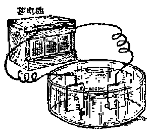

*图 1·2 电流通过水时所引起的化学变化*

电流的作用下，发生化学反应后产生出来的。

一种物质发生化学反应后生成两种（或两种以上）新物质，这样的化学反应，叫做分解反应。

上面所讲的水在电流作用下变成氧气和氢气的化学反应，就是分解反应的一个实例。

分解反应是化学反应的一种类型，除了分解反应这种类型以外，还有其他类型的化学反应，这在以后将会陆续学习到。

我们说分解反应是化学反应的一种类型，这里要特别注意“化学反应”四个字，把混和物分离成为组分物质（即组成这个混和物的各种物质），例如，蒸发食盐的水溶液（可认为是水和食盐两种物质的混和物）可以得到水和盐两种物质，从表面看来，似乎也是一种物质（食盐溶液）变成了两种物质（水和食盐），但这不是分解反应。因为分离混和物并不属于化学反应。

#### 原子和原子论

水在一定条件（例如通电）下分解成为氧气和氢气这个事实，用前面所讲的分子论，是很难理解的。

从分子论的观点看来，水是由水分子组成的，氧气是由氧分子组成的，氢气是由氢分子组成的。但是水分子和氧分子、氢分子是不同种类的分子，水分子怎么会在一定条件下变成氧分子和氢分子呢？

显然，要解释这一实验事实，必须假定：水分子并不是构成物质的最小微粒，水分子本身是由更小的某种微粒所构成。在水分解变成氧气和氢气的过程里，水分子先分解成为更小的微粒，然后再通过一定的结合，变成氧气分子和氢气分子。

这种组成分子的更小的微粒，我们叫它原子。说明分子是由原子构成的理论，叫做原子论。

#### 原子-分子论

分子论指出，分子是保持原物质全部化学性质的最小微粒。分子在一定条件下，虽然能够进一步分解成为更小的微粒——原子，但分解后生成的微粒，将不保持原物质的化学性质。

由此可以看出，原子论和分子论并不抵触，原子论只是分子论的一种补充，把原子论和分子论综合起来，就成为说明物质结构的一个比较完整的理论，叫做原子-分子论。

原子-分子论的要点可以归纳如下：

（1） 物质由分子构成。

（2） 分子是由更小的微粒——原子组成，原子一般不保持原物质的性质。

（3） 分子、原子都处于永恒的运动状态中。

从原子-分子论的观点看来，水的分解反应就十分容易理解：水分子是由氧原子和氢原子组成的（现在知道，每 1 个水分子是由 1 个氧原子和 2 个氢原子所组成），在通电的条件下，水分子分解成为氧原子和氢原子，立刻，每 2 个氧原子又结合成为1个氧分子：每2个氢原子又结合成为1个氢分子。

水分子的分解可以用下面的图式来表明。图中带斜线的圆表示氢原子，空白圆表示氧原子。

1个水分子分解成2个氢原子和1个氧原子：

每 2 个水分子分解成 4 个氢原子和 2 个氧原子，接着 4 个氢原子又结合成为 2 个氢分子，2 个氧原子结合成为 1 个氧分子（图 1·3）。

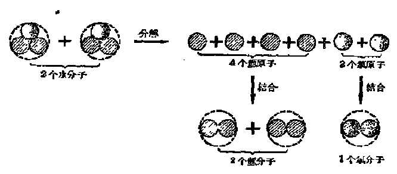

*图 1·3 水分子分裂成氢分子和氧分子的示意图*

从这里可以清楚地看到，当物质发生化学反应时，物质的分子发生变化，一般是变成了组成这种分子的原子，然后这些原子又重新结合起来，变成了新物质的分子。所以化学反应的本质，就是物质分子里的原子，重新组合成另一些新的分子，从而产生了新物质。

由此还可看出，在化学反应里，构成物质的分子是要发生变化的，但原子本身是不发生变化的，而仅仅是改变了组合方式。因此，原子是物质发生化学变化的最小单位。也就是说，在化学反应里，原子不能再分成更小的微粒。

总上所述，分子和原子是性质不同的两类微粒。分子是能独立存在、并保持原物质化学性质的最小微粒；原子一般是不能独立存在（很容易相互结合变成分子）的，并且也不保持原物质的化学性质的。例如水分子仍保持水的一切化学性质，而组成水分子的氢原子和氧原子就完全不具有原来水的化学性质。当它们分别组成氢分子和氧分子时，就产生了和水性质完全不同的两种新物质——氢气和氧气。

#### 原子量

尽管原子比分子更小，比分子更难直接观察到，但原子和分子一样也是真实存在着的。从物质发生的化学反应，可以证明原子的真实性。

现在，我们不仅有充分的理由来论证原子的真实存在，而且还能从理论上计算出各种原子的重量。

当然，原子的重量是极其微小的。例如：

1个碳原子（指碳12）的重量是

$$
0.\underbrace{0000000000000000000000}_{22\text{个}0}1994\text{克，或 }1.994\times10^{-23}\text{克。}
$$

[^p22-1]

1 个氧原子（指氧 16）的重量是

$$
0.\underbrace{0000000000000000000000}_{22\text{个}0}2657\text{克，或 }2.657\times10^{-23}\text{克。}
$$

$$
10^{-1}=\frac{1}{10}=0.1,\qquad 10^{-2}=\frac{1}{100}=0.01,\dots
$$

$$
10^{-23}=\frac{1}{100\cdots0}=0.\underbrace{00\cdots0}_{22\text{个}0}01
$$

1 个氢原子（指氢 1）的重量是

0.0000000000000000000001661克或0.1661×10\(^{-23}\)克，
23个0

从上面这些数字可以看出，原子的重量，如果用“克”做单位来表示，会感到非常不便，这是因为对原子的重量（它是非常非常小的）来说，“克”这种称量单位显得太大了。这比如用工厂里的落地大磅秤去称一小粒芝麻还要不恰当得多。那末，怎样能使称量单位和被称物体的“级别”显得相当些呢？

其实，在应用时无非也只须知道不同原子的相对重量。我们只要指定某一种原子，以它作为不同原子重量相互比较的标准。为此，在化学里，统一地把一种碳原子（指碳12）[^p23-1]的重量规定为12，并以它的一个原子重量的 \(\frac{1}{12}\) 作为标准。因而，原子量就是以1个碳原子（指碳12）重量的 \(\frac{1}{12}\) 作为标准比较而得的相对重量。

例如，通过计算可以算出，氧原子的重量是碳原子重量的\(\frac{16}{12}\)，因此氧的原子量是16（也就是说，1个氧原子的重量是1个碳原子重量的\(\frac{1}{12}\)的16倍）。

通过计算还可以算出，氢原子的重量是碳原子重量的\(\frac{1}{12}\)，因此氢的原子量是1。

对于碳原子本身，它的原子量就是12.

由此可见，用相对重量表示所得的原子量都成了使用时很方便的数字。我们说原子量是“相对重量”，因为它是用原子的重量来衡量原子的重量，它们的“级别”是相当的。既然是相对重量，因而原子量只是代表不同原子重量的比，所以它是没有单位的。

各种原子的原子量可见表 1·1以及第二册第三章。

#### 习题 1·5

1. 什么叫做分解反应？把盐和砂的混和物分离为纯净的盐和砂，这个过程是不是发生了分解反应？为什么？

2. 什么叫做原子-分子论？怎样用原子-分子论的观点来解释水的分解反应？

3. 从原子-分子论的观点看来，物理变化和化学变化的本质上的区别是什么？

4. 想一想（不用计算），1克氧和1克铁里哪个包含的原子个数多？为什么？

5. 什么叫做原子量？“原子量”和“原子的重量”的意义是否相同？

6. 1个铜原子的重量是 \(0.\underbrace{000000000000000000000}_{21\text{个}0}1054\) 克，问铜的原子量等于多少？

7. 氧的原子量是 16，碳的原子量是 12，6 个氧原子的重量和多少个碳原子的重量相等？

### § 1·6 单质和化合物

在前面几节里，我们讲到物质是由分子构成的：纯净物质是由同一种分子所组成，混和物是由不同种分子所组成。我们还讲到，分子是由更小的微粒——原子所组成。例如，氧气的分子是由2个氧原子组成；氢气的分子是由2个氢原子组成；水的分子是由2个氢原子和1个氧原子组成；二氧化碳的分子是由1个碳原子和2个氧原子组成。

由此可以看出，纯净物质的分子可以由相同的原子所组成，例如氧气、氢气等；也可以由不相同的原子所组成，例如水、二氧化碳等。

在化学里，物质的分子，如果是由同种原子组成的，这种物质叫做单质；如果是由不同种原子组成的，这种物质叫做化合物。

氧气、氢气等是单质；水、二氧化碳等是化合物。

由于单质的分子由相同的原子所组成，因此，单质不可能发生分解反应。也就是说，单质不可能通过化学反应变成两种或两种以上的新物质。例如，氧气、氢气等都不能通过化学反应，把它们分解成为更加简单的物质。单质的意思就是说它们本身已是最简单的物质。

和单质不同，化合物在一定条件下是能够发生分解反应的。前面讲过的水在通电的条件下，能够分解成为氢气和氧气，就是一个例子。

所以，我们可以将纯净物质，根据它们的分子组成（是由相同的、还是不同的原子组成）或性质（能不能发生分解反应），分成单质和化合物两大类。而单质和化合物还可以作进一步的分类。

根据单质的物理性质，可以分成金属和非金属两类[^p25-1]。

金属（例如铜、锌、铝、银、铁等）的种类很多，各种不同的金属有各自的性质，但它们也有一些共同的性质，例如在寻常条件下都是固体（除汞 [^p26-1] 以外），有金属光泽，都比较容易传热和导电。在用锤子敲打时，一般都不易敲碎，而能被打成薄片（这种性质叫做展性）：如果用力拉它，一般也不易拉断，而能被拉成细丝（这种性质叫做延性）。

非金属在平常温度和压强下有些是气体（例如氧气、氮气、氦气等），有些则是固体（例如碳、硫、碘等），只有溴是液体。固体的非金属一般没有光泽，不容易传热和导电，性脆，如果用力敲打，容易打碎。

但是，不要认为金属和非金属是有严格区别的。有些单质既具有非金属的性质，又具有某些金属的性质。例如碳是一种非金属，但有些碳的单质（石墨）也带有金属光泽，并且有良好的导电性。与此相反，有些金属（例如锑）很脆，容易磨碎，导电和传热性也都比较差。

因此，我们平常说某种单质是金属或非金属，只是指它的金属性质或非金属性质比较显著罢了。

关于化合物的分类，将在第五章里详细讨论。

#### 习题 1·6

1. 从原子-分子论的观点来看，单质和化合物有什么不同？从性质上来看，单质和化合物又有什么不同？举出几种单质和化合物的例子。

2. 金属单质具有哪些共同的物理性质？

3. 下面这些物质，哪些是单质？哪些是化合物？哪些是混和物？

（1） 空气；（2） 食盐；（3） 蔗糖；（4） 铁；（5） 氮气；（6） 碳酸钙。

### § 1·7 元素，元素符号

#### 元素

原子-分子论告诉我们，物质是由分子组成的，分子又是由原子组成的。因此，自然界的一切物质，归根到底，都是由许许多多相同的或不相同的原子通过一定的形式结合起来的。

在化学里，把性质相同的、同一种类的原子，叫做元素，元素就是同种原子的总称。

例如，氢元素就是性质相同的许多氢原子的总称；氧元素就是性质相同的许多氧原子的总称[^p27-1]；等等。

元素和原子这两个名词，从本质上讲，并没有很大的区别。只是元素代表原子的种类，而原子指的是一个个的微粒。因此，在讲原子时，可以指明个数。例如我们可以说1个氧原子、2个氧原子或若干个氧原子。但元素只代表原子的种类，它和原子的个数无关，不论是1个氧原子或是很多个氧原子，都叫做氧元素。这就是说，原子是有“数量”意义的，而元素是没有“数量”意义的。

单质的分子是由相同的原子组成的（而一定种类的原子，就是元素），因此，单质是由一种元素组成的物质。

化合物的分子是由不同的原子组成的。因此，化合物是由几种元素组成的物质。

在单质里，我们称元素处于游离状态（或简称游离态）。所谓游离状态是指这种元素没有跟别种元素相结合的意思，但这并不是说，组成单质的每个原子都是单独存在的，恰恰相反，在单质里，原子一般是相互结合成分子而存在的。

在化合物里，几种元素的原子相互结合，我们称元素处于化合状态（或简称化合态）。

所以元素可以以游离状态存在于单质中，也可以以化合状态存在于化合物中。例如，氧元素可以以游离状态存在于氧气中，也可以以化合状态存在于水、二氧化碳以及其他含氧的化合物里。反过来说，氧气（是一种单质）是氧元素以游离状态存在的形式；水（是一种含氧的化合物）是氧元素以化合状态存在的形式。

元素和单质这两个名词，有时容易混淆，但只要根据原子-分子论的观点，就能正确地把这两个名词区分开来：

第一，元素是指一定种类的原子，是同种原子的总称；单质是指一定种类的分子（这种分子由相同的原子组成），是同种分子的总称。例如，氧元素是氧原子的总称，氧气（单质）则是氧分子的总称。

第二，化合物的分子是由不同元素的原子组成，而不是不同单质的分子所组成，例如水分子是由氢原子和氧原子（而不是氢分子和氧分子）所组成。因此，我们只能说水是由氢、氧两种元素组成的，而不能说水是由氢气和氧气两种单质组成的。同样道理，我们只能说水里含有氢元素（或氢原子）和氧

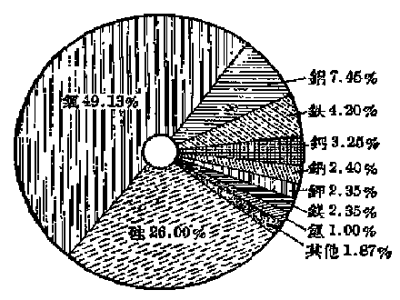

*图 1·4 地壳内所含各种元素的重量百分数*

元素（或氧原子），但不能说水里含有氢气（或氢分子）和氧气（或氧分子）。

现在我们已经知道的元素有105种，各种元素在自然界里分布的情况是很不一致的，从图 1·4可以看出，地壳（包括大气层和水层）主要是由氧、硅、铝、铁、钙等元素所组成。在地球上含量最多的元素是氧（包括游离态和化合态的氧），以重量来说，它在地壳里几乎占到一半。

有些元素，例如，碳、氢、氮等，在自然界里含量虽然不多，但和人们的关系却十分密切。

前面讲过，单质分金属和非金属。组成金属单质的元素叫做金属元素，组成非金属单质的元素叫做非金属元素。

为了便于识别，金属元素的名称（除汞外）都用“金”字旁，非金属元素的名称有的用“气”字头（例如氢、氧、氯等），有的用“氵”旁（例如溴），有的用“石”字旁（例如碳、磷、硫等），分别表示它们组成的单质在通常情况下是气态、液态或固态。

#### 元素符号

在化学里，为了书写上的方便，采用一定的符号来表示各种元素，叫做元素符号。每种元素的符号通常用它的拉丁文原名的第一个字母（要用大写）。如氧元素用 “O” 表示，碳元素用 “C” 表示。如果两种元素的拉丁文原名的第一个字母相同，为了区别起见，就再在它后面附加一个字母，但第二个字母必须要用小写。例如铜元素用 “Cu” 来表示，钙元素用 “Ca” 来表示。书写元素符号时必须注意字母大写和小写的规定，否则误写后就会代表另外一种意思。例如，“Co” 是元素钴的符号，如果把第二个字母误写成大写，写成 “CO”，它就不代表钴元素，而代表由一个碳原子和一个氧原子所组成的化合物（称为一氧化碳）的分子（关于这点在 §1·9 中还将详细讨论）。

元素符号除了代表元素以外，还代表：

（1） 某元素的 1 个原子；

（2） 某元素的原子量。

例如，元素符号 Fe 除代表铁元素外，还代表 1 个铁原子和铁的原子量是56. 又如2Fe代表2个铁原子，3Cu代表3个铜原子。元素符号前面的系数，是当原子不止1个时，用来表示原子个数的。

表 1·1 列出了最重要的一些元素的名称、拉丁文原名、元素符号和原子量[^p30-1]。

表 1·1 常见的元素表

| 元素名称 | 拉丁文原名 | 元素符号 | 原子量 | 元素名称 | 拉丁文原名 | 元素符号 | 原子量 |
| --- | --- | --- | --- | --- | --- | --- | --- |
| \*氧 | Oxygenium | O | 16 | 钾 | Kalium | K | 39 |
| \*氢 | Hydrogenium | H | 1 | \*铁 | Ferrum | Fe | 56 |
| \*氮 | Nitrogenium | N | 14 | 铅 | Plumbum | Pb | 207 |
| \*氯 | Chlorum | Cl | 35.5 | 银 | Argentum | Ag | 108 |
| 氟 | Fluorum | F | 19 | \*铜 | Cuprum | Cu | 63.5 |
| 溴 | Bromium | Br | 80 | 铬 | Chromium | Cr | 52 |
| 硅 | Silicium | Si | 28 | 钡 | Baryum | Ba | 137 |
| \*硫 | Sulphur | S | 32 | \*锌 | Zincum | Zn | 65 |
| 碘 | Iodium | I | 127 | 锑 | Stibium | Sb | 122 |
| \*碳 | Carbonium | C | 12 | \*铝 | Aluminium | Al | 27 |
| \*磷 | Phosphorum | P | 31 | 锡 | Stannum | Sn | 119 |
| \*汞 | Hydrargyrum | Hg | 200 | 锰 | Manganum | Mn | 55 |
| 金 | Aurum | Au | 197 | 镁 | Magnesium | Mg | 24 |
| \*钠 | Natrium | Na | 23 | 钨 | Wolfram | W | 184 |
| \*钙 | Calcium | Ca | 40 |  |  |  |  |

表里的元素符号，没有必要一次都把它们全部记住，可以在以后学习的过程中，逐渐加以记忆。但表中元素名称前加有“\*”号的，要求我们首先熟记。

#### 习题 1·7

1. 什么叫做“元素”？“元素”和“原子”两个名词有什么区别？

2. 指出下列每一物质里含有些什么元素？这些元素是以什么状态（游离态或化合态）存在的？

（1） 四氧化三铁；（2） 铝；（3） 氢气；

（4） 硫化铜；（5） 五氧化二磷；（6） 氧气。

3. “四氧化三铁分子里含有4个氧元素和3个铁元素”，这句话有没有错？如果有错，应当怎样修改？

4. 是否能说“二氧化碳是由氮气和碳两种单质组成的”？为什么？

5. 抄写下列几种元素的符号（抄写的遍数可由读者自己决定），并把它们记住：氧、氢、氮、氯、硫、碳、汞、钠、钙、铁、铜、锌、铝。

### § 1·8 定组成定律

前面讲过，当在水里通进电流时，水就会分解成氢气和氧气两种新物质。实验证明[^p31-1]：一切纯净的水，不论它的来源怎样，只要是真正纯净的水，分解后产生的氢气和氧气的重量是有一定严格不变的比值的。那就是：每产生1克的氢气同时就产生8克的氧气，或者说，产生的氢气和氧气的重量比是1：8.

不仅水是如此，研究任何其他纯净的化合物，都得到同样的结论。例如，在纯净的二氧化碳里，碳元素和氧元素的重量比——3：8——也总是恒定不变的。科学家做了千百次实验，从来没有一次例外，因此，就把这一结论归结成为化学上的一条基本定律，叫做定组成定律，那就是：任何纯净的化合物都有固定不变的组成。

利用原子-分子论的观点，很容易说明定组成定律。

纯净的化合物是由同一种分子组成的。这就是说，在同一种纯净物质里，每个分子里所含的原子种类和原子数目都是一样的。因此，在一个分子里组成化合物的各元素之间的重量比和在许多个相同的分子里的重量比是一样的。这就是说，任何纯净的化合物都有固定不变的组成。

现在，我们举水为例，具体地来说明这个问题：纯净的水是由许许多多相同的水分子组成的，在每 1 个水分子里，都含有 2 个氢原子和 1 个氧原子。我们知道，不论是氢原子或者氧原子，都有一定的重量（氢的原子量是 1，氧的原子量是 16）。因此，在每个水分子里，氢元素和氧元素的重量比是 \(2 \times 1:16\) 或 \(1:8\)。对许多个相同的水分子来说，氢元素和氧元素的重量比，显然也是 \(1:8\) （参看表 1·2）。因此，纯净的水具有固定不变的组成。

表 1·2 定组成定律的说明

| 水分子数目 | 氢原子数 | 氧原子数 | 氢元素的重量 | 氧元素的重量 | 氢和氧的重量比 |
| --- | --- | --- | --- | --- | --- |
| 1个 | 2个 | 1个 | 2×1=2 | 1×16=16 | 2：16=1：8 |
| 2个 | 4个 | 2个 | 4×1=4 | 2×16=32 | 4：32=1：8 |
| 3个 | 6个 | 3个 | 6×1=6 | 3×16=48 | 6：48=1：8 |
| n个 | 2n个 | n个 | 2n×1=2n | n×16=16n | 2n：16n=1：8 |

混和物是由几种不同的分子组成的，其中每一种分子的数目可以多些，也可以少些。因此，混和物没有固定的组成。这一点，亦是化合物和混和物的重要区别之一。

#### 习题 1·8

1. 什么叫做定组成定律？怎样用原子-分子论的观点来说明它？

2. 仿写表 1·2的形式，说明五氧化二磷（每个分子里含有2个磷原子和5个氧原子，它们的原子量可以查表 1·1）具有固定的组成。

3. 为什么混和物没有一定的组成？

### § 1·9 分子式，分子量及有关计算

#### 分子式的意义和写法

我们知道，物质的分子是由原子组成的，原子可以用元素符号来表示。因此，利用元素符号，也可以表示物质的分子组成。

用元素符号来表明物质分子组成的式子叫做分子式。

根据定组成定律，每一种纯净物质都有固定不变的组成。因此，表示每一种物质组成的分子式，也只能有一个。这就是说，纯净物质的分子式，也是固定不变的。

单质的分子是由同种原子组成的。某些单质的分子是由单个原子组成的，例如氦气、氖气等惰性气体（见 §2·1），叫做单原子分子。很显然，这些物质的分子，实质上就是单个原子。因此，这一类单质的分子式，就是构成这种分子的原子的元素符号。例如：

氦原子的元素符号是 He，氦气的分子式也是 He；

氖原子的元素符号是 Ne，氖气的分子式也是 Ne；等等。

另一些单质的分子是由2个相同的原子组成的，例如，氧气的分子是由2个氧原子组成，氮气的分子是由2个氮原子组成，氢气的分子是由2个氢原子组成，等等。这些分子叫做双原子分子。书写这类单质的分子式时，要在组成这种单质的元素符号的右下角，注上一个较小的“2”字（表示这种单质的每一个分子里含有2个原子）。例如：

氧气的分子式是 \(\mathbf{O}_2\) （读作O—2）；

氮气的分子式是 \(\mathbf{N}_2\) （读作N—2）；

氢气的分子式是 \(\mathrm{H}_{2}\) （读作H—2）；等等。

还有一些单质的分子，它们是由很多很多个相同的原子组成的，例如许多金属的和某些固体的非金属（如碳、硅等）的分子，这类单质的分子式，现在习惯上用它们的元素符号来代表。例如：

汞的分子式用汞的元素符号 Hg 来代表；

铁的分子式用铁的元素符号 Fe 来代表；

碳的分子式用碳的元素符号 C 来代表；等等。

化合物的分子是由不同种原子组成的。要书写化合物的分子式，首先必须知道化合物的组成，也就是这种化合物含有哪几种元素，以及这种化合物的每一个分子里的每种元素各有多少个原子。知道了这些以后（这可以通过实验方法来测定），就可以依次把这些元素和表明每种元素的原子的数目（表示的方法也是在元素符号的右下角用一个小的数字注明）写出来，这样就得到了这种化合物的分子式。

例如，每个水分子含有 2 个氢原子和 1 个氧原子，水的分子式应写成 \(\mathrm{H}_{2} \mathrm{O}\)[^p34-1]（读作 H—2—O）；

每个二氧化碳分子含有1个碳原子和2个氧原子，二氧化碳的分子式应写成 \(CO_{2}\) （读作C—O—2）；

每个硫酸分子含有2个氢原子、1个硫原子和4个氧原子，硫酸的分子式应写成 \(H_{2}SO_{4}\) （读作H—2—S—O—4）；等等。

由此可以看出，分子式首先代表：

（1） 某种物质；

（2） 某种物质的一个分子。

例如，分子式 \(\mathrm{H}_{2} \mathrm{SO}_{4}\)，它代表“硫酸”这种物质和硫酸的 1 个分子。如果分子式前面添上一个系数，就表示不止一个分子，例如 \(2 \mathrm{H}_{2} \mathrm{O}, 3 \mathrm{CO}_{2}\) 分别表示 2 个水分子、3 个二氧化碳分子。

其次，分子式还表示该物质的组成，它包含有两方面的意义，即：

（1） 表明这种物质是由哪几种元素组成的；

（2） 表明在这种物质的 1 个分子里，含有各种原子的个数。例如，分子式 \(\mathrm{H}_{2} \mathrm{SO}_{4}\)，它表示硫酸是由氢、硫、氧三种元素组成的，并且还表示在 1 个硫酸分子里含有 2 个氢原子、1 个硫原子和 4 个氧原子。

书写化合物的分子式时，要按照一定的顺序，例如水的分子式一定要写成 \(H_{2}O\)，不能写成 \(OH_{2}\)，虽然这两个式子所表示的水的组成的意义是相同的，但“ \(OH_{2}\) ”这样的写法是不符合水分子式的规定写法的，因此也是错误的。关于各类不同化合物分子式的写法，我们将在第五章里详细讨论。

在分子式里，元素符号右下角注的小字不能随便移到元素符号的前面，因为它们代表的意义不同。例如，氧气的分子式 \(O_{2}\)，它表示每1个氧气分子是由2个氧原子组成的，但 \(2O\) 并不是氧气的分子式，它代表2个氧原子，这2个氧原子并没有结合成为氧分子。

#### 分子量

我们知道，分子是由原子组成的，分子式既然能表示出物质每个分子里所含各种原子的个数，因此，根据分子式可以算出分子量，方法是把组成这种分子的所有原子的重量（用原子量来表示）都加起来。例如，二氧化碳的分子式是 \(\mathrm{CO}_{2}\)，这表明每一个二氧化碳分子是由 1 个碳原子和 2 个氧原子所组成。已知碳的原子量是 12，氧的原子量是 16，因此，二氧化碳的分子量应为 \(1 \times 12 + 2 \times 16 = 44\)。可见，分子式除了表明前面所讲的几种意义以外，还代表物质的分子量，分子量就是组成这种分子的所有原子的原子量的总和，它和原子量一样，也是没有单位的。

从上面所讲的可以看出，如果已经知道了物质的分子式，我们就可以很方便地计算出它的分子量。但是物质的分子式是怎样知道的呢？关于这个问题，在本丛书化学第三册第六章里将详细介绍。这里只先说明一下，在确定物质分子式时，一般都要先求出分子量。因此，实际情况是：分子量不是由分子式求出，恰恰相反，分子式是由分子量来确定的。而物质的分子量是通过实验来测定的。用实验测定物质分子量的方法，也将在第三册第六章里介绍。

#### 根据化合物分子式的计算

分子式既代表物质的组成，因此，根据分子式可以计算有关物质组成方面的一些问题。

1. 由分子式计算各种元素在化合物里的重量比 根据化合物的分子式，可以算出 1 个分子里各种元素的重量比。例如，二氧化碳的分子式是 \(\mathrm{CO}_{2}\)，它表示在每 1 个二氧化碳分子里含有 1 个碳原子和 2 个氧原子。从碳和氧的原子量可知 1 个碳原子重 12， 1 个氧原子重 16. 因此，在 1 个二氧化碳的分子里，碳元素和氧元素的重量比是：

$$
(1 \times 12)： (2 \times 16) = 12： 32 = 3： 8
$$

因为纯净物质是由同一种分子组成的，1个分子里各种元素的重量比，必然也就是这化合物里各种元素的重量比。因此，在二氧化碳里，碳、氧两种元素的重量比也是3：8。

由上面的计算可以看出：在化合物里各种元素的重量比，就是化合物分子里各元素的原子个数和它原子量的乘积的比。

2. 由分子式计算化合物里各元素的重量百分比 元素在化合物里的重量百分比就是每100重量单位的化合物里所含该元素的重量单位数，常用符号%来表示。例如，已知在每100克水里，含有氢元素11.12克和氧元素88.88克。氢、氧两元素在水里的重量百分比就分别是11.12%和88.88%。

由化合物的分子量以及化合物分子里所含各元素的重量（=原子个数×原子量），可以求出它们的重量百分比。

例如，根据二氧化碳的分子式，可以求出它的分子量[^p37-1]

$$
M=1\times12+2\times16=44
$$

其中，所含碳元素的重量是 \(1 \times 12 = 12\)；所含氧元素的重量是 \(2 \times 16 = 32\)。

在100分重量的二氧化碳里所含碳元素的重量（假设为x）和氧元素的重量（假设为y），可以通过下面的比例方法求得：

$$
44：100 = 12：x, \quad x = \frac{12}{44}\times 100 = 27.3;
$$

$$
44：100 = 32：y, \quad y = \frac{32}{44}\times 100 = 72.7.
$$

即碳元素的重量百分比是27.3%，氧元素的重量百分比是72.7%。

在求出碳元素的重量百分比后，氧元素的重量百分比也可由下法求得：

100% - 碳元素的重量百分比 = 100% - 27.3% = 72.7%。

由上面的计算可以看出：化合物里某元素的重量百分比等于：

$$
\left(\frac {\text{化合物分子里某元素的原子个数} \times \text{原子量}}{\text{化合物的分子量}} \times 100\right) \% .
$$

#### 例 1

求硫酸（分子式 \(H_{2}SO_{4}\)） 里氢、硫、氧三种元素的重量百分比（氢的原子量 = 1，硫的原子量 = 32，氧的原子量 = 16）。

**解：** 硫酸的分子量 \(= 2 \times 1 + 1 \times 32 + 4 \times 16 = 98.\)

氢元素的重量百分比= \(\left(\frac{2\times1}{98}\times100\right)\%=2.04\%\)，

硫元素的重量百分比= \(\left(\frac{1\times32}{98}\times100\right)\%=32.65\%\)；

氧元素的重量百分比= \(\left(\frac{4\times16}{98}\times100\right)\%=65.31\%\)

答：硫酸里氢、硫、氧三种元素的重量百分比分别是 2.04%、32.65% 和 65.31%。

3. 由分子式计算一定重量的化合物里所含某元素的质量 在求出化合物里某元素的重量百分比后，就可求出一克重量的化合物里所含该元素的质量，它等于：

化合物的重量×某元素的重量百分比，

或，化合物的重量× \(\left(\frac{\text{某元素的原子个数}\times\text{原子量}}{\text{化合物的分子量}}\times100\right)\%\)。

#### 例 2

求 22 克二氧化碳里碳元素的重量。

**解：** 二氧化碳的分子量 \(= 1 \times 12 + 2 \times 16 = 44\) ∴ 含碳元素的重量=22×（1×12/44×100）%

$$
=22\times27.3\%=6\text{（克）}
$$

答：含碳元素6克。

#### 例 3

多少克水里所含的氢元素和 10 克硫酸里所含的氢元素的重量刚好相等？

**解：** 根据前一个例题和上面的公式，我们可求得10克硫酸里含氢元素重量 \(= 10 \times \left(\frac{2 \times 1}{98} \times 100\right)\% = 0.204\) （克）。

现在要求多少克水里含氢元素0.204克，设为x克水，则

$$
0.204=x\times\left(\frac{2\times1}{18}\times100\right)\%
$$

$$
0.204=\frac{2x}{18}
$$

$$
\therefore x=1.836\text{（克）}
$$

答：1.836克水里所含的氢元素和10克硫酸里所含的氢元素相等。

#### 习题 1·9

1. 什么叫做分子式？在下面物质的分子式里，指出它们各会有哪些元素，各含几个原子：

（1） 氯化氢 HCl；（2） 碳酸钠 \(Na_{2}CO_{3}\)；（3） 氧化钙 CaO。

2. 读出下列物质的分子式：

（1） 氮气 \(N_{2}\) （示例：读作 N—2）；（2） 氯气 \(Cl_{2}\)；（3） 水 \(H_{2}O\)；

（4） 氨 \(NH_{3}\)；（5） 四氧化三铁 \(Fe_{3}O_{4}\)；（6） 碳酸钙 \(CaCO_{3}\)。

3. 下列化学符号所表示的意义有什么不同？

$$
\mathrm{H}, \mathrm{H}_{2}, 2 \mathrm{H}, 2 \mathrm{H}_{2}, \mathrm{H}_{2} \mathrm{O}, 2 \mathrm{H}_{2} \mathrm{SO}_{4}.
$$

4. 用化学符号表示下列物质：

（1） 硫元素；（2） 4个钛原子；（3） 1个氢分子；

（4） 4个氮分子；（5） 3个二氧化钛分子。

5. 如果用 （1） \(C_{3}\) 表示 3 个碳原子；（2） \(2\mathrm{H}\) 表示由 2 个氢原子组成的 1 个氢分子，你认为有没有错？如果有错，应怎样改正？

6. 下列说法是否正确，如不正确，应当怎样改正？

（1） 水的分子是由 1 个氢分子和 1 个氧原子组成的；

（2） 水的分子是由 2 个氢元素和 1 个氧元素组成的。

7. 什么叫做分子量？计算下列物质的分子量：

（1） 氮气 \(N_{2}\)；（2） 氧化汞 HgO；

（3） 碳酸钙 \(CaCO_{3}\)；（4） 四氧化三铁 \(Fe_{3}O_{4}\)。

8. 计算第7题中（2）、（3）、（4）三种物质里，所含各元素的重量比。

9. 在 36 克水 \(\left(\mathrm{H}_{2}\mathrm{O}\right)\) 中，含有多少克氢和多少克氧？

10. 多少克二氧化碳里：含有 8 克碳？

### 本章提要

#### 1. 原子-分子论的要点

（1） 物质由分子构成。分子是能够独立存在并保持原物质一切化学性质的最小微粒。

（2） 分子由更小的微粒——原子组成。原子是参加化学反应的最小微粒。

（3） 分子、原子都处于永恒运动状态中。

#### 2. 物质的变化

物质的变化是物质的分子、原子运动的结果。

| 物理变化 | 化学变化（化学反应） |
| --- | --- |
| 1．变化过程中，组成物质的分子不变。 2．变化后没有新物质产生。 | 1．变化过程中，组成物质的分子发生了变化，但组成分子的原子不变。 2．变化后有新物质产生。 |

#### 3. 元素

性质相同的、同一种类的原子。

#### 4. 物质的分类

$$
\text{物质}\left\{\begin{array}{ll}
\text{纯净物质} &
\left\{\begin{array}{ll}
\text{单质} & \left\{\begin{array}{l}\text{金属}\\\text{非金属}\end{array}\right.\\
\text{化合物}
\end{array}\right.\\
\text{混和物}
\end{array}\right.
$$

（1） 纯净物质和混合物

| 纯净物质 | 混和物 |
| --- | --- |
| 1．由相同的分子组成。 2．具有固定不变的组成（定组成定律）。 3．具有一定的性质。 | 1．由不同的分子组成。 2．没有一定的组成。 3．没有一定的性质。 |

（2） 单质和化合物

| 单质 | 化合物 |
| --- | --- |
| 1．元素处于游离状态。 2．由同种元素组成（它的分子由相同的原子组成）。 3．不能发生分解反应。 | 1．元素处于化合状态。 2．由不同种元素组成（它的分子由不相同的原子组成）。 3．在一定条件下，能够发生分解反应。 |

（3） 金属和非金属

| 金属 | 非金属 |
| --- | --- |
| 1．在通常情况下，除汞外，都是固体。 2．有金属光泽。 3．一般有延性和展性。 4．一般都有良好的导电性和传热性。 | 1．在通常情况下，有固态的，有液态的，也有气态的。 2．一般没有金属光泽。 3．固态的非金属一般质脆易碎。 4．导电性和传热性一般比较差。 |

#### 5. 原子量和分子量

（1） 原子量就是以 1 个碳原子（指碳 12） 重量的 \(\frac{1}{12}\) 作为标准比较而得的原子的相对重量。

（2） 分子量在数值上等于组成该分子的所有原子的原子量的总和，因而它也代表一种相对重量。

#### 6. 元素符号和分子式

（1） 元素符号表示：（a） 某种元素，（b） 该元素的 1 个原子，（c） 该元素的原子量。

（2） 分子式表示：（a） 某种物质，（b） 该物质是由哪几种元素组成的，（c） 该物质的 1 个分子，（d） 该物质的 1 个分子里含有各种原子的个数，（e） 该物质的分子量。

#### 7. 根据分子式的计算

（1） 由分子式求分子量 （M）：把组成这种分子的所有原子的重量 （用原子量来表示） 都加起来。

（2） 由分子式计算各种元素在化合物里的重量比：化合物里各种元素的重量比等于化合物分子里各种元素的原子个数和它原子量的乘积（这个乘积代表各元素在分子里的重量）的比。

（3） 由分子式计算化合物里各种元素重量的百分比：化合物里某元素的重量百分比等于：

$$
\left(\frac {\text{化合物分子里某元素的原子个数} \times \text{原子量}}{\text{化合物的分子量}} \times 100\right) \% .
$$

（4） 由分子式求一定重量化合物里所含某元素的重量：在一定重量化合物里所含某元素的重量等于：

化合物的重量×某元素的重量百分比，

或，化合物的重量× \(\left(\frac{\text{某元素的原子个数}\times\text{原子量}}{\text{化合物的分子量}}\times100\right)\%\)。

### 复习题一

1. 分子和原子有什么区别？元素、单质、化合物和混和物有什么区别？应用原子-分子论解释并举例说明。

2. 金属和非金属在性质上有什么不同？为什么说金属和非金属之间并没有严格的区别？

3. 分子式代表哪些意义？试以 \(H_{2}SO_{4}\) 为例加以说明。

4. 根据下列分子式指出哪些是单质，哪些是化合物：

\(H_{2}O\)， \(H_{2}SO_{4}\)， Na， \(H_{2}\)， Fe， FeS。

5. 下列化合物的分子里各含有什么元素，各含有几个原子：

（1） 水 \(H_{2}O\)；

（2） 氧化铁 \(Fe_{2}O_{3}\)；

（3） 硝酸钾 \(KNO_{3}\)；

（4） 氯化氢 HCl；（5） 磷酸 \(H_{3}PO_{4}\)。

6. 碳和氧在不同条件下可以生成两种不同的化合物，一种是二氧化碳（分子式 \(CO_{2}\)），一种是一氧化碳（分子式 CO），在这两种化合物中哪个含碳的百分率较多？

7. 在二氧化硅 \(SiO_{2}\) 里，硅元素和氧元素哪个含量较多些？

8. 在下列的甲烷 \(CH_{4}\)、乙烯 \(C_{2}H_{4}\) 和乙炔 \(C_{2}H_{2}\) 里，哪一个含碳的百分率最多？哪一个含氢的百分率最多？

9. 根据下面各种物质的分子式，计算每种物质里所含各元素的重量比：

（1） 氯化钠 NaCl；

（2） 黄铁矿 \(FeS_{2}\)；

（3） 甲烷 \(CH_{4}\)。

10. 用作防治农作物病虫害的六六六（\(\mathrm{C_6H_6Cl_6}\)），其中含氯的百分率是多少？

11. 碳酸氢铵 \(\left(\mathrm{NH}_{4}\mathrm{HCO}_{3}\right)\) 和硝酸铵 \(\left(\mathrm{NH}_{4}\mathrm{NO}_{3}\right)\) 是两种氮肥，试求它们各含氮百分之几？

12. 多少克二氧化碳里含有的氧元素的重量和 1.8 克水里含有的氧元素的重量相等？

### 注释

[^p8-1]: 铝俗称“铝精”。

[^p9-1]: 比重是每单位体积物质的重量，例如：铝的比重是2.7克/立方厘米，银的比重是10.5克/立方厘米。那就是说，1立方厘米铝重2.7克，1立方厘米银重10.5克。

[^p11-1]: “发酵粉”的主要成分是碳酸氢钠（俗名“小苏打”）。

[^p12-1]: 沸点就是液体沸腾时的温度。各种纯净的液体都有一定的沸点，例如水的沸点是100℃，酒精的沸点是78℃等。

[^p12-2]: 熔点就是固体物质开始熔化时的温度。各种纯净的固体，都有一定的熔点，例如冰的熔点是0℃，金属铅的熔点是660℃等。

[^p13-1]: “樟脑丸”并不是真的用樟脑油制成的，而是化学上一种叫做“萘”的物质制成的。

[^p19-1]: 蓄电池是一种能产生电流的装置。

[^p22-1]: 根据数学里负指数的概念，

[^p23-1]: 这里说“一种碳原子”，是因为并不是所有碳原子的重量都是一样的；这里用作标准的是碳12这种碳原子。关于这个问题，在第二册第三章里讲到“同位素”时将详细介绍。

[^p25-1]: 根据化学性质来分类，单质可以分成金属、非金属、惰性元素三类，这将在第五章里讨论。

[^p26-1]: 汞俗名“水银”，在寻常条件下是液体。

[^p27-1]: 我们在学了原子结构和同位素以后，将会对元素是同种原子的总体这一概念有更本质的认识，详见第二册第三章：

[^p30-1]: 表中的原子量只是近似的。

[^p31-1]: 关于水分解的实验装置，将在第二章第14节里详细介绍。

[^p34-1]: 分子里如果含有某元素只有1个原子的，就不必在元素符号的右下角注“1”字，例如水的分子式不写成 \(H_{2}O_{1}\)，而写成 \(H_{2}O\)。

[^p37-1]: M在化学上常用作分子量的符号。

## 第二章 氧和氢

在第一章里，我们学习了有关物质的一些最重要的基本概念，例如，分子、原子、元素、单质、化合物等。从这一章开始，我们就将运用这些基本概念来研究物质。

自然界里物质的种类是非常多的，我们不可能都一一拿来研究。我们知道，一切物质都是由相同的或不相同的元素所组成，而组成物质的元素的种类却并不太多。在§1·7里讲过，现在已经知道的元素，一共有105种，而且其中大约只有三十种左右是常见的；它们在自然界里存在的量比较多，和人们的关系比较密切。我们在生产上和生活上经常接触到的各种物质，绝大部分都是由这三十种左右的元素组成的。因此，在化学上研究物质，是以元素为基础的，首先是研究那些由最常见和最重要的元素所组成的单质和化合物。

氧、氢、碳是三种最重要的元素，和人们的关系特别密切。在我们经常接触到的许多物质里，例如水、空气、岩石、泥土、矿物、各种燃料（象煤、石油、天然气等）以及动植物机体等，大都含有这些元素。因此，我们首先来研究这几种元素。

### I. 氧

氧是地壳里含量最多的一种元素，它既以游离态又以化合态而存在着。我们所熟悉的氧气是游离态的氧，各种含氧化合物里的氧是化合态的氧，水是最重要的含氧化合物之一，此外，在所有岩石和矿物里，在动植物机体里，大都也含有氧。

氧气是一种什么样的物质呢？在小学里，我们已经知道，空气里含有氧气和氮气，空气的许多性质，例如空气能够供给动植物呼吸，能够维持许多物质的燃烧等，实际上就是它里面所含的氧气的作用。因此，在研究氧气以前，我们先来研究一下空气的成分、性质和用途。

#### § 2·1 空气

##### 空气的成分和性质

人类一直就生活在空气里，但人们对空气的成分和性质的认识还不过是近一二百年来的事情。

最初人们曾错误地认为空气是一种简单物质，后来才知道它并不是一种单纯的气体，而是氧气和氮气两种气体的混合物。

到了19世纪末，经过仔细研究，发现空气里除了氧气和氮气以外，还含有少量氦气、氖气、氩气、氪气和氙气，它们几乎完全不能和其他物质发生化学反应，所以总称它们为惰性气体。惰性气体都是单质，而且它们的每个分子都只含有一个原子，因此是单原子分子（参看§1·9）。

此外，空气里还含有少量的二氧化碳、水蒸气，以及或多或少的灰尘和别的杂质。

根据实验测定，空气里所含各种气体的百分比，按体积计算是：氧气约 21%，氮气约 78%，惰性气体约 0.94%，二氧化碳约 0.03%，其他气体和杂质约 0.03%。这就是说，在 100 体积的空气里，大约含有氧气 21 体积，氮气 78 体积， ……等。

在不同的地区，空气里各种气体的百分比也会稍有不同。

例如在人烟稠密的工厂区，由于那里燃料烧得多[^p46-1]，空气里的二氧化碳可能就会多些；在森林区，由于那里绿色植物的光合作用[^p46-2]，空气里的二氧化碳可能就会少些。但空气是能够流动的，因此，从整个地球上大气的成分来看，空气里各种气体的百分比几乎是不变的。

空气是无色、无味、无嗅（没有气味）的气体。在 \(0^{\circ}\mathrm{C}\) 和1大气压下，每升空气重1.293克。用增加压强和降低温度的办法，能使空气变成液态，称做“液态空气”。

空气能够供给动植物呼吸，能够支持物质的燃烧，这是由于空气里存在着氧气的缘故。

空气里的氮气是一种性质比较稳定的气体[^p46-3]，它在空气里起着“冲淡”氧气的作用。例如物质在纯粹氧气里的燃烧要比在空气里剧烈得多（见§2·2），这就是因为空气里的氧气已被氮气“冲淡”的缘故。

空气里氮气的这种“冲淡”作用，对动物的生命来说，有着十分重大的意义。纯净氧气对动物机体的作用十分剧烈，会严重伤害机体的组织，它是不适宜于动物呼吸的。

许多金属在空气里会生锈。例如，在潮湿的空气里铁容易变成棕黄色的铁锈，铜器表面上容易生成一层铜绿。这是由于空气里的氧气、水蒸气、二氧化碳等气体的共同作用而发生的复杂的化学反应的结果。

组成空气的各种气体，在空气里都各自独立地存在着。空气的性质，实际上就是这些气体性质的总和。因此，空气是这些气体的混和物。

##### 空气的用途

空气是人们生活不可缺少的东西，如果没有空气，人的生命连几分钟都不能维持。

空气能够支持物质的燃烧，在生产和生活中，各种燃料的燃烧大都是在空气里进行的。

从液态空气可以制得氧气和氮气（见 §2·5），氧气在很多方面有着重要的用途（见 §2·4）；氮气是制造氮肥、硝酸等的重要原料。

空气里所含的少量惰性气体也有很多实际用途。例如氦气很轻[^p47-1]，可以充装气球（氢气虽然更轻，但有燃烧爆炸的危险，不如氦气安全）。氩气和氮气混和后，可以充装在电灯泡里，使灯泡经久耐用。在氖气里放电可以产生红色的光，在氩气里放电可以产生淡蓝色的光，利用氖气、氩气等的这种性质可以用来制造霓虹灯。

##### 习题 2·1

1. 试用原子-分子论的观点来解释空气是混和物。

2. 空气里所含各种主要成分的用途是什么？

#### § 2·2 氧气的性质

氧的元素符号是O，原子量是16. 氧气的分子式是 \(O_{2}\)，分子量是32.

##### 氧气的物理性质

氧气是无色、无味、无嗅的气体，比空气略为重些，在 \(0^{\circ}\mathrm{C}\) 和1大气压下，1升氧气重1.429克（1升空气重1.293克）。在增加压强和降低温度时，氧气也能变成液态的甚至固态的。液态氧是一种淡蓝色的液体，它在-183℃时沸腾，并在-219℃时凝成淡蓝色的固体。

氧气在水中较难溶解。在 \(20^{\circ}\) C 和 1 大气压下，1 升水只能溶解 0.03 升的氧气。这些溶解在水里的氧气，对维持水生动物的生命有着重要的作用。

##### 氧气的化学性质

###### 1. 氧气和非金属的反应

（1） 把赤磷（由磷元素组成的一种红褐色粉末状的单质）放在燃烧匙里，在酒精灯上加热，它能在空气里燃烧，并发出微弱的火光。如果把燃着的磷插入充满氧气的集气瓶里 （图 2·1），这时磷的燃烧就比在空气里剧烈得多，发出的光也明亮得多。同时瓶里充满了白烟。稍过一些时候，白烟慢慢消失，在瓶壁上附着一层白色的粉末。这种白色固体是磷和氧气发生反应以后生成的新物质，叫做五氧化二磷，它的分子式是

*图 2·1 磷在氧气里燃烧*

*图 2·2 碳在氧气里燃烧*

\(P_{2}O_{5}\)。从这个分子式可以看出，五氧化二磷的分子是由2个磷原子和5个氧原子结合而成的。这个化学反应，可以用下面的式子来表示：

$$
\begin{array}{c} \text{磷} + \text{氧气} \xrightarrow {\text{点燃}} \text{五氧化二磷} \\ (\mathrm{P}) \quad (\mathrm{O}_{2}) \quad (\mathrm{P}_{2} \mathrm{O}_{5}) \end{array}
$$

在这种式子里，记号“→”上面，注明了发生这一反应所需的条件。例如必须先把赤磷“点燃”（这就是条件）后，再放入氧气瓶里，赤磷才会和氧剧烈化合，生成五氧化二磷，否则，上述反应是不会发生的。

（2） 木炭（它的主要成分是碳）在空气里虽然也能燃烧，但只能发出暗红的光。如果把燃着的木炭放进充满氧气的集气瓶里（图 2·2），这时木炭燃烧得更加旺盛，发出较强的光辉。在木炭燃烧过的那只集气瓶里，如果倒入一些澄清的石灰水，石灰水立刻变得混浊，这证明瓶子里有二氧化碳存在（见§3·4）。二氧化碳是碳和氧气发生反应以后生成的新物

质，它的分子式是 \(CO_{2}\)，这个化学反应，可以用下面的式子表示：

$$
\begin{array}{c} \text{碳} + \text{氧气} \xrightarrow {\text{点燃}} \text{二氧化碳} \\ (\mathrm{C}) \quad (\mathrm{O}_{2}) \quad (\mathrm{CO}_{2}) \end{array}
$$

除了上面所讲的磷和碳外，大多数的非金属都能在一定条件下和氧气发生反应。例如，氢气在氧气里燃烧生成水 \(\left(\mathrm{H}_{2}\mathrm{O}\right)\)，硫在氧气里燃烧生成二氧化硫 \(\left(\mathrm{SO}_{2}\right)\)，等等。

###### 2. 氧气和金属的反应

绝大多数的金属（除金、铂等少数几种

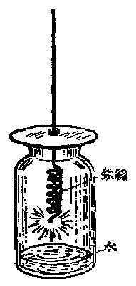

*图 2·3 铁丝在氧气里燃烧*

外）也都能和氧气反应。有些化学性质比较活泼的金属（例如钠、钾等），在平常温度下就能和氧气迅速反应。有些金属在高温时能够在纯粹的氧气里剧烈地燃烧起来。例如铁，一般说来在空气里是不能燃烧的，但在纯氧里却可以燃烧，这可以从下面的实验观察得到。

把一根细铁丝盘成螺旋状，铁丝一端缚一根火柴梗，把火柴梗点燃后，立即将铁丝插入氧气瓶里[^p50-1]，这时被火柴梗烧热的铁丝在纯氧里发生强烈的燃烧。由于燃烧时产生很多热量，使燃着的铁丝被灼热成白炽状态，发出强烈的白光，火花四射（图 2·3），生成了四氧化三铁，它的分子式是 \(Fe_{3}O_{4}\)，这个变化可以用下面的式子来表示：

$$
\mathrm{Fe}+\mathrm{O}_{2}\xrightarrow{\text{灼热}}\mathrm{Fe}_{3}\mathrm{O}_{4}
$$

###### 3. 氧气和化合物的反应

氧气除了能和多种单质（非金属和金属）发生反应外，还能和某些化合物，特别是含碳的化合物发生反应。我们知道，木柴、酒精、煤气（在这些物质里都包含有含碳的化合物）等常用作燃料，都能够在空气里燃烧，实际上它们是和空气里的氧气发生反应。

许多食物在空气里腐败，也是食物和空气里的氧气发生反应的结果。

从上面这些化学反应，可以看出氧气的化学性质非常活泼，它能和很多物质（单质和化合物）发生反应，在反应的过程里，许多物质在氧气里剧烈地燃烧起来，并放出大量的热。

##### 习题 2·2

1. 说明氧气的物理性质。

2. 分别叙述赤磷、木炭和铁在氧气里燃烧的现象，燃烧以后各生成什么物质？写出它们的分子式。

3. 为什么物质在空气里燃烧不如在纯氧里燃烧那样剧烈？

#### § 2·3 化合反应

从前面所讲的氧气和磷、碳、铁等物质所发生的化学反应里，可以看出：两种物质相互反应，结果变成了一种新物质。

在化学里，由两种或两种以上的物质相互反应生成一种新物质的化学反应，叫做化合反应。

化合反应和前面（§1·5）所讲的分解反应恰好有着相反的意义，它们是化学反应里的两种不同类型。

从原子-分子论的观点看来，化合反应是两种或两种以上物质分子里的原子相互结合，生成另一种新物质的分子。

上面讲到的那些化合反应，是一些物质（磷、碳、铁等）和氧气化合的反应。象这一类物质跟氧所起的反应称做氧化反应。

物质发生氧化反应时，常放出大量的热。有些氧化反应进行得非常剧烈，在放出热量的同时还有明显的光产生。但是也有些氧化反应进行得较为缓慢（见§2·7），放出的热随时散失在空气中，物质的温度并不升高太多，常常不容易察觉出来。

物质发生氧化反应的结果，常有氧化物生成。所谓氧化物，是指那些由两种元素组成的化合物，其中一种元素是氧。例如五氧化二磷 \(\left(\mathrm{P}_{2}\mathrm{O}_{5}\right)\)、二氧化碳 \(\left(\mathrm{CO}_{2}\right)\)、四氧化三铁 \(\left(\mathrm{Fe}_{3}\mathrm{O}_{4}\right)\) 等都是氧化物。但硫酸 \(\left(\mathrm{H}_{2}\mathrm{SO}_{4}\right)\) 不是氧化物，因为虽然它的组成里也含有氧元素，但它是由三种元素组成的。

##### 习题 2·3

1. 化合反应和分解反应有什么不同？举优说明。

2. 什么叫做氧化反应？举出三个例子。

3. 指出下列物质中哪些是氧化物？哪些不是？为什么？

$$
\mathrm{CaO}, \mathrm{SO}_{2}, \mathrm{KClO}_{3}, \mathrm{Fe}_{3}\mathrm{O}_{4}, \mathrm{CaCO}_{3}.
$$

#### § 2·4 氧气的用途

物质的用途往往决定于该物质的某种性质。

有些气体在氧气里燃烧时能够产生很高的温度，利用这一性质，可以对某些金属进行加工。例如用一种叫做氧炔吹管的装置，可以使乙炔[^p52-1]在氧气里燃烧，火焰（叫做氧炔焰）的温度很高，约达3000℃左右，能使钢铁等一般金属熔化。氧炔焰可以用来焊接或切割金属制品。

*图 2·4 氧炔吹管*

氧炔吹管的结构如图 2·4所示。在氧炔吹管里，根据气体的通路，分成内管与外管两部分，内管通入氧气，外管通入乙炔。在管口点燃乙炔时，乙炔就在氧气里燃烧，产生高温的火焰。焊接金属时（图 2·5），使火焰先把焊接部分烧红，同时再烧熔一根金属焊条，使从焊条滴下的熔液填结在焊接部分的隙缝里，冷却后，焊接的部分就熔接在一起了。用这样的方法焊接金属制品叫做气焊。

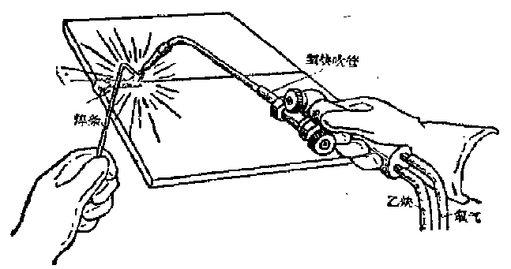

*图 2·5 利用氧炔吹管焊接金属*

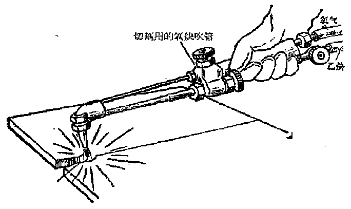

*图 2·6 利用氧炔吹管切割金属*

如果要切割金属制品，那就必须使氧炔焰产生更高的温度。为了这个目的，可以在焊接金属用的氧炔吹管上面再安装一个附属管，在这个管里也通入氧气（图 2·6）。切割金属时，先用氧炔焰把要切割的部分烧成微熔状态，再把附属管的活栓打开，使管口乙炔在燃烧时有更多量的氧气供给，这时火焰的温度就更高，可达3500℃左右。烧熔处的金属迅速燃烧，生成金属氧化物（如果切割的金属是钢板，燃烧时生成四氧化三铁，火花向四周飞溅散开，正象前面讨论氧气化学性质时所讲的铁丝在氧气里燃烧的实验那样）。依着要切割的路线缓慢地移动氧炔焰，就可以把金属割断。用这样的方法切割金属制品叫做气割。

在冶炼金属时，氧气也有重要的应用。例如炼钢时，如果往炼钢炉里鼓入含有较多氧气的空气（称做“富氧空气”），炉内燃料的燃烧速度可以加快；并且，由于空气里氮气的含量相对减少，由它带走的热量也就较少。因此炉内温度可以提高。这样不仅缩短炼钢时间，提高劳动生产率，而且还能提高产品质量。

氧气除了在工业上有重要应用外，在医疗和航空等方面用途也很广。

人类和其他生物的呼吸都需要氧气。病人如果缺乏氧气时，可用人工方法增加空气里的氧气。在空气不充足的地方，例如高空和水底，人们不能进行正常的呼吸，就需要专门供应氧气，所以高空飞行人员或潜水人员，都必须随身携带一种特制的氧气面具。

##### 习题 2·4

1. 氧气有什么用途？这些用途和它的哪些性质有关？

2. 怎样利用氧炔焰焊接金属和切割金属？

#### § 2·5 氧气的制法

在空气里虽然含有相当多的氧气，但工业上或者实验室里，往往都需用纯粹的氧气。因此，我们有必要研究制取纯氧的方法。

自然界里的哪些物质可以用做制造氧气的原料呢？前面讲过，氧在自然界里，既有以游离态存在的（单质的氧气，主要存在在空气里），也有以化合态存在在各种含氧化合物里的。这些含有氧元素（游离态或化合态）的物质，都有可能用做制造氧气的原料。

由于所用原料的不同，制取氧气就有两类不同的方法。

第一类方法是以空气为原料，通过物理的方法，把氧气从空气里分离出来。

第二类方法是以含氧化合物为原料，通过化学反应，使其中所含的氧游离出来，成为单质的氧气。

第一类方法需用的装置比较复杂，但原料（空气）可以随处取得，成本少，适宜于工业上大量生产氧气；第二类方法的操作比较方便，适宜于实验室里制取少量氧气。下面我们分别来介绍。

##### 氧气的实验室制法

实验室里制取氧气是用含氧化合物为原料的。这些含氧化合物，必须具备下面两个条件：

第一，这种含氧化合物是较不稳定的，在加热时容易分解放出氧气。

第二，这种含氧化合物里含氧的百分比是比较高的，能分解放出较多的氧气。

在实验室里最常用的、符合于这两个条件的含氧化合物是氯酸钾（分子式是 \(KClO_{3}\)），它含氧的百分比比较高（达40%左右），而且在不太高的温度下就能分解放出氧气。

用氯酸钾制取氧气的方法是：先把固体氯酸钾放在试管里，加热（图 2·7（a）），不久，氯酸钾固体开始熔化（氯酸钾的熔点是357℃），但这时还不分解放出氧气，继续加热到大约400℃时，就有氧气气泡从熔化的氯酸钾里缓慢地放出。这时如果用一根带有余烬的木条放在管口，木条就会燃烧起来。这一反应可以用下面的式子表示：

$$
\mathrm{KClO}_{3}\xrightarrow{\text{加热}}\mathrm{KCl}+\mathrm{O}_{2}\uparrow
$$

这是一个分解反应，反应时由一种物质变成两种新物质（氯化钾和氧气）。氯酸钾里的氧是化合态的，当它分解出来后，就转变成游离态的氧气了。

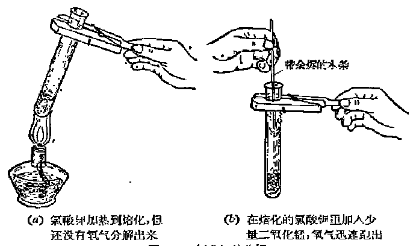

*图 2·7 氯酸钾的分解*

如果我们在熔化的氯酸钾里加入少量黑色的二氧化锰 \(\left(\mathrm{MnO}_{2}\right)\) 粉末，氯酸钾会迅速分解，有多量的氧气放出（图 2·7（b））。

在实验室里实际制取氧气时，我们就预先在氯酸钾的粉末里混入适量的二氧化锰，这样，就不需加热到氯化钾熔化的温度，在200℃左右时，就能得到多量的氧气。

在反应结束后，实验证明，二氧化锰的重量并没有减少，也就是说，二氧化锰在反应过程里没有任何的消耗。由此可知，所得的氧气并不是从二氧化锰里分解出来的，而仍然是从氯酸钾里分解出来的。由此可以看出，在氯酸钾分解的化学反应里，二氧化锰只是起了加快氯酸钾分解速度的作用，使氯酸钾在不太高的温度下就能迅速分解。

在化学反应里，一种物质只是改变了其他物质反应的速度，而它本身的重量在反应后并不改变，这种物质对这个反应来说，叫做催化剂。催化剂的这种作用，叫做催化作用。二氧化锰在氯酸钾分解反应里所起的作用就是一种催化作用。

氯酸钾分解放出的氧气常用“排水集气法”[^p57-1]（装置如图2·8 所示）收集在集气瓶里，以供试验氧气性质之用。

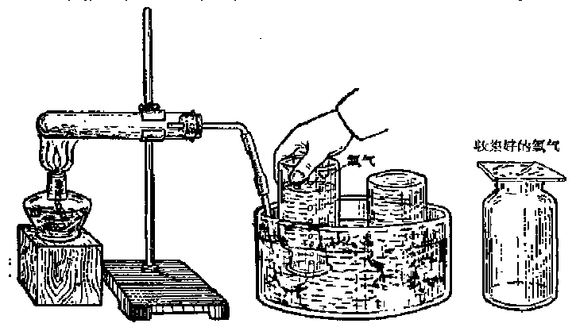

*图 2·8 用排水集气法收集氧气*

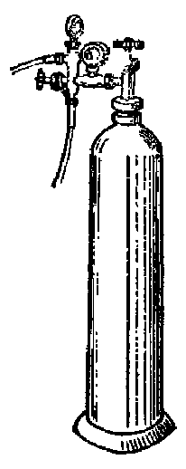

*图 2·9 氧气钢筒*

##### 氧气的工业制法

前面讲过，工业上制取氧气是以空气为原料的。

从空气制取氧气的过程是：先把空气增加压强和降低温度，使它转变成液态空气（§2·1）。空气的液化是一个物理变化，在变化的过程里并没有新物质生成，因此液态空气主要是由“液态氧气”和“液态氮气”所组成。在1大气压下，液态氧的沸点是-183℃，而液态氮的沸点是-193℃，比液态氧更低。我们知道，当蒸发两种不同沸点的液体混和物时，沸点比较低的那种液体将首先蒸发，沸点比较高的则残留下来。当液态空气蒸发时，首先蒸发出来的是氮气，残留下来的是液态氧，这样，就把氮气和氧气分离开来。把残留下来液态氧蒸发就能得到纯净的氧气。这样得到的氧气再用很大的压力（一般用150大气压）压入钢筒（图 2·9）贮存起来。这种钢筒我们在有些工厂和医院里常能看到。

##### 习题 2·5

1. 什么叫做催化剂？什么叫做催化作用？把少量二氧化锰和氯酸钾混和后加热能分解放出氧气，二氧化锰和氯酸钾哪一个是催化剂？为什么？

2. 实验室和工业上怎样制备氧气？

3. 为什么说实验室里从含氧化合物制氧气是一个化学变化，而工业上从空气和氧气则是一个物理变化？

4. 氧化汞（HgO）和氯酸钾（KClO₃）里哪一个含氧百分率比较高？为什么？

> **提示：** 根据分子式算出。

#### § 2·6 臭氧，同素异形体

##### 臭氧

氧气在一定条件下，能够转变为性质不同的另一种氧的单质，叫做臭氧。

在雷雨后的空气里，我们常能闻到一种特殊的臭味，这就是臭氧的气味。它是在打雷时，云层间空气里的部分氧气，受到放电作用，发生化学反应而生成的。

臭氧是淡蓝色有特殊臭味的气体，它的名称便是由此得来。臭氧比氧气重，比氧气容易溶解于水。在0℃时，100体积的水能溶解大约50体积的臭氧（氧气只能溶解4.9体积）。另外，臭氧比氧气更容易和别的物质发生氧化作用。例如，银和汞在空气或纯氧里不容易氧化，但在臭氧作用下很快就氧化。有些染料受到臭氧的强烈氧化作用后会褪色，许多细菌受到臭氧作用后就被杀死，所以臭氧可以用来漂白、消毒空气和水。

臭氧和氧气的性质虽不相同，但臭氧也是由氧元素所组成的一种单质。现在已经测得，每个臭氧分子由3个氧原子构成，所以它的分子式是 \(O_{3}\)。

氧气在放电影响下变成臭氧的作用，可以表示如图 2·10.

##### 同素异形体

一种元素组成几种性质不同单质的现象，叫做同素异形现象，由同一种元素组成的多种单质，相互叫做这种元素的同素异形体。氧元素能组成氧气和臭氧这两种性质不同的单质。

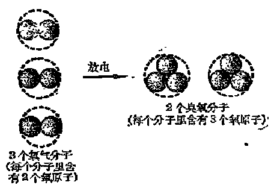

*图2·10 氧气变成臭氧的示意图*

氧气和臭氧就是氧元素的两种同素异形体。除氧元素外，以后我们还将学到其他元素也有同素异形现象。

我们在§1·7中已经指出，元素和单质是不同的。元素代表一定种类的原子，单质代表一定种类的分子。例如氧元素代表氧这一类原子；氧气和臭氧分别代表 \(O_2\) 和 \(O_3\) 这两类分子。从同素异形现象看来，既然一种元素能够组成几种不同的单质，元素和单质之间的区别就更加明显了。

##### 习题 2·6

1. 列表比较氧气和臭氧的物理性质和化学性质。

2. 臭氧是在什么条件下形成的？它有什么用途？

3. 为什么把氧气和臭氧相互叫做同素异形体？在学习了同素异形现象和同素异形体以后，你对元素和单质之间的关系有怎样的认识？

#### § 2·7 燃烧，缓慢氧化和爆炸

##### 什么是燃烧

在前面研究氧气性质的时候，我们已经知道，许多单质（例如磷、碳等）点燃后，都能在空气或纯氧里燃烧，燃烧时都伴随有发光和发热的现象，燃烧后都生成相应的氧化物（五氧化二磷、二氧化碳等）。由此可以看出，这些物质的燃烧，实质上是一种急剧的氧化作用。

许多含碳的化合物也能在空气或纯氧里燃烧，从它们燃烧后产生的物质可知，这些物质的燃烧，实质上也是一种急剧的氧化作用。例如，蜡烛（由碳、氢两种元素组成的复杂物质）燃烧后产生二氧化碳和水——二氧化碳是由蜡烛里的碳元素和空气里的氧气化合后生成的，水是由蜡烛里的氢元素和氧气化合后生成的：

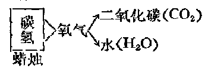

由此可以看出，物质在空气或纯氧里燃烧是一种化学变化（氧化反应）；物质（或组成这种物质的各种元素）和氧气剧烈化合，生成相应的氧化物，同时产生发光发热的现象。

但也有一些物质，除了能够在空气或纯氧里燃烧外，还能在别种气体里燃烧。例如某些金属在一定条件下能够在氯气里燃烧，生成氯化物，这在第二册第一章卤族元素里将会讲到。

但是，不论有没有氧气的参加，一切燃烧过程，都具有以下两个共同的特点：

（1） 都有新物质产生（这就是说，燃烧是一种化学变化）；

（2） 都伴随有发光发热现象。

由此，我们可以归结地说：发光发热的化学反应，叫做燃烧。

##### 燃烧的条件与灭火

上面已经提到，燃烧虽不一定要在氧气里才能进行，但在一般情况下，我们看到的燃烧绝大多数数都是有氧气参加的。现在我们就来研究一下这类燃烧所必须具备的条件。

如果用玻璃杯把一支点燃着的蜡烛完全罩住，蜡烛很快就熄灭了。这是因为这时杯内空气里的氧气已经用完。因此，要使点燃着的物质保持继续燃烧，必须使该物质和空气或氧气密切接触。这就是物质燃烧的第一个条件。煤炉要经常清除炉中煤灰，就是为了保持炉子里空气畅通，有充足的空气供给煤的燃烧。

但是，要使物质燃烧，还必须把物质加热到一定的温度，并使燃着的物质保持在这一温度以上。例如，煤炭平常虽然也处在和空气的密切接触中，但它并不会自动燃烧起来。我们要使煤炭燃烧，必须先用一些废纸、木柴等容易燃烧的物质来“生火”，也就是利用这些物质燃烧时放出的热量，把炉子里的煤炭加热到一定温度，才开始燃烧。以后，由于煤炭本身燃烧时放出大量的热，炉子里保持着相当高的温度，使煤炭能继续不断地燃烧。

在通常情况下，使物质着火燃烧所需要的最低温度叫做着火点。各种物质的着火点是不一样的，有的很低，如白磷（俗称黄磷）的着火点大约是 \(40^{\circ}\mathrm{C}\)，只比室温稍高一些；有的却很高，如煤炭的着火点，要在四五百度左右。

总上所述，物质燃烧必须具备两个条件：

（1） 有充分的氧气（或空气）的供给；

（2） 温度保持在它的着火点以上。

物质燃烧的这两个条件是缺一不可的。例如，上面蜡烛熄灭的例子说明，燃烧所必需的温度虽然并没有降低，但是由于停止了氧气的供给，就会使蜡烛熄灭。反过来，如果把正在燃烧的物质的温度降低到它的着火点以下，虽然仍有空气流通，燃烧也会熄灭。例如我们从炉子里取出一块烧红的煤炭，放在干燥的地方，不久它就自己熄灭了。这是因为这块煤炭从炉子里取出后，由于空气的对流，它表面的温度很快就降低到它的着火点以下，因此不能继续燃烧。

我们还会产生这样的疑问：为什么煤炉越搧越旺，而蜡烛却一搧就灭？

根据上面所讲的燃烧所必须的两个条件，就能很容易地回答这个问题。对着燃烧的物质搧风，将会产生两种相反的效果：一方面由于空气的流通，使燃烧的物质获得更多的氧气；另一方面又由于一部分热量随着空气的流动而散失，使燃着的物质的温度降低。前者能促进燃烧，后者则有可能使燃烧熄灭。对着煤炉和蜡烛搧风，虽然都能增加氧气的供给，但发生的散热程度，两者却很不同。煤炉里由于很多煤炭堆在一起，燃烧时产生的热量很多，炉内温度升得很高，对着煤炉搧风，虽然也有一部分热量散失，但炉内温度一般不会降低到它的着火点以下。相反地，由于空气的流畅，炉内煤炭燃烧获得更加充分的氧气，因而对着煤炉搧风结果是越搧越旺。蜡烛燃烧时产生的热量较少，烛芯的温度也较低，对着蜡烛搧风时，烛芯周围的温度，很快降低到它的着火点以下，因而一搧就灭。

既然燃烧的两个条件是缺一不可的，只要消除了其中任何一个条件，就能使燃烧停止。因此，要灭火，只要使燃烧物和空气隔绝，或使燃烧物的温度降低到它的着火点以下。

做实验的时候，要熄灭酒精灯，我们就用灯帽盖在燃着的灯芯上面（图 2·11），

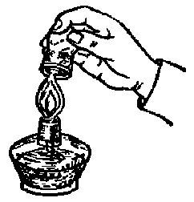

*图 2·11 酒精灯火焰熄灭的方法*

由于灯芯和空气隔绝，灯芯上的火焰就熄灭了。

遇有失火的时候，如果燃烧的范围还没有扩大，可以用浸湿的棉被盖在着火的燃烧物上，或用砂撒在火上，都可以使火熄灭，这是因为棉被或砂把燃烧物和空气隔离开来的缘故。

我们常用水来灭火[^p64-1]。水碰到燃烧物时，就会夺取大量的热，使燃烧物的温度降低，同时，水变成大量的水蒸气，把燃烧物包围起来，冲淡了燃烧物周围的空气，使燃烧物和空气难于接触。这样，火就熄灭了。

##### 缓慢氧化和爆炸

物质发生氧化反应的方式是多种多样的。前面讲到的物质在空气或纯氧里的燃烧是一种急剧的氧化反应，它们进行得都比较快，同时有光和大量的热产生。

有时候，物质的氧化反应进行得比较缓慢。反应过程里产生的热量随时向周围散发开去，不易积聚起来，物质的温度不会升高到它的着火点，因而不会引起燃烧现象。例如，我们知道，呼吸是需要氧气的。氧气进入生物体内发生氧化反应，依靠反应放出的热量维持生物体的体温，但这种氧化反应是缓慢的。

但在另一些情况下，物质的氧化反应虽然进行得也比较缓慢，但由于通风不良，反应过程里产生的热量不能随时散发掉，以致热量积聚起来，温度逐渐升高，最后达到物质的着火点，这时就会引起物质自动的燃烧，这种现象叫做自燃。例如浸过油的破布堆、碎煤堆等物质内部的温度，总要比外部空气畅通处的温度来得高，这是因为这些物质发生缓慢的氧化，内部的热量不易散发的缘故。如果长期堆放就可能有引起自燃的危险，所以为了防止这种可能发生的自燃现象，在仓库中必须特别注意通风，使堆放的东西在缓慢氧化过程里产生的热量能够及时散失。

物质发生自燃现象可以用下面的实验来说明。

拿一小决滤纸放在白磷的二硫化碳溶液（把块状的白磷溶解在二硫化碳液体里得到的溶液）里浸一下，然后把它挂起来晾干。二硫化碳液体是很容易挥发的，所以最后只剩下布满在滤纸上的小粒的白磷。这时的白磷比原先呈块状时和空气中氧气的接触更加充分，氧化反应加快。由于白磷的着火点（40℃）特别低，反应里产生的热量就能很容易地使白磷发生自燃，并引起滤纸的燃烧。

和缓慢氧化相反，有些氧化反应进行得非常之快，并在反应过程中产生大量气体和大量的热。这时，由于气体受热后体积急剧膨胀，产生很大的压强，引起猛烈的爆炸。

例如汽油蒸气、氢气、乙炔等可燃性气体和适量的空气混和后，点火就能发生爆炸。这就是因为这些可燃性气体和空气里氧气的接触面积很大，点火时氧化反应进行极快，放出大量的热，气体体积急剧膨胀，从而引起爆炸。

此外，某些固体物质象煤屑或面粉等细小颗粒和空气混和时，由于同样的原因，点火也会发生爆炸。所以汽油库、煤矿、面粉厂都必须严禁烟火。

但是，爆炸也能利用来为生产服务。例如开采矿石时炸药的爆炸就是一个例子。

##### 习题 2·7

1. 什么叫做燃烧？燃烧过程中氧气的作用是什么？

2. 电流通过电灯泡内时，灯丝发光发热，这是不是燃烧现象？为什么？

3. 物质发生自燃现象和爆炸现象的原因是什么？

4. 堆烟煤时为什么要将煤压紧，并在底部注意通风？

#### § 2·8 物质不灭定律

在前面研究物质的化学反应时，我们只是注意到了化学反应里物质的变化，即哪些物质经过化学反应变成了哪些新物质。但还没有仔细研究化学反应里物质的总重量是否也有变化。在本节里，我们将通过一些简单的实验结果来说明这个问题。

取两种都是无色的溶液，一种是氯化钠溶液，另一种是硝酸银溶液。把它们分别倒在两个杯子里。然后把这两个杯子放在天平的一个秤盘上，在天平的另一个秤盘上放砝码使两边平衡（图 2·12（a））。然后，把两个杯子里的溶液倒在一起，这时立刻看到溶液里有白色胶凝状的沉淀（氯化银）析出，这是氯化钠和硝酸银发生化学反应后生成的新物质。再把两个烧杯放回到原来的那个天平盘上去，结果发现天平的两边仍是平衡的（图 2·12（b））。这说明了在这个反应里，反应前物

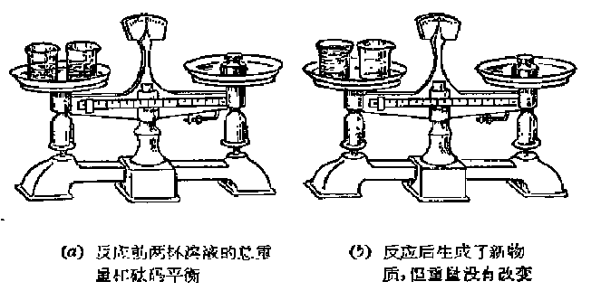

*图 2·12 物质不灭定律的简单实验*

质（氯化钠和硝酸银）的总重量和反应后生成的新物质（氯化银和硝酸钠）的总重量是相等的。

在一个杯子里放稀的硫酸溶液，另一个杯子里放氯化钡溶液，先在天平上称出它们的重量，然后把这两种溶液混和，它们立刻发生化学反应，生成白色的硫酸钡沉淀。再用天平称这两个杯子时，可以看到它们的总重量仍是不变。

在另外一些实验中，例如，在试管里加热氯酸钾，使之发生分解反应。这时，从外表上看来，它的重量是在逐渐减小的。但如果把氯酸钾分解时放出的氧气全部收集起来，那么，我们就会发现，试管里残留的氯化钾和收集到的氧气的总重量仍和反应前原来氯酸钾的重量相等。

铜片在空气里加热后，它的重量会稍有增加。这时在铜片表面上生成了一薄层黑色的新物质——氧化铜 \(\left(\mathrm{CuO}\right)\)。通过精细的实验证明：铜片所增加的重量，正好等于铜化合时所消耗掉的空气中的氧气的重量。

以上这些事实都说明了：在化学反应里，参加反应的物质的总重量总是等于反应后生成物质的总重量。

早在十八世纪的时候，许多科学家曾经用一系列的实验证明了上述这个结论。现在，这个结论已被确认是自然界一切物质变化所遵循的普遍规律，它已成为一个化学基本定律，称做物质不灭定律：化学反应的前后，物质的总重量保持不变。

从原子-分子论的观点看来，物质不灭定律是容易理解的。在§1·5中已经讲过，发生化学反应时，只是一些物质（参加反应的物质）分子里的原子重新结合成为另一些物质（生成的物质）的分子。例如水在电流作用下，分解成氢气和氧气。从§1·5图 1·3可以看出，反应前每2个水分子（一共含有4 个氢原子和两个氧原子），反应后生成 2 个氢分子和 1 个氧分子（一共也含有 4 个氢原子和两个氧原子）。反应前后原子的种类和个数都没有改变。因此，反应后各种生成物质（我们以后称它们为生成物） 的总重量也就一定等于参加反应的各种物质（我们以后称它们为反应物）的总重量。

根据物质不灭定律，自然界里任何物质都不会毫无踪迹地消失掉，也不会无中生有。应用这种观点，就能正确地解释许多化学现象。例如，从表面上看来，常容易错误地认为蜡烛燃烧后就毫无踪迹地消失掉了。实际并不如此，蜡烛燃烧后生成二氧化碳和水。二氧化碳是无色的气体，水在那样高的温度下也成为水蒸气，它们都散失到空气中去了。如果把蜡烛燃烧后的生成物设法都收集起来，称它们的重量，就知道反应物（石蜡和燃烧时用掉的氧气）的总重量，和燃烧后生成物（二氧化碳和水）的总重量仍是相等的。

根据物质不灭定律，还可以找出化学反应里反应物和生成物之间的重量关系。如果在反应物和生成物里只有一种物质的重量还不知道，那么根据物质不灭定律，就可以算出这种物质的重量来。

例如，如果我们要知道一定重量的氯酸钾分解后生成的氧气的重量是多少，只要在实验前称出氯酸钾的重量，实验后称出剩下的氯化钾的重量。氯酸钾的重量减去氯化钾的重量，就是生成的氧气的重量。例如，加热分解49克氯酸钾，结果剩下29.8克氯化钾，那么生成的氧气的重量一定等于49-29.8=19.2克。

这种计算对于化学生产有很重要的指导意义。在生产中，如果反应物的重量是已知的，那么根据物质不灭定律，就可预先算出生成物的重量会有多少。例如，石灰厂里在煅烧石灰石时，如果所用石灰石（假定它不含杂质）的重量是 100 吨，那么煅烧后生成的生石灰和二氧化碳的总重量将也是 100 吨，如果已知生产出的生石灰的重量是 56 吨，那末，同时放出的二氧化碳气体的重量一定是 100 吨 - 56 吨 = 44 吨。反过来，从需要生产的产品的重量，根据物质不灭定律，也可以预先算出需用原料的重量。这样，就能充分利用原料和节约原料。

##### 习题 2·8

1. 用原子-分子论的观点来解释物质不灭定律。

2. 石灰石煅烧后，重量看来是减少了；铁在空气里加热后重量看来是增加了，这些现象和物质不灭定律有矛盾吗？

3. 从物质不灭定律的观点看来，下面的现象应该怎样解释：

（1） 铝板在空气里加强热后，重量增加；

（2） 将木柴隔绝空气加强热后，得到的木炭的重量比原来的木柴轻；

（3） 蜡烛完全燃烧以后，生成的气态物质的总重量大于蜡烛的重量。

4. 多少克氧化汞完全分解后会生成 16 克氧气和 200 克汞？

5. 碱式碳酸铜受热后能分解成氧化铜、水和二氧化碳三种物质。设有22.1克碱式碳酸铜受热全部分解后，得氧化铜15.9克，水1.8克，问生成二氧化碳多少克？

#### § 2·9 化学方程式以及应用化学方程式的计算

前面已经看到，许多化学反应都可以用一个式子来表示。例如，水在电流作用下分解变成氢气和氧气的化学反应，可以用下式表示：

$$
\text{ 水 } \xrightarrow ［ (\mathrm{H}_{2} \mathrm{O}) ］{\text{ 电流 }} \text{ 氢气 } + \text{ 氧气 } \tag {2}
$$

因为任何物质都可以用一定的元素符号或分子式来表示。所以在这里，如果我们改用元素符号和分子式来表示反应物和生成物，那末这一式子就将简明得多，在研究和学习化学时，也将方便得多。用元素符号和分子式来表示化学反应的式子，叫做化学方程式。

化学方程式是学习化学必须掌握的一个极重要的工具。我们不仅要学会正确书写化学反应的化学方程式，还必须学会应用化学方程式进行有关的计算。

怎样写化学方程式 根据化学方程式的定义，化学方程式是用来表示化学反应的式子。因此，在书写某一化学方程式以前，首先必须确切地知道它所表示的化学反应是真实存在的，确切知道在这一化学反应里，反应物和生成物各是什么？反应发生的条件是什么？反应时有什么现象发生？等等。其次，因为在任何化学反应里，反应物和生成物的总重量总是不变的（物质不灭定律），因此，在化学方程式里，还必须把化学反应里物质的这种重量关系表示出来。这就是说，在书写化学方程式时，应该注意两个问题：

（1） 它所表示的化学反应必须是真实存在的；

（2） 它是符合于物质不灭定律的。

现在用水分解的例子，来说明写化学方程式的具体步骤：

【第一步】在左边写出反应物（水）的分子式，在右边写出生成物（氢气和氧气）的分子式。在氢气和氧气的分子式中间用加号“+”相连。左右两边之间划一直线“——”，即

$$
\mathrm{H}_{2}\mathrm{O}\;-\;\mathrm{H}_{2}+\mathrm{O}_{2}
$$

【第二步】在各个分子式的前面配上适当的系数，使各种原子（氢原子和氧原子）的数目在式子两边都相等。这种配系数叫做化学方程式的配平。配平以后，就可以把直线变成等号。

配系数时，我们注意到式子右边的氧气分子里含有两个氧原子，而式子左边的水分子里只有一个氧原子，所以必须要有两个水分子才能分解出两个氧原子。因此，在水的分子式前应该写上系数“2”。

$$
2 \mathrm{H}_{2} \mathrm{O} - \mathrm{H}_{2} + \mathrm{O}_{2}
$$

这样，虽然左右两边氧原子数目是相等了，但氢原子数目却不相等。因为两个水分子里一共含有 4 个氢原子，而右边却只有两个氢原子，所以在式子右边氢气分子式前面也应该写上系数“2”。这样，在式子左右两边氧和氢两种元素的原子数目都已相等，就可以把中间的直线改成等号，因为这样的式子已符合物质不灭定律：

$$
2 \mathrm{H}_{2} \mathrm{O} = 2 \mathrm{H}_{2} + \mathrm{O}_{2}
$$

【第三步】如果反应是在某种条件下进行的，那末在等号上面应该注明反应发生的条件，例如，水分解的条件是通入电流，那就在这个化学方程式等号上面注明“电流”两字，即：

$$
2 \mathrm{H}_{2} \mathrm{O} \xrightarrow {\text{电流}} 2 \mathrm{H}_{2} + \mathrm{O}_{2}
$$

另外，如果反应过程中有气体放出，我们用符号“↑”（写在气态生成物的分子式的右边）来表示；如果有沉淀从溶液中析出，用符号“↓”（写在难溶生成物的分子式的右边）来表示。因此，用来表示水在电流作用下发生分解反应的完整的化学方程式是：

$$
2 \mathrm{H}_{2} \mathrm{O} \xrightarrow {\text{电流}} 2 \mathrm{H}_{2} \uparrow + \mathrm{O}_{2} \uparrow
$$

总起来说，要正确书写化学方程式，首先应该知道这个反应的作用物和生成物各是什么；其次，要能够写出各种作用物和生成物的分子式；第三，要知道反应发生的条件和生成物的状态；最后，要能够根据物质不灭定律来配平化学方程式，即使化学方程式两边的各种元素的原子数相等。

化学方程式的配平，有时比较困难，必须采用一定的步骤，逐步进行平衡。但在开始学习化学时，我们接触到的化学反应大都比较简单，它们的化学方程式，一般只须采用视察法就能加以配平。现在，我们再举几个例子，来说明用视察法配平化学方程式的方法。

##### 例 1

铁在灼热的情况下，在氧气里燃烧，生成四氧化三铁。

观察式子 \(\mathrm{Fe} + \mathrm{O}_2\) ——\(\mathrm{Fe}_3\mathrm{O}_4\)

两边铁原子和氧原子的数目都不相等，由于右边生成物四氧化三铁分子里含有3个铁原子和4个氧原子，因此，只要在左边反应物铁的元素符号前面配上系数“3”，氧气的分子式前面配上系数“2”，左右两边就配平了。然后将“——”写成“——”，并加上反应条件“灼热”。于是铁在氧气里燃烧生成四氧化三铁的化学方程式的完整写法是：

$$
3 \mathrm{Fe} + 2 \mathrm{O}_{2} \xrightarrow {\text{灼热}} \mathrm{Fe}_{3} \mathrm{O}_{4}
$$

在配平化学方程式时，各种物质分子式前面的系数必须保持最简单的数目关系。例如，例1中最后的化学方程式，如果配平成

$$
6 \mathrm{Fe} + 4 \mathrm{O}_{2} \xrightarrow {\text{灼热}} 2 \mathrm{Fe}_{3} \mathrm{O}_{4}
$$

虽然左右两边各种元素的原子个数都是相等的，并不违反物质不灭定律，但它里面各物质分子式前面的系数有公因子，不是最简单的数目关系，因此这样的写法仍是不正确的。

##### 例 2

磷在高温时在氧气里燃烧生成五氧化二磷。

观察式子 \(P + O_{2} \longrightarrow P_{2}O_{5}\)

两边磷原子和氧原子的数目都不相等，配平时，只要在左边反应物磷的元素符号前面配上系数“2”，氧气分子式前面配上系数“ \(2\frac{1}{2}\) ”（即 \(2P+2\frac{1}{2}O_{2}\longrightarrow P_{2}O_{5}\)）后，左右两边各种元素的原子数就都相等。但是，分子式一般是代表分子的，而分子是组成物质的最小微粒。因此，在化学方程式里，分子式前面的系数，一般都应写成整数。把上面式子里各种物质分子式前面的系数都乘以“2”，就能消去氧气分子式前面的分数。磷在氧气里燃烧的化学方程式的完整写法是：

$$
4 \mathrm{P} + 5 \mathrm{O}_{2} \xrightarrow {\text{高温}} 2 \mathrm{P}_{2} \mathrm{O}_{5}
$$

##### 例 3

氯酸钾加热分解生成氯化钾并放出氧气。

在式子 \(\mathrm{KClO}_3\) —— \(\mathrm{KCl} + \mathrm{O}_2\)

里，左右两边的钾原子、氯原子数目是相等的，只有氧的原子数目不相等。如果在右边氧气分子式前面配上系数“\(1\frac{1}{2}\)”（即 \(\mathrm{KClO}_3\) ——\(\mathrm{KCl} + 1\frac{1}{2}\mathrm{O}_2\)）后，两边各种元素的原子数就完全相等。为了消去氧气分子式前面系数里的分数，把式子里各种物质的系数都乘以“2”，然后把式子里的直线改成等号，在等号上面注明反应条件，并在氧气分子式右边用符号“↑”表示它的状态（气态），就得到这个反应的完整的化学方程式：

$$
2 \mathrm{KClO}_{3} \xrightarrow {\text{加热}} 2 \mathrm{KCl} + 3 \mathrm{O}_{2} \uparrow
$$

在配平化学方程式时，要注意防止发生一种容易产生的错误：例如，在配平氯酸钾分解反应的化学方程式

$$
\mathrm{KClO}_{3} - \mathrm{KCl} + \mathrm{O}_{2}
$$

时，有些初学化学的人，为了使式子两边的原子数目相等，把氯酸钾的分子式改为“\(\mathrm{KClO}_{2}\)”，或把氧气的分子式改为“\(\mathrm{O}_{3}\)”。这都是错误的。因为分子式是代表物质的组成的，而纯净物质具有一定的组成（定组成定律），因此也有一定的分子式。如果我们改变物质的分子式，那所代表的就不是原来的物质，而可能是别种物质或者这种物质根本就不存在。例如，“\(\mathrm{KClO}_{2}\)”所代表的并不是氯酸钾，同样，“\(\mathrm{O}_{3}\)”所代表的也不是氧气。因此，化学方程式两边的原子数目，只能通过分子式前面的系数来配平，绝不能改变物质的分子式。

应用化学方程式的计算 在化学方程式中，反应物和生成物都用它们的分子式来表示。我们知道，物质的分子式包含有物质的分子量的意义。因此，一个化学方程式不仅表明哪些物质参加了化学反应和生成了哪些物质；而且还表明了由多少重量的反应物变成了多少重量的生成物。

例如，水分解为氢气和氧气的化学方程式

$$
2 \mathrm{H}_{2} \mathrm{O} \xrightarrow {\text{电流}} 2 \mathrm{H}_{2} \uparrow + \mathrm{O}_{2} \uparrow
$$

除了表明反应物是水和生成物是氢气和氧气外，还表明每有2个水分子分解，就能产生2个氢分子和1个氧分子。从水的分子式 \((\mathrm{H}_2\mathrm{O})\) 可以算出水的分子量是18，2个水分子的重量便是 \(2\times 18 = 36\)，同样可以算出，2个氢分子的重量是4，1个氧分子的重量是32．因此，这个方程式还表明，每36份的水完全分解时，将产生4份的氢气和32份的氧气，或者说，在这个化学反应里，反应物——水，和生成物——氢气、氧气，三者的重量比是 \(36:4:32\)，即 \(9:1:8\)

又如，从碳和氧化合生成二氧化碳的化学方程式

$$
\begin{array}{rcl}\mathrm{C}&+&\mathrm{O}_{2}\xrightarrow{\text{点燃}}\mathrm{CO}_{2}\uparrow\\12&&2\times16=32\qquad 12+2\times16=44\end{array}
$$

可知，在这个反应里，反应物——碳、氧气和生成物——二氧化碳三者的重量比是12：32：44，即3：8：11.

根据化学方程式所表明的反应物和生成物之间的重量关系，可以从反应物的重量算出生成物的重量（或其他反应物的重量），也可以从生成物的重量算出反应物的重量（或其他生成物的重量）。

例如计算分解 18 克水能生成多少克氧气。计算的步骤如下：

（1） 写出经过配平的化学方程式：

$$
2 \mathrm{H}_{2} \mathrm{O} \xrightarrow {\text{电流}} 2 \mathrm{H}_{2} \uparrow + \mathrm{O}_{2} \uparrow
$$

（2） 在有关物质的分子式下面写出重量：在已知重量的物质（水）和要求重量的物质（氧气）的分子式下面，写出它们分子的重量（切勿忘记将物质分子量乘以分子式前面的系数）。

$$
\begin{array}{cc} 2 \mathrm{H}_{2} \mathrm{O} & \xrightarrow {\text{电流}} 2 \mathrm{H}_{2} \uparrow + \mathrm{O}_{2} \uparrow \\ 2 \times 18 = 36 & 32 \end{array}
$$

题目中没有要求计算生成氢气的重量，所以在氢气的分子式下面不必写出它的重量。

然后在这些重量下面，再写出题目中告诉我们的条件（水的重量），和要求的重量（氧气的重量——假设为 \(x\)），它的单位必须和题目中已知重量的物质的重量单位一样。

$$
\begin{array}{cc}2\mathrm{H}_{2}\mathrm{O}&\xrightarrow{\text{电流}}2\mathrm{H}_{2}\uparrow+\mathrm{O}_{2}\uparrow\\2\times18=36&32\\18\text{克}&x\text{克}\end{array}
$$

（3） 列出比例式并解这比例式：根据上式可以看出， 36克水完全分解后，可以得到 32 克氧气。现在有 18 克水分解后可得氧气 x 克。根据这个重量关系（可以看出，这是正比例关系），列成比例式，得：

$$
36 \text{克}： 18 \text{克} = 32 \text{克}： x \text{克},
$$

解这比例式，得：

$$
x = \frac {18 \times 32}{36} = 16 (\text{克}),
$$

即分解 18 克水能生成 16 克氧气。

计算这一类题目时，我们可以按下列的格式书写：

##### 例 4

多少克铁全部和氧气化合后，才能生成 23.2 克四氧化三铁？

**解：** 设需要 x 克铁。

$$
\begin{array}{l}3\mathrm{Fe}+2\mathrm{O}_{2}\xrightarrow{\text{灼热}}\mathrm{Fe}_{3}\mathrm{O}_{4}\\3\times56=168\qquad3\times56+4\times16=232\\x\text{克}\qquad23.2\text{克}\end{array}
$$

168克：x克=232克：23.2克，

$$
x = \frac {168 \times 23.2}{232} = 16.8 (\text{克})。
$$

答：需要16.8克铁。

##### 例 5

62 克磷全部和氧气化合后，能生成五氧化二磷多少克？参加反应的氧气要有多少克？

**解：** 根据题意，先计算能生成多少克五氧化二磷。设能生成x克五氧化二磷。

$$
\begin{array}{l} 4 \mathrm{P} + 5 \mathrm{O}_{2} \xrightarrow {\text{点燃}} 2 \mathrm{P}_{2} \mathrm{O}_{5} \\ 4 \times 31 = 124 \quad 2 (2 \times 31 + 5 \times 16) = 284 \\ 62 \text{ 克 } x \text{ 克 } \\ 124 \text{ 克 }： 62 \text{ 克 } = 284 \text{ 克 }： x \text{ 克 }, \\ \end{array}
$$

$$
x = \frac {62 \times 284}{124} = 142 (\text{克})。
$$

然后再计算参加反应的氧气要多少克，计算的时候，既可以拿磷的重量作为已知重量，也可以拿算出的五氧化二磷的重量作为已知重量。如果拿磷的重量（62克）作为已知重量，在化学方程式中就写出磷和氧气的重量关系，并设参加反应的氧气有 \(y\) 克。

$$
4 \mathrm{P} + 5 \mathrm{O}_{2} \xrightarrow {\text{点燃}} 2 \mathrm{P}_{2} \mathrm{O}_{5}
$$

$$
4 \times 31 = 124 \quad 5 \times 32 = 160
$$

62克 y克

124 克： 62 克=160 克： y 克，

$$
y = \frac {160 \times 62}{124} = 80 (\text{ 克 })。
$$

如果用五氧化二磷的重量作为已知重量，在化学方程式中就写出五氧化二磷和氧气的重量关系，设参加反应的氧气有 \(z\) 克。

$$
4 \mathrm{P} + 5 \mathrm{O}_{2} \xrightarrow {\text{点燃}} 2 \mathrm{P}_{2} \mathrm{O}_{5}
$$

$$
160 \quad 284
$$

$$
z \text{ 克 } \quad 142 \text{ 克 }
$$

$$
160 \text{ 克 }： z \text{ 克 } = 284 \text{ 克 }： 142 \text{ 克 },
$$

$$
z = \frac {160 \times 142}{284} = 80 (\text{ 克 })。
$$

从上面的计算可以知道，不论用哪一个作为已知重量，结果都一样。

或者，把这个题目里要求计算的两种物质的重量列成一个式子，将两个未知重量分别假设为 \(x\) 和 \(y\)：

$$
4 \mathrm{P} + 5 \mathrm{O}_{2} \xrightarrow {\text{点燃}} 2 \mathrm{P}_{2} \mathrm{O}_{5}
$$

$$
4 \times 31 = 124 \quad 5 \times 32 = 160 \quad 2 (2 \times 31 + 5 \times 16) = 284
$$

62克 y克 x克

然后列成两个比例式，分别算出 x 和 y。

答：能生成五氧化二磷 142 克，参加反应的氧气要 80 克。

##### 习题 2·9

1. 什么叫做化学方程式？

2. 配平下列化学方程式（配平后把直线改为等号）：

（1） \(\mathrm{K} + \mathrm{O}_2 \longrightarrow \mathrm{K}_2\mathrm{O}\)；

（2） \(\mathrm{Zn + O_2 - ZnO}\)；

（3） \(\mathrm{Al} + \mathrm{O}_2\) — \(\mathrm{Al}_2\mathrm{O}_3\)；

（4） \(\mathrm{P} + \mathrm{Cl}_2\) — \(\mathrm{PCl}_5\)；

（5） \(\mathrm{H}_2\mathrm{O} - \mathrm{Hg} + \mathrm{O}_2\) （6） \(\mathrm{KClO}_3 - \mathrm{KCl} + \mathrm{O}_2\)

3. 按照步骤写出下列反应的化学方程式：

（1） 镁和氧气化合生成氧化镁 \(\left(\mathrm{MgO}\right)\)；

（2） 硫和铁化合生成硫化亚铁（FeS）；

（3） 水蒸气和灼热的炭反应生成一氧化碳和氢气。

4. 从氧化汞制取4克氧气，需要多少克氧化汞？

5. 24 公斤炭在氧气中全部燃烧，可生成多少公斤的二氧化碳？

6. 要得到 16 吨二氧化硫，必须使多少吨的硫全部燃烧？（硫燃烧的化学方程式是 \(S + O_{2} = SO_{2}\)）

7. 将铁粉和硫粉混和后，放在试管里加热，反应后生成硫化亚铁（FeS），间制取44克硫化亚铁需要多少克铁和多少克硫？

8. 分解 49 克氯酸钾能生成多少克氧气？如果在氯酸钾里再加入 5 克二氧化锰，那末生成的氧气有多少克？

9. 分解氯酸钾多少克，才能使制得的氧气和分解 43.2 克氧化汞所制得的氧气的重量相等？

> **提示：** 先算出分解43.2克氧化汞能制得多少克氧气。

### II. 氢和水

氢元素在自然界里的含量比氧要少得多，但它的分布却也很广。游离态的氢——氢气因为很轻，在接近地球表面的大气里是很少的；但含氢的化合物在自然界里非常之多，其中最多的就是水。动植物有机体、石油、天然气、煤以及某些矿物里，也都含有氢。

#### § 2·10 氢气的制法

氢的元素符号是H，原子量是1. 氢气的分子式是 \(H_{2}\)，分子量是2.

##### 氢气的实验室制法

实验室里制取氢气一般用稀硫酸 \(\left(\mathrm{H}_{2}\mathrm{SO}_{4}\right)\) 或盐酸（HCl）做原料。为了要把酸中化合态的氢转变为游离态的氢气，常用金属锌（元素符号是Zn）来和酸作用。

图 2·13 是制取氢气的实验室装置，左面瓶内放有少量

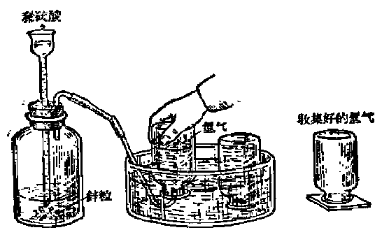

*图 2·13 制取氢气的装置*

锌粒，当从长颈漏斗加进稀硫酸后，锌粒和硫酸发生作用，很快就有氢气从锌粒表面放出，用排水集气法可以把氢气收集在集气瓶里。

因为氢气比空气轻（§2·12），所以集满氢气的集气瓶，要用玻片盖好瓶口，倒置在桌上（图 2·13）。

在锌和稀硫酸的反应里，除了生成氢气外，还生成了另一种新物质叫做硫酸锌（它的分子式是 \(ZnSO_{4}\)）。锌和稀硫酸反应的化学方程式是：

$$
\mathrm{Zn} + \mathrm{H}_{2} \mathrm{SO}_{4} = \mathrm{ZnSO}_{4} + \mathrm{H}_{2} \uparrow
$$

锌 硫酸 硫酸锌 氢气实验室里常用一种特殊的装置，叫做启普 [^p80-1] 气体发生器（简称启普发生器）来制取氢气。用这种装置的最大优点是可以控制氢气的发生或停止发生，非常方便。

图 2·14 （a） 表示启普发生器的外形。图 2·14 （b） 表示启普发生器是由一个球形漏斗 a 和容器 b 两部分所组成。容器 b 是由一个球形体和一个半球形体连接而成，在球形体的右上方有一小开口处 c，该处用带有玻璃导管的橡皮塞塞住，导管的另一端连有一个活栓（控制气体流通的“开关”）d。球形漏斗 a 的长颈插在容器 b 内。球形体的上端

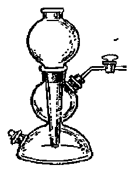

*（a） 启普发生器*

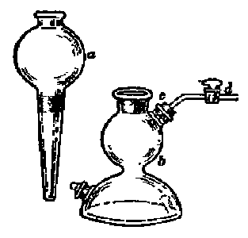

*（b） 启普发生器的两个组成部分*

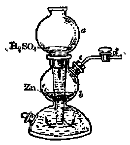

*（c） 产生氢气的情形*

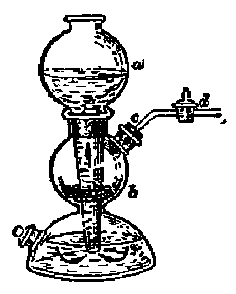

*（d） 停止产生氢气的情形*

*图 2·14 启普发生器*

开口处被漏斗的长颈完全堵没。

图 2·14 （c） 和 （d） 分别表示发生氢气和停止发生氢气时的两种情况。

我们先来说明发生氢气时的情形。先把c处的橡皮塞打开，把锌粒装入球形体内，然后再把橡皮塞塞紧，并把活栓d打开，从球形漏斗a倒入稀硫酸（或盐酸），沿着它的长颈流入半球形体内。由于容器b的球形体和半球形体之间的通道并没有被球形漏斗的长颈全部堵没，在长颈的四周还留有狭隘的孔隙，这些狭隘的孔隙虽然能够挡住球形体内的锌粒落入到半球形体里[^p81-1]；但却能让酸液自由流通。因此，当倒入的酸充满了半球形体以后，就继续上升到球形体内，和锌粒接触，立刻发生反应产生氢气。接着，氢气就从仅有的出路c处，沿着导管通过活栓d而放出（图 2·14（c））。

如果要使氢气停止产生，只需把活栓d关闭（图 2·14（d））。这时由于继续发生出来的氢气不能再从c处放出，就在球形体内产生压强，把酸往下压挤到半球形体内，再沿着长颈上升到球形漏斗里。当酸从球形体内流出后，锌和酸不再接触，反应也就停止。

如果又需要氢气，只要再把活栓 \(d\) 旋开，氢气又从 \(c\) 处放出。这时球形体里压强减小，酸又从球形漏斗流进球形体，和锌接触发生反应。

利用启普发生器不仅可以制取氢气，还可以制取别种气体，只要这种气体是由液体和固体（粒状或块状）接触时不需加热就能发生的。

##### 氢气的工业制法

工业上制取大量氢气，常用水为原料。制取方法，大致有下面两类：

第一类方法是用一种单质（某些金属或非金属）在高温下和水作用，例如把水蒸气通过红热的铁屑或煤炭等物质，就能产生氢气。它们反应的化学方程式分别是：

$$
3 \mathrm{Fe} + 4 \mathrm{H}_{2} \mathrm{O} (\text{水蒸气}) \xrightarrow {\text{高温}} \mathrm{Fe}_{3} \mathrm{O}_{4} + 4 \mathrm{H}_{2} \uparrow
$$

$$
\mathrm{C} + \mathrm{H}_{2} \mathrm{O} (\text{水蒸气}) \xrightarrow {\text{高温}} \mathrm{CO} \uparrow + \mathrm{H}_{2} \uparrow
$$

第二类方法是用电流把水分解，这个反应在本章第 14 节里将详细谈到。

##### 习题 2·10

1. 叙述实验室里制取氢气的方法，写出反应的化学方程式。

2. 用氯酸钾分解制氧气时，能不能利用启普发生器？为什么？

3. 用足够数量的稀硫酸和 13 克锌作用，当锌完全作用后，能产生氢气多少克？

4. 制取1克氢气，需用多少克锌和足量的稀硫酸作用？

#### § 2·11 置换反应

前面讲到的实验室里用稀硫酸和锌作用制取氢气的化学方程式是：

$$
\mathrm{Zn} + \mathrm{H}_{2} \mathrm{SO}_{4} = \mathrm{H}_{2} \uparrow + \mathrm{ZnSO}_{4}
$$

从这个化学方程式可以看出，这个反应既不同于分解反应（§1·5），也不同于化合反应（§2·3）。在这个反应里，一种单质（锌）和一种化合物（硫酸）相互作用，生成一种新的单质（氢气）和新的化合物（硫酸锌），象这种类型的化学反应，称做置换反应。

根据原子-分子论观点，锌和硫酸置换反应的实质是：单质锌的原子代替了硫酸分子里氢原子（共2个）的位置，变成硫酸锌分子；而硫酸分子里的氢原子被替换出来后，每2个氢原子结合成为1个氢气分子，如下图（图 2·15）所示：

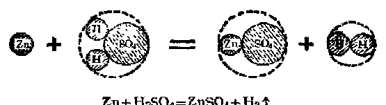

*图 2·15 锌和盐酸置换反应的示意图*

工业上用水蒸气和炽热的铁屑或煤炭制取氢气的化学反应：

$$
3 \mathrm{Fe} + 4 \mathrm{H}_{2} \mathrm{O} \xrightarrow {\text{高温}} \mathrm{Fe}_{3} \mathrm{O}_{4} + 4 \mathrm{H}_{2} \uparrow
$$

$$
\mathrm{C} + \mathrm{H}_{2} \mathrm{O} \xrightarrow {\text{ 高温 }} \mathrm{CO} \uparrow + \mathrm{H}_{2} \uparrow
$$

也是属于置换反应的类型。

##### 习题 2·11

1. 用原子-分子论的观点来说明置换反应，化合反应和分解反应的区别。

2. 在下列化学反应里，哪些是置换反应？哪些是分解反应？哪些是化合反应？

（1） \(\mathrm{S} + \mathrm{O}_2 = \mathrm{SO}_2\)

（2） \(\mathrm{Fe} + 2\mathrm{HCl} = \mathrm{FeCl}_2 + \mathrm{H}_2\uparrow\)

（3） \(\mathrm{CaCO_3 = CaO + CO_2\uparrow}\)

（4） \(\mathrm{Zn} + \mathrm{CuSO}_4 = \mathrm{Cu} + \mathrm{ZnSO}_4\)

（5） \(\mathrm{Cu(OH)}_2 = \mathrm{CuO} + \mathrm{H}_2\mathrm{O}\)

（6） \(\mathrm{N}_2 + 3\mathrm{H}_2 = 2\mathrm{NH}_3\)

3. 为什么说水蒸气和炽热的铁或炭的作用是属于置换反应的类型？

#### § 2·12 氢气的性质和用途

##### 氢气的性质

###### 1. 氢气的物理性质

氢气和氧气一样，在通常状况下，是无色、无味、无嗅的气体。氢气很轻，在所有的气体中，氢气的比重最小，在 \(0^{\circ}\mathrm{C}\) 和1大气压下，每升氢气重0.0899克。这就是说，氢气的重量只及同体积空气（每升空气重1.293克）重量的约1/14.4，“氢气”这个名称就是由于它的这一性质而来的。

在加大压强和降低温度的条件下，氢气也可以变成无色的液体，液态氢在非常低的温度 \((-253^{\circ}\mathrm{C})\) 下沸腾。

氢气比氧气更难溶解于水，在 \(20^{\circ}\) C 和 1 大气压下，1 升水只能溶解 18 毫升的氢气。

###### 2. 氢气的化学性质

在平常温度下，氢气的化学性质是不活泼的，但加热后，它能和某些金属（例如钠、钙等）、非金属（例如硫、氧、氮等）发生化合反应。

下面我们着重来研究氢气和氧的化学反应。

（1） 氢气和氧气的化合反应：纯净的氢气能够在纯氧或

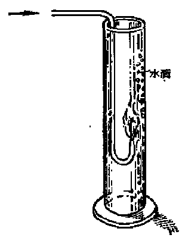

*图 2·16 氢气在空气燃烧*

空气里燃烧，发出淡蓝色的火焰。如果把燃烧着氢气的导管，放进玻璃筒内（如图 2·16所示），不久，就可看到在筒壁上附有极细的水滴。氢气在点燃条件下和氧气化合反应的化学方程式是：

$$
2 \mathrm{H}_{2} + \mathrm{O}_{2} \xrightarrow {\text{点燃}} 2 \mathrm{H}_{2} \mathrm{O}
$$

因为氢气燃烧时放出大量的热，反应生成的水是以水蒸气状态存在的，水蒸气冷却后凝聚在玻璃筒壁上，形成细微的水滴。

应该注意，在任何时候点燃氢气，都必须先确知它是纯净的。因为如果氢气里混有空气（或氧气），点燃时有可能发生猛烈的爆炸，造成伤害事故。

点燃混有空气（或氧气）的氢气会发生爆炸，这可以通过下面的实验来证明。

先在试管里收集2体积氢气和1体积氧气，使之充分混和，这时试管里的氢气和氧气并不发生反应（因为氢气只有在点燃的条件下才能和氧气发生化合反应），用一根燃着的木条去点燃这一混和气体，立刻发出一种尖锐的爆鸣声。

通常把2体积氢气和1体积氧气的混和气体称做“爆鸣气”。

为什么纯净的氢气能够在纯氧（或空气）里安静地燃烧，而点燃氢气和氧气（或空气）的混和气体时却会发生爆鸣呢？这是因为在导管口点燃纯净的氢气时，只有导管口的氢气和周围的氧气接触，燃烧只在导管口进行，因此不会有任何危险发生。但在混和气体里，全部氢气都和氧气密切接触着，点燃时，一瞬间容器里大量氢气和氧气同时迅速化合，生成水蒸气并放出大量的热。这些水蒸气在极短时间内受热急剧膨胀，如果容器是密闭的，或容器的口很小，这急剧膨胀的气体不能迅速排出，这时容器里的压强就会骤然增大起来，引起猛烈的爆炸。

因此，在制取氢气的装置（例如启普发生器）的导管口点燃氢气前，每次都必须进行检纯（即检验氢气纯度）的手续，只有在确切知道容器里的氢气是纯净时，才能用火接近它。

那末，怎样检纯氢气呢？

先把从制取氢气的装置（例如启普发生器）里放出的氢气，用排水集气法收集在试管里，然后迅速地使试管口（保持向下方向）移近酒精灯火焰，如果发生尖锐的吹口哨似的爆鸣声，这说明氢气里还混有空气，应该重复这种试验，一直到把试管移近火焰时，只听到很轻的声音时，放出的氢气才是纯净的。

（2） 氢气和某些金属氧化物的反应，还原反应：氢气不但能和游离态的氧化合，在高温下，它还能夺取有些金属氧化物里化合态的氧。这是氢气的另一个重要的化学性质。

现在用下面的实验来说明这一性质。

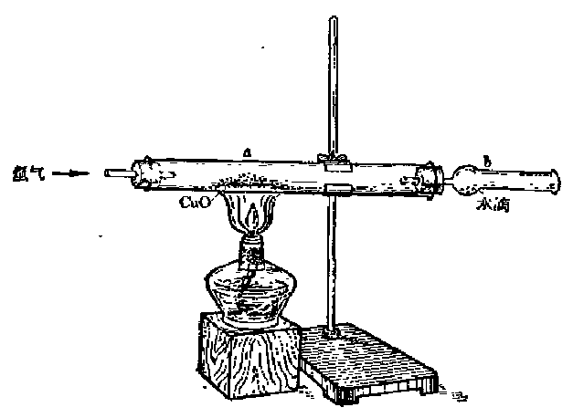

*图 2·17 氢气还原氧化铜的实验*

取一根较粗的硬质玻管，挟住在铁架台上，在玻管a处放进少许黑色的氧化铜粉末。玻管左端用一个带有导管的软木塞塞住，导管和氢气发生器相连（装置见图 2·17）。为了安全起见，在加热玻管前，先自导管通入氢气，使玻管中原有的空气全部被赶走后，再用酒精灯在a处加热玻管里的氧化铜粉末。这时氢气在热的氧化铜表面通过，不久，表面上一部分氧化铜变成赭色的金属铜。同时，在右端干燥管的b处，可以看到有水滴凝成。这一反应的化学方程式是：

$$
\mathrm{CuO} + \mathrm{H}_{2} \xrightarrow {\text{加热}} \mathrm{Cu} + \mathrm{H}_{2} \mathrm{O}
$$

在这个反应里，单质氢气分子里的氢原子代替了氧化铜分子里铜原子的位置，和氧原子结合成为水分子，铜原子被置换出来后，变成单质的铜。很显然，这个反应是属于置换反应类型的。

上述化学反应里的氧化铜，可以认作是由铜和氧气化合而生成的。现在，氢气夺取了氧化铜里的氧，使它重新变成单质的铜。象这样，氧从一种物质里被夺取出来的反应，叫做还原反应。

从别种物质里夺取氧的物质，叫做还原剂。氢气是最重要的还原剂之一。

在冶金工业上，常利用还原反应来冶炼金属。例如我们在小学自然课里已经学过，用焦炭（它的主要成分是碳元素）可以炼铁，就是把铁矿砂［一般是铁的氧化物，例如磁铁矿的主要成分是四氧化三铁（\(Fe_{3}O_{4}\)）］里的氧夺取出来，还原成单质的铁。这个反应可以用下面的化学方程式来表示：

$$
\mathrm{Fe}_{3} \mathrm{O}_{4} + 4 \mathrm{C} \xrightarrow {\text{高温}} 3 \mathrm{Fe} + 4 \mathrm{CO} \uparrow
$$

碳是工业上最常用的一种重要的还原剂。

##### 氢气的主要用途

氢气的用途也是和它的性质相联系的。

氢气燃烧时能放出大量的热，所以利用氢氧吹管（使氢气在充足的氧气里燃烧的一种装置，结构和氧炔吹管相似），可以得到温度很高（可达到 \(3000^{\circ} \mathrm{C}\)） 的氢氧焰，它可以代替氧炔焰，用来焊接或切割金属制品。

氢气还是重要的化学原料，大量的氢气在工业上用来制造氨 \(\left(\mathrm{NH}_{3}\right)\)、盐酸（HCl）等重要化工产品。

##### 习题 2·12

1. 列表比较氢气和氧气的物理性质，它们有哪些是共同的，哪些是不同的？

2. 在启普发生器的导管口点燃氢气时，如果其中混有空气，会发生什么现象？为什么？

3. 怎样检验氢气的纯度？

4. 写出氢气在氧气里燃烧的化学方程式，使2克氢气完全燃烧，需要多少克氧气？又能生成水多少克？

5. 多少克氢气和多少克氧化铜完全作用后可以产生31.75克单质的铜？

6. 含有杂质的氧化铜 50 克，用氢气使它发生反应后，得到 36 克铜。计算含氧化铜的百分率是多少？

> **提示：** 先算出生成36克铜所需要的纯氧化铜的克数，再把这个克数和含杂质的氧化铜的克数（50克）相比，就可以知道纯氧化铜的百分率。

#### § 2·13 氧化-还原反应

仔细研究上一节里谈到的还原反应，例如氢气还原氧化铜的作用，我们可以看到，一方面，氧化铜里的氧被夺走了，还原成单质的铜；另一方面，氢气夺取了氧化铜里的氧，和它化合，氧化成水。因此，这个反应并不单纯是一个还原反应，它既包括氧化铜的还原过程，又包括氢气的氧化过程。

氧化铜的还原，是氢气夺走了它分子里的氧，并与之化合成水的结果，也就是氢气氧化的结果。同样，氢气的氧化，是氧化铜分子里的氧被夺走的结果，也就是氧化铜被还原的结果。由此可以看出，在这个反应里，氧化铜的还原过程和氢气的氧化过程是同时发生的，是互为条件的：没有氧化铜的还原，就不会有氢气的氧化；没有氢气的氧化，也不会有氧化铜的还原。

在焦炭还原四氧化三铁的化学反应里，情况也是一样：四氧化三铁被焦炭还原成单质的铁，与此同时，焦炭又被四氧化三铁里的氧氧化成一氧化碳。

由此可以看出，在这些化学反应里，氧化反应和还原反应是同时存在着的：在一种物质发生还原反应（即它里面所含的氧被夺走）的同时，发生了另一种物质的氧化反应（即和夺得的氧化合）。因此，我们把这类化学反应称做氧化-还原反应。

在氧化-还原反应里，被还原的物质（即分子里的氧被夺走的物质）称做氧化剂，因为在它被还原的过程里，它释出的氧，氧化了别种物质；被氧化的物质（即夺得氧的物质）称做还原剂，因为它氧化时所需要的氧，是从别种物质里夺取得来的，在它被氧化的过程里，别种物质是被它还原了。在上面两个例子里，氧化铜和四氧化三铁是氧化剂，氢气和焦炭是还原剂。

##### 习题 2·13

1. 为什么说还原反应和氧化反应总是同时发生的？

2. 什么样的物质叫做还原剂？什么样的物质叫做氧化剂？分别举例说明。

3. 配平下列化学方程式：

（1） \(H_{2} + O_{2} \longrightarrow H_{2}O;\)

（2） \(Fe_{2}O_{3} + H_{2} \longrightarrow Fe + H_{2}O.\)

4. 在下面两个反应里，什么物质被氧化了？什么物质被还原了？什么物质是氧化剂？什么物质是还原剂？并分别说明理由。

$$
\begin{array}{l} \mathrm{WO}_{3} + 3 \mathrm{H}_{2} \xrightarrow {\text{加热}} \mathrm{W} + 3 \mathrm{H}_{2} \mathrm{O} \\ \mathrm{H}_{2} \mathrm{O} (\text{水蒸气}) + \mathrm{C} = \mathrm{CO} \uparrow + \mathrm{H}_{2} \uparrow \\ \end{array}
$$

#### § 2·14 水的性质

水和空气一样，也是人们不可缺少的一种物质。自然界里存在的水叫做天然水，例如海水、河水、井水、雨水等。天然水一般都是不纯净的，它或多或少溶解有某些可溶性的杂质，有时还悬浮有固体的杂质如污泥、砂粒、动植物的残渣以及某些病原菌等。

在小学自然课里我们已经学过一些有关水的知识，这里着重研究水的性质。

##### 水的物理性质

纯净的水（实验室里用的蒸馏水是比较纯净的）是无色、无味、无嗅的透明液体。在1大气压下，水在100℃时沸腾，0℃时凝固成冰。在4℃时水的比重是1，即此时1毫升的水重1克，在高于或低于4℃时，它的比重都比1小。冬天河水表面遇冷结冰，因为冰的比重比水小，能浮在水面上，下层河水由于和冷空气相隔绝，不易冻结到底，这对保存鱼类的生命具有重大意义。水是一切固体和液体物质中比热[^p90-1]最大的一种物质。水的这种性质，对调节气温，起着巨大的作用。例如在沿海一带，白天虽然受到太阳的照射，但因水的比热特别大，海水温度升高时要吸收大量的热，因此气温不会升得太高；到了晚上，海水温度降低，又放出大量的热，使气温不致降得太低。

水有很好的溶解性，大多数物质都能或多或少地溶解在水里。动植物一般都只能吸取溶解在水里的养料，因此，它是动植物生长不可缺少的一种物质。

##### 水的化学性质

###### 1. 水的分解

水是由氢、氧两种元素组成的一种性质比较稳定的化合物。在水分子里，氢原子和氧原子的结合十分牢固，即使把水加热到 \(1000^{\circ}\mathrm{C}\) 以上的高温，也只能有极少量水发生分解。但是，它在电流作用下，却比较容易分解，并在两个电极上分别放出氢气和氧气，这在 §1·5 里已经初步介绍过了。

利用图 2·18 的装置，可以收集水分解后放出的氢气和氧气。

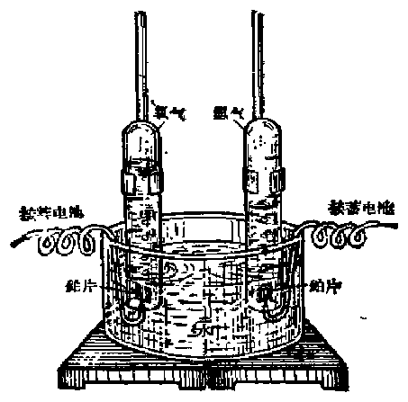

*图 2·18 电解水的简单装置*

在玻璃缸内需水[^p91-1]约2/3。另用铁架台固定住两个有刻度的试管，试管里盛满着水，倒立在玻璃缸里。在试管口处各有铂片一小块（作为电极），用导线把铂片和蓄电池的两极相连。当导线接通后，不久就可看到铂片上有气泡不断产生，试管里的水随着排出。经过一定时间后，可以看到一只试管里的气体体积正好是另一只试管里的两倍。

用手指按住试管管口，从玻璃缸内取出，倒转，把带有余烬的木条移近气体体积较少的那只试管口时，木条重又燃烧起来，这说明试管里的气体是氧气。把燃着的木条移近气体体积较多的那只试管口时，气体就燃烧起来，这说明试管里的气体是氢气。

这个实验的结果指出：水分解时，产生的氢气和氧气的体积比是 2：1.

根据气体的比重，可以把体积换算成重量，这样就可以算出氢气和氧气的重量比。已知氢气每升约重 0.090 克，氧气每升重 1.429 克。因此 2 体积氢气和 1 体积氧气的重量比是：

$$
(2 \times 0.09)： (1 \times 1.429) = 0.18： 1.429 = 1： 7.94 (\text{约} 1： 8)。
$$

这就是说，水分解时，每产生 1 分重量的氢气，同时必定产生 8 分重量的氧气。对任何纯净的水来说，这个比值总是固定不变的。

###### 2. 水和金属或非金属的反应

某些化学性质比较活泼的金属（如钠、钙等），在常温下就能和水发生反应。例如钠和水发生反应的化学方程式是：

$$
2 \mathrm{Na} + 2 \mathrm{H}_{2} \mathrm{O} = 2 \mathrm{NaOH} + \mathrm{H}_{2} \uparrow
$$

钠　水　氢氧化钠　氢气

另外还有些单质（如铁、镁、锌、碳等），在加热条件下也能和水发生反应。例如炽热的铁、炭和水蒸气的反应，这在前面讲到氢气的工业制法（§2·10）时都已研究过了。

##### 习题 2·14

1. 水是最容易获得的物质之一，为什么实验室里不利用它来制取氢气或氧气？

2. 为什么说天然水往往是不纯净的？

3. 水有哪些重要的化学性质？

4. 多少克水分解后，可以得到氢气 2.24 升 （1 升氢气重 0.09 克）？

5. 27 克水完全分解后能得到氢气和氧气各多少克？

#### § 2·15 元素的化合价

什么叫做元素的化合价，在前面学习氧和氢时，我们已经接触到了不少具体的化合物，根据定组成定律，这些化合物都有固定不变的组成。它们的分子都是由一定种类和一定数目的原子组成的，能够用一定的分子式来表示它们。

例如，氧化钙的分子是由1个钙原子和1个氧原子组成的（分子式是CaO），二氧化碳的分子是由1个碳原子和2个氧原子组成的（分子式是 \(CO_{2}\)），等等。

从上面这些例子可以看出，元素的原子结合成为某种化合物的分子时，某元素的一个原子，只能和一定个数（而不能和任意个数）其他元素的原子相结合：钙原子和氧原子结合成氧化钙分子时，1个钙原子只能和1个氧原子（而不能和其他个数的氧原子）相结合；碳原子和氧原子结合成二氧化碳分子时，1个碳原子只能和2个氧原子（而不能和其他个数的氧原子）相结合，等等。

在化学里，一种元素的原子和一定数目其他元素的原子相互化合的性质，叫做这种元素的化合价。

在一般的化合物里，1个氢原子至多只能跟其他元素的1个原子化合。因此，现在化学上把氢原子的化合价规定为化合价的单位（即1价）。

其他元素的化合价，可以根据这种元素的一个原子能和氢原子结合的个数来确定。例如：

1个氯原子能和1个氢原子化合生成氯化氢分子，HCl，

因此，在氯化氢分子里，氯原子的化合价是1价；

1个氧原子能和2个氢原子化合生成水分子， \(H_{2}O\)，

因此，在水分子里，氧原子的化合价是2价；

1个氮原子能和3个氢原子化合生成氨分子， \(NH_{3}\)，

因此，在氨分子里，氮原子的化合价是3价；

1个碳原子能和4个氢原子化合生成甲烷[^p94-1]分子，\(\mathrm{CH}_4\)

因此，在甲烷分子里，碳原子的化合价是4价。

有些元素的原子不容易或者不能和氢原子直接化合，它们的化合价可以根据这种元素的一个原子能从含氢化合物（例如酸）里置换出的氢原子个数来确定。例如：

1个钠（Na）原子能从酸分子里置换出1个氢原子，生成氯化钠分子NaCl（化学方程式： \(2Na+2HCl=H_{2}+2NaCl\)），

因此，在氯化钠分子里，钠的化合价是1价；

1个锌（Zn）原子能从酸分子里置换出2个氢原子，生成硫酸锌分子 \(\mathrm{ZnSO_4}\) （化学方程式： \(\mathrm{Zn + H_2SO_4 = H_2 + ZnSO_4}\)），

因此在硫酸锌分子里，锌的化合价是2价。

##### 化合价规则

上面讲到，在氯化氢（HCl）、水（H₂O）、氨（NH₃）和甲烷（CH₄）等含氢化合物的分子里，氯原子、氧原子、氮原子和碳原子的化合价分别是1价、2价、3价和4价。我们知道，氢原子的化合价是被规定为1价的。由此可以看出，在这些化合物里，两种元素原子的化合价总数（即元素的化合价和原子数的乘积）都是相等的：

化合价总数=元素的化合价×原子数

$$
\mathrm{HCl}\ldots\left\{\begin{array}{ll}\text{氯原子的化合价总数}=&1\times1=1\\\text{氢原子的化合价总数}=&1\times1=1\end{array}\right.
$$

\(H_{2}O\) …… \(\left\{\begin{array}{lll} 氧原子的化合价总数 = & 2 & \times & 1 & = 2 \\ 氢原子的化合价总数 = & 1 & \times & 2 & = 2 \end{array}\right.\)

\(NH_{3}\) …… \(\left\{\begin{array}{lll} 氮原子的化合价总数 = & 3 & \times & 1 = 3 \\ 氢原子的化合价总数 = & 1 & \times & 3 = 3 \end{array}\right.\)

\(CH_{4}\) …… \(\left\{\begin{array}{lll} 碳原子的化合价总数 = & 4 & \times & 1 = 4 \\ 氢原子的化合价总数 = & 1 & \times & 4 = 4 \end{array}\right.\)

在任何由两种元素组成的化合物里，甲元素的化合价总数必然和乙元素的化合价总数相等，即：

甲元素的化合价×甲元素的原子数

=乙元素的化合价×乙元素的原子数。

这个关系，称做化合价规则。

例如，在氯化铜分子（分子式 \(CuCl_{2}\)）里，

氯的化合价×氯原子数=铜的化合价×铜原子数

1 × 2 = 2 × 1

又如，在五氧化二磷分子（分子式 \(P_{2}O_{5}\)） 里，

磷的化合价×磷原子数=氧的化合价×氧原子数

5 × 2 = 2 × 5

因此，在由两种元素组成的化合物里，如果其中一种元素的化合价是已知的，就可根据化合物的分子式，利用“化合价规则”，计算出另一种元素的化合价。

##### 例 1

已知氧的化合价是2价，求氧化铝（分子式是 \(Al_{2}O_{3}\)）里铝原子的化合价。

**解：** 根据化合价规则，铝的化合价×铝原子数=氧的化合价×氧原子数，故

铝的化合价 \(=\frac{\text{氧的化合价}\times\text{氧原子数}}{\text{铝原子数}}=\frac{2\times3}{2}=3\)。

答：在氧化铝里铝原子的化合价是3价。

##### 例 2

已知氮的化合价是3价，求氮化镁（分子式是 \(Mg_{3}N_{2}\)） 里镁的化合价。

**解：** 根据化合价规则可知，

$$
\text{ 镁的化合价 } = \frac {\text{ 氮的化合价} \times \text{氮原子数 }}{\text{ 镁原子数 }} = \frac {3 \times 2}{3} = 2.
$$

答：在氮化镁里镁的化合价是2价。

氢在它的一切化合物里都是1价；氧在它的一切化合物里都是2价。由于许多化合物里都含有氢元素或氧元素，因此记住了它们的化合价，在根据化合物分子式确定元素的化合价时，会有很大的方便。

##### 不变化合价和可变化合价

我们知道，元素的原子相互结合成为某种化合物的分子时，表现出一定的化合价。例如，碳和氧相互化合成二氧化碳时，1个碳原子只能和2个氧原子结合（在二氧化碳 \(\mathrm{CO}_{2}\) 里，碳原子是4价）。但碳和氧相互化合时，由于反应时的条件不同，并不一定生成二氧化碳。例如，碳在空气不充足的地方燃烧，除了生成二氧化碳外，还能生成一氧化碳（分子式CO，在一氧化碳里碳原子是2价）。同样，硫在不同条件下可以和氧化合生成二氧化硫（分子式 \(\mathrm{SO}_{2}\)）或三氧化硫（分子式 \(\mathrm{SO}_{3}\)），另外，硫还能和氢化合生成硫化氢（分子式 \(\mathrm{H}_{2} \mathrm{~S}\)）。在这些化合物里，硫原子的化合价分别是4价（在 \(\mathrm{SO}_{2}\) 中）、6价（在 \(\mathrm{SO}_{3}\) 中）和2价（在 \(\mathrm{H}_{2} \mathrm{~S}\) 中）。

大多数元素，特别是非金属元素，在不同的化合物里都能显示出不同的化合价。它们的化合价，称做可变化合价。

也有一些元素，它们在所有的化合物里，都表现出一种化合价，例如，钠、钾、氢等元素在一切化合物里都是1价，锌、钙、氧等元素在一切化合物里都是2价等。这些元素的化合价，称做不变化合价。

表 2·1 列出了几种常见元素的化合价。

虽然有些元素在不同的化合物里表现出不同的化合价，表 2·1 几种常见的元素的化合价

| 元素名称 | 元素符号 | 化合价 | 元素名称 | 元素符号 | 化合价 |
| --- | --- | --- | --- | --- | --- |
| 钾 | K | 1 | 氯 | Cl | 1，3，5，7 |
| 钠 | Na | 1 | 氧 | O | 2 |
| 钙 | Ca | 2 | 氮 | N | 1，2，3，4，5 |
| 镁 | Mg | 2 | 碳 | C | 2，4 |
| 铝 | Al | 3 | 硫 | S | 2，4，6 |
| 铁 | Fe | 2，3 | 磷 | P | 3，5 |
| 铜 | Cu | 1，2 | 硅 | Si | 4 |
| 银 | Ag | 1 | 汞 | Hg | 1，2 |
| 氢 | H | 1 |  |  |  |

但其中常有一种化合价是比较主要的，在它的大多数化合物里，都表现出这种化合价。例如铜化合物里的铜原子有1价的，也有2价的，但2价铜的化合物是主要的。

##### 根据元素的化合价来书写化合物的分子式

在知道了元素的化合价（或它的主要化合价）后，就能根据“化合价规则”正确写出化合物的分子式。现举氧化铝为例来说明这个问题（已知氧是2价，铝是3价）：

【第一步】先把组成这种化合物的元素符号写出来（如果两种元素中一种是金属，一种是非金属，一般都是把金属元素符号写在前面），即写出 AlO。

【第二步】在这两种元素符号的右上角，用罗马数字分别标出它们的化合价，即Al\(^{III}\)O\(^{II}\)。

【第三步】求出这两种元素的化合价的最小公倍数，在现在这个例子里，3和2的最小公倍数是6.

【第四步】把求得的最小公倍数分别用这两种元素的化合价来除，得出的商就是这一元素在分子里应有的原子个数，把它注在元素符号的右下角，这样就写出了这一化合物的分子式。在这个例子里，

氧化铝里面的铝原子数 \(= \frac{6}{3} = 2,\)

氧原子数 \(= \frac{6}{2} = 3,\)

故氧化铝的分子式是 \(Al_{2}O_{3}\)。

【第五步】最后检验一下写出的分子式是否符合“化合价规则”，即铝的化合价总数是否和氧的化合价总数相等：

铝的化合价×铝的原子数=3×2=6，

氧的化合价×氧的原子数=2×3=6.

说明 \(Al_{2}O_{3}\) 这个分子式是符合于“化合价规则”的。

如果两种元素的化合价是相同的，书写它们化合物的分子式时，只要进行到第一步就完成了。例如，钠和氯两种元素都是1价，它们化合物（即氯化钠）的分子式就是NaCl，又如钙和氧两种元素都是2价，它们化合物（即氧化钙）的分子式就是CaO。

必须注意，分子式是用来表示某种物质的分子组成的。因此，只有这种物质确实是存在的，用来代表这种物质的分子式才是有意义的。我们知道，并不是任何两种元素都能化合生成化合物的，因此，也决不能认为按照上述步骤写出的符合于“化合价规则”的任何式子，都是有意义的分子式。例如，氮和钠根本不能化合，根据“化合价规则”写出的“分子式” \(Na_{3}N\) （钠是1价，氮是3价）所代表的“氮化钠”也是根本不存在的，因此 \(Na_{3}N\) 这个式子没有任何意义的。

因此，在根据“化合价规则”书写化合物的分子式时，首先必须确切知道这种化合物是真实存在的。

##### 习题 2·15

1. 什么叫做元素的化合价？什么是化合价规则？

2. 确定下列化合物里各种金属元素的化合价（已知氧是2价，氢是1价，氯是1价）：

$$
\mathrm{Na}_{2} \mathrm{O}, \quad \mathrm{CaO}, \quad \mathrm{MnO}_{2}, \quad \mathrm{PbCl}_{2}, \quad \mathrm{SnCl}_{4}.
$$

3. （1） 确定氮在 \(\mathrm{N_2O}\)，NO，\(\mathrm{N_2O_3}\)，\(\mathrm{NO_2}\)，\(\mathrm{N_2O_5}\) 等化合物里的化合价；

（2） 确定硫在 \(H_{2}S\)， \(SO_{2}\)， \(SO_{3}\) 等化合物里的化合价；

（3） 确定磷在 \(PH_{3}\)， \(P_{2}O_{5}\) 里的化合价；

（4） 氮、硫、磷的化合价是不变的还是可变的？

4. 根据下列化学方程式，确定（1）中钾（K），（2）中镁（Mg），（3）中铝（Al）的化合价：

（1） \(2\mathrm{K} + 2\mathrm{H}_2\mathrm{O} = 2\mathrm{KOH} + \mathrm{H}_2\uparrow\)

（2） \(\mathrm{Mg} + 2\mathrm{HCl} = \mathrm{MgCl}_2 + \mathrm{H}_2\uparrow\)

（3） \(2\mathrm{Al} + 6\mathrm{HCl} = 2\mathrm{AlCl}_3 + 3\mathrm{H}_2\uparrow\)

5. 写出下列各元素的氧化物的分子式（右上角罗马字是元素的化合价）：

$$
\mathrm{Na}^{\mathrm{I}},\ \mathrm{Mg}^{\mathrm{II}},\ \mathrm{Al}^{\mathrm{III}},\ \mathrm{Si}^{\mathrm{IV}},\ \mathrm{P}^{\mathrm{V}},\ \mathrm{S}^{\mathrm{VI}},\ \mathrm{Mn}^{\mathrm{VII}}.
$$

6. 指出下列化合物的分子式里，哪几个是写错的？为什么？并改正。

氧化钾（KO），氧化银（Ag₂O），氯化钠（Na₂Cl），氯化锌（Zn₂Cl），氧化锌（ZnO₂），水（H₃O）。

### 本章提要

#### 1. 氧气的制法、性质和用途

（1） 制法：（a） 加热氯酸钾（实验室的）；（b） 蒸发液态空气（工业上的）。

（2） 性质：无色、无味、无嗅的气体，比空气略重，难溶于水。在高温时，能和几乎所有的单质 （包括非金属和金属） 化合生成氧化物。能支持燃烧。

（3） 用途：焊接或切割金属（氧炔吹管），炼钢，供给病人、飞行人员、潜水人员等的呼吸。

#### 2. 氢气的制法、性质和用途

（1） 制法：（a） 某些金属（例如锌）和酸（盐酸或硫酸）作用（实验室的）；（b） 水蒸气和红热的铁屑或煤炭作用，或用电流分解水 （工业上的）。

（2） 性质：无色、无味、无嗅的气体，是一切气体中最轻的，比氧气更难溶于水。能在空气或纯氧中燃烧生成水 （点燃氢气前必须经过检纯），能夺取氧化物里的氧，是最重要的还原剂之一。

（3） 用途：是一种气体燃料（氢氧焰），在工业上用以制造氨、盐酸等主要化工产品。

#### 3. 催化剂

在化学反应里只是改变化学反应的速度而本身重量在反应后并不改变的物质，称为催化剂。

#### 4. 化合反应

两种或两种以上的物质相互作用生成一种新物质的反应。

#### 5. 置换反应

单质和化合物作用，生成新的单质和新的化合物的反应。

#### 6. 氧化-还原反应

物质跟氧所起的反应叫做氧化反应。含氧化合物里的氧被夺取出来的反应叫做还原反应。氧化反应和还原反应常常在一个反应里同时发生，因此我们把一种物质被氧化，同时另一种物质被还原的反应，叫做氧化-还原反应。

#### 7. 同素异形现象和同素异形体

一种元素组成几种性质不同的单质的现象，叫做同素异形现象。由同一种元素组成的多种不同单质，相互叫做这种元素的同素异形体。例如 \(\mathrm{O}_{2}\) 和 \(\mathrm{O}_{3}\)。

#### 8. 燃烧

化学上所讲的燃烧是指一切产生光和热的化学作用。一般的燃烧过程常有氧气参加。

维持这种燃烧的条件是：（1）和氧气（或空气）密切接触。（2）使温度保持在它的着火点以上。

灭火的条件是：（1）使着火物隔绝空气，（2）降低着火物的温度到它的着火点以下。

#### 9. 化学方程式

用元素符号和分子式来表明化学反应的式子，叫做化学方程式。

根据物质不灭定律，完整的化学方程式必须经过配平。

根据化学方程式，可以从生成物（或反应物）的质量求出反应物（或生成物）的重量。

#### 10. 化合价

一种元素的原子和一定数目其他元素的原子相互化合的性质，叫做化合价。

在由两种元素组成的化合物里，一种元素的化合价总数（化合价×原子数）一定等于另一种元素的化合价总数，这个关系称为“化合价规则”。

根据“化合价规则”，可以从两种元素组成的化合物的分子式（如果其中一种元素的化合价是已知的）求出元素的化合价，也可以从元素的化合价写出由两种元素组成的化合物的分子式。

### 复习题二

1. 用下面这些化学方程式来表示氯酸钾的分解反应是否对？为什么？

（1） \(\mathrm{KClO}_3 = \mathrm{KCl} + \mathrm{O}_3\)；

（2） \(\mathrm{KClO}_3 = \mathrm{KClO} + \mathrm{O}_2\)；

（3） \(\mathrm{KClO}_3 = \mathrm{KCl} + 3\mathrm{O};\)

（4） \(2\mathrm{KClO}_3\xrightarrow{\text{加热}} 2\mathrm{KCl} + \mathrm{O}_2\uparrow\)

2. 写出下列物质燃烧时的化学方程式：

（1） \(S + O_{2} \rightarrow\)；

（2） \(H_{2} + O_{2} \rightarrow\)；

（3） \(\mathrm{P} + \mathrm{O}_2 \longrightarrow\)；

（4） \(C + O_{2} \rightarrow\)；

（5） \(Mg + O_{2} \rightarrow\)；

（6） \(Na + O_{2} \rightarrow\) 已知硫（S）是4价，碳（C）是4价，镁（Mg）是2价，磷（P）是5价，钠（Na）是1价。

3. 配平下列化学方程式：

（1） \(Fe + O_{2} \longrightarrow Fe_{3}O_{4}\)；

（2） \(\mathrm{Al} + \mathrm{O}_2 \longrightarrow \mathrm{Al}_2\mathrm{O}_3\)；

（3） \(HgO \rightarrow Hg + O_{2}\)；

（4） \(\mathrm{K}_2\mathrm{O} + \mathrm{H}_2\mathrm{O} \longrightarrow \mathrm{KOH}\)；

（5） \(CuO + C \longrightarrow Cu + CO_{2}\)；

（6） \(Fe + H_{2}O \longrightarrow Fe_{3}O_{4} + H_{2}\)

4. 指出第3题的化学反应里，哪几个是分解反应？哪几个是化合反应？哪几个是置换反应？

5. 三个瓶内分别盛有无色的气体：氧气、空气、氢气。怎样鉴别它们。

6. 燃烧多少克氢气才能生成 180 克水？

7. 用电流分解水时，得到32毫升氢气，这时产生了多少毫升氧气？

8. 氢气通过灼热的氧化铜，生成9克水。问有多少克氢气发生了反应？

9. 用电流分解 2.7 吨水时，可以生成氢气和氧气各多少吨？

10. 写出下列元素的氧化物的分子式：

$$
\mathrm{Na}^{\mathrm{I}},\ \mathrm{Ca}^{\mathrm{II}},\ \mathrm{Al}^{\mathrm{III}},\ \mathrm{C}^{\mathrm{IV}},\ \mathrm{P}^{\mathrm{V}},\ \mathrm{S}^{\mathrm{VI}},\ \mathrm{Cl}^{\mathrm{VII}}.
$$

（元素符号右上角的罗马字，表示元素的化合价）

11. 求下列化合物里各元素的化合价：

$$
\mathrm{HCl}, \mathrm{Na}_{2} \mathrm{O}, \mathrm{CH}_{4}, \mathrm{NH}_{3}, \mathrm{PH}_{3}, \mathrm{SO}_{3}, \mathrm{B}_{2} \mathrm{O}_{3}, \mathrm{ZnO}, \mathrm{CaO}.
$$

12. 含有杂质的氯酸钾 180 克，加热分解后，得到氧气 48 克。计算含氯酸钾的百分率是多少？

13. 已知氯酸钾的纯度（即含氯酸钾的百分率）是 \(90\%\)，用这种氯酸钾 27.2 克加热分解后，能生成氧气多少克？

14. 把 3 克氢气通过灼热的 180 克氧化铜，问有多少克铜被还原出来？

> **提示：** 在解本题时，先计算一下要使180克氧化铜完全还原为铜需用氢气多少克。如果算出的数值不到3克，这说明题中所给的“3克

氢气”没有全部参加反应，而“180克氧化铜”则可全部被还原，因此在计算还原出来的铜的量时，应该根据氧化铜的量（即180克）来计算：如果算出的数值超过3克，这说明题中所给的“180克氧化铜”将不能全部被还原，而“3克氢气”全部参加反应，因此在计算还原的铜的量时，应该根据氢气的量（即3克）来计算。

### 注释

[^p46-1]: 绝大部分燃料（煤、木炭、煤气、石油等）燃烧时都有二氧化碳放出。

[^p46-2]: 绿色植物发生光合作用时吸收二氧化碳并放出氧气。

[^p46-3]: 关于氧气的性质，将在化学第二册第五章里详细讨论。

[^p47-1]: 氦气在 \(0^{\circ}\mathrm{C}\) 和1大气压下每升重0.178克，是同体积空气重的 1/7 左右。

[^p50-1]: 在贮氧气的集气瓶里，要留有少许水，以免燃烧的铁熔物溅落瓶底时把集气瓶爆破。

[^p52-1]: 乙炔（炔音“缺”）是一种可燃性气体，俗名叫做电石气，它是由碳化钙（俗名“电石”）与水作用而制得的。乙炔的分子式是 \(C_{2}H_{2}\)。

[^p57-1]: 用“排水集气法”收集气体的具体操作方法，参看本书280页正文。

[^p64-1]: 必须注意，油类着火时不能用水来扑灭，因为油类一般都不能溶解于水，而且又比水轻，所以水泼上去时，燃烧着的油会浮在水面上，随水流动，使燃烧的范围更加扩大（参看 §3·4）。

[^p80-1]: 启普是人名。启普发生器是由启普首先设计的。

[^p81-1]: 在长颈四周的空隙处可以放些玻璃丝，防止小的锌粒落下。

[^p90-1]: 比热就是1克物质温度升高（或降低）1℃所吸收（或放出）的热量的卡数（卡是热量的单位）。水的比热是1，即1克水温度升高（或降低）1℃需要吸收（或放出）1卡的热量。

[^p91-1]: 为了增加水的导电能力，可以在水里加入少量硫酸。

[^p94-1]: 甲烷（烷音“完”）是“沼气”的主要成分，将在本书第四册里详细介绍。

## 第三章 碳和碳的简单化合物

我们已经学习了氧和氢两种非金属元素的单质——氧气和氢气——的性质、制法和用途。在本章里，我们将介绍另一种非金属元素——碳。碳在自然界里的总存量虽然比起氧和氢来要少得多，但分布却很广。它和人们的关系非常密切。

碳是构成一切动植物体的重要元素。许多以动植物为来源的东西，在高温的时候都会分解成炭。例如，烧饭或烙饼的时候，如果用火大猛，饭或饼有时会烧焦成一层黑色的炭；许多油类燃烧的时候，如果空气不够充分，常有很浓的黑烟冒出，这黑烟实际上就是许多微小的碳粒；木材、纸、棉花等在高温时也会分解出碳。这就是这些东西里都含有碳元素的证明。此外，构成地壳岩石的大理石、石灰石等是固态的碳的化合物：石油里含有大量的液态的碳的化合物；大气里的二氧化碳，某些地方地下埋藏着的天然气是气态的碳的化合物。

碳和碳的化合物和人们生活的关系十分密切。我们日常吃的如米面、肉类、蔬菜、油脂等，穿的如棉布、丝绸、呢绒以及绝大部分的人造纤维等，用的如橡胶、木材、许多染料和药品等都是含有碳的化合物。碳和碳的化合物如煤炭、汽油、煤油、柴油等是应用最多的燃料，是现在世界上能量的主要来源。

由此看来，碳是一种分布非常广泛的、重要的非金属元素。在本章里，我们除了研究单质的碳以外，还要研究碳的一些简单的化合物，主要是碳的氧化物、碳酸和碳酸盐等。至于那些和生物体密切有关的、组成比较复杂的碳的化合物，将在第四册有机化学部分里详细讨论。

### § 3·1 碳的同素异形体

碳的元素符号是C，原子量是12.

在自然界里，碳主要是以化合态存在的，但也有游离态的碳存在。

和前面讲过的氧相似，由碳元素组成的单质，也有多种同素异形体。碳的同素异形体有：金刚石、石墨和无定形碳。这三种碳的同素异形体，从外形上看来是很不相同的，但当它们在纯氧里燃烧的时候，结果都产生二氧化碳，而且除了二氧化碳以外，都没有别的产物。这就证明了它们都是由碳元素组成的单质，它们相互为碳的同素异形体。

#### 金刚石

纯净的金刚石是无色透明的物质，带有杂质的金刚石可以显现出不同的颜色。金刚石的晶体呈八面体形，

光线照射在它上面的时候，容易折射出来，发出亮晶晶的美丽的光彩。经过琢磨成一定形状的金刚石叫做金刚钻或钻石（图 3·1），是一种贵重的装饰品。

*图 3·1 经过琢磨的金刚石。*

金刚石是相当重的物质，它的比

重是3.5，这就是说它是同体积水重的3.5倍。金刚石极其坚硬，是一切天然出产的物质里最最坚硬的东西，因此要琢磨金刚石，只能用别的金刚石或金刚石的粉末。由于金刚石的这种性质，它可以用来安装在钻探机的钻头上来钻凿坚硬的岩层。此外，它还用来刻划玻璃。

金刚石在自然界里存在的量很少，而且一般开采所得的金刚石的体积都不大。我国山东、浙江等某些地方出产金刚石。

#### 石墨

石墨是一种松软的、不透明的、灰黑色的、细鳞片状的晶体，用手摸它，有滑腻的感觉。石墨比金刚石轻，它的比重是2.2。

和金刚石相反，石墨是最软的矿物之一，用我们的指甲就能在它上面刻划出痕迹。如果把石墨在纸上划过，它的微小的结晶，就会粘附在纸上，留下深灰色的痕迹。利用石墨的这种性质，把石墨和适量的粘土混和后，可以用来做铅笔的“铅芯”，掺进的粘土越多，制得的“铅芯”越“硬”。

由于石墨具有柔软光滑的性质，在机油里掺进少量的石墨，用作机器的润滑剂，涂在机器的轴承部分，可以减少摩擦。

石墨具有金属光泽。它能够导电，因此可以用来制造电极。例如炼钢的电炉里，有巨大的石墨电极；探照灯也用石墨做电极；我们常用的干电池里的碳精棒，也是用石墨制成的。

石墨在纯氧中虽然可以燃烧，但在空气里却有耐火的性质。因此，把石墨和粘土混和在一起，制成石墨坩埚，可以用来熔炼金属。

石墨在自然界里存在的量也不多，但比金刚石要多得多。我国石墨的主要产地是河南、陕西、江苏等省。

#### 无定形碳

当有机物燃烧不完全时，或隔绝空气强热时，就能得到无定形碳。

无定形碳的晶体非常微小，以前没有被人观察到，因而把它误认为是一种没有一定结晶形状的非晶体，所以称做“无定形碳”。现在证明，无定形碳也是晶体，它是由许多极其微小的、和石墨结构相似的晶体无秩序地排列起来而组成的。

无定形碳由于制备时所用的原料不同，或者方法不同而有好多种，其中最重要的有炭黑、木炭[^p107-1]和焦炭等几种。

1. 炭黑 油脂、木材、石油等含碳化合物在氧气供给不充分的情况下燃烧时产生的烟炱，叫做炭黑。炭黑是极细的黑色的碳的粉末，是比较纯粹的无定形碳。

在橡胶里混入炭黑，可以增加橡胶制品的耐磨性。因此，炭黑大量应用在橡胶工业上。

炭黑是很好的黑色颜料，用来制造黑色油墨。我国特制的墨，也是用炭黑做原料的。

2. 木炭 木炭是木柴在隔绝空气下强热而制得的。它是不纯净的无定形碳，含有一些矿物杂质，木炭燃烧后，杂质残留成灰，灰的主要成分是碳酸钾 \(\left(\mathrm{K}_{2}\mathrm{CO}_{3}\right)\)。

木炭燃烧时能发生很多的热，没有呛人的烟，适宜于在家庭里用作燃料。

木炭在高温时能把金属氧化物还原成为单质的金属（参看 §3·3），因此，在冶金工业上，木炭常用作还原剂。

木炭还用来制造黑火药。黑火药是我国唐代的伟大发明，它是木炭粉、硫磺粉和硝酸钾 \(\left(\mathrm{KNO}_{3}\right)\) 的混和物。

木炭能够把某些蒸气或气体吸在它的表面上。气体、蒸气或某些溶解物质被吸在固体表面上的作用叫做吸附。通过下面的实验，将很容易地观察到木炭的吸附现象。

在试管里集满红棕色的二氧化氮 \(\left(\mathrm{NO}_{2}\right)\) 气体，投入几小块加热过的木炭，用塞子塞住试管口，摇动试管，不久就可看到管内红棕色逐渐消失，这是因为二氧化氮气体被吸附在木炭表面上了。如果把试管里的木炭倒出，放进另一试管，加热，原来吸附在木炭表面上的二氧化氮气体会重新放出，显现出红棕的颜色。

吸附作用是在物质的表面进行的，物质的表面面积越大，吸附能力就越强。在木材内部，有很多细小的管道，在木材干馏后所得的木炭里，仍保留有这种结构。由于木炭的这种多孔性，它的表面积很大，因此，它具有很强的吸附能力。

为了加强木炭的吸附能力，常把木炭在隔绝空气下加热，并且通入水蒸气的气流，使留在木炭孔隙里的杂质清洗或挥发掉，扩大木炭里面的空隙，这就增加了木炭的表面积。经过这样处理的木炭，叫做活性炭。活性炭的表面积比木炭大得多，普通 1 克木炭的表面积大约有 \(100 \sim 150\) 平方米，而 1 克活性炭的表面积可达 \(500 \sim 700\) 平方米。从而，活性炭的吸附能力也比木炭强得多。

活性炭对各种不同气体的吸附能力并不完全相同。一般说来，活性炭对那些沸点比较高、容易液化的气体的吸附能力要强些。例如，1毫升的活性炭在 \(15^{\circ}\mathrm{C}\) 和常压下能吸附各种气体的体积，如表 3·1所示：

表 3·1 活性炭吸附各种气体的体积

| 气体名称 | 氯气 | 氨气 | 二氧化碳 | 氧气 | 氮气 | 氢气 |
| --- | --- | --- | --- | --- | --- | --- |
| 分子式 | \(Cl_2\) | \(NH_3\) | \(CO_2\) | \(O_2\) | \(N_2\) | \(H_2\) |
| 沸点（℃） | -34 | -33.4 | -78.5 | -183 | -196 | -252.7 |
| 吸附的体积（毫升数） | 484 | 176 | 97 | 35 | 11 | 4.5 |

大部分有毒的（例如氯气）和有恶臭的气体（例如氨气）的沸点都比较高（见上表）。利用活性炭这种对气体有选择性的吸附能力，可以把它用做防毒面具里的毒气吸附剂。当混有毒气（例如氯气）的空气，经过防毒面具滤毒罐里的活性炭层时，几乎全部有毒气体都被吸附掉，而人呼吸需要的空气里的氧气只有很少被吸附，起着“过滤”的作用。

活性炭不仅能够吸附气体，并且能够吸附溶解在溶液里的某些物质（例如色素）。在盛有靛蓝（一种蓝色的染料）溶液的试管中，放进少量活性炭，加热煮沸，过滤后得到无色的液体。这是因为溶液里的染料已被活性炭所吸附的缘故。

在制糖工业上，用活性炭脱去糖浆的黄色，制造精白糖。

活性炭还能吸附某些病毒[^p109-1]，可用作药品。

3. 焦炭 焦炭是煤在隔绝空气下强热而制得的。焦炭的主要成分是游离态的碳，它含有的灰分比木炭多。

焦炭是浅灰色的多孔物质，质地坚硬。在炼铁的高炉里，用焦炭来还原铁矿石，可以经受得住炉内厚层原料的巨大压力。

#### 习题 3·1

1. 金刚石有些什么重要性质？有什么用途？

2. 石墨有些什么重要性质？有什么用途？

3. 为什么活性炭比木炭具有更加强大的吸附能力？

4. 为什么活性炭可以用作防毒面具里的吸附剂？

### § 3·2 木材干馏

我们已经知道，木材和煤在隔绝空气下强热，可以分别制得木炭和焦炭。这个过程，叫做干馏。

在实验室里，我们可以用图 3·2 的装置，来做木材干馏的实验。

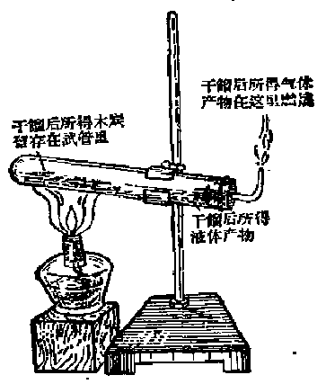

*图 3·2 木材的干馏*

在硬质试管的底部放进一些木条，把试管横着固定在铁架台上，试管口稍微向下倾斜。用酒精灯在试管底部加热，试管里的木条开始分解，先变黄，然后逐渐变黑，成为木炭。同时在靠近试管塞的地方，积聚着一些液体，这液体分成两层，下层是焦黑色的油状液体，称为木焦油，上层是比较澄清象水一样的液体称为木醋酸，其中含有醋酸、木精[^p110-1]和水等物质。在试管口的尖嘴玻管口处，有可燃性的气体放出，称做木气，用火柴点燃，可以在尖口处燃烧。

木材干馏的产物，可以列表如下：

$$
\text{ 木材 } \xrightarrow {\text{ 干馏 }} \left\{ \begin{array}{ll} \text{ 固体产物——木炭 } \\ \text{ 液体产物 } \left\{ \begin{array}{ll} \text{ 木焦油 } \\ \text{ 木醋酸(醋酸、木精、水等) } \end{array} \right. \\ \text{ 气体产物——木气 } \end{array} \right.
$$

我国农村里广泛地利用炭窑来干馏木柴。把木柴堆砌在泥砌的炭窑里，先把炭窑底部的部分木柴引火燃烧，经过一些时间后，把炭窑底部通空气的小洞用泥土闭塞，这样炭窑里的空气不足，木柴不能充分燃烧，而开始时一部分木柴燃烧所放出的热，使其余木柴分解，发生干馏的作用。利用炭窑干馏木柴，它的气体产物和液体产物都从炭窑中心的烟道逸出，散失在空气中，只有固体产物——木炭，留存在炭窑里。因此，这种方法从资源的充分利用来说，是不经济的。但是这个方法简便易行，可以在农村里作为一种副业生产。

煤干馏后也可得到固体产物（焦炭）、液体产物（“粗氨水”和煤焦油）和气体产物（煤气）。关于煤的干馏，将在第四册里详细讨论。

#### 习题 3·2

1. 干馏和蒸馏有什么不同？

2. 木柴干馏和木柴燃烧为什么不同？

3. 木材干馏后可得那些产物？

4. 木炭燃烧时和木柴燃烧时在现象上有什么不同？

### § 3·3 碳的化学性质

我们都知道，木炭放在空气里，不管放置时间多长，是不会有什么变化的。这说明，碳在平常温度下是很不活动的，它不会和空气里的氧气反应，也不会和水、酸或碱发生反应。

但是，当温度增高时，碳的化学性质就变得活泼起来，它能和氧气、氢气以及其他许多非金属单质和金属单质化合，还能和某些含氧的化合物（例如水、金属或非金属的氧化物等）

起反应。

#### 碳跟氧气或非金属的反应

碳在高温时能够在纯氧或空气里燃烧，产生二氧化碳气体，同时还放出大量的热：

$$
\mathrm{C} + \mathrm{O}_{2} \xrightarrow {\text{高温}} \mathrm{CO}_{2}
$$

碳在高温时还能和多种非金属化合。例如，把硫磺（元素符号是S）蒸气通过红热的碳时，它们化合生成一种无色的液体，叫做二硫化碳。反应的化学方程式是：

$$
\mathrm{C} + 2 \mathrm{S} \xrightarrow {\text{高温}} \mathrm{CS}_{2}
$$

二硫化碳是一种良好的溶剂，它可以溶解许多在水里不溶解的东西，例如白磷、碘（分子式是 \(I_{2}\)）、硫磺等。

#### 碳的还原反应

在高温下，碳不但能够和氧化合，而且还能夺取某些含氧化合物里的氧，所以碳是一种还原剂。

例如，把水蒸气通过红热的碳，水（氢的氧化物）被还原成为单质的氢气，这个反应的化学方程式是：

$$
\mathrm{C} + \mathrm{H}_{2} \mathrm{O} \xrightarrow ［ (\text{水蒸} 1) ］{\text{高温}} \mathrm{CO} \uparrow + \mathrm{H}_{2} \uparrow
$$

上面这个反应是一个氧化-还原反应。在这个反应里，碳是还原剂，它把水还原成氢气；水是氧化剂，它把碳氧化成一氧化碳。

又如，二氧化碳通过红热的碳时，也能发生氧化-还原反应：

$$
\mathrm{C} + \mathrm{CO}_{2} \xrightarrow {\text{高温}} 2 \mathrm{CO}
$$

在这个反应里，碳是还原剂，它把二氧化碳还原成一氧化碳；二氧化碳是氧化剂，它把碳氧化成一氧化碳。

碳和氧化铜在高温时亦发生氧化-还原反应，可以很简便地用图 3·3 的装置进行实验。

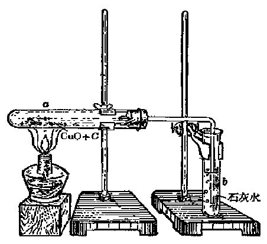

*图 3·3 用木炭还原氧化铜*

把木炭粉和黑色的氧化铜粉末混和，放在硬质试管 \(a\) 里，试管口用一个插有导气管的木塞塞紧，把试管横着固定在铁架台上。导气管通入试管 \(b\) 里的澄清的石灰水里。用酒精灯加热试管 \(a\) 里的黑色混和物。不久，就可看到试管 \(a\) 里有赭红色的金属铜产生，同时，导气管有气泡放出，试管 \(b\) 里原来澄清的石灰水，很快变成浑浊，这说明导气管放出的气体是二氧化碳。

这个反应的化学方程式是：

$$
\mathrm{C} + 2 \mathrm{CuO} \xrightarrow {\text{加热}} 2 \mathrm{Cu} + \mathrm{CO}_{2} \uparrow
$$

在这个反应里，碳是还原剂，它把氧化铜还原成单质的铜；氧化铜是氧化剂，它把碳氧化成二氧化碳（参看§2·13）。

#### 碳跟氢气或金属的反应

碳在高温（1200℃）时能够和氢气直接化合，生成一种可燃性气体，叫做甲烷。甲烷的分子式是 \(CH_{4}\)，是天然气的主要成分。这个反应的化学方程式是：

$$
\mathrm{C} + 2 \mathrm{H}_{2} \xrightarrow {\text{ 强热 }} \mathrm{CH}_{4}
$$

在更高温度下，碳和某些金属能化合生成碳化物。例如，碳和金属钙（元素符号 Ca）在电炉里强热，能够直接化合生成碳化钙 \(\left(\mathrm{CaC}_{2}\right)\) [^p114-1]。这个反应的化学方程式是：

$$
2 \mathrm{C} + \mathrm{Ca} \xrightarrow {\text{ 强热 }} \mathrm{CaC}_{2}
$$

碳化钙平常称做“电石”，它遇水可以产生一种可燃性气体，叫做“乙炔”，分子式是 \(C_{2}H_{2}\)，反应的化学方程式是：

$$
\mathrm{CaC}_{2} + 2 \mathrm{H}_{2} \mathrm{O} = \mathrm{C}_{2} \mathrm{H}_{2} \uparrow + \mathrm{Ca(OH)}_{2}
$$

碳化钙 乙炔 氢氧化钙

#### 习题 3·3

1. 为什么说碳是一种还原剂？举例说明。

2. 8克碳完全燃烧后，生成二氧化碳多少克？

3. 从甲烷和乙炔的分子式计算这两种可燃性气体里所含碳的百分比各是多少？

4. 碳在高温时还原氧化铁的化学方程式是：

$$
2 \mathrm{Fe}_{2} \mathrm{O}_{3} + 3 \mathrm{C} \xrightarrow {\text{高温}} 4 \mathrm{Fe} + 3 \mathrm{CO}_{2} \uparrow
$$

问要使 40 克氧化铁完全还原，需用碳多少克？

### § 3·4 二氧化碳

二氧化碳是和一切动植物生活密切有关的气体。人以及其他动物呼出的气体里含有多量的二氧化碳：煤炭、木材、汽油、煤油以及天然气等燃料燃烧时都有二氧化碳生成；动植物腐烂时也有二氧化碳产生。但在另一方面，二氧化碳又是一切绿色植物不可缺少的养料。在日光下，绿色植物吸收了空气里的二氧化碳，经过复杂的化学变化，最后转变成为它们的体质。由于这样的原因，大气里二氧化碳的含量基本上保持不变（§2·1）。

#### 二氧化碳的物理性质

二氧化碳是一种无色的气体，比空气重（大约是相同体积空气重的1.5倍），我们可以象倒水一样地把它从一个容器里倾倒到另一个容器里。

二氧化碳比氧气或氢气容易溶解于水。在平常状况下，1体积水能够溶解1体积二氧化碳。如果增加压强，水所能溶解的二氧化碳还将更多。平常我们用作清凉饮料的汽水，就是用较高的压强，把多量的二氧化碳气体溶解在饮料里而制成的。当我们打开汽水瓶盖时，由于瓶中压强减低，溶解在汽水里的二氧化碳气体大部分迅速逸出，因此有许多气泡冒出。

比起氧气或氢气来，二氧化碳就显得很易液化，在平常温度下，只要把压强增加到60个大气压，它就变成无色的液体。液态二氧化碳平时贮存在坚固的圆形钢筒里。当把液态二氧化碳从钢筒里倒出时，其中一部分迅速蒸发并吸收大量的热，使其余部分液态二氧化碳的温度急剧下降，最后凝成雪状的固体。经过压缩后的固态二氧化碳的外形象冰，称做“干冰”。

把一筒（一般用钢筒）液态二氧化碳，斜置桌上（图 3·4）。在流出口处系上一个坚固的砂布袋，打开活门，让液态二氧化碳流出，数分钟后，可以看到袋中有雪状的二氧化碳固体。

“干冰”是一种比冰更好的致冷剂[^p116-1]。它冷却的温度比冰低得多，利用“干冰”，可以产生 \(-78^{\circ}\mathrm{C}\) 的低温。而且，“干冰”熔化时，不会象冰那样变成液体，它直接蒸发成为温度很低的、干燥的二氧化碳气体，围绕于冷藏物品的四周，因此它的冷藏效果特别好。“干冰”现在用来保藏容易腐烂的食品。

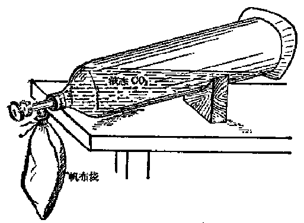

*图 3·4 干冰的制备*

#### 二氧化碳的化学性质

二氧化碳的化学性质比较稳定。

二氧化碳没有可燃性（和氢气不同），它不能在空气或氧气里燃烧。这是因为在二氧化碳里，已经含有了充分的氧元素，不能再和更多的氧化合的缘故。

二氧化碳一般说来是不能支持物质的燃烧的（和氧气不同），大多数燃烧着的物质不能在二氧化碳气体里继续燃烧。例如，把燃着的蜡烛，插进盛有二氧化碳气体的广口瓶里，蜡烛很快就会熄灭。

把两枝短蜡烛分别放在一个梯形铁架的两层上，把蜡烛点着，然后把铁架挂在一个空烧杯里。另取二氧化碳气体一瓶，沿着烧杯边，象倒水一样地倒进烧杯里，可以看到低处的蜡烛先熄灭，然后高处的蜡烛也跟着熄灭（图 3·5）。这个实验说明了（1）二氧化碳比空气重，（2）二氧化碳不能维持蜡烛燃烧。

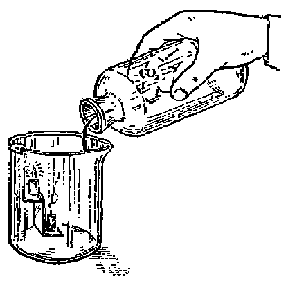

*图 3·5 倾倒 \(CO_{2}\) 灭火的实验*

但是，并不是所有物质都不能在二氧化碳气体里燃烧的。从二氧化碳的分子组成可以看出，在二氧化碳里含有氧元素。由于这个氧元素是和碳元素化合着的，因此它的性质和单质的氧（即氧气）不同，它不能支持一般物质的燃烧。但如果有一种物质，它和氧结合的能力大大超过碳和氧结合的能力，它就有可能夺取二氧化碳里的氧。而使碳游离析出。例如，把燃着的镁条（镁是一种具有银白色光泽的很轻的金属，镁条在空气里燃烧时发出眩目的亮光。）放进二氧化碳气体里，镁条仍旧继续燃烧，生成白色的氧化镁粉末，同时，还有黑色的碳粒产生。这个反应的化学方程式是：

$$
2 \mathrm{Mg} + \mathrm{CO}_{2} = 2 \mathrm{MgO} + \mathrm{C}
$$

镁 氧化镁

二氧化碳溶解在水里，和水发生化学反应，生成一种酸性的物质，叫做碳酸 \(\left(\mathrm{H}_{2}\mathrm{CO}_{3}\right)\)。这个反应的化学方程式是：

$$
\mathrm{CO}_{2} + \mathrm{H}_{2} \mathrm{O} = \mathrm{H}_{2} \mathrm{CO}_{3}
$$

碳酸是一种不稳定的物质，容易分解生成二氧化碳和水。因此，在碳酸的水溶液里，除含有碳酸外总是还有二氧化碳同时存在。

把二氧化碳气体通进澄清的石灰水，不久就有白色的沉淀（碳酸钙，分子式是 \(\mathrm{CaCO_3}\)）析出，这个反应的化学方程式是：

$$
\mathrm{CO}_{2}+\mathrm{Ca(OH)}_{2}=\mathrm{CaCO}_{3}\downarrow+\mathrm{H}_{2}\mathrm{O}
$$

氢氧化钙　碳酸钙

（白色沉淀）

这个反应通常是用来检验二氧化碳的。

我们呼吸时呼出的气体里含有多量的二氧化碳，这也可以用石灰水来检验。用一玻璃管，把我们呼出的气体吹进澄清的石灰水里，石灰水就会变为浑浊（图 3·6）。

动物不能在二氧化碳里生活，这并不是因为二氧化碳有毒，而是因为在二氧化

碳里，动物得不到维持呼吸所必须的氧气，因而窒息而死。在地下室、山洞里，有时会因某种原因而积存着大量的二氧化碳气体，人们如果不留心进入那里，由于二氧化碳是无色无嗅的气体，会在不知不觉中发生窒息的危险。因此，在进入这些地方的时候，应该先用燃着的蜡烛来试验，如果蜡烛熄火，说明那里积集有大量二氧化碳气体，必须设法先行通风，然后才能进去。

#### 二氧化碳的用途

在工业上，二氧化碳是制造纯碱（即碳酸钠。 \(\mathrm{Na}_{2}\mathrm{CO}_{3}\)）、食用碱（又称小苏打，即碳酸氢钠 \(\mathrm{NaHCO}_{3}\)）、碳酸氢铵（\(\mathrm{NH}_{4}\mathrm{HCO}_{3}\)，一种重要的氮肥）等的主要原料。

二氧化碳能够灭火。常用的二氧化碳灭火器是由一个铁制圆筒做成的。圆筒里盛有碳酸钠 \(\left(\mathrm{Na}_{2}\mathrm{CO}_{3}\right)\) 和能够产生泡沫的“发泡剂”[^p119-1]的水溶液。在圆筒上部，有一个固定的金属支架，支架上放有一瓶硫酸或盐酸，瓶口用一个铅盖盖住，铁筒的筒口用盖盖紧。筒的上部有一个喷出口（图 3·7）。

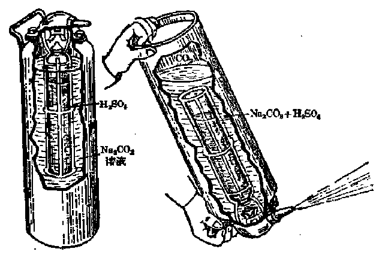

*图 3·7 二氧化碳灭火器*

使用灭火器时，只要把灭火器颠倒过来，盛酸玻璃瓶的铅盖自动落下，酸从瓶中倒出和筒内碳酸钠溶液发生反应，产生二氧化碳气体：

$$
\mathrm{Na}_{2} \mathrm{CO}_{3} + \mathrm{H}_{2} \mathrm{SO}_{4} = \mathrm{Na}_{2} \mathrm{SO}_{4} + \mathrm{H}_{2} \mathrm{O} + \mathrm{CO}_{2} \uparrow
$$

由于气体的压力，含有大量二氧化碳气体的泡沫就从喷出口喷射出来。

某些物质（例如石油、煤油、汽油等）着火的时候，是不能用水来扑救的。因为这些物质比水轻，它们能够浮在水面上继续燃烧，并且会跟随着水向四处流动，使燃烧的范围更加扩大。但如果使用二氧化碳灭火器，喷射出来大量的二氧化碳泡沫比汽油等油类更轻，能浮在燃着的油液上面，把燃烧物和空气完全隔绝起来。这样，燃烧物将因得不到空气而熄灭。

#### 二氧化碳的制法

前面讲过，碳在空气或纯氧里燃烧，可以生成二氧化碳。但是，这样所得的二氧化碳是不纯净的，里面混杂着许多没有作用掉的氧气或其他气体，要从这种混和气体里分离出纯净的二氧化碳比较困难。在实验室里，纯净的二氧化碳是用盐酸和大理石或石灰石 （它们都是含有碳酸钙的岩石） 反应而制得。反应的化学方程式是：

$$
\mathrm{CaCO}_{3} + 2 \mathrm{HCl} = \mathrm{CaCl}_{2} + \mathrm{H}_{2} \mathrm{O} + \mathrm{CO}_{2} \uparrow
$$

碳酸钙 盐酸 氯化钙

这个反应是固体和液体相接触，并在平常温度下就能进行，因此可以利用启普发生器来产生二氧化碳气体。

二氧化碳能够溶解于水，因此收集二氧化碳气体时，不能采用排水集气法，而必须采用排气集气法。二氧化碳比空气重，集气时瓶口应该向上，导气管向下，并要一直通到接近集气瓶的瓶底处。这样集气的方法，叫做下方排气法（图 3·8）。

二氧化碳是无色气体，瓶中气体是否已集满，不能直接看出，可以用一根燃着的小木片放在瓶口，如果火焰熄灭，说明瓶里二氧化碳气体已经集满。

集满二氧化碳气体的集气瓶，应该瓶口向上，正放在桌上，并在瓶口用玻璃片或厚纸盖住。

利用上面的方法制取二氧化碳虽然比较方便，但所用的盐酸是一种比较贵的工业原料，因此，这个方法只是在实验室里制取少量二氧化碳时才适用，

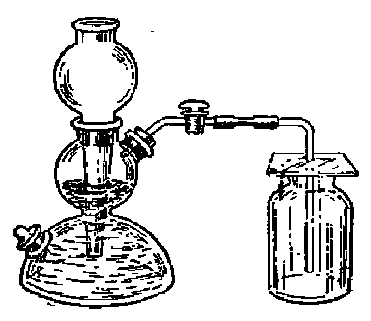

*图 3·8 实验室里制取二氧化碳*

如果要大量生产二氧化碳，那就不经济了。现在工业上一般都用石灰石加热分解的方法来制取二氧化碳。这个问题我们将在下节里讨论。

#### 习题 3·4

1. 我们知道碳是可以燃烧的，氧是能够支持别种物质燃烧的。二氧化碳既含有碳元素又含有氧元素，为什么它本身既不能燃烧，又不能支持大多数物质的燃烧？

2. 有四瓶无色气体：一瓶是空气，一瓶是氧气，一瓶是氢气，一瓶是二氧化碳，你将用什么方法来识别它们？

3. 当打开汽水瓶盖时，有许多气泡冒出，你怎样证明它是二氧化碳气体？

4. 二氧化碳是没有毒性的，但为什么动物在二氧化碳气体里很快就会死亡？

5. 什么叫做“干冰”？它有什么用途？

6. 列表比较氧气、氢气和二氧化碳三种气体的性质。

7. 叙述二氧化碳灭火器的构造、反应原理和使用方法。

8. 收集二氧化碳气体和收集氢气在方法上有什么不同？这和它们的性质有什么关系？

9. 在实验室里制取二氧化碳 11 克，需用纯净碳酸钙多少克？

### § 3·5 碳酸和碳酸盐

二氧化碳溶解在水里，和水发生反应就生成碳酸。碳酸很不稳定，在平常温度下就会分解，重新放出二氧化碳和水：

$$
\mathrm{H}_{2} \mathrm{CO}_{3} = \mathrm{CO}_{2} \uparrow + \mathrm{H}_{2} \mathrm{O}
$$

因此，在实验室里，是没有碳酸这种试剂的。

碳酸分子里两个氢原子被金属原子置换后的生成物，叫做碳酸盐。碳酸钠 \(\left(\mathrm{Na}_{2}\mathrm{CO}_{3}\right)\)、碳酸钙 \(\left(\mathrm{CaCO}_{3}\right)\) 是最重要的碳酸盐。

碳酸钠又叫做纯碱，是一种重要的化学工业产品，它广泛地应用在玻璃、肥皂、造纸、纺织、石油等许多工业生产中。在日常生活里，我们洗涤油污，做面食也常常用到纯碱。

碳酸钙是自然界里分布最广的碳酸盐，大理石、石灰石和白垩等都是由碳酸钙和少量的其他杂质构成的。

大理石是由粒状晶体构成，由于它里面含有杂质，使它表面上带有美丽的青灰色、白色或黑色相间的花纹。这种矿石以出产在我国云南省大理县的最著名，因此叫做大理石。经过加工琢磨，可以作为建筑材料和装饰品。

石灰石在建筑上常用作石料。品质比较纯净的石灰石可以用来制造生石灰。

在石灰窑里装满石灰石和无烟煤，点火使煤燃烧，窑里石灰石受热分解，生成氧化钙和二氧化碳。氧化钙就是生石灰。这个反应的化学方程式是：

$$
\begin{array}{l}\mathrm{CaCO}_{3}\xrightarrow{\text{煅烧}}\mathrm{CaO}+\mathrm{CO}_{2}\uparrow\\\text{碳酸钙}\qquad\text{氧化钙}\\\text{（石灰石）}\qquad\text{（生石灰）}\end{array}
$$

利用这个方法制造生石灰，同时可以得到副产品二氧化碳。

白垩是一种白色的土，是古代的贝壳沉积生成的。白垩可以用来粉刷墙壁，制造去污粉、牙粉、粉笔、白色颜料等。

#### 习题 3·5

1. 二氧化碳和石灰水的反应，可以认作是分两步进行的：（1） 二氧化碳和水反应生成碳酸；（2） 生成的碳酸再和氢氧化钙反应生成碳酸钙沉淀。写出这两步反应的化学方程式。

2. 和碳酸钙相似，碳酸钠也能和盐酸反应产生二氧化碳，写出这个反应到化学方程式。

3. 煅烧含有 80% 碳酸钙的石灰石 100 吨，使它完全分解，问能生成生石灰多少吨？

### § 3·6 一氧化碳

把二氧化碳气体通过炽热的碳，二氧化碳被碳还原，生成一氧化碳：

$$
\mathrm{CO}_{2} + \mathrm{C} \xrightarrow {\text{高温}} 2 \mathrm{CO} \uparrow
$$

将木炭放在硬质玻管 a 里，用酒精灯（最好酒精喷灯）b 加强热。同时在左方瓶中使盐酸和大理石作用产生二氧化碳。在硬质玻管里二氧化碳和炽热的炭作用生成一氧化碳。少量未起作用的二氧化碳，则被装满在管 c 里的石灰和苛性钠的混和物所吸收。生成的一氧化碳用排水集气法收集在右方的试管里（装置如图 3·9）。

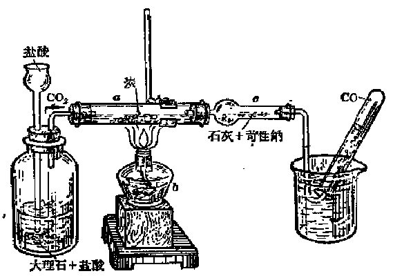

*图 3·9 一氧化碳的制取*

一氧化碳和二氧化碳都是由碳、氧两种元素组成的。从分子组成上看，一氧化碳分子只比二氧化碳分子少掉一个氧原子，但它们的性质却有很大的差别。

一氧化碳是一种无色、没有气味的气体。比空气稍微轻些（1升一氧化碳重1.25克）。它比二氧化碳难溶解于水，在20℃时，1体积水只能溶解0.2体积的一氧化碳，它溶解于水后，也不和水发生作用，因此，在收集一氧化碳气体时，可以用排水集气法。

一氧化碳所含有的氧比二氧化碳少，因此它还能和更多的氧化合。一氧化碳能够在纯氧或空气里燃烧，发生蓝色的火焰。燃烧结果生成二氧化碳：

$$
2 \mathrm{CO} + \mathrm{O}_{2} \xrightarrow {\text{点燃}} 2 \mathrm{CO}_{2}
$$

一氧化碳燃烧时火焰的温度可以高达 \(1400^{\circ}C\)，它是一种很有实用价值的气体燃料。

和碳相似，一氧化碳在高温时也能夺取某些含氧化合物里的氧。

把红色的氧化铁（\(\mathrm{Fe_2O_3}\)）粉末放在硬质玻璃管 \(D\) 里，加热（图 3·10）。\(A\) 是一组空气瓶，上瓶贮水，下瓶贮一氧化碳气体。开启活塞 \(a\) 时，上瓶中的水由于本身压力流入下瓶中，下瓶中的一氧化碳气体就被压出，经活塞 \(a\) 流经硬质玻管 \(D\) 里的高温的氧化铁粉，即被氧化为二氧化碳，使 \(B\) 瓶里的石灰水变成浑浊，少量没有作用的一氧化碳，因有剧毒，故必须在 \(d\) 处烧掉。

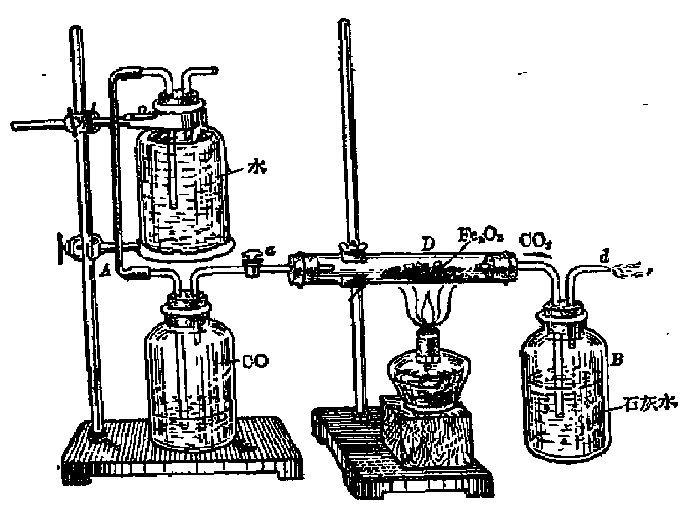

*图 3·10 用一氧化碳还原氧化铁*

由上面实验看出：一氧化碳能夺取氧化铁里的氧，变成二氧化碳，使澄清的石灰水变成浑浊，同时氧化铁被一氧化碳还原成金属的铁。这个反应的化学方程式是：

$$
\mathrm{Fe}_{2} \mathrm{O}_{3} + 3 \mathrm{CO} \xrightarrow {\text{高温}} 2 \mathrm{Fe} + 3 \mathrm{CO}_{2} \uparrow
$$

因此，一氧化碳也是一种还原剂。在炼铁过程里，铁矿石（主要成分一般是铁的氧化物）主要是由一氧化碳还原成金属铁的。

一氧化碳有剧毒，它对人体非常有害。我们知道，在人体血液里有一种叫做血色素的，它能够和吸入肺部的氧疏松地结合起来。当血液在体内循环时，它又易把结合着的氧逐渐放出，供给体内各部分氧的需要。血色素在人体内起着输送氧气的作用。但如果我们吸入了一氧化碳，一氧化碳比氧气容易和血色素结合[^p126-1]，和一氧化碳结合后的血色素，就没有再和氧气结合的能力。这样，人就会由于体内得不到氧而窒息死亡。这样的窒息并不是由于呼吸器官发生了障碍，而是由于血色素丧失了输送氧气的功能，我们称为内窒息。

一氧化碳这种有毒的气体，对人们来说，有着特别严重的危害性。因为：

第一，一氧化碳的毒性非常剧烈。如果空气中含有0.06%（即万分之六）体积的一氧化碳时，就已经有毒了；含有0.09%体积时就能使人头痛呕吐，发生轻度中毒；含有0.15%体积时已有生命危险；含有1%体积时能使人在短时间内中毒死亡。

第二，一氧化碳是一种没有气味的气体，空气里有了一氧化碳，人们也往往感觉不到。当吸入了相当多量的一氧化碳后，可以使神经麻痹，失去知觉。这样，就有可能在不知不觉中中毒死去的危险。

第三，一氧化碳在家庭里，在某些工厂里是经常可能产生的。煤气里含有7%左右的一氧化碳，如果煤气管漏气，就会有一氧化碳逸入空气中。在空气供给不充足处燃烧煤炭或木柴，都会产生一氧化碳，我们平常所称的“中煤毒”，实际上就是中了一氧化碳的毒。汽油引擎放出的废气里也常混有少量的一氧化碳。

为了防止发生一氧化碳中毒事故，绝对不能把没有烟囱或者通风情况不好的煤炭炉子放在门窗紧闭的卧室里过夜，在装有煤气[^p127-1]的厨房里不能睡人，汽车修理间以及其他可能产生一氧化碳气体的厂房（例如木材干馏厂等）必须特别注意通风。

应该指出，有些人认为在炉子上放一点桔子皮或者烧一壶水就可以解“煤毒”，这是没有科学根据的。

#### 习题 3·6

1. 一氧化碳和二氧化碳都是由碳、氧两种元素组成的，能不能说它们是同素异形体？为什么？

> **提示：** 根据同素异形体的定义来回答这个问题。

2. 比较一氧化碳和二氧化碳的性质。

3. 一氧化碳和碳有些什么样的性质？

4. 一氧化碳和氢气有些什么相似的性质？怎样区别这两种气体？

> **提示：** 从燃烧的产物来考虑。

5. 一氧化碳为什么对人体有毒？

### § 3·7 一氧化碳的工业制法

一氧化碳是一种很有实用价值的气体燃料，在冶金工业上广泛地用作还原剂，因此，它是一种很有用的物质。但在另一方面，一氧化碳又是有剧毒的气体，它对人体健康十分有害。在我们学习了一氧化碳的生成和性质之后，我们就能防止和克服它有害的一面，利用和发展它有用的一面，使它很好地为生产、生活服务。

用作气体燃料的一氧化碳，并不要求很纯。因此，现在工

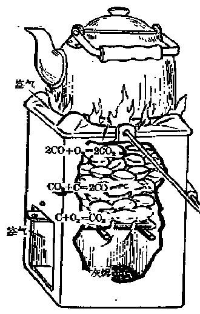

*图 3·11 煤在煤炉里燃烧*

业上主要生产含有一氧化碳的“煤气”，其中最重要的是发生炉煤气和水煤气。

在介绍煤气生产原理之前，让我们先来观察一下家庭里煤在煤炉里燃烧的情况。因为煤在普通煤炉里燃烧，也包含有产生一氧化碳的过程（图 3·11）。

在煤炉里，供给煤燃烧的空气是从炉子下方的炉门进入的，因此，底层靠近炉栅的煤能够完全燃烧，产生二氧化碳：

$$
\mathrm{C} + \mathrm{O}_{2} \xrightarrow {\text{点燃}} \mathrm{CO}_{2} \uparrow
$$

煤完全燃烧时放出大量的热，炉子底层的温度非常高。

底层煤燃烧后产生的高温的二氧化碳气体，上升到炉的中部，被那里未燃着的煤还原成一氧化碳：

$$
\mathrm{CO}_{2} + \mathrm{C} \xrightarrow {\text{高温}} 2 \mathrm{CO} \uparrow
$$

在煤炉中部产生的一氧化碳气体上升到炉子上部，遇到从炉子上面进入的空气，立刻在炉口燃烧起来，产生蓝色的火焰：

$$
2\mathrm{CO}+\mathrm{O}_{2}\xrightarrow{\text{点燃}}2\mathrm{CO}_{2}\uparrow
$$

在工业上，大规模生产含有一氧化碳的煤气，是在一种特殊的煤气发生炉里进行的。

煤气发生炉（图 3·12）一般是用耐火砖砌成的高大的圆柱

形炉子，炉的外面用钢皮包裹。固体燃料（一般用煤或焦炭）从炉顶装入。因为一氧化碳是有剧毒的气体，加料时必须严密防止炉内气体逸入空气。在加料口的上方装有一个带有隔板的滚筒，隔板把滚筒分隔成两个部分。其中一个部分在进料的时候，另一个部分就把已经装在它里面的燃料加进炉子里去。滚筒不断地转动，这两部分的作用交替进行着。这样，发生炉的内部始终跟外界隔绝。滚筒下方有一个料钟，它能使加进去的燃料均匀地分布到炉子的各个部分。

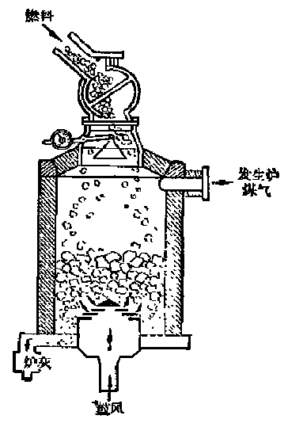

*图 3·12 煤气发生炉的简单构造图*

空气从炉子底部的炉篦鼓进，炉子里所起的作用和前述的煤炉非常相似，只是产生的一氧化碳不在炉子的上方烧掉，而由炉口放出。这时放出的气体里除了一氧化碳以外还有氮气（因为鼓入的空气里的氮气在炉子里并没有起反应）和少量的二氧化碳，这样的混和气体称做发生炉煤气。

如果从炉子底部鼓入水蒸气，水蒸气在高温时和煤作用，产生一氧化碳和氢气：

$$
\mathrm{C}+\mathrm{H}_{2}\mathrm{O}\text{（水蒸气）}\xrightarrow{\text{高温}}\mathrm{CO}\uparrow+\mathrm{H}_{2}\uparrow
$$

这样所得的混和气体称做水煤气。

水蒸气只有在高温时才能和煤发生作用，因此，要使水煤气不断发生，必须使炉内保持相当高的温度。但是，水蒸气和煤作用时，不仅不放出热量，反而还要吸收热量。因此，当这个反应进行时，炉内温度会逐渐降低。所以，在实际生产上，水蒸气和空气是交替地鼓进炉子里去的。当炉子里温度降低到一定程度时，就应停止鼓入水蒸气，改鼓空气，使炉子里的煤燃烧，温度重新升高起来。当煤热到赤热程度时，再鼓入水蒸气。

为了使煤气的生产连续不断，现在工业上采用一种叫做汽氧鼓风的方法，那就是把水蒸气和氧气同时鼓进炉子里去，这样就能连续生产，大大提高煤气发生炉的生产率。

发生炉煤气和水煤气主要用作气体燃料。很显然，燃烧水煤气所放出的热量要比燃烧相同体积的发生炉煤气为大[^p130-1]。这是因为发生炉煤气里含有相当多量不能燃烧的氮气的缘故。

气体燃料除发生炉煤气和水煤气外，还有由煤干馏而得的煤气（就是城市里许多家庭和工厂常用的煤气），煤气的主要部分是氢气、甲烷、一氧化碳等。此外，有许多地方地下蕴藏着的天然气（它的主要成分是甲烷），也是一种重要的气体燃料。

使用气体燃料有很多优点：第一，气体燃料容易完全燃烧，燃烧时没有黑烟（燃料燃烧时产生黑烟，说明燃料没有完全燃烧，参看 §3·9），温度也比一般固体燃料燃烧时为高。第二，气体燃料可以利用它燃烧后所产生的废气的热量，预热还没有燃烧的气体燃料和与它混和的空气，这样，可以使它燃烧时的温度更高（详见第三册第五章“平炉炼钢”）。第三，气体燃料不需要繁重的输送工作，只要用管子就可以把它输送到各地去。第四，气体燃料的燃烧过程比较容易控制，燃烧设备也比较简单，并且燃烧后没有灰剩余。

现在，炼钢厂和大型玻璃厂大量地应用气体燃料。

#### 习题 3·7

1. 煤在煤炉中燃烧时包含有哪些化学反应？

2. 少量的水浇在炽热的煤炭上的一刹时，为什么会发生强烈的火焰？

3. 水煤气和发生炉煤气在制取方法和成分上有什么区别？为什么水煤气燃烧时放出的热量比相同体积的发生炉煤气为多？

4. 制造水煤气和发生炉煤气的原料是煤（或焦炭），煤本身也是一种燃料。我们把煤转变成水煤气或发生炉煤气，在使用上有什么好处？

### § 3·8 火焰

气体燃烧时会产生火焰，前面讲过，一氧化碳燃烧时有蓝色的火焰，氢气燃烧时也有极淡蓝色的火焰。酒精、煤油等液体燃烧时也有火焰，这是因为它们都是容易挥发的液体，受热时立刻蒸发成为蒸气，它们的火焰实际上是它们蒸气燃烧时产生的。木柴、稻草等固体燃烧时也有火焰，这是因为它们在高温时都容易分解，产生可燃性气体（参阅 §3·2），它们的火焰实际上就是这种可燃性气体燃烧时产生的。蜡烛燃烧时，同样是因为石蜡受热分解后产生可燃性气体，由于可燃性气体的燃烧而产生火焰。

只有那些不容易挥发也不容易分解成可燃性气体的固体物质，例如木炭、焦炭、铁等，燃烧时才没有火焰。

由此看来，火焰是一切可燃性气体（或蒸气）燃烧时发生的现象。

仔细观察火焰，可以看出，火焰的结构并不是十分简单的。蜡烛燃烧时产生的火焰，它或多或少保持有一定的形状，并由三个明显的不同部分组成，即：焰心、内焰和外焰（图 3·13）。

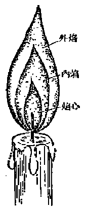

*图 3·13 蜡烛火焰的结构*

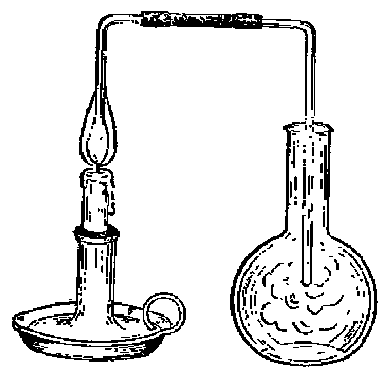

*图 3·14 把火焰内部气态物质引入烧瓶*

#### 焰心

火焰内部靠近烛芯较暗的圆锥体叫做焰心。焰心里含有石蜡的蒸气以及一部分石蜡分解后的可燃性气体。

用一根弯曲的玻璃管，把焰心里的气体导出，引入一个冷的玻璃烧瓶（如图 3·14所示），不久就会有石蜡的蒸气凝聚在烧瓶的内壁上，使

烧瓶的玻璃变得模糊起来。如果另用一根尖嘴玻璃管把焰心里的气态物质导出，用火点燃，就会在玻璃管口燃烧起来（图 3·15）。

上面这两个实验，充分证明了蜡烛在燃烧前首先变成石蜡蒸气，以及部分石蜡分解后生成可燃性气体，蜡烛的火焰是由可燃性气体燃烧而产生的。

在焰心里，气体还没有开始燃烧，因此，焰心不仅较暗，而且温度也比较低。

#### 内焰

包围在焰心外部的明亮的圆锥体部分，叫做内焰。可

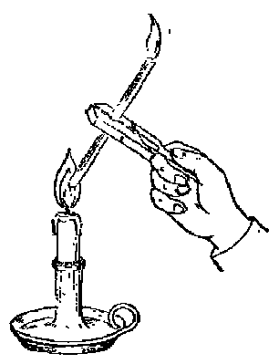

*图 3·15 证明焰心是由可燃性气体组成*

燃性气体在这里进一步分解，生成氢气和许多微小的碳粒（石蜡是碳和氢的化合物），氢气和一小部分碳粒在这里燃烧，产生高温。因为这里氧气供给不很充分，大部分碳粒都没有燃烧，只是被灼热而发生光亮（我们知道，固体物质灼热时会发出强光。例如，电灯泡里的灯丝灼热时发出很亮的白光。另外，汽油灯发出的强光，是由于它特制纱罩上的金属氧化物的固体小颗粒灼热时发生的）。因此内焰的光亮度最强。

我们用一个白色瓷皿（例如蒸发皿或坩埚的盖）放到蜡烛的内焰里，不久就会看到瓷皿上积集着一薄层碳的小颗粒。这就证明内焰里确实充满着没有燃烧的、灼热的固体碳粒。

内焰因为有氢气和部分碳粒在燃烧，它的温度要比焰心高得多。

#### 外焰

包围在内焰外面几乎没有光亮的部分，叫做外焰。内焰里灼热的碳粒，到了外焰区域，因为它和空气直接接触，有充分的氧气供给，它能够发生完全的燃烧，产生二氧化碳气体，并放出大量的热。因此，在外焰里，灼热的固体微粒变得很少了，因此几乎没有光亮，但温度却比内焰更高。

酒精灯火焰的结构和蜡烛火焰十分相似，也有温度较低和光亮较暗的焰心区域。温度较高和比较明亮的内焰区域和温度最高但几乎没有光亮的外焰区域。

火焰各个区域温度的不同，可以从下面这个实验清楚地看出：

用一根火柴杆迅速放进酒精灯的火焰里，平放靠靠近灯芯的上面（图 3·16（a）），等一会儿拿出来，可以看到有两个焦点，分别处在和外焰接触的那两个区域（图 3·16（b））。这充分说明了火焰外焰区域的温度最高。

气体（例如一氧化碳、氢气等）燃烧时火焰的结构比较简

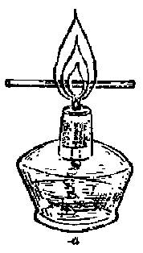

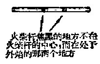

*b*

*图 3·16 酒精灯火焰各部分温度不同*

单，只有内、外两层，内层实际上是没有燃烧的气体，用一根火柴杆插进火焰内层，可以经过相当时间不会变焦，由此看出内层的温度是比较低的。

#### 习题 3·8

1. 为什么用酒精灯加热器皿时，不应当把加热器皿放在接近灯芯的地方？

2. 火焰是怎样产生的？为什么有些物质（例如柴油、一氧化碳等）燃烧时有火焰，另一些物质（例如铁）燃烧时却没有火焰？

3. 为什么有些物质（例如乙炔，分子式是 \(\mathrm{C}_2\mathrm{H}_2\)）燃烧时的火焰非常明亮，另一些物质（例如氢气）燃烧时的火焰几乎无光？

［提示：乙炔分子里含碳的百分率很高。］

### § 3·9 燃料和燃料的完全燃烧

#### 燃料

木材、煤油、汽油、发生炉煤气、水煤气等可燃性物质，它们燃烧时产生的热量，常被利用来取暖、煮饭、发电以及发动机器等。这些可燃物质称做燃料。

燃料，按照它们存在的状态来说，有固体燃料、液体燃料和气体燃料等三类。按照它们生成的情况来说，又有天然燃料和人造燃料两类。所谓人造燃料，就是经过人工加工过的燃料，例如前面讲过的发生炉煤气和水煤气，就是人造燃料。

把天然燃料进行加工，具有重大的实际意义。例如，把木柴干馏后制成木炭，木炭燃烧时没有烟，温度也比木柴高得多，它更加适宜于工厂或者家庭里使用。并且在木柴干馏时，还可得到多种有用的副产品（木醋酸、木气），大大提高了木柴的经济价值。煤经过加工制得水煤气或发生炉煤气，这样就把固体燃料转变成为气体燃料（称为煤的气化）。气体燃料有很多优点，这在§3·7里已经讲过了。天然出产的石油虽然也可直接用作燃料，但经过加工可以得到一系列具有不同性能的液体燃料，包括汽油、煤油、柴油、重油等，它们不仅适宜于在各种不同的场合下用作燃料，而且还可用作工业原料。由此可以看出，燃料的工业加工能使自然界资源得到更加充分的利用。

#### 完全燃烧

煤炭燃烧时，如果它里面所含的碳全部变成二氧化碳，称做完全燃烧。煤炭完全燃烧时放出的热量最大。因此，要使煤炭获得充分的利用，必须讲究燃烧操作的合理化，使炉子里的煤炭完全燃烧。

大家知道，几乎每一个家庭，每一家工厂都要使用燃料（最主要的就是煤炭），每年全国消耗的燃料的数量是极其巨大的。因此，燃料的完全燃烧，对于降低产品成本、节约国家物资有着十分重大的意义。

要使煤炭完全燃烧，不仅在炉子底部要供给充分的空气，使底层的煤完全燃烧；而且炉口也要有充分空气的供给，使在炉子中层产生的一氧化碳气体，也能在炉口获得充分的燃烧。

如果空气的供给不充分，一部分一氧化碳没有燃烧就逸散到空气中去，这就浪费了燃料。

煤在空气不充足时燃烧，还会有部分微细碳粒随着废气从烟囱逸出，形成浓厚的黑烟，这也造成燃料的浪费，并且影响附近居民的环境卫生和健康。

因此，要使燃料完全燃烧，必须注意炉子的通风。但是，过度的通风，又会使热量受到损失。因为炉子里鼓入的冷空气太多了，过剩的空气在经过炉子内部再从烟囱逸出时，必然会带走一部分热量。因此，炉子的通风，又必须是适度的。

增加燃料跟空气的接触面积，能使燃料更加完全地燃烧。例如，某些工厂里把煤磨成煤粉，然后吹入到特制的炉子里；或将液体燃料喷成雾状，再在炉内燃烧：或将固体燃料气化，变成气体燃料后再进行燃烧。这些方法都可以提高燃料的利用率。

#### 习题 3·9

1. 举出固体燃料、液体燃料和气体燃料的名称各两种。

2. 工业加工制造人造燃料有什么重大意义？

3. 燃料燃烧时，为什么空气的用量远多或过少都是不适宜的？

### § 3·10 克原子和克分子

在结束本章之前，我们来谈谈在化学计算上常用的两种特殊单位，那就是克原子和克分子。

#### 克原子

我们知道，原子、分子是极其微小的，在实验室里，我们实际取用药品时，决不会取用几个、几十个或几百个原子或分子，而总是取用为数极多的原子或分子。因为，即使象芝麻那样小的一颗铁屑里，包含的铁原子数就有几百亿亿个。因此，我们可以采用常用的重量单位来称量物质。在实验室里，称量或者表示物质的重量的最常用的单位是克。

除了用克做单位来称量物质的重量以外，在化学上，还有一些特殊的单位，那就是这一节所要讲的“克原子”和“克分子”。利用这两种单位，不仅可以表示出物质的重量，而且还可以表示出一定重量物质里所含的原子个数和分子个数。

现在我们先介绍关于“克原子”的概念。

前面已经讲过，元素的原子量就是以1个碳原子（指碳12）重量的 \(\frac{1}{12}\) 为标准的相对重量。从各种元素的原子量可以知道1个原子的重量，把它扩大若干倍也就可以知道一定个数（例如100个、1000个或 \(6.02\times 10^{23}\) 个）原子的重量。例如：

| 元素 | 1个原子的重量（克） | \(6.02\times10^{23}\)个原子的重量（克） |
| --- | --- | --- |
| 氢 | \(0.1661\times10^{-23}=1\times\frac{1}{6.02\times10^{23}}\) | \(1\) |
| 氧 | \(2.6576\times10^{-23}=16\times\frac{1}{6.02\times10^{23}}\) | \(16\) |
| 碳 | \(1.9942\times10^{-23}=12\times\frac{1}{6.02\times10^{23}}\) | \(12\) |
| 硫 | \(5.3152\times10^{-23}=32\times\frac{1}{6.02\times10^{23}}\) | \(32\) |

从上表可以看出， \(6.02 \times 10^{23}\) 个原子的重量，在用克做单位时，在数值上刚好和这种元素的原子量相等。

在化学上，把 \(6.02 \times 10^{23}\) 个某种元素原子的重量，在用克做单位来表示时，叫做1个“克原子”[^p138-1]的某元素。克原子的符号是GA。

用克原子做单位，不仅可以表示出元素的重量，而且还可以表示出一定重量元素里所含的原子数。

例如，1GA氧表示16克氧元素，并且表示在16克氧元素里含有 \(6.02\times10^{23}\) 个氧原子。

同样，1GA碳表示12克碳元素，并且表示在12克碳元素里含有 \(6.02\times10^{23}\) 个碳原子。

因为1个克原子的元素的重量（单位是克）在数值上刚和它的原子量相同，因此，任何个克原子的元素的重量，都可以从它的原子量求得。例如：

8GA氧元素的重量是 \(8 \times 16 = 128\) 克。

2.5GA硫元素的重量是 \(2.5 \times 32 = 80\) 克。

又因为在 \(1\mathrm{G}\Lambda\) 的任何元素里都含有 \(6.02\times 10^{23}\) 个原子，因此，克原子数相同的任何元素里：含有相同个数的原子，而且，也只有克原子数相同（而不是重量相同）的各种元素里所含的原子个数才是相同的。

例如，1GA氧（16克氧）里含有的氧原子数和1GA氢（1克氢）里含有的氢原子数相同；

同样，0.5GA碳（0.5×12=6克）里含有的碳原子数和0.5GA硫（0.5×32=16克）里含有的硫原子数相同。

#### 例 1

铁的原子量是55.8，问2GA铁重多少克？

**解：** 2GA铁的质量=2×55.8=111.6克。

#### 例 2

279 克铁里含有几个克原子的铁？

**解：** 因为，1个克原子铁的重量=55.8克铁。

假设，x个克原子铁的质量=279克铁。

列出比例式，得：

$$
1 \mathrm{GA}： x \mathrm{GA} = 55.8 \text{克}： 279 \text{克},
$$

$$
x=\frac{1\times279}{55.8}=5\text{（GA）}
$$

答：279克铁里含有5个克原子铁。

从上面两个例题可以看出：

（1） 要把几个克原子的元素换算成多少克的元素，只要用克原子个数乘1个克原子的这种元素的重量（在数值上刚好和它的原子量相同）。

（2） 要把多少克的元素换算成几个克原子的元素，只要用1个克原子的这种元素的重量（在数值上刚好和它的原子量相同）除元素的重量。

#### 例 3

多少克硫和 3 克碳里所含的原子个数相同？

**解：** 因为只有在克原子个数相同的元素里含有的原子个数相同。

碳的原子量是12，3克碳就是 \(\frac{3}{12} = 0.25\mathrm{GA}\)。

故 0.25GA 硫和 3 克碳里的原子个数相同。

因为硫的原子量是32，0.25GA硫的重量是 \(0.25 \times 32 = 8\) 克。

故8克硫和3克碳里的原子个数相同。

答：8克硫和3克碳里所含的原子个数相同。

#### 例 4

4 克氧和 1 克氢里所含的原子个数是否相同？如果不同，那个多？那个少？

**解：** 4克氧就是 \(\frac{4}{16} = 0.25\mathrm{GA}\) 氧，

1克氢就是 \(\frac{1}{1} = 1\mathrm{GA}\) 氢。

因为它们的克原子数不同，所以它们所含的原子个数也不同，又因克原子数多的所含的原子个数也多，故1克氢（即1GA氢）里所含氢原子个数比4克氧（即0.25GA氧）里所含氧原子个数多。

答：所含原子数不相同；氢原子数多，氧原子数少。

#### 克分子

克分子的意义和克原子很相似。各种物质每1个分子的重量可以从它们的分子量求得。例如：

| 物质 | 分子式 | 1个分子的重量（克） | \(6.02\times10^{23}\)个分子的重量（克） |
| --- | --- | --- | --- |
| 氧气 | \(O_2\) | \(5.3152\times10^{-23}=32\times\frac{1}{6.02\times10^{23}}\) | 32 |
| 二氧化碳 | \(CO_2\) | \(7.3084\times10^{-23}=44\times\frac{1}{6.02\times10^{23}}\) | 44 |
| 水 | \(H_2O\) | \(2.9898\times10^{-23}=18\times\frac{1}{6.02\times10^{23}}\) | 18 |
| 硫酸 | \(H_2SO_4\) | \(16.2778\times10^{-23}=98\times\frac{1}{6.02\times10^{23}}\) | 98 |

同样可以看出， \(6.02 \times 10^{23}\) 个氧气分子、二氧化碳分子、水分子和硫酸分子的重量，当以克做单位来表示，在数值上刚好和它们的分子量相同，即分别是32克、44克、18克和98克。在化学上，把 \(6.02 \times 10^{23}\) 个某物质分子的重量，在用克做单位来表示时，叫做1个“克分子”[^p141-1]的某物质。克分子的符号是GM。

很显然，1 GM 的任何物质里都含有 \(6.02 \times 10^{23}\) 个分子，并且，在克分子数相同（而不是重量相同）的任何物质里，含有的分子的个数总是相同的。

和克原子一样，要把几个克分子的物质换算成多少克的物质时，只要用克分子个数乘1个克分子的这种物质的重量（在数值上刚好和它的分子量相同）。要把多少克物质换算成几个克分子物质时，只要用1个克分子的这种物质的重量（在数值上刚好和它的分子量相同）除物质的重量。

#### 例 5

已知水的分子量是 18，问 1.5GM 水是多少克水？

**解：** 1.5GM水就是 \(1.5\times18=27\) 克水。

答：是27克水。

#### 例 6

已知二氧化碳的分子量是 44. 问 11 克二氧化碳是几个克分子二氧化碳？

**解：** 11克二氧化碳就是 \(\frac{11}{44} = 0.25\mathrm{GM}\) 二氧化碳。

答：是0.25克分子二氧化碳。

#### 例 7

多少克的氢氧化钠（分子式是 NaOH，分子质量 40）和 19.6 克硫酸（分子量是 98）里所含的分子个数相同？

**解：** 19.6克硫酸是 \(\frac{19.6}{98} = 0.2\mathrm{GM}\)。

因为只有克分子个数相同的氢氧化钠和硫酸里所含的分子个数相同，故0.2GM氢氧化钠，即 \(0.2 \times 40 = 8\) 克氢氧化钠和19.6克硫酸里所含的分子个数相同。

答：8克氢氧化钠和19.6克硫酸里所含的分子数相同。

我们知道，化学方程式里分子式前面的系数所表示的是化学反应里各物质分子个数之间的比例关系。例如，化学方程式

$$
2 \mathrm{KClO}_{3} \xrightarrow {\text{加热}} 2 \mathrm{KCl} + 3 \mathrm{O}_{2} \uparrow
$$

表示在氯酸钾分解生成氯化钾和氧气这个化学反应里，氯酸钾、氯化钾、氧气这三种物质分子个数的比是：

$$
2： 2： 3
$$

现在1个克分子（GM）任何物质里所包含的分子个数是相同的。因此，在这个化学反应里，氯酸钾、氯化钾、氧气三种物质的克分子个数的比，也应该是：

$$
2： 2： 3
$$

由于这样的原因，根据化学方程式进行计算时，如果用“克分子”做单位，就会方便得多。

#### 例 8

1 个克分子氯酸钾加热完全分解后，将产生氧气多少克？

**解：** 氯酸钾分解的化学方程式是：

$$
2 \mathrm{KClO}_{3} \xrightarrow {\text{加热}} 2 \mathrm{KCl} + 3 \mathrm{O}_{2} \uparrow
$$

从上面的化学方程式可以看出，

2GM 氯酸钾完全分解后产生 3GM 氧气。

不列出比例式，就可直接得到，

1GM 氯酸钾完全分解后将产生 1.5GM 氧气。

1.5GM 氧气（氧气分子量=32）的重量是：

$$
1.5\times32=48\text{（克）}
$$

答：1GM氯酸钾加热完全分解后将产生氧气48克。

#### 例 9

多少克碳酸钙 \(\left(\mathrm{CaCO}_{3}\right)\) 和足量盐酸反应后能产生 2GM 的二氧化碳？

**解：** 碳酸钙和盐酸反应的化学方程式是：

$$
\mathrm{CaCO}_{3} + 2 \mathrm{HCl} = \mathrm{CaCl}_{2} + \mathrm{H}_{2} \mathrm{O} + \mathrm{CO}_{2} \uparrow
$$

从这个化学方程式可以看出，产生1GM的二氧化碳需用1GM的碳酸钙，不必列出比例式就可推得，

产生2GM的二氧化碳需用2GM的碳酸钙。

2GM碳酸钙（碳酸钙的分子量=100）的重量是：

$$
2 \times 100 = 200 \text{ 克 }.
$$

答：200克碳酸钙和盐酸完全反应后产生2GM二氧化碳。

#### 例 10

在下面两个化学反应里：

$$
2 \mathrm{NaOH} + \mathrm{H}_{2} \mathrm{SO}_{4} = \mathrm{Na}_{2} \mathrm{SO}_{4} + 2 \mathrm{H}_{2} \mathrm{O}
$$

$$
\mathrm{NaOH} + \mathrm{HCl} = \mathrm{NaCl} + \mathrm{H}_{2} \mathrm{O}
$$

和1个克分子硫酸或1个克分子盐酸完全反应所需的氢氧化钠的量是否相同？

**解：** 从上面的化学方程式可以看出：

和 1GM 硫酸完全反应需用 2GM 氢氧化钠；

和 1GM 盐酸完全反应需用 1GM 氢氧化钠。

答：在这几个化学反应里所需氢氧化钠的量是不同的，和硫酸作用所需氢氧化钠的量多。

#### 习题 3·10

1. 什么叫做 1 个克原子的元素？什么叫做 1 个克分子的物质？

2. 克分子数相同的不同物质的重量是否相同？为什么？分子个数是否相同？为什么？

3. 1个克分子的二氧化碳和1.5个克分子的一氧化碳的重量哪个重？它们里面所含的分子数哪个多？

4. 0.75个克原子的铁是多少克数？0.75个克原子的硫是多少克硫？

5. 多少克二氧化碳和 1.4 克一氧化碳里含有的分子数相同？

6. 盐酸或硫酸都能和锌反应放出氢气。和一定重量的锌反应，需用盐酸的重量多呢，还是需用硫酸的重量多？

> **提示：** 盐酸和锌反应的化学方程式是 \(2\mathrm{HCl} + \mathrm{Zn} = \mathrm{H}_{2} + \mathrm{ZnCl}_{2}\)；硫酸和锌反应的化学方程式是 \(\mathrm{H}_{2}\mathrm{SO}_{4} + \mathrm{Zn} = \mathrm{H}_{2} + \mathrm{ZnSO}_{4}\)。从这两个方程式可以看出需用盐酸的克分子数将是硫酸的克分子数的两倍。但需用的重量又是哪个多？

7. 和 0.1 个克分子的纯碳酸钙完全反应，需用 HCl 多少克？生成多少克的二氧化碳？

8. 0.5个克分子的氢气和多少个克分子的氧气能完全化合？生成多少个克分子的水？

9. 把 0.1 个克分子的硫酸和 0.1 个克分子的氢氧化钠混和，问反应结果，哪种物质有剩余？剩余多少？

> **提示：** 参看例10.

### § 3·11 气体克分子体积

前面我们讲过，克原子个数相同的任何元素，或克分子个数相同的任何物质，它们的重量一般说来是不同的，但所包含的原子个数或分子个数都是相同的。那么，它们所占的体积是否相同呢？

实验证明，一个克原子的不同元素，例如 \(1 \mathrm{GA}\) 铜、\(1 \mathrm{GA}\) 银、\(1 \mathrm{GA}\) 铅所占的体积不同（图 3·17）。同样，一个克分子的不同物质，例如 \(1 \mathrm{GM}\) 水、\(1 \mathrm{GM}\) 硫酸、\(1 \mathrm{GM}\) 食盐、\(1 \mathrm{GM}\) 蔗糖所占的体积也是不同的（图 3·18）。

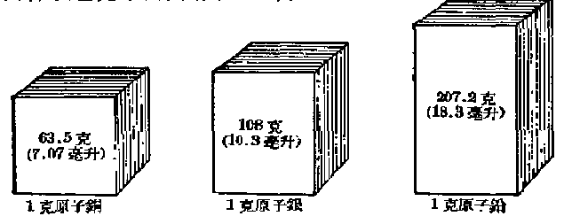

*图 3·17 1克原子几种金属元素体积的比较*

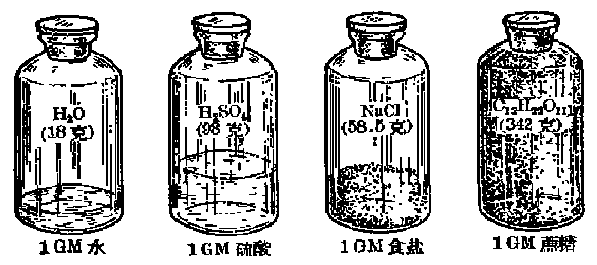

*图 3·18 1 克分子几种不同物质体积的比较*

但在进一步研究之后，我们又知道，上面的这一结论，对气体物质来说，是并不适用的。

气体的体积，情况要比固体、液体复杂一些。因为气体的体积，除了和它本身的重量有关外，还和温度、压强等外界条件有关（当然，固体、液体的体积，也不是和外界条件完全没有关系的，只是影响很小，一般说来可以不计）。我们知道一定重量气体所占的体积，如果温度增高，体积就会膨胀增大。例如 \(0^{\circ} \mathrm{C}\) 时的 1 升气体，当温度增高到 \(273^{\circ} \mathrm{C}\) 时 （假定压强不变），体积就会膨胀到 2升，也就是比原来的体积增大一倍。另外，压强增大，气体的体积就会缩小。实验指出，在温度不变时，压强增大一倍，气体的体积缩小一半。

由于这样的缘故，在谈到气体体积时，总要把气体的状况，也就是它所处的外界条件标志出来。为了方便起见，则在科学上规定了一个所谓标准状况，那就是温度是摄氏零度，压强为一个大气压（就是气压计上水银柱高度等于760毫米时的大气压力）的状况。我们谈到气体体积时，如果没有特别标志出它所处状况，那就是说它是处在标准状况。

在标准状况下，1个克分子的气体所占体积是多少呢？这可以从气体在标准状况时的比重求出。表示气体比重最常用的单位是克/升，即1升气体重量的克数。例如氢气在标准状况下的比重是0.0899克/升，这就是说，在标准状况下，1升氢气重0.0899克。我们知道，1个克分子的氢气重2.016克（氢的精确的分子量是2.016），假定它在标准状况下所占的体积是 \(x\) 升，那末从下面的关系：

在标准状况下1升氢气重0.0899克，

在标准状况下 \(x\) 升氢气重2.016克，可以得出如下的比例关系式：

1升：x升=0.0899克：2.016克，

$$
x = \frac {1 \times 2.016}{0.0899} = 22.4 (\text{升})。
$$

即 1 个克分子的氢气在标准状况下所占体积是 22.4 升。

又如，氮气的比重（在标准状况下）是1.25克/升。我们知道，1个克分子的氮气重28克（氮气的分子量=28），假设它在标准状况下所占的体积是x升，根据相同的道理，可以得出如下的比例关系式：

1升：x升=1.25克：28克，

$$
x = \frac {1 \times 28}{1.25} = 22.4 (\text{ 升 })。
$$

即1个克分子的氮气在标准状况下所占体积也是22.4升。

再如，二氧化碳的比重（在标准状况下）是1.96克/升。我们知道，1个克分子的二氧化碳重44克（二氧化碳的分子量=44），假设它在标准状况下所占的体积是x升，根据相同的道理，可以得出如下的比例关系式：

1升：x升=1.96克：44克，

$$
x = \frac {1 \times 44}{1.96} = 22.4 (\text{升})。
$$

即1个克分子的二氧化碳在标准状况下所占体积也是22.4升。

从上面三个具体实例可以看出，1个克分子的氢气、氮气、二氧化碳在标准状况下所占体积都是22.4升（图 3·19）。

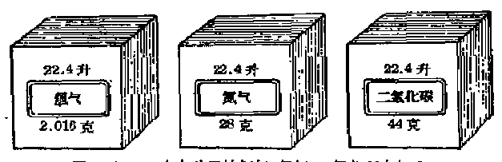

*图 3·19 一个克分子的氢气、氮气、二氧化碳在气体状况下都占有 22.4 升体积*

更多的实验指出， 1个克分子的任何气体，在标准状况下都占有22.4升的体积。现在可以看出： 1个克分子的不同固

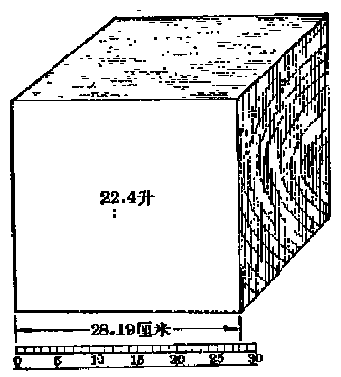

*图 3·20 标准状况下 1 克分子气体所占体积 （22.4 升）——气体克分子体积 （GMVo）*

体和液体所占体积虽是不同的，但1个克分子的不同气体在标准状况下所占体积却是相同的，它们都是22.4升。这22.4升的体积，称做气体克分子体积（图 3·20），用符号GMV₀来表示。

应该指出，气体克分子体积这个名词，只是对气体而言的，而且它所处的状况限于标准状况。

利用气体克分子体积，可以通过一定重量气体在标

准状况下所占体积的测定，计算出气体的分子量[^p148-1]。

#### 例 1

实验测得， 0.634 克的某气体，在标准状况下所占的体积是 0.2 升，求该气体的分子量。

**解：** 假设1个克分子（它在标准状况下的体积是22.4升）的该气体的重量是x克，则

$$
0.2 \text{ 升该气体重 } 0.634 \text{ 克 },
$$

$$
22.4 \text{ 升该气体重 } x \text{ 克 }.
$$

列出比例式：

$$
0.2 \text{升}： 22.4 \text{升} = 0.634 \text{克}： x \text{克},
$$

$$
x = \frac {0.634 \times 22.4}{0.2}
$$

$$
= 71 (\text{ 克 })。
$$

即1GM该气体重71克，由此可知，该气体的分子量是 71.

答：某气体的分子量是71.

利用气体克分子体积，还可算出一定重量气体在标准状况下所占的体积。从气体克分子体积的定义可知，在标准状况下，气体所占体积的升数等于：

（气体的克分子个数×22.4）升，

或， \(\left(\frac{\text{气体重量的克数}}{1\text{个克分子气体重量的克数}}\right)\times22.4\)[^p149-1]升。

#### 例 2

3.2 克一氧化碳在标准状况下所占体积是多少升？

**解：** 一氧化碳（CO）的分子量=12+16=28.

在标准状况下3.2克一氧化碳所占体积 \(= \frac{3.2}{28}\times 22.4 = 2.56\) （升）。

答：3.2克一氧化碳在标准状况下占有体积2.56升。

最后，利用气体克分子体积，还可计算化学反应里气态物质的体积。

#### 例 3

5 克碳酸钙和足量的盐酸反应，能生成二氧化碳气体（在标准状况下）多少升？

**解：** 碳酸钙和盐酸反应的化学方程式是：

$$
\mathrm{CaCO}_{3} + 2 \mathrm{HCl} = \mathrm{CaCl}_{2} + \mathrm{H}_{2} \mathrm{O} + \mathrm{CO}_{2} \uparrow
$$

由此可以看出，1GM碳酸钙将产生1GMV₀即22.4升的二氧化碳气体。碳酸钙的分子量 \(=40+12+16\times3=100\)，5克碳酸钙就是 \(\frac{5}{100}=0.05GM\) 碳酸钙。

1GM CaCO₃产生22.4升二氧化碳，设0.05GM CaCO₃产生x升二氧化碳。

列出比例式，得：

$$
1 \mathrm{GM}： 0.05 \mathrm{GM} = 22.4 \text{升}： x \text{升},
$$

$$
\begin{array}{l} x = \frac {22.4 \times 0.05}{1} \\ = 1.12 (\text{ 升 })。 \\ \end{array}
$$

答：5克碳酸钙完全反应后可得二氧化碳气体（在标准状况下）1.12升。

#### 例 4

2 克碳完全燃烧，需用氧气若干升？生成二氧化碳气体若干升（假定都在标准状况下）？

**解：** 碳完全燃烧的化学方程式是：

$$
\mathrm{C} + \mathrm{O}_{2} = \mathrm{CO}_{2}
$$

由此可以看出，1GA 碳完全燃烧需用 \(1GMV_{0}\) （22.4 升） 的空气，并产生 \(1GMV_{0}\) （22.4 升） 的二氧化碳气体。

碳的原子量是12，2克碳是\(\frac{2}{12}=0.166GA\)碳。

不必列出比例式，就可推知 \(0.166\mathrm{GA}\) 碳完全燃烧需用氧气的体积是 \(0.166\mathrm{GMV}_0(= 0.166\times 22.4 = 3.72\) 升），产生的二氧化碳的体积也是 \(0.166\mathrm{GMV}_0(3.72\) 升）。

答：2克碳完全燃烧，需用氧气3.72升，并产生二氧化碳气体3.72升（都在标准状况下）。

#### 习题 3·11

1. 什么叫气体克分子体积？

2. 在标准状况下，1升一氧化碳重多少克？1升氧气重多少克？1升氢气重多少克？1升二氧化碳重多少克？

3. 在标准状况下，1克一氧化碳占多少升体积？1克氧气占多少升体积？1克氢气占多少升体积？1克二氧化碳占多少升体积？

4. 用电流使 1.8 克水完全分解，结果产生氧气和氢气各多少升（假定在标准状况下）？

5. 1.4 克一氧化碳完全燃烧，需用纯氧多少升？产生二氧化碳多少升（假定在标准状况下）？

6. 多少克氧气和 1.4 克氮气占有相同的体积？

7. 要制得氧气560毫升 \(\left(1\text{毫升}=\frac{1}{1000}\text{升}\right)\)，需用氯酸钾多少克？

8. 假设 100 升水煤气里含有氢气 49 升，一氧化碳气体 44 升，氧气 4 升，二氧化碳气体 3 升。同燃烧 100 升水煤气，需用纯氧多少升？

> **提示：** 在化学反应式里分子式前面的系数是化学反应中各物质的分子数的比值，也是各种物质的克分子数的比值。对于气体来说，这些系数又表示各种气态物质体积的比值，例如化学方程式

$$
2 \mathrm{CO} + \mathrm{O}_{2} = 2 \mathrm{CO}_{2}
$$

表示2体积一氧化碳气体完全燃烧时，需用1体积氧气并产生2体积二氧化碳气体。

### 本章提要

#### 1. 碳

（1） 碳的三种同素异形体：金刚石、石墨和无定形碳。

| 碳的同素异形体 | 金刚石 | 石墨 | 炭黑 | 木炭 | 焦炭 |
| --- | --- | --- | --- | --- | --- |
| 性质 | 无色透明的晶体，折光性强，极硬，比重3.5。 | 松软、不透明、灰黑色的细鳞片状晶体，有金属光泽，比重2.2，能导电。 | 极细的黑色粉末。 | 多孔的灰黑色固体，有强大的吸附能力。 | 多孔、坚硬、灰黑色固体。 |
| 用途 | 钻探用钻头、刻划玻璃、装饰品。 | 电极、坩埚、铅笔芯、润滑剂。 | 橡胶工业原料、黑色油墨、中国墨。 | 燃料；经加工后的活性炭用于防毒面具作吸附剂、制糖工业作脱色剂。 | 燃料；冶金工业用作还原剂。 |

（2） 碳的化学性质：在常温时不活泼，在高温时能和氧、硫、氢等非金属和钙等金属化合，是一种重要的还原剂。

#### 2. 二氧化碳

（1） 性质：无色气体。能溶于水，在水溶液里一部分和水反应生成碳酸。容易液化，液态二氧化碳进一步冷却可凝为固态，称做“干冰”。比空气重。化学性质比较稳定，本身不能燃烧，也不能支持大部分物质的燃烧。无毒，但因不能支持动物呼吸，动物在二氧化碳气体里会窒息而死。

（2） 制法：二氧化碳在实验室里一般是由盐酸和大理石（主要成分是碳酸钙） 反应而制得，在工业上是煅烧石灰石制取生石灰时的副产品。

（3） 用途：二氧化碳可以用来灭火，制造清凉饮料，“干冰”可做致冷剂。

#### 3. 一氧化碳

无色、没有气味的气体。难溶于水，也不和水作用。难液化。比空气轻。在高温时化学性质相当活泼，能在空气或纯氧里燃烧，放出大量的热，还能夺取某些金属氧化物里的氧，是还原剂。有剧毒。

一氧化碳是一种重要的气体燃料，在冶金工业上用作还原剂。

#### 4. 火焰的结构

蜡烛燃烧时的火焰由焰心、内焰、外焰三部分组成。焰心较暗，温度也较低。内焰最亮，温度也较焰心为高。外焰几乎没有光亮，温度比内焰更高。

#### 5. 克原子 （GA） 和克分子 （GM）

（1） 克原子和克分子是化学上常用的两种特殊单位，利用这两种单位不仅可以表示出物质的重量，而且还可以表示出一定重量物质里所含的原子数和分子数。

（2） \(6.02 \times 10^{23}\) 个元素原子的重量，在用克做单位来表示时，叫做 1克原子的某元素； \(6.02 \times 10^{23}\) 个物质分子的重量，用克做单位来表示时，叫做1克分子的这种物质。

（3） 1 克原子元素的重量（用克做单位） 在数值上刚好和这种元素的原子量相同； 1 克分子物质的重量 （用克做单位） 在数值上刚好和这种物质的分子量相同。

（4） 1克原子任何元素里含有的原子个数相同；1 克分子任何物质里含有的分子个数相同。

#### 6. 气体克分子体积（GMV）

在标准状况下，1克分子任何气体，都占有22.4升的体积，这 22.4 升体积，称做气体克分子体积。利用气体克分子体积，可以：

（1） 由一定体积（在标准状况下）气体的重量求气体的分子量；

（2） 求出一定质量的气体在标准状况下所占的体积；

（3） 计算化学反应里气态物质的体积。

### 复习题三

1. 碳有哪几种同素异形体？有什么实验可以证明它们是碳的同素异形体？

2. 碳有哪些主要的化学性质？写出有关反应的化学方程式。

3. 碳和氧化铜的作用与氢和氧化铜的作用两者有什么相同的地方和不同的地方？

4. 在一氧化碳和二氧化碳里，碳的化合价各是多少？又它们分子里含氧的百分比各是多少？

5. 在实验室里二氧化碳是怎样制取的？为什么收集二氧化碳时要用下方排气法？这和它的性质有什么关系？

6. 写出一氧化碳还原氧化铁的化学方程式，要使8克氧化铁完全还原，选用一氧化碳多少克？

7. 绘图说明蜡烛火焰的结构，并指出哪一部分温度最高？哪一部分光最亮？为什么？

8. 54克水里含有几个克原子的氢元素和几个克原子的氧元素？

9. 要使 1 个克分子氧化铜完全还原，需用：

（1） 氢气多少克？或

（2） 碳多少克？或

（3） 一氧化碳多少克？

10. 试证明在标准状况下1升氢气、氧气或其他任何气体中含有的分子个数都是相同的。

> **提示：** 在标准状况下，1升任何气体里都含有 \(\frac{1}{22.4}\) 个克分子的气体。

### 注释

[^p107-1]: “碳”和“炭”两字的含义不同。“碳”是指碳元素，“炭”专指各种无定形碳而言，例如木炭、焦炭、活性炭等。

[^p109-1]: 病毒是一种能够传染疾病的毒素。

[^p110-1]: 醋酸是我们食用醋里的一种成分，食用醋带有酸味，就是由醋酸产生的。木精又叫做甲醇，和普通用的酒精属于同一类的物质。醋酸和木精都是有机化合物，将在第四册里详细讲到。

[^p114-1]: 工业上制取碳化钙并不是用碳和钙直接化合的方法（因为钙的价钱很贵），而是用焦炭在电炉（3000℃）里还原氧化钙（即生石灰）而制得的：

    $$
    3\mathrm{C}+\mathrm{CaO}\xrightarrow{\text{高温}}\mathrm{CaC}_{2}+\mathrm{CO}\uparrow
    $$

    应该注意，碳化钙 \(\mathrm{CaC}_{2}\) 以及乙炔 \(\mathrm{C}_{2}\mathrm{H}_{2}\) 的分子具有特殊的结构，不能简单地从它们的分子式来确定元素的化合价。在碳化钙分子里，钙是2价，根据分子式，似乎碳的化合价应该是1价，但实际上是4价。同样，在乙炔分子里，氢是1价，碳似乎应该也是1价，但实际上是4价。关于这个问题，在第四册里我们学到这些物质的分子结构时，就会了解。

[^p116-1]: 致冷剂就是能够产生低温的物质。

[^p119-1]: 加入“发泡剂”的目的，是使灭火器使用时喷出的二氧化碳气体，包围在无数稳定的、不易破裂的气泡里，这样可以减少二氧化碳的扩散。因为二氧化碳是气体，虽然它比空气重，但仍然有扩散作用，特别在温度比较高的时候，扩散更快。常用的“发泡剂”是甘草根的浸出液。

[^p126-1]: 一氧化碳同血色素结合能力约为氧气的210倍。

[^p127-1]: 煤气里含有甲烷 \(\left(\mathrm{CH}_{4}\right)\)、氢气 \(\left(\mathrm{H}_{2}\right)\)、氮气 \(\left(\mathrm{N}_{2}\right)\)、一氧化碳 \(\left(\mathrm{CO}\right)\)、二氧化碳 \(\left(\mathrm{CO}_{2}\right)\) 等气体，这些气体都没有气味。为了安全起见，现在也有在煤气里掺入少量有恶臭的含硫有机化合物。这样，如果煤气管漏气，就容易为人所察觉。

[^p130-1]: 1立方米水煤气燃烧时能放出大约3000千卡的热量，但1立方米发生炉煤气只能放出1000~1100千卡的热量（1千卡=1000卡）。

[^p138-1]: “克原子”现在又称“摩尔原子”。

[^p141-1]: “克分子”现在又称“摩尔分子”。

[^p148-1]: 关于气态物质分子量的一般规定方法，将在第三册第六章“阿佛加德罗定律”这一章里详细介绍。

[^p149-1]: 它在数值上和该气体的分子量相同。

## 第四章 溶液

我们已经研究了氧、氢、碳三种常见的非金属元素和它们的一些简单化合物，学习到了不少有关物质性质、制法以及化学反应的知识。这一章里我们将要研究溶液。虽然，在前面我们还没有谈到溶液，但实际上已经在使用溶液了。例如，我们在实验室里用锌和稀硫酸反应制取氢气，所用的稀硫酸就是硫酸的溶液。制取二氧化碳所用的盐酸，也是一种溶液。在以后各章里，我们将会看到更多的化学反应都是在溶液里进行的。溶液在化学里的应用极为广泛。有关溶液的知识，是化学里最重要的基础知识之一。

“溶液”对我们来说，虽然并不是太陌生的，但要给它下一个科学的定义，却不是一件简单的事。因为物质溶解成为溶液的过程，是一个相当复杂的过程。要给溶液下定义，首先必须搞清楚物质是怎样溶解的。只有了解了物质溶解过程的本质，才能比较正确、比较全面地来回答“什么是溶液”这个问题。

在实验室或工农业生产上，常需配制一些物质的溶液来使用。但怎样合理地来配制溶液呢？这就要求我们掌握某些有关物质溶解的知识。例如，我们知道，各种物质溶解在水里的难易程度是很不相同的。有些物质在水里很容易溶解，另一些物质则仅能稍微地溶解，也还有一些物质看来似乎是不溶解的。研究各种物质在水里溶解的能力，以及外界条件（例如温度压强等）对物质溶解的影响，是本章所要讨论的内容之一。

由于实际情况不同，有时我们需用的是比较浓的溶液，有时需用的是比较淡的溶液。怎样配制具有一定浓淡程度的溶液？这不仅包含着计算需用物质重量的问题，而且还包含着配制时的许多操作技能问题，它也是本章所要研究的内容之一。

和物质的溶解相反，有时我们需要把溶解在溶液里的物质结晶出来。例如人们常从海水里用结晶方法制得大量的食盐。物质的溶解和物质的结晶虽然是两个相反的过程，但它们之间是有着密切的联系的。因此，在本章里，我们还将简单介绍有关物质结晶的原理和方法。

### § 4·1 溶液、悬浊液和乳浊液

什么是溶液 溶液，在我们日常生活里是经常接触到的。例如，我们调味用的醋，作为饮料的酒以及用来消肿毒的碘酒等都是溶液。我们都有这样的经验：撒一把砂糖到水里，再稍稍加以搅动。结果，固体的砂糖看来好象是消失了。其实并不是真的消失，而是溶解到水里，成了砂糖的溶液。砂糖的溶液从外表看来，和纯水一样的澄清、透明和均一。但只要蘸一些来尝尝，就会感到有砂糖的甜味。

在砂糖溶液里，水是用来溶解砂糖的，我们称它为溶剂；砂糖是被水所溶解的，我们称它为溶质。一般说来，凡是用来溶解其他物质的液体，称为溶剂；凡是被溶剂所溶解而成溶液的物质，称为溶质。

水是最常用的溶剂，但并不是唯一的溶剂。在某些情况下，另外一些液体也被用来做溶剂。我们的衣服上沾上了油渍，我们常用汽油来挡刷。这是因为汽油有着溶解油类的能力，是油类的很好溶剂。我们平常用来杀灭害虫的滴滴涕（DDT）喷射剂，是滴滴涕药粉的煤油溶液；碘酒是碘的酒精溶液，这里所用的溶剂也都不是水，而是煤油或酒精。

话虽如此，水溶液（就是用水为溶剂的溶液）毕竟是一类最普遍、最重要的溶液，在本章里我们所讨论的溶液，指的是水溶液。

上面我们谈到砂糖溶液从外表看来是澄清、透明和均一的。其实，不仅砂糖溶液如此，一切物质的溶液都有澄清、透明和均一的外形特征。有些物质的溶液，虽然是有颜色的，例如硫酸铜的溶液是蓝色的，但它仍然是澄清、透明和均一的。溶液不仅用我们的肉眼看来是完全均一的，即使把它们放在放大率最好的显微镜下来观察，仍然是完全均一的，分不出溶质和溶剂。

为什么一切溶液都具有澄清、透明和均一的外形特征呢？这就必须了解物质的溶解究竟是怎么一回事。当我们把固体溶质放在水里的时候，溶质表面上的分子由于受到水分子的吸引，逐渐脱离固体，再依靠分子的运动，最后均匀地扩散在整个液体里，成为溶液。在溶液里，溶质是以单个分子状态均匀地分散到溶剂里去的。我们知道，分子是极其微小的。在溶液里，溶质既是以单个分子分散着的，所以它是完全看不见的。这样，溶液就表现出澄清、透明的特性来。

我们还知道，分子总是处在不断运动状态中。在溶液里，溶质、溶剂的分子都在迅速地运动着。因此，溶液的各个部分，都是十分均匀的。

另外，单个分子也是非常小的，它所受重力（或者说地心引力）的作用很小。它本身运动的强度有足够的力量克服它所受的地心引力。因此，溶液是十分稳定的，即使把它放置很长的时间（只要不让溶液里的水分蒸发，也不使溶液温度发生变化），溶质也不会从溶液里分离出来。

现在，我们可以得出溶液的初步定义：溶质以单个分子均匀地分散在溶剂分子间的液体叫做溶液。溶液具有澄清、透明、均一的外形特征。

浊液——悬浊液和乳浊液 我们知道，并不是所有的物质都能溶解在水里的。例如，把泥土放在水里，泥土很快地沉到水底，并不能生成泥土的溶液。如果把它剧烈振荡或搅拌，虽也能使泥土暂时地分散为微小的颗粒，并散布在整个液体里。但不管我们怎样用力振荡，所得泥水总是浑浊、不透明和不均一的，往往用肉眼就可看到其中悬浮有许多微小的泥土的颗粒。很显然，即使其中最小的颗粒，也决不会是单个分子（因为前面已经讲过，分子是极其微小的，它是不能用肉眼甚至最好的显微镜直接观察到的），而是巨大量数的分子的聚集体。象这样的液体，它和上面所讲的溶液的定义是不符合的，因此不能称做溶液，我们称它为悬浊液。悬浊液就是散布着固体微小颗粒（很多分子的聚集体）的液体。

悬浊液不仅在外形上和溶液不同，它还是不稳定的。把悬浊液静置一些时候，悬浮在液体里的泥土颗粒（首先是那些比较粗大的）就会因重力的作用而逐渐下沉，从液体里分离出来，沉积在容器的底部。

另外，象植物油（例如豆油、菜油等）、煤油等液体，也是不溶于水的，把它们放在水里，就会分成明显的两层。如果加以剧烈的振荡，它们就分散成为许多微小的液滴，散布在水里，并使整个液体成为乳白色。很显然，这些微小的液滴，也决不会是油的单个分子，也是巨大数量分子的聚集体。因此，这类液体同样不能称做溶液，我们称它为乳浊液。乳浊液就是散布着许多微小液滴（很多分子的聚集体）的呈乳白色的液体。

在日常生活里，我们接触到的乳浊液是很多的，如牛奶、乳白鱼肝油等都是乳浊液。乳浊液也是浑浊、不透明和不均一的。有些乳浊液（例如牛奶）从外表看来好象是均一的，但只要放在显微镜下，就可看到有很多微小的液滴悬浮在液体里（图 4·1）。

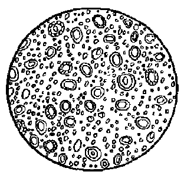

*图 4·1 在显微镜下看到的牛奶里的油滴*

乳浊液也是不稳定的。油

和水剧烈振荡后所成的乳浊液，只要振荡一停止，油和水很快就会分成两层。如果在此乳浊液内，加入少许肥皂液，虽然可以使它比较稳定些（这里所用的肥皂液，称做乳化剂），但若放置的时间稍长，最后仍会分成两层。

悬浊液和乳浊液总称为浊液。

溶液和浊液的比较 根据上面所讲的，我们可以看到溶液和浊液有它们相同的地方，也有不同的地方。相同的地方就是它们都是一种物质被分割成为很小的微粒，并分散在另一种物质（水）里；不同的地方是它们被分割的程度不同。在溶液里，溶质被分割为单个分子；在浊液里，固体或液体被分割后的微小颗粒或液滴，都不是单个分子，而是很多分子的聚集体，它比起单个分子来要大得多和重得多。溶液和浊液在外形特征上以及在稳定性上所以存在着这样明显的差异，归根到底就是由于这种分割程度不同所引起的。

下面是溶液和浊液的比较表。

表 4·1 溶液和浊液比较

| 项目 | 溶液 | 悬浊液 | 乳浊液 |
| --- | --- | --- | --- |
| 定义 | 溶质以单个分子均匀地分散在溶剂分子间的液体 | 散布着固体微小颗粒（很多分子的聚集体）的液体 | 散布着液体微小液滴（很多分子的聚集体）的液体 |
| 外形特征 | 澄清、透明、均一 | 浑浊、不透明、不均一 | 浑浊、不透明、不均一 |
| 稳定性 | 稳定 | 不稳定 | 不稳定 |

#### 溶液的重要意义

在化学里，研究溶液有着十分重要的实际意义，下面的实验将生动地说明这点。把干燥的氯化汞 \(\left(\mathrm{HgCl}_{2}\right.\)，又称升汞，是一种白色粉末状的固体试剂，有毒，使用时要注意！）和碘化钾（KI，是一种白色晶体）各少许放在研钵里，用玻棒把它们稍稍混和，看不出有什么显著的现象发生。但若用力研磨，就可看到白色粉末略显黄色，说明这两种物质发生了反应，但反应进行得很慢。

如果我们把氯化汞和碘化钾先分别溶解在水里，制成溶液，然后加少许碘化钾溶液到氯化汞溶液里，立刻就会看到有很多橙红色的沉淀产生。这个反应进行得非常迅速，几乎在一瞬间就完成了。这个反应的化学方程式是：

$$
2 \mathrm{KI} + \mathrm{HgCl}_{2} = \mathrm{HgI}_{2} \downarrow + 2 \mathrm{KCl}
$$

生成的橙红色沉淀，就是碘化汞（HgI\(_2\)）。

为什么固态的碘化钾和氯化汞相混时反应几乎不能发生，即使经过研磨，反应进行仍然很慢，但当它们的溶液相混时，反应却进行得十分明显而迅速呢？我们知道，如果某两种物质是可以发生化学反应的，那末这两种物质的分子的相互接近、相互碰撞的机会越多，反应就越容易发生。当固体物质相混时，只有它们表面的分子有相互接触和碰撞的可能，这是为数极少的。如果先把它们配制成为溶液，在溶液里，溶质的分子均匀地分散在整个液体里，并且比较自由地运动着。当这两种物质的溶液相混时，它们分子间相互接触、相互碰撞的机会就要多得多了，因而反应能很快地进行。

由于这样的缘故，在实验室里，我们常把一些固体试剂（只要它是能够溶解于水的）配制成为溶液，让许多化学反应在溶液里进行。但溶液是怎样配制的呢？这就要求我们学会许多有关物质溶解的知识，这些知识我们将在以后各节里陆续谈到。

#### 习题 4·1

1. 什么叫做溶质？什么叫做溶剂？消毒用的碘酒是一种溶液，它的溶质、溶剂各是什么？

2. 什么叫做悬浊液？什么叫做乳浊液？为什么悬浊液和乳浊液都不能算做是溶液？

3. 溶液和浊液在分散颗粒的大小上、外形特征上和稳定性上各有什么区别？

4. 试用分子论的观点来说明溶液的外形特征和它的稳定性。

5. 为什么许多化学反应在溶液里能进行得更好更快？

### § 4·2 物质的溶解过程

物质溶解过程里的吸热和放热现象 我们已学习了溶液的初步定义：溶液是溶质以单个分子均匀地分散在溶剂分子间的液体。但是溶质分子是怎样分散到溶剂分子间的呢？在物质溶解的过程里，溶质分子和溶剂分子有没有发生甚么作用呢？搞清这些问题，对我们进一步了解溶液的本质是十分重要的。

研究物质的溶解过程，要从物质溶解过程里吸热和放热现象开始。

取氯化铵（一种白色晶体，分子式是 \(NH_{4}Cl\)）晶体数克，溶解在水里，用手摸盛器外部，就会感到器壁很冷。这说明氯化铵在溶解时是要吸收热量的。

当硝酸铵（一种无色的晶体，分子式是 \(NH_{4}NO_{3}\)） 溶解时，溶液温度下降的现象更是突出。在一个小烧杯里盛水约半杯，加入硝酸铵晶体使之溶解，此时由于溶液温度的迅速下降、烧杯周围空气里的水蒸气，会遇冷凝结成为许多细小的水滴（有时甚至会结成薄冰），附着在烧怀的外面。

这些实验证明：许多固体物质溶解时，都要吸收热量，从而使得溶液温度降低。

为什么许多固体物质溶解时都要吸收热量呢？在回答这个问题之前，让我们先来研究一个与此有关的另一问题，那就是液体蒸发时的吸热现象。我们都有这样的经验，在夏天突然遇到阵雨，雨水把我们的身体淋湿了，这时就会感到身上发冷。这是因为水蒸发时吸收了我们身上一部分热量的缘故。又如在炎热的夏天，我们总喜欢在天井里或大门口，泼一些水，因为它会给我们带来一些阴凉的感觉。这也是因为水蒸发时要吸收热量，使地面的温度稍稍降低的缘故。液体蒸发时的吸热现象，可以用分子论的观点加以解释。我们知道，物质是由分子构成的，物质分子间一方面保持着一定的间隔；另一方面又存在着一种相互吸引的力的作用。要使液体蒸发，首先必须克服这种分子间的引力，因而需要一定的热量。

同样，固体物质溶解时，溶质表面上的分子在水分子的吸引下，逐渐离开溶质的表面，再均匀扩散到整个液体里。要使溶质分子能够离开固体表面，也必须先克服溶质分子间的引力，因而也要吸收一定的热量，这就是固体物质溶解时吸热的原因。

但是，也有一些物质例如氢氧化钠、硫酸等，在溶解时，不仅不会使溶液温度下降，反而放出大量的热，使溶液温度显著上升。例如，当在烧杯里溶解氢氧化钠的时候，可以看到有很多热气从烧杯里冒出来。如果用手摸一下烧杯外部，就会感到烫手。这说明氢氧化钠溶解时是有大量的热放出的。

这又是什么原因呢？原来溶质溶解于水时，有一部分溶质分子和水分子发生化合反应，生成一种叫做“溶质水合物”的分子。溶质分子和水分子在发生这一化合反应时是有热量放出的，如果放出的热量，超过了溶质分子分散时所须吸收的热量，总的结果就不是吸热而是放热了。

这样看来，物质的溶解过程，一方面，溶质分子为了要克服分子间的引力而吸热，另一方面，溶质分子又因与水分子化合生成溶质水合物分子而放热。在物质的溶解过程里，吸热和放热总是同时发生的。但对某些物质（例如氯化铵、硝酸铵等）的溶解过程来说，吸热超过了放热，总的结果是溶液温度的下降；而对另一些物质（例如氢氧化钠、硫酸等）来说，放热超过了吸热，总的结果是溶液温度的上升。

物质溶解过程里的吸热过程，是一个物理过程（因为它只是溶质分子的分散作用）。而物质溶解过程里的放热过程，是一个化学过程（溶质分子和水分子的化合作用）。因此，我们说，物质的溶解过程既不是单一的物理过程，也不是单一的化学过程，而是一个复杂的物理-化学过程。

溶液是介乎混和物和化合物之间的一类物质 物质的溶解过程是一个复杂的物理-化学过程。那末，溶液到底是混和物还是化合物呢？

这个问题，我们应该从多方面来分析，才能得出比较全面的结论。

首先，从溶液的形成过程来看：我们知道，混和物（例如面粉和白糖相混和是一种混和物）形成的过程一般只是通过简单的、机械的混和，是单纯的物理过程，并不包含任何化学过程。至于化合物（例如水）由组成元素（氢和氧）生成时，必须通过化学过程（化合反应）。但是溶液的形成过程，前面已经讲过，它既不是单一的物理过程，也不是单一的化学过程，面是一个复杂的物理-化学过程。

其次，从有没有固定的组成来看：我们知道，混和物的成分是没有一定的，而化合物则具有一定的组成，严格服从定组成定律。溶液是不服从定组成定律的，从这个角度来说，溶液似乎应该是混和物，但在一定量溶剂里所能溶解溶质的量，又常是有一定限制的（例如食盐溶解在水里，可以多溶解一些也可以少溶解一些，但在一定重量，例如100克水里，所能溶解食盐的量，是有一定限制的。如果加入的食盐，超过了这个限度，就不能完全溶解。关于这个问题，在下面两节里，还将详细讨论），这又和一般的混和物不同。

第三，从各部分是否均匀来看：我们知道，混和物的各部分是不均匀的，化合物则是完全均匀的，它的每个分子都是相同的。溶液从它外形上看，是均匀的，但从分子论的角度来看，溶液并不是由同一种分子组成的。在溶液里，不仅存在着溶质分子和溶剂分子，而且还存在着溶质水合物的分子。

最后，从它是否失掉原有物质的性质来看：我们知道，混和物是保持原有物质的性质的，它是各原有物质的性质的总和。例如糖和盐的混和物，既有甜味又有咸味。化合物则不保持化合前各组分物质的性质。例如水 \(\left(\mathrm{H}_{2}\mathrm{O}\right)\) 的性质完全不同于化合前的氢气和氧气。至于溶液，一般说来基本上是保持原物质的性质的，但只能说是“基本上”，对有些物质的溶液来说，它的性质可能还和原物质有很大的不同。

由此看来，溶液既不同于混和物，又不同于化合物，它是介乎混和物和化合物之间的一类物质。

从上面对物质溶解过程的本质的研究，使得我们对“什么是溶液”这个问题，又有了更进一步的理解。溶液是由溶质、溶剂（水）和溶质的水合物所组成的均匀的液体。它是介乎混和物和化合物之间的一类物质。

#### 习题 4·2

1. 物质溶解过程里“吸热”和“放热”的原因是什么？

2. 任何物质溶解时，既然大都同时存在着吸热和放热的作用，为什么有些物质溶解时有吸热现象并使溶液温度下降，另一些物质溶解时又有放热现象并使溶液温度上升？

3. 为什么说物质的溶解过程是一个复杂的物理-化学过程？

4. 从哪些方面可以说用溶液是介乎混和物和化合物之间的一类物质？

### § 4·3 物质在水里的溶解性

物质的溶解性 我们知道，各种固体物质在水里溶解的情况是很不相同的，有些物质（例如食盐和蔗糖）很易溶解，但也有一些物质（例如玻璃）看来好象是完全不能溶解的。其实，任何一种固体物质都只是在一定程度上能够溶解在水里。即使那些最容易溶解的物质，也不是可以无限制地溶解在水里的。相反，那些看来好象是完全不溶解的物质，也不是绝对的不溶解，只是它所溶解的量很少，一般不能为我们直接感觉得到罢了。例如我们一般认为银是完全不能溶解于水的，但有人做过实验：浸过银匙的水，可以杀死某些细菌。这就是因为有极微量的银溶解在水里，所成的溶液，对人来说是完全感觉不到的，但对某些细菌已经能够发生毒性，因而把它们杀死。由此看来，各种物质在水里溶解的能力，实际上只存在着程度上的差别。我们现在把一种物质在水里溶解的能力，或者说，一种物质均匀地扩散在水里的能力，叫做物质（在水里）的溶解性。

根据固体物质在水里溶解性的大小，可以把它们粗略地分成易溶、能溶、微溶和几乎不溶等四类。完全不溶于水的物质是没有的。但对那些溶解性非常小的物质，例如银、玻璃、大理石等，我们习惯上仍称它们为“不溶解”物质。当然，这里的不溶解是应该加上引号的。

不同物质的溶解性是不同的。但是，同一物质在不同溶剂里的溶解性也不相同。例如，碘在水里的溶解能力很小，但在酒精里的溶解能力却很大。因此，物质的溶解性跟溶质和溶剂的本性都有关系。我们这里研究的对象限于水溶液，因此，这里所谈到的物质的溶解性，指的就是物质在水里的溶解性。

物质的溶解性除和溶质和溶剂的本性有关外，还和外界条件（主要是温度）有关。关于这个问题，在下面将详细地讨论到。

#### 习题 4·3（1）

1. 什么叫做物质的溶解性？

2. 举例说明物质的溶解性不仅和溶质的本性有关，而且还和溶剂的本性有关。

#### 饱和溶液和不饱和溶液

如果在一定温度下，在烧杯里盛入一定重量的水后，慢慢加入蔗糖，同时用玻棒不断搅动。在开始时，加进去的蔗糖很快就溶解了，接着，溶解的速度逐渐减慢，最后看来好象不再溶解了。这是因为蔗糖溶解在水里，也是有一定限度的。当溶液里溶解蔗糖的量，已经达到这个限度时，如果再加入蔗糖，无论我们怎样搅拌，也不会再溶解。我们说这时溶液已经“饱和”了。在一定温度下，溶液里所溶解的某种溶质如果不能再增加，这样的溶液叫做这种溶质的饱和溶液。反之，溶液里如果还能继续溶解更多的这种溶质，这样的溶液叫做这种溶质的不饱和溶液。

不要认为饱和溶液一定很浓，或者认为不饱和溶液一定很淡。对于同一种溶质的溶液，我们说它在一定温度下的饱和溶液总要比不饱和溶液浓些，那是完全正确的。但对不同溶质的溶液，我们就不能这样说了。因为从饱和溶液和不饱和溶液的定义看来，溶液是饱和或者不饱和，关键在于它能不能溶解更多的溶质，而不在于溶液的浓或淡。由于各种物质的溶解性不同，有些物质（例如碳酸钙）的溶解能力很小，即使它的饱和溶液，仍然是很淡的（在18℃时，100克水至多只能溶解碳酸钙0.0013克）。与此相反，有些物质（例如蔗糖）的溶解能力很大，即使它的溶液已很浓，但也还不是饱和溶液。例如在20℃时，当100克水里已经溶解了200克蔗糖，应该说是很浓的了，但它并不是饱和溶液，因为它还能溶解更多的蔗糖。

在饱和溶液的定义里，为什么一定要指出“在一定温度下”呢？这是因为物质的溶解性，是要受到温度改变的影响的。例如，20℃时100克水中最多能够溶解蔗糖203克。但在30℃时，100克水里最多能够溶解219.5克蔗糖。因此，在100克水里溶解蔗糖203克所成的溶液，在20℃时是饱和溶液，但在30℃时就是不饱和溶液了。由于这样的缘故，我们说某物质的溶液是饱和溶液或者是不饱和溶液，总要注明它是在什么温度下，这样才有确切的意义。

#### 习题 4·3（2）

1. 什么叫做饱和溶液？什么叫做不饱和溶液？

2. 用什么简单的方法可以区别下面三种液体：

（1） 水；（2） 蔗糖的不饱和溶液；（3） 蔗糖的饱和溶液。

溶解度 根据物质溶解性的大小，可以把物质分成易溶、能溶、微溶和几乎不溶四类，但这只是物质溶解性的一种十分粗略的表示方法。在科学上，还要求从数量上精确地表示出物质溶解能力的大小，这就是这里所要讲的溶解度。

我们知道，在一定温度下，物质在一定重量溶剂（通常是水）里所能溶解的重量是有一定的。这个数字，可以利用来精确地表示出物质溶解能力的大小。化学上把在一定温度下，由100克溶剂（通常是水）所制成的某物质的饱和溶液里溶有该物质的克数，或者说：在一定温度下，100克溶剂（水）所能溶解某物质最多的克数，叫做该物质在这一溶剂（水）里的溶解度。例如，20℃时，食盐在水里的溶解度是35.9克。那就是说，在20℃时，由100克水所成的食盐饱和溶液里，溶有食盐35.9克。或者说，在20℃时，100克水最多能够溶解食盐35.9 克、溶解度是物质溶解性的定量的表示。

在学习了物质溶解度这个名词以后，我们就能对上面提到的易溶、能溶、难溶和几乎不溶等含义不够明确的名词，比较确切地表述出来。现在一般是这样规定的：在室温下，溶解度在10克以上的，称为易溶物质；在1~10克之间的，称为一般能溶的物质；在1克以下的，称为微溶的物质；在0.01克以下的，称为几乎不溶的物质。

当我们使用溶解度这个名词的时候，应该注意下列各点：

第一，在谈到物质溶解度时，必须指明在什么温度下，因为物质的溶解度在不同温度时是不同的。例如，我们应该说氯酸钾在20℃时的溶解度是7.3克，而不应简单地说氯酸钾的溶解度是7.3克。因为只有在20℃时氯酸钾的溶解度才是7.3克，而在其他温度下都不是这个数值。

第二，将物质的溶解度，指的一定是饱和溶液。因为只有在饱和溶液里，一定量溶剂在一定温度下溶有溶质的克数才是一定的。

第三，这个定义里所说的100克，指的是溶剂，而不是溶液。

第四，物质的溶解度是以100克溶剂所成的饱和溶液中溶有溶质的克数来表示的，因此溶解度的单位是克（或者是克/100克水）。

根据物质溶解度的定义可知：如果溶剂的重量刚好是100克，在它所成的饱和溶液里所溶解的溶质的克数，就是该溶质在这一温度下的溶解度。即：

| 溶剂克数 | 溶质克数 |
| --- | --- |
| 100克 | 溶解度（单位：克） |

用比例式表示，得

溶剂克数：100克=溶质克数：溶解度（单位：克），

即 溶剂克数×溶解度（单位：克）=溶质克数×100克，

或，溶解度（单位：克）=100克× \(\frac{溶质克数}{溶剂克数}\)。

这就是溶解度的数学式。利用这一数学式，可以从一定重量溶剂所成的饱和溶液里所溶解的溶质的克数，求出物质的溶解度；也可以从物质的溶解度求出由一定重量溶剂所形成的饱和溶液里所溶有溶质的克数。下面是有关溶解度的一些计算问题。

#### 例 1

在 \(20^{\circ}\) C 时，250 克水至多能够溶解食盐 90 克。求 \(20^{\circ}\) C 时食盐的溶解度。

【解题分析】题中所给条件（即已知条件）是：20℃时，250克水所成的饱和溶液里溶有食盐90克。

题自所要求的是：20℃时食盐的溶解度，也就是20℃时，100克水所成的饱和溶液里溶有食盐的克数。

把未知项假设为 \(x\)，列出比例式，就可解出未知项。

**解：** 设 \(20^{\circ}\) C 时食盐的溶解度是 x 克，即 100 克水所成饱和溶液里溶有食盐 x 克。

根据题中所给数据，可以列出比例式：

$$
250 \text{ 克 } \cdot 100 \text{ 克 } = 90 \text{ 克 } \cdot x \text{ 克 },
$$

$$
x = \frac {100 \times 90}{250}
$$

$$
= 36 (\text{ 克 })。
$$

即在 \(20^{\circ}\) C 时，食盐的溶解度是 36 克。

如果我们直接代入前面溶解度的数学式，也可得到相同的结果：

溶剂（水）克数=250克，

溶质（食盐）克数=90克。

食盐的溶解度（20℃）=100克× \(\frac{溶质克数}{溶剂克数}\) 
=100克× \(\frac{90克}{250克}\) 
=36克。

答：在 \(20^{\circ}\) C 时，食盐的溶解度是 36 克。

#### 例 2

取出在 \(10^{\circ}\) C 时呈饱和状态的硝酸钠 \(\left(\mathrm{NaNO}_{3}\right)\) 溶液 50 克，把它蒸干，得硝酸钠晶体 22.3 克。问 \(10^{\circ}\) C 时硝酸钠在水中的溶解度是多少？

【解题分析】溶液的总重量是溶质重量和溶剂重量的总和。由题意可知，硝酸钠饱和溶液50克中，含有溶质（硝酸钠）22.3克，含有溶剂（水）50-22.3=27.7克。这就是说，在10℃时，27.7克水至多能够溶解硝酸钠22.3克。

题目所要求的是 \(10^{\circ}\) C 时硝酸钠的溶解度，也就是 \(10^{\circ}\) C 时 100 克水至多能够溶解硝酸钠的克数。

还未知项假设为 \(x\)，列出比例式，就可解出未知项。

**解：** 设 \(10^{\circ}\) C 时硝酸钠在水中的溶解度是 x 克，即 100 克水至多能够溶解硝酸钠 x 克。

从起中所给数据，可以列出比例式：

$$
(50 - 22.3) \text{ 克 }： 100 \text{ 克 } = 22.3 \text{ 克 }： x \text{ 克 },
$$

$$
27.7 \text{ 克 }： 100 \text{ 克 } = 22.3 \text{ 克 }： x \text{ 克 },
$$

$$
x = \frac {100 \times 22.3}{27.7}
$$

$$
= 80.5 (\text{ 克 })。
$$

答：在 \(10^{\circ}\) C 时硝酸钠的溶解度是 80.5 克。

如果直接代入溶解度的数学式，所得结果相同，读者可以自行计算。

#### 例 3

已知 \(20^{\circ}\) C 时蔗糖的溶解度是 203 克。问在 \(20^{\circ}\) C 时 20 克水至多能够溶解蔗糖多少克？

【解题分析】已知条件是 \(20^{\circ} \mathrm{C}\) 时蔗糖的溶解度是 203 克，即 \(20^{\circ} \mathrm{C}\) 时 100 克水至多能够溶解蔗糖 203 克。

题目要求 \(20^{\circ}\) C 时 20 克水至多能溶解蔗糖克数。

把未知项假设为 x。列出比列式：就可解出关系项。

**解：** 设 \(20^{\circ}\) C 时 20 克水至多能够溶解蔗糖 x 克。从题中所给数据，可以列出比例式：

100克：20克=203克：x克，

$$
x = \frac {20 \times 203}{100}
$$

$$
= 40.6 (\text{ 克 })。
$$

答：在 \(20^{\circ}\) C 时，20 克水至多能溶解蔗糖 40.6 克。

如采直接代入溶解复公式，所得结果相同。读者可以自行计算

#### 例 4

已知 \(20^{\circ}\) C 时食盐的溶解度是 36 克。问 \(20^{\circ}\) C 时 150 克的食盐饱和溶液里溶有食盐多少克？

【解题分析】已知条件是，20℃食盐溶解度是36克，即20℃时100克水所成食盐饱和溶液里溶有食盐36克，也就是在100+36=136克的食盐饱和溶液里溶有食盐36克。

题目要求 \(20^{\circ}\) C 时 150 克食盐饱和溶液里溶有食盐的克数。

把未知项假设为 x，列出比例式，就可解出未知项。

**解：** 设 \(20^{\circ}\) C 时 150 克食盐饱和溶液里溶有食盐 x 克。从题中所给数据，可以列出比例式：

$$
(100 + 36) \text{ 克 }： 150 \text{ 克 } = 36 \text{ 克 }： x \text{ 克 },
$$

$$
136 \text{ 克 }： 150 \text{ 克 } = 36 \text{ 克 }： x \text{ 克 },
$$

$$
x = \frac {150 \times 36}{136}
$$

$$
=\frac{5400}{136}
$$

$$
= 39.7 (\text{ 克 })。
$$

答：在 \(20^{\circ}\) C 时 150 克食盐饱和溶液里溶有食盐 39.7 克。

如果应用溶解度的数学式，其中：食盐的溶解度（20℃时）=36克，150克饱和溶液中溶解的溶质（食盐）克数可以假设为x克，溶剂克数 \(= (150 - x)\) 克代入溶解度数学式，得：

$$
36 = 100 \times \frac {x}{150 - x},
$$

$$
36 (150 - x) = 100 x,
$$

$$
5400=100x+36x=136x.
$$

$$
x=\frac{5400}{136}\approx39.7\text{（克）}。
$$

#### 习题 4·3（3）

1. 什么叫溶解度？“溶解度”和“溶解性”这两个名词有什么区别？

2. 为什么讲到物质溶解度时，必须注明“在一定温度下”，并且所指溶液必须是饱和溶液？

3. 已知 \(20^{\circ}C\) 时溴化钠 （NaBr） 在水中的溶解度是 47.5 克，问在 \(20^{\circ}C\) 时 50 克水至多能溶解溴化钠多少克？

4. 已知 \(10^{\circ}\) C 时食盐在水中的溶解度是 35.73 克。问如果把 50 克在 \(10^{\circ}\) C 为饱和的食盐溶液蒸干，将得食盐晶体多少克？

5. 已知 \(20^{\circ}\) C 时碘化钾 （KI） 在水中的溶解度是 146 克。问在 \(20^{\circ}\) C 时 100 克碘化钾的饱和溶液里含有水和碘化钾各多少克？

6. 在 \(20^{\circ}\) C 时将 70 克碘化钾溶解于多少克水中，所得溶液是饱和溶液？（碘化钾的溶解度见上题）

#### 固体物质溶解度和温度的关系，溶解度曲线

大家都知道，热水溶解他种物质的能力常比冷水要大。一定量热水所能溶解蔗糖的量要比等量冷水所能溶解的多得多。大多数固体物质的溶解度都是随着温度的增高而增加的。表 4·2是一些固体物质在不同温度时的溶解度的具体数字。

从下表这些数字可以看出：

第一，大多数固体物质的溶解度都是随着温度的升高而增加的，但它们增加的程度很不一致。温度改变对食盐溶解度的影响很小（可以说几乎不发生什么影响），但硝酸钾的溶

**表 4·2 某些固体物质在水里的溶解度**

| 温度 | 食盐 | 硫酸铜 | 硝酸钾 | 硝酸银 | 蔗糖 | 消石灰 | 石膏 |
| --- | --- | --- | --- | --- | --- | --- | --- |
| 0℃ | 35.7 | 14.8 | 13.3 | 122 | 179 | 0.185 | 0.176 |
| 10℃ | 35.8 | 17.4 | 20.9 | 170 | 190 | 0.176 | 0.193 |
| 20℃ | 36.0 | 23.7 | 31.6 | 222 | 203 | 0.160 | — |
| 30℃ | 36.8 | 25.0 | 45.8 | 300 | 219 | 0.163 | 0.209 |
| 40℃ | 36.6 | 28.5 | 63.9 | 376 | 238 | 0.141 | — |
| 50℃ | 37.0 | 33.3 | 85.8 | 465 | 260 | 0.128 | 0.210 |
| 60℃ | 37.8 | 40.0 | 110.0 | 525 | 287 | 0.116 | 0.205 |
| 70℃ | 37.8 | 48.0 | 128.0 | 596 | 320 | 0.106 | 0.197 |
| 80℃ | 38.4 | 55.0 | 169.0 | 669 | 562 | 0.094 | — |

解度却因温度的升高而迅速增加。

第二，少数固体物质（例如消石灰）的溶解度随着温度的升高而微有减少。还有一些物质（例如石膏）的溶解度在一定温度以前，是随着温度的升高而增加的，但在这一温度以后，温度增加溶解度反而减小。

温度对物质溶解度的影响，我们现在还找不出它们之间定量的数学关系式，只好通过实验测出物质在不同温度时的溶解度，然后在“直角坐标系”里，找出它们相应的坐标点，再用一条平滑的曲线把这些坐标点连接起来，所得曲线叫做溶解度曲线。

所谓直角坐标系，就是在平面内作两条相互垂直的数轴：水平的数轴叫做横轴或 \(X\) 轴，垂直的数轴叫做纵轴或 \(Y\) 轴，两轴交点称为原点或 \(O\) 点。在坐标系所在平面内的一点，它和横轴的垂直距离称为该点的纵坐标；和纵轴的垂直距离称为该点的横坐标。直角坐标系把平面分成Ⅰ、Ⅱ、Ⅲ、Ⅳ四个象限。在溶解度曲线里，我们只取直角坐标系里的第1个象限部分。

在直角坐标系里，横轴一般代表温度，纵轴一般代表溶解度。把横轴自左而右地分成若干相等的小段，每一小段代表温度增高10℃（也可以代表其他度数）；

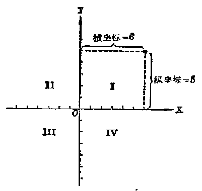

*图 4·2 直角坐标系的四个象限*

把纵轴自下而上地分成若干相等的

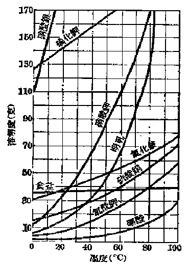

*图 4·3 一些固体物质的溶解度曲线*

小段，每一小段代表物质溶解度增加10克（也可以代表其他克数，要根据实际需要而定。例如在绘制消石灰、石膏的溶解度曲线时，纵轴上的每一小段，只代表溶解度增加0.02克；又在绘制蔗糖的溶解度曲线时，为了方便起见，它的起点可以不从0开始，而从150克开始）。

图 4·3 是一些固体物质的溶解度曲线。从物质的溶解度曲线，可以近似地找出某一指定温度时某物质的溶解度。方法是：（1） 在横轴上找出相应于指定温度所在的一点，通过这点所作的垂线（和纵轴平行），就是坐标系里代表这一温度的直线。（2） 找出该物质溶解度曲线和这一直线的相交点。（3） 过该相交点作平行于横轴的直线，该直线和纵轴的相交点所代表的溶解度，就是

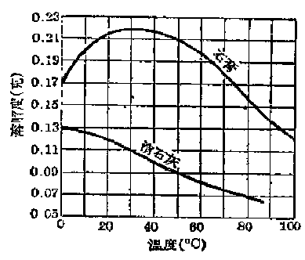

*图 4·4 石膏和消石灰的溶解度曲线*

这一温度时该物质的溶解度。

例如：要从硝酸钾溶解度曲线找出 \(40^{\circ}\) C 时硝酸钾的近似溶解度，先自横轴上相当于温度 \(40^{\circ}\) C 处作一垂直于横轴的直线，再自该直线和溶解度曲线的交点 a 处作一平行于横轴的直线，它和纵轴交于 b 点。由纵

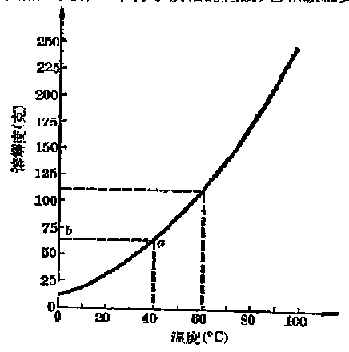

*图 4·5 硝酸钾的溶解度曲线*

轴表示的硝酸钾溶解度的数据可以估计出相当于 \(b\) 点处是64克，即硝酸钾在 \(40^{\circ}\mathrm{C}\) 时的溶解度大约是64克（图 4·5）。

同样，可以找出 \(60^{\circ} \mathrm{C}\) 时硝酸钾的近似溶解度是 110 克。

#### 习题 4·3（4）

1. 温度的改变对固体溶解度有什么影响？哪些物质（举两例）的溶解度对温度的升高而迅速增加？哪些物质（举一例）的溶解度在温度升高时仅微有增加？哪些物质（举一例）的溶解度在温度升高时反稍有减小？

2. 物质溶解度曲线是怎样画出的？根据蔗糖在不同温度时的溶解度的值（参看表 4·2），画出蔗糖的溶解度曲线。

3. 怎样根据溶解度曲线近似地找出某物质在一定温度时的溶解度？试根据图 4·3，近似地找出：

（1） 25℃时，明矾、硫酸钙、食盐、硝酸银和硝酸钾的溶解度各是多少？

（2） 当氯化铵、硝酸钾、明矾、硫酸铜、氯酸钾的溶解度为 30 克时的温度各是多少？

4. 把在 \(30^{\circ}\) C 时为饱和的硝酸钾溶液 250 克冷却到 \(20^{\circ}\) C，问有多少克硝酸钾 （\(KNO_{3}\)） 结晶析出（已知 \(20^{\circ}\) C 时 \(KNO_{3}\) 的溶解度是 31.6 克； \(30^{\circ}\) C 时是 45.8 克）？

> **提示：** 在 \(30^{\circ}\) C 时 \((100 + 45.8)\) 克饱和的硝酸钾溶液冷却到 \(20^{\circ}\) C 时将有 45.8 克 -31.6 克 =14.2 克 KNO \(_{3}\) 结晶析出。

5. 在 \(20^{\circ}\) C 时，把 15.8 克 \(KNO_{3}\) 溶解在 75.5 克水里，所得溶液是不饱和溶液。要使这一溶液变成饱和溶液；有两个不同方法：

（1） 蒸发溶剂的方法，即把溶剂（水）蒸发掉一部分。问须蒸发掉多少克水后，溶液才能变成饱和？

（2） 冷却溶液的方法。问必须冷却到什么温度，溶液才能变成饱和？

> **提示：** （1） 已知 \(20^{\circ}\) C 时 \(KNO_{3}\) 的溶解度是 31.6 克（见第 4 题），

即 100 克水至多能够溶解 KNO₃ 31.6 克。现在把 KNO₃ 溶液里的溶剂（水）蒸发掉一部分，但溶液里溶质（硝酸钾）并没有减少，仍旧是 15.8 克。解这个问题时，可以先求出在 20℃时，多少克水所成的饱和溶液里溶有 KNO₃ 15.8 克。

（2） 冷却至某一温度溶液变成饱和，即在此温度时 75.5克水至多能够溶解KNO₃ 15.8克。根据这个数据，可以求出该温度时硝酸钾的溶解度（即 100 克水至多能够溶解 KNO₃ 的克数）。在求出硝酸钾溶解度后，从它的溶解度曲线，可以找出相应的温度。

6. 在 \(30^{\circ}\) C 的硝酸钾饱和溶液 100 克里，加水 10 克（已知 \(30^{\circ}\) C 时 \(KNO_{3}\) 的溶解度是 45.8 克，即 145.8 克的饱和溶液里溶有 \(KNO_{3}\) 45.8 克），然后把它冷却，问须冷却到什么温度，溶液重又变成饱和？

液体在水里的溶解性 除固体外，许多液体也能溶解在水里。例如，醋是醋酸（一种无色的液体）的水溶液；酒主要是酒精的水溶液。

液体溶解在水里，溶质和溶剂都是液体，它们只能说是相互溶解，而不能肯定哪一种液体溶解在哪一种液体里。例如，酒精和水相互溶解而成的溶液，我们既可以说是酒精溶解在水里，也可以说是水溶解在酒精里。对于这一类的溶液，溶质和溶剂只有相对的意义。通常我们把其中数量较多的那一种液体称做溶剂，较少的那种液体称做溶质。例如在由30克酒精和70克水相互溶解所成的溶液里，我们把酒精认作是溶质，水认作是溶剂，因此，我们说它是酒精的水溶液。与此相反，在由70克酒精和30克水相互溶解所成的溶液里，我们把酒精认作是溶剂，水认作是溶质，说它是水的酒精溶液。至于在由水和酒精各占一半的溶液里，那就没有一定的规定了，我们说它是酒精的水溶液，或者说它是水的酒精溶液都可以。

各种液体和水相互溶解，可以有三种不同情况：

1. 能按任何比率相互溶解 例如酒精、甘油等液体能以任何比率和水相互溶解。在 100 克水里加入 1 克酒精或者 1 克水里加入 100 克酒精，结果都能相互溶解，不会分成两层。

2. 在一定范围内能相互溶解 大部分的液体在水里都有一定的溶解度。例如在 \(17^{\circ} \mathrm{C}\) 时，乙醚[^p179-1]在水里的溶解度是8.3克，那就是在100克水里加入乙醚如果不超过8.3克，它就能溶解在水里，如果超过了8.3克，那就不能完全溶解，将使液体分成两层。大部分液体在水里的溶解度也是随着温度的升高而增加的。

3. 几乎不能相互溶解 例如植物油和石油在水里的溶解度都很小，可以认作几乎不溶。

#### 习题 4·3（5）

1. 为什么说液体溶解在液体里时，溶质和溶剂只有相对的意义？

2 把乙醚和水混和，结果分成两层。因为乙醚和水能够在一定范围内相互溶解，因此上层和下层都是由这两种物质相互溶解后生成的饱和溶液，问在上层饱和溶液里溶质、溶剂各是什么？在下层饱和溶液里溶质、溶剂又各是什么（乙醚的比重比水小）？

#### 气体在水里的溶解性

我们知道，许多气体也是能够溶解在水里的。例如在第三章里，我们曾经讲过二氧化碳能够溶解在水里。在通常情况下，1体积的水能够溶解1体积的二氧化碳。空气也能溶解在水里 一般鱼类没有用来呼吸空气的肺，它们体内所需的氧，就是从溶解在水里的“空气”中获得的。

各种气体在水里的溶解度是很不相同的。有些气体在水里的溶解度非常大。例如氯化氢气体在1毫升水里能够溶解 442 毫升（在 \(20^{\circ}C\) 时）。氯化氢的水溶液，就是我们经常用到的盐酸。氨 \(\left(\mathrm{NH}_{3}\right.\) 俗称阿摩尼亚，是一种有刺激性尿臭的气体）在水里的溶解度比氯化氢还要大，在常温下，1 毫升水大概可以溶解 700 毫升的氨。但是，氢气、氧气和氮气都只能极微量地溶解在水里，在 1 毫升水里所能溶解的这些气体都还不到十分之一毫升哩！

气体的溶解度也和温度有关。几乎没有例外，一切气体的溶解度都是随着温度的升高而减少的。这在加热天然水的时候很容易看出来。当我们在锅里烧水的时候，水还没有沸腾，就有许多小气泡从锅底向上冒出。同时，在锅子的内壁上，也附有许多微小的气泡。这些气泡，就是原先溶解在水里的空气。因为加热时温度增高，溶解在水里的气体的溶解度跟着减少，从水里逸出。

一般说来，把水煮沸，能把溶解在水里的气体全部逐出。把金鱼养在冷开水里，不久就会死去。就是因为溶解在水里的空气，在煮沸的过程中，已被全部逐出，金鱼在冷开水里，由于得不到充足的氧气，因而不易生活。

气体的溶解度不仅和温度有关，而且还和压强有关。增加气体的压强，气体的溶解度就会增大。这是因为气体的压强增大后，水面上气体的密度也就增大，从而和水面接触的气体分子数目也就增多，气体溶解在水里的机会也就增加了。因此气体的溶解度是随着气体压强的增加而增加的。在第三章里我们讲过，制造汽水时，要用压力把多量的二氧化碳气体溶解在水里。打开汽水瓶盖，由于瓶中压强减小，二氧化碳在水里的溶解度也就减小。因此，大量的二氧化碳气体就从汽水里冒出。

由于称量气体的重量是很不方便的。因此，气体的溶解度常不用一定重量的水所能溶解的气体的重量（克数）来表示，而是用1毫升水能够溶解气体体积的毫升数来表示（对于那些溶解度很小的气体，有时用1升水能够溶解气体体积的毫升数来表示）。例如，在20℃时，氯化氢气体在水里的溶解度是442，那就是说，在20℃时，1毫升水至多能够溶解氯化氢气体442毫升。下表列出了某些气体在0℃和20℃时的溶解度（单位：毫升/1毫升水）：

表 4·3 某些气体在水里的溶解度（1大气压）

| 温度 | 氧气 | 氮气 | 氢气 | 氯化氢 |
| --- | --- | --- | --- | --- |
| 0°C | 0.0452 | 0.0285 | 0.0215 | 507 |
| 20°C | 0.0310 | 0.0154 | 0.0182 | 442 |

#### 习题 4·3（6）

1. 气体的溶解度和固体的溶解度的表示方法有什么不同？

2. 温度、压强对气体溶解度的影响怎样？

3. 为什么金鱼在煮沸过的冷水里不能生活？

4. 锅炉里用的水，常利用下面两种方法，把水里含有的氧气和二氧化碳排除出去：（1）先把锅炉用水放入贮水箱里，然后从箱里抽出空气。（2）往锅炉水里鼓入热蒸气，试解释它们的理由。

### § 4·4 物质的结晶

物质从溶液里结晶析出的两种方法 任何固体物质都不能无限制地溶解在水里。固体物质在水里能够溶解的量，除了和这种物质的溶解性有关外，还和所用溶剂（水）的量的多少有关，溶剂的量越多，能够溶解溶质的量也就越多。当所用溶剂的量一定时，它所能溶解溶质的量还和外界条件（主要是温度）有关，大多数固体物质的溶解度，都是随着温度的升高而增加的。

如果在一定量的溶剂里，加入固体溶质的量，超过了它所能溶解的最高限度（或者说超过了它在这一温度时的溶解度）时，那超过的部分，就不会溶解。例如，在20℃时，硝酸钾的溶解度是31.6克，如果在这一温度下，在100克水里加入了45.8克的硝酸钾，那末，这些硝酸钾，将不会全部溶解在水里，而有45.6克-31.6克=14.2克硝酸钾晶体多余出来。

怎样才能使这些硝酸钾晶体全部溶解呢？

一个方法是在保持温度不变的情况下，加入更多的溶剂（水）。根据计算，在 \(20^{\circ}\mathrm{C}\) 时受溶解硝酸钾45.8克，至少须用水145克，因此，只要在溶液里加进45克或45克以上的水，硝酸钾的晶体就能全部溶解。

另一个方法是把溶液加热，使溶液温度升高到 \(30^{\circ}\mathrm{C}\) （硝酸钾在 \(30^{\circ}\mathrm{C}\) 时的溶解度是45.8克）或 \(30^{\circ}\mathrm{C}\) 以上，这时，硝酸钾的晶体也能全部溶解。

如果把前面加入了45克水的硝酸钾溶液蒸发，使溶剂（水）的量减少到原先的100克时，将有什么现象发生呢？很显然，那后来溶解的14.2克硝酸钾晶体，又将从溶液里重新结晶出来。

如果把前面加热到 \(30^{\circ}\) C 的硝酸钾溶液冷却，使它的温度仍旧回到原先的 \(20^{\circ}\) C 时，将有什么现象发生呢？很显然，那后来溶解的 14.2 克硝酸钾晶体，亦将从溶液里重新结晶出来。

由此可以看出：让溶剂蒸发或者冷却溶液，都有可能使固体溶质从溶液里结晶析出。

现在，我们再比较深入地来讨论一下固体自溶液里结晶析出的过程。

当溶液（一般是不饱和溶液）在敞口容器里蒸发时，开始时，随着溶剂（水）的逐渐蒸发，溶液逐渐变浓，但并不立刻就有结晶析出。只有当溶液变成饱和溶液后，如果再继续让溶剂蒸发，溶质才会自溶液中结晶析出。

例如，在 \(20^{\circ}\) C 时，100 克水里溶有 32.4 克食盐的溶液，是一个不饱和溶液（在 \(20^{\circ}\) C 时，食盐的溶解度是 36 克），把它放在敞口容器里，让它自行蒸发，开始时是不会有食盐结晶出来的，只是溶液逐渐变浓。根据计算可知，当有 10 克溶剂（水）蒸发掉后，溶液就变成饱和。如果此时继续让它蒸发，就有食盐从溶液里结晶析出。食盐结晶析出的数量，是随着蒸发的不断进行、溶剂（水）的不断减少而逐渐增加的。它结晶析出的结果，是要使得溶液里溶有的食盐不超过它的溶解度。因此，结晶析出的食盐的重量，可以从蒸发掉的溶剂（水）的重量求得。例如蒸发掉 20 克水，即溶剂重量减少为 100 - 20 = 80 克时，至多能够溶解（温度仍保持 \(20^{\circ}C\)）食盐多少克？能结晶析出多少克食盐？这可以由下法求得：

| 溶剂重量 | 溶质重量 |
| --- | --- |
| 100克 | 36克 |
| 80克 | x克 |

列出比例式，得：

100克：80克=36克：x克

$$
x = \frac {80 \times 36}{100}
$$

$$
= 28.8 (\text{ 克 }) 。
$$

即至多能够溶解食盐28.8克，而有32.4克-28.8克=3.6克的食盐从溶液里结晶析出。

大多数固体物质的溶解度，都是随着温度的升高而增加的。有些物质的溶解度受温度的影响还很大，它们的溶解度曲线很陡。如果把它们的热的饱和溶液缓缓冷却下来，尽管这时溶剂（水）并没有蒸发，溶液也没有变得更浓些，但溶解度由于温度的下降而减小了，从而使得溶液里溶质的量，超过它的溶解度。因此也会有溶质从溶液里结晶析出。例如，在 \(80^{\circ}\) C时100克热水所成的硝酸钾饱和溶液里，溶有 \(KNO_{3}\) 169克。把这样的饱和溶液冷却到 \(20^{\circ}\) C，因为 \(20^{\circ}\) C时 \(KNO_{3}\) 的溶解度是31.6克，因此就会有

169 克 - 31.6 克 = 137.4 克

的硝酸钾晶体从溶液里结晶析出。

现在我们可以看出，蒸发溶剂和冷却饱和（或接近饱和的）溶液，是使溶质从溶液里结晶析出的两种常用的方法。这两种方法的原理，都是使得溶解在溶液里的溶质的量，从小于它的溶解度（不饱和溶液）到等于它的溶解度（饱和溶液），最后超过它的溶解度，这时超过的部分就会从溶液里结晶析出。

对于那些温度对溶解度影响不大的物质（例如食盐）的结晶，我们常用蒸发溶剂的方法；对于那些温度对溶解度影响很大的物质（例如硝酸钾）的结晶，用冷却溶液的方法就更好些。当然，这两种方法也可以联合使用。

#### 习题 4·4（1）

1. 使溶质从溶液里结晶析出的必要条件是什么？

2. 今有 \(90^{\circ}\) C 时为饱和的氯化铵 \(\left(\mathrm{NH}_{4}\mathrm{Cl}\right)\) 溶液 340 克，

（1） 在温度不变的条件下（已知 \(90^{\circ}\) C 时 \(NH_{4}Cl\) 的溶解度是 70 克），蒸发掉溶剂（水）80 克，将有多少克氯化铵自溶液中结晶产生？

（2） 将此溶液温度降低到 \(40^{\circ}C\) （已知 \(40^{\circ}C\) 时 \(NH_{4}Cl\) 的溶解度是 45 克），将有多少克氯化铵自溶液中结晶析出（假定溶液没有蒸发）？

（3） 如果将此溶液的温度降低到 \(60^{\circ}C\) （已知 \(60^{\circ}C\) 时 \(NH_{4}Cl\) 的溶解度是 55 克），在此同时，并有 50 克水蒸发掉，结果将有多少克氯化铵结晶析出？

**解：** （1）在 \(90^{\circ}\) C 时 100 克水至多能溶解 \(NH_{4}Cl\) 70 克，即当 \(90^{\circ}\) C 时氯化铵饱和溶液里有 100 克水蒸发掉时，将每 70 克 \(NH_{4}Cl\) 自溶液里结晶析出。

现有80克水蒸发掉，设有x克氯化铵从溶液里结晶析出，则：

| 蒸发掉的溶剂重量 | 结晶析出的溶质重量 |
| --- | --- |
| 100克 | 70克 |
| 80克 | x克 |

列出比例式，得：

100克：80克=70克：x克，

$$
x = \frac {80 \times 70}{100} = 56 (\text{克})。
$$

答：将有56克氯化铵自溶液中结晶析出。

（2） 因 \(90^{\circ}\) C 时氯化铵的溶解度是 70 克，故在 \(90^{\circ}\) C 时， \(100 + 70 = 170\) 克氯化铵饱和溶液里含有 100 克水和 70 克氯化铵。如果将此饱和溶液冷却至 \(40^{\circ}\) C（此时 100 克水只能溶解 \(NH_{4}Cl\) 45 克），将有 70 - 45 = 25 克氯化铵结晶析出。

现将 \(90^{\circ}\) C 时的 340 克氯化铵饱和溶液冷却至 \(40^{\circ}\) C，设有 x 克氯化铵结晶析出，得：

| 所用饱和溶液重量 | 自90°C冷却至40°C时，溶质析出重量 |
| --- | --- |
| 170克 | 25克 |
| 340克 | x克 |

列出比例式，得：

170克：340克=25克：x克，

$$
x = \frac {340 \times 25}{170} = 50 (\text{ 克 })。
$$

答：有50克氯化铵自溶液中结晶析出。

（3） 提示：可分两步计算。

晶体、结晶水合物和结晶水 从分子论的观点看来，物质从溶液里结晶析出的过程是这样的：在溶液里，溶质分子本来是毫无秩序地运动着的。但当溶液里溶质超过它的溶解度时，就有一部分的溶质分子在溶液里开始有规则地排列起来，形成一个微小晶体，从溶液中分离出来。这个微小的晶体形成之后，就成为一个结晶的中心，更多的溶质分子有规则地排列在它的各面，逐渐形成较大的晶体。

正因为在晶体里，物质的分子是有规律地排列着的，因此，一切晶体都具有一定的几何外形，它们的表面是由一些平面（称做晶面）构成的。这些平面又以一定的角度（称为面角）相交着。各种不同物质的晶体常具有不同的晶形，在有些情况下我们可以根据物质结晶的形状，来区别一些物质。图 4·6是一些晶体的外表形状。

许多晶体从它的表面看来是完全干燥的，一点也看不出里面含有水分。但是，实际上它里面确实含有水。有些晶体里面所含的水的百分比，竟可超过一半（50%）以上。例如我们用来去除油垢的“洗濯碱”（是一种白色的固体），其中含水的百分比达 63% 左右。

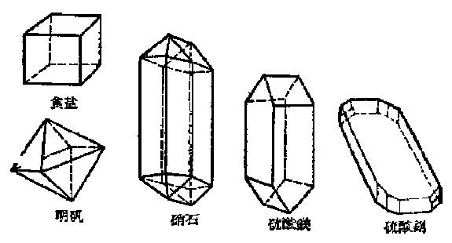

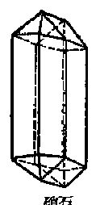

*图 4·6 晶体*

通过实验很容易证明许多晶体里确实含有水。

把干燥的、蓝色的硫酸铜晶体少许放在试管内，试管横着固定在铁架台上，管口稍向下倾，然后用酒精灯加热（装置如图 4·7），不久就能看到有水蒸气冒出来，甚至还有水滴从试管口滴出来。同时，硫酸铜晶体逐渐粉碎，最后变成白色的粉末。

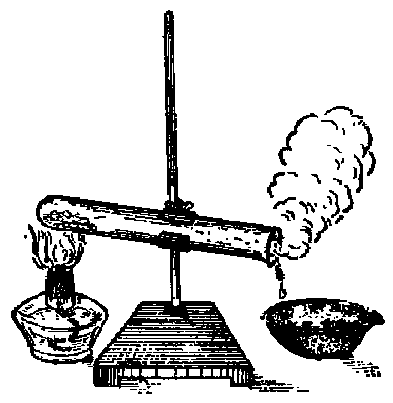

*图 4·7 加热硫酸铜晶体，有水蒸气放出*

如果用明矾、洗濯碱等做同样的实验，可以证明，这些晶体里亦都含有水。

晶体里的水是哪里来的呢？在第二节里我们讲过，当物质溶解于水时，有一部分溶质分子和溶剂（水）分子化合，生成溶质水合物的分子。这就是说，在溶液里，溶质分子和水分子是有着一定程度的结合的，当溶质从溶液里结晶析出的时候，在生成的晶体里，也就含有一定数目的水分子。晶体里含有的定量的水，叫做结晶水。含有结晶水的晶体，叫做结晶水合物。

应该指出，并不是所有从溶液里结晶析出的晶体里都含有结晶水的。例如，在通常温度下，从溶液里结晶析出的食盐晶体，一般是不含有结晶水的。这是因为食盐在溶解的时候，虽然也在一定程度上和水分子相结合，但结合得很不牢固，当它从溶液里结晶析出的时候，一般就不含有结晶水。

结晶水合物里既然含有一定量的结晶水，为什么结晶水合物一点也不潮湿呢？这是因为在结晶水合物里，物质分子和水分子的结合是一种化学结合，在结晶水合物里并不含有液态的水。

我们说结晶水合物里物质分子和水分子的结合是一种化学的结合，还可以从其他方面得到证明。首先是各种结晶水合物里的水分子数都是有一定的，也可说是遵从定组成定律的。因此结晶水合物和一般化合物一样可以用一个固定的分子式来表示它。例如，在硫酸铜晶体（俗名胆矾）里，每1个硫酸铜分子和5个水分子相结合，它的分子式是 \(\mathrm{CuSO_4\cdot 5H_2O}\)；在洗濯碱里，每1个碳酸钠分子和10个水分子相结合，它约分子式是 \(\mathrm{Na_2CO_3\cdot 10H_2O}\)。此外，如泻盐的分子式是 \(\mathrm{MgSO_4\cdot 7H_2O}\)，石膏的分子式是 \(\mathrm{CaSO_4\cdot 2H_2O}\) 等。

其次，当结晶水合物分解成无水物和水时，或者水和无水物结合成水合物时，都有明显的热现象。前面已经谈到，蓝色的硫酸铜晶体分解时是要吸收热量的，它应该认作是一种属于分解反应类型的化学反应，并可用下面的化学方程式来表示这一反应：

$$
\mathrm{CuSO}_{4} \cdot 5 \mathrm{H}_{2} \mathrm{O} \xrightarrow {\text{加热}} \mathrm{CuSO}_{4} + 5 \mathrm{H}_{2} \mathrm{O}
$$

和这个反应相反，如果我们把少许白色无水硫酸铜粉末放在试管里，滴入少量的水，立刻看到原来的白色粉末迅速变成蓝色，并有明显的放热现象，用手触摸试管外部，感觉发烫。这是一个属于化合反应类型的化学反应，可用下面的化学方程式来表示这一反应：

$$
\mathrm{CuSO}_{4} + 5 \mathrm{H}_{2} \mathrm{O} = \mathrm{CuSO}_{4} \cdot 5 \mathrm{H}_{2} \mathrm{O}
$$

既然结晶水合物具有一定的分子组成，那么，根据它们的分子式将能够计算出结晶水合物里含有结晶水的百分率。计算的方法和第一章里所讲的根据物质的分子式计算各种元素所占重量百分比的方法是相类似的（§1·9）。例如硫酸铜晶体 \(\left(\mathrm{CuSO}_{4}\cdot5\mathrm{H}_{2}\mathrm{O}\right)\) 里所含结晶水的百分率是：

$$
\begin{array}{l} \frac {5 \mathrm{H}_{2} \mathrm{O}}{\mathrm{CuSO}_{4} \cdot 5 \mathrm{H}_{2} \mathrm{O}} \times 100 \% = \frac {5 \times 18}{169.5 + 5 \times 18} \times 100 \% \\ = \frac {90}{249.5} \times 100 \% = 36.07 \%. \\ \end{array}
$$

在结晶水合物的分子式里，物质分子式和水分子式之间的“·”代表“f。”的意思。例如上述的硫酸铝晶体的分子式 \(CuSO_{4} \cdot 5H_{2}O\) 表示：硫酸铜晶体的分子是由1个硫酸铜分子 \((\mathrm{CuSO}_{4})\) “和”5个水分子 \((5\mathrm{H}_{2}\mathrm{O})\) 组成的。因此，在计算结晶水合物的分子量时，这“·”应是“+”的意思，硫酸铜晶体的分子量等于：

$$
(63.5 + 32 + 4 \times 16) + 5 (2 \times 1 + 16) = 249.5,
$$

由于在代数学里，两个数字（或文字）之间的“·”代表乘号，有些初学化学的人，也把结晶水合物分子式里的“·”误作乘号，把硫酸铜晶体的分子量计算为 \((63.5+32+4\times16)\times5(2\times1+16)=14855\) 那就错了！

和上面的例子相反，根据结晶水合物里所含结晶水的百分率，可以求出结晶水合物的分子式。例如，氯化钡 \(\left(\mathrm{BaCl}_{2}\right)\) 晶体里含有14.75%的结晶水，求氯化钡晶体的分子式。

**解：** 假设氯化钡晶体分子里含有 \(x\) 个分子的结晶水，即氯化钡晶体的分子式是 \(\mathrm{BaCl}_2 \cdot x\mathrm{H}_2\mathrm{O}\)，则它所含结晶水的百分率（已知是 \(14.75\%\)）是：

$$
\frac {x \mathrm{H}_{2} \mathrm{O}}{\mathrm{BaCl}_{2} \cdot x \mathrm{H}_{2} \mathrm{O}} \times 100 \% = 14.75 \%.
$$

（原子量： Ba 是 137； Cl 是 35.5； H 是 1； O 是 16）

$$
\frac {18 x}{208 + 18 x} \times 100 \% = 14.75 \%
$$

$$
\frac {1800 x}{208 + 18 x} = 14.75,
$$

$$
1800 x = 14.75 (208 + 18 x),
$$

$$
1800x-265.5x=3068
$$

$$
1534.5x=3068
$$

$$
x\approx2
$$

答：氯化钡晶体的分子式是 \(BaCl_{2} \cdot 2H_{2}O\)。

#### 习题 4·4（2）

1. 什么叫做晶体？晶体的外形怎样？有些什么特点？

2. 什么叫做结晶水？什么叫做结晶水合物？为什么许多物质从溶液呈结晶析出的时候会含有结晶水？

3. 为什么说在结晶水合物里物质分子和水分子的结合是一种化学的结合？

4. 求出下列各结晶水合物里的含水百分率：

（1） \(\mathrm{Na_2CO_3\cdot 10H_2O}\)；（2） \(\mathrm{MgSO_4\cdot 7H_2O}\)；（3） \(\mathrm{Na_2SO_4\cdot 10H_2O}\)。

5. 煅烧 614 克芒硝 （\(Na_{2}SO_{4} \cdot 10H_{2}O\)），能得到多少克无水硫酸钠 （\(Na_{2}SO_{4}\)）？

6. 无水氯化钙（\(\mathrm{CaCl}_2\)）有很强的吸湿性，无水氯化钙吸收水分后变成氯化钙晶体（\(\mathrm{CaCl}_2 \cdot 6\mathrm{H}_2\mathrm{O}\)），问10克无水氯化钙可能吸收多少克水？

> **提示：** 可以利用下面的化学方程式进行计算：

$$
\mathrm{CaCl}_{2} + 6 \mathrm{H}_{2} \mathrm{O} = \mathrm{CaCl}_{2} \cdot 6 \mathrm{H}_{2} \mathrm{O} ］
$$

7. 煅烧多少克硫酸铜晶体 \(\left(\mathrm{CuSO}_{4}\cdot5\mathrm{H}_{2}\mathrm{O}\right)\) 可得800克无水硫酸铜？

8. 已知碳酸钾晶体里含水百分率是 28.12%，试决定它的分子式。

结晶在工业上的应用 利用结晶的方法，可以制很多很有用的物质。例如人们一天也不能缺少的食盐，就是从海水中通过结晶方法制得的。在工业上，使物质从溶液里结晶出来，主要也是用蒸发溶剂或冷却溶液的方法。

从海水里制取食盐，因为改变温度对食盐溶解度的影响很小，因此，平常都是用蒸发溶剂的方法来制取。制取的方法是：先把海水引入筑在沿海滩的盐池里，利用日光及风力逐渐使它蒸发。当海水里的食盐浓度达到饱和后，食盐就成晶体析出。晶体析出以后的溶液，叫做母液。母液里通常含有许多杂质。

对于那些溶解度因温度改变而有很大变化的物质的结晶，可以利用冷却溶液的方法。例如我们在第三册第二章里要谈到的侯氏制碱法的最后一道工序，把成品之一的氯化铵从母液中结晶出来，也应用到冷却母液的原理。

在自然界里，也有因冷却而使溶质从溶液里结晶析出的现象发生。我国内蒙古自治区许多湖泊里溶有大量的天然碱（碳酸钠）。在寒冷的冬天，由于温度很低，碳酸钠的晶体从湖水里结晶析出，沉积在湖底。人们破开冰层，就可从淤泥捞到这种碳酸钠的晶体。

利用结晶的方法，还可以分离某些混和物。如果混和物里的两种物质的溶解度，随着温度的改变而变化的大小程度相差比较悬殊的话，就可通过结晶方法把这两种物质分离开来。例如，我们知道温度变化时氯化钠溶解度的改变是很小的，但氯化钾的溶解度在温度增加时却增加得很快。从下面的具体数字很容易说明这一点：

| 温度 | 氯化钠的溶解度 | 氯化钾的溶解度 |
| --- | --- | --- |
| 0°C | 85.6克 | 28.9克 |
| 100°C | 39.2克 | 56.2克 |

我们把这两种物质的混和物溶解在沸水（100°C）里，制成饱和溶液。显然，在这一饱和溶液里，溶解的氯化钾要比氯化钠多得多。当这一溶液冷却时，由于氯化钾的溶解度迅速减小，而氯化钠则几乎不受影响，因此析出的结晶主要是氯化钾的晶体。这样就把氯化钾从混和物中分离出来了。工业上就是利用这一方法从天然产的氯化钾和氯化钠的混和物中分离出氯化钾来的。

结晶的方法也可用来提纯物质。先把含有杂质的固体物质溶解在纯净的水里，然后使之结晶。那时大部分的杂质都留在母液里，所得晶体比较纯净。如果要得到非常纯净的晶体，还可以把所得晶体再溶解，再结晶，如是反复多次，使得晶体里所含的杂质一次一次的减少，最后就可得到非常纯净的晶体。这种提纯固体物质的方法，叫做“再结晶”。

#### 习题 4·4（3）

1. 蒸发溶剂的方法适用于哪些物质的结晶？冷却溶液的方法适用于哪些物质的结晶？

2. 怎样利用结晶的方法把氯化钾从氯化钾和氯化钠的混和物中分离出来？

3. 什么叫做“再结晶”？怎样利用再结晶的方法来提纯物质？

### § 4·5 溶液的浓度

在实验室里或者工农业生产上，我们经常要用到一些浓液程度不同，或者说浓度不同的溶液。在实际使用溶液时，对所用溶液的浓度常有一定的要求。例如在实验室里用硫酸和锌反应制取氢气，所用硫酸溶液的浓度必须是适度的。如果太淡了，反应进行就会很慢；如果太浓了，不仅反应进行也很慢，甚至还会根本得不到氢气。在农业上，施用化肥或农药，更要求有合适的浓度。如果所用溶液过淡，效果就不显著；过浓则不仅浪费，而且还会对植物发生毒害作用。在工业上使用溶液时，也要求有适当的浓度。例如制造肥皂时要用烧碱（即氢氧化钠，NaOH）的溶液，它的浓度必须适合一定的要求，太淡或太浓都是有害的。在不同的工业生产部门，有的需用浓溶液，有的需用稀溶液，例如制造炸药、精炼石油时需用浓硫酸，制造肥料（磷肥、氮肥）时则需用较稀的硫酸。由于这样的原因，了解和掌握配制一定浓度溶液的方法，有十分重大的实际意义。

溶液的浓度，粗略地说来，就是溶液浓、淡的程度。我们根据溶液浓、淡程度的不同，可以定性地把溶液分成浓溶液和稀溶液。但这样的分法是不够明确的，在科学上还要求从数量上表示出溶液浓度的大小。我们知道，溶液浓度的大小，决定于溶质的量和所成溶液的量两方面的因素。对一定量的溶液来说，它里面所含溶质的量越多，溶液浓度就越大：对一定量的溶质来说，它溶解后所成溶液的量越大，溶液浓度就越小。现在我们把一定重量（或一定体积）溶液里溶有溶质的重量，叫做溶液的浓度。在实际应用上，溶液浓度的表示方法有好多种，在这里，我们将介绍两种应用较广的溶液浓度表示方法，即百分比浓度和克分子浓度。

#### 百分比浓度

百分比浓度就是用100重量单位（100克、100斤或100其他重量单位）的溶液里，溶有溶质的重量单位数来表示的溶液的浓度。百分比浓度的符号是%。例如，5%的溶液就是在100克（或其他重量单位）的这种溶液里，溶有溶质5克（或其他重量单位）。要配制这样的溶液，只要把5克（或其他重量单位）溶质溶解在95克（或其他重量单位）水里就可以了。

根据百分比浓度定义可知，如果溶液的重量刚好是100重量单位，那末溶液里溶有溶质的重量单位数，就是溶液的百分比浓度。即：

| 溶液重量 | 溶质重量 | 溶液的百分比浓度 |
| --- | --- | --- |
| 100 | x | x% |

应该注意，这里溶液重量和溶质重量所用的重量单位必须相同。

如果溶液重量不正好是 100 重量单位，溶液的百分比浓度也可通过比例的方法，从溶质、溶液的重量求出。

#### 例 1

由25克水和3克食盐所成溶液的百分比浓度是多少？

【解题分析】由题可知，25克+3克=28克溶液里溶有食盐3克。

通过比例法可以求出 100 克这样的溶液里溶有食盐的克数，再根据百分比浓度定义可知这就是溶液的百分比浓度。

**解：** 设 100 克这样的溶液里溶有食盐 x 克（即溶液的百分比浓度为 x%）。

由题可知，25克+3克=28克溶液里溶有食盐8克；现在，100克溶液里溶有食盐x克。

列出比 元式，得：

100克：28克=x克：3克，

$$
x = \frac {100 \times 3}{28} = 10.71 (\text{ 克 })。
$$

答：溶液的百分比浓度是10.71%。

#### 例 2

要配制 16% 的食盐溶液 500 公斤，需用食盐和水各多少公斤？

【解题分析】根据百分比浓度定义可知，要配制16%食盐溶液100公斤，需用食盐16公斤，用水100公斤-16公斤=84公斤。再用比例法解。

**解：** 设需用食盐 x 公斤。

由题可知，100公斤溶液需用食盐16公斤；

现左，500公斤溶液需用食盐 \(x\) 公斤。

列出比例式，得：

100 公斤：500 公斤=16 公斤：x 公斤，

$$
x = \frac {16 \times 500}{100} = 80 (\text{ 公 斤 })。
$$

需用水，500-80=420（公斤）。

答：需用食盐80公斤，水420公斤。

#### 例 3

配制 10% 的硫酸铜溶液 50 克，需用硫酸铜晶体 \(\left(\mathrm{CuSO}_{4} \cdot 5\mathrm{H}_{2}\mathrm{O}\right)\) 若干克？

【例题分析】先按上例求出需用纯硫酸铜克数，然后根据硫酸铜晶体中所含纯硫酸铜的百分率，用比例方法折算出需用硫酸铜晶体的克数。

**解：** 设需用纯硫酸铜 \(x\) 克。

由题可知，100克溶液需用纯硫酸铜10克；

现在，50克溶液需用纯硫酸铜 \(x\) 克。

列出比例式，得：

100克：50克=10克：x克，

$$
x = \frac {10 \times 50}{100} = 5 (\text{克})。
$$

因硫酸铜晶体里所含纯硫酸铜的百分率是：

$$
\frac {\mathrm{CuSO}_{4}}{\mathrm{CuSO}_{4} \cdot 5 \mathrm{H}_{2} \mathrm{O}} \times 100 \% = \frac {159.5}{249.5} \times 100 \% = 63.93 \%.
$$

这就是说，在100克硫酸铜晶体里含有纯硫酸铜63.93克。

现设在 \(y\) 克硫酸铜晶体里含有纯硫酸铜5克，列出比例式，得：

100克： y 克 = 63.93 克： 5 克，

$$
y = \frac {100 \times 5}{63.93} = 7.84 (\text{ 克 })。
$$

答：需用硫酸铜晶体7.84克。

#### 例 4

要配制 20% 的硫酸溶液 200 克，需用 95% 的浓硫酸多少克？已知 95% 浓硫酸的比重是 1.839 克/毫升，问需用浓硫酸的体积是多少毫升？

【解题分析】先按前例算出需用纯硫酸（即100%的硫酸）的重量（克数），然后用反比法折算出需用95%硫酸的重量（因为硫酸的百分比浓度越大，需用的量就越小，因此是反比关系），再根据比重折算为体积（毫升数）：

$$
\mathrm{比重(克/毫升)} = \frac {\mathrm{重量(克数)}}{\mathrm{体积(毫升数)}},
$$

$$
\therefore \quad \text{体积(毫升数)} = \frac {\text{重量(克数)}}{\text{比重(克/毫升)}}.
$$

**解：** 设需用纯硫酸 \(x\) 克。

由题可知，100克溶液需用纯硫酸20克；

现在，

200克溶液需用纯硫酸x克。

列出比例式，得：

$$
100 \text{ 克 }： 200 \text{ 克 } = 20 \text{ 克 }： x \text{ 克 },
$$

$$
x = \frac {200 \times 20}{100} = 40 (\text{ 克 })。
$$

即 100% \(H_{2}SO_{4}\) 需用 40 克；现设 95% \(H_{2}SO_{4}\) 需用 y 克。

列出反比关系式：

$$
100\%：95\% = y \text{克}：40\text{克},
$$

$$
y = \frac {100 \times 40}{95} = 42.1 (\text{ 克 })。
$$

根据比重（1.839克/毫升），折算为体积：

$$
\text{ 硫酸体积(毫升数) } = \frac {42.1 \text{ 克 }}{1.839 \text{ 克 / 毫升 }} = 22.9 \text{ 毫升 }.
$$

答：需用95%硫酸22.9毫升。

百分比浓度和溶解度这两个名词有时容易发生混淆，为了更好地把它们区别开来，列表对比如下：

表 4·4 溶解度和百分比浓度的比较

| 溶解度 | 百分比浓度 |
| --- | --- |
| 表示物质在某一溶剂（一般是水）里溶解性的大小 | 表示溶液的浓度 |
| 100克溶剂所成的饱和溶液里所溶解的溶质重量的克数 | 100克（或其他重量单位）溶液（在一般情况下是不饱和溶液）里所溶解的溶质重量的克数（或其他重量单位） |
| 物质的溶解度因温度的不同而不同，因此，在谈到物质的溶解度时，必须指明在某一温度下 | 溶液的百分比浓度决定于溶质和溶液重量的比值，物质的重量是不因温度的改变而改变的，因此，溶液的百分比浓度不受温度改变的影响 |

由表 4·4 可以看出，溶解度和百分比浓度这两个名词不仅它们的意义不同，而且在数值上也不相同。例如，在 \(20^{\circ}\) C 时食盐的溶解度是35.9克。我们能不能说在20℃时食盐的饱和溶液的百分比浓度也是35.9%呢？显然不能。因为从溶解度的定义可知，在20℃时100克溶剂（水）所成的饱和溶液里溶有溶质（食盐）35.9克，这一溶液的百分比浓度，可以由下法求得：

| 溶液重量 | 溶质重量 | 溶液百分比浓度 |
| --- | --- | --- |
| 100克 | x克 | x% |
| 100+35.9=135.9克 | 35.9克 |  |

列出比例式，得：

$$
100 \text{ 克 }： 135.9 \text{ 克 } = x \text{ 克 }： 35.9 \text{ 克 },
$$

$$
x = \frac {100 \times 35.9}{135.9}
$$

$$
= 26.12 (\text{ 克 })。
$$

即溶液的百分比浓度是26.12%。

前面讲过，溶液的百分比浓度就是100重量单位溶液里溶解的溶质的重量单位数。根据这个定义，要配制一定百分比浓度溶液，一般说来是比较方便的（见前面例题2、3、4）。但要测出某一溶液的百分比浓度，例如要测出某工厂里生产出来的硫酸（实际上是硫酸的溶液）的百分比浓度，比较起来就要困难得多（要用化学分析方法，测出一定量硫酸溶液里含有的硫酸的量后，才能计算出它的百分比浓度）。

我们知道，纯水的比重是 1（即 1 毫升纯水重 1 克），大部分物质溶解于水后，所成溶液的比重都比纯水大。而且溶液的浓度越大，它的比重一般也是越大。对一定种类的溶质来说，溶液的浓度和比重间存在着一定的关系。这种关系可以通过实验测定。例如我们先配制好 \(20\%\)、\(22\%\)、\(24\%\)、\(\cdots\)、 35%的盐酸溶液，然后在一定温度下（例如15℃）用比重计分别测定这些溶液的比重，结果得出如下的对照表：

表 4·5 各种浓度的盐酸在15℃时的比重

| 百分比 浓度 | 20% | 22% | 24% | 26% | 28% | 30% | 32% | 34% | 36% | 38% |
| --- | --- | --- | --- | --- | --- | --- | --- | --- | --- | --- |
| 比重 | 1.10 | 1.11 | 1.12 | 1.132 | 1.141 | 1.152 | 1.162 | 1.173 | 1.183 | 1.194 |

各种重要的酸、碱、盐溶液的比重和百分比浓度对照表在一般手册里都能找到。这样，我们只要用比重计测出溶液的比重，利用这一类的对照表，可以直接查出溶液的百分比浓度。

例如，我们用比重计测得某一盐酸溶液的比重是1.132，那末从上表就可查得这溶液的百分比浓度是26%。

#### 习题 4·5（1）

1. 什么是溶液的百分比浓度？

2. 把 5 克食盐溶解在 100 克水里，所得溶液的百分比浓度是多少？

3. 蒸发 20 克食盐溶液，结果得到食盐晶体 4 克，问原先这一溶液的百分比浓度是多少？

4. 在 250 克水里溶解多少克硝酸钾，所得溶液的百分比浓度是 10%？

5. 把 10% 的食盐溶液 50 克浓缩到 40 克，问此时溶液的百分比浓度是多少？

> **提示：** 溶液浓缩时，溶质的重量不变。

6. 把 15 克硫酸铜晶体 \(CuSO_{4} \cdot 5H_{2}O\) 溶解在 100 克水里，问所得溶液的百分比浓度是多少？

7. 配制 10% 的稀硝酸溶液 250 克，须用 65% 的浓硝酸多少毫升（浓硝酸的比重 = 1.4 克/毫升）？

8. 多少克 20% 的硫酸溶液能和 3.27 克锌完全反应？

9. 多少克 10% 的氢氧化钠溶液才能和 98 克浓度为 20% 的硫酸溶液完全作用？硫酸和氢氧化钠反应的化学方程式是：

$$
\mathrm{H}_{2} \mathrm{SO}_{4} + 2 \mathrm{NaOH} = \mathrm{Na}_{2} \mathrm{SO}_{4} + 2 \mathrm{H}_{2} \mathrm{O}
$$

10. 氢氧化钠16克和 200 克盐酸溶液刚好完全反应，问此盐酸溶液的百分比浓度是多少？

11. 已知硝酸钾的溶解度在 \(20^{\circ} \mathrm{C}\) 时是 31.6 克，可不可以说 \(20^{\circ} \mathrm{C}\) 时这个溶液的浓度也是 31.6%？如果不能，则它的百分比浓度是多少？

12. 用比重计测得盐酸的比重是 1.162，问 100 公斤的这种盐酸里含有氯化氢多少公斤？

> **提示：** 根据盐酸的比重和百分比浓度对照表进行计算。

#### 克分子浓度

溶液的浓度如果用在1升溶液里所溶解的溶质的克分子个数来表示的，叫做克分子浓度。克分子浓度常用符号M来表示[^p200-1]。

根据克分子浓度定义可知，如果溶液的体积刚好是 1 升，那末溶液里溶有溶质的克分子个数 （GM 数），就是溶液的克分子浓度。即：

| 溶液体积 | 溶质的克分子个数 | 溶液的克分子浓度 |
| --- | --- | --- |
| 1升（或1000毫升） | 1GM | 1M |
| 1升（或1000毫升） | 2GM | 2M |
| 1升（或1000毫升） | 0.5GM | 0.5M |
| 1升（或1000毫升） | 1.5GM | 1.5M |
| 1升（或1000毫升） | xGM | xM |

如果溶液的体积不是1升，溶液的克分子浓度也可通过比例的方法，从溶液体积和溶质重量求出。例如在250毫升的溶液里溶有溶质0.15GM，它的克分子浓度可由下法求得：

设，1升 \((=1000\) 毫升）溶液里溶有溶质 \(x\mathrm{GM}\)

现在，0.25升（=250毫升）溶液里溶有溶质0.15GM。

列出比例式，得：

1 升： 0.25 升 = xGM：0.15GM，

$$
x = \frac {1 \times 0.15}{0.25} = 0.6 (\mathrm{GM})。
$$

根据克分子浓度定义可知，该溶液的克分子浓度是0.6M。

我们知道，当溶液里溶有溶质的克分子个数被溶液的体积（升数）除后，所得的商，就是单位体积（1升）溶液里溶有溶质的克分子个数，也就是溶液的克分子浓度。因此，溶液的克分子浓度也可用下面的数学式来表示：

溶液的克分子浓度（M）= \(\frac{溶液里溶有溶质的克分子个数}{溶液的升数}\)。

这一数学式也可写为：

溶液里溶有溶质的克分子个数=溶液的克分子浓度×溶液的升数。

从上式可看出：在溶液的克分子浓度相同、溶液的体积也相同的任何溶液里，溶有溶质的克分子个数都是相同的。因为 1 个克分子的任何物质里含有的分子个数都是相同的 （即 \(6.02 \times 10^{23}\) 个）。因此，克分子浓度相同、体积也相同的任何溶液里溶有溶质的分子个数必然也是相同的。

在化学方程式里，物质分子式前面的系数表示物质发生反应时分子个数的比，也表示物质的克分子个数的比（参看 §3·10）。由此可知，当两种溶液发生反应时，它们溶质的克分子个数（从上面的数学式可知，溶质的克分子个数 = 溶液的克分子浓度 × 溶液的升数） 的比应该等于它们在化学方程式里分子式前面的系数的比。

#### 例 5

盐酸和碳酸钠反应时的化学方程式是：

$$
2 \mathrm{HCl} + \mathrm{Na}_{2} \mathrm{CO}_{3} = 2 \mathrm{NaCl} + \mathrm{CO}_{2} \uparrow + \mathrm{H}_{2} \mathrm{O}
$$

和 20 毫升 6M 盐酸完全作用时需用 2M 碳酸钠溶液多少毫升？

【解题分析】从化学方程式可知：每2个氯化氢（盐酸是氯化氢的水溶液）分子和1个碳酸钠分子反应，这就又说，它们完全反应时分子个数的比是2：1，或克分子个数的比是2GM：1GM。

因为，溶液里溶质的克分子个数（GM 数）=溶液的克分子浓度×溶液的升数。因此，盐酸和碳酸钠溶液完全反应时，盐酸溶液的克分子浓度（现在是 6M）与所用盐酸溶液的升数（现在是 20 毫升即 \(\frac{20}{1000}\) 升）的乘积（即盐酸溶液里溶质的克分子个数），和碳酸钠溶液的克分子浓度（现在是 2 M）与所用碳酸钠溶液的升数（假定是 x 毫升即 \(\frac{x}{1000}\) 升）的乘积（即碳酸钠溶液里溶质的克分子个数）的比应该等于 2：1，即：

$$
\left(6 \times \frac {20}{1000}\right)： \left(2 \times \frac {x}{1000}\right) = 2： 1.
$$

因为等号前面两项是表示它们的比值，大家都扩大1000倍，对比值没有变化，因此这个式子也可写成

$$
(6 \times 20)： (2 \times x) = 2： 1,
$$

由此式可以解出未知项 \(x\)。

**解：** 设需用碳酸钠溶液 x 毫升，则

$$
\left(6 \times \frac {20}{1000}\right)： \left(2 \times \frac {x}{1000}\right) = 2： 1,
$$

$$
(6 \times 20)： (2 \times x) = 2： 1,
$$

$$
120： 2 x = 2： 1,
$$

$$
x = \frac {1 \times 120}{2 \times 2} = 30 (\text{毫升})。
$$

答：需用碳酸钠溶液30毫升。

#### 习题 4·5（2）

1. 在 500 毫升食盐溶液里，溶有食盐 2GM，问此溶液的克分子浓度是多少？

2. 在 200 毫升硝酸钾溶液里，溶有硝酸钾 5 克，问此溶液的克分子浓度是多少？

3. 氯化钠和硝酸银在溶液中发生反应的化学方程式是：

$$
\mathrm{NaCl} + \mathrm{AgNO}_{3} = \mathrm{NaNO}_{3} + \mathrm{AgCl} \downarrow
$$

问多少毫升约 0.05 M 硝酸银溶液能和 20 毫升 0.1 M 的食盐溶液完全反应？

4. 用 \(6\mathrm{M}\) 的盐酸和5克碳酸钙完全反应，问需用此种盐酸多少毫升？

#### 一定克分子浓度溶液的配制

配制一定克分子浓度的溶液，常利用一种叫做量瓶的仪器（图 4·8），量瓶是用来衡量一

定体积液体的一种玻璃仪器。一般规格是1000毫升（即1升）、500毫升、250毫升、200毫升、100毫升和50毫升等。量瓶的颈是比较细而长的，在颈上有一刻痕，当瓶中液体的凹面底部和颈上刻痕相齐时，所盛液体的体积，就是

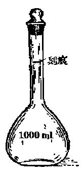

*图 4·8 量瓶*

这量瓶所示的容积[^p204-1]。利用这种仪器，可以精确地配制一定体积、一定克分子浓度的溶液。例如，要制备 500 毫升 6M 的氢氧化钠溶液，首先通过下面的计算，求出需用氢氧化钠的重量：

制备1升6M的氢氧化钠溶液需用NaOH 6GM；现设，制备0.5升6M的氢氧化钠溶液需用NaOH xGM。

列出比例式，得：

$$
1 \text{ 升 }： 0.5 \text{ 升 } = 6 \mathrm{GM}： x \mathrm{GM},
$$

$$
x = \frac {6 \times 0.5}{1} = 3 (\mathrm{GM})。
$$

因 NaOH的分子量=23+16+1=40，

故 3GM NaOH=（3×40）克=120克。

即需用氢氧化钠 120 克。

用天平精确称出氢氧化钠120克，先在烧杯里用少量水溶解，俟其冷却，小心倒入容量为500毫升的量瓶中，再用水洗清烧杯里残余的氢氧化钠溶液，一并倒入量瓶中。摇匀，再小心加水，使瓶中液面凹处底部刚和瓶颈上的刻痕相齐。此时瓶中液体的体积适为500毫升。这样就制得了所需的氢氧化钠溶液。

下面再讲一些有关配制一定克分子浓度溶液的计算问题。

#### 例 6

配制 250 毫升 2M 的硫酸铜溶液，需用硫酸铜晶体 \(\left(\mathrm{CuSO}_{4} \cdot 5\mathrm{H}_{2}\mathrm{O}\right)\) 多少克？

【解题分析】从硫酸铜晶体的分子式 \(CuSO_{4}\cdot5H_{2}O\) 可知，1个克分子的硫酸铜晶体里含有1个克分子的纯硫酸铜。因此，这里需用纯硫酸铜的克分子个数也就是需用硫酸铜晶体的克分子个数。这样，在解本题时，就不必要先求出需用的纯硫酸铜的克分子个数，再折算为硫酸铜晶体的克分子个数。

**解：** 因为配制1升这样的溶液需用硫酸铜晶体 2 GM；

现设，配制0.25升（250毫升）需用硫酸铜晶体xGM。

列出比例式，得：

$$
1 \text{ 升 }： 0.25 \text{ 升 } = 2 \mathrm{GM}： x \mathrm{GM},
$$

$$
x = \frac {2 \times 0.25}{1} = 0.5 (\mathrm{GM})。
$$

结晶硫酸铜 \(CuSO_{4}\cdot5H_{2}O\) 分子量 =249.5，

故需用结晶硫酸铜（0.5×249.5）克=124.75克。

答：需用结晶硫酸铜124.75克。

#### 例 7

配制 6M 的硫酸溶液 5 升，需用 95% 浓硫酸（比重 = 1.839 克/毫升）多少毫升？

【解题分析】先按上例算出需用纯硫酸的克分子个数。根据所用浓硫酸的比重可知每1毫升这样的硫酸的重量是1.839克，其中含有纯硫酸（1.839×95%）克或 \(\left(\frac{1.839\times0.95}{98}\right)GM\)，即 \(\left(\frac{1.839\times0.95}{98}\right)GM\)。通过比例法可以求出需用硫酸的体积。

**解：** 因为配制这样的硫酸溶液1升需用纯硫酸6GM；现需配制这样的硫酸溶液5升需用纯硫酸xGM。

列出比例式，得：

1升：5升=6GM：xGM，

$$
x = 30 (\mathrm{GM})。
$$

因所用浓硫酸1毫升中含有纯硫酸 \(\left(\frac{1\times 1.839\times 0.95}{98}\right)\mathrm{GM}\) 现设， \(y\) 毫升中含有纯硫酸 \(30\mathrm{GM}\)

列出比例式，得：

1毫升：y毫升= \(\left(\frac{1\times1.839\times0.95}{98}\right)\) GM：30GM，

$$
y=\frac{30\times98}{1.839\times0.95}\approx1680\text{（毫升）}
$$

答：需用浓硫酸1680毫升。

#### 例 8

市售浓盐酸的百分比浓度是 37%，比重是 1.19 克/毫升。求这种盐酸的克分子浓度。

【解题分析】先算出1升（即1000毫升）这样的浓盐酸里所含HCl的克分子个数。根据克分子浓度定义可知，这个数字就是这种盐酸的克分子浓度。

**解：** 因1升（即1000毫升）这样的浓盐酸里含有HCl

$$
\left(\frac {1000 \times 1.19 \times 0.37}{\mathrm{HCl}}\right) \mathrm{GM} = \left(\frac {1000 \times 1.19 \times 0.37}{36.5}\right) \mathrm{GM} \approx 12 \mathrm{GM}.
$$

根据克分子浓度定义可知，这种盐酸的克分子浓度就是12M。

答：盐酸的克分子浓度是12M。

前面我们讲过了溶液浓度的两种具体表示方法，即百分比浓度和克分子浓度。这两种浓度表示方法各有优缺点。

用百分比浓度来表示溶液浓度的优点是：

（1） 配制比较方便。例如要配制 10% 的溶液，只须把 10 克溶质 （不论溶质是食盐或者是硝酸钾或者其他都是一样） 溶解在 90 克水里就可以了。因为百分比浓度只和溶质和溶液的重量的比值有关，而和溶质、溶剂是什么物质无关。因此，在配制时，可以不必考虑溶质的性质。

（2） 表示物质溶液的浓淡程度比较明确。在一定重量的溶液里，百分比浓度相同的溶液溶有溶质的重量一般说来是相同的；百分比浓度不同的溶液，浓度大的溶有溶质的重量一般也大。

由于这样的原因，百分比浓度在工业、农业、商业、医药等方面应用很广。

百分比浓度虽然有着这些优点，但从化学的要求看来，还是不够理想的。因为在化学上，更重要的是要能够表示出溶液里溶质的分子数的多少，而百分比浓度却表示不出来。在重量相同、百分比浓度也相同的各种物质的溶液里，溶有溶质的重量是相同的，但溶质的分子数一般说来是不同的。例如，我们可以肯定地说20%蔗糖溶液里溶有蔗糖的重量比相同重量的10%食盐溶液里溶有食盐的重量大一倍，但完全不能说前一溶液里蔗糖的分子数也比后一溶液里食盐的分子数大一倍。由于蔗糖的分子量（=342）比食盐的分子量（=58.5）大得多（即1个蔗糖分子差不多等于6个食盐分子的重量），因而前一溶液里溶有蔗糖的分子数反而比后一溶液里的食盐的分子数少得多。

克分子浓度虽然在配制时需要比较繁复的计算，但它表示了溶液里分子浓度的大小，在体积相同、克分子浓度相同的一切溶液里，溶有溶质的重量一般说来是不同的，但它们的分子个数却是相同的。因此，在化学里，克分子浓度的应用更为广泛。

为了明确这两种溶液浓度表示方法的意义和区别，现在再把它们列表对比如下：

表 4·6 百分比浓度和克分子浓度的比较

|  | 百分比浓度 | 克分子浓度 |
| --- | --- | --- |
| 定义 | 用100重量单位溶液里溶有溶质的重量单位数来表示溶液的浓度的叫做百分比浓度 | 用1升（即1000毫升）溶液里溶有溶质的克分子个数（即GM数）来表示溶液的浓度的叫做克分子浓度 |
| 计算公式 | 溶液的百分比浓度\(= \frac{\text{溶质的重量单位数}}{\text{溶液的重量单位数}} \times 100\%\)（溶质、溶液所用的重量单位必然是相同的） | 溶液的克分子浓度\(= \frac{\text{溶质的克分子个数}}{\text{溶液的升数}}\) |
| 符号 | % | M |
| 特点 | 重量相同、百分比浓度也相同的任何溶液里，溶有溶质的重量都相同 | 体积相同、克分子浓度也相同的任何溶液里，溶有溶质的分子个数都相同 |

#### 习题 4·5（3）

1. 什么叫做克分子浓度？体积相同、克分子浓度也相同的不同物质的溶液里，溶有溶质的重量是否相同？分子个数是否相同？为什么？

2. 配制：

（1） 500 毫升 1M 的硫酸溶液，需用纯硫酸多少克？如用 95% 硫酸又需多少克？多少毫升（已知 95% 硫酸的比重 = 1.839 克/毫升）？

（2） 200 毫升 6M 氢氧化钠溶液，需用氢氧化钠多少克？

（3） 250 毫升 1M 碳酸钠溶液，需用纯碱 \(\left(\mathrm{Na}_{2}\mathrm{CO}_{3} \cdot 10\mathrm{H}_{2}\mathrm{O}\right)\) 多少克？

3. 在相同重量的 10% 盐酸和 15% 硫酸溶液里，哪个含有溶质的分子个数较多？哪个较少？

4. 把 10 毫升 2M 的碘化锌溶液蒸干后，可得碘化钾晶体多少克？

5. 盐酸和氢氧化钠发生反应时的化学方程式是：

$$
\mathrm{HCl} + \mathrm{NaOH} = \mathrm{H}_{2} \mathrm{O} + \mathrm{NaCl}
$$

如果所用盐酸和氢氧化钠溶液的克分子浓度相同，在完全反应时，它们需用的体积之比怎样？如果所用盐酸的克分子浓度比氢氧化钠溶液大一倍，它们需用的体积之比又怎样？

6. 在 200 毫升的 2M 氢氧化钠溶液里，加入水 300 毫升，问此时氢氧化钠溶液的克分子浓度是多少？

### 本章提要

#### 1. 溶液

溶液是由溶质分子、溶剂（水）分子和溶质的水合分子所生成的均匀的液体。它是介乎混和物和化合物之间的一类物质，但从分子论的角度看来，它应该认作是混和物（因为它不是由同一种分子所组成的）。

（1） 溶液的外形特征：澄清、透明和均匀（和浊液相区别）。

（2） 溶液里溶质的分散程度：溶质以单个分子分散在溶剂分子间 （和油液相区别）。

#### 2. 物质的溶解过程

是一个复杂的物理-化学过程。

#### 3. 物质溶解过程里的热现象

是物质溶解时吸热过程和放热过程的总和。当吸热过程中吸收的热量大于放热过程中放出的热量时，显现出吸热现象；当放热过程中放出的热量大于吸热过程中吸收的热量时，显现出放热现象。

#### 4. 物质的溶解性

物质在某一溶剂里溶解的能力，或者物质均匀地扩散在某一溶剂里的能力，叫做物质在该溶剂里的溶解性。

#### 5. 饱和溶液和不饱和溶液

在一定温度下，某物质的溶液如已不能溶解更多的溶质时，称为饱和溶液；如还能溶解更多的溶质时，称为不饱和溶液。

#### 6. 溶解度

在一定温度下，由100克溶剂所成的饱和溶液里溶有溶质的克数，叫做溶解度。

#### 7. 物质从溶液中结晶析出的方法

（1） 蒸发溶剂的方法。适用于溶解度受温度改变影响很小的物质的结晶。

（2） 冷却溶液的方法。适用于溶解度受温度改变影响很大的物质的结晶。

#### 8. 结晶水和结晶水合物

晶体里含有的定量的水叫做结晶水；含有结晶水的物质叫做结晶水合物。

#### 9. 结晶过程在工业上的应用

（1） 用以从溶液里制得晶体物质。（2） 用以分离物质。（3） 用以提纯物质（再结晶）。

#### 10. 溶液的浓度

在一定重量（或体积）溶液里溶有溶质的量，叫做溶液的浓度。

（1） 百分比浓度（%）：用 100 重量单位 （一般用克） 的溶液里溶有溶质的重量单位数 （一般是克数） 来表示的溶液的浓度，叫做百分比浓度。

（2） 克分子浓度 （M）：用 1 升溶液里溶有溶质的克分子个数来表示的溶液的浓度，叫做克分子浓度。

### 复习题四

1. 什么是溶液？为什么泥水和牛奶都不是溶液？试用分子论的观点加以说明。

2. 我们说，“溶液是介于混和物和化合物之间的一类物质”，但又说，“从分子论的观点看来，溶液应该认作是混和物”。这两种说法有矛盾吗？为什么？

3. 为什么饱和溶液不一定是浓溶液，不饱和溶液也不一定是稀溶液？试用几个实例来说明。

4. （1） 有一种比较浓但并不饱和的硝酸钾溶液。问用哪几种方法可以使它变成饱和溶液？

（2） 有一在 \(20^{\circ}\) C 时为饱和的硝酸钾溶液。问用哪几种方法可以使它变成不饱和溶液？

5. 物质的溶解度决定于哪些因素？

6. 怎样证明天然水里溶解有“空气”？溶解在天然水里的“空气”的组成（即氧气、氮气所占的百分比）是否和平常空气的组成一样？如果不一样，哪种气体所占百分比（比在空气里所占的）是增加了，哪种气体则减少了？为什么？

> **提示：** 根据表 4·3的数据，比较氧气和氮气在水里的溶解度有什么不同。

7. 比较溶液浓度的两种表示方法——百分比浓度和克分子浓度的优缺点。

8. 在 \(20^{\circ}\) C 时把 0.03 克消石灰 \(\left[\mathrm{Ca(OH)}_{2}\right]\) 溶解在 25 克水里，所得溶液是消石灰的饱和溶液。问：

（1） \(20^{\circ}\) C时消石灰在水里的溶解度是多少？

（2） 所得溶液的百分比浓度是多少？

（3） 假定所得溶液的体积是 25 毫升，这个溶液的克分子浓度是多少？

9. 在下列溶液中，各含有溶质多少克：

（1） 50 克在 \(20^{\circ}\) C 时为饱和的食盐溶液（\(20^{\circ}\) C 时食盐的溶解度是36克）；

（2） 25 克 8% 的食盐溶液；

（3） 30 毫升 0.1M 的食盐溶液。

10. 把 50 毫升 2M 的硫酸溶液加入到 80 毫升 6M 的硫酸溶液里去，问所得硫酸溶液的克分子浓度是多少？

11. 和 200 毫升 1M 的氢氧化钠溶液完全作用，需用下列溶液多少体积：

（1） 1M 的硝酸溶液

（反应的化学方程式： \(\mathrm{NaOH} + \mathrm{HNO}_3 = \mathrm{H}_2\mathrm{O} + \mathrm{NaNO}_3\)）；

（2） 1M的硫酸溶液

（反应的化学方程式： \(2\mathrm{NaOH} + \mathrm{H}_{2}\mathrm{SO}_{4} = 2\mathrm{H}_{2}\mathrm{O} + \mathrm{Na}_{2}\mathrm{SO}_{4}\)）；

（3） 1M 的盐酸溶液

（反应的化学方程式： \(\mathrm{NaOH} + \mathrm{HCl} = \mathrm{H}_2\mathrm{O} + \mathrm{NaCl}\)）。

12. 把氢氧化钠溶液加入氯化铁溶液里，发生如下的化学反应：

$$
3 \mathrm{NaOH} + \mathrm{FeCl}_{3} = \mathrm{Fe(OH)}_{3} \downarrow + 3 \mathrm{NaCl}
$$

问要使1升1M的 \(\mathrm{FeCl}_3\) 溶液完全反应，需用1M的氢氧化钠溶液多少升？如用0.5M的氢氧化钠溶液，则又需用多少升？

### 注释

[^p179-1]: 乙醚俗名“以脱”，是一种有麻醉性的挥发性液体。

[^p200-1]: 在化学里，M单独应用时是代表物质的分子量的（§1·9），例如硫酸的分子式是 \(H_{2}SO_{4}\)， \(M=1\times2+32+16\times4=98\)，这里的M指的是硫酸的分子量。如果M写在数字后面，作为一种单位，那代表的就是克分子浓度，例如硫酸溶液浓度是6M，那就表示它的浓度是6克分子浓度，即在1升这样的溶液里，将有6个克分子（即6GM）的硫酸。

[^p204-1]: 应该指出，液体的体积还和温度有关系（温度增高，液体体积膨胀），量瓶的容量是指在一定温度（一般是指25℃）下容纳液体的体积。

## 第五章 氧化物、碱、酸、盐

在开始学习化学的时候，我们就已指出，化学研究的对象是物质。但是，自然界物质的种类是很多很多的。对于这么多种类的物质，我们当然不可能都一个个单独地拿来研究。因此，在系统学习元素和它们的化合物以前，首先要讨论一下物质的分类方法。

在化学上，一般都是以物质的分子组成和性质作为物质分类的依据的，而物质分子组成上的共同点或者不同点，又都必然会反映到它们的性质上来。因此，这两个方面又是密切相联系的。

前面讲过，纯净物质可以根据组成它们的元素种类是否相同而分成单质和化合物两大类。单质又可根据它们的性质（主要是物理性质）分成金属和非金属两类。在本章里，我们将看到，化合物也可以根据它们的分子组成和性质（主要是化学性质）分成氧化物、碱、酸、盐等四大类。

在学习前面几章的时候，我们对这几类化合物已经或多或少地有了一些接触。例如在第二章里，我们已对氧化物作了初步的介绍。用来检验二氧化碳存在的石灰水是澄清的氢氧化钙的饱和溶液，氢氧化钙就是一种碱。过去我们曾经谈过的氢氧化钠，它也是一种碱。我们在实验时经常用到的硫酸、盐酸等，它们都是酸。至于盐类，我们接触得就更多了。我们常用的食盐，就是盐类的一种。此外如氯化铵、碳酸钠、硫酸铜等也都是盐。但在前面，我们只是零零碎碎地使用到这些物质，或者只是不全面地、简单地介绍了它们某一方面的性质。在本章里，我们将从各类物质里具有代表性的一些化合物谈起，从个别物质的分子组成和化学性质概括得出各类物质的定义、分子组成、命名方法、通性和一般制法等。

在研究各类物质的时候，我们又将看到它们之间的相互作用和相互转变，从而初步概括出物质变化的规律性。掌握了这些规律性，我们在将来学习到大量有关物质变化的知识时，就能从一般去指导个别，不再感到头绪纷纭和难于记忆了。因此，本章内容对今后顺利地学习元素和化合物的系统知识是有重大意义的。

### § 5·1 单质：金属、非金属、惰性气体

在第一章里（§1·6）我们就已谈到，单质可以根据它们物理性质的不同而分成金属和非金属两大类。金属具有特殊的金属光泽、有延性和展性、能够传热和导电。非金属通常没有光泽、固态的有脆性，不容易传热和导电。

金属和非金属在常温时的形态也是有区别的。金属除了汞（俗名水银）是液态外，其他都是固态。非金属在常温下有固态的（例如碳、硫等），有液态的（只有溴一种），也有气态的（例如氢气、氧气等）。

金属和非金属不仅物理性质不同，它们的化学性质也不同。大部分的金属和非金属都能在一定条件下和氧化合生成氧化物，但金属的氧化物和非金属的氧化物的性质是不同的。关于这个问题，我们将在本章第7节里详细讨论。

除金属和非金属外，单质里还有一类叫做惰性气体。惰性气体包括氦气、氖气、氩气、氪气和氙气等。这在第二章讲述空气的成分时已经简单介绍过了（§2·1）。

惰性气体从它们的物理性质看来，应该归入非金属一类，但是从它们的化学性质看来，它们和金属、非金属都不相同。因此，可以另立一类。这就是说，在化学上，单质可以分成金属、非金属和惰性气体三大类。

### § 5·2 氧化物

氧化物的存在和用途 在第二章里我们就已谈到了氧化物。在自然界里，氧化物是广泛地存在着的。水是地球上分布最广的氧化物。在大气里含有的二氧化碳，以及构成砂砾、石英、玛瑙等的主要成分二氧化硅都是氧化物。蕴藏在地下的许多金属矿石，例如赤铁矿 \(\left(\mathrm{Fe}_{2}\mathrm{O}_{3}\right)\)、磁铁矿 \(\left(\mathrm{Fe}_{3}\mathrm{O}_{4}\right)\)、赤铜矿 \(\left(\mathrm{Cu}_{2}\mathrm{O}\right)\)、黑铜矿 \(\left(\mathrm{CuO}\right)\)、铝矾土矿 \(\left(\mathrm{Al}_{2}\mathrm{O}_{3}\right)\) 等的主要成分也都是氧化物。

从氧化物的形态来讲，有气态的氧化物，例如二氧化碳、二氧化硫等；有液态的氧化物，水就是我们最熟悉的液态的氧化物；也有固态的氧化物，例如生石灰（CaO）、二氧化硅（\(SiO_{2}\)）等。

氧化物的用途非常广泛，有许多氧化物是工业上重要的原材料。例如二氧化碳是制造纯碱（即碳酸钠 \(Na_{2}CO_{3}\)）的主要原料之一，生石灰（氧化钙 CaO）是一种重要的建筑材料，氧化锌（ZnO）常用来制造白色油漆颜料（锌白），硫的氧化物（二氧化硫和三氧化硫）是工业上制造硫酸的原料。但是，某些氧化物在自然界里并不存在，或者存在的量不够生产上的需要。因此，在工业上，还必须大量生产那些具有实用意义的氧化物。

氧化物的制造 要制造某一类化合物，可以根据它的组成成分来寻求制取的可能的途径。氧化物是由两种元素组成的化合物。因此，制造氧化物，一方面可以用比它更简单的物质（比氧化物更简单的物质只有单质了）通过化合反应（即和氧直接化合）来制造；另一方面也可以用比它复杂一些的物质（含有三种元素的化合物，例如某些盐类）通过分解反应来制造。

用单质（金属或非金属）直接和氧化合制取氧化物，主要是把单质在纯氧或空气里燃烧。工业上，为了使燃烧进行得比较完全，常先把要燃烧的原料，加热变成蒸气，让蒸气再来燃烧。例如，制取氧化锌（ZnO），就用燃烧锌的蒸气的方法来制取。这个反应的化学方程式是：

$$
2 \mathrm{Zn} + \mathrm{O}_{2} \xrightarrow {\text{高温}} 2 \mathrm{ZnO}
$$

（铝蒸气） （氧化锌）

在第三章里我们讲过，在石灰窑里煅烧石灰石 \(\left(\mathrm{CaCO}_{3}\right)\) 可以制得生石灰（CaO），这是利用分解反应制取氧化物的一个重要例子。这个反应的化学方程式是：

$$
\mathrm{CaCO}_{3} \xrightarrow {\text{ 强热 }} \mathrm{CaO} + \mathrm{CO}_{2} \uparrow
$$

这个方法工业上不仅用来生产生石灰，而且也用来大量制造二氧化碳气体（§3·4）。

某些不稳定的酸和碱，加热也能分解生成氧化物，这在§5·3、§5·4两节里还将讲到。

氧化物的化学性质 氧化物的化学性质，我们主要谈氧化物和水发生的化合反应（称做“水化反应”）。

许多氧化物都能和水发生化合反应，生成的化合物称做氧化物的水化物。

在建筑工地上，我们常能看到生石灰和水反应时发生的剧烈沸腾现象。如果拿几小块生石灰，放在蒸发皿里，加少许水进去。起初水被生石灰所吸收，不久就剧烈地发热，使一部分水变成蒸气从蒸发皿口冒出来（图 5·1）。块状的生石灰开始松散开来，变成白色的粉末。生石灰和水化合后的生成物，叫做消石灰，在化学上称做氢氧化钙，分子式是Ca（OH） \(_{2}\)。这个反应的化学方程式是：

*图 5·1 生石灰和水作用*

$$
\mathrm{CaO} + \mathrm{H}_{2} \mathrm{O} = \mathrm{Ca(OH)}_{2}
$$

氢氧化钙是由一分子氧化钙和一分子水化合而成的化合物，它是氧化钙的水化物。

氧化物的水化物和第四章里所讲的结晶水合物不同。在氧化物的水化物的分子里，水不是以整个分子和氧化物的分子相结合的。因此，在氧化物的水化物的分子式里，不再保留有水的分子式。例如，氢氧化钙的分子式是 \(\mathrm{Ca(OH)}_2\)，不应写作 \(\mathrm{CaO}\cdot \mathrm{H}_2\mathrm{O}\)

二氧化碳也能和水化合，生成一种不稳定的酸，叫做碳酸 \(\left(\mathrm{H}_{2}\mathrm{CO}_{3}\right)\)。这个反应的化学方程式是：

$$
\mathrm{CO}_{2} + \mathrm{H}_{2} \mathrm{O} = \mathrm{H}_{2} \mathrm{CO}_{3}
$$

碳酸是二氧化碳的水化物。

除此以外，还有许多氧化物，都能和水化合，生成相应的水化物。举例如下：

$$
\mathrm{Na}_{2} \mathrm{O} + \mathrm{H}_{2} \mathrm{O} = 2 \mathrm{NaOH} \quad (\text{ 氢氧化钠是氧化钠的水化物 })
$$

氧化钠 氢氧化钠

$$
\mathrm{K}_{2} \mathrm{O} + \mathrm{H}_{2} \mathrm{O} = 2 \mathrm{KOH} \quad (\text{ 氢氧化钾是氧化钾的水化物 })
$$

氧化钾 氢氧化锌 \(P_{2}O_{5}+3H_{2}O\) （热水）= \(2H_{3}PO_{4}\) （磷酸是五氧化二磷的水化物）
五氧化二磷 磷酸

\(SO_{3} + H_{2}O = H_{2}SO_{4}\) （硫酸是三氧化硫的水化物）

三氧化硫 硅酸

也有一些氧化物，例如二氧化硅 \(\left(\mathrm{SiO}_{2}\right)\)、氧化铜 \(\left(\mathrm{CuO}\right)\)、氧化铁 \(\left(\mathrm{Fe}_{2}\mathrm{O}_{3}\right)\) 等，它们不能跟水直接化合生成水化物，但可以用间接的方法制得（见第222页）。因此，这些氧化物的水化物还是存在着的。它们分别是硅酸 \(\left(\mathrm{H}_{2}\mathrm{SiO}_{3}\right)\)、氢氧化铜 \(\left[\mathrm{Cu(OH)}_{2}\right]\)、氢氧化铁 \(\left[\mathrm{Fe(OH)}_{3}\right]\) 等。只有极少数的氧化物，例如一氧化碳（CO）、一氧化氮（NO）等，它们的水化物是不存在的。

氧化物的分子式写法和命名法 前面我们已经知道了不少氧化物的分子式，可以看出不论金属或非金属的氧化物的分子式，都是金属或非金属元素写在前面，氧元素写在后面。根据化合价规则（§2·15），氧化物分子式里金属或非金属元素的化合价总数一定要等于氧元素的化合价总数。我们知道氧的化合价是2价，如果以R代表金属或非金属元素，元素的化合价以罗马数字注在元素符号上面，那么，不同化合价的金属或非金属元素的氧化物的分子式是：

$$
\begin{array}{l} \mathrm{R}_{2}^{\mathrm{H}} \mathrm{O} (\text{例如} \mathrm{Na}_{2} \mathrm{O}), \quad \mathrm{RO} (\text{例如} \mathrm{CaO}), \\ \mathrm{R}_{2}^{\mathrm{H}} \mathrm{O}_{3} (\text{例如} \mathrm{Fe}_{2} \mathrm{O}_{3}), \quad \mathrm{RO}_{2} (\text{例如} \mathrm{CO}_{2}), \\ \mathrm{R}_{2} \mathrm{O}_{5} (\text{例如} \mathrm{P}_{2} \mathrm{O}_{5}), \quad \mathrm{RO}_{3} (\text{例如} \mathrm{SO}_{3}), \\ \mathrm{R}_{2} \mathrm{O}_{3} (\text{例如} \mathrm{Cl}_{2} \mathrm{O}_{7})。 \\ \end{array}
$$

金属氧化物一般根据分子里金属的名字命名为“氧化某金属”，例如 \(K_{2}O\) 命名为氧化钾，CaO 命名为氧化钙等。如果一种金属能够形成几种氧化物，金属元素化合价较低的命名为“氧化亚某金属”，化合价较高的仍命名为“氧化某金属”。例如 FeO（其中铁是两价）命名为氧化亚铁。 \(Fe_{2}O_{3}\) （其中铁是三价）命名为氧化铁。命名非金属氧化物时，常把它分了里的氧原子个数和非金属原子个数一齐读出来。例如 \(P_{2}O_{5}\) 命名为五氧化二磷， \(SO_{3}\) 命名为三氧化硫等。

#### 习题 5·2

1. 为什么惰性气体从它们的物理性质来看可以归入非金属一类，但从它们的化学性质来看，既不能归入非金属又不能归入金属，而要另立一类？

2. 什么叫做氧化物？指出下列各物质中，哪些是氧化物，哪些不是氧化物？为什么？

（1） 氧化汞，（2） 水，（3） 氯酸钾，（4） 硫酸，（5） 二氧化碳。

3. 写出两种金属元素氧化物和两种非金属元素氧化物的分子式，并注明它们的读法。

4. 制取氧化物有哪两种可能的方法？各举一个实例。

5. 怎样从石灰石 \((\mathrm{CaCO}_3)\) 制得消石灰 \([\mathrm{Ca(OH)}_2]\)，写出反应的化学方程式。

6. 按照下述化学反应顺序，结合一个实例，写出完整的化学方程式：

（1） 金属→金属氧化物→金属氧化物的水化物；

（2） 非金属→非金属氧化物→非金属氧化物的水化物。

7. 1克原子的下列元素完全氧化时，各需氧气多少克？

（1）锌，（2）铝，（3）磷。

### § 5·3 碱

#### 几种重要的碱

金属氧化物能直接或间接生成它们相应的水化物，大部分金属氧化物的水化物都属于“碱类”。现在先介绍几种重要的碱。

1. 氢氧化钠（NaOH） 氢氧化钠是氧化钠的水化物，氧化钠和水直接化合，就会生成氢氧化钠：

$$
\mathrm{Na}_{2} \mathrm{O} + \mathrm{H}_{2} \mathrm{O} = 2 \mathrm{NaOH}
$$

氢氧化钠是重要的化学工业产品之一。

氢氧化钠是一种白色固体，很易溶解于水（在80℃时氢氧化钠的溶解度是313克），溶解时放出大量的热（§4·2）。在空气里，它能够吸收空气里的水蒸气而自身溶解（这种作用叫做潮解）。氢氧化钠的水溶液有肥皂似的滑腻的感觉，并且有很强的腐蚀性，皮肤、织物、纸张等都能被它腐蚀。如果皮肤沾上了氢氧化钠溶液，皮肤就会变得粗糙，日常所用的洗衣皂（由油脂和氢氧化钠作用而制得）里，常含有少量没有作用掉的氢氧化钠，因此手在肥皂水里浸的时间过长，皮肤常会变糙。在衣服上如果溅着了很稀的氢氧化钠溶液，当时好象没有什么损伤，但是干了以后，由于稀溶液的浓缩，织物被腐蚀，衣服上就会出现一个个小洞。羊毛织物比一般棉织品更易受到氢氧化钠的腐蚀，在氢氧化钠的浓溶液里放入少许羊毛（或兔毛），稍稍加热，羊毛会完全溶解在氢氧化钠溶液里。因此，处理氢氧化钠和它的溶液时，必须十分小心。不要用手直接去拿固体的氢氧化钠（必须用镊子）。如果有氢氧化钠溶液溅在衣服上或皮肤上时，必须立即用水冲洗干净。

由于氢氧化钠具有这样强烈的腐蚀性，因此在商业上又称做“苛性碱”或“烧碱”。

氢氧化钠溶液能使指示剂变色。所谓指示剂，大都是一些复杂的有机化合物[^p219-1]，它们遇到酸或碱时，会显出不同的颜色。利用这类物质，可以指示出溶液是酸性还是碱性。最常用的指示剂是石蕊和酚酞（读作“分太”）。平常用的石蕊试液，是一种紫色的液体，常用的酚酞试液是酚酞的酒精溶液，是一种无色的液体。

如果在氢氧化钠溶液里滴入一滴或几滴紫色的石蕊试液，溶液立刻变成蓝色。

如果在氢氧化钠溶液里滴入一滴或几滴无色的酚酞试液，溶液立刻显出深红色。

为了方便起见，在实验室里还常使用一种“石蕊试纸”来识别酸和碱。石蕊试纸有红色和蓝色两种。氢氧化钠溶液能使红色的石蕊试纸变成蓝色，但对蓝色的石蕊试纸则不发生变化。

氢氧化钠能和盐酸、硫酸等酸反应，反应的化学方程式是：

$$
\begin{array}{l} \mathrm{NaOH} + \mathrm{HCl} = \mathrm{NaCl} + \mathrm{H}_{2} \mathrm{O} \\ \mathrm{NaOH} + \mathrm{H}_{2} \mathrm{SO}_{4} = \mathrm{Na}_{2} \mathrm{SO}_{4} + 2 \mathrm{H}_{2} \mathrm{O} \\ \text{ 硫酸钠 } \\ \end{array}
$$

反应结果生成水和另一种属于“盐类”的物质，即氯化钠和硫酸钠。所谓“盐类”，是指各种酸分子里氢原子被各种金属原子置换后所生成的一类物质。氯化钠（食盐的主要成分）是盐酸（HCl）分子里的氢原子被金属钠原子置换后生成的化合物，是盐酸的盐（或简称盐酸盐）；硫酸钠是硫酸 \(\left(\mathrm{H}_{2}\mathrm{SO}_{4}\right)\) 分子里两个氢原子被两个金属钠原子置换后生成的化合物，它是硫酸的盐（或简称硫酸盐）。

氢氧化钠还能和某些氧化物（主要是非金属的氧化物）如二氧化碳、二氧化硫等反应，反应结果也是生成盐和水：

$$
2 \mathrm{NaOH} + \mathrm{CO}_{2} = \mathrm{Na}_{2} \mathrm{CO}_{3} + \mathrm{H}_{2} \mathrm{O}
$$

$$
2 \mathrm{NaOH} + \mathrm{SO}_{2} = \mathrm{Na}_{2} \mathrm{SO}_{3} + \mathrm{H}_{2} \mathrm{O}
$$

亚硫酸钠

碳酸钠是碳酸 \(\left(\mathrm{H}_{2}\mathrm{CO}_{3}\right)\) 的盐；亚硫酸钠是亚硫酸 \(\left(\mathrm{H}_{2}\mathrm{SO}_{3}\right)\) 的盐。

2. 氢氧化钙 \(\left[\mathrm{Ca(OH)}_{2}\right]\) 前面讲过的氧化钙 （CaO） 和水化合后生成的水化物氢氧化钙也是一种碱。氢氧化钙的溶解度（§4·3）比起氢氧化钠要小得多，它只能稍微地溶解于水中。我们平常用的石灰水就是澄清的氢氧化钙的饱和溶液。

氢氧化钙的性质在许多方面都和氢氧化钠相似，例如对指示剂的反应，氢氧化钙溶液也能使紫色的石蕊试液或红色的石蕊试纸变蓝，使无色的酚酞试液变红。

氢氧化钙对皮肤、织物等也有腐蚀性。只是由于氢氧化钙的溶解度较小，我们不可能制得象氢氧化钠那样浓的溶液。因此，氢氧化钙溶液的腐蚀性，不如氢氧化钠溶液那样强烈。

氢氧化钙也能和酸反应生成盐和水。例如氢氧化钙和盐酸反应，化学方程式是：

$$
\mathrm{Ca(OH)}_{2} + 2 \mathrm{HCl} = \mathrm{CaCl}_{2} + 2 \mathrm{H}_{2} \mathrm{O}
$$

氯化钙

因为氢氧化钙的溶解度较小，在这个反应里，我们实际上不用氢氧化钙的溶液，而用它和水混和后生成的糊状物，加入盐酸后，氢氧化钙变成容易溶解的氯化钙（氯化钙是一种盐酸的盐），结果使得糊状物逐渐溶解，最后变成澄清的氯化钙溶液。

氢氧化钙还能和硝酸 \(\left(\mathrm{HNO}_{3}\right)\) 等其他酸类反应，生成相应的盐。

氢氧化钙也能和二氧化碳、二氧化硫等非金属的氧化物反应。我们已经知道，在石灰水里通进二氧化碳气体，就会有碳酸钙的白色沉淀生成，从而使得澄清的石灰水变得浑浊。它们反应的化学方程式是：

$$
\mathrm{Ca} (\mathrm{OH}) _ {2} + \mathrm{CO}_{2} = \mathrm{CaCO}_{3} \downarrow + \mathrm{H}_{2} \mathrm{O}
$$

碳酸钙

我们在实验室里常利用这个反应来检验二氧化碳的存在（§3·4）。

3. 不溶性碱 上面所讲的两种碱都是可溶于水的，称做可溶性碱。但更多的碱，例如氢氧化铜、氢氧化铁等都是不溶于水的，称做不溶性碱。这些不溶性碱从它们的分子组成看来，也是金属氧化物的水化物。由于它们不溶于水，因此不能直接由氧化物和水反应制得（§5·2），须用间接的方法（第222页）。

因为我们不能制得不溶性碱的水溶液，所以它们不能使指示剂发生颜色的变化。但是，它们和可溶性碱一样，也能和酸发生反应，生成盐和水。反应结果，不溶性碱溶解于酸溶液中。例如：

$$
\mathrm{Cu} (\mathrm{OH}) _ {2} + \mathrm{H}_{2} \mathrm{SO}_{4} = \mathrm{CuSO}_{4} + 2 \mathrm{H}_{2} \mathrm{O}
$$

硫酸铜

$$
\mathrm{Fe} (\mathrm{OH}) _ {3} + 3 \mathrm{HCl} = \mathrm{FeCl}_{3} + 3 \mathrm{H}_{2} \mathrm{O}
$$

氯化铁

不溶性碱大都是不稳定的，加热容易分解生成金属氧化物和水。例如：

$$
\mathrm{Cu(OH)}_{2} \xrightarrow {\text{加热}} \mathrm{CuO} + \mathrm{H}_{2} \mathrm{O}
$$

$$
2\mathrm{Fe(OH)}_{3}\xrightarrow{\text{加热}}\mathrm{Fe}_{2}\mathrm{O}_{3}+3\mathrm{H}_{2}\mathrm{O}
$$

#### 习题 5·3（1）

1. 写出下面反应的化学方程式：

（1） 金属钙→氧化钙→氢氧化钙→碳酸钙；

（2） 金属钠→氧化钠→氢氧化钠→氯化钠。

2 分别写出氢氧化铁和盐酸、硝酸、硫酸反应的化学方程式。

3. 比较可溶性碱和不溶性碱的性质。

4. 怎样把下面两张无色的溶液区分开来：（1）氢氧化钠的稀溶液，（2）石灰水？

5. 16克的固体氢氧化钠至多能够吸收二氧化碳气体多少升（在标准状况下）？

6. 要使 9.75 克氢氧化铜完全溶解，需用 6M 的盐酸多少毫升？最后生成氯化铜多少克？

7. 我们说不溶性碱能“溶解”于酸中，这里所说的“溶解”和第四章里所讲的可溶性溶质的溶解有什么区别？

#### 碱的组成、分子式和命名法

从上面所谈的几种碱里，可以看到它们的共同特征。

首先，在分子组成方面。如果我们比较这些化合物的分子式，就可看到它们的分子都是由一个金属原子和一个或几个氢氧根[^p223-1]结合而成的。

其次，在性质方面。它们有许多共同的地方，其中特别重要的是：不论可溶性碱或者不溶性碱，都能和酸作用生成盐和水。

根据这两方面的特征，可以得出碱的定义如下：凡是分子由一个金属原子和一个或几个氢氧根组成的，并且能跟酸作用生成盐和水的化合物叫做碱。

我们已经知道，碱可以根据它在水里的溶解性，分成可溶性碱和不溶性碱两类。可溶性碱除前面讲过的氢氧化钠和氢氧化钙外，还有氢氧化钾（KOH）。除了这些以外，其余的碱，大部分都是不溶性碱。

现在我们再来谈谈碱的分子式的写法。根据碱的定义可知，碱的分子是由一个金属原子和一个或几个氢氧根结合而成的。我们知道，氢氧根的化合价是一价。因此，在碱的分子里，氢氧根的个数一定等于金属原子的化合价。

在书写碱的分子式时，习惯上总是把金属原子的符号写在前面，氢氧根写在后面。如果碱分子里的氢氧根不止一个，那末就要用一个括号把符号OH括起来，并在括号的右下角用数字注明氢氧根的个数。下面举一些例子：

氢氧化钠的分子式是 \(\mathrm{NaOH}\)，不要写成 \(\mathrm{NaOH}\)，因为这里用括号没有意义。

氢氧化铜分子是由1个铜原子和2个氢氧根所组成（铜是2价），因此，它的分子式应该写成 \(\mathrm{Cu(OH)}_2\)，这里的括号不可缺少。因为，如果写成 \(\mathrm{CuOH}_2\)，就表示氢氧化铜分子由1个铜原子、1个氧原子和2个氢原子所组成，这显然没有反映出氢氧化铜分子组成的实际情况，因此是错误的。同样，氢氧化铁分子是由1个铁原子和3个氢氧根所组成，铁是3价，它的分子式应该写成 \(\mathrm{Fe(OH)}_3\)，不可写成 \(\mathrm{FeOH}_3\)。

由此可见，书写碱的分子式时，必须注意两点：

（1） 顺序问题：先金属后氢氧根，氢氧根一定要写成OH，不能写成HO。

（2） 括号问题：分子里如果只有一个氢氧根，不要用括号，用了不仅是多余，而且是错误；分子里如果有几个氢氧根，氢氧根外面一定要用括号，不用就是错误。

碱的命名法和金属氧化物相似（§5·2），根据分子里金属的名字命名为“氢氧化某金属”。如果某种金属的氢氧化物不止一种，金属元素化合价较低的命名为“氢氧化亚某金属”，金属元素化合价较高的仍命名为“氢氧化某金属”。例如：

KOH 称为氢氧化钾

\(\mathrm{Fe(OH)}_{2}\) 称为氢氧化亚铁

\(\mathrm{Fe(OH)}_{3}\) 称为氢氧化铁

值得注意的是：命名时候的顺序刚刚和分子式里元素符号的顺序相反。例如 KOH 的正确命名是氢氧化钾，而不是钾化氧氢。这种情况不仅限于碱的命名，过去学过的氧化物的命名和以后即将学到的盐的命名也都是这样的。

#### 习题 5·3（2）

1. 写出下列各种碱的分子式：氢氧化铁、氢氧化亚铜、氢氧化铝、氢氧化锌、氢氧化铝。从这些碱的分子式，可以看出碱在分子组成上有什么共同点？

2. 怎样命名：\(\mathrm{Ca(OH)}_{2}, \mathrm{Fe(OH)}_{2}, \mathrm{Cu(OH)}_{2}\)？

3. 为什么下面这些碱的分子式都是错误的？应该怎样改正？

$$
\mathrm{K} (\mathrm{OH}), \mathrm{K} (\mathrm{OH}) _ {2}, \mathrm{CuOH}_{2}, \mathrm{CuO}_{2} \mathrm{H}_{2}.
$$

#### 碱的化学性质和一般制法，复分解反应

1. 碱的化学性质 从前面学习过的那几种碱的性质，可以概括出碱类共同的化学性质如下：

（1） 和指示剂的反应：可溶性碱的水溶液，都能使紫色的石蕊试液或红色的石蕊试纸变蓝，使无色的酚酞试液变红；不溶性碱由于不溶于水，它们不能使指示剂变色。

（2） 和酸的反应：一切碱类 （不论可溶性碱或者不溶性碱）都能和酸反应生成盐和水。例如：

$$
2 \mathrm{NaOH} + \mathrm{H}_{2} \mathrm{SO}_{4} = \mathrm{Na}_{2} \mathrm{SO}_{4} + 2 \mathrm{H}_{2} \mathrm{O}
$$

硅酸钴

$$
\mathrm{Cu} (\mathrm{OH}) _ {2} + \mathrm{H}_{2} \mathrm{SO}_{4} = \mathrm{CuSO}_{4} + 2 \mathrm{H}_{2} \mathrm{O}
$$

硫酸铜

这个反应是碱类的特征反应。

（3） 和氧化物的反应：碱类和某些氧化物 （主要是非金属的氧化物） 反应，生成盐和水。例如：

$$
\mathrm{Ca(OH)}_{2} + \mathrm{CO}_{2} = \mathrm{CaCO}_{3} \downarrow + \mathrm{H}_{2} \mathrm{O}
$$

$$
2 \mathrm{NaOH} + \mathrm{SO}_{2} = \mathrm{Na}_{2} \mathrm{SO}_{3} + \mathrm{H}_{2} \mathrm{O}
$$

亚硫酸钠

（4） 和盐的反应：可溶性碱能和盐反应，生成另一种新盐和新碱。例如：

$$
3 \mathrm{NaOH} + \mathrm{FeCl}_{3} = 3 \mathrm{NaCl} + \mathrm{Fe(OH)}_{3} \downarrow
$$

氯化铁

氢氧化铁

氢氧化铁是一种棕红色的絮状沉淀。

（5） 分解反应：不溶性碱大都是不稳定的，受热容易分解，生成金属氧化物和水。例如：

$$
\mathrm{Cu(OH)}_{2} \xrightarrow {\text{ 严热 }} \mathrm{CuO} + \mathrm{H}_{2} \mathrm{O}
$$

$$
2 \mathrm{Fe(OH)}_{3} \xrightarrow {\text{加热}} \mathrm{Fe}_{2} \mathrm{O}_{3} + 3 \mathrm{H}_{2} \mathrm{O}
$$

2. 碱的一般制法 碱一般可以认作是金属氧化物的水化物。可溶性碱可以由它相应的氧化物和水直接化合而制得。但不溶性碱不能用这个方法制得，因为它们相应的氧化物是不能跟水直接反应的（§5·2）。制取不溶性碱一般是用间接的方法。先把氧化物和酸反应变成盐，然后再将盐和可溶性碱（一般用氢氧化钠）发生反应，生成不溶性碱。例如，由氧化铜制造氢氧化铜要有两个步骤：第一，把氧化铜和硫酸（或其他酸）反应生成盐（硫酸铜），

$$
\mathrm{CuO} + \mathrm{H}_{2} \mathrm{SO}_{4} \xrightarrow {\text{加热}} \mathrm{CuSO}_{4} + \mathrm{H}_{2} \mathrm{O}
$$

第二，把生成的盐（硫酸铜）再和氢氧化钠反应生成氢氧化铜，

$$
\mathrm{CuSO}_{4} + 2 \mathrm{NaOH} = \mathrm{Cu(OH)}_{2} \downarrow + \mathrm{Na}_{2} \mathrm{SO}_{4}
$$

3. 复分解反应 在碱与盐的反应中，我们看到，氢氧化钠和氯化铁反应时，氯化铁分子里的铁原子和氢氧化钠分子里的钠原子相互交换了位置，结果生成氯化钠（新盐）分子和氢氧化铁（新碱）分子。在碱的一般制法中，硫酸铜和氢氧化钠反应，铜原子和钠原子亦是相互交换了位置，生成了氢氧化铜和硫酸钠。

在化学反应里，两种化合物相互交换成分，生成另外两种新的化合物，叫做复分解反应。上面讲的两个反应就是复分解反应。又如前面讲过碱和酸生成盐和水的反应，碱分子里的金属原子和酸分子里的氢原子相互交换位置，结果生成水分子和盐分子：

$$
\mathrm{Na} \cdot \mathrm{OH} + \mathrm{H} \cdot \mathrm{Cl} = \mathrm{H}_{2} \mathrm{O} + \mathrm{NaCl}
$$

（或者说，碱分子里的氢氧根和氯化氢分子里的氯原子相互交换位置），也属于复分解反应。

复分解反应连同过去讲过的化合反应、分解反应和置换反应是最基本的四类化学反应。

在中学化学里，大部分的化学反应都属于这四种类型。但因化学反应有多种多样，所以也有一些反应不是这四种类型所能概括得了的。例如前面讲过的碱和非金属氧化物的作用：

$$
2 \mathrm{NaOH} + \mathrm{CO}_{2} = \mathrm{Na}_{2} \mathrm{CO}_{3} + \mathrm{H}_{2} \mathrm{O}
$$

就不能归入这四种基本类型中。

#### 习题 5·3（3）

1. 写出下面反应的化学方程式：

（1） 氢氧化钡和硫酸反应。

（2） 氢氧化镁和二氧化碳反应。

（3） 氢氧化钙和碳酸钠反应。

（4） 氢氧化钛和盐酸反应。

2. 怎样由氢氧化钙制取下列物质？写出它们反应的化学方程式：

（1）氧化铜，（2）氯化钙，（3）硝酸铜，（4）硫酸钡。

3. 什么叫复分解反应？为什么下面两个化学反应是属于复分解反应类型的？

（1） \(\mathrm{CuO + H_2SO_4\xrightarrow{\text{加热}} CuSO_4 + H_2O}\)

（2） \(\mathrm{Na_2CO_3 + Ca(OH)_2 = CaCO_3\downarrow + 2NaOH}\)

4. 怎样由铁屑、氯气、氢氧化钠制得氧化铁？写出它们反应的化学方程式，并注明它们各属于哪一类化学反应。

> **提示：** 氯气和铁作用生成氯化铁。

5. 写出氢氧化钠和下列物质反应时的化学方程式：（1）盐酸，（2）二氧化碳，（3）硫酸铜。

### § 5·4 酸

#### 几种重要的酸

现在，我们来讨论另一类化合物——酸。盐酸、硫酸、硝酸是酸类中最重要的三种酸，我们先来谈谈它们的性质。

1. 盐酸（HCl） 盐酸是一种叫做氯化氢（HCl）气体的水溶液，浓盐酸里含有 \(37\%\) 的氯化氢，纯净盐酸是无色的液体，工业上用的粗盐酸因含有杂质 （主要是铁的化合物） 而显黄色。盐酸是一种挥发性酸，打开盛装浓盐酸的瓶盖，就可闻到一股刺激性的气味，在瓶口还冒出白色的雾。这是因为从盐酸里选出的氯化氢气体，溶解在瓶口附近空气的水蒸气里，生成许多微小的盐酸酸滴，形成一团团白色的酸雾。

盐酸具有酸味。我们由于某种原因而泛冒作呕的时候，常有一股酸味从胃里冒出，这就是盐酸的酸味。因为在我们的胃里含有大约0.5%左右的盐酸，通常我们称它为“胃酸”。

盐酸能腐蚀皮肤和织物。在使用时应该小心，不要让它溅在皮肤或衣服上。

盐酸能够使紫色的石蕊试液或蓝色的石蕊试纸变红，但它不能使无色的酚酞试液变色。如果酚酞试液里因有碱的存在而显红色，加入一定量盐酸后，可使红色重新变为无色。

盐酸是一种酸性很强的酸，它能和碱反应生成盐（盐酸盐，就是氯化物）和水。

盐酸能和多种金属如锌、铝、铁等起置换反应，放出氢气，并生成盐酸盐（即氯化物）。例如：

$$
2 \mathrm{HCl} + \mathrm{Zn} = \mathrm{ZnCl}_{2} + \mathrm{H}_{2} \uparrow
$$

氯化锌

盐酸还能和金属氧化物反应，生成盐酸盐和水。例如：

$$
2 \mathrm{HCl} + \mathrm{MgO} = \mathrm{MgCl}_{2} + \mathrm{H}_{2} \mathrm{O}
$$

氯化镁

$$
2 \mathrm{HCl} + \mathrm{CuO} = \mathrm{CuCl}_{2} + \mathrm{H}_{2} \mathrm{O}
$$

氯化铜

反应结果，金属氧化物溶解在盐酸里。由于这个缘故，工业上常用盐酸来除去金属表面上的锈（主要成分是金属氧化物）。在焊接金属时，我们可以看到工人先在焊接的地方，涂上一层所谓“盐镪水”（就是盐酸），清除去金属表面的锈，然后才能把焊锡焊牢。

盐酸也能和某些盐类发生复分解反应，生成新酸和新盐。例如，第三章里所讲的用盐酸和大理石（碳酸钙）反应制取二氧化碳，实际上是分两步进行的：第一步是盐酸和碳酸钙（一种盐类，是碳酸的盐）起复分解反应，生成新酸（碳酸）和新盐 （氯化钙），即：

$$
2 \mathrm{HCl} + \mathrm{CaCO}_{3} = \mathrm{H}_{2} \mathrm{CO}_{3} + \mathrm{CaCl}_{2}
$$

碳酸　氯化钙

因为这个反应生成的碳酸，是一种极不稳定的酸，生成后立刻分解产生二氧化碳气体逸出：

$$
\mathrm{H}_{2} \mathrm{CO}_{3} = \mathrm{CO}_{2} \uparrow + \mathrm{H}_{2} \mathrm{O}
$$

又如，盐酸和硝酸银（一种硝酸盐）溶液反应：

$$
\mathrm{HCl} + \mathrm{AgNO}_{3} = \mathrm{AgCl} \downarrow + \mathrm{HNO}_{3}
$$

氯化银　硝酸

也产生新酸（硝酸）和新盐（氯化银，一种不溶性的白色沉淀）。

2. 硫酸 \(\left(\mathrm{H}_{2}\mathrm{SO}_{4}\right)\) 纯净的硫酸是一种无色、粘稠、油状的液体。市售的浓硫酸是含硫酸96%的溶液，它的比重是1.84。

硫酸具有强烈的吸水性，工业上和实验室里常用它来干燥气体。它能使木材、皮肤、织物等脱水炭化。如果把一根火柴梗浸在硫酸里，火柴梗外层立刻变成焦黑的炭。衣服上溅着了浓硫酸，很快就会发焦变黑。我们皮肤上沾到了硫酸，将受到和灼伤一样的伤害。

硫酸是一种不挥发酸，它的沸点比较高（340℃），打开盛贮硫酸的瓶盖，瓶口没有白色的酸雾发生，也闻不到什么气味。

硫酸容易溶解于水，溶解时放出大量的热。用水稀释硫酸时，必须十分小心，一定要把硫酸慢慢地沿着容器的壁倒入水中，千万不能把水倒入硫酸中。这是因为硫酸的比重比水大得多，如果把水倒入硫酸，水将浮在硫酸的液面上，只有在水和硫酸两个液面相接触的地方，硫酸和水相互混溶，混溶时放出大量的热，不能迅速地发散开去，使那里温度骤然升得很高，形成局部的剧烈的沸腾，大量酸滴将从容器里喷溅出来，造成危险。但如果把硫酸慢慢地沿着容器的壁倒入水中，硫酸将穿过水层而沉入容器底部。当硫酸穿过水层时，不断地和水混溶，放出的热量随即被周围的水所吸收。这样就不会形成局部高温而发生沸腾。因此就没有危险。

硫酸（特别是它的稀溶液）的化学性质在许多方面和盐酸十分相似：

（1） 硫酸的稀溶液也有酸味，使紫色的石蕊试液或蓝色的石蕊试纸变红。

（2） 硫酸也能和碱反应生成盐（硫酸盐）和水。

（3） 硫酸也能和某些金属例如锌、铁等起置换反应，放出氢气并生成硫酸盐。在实验室里就是用稀硫酸和锌反应来制取氢气的（2·10）。

（4） 硫酸也能和金属氧化物反应，生成硫酸盐和水。例如：

$$
\mathrm{H}_{2} \mathrm{SO}_{4} + \mathrm{MgO} = \mathrm{MgSO}_{4} + \mathrm{H}_{2} \mathrm{O}
$$

$$
\mathrm{H}_{2} \mathrm{SO}_{4} + \mathrm{CuO} = \mathrm{CuSO}_{4} + \mathrm{H}_{2} \mathrm{O}
$$

（6） 硫酸也能和某些盐起复分解反应，生成新酸和新盐。例如：

$$
2 \mathrm{NaCl} + \mathrm{H}_{2} \mathrm{SO}_{4} \xrightarrow {\text{ 强热 }} 2 \mathrm{HCl} \uparrow + \mathrm{Na}_{2} \mathrm{SO}_{4}
$$

氯化氢 硫酸钠

这个反应里生成的氯化氢（它的水溶液就是盐酸）在较高温度时成气体逸出。

但是，如果我们比较一下硫酸和盐酸的分子式，就可看到，在硫酸分子里含有氧元素，而盐酸则没有。硫酸和盐酸这种分子组成上的差异，自然也会反映到它们的性质上来。因此，硫酸也显现出一些和盐酸不同的性质。例如：

（1） 浓硫酸具有氧化性。把木炭粉和浓硫酸混和后一起加热，结果木炭里的碳就被硫酸氧化成二氧化碳。盐酸是没有氧化性的。

（2） 浓硫酸加热到它的沸点（340℃）左右时，会分解成氧化物（三氧化硫）和水，

$$
\mathrm{H}_{2}\mathrm{SO}_{4}\xrightarrow{\text{加热}}\mathrm{SO}_{3}\uparrow+\mathrm{H}_{2}\mathrm{O}
$$

盐酸加热时只会挥发产生氯化氢气体，不会分解。

3. 硝酸 \(\left(\mathrm{HNO}_{3}\right)\) 纯净的硝酸是一种无色的液体，但一般因其中溶有二氧化氮 \(\left(\mathrm{NO}_{2}\right)\) 气体而带黄色。它的比重约为1.52。通常实验室用的浓硝酸的浓度，大约是65%。硝酸和盐酸一样，是一种挥发性酸，打开盛贮硝酸的瓶盖，可以闻到一股强烈的刺激性气味，并在瓶口有白色的酸雾，这就是由于硝酸蒸气溶解于空气里的水蒸气而生成的。

硝酸具有极强的腐蚀性，它对皮肤、织物等有强烈的腐蚀作用，它的俗名叫做“硝镪水”，在使用时要特别小心。

硝酸的化学性质和硫酸、盐酸有许多共同的地方。例如它的稀溶液也有酸味，也能使紫色石蕊试液或蓝色石蕊试纸变红，但不能使无色的酚酞试液变色。

硝酸也能跟碱、金属氧化物等起反应，生成盐（硝酸盐）和水。

硝酸对金属的反应和盐酸、稀硫酸不同。硝酸（即使是稀的）具有极强的氧化性，它和金属反应后产生的氢气，立刻被溶液里多余的硝酸氧化成水。因此硝酸和金属反应的结果生成硝酸盐、水和氮的氧化物，而得不到氢气。

硝酸很不稳定，浓硝酸在常温下见到日光就会分解，受热时分解更快 分解结果除了生成氮的氧化物和水以外，还有氧气。因此，平时我们必须把浓硝酸保存在深棕色的瓶子里。

#### 习题 5·4（1）

1. 硫酸和盐酸在分子组成上哪些相同？哪些不同？在化学性质上哪些相同？哪些不同？

2. 用最简单的方法把下面三瓶无色液体区分开来：

（1）蒸馏水，（2）氢氧化钠溶液，（3）硫酸稀溶液。

3. 写出硝酸和（1）氧化铜，（2）氢氧化铜反应的化学方程式。

4. 填充下表里的空格：

| 试剂\稀溶液 | NaOH | Ca（OH）2 | HCl | H2SO4 | HNO3 |
| --- | --- | --- | --- | --- | --- |
| 紫色石蕊试液 | 变蓝 |  |  |  |  |
| 蓝色石蕊试纸 | 不变 |  |  |  |  |
| 红色石蕊试纸 | 变蓝 |  |  |  |  |
| 无色酚酞试液 | 变红 |  |  |  |  |

5. 为什么用水稀释硫酸时，只能将硫酸沿容器壁缓缓倒入水中，不能把水倒入硫酸中？

6. 用克分子浓度相同的盐酸和硫酸溶液分别和一定适量的 \(\mathrm{Cu(OH)}_2\) 反应，问完全反应时需用的盐酸和硫酸溶液的体积是否相同？如果不同，那个多，那个少？

> **提示：** 比较盐酸、硫酸和氢氧化铜反应的化学方程式。

7. 12M 的盐酸 （比重是 1.19） 和 6M （比重是 1.84） 的硫酸溶液的百分比浓度各是多少？

> **提示：** 12M的盐酸1000毫升重多少克？其中含HCl多少克？

8. 溶解 0.795 克氧化铜，需用 6M 的盐酸多少毫升？

#### 酸的组成、分子式、分类和命名法

如果我们比较盐酸、硫酸和硝酸的分子式，就能看到它们分子里都含有氢原子，酸分子里除开氢原子以外的剩余部分，叫做酸根。酸根可以是单个原子（例如盐酸的酸根是单个氯原子），也可以是原子团（例如硫酸的酸根是 \(\mathrm{SO}_4\)，硝酸的酸根是 \(\mathrm{NO}_{3}\)），都是由几个原子所组成的原子团）。酸根的化合价数[^p234-1]，和酸分子里的氢原子个数相同。

从性质方面来说，酸有许多共同的性质，但其中最重要的是一切酸都能和碱反应生成盐和水。

和前节所述碱的定义一样，酸的定义也是从分子组成和性质两方面来归纳的。凡是分子由氢原子和酸根组成，并能和碱反应生成盐和水的化合物叫做酸。

除了上面所讲的盐酸、硫酸、硝酸以外，我们再举一些其他酸的例子如下：

表 5·1 一些酸的名称、分子式和它们的酸根

| 酸的名称 | 酸的分子式 | 酸根 | 酸分子里氢原子个数 | 酸根化合价数 |
| --- | --- | --- | --- | --- |
| 磷酸 | \(H_3PO_4\) | \(PO_4\) | 3 | 3价 |
| 碳酸 | \(H_2CO_3\) | \(CO_3\) | 2 | 2价 |
| 硅酸 | \(H_2SiO_3\) | \(SiO_3\) | 2 | 2价 |
| 氢硫酸 | \(H_2S\) | \(S\) | 2 | 2价 |
| 氢溴酸 | \(HBr\) | \(Br\) | 1 | 1价 |

在书写酸的分子式时，总是先写氢原子后写酸根，氢原子个数应该和酸根的化合价数相等。

酸可以从不同的角度来分类，首先可以根据酸分子里是否含有氧元素而分成含氧酸和无氧酸两类。硫酸、硝酸、磷酸、碳酸、硅酸等是含氧酸，盐酸、氢硫酸（即硫化氢的水溶液）、氢溴酸（即溴化氢的水溶液）等是无氧酸；其次可以根据酸根化合价数（或氢原子个数）分成一价酸、二价酸、三价酸等。硝酸、盐酸、氢溴酸等是一价酸，硫酸、碳酸、氢硫酸等是二价酸，磷酸是三价酸。

含氧酸是根据酸分子里除氢、氧以外的非金属元素名称而命名为“某酸”。例如：

$$
\begin{array}{l} \mathrm{H}_{2} \mathrm{SO}_{4} \dots \dots \text{ 硫酸, } \quad \mathrm{H}_{3} \mathrm{PO}_{4} \dots \dots \text{ 磷酸, } \\ \mathrm{H}_{2} \mathrm{CO}_{3} \dots \dots \text{ 碳酸, } \quad \mathrm{H}_{2} \mathrm{SiO}_{3} \dots \dots \text{ 硅酸。 } \\ \end{array}
$$

按照这一命名法，硝酸 \(\left(\mathrm{HNO}_{3}\right)\) 按理应该叫做氮酸，但过去（在酸的命名法确立以前）因它由硝石 \(\left(\mathrm{NaNO}_{3}\right)\) 制得，一直称做硝酸，现在仍从习惯叫它硝酸而不称做氮酸。当一种非金属可以构成不止一种含氧酸时，那末根据非金属元素化合价的高低，分别叫做“某酸”和“亚某酸”。例如：

$$
\left\{ \begin{array}{l} \mathrm{H}_{2} \mathrm{SO}_{4} \dots \dots \text{ 硫酸 } \\ \mathrm{H}_{2} \mathrm{SO}_{3} \dots \dots \text{ 亚硫酸 } \end{array} \right. \quad \left\{ \begin{array}{l} \mathrm{HNO}_{3} \dots \dots \text{ 硝酸 } \\ \mathrm{HNO}_{2} \dots \dots \text{ 亚硝酸 } \end{array} \right.
$$

无氧酸也是根据酸分子里除氢以外的非金属元素的名称，前面加一“氢”字，命名为“氢某酸”。例如：

$$
\mathrm{H}_{2} \mathrm{S} \dots \dots \text{ 氢硫酸, } \quad \mathrm{HBr} \dots \dots \text{ 氢溴酸, }
$$

按照这一命名法，盐酸（HCl）按理应该叫做氢氯酸，但过去（在酸的命名法确立以前）因它由食盐（NaCl）制得，一直称做盐酸，现在仍从习惯叫它盐酸而不称做氢氯酸。

#### 习题 5·4（2）

1. 命名下列各酸，并指出它们的酸根各是什么？酸根化合价各是几价？

$$
\mathrm{HF}, \mathrm{H}_{2} \mathrm{CO}_{3}, \mathrm{H}_{3} \mathrm{PO}_{4}, \mathrm{HI}.
$$

2. 氨 \(\left(\mathrm{NH}_{3}\right)\) 和水 \(\left(\mathrm{H}_{2}\mathrm{O}\right)\) 的分子里都含有氢原子，但我们并不称它们是酸，为什么？

3. 在下表的空格里填充一些酸的名称及分子式：

|  | 含氧酸 |  | 无氧酸 |  |
| --- | --- | --- | --- | --- |
| 名称 | 分子式 | 名称 | 分子式 |  |
| 一价酸 | 氢酸 | \(HClO_{3}\) | 氢溴酸 | HBr |
| 二价酸 |  |  |  |  |
| 三价酸 |  |  |  |  |

#### 酸的化学性质和一般制法

1. 酸的化学性质 除硅酸 \(\left(\mathrm{H}_{2}\mathrm{SiO}_{3}\right)\) 外，其余的酸都能溶解于水。酸溶液的化学性质，可以归纳为以下六点：

（1） 和指示剂的反应：一切酸的水溶液都能使紫色石蕊试液或蓝色石蕊试纸变红，但不能使无色的酚酞溶液变色。

（2） 和碱的反应：一切酸都能和碱反应生成盐和水。

（3） 和金属氧化物的反应：酸和金属氧化物反应生成盐和水。

（4） 和盐的反应：酸和盐起复分解反应，生成一种新酸和新盐。

（5） 和金属的反应：酸分子里的氢原子，能被某些金属原子所置换，结果放出氢气[^p236-1]并在溶液里生成盐。

实验指出：不是任何金属原子都能置换酸分子里的氢原子的，只有那些化学性质比氢更为活泼的金属才能从酸溶液里置换出氢。

按照金属元素的活动顺序，可以排列出如下的金属活动顺序表：

表 5·2 金属活动顺序表

| 元素名称 | 钾 | 钙 | 钠 | 镁 | 铝 | 锰 | 锌 | 铬 | 铁 | 镍 | 锡 | 铅 | 氢 | 铜 | 汞 | 银 | 铂 | 金 |
| --- | --- | --- | --- | --- | --- | --- | --- | --- | --- | --- | --- | --- | --- | --- | --- | --- | --- | --- |
| 元素符号 | K | Ca | Na | Mg | Al | Mn | Zn | Cr | Fe | Ni | Sn | Pb | H | Cu | Hg | Ag | Pt | Au |
| 活动性 | ← 化学活动性较强 |  |  |  |  |  |  |  |  |  |  |  |  |  |  |  |  | 化学活动性较弱 → |

在这一顺序表里，金属的化学活动性自左向右地依次减弱，排在最左面的金属（钾）最活泼；排在最右面的金属（金）最不活泼。排在氢左面的金属都比氢活泼，它们都能从酸溶液里置换出氢。位置愈左的金属和酸的置换反应也愈剧烈，例如金属镁和酸的置换反应比起金属锌来要剧烈得多，而金属锌又比铁、锡、铅等金属容易和酸发生置换反应。表里排在氢右面的金属都不能从酸溶液里置换出氢。例如，金属铜和盐酸是完全没有反应的。铜和硝酸或浓硫酸虽然能够发生反应，但不是置换反应，而是硝酸或浓硫酸对铜的氧化反应[^p237-1]：

$$
\mathrm{Cu} + 2 \mathrm{HNO}_{3} = \mathrm{CuO} + 2 \mathrm{NO}_{2} + \mathrm{H}_{2} \mathrm{O}
$$

$$
\mathrm{Cu} + \mathrm{H}_{2} \mathrm{SO}_{4} = \mathrm{CuO} + \mathrm{SO}_{2} + \mathrm{H}_{2} \mathrm{O}
$$

酸和金属的置换反应，除了和金属的活动性有关外，还和酸本身的强弱有关。例如把锌粒放进稀硫酸溶液里，置换反应将剧烈地发生，但如果把锌粒放进醋酸溶液里，置换反应就进行得非常之慢。酸分子里的氢比较容易被金属所置换的酸叫做强酸，反之则叫做弱酸。硫酸、盐酸、硝酸等都是强酸；醋酸、碳酸、氢硫酸等都是弱酸；磷酸 \(\left(\mathrm{H}_{3}\mathrm{PO}_{4}\right)\) 介乎强酸和弱酸之间，是一种中等强度的酸。

（6） 分解反应：含氧酸在加热时常能分解 （某些不稳定的含氧酸，例如亚硫酸、碳酸等，即使在常温时也能自行分解） 生成非金属氧化物和水。例如：

$$
\begin{array}{l} \mathrm{H}_{2}\mathrm{SO}_{4} \xrightarrow {\text{加热}} \mathrm{SO}_{3} \uparrow + \mathrm{H}_{2} \mathrm{O} \\ \text{硫酸} \\ \mathrm{H}_{2} \mathrm{SO}_{3} = \mathrm{SO}_{2} \uparrow + \mathrm{H}_{2} \mathrm{O} \\ \text{亚硫酸} \\ \mathrm{H}_{2} \mathrm{CO}_{3} = \mathrm{CO}_{2} \uparrow + \mathrm{H}_{2} \mathrm{O} \\ \text{ 碳酸 } \\ \end{array}
$$

含氧酸分解后产生的非金属氧化物，为了表达它们和酸的关系起见，称做这种酸的“酸酐”（肝音干）。例如 \(SO_{3}\) 称做硫酸酐，或简称硫酐。 \(SO_{2}\) 称做亚硫酸酐，或简称亚硫酐； \(CO_{2}\) 称做碳酸酐，或简称碳酐，等等。

#### 2. 酸的一般制法

（1） 酸和盐的复分解反应：前面讲酸的性质时就已讲到酸和盐起复分解反应时，产生新酸和新盐。因此，利用这个反应可以制酸。例如，硫酸和硫化亚铁发生复分解反应产生硫化氢气体 （它的水溶液就是氢硫酸） 和硫酸亚铁：

$$
\mathrm{H}_{2}\mathrm{SO}_{4}+\mathrm{FeS}=\mathrm{H}_{2}\mathrm{S}\uparrow+\mathrm{FeSO}_{4}
$$

这个反应是实验室里制取硫化氢最常用的方法。又如，工业上制取磷酸，一般利用硫酸和磷酸钙的复分解反应，这个反应生成的新酸就是磷酸，生成的新盐是硫酸钙，是一种难溶解的硫酸盐，生成后就从溶液里沉淀出来：

$$
\begin{array}{cccc}3\mathrm{H}_{2}\mathrm{SO}_{4}+\mathrm{Ca}_{3}(\mathrm{PO}_{4})_{2}=2\mathrm{H}_{3}\mathrm{PO}_{4}+3\mathrm{CaSO}_{4}\downarrow\\\text{硫酸}&\text{磷酸钙}&\text{磷酸}&\text{硫酸钙}\end{array}
$$

（2） 酸酐和水的化合反应：许多含氧酸都可由它们的酸酐和水直接化合（水化反应）而制得。例如，硫酸可由硫酐（即三氧化硫）和水化合而制得；磷酸可由磷酐（即五氧化二磷）和水化合而制得。

$$
\mathrm{SO}_{3} + \mathrm{H}_{2} \mathrm{O} = \mathrm{H}_{2} \mathrm{SO}_{4}
$$

$$
\mathrm{P}_{2} \mathrm{O}_{5} + 3 \mathrm{H}_{2} \mathrm{O} (\text{ 热水 }) = 2 \mathrm{H}_{3} \mathrm{PO}_{4}
$$

显然，无氧酸是不能用这个方法来制取的。

（3） 非金属单质和氢的直接化合反应：无氧酸可以由非金属单质和氢气直接化合而制得，例如，氢气在氯气里燃烧，直接化合生成氯化氢：

$$
\mathrm{H}_{2} + \mathrm{Cl}_{2} \xrightarrow {\text{点燃}} 2 \mathrm{HCl}
$$

把生成的氯化氢用水吸收，就是盐酸。

#### 习题 5·4（3）

1. 写出盐酸和：（1） 锌，（2） 氧化镁，（3） 氢氧化铜，（4） 硝酸银相互反应的化学方程式。

2. 写由下列变化的化学方程式：

3. 把盐酸加入盛有少量氧化铜和铜的混和物的试管里，加热后过滤，在滤纸上剩有什么物质？滤液中又有什么物质？

4. 在含有 4 克氢氧化钠的溶液里，如果加入下列一种溶液，再用紫色石蕊试液来试验，会发生什么现象？（根据计算回答）

（1） 含有7克硫酸的溶液；

（2） 含有 5 克硫酸的溶液；

（3） 含有 3.65 克盐酸的溶液。

5. 如果把二氧化碳通入紫色的石蕊试液里，溶液变成红色。但把溶液加热后则又恢复原来的紫色。试说明发生这种现象的原因。

> **提示：** 碳酸是一种不稳定的酸，受热容易分解成二氧化碳而逸出（§3·5）。

### § 5·5 中和反应，土壤的酸碱性

中和反应 前面我们曾谈到，酸和碱相互反应生成盐和水是一切酸、碱普遍具有的重要化学性质之一。当我们所用酸、碱的量刚好完全反应时，最后所得溶液里既没有过剩的酸也没有过剩的碱存在，这时溶液就不会显出酸的性质也不会显出碱的性质。如果我们用红色石蕊试纸去试验，不会变蓝（因为溶液里没有过剩的碱）；用蓝色石蕊试纸去试验，不会变红（因为溶液里没有过剩的酸）。这时，我们说酸和碱是完全相互中和了[^p240-1]，因此，我们把酸和碱相互反应生成盐和水的反应称为酸碱中和反应，或简称中和反应。中和反应是属于复分解反应类型的。

利用酸碱中和反应，可以精确地测定出酸溶液或者碱溶液的克分子浓度。当酸碱中和时，如果酸溶液的克分子浓度是已知的，那末我们就可根据反应完全时所用去的酸溶液和碱溶液的体积，求出碱溶液的克分子浓度；同样，如果碱溶液的克分子浓度是已知的，可以求出酸溶液的克分子浓度。

例如，用 6M 的硫酸溶液中和 20 毫升的氢氧化钠溶液，当反应完成时，量得用去硫酸溶液的体积是 8.85 毫升，问氢氧化钠溶液的克分子浓度是多少[^p241-1]？

硫酸和氢氧化钠反应的化学方程式是：

$$
\mathrm{H}_{2} \mathrm{SO}_{4} + 2 \mathrm{NaOH} = \mathrm{Na}_{2} \mathrm{SO}_{4} + 2 \mathrm{H}_{2} \mathrm{O}
$$

由上述化学方程式可知，硫酸和氢氧化钠相互反应时，需用硫酸和氢氧化钠的克分子数的比是 1：2.

现在用去硫酸的克分子数 \(= 6 \times \frac{8.85}{1000} = 0.0531\) 克分子。假设所用氢氧化钠溶液的克分子浓度是 \(x\mathrm{M}\)，则

用去氢氧化钠的克分子数 \(= x \times \frac{20}{1000} = 0.02x\) 克分子。

列出比例式，得：

$$
0.0531： 0.02 x = 1： 2,
$$

$$
x = \frac {2 \times 0.0531}{0.02} = 5.31 \mathrm{M}.
$$

即所用氢氧化钠溶液的克分子浓度是5.31M。

因为酸和碱溶液一般都是无色的，中和后生成的盐和水也是无色的。因此要了解中和反应进行的情况，必须使用指示剂。利用指示剂颜色的变化，可以确定中和反应的终点（所谓终点就是指反应刚好完全的一点）。例如，在用盐酸中和氢氧化钠时，可以先在烧杯中取一定体积的氢氧化钠溶液，滴入紫色石蕊试液2~3滴，这时溶液呈蓝色。然后逐滴加入盐酸溶液，随加随用一玻棒不断搅拌，直至溶液颜色刚好变成紫色（如果溶液颜色变成红色，表示所用盐酸已经过量），这时就是中和反应的终点。

#### 土壤的酸碱性

利用酸碱中和反应，可以测知土壤的酸碱性。

有些地方的土壤，由于有机物质在土壤里分解时产生酸性物质，或者长期使用酸性肥料（例如硫酸铵）的结果，呈现出酸性。另一些地方的土壤里，因为含有碳酸钠等碱性物质，使得土壤呈现出碱性反应。

土壤的酸碱性对植物生长的影响很大。一般说来，大多数植物在中性、弱碱性或弱酸性的土壤里生长最为适宜。水稻、马铃薯等植物比较适宜于在弱酸性的土壤里生长；苜蓿、棉花等植物比较适宜于在弱碱性的土壤里生长。

酸、碱性太强的土壤，对植物的生长都有害。土壤的酸性太强，会使土壤里微生物的活动受到限制。结果，土壤里的有机物质就不能很好地分解变为易被植物吸收的肥料。土壤的碱性太强，会妨碍植物根部吸收水分，对植物发生直接的毒害。因此对酸碱性太强的土壤，必须进行改良。

由于这样的原因，了解土壤的性质，测定土壤的酸碱性，从而适当地加以改良，对农业增产有着重大的意义。

土壤的酸碱性是用一种“混合指示剂”[^p242-1]来测定的。“混合指示剂”在不同的酸碱性溶液中会显现出各种不同的颜色。先把“混合指示剂”在各种不同酸碱性溶液中显现出的颜色做成“标准比色板”或“标准比色纸”。测定土壤酸碱性时，可以把要试验的土壤样品少许（约0.1克左右）放在白色的瓷片上，滴入“混合指示剂”2~3滴，根据它显现出的颜色和“标准比色板”或“标准比色纸”去比较（这种方法叫做“比色法”），就可测知土壤是中性的，弱碱性的，强碱性的，弱酸性的还是强酸性的。

#### 习题 5·5

1. 1M 的硫酸溶液 20 毫升和 1M 的氢氧化钠溶液35毫升后，问溶液呈酸性、碱性还是中性？

2. 中和 2M 的盐酸溶液 25 毫升，用去氢氧化钠溶液 20 毫升，问氢氧化钠溶液的克分子浓度是多少？

3. 2M 的硝酸溶液 15 毫升，将和多少克氢氧化钠完全作用？

4. 土壤的酸碱性对植物的生长有什么影响？

5. 土壤的酸碱性是怎样测定的？

### § 5·6 盐，复分解反应进行到近乎完全的条件

盐的组成、分类和命名 酸、碱中和反应的结果生成盐和水。盐从分子组成上来看，是酸分子里的氢原子被金属原子置换后的生成物，或者说，盐是由金属原子和酸根结合而成的化合物。例如：

| 盐 | 金属原子 | 酸根 |
| --- | --- | --- |
| 氯化钠 | Na | Cl |
| 硫酸铜 | Cu | \(SO_4\) |
| 碳酸钠 | \(Na_2\) | \(CO_3\) |
| 硫酸铝 | \(Al_2\) | \((SO_4)_3\) |

在各种盐的分子里，金属原子和酸根都可能是不同的。按照盐分子里金属原子的种类，盐可以分成铵盐、钙盐、镁盐…… 等：按照盐分子里酸根的种类，盐又可以分成盐酸盐、硫酸盐、碳酸盐、硝酸盐……等。例如：

表 5·3 一些盐的名称和分子式

|  | 盐酸盐 | 硫酸盐 | 硝酸盐 | 碳酸盐 |
| --- | --- | --- | --- | --- |
| 钠盐 | 氯化钠 NaCl | 硫酸钠 \(Na_2SO_4\) | 硝酸钠 \(NaNO_3\) | 碳酸钠 \(Na_2CO_3\) |
| 钙盐 | 氯化钙 \(CaCl_2\) | 硫酸钙 \(CaSO_4\) | 硝酸钙 \(Ca(NO_3)_2\) | 碳酸钙 \(CaCO_3\) |
| 镁盐 | 氯化镁 \(MgCl_2\) | 硫酸镁 \(MgSO_4\) | 硝酸镁 \(Mg(NO_3)_2\) | 碳酸镁 \(MgCO_3\) |

由于这样的原因，盐的种数是很多很多的，比起酸和碱来，要多得多，而且我们也不可能找到一些为一切盐所共有的性质。因此，盐的定义，只能单从分子组成一方面来得出。

从上面的表里，已经可以看到，写盐的分子式时，金属原子总是写在前面，酸根总是写在后面。金属原子化合价的总数，应该和酸根化合价的总数相等，那就是：

金属原子化合价 \(\times\) 金属原子数 \(=\) 酸根化合价 \(\times\) 酸根个数。下表列出了一些盐的分子式：

表 5·4 一些盐的分子组成和分子式

| 金属原子 | 金属原子的化合价 | 酸根 | 酸根的化合价 | 盐的分子式 |
| --- | --- | --- | --- | --- |
| Na | 1 | Cl；SO₄；PO₄ | 1；2；3 | NaCl；\(Na_2SO_4\)；\(Na_3PO_4\) |
| Ca | 2 | Cl；SO₄；PO₄ | 1；2；3 | \(CaCl_2\)；\(CaSO_4\)；\(Ca_3(PO_4)_2\) |
| Al | 3 | Cl；SO₄；PO₄ | 1；2；3 | \(AlCl_3\)；\(Al_2(SO_4)_3\)；\(AlPO_4\) |

如前所述，盐是酸分子里的氢原子被金属原子置换后所生成的化合物。在多价酸（例如硫酸 \(\left(\mathrm{H}_{2}\mathrm{SO}_{4}\right)\)，磷酸 \(\left(\mathrm{H}_{3}\mathrm{PO}_{4}\right)\) 等）的分子里，能被金属原子置换的氢原子不止一个。在生成盐时，就可能有两种不同的情况：（1）酸分子里的氢原子全部被金属原子所置换，这样生成的盐分子里，只有金属原子和酸根，象这样的盐我们称做正盐。（2）酸分子里的氢原子，只是部分地被金属原子所置换，这样生成的盐分子的酸根里，还保留有一个或几个能被金属原子置换的氢原子，象这样的盐我们称做酸式盐。很显然，只有多价酸才有可能生成酸式盐，一价酸只能生成正盐。例如：

$$
\begin{array}{l}\text{硫酸盐}\left\{\begin{array}{ll}\text{正盐：}&\mathrm{Na}_{2}\mathrm{SO}_{4}\\\text{酸式盐：}&\mathrm{NaHSO}_{4}\end{array}\right.\\[2mm]\text{磷酸盐}\left\{\begin{array}{ll}\text{正盐：}&\mathrm{Na}_{3}\mathrm{PO}_{4}\\\text{酸式盐：}&\mathrm{Na}_{2}\mathrm{HPO}_{4},\ \mathrm{NaH}_{2}\mathrm{PO}_{4}\end{array}\right.\end{array}
$$

比较碱和盐的分子式，就能看到，盐也可以认作是碱分子里的氢氧根被酸根代替后生成的化合物。例如，氢氧化钠（NaOH）分子里的氢氧根被硝酸根 \((-NO_{3})\) 代替后生成的硝酸钠 \((NaNO_{3})\)，就是一种硝酸盐。对于那些分子里含有不止一个氢氧根的碱，也可能有两种不同的情况：（1）碱分子里的氢氧根全部被酸根所代替，这样所得的盐就是正盐。（2）碱分子里的氢氧根只是部分地被酸根所代替，这时生成的盐的分子里，除了含有金属原子和酸根外，还保留有一个或几个氢氧根，象这样的盐我们称做碱式盐。例如：

$$
\text{ 铜盐 } \left\{ \begin{array}{ll} \text{ 正盐： } \mathrm{CuCl}_{2}, \mathrm{CuSO}_{4}; \\ \text{ 碱式盐： } \mathrm{Cu(OH)Cl}, \mathrm{Cu}_{2} (\mathrm{OH}) _ {2} \mathrm{SO}_{4}. \end{array} \right.
$$

很显然，一价金属是不能形成碱式盐的。

盐的种类较多，因此，盐的命名也比较复杂。一方面要根据盐分子里的金属名称和酸根名称来命名，另一方面还要考虑到它是哪一种盐：是含氧酸的盐还是无氧酸的盐；是正盐还是酸式盐或碱式盐。现把各类盐的命名方法分述如下：

#### 1. 含氧酸的盐

（1） 正盐：含氧酸的正盐，根据分子里的金属名称和酸根名称，命名为“某酸某金属”。如果金属由于有不同的化合价而生成好几种盐，那么，金属元素显示高价的，仍命名为“某酸某金属”；显示低价的，命名为“某酸亚某金属”。例如：

$$
\begin{array}{l}\mathrm{Cu(NO}_{3})_{2}\ldots\text{硝酸铜}\\\mathrm{Fe}_{2}(\mathrm{SO}_{4})_{3}\ldots\text{硫酸铁}\\\mathrm{FeSO}_{4}\ldots\text{硫酸亚铁}\end{array}
$$

（2） 酸式盐：酸式盐的命名，或者在正盐名称前加“酸式”两字，或者在正盐名称当中加“氢”、“二氢”等字样。例如：

$$
\begin{array}{l} \mathrm{NaHCO}_{3} \dots \dots \text{ 碳酸氢钠或酸式碳酸钠 } \\ \mathrm{CaHPO}_{4} \dots \dots \text{ 磷酸氢钙 } \\ \mathrm{NaH}_{2} \mathrm{PO}_{4} \dots \dots \text{ 磷酸二氢钠 } \\ \end{array}
$$

（3） 碱式盐：碱式盐的命名，一般在正盐名称前加“碱式”两字。例如：

$$
\mathrm{Cu}_{2} (\mathrm{OH}) _ {2} \mathrm{CO}_{3} \dots \dots \text{ 碱式碳酸铜 }
$$

#### 2. 无氧酸的盐

（1） 正盐：无氧酸的正盐，根据分子里的金属名称和酸根名称，命名为“某化某金属”。如果金属由于有不同的化合价而生成好几种盐，那么，金属元素显示高价的，仍命名为“某化某金属”；显示低价的，命名为“某化亚某金属”。例如：

$$
\mathrm{MgCl}_{2} \dots \text{ 氯化镁 }
$$

\(\mathrm{FeCl}_{3}\) ……氯化铁

FeS……硫化亚铁

（2） 酸式盐：和含氧酸的酸式盐同。例如：

NaHS……硫氢化钠

（3） 碱式盐：和含氧酸的碱式盐同。例如：

Cu（OH）Cl……碱式氯化铜

盐的化学性质 在前面讲到碱、酸的化学性质时，就接触到了一些有关盐的化学性质，现在再把盐的一般化学性质，概括如下：

1. 盐和酸起复分解反应生成新盐和新酸 见 §5·4 里“酸的化学性质”。

2. 盐和碱起复分解反应生成新盐和新碱 见 §5·3 里“碱的化学性质”。

3. 盐和盐起复分解反应生成两种新盐 盐在一定条件下还能和另一种盐起复分解反应，生成两种新盐。例如，氯化钠溶液和硝酸银溶液相遇时，立刻有白色的沉淀从溶液里析出，这白色沉淀是氯化银，是一种盐酸盐，同时还有另一种盐，硝酸钠产生。这个反应的化学方程式是：

$$
\mathrm{NaCl} + \mathrm{AgNO}_{3} = \mathrm{AgCl} \downarrow + \mathrm{NaNO}_{3}
$$

氯化钠 硝酸银 氯化银 硝酸钠
（白色沉淀）

4. 盐和金属的置换反应 盐分子里的金属原子能够被化学性质比它更加活泼的金属原子所置换，也就是被那些在金属活动顺序表里位置在它前面的金属原子所置换。置换后的生成物是新盐和新的金属。例如，在硫酸铜溶液里投入金属活动顺序里位置在铜前面的任一种金属，例如铁、锌等，都能把硫酸铜分子里的铜原子置换析出。结果，在金属铁或金属锌的表面上蒙上一层赭红色的铜，它们反应的化学方程式是：

$$
\begin{array}{l} \mathrm{CuSO}_{4} + \mathrm{Fe} = \mathrm{FeSO}_{4} + \mathrm{Cu} \downarrow \\ \mathrm{CuSO}_{4} + \mathrm{Zn} = \mathrm{ZnSO}_{4} + \mathrm{Cu} \downarrow \\ \end{array}
$$

只有化学性质比较活泼的金属，才能把比较不活泼的金属从它的盐的溶液中置换出来，也就是说，只有在金属活动顺序表里排在左面的金属，才能把排在它右面的金属从它的盐的溶液中置换出来。所以铁或锌能够把铜从铜盐（例如硫酸铜）的溶液里置换出来，而铜则不能把铁或锌从铁盐或锌盐的溶液里置换出来。

#### 盐的一般制法

关于盐的一般制法，我们将在 §5·8 里再作讨论。

#### 复分解反应进行到近乎完全的条件

在前面讲到酸、碱、盐的化学性质时，我们看到，酸、碱、盐在溶液里相互反应时，有不少是属于复分解反应类型的。这些复分解反应的发生和进行到近乎完全都是有条件的。现在我们再来回忆一下过去学过的这些反应，看看它们发生时有些什么特征。

酸和盐的复分解反应，列如：

$$
\mathrm{HCl}+\mathrm{AgNO}_{3}=\mathrm{HNO}_{3}+\mathrm{AgCl}\downarrow
$$

$$
\mathrm{H}_{2} \mathrm{SO}_{4} + \mathrm{FeS} = \mathrm{H}_{2} \mathrm{S} \uparrow + \mathrm{FeSO}_{4}
$$

碱和盐的复分解反应，例如：

$$
2 \mathrm{NaOH} + \mathrm{CuSO}_{4} = \mathrm{Cu(OH)}_{2} \downarrow + \mathrm{Na}_{2} \mathrm{SO}_{4}
$$

盐和盐的复分解反应，例如：

$$
\mathrm{NaCl} + \mathrm{AgNO}_{3} = \mathrm{AgCl} \downarrow + \mathrm{NaNO}_{3}
$$

酸和碱的复分解反应（中和反应），例如：

$$
\mathrm{HCl} + \mathrm{NaOH} = \mathrm{NaCl} + \mathrm{H}_{2} \mathrm{O}
$$

从上面这些复分解反应可以看出，在它们的生成物里或者有一种不溶性的物质，生成后立即从溶液里沉淀析出；或者有一种挥发性的气体，生成后立即从溶液里逸出。酸和碱中和后的生成物里，没有不溶性物质或挥发性气体，它除了生成盐以外，还生成水。

由此可以知道，要使酸、碱、盐在溶液里发生复分解反应并进行到近乎完全，至少必须具有下面三个条件中的一个：

（1） 生成难溶性的物质。

（2） 生成挥发性的气体。

（3） 生成水。

掌握了这样的条件，我们就能判断这一类反应的能否发生和进行是否近乎完全。

但是，酸、碱、盐中哪些是挥发性的？哪些是不溶性的呢？

（1） 酸：常用的酸中，盐酸、硝酸、氢硫酸是挥发性酸。碳酸（容易分解生成二氧化碳气体）和亚硫酸（容易分解生成二氧化硫气体）也可以看作是挥发性酸。

硅酸只能微溶于水，其余的无机酸都能溶于水。

（2） 碱：一切碱都是不挥发的。

大部分的碱都是不溶于水的。常用的碱中只有氢氧化钠、氢氧化钾、氢氧化铵、氢氧化钡能溶于水、氢氧化钙微溶于水。

（3） 盐：一切盐都是不挥发的。

钠盐、钾盐都能溶于水。

金属的硝酸盐都能溶于水，

大部分金属的盐酸盐（即氯化物）都能溶于水，只有氯化银、氯化亚汞不溶于水，氯化铅微溶于水。

大部分金属的硫酸盐都能溶于水，只有硫酸钡、硫酸铅不溶于水，硫酸钙微溶于水。

大部分金属的氢硫酸盐（即硫化物）、碳酸盐、磷酸盐、硅酸盐都不溶于水，只有它们的钠盐、钾盐能溶于水。

本章末附表1“酸、碱和盐的溶解性”可供参阅。

#### 习题 5·6

1. 写出下列各盐的名称：

$$
\begin{array}{l} \mathrm{K}_{2} \mathrm{SO}_{4}, \mathrm{FeSO}_{4}, \mathrm{MgS}, \mathrm{CaSO}_{4}, \mathrm{MgSO}_{3}. \mathrm{BaCO}_{3}; \mathrm{Al(NO}_{3}\mathrm{)}_{3}, \\ \mathrm{HgSO}_{4}, \mathrm{NaHCO}_{3}. \mathrm{NaHS}, \mathrm{Mg(OH)}_{2} \mathrm{Cl}, \mathrm{Cu}_{2} (\mathrm{OH}) _ {2} \mathrm{SO}_{4}, \mathrm{AlCl}_{3}. \\ \end{array}
$$

2. 写出下列各盐的分子式：

氯化镁，氯化亚铁，硫酸铁，硫酸亚铁，碳酸钙，碳酸氢钙，硝酸铜，硫化钠，硫化钙，硫化铝，硫酸钠，硫酸氢钠，亚硫酸钠，碳酸氢钠。

3. 在下列各种情形中，哪些能发生化学反应？哪些不能发生化学反应？如能发生化学反应，写出反应方程式；如不能发生反应，说明为什么：

（1） 硝酸铅的溶液中加入锌；

（2） 氯化钾溶液和硝酸钠溶液；

（3） 氯化铝的溶液中加入铁；

（4） 硝酸银溶液和氯化钠溶液；

（5） 硝酸钠和硫酸；

（6） 硝酸钡溶液和硫酸钠溶液；

（7） 碳酸钠和盐酸；

（8） 碳酸钠溶液和氢氧化钙溶液。

4. 写出下列各个变化的化学方程式：

$$
\mathrm{Al} \rightarrow \mathrm{Al}_{2} (\mathrm{SO}_{4}) _ {3} \rightarrow \mathrm{Al} (\mathrm{OH}) _ {3} \rightarrow \mathrm{AlCl}_{3} \rightarrow \mathrm{Al} (\mathrm{NO}_{3}) _ {3}
$$

5. 今有下列物质：铜、氧、盐酸、氢氧化钠。怎样利用这些物质来制取氢氧化铜？写出制取过程中与步骤的化学方程式。

6. 1克分子的 CuO 和足量的 \(H_{2}SO_{4}\) 反应后，将产生多少克分子的 \(CuSO_{4}\)？这些 \(CuSO_{4}\) 和足量的 NaOH 反应后，将产生多少克分子 \(\mathrm{Cu(OH)}_{2}\)？这些 \(\mathrm{Cu(OH)}_{2}\) 加热分解后，将产生多少克分子 \(CuO\)？

7. 在 2M 的 \(CuSO_{4}\) 溶液 20 毫升中加入足量的铁屑，使之完全反应，问有多少克铜沉积析出？

8. 用 \(6\mathrm{M}\) 的硫酸钠溶液5毫升和 \(2\mathrm{M}\) 的氯化钡溶液10毫升混和后，问将有多少克硫酸钡沉淀析出？

提示：先计算所用的两种试剂，那一种用量超过了反应需用的量，超过的部分，是不参加反应的。

### § 5·7 碱性氧化物和酸性氧化物

氯化物的分类 我们已知道，大部分的氧化物都有相应的水化物存在。但有些氧化物（主要是金属的氧化物）的水化物是属于碱类的物质，另一些氧化物（主要是非金属的氧化物）的水化物是属于酸类的物质。在前面谈到酸、碱的化学性质时，我们曾谈到酸能和某些氧化物（主要是金属的氧化物）反应生成盐和水；碱能和另一些氧化物（主要是非金属的氧化物）反应生成盐和水。现在我们根据这些不同的性质，把氧化物分成两类：

1. 碱性氧化物 凡能跟酸起反应生成盐和水的氧化物称做碱性氧化物，碱性氧化物相应的水化物是碱。大部分金属的氧化物都是碱性氧化物。例如：

碱性氧化物……相应的水化物

$$
\left. \begin{array}{c} \mathrm{Na}_{2} \mathrm{O} \dots \dots \mathrm{NaOH} \\ \mathrm{CaO} \dots \dots \mathrm{Ca(OH)}_{2} \\ \mathrm{CuO} \dots \dots \mathrm{Cu(OH)}_{2} \end{array} \right\} \text{ 碱 }
$$

2. 酸性氧化物 凡能跟碱起反应生成盐和水的氧化物称做酸性氧化物。酸性氧化物相应的水化物是酸。酸性氧化物又称“酸酐”，因为它们可以认作是相应的酸（含氧酸）失去水以后的生成物（§5·4）。大部分非金属的氧化物都是酸性氧化物。例如：

酸性氢化物……相应的水化物

$$
\left. \begin{array}{l} \mathrm{CO}_{2} \dots \cdot \mathrm{H}_{2} \mathrm{CO}_{3} \\ \mathrm{SO}_{3} \dots \cdot \mathrm{H}_{2} \mathrm{SO}_{4} \\ \mathrm{P}_{2} \mathrm{O}_{5} \dots \cdot \mathrm{H}_{3} \mathrm{PO}_{4} \end{array} \right\} \text{酸}
$$

但并不是一切金属的氧化物都是碱性氧化物，同样，也不是一切非金属的氧化物都是酸性氧化物。

有些金属的氧化物既能和酸反应生成盐和水，又能和碱反应生成盐和水。例如氧化锌能分别和酸或碱发生如下的化学反应：

$$
\mathrm{ZnO} + 2 \mathrm{HCl} = \mathrm{ZnCl}_{2} + \mathrm{H}_{2} \mathrm{O}
$$

$$
\mathrm{ZnO} + 2 \mathrm{NaOH} = \mathrm{Na}_{2} \mathrm{ZnO}_{2} + \mathrm{H}_{2} \mathrm{O}
$$

锌酸钠

这两个反应生成的氯化锌和锌酸钠都是盐。

从上面两个反应可以看出，氧化锌在和酸反应的时候，显现出碱性氧化物的性质；在和碱反应的时候，又显现出酸性氧化物的性质。象这种在一定条件下表现出碱性氧化物性质，而在另外条件下又表现出酸性氧化物性质的氧化物，叫做两性氧化物。

除氧化锌外，铝、锡、铅等金属氧化物，也是两性氧化物。

两性氧化物相应的水化物也具有两性。例如氧化锌相应的水化物氢氧化锌，在和强酸反应时表现出碱的性质，在和强碱反应时，又表现出酸的性质[^p252-1]：

$$
\mathrm{Zn} (\mathrm{OH}) _ {2} + 2 \mathrm{HCl} = \mathrm{ZnCl}_{2} + 2 \mathrm{H}_{2} \mathrm{O}
$$

$$
\mathrm{H}_{2} \mathrm{ZnO}_{2} + 2 \mathrm{NaOH} = \mathrm{Na}_{2} \mathrm{ZnO}_{2} + 2 \mathrm{H}_{2} \mathrm{O}
$$

象这种在一定条件下表现出碱的性质，在另外条件下又表现出酸的性质的氢氧化物，叫做两性氢氧化物。

和两性氧化物相反，有些非金属的氧化物，例如一氧化碳 （CO）、一氧化氮（NO）等，不论和酸或碱都不能直接反应生成盐。称做不成盐氧化物。

不成盐氧化物没有相应的水化物存在。

和不成盐氧化物相反，碱性氧化物、酸性氧化物和两性氧化物都能经过直接的化学反应生成盐，总称为成盐氧化物。

总上所述，氧化物可以根据它们的化学性质，分成如下各类：

不成盐氧化物：CO、NO等。氧化物
碱性氧化物： \(Na_{2}O\)、CaO等。成盐氧化物
两性氧化物：ZnO、 \(Al_{2}O_{3}\) 等。酸性氧化物（酸酐）： \(CO_{2}\)、 \(SO_{3}\) 等。

碱性氧化物和酸性氧化物的化学性质 关于碱性氧化物和酸性氧化物的化学性质，大部分在前面几节里都已谈过。这里再系统归纳如下：

1. 和水的反应 大部分的碱性氧化物不能和水直接发生水化反应。只有氧化钾 \(\left(\mathrm{K}_{2}\mathrm{O}\right)\)、氧化钠 \(\left(\mathrm{Na}_{2}\mathrm{O}\right)\)、氧化钙 \(\left(\mathrm{CaO}\right)\)、氧化钡 \(\left(\mathrm{BaO}\right)\) 等少数几种碱性氧化物（它们的水化物是可溶性碱）能和水直接化合生成碱。

酸性氧化物除二氧化硅 \(\left(\mathrm{SiO}_{2}\right)\) 外，都能和水直接化合生成相应的水化物——含氧酸。

2. 和酸或碱的反应 碱性氧化物一般不能和碱反应，但能和酸反应生成盐和水。例如：

$$
\mathrm{CuO} + \mathrm{H}_{2} \mathrm{SO}_{4} = \mathrm{CuSO}_{4} + \mathrm{H}_{2} \mathrm{O}
$$

酸性氧化物一般不能和酸反应，但能和碱反应生成盐和水。例如：

$$
\mathrm{CO}_{2} + 2 \mathrm{NaOH} = \mathrm{Na}_{2} \mathrm{CO}_{3} + \mathrm{H}_{2} \mathrm{O}
$$

3. 碱性氧化物和酸性氧化物在一定条件下能相互化合生成盐（含氧酸盐）。例如强热二氧化硅 \(\left(\mathrm{SiO}_{2}\right)\) 和氧化铅（PbO）的混和物，可以得到玻璃状的透明物质——硅酸铅。

$$
\mathrm{SiO}_{2} + \mathrm{PbO} \xrightarrow {\text{强热}} \mathrm{PbSiO}_{3} \text{硅酸铅}
$$

硅酸铅是一种硅酸盐。

碱性氧化物和酸性氧化物的一般制法

1. 金属或非金属的直接氧化反应。

2. 不溶性碱受热分解生成相应的碱性氧化物 不溶性碱受热容易分解生成碱性氧化物和水，例如：

$$
\mathrm{Cu(OH)}_{2} \xrightarrow {\text{加热}} \mathrm{CuO} + \mathrm{H}_{2} \mathrm{O}
$$

$$
2 \mathrm{Fe(OH)}_{3} \xrightarrow {\text{加热}} \mathrm{Fe}_{2} \mathrm{O}_{3} + 3 \mathrm{H}_{2} \mathrm{O}
$$

氢氧化钠、氢氧化钾、氢氧化钙等可溶性碱加热时不易发生分解。

3. 含氧酸分解生成相应的酸性氧化物 许多不稳定的含氧酸，例如碳酸、亚硫酸等，在常温时就能分解生成酸性氧化物（酸酐）和水：

$$
\mathrm{H}_{2} \mathrm{CO}_{3} = \mathrm{CO}_{2} \uparrow + \mathrm{H}_{2} \mathrm{O}
$$

$$
\mathrm{H}_{2} \mathrm{SO}_{3} = \mathrm{SO}_{2} \uparrow + \mathrm{H}_{2} \mathrm{O}
$$

硫酸加热至它的沸点（340℃）左右时，也能分解生成相应的酸性氧化物（硫酐， \(SO_{3}\)）：

$$
\mathrm{H}_{2} \mathrm{SO}_{4} \xrightarrow {\text{加热}} \mathrm{SO}_{3} \uparrow + \mathrm{H}_{2} \mathrm{O}
$$

#### 习题 5·7

1. 什么叫做碱性氧化物？什么叫做酸性氧化物？各举两例。

2. 什么叫两性氧化物？什么叫两性氢氧化物？各举两例。

3. 写出下列物质反应的化学方程式：

（1） 氧化钙和硫酸；

（2） 氧化铜和硫酸；

（3） 氢氧化钾和二氧化碳；

（4） 氧化铝和盐酸；

（5） 氧化铝和氢氧化钠。 ［提示：生成的盐是偏铝酸钠 \(\mathrm{NaAlO}_{2}\)］

4. 在氯化铝溶液中，滴入氢氧化钠溶液，发生白色絮状沉淀，但当加入更多氢氧化钠溶液时，沉淀又消失了。解释这一现象，并写出各步反应的化学方程式。

5. 氢氧化锌跟氢氧化钠反应后生成锌酸钠和水，在这个反应里，氢氧化锌起了酸的作用，我们可以称它为“锌酸”。锌酸的分子式应该怎样写法？锌酸的酸酐是什么？锌酸根是几价？

6. 要完全溶解7.95克 CuO，需用20%硫酸溶液（它的比重是1.10）多少毫升？

### § 5·8 单质、氧化物、碱、酸和盐的相互关系，盐的一般制法

前面我们概括介绍了物质的分类系统（参看第255页附表2），以及各类物质的共同性质和一般制法（参看第259页附表4）。从这许多内容里，可以得到一些什么结论呢？

第一，各类物质是有区别的。在它们的分子组成上，在它们的化学性质上，都各有各的特点。通过各类物质特有的化学性质，我们就能容易地去认识它们，并和其他类物质区分开来。例如利用指示剂能够区分酸和碱等。

第二，各类物质是有联系的。各类物质间不仅可以相互发生化学反应（参看第257和258页附表3（一）、（二）），而且还可以相互转变。

各类物质的化学性质，大都是在一类物质和它类物质相互反应中表现出来的，反应结果，又产生和作用物相同类或不同类的新物质。因此，某类物质的某一性质，经常也是它类物质的性质，同时又是另一类物质的制法。例如酸、碱中和生成盐和水的反应，既是碱类的性质，又是酸类的性质，同时还是制备盐类的方法之一。

应该看到，各类物质的共同性质和一般制法只是各类物质间相互反应和相互转变的可能性。而对于各个具体反应的发生和完成，又常有具体的条件。只有在一定条件之下，才能使化学反应发生，并进行到近乎完全。

在本章第5节里，我们谈到了碱、酸、盐在溶液里发生复分解反应进行到近乎完全的条件，是产生水、挥发性气体或难溶性物质。因此，掌握了酸、碱、盐的挥发性和在水中的溶解性的规律（参看第254页附表1），就能判断这类反应进行能否近乎完全。

金属和酸以及金属和盐发生置换反应的条件，是所用金属必须比所置换的酸分子中的氢或盐分子中的金属为活动，也就是说，它在金属活动顺序表里，必须排列在为它所置换的氢或金属的左面。因此，只有掌握了金属活动顺序表（第233页），才能了解这类置换反应能否发生。

如果要利用这些化学反应来制取某类物质，那不仅要考虑到反应发生的可能性，而且还要考虑到这个反应是否具有实际意义。例如从第259页附表4可以看到，盐的制取有十种可能的方法，即：

1. 金属和非金属直接化合 例如金属钠在氯气中燃烧生成食盐：

$$
2 \mathrm{Na} + \mathrm{Cl}_{2} \xrightarrow {\text{点燃}} 2 \mathrm{NaCl}
$$

2. 碱性氧化物和酸性氧化物直接化合生成盐例如：

$$
\mathrm{PbO} + \mathrm{SiO}_{2} \xrightarrow {\text{ 弱热 }} \mathrm{PbSiO}_{3}
$$

3. 酸性氧化物和碱反应生成盐 例如：

$$
\mathrm{CO}_{2} + 2 \mathrm{NaOH} = \mathrm{Na}_{2} \mathrm{CO}_{3} + \mathrm{H}_{2} \mathrm{O}
$$

4. 碱性氧化物和酸反应生成盐 例如：

$$
\mathrm{CuO} + \mathrm{H}_{2} \mathrm{SO}_{4} = \mathrm{CuSO}_{4} + \mathrm{H}_{2} \mathrm{O}
$$

5. 酸和碱中和生成盐 例如：

$$
\mathrm{HCl} + \mathrm{NaOH} = \mathrm{NaCl} + \mathrm{H}_{2} \mathrm{O}
$$

6. 碱和盐发生复分解反应产生新盐 例如：

$$
2\mathrm{NaOH}+\mathrm{CuSO}_{4}=\mathrm{Cu(OH)}_{2}\downarrow+\mathrm{Na}_{2}\mathrm{SO}_{4}
$$

7. 酸和盐发生复分解反应产生新盐 例如：

$$
\mathrm{H}_{2} \mathrm{SO}_{4} + \mathrm{NaCl} \xrightarrow {\text{加热}} \mathrm{NaHSO}_{4} + \mathrm{HCl} \uparrow
$$

8. 盐和盐发生复分解反应产生新盐 例如：

$$
\mathrm{NaCl} + \mathrm{AgNO}_{3} = \mathrm{AgCl} \downarrow + \mathrm{NaNO}_{3}
$$

9. 金属置换酸中的氢后产生盐 例如：

$$
\mathrm{Zn} + \mathrm{H}_{2} \mathrm{SO}_{4} = \mathrm{ZnSO}_{4} + \mathrm{H}_{2} \uparrow
$$

10. 金属和盐发生置换反应后产生新盐 例如：

$$
\mathrm{Zn} + \mathrm{CuSO}_{4} = \mathrm{ZnSO}_{4} + \mathrm{Cu} \downarrow
$$

上面十个反应，在一定条件下都能够发生并进行到近乎完全，并且反应结果都产生盐。但是，我们不能认为这十种方法对于制取任何一种盐都是适用的。这不仅因为这些反应本身存在着一定的限制（例如利用金属和非金属直接化合的方法，只能制取无氧酸的盐而不能制取含氧酸的盐），而且在生产实际中还必须考虑到原料、成本、设备等等许多具体问题。例如，不论在工业上或者实验室里，我们决不会去用氯和金属钠直接化合的方法来制取氯化钠。

附表1　酸、碱和盐的溶解性

<!-- 以下为已由原表图像取代的损坏 raw OCR 表格

| 原装盒盒面 |  | 黑 |  | 白 |  | 红 |  | NBL |  | MBAT |  | MBAT |  | Zz1 |  | FEP |  | FEP |  | PBT |  | PBT |  | PBT |  | PBT |  | PBT |  | 黑 | 黑 |  |
| --- | --- | --- | --- | --- | --- | --- | --- | --- | --- | --- | --- | --- | --- | --- | --- | --- | --- | --- | --- | --- | --- | --- | --- | --- | --- | --- | --- | --- | --- | --- | --- | --- |
| 综合防爆子图 |  | EF |  | EF |  | EF |  | EF |  | EF |  | CF |  | CF |  | CF |  | CF |  | CF |  | EF |  | CF |  | CF |  | CF |  |  |  |  |
|  |  |  |  |  |  |  |  |  |  |  |  |  |  |  |  |  |  |  |  |  |  |  |  |  |  |  |  |  |  |  |  |  |
|  |  |  |  |  |  |  |  |  |  |  |  |  |  |  | 不 | 否 | 否 | 否 | 否 | 否 | 否 | 否 | 否 | 否 | 否 | 否 | 否 | 否 |  | 否 |  |  |
|  |  |  |  |  |  |  |  |  |  |  |  |  |  |  | 否 | 否 | 否 | 否 | 否 | 否 | 否 | 否 | 否 | 否 | 否 |  |  |  |  |  |  |  |
|  |  |  |  |  |  |  |  |  |  |  |  |  |  | 否 | 否 | 否 |  | 否 | 否 | 否 | 否 | 否 | 否 | 否 | 否 |  |  |  |  |  |  |  |
|  |  |  | 否 |  | 否 |  | 否 |  | 否 |  | 否 |  | 是 |  | 否 |  | 否 |  | 否 |  | 否 |  | 不 |  |  |  |  |  |  |  |  |  |
|  |  |  | 否 | 否 | 否 | 否 | 否 | 否 | 否 | 否 | 否 | 否 | 否 | 否 | 否 |  | 否 |  | 否 |  | 否 |  | 否 |  |  |  |  |  |  |  |  |  |
|  |  |  | 否 | 否 | 否 | 否 | 否 | 否 | 否 | 否 | 不 | 不 | 不 | 不 | 不 | 不 | 不 | 不 | 不 | 不 | 不 | 不 | 否 |  |  |  |  |  |  |  |  |  |
|  |  |  | 否 | 否 | 否 | 否 | 否 | 否 | 否 |  | 否 |  | 否 |  | 否 |  | 否 | 否 | 否 | 否 | 否 | 否 | 否 |  |  |  |  |  |  |  |  |  |
|  |  |  | 否 | 否 | 否 | 否 | 否 | 否 | 否 | 否 | 否 | 否 | 否 | 否 | 否 |  | 否 | 否 | 否 | 否 | 否 | 否 | 否 |  | 否 |  |  |  |  |  |  |  |
|  |  |  | 否 | 否 | 否 | 否 | 否 | 否 | 否 | 否 | 否 |  | 否否 | 否否 | 否 |  | 否否 | 否否 | 否否 | 否否 | 否否 | 否否 | 否 |  | 否否 |  |  |  |  |  |  |  |
|  |  |  | 否 | 否否 | 否否 | 否否 | 否否 | 否否 | 否否 | 否否 | 否 |  |  | 否否 | 否否 | 否否 | 否否 | 否否 | 否否 | 否否 | 否否 | 否否 | "；否否否否否否否否否否否否否否否否否否否否否否否否否否否否否否否否否否否 |  |  |  |  |  |  |  |  |  |

-->

附表2　物质的分类和命名法

<!-- 以下为已由原表图像取代的损坏 raw OCR 表格

| 物质的分类 |  |  | 举例 | 分类的依据 |  | 命名法 |  |
| --- | --- | --- | --- | --- | --- | --- | --- |
| 根据分子组成 | 根据性质 |  |  |  |  |  |  |
| 氢质 | 金属 |  | Na，K，Cu | 由一种金属元素原子序组成 | 氧化物一般属于碱性氧化物 | 一段用“空”字旁（余4外） |  |
| 非金属 |  | C，S，O，\(N_{2}\) | 由一种非金属元素的原子所组成 | 氧化物一般属于酸性氧化物 | 常温下为固态的用“石”字旁，为液态的几“3”旁，为气态的用“4”字头 |  |  |
| 惰性气体 |  | \(N_{2}\)，Ar，Kr | 由惰性原子所组成 | 没有氧化物存在 |  |  |  |
| 化合物 | 氧化物 | 碱性氧化物 | \(Na_{2}O\)\(K_{2}O\)\(CuO\) | 由氧原子和氧原子和氧原子组成 | 氧原子和氧原子组成 | 和酸作用生成盐（和碱水） |  |
| \(CuO\) |  |  |  |  |  |  |  |
| 两性氧化物 | \(ZnO\)\(Al_{2}O_{3}\) |  |  |  |  |  |  |
| \(CO_{2}\)\(SO_{3}\)\(P_{2}O_{5}\) |  |  |  |  |  |  |  |
| 不成立氧化物 | \(NO\)\(CO\) |  |  |  |  |  |  |
| 物 | 碱 | 可溶性碱 | \(NaOH\)\(KOH\)\(Ba(OH)_{2}\) | 由一个金属原子和一个或几个氧根所组成 |  | 和酸作用生成盐和水（中和反应） | 一般命名为“氢氧化某金属”或“氢氧化亚某金属” |
| 不溶性碱 | \(Cu(OH)_{2}\)\(Fe(OH)_{3}\) |  |  |  |  |  |  |
| \(Fe(OH)_{3}\) |  |  |  |  |  |  |  |

-->

<!-- 以下为已由原表图像取代的损坏 raw OCR 续表

| 物质的分类 |  |  | 举例 | 分类的依据 |  |  | 命名法 |
| --- | --- | --- | --- | --- | --- | --- | --- |
| 标据分子组成 |  | 根据性质 |  |  |  |  |  |
| 化合物 | 碳 | 含氧酸 | \(H_2SO_4\)\(HNO_3\)\(H_3PO_4\) | 由链被金属原子所置换的氢原子和酸根所组成 | 酸根里含有氧和碱性形成盐和水（中和反应） |  | 根据分子里非金属的名称命名为“某酸”或“亚某酸” |
| 无氧酸 | HCl\(H_2S\) |  |  |  |  |  |  |
| 正盐 | NaCl\(Na_2SO_4\)\(CaCO_3\) | 由金属原子和酸根所组成 | 仅由金属原子和酸根所组成 |  | 含氧酸盐仅根据酸根相对应的酸的名称命名为“某酸及金属”或“某酸亚某金属”；凡氧酸盐命名“某化某金属”或“某化亚某金属” |  |  |
| 盐 | 酸式盐 | NaHSO\(Ca(HCO_3)_2\) | 除金属原子外，还含有一个或几个能被金属原子置换的氢原子 |  | 在正盐名称的当中加“氢”或“×氢”字样，或在正盐名称的前面加“酸式”两字 |  |  |
| 碱式盐 | Cu\(_2(OH)_2\)，SO\(_4\)Mg（OH）Cl | 除金属原子和酸根外，还含有一个或几个氧根 |  | 在正盐名称前面加“碱式”两字 |  |  |  |

-->

附表3　各类物质的相互作用（一）

| 反应号数 | 反应物 | 生成物 | 反应类型 | 反应进行到近乎完全的条件 |
| ---: | --- | --- | --- | --- |
| 1 | 金属＋氧气 | 碱性氧化物 | 化合反应 |  |
| 2 | 非金属＋氧气 | 酸性氧化物 | 化合反应 |  |
| 3 | 非金属＋氢气 | 酸（无氧酸） | 化合反应 |  |
| 4 | 金属＋非金属 | 盐（无氧酸的盐） | 化合反应 |  |
| 5 | 碱性氧化物＋水 | 碱 | 化合反应 | 生成的碱必须是可溶性碱 |
| 6 | 酸性氧化物＋水 | 酸（含氧酸） | 化合反应 | 除 \(\mathrm{SiO_2}\) 以外的其他酸性氧化物 |
| 7 | 碱性氧化物＋酸性氧化物 | 盐（含氧酸的盐） | 化合反应 |  |
| 8 | 碱＋酸 | 盐＋水 | 复分解反应 |  |
| 9 | 碱＋酸性氧化物 | 盐＋水 | — |  |
| 10 | 酸＋碱性氧化物 | 盐＋水 | 复分解反应 |  |
| 11 | 碱＋盐 | 新碱＋新盐 | 复分解反应 | 生成物中至少有一种不溶于水 |
| 12 | 酸＋盐 | 新酸＋新盐 | 复分解反应 | 生成的酸必须有挥发性（或易分解生成气体），或者生成的新盐不溶于水 |
| 13 | 盐＋盐 | 两种新盐 | 复分解反应 | 生成物中至少有一种不溶于水 |
| 14 | 酸＋金属 | 氢气＋盐 | 置换反应 | 金属在金属活动顺序中排在氢前面 |
| 15 | 盐＋金属 | 新盐＋新金属 | 置换反应 | 活动性较强的金属把较弱金属从其盐溶液中置换出来 |
| 16 | 不溶性碱 | 碱性氧化物＋水 | 分解反应 |  |
| 17 | 酸（含氧酸） | 酸性氧化物＋水 | 分解反应 |  |
| 18 | 盐（含氧酸盐） | 碱性氧化物＋酸性氧化物 | 分解反应 | 只有某些不稳定的盐（如碳酸盐）加热时才能分解 |

*附表3　各类物质的相互作用（二）*

说明：图中的数字是附表3（一）里的“反应号数”。

附表 4 各类物质的通性和一般制法

| 物质 | 分类 | 通性（反应号数） | 一般制法（反应号数） |
| --- | --- | --- | --- |
| 单质 | 金属 | 1，4，14，15 |  |
| 单质 | 非金属 | 2，3，4 |  |
| 氧化物 | 碱性氧化物 | 5，7，10 | 1，16，18 |
| 氧化物 | 酸性氧化物（酸酐） | 6，7，9 | 2，17，18 |
| 碱 | 可溶性碱 | 8，9，11 | 5，10 |
| 碱 | 不溶性碱 | 8，9，16 | 11 |
| 酸 | 含氧酸 | 8，10，12，13，17 | 6，12 |
| 酸 | 无氧酸 | 8，10，12，14 | 3，12 |
| 盐 | 含氧酸盐 | 11，12，13，15，18 | 7，8，9，10，11，12，13，14，15 |
| 盐 | 无氧酸盐 | 11，12，13，15 | 4，8，9，10，11，12，13，14，15 |

说明：圆圈里的数字是指附表3（一）甲的“反应号数”。

### 本章提要

#### 1. 物质的分类（参看第255页附表2）

#### 2. 有关物质概念的定义

（1） 混和物：由不同种分子组成的物质。

（2） 纯净物质：由同种分子组成的物质。

（3） 单质：纯净物质的分子由一种原子组成，它们不能再被分解成几种更简单的物质。

（4） 化合物：纯净物质的分子由两种或两种以上原子组成，它们能够分解成两种或两种以上较简单的物质。

（5） 氧化物：由氧元素和另一种除氧以外的其他元素所组成的化合物。

（6） 成盐氧化物：经过直接的化学反应能生成盐的氧化物。

（7） 不成盐氧化物：不能直接生成盐的氧化物。

（8） 碱性氧化物：能和酸反应（但不能和碱反应）生成盐和水的氧化物。

（9） 酸性氧化物：能和碱反应（但不能和酸反应）生成盐和水的氧化物。酸性氧化物又称酸酐。

（10） 两性氧化物：能和酸或碱反应生成盐和水的氧化物。

（11） 两性氢氧化物：遇碱表现出酸的性质（和碱发生中和反应生成盐和水），遇酸又表现出碱的性质（和酸发生中和反应生成盐和水）的氢氧化物。

（12） 碱：物质的分子由一个金属原子和一个或几个氢氧根所组成，并能跟酸反应生成盐和水。

（13） 酸：物质的分子由氢原子和酸根所组成，并能跟碱反应生成盐和水。

（14） 酸根：酸分子中除掉了能被金属原子置换的氢原子外的剩余部分。

（15） 含氧酸：酸根中含有氧元素的酸。

（16） 无氧酸：酸根中不含有氧元素的酸。

（17） 盐：由金属原子和酸根组成的化合物。

（18） 正盐：分子里只有金属原子和酸根的盐。

（19） 酸式盐：盐分子的酸根里，含有一个或几个能被金属原子置换的氢原子的盐。

（20） 碱式盐：盐分子里，除金属原子和酸根外还含有一个或几个氢氧根的盐。

#### 3. 各类化合物分子式的写法和命名

| 化合物 | 分子组成 | 各部分个数的确定 | 分子式书写顺序 |
| --- | --- | --- | --- |
| 氧化物 | 金属（或非金属）原子＋氧原子 | 根据化合价规则，两部分的总价数必须相等 | 金属（或非金属）原子在前，氧原子在后 |
| 碱 | 金属原子＋氢氧根 | 根据化合价规则，两部分的总价数必须相等 | 金属原子在前，氢氧根在后 |
| 酸 | 氢原子＋酸根 | 根据化合价规则，两部分的总价数必须相等 | 氢原子在前，酸根在后 |
| 正盐 | 金属原子＋酸根 | 根据化合价规则，两部分的总价数必须相等 | 金属原子在前，酸根在后 |
| 酸式盐 | 金属原子＋含氢的酸根 | 根据化合价规则，两部分的总价数必须相等 | 金属原子在前，酸根在后 |
| 碱式盐 | 金属原子＋氢氧根＋酸根 | 氢氧根总价数与酸根总价数之和等于金属原子总价数 | 金属原子在前，其次是氢氧根，酸根在最后 |

如果分子里含有某种原子团（如氢氧根、含氧酸根等），且这种原子团不止一个，须用括号把原子团括起来，并在括号右下角标明个数。命名法参看第255、256页附表2。

#### 4. 各类物质的相互反应

参看第257、258页附表3（一）、（二）。

#### 5. 各类物质的共通性质和一般制法

参看第259页附表4。

#### 6. 几个有关物质变化的概念的定义

（1） 水化反应：物质和水化合的反应叫做水化反应。水化反应是属于化合反应类型的。

（2） 复分解反应：两种化合物相互交换成分，生成另外两种新的化合物的反应，叫做复分解反应。在溶液里复分解反应进行到近乎完全的条件是：（a） 生成容易挥发的气体，（b） 生成不溶性物质，（c） 生成水。

复分解反应连同前面讲过的化合反应、分解反应和置换反应是化学里最基本的四类化学反应。

（3） 中和反应：酸和碱相互反应生成盐和水的反应叫做中和反应，中和反应是属于复分解反应类型的。

### 复习题五

1. 写出下列分子式所表示的物质名称，并指出各属于哪类化合物：

$$
\begin{array}{l} \mathrm{Na}_{2} \mathrm{S}, \quad \mathrm{Na}_{2} \mathrm{SO}_{3}, \quad \mathrm{Na}_{2} \mathrm{SO}_{4}, \quad \mathrm{Na}_{2} \mathrm{O}, \quad \mathrm{NaOH}, \quad \mathrm{H}_{2} \mathrm{O}, \quad \mathrm{CO}_{2}, \\ \mathrm{HCl}, \quad \mathrm{H}_{2} \mathrm{CO}_{3}, \quad \mathrm{H}_{2} \mathrm{S}, \quad \mathrm{Fe(OH)}_{2}, \quad \mathrm{Fe(OH)}_{3}, \quad \mathrm{CaCO}_{3}, \\ \mathrm{Ca} (\mathrm{HCO}_{3}) _ {2}, \quad \mathrm{KHSO}_{4}, \quad \mathrm{KHS}. \\ \end{array}
$$

2. 写出：两种碱性氧化物，两种酸性氧化物，两种两性氧化物，两种不成盐氧化物，两种可溶性碱，两种不溶性碱，两种含氧酸，两种不含氧酸，五种正盐，两种酸式盐和两种碱式盐的分子式和名称。

3. 分别写出由下列物质制取氯化镁的化学反应方程式：

（1） 金属镁，

（2） 氧化镁，

（3） 碳酸镁，

（4） 硫酸镁，

（5） 氢氧化镁。

4.（1）怎样由氧化铜制取氢氧化铜？怎样由氢氧化铜制取氧化铜？（2）怎样由碳酸钙制取二氧化碳？怎样由二氧化碳制取碳酸钙？（3）怎样由硫酸铜制取氯化铜？怎样由氯化铜制取硫酸铜？写出这些反应的化学方程式。

> **提示：** 如果是复分解反应，应考虑到复分解反应进行近乎完全的条件。

5. 怎样区别：（1）碳酸钠和氯化钠，（2）盐酸和氯化钠，（3）氢氧化钠和氯化钠？

6. 为什么下列反应方程式都是错误的，说明理由并改正。

（1） \(\mathrm{Cu} + \mathrm{H}_2\mathrm{SO}_4 = \mathrm{CuSO}_4 + \mathrm{H}_2\uparrow\)

（2） \(\mathrm{Cu(OH)}_2 + 2\mathrm{NaCl} = 2\mathrm{NaOH} + \mathrm{CuCl}_2\)

（3） \(\mathrm{Cu} + \mathrm{ZnSO}_4 = \mathrm{CuSO}_4 + \mathrm{Zn}\downarrow\)

（4） \(2\mathrm{NaOH} = \mathrm{Na}_{2}\mathrm{O} + \mathrm{H}_{2}\mathrm{O}\)

（5） \(\mathrm{Zn} + 2\mathrm{HNO}_3 = \mathrm{Zn(NO_3)_2 + H_2\uparrow}\)

（6） \(\mathrm{CuO + H_2O = Cu(OH)_2}\)

（7） \(2\mathrm{HCl} + \mathrm{Na}_{2}\mathrm{SO}_{4} = \mathrm{H}_{2}\mathrm{SO}_{4} + 2\mathrm{NaCl}\)

（8） \(\mathrm{CuO + 2NaOH = Na_2CuO_2 + H_2O}\)

7. 现有下列四种化合物：氧化钠、硫酸、氢氧化铁、三氯化铁。在这些化合物里，哪两种化合物放在一起就会发生反应？写出这些反应的化学方程式。

8. 在天平的两个秤盘里，各放重量相等而且盛有等重量盐酸的烧杯。如果向一个烧杯里放进1克重的锌，向另一个烧杯里放进1克重的镁，反应一直进行到锌和镁完全溶解在酸溶液里为止，这时两个秤盘将会发生什么情况？为什么？

> **提示：** 1克锌、1克镁和盐酸作用放出的氢气哪个多？

### 注释

[^p219-1]: 关于有机化合物的概念，将在第四章里详细谈到，因为这类化合物最早时都是以动植物为来源的，故称有机（即有生命的意思）化合物。

[^p223-1]: 根是指由两个或两个以上的原子相互结合而成的原子团（这里所讲的氢氧根是由1个氢原子和1个氧原子结合而成的原子团）。在化学反应中，它和一个简单原子一样，和别种原子化合而成化合物，或置换别种化合物里的某一原子的位置而成另一种物质。根和简单原子一样，也有一定的化合价。

[^p234-1]: 酸根前面的横划，表示该根的化合价数，例如 \(=SO_{4}\) 表示硫酸根是二价的。

[^p236-1]: 浓硫酸和硝酸（稀的或浓的）因有氧化性，它们和金属反应，不能生成氢气。

[^p237-1]: 这两个反应里生成的氧化铜，要进一步和酸反应，分别生成硝酸铜 \(\mathrm{Cu(NO_3)_2}\) 和硫酸铜 \(\mathrm{CuSO_4}\)。

[^p240-1]: 应该指出，不是一切酸和碱中和后溶液都呈现出中性的。某些酸和碱中和后，因为生成的盐能进一步和水发生反应，结果使得溶液呈现出酸性或者碱性。关于这个问题在第二册第四章电离学说中将会详细讨论。

[^p241-1]: 解本题时，最好先复习一下§4·5有关克分子浓度的内容。

[^p242-1]: 适用的“混合指示剂”是由甲基红、麝香草酚蓝、酚酞和溴麝香草酚蓝等多种指示剂混和生成的，它在不同酸碱溶液里显出的颜色如下表所示：

    | 溶液酸碱性 | 强酸性 | 弱酸性 | 中性 | 弱碱性 | 强碱性 |
    | --- | --- | --- | --- | --- | --- |
    | 颜色 | 红 | 橙→黄 | 黄绿 | 绿→蓝绿 | 紫 |

[^p252-1]: 在这个反应里氢氧化锌是作为一种酸来和氢氧化钠反应的，因此它的分子式应该写成 \(H_{2}ZnO_{2}\)

## 总复习题

1. 改正下列错误的句子：

（1） \(KClO_{3}\) 分子里含有一个 KCl 分子和一个 \(O_{3}\) 分子；

（2） 含有氧元素的化合物叫做氧化物；

（3） 锌置换了稀硫酸中的氢气。

2. 今有无色的气体：氢气、氧气、空气、氮气、二氧化碳等各一瓶，怎样用实验方法把它们鉴别出来？

3. 要使某物质的（1）饱和溶液变成不饱和溶液，可采用哪几种方法？（2）不饱和溶液变成饱和溶液，又可采用哪几种方法？

4. 试回答下列问题，并加以说明：

（1） 相同分子数的二氧化碳和一氧化碳，它们的重量是否相同？克分子数是否相同？

（2） 相同重量的氧气和臭氧里，所含的克分子数哪个多？分子数哪个多？原子数哪个多？

5. 今有稀硫酸、氢氧化钠、氯化钾、硫酸钠等溶液各一瓶，怎样用实验方法把它们鉴别出来？

6. 在下列物质里，哪一种有氢分子存在：

（1） 硫酸；

（2） 水煤气；

（3） 水；

（4） 爆鸣气；

（5） 乙炔 \(\left(\mathrm{C}_{2}\mathrm{H}_{2}\right)\)。

7. 写出下列各物质的名称，并指出每一种物质属于哪一类化合物：

$$
\mathrm{Cu} (\mathrm{OH}) _ {2}, \quad \mathrm{Ca} (\mathrm{NO}_{3}) _ {2}, \quad \mathrm{NaHSO}_{4}, \quad \mathrm{Fe}_{2} \mathrm{O}_{3}, \quad \mathrm{HBr},
$$

$$
\mathrm{NaH}_{2} \mathrm{PO}_{4}, \mathrm{Na}_{2} \mathrm{CO}_{3}, \mathrm{Cu(OH)} \mathrm{Cl}, \mathrm{P}_{2} \mathrm{O}_{5}, \mathrm{CO}.
$$

8. 今有下列物质：Na， \(Na_{2}O\)， \(O_{2}\)， \(H_{2}O\)， \(H_{2}SO_{4}\)， NaOH，写出相互能发生反应的化学方程式。

9. 今有下列物质：铁、水、生石灰、盐酸、纯碱（碳酸钠）、怎样来制取（1）氢气；（2）烧碱（氢氧化钠），写出化学方程式。

10. 完成（即写出生成物）并平衡下列化学反应的化学方程式，并指出反应各属于何种类型？

（1） \(\mathrm{Al(OH)}_3 + \mathrm{H}_2\mathrm{SO}_4\longrightarrow\)

（2） \(\mathrm{C} + \mathrm{CuO}\xrightarrow{\text{加热}}\)

（3） \(CaCO_{3}\xrightarrow{加热}\)；

（4） \(K_{2}O+H_{2}O\longrightarrow;\)

（5） \(CuO + HCl \rightarrow\)；

（6） \(FeS + HCl \rightarrow\)；

（7） \(Fe + H_{2}O \xrightarrow{高温}\)；

（8） \(\mathrm{Cu(OH)}_{2}\xrightarrow{\text{加热}}\)

上列反应中哪几个是氧化-还原反应？氧化剂和还原剂各是什么物质？

11. 把过量浓硫酸加入盛有少量氢氧化铜和纯铜的混合物的试管里，试管里还剩有什么固体物质？将试管加热后，最后还有没有固体物质存在？冷却后，再在溶液里加入过量氢氧化钠溶液，有什么现象发生？将试管再加热后，又有什么现象发生？写出有关的化学方程式，并加以简单说明。

> **提示：** 注意铜和浓硫酸反应的条件。

12. 用计算说明下列四种氮肥里哪一种含氮的百分数最大？哪一种最小？

（1） 硫酸铵；

（2） 碳酸氢铵；

（3） 尿素 CO（NH₂）₂；

（4） 液态氨（NH₃）。

13. 如果在氯化钾和氯化钠的混和物里，氯化钾的克分子数和氯化钠的相同，计算在这混和物里，氯化钾和氯化钠的重量百分比。

14. 在洁净的试管里，放入 2.17 克纯净的氧化汞，加热后得到 0.08 克氧气。问试管里剩下的是汞呢，还是汞和氧化汞的混和物？

15. 中和 189 克硝酸时，用去 112 克氢氧化钾后，改用氢氧化钠继续中和，问还需要多少克氢氧化钠才能将硝酸完全中和？

16. 在标准状况下，若 10 升氢气和 10 升氧气的混和物点燃爆炸后，可得到多少克分子水？

> **提示：** 注意氧气和氮气并未完全化合，计算生成物重量时，应拿作用完的反应物的重量作为依据。

17. 用盐酸和98.1克锌作用，（1） 问需用 6M 浓度的盐酸溶液多少毫升？（2） 产生的氢气，在标准状况下的体积为多少升？

18. 10%浓度的烧碱（NaOH）溶液100公斤，要使它变成50%浓度的溶液，可用两种方法：一种方法是蒸发去溶剂，另一种方法是增加溶质。问用前一种方法要蒸发去多少溶剂？用后一种方法需增加多少溶质？

19. 把 125 克 94% 的浓硫酸稀释成 30% 的溶液，问得到的稀硫酸里共含水多少克？稀释时需加入水多少克？

20. 把干燥的纯氯酸钾 \(\left(\mathrm{KClO}_{3}\right)\) 和纯二氧化锰的混和物7.3克装入试管中加热，直到氯酸钾完全分解为止。冷却后称得试管里剩余的固体物质为5.4克。共制得了多少克氧气？反应开始的混和物中含有多少克氯酸钾？剩余的固体物质是些什么物质？其重量分别是多少克？

> **提示：** （1） 注意二氧化锰的重量在反应中有无变化；

（2） 注意运用物质不灭定律的概念。］

## 附录

### I. 化学实验的基本操作

化学是一门以实验为根据的科学。所以，在学习过程中，如果能自己动手做些实验，通过对现象的观察，将有助于深入理解反应的本质和更正确地认识物质。对于学习，不仅会带来很大的帮助和兴趣，而且培养了实验的技能和技巧，为进一步学习打下基础。

在本书里谈到的实验，如物质的制备、性质以及理论的验证等，内容多种多样，有简有繁。不过，任何复杂的实验，归根到底，无非是某些基本操作的配合运用而已。因此，学习实验，应当从学习基本操作入手。下面介绍有关化学实验的各种最基本的操作方法。

#### 1. 用托盘天平（或称平台天平）称取一定量的固体试剂

使用一定量的固体试剂时一般用托盘天平来称取。托盘天平的构造如图附1所示：

*图附 1*

使用时天平应当平稳地放在桌子上，不使受到震动。先检查一下，指针在静止时是否恰好指在标尺的“0”点上，否则便须转动调节螺旋加以调整。然后在两个托盘里各放同样大小的洁净纸片一张，把一定量的砝码（图附2，每架天平都附有砝码盒一个，内装标明重量的各种砝码，

*图附 2*

用镊子夹取使用，用后仍用镊子夹取，装在盒内原来的空格里。）放在右盘里的纸片上（数量较小时可以不用砝码而把游码向右移动，游码左边缘所在的刻度数就是重量数，开始时游码应当位于刻度尺上的“0”点上，刻度尺每一大格表示1克，一小格表示0.1克），用干净的角匙（图附3）从试剂瓶里挖取若干固体（试剂不要用手接触），放到左盘里去，逐渐添加，到天平平衡为止。试剂必须保持纯净，试剂瓶盖不要盖错，并须随用随盖。

*图附 3*

目前市上有以克为称量单位的秤子（图附4）供应，可以作为天平的代用品，秤子的使用跟杆秤相同，角匙也可以家用小白瓷匙代替。

*图附 4*

#### 2. 用量筒量取液体的体积

一定量的液体，一般使用量筒来量取，量筒一般有50或100毫升两种规格。量取液体时（先取下试剂瓶塞，朝天放在桌上），左手执量筒，右手执试剂瓶，瓶贴向着手心，把液体倒入量筒，至液面凹形下部和所容数量的刻度相重合时为止（观察时必须使自己的视线与筒内液面在同一水平面上，参阅图附5），然后倒入另一容器应用。

如无量筒，亦可用试管来估计。普通口径为15毫米，长为150毫米的试管的体积约为20毫升。如须量取5毫升液体，在试管中加入1/4体积就可以了。余类推。有刻度的药水瓶子，也可以代替量筒。

需用少量液体试剂时，可用橡皮头滴管从滴瓶（图附6）中吸取。取出滴管轻捏橡皮头，使排去管内空气，然后插入试剂中，放松手指，液体即能吸入管中，取出（注意：勿倒转滴管以免试剂流入橡皮头内！），移入容器，勿使滴管口触及器壁，再轻捏橡皮头，使液体滴入即可。

#### 3. 溶解

化学反应大都在溶液里进行，几乎所有实验都要使溶质溶解于溶剂以制成溶液。水是最普通的溶剂，在我们的实验中，一般都是使用水溶液。

*图附 5*

*图附 6*

固体试剂，少量的可以在试管里加入几毫升水，使溶解成溶液。较多量时可以在烧杯中进行，必要时还须加热和过滤（如无烧杯，可用玻璃茶杯代替，但茶杯不能加热）。

固体试剂一般是小块状的颗粒或是粉末，块状的固体放入试管时，应当先将试管倾斜，使固体沿管壁滑入管底，否则可能会击破管底。若是粉末状的，为了不使它沾在管壁上，要用狭长的纸条，拧成棒状，把粉末放在纸槽末端，然后把纸槽连同粉末一起送入试管底部（如图附 7），再把试管竖立起来。

*图附 7*

作为溶剂用的水，除硝酸银和醋酸铅等必须用蒸馏水外，一般用自来水或天雨水就可以了。

配成的溶液如果不是一次用完的，应当移入试剂瓶里贮存。试剂瓶细口有玻塞，有棕色和无色的两种，凡受光照后能起变化的溶液如硝酸银等，应当贮存在棕色瓶里。溶液移入瓶里后，在瓶上要粘贴标签，标明溶液的名称、浓度和配制日期。

#### 4. 振荡和搅拌

无论在试管、烧杯或烧瓶中溶解固体物质，或进行溶液反应的试验，都须通过振荡或搅拌的操作来增加物质间的接触，促进溶解或反应的加速完成。

试管里所盛液体的量，一般不宜过多，通常以1/3管为度。振荡时，用右手的拇指、食指和中指捏持试管的上端，运用适当大小的腕力，把试管底部来回“甩动”，如图附6，使管中液体能兜底翻上，但并不“甩”出管外，直至充分混和或已溶解为止。

如试管里盛液体的量较多，可用玻棒在试管中旋转或上下移动[^p275-1]来搅拌。

在烧杯或烧瓶里溶解固体物质时，烧瓶口径小，可以振荡。振荡方法一般是使烧瓶作旋转摇动（如图附9）。但烧杯口大，不宜振荡，应当用玻棒搅动（图附10），但须注意，勿使玻棒与杯壁摩擦或打击，以免烧杯被划痕或击破。

*图附 8*

#### 5. 加热

加热是一项很重要的基本操作技术。

化学实验一般都是用酒精灯来加热的。

酒精灯（图附11）由酒精壶、灯芯管和灯帽三个部分组成。在灯芯管中装脱脂棉纱线作为灯芯。

*图附 9*

*图附 10*

*图附 11*

使用时先取下灯帽和灯芯管，通过漏斗加酒精入壶，所加量以不多于壶容积的3/4和不少于1/4为度，而且以后要及时添加，不要等到用尽后再添。添加前一定先要把火焰熄灭。灯芯的高低与松紧，均需适度，顶端要剪平。使用时，必须用火柴去引燃，不允许用酒精灯相互引火。熄灭时必须用灯帽盖上，不可以用口吹熄。熄灭后灯帽应当经常盖在上面。以上种种规定，都是为了防止酒精蒸发或失火等事故的发生，必须严格遵守。

酒精灯可以利用空墨水瓶或小罐头等自行装配，在瓶罐上配单孔塞附短直玻管，作为灯的灯芯管；截去试管的上半段作为灯帽；瓶、罐本身作为酒精壶，用棉纱搓成粗线束作为灯芯即成。

液体物质加热，可使用试管、烧杯或烧瓶；固体物质加热可使用干燥的试管或烧瓶。

用试管加热时，要用试管夹挟在试管上端，右手握夹柄，不要把拇指揿在夹的弹簧部分，以免无意间拇指用力而使试管脱落。试管外面必须抹干然后加热。手执管夹，使试管倾斜地在灯焰上，不使火焰上端超过管内液面，试管底部也不要与灯芯接触，并随时移动和振荡试管，这样，才能使受热均匀和避免试管爆裂（参阅图附12）。由于液体沸腾时有可能从管中喷出，因此，加热时管口不要对着任何人。如无试管夹，也可以用较为坚韧的纸条扎着试管上部，手执着纸条去把试管加热如图附13。

*图附 12*

加热完毕，把试管放入试管架孔内。试管架（图附14）木制，专供放置试管之用，应当经常保持清洁干燥。凡洗净待用的试管，都应倒插在架的“棒头”上，正在使用或用过的放在孔内。

*图附 13*

*图附 14*

烧杯加热时，一般都应先在杯中盛放液体，约以不超过2/3容积为度，抹干杯子外壁，放在铁架台铁圈的石棉铁丝网上，把灯火放在网下隔网加热，使烧杯受热均匀（图附15），不能让火焰直接烧在杯底上，否则杯内液体可能因局部过热而引起部分分解，或容易使烧杯破裂。

反应如需在溶液煮沸后才能进行，而液量又是较多的，可使用圆底烧瓶。圆底烧瓶不能平放，必须用铁夹固定在铁架台上，下垫石棉铁丝网和铁圈，加热操作跟烧杯相同。

铁架台（图附 16） 专供夹持仪器之用，附有直角夹和铁圈，可以固定在铁架台支柱上，也可上下移动。另有夹持试管或烧瓶的铁夹，夹柄可以在直角夹的凹窝内作水平方向的移动或固定。铁夹上装有螺旋和弹簧，便于夹持大小不同的瓶或管。夹持时不要过紧，以免加热时瓶、管颈部受热膨胀而导致破裂，并尽可能避免火焰直接与支柱接触。

*图附 15*

*图附 16*

#### 6. 过滤

把液体和不溶性固体的混和物分离的操作，叫做过滤。主要是把混有固体的液体，倒在装有滤纸的漏斗中，让液体通过滤纸流下，而固体留在滤纸上。

过滤前先取滤纸一张（滤纸一般呈圆形，方形的可剪成圆形后使用），沿直径对折，再对半折迭或直角，展开使成圆锥状。以右手的拇指和食指夹持折迭处，按入漏斗内，纸边应当低于漏斗边缘约0.5厘米，否则便是滤纸大小与漏斗不相称，需要调换相称的使用（有时漏斗与滤纸的大小是相称的，但因漏斗的顶角不够正确而使滤纸不能适应，那么只要改变滤纸的折迭角度，使它略为参差一些就行了）。用水润湿滤纸，使纸紧贴在漏斗壁上，并注意按平三层迭在一起的部分。把漏斗放在铁架台的铁圈里，下面放一只接受滤液的烧杯，并使漏斗管下端在烧杯边缘下1~2厘米处贴着烧杯内壁。然后右手握盛有待滤液体的烧杯，左手拿玻棒，使烧杯嘴贴着玻棒，缓缓地把液体沿着玻棒倾注到漏斗里的滤纸上去，倾时玻棒可略为倾斜，下端靠近滤纸的三层折迭部分。每次倾注，以液面低于纸边约5毫米为度（参阅图附17）。

*图附 17*

#### 7. 蒸发

蒸发一般是指用加热法使溶液中的溶剂挥发的操作。

蒸发操作的专用仪器叫做蒸发皿（图附18），蒸发皿一般由白瓷制成。溶液在蒸发前应当先过滤除去杂质，然后倒入蒸发皿中，倒入量不要超过皿高的2/3。抹干皿的外面后把皿放在铁架台的铁圈上，下面用灯火直接加热，先移动灯火，待蒸发皿受热均匀后才固定下来。同时不断用玻棒搅动溶液。在将近蒸干时，减小火焰或停止加热，余液可以由余热蒸干。注意防止物质外溅，尤其是要保护脸和眼睛，最好不要靠近蒸发皿！

家用酱油碟子，可以代蒸发皿使用。但它不如蒸发皿耐热，用时可在烧杯中盛水，把碟子放在杯口上，隔水加热蒸发。这种加热方法叫做水浴加热，在实验中也是常用的。

#### 8. 简单仪器的连接

有些实验不能只用一种仪器，而是要把几种仪器连接成为一个整体。仪器的连接，主要依靠穿孔的塞子、橡皮管和各式弯玻管按装置图进行。因此，必须学会玻管的切割和弯曲、玻管口的熔平以及塞子的钻孔等操作。

（1） 玻管的切割和管口的熔平：把玻管平放在桌上，用锉刀的锐棱紧切在管上，把锉刀用力向前一推，或向后一拉，即可在管上留有凹痕。锉的方向必须一定，不要拉锯式地锉，否则锉刀容易磨钝。锉有凹痕后用两手的拇指抵住痕的对面，其余各指按住玻管，略用力扳折并稍向外拉，玻管就被截断 （如图附 19）。

*图附 18*

把截断处放在灯焰中加热，并不断转动，到发红时取出，放冷，管口就变平滑（称做“熔平”），可以不致扎破手指及损坏塞孔。

*图附 19*

（2） 玻管弯曲：两手手心向上，平握玻管，把要弯曲的一段放在灯焰中加热，同时向同一方向不停地转动，使受热均匀。到软化时利用玻管自身下坠之势，把它慢慢弯曲成所需角度（如图附20）（如用煤气灯加热、弯时应当离开火焰）。

*图附 20*

（3） 塞子钻孔：先选择适合容器口的橡皮塞（要使塞子体积的一半以上在容器口里，新塞子还应洗去它表面的粉状物后使用）。再选择与玻管口径同样大小的钻孔器[^p282-1]，左手拿住塞子，使直径小的一端向上；右手拿住钻孔器，垂直地在塞子上以顺时针方向慢慢向塞内压钻，至钻通为止

（如图附 21），退出钻孔器，用所附铁杆推出钻孔器中的塞子芯屑。

*图附 21*

*图附 22*

如果用的是软木塞，应当选择比容器口径略大一些的，通过木塞压榨器把它压软压紧后使用。木塞压榨器如图附23（a）所示，左手执塞子，右手握器械，把木塞的小端放在压榨器的凹槽里，轻轻地揿压器械，并随时转动木塞，到塞子变得又软又紧为止（如无压榨器可把木塞放在桌子上用木板滚压如图附23（b））。

*（a）*

*（b）*

*图附 23*

（4） 把玻管插入塞子：左手拿塞子，右手拿着要插入的玻管靠近塞子的一端，在玻管外壁上用水润湿，轻轻用力转动把它穿入，不能硬劲用大力，不可握住离管端过远处，也不可把弯角处当作旋柄来用力。如果这样做，都可能使玻管折断而扎破手掌，但不用力就能插入的玻管是会漏气的。玻管插入塞子的操作，参阅图附24。

*图附 24*

（5） 在玻管上套橡皮管：左手拿橡皮管，右手拿住用水润湿过的玻管，把它转动插进橡皮管，使有1厘米左右进入到橡皮管内，以用手轻拉也不致脱落为度（如图附25）。

*图附 25*

（6） 在容器口上塞上塞子：左手拿住容器颈部，右手拿住塞子，向器口转动，至约有一半以上塞子在器口里并使紧密为止（如图附26）。

*图附 26*

（7） 检查装置是否漏气：仪器按装置图连接好后，需要检验一下是不是漏气。可把导管一端浸入水里，用手握住容器，使容器中的空气受到手掌上的温热而膨胀。如果这个装置是不漏气的，在水里的导管口就有气泡冒出，当容器冷却时水就形成一股水柱而升入导管（参阅图附27）。反之，就是装置漏气，应当找出“漏洞”，更换塞子或玻管，重行装配。一般“漏洞”出在塞子上的居多。

#### 9. 排水法和排气法收集气体

把气体设法收集在集气瓶或试管里的操作，叫做集气。集气法有三种，要根据气体的性质选用。

*图附 27*

跟水不起反应，而又难溶于水的气体，例如氧气、氢气等都可用排水法集取。先在集气瓶（是一种大口玻瓶，瓶口顶部成平面而且磨砂，用毛玻片作瓶盖）里盛满清水，用毛玻片毛面向下沿着瓶口水平地推过去，把瓶口盖住，不使留有空气泡，再用手压住毛玻片，倒转瓶子，立在盛水的水槽里，在水面下取去玻片，把气体发生器的弯曲导管口伸进集气瓶口，让气体进入而把水排走，到气泡在瓶外翻出时表示瓶中已完全集满，就可以先取出导管，然后在水面下用毛玻片盖住瓶口连瓶取出，

*图附 28*

比空气轻的气体（例如氢气），瓶子应当倒立在桌上备用，重的（例如氧气）直立。在集气过程中必须把集气瓶固定或用手扶住，否则在将近集满气体时，瓶子是要翻倒的（参阅图附28，图中用玻璃筒代替集气瓶）。

用加热方法来制取气体的，当集气完毕后，必须先从水中取出导管，然后熄火。否则，冷水将倒流入热的容器而使容器爆裂。

易溶于水而又跟空气不起反应的气体，可用排空气法来收集。但因各种气体对空气的比重，有大有小，所以排气法又分为上方和下方排气两种，比空气重的如二氧化碳气体用下方排气法；比空气轻的气体应当用上方排气法。采用下方排气法时，导管口向下，集气瓶的瓶口向上，上方排气法则相反。下方排气法把瓶放在桌上，把导管口伸到瓶的底部，在瓶口塞一团棉花（图附29），防止外面的空气进入瓶内，或在瓶口上盖一块硬纸片或木板（板中央穿孔，以便穿过导管），同样可以稳定气体的流动，集满后盖上毛玻片备用。

*图附 29*

上方排气法需把集气瓶或试管的口向下，固定在铁架高处，其他操作与下方排气法相同，但集满后也应当颠倒放置。

用排气法集取的气体大都易溶于水，因此，集气瓶和导管都应当是干燥的。

用排气法集气，瓶中是否集满，不同气体有不同的检试方法，例如氧气用带有火星的木条放到瓶口，木条复燃，便是集满的标志。又如二氧化碳用燃着的火柴放到瓶口，火柴熄灭就表示集满等。

#### 10. 器皿的洗涤

使用不洁净的仪器进行实验，可能产生不正确的结果。所以仪器用后应立即洗净，备下次应用。即使新仪器也必须洗净后用。

洗净的标志是，在水倾出后，器壁上没有水滴粘附着。

洗涤烧瓶、试管等容器，可以注入一半的水，加以振荡，倒去，再注入一半的水，用刷子在容器内上下、左右、前后地刷洗（图附30）。在刷洗后再用水连续振荡几次，然后沥去余水，晾干。

*图附 30*

多数物质在热水里更易溶解，必要时可以用热水去洗。

水洗不净的可以先用去污粉、肥皂水洗，最后再用清水洗净。

如器皿里附有不溶性的碱、碳酸盐和氧化物时，可以先用盐酸溶去，再用水洗。

### II. 实验时应注意事项

实验用试剂，有的有毒，有的易燃，有的会发生爆炸，有的有腐蚀性。实验时又经常使用灯火，因此偶一不慎，有可能会发生失火、爆炸、灼伤和中毒等事故。不过，事故是可以防止的。防止方法，除必须严格按照上述各种办法进行操作外，还需注意下列各项：

（1） 任何试剂，绝对不要去尝它的味道。除非必要，并且已知它是极稀的无毒溶液，才允许尝尝，并随即吐去！

（2） 闻物质的气味时，应当用手搧动气体，使有少量飘近鼻孔（图附31）。

（3） 使用强酸、强碱等腐蚀性试剂时，要防止它们沾上手指。因

*图附 31*

此，在倾倒时不要使液体流到容器外面，而且不要手拿试剂瓶的口颈。为了防止硫酸飞溅，稀释硫酸时，只能把硫酸逐渐倒入水里而不要把水倒入硫酸里。如不慎有酸或碱溶液溅在皮肤或衣服上时，要立即用水冲洗。如有酸或碱溶液流到桌上时，对酸可加碳酸氢钠溶液到不生气泡为止。对碱则加稀醋酸中和。最后再用水冲洗擦净。

（4） 实验时最要注意保护眼睛，要防止任何试剂的溅入。如不慎溅及，应立即用水洗眼，并找医生治疗。

（5） 尽可能避免吸入氯气、氯化氢、硫

化氢、二氧化硫、一氧化碳和氮的氧化物等气体，以及溴、二硫化碳、硝基苯和苯胺等的蒸气。遇有这些气体或蒸气的实验时，必须在通风良好的环境下进行。

（6） 切勿在实验时饮食、实验后进食前，必须先用肥皂和冷水洗手。

（7） 当心打翻酒精灯 凡容易挥发着火的有机液体如汽油、乙醚等均勿与火焰接近。

（8） 火柴须在熄灭后弄去。

（9） 在加热过程中人不要离开。

（10） 切勿燃点未经检纯的氢气、乙烯、乙炔等气体。

（11） 不能加热密闭的仪器装置。

（12） 不要研磨或打击氯酸钾、碳化钙等易发生爆炸的物质。

（13） 试验爆鸣时要用布包裹容器（试管不必）。

（14） 勿触及高温物体、火焰或蒸气。

### III. 几个简单易做的化学实验

#### 实验一 粗盐的提纯

##### 【实验目的】

1. 学会一种除去可溶性固体物质中不溶性杂质的方法；2. 学会溶解、过滤和蒸发操作。

##### 【实验前的准备】

###### 1. 明确下列问题：

（1） 什么叫做纯净物质？什么叫做混和物？

（2） 什么叫做物质的提纯？提纯的方法有哪几种？

（3） 怎样从粗盐中把不溶性固体杂质分离出来？又怎样从盐水再制得食盐？

（4） 怎样进行溶解、过滤和蒸发等操作（参阅附录I.3.4、5.6、7）？

###### 2. 预备实验用品：

| 仪器品名 | 数量 | 附注 | 仪器或试剂品名 | 数量 | 附注 |
| --- | ---: | --- | --- | ---: | --- |
| 烧杯 | 2 | 100毫升，可用玻璃茶杯或搪瓷杯代 | 漏斗 | 1 | 直径7厘米 |
| 玻璃棒 | 1 | 可用新竹筷代 | 蒸发皿 | 1 | 直径7厘米，可用碟子代 |
| 铁架台 | 1 | 带铁圈 | 滤纸 | 1 | 可用宣纸代 |
| 酒精灯 | 1 |  | 粗盐 | 约5克 |  |
| 角匙 | 1 | 可用瓷匙（调羹）代 |  |  |  |

##### 【实验内容】

1. 粗盐的溶解：加水使盐溶解，让粗盐中的不溶性杂质悬浮或沉积在水里。

在烧杯里放入20毫升（约100毫升小烧杯容积的1/5）的水，取粗盐分数次每次少量地加入水里，并用玻璃棒搅拌（图附10），以加速盐的溶解。直到不能再溶时停止加盐。观察这时候的食盐水。它是浑浊的呢？还是澄清透明的？为什么会这样？（从粗盐是纯净物质还是混和物来考虑）

2. 盐水的过滤：使悬浮或沉积在水里的杂质跟盐水分开。

准备好过滤装置，按操作方法（图附17）进行过滤。观察滤液、这时留在滤纸上的是什么？通过滤纸流入烧杯的是什么？

3. 滤液的蒸发：使水分蒸发，提纯的盐呈晶体析出。

把滤液倾注入蒸发皿（方法与盐水注入漏斗时相同），把蒸发皿放在铁架台的铁圈上，加热。为了使液体不致溅出，用玻璃棒不断搅拌（图附18）。当蒸发皿里出现较多固体时，往往有盐粒爆裂飞溅（注意：溅入眼睛有灼伤危险），因此就应当停止加热，继续搅拌，让余热逐渐把水分蒸发掉。观察最后得到的是什么样的盐？跟粗盐作一比较。

#### 实验二 氧气的制法和性质

##### 【实验目的】

1. 学会实验室制取氧气的方法；并试验氧气的重要性质，巩固有关氧气的知识；2. 学会用下方排气法收集氧气。

##### 【实验前的准备】

###### 1. 明确下列问题：

（1） 实验室里制取氧气用哪些化合物？在什么条件下，使这些化合物发生什么样的反应？

（2） 怎样装配和连接简单的仪器？怎样加热试管里的物质？（参阅附录I.8和5）

（3） 为什么可以用下方排气法收集氧气？下方排气法的操作步骤怎样？（参阅附录I.9）此外，还可以用什么方法收集氧气？

（4） 氧气具有哪些重要化学性质？

2. 预备实验用品（见下页表）。

##### 【实验内容】

###### 1. 分解高锰酸钾制取氧气：

（1） 装配氧气发生器：取一干燥大试管，配单孔塞，在塞孔内装入弯玻璃管 （图附 24），在弯管上接橡皮管，在橡皮管末端再接一段直玻管 （图附 25）。

| 仪器品名 | 数量 | 附注 | 试剂品名 | 附注 |
| --- | ---: | --- | --- | --- |
| 大试管 | 1 | 20×200毫米 | 高锰酸钾 | 药房有售 |
| 酒精灯 | 1 |  | 石灰水 | 把消石灰加入水中，搅拌，过滤所得的澄清液体 |
| 塞子 | 1 | 单孔，配大试管 | 木炭 |  |
| 导管 | 1 | 弯 | 细铁丝 |  |
| 导管 | 1 | 直 | 木条（或棒香） |  |
| 橡皮管 | 1 | 约25厘米长，配导管 | 棉花 |  |
| 铁架台 | 1 | 带铁夹 | 细砂 |  |
| 集气瓶 | 2 | 125毫升，可用大口药瓶代 |  |  |
| 磨玻片 | 2 | 配集气瓶 |  |  |
| 角匙 | 1 | 可用小瓷匙代 |  |  |
| 铅丝 | 1 | 约20厘米长 |  |  |
| 砂皮 | 1 |  |  |  |

试验这个装置是不是漏气（图附27）。

观察高锰酸钾的颜色和状态。

在上述大试管里放进10克高锰酸钾（用角匙大端取两次）。用一团棉花[^p291-1]松松地堵住试管口，然后塞上塞子，并使导管在试管里的一端裹在棉花里。这样做的目的是防止高锰酸钾在加热时可能有微小颗粒从导管里逸出来，以免所收集的氧气不够纯净。

（2） 用下方排气法收集氧气：把上述试管横放，管口略向下倾斜地用铁夹固定在铁架台上，轻敲试管，使高锰酸钾平铺在试管里，取集气瓶一个使导管伸入瓶里，在瓶口盖上毛玻片如下图：

*图附 32 制取氧气并用下方排气法收集氧气的装置*

用灯火在试管下来回移动，先对试管全部逐渐加热，试管里的空气先通过导管向外放出。然后对高锰酸钾所在的最前部分加热，再逐渐后移，这样加热，可以防止高锰酸钾微粒被气流带走。加热约2~3分钟后用带有余烬的木条（或用棉香）伸入集气瓶口约1厘米处试验，如果木条重新着火燃烧，就是氧气已经充满瓶子的证明。抽出导管，用毛玻片盖住集气瓶口，正放在桌上备用。另取一集气瓶，先在瓶底上放一层细砂，然后把导管移入，用木条同上法试验，等集满后抽出导管，熄灯，盖好瓶子，这一瓶备做下一实验2.（2）应用。

###### 2. 氧气的化学性质：

（1） 跟非金属直接化合（举炭在氧气里燃烧为例）：用较粗铅丝一根，在它的下端紧系一小块木炭，手拿铅丝上端，先把木炭放在灯焰上烧红，随即把它放进集有氧气的瓶里（从瓶口逐渐伸到瓶底，注意不要碰及瓶子），观察木炭在氧气里的燃烧现象。

燃烧停止后，取出铅丝，将澄清石灰水约20毫升（约1小试管）倒入瓶子，振荡。观察石灰水有什么变化？证明炭在氧气里燃烧时生成了什么？

（2） 跟金属直接化合（举铁丝在氧气里燃烧为例）：取细铁丝一根，用砂皮擦去它的外层后把它的一端在铅笔杆上缠绕成螺旋状，取下，在螺旋末端紧系火柴梗一小段。把火柴梗点着，立即插入第二瓶氧气中（就是瓶底有细砂的一瓶。细砂是使铁丝燃烧时射出的火星，不致接触瓶底，否则，火星可能使瓶底破裂）。观察铁丝在氧气里的燃烧现象。在燃烧停止后再观察砂里有没有黑色的固体？这是什么？

#### 实验三 氢气的制法和性质

##### 【实验目的】

1. 学会实验室制取氢气的方法，并试验氢气的重要性质，巩固有关氢气和氧化-还原反应知识；2. 学会检查氢气纯度的技巧。

##### 【实验前的准备】

###### 1. 明确下列问题：

（1） 哪些物质相互反应能得到氢气？

（2） 收集氢气可以采用什么方法？这种方法根据的是氢气的什么性质？操作步骤怎样？（参阅附录I.9）

（3） 在点燃或收集氢气以前，为什么必须检查氢气的纯度？

（4） 氢气具有哪些重要性质？

（5） 什么叫做氧化-还原反应？

2. 预备实验用品（见下页表）。

##### 【实验内容】

###### 1. 氢气的制取：

（1） 装配发生氢气的装置：取一大试管，配单孔塞，在塞孔中装入弯导管，在弯管上接橡皮管，在橡皮管末端再接弯导管，装置如图附33.

检查这个装置是不是漏气。

（2） 发生氢气并检查氢气的纯度：把上述装置的试管横拿，取锌粒7~8颗放在管口，再逐渐竖直试管，使锌粒滑到管底。用这样方法把块状固体试剂装入容器，可以防止器底被击破。

| 仪器品名 | 数量 | 附注 | 试剂品名 | 附注 |
| --- | ---: | --- | --- | --- |
| 大试管 | 1 | 20×200毫米，可用酒瓶代 | 锌粒 | 可用牙膏管或干电池外壳剪成小块代 |
| 塞子 | 1 | 单孔，配大试管 | 硫酸 | 1∶6；把1容积浓 \(\mathrm{H_2SO_4}\) 逐渐注入5容积水中稀释；或用1∶1盐酸 |
| 导管 | 2 | 弯 | 氧化铜 | 把铜片放在灯焰上灼烧，刮下表面生成的黑色粉末 |
| 导管 | 1 | 直 | 肥皂水 | 把肥皂片溶于沸水，能吹成泡泡即可 |
| 橡皮管 | 1 | 80厘米长 |  |  |
| 小试管 | 2 | 15×160毫米 |  |  |
| 铁架台 | 2 | 带铁夹 |  |  |
| 酒精灯 | 1 |  |  |  |
| 水槽 | 1 | 可用面盆代 |  |  |
| 集气瓶 | 1 | 同实验二 |  |  |
| 磨玻片 | 1 | 同实验二 |  |  |

*图附 33 氢气发生装置*

*图附 34 制取氢气*

另取水槽和小试管如图附34装置，准备用排水法在小试管里收集氢气。装好后向装有锌粒的试管里倾入约1/3容积的稀硫酸，塞好塞子，用铁夹把试管固定在铁台上。

锌粒跟稀硫酸接触，再有反应发生。放出的氢气通过导管进入小试管，直到小试管里的水排完以后，用拇指在水下按住试管口，从水里把试管取出，管口仍然向下，移近酒精灯火焰，放开拇指，点燃氢气。根据所发生的现象来确定收集到的氢气的纯度。如果点火时发生的是尖锐的口哨似的爆鸣，那末这就说明氢气里混有空气。如果既不燃烧，又无爆鸣，可能收到的还是装置里的空气。这在检查第一管收到的气体时往往会碰到，千万不要误认这已经是纯氢了。一定要一再收集试验，直到在点火时发生轻微的“吱”声，才证明是纯氢。

###### 2. 氢气的性质：

（1） 氢气的可燃性：氢气检纯后，立即用排水法在集气瓶里收集纯净的氢气一瓶，放在桌上，揭开毛玻片，迅速在瓶口点火，观察氢气的燃烧现象。

*图附 35 氢气还原氧化铜*

（2） 氢气的还原性：如果此时装置里所发生的氢气已经不多，可以把废酸倒去，留下锌粒，换入稀硫酸。再经过纯度检查，然后，换上直导管，另取干燥小试管，在管底部装好少量黑色氧化铜粉末（装法可参阅附录I.3，图附7），如图附35装置。

通氢气入试管，待管中空气排尽后（约等待一分钟），在放有氧化铜的地方加热。观察氧化铜颜色的变化以及试管口有什么生成、熄灯。设法取下热试管[^p296-1]，接做下一实验。

（3） 氢气比空气轻：再换上橡皮管和弯导管，用弯导管口去蘸些肥皂液，这时管口就吹出了肥皂泡，到相当大小时 （约 1 寸直径） 摇动导管，使肥皂泡脱离管口，可以看到，充满氢气的肥皂泡迅速上升。这说明了什么？

#### 实验四 二氧化碳的制法和性质

##### 【实验目的】

学会实验室制取二氧化碳和碳酸的方法，并试验它们的性质，从而巩固有关二氧化碳和碳酸的知识。

##### 【实验前的准备】

###### 1. 明确下列问题：

（1） 在实验室里，哪些物质相互反应能够制得二氧化碳？

（2） 二氧化碳具有哪些特性？

（3） 碳酸跟二氧化碳有什么关系？

（4） 怎样鉴定二氧化碳？

（5） 怎样加热试管里的液体？（参阅附录I.5）

2. 预备实验用品（见下页表）。

##### 【实验内容】

###### 1. 二氧化碳的制取：

（1） 装配二氧化碳气体发生器：取烧瓶，配单孔塞，塞孔中装入弯导管，再用短橡皮管接上长弯导管，装置如图附 36.

检查这个发生器是不是漏气。

| 仪器品名 | 数量 | 附注 | 试剂品名 | 附注 |
| --- | ---: | --- | --- | --- |
| 酒精灯 | 1 |  | 大理石 | 可用乌贼骨代，把乌贼骨敲成小块；中药店所售名海螵蛸；蛋壳、贝壳和肉骨也可 |
| 烧瓶 | 1 | 100毫升，可用酒瓶代 | 盐酸 | 1∶1；可用盐镪水代，但不必稀释 |
| 塞子 | 1 | 单孔，配烧瓶 | 石灰水 | 参阅实验二 |
| 导管 | 1 | 短，弯形 | 蓝色石蕊试纸 |  |
| 导管 | 2 | 长，弯形 | 蜡烛 |  |
| 集气瓶 | 2 | 同实验二 | 木条 |  |
| 磨玻片 | 1 | 配集气瓶 |  |  |
| 试管 | 8 | 15×150毫米 |  |  |
| 试管夹 | 1 |  |  |  |
| 试管架 | 1 |  |  |  |
| 试管刷 | 1 |  |  |  |
| 玻璃棒 | 1 | 可用筷子代 |  |  |
| 橡皮管 | 1 | 6厘米长 |  |  |

*图附 36 二氧化碳气体发生器*

*图附 37 向石灰水中吹气*

（2） 用下方排气法收集二氧化碳：在烧瓶中沿瓶壁放入大理石7~8小块（约10~15克），再注入稀盐酸15~20毫升，即有二氧化碳气体发生。塞好瓶塞，取干燥集气瓶，用下方排气法收集二氧化碳。1～2分钟后，随时用点着火的木条放到集气瓶口去检验，木条熄火，表示瓶里已经集满了二氧化碳气体，可即用毛玻片盖住，正放在桌上，备下一实验2.（2）应用。

###### 2. 二氧化碳的性质：

（1） 在试管里盛澄清石灰水 1/3 管，把发生器上的导管插入石灰水里，使二氧化碳通入，观察发生了什么现象？为什么？[^p298-1]

（2） 取一空集气瓶，放入短蜡烛一支，并把它点着。取集满二氧化碳的集气瓶 （实验 1.（2） 留下的），象倒水一般地把二氧化碳沿着点着烛火的瓶壁倒下。看到了什么现象？说明二氧化碳具有什么性质？

###### 3. 二氧化碳的鉴别：

（1） 在桌上放一支点着的蜡烛，取空集气瓶一个倒盖在烛火上，等烛火熄灭后，取下集气瓶，立即倒入澄清石灰水约 \(1 / 5\) 容积，振荡。看到什么现象？说明蜡烛燃烧时有什么气体产生？

（2） 在试管里注入澄清石灰水 1/3 管，插入弯玻管一根，口衔弯玻管上端，轻轻吹气 （如图附 37）。从所看到的现象说明我们呼出的气体中含有什么？

4. 碳酸的制取：在试管里注入水 1/5 容积，把发生器的导管，插入水中，使通入二氧化碳，约 1~2 分钟为止。制得的二氧化碳水溶液，就是碳酸溶液。

5. 碳酸的性质：用玻棒蘸取碳酸溶液1滴，使沾在蓝色石蕊试纸上，试纸变成什么颜色？说明碳酸溶液具有什么性质？

把碳酸溶液加热煮沸（图附12）1~2分钟，再沾1滴在蓝色石蕊试纸上。观察试纸怎样变化？这说明碳酸的什么性质？

#### 实验五 一定百分比浓度溶液的配制

##### 【实验目的】

1. 学会几种常用农药的配制方法；2. 学会托盘天平和量筒的使用技能；3. 巩固溶液百分比浓度的知识。

##### 【实验前的准备】

###### 1. 明确下列问题：

（1） 溶液的百分比浓度表示什么？

（2） 在我国农村里，通常用农药跟水的重量比表示溶液的浓度。例如某农药的浓度是 1/1000，就是 1 分重的农药加 1000 分重的水。怎样计算这种溶液的百分比浓度？

（3） 怎样使用托盘天平称量物质？（参阅附录I.1）

（4） 怎样使用量筒测量液体体积？（参阅附录I.2）

###### 2. 预备实验用品：

| 仪器品名 | 数量 | 附注 | 试剂品名 | 附注 |
| --- | ---: | --- | --- | --- |
| 托盘天平 | 1 | 可用盘子或杆秤代 | 食盐 | 精盐 |
| 量筒 | 1 | 100毫升，可用有刻度的药水瓶代 | 六六六 | 6%可湿性粉 |
| 烧杯 | 2 | 100毫升，可用搪瓷杯或玻璃茶杯代 | 滴滴涕 | 25%乳剂 |
| 烧杯 | 1 | 300毫升，可用搪瓷杯或玻璃茶杯代 | 硫酸铜 |  |
| 玻棒 | 1 | 可用筷子代 | 生石灰 |  |

##### 【实验内容】

###### 1. 配制 40 克 5% 的食盐溶液：

（1） 计算食盐和水的用量：食盐溶液的百分比浓度是 \(5\%\)， 40 克这样浓度的溶液里含盐的重量是多少？水的重量是多少？

（2） 称取一定量的食盐和水：按计算结果，用托盘天平（图附 1，2）称出食盐。

取小烧杯一只，先称出空烧杯的重量，再按计算结果，在天平的右盘里添加砝码，然后向烧杯里逐渐加水，到天平两边平衡为止。

水的重量也可以用量筒量取，因为1毫升水重1克。

（3） 溶解：把称出的食盐放到称好重量的上述盛水的烧杯里去，用玻棒搅动，使食盐完全溶解，就制得 40 克 5% 的食盐溶液。

###### 2. 配制 1：200 的 6% 可湿性六六六的悬浊液：

（1） 称取一定量的六六六和水：称出 1 克的 6% 可湿性六六六粉和 200 克水 （或用量筒量取 200 毫升水）。

（2） 混和：把称出的六六六粉放到称好的水里，搅动，使混和均匀，即成。算出配成的悬浊液里的六六六百分含量。

###### 3. 配制 1：250 的 25% 滴滴涕乳剂的乳浊液：

（1） 称取一定量的滴滴涕乳剂并量取一定量的水：称出 1 克 25% 滴滴涕乳剂，用量筒量出 250 毫升水。

（2） 混和：把称出的滴滴涕乳剂注入量出的水里，搅动，使混和均匀，即成。

算出配成的乳浊液里的滴滴涕百分含量。

###### 4. 配制波尔多液：

（1） 称取一定量的硫酸铜和生石灰：称出硫酸铜晶体和生石灰各1克。

（2） 量取一定量的水：量取 100 毫升和 50 毫升水，分盛在两个烧杯里。

（3） 配制：把称出的硫酸铜晶体，放到盛有 100 毫升水的烧杯里，搅动，使溶解成溶液。

在盛有 50 毫升水的烧杯里，加入称出的生石灰，使石灰化开，搅动，使成石灰乳，用布滤去渣滓。

把硫酸铜溶液和石灰乳，同时倒入另一个较大的烧杯里，随倒随搅，使充分均匀，即成波尔多液。

如果配制成的液体，不是当时就使用掉的，应当在所盛容器上分别粘贴标签，写明名称、浓度和配制日期。

### 注释

[^p275-1]: 任何时候都不要用大拇指抵住管口来振荡试管，因为这样试剂将沾上拇指，可能会造成侵蚀伤害。

[^p282-1]: 钻孔器（图附 22） 是一组粗细不同、一个套一个的金属管子，管子一端装有旋柄、一端锋锐，并附有铁扦一根。

[^p291-1]: 棉花可能因氧化而发生燃烧或爆炸，加热时要注意火焰，尽可能远离棉花所在。

[^p296-1]: 对着抹布把它取下，以免烫手。

[^p298-1]: 接做实验4，然后再按次序进行。

## 习题答案

### 第一章

#### 习题1·5

6. 63.5；

7. 6个。

#### 习题1·9

7.（1）28，（2）216，（3）100，（4）232；

8. （2） 汞：氧=25：2，（3） 钙：碳：氧=10：3：12，（4） 铁：氧=21：8；

9. 氢4克，氧32克；

10. 11克。

#### 复习题一

9. （1） 钠：氯=23：35.5，（2） 铁：硫=7：8；

（3） 碳：氢=8：1；

10. 73.2%； 11. 17.7%， 35%； 12. 0.284克。

### 第二章

#### 习题2·8

4. 216克；5. 4.4克。

#### 习题2·9

4. 54克；5. 88公斤；6. 8吨；

7. 铁 28 克，硫 16 克； 8. 19.2 克；

9. 8.2克。

#### 习题2·10

3. 0.4克；4. 32.5克。

#### 习题2·12

4. 氧气16克，水18克；5. 氢气1克，氧化铜

40克；6. 90.1%。

#### 习题2·14

4. 1.6克；5. 氢气 3 克，氧气 24 克。

#### 复习题二

6. 20克；7. 16毫升；8. 1克；9. 氢气0.3吨，氧气2.4吨；12. 94.2%；13. 9.6克；14. 95.25克。

### 第三章

#### 习题 3·3

2. 11 克；3. 甲烷含碳 75%，乙炔含碳 92.3%；4. 4.5 克。

#### 习题 3·4

9. 25克。

#### 习题 3·5

3. 44.8吨。

#### 习题 3·10

3. 二氧化碳重，一氧化碳所含分子数多；

4. 铁 42 克，硫 24 克；5. 2.2 克；6. 硫酸的重量大；7. 需用 HCl 7.3 克，生成二氧化碳 4.4 克；8. 氧气 0.25 GM，水 0.5 GM；

9. 硫酸剩余 0.05 克分子。

#### 习题 3·11

2. 一氧化碳重1.25克，氧重1.43克，氢重0.09克，二氧化碳重1.96克；

3. 一氧化碳0.8升，氧0.7升，氢11.2升，二氧化碳0.5升；

4. 氧 1.12 升，氢 2.24 升；

5. 用纯氧0.56升，产生二氧化碳 1.12 升；

6. 1.6克；7. 2.04克；8. 46.3升。

#### 复习题三

6. 4.2克；8. 氢6GA，氧3GA；

9. 氢气2克，或碳6克，或一氧化碳28克。

### 第四章

#### 习题4·3（3）

3. 23.75克；4. 13.17克；

5. 碘化钾 59.35 克，水 40.65 克；

6. 48克水。

#### 习题4·3（4）

4. 24.35克；

5. （1） 25.5克，（2） 须冷却至 \(10^{\circ} \mathrm{C}\) （约数）；

6. 冷却至 \(26^{\circ}\) C（约数）。

#### 习题4·4（1）

2. （3） 57.5 克。

#### 习题4·4（2）

4. （1） 62.93%，（2） 51.22%，（3） 55.90%；

5. 264克；6. 9.73克；7. 1250克；

8. \(\mathrm{K}_2\mathrm{CO}_3\cdot 8\mathrm{H}_2\mathrm{O}\)

#### 习题4·5（1）

2. 4.76%； 3. 20%； 4. 27.8克；

5. 12.5%； 6. 8.68%； 7. 27.5毫升；

8. 24.5克；9. 160克；10. 7.3%；

11. 不能，24.01%； 12.32公斤。

#### 习题4·5（2）

1. 4M； 2. 0.25M； 3. 40毫升；

4. 16.67毫升。

#### 习题4·5（3）

2. （1） 49 克， 31.6 克， 28 毫升，（2） 48 克，

（3） 71.5克；

4. 8.2克；6. 0.8M。

#### 复习题四

8. （1） 0.12克，（2） 0.12%，（3） 0.016M；

9、（1） 13.23 克，（2） 0.75 克，（3） 0.175 克；

10. 4.46M；

11. （1） 200 毫升，（2） 100 毫升，（3） 200 毫升；

12. 3升，6升。

### 第五章

#### 习题 5·2

7. （1） 16 克，（2） 24 克，（3） 40 克。

#### 习题5·3（1）

5. 4.48 升；6. 33.2 毫升，13.45 克。

#### 习题 5·4（1）

7. 盐酸 37%，硫酸 44%； 8. 3.33 毫升。

#### 习题 5·5

1. 酸性；2. 2.5M；3. 1.2克。

#### 习题 5·6

6. 都是 1 克分子；7. 2.54 克；

8. 4.66 克。

#### 习题 5·7

6. 44.6 毫升。

### 总复习题

13. 56%和44%； 15. 40克； 16. 0.45克分子；

17. 503.3毫升， 33.82升； 18. 80公斤， 80公斤；

19. 274.1克，266.6克； 20. 1.9克氧气，4.9克氯酸钾。
