# 化学（第三册）

**丛书：** 数理化自学丛书  
**编者：** 数理化自学丛书编委会  
**编写：** 化学编写小组  
**出版社：** 上海科学技术出版社

## 内容提要

本书是数理化自学丛书中的化学第三册，内容包括金属的通性、碱金属、碱土金属、铝、铁、阿佛加德罗定律等六章；最后并提出了几个简易实验，读者可以按此练习。

本书可供相当于高中二年级文化程度或学习过本丛书化学第一、二册的读者自学。

## 版本信息

数理化自学丛书

化学（第三册）

数理化自学丛书编委会

化学编写小组编

上海科学技术出版社出版（上海瑞金二路450号）

上海市书刊出版业营业许可证出093号

中华书局上海印刷厂印刷新华书店上海发行所发行

开本 850×1156 1/32 印张 5 4/32 排版字数 124，000

1965年9月第1版 1965年9月第1次印刷

印数 1-20，000

统一书号 T13119·671 定价（科二）0.46元

## 前言

在第二册里，我们已学习了一些重要的非金属元素的知识，以及原子结构、元素周期律和电离学说。本册将重点介绍几种金属元素和它们的一些重要化合物的知识；此外，为了便于学习第四册的内容，我们还要介绍阿佛加德罗定律，气态物质分子量的计算和分子式的确定等。

在学习几种金属元素之前，我们将首先学习“金属的通性”（第一章），概括地介绍金属元素具有的共同的物理性质和化学性质，从而联系到金属冶炼的原理和方法；金属的锈蚀，防锈的原理和方法；以及金属的用途等等。这些内容，对以下学习几种重要金属元素，将起一定的指导作用。

在“金属的通性”一章以后，我们将按族来学习以下几种金属：钠和钾（第Ⅰ类主族），镁和钙（第Ⅱ类主族），铝（第Ⅲ类主族）和铁（第Ⅷ类），以及这些金属元素的一些重要化合物；并尽可能地运用第二册里有关理论知识（原子结构、元素周期律和电离学说）作为指导。这样，一方面使我们能很好地理解和掌握这些知识，另一方面还能加深对理论知识的认识。

本册各章节后都附有习题，有些题目是综合性的，解答时可能要用到前几章，甚至前两册的有关知识。安排这类题目的目的，是为使读者能把前后有关的知识，通过解题求得反复的理解和巩固；其中较复杂的题目附有提示，以启发思考。书末附有几个比较简单易做的化学实验，希望读者能够创造条件，动手试试，这对理解课文内容和熟练实验技巧都是有好处的。

编者

## 目录

- 前言
- 第一章 金属的通性
  - §1·1 金属的结构和物理性质，合金
  - §1·2 金属的化学性质，金属活动性顺序
  - §1·3 氧化-还原反应
  - §1·4 金属的锈蚀和防止锈蚀的方法
  - §1·5 冶炼金属的一般方法
  - 本章提要
  - 复习题一
- 第二章 碱金属
  - §2·1 碱金属的通性
  - §2·2 钠和钾
  - §2·3 钠和钾的化合物，钾肥
  - §2·4 氢氧化钠（烧碱）的工业制法
  - §2·5 碳酸钠（纯碱）的工业制法
  - 本章提要
  - 复习题二
- 第三章 碱土金属
  - §3·1 碱土金属的通性
  - §3·2 镁
  - §3·3 钙
  - §3·4 硬水及其软化
  - 本章提要
  - 复习题三
- 第四章 铝
  - §4·1 铝的性质和用途
  - §4·2 铝的化合物
  - §4·3 铝在自然界里的存在，铝的冶炼法
  - 本章提要
  - 复习题四
- 第五章 铁
  - §5·1 铁的性质
  - §5·2 铁的化合物
  - §5·3 铁的合金
  - §5·4 生铁的冶炼
  - §5·5 钢的冶炼
  - 本章提要
  - 复习题五
- 第六章 阿佛加德罗定律
  - §6·1 阿佛加德罗定律
  - §6·2 气态物质分子量的测定
  - §6·3 确定物质的分子式
  - §6·4 在非标准状况下求气态反应物和生成物的体积
  - 本章提要
  - 复习题六
- 总复习题
- 附录 几个简单易做的化学实验
  - 实验一 金属的化学性质，金属的活动性顺序
  - 实验二 铝和它的化合物的性质
  - 实验三 钢的回火和淬火
  - 实验四 从草木灰里提取碳酸钾
- 习题答案

## 第一章 金属的通性

金属是由金属元素组成的一类单质。金属元素约有80余种，在已知的103种元素中占大多数。金属的初步概念以及有关的一些知识，我们在前两册的各章里（第一册§ 1·6，§ 5·1，第二册§ 3·8等）已经学到了一些，但还没有比较系统地研究过。我们知道，金属和非金属是单质的两大类，它们虽然没有严格的界限，但在很多方面是有较大的区别的。从本章开始，我们将对金属作系统的研究，使在掌握一些重要的金属以及这些金属的重要化合物的知识的同时，对金属和非金属两类物质的基本区别可以获得比较深入而明确的认识。

我们已经知道，金属虽有很多种类，且各有各的性质，但它们具有一些共同的特殊物理性质，例如特殊的金属光泽、导电传热性和展延性等，这是和非金属不同之处。在金属的制造和使用方面，也有很多共同的地方。因此，在开始学习金属之前，我们先讲述金属的通性和一些共同的问题，这对学习是有帮助的。

### § 1·1 金属的结构和物理性质，合金

#### 金属的结构

在元素周期表里，金属元素的位置，主要处于每个周期的前部，这反映了金属元素的原子结构的特征，就是原子的最外电子层上的电子数常为1个、2个或3个，而很少有超过4个的。这种结构表现在比较容易放出电子。不仅在碰到容易结合电子的原子时（例如非金属），金属原子就即失去电子而变成带正电荷的离子（阳离子），即使在单独存在时，这些电子也容易游离开来，使部分原子变成阳离子。这就导致金属具有特殊的内部结构和某些共同特性。

金属的结构是怎样的呢？实验证明，一切金属都是由微小晶体结合而成的。在每一个晶体里，原子都按照一定的方式，有规律地排列着，并以各自的固定位置为中心，在空间进行着不规则的振动。由于金属原子的外层电子容易放出，在瞬间，这些游离开来的电子不固定属于这个或那个原子，而是在金属内部不规则地自由移动，称为自由电子。另一方面，那些失去一部分外层电子后所变成的阳离子，在振动中碰到自由电子时，会重新结合而恢复成中性的原子。当然接着原子又会放出电子而再变成阳离子。这样，科学家认为金属晶体是由中性的原子、带正电荷的阳离子和自由电子三者构成的，而且它们又在不停地进行着交换：电子离开原子，电子又跟阳离子结合。如果把它们形象地表示出来，则如图1·1所示。

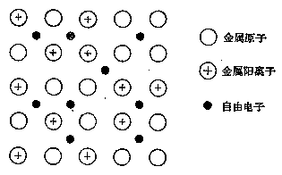

*图 1·1 金属结构示意图*

但是，必须指出：由于自由电子并没有完全离开金属，从整体来说，金属还是电性中和的。同时，各种不同金属的原子结构不完全相同，原子核对外层电子的吸引力也各各不同，因此，这种游离成自由电子的倾向也就各各不同了。最外层电子数愈少，离开原子核的距离愈远，放出或游离出电子的倾向愈大，这种金属元素就称为活动的金属；反之，放出电子就较困难。但在蒸气状态时，金属一般都是由一个个单个的原子构成的。

#### 金属的物理性质

金属具有很多共同的物理性质，这在前面已经提到。我们知道，物质的性质主要决定于物质内部的结构，因此，金属的这些特有的共同性质，亦不难从金属的特殊结构来说明。当然，各种不同的金属，由于它们晶体里的中性原子、阳离子各不同，实际排列也各不同，所以各种金属之间的性质又有所差别，甚至有较大的差别。

##### 1. 金属光泽

具有特殊的“金属”光泽是金属最明显的特征之一，这是由于它们能强烈地反射光线所引起的。但是这种光泽只有当金属成整块时才能表现出来，研成粉末后，绝大多数金属都变成黑色或暗灰色，只有镁、铝等少数金属仍保持原有的光泽。

金属的颜色，大多数为银白色或灰色（深浅有所差别），但也有少数金属呈其他的颜色，例如金为赤色、铜为紫褐色等。工业上，把铁、铁的合金和铬、锰等金属称做“黑色金属”，而把其余一切金属称做“有色金属”，这仅仅是为了称谓上的方便，把与炼铁有关的一些金属，从其它金属中区别开来而已，与实际颜色没有多大关系。

##### 2. 导电性和传热性

一般说来，金属都是电和热的优良导体，但能力有所差别。某些金属的导电性和传热性的相对大小如图1·2所示。注意，按照导电性或传热性的大小所排列成的次序是一致的，例如不论导电或传热的能力，最好的都是银和铜，最差的是铅和汞。但金属的导电性随温度的升高而降低。

金属之所以是电和热的良导体，是因为金属晶体里存在着能自由移动的自由电子的缘故。当金属两端加上一个微小的电势差时，自由电子立刻向一定的方向移动，形成了电流。当然，自由电子的浓度大小——就是电子从金属原子中游离出来的倾向性大小的不同，是各种不同金属的导电性强弱不同的主要原因。另一方面，自由电子的移动也受到晶体中的中性原子和阳离子的阻力影响，当温度升高时，中性原子和阳离子的振动速度和振幅都变大，这就增大了对自由电子移动的阻力，因而金属导电性随着温度的升高而降低了。

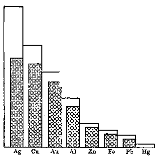

*图 1·2 几种金属的传热性（空白柱体）和导电性（有黑点柱体）*

金属的传热性也跟自由电子的存在有关。自由电子在晶体里很快移动，不断与原子和阳离子相碰撞，它们之间就会发生能量的交换或传递。当金属的一端受热时，这部分的质点——原子和阳离子的振动就会加强，表现出温度的升高，它们的能量会经过自由电子的碰撞波及到邻近的质点，从这些质点的加快振动，转辗波及到以后的更远更多的质点，因而金属的受热状态很快就扩展开来，使整块金属的温度同样的升高了。

##### 3. 可塑性

前面曾讲到金属有很好的展性和延性，这种性质概括地叫做可塑性。可塑性就是当物体在外力的作用下能够变形，而在外力停止作用以后仍能保持已经变成的形状的性质。大部分金属是可塑的，它们容易被锻打成各种形状，抽成线或轧成薄片等。当然，这和金属的特殊内部结构也直接有关，但原理比较复杂，这里不谈了。

各种金属的可塑性自然也有所差别，并且各有特点，例如金能打成很薄很薄的“金箔”，但抽延的性质不及钨，钨能抽成很细的丝（做电灯泡内的丝）；铁的展性延性都不及金、银等金属。但总的说来，金属的可塑性比之非金属都是较大的，只有少数金属，例如氮族里讲到的镉和铋，以及若干其它金属如锰等的可塑性很小，所以这些金属是经不起敲打或压拉的。

必须指出，金属的可塑性，一般是随着温度的升高而增大的，所以金属的锻打、冲压、拉轧等加工操作，大都要在锻热的情况下进行。

##### 4. 金属的比重、熔点和硬度

金属之间的比重、熔点和硬度的差别，比之前述的几种性质的差别要大得多，这是因为影响这些性质的因素不止一个。各种金属晶体的结构除了基本相同外，还有别的因素，如原子的质量、核电荷的大小、原子的排列方式等等各有差别，它们的关系非常复杂，这里不多介绍。我们仅把几种常见的金属的比重、熔点和硬度，用图 1·3~1·5 表示出来，读者从此可获得一个大概的印象。

从图 1·3 中可以看到，钾、钠的比重小于 1，比水还轻；而铂要比（同体积）水重21.45倍呢！铝只有（同体积）铁的约三分之一重，所以铝、镁等常用在制造飞机等需要重量轻的器械中。一般把金属的比重小于5的，称做轻金属；比重大于5的，称做重金属。但这种分类，除了说明它们的比重不同之外，并不能反映出其他性质的差别。

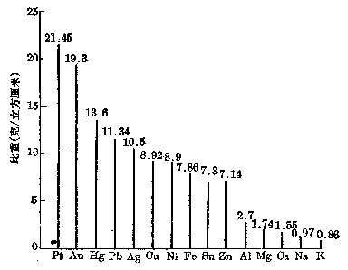

*图1·3 金属的比重*

从图1·4可以看到，汞的熔点很低，所以它在常温下是液体；金的熔点是 \(1063^{\circ}C\)，比之一般炉灶或灯焰的温度要高得多，平常不易把它熔化，所以俗语常说“真金不怕火”。其实熔点比金高的金属还多着呢！

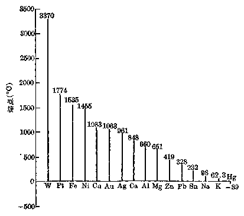

*图1·4 金属的熔点*

表达物质的硬度，科学上采用以金刚石的硬度为10做标准来比较的。这是任意假定的数值，本身没有绝对意义。从图1·5可看出，镍的硬度为5，就是说金刚石的硬度比它强一倍。钾、钠等硬度很小，所以用普通的刀、剪就很容易切割它们。

从这三个图里，不难得出结论，金属的这些性质的差别是很大的。所以在使用金属时，我们就应根据需要有所选择了。

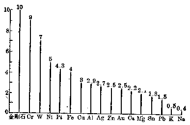

*图 1·5 金属的硬度和金刚石硬度的比较*

但是，一种纯净的金属的性质，对应用来说，往往不是全面符合要求的。例如纯铁（和熟铁近似） 性质比较软韧，不易破碎，有利于展延；但熔点很高，不便于熔铸。铝的比重较小，有利于制造飞机或运输工具，但硬度不够，容易变形，不能承重。纯铜（即紫铜） 的导电性很强，有利于制造电气用具，但硬度较小，比较柔软，不适宜制造机械另件和日用器具。由于科学技术的发展，对原材料的很多机械性能，例如耐高温、高强度、超硬、耐磨、弹性等等，都提出一定的标准要求。显然，任何一种纯金属，以它本身固有的性能很难适应这些要求。怎么办呢？

我国古代劳动人民已发现，在熔融的铜里加入些锡，待他们完全熔混后，冷却，制得一种青色的比纯铜（紫铜）坚硬、耐磨、强度大，适宜于制造机械另件和日用器具的材料，我们叫它青铜。后来用锌代替锡，加入到铜里，就获得另一种叫黄铜的材料，性能比青铜更有提高。这些东西，现在总称做合金。其实合金是非常普遍的，例如钢、生铁、焊锡等都是合金。合金的发现和制造，提供了很多具有特殊性能的金属原材料，给工程技术的发展提供了物质基础。下面我们简单地来介绍有关合金的知识。

合金顾名思义，合金应该是二种或二种以上的金属熔合在一起的物质。大多数金属，例如锡和铅、铜和锌、金和银等，在熔融状态下，能完全相互溶解，冷却后成一均匀整体。但也有些金属，例如铅和锌，不能以任何比熔合，只能在一定限度内相互混和成均匀整体。当然，也有些金属，它们是完全不能熔合制成合金的。

此外，也有些非金属，例如碳、硅、磷、硫等，有时也能溶解在熔融的金属里而成均匀的整体，从性质上来看，我们也应称它们为合金。我们知道，生铁、碳钢等就是这些非金属和铁的合金 （§ 5·3）。

因此，我们说：一种金属和其他一种或几种金属或非金属熔合在一起所生成的均匀液体，经冷凝后得到的固体，叫做合金。

合金当然不单是一种简单的、象溶液一样的混和物，它的内部组成、结构是非常复杂的。有的可能已经形成了有一定组成的化合物；有的也可能是单质晶体按一定方式结合成特定晶体结构。因此合金的物理性质，除比重外，并不是它的各成分性质的总和。一般说来，多数合金的熔点均低于组成它的任何一种成分金属的熔点。有时熔点会降到出乎意料的低。例如用作电源保险丝的“武德合金”（第二册§ 5·11），是锡、铋、镉、铅四种金属依1：4：1：2的重量比所组成的合金。它的熔点只有67℃，比水的沸点还低。因此当电流过大，电路上发热到70℃左右时，保险丝就熔化，因而自动切断了电源，保证了用电安全。但组成这种合金的四种金属的熔点都在二、三百度以上。

相反的，合金的硬度一般都比组成它的各成分金属的硬度要大。例如上述的青铜、黄铜的硬度都比纯铜、锡、锌的大；生铁的硬度比纯铁大得多。有时制成合金后，硬度增大的程度是惊人的，例如在铜里仅仅加入1%的铍所生成的合金，它的硬度比纯铜要大7倍呢！

总之，由于组成合金的各成分金属的相互影响，合金的内部结构就不同于原来金属的结构，使合金的几乎全部物理性质有了或多或少的改变，除上述熔点、硬度外，合金的导电性、传热性，一般都降低很多，可塑性有增有减。

有些合金，在化学性质方面也有很大的改变。例如不锈钢（含约 \(15\%\) 铬，约 \(0.5\%\) 镍的合金钢）它改变了铁的容易生锈的特性，使其成耐酸、耐碱、耐腐蚀的优良材料，大大提高了铁的使用价值。

所以，为了满足和促进现代工程技术的需要，对具有极其多样性质（包括机械性能和化学性能）的合金试制研究是一个重要的课题。

#### 习题 1·1
1. 金属原子的结构特征是什么？金属（单质）的结构特点在哪里？

2. 金属和非金属各具有哪些共同的物理性质？

3. 怎样解释金属具有良好的导电性？为什么升高温度往往会减弱金属的导电性？

4. 金属的导电方式和电解质溶液的导电方式有什么不同？

5. 什么叫合金？它和组成它的成分金属比较，物理性质有哪些规律性的改变？

6. 为什么制造机器、工具等的金属材料一般不用纯净金属，而都用合金？

7. 据你所知，哪些用途的金属材料必须是纯金属？

8. 下列物质的组成怎样？有何用途？各利用它的何种性质？（1）不锈钢，（2）黄铜，（3）武德合金，（4）生铁。

9. 焊锡（锡铅合金）重5克，把它完全氧化成二氧化锡和一氧化铅后生成物重6.1克，问焊锡的成分金属重量比例怎样？

### § 1·2 金属的化学性质，金属活动性顺序

在上一节里，我们学习了金属的物理性质，知道了它们既有共同的特点，又有所差别；并知道这是由于金属的内部结构所引起的。那末，金属的化学性质是不是也有某些共同的特点呢？能否从理论上把它们概括起来呢？

在学习化学的前面两册时，我们曾经碰到过不少有关金属的化学反应。例如某些金属跟非金属，如氧、卤素、硫、磷等直接化合生成盐类的反应；某些金属从酸里，有些并从水中置换出氢气的反应；某些金属从另一种金属的盐里把后者置换出来的反应；以及大部分金属的氧化物是碱性的，它们的相应水化物是碱类等等。从而，我们已经有了一些关于金属的化学性质的具体知识。

在第二册原子结构和元素周期律一章里，当讲到分子的形成时，曾经指出过：所有元素的原子的最外电子层，都有成为稳定结构的倾向。这种倾向引起了原子相互结合而形成分子，也就是发生了化学反应。由于金属原子的最外电子层上的电子数少，放出电子而使原子变成稳定结构的倾向性要比结合电子的倾向性大，因此金属原子容易放出电子而变成带正电荷的阳离子，而且典型的金属绝不与电子相结合。这就是金属参加化学反应时的特点。例如：

\[
2 \mathrm{Na} + \mathrm{Cl} _ {2} = 2 \mathrm{Na} ^ {+} \mathrm{Cl} ^ {-}
\]

\[
2 \mathrm{Mg} + \mathrm{O} _ {2} = 2 \mathrm{Mg} ^{2+} \mathrm{O} ^{2-}
\]

在第二册电离学说一章里，我们知道离子化合物和极性化合物，在水溶液里会电离成阴、阳离子。例如：

\[
\begin{array}{l} \mathrm{NaCl} \xrightarrow {\quad} \mathrm{Na} ^ {+} + \mathrm{Cl} ^ {-} \\ \mathrm{CuSO} _ {4} \xrightarrow {\quad} \mathrm{Cu} ^{2+} + \mathrm{SO} _ {4}^{2-} \\ \mathrm{HCl} \xrightarrow {\quad} \mathrm{H} ^ {+} + \mathrm{Cl} ^ {-} \\ \end{array}
\]

在这些溶液里的阳离子，是对应的金属原子或氢原子放出电子后带正电荷的质点。这些质点，如果碰到电子，当然有可能重新结合，成对应的中性原子。

前面已提过，金属原子由于结构的不完全相同，放出电子的倾向性的大小是不同的，活动金属放出电子的倾向要比不活动的金属强。所以，如果有一种金属，例如锌，分别放进上述的一些溶液里去，情况将会怎样呢？

从原子结构来看，锌原子放出电子的倾向要比铜原子、氢原子放出电子的倾向性大，而比钠原子的弱。所以不难想象：当锌分别放进上述溶液后，就会把它自己的外层电子转移到铜离子或氢离子上去，使它们结合电子后变成对应的铜原子或氢原子，从溶液里析出；而锌原子本身就变成了阳离子进入溶液里去。用离子方程式来表示，就是：

但是，锌在钠离子的溶液中这种电子的转移就不可能。

这些例子说明了，金属跟酸或盐溶液所起的置换反应的本质：就是比较活动的金属原子上的电子，转移到氢离子或活动性较弱的金属的离子上的过程。

从上面一些具体例子来看，金属参加化学反应——不论是化合反应或置换反应——的特征都是放出电子而成阳离子。所以我们可以给金属下这样的定义：一种元素，它的原子如果在化学反应里容易放出电子而转变成带正电荷的离子，这种元素就叫做金属。金属原子不能结合电子，也就是说，不能转变成带负电荷的离子。到此，我们对“金属”这个概念有了更进一步的认识。

#### 金属活动性顺序

金属单质参加化学反应的本质是放出电子，那末，由于金属原子结构的不同，放出电子的难易程度有所不同，因此金属参加化学反应的活动性自然也有所差别。金属愈容易放出电子，它就愈活动，跟其他物质起反应也愈剧烈；反之，不容易放出电子的金属的活动性就很小，它跟其他物质起反应就不容易，甚至没有反应。所以我们可以利用各式各样的反应，来比较各种金属的相对活动性程度。比如有人曾利用金属跟金属盐溶液的置换反应，对金属的活动性进行了研究。例如，前面提到的金属锌能从铜盐溶液中置换出铜；而不能从钠盐溶液中置换出钠。这表示锌的活动性比铜大而比钠小。这样把各种金属按照它们的化学活动性的降低而排列成一个顺序，称做“金属活动性顺序”（参看第一册 § 5·4）。

下面就是几种常遇的金属的活动性顺序：

原子的活动性逐渐减弱 K，Na，Ca，Mg，Al，Mn，Zn，Cr，Fe，Ni，Sn，Pb，（H），Cu，Hg，Ag，Pt，Au 离子跟电子结合的能力逐渐增强这里把氢也排在顺序之中，因为它在一定程度上说具有类似金属的性质，能从某些盐溶液中置换出金属，它的本身也能被很多金属从酸溶液中置换出来。金属活动性顺序能给我们下列有关金属在溶液中进行反应的一些知识：

（1） 每一种金属可以从排在它右面的金属的盐溶液中，置换出后者。反之，则不可能。二种金属的排列位置相距越远，置换愈容易，反应速度愈快①。

例如，锌能从铁盐溶液中置换出铁，也能从铜盐溶液中置换出铜，因为铁和铜的排列位置都在锌的右面。但锌不能从钠盐的溶液中置换出钠，因为钠的位置在锌的左面。并且，锌置换铜的反应比置换铁快，因为锌和铜的位置相距较远。

（2） 上面的情况对氢气（在大气压力下）也能适用。就是只有排在氢左面的金属才能从稀酸溶液中置换出氢气。位置愈左，置换能力愈强。排在氢右面的金属就不能从酸中置换出氢气。

例如，钾、钠等最前面的几种金属，在稀酸中置换氢的速度可达爆炸性的程度（有危险！）。它们在常温下跟水也能起剧烈的反应，置换出氢气，这是我们已经知道的。但镁、铝、锌等就必须在加热情况下跟水才有反应；在常温下只能跟酸起反应。位置在氢右面的，例如铜，则无论在什么情况下，都不能置换出氢。必须注意，铜跟氧化性酸的反应，例如跟硝酸反应，不是置换反应，生成物没有氢气的！

此外，金属活动顺序对金属跟非金属的化合反应，大致上也是适用的。例如跟氧的化合反应来说，钾、钠、钙在常温下就很易跟氧化合而成氧化物，因此我们只能用隔绝空气的方法来保存它们。镁、铝、锌等氧化虽较慢，但表面还是会很快生成一层氧化物。铁、镍、铜等，在常温下的干燥空气里就不易起氧化，能长时间保持金属的光泽。至于银、铂、金等，即使在加热情况下也不会氧化。

从上面的学习，我们可以得出结论：金属的化学性质，也同物理性质一样，有它们的共同特点，就是在化学反应中，金属原子都是放出电子的。并且它们的活动性有一定的规律，这和它们的原子结构有一定的关系。

#### 习题 1·2
1. 用离子方程式表示下列反应，并指出电子的转移情况：

（1） 镁跟氯气的反应；

（2） 铝跟盐酸的反应；

（3） 氯气跟碘化钾溶液的反应。

2. 怎样从上题可以归结出，金属和非金属在化学反应过程中的根本区别？

3. 什么叫金属？什么叫金属性？金属和非金属之间有没有严格的界限？为什么？

4. 什么叫金属活动性顺序？它告诉我们些什么？

5. 把下列金属：锌、铁、镁、铜，分别放入硝酸铅稀溶液中，能看到什么现象？用金属活动性顺序来解释这些现象。

6. 怎样解释铜和稀盐酸没有反应，而跟稀硝酸能起反应（必要时加热）？又怎样解释铜和稀硫酸没有反应而跟浓硫酸能起反应（必要时加热）？写出反应的化学方程式。

7. 在元素周期表里的主族元素，从原子得失电子的难易程度来看，哪一种元素的金属性最强？哪一种元素的非金属性最强？

8. 用 5.25 克不纯锌粒跟稀硫酸反应，产生氢气。当反应停止时，收集到 1.44 升氢气（折合到标准情况下）。计算锌的百分纯度。

### § 1·3 氧化-还原反应

在上一节里，我们已经说明了金属参加的一些化合反应和置换反应的本质是电子转移过程。例如：

\[
2 \mathrm{Mg} + \mathrm{O}_{2} = 2 \mathrm{Mg}^{2+}\mathrm{O}^{2-} \tag{1}
\]

\[
2 \mathrm{Na} + \mathrm{Cl}_{2} = 2 \mathrm{Na}^{+}\mathrm{Cl}^{-} \tag{2}
\]

\[
\mathrm{Zn} + 2 \mathrm{H} ^ {+} + 2 \mathrm{Cl} ^ {-} = \mathrm{Zn} ^{2+} + 2 \mathrm{Cl} ^ {-} + \mathrm{H} _ {2} \uparrow \tag {3}
\]

此外，我们还可以在曾经学过的、有关金属或金属化合物参加的化学反应中举出一些例子，看出它们的本质也是电子转移过程。例如，氧化汞的分解反应，它的本质是电子从氧离子转移给汞离子的过程：

\[
2 \mathrm{Hg}^{2+}\mathrm{O}^{2-} \xrightarrow[\text{电子转移 }4e^-]{\text{加热}} 2 \mathrm{Hg} + \mathrm{O}_{2}\uparrow \tag{4}
\]

又例如，氧化铜被氢气还原的反应，它的本质是电子从氢原子转移给铜离子的过程：

\[
\mathrm{CuO} + \mathrm{H} _ {2} \xrightarrow {\text {加热}} \mathrm{Cu} + \mathrm{H} _ {2} \mathrm{O} \tag {5}
\]

由以上可见，这些反应，从形式上看来，虽然各不相同，有化合反应，分解反应，或者置换反应，但它们的本质却都是相同的，即都包括电子的转移过程。

我们也可以看出，其中有一部分反应，如反应（1）、（4）和（5），它们包括氧元素在内。根据在第一册里（§ 2·3，§ 2·12）学到的氧化反应和还原反应的定义（即“物质跟氧所起的反应称做氧化反应”；“氧从一种物质里被夺取出来的反应叫做还原反应”）来看，我们可称这些反应为氧化-还原反应（第一册 § 2·13）。

根据原子结构理论来看，这些氧化-还原反应的本质是：金属跟氧气的化合反应是金属原子把电子转移给氧原子；金属氧化物的分解或被置换是金属离子得到了电子。就是说，氧化-还原反应，实质上是电子转移过程。

到此，我们就会想到那些没有氧元素在内的一些反应，例如反应（2）和（3），它们是否也可以叫做氧化-还原反应呢？

从电子转移的观点来看，它们的本质是和反应（1）、（4）和（5）相同的。因此应该把它们归在一起。所以我们可以把氧化反应和还原反应的定义修改一下，使这两个概念的涵义更广泛：在化学反应里放出电子的变化叫做氧化；在化学反应里得到电子的变化叫做还原。

但是，由于物质是不灭的，有放出电子的，必同时有得到电子的。所以氧化和还原必伴同发生，它们虽然是两个相反的过程，而实际上是统一体的两个方面。因此我们称这类反应叫氧化-还原反应。它的定义是：在化学反应里，如果有一些原子或离子把电子转移给另一些原子或离子，这样的反应就叫做氧化-还原反应。

注意，这里所指的原子或离子，当然不一定限于金属元素。例如

\[
2 \mathrm{NaBr} + \mathrm{Cl} _ {2} = 2 \mathrm{NaCl} + \mathrm{Br} _ {2}
\]

或

\[
2 \mathrm{Na} ^ {+} + 2 \mathrm{Br} ^ {-} + \mathrm{Cl} _ {2} = 2 \mathrm{Na} ^ {+} + 2 \mathrm{Cl} ^ {-} + \mathrm{Br} _ {2}
\]

这个反应也是氧化-还原反应，但放出电子的是溴离子，而得到电子的是氯原子。这里的钠离子是没有变化的。

既然氧化、还原这两个概念的涵义扩大了，那末氧化剂和还原剂这两个概念自然也要作相应的扩大。

从得氧、失氧的观点来说：放出氧的物质，使别种物质得氧而氧化，自身失氧而还原的物质叫做氧化剂；反之，从别种物质夺得氧，使自身氧化，而使别种物质因失氧而还原的物质叫做还原剂。仍以下列两例来说：

\(O_{2}\) 和 CuO 是氧化剂；而 Mg 和 \(H_{2}\) 是还原剂。

但从电子的得失观点来看：氧原子和铜离子是得到电子的；而镁原子和氢原子是放出电子的。因此，氧化剂和还原剂的定义应该是：在反应过程里，它的原子或离子得到电子的物质（例如氧气和氧化铜）叫做氧化剂；在反应过程里，它的原子或离子放出电子的物质（例如金属镁和氢气以及在NaBr跟Cl₂的反应中的NaBr）叫做还原剂。

在金属活动性顺序里，愈排在左面的金属愈是强的还原剂，它的对应阳离子愈是弱的氧化剂。

是否所有的化学反应都发生电子的转移过程呢？我们来看复分解反应，例如中和反应：

\[
\mathrm{H} ^ {+} + \mathrm{Cl} ^ {-} + \mathrm{Na} ^ {+} + \mathrm{OH} ^ {-} \rightleftharpoons \mathrm{Na} ^ {+} + \mathrm{Cl} ^ {-} + \mathrm{H} _ {2} \mathrm{O}
\]

反应的实质是离子的交换过程，其中并无电子转移的过程。所以它不是氧化-还原反应。

也有一些化合反应，例如

\[
\mathrm{CaO} + \mathrm{H} _ {2} \mathrm{O} = \mathrm{Ca(OH)} _ {2}
\]

和有一些分解反应，例如

\[
\mathrm{CaCO} _ {3} \xrightarrow {\text {加热}} \mathrm{CaO} + \mathrm{CO} _ {2} \uparrow
\]

也没有电子转移，所以也不是氧化-还原反应。

那末，怎样来辨别氧化-还原反应和非氧化-还原反应呢？

我们知道，元素的化合价的变化和原子或离子的得失电子直接有关（第二册§ 3·5），所以在氧化-还原反应中元素化合价必有改变。例如在镁跟氧的化合反应里，镁的化合价由0升高为+2，而氧从0降低为-2。又如在NaBr跟Cl₂的反应里，溴的化合价从-1升高为0，而氯从0降低为-1。

但是，在上述的非氧化-还原反应里，就没有任何一种元素的化合价是有改变的。

因此，反应前后元素化合价的改变，是氧化-还原反应的特征，是区别氧化-还原反应和非氧化-还原反应的根据。

到此，我们可以这样说：化学反应可分为两大类：一类是由电子的转移引起的，就是氧化-还原反应。它的特征是，反应前后元素化合价必有改变，如置换反应、反应物里有单质的化合反应、生成物里有单质的分解反应等，都属这类。

另一类化学反应是没有电子转移过程的，其中任一元素的化合价不变，就是非氧化-还原反应。如复分解反应和一部分的化合反应、分解反应等都属这类。

由于氧化-还原反应的范围极广，例如金属的锈蚀、食物的腐败、金属的冶炼等都是，所以它在科学上、生产上都具有极重大的意义。

#### 习题 1·3
1. 根据原子结构理论，氧化-还原反应的实质是什么？因此，氧化-还原反应的定义应该怎样？

2. 狭义的（从得失氧的观点）和广义的（从得失电子的观点）氧化反应和还原反应的定义怎样？它们有没有矛盾？举例说明。那末广义的定义有什么优点？

3. 从电子得失的观点来看，氧化剂是什么？还原剂是什么？在反应过程中，它们自己发生了什么变化？

4. 怎样从反应过程中有无化合价的改变来判断反应是否是氧化-还原过程？为什么可以用这个方法？

5. 辨别下列反应哪些是氧化-还原反应，哪些不是：

（1） \(\mathrm{CaCO_3}\xrightarrow{\text{加热}}\mathrm{CaO} + \mathrm{CO}_2\uparrow\)

（2） \(\mathrm{Zn} + \mathrm{CuSO}_4 = \mathrm{ZnSO}_4 + \mathrm{Cu}\downarrow\)

（3） \(\mathrm{Na}_{2} \mathrm{CO}_{3} + \mathrm{H}_{2} \mathrm{SO}_{4} = \mathrm{Na}_{2} \mathrm{SO}_{4} + \mathrm{H}_{2} \mathrm{O} + \mathrm{CO}_{2} \uparrow\)

（4） \(\mathrm{MnO_2 + 4HCl\xrightarrow{\text{加热}} MnCl_2 + 2H_2O + Cl_2\uparrow}\)

**解：** \(+2,+4,-2\xrightarrow{加热}2,-2+4,-2\) （1） \(CaCO_{3}\xrightarrow{加热}CaO+CO_{2}\uparrow\)上述反应中在反应前后各元素的化合价并无改变，所以这个分解反应不是氧化-还原反应。

6. 在下列反应中，哪些元素氧化了，哪些元素还原了？哪种物质是氧化剂，哪种物质是还原剂？

（1） \(2\mathrm{Al} + \mathrm{Fe}_{2}\mathrm{O}_{3}\xrightarrow{\text{加热}}\mathrm{Al}_{2}\mathrm{O}_{3} + 2\mathrm{Fe}\)

（2） \(\mathrm{KClO_3 + 6HCl = KCl + 3H_2O + 3Cl_2\uparrow}\)

（3） \(2\mathrm{FeCl}_2 + \mathrm{Cl}_2 = 2\mathrm{FeCl}_3\)

（4） \(3\mathrm{Cl}_2 + 6\mathrm{KOH} = 5\mathrm{KCl} + \mathrm{KClO}_3 + 3\mathrm{H}_2\mathrm{O}\)

（5） \(2\mathrm{KClO}_{3}\xrightarrow{\text{加热}} 2\mathrm{KCl} + 3\mathrm{O}_{2}\uparrow\)

**解：** 在第（4）题中：

\[
\begin{array}{rl} & 0 + 1, - 2, + 1 + 1, - 1 + 1, + 5, - 2 + 1, - 2 \\ & 3 \mathrm{Cl} _ {2} + 6 \mathrm{KOH} = 5 \mathrm{KCl} + \mathrm{KClO} _ {3} + 3 \mathrm{H} _ {2} \mathrm{O} \end{array}
\]

氯元素在反应之前是0价（单质原子），而在反应之后，一部分改变成-1价而另一部分改变成+5价。其他元素的化合价不变。因此，在这个反应里，氧化剂、还原剂都是氯。我们可以把它写成：

\[
\begin{array}{c} \downarrow \\ 5 \mathrm{Cl} + \mathrm{Cl} + 6 \mathrm{KOH} = 5 \mathrm{KCl} + \mathrm{KClO} _ {3} + 3 \mathrm{H} _ {2} \mathrm{O} \\ \hline 3 \mathrm{Cl} _ {2} \end{array}
\]

就是说，在6个氯原子中，有5个是氧化剂，1个是还原剂。

### § 1·4 金属的锈蚀和防止锈蚀的方法

金属和合金是制造机器、国防器械、运输工具、日常用具以及建筑方面等的重要材料。由于它们具有优良的机械性能，因此应用范围很广，用量也日益增加。但是，金属在空气中大都容易生锈，从而减小了它们的使用价值。

我们知道，当金属制品用旧后，它的表面往往会失去金属光泽，或生成粒屑状物质。特别是铁制器，生成的棕黄色铁锈，质地疏松，会层层剥落，日久之后，竟会全部变成铁锈，致使不能应用。

金属生锈，科学上叫做金属的锈蚀，是指金属或合金由于跟周围接触到的气体或液体进行化学反应而损耗的过程。

金属的锈蚀给人类造成很大损失。根据统计，每年由于锈蚀而直接损耗的金属材料约占年产金属量的十分之一。加上由于金属部分锈蚀后，器械的性能受到影响，而必须加以修理或缩短了它的使用期限的损失，数字是很惊人的。因此，怎样防止金属锈蚀具有重大的意义。

下面我们先研究金属锈蚀的原因，再介绍防止金属锈蚀的方法。

#### 金属锈蚀的原因

金属的锈蚀是一个氧化反应，从本质上来说，都是金属原子放出电子的过程。但是，从引起锈蚀的原因和机理来说，锈蚀可以分成两种：化学锈蚀和电化锈蚀。

##### 1. 化学锈蚀

化学锈蚀是由于金属跟周围环境里接触到的物质（一般是非电解质）直接进行化学反应而引起的一种锈蚀。

例如，在高温下，铁、锡、铅等和空气接触时的迅速氧化，这是金属跟氧气直接反应所引起的锈蚀。具有更强氧化性的气体或液体，例如化学工厂里或实验室里扩散在空气里的氯气、氮的氧化物等跟金属接触时将更迅速地直接反应，使后者锈蚀。这种锈蚀的化学反应比较单纯，仅是金属跟特定物质间的氧化-还原反应。

##### 2. 电化锈蚀

电化锈蚀是另一种金属锈蚀的形式，它的反应过程比化学锈蚀复杂得多。金属在潮湿的空气里所发生的锈蚀，就是这种锈蚀的最普通的一个例子。

事实证明，钢铁（普通碳钢）在干燥的空气里，长时间不会生锈，可是放在潮湿空气里，很快就生锈了。显然这种锈蚀不是单纯的跟氧气直接反应所引起的。那末，这是什么原因呢？要回答这个问题，我们先来讲一个实验现象。

我们记得锌粒和稀硫酸反应制取氢气的实验吧（第一册§ 2·10）？我们会发现，在其他条件相同的情况下，用不纯的锌粒要比用纯净的锌粒，放出氢气的速度快得多。如果在纯净的锌粒上加微量铜屑或铁屑，放出氢气的速度也会立刻快起来。这是什么道理呢？

可以这样来进行实验：把一块纯锌片插入盛有稀硫酸的烧杯中，开始时，有少量气泡发生（氢气产生了），随即气泡吸附在锌片的表面上，反应越来越慢而几乎停止了。再把一块纯铜片插进去（不碰到锌片），可以看出上面没有反应发生（铜和稀硫酸是没有反应的）。于是，用一根铜丝把锌片和铜片的上端连接起来，立刻可看到，大量的氢气气泡在铜片上放出来了。怎样解释这个现象呢？

原来当锌片单独插入酸溶液中时，锌原子开始放出电子，变成锌离子，进入溶液中：

\[
\mathrm{Zn} - 2 e \longrightarrow \mathrm{Zn} ^{2+}
\]

放出的电子给氢离子得到，使其变成氢原子，结合成氢分子而放出气泡：

\[
2 \mathrm{H} ^ {+} + 2 e \longrightarrow 2 \mathrm{H}
\]

\[
2 \mathrm{H} = \mathrm{H} _ {2} \uparrow
\]

这就是锌置换氢的过程。

但是，微小的氢气气泡会吸附在锌片的表面，使锌和酸溶液隔离开来，阻碍了锌原子放出的电子直接转移给氢离子。这些电子积储在锌片上会阻止其他锌原子继续放出电子，也会吸住锌离子进入溶液去。这样，反应就减慢下来了。

如果插入一块铜片，并用导线（铜丝）和锌片连接起来后，锌原子放出的电子可以沿着导线传递到铜片上，在那里转移给氢离子，使它变成氢气放出（注意不是铜和酸反应产生氢气的！）；在锌片上因为没有积储的电子，锌原子就能畅快地、不断地放出电子而变成锌离子进入溶液中去。这样反应就大大加快了（图1·6）。

电子从锌片经过导线移转到铜片上去时就形成电流，这可以用电流计测量出来。图1·6的装置，就是在物理学中学到的原电池。在那里着重讲解的是电流产生的原理，而现在我们是用来说明，为什么锌（较活动的金属）和另一种金属（较不活动的金属）连接时，它跟酸的反应会加快的原因。

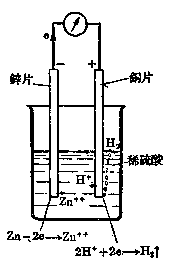

*图 1·6*

到此，不难理解，在纯净锌粒上加微量铜屑或铁屑时，或者不纯的锌粒（即含有微量的其他杂质）实际上组成了很多个微型的原电池，这样就导致锌原子的加快放出电子而加速置换反应的发生。

现在可以回过头来，回答金属的电化锈蚀的原因了。

用钢铁在潮湿空气里很快锈蚀为例来说。一般固体的表面都有吸附湿气的性质。潮湿空气使钢铁的表面上常存在一层极薄极薄的水膜。空气里的二氧化碳或其他酸性氧化物气体溶解在这层水膜里，就形成了弱酸性溶液。如果表面碰到过矿物盐类，则这层水膜即变成更浓的电解质溶液薄膜。钢铁本身是一种合金（如碳钢主要是铁和碳的合金，见§ 5·3），这样，钢铁的表面就形成了无数个微型原电池。如果钢铁中的杂质比铁不活动（碳钢中主要是碳），铁就成了原电池中的负极，加快放出电子而氧化了。这就是钢铁在潮湿空气里发生锈蚀的原理。

这种锈蚀就是电化锈蚀。它是指由于电解质的存在，产生了原电池作用，引起较活动的金属放出电子而发生氧化反应的一种锈蚀。

不难理解，纯净金属，或者表面非常净洁、非常干燥的金属材料是不会发生电化锈蚀的。金属器械的表面情况，对发生电化锈蚀有很大关系。例如凹凸不平的表面和洞穴、裂纹、铆钉等处容易藏污纳垢的地方，最易发生锈蚀。

金属发生锈蚀大都属于电化锈蚀类型的，它较化学锈蚀普遍得多，值得我们特别注意。

防止金属锈蚀的方法了解了金属锈蚀的原因以后，我们就可以来讨论防止金属锈蚀的方法。防止金属锈蚀一般有下列几种：

（1） 设法改变金属的性质，使它不易跟周围物质起反应；

（2） 在金属的表面上复盖一层坚固的保护膜，使它和外界隔绝；

（3） 使金属经常保持洁净、干燥，避免放在潮湿处所；

（4） 避免金属和有腐蚀性的物质经常接触。

第一种方法当然是最理想的。在合金一节里曾提到，有些合金，除物理性质外，在化学性质方面也有很大的改变。例如不锈钢就以不生锈的特点命名的。很多合金钢和由有色金属制成的合金，有的具有很高的耐酸、耐碱和抗腐蚀的性质，甚至可以用作硫酸、硝酸，这样一些腐蚀性很强的物质的生产和储存的容器。但是，这样的合金是不多的，而且价格也很贵，不能普遍应用。所以防止锈蚀主要采用第二种方法。

在金属表面上复盖一层保护膜的具体方法有很多种。例如涂机器油、凡士林，涂干性油漆，搪瓷，镀上或包上另一种金属和胶合一层塑料，等等。这些方法，各有各的优点和缺点，各有各的应用对象。但不论什么方法，总的要求是那层保护膜的本身必须是在特定的环境里是相当稳定的物质，并且能够紧密地附在和遮盖住金属的表面，而不易脱落。

镀上另一种金属这个方法具有较多的优点，譬如，比较耐久、耐热和耐磨等。镀上去的金属按理应该是一种比原来的金属不活动，本身不易氧化的金属，例如铜上面镀层金，铁上面镀层锡，才能达到保护的目的。但实际上并不完全需要这样。

有些金属，例如铝、铬等，本身是相当活动的，容易氧化。但是它们会很快地生成一层透明的氧化物，能紧密地复盖在它自身的表面上，因而保护了内层不再继续氧化，起了自身防止锈蚀的作用（见§ 4·1）.“钢精”（铝）制品之所以耐久，道理就在这里。但有些金属不是这样，例如铁，它的氧化物疏松而容易剥落，不能起防护作用。

现在用两种熟悉的铁制品——镀锌铁和镀锡铁为例，来说明两种不同性质的镀料的不同保护作用。

镀锌铁俗称白铁，一般用作“铅桶”、水落管等日用品的材料，是铁皮上镀一层锌的铁制品。锌比铁活动，但它有优良的保护自己的能力，即前面提到过的生成致密的氧化物保护层。因此锌镀在铁皮上也间接保护了铁。

镀锡铁俗称马口铁，就是用来制造煤油听、罐头等的材料，是铁

皮上镀一层锡的铁制品。锡比铁不活动，它不易氧化，有较强的抗蚀性。因此，锡镀在铁面上就起着隔离作用。

但是，镀锡铁如果表面有任何损坏，底层铁只要有一部分裸露时，不仅会失去防护作用，而且会加速铁的锈蚀。这是因为如果有水或其他电解质存在，裸露的铁和表面的锡就组成一个原电池。铁较锡活动，电子将由铁放出，它做了原电池的负极，从而铁迅速氧化而锈蚀了。

可是，白铁就不会这样。因为锌较铁活动，在损坏处所形成的原电池的负极是锌而不是铁。就是说，锌将放出电子而氧化。这样就防止了铁的氧化，除非全部锌锈蚀完了以后，铁才有锈蚀可能。

从而可见，镀一层较活动的金属（当然它自身要有保护能力的）对底层金属的防锈作用比较有利。如果镀一层坚硬而不易磨损的金属，如铬、镍等，则防锈作用将会更理想些。

必须指出，不是任何金属都可能镀到另一种金属上去的。

至于镀上去的方法，也有好多种。常用的有热镀法，即把底层金属浸入熔融的另一金属中，例如铁浸入熔锌里而镀上一层锌。有喷镀法，即把熔融金属加压喷洒到底层金属上去。有电镀法，即在电解槽中，用镀上去的金属盐类（例如 \(ZnSO_{4}\)）做成电解溶液，以底层金属（例如铁）做阴极，用镀上去的金属（例如锌）做阳极，进行电解，锌溶解而锌离子移向阴极，在那里放电成金属镀上（可参阅第二册电离学说一章），等等。

第三、第四种方法对维护机器、器械，延长它们的使用寿命有很大作用。我们知道，经常使用着的器具是不会生锈的，这是因为在它上面的任何锈斑、尘埃，在使用时被去除了，不易发生电化锈蚀的缘故。要避免金属器械受潮的道理，前面已经阐明了。此外，也要避免不同金属放在一起，例如用铁螺钉装在铜板上，或者相反；否则，铁会加速锈蚀。

#### 习题 1·4
1. 什么叫做金属的锈蚀？从本质上看，金属的锈蚀是属于哪一类型的反应？举例说明。

2. 根据金属锈蚀的不同原因，可以把锈蚀分成哪两种？哪一类型锈蚀比较普遍？为什么？

3. 为什么金属在潮湿的空气里比在干燥的空气里容易生锈？但沉在深水里的金属倒不易生锈？

［提示：深水里没有空气.］

4. 为什么浴室里或卫生设备室里的金属器皿和金属铰链等常用铜制而不用铁制？如果在铜制铰链上用一个铁螺钉，为什么特别容易锈蚀？

5. 铝的化学活动性较铁要强得多，为什么铝制品比铁制品反而耐腐蚀得多？

6. 防止金属锈蚀的方法有哪几种？常用的是哪一种？

7. 比较白铁和马口铁在防止内层铁锈蚀的不同原理。

8. 为什么制造食物罐头要用马口铁不能用白铁？而制造水桶等器具要用白铁不能用马口铁？

［提示：食物腐败后会变酸.］

9. 为什么经常使用的金属工具是比较不易生锈的？暂时停止使用的机器要涂上油？

### § 1·5 冶炼金属的一般方法

金属是一类重要的材料，已如前述。因此，生产金属和合金是工业生产的重要任务之一。冶金工业就是从自然资源中取得金属的一个工业部门。

极大多数金属元素，在自然界里是以化合态存在的。只有少数金属有游离状态——单质存在。例如，金和铂几乎全是单质存在；银、铜以及极少量的汞、锡等，有时也有单质存在。不难理解，这是因为这些金属的化学活动性很差，不易和其他物质发生反应所致。化学活动性强的或相当强的金属，就不可能长时间以单质形态存在于自然界中。

以化合态存在的金属元素有很多形式，例如氧化物、硫化物、卤化物、碳酸盐、硫酸盐、磷酸盐、硅酸盐等等。它们的组成有比较单纯的，也有非常复杂的，例如硅酸盐往往是一种组成很复杂的物质，这在硅的一章里已经提到过了。不论是以单质形式或是以化合态形式存在的金属，都必须经过化学方法处理，才能提炼成纯净的金属，而且提炼方法往往是在高温下进行的，所以叫做冶炼法。

不是所有含有金属或金属化合物的矿物或岩石都可用来冶炼金属的。有些由于组成过分复杂，使冶炼的化学反应复杂而且困难；有些由于杂质太多，特别是含有有害杂质而难以除尽的，就不适宜用来作为冶炼的原料。因此，冶炼金属的原料应有所选择。那些在现在技术的条件下，可以用作而且值得提炼的矿物或岩石，总称为矿石。

不要以为矿石一定是比较纯净的，恰恰相反，绝大多数的矿石都含有多少不同的杂质，有的，甚至杂质占绝对多数，而有效物质仅占百分之几或不到百分之一呢！

矿石里的杂质主要是石英、石灰石、长石，等等，它们在地层结构里，和金属矿物成层次地或羼杂地混和存在着，所以在冶金学里称为脉石。脉石多时必须预先去除，去除方法一般可用物理方法，例如利用比重的不同，用水淘洗分离。这种在冶炼之前设法去除大部分的脉石的过程，叫做选矿。选矿是一个使有效矿物浓缩的过程，它能使下一步的冶炼操作节省物料和燃料，而且也能使产品比较净洁些。所以选矿是冶金过程的第一步。

当然，矿石中有效成分含量愈多，它的质量愈高，对冶炼生产愈有利。所以矿石又有所谓贫矿和富矿之分。但是这个区分只有相对的意义。由于各种金属元素在自然界里的存在数量和分布情况不同，使有些矿石的纯度很高，而有些很低。例如，一般认为铁矿的矿石含铁量低于 \(50 \%\) 的，用来提炼已经不合算了，因此不低于 \(50 \%\) 含铁量的矿石才算为富矿。相反，对铜矿来说，含铜量在2% 以上的矿石就不多，不利用它来提炼就没有资源了，所以含铜量大于 2% 的矿就应算是富矿了。并且，这些标准还得看各个国家的资源情况来各自规定。

从矿石的组成形式来说，最有利于冶炼的是氧化物矿。其次是硫化物和碳酸盐矿，因为它们容易转变成氧化物。我们知道，从金属化合物里取得金属时，从本质来看，是把金属阳离子转变成中性原子的过程。也就是把金属离子还原的过程。金属氧化物是比较容易还原的，而且它的阴离子——氧元素，容易生成气态物质而分离。所以氧化物是最理想的原料。当然很多轻金属是以氧化物等别种形式存在的，那末我们也可用这些矿物来进行冶炼。但是不论利用何种原料，原则上，必须使用一种还原剂来推进这个氧化-还原过程。

由于金属的活动性强弱不同，促使其离子结合电子而还原成金属原子所需要的还原剂的强度也就不同。所以金属的冶炼法也有多种，从类型分，主要有下列几种：

#### 1. 加热法

排在金属活动性顺序的后面几种金属，它们的离子很容易结合电子。所以它们的氧化物或硫化物，只要在空气中加强热就可以把它们还原成金属。例如在 § 1·3 里举例过的氧化汞加热分解：

\[
2 \mathrm{HgO} \xrightarrow{\text{加热}} 2 \mathrm{Hg} + \mathrm{O}_{2}\uparrow
\]

高温下，氧离子转移电子给汞离子，使它们同时而分别氧化和还原成二种单质。

如果是硫化汞在空气里加强热，反应如下：

\[
\begin{array}{l} 2 \mathrm{HgS} + 3 \mathrm{O} _ {2} \overset{\text {加热}}{=} 2 \mathrm{HgO} + 2 \mathrm{SO} _ {2} \uparrow \\ 2 \mathrm{HgO} \overset{\text {加热}}{=} 2 \mathrm{Hg} + \mathrm{O} _ {2} \uparrow \\ \end{array}
\]

用电子转移过程来表示，反应实质是：

在 HgS 分子中的硫离子（负二价的）放出 6 个电子，其中 2 个转移给汞离子使其变成汞原子；4 个转移给氧原子（氧气），跟 +4 价硫原子结合成二氧化硫。

工业上就是用此方法从辰砂矿（硫化汞）制取汞的。

##### 2. 使用还原剂法

这类方法的应用最普遍。在金属活动性顺序里，前面几种轻金属之后，在汞之前的那些金属，一般都可用这类方法冶炼。但具体所用的还原剂，则又将视金属活动性的强弱不同而分别选取。当然对提炼出来的金属纯度的要求也应考虑在内。常用的还原剂有焦炭、一氧化碳、氢气和活动金属等。

（1） 用炭作还原剂。焦炭是最普遍应用的还原剂，它的价钱最便宜，而且还原性也相当强，一般金属氧化物在高温下都能被它还原 （炭同时作为燃料）。例如，从锡石 \(\left(\mathrm{SnO}_{2}\right)\)、赤铜矿 \(\left(\mathrm{Cu}_{2} \mathrm{O}\right)\) 等冶炼金属时都用此法，反应是：

\[
\begin{array}{l} \mathrm{SnO} _ {2} + 2 \mathrm{C} \overset{\text {高温}}{=} \mathrm{Sn} + 2 \mathrm{CO} \uparrow \\ \mathrm{Cu} _ {2} \mathrm{O} + \mathrm{C} \overset{\text {高温}}{=} 2 \mathrm{Cu} + \mathrm{CO} \uparrow \\ \end{array}
\]

焦炭对某些重金属碳酸盐矿也能适用。它们的反应是首先加热分解成氧化物，然后再还原。例如冶炼菱锌矿 \(\left(\mathrm{ZnCO}_{3}\right)\) 的反应是：

\[
\begin{array}{l} \mathrm{ZnCO} _ {3} \overset{\text { 煅烧 }}{=} \mathrm{ZnO} + \mathrm{CO} _ {2} \uparrow \\ \mathrm{ZnO} + \mathrm{C} \overset{\text {高温}}{=} \mathrm{Zn} + \mathrm{CO} \uparrow \\ \end{array}
\]

如果是硫化物矿，则可以先在空气里煅烧制成氧化物，然后再用炭还原。例如冶炼方铅矿 （PbS） 的反应是：

\[
\begin{array}{l} 2 \mathrm{PbS} + 3 \mathrm{O} _ {2} \overset{\text {   煅烧   }}{=} 2 \mathrm{PbO} + 2 \mathrm{SO} _ {2} \uparrow \\ \mathrm{PbO} + \mathrm{C} \overset{\text {高温}}{=} \mathrm{Pb} + \mathrm{CO} \uparrow \\ \end{array}
\]

（2） 用一氧化碳作还原剂。炭是固体，可能因和矿石接触不好，还原作用会受到影响。把炭氧化成一氧化碳气体后，仍具有相当强的还原能力。在焦炭冶炼炉里，实际上，起主要还原作用的却是那生成的一氧化碳。例如高炉炼铁的主要还原反应是：

\[
\mathrm{Fe} _ {2} \mathrm{O} _ {3} + 3 \mathrm{CO} \overset{\text {高温}}{=} 2 \mathrm{Fe} + 3 \mathrm{CO} _ {2} \uparrow
\]

（3） 用氢气作还原剂。用氢作还原剂的优点有二：还原能力强；不会沾污炼成的金属。对冶炼难还原的金属氧化物，或者需要制取纯净的单质时，常使用氢气，例如冶炼钨砂的反应是：

\[
\mathrm{WO} _ {3} + 3 \mathrm{H} _ {2} \overset{\text {加热}}{=} \mathrm{W} + 3 \mathrm{H} _ {2} \mathrm{O} \uparrow
\]

（4） 用比较活动的金属作还原剂。金属能够相互置换已在前面讲过。利用比较活动的而又价廉的金属来还原制取另一种较贵的、较难还原的金属，现在已是广泛应用的方法了。例如，铝现在已是能够大量生产的、生产成本较低的一种金属，它的活动性又很强，跟氧化合时能放出大量热能，使温度急骤升高。因此如果把铝粉跟那些活动性比它弱些的金属氧化物混和在一起灼热，引起它们的反应以后，就会发生爆炸性的强烈反应，使另一种金属离子还原。并且由于反应所生的热量，能使生成的金属熔化成液态，便于和渣滓分离与浇铸成型。难熔的铬、锰等金属现在多用此法炼制。反应如下：

\[
\mathrm{Cr} _ {2} \mathrm{O} _ {3} + 2 \mathrm{Al} \overset{\text {加热}}{=} 2 \mathrm{Cr} + \mathrm{Al} _ {2} \mathrm{O} _ {3} + \text {热}
\]

\[
3 \mathrm{MnO} _ {2} + 4 \mathrm{Al} \overset{\text {加热}}{=} 3 \mathrm{Mn} + 2 \mathrm{Al} _ {2} \mathrm{O} _ {3} + \text {热}
\]

##### 3. 电解法

排在金属活动性顺序的最前面几种轻金属都是非常活动的金属，很容易失去电子，一般的还原剂就无法使这些金属离子结合电子而还原。我们必须用强有力的电子流强迫它们结合。电解法就是以这个原理为基础的。

在化学第二册电离学说一章里，我们讲过电解原理以及这种方法的应用，这里不再重复。

#### 习题 1·5
1. 解释下列各名词并举例说明：矿石，脉石，贫矿，富矿，选矿，冶炼。

2. 冶炼金属的化学反应的本质怎样？哪些类型矿石对冶炼最合适？为什么？

3. 最常用的冶炼法是哪一种？哪些是常用的还原剂？为什么要采用不同的还原剂，它的根据是什么？举例说明。

4. 电解法常用在冶炼哪些金属？它的原理怎样？

5. 含 80% HgS 的辰砂矿 2 公斤，理论上可以制得多少公斤的汞？同时能产生二氧化硫气体多少升（在标准状况下）？

6. 用炭还原含氧化亚铜 \(2 \%\) 的赤铜矿 100 吨，在理论上可以制得铜多少吨？

### 本章提要

#### 1. 金属元素的原子结构

金属元素的原子结构的特征是，原子的最外电子层的电子数常为 4 个以下。这决定了金属原子容易放出电子而变成带正电荷的阳离子的倾向。典型金属不能结合电子。从电子观点看，金属元素这个概念是：在化学反应里它的原子容易放出电子而转变成带正电荷的阳离子的一种元素。

#### 2. 金属结构

固态金属是晶体，是由原子按一定方式排列形成。部分原子放出电子（自由电子）成阳离子。所以金属结构是由中性原子、阳离子和自由电子构成的。

#### 3. 金属的性质

（1） 共同的物理特性：金属都具有特殊的金属光泽、不透明、是电和热的良导体、有较大的可塑性等，金属的比重、熔点和硬度等差别很大，甚至非常悬殊。

（2） 金属的化学性质：它的共同的、基本的特点是金属原子放出电子而变成带正电荷的阳离子。愈容易放出电子的金属，化学性愈活动，放出电子的过程是氧化过程，因此，凡有金属（单质）参加的或生成的反应都是氧化-还原过程。

#### 4. 合金

一种金属和其他一种或几种金属或非金属熔合在一起所生成的均匀液体，经冷凝后得到的固体，叫做合金。

合金的物理性质与组成它的成分物质的物理性质有很大的不同；有些合金，在化学性质方面也有很大的改变。合金可以适用于现代技术上各种各样的要求。

#### 5. 金属活动性顺序

把各种金属按照它们的化学活动性的降低而排列成的一个顺序。它能指示下列二点：

（1） 排在左面的金属能够从排在它右面的金属盐溶液中置换出后者；反之则不能。

（2） 排在氢左面的金属能从稀酸溶液中置换出氢气，反之亦不能。

非金属跟金属的化合反应，这个规律大致上也能适用。

#### 6. 氧化-还原反应

从电子观点看，氧化-还原反应是电子的转移过程。在化学反应里放出电子的变化叫做氧化；得到电子的变化叫做还原。反应前后，元素化合价的改变，是氧化-还原反应的特征。

氧化剂和还原剂是指参加反应的一种物质来说的。在反应过程里，它的原子或离子得到电子的物质，叫做氧化剂；放出电子的物质，叫做还原剂。而实际发生电子得失的往往是其中一部分原子或离子。

#### 7. 金属的锈蚀

金属或合金由于跟周围接触到的气体或液体进行化学反应而损耗的过程，叫做金属的锈蚀。锈蚀是金属原子的一个氧化过程。从引起锈蚀的原因不同，可分为化学锈蚀和电化锈蚀两种。

防止金属锈蚀的方法，原则上有四种：（1） 制成合金，改变金属性能；（2） 表面复盖一层保护膜；（3） 经常保持金属表面洁净干燥；（4） 不和有腐蚀性的物质经常接触，不同的金属不放在一起。

#### 8. 冶炼金属的一般方法

冶炼金属是指从矿石中取得金属的过程，是金属离子的一个还原过程。冶金操作主要有选矿和冶炼两步。

冶炼方法一般有加热法；使用还原剂法；电解法等几种。方法的选择，可根据金属的活动性强弱而定。

### 复习题一

1. 金属元素和非金属元素在原子结构上有什么不同特点？从而反映在元素周期表里，典型金属和典型非金属的位置各在哪个部位？为什么在同一周期里的元素的金属性，从左到右逐渐减弱；而在同一主族里的元素的金属性，从上到下逐渐增加？

2. 下列名词的涵义怎样？它们有无绝对的明确的科学意义？（1）轻金属和重金属；（2）黑色金属和有色金属；（3）活动金属和不活动金属；（4）贫矿和富矿；（5）矿物和矿石。

3. 在化学第一册里，我们把化学反应分成四个基本类型，而同时又提出氧化反应和还原反应。在学习了本章之后，你对它们有怎样的进一步认识？这样分类方法的相互关系怎样？

4. 为什么说，研究防止金属锈蚀的方法和研究冶炼金属的方法有同等重要意义？从整个反应过程来看，金属锈蚀和冶炼金属同是氧化-还原过程，但它们的区别在哪里？

*5. 把一滴未知盐溶液滴在已擦亮的铜板上，经过一段时间后，用蒸馏水把液滴洗去，在铜板上留有一个光亮的斑点。如果把这铜板加热，斑点便消失了。根据上述现象，分析并推论这是什么盐溶液？并写出有关反应的化学方程式。

［提示：铜能置换什么金属？什么金属是具挥发性的？］

*6. 把 100 克重的铁片浸在硫酸铜的溶液里，一段时间后取出，在铁片上复盖一层铜，用蒸馏水洗清、烘干、称量，铁片已增重了 1.3 克。问在铁片上复盖着多少铜？

［提示：1克原子铁能置换出1克原子铜来.］

7. 用适当的字或词填入下列各空白处：

（1） 金属的活动性越____，越____放出电子，它的离子越____结合电子。

（2） 金属原子在化学反应里容易____电子转变成____，从而发生了____反应。它把电子转移给非金属____，或____或较____金属的____。在反应里，金属是还原剂，而____等是氧化剂。

（3） 在电解时，阴极发生的是____反应，阳极发生的是____反应；在原电池里，负极发生的是____反应，正极发生的是____反应。

（4） 如果在金属的表面上存在着另一种____金属，或____杂质，这种金属就容易发生____锈蚀。____是正极，____是负极，电子从____到____形成电流。

（5） 冶炼金属时，可以用比这种金属活动性较_的另一种金属作_，因为后者较前者容易_电子而使这种金属离子_.

#### 注释

- ①（§1·2）：置换反应的速度和盐溶液的浓度也有较大关系，特别对位置相近的金属影响更大。

## 第二章 碱金属

在上一章里，我们已经知道了金属原子结构的特征和它们的共同特性，以及一般的冶炼方法。在这基础上，我们将选择一些重要的、具有典型性的金属以及它们的一些重要化合物，作比较系统的学习，使我们能在获得有关这些金属的知识的同时，对金属的通性能有更深入的认识。

学习将按元素周期表的分类顺序进行，本章首先学习碱金属。

### § 2·1 碱金属的通性

元素周期表第Ⅰ类主族元素锂（Li）、钠（Na）、钾（K）、铷（Rb）、铯（Cs）和钫（Fr）等六种元素统称为碱金属，因为它们的氢氧化物都是能溶于水的强碱。

#### 碱金属的物理性质

碱金属都是具有强烈光泽的银白色金属，但表面容易氧化而失去光泽。比重都很小，熔点沸点也都很低，硬度不大，这些在金属通性一章里，以及在下面学习钾、钠的性质时可以看到。

#### 碱金属的原子结构和它们的化学性质

碱金属元素的原子序数、原子量和它们的电子层结构如表2·1所示。

从表 2·1 可以看出，碱金属原子最外电子层上都只有 1 个电子，次外层上都有 8 个电子。这种结构决定了它们在化学反应里很容易放出 1 个电子而变成带 1 个单位正电荷的阳离子。因此碱金属的化学活动性都非常强，是很强的还原剂。它们组成化合物时都显示 +1 价。

**表 2·1 碱金属元素的原子结构**

| 元素名称 | 锂（Li） | 钠（Na） | 钾（K） | 铷（Rb） | 铯（Cs） |
| --- | --- | --- | --- | --- | --- |
| 原子序数 | 3 | 11 | 19 | 37 | 55 |
| 原子量 | 6.94 | 22.99 | 39.10 | 85.48 | 132.91 |
| 电子层结构 | 2，1 | 2，8，1 | 2，8，8，1 | 2，8，18，8，1 | 2，8，18，18，8，1 |

随着电子层数的增多，最外层电子和核的距离愈来愈远，这个电子放出的倾向性就愈大。因此碱金属的化学活动性依 Li-Na-K-Rb-Cs 的顺序而增强。铯是化学活动性最强的金属元素①。

这是符合实际情况的。例如碱金属在空气里，常温下，都能迅速氧化生成氧化物（分子式的通式为 \(R_{2}O\)）；而铯还能发生自燃。碱金属不仅能置换出酸里的氢，并且跟水也能剧烈反应，产生氢气，并放出大量的热；而铯跟水反应会发生爆炸！碱金属氧化物都能溶于水而生成氢氧化物（分子式的通式是 ROH）。它们的氢氧化物都是强碱。所以碱金属所显示的金属性质是最强的。

碱金属组成的盐类，除锂的一些盐（LiF，\(Li_{2}CO_{3}\)，\(Li_{3}PO_{4}\)）外，几乎都易溶于水。

在碱金属元素里，最有实用价值的是钠和钾，所以我们重点介绍钠和钾两种元素。

#### 习题 2·1
1. 元素周期表里第Ⅰ类主族元素为什么称为碱金属？碱金属包括哪几个元素？写出它们的元素符号和名称。

2. 画出碱金属的原子结构简图，并应用原子结构理论解释：

（1） 碱金属里铯是最强的还原剂；

（2） 碱金属元素在化合物里的化合价总是 +1 价；

（3） 化学活动性依 Li-Na-K-Rb-Cs 的顺序递增的原因。

### § 2·2 钠和钾

#### 钠和钾的物理性质

钠和钾的物理性质列表如下：

**表 2·2**

| 物理性质 | 钠 | 钾 |
| --- | --- | --- |
| 色泽 | 银白色有光泽 | 同钠 |
| 比重（克/厘米3） | 0.97 | 0.86 |
| 熔点（°C） | 98 | 62.3 |
| 硬度（以金刚石为10） | 0.4 | 0.5 |
| 导电和传热 | 良导体 | 良导体 |

钠和钾的银白色的美丽光泽只当新切开的表面上可以看到，通常见到的是一种淡黄色蜡状固体，这是由于钠、钾非常容易氧化，它们的表面常带有一层氧化物的缘故。钠和钾是金属中最软的，很容易切割开来。它们比水轻，所以在用来制取氢气时，能浮在水面上游动，并由于熔点低，反应热就能把它们熔化成圆珠状（参见后面图2·1）。

#### 钠和钾的化学性质

从本质上来说，一切有钠和钾参与的化学反应，都是它们放出1个电子，转移给别种元素的原子或离子的过程：

\[
\mathrm{Na} - e \longrightarrow \mathrm{Na} ^ {+}, \quad \mathrm{K} - e \longrightarrow \mathrm{K} ^ {+}
\]

钾原子比钠原子更容易放出电子，所以钾的化学活动性比钠更强。一般说来，反应都是很剧烈的。

##### 1. 跟氧的反应

在常温下，钠、钾跟氧气迅速化合，生成氧化物：

\[
4 \mathrm{e} \downarrow 4 \mathrm{Na} + \mathrm{O} _ {2} = 2 \mathrm{Na} _ {2} \mathrm{O}
\]

氧化钠即使在空气里，这个反应也迅速进行，所以保存钠、钾时必须和空气隔绝。常用的方法是：大量的钠用密封钢筒存储；小量的钠则可浸在煤油里。

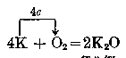

*氧化钾*

在加热的条件下，钠、钾在空气里即燃烧，在纯氧里燃烧将更猛烈。燃烧时钠呈现黄色火焰，钾呈现紫色火焰；生成黄色粉末状的过氧化钠 \(\left(\mathrm{Na}_{2} \mathrm{O}_{2}\right)\) 和过氧化钾 \(\left(\mathrm{K}_{2} \mathrm{O}_{2}\right)\). 这在后面一节 （§ 2·3） 里将详细讲到。

##### 2. 跟氯气及其他非金属的反应

钠和钾都能跟氯气猛烈反应，在常温下就能燃烧起来，生成氯化物：

钠或钾跟其他许多非金属反应也很猛烈，例如，跟硫反应时就会发生爆炸。

##### 3. 跟水的反应

钠在常温就能跟水反应置换出氢气。

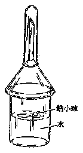

*图 2·1 钠跟水起反应*

用镊子取一小块钠（除去钠块外面的煤油），把它投入水里，钠块立即熔化成银白色小球，浮在水面上，迅速地向各个方向游动，发出嘶嘶响声，钠球逐渐变小，最后消失。这个现象，是由于因反应热而熔化成的钠小球跟水接触处发生反应而产生氢气，把钠球向上推动，但各部位所产生的氢气的量不等，推动力不均衡所导致的。有时反应过份剧烈，可能会把钠小球和水液推出容器，所以最好用一只漏斗把反应容器罩起来（如图 2·1）。

如果要检验所产生的氢气，可把一只试管套在漏斗管上收集。反应结束后，在溶液里加入几滴酚酞指示剂，溶液就显示红色。可以证明溶液里已生成了碱。

反应的实质，可用下面的离子方程式表示：

\[
\begin{array}{c} 2 e \\ \hline \quad \downarrow \\ 2 H ^ {+} + 2 \mathrm{OH} ^ {-} \\ \uparrow \\ 2 \mathrm{Na} + 2 H _ {2} O = 2 \mathrm{Na} ^ {+} + 2 \mathrm{OH} ^ {-} + H _ {2} \uparrow \end{array}
\]

不难理解，由于钠的活动性比氢强 （参见 （§ 1·2） 金属活动性顺序），所以电子自钠原子转移给氢离子。

钾跟水的反应也是这样，只是因为它比钠更活动，所以反应更猛烈，致使温度升高，往往导致生成的氢气发火燃烧。

##### 4. 跟酸的反应

钠、钾跟酸溶液反应的本质和跟水反应的本质相同，但反应更猛烈得多，这是由于酸溶液里的氢离子浓度比水里大，所以电子转移得更容易的缘故。例如，钠跟盐酸溶液反应是：

\[
\begin{array}{c} 2 e \\ \hline {} \end{array} \quad \begin{array}{c} \downarrow \\ 2 \mathrm{Na} + 2 \mathrm{H} ^ {+} + 2 \mathrm{Cl} ^ {-} = 2 \mathrm{Na} ^ {+} + 2 \mathrm{Cl} ^ {-} + \mathrm{H} _ {2} \uparrow \end{array}
\]

或

\[
\begin{array}{c} 2 e \\ \downarrow \\ 2 \mathrm{Na} + 2 \mathrm{H} ^ {+} = 2 \mathrm{Na} ^ {+} + \mathrm{H} _ {2} \uparrow \end{array}
\]

由于上述的一些反应里都包括电子的转移过程，所以它们都是氧化-还原反应。在这些反应里，钠和钾是还原剂，非金属原子和氢离子是氧化剂。

#### 钠、钾在自然界的存在

从上述的钠和钾的化学性质来看，它们不可能以游离态存在于自然界里，只能以化合态存在。钠的化合物在自然界里分布很广，数量也很多，主要以氯化钠的形式存在在海水、咸水湖里和岩层中。人类大量地从那里把它制取出食盐。此外，还有硫酸钠、硝酸钠等钠的盐类。钾的化合物在自然界里存在的数量也不少，但大都是组成很复杂的岩石，如长石、云母等。简单钾盐如氯化钾等的矿床不多。钾是植物体内的一种重要元素，植物从土壤的养分里吸收得到。因此陆生植物和海藻燃烧后的灰分里都含有碳酸钾。

#### 钠、钾的制取和用途

由于钠、钾本身是强还原剂，一般还原剂不可能把它们还原出来，因此工业上用电解法制取。最初用氢氧化钠或氢氧化钾作原料，在熔融状态下电解；反应如下：

\[
4 \mathrm{NaOH} \xrightarrow[328 ^ {\circ} \mathrm{C} ]{\text {熔融}} 4 \mathrm{Na} ^ {+} + 4 \mathrm{OH} ^ {-}
\]

阴极反应：\(4\mathrm{Na}^{+} + 4e\longrightarrow 4\mathrm{Na}\)。

阳极反应：\(4\mathrm{OH}^{-} - 4e\longrightarrow 2\mathrm{H}_{2}\mathrm{O}\uparrow +\mathrm{O}_{2}\uparrow\)。

合并成总的化学反应为：

\[
4 \mathrm{NaOH} \xrightarrow {\text {熔融电解}} 4 \mathrm{Na} + 2 \mathrm{H} _ {2} \mathrm{O} \uparrow + \mathrm{O} _ {2} \uparrow
\]

现在已改用氯化钠或氯化钾为原料进行电解了，在阳极同时得到氯气。

钠和钾的单质现在也有多方面的用途。例如在有机物合成中作还原剂或催化剂；制造某些合金；制取某些化合物，如氰化钠（NaCN）、过氧化钠（\(\mathrm{Na}_{2}\mathrm{O}_{2}\)）等。

#### 习题 2·2
1. 画出钠和钾的原子结构以及离子结构的图式，举出它们的原子变成离子的反应各二例。

2. 根据钠和钾的原子结构，解释为什么它们都是强的还原剂？为什么钾的化学性质比钠活动？从哪些实验或事例可以证明？

3. 怎样保存钠或钾？为什么？

4. 金属钠或钾着火时为什么不能用水灭火？

5. 现有一块金属钠和一块金属钾，怎样鉴别它们？

6. 从钠和钾的化学性质推论其他碱金属的化学性质：

（1） 跟氧气化合的能力；

（2） 氧化物水化物的性质；

（3） 跟水的置换反应。

7. 金属钠跟熔融冰晶石（\(Na_{3}AlF_{6}\)）反应，可得到金属铝和氟化钠。试说明钠原子发生什么变化？哪一种原子或离子是氧化剂？哪一种原子或离子是还原剂？

［提示：冰晶石熔化后，电离生成钠离子、铝离子和氟离子，它跟钠发生置换反应.］

8. 写出电解熔融氢氧化钾制取钾的化学方程式。

9. 为什么制取金属钠或钾时，必须用它们的熔融状态的碱或盐进行电解，而不用它们的碱或盐的水溶液？试举例说明。

10. 在 100 克水里加入 4.6 克钠，能生成多少克分子氢氧化钠？溶液的百分比浓度是多少？

［提示：水跟钠起反应，消耗了一部分水，因此反应后溶液总重量是剩余的水重量和生成的氢氧化钠的重量.］

11. 1 克钾跟水反应，放出 250 毫升氢气（标准状况下）。试求金属钾的纯度。

### § 2·3 钠和钾的化合物，钾肥

#### 钠和钾的氧化物

钠和钾露在空气里或在较低温度下（180℃以下）跟氧化合，生成白色氧化钠（\(\mathrm{Na}_{2}\mathrm{O}\)）和淡黄色氧化钾（\(\mathrm{K}_{2}\mathrm{O}\)）粉末。这些氧化物都能跟水起反应，生成苛性碱——钠和钾的氢氧化物：

\[
\mathrm{Na} _ {2} \mathrm{O} + \mathrm{H} _ {2} \mathrm{O} = 2 \mathrm{NaOH}
\]

\[
\mathrm{K} _ {2} \mathrm{O} + \mathrm{H} _ {2} \mathrm{O} = 2 \mathrm{KOH}
\]

但在空气中或纯氧气里加热钠和钾，就会生成淡黄色过氧化钠 \(\left(\mathrm{Na}_{2}\mathrm{O}_{2}\right)\) 和过氧化钾 \(\left(\mathrm{K}_{2}\mathrm{O}_{2}\right)\) 粉末：

\[
\begin{array}{l} 2 \mathrm{Na} + \mathrm{O} _ {2} \overset{\text {加热}}{=} \mathrm{Na} _ {2} \mathrm{O} _ {2} \\ 2 \mathrm{K} + \mathrm{O} _ {2} \overset{\text {加热}}{=} \mathrm{K} _ {2} \mathrm{O} _ {2} \\ \end{array}
\]

在过氧化物分子里，两个氧原子自相联结成原子团，所以钠和钾在过氧化物里的化合价仍是 +1 价，它们的结构式是：

\[
\mathrm{Na} - \mathrm{O} - \mathrm{O} - \mathrm{Na}, \quad \mathrm{K} - \mathrm{O} - \mathrm{O} - \mathrm{K}
\]

过氧化钠和过氧化钾跟水反应时也生成苛性碱，同时有氧气生成：

\[
2 \mathrm{Na} _ {2} \mathrm{O} _ {2} + 2 \mathrm{H} _ {2} \mathrm{O} = 4 \mathrm{NaOH} + \mathrm{O} _ {2} \uparrow
\]

\[
2 \mathrm{K} _ {2} \mathrm{O} _ {2} + 2 \mathrm{H} _ {2} \mathrm{O} = 4 \mathrm{KOH} + \mathrm{O} _ {2} \uparrow
\]

因此，过氧化钠和过氧化钾是强氧化剂，在工业上用过氧化钠作漂白剂以漂白麦杆、羽毛等。

过氧化钠露在空气里，会跟二氧化碳发生反应，生成氧气和碳酸钠：

\[
2 \mathrm{Na} _ {2} \mathrm{O} _ {2} + 2 \mathrm{CO} _ {2} = 2 \mathrm{Na} _ {2} \mathrm{CO} _ {3} + \mathrm{O} _ {2} \uparrow
\]

所以过氧化钠必须保存在干燥和不跟空气接触的容器里。但利用这个性质可以用它在防毒面具和潜水艇里，以吸收二氧化碳和供给氧气。

#### 钠和钾的氢氧化物

钠和钾的氢氧化物——氢氧化钠和氢氧化钾——都是白色的固态物质，暴露在空气里容易潮解，在水里的溶解度都很大，溶解时会放出大量的热。它们的溶液有肥皂似的滑腻感觉，浓溶液有很强的腐蚀性，皮肤、织物、纸等都能被腐蚀，因此它们又叫苛性钠和苛性钾。在使用它们的固体和溶液时，必须十分小心，如果在衣服或手上沾着以后，必须立即用水冲洗干净。氢氧化钠和氢氧化钾都是强电解质（强碱），即使很浓的溶液也几乎能完全电离成氢氧根离子和金属离子。因此溶液具有碱的一切性质，能跟酸、酸酐和盐等反应，例如：

\[
\mathrm{Na} ^ {+} + \mathrm{OH} ^ {-} + \mathrm{H} ^ {+} + \mathrm{Cl} ^ {-} = \mathrm{Na} ^ {+} + \mathrm{Cl} ^ {-} + \mathrm{H} _ {2} \mathrm{O}
\]

或

\[
\mathrm{OH} ^ {-} + \mathrm{H} ^ {+} = \mathrm{H} _ {2} \mathrm{O}
\]

\[
2 \mathrm{Na} ^ {+} + 2 \mathrm{OH} ^ {-} + \mathrm{SiO} _ {2} = 2 \mathrm{Na} ^ {+} + \mathrm{SiO} _ {3}^{2-} + \mathrm{H} _ {2} \mathrm{O}
\]

或

\[
\begin{array}{l} 2 \mathrm{OH} ^ {-} + \mathrm{SiO} _ {2} = \mathrm{SiO} _ {3}^{2-} + \mathrm{H} _ {2} \mathrm{O} \\ 2 \mathrm{Na} ^ {+} + 2 \mathrm{OH} ^ {-} + \mathrm{Cu} ^{2+} + \mathrm{SO} _ {4}^{2-} = 2 \mathrm{Na} ^ {+} + \mathrm{SO} _ {4}^{2-} + \mathrm{Cu(OH)} _ {2} \downarrow \\ \end{array}
\]

或

\[
2 \mathrm{OH} ^ {-} + \mathrm{Cu} ^{2+} = \mathrm{Cu(OH)} _ {2} \downarrow
\]

实验室里盛放氢氧化钠或氢氧化钾（固体或溶液）的玻璃瓶不可用玻璃塞子，因为它们能跟玻璃成分里的二氧化硅反应，分别生成硅酸钠和硅酸钾（俗称水玻璃），是一种粘合剂，会使瓶颈和玻璃塞子粘连在一起。当然长期盛放它们的玻璃瓶也会被腐蚀。酸式滴定管不能装碱溶液，也是这个缘故。氢氧化钠或氢氧化钾的固体熔化或蒸煮浓溶液时，也不能用玻璃或瓷的坩埚或蒸发皿，可以用铁坩埚。

氢氧化钠是基本化学工业中最重要的产品之一。工业上又叫它烧碱。它的制取方法，我们将在§ 2·4中介绍。氢氧化钠主要用来制造肥皂、精炼石油、造纸、制造人造丝等等。

制取氢氧化钾的成本比较高。在化学反应里氢氧化钾和氢氧化钠的作用基本上相同，可是1克分子氢氧化钠只需用40克，而1克分子氢氧化钾需要用56克。因此实验室里一般都用氢氧化钠，除非特殊的应用，如制液态钾肥皂时，才用到氢氧化钾。

#### 钠盐和钾盐及其检验法

钠盐和钾盐一般都是无色或白色的固态物质，都易溶于水。现将比较重要的几种钠盐和钾盐，列于表 2·3。

**表 2·3**

| 名称 | 分子式 | 俗名 | 性质 | 主要用途 | 存在或制取法 |
| --- | --- | --- | --- | --- | --- |
| 氯化钠 | \(\mathrm{NaCl}\) | 食盐 | 白色晶体，易溶于水，味咸 | 调味；制取钠和其他钠的化合物，以及氯气和其他氯的化合物 | 海盐、岩盐、井盐、池盐都是氯化钠 |
| 硫酸钠 | \(\mathrm{Na_2SO_4}\) |  | 白色晶体，易溶于水 | 制造玻璃 | 存在于咸水湖里 |
| 十水合硫酸钠 | \(\mathrm{Na_2SO_4\cdot10H_2O}\) | 芒硝 | 无色晶体，易溶于水 | 泻剂、印染 |  |
| 硝酸钠 | \(\mathrm{NaNO_3}\) | 智利硝 | 白色晶体，易潮解，易溶于水，溶液呈中性 | 肥料，实验室制硝酸 | 美洲智利有很多矿藏 |
| 氰化钠 | \(\mathrm{NaCN}\) | 山奈 | 无色晶体，剧毒，极易溶于水，易潮解 | 电镀、冶金、淬火和有机合成；制氰化氢、黄血盐等 |  |
| 碳酸钠 | \(\mathrm{Na_2CO_3}\) | 纯碱、苏打 | 白色粉末，水溶液呈碱性 | 制造玻璃、炼钢、纺织、造纸、制肥皂和净化石油等 | 用氨碱法制得，详见§2·5 |
| 十水合碳酸钠 | \(\mathrm{Na_2CO_3\cdot10H_2O}\) | 洗涤碱 | 无色晶体，水溶液呈碱性 | 洗涤 |  |
| 碳酸氢钠 | \(\mathrm{NaHCO_3}\) | 小苏打 | 白色粉末，水溶液呈弱碱性 | 制发酵粉、灭火机药剂 | 用氨碱法制得的中间产物 |
| 硝酸钾 | \(\mathrm{KNO_3}\) | 火硝 | 无色粒状晶体，极易溶于水，溶液呈中性 | 制取含氮和钾的化肥、黑火药 | 硝酸钠跟氯化钾热饱和溶液起复分解反应后，冷却而制得 |
| 氯化钾 | \(\mathrm{KCl}\) |  | 白色晶体，易溶于水，溶液呈中性 | 肥料；制取钾玻璃、钾和其他钾的化合物 | 某些盐湖里含有氯化钾，亦是晒盐场的副产品 |
| 碳酸钾 | \(\mathrm{K_2CO_3}\) | 钾碱 | 白色粉末，易潮解，易溶于水，溶液呈碱性 | 肥料 | 可用氯化钾来制取，或从草木灰里萃取得到 |

其中氯化钠（即食盐）是一种最主要的钠的化合物。它不仅是生活必需品，而且是基本化学工业上的重要原料。碳酸钠（俗称纯碱）应用很广泛，是一种基本化学工业的重要产品，它的重要性可与硫酸相比拟。

钠盐和钾盐的性质很相似，只能用特殊反应才能把它们鉴别开来。最简便的一种方法是焰色反应检验法。当钠盐或钾盐放在无色的火焰上燃烧时，一切钠盐都呈现黄色火焰；而一切钾盐都呈现紫色火焰。从焰色上，就可以区别它们。

实验室操作如下：用一根光洁无锈的铁丝（或用镍铬丝、铅笔芯，最好用铂丝），把铁丝的一端熔接在玻璃棒上以作把手。铁丝的另一端圈成小环，用纯盐酸（或纯硝酸）洗净铁丝的表面，在火焰中灼热铁丝看看火焰是否无色（暗桔黄色），否则应再用盐酸洗净。于是在小环上沾一些盐的晶体或溶液，再把铁丝放到无色火焰中灼烧（图2·2）。观察火焰的颜色，就能鉴别钠盐和钾盐。铁丝使用一次以后，必须用酸洗净。

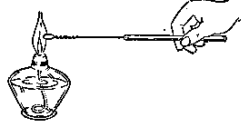

*图2·2 用焰色反应检验钠盐或钾盐*

这个试验，对钠盐非常灵敏，即使微量钠盐就会产生强烈的黄色火焰，因此如果焰色所呈黄色不明显，倒可能不是钠盐了。同时试验时必须注意，即使沾有微量钠盐，对钾盐的鉴定就有很大妨碍，因为强烈的黄色火焰会把紫色火焰遮盖。因此检验钾盐时应用蓝色的钴玻璃隔火焰观察。因为蓝玻璃能吸收黄色的光，而不能吸收紫色的光，这样可以正确地检出钾盐。

#### 钾肥

氮、磷、钾三种元素是植物生长和生活所必需的营养元素，又是土壤最感缺乏的元素，所以施用氮肥、磷肥和钾肥是增长农业生产的重要手段。在第二册里我们已介绍过氮肥和磷肥，这里我们来介绍钾肥。

合理施加钾肥，能使植物正常生成，不容易受病菌感染，能增强抗寒、抗旱的能力。它还能使茎秆坚实，不容易倒伏；并使糖、淀粉的合成能力提高。对块根植物施加钾肥特别有效。现在介绍几种常用的钾肥。

氯化钾和硫酸钾都是重要的钾肥。自然界里氯化钾常和氯化钠在一起，形成钾岩盐矿。硫酸钾和硫酸铝形成复盐——明矾石，因此综合利用明矾石可提供肥料（硫酸钾）和炼铝原料。

碳酸钾存在于草木灰里，因此农村中常把草木灰作为肥料，例如向日葵的灰分里含碳酸钾高达55%。一般用水浸取草木灰，将浸出液蒸发而制得碳酸钾。碳酸钾的水溶液呈碱性，因此不能跟氨态氮肥—— \(\left(\mathrm{NH}_{4}\right)_{2}\mathrm{SO}_{4}\)、\(NH_{4}NO_{3}\)、\(NH_{4}Cl\)、\(NH_{4}HCO_{3}\) 和人粪尿等混合施肥，否则，氨容易游离出来，造成氮肥的损失。

硝酸钾是氮钾混合肥料，又是黑火药的成分之一。天然出产的硝酸钾量不多，可以将硝酸钠跟氯化钾进行复分解反应来制取：

\[
\mathrm{NaNO} _ {3} + \mathrm{KCl} \rightleftharpoons \mathrm{NaCl} + \mathrm{KNO} _ {3}
\]

\[
\mathrm{Na} ^ {+} + \mathrm{NO} _ {3} ^ {-} + \mathrm{K} ^ {+} + \mathrm{Cl} ^ {-} \rightleftharpoons \mathrm{Na} ^ {+} + \mathrm{Cl} ^ {-} + \mathrm{K} ^ {+} + \mathrm{NO} _ {3} ^ {-}
\]

这个反应是可逆的。但是我们可以利用这些盐在不同温度下的溶解度不同，来促进这个反应向右进行。我们先来看表2·4：

**表 2·4 氯化钠、氯化钾、硝酸钠和硝酸钾的溶解度 （克/100 克水）**

| 溶解度名称温度°C | \(NaNO_3\) | KCl | NaCl | \(KNO_3\) |
| --- | --- | --- | --- | --- |
| 0 | 73 | 28.5 | 35.6 | 13 |
| 100 | 175 | 56 | 39.1 | 246 |

从表里可以看出，在较高温度下，硝酸钾的溶解度大于氯化钠；而在较低温度时，情况恰巧相反。因此如果把氯化钾和硝酸钠的热饱和溶液混和时，就有氯化钠晶体析出。把晶体即刻滤去，将滤液蒸发浓缩，氯化钠继续从溶液中析出，并随时滤去。这样促使化学平衡向右移动，而生成硝酸钾的较浓溶液。然后把硝酸钾溶液冷却，由于硝酸钾的溶解度迅速减小而结晶出来。这时因氯化钠的溶解度的变化很小，只有很少氯化钠结晶出来。这样就得到了比较纯的硝酸钾。

要表达钾肥的有效成分含量，通常也是用氧化物的形式即 \(K_{2}O\) 的百分数来表示的。例如分析纯净 \(K_{2}CO_{3}\) 试样结果，用 \(K_{2}O\) 含量来表示，是：

\[
\frac {\mathrm{K} _ {2} \mathrm{O}}{\mathrm{K} _ {2} \mathrm{CO} _ {3}} \times 100 \% = \frac {94}{138} \times 100 \% = 68.1 \%
\]

同样，纯净 KCl，用 \(K_{2}O\) 含量来表示，则为：

\[
\frac {\mathrm{K} _ {2} \mathrm{O}}{2 \mathrm{KCl}} \times 100 \% = \frac {94}{149} \times 100 \% = 63.1 \%
\]

因此纯净 \(K_{2}CO_{3}\) 的含钾肥量要比纯净 KCl 的高一些。如果把它们相互折算起来，则 1 克纯净 \(K_{2}CO_{3}\) 相等于 1.08 克纯净 KCl。计算如下：

\[
1 \text{克} \times 68.1\% = x \text{克} \times 63.1\%
\]

\[
\therefore x = 1 \times \frac {68.1}{63.1} = 1.08 \text{克纯净KCl}
\]

例如，某一块田，本来施用含 0.3% K₂O 的粪肥 10 吨，如果改用纯净 KCl，它的用量多少？可计算如下：

\[
10 \text{吨} \times 0.3\% = x \text{吨} \times 63.1\%
\]

\[
\therefore x = 10 \times \frac{0.3\%}{63.1\%} = 0.0475\text{吨(KCl)}
\]

#### 习题 2·3
1. 怎样从氢氧化钠制备下列物质？写出离子方程式：

（1） 硝酸钠，

（2） 硫酸氢钠，

（3） 硫酸钠，

（4） 碳酸钠，

（5） 钠。

2. 为什么盛放氢氧化钠固体或溶液的瓶子，不能用玻璃塞？为什么盖子要严密？如未盖严密，对氢氧化钠固体和溶液各有什么影响？并用化学方程式表示可能发生的化学反应。

3. 氢氧化钠可用来吸收氯气、二氧化碳以及干燥气体；各是利用它的什么性质？

4. 为什么称氢氧化钠为苛性钠？它在工业上有什么用途？

5. 实验室里熔化氢氧化钠，你选用下面材料中哪一种制成的坩埚？并说明理由：

（1） 铁，（2） 玻璃，（3） 石英，（4） 瓷（粘土、石英和长石制成）。

6. 写出下列反应的化学方程式：

（1） 碳酸氢钠转变成碳酸钠；（2） 碳酸钠转变成碳酸氢钠。

7. 如果说“酸式盐能跟碱反应生成正盐，所以碳酸氢钠的水溶液呈酸性”，这个结论对吗？试详细分析之。

8. 有哪些用途是利用小苏打遇酸剧烈地反应放出二氧化碳的性质的？

*9. 为什么运用结晶法可以从许多混有氯化钠杂质的盐里分离出氯化钠？

［提示：比较氯化钠的溶解度曲线和其他化合物的溶解度曲线.］

10. 从智利硝和氯化钾来制取硝酸钾的反应是可逆的，利用什么原理使化学平衡向生成硝酸钾的方向移动。

11. 为什么草木灰不能跟氨态氮肥和人粪尿等肥料掺和施用？

12. 现在有 \(NH_{4}Cl\)，\(KNO_{3}\)，\(KCl\) 和 \(NaNO_{3}\) 四种化肥，怎样用实验来鉴别它们？写出实验步骤和发生的现象。

［提示：本题可列表解答如下。这里并未全部完成，读者可继续进行.］

| 现象\样品步骤 | I | II | III | IV |
| --- | --- | --- | --- | --- |
| 1. 各取少许，用蒸馏水溶液配成溶液 |   |   |   |   |
| 2. 各取溶液少许，加入浓硫酸和铜片，并加热 | 在试管口有棕色气体二氧化氮生成，证明是硝酸盐 | 在试管口有棕色气体二氧化氮生成，证明是硝酸盐 | 没有现象 | 没有现象 |
| 3. 用铁丝分别沾少些硝酸盐溶液，在无色火焰上灼烧 | 黄色火焰，证明是钠盐 | 隔蓝色玻璃观察火焰呈紫色，证明是钾盐 |   |   |
| 结果 | \(NaNO_3\) | \(KNO_3\) |   |   |

13. 含 \(\mathrm{K}_{2} \mathrm{O} 40 \%\) 的硫酸钾肥料，试计算硫酸钾的百分含量是多少？

14. 含 0.3% K₂O 的粪 40 吨的肥效相当于含 KCl 35% 的钾肥多少吨？

15. 将 0.56 克氢氧化钾溶于水制成 1 升溶液。取出 50 毫升溶液用盐酸来滴定，用去 0.01 克分子浓度的盐酸溶液 45 毫升。试计算氢氧化钾的纯度。

16. 用等量的碳酸氢钠制取二氧化碳，若（1）用煅烧碳酸氢钠法；（2）用跟酸反应法；两者得到的二氧化碳的量是否相等？试结合化学方程式来说明。

### § 2·4 氢氧化钠（烧碱）的工业制法

氢氧化钠（烧碱）是一种重要工业原料，需要量很大，所以必须大量生产。工业上生产烧碱都采用电解食盐水溶液的方法。现在把这个工业制法的基本原理，设备和操作方法，原料和产品的处理等分段讲述于下。

#### 化学原理

在第二册电离学说一章中，我们已经知道，当直流电通过电解质溶液时，离子会作定向的移动，而且分别在电极上放电发生氧化和还原反应。

那末，当直流电通过食盐（NaCl）水溶液时的情况怎样呢？我们首先来考虑溶液中有哪些离子。氯化钠是强电解质，溶入水中即全部电离成离子：

\[
\mathrm{NaCl} \rightleftharpoons \mathrm{Na} ^ {+} + \mathrm{Cl} ^ {-}
\]

同时我们知道，水虽是极弱的电解质，但毕竟也有少量的电离：

\[
\mathrm{H} _ {2} \mathrm{O} \rightleftharpoons \mathrm{H} ^ {+} + \mathrm{OH} ^ {-}
\]

因此，在溶液里存在四种离子：\(Na^{+}\)，\(Cl^{-}\)；\(H^{+}\)，\(OH^{-}\)。

当通入直流电时，原来不规则运动的离子，立即会定向移动：\(\mathrm{Na}^{+}\) 和 \(\mathrm{H}^{+}\) 向阴极移动，\(\mathrm{Cl}^{-}\) 和 \(\mathrm{OH}^{-}\) 向阳极移动。

在阴极的表面上，由于氢离子比钠离子容易跟电子结合，所以氢离子首先从电极得到电子还原成中性氢原子，结合成氢气分子从阴极放出：

\[
2 \mathrm{H} ^ {+} + 2 e \longrightarrow 2 \mathrm{H}, \quad 2 \mathrm{H} \longrightarrow \mathrm{H} _ {2} \uparrow
\]

而 \(Na^{+}\) 仍留在溶液中。

在阳极的表面上，由于氯离子比氢氧根离子容易放出电子，所以氯离子首先失去电子，氧化成中性氯原子，结合成氯气分子，从阳极放出：

\[
2 \mathrm{Cl} ^ {-} - 2 e \longrightarrow 2 \mathrm{Cl}, \quad 2 \mathrm{Cl} \longrightarrow \mathrm{Cl} _ {2} \uparrow
\]

而 \(OH^{-}\) 仍留在溶液中。

这样，电解食盐水溶液的结果，得到了三种东西：在阴极上放出的氢气，在阳极上放出的氯气，留在溶液中由 \(\mathrm{Na}^{+}\) 和 \(\mathrm{OH}^{-}\) 组成的氢氧化钠 （如图 2·3（a））。所以总的反应可合并写成下列化学方程式：

\[
2 \mathrm{NaCl} + 2 \mathrm{H} _ {2} \mathrm{O} \xrightarrow {\text {电解}} 2 \mathrm{NaOH} + \mathrm{H} _ {2} \uparrow + \mathrm{Cl} _ {2} \uparrow
\]

*阴极上阳极上*

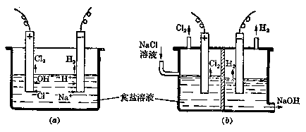

*图2·3*

从图里，不难看出将会有这样的情况发生：（1） 如果氢气和氯气从溶液中出来在容器的空间内混和了，会引起爆炸；（2） 如果溶液中 NaOH 积聚太多，浓度逐渐增大，氯气不迅速离开容器，而重新溶解，它们就会发生下列反应：

\[
\mathrm{Cl} _ {2} + 2 \mathrm{NaOH} = \mathrm{NaClO} + \mathrm{NaCl} + \mathrm{H} _ {2} \mathrm{O}
\]

次氯酸钠这样使溶液含有杂质了。

因此，必须设法防止这些情况的发生。

我们是否可以这样设想：用一很薄隔膜使阳极区和阴极区分开，要求它既能防止氢气和氯气的混和，但又能让溶液缓慢地渗过。这样因氢气和氯气在空间中不混和就不会发生爆炸了，而电流还能通过。此外，在阴极区装一个导管，缓慢而不断地让溶液流出，同时在阳极区也装一个导管，缓慢而不断地流入食盐溶液以平衡之。这样溶液中的氢氧化钠浓度就不会变得太大，跟氯气的副反应就不会发生了。

这个想法是能够办到的，而且事实上也的确行之有效的。在实际操作中，是用一种多微孔的、用石棉布制成的薄膜——“隔膜”把两极区隔开，用示意图来表示，如图2·3（b）所示。

最后应该考虑一下，制成电解容器、导管和电极等的材料。我们知道，在反应前后的物质中，氯气和氢氧化钠是有腐蚀性的，因此必须要用能抗蚀的材料。电极要导电，又必须要用导电体。根据这样要求，一般选用石墨板做阳极，铁板做阴极，铁或陶器做容器和导管。至于具体的安排，则可以有各种形式了。

#### 工业用电解槽和操作过程

根据上述原理，工业用的电解槽有好几种形式，主要的有水平式隔膜电解槽和垂直式隔膜电解槽两种。

##### 1. 水平式隔膜电解槽

这种电解槽是以隔膜水平地放置而命名的，如图2·4所示。电解槽呈长方形，用水泥制成，槽里用瓷砖衬里，上面有水泥制的盖。电解槽里并列着几个石墨制成的电极作为阳极，阴极是用一块和电解槽底面积相等的铁丝网格，网格上紧贴着石棉布当作隔膜。槽顶有一较长导管，食盐溶液可以从此连续地加入阳极区。槽底有一虹吸管，从此，烧碱溶液可以不断流出。两管都具有活门，可以调节流速。另外阳极区和阴极区各有一导管分别放出氯气和氢气。

电解槽的操作是连续的：精制过的饱和食盐溶液不断地由槽顶长导管中缓缓地注入阳极区，透过隔膜流入阴极区，从槽底虹吸管中缓缓流出。维持一定流速，使溶液保持一定深度。导管的一端浸没在电解槽内食盐溶液里，防止阳极区的氯气从这个导管中逸出。氯气（在饱和食盐溶液里的溶解度比在水里的溶解度小得多）从阳极区另一导管中放出。氢气从阴极区的导管放出。氢氧化钠和没有电解的食盐的混和液——电解碱液，从槽底的虹吸管中缓缓流出。应用虹吸管是为了防止空气进入阴极区去，如果空气与氢气混和后就容易发生爆炸。

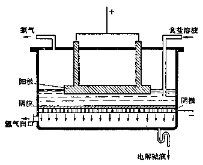

*图 2·4 水平式隔膜电解槽示意图*

电解时电解槽里保持比较高的温度——约 \(80 \sim 85^{\circ}C\) 左右。提高温度，是为了增快离子的运动速度，增强导电能力，从而减少电阻，以节省电能的消耗。但温度也不应过高，否则将会增加水分的蒸发。

##### 2. 垂直式隔膜电解槽

电解槽的隔膜和槽底垂直的，叫垂直式隔膜电解槽，如图2·5所示：它的特点是占地面积小，电极呈板状也垂直于槽底，板状电极的两个面都接触食盐水溶液，而且阳极和阴极一个间隔一个地、平行地排列着，电极的总面积很大，有利于氢氧化钠的生成。其他和水平式隔膜电解槽完全相似。

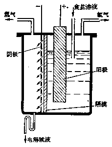

*图 2·5 垂直式隔膜电解槽示意图*

#### 原料和产品的处理

##### 1. 食盐饱和溶液的精制

为了提高电解效率，溶液应越浓越好，一般制成饱和溶液。由于工业用食盐中常含有氯化镁、氯化钙等很多有害杂质，它们不仅使制成的烧碱不纯，而且在碱性溶液中，\(\mathrm{Ca^{2+}}\)、\(\mathrm{Mg^{2+}}\)等将生成氢氧化物（氢氧化镁等）沉淀，堵塞隔膜孔隙，影响溶液的流通。所以溶液必须精制。精制的方法是很复杂的，将视杂质而定。去除溶液里的\(\mathrm{Ca^{2+}}\)、\(\mathrm{Mg^{2+}}\)离子，可用碳酸钠和氢氧化钠，使生成碳酸钙和氢氧化镁沉淀，经澄清后过滤即可：

\[
2 \mathrm{Na} ^ {+} + \mathrm{CO} _ {3}^{2-} + \mathrm{Ca} ^{2+} + 2 \mathrm{Cl} ^ {-} = \mathrm{CaCO} _ {3} \downarrow + 2 \mathrm{Na} ^ {+} + 2 \mathrm{Cl} ^ {-}
\]

\[
2 \mathrm{Na} ^ {+} + 2 \mathrm{OH} ^ {-} + \mathrm{Mg} ^{2+} + 2 \mathrm{Cl} ^ {-} = \mathrm{Mg} (\mathrm{OH}) _ {2} \downarrow + 2 \mathrm{Na} ^ {+} + 2 \mathrm{Cl} ^ {-}
\]

其他如 \(SO_{4}^{2-}\) 离子也必须除去，可用氯化钡使其沉淀出来。

##### 2. 烧碱水的处理

从电解槽里流出来的溶液是氢氧化钠和未经电解的食盐的混和溶液，一般浓度约为 \(10\%\) 的稀碱液，俗称 \(10\) 度烧碱水。由于溶液中含有大量食盐，一般不适合应用，所以必须除去食盐和浓缩溶液。处理方法是加热蒸发。食盐溶解度较小，蒸发过程中逐渐成晶体析出，使碱液的纯度和浓度同时增大。浓缩到一定浓度后的烧碱溶液可以直接供某些工业应用，但也可以蒸发到全部水分除去为止，冷却后成固体的烧碱供用。从蒸发析出的食盐可再用来电解。

##### 3. 氢气和氯气的收集

电解食盐水的另外二种产品氢气和氯气也是工业上极重要的原料。它们的收集和处理方法在第二册卤素一章里已经讲过，这里不再重复了。

除了电解法以外，现在还广泛应用苛化法来制取苛性钠，它是用纯碱溶液跟熟石灰混和一起加热：

\[
2 \mathrm{Na} ^ {+} + \mathrm{CO} _ {3}^{2-} + \mathrm{Ca} ^{2+} + 2 \mathrm{OH} ^ {-} = \mathrm{CaCO} _ {3} \downarrow + 2 \mathrm{Na} ^ {+} + 2 \mathrm{OH} ^ {-}
\]

这个复分解反应由于生成难溶的碳酸钙，反应是可以完成的。

#### 习题 2·4
1. 比较熔融的食盐和食盐水溶液的电解过程的相同点和不同点。写出在两个电极上发生的反应和电解反应的总方程式。

2. 画出水平式隔膜电解槽的示意图，并在图上注明：

（1） 阴极、阳极及其制作材料；

（2） 隔膜及其制作材料；

（3） 食盐溶液的入口；

（4） 氯气、氢气和电解碱液的出口。

3. 根据电解食盐水溶液的基本原理，回答下列问题：

（1） 为什么阳极不能用金属材料制作？

（2） 为什么要用隔膜把阴极区和阳极区隔开？

（3） 为什么氢氧化钠在阴极区生成？

（4） 为什么电解时要维持较高的温度？

（5） 为什么食盐溶液要精制？

4. 连续操作法在电解食盐溶液的操作中具有哪些优点？

5. 怎样处理电解碱液？怎样检验处理后的氢氧化钠里还含有氯化钠？

6. 什么是苛性钠？它在工业上有哪些用途？为什么苛性钠中常含有些碳酸钠？怎样去检验它？

7. 有一瓶苛性钠，取出1克样品溶于水中，用1M的盐酸溶液滴定至中性，共用去23.5毫升盐酸，如果样品里不含有碳酸钠和其他碱性的杂质，则该样品里含氢氧化钠的百分率是多少？

8. 把 2 克苛性钠样品溶于水中，在溶液里先加入硝酸至中性，然后加入过量硝酸银溶液，有氯化银沉淀生成。经过滤、干燥得到 0.287 克氯化银。问苛性钠样品里含食盐的百分率是多少？

### § 2·5 碳酸钠（纯碱）的工业制法

工业上生产碳酸钠（纯碱）大都采用“氨碱法”①．现在我们把这个方法的化学原理、设备、生产过程和优缺点等分段讲述于下：

#### 化学原理

从碳酸钠的分子式 \(Na_{2}CO_{3}\) 来看，它是由钠离子和碳酸根离子组成的电解质。因此，制取它最理想的方法是，用两种能提供这些离子的物质为原料，经复分解反应而得到。食盐（NaCl）和石灰石 \((CaCO_{3})\) 似乎是符合上述要求的最便宜的原料。但是，石灰石不溶于水，不能和食盐直接发生复分解反应生成碳酸钠。事实上，自然界里也没有其他可溶性的碳酸盐可作为原料的。因此必须先制成一种“中间产物”作为过渡。反应原理是这样的：

（1） 把石灰石在高温下煅烧，分解得到二氧化碳和生石灰：

\[
\mathrm{CaCO} _ {3} \overset{\text {高温}}{=} \mathrm{CO} _ {2} \uparrow + \mathrm{CaO}
\]

（2） 把二氧化碳通入饱和的氨水中，使生成碳酸氢铵的溶液：

\[
\mathrm{CO} _ {2} + \mathrm{NH} _ {3} + \mathrm{H} _ {2} \mathrm{O} \rightleftharpoons \mathrm{NH} _ {4} ^ {+} + \mathrm{HCO} _ {3} ^ {-}
\]

（3） 碳酸氢铵溶液跟食盐溶液起复分解反应，产生碳酸氢钠沉淀作为一个中间产物：

\[
\mathrm{NH} _ {4} ^ {+} + \mathrm{HCO} _ {3} ^ {-} + \mathrm{Na} ^ {+} + \mathrm{Cl} ^ {-} \rightleftharpoons \mathrm{NaHCO} _ {3} \downarrow + \mathrm{NH} _ {4} ^ {+} + \mathrm{Cl} ^ {-}
\]

（4） 然后，把溶液过滤得到碳酸氢钠固体，再在高温下煅烧，分解成碳酸钠：

\[
2 \mathrm{NaHCO} _ {3} \overset{\text {高温}}{=} \mathrm{Na} _ {2} \mathrm{CO} _ {3} + \mathrm{CO} _ {2} \uparrow + \mathrm{H} _ {2} \mathrm{O} \uparrow
\]

实际上，反应（2）和（3）是在同一溶液中连续进行的，它们是一组连续的可逆反应。\(\mathrm{NaHCO}_{3}\) 成沉淀析出是使这两个可逆反应的平衡向前移动的原因，也是氨碱法成功的关键。所以必须选择和采用有利于形成 \(\mathrm{NaHCO}_{3}\) 沉淀的条件和措施。

首先，我们注意到温度：降低温度有利于 \(CO_{2}\) 气体和氨气的溶解，从而增加反应物的浓度，也就促使形成 \(NH_{4}HCO_{3}\) 的平衡向前移动，同时也就接着有利于反应（3）的形成 \(NaHCO_{3}\) 的平衡的向前移动。当然在反应（3）中 \(NaHCO_{3}\) 本身的溶解度也因温度降低而变小，使它容易从溶液中析出，结果亦使反应（3）的平衡向前移动，从而影响反应（2）的平衡也向前移动。但是，温度降低也会影响反应（3）中的其他盐类的溶解度下降。所以我们应该选择适当的温度，在这个温度下，既使 \(\mathrm{NaHCO}_{3}\) 的溶解度较小，而且和其他盐类的溶解度比较，差别又较大。这样，就有利于 \(\mathrm{NaHCO}_{3}\) 的沉淀分离。实用上，一般选择30~35℃的温度。

其次，我们再来研究溶液的浓度问题。我们知道，反应物的浓度越大，平衡越向前移动。所以原则上，应设法使溶液对各种溶质来说都达饱和的程度。但是，我们也应注意到 \(\mathrm{CO}_{2}\) 和 \(\mathrm{NH}_{3}\) 的量的比数关系。如果 \(\mathrm{NH}_{3}\) 过量，反应就不是如（2）那样，而是：

\[
2 \mathrm{NH} _ {3} + \mathrm{CO} _ {2} + \mathrm{H} _ {2} \mathrm{O} \rightleftharpoons 2 \mathrm{NH} _ {4} ^ {+} + \mathrm{CO} _ {3}^{2-}
\]

\[
2 \mathrm{NH} _ {4} ^ {+} + \mathrm{CO} _ {3}^{2-} + 2 \mathrm{Na} ^ {+} + 2 \mathrm{Cl} ^ {-} \rightleftharpoons 2 \mathrm{Na} ^ {+} + \mathrm{CO} _ {3}^{2-} + 2 \mathrm{NH} _ {4} ^ {+} + 2 \mathrm{Cl} ^ {-}
\]

这里 \(Na_{2}CO_{3}\) 的溶解度较 \(NaHCO_{3}\) 大得多，它不会生成沉淀，反应最后达到平衡而不再前进了。因此，必须使用过量 \(CO_{2}\)，使溶液中形成 \(HCO_{3}^{-}\) 根离子，而不是形成 \(CO_{3}^{-}\) 根离子，这是这个方法的成功的重要关键所在！实用上，先在饱和食盐水溶液中通入氨气达饱和，然后降温到 \(30 \sim 35^{\circ}C\) 再通入过量的 \(CO_{2}\) 气体，以完成反应 （2） 和 （3）。

此外，我们再来谈谈氨在反应过程中的作用问题。

从反应（2）和（3）来看，\(NH_{3}\) 变成了 \(NH_{4}Cl\)。如果把过滤除去 \(NaHCO_{3}\) 沉淀后的母液加入石灰乳 \([Ca(OH)_{2}]\)，就能发生下列反应而重新得到 \(NH_{3}\)：

\[
2 \mathrm{NH} _ {4} \mathrm{Cl} + \mathrm{Ca(OH)} _ {2} \overset{\text {加热}}{=} 2 \mathrm{NH} _ {3} \uparrow + \mathrm{CaCl} _ {2} + 2 \mathrm{H} _ {2} \mathrm{O}
\]

这样得到的氨又可重复使用，在理论上没有损耗。

当然，在实用上，氨是或多或少要损耗一些的。所以需要随时补充。补充用的和过程开始时所需要的适量氨，一般是用铵盐［例如 \(\mathrm{NH}_{4} \mathrm{Cl}\)，\((\mathrm{NH}_{4})_{2} \mathrm{SO}_{4}\) 等］ 跟石灰乳反应而制得。当然也可用氨水或液态氨。

至于石灰乳的来源也是本工业所现成的。就是反应（1）的另一种产物 CaO 跟水反应而得：

\[
\mathrm{CaO} + \mathrm{H} _ {2} \mathrm{O} = \mathrm{Ca(OH)} _ {2}
\]

到此，我们可以概括起来说：生产纯碱的原料是食盐 （NaCl） 和石灰石 （CaCO₃）；产品除纯碱 （Na₂CO₃） 外，还有一种氯化钙 （CaCl₂），它是原料中的另外两种离子所组成的物质。由于原料不能直接反应，所以需要利用氨的作用，在一定条件下，通过一系列的反应过程才能制得纯碱。过程中生成的碳酸氢钠是一种中间产物，它的形成沉淀析出是这个方法成功的关键。

#### 工业生产过程

根据上述的基本原理，工业上用氨碱法生产纯碱时，主要分成两个阶段：（1）制成碳酸氢钠；（2）煅烧中间产物使成纯碱。流程图如图2·6所示。分述如下：

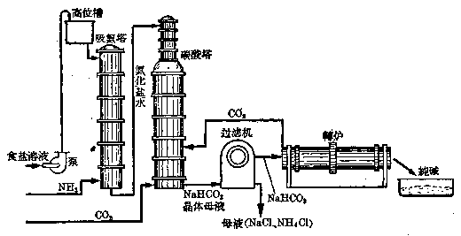

*图 2·6 用氨碱法制造纯碱的流程简图*

##### 1. 碳酸氢钠的生成

先用泵把提纯的饱和食盐溶液提升到高位槽储存，从那里再自动地流入吸氨塔。当饱和食盐溶液从吸氨塔顶上淋下时，把干燥的氨气由塔底通入，这样用逆流原理让氨气溶解在食盐溶液中达饱和程度。当氨溶解于水时，放出热量，溶液的温度升高，不利于氨气的溶解 （气体溶解度跟温度成反比），因此在吸氨塔底部有冷却装置，能把溶液冷却到25°C左右。在吸氨塔里，一小部分氨气跟水反应，生成氢氧化铵，而大部分氨气以溶解形式存在。

从吸氨塔底部出来的溶液——称作氨化盐水，用泵移到碳酸塔的顶部，从那里淋下来，同时从塔底通入过量二氧化碳，在塔里进行反应。开始，氨气、水跟二氧化碳反应生成碳酸氢铵，由于这个反应放热会使溶液温度升高，因此碳酸塔下部也有冷却装置，使温度稳定在30~35°C间，这时碳酸氢铵立即跟氯化钠反应，成碳酸氢钠晶体析出。原理中的反应（2）和（3）合并成：

\[
\mathrm{NH} _ {3} + \mathrm{H} _ {2} \mathrm{O} + \mathrm{CO} _ {2} + \mathrm{Na} ^ {+} + \mathrm{Cl} ^ {-} \xrightarrow {30 \sim 35 ^ {\circ} \mathrm{C}} \mathrm{NaHCO} _ {3} \downarrow + \mathrm{NH} _ {4} ^ {+} + \mathrm{Cl} ^ {-}
\]

从碳酸塔底部流出的悬浮有碳酸氢钠晶体的溶液，送入过滤机中进行分离。得到的晶体就是碳酸氢钠；母液里含有氯化铵和没有起反应的氯化钠（约为原料的30%）。

##### 2. 煅烧碳酸氢钠使分解生成碳酸钠

从过滤机得到的碳酸氢钠晶体送入转炉里加热煅烧。炉子不断地转动，翻动晶体，这样可防止加热不均匀而发生粘结现象。碳酸氢钠慢慢分解生成碳酸钠，分解时放出的二氧化碳可再通入碳酸塔循环使用。

#### 氨碱法的优缺点

这个方法的优点是原料（食盐和石灰石）成本低，产品碳酸钠的纯度高（杂质大部在母液里），氨气和部分二氧化碳可循环使用，制造步骤简单，适合于大规模生产。但它也有若干缺点：最大的缺点是没有充分利用物资，在两种主要原料里，只利用了食盐中的钠离子和石灰石中的碳酸根离子，而全部氯离子和钙离子没有利用，它们结合成氯化钙。处理这样得到的含杂质很多的氯化钙稀溶液就成为很大负担，因为要提纯它是很困难的，实际用途也不大。如果把大量氯化钙排入河流中，会影响鱼类的生存和繁殖；如把它堆放起来，不仅占地很大，而且氯化钙有吸湿性，堆放的地方将成为泥泞不干的废墟。并且，食盐的利用率也很低，只有 \(70 \%\) 转化，\(30 \%\) 随 \(\mathrm{CaCl}_{2}\) 溶液损失了。此外在母液里含有大量氯化铵没有完全被回收。即使从回收的部分来看也并不很合理。我们知道，氯化铵是一种很好的氮肥 （第二册 § 5·8），它比硫酸铵 （俗称肥田粉） 的肥效还要高，不会增加土壤的酸性，现在却把已经制成的氮肥回收成氨气，这样的生产是不合理的。

我国的科学家和工人，经过多年的苦心研究，创立了联合制碱法。它应用了氨碱法的优点，克服了氨碱法的缺点，不仅充分利用了物资，而且同时得到两种产品——纯碱和氯化铵。

#### 联合制碱法的基本原理

在制纯碱部分和氨碱法相同，主要区别是氨的来源不同，它不是从氯化铵回收氨气，而由合成氨厂直接供给。这里合成氨所需要的氮气和氢气是从发生炉煤气跟水煤气制取：

\[
\mathrm{C} + \mathrm{O} _ {2} (\text {空气}) = \mathrm{CO} _ {2} (\mathrm{N} _ {2}) + \text {热}
\]

\[
\mathrm{C} + \mathrm{H} _ {2} \mathrm{O} (\text {蒸气}) \stackrel {\text {高温}} {=} \mathrm{CO} + \mathrm{H} _ {2} - \text {热}
\]

\[
\mathrm{CO} + \mathrm{H} _ {2} \mathrm{O} (\text {蒸气}) \xrightarrow[\text {加热} ]{\text {催化剂}} \mathrm{CO} _ {2} + \mathrm{H} _ {2}
\]

同时又有大量二氧化碳生成，可以供给制碱法作原料，这样就不需要用石灰石作原料来制取二氧化碳，因此降低了制纯碱的成本，也简化了操作过程。方法中又设法让母液里的氯化铵结晶出来，把晶体分离就是氮肥，于是母液还剩下氯化钠可循环使用，这样可以充分利用物质。

#### 习题 2·5
1. 用化学方程式表示氨碱法制纯碱过程的全部化学反应（如果是电解质之间的反应用离子方程式表示）。并说明反应条件。

2. 画出氨碱法制纯碱的生产流程简图，并回答下列问题：

（1） 写出各设备的名称；（2） 说明进入和流出各设备的物料；（3） 写出在各个设备里进行的化学反应。

3. 氨碱法制纯碱为什么不用碳酸铵跟氯化钠制取碳酸钠，而必须先制成中间产物碳酸氢钠，然后再制取碳酸钠？

4. 氨在制纯碱过程里的作用怎样？是怎样循环利用的？

5. 氨碱法制碱的主要优点是什么？还存在哪些主要缺点？

6. 如果碳酸钠里含有少量碳酸氢钠，怎样把它除去？

7. 某制碱厂用氨碱法生产纯碱，每日产量 100 吨，问在理论上 （1） 需要多少吨食盐，如果利用率是 66%；（2） 需要多少吨石灰石，如果石灰石含碳酸钙 95% （假定转炉里放出的二氧化碳全部循环利用）。

### 本章提要

#### 1. 碱金属的通性

碱金属都是银白色轻金属。它们的比重和硬度很小，熔点和沸点很低。由于它们的原子的最外电子层上只有1个电子，这个电子离核的距离都较大（跟同周期元素比较），很容易失去，因而变成带有1个正电荷的阳离子，所以化学性质比其他金属活动。碱金属都是强的还原剂。它们的氧化物的水化物（氢氧化物）的碱性也最强。

碱金属随着核电荷的递增，化学活动性越大，金属性越强。

#### 2. 钠和钾

（1） 物理性质：钠和钾都是银白色金属；比重较水还小；硬度很小，可以用刀切割；熔点都不到 \(100^{\circ} \mathrm{C}\)。

（2） 化学性质：钠和钾的化学性质都非常活动，常温时能跟氧气、氯气发生化合反应；加热时就燃烧起来；在加热时能跟大多数非金属直接化合；跟冷水和酸溶液 （非氧化性酸） 发生置换反应，放出氢气。钾比钠的化学性质更活动，发生反应更剧烈。

（3） 存在和制法：钠和钾在自然界里都以化合态存在。电解熔融钠或钾的氯化物，在阴极可得到钠或钾。

#### 3. 钠和钾的化合物，钾肥

（1） 氧化物：钠和钾在较低温度下跟氧反应生成氧化物——氧化钠和氧化钾，它们是白色固体，跟水反应生成苛性碱。

钠和钾在空气里燃烧，制得过氧化钠和过氧化钾，遇水生成苛性碱和氧气。因此可用作强氧化剂，或用作氧气发生剂。

（2） 氢氧化物：氢氧化钠和氢氧化钾是白色易潮解的固体，易溶于水并放出大量热，具有很强的腐蚀性，因此又叫苛性钠和苛性钾。它们都是强碱，在水溶液里几乎完全电离，具有可溶性碱的通性。

（3） 钠盐和钾盐：钠盐和钾盐一般都是无色或白色的固体，而且都易溶于水。氯化钠即食盐，不仅是生活必需品，又是化学工业的原料，用来制造烧碱、纯碱和盐酸等产品。碳酸钠的水溶液呈碱性，大量用于玻璃、冶金、纺织等工业上。

（4） 检验钠盐和钾盐可用焰色反应。钠盐火焰呈黄色，钾盐火焰呈紫色，根据火焰的颜色就可以鉴别它们。

（5） 钾肥：氯化钾、硫酸钾、硝酸钾和碳酸钾 （草木灰） 是常用的钾肥。钾肥能使植物增强抗寒、抗旱和抗病菌感染的能力，提高糖和淀粉合成的能力

（6） 钠和几种重要钠的化合物的性质及相互关系可列表如下：

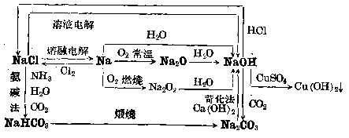

#### 4. 氢氧化钠（烧碱）的工业制法

食盐水溶液电解法：电解提纯的食盐溶液 （80~85°C），在阳极得到氯气，在阴极得到氢气和氢氧化钠。工业上，为了防止氯气跟氢气或氢氧化钠发生副反应，在电解槽里设置石棉隔膜，把阴极和阳极隔开。一般有水平式隔膜电解槽和垂直式隔膜电解槽两种。

#### 5. 碳酸钠（纯碱）的工业制法

一般用氨碱法，即利用食盐和石灰石为原料，氨为媒介物质，制取纯碱。它的原理是：把氨水跟过量二氧化碳反应，生成碳酸氢铵，在 \(30 \sim 35^{\circ} \mathrm{C}\) 时跟氯化钠反应，制得中间产物——碳酸氢钠，把碳酸氢钠煅烧得到纯碱。

### 复习题二

1. 钠和钾各 0.1 克原子跟水反应，生成的氢氧化物的重量是否相等？钠和钾各 1 克跟水反应，生成的氢气的体积是否相同？它们跟水反应剧烈的程度是否相同？为什么？

2. 钠和钾为什么不能用手直接拿取而要用镊子？

3. 说出下列各物质的化学成分：

（1） 烧碱，（2） 纯碱，（3） 洗涤碱，（4） 苏打，（5） 小苏打，（6） 钾碱，（7） 水玻璃。

4. 写出氢氧化钠跟下列物质反应的化学方程式：

（1） 磷酸，（2） 二氧化硅，（3） 硫酸镁，（4） 硫酸氢钠，（5） 氧化锌，（6） 氢氧化锌，（7） 氯气。

*5. 观察放在玻璃管里的钠柱，发现有下列现象：钠柱两端逐渐发暗，有一薄层固体出现；再过些时，有液滴出现；再过些时，液滴又转变成白色固体。试解释这些现象，并写出各步变化的化学方程式。

［提示：（1）钠跟氧气反应；（2）氧化钠跟水起反应；（3）氢氧化钠潮解；（4）氢氧化钠跟二氧化碳反应；（5）十水碳酸钠风化生成碳酸钠.］

*6. 已知纯碱样品里含有较多的碳酸氢钠。取这种样品 10 克，加热到重量不再减少为止，称得生成物重 9.55 克。问原来纯碱样品里含碳酸钠的百分率是多少？

［提示：碳酸钠和碳酸氢钠混和物加热前后重量的差别，就是加热时放出的二氧化碳和水蒸气的重量.］

*7. 用纯净的食盐溶液进行电解，试计算1吨纯净食盐能制得（从电解碱液分离出来的食盐循环使用，并假定食盐没有损耗）：

（1） 浓度为 50% 的氢氧化钠溶液多少吨？

（2） 氢气和氯气各多少升（在标准状况下）？

（3） 如果把生成的氢气和氯气用合成法制盐酸，能制得浓度为 \(35 \%\) 的盐酸多少吨？

#### 注释

- ①（§ 2·1）：按理应钫是化学活动性最强的金属，但它是一种人工放射性元素，在自然界里存在量极微，存在时间极短，目前对它的性质了解得很不够，所以一般就把铯看作是化学活动性最强的金属元素。
- ①（§ 2·5）：这个生产方法是比利时工程师苏尔维于 1861 年首先提出的，所以也叫苏尔维法。

## 第三章 碱土金属

元素周期表第Ⅱ类主族元素，有铍（Be）、镁（Mg）、钙（Ca）、锶（Sr）、钡（Ba）和镭（Ra）等六种，它们的性质和第Ⅰ类的碱金属元素以及第Ⅲ类的土金属元素①都有相似的地方，因此称做碱土金属元素，或简称碱土金属。这个族里最后一个元素镭是放射性元素，我们在第二册第三章里已简单介绍过了。本章除介绍碱土金属的一般通性外，着重研究镁和钙两种元素。

### § 3·1 碱土金属的通性

碱土金属的物理性质碱土金属主要的物理性质，如表 3·1 所示：

**表 3·1 碱土金属的主要物理性质**

| 元素名称 | 铍 | 镁 | 钙 | 锶 | 钡 |
| --- | --- | --- | --- | --- | --- |
| 颜色 | 铜灰色 | 银白色 | 银白色 | 银白色 | 银白色 |
| 比重（克/立方厘米） | 1.86 | 1.75 | 1.55 | 2.6 | 3.59 |
| 熔点（°C） | 1284 | 651 | 848 | 770 | 704 |
| 沸点（°C） | 2970 | 1110 | 1140 | 1380 | 1540 |
| 硬度（金刚石=10） | 4 | 2.5 | 2 | 1.8 | — |

从上表可以看出，碱土金属中除铍呈铜灰色外，其余都是银白色，新切开的表面都有金属光泽。碱土金属的硬度比碱金属大，其中以铍的硬度为最大，钡最小。它们的比重虽比碱金属大些，但仍都小于5，因此也都是轻金属；其中钡的比重最大，钙最小。它们的熔点和沸点都比碱金属高；铍的熔点和沸点最高，镁则最低。由此可见，碱土金属的比重、熔点和沸点，并不随着原子序数的增加而作规律性的递变。

#### 碱土金属的原子结构和化学性质

碱土金属的原子序数、原子量和电子层结构如表 3·2 所示：

**表 3·2 碱土金属元素的原子结构**

| 元素名称 | Be | Mg | Ca | Sr | Ba |
| --- | --- | --- | --- | --- | --- |
| 原子序数 | 4 | 12 | 20 | 38 | 56 |
| 原子量 | 9.019 | 24.82 | 40.08 | 87.63 | 137.36 |
| 电子层结构 | 2，2 | 2，8，2 | 2，8，8，2 | 2，8，18，8，2 | 2，8，18，18，8，2 |

从上表可以看出，碱土金属原子最外电子层上都有2个电子（比碱金属多1个），次外电子层上都有8个电子（和碱金属相同）。在化学反应里，它们失去电子的倾向性比同周期里的碱金属原子要弱得多。因此，碱土金属的化学活动性不如碱金属强。但由于碱土金属原子最外层的电子数毕竟还是比较少的，因此比起其他金属来，碱土金属的化学性还是比较活动的。碱土金属原子失去2个电子后，变成+2价的阳离子。碱土金属在一切化合物里都显示+2价。

和碱金属相似，碱土金属的化学活动性也随着原子序数的增加而增强，也就是按着 Be—Mg—Ca—Sr—Ba 的顺序而增强。这是因为当原子序数增大时，原子核外电子层数增多，最外层电子和核的距离渐次增大，受到核的引力则渐次减弱，因此在化学反应里失去电子的倾向性依次增大，化学活动性依次增强。

碱土金属在空气里加热时会燃烧，并放出大量的热；在常温下，亦会逐渐氧化而生成氧化物（分子式的通式为RO）。碱土金属跟卤族元素能直接反应，生成稳定的化合物；跟硫、氮气在加热的条件下也能起反应。它们跟碱金属一样，不仅能置换酸里的氢，还能置换水里的氢，例如钙、锶和钡跟冷水反应很剧烈，铍和镁跟冷水反应则很缓慢（这是由于反应时生成溶解度很小的氢氧化物覆盖着表面，因此阻碍了反应的顺利进行）。

碱土金属的氧化物都能跟水起反应，生成氢氧化物［分子式的通式为 \(R(OH)_{2}\) ］，并放出大量的热。碱土金属氢氧化物较难溶解于水（和碱金属氢氧化物不同），它们在水中的溶解度按 \(\mathrm{Be(OH)}_{2}-\mathrm{Mg(OH)}_{2}-\mathrm{Ca(OH)}_{2}-\mathrm{Sr(OH)}_{2}-\mathrm{Ba(OH)}_{2}\) 的顺序而逐渐增大。它们的水溶液都呈明显的碱性，并也按同一顺序而增强，氢氧化钡是一种强碱。但它们的碱性比对应的碱金属氢氧化物要弱。

由于碱土金属的化学性质相当活动，因此在自然界里它们只以化合态存在，其中最主要的是碳酸盐和硫酸盐。碱土金属的冶炼方法一般都用电解法。

#### 习题 3·1
1. 试根据钠、镁、钾和钙四种元素的原子结构，说明它们的化学活动性的顺序。

2. 试根据碱土金属的原子结构，说明碱土金属化学活动性的递变规律性。

### § 3·2 镁

#### 镁的性质

##### 1. 镁的物理性质

镁是一种银白色的轻金属。即使在粉末状态时，也能保持金属光泽。镁的熔点是 \(651^{\circ} \mathrm{C}\)，介于锌（熔点 \(419^{\circ} \mathrm{C}\)）和铝（熔点 \(660^{\circ} \mathrm{C}\)）之间。

##### 2. 镁的化学性质

镁是一种相当活动的金属，在金属活动顺序里的位置，仅次于钾、钠、钙等少数几种最活动的金属。镁在化学反应里，容易失去它最外层的 2 个电子，变成带 2 个单位正电荷的镁离子。

（1） 镁跟氧的反应。镁跟氧能强烈地化合。在常温下，金属镁就能跟空气里的氧气缓慢地发生作用，表面上生成一薄层镁的氧化物。因此金属镁在空气里久置后，它的表面就会发暗，失去原有的金属光泽。但由于复盖在镁表面的氧化物薄层的结构十分致密，能对内层的金属起保护作用，使之不再继续氧化，因此镁可以保存在空气里。

镁在空气里加热时，能够剧烈燃烧，发出含有紫外线的强烈的白光（参看图3·1）.这是由于镁燃烧时放出大量的热，它使镁燃烧后生成的氧化镁微粒（可能还有少量氮化镁的微粒）灼热并达到白炽状态，因而发出强光。

镁跟氧气化合的反应，包含着电子的转移，这可以用下面的化学方程式清楚地表示出来：

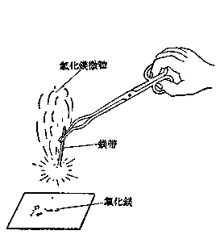

*图 3·1 镁带的燃烧*

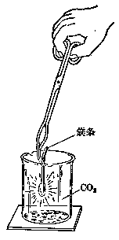

*图 3·2 镁在二氧化碳里燃烧*

由此可以看出，在这个反应里，镁是还原剂，氧气是氧化剂。

镁不仅能够跟游离状态的氧（氧气）化合，而且还能夺取某些氧化物里的氧。在第一册里已经讲过，把燃着的镁条放进二氧化碳气体里，镁条仍旧继续燃烧，生成白色的氧化镁粉末，同时有黑色的碳游离析出 （图 3·2）。这个反应的化学方程式是：

\[
2 \mathrm{Mg} + \mathrm{CO} _ {2} = 2 \mathrm{MgO} + \mathrm{C}
\]

（2） 镁跟卤素、硫或氮气的反应。镁跟氯气在常温下就能起反应；在加热时，镁能跟溴、硫或氮气直接化合。例如：

因此，镁在空气里燃烧时，除生成氧化镁外，还有少量的氮化镁生成。

（3） 镁跟水、稀盐酸或稀硫酸的反应。镁在金属活动顺序里的位置在氢的前面，它不仅能够置换出酸里的氢，而且能够置换出水里的氢。镁跟冷水的反应比较缓慢，但跟沸水的反应相当显著：

虽然生成的氢氧化镁只有极少量溶解于水，但仍可以用酚酞指示剂来检验，溶液呈碱性。

镁跟稀盐酸或稀硫酸的反应十分剧烈，放出氢气：

\[
\mathrm{Mg} + 2 \mathrm{H} ^ {+} + 2 \mathrm{Cl} ^ {-} = \mathrm{H} _ {2} \uparrow + \mathrm{Mg} ^{2+} + 2 \mathrm{Cl} ^ {-}
\]

或

\[
\mathrm{Mg} + 2 \mathrm{H} ^ {+} = \mathrm{H} _ {2} \uparrow + \mathrm{Mg} ^{2+}
\]

#### 镁在自然界里的存在

镁在自然界里都以化合态存在，它是地壳中分布最广的元素之一。镁的最主要矿物是菱镁矿 \(\left(\mathrm{MgCO}_{3}\right)\)，此外，白云石 \(\left(\mathrm{CaCO}_{3}\cdot\mathrm{MgCO}_{3}\right)\)、光卤石 \(\left(\mathrm{KCl}\cdot\mathrm{MgCl}_{2}\cdot6\mathrm{H}_{2}\mathrm{O}\right)\)、滑石 \(\left(3\mathrm{MgO}\cdot4\mathrm{SiO}_{2}\cdot\mathrm{H}_{2}\mathrm{O}\right)\)、石棉 \(\left(\mathrm{CaO}\cdot3\mathrm{MgO}\cdot4\mathrm{SiO}_{2}\right)\) 等矿物里都含有镁。海水里也含有少量的氯化镁 \(\left(\mathrm{MgCl}_{2}\right)\)。氯化镁味苦，因此海水微带苦味。土壤里也含有镁盐，镁是构成植物叶绿素的重要成分，因此镁也是植物生长所必需的元素之一。

#### 镁的制法和用途

工业上常用电解氯化镁的方法来提炼镁。将脱去结晶水的光卤石加热熔化，然后电解，镁便在阴极上析出①：

\[
\mathrm{MgCl} _ {2} \xrightarrow {\longrightarrow} \mathrm{Mg} ^{2+} + 2 \mathrm{Cl} ^ {-}
\]

阴极反应：\(Mg^{2+} + 2e \longrightarrow Mg\)。

阳极反应：\(2\mathrm{Cl}^{-} - 2e\longrightarrow 2\mathrm{Cl}\)，\(2\mathrm{Cl}\longrightarrow \mathrm{Cl}_2\)。

总反应是：\(MgCl_{2}\xrightarrow{熔融电解}Mg+Cl_{2}\uparrow\)。

镁的主要用途是制造轻合金，例如“电子合金”里含有80%镁，微量的铝、铜和锰等金属，这种合金的比重为1.8，较纯镁（1.75）稍大，但是它的硬度和韧性都很大，广泛用于飞机和汽车的制造。又在生铁里加入0.05%的镁，制成球墨铸铁（参看§ 5·3铁的合金），它的抗拉强度、耐磨性都接近于钢，应用很广。由于镁燃烧时发出强光，因此镁粉可用作发光剂，用于照明弹的制造和照相时的照明②。

#### 镁的化合物

##### 1. 氧化镁（MgO）

氧化镁在工业上称做“苦土”，是一种松软的白色粉末，通常由煅烧菱镁矿而制得：

\[
\mathrm{MgCO} _ {3} \overset{\text {煅烧}}{=} \mathrm{MgO} + \mathrm{CO} _ {2} \uparrow
\]

氧化镁极不易熔化（熔点约 \(2800^{\circ}C\)），可用来制造坩埚、耐火砖和高温炉的内壁等。

##### 2. 氢氧化镁

\([\mathrm{Mg(OH)}_2]\) 氧化镁跟水能缓慢地反应，生成难溶性的氢氧化镁，同时放出热量：

\[
\mathrm{MgO} + \mathrm{H} _ {2} \mathrm{O} = \mathrm{Mg(OH)} _ {2} + \text {热}
\]

氢氧化镁的溶解度很小，因此它可以用可溶性碱跟可溶性镁盐反应而制得，例如，在氯化镁溶液里加入氢氧化钠溶液，就有白色的氢氧化镁沉淀生成：

\[
\mathrm{Mg} ^{2+} + 2 \mathrm{Cl} ^ {-} + 2 \mathrm{Na} ^ {+} + 2 \mathrm{OH} ^ {-} = \mathrm{Mg} (\mathrm{OH}) _ {2} \downarrow + 2 \mathrm{Na} ^ {+} + 2 \mathrm{Cl} ^ {-}
\]

或

\[
\mathrm{Mg} ^{2+} + 2 \mathrm{OH} ^ {-} = \mathrm{Mg} (\mathrm{OH}) _ {2} \downarrow
\]

氢氧化镁是一种中等强度的碱，它的悬浊液在医药上称做“苦土乳”，是一种抑酸剂。制造牙膏或牙粉时也要用氢氧化镁。

##### 3. 镁盐

重要的镁盐有氯化镁 \(\left(\mathrm{MgCl}_{2}\cdot6\mathrm{H}_{2}\mathrm{O}\right)\)，碳酸镁 \(\left(\mathrm{MgCO}_{3}\right)\)，硫酸镁 \(\left(\mathrm{MgSO}_{4}\cdot7\mathrm{H}_{2}\mathrm{O}\right)\) 等。现将它们的性质、制法以及用途等列表扼要介绍如下：

**表 3·3 几种重要镁盐的性质、制法和用途**

| 镁盐 | 性质 | 存在或制取 | 主要用途 |
| --- | --- | --- | --- |
| 氯化镁（\(\mathrm{MgCl}_{2}\cdot6\mathrm{H}_{2}\mathrm{O}\)） | 无色、易溶、有潮解性的晶体 | 光卤石的主要成分 | 冶炼金属镁 |
| 碳酸镁（\(\mathrm{MgCO}_{3}\)） | 白色固体，不溶于水；把 \(CO_{2}\) 通入碳酸镁悬浊液，生成可溶性的碳酸氢镁 \(\mathrm{Mg(HCO}_{3})_{2}\) | 菱镁矿的主要成分 | 煅烧后生成氧化镁，用作耐火材料 |
| 硫酸镁（泻盐，\(\mathrm{MgSO}_{4}\cdot7\mathrm{H}_{2}\mathrm{O}\)） | 白色晶体，易溶于水 | 存在于海水中，或由硫酸与菱镁矿反应来制取：\(\mathrm{MgCO}_{3}+\mathrm{H}_{2}\mathrm{SO}_{4}=\mathrm{MgSO}_{4}+\mathrm{CO}_{2}\uparrow+\mathrm{H}_{2}\mathrm{O}\) | 医药上用作泻剂 |

#### 习题 3·2
1. 写出镁跟氧气、溴、硫反应的化学方程式，并指出其中哪一种物质是氧化剂，哪一种物质是还原剂。

2. 镁在空气里燃烧时生成物有哪些？为什么会发生耀目的白光？

3. 试用化学方程式表示下列各步反应：

\[
\begin{array}{l} \mathrm{Mg} \longrightarrow \mathrm{MgO} \longrightarrow \mathrm{MgCl} _ {2} \longrightarrow \mathrm{MgCO} _ {3} \longrightarrow \mathrm{MgSO} _ {4} \\ \longrightarrow \mathrm{Mg} (\mathrm{OH}) _ {2} \longrightarrow \mathrm{MgCl} _ {2} \longrightarrow \mathrm{Mg} \\ \end{array}
\]

4. 现有 1 公斤镁粉，跟水蒸气反应，能收集到多少升氢气 （在标准状况下）？

5. 写出下列各物质的分子式：

（1） 菱镁矿，（2） 苦土，（3） 苦土乳，（4） 泻盐，（5） 白云石，（6） 光卤石。

6. 用电解法从氯化镁里提取镁，为什么不能用氯化镁的溶液，而必须用熔融状态的氯化镁。

7. 镁的化学性质相当活动，为什么能在空气里保存？

### § 3·3 钙

#### 钙的性质

##### 1. 钙的物理性质

钙也是一种银白色的轻金属，它的熔点是 \(848^{\circ}\) C，硬度比镁稍大。

##### 2. 钙的化学性质

钙的化学性质和镁相似，但活动性比镁更强，这从下面的一些事实可以说明。

（1） 钙比镁更容易被氧化。钙露置在空气里，表面上很快就蒙上一层松脆的氧化钙。这层氧化物很疏松，对内部的金属不能起保护作用，所以钙必须保存在密闭的容器里。钙在空气里加热时，也能燃烧，并放出大量的热，火焰呈砖红色。同时也有少量氮化钙 \(\left(\mathrm{Ca}_{3} \mathrm{~N}_{2}\right)\) 生成：

\[
2 \mathrm{Ca} + \mathrm{O} _ {2} = 2 \mathrm{CaO}
\]

（2） 钙跟卤素、硫、氮等非金属元素化合都比镁容易。钙还能跟磷直接化合生成磷化钙：

\[
3 \mathrm{Ca} + 2 \mathrm{P} = \mathrm{Ca} _ {3} \mathrm{P} _ {2}
\]

（3） 钙跟水的反应比镁跟水的反应要剧烈。钙在冷水里就能起猛烈反应，生成氢氧化钙并放出氢气：

#### 钙在自然界里的存在，钙的冶炼和用途

钙在自然界里也都以化合态存在。它不仅分布很广，而且含量很大，地壳中钙的含量占第五位（3.25%）。分布最广的钙的化合物是碳酸钙（CaCO₃），石灰石、白垩、大理石等是不纯的碳酸钙，方解石和冰洲石则是比较纯净的碳酸钙。此外如石膏（CaSO₄·2H₂O）、萤石（CaF₂）、磷灰石以及纤核磷灰石等，也都是钙的矿物。

钙的化合物也存在于土壤里和动植物有机体里。动物骨骼的主要成分是磷酸钙。钙也是植物的营养元素之一。

工业上用电解熔融的氯化钙来冶炼钙。电解时阴极上析出金属钙：

\[
\mathrm{CaCl} _ {2} \rightleftharpoons \mathrm{Ca} ^{2+} + 2 \mathrm{Cl} ^ {-}
\]

阴极反应：\(Ca^{2+} + 2e \longrightarrow Ca\)。

阳极反应：\(2\mathrm{Cl}^{-} - 2e \longrightarrow 2\mathrm{Cl}\)，\(2\mathrm{Cl} \longrightarrow \mathrm{Cl}_2\)。

总反应是：

\[
\mathrm{CaCl} _ {2} \overset{\text {熔融电解}}{=} \mathrm{Ca} + \mathrm{Cl} _ {2} \uparrow
\]

钙主要用来制造合金，含有1%钙的铅合金，是一种重要的轴承材料。

#### 钙的化合物

##### 1. 氧化钙（CaO）

氧化钙俗名叫生石灰，或简称石灰，是一种白色固体。它由碳酸钙强热分解而得：

\[
\mathrm{CaCO} _ {3} \overset{\text {煅烧}}{=} \mathrm{CaO} + \mathrm{CO} _ {2} \uparrow
\]

工业上用石灰石在窑内煅烧，大量生产生石灰。

氧化钙极易跟水起反应（叫做石灰的消化或熟化），生成氢氧化钙：

\[
\mathrm{CaO} + \mathrm{H} _ {2} \mathrm{O} = \mathrm{Ca(OH)} _ {2}
\]

石灰消化时放出大量的热，因此有大量水蒸气逸出（参看第一册图5·1），生成的氢氧化钙是白色粉末状固体。石灰消化后体积增大很多。因此在运输石灰时，要防止被雨淋湿或着水，否则会引起船只或其他运输工具着火燃烧或损坏。

由于石灰易跟水化合，有很强的吸湿性，因此可用作干燥剂。

##### 2. 氢氧化钙

\(\left[\mathrm{Ca(OH)}_{2}\right]\) 氢氧化钙又叫消石灰或熟石灰。它是一种白色粉末状固体。在水中的溶解度不大，但比氢氧化镁大些。把氢氧化钙放在水里，搅动后得到一种乳白色的液体，这是氢氧化钙的颗粒在石灰水里生成的悬浊液，叫做石灰乳。石灰乳静置若干时后，悬浮的颗粒会逐渐下沉，上部澄清的液体是氢氧化钙的饱和溶液，叫做石灰水。

氢氧化钙是中等强度的碱，它在水溶液里能电离生成钙离子和氢氧根离子：

\[
\mathrm{Ca(OH)} _ {2} \rightleftharpoons \mathrm{Ca} ^{2+} + 2 \mathrm{OH} ^ {-}
\]

但由于氢氧化钙的溶解度不大，因此溶液里电离生成的 \(OH^{-}\) 离子的浓度不可能很大，它的碱性要比氢氧化钠和氢氧化钾弱得多。

氢氧化钙具有一切可溶性碱的通性，它容易跟二氧化碳（酸性氧化物）发生反应，生成碳酸钙沉淀，使澄清的石灰水变得浑浊：

\[
\mathrm{Ca} (\mathrm{OH}) _ {2} + \mathrm{CO} _ {2} = \mathrm{CaCO} _ {3} \downarrow + \mathrm{H} _ {2} \mathrm{O}
\]

或

\[
\mathrm{Ca} ^{2+} + 2 \mathrm{OH} ^ {-} + \mathrm{CO} _ {2} = \mathrm{CaCO} _ {3} \downarrow + \mathrm{H} _ {2} \mathrm{O}.
\]

这个反应通常用来检验二氧化碳气体（参看第一册 § 3·4）。由于空气里含有二氧化碳，因此盛石灰水的试剂瓶用毕后，必须立即把塞子盖紧。

生石灰和消石灰是重要的建筑材料。消石灰、砂和水的混和物称做“三合土”，在建筑上用来粘合砖石。三合土粘合砖石后，在空气里它一方面渐渐失去水分，一方面吸收空气中的二氧化碳，使消石灰变成碳酸钙晶体而结成硬块。搀入砂可以增加硬度并使结成的硬块变成多孔性，以增加粘合的坚固性。

生石灰和消石灰也是农业上常用的“石灰肥料”。石灰肥料虽不能直接供给植物以营养元素，但它能降低酸性土壤的酸性，并能改进土壤的结构和增高土壤的肥力。它还能促使某些微生物的繁殖，加速土壤里含氮有机物的分解，成为易被植物吸收的养料。在施用石灰肥料时，应该注意不和氨态氮肥同时使用。因为氨态氮肥遇到消石灰时，容易生成氨气而逸散到空气里去（参看第二册§ 5·8），从而使所用的氮肥失去肥效。

生石灰和消石灰还可以用来防治农作物的病虫害，配制杀虫剂如波尔多液和石灰硫黄合剂等。

##### 3. 碳化钙

\(\left(\mathrm{CaC}_{2}\right)\) 碳化钙俗称“电石”。工业上用焦炭在电炉 \((3000^{\circ}\mathrm{C})\) 里还原生石灰而制得：

\[
3 \mathrm{C} + \mathrm{CaO} \overset{\text {   强热   }}{=} \mathrm{CaC} _ {2} + \mathrm{CO} \uparrow
\]

纯净的碳化钙应为无色透明的固体，工业上用的“电石”因含有杂质，一般是暗灰色的粗松坚硬物质。碳化钙遇水立即发生反应，生成乙炔（俗名“电石气”）和氢氧化钙：

\[
\mathrm{CaC} _ {2} + 2 \mathrm{H} _ {2} \mathrm{O} = \mathrm{C} _ {2} \mathrm{H} _ {2} \uparrow + \mathrm{Ca(OH)} _ {2}
\]

碳化钙是一种重要的工业原料。

##### 4. 钙盐

（1） 碳酸钙 \(\left(\mathrm{CaCO}_{3}\right)\). 碳酸钙是自然界里分布最广的一种碳酸盐。纯净的碳酸钙是一种白色粉末状的物质，它的性质和碳酸镁十分相似。碳酸钙不溶于水，但如果水中已溶有多量的二氧化碳，则能使之溶解，生成可溶性的碳酸氢钙：

\[
\mathrm{CaCO} _ {3} + \mathrm{H} _ {2} \mathrm{O} + \mathrm{CO} _ {2} = \mathrm{Ca} (\mathrm{HCO} _ {3}) _ {2}
\]

天然产的碳酸钙如石灰石、大理石和白垩等是重要的建筑材料（参看第一册§ 3·5）。石灰石可用作炼铁时的熔剂（§ 5·4）以及制造生石灰、二氧化碳、玻璃等。在辗米时加入少量磨细的石灰石粉末可以防止米粒的破裂。

（2） 硫酸钙 （CaSO\(_{4}\)）。石膏是天然产的含有 2 个分子结晶水的硫酸钙 （CaSO\(_{4}\)·2H\(_{2}\)O）。把石膏煅烧到 180°C，就失去结晶水的 3/4 而成烧石膏 ［（CaSO\(_{4}\)）\(_{2}\)·H\(_{2}\)O］。烧石膏能跟水化合重新变成石膏，很快硬化，体积并稍稍膨胀：

\[
2\left[\mathrm{CaSO}_{4}\cdot2\mathrm{H}_{2}\mathrm{O}\right]
\mathop{\rightleftharpoons}\limits_{\text{加水}}^{180^{\circ}\mathrm{C}}
(\mathrm{CaSO}_{4})_{2}\cdot\mathrm{H}_{2}\mathrm{O}+3\mathrm{H}_{2}\mathrm{O}
\]

因此烧石膏可以用来塑石膏像、制石膏模型和在外科上用作固定绷带等。

如果把石膏加热到 \(200^{\circ}\) C 以上，它将失去全部结晶水而成无水硫酸钙，称做“过烧石膏”或“焦石膏”，它不能再吸水而硬化，因此不能用来塑像或制其它模型。

#### 习题 3·3
1. 哪些实验事实可以证明钙比镁更加活动？

2. 试从原子结构来解释钙和镁的化学活动性不及钾和钠。

3. 写出钙跟氧、氯、硫化合的化学方程式，指出在这些反应里哪一种是氧化剂，哪一种是还原剂。

4. 试用化学方程式表示下列各步反应：

\[
\begin{array}{l} \mathrm{Ca} \longrightarrow \mathrm{CaO} ^ {\cdot} \longrightarrow \mathrm{Ca(OH)} _ {2} \longrightarrow \mathrm{CaCO} _ {3} \\ \longrightarrow \mathrm{Ca} (\mathrm{HCO} _ {3}) _ {2} \longrightarrow \mathrm{CaCO} _ {3} \longrightarrow \mathrm{CaCl} _ {2} \longrightarrow \mathrm{Ca} \\ \end{array}
\]

5. （1） 生石灰为什么能用作干燥剂？能用它来干燥哪些气体，举出二个例子。

［提示：被干燥的气体不能跟氢氧化钙或氧化钙发生反应.］

（2） 生石灰在运输或贮存时，遇到水会引起火灾。为什么？

6. 用石灰石粉末来改良一块酸性土壤，根据土壤分析的结果，要加5吨氧化钙，如果折算成碳酸钙应该加多少吨？如果石灰石含有80%碳酸钙，问需加石灰石粉末多少吨？

7. 烧石膏在外科医疗上用作固定绷带，是利用它的什么性质？

8. 试说出下列各组物质的区别：

（1） 石膏、烧石膏、过烧石膏；（2） 生石灰、熟石灰、石灰水、石灰乳。

9. 现有四种白色粉末，已知它们是碳酸钙、氢氧化钙、氯化钙和硫酸钙，试用化学方法一一鉴别。

［提示：参见习题2·3第12题，可用如下方式解答.］

| 步骤\现象\样品 | I | II | III | IV |
| --- | --- | --- | --- | --- |
| 1. 各取少许，加入蒸馏水，搅拌，再滴入酚酞试剂。 | 没有现象 | 没有现象 | 呈红色 | 没有现象 |
| 结果 |   |   | 氢氧化钙 |   |

10. 实验室里用石灰石跟盐酸反应制取二氧化碳，现用含有碳酸钙 \(80 \%\) 的石灰石250克，能跟浓度为 \(20 \%\) 的盐酸多少克起反应？又能生成多少升二氧化碳（在标准状况下）？

### § 3·4 硬水及其软化

水是我们日常生活里不可缺少的东西，在工农业生产上有着

广泛的用途。植物要从水中吸取养料；锅炉每天要消耗大量的水，把水变成水蒸气，以推动活塞和汽轮，从而带动各种机械装置。由于水是最容易得到的，而且它的比热又是一切物质中最大的，因此在冶铁工业以及其他一些工业上要用大量的水来进行降温冷却。另外，对大多数物质来说，水是一种很好的溶剂，在工业生产中许多化学反应都是在水溶液里进行的。

水的分布非常广，海洋里积储着大量的水，地面上有河水、雨水等地面水，地下有深井水、泉水等地下水。所有这些水和地面上、地面下的土壤、矿物质相接触，溶解了许多杂质在内。但有的杂质多些，如海水、深井水、泉水，有的则少些。

前面我们知道，在自然界里分布最广的矿物质是镁盐和钙盐，因此天然水里含有的矿物杂质，主要也是镁盐和钙盐。一般把含有较多量 \(\mathrm{Ca}^{2+}\) 离子（钙盐）和 \(\mathrm{Mg}^{2+}\) 离子（镁盐）的水叫做硬水；把含有极少量或不含有 \(\mathrm{Ca}^{2+}\) 离子和 \(\mathrm{Mg}^{2+}\) 离子的水，叫做软水。

#### 硬水

在硬水里，\(\mathrm{Ca}^{2+}\) 离子和 \(\mathrm{Mg}^{2+}\) 离子主要以可溶性酸式碳酸盐 \((\mathrm{HCO}_3^-)\)、硫酸盐 \((\mathrm{SO}_4^{2-}\)）和氯化物 \((\mathrm{Cl}^-)\) 存在的。

硬水还可分为：

##### 1. 暂时硬水

如果硬水里含有的是酸式碳酸盐，它是不稳定的，把水煮沸就能使之分解，生成难溶的碳酸盐沉淀从水里析出：

\[
\mathrm{Ca} (\mathrm{HCO} _ {3}) _ {2} \overset{\text {加热}}{=} \mathrm{CaCO} _ {3} \downarrow + \mathrm{CO} _ {2} \uparrow + \mathrm{H} _ {2} \mathrm{O}
\]

\[
\mathrm{Mg} (\mathrm{HCO} _ {3}) _ {2} \overset{\text {加热}}{=} \mathrm{MgCO} _ {3} \downarrow + \mathrm{CO} _ {2} \uparrow + \mathrm{H} _ {2} \mathrm{O}
\]

这样，水里的 \(Ca^{2+}\) 离子和 \(Mg^{2+}\) 离子就会减少或者除去，硬水也就变成了软水。这种水的硬性是由碳酸氢钙和碳酸氢镁所引起的，我们称它暂时硬水。

##### 2. 永久硬水

水的硬性如果是由硫酸钙、硫酸镁或氯化钙、氯化镁所引起的，这种硬水在煮沸时，不会有难溶性的钙盐或镁盐析出，因此不能减少水里的 \(\mathrm{Ca}^{2+}\) 离子和 \(\mathrm{Mg}^{2+}\) 离子，也不能降低水的硬性。这种硬水我们称它永久硬水。

#### 硬水的危害

硬水不适用于锅炉。如果锅炉里使用硬水，当水蒸发时，溶解在水里的钙盐和镁盐就会逐渐沉积出来，在锅炉内壁上结成一层不传热的“锅垢”。这样不仅浪费燃料（当锅垢厚达1毫米时，大约要多消耗5%的煤），而且因为锅垢和锅炉钢板受热膨胀的程度不同，沉积在锅炉内壁的锅垢会发生裂缝，当水直接和高温钢板接触时，水突然汽化，局部压强增大，钢板因膨胀而凸出，有时由于蒸气压强突然增加过多，锅炉就会发生爆炸。

化学工业上如果用硬水进行生产，会把 \(Ca^{2+}\) 离子和 \(Mg^{2+}\) 离子带入产品中，影响产品的质量。

洗衣服时如果用硬水，会增加肥皂的消耗。肥皂是硬脂酸的钠盐，它能溶于水而产生泡沫，因而有去垢的作用。如果遇到硬水，生成难溶性的硬脂酸钙和硬脂酸镁（参看第四册 § 2·14），就不能产生泡沫，因此不能除去衣服上的污垢。并且这些沉淀留在衣服上还会损坏织物。

#### 硬水的软化

从上面所讲的硬水的危害可以看到，硬水在工业上和家庭中都是不适用的。因此在使用之前，必须加以适当处理，除去或减少硬水里所含的 \(Ca^{2+}\) 离子和 \(Mg^{2+}\) 离子，降低水的硬性，这称为硬水的软化。

##### 1. 暂时硬水的软化方法

常用的有以下几种：

（1） 加热煮沸法。前面讲过，暂时硬水里所含的酸式碳酸盐是不稳定的，加热煮沸，就能变成难溶的碳酸盐沉淀而除去，这样水就软化了。但是在处理大量的水时，这种方法要消耗掉很多燃料，因此很不经济。

（2） 加碱法。在暂时硬水里加入适量的碱，溶解在水里的酸式碳酸盐也能变成难溶的碳酸盐沉淀。工业上常用消石灰 （消石灰是最廉价的碱） 来软化暂时硬水，称做石灰法：

\[
\mathrm{Ca} (\mathrm{HCO} _ {3}) _ {2} + \mathrm{Ca} (\mathrm{OH}) _ {2} = 2 \mathrm{CaCO} _ {3} \downarrow + 2 \mathrm{H} _ {2} \mathrm{O}
\]

\[
\mathrm{Mg} \left(\mathrm{HCO} _ {3}\right) _ {2} + \mathrm{Ca} (\mathrm{OH}) _ {2} = \mathrm{MgCO} _ {3} \downarrow + \mathrm{CaCO} _ {3} \downarrow + 2 \mathrm{H} _ {2} \mathrm{O}
\]

用离子方程式表示：

\[
\mathrm{Ca} ^{2+} + 2 \mathrm{HCO} _ {3} ^ {-} + \mathrm{Ca} ^{2+} + 2 \mathrm{OH} ^ {-} = 2 \mathrm{CaCO} _ {3} \downarrow + 2 \mathrm{H} _ {2} \mathrm{O}
\]

\[
\mathrm{Mg} ^{2+} + 2 \mathrm{HCO} _ {3} ^ {-} + \mathrm{Ca} ^{2+} + 2 \mathrm{OH} ^ {-} = \mathrm{MgCO} _ {3} \downarrow + \mathrm{CaCO} _ {3} \downarrow + 2 \mathrm{H} _ {2} \mathrm{O}
\]

或 \(\mathrm{HCO}_3^-\) +OH- \(= \mathrm{H}_2\mathrm{O} + \mathrm{CO}_3^{2-}\)

\[
\mathrm{Ca} ^{2+} + \mathrm{CO} _ {3}^{2-} = \mathrm{CaCO} _ {3}, \quad \mathrm{Mg} ^{2+} + \mathrm{CO} _ {3}^{2-} = \mathrm{MgCO} _ {3}
\]

用消石灰软化暂时硬水，消石灰的用量必须适量（水样应该先经过分析，根据暂时硬性的大小来确定消石灰的用量）。因为如果所用消石灰的量过多，它虽然把水中原有的 \(\mathrm{Ca}^{2+}\) 离子和 \(\mathrm{Mg}^{2+}\) 离子沉淀而除掉，但它本身 （过量部分） 却又引进了 \(\mathrm{Ca}^{2+}\) 离子，这样仍然达不到软化的目的。如果用氢氧化钠代替消石灰，就没有这种缺点，不过氢氧化钠的价格较高。经过软化的水，如含有少量钠盐，在工业上或家庭里应用是没有妨碍的。

##### 2. 永久硬水的软化法

用加热煮沸法不能使永久硬水软化，加碱虽然能使硬水中的 \(\mathrm{Mg}^{2+}\) 离子变成难溶的氢氧化镁沉淀而除去，但氢氧化钙的溶解度比较大，一般不会沉淀析出，因此硬水中的 \(\mathrm{Ca}^{2+}\) 离子仍不能除去。永久硬水可以用纯碱使它软化。纯碱在水溶液里能电离生成大量的 \(\mathrm{CO}_{3}^{2-}\) 离子，跟硬水中的 \(\mathrm{Ca}^{2+}\) 离子、\(\mathrm{Mg}^{2+}\) 离子结合成难溶的碳酸钙和碳酸镁沉淀 （显然，加入纯碱也可使暂时硬水软化）：

\[
\mathrm{Ca} ^{2+} + \mathrm{SO} _ {4}^{2-} + 2 \mathrm{Na} ^ {+} + \mathrm{CO} _ {3}^{2-} = \mathrm{CaCO} _ {3} \downarrow + 2 \mathrm{Na} ^ {+} + \mathrm{SO} _ {4}^{2-}
\]

\[
\mathrm{Ca} ^{2+} + 2 \mathrm{Cl} ^ {-} + 2 \mathrm{Na} ^ {+} + \mathrm{CO} _ {3}^{2-} = \mathrm{CaCO} _ {3} \downarrow + 2 \mathrm{Na} ^ {+} + 2 \mathrm{Cl} ^ {-}
\]

或 \(\mathrm{Ca}^{2+} + \mathrm{CO}_{3}^{2-} = \mathrm{CaCO}_{3}\downarrow\)

\[
\mathrm{Mg} ^{2+} + \mathrm{SO} _ {4}^{2-} + 2 \mathrm{Na} ^ {+} + \mathrm{CO} _ {3}^{2-} = \mathrm{MgCO} _ {3} \downarrow + 2 \mathrm{Na} ^ {+} + \mathrm{SO} _ {4}^{2-}
\]

\[
\mathrm{Mg} ^{2+} + 2 \mathrm{Cl} ^ {-} + 2 \mathrm{Na} ^ {+} + \mathrm{CO} _ {3}^{2-} = \mathrm{MgCO} _ {3} \downarrow + 2 \mathrm{Na} ^ {+} + 2 \mathrm{Cl} ^ {-}
\]

或 \(\mathrm{Mg}^{2+} + \mathrm{CO}_3^= = \mathrm{MgCO}_3\downarrow\)

天然水常同时具有暂时硬性和永久硬性，加入纯碱，可以把两种硬性一起降低。在经过软化以后的水里，加入适量明矾，待沉淀沉降，或经过滤，就得到洁净的软水。

现代工业上广泛使用所谓“软化剂”来软化硬水，人造沸石就是其中的一种。

人造沸石是一种不溶于水的铝硅酸钠盐 \(\left(\mathrm{Na}_{2}\mathrm{O}\cdot\mathrm{Al}_{2}\mathrm{O}_{3}\cdot2\mathrm{SiO}_{2}\right.\) 或写成 \(Na_{2}Z\)。把人造沸石装在容器里，当硬水通过人造沸石时，\(Ca^{2+}\) 离子和 \(Mg^{2+}\) 离子跟人造沸石里的钠离子进行交换，这样硬水就软化了：

\[
\mathrm{Na} _ {2} \mathrm{Z} + \mathrm{Ca} ^{2+} = \mathrm{CaZ} + 2 \mathrm{Na} ^ {+}
\]

\[
\mathrm{Na} _ {2} \mathrm{Z} + \mathrm{Mg} ^{2+} = \mathrm{MgZ} + 2 \mathrm{Na} ^ {+}
\]

当人造沸石的 \(Na^{+}\) 离子全部被 \(Ca^{2+}\) 离子和 \(Mg^{2+}\) 离子代替时，它就失去继续软化硬水的能力。这时可用10%的较浓的食盐溶液通过人造沸石，\(Na^{+}\) 离子又能把 \(Ca^{2+}\) 离子和 \(Mg^{2+}\) 离子交换出来，重新生成 \(Na_{2}Z\)：

\[
\mathrm{CaZ} + 2 \mathrm{Na} ^ {+} = \mathrm{Na} _ {2} \mathrm{Z} + \mathrm{Ca} ^{2+}
\]

\[
\mathrm{MgZ} + 2 \mathrm{Na} ^ {+} = \mathrm{Na} _ {2} \mathrm{Z} + \mathrm{Mg} ^{2+}
\]

再用水把代替出来的钙盐和镁盐冲洗掉，这样人造沸石又恢复了软化硬水的能力。

用人造沸石软化硬水，能把暂时硬性和永久硬性都降低，手续简便，整个设备占地很小，软化硬水过程只消耗了一些食盐溶液，是比较经济的。

#### 习题 3·4
1. 什么叫硬水？暂时硬水和永久硬水有什么不同？

2. 自然界里的水哪一种硬性较高？井水用明矾处理净洁后，是否是软水？

3. 什么叫硬水的软化？软化暂时硬水和永久硬水各有哪些常用的方法？用化学方程式表示软化硬水的原理。

4. 有一瓶水，试用简便的方法来鉴别它是：暂时硬水，永久硬水还是软水。

5. 用消石灰软化暂时硬水，为什么必须适量？

6. 用加热法或加碱法软化暂时硬水，从反应的实质来看，有何相似？

7. 如果除去天然水中所含的 \(HCO_{3}^{-}\)、\(SO_{4}^{2-}\) 和 \(Cl^{-}\)，是否就是把硬水软化了？试说明理由。

8. 如果在暂时硬水里分别加入下列试剂，各有何现象产生？能否把暂时硬性除去？写出离子方程式：

（1） 清石灰水，（2） 氨水，（3） 苛性钠溶液，（4） 饱和碳酸钠溶液，（5） 盐酸。

9. （1） 为什么锅炉用水不能用硬水？

（2） 为什么用硬水洗涤衣服不好？

（3） 用肥皂洗手上的粉笔灰（石膏 \(CaSO_{4}\) 制成），为什么泡沫很少？

### 本章提要

#### 1. 碱土金属的通性

碱土金属有铍、镁、钙、锶和钡等，它们大都是银白色的轻金属，并随着原子序数的增加，金属性逐渐增强。它们原子的最外电子层上都有 2 个电子，化学活动性不如碱金属，但比起其他金属来仍比较活动。它们的氢氧化物较难溶解于水，水溶液也呈碱性。

#### 2. 镁

镁是相当活动的金属，露置在空气里就被氧化，但表面生成的氧化膜能保护内部金属。镁在空气里燃烧时发出夺目光辉，加热时跟大多数非金属能直接化合，跟沸水和酸发生置换反应放出氢气。镁主要用来制造轻合金和球墨铸铁。

#### 3. 钙

钙是很活动的金属，露置在空气里能迅速氧化，所以必须密封贮存；加热时跟大多数非金属能直接化合，跟冷水和酸能发生置换反应放出氢气。钙主要用来制造合金。

#### 4. 钙和镁的几种主要化合物

| 化合物 | 性质 | 用途 |
| --- | --- | --- |
| 氧化镁 | 白色高熔点粉末 | 耐火材料 |
| 氧化钙 | 白色高熔点固体 | 建筑材料和石灰肥料 |
| 氢氧化钙 | 白色粉末 | 建筑材料和石灰肥料 |
| 碳酸钙 | 是石灰石和白垩的主要成分 | 炼铁、炼钢时用作熔剂，是制造水泥、玻璃、电石和纯碱的原料 |

#### 5. 硬水

含有 \(\mathrm{Ca}^{2+}\) 离子和 \(\mathrm{Mg}^{2+}\) 离子的水叫硬水。

（1） 暂时硬水：含有 \(\mathrm{Ca(HCO_3)_2}\) 和 \(\mathrm{Mg(HCO_3)_2}\) 的水。它的软化法有 （i） 加热法：使 \(\mathrm{Ca(HCO_3)_2}\) 和 \(\mathrm{Mg(HCO_3)_2}\) 分解变成 \(\mathrm{CaCO_3}\) 和 \(\mathrm{MgCO_3}\) 沉淀。（ii） 加碱法：使 \(\mathrm{Ca(HCO_3)_2}\) 和 \(\mathrm{Mg(HCO_3)_2}\) 跟 \(\mathrm{Ca(OH)_2}\) 或 \(\mathrm{NaOH}\) 等可溶性碱反应，生成难溶的碳酸盐 \(\mathrm{CaCO_3}\) 和 \(\mathrm{MgCO_3}\) 沉淀。

（2） 永久硬水：含有 \(\mathrm{CaSO}_{4}, \mathrm{MgSO}_{4}\) 或 \(\mathrm{CaCl}_{2}, \mathrm{MgCl}_{2}\) 的水。它的软化法是加纯碱，使硬水里的 \(\mathrm{Ca}^{2+}\) 离子和 \(\mathrm{Mg}^{2+}\) 离子跟 \(\mathrm{CO}_{3}^{2-}\) 离子结合，生成 \(\mathrm{CaCO}_{3}\) 和 \(\mathrm{MgCO}_{3}\) 沉淀，从而除去水的硬性。或利用软化剂——人造沸石 \((\mathrm{Na}_{2} \mathrm{Z})\)，使硬水里的 \(\mathrm{Ca}^{2+}\) 离子和 \(\mathrm{Mg}^{2+}\) 离子跟人造沸石里的 \(\mathrm{Na}^{+}\) 离子进行交换，从而除去水的硬性 （人造沸石也能软化暂时硬水）。

### 复习题三

1. 实验室里制取二氧化碳，常用大理石跟酸在启普发生器里反应，为什么选用盐酸而不用硫酸？

**解：** 。硫酸跟大理石反应时，生成溶解度很小的硫酸钙，硫酸钙沉积在大理石的表面，阻碍了硫酸跟大理石继续反应。

2. 煅烧石灰石制取生石灰，怎样检验生石灰里是否还含有未分解的石灰石？

3. 煅烧石灰石生成生石灰和二氧化碳，反应是可逆的：

\[
\mathrm{CaCO} _ {3} \rightleftharpoons \mathrm{CaO} + \mathrm{CO} _ {2} \uparrow - 42.5 \text {   千卡   }
\]

我们要石灰石煅烧完全，可以采用哪些措施？

4. 清石灰水或氢氧化钡溶液露置在空气里，为什么会变浑浊？试写出所起反应的化学方程式。

*5. 在氯化钙的溶液里，通入二氧化碳气体，为什么不会生成碳酸钙沉淀？

［提示：碳酸钙能迅速跟酸发生反应.］

6. 解释下列各名词：（1） 氯水，（2） 氨水，（3） 硬水。并说明在这些水里各含有哪些微粒。

7. 为什么地下水流过石灰岩以后，就变成暂时硬水？

［提示：地下水里常溶解有多量的二氧化碳.］

8. 制取 10 吨生石灰，需要煅烧多少吨含有 90% 碳酸钙的石灰石？

#### 注释

- ①（§ 3·1）：周期表第 III 类里的铝、钪、钇、镧等元素，称为土金属元素，将在下一章里讨论。
- ①（§ 3·2）：在电解液里还含有钾离子，但钾离子结合电子的能力比镁离子弱得多，因此在阴极上只有镁离子被还原。
- ②（§ 3·2）：照相用的闪光粉是镁粉和氯酸钾的混和物。

## 第四章 铝

在前面两章里，我们扼要地介绍了周期表第Ⅰ类和第Ⅱ类的主族元素（碱金属和碱土金属），现在顺着次序，我们学习周期表第Ⅲ类的主族元素（土金属）。在这一类主族里，一共有硼（B）、铝（Al）、镓（Ga）、铟（In）、铊（Tl）五种元素，其中镓、铟、铊三种元素在自然界的存在十分稀少，对这些元素的研究也不多，是属于所谓“稀有元素”。硼是一种非金属元素，在自然界里存在的量也很少，它的性质在许多方面和第二册第六章里讲过的硅很相似。铝是本族元素里最重要的一种元素，在本章里我们将专门介绍有关铝的知识。

和本族里的其他几种元素不同，铝是地壳里含量最多的一种金属元素，它在自然界存在的量，仅次于氧和硅两种元素而居第三位（参见第一册§ 1·7）.另外，铝具有许多可贵的、适合于现代技术要求的性质，例如：比重小、导电传热性好、抗锈蚀性强等。因此它广泛应用在航空、交通运输、电器等工业上和用来制造日常生活用具等。

铝是今天世界上有色金属中产量较多的一种，我们在生产上和生活上经常会接触到用铝（或铝的合金）制造的器械。但是铝和铝的化合物的性质，和前面学过的碱金属和碱土金属相比，有许多特殊的地方。掌握铝的这些特性，对铝制器械的制造、使用和保养，都是十分重要的。

### § 4·1 铝的性质和用途

#### 在元素周期表里的位置和它的原子结构

在元素周期表里，铝处在第三周期第 III 类的主族。在这个周期里，铝前面（第 II 类主族）的一个元素是镁，后面（第 IV 类主族）的一个元素是硅。镁是一种金属元素，硅是一种非金属元素。按照周期表里元素性质递变的规律来看，铝正好处在从金属元素过渡到非金属元素的地位。这就决定了铝（以及铝的化合物）的特殊的化学性质，即在有些方面和金属元素相似，而在另一些方面又和非金属元素相似。

另外，从铝的原子结构（表4·1）来看，铝原子核外最外电子层上有3个电子（次外层上有8个电子），在化学反应里，它能够失去这3个电子（变为外层具有8个电子的稳定结构），成为带3个单位正电荷的铝离子（\(Al^{3+}\)）：

\[
\mathrm{Al} - 3 \mathrm{e} \longrightarrow \mathrm{Al} ^{3+}
\]

**表 4·1 铝的原子结构**

| 元素符号 | Al |
| --- | --- |
| 原子序数 | 13 |
| 原子量 | 27 |
| 电子层结构 | +13 283 |
| 化合价 | +3 |

但是要铝原子失去最外层上的3个电子，显然要比碱金属失去1个电子或碱土金属失去2个电子要困难，所以铝的化学活动性和金属性都比它们弱。

铝在它的一切稳定化合物里都显示 +3 价。

#### 铝的物理性质

铝是银白色的轻金属，它的比重、熔点、沸点、……（总称为物理常数）如表4·2所示。

铝是热和电的良导体，它的导电性虽然比铜差些（在以汞的导电性为1为标准时，铜的导电性是56.9），但由于铝的比重只有铜（比重=8.92）的大约30%，所以，传导同量的电所用的铝线的重量，比铜线可以轻得多；且由于铝的价格比铜便宜，所以在电器工业上，有不少地方铝正在逐渐用来代替铜。

**表 4·2 铝的主要物理常数**

| 比重（克/立方厘米） | 2.70 |
| --- | --- |
| 熔点（°C） | 660 |
| 沸点（°C） | 2270 |
| 硬度（金刚石=10） | 2.9 |
| 导电性（以汞=1为标准） | 36.1 |

铝有很大的延性和展性。1 克铝可以拉成长达 37 米的细丝，亦可以展成面积达 50 平方米的铝箔（它的厚度仅 0.00008 毫米，即 10000 张这样的铝箔迭在一起，总的厚度还不到十分之一厘米呢！）。

纯铝的硬度不大，强度也较差，但若加入少量铜或其他金属，硬度和强度都将大为增加，适合于用作工业材料。

#### 铝的化学性质

铝虽然不如碱金属、碱土金属活动，但从它的化学性质来看，还是一个相当活动的金属，这可以从下面这些反应来说明。

##### 1. 铝跟氧的反应

铝跟氧非常容易化合。将铝露置在空气里，铝表面上会很快地生成一层致密牢固的氧化铝薄膜（简称氧化膜）。在电子显微镜下观察，氧化膜是连续、无孔的，气体不能透过，这就可以防止铝内部金属的继续氧化；即使在高温下，氧化膜也能起同样的保护作用。

把铝粉在空气里加热，会剧烈地燃烧，放出大量的热（每克铝氧化时放出7.47千卡热，比其他许多金属氧化时放出的热量要多）。生成的氧化铝微粒灼热，发出夺目的光辉，跟镁带、镁粉燃烧时的现象相似：

如果铝的表面含有杂质，氧化膜跟铝的联结力就减弱，这时铝就会继续氧化而迅速锈蚀。例如当铝的表面有少量汞存在时，氧化膜就不能跟铝紧密联结，这样的铝在空气里将很快地被氧化。

把铝片表面用砂皮擦净，或把它浸入热的碱溶液里，以除去铝表面的氧化铝，用水洗去铝片上残留的碱液。然后把铝片浸入汞盐溶液，取出并用水洗净。由于铝比汞活动，因此金属表面上有少量汞被置换析出，并跟铝组成铝汞合金，它阻止了铝片表面致密氧化膜的生成。铝汞合金又有很多孔隙，这样氧气就能通过孔隙很快地跟铝反应，在孔隙中不断生成白色的氧化铝细丝，看起来好象一把毛刷（图4·1）。这时候铝片的温度很快升高，用手摸可感觉到。

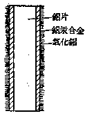

*图 4·1 铝片表面复盖铝汞合金后，铝氧化生成氧化铝的情况*

##### 2. 铝跟氯气以及其他非金属的反应

铝跟氯气在微热的条件下，能剧烈地燃烧，生成无水氯化铝晶体：

在高温时，铝跟硫反应生成硫化铝（\(\mathrm{Al}_{2} \mathrm{~S}_{3}\)）。

取硫粉约2克、铝粉约1克充分混和，放在铁盘内。用玻棒烧红一端，迅速插入混和物内，铝跟硫即剧烈化合，发生火花与闪光。

##### 3. 铝跟水的反应

铝是一种相当活动的金属，在金属活动性顺序里，它的位置仅次于钾、钠、钙、镁等少数几种活动金属。但是我们平常用铝锅或铝壶盛水或煮水时，却看不到它跟水有什么显著的反应，这就是因为铝表面上复盖着一层极薄的但又极致密的氧化层保护膜，使金属铝不能和水直接接触的缘故。如果我们用前面讲过的方法，把铝片表面的氧化膜除去，然后把铝片投入水中，就可看到它跟水迅速反应，置换出水里的氢：

铝跟水反应时除有氢气逸出外，同时有凝胶状的氢氧化铝生成。氢氧化铝逐渐附着在铝片表面，阻碍了铝跟水的接触，因此反应速度逐渐减慢。

##### 4. 铝跟酸的反应

铝的表面虽然复盖有一层氧化保护膜，但氧化铝能溶于酸，因此它对酸将不能产生保护作用。铝跟盐酸或稀硫酸的反应非常剧烈：

或

但是，冷的浓硝酸、浓硫酸跟铝几乎完全不起反应，这种现象称做“钝化”。由于这样的原因，铝的容器可以用来贮存浓硝酸或浓硫酸。

##### 5. 铝跟金属氧化物的反应

铝不但容易跟单质的氧气直接化合，而且还能夺取金属氧化物里的氧，同时，把金属氧化物里的金属离子还原出来。所以铝可用作还原剂来冶炼他种金属。由于反应时放出大量的热，能使还原出来的金属呈熔融状态。这种冶炼金属的方法，称做铝热法，现在工业上常用它来冶炼高熔点的金属，如铬、锰等：

铝和铁的氧化物的混和物称做铝热剂。铝热剂可以用来焊接钢轨。

把铝粉跟四氧化三铁按 1：3 的比例混和，并加入适量的过氧化钡作助燃剂［过氧化钡（\(\mathrm{BaO}_{2}\)）受热分解时，放出氧气，使反应更加剧烈］。把混和物放在坩埚里，用镁带引火，铝热剂发生如下反应：

\[
\begin{array}{c} 24 e \\ \downarrow \\ 8 \mathrm{Al} + 3 \mathrm{Fe} _ {3} \mathrm{O} _ {4} = 4 \mathrm{Al} _ {2} \mathrm{O} _ {3} + 9 \mathrm{Fe} + 795 \text {千卡} \end{array}
\]

反应非常猛烈，有明亮的火花喷射出来，并产生大量的热，使坩埚里的温度高达 \(3500^{\circ} \mathrm{C}\)。这时反应生成的铁呈熔融状态，生成的氧化铝形成熔渣，和铁水不相混和，而浮在铁水上面，这些熔渣能防止下面的铁水氧化。把要焊接的钢轨在焊接处用模子（耐火材料制成）围住，让铁水从坩埚底孔流入模子（图4·2）。待冷却后，把模子去掉，钢轨就焊接起来了。利用铝热剂焊接的方法叫做铝焊接术。

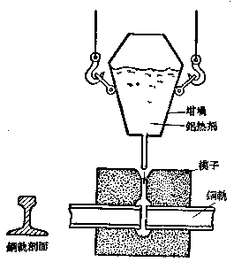

*图 4·2 用铝热剂焊接钢轨（剖面图）*

##### 6. 铝跟碱溶液的反应

我们知道，一般金属和碱溶液不起反应，可是把铝片投入碱溶液里，反应却很剧烈，有氢气放出，同时铝片逐渐溶解。这个反应过程可以分成三个步骤：首先铝表面的氧化铝被碱溶液溶解，生成偏铝酸钠 \(\left(\mathrm{NaAlO}_{2}\right)\)：

\[
\mathrm{Al} _ {2} \mathrm{O} _ {3} + 2 \mathrm{NaOH} = 2 \mathrm{NaAlO} _ {2} + \mathrm{H} _ {2} \mathrm{O}
\]

其次，当铝表面的氧化膜被溶解后，金属铝就跟溶液里的水反应，置换出水中的氢：

\[
2 \mathrm{Al} + 6 \mathrm{H} _ {2} \mathrm{O} = 2 \mathrm{Al} (\mathrm{OH}) _ {3} + 3 \mathrm{H} _ {2} \uparrow
\]

最后，这个反应里生成的氢氧化铝也能够溶解在碱溶液里，生成偏铝酸钠：

\[
\mathrm{Al} (\mathrm{OH}) _ {3} + \mathrm{NaOH} = \mathrm{NaAlO} _ {2} + 2 \mathrm{H} _ {2} \mathrm{O}
\]

这样，铝跟水的反应就不会受到凝胶状氢氧化铝的阻碍，而能继续进行下去。由此可以看出，铝跟碱溶液的反应，实质上是铝跟水的反应；碱的存在，只是起了溶解氧化膜和氢氧化铝的作用，促使铝跟水迅速反应。因此，铝容器不能盛碱溶液和碱性物质，否则易被腐蚀而损坏。

#### 铝的用途

由于铝和铝的合金具有许多可贵的性质，因此铝在工业上有着广泛的用途，是一种极为重要的金属材料。现在根据铝的性质来说明铝的主要用途。

（1） 铝合金的比重小、强度大，可用来制造交通运输工具，如火车、汽车车厢，特别是用来制造飞机。用在飞机上的铝合金，要占飞机总重量的 \(50 \%\) 左右。另外，铝合金也用来制造机器的另件，例如内燃机的活塞等。它可以减轻机件重量，并可提高运转速度，减少能量的消耗。

（2） 铝的导电、传热性能好，可塑性强，易于加工，因此纯铝可用来制造电线、电缆和无线电器材；亦可制造炊具，如铝锅、铝壶等。铝箔可用来包装香烟、糖果，以防受潮。

（3） 铝的抗蚀性强，可以用来制造化学工业上用的反应器、输送管子以及食品工业和日常生活里用的各种容器。用铝粉制造成保护金属的涂料（银色油漆），可以防止其他金属锈蚀。

（4） 由于铝跟氧结合时能放出大量的热，所以铝粉可以用来冶炼某些高熔点的金属；制造照明弹、信号弹和爆炸物（硝酸铵和铝粉的混和物）等，铝热剂可用以焊接钢轨。

#### 习题 4·1
1. 试以铝在元素周期表里所处的位置，和它的原子结构来说明铝的性质。

2. 写出铝跟氧、硫反应的化学方程式，并指出在这些反应里，哪一种物质是氧化剂？哪一种物质是还原剂？

3. 试应用原子结构理论，解释铝的化学活动性较钠和镁弱，并举出实验事例证明。

4. 铝在金属活动性顺序里在氢之前，为什么用铝容器盛水或煮水都没有氢气产生？

5. 日常使用铝壶或铝锅，为什么：

（1） 不能用砂或煤渣来擦除锅外煤烟或锅内锅垢？（2） 锅内油腻不能用纯碱溶液洗涤？（3） 不能煮酸性东西？

6. 铝（或铝的合金）的下列各种用途，各利用它的什么性质？

（1） 制造飞机和汽车外壳；（2） 高速运转的机器另件；（3） 电线；（4） 贮存浓硝酸或浓硫酸的容器；（5） 镀或包在其他金属外面；（6） 铝热法冶炼金属；（7） 日常用炊具。

7. 铝热剂是什么？用铝热剂焊接钢轨，估计需用 2 公斤熔融铁水，问需用铝粉和四氧化三铁各多少公斤？

### § 4·2 铝的化合物

前面讲过，铝在元素周期表里正好处在从金属元素过渡到非金属元素的中间位置。铝的这一特点，特别明显地反映在铝的化合物的性质上。例如铝的氧化物既表现碱性氧化物的性质，又表现出酸性氧化物的性质，是一种两性氧化物（参看第一册 § 5·7）。

铝的氢氧化物的碱性不仅很弱（比氢氧化镁更弱得多），而且在一定条件下还能表现出酸性，是一种典型的两性氢氧化物。由于氢氧化铝碱性极弱，因此铝盐在水溶液里一般都容易发生水解反应，并使溶液呈酸性。

在本节里，我们将着重研究铝的氧化物、氢氧化物以及几种重要铝盐的性质、用途和制法等。

#### 氧化铝（Al₂O₃）

氧化铝又称矾土，是一种难熔的白色物质（熔点在 2000°C 以上）。在自然界里有比较纯净的结晶氧化铝存在，称为刚玉，是无色透明而极硬的晶体，它的硬度仅次于金刚石。如果氧化铝的晶体里含有微量其他金属氧化物，就会显现出美丽的颜色。带有红色（含有微量的氧化铬）或蓝色（含有微量铁和铁的氧化物）的透明刚玉晶体称做红宝石或蓝宝石。把矾土在电炉里强热使之熔化，并掺入微量的其他金属氧化物，可以制得各种颜色的人造宝石，它在组成上或性能上和天然宝石相仿。人造宝石现在广泛用作机器的高速转动部分的轴承和钟表的钻石等。

纯氧化铝可由灼热氢氧化铝而制得：

\[
2 \mathrm{Al} (\mathrm{OH}) _ {3} \overset{\text {灼热}}{=} \mathrm{Al} _ {2} \mathrm{O} _ {3} + 3 \mathrm{H} _ {2} \mathrm{O}
\]

这样制得的氧化铝是白色粉末状物质，它能溶解于酸，也能溶解于碱。当氧化铝跟酸反应时，它是作为一种碱性氧化物来跟酸发生反应的，反应结果生成铝盐和水。例如，氧化铝跟盐酸的反应：

\[
\mathrm{Al} _ {2} \mathrm{O} _ {3} + 6 \mathrm{HCl} = 2 \mathrm{AlCl} _ {3} + 3 \mathrm{H} _ {2} \mathrm{O}
\]

或

\[
\mathrm{Al} _ {2} \mathrm{O} _ {3} + 6 \mathrm{H} ^ {+} = 2 \mathrm{Al} ^{3+} + 3 \mathrm{H} _ {2} \mathrm{O}
\]

当氧化铝跟碱反应时，它又是作为一种酸性氧化物来参加反应的，反应结果生成偏铝酸盐①（或铝酸盐）和水。例如，氧化铝跟氢氧化钠溶液反应，生成可溶性的偏铝酸钠和水：

\[
\mathrm{Al} _ {2} \mathrm{O} _ {3} + 2 \mathrm{NaOH} = 2 \mathrm{NaAlO} _ {2} + \mathrm{H} _ {2} \mathrm{O}
\]

或

\[
\mathrm{Al} _ {2} \mathrm{O} _ {3} + 2 \mathrm{OH} ^ {-} = 2 \mathrm{AlO} _ {2} ^ {-} + \mathrm{H} _ {2} \mathrm{O}
\]

上述这个反应，在前面讲到铝和碱的化学反应时，已经初步介绍过了。

氧化铝的晶体，在酸溶液和碱溶液里都难溶解。只有在高温时，它能跟熔融苛性碱起反应，生成偏铝酸盐。

#### 氢氧化铝

\(\left[\mathrm{Al}(\mathrm{OH})_{3}\right]\) 氢氧化铝是不溶于水的（溶解度比氢氧化镁更小），因此它不能由氧化铝跟水直接化合而制得。和一般不溶性碱的制法一样（参看第一册 § 5·3），氢氧化铝可由铝盐跟可溶性碱反应来制取。例如：

\[
\begin{array}{l} \mathrm{Al} _ {2} (\mathrm{SO} _ {4}) _ {3} + 6 \mathrm{NaOH} = 2 \mathrm{Al} (\mathrm{OH}) _ {3} \downarrow + 3 \mathrm{Na} _ {2} \mathrm{SO} _ {4} \\ \mathrm{AlCl} _ {3} + 3 \mathrm{NaOH} = \mathrm{Al} (\mathrm{OH}) _ {3} \downarrow + 3 \mathrm{NaCl} \\ \end{array}
\]

或

\[
\mathrm{Al} ^{3+} + 3 \mathrm{OH} ^ {-} = \mathrm{Al} (\mathrm{OH}) _ {3} \downarrow
\]

由此所得的氢氧化铝是一种凝胶状的白色沉淀。把氢氧化铝灼热，即分解成为纯净的氧化铝：

\[
2 \mathrm{Al} (\mathrm{OH}) _ {3} \overset{\text {灼热}}{=} \mathrm{Al} _ {2} \mathrm{O} _ {3} + 3 \mathrm{H} _ {2} \mathrm{O}
\]

氢氧化铝具有两性，它一方面能够跟酸反应（中和）而溶解，生成铝盐和水；另一方面又能够跟碱反应（中和）而溶解，生成偏铝酸盐（偏铝酸盐比铝酸盐为稳定，因此一般生成偏铝酸盐而不生成铝酸盐）和水，这时，氢氧化铝就作为一种酸（铝酸，分子式可以写成 \(\mathrm{H}_{3} \mathrm{AlO}_{3}\)）。例如：

\[
\mathrm{Al} (\mathrm{OH}) _ {3} + 3 \mathrm{HCl} = \mathrm{AlCl} _ {3} + 3 \mathrm{H} _ {2} \mathrm{O}
\]

\[
\mathrm{H} _ {3} \mathrm{AlO} _ {3} + \mathrm{NaOH} = \mathrm{NaAlO} _ {2} + 2 \mathrm{H} _ {2} \mathrm{O}
\]

氢氧化铝呈现两性，是因为它在溶液里（氢氧化铝虽然难溶于水，但并不是绝对不溶解的）存在着如下的动态平衡：

\[
\mathrm{Al} ^{3+} + 3 \mathrm{OH} ^ {-} \rightleftharpoons \mathrm{Al} (\mathrm{OH}) _ {3} \rightleftharpoons \mathrm{H} _ {3} \mathrm{AlO} _ {3} \rightleftharpoons \mathrm{H} ^ {+} + \mathrm{AlO} _ {2} ^ {-} + \mathrm{H} _ {2} \mathrm{O}
\]

当加入酸时，由于酸溶液里存在着多量的 \(\mathrm{H}^{+}\) 离子，跟溶液里的 \(\mathrm{OH}^{-}\) 离子结合成难电离的水分子，使溶液里的 \(\mathrm{OH}^{-}\) 离子大为减少，平衡向左方移动，最后反应进行近乎完全；当加入碱时，由于碱液里存在着多量的 \(\mathrm{OH}^{-}\) 离子，跟溶液里的 \(\mathrm{H}^{+}\) 离子结合成难电离的水分子，使溶液里的 \(\mathrm{H}^{+}\) 离子大为减少，平衡向右方移动，最后反应也进行近乎完全。

应该指出，当氢氧化铝不和酸或碱相遇时，它这两种电离趋势都是极弱的①.用一般指示剂来检验氢氧化铝的溶液，既检验不出它的碱性，也检验不出它的酸性。由此可以看出，氢氧化铝的碱性只有当它跟酸反应时才显现出来；它的酸性，也只有当它跟碱反应时才显现出来。

#### 铝盐

##### 1. 硫酸铝

\(\left[\mathrm{Al}_{2}\left(\mathrm{SO}_{4}\right)_{3}\right]\) 硫酸铝可由硫酸跟氧化铝反应而制得：

\[
\mathrm{Al} _ {2} \mathrm{O} _ {3} + 3 \mathrm{H} _ {2} \mathrm{SO} _ {4} = \mathrm{Al} _ {2} (\mathrm{SO} _ {4}) _ {3} + 3 \mathrm{H} _ {2} \mathrm{O}
\]

工业上用热的硫酸跟高岭土 \(\left(\mathrm{Al}_{2}\mathrm{O}_{3}\cdot2\mathrm{SiO}_{2}\cdot2\mathrm{H}_{2}\mathrm{O}\right)\) 反应，硫酸铝的晶体 \(\left[\mathrm{Al}_{2}\left(\mathrm{SO}_{4}\right)_{3}\cdot18\mathrm{H}_{2}\mathrm{O}\right]\) 可自溶液里析出：

\[
\begin{array}{l} \mathrm{Al} _ {2} \mathrm{O} _ {3} \cdot 2 \mathrm{SiO} _ {2} \cdot 2 \mathrm{H} _ {2} \mathrm{O} + 3 \mathrm{H} _ {2} \mathrm{SO} _ {4} + 13 \mathrm{H} _ {2} \mathrm{O} \\ = \mathrm{Al} _ {2} (\mathrm{SO} _ {4}) _ {3} \cdot 18 \mathrm{H} _ {2} \mathrm{O} + 2 \mathrm{SiO} _ {2} \\ \end{array}
\]

硫酸铝是由强酸（硫酸）和弱碱（氢氧化铝）所成的盐，因此它溶解于水时即起水解反应，溶液呈酸性：

\[
\mathrm{Al} _ {2} (\mathrm{SO} _ {4}) _ {3} + 6 \mathrm{H} _ {2} \mathrm{O} \xrightarrow {\longleftrightarrow} 2 \mathrm{Al} (\mathrm{OH}) _ {3} + 3 \mathrm{H} _ {2} \mathrm{SO} _ {4}
\]

或

\[
\mathrm{Al} ^{3+} + 3 \mathrm{H} _ {2} \mathrm{O} \xrightarrow {\longleftrightarrow} \mathrm{Al} (\mathrm{OH}) _ {3} + 3 \mathrm{H} ^ {+}
\]

当大量水时，硫酸铝水解后生成微量的氢氧化铝沉淀，具有很强的吸附能力，能吸附水里的悬浮物或微生物，一起沉入容器底部，因此硫酸铝可以用作水的清净剂。另外，在印染工业上，硫酸铝常用作棉织物染色的媒染剂①。由于硫酸铝的水溶液具有酸性，它可以代替硫酸用在泡沫灭火器里，也可加在焙粉②里，使之跟碳酸氢钠反应产生二氧化碳。

##### 2. 硫酸钾铝

\(\left[\mathrm{KAl}\left(\mathrm{SO}_{4}\right)_{2}\right]\)、矾在硫酸铝溶液中加入等克分子的硫酸钾，使之结晶，可得无色透明的硫酸钾铝晶体，普通称为明矾，分子式是 \(\mathrm{K}_{2} \mathrm{SO}_{4} \cdot \mathrm{Al}_{2}\left(\mathrm{SO}_{4}\right)_{3} \cdot 24 \mathrm{H}_{2} \mathrm{O}\) 或 \(\mathrm{KAl}\left(\mathrm{SO}_{4}\right)_{2} \cdot 12 \mathrm{H}_{2} \mathrm{O}\).

明矾是一种复盐。凡在水溶液里能电离生成两种阳离子和一种阴离子或两种阴离子和一种阳离子的复杂盐类，叫做复盐。明矾在水溶液里能电离生成 \(K^{+}\) 离子、\(Al^{3+}\) 离子和 \(SO_{4}^{2-}\) 离子：

\[
\mathrm{KAl} \left(\mathrm{SO} _ {4}\right) _ {2} \rightleftharpoons \mathrm{K} ^ {+} + \mathrm{Al} ^{3+} + 2 \mathrm{SO} _ {4}^{2-}
\]

由于明矾在溶液里也能电离出 \(Al^{3+}\) 离子和 \(SO_{4}^{2-}\) 离子，因此它可以代替硫酸铝作净水剂和棉织物染色的媒染剂。此外，在制革工业上要用大量的明矾来鞣革，在造纸工业上用它来上胶。经过上胶后的纸，书写时就不会化水。

矾——1价金属硫酸盐跟3价金属硫酸盐结合生成具有通式为 \(M_{2}^{I}SO_{4}\cdot M_{2}^{III}(SO_{4})_{3}\cdot24H_{2}O\) 或 \(M^{I}M^{III}(SO_{4})_{2}\cdot12H_{2}O\) 的复盐，总称为矾。容易形成矾的1价金属有Li、Na、K、Rb、Cs和 \(NH_{4}^{+}\) 等，3价金属有Al、Cr、Fe、Mn等。除上述的明矾外，常遇到的矾如：

铁铵矾 \((\mathrm{NH}_{4})_{2}\mathrm{SO}_{4}\cdot\mathrm{Fe}_{2}(\mathrm{SO}_{4})_{3}\cdot24\mathrm{H}_{2}\mathrm{O}\) 或 \(\mathrm{NH}_{4}\mathrm{Fe}(\mathrm{SO}_{4})_{2}\cdot12\mathrm{H}_{2}\mathrm{O}\)

钾铬矾 \(K_{2}SO_{4}\cdot Cr_{2}(SO_{4})_{3}\cdot24H_{2}O\) 或 \(KCr(SO_{4})_{2}\cdot12H_{2}O\)，等等。

##### 3. 氯化铝（AlCl₃）

在氯气的气流中加热铝，铝跟氯直接化合生成氯化铝。另外，在红热的氧化铝和炭的混和物上通过氯气，也可制得无水氯化铝：

\[
\mathrm{Al} _ {2} \mathrm{O} _ {3} + 3 \mathrm{C} + 3 \mathrm{Cl} _ {2} = 2 \mathrm{AlCl} _ {3} + 3 \mathrm{CO}
\]

氯化铝是无色物质，容易水解产生 HCl 和 Al（OH） \(_{3}\)，因此在潮湿空气里会发烟。

无水氯化铝是石油和各种有机合成工业上常用的一种催化剂。

当铝溶解于盐酸中，可以结晶出含有6个分子结晶水的水合氯化铝晶体 \(\left(\mathrm{AlCl}_{3}\cdot6\mathrm{H}_{2}\mathrm{O}\right)\) .

#### 习题 4·2
1. 氧化铝晶体能用作耐火材料，是根据它的什么性质？

2. 用化学方程式表示下列各步反应：

\[
\begin{array}{l} \mathrm{Al} \longrightarrow \mathrm{AlCl} _ {3} \longrightarrow \mathrm{Al} (\mathrm{OH}) _ {3} \longrightarrow \mathrm{NaAlO} _ {2} \longrightarrow \mathrm{HAlO} _ {2} [ \mathrm{Al} (\mathrm{OH}) _ {3} ] \\ \longrightarrow \mathrm{Al} _ {2} (\mathrm{SO} _ {4}) _ {3} \longrightarrow \mathrm{Al} (\mathrm{OH}) _ {3} \longrightarrow \mathrm{Al} _ {2} \mathrm{O} _ {3} \\ \end{array}
\]

3. 铝片投入浓氢氧化钾溶液里会产生氢气，写出反应的化学方程式。

4. 以 54 克铝（已除去氧化膜）跟过量苛性钠溶液反应，能生成多少升氢气（在标准状况下）？

5. 用明矾为原料制备下列物质，写出反应的化学方程式：

（1） 明矾跟氨水反应制取硫酸钾和硫酸铵混和物；（2） 氢氧化铝；（3） 氧化铝；（4） 偏铝酸钠。

**解：** 

（1） \(2\mathrm{KAl}(\mathrm{SO}_4)_2 + 6\mathrm{NH}_4\mathrm{OH} = 2\mathrm{Al(OH)}_3\downarrow +3(\mathrm{NH}_4)_2\mathrm{SO}_4 + \mathrm{K}_2\mathrm{SO}_4\)

6. 明矾的下列各种用途，各利用它的什么性质？

（1） 装在灭火机里；（2） 制焙粉；（3） 作净水剂。

7. 写出下列盐类水解的离子方程式，并说明它们对石蕊的反应各显示什么颜色？

（1） 氯化铝；（2） 偏铝酸钠。

8. 用氯化铝溶液跟氢氧化钠溶液反应来制取氢氧化铝沉淀时，由于加入过量的碱，沉淀消失了。用什么方法可以重新得到沉淀？说明理由，并写出化学方程式。

［提示：加入适量稀盐酸或再加氯化铝溶液.］

### § 4·3 铝在自然界里的存在，铝的冶炼法

在本章一开始时就已讲过，铝是自然界里含量最多、分布也最广的一种金属元素。在地壳中，铝主要存在于铝硅酸盐中，例如高岭土 \(\left(\mathrm{Al}_{2}\mathrm{O}_{3}\cdot2\mathrm{SiO}_{2}\cdot2\mathrm{H}_{2}\mathrm{O}\right)\)、长石 \(\left(\mathrm{K}_{2}\mathrm{O}\cdot\mathrm{Al}_{2}\mathrm{O}_{3}\cdot6\mathrm{SiO}_{2}\right)\)、云母 \(\left(\mathrm{K}_{2}\mathrm{O}\cdot3\mathrm{Al}_{2}\mathrm{O}_{3}\cdot6\mathrm{SiO}_{2}\cdot2\mathrm{H}_{2}\mathrm{O}\right)\) 等。最重要的铝矿物是铝土矿 \(\left(\mathrm{Al}_{2}\mathrm{O}_{3}\cdot x\mathrm{H}_{2}\mathrm{O}\right)\)，其中 x=1 或 3）、冰晶石 \(\left(3\mathrm{NaF}\cdot\mathrm{AlF}_{3}\right)\)、明矾石 \(\left[\mathrm{KAl}\left(\mathrm{SO}_{4}\right)_{2}\cdot12\mathrm{H}_{2}\mathrm{O}\right]\) 和霞石 \(\left(\mathrm{Na}_{2}\mathrm{O}\cdot\mathrm{K}_{2}\mathrm{O}\cdot\mathrm{Al}_{2}\mathrm{O}_{3}\cdot2\mathrm{SiO}_{2}\right)\) 等，它们都是炼铝的重要原料。

铝在自然界的存在量虽然十分丰富，但金属铝的冶炼历史却很短，最初是在1827年用金属钾还原熔融的无水氯化铝而制得。由于铝的价格很高，因此当时铝比黄金还要昂贵。直到19世纪末发明了电解法制铝，以及用氧化铝-冰晶石为原料以后，铝的产量迅速增高，铝的价格也大幅度的下降，成为一种普遍应用的金属材料。

现在工业上炼铝主要分成两个阶段，即（1）以铝土矿制取纯净的氧化铝和（2）电解熔融的氧化铝。现分述如下：

#### 1. 从铝土矿提取纯净的氧化铝

冶炼铝所用的铝土矿必须十分纯净。但天然的铝土矿里常混有铁和硅的氧化物，电解时，铁和硅都会被还原出来而混在铝里面，影响铝的质量。因此在用铝土矿炼铝之前，必须先进行提纯。

从铝土矿提取纯氧化铝的方法，首先是将磨碎的天然铝土矿和氢氧化钠溶液一起共热，矿石里的氧化铝被氢氧化钠溶解，变为可溶性的偏铝酸钠：

\[
\mathrm{Al} _ {2} \mathrm{O} _ {3} + 2 \mathrm{NaOH} = 2 \mathrm{NaAlO} _ {2} + \mathrm{H} _ {2} \mathrm{O}
\]

或

\[
\mathrm{Al} _ {2} \mathrm{O} _ {3} + 2 \mathrm{OH} ^ {-} = 2 \mathrm{AlO} _ {2} ^ {-} + \mathrm{H} _ {2} \mathrm{O}
\]

然后滤去不溶性的残渣（硅、铁、钛等杂质），并在滤液里通入二氧化碳气体，即有氢氧化铝的沉淀析出：

\[
2 \mathrm{NaAlO} _ {2} + \mathrm{CO} _ {2} + 3 \mathrm{H} _ {2} \mathrm{O} = 2 \mathrm{Al} (\mathrm{OH}) _ {3} \downarrow + \mathrm{Na} _ {2} \mathrm{CO} _ {3}
\]

或

\[
2 \mathrm{AlO} _ {2} ^ {-} + \mathrm{CO} _ {2} + 3 \mathrm{H} _ {2} \mathrm{O} = 2 \mathrm{Al} (\mathrm{OH}) _ {3} \downarrow + \mathrm{CO} _ {3}^{2-}
\]

最后，把所得的氢氧化铝在高温（1200°C）下煅烧，使它分解，即得干的、纯净的氧化铝：

\[
2 \mathrm{Al} (\mathrm{OH}) _ {3} \overset{\text {煅烧}}{=} \mathrm{Al} _ {2} \mathrm{O} _ {3} + 3 \mathrm{H} _ {2} \mathrm{O} \uparrow
\]

##### 2. 电解氧化铝

纯净氧化铝的熔点高达 \(2050^{\circ} \mathrm{C}\)，要使它熔化，然后进行电解是很困难的。现在工业上都用冰晶石 \(\left(\mathrm{Na}_{3} \mathrm{AlF}_{6}, \right.\) 是氟化钠和氟化铝组成的复盐） 做熔剂。在电解时，先把冰晶石熔化 （冰晶石的熔点约为 \(1000^{\circ} \mathrm{C}\)），再把纯净的氧化铝溶解在里面。把熔融的冰晶石和氧化铝的混和物作为电解质，这种混和物的熔点比纯的冰晶石或氧化铝都要低，电解时只要维持 \(940 \sim 960^{\circ} \mathrm{C}\) 的温度就能正常进行生产。

电解熔融冰晶石-氧化铝的过程很复杂，冰晶石虽然参加反应，但反应前后仍保持不变。现在对这一反应的过程还没有一致的说法，我们这里只能简单说明电解过程总的化学方程式以及两极上的生成物：

\[
2\mathrm{Al}_{2}\mathrm{O}_{3}
\xrightarrow[(\mathrm{Na}_{3}\mathrm{AlF}_{6})]{\text{熔融电解}}
4\mathrm{Al}\,(\text{阴极})+3\mathrm{O}_{2}\uparrow\,(\text{阳极})
\]

液态铝在阴极析出，氧气从阳极放出。如果阳极用石墨等碳素材料制成，在电解时的温度下，碳跟生成的氧气就发生反应，生成一氧化碳或二氧化碳气体。一氧化碳又会燃烧生成二氧化碳。

工业上冶炼铝，就根据上述反应的原理和条件，设计成一个专门电解氧化铝的电解槽 （图 4·3）。

电解槽的构造主要分成两个部分：

（1） 电解槽的下部是一个长方形的平底槽，用来盛熔融电解质和制得的金属。槽身用钢板制成，内衬耐火砖。由于耐火砖的原料是二氧化硅或氧化镁 （硅砖或镁砖），在高温时它们都能跟氧化铝起反应，所以又把碳块和碳板砌在槽底和槽侧。

在槽底碳块之间插有钢棒，钢棒的一端伸出槽外，与直流电源的负极相连接，因此整个碳衬和钢棒组成电解槽的阴极。电解时生成的液态铝沉积在槽底碳块上。

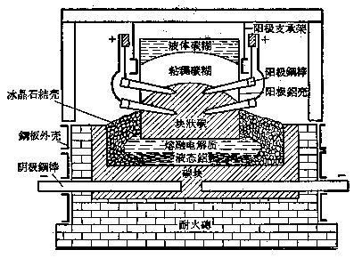

*图 4·3 氧化铝的电解槽示意图*

（2） 电解槽的上部是阳极装置。阳极外壳用铝制成，也呈长方形，上下无底，悬挂在支架上。阳极铝壳里注入碳糊。碳糊是用石油焦、沥青焦（这是石油和煤焦油干馏后得到的干渣）等跟粘结剂（沥青）混和而制成。从铝壳侧面插入几排钢棒，钢棒的一端在碳糊里，另一端留在铝壳外，与电源的正极相连接。由于阳极下部接触的熔融电解质的温度很高，所以碳糊就发生烧结，变成坚硬的一整块。阳极中部的碳糊受热以后，也变得稠厚起来。

在电解时阳极生成的氧气，不断跟碳素发生反应，把阳极下部碳素逐渐烧去，同时铝壳逐渐熔化，因此阳极要定时下降，以保证阳极跟熔融电解质接触。阳极上部铝壳可以接长，碳糊可以添加，把阳极下部钢棒拔出插入上部碳糊里。这样就构成一个连续自动焙烧阳极装置。

电解氧化铝时，阳极生成氧气，阴极生成液态铝。为什么在电解槽里不设置隔膜，以防止两极生成物相遇而化合呢？这是因为生成的液态铝的比重较熔融的电解质大，它们沉积在槽底，上面有熔融的电解质把液态铝跟氧气隔开，所以氧化铝电解槽内不需要设置隔膜。

冶炼铝需要消耗大量的电，制取一吨铝大约要一万七千到二万度电。因此，努力设法减低电能的消耗，对降低铝的成本有着重大意义。

#### 习题 4·3
1. 用化学方程式表示从铝土矿提取纯净氧化铝的反应。

2. 根据下表比较炼铝工业和制烧碱工业：

|   | 电解氧化铝 | 电解食盐溶液 |
| --- | --- | --- |
| 1. 化学方程式 |   |   |
| 2. 电解时温度 |   |   |
| 3. 电解质和离子 |   |   |
| 4. 电解槽制作材料 |   |   |
| 5. 阳极生成物 |   |   |
| 6. 阳极制作材料 |   |   |
| 7. 阴极生成物 |   |   |
| 8. 阴极制作材料 |   |   |

3. 为什么氧化铝电解槽不设置隔膜，而食盐溶液电解槽要设置隔膜？

### 本章提要

#### 1. 铝

（1） 铝的性质：铝是银白色轻金属，比重小，导电传热性良好，可塑性强。铝的化学性质相当活动，常用作还原剂；跟氧非常容易化合，在铝表面生成氧化铝保护膜；跟大多数非金属能直接化合；能跟水 （除去氧化膜以后） 或酸 （浓硝酸、浓硫酸除外） 起反应；跟碱溶液也能起反应。

（2） 铝的制取：一般采用电解熔融氧化铝-冰晶石的方法以制得铝。

（3） 铝的用途：制造飞机、汽车、电线、化学反应器、炊具以及铝箔、铝热剂等。

#### 2. 铝的化合物

（1） 氧化铝（\(Al_{2}O_{3}\)）：氧化铝是两性氧化物，跟酸或碱都能反应。它的晶体是炼铝的原料。

（2） 氢氧化铝 \(\left[\mathrm{Al}(\mathrm{OH})_{3}\right]\)：白色凝胶状物质，不溶于水，是两性氢氧化物，能跟酸或碱起反应。

（3） 铝盐（i） 无水氯化铝 （\(AlCl_{3}\)）：有机合成工业里用作催化剂。

（ii） 硫酸铝 \(\left[\mathrm{Al}_{2}\left(\mathrm{SO}_{4}\right)_{3}\right]\)：白色粉末，能水解，溶液呈酸性，可用作净水剂，制作灭火机药剂和焙粉原料，以及印染工业上作媒染剂。

（iii） 硫酸钾铝 \(\left[\mathrm{KAl}\left(\mathrm{SO}_{4}\right)_{2}\right]\)：硫酸钾铝的晶体，普通称为明矾，分子式是 \(\mathrm{KAl}\left(\mathrm{SO}_{4}\right)_{2} \cdot 12 \mathrm{H}_{2} \mathrm{O}\). 明矾是一种复盐，可以代替硫酸铝作净水剂和印染工业上的媒染剂，在制革工业、造纸工业上亦有广泛应用。

### 复习题四

1. 用浓氢氧化钠溶液跟氯化铝溶液反应，制取氢氧化铝沉淀。最初出现淀沉，当加入过量的氢氧化钠后沉淀消失；再滴加盐酸，沉淀再一次出现；如再继续加盐酸，沉淀又消失。试解释上述现象，并分别用离子方程式表示。

2. 做硫酸铝跟氢氧化钠反应的实验两次，所用的溶液相同。第一次将硫酸铝溶液滴在氢氧化钠溶液中，得到沉淀物质；另一次将氢氧化钠溶液滴在硫酸铝溶液中，出现沉淀后又立刻消失。试解释原因。

3. 根据钠、镁、铝的性质（表面氧化物已除去），回答下列问题：

（1） 把这三种金属分别投入盛有氢氧化钠溶液的试管里，各有什么现象发生？写出反应的化学方程式。

（2） 将这三种金属各取 0.1 克原子，分别投入盛有过量的盐酸的试管里，哪一种金属跟酸反应最猛烈？为什么？哪一种金属置换出来的氢气最多？在标准状况下各能生成多少升氢气？

4. 把铝镁合金溶于盐酸里，再加入过量浓氢氧化钠溶液，试问铝和镁各以何种化合物存在？写出反应的化学方程式。

5. 明矾能净化水，但不能软化硬水，为什么？

#### 注释

- ①（§ 4·2）：偏铝酸 \(\left(\mathrm{HAlO}_{2}\right)\) 是由铝酸 \(\left(\mathrm{H}_{3}\mathrm{AlO}_{3}\right)\) 失去1个水分子而成，它的盐叫做偏铝酸盐，例如偏铝酸钠 \(\left(\mathrm{NaAlO}_{2}\right)\)，其中 \(AlO_{2}^{-}\) 是-1价酸根。
- ①（§ 4·2）：氢氧化铝的酸性比碱性更弱。
- ①（§ 4·2）：硫酸铝水解后的氢氧化铝，能吸附可溶性染料，并与之化合成为不溶性物质固着于纤维上。这种使染料固着于纤维上的媒介物，称为媒染剂。
- ②（§ 4·2）：焙粉即发酵粉。

## 第五章 铁

铁和由生铁炼成的钢，是应用最广的金属。象工业机器、农业机械、交通运输工具、国防武器等的制造，现代厂房和桥梁等的建筑，都要用到大量的钢铁材料。所以，铁和钢的冶炼在国民经济上起着极为重要的作用。

铁是元素周期表第 VIII 类里的一个元素。与它在同一周期里的还有钴（Co）和镍（Ni） 两种元素。这三种元素的原子最外层上的电子数都是 2，次外层上分别是 13、14、15。在参加化学反应时，它们除能失去最外层上的 2 个电子外，还能失去次外层上的 1 个电子，因此它们的性质非常相似。在本章里我们将以铁作为第 VIII 类元素的代表，来学习它的性质和重要化合物，并介绍有关铁和钢的冶炼的原理等知识。

### § 5·1 铁的性质

#### 铁的物理性质

纯净的铁是一种具有银白色光泽的、坚韧的金属，比重7.86，熔点1535℃，能被磁铁吸引。铁受到电流作用的时候，本身就会变成磁铁，而一当电流作用去掉以后，又会立即失去磁性。工业上常利用它的这一性质，用纯净的铁来做电磁铁。

#### 铁的原子结构和化学性质

铁的原子序数是 26，也就是说，铁的原子核所带的电荷是 +26，所以核外有 26 个电子。铁原子的结构可用简图表示如下：

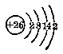

铁原子的最外电子层上只有2个电子，这2个电子很容易失去，所以铁是一个化学性质相当活动的金属，在一定条件之下，它能跟多种非金属、水、酸和盐等起反应。铁原子不但容易失去最外层的2个电子，成为亚铁离子 \(\left(\mathrm{Fe}^{2+}\right)\)，并且还会失去次外层上1个电子，成为铁离子 \(\left(\mathrm{Fe}^{3+}\right)\)。因此，通常铁的化合物里的铁有+2价和+3价两种。

下面我们来讨论铁的化学性质。

##### 1. 铁跟氧气和其他非金属的反应

常温时，铁在干燥的空气里很难氧化，但在潮湿的空气里或在氧气里灼烧，铁的表面就会生成一种暗褐色的四氧化三铁：

\[
\begin{array}{c} 2 e + 2 \times 3 e ^ {\text {①}} \\ \downarrow \\ 3 \mathrm{Fe} + 2 O _ {2} \overset{\text {灼烧}}{=} \mathrm{Fe} _ {3} O _ {4} (\text {或} \mathrm{Fe} O \cdot \mathrm{Fe} _ {2} O _ {3}) \end{array}
\]

加热时，铁也能跟其他非金属如硫、氯等化合：

\[
\begin{array}{c} 2 e \\ \text {   } \\ \text {   } \\ \text {   } \\ \text {   } \\ \text {   } \\ \text {   } \\ \text {   2Fe + S   } \overset{\text {   灼烧   }}{=} \text {   FeS   } \\ \text {   } \\ \text {   } \\ \text {   } \\ \text {   } \\ \text {   } \\ \end{array}
\]

\[
\begin{array}{c} 6 e \\ \text {   } \\ 2 \mathrm{Fe} + 3 \mathrm{Cl} _ {2} \overset{\text {   加热   }}{=} 2 \mathrm{FeCl} _ {3} \end{array}
\]

在铁原子跟硫原子的反应里，铁原子失去最外电子层的2个电子变成亚铁离子 \(\left(\mathrm{Fe}^{2+}\right)\)，硫原子得到铁原子的2个电子变成硫离子 \(\left(\mathrm{S}^{2-}\right)\)，然后两者结合成硫化亚铁 \(\left(\mathrm{FeS}\right)\) 的分子。在铁跟氯的反应里，铁原子不但失去了最外电子层的2个电子，而且又失去次外层里的1个电子，因而变成了铁离子 \(\left(\mathrm{Fe}^{3+}\right)\)。氯原子得到铁原子所失去的电子变成了氯离子 \(\left(\mathrm{Cl}^{-}\right)\)，然后两者结合成氯化铁 \(\left(\mathrm{FeCl}_{3}\right)\) 的分子。铁跟硫或跟氯的反应，在原子结构上所以会产生这样不同的变化，主要是因为氯气是一种更强的氧化剂，它夺取铁原子的电子的能力比硫强的缘故。

在高温下，铁还能跟碳、硅和磷等化合。例如，铁跟碳化合能生成一种十分脆硬而难熔的碳化铁 \(\left(\mathrm{Fe}_{3}\mathrm{C}\right)\)。

##### 2. 铁跟水的反应

红热的铁能跟水蒸气反应，置换出氢气，并生成四氧化三铁。

\[
\begin{array}{c} 2 e + 2 \times 3 e \\ \downarrow \\ 3 \mathrm{Fe} + 4 H _ {2} O \overset{\text {高温}}{=} \mathrm{Fe} _ {3} O _ {4} + 4 H _ {2} \uparrow \end{array}
\]

工业上往往利用这个反应来制取大量的氢气。

在常温下，铁不能跟水反应。但如果受到水、空气里的氧气和二氧化碳等几种物质共同作用时，铁就会发生锈蚀，生成铁锈（§1.4）。铁锈是铁的含水氧化物，它的成分接近于 \(Fe_{2}O_{3}\cdot H_{2}O\)。它是一层松脆多孔的物质，可以让水蒸气和气体透过。因此铁表面的铁锈不能保护里面的铁不再受到锈蚀。当铁制品在潮湿的地方放置过久时，就会完全被锈蚀，我们在使用铁制物件时必须注意这一点。

##### 3. 铁跟酸或盐的反应

在金属活动性顺序里（§1·2），铁是在氢的前面，因此铁能跟酸类 （如稀硫酸或稀盐酸） 起反应，置换出氢气：

\[
\mathrm{Fe} + 2 \mathrm{H} ^ {+} = \mathrm{Fe} ^{2+} + \mathrm{H} _ {2} \uparrow
\]

但在常温下，铁跟浓硫酸和浓硝酸几乎不起反应，因为铁遇到这些酸会在表面上生成一层很致密的保护膜（钝化），从而阻碍了反应的继续进行。

铁也能跟比它活动性较弱的金属盐溶液起反应，并把这种金属置换出来。例如：

\[
\mathrm{Fe} + \mathrm{Cu} ^{2+} = \mathrm{Fe} ^{2+} + \mathrm{Cu} \downarrow
\]

从上面铁跟非金属、水、酸和盐的反应里，我们可以看出：

（1） 在以上各个反应里，都有得失电子的变化，所以，这些反应都是氧化-还原反应。铁原子在这些反应里总是失去电子，它是还原剂。

（2） 铁跟强的氧化剂（例如氯气）反应会生成 +3 价铁的化合物；跟较弱的氧化剂（例如硫）反应生成 +2 价铁的化合物。

#### 自然界里的铁

铁是自然界里分布很广的金属，约占地壳总重量的4.2%。由于它的化学性质相当活动，所以在自然界里铁很少以游离态存在，地壳里的铁大都是铁跟硫、氧等元素的化合物。

比较重要的铁矿石有：磁铁矿 （Fe₃O₄）、赤铁矿 （Fe₂O₃）、褐铁矿 （2Fe₂O₃·3H₂O）、菱铁矿 （FeCO₃） 和黄铁矿 （FeS₂） 等。磁铁矿和赤铁矿是炼铁的主要原料。铁矿石中常含有杂质，这些杂质通常叫做脉石。脉石一般是由 SiO₂、Al₂O₃、CaO、MgO 等氧化物组成的化合物，它们主要是硅酸盐。

生物体内也含有多种铁的化合物，其中大部分存在于动物的血红蛋白里。人体缺少铁，就会引起贫血症。我们在日常生活中多吃一些猪肝、菠菜、芹菜等含铁质较多的食物，可以保证体内铁质的需要。铁也是植物营养必需的元素之一。如果土壤里缺乏铁，就会影响植物体内叶绿素的生成，阻碍植物的生长。

#### 习题 5·1
1. 写出铁跟下列各种物质反应的化学方程式，并注明必要的条件：

硫，氯气，硫酸铜溶液，水蒸气，稀硝酸，稀硫酸。

为什么说这些反应都是氧化-还原反应？试以其中一个反应说明：哪种元素被氧化？哪种元素被还原？哪种物质是氧化剂？哪种物质是还原剂？

2. 为什么铁跟硫反应时，生成的是 +2 价铁的化合物 （FeS），而跟氯气反应时，生成的却是 +3 价铁的化合物 \((\mathrm{FeCl}_{3})\)？

3. 铁能从硫酸铜溶液中置换出铜来，铜能不能从硫酸亚铁溶液中置换出铁来？为什么？

4. 铁和铝都是相当活动的金属，为什么可以用生铁或铝制的容器来装运浓硝酸？

### § 5·2 铁的化合物

这一节里我们将研究铁的氧化物、氢氧化物、铁的盐类以及铁盐的检验。

在上一节里我们已经知道，铁跟别的物质起反应通常会失去2个或3个电子，因此，铁能形成+2价和+3价的两类化合物。下面所研究的铁的氧化物、氢氧化物和盐类中，各都有+2价和+3价的两类化合物。

#### 铁的氧化物

铁的氧化物有氧化亚铁、氧化铁、四氧化三铁三种。铁在空气里灼热或在氧气里燃烧时，都有黑色的氧化亚铁（FeO）伴同红色的氧化铁（Fe₂O₃）生成：

氧化亚铁跟氧化铁会结合成暗褐色的四氧化三铁 \(\left(\mathrm{Fe}_{3}\mathrm{O}_{4}\right)\)。在锤击赤热的铁时，生成的“铁渣”就是 \(Fe_{3}O_{4}\)。赤热的铁跟水蒸气反应时，也生成 \(Fe_{3}O_{4}\)（§5·1）。

氧化铁在高温下跟氢气或一氧化碳反应，会生成氧化亚铁：

铁的氧化物都不溶于水，和水不发生反应。但它们都是碱性氧化物，能跟酸起反应生成盐。例如：

\[
\mathrm{FeO} + \mathrm{H} _ {2} \mathrm{SO} _ {4} = \mathrm{FeSO} _ {4} + \mathrm{H} _ {2} \mathrm{O}
\]

\[
\mathrm{Fe} _ {2} \mathrm{O} _ {3} + 6 \mathrm{HCl} = 2 \mathrm{FeCl} _ {3} + 3 \mathrm{H} _ {2} \mathrm{O}
\]

#### 铁的氢氧化物

与氧化亚铁和氧化铁相对应的碱是氢氧化亚铁 \(\left[\mathrm{Fe}(\mathrm{OH})_{2}\right]\) 和氢氧化铁 \(\left[\mathrm{Fe}(\mathrm{OH})_{3}\right]\). 这二种氢氧化物都可用相应的可溶性铁盐跟碱溶液反应而制得。如亚铁盐 （即 +2 价的铁盐） 溶液跟碱溶液起反应，就生成氢氧化亚铁的沉淀。例如：

\[
\mathrm{FeSO} _ {4} + 2 \mathrm{NaOH} = \mathrm{Fe(OH)} _ {2} \downarrow + \mathrm{Na} _ {2} \mathrm{SO} _ {4}
\]

用简化离子方程式表示：

\[
\mathrm{Fe} ^{2+} + 2 \mathrm{OH} ^ {-} = \mathrm{Fe(OH)} _ {2} \downarrow
\]

氢氧化亚铁是絮状的白色沉淀，在空气里很快地被氧化，先变成淡蓝色，再变成淡绿色，最后变成红褐色的氢氧化铁：

\[
4 \mathrm{Fe} (\mathrm{OH}) _ {2} + \mathrm{O} _ {2} + 2 \mathrm{H} _ {2} \mathrm{O} = 4 \mathrm{Fe} (\mathrm{OH}) _ {3}
\]

铁盐（即 +3 价的铁盐）溶液跟碱溶液起反应，就生成氢氧化铁的絮状红褐色沉淀。例如：

\[
\mathrm{FeCl} _ {3} + 3 \mathrm{NaOH} = \mathrm{Fe(OH)} _ {3} \downarrow + 3 \mathrm{NaCl}
\]

用简化离子方程式表示：

\[
\mathrm{Fe} ^{3+} + 3 \mathrm{OH} ^ {-} = \mathrm{Fe(OH)} _ {3} \downarrow
\]

氢氧化铁受热，会失水而生成红色的氧化铁粉末：

\[
2 \mathrm{Fe} (\mathrm{OH}) _ {3} \overset{\text {加热}}{=} \mathrm{Fe} _ {2} \mathrm{O} _ {3} + 3 \mathrm{H} _ {2} \mathrm{O}
\]

氢氧化亚铁和氢氧化铁都是不溶于水的碱。

#### 铁的盐类

铁由于它的化合价的不同而生成两种盐类：+2 价铁盐类（亚铁盐）和 +3 价铁盐类（铁盐）。较重要的铁的盐类有硫酸亚铁和氯化铁。

##### 1. 硫酸亚铁

（FeSO\(_{4}\)） 通常所见的绿矾，就是含有 7 个结晶水的硫酸亚铁晶体 （FeSO\(_{4}\)·7H\(_{2}\)O），呈浅绿色，很易溶解于水。在空气里，硫酸亚铁晶体易失去结晶水，同时氧化成黄褐色的硫酸铁 ［Fe\(_{2}\)（SO\(_{4}\)）\(_{3}\)］。

硫酸亚铁可用铁屑跟稀硫酸反应而制得：

\[
\mathrm{Fe} + \mathrm{H} _ {2} \mathrm{SO} _ {4} (\text {稀}) = \mathrm{FeSO} _ {4} + \mathrm{H} _ {2} \uparrow
\]

硫酸亚铁可用来杀灭农作物害虫，在工业上，用来制造某些颜料，墨水以及在织物染色时用作媒染剂等。

##### 2. 氯化铁

（FeCl₃） 氯化铁是棕黑色固体，常见的是含有6个结晶水的深黄色固体，容易潮解。

氯化铁溶液遇某些还原剂（如 \(H_{2}\)，Fe 等），能被还原生成氯化亚铁：

\[
\begin{array}{c} 2 e \\ \downarrow \\ 2 \mathrm{FeCl} _ {3} + \mathrm{H} _ {2} = 2 \mathrm{FeCl} _ {2} + 2 \mathrm{HCl} \end{array}
\]

\[
\begin{array}{c} 2 e \\ \downarrow \\ 2 \mathrm{FeCl} _ {3} + \mathrm{Fe} = 3 \mathrm{FeCl} _ {2} \end{array}
\]

氯化铁可用氧化铁跟盐酸反应或由氯化亚铁跟氯气反应而制得：

\[
\mathrm{Fe} _ {2} \mathrm{O} _ {3} + 6 \mathrm{HCl} = 2 \mathrm{FeCl} _ {3} + 3 \mathrm{H} _ {2} \mathrm{O}
\]

\[
\begin{array}{c} 2 e \\ \hline {} \end{array} \quad \begin{array}{c} \downarrow \\ 2 \mathrm{FeCl} _ {2} + \mathrm{Cl} _ {2} = 2 \mathrm{FeCl} _ {3} \end{array}
\]

氯化铁在医药上用作止血剂，在染料工业上用作氧化剂。

从氯化铁的性质和制法中我们看到，氯化铁在某些还原剂的作用下可以变成氯化亚铁；氯化亚铁在某些氧化剂的作用下可以变成氯化铁。这一事实说明了 +2 价铁和 +3 价铁在一定的条件下是可以相互转化的：

\[
\mathrm{Fe} ^{2+} \xrightarrow[\text {还原剂} ]{\text {氧化剂}} \mathrm{Fe} ^{3+} + e
\]

#### 铁盐的检验

我们可以利用无色的硫氰化钾 （KCNS） 的溶液来检验可溶性铁盐 （也就是检验 \(\mathrm{Fe}^{3+}\)）。在铁盐溶液里滴入几滴硫氰化钾的溶液，铁盐溶液立刻变成深红色，这是由于生成深红色的硫氰化铁 \(\left[\mathrm{Fe}(\mathrm{CNS})_{3}\right]\) 的缘故。这个反应的化学方程式是：

\[
\mathrm{FeCl} _ {3} + 3 \mathrm{KCNS} = \mathrm{Fe} (\mathrm{CNS}) _ {3} + 3 \mathrm{KCl}
\]

简化离子方程式是：

\[
\mathrm{Fe} ^{3+} + 3 \mathrm{CNS} ^ {-} \rightleftharpoons \mathrm{Fe} (\mathrm{CNS}) _ {3}
\]

亚铁盐遇硫氰化钾溶液不显红色。

#### 习题 5·2
1. 写出制取硫酸亚铁和氯化铁的化学方程式。它们的主要用途是什么？

2. 写出下列一系列反应的化学方程式：

（1） \(\mathrm{FeO} \longrightarrow \mathrm{Fe} \longrightarrow \mathrm{FeCl}_2 \longrightarrow \mathrm{Fe(OH)}_2 \longrightarrow \mathrm{Fe(OH)}_3 \longrightarrow \mathrm{Fe}_2(\mathrm{SO}_4)_3\)；

（2） \(\mathrm{FeCl}_2 \rightleftharpoons \mathrm{FeCl}_3\).

3. 为什么铁的表面会生锈？怎样用化学方法去掉铁表面的锈斑？

4. 用硫酸亚铁溶液跟氢氧化物溶液反应时，可以看到有絮状白色沉淀生成，但立刻就变为淡蓝色，再变为淡绿色，最后变成红褐色。这是什么缘故？写出有关的化学方程式。

5. 将新制的氯化亚铁溶液分装在两个试管里。在一试管里加入几滴氢氧化钠溶液；在另一试管里，加入少量新制的氯水，振荡，再加入几滴氢氧化钠溶液。分别能看到什么现象？说明理由，并写出有关的化学方程式和简化离子方程式。

6. 在氯化亚铁溶液里加入几滴硫氰化钾溶液，有没有变化？如果再加入少量氯水，振荡，会发生什么现象？为什么？

7. 在少量氯化铁溶液里加入稀盐酸和锌粒，将看到什么现象？为什么？写出有关的化学方程式。反应完毕后，在这种溶液里滴入少量 KCNS 溶液，结果如何？为什么？

8. 在 200 毫升 0.5 克分子浓度的硫酸亚铁溶液里，铁的含量是多少克？

9. 1克铁的氯化物跟过量的硝酸银反应，得到2.65克的氯化银，问参加反应的是氯化铁还是氯化亚铁？用计算加以证实。

［提示：从 \(FeCl_{x}+xAgNO_{3}=xAgCl\downarrow+Fe(NO_{3})_{x}\)，求氯的克原子数与铁的克原子数的比.］

### § 5·3 铁的合金

在 § 1·1 “合金” 中我们已经学到，纯净金属的某些机械性能（如抗压、硬度等）和耐热、抗腐蚀等能力常常不能满足各种生产的需要，而且制造成本也比较高，所以在一般情况下应用的金属材料，都是合金。我们在生产和日常生活里所接触到的铁器，一般都是由铁的合金所制成的。

铁和其他金属或非金属组成的合金，最重要的有生铁、熟铁和钢。下面我们就来分别讨论。

#### 生铁

含碳量在1.7%以上的铁的合金叫做生铁。生铁里除含碳外，还含有硅、锰以及少量的硫和磷。生铁可以分成炼钢生铁和铸造生铁（简称铸铁）两种。炼钢生铁里的碳常以碳化铁（Fe₃C）的形式存在，它的断口常呈银白色，故又称白口铁。这种生铁质硬而脆，很难机械加工，只宜用作炼钢的原料。铸造生铁里的碳是以片状石墨而存在的，它的断口呈灰色，故又称灰口铁。这种生铁质较软，易加工，熔化后易于流动，能很好地充满砂模，宜于用来制造铸件。

将熔化的铸铁用镁和硅处理后，铸铁中的片状石墨会变成球状。这种铸铁叫做球墨铸铁。它的好些机械性能比普通铸铁好，接近于钢，而制取比钢简单，成本低，所以生产上常用来代替某些钢材。

#### 熟铁

熟铁又名锻铁，它含碳量很少，一般在0.03~0.04%左右，并几乎不含有其他杂质。熟铁富延展性，易弯曲，不易折断，可以锻接。

钢的含碳量一般在0.04~1.7%之间。质坚硬，有弹性和延展性，可以锻打、压延，也可以铸造。钢的物理性质和机械性能会随着加热温度和冷却方法的不同而有改变。在一定的条件下对钢进行加热和冷却，从而改善钢的物理性质和机械性能的方法，叫做钢的热处理。钢的热处理的方法有多种，下面简单介绍退火、淬火、回火这三种方法。

##### 1. 退火

即是把钢加热到 \(900^{\circ}\) C 以上，然后让它慢慢冷却。经过这样处理的钢，硬度就较小，而韧性和延性增大。

##### 2. 淬火

把钢加热到 \(760 \sim 900^{\circ}C\)，然后立刻投入冷水或油中，让它迅速冷却。这样处理后的钢硬度就很大，但比较脆。

##### 3. 回火

把经过淬火处理的钢加热到 \(100 \sim 650^{\circ}C\)，然后让它冷却。经回火处理后，可以增加钢的韧性，降低它的硬度。

钢按照化学成分不同，可分为碳钢和合金钢两大类。碳钢所含的碳、硅、锰比生铁少得多，几乎不含有硫和磷。根据含碳量的不同，碳钢的性质也各不相同，含碳量越多的硬度越大，含碳量低的韧性较强。工业上一般把含碳量在0.6%以上的叫高碳钢；含碳量在0.4~0.6%之间的叫中碳钢；含碳量不超过0.4%的叫低碳钢。中碳钢和低碳钢用来制造机器的零件、管子和钉子等。高碳钢用来制造工具。

在钢里增加硅、锰、钼、钨、钒、镍、铬等元素，可使钢的机械性能、物理和化学性质发生变化，因而制得各种具有特殊性能的钢，叫做合金钢，又称特种钢。例如，钨钢、锰钢硬度很大，可以制造金属加工工具，拖拉机履带和车轴等。锰硅钢韧性特强，可用来制造弹簧片、弹簧圈。钼钢能抗高温，可用来制造飞机的曲轴，特硬的工具等。钨铬钢（又叫高速钢）硬度、韧性都很强，可作车刀。镍铬钢不受酸的侵蚀，不易氧化，是一种不锈钢，可制化学工业上用的耐酸塔，医疗器械，日常用具等。合金钢无论在工业上和国防上，都有着广泛的用途。

#### 习题 5·3
1. 在含杂质 \(30\%\) 的磁铁矿和含杂质 \(20\%\) 的赤铁矿里，含铁的百分率是多少？

2. 生铁、熟铁和钢在成分和性质上有什么不同？

3. 炼钢生铁、铸造生铁、球墨铸铁各有什么特点？

4. 什么叫做退火？什么叫做淬火？经退火或淬火处理后的钢，在机械性能和物理性质上起了什么变化？

5. 什么叫做合金钢？举出四种合金钢，并叙述它们的性质和主要用途。

### § 5·4 生铁的冶炼

生铁冶炼的知识，我们按炼铁的原料、炼铁的原理、高炉的构造和冶炼的过程等四个方面来叙述。

#### 炼铁的原料

炼铁的原料是铁矿石、焦炭、熔剂和空气。

铁矿石的主要种类已在§ 5·1中介绍过。炼铁用的铁矿石应该是含铁量越高越好，硫和磷等杂质的含量越低越好，因为硫和磷会损坏钢铁的质量。黄铁矿不能直接用来炼铁，就是因为用它炼成的铁，含硫量很多。

焦炭用作燃料（以供给炼铁所需的热量）和还原剂。

炼铁时加入熔剂可以除去铁矿石中所含的脉石。最常用的熔剂是石灰石（CaCO₃）或白云石（CaCO₃·MgCO₃）。熔剂在受热的情况下能跟脉石形成熔点比较低的炉渣。

空气是供给焦炭燃烧所需的氧气。

#### 炼铁的原理

从铁矿石里提炼生铁是一个氧化-还原过程。主要是用一氧化碳作为还原剂把铁从铁的氧化物里还原出来。所以就铁来讲，是一个还原过程。

炼铁时，首先焦炭在灼热下跟空气中的氧气反应，生成二氧化碳，二氧化碳再被灼热的焦炭还原成一氧化碳。

\[
\mathrm{C} + \mathrm{O} _ {2} \overset{\text {灼热}}{=} \mathrm{CO} _ {2}
\]

\[
\mathrm{CO} _ {2} + \mathrm{C} \overset{\text {高温}}{=} 2 \mathrm{CO}
\]

铁矿石里还原出铁来的反应是逐步进行的。如所用的是赤铁矿（主要成分是 \(Fe_{2}O_{3}\)）时，它首先被一氧化碳还原生成四氧化三铁：

\[
3 \mathrm{Fe} _ {2} \mathrm{O} _ {3} + \mathrm{CO} \overset{\text {高温}}{=} 2 \mathrm{Fe} _ {3} \mathrm{O} _ {4} + \mathrm{CO} _ {2} \uparrow
\]

四氧化三铁再被还原成氧化亚铁：

\[
\mathrm{Fe} _ {3} \mathrm{O} _ {4} + \mathrm{CO} \overset{\text {高温}}{=} 3 \mathrm{FeO} + \mathrm{CO} _ {2} \uparrow
\]

最后，氧化亚铁被还原成铁：

\[
\downarrow_ {\mathrm{FeO}} ^ {2 e} + \mathrm{CO} \overset{\text {高温}}{=} \mathrm{Fe} + \mathrm{CO} _ {2} \uparrow
\]

一氧化碳除了能使铁矿石里的铁几乎完全还原出来以外，它还能把矿石里高价锰的化合物还原成低价锰的化合物①，然后再被灼热的碳还原成锰：

\[
\mathrm{MnO} + \mathrm{C} \overset{\text {高温}}{=} \mathrm{Mn} + \mathrm{CO}.
\]

铁矿石里的二氧化硅，也部分被碳还原生成硅：

\[
\mathrm{SiO} _ {2} + 2 \mathrm{C} \overset{\text {高温}}{=} \mathrm{Si} + 2 \mathrm{CO}
\]

此外，还有硫和磷还原出来。

还原出来的铁会在高温下跟碳、硅、锰、硫和磷生成合金。这种合金就是生铁。它的熔点（1140～1150℃）比纯铁的熔点（1535℃）低得多。

加入的熔剂 \(CaCO_{3}\)，在高温下先分解生成氧化钙和二氧化碳，氧化钙再跟脉石 \(\left(\mathrm{SiO}_{2}\right)\) 发生反应生成硅酸钙，形成炉渣，浮在铁水的上部：

\[
\begin{array}{l} \mathrm{CaCO} _ {3} \overset{\text {高温}}{=} \mathrm{CaO} + \mathrm{CO} _ {2} \uparrow \\ \mathrm{CaO} + \mathrm{SiO} _ {2} \overset{\text {高温}}{=} \mathrm{CaSiO} _ {3} \\ \end{array}
\]

#### 高炉的构造

生铁是在高炉（又名鼓风炉或炼铁炉）里冶炼的。现代的高炉是用耐火砖砌成的高大建筑物，炉体的外面包着钢壳。大型的高炉高达几十米，比一般的十层楼房还要高，一昼夜可以生产 2000～3000 吨生铁。

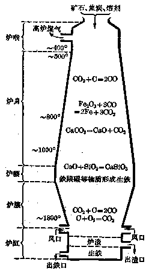

*图 5·1 炼铁高炉和炼铁时炉内的化学过程示意图*

高炉构造如图5·1。最上部是炉喉，炉喉下面逐渐扩大呈截头的圆锥体部分叫炉身（也称炉胸），炉身下面最阔的部分叫炉腰，炉腰下面呈倒放的截头圆锥体部分叫炉腹，炉腹下面部分叫炉缸。炉缸上部周圈装有6~16个钢制的管子叫做风口，风口和环绕高炉的环形的热风总管相连。环形总风管用铁制成，内衬耐火砖，热风（热空气）从环形总风管通过风口进入炉内。在炉缸的下部有二个出口，一个用来出渣叫做出渣口，一个用来出铁叫做出铁口。出渣口的位置略高于出铁口。出铁口和出渣口都用耐火泥封住，需要出铁或出渣时，才分别把它们打开。

高炉设计成这样的形状，和加入炉内的物料起变化时的体积是有很大关系的。

#### 冶炼的过程

##### 1. 装料

炉料（矿石，焦炭，石灰石）装在料车里，用斜的卷扬机升到高炉的顶部，由装料机加入炉内（图5·2）。空气在热风炉里预热后，从风口鼓入炉缸的上部，气流由下而上跟炉料形成逆流。

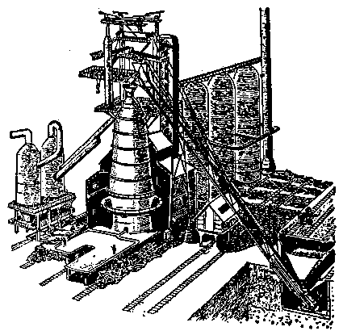

*图 5·2 炼铁车间图*

装料机（图5·3）由二个大小不同的料斗构成，小料斗固定在大料斗的上方。大小料斗里分别装有料钟，堵住料斗的出口。炉料首先装进小料斗，这时小料斗的出口由小料钟堵着（图5·3（a））。放下小料钟，炉料就落入大料斗，这时大料斗的出口由大料钟堵着（图5·3（b））。然后升起小料钟，放下大料钟，炉料就落入炉内（图5·3（c））。在大料钟放下的时候，小料钟已经堵住了大料斗和小料斗之间的道路，使炉内的高炉煤气不致逸出炉外。

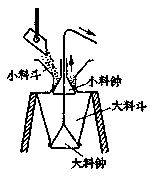

*（a） 炉料进入小料斗*

*（b） 炉料进入大料斗*

*（c） 炉料进入炉内*

*图 5·3 高炉装料机结构及装料过程示意图*

##### 2. 生铁的熔炼

在炉缸靠近风口一带，灼热的焦炭跟从风口鼓入的热空气反应，生成二氧化碳，并放出大量的热，使温度达到 \(1800^{\circ} \mathrm{C}\) 左右 （见图5·1）。二氧化碳跟灼热的焦炭反应生成一氧化碳。生成的一氧化碳和其他气体 （如空气中的氮气等） 在高炉内由下而上地流动着，跟铁矿石相遇时，把铁从它的氧化物里还原出来，同时一氧化碳本身又变成二氧化碳。这时生成的二氧化碳又会跟灼热的焦炭反应而生成一氧化碳，一氧化碳又可使铁矿石中的铁还原出来。上述的反应，可简单表示如下：

上列这些反应不断地进行着，铁就不断地被还原出来。大部分的铁都在炉身中生成，炉身逐渐向下扩大，便于已熔化的材料向下流动，使这些材料容易跟上升的气体接触。除了铁被还原出来以外，锰、硅、磷等元素也分别从它们的化合物里被还原出来。

在炉腰，铁开始跟碳、锰、硅、硫、磷等元素熔合生成生铁，炉渣也开始生成。生铁和炉渣的生成一直继续到炉腹。这些液态生成物形成以后，熔化的炉料的体积逐渐变小，所以炉腹逐渐变窄。

液态生成物流入炉缸。在炉缸里液体分成二层，下层是生铁，上层是炉渣。炉渣盖在铁水面上能防止生铁和空气里的氧气起反应。

##### 3. 出铁和出渣

炉渣和生铁在炉缸里越积越多，需要不断地放出来。出铁时打开出铁口，使铁水流入用耐火砖作衬里的铁水包里，可直接运往炼钢车间炼钢，或注入模子铸成铁锭。炉渣由出渣口流出。炉渣可用作水泥的原料，也可以用来作建筑铺路等材料。

##### 4. 高炉煤气的生成

在炉喉处，生成大量的高炉煤气。高炉煤气含有大约 \(60 \%\) 的氮气，\(30 \%\) 的一氧化碳，\(10 \%\) 的二氧化碳以及少量的氢气和甲烷。由于一氧化碳、氢气和甲烷是可燃性气体，所以高炉煤气从炉内导出后，可用作气体燃料来预热空气。冶炼一吨生铁所得的高炉煤气约有5000立方米左右。

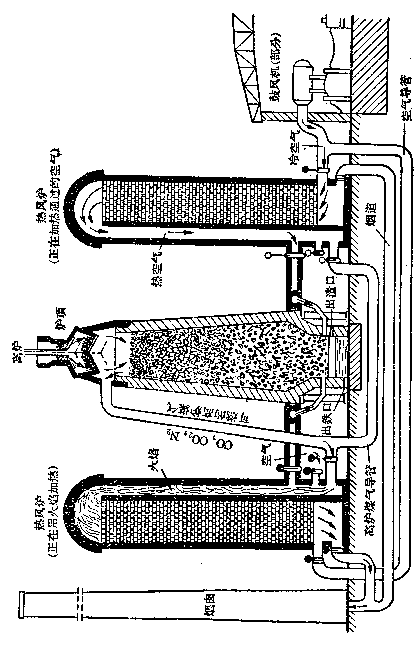

*图 5·4 正在操作的高炉，热风炉剖面图*

##### 5. 空气的预热

为了减少焦炭的消耗和提高炉内的温度，鼓进高炉的空气需要在热风炉里预热。通常把这种经过预热的空气叫做热风。热风的温度一般在 \(900 \sim 1000^{\circ} \mathrm{C}\) 左右。

热风炉（图5·4）是一个钢塔（高达25~30米），内衬耐火砖。塔内分成二室，一为高炉煤气的燃烧室（由耐火砖砌成的直立孔道），一为蓄热室（用空心耐火砖砌成的格子房）。热风炉里的热交换是这样进行的：高炉煤气在燃烧室里燃烧，生成的热的烟道气进入蓄热室把砖格子加热，待达到高温后，高炉煤气就停止燃烧，然后将冷空气以相反的方向通入热风炉，吸收砖格子所积聚的热量。空气和烟道气轮流地通过热风炉，这样就能使空气在未进入高炉以前得到预热。每座高炉通常备有三、四座热风炉轮流使用。一座热风炉燃烧高炉煤气加热蓄热室，另一座在加热通过的冷空气，空闲的可进行清扫、修理或用作后备。

高炉炼铁的技术水平可以用“高炉利用系数”来衡量。高炉利用系数就是高炉有效容积每立方米在一昼夜所能生产生铁的吨数。

#### 习题 5·4
1. 冶炼生铁的原料是什么？在炼铁过程里各起什么作用？炼铁时有何副产品？有什么用途？

2. 从铁矿石里炼铁的原理怎样？写出铁从赤铁矿 \(\left(\mathrm{Fe}_{2}\mathrm{O}_{3}\right)\) 里还原出铁来的各步化学方程式。

3. 为什么高炉里只能炼得生铁而不能炼得纯净的铁？生铁的成分怎样？

4. 画出高炉的构造简图，在图上注明各部分的名称，并在每部分里用化学方程式注明所起的化学变化。

5. 某座高炉的有效容积是 1100 立方米，利用系数是 1.94，这座高炉每个月 （以 30 天计） 能炼出多少吨生铁？

6. 如果磁铁矿 \(\left(\mathrm{Fe}_{3}\mathrm{O}_{4}\right)\) 里铁的含量是59%，炼得的生铁含铁95%，铁的损失量是1%，那末1吨磁铁矿可炼得多少吨生铁？

### § 5·5 钢的冶炼

从高炉炼出来的生铁，由于其中含有较多的碳和相当多的硅、锰、硫、磷等杂质，因此性质松脆而不坚固，不容易进行机械加工。所以，绝大部分的生铁，都用来炼钢。要把生铁炼成钢，就要设法降低生铁中的含碳量，同时要把硫、磷等有害杂质尽量除去。

#### 炼钢的原理

把生铁炼成钢也是一个氧化-还原过程。主要是把熔融的生铁进行氧化，使其中所含的大部分杂质变成气体和炉渣而除去。

炼钢一般分成两个阶段，即：氧化生铁中的杂质和使炼成的钢脱氧。现简单介绍如下。

##### 1. 氧化生铁中的杂质

液态生铁中铁的含量大大超过其他杂质，当加入氧化剂 （氧气或铁的氧化物） 后，铁就被氧化，使部分的铁转变为氧化亚铁并放出热量：

\[
2 \mathrm{Fe} + \mathrm{O} _ {2} \overset{\text {高温}}{=} 2 \mathrm{FeO} + \text {热}
\]

生成的氧化亚铁会使生铁中的杂质硅、锰、碳依次氧化：

\[
\mathrm{Si} + 2 \mathrm{FeO} \overset{\text {高温}}{=} \mathrm{SiO} _ {2} + 2 \mathrm{Fe} + \text {热}
\]

\[
\mathrm{Mn} + \mathrm{FeO} \overset{\text {高温}}{=} \mathrm{MnO} + \mathrm{Fe} + \text {热}
\]

\[
\mathrm{C} + \mathrm{FeO} \overset{\text {高温}}{=} \mathrm{CO} + \mathrm{Fe} - \text {热}
\]

其中有放热反应，也有吸热反应。但总的来讲，放热大于吸热，因此炼钢炉内的温度仍能提高。

如果生铁里含硫和磷的量较多，还必须在熔炼过程里加入大量的生石灰。生铁里含的磷，当被氧化亚铁氧化时，生成五氧化二磷，五氧化二磷又跟氧化亚铁反应生成磷酸亚铁，磷酸亚铁遇生石灰反应生成磷酸钙，成为炉渣而除去：

\[
2 \mathrm{P} + 5 \mathrm{FeO} \overset{\text {高温}}{=} \mathrm{P} _ {2} \mathrm{O} _ {5} + 5 \mathrm{Fe}
\]

\[
\mathrm{P} _ {2} \mathrm{O} _ {5} + 3 \mathrm{FeO} \overset{\text {高温}}{=} \mathrm{Fe} _ {3} (\mathrm{PO} _ {4}) _ {2}
\]

\[
3 \mathrm{CaO} + \mathrm{Fe} _ {3} (\mathrm{PO} _ {4}) _ {2} \overset{\text {高温}}{=} \mathrm{Ca} _ {3} (\mathrm{PO} _ {4}) _ {2} + 3 \mathrm{FeO}
\]

硫在液态合金里，以硫化亚铁形式存在，遇到生石灰就起反应生成硫化钙，成为炉渣而排出：

\[
\mathrm{FeS} + \mathrm{CaO} \overset{\text {高温}}{=} \mathrm{CaS} + \mathrm{FeO}
\]

##### 2. 使炼成的钢脱氧

所有氧化反应都进行完毕后，先把生成的炉渣排出。但氧化后的液态合金里还含有少量剩余的氧化亚铁，虽然含量不多，但会大大影响钢的质量。因为它一方面能使钢发生热脆性，另一方面能跟钢里的碳结合生成一氧化碳，使钢里发生气泡，降低钢的坚固性。因此，必须把这少量的氧化亚铁除去。一般在钢将要熔炼完毕的时候，加一些还原剂（叫做脱氧剂），如锰铁、硅铁或金属铝等，它们跟氧化亚铁反应，使钢脱氧：

\[
\mathrm{FeO} + \mathrm{Mn} (\text {锰铁}) \overset{\text {高温}}{=} \mathrm{Fe} + \mathrm{MnO}
\]

\[
2 \mathrm{FeO} + \mathrm{Si} (\text {硅铁}) \overset{\text {高温}}{=} 2 \mathrm{Fe} + \mathrm{SiO} _ {2}
\]

\[
3 \mathrm{FeO} + 2 \mathrm{Al} \overset{\text {高温}}{=} 3 \mathrm{Fe} + \mathrm{Al} _ {2} \mathrm{O} _ {3}
\]

硅、锰等在各种钢里的含量必需符合各种不同的标准。所以，加入锰铁、硅铁等脱氧剂，还可以调整钢里硅、锰等的含量。

这里第一和第二两个反应，看来好象与氧化生铁里的杂质时的反应相同，但其目的显然是不同的。这里的反应是使炼成的钢脱氧，提高钢的质量，而氧化生铁里的杂质时的反应，则是除去生铁里的杂质而使生铁变成钢。

#### 炼钢的方法

炼钢的方法，一般可分成转炉炼钢、平炉炼钢和电炉炼钢三种。现简单介绍如下。

##### 1. 转炉炼钢法

这种炼钢法使用的氧化剂是空气里的氧气。把空气鼓入熔融的生铁里，使杂质硅、锰等氧化。在氧化过程里所放出的大量热量（含1%的硅可使生铁的温度升高200℃），可使炉内达到足够高的温度。所以用转炉炼钢不需另外使用燃料。

转炉炼钢是在转炉里进行的。转炉的外形象个梨（图5·5），内壁衬有耐火砖，炉侧有许多小孔（风口），压缩空气从这些小孔里吹入炉内，所以又叫做侧吹转炉。开始冶炼时，先把转炉倾斜至水平位置，从入口处注入温度约1300℃的液态生铁，并加入一定量的生石灰，然后鼓入空气并转动转炉使它直立起来。这时，液态生铁表面剧烈地反应，使铁、硅、锰氧化，并生成炉渣，钢液呈沸腾状，炉口出现小火花，但火焰短而不明亮。由于熔化的钢铁和炉渣的对流作用，使反应遍及整个炉内。几分钟后，当钢液中只剩下少量的硅与锰时，碳便开始氧化，生成一氧化碳，使钢液剧烈沸腾。炉口由于逸出的一氧化碳的燃烧而出现巨大的火焰。最后，磷也发生氧化并进一步生成了磷酸亚铁。磷酸亚铁再跟生石灰反应生成稳定的磷酸钙成为炉渣。

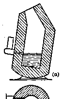

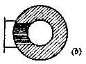

*（a） 纵剖面；（b） 截面*

*图 5·5 侧吹转炉示意图*

当碳与磷逐渐减少，火焰退落，炉口出现了四氧化三铁的褐色蒸气时，表明钢已炼成。这时应立即停止鼓风，并把转炉转到水平位置，把钢水倾至钢水包里，再加脱氧剂进行脱氧。整个冶炼过程只需15分钟左右。

除侧吹转炉以外，还有一种底吹转炉（即空气由炉的底部吹入）。这种转炉是由英国人柏塞麦发明的，所以用底吹转炉炼钢又叫做柏塞麦法。使用底吹转炉，由于空气穿过整炉的铁水，所以炼出的钢含氮量较高，但吹炼时钢水的损失则比侧吹转炉小。

##### 2. 平炉炼钢法

平炉炼钢法（也叫马丁法）是现代炼钢的主要方法。

平炉炼钢使用的氧化剂是通入的空气和炉料里的氧化物（废钢，废铁，铁矿石）。反应所需的热量是由燃烧气体燃料（高炉煤气，发生炉煤气）或液体燃料（重油）所供给。

平炉（图5·6）的炉膛是一个耐火砖砌成的槽，上面有耐火砖制成的炉顶盖住。平炉的前墙上装有装料口，装料机就从这里把炉料装到平炉里去。熔炼时装料口用耐火砖造成的门关起来。平炉的后墙上有二个开口，下面的是出钢口，上面的是出渣口。炉膛的二端都筑有炉头，炉头各有二个孔道，供导入燃料与热空气，或从炉里导出炉气之用。

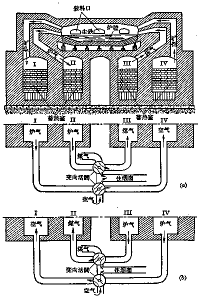

*图5·6 平炉示意图*

平炉炼钢所用的原料有废钢、废铁、铁矿石、生铁和熔剂（石灰石或生石灰）。开始冶炼时，燃料遇到导入的热空气就在炉料面上燃烧，温度高达 \(1800^{\circ} \mathrm{C}\). 热量直接由火焰传给炉料，使炉料迅速熔化 （因为纯铁的熔点是 \(1535^{\circ} \mathrm{C}\) 而钢的熔点略低）。同时有一部分熔化了的生铁在热空气和废钢或铁矿石里的氧的作用下，被氧化成氧化亚铁，生铁里的杂质硅、锰被氧化亚铁氧化，生成了炉渣。由于炉里放有过量的生石灰，磷与硫等杂质就生成磷酸钙和硫化钙成为炉渣。其次碳也进行氧化，生成一氧化碳从熔化的金属里冒出，好象金属在沸腾一样。

反应快要进行完毕的时候，加入脱氧剂并定时把炉渣扒出。在冶炼将完成时，要根据炉前分析（用快速分析法，只需几分钟可完成）来检验钢的成分是否合乎要求。炼得的钢从出钢口流入钢水包里，再从钢水包注入模子里铸成制品或钢锭。

为了提高炉温，气体燃料或空气要在蓄热室里进行预热。

蓄热室是用耐火砖砌成空格的室（图5·6），每座平炉有二对蓄热室。在每一对蓄热室里，一个室加热气体燃料，另一室加热空气。操作时气体燃料沿着管子经过蓄热室III，空气沿着另一管子经过蓄热室IV，在炉膛口上方会合，发生燃烧。燃烧后的废气掠过炉膛，从另一方排出，把蓄热室I和II加热。经过30～40分钟后转动导管里的变向装置，改变气体方向。这时气体燃料和空气便通过蓄热室I和II受热，在炉膛上方燃烧，再经过蓄热室III，IV，使这二室加热。如此交替地改变气流方向，就可充分利用热量，使炉膛达到1000～1300℃的高温。

在平炉里不但可以加入液态的生铁，而且可以加入固态的生铁以及钢铁加工工业上的废钢、铁矿石等。同时炉料的成分没有严格的限制，可以全部用生铁，也可以全部用废钢。平炉容积大，钢的损耗少，可以冶炼出各种不同成分的碳钢与合金钢，钢的质量也高。缺点是建筑费用较高，热能的利用率较低。在平炉里如果用含氧 30% 的富氧空气鼓风，同时在熔化的金属里吹入氧气，可使生产率提高 70%，冶炼的时间缩短 2～4 小时，并可节约燃料，富氧空气也不需经过预热。

##### 3. 电炉炼钢法

钢还可以在以电能为热源的电炉里冶炼。

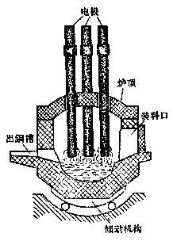

*图 5·7 电弧炉剖面图*

使用电炉炼钢能炼出优质的合金钢。

电炉的种类很多，应用最广泛的是电弧炉（图5·7）。电弧炉的外形呈圆柱形。小型电炉的直径约2.5公尺，容量3.5吨；大型电炉的直径可达6公尺，容量达80吨。电炉的炉壁和炉底都用耐火砖衬里，炉上有一球面拱形的炉顶。靠近炉底二旁有装料口和出钢口，装料门下有一个出渣槽。电炉的电极用石墨制成，装在炉顶上用青钢箍夹住。

炉里的热量完全来自电极和炉料之间生成的电弧，以及电流通过炉料所产生的热。电极可以不断地上下移动，用来调节温度和补充电极下端的消耗。电炉炼钢一般用冷的废钢，也可以用热的钢

**表 5·1**

| 炉名 | 原料 | 氧的来源 | 热的来源 | 产品及优缺点 |
| --- | --- | --- | --- | --- |
| 转炉 | 液态生铁 | 空气 | 杂质氧化时放出的热 | 出钢快，不用燃料，设备简单。铁的损耗率较大，管理不便。钢质量较差 |
| 平炉 | 废铁、废钢或铁矿石 | 空气、氧化铁、铁矿石 | 气体燃料燃烧 | 制合金钢。质量高，管理方便。反应时间较长，消耗燃料，建设费用高 |
| 电炉 | 同上 | 氧化铁、铁矿石 | 电能 | 制钨、钼等高级合金钢。反应时间较平炉短，管理方便。电能消耗量大，成本高 |

液作原料。冶炼时把炉关闭，炉里温度高达2000℃，钢液能发生沸腾。整个炼钢过程约需3小时。

电炉便于管理，冶炼时间较短，可以冶炼出各种不同成分的合金钢，包括含有各种难熔金属如钨和钼的合金钢。合金元素在电炉里的损失量比在平炉和转炉里都少。但用电比用其他燃料的成本却要高些。

现将三种炼钢法列表比较（见表5·1）。

#### 习题 5·5
1. 炼钢的化学原理怎样？和炼铁的原理有什么相同和不同的地方？

2. 炼钢一般有哪几种方法？试就每种方法的原料，使用的氧化剂，反应时热量的来源，产品以及优缺点作一比较。

3. 炼钢时用哪些物质作脱氧剂？加脱氧剂的目的是什么？

4. 炼钢开始和熔炼完毕时，都常有下列反应：

\[
2 \mathrm{FeO} + \mathrm{Si} \overset{\text {高温}}{=} 2 \mathrm{Fe} + \mathrm{SiO} _ {2}
\]

在作用上有什么不同？

5. 画出侧吹转炉的简图，说明转炉炼钢的操作过程。

6. 平炉的构造和平炉炼钢的操作过程怎样？

7. 把 5 克钢的试样放在氧气里灼烧，得到 0.1 克的二氧化碳。求这种钢里含碳的百分率。

### 本章提要

#### 1. 铁

（1） 铁除具有金属光泽、延展性和导电、传热等一般金属所共有的物理性质以外，还具有铁磁性 （钴和镍也具有能被磁铁吸引的性质）。铁是相当活动的金属，在一定条件下，能跟氧及其他非金属、水、酸和盐等起反应。

（2） 在一定条件下，铁原子能失去它最外电子层上的 2 个电子，变成亚铁离子 \((\mathrm{Fe}^{2+})\) 显 +2 价；还能失去次外层上的 1 个电子，变成铁离子 \((\mathrm{Fe}^{3+})\) 显 +3 价。\(\mathrm{Fe}^{2+}\) 和 \(\mathrm{Fe}^{3+}\) 在一定条件下可相互转变。

（3） 铁在自然界里很少以游离态存在，常见的铁矿石有赤铁矿 \(\left(\mathrm{Fe}_{2} \mathrm{O}_{3}\right)\)，褐铁矿 \((2Fe_{2}O_{3}\cdot3H_{2}O)\)，菱铁矿 \((FeCO_{3})\)，黄铁矿 \((FeS_{2})\)。

#### 2. 铁的化合物

（1） 铁能形成 +2 价和 +3 价的两类化合物：

+2价铁的化合物 +3价铁的化合物

| 类别 | +2价铁的化合物 | +3价铁的化合物 | 说明 |
| --- | --- | --- | --- |
| 氧化物 | FeO | \(Fe_{2}O_{3}\) | \(Fe_{3}O_{4}\) 可以看作 \(Fe_{2}O_{3}\cdot FeO\)，其中2个铁原子显+3价，1个铁原子显+2价 |
| 氢氧化物 | \(Fe(OH)_{2}\) | \(Fe(OH)_{3}\) |   |
| 氯化物（盐） | \(FeCl_{2}\) | \(FeCl_{3}\) |   |

（2） 铁盐和亚铁盐的检验：从外观上看，铁盐 \(\left(\mathrm{Fe}^{3+}\right)\) 呈棕黄色，亚铁盐 \(\left(\mathrm{Fe}^{2+}\right)\) 呈浅绿色。\(\mathrm{Fe}^{3+}\) 遇 \(\mathrm{CNS}^{-}\) 会生成 \(\mathrm{Fe}(\mathrm{CNS})_{3}\)，溶液呈深红色，而 \(\mathrm{Fe}^{2+}\) 则不显红色。

#### 3. 铁的三种重要合金

| 类别 | 含碳量 | 含杂质 | 机械性能 | 机械加工 | 熔点 |
| --- | --- | --- | --- | --- | --- |
| 生铁 | 1.7%以上 | 多 | 硬而脆 | 可铸不可锻 | 1150°C |
| 钢 | 0.04~1.7% | 少 | 硬而韧有弹性 | 可锻，可铸，可热处理 | 1300°C |
| 熟铁 | 0.03~0.04% | 少 | 软而韧 | 可锻难铸 | 1480°C |

钢的种类：

碳钢 \(\left\{\begin{array}{l} 低碳钢 \\ 中碳钢 \end{array}\right\}\) ——制造机器部件，管子和钉子等高碳钢 ——制造工具合金钢（特种钢）——在碳钢里加入 Mn、Cr、Ni、W、Mo 等元素，使具有特殊性能，以适合不同的需要。

#### 4. 生铁的冶炼

（1） 原料：铁矿石、焦炭、熔剂 \(\left(\mathrm{CaCO}_{3}\right)\) 和空气。

（2） 反应原理：

\(C + O_{2} \overset{灼热}{=} CO_{2}\) 高温 \(CO_{2} + C \overset{高温}{=} 2CO\) 还原剂的生成。

\[
\left. \begin{array}{l} 3 \mathrm{Fe} _ {2} \mathrm{O} _ {3} + \mathrm{CO} \overset{\text {高温}}{=} 2 \mathrm{Fe} _ {3} \mathrm{O} _ {4} + \mathrm{CO} _ {2} \uparrow \\ \mathrm{Fe} _ {3} \mathrm{O} _ {4} + \mathrm{CO} \overset{\text {高温}}{=} 3 \mathrm{FeO} + \mathrm{CO} _ {2} \uparrow \\ \mathrm{FeO} + \mathrm{CO} \overset{\text {高温}}{=} \mathrm{Fe} + \mathrm{CO} _ {2} \uparrow \end{array} \right\} \text {铁的还原.}
\]

\[
\left. \begin{array}{l} \mathrm{CaCO} _ {3} \overset{\text {高温}}{=} \mathrm{CaO} + \mathrm{CO} _ {2} \uparrow \\ \mathrm{CaO} + \mathrm{SiO} _ {2} \overset{\text {高温}}{=} \mathrm{CaSiO} _ {3} \end{array} \right\} \text {炉渣的生成}.
\]

（3） 产品：生铁、高炉煤气（可预热空气）、炉渣（可作水泥、建筑材料）。

#### 5. 钢的冶炼

炼钢的反应原理：

（1） 氧化生铁中的杂质：

\[
\begin{array}{l} 2 \mathrm{Fe} + \mathrm{O} _ {2} \overset{\text {高温}}{=} 2 \mathrm{FeO} \\ \mathrm{Si} + 2 \mathrm{FeO} \overset{\text {高温}}{=} \mathrm{SiO} _ {2} + 2 \mathrm{Fe} \\ \mathrm{Mn} + \mathrm{FeO} \overset{\text {高温}}{=} \mathrm{MnO} + \mathrm{Fe} \\ \mathrm{C} + \mathrm{FeO} \overset{\text {高温}}{=} \mathrm{CO} + \mathrm{Fe} \\ \end{array}
\]

\[
3 \mathrm{CaO} + \mathrm{Fe} _ {3} (\mathrm{PO} _ {4}) _ {2} \overset{\text {高温}}{=} \mathrm{Ca} _ {3} (\mathrm{PO} _ {4}) _ {2} + 3 \mathrm{FeO}
\]

\[
\left[ \begin{array}{c} 2 \mathrm{P} + 5 \mathrm{FeO} \stackrel {\text {高温}} {=} \mathrm{P} _ {2} \mathrm{O} _ {5} + 5 \mathrm{Fe} \\ \mathrm{P} _ {2} \mathrm{O} _ {5} + 3 \mathrm{FeO} \stackrel {\text {高温}} {=} \mathrm{Fe} _ {3} (\mathrm{PO} _ {4}) _ {2} \end{array} \right]
\]

\[
\mathrm{FeS} + \mathrm{CaO} \overset{\text {高温}}{=} \mathrm{CaS} + \mathrm{FeO}
\]

（2） 使炼成的钢脱氧：

\[
\mathrm{FeO} + \mathrm{Mn} (\text {   锰铁   }) \overset{\text {   高温   }}{=} \mathrm{Fe} + \mathrm{MnO}
\]

\[
2 \mathrm{FeO} + \mathrm{Si} (\text {硅铁}) \overset{\text {高温}}{=} 2 \mathrm{Fe} + \mathrm{SiO} _ {2}
\]

\[
3 \mathrm{FeO} + 2 \mathrm{Al} \overset{\text {高温}}{=} 3 \mathrm{Fe} + \mathrm{Al} _ {2} \mathrm{O} _ {3}
\]

炼钢法主要有转炉炼钢法、平炉炼钢法和电炉炼钢法等三种。

### 复习题五

1. 试用电子转移的化学方程式，表示铁分别跟盐酸、氯气、硫、硝酸铜溶液的反应。

2. 在新制的无色氯化亚铁溶液中，通入氯气，则溶液变成棕黄色，再放入一些镁粉，又变为无色。写出这些反应的化学方程式。

3. 怎样利用化学方法来检验生铁中含有硫？

4. 现有一种含有结晶水的淡绿色晶体。将其制成溶液，如与氢氧化钡溶液反应，会产生不溶于酸的白色沉淀。如与氢氧化钠溶液反应，则先产生絮状白色沉淀，很快变成淡绿色，最后变成红褐色；再使其溶于盐酸，并滴入硫氰化钾溶液，显深红色。这种晶体是什么物质？写出有关的化学方程式。

5. 某黑色固体化合物，溶于盐酸会生成浅绿色溶液，同时放出腐蛋似的臭气体。此气体通入硫酸铜溶液生成黑色沉淀。上述浅绿色溶液通入氯气后变为棕黄色，再加入硫氰化钾溶液显深红色。这黑色固体是什么物质？写出有关的化学方程式。

6. 磁铁矿含铁 64.15%，在冶炼过程里，如果有 2% 的铁进入炉渣，同时杂质在炼得的生铁里含量达到 5%。计算 1 吨磁铁矿可以炼出生铁多少吨？（理论上）

7. 某一小型高炉，每天能生产 70 吨生铁 （含铁 96%）。按理论计算，该厂每天需用含 20% 杂质的赤铁矿 （主要成分 Fe₂O₃） 多少吨？

#### 注释

- ①（§ 5·1）：这样写法，表示三个铁原子里的一个铁原子失去2个电子，二个铁原子可失去3个电子，四个氧原子共获得8个电子。
- ①（§ 5·4）：\(3MnO_{2} + 2CO = Mn_{3}O_{4} + 2CO_{2}\)； \(Mn_{3}O_{4} + CO = 3MnO + CO_{2}\)

## 第六章 阿佛加德罗定律

学完了前面各章，我们对无机物部分的化学知识，已经有了比较系统的认识。今后我们将转入有机物部分的学习。在学习有机化学之前，有必要先来认识一个重要的定律——阿佛加德罗定律。根据这个定律，可以推导出物质的分子式；还可以说明化学反应里气态物质的体积间的相互关系。化合物分子式的测定，是研究有机化合物的组成和结构的基础，有关这方面的计算，在有机化学部分是应用得很广泛的。

在本章里我们将首先认识阿佛加德罗定律。接着在掌握阿佛加德罗定律的基础上，学习怎样测定气态物质分子量。然后，明确化合物分子式的确定过程，并研究有关确定分子式的综合性问题的解答途径。最后学习根据化学方程式，计算气态物质的体积的方法。

### § 6·1 阿佛加德罗定律

阿佛加德罗定律是表明气态物质在一定条件下的体积和它们所含分子个数的关系的定律。

这一定律可以在第一册里已经学过的克分子和克分子体积的概念（第一册 § 3·11），以及物理学上所曾学过的理想气体的气态方程的基础上来加以认识。

我们知道，1 克分子的任何气体，在标准状况下所占的体积都是 22.4 升，这个体积就叫做气体克分子体积。又知道 1 克分子的任何物质，所含的分子数，都是 \(6.02 \times 10^{23}\) 个。因此在标准状况下，22.4 升的任何气态物质，都含有相同的分子数 \((6.02 \times 10^{23}\) 个）。也就是说，在标准状况下，相同体积的任何气体，都含有同数目的分子。

那末在非标准状况下，相同体积的任何气体，是否也含有相同数目的分子呢？例如在温度 \(20^{\circ} \mathrm{C}\)，压强 750 毫米的状况下，1 升氧气和 1 升氢气所含的分子个数是否相同？

根据理想气体的气态方程：

\[
\frac {P _ {1} V _ {1}}{T _ {1}} = \frac {P _ {2} V _ {2}}{T _ {2}} ^ {(1)},
\]

我们把在非标准状况下1升氧气或氢气的体积折算到标准状况下的体积：

\[
\frac {750 \times 1}{273 + 20} = \frac {760 \times V _ {1}}{273}；
\]

\[
V _ {1} = \frac {273 \times 750 \times 1}{293 \times 760} = 0.9196 (\text {升})。
\]

即它们在标准状况下的体积都是0.9196升。从这一计算可以看出，在标准状况下体积相同的任何气体，在温度和压强发生同样的变化时，它们的体积仍然是相同的。也就是说，几种气体在非标准状况下，只要都是处于同样的温度和压强之下，同体积仍含有同数的分子。为什么在一定状况下，一定体积的任何气体都含有相同数目的分子呢？原来气体具有这样一种特性，就是气体分子间的空隙特别大，分子与分子间的距离和分子本身的大小相比，要大上很多倍数。在标准状况下，气体分子间的平均距离约大于分子直径的 15~20 倍 （见图 6·1）。例如，1 克水在液态时仅占 1 毫升左右的体积，但变为气体时 （温度 100°C，压强是 760 毫米），它的体积约有 1700 毫升。即水分子由原来本身所占的体积还不到1毫升（因为液态时分子之间还是有一定的孔隙的），变为气体之后，竟扩大了1699毫升的空间，可见气态物质分子间的距离远远超过了液态时分子间的距离。因此，气体分子本身的大小和它们间的距离相比，就可以略而不计，气态物质的体积也就主要决定于它的分子之间的平均距离。

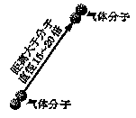

*图6·1 标准状况下，气体分子间平均距离示意图*

当改变温度和压强时，一定体积的气体，只是分子间的距离发生了变化，也就是体积发生了变化，而所含的分子数目并没有改变。

所以不论是在标准状况下或是在非标准状况下，同温同压下，同体积的任何气体，都含有同数目的分子。这就是阿佛加德罗定律①。

阿佛加德罗定律不适用于液态或固态物质。因为液态或固态物质的分子间的距离和气态物质比起来要小得多，它们的体积不但与分子间的距离有关，而且与分子本身的大小也有影响。不同的液态或固态物质的分子大小是不同的，因此，就是在同样状况之下，同体积的液体或固体不可能含有同数目的分子。

关于阿佛加德罗定律，我们可以通过下面的实验来验证。实验装置如图6·2.

用两根直径相同、体积是1比2的玻管，加塞子，中间用一支具有活栓的导管连接，可使两管相通或者隔断。下管的体积是上管的两倍。

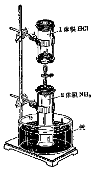

*（a）*

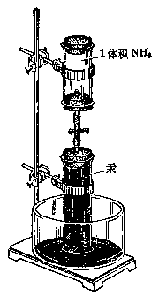

*（b）*

*图 6·2 阿佛加德罗定律实验装置*

实验时，先在短管里充满水银，倒插在水银槽里，用排汞法①收集干燥的氯化氢气体，集满后，在水银槽里塞上塞子，然后取出。在长管中用同样方法收集干燥的氨气，集满后仍放在水银槽里，装置如图6·2（a）。这样，在管子里就有一体积的氯化氢和2体积的氨气。

开启活栓，玻管中的汞逐渐进入下管，上管中出现了白烟，这是氯化氢跟氨反应生成的氯化铵晶体微粒。当汞上升到活栓时就停止了，如图 6·2（b），可见这时两种气体已不再反应。但上管中还有一体积的气体没有作用掉②，否则汞应当把两个管子完全充满。剩下的是什么气体呢？取去管口塞子，用润湿的红色石蕊试纸检试，试纸变蓝，证明它是氨气。氯化氢和氨的体积原来是 1：2，现在剩下的是 1 体积的氨气，可见氯化氢和氨正好是 1 体积和 1 体积发生了反应。我们知道，氯化氢跟氨反应是 1 个氯化氢分子跟 1 个氨分子结合：

\[
\mathrm{NH} _ {3} + \mathrm{HCl} = \mathrm{NH} _ {4} \mathrm{Cl}
\]

现在实验结果是，同体积的氨跟氯化氢完全反应。显然，在相同条件下，同体积的氨和氯化氢所含的分子数目是相同的。

#### 习题 6·1
1. 在下面两种情况下，两种气体是否含有相同数目的分子？为什么。

（1） 在相同的温度和压强下，这两种气体的体积不同？

（2） 在不同的温度和压强下，这两种气体的体积相同？

2. 用阿佛加德罗定律解释：在同温同压下，1 体积的氢气跟 1 体积的氯气完全化合后生成 2 体积的氯化氢。

［提示：从1克分子体积的氯气、氢气、氯化氢里，含有多少个氯原子、氢原子来论证.］

3. 为什么阿佛加德罗定律不适用于液态或固态物质？

### § 6·2 气态物质分子量的测定

#### 1. 根据在相同状况下同体积气态物质的重量比求分子量

根据阿佛加德罗定律，可以测定任何气态物质的分子量。阿佛加德罗定律指出，在同温同压下，同体积的任何气体含有同数的分子。因此，在一定温度和压强下，同体积的不同气体的重量比就是它们每一个分子重量的比，也就是它们分子量的比。

例如在同温同压下，同体积的氧气、氢气、二氧化碳一定含有相同的分子数，假设为 \(n\) 个分子，那末它们的重量 \((W)\) 比是：

\[
\begin{array}{l} W _ {\mathrm{O} _ {2}}: W _ {\mathrm{H} _ {2}}: W _ {\mathrm{CO} _ {2}} = n \times 32 \text {   氧单位:   } n \times 2 \text {   氧单位:   } n \times 44 \text {   氧单位   } \\ = 32: 2: 44. \\ \end{array}
\]

显然就等于它们的分子量之比。

一般地，设有 \(A\) 和 \(B\) 两种气态物质，令 \(W_{A}\) 和 \(W_{B}\) 分别表示这两种物质在相同状况下同体积的重量，以 \(n\) 表示它们的分子数，\(M_{A}\) 和 \(M_{B}\) 分别表示它们的分子量，那末，上面的关系，以数学方式表示，就是：

\[
\frac {W _ {A}}{W _ {B}} = \frac {n M _ {A}}{n M _ {B}} = \frac {M _ {A}}{M _ {B}} \tag {1}
\]

移项后可写成：

\[
\mathrm{M} _ {A} = \frac {W _ {A}}{W _ {B}} \mathrm{M} _ {B} \tag {2}
\]

\(\frac{W_{A}}{W_{B}}\) 就是在相同状况下同体积的 A 和 B 两种气态物质的重量比。这种比值，可以通过实验测定，习惯上选择氢气或空气作为比较的标准，因为氢气是最轻的气体，而空气是我们最常遇到的气体。氢气的分子量是 2；空气是一种混和物，在标准状况下，22.4 升干燥的空气重 29 克，我们就把 29 作为空气的平均分子量。因此，在测定某气态物质的分子量时，如果知道它和同体积氢气或空气的重量比，就可以运用式（2）求出它的分子量。

现在用几个例题来说明：

##### 例 1
已知气体 A 和相同状况下同体积氢气的重量比是 22. 求气体 A 的分子量。

**解：** 已知 \(\frac{W_A}{W_{\mathrm{H}_2}} = 22, \quad \mathrm{M}_{\mathrm{H}_2} = 2\)。运用式（2）计算：

\[
\mathrm{M} _ {A} = \frac {W _ {A}}{W _ {\mathrm{H} _ {2}}} \mathrm{M} _ {\mathrm{H} _ {2}} = 22 \times 2 = 44 (\text {氧单位})
\]

答：气体 \(A\) 的分子量是44氧单位。

##### 例 2
已知气体 A 和相同状况下同体积空气的重量比是 1.52. 求气体 A 的分子量。

**解：** 已知 \(\frac{W_A}{W_{\text{空气}}} = 1.52, \mathrm{M}_{\text{空气}} = 29\)，运用式（2）计算：

\[
\mathrm{M} _ {A} = \frac {W _ {A}}{W _ {\text {空气}}} \mathrm{M} _ {\text {空气}} = 1.52 \times 29 = 44 (\text {氧单位})
\]

答：气体 \(A\) 的分子量是 44 氧单位。

##### 例 3
一定体积的气体 A，重 1.9642 克，在同温同压时同体积的氢气重 0.08987 克。求气体 A 的分子量。

**解：** 已知 \(W_{A} = 1.9642\) 克，\(W_{\mathrm{H}_{2}} = 0.08987\) 克，\(\mathbf{M}_{\mathrm{H}_{2}} = 2\)。运用式（1）计算：

\[
\frac {W _ {A}}{W _ {H _ {2}}} = \frac {1.9642}{0.08987} = \frac {M _ {A}}{M _ {H _ {2}}} = \frac {M _ {A}}{2}
\]

\[
\therefore \quad M _ {A} = \frac {1.9642}{0.08987} \times 2 = 44 (\text {氧单位})
\]

答：气体 A 的分子量是 44 氧单位。

运用式（1），除了能测定气态物质的分子量外，反过来，若已知两种气体的分子量，也可以求出它们在相同状况下，同体积的重量比，这样就可以解决某种气体比另一种气体轻还是重的问题。特别是和同体积的空气的重量比，是决定用什么方法来收集气体的一种重要因素，有很大的实用意义。现在举例说明如下：

##### 例 4
判断二氧化碳、氨气在相同状况下比空气轻还是重？

**解：** 已知二氧化碳的分子式是 \(CO_{2}\)，\(M_{CO_{2}}=12+2\times16=44\) （氧单位）；氨气的分子式是 \(NH_{3}\)，\(M_{NH_{3}}=14+3\times1=17\) （氧单位）；\(M_{空气}=29\) （氧单位）。

根据式（1）

\[
\frac {W _ {\mathrm{CO} _ {2}}}{W _ {\mathrm{空气}}} = \frac {M _ {\mathrm{CO} _ {2}}}{M _ {\mathrm{空气}}}； \frac {W _ {\mathrm{NH} _ {3}}}{W _ {\mathrm{空气}}} = \frac {M _ {\mathrm{NH} _ {3}}}{M _ {\mathrm{空气}}}.
\]

∴ 在相同状况下同体积的二氧化碳跟空气的重量比：

\[
\frac {W _ {\mathrm{CO} _ {2}}}{W _ {\mathrm{空气}}} = \frac {M _ {\mathrm{CO} _ {2}}}{M _ {\mathrm{空气}}} = \frac {44}{29} = 1.52；
\]

在相同状况下同体积的氨气跟空气的重量比：

\[
\frac {W _ {\mathrm{NH} _ {3}}}{W _ {\mathrm{空气}}} = \frac {M _ {\mathrm{NH} _ {3}}}{M _ {\mathrm{空气}}} = \frac {17}{29} = 0.586.
\]

答：二氧化碳比空气重1.52倍；氨气比空气轻，相当于空气的0.586倍。

#### 2. 根据气体克分子体积求分子量

气态物质的分子量还可以从气体克分子体积的概念出发来加以推算，计算方法更为简单。

我们早已知道，1 克分子的任何气体，在标准状况下所占的体积，都是 22.4 升，称为气体克分子体积。当我们要求某种气体的分子量时，只须知道这种气体在标准状况下 1 升的重量 （就是这种气体的比重），再乘以 22.4，就得到它的克分子量。将这个数值用氧单位做单位，就是该气体的分子量。设以 M 表示分子量，d 表示比重，可以列成公式：

\[
\mathbf {M} = 22.4 d
\]

下面也举几个例题来说明：

##### 例 5
已知 1 升二氧化碳在标准状况下重 1.9642 克，求二氧化碳的分子量。

**解：** 

\[
\mathbf {M} = 22.4 d
\]

\[
d = 1.9642 (\text { 克   /   升 })
\]

\[
\therefore \quad \mathrm{M} _ {\mathrm{CO} _ {2}} = 22.4 \times 1.9642 = 44 (\text { 氧   单   位 })。
\]

##### 例 6
已知 250 毫升二氧化碳在标准状况下重 0.491 克，求二氧化碳的分子量。

**解：** 

\[
\mathrm{M} = 22.4 d
\]

\[
d = 0.491 \times 1000 / 250 = 1.964 (\text {克/升})
\]

\[
\therefore \quad \mathrm{M} _ {\mathrm{CO} _ {2}} = 22.4 \times 1.964 = 44 (\text {氧单位})
\]

##### 例 7
已知在温度 \(20^{\circ}C\) 和压强 756 毫米时，215 毫升的二氧化碳重 0.3913 克。求二氧化碳的分子量。

**解：** 先将215毫升 \(\mathrm{CO}_{2}\) 化成在标准状况下的体积。根据§ 6·1中提到的公式 \(\frac{P_{1}V_{1}}{T_{1}} = \frac{P_{2}V_{2}}{T_{2}}\)，这里 \(T_{2} = 273 + 20, P_{2} = 756\) 毫米，\(V_{2} = 215\) 毫升，\(P_{1} = 760\) 毫米，\(T_{1} = 273, V_{1}\) 就是要求的体积。代入公式，得：

\[
V _ {1} = \frac {756 \times 215 \times 273}{760 \times (273 + 20)} = 199.2 (\text {毫升})
\]

再算出二氧化碳在标准状况时1升的重量：

\[
d = \frac {0.3913 \times 1000}{199.2} = 1.964 (\text {克/升})
\]

所以，二氧化碳的分子量是：

\[
\mathrm{M} _ {\mathrm{CO} _ {2}} = 22.4 \times 1.964 = 44 (\text {氧单位})。
\]

根据克分子体积求分子量的方法，也适用于液态或固态物质，只要把能转变成蒸气状态而并不分解的液态或固态物质加热，测定在气态时若干体积的这种蒸气的重量，根据气态方程，把非标准状况下的体积换算到标准状况，再按上法求得它们的分子量。象液态的酒精、溴，固态的碘，以及将来要学到的很多有机化合物，都可以用这样的方法求得它们的分子量。

现在也举例说明：

##### 例 8
已知在温度 \(185^{\circ}\) C 和压强 755 毫米时，189 毫升的碘蒸气重 1.27 克。求碘的分子量，并确定碘分子是由几个碘原子组成的？

**解：** 用和例7同样的方法，先求出碘蒸气在标准状况时的体积：

\[
V _ {1} = 189 \times \frac {755 \times 273}{760 \times (273 + 185)} = 112 (\text { 毫   升 })
\]

碘蒸气在标准状况时1升的重量是：

\[
d = 1.27 \times \frac {1000}{112} = 11.34 (\text {克})
\]

碘的分子量就是：

\[
\mathrm{M} _ {\mathrm{I} _ {2}} = 22.4 \times 11.34 = 254 (\text {氧单位})
\]

已知碘的原子量=127氧单位；

\[
\therefore \quad \frac {254}{127} = 2
\]

答：碘的分子量是 254 氧单位，碘分子是由 2 个碘原子组成的。

#### 习题 6·2
1. 已知某种气体和相同状况下同体积氢气的重量比是23。求它的分子量。并求这种气体比空气轻还是重。

2. 已知水银蒸气和相同状况下同体积空气的重量比是6.92。求水银蒸气的分子是由几个原子组成的。

3. 求氦气和相同状况下同体积空气的重量比。用氦气装飞船，它的浮力比氢气大还是小，相差几倍。

［提示：氦气是单原子分子，原子量等于4. 可从氦气跟同体积氢气的重量比来比浮力.］

4. 已知温度在 \(17^{\circ} \mathrm{C}\)，压强是 740 毫米时，150 毫升的氮气重 0.172 克。求氮气的分子量。

5. 已知下列各种气体的比重。求其分子量：

（1） 氯化氢：1.63 克/升；

（2） 一氧化碳：1.25 克/升。

6. 在标准状况下，某气体 235 毫升重 0.406 克。求其分子量。

7. 在温度 \(20^{\circ}\) C 压强 750 毫米时，122 毫升的二氧化硫重 0.32 克。求其分子量。

### § 6·3 确定物质的分子式

我们早已学会了元素的单质和化合物的分子式的写法。也懂得了分子式所表示的三种意义——（1）代表物质的一个分子；（2）表示组成分子的各种元素的原子数和它们的重量比；（3）表明物质的分子量（第一册 § 1·9）。但分子式是怎样来的呢？从分子式所表示的三种意义可以知道，确定一种物质的分子式，必需知道（1）这种物质的分子是由哪些元素组成的；（2）这些元素在分子里所占的重量比是多少；（3）这种物质的分子量。

物质的组成，可以通过分析化学的实验获得。研究物质是由哪些元素组成的化学，叫做定性分析；进一步研究这些组成元素的重量比的化学，叫做定量分析。所以，确定物质分子式的第一、二两点，便是通过定性和定量分析来解决的，而第三点——测定物质的分子量，就是根据前面讲过的方法，最后，根据分子量和分析所获得的物质里各元素的重量百分比，算出这一物质的分子式。

现在以氨为例来说明这一计算过程。

经过定性分析，得知氨是由氮和氢两种元素组成的。再经定量分析，知道它们的百分含量是氮占 \(82.36\%\)，氢占 \(17.64\%\).

氮和氢的原子量分别是 14 和 1（准确地说应当是 1.008）。我们可以看作这就是氮和氢每一个一个原子的重量。既然已经知道了一个原子的重量，那末 82.36 份重的氮和 17.64 份重的氢中，可以看作含有 82.36/14 和 17.64/1 个的原子。所以：

\[
\mathrm{N:H} = \frac {82.36}{14}: \frac {17.64}{1} = 5.88: 17.64 = 1: 3
\]

这个1：3所代表的意义，仅仅是表示一个氨分子里氮原子和氢原子的相对个数比，而氮原子和氢原子的个数，可能是1：3，2：6，3：9，…，n：3n。因此氨的分子式，可能是 \(NH_{3}\)，\(N_{2}H_{6}\)，\(N_{3}H_{9}\)，…，\((NH_{3})_{n}\)。而 \(NH_{3}\) 只不过是氨的最简式（也可以叫做实验式，因为这个式子，是由分析实验初步导出的结果）。要确定氨的分子式，还需决定于它的分子量。也就是要知道 \((NH_{3})_{n}\) 中的n等于几？关于气态物质分子量的测定方法，我们已经在上一节里学过了。由实验得知氨气的比重是0.76克/升，所以：

\[
\mathrm{M} _ {\mathrm{NH} _ {3}} = 22.4 \times 0.76 = 17.
\]

即氨的分子量等于17，亦就是：

\[
(\mathrm{NH} _ {3}) _ {n} = 17, \quad \therefore n = 17 / \mathrm{NH} _ {3} = 17 / (14 + 3 \times 1) = 1
\]

由此可知，氨的最简式就是氨的分子式，即 \(NH_{3}\) .

确定分子式还有另一种解法，即从计算分子量开始。仍用前例来说明。

已知氨的分子量为 17 氧单位，它的组成是含氮 82.36%，含氢 17.64%。

因此在一个氨分子里氮元素的重是：

\[
17 \times \frac {82.36}{100} = 14 (\text { 氧   单   位 })
\]

而氮的原子量是 14 氧单位，

∴ 1个氨分子里含有氮原子=14/14=1（个）

同样可以知道，一个氨分子里氢元素的重是：

\[
17 \times \frac {17.64}{100} = 3 (\text { 氧单位 })
\]

而氢的原子量是1氧单位，

∴ 1个氨分子里含有氢原子=3/1=3（个）

∴ 氨的分子式是 \(NH_{3}\) .

通过以上的叙述和运算，可见确定物质的分子式，必须具备两个基本数据——（1）物质的重量组成和（2）物质的分子量。计算方法则有两种，它们的步骤是：

#### 第一法

（i） 以各元素的原子量分别除各元素的重量组成，把所得的商，化成简单整数，得到原子个数之比。

（ii）根据元素的原子个数比，写出物质的最简式。分子式可能是最简式的 \(n\) 倍。

（iii） 求出物质的分子量。以最简式的式量除分子量，所得的商（必然是整数）就是表示分子式是最简式的几倍。

（iv） 写出该物质的分子式。

#### 第二法

（i） 求出物质的分子量，将分子量乘各元素的重量组成，得出各元素在一个分子中的重量。

（ii）以各元素的原子量分别除各元素在一个分子中的重量，得到在一个分子中各元素的原子个数。

（iii） 写出该物质的分子式。

上面所讲的两种计算方法，第二法从分子量开始直接求出分子式，比较容易理解。在已知重量组成和分子量的情况下，运算也比较方便。但在不知道分子量时计算就不可能。由于到目前为止，还有很多物质无法测定它们的分子量，所以第一法是切合实际应用的。一般可以运用重量组成，求出最简式，就把最简式作为分子式来应用。例如淀粉这种物质，由分析结果，知道它含有碳44.43%，氢6.17%，氧49.4%，而它的分子量还无法正确测定。因此我们只能通过第一法来求得它的分子式的最简式：

\[
\begin{array}{l} \mathrm{C}: \mathrm{H}: \mathrm{O} = \frac {44.43}{12}: \frac {6.17}{1}: \frac {49.4}{16} = 3.702: 6.17: 3.086 \\ = 6: 10: 5. \\ \end{array}
\]

即淀粉的最简式是 \(C_{6}H_{10}O_{5}\)。由于它的分子量还无法测定，因此用 \((\mathrm{C}_6\mathrm{H}_{10}\mathrm{O}_5)_n\) 来表示它的分子式。这说明淀粉的分子量，可能是 \((\mathrm{C}_6\mathrm{H}_{10}\mathrm{O}_5)\) 的 \(n\) 倍。这种例子，在今后学习有机化学时，将会遇到。

确定物质分子式的两个基本数据——物质的重量组成和物质的分子量，都可以通过实验获得。但是由实验得到的数据，有多种多样的表示法。当我们遇到一个问题时，首先要区别哪些数据表示的是物质组成，哪些数据可以利用来推求物质的分子量。然后用这些数据进行运算，才能获得正确的答案。为了便于理解起见，现在就以一种物质为例，用多种不同的数据表示，再举几个例题演算。

#### 1. 以多种形式表示物质的重量组成的例

物质的重量组成，在分析化学里，总是采用 “%” 来表示的，但是除 “%” 之外，还可以有多种不同的表示法。实际上这些表示的形式，归根结蒂，都能从而求出 “%” 或原子个数比。

##### 例 1
某气态物质的分子量等于16：

（i） 它的组成是，C 占 75%，H 占 25%；或（ii） 它的组成 C 和 H 的重量比是 3：1；或（iii） 1.6 克这种物质完全燃烧后，得 \(\mathrm{CO}_{2} 0.1\) 克分子和水 3.6 克；或（iv） 0.1 克分子这种物质完全燃烧后，得 \(CO_{2}\) 4.4 克和水 0.2 克分子；

求它的分子式。

**解：** 从上面表示重量组成的各种数据，可求出分子中碳和氢的原子个数比。

（i） C：H=75/12：25/1=6.25：25=1：4（ii） C：H=3/12：1/1=0.25：1=1：4（iii） 0.1 克分子的 \(CO_{2}\) 中含有 0.1 克原子的碳，1 克原子的碳重 12 克，∴ 0.1 克分子 \(CO_{2}\) 中含 \(C=0.1\times12=1.2\) 克。

3.6 克的 \(H_{2}O\) 中含 \(H=3.6\times2H/H_{2}O=3.6\times2/18=0.4\) 克。

该物质的重=1.2+0.4=1.6克，可见这种物质分子中只含有C和H两种元素，它们的原子个数比是：

\[
\mathrm{C:H} = 1.2 / 12: 0.4 / 1 = 0.1: 0.4 = 1: 4
\]

（iv） 4.4 克的 \(\mathrm{CO}_{2}\) 中含

\[
\mathrm{C} = 4.4 \times \mathrm{C} / \mathrm{CO} _ {2} = 4.4 \times 12 / 44 = 1.2 \text {克}
\]

0.2GM 的 \(H_{2}O\) 中含 \(H=0.2\times2=0.4\) 克。

这种物质 0.1GM 的重量 = 0.1 × 16 = 1.6 克，所以这种物质分子中也只含有 C 和 H 两种元素，它们的原子个数比是：

\[
\mathrm{C}: \mathrm{H} = 1.2 / 12: 0.4 / 1 = 0.1: 0.4 = 1: 4
\]

从以上四种不同数据所得到的 C 和 H 原子个数的比都是 1：4，所以这种物质的最简式是 \(CH_{4}\) . 分子式可能是 \((\mathrm{CH}_{4})_{n}\) . 已知该物质的分子量 M=16，即 \(M=(\mathrm{CH}_{4})_{n}=16\) 氧单位，

\[
n = \mathrm{M} / \mathrm{CH} _ {4} = 16 / 16 = 1
\]

∴ 该物质的分子式是 \(CH_{4}\) .

#### 2. 以多种形式表示物质分子量的例

物质的分子量，也有多种表示法，最后都可以得到相同的结果。

##### 例 2
某气态物质的百分组成是含 C：75%，H：25%。它的分子量可采用下列六种表示方法：

（i） 分子量等于 16；或（ii） 它跟相同状况下同体积氢气的重量比是 8；或（iii） 它跟相同状况下同体积空气的重量比是 0.5517；或（iv） 它的比重是 0.7143 克/升；或（v） 这种气体在标准状况下 112 毫升重 0.08 克；或（vi） 这种气体在温度 \(15^{\circ} \mathrm{C}\)，压强 75 厘米时，187.1 毫升重 0.143 克；

求它的分子式。

**解：** 先从它的各种不同数据中求分子量 M：

（i） M=16（氧单位）。

（ii） \(\mathbf{M} = \frac{W}{W_{\mathrm{H}_2}}\times \mathbf{M}_{\mathrm{H}_2} = 8\times 2 = 16\)。

（iii） \(\mathbf{M} = \frac{\mathbf{W}}{W_{\text{空气}}} \times \mathbf{M}_{\text{空气}} = 0.5517 \times 29 \doteq 16\)。

（iv） \(\mathbf{M} = 22.4d = 22.4\times 0.7143\dot{=} 16\)。

（v） \(d = 1000 / 112 \times 0.08\)。

\[
\mathbf {M} = 22.4 d = 22.4 \times 0.08 \times 1000 / 112 = 16
\]

（vi） \(\frac{P_1V_1}{T_1} = \frac{P_2V_2}{T_2}\)。

\[
\frac {76 V _ {1}}{273} = \frac {75 \times 187.1}{273 + 15}
\]

\[
\left. \begin{array}{c} V _ {1} = \frac {75 \times 187.1 \times 273}{288 \times 76} = 199.5 (\text { 毫   升 }) \\ d = 0.143 \times 1000 / 199.5 = 0.715 (\text { 克   /   升 }) \end{array} \right.
\]

\[
\mathrm{M} = 22.4 d = 22.4 \times 0.715 \doteq 16 (\text { 氧   单   位 })
\]

从这六种不同的数据中所求得的分子量，都是16氧单位。

已知该物质的重量组成是 C 75%，H 25%，

\[
\therefore \quad C: H = 75 / 12: 25 / 1 = 6.25: 25 = 1: 4
\]

该物质的最简式是 \(CH_{4}\)，分子式可能是 \((\mathrm{CH}_{4})_{n}\)，已知该物质的分子量是16，即 \(M=(\mathrm{CH}_{4})_{n}=16\)，

\[
n = \mathrm{M} / \mathrm{CH} _ {4} = 16 / 16 = 1
\]

∴ 该物质的分子式就是 \(CH_{4}\)。

#### 3. 物质的分子量及重量组成表示在同一数据中的例

##### 例 3
某气态物质 0.1 克分子重 1.6 克，完全燃烧后生成 0.1 克分子的 \(CO_{2}\) 和 0.2 克分子的 \(H_{2}O\)。求其分子式。

**解：** 先求该物质的重量组成：

0.1 克分子的 \(CO_{2}\) 中含 0.1 克原子的 C，重 \(0.1 \times 12 = 1.2\) 克。

0.2 克分子的 \(H_{2}O\) 中含 \(0.2 \times 2\) 克原子的 H，重 \(0.2 \times 2 \times 1 = 0.4\) 克。

该物质的重=1.2+0.4=1.6克。

∴ 这种物质分子中只含有C和H两种元素，它们的重量比是1.2：0.4.

再求它分子中的原子个数比：

\[
\mathrm{C}: \mathrm{H} = 1.2 / 12: 0.4 / 1 = 0.1: 0.4 = 1: 4
\]

故得该物质的最简式是 \(CH_{4}\)。分子式可能是 \((\mathrm{CH}_{4})_{n}\)。

再求该物质的分子量：

已知该物质 0.1 GM=1.6 克

∴ \(1 \, GM = 1.6 \times 10 = 16\) 克，M = 16 氧单位

\[
\because \quad n = M / \mathrm{CH} _ {4} = 16 / 16 = 1
\]

∴ 该物质的分子式是 \(CH_{4}\) .

#### 习题 6·3
1. 已知三氧化硫分子里，硫和氧的重量比是2：3. 求它们的百分组成。

2. 分别求出硫化氢 \(\left(\mathrm{H}_{2}\mathrm{S}\right)\)，五氧化二磷 \(\left(\mathrm{P}_{2}\mathrm{O}_{5}\right)\) 的百分组成。

3. 根据下列各物质的百分组成，求它们的实验式：

（1） Ca：29.41%，S：23.53%，O：47.06%。

（2） Na：57.5%，O：40.0%，H：2.5%。

4. 某物质的百分组成是含碳 92.3%，氢 7.7%。它的分子量是 26 氧单位，求其分子式。

5. 某化合物的百分组成是含钾 26.5%，铬 35.4%，氧 38.1%，分子量等于 294，求该化合物的分子式。

6. 某气态物质含氮 46.67%，含氧 53.33%。在标准状况下，该气体 112 毫升重 0.15 克。求其分子式。

7. 某气态物质含氮 30.44%，含氧 69.56%。在温度 \(15^{\circ}\) C，压强 756 毫米时该气体 106 毫升重 0.4108 克。求其分子式。

8. 一种磷和氢的化合物完全燃烧后，生成 0.05 克分子的 \(P_{2}O_{5}\) 和 1.8 克的水。在温度 \(27^{\circ}C\) 和压强 750 毫米时，这种化合物 557 毫升重 1.473 克。求这种化合物的分子式。

［提示：从 \(P_{2}O_{5}\) 和水的克分子数找出 P 和 H 的克原子数，即得它们的原子个数比.］

9. 某气态物质 1.3 克，在温度 \(15^{\circ} \mathrm{C}\)，压强 752 毫米下，占有 1.181 升的体积。当它完全燃烧后，生成 4.4 克的 \(\mathrm{CO}_{2}\) 和 0.05 克分子的水。求该物质的分子式。

### § 6·4 在非标准状况下求气态反应物和生成物的体积

在前面我们已经学会了应用克分子体积根据化学方程式计算气态物质的体积的问题。当反应是在非标准状况下进行时，体积的计算必需利用理想气体的气态方程，把非标准状况下的体积换算为标准状况下的体积。现在举几个例来说明：

#### 例 1
加热 2.16 克的氧化汞，使它完全分解，在温度 \(27^{\circ}\) C 和压强 75 厘米时，能生成氧气多少毫升？

**解：** 根据氧化汞加热分解的化学方程式可以看出，2克分子的氧化汞加热后分解为1个克分子体积的氧气。用符号表示是：

\[
2 \mathrm{HgO} \xrightarrow[2 \mathrm{GM} ]{\text {加热}} 2 \mathrm{Hg} + \mathrm{O} _ {2} \uparrow 1 \mathrm{GMV} _ {0}
\]

现在先把 2.16 克的氧化汞换算为克分子数：

\[
\mathrm{M} _ {\mathrm{HgO}} = 200 + 16 = 216 (\text { 氧单位 })
\]

∴ 氧化汞的克分子数 = 2.16 / 216 = 0.01 GM再求 0.01 GM 的 HgO 在标准状况下产生氧气的体积。

已知 2 GM 的 HgO 产生 \(1 \, GMV_{0}\) 的氧气。今设 0.01 GM 的 HgO 可以产生 \(x \, GMV_{0}\) 的氧气。列成比例：

\[
2: 0.01 = 1: x
\]

\[
x = 0.01 \times 1 / 2 = 0.005 (\mathrm{GMV} _ {0})
\]

但 \(1GMV_{0}=22.4\) 升

∴ 在标准状况下产生氧气的体积=0.005×22.4=0.112（升）

最后根据理想气体的气态方程，换算为在温度 \(27^{\circ}C\)，压强 75 厘米时的体积 \(V_{2}\)：

\[
V _ {2} = \frac {76 \times 0.112 \times (273 + 27)}{273 \times 75} = 0.115 (\text {升}) = 115 (\text {毫升})
\]

答：加热 \(2.16 \mathrm{~克} \mathrm{HgO}\)，可以生成 115 毫升氧气 （温度 \(27^{\circ} \mathrm{C}\)，压强 75 厘米）。

##### 例 2
在 \(20^{\circ}\) C 2 个大气压时，要充满 1000 只体积为 2 升的氢气球，需要多少公斤的锌和浓度是 2M 的稀硫酸多少升？

**解：** 根据硫酸跟锌反应的化学方程式可以看出，1克原子的锌跟1克分子硫酸反应，生成1克分子体积的氢气。用符号表示是：

\[
\begin{array}{c} \mathrm {Zn+ H_ {2} SO_ {4} = ZnSO_ {4} + H_ {2} \uparrow} \\ 1 \mathrm{GA} \quad 1 \mathrm{GM} \quad 1 \mathrm{GMV} _ {0} \end{array}
\]

先算出要制备的氢气在标准状况下的体积 \(V_{1}\)已知 \(P_{2} = 2\) 大气压，\(T_{2} = 273 + 20\)，\(V_{2} = 2\times 1000\) 升，

\(P_{1}=1\) 大气压，\(T_{1}=273\)，求 \(V_{1}\)：

\[
V _ {1} = \frac {2 \times 2 \times 1000 \times 273}{(273 + 20) \times 1} = 3728 (\text {升})
\]

再把这些氢气换算为克分子体积 \(x\)：

\[
1 \mathrm{GMV} _ {0} = 22.4 \text {升}
\]

\[
x = 3728 / 22.4 = 166.4 (\mathrm{GMV} _ {0})
\]

已知制取 \(1 \, GMV_{0}\) 的 \(H_{2}\) 需 \(1 \, GA\) 的 Zn 和 \(1 \, GM\) 的 \(H_{2}SO_{4}\)，现需制备 \(166.4 \, GMV_{0}\) 的 \(H_{2}\)，故需 \(166.4 \, GA\) 的 Zn 和 \(166.4 \, GM\) 的 \(H_{2}SO_{4}\)。所需的锌折合成千克数是：

\[
166.4 \times 65 = 10816 (\text { 克 }) = 10.816 (\text { 公   斤 })
\]

所需 2M 的稀硫酸 = 166.4/2 = 83.2 （升）

答：充满 1000 只体积为 2 升的氢气球 （温度 \(20^{\circ} \mathrm{C}\)，压强 2 大气压） 需锌 10.816 公斤和 \(2 \mathrm{~M}\) 的稀硫酸 83.2 升。

##### 例 3
用 0.1 M 的 \(Na_{2}CO_{3}\) 溶液 100 毫升跟 0.5 M 的盐酸溶液 30 毫升反应。试求在温度 \(15^{\circ}C\)，压强 750 毫米时，能生成 \(CO_{2}\) 多少毫升？

**解：** 根据碳酸钠跟盐酸反应的化学方程式：

\[
\begin{array}{c} \mathrm{Na} _ {2} \mathrm{CO} _ {3} + 2 \mathrm{HCl} = 2 \mathrm{NaCl} + \mathrm{H} _ {2} \mathrm{O} + \mathrm{CO} _ {2} \uparrow \\ 1 \mathrm{GM} \quad 2 \mathrm{GM} \quad 1 \mathrm{GMV} _ {0} \end{array}
\]

现在先算出浓度为 0.1 M 的 \(Na_{2}CO_{3}\) 溶液 100 毫升中，以及 0.5 M 的 HCl 溶液 30 毫升中各含有多少克分子的 \(Na_{2}CO_{3}\) 和 HCl。根据溶液克分浓度的概念可知：

\[
\mathrm{Na} _ {2} \mathrm{CO} _ {3}: 0.1 \times 100 / 1000 = 0.01 \mathrm{GM}
\]

同理：

\[
\mathrm{HCl}: 0.5 \times 30 / 1000 = 0.015 \mathrm{GM}
\]

∵ 1GM 的 \(Na_{2}CO_{3}\) 需跟 2GM 的 HCl 反应

∴ 0.01 GM 的 \(Na_{2}CO_{3}\) 需用 \(2 \times 0.01 = 0.02\) GM 的 HCl.

现在 \(Na_{2}CO_{3}\) 是 0.01 GM，而 HCl 是 0.015 GM，显然 \(Na_{2}CO_{3}\) 的量是过剩的，因此不能从 \(Na_{2}CO_{3}\) 的量来求 \(CO_{2}\)，而要从 HCl 的量来求。

已知 2 GM 的 HCl 能发生 \(1 \, GMV_{0}\) 的 \(CO_{2}\)，设 0.015 GM 的 HCl 发生 \(x \, GMV_{0}\) 的 \(CO_{2}\)。列成比例：

\[
2: 0.015 = 1: x, \quad x = 0.015 / 2 = 0.0075 (\mathrm{GMV} _ {0})
\]

把 0.0075 GMV\(_{0}\) 的 CO\(_{2}\) 换算成毫升数 （V\(_{0}\)）：

\[
1 \mathrm{GMV} _ {0} = 22.4 \text {升} = 22400 \text {毫升}
\]

\[
\therefore V _ {0} = 0.0075 \times 22400 = 167 \text {毫升}
\]

最后换算成温度 \(15^{\circ}\) C，压强 750 毫米时的体积 \(V_{2}\)：

\[
V _ {2} = \frac {167 \times (273 + 15) \times 760}{273 \times 750} = 178.5 \text {毫升}
\]

答：用 \(0.1 \mathrm{M}\) 的 \(\mathrm{Na}_{2} \mathrm{CO}_{3}\) 溶液 100 毫升和 \(0.5 \mathrm{M}\) 的 HCl 溶液 30 毫升可得 \(\mathrm{CO}_{2} 178.5\) 毫升 （温度 \(15^{\circ} \mathrm{C}\)，压强 750 毫米）。

#### 习题 6·4
1. 要制取 20 升氯化氢（温度 \(27^{\circ}C\)，压强 740 毫米），需用多少克分子的氯化钠跟足量的硫酸进行反应？

2. 在温度 \(27^{\circ} \mathrm{C}\)，压强 750 毫米时，制造 1 吨硫酸铵，需要氨气多少立方米？

3. 在 \(500^{\circ}\) C 和 200 大气压下，假定氮气与氢气完全化合成氨，生成 600 升氨气，求需用氮气和氢气各多少升？

4. 燃烧 3 吨黄铁矿，可以产生多少立方米的二氧化硫？（燃烧后气体的温度是 \(819^{\circ} \mathrm{C}\).）

5. 在温度 \(7^{\circ}\) C 压强 750 毫米时，合成 90 克水需要氢气和氧气各多少升？

6. 在 0.5 M 硫酸铜溶液 500 毫升中，至少要通入多少毫升（1 大气压，20℃）硫化氢，才能使铜离子全部变成 CuS 沉淀？

7. 合成 5 升氨气需氮气和氢气各多少升？

**解：** 运用阿佛加德罗定律和克分子体积的概念，对这一类问题的解法，可以从方程式中各个分子的系数直接推知气态物质的体积。

先写出合成氨的化学方程式：

\[
\mathrm{N} _ {2} + 3 \mathrm{H} _ {2} = 2 \mathrm{NH} _ {3}
\]

由方程式可知

|   | \(N_{2}\) | \(H_{2}\) | \(NH_{3}\) |
| --- | --- | --- | --- |
| 分子数 | 1 | 3 | 2 |
| 克分子数 | 1 | 3 | 2 |
| 克分子体积 | 22.4 | 3×22.4 | 2×22.4 |
| 合成5升氨时 | x升 | y升 | 5升 |

\[
\therefore x = 1 \times 5 / 2 = 2.5 (\text {升})
\]

\[
\therefore y = 3 \times 5 / 2 = 7.5 (\text {升})。
\]

答：合成 5 升氨气需氮气 2.5 升，氢气 7.5 升。

8. 在相同状况下，氢气跟氧气各 10 升进行反应。什么气体有剩余？剩余多少升？反应后生成水气多少升？（假定在原来状况下）

### 本章提要

#### 1. 阿佛加德罗定律

在同温同压下，同体积的任何气体含有同数目的分子。

（1） 定律的适用范围：只适用于气态物质。液态和固态物质不适用。

（2） 定律的应用：测定气态物质或气化时不分解的液态和固态物质的分子量，进一步可决定它们的分子式。

#### 2. 测定气态物质的分子量

（1） 根据在相同状况下同体积气态物质的重量比求分子量：同温同压下，同体积气体的重量之比，等于它们的分子量之比：

\[
\frac {W _ {A}}{W _ {B}} = \frac {\mathrm{M} _ {A}}{\mathrm{M} _ {B}} \quad \text {或} \quad \mathrm{M} _ {A} = \frac {W _ {A}}{W _ {B}} \mathrm{M} _ {B}.
\]

一般用氢气或空气作为比较标准。

（2） 根据克分子体积的概念求气态物质的分子量：在标准状况下，气体 22.4 升的重量就是该气体的 1 克分子量。所以，只需知道在标准状况下每升气体的重量，就可求得分子量：

\[
\mathrm{M} = 22.4 d
\]

“d”是气体比重，就是标准状况下，气体每升的重量，单位是克/升。

#### 3. 确定物质的分子式

（1） 确定分子式的具体步骤：

i. 由定性分析得知物质的质的组成（含有哪些元素）。

ii. 由定量分析得知物质的量的组成 （分子中各元素的重量比）。

iii. 由重量比和元素的原子量求出分子中原子的相对个数比，得到最简式。

iv. 求出分子量。

v. 由最简式和分子量求得分子式。

（2） 确定物质分子式的又一种计算方法：从计算分子量开始。由分子量、各元素的重量组成和原子量得出一个分子中各元素的原子个数，求得分子式。

#### 4. 计算化学反应里气态物质的体积

（1） 根据阿佛加德罗定律和克分子体积的概念，当反应物和生成物都是气体时，化学反应方程式中各个分子的系数比等于它们的体积比。所以，可以根据方程式直接推算气体的体积。

（2） 已知反应物或生成物的克分子数或重量，求非标准状况下的气态生成物或反应物的体积的方法是：根据化学方程式，应用克分子体积的概念，先求出标准状况下气态反应物或生成物的体积。然后利用理想气体的气态方程，把标准状况下的体积换算成非标准状况下的体积。

（3） 已知非标准状况下气态反应物或生成物的体积，求反应中其他生成物或反应物的重量或克分子数的方法是：先根据理想气体的气态方程，把已知的气态物质的体积换算成在标准状况下的体积。然后根据化学方程式，应用克分子体积的概念，求算其他物质的克分子数或重量。

### 复习题六

1. 什么是阿佛加德罗定律？怎样根据这个定律来测定气态物质的分子量？

2. 1升臭氧在标准状况下重2.143克，求臭氧的分子式，以及它和同体积空气的重量比。

3. 在温度 \(100^{\circ}\) C、压强 750 毫米时，燃烧 1.68 克某种碳和氢的化合物，生成 3.721 升 \(CO_{2}\) 和 2.16 克水，这化合物的蒸气和同体积氢气的重量比是 42. 求它的分子式。

4. 燃烧 1.3 克某种碳和氢的化合物，生成 4.4 克的 \(CO_{2}\) 和 0.9 克的水。这化合物和同体积氢气的重量比是 39. 求它的分子式。

5. 在温度 \(27^{\circ}C\)、压强 750 毫米时，把氨通入硫酸溶液，生成 26.4 克硫酸铵。求通入了多少升氨。

6. 在温度 \(20^{\circ}C\)，压强 1 个大气压时，用氢氧化钠溶液吸收 20 升二氧化碳。求在溶液里生成碳酸钠多少克？

7. 安福粉 \(\left[\left(\mathrm{NH}_{4}\right)_{2}\mathrm{HPO}_{4}\right]\) 是一种磷氮混合肥料。求在温度 \(20^{\circ}C\)，压强750毫米时，制备1吨安福粉，需用氨气多少立方米？85%的磷酸多少公斤？

8. 用 3M 的稀硫酸 150 毫升跟 31.5 克亚硫酸钠反应。求在温度 \(20^{\circ}\) C，压强 750 毫米时，可以制得二氧化硫若干升？

#### 注释

- ①（§ 6·1）：\(\frac{P_1V_1}{T_1} = \frac{P_2V_2}{T_2}\) （\(P\) 代表压强； \(T\) 是绝对温度， 即 \(T = t + 273\)； \(V\) 代表体积） 是理想气体的状态方程， 简称为气态方程。这一方程表明： 一定质量理想气体的压强和体积的乘积和它的绝对温度成正比， 在一般温度和压强下， 许多实际气体都可以近似地应用这个方程。 在这里，我们把 \(\frac{P_1V_1}{T_1}\) 作为标准状况下的状态（参见第一册 § 3·11），即 \(P_{1} = 760\) 毫米，\(T_{1}\) 为摄氏零度，即 \(T_{1} = 273, V_{1}\) 为所求的标准状况下气体的体积。\(\frac{P_2V_2}{T_2}\) 为已知的非标准状况。 有关这方面内容，可参考物理中气体性质的部分，或参阅本丛书物理第二册第四章 § 4·9。
- ①（§ 6·1）：阿佛加德罗是意大利人，1811年他提出上述假说，后经别人用实验证明了这个假说，得到普遍公认，称为“阿佛加德罗定律”。
- ①（§ 6·1）：氯化氢和氨均易溶于水， 所以不能用排水法集气。排汞法就是用汞（水银）代替水， 和排水法一样操作以集气。不用汞也可用石蜡油代替。
- ②（§ 6·1）：生成的氯化铵固体仅占有极微小的体积，可以不计。

## 总复习题

1. 利用哪些反应就可以进行下面一系列物质的转变？写出化学方程式（或离子方程式）。

（1） \(\mathrm{Cu} \longrightarrow \mathrm{CuO} \longrightarrow \mathrm{CuCl}_2 \longrightarrow \mathrm{Cu(OH)}_2 \longrightarrow \mathrm{CuO} \longrightarrow \mathrm{Cu}\)

（2） \(\mathrm{Fe}\left\{ \begin{array}{l} \mathrm{FeCl}_{2} \longrightarrow \mathrm{FeCl}_{3} \longrightarrow \mathrm{Fe(CNS)}_{3} \\ \mathrm{FeCl}_{3} \longrightarrow \mathrm{FeCl}_{2} \longrightarrow \mathrm{Fe(OH)}_{2} \longrightarrow \mathrm{Fe(OH)}_{3} \end{array} \right.\)

（3） \(\mathrm{Al} \rightarrow \mathrm{Al}_{2}(\mathrm{SO}_{4})_{3} \rightarrow \mathrm{Al(OH)}_{3} \xrightarrow[\Delta \mathrm{AlCl}_{3}]{\mathrm{NaAlO}_{2}} \mathrm{Al(OH)}_{3} \rightarrow \mathrm{Al}_{2} \mathrm{O}_{3} \rightarrow \mathrm{Al}\)

2. 怎样鉴别以下各组物质？写出实验手续，发生的现象和化学方程式：

（1） 硫酸镁和硫酸铝；

（2） 氯化钠和氯化钾；

（3） 硫酸亚铁和硫酸铁；

（4） 氢氧化钠和氢氧化钙；

（5） 碳酸氢钠和碳酸钠；

（6） 碳酸氢钙和氯化钙；

（7） 硫酸钾和碳酸钾；

（8） 氧化铝和二氧化硅。

3. 说明下列各组名词的区别。

（1） 金属和非金属；

（2） 黑色金属和有色金属；

（3） 重金属和轻金属；

（4） 生铁、熟铁和钢；

（5） 化学锈蚀和电化锈蚀；

（6） 氧化反应和还原反应；

（7） 氧化剂和还原剂；

（8） 硬水、软水和纯水；

（9） 永久硬水和暂时硬水。

4. 你认为下列各说法对不对？说明理由。

（1） 在金属活动顺序里，金属原子越容易失去电子，它的离子越容易结合电子。

（2） 锌跟浓硝酸发生反应能产生氢气。铜跟浓硫酸发生反应也能产生氢气。

（3） 氢氧化铝是两性氢氧化物，所以它的水溶液用石蕊试剂检验，呈酸性，又呈碱性。

（4） 铁在氧气里燃烧后，生成四氧化三铁。在 \(\mathrm{Fe}_{3} \mathrm{O}_{4}\) 分子里铁元素的化合价是正 \(8 / 3\) 价。

（5） 氯化铁的水溶液呈酸性，这是因为它发生水解反应以后，生成氢氧化铁沉淀和盐酸的缘故。

5. 怎样分离下列混和物？

（1） 氯化钠和氢氧化钠；

（2） 氯化钠和氯化铵；

（3） 氯化钠和硝酸钾；

（4） 氯化钠和泥沙。

6. 为什么金属的导电性和传热性比非金属好？

7. （1） 画出钾、铝和铁的原子结构简图。指出哪一种元素的金属性最强，为什么？

（2） 钾、铝和铁的化学活动性的差别用什么实验或事例可以说明。

（3） 根据铁的原子结构说明它为什么具有可变化合价。

8. 下列各组物质间能发生反应吗？为什么？能起反应的，写出化学方程式。

（1） 铜片跟盐酸溶液；

（2） 铜片跟硝酸银溶液；

（3） 铁片跟硫酸锌溶液；

（4） 铁片跟硝酸铅溶液；

（5） 硝酸钠溶液跟氯化钾溶液；

（6） 碳酸钠溶液跟石灰乳（氢氧化钙）；

（7） 碳酸钙跟二氧化碳和水；

（8） 氯化钙跟二氧化碳和水。

9. 在下列的氧化-还原反应里，哪些元素氧化了，哪些元素还原了？哪一种物质是氧化剂？哪一种物质是还原剂？

（1） \(3\mathrm{Fe} + 4\mathrm{H}_{2}\mathrm{O}\) （蒸气） \(\overset{\text{加热}}{=} \mathrm{Fe}_{3}\mathrm{O}_{4} + 4\mathrm{H}_{2}\uparrow\)

（2） \(\mathrm{WO}_{3} + 3\mathrm{H}_{2}\xrightarrow{\text{加热}}\mathrm{W} + 3\mathrm{H}_{2}\mathrm{O}\)

（3） \(2\mathrm{Al} + \mathrm{Cr}_{2}\mathrm{O}_{3}\overset{\text{加热}}{=}\mathrm{Al}_{2}\mathrm{O}_{3} + 2\mathrm{Cr}\)

（4） \(2\mathrm{KMnO}_4\xrightarrow{\text{加热}}\mathrm{K}_2\mathrm{MnO}_4 + \mathrm{MnO}_2 + \mathrm{O}_2\uparrow\)

（5） \(\mathrm{C} + 2\mathrm{H}_2\mathrm{SO}_4\) （浓） \(\overset{\text{加热}}{=}\mathrm{CO}_2\uparrow +2\mathrm{SO}_2\uparrow +2\mathrm{H}_2\mathrm{O}\)

（6） \(4\mathrm{NH}_{3} + 5\mathrm{O}_{2}\xrightarrow[\mathrm{800}^{\circ}\mathrm{C}]{\mathrm{Pt}}4\mathrm{NO} + 6\mathrm{H}_{2}\mathrm{O}\)

（7） \(\mathrm{Cl}_2 + \mathrm{H}_2\mathrm{O} = \mathrm{HClO} + \mathrm{HCl}\)

（8） \(\mathrm{Na}_{2} \mathrm{~S} + \mathrm{I}_{2} = 2 \mathrm{NaI} + \mathrm{S} \downarrow\)

（9） \(2\mathrm{NaI} + \mathrm{Cl}_2 = 2\mathrm{NaCl} + \mathrm{I}_2\)

（10） \(\mathrm{H}_2\mathrm{SO}_4\) （浓） \(+\mathrm{H}_2\mathrm{S} = \mathrm{SO}_2\uparrow +\mathrm{S}\downarrow +2\mathrm{H}_2\mathrm{O}.\)

10. 怎样保存硫酸亚铁溶液，使它不至于迅速被氧化？采用什么措施能阻止硫酸亚铁水解反应的进行？

11. 泉水加入碳酸钠以后，有白色沉淀产生，试分析泉水里可能有哪些离子存在？

12. 在下列溶液里，滴入浓氢氧化钠溶液，会发生什么现象？如果加入过量氢氧化钠，又有什么现象发生？说明所发生的现象，并写出化学方程式。

（1） 氯化铝溶液；

（2） 氯化亚铁溶液；

（3） 氯化铁溶液；

（4） 碳酸氢钙溶液。

13. 有棕黄色并含有结晶水的晶体试样，取少许溶于水，得到棕黄色溶液，把溶液分别倒在三个试管里：在第一试管里，加入硝酸银溶液，产生白色沉淀，这种沉淀不溶于硝酸。在第二个试管里，加入硫氰化钾溶液，溶液立即变成深红色。在第三个试管里，加入铁屑和盐酸，有气体放出，将溶液不断振荡，最后溶液的颜色变成浅绿色。试推断该晶体试样是什么化合物？说明理由并写出上述反应的化学方程式。

14. 怎样鉴别小苏打、纯碱、消石灰和白垩。

15. 有五种肥料，只知道它们是：碳酸钾、氯化铵、硫酸铵、硝酸钙和磷酸二氢钙。怎样把它们一一鉴别出来？写出实验手续，实验时所发生的现象和化学方程式。

16. 锌块落入汞里即溶解于汞，生成汞齐（锌汞合金），怎样分离锌和汞？

17. 有铁、铜、钠三种金属和硝酸汞、盐酸、水，通过哪些实验，可以确定铁、铜、钠、汞、氢的活动顺序？并说明理由。

18. 在同温度同压强下，1 体积氮气和 1 体积氧气化合生成 2 体积一氧化氮。试证明氮气和氧气分子都由两个原子组成。

19. 完成下列简化离子方程式，并各举一例写出完全离子方程式：

（1） \(\mathrm{Zn} + \mathrm{H}^{+} \longrightarrow\)

（2） \(\mathrm{Fe} + \mathrm{Cu}^{2+} \longrightarrow\)

（3） \(\mathrm{Al}^{3+} + \mathrm{OH}^{-} \longrightarrow\)

（4） \(\mathrm{Al(OH)}_3 + \mathrm{H}^+ \longrightarrow\)

（5） \(\mathrm{Al(OH)}_3 + \mathrm{OH}^- \longrightarrow\)

（6） \(\mathrm{Ca}^{2+} + \mathrm{CO}_3^{2-}\longrightarrow\)

（7） \(\mathrm{Mg}^{2+} + \mathrm{CO}_{3}^{2-}\longrightarrow\)

（8） \(\mathrm{HCO}_{3}^{-} + \mathrm{OH}^{-}\longrightarrow\)

（9） \(\mathrm{Fe}^{2+} + \mathrm{OH}^{-}\longrightarrow\)

（10） \(\mathrm{Fe}^{3+} + \mathrm{CNS}^{-}\longrightarrow\)

（11） \(\mathrm{Fe}^{2+} + \mathrm{Cl}_2\longrightarrow\)

（12） \(\mathrm{Fe}^{3+} + \mathrm{H}_2\longrightarrow\)

20. 把 5 克氢氧化钠溶解在水里，制成 250 毫升溶液，问：（1） 这种溶液的克分子浓度是多少；（2） 如果用 0.5M 硫酸溶液来中和 30 毫升这种氢氧化钠溶液，需用多少毫升硫酸？

21. 在压强为 750 毫米，温度为 \(20^{\circ}\) C 情况下，把 0.5 克钠投入 50 毫升水里，能生成多少升氢气？所得氢氧化钠溶液的百分比浓度是多少？（钠跟水反应而消耗的水可不计.）

22. 如果磁铁矿含 \(61.5\%\) 的铁，在冶炼过程中，有 \(2\%\) 的铁渗入炉渣，炼得的生铁中含杂质 \(5\%\)，计算用1000吨磁铁矿，可炼得多少吨这种生铁？

23. 试计算纯净硝酸钾肥效的有效成分。在 \(20^{\circ}\) C 时硝酸钾的溶解度为 31.6 克，1 公斤这种饱和溶液里，含有多少克 \(K_{2}O\)？

24. 如果1亩向日葵茎重6500斤，把茎燃烧后能得到 \(2\%\) 灰分。经过分析知道，灰分里的碳酸钾含量达 \(55\%\)，每亩向日葵茎可制得碳酸钾多少斤？如果折算成 \(\mathrm{K}_2\mathrm{O}\) 可得到多少斤？

25. 燃烧 5.6 升气体生成 16.8 升二氧化碳和 13.5 克水，已知该气体的比重为 1.875 克/升 （标准状况下），试求分子式。

26. 某有机物 4.6 克完全燃烧后，生成 4.48 升（标准状况下）二氧化碳和 5.4 克水。已知该化合物的蒸气和同体积的氢气的重量比是 23，试求分子式。

［提示：这种有机化合物含有 C、H 和 O 三种元素.］

27. 有两种有机化合物，它们的组成相同，都含 C：54.55%，H：9.09%，O：36.36%。第一种化合物的蒸气比重，在标准状况下为 3.93 克/升；第二种化合物的蒸气和同体积的空气的重量比为 1.52，求这两种化合物的分子式。

28. 硝酸银跟 2.66 克的氯化钠和氯化钾的混和物起反应，得到氯化银 5.74 克，求混和物中两种盐的重量？

29. 27 克碳酸钠跟过量盐酸起反应，生成 5.6 升 （标准状况下） 二氧化碳，此碳酸钠的百分纯度是多少？

30. 用上题的碳酸钠 27 克跟 200 毫升 6 M 的盐酸反应，反应后盐酸溶液的克分子浓度是多少？（假定反应前后溶液的体积不变）

## 附录：几个简单易做的化学实验

### 实验一 金属的化学性质，金属的活动性顺序

#### 【实验目的】

1. 认识金属的共同的化学性质；2. 认识金属的化学活动性的差别。

#### 【实验前的准备】

##### 1. 明确下列问题：

（1） 金属能跟哪些物质发生反应？

（2） 根据金属活动性顺序来看，哪些金属在常温时能跟氧气化合？哪些金属在加热时才能化合？哪些金属不能化合？

（3） 哪些金属能跟盐酸或稀硫酸发生置换反应？哪些金属不能？

（4） 怎样通过金属跟盐溶液置换反应，来认识金属的化学活动性差别？

##### 2. 预备实验用品：

| 仪 | 器 | 试剂 |   |   |   |   |
| --- | --- | --- | --- | --- | --- | --- |
| 品名 | 数量 | 附注 | 品名 | 附注 |   |   |
| 试管 | 3 | 15×150毫米 | 锌粒 | 可用于电池外壳剪成小块代 |   |   |
| 试管 | 1 | 20×200毫米 | 锌粉 | 可用锌的锉屑代 |   |   |
| 导管 | 2 | 弯 | 盐酸 | 1：1 |   |   |
| 导管 | 1 | 直200毫米 | 硫酸铜 | 可用中药店出售的胆矾 |   |   |
| 单孔塞 | 1 |   | 铁片 | 可用铁钉代 |   |   |
| 橡皮管 | 1 | 30厘米 | 铜片 | 可用铜丝代 |   |   |
| 水槽 | 1 |   | 铝片 |   |   |   |
| 酒精灯 | 2 |   | 还原铁粉 | 可用铁的锉屑代 |   |   |
| 铁架台 | 1 | 带铁夹 | 细铜丝 | 可用花线里的铜丝 |   |   |
| 锈子 | 1 |   |   |   |   |   |
| 角匙 | 1 |   |   |   |   |   |
| 砂皮 | 1 |   |   |   |   |   |

#### 【实验内容】

##### 1. 金属的化学性质

（1） 锌跟酸的置换反应：取锌粒 \(3 \sim 4\) 颗，放在倾侧的试管管口，竖直试管，让锌粒滑到试管底。注入 \(1 \sim 2\) 毫升稀盐酸，即有氢气产生。如果在试管口点燃时，有爆鸣声。

用铁片代替锌粒，观察结果如何？

（2） 锌跟水的置换反应：取大试管，按图附 1 弯曲，并装置如图附 2. 用长玻管把水汲入试管底部约2~3毫升。在试管的水平部分，用角匙加入少量锌粉。把锌粉和水同时加热，待水沸腾以后，水蒸气跟锌发生反应，这时用排水集气法收集生成的气体。待试管里气体集满以后，把导管移出水槽，再熄灯。观察锌粉的颜色有什么变化？生成物是什么？并检验收集到的气体。

*图附 1*

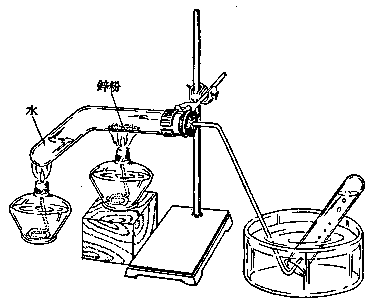

*图附 2*

（3） 锌和铁跟硫酸铜溶液的置换反应：取锌片一块，用砂皮擦亮 （除去表面氧化物），把它投入硫酸铜溶液里，隔 \(3 \sim 5\) 分钟，用镊子取出锌片，观察锌片的颜色？有什么物质沉积在锌片上？如果投入几块锌片，时间隔得更长些，溶液的颜色有什么变化？

用铁钉代替锌片，观察结果如何？

（4） 锌跟硫的化合反应：取刚锉下来的锌粉和研细的硫粉，按 2 与 1 的重量比 （硫稍过量），混和均匀后放入试管，用玻棒压实 （混和物约有 2~3 厘米高即可）。把试管固定在铁架台上，试管不要太倾斜，用酒精灯在试管底部加热，当试管里一出现红热时，就把酒精灯移开。观察试管里的物质是否保持红热？反应后生成了什么物质？

用刚锉下来的铁粉代替锌粉，按7与4的重量比，跟硫反应，观察结果如何？反应后生成了什么物质？

把硫加热至沸腾，有硫蒸气产生时，把一束细铜丝放在硫蒸气里，观察铜丝。为什么铜丝发红？反应后生成了什么物质？

##### 2. 金属的活动性顺序

取四种不同的金属片：锌片、铁片、铝片和铜片，用砂纸擦去表面的氧化物，分别置于四个试管里，各注入 2 毫升稀盐酸 （或稀硫酸）。观察是否都有氢气产生？产生氢气的速度是否相同？根据这四种金属跟酸发生置换反应的难易，排出它们的活动性顺序。

### 实验二 铝和它的化合物的性质

#### 【实验目的】

1. 认识铝的化学性质；

2. 认识氢氧化铝——一种两性氢氧化物的性质；

3. 了解铝盐的水解反应和它的用途。

#### 【实验前的准备】

1. 明确下列问题：

（1） 铝为什么能跟碱溶液发生反应？

（2） 我们知道铝是很活动的金属，能跟水起反应，但为什么铝锅能用来盛水或煮水？

| 仪器 | 试剂 |   |   |   |
| --- | --- | --- | --- | --- |
| 品名 | 数量 | 附注 | 品名 | 附注 |
| 酒精灯 | 1 |   | 铝片 |   |
| 试管 | 5 | 15×150毫米 | 铝粉 | 铝片的锉屑 |
| 试管架 | 1 |   | 硫酸 | 1：5 |
| 试管刷 | 1 |   | 氢氧化钠 | 2% |
| 烧杯 | 3 | 250毫升，可用玻璃杯代 | 硝酸汞 |   |
| 玻棒 | 1 | 可用竹筷代 | 硫酸铝 | 可用明矾代 |
| 角匙 | 1 |   | 明矾 |   |
| 镊子 | 1 |   | 碳酸氢钠 |   |
| 砂皮 | 1 |   | 蓝石蕊试纸 |   |

（3） 怎样制取氢氧化铝？

（4） 什么叫两性氢氧化物？氢氧化铝跟酸或碱溶液反应，各生成什么物质？

（5） 为什么铝盐都容易发生水解反应？它的水溶液呈酸性还是碱性？

2. 预备实验用品（见上页表）。

#### 【实验内容】

##### 1. 铝的化学性质

（1） 铝跟酸或碱溶液的反应：在两个试管里，分别放入 \(2 \sim 3\) 小块铝片。在第一试管里注入 2 毫升稀硫酸，在另一个试管里注入 2 毫升氢氧化钠溶液。观察两个试管是否都有气体发生？为什么？

（2） 铝跟氧气的反应：把铝片一块，一端浸在碱溶液中一霎时间，以洗去铝片表面的氧化铝，再用清水冲洗干净，然后把铝片浸入硝酸汞溶液中。过2分钟以后，用镊子取出铝片，用水洗，揩干，暴露在空气中。观察铝片表面有什么现象发生？生成物是什么？用手摸铝片，为什么铝片温度升高？

（3） 用骨匙取少量铝粉，撒在酒精灯的火焰上，可以看到光亮的火星，这说明了什么？

##### 2. 氢氧化铝的性质

在试管里盛 2 毫升硫酸铝溶液（或明矾溶液），逐渐滴加稀氢氧化钠溶液，振荡，至溶液开始呈碱性时，立即停止。观察氢氧化铝沉淀的色、态。

滗去上面的溶液，把氢氧化铝沉淀分装两个试管。在第一个试管里，滴加稀硫酸，振荡，观察沉淀是否消失，为什么？在第二个试管里滴加氢氧化钠溶液，振荡，观察沉淀是否消失？为什么？这说明氢氧化铝具有怎么样的性质？

##### 3. 铝盐的水解反应

（1） 硫酸铝的水解：把硫酸铝 （或明矾） 溶解在水里，用玻棒沾少许溶液，滴在蓝色石蕊试纸上，观察溶液呈酸性还是呈碱性，为什么？

把饱和的明矾溶液，加入饱和的碳酸氢钠溶液（或碳酸氢钠粉末，即小苏打）.为什么有二氧化碳发生，这是利用明矾溶液的什么性质？这个例子在日常生活里有何用途？

（2） 明矾的净水作用：取井水、河水、含泥沙较多的水各一杯。分别加入少许明矾粉末，用玻棒搅拌，静置，澄清，隔半天或一天后，水就变得澄清了。试说明明矾净水的原理。

### 实验三 钢的回火和淬火

#### 【实验目的】

1. 认识钢经过热处理（淬火、回火）后性质的变化；

2. 认识钢铁发生锈蚀的主要原因和防锈的主要方法。

#### 【实验前的准备】

##### 1. 明确下列问题：

（1） 什么叫淬火？什么叫回火？

（2） 钢铁在干燥的空气里，为什么不容易发生锈蚀？在潮湿的空气里，为什么会很快地生锈？

（3） 在钢铁的表面涂上油漆，为什么能防止锈蚀？

##### 2. 预备实验用品：

| 仪 | 器 | 试剂 |   |   |
| --- | --- | --- | --- | --- |
| 品名 | 数量 | 附注 | 品名 | 附注 |
| 试管 | 5 | 20×200毫米 | 盐酸 | 1：1 |
| 烧杯 | 3 | 150毫升 | 氢氧化钠 | 10% |
| 橡皮塞 | 2 |   | 铁丝 |   |
| 缝衣针 | 2 |   | 油漆 |   |
| 砂皮 | 1 |   | 凡士林 |   |
| 锈子 | 1 |   |   |   |
| 钳子 | 2 |   |   |   |

#### 【实验内容】

##### 1. 钢的回火和淬火

（1） 回火：用两把钳子夹住一只缝衣针的两端，如果把针弯曲，就会折断。另取一缝衣针，在酒精灯上把它灼烧至发红，渐渐冷却 （即回火）。再把它弯曲，钢针不会折断。经过回火处理，钢针的硬度和韧度发生了什么变化？

（2） 淬火：如果把回火钢针再灼烧至发红，立即投入冷水 （即淬火）。再把这种钢针弯曲，又容易折断。经过淬火处理，钢针的硬度和韧度又发生了什么变化？

把回火钢针弯成钩状，再经过淬火，可当作钓鱼钩用。

##### 2. 钢铁的锈蚀

取铁丝5小段，用砂皮擦去铁锈，弯成螺旋状如图附3。浸入盐酸里，用镊子取出，水洗；再浸入氢氧化钠溶液，用镊子取出，水洗，揩干。

（1） 取干燥试管配橡皮塞，放入上述铁丝一段，把塞子塞紧。

（2） 取试管配橡皮塞，放入铁丝一段，注满沸水，把塞子塞紧。

（3） 取试管，放入铁丝，倒插在盛有水的烧杯里，管内铁丝不沾着水，比水面高 3~4 厘米，如图附 4.

*图附 3*

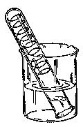

*图附 4*

（4） 取铁丝一段，表面涂一层凡士林，放入试管，也倒插在盛有水的烧杯里，如图附 4.

（5） 将铁丝一段涂上油漆，放入试管，倒插在盛有水的烧杯里，如图附4.

每天观察一次，连续观察两星期，做好记录。比较它们发生锈蚀的难易，从而认识钢铁在什么条件下最容易发生锈蚀。

### 实验四 从草木灰里提取碳酸钾

#### 【实验目的】

1. 了解草木灰肥料的有效成分——碳酸钾的性质；

2. 巩固化学实验的基本操作。

#### 【实验前的准备】

1. 明确下列问题：

（1） 碳酸钾的水溶液呈酸性还是碱性？

（2） 为什么草木灰不能跟氨态氮肥或人粪尿掺和施用？

（3） 怎样从草木灰里提取碳酸钾？

（4） 怎样进行溶解、过滤和蒸发等操作（参阅第一册附录 I，3、4、5、6、7）？

2. 预备实验用品：

| 仪 | 器 | 试 | 剂 |   |   |   |
| --- | --- | --- | --- | --- | --- | --- |
| 品名 | 数量 | 附注 | 品名 | 附注 |   |   |
| 烧杯 | 1 | 400毫升，可用大搪瓷杯代 | 草木灰 | 可用稻草灰代也可用氯化铵或硝酸铵1：1 |   |   |
| 玻棒 | 1 | 硫酸铵 |   |   |   |   |
| 漏斗 | 1 | 盐酸 |   |   |   |   |
| 滤纸 | 1 |   | 红石蕊试纸 |   |   |   |
| 蒸发皿 | 1 | 直径10厘米，可用碟子代 | 蓝石蕊试纸 |   |   |   |
| 铁架台 | 1 |   |   |   |   |   |
| 酒精灯 | 1 |   |   |   |   |   |
| 铁丝 | 1 |   |   |   |   |   |
| 蓝色玻璃片 | 1 |   |   |   |   |   |

#### 【实验内容】

##### 1. 碳酸钾的提取

在 400 毫升烧杯里，装入草木灰 25 克，加水 200 毫升，搅拌，加热煮沸。

待液体冷却后，过滤。把滤液移入蒸发皿，加热蒸发。当液体浓缩到原来的 1/10 时，冷却。取 5 毫升做下列实验，其余液体蒸发至干。

##### 2. 碳酸钾的性质

用玻棒沾少许上述液体，滴在红色石蕊试纸上，观察溶液呈酸性还是碱性，为什么？

取固体氯化铵或硫酸铵少许，加入上述溶液2~3毫升，微热。在试管口，用润湿的红色石蕊试纸检验，石蕊试纸变蓝，说明了什么？

取 2 毫升上述溶液，注入 1 毫升盐酸，有气泡发生，这证明它是什么盐？用洁净的铁丝沾取少许上述溶液，在无色火焰上灼烧，隔蓝色玻璃片观察，火焰呈紫色，这证明它是什么盐？

## 习题答案

### 第一章

习题 1·1：9. Sn：Pb=7：3。

习题 1·2：8. 79.6%。

习题 1·5：5. 汞 1.38 公斤，二氧化硫 154.4 升；6. 铜 1.77 吨。

#### 复习题一

6. 11 克铜析出。

### 第二章

习题 2·2：10. 0.2 克分子氢氧化钠，溶液的百分比浓度是 7.65%；11. 87%。

习题 2·3：13. 74.1%；14. 0.543 吨；15. 90%。

习题 2·4：7. 94%；8. 5.85%。

习题 2·5：7. （1）167.3 吨，（2）99.3 吨。

#### 复习题二

6. 87.8%；7. （1）1.368 吨，（2）各 191520 升，（3）1.783 吨。

### 第三章

习题 3·2：4. 氢气 921 升。

习题 3·3：6. 碳酸钙 8.93 吨，石灰石 11.16 吨。

10. 730 克 20% 的盐酸，44.8 升二氧化碳。

#### 复习题三

8. 19.84 吨

### 第四章

习题 4·1：7. 铝粉 0.857 公斤，四氧化三铁 2.76 公斤。

习题 4·2：4. 氢气 67.2 升。

#### 复习题四

3. （2） 钠跟盐酸的反应最剧烈，铝置换出来的氢气最多。1.12升，2.24升，3.36升。

### 第五章

习题 5·2：8. 5.6 克；9. 是 \(FeCl_{3}\) .

习题 5·3：1. 50.7%，56%。

习题 5·4：5. 64020 吨；6. 0.615 吨。

习题 5·5：7. 0.55%。

#### 复习题五

6. 0.66 吨；7. 120 吨。

### 第六章

习题 6·2：1. M=46，比空气重 1.586 倍；2. 1 个；

3. \(\frac{W_{\mathrm{He}}}{W_{\mathrm{空气}}} = 0.138, \mathrm{H}_{2}\) 的浮力比 \(\mathrm{He}\) 的大2倍；4. \(\mathbf{M}_{\mathbf{N}_2} = 28\)

5. （1） \(\mathrm{M_{HCl}} = 36.5\)，（2） \(\mathbf{M}_{\mathrm{CO}} = 28\)

6. M=38.7；7. \(M_{SO_{2}}=64\) .

习题 6·3：1. S：40%，O：60%；

2. H：5.88%，S：94.12%，P：43.66%，O：56.34%；

3. （1） \(\mathrm{CaSO}_4\)，（2） \(\mathrm{NaOH}\)

4. \(\mathrm{C_2H_2}\)；5. \(\mathrm{K}_2\mathrm{Cr}_2\mathrm{O}_7\)；6. NO；7. \(\mathrm{N}_2\mathrm{O}_4\)；

8. \(\mathrm{P}_{2} \mathrm{H}_{4}\)；9. \(\mathrm{C}_{2} \mathrm{H}_{2}\).

习题 6·4：1. 0.79 克分子；2. 378 立方米；

3. \(\mathbf{N}_2\) 300升，\(\mathbf{H}_2\) 900升；4. 4480立方米；

5. \(H_{2}\) 116.4升，\(O_{2}\) 58.2升；6. 6010毫升；

8. 剩余氧气 5 升，生成水气 10 升。

#### 复习题六

2. \(\frac{W_{\mathrm{O}_3}}{W_{\text{空气}}} = 1.655\)；

3. \(\mathrm{C_6H_{12}}\)

4. \(\mathrm{C_6H_6}\)；

5. 10 升；

6. 碳酸钠 88.2 克；

7. 氨气 362.7 立方米，85%磷酸 873.5 公斤；

8. 二氧化硫 5.48 升。

### 总复习题

20. 0.5 M，15 毫升；

21. 0.265 升，1.71%；

22. 635 吨；

23. 46.5%，147 克；

24. \(K_{2}CO_{3}\) 71.5 斤，\(K_{2}O\) 48.7 斤；

25. \(C_{3}H_{6}\)；

26. \(C_{2}H_{6}O;\)

27. \(C_{4}H_{8}O_{2}\)，\(C_{2}H_{4}O\)；

28. 1.16 克 NaCl，1.5 克 KCl；

29. 98%；

30. 3.5 M。

## 数理化自学丛书

数理化自学丛书编辑委员会主编

- 代数（第一册） 已出版
- 代数（第二册） 已出版
- 代数（第三册） 已出版
- 代数（第四册） 待出版
- 平面几何（第一册） 已出版
- 平面几何（第二册） 已出版
- 三角 已出版
- 立体几何 待出版
- 平面解析几何 已出版
- 物理（第一册） 已出版
- 物理（第二册） 已出版
- 物理（第三册） 已出版
- 物理（第四册） 已出版
- 化学（第一册） 已出版
- 化学（第二册） 已出版
- 化学（第三册） 已出版
- 化学（第四册） 已出版
