# 化学（第四册）

**丛书：** 数理化自学丛书  
**编者：** 数理化自学丛书编委会  
**编写：** 化学编写小组  
**出版社：** 上海科学技术出版社

## 内容提要

本书是数理化自学丛书中化学的第四册，内容介绍高中程度的有机化学知识。

本书一般是从各类有机化合物的代表性物质谈起，归結各类的通性，同时阐述类与类之间的关系和有机化学的基本概念。对各类有机化合物的分类系统以及結構等，讲解得比較詳細明了。凡已学习过本丛书化学前三册，或掌握了相当于中学无机化学知識的讀者，都可用以自学。

## 版本信息

数理化自学丛书

化 学（第四册）

数理化自学丛书編委会

化学编写小组编

上海科学技术出版社出版（上海瑞金二路450号）

上海市书刊出版业营业许可证印003号

上海市印刷大厂印刷 新华书店上海发行所发行

开本 850×1156 1/32 印数 6 16/32 排版字数 161，000

1965年3月第1版 1965年3月第1次印刷

印数 1—22，000

统一书号 T18119·594 定价（科二）0.60元

## 前言

> 来源说明：原书目录列有“出版者的话”和“前言”，但现有扫描来源未包含对应正文。

## 目录

- 出版者的话
- 前言
- 引言
- 第一章 烃
  - I. 饱和链烃
    - §1·1 甲烷
    - §1·2 乙烷，烷属烃
    - §1·3 烃基
    - §1·4 有机化合物的结构理论
    - §1·5 同分异构现象
  - II. 不饱和链烃
    - §1·6 乙烯
    - §1·7 烯属烃
    - §1·8 乙炔
    - §1·9 炔属烃，不饱和链烃的通性
  - III. 环烃
    - §1·10 环烷烃
    - §1·11 苯
    - §1·12 苯的同系物
  - IV. 煤的干馏和石油工业
    - §1·13 煤的干馏
    - §1·14 石油和石油工业
  - 本章提要
  - 复习题一
- 第二章 烃的衍生物
  - §2·1 烃的卤代物
  - §2·2 乙醇
  - §2·3 乙醇的用途和制法
  - §2·4 醇类
  - §2·5 甘油
  - §2·6 酚：苯酚
  - §2·7 甲醛
  - §2·8 醛类
  - §2·9 酮
  - §2·10 乙酸
  - §2·11 羧酸类
  - §2·12 酯
  - §2·13 油脂
  - §2·14 油脂加工
  - 本章提要
  - 复习题二
- 第三章 碳水化合物
  - §3·1 单糖：葡萄糖和果糖
  - §3·2 二糖：蔗糖和麦芽糖
  - §3·3 多糖：淀粉和纤维素
  - 本章提要
  - 复习题三
- 第四章 含氮的有机化合物
  - §4·1 硝基化合物
  - §4·2 胺：苯胺
  - §4·3 酰胺：尿素
  - §4·4 有机肥料
  - §4·5 蛋白质
  - 本章提要
  - 复习题四
- 第五章 合成有机高分子化合物
  - §5·1 高分子化合物的结构和特性
  - §5·2 重要的高分子材料
  - 本章提要
  - 复习题五
- 总复习题
- 附录
  - 几个简单易做的化学实验
    - 实验一 饱和链烃和不饱和链烃
    - 实验二 醇、醛、羧酸
    - 实验三 酯
    - 实验四 碳水化合物
    - 实验五 蛋白质
- 习题答案

## 引言

在前三册里，我們研究过很多无机化合物。現在，我們要研究另外一大类化合物——有机化合物。

我們平常吃的、穿的、用的直接来自动植物方面的东西，象粮食、肉类、蛋、油脂、蔬菜、棉布、木材等等，它们有个共同的特点，就是当受热到一定程度时会变焦成炭，这种现象叫做碳化。这說明它們的成分里都含有碳元素。我們把含碳的化合物，叫做有机化合物（简称有机物），研究有机化合物的化学，叫做有机化学；并且，把不含碳的化合物，叫做无机化合物，研究无机化合物的化学，叫做无机化学。一般有机物的组成元素，除碳之外，还有氢、氧和氮；在某些有机物里还含有硫、磷、卤素或金属元素等。

我們在前面已經学过碳的两种氧化物（一氧化碳和二氧化碳）、金属的碳化物、碳酸和碳酸盐等， 它們都含有碳元素， 但由于它們的結構和性质都和一般的无机物相似， 所以还是把它們归属在无机物里。

有机化合物大量地存在于自然界里，而又长时期被人們加工和应用，象酿酒、染色、医药、造纸等都积累了几千年的經驗，因此人們对有机物已有了一定的认识。不过以往对有机物的研究，还缺少完整的理论。真正把有机化学发展成为一门独立的科学，还是近百年来的事。

早在十七世纪后半期，人们把自然界的物质分为三大类，即动物的、植物的和矿物的物质。这就是后来为了便于研究，把来自动植物的物质称为“有机物”的根据。当时人们之所以如此划分，主要是由于错误地认为动植物的物质是“有生机的物质”。所以在十八世紀末期，瑞典化学家柏齐利烏斯提出了“生命力学說”，认为动植物体内有一种超物质的“生命力”存在，有机物只有在这种“生命力”的作用下，才能制造出来，不能人造。这种把有机物和无机物的界限绝对化的看法，显然对有机化学的研究工作，带来了严重的阻碍。后来由于科学的不断发展，经过许多实验，證明了所謂“生命力”是不存在的。其中最早的一个实验是在1828年，德国化学家武勒在制造氰酸铵 \( \left(\mathrm{NH}_{4}\mathrm{OCN}\right) \) 的某一次实验中，得到了一种叫做尿素 \( \left[\mathrm{CO}\left(\mathrm{NH}_{2}\right)_{2}\right] \) 的有机物。尿素是人类和哺乳动物体内生成的物质，本来要从他们的排泄物——尿液中提取的，现在可以通过无机物制造出来。这个发现，开始给“生命力”学說以有力的打击。后来又有其他科学家，陆續制出許多有机物来，象醋酸、脂肪、糖类等。1861年，俄国化学家布特列洛夫发表了有机化合物的结构理論，对有机化合物分子内原子的互相結合、排列和互相影响，作了很广泛的论述（关于化学结构学說将在本书§1·4討論）。这一連串的发现，终于打垮了“生命力”学說，为有机化学开辟了正确发展的道路，證明了有机物的形成和变化，同样服从于一般的化学规律。有机物和无机物之間，根本不存在绝对的界限。目前沿用“有机化合物”这个名称，只是由于习惯，而并不包含有“生机”的意义。

有机物可以从加工天然产物而获得，或者通过人工方法来合成。到现在为止，人类利用的有机物已达百万种以上，而且还在不断制造出新的品种来。制造这些有机物的原料，主要是动植物体和矿物界的天然气、石油和煤。这些物质的资源很丰富，可以生产炸药、染料、人造纤维、合成纤维、塑料和药剂等各式各样的产品，应用的范围非常广泛。所以发展有机化学工业，对发展国民经济、加速社会主义建设、巩固国防和提高人民生活水平，具有极其重要的意义。

在下面的各个章节里，我们要按照分类，由简单到复杂逐步研究各种有机物。

## 第一章 烃

根据有机物的组成来看，有一大类物质，它们的分子是仅由碳和氢两种元素所组成的。我们把这类物质叫做烃[^ch1-01]，也叫碳氢化合物。这一类有机物的来源主要是天然气、石油和煤的加工产物。本章要研究各种重要的烃。

### I． 饱和链烃

#### § 1·1 甲烷

甲烷是最简单的烃，在理论上可以说它是一切有机物的母体。在自然界里甲烷有多种来源，其中比较集中的是蕴藏在地层里的天然气。天然气是一种可燃性气体，又称为“天然煤气”，它的主要成分就是甲烷（以体积计约占85～95%）。天然气通过地层裂口，或由人工凿井而冒出地面，成为人类利用的重要资源。我国早在汉末晋初时，四川自贡市一带就有人开始钻井使用天然气了，到了宋朝，已经大规模用来煎制井盐。所以我国四川是世界上著名的天然气产地之一。天然气的形成，据科学家的研究，认为是和石油的形成相一致的。由于甲烷等是分子量比较小的烃，在常温下成气态，所以天然气往往和石油矿共存，或蕴藏在石油产区的附近。

甲烷除来自天然气外，还存在于自然界的其他地方，例如不常流动的静水池沼底下，当沉积的有机物受着菌类的发酵作用时，会产生气体冒出水面来。因为它源出于池沼，所以称为沼气。另外，在煤的形成过程中，植物残体在隔绝空气下进行分解，也有同样的气体产生，由于在煤井的坑道中发现，所以就称为坑气。沼气、坑气和天然煤气一样，它们的主要成分都是甲烷。

##### 甲烷的物理性质

甲烷是无色、无嗅、无味的气体。它的比重是0.717克/升，约比空气轻一半，和相同状况（相同的温度和压力）下同体积空气的重量比是0.5517。甲烷很难溶解于水，在20℃时，每1升的水约能溶解33毫升。

##### 甲烷的分子式和分子结构

甲烷是可以燃烧的，从它的燃烧产物二氧化碳和水蒸气的定量测定，知道甲烷分子里仅仅含有碳和氢两种元素。

从甲烷的比重，可以算出它的1克分子重16.061克（0.717×22.4），可见它的分子量约等于16个氧单位。根据分子量和重量组成，可以确定甲烷的分子式是 \( CH_{4} \)。（具体计算方法，可参阅第三册第六章。）

甲烷分子里的一个碳原子和四个氢原子是怎样结合成分子的呢？我们知道，碳原子的最外层有四个电子（可以用简单的图式·C·表示），而氢原子外层只有一个电子。因此，每一个碳原子可以和四个氢原子分别形成共价键。甲烷分子就是通过碳原子和氢原子之间的共用电子对而形成的。这样使得有关原子都具有稳定的电子外层（碳原子8个，氢原子2个）。

甲烷的分子结构可以用下式表示：

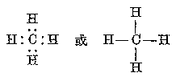

前者称为电子式，后者称为结构式。 元素符号間的“：”表示共用电子对，也就是相当于结构式中的“-”，这种短划是写有机物结构式时用来表示价键的符号。

甲烷的分子结构，是不是象上面所写的那样，碳原子和四个氢原子都在同一个平面上呢？根据碳原子正四面体学说，认为碳原子是处在一个正四面体的中心，它的四个价键，由中心指向四面体的四个顶点，和四个氢原子以相同的价键结合，如图1·1（a）。 我们也可以用不同颜色的小球代表不同的原子，以短棒代表价键，做成如图1·1（b）的甲烷分子模型。 一般为了方便起见，写的结构式是模型在平面上的投影（如图1·1（c））。 所以甲烷分子的实际结构是碳原子和四个氢原子并不在同一个平面上的。

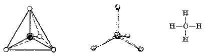

##### 甲烷的化学性质

1. 可燃性 甲烷可以燃烧， 在氧气充足的情况下， 全部变为 \(\mathrm{CO}_{2}\) 和 \(\mathrm{H}_{2} \mathrm{O}\)， 发出淡蓝色火焰， 并放出大量的热：

$$
\mathrm{CH} _ {4} + 2 \mathrm{O} _ {2} = \mathrm{CO} _ {2} + 2 \mathrm{H} _ {2} \mathrm{O} + 210.8 \text {千卡}
$$

由上式可知，1克分子体积的甲烷（22.4升）和2克分子体积的氧气（2×22.4升）可以完全反应。也就是甲烷和氧气完全反应时的体积之比是1：2；如果换了空气，那末体积之比就是1：10，因为空气里约含有1/5体积的氧气。当甲烷和氧气在极短时间里完全反应时，由于放出大量的热使温度突然升高，而且反应生成物又都是气体，体积骤然膨胀，结果就能发生猛烈的爆炸。甲烷的这种性质，使煤井里有可能发生爆炸。但是由于人类掌握了它的爆炸规律，就设法改进矿井的通风和照明设备，从而防止事故的发生，使生产得以安全地在地下进行。

如果氧气供给不充分，甲烷的燃烧便不完全，燃烧时有黑烟产生：

$$
\mathrm{CH} _ {4} + \mathrm{O} _ {2} = \mathrm{C} + 2 \mathrm{H} _ {2} \mathrm{O}
$$

2. 受热分解 甲烷在隔绝空气强热时，随着温度的高低而有不同的两种分解反应。把甲烷加热到 \(1000 \sim 1100^{\circ} \mathrm{C}\)， 甲烷分解为它的组成元素——碳和氢。

$$
\mathrm{CH} _ {4} \xrightarrow {1100 ^ {\circ} \mathrm{C}} \mathrm{C} + 2 \mathrm{H} _ {2}
$$

如果在 \( 1500^{\circ}C \) 电弧的高温下，甲烷分解为氢气和乙炔（讀如缺 quē）：

$$
2\mathrm{CH}_{4}\xrightarrow[\text{电弧}]{1500^\circ\mathrm{C}}3\mathrm{H}_{2}+\mathrm{C}_{2}\mathrm{H}_{2}
$$

3. 稳定性 在通常情况下， 甲烷的化学性质很不活潑。我們用試管裝几毫升淡紫色的高錳酸鉀溶液 （加稀硫酸几滴）， 并通进甲烷， 溶液的紫紅色不会消失， 證明甲烷不能被强氧化剂如高錳酸鉀溶液所氧化。同时甲烷也不跟强酸 \(\left(\mathrm{H}_{2} \mathrm{SO}_{4}, \mathrm{HNO}_{3}\right)\) 或强碱 （NaOH， KOH） 起反应。

4. 跟卤素的取代反应 甲烷在常温下能跟氯气或溴起反应。我们可以通过下面的实验来说明：

用一个大玻璃筒，把筒的容积划成五等分，在筒壁上做好标记。筒内装满飽和食盐水[^ch1-02]，倒插在盛有食盐水的玻璃缸里。在光线较暗的地方[^ch1-03]，从筒口通入甲烷，使筒内盐水排出到标记1的地方。接着改通氯气，使筒内的盐水排尽。这样甲烷和氯气体积的比是1：4（如图1·2（a））。

收集在筒内的氯气，本来是黄绿色，隔了一段时间后，看到颜色逐渐变淡，筒壁上有油状液滴出现，同时食盐水的液面，也向筒内上升（如图1·2（b））。

根据实验中液面上升的现象，我们知道筒内的气体压强减小了；油状液滴的出现和黄绿色的消失，说明甲烷跟氯气在光照下直接反应生成了新物质。经过研究知道，生成物是一系列的甲烷氯代物的混和物以及易溶的氯化氢气体。反应是分步进行的：

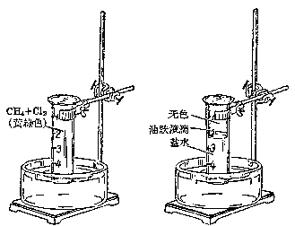

$$
\mathrm{CH} _ {4} + \mathrm{Cl} _ {2} \xrightarrow {\text {散射光}} \mathrm{CH} _ {3} \mathrm{Cl} + \mathrm{HCl}
$$

$$
\mathrm{CH} _ {3} \mathrm{Cl} + \mathrm{Cl} _ {2} \xrightarrow {\text {散射光}} \mathrm{CH} _ {2} \mathrm{Cl} _ {2} + \mathrm{HCl}
$$

$$
\mathrm{CH} _ {2} \mathrm{Cl} _ {2} + \mathrm{Cl} _ {2} \xrightarrow {\text {散射光}} \mathrm{CHCl} _ {3} + \mathrm{HCl}
$$

$$
\mathrm{CHCl}_{3}+\mathrm{Cl}_{2}\xrightarrow{\text{散射光}}\mathrm{CCl}_{4}+\mathrm{HCl}
$$

氯原子进入甲烷分子里，把氢原子逐个代替了出来。这一类反应在有机化学中称为取代反应。也就是在有机化合物分子中的氢原子，被其他原子或原子团所代替的反应，叫做取代反应。

甲烷分子里的氢原子被卤素的原子取代，这种取代称为卤代。由于卤代反应而生成的新的有机物，称为甲烷的卤代物，象一氯甲烷、二氯甲烷、……等，都是甲烷的卤（氯）代物。

这里还要说明一个新概念，就是把甲烷作为母体，经过卤代反应，生成了一氯甲烷等四种卤代物。这些新物质，显然是由甲烷衍变而产生的，所以它们也叫做甲烷的衍生物。（关于衍生物在第二章里还要讨论。）

##### 甲烷的用途

根据上面所述的性质，甲烷具有下列各种用途：

1. 燃料 甲烷在燃烧时能放出大量的热，因此在家庭或工业上可用作为气体燃料。

2. 化工原料 由甲烷可以制得它的氯代物，其中的氯仿和四氯化碳都是重要的有机溶剂。甲烷在不完全燃烧或高温下分解可得炭黑、氢气和乙炔。炭黑是制造印刷用的油墨和橡胶工业的原料之一；氢气用于氨和汽油的合成；乙炔可以用来合成橡胶、纤维和塑料等等。

##### 甲烷的制取

实验室制取甲烷，用无水醋酸钠（\( \mathrm{CH}_{3} \mathrm{COONa} \)）和碱石灰（氢氧化钠跟石灰的混和物）的两种粉末，按1：3（体积）混和均匀后，装在硬质试管里，使粉末斜铺在试管底部，管口配单孔塞和导管，把试管水平地（管口略向下倾斜）固定在铁台上。

加热试管，由于碱石灰是氢氧化钠跟石灰的混和物，氢氧化钠跟醋酸钠进行反应而产生甲烷：

$$
\mathrm{CH} _ {3} \mathrm{COONa} + \mathrm{NaOH} \xrightarrow {\text {(加热)}} \mathrm{CH} _ {4} \uparrow + \mathrm{Na} _ {2} \mathrm{CO} _ {3}
$$

甲烷从导管逸出，可以用排水法集取（装置如图1·3（a））。

制得甲烷后，我们可以檢驗它的性质。先觀察它的物理性质，它是无色而又不溶于水的气体。在排尽空气后在导管口上点火，觀察它的可燃性，并注意火焰顏色（火焰應該呈淡藍色，但在玻璃导管上或加热过强时均帶黃色）。用一只干燥的燒杯罩在火焰的上方，就能看到杯子边上产生水雾（图1·3（b））；取下燒杯，倒入一些澄清的石灰水，石灰水变为渾浊，这就證明了甲烷的燃燒产物是二氧化碳和水。把甲烷的导管插入儲有淡紫色的高錳酸鉀酸性稀溶液（加稀 \(\mathrm{H}_2\mathrm{SO}_4\) 几滴）的試管中，使甲烷通过溶液（图1·3（c）），結果紫色不变，証明甲烷的稳定性，它不能為高錳酸鉀所氧化。这些實驗都能驗証我們上面所讲的甲烷的性质。

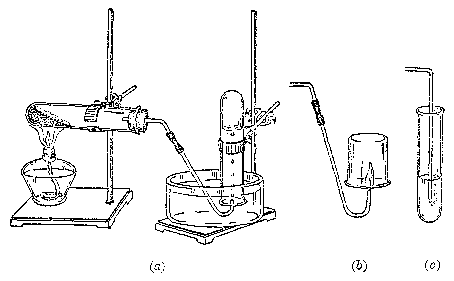

工业上需用的甲烷，主要来自天然气，有时也可以从炼焦煤气里提取（見 §1·13 煤的干馏部分）。

在农村里，甲烷还可以通过发酵来制取。把含水90%左右的粪便、垃圾、杂草等放在密闭的发酵池里，让一种不需要空气能生存的甲烷菌（称为嫌气性甲烷菌），在20～35℃的温度下进行发酵，经过3～5天就有甲烷和二氧化碳产生，甲烷含量约达65%左右。发酵过的粪便和垃圾，由于其中的蛋白质已被分解成氨，氨气在密闭的发酵池里受压溶解于水，因此肥效反而会增加好多倍。一个发酵池，只要控制好温度、湿度和发酵原料，每天按比例取出旧料，加入新料，就可以连续使用。所产生的沼气，可作为燃料和动力，用以发电、点灯、烧饭、开动汽车和拖拉机等。这样就节约了石油和煤炭的消耗，那是非常节约的办法。

##### 习题 1·1

1. 天然气、沼气和坑气的主要成分都是甲烷，那末它们究竟是一种气体呢，还是三种不同的气体？为什么要这样分别命名？

2. 甲烷的物理性质和化学性质在哪些方面跟氢气和一氧化碳很相似？它们燃烧之后的生成物有什么不同？能否以此来鉴别这三种气体？

3. 什么叫做取代反应？ 这种反应和无机化学里的置换反应有什么区别？

［提示：从生成物和电子得失两个方面考虑。］

4. 溴跟甲烷也能发生取代反应，反应过程和氯气跟甲烷的反应相似。写出溴跟甲烷取代反应的各步化学反应方程式。

5. 1.12升（标准状况下）甲烷燃烧后生成多少克分子二氧化碳？多少克水？要空气多少升（假定空气中含氧1/5体积）？

6. 甲烷有哪些重要用途？这和甲烷的哪些性质有关？

7. 实验室利用什么物质制取甲烷？写出反应方程式。用什么方法集取甲烷？这种集取法和它的什么性质有关？

#### § 1·2 乙烷，烷属烃

上面我們已經学过了最簡單的烃——甲烷，在它的分子里只有一个碳原子，但是在天然气和某些地区的石油里，常存在着一系列和甲烷性质相似的烃。現在我們来学习分子里含有两个碳原子的乙烷。

##### 乙烷

1. 乙烷的物理性质 乙烷也是一种无色、无嗅、无味的气体。它的比重是 1.34 克/升，稍重于空气。乙烷也不溶于水。

根据分析的結果，知道乙烷的分子式是 \( C_{2}H_{6} \)。

2. 乙烷的化学性质 乙烷能在空气里或氧气里燃烧，生成二氧化碳和水蒸气，并放出大量的热：

$$
2 \mathrm{C} _ {2} \mathrm{H} _ {6} + 7 \mathrm{O} _ {2} = 4 \mathrm{CO} _ {2} + 6 \mathrm{H} _ {2} \mathrm{O} + 745.6 \text {   千卡   }
$$

如果把乙烷跟空气或氧气按照适当体积比混和后燃点，会发生猛烈的爆炸。

乙烷在通常情况下很稳定，不会被高锰酸钾所氧化；跟强酸强碱也不起反应。

乙烷也能跟卤素起取代反应，生成乙烷的各种卤代物，例如：

$$
\mathrm{C}_{2}\mathrm{H}_{6}+\mathrm{Cl}_{2}\rightarrow \mathrm{C}_{2}\mathrm{H}_{5}\mathrm{Cl}+\mathrm{HCl}\qquad\text{一氯乙烷(氯乙烷)}
$$

$$
\mathrm{C}_{2}\mathrm{H}_{6}+6\mathrm{Cl}_{2}\rightarrow \mathrm{C}_{2}\mathrm{Cl}_{6}+6\mathrm{HCl}\qquad\text{六氯乙烷}
$$

烷属烃 从乙烷的一些性质来看，它是和甲烷十分相似的。此外还有丙烷 \( \left(\mathrm{C}_{3}\mathrm{H}_{8}\right) \) 、丁烷 \( \left(\mathrm{C}_{4}\mathrm{H}_{10}\right) \) 、……一系列物质，它们的化学性质都和甲烷、乙烷很相似，它们形成烃类中的一个分系，称为烷系，也叫做烷属烃。

表 1·1 列出部分烷属烃。

表 1·1

| 名 称 | 分子式 | 在常温下的状态 | 熔点°C | 沸点°C | 在液态下的比重 |
| --- | --- | --- | --- | --- | --- |
| 甲 烷 | \( CH_4 \) | 气体 | -184.0 | -161.7 | 0.4240 |
| 乙 烷 | \( C_2H_6 \) | 气体 | -172.0 | -88.6 | 0.5462 |
| 丙 烷 | \( C_3H_8 \) | 气体 | -187.1 | -42.2 | 0.5824 |
| 丁 烷 | \( C_4H_{10} \) | 气体 | -135.0 | -0.5 | 0.6010 |
| 戊 烷 | \( C_5H_{12} \) | 液体 | -129.7 | 36.1 | 0.6264 |
| 己 烷 | \( C_6H_{14} \) | 液体 | -94.0 | 68.7 | 0.6594 |
| 庚 烷 | \( C_7H_{16} \) | 液体 | -90.5 | 98.4 | 0.6837 |
| 辛 烷 | \( C_8H_{18} \) | 液体 | -56.8 | 125.6 | 0.7028 |
| …… | …… | …… | …… | …… | …… |
| …… | …… | …… | …… | …… | …… |
| 十七烷 | \( C_{17}H_{36} \) | 固体 | 22.0 | 303.0 | 0.7767 |
| …… | …… | …… | …… | …… | …… |
| 七十烷 | \( C_{70}H_{142} \) | 固体 | 105.0 | — | — |

从上表可以看出，每一种烃和它上下相邻近的烃都相差一个碳原子和二个氢原子所成的原子团 \( CH_{2} \)。随着 \( CH_{2} \) 原子团的增加，各个烃的物理性质有着规律性的递变，如它们的熔点和沸点以及在液态下的比重，都是随着分子里碳原子数的增加，而逐渐升高或增大（只有丙烷的熔点比乙烷低是例外）。因此在常温（指 \( 20^{\circ}C \)）常压下，甲烷到丁烷是气体，戊烷到十六烷是液体，十七烷以上都是固体了。

至于它们的化学性质，也都和甲烷相似。如在常温下很稳定；不被高锰酸钾所氧化；跟强酸强碱不起反应；在空气里点火能够燃烧；跟卤素能够起取代反应等等。

为什么它们的化学性质会这样相似呢？根本的原因是它们的分子结构相似。試以乙烷和丙烷为例，它们的结构如下列图式：

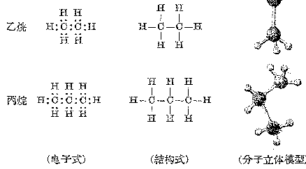

从上图可以看出，在这些烷烃的分子结构里，不论是 C 和 H 之间或 C 和 C 之间都是只有一对电子共用（C 和 H 之间只可能共用一对电子），换写成价键，就是一根“—”短划：这种价键称为单键。由于单键的结合是比较稳定的，所以它们的化学性质比较不活泼。

在烷属烃的分子里，不仅碳原子之间都是以单键相互联结成链状，而且碳原子的其他价键都跟氢原子结合，也就是碳原子的化合价完全“饱和”。因此烷属烃分子里的碳原子不能再结合其他原子，而只能用其他原子来取代氢原子。所以，烷属烃又叫做饱和链烃。“烷”字的意义就是指饱和。

既饱和又成链状的烷属烃，它们分子式的通式是

$$
\mathrm{C} _ {n} \mathrm{H} _ {2 n + 2} (n \geqslant 1)，
$$

n 是分子里的碳原子数，氢原子数是碳原子数的二倍再加二，即为 \( 2n+2 \)。

为什么烷属烃的通式会是 \( C_{n}H_{2n+2} \) 呢？从它们的分子结构来看，碳链是由若干个—C—连接起来的，要是有n个碳原子，氢原H子就应当是2n个。但是碳链的两端还得各连一个氢原子，这样才能使碳原子的价数完全得到满足。所以烷属烃的通式应是 \( C_{n}H_{2n+2} \)\( (C_{n}H_{2n}+2H) \)。 根据这个通式就容易推算任何烷属烃的分子式。例如含有十五个碳原子的烷烃的分子式， 就必定是 \( C_{15}H_{2\times15+2} \) 即\( C_{15}H_{32} \)。

符合于通式的各物质，化学性质彼此相似，分子组成相差一个或几个 \( CH_{2} \) 原子团，它们互称为同系物。甲烷、乙烷、丙烷、……十七烷……彼此都是同系物。

关于烷属烃的知識，可以概括如下：

（1） 烷属烃的分子中全部以单键相結合，它們的組成可以用通式 \( C_{n}H_{2n+2} \) 来表示。

（2） 这一类物质成为一个系统，同系物之间彼此相差一个或几个 \( CH_{2} \) 原子团。

（3） 同系物之间具有相似的分子结构， 因此化学性质相似。 物理性质则随着分子量的增大而逐渐变化。

掌握了以上的特点，对研究有机化学非常便利。我们只要知道某一个同系物的性质，就可以举一反三，推论其他。甲烷是我们学习的烷属烃的代表性物质，认识了甲烷，其他烷属烃的性质，也就不难了解了。

##### 烷属烃

的命名方法是这样的：凡是烷属烃的同系物，都称做“烷”。它们相互的区别是根据它们分子中含碳原子数的多少，在“烷”字前加一序号。含碳原子1到10个的，分别冠以甲、乙、丙、丁、戊、己、庚、辛、壬、癸等“天干”[^ch1-04]序号。例如甲烷 \( \left(\mathrm{CH}_{4}\right) \) 、乙烷 \( \left(\mathrm{C}_{2}\mathrm{H}_{6}\right) \) 、……、癸烷 \( \left(\mathrm{C}_{10}\mathrm{H}_{22}\right) \) 等。含碳原子在十一个以上的，则冠以数字[^ch1-05]。例如十五烷 \( \left(\mathrm{C}_{15}\mathrm{H}_{32}\right) \) 、二十烷 \( \left(\mathrm{C}_{20}\mathrm{H}_{42}\right) \) 等。

#### § 1·3 烃基

上面讲到的烷属烃的同系物， 相邻的两种烃总是相差一个 \(\mathrm{CH}_{2}\) 原子团。 这我们可以看做是上一个烃分子中， 有一个氢原子被一个 \(\mathrm{CH}_{3}\) 原子团所代换。 例如， 乙烷 \(\mathrm{C}_{2} \mathrm{H}_{6}\) 可以看作是甲烷 \(\mathrm{CH}_{4}\) 分子里的一个氢原子被一 \(\mathrm{CH}_{3}\) 所代换， 成为

$$
\mathrm{CH} _ {3} - \mathrm{CH} _ {3}， \text {或} \mathrm{H} - \mathrm{C} - \mathrm{C} - \mathrm{H}.
$$

同样， 丙烷可以看作是由 \(-\mathrm{CH}_{3}\) 代换乙烷分子里的一个氢原子而成 \(\mathrm{CH}_{3}-\mathrm{CH}_{2}-\mathrm{CH}_{3}\)。 其他可以类推。 这种在烃类分子中去掉一个或几个氢原子后剩余的部分， 叫做烃基。 烃基的价数决定于去掉的氢原子个数， 去掉一个氢原子的就是一价烃基。 烃基的命名以相应的烃作为根据， 如甲烷分子里少掉一个氢原子， 留下的部分 \(-\mathrm{CH}_{3}\) 就叫做甲烷基， 简称甲基； 乙烷分子里去掉一个氢原子后留下的 \(-\mathrm{C}_{2}\mathrm{H}_{5}\) 部分就叫做乙基； 其余如表 1·2所示。

表 1·2

| 烃的名称 | 一价烃基的名称 |
| --- | --- |
| 甲烷 \( CH_4 \) | 甲基 \( -CH_3 \) |
| 乙烷 \( C_2H_6 \) | 乙基 \( -C_2H_5 \) |
| 丙烷 \( C_3H_8 \) | 丙基 \( -C_3H_7 \) |
| 丁烷 \( C_4H_{10} \) | 丁基 \( -C_4H_9 \) |
| …… \( C_{n}H_{2n+2} \) | …… \( -C_{n}H_{2n+1} \) |

根据研究， 烃基不能单独存在于自然界中， 科学家也没有制得过具有这类组成的稳定物质， 仅仅在化学反应过程中， 可以在一个很短的时间里形成， 但是很快地就成为新的分子的一个组成部分了。但烃基在有机化合物的分子结构里是一个很重要的部分。因为有机物在反应过程中，并不是分子的全部都拆散开来，而仅仅是一部分在外界的能量作用下引起变化，它所保留的不变部分就是各种的基。这些原子团要比普通的分子活潑得多，容易发生各种化学反应，因此在化学反应里烃基往往和其他基团相结合而成为各种类别的有机化合物。如上面讲过的一氯甲烷 \( \left(\mathrm{CH}_{3}\mathrm{Cl}\right) \) 就是很明显的例子。一氯甲烷的结构是一个甲基和一个氯原子结合而成的，也可以叫做氯化甲基，不过习惯上把它叫做氯甲烷。当氯甲烷起化学反应时，甲基往往保持不变，而成为产生的新物质的一个组成部分。今后我们将会经常用到烃基的式子和名称，必须要把它们牢牢记住。

##### 习题 1·2～1·3

1. 什么是饱和链烃？“烷”的字义怎样？

2. 試从烷属烃的分子結構說明烷属烃的稳定性。

3. 写出下列各种烷的分子式：

（1） 癸烷，（2） 二十烷，（3） 含有 34 个氢原子的烷。

4. 举例說明烷属烴各同系物的物理性质的递变規律。

5. 某一烷烃和相同状况下同体积的氢气的重量比是 29。求它的分子式，并指出它的名称。

【解】这一类由已知的有机物的类别和某些数据来求分子式和名称的题目，可以根据该类有机物的通式求出分子量来解答。

已知烷属烃的通式是 \( C_{n}H_{2n+2} \)； 氢气的分子量 = 2。则所求某一烷烃的分子量 = \( 2 \times 29 = 58 \) （氧单位），

∴ \( C_{n}H_{2n+2} \) 的分子量等于 58，即 \( 12n+2n+2=58 \)，

$$
14 n = 58 - 2 = 56， \quad \therefore \quad n = 56 / 14 = 4.
$$

所以这个化合物的分子式是 \( C_{4}H_{10} \)，就是丁烷。

6. 某一烷属烃和相同状况下同体积的空气的重量比是 3.931。求它的分子式，并指出它的名称。

7. 怎样根据烃基的概念， 证明 \(\mathrm{C}_{n} \mathrm{H}_{2 n+1}\) 是烷属烃的一价烃基？ 写出碳原子数为6或8的烷属烃的一价烃基。

#### § 1·4 有机化合物的结构理论

##### 化学结构学說創立前有机化学研究上所存在的問題

上面我們研究过甲烷、乙烷、丙烷的分子結構，現在看来，烷属烃分子中碳原子之間，以及碳原子跟氢原子之間的結合情況，已是很清楚了。但是，这些問題的得到解决，并不是那么順利的，而是經過了不少的研究和論爭，才取得目前这样的結論。

十九世紀初期， 由于生产发展的推动， 发现了許多新的有机物和有机化学反应。有很多事实， 不能运用当时已有的化学理論來加以解釋。象元素的化合价的概念， 在十九世紀五十年代就被科學家們所确定了， 知道每种元素都有一定的化合价， 元素的化合价有的只有一种， 有的可能有几种， 但无论如何化合价总应当是整数。从二氧化碳、碳酸、碳酸盐等无机化合物来看， 很明显碳是一个4价元素， 可是根据第一册 §2·15 里所討論过的化合价規則 （甲元素的化合价 × 甲元素的原子数 = 乙元素的化合价 × 乙元素的原子数） 似乎不适用于有机物。例如在甲烷里碳是4价， 而在乙烷里， 碳就好象是3价 （6/2） 了； 至于在丙烷 \(\left(\mathrm{C}_{3} \mathrm{H}_{8}\right)\) 、丁烷 \(\left(\mathrm{C}_{4} \mathrm{H}_{10}\right)\) 里， 碳的化合价甚至成了分数 （8/3 和 10/4） 了。要是把甲烷的同系物的分子式， 逐个来檢查， 就觉得各种烷烃分子里碳原子的价数各不相同。为什么碳元素在各种化合物里的化合价会有这么多的变化呢？ 这是当时一个难以解释的问题。除了化合价之外， 象有机物为什么这样多？ 同系物之间为什么总是相差一个或几个 \(\mathrm{CH}_{2}\) 原子团？ 一种物质是不是只应有一种式子， 还是同时可以有多种式子来表示[^ch1-06] 等等一連串的問題， 一时都得不到解决。因此， 研究有机化学遇到了很大的困难。

上面所談的這許多問題，显然是和有机物复杂的分子結構有关。但是当时有很多化学家认为化学工作者只应该研究物质的化学反应过程，不应该去探索分子本身构造上的秘密。这种观点严重地妨碍了有机化学的发展，而把有机化学引到死胡同里去。直到十九世紀六十年代，俄国的化学家布特列洛夫系统地研究了当时所积累的科学資料，认为要解决这些问题，只有到分子結構的領域里去找尋，終于在1861年創立了化学結構学說，澄清了当时的混乱状态。布特列洛夫认为，有机物的分子具有一定的結構，而且分子的結構是可以通过实验的方法来确定的。一种物质只能有一种結構，因此只能用一个式子来表示。布特列洛夫的化学結構学說，不仅解釋了当时有机化学上的一系列問題，而且成为发展有机化学的重要理論。后来学說本身又被新的理論所充实和补充，使旧有的原理，更加深刻幷日趋完善，成为一个完整的理論。

##### 化学结构学說的基本內容

布特列洛夫认为，在任何一個化合物的分子中，原子幷不是散乱的堆积，分子是有一定的化学結構的，結構決定着化合物的性质。

什么叫做化学结构呢？在任何一种化合物的分子中，每一个原子都有一定的化合价（当时称为化学力或亲和力的数量），原子是按照这种化合价相互结合着的。原子相互结合成分子的方式，称为物质分子的化学结构。

物质的分子不仅具有一定的化学结构，而且它的性质就决定于它的结构。一种化合物的性质不仅取决于含有几种原子和几个原子，而且决定于这些原子如何有顺序地结合成为分子。因此，可以根据物质的性质来推知它的化学结构，反过来，也可以根据物质的化学结构，来推知这种物质的性质。

在学說中还有很重要的一点，就是，在一个分子中，原子之間相互产生着影响。一个分子的性质，并不等于分子中各种原子性质的总和，而是在原子之間有着相互影响、相互制约的关系。

总之，化学结构学说是关于物质分子里原子的相互结合、排列和相互影响的学说，我们可以把它归纳为下列四点：

（1） 在物质的分子里，所有的原子都按照一定的顺序相互结合，并不是杂乱的堆积。

（2） 分子里所有的原子都按照它们的化合价相互结合，而且每一个原子的化合价都一定得到满足，没有剩余的化合价。

（3） 一种分子只可能有一种化学结构。物质的性质不但决定于它的分子组成，而且决定于它的化学结构。

（4） 在一个分子里， 原子之间是相互影响着的。

##### 运用化学结构学說解釋存在的問題

根据化学結構学說的原理，我們可以用学过的烷属烃作为例子，来推知它們的性质和化学結構之間的相互关系，从而解釋在結構学說創立以前所存在的一些問題。

1. 有机物分子里碳的化合价問題 我們已經讲过乙烷和丙烷的分子结构，知道在它們分子里的碳原子之間，以单鍵相互联结成鏈狀。不仅乙烷和丙烷如此，就是所有烷属烴里碳原子之間也都如此。因为化学結構学說肯定了在物质的分子里所有原子都是按照一定順序彼此結合的，所以只要把甲烷同系物分子里的碳原子按照順序排成鏈狀結構，就可以看出碳原子都是4价，仍旧符合于化合价規則，而就不会产生碳原子化合价多变的錯覺了。

2. 为什么同系物之間总是相差一个或几个 \(\mathrm{CH}_2\) 原子团把甲烷到丁烷的结构式排列起来：

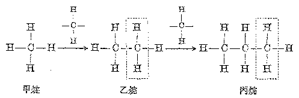

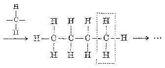

可以看出，在碳鏈上每增加一个碳原子，必然要增加二个氢原子，否则各个原子的化合价就得不到满足。所以同系物之間，都是相差一个或几个 \(\mathrm{CH}_2\) 原子团。由此亦可以看到，烷属烃的通式只可能是 \(\mathrm{C}_n\mathrm{H}_{2n + 2}\)，而它们同系物之间具有相似的结构，因此具有相似的化学性质。

3. 一种物质是不是只应有一种式子来表示 由于物质的化学结构与物质的性质间有着一定的关系，已如上述。因此，亦就是肯定了分子化学结构的单一性。化学结构学說指出：每一个分子只能有一种化学结构，在相同分子中不可能有几个不同的化学结构同时并存。所以，一种物质只能用一个既反映结构、又在一定程度上反映性质的固定式子来表示。例如，丙烷的结构式只能是

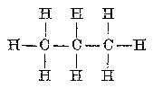

一种，它既反映丙烷分子中碳原子是单键链状结构，又表示它不能再加入任何原子而只能起取代反应的性质。有时我们把它写成 \( CH_{3}-CH_{2}-CH_{3} \) 模样，情况仍然一样，这个式子叫做结构简式，“—”表示碳原子间的价键，至于碳原子和氢原子间的价键则已略去。

4. 怎样体现“分子里原子之间是相互影响着的”关于分子中原子之间相互影响的意义，目前我们可以用几种常见的简单化合物为例来加以說明。在 \( HCl \) 、 \( H_{2}O \) 、 \( NH_{3} \) 、 \( CH_{4} \) 四种分子中，氢原子是分别跟四种不同的原子氯、氧、氮、碳相結合的，它們的性质不一样。我們知道，金属鈉很容易从水里置换出氫來，但很难使甲烷中的氫被取代。为什么有这种差別呢？主要原因就在于和氫相連結的原子不同，以及氫原子的个数不同，从而所起的影响也不同。这种直接相連的原子間的影响，在有机化合物中将会时常碰到。

5. 为什么有机化合物的种数这样多 前面讲过，有机物种数已超过百万种。为什么这样多？从烷属烃的同系物来看，我们很容易理解，这就是由于碳原子能彼此结合成为碳链的缘故。碳原子之间，彼此共有一对电子，形成牢固的共价键，使这种碳链可以结合得很长，如在七十烷里，就有七十个碳原子结合成的长链。这就是有机物为数众多的主要原因之一。

##### 习题 1·4

1. 化学结构学說的基本要点是什么？

2. 如果說，“在丙烷分子里碳的化合价是 \(8/3\)”，对不对？为什么？应该是多少？

3. 运用化学结构学说来解释，为什么丙烷只可能有一种分子结构？

4. 为什么烷烃的通式是 \(C_{n}H_{2n+2}\)？

5. 为什么组成有机物的元素很少，而有机物的种类却又很多？这种现象的主要原因是什么？

#### § 1·5 同分异构現象

##### 同分异构現象和同分异构体

上节提到，碳原子能彼此結合成为碳鏈，这是有机物为数众多的原因之一。有机物为数众多的另一原因，是由于同样的几种元素的同数原子，結合成分子时，由于分子里原子結合的順序不同，亦能成为不同性质的物质。我們可以通过一些具体例子來說明。象本册引言里讲到的，1828年武勒用氰酸铵 \( \left(\mathrm{NH}_{4}\mathrm{OCN}\right) \) 制得尿素 \( \left[\mathrm{CO}\left(\mathrm{NH}_{2}\right)_{2}\right] \)，这两种物质的分子，都是由1个碳原子、1个氧原子、2个氮原子和4个氢原子组成，它们的重量百分比和分子量也完全相同，只不过分子里各种原子结合的顺序不同，也就是它们的化学结构不同，因此就成为具有不同性质的两种物质：

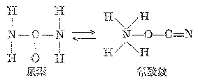

再象蔗糖和麦芽糖，它们重量组成和分子量也是相同的，分子式都是 \( C_{12}H_{22}O_{11} \)，可是它们是两种不同的物质。这种情况，今后我们将有不少地方要碰到。我们把这种现象叫做同分异构现象，这些物质互称为同分异构体。就是分子的组成和分子量完全相同，但分子结构不同，因而性质也不同的物质，叫做同分异构体。分子组成和分子量是确定物质分子式的两个因素，“同分”就是分子组成和分子量相同，也就是分子式相“同”，“异构”就是分子结“构”相“异”。顾名思义，这一个名词就不难理解了。所以，尿素和氰酸铵，蔗糖和麦芽糖是两对同分异构体。

##### 烷属烃的同分异构体

在有机化合物里，随着分子中碳原子数的增加，碳原子结合成为碳链的情况，将会错综复杂起来。在烷属烃里，从丁烷起就可能有同分异构现象了。因为在丙烷分子里3个碳原子结合成为直链的可能方式，只有“-C-C-C-”种，但是当碳原子再增加一个以后，它们连接成链的可能，就有下列两种方式：

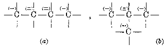

我們在碳原子上标出（一）、（二）、（三）、（四）等記号， 并把这些碳原子分別叫做一級、二級、三級和四級， 表明这种碳原子跟其他碳原子相連接的数目， 一級碳原子和一个其他碳原子相連， 二級碳原子跟二个其他碳原子相連， 依此类推。 在丁烷的第一种結構（a）中， 有二个一級碳原子和二个二級碳原子， 但在第二种結構（b）中， 就有三个一級碳原子和一个三級碳原子。 再从鏈的形狀来看， 前者是成直綫順序連接， 后者就帶着分支， 这种分支叫做支鏈。 要是按照前面用过的几种式子来表示它們的分子， 也可以看出它們的結構显然不同， 如图1·5。

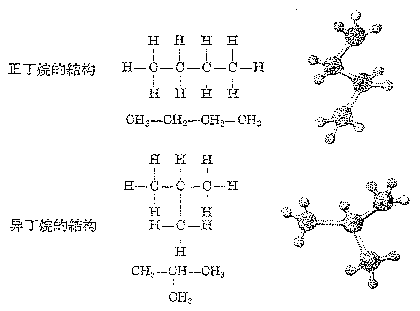

在图1·5中，我们看到了正丁烷、异丁烷两个新的名字，一般烷属烃同分异构体的名称，除仍沿用烷属烃的命名原则，按碳原子数目称为某烷外，把结构中没有支链的，在名称某烷之前，加上“正”字，如上述的正丁烷；有支链的异构体，而且含有三級碳原子的，加上“异”字，如异丁烷；含有四級碳原子的，加上“新”字。习惯上“正”字可以省略掉，因为不是“异”和“新”，自然就是“正”了。所以正丁烷就叫做丁烷。

在化学结构学說創立之前，异丁烷还没有发现。但是布特列洛夫预言具有这种化学结构的物质是存在的，并且通过实验制成了异丁烷。从丁烷和异丁烷的沸点、比重等物理性质来看，它们确是两种不同的物质，由此亦可证明化学结构理論的正确性。

現在我們再进一步研究一下含有五个碳原子的戊烷 \( \left(\mathrm{C}_{5}\mathrm{H}_{12}\right) \)。它的结构就更复杂些，可能有三种结构，如图1·6。

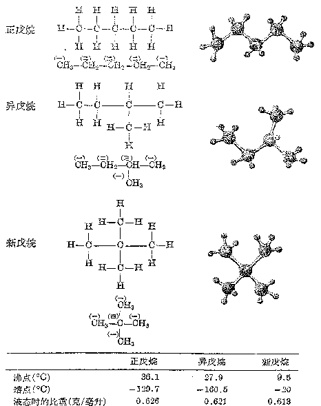

由于鏈烃分子里碳原子数的增加，它們的同分异构体的数目增加得很快。例如己烷（\(\mathrm{C_6H_{14}}\)）有5种异构体，庚烷（\(\mathrm{C_7H_{16}}\)）有9种，辛烷（\(\mathrm{C_8H_{18}}\)）有18种，壬烷（\(\mathrm{C_9H_{20}}\)）有35种，到十四烷（\(\mathrm{C_{14}H_{30}}\)）就可能有1858种。我們知道有含70个碳原子的烷，它的异构体的数目就可能是个天文数字了。这么多的异构体并没有真正去逐个制取，在生产上也没有实际意义，不过表示在理论上确有这种可能罢了。

在有机物領域里，同分异构普遍存在的現象，除可以說明有机物为什么为数众多的原因外，更重要的是充分証明了化学結構学說第三点內容的正确性。

##### 怎样正确书写同分异构体的结构式

要写同分异构体的结构式，必须对分子结构具有空间观念。因为在平面上书写的结构式只是立体结构的投影，并没有体现碳原子间价键的方向性。初学的人，对同一种分子结构，往往会写成多种平面投影。象下面的四种式子（可能还有更多的写法）：

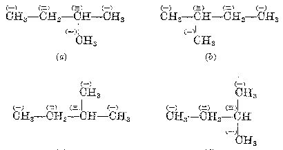

看起来好象各各不同。其实，这些颠倒横竖、上下左右的支链，都不是真正立体結構的方向。我們只要认定碳原子的級数和个数，以及支鏈所在的位置（即三級碳原子的位置），就不难看出，在上面的四种式子里，都是3个一級碳原子，1个二級碳原子和1个三級碳原子，而支链总是在从左起或右起的第二个碳原子上。因此肯定它们都是同一种分子，都是异戊烷。掌握了上面的識別碳原子級数和位置的能力，也就不难写出正确的各种同分异构体的结构式了。象异戊烷，我們习惯上是写成（a）式的。

##### 习题 1·5

1. 如果說， 硫酸和磷酸的分子量都是 98； 乙炔 \(\left(\mathrm{C}_{2} \mathrm{H}_{2}\right)\) 和苯 \(\left(\mathrm{C}_{6} \mathrm{H}_{6}\right)\) 的重量組成都是含碳 \(92.3\%\)， 含氫 \(7.7\%\)， 只是由于分子結構不同， 所以这是两对同分异构体。这种說法为什么不对？ 同分异构体的正确定义是什么？

2. 氧和臭氧的分子都由氧原子构成， 可是结构不同。 它们是同分异构体吗？ 同素异形体和同分异构体有什么不同？ 乙炔和苯是不是同素异形体？

3. 写出三种戊烷异构体的电子式、结构式和结构简式。

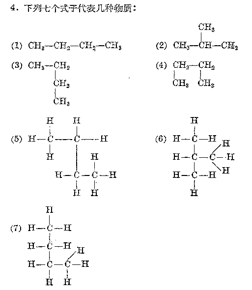

### II． 不饱和链烃

在具有链状分子结构的烃类里，除了饱和链烃以外，还有许多其他系列的化合物，它们分子里氢原子的数目，比相应的烷烃所含有的要少，碳原子的化合价没有被氢原子所饱和。这些烃类叫做不饱和链烃。

不飽和鏈烃分为烯屬烃和炔屬烃。烯屬烃里最简单的化合物是乙烯，現在我們从乙烯学起。

#### § 1·6 乙烯

##### 乙烯的物理性质

乙烯是无色气体， 稍有气味。它的比重是 1.25 克/升， 比空气稍轻， 和相同状况下同体积的空气的重量比是 0.9654。乙烯不易溶解于水。

##### 乙烯的分子结构

根据分析的结果，知道乙烯的分子式是 \( C_{2}H_{4} \)。

乙烯的分子结构，从它的分子式来看，如果碳原子間是单键結合的話，那么，好象碳原子的化合价是2。布特列洛夫根据碳原子是4价的观点出发，曾經通过实验，合成了乙烯，从而揭示了乙烯的分子结构。

实验是用甲烷的卤代物——二碘甲烷跟铜一起加热，得到了一种气态烃：

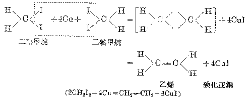

根据作用物 \( CH_{2}I_{2} \) 和 Cu，以及生成物碘化亚铜来看，显然，余下的应当是 \( CH_{2} \)，但是从生成气体的比重（1.25 克/升）来计算出它的分子量是 28 氧单位，要比 \( \mathrm{CH}_{2}(12+1\times2=14) \) 大一倍，可见 \( CH_{2} \) 不能单独存在，乙烯 \( \left(\mathrm{C}_{2}\mathrm{H}_{4}\right) \) 是由两个 \( CH_{2} \) 结合而成的，它的结构式应当是 \( CH_{2}=CH_{2} \)，在两个碳原子间不是共有一对电子，而是共有两对。因此，要用两个短划“=”来表示，“=”叫做双键。这说明在乙烯分子里氢原子数不足，C 和 C 之间是以两个价键自相连接的。乙烯的结构，可用下列各种方式表示：

##### 乙烯的化学性质

乙烯的分子结构，具有不饱和的特点，因此它的化学性质比烷烃要活泼得多，下面是它的一些重要化学性质。

1. 氧化反应 由于双键的存在，乙烯不如相对应的烷烃——乙烷那样稳定，它能被氧化剂所氧化。如把乙烯气体通入紫红色的高锰酸钾溶液，溶液的颜色会很快消失。证明乙烯被强氧化剂高锰酸钾所氧化，而高锰酸钾发生了还原的现象。

乙烯也和其他烃类一样，在空气里能够燃烧而生成二氧化碳和水，当然，这也是氧化反应：

$$
\mathrm{C}_{2}\mathrm{H}_{4}+3\mathrm{O}_{2}\xrightarrow{\text{燃烧}}2\mathrm{CO}_{2}+2\mathrm{H}_{2}\mathrm{O}
$$

由于乙烯的含碳量（85.7%）要比甲烷的（75%）高， 燃烧时一部分碳的微粒， 不能完全氧化， 火焰里含有较多的熾热的碳粒， 因此， 乙烯的火焰要比甲烷的明亮得多。如果把乙烯和氧气按体积1：3混和（或和空气1：15）后燃点， 会立即发生爆炸， 而且比甲烷相应的混和物， 爆炸得还要猛烈。

2. 加成反应 如果把乙烯通入溴水里， 溴水的棕红色就会很快消失。这是由于碳原子间的双键，在溴的作用下裂开，同样溴原子间的结合也拆开了，而使溴原子和碳原子结合成为一种无色的液体——溴化乙烯：

$$
\begin{array}{rl} & \mathrm{H} \\ & \mathrm{H} - \mathrm{C} \\ & \mathrm{H} - \mathrm{C} \\ & \mathrm{H} - \mathrm{C} \\ & \mathrm{H} \end{array} + \begin{array}{rl} & \mathrm{Br} \\ & \mathrm{Br} \\ & \mathrm{Br} \end{array} = \begin{array}{rl} & \mathrm{H} \\ & \mathrm{H} - \mathrm{C} - \mathrm{Br} \\ & \mathrm{H} - \mathrm{C} - \mathrm{Br} \\ & \mathrm{H} \end{array} = \begin{array}{rl} & \mathrm{H} - \mathrm{C} - \mathrm{Br} \\ & \mathrm{H} - \mathrm{C} - \mathrm{Br} \\ \mathrm{H} & \mathrm{H} \end{array}
$$

$$
\left(\mathrm{CH} _ {2} = \mathrm{CH} _ {2} + \mathrm{Br} _ {2} = \mathrm{CH} _ {2} \mathrm{Br} - \mathrm{CH} _ {2} \mathrm{Br}\right)
$$

溴化乙烯

象这一类溴原子跟未饱和的碳原子相結合，把溴原子加到分子里去，并无副产物产生的反应，叫做加成反应。一般說，不飽和化合物的分子能够加上两个或两个以上的原子（或原子团）的化学反应，叫做加成反应。从加成反应亦可看出乙烯的不飽和性。

我們如果用乙烷跟溴反应， 也可以得到同样的产物——\(\mathrm{C}_{2} \mathrm{H}_{4} \mathrm{Br}_{2}\)。但乙烷或其他烷属烃跟卤素发生的是取代反应， 除得到卤代烷外， 还有副产物卤化氢生成。

乙烯不仅能跟卤素发生加成反应，在一定条件下，也能跟氢气加成，生成乙烷；跟氢卤酸加成，生成乙烷的卤代物。它们的反应过程，可用化学方程式表示如下：

$$
\mathrm{H} - \mathrm{C} = \mathrm{C} - \mathrm{H} + \begin{array}{ll} \mathrm{H} & \mathrm{Ni} \\ \mathrm{H} & 40 \sim 150 ^ {\circ} \mathrm{C} \end{array} \mathrm{H} - \mathrm{C} - \mathrm{C} - \mathrm{H}
$$

$$
(\mathrm{CH} _ {2} = \mathrm{CH} _ {2} + \mathrm{H} _ {2} \xrightarrow [ 40 \sim 150 ^ {\circ} \mathrm{C} ]{\mathrm{Ni}} \mathrm{CH} _ {3} - \mathrm{CH} _ {3})
$$

$$
\mathrm{H} - \mathrm{C} = \mathrm{C} - \mathrm{H} + \begin{array}{c} \mathrm{H} \\ \mathrm{Br} \end{array} \xrightarrow [ \mathrm{H} - \mathrm{C} - \mathrm{C} - \mathrm{Br} ]{\mathrm{100°C}} \begin{array}{c} \mathrm{H} \\ \mathrm{Br} \end{array}
$$

$$
\left(\mathrm{CH} _ {2} = \mathrm{CH} _ {2} + \mathrm{HBr} \xrightarrow {100 ^ {\circ} \mathrm{C}} \mathrm{CH} _ {3} \mathrm{CH} _ {2} \mathrm{Br}\right)
$$

溴乙烷从上面这些反应来看，不饱和的有机化合物，不仅能跟单质进行加成，也能跟化合物进行加成。

3. 聚合反应 乙烯的另一种特性是， 在一定条件（1000 大气压， \(200^{\circ} \mathrm{C}\) 温度）下， 它的双键发生裂开， 由自己的分子彼此结合成为长长的单键的碳链（含碳原子数可达 1000 多个）， 反应生成物叫做聚合乙烯， 简称聚乙烯：

$$
\begin{array}{l} \mathrm{CH} _ {2} = \mathrm{CH} _ {2} + \mathrm{CH} _ {2} = \mathrm{CH} _ {2} + \dots = - \mathrm{CH} _ {2} - \mathrm{CH} _ {2} - \\ + - \mathrm{CH} _ {2} - \mathrm{CH} _ {2} - + \dots = - \mathrm{CH} _ {2} - \mathrm{CH} _ {2} - \mathrm{CH} _ {2} - \mathrm{CH} _ {2} - \dots \\ [ n \mathrm{CH} _ {2} = \mathrm{CH} _ {2} = (- \mathrm{CH} _ {2} - \mathrm{CH} _ {2} -)， n ] \\ \end{array}
$$

聚乙烯

聚乙烯是一种半透明的固体优良塑料，具有绝缘、耐酸和耐腐蚀的性能，在无线电器材和化学工业上有很广泛的用途。

上面这种由两个以上简单的相同分子（即低分子量物质的分子）发生加成反应，化合成一个较复杂的分子（即高分子量物质的分子）的过程，叫做聚合反应。可以起聚合反应的低分子量物质，称为单体，所生成的高分子量物质，称为聚合物。上面的聚合反应中，聚乙烯就是聚合物，乙烯是它的单体。

研究有机物的聚合作用，是发展近代有机化学工业的一个重要方向，象各种塑料、合成橡胶和合成纤维等产品都是根据这种反应原理来制成的。这些高分子化合物将在本册第五章讨论。

##### 乙烯的用途

利用乙烯的不饱和性， 可以跟水加成制取酒精[^ch1-07]； 跟氯气加成制成一种能溶解油脂的溶剂， 叫做氯化乙烯（二氯乙烷） \(\mathrm{CH}_{2} \mathrm{Cl}-\mathrm{CH}_{2} \mathrm{Cl}\)； 在高压下聚合则制得聚乙烯， 已如上述。

所以，乙烯是一种重要的化工原料。

乙烯还能催熟果实（番茄、檸檬等）。为了防止在运输途中果实腐烂，可以把生果运到目的地后，再用少量乙烯混入存放果实的房间的空气中，予以催熟，以免损失。

##### 乙烯的制取

乙烯可以用濃硫酸跟酒精混和后加热到160～180℃，使酒精脱水而成：

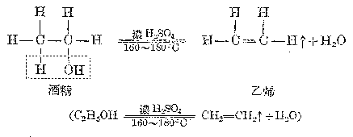

在实验室里，可作如下的实验来制得乙烯，并检验它的性质：

取蒸馏烧瓶一只，配单孔塞附 \( 200^{\circ} \) C 温度计，在瓶的支管上串联两只大试管，装置如图 1·8。

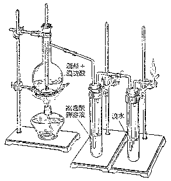

在烧瓶中盛入酒精和濃硫酸的混和液（体积1：3）80毫升，并加入砂子少许（砂子有催化作用，并能防止液体的突然沸腾）。在两个试管中，分别注入淡紫色的高锰酸钾酸性溶液（在高锰酸钾稀溶液里加稀硫酸数滴）和淡棕红色的溴水各约1/5管。把仪器装好，注意温度计的水银球应当插入混和液里，然后小心加热，使温度超过160℃，就有无色气体（乙烯）发生。当气体通过二种溶液后，二种液体的颜色均逐渐消失。在尖嘴管口点火，可见逸出气体能够燃烧，发出明亮的火焰。凡此种种现象，都证实了我们所曾讨论的乙烯的性质。

工业上所用的乙烯，它的主要来源是石油加工时产生的气体，因为其中含有大量乙烯。

#### § 1·7 烯属烃

在不飽和鏈烴这一大类里，凡是含有一个双鍵的都属于烯屬烃，乙烯是烯屬烴里最简单的一种。表1·3列出几种乙烯的同系物：

表 1·3

| 名称 | 結構簡式 | 在常温下的状态 | 熔点°C | 沸点°C | 在液态下的比重 |
| --- | --- | --- | --- | --- | --- |
| 乙烯 | \( CH_2=CH_2 \) | 气体 | -169.4 | -102.4 | 0.6100 |
| 丙烯 | \( CH_3-CH=CH_2 \) | 气体 | -185 | -47.7 | 0.6104 |
| 丁烯 | \( CH_3-CH_2-CH=CH_2 \) | 气体 | -130 | -6.5 | 0.6255 |
| 戊烯 | \( CH_3-CH_2-CH_2-CH=CH_2 \) | 液体 | -138 | 30.1 | 0.6429 |
| 己烯 | \( CH_3-CH_2-CH_2-CH_2-CH=CH_2 \) | 液体 | -98.5 | 63.5 | 0.6747 |

从上表可以看出，烯烃的同系物之间，也是彼此相差一个或几个 \( CH_{2} \) 原子团，这种递变规律，和烷烃一样。随着烯烃分子量的增大，同系物的熔点和沸点逐渐增高，状态从气体到液体。液态时的比重也逐渐加大。烯烃的同系物具有相似的不饱和性（被高锰酸钾氧化、跟溴水加成），而又具有不同的物理性质。

烯烃分子里含有一个双键，它们比含有相同碳原子数的烷烃要少2个氢原子。因此，烯烃的通式是 \( C_{n}H_{2n}(n\geqslant2) \)，也就是在烯烃分子里氢原子数是碳原子数的两倍。

烯烃除由于碳链增长，碳原子结合状况不同而也产生同分异构现象外，还可能因双键位置改变而形成不同的结构，如丁烯 \( \left(\mathrm{C}_{4}\mathrm{H}_{8}\right) \) 就有三种结构如下：

$$
\mathrm{CH} _ {3} - \mathrm{CH} _ {2} - \mathrm{CH} = \mathrm{CH} _ {2}， \quad \mathrm{CH} _ {3} - \mathrm{CH} = \mathrm{CH} - \mathrm{CH} _ {3}，
$$

$$
\begin{array}{c} \mathrm{CH} _ {3} \\ \mathrm{CH} _ {3} \end{array} \mathrm{C} = \mathrm{CH} _ {2}
$$

这三种丁烯具有不同的物理性质，互为同分异构体。

烯属烃也是根据分子里碳原子数的多少来命名的。凡是烯属烃的同系物，都称做“烯”[^ch1-08]。它们相互的区别，可以在“烯”字之前，加上碳原子数的序号。2到10个碳原子，用乙、丙、丁等“天干”为序号，如丙烯 \( \left(\mathrm{C}_{3}\mathrm{H}_{6}\right) \) 、丁烯 \( \left(\mathrm{C}_{4}\mathrm{H}_{8}\right) \) 、……等。含碳原子在十一个以上，用数字为序号。由于烯属烃都是有双键的，而且双键是在碳原子之间，所以至少要有两个碳原子，因此乙烯是最简单的烯烃。

在烯烃分子里去掉一个氢原子，留下的部分就是一价的烯烃基。烯烃基的命名，和烷烃相似。象乙烯分子里去掉一个氢原子后，余下的 \( CH_{2}=CH \) 一部分，就叫做“乙烯基”。其余类推。

##### 习题 1·6～1·7

1. 分别写出丙烯跟溴水、氢气反应的化学方程式。

2. 用什么方法可以证明乙烯的结构式？

3. 比较丙烯和丙烷的化学性质，有哪些相似和哪些不同？

4. 计算相同体积的乙烯和甲烷当分别燃烧时，所需要空气量之比。

［提示：根据它们跟氧气反应的化学方程式计算。］

5. 写出乙烯跟氯化氢的反应方程式，用结构式表示。

6. 工业上制造氯乙烷，为什么不用乙烷跟氯气取代，而用乙烯跟氯化氢加成？

7. 乙烯和一氧化碳都是无色、不溶于水的气体，燃烧后都生成二氧化碳。有什么方法可以区别这两种气体？

8. 某种烯烃的比重是一氧化碳的二倍，求这种烯烃的分子式。并写出各种同分异构体的结构简式。

［提示：运用烯烃的通式。］

#### § 1·8 乙炔

在不饱和链烃里，除烯属烃外，还有炔属烃。它們分子里的氫原子的数目，比相应的烯經所含有的还要少。炔属烃里最簡單的化合物是乙炔。

我們在学习碳元素的性质时（第一册 §3·3），知道碳在高温下能跟金属化合生成金属的碳化物。其中最有价值的是碳化钙 \( \left(\mathrm{CaC}_{2},\text{俗称电石}\right) \)。碳化钙跟水作用，就产生乙炔。

乙炔的物理性质 乙炔俗称电石气， 是一种无色、无嗅[^ch1-09]的气体。它的比重是1.16克/升， 比空气稍轻些， 在相同状况下和同体积的空气的重量比是0.8966。乙炔略溶于水。

乙炔的分子结构 乙炔的分子式是 \( C_{2}H_{2} \)，它分子里的氢原子数，显然比乙烯还要少。也就是说，乙炔分子里的碳原子的化合价更不饱和。根据碳原子是4价和实验的结果推知，在乙炔分子里的2个碳原子之间，共用3对电子，写它的结构式时用三个短划“≡”来表示，这叫做叁键。乙炔的化学性质，确是符合于这个推论的。因此，乙炔的分子结构，可以用下列各种图式表示：

乙炔的化学性质 由于分子结构里存在着叁键，它的性质显得比乙烯更活潑。

1. 氧化反应 和乙烯一样，乙炔也很容易被氧化剂所氧化，所以它也能使高锰酸钾溶液褪色，由此亦可看出，不饱和链烃的不稳定性，是由于分子中存在着双键和叁键的缘故。

乙炔在空气里燃烧，也生成二氧化碳和水：

$$
2 \mathrm{C} _ {2} \mathrm{H} _ {2} + 5 \mathrm{O} _ {2} \xrightarrow {\text {燃烧}} 4 \mathrm{CO} _ {2} + 2 \mathrm{H} _ {2} \mathrm{O}
$$

由于乙炔的含碳量（92.7%）比甲烷、乙烯都要高些（相应的含氢量就比较少），当它在空气里燃烧时，碳来不及氧化，因而产生浓烟，火焰也特别光亮，可以用来照明。

乙炔在氧气里燃烧时，火焰温度可达 \( 3000^{\circ}C \) 左右，称氧炔焰，可用来焊接或切割金属，这在第一册 §2·4 里已讲过了。

2. 加成反应 和乙烯相似，乙炔也能跟氢气、卤素、卤化氢和水等物质发生加成反应，所以，乙炔也能使溴水褪色。乙炔跟溴的反应，可以分步表明如下：

$$
\begin{array}{ccc} \mathrm{H} - \mathrm{C} & \mathrm{Br} & \mathrm{H} - \mathrm{C} - \mathrm{Br} \\ \| & + & = \\ \mathrm{H} - \mathrm{C} & \mathrm{Br} & \mathrm{H} - \mathrm{C} - \mathrm{Br} \\ & & \mathrm{Br} \\ \mathrm{H} - \mathrm{C} - \mathrm{Br} & \mathrm{Br} & \mathrm{H} - \mathrm{C} - \mathrm{Br} \\ \| & + & = \\ \mathrm{H}： \mathrm{C} - \mathrm{Br} & \mathrm{Br} & \mathrm{H} - \mathrm{C} - \mathrm{Br} \\ & & \mathrm{Br} \end{array}
$$

$$
\left(\mathrm{C} _ {2} \mathrm{H} _ {2} + 2 \mathrm{Br} _ {2} = \mathrm{CHBr} _ {2} - \mathrm{CHBr} _ {2}\right)
$$

溴化乙炔（四溴乙烷）

从上式中可以看出，乙炔的每1分子可以加入4个溴原子形成饱和的卤代烷。这一事实，有力地证明了它分子里存在着叁键。

乙炔跟氢气一同加热，在镍粉的催化下，能逐步加成，先成乙烯，最后成为乙烷：

$$
\mathrm{CH}\equiv\mathrm{CH}+\mathrm{H}_{2}\xrightarrow{\mathrm{Ni}}\mathrm{CH}_{2}=\mathrm{CH}_{2}
$$

$$
\mathrm{CH} _ {2} = \mathrm{CH} _ {2} + \mathrm{H} _ {2} \xrightarrow {\mathrm{Ni}} \mathrm{CH} _ {3} - \mathrm{CH} _ {3}
$$

乙炔跟氯化氢进行加成反应， 可以生成氯乙烯， 这个反应在普通情况下进行比较困难， 但当有催化剂（氯化汞 \(\mathrm{HgCl}_{2}\)） 存在时， 就能顺利进行：

$$
\mathrm{CH} \equiv \mathrm{CH} + \mathrm{H} - \mathrm{Cl} \xrightarrow {\mathrm{HgCl} _ {2}} \mathrm{CH} _ {2} = \mathrm{CHCl}   \text {   氯乙烯   }
$$

氯乙烯是一种无色气体，在光和热的作用下，能象乙烯那样，聚合成为高分子的聚氯乙烯：

$$
\begin{array}{l} \mathrm{CH} _ {2} = \mathrm{CHCl} + \mathrm{CH} _ {2} = \mathrm{CHCl} + \dots \\ = - \mathrm{CH} _ {2} - \mathrm{CHCl} - + - \mathrm{CH} _ {2} - \mathrm{CHCl} - + \dots \\ = - \mathrm{CH} _ {2} - \mathrm{CHCl} - \mathrm{CH} _ {2} - \mathrm{CHCl} - + \dots \\ [ n \mathrm{CH} _ {2} = \mathrm{CHCl} = (- \mathrm{CH} _ {2} - \mathrm{CHCl} -)， ] \\ \end{array}
$$

聚氯乙烯是一种应用很广泛的塑料，在第五章里还要讨论。

乙炔跟水进行加成，则生成乙醛。在学习第二章烃的衍生物时（§2·10）再作讨论。

3. 聚合反应 乙炔在不同条件下，可以发生不同的聚合反应，生成不同的聚合物。其中最重要的聚合物之一是乙烯基乙炔 \( \left(\mathrm{CH}_{2}=\mathrm{CH}-\mathrm{C}=\mathrm{CH}_{2}\right) \) [^ch1-10]，可以看作是乙烯基 \( \left(\mathrm{CH}_{2}=\mathrm{CH}-\right) \) 代换了乙炔分子里的一个氢原子，成为二分子乙炔的聚合物：

$$
2\mathrm{CH}\equiv\mathrm{CH}\xrightarrow{\mathrm{CuCl}_{2}}\mathrm{CH}_{2}=\mathrm{CH}-\mathrm{C}\equiv\mathrm{CH}\qquad\text{乙烯基乙炔}
$$

乙炔通过加热到 \( 600^{\circ}C \) 的装有活性炭的管子里时，能聚合成苯 \( \left(\mathrm{C}_{6}\mathrm{H}_{6}\right) \)：

$$
3 \mathrm{C} _ {2} \mathrm{H} _ {2} \xrightarrow [ 600 ^ {\circ} \mathrm{C} ]{\text {活性炭}} \mathrm{C} _ {6} \mathrm{H} _ {6}
$$

乙炔的制取 乙炔是气焊（或气割）金属的燃料（第一册 §2·4）， 又是制造塑料和合成有机物的原料。工业上或实验室里都是用碳化钙跟水反应来制取乙炔的：

$$
\left[ \mathrm{CaC} _ {2} + 2 \mathrm{H} _ {2} \mathrm{O} = \mathrm{C} _ {2} \mathrm{H} _ {2} + \mathrm{Ca(OH)} _ {2} \right]
$$

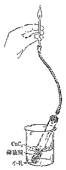

在实验室里制取乙炔的装置很简单，用一支底上有孔的试管，里面填入一些碎玻璃片，放进几块碳化钙，再配一个带有导管的单孔塞，连接橡皮管和尖嘴玻管，把这支试管插入盛有水的烧杯中，装置如图1·10。当水面接触到碳化钙时，就有乙炔产生，从尖嘴逸出。

产生乙炔后，把橡皮管弯过来，使尖嘴管插入盛有高锰酸钾酸性溶液的试管里，溶液的紫红色很快就会消失。再把乙炔通入溴水里，溴水的棕红色也会很快消失。最后在尖嘴管口点火，乙炔能在管口燃烧，发出明亮的火焰和濃烟。这些实验结果，都证明了上面所叙述的乙炔所具有的性质。

#### § 1·9 炔属烃，不饱和链烃的通性

##### 炔属烃

我們已知道，炔属烃是不飽和鏈烃的另一类。炔属烃分子里都有一个叁键，乙炔是其中最简单的一种。表1·4是乙炔的几种同系物。

| 名称 | 分子式 | 结构简式 | 在常温下的状态 | 熔点°C | 沸点°C | 在液态下的比重 |
| --- | --- | --- | --- | --- | --- | --- |
| 乙炔 | \( C_2H_2 \) | \( CH \equiv CH \) | 气体 | -81.8 | -83.4 | 0.6179 |
| 丙炔 | \( C_3H_4 \) | \( CH_3-C \equiv CH \) | 气体 | -101.5 | -23.3 | 0.6714 |
| 丁炔 | \( C_4H_6 \) | \( CH_3-CH_2-C \equiv CH \) | 气体 | -122.5 | 8.6 | 0.6682 |
| 戊炔 | \( C_5H_8 \) | \( CH_3-CH_2-CH_2-C \equiv CH \) | 液体 | -96 | 30.7 | 0.6950 |

从表中可以看出，炔烃的同系物之間，也是彼此相差一个或几个 \( CH_{2} \) 原子团，这种递变规律，和烷烃、烯烃一样。炔烃的同系物，具有相似的不饱和性（能被氧化剂氧化、跟溴水加成），而又具有不同的物理性质。随着炔烃分子量的增大，同系物的状态，从气体到液体。熔点和沸点，液态时的比重一般都是依次渐变的。

炔烃分子里有一个叁键， 所以， 它们所含有的氢原子数， 比碳原子数相同的烯烃还要少两个。因此， 炔属烃的通式是 \(\mathrm{C}_{n} \mathrm{H}_{2 n-2}\) （\(n \geqslant 2\)）。

和烯属烃一样，炔属烃也可以由于碳键的增长和叁键的位置不同而产生同分异构现象。如丁炔就可能有 \( CH_{3}-CH_{2}-C\equiv CH \) 和 \( CH_{3}-C\equiv C-CH_{3} \) 两种结构，它们是具有不同物理性质的同分异构体。

炔属烃 也是根据分子里碳原子数的多少来命名的。凡是炔属烃的同系物都称做“炔”[^ch1-11]。它们相互的区别，也是用“天干”（十一个以上用数字）表示碳原子数的序号，加在“炔”字之前。例如丁炔 \( \left(\mathrm{C}_{4}\mathrm{H}_{6}\right) \)，戊炔 \( \left(\mathrm{C}_{5}\mathrm{H}_{8}\right) \)，……等。由于炔属烃都有一个叁键，而且叁键是在碳原子之间，所以至少要有两个碳原子，因此，乙炔是最简单的炔烃。

##### 不饱和链烃的通性

不饱和链烃的性质要比烷属烃活动。至于烯属烃和炔属烃之间的区别，主要体现在加成反应时的不饱和程度上。不飽和链烃的通性，可以概括为下列几点：

（1） 燃燒时火焰要比飽和链烃明亮。

（2） 能被高錳酸鉀溶液所氧化，而使高錳酸鉀溶液褪色。

（3） 能跟溴水发生加成反应，使溴水褪色。也能跟其他卤素、氢气、卤化氢、水等物质进行加成。

（4） 能起聚合反应。

不飽和链烃的这些性质，显然和它們分子里的双鍵和叁鍵的容易裂开是分不开的。用高錳酸鉀溶液或溴水作为試剂，可以檢驗某种链烃是否飽和；能使高錳酸鉀溶液或溴水褪色的，就是不飽和链烃，否則是飽和链烃。

由于不飽和链烃的活動性很强，所以常用作合成其他有机物的原料。

##### 习题 1·8～1·9

1. 乙炔怎样制取？有什么用途？

2. 写出丙炔的电子式和结构式。

3. 某种炔烃它和相同状况下同体积的氢气的重量比是 27。求它的分子式，并写出名称。

4. 要制造一吨碳化钙，理论上需用多少吨焦炭和石灰石？

［提示：工业上制取碳化钙的反应是

$$
\mathrm{CaO} + 3 \mathrm{C} \xrightarrow {\text {高温}} \mathrm{CaC} _ {2} + \mathrm{CO} \uparrow
$$

CaO 来自石灰石 \( CaCO_{3} \)。

5. 10 克纯净的碳化钙跟水反应，在压力为 756 毫米，温度为 \( 20^{\circ}C \) 时，能产生多少升乙炔？

6. 用结构简式写出丙炔跟溴的加成反应的方程式。

7. 怎样证明乙炔分子具有叁键？

8. 如果說，“根據烯屬烴的通式来推導，当 \(n = 1\) 时，\(\mathrm{C}_{n} \mathrm{H}_{2n} = \mathrm{CH}_{2}\)，所以 \(\mathrm{CH}_{2}\) 应当叫做甲烯”。这样說法对不对？为什么？

9. 乙炔跟氯化氢的加成产物有什么用途？

### III． 环烃

上面我們已經学习了烷、烯、炔等烃类，它們有一个共同的特點，就是分子結構都成鏈状的，总称为鏈烃。烃类的分子結構，除了鏈狀以外，还有环状的。我們把具有环状結構的烃叫做环烃。这里將先討論环烃中的一个大类，环烷烃。

#### § 1·10 环烷烃

##### 环烷烃的分子结构

环烷烃分子里的碳原子，彼此都以单键结合。如以环丙烷 \( \begin{array}{c} CH_{2} \\ | \\ H_{2}O-CH_{2} \end{array} \) 的结构和丙烷的结构相比，由丙烷两端的碳原子，各少掉一个氢原子，然后结合起来，就成为环状。表1·5把几种含有相同碳原子数的烷烃、烯烃和环烷烃的分子结构，作一比较。

从表中可以看出：

（1） 环烷烃是一类具有环状结构的饱和链烃，在它们的分子里，碳原子间都是以单键相结合。环有大小，可以从三个碳原子起直到六个碳原子以上。

（2） 环烷烃要比相应的烷烃少掉两个氢原子，它们的通式和烯烃一样，都是 \( C_{n}H_{2n} \)，因此环烷烃和相应的烯烃就互为同分异构体。

##### 环烷烃的性质和制取

在环烷烃的分子里，碳原子的化合价是饱和的，因此它们的化学性质和烷烃相似。例如环烷烃在常温下不能被氧化剂（如高锰酸钾溶液）所氧化，跟卤素只能起取代反应等等。

低分子的环烷烃如环丙烷和环丁烷，可以由合成法制备。环戊烷、环己烷，……等存在于某些地区的石油矿藏中，如我国甘肃玉门油矿的石油，就是环烷烃和烷烃的混和物。

表1·5

| 烃类 | 名称 | 分子式 | 结构简式 |
| --- | --- | --- | --- |
| 烷烃 | 丙烷 | \(\mathrm{C_3H_8}\) | \(\mathrm{CH_3-CH_2-CH_3}\) |
| 烯烃 | 丙烯 | \(\mathrm{C_3H_6}\) | \(\mathrm{CH_3-CH=CH_2}\) |
| 环烷烃 | 环丙烷 | \(\mathrm{C_3H_6}\) | 三个 \(\mathrm{CH_2}\) 首尾相连成环 |
| 烷烃 | 丁烷 | \(\mathrm{C_4H_{10}}\) | \(\mathrm{CH_3-(CH_2)_2-CH_3}\) |
| 烯烃 | 丁烯 | \(\mathrm{C_4H_8}\) | \(\mathrm{CH_3-CH_2-CH=CH_2}\) |
| 环烷烃 | 环丁烷 | \(\mathrm{C_4H_8}\) | 四个 \(\mathrm{CH_2}\) 首尾相连成环 |
| 烷烃 | 戊烷 | \(\mathrm{C_5H_{12}}\) | \(\mathrm{CH_3-(CH_2)_3-CH_3}\) |
| 烯烃 | 戊烯 | \(\mathrm{C_5H_{10}}\) | \(\mathrm{CH_3-(CH_2)_2-CH=CH_2}\) |
| 环烷烃 | 环戊烷 | \(\mathrm{C_5H_{10}}\) | 五个 \(\mathrm{CH_2}\) 首尾相连成环 |
| 烷烃 | 己烷 | \(\mathrm{C_6H_{14}}\) | \(\mathrm{CH_3-(CH_2)_4-CH_3}\) |
| 烯烃 | 己烯 | \(\mathrm{C_6H_{12}}\) | \(\mathrm{CH_3-(CH_2)_3-CH=CH_2}\) |
| 环烷烃 | 环己烷 | \(\mathrm{C_6H_{12}}\) | 六个 \(\mathrm{CH_2}\) 首尾相连成环 |
| 烷烃 | \(n\) 烷 | \(\mathrm{C_nH_{2n+2}}\ (n\geq1)\) | \(\mathrm{CH_3-(CH_2)_{n-2}-CH_3}\) |
| 烯烃 | \(n\) 烯 | \(\mathrm{C_nH_{2n}}\ (n\geq2)\) | \(\mathrm{CH_3-(CH_2)_{n-3}-CH=CH_2}\) |
| 环烷烃 | 环 \(n\) 烷 | \(\mathrm{C_nH_{2n}}\ (n\geq3)\) | \(n\) 个 \(\mathrm{CH_2}\) 首尾相连成环 |

<!-- 以下为已由上表取代的损坏 raw OCR 表格

<table><tr><td rowspan="2">名称</td><td rowspan="2">形态</td><td rowspan="2">结构</td><td rowspan="2">固定</td><td rowspan="2">名称</td><td rowspan="2">固定</td><td rowspan="2">分布式</td><td rowspan="2">繁殖</td><td colspan="2">子实体</td><td colspan="2">生殖</td></tr><tr><td>精</td><td>菌</td><td>式</td><td>名称</td><td>生殖</td></tr><tr><td>丙烷</td><td>\( C_6H_8 \)</td><td>\( CH_3-CH_2-CH_3 \)</td><td>\( OH_2-CH_2-CH_3 \)</td><td>同烯</td><td>\( C_6H_8 \)</td><td>\( CH_3-CH_2-CH_3 \)</td><td>\( OH_2-CH_2-CH_2 \)</td><td>环丙烷</td><td>\( C_6H_8 \)</td><td>\( OH_2 \)</td><td></td></tr><tr><td>丁烷</td><td>\( C_6H_{10} \)</td><td>\( CH_2-(CH_2)_2-CH_3 \)</td><td>丁烯</td><td>\( C_6H_8 \)</td><td>\( CH_3 \)</td><td>\( OH_2-CH_2-CH_2-CH_2 \)</td><td>环丁烷</td><td>\( C_6H_8 \)</td><td>\( H_2O-CH_2 \)</td><td></td><td>\( H_2O-CH_2 \)\( H_2O-CH_2 \)</td></tr><tr><td>戊烷</td><td>\( C_6H_{12} \)</td><td>\( OH_2-(CH_2)_3-CH_3 \)</td><td>戊烯</td><td>\( C_6H_{12} \)</td><td>\( OH_2-(CH_2)_3-CH_2-CH_2 \)</td><td>环戊烷</td><td>\( C_6H_{10} \)</td><td>\( CH_2 \)\( H_2O-CH_2 \)</td><td>\( H_2O \)\( CH_2 \)\( H_2O \)</td><td>\( CH_2 \)\( CH_2 \)\( H_2O \)</td><td>\( CH_2 \)\( CH_2 \)\( H_2O \)</td></tr><tr><td>己烷</td><td>\( C_6H_{14} \)</td><td>\( OH_2-(CH_2)_4-CH_3 \)</td><td>己烯</td><td>\( C_6H_{12} \)</td><td>\( CH_2 \)\( CH_2 \)\( CH_2 \)\( CH_2 \)\( CH_2 \)\( CH_2 \)\( CH_2 \)\( CH_2 \)（\( \geqslant 3 \)）</td><td>\( CH_2 \)\( CH_2 \)\( CH_2 \)\( CH_2 \)\( CH_2 \)\( CH_2 \)\( CH_{12} \)</td><td>环己烯</td><td>\( CH_2 \)\( CH_2 \)\( CH_2 \)\( CH_2 \)\( CH_2 \)\( CH_2 \)\( CH \)</td><td>\( CH_2 \)\( CH_2 \)\( CH_2 \)\( CH_2 \)\( CH_2 \)\( CH_2 \)\( CH_2 \)\( CH_2 \)（\( \geqslant 3 \)）</td></tr><tr><td>n</td><td>烯</td><td>\( CH_2 \)\( CH_2 \)\( CH_2 \)\( CH_2 \)\( CH_2 \)\( CH_2 \)\( (n \geqslant 1) \)</td><td>\( CH_2 \)\( CH_2 \)\( CH_2 \)\( (CH_2)n-2 \)\( CH_2 \)\( (CH_2)n-2 \)\( CH_2 \)\( (CH_2)n-2 \)\( CH_2 \)（\( \geqslant 3 \)）</td><td>\( CH_2 \)\( CH_2 \)\( (CH_2)n-2 \)\( CH_2 \)\( (CH_2)n-2 \)\( (CH_2)n-2 \)\( (CH_2)n-2 \)\( (CH_2)n-2 \)\( (CH_2) \)</td><td>\( CH_2 \)\( CH_2 \)\( (CH_2)n-2 \)\( (CH_2)n-2 \)\( (CH_2)n-2 \)</td><td>\( CH_2 \)\( CH_2 \)\( (CH_2)n-2 \)\( (CH_2)n-2 \)\( (CH) \)</td><td>\( CH_2 \)\( CH_2 \)\( (CH_2)n-2 \)\( (CH_2)n-2 \)\( (OH) \)</td><td>\( CH_2 \)\( CH_2 \)\( (CH_2)n-2 \)\( (OH) \)</td><td>\( CH_2 \)\( CH_2 \)\( (CH_2)n \)</td><td>\( CH_2 \)\( CH_2 \)\( (CH_2)n \)</td><td>\( CH_2 \)\( CH_2 \)\( (OH) \)</td><td>\( CH_2 \)\( CH_2 \)\( (CH_2)n \)</td><td>\( CH_2 \)\( (OH) \)</td><td>\( CH_2 \)\( CH_2 \)\( (CH_2)n \)</td><td>\( CH_3 \)\( (OH) \)</td><td>\( CH_3 \)\( (OH) \)</td></tr></table>

-->

#### § 1·11 苯

环烃的另一大类是芳香烃。苯是最简单的芳香烃。芳香烃是芳香族化合物的母体。我们现在先研究苯。

##### 苯的物理性质

苯是一种无色液体，带有象汽油那样的特殊气味。比水轻，比重是0.87克/毫升。沸点是80.4℃，熔点是5.4℃。用冰来冷却，就能凝固成无色晶体。苯不溶于水，但能溶于乙醚。

##### 苯的分子结构

根据分析结果，求得苯的分子式是 \( C_{6}H_{6} \)。

从这个分子式来看， 分子里碳原子的化合价， 远远没有达到饱和， 与烷属烃的通式 \(C_{n}H_{2n+2}\) 来比较， 相差 8 个氢原子。但是通过实验， 证明苯既不会被高锰酸钾溶液所氧化， 又不会跟溴水起加成反应， 它的性质好象和饱和链烃相似。这种表面看来好象矛盾的现象， 是由于苯分子具有特殊结构的缘故。

上面讲过乙炔的聚合反应 （\( §1\cdot8 \)）： 在氯化铜催化下， 二个乙炔分子可以聚合成一个乙烯基乙炔分子 （\( CH_{2}=CH-C\equiv CH \)）； 在活性炭催化下， 三个乙炔分子可以聚合成一个苯分子。要是苯分子的结构， 也象链状的乙烯基乙炔那样的话， 根据乙炔的叁键裂开后再行结合的可能， 苯的结构应该是

$$
\mathrm{CH}_{2}=\mathrm{CH}-\mathrm{C}\equiv\mathrm{C}-\mathrm{CH}=\mathrm{CH}_{2}
$$

或 \( CH \equiv C-CH_{2}-CH_{2}-C \equiv CH \)

在这两种设想的链状结构里，都含有双键或叁键，它们的性质就应该象烯烃或炔烃那样，能跟高锰酸钾溶液或溴水反应。但是实验结果不是如此。因此可以证明，由三个乙炔分子聚合的苯，不可能是链状结构。

那末乙炔是怎样聚合成苯的呢？从乙炔的结构来推论，三个乙炔分子，它们都具有一个叁键，在相同的条件下，应当发生相同的变化，每一个乙炔分子的叁键都裂开了一个价键，而保留一个双键。碳原子在一个键裂开之后和另一个分子的碳原子相结合，因此，6个碳原子間就成为三个单键和三个双键的环。乙炔的聚合过程可以表示如下：

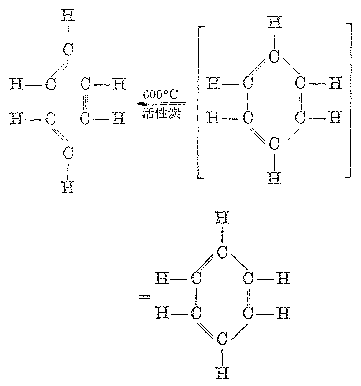

苯的分子结构在下面讲到苯的化学性质时，还可以进一步得到证明。苯的结构可以用下列几种式子表示：

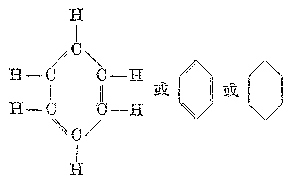

这种特殊的结构，叫做苯环。凡是在分子里含有一个或几个苯环的有机物，叫做芳香族化合物。

“芳香”两字是沿用的旧名。远在有机化学发达以前，人们就已从一些芳香的树脂中提炼出多种具有芳香气味的物质，把它们统称为芳香族化合物。后来研究这些物质的分子结构，发现它们都是属于一种叫做苯的有机化合物的衍生物。于是芳香族化合物这个名称就被沿用下来，专指苯和苯的衍生物。实际有许多苯的衍生物，不仅没有香味，甚至还有难闻的臭味。所以，这个名称，应当从结构的角度上去领会它的意义而不要“以辞害意”。

##### 苯的化学性质

1. 氧化反应 苯能在空气里燃烧，生成二氧化碳和水。这是烃类的一般通性。燃烧时火焰明亮并发生濃烟，和乙炔的燃烧相似，这也是由于含碳量较多的缘故。苯不会被高锰酸钾所氧化，即使加热，也不起反应。这说明苯环结构具有相当高的稳定性。虽然有三个双键存在，却并不象不饱和链烃那样活动。

2. 取代反应 苯分子里的氢原子在一定条件下，能被卤素原子或其他原子团所取代，成为苯的衍生物。例如，苯和溴可以发生取代反应而生成溴苯。

取大試管一支，配单孔塞，在孔内插一支导管，导管另一端插入盛有蒸餾水的小試管中，并使导管口接近水面但不要浸入水中。装置如图1·11.

在大試管里盛入苯1毫升和液溴1毫升，并无反应发生。拔下塞子加入小鉄釘数只，再塞上塞子，則作用漸趋猛烈，管内溶液发生沸騰状态。临近水面的导管口出現白雾，这是生成的溴化氫遇着水气的現象。待反应完毕，把大試管里的液体倒入盛有冷水的燒杯里，經過几次洗滌，可以得到无色、比水重的溴苯沉在杯底。再向小試管的水中加入硝酸銀溶液数滴，有淺黃色沉淀生成，这是溴化銀，証明反应的副产物是溴化氫。

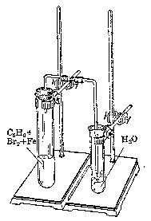

苯跟溴的反应过程的化学方程式如下：

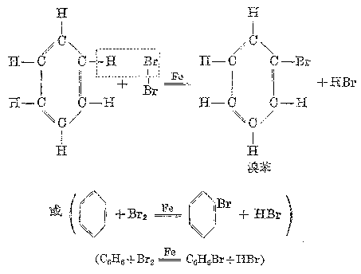

必須注意， 进行上面这个反应， 我們要用液态溴， 不可用溴水， 因为苯跟溴水是不起反应的。我們知道烯烃和炔烃能跟溴水起加成反应， 而使溴水褪色。由此可見， 苯的性质比烯烃、炔烃要穩定。

在其他催化剂的作用下，苯也能跟其他卤素起取代反应，生成各种苯的卤代物及卤化氢。从苯能跟卤素起取代反应，而又不会跟溴水或高锰酸钾起反应等方面来看，苯的性质有些象饱和链烃。

3. 加成反应 上面讲过苯不会使溴水褪色， 不象不饱和链烃那样易于加成， 但是把苯的蒸气和氢气混和， 通过热的装有镍粉作为催化剂的管子时就能进行加成反应， 生成环己烷。

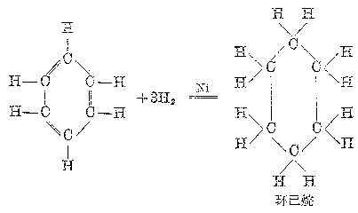

$$
\left(\mathrm{C} _ {6} \mathrm{H} _ {6} + 3 \mathrm{H} _ {2} \xrightarrow {\mathrm{Ni}} \mathrm{C} _ {6} \mathrm{H} _ {12}\right)
$$

从这个反应来看，可以进一步证明苯的分子结构是环状。因为如果是链状的话，应该每个苯分子中要跟8个氢原子加成，才能达到饱和。生成物应该是链烃——己烷 \( \left(\mathrm{C}_{6}\mathrm{H}_{14}\right) \)。现在实验的结果，一个苯分子只是和6个氢原子进行加成，而生成的是环己烷 \( \left(\mathrm{C}_{6}\mathrm{H}_{12}\right) \)。因此足证苯分子的结构不是链状而是环状，并且具有三个双键。

从苯跟氢气的加成反应这一点来看，它的性质又和不饱和链烃很相似，不过从反应条件来比较，显得比不饱和烃难于进行。

总之，苯是既具有饱和烃的性质，又具有不饱和烃的性质，而且它进行取代反应比饱和烃要容易，进行加成反应比不饱和烃要困难。

#### § 1·12 苯的同系物

##### 几种重要的苯的同系物

苯的同系物，可以看作是苯分子里的一个或几个氢原子，被各种烃基取代以后的产物。所以从结构上来分析苯的同系物，可以看作是苯的衍生物。表1·6列出几种常见的苯的同系物。

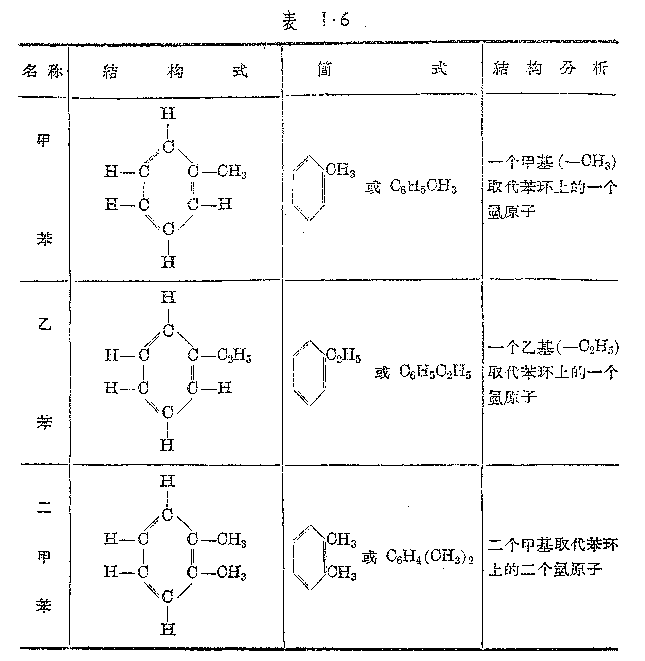

苯的同系物在结构上的特点是，以苯环为基础，而烷烃基结合在苯环的旁侧（叫做侧链）。在苯和苯的同系物的分子里，氢原子数是碳原子数的2倍减去6，所以它们的通式是 \( C_{n}H_{2n-6}(n\geqslant6) \)。例如：

$$
n = 6， \quad \mathrm{C} _ {n} \mathrm{H} _ {2 n - 6} = \mathrm{C} _ {6} \mathrm{H} _ {6} \quad \text {   就是苯   }；
$$

$$
n = 7， \quad \mathrm{C} _ {n} \mathrm{H} _ {2 n - 6} = \mathrm{C} _ {7} \mathrm{H} _ {8} \quad \text {   就是甲苯   }；
$$

$$
n = 8， \quad \mathrm{C} _ {n} \mathrm{H} _ {2 n - 6} = \mathrm{C} _ {8} \mathrm{H} _ {10} \quad \text {是二甲苯或乙苯，所以二甲苯和乙苯是同分异构体。}
$$

##### 苯的同系物的性质

苯的同系物的分子结构里都有苯环，所以在性质上和苯有相似之处，如都有苯那样的特殊气味，都不溶于水，都能跟卤素起取代反应，跟氢气起加成反应等等。但是它们比苯多了侧链，因此，它们的性质也有和苯不同的地方。我们要是把甲苯、二甲苯等分别装在试管里，加入高锰酸钾的紫红色溶液（滴加稀硫酸数滴），用力振荡的話，結果紫红色都能褪去，說明苯的同系物能被高锰酸钾所氧化。我們知道，苯很稳定，不会被氧化剂氧化。那末苯的同系物的什么部分被氧化了呢？根据氧化后的产物証明，是侧链被氧化了。

##### 苯和它的同系物的来源和用途

从煤焦油——煤的干馏产物之一——里，可以分离出苯和它的同系物来。 所以，煤焦油是芳香烃的主要来源。 此外，在某些地区的石油矿藏里也含有少量的芳香烃。

苯和它的同系物都是有机化学工业的重要原料，利用它们可以制造出各种染料（如阴丹士林等）、香料、炸药（如 T。 N。 T。）、医药（如阿司匹灵等）和杀虫药剂（如六六六、滴滴涕等）等等，应用很广泛。所以，煤的干馏工业是鋼铁工业和有机化学工业的共同基础，这是由于生产焦炭的同时，能得到煤焦油的緣故。

以上我們已經研究了几种重要的烃类和它們的重要化合物。現在把这些烃列表归納如下：

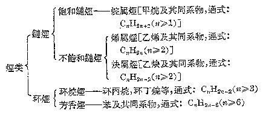

##### 习题 1·11～1·12

1. 为什么把苯和苯的同系物叫做芳香烃？它们和烷属烃、环烷烃在结构上有何区别？

2. 苯的重量組成是含碳 92.3%，含氫 7.7%。它的蒸气在标准状况下重 3.482 克/升。求它的分子式。

3. 用哪些实验可以証明苯的结构式？

4. 写出苯跟溴反应的化学方程式，并注明所需条件。

5. 用什么实验方法来区别苯和苯的同系物？

6. 苯有哪些特性？它和飽和鏈烴及不飽和鏈烴有些什么相似的性质？又有什么不同的性质？

7. 什么叫支链？什么叫侧链？

8. 要制造一吨苯，需用多少吨碳化钙？

### IV． 煤的干馏和石油工业

学习了鏈烴和环烴的知識以后，我們已經初步掌握了有机化学的一般規律。同时，認識了几种重要的烴，知道它們都是化学工业的基本原料；它們的存在和制取，跟自然資源——煤和石油有着密切的关系。現在我們进一步來研究有关煤的干馏和石油加工的生产知識。

#### § 1·13 煤的干馏

前面在讲到苯和它的同系物时，曾經說明它們是从煤的干馏产物——煤焦油中提取得来的。所謂煤的干馏，和以前学过的木材干馏（第一册§3·2）相似，就是使煤在密閉的設備里隔絕空气而加强热的过程。

##### 煤的干馏产物

煤的主要成分是碳，但除碳以外还含有氢、氧、氮和少量的硫。当煤在 \( 1000^{\circ} \) C 左右的高温下进行干馏时，煤的内部就发生复杂的化学反应，生成气态的煤气、液态的氨水和煤焦油以及固态的焦炭。下面的实验，可以表示煤干馏的反应过程。

把敲碎的烟煤小块，装在硬质试管里，管口配单孔塞，在塞孔内插入一支导管，并接通一个作为冷凝用的试管，在这一试管口配双孔塞，一孔附尖嘴玻管，装置如图1·12。

在硬质试管下加强热，当温度逐渐增高时就有气体发生，进入冷凝用的試管后就有部分液体凝結下来，这是黑褐色、粘稠的油状物——煤焦油，以及和煤焦油混在一起的氨水。没有冷凝的一部分气体，则从尖嘴玻管口逸出，点火能燃烧，火焰呈淡蓝色，这就是俗称煤气的焦炉气。最后硬质试管里剩下的是灰黑色的焦炭。

工业上大规模干馏烟煤的原理和上述实验的原理基本上一样，仅仅是设备不同而已。生成的产物当然也是焦炉气、氨水、煤焦油和焦炭四种，它们都有实际用途。现在把它们的成分、分离方法和用途，分述于下：

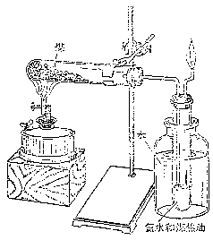

1. 焦炉气 主要成分是氢气和甲烷，此外还杂有部分的一氧化碳、二氧化碳、氮气和少量的气态氨、苯和苯的同系物。经冷凝处理，可以把氨、苯和苯的同系物分离出来。提净后的焦炉气的组成，例如图1·13所示。

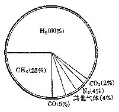

焦炉气的成分中绝大部分是可燃性气体， 燃烧时发热量很高， 可以用作炼鋼等工业和生活上的燃料。大都市里的家用煤气， 大都是焦炉气。把焦炉气作深冷处理， 由于甲烷和氢气的液化温度相差很大（甲烷在 \(-146^{\circ}\mathrm{C}\) 液化， 氢气 \(-205^{\circ}\mathrm{C}\)）， 因此就可以使它们分离。至于它们的用途， 前面已经叙述过了。

2. 煤焦油 煤焦油是芳香烃的主要来源，它是液态有机物的复杂混和物。近代对于煤焦油的加工，采用的是分馏法。通过蒸馏把沸点不同的各种液态有机物，大致分成几种馏分，然后再从这些馏分里逐步精炼出主要成品来。表 1·7是煤焦油的初步分馏产品：

表 1·7

| 品名 | 分馏温度 | 主要成分 |
| --- | --- | --- |
| 輕油（比水輕） | 170°C以下 | 苯、甲苯、二甲苯、苯酚[^ch1-12] |
| 中油（比重介于輕、重油間） | 170～230°C | 苯酚、萘[^ch1-13] |
| 重油（比水重） | 230°C以上 | 苯酚、萘及其他更复杂的有机物 |
| 瀝青 | 提出重油后的残余部分 |  |

这些产品的用途，除苯和它的同系物已在前面讲过，苯酚将在下章介绍外，萘也是重要的化工原料，用以制取染料和杀虫药（萘丸俗称樟脑丸）； 瀝青俗称柏油，是筑路以及制造油毛毡等原料。

3. 焦炭和氨水 焦炭是冶炼鋼鐵和其他金属的重要还原剂、制造电石的原料和用作一般燃料。氨水可提取純氨或制造氮肥。

##### 煤的综合利用

煤的干馏是提高煤使用价值的一种有效处理方法。煤是一项宝贵的自然资源，长时期以来人类只是把煤用作燃料，直到1825年英国物理学家法拉第在煤气里发现了苯，才引起人们的注意，到1845年科学家又从煤焦油里分离出苯来，从此一向在制造煤气时被人们所厌弃的“廢物”——煤焦油，就一变而为具有极大价值的化工原料。并且随着化学工业的发展，煤焦油反而显得供不应求了。所以，煤的用途是多方面的，怎样充分发挥煤的作用，也就是煤的综合利用问题，是一个牵涉到国民经济各个部门和国防上的极重要的问题。表1·8概括地显示煤的各方面的用途。

*表 1·8*

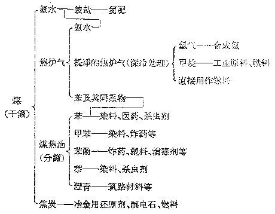

##### 习题 1·13

1. 什么叫做煤的干馏？煤干馏后能生成哪些主要物质？

2. 怎样从煤的干馏工业中得到硫酸铵？

3. 焦炉气的主要成分是什么？除作为燃料外怎样进一步利用它作为工业原料？

4. 怎样把煤焦油分离成各种产品？有哪些主要产品？

5. 夏天柏油馬路为什么会軟， 甚至发粘？ 油毛毡盖屋顶为什么可以防漏？

6. 化学工作者认为世界上没有“废物”，你举什么例子来说明？

7. 什么叫做煤的综合利用，它在国民经济上有什么意义？

8. 为什么使用煤气灶或灯要防止漏气？

#### § 1·14 石油和石油工业

石油是一种天然矿产，它是工业上制取各种烃的重要来源。由于近代有机化学工业的发展，石油除作为内燃机的动力燃料、机器的润滑剂以及有机物的溶剂外，还用作塑料、合成橡胶、合成纤维等等的工业原料。所以，石油资源和石油工业，对一个国家的国民经济的发展，具有十分重大的意义。

##### 石油

石油是一种粘稠而带着暗綠色或褐黑色的油状液体，有特殊气味。它比水稍輕些，不溶于水。

石油矿床儲集在地下的各种多孔性岩层里，因此称为“石”油。它蘊藏的深度，从几十米到几千米不等。一般都是埋藏較深，接近地面的往往会渗透到附近的河流里或从岩石的隙縫中，逐渐揮发而散失掉。所以，世界上的石油资源比煤少得多，也宝貴得多。

石油的成因和来源，现在还没有得到定論，一般认为是动植物体被长期埋藏在地下而形成。世界上的石油矿，大多数产生在1200～6000万年以前的岩层里。采取石油需要凿井。石油矿里如果含有大量气态烃的話，当油井凿成时，石油因受到矿内气体的压力，会自动喷出地面。如果由于矿内气体的压力不够，或者自喷一段时间后压力减小，那就需要采取人工方法，向油层里压入气体或水，使石油流出地面。

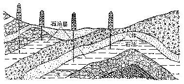

##### 石油工业

石油的组分非常复杂，主要是烃类的混和物，不同产地的石油所含烃的种类不尽相同，我国较多数的石油矿床所含的主要是烷属烃和环烷烃。

开采出来的石油，叫做原油。要经过一系列的加工处理后才能得到适合不同需要的各种成品。石油工业是基本有机化学工业之一，可以分为：石油的分馏、裂化和人造石油三个部門。

1. 石油的分馏 石油所含的各种烃，有气态、液态，也有固态的，它们的沸点各各不同。在工业上，采取分馏法把石油分成几个部分来适应各种需要。通过下面的实验，可以认识石油分馏的原理。

取蒸馏烧瓶配单孔塞，孔内插入360°C温度计一支，使水银球适在烧瓶的支管处。在烧瓶的支管上连接冷凝管，用锥形瓶承接馏液，装置如图1·15。

在烧瓶中放原油约为瓶容积的 1/3，加碎瓷数片（防止突然沸腾），置沙浴[^ch1-14]上加热，调节灯焰。收集沸点在 150℃ 左右的蒸馏液，是为汽油。等到馏液很少时，换一个承受馏液的瓶子，升高温度到 \( 300^{\circ} \) C 左右，再集取馏液，是为煤油。留在烧瓶里的是石油高沸点成分的混和物。

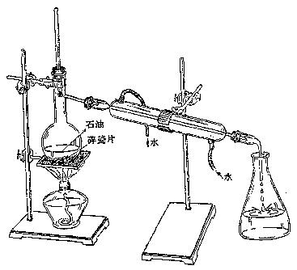

拿两只蒸发皿，分别倒一些从实验得到的汽油和煤油，用点着的纸捻去引燃，见汽油立即发生燃烧，煤油就比较困难。可见汽油比煤油容易挥发成蒸汽，因此汽油的着火点比煤油要低，容易燃烧。

工业上分馏石油的原理，基本上和上述的实验原理一样。不过工业上的操作是连续的，不间断地加入原料和制出产品。至于划分成哪些馏分，则是根据各自的需要和石油的成分来决定的。一般的石油分馏，大致如表1·9所示。

表 1·9

| 馏分名称 | 子项 | 分馏温度或说明 | 馏分中链烃分子里的碳原子数 | 用途 |
| --- | --- | --- | --- | --- |
| 汽油 |  | 200°C以下 | \( C_5 \sim C_{11} \) | 飞机和汽车的燃料 |
| 溶剂油 |  | 50～200°C | \( C_5 \sim C_{11} \) | 油脂和橡胶等物质的溶剂 |
| 煤油 |  | 180～315°C | \( C_{11} \sim C_{17} \) | 拖拉机燃料、点灯 |
| 柴油 |  | 200～360°C | \( C_{17} \sim C_{23} \) | 柴油机燃料 |
| 重油 | 润滑油（锭子油、机器油、汽缸油） | 减压分馏 | \( C_{18} \sim C_{30} \) | 纺织工业的润滑剂、机器工业的润滑剂、各种汽缸的润滑剂 |
| 重油 | 凡士林 | 液态烃和固态烃的混和物 |  | 医药和化妆品 |
| 重油 | 石蜡 | 从润滑油中分出 | \( C_{30} \sim C_{70} \) | 蜡烛、肥皂、火柴、蜡纸 |
| 重油 | 沥青 | 减压分馏后的残渣 |  | 筑路、建筑材料、包装纸、燃料 |

从上表所列的各种成品来看，每种馏分里都包含着若干种不同的烃，某些烃同时存在在相邻近的馏分中，馏分冷凝的温度范围，也是交叉的。因为沸点比较近的烃，不容易绝对分开。在实际应用上，只要成品的沸点大致有一定的范围，就符合工业需要了。由于高沸点的重油，在常压下蒸馏，温度需要超过360℃才能气化，结果部分烃要发生分解，所以应采用减压分馏法（在压强低于一个大气压之下进行）， 把重油进一步分馏成多种成品。上表列出了石油成品的用途， 由此亦可以看出石油在国民经济上的重要性。

2. 石油的裂化 随着工业技术的发展，石油越来越显示了它的重要性。特别是对汽油的需要量，更日益增加。但从原油里提取到的汽油，只占 \(16 \sim 20\%\)。因此，人们就着手研究提高汽油的出产率。根据重油里所含链烃的分子量大、碳链长和沸点高的特点，增产汽油的关键，应当是把长链“截断”，使成为较小的分子。这种使石油里分子量大的烃，变为分子量小的烃的处理方法，叫做石油的裂化法。通过裂化，可以从原油里取得 \(50\%\) 左右的汽油。下面是說明裂化原理的实验。

用一支配有单孔塞的硬质试管（A）和另两支配有双孔塞的大试管（B、C），分别用直角形导管串联起来。装置如图1·16。

在硬质试管（A）里放入洗净烘干的沙子，并滴入经过处理的煤油（要不含杂质，对酸化的高锰酸钾溶液不褪色），使沙子全被煤油所浸湿。在沙子上面，填一层除去了铁锈的干燥铁屑，把试管横过来水平地夹在铁架台上。试管（B）的下半部，浸在冷水瓶里，作为承接冷凝液体的受器。试管（C）装酸化的高锰酸钾溶液，使液面恰好浸没导管的末端，便于未液化的气体能够在接触高锰酸钾溶液后，从尖嘴管逸出。

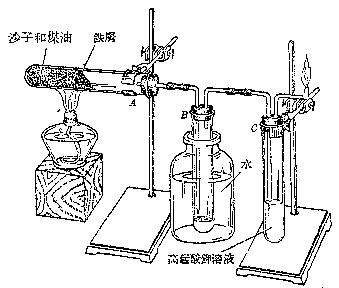

将三个试管的塞子分别塞紧，然后加热（4）管的铁屑部分，不久便见到（B）管里有液体凝集下来，同时（C）管的高锰酸钾的溶液中，不断有气泡通过，紫红色逐渐消褪。再在尖嘴管上点火，放出的气体能在管口燃烧，发出明亮的火焰。停止加热后，再取（B）管里的液体引燃，比原来的煤油容易着火。这些现象都说明了煤油里的各种烃，在受热过程中发生了分解。

如以十六烷为例，它的裂化过程是：

$$
\mathrm{C}_{16}\mathrm{H}_{34}\xrightarrow{\text{加热}}\mathrm{C}_{8}\mathrm{H}_{18}+\mathrm{C}_{8}\mathrm{H}_{16}
$$

这些生成的分子量较小的产物，还能继续分解，如

$$
\mathrm{C}_{8}\mathrm{H}_{18}\xrightarrow{\text{加热}}\mathrm{C}_{4}\mathrm{H}_{10}+\mathrm{C}_{4}\mathrm{H}_{8}
$$

$$
\mathrm{C}_{4}\mathrm{H}_{10}\xrightarrow{\text{加热}}\mathrm{CH}_{4}+\mathrm{C}_{3}\mathrm{H}_{6}
$$

所以煤油裂化后所得到的是：沸点较低的类似汽油的饱和烃和不饱和烃的液态混和物，以及饱和烃和不饱和烃的可燃性气体。

至于分子量更大的重油的裂化过程，也和煤油一样，不过多了一步。如

$$
\mathrm{C}_{18}\mathrm{H}_{38}\xrightarrow{\text{加热}}\mathrm{C}_{9}\mathrm{H}_{20}+\mathrm{C}_{9}\mathrm{H}_{18}
$$

到了一定的时候，就有较多的象汽油一般的烷烃、烯烃以及低级气态烃等等生成。这些低级气态烃是合成橡胶、塑料和人造石油的重要原料。

工业上就是根据上述原理来进行石油加工的。一般采用 400 ～ 700°C 的温度和几个到十几个大气压的压力，使重油在气态或液态下进行分裂，再通过分馏，得到汽油等成品。这种方法称为热裂化法。

为了采用较低的温度和压力，并提高产品的质量起见，工业上常使用硅酸铝和三氯化铝等作为催化剂，这种方法叫做催化裂化法。下面的实验可以说明催化裂化的原理。

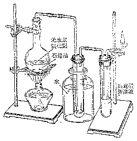

把石油热裂化实验装置里的硬质试管调一个圆底烧瓶，如图1·17。

在烧瓶里盛石蜡油，加热，不见有什么变化发生。向石蜡油里加入无水三氯化铝，略加热即有气体发生，同时在空试管中，有部分液体冷凝下来，一部分气体通过高锰酸钾溶液，使溶液的颜色逐渐褪去。在尖嘴管口点火，放出的气体也能燃烧。

以上說明由于催化剂的存在，在較熱裂化为低的温度下，含有分子量大的烴的石蜡能裂化为分子量小的烴。

3. 人造石油 虽然用裂化法可以大大提高汽油的产量，但还是不能满足国民经济各部门和国防上的多方面的需要。因此不得不利用其他资源来合成汽油。目前世界各国所采用的合成法，有下列几种：

（1） 用煤作为原料， 使煤粉悬浮在重油里， 在 \(400 \sim 500^{\circ} \mathrm{C}\) 的温度， \(200 \sim 700\) 大气压和催化剂存在的条件下， 跟氢气直接反应，生成人造石油。同时重油也发生裂化成为汽油。

（2） 用煤制成水煤气 （CO、\(\mathrm{H}_{2}\)）， 在温度 \(200 \sim 300^{\circ} \mathrm{C}\)， 压力 \(1 \sim 200\) 大气压下， 通过催化剂得到人造石油。

制成的人造石油经过分馏，就能得到各种石油产品。

（3） 用煤低温干馏 （450～600°C），或干馏油母页岩[^ch1-15]，得到类似重油的产物，再进行裂化加工而成汽油。

石油工业的发展是和工业革命分不开的。十九世纪初期，煤油是石油工业的最重要的产品。石油的主要用途是点灯，其他部分，甚至和以前的煤焦油一样，被认为是讨厌的“廢物”，只能把它放在原野里烧掉。等到内燃机和电气工业发达以后，煤油的经济价值便日益低落，而汽油的需要量则日见增加。同时机械的运转，亦需要大量的润滑油。近代有机合成工业的发展，更使石油成为宝贵的化工原料。因此，目前在国民经济各部门、国防和人民日常生活上，都需要用到石油。石油工业的发展亦在突飞猛进。

我国是一个石油资源丰富的国家。西北地区的劳动人民，在二千多年前就知道了石油并且简单地加以利用了。只是由于反动政权的统治和帝国主义的侵略，才使我国的石油工业处于非常落后的状态。解放以来，在党的领导下，我国人民奋发图强，自力更生，对石油的资源勘探、生产设备和技术力量，都取得了惊人的发展。过去大部分要依靠国外进口石油的情况一去不复返了。可以预料，随着我国社会主义建设的进一步发展，我国的石油工业一定还会取得更大的成就。

##### 习题 1·14

1. 石油的主要成分是什么？分馏石油可以得到哪些产物？

2. 石油的分馏和裂化有什么不同？

3. 石油裂化出来的气态物质是什么烃？有什么用途？

4. 人造石油有哪几种方法？

5. 怎样证明蜡烛中含有碳和氢？

6. 在汽车的加油站和停車場等处所，为什么要禁止吸烟？

7. 为什么能用汽油除去衣服上的油迹？

### 本章提要

#### 1. 有机化学和有机化合物

（1） 有机化学：研究有机化合物的化学。

（2） 有机化合物： 碳氢化合物及其衍生物。 它们的特点是：

（a） 为数众多。原因是（i）碳原子之间能够相互共用电子对，形成不同的碳链（直链、支链、环）。（ii）同分异构现象。

（b） 具有特殊的性质。由于有机物分子中原子間以共价鍵結合，所以具有：难溶于水、对热不稳定、反应緩慢而又复杂等特性。

#### 2. 化学结构学说

化学结构学说是研究有机化学的指导理论，从碳原子是四价这个事实出发，学说的主要内容如下：

（1） 任何物质分子里的原子， 都不是简单的堆积， 而是按着一定顺序的化学结合。 原子相互结合成分子的方式， 叫做物质的化学结构。

（2） 分子里原子和原子間，各依它们的化合价相互結合，彼此滿足，沒有剩余的化合价存在。

（3） 结构与性质間有一定的关系， 物质的化学性质决定于化学结构。 一种分子只能有一种一定的化学结构。

（4） 在一个分子里原子間是相互影响着的。

#### 3. 同分异构体、同分异构现象

（1） 同分异构体：分子的重量组成和分子量都相同，但化学结构不同，因而性质也相异的某些物质。

（2） 同分异构现象：由于化学结构不同而产生的同分异构体的现象。

#### 4. 有机反应的几种基本类型

（1） 取代反应： 有机化合物中的氢原子被其他原子或原子团所代替的反应。

（2） 加成反应： 不饱和的有机化合物能加上两个或两个以上的原子或原子团的化学反应。

（3） 聚合反应：两个以上低分子量的不饱和化合物的分子，彼此发生加成反应，化合成高分子量物质分子的过程。

#### 5. 烃

碳氢化合物的简称， 是有机化合物的母体， 天然气和石油的主要成分。

（1） 烃的分类， 几种重要烃类的代表物及其主要化学性质：

| 大类 | 类别 | 亚类 | 通式 | 代表物 | 与高锰酸钾酸性溶液 | 与溴水 | 主要化学性质 |
| --- | --- | --- | --- | --- | --- | --- | --- |
| 链烃 | 饱和链烃 | 烷烃 | \( C_nH_{2n+2} \)（\(n\geqslant1\)） | 甲烷 \(CH_4\) | 不反应 | 不反应 | 稳定；取代反应 |
| 链烃 | 不饱和链烃 | 烯烃 | \( C_nH_{2n} \)（\(n\geqslant2\)） | 乙烯 \(C_2H_4\) | 褪色（氧化） | 褪色（加成） | 加成反应；聚合反应 |
| 链烃 | 不饱和链烃 | 炔烃 | \( C_nH_{2n-2} \)（\(n\geqslant2\)） | 乙炔 \(C_2H_2\) | 褪色（氧化） | 褪色（加成） | 加成反应；聚合反应 |
| 环烃 | 环烷烃 |  | \( C_nH_{2n} \)（\(n\geqslant3\)） | 环己烷 \(C_6H_{12}\) | 不反应 | 不反应 | 像烷烃 |
| 环烃 | 芳香烃（苯及其同系物） |  | \( C_nH_{2n-6} \)（\(n\geqslant6\)） | 苯 \(C_6H_6\) | 不反应 | 不反应 | 取代反应；加成反应 |
| 环烃 | 芳香烃（苯及其同系物） |  | \( C_nH_{2n-6} \)（\(n\geqslant6\)） | 甲苯 \(C_6H_5\cdot CH_3\) | 褪色（侧链氧化） | 不反应 | 取代反应；加成反应 |

（2） 飽和鏈烴、单鍵。

飽和鏈烴：烴类分子中碳原子相連如鏈状的叫做鏈烴。碳原子間以单鏈連接的鏈烴是飽和鏈烴，也叫做烷屬烴。

单键：原子間共用一对电子的键。单键可以存在于碳原子之間以及碳、氢、氧原子相互之間。

（3） 不飽和鏈烴、双鍵、叁鍵。

不飽和鏈烴：分子中所含的氢原子数比相应的烷烴为少，具有双鍵或叁鍵的鏈烴，包括烯和炔兩屬。

双鍵：原子間共用二对电子。双鍵存在于碳原子之間（如烯屬烃）以及碳原子和氧原子之間。

叁鍵：原子間共用三对电子。叁鍵存在于碳原子之間（如炔屬烴）。

（4） 环烷烃：碳原子間以单鍵結合成环状結構。

（5） 芳香烴：碳原子間成环状結構，以苯及其同系物为代表。苯环是由六个碳原子和六个氢原子組成的正六角形的环，有三个双鍵存在。

（6） 烃基： 在烃类分子中去掉一个或几个氢原子后剩余下来的部分。去掉一个氢原子的叫做一价烃基。烃基不能单独存在， 在化学反应过程中形成为新分子的一个组成部分。一价烷烃基的通式是 \(C_{n}H_{2n+1}(n \geqslant 1)\)。

（7） 同系物： 分子式符合于通式， 化学性质相似， 分子组成相差一个或几个 \( CH_{2} \) 原子团的一系列的化合物， 彼此互为同系物。 它们的物理性质， 随着分子量的增大而发生递变。

#### 6. 烃类和烃基的命名

（1） 链烃： 根据通式决定链烃的类名， 如烷、烯、炔， 再按碳原子数命名。碳原子数在 10 以下的用“天干”依次表示， 10 以上的用中文小写数字表示。

（2） 环烷烃： 按碳原子数， 在“某烷”之前冠以“环”字， 称为“环某烷”（如环丙烷）。

（3） 苯的同系物： 在“苯”字之前冠以侧链的“烃基名”称“苯（基）苯”（如甲苯）。 如有几个侧链则冠以数字， 称“几某（基）苯”（如二甲苯）。

（4） 一价烃基： 根据烃的命名在后面加“基”字（如甲（烷）基， 乙烯基， 苯基等）。

#### 7. 煤的干馏和石油工业

（1） 煤的干馏： 煤在密閉的設備里隔絕空气而加强熱的过程。干餾产物主要有焦炉气（煤气）、氨水、煤焦油和焦炭等四种。

（2） 煤焦油分馏： 煤焦油是一种很复杂的混和物。将它加热， 使在不同的温度范围内， 把沸点不同的各种组分， 分成几种馏分。 （参阅第 50 页附表）

（3） 石油的分馏： 石油是多种烃类的混和物。通过分馏， 可以得到汽油和煤油等等各种产品。（参阅第 54 頁附表）

（4） 石油的裂化： 使石油所含的分子量大的烃， 变为分子量小的烃的处理方法。 通过裂化， 可以从原油取得较多的汽油。 在较高的温度和压力下使重油进行分裂的方法， 叫做热裂化法； 使用催化剂在较低的温度和压力下进行的， 叫做催化裂化。

（5） 人造石油：用煤或油母頁岩作为原料的人工合成的石油。

### 复习题一

1. 同体积的甲烷、乙烯、乙炔分别完全燃烧时，所需要氧气的体积比是多少？

2. 如果根据烷属烃的通式 \( C_{n}H_{2n+2} \) 来推論，当 n=0 时的分子式就是 \( H_{2} \)，所以，“氢气是烷属烃的同系物”。这种说法对不对？为什么？

3. 某种烃的分子量是氢气的 35 倍， 它的重量組成中碳是氢的 6 倍。求它的分子式。

4. 上题里这种烃能使高锰酸钾溶液及溴水褪色。写出它的名称，以及可能有的同分异构体的结构简式。

5. 0.1 克分子的某种烃， 燃烧时生成 22 克二氧化碳和 7.2 克水。求它的分子式， 并写出它的含有叁键的同分异构体。

6. 用什么方法来檢別链烃的不飽和性？

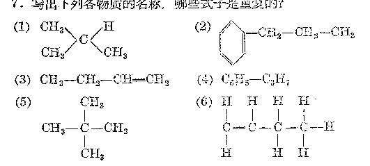

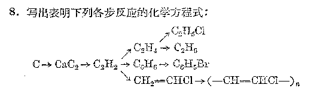

9. 某化合物的组成是： \(C = 85.7\%\)， \(H = 14.3\%\)。 它和同体积空气的重量比是 0.9654. 求它的分子式。 这种化合物能使高锰酸钾溶液及溴水褪色。写出它的名称和结构式。

【解】这种类型的习题，首先求出分子式，再依据题意，判定它的性质，从而得出名称和结构式。

已知： 组成 C=85.7%， H=14.3%； 它和同体积空气的重量比是0.9654.

∴ 碳和氢的原子数之比 C：H = \( \frac{85.7}{12} \)： \( \frac{14.3}{1} \) = 7.14：14.3 = 1：2.

最简式 \( CH_{2} \)，分子式 \( (\mathrm{CH}_{2})_{n} \)

分子量 M=0.9654×29=28， n=28/CH₂=28/14=2，

∴ 分子式 \( C_{2}H_{4} \)。

根据题意，该化合物是不饱和链烃。 \( C_{2}H_{4} \) 符合于烯属烃的通式。故知是乙烯。结构简式是 \(\mathrm{CH_2=CH_2}\)。

10. 5.6克的某种烃， 燃烧时生成 17.6 克二氧化碳和 0.4 克分子水。它的分子量是氮气的 2 倍。求它的分子式。这种烃不会使高锰酸钾溶液及溴水褪色。写出它的名称和结构式。

### 本章脚注

[^ch1-01]: 烃（音听，碳氢切 ting）从“火”表示有可燃性，从“坚”表示它是碳和氢的化合物。碳为一切有机物所共有，虽未在字形上有所表示，但在读音中可以显示出来。

[^ch1-02]: 氯气不溶于饱和食盐水。

[^ch1-03]: 在阳光直射下，甲烷和氯气会引起爆炸。

[^ch1-04]: “甲、乙、……、壬、癸”是我国古有的可以用来表示数序的字样，叫做“天干”。

[^ch1-05]: 中文小写。

[^ch1-06]: 当时有些化学家认为：一种物质在不同的化学反应里，应该用不同的式子来表示。

[^ch1-07]: 濃硫酸能吸收乙烯成为乙基硫酸，再跟水共热，又分解为硫酸和酒精。乙烯跟水加成为酒精的过程是：

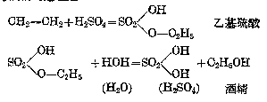

[^ch1-08]: 因为烯属烃分子里所含有的氢原子数，比相对应的“烷”烃要“稀少”一些，所以从“希”。

[^ch1-09]: 纯净的乙炔没有臭味，但由于工业上的碳化钙里，常含有磷化钙和硫化钙等杂质，所以制得的乙炔，有磷化氢和硫化氢的臭味。

[^ch1-10]: 乙烯基乙炔是合成橡胶的原料。见第五章合成橡胶部分。

[^ch1-11]: 因为炔属烃分子里所含的氢原子数，比相应的烯烃更“缺”少，所以从“夬”。

[^ch1-12]: 苯酚，見本册 § 2·3。

[^ch1-13]: 萘 \( \left(\mathrm{C}_{10}\mathrm{H}_{8}\right) \)，讀如“奈”nài，它的分子由結合着的两个苯环构成：

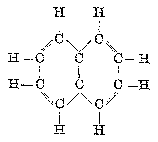

[^ch1-14]: 在铁盘里放沙子，使烧瓶埋在沙里加热，以便受热均匀。

[^ch1-15]: 油母页岩是一种黑褐色的岩石，成层片状结集在煤层上面。距地面较近，它的含油率为5～16%。

## 第二章 烃的衍生物

有机化合物包括烃和它的衍生物。烃在前一章里我們已經学习过了，本章研究烃的衍生物。

在§1·1里我們已經知道了什么叫做衍生物，所謂烃的衍生物，就是烃分子中的一个或几个氢原子，被其他元素的原子或原子团所取代后的生成物。烃可以是烷属烃、烯属烃、炔属烃（它們又总称为脂肪族[^ch2-01]），亦可以是芳香族；取代氢原子的可以是多种多样的原子团。所以烃的衍生物的种类是比较多的。在取代氢原子的原子团中，比较重要的有一X（代表卤素）、—OH、—CO、—COOH、—NH₂和—NO₂等，它們分別生成烃的卤代物、醇、酚、醛、羧酸和酯等类烃的衍生物。由于不同原子团使物质的化学特性起了一定变化，从而决定了它所属的同类。这种原子团称为官能团。

下面我们就将研究这些烃的衍生物。要求认识各类代表性物质，并联系化学结构理论，明确各类物质的特征以及各类之间的相互衍生关系。

### § 2·1 烃的卤代物

在 §1·1 学习甲烷的化学性质时我们已经知道，三氯甲烷和四氯化碳都是甲烷分子中几个氢原子被几个卤素原子所取代而形成的，称为烃的卤代物[^ch2-02]。一般地说，烃分子里的氢原子被卤素原子取代后所生成的化合物，叫做烃的卤代物，简称为卤代烃。卤代烃分子里的卤素，可以是氟、氯、溴或碘，但氟化物有些特殊，这里不讨论了[^ch2-03]；卤原子可以是一个，也可以是几个。所以卤代烃的一类中也包含着不少化合物。

含有一个卤原子的卤代烃的通式是 RX，R 代表烃基，X 代表一个卤素原子。卤原子看作是卤代烃这类化合物的官能团。卤代烃具有许多共同的化学性质。

#### 卤代烃的化学性质

卤代烃分子中的卤素， 性质特别活泼， 极易被其他原子或原子团所取代， 它的主要反应有二：

1. 卤素跟其他基团的取代反应 当卤代烃用氢氧化钠水溶液处理时， 卤代烃分子中的卤原子跟钠原子结合， 氢氧化钠分子中去掉钠原子后所剩余的氢氧原子团， 就跟卤代烃中烃基相结合而成为叫做醇的一类衍生物。

$$
\mathrm{R}-\mathrm{X}+\mathrm{NaOH}\rightarrow \mathrm{R}-\mathrm{OH}+\mathrm{NaX}
$$

这个反应的本质是，卤代烃经水解后分子中的氢原子被一OH原子团所取代而生成醇类，一OH原子团称为羟基（超音焰，氢氧切，qiang）：

$$
\mathrm{R}-\mathrm{X}+\mathrm{H}-\mathrm{OH}\rightleftharpoons \mathrm{R}-\mathrm{OH}+\mathrm{HX}
$$

由于反应是可逆的，加氢氧化钠可以中和掉反应中生成的氢卤酸，使平衡向右移动而反应趋于完成。

如果沒有水，反应就不同。例如卤代烃与KOH酒精溶液共热，就能除去卤代烃上的HX而成为烯或炔。又如卤代烃跟液态氨或氨的酒精溶液反应，则卤原子被氨基（\( -NH_{2} \)）所取代，生成另一类叫做胺[^ch2-04]的有机物：

$$
\mathrm{R}-\mathrm{X}+\mathrm{H}-\mathrm{NH}_{2}\rightarrow \mathrm{R}-\mathrm{NH}_{2}+\mathrm{HX}\qquad\text{胺}
$$

醇类和胺类，以后均将分别讨论。

2. 卤代烃跟钠的反应 卤代烃在一定条件下能跟钠反应，生成含碳原子较多的烃类。它的反应过程是每二个原子的金属钠跟二个分子的卤代烃作用，钠原子跟卤素结合成卤化钠，剩下的两个烃基自相结合成比原来卤代烃多一个或几个碳原子的烃类。如两个碘甲烷成为乙烷：

$$
\mathrm{CH} _ {3} - \mathrm{I} + 2 \mathrm{Na} + \mathrm{I} - \mathrm{CH} _ {3} = \mathrm{CH} _ {3} - \mathrm{CH} _ {3} + 2 \mathrm{NaI}
$$

写成通式就是：

$$
\mathrm{R} - \mathrm{X} + 2 \mathrm{Na} + \mathrm{X} - \mathrm{R} ^ {\prime} = \mathrm{R} - \mathrm{R} ^ {\prime} + 2 \mathrm{NaX}
$$

R 和 R' 可以相同，也可以不同。

从卤代烃上面这两点性质看来，由于卤代烃分子中卤原子的活泼性，所以很容易在烃基上引入其他原子或原子团。这样，就使得卤代烃广泛应用于有机合成，因此在有机化合物中占有重要地位。

##### 卤代烃的命名

简单的卤代烃，可以在它相应的烃的名称前面加上代入的卤原子数，称为几卤代某烃，简称几卤某烃，但一元卤代物的“一”字，可以略去，如：

$$
\begin{array}{c} \mathrm{CH} _ {3} - \mathrm{CH} _ {2} \mathrm{Br} \\ \text {溴乙烷} \end{array}
$$

$$
\begin{array}{c} \mathrm{CH} _ {3} - \mathrm{CH} _ {2} - \mathrm{CHI} _ {2} \\ \text {二碘丙烷} \end{array}
$$

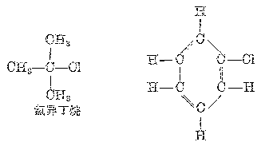

##### 几种重要的烃的卤代物

卤代烃在医药和有机工业上有广泛的应用，对农业的关系也很密切，许多卤代物都是重要的杀虫剂。现在介绍几种重要的烃的卤代物。

1. 氯乙烷 氯乙烷 \(\left(\mathrm{C}_{2} \mathrm{H}_{5} \mathrm{Cl}\right)\) 是由乙烯跟氯化氢在一定条件下进行加成反应制得的。它是一种无色而具有甜香的液体，沸点只有 \(12^{\circ} \mathrm{C}\)，因此极易气化。由于气化时要吸收大量的热，工业上常用作致冷剂；医疗上作为局部麻醉剂，因为肌肉的温度急剧下降时感觉会暂时消失。

2. 三氯甲烷 在学习甲烷的化学性质时 （§1·1），曾经讲过由甲烷和氯气可以生成三氯甲烷，但产物中混有多种氯代甲烷，不易一一分离，所以工业上制取三氯甲烷，实际上是用酒精和漂白粉作为原料的（参阅本章复习题二的第16题注①）。

三氯甲烷 \( \left(\mathrm{CHCl}_{3}\right) \) 俗名氯仿，也是具有甜香的无色液体，不溶于水。沸点约为 \( 61^{\circ}C \)，容易揮发。我們如果吸入它的蒸气，会失去知觉，所以医疗上常用作为施行外科手术时的全身麻醉剂。

此外，氯仿还是一种优良的溶剂。溴、碘、油脂以及其他有机物质都不易溶于水而很易溶于氯仿。在第二册里我们曾学习过，从溴或碘的水溶液里提取溴或碘，可以用汽油。但也可以用氯仿，这就是因为溴和碘在汽油或氯仿里的溶解度远比在水里的为大的缘故。

3. 六六六 六六六是大家所熟悉的杀虫剂，市场上就有粉剂、可湿性粉剂[^ch2-05]和熏蒸剂等各种六六六商品出售。六六六的杀虫效率很高，它可以通过害虫的表皮、气孔或口部进入虫体，只要有昆虫体重百万分之五的药量，便足以使虫中毒死亡。所以无论喷粉、喷雾或熏蒸，都能杀灭害虫。在农业上可以用六六六来防治水稻、麦子、棉花和杂粮的主要害虫。

六六六的化学名称是六氯环己烷 \( \left(\mathrm{C}_{6}\mathrm{H}_{6}\mathrm{Cl}_{6}\right) \)，是由氯气和苯在紫外线（利用日光灯）的照射下生成的：

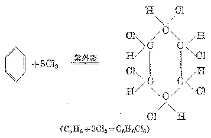

六六六是具有霉臭气味的白色晶体，不溶于水而易溶于煤油、汽油等有机溶剂里。 性质稳定，不受日光、热或酸的影响。 但遇碱则能发生分解作用，这一点在使用时必须加以注意。

4. 滴滴涕 杀虫药除六六六外，比较常用的要算滴滴涕了。滴滴涕又叫 D.D.T.，它的学名是二氯二苯基三氯乙烷，所以亦有把它叫做二二三的。它的结构式是：

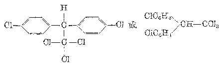

滴滴涕也是白色晶体，和六六六相似，不溶于水而易溶于煤油和酒精等有机溶剂里。性质很稳定，不受日光或空气的影响。和六六六不同的是，与氢氧化钠溶液相遇不发生作用；但氯化铁、铁锈或其他铁的化合物、氯化铜、三氯化铝和硫磺等物质，都能使滴滴涕分解，使用时必须注意，如农药中的波尔多液[^ch2-06]和石灰硫磺合剂都不能与滴滴涕混合使用。

滴滴涕的杀虫效率也很高， 只要有它的余跡（极少量）殘留， 在二、三个月里还能发挥药效。当虫类与余跡接触后即能中毒而在相当時間內死亡。它可以防治很多种的植物害虫， 以及影响人民健康的臭虫、虱子、蚊、蝇等等。它的另一个优点是对人畜的毒害作用較小， 使用时比較安全。

市售的滴滴涕有粉剂、油剂和乳剂等。粉剂是掺含有5%滴滴涕的滑石粉，油剂是5%的滴滴涕石油溶液，乳剂是含有25%滴滴涕的用肥皂水制成的乳胶液，分别适应农业或家庭中使用。

#### 习题 2·1

1. 什么叫做官能团？卤代烃的官能团是什么？

2. 卤代烃有哪些重要化学反应？为什么能够发生这些反应？

3. 写出卤代丙烷跟氢氧化钠溶液作用的反应方程式，并指出实质上是卤代烷跟什么起反应？

4. 怎样利用甲烷、氯气和金属钠三种物质来制取乙烷、丙烷和丁烷？

［提示：从烷烃的取代反应和卤代烃跟钠的反应考虑。］

5. 为什么三氯甲烷不能跟硝酸银溶液生成氯化银沉淀？

6. 使用六六六和滴滴涕时应注意些什么，才能发挥它们的效用？

7. 写出下列各物的分子式： 氯丙烷、二氯二氟甲烷、溴化乙烯。

8. 指出下列各物的名称： \(\mathrm{CH}_{3} \mathrm{CH}_{2} \mathrm{~F}, \mathrm{CH}_{3}-\mathrm{CH}=\mathrm{CHCl}, \mathrm{CCl}_{3}-\mathrm{CCl}_{3}\)。

### § 2·2 乙醇

使氯乙烷跟氢氧化钠溶液反应，能够生成什么？

我們知道，氯乙烷是一种卤代烃。卤代烃在氢氧化钠存在下可以水解（§2·1）。由氯乙烷水解所生成的叫做乙醇。氯乙烷水解的化学方程式如下：

$$
\mathrm{C} _ {2} \mathrm{H} _ {5} \mathrm{Cl} + \mathrm{NaOH} = \mathrm{C} _ {2} \mathrm{H} _ {5} \mathrm{OH} + \mathrm{NaCl}
$$

氯乙烷 乙醇

#### 乙醇的物理性质和分子结构

乙醇是酒的主要成分，俗称酒精，是具有酒味的无色液体。沸点是 \(78.3^{\circ} \mathrm{C}\)，比水輕，比重为 0.8 克/毫升，能以任何比率与水混溶。它是一种良好的溶剂，能溶解多种物质，如碘和油脂等难溶于水的都易溶于乙醇。

由分析结果，知道乙醇的分子式是 \( C_{2}H_{6}O \)。

从乙醇的分子式和元素的化合价出发来考虑（碳是4价，氧2价，氢1价），乙醇的结构式可以是：

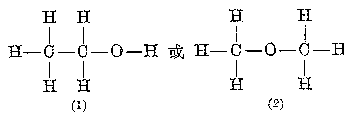

这两个结构式是不相同的，主要区别在于，（1）式中的六个氢原子，其中五个都跟碳原子直接结合，而有一个是通过氧原子来跟碳原子结合的；（2）式中的六个氢原子都是一样跟碳原子直接结合，没有一个氢原子是特殊的。究竟那一个式子真实地反映乙醇分子结构的实际情况呢？我们可以根据它的性质来决定。

乙醇能跟钠起反应而放出氢气。只要找出每一个乙醇分子在这个反应里失去的是几个氢原子，就可以决定它的结构式。如果失去的是全部氢原子，那末它的结构式便应当是（2）式[^ch2-07]。要是只有一个氢原子可以失去，那末结构式应该是（1）而不是（2），因为（1）式中反映着有一个氢原子是特殊的，正是这一个特殊的氢原子被钠所置换了。

那末，究竟失去几个氢原子呢？这可以通过实验来回答。

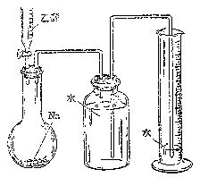

装置如图 2·1。在烧瓶（a）中先放入金属钠，在中间的瓶子（b）里盛满了水，然后把一定量的无水乙醇通过滴定管加入烧瓶中。当金属钠碰到乙醇时就有氢气产生，所产生的氢气便把中间瓶子里的水压入量筒（c）。产生的氢气有多少体积，量筒中的水也是多少体积。所以只要在反应完毕后观察量筒中积水的毫升数，便知产生的氢气是多少毫升。从氢气的毫升数就能算出乙醇分子中有几个氢原子被置换了出来。

举个实例来研究。下面是某次实验的数据和运算：

（1） 数据。

用去的乙醇

1.44 毫升

所产生氢气的体积

312 毫升

实验时的温度

27°C

实验时的气压

750 毫米

（2） 运算。先运用气态方程式，把实验所得的氢气体积换算成在标准状况下的体积

$$
\frac {P _ {1} V _ {1}}{T _ {1}} = \frac {P _ {2} V _ {2}}{T _ {2}}
$$

$$
\therefore V _ {2} = \frac {750 \times 273 \times 312}{760 \times 300} = 280 \text {毫升。}
$$

再算出 1.44 毫升乙醇重多少克。

乙醇的比重是0.8克/毫升，∴1.44毫升乙醇重 \( 1.44\times0.8=1.15 \) 克。

最后算出1克分子乙醇放出多少毫升氢气，这许多氢气合多少克原子的氢。

已知：1.15克乙醇放出280毫升氢气

1 克分子乙醇重 46 克 （\( C_{2}H_{6}O=12\times2+1\times6+16 \)），

設 \(x = 1\) 克分子乙醇所放出氢气的毫升数，則

$$
1.15： 46 = 280： x
$$

$$
x=\frac{46\times280}{1.15}=11200\text{毫升}
$$

1克分子氢气在标准状况下占有22.4升即22400毫升的体积，11200毫升的氢适为1克原子的氢。

根据实验结果证明，乙醇分子中只有一个氢原子被钠所置换。显然，就是通过氧原子跟碳原子结合的那个处在特殊位置的氢原子。而这一个氢原子之所以能被置换，一定是受了氧原子的影响，不象其余的五个那样结合得比较稳固的缘故。这样，就可以肯定只有（1）式才是符合乙醇分子结构的真实情况的。

不过 （1） 式里的 OH 原子团还是和无机物碱类中的 OH 根不同。实验结果告诉我们， 乙醇的水溶液不能导电， 而且也不显碱性反应。上面讲过， 这里的 OH 原子团称为羟基。羟基的结合跟乙醇分子里其他原子一样， 都是以共价键相结合的。所以乙醇的式子是：

$$
\begin{array}{cccc} \mathrm{H} & \mathrm{H} & & \\ \mathrm{H}： \mathrm{C}： \mathrm{C}： \mathrm{O}： \mathrm{H} & \mathrm{H} - \mathrm{C} - \mathrm{C} - \mathrm{OH} & \mathrm{C} _ {2} \mathrm{H} _ {5} \mathrm{OH} \text {或} \\ \mathrm{H} & \mathrm{H} & & \\ & \mathrm{H} & \mathrm{H} & \end{array}
$$

（电子式）

（結構式）

（簡式）

从共价结合的角度来看， 氢、氧两个原子中間的电子对是偏近于氧原子的， 所以羟基中的氢原子虽不能电离， 但比其他氢原子具有较大的活动性。

##### 乙醇的化学性质

1. 可燃性 乙醇除俗称酒精外， 又叫做“火酒”。从这个名称可知，它是能够燃烧的。乙醇燃烧时发出不易看清的淡蓝色火焰，并放出大量的热：

$$
\mathrm{C} _ {2} \mathrm{H} _ {5} \mathrm{OH} + 3 \mathrm{O} _ {2} = 2 \mathrm{CO} _ {2} \uparrow + 3 \mathrm{H} _ {2} \mathrm{O} + 327.6 \text {千卡}
$$

2. 跟碱金属的反应 上面已讲过，乙醇能跟金属钠起反应产生氢气， 这就是乙醇分子中羟基上的氢原子比其他氢原子活动性较大的表现， 它被钠置换生成乙醇钠。反应的化学方程式如下：

$$
2 \mathrm{C} _ {2} \mathrm{H} _ {5} \mathrm{OH} + 2 \mathrm{Na} = 2 \mathrm{C} _ {2} \mathrm{H} _ {5} \mathrm{ONa} + \mathrm{H} _ {2} \uparrow
$$

乙醇鈉

乙醇钠是一种白色固体，在水中不稳定，能生成氢氧化钠。所以在有机反应里可以当作碱来使用：

$$
\mathrm{C} _ {2} \mathrm{H} _ {5} \mathrm{ONa} + \mathrm{H} _ {2} \mathrm{O} = \mathrm{C} _ {2} \mathrm{H} _ {5} \mathrm{OH} + \mathrm{NaOH}
$$

3. 跟氢卤酸的反应 乙醇还能跟氢卤酸起反应， 例如， 乙醇跟氢溴酸起反应， 能产生一种油状液体， 叫做溴乙烷。用化学方程式表示：

$$
\mathrm{NaBr} + \mathrm{H} _ {2} \mathrm{SO} _ {4} = \mathrm{NaHSO} _ {4} + \mathrm{HBr}
$$

$$
\mathrm{C} _ {2} \mathrm{H} _ {5} \boxed {\mathrm{OH} + \mathrm{H}} \mathrm{Br} = \mathrm{C} _ {2} \mathrm{H} _ {5} \mathrm{Br} + \mathrm{H} _ {2} \mathrm{O}
$$

在这个反应里，濃硫酸起着双重作用，它既是产生溴化氢的物质，又是生成溴乙烷反应里的脱水剂。因为

$$
\mathrm{C}_{2}\mathrm{H}_{5}\mathrm{OH}+\mathrm{HBr}\mathop{\rightleftharpoons}\limits_{\mathrm{NaOH}}^{\mathrm{H}_{2}\mathrm{SO}_{4}}\mathrm{C}_{2}\mathrm{H}_{5}\mathrm{Br}+\mathrm{H}_{2}\mathrm{O}
$$

是可逆反应，用濃硫酸脱水，有利于正反应的进行。如果用氢氧化钠中和溴化氢，则反应就逆向进行到底，也就是溴乙烷水解成为乙醇。

在实验室里， 就是根据上述原理， 制取溴乙烷的。

在圆底烧瓶内放入溴化钠2～3克，注入2毫升乙醇，加4毫升硫酸（1：1）。瓶口配单孔塞，在孔中插入长弯玻管，玻管除去弯曲部分外至少要有30厘米长，因为这根管子是兼作冷凝器用的。管的另一端插入盛有冰和水的试管中，烧瓶下面放石棉铁丝网，同时把烧瓶固定在铁台上。装置如图2·2。加热烧瓶，不久，见有蒸气在冷凝器里凝结成油状液体，逐渐沉入试管底部。这就是制得的溴乙烷。

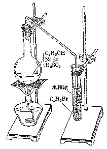

4. 脱水反应 有机物分子， 在一定条件下， 分离出水分子的反应， 叫做脱水反应。乙醇跟脱水剂濃硫酸共热， 在 \(160 \sim 180^{\circ} \mathrm{C}\) 时， 分子内失去一分子水而生成乙烯：

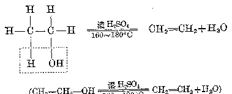

$$
(\mathrm{CH} _ {3} - \mathrm{CH} _ {2} - \mathrm{OH} \xrightarrow [ 160 \sim 180 ^ {\circ} \mathrm{C} ]{\text {濃} \mathrm{H} _ {2} \mathrm{SO} _ {4}} \mathrm{CH} _ {2} = \mathrm{CH} _ {2} + \mathrm{H} _ {2} \mathrm{O})
$$

如果控制温度在 \( 140^{\circ} \) C，则分子間脱水而生成醚：

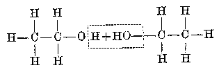

$$
2\mathrm{C}_{2}\mathrm{H}_{5}\mathrm{OH}\xrightarrow[\ 140^\circ\mathrm{C}\ ]{\text{浓}\ \mathrm{H}_{2}\mathrm{SO}_{4}}\mathrm{C}_{2}\mathrm{H}_{5}-\mathrm{O}-\mathrm{C}_{2}\mathrm{H}_{5}+\mathrm{H}_{2}\mathrm{O}
$$

乙醚

以上两个反应里的反应物是一样的，但在不同条件下，有不同的产物。前者是从每一个乙醇分子中脱去一分子的水，而后者是从每两个乙醇分子中脱去一分子的水。后一反应的过程，实际分两个阶段进行。乙醇先跟硫酸反应生成硫酸氢乙酯（乙基硫酸）：

$$
\mathrm{C} _ {2} \mathrm{H} _ {5} - \mathrm{OH} + \mathrm{HO} - \mathrm{SO} _ {2} - \mathrm{OH} = \mathrm{C} _ {2} \mathrm{H} _ {5} - \mathrm{O} - \mathrm{SO} _ {2} - \mathrm{OH} + \mathrm{H} _ {2} \mathrm{O}
$$

硫酸氢乙酯

硫酸氢乙酯再跟过量的乙醇反应，生成乙醚：

$$
\mathrm{C} _ {2} \mathrm{H} _ {5} \mathrm{OH} + \mathrm{C} _ {2} \mathrm{H} _ {5} - \mathrm{O} - \mathrm{SO} _ {2} - \mathrm{OH} = \mathrm{C} _ {2} \mathrm{H} _ {5} - \mathrm{O} - \mathrm{C} _ {2} \mathrm{H} _ {5} + \mathrm{H} _ {2} \mathrm{SO} _ {4}
$$

乙醚

所以乙醚是在乙醇过量和较低温度下生成的。如果乙醇不过量，温度较高，生成的就是乙烯。由此可以看出，在有机化学反应里，反应条件是非常重要的，否则就很难得到所需要的产品。

乙醚是无色液体，具有特殊气味。沸点35°C，比水轻，不易溶于水，极易挥发。它的蒸气很容易着火，和空气混和时还会发生爆炸，因此在使用时要特别小心。乙醚是许多有机物的良好溶剂。工业上制作火棉胶和人造絲时都要大量使用。在医疗上用作外科手术时的全身麻醉剂。

醚也是一类有机化合物。它的分子结构是，一个氧原子（—O—）和两个烃基（R 和 R'）结合而成。是醇的脱水产物。醚类的通式可以用 R—O—R' 来表示。R 和 R' 代表这两个烃基，可以相同，也可以不相同。例如：

$$
\mathrm{CH}_{3}-\mathrm{O}-\mathrm{C}_{2}\mathrm{H}_{5}\qquad \mathrm{C}_{2}\mathrm{H}_{5}-\mathrm{O}-\mathrm{C}_{2}\mathrm{H}_{5}
$$

甲乙醚 二乙醚（简称乙醚）

#### 习题 2·2

1. 在测定乙醇分子结构的实验中，为什么必须用无水乙醇跟钠起反应？

2. 在 \(20^{\circ} \mathrm{C}\) 和 765 毫米时， 使 23 克乙醇完全燃烧， 需要多少升的空气？ 燃烧结果能生成多少克分子的水和多少升的 \(\mathrm{CO}_{2}\)？ 放出多少千卡的热量？

3. 乙烯的实验室制法利用的是乙醇的哪一个反应？

4. 写出下列各步反应的方程式，并注明反应条件：

$$
\mathrm{C} _ {2} \mathrm{H} _ {6} \rightarrow \mathrm{C} _ {2} \mathrm{H} _ {5} \mathrm{Br} \rightarrow \mathrm{C} _ {2} \mathrm{H} _ {5} \mathrm{OH} \rightarrow \mathrm{C} _ {2} \mathrm{H} _ {4} \rightarrow \mathrm{CH} _ {3} \mathrm{CH} _ {2} \mathrm{Br} \rightarrow \mathrm{C} _ {4} \mathrm{H} _ {10}
$$

##### ［解］

（1） \(\mathrm{C_2H_6 + Br_2 = C_2H_5Br + HBr}\)

（2） \(\mathrm{C_2H_5Br + H_2O\xrightarrow{\mathrm{NaOH}} C_2H_5OH + HBr}\)

（3） \(\mathrm{C_2H_5OH\xrightarrow[\text{160~180°C}]{\mathrm{H_2SO_4}} C_2H_4 + H_2O}\)

5. 为什么在用乙醇跟濃硫酸反应制造乙烯的实验中，会得到乙醚？

6. 从醚的结构来判断，它能否跟金属钠反应置换出氢气来？

### § 2·3 乙醇的用途和制法

#### 乙醇的用途

乙醇在医药和工业上有广泛的应用。其中最基本的有：

1. 燃料 由于乙醇具有可燃性， 燃烧时能放出大量的热， 所以常用作燃料。我们做化学实验时用的酒精灯和喷灯， 便是用乙醇作燃料的。它还可以代替汽油作为内燃机的燃料的一部分。

2. 溶剂 多种物质能够溶解在乙醇里，所以乙醇也是一种常用的有机溶剂。医药中的“酊”剂，如碘酊和樟脑酊便是碘和樟脑的酒精溶液。

3. 消毒防腐剂 乙醇能使蛋白质凝固，可以使生物细胞因蛋白质凝固而死亡，因此常用乙醇来杀死细菌，达到消毒和防腐的目的。

4. 有机合成原料 乙醇在有机合成工业上是个重要的原料，象合成橡胶、合成纤维、塑料、油漆、染料、农药、香精等等的制造，都少不了它。尤其在合成橡胶工业上，乙醇的用途更大。

##### 乙醇的工业制法

乙醇的主要制法有二：

1. 发酵法 这是在工业上普遍用的方法。在前面（§1·1）学习制取沼气时，曾经介绍过发酵法。

分析沼气的形成过程， 可以知道， 所謂发酵是較复杂的有机化合物（如粪便、垃圾和杂草中所含的纤维素）， 由于細菌的作用， 分解為簡单化合物（如 \(\mathrm{CH}_4\)） 的过程。經過研究証明， 細菌在这里起的是催化作用， 催化剂是含在这种微生物細胞的細胞液里的一种有机物质， 叫做酶或酵素。

乙醇的制取，同样可以采用发酵法。但原料和酶都跟制取沼气的不同。乙醇制取的原理如下：

将葡萄之类的水果，放在杯子里捣碎，露置在空气中，让空气中的酵母菌落到杯子里的液汁里面去。经过一些时候，液汁中所含的葡萄糖和果糖，由于酵母菌细胞液里的酒化酶的催化作用，使糖发酵，经过一系列的化学变化，轉变成乙醇，結果就可以制得葡萄酒或别的水果酒。这一系列的反应便是发酵法制乙醇的化学原理，可以概括地用下面的化学方程式表示：

$$
\begin{array}{rl} & \mathrm{C _ {6} H _ {12} O _ {6}} \xrightarrow {\text {酒化酶}} 2 \mathrm{C _ {2} H _ {5} OH+2CO_ {2} \uparrow} \\ & \text {葡萄糖} \end{array}
$$

利用糖类发酵制取乙醇的方法，可以实验如下：

装置如图 2·3. 取食用白糖使溶解于水成为糖溶液，每 100 毫升的水约溶入 20 克的糖。把糖溶液注入烧瓶里。

取 3～4 克酒曲（酒药）， 放在研钵里和水磨细成浆状[^ch2-08]， 加入糖溶液中。

用带有导管的塞子塞紧瓶子，导管和U形管相連，U形管里盛放澄清的石灰水，所盛量以略高于管弯为度，U形管的另一端和装有碱石灰的干燥管相連。把烧瓶放在水浴上加热[^ch2-09]，约达30～35℃时烧瓶里就有反应发生，同时放出气体，使 U 形管里的石灰水逐渐变为浑浊，证明放出的是二氧化碳。U 形管上装接碱石灰管的目的，便是为了证明石灰水之所以变为浑浊是由于发酵时有二氧化碳放出，而不是由于空气中的二氧化碳进入之故。因为空气在进入 U 形管中的石灰水时，它所含有的二氧化碳早已被碱石灰所吸收掉了。

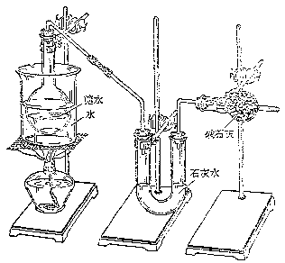

把全部装置放在温暖的地方静置数日后，二氧化碳不再发生，发酵已经完毕。把烧瓶卸下，换接上冷凝器，加热蒸馏，收集75～85℃的馏出液。馏出液具有酒香，证明馏液中有酒精存在。

工业上制取酒精，是采用含有多量淀粉的糯米、高粱、玉蜀黍和山芋等作为原料，先使淀粉转化为葡萄糖，再由葡萄糖发酵成为乙醇。酿造的程序是先把原料处理干净，经过蒸煮，使淀粉成为糊状，然后加入酒曲。酒曲里含有使淀粉轉化为葡萄糖的淀粉酶（从麦芽中取得的菌类的细胞液）和使葡萄糖发酵成乙醇的酒化酶（酵母菌的细胞液）。这些菌类在适当的温度和湿度下迅速繁殖，淀粉酶和酒化酶不断增加，就促使原料中的淀粉发酵成乙醇。

这样所得的乙醇是含有杂质的混和液体，必须经过一再蒸馏，才能得到95%的工业酒精。如果要制得99%的无水乙醇（也叫做绝对酒精），还需用新煅烧的生石灰处理，再加热蒸馏。因为生石灰具有吸水性而又不跟乙醇起反应，所以能把最后一部分的水，几乎全都除去。

含有淀粉的物质多数是我们用作主食品的粮食，于是人们考虑用其他物质来作为制取乙醇的原料。经过研究，发现腐木材、木屑和稻草、麦杆等农副产品，它们所含的纤维素，组成上跟淀粉一样，因此也可以变成糖，再发酵为乙醇。还有些野生植物，如葛根也含有大量淀粉，同样可以用来制取乙醇。怎样更好地利用自然物质，为社会创造财富，从而提高人民生活，正是化学科学的主要任务。

2. 合成法 随着近代有机合成工业的发展，利用石油加工工业的炼油气中所含的大量乙烯，在催化剂硫酸作用下跟水加成为乙醇：

$$
\mathrm{CH} _ {2} = \mathrm{CH} _ {2} + \mathrm{HOH} \xrightarrow {\left(\mathrm{H} _ {2} \mathrm{SO} _ {4}\right)} \mathrm{CH} _ {3} - \mathrm{CH} _ {2} \mathrm{OH}
$$

这就是合成法制乙醇的原理。

#### 习题 2·3

1. 乙醇在工业上有哪些用途？試根据它的性质來說明。

2. 在发酵过程里酶起的是什么作用？

3. 水果腐烂时为什么有酒味？

4. 怎样从石油得到酒精？

### § 2·4 醇类

除了乙醇之外，还有許多化合物跟乙醇的結構和性质相似，它們都屬於醇类。 表 2·1 列出醇类的一部分。

| 醇 | 簡式 | 在常温下的状态 | 熔点（°C） | 沸点（°C） | 比重 | 相应的烃 |
| --- | --- | --- | --- | --- | --- | --- |
| 甲醇 | \( CH_3OH \) | 液 | -97 | 64.7 | 0.772 | 甲烷 \( CH_4 \) |
| 乙醇 | \( C_2H_5OH \) | 液 | -114 | 78.5 | 0.789 | 乙烷 \( C_2H_6 \) |
| 丙醇 | \( C_3H_7OH \) | 液 | -126 | 97.2 | 0.804 | 丙烷 \( C_3H_8 \) |
| 丁醇 | \( C_4H_9OH \) | 液 | -90 | 117.7 | 0.810 | 丁烷 \( C_4H_{10} \) |
| …… | …… | …… | …… | …… | …… | …… |
| 十二醇 | \( C_{12}H_{25}OH \) | 固 | 24 | 259 | 0.831 | 十二烷 \( C_{12}H_{26} \) |

从表中可以看出：

（1） 这些醇都可以看作是相对应的饱和烃的衍生物。也就是相应的烷分子中的一个氢原子被一个羟基取代后的生成物。

（2） 和前面学过的烷属烃等一样，醇类的物理性质也是随着分子量的增加而依次递变的。

（3） 它们的分子组成也是依次相差一个 \(\mathrm{CH}_{2}\) 原子团。它们都是同系物。

醇类具有共同的化学特性，这是因为凡属醇类分子里都有跟烃基相连接的羟基的缘故。物质分子中是否有这样的羟基存在，足以决定这一物质是否属于醇类。因此这个和烃基相连接的羟基，就是醇类的官能团。所以从分子组成的角度来看，醇是分子中含有和烃基相连接的羟基并作为官能团的有机化合物。

烃分子里一个氢原子被一个羟基取代后生成的醇，叫做一元醇。一元醇的通式是 R—OH，R 代表烃基，上表所列的都是一元烷醇（饱和一元醇），所以烃基指的是烷烃基， \( R=C_{n}H_{2n+1} \)。（不饱和链烃——烯烃的羟代衍生物，也是醇的一类，它们的 R 就等于 \( C_{n}H_{2n-1} \)，称为烯醇。）醇类除一元醇外，还有含有二个羟基的二元醇，如乙二醇（\( CH_{2}OH\cdot CH_{2}OH \)）；含有三个羟基的，如丙三醇（甘油）（\( CH_{2}OH\cdot CHOH\cdot CH_{2}OH \)）。它们总称为多元醇。醇类分子里如果有二个以上的羟基，就必定不连在同一个碳原子上，因为两个以上的羟基连在同一个碳原子上的性质就不稳定，这种化合物实际上是不存在的。

醇的原来意义是“美酒”，因为酒的主要成分是乙醇，这就是醇类命名的由来。上面讲过，醇类还可以分为好多类。它们的命名，除都称为“醇”外，一元醇还须以“天干”表示相应的烃的碳原子数，加在“醇”字的前面，例如： \( CH_{3}-CH_{2}-CH_{2}OH \) 称为丙烷醇，简称丙醇； \( CH_{3}-CHOH-CH_{3} \) 称为异丙醇； \( CH_{2}=CHOH \) 称为乙烯醇等等。多元醇则以“天干”表示碳原子数，以“二、三”表示羟基数，也是加在“醇”字的前面，例如： \( CH_{2}OH-CH_{2}OH \) 称为乙二醇； \( CH_{2}OH-CHOH-CH_{2}OH \) 称为丙三醇等，依此类推。

#### 醇类的同分异构現象

前一章里我們曾經学习过烃类的同分异构現象，并且掌握了烃类同分异构体的規律（§1·5）。关于醇类同分异构現象的研究，仍然要运用这些規律。因为醇类是羟基取代了烃类分子中的氢原子而构成的，羟基取代烃分子里的那些碳原子上的氢原子，必然和这个碳原子的级数有关。也就是醇的同分异构現象必然和相应的烃的同分异构現象有关。为了研究方便起見，我們以一元烷醇为例來討論。

（1） 从甲烷 \(\mathrm{H}-\mathrm{C}-\mathrm{H}\) 和乙烷 \(\mathrm{H}-\mathrm{C}-\mathrm{C}-\mathrm{H}\) 的分子結构来看，跟碳原子相連的氢原子，每个都是一样的。当其中任何一个氢原子被羟基取代而成为甲醇（\(\mathrm{CH}_3\mathrm{-OH}\)）和乙醇（\(\mathrm{CH}_3\mathrm{-CH}_2\mathrm{-OH}\)）时，仅有一种可能。也就是說沒有同分异构的醇产生。

（2） 从丙烷的结构 \(\mathrm{H}-\mathrm{C}(\mathrm{C})-\mathrm{C}(\mathrm{C})-\mathrm{C}(\mathrm{C})-\mathrm{H}\) 来看， 有 2 个一级碳原子和1个二級碳原子。羟基连接在一级碳原子上时就成为正丙醇（\(\mathrm{CH}_{3}-\mathrm{CH}_{2}-\mathrm{CH}_{2}-\mathrm{OH}\)）；連接在二級碳原子上就成为异丙醇 \( \mathrm{CH}_{3}-\mathrm{CHOH}-\mathrm{CH}_{3} \)。丙醇和异丙醇具有不同的性质，它们互为同分异构体。

（3） 丁烷以后的烷烃分子里， 碳原子数愈多， 羟基连接的方式愈多， 同分异构体的数目也愈多， 但这些对我们初学的还不需要， 所以就讨论到丙醇为止。

#### 习题 2·4

1. 为什么所有的一元醇有着相似的化学性质，但物理性质如熔点和沸点等却又差异很大？

2. “醇类的化学特性决定于它们分子内的羟基”这句话是不够全面的，为什么？怎样说才正确？

3. 如果說：“醇类的官能团是羟基”；或者說“醇类的官能团是跟烴基相連接的羟基”。那一种說法完整。为什么？

4. 写出含碳原子 1～3 的醇的结构式，及其可能存在的同分异构体的结构式。

5. 某有机物的百分组成是： \(C = 68.9\%\)， \(H = 12.7\%\)， \(O = 18.4\%\)； 它的蒸气对同体积氢气的重量比是 43.5。試求它的分子式。

解 先求各种元素的原子数比。

$$
\mathrm{C}： \mathrm{H}： \mathrm{O} = \frac {68.9}{12}： \frac {12.7}{1}： \frac {18.4}{16} = 5.74： 12.7： 1.15 = 5： 11： 1.
$$

∴ 这种有机物的最简式是 \( C_{5}H_{11}O \)。 分子式是 \( (C_{5}H_{11}O)_{n} \)。

再求这种有机物的分子量 \( M=2\times43.5=87 \)。

$$
n = \frac {M}{C _ {5} H _ {11} O} = \frac {87}{87} = 1.
$$

∴ 这种有机物的分子式是 \( C_{5}H_{11}O \)。

> 校注：原书所列数据及其推导确实得到 \(C_{5}H_{11}O\)、分子量87；但这一分子式不符合通常中性一元醇的化合价规则，疑原书数值有误。书后答案未列本题，现无法据原书确定应改的数值。

6. 某有机物的百分组成是： \(C = 60\%\)， \(H = 13.3\%\)， \(O = 26.7\%\)， 它的蒸气跟同体积空气的重量比是 2.069. 求它的分子式。 写出它可能有的同分异构体。

7. 如果說：“根据一元烷醇的通式 \( C_{n}H_{2n+1}O \) 且来看，当 n=0 时， \( C_{n}H_{2n+1} \) 就等于 H，因此 H—OH（水）是符合于这个通式的，所以水是醇类的同系物”。这种说法对不对？为什么？

8. 有某种一元烷醇 1.15 克，跟过量的金属钠完全反应后，在标准状况下能放出氢气 214.6 毫升。试确定这种醇的结构式。

【解】解答这种类型的题目，要运用通式和分子量来计算。先从方程式里找出这种一元烷醇的分子量，然后从通式求得是什么醇。

根据醇类跟钠的反应，写出化学方程式：

$$
2\mathrm{C}_{n}\mathrm{H}_{2n+1}\mathrm{OH}+2\mathrm{Na}=2\mathrm{C}_{n}\mathrm{H}_{2n+1}\mathrm{ONa}+\mathrm{H}_{2}
$$

设 \( \alpha \) 是这种一元醇的克分子量，

∴ 2x：1.15 克 = 22400 毫升： 214.6 毫升，

$$
x = \frac {22400 \times 1.15}{214.6 \times 2} = 60 \text {克}.
$$

∴ 这种一元醇的分子量是 60.

根据一元烷醇的通式 \( C_{n}H_{2n+1}OH \)，已知它的分子量是 60，即

$$
12 n + 2 n + 1 + 16 + 1 = 60， \quad n = 42 / 14 = 3.
$$

∴ 这种一元烷醇的分子式是 \( C_{3}H_{8}O \)。可能的结构式为 \( \mathrm{CH}_{3}-\mathrm{CH}_{2}-\mathrm{CH}_{2}-\mathrm{OH} \)（丙醇）或 \( \mathrm{CH}_{3}-\mathrm{CHOH}-\mathrm{CH}_{3} \)（异丙醇）。

9. 有某种一元烷醇 3.6 克， 跟过量的金属钠完全反应后， 得到 672 毫升的氢气 （在标准状况下）， 试确定这种醇的结构式。

### § 2·5 甘油

#### 甘油的分子结构和物理性质

甘油是俗称，它是一种多元醇。由于分子组成含有三个碳原子和三个羟基，所以它的学名叫做丙三醇。它的结构式和简式是：

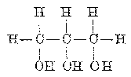

$$
\mathrm{CH} _ {2} \mathrm{OH} - \mathrm{CHOH} - \mathrm{CH} _ {2} \mathrm{OH}
$$

或 \( C_{3}H_{5}(OH)_{3} \)

（简式）

丙三醇可以看作是丙烷分子里有三个氢原子，被同数的羟基所取代而形成的衍生物。它是一种无色透明、具有甜味的粘稠性液体。“甘油”的俗名即由此而来。它的熔点很低（17°C），吸水性很大，能与水以任意比率相互混溶。

##### 甘油的化学性质

甘油虽然是多元醇，但在化学性质上，和一元醇有相似的地方。如它亦能与钠反应，反应的生成物是丙三醇钠和氢气。

在试管中注入甘油几毫升，投入切去外皮并已吸去煤油的表面光亮的钠小粒，略加热，即有气体发生。移去灯火，把试管置于试管架上，见管中反应逐渐加剧。一二分钟后，有爆鸣发生。可见发生的气体是氢气。

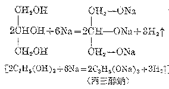

此外，甘油还具有和一元醇不同的性质。最显著的差别是甘油能跟氢氧化铜发生反应。反应的化学方程式是：

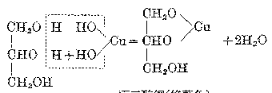

在試管中盛入硫酸銅溶液，加氢氧化鈉溶液振蕩，得到藍色的氢氧化銅沉淀。再加入甘油少許并加振蕩，見沉淀溶解变成絳藍色（藍里帶紅）的溶液。

氢氧化銅是碱，这个反应相当于酸类跟碱类的中和反应。可见甘油在某种程度上显示酸性。但甘油是醇，怎么会具有酸性呢？一元醇是没有这样反应的。甘油酸性的来由，我们可从一元醇和多元醇分子结构的对比中去找。我们知道，一元醇分子中只含有一个羟基，羟基上的氢原子，由于它是通过氧原子跟碳原子结合的，所以比其他氢原子活泼些。但是它只能被碱金属所置换而并不显示酸性。多元醇分子中就不同了，它含有三个羟基，在个数上比一元醇多了两个。因此，多元醇就出现了新的化学特性，羟基里的氢原子比一元醇里的具有更大的活动性，于是在某种情况下就显示酸性。不过，这种酸性是很微弱的，我们不能把它跟典型酸的酸性相比拟。

##### 甘油的用途和制法

甘油的用途是比较广泛的。由于它具有很大的吸水性，在制造香烟、化妆品（雪花膏、牙膏）、印刷用油墨和印泥等时，用来调节水分，防止干燥变硬。由于它的水溶液的凝固点很低，在工业上用作防冻剂或冷冻机的润滑剂。更重要的是大量甘油用来制造一种爆炸力特强的炸药——硝化甘油：

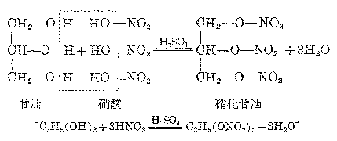

硝化甘油在国防和工农业建设如开山、挖矿等都要使用。

甘油是肥皂工业的副产品。在用脂肪类制造肥皂时可以分离出甘油来。此外，也可用合成法制取。

#### 习题 2·5

1. 甘油有些什么用途？为什么甘油与乙醇有相似的化学性质，同时又有它自己的化学特性？

2. 钠从1克分子的甘油里， 最大限度能置换出氢气多少升（标准状况）？

3. 一元醇和多元醇在化学特性上有哪些相同？哪些不同？为什么？

4. 根据分析结果，某一有机物的百分组成是： \(C = 52.1\%\)， \(H = 13.1\%\)， \(O = 34.8\%\)， 分子量 = 46. 求这一物质的分子式。

5. 某有机化合物的组成是： \(C = 64.8\%\)， \(O = 21.7\%\)， \(H = 13.5\%\)， 在气压等于 750 毫米和温度等于 \(100^{\circ} \mathrm{C}\) 时， 它的蒸气体积 700 毫升的重量是 1.70 克。求这一化合物的分子式。

6. 某二元醇 1.55 克跟过量的金属钠反应，在温度 \( 20^{\circ} \) C 和压力 76 厘米时得到 601 毫升氢气。求这种二元醇的分子式，并写出它的结构简式和名称。

［提示：二元醇跟钠的反应式是：

$$
\mathrm{C}_{n}\mathrm{H}_{2n}(\mathrm{OH})_{2}+2\mathrm{Na}
=
\mathrm{C}_{n}\mathrm{H}_{2n}(\mathrm{ONa})_{2}+\mathrm{H}_{2}
$$

### § 2·6 酚：苯酚

我們知道，链烃的羟基衍生物是醇，芳香族环烃是否也有羟基衍生物呢？如果有，是否也属于醇这一类呢？

芳香族环烃也是有羟基衍生物的。当羟基取代的是芳香族环烃侧链上的氢原子时，如：

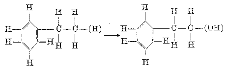

那末它也属于醇类。不过和前面所讲的醇不同，它称为芳香醇。

要是羟基所取代的是直接連在苯环上的氢原子，如：

那末它就不是醇，而另成一类，我們把它叫做酚（音分，fēn）。所以酚是羟基直接跟苯环相連的芳香族环烃的羟基衍生物。

現在我們来研究酚类中最簡單的一个——苯酚。

#### 苯酚的分子结构和物理性质

苯酚简称酚，它只是苯分子里一个氢原子被羟基取代后的生成物。它的结构式和简式如下：

苯酚是无色针状晶体，但通常看到的往往呈显粉红色，这是由于它在空气里局部被氧化的缘故。苯酚具特殊臭味，家用红色消毒药皂中含有少量苯酚，这种肥皂的特有气味，就是苯酚的特臭。苯酚有毒，它的濃液对皮肤有强烈的腐蚀性，使用时必须謹慎小心。要是不慎沾上皮肤，应当立即用酒精洗滌（因为它易溶于酒精），直洗到皮肤上不再有苯酚的特臭为止。苯酚只能略溶于水，如果在水里放入少量的苯酚晶粒，搖蕩，可以得到澄清的苯酚水溶液。如果多加一些，水就会变得渾浊，要在加热后才逐渐变为透明，但冷却后又变渾浊。可见它在水里的溶解度在較高温度时是比较大的。

##### 苯酚的化学性质

1. 跟碱金属起反应 我们知道，乙醇分子里羟基上的氢原子比较活动，所以乙醇能跟金属钠起反应而发生氢气。苯酚分子里也有羟基跟烃基（苯环）结合着，所以苯酚也能跟金属钠起反应而发生氢气；不过生成物是苯酚钠：

这一反应是醇和酚相似的化学性质之一。

2. 跟碱起反应 苯酚除与乙醇有某些相似的化学性质外， 还具有自己的特性。由于苯酚分子里的羟基是跟苯基 \((-\mathrm{C}_{6} \mathrm{H}_{5})\) 结合着的， 而乙醇分子里的羟基是跟乙基 \((- \mathrm{C}_{2} \mathrm{H}_{5})\) 结合着的， 不同的基使分子里羟基中氢氧原子间的联系， 受到不同影响。也就是说， 苯酚分子里羟基中氢氧两原子间的联系， 受了苯环的影响， 比醇分子里羟基中氢氧两原子间的联系要弱， 使苯酚分子里羟基上的氢原子具有更大的活动性。因此苯酚不仅能跟碱金属起反应， 而且能跟碱起反应：

$$
\mathrm{C} _ {6} \mathrm{H} _ {5} \mathrm{OH} + \mathrm{NaOH} = \mathrm{C} _ {6} \mathrm{H} _ {5} \mathrm{ONa} + \mathrm{H} _ {2} \mathrm{O}
$$

苯酚鈉

如果在水和苯酚混和物的浑浊液里，注入稀氢氧化钠溶液，摇荡，溶液就变为澄清。这是因为发生了上述反应，而所生成的苯酚钠是可溶于水的缘故。

从这一反应，可见苯酚也显示了一定程度的酸性。这是苯酚所以俗称为“石炭酸”的由来。但是苯酚的酸性也是很弱的，因为它在水溶液中只能电离出极少量的氢离子。它的酸性比碳酸还要弱，但比起甘油所显示的酸性要强些。从这一点还可以看出苯基和烷基对于羟基影响程度的不同。

前面讲过，一元醇是不显酸性的，所以它不能跟碱起反应。这一点是醇和酚化学性质上的主要差别。

3. 取代反应 苯酚的以上两种化学性质，都是羟基里氢原子活动性较大的反映。而氢原子之所以活动是受着跟羟基相结合的烃基（苯基）的影响。既然烃基可以影响羟基，当然，羟基也可能影响烃基。是不是这样呢？这可以从苯和苯酚跟溴的取代反应来证明。

我們知道，要使苯跟溴起取代反应生成溴苯，需要使用液态溴在催化剂铁屑存在之下，才能使苯环上的一个氢原子被溴取代（§ 1·11）。 也就是说， 苯跟溴是不容易发生反应的。 但苯酚就不同， 如果在盛有透明的苯酚溶液的试管里， 滴入过量的溴溴水， 很快就有白色沉淀生成， 这种沉淀是三溴苯酚：

三溴苯酚是苯酚分子里苯环上的三个氢原子被溴取代的产物。上面这个反应，既不需液态溴，又不用催化剂，取代的氢原子一下子就是三个。可见苯酚跟溴的反应是很容易发生的。

为什么苯跟溴不易反应，而苯酚跟溴很易起反应呢？那是苯酚分子中苯环上的氢原子比苯分子里的氢原子具有较大活动性的缘故。这种较大的活动性显然是受了羟基的影响。因为苯分子里是没有羟基的。

化学结构理论的重要论点之一——分子里各原子之间是互相影响着的，在醇和酚、酚和苯的性质和结构的对比中得到了充分的論証。

4. 显色反应 苯酚遇三价铁盐如三氯化铁溶液时，即呈现紫色。这是苯酚的特征反应。利用这个反应可以检验溶液中是否有苯酚存在。

##### 苯酚的用途

1. 消毒剂 和乙醇相似，苯酚也能使蛋白质凝固，因此它具有杀菌性能，在医疗上用作手术器具的消毒剂。但由于它有腐蚀性，毒性较大，现在已较少使用了。

2. 工业原料 在工业上，苯酚是重要原料之一，药剂中的水杨酸 \(\left(\begin{array}{c}\text{OH}\\\text{COOH}\end{array}\right)\) 或 \(\mathrm{C}_{6}\mathrm{H}_{4}(\mathrm{OH})\mathrm{COOH}\)、炸药中的苦味酸\(\mathrm{C}_{6}\mathrm{H}_{2}(\mathrm{NO}_{2})_{3}\mathrm{OH}\)以及一些染料都用苯酚制造。

在塑料工业上，苯酚的需要量更大，最普通的酚醛塑料，俗称电木的，就是用苯酚和甲醛（音荃，quán）制成的。合成纤维中的卡普隆和耐纶66也都可用苯酚作为原料。

##### 苯酚的制取

1. 从煤焦油提取 在 §1·13 “煤的干馏” 里我们学过，苯酚是煤焦油的分馏产品之一。所以从煤焦油提取是制取苯酚的一种方法。

2. 合成 苯酚也可以用苯作为原料来加以合成。我们知道，卤代链烃水解可以生成醇（§2·1），是不是可以使卤代芳香烃水解而得到酚呢？是的，可以这样做。不过卤代芳香烃不如卤代链烃那样容易水解，必须用催化剂，而且还要控制一定的温度和压力，反应才能进行。概括地说，它是根据下列反应来合成的：

$$
\mathrm{C}_{6}\mathrm{H}_{6}
\xrightarrow[(\mathrm{Fe}\ \text{或}\ \mathrm{FeCl}_{3})]{\mathrm{Cl}_{2}}
\mathrm{C}_{6}\mathrm{H}_{5}\mathrm{Cl}
\xrightarrow[200\sim300\ \text{大气压}]{\mathrm{NaOH}\ \text{水溶液}}
\mathrm{C}_{6}\mathrm{H}_{5}\mathrm{OH}
$$

[^ch2-10]

##### 羟基化合物

上面所讲的醇和酚两类化合物，統称为羟基化合物，因为它們的官能团都是羟基，不过醇分子里的羟基是跟链烃基相連接，而酚分子里的羟基是跟苯环直接相连的。它們都可以由卤代烃衍生。它們也具有某些相似性质；但因羟基所连接的烃基不同，对羟基的影响也不同，因而还有不同的特性。如它們都能跟碱金属起反应，但酚还能跟碱起反应；又如醇能跟氫卤酸起反应而酚不能等等都是。

#### 习题 2·6

1. 下列两式所表示的是一类化合物呢？还是两类？如果是不同的两类，那么它们的区别在那里？

2. 把二氧化碳气体通入苯酚鈉的澄清溶液中，溶液会变得浑浊。为什么？写出有关反应的化学方程式。

［提示：碳酸酸性比石炭酸强。］

3. 在苯酚和水的混和物的浑浊溶液里注入稀氢氧化钠溶液，则液变澄清。再加入少量的盐酸或硫酸溶液，则溶液重又变得浑浊。試說明它們的反应过程，并写出有关的化学方程式。

4. 写出由苯制备苯酚的各步化学方程式。说明为什么其中的反应之一，必须加入氢氧化钠溶液？

5. 醇和酚都是羟基化合物，它们的官能团都是羟基。为什么它们的化学性质并不完全相同？試从分子结构上來說明。

6. 为什么醇类羟基中的氢原子没有酚类羟基中的氢原子那样活动？

7. 試以苯酚的性质为例，論証化学結構理論的第四点。

［提示：对比醇和酚跟氢氧化钠的反应；苯和酚跟溴的反应。］

8. 完成下列各反应式：

（1） \( C_{2}H_{5}OH \xrightarrow[140^{\circ}C]{H_{2}SO_{4}} ? \)

（2） \(\mathrm{C}_6\mathrm{H}_5\mathrm{OH}\xrightarrow{\mathrm{Na}}\mathrm{OH}\xrightarrow{\mathrm{HCl}}\mathrm{?}\)

（3）？ - Cl？ - OH

（4） \(\mathrm{Br}_{2}\) （Fe）？

（5） -OH Br₂？

9. 从煤焦油里得到苯酚和苯的混和物，用什么化学方法可以使它们分离而分别得到苯和苯酚？

10. 某种有机物的组成是 \(C = 76.6\%\)， \(H = 6.38\%\)， \(O = 17.02\%\)。 它的分子量是乙烷的 3.13 倍。 求它的分子式。 这种有机物的水溶液加三氯化铁溶液呈紫色， 写出它的结构简式和名称。

### § 2·7 甲醛

我們知道，乙醇是一种燃料，燃燒后生成二氧化碳和水（§2·2）。我們又知道，燃燒是激烈的氧化反应（第一册§2·7）。既然如此，我們要問：乙醇能不能緩和地氧化而不发生燃燒現象？氧化后的产物是不是和燃燒的結果一样？

经过研究，知道乙醇和甲醇等某些醇类，能在一定条件下发生缓和的氧化作用，生成的不是二氧化碳和水，而是另一种含氧的有机化合物，它叫做醛。在前一节中我们学过，电木是由苯酚和甲醛制成的，这个甲醛就是醛这一类有机化合物的代表性物质，它可以由甲醇氧化而成。

#### 甲醛的物理性质和分子结构

在自然博物馆里，或者在学习生物学时，我们都曾看到过，有許多动物标本浸泡在一种无色液体中。当然，这种液体一定具有防腐性能，才能使动物尸体长久地保存下来。这种液体或是酒精，或是福马林，福马林就是甲醛的35～40%的水溶液。甲醛是一种无色气体，具有强烈的刺激性气味。当我们接触到这种气体时会使我们流出眼泪来。

甲醛的分子式可以根据它的重量组成 \( (C=40\%,H=6.66\%) \)， \( O=53.34\% \) 和分子量 \( (M=30) \) 来确定，结果得到的是 \( CH_{2}O \)。从碳、氢、氧的化合价来看，甲醛的结构式只有一种可能，就是：

这一结构式是否如实地反映了甲醛分子结构的真实情况呢？上面讲过，醛可以由醇氧化生成。甲醛就是由甲醇蒸气，在没有空气存在下，通过热到250～300℃装有铜催化剂的管子时生成的。这一反应过程，我们叫做去氢反应，因为反应的本质是每一个甲醇分子，在生成一个甲醛分子的同时，分出一个氢原子，一个来自羟基，另一个则来自羟基邻近的碳原子[^ch2-11]：

在有机化学反应里，去氢或加氧都是氧化反应，加氢则是还原反应。所以甲醇去氢实质上就是甲醇氧化。

根据由甲醇生成甲醛的反应，可以证明上面甲醛的结构式是符合于它分子结构的实际情况的。

甲醛分子里的一C \( \begin{array}{c}O\\H\end{array} \) 原子团也是一个基，叫做醛基。醛基可以看作是在C=O这个原子团上连接着一个氢原子。这个C=O原子团叫做羰基（羰音湯，碳氧切，tāng）。

醛基的简式一定要写成“—CHO”，不能写作“—COH”。因为要是写作“—COH”，既不能跟醛基区别清楚，又会误解这里的碳原子是二价（—C—O—H）。只有写作“—CHO”，才不致与醛基混淆。而且必须体会到碳原子既和氢原子，同时又和氧原子相连接的。

##### 甲醛的化学性质

1. 加成反应 我们知道， 烯和炔等不饱和烃都跟氢气和卤素等容易起加成反应。由于甲醛分子里的羰基， 是由碳和氧原子以双键结合而成的， 因此具有一定的不饱和性， 而可以在羰基上发生加成反应。如果使甲醛蒸气跟氢气的混和物， 通过热的镍粉催化剂时， 氢就在羰基双键裂开的地方进行加成而使甲醛还原为甲醇：

甲醛是由甲醇去氢（氧化）生成的，但甲醛加氢则又还原为甲醇，醇和醛之间具有这样的相互转化关系。甲醛的加成反应，还可以说是甲醛化学性活潑的表现。

2. 氧化反应 在甲醛分子里跟羰基相连接的一个氢原子， 受了羰基的影响而易于氧化为羟基：

$$
(\mathrm{HCHO} \xrightarrow {\text {(O)}} \mathrm{HCOOH})
$$

所以甲醛具有很强的还原性，就是弱氧化剂也能使甲醛氧化。

（1） 銀鏡反应。氧化銀是一种极弱的氧化剂，它能使甲醛氧化为甲酸，同时还原出銀。在实验时，当金属銀的沉淀薄层在玻璃仪器的壁上出現时，能显出光亮如鏡的銀白色金属光澤，所以，甲醛被氧化銀氧化的这个反应，就叫做銀鏡反应：

$$
\mathrm{H} - \mathrm{C} \underset {\mathrm{H}} {\overset {\mathrm{O}} {\rightleftharpoons}} + \mathrm{Ag} _ {2} \mathrm{O} = \mathrm{H} - \mathrm{C} \underset {\mathrm{OH}} {\overset {\mathrm{O}} {\rightleftharpoons}} + 2 \mathrm{Ag} \downarrow
$$

因为氧化銀不溶于水，在进行銀鏡反应的实验时要用氧化銀的氨溶液[^ch2-12]。

在洗得很干净的试管里，盛入 2% 的硝酸银溶液 2 毫升，逐滴加入氨水 （1：9），初加入时有白色的氢氧化银沉淀出现，继续滴加，则变为棕褐色的氧化银沉淀，再加到沉淀恰好消失为止，然后加入几滴福马林，把试管放在热水杯内，不久，试管内壁出现银镜[^ch2-13]。

反应过程是硝酸银跟氢氧化铵反应，生成氢氧化银沉淀，氢氧化银不稳定，随即分解为氧化银沉淀，氧化银溶于过量的氨水，最后被甲醛还原。 反应的化学方程式如下：

$$
\begin{array}{l} 2 \mathrm{AgNO} _ {3} + 2 \mathrm{NH} _ {4} \mathrm{OH} = 2 \mathrm{NH} _ {4} \mathrm{NO} _ {3} + \mathrm{AgOH} \downarrow \\ 2 \mathrm{AgOH} = \mathrm{Ag} _ {2} \mathrm{O} \downarrow + \mathrm{H} _ {2} \mathrm{O} \\ \mathrm{HCHO} + \mathrm{Ag} _ {2} \mathrm{O} = \mathrm{HCOOH} + 2 \mathrm{Ag} \downarrow \\ \end{array}
$$

（2） 被氢氧化铜氧化。甲醛还能被另一弱氧化剂氢氧化铜氧化为甲酸，同时氢氧化铜还原为氧化亚铜。

在试管里盛福马林、2%的硫酸銅溶液和10%的氢氧化鈉溶液各1毫升，振蕩混和，这时溶液呈藍色。把溶液加热煮沸，見溶液中有紅色沉淀产生，这是氧化亚銅。

反应的化学方程式是：

$$
\mathrm{CuSO} _ {4} + 2 \mathrm{NaOH} = \mathrm{Cu(OH)} _ {2} \downarrow + \mathrm{Na} _ {2} \mathrm{SO} _ {4}
$$

$$
\mathrm{HCHO} + 2 \mathrm{Cu(OH)} _ {2} = \mathrm{Cu} _ {2} \mathrm{O} \downarrow + 2 \mathrm{H} _ {2} \mathrm{O} + \mathrm{HCOOH}
$$

（氧化亚铜）

在上述銀鏡反应和跟氢氧化銅这两个反应里，甲醛都已“加氧”为甲酸。我們已知道，在有机反应里“加氧”是氧化反应，所以甲醛是被氧化了；而 \( \mathrm{Ag_{2}O} \) 和 \( \mathrm{Cu(OH)_{2}} \) 則显然是还原了，因为 \( Ag_{2}O \) 变为银是由正一价银变为 0 价，而 \( \mathrm{Cu(OH)_{2}} \) 变为 \( \mathrm{Cu_{2}O} \)，是由正二价铜变为正一价铜。

銀鏡反应和跟氫氧化銅的反应是醛基的特征反应，利用它們可以檢驗醛的存在。

3. 聚合反应 和乙烯相似 （\( §1\cdot6 \)）， 甲醛也能发生聚合反应。气态甲醛在常温下就很容易聚合成为聚甲醛， 甲醛水溶液则在逐渐加热蒸发时聚合成聚甲醛。甲醛是聚甲醛的单体 （\( §1\cdot6 \)）。

$$
n \mathrm{HCHO} = (\mathrm{HCHO}) _ {n}
$$

这是羰基不饱和性的又一表现。

4. 缩合反应 上面讲过，制造酚醛塑料的原料是苯酚和甲醛。当甲醛与苯酚发生反应时，便能形成树脂状物质，叫做酚醛树脂，在和填料一起热压就制成我们通常所称的电木。

这个反应是比较复杂的。它的特征就是当单体发生反应时，除生成高分子化合物外，同时还生成简单分子（即低分子）的副产物。这种反应称为缩合反应。在这里是甲醛和苯酚两种单体，发生缩合反应，生成高分子化合物酚醛树脂和低分子副产物水。

缩合反应和聚合反应有相似之处，但实质上是不同的。从上面甲醛的聚合反应来看，n个甲醛分子成为一个聚甲醛的高分子，所以，以前讲过（§1·6），聚合反应是相同的分子结合成比较大的分子（或高分子）的反应。再看甲醛和苯酚的反应，跟聚合反应的根本区别是生成物多了一种低分子的副产物。所以，只要是同种分子或异种分子相互结合成为一个复杂的高分子的同时，还有简单分子副产物如水、二氧化碳或氨等析出（缩去）的反应，就是缩合反应。

##### 甲醛的用途

1. 防腐消毒剂 甲醛能使蛋白质内部结构改变而凝固。所以具有杀菌防腐性能。在农业上常用以浸泡种子，杀灭种子上病原菌的孢子。在解剖学上用以浸制标本。

2. 工业原料 甲醛也是有机合成工业的重要原料之一，大量应用于塑料的制造，除酚醛树脂已如前述外，还有脲甲醛、酪素塑料等也是要用甲醛作为原料的。用聚甲醛还可以制成坚韧耐久的纤维。

此外，如合霉素和利尿剂等药剂的制造，以及鞣制皮革，也都需用甲醛。

##### 甲醛的制法

1. 在实验室里，我们可以把铜絲弯成螺旋形，把它装在玻璃棒端。手执玻棒，把銅絲放在火焰上燒熱，然后把灼热的銅絲插入盛有甲醇的試管里去。反复几次后可以看到，原来因受熱氧化而顏色變暗的銅絲，显出了銅所原有的赤色和光澤，表面上的这一层氧化銅沒有了。同时，試管里的液体也不再有醇的气味，而放出了刺激性的醛的气味。可見甲醇已氧化为甲醛。这里的反应是：

$$
2 \mathrm{Cu} + \mathrm{O} _ {2} = 2 \mathrm{CuO}
$$

这个反应还是甲醇的去氢反应，但氢已被氧化成水，所以并无氢气逸出。铜在这里是催化剂，它起着“输送”氧气的作用。当铜在烧热时先跟氧化合成黑色的氧化铜，然后由氧化铜氧化甲醇为甲醛，还原出来的铜显出了本来的色泽。反复进行时就重复了这一过程。

2. 工业上就是按上述原理，使甲醇蒸气混和空气后通过热的铜催化剂而制取甲醛。

#### 习题 2·7

1. 根据甲醇的氧化来证明甲醛的结构式。

2. 举例說明下列名詞的意义：

（1） 银鏡反应；

（2） 縮合反应。

3. 聚合反应是化合物什么性质的表现？除甲醛可以聚合为聚甲醛外，还有什么化合物也能发生聚合反应？

4. 比較聚合反应和縮合反应的相同点和相异点。

5. 怎样說明甲醛既是可以被还原的物质， 又是可以被氧化的物质？

6. 可否把醛基的簡式写成“—COH”？为什么不对？

7. 甲醛在生产上有哪些用途？这些用途与它的哪些性质有关？

8. 制取甲醛时铜在甲醇蒸气里的催化作用是怎样的？铜在没有空气存在时的催化作用又是怎样的？

9. 使 2 克分子的甲醇氧化为甲醛，再使甲醛溶解于水得水溶液 160 克。求所得的甲醛溶液的百分比濃度。

10. 用化学方程式表示下列反应：

$$
\mathrm{C} _ {2} \mathrm{H} _ {6} \rightarrow \mathrm{C} _ {2} \mathrm{H} _ {5} \mathrm{Cl} \rightarrow \mathrm{C} _ {2} \mathrm{H} _ {5} \mathrm{OH} \rightarrow \mathrm{CH} _ {3} \mathrm{CHO}
$$

### § 2·8 醛类

和甲醛的结构、性质相类似的化合物也有不少，这些化合物统称醛类。表2·2列出一部分的醛类。

表 2·2

| 醛 | 結構簡式 | 在常温下的状态 | 沸点（°C） | 比重 | 相应的醇 |
| --- | --- | --- | --- | --- | --- |
| 甲醛 | HCHO | 气 | -21 | 0.815 | \( CH_3OH \) |
| 乙醛 | \( CH_3CHO \) | 液 | 21 | 0.788 | \( C_2H_5OH \) |
| 丙醛 | \( C_2H_5CHO \) | 液 | 49 | 0.797 | \( C_3H_7OH \) |
| 丁醛 | \( C_3H_7CHO \) | 液 | 76 | 0.817 | \( C_4H_9OH \) |
| …… | …… | …… | …… | …… | …… |
| 十四醛 | \( C_{13}H_{27}CHO \) | 固 | 155 | — | \( C_{14}H_{29}OH \) |

从上表可以看出：

（1） 一切醛都含有醛基 \( \left(-\mathrm{C}\right)\left(\mathrm{H}\right) \)。

（2） 醛都可以由相对应的醇去氢而制得。

（3） 醛类的物理性质随着分子量的增加而有所改变。它们常在常温下有气态的、液态的，也有固态的。沸点随着分子量的增大而逐渐升高。比重则都比水来得小。

（4） 它们的分子组成依次相差一个 \( CH_{2} \) 原子团， 所以它们都是甲醛的同系物。

上面已讲过的甲醛的化学性质，如加成、氧化、聚合和缩合反应等等，甲醛的同系物也都能发生。它们所以共有这些特性，正是由于一切醛的分子中都含有醛基这个原子团的缘故。醛基就是醛类的官能团。所以，我们可以说，凡是有机化合物的分子里，含有跟烃基相结合的醛基这种官能团的，就是醛。醛的通式是R—C \( \left\langle\begin{array}{c}O\\H\end{array}\right. \)。这里所讲的醛，分子里只有一个醛基，R都等于 \( C_{n}H_{2n+1} \)。

#### 醛类的命名

醛类也是根据分子里碳原子数的多少来命名的，十个以内用“天干”，十个以上用数字表示。从醛的通式 \( C_{n}H_{2n+1}CHO \) 来看，在醛基里已经有一个碳原子存在，所以命名时特别要注意“天干”或“数字”所代表的碳原子数应当包括醛基里的碳原子，否则就会错误。在甲醛分子中烃基的n等于0，所以结构式是H—C \( \begin{array}{c}O\\H\end{array} \)，在醛基上连接的是一个氢原子，因为分子里只有一个碳原子，同时甲醛又是从甲醇转化而来，尽管它分子中没有甲基（—CH₃），我们还是把它叫做甲醛，或者叫做蚁醛。乙醛CH₃—CHO是甲基和醛基结合而成的，分子里有2个碳原子。它也有别名，叫做醋醛。这些俗名都是有来由的。我们知道，甲醛可以氧化为甲酸，甲酸俗称蚁酸。乙醛可以氧化为乙酸，乙酸俗称醋酸。由于人类对酸类的认识是在醛类以前，于是个别醛的俗名，就依着氧化后的生成物来称呼了[^ch2-14]。

#### 习题 2·8

1. 为什么甲醛、乙醛、丙醛等有着相似的化学性质，但物理性质却又差异很大？

2. 如果說“醛类的官能团是醛基”，是否全面？要怎样說才全面？

3. 化合物 \( C_{5}H_{11}CHO \) 应当叫做戊醛呢还是己醛？为什么？

4. 某种醛的分子量是空气平均分子量的两倍， 求这种醛？

［提示：运用醛类的通式 \( C_{n}H_{2n+1}CHO \)。］

5. 某有机物的重量组成是 \(C = 66.67\%\)， \(H = 11.11\%\)， \(O = 22.22\%\)， 它的蒸气对同体积空气的重量比是 2.49。試求它的分子式。这种有机物能超銀鏡反应， 試写出它的結構簡式并指出名称。

### § 2·9 酮[^ch2-15]

某些醇的氧化产物，不是醛，而是另一类叫做酮的有机化合物，如异丙醇可以氧化为丙酮 \( CH_{3}COCH_{3} \)。

丙酮是酮类中組成最简单而又具有代表性的物质。它是一种具有香味的揮发性无色液体。沸点56℃。它既能溶于水，又能与乙醇、乙醚等有机溶剂以任意比率相互溶混，所以它是工业上的一种重要溶剂。軍火工业上用它来溶解火药棉（三硝基纤维§3·3）制成无烟火药。塑料工业上用它来溶解醋酸纤维。又如人造絲、树脂和噴漆等的制造，都是根据它的优良溶解性而大量使用。此外，制造有机玻璃和环氧树脂（万能胶）也都需要丙酮。所以丙酮也是化学工业的重要原料之一。

丙酮最早是从木材干馏中获得的，后来用山芋粉为原料，利用细菌发酵制得。現在則用石油熱裂气中的丙烯作为原料，在制成异丙醇后再氧化为丙酮。

丙酮的结构简式是：

$$
\mathrm{CH} _ {3} - \stackrel {\mathrm{O}} {\mathrm{C}} - \mathrm{CH} _ {3}
$$

（羰基）

显示在羰基上连接有两个烃基。跟两个烃基相连接的羰基，特称为酮基，说明它是酮类的官能团。酮类的通式是 R—C—R'，R 和 R' 可以相同，也可以不同。

我們知道，醛类的通式是 R—C—H， 醛类分子中也有羰基，由于酮和醛都有羰基，因此酮具有跟醛相似的化学性质，如酮跟氢也能发生加成反应，不过生成的是异丙醇：

$$
\mathrm{CH}_{3}\mathrm{CO}\mathrm{CH}_{3}+\mathrm{H}_{2}\rightarrow\mathrm{CH}_{3}\mathrm{CHOH}\mathrm{CH}_{3}
$$

但酮和醛是不同类别的同分异构体。丙酮和丙醛的分子式都是 \( C_{3}H_{6}O \)，但结构不同，丙酮 \( (CH_{3}COCH_{3}) \) 分子里有酮基，而丙醛 \( (C_{2}H_{5}CHO) \) 分子里有醛基，所以还有许多不同的性质。例如，酮分子中的羰基是和两个烃基相连接着的，羰基上没有易被氧化的氢原子，所以酮是难于氧化的，它不可能被氧化银或氢氧化铜这类弱氧化剂所氧化，酮不发生银镜反应，也不能使二价的氢氧化铜还原为一价的氧化亚铜的红色沉淀。利用这一点可以檢別醛和酮。

#### 习题 2·9

1. 丙酮在生产上有哪些用途？这些用途与它的哪些性质有关？

2. 怎样用化学方法鉴别甲醛和丙酮？

3. 举例說明醛类和酮类是同分异构体。

### § 2·10 乙酸

在 §2·8 里我們学过，醛很容易被氧化为酸。甲醛可以氧化成甲酸，乙醛可以氧化成乙酸。这一节我们就来研究乙酸。

#### 乙酸的物理性质和分子结构

乙酸是食用醋的主要成分。所以乙酸俗称醋酸。醋酸是无色液体，但在冷天是无色晶体，看上去好象冰一样，因此96%以上的純醋酸又叫做冰醋酸，这是因为它的熔点是16.5℃，当冷天气温低于这个温度时，它就凝固的缘故。

醋酸有强烈的刺激嗅味。极易吸湿，能灼伤皮肤，使用冰醋酸时要注意这一点。醋酸易溶于水，通常食用的醋就是醋酸的3～5%的水溶液。

乙酸的结构简式是 \( CH_{3}-COOH \)。为什么这样描述呢？上节里也已学过，这是由于醛分子里跟羰基相连接的氢原子，因为受到了羰基的影响，容易氧化为羟基的缘故。所以不論甲酸或乙酸，都可以看作是在醛氧化成酸时，分子里就出现了羟基。关于这一点，可以用和测定乙醇分子结构同样的实验方法来证明（§2·2）。因为钠或其他活泼金属都很容易从酸里置换出氢来，用金属钠和酸反应，进行放出氢气体积的测定实验，结果一克分子酸里只有一克原子的氢可以置换出来。可见这一个氢原子在酸分子里所处的位置，正是和乙醇分子里羟基上的这一个氢原子是一样的。因此，可以推知酸分子里确是有羟基存在。所以我们可以说，甲酸或乙酸分子里有一个跟羰基连接着的羟基。由羰基和羟基组成的—COOH 原子团特称为羧基（羧音梭， suō）。 乙酸分子是一个烃基（甲烷基）和一个羧基组成的， 所以它的结构式是：

[^ch2-16]

这也可以看作是甲烷分子中的一个氢原子被羧基取代后的生成物。所以它也是烃的衍生物之一。

##### 乙酸的化学性质

乙酸的化学性质，可以根据它的分子结构来推导。它的分子结构可以分成如下所示的几个单位：

1. 羧基上氢原子的性质——酸性 学习到现在为止， 我们只知道， 有机物中的甘油和苯酚是具有一定程度的酸性的。甘油和苯酚的酸性的由来， 主要是分子里羟基上的氢原子受到了影响， 增大了活动性的缘故。乙酸也具有酸性， 它的酸性是怎样来的呢？

乙酸酸性的由来，还是由于分子里羟基上的氢原子的关系。乙酸分子中的羟基受到了羰基里氧的影响，减弱了氢氧原子间的联系，从而增大了氢原子的活动性，使乙酸跟无机酸一样的能够在水溶液里电离：

$$
\mathrm{CH_3COOH\rightleftharpoons CH_3COO^-+H^+}
$$

不过乙酸的电离度很小，不能和强酸如盐酸和硫酸等无机酸相比，它是一种弱酸。

乙酸具有酸类的通性，水溶液有酸味，能使指示剂变色，能跟某些活泼金属起置换反应，生成乙酸盐同时放出氢气，如：

$$
\mathrm{Mg}+2\mathrm{CH}_{3}\mathrm{COOH}=(\mathrm{CH}_{3}\mathrm{COO})_{2}\mathrm{Mg}+\mathrm{H}_{2}\uparrow
$$

[^ch2-17]

乙酸镁

$$
[ \mathrm{Mg} + 2 \mathrm{CH} _ {3} \mathrm{COOH} = (\mathrm{CH} _ {3} \mathrm{COO}) _ {2} \mathrm{Mg} \oplus + \mathrm{H} _ {2} \uparrow ]
$$

乙酸也能跟碱性氧化物反应生成盐和水，如：

乙酸还能跟碱类中和，如：

乙酸盐就是根据以上这些反应来制取的。

乙酸盐可以这样来鉴别：把乙酸盐配成溶液，加入氯化铁溶液，于是生成乙酸铁，溶液显红棕色。把溶液加热煮沸，则有棕褐色的碱式乙酸铁 \( \mathrm{Fe(OH)(CH_{3}COO)_{2}} \) 沉淀生成。

乙酸也可以根据上述原理进行鉴定，只要在乙酸溶液里加碳酸钠粉末到不再有气体发生为止（什么气体？），使生成乙酸钠，然后加氯化铁溶液，加热，根据碱式乙酸铁棕褐色沉淀的出现来鉴定乙酸的存在。

2. 羧基上羟基的取代反应 上面所讲的乙酸的酸性，实质是分子里羧基中羟基上氢原子的反应。现在我們继續討論羧基中整个羟基被取代的反应。例如：在濃硫酸的存在下，把乙酸跟乙醇共热，可以生成具有果香的叫做乙酸乙酯（酯音指，zhǐ）的一种液态化合物：

$$
\mathrm{CH} _ {3} \mathrm{CO} \left[ \begin{array}{l} \mathrm{OH} + \mathrm{H} \\ \mathrm{OC} _ {2} \mathrm{H} _ {5} \end{array} \right] \xrightarrow [ (\text {濃} \mathrm{H} _ {2} \mathrm{SO} _ {4}) ]{\text {加热}} \mathrm{CH} _ {3} \mathrm{COOC} _ {2} \mathrm{H} _ {5} + \mathrm{H} _ {2} \mathrm{O}
$$

乙酸乙酯

濃硫酸在这个反应里是催化剂，同时由于反应是可逆的，濃硫酸有脱水作用，除去水后，更有利于向生成酯的方向进行。

乙酸乙酯以后还要討論。

3. 烃基上氢原子的取代反应 乙酸分子里烃基上的氢原子，容易被卤素取代。这个反应这里不作詳細介紹。

##### 乙酸的用途

乙酸除作为食用醋外，主要作为有机合成工业上的一种重要原料。染料如靛蓝、医药如阿司匹灵、颜料如铅白、織物染色用的媒染剂如乙酸铝、不着火的电影胶片如乙酸纤维素，以及香料、特种人造絲、塑料、假漆和溶剂等的制造，几乎都需使用乙酸。

##### 乙酸的制法

乙酸的制取方法，一般有下述三种：

1. 发酵法 在古时代，人們就已懂得利用酒在空气中自然氧化、“酸败而成醋”的道理。这个过程，实质上就是发酵作用。由于醋酸菌在空气中繁殖，产生一种特殊的酶，这种酶叫做醋酶，能促使乙醇氧化而生成乙酸：

$$
\mathrm{C}_{2}\mathrm{H}_{5}\mathrm{OH}+\mathrm{O}_{2}\xrightarrow{\text{醋酶}}\mathrm{CH}_{3}\mathrm{COOH}+\mathrm{H}_{2}\mathrm{O}
$$

乙醇发酵成醋的过程，叫做成醋发酵。成醋发酵只能在黄酒、葡萄酒等酒类里进行。因为醋酸菌需要氮和磷作为养料，不含氮和磷的烧酒或纯酒精溶液，都不可能发酵而制得乙酸。

2. 木材干馏法 我們知道，在干馏木材所得的木焦油里含有乙酸、甲醇和丙酮，加入石灰后，乙酸便被中和成为乙酸钙（工业上叫做醋石），加热，可以把木焦油中所含的揮发性的甲醇、丙酮和乙酸钙分离。留下的乙酸钙再加濃硫酸蒸馏，可获得濃度为60%的乙酸，反应过程如下：

$$
\begin{aligned}\mathrm{Ca(OH)}_{2}+2\mathrm{CH}_{3}\mathrm{COOH}&=(\mathrm{CH}_{3}\mathrm{COO})_{2}\mathrm{Ca}+2\mathrm{H}_{2}\mathrm{O}\\(\mathrm{CH}_{3}\mathrm{COO})_{2}\mathrm{Ca}+\mathrm{H}_{2}\mathrm{SO}_{4}&\xrightarrow{\text{加热}}2\mathrm{CH}_{3}\mathrm{COOH}+\mathrm{CaSO}_{4}\end{aligned}
$$

3. 合成法 合成法是近代大量生产乙酸的方法， 是用煤和石灰石作为原料的。根据乙炔和水进行加成反应 （这个反应的过程下面就要介绍）， 制得乙醛后， 再用醋酸亚锰作为催化剂， 使乙醛氧化为乙酸。整个生产反应过程可以下式表示：

$$
\mathrm{CaO}\xrightarrow{+\mathrm{C}}\mathrm{CaC}_{2}\xrightarrow{+\mathrm{H}_{2}\mathrm{O}}\mathrm{C}_{2}\mathrm{H}_{2}\xrightarrow{+\mathrm{H}_{2}\mathrm{O}}\mathrm{CH}_{3}\mathrm{CHO}\xrightarrow{+\mathrm{O}}\mathrm{CH}_{3}\mathrm{COOH}
$$

[^ch2-18]

乙炔和水的加成反应叫做乙炔水化反应，是用硫酸汞作为催化剂，在70～75℃时，乙炔跟水发生加成反应，生成乙醛，反应过程如下：

$$
\mathrm{HC}\equiv\mathrm{CH}+\mathrm{H}_{2}\mathrm{O}\xrightarrow[\ 70\sim75^\circ\mathrm{C}\ ]{\mathrm{HgSO}_{4}}\mathrm{CH}_{3}\mathrm{CHO}
$$

在实验室里可以按下列手进行实验：

装置如图2·4. 在乙炔发生瓶中装入碳化钙（电石）几块， 約重5～10克。 在漏斗中注入飽和食盐溶液。 在气体洗瓶里盛入2克重铬酸钾和50毫升濃硫酸的混和液。 在催化瓶中注入稀硫酸（1：5）25毫升和氧化汞0.5克， 在作为受器的试管里盛蒸馏水1～2毫升。

加热催化瓶，并保温在75～80℃。从漏斗中放下食盐溶液，使发生均匀的乙炔气流。当气流通过洗瓶时，由于铬酸混和液的作用，可以除去乙炔气体中可能混有的杂质，如 \( H_{2}S \) 、 \( PH_{3} \) 和 \( AsH_{3} \) 等。当乙炔气流进入催化瓶时就和水发生加成反应，生成的乙醛蒸气进入受器，溶于水而得乙醛溶液。

为了验证生成物是乙醛，在通气5～6分钟后，就可以放下受器，把生成物进行银镜反应，根据银镜的出现，证明乙炔在催化剂存在之下可以水化生成乙醛。

上述三种方法都有生产价值，如发酵法得到的是较稀的乙酸溶液，适于食用。木材干馏法可以得到不同濃度的乙酸。这种方法可以综合利用木材廢料，在森林地区有一定的价值。合成法能制出純淨的乙酸（97～99%），可供重要有机合成工业作为原料之用。

#### 习题 2·10

1. 为什么乙醇和乙酸分子里羟基中氢原子的活动性是不同的？有什么事实可以证明它们不同？

2. 写出化学方程式表示乙酸的主要化学性质。

3. 乙酸具有什么性质，使它能跟钠、氧化钠、苛性钠和碳酸钠都发生反应？作出解释并写出各个化学方程式。

4. 有哪几种方法可以鉴别乙醇和乙酸？

5. 在三个瓶子中分别盛着乙醇、乙醛、乙酸。用什么化学实验方法来鉴别它们？

6. 用过量的镁粉和浓度为 \(1 \mathrm{M}\) 的乙酸溶液 50 毫升反应， 試求在 \(20^{\circ} \mathrm{C}\)， 750 毫米压力下， 能产生氢气若干毫升？

［提示：算出1M的乙酸溶液50毫升中含乙酸多少克分子。］

7. 什么叫做成醋发酵？为什么放置日久的黄酒会变酸而烧酒不会？

8. 怎样从木材干馏所得的液体里把乙酸分离出来？写出有关的化学方程式。

9. 写出工业上从石灰石开始制取乙酸的各步骤反应的化学方程式。

### § 2·11 羧酸类

除了甲酸和乙酸外，还有很多化合物的分子里也含有羧基，它们的结构和化学性质都跟乙酸相似，成为一类，就叫做羧酸类。甲酸是羧酸类中最简单的一个，乙酸是最重要的一个。

跟羧基相结合的烃基， 可以是链烃（脂肪族烃）的基， 也可以是芳香环烃的基， 所以羧酸类还可以分为脂肪酸和芳香酸两属。脂肪酸的烃基可以是饱和的， 也可以是不饱和的。分子里羧基的个数， 可以是一个， 也可以是两个或三个； 因此分别把它们叫做一羧基酸（或一元酸）、二羧基酸（或二元酸）、三羧基酸（或三元酸）等等。二羧基酸以上的统称为多羧基酸（或多元酸）。所以我们说：凡是分子里含有跟烃基结合着的一个或多个羧基官能团的有机化合物， 叫做羧酸。

表 2·3 列出部分重要的饱和一元脂肪酸，它们的分子都是由烷烃基和一个羧基构成。

表 2·3

| 学名 | 俗名 | 结构简式 | 在常温下的状态 | 沸点（°C） | 比重 | 相应的醇 | 相应的醛 |
| --- | --- | --- | --- | --- | --- | --- | --- |
| 甲酸 | 蚁酸 | HCOOH | 液 | 101 | 1.220 | \( CH_3OH \) | HCHO |
| 乙酸 | 醋酸 | \( CH_3COOH \) | 液 | 118 | 1.049 | \( C_2H_5OH \) | \( CH_3CHO \) |
| 丙酸 | 初油酸 | \( C_2H_5COOH \) | 液 | 141 | 0.992 | \( C_3H_7OH \) | \( C_2H_5CHO \) |
| 丁酸 | 酪酸 | \( C_3H_7COOH \) | 液 | 163 | 0.959 | \( C_4H_9OH \) | \( C_3H_7CHO \) |
| …… | …… | …… | …… | …… | …… | …… | …… |
| 十一酸 | — | \( C_{10}H_{21}COOH \) | 固 | 228 | 0.891 | \( C_{11}H_{23}OH \) | \( C_{10}H_{21}CHO \) |
| …… | …… | …… | …… | …… | …… | …… | …… |
| 十六酸 | 软脂酸（棕榈酸） | \( C_{15}H_{31}COOH \) | 固 | 339 | 0.853 | \( C_{16}H_{33}OH \) | \( C_{15}H_{31}CHO \) |
| 十八酸 | 硬脂酸（脂蜡酸） | \( C_{17}H_{35}COOH \) | 固 | 383 | 0.847 | \( C_{18}H_{37}OH \) | \( C_{17}H_{35}CHO \) |

由表中可以看出：

（1） 它们的分子组成和醇类、醛类一样， 依次相差一个 \(\mathrm{CH}_{2}\) 原子团， 所以它们都是饱和一元脂肪酸的同系物。它们的通式是

$$
\mathrm{R}-\mathrm{COOH}\qquad(\text{或 }\mathrm{RCOOH})
$$

R代表烷烃基，等于 \( C_{n}H_{2n+1}(n\geqslant0) \)。

（2） 它們的物理性质也是随着分子量的增加而改变。如沸点逐步升高， 比重逐渐减小， 状态也从液态变为固态。

（3） 它們多数具有俗名。俗名一般表示該酸的来源或特性。如甲酸叫做蚁酸，因为最初是由蚂蚁蒸餾得来的；醋酸是从食醋里取得的；軟脂酸是由熔点較低的脂肪中取得的等等。

此外还有不飽和烴基所成的一元酸，如油酸 \( \left(\mathrm{C}_{17}\mathrm{H}_{33}\cdot\mathrm{COOH}\right) \)，它的分子里比硬脂酸 \( \left(\mathrm{C}_{17}\mathrm{H}_{35}\mathrm{COOH}\right) \) 少2个氢原子，烴基里含有一个双键。它是一种重要的不飽和脂肪酸，在常温下呈液态，不象硬脂酸或軟脂酸那样的呈固态。

不論液态或固态的脂肪酸，只要在烴基里含有为数較多的碳原子，就称为高級脂肪酸。硬脂酸、軟脂酸和油酸都是高級脂肪酸。

这些高級脂肪酸的鈉盐和鉀盐是肥皂的主要成分。当燒碱或純碱跟这些高級脂肪酸反应时，便得到了日常所用的固态肥皂：

$$
\mathrm{C} _ {17} \mathrm{H} _ {35} \mathrm{COOH} + \mathrm{NaOH} = \mathrm{C} _ {17} \mathrm{H} _ {35} \mathrm{COONa} + \mathrm{H} _ {2} \mathrm{O}   \text {   固态肥皂   }
$$

如跟苛性鉀反应，得到的是液态肥皂：

$$
\mathrm{C} _ {17} \mathrm{H} _ {35} \mathrm{COOH} + \mathrm{KOH} = \mathrm{C} _ {17} \mathrm{H} _ {35} \mathrm{COOK} + \mathrm{H} _ {2} \mathrm{O}   \text {   液态肥皂   }
$$

反之，用无机酸作用于肥皂的水溶液，则可以得到脂肪酸：

$$
2 \mathrm{C} _ {17} \mathrm{H} _ {35} \mathrm{COONa} + \mathrm{H} _ {2} \mathrm{SO} _ {4} = 2 \mathrm{C} _ {17} \mathrm{H} _ {35} \mathrm{COOH} + \mathrm{Na} _ {2} \mathrm{SO} _ {4}
$$

硬脂酸这是因为高级脂肪酸是弱酸，而硬脂酸是不溶于水的，它浮于液面，可以很容易把它分离出来的缘故。不过，在工业上硬脂酸和软脂酸等高级脂肪酸以及肥皂，主要由脂肪来制取，或者采用使烃类氧化的方法合成脂肪酸，再与碱反应而制取肥皂。

油酸分子里烃基中碳原子間还具有双鍵，它的結構簡式如下：

$$
\mathrm{CH} _ {3} - (\mathrm{CH} _ {2}) _ {7} - \mathrm{CH} = \mathrm{CH} - (\mathrm{CH} _ {2}) _ {7} - \mathrm{COOH}   (\mathrm{C} _ {17} \mathrm{H} _ {33} \mathrm{COOH})
$$

因此油酸不仅有羧酸所有的一切反应，而且有不饱和化合物所有的反应，如跟氢气加成，油酸就能成为固态的硬脂酸：

$$
\begin{array}{c} \mathrm{C} _ {17} \mathrm{H} _ {33} \mathrm{COOH} + \mathrm{H} _ {2} = \mathrm{C} _ {17} \mathrm{H} _ {35} \mathrm{COOH} \\ \text {油酸} \end{array}
$$

可見油酸具有酸的和不饱和烃的双重化学功能。

关于脂肪酸的命名，首先要指出的是，因为有机酸都是具有羧基作为官能团，为了区别于无机酸起见，所以称为羧酸。其次是命名的方法，一元脂肪酸跟醛类一样，也是根据分子里含有的碳原子数（包括羧基里的碳原子），十个以下用“天干”表示，十一个以上用数字表示。如HCOOH的烃基里不含碳原子，但官能团的羧基里含有一个碳原子，所以叫做甲酸。从和它相对应的甲醇逐步氧化的过程

$$
\mathrm{CH} _ {3} \mathrm{OH} \xrightarrow {\mathrm{O}} \mathrm{HCHO} \xrightarrow {\mathrm{O}} \mathrm{HCOOH}
$$

来看，这样命名也是恰当的。

#### 习题 2·11

1. 完成下列由烃转变为羧酸的反应式：

（1） \( CH_{4} \xrightarrow{+?} CH_{3}Br \xrightarrow{+?} CH_{3}OH \xrightarrow{+?} HCHO \xrightarrow{+?} HCOOH \)

（2） \( CH_{2}=CH_{2} \xrightarrow{?} C_{2}H_{5}Cl \xrightarrow{H_{2}O} C_{2}H_{5}OH \xrightarrow{?} CH_{3}CHO \xrightarrow{O} CH_{3}COOH \)

2. 甲醛分子里有两个氢原子，它们是否一样？甲酸分子里也有两个氢原子，它们又是否一样？为什么？

3. 某饱和一元脂肪酸 1.85 克正好和 1 克的氢氧化钠完全中和。求这一脂肪酸的结构简式和名称。

［提示：先运用饱和一元脂肪酸的通式求出这一种酸的分子量。］

4. 某有机物含碳 58.80%，氢 9.83%，氧 31.37%，它的蒸气对同体积空气的重量比是 3.517。求它的分子式。它具有羧酸类的通性，写出它的结构简式。

［提示：先算出这一有机物的分子量，再算出每一分子里各种元素的重量，然后求出每个分子里各种原子的数目，从而求得它的分子式，最后根据性质确定它的结构简式。］

5. 把甲酸的电离方程式写成： \(\mathrm{HCOOH} \rightleftharpoons \mathrm{COOH}^{+} + \mathrm{H}^{+}\) 对不对？ 为什么？

6. 甲酸会不会起銀鏡反应？怎样根据它的结构来判断？

### § 2·12 酯

上面学过，乙酸跟乙醇在濃硫酸存在下混和加热，可以生成乙酸乙酯 \(\mathrm{CH}_{3}\mathrm{COOC}_{2}\mathrm{H}_{5}\)。同样，其他的酸和醇也可以两两生成各种不同的酯。如把异戊醇跟乙酸混和，用濃硫酸催化加热，便生成乙酸异戊酯：

如果是异戊醇跟异戊酸反应，则生成异戊酸异戊酯：

$$
(\mathrm{CH}_{3})_{2}\mathrm{CHCH}_{2}\mathrm{COOH}
+\mathrm{HOCH}_{2}\mathrm{CH}_{2}\mathrm{CH}(\mathrm{CH}_{3})_{2}
\xrightarrow{\left(\mathrm{H}_{2}\mathrm{SO}_{4}\right)}
(\mathrm{CH}_{3})_{2}\mathrm{CHCH}_{2}\mathrm{COOCH}_{2}\mathrm{CH}_{2}\mathrm{CH}(\mathrm{CH}_{3})_{2}
+\mathrm{H}_{2}\mathrm{O}
$$

异戊酸

异戊酸异戊酯

羧酸跟醇生成酯的反应称为酯化反应，以通式表示：

$$
\mathrm{RCOOH}+\mathrm{R'OH}\rightleftharpoons\mathrm{RCOOR'}+\mathrm{H}_{2}\mathrm{O}
$$

从酯的通式来看，氧原子把烃基 \( R' \) 和另一原子团 \( R—CO— \) 连结在一起，\( R—CO— \) 原子团是酸类分子除掉羟基后的部分，叫做酰基（酰音先，xiān）。所以，凡是分子里含有用氧原子连接在一起的酰基与烃基的有机化合物，称为羧酸酯。

乙酸异戊酯俗称香蕉油，异戊酸异戊酯俗称苹果香精。它们分别具有香蕉和苹果般的香气。在自然界里，它们就存在于香蕉、苹果之类的水果里，从而使香蕉和苹果具有香味。因此，用酸和醇可以制得人造的果香油，作为糖果或饮料的香料之用。这种比较简单的酯大都是挥发性液体，还可以用作溶剂，如溶解赛璐珞制成喷漆，当酯已揮发掉之后，赛璐珞就成为一层漆的薄膜，附在器物表面。所以我们经过喷漆工场时，往往会闻到一阵陣的水果香味。

高級脂肪酸的酯也广泛存在于自然界。如脂肪和油类都含有高級脂肪酸和丙三醇所生成的酯（脂肪酸丙三酯，詳見下一节）。

酯类的重要化学性质之一，是在催化剂存在下能起水解反应，重新生成相应的酸和醇：

如乙酸乙酯跟水共热，在催化剂存在下可以水解成乙酸和乙醇：

$$
\mathrm{CH}_{3}\mathrm{COOC}_{2}\mathrm{H}_{5}+\mathrm{H}_{2}\mathrm{O}
\mathop{\rightleftharpoons}\limits^{\text{催化剂}}
\mathrm{CH}_{3}\mathrm{COOH}+\mathrm{C}_{2}\mathrm{H}_{5}\mathrm{OH}
$$

可見酯化反应是可逆的。酯化时产生酯和水，当酯化进行到相当程度时，所生成的水就分解所生成的酯，使它仍变回原来的酸和醇。这种酯化反应的逆反应叫做酯的水解反应。最后当酯化与水解速度相等时达于平衡。

酯的水解反应也需要有催化剂促进， 否则和酯化反应一样， 它也是进行得很慢的。常用的催化剂是无机酸或碱。用碱作催化剂时， 水解生成的酸与碱中和而生成盐。我们知道， 除去生成物的一种， 可以使平衡向生成物的一方移动， 碱既把酸变成盐， 就减少了酸与醇酯化的可能， 使水解反应实际上可以进行到底。因为高级脂肪酸的甘油酯（油脂）在碱存在下水解， 生成甘油和高级脂肪酸的钠盐或钾盐， 这类盐就是肥皂的主要成分， 所以酯的水解反应特称为皂化反应：

$$
\mathrm{R} - \mathrm{C} \underset {\mathrm{OH}} {\overset {\mathrm{O}} {\rightleftharpoons}} + \mathrm{HO} - \mathrm{R} ^ {\prime} \underset {\text {皂化}} {\overset {\text {酯化}} {\rightleftharpoons}} \mathrm{R} - \mathrm{C} \underset {\mathrm{OR} ^ {\prime}} {\overset {\mathrm{O}} {\rightleftharpoons}} + \mathrm{H} _ {2} \mathrm{O}
$$

#### 习题 2·12

1. 写出甲酸与（1）甲醇，（2）乙醇反应的化学方程式，怎样才能使这两个反应实现？用结构式表示，并注明反应条件。

2. 说出下列化合物的名称：

（1） \( C_{2}H_{5}COOC_{2}H_{5} \)； （2） \( HCOOC_{3}H_{7} \)； （3） \( C_{3}H_{7}COOC_{2}H_{5} \)。

［提示：根据酯的通式 RCO： OR'， RCO 来自羧酸， OR' 来自醇， 酯的名称就是某酸某（醇）酯。］

3. 有同分异构体两个， 分子量是 60， 其中一个容易与醇类起酯化反应， 另一个能发生皂化反应。写出这两个化合物的结构式、名称和有关反应的化学方程式。

［提示：与醇易起酯化反应的物质是什么？它的通式怎样？从通式和分于量求出 \(n = ?\) 得到分子式，再按性质得出结构式和名称。

4. 說明酯化反应和皂化反应兩名詞的区别和相互关系。

### § 2·13 油脂

在我們的日常生活中，油脂是一种必需的营养物质。

油脂广泛存在于动植物体内，动物儲存在内脏、腸間膜和皮下細胞等組織中；植物大多存在于果实和种子中。油料作物的种子，有的含油量可以高达40～50%。

由动植物体得到的油脂，在通常温度和压力下，呈液态的叫做油；固态的叫做脂肪。 但习惯上并不明显区分，而合称为油脂。 这是因为从油和脂的熔点来看，它们是有所差异的，但从组成和结构来看，它们并无本质上的不同。

油脂的組成和結構 上面学过，脂肪和油类的主要成分都是高級脂肪酸和丙三醇（甘油）生成的脂肪酸丙三酯（脂肪酸甘油酯）。其中主要的是硬脂酸、軟脂酸和油酸等三种的甘油酯，它们的結構簡式分別如下：

用通式表示：

式中的 \(R^{\prime}\) 、 \(R^{\prime \prime}\) 和 \(R^{\prime \prime \prime}\) 是脂肪酸的烃基，可以相同也可以不相同；有饱和的，也有不饱和的。一般油脂的成分，大都是三个不同 \(R\) 的混和酯。在固态脂肪中主要含有饱和脂肪酸的甘油酯；在液态油中则所含的是以不饱和脂肪酸的甘油酯为主，按照油脂中各种甘油酯相对含量的不同，它们就具有不同的熔点，在化学成分上实际并没有什么根本区别。

油脂的性质 油脂能浮于水面，可见它们比水輕。所有油脂的比重总在0.9～0.95克/毫升之間。而且它们不溶于水，这就是为什么水洗不掉油污的原因。但油污可以用汽油或乙醚去“洗掉”它，可见油脂是易溶于这些有机溶剂里的。利用这个性质，可以用有机溶剂从植物的果实里提取油脂。（但此法仅适用于提取含油較少的植物油脂，一般植物油脂常用压榨法提取。动物油脂则用熔出法。）

油脂是我們日常必需的副食品，它的营养价值很高。因为它在人体内氧化时发热量很大，1克油脂能放出9.4千卡的热量，所以到冬天人們就更喜爱多吃一些含油脂的食物。人类消化油脂是依靠小腸里的一种酶的催化，促使它水解（皂化反应）生成脂肪酸和甘油（参阅§2·14油脂加工）。但腸壁只能摄取脂肪酸盐而不能直接摄取脂肪酸。依靠人体内的一些分泌液里含有的碱，跟脂肪酸生成脂肪酸盐。腸壁細胞把攝取的脂肪酸盐和甘油，又重新組成适合于人体的油脂，通过淋巴液管輸送到血液里，循环进入体内的各部組織，作为氧化发热的“燃料”。多余的油脂就儲藏在細胞組織里。

油脂不仅是一种重要副食品，而且是一种重要工业原料。经过加工可以制成肥皂、甘油和硬脂酸等，广泛应用于生活和生产各方面。

#### 习题 2·13

1. 試根據油和脂的成分說明，为什么在通常温度和压力下，脂呈固态而油呈液态。

2. 根据油脂的什么性质，能够用有机溶剂来提取植物油？

3. 分别写出硬脂酸、軟脂酸和油酸跟丙三醇反应的化学方程式。

### § 2·14 油脂加工

#### 甘油和脂肪酸的制取

从上节我們已知道，油脂是含有各种高級脂肪酸的甘油酯，酯能起水解反应。油脂用酸作催化剂与水共热就能水解，結果可以得到組成它們的几种高級脂肪酸和甘油：

工业上就是根据这个原理进行油脂加工，以制取各种脂肪酸和甘油的。

制得的脂肪酸主要有三种，就是硬脂酸、软脂酸和油酸：

$$
(\mathrm{C}_{17}\mathrm{H}_{35}\mathrm{COO})_{3}\mathrm{C}_{3}\mathrm{H}_{5}+3\mathrm{H}_{2}\mathrm{O}\xrightarrow{\mathrm{H}_{2}\mathrm{SO}_{4}}3\mathrm{C}_{17}\mathrm{H}_{35}\mathrm{COOH}+\mathrm{C}_{3}\mathrm{H}_{5}(\mathrm{OH})_{3}
$$

$$
\left(\mathrm{C}_{15}\mathrm{H}_{31}\mathrm{COO}\right)_{3}\mathrm{C}_{3}\mathrm{H}_{5}
+3\mathrm{H}_{2}\mathrm{O}
\xrightarrow{\mathrm{H}_{2}\mathrm{SO}_{4}}
3\mathrm{C}_{15}\mathrm{H}_{31}\mathrm{COOH}
+\mathrm{C}_{3}\mathrm{H}_{5}(\mathrm{OH})_{3}
$$

軟脂酸甘油酯

軟脂酸

$$
\left(\mathrm{C}_{17}\mathrm{H}_{33}\mathrm{COO}\right)_{3}\mathrm{C}_{3}\mathrm{H}_{5}
+3\mathrm{H}_{2}\mathrm{O}
\xrightarrow{\mathrm{H}_{2}\mathrm{SO}_{4}}
3\mathrm{C}_{17}\mathrm{H}_{33}\mathrm{COOH}
+\mathrm{C}_{3}\mathrm{H}_{5}(\mathrm{OH})_{3}
$$

油酸甘油酯

油酸

##### 肥皂的制取

上面讲过，酯在碱存在时跟水共热也可以发生水解。和上述油脂的酸性水解一样，工业上就用油脂和氢氧化钠溶液共热，当油脂发生水解生成脂肪酸时，氢氧化钠立即与酸作用而生成脂肪酸钠盐，从而制得了肥皂，甘油在这里是副产品：

$$
3\mathrm{C}_{17}\mathrm{H}_{35}\mathrm{COOH}+3\mathrm{NaOH}=3\mathrm{C}_{17}\mathrm{H}_{35}\mathrm{COONa}+3\mathrm{H}_{2}\mathrm{O}
$$

$$
\left(\mathrm{C} _ {17} \mathrm{H} _ {35} \mathrm{COO}\right) _ {3} \mathrm{C} _ {3} \mathrm{H} _ {5} + 3 \mathrm{NaOH} = 3 \mathrm{C} _ {17} \mathrm{H} _ {35} \mathrm{COONa} + \mathrm{C} _ {3} \mathrm{H} _ {5} (\mathrm{OH}) _ {3}
$$

肥皂（硬脂酸钠）

誰都知道，肥皂能洗除污垢，但它为什么能去污呢？

肥皂的去污原理，还没有很全面的了解，一般认为，肥皂在水中由于脂肪酸钠的解离而有 \( Na^{+} \) 和 R—COO \( ^{-} \) 两种离子。在 R—COO \( ^{-} \) 离子中 R 的一头能溶于油而不溶于水，羧基 COO \( ^{-} \) 的一头则能溶于水而不溶于油。当使用肥皂洗涤油污时，R 与油污互溶，使油污被肥皂分子包围起来（图 2·5），再经摩擦和振荡（这就是洗衣物时必须搓擦和漂洗的理由），使油污形成极为微小的珠滴，完全脱离附着物而悬浮在水中。这时水变成乳浊液，产生大量泡沫，泡沫吸附着污垢，得以随水冲洗而去。所以肥皂质量的好坏，可以取决于洗涤时产生泡沫的多少。洗衣粉的去污原理[^ch2-19]，可以同样解释。

以前学过（第三册）硬水不适于用肥皂洗涤的原因，现在可以更为清楚了。原来是硬水中所含的钙和镁盐当遇到肥皂时，就生成了不溶性的脂肪酸钙和脂肪酸镁沉淀，从而破坏了肥皂的作用。

$$
\begin{array}{l} 2 \mathrm{C} _ {17} \mathrm{H} _ {35} \mathrm{COOH} + \mathrm{Ca} (\mathrm{HCO} _ {3}) _ {2} \\ = \left(\mathrm{C} _ {17} \mathrm{H} _ {35} \mathrm{COO}\right) _ {2} \mathrm{Ca} \downarrow + 2 \mathrm{H} _ {2} \mathrm{O} + 2 \mathrm{CO} _ {2} \uparrow \\ \end{array}
$$

硬脂酸钙（钙肥皂）

##### 硬化油的制取

油类成分中主要含有油酸甘油酯。在油酸分子的烃基部分，存在有一个双键：

$$
\left[ \mathrm{CH} _ {3} \left(\mathrm{CH} _ {2}\right) _ {7} - \mathrm{CH} = \mathrm{CH} \left(\mathrm{CH} _ {2}\right) _ {7} - \mathrm{COOH} \right]，
$$

这样油酸甘油酯的分子里就比含有同数碳原子的硬脂酸甘油酯要少六个氢原子：

$$
\begin{array}{rl} \left(\mathrm{C} _ {17} \mathrm{H} _ {33} \mathrm{COO}\right) _ {3} \mathrm{C} _ {3} \mathrm{H} _ {5} & \quad \left(\mathrm{C} _ {17} \mathrm{H} _ {35} \mathrm{COO}\right) _ {3} \mathrm{C} _ {3} \mathrm{H} _ {5} \\ \text {油酸甘油酯} & \quad \text {硬脂酸甘油酯} \end{array}
$$

由于油类组成中烃基的不饱和双键的存在，不仅熔点较低，在常温下呈液态，而且这样的油有颜色和臭味，如棉子油和鱼油，无论作为食用或工业用，都不大适宜。但不饱和化合物是易起加成反应的，油酸能跟氢气加成而成为硬脂酸：

$$
\mathrm{C} _ {17} \mathrm{H} _ {33} \mathrm{COOH} + \mathrm{H} _ {2} = \mathrm{C} _ {17} \mathrm{H} _ {35} \mathrm{COOH}
$$

[原式疑点：硬水与肥皂反应处的 raw 方程式与正文“钙、镁盐遇肥皂生成不溶性脂肪酸盐”的叙述不完全自洽；仅凭 raw 不能唯一判定原版反应式，故未擅改。]

由此看来，液态油可以通过加成而变成固态的脂肪。同时由于把不饱和的已变为饱和的，颜色和臭味也就随同消失。通过油类加氢反应，使一些本来不适于食用和工业用的油脂，变成了可口的食品和符合工业要求的原料。且液态油变为固态以后，运输和储存也都比较方便。所以油类加氢反应具有巨大的经济价值。

油类加氢反应也可以称作油类的氢化或硬化，这里的“硬化”两字具有“使液态油变为固态（硬）脂肪”的意义，制得的油脂就统称为硬化油。

工业上把氢气在一定的温度和压力下通入混有镍粉催化剂的油里，使发生加成反应：

$$
(\mathrm{C}_{17}\mathrm{H}_{33}\mathrm{COO})_{3}\mathrm{C}_{3}\mathrm{H}_{5}+3\mathrm{H}_{2}
\xrightarrow[\substack{175\sim190^\circ\mathrm{C}\\1\text{大气压以上}}]{\mathrm{Ni}}
(\mathrm{C}_{17}\mathrm{H}_{35}\mathrm{COO})_{3}\mathrm{C}_{3}\mathrm{H}_{5}
$$

油酸甘油酯（液态）　　　　　　　　　硬脂酸甘油酯（固态）

##### 油漆的制取

分子里含有双键的不饱和酸根的油脂，除棉子油、豆油、亚麻仁油外，我国特产的桐油的主要成分也是不饱和酸所构成的酯。这种酯叫做桐酸甘油酯。桐酸分子里含有三个双键，它的结构简式是 \( C_{17}H_{29}COOH \)，如把简式展开，可以写成：

$$
\mathrm{CH} _ {3} - (\mathrm{CH} _ {2}) _ {3} - \mathrm{CH} = \mathrm{CH} - \mathrm{CH} = \mathrm{CH} - \mathrm{CH} = \mathrm{CH} - (\mathrm{CH} _ {2}) _ {7} - \mathrm{COOH}
$$

桐酸

由于这个分子结构里的双键更多，因此很容易跟氧结合。当把桐油涂抹在木器上以后，会很快形成一层光亮而坚韧的薄膜。这个現象的实质，不是油在空气里蒸发变干，而是氧在油的双键地方把若干个脂肪酸的分子联结了起来。不过我们还是把这一种分子里含有多个双键的油脂叫做干性油，这里值得注意这个“干”字的意义。

把桐油涂抹在家俱上可以防水防朽，这在我国古代就已经这样做了。但随着生产和生活的提高，人们还进一步創制了油漆。油漆是以干性油为原料，不过在油里加入金属氧化物，如一氧化鉛或二氧化錳等，帮助干性油吸收氧气而縮短干燥时间，这种氧化物在油漆工业上就叫做催干剂。再加入各种颜料，充分攪和就成为五顏六色的油漆。油漆是这一类涂料的籠統名称，它实际包括許多不同的品种，尤其是为了各种特殊需要而制的油漆，都有特殊的配方。如船舶使用的就有船底漆、水綫漆和甲板漆的分别；而軍舰用的还須具有防火性能。大多数金属和木材，如果得不到适当的保护，就会逐漸腐蝕而造成巨大的損失，油漆是防止这种損失的有效手段之一。

#### 习题 2·14

1. 有油酸甘油酯用酸作催化剂，跟水共热时，仅有 \(85\%\) 的油脂发生皂化反应，如要制造2.94吨甘油，则需这种油脂多少吨？

2. 說明制取肥皂的化学原理和肥皂的去污原理。

3. 什么叫油类的氢化？油类氢化在国民经济中具有什么意义？

4. 为什么不能用花生油或棉子油来代替桐油去制造油漆？

5. 下列各个相似名词的区别何在：

（1） 酯；（2） 脂；（3） 油；（4） 干性油。

### 本章提要

#### 1. 烃的衍生物

烃分子里的氢原子被其他元素的原子或原子团所取代的化合物。

#### 2. 官能团

决定有机化合物化学特性的原子团。

#### 3. 烃的衍生物的分类比较表

| 类别 | 卤代烃 | 醇 | 醛 | 羧酸 | 酯 |
| --- | --- | --- | --- | --- | --- |
| 定义 | 烃分子中的氢原子被卤原子取代而成的衍生物 | 分子里含有跟烃基结合着的羟基这种官能团的有机化合物 | 分子里含有跟烃基结合着的醛基这种官能团的有机化合物 | 分子里含有跟烃基结合着的一个或多个羧基这种官能团的有机化合物 | 分子里含有由氧原子连接在一起的酰基与烃基的有机化合物 |
| 通式 | \(\mathrm{RX}\) | \(\mathrm{R\cdot OH}\) | \(\mathrm{R\cdot CHO}\) | \(\mathrm{R\cdot COOH}\) | \(\mathrm{RCOOR'}\) |
| 官能团 | \(\mathrm{-X}\) | \(\mathrm{-OH}\) | \(\mathrm{-CHO}\) | \(\mathrm{-COOH}\) | \(\mathrm{-COOR'}\) |
| 代表性物质 |  | 乙醇 \(\mathrm{C_2H_5OH}\) | 甲醛 \(\mathrm{HCHO}\) | 乙酸 \(\mathrm{CH_3COOH}\) |  |
| 分子结构特点 | 分子中的卤原子性质活泼 | 羟基中的氢原子虽不能电离，但比分子中其他氢原子活泼 | 分子里的羰基由双键结合，具有不饱和性；跟羰基相连接的氢原子受羰基影响，易于氧化 | 分子里有羟基、羰基；羟基受到羰基里氧的影响，增大了氢原子的活动性 | 酸分子中的氢被烃基取代 |
| 化学特性 | 1. 跟 \(\mathrm{NaOH}\) 和 \(\mathrm{NH_3}\) 等化合物发生取代反应；2. 跟金属钠发生反应 | 1. 羟基里的氢原子的反应：与钠反应生成乙醇钠；与酸反应生成酯；2. 脱水反应：分子内脱水生成乙烯，分子间脱水生成乙醚；3. 氧化反应；4. 羟基的取代反应 | 1. 加成反应；2. 氧化反应；3. 聚合反应；4. 缩合反应 | 1. 酸类通性；2. 跟醇起酯化反应 | 在催化剂存在下起水解反应，生成羧酸和醇（皂化反应） |
| 重要应用 | 广泛应用于有机合成 | 1. 燃料；2. 溶剂；3. 消毒防腐剂；4. 有机合成原料 | 1. 消毒防腐剂；2. 工业原料 | 1. 食用醋；2. 有机合成原料 | 简单的羧酸酯：1. 溶剂；2. 果子香精 |

各类物质间的衍生关系和相互变化：卤代烃水解为醇，醇跟氢卤酸反应生成卤代烃；醇氧化为醛，醛还原为醇；醇分子间脱水生成醚；醛氧化为羧酸，羧酸还原为醛较难；羧酸跟醇酯化为酯，酯皂化生成羧酸和醇。

#### 4. 几个重要反应和实例

| 反应 | 概念 | 例 |
| --- | --- | --- |
| 缩合反应 | 同种分子或异种分子相互结合成为一个高分子的同时，还有简单分子析出的反应 | 酚醛缩合（95页） |
| 银镜反应 | 醛基被氧化银氧化的反应 | 甲醛与银氨溶液生成银镜（94页） |
| 酯化反应 | 醇跟羧酸生成酯的反应 | 乙酸与乙醇共热生成乙酸乙酯（104页） |
| 皂化反应 | 酯水解为醇和羧酸的反应 | 乙酸乙酯跟水共热在催化剂存在下生成乙酸和乙醇（113页） |
| 油脂氢化 | 油分子上的加氢过程 | 硬化油的制取（119页） |

### 复习题二

1. 試用簡便的化学方法鉴别下列各組化合物：

（1） 丙醛与丙酮；

（2） 丙酮与乙醇；

（3） 乙醛与乙醇；

（4） 乙醇与丙三醇；

（5） 乙醇与苯酚。

2. 用化学方程式表示下列反应，并注明条件：

（1） \( CH_{3}CHO \rightarrow C_{2}H_{5}OH \rightarrow C_{2}H_{4} \rightarrow C_{2}H_{5}Cl \)

（2） \( CH_{4} \rightarrow CH_{3}Br \rightarrow CH_{3}OH \rightarrow HCHO \xrightarrow{O} HCOOH \)

（3） \(\mathrm{R\cdot CH_3\rightarrow R\cdot CH_2Cl\rightarrow R\cdot CH_2OH\rightarrow R\cdot CHO\rightarrow R\cdot COOH\rightarrow RCOOR'}\)

3. 比較下列各組反应的相似和相异的地方：

（1） 酯化反应和中和反应； （2） 酯的水解和盐的水解。

4. 試从甲酸的分子結構說明它不仅能起羧酸的反应， 而且还能起醛的反应的原因。

5. 两种不同有机物对同体积氢气的重量比都是37。一种能跟氢氧化钠起中和反应生成盐，另一种是它的同分异构体，具有果香味，还能起银镜反应。写出这两种物质的结构式和名称。

【解】这两种物质的分子量 \( M=37\times2=74 \) （氧单位）。

（1） 能跟氢氧化钠起中和反应生成盐的有机物是羧酸，羧酸的通式是R-COOH。

$$
\mathrm{RCOOH} = 74， \quad \mathrm{R} + 12 + 32 + 1 = 74， \quad \mathrm{R} = 74 - 45 = 29.
$$

即 \( C_{n}H_{2n+1}=29,\quad12n+2n+1=29,\quad14n=29-1=28 \)

$$
\therefore n = 28 / 14 = 2.
$$

这种有机物是丙酸 \( \left(\mathrm{C}_{2}\mathrm{H}_{5}\mathrm{COOH}\right) \)。

（2） 具有果香味的丙酸的同分异构体，可能有两种酯：甲酸乙酯 \( \left(\mathrm{HCOOC}_{2}\mathrm{H}_{5}\right) \) 和乙酸甲酯 \( \left(\mathrm{CH}_{3}\mathrm{COOCH}_{3}\right) \)。

在甲酸乙酯的结构中，H—C—O—C₂H₅羰基是和氢原子相连接的，因此具有醛的性质能起银镜反应，这是乙酸甲酯所没有的。

∴ 另一种有机物是甲酸乙酯（HCOOC₂H₅）。

6. 某有机物的蒸气对同体积空气的重量比是2.07， 它能起酯化反应， 但没有酸性。求出这一物质的结构简式和名称。

7. 某种晶体跟少量水一起振荡， 得到的是浑浊液， 把溶液分成二份， 一份加入氢氧化钠溶液， 则逐渐变为澄清， 通入二氧化碳， 则溶液又变浑浊； 一份滴入氯化铁溶液， 立即有紫色出现。试推断这种晶体是什么？ 并写出各有关的化学方程式。

8. 有一种无色液态有机物， 具有下列性质： （1） 它的蒸气对同体积氢气的重量比是 37； （2） 每克分子这种物质， 能跟钠反应产生一个克原子的氢气； （3） 能发生酯化反应； （4） 跟碳酸钠不起反应。试推断该物质属于哪一类有机化合物？ 写出它的同分异构体的结构简式。

#### 解

1. （1） 这种有机物的分子量 \(M = 37 \times 2 = 74\) （氧单位）。

（2） 每克分子这种物质能跟钠反应产生 1 克原子氢气。它可能是一元醇， 一元酚， 或一元酸。

（3） 它能发生酯化反应， 可能是一元醇或一元酸。

（4） 它不能跟碳酸钠起反应，所以它一定是一元醇。

根据一元醇的通式 R—OH 来求分子式。

$$
\mathrm{C} _ {n} \mathrm{H} _ {2 n + 1} \mathrm{OH} = 74； \quad 12 n + 2 n + 1 + 17 = 74，
$$

$$
14 n = 56， \quad n = 4.
$$

∴ 这种物质是丁醇 \( \left(\mathrm{C}_{4}\mathrm{H}_{9}\mathrm{OH}\right) \)。

2. 它有三种同分异构体： \( CH_{3}-CH_{2}-CH_{2}-CH_{2}-OH \)；

$$
\mathrm{CH}_{3}-\mathrm{CH}(\mathrm{OH})-\mathrm{CH}_{2}-\mathrm{CH}_{3};\qquad(\mathrm{CH}_{3})_{2}\mathrm{CH}-\mathrm{CH}_{2}\mathrm{OH};\qquad(\mathrm{CH}_{3})_{3}\mathrm{C}-\mathrm{OH}
$$

9. 某有机物， （1） 它的蒸气和相同状况下同体积空气的重量比是 2； （2） 它能起银镜反应； （3） 它不会起酯化反应和皂化反应。試推断該物质属于哪一类有机物？ 写出它的結構簡式； 它有哪些同分异构体？

10. 試根據化学結構理論， 說明乙醇跟氫氧化鈉不起反应而苯酚跟氫氧化鈉能起反应的原因。

11. 要消毒小麦种子若干，需用福马林 250 克，問要多少甲醇才能制取这些福马林？（假定福马林是 40% 的甲醛溶液）

12. 分子里含有 C、H、O 三种元素的烃的衍生物， 已經学过的有醇、醚、醛、酮、羧酸和酯等六类， 假定它们分子里都含有 3 个碳原子。問各类物质的结构式怎样？ 哪些互为同分异构体？

13. 如果說，“碳、氫、氧三种元素組成的有机物，只要看它們分子里所含的氧原子数是多少，就可以決定它們属于哪一类。含有二个氧原子的一定是羧酸或酯，含有一个氧原子的一定是醇或醚。”这种說法对不对？为什么？

14. 从乙炔制取乙酸， 假使不通过乙炔水化反应， 問应当经过哪些步骤？ 写出有关反应的化学方程式。

15. 怎样利用焦炭、石灰石、食盐和水来制取重要杀虫药六六六？写出有关的步骤及各步骤反应的化学方程式。

16. 在工业上制造氯乙烷采用乙烯跟氯化氢加成；制取三氯甲烷用乙醇跟漂白粉作用[^ch2-20]；都不采取烷烃和卤素的取代反应。为什么？

### 本章脚注

[^ch2-01]: 根据性质、组成和分子结构，有机化合物主要可以分为开链化合物和环状化合物两类。开链化合物是分子里的碳原子相互连接成开链状的化合物。由于这类化合物最初是在油脂里发现的，因此又称它们为脂肪族化合物。所以脂肪族烃就是链烃。环状化合物分子里的碳原子相互连接成环状，根据环中所含元素的种类和性能又分为脂环族和芳香族。脂环族化合物是性质类似脂肪族的环状物，如第一章里学过的各种环烷烃（§1·10）。芳香族化合物是具有苯环基的结构的化合物，如学过的苯及其衍生物（§1·11，§1·12）。

[^ch2-02]: 即烃的卤素取代物。

[^ch2-03]: 氟代烃的制法和性质，都不与其他卤代烃相似，它们在近代工业上所起的作用很大，在有机化学的专书中，有专门介绍。

[^ch2-04]: 胺讀如“安”an，是烴基和氨基相結合的一类化合物，參閱第四章。

[^ch2-05]: 可湿性粉剂由六六六粉加潤湿剂混和磨制而成，在水中作較长时间的浸泡和搅拌后，可以提高其悬浮和潤湿能力，主要用以喷洒大田作物。

[^ch2-06]: 硫酸铜和消石灰的混和液称为波尔多液，用作杀菌剂以喷洒果树和馬鈴薯等植物。

[^ch2-07]: （2） 式实际是甲醚的结构式， 甲醚不能跟钠反应。

[^ch2-08]: 目的在于增加酵母在糖溶液中的接触，使发酵得更快和更完全。

[^ch2-09]: 在較大的燒杯中盛清水，把燒瓶放在水里，然后加热燒杯中的水。这种間接加热，叫做在水浴上加热。

[^ch2-10]: 这种反应式表示一联串的反应过程，不要求如化学方程式那样必须用等号和等号两边平衡，只须用“→”表示某一物质变成某一物质，参与反应的另一物质，则写在“→”的上面。

[^ch2-11]: 甲醇分子里只有一个碳原子，“邻近”两字在这里没有意义。但在其他的醇分子中情况就不同了。例如乙醇分子里有两个碳原子，当它发生去氢反应时，一个氢原子便是从邻近羟基的那个碳原子上分出来的，如：

因为这样是不可能形成双键的。

[^ch2-12]: 氧化銀能溶于过量的氨水里，必須临时配用，不要貯存。

[^ch2-13]: 如果进行銀鏡反应的试管內壁不够光滑，可能得到的不是銀鏡而是疏松的黑色沉淀，这也是还原出来的銀粒，不过以另一种形态出現。

[^ch2-14]: “醛”是酒变味的意思，酒变味的原因是醇受了氧化。所以用“醛”来表示醇的第一步氧化产物。

[^ch2-15]: “酮”字原义是酒要败坏的意思，所以用来表示醇的又一种氧化产物。讀如同，tóng。

[^ch2-16]: 注意：这样写时，切勿误会羟基是和氧原子连接的。

[^ch2-17]: 有机酸盐的分子式的写法，习惯上把金属写在后面。

[^ch2-18]: 这种反应式在 §2·6 中已看到过，见第 90 页注。

[^ch2-19]: 洗衣粉又称为合成洗涤剂，市售的品种很多。它的成分主要是有机物的磺酸钠盐 \( R \cdot SO_{3}Na \)，烃基 R 可以是链状，也可以是环状。这些盐都能溶于水，有跟肥皂相同的去污效能，且不受硬水影响。

[^ch2-20]: 乙醇和漂白粉制取三氯甲烷的反应，大致包括下列三个步骤： （1） 乙醇被漂白粉氧化成乙醛： \( CH_{3}CH_{2}OH+CaOCl_{2}=CH_{3}CHO+CaCl_{2}+H_{2}O \) （2） 乙醛跟漂白粉反应成为三氯乙醛，而漂白粉分解为氢氧化钙： \( 2CH_{3}CHO+6CaOCl_{2}=2CCl_{3}CHO+3Ca(OH)_{2}+3CaCl_{2} \) （3） 三氯乙醛再跟氢氧化钙反应， 成为三氯甲烷和甲酸钙： \( 2\mathrm{Cl}_{3}\mathrm{CHO}+\mathrm{Ca(OH)}_{2}=2\mathrm{CHCl}_{3}+(\mathrm{HCOO})_{2}\mathrm{Ca} \)

## 第三章 碳水化合物

我們日常作为食品的各种农产品，一般都含有糖、淀粉和纤维素等。糖、淀粉和纤维素属于同一类的有机化合物，它們和許多烃的衍生物一样，也是由碳、氢、氧三种元素构成。不过，它們分子組成里氢和氧原子个数之比，一般成为2比1，跟水分子的組成一样，好象是碳的水合物。因此，这一类有机化合物我們称之为碳水化合物，可以用通式 \( C_{m}(H_{2}O)_{n} \) 来表示。

我們在上一章中学习到的甲醛（HCHO）和乙酸（CH₃COOH），它們的分子中的氢、氧之比也是2：1，和碳水化合物的通式相符，可是它們并不属于碳水化合物一类。又有一种叫做鼠李糖的碳水化合物，它的分子式是C₆H₁₂O₅，不符合通式。可見通式Cₘ（H₂O）ₙ只适用于大多数的这类化合物。而且这一类化合物的分子中实际上并无水分子存在，因此不应当把碳水化合物误解为碳和水的结合体。

碳水化合物分为单糖、二糖和多糖三类。

单糖类不能水解为更简单的糖，它们是最简单的碳水化合物。其中最重要的是葡萄糖和果糖。它们的分子式都是 \( C_{6}H_{12}O_{6} \)，并且为同分异构体。

二糖类是由两个分子单糖失掉一分子水缩合而成：

$$
2 \mathrm{C} _ {6} \mathrm{H} _ {12} \mathrm{O} _ {6} = \mathrm{C} _ {12} \mathrm{H} _ {22} \mathrm{O} _ {11} + \mathrm{H} _ {2} \mathrm{O}
$$

常見的蔗糖和麦芽糖属于二糖类，它們也是同分异构体，分子式都是 \( C_{12}H_{22}O_{11} \)。

多糖类是由许多单糖分子失水缩合而成：

$$
n \mathrm{C} _ {6} \mathrm{H} _ {12} \mathrm{O} _ {6} = (\mathrm{C} _ {6} \mathrm{H} _ {10} \mathrm{O} _ {5}) _ {n} + n \mathrm{H} _ {2} \mathrm{O}
$$

常見的淀粉和纖維素属于多糖类，分子式都是 \( \left(\mathrm{C}_{6}\mathrm{H}_{10}\mathrm{O}_{5}\right)_{n} \)。但它們不是同分异构体，因為它們的n值是不同的。不过n值究竟是多少，現在還未能確定。

二糖类和多糖类化合物都能水解，水解結果都生成单糖。

碳水化合物在自然界里分布极广， 就是构成植物組織的基础， 又是动物生长的养料。在工业上它们也起着非常重要的作用。我们知道， 用淀粉可以制造乙醇， 其他如紙張、紗布、人造絲和炸药等等， 也都需要用碳水化合物作为原料。所以碳水化合物对人类的生活有着重要的意义。

在本章里我们将研究葡萄糖、蔗糖、淀粉和纤维素等的组成和性质，以及它们之间的相互转变关系；同时介绍一些有关制糖和淀粉与纤维素的加工工业方面的知识等。

### § 3·1 单糖：葡萄糖和果糖

#### 葡萄糖

##### 葡萄糖的物理性质

和存在 葡萄糖是一种白色晶体，易溶于水，有甜味，但不如蔗糖。广泛存在于生物体中，尤以葡萄和各种成熟的水果里含量特多。其他如蜂蜜和动物的血液中也都含有葡萄糖。

葡萄糖的分子结构 通过下述一系列的实验，可以确定葡萄糖的分子结构：

##### 1. 葡萄糖分子中的元素定性鉴定

我们来看下面的实验。

把葡萄糖和镁粉混和后平铺在干燥试管里，试管口配单孔塞附导管，装置如图3·1。加热试管，见混和物发生燃烧现象，同时有气体放出。用排水集气法收集放出的气体，并作燃烧或爆鸣试验，证明放出的是氢气。待反应完毕试管冷却后，把管中物质倒出观察，可以看到有黑、白两种粉末，这是碳和氧化镁。当初的燃烧现象就是由镁跟葡萄糖里的氧化合而发生的。

由实验可以知道，葡萄糖分子是由碳、氢、氧三种元素组成的。

2. 葡萄糖的定量分析和分子量测定 测定结果，知道葡萄糖的分子组成是含碳 40%， 氢 6.67%， 氧 53.33%， 分子量是 180， 所以它的分子式确定为 \( C_{6}H_{12}O_{6} \)。

3. 官能团的鉴定 把葡萄糖溶液加入氢氧化铜的沉淀里， 发现沉淀消失， 溶液呈绛蓝色， 和甘油跟氢氧化铜的反应一样。可见葡萄糖也是多元醇， 分子中也含有多个羟基。但究竟是几个羟基呢？ 是不是跟甘油完全一样也是含有三个羟基呢？ 要找出这个问题的答案， 还需要使葡萄糖与乙酸反应。反应结果知道， 1个克分子葡萄糖能跟5个克分子的乙酸生成一个克分子的五乙酸葡萄糖酯。我们前面已经学过， 知道醇类跟酸类起酯化反应时是一个羟基跟一个羧基作用的。因此可以决定葡萄糖分子里含有5个羟基。葡萄糖的分子式是 \( C_{6}H_{12}O_{6} \)， 括出5个羟基， 这个分子式可以写成 \( C_{6}H_{7}O(OH)_{5} \)。葡萄糖跟乙酸的反应方程式如下：

$$
\mathrm{C_6H_7O(OH)_5+5CH_3COOH=C_6H_7O(OCOCH_3)_5+5H_2O}
$$

葡萄糖　　　　　　　　　五乙酸葡萄糖酯

这五个羟基是怎样跟碳原子相连接的呢？研究证明，在一个碳原子上接连有二个羟基的化合物是不稳定的，但葡萄糖是一种稳定的化合物。由此可知，在葡萄糖分子中五个羟基是分别连接在五个碳原子上的。

再把葡萄糖溶液跟银氨溶液作用，能发生银镜反应，这和醛类的反应一样，由此可以推知，葡萄糖分子里一定还含有醛基。从葡萄糖的分子式里我们知道，它有六个氧原子，其中五个已和氢原子组成五个羟基；第六个氧原子就是醛基的组成部分了。因此醛基只能位于碳链的末端，如下式所示：

其余六个氢原子只能分配在剩下的链上，所以葡萄糖的分子结构应当如下式所示[^ch3-01]：

或

##### 葡萄糖的化学性质

在葡萄糖的分子里既有醛基，又有多个羟基，因此葡萄糖就具有醛和多元醇的化学性质，如：

1. 与氧化剂的反应 在葡萄糖官能团的鉴定里已经谈过，葡萄糖能跟氧化银的氨溶液起银镜反应，葡萄糖被弱氧化剂——氧化银氧化为葡萄糖酸：

弱氧化剂氢氧化铜也能使葡萄糖氧化。如把葡萄糖溶液加入氢氧化铜沉淀里，加热后则生成红色的氧化亚铜沉淀：

从上面这两个反应来看，显然，葡萄糖具有还原性。凡是能被温热的银氨溶液或氢氧化铜氧化的糖，统称为还原性糖。否则就称为非还原性糖。葡萄糖是一种还原性糖。

2. 酯化反应 和醇一样，葡萄糖能跟酸起酯化反应。 如上面所述的，葡萄糖跟乙酸反应生成五乙酸葡萄糖酯。

3. 发酵作用 葡萄糖分子里含有多个羟基和一个醛基， 具有二种官能团， 因此还具有不同于醛和醇的化学性质， 最重要的便是它在有机催化剂酒化酶的存在下能发酵为醇：

$$
\begin{array}{rl} & \mathrm{C_ {6} H_ {12} O_ {6}} \xrightarrow {\text {(酒化酶)}} 2 \mathrm{C_ {2} H_ {5} OH+2CO_ {2}} \uparrow \\ & \text {葡萄糖} \end{array}
$$

##### 葡萄糖的用途

前面已讲过，碳水化合物与人类生活有密切关系。葡萄糖便是我们人类活动所需能量的来源之一。它在人体組織里进行氧化而放出热量：

$$
\begin{array}{l} \mathrm{C} _ {6} \mathrm{H} _ {12} \mathrm{O} _ {6} + 6 \mathrm{O} _ {2} = 6 \mathrm{CO} _ {2} + 6 \mathrm{H} _ {2} \mathrm{O} + 673 \text {千卡} \\ \text {葡萄糖} \end{array}
$$

所以葡萄糖常用来作为病人的营养剂。

医药工业上， 葡萄糖用来制取葡萄糖酸钙、合成维生素 C 等药剂。此外， 也可用来作为棉織物印染时的浆料和制鏡时銀的还原剂。

##### 葡萄糖的制取

我们知道，二糖和多糖都能水解为单糖，葡萄糖就是利用自然界里的多糖或二糖进行水解来制取的。工业上一般用淀粉、木屑和稻草在酸性溶液中水解成葡萄糖，化学反应过程是：

$$
\left(\mathrm{C} _ {6} \mathrm{H} _ {10} \mathrm{O} _ {5}\right) _ {n} + n \mathrm{H} _ {2} \mathrm{O} \xrightarrow [ 144 \sim 147 ^ {\circ} \mathrm{C} ]{\mathrm{H} ^ {+} (\text {酸})} n \mathrm{C} _ {6} \mathrm{H} _ {12} \mathrm{O} _ {6}
$$

生产流程可以概括如下：

##### 果糖

##### 果糖的物理性质

和存在 果糖是一种黄白色的晶体，和葡萄糖相似，也易溶于水，比各种糖都来得甜。

果糖和葡萄糖共存于水果和蜂蜜里，尤以苹果和蜂蜜里的含量较多。

果糖的分子结构 果糖和葡萄糖互为同分异构体，它的分子式也是 \( C_{6}H_{12}O_{6} \)。果糖的分子结构经实验证明，和葡萄糖有所不同，它的分子除也含有五个羟基外，不含醛基而含有酮基。结构式如下：

或

##### 果糖的化学性质

果糖能跟酸起酯化反应，具有醇的化学性质；能使氢氧化铜沉淀消失，成为绛蓝色溶液，具有多元醇的性质。此外，果糖也能在温热时被氢氧化铜氧化，生成红色氧化亚铜沉淀，跟银氨溶液，产生银镜反应。因此果糖也是一种还原性糖。从这些性质来看，好象都和葡萄糖一样。可是我们知道，在果糖的分子结构里是没有醛基的，按理不能与氧化剂发生反应。现在它所以能与氧化剂反应，是因为酮基在果糖分子里受到了相邻碳原子上羟基的影响，比普通的酮基增大了活动性，结果才使果糖也能发生银镜反应和使氢氧化铜还原为氧化亚铜。不过反应的产物和葡萄糖不一样，果糖被氧化成两种含有羟基的羧酸：

果糖也能发酵成乙醇。但在果糖溶液中加入消石灰能生成果糖化钙 \( C_{6}H_{12}O_{6}\cdot Ca(OH)_{2}\cdot H_{2}O \) 沉淀，在葡萄糖溶液中则生成可溶性的葡萄糖化钙。

##### 果糖的用途

和制取 果糖主要用作医药上的滋补剂。因为果糖和葡萄糖混和一起存在于水果里，所以制取果糖的方法，应当是设法把果糖和葡萄糖分离。根据上述果糖和葡萄糖对消石灰的不同性质，只要在混和物里加入消石灰，使果糖成为果糖化钙的沉淀，葡萄糖留在溶液里，便可以通过过滤而达到分离的目的。再在沉淀里通入二氧化碳，沉淀去碳酸钙而得果糖：

$$
\mathrm{C} _ {6} \mathrm{H} _ {12} \mathrm{O} _ {6} \cdot \mathrm{Ca} (\mathrm{OH}) _ {2} \cdot \mathrm{H} _ {2} \mathrm{O} + \mathrm{CO} _ {2} = \mathrm{C} _ {6} \mathrm{H} _ {12} \mathrm{O} _ {6} + \mathrm{CaCO} _ {3} \downarrow + 2 \mathrm{H} _ {2} \mathrm{O}
$$

果糖

#### 习题 3·1

1. 碳水化合物既然不是碳跟水结合的产物，那末为什么把它们称做碳水化合物？这一概念应当怎样理解？

2. 碳水化合物分成几类，它们的主要区别是什么？

3. 試根据葡萄糖的分子量和它的百分組成（見第128頁）求葡萄糖的分子式。

4. 葡萄糖的哪些化学性质反映出它分子里存在有醛基和多个羟基？

5. 消石灰加入果糖溶液后生成果糖化钙沉淀， 再通入二氧化碳时结果怎样？ 写出化学方程式。

6. 医药上檢驗糖尿病[^ch3-02]患者的尿液，是用氢氧化銅和尿液一起加热，觀察有无紅色沉淀出現，來判断病情。这是什么道理？写出反应方程式。

7. 有些热水瓶厂的生产原料里，需要用葡萄糖。它是用在哪一道工序里的？写出有关反应的化学方程式。

［提示：从瓶胆镀银考虑。］

### § 3·2 二糖：蔗糖和麦芽糖

上节所述的葡萄糖和果糖都属于单糖类。現在再介紹比較复杂的二糖类。二糖可以看作是由两个分子的单糖縮掉一分子水的生成物：

$$
\begin{array}{cc} 2 \mathrm{C} _ {6} \mathrm{H} _ {12} \mathrm{O} _ {6} & \xrightarrow {\text { 酶 }} \mathrm{C} _ {12} \mathrm{H} _ {22} \mathrm{O} _ {11} + \mathrm{H} _ {2} \mathrm{O} \\ \text { 单糖 } & \text { 二糖 } \end{array}
$$

二糖經水解，每一分子一般能生成二个分子的单糖：

$$
\begin{array}{cc} \mathrm{C} _ {12} \mathrm{H} _ {22} \mathrm{O} _ {11} + \mathrm{H} _ {2} \mathrm{O} & \xrightarrow {\text {加酸煮沸}} \mathrm{C} _ {6} \mathrm{H} _ {12} \mathrm{O} _ {6} + \mathrm{C} _ {6} \mathrm{H} _ {12} \mathrm{O} _ {6} \\ \text {二糖} & \text {单糖} \end{array}
$$

最常見的二糖是蔗糖和麦芽糖，它們互为同分异构体。

#### 蔗糖

蔗糖的性质 蔗糖是我們熟悉的营养和調味品，是一种易溶于水、具有甜味的白色晶体。現在我們來研究它的化学性质。

蔗糖跟单糖不同，它是非还原性糖。它的分子结构里沒有醛基存在，因此它不能发生銀鏡反应。在跟氢氧化銅共熱时也沒有紅色的氧化亞銅沉淀出現。在蔗糖溶液里有稀酸或酶存在下加热煮沸，就水解产生一分子果糖和一分子葡萄糖：

$$
\mathrm{C}_{12}\mathrm{H}_{22}\mathrm{O}_{11}+\mathrm{H}_{2}\mathrm{O}\xrightarrow{\mathrm{H}^{+}\text{或酶}}\mathrm{C}_{6}\mathrm{H}_{12}\mathrm{O}_{6}+\mathrm{C}_{6}\mathrm{H}_{12}\mathrm{O}_{6}
$$

蔗糖的存在和制取 蔗糖主要存在于甘蔗和甜菜里，工业上便是从甘蔗或甜菜的汁中提取的。生产过程可以分为四个阶段。首先是制汁，就是把甘蔗经过压榨使糖汁流出，但因糖汁中含有叶绿素、蛋白质、胶质、有机酸和盐类等杂质，所以第二阶段便是糖汁的澄清处理。处理方法一般使用石灰、二氧化硫和二氧化碳。石灰可以中和糖汁中所含的有机酸，防止蔗糖水解，并能使糖汁中的蛋白质等凝结，以便过滤除去。二氧化硫既能杀菌防腐，又能使糖汁漂白。二氧化碳能使过量的石灰和石灰跟蔗糖生成的化合物转变为碳酸钙沉淀，于过滤时除去：

$$
\mathrm{C}_{12}\mathrm{H}_{22}\mathrm{O}_{11}\cdot\mathrm{CaO}+\mathrm{CO}_{2}=\mathrm{C}_{12}\mathrm{H}_{22}\mathrm{O}_{11}+\mathrm{CaCO}_{3}\downarrow
$$

第三阶段将得到的澄清糖汁蒸发濃縮——煎糖結晶。这一道工序是在低压的蒸发罐里进行的。因为降低压强，可以降低糖液的沸点，使糖汁在较低温度下蒸发，可以不致于引起分解而焦化。在濃縮的糖浆中，糖就結晶而出。最后阶段是把糖的結晶跟母液——糖蜜[^ch3-03]分离。经过分离后的蔗糖再經干燥就是成品了：

$$
\begin{array}{l} \text {甘蔗} \xrightarrow {\text {(压榨)}} \left[ \begin{array}{l} \rightarrow \text {蔗粕} (4 \sim 5 \%) \\ \rightarrow \text {蔗汁} \xrightarrow [ (\text {澄清}) ]{\mathrm{Ca(OH)} _ {2} ， \mathrm{SO} _ {2} ， \mathrm{CO} _ {2}} \end{array} \right] \xrightarrow [ \text {(含蔗糖} 10 \%) ]{\rightarrow \text {杂质}} 60 \% \text {蔗糖溶液} \\ \text {糖蜜} \xleftarrow [ \text {(分离)} 93 \% \text {蔗糖浆} ]{\text {(浓缩结晶)}} \\ \text {蔗糖} \xleftarrow [ (\text {含糖} 87 \sim 95 \%) ]{\text {(分离)}} \end{array}
$$

##### 麦芽糖

麦芽糖的性质 麦芽糖也是易溶于水的白色晶体，但甜味不及蔗糖。它是我国最早的食用糖。过去的糖果大都由含有58%麦芽糖的呈糖浆状的飴糖制成的。

麦芽糖的化学性质，和蔗糖有相同也有不同。

把麦芽糖溶液进行銀鏡反应或氢氧化銅氧化的实验，它能还原出銀和氧化亚銅，可見麦芽糖是还原性糖。研究証明，它的分子里是有醛基存在的。这一点和蔗糖完全不同。

但麦芽糖和蔗糖一样，也能发生水解反应。水解产物則和蔗糖的不一样，每一分子麦芽糖产生两个分子葡萄糖而不生成果糖：

$$
\begin{array}{cc} \mathrm{C_ {12} H_ {22} O_ {11} + H_ {2} O\xrightarrow [ (\text {煮沸}) ]{H ^ {+}或酶}} & 2 \mathrm{C_ {6} H_ {12} O_ {6}} \\ \text {麦芽糖} & \text {葡萄糖} \end{array}
$$

麦芽糖的制取 麦芽糖的制取是采用含淀粉量较多的农产品如山芋、玉蜀黍、高粱等作为原料的。首先把上述原料磨成粉末，然后蒸熟，加入大麦芽，保持 \(60^{\circ} \mathrm{C}\) 左右的温度，淀粉受到大麦芽中糖化酶的催化作用，就能水解为麦芽糖：

$$
\begin{array}{rl} 2 (\mathrm{C} _ {6} \mathrm{H} _ {10} \mathrm{O} _ {5}) _ {n} + n \mathrm{H} _ {2} \mathrm{O} & \xrightarrow [ 60 ^ {\circ} \mathrm{C} ]{\text {糖化酶}} n \mathrm{C} _ {12} \mathrm{H} _ {22} \mathrm{O} _ {11} \\ \text {淀粉} & \cdot \text {麦芽糖} \end{array}
$$

#### 习题 3·2

1. 蔗糖和麦芽糖在化学性质上有哪些相同？哪些不同？

2. 蔗糖和麦芽糖水解后各产生什么物质？

3. 怎样用实验方法鉴别麦芽糖和蔗糖？

4. 为什么在糖汁里加了石灰就可以防止蔗糖水解？

5. 蔗糖和麦芽糖都属于二糖类，为什么蔗糖没有还原性而麦芽糖有还原性？

### § 3·3 多糖：淀粉和纤维素

現在討論多糖。多糖可以看作是三个或三个以上的单糖分子，脫水縮合而成的更复杂的碳水化合物：

$$
n\mathrm{C}_{6}\mathrm{H}_{12}\mathrm{O}_{6}\xrightarrow{\text{酶}}(\mathrm{C}_{6}\mathrm{H}_{10}\mathrm{O}_{5})_{n}+n\mathrm{H}_{2}\mathrm{O}
$$

多糖經水解，一般也能生成組成它的单糖：

$$
\begin{array}{c} \left(\mathrm{C} _ {6} \mathrm{H} _ {10} \mathrm{O} _ {5}\right) _ {n} + n \mathrm{H} _ {2} \mathrm{O} \xrightarrow {\text {加酸煮沸}} n \mathrm{C} _ {6} \mathrm{H} _ {12} \mathrm{O} _ {6} \\ \text {多糖} \end{array}
$$

最常見的多糖是淀粉和纖維素。它們不是同分异构体。

#### 淀粉

淀粉的存在、结构和物理性质 淀粉广布于植物界。大量以颗粒状时存在种子和块茎中，如大米含淀粉80%、小麦含70%、玉蜀黍含50%、山芋含20%等等。还有许多水果中也含有淀粉。

不同植物所含的淀粉，颗粒的大小、形状是不相同的。图3·2是在显微镜下所看到的三种淀粉颗粒的图形：

各种淀粉的分子量都很大， 它的分子一般都由几千个 “\(\mathrm{C}_{6} \mathrm{H}_{10} \mathrm{O}_{5}\)” 单位组成的直鏈或分支的鏈所构成 （图 3·3）。 因此淀粉的分子式以 \((\mathrm{C}_{6} \mathrm{H}_{10} \mathrm{O}_{5})_{n}\) 表示， \(n\) 代表一个巨大数字， 但究竟等于多少， 現在还没有确定。 通常植物淀粉粒含有二种多糖， 一种是可溶于热水的直鏈淀粉， 約占 \(10 \sim 20\%\)， 另外 \(80 \sim 90\%\) 是另一种不溶于水的支鏈淀粉。

淀粉是一种白色粉末，没有甜味，不溶于冷水。 当它与水共热时，淀粉颗粒会膨胀破裂，破裂后直链淀粉部分溶解在水里，支链

*图3·3 淀粉分子的结构（图中标注：直链淀粉分子、支链淀粉分子；另有原始 OCR 标记为“严重失真/Non-Text”的图示区域，无法识别。）*

淀粉部分則形成胶状而有粘性的淀粉糊。我們用面粉調制浆糊时，先要用冷水把面粉調勻成悬浊液，然后必須加熱攪拌才成，其原因就在此。

##### 淀粉的化学性质

1. 跟碘的反应 淀粉能跟碘起反应而呈现深蓝色，若加热，蓝色又会消失。这是淀粉的一种特征性质，它是鉴定淀粉或碘的依据。例如无论在米飯、面粉或山芋片上，加碘溶液一滴，立即有蓝色出现。

2. 水解反应 淀粉没有还原性，既不能发生银镜反应，也不能使氢氧化铜还原为氧化亚铜。但如与酸共热或受淀粉酶的作用，就能水解。淀粉的水解是逐步进行的，首先分解为分子较小的糊精，这时碰到碘能呈现红紫色而不再是蓝色；后来变成麦芽糖；最后变成分子更小的葡萄糖，遇碘不变色，但具有还原性：

$$
\begin{array}{ccc} \left(\mathrm{C} _ {6} \mathrm{H} _ {10} \mathrm{O} _ {5}\right) _ {n} \xrightarrow {\text {水解}} \left(\mathrm{C} _ {6} \mathrm{H} _ {10} \mathrm{O} _ {5}\right) _ {x} \xrightarrow {\text {水解}} \mathrm{C} _ {12} \mathrm{H} _ {22} \mathrm{O} _ {11} \xrightarrow {\text {水解}} \mathrm{C} _ {6} \mathrm{H} _ {12} \mathrm{O} _ {6} \\ \text {淀粉} \quad \text {糊精} \quad \text {麦芽糖} \quad \text {葡萄糖} \end{array}
$$

淀粉的水解反应也在我們人体中进行。人們在吃米飯时把白飯多加咀嚼，会感到有甜味。这就是米飯里面所含的淀粉，由于唾液中淀粉酶的作用而水解成了糖。食物进入胃腸后，又受到胰脏所分泌出来的、比唾液里的效力更为强大的淀粉酶的作用而继续水解，形成的葡萄糖通过小腸腸壁，被吸入血液中，供人体組織的营养。多余的葡萄糖在肝脏中組成动物性淀粉——肝糖而貯存起来。肝糖与淀粉相似，也能被淀粉酶分解为糊精、麦芽糖和葡萄糖，所以当人体需要营养时，肝糖就能再轉化为葡萄糖。

淀粉水解的中間产物——糊精（\(\mathrm{C_6H_{10}O_5}\)）\(_x\)，是一种黄白色粉末，它的水溶液具有很强的粘性。糊精在人体中比较容易消化，因为它是由比淀粉小的分子所組成的 \([(C_6H_{10}O_5)_x\) 中的 \(x\) 小于 \((C_6H_{10}O_5)_n\) 中的 \(n]\)。当淀粉加热时也能形成糊精，烘烤山芋或面包时外皮变硬，就是因为形成了糊精之故。糊精与淀粉既存在着这样的相互关系，形状也很相似，因此糊精又叫做可溶性淀粉。

上面学过， 多糖是由单糖失水缩合而成的， 这里又学到了多糖的水解， 这两种反应在动植物体内是交替进行的。在植物体内， 由于吸收了日光的能量， 经过光合作用[^ch3-04]， 形成葡萄糖， 葡萄糖再转变为淀粉等复杂物质。这些物质被动物摄取后在体内水解， 进一步氧化时又有热量释放出来。这种热能归根到底来自太阳， 只不过借助于植物， 发生着能的循环而已。

##### 淀粉的用途

和制取 淀粉是人类和动物生存的必要养料。由淀粉可以加工成糊精、葡萄糖和酒精。淀粉的这些用途，已在前面学过。此外，淀粉经过药品处理后可以制成树脂和塑料。所以淀粉应用的范围是很广泛的。

$$
6 \mathrm{CO} _ {2} + 6 \mathrm{H} _ {2} \mathrm{O} \xrightarrow [ \text {叶绿素} ]{\text {日光}} \mathrm{C} _ {6} \mathrm{H} _ {12} \mathrm{O} _ {6} + 6 \mathrm{O} _ {2} \uparrow
$$

再由葡萄糖分子形成淀粉：

$$
\begin{array}{c} n \mathrm{C} _ {6} \mathrm{H} _ {12} \mathrm{O} _ {6} = (\mathrm{C} _ {6} \mathrm{H} _ {10} \mathrm{O} _ {5}) _ {n} + n \mathrm{H} _ {2} \mathrm{O} \\ \text {淀粉} \end{array}
$$

当淀粉在叶子里受着酶的作用时又能分解为葡萄糖：

$$
\left(\mathrm{C} _ {6} \mathrm{H} _ {10} \mathrm{O} _ {5}\right) _ {n} + n \mathrm{H} _ {2} \mathrm{O} \xrightarrow {\text {酶}} n \mathrm{C} _ {6} \mathrm{H} _ {12} \mathrm{O} _ {6}
$$

葡萄糖随着植物液汁散布到整个植物体内，成为用以合成各种植物生活所必需的物质的原料。

淀粉通常用山芋、馬鈴薯或麦粉來制取。如以山芋或馬鈴薯作原料，首先把它們洗滌干净，然后磨成粉浆，放在細篩上用水沖洗，使淀粉顆粒随着水流，通过篩孔，最后沉积在水底。如用麦粉作原料，由于麦粉中含有面筋（面筋的主要成分是蛋白质），跟淀粉粘在一起，因此，必須先把麦粉和水揉成面团后放在篩上，用水沖洗，同样使淀粉通过篩孔而面筋留在篩上。末了从水里分出淀粉，晾干即成。

淀粉的制取和用途，可概括如下：

##### 纖維素

纖維素的存在和結構 纖維素存在于一般草本植物的叶、莖、根中。棉花几乎純是纖維素。木材、竹子和大麻等，則含纖維素60%以上。

纖維素的分子和淀粉相似，是由几百到几万个不等的单糖分子失水縮合而成。因此同样可以用 \( \left(\mathrm{C}_{6}\mathrm{H}_{10}\mathrm{O}_{5}\right)_{n} \) 表示，不过n值远較淀粉的为大，有的分子量可以大到几百万个氧单位，如亚麻纖維素的分子量便等于5，900，000氧单位。

纤维素的结构跟淀粉的不同，它只有直链结构而没有支链结构，所以它形成的是细丝状的物质。

纤维素的性质 纤维素是一种纤维状的固态物质，既不能溶于水，也不溶于有机溶剂。在常温时不跟稀酸或碱起反应，也不能被弱氧化剂所氧化。但它分子中含有多个羟基[^ch3-06]，因此能跟濃硝酸和濃硫酸的混和酸起酯化反应[^ch3-05]：

$$
\begin{array}{rl} & \left\{\left(\mathrm{C} _ {6} \mathrm{H} _ {10} \mathrm{O} _ {5}\right) _ {n} + 3 n \mathrm{HNO} _ {3} \xrightarrow {\left(\mathrm{H} _ {2} \mathrm{SO} _ {4}\right)} \left[ \mathrm{C} _ {6} \mathrm{H} _ {7} \mathrm{O} _ {2} (\mathrm{ONO} _ {2}) _ {3} \right] _ {n} + 3 n \mathrm{H} _ {2} \mathrm{O} \right\} \\ {\text {纤维素}} & {\text {三硝化纤维}} \end{array}
$$

[^ch3-07]

濃硫酸在这里起的是脱水剂作用，加速了反应。生成的硝化纤维，外貌和棉花无甚差别，但在空气中点燃或加热到一定温度时，能立刻烧尽，不象棉花燃烧缓慢。三硝化纤维在密闭器里加热，会发生爆炸。这是由于它分子中含有易于放出氧气的硝基，当受热时迅速放出大量的气体和热量，热又加速了气体的膨胀，从而产生了巨大压力的缘故。所以三硝化纤维又叫做火药棉，是一种炸药。它能溶于丙酮而成为胶状物质，丙酮蒸发后则成为板状，容易着火，爆炸后完全变成气体，没有形成烟的固态物质留下，因此称它为无烟火药：

$$
2 \mathrm{C} _ {6} \mathrm{H} _ {4} \mathrm{O} _ {2} (\mathrm{O} \cdot \mathrm{NO} _ {2}) _ {3} = 6 \mathrm{CO} _ {2} \uparrow + 6 \mathrm{CO} \uparrow + 3 \mathrm{N} _ {2} \uparrow + 3 \mathrm{H} _ {2} \uparrow + 4 \mathrm{H} _ {2} \mathrm{O} \uparrow
$$

纤维素在酯化反应时如果硝酸的量不足，那末每个单糖单体中被酯化的羟基也就较少，得到的是低级的二硝化纤维：

$$
\left[\mathrm{C}_{6}\mathrm{H}_{7}\mathrm{O}_{2}(\mathrm{OH})_{3}\right]_{n}
+2n\,\mathrm{HNO}_{3}
\xrightarrow{\left(\mathrm{H}_{2}\mathrm{SO}_{4}\right)}
\left[\mathrm{C}_{6}\mathrm{H}_{7}\mathrm{O}_{2}(\mathrm{OH})(\mathrm{ONO}_{2})_{2}\right]_{n}
+2n\,\mathrm{H}_{2}\mathrm{O}
$$

纤维素

[结构式说明：上式已将 raw OCR 分成两块的二硝化纤维反应合并。]

二硝化纤维也易着火，但并不爆炸。它能溶于乙醚和酒精的混和物中成胶状粘液，俗称火棉胶。它和樟脑及酒精混和，经过加热处理和机械压制，即成为赛璐珞，是一种可以制造乒乓球、绘图仪器、儿童玩具和电影胶片的塑料。把赛璐珞溶于乙酸戊酯，再加入颜料，就成为各色喷漆。

纤维素和淀粉一样，也能水解为葡萄糖。纤维素的水解反应，可以概括如下式：

$$
\left(\mathrm{C} _ {6} \mathrm{H} _ {10} \mathrm{O} _ {5}\right) _ {n} + n \mathrm{H} _ {2} \mathrm{O} \xrightarrow [ (\text {煮}) ]{\left[ \mathrm{H} _ {2} \mathrm{SO} _ {4} (5： 2) \right]} n \mathrm{C} _ {6} \mathrm{H} _ {12} \mathrm{O} _ {6}
$$

纤维素

葡萄糖

纤维素在人的胃里不象淀粉那样容易水解，因为人胃中没有能使纤维素水解的酶存在。这种酶只存在于牛、馬等动物的胃里。因此，人們不以纤维素为主食品，而只是在食物中适量配合，用以刺激腸的蠕动而通暢大便。

纖維素的用途 綜上所述，我們已經可以知道，利用纖維素跟硝酸的酯化作用，可以制造硝化纖維；利用纖維素的水解反应，可以制取葡萄糖从而制取酒精。此外还有二种重要的纤维素加工工业，在人类的生活中具有重要的意义，就是造纸和人造絲工业。

1. 造纸 造纸的原理， 是用机械法或化学处理法使造纸原料——木材先制成纸浆， 再經漂白、抄紙（鋪成薄层）、烘干而成紙張。

化学处理法是用化学药品除去木材中的非纤维素成分，而将纤维素分离出来。因为木材是由纤维素和非纤维素成分——主要是木质素组成的。一般是用氢氧化钠溶液或亚硫酸钙 \( \left(\mathrm{CaSO}_{3}\right) \) 溶液跟原料——木材的刨花，放在高压容器中共煮，使不溶性的木质素变成可溶性物质，但对于纤维素则没有影响。这样就可以从木材刨花中把纤维素分离出来，经过洗净，就成为化学纸浆。

机械法制浆是用磨石或在磨木机里进行的，得到的纤维里仍杂有非纤维素成分，因此制成的纸张品质较差，容易氧化发脆和变色。但这种方法手續簡便，生产成本较低，还是生产紙浆的重要方法之一。

造纸是我国古代的重大发明之一，起源于西汉。但在解放前的几十年中，我国所用的纸张还需依靠国外进口。解放后，我国的造纸工业和其他各业一样，有了巨大的发展。除一般用纸外，还陆续制造出了各种专用高级纸，如电容器纸、铜纸、录音纸等。随着我国社会主义建设的飞跃发展，我国的造纸工业一定还会取得更大的成就。

2. 人造絲 纤维素能溶于氢氧化銅的氨溶液（簡称銅氨溶液）而制成纤维素溶液。纤维素溶液能在盐酸中重行凝固，仍旧析出纤维素。工业上就根据这个实验原理，把不能直接用于紡織的纤维素原料如飞花、棉絨[^ch3-08]、木浆等制成紡絲液，在紡絲时使它凝固，成为纤维状态的人造絲。这种人造絲就叫做銅氨絲，它特別堅韌，但成本較大。現在工业上广泛采用的是粘胶法。

粘胶法制人造絲的生产流程是：从木浆、飞花或棉絨中取得纤維素后，先用 18% 的氢氧化鈉溶液处理成碱纤维，再跟二硫化碳反应，得到纤维素黄酸酯，这个酯能溶于 6～7% 的稀碱溶液中，成为粘性的胶体溶液——这便是粘胶法名称的由来。把这种粘胶液通过抽絲机的細孔而进入酸溶液，纤维素黄酸酯被酸分解，細絲状的纖維素便沉淀下来，再經洗淨和干燥等工序，便得到了人造絲：

由人造絲还可以制成人造毛。人造毛的品种很多，由人造絲制取只是人造毛的一种制法。人造絲可以直接用来制成絲織品，人造毛则需要跟棉花或天然毛混紡成織品。人造毛織品光亮柔軟，易于洗滌。我国近年来在大量发展这一項工业，目前市上已有多种商品供应。

#### 习题 3·3

1. 什么叫支链淀粉和直链淀粉？它们在结构和性质上有什么不同？

2. 怎样証明面粉中含有淀粉？

3. 怎样用化学实验方法来证明淀粉已水解为葡萄糖？又怎样证明所有淀粉都已水解完全？

4. 人类以淀粉作为食物，淀粉被人体消化时发生什么化学反应？这种反应由什么引起的？对于人体为什么是必要的？

5. 由薯类或面粉得到淀粉， 是物理过程呢还是化学过程？ 为什么？

6. 試比較纤维素和淀粉的分子結構和水解反应。

7. 纤维素的四种加工工业（制硝化纤维、葡萄糖、纸、人造絲）各自应用了纤维素的哪些特性？

8. 淀粉和纤维素的分子式都是 \( \left(\mathrm{C}_{6}\mathrm{H}_{10}\mathrm{O}_{5}\right)_{n} \)，为什么它们不是同分异构体？

9. 赛璐珞是什么？用赛璐珞做的乒乓球、玩具等，为什么不能接近火？

### 本章提要

碳水化合物 碳水化合物是分子里含有多个羟基和醛基或酮基；或能水解而成多羟基醛或多羟基酮的一类有机物的总称，是绿色植物进行光合作用后的产物。大多数碳水化合物分子中所含的氢原子数恰是氧原子数的二倍，以 \( C_{m}(H_{2}O)_{n} \) 作为通式。

| 项目 | 单糖（葡萄糖） | 二糖（蔗糖） | 多糖（淀粉） | 多糖（纤维素） |
| --- | --- | --- | --- | --- |
| 分子式 | \( C_6H_{12}O_6 \) | \( C_{12}H_{22}O_{11} \) | \( (C_6H_{10}O_5)_n \) | \( (C_6H_{10}O_5)_n \) |
| 代表性物质 | 葡萄糖 | 蔗糖 | 淀粉 | 纤维素 |
| 分子结构特点 | 含有5个羟基和1个醛基 | 没有醛基 | 由几千个 \(C_6H_{10}O_5\) 单位组成的直链和支链构成 | 由比淀粉更多的 \(C_6H_{10}O_5\) 单位组成的直链构成，无支链结构 |
| 化学特性 | 1. 不能水解；2. 能被弱氧化剂氧化；3. 能起酯化反应；4. 在酶的存在下能发酵 | 1. 能水解为二分子的单糖；2. 无还原性 | 1. 能水解为多分子的单糖；2. 无还原性；3. 遇碘呈蓝色 | 1. 同淀粉；2. 同淀粉；3. 能起酯化反应 |
| 重要应用 | 1. 营养剂；2. 制医药和糖果；3. 印染棉织物的浆料 | 营养调味品 | 1. 食用；2. 浆料；3. 制乙醇和饮料酒；4. 制葡萄糖 | 1. 制硝化纤维；2. 制葡萄糖；3. 造纸；4. 制人造丝 |
| 各类间的相互关系 | 二糖 \(\mathop{\rightleftharpoons}\limits_{\text{缩合}}^{\text{水解}}\) 单糖 \(\mathop{\rightleftharpoons}\limits_{\text{缩合}}^{\text{水解}}\) 多糖 |  |  |  |

### 复习题三

1. 列表指出葡萄糖、果糖、蔗糖、麦芽糖、淀粉和纤维素跟下列试剂反应的条件和反应后的现象或产物（不发生反应的在表内作“/”符号）：

（1） 银氨溶液；

（2） 氢氧化钠溶液；

（3） 稀酸；

（4） 濃酸；

（5） 石灰；

（6） 碘溶液。

2. 怎样解釋： （1） 綠色的生苹果对碘有反应； （2） 熟苹果汁能发生銀鏡反应； （3） 葡萄糖溶液跟氢氧化銅既生成綠藍色溶液， 加热又有紅色沉淀生成。

3. 怎样用化学实验方法檢別葡萄糖、淀粉和纤维素？

4. 你所知道的还原性糖有哪些？非还原性糖有哪些？

5. 写出下列反应的化学方程式：

$$
\mathrm{CO} _ {2} \longrightarrow \mathrm{C} _ {6} \mathrm{H} _ {12} \mathrm{O} _ {6} \xrightarrow {(1)} (\mathrm{C} _ {6} \mathrm{H} _ {10} \mathrm{O} _ {5}) _ {n} \xrightarrow {(2)} \mathrm{C} _ {6} \mathrm{H} _ {12} \mathrm{O} _ {6} \xrightarrow {(3)} \mathrm{C} _ {2} \mathrm{H} _ {5} \mathrm{OH} \longrightarrow \mathrm{CO} _ {2}
$$

并指出（1）、（2）、（3）三个反应各称为什么反应？

6. 无烟火药跟黑火药有什么不同？哪一种爆炸力更大？为什么？

7. 有一种碳水化合物， 它的组成是 \(\mathrm{C}_{5} \mathrm{H}_{10} \mathrm{O}_{5}\)， 构造上是含有醛基和多个羟基。试写出它的结构简式。

8. 某种碳水化合物含碳 40%， 分子量是 180. 求它的分子式。 并指出它属于哪一类。

［提示：运用碳水化合物的通式 \( C_{m}(H_{2}O)_{n} \) 先求出实验式。］

9. 怎样用实验方法来确定葡萄糖分子里含有 C、H、O 三种成分？

10. 用什么实验可以证明葡萄糖分子里有醛基和多个羟基？

11. 說明下列各組名詞的区别：

（1） 单糖、二糖、多糖；

（2） 还原性糖、非还原性糖；

（3） 淀粉、可溶性淀粉；

（4） 火药棉、火棉胶；

（5） 銀氨溶液、銅氨溶液；

（6） 銅氨絲、粘胶丝。

12. 是否可由淀粉制得醋酸？写出反应方程式并注明必要的反应条件。

### 本章脚注

[^ch3-01]: 葡萄糖的简式，应该是 \( \mathrm{CH_{2}OH-(CHOH)_{4}-CHO} \)，这样能全部反映出它的结构来。但在某些反应式里，可以就用它的分子式 \( C_{6}H_{12}O_{6} \)，而在式子的下面注明“葡萄糖”。

[^ch3-02]: 人体内生成的葡萄糖，渗入尿液排泄到体外的病症，叫做糖尿病。

[^ch3-03]: 母液是不能再生成结晶的糖浆，称为糖蜜。糖蜜是制糖生产的副产品，还可以用来酿造酒精。副产品除糖蜜外还有蔗粕，可以用以造纸或压成甘蔗板，在建筑上应用。

[^ch3-04]: 植物的綠叶吸取空气中的二氧化碳，在日光和叶綠素的作用下，跟由植物根部所吸入的水分发生反应，形成葡萄糖，同时放出氧气：

[^ch3-05]: 醇类和无机酸作用，生成无机酸酯的反应，也是酯化反应。

[^ch3-06]: 纤维素分子里每个单糖单体中都含有三个羟基，因此可以把它的分子式写成这个形式。

[^ch3-07]: 三硝化纤维的正确名称应当是“三硝酸纤维素酯”，“三硝化纤维”是沿用的旧名。

[^ch3-08]: 飞花是紡織厂里飞扬的短棉纤维；棉絨是由棉花子上剝下的絨毛。

## 第四章 含氮的有机化合物

前面我們已經学习过烃、烃的衍生物和碳水化合物。它們的成分里，主要含的是碳和氢或碳、氢和氧（卤代烃还含有卤素）。現在我們要来学习一类，成分里除碳、氢、氧外，还含有氮的有机化合物。它們就叫做含氮的有机化合物，简称含氮有机物。

檢驗有机物里是否含有氮元素的方法，一般是破坏它的分子，把分解后游离出来的氮，变成易于检定的化合物。如在试管里以少量尿素和等量的碱石灰混和加热，尿素中的氮元素就会跟氫元素结合成氨气放出来，可以嗅到氨气的臭味；也可以在试管口放上潤湿的紅色石蕊試紙檢試，它会变成藍色。这都証明尿素中有氮存在。

含氮有机物很多，象用做氮肥的尿素、大部分的染料和炸药，以及蛋白质等等都是。它们对人类的生命和日常生活，工农业生产和国防都有非常密切的关系。我们现在学习其中重要的几类。它们是硝基化合物、胺、酰胺和蛋白质。此外还要学习一些有机肥料的知识。

### § 4·1 硝基化合物

在前几章的学习中， 我們也曾学到过含有氮的个别化合物， 如硝化甘油 \(\mathrm{C}_{3} \mathrm{H}_{5}(\mathrm{ONO}_{2})_{3}\) （2·5） 和硝化纤维 \([\mathrm{C}_{6} \mathrm{H}_{7} \mathrm{O}_{2}(\mathrm{ONO}_{2})_{3}]_{n}\) （3·3） 等。我們还曾指出过， 硝化纤维的学名应当是“三硝酸纤维酯”， 因为它是纤维素分子里的羟基跟硝酸发生酯化反应的生成物。同样理由， 硝化甘油是甘油跟硝酸酯化后的产物， 应当叫做 ［S 4·1］“硝酸甘油酯”或“硝酸丙三酯”。它们都是“酯”，不是我们这里所要研究的“硝基化合物”。

那末硝基化合物究竟指的是什么呢？

我們可以把苯跟硝酸反应的生成物——硝基苯 \( \left(\mathrm{C}_{6}\mathrm{H}_{5}\mathrm{NO}_{2}\right) \) ——的结构式，跟硝化甘油和硝化纤维的结构式比较一下：

它們的分子結構里， 特別是各种原子的排列方面， 有哪些相同和不同？ 这里相同的是它們都含有“—NO\( _{2} \)”基团。这种基团是硝酸分子結構 HO—NO\( _{2} \) 里除去“HO—”后所留下的部分， 是个一价基团， 称为硝基 （—NO\( _{2} \)）。換句話說， 硝基苯、硝化甘油和硝化纤维的相同点是： 分子結構里都具有硝基。除了相同点外， 更重要的要注意它們的不同点： 硝基苯的硝基是直接連在碳原子上的， 也就是苯环上的氢原子被硝基所取代； 而硝化甘油或硝化纤维的硝基是通过氧原子连接在碳原子上的， 也就是羟基上的氢原子被硝基所取代。由于硝基苯和硝酸酯在结构上有着这样的差别， 所以它們是属于不同的类别。我們把象硝基苯这样一类的有机物， 即凡属分子里含有跟烃基直接相連結的硝基的有机物， 叫做硝基化合物。引入硝基， 使生成硝基化合物的反应， 叫做硝化反应。

表 4·1 列出硝基化合物和硝酸酯的主要异同点。

苯跟硝酸生成硝基苯的反应， 就是硝化反应； 硝基苯就是一种硝基化合物。 下面我们就来讨论几种重要的硝基化合物。

表 4·1

| 项目 | 硝基化合物 | 硝酸酯 |
| --- | --- | --- |
| 相同点 | 都含有硝基 | 都含有硝基 |
| 不同点：结构 | 烃基—硝基，\(R-NO_2\) | 烃基—氧原子—硝基，\(R-O-NO_2\) |
| 不同点：反应 | 硝基取代烃分子里的氢，称为硝化反应 | 硝基取代羟基里的氢，属于酯化反应 |

#### 硝基苯

硝基苯是重要的硝基化合物之一。它是制造苯胺染料的主要原料。硝基苯可用苯跟硝酸反应制造。下述实验，可以说明它们的反应过程：

取试管一支，把它放在盛有冷水的烧杯里。然后注入濃硝酸1毫升，在不断地振蕩下，小心地逐漸加入濃硫酸2毫升。充分混和后，再随滴随搖的逐滴滴入苯1毫升。（这样做都是为了防止温度升高。因为二种濃酸混和以及苯跟硝酸反应都是放热的。温度升高，既能使苯揮发逸去，又能生成大量的副产品。）加完后把試管移入热水浴中加热，保持水温在60℃以下（60℃以上，硝酸将发生分解），并继續振蕩，使反应完全，直到苯和酸不再分层为止。把生成物倒入另一燒杯的冷水里，靜置片刻，可以看到有淡黃色的油状物凝集在杯底，并聞到有苦杏仁的气味。

在这里濃硫酸是脱水剂。当苯环上的一个氢原子和硝酸分子里的“—OH”结合成水时，有濃硫酸存在，就能加速反应的速度。反应的化学方程式如下：

硝基苯在工业上就是根据上述过程制取的，不过反应是在一种专门设备——硝化器中进行的。

硝基苯是一种淡黄色具有苦杏仁味的油状液体。比水重，不溶于水，易溶于乙醇或乙醚等有机溶剂中。硝基苯有毒，吸入它的蒸气或液体沾染在皮肤上被吸收后，都可能造成慢性中毒，在制取或使用时必须注意安全。

##### 三硝基甲苯

三硝基甲苯， 是另一种重要的硝基化合物， 俗称 “T.N.T.”[^ch4-01]。 把甲苯跟浓硝酸进行硝化反应（用濃硫酸作为脱水剂）， 就可以得到黄色针状的三硝基甲苯晶体。 反应的化学方程式如下：

三硝基甲苯的化学性质极不稳定，用起爆剂引发时，能发生猛烈的爆炸。它是一种烈性炸药。在制造軍火、筑路、开矿和挖掘隧道等方面，有着广泛的用途。

#### 习题 4·1

1. 說明二氧化氮 \( \left(\mathrm{NO}_{2}\right) \) 跟硝基 \( \left(-\mathrm{NO}_{2}\right) \) 有什么不同？

［提示：从氮的化合价，以及能否单独存在来说明。］

2. 硝基化合物和硝酸酯在结构上有什么区别？举例說明。

3. 能不能說：“硝化甘油是甘油硝化反应的产物”？为什么？

4. 苯跟硝酸进行硝化反应时，为什么要用濃硫酸？

5. T.N.T.是什么？写出它的结构式和简式。它有什么用途？

6. 某有机物含碳 19.67%、氢 4.92%、氧 52.46%、氮 22.95%，它的分子量等于 61。求它的分子式。假定它是一种硝基化合物，写出它的结构式。

### § 4·2 胺：苯胺

含氮有机物的另一类是胺[^ch4-02]。在胺类里最重要的一种是苯胺 \( \left(\mathrm{C}_{6}\mathrm{H}_{5}\mathrm{NH}_{2}\right) \)。从氮和苯胺的分子结构比较来看：

$$
\mathrm{H} - \mathrm{NH} _ {2} \quad \mathrm{C} _ {6} \mathrm{H} _ {5} - \mathrm{NH} _ {2}
$$

苯胺可以看作是氨分子里的一个氢原子被苯基（\(C_6H_5-\)）取代后的生成物。氨分子里除掉一个氢原子后留下的一价原子团，叫做氨基（\(-NH_2\)）。氨基就是胺类的官能团。氨基不仅可以和环烃基相结合，也可以和链烃基相结合，如甲胺（\(CH_3-NH_2\)），乙胺（\(C_2H_5NH_2\)）……等，都属于胺类。在本节里，我们只学习有关苯胺的知识。

#### 苯胺的性质

苯胺俗称“安尼林”[^ch4-03]，是一种油状液体，微溶于水。加少量苯胺于水中，能得到澄清的苯胺水溶液，但当超过一定量时，溶液就变浑浊，这是由于苯胺溶解达到了饱和的缘故。刚蒸馏出来的苯胺是无色的，与空气接触后，表面被氧化而呈褐色。苯胺具有特殊气味，有毒，吸入体中能使人头晕无力。使用时必须注意安全。

苯胺具有和氨相似的弱碱性，虽然它不能使石蕊试剂变蓝，但能跟酸反应生成盐。如用盐酸跟苯胺反应，就得到白色片状晶体的盐酸苯胺：

$$
\mathrm{C} _ {6} \mathrm{H} _ {5} \mathrm{NH} _ {2} + \mathrm{HCl} = \mathrm{C} _ {6} \mathrm{H} _ {5} \mathrm{NH} _ {2} \cdot \mathrm{HCl}
$$

盐酸苯胺

这个反应和氨跟酸的反应是很相似的：

$$
\begin{array}{c} \mathrm{NH} _ {3} + \mathrm{HCl} = \mathrm{NH} _ {4} \mathrm{Cl} (\text {可看作} \mathrm{NH} _ {3} \cdot \mathrm{HCl}) \\ \text {氯化铵} \end{array}
$$

盐酸苯胺易溶于水，当它的溶液跟碱反应时，又重新析出苯胺：

$$
\mathrm{C} _ {6} \mathrm{H} _ {5} \mathrm{NH} _ {2} \cdot \mathrm{HCl} + \mathrm{NaOH} = \mathrm{C} _ {6} \mathrm{H} _ {5} \mathrm{NH} _ {2} + \mathrm{NaCl} + \mathrm{H} _ {2} \mathrm{O}
$$

这个反应也好象铵盐跟碱的反应一样：

$$
\mathrm{NH} _ {4} \mathrm{Cl} + \mathrm{NaOH} = \mathrm{NH} _ {3} + \mathrm{NaCl} + \mathrm{H} _ {2} \mathrm{O}
$$

盐酸苯胺是一种盐。有机盐是比较多样的，以前学过的酚钠和羧酸盐都是有机盐。

苯胺容易被氧化，在氧化剂重铬酸钾的酸性溶液中，就会很快被氧化成有色物质（颜色随着被氧化的程度而不同），先变绿色，再变蓝色，最后变成黑色。这种黑色物质称为苯胺黑。

##### 苯胺的制取

在上一节里，我们曾指出，硝基苯是制造苯胺的原料。 怎样从硝基苯制取苯胺呢？ 先比较一下硝基苯和苯胺的结构简式：

我們看到，硝基苯分子里氮原子上连接着的是二个氧原子，而苯胺氮原子上的是两个氢原子。由此可见，在这两种物质中的氮原子，具有不同的化合价。因此要使硝基苯转变为苯胺，非使硝基还原成氨基不可。

下述实验可以说明制造苯胺的过程：

取大試管一支，放在盛有冷水的燒杯里。在試管里放入几小块錫粒（或鋅粒），滴入硝基苯（当心沾上皮肤！）几滴和濃盐酸約2毫升。盐酸跟錫粒（或鋅粒）反应放出氢：

$$
\mathrm{Sn} + 2 \mathrm{HCl} = \mathrm{SnCl} _ {2} + 2 [ \mathrm{H} ]
$$

剛置換出来的氫，活动性較強，能使硝基苯逐漸还原成苯胺。在冷水里振蕩十多分鐘（防止反应发生的熱使苯胺揮发散失，同时使反应完成），到硝基苯的气味基本上消失时为止，这时还原反应近于完成：

但因所加的盐酸是过量的，还须加入碱溶液使盐酸苯胺成为苯胺析出。从水里取出试管，加浓氢氧化钠溶液，直到用红色石蕊试纸检验其碱性为止。在试管口塞上带有长弯导管的软木塞，加热蒸馏。用另一支小试管承接馏液。蒸出的馏液是一种乳白色的乳浊液，它是苯胺、苯胺水溶液和水的混和物。在集得少许馏液后就可停止蒸馏。取馏液一滴，滴入装有新制备的漂白粉溶液的试管中（把漂白粉加入水中，搅拌后过滤），就有紫色出现[^ch4-04]，证明有苯胺生成。

工业上大量生产苯胺的方法是跟上述实验的原理相一致的，不过改用生铁屑代替锡粒，使生铁里的铁，置换出盐酸里的氢：

$$
\mathrm{Fe} + 2 \mathrm{HCl} = \mathrm{FeCl} _ {2} + 2 [ \mathrm{H} ]
$$

再由氢还原硝基苯成苯胺（反应的方程式同上）。

##### 苯胺的用途

苯胺不仅本身可以做染料（苯胺黑是棉織品和皮革的良好染料），更重要的是苯胺还能跟其他物质发生反应，生成各种染料。此外，苯胺还是某些农药、医药和炸药的原料。

从苯胺的用途，我们再联系一下它的来源。它是以苯作为原料，制成硝基苯，再经还原而制成的。苯是煤的干馏产物，由此亦可看出煤焦油对有机合成工业的重要性。

#### 习题 4·2

1. 什么叫胺？它和氨、铵有什么区别？

2. 某种饱和链烃的胺（R—NH₂）的分子量是45. 求它的結構式并写出它的名称。

3. 怎样从苯来制取苯胺？写出有关反应的化学方程式，并注明所需要的条件。

4. 制取 200 公斤、纯度是 98% 的苯胺，需用纯度为 99% 的苯多少公斤？

5. 用什么实验可以证明苯胺具有碱性？为什么说它这种性质跟氮相似？

6. 由硝基苯制造苯胺是氧化-还原反应，为什么？在这个反应里什么物质被氧化了？

### § 4·3 酰胺：尿素

含氮有机物的另外一类是酰胺。酰胺是由酰基（R—C—，是羧酸中去掉羟基留下的部分）和氨基结合而成的化合物。所以，酰胺可以看作是氨分子里的氢原子被酰基取代后所生成的衍生物。

在酰胺的分子结构里， 具有烃基、羰基和氨基（R—C—NH₂）。它的性质不象羧酸那样具有酸性， 也不象胺类那样具有碱性， 絕大多数的酰胺都是中性化合物， 只有极少数显出极弱的碱性。此外， 酰胺还具有一种重要的化学性质， 就是许多酰胺分子能结合成为高分子化合物聚酰胺。这是由于在酰胺分子里含有活动性强的羰基和氨基的缘故。許多合成纤维， 如卡普隆、耐纶等， 都是聚酰胺纤维。在下一章里， 将詳細討論。

这里我們介紹尿素。

尿素存在于人和牲畜的尿里，这就是它命名的由来。在本册的引言以及§1·5同分异构现象里，都曾提到过尿素。

尿素的分子式是 \(\mathrm{CO(NH_2)_2}\)，它的结构可以看作是碳酸分子里的两个羟基被两个氨基取代的化合物：

所以我們把尿素归納到酰胺一类里学习。

#### 尿素的性质

尿素是一种白色或淡黄色的棱形晶体，熔点 \(132^{\circ} \mathrm{C}\)，能溶于水、酒精和苯，而不溶于醚。

尿素在常温下比较稳定，也不易挥发，只有在加热时才分解出氨来。把尿素放在小匙里加热，或者把它放在烧红的木炭上灼烧，就能闻到氨臭。这是尿素肥料的简易檢驗法：

$$
4 \mathrm{CO} (\mathrm{NH} _ {2}) _ {2} + 3 \mathrm{O} _ {2} \xrightarrow {\text {加热}} 4 \mathrm{NH} _ {3} \uparrow + 2 \mathrm{N} _ {2} \uparrow + 4 \mathrm{CO} _ {2} \uparrow + 2 \mathrm{H} _ {2} \mathrm{O} \uparrow
$$

尿素 跟水和酸或碱共热，都能发生水解而放出氨气和二氧化碳：

$$
\mathrm{CO} (\mathrm{NH} _ {2}) _ {2} + \mathrm{H} _ {2} \mathrm{O} \xrightarrow {(\text {酸、碱或尿素酶})} 2 \mathrm{NH} _ {3} \uparrow + \mathrm{CO} _ {2} \uparrow
$$

在自然界里由于微生物（能分泌尿素酶的尿素细菌）活动的结果，也能发生类似这样的反应，所以尽管人尿里不含有氨，而在厕所里我们能闻到氨臭。

在土壤里，尿素受到尿素酶的催化，能轉变成碳酸銨：

$$
\mathrm{CO} \left(\mathrm{NH} _ {2}\right) _ {2} + 2 \mathrm{H} _ {2} \mathrm{O} \xrightarrow {\text {(尿素酶)}} \left(\mathrm{NH} _ {4}\right) _ {2} \mathrm{CO} _ {3}
$$

碳酸銨

铵离子可以被植物吸收，同时铵离子还能受硝化菌[^ch4-05] 的作用，轉化为硝酸根离子而也能被植物吸收。所以尿素是一种良好的肥料。

##### 尿素的用途

由于尿素里含有丰富的氮，所以它可用作肥料。植物吸收氮素之后没有任何残余——无论是酸或碱——遗留在土壤里，所以尿素不仅是中性肥料，而且跟硝酸铵相类似，也是一种“无渣”肥料，它能适应各种土壤和各种农作物。

尿素的含氮量很高。一分子尿素含有两个氮原子，它的含氮百分率是

$$
2 \mathrm{N} / \mathrm{CO} (\mathrm{NH} _ {2}) _ {2} \times 100 \% = 28 / 60 \times 100 \% = 46.6 \%，
$$

和最常用的肥田粉（硫酸铵）的含氮量（2N/（NH\(_4\)）\(_2\)SO\(_4\) × 100% = 28/132 × 100% = 21.21%）相比，要高出 120%，也就是说，1 斤尿素可以抵 2.2 斤肥田粉的肥力。尿素和其他化学肥料一样，见效较快，施入土壤后约过 10 天就能被植物吸收，所以作为追肥很有效。

综上所述，尿素是一种理想肥料。但它也存在一定缺点。例如容易吸湿结块，通常为了减少它和空气的接触面，把它制成颗粒状态；又如尿素用量过多，会使植物“灼伤”。施肥时不仅要注意用量得当，而且要分布均匀。在装入施肥机前，要和其他肥料象磷酸钙等混和均匀。如果单独使用，最好先跟泥沙等混和后，再播到地里去。此外，尿素还有抑制种籽发芽的特性，因此不能用来拌种。这些，都是在使用时必须注意的。

尿素 除在农业上作为肥料外，在工业上还用它跟甲醛进行缩合反应，制成一种无色透明的塑料（氨基塑料），俗称“电玉”（§5·2）；它还可以与糠醛制造合成纤维。

##### 尿素的存在和制取

在人尿里约含尿素 2%。成人每天可排泄 25～30 克尿素。由于它是一种良好的肥料，所以我们除了利用人和牲畜的排泄物外，还要设法大量制造尿素，来提高农业产量。工业上把液态氮和二氧化碳的混和物在高压下共热来制备尿素：

$$
\mathrm{CO} _ {2} + 2 \mathrm{NH} _ {3} \xrightarrow [ 180 \sim 200 ^ {\circ} \mathrm{C} ]{200 \text {大气压}} \mathrm{CO} (\mathrm{NH} _ {2}) _ {2} + \mathrm{H} _ {2} \mathrm{O}
$$

#### 习题 4·3

1. 尿素为什么是一种优良肥料？从它的溶解性、含氮量、肥效和对土壤的影响等方面来说明。

2. 比較尿素、硝酸铵和碳酸铵的含氮百分率（通过計算）來說明，它們用作肥料时，哪一种的肥效最高？

3. 什么叫酰胺？从尿素的结构为什么可以看作是酰胺？

4. 醛基、酮基、酰基和羧基的结构，有哪些共同点和不同点？

5. 人尿中含有尿素而不含氨，为什么小便池附近常闻到氨臭？

### § 4·4 有机肥料

在前几册里已经学过氮肥（第二册）、磷肥（第二册）和钾肥（第三册）等有关肥料的化学知识。这些物质，从组成上来看，都属于无机物（矿物质）；从制备方法来看，把尿素也包括在内，都是化学加工或人工合成的产品。因此，我们经常把它们叫做矿物肥料或化肥，以区别于有机肥料。

有机肥料是指一些天然有机物的废物，包括厩肥、人粪尿、绿肥、屠宰場廢物和城市垃圾等。这些肥料，有的經挾和堆积腐熟；有的经过加工处理，最后施用到田里。

有机肥料的优点是：（1）来源广泛，价格便宜，可以就地取材，而且在我国农村有丰富的施用經驗；（2）肥分完全，不仅包含有植物的三要素——氮、磷、鉀，而且还含有有机物，可以改良土壤，起着增进地力的作用；（3）肥效較长，可以在地里慢慢的发酵变化，适于用作基肥。但有机肥料也有一些缺点，例如运输不便，贮存堆放需要占一定的土地面积；其次肥效緩慢，当作物急需肥料时，不能收到速效。因此一般有机肥料，不宜作为追肥，在农业生产上，需要将有机肥料和化学肥料配合施用。現在介紹几种我国农村常用的有机肥料。

#### 厩肥

厩肥是含有氮、磷、钾的完全肥料，在农村中分布普遍，价格低廉，在农业生产上占有极重要的地位。它是牲畜的粪尿和栏圈里铺垫的褥草或干土的混和物。我国较多地区都饲养生猪，猪的厩肥在农业生产上的作用很大。一头猪每年平均能排泄粪尿4000～5000斤。由于猪的饲料不象牛、马、羊等家畜只以牧草为主，而是各种农作物的皮、莖、糠、麸之类，因此，猪粪尿的含氮量比较高。一头猪每年排泄的粪尿中约含氮15斤。猪粪尿里的含钾量比牛、马、羊等的粪尿要少得多，但是经过褥草的混入，可以弥补这一缺陷。褥草的材料极多，在多数情况下是用禾本科的藁杆，此外也用其他植物的藁杆、树叶和干草之类。使用褥草有两种作用，一方面是保障家畜有洁净柔软的“床褥”，另一方面保持尿液，防止流失。所以用稻草等为褥草时，一般把它切成15～20厘米长的小段，这样就能很快的吸收尿液。

生猪厩肥的贮存，在我国主要分为畜栏内贮存及窖内贮存两种。前者由于牲畜在栏内自由活动，把全部物质均匀浸湿和压紧，造成嫌气性发酵，从而减少了氮的损失，可以得到很好的厩肥。但是这种贮存法和动物的环境卫生有矛盾。后一种方法虽然比较清洁，但需用窖存，如果堆积不好，干湿度不适当，氮的损失可能很大。厩肥经过堆温腐熟，肥效较长，是良好的基肥。

##### 人粪尿

人类把动植物作为食物，在摄取了营养后的排泄物里，还含有很多可以被植物吸取的氮和灰分，与食草动物的排泄物相比，它含氮和磷的百分率要高得多。一般在新鲜的人粪尿里含有的肥分，折合成氮、磷酐和氧化钾，所占的百分比如下：

| 肥 分 | 新 鲜 人 粪 | 新 鲜 人 尿 |
| --- | --- | --- |
| N | 1% | 0.5% |
| \( P_2O_5 \) | 0.4% | 0.1% |
| \( K_2O \) | 0.3% | 0.3% |

在人粪尿里除含有以上肥分外，还含有其他有机物以及钙、硫和铁等元素，所以人粪尿也是一种完全肥料。

根据統計，成人平均每天排出粪半斤和尿二斤。按我国人口来计算，这一类肥料数字之大是非常惊人的，对我国农业增产能起极重要的作用。

人粪需要经过腐熟后才能使用。因为经过发酵，可以使粪里的含氮有机物分解成为氨态。过去我国农村收集粪便的方法一般是坑藏。这种贮存法不论是从卫生或肥效方面来看，都是需要改进的。因为暴露在空气下发酵，不仅放出大量含氮的气体，使空气污浊；而且引起氮的大量损失。现在农村里普遍采用坑上加盖、封土以及嫌气性发酵制取甲烷等，弥补了这些缺点。人尿里的氮主要以尿素的形态存在，所以不經腐熟就能使用。

人粪尿的肥力还是以氮素为主，对于谷类作物、纤维植物、蔬菜及饲用块根植物等最为有效。经过腐熟后的人粪以及新鲜人尿，其中的氮已成为氨态或尿素态，所以肥效还是迅速的，一般可以用作追肥，也可以和其他有机肥料混和后作为基肥。

人粪尿也存在着一些缺点，例如其中含有大量的氯化钠，不宜施用于烟草等作物；对土壤的物理性质，往往会产生不良影响，容易引起分散作用，破坏团粒结构。如果粪便处理得不当，也会传播一些人类肠道寄生虫病等。

##### 綠肥

人类除了运用化学方法来固定空气里的氮素之外，主要还是利用太阳能通过植物的光合作用来固定氮素。农业上培养高产的绿色植物，当收获物尚未达到成熟时，将它的青绿幼嫩的茎和叶直接耕翻，埋在田里，作为肥料，这种肥料就叫做绿肥。绿肥除了人工栽种之外，也可以利用天然野生的。

綠肥作物的种类很多，我国南方栽培的有紫云英、苕子和金花菜等；北方以草木樨和紫穗槐为最多。这些作物含氮丰富，一千斤新鲜的苕子或金花菜约含有5斤氮素。根据有关研究单位的调查，每亩水田施用1500斤紫云英，可以增产稻谷50～70斤。此外，綠肥里还含有磷、钾和大量有机物。

栽培綠肥要占用一定的土地，好象降低了土地的利用率。实际从长远利益打算，綠肥不仅能增强地力，而且还能改良土壤，尤其是对于不适合于种植作物的贫瘠砂土，作用更大。

紫云英等綠肥在地里腐烂时会产生一些有机酸，只要在耕翻时加些石灰，就能中和所生成的酸，并加速它的腐烂。“綠肥一般是作为基肥使用的。它的肥力較长，肥效則較为緩慢。

##### 屠宰場廢物及都市垃圾

城市的屠宰場一般用机械加工，牲畜宰杀后的大量血污，皮毛，碎骨，廢弃的角、蹄，腐烂的皮、肉、脏腑和畜粪等比較集中，在这些廢物里都含有丰富的蛋白质，经过加工处理，磨成粉末，再搀入一些碱性物质如草灰、石灰等，可以制造堆肥。

都市垃圾含有蔬菜的皮、薹、蘿、根、树叶、杂草，动物的鱗、甲、骨骼以及尘土、炉灰等。利用垃圾不仅肥分全面，而且日久还有垫高耕地的作用，这一部分肥料对大都市近郊的农村很有帮助。垃圾可以用为堆肥。

#### 习题 4·4

1. 什么叫有机肥料？它和化学肥料各有什么特点？

2. 畜栏里为什么要鋪垫褥草？褥草为什么要切成小段？

3. 人粪腐熟的实质是什么？腐熟后为什么能增加肥效？腐熟过程中要采取什么措施？

4. 綠肥对于改良贫瘠的土壤，能起什么作用？为什么施用綠肥后要加石灰，而施用硫酸铵时又不能同时施用石灰？

### § 4·5 蛋白质

蛋白质是一种极复杂的有机物。它和脂肪、碳水化合物是人类营养的三种主要食料，对于生物的生命过程起着决定性的作用。它的形成和消耗是自然界里氮素循环的主要形式。

#### 自然界里的蛋白质

蛋白质存在于所有的动植物体内，它是构成细胞的原形质和细胞核的主要成分。植物的种子、根和茎中都含有一定量的蛋白质，在小麦里约含有18%，大豆里也很丰富。我们日常吃的面筋和各种豆制副食品，主要是小麦和大豆里的蛋白质，所以营养价值很高。蛋白质依靠植物吸收氮素来形成，动物再从饲料中摄取。人类生活所需的蛋白质就是从食物中得来的。蛋白质普遍分布在动物体内，象肌肉、皮肤、骨骼、血液、乳汁、毛发、蹄、角以及禽卵等的组成里，都含有丰富的蛋白质。蛋白质对于一切生命现象都有关系，恩格斯说：“生命是蛋白体的存在方式”，显然没有蛋白质就没有生命。因此研究蛋白质具有非常重大的意义。

##### 蛋白质的结构

蛋白质的组成元素是比较复杂的，除含有碳、氢、氧、氮、硫之外还含有磷或铁。

蛋白质的分子量非常巨大，从几万个氧单位到几十万个氧单位，甚至个别蛋白质的分子量有高达几千万个氧单位的，如牛奶里所含的蛋白质的分子量是75，000～375，000氧单位；烟草里的一种蛋白质（烟草斑纹病毒素）的分子量竟达40，000，000氧单位，这样大的分子量是研究蛋白质分子结构的困难之一。

此外，蛋白质受到化学反应条件如酸、碱或加热的影响后，很容易引起凝固和变性[^ch4-06]，因此也增加了研究蛋白质分子结构的困难。

目前科学家对蛋白质结构的研究，是把蛋白质在酸、碱或酶的催化下进行水解，得到一类叫做氨基酸的有机物。通过对氨基酸的研究，可以帮助作出关于蛋白质结构的结论。

氨基酸是含氮有机物的一类，在它的分子里含有酸性的羧基（—COOH）和碱性的氨基（—NH₂），这两种原子团，多数是连接在同一个碳原子上的（也可以连接在不同的碳原子上）。最简单的氨基酸是氨基乙酸 \(\mathrm{NH}_{2}-\mathrm{CH}_{2}-\mathrm{COOH}\)。从它的结构来看，可以看作是乙酸的烃基里的一个氢原子被氨基取代后的生成物。羧基和氨基在同一个碳原子上的氨基酸，可以用通式 \(\mathrm{R}-\mathrm{CH}(\mathrm{NH}_{2})-\mathrm{COOH}\) 来表示，R 可以是链烃基，也可以是环烃基。这些形形色色的氨基酸，就是构成蛋白质的单体。

氨基酸分子里的氨基，能表现胺类那样的碱性，它们能跟无机酸生成稳定的盐，例如：

$$
\begin{array}{c} \mathrm{CH} _ {2} - \mathrm{COOH} \\ | \\ \mathrm{NH} _ {2} \end{array} + \mathrm{HCl} = \begin{array}{c} \mathrm{CH} _ {2} - \mathrm{COOH} \\ | \\ \mathrm{NH} _ {2} \cdot \mathrm{HCl} \end{array}
$$

同时它们的羧基也象羧酸那样，能跟醇类进行酯化反应，例如：

$$
\mathrm{NH}_{2}\mathrm{CH}_{2}\mathrm{COOH}+\mathrm{C}_{2}\mathrm{H}_{5}\mathrm{OH}\rightleftharpoons \mathrm{NH}_{2}\mathrm{CH}_{2}\mathrm{COOC}_{2}\mathrm{H}_{5}+\mathrm{H}_{2}\mathrm{O}
$$

氨基乙酸乙酯

这就是氨基酸所具有的两种官能团的化学功能。不仅如此，更重要的是这两种官能团能使相同或不同的氨基酸彼此进行缩合反应，脱去水变成高分子化合物。现在以氨基丙酸

$$
\mathrm{CH}_{3}-\mathrm{CH}(\mathrm{NH}_{2})-\mathrm{COOH}
$$

为例，来看它的缩合过程：

这种缩合物的结构，就是由很多个—NH—CO—原子团（叫做胜键[^ch4-07]），连接着烃基—CH—而成的高分子物质。要是由不同的氨基酸彼此缩合，就得到如下的结构：

\( R_{1} \) 、 \( R_{2} \) 、 \( R_{3} \) 代表不同的烃基。

蛋白质的分子是不是就象上面那样的结构呢？经过科学家的不断研究，一方面使不同的蛋白质进行水解，已经发现有47种不同的氨基酸，其中25种是构成蛋白质的基础；另一方面，运用氨基酸来合成一些复杂的分子，结果已经得到由二十多个氨基酸合成的分子。 虽然这种合成物质还远远不是蛋白质， 但从它的性质和结构来看， 已經是近似蛋白质的物质了。 根据这些情况， 科学家公认蛋白质就是由大量不同的氨基酸所缩合而成的复杂有机物。

关于具有巨大分子量的物质，我们在上一章里也曾学过。象淀粉和纤维素等，因为它们是由葡萄糖缩水而成的，所以可用 \( C_{6}H_{10}O_{5} \) 加上括号，在下角以n或x表示它们的分子量是单体 \( C_{6}H_{10}O_{5} \) 的n或x倍，从而写出它们的分子式 \( (C_{6}H_{10}O_{5})_{n} \) 或 \( (C_{6}H_{10}O_{5})_{x} \)。那末蛋白质能否也采用相同的表示法呢？根据分析的结果，发现任何一种蛋白质的分子都不是由一种氨基酸所构成，所以不能以某一个氨基酸的式子作为单体的式子。因此蛋白质的分子式，就不能采取象淀粉、纤维素那样的表示方式。

##### 蛋白质的性质

我们除了知道蛋白质可以水解生成各种氨基酸外，还要进一步研究它的灼热分解；它的溶解性和盐类的影响；它的胶体溶液对温度的影响等性质。这些知识，还可以解释某些日常生活中的现象，对于认识蛋白质有很大帮助。

1. 蛋白质灼热分解 蛋白质里含有氢、硫、磷等元素，灼热后即行分解，发出有臭味的气体。利用这个性质，我们可以用来識別棉織物和毛織物。我們知道，棉紗是碳水化合物，用火燒后，留下一条白色的灰烬，它的生成物是水、二氧化碳，所以聞不到气味；而动物的毛含有蛋白质，它燃燒后，不仅留下焦黑殘渣，而且还有一股“焦毛臭”。据此我們就能鉴别它們。

2. 蛋白质的溶解性 某些蛋白质（象鸡蛋白）是能溶在冷水里的。它溶解后成为胶体溶液。如果加入少量食盐，还能促进这种蛋白质的溶解。但是多量的食盐又能使蛋白质沉淀。如果再注入清水，蛋白质又会逐渐溶解，溶液变为透明。这就说明蛋白质在食盐水里的溶解性是可逆的，溶或不溶，根据食盐量（濃度）的多少而变化。

蛋白质的溶解性，对食盐是如此，对其他金属的盐类是否一样呢？为什么有些金属的盐类，不象食盐那样用来作为人类的食用品呢？原来重金属的盐，象铜盐，鉛盐，汞盐等，能使蛋白质从溶液里沉淀出来，但再加水就不会再溶解，这样就要使人中毒。我们可以做一个实验，来说明盐类对蛋白质的溶解性的影响。

拿两支試管，各裝几毫升鸡蛋白的胶体溶液，分別加入濃食盐溶液和硫酸銅溶液，則見两管内都有絮状的蛋白质沉淀析出。再向这两支試管中，分別加水稀釋，振蕩后，加食盐的那一管，沉淀溶解，而加硫酸銅的那一管，蛋白质仍旧不溶。这就証明蛋白质在食盐水里的溶解性是可逆的，而在重金属的盐溶液里是不可逆的。

3. 蛋白质胶体溶液对温度的影响 当温度升高到一定程度时，蛋白质胶体溶液就要凝結析出而沉淀。我们吃的鸡蛋羹，就是把蛋白质溶液“燉”熟的。煮肉时湯面上浮起的沫子，也是凝結的蛋白质。一切有机体，不能适应較高的温度。人类发热到 \(40^{\circ} \mathrm{C}\) 以上就要神志昏迷，甚至使部分神經細胞坏死。在医疗工作上利用高温消毒（杀死細菌）等等，都是因为細胞的原形质——蛋白质的胶体溶液——在高温下要凝結，以致細胞死亡的緣故。

4. 蛋白质的消化及在人体里的新陈代谢 蛋白质作为人类的主要营养，在人体里是怎样消化和吸收的呢？人们从食物摄取蛋白质，但不能直接变为身体的組織部分，需要在胃及胰脏分泌的蛋白酶催化下，进行水解，成为各种不同的氨基酸，这些氨基酸被血液吸收，带到各部組織，然后再組成該組織所需要的蛋白质。所以人体各組織內的蛋白质的結構，和体外供給的是不同的。人体内的蛋白质，在各种組織里，不断地进行分解，最后所含的氮主要成为尿素排出体外。

5. 蛋白质的檢驗 蛋白质有特殊的顏色反应，据此可用来檢驗它的存在。

我們可以做以下一个實驗：

把蛋白质溶液放在试管里，加几滴濃硝酸并加微热，就看到有黄色沉淀析出，冷却片刻再加入过量的氨水，沉淀就变成橙黄色。

上面这种反应叫做蛋白质黄色反应。我们在使用濃硝酸时，如不慎沾在皮肤上，皮肤就变成黄色，就是因为皮肤里也含有蛋白质的缘故。

##### 6. 蛋白质的用途

蛋白质不仅是人类营养的必需品，而且在工业上也具有广泛的用途。我们把动植物的蛋白质加工成食品和原材料，来满足各方面的需要。

动物胶是比较简单的蛋白质，可以用动物的皮、骨、鳞、甲、蹄等废物蒸煮而成。它的用途很广，有一种无色透明叫做白明胶的，可用来制造照相胶卷及感光纸。还有各种胶粘剂和药用胶如装西药的胶管，中药里的龟板胶、鹿角胶、驴皮胶等，都是动物胶。

酪素是牛奶里凝固析出的蛋白质，除作为食品的干酪外，能够制成各种防水的胶粘剂，还能跟甲醛合成酪素塑料，用来制造缸扣、笔杆、梳子等生活用品。

豆腐是从大豆里提取蛋白质而制成的。在煮沸的豆浆里，加入适量的盐卤（主要成分是氯化镁 \( MgCl_{2} \)）或石膏（硫酸钙 \( CaSO_{4}\cdot2H_{2}O \)），由于豆浆是蛋白质的胶体溶液，受到镁盐、钙盐等电解质的作用而凝固，制成营养丰富的豆制品。

皮革也是蛋白质经过鞣制的产品。将牛、羊、猪、蛇等动物的皮剥下后，经过浸渍、刮肉、去毛、鞣制等工序，使蛋白质变成不溶解，不腐烂，具有弹性的皮革，作为缝制皮衣、皮鞋和各种军用的装备。

还有动物的羽毛、絲、角等，也都是由蛋白质构成的，象羊毛、兔毛、駝毛是紡織原料，禽羽象鴨絨等，可以作为衣衬、墊子、被褥等。牛角可以作为工艺品的材料。这些都不需经过化学加工，就可以直接应用。

#### 习题 4·5

1. 为什么說：“生命是蛋白体存在的方式”？蛋白质和生命有什么关系？

2. 蛋白质的組成里含有哪些元素？为什么灼燒含有蛋白质的物质会聞到“焦毛臭”？

3. 为什么不能写出蛋白质的分子式？

4. 什么叫氨基酸？怎样证明氨基酸既具有胺的性质，又具有羧酸的性质？

5. 某种蛋白质里含有 \(0.32\%\) 的硫， 如果在它每一个分子里只含有一个硫原子， 試求这种蛋白质的分子量是多少氧单位？

【解】设这种蛋白质的分子量是M。

则它的含硫百分率是 \(\frac{\mathrm{S}}{\mathrm{M}} \times 100\% = 0.32\%\)

$$
\frac {3200}{M} = 0.32， \quad M = \frac {3200}{0.32} = 10000.
$$

答：这种蛋白质的分子量是10000氧单位。

6. 在分子里含有一个氮原子的某种氨基酸，它的含氮百分率是 18.67。求它的分子量。

7. 宰杀动物时，为什么在盛放血液的容器里要放一些食盐？

8. 食品仓库里除了冷藏法外，还有用“热气”法。 用这种方法来杀菌防腐是根据什么原理？

### 本章提要

1. 硝基化合物 在分子里含有跟烃基直接相连接的硝基的有机物。如硝基苯。

硝基苯：由苯经过硝化而制得的有苦杏仁气味的油状液体。硝基苯是制造苯胺的原料。

硝化反应：引入硝基使生成硝基化合物的反应。

2. 胺 氨分子里的氢被烃基取代而成的化合物，如苯胺。

苯胺：由硝基苯还原而制得的油状液体，在结构和化学性质上都有和氨相似的地方。苯胺易氧化变色，是一种重要染料。

3. 酰胺 氨分子里的氢原子被酰基取代后所生成的衍生物，如尿素。

尿素：可以看作是碳酸的酰胺，存在于人和牲畜的尿里。工业上由液态氨和二氧化碳在高压下共热制取。尿素是一种理想的化学肥料，也是塑料工业的重要原料。

4. 有机肥料 包括人粪尿、厩肥、綠肥、屠宰場的廢物和城市垃圾等天然有机物。它们都是完全肥料，除供给农作物的养分外，还有改良土壤、增进地力的作用。肥效缓慢，可跟速效化肥配合施用，在农业生产上占重要地位。

5. 蛋白质 动植物体内细胞原形质和细胞核的主要成分， 由各种不同氨基酸缩合而成的高分子物质。结构复杂， 在氨基酸的结构中， 既有氨基， 又有羧基， 具有双重化学功能。在人体内蛋白质、氨基酸跟尿素具有如下的衍变关系：

$$
\text {   蛋白质   } \xrightarrow [ \text {   合成   } ]{\text {   水解   }} \text {   氨基酸   } \xrightarrow [ ]{\text {   分解   }} \text {   尿素   }
$$

### 复习题四

1. 怎样从空气、焦炭、水来合成尿素？写出有关的反应方程式并注明反应条件。

［提示：考虑从这些物质先合成氨。］

2. 怎样运用特有的颜色反应来检测：淀粉、苯胺、苯酚、蛋白质的水溶液？

3. 在实验室里用 100 克苯， 结果制得 140 克硝基苯。 在理论上应该生成硝基苯几克？ 实际产量相当于理论值的百分之几？

4. 設成人从食物中摄取的蛋白质， 经过体内的新陈代谢后， 完全变成尿素排出体外。现在已知蛋白质里的含氮量为 \(15\%\)， 成人每天排出的尿素为 25 克。試求成人每天需从食物里摄取蛋白质多少克？

【解】设成人每天需从食物中摄取蛋白质 \(x\) 克。

則摄取的蛋白质里的含氮量 \(= 15\% \times x = 0.15x\) 克。

25 克尿素中的含氮量 = 25 × \( \frac{2N}{CO(NH_{2})_{2}} \) = 25 × \( \frac{28}{60} \) = 11.67 克。

∴ 摄取的含氮量 = 排出的含氮量，

∴ 0.15x=11.67 克； \( x=\frac{11.67}{0.15}=77.8 \) 克。

答：成人每天需从食物中摄取蛋白质77.8克。

5. 設一头猪每年排泄的粪尿中含氮7.3公斤。已知蛋白质里的含氮量是 \(15\%\)。試求一头猪每天需从饲料中摄取蛋白质多少克？每天排出的尿素是多少克？（每年以365天計算）

6. 設新鮮人粪里含氮 1%， 在发酵及施肥过程中损失氮素 30%。問要多少吨人粪， 才相当于 1 吨硫酸铵的氮肥？

［提示：硫酸铵的含氮吨数 = 人粪中有效的含氮吨数。］

7. 有两杯乳浊的水溶液， 只知其中之一是苯酚， 另一是苯胺。一杯加氢氧化钠变澄清， 再加盐酸又显浑浊； 另一杯加盐酸后变澄清， 再加氢氧化钠又显浑浊。試問哪一杯是苯酚， 哪一杯是苯胺？ 为什么？ 写出有关反应的化学方程式。

【解】根据题意分析，所列现象是由于苯酚、苯胺的溶解度以及酸、碱性等性质所造成。因此，必须熟悉这两种物质的有关性质，然后逐步解答。

（1） 苯酚在水里的溶解度很小， 当超过一定量时溶液就显得浑浊。但是苯酚钠在水里的溶解度却很大， 所以含有过量苯酚的浑浊水溶液加入氢氧化钠就变澄清。这是生成了可溶性的苯酚钠的缘故。

$$
\mathrm{C} _ {6} \mathrm{H} _ {5} \mathrm{OH} + \mathrm{NaOH} = \mathrm{C} _ {6} \mathrm{H} _ {5} \mathrm{ONa} + \mathrm{H} _ {2} \mathrm{O}
$$

当苯酚钠溶液再遇到盐酸时，又成为苯酚：

$$
\mathrm{C} _ {6} \mathrm{H} _ {5} \mathrm{ONa} + \mathrm{HCl} = \mathrm{C} _ {6} \mathrm{H} _ {5} \mathrm{OH} + \mathrm{NaCl}
$$

因此溶液又变浑浊。

（2） 苯胺在水里的溶解度也很小， 但是盐酸苯胺易溶。因此正和苯酚的浑浊液相反， 当含有过量苯胺的水溶液遇到盐酸时， 就生成可溶性的盐酸苯胺：

$$
\mathrm{C} _ {6} \mathrm{H} _ {5} \mathrm{NH} _ {2} + \mathrm{HCl} = \mathrm{C} _ {6} \mathrm{H} _ {5} \mathrm{NH} _ {2} \cdot \mathrm{HCl}
$$

因此溶液立变澄清。当盐酸苯胺再遇到氢氧化钠时，又成为苯胺：

$$
\mathrm{C} _ {6} \mathrm{H} _ {5} \mathrm{NH} _ {2} \cdot \mathrm{HCl} + \mathrm{NaOH} = \mathrm{C} _ {6} \mathrm{H} _ {5} \mathrm{NH} _ {2} + \mathrm{NaCl} + \mathrm{H} _ {2} \mathrm{O}
$$

因此溶液又变浑浊。

∴ 这两杯溶液前者是苯酚，后者是苯胺。

8. 某含氮有机物的百分组成是含碳 32%、氢 6.67%、氧 42.66%、氮 18.67%，它的分子量是氢气的 37.5 倍。试求它的分子式。这种化合物能跟无机酸生成盐，又能跟醇类生成酯。试求它的结构式和名称。

［提示：从百分组成及分子量找出分子式，然后根据性质决定含有什么官能团，再写结构式。］

9. 下列各物质属于哪一类有机物（不要求写名称）？ 并說明理由。

$$
\begin{array}{l} \mathrm{CH} _ {3} - \mathrm{CH} _ {2} - \mathrm{NO} _ {2}； \quad \mathrm{CH} _ {3} - \mathrm{CH} _ {2} - \mathrm{CH} _ {2} - \mathrm{C} - \mathrm{H}； \\ \mathrm{CH} _ {3} - \mathrm{CH} - \mathrm{COOH}； \quad \mathrm{C} _ {6} \mathrm{H} _ {5} \mathrm{CO} - \mathrm{NH} _ {2}； \\ \mathrm{NH} _ {2} \\ \end{array}
$$

$$
\mathrm{CH} _ {3} - \mathrm{CH} _ {2} - \mathrm{NH} _ {2}； \quad \begin{array}{c} \mathrm{CH} _ {2} \mathrm{OH} \\ \mid \\ \mathrm{CH} _ {2} \mathrm{OH} \end{array} ； \quad \mathrm{CH} _ {3} - \mathrm{CH} _ {2} - \mathrm{O} - \mathrm{NO} _ {2}；
$$

$$
\mathrm{C} _ {8} \mathrm{H} _ {18}； \quad \mathrm{C} _ {6} \mathrm{H} _ {5} - \stackrel {\mathrm{O}} {\mathrm{C}} - \mathrm{O} - \mathrm{CH} _ {3}； \quad \mathrm{CH} _ {3} - \mathrm{O} - \mathrm{CH} _ {3}；
$$

$$
\mathrm{C} _ {2} \mathrm{H} _ {5} - \stackrel {\mathrm{O}} {\mathrm{C}} - \mathrm{C} _ {2} \mathrm{H} _ {5}； \quad \text {   } \quad \text {   } \quad \text {   } \quad \text {   } \quad \text {   } \quad \text {   }
$$

### 本章脚注

[^ch4-01]: T. N. T. 是三硝基甲苯英文名称 Tri-nitro-toluene 的缩写。

[^ch4-02]: 胺讀如“安”an。

[^ch4-03]: 安尼林是苯胺英文名称 aniline 的譯音。

[^ch4-04]: 苯胺的稀水溶液跟新制的漂白粉溶液反应，呈现紫色，是苯胺的特征反应。可以凭此来鉴定苯胺的存在。

[^ch4-05]: 硝化菌是土壤里含有的一种细菌，它能使氨或铵盐转化为硝酸盐。

[^ch4-06]: 变性——蛋白质分子发生变化，从而改变了蛋白质的物理、化学和生物性质。

[^ch4-07]: 胜键又名肽键，是氨基和羧基缩水后的产物，是一个二价原子团，包括一个亚氨基（—NH—）和一个羰基（—CO—）。胜讀如“生”Shēng，从“月”（肉）旁表示它是动物体，从“生”是生命的意思。

## 第五章 合成有机高分子化合物

在前面几章中，我們已經知道，有不少化合物的分子量是非常巨大的，一般我們就称它們為高分子化合物。在人类生活中，一天也离开不了高分子化合物，如粮食的主要成分淀粉，棉花和木材中的纤维素以及蛋白质、橡胶等等，都是天然的高分子化合物。

由于高分子化合物具有复杂的结构和特殊的性质，给研究工作带来了很多困难。长期以来，人类对高分子化合物较多地局限于运用方面，直到二十世纪初期，化学家对它还仍然认为是一个谜。虽然在1900年生产了酚醛塑料，1910年合成了丁钠橡胶，但是这仅是在生产上的初步发展，至于对高分子化合物理论的建立，以及有目的地进行合成和应用，还是最近几十年里的事。尤其在1930年以后，人们扩大了这方面的化学知识，运用合成法制出了许多塑料、合成纤维和合成橡胶的高分子材料，这些材料不仅可以代替天然产物，而且在某些性能上比天然产物还要优越。目前高分子化学，已从有机化学的领域里分离出来，成为一门独立的科学。

在本章里，我们将从高分子化合物的结构和特性的认识入手，讨论几种重要的有机高分子材料的原料、合成、性能和用途，要求通过本章学习，对塑料、合成橡胶、合成纤维等高分子化合物能有一个初步的认識。

### § 5·1 高分子化合物的结构和特性

高分子化合物的分子量 高分子化合物和一般化合物的不同之点，主要表现在分子量的大小。普通无机物或有机物的分子量不过几十或几百氧单位，一千到二千的就很少见。而高分子化合物的分子量很大，可达几万甚至几千万氧单位。这种巨大分子量的物质，分子间的吸引力很大，又是相互纠缠在一起，因此，它们的物理性质如机械强度、弹性、可塑性等要比低分子化合物优越得多。显然，高分子化合物的物理性质，和它们的巨大分子量是有很大的关系。

#### 高分子化合物的结构

高分子化合物的结构和一般有机物相似，也是由许多原子按照一定的方式有秩序地结合起来的，具有一定形状，不过比较复杂。 它们的结构，大致可分为线型和体型（网状）两种。

线型结构的高分子化合物，主要由碳原子彼此以共价键相联结而成为长链。有时在链中也可能夹杂着其他元素如氮、氧和硫等原子。这种链可以有不同的长度，原子数可以多至几万个，但不论链有多长，链的结构总是由一种特定结构的单位，称为“链节”的多次重复所组成。例如聚氯乙烯这种高分子物质的结构是：

$$
\dots-\mathrm{CH}_{2}-\mathrm{CHCl}-\mathrm{CH}_{2}-\mathrm{CHCl}-\mathrm{CH}_{2}-\mathrm{CHCl}-\dots
$$

它是由氯乙烯 \( \left(\mathrm{CH}_{2}=\mathrm{CHCl}\right) \) 聚合而成：

$$
\begin{array}{c}
x\,\mathrm{CH}_{2}=\mathrm{CHCl}\xrightarrow{\text{聚合}}[-\mathrm{CH}_{2}-\mathrm{CHCl}-]_{x}\\
\text{氯乙烯}\qquad\text{聚氯乙烯}\\
\text{单体分子量 }62.5\qquad x=10\sim3000\text{以上}\\
\text{聚合物分子量 }1000\sim200000\text{以上}
\end{array}
$$

从上式中可以看出，聚氯乙烯就是由特定结构的单位

$$
[-\mathrm{CH}_{2}-\mathrm{CHCl}-]
$$

多次重复組成。所以聚氯乙烯的鏈节就是

而氯乙烯是聚氯乙烯的单体。

聚氯乙烯是属于綫型结构的高分子化合物。如图5·1（a）所示：

另一些高分子化合物的结构，是由一条很长的主链和許多較短的支鏈相联结，形成若干分枝。如图5·1（b）所示。这种綫型结构又叫做枝型結構。綫型結構的分子不論有没有分枝，实际上都是蜷曲的。

还有一些高分子化合物，由于支链的存在，使主链之间发生许多“交联”而形成网状。如图5·1（c）所示。这种结构叫做体型结构。体型结构的分子不仅是蜷曲的，而且是立体的网状，这是因为“交联”不是发生在同一个平面里的缘故。

高分子化合物的结构是决定它的性质的重要因素，如綫型高分子化合物，一般可以溶解于适当的溶剂里，且受热后能够熔融；但体型高分子化合物就既不能溶解，也不能熔融。但是綫型和体型并没有绝对的界限，支链多的綫型化合物的性质就接近于体型，而且还可以通过加热引起綫型分子里的某些官能团的化学变化，使綫型结构变为体型的。

##### 高分子化合物的性质

由于高分子化合物的分子量和结构跟低分子化合物有很大的差别，因而具有许多优越的性质。它们一般都有如下的几种基本特性：

1. 弹性 綫型结构的高分子化合物，在普通情况下，它的分子长链是蜷曲的。当受到外力作用时可以被拉直一些，当外力取消后又能恢复原状，这就是具有弹性。不同的綫型分子具有不同程度的弹性，其中以橡胶的弹性为较大。交联不多的体型高分子化合物也有弹性。但如交联过多，网的格子过小时，如硬橡皮因为多加了硫而发生过多的交联，就会失去弹性。

2. 可塑性 我们知道， 象火漆一类物质， 当加热到一定温度以上时就渐渐软化， 这时可以把它用来封口和打印， 冷却后， 所造成的形状就保持不变。火漆印就是这样形成的。这种性质叫做可塑性。线型高分子化合物便具有可塑性。体型高分子化合物因交联很多， 当加热时不能软化， 也就没有可塑性。

3. 机械强度 物质在受到外力的拉、压、弯曲或扭转时容易折断或碎裂，这是由于分子间的引力抵抗不了外力，因而分子分离的缘故。所以物质在荷重所产生的应力（拉、压、扭转、弯曲等）作用下的抵抗破坏作用的性质，叫做机械强度。物质的抗拉、抗压、抗扭转、抗弯曲的能力，都有一定限度。例如丁钠橡胶的抗拉强度是210～229公斤/厘米²。就是说，横截面为1平方厘米的橡胶品，可以受得起210～229公斤的拉力，超过这个极限，就要被拉断了。物质机械强度的大小，在用作结构材料时是非常重要的，说得通俗一些，这就是“牢不牢”的问题。

高分子化合物的机械强度和它的分子量、分子结构和结晶性有关。一般说来，同一种聚合物，分子量越大，机械强度就越大。分子结构成网状的，强度有显著增加。高分子化合物的结晶和低分子的不同。高分子的所谓结晶，只是一部分链排列得比较整齐，这种结晶叫做微晶。在高分子化合物中微晶和无定形状态是同时存在的。微晶的存在，对物质的机械强度也有很大的影响，一般来說，結晶度越大，強度也越大。綫型高分子化合物如在熔融时把它拉长，就有一部分分子排列成微晶状态，冷却定形后，这部分分子的鏈不再恢复原来的蜷曲状态。象合成纤维在经过多次的熔融延伸后，它的結晶度就有所增大，从而增加了它的机械强度。

4. 絕緣性 高分子有机物一般都不能导电，具有良好的絕緣性。象聚乙烯和聚苯乙烯等高分子物质的絕緣性，比玻璃和瓷器的还要高。只有分子里含有羧基（—COOH）、氨基（—NH₂）、氰基（—CN）和氯原子（—Cl）等极性基团[^ch5-01]的高分子有机物，絕緣性才略有减退。同时高分子有机物无吸水性，这也是它絕緣性高的因素之一，因为潮湿的东西是容易导电的。

高分子有机物除了上述的几种特性外，一般还有耐油、耐氧化、耐酸碱和耐腐蚀等化学稳定性以及隔音、隔热、不透气和不透水等优良物理性质。

### § 5·2 重要的高分子材料

有机高分子材料主要包括塑料、橡胶和合成纤维三类。现在把它们的原料、合成过程、性能和用途等分别作简单介绍：

#### 塑料

塑料就是具有一定的可塑性的高分子材料。塑料一般是指树脂加入填料等物质后的混和物[^ch5-02]。单纯的高分子材料严格地说应当叫做树脂。但在实际使用上，这两个名词往往不加区别。塑料还可分为两大类。一类是在受热时变软，冷却后变硬，再热又变软，可以反复重塑。这种塑料称为热塑性塑料。热塑性塑料都是线型结构，在加热或熔融时并不发生化学变化。另一类塑料，分子里含有某些基团，当加热时会继续起化学反应，线型分子的链和链间相互交联而成为体型结构，冷却定形后，不能再行重塑。这种塑料称为热固性塑料。不论是热塑性或热固性塑料，经处理后都可以塑造成各种物品，如机器零件、绝缘材料、建筑材料、人造皮革以及轻巧美观的日用品等。有的是在处理过程中已经做成需要的式样，有的是把材料进一步加工制成商品。目前我国市场上供应较多的有下列几种：

聚氯乙烯 1888 年聚氯乙烯已经在实验室里制造成功，但直到 1930 年才开始投入生产，它是一种历史最悠久，应用最广泛的热塑性塑料。聚氯乙烯是一种淡黄或白色粉末，经过处理后，质地硬而轻，可以制成片、板、管、棒等各种形状，用作水管、容器、耐酸管道、建筑材料和机械零件等等。这是聚氯乙烯产品的一种类型。

聚氯乙烯还有另一类型的产品，如包装物品的薄膜、桌布、窗帘、拾包、“玻璃”雨衣、鞋子、工业上用的电纜和传送带等，都是很柔软的。它们又是怎样得来的呢？原来化学家们为了要改变树脂的可塑性，经过研究，在树脂中加进一些高沸点不易挥发的有机物，使树脂溶解成为溶液，这样处理后树脂的性质就发生了变化。这种加进去的有机物叫做增塑剂[^ch5-03]，意思是说它们能使树脂增加可塑性。聚氯乙烯在加入增塑剂后就变成柔软而具有弹性的材料，从而扩大了它的用途。

此外，聚氯乙烯还可以溶解在丙酮和苯等挥发性有机溶剂里后，粉成合成纤维来使用。

聚氯乙烯是一种很重要的塑料，它具有良好的机械强度、绝缘性和耐水、耐石油、耐腐蚀等化学稳定性。它是用乙炔和氯化氢进行加成，制得氯乙烯再经过聚合而成的（§1·8）。由于乙炔和氯化氢可以从焦炭、石灰石和食盐等原料制得，所以自然资源很丰富，而且生产价格也很便宜。使用聚氯乙烯可以节约钢材、有色金属、橡胶、皮革和棉花等原材料，因此发展聚氯乙烯工业，具有很重要的经济意义。

氨基塑料 氨基塑料也是一种重要的塑料。它是1919年制造成功并即投入工业生产的，制氨基塑料的原料是尿素和甲醛，所以又称为“脲醛塑料”。

氨基塑料的特点是无色，制成品的硬度大、强度高，它不仅耐热和不会燃烧，而且能透过光线，尤其是透过紫外线的性能要比普通玻璃优越得多。在历史上化学家们也曾经把它制成“玻璃”来使用，由于这种树脂能随着空气里湿度的变化而吸收或放出水分，经过一段时间“玻璃”就自动碎裂了。不过，尽管它有这种缺点，却并不能影响它在其他方面的应用。经过多次的试验，人们终于找到了用它制成坚固物品的方法。把这种无色透明的液态树脂和磨细的填料如纸张、棉短毛和木粉等一起混和，干燥，并在140～145°C的温度下压制成各种物品。由于加入了填料，制品不会再发生龟裂，不过透明度有所降低，人们称这种塑料为“电玉”，就是因为它是半明不透好象玉石的缘故。至于这些电玉的颜色，则是另外加进去的有机染料或无机颜料。

脲醛树脂的另一特点是具有很强的胶粘性，可以用作粘结剂。利用它可使木材加工的废料——锯屑和刨花粘结起来，制成强度很大的胶合板，成为建筑装饰或制造家具的材料，大大提高木材的利用率。

此外，脲醛树脂还具有高度的绝缘性，可以和各种高沸点醇类制成清漆，涂在电缆外面，就不再需要另包涂层，而绝缘性能比涂其他喷漆的要好得多。

氨基塑料还可以制成一种质轻而多孔的隔音隔热材料，叫做“多孔塑料”。它不会燃烧和腐烂，可以满足音乐厅和摄影场等特殊建筑的需要。

由于人們掌握了有机物聚合反应的原理，就能够制造各式各样的塑料。除前面已讲过的几种外，还有一种叫做“有机玻璃”的，它是利用甲醇、丙酮和氢氰酸（HCN）聚合而成的，学名叫做聚甲基丙烯酸甲酯[^ch5-04]。它既具有很好的透明度，又不会碎裂，质地很轻，非常适合于航空、汽车、钟表和各种装饰品的需要。

##### 橡胶

橡胶是一种天然产的不饱和烃的高分子聚合物，加工后可以制成各式各样的产品。目前橡胶已经成为人类生活上和生产上不可或缺的重要物资。

##### 橡胶工业的发展和我国的橡胶工业

最早发现橡胶的是南美洲巴西的印第安人，它们从野生的橡胶树上，割开树皮采取树汁。这种白色胶乳，是橡胶分散在水里的胶体溶液，其中只含有35～40%的橡胶。在胶乳里加入少许电解质（如醋酸或其他弱酸），胶体就会凝聚。把凝聚物压去水分，就成为胶片。再悬挂在烟熏室里，用燃烧椰子壳所发生的烟和热来加以熏烤后，即得到生橡胶，叫做“烟片”。

生橡胶的性能不够好，受热会发粘，冷了要发脆，机械强度差，弹性也不够强。直到十九世纪四十年代，发现生橡胶和硫黄混和加热（这种处理过程称为橡胶的硫化），可以弥补它性能上的缺陷。同时由于当时机械工业、电气工业和交通运输业的发展，促进了橡胶工业的发展。人们把野生的橡胶树改用人工方法来种植，产地也从巴西扩大到亚洲南部新加坡、印度尼西亚一带。

我国在解放前橡胶一向是依靠进口的，不仅原料缺乏，而且橡胶产品的制造也很落后。解放后在党的领导下，除大力种植橡胶树外，还广泛地从多种植物如杜仲树、橡胶草和银色橡胶窝里来提取橡胶，并且积极从事合成橡胶的研究，已经取得了较好的成绩。在橡胶产品的品种和质量上也有飞跃的进步，如飞机、汽车和拖拉机的各种轮胎和大型探空气球等，都能达到自制和自给的要求。在产品生产的工艺过程方面也取得了辉煌的成就。

##### 橡胶的组成与结构

橡胶的化学成分，经过精确分析，得知它是一种二烯烃[^ch5-05]——异戊二烯 \( CH_{2}=C(CH_{3})-CH=CH_{2} \)。橡胶就是异戊二烯的聚合物。它的聚合过程，可以用反应式表示如下：

$$
n\,\mathrm{CH}_{2}=\mathrm{C}(\mathrm{CH}_{3})-\mathrm{CH}=\mathrm{CH}_{2}\xrightarrow{\text{聚合}}[-\mathrm{CH}_{2}-\mathrm{C}(\mathrm{CH}_{3})=\mathrm{CH}-\mathrm{CH}_{2}-]_{n}
$$

橡胶的分子量非常大，据实验测定，普通橡胶的平均分子量大约在100，000到150，000之间。由此可见 \(n\) 是一个千位数（约等于100000除以 \(\mathrm{C}_{5}\mathrm{H}_{8}\) 的分子量）。由几千个异戊二烯分子聚合而成的细长綫形的分子結構，蜷曲得好象彈簧一样富于彈性。

由于橡胶具有这样的结构，我们对橡胶硫化能改变性能，就可以得到解释。橡胶的硫化，跟炼钢过程里的控制含碳量有着相似之处。我们知道，铁里含有少量的碳以后，就发生性质的改变而成为钢。事实上，用硫处理橡胶就是受到了炼钢观念的启发的。当橡胶硫化后，大部分被吸收的硫原子，好象钢里的石墨似的，没有成化合态，仅仅是个物理过程。而另外一些硫原子，使橡胶的线形分子，彼此联结起来交联成为网状结构（如图5·2），好象钢里的碳化铁 \( \left(\mathrm{Fe}_{3}\mathrm{C}\right) \) 似的，这是化学过程。所以硫化过程也是相当复杂的。橡胶里含硫3～10%的就成为软橡皮，要是含硫量达到10～35%，就得到平常作为绝缘材料的硬橡皮。加硫量所以能影响橡皮硬度的原因是，硫原子联结起来的网状格子的大小和多少的关系。

图中带网纹的圆点表示硫原子。

格子大而少，弹性就足，所以软；格子小而多，弹性就差，所以变硬。

##### 合成橡胶

当人們掌握了橡胶的结构和聚合反应的规律以后，就有了仿制天然橡胶的可能，用来解决橡胶资源不足的问题。因此，合成橡胶就成为有机化学工业的重要课题之一。

1909 年化学家們发现了丁二烯[^ch5-06] \( CH_{2}=CH-CH=CH_{2} \)，用丁二烯在金属鈉的催化下进行聚合，得到人造橡胶，反应过程如下：

$$
\begin{array}{l} \dots + \mathrm{CH} _ {2} = \mathrm{CH} - \mathrm{CH} = \mathrm{CH} _ {2} + \mathrm{CH} _ {2} = \mathrm{CH} - \mathrm{CH} = \mathrm{CH} _ {2} + \dots \\ \xrightarrow [ \mathrm{Na} ]{\text {聚合}} \left[ \begin{array}{ccc} \dots + \mathrm{CH} _ {2} - \mathrm{CH} - \mathrm{CH} - \mathrm{CH} _ {2} + \mathrm{CH} _ {2} - \mathrm{CH} - \mathrm{CH} - \mathrm{CH} _ {2} + \dots \\ \dots & \dots & \dots \end{array} \right] \\ = \dots - \mathrm{CH} _ {2} - \mathrm{CH} = \mathrm{CH} - \mathrm{CH} _ {2} - \mathrm{CH} _ {2} - \mathrm{CH} = \mathrm{CH} - \mathrm{CH} _ {2} - \dots \\ \left[ n \mathrm{CH} _ {2} = \mathrm{CH} - \mathrm{CH} = \mathrm{CH} _ {2} \xrightarrow [ \mathrm{Na} ] {\text {聚合}} (- \mathrm{CH} _ {2} - \mathrm{CH} = \mathrm{CH} - \mathrm{CH} _ {2} -) _ {n} \right] \\ \end{array}
$$

这种合成橡胶， 因为用的原料是丁二烯， 催化剂是金属钠， 所以称为丁钠橡胶。

合成橡胶工业，近几十年来得到很大的发展，合成的种类很多。在学习乙炔（§1·8）时，我们知道二分子乙炔能聚合成乙烯基乙炔（\( \mathrm{CH}_{2}=\mathrm{CH}-\mathrm{C}\equiv\mathrm{CH} \)），再由乙烯基乙炔和氯化氢加成，可以得到氯丁二烯：

$$
\mathrm{CH}_{2}=\mathrm{CH}-\mathrm{C}\equiv\mathrm{CH}+\mathrm{HCl}\rightarrow\mathrm{CH}_{2}=\mathrm{CH}-\mathrm{CCl}=\mathrm{CH}_{2}\qquad\text{氯丁二烯}
$$

氯丁二烯

氯丁二烯也是含有二个双键的二烯烃，可以看作是丁二烯的一氯取代物，把它经过聚合，就成为氯丁橡胶

$$
n\,\mathrm{CH}_{2}=\mathrm{CH}-\mathrm{CCl}=\mathrm{CH}_{2}\xrightarrow{\text{聚合}}[-\mathrm{CH}_{2}-\mathrm{CH}=\mathrm{CCl}-\mathrm{CH}_{2}-]_{n}
$$

是合成橡胶的又一个品种。这种合成法的最大优点是，所需 的原料只是食盐、石灰石和焦炭，都是自然界最丰富的资源，比丁钠橡胶要用酒精作为原料经济得多。合成橡胶的品种还有很多，不再一一叙述。

各种合成橡胶的性能很不一致，和天然橡胶比较，各有优缺点。一般讲来，合成橡胶在耐磨、耐热、耐电、耐油等性能上，要比天然橡胶好，而在抗拉裂和粘着性上，不如天然橡胶。不过我们必须注意到合成法是不受天时、地理以及人为的限制的，在我们自力更生建设祖国的斗争中，这是一个非常重要的启发。

##### 合成纤维

合成纤维也是高分子合成工业的一类产物，这些高分子化合物通过机械处理，可以成为纤维状的纺織材料，所以称为“合成纤维”。我们要注意，它们的组成和碳水化合物的纤维素完全不同。“纤维”二字仅仅是描繪物质的状态，如蚕絲和羊毛，可以称作动物纤维，但它们的成分却是蛋白质。

合成纤维也不同于由天然的纤维素经过化学处理而纺成的人造絲，象第三章里提到过的粘胶丝。合成纤维的原料是煤焦油或农副产品，現在市場上供应的卡普隆和尼龙等都是合成纤维。

##### 卡普隆

卡普隆又称尼龙6，是利用煤焦油里的苯酚或农副产品制成的糠醛[^ch5-07]作为原料，经过一系列的复杂的化学反应制得一种叫做己内酰胺 \( \left[\begin{array}{c}NH-(CH_{2})_{5}-C=O\end{array}\right] \)[^ch5-08]的物质，再进一步聚合而成的：

卡普隆的分子量很大， 約达 1～2 万氧单位。 它的结构是由許多个—NH—（CH₂）₅—CO—单位連接起来組成的巨大分子。 当它在熔融状态时， 可以用抽絲机紡絲， 再經過延伸机拉长， 冷后就得到又結实又有彈性的絲。 它具有比重小、彈性大、耐磨、耐霉、不怕虫蛀和不吸水等特性， 是极好的紡織材料， 可以紡織成衣着、袜子、台布、地毯和絨綾等日常生活用品。 在工业上用来制造輪胎的帘布、漁网和船舶及爬山用的绳索等。

##### 耐纶

耐纶又称为尼龙66，跟卡普隆一样，也是一种重要的合成纤维，要比天然的动植物纤维牢固得多。 制造耐纶也是用苯酚、糠醛或乙炔作为原料，先制成己二酸［COOH—（CH₂）₄—COOH］和己二胺［NH₂—（CH₂）₆—NH₂］，再由这二种物质聚合而成：

耐纶的性能，也是耐磨、易干和不蛀，跟卡普隆相仿，也是重要的紡織材料。

从这两种合成纤维的分子结构来看，它们都是由和蛋白质一样的胜键 \( \mathrm{-NH-CO-} \) 联结着不同长度的碳链如“—（CH₂）₄—”和“—（CH₂）₅—”等而成。所以这一类合成纤维实际上跟天然的动物纤维具有类似的结构。

合成纤维还有很多品种，象聚氯乙烯、聚丙烯腈（俗称奥綸或人造羊毛）以及新型产品特丽綸[^ch5-09] 等。它们各具特性和用途，不过它们的原料还是乙炔和煤焦油产物。

合成纤维的性质远胜于天然的棉、毛、麻、絲，而在生产上又不受农业和自然条件的限制，因此，发展这种工业，对于提高人类的物质生活水平，具有重要的意义。这也是人类掌握了物质变化的客观规律和应用了高分子化学的理論所取得的胜利果实。

上面简要地叙述了几种有机合成的高分子化合物，虽然仅仅是当前世界上生产比较普遍、应用比较广泛的一些例子，但已经可以看出，有机合成的高分子化合物是确实具有各种优良性能和广泛用途的。到目前为止，利用空气、水、煤、石油、食盐、石灰石和农副产品等丰富的自然资源，已制造出万种以上的高分子材料，其中投入大量生产的约在三百种以上。这些材料可以代替鋼材、有色金属、木材、纤维、皮革、树脂和玻璃等天然或工业材料，广泛应用在工业、农业、交通运输业、医药、科学研究和日常生活方面。这些材料还在尖端科学技术方面，如原子能的利用和超高速飞行的导弹、火箭等的制造上，起着低分子材料所不能胜任的作用。同时，人们还在运用高分子化学的理論，千方百计地試制各种具有預期性能的新产品，来滿足特定的需要。所以高分子化学是有无限发展前途的。我国在解放前对这方面的研究和生产可以说是空白点。解放以后在党的领导下，经过广大劳动人民的努力，目前我国高分子合成工业已經从无到有，从不完整到开始完整，陆續試制和生产了不少的化学材料，这是一个重大的胜利。但是由于社会主义建设和人民生活需要的日益增长，我们一定还要继续努力，生产更多、更好的合成材料，使我国的有机合成高分子工业进入世界先进行列。

### 本章提要

1. 高分子化合物 分子量特大， 无论在物理或化学性质上都跟一般化合物不同。这些化合物一般都具有弹性、可塑性、绝缘性和化学稳定性等特性和良好的机械强度。它们的分子常由特定结构的单位多次重复组成。一般可分为：

（1） 天然高分子化合物：在自然界里存在的高分子化合物，如淀粉、纤维素、橡胶和蛋白质等。

（2） 合成有机高分子化合物： 由简单的低分子有机物“单体”， 经过化学反应聚合而成的化合物， 如塑料、合成橡胶和合成纤维。它们的原料都是资源丰富的水、空气、煤、石油、食盐、石灰石和农副产品。它们能代替铜材、有色金属、皮革、橡胶和棉花等原材料。

2. 高分子化合物的结构 可以分为：

（1） 线型结构：由许多小分子连接成一个长链的高分子结构。

（2） 枝型结构：线型结构的一种，长的主链和许多较短的支链相连接的结构。

（3） 体型（网状）结构： 許多綫形分子的綫与綫互相交联而成的高分子结构。

3. 塑料 具有一定可塑性的高分子材料，一般指树脂和填料等的混和物，如聚氯乙烯和氨基塑料等。

树脂：单纯的高分子材料。

热塑性塑料：受热时变软，但不发生化学变化，冷却后发硬，可以反复重塑的塑料。

热固性塑料：加热时继续发生化学变化，冷却定形后，不能重塑的塑料。

4. 橡胶 存在于橡树树汁里的一种不饱和烃异戊二烯的高分子聚合物。

橡胶的硫化：在橡胶里加硫的过程，使橡胶的线形分子被硫原子所联结起来成为网状结构，从而改变了性能。

合成橡胶：由石油、天然气、煤、木材和农副产品等原料，经过一系列的化学处理，制成各种单体后，再經聚合而成的橡胶。合成橡胶种类很多，通用的有丁钠橡胶和氯丁橡胶等。

5. 合成纤维 由煤、石灰石、水和天然气等聚合而制得的纤维状高分子化合物，如卡普隆和耐纶等。

### 复习题五

1. 什么叫高分子化合物？它的结构有什么特点？

2. 高分子化合物有哪些主要特性？这些特性跟它们的结构有什么关系？

3. 由实验测得下列高分子物质的分子量， 求它们的分子是由多少个链节聚合的？

|   | 分子式 | 分子量 |
| --- | --- | --- |
| 天然橡胶 | \( (C_5H_8)_n \) | 200，000～400，000 |
| 聚氯乙烯 | \( (-CH_2-CHCl-)_{n} \) | 100，000～200，000 |
| 卡普隆 | \( (-HN-(CH_2)_5-CO-)_{n} \) | 10，000～20，000 |

［提示：求这些 \(n\) 的整数值在多少到多少的范围内。］

4. 什么叫塑料？什么叫热塑性塑料和热固性塑料？

5. 聚氯乙烯为什么有软的和硬的两类产品？为什么它还可以制成合成纤维？

6. 写出由氯化氢和乙炔制造聚氯乙烯的化学方程式。

7. 举出几种橡胶制品的名称，并说明这些制品是利用橡胶的什么性质？

8. 橡胶的主要成分是什么？装溴的瓶子为什么不能用橡皮塞？

［提示：从烯烃跟溴的反应来考虑。］

9. 橡胶的硫化是什么过程？硫化后能改变橡胶的哪些性质？

10. 碱式滴定管是用一段橡皮管嵌着一颗玻璃珠来代替玻璃活塞的（见附图）。为什么这种滴定管不能用来装高锰酸钾溶液？

［提示：从不饱和烃跟高锰酸钾的反应来考虑。］

11. 人造橡胶的原理是怎样被人们设想出来的？什么叫氯丁橡胶？丁钠橡胶？

12. 纤维和纤维素有什么区别？

13. 为什么称卡普隆和耐纶等为合成纤维？

14. 合成纤维在纺絲过程中为什么要經過延伸（拉长）处理？

## 总复习题

1. 下列有机物属于哪一类？

（1） \( CH_{3}\cdot CH_{3} \)；

（2） \( CH_{3}\cdot O\cdot CH_{3} \)；

（3） \( CH_{3}\cdot CO\cdot CH_{3} \)；

（4） \( CH_{3}\cdot CO\cdot OCH_{3} \)；

（5） \( CH_{3}OH; \)

（6） \( CH_{3}CHO; \)

（7） \( CH_{3}COOH; \)

（8） \( CH_{3}Cl; \)

（9） \( C_{6}H_{5}CH_{3} \)；

（10） \( C_{6}H_{5}NO_{2}; \)

（11） \( C_{6}H_{5}NH_{2} \)；

（12） \( CH_{2}-COOH; \)

NH2

（13） \( CH_{3}\cdot CO\cdot NH_{2}; \)

（14） \( CH_{2}OH(CHOH)_{4}CHO. \)

2. 举出下列有机物的名称：

（1）

（2）

（3）

（4）

（5）

（6）

（7）

（8）

3. 下列的說法对不对，为什么？

（1） 一种有机物燃烧后生成二氧化碳和水， 它的組成里一定含有碳、氢、氧三种元素。

（2） 凡是具有双键的烃类，都能使高锰酸钾的酸性溶液褪色。

（3） 苯酚溶液具有弱酸性，所以苯酚是一种羧酸。

（4） 能起银镜反应的有机物都属于醛类。

（5） 淀粉和纤维素的分子式均用 \((\mathrm{C}_{6} \mathrm{H}_{10} \mathrm{O}_{5})_{n}\) 表示， 所以它们是同分异构体。

4. 列表写出下列各有机物的化学名称、结构简式和主要用途（一种）： 福马林； 石炭酸； 甘油； 六六六； 苦味酸； 安尼林； T.N.T.

5. 注釋下列概念并举例說明：

（1） 同分异构体；（2） 同素异性体；（3） 同系物；（4） 同位素。

6. 什么叫做蒸馏、分馏和干馏？举例说明这三种方法的应用。

7. 区别下列各名词：

（1）化合和聚合；（2）取代和置换；（3）酯化和中和；（4）凝固和油类氢化。

8. 下列物质水解生成什么物质，需要什么条件：

（1）氯乙烷；（2）油脂；（3）蔗糖；（4）尿素；（5）蛋白质。

9. 用化学方法檢別下列各物质：

（1）乙醇、乙醛、乙酸、乙酸乙酯。

（2）甲醛、甘油、葡萄糖、蔗糖。

10. 完成下列反应，并用化学方程式表示，注明反应条件：

$$
\mathrm{C} \rightarrow \mathrm{CaC} _ {2} \rightarrow \mathrm{C} _ {2} \mathrm{H} _ {2} \rightarrow \mathrm{C} _ {6} \mathrm{H} _ {6} \rightarrow \mathrm{C} _ {6} \mathrm{H} _ {5} \mathrm{Cl} \rightarrow \mathrm{C} _ {6} \mathrm{H} _ {5} \mathrm{OH} \rightarrow \mathrm{C} _ {6} \mathrm{H} _ {2} (\mathrm{OH}) (\mathrm{NO} _ {2}) _ {3}.
$$

11. 用溴化氢处理某一元醇，生成烃的溴代物，再把这种溴代物跟钠反应，得到分子式为 \( C_{6}H_{14} \) 的烃。试写出这种一元醇的结构式及上述反应的方程式。

12. 烃类燃烧后生成什么气体？下列物质中哪几种能吸收这些气体：

（1） \( NaHCO_{3} \) 溶液； （2） 浓硫酸； （3） NaOH 溶液； （4） 碱石灰； （5） \( Na_{2}CO_{3} \) 溶液。

13. 怎样利用化学方法来分离下列物质：

（1）醋酸和丙酮；（2）苯和苯酚；（3）葡萄糖和果糖；（4）硝基苯和苯胺。

14. 在 \( 20^{\circ} \) C， 750 毫米压力下， 某二烯烃气体 600 毫升重 1.33 克， 求这种二烯烃的名称及结构式。

15. 某种醛 2.9 克，跟氢氧化铜反应所得的氧化亚铜沉淀，经干燥后重 7.15 克。求这种醛的名称及结构式。

16. 設油脂的組成是純硬脂酸甘油酯，当它进行皂化时只有 \(85\%\) 发生了反应。現要制造6吨純度 \(98\%\) 的甘油，約需油脂多少吨？

17. 每人一昼夜呼出的二氧化碳约为 0.5 立方米。問在人体内的有机物組成中， 每昼夜有多少克碳被氧化？ 相当于葡萄糖多少克？

［提示：每立方米 = 1000 升。］

18. 某种醇 6.2 克完全燃烧后，生成二氧化碳 8.3 克，水 5.4 克，它的蒸气和同体积的氢气的重量比是 31. 求这种醇的分子式。这种醇每克分子跟足量的金属钠反应，生成 22.4 升氢气（标准状况），试求其结构式和名称。

［提示：从跟鈉的反应中求証是几元醇。］

19. 在标准状况下 5 升乙烯和乙炔的混和气体， 能跟 50 克溴完全反应。試求在这种混和气体里乙烯和乙炔的体积各占百分之几？

［提示：設乙烯为 \( \alpha \) 升，則乙炔为 \( (5-\alpha) \) 升。］

20. 有两种有机物，它们的百分組成都是含碳 \(40\%\)，氢 \(6.67\%\)，氧 \(53.33\%\)。第一种有机物的蒸气对同体积氢气的重量比是15；第二种有机物的分子量比第一种大一倍。它們都能起銀鏡反应。試求它們的結構式和名称。

［提示：何种酸的酯也有銀鏡反应。］

### 本章脚注

[^ch5-01]: 由于这些基团具有极性键（参看第二册“分子的形成”）， 就叫做极性基团。交流电通过导体， 只要使导体中电荷或分子中的极性基团随着电压的方向， 发生周期性的转移， 电流就能通过。因此分子上带有极性基团的高分子化合物， 是可以通过交流电的。但极性基团不能从这一端流动到那一端， 直流电就不能通过， 因为直流电是依靠电子或离子的自由流动而通过的。所以这种高分子化合物是直流电的绝缘体。至于不带极性基团的高分子化合物就不仅对直流电有绝缘性， 对交流电也是绝缘体。

[^ch5-02]: 塑料是树脂、增塑剂、填料和染料等的混和物。填料在塑料中占很重要的地位，含量可达50～70%，从而降低了成本。填料可以是纤维素物质的旋絲、木粉等有机物，也可以是云母、滑石和石棉等无机物。

[^ch5-03]: 增塑剂也可以是固体。在处理方法上就不必做成溶液。

[^ch5-04]: 聚甲基丙烯酸甲酯的单体是甲基丙烯酸甲酯 \( \left(\mathrm{CH}_{2}=\mathrm{C}-\mathrm{COO}-\mathrm{CH}_{3}\right) \)，它的结构可以看作是甲基丙烯酸 \( \left(\mathrm{CH}_{2}=\mathrm{C}-\mathrm{COOH}\right) \) 和甲醇生成的酯。

[^ch5-05]: 二烯烃是烯烃的一类，分子里含有两个双键所以叫做“二烯”。二烯烃的命名，还是根据碳原子数的多少在“二烯”前面加上“天干”。如 \( CH_{2}=CH-CH=CH_{2} \) 的分子里含有4个碳原子和2个双键，所以叫做丁二烯。又如根据异戊二烯的命名，推论它的结构，“异”表示有支链，“戊”表示含有5个碳原子，“二烯”表示有二个双键，因此它的结构简式是 \( CH_{2}=C(CH_{3})-CH=CH_{2} \)。

[^ch5-06]: 丁二烯可以从石油加工的气体中得到，也可以由酒精制取，反应的过程是，在一定温度和催化剂的存在下，使乙醇发生脱水和去氢反应：

$$
2\mathrm{C}_{2}\mathrm{H}_{5}\mathrm{OH}\xrightarrow[400^{\circ}\mathrm{C}]{\mathrm{Al}_{2}\mathrm{O}_{3},\,\mathrm{ZnO}}\mathrm{CH}_{2}=\mathrm{CH}-\mathrm{CH}=\mathrm{CH}_{2}+\mathrm{H}_{2}\uparrow+2\mathrm{H}_{2}\mathrm{O}
$$

[^ch5-07]: 糠醛是一种无色液体，具环状结构 \(\left[ \begin{array}{cc} \mathrm{CH}-\mathrm{OH} & \\ \mathrm{OH} & \mathrm{O}-\mathrm{CHO} \\ \mathrm{O} & \end{array} \right]\)。可由棉子壳、花生壳、大麦壳和高粱杆等制成。

[^ch5-08]: 己内酰胺可以看成是氨基己酸 \( \left[\begin{array}{c}H\\N-(\mathrm{CH}_{2})_{5}-\mathrm{CO}\end{array}\right] \) 的脱水产物。由于脱水发生在分子内部，故命名为“内”，“己”是指分子里含有六个碳原子。

[^ch5-09]:  每一个乙二醇和二个对苯二甲酸结合，同样每一个对苯二甲酸和二个乙二醇结合形成高分子聚合物，所以从结构来看它应当属于酯类。

## 附录

### 几个简单易做的化学实验

#### 实验一 飽和链烃和不飽和链烃

【实验目的】熟悉甲烷和乙炔的制法以及它们的重要性质。

【实验前的准备】

1. 明确下列问题：

（1） 甲烷为什么又称为沼气？

（2） 哪些物质相互反应可以制得乙炔？

（3） 为什么可以用排水法收集甲烷和乙炔？

（4） 甲烷和乙炔是否都能跟高锰酸钾溶液起反应？起什么反应？

（5） 饱和链烃和不饱和链烃的化学性质有什么不同？为什么有这些不同的性质？

（6） 为什么乙炔的火焰比甲烷的亮而且有烟？

（7） 怎样用实验方法来确定某一种烃是饱和链烃还是不饱和链烃？

2. 预备实验用品：

| 仪器品名 | 数量 | 附注 | 试剂品名 | 数量 | 附注 |
| --- | --- | --- | --- | --- | --- |
| 集气瓶 | 1 | 250毫升，可用药瓶或牛奶瓶代 | 高锰酸钾 | 少许 | 俗称灰锰氧，消毒用，药房有售 |
| 漏斗 | 1 | 直径7厘米 |  |  |  |
| 导管 | 5 | 不同长度和角度 | 碳化钙 | 2～3小块 | 俗称电石 |
| 试管 | 3 | 15×150毫米 |  |  |  |
| 双孔橡皮塞 | 1 | 配集气瓶口 | 稀硫酸 | 数滴 | 1：5 |
| 单孔橡皮塞 | 1 | 配试管口 | *无水醋酸钠 | 5克 |  |
| 金属簧夹 | 1 |  | *碱石灰 | 10克 |  |
| *酒精灯 | 1 |  |  |  |  |
| *试管 | 1 | 20×200毫米，硬质 |  |  |  |
| 试管架 | 1 |  |  |  |  |
| 试管刷 | 1 |  |  |  |  |
| *水槽 | 1 | 可用面盆代 |  |  |  |
| *铁架台 | 1 | 附瓶夹 |  |  |  |

* 号的仪器和试剂供制备甲烷用。

#### 【实验内容】

#### 1. 沼气的集取和性质：

（1） 取容积为 250 毫升的集气瓶一只， 配双孔塞， 一孔装漏斗， 用玻管一段连接漏斗柄使接近瓶底。另一孔装直角导管， 管上接一段橡皮管， 以金属簧夹夹住橡皮管， 装置如图附 1.

（2） 用水装满集气瓶， 井夹住橡皮管。

（3） 找寻一个浅水池塘， 在水面上常常看见有气泡冒出或水底有树叶等沉积的地方， 用手压住漏斗， 把盛水的集气瓶倒轉沒入水里， 开启簧夹， 用竹竿或木棍攪动池底， 把冒出的气泡收人瓶里（这就是沼气）， 如图附2. 收满大半瓶后， 在水下夹紧橡皮管， 用手压住漏斗， 取出水面， 直立桌上备用。

（4） 在試管中盛稀高锰酸钾溶液約1/4管（淺紫紅色）， 滴入稀硫酸几滴， 使呈酸性。 在沼气瓶的导管上， 再接一支直角导管， 插入高锰酸钾的试管里， 如图附3. 开启簧夹， 从漏斗中加水入瓶， 使瓶中沼气压出， 通入高锰酸钾溶液。 观察溶液是否褪色（应该不褪色）， 就可知道沼气能不能跟氧化剂起反应。 仍用簧夹夹住橡皮管， 留下的沼气供下节試驗。

（5） 把剩余的沼气， 进行燃烧的試驗： 取下瓶塞， 在瓶口用火柴燃点， 同时向瓶中注水 （如图附 4） 使排出的沼气燃燒。 观察火焰的亮度， 并注意有无黑烟产生。

［如当地没有池塘，或在秋冬季节里，气温较低，池沼里不容易发生沼气。可用下列方法制取甲烷：

把无水醋酸钠5克和碱石灰10克研细混和，装在一支硬质试管里，用配有导管的单孔塞塞紧，把试管水平地（口略向下倾）固定在铁架台上，装置如图附5.加热试管，先使全部热逼，然后灼烧药品部分，待管中空气受热排出后（约一分钟）将导管移置集气瓶下，收集甲烷（手續同收集沼气）。集满后将导管移出水面，再行熄灯。試驗甲烷的性质和（4），（5）同］

#### 2. 乙炔的制取和性质：

（1） 取一试管， 配单孔塞， 孔中装一尖嘴玻管， 如图附6.

（2） 在試管里盛水 1～2 毫升， 加入 2～3 小块碳化钙。立即把一团疏松的棉花塞进试管口[^app-01]， 并塞上附有尖嘴玻管的塞子。燃点尖嘴管口放出的气体， 观察火焰亮度， 并注意有无黑烟。与沼气的燃烧现象， 作一比较。

（3） 取一端拉尖的玻管一支， 向乙炔火焰里吹入空气。观察火焰有什么改变。停止吹气， 把试管放在试管架上， 让乙炔燃烧净尽。

（4） 另取一試管， 配单孔塞， 孔中装直角导管， 装置如图附7.

（5） 在試管中盛水， 加入碳化钙小块， 立即塞好塞子， 并使导管插入盛有酸性高锰酸钾溶液（紫红色）的試管中， 当乙炔通过溶液后， 观察是否褪色， 解釋所觀察到的現象。

#### 实验二 醇、醛、羧酸

【实验目的】熟悉醇、醛和羧酸的某些化学性质以及它们之间的关系。

【实验前的准备】

1. 明确下列問題：

（1） 在什么条件下才能发生醇的氧化反应？乙醇氧化时得到什么物质？

（2） 在什么条件下能发生醛的氧化反应？乙醛氧化时得到什么物质？

（3） 多元醇有什么化学特性？

（4） 乙酸是一种怎样的酸？在实验室里怎样制取？

（5） 怎样鉴别乙酸盐？

2. 預备实验用品：

| 仪器品名 | 数量 | 附注 | 试剂品名 | 数量 | 附注 |
| --- | --- | --- | --- | --- | --- |
| 试管 | 5 | 15×150毫米 | 酒精（乙醇） | 1毫升 |  |
| 酒精灯 | 1 |  | 硫酸铜溶液 | 2毫升 | 2% |
| 玻棒 | 1 | 可用竹筷代 | 氢氧化钠溶液 | 2毫升 | 10% |
| 单孔塞 | 1 | 附直角导管配试管口 | 福马林 | 几滴 | 浸生物标本用的40%甲醛溶液 |
| 铁架台 | 1 | 附铁夹 |  |  |  |
| 铜丝 | 1 | 一端绕成螺旋状 | 甘油 | 几滴 | 药房有售 |
| 试管夹 | 1 |  | 醋酸钠 | 3克 |  |
| 试管架 | 1 |  | 浓硫酸 | 2毫升 |  |
| 试管刷 | 1 |  | 碳酸钠 | 1克 | 可以小苏打片代 |
|  |  |  | 三氯化铁溶液 | 1毫升 | 1% |
|  |  |  | 蓝色石蕊试纸 | 1张 |  |

#### 【实验内容】

#### 1. 醇的氧化反应：

（1） 取一根銅絲， 把它的一端在鉛筆桿上纏繞成螺旋状后取下。

（2） 在試管里盛乙醇 1 毫升， 把螺旋状銅絲放在火焰里灼燒， 至銅絲表面有一层黑色的氧化銅出現后， 立即把它插入乙醇里， 反复多次， 聞嗅試管里液体的气味， 注意它是不是跟乙醇的酒味不同， 这时乙醇已变成了乙醛。 同时觀察銅絲表面的黑色氧化銅有什么变化， 怎样說明銅絲在这里起的是“輸送”氧的作用。

#### 2. 醛的氧化反应：

在一支試管里盛 2% 硫酸銅溶液和 10% 氢氧化鈉溶液各 1 毫升，振蕩，混和；加福马林（甲醛溶液）几滴，然后加热煮沸。有紅色沉淀产生，試作出解釋。

#### 3. 多元醇跟氢氧化铜的反应：

（1） 在試管里裝 10% 氢氧化鈉溶液 1 毫升， 滴入 2% 硫酸銅溶液 10 滴。觀察生成的氢氧化銅沉淀的顏色。

（2） 在上面的試管里再滴入甘油 2～3 滴， 振荡， 見沉淀消失成为絳藍顏色的溶液。这时甘油跟氢氧化銅生成了什么？

#### 4. 乙酸的制取和性质：

（1） 取乙酸鈉 2～3 克， 放在試管中， 加濃硫酸 2 毫升， 用帶有毒导管的單孔塞塞住試管口， 导管另一端插入空試管， 装置如图附 8。

（2） 加热盛有乙酸钠和濃硫酸的试管， 到空试管里收集到少量的乙酸为止。聞乙酸的气味。

（3） 在制得的乙酸里加等量的水稀释，用玻棒蘸取乙酸的稀溶液1滴，沾上蓝色石蕊試紙，觀察試紙顏色的变化。

（4） 在一个试管中放入碳酸钠粉末少许， 加入乙酸溶液至不再有气体发生为止。观察气体的放出和碳酸钠的溶解。这种气体是什么？ 溶液中生成的是什么？ （乙酸钠）

你将怎样从（I）～（4）四个实验来体会乙酸是一种弱酸，又是一种挥发性的酸？

#### 5. 乙酸盐的鉴别：

在上一实验［即实验4.（4）］所得的溶液里，加 \(1\%\) 氯化铁溶液1毫升，振荡。观察有什么现象发生？再加热煮沸1～2分钟，又有什么现象发生？

#### 实验三 酯

【实验目的】熟悉酯化反应和皂化反应。

#### 【实验前的准备】

#### 1. 明确下列问题：

（1） 什么叫酯化反应？酯是什么？

（2） 乙酸乙酯具有什么特殊气味？在什么条件下用哪些物质相互反应可以制得乙酸乙酯？

（3） 油脂属于哪类物质？

（4） 油脂和碱的水溶液共同加热时发生什么反应？

（5） 肥皂是什么？

2. 預备實驗用品：

| 仪器品名 | 数量 | 附注 | 试剂品名 | 数量 | 附注 |
| --- | --- | --- | --- | --- | --- |
| 试管 | 3 | 15×150毫米 | 浓醋酸 | 2毫升 |  |
| 酒精灯 | 1 |  | 酒精（乙醇） | 5毫升 |  |
| 单孔塞 | 1 | 附长玻管配试管口 | 浓硫酸 | 2毫升 |  |
| 水浴 | 1 | 可用搪瓷杯代 | 氢氧化钠溶液 | 2毫升 | 30% |
| 玻棒 | 1 | 可用竹筷代 | 食盐溶液 | 30毫升 | 饱和 |
| 烧杯 | 1 | 100～250毫升，可用搪瓷杯代 | 熟猪油 | 2克 |  |
| 试管夹 | 1 |  | 蒸馏水 | 10毫升 |  |
| 试管架 | 1 |  |  |  |  |
| 试管刷 | 1 |  |  |  |  |

#### 【实验内容】

#### 1. 乙酸乙酯的制取：

在試管里盛入乙酸、乙醇和濃硫酸各2毫升，振蕩混和后把試管放在水浴中加热約3～5分钟，取出聞它的气味，起了什么反应？生成了什么？

#### 2. 肥皂的制取：

（1） 在試管里放入 1～2 克熟猪油、2 毫升 30% 的氢氧化钠溶液和 2～3 毫升乙醇[^app-03]。試管口用带有长直玻管的塞子塞紧[^app-04]。如图附 9.

（2） 在不断振荡下加热试管，稍稍沸腾，继续 4～5 分钟。

（3） 为了确定皂化是否已經完全，从試管里取出混和物几滴放在另一个試管里，加入4～5毫升的热蒸餾水，振蕩，加热。如果水里幷无油滴出現，那末皂化已經完全，否則，尚須继续加热混和物，等几分钟后再试，到皂化完全为止。

（4） 为了从混和液中分离出制得的肥皂， 可把皂化完全的混和物， 倒入盛有热的 \(20 \sim 30\) 毫升的食盐饱和溶液的烧杯中， 并用玻棒搅拌， 肥皂会浮到盐水的表面 （叫做盐析）， 放置使冷却， 用玻棒把肥皂取出， 试用它洗手， 看結果怎样？

#### 实验四 碳水化合物

【实验目的】熟悉碳水化合物的重要化学性质，以及二糖类和多糖类跟单糖类的关系。

#### 【实验前的准备】

#### 1. 明确下列問題：

（1） 哪些物质属于碳水化合物？

（2） 碳水化合物分作几类， 它们之间的关系怎样？

（3） 葡萄糖分子里有哪些官能团？为什么葡萄糖具有还原性？

（4） 蔗糖和淀粉在什么条件下发生水解， 水解结果各生成什么物质？

#### 2. 預备实验用品：

| 仪器品名 | 数量 | 附注 | 试剂品名 | 数量 | 附注 |
| --- | --- | --- | --- | --- | --- |
| 试管 | 6 |  | 氢氧化钠溶液 | 20毫升 | 10% |
| 试管夹 | 1 |  | 硫酸铜溶液 | 10毫升 | 2% |
| 试管架 | 1 |  | 葡萄糖 | 2克 | 药房有售 |
| 试管刷 | 1 |  | 蔗糖 | 1克 | 或冰糖 |
| 酒精灯 | 1 |  | 稀硫酸 | 几滴 | 1：5 |
| 水浴 | 1 | 可用搪瓷杯代 | 红色石蕊试纸 | 1张 |  |
|  |  |  | 馒头 | 2块 | 或米饭或山芋 |
|  |  |  | 硫酸 | 4毫升 | 5：2 |
|  |  |  | 药用棉花 | 1团 |  |
|  |  |  | 碘酒 | 几滴 | 药房有售 |

#### 【实验内容】

#### 1. 葡萄糖的性质：

（1） 在试管里盛 \(10 \%\) 氢氧化钠溶液 \(3 \sim 4\) 毫升， 加入 \(2 \%\) 硫酸铜溶液 1 毫升， 观察生成的氢氧化铜沉淀的颜色。再加入 \(2 \%\) 葡萄糖溶液 \(3 \sim 4\) 毫升， 振荡， 見沉淀溶解， 溶液变成綠色。這证明葡萄糖有什么性质？

（2） 把上面的试管加热，观察溶液里有什么现象发生？生成物是什么？

\( (Cu_{2}O) \) 証明葡萄糖具有什么性质？

由上述实验，能证明葡萄糖分子里，含有哪些官能团？

#### 2. 蔗糖的水解：

（1） 改用 2% 蔗糖[^app-02]溶液代替葡萄糖溶液，做上面同样的实验，观察结果。蔗糖有还原性否？

（2） 在试管里盛蔗糖溶液 3～4 毫升， 加 1～2 滴稀硫酸 （1：5）， 放在水浴里加热煮沸 8～10 分钟， 使蔗糖水解。

（3） 在水解的蔗糖溶液里加氢氧化钠溶液使酸中和并呈碱性为止（用红色石蕊试纸檢試），然后按实验1同法試驗，觀察結果。可見蔗糖水解后生成了什么？

#### 3. 多糖的水解：

（1） 淀粉的水解。把一小块馒头或一小勺米饭嚼细，混入唾液，放在试管里，再按上法加入氢氧化钠和硫酸铜溶液混和加热，观察结果。并作出解释。

（2） 纤维素的水解。在试管里盛硫酸 （5：2） 3～4 毫升， 加入药用棉花一小团。振荡 1～2 分钟， 至形成无色溶液后， 放在水浴中加热， 到溶液呈亮棕色为止。放置使冷却， 加入氢氧化钠溶液使酸中和并呈碱性为止， 再进行氢氧化铜试验， 结果怎样？ 并作出解释。

#### 4. 淀粉跟碘溶液的反应：

在一片馒头或山芋上，滴一滴用水稀释的碘酒。观察有什么颜色出现？怎样检验淀粉的存在？

#### 实验五 蛋白质

【实验目的】熟悉蛋白质的性质和检验方法。

【实验前的准备】

#### 1. 明确下列問題：

（1） 食盐和重金属的盐对于蛋白质的溶解有些什么影响？蛋白质胶体溶液加热后有什么变化？

（2） 用什么试剂，凭什么现象检验蛋白质？

（3） 怎样辨别毛織物和棉織物？

（4） 蛋白质組成里除含有碳、氫、氧外，主要还有哪些元素？

#### 2. 預备实验用品：

| 仪器品名 | 数量 | 附注 | 试剂品名 | 数量 | 附注 |
| --- | --- | --- | --- | --- | --- |
| 烧杯 | 1 | 100毫升，可用玻璃杯代 | 醋酸溶液 | 1毫升 | 1% |
| 玻棒 | 1 | 可用竹筷代 | 食盐溶液 | 10毫升 | 饱和 |
| 酒精灯 | 1 |  | 硫酸铜溶液 | 1毫升 | 饱和 |
| 试管 | 5 |  | 醋酸铅溶液 | 1毫升 | 10% |
| 试管夹 | 1 |  | 浓硝酸 | 几滴 |  |
| 试管架 | 1 |  | 氨水 | 2毫升 |  |
| 试管刷 | 1 |  | 氢氧化钠 | 1克 | 或碱石灰 |
|  |  |  | 鸡蛋 | 1只 |  |
|  |  |  | 碎肉 | 少许 |  |
|  |  |  | 棉纱线 | 1段 |  |
|  |  |  | 羊毛绒线 | 1段 |  |
|  |  |  | 红蓝石蕊试纸 | 各1张 |  |

#### 【实验内容】

#### 1. 蛋白质胶体溶液的配制：

用燒杯一只，盛蒸餾水 30～50 毫升，滴入鸡蛋白十余滴，用玻棒搅动，做成蛋白质胶体溶液。

#### 2. 蛋白质的性质：

（1） 在試管里盛蛋白胶体溶液 2 毫升，加热，蛋白质就凝结成絮状。放置使冷却，加水，观察絮状蛋白质能否再溶解？

（2） 在試管里盛蛋白胶体溶液 2 毫升，加 1% 乙酸溶液，用石蕊試紙檢試，到呈酸性反应为止。加入食盐飽和溶液 7～8 毫升，有什么現象發生？把少量上述液体倒入盛有多量（半管）蒸餾水的另一試管里，振蕩，結果怎样？

（3） 在試管里盛蛋白胶体溶液 5～6 毫升，加入硫酸銅溶液 1 毫升，振蕩，发生什么現象？加水稀釋，蛋白质能否再溶解？

#### 3. 蛋白质的檢驗：

（1） 取棉紗綫和羊毛絨綫各一根， 分別点燃， 仔細辨別它們发生的气味， 有什么不同？

（2） 在試管里盛蛋白胶体溶液 2 毫升， 加濃硝酸几滴， 加热， 有什么現象发生？ 放置使冷却， 加入过量氨水， 有什么变化？

（3） 在試管里盛入碎肉少許，加水煮沸。傾出溶液，試驗其中是否含有蛋白质。

4. 蛋白质中氮和硫的檢驗：

（1） 在試管里盛1毫升鸡蛋白（不是溶液），加氢氧化鈉或碱石灰1克，加热，注意放出的气体有氨臭，用潤湿的紅色石蕊試紙放在管口檢試，結果变藍，可見放出的气体是氨气，証明蛋白质組成里含有什么元素？

（2） 待上面的試管冷却后，加水 2 毫升，振蕩使管中物质溶解。 傾出溶液在另一試管中，加醋酸鉛溶液數滴，觀察到有黑色沉淀出現。 这是由于蛋白质里的硫生成了硫化鈉，硫化鈉跟醋酸鉛生成了硫化鉛的緣故，証明蛋白质里还含有硫。

### 附录脚注

[^app-01]: 防止生成的泡沫从导管中冲出。

[^app-02]: 纯蔗糖应当没有还原性，但如贮存日久，可能早已水解，可改用冰糖，在洗去表面一层后再配制成溶液使用。

[^app-03]: 因为乙醇既能溶解氢氧化钠，又能溶解油脂，所以可以使皂化进行得比较快。但在工业上是不用的。

[^app-04]: 直长玻管可以使乙醇冷凝回流，不致挥发散失。

## 习题答案

### 第一章

习题 1·1 5. \(0.05\) 克分子 \(\mathrm{CO}_{2}\)，\(\mathrm{H}_{2}\mathrm{O}\) 1.8 克，空气 11.2 升。

习题 1·2～1·3 6. \( C_{8}H_{18} \)，辛烷。

习题 1·6～1·7 4. 3：2；8. \( C_{4}H_{8} \)， 丁烯， \( CH_{3}-CH_{2}-CH=CH_{2} \)，

$$
\mathrm{CH} _ {3} - \mathrm{CH} = \mathrm{CH} - \mathrm{CH} _ {3}， \mathrm{CH} _ {3} - \mathrm{C} = \mathrm{CH} _ {2}.
$$

习题 1·8～1·9 3. 丁炔， \(C_{4}H_{6}\)； 4. 石灰石 1.56 吨， 焦炭 0.56 吨； 5. 3.776 升。

习题 1·11～1·12 2. \(C_{6}H_{6}\)；8. 2.46 吨。

#### 复习题一

1. 4：6：5； 3. \(C_{5}H_{10}\)；

4. 戊烯， \( CH_{3}-CH_{2}-CH_{2}-CH=CH_{2} \)， \( CH_{3}-CH_{2}-CH=CH-CH_{3} \)

$$
\begin{array}{c} \mathrm{CH} _ {3} - \mathrm{CH} - \mathrm{CH} = \mathrm{CH} _ {2}， \quad \mathrm{CH} _ {3} - \mathrm{C} = \mathrm{CH} - \mathrm{CH} _ {3}， \\ | \\ \mathrm{CH} _ {3} \end{array}
$$

5. \( C_{5}H_{8} \)，戊炔的二种同分异构体， \( CH_{3}-CH_{2}-CH_{2}-C\equiv CH \)，

$$
\begin{array}{c} \mathrm{CH} _ {3} - \mathrm{CH} - \mathrm{C} \equiv \mathrm{CH}； \\ | \\ \mathrm{CH} _ {3} \end{array}
$$

10. \( C_{4}H_{8} \)，是环丁烷。

### 第二章

习题 2·2 2. 空气 179.1 升， \( {\mathrm{H}}_{2}\mathrm{O}{1.5} \) 克分子， \( {\mathrm{{CO}}}_{2}{23.87} \) 升，放热 163.8 千卡。

习题 2·4 6. \(C_{3}H_{8}O\)，\(CH_{3}CH_{2}CH_{2}OH\)，\((CH_{3})_{2}CHOH\)，\(CH_{3}OC_{2}H_{5}\)。

习题 2·5 2. 33.6 升； 4. \( C_{2}H_{6}O \)； 5. \( C_{4}H_{10}O \)；

6. \( C_{2}H_{6}O_{2} \)， \( \left\{\begin{array}{l}CH_{2}OH\\CH_{2}OH\end{array}\right. \)， 乙二醇。

习题 2·6 10. \( C_{6}H_{5}OH \)，苯酚。

习题 2·7 9. 37.5%。

习题 2·8 4. 丙醛；5. \( C_{4}H_{8}O \)， \( C_{3}H_{7}CHO \)， 丁醛。

习题 2·10 6. 609 毫升。

习题 2·11 3. \( C_{2}H_{5}COOH \)，丙酸；4. \( C_{5}H_{10}O_{2} \)， \( C_{4}H_{9}COOH \)。

习题 2·12 3. \( CH_{3}COOH \)，乙酸， \( HCOOCH_{3} \)，甲酸甲酯。

习题 2·14 1. 33.24 吨。

#### 复习题二

6. \( C_{3}H_{7}OH \)， 丙醇；

9. （1） 醛类， （2） \(\mathrm{C}_{2} \mathrm{H}_{5} \mathrm{CHO}\)， （3） \(\mathrm{CH}_{3} \mathrm{COCH}_{3}\)；

11. 107克。

### 第三章

#### 复习题三

7. \( \mathrm{CH_{2}OH(CHOH)_{3}CHO} \)； 8. \( C_{6}H_{12}O_{6} \)

### 第四章

习题 4·1 6. \( CH_{3}-NO_{2} \)

习题 4·2 2. 乙胺， \( C_{2}H_{5}-NH_{2} \)； 4. 166.1 公斤。

习题 4·5 6.75 氧单位。

#### 复习题四

3. 理论上可生成 157.7 克，88.78%；

5. 蛋白质 133.3 克，尿素 42.86 克；

6. 30.3 吨；

8. 氨基乙酸， \( \left|\begin{array}{c}CH_{2}-COOH\\NH_{2}\end{array}\right. \)

### 总复习题

14. 丁二烯， \( CH_{2}=CH-CH=CH_{2} \)；

15. 丙醛， \( CH_{3}-CH_{2}-CHO \)；

16. 67吨；

17. 268 克 C 被氧化，相当 670 克葡萄糖；

18. 乙二醇，\( \mathrm{HO-CH_{2}-CH_{2}-OH} \)；

19. 乙烯 60%，乙炔 40%；

20. （1） 甲醛， HCHO， （2） 甲酸甲酯， HCOOCH₃。

## 勘误

第201頁第7行习题答案1.8～1.9 3. 乙炔，C4H6

应为丁炔。

第201頁倒第6行 \( CH_{3}-CH_{2}-CH-C\equiv CH_{2} \)

应为 \( CH_{3}-CH_{2}-CH_{2}-C\equiv CH \)。

第202頁倒第3行 5. 蛋白质20克，

应为 蛋白质 133.3 克。
