# 平面三角

**丛书：** 数理化自学丛书  
**编者：** 数理化自学丛书编委会  
**出版社：** 上海科学技术出版社

## 内容提要

> 编辑说明：现有扫描来源未包含原书“内容提要”页，以下文字根据目录整理。

本书是《数理化自学丛书》的平面三角分册，主要内容包括锐角三角函数、直角三角形和斜三角形的解法、任意角三角函数、复角三角函数、三角形的性质、三角函数的性质和图象、反三角函数以及三角方程。

## 版本信息

- **书名：** 平面三角
- **丛书：** 数理化自学丛书
- **编者：** 数理化自学丛书编委会
- **出版社：** 上海科学技术出版社
- **版次：** 第二版
- **印次、统一书号及定价：** 现有扫描来源未提供
- **电子版说明：** 根据现有扫描版重建整理

## 前言

> 来源说明：原书目录列有“第二版出版说明”和“编者的话”，但现有扫描来源未包含对应正文。

## 目录

- 第二版出版说明
- 编者的话
- 1. 锐角的三角函数
  - §1·1 锐角的三角函数的定义
  - §1·2 已知某锐角的一个三角函数，求作这个角
  - §1·3 余角的三角函数
  - §1·4 30°， 45°， 60° 角的三角函数
  - §1·5 间隔为 \(1^{\circ}\) 的角的三角函数表
  - §1·6 角由 \(0^{\circ}\) 变到 \(90^{\circ}\) 时， 三角函数的变化
  - §1·7 中学数学用表中的三角函数表
  - 本章提要
  - 复习题一 A
  - 复习题一 B
  - 第一章测验题
- 2. 直角三角形的解法
  - §2·1 直角三角形解法的分类
  - §2·2 已知斜边和一个锐角，解直角三角形
  - §2·3 已知一条直角边和一个锐角，解直角三角形
  - §2·4 已知斜边和一条直角边，解直角三角形
  - §2·5 已知两条直角边，解直角三角形
  - §2·6 三角函数对数表
  - §2·7 利用三角函数对数表进行计算
  - §2·8 利用对数解直角三角形
  - 本章提要
  - 复习题二 A
  - 复习题二 B
  - 第二章测验题
- 3. 任意角的三角函数
  - §3·1 大于 \(90^{\circ}\) 的角和负角
  - §3·2 直角坐标系
  - §3·3 任意角的三角函数
  - §3·4 三角函数值的符号
  - §3·5 已知某角的一个三角函数的值，求作角
  - §3·6 \(n \cdot 360^{\circ} + a\) 与任意角 \(\alpha\) 的三角函数间的关系
  - §3·7 \(180^{\circ}-\alpha, 180^{\circ}+\alpha, 360^{\circ}-\alpha\) 与锐角 \(\alpha\) 的三角函数间的关系
  - §3·8 -α与任意角α的三角函数间的关系
  - §3·9 已知一个三角函数的值，求角
  - §3·10 三角函数的诱导公式
  - §3·11 同角的三角函数间的关系
  - 本章提要
  - 复习题三 A
  - 复习题三 B
  - 第三章测验题
- 4. 斜三角形的解法
  - §4·1 斜三角形解法的分类
  - §4·2 正弦定理
  - §4·3 已知两角和一边， 解斜三角形
  - §4·4 已知两边和其中一边的对角， 解斜三角形
  - §4·5 余弦定理
  - §4·6 已知两边和它们的夹角， 用余弦定理解斜三角形
  - §4·7 已知三边，用余弦定理解斜三角形
  - 本章提要
  - 复习题四 A
  - 复习题四 B
  - 第四章测验题
- 5. 复角的三角函数
  - §5·1 两角和与差的余弦
  - §5·2 两角和与差的正弦
  - §5·3 两角和与差的正切
  - §5·4 两角和与差的余切
  - §5·5 二倍角的三角函数
  - §5·6 半角的三角函数
  - §5·7 三角函数的积化为和
  - §5·8 三角函数的和化为积
  - §5·9 \(a \sin x + b \cos x\) 的变形
  - 本章提要
  - 复习题五 A
  - 复习题五 B
  - 第五章测验题
- 6. 三角形的性质
  - §6·1 三角形内角的三角函数间的关系
  - §6·2 正切定理
  - §6·3 已知两边和它们的夹角，用正切定理解斜三角形
  - §6·4 半角定理
  - §6·5 已知三边，用半角定理解斜三角形
  - §6·6 三角形的面积
  - §6·7 三角形的外接圆的半径
  - §6·8 三角形的内切圆的半径
  - 本章提要
  - 复习题六 A
  - 复习题六 B
  - 第六章测验题
- 7. 三角函数的性质和图象
  - §7·1 弧度制
  - §7·2 用单位圆中的有向线段表示三角函数
  - §7·3 三角函数的定义域
  - §7·4 三角函数的性质
  - §7·5 三角函数的图象
  - §7·6 一般正弦函数 \(y = A \sin(\omega t + \varphi)\) 的图象
  - 本章提要
  - 复习题七 A
  - 复习题七 B
  - 第七章测验题
- 8. 反三角函数
  - §8·1 反正弦
  - §8·2 反余弦
  - §8·3 反正切
  - §8·4 反余切
  - §8·5 反函数的概念
  - §8·6 反三角函数
  - §8·7 反三角函数的图象和性质
  - §8·8 反三角函数的三角运算
  - §8·9 反三角函数间的基本关系
  - 本章提要
  - 复习题八 A
  - 复习题八 B
  - 第八章测验题
- 9. 三角方程
  - §9·1 最简三角方程
  - §9·2 只含同角的同名三角函数的三角方程
  - §9·3 可化成含同角的同名三角函数的三角方程
  - §9·4 可化成一边为零而另一边是若干个因式的积的三角方程
  - §9·5 形如 \(a \sin x + b \cos x = c\) 的三角方程的解法
  - §9·6 sin x 和 cos x 的齐次方程的解法
  - §9·7 三角方程的图象解法
  - 本章提要
  - 复习题九 A
  - 复习题九 B
  - 第九章测验题
- 总复习题 A
- 总复习题 B
- 总测验题
- 习题答案

## 1. 锐角的三角函数

### §1·1 锐角的三角函数的定义

从平面几何学中， 我们知道：

在直角三角形中， 如果一个锐角等于 \(30^{\circ}\)， 那末这个锐角所对的直角边等于斜边的一半。 换句话说， 也就是， \(30^{\circ}\) 的角所对的直角边和斜边的比等于 \(\frac{1}{2}\). 这个性质同三角形的大小是没有关系的。

三角学首先要研究这样的问题：如果直角三角形的锐角不是 \(30^{\circ}\)，而是任何其他的锐角，它的对边和斜边的比是不是也有确定的值呢？

我们来看图1·1，在这个图中，我们看到，以 \(A\) 为端点的两条射线 \(AD\) 和 \(AE\) 组成了一个锐角，如果从 \(AD\) 上任意的点 \(B, B', B'', \cdots\) 作 \(AE\) 的垂线 \(BC, B'C', B''C'', \cdots\)， 那末， 就得到一

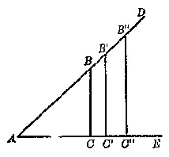

> 图1·1

连串的直角三角形 \(ABO, AB'O', AB''O''\)，等等。因为这些直角三角形有一个公共角 \(A\)，所以它们是相似的。

相似三角形对应边的比是相等的，所以在直角三角形 \(ABC\) 和 \(AB'O'\) 中，就有

$$
\frac {B C}{B ^{\prime} C ^{\prime}} = \frac {A B}{A B ^{\prime}}，
$$

因而 \(\frac{BC}{AB} = \frac{B'C'}{AB'}\) 同样可以知道

$$
\frac {B ^{\prime} C ^{\prime}}{A B ^{\prime}} = \frac {B ^{\prime} C ^ {\prime \prime}}{A B ^ {\prime \prime}}.
$$

因此， \(\frac{BC}{AB} = \frac{B'C'}{AB'} = \frac{B'C''}{AB''} = \dots\) 就是， 在所有的直角三角形中， \(\angle A\) 的对边和斜边的比都是相等的。 换句话说， 只要 \(\angle A\) 的大小确定， 那末， 在用它做一个锐角画出的直角三角形中， \(\angle A\) 的对边和斜边的比就是一个确定的数。

当某一个量确定的时候，和它有关的另一个量如果有一个确定的值和它对应。那末，我们就把第二个量叫做第一个量的函数。

例如， 当正方形的边长 \(a\) 有确定的值的时候， 正方形的面积 \(a^2\) 就完全确定了。这里正方形的边长是一个量， 正方形的面积是另一个量。我们说， 正方形的面积是边长 \(a\) 的函数。

又如，假定圆的直径用 \(d\) 表示，那末圆的周长就等于 \(\pi d\)。这里，圆的直径是一个量，圆的周长是另一个量。因为当圆的直径有确定的值的时候，圆的周长也就确定，所以我们说，圆的周长是直径 \(d\) 的函数。

同样，在图1·1中，∠A是一个量；当这个量有确定的值的时候，在用它做锐角所画出的直角三角形中，也有一个量跟着确定了。这个量就是上面所说的对边和斜边的比。因此我们可以说，在直角三角形ABC中，∠A的对边和斜边的比 \(\frac{BC}{AB}\) 是∠A的函数。

我们要注意， 正方形的面积可以根据边长 \(\alpha\) 计算出来； 圆的周长也可以根据直径 \(d\) 计算出来。 所以看到算式 \(\alpha^2\)，就知道它是 \(\alpha\) 的函数；看到算式 \(\pi d\)，也就知道它是 \(d\) 的函数。但是 \(\frac{BC}{AB}\) 却不能简单地用一个算式根据 \(\angle A\) 的度数计算出来。为了要说明 \(\frac{BC}{AB}\) 是 \(\angle A\) 的函数，我们应用一个专门的记号“\(\sin A\)”来表示。记号“\(\sin A\)”读做“\(\angle A\) 的正弦”。

以后看到“sin A”这个记号，就应当联想到它表示：在以∠A为锐角的直角三角形中，∠A的对边和斜边的比，就是

$$
\sin A = \frac {\angle A \text {的对边}}{\text {斜边}}.
$$

为了方便，我们通常用 \(C\) 表示直角三角形 \(ABC\) 的直角，并且用小写字母 \(\alpha\) 表示 \(\angle A\) 的对边，\(b\) 表示 \(\angle B\) 的对边，\(c\) 表示斜边（图1·2）。这样就有

$$
\sin A = \frac {a}{c}.
$$

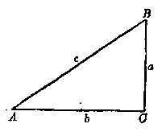

> 图1·2

一个直角三角形有三条边，任意取两条可以组成六个不同的比。它们是

$$
\frac {a}{c}， \frac {b}{c}， \frac {a}{b}， \frac {b}{a}， \frac {c}{b}， \frac {c}{a}.
$$

大家很容易想到，不但 \(\frac{a}{c}\) 跟着 \(\angle A\) 的大小而确定， 其他五个比一定也是跟着 \(\angle A\) 的大小而确定的。

第一个比 \(\frac{a}{c}\) 已经把它叫做 \(\angle A\) 的正弦了。其他五个比也都是 \(\angle A\) 的函数，我们都给它们规定一个名称。现在把所有六个函数的名称、定义和记号，一起列在下面的表里。

| 函数的名称 | 记号[^p9-1] | 定义 |
| --- | --- | --- |
| ∠A的正弦 | \(\sin A\) | \(\sin A=\frac{\angle A\text{的对边}}{\text{斜边}}=\frac ac\) |
| ∠A的余弦 | \(\cos A\) | \(\cos A=\frac{\angle A\text{的邻边}}{\text{斜边}}=\frac bc\)[^p9-2] |
| ∠A的正切 | \(\operatorname{tg}A\) | \(\operatorname{tg}A=\frac ab\) |
| ∠A的余切 | \(\operatorname{ctg}A\) | \(\operatorname{ctg}A=\frac ba\) |
| ∠A的正割 | \(\sec A\) | \(\sec A=\frac cb\) |
| ∠A的余割 | \(\operatorname{cosec}A\) | \(\operatorname{cosec}A=\frac ca\) |

∠A的所有这些函数，总起来叫做∠A的三角函数。

知道了锐角三角函数的定义以后，自然会引起下面的问题： 已有了一个锐角， 怎样算出它的三角函数值呢？ 我们举例说明如下：

#### 例 1

求 \(35^{\circ}\) 角的三角函数值。

**［解］** 用量角器作一个 \(35^{\circ}\) 的角 \(A\) （图1·3）。 过 \(\angle A\) 的一边上任取一点 \(B\)， 例如取 \(AB = 10\) 厘米， 向另一边作垂线 \(BC\). 尽可能准确

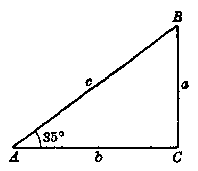

> 图1·3

地量出直角三角形的其他两边的长， 得 \(BC = 5.7\) 厘米， \(AC = 8.2\) 厘米。 于是， 我们就可把测量和计算的结果写成下面的形式：

$$
\begin{array}{l} A = 35 ^{\circ}， \\ a = 5.7， \quad b = 8.2， \quad c = 10. \\ \sin 35 ^{\circ} = \frac {a}{c} = \frac {5.7}{10} = 0.57， \\ \end{array}
$$

$$
\cos 35 ^{\circ} = \frac {b}{c} - \frac {8.2}{10} = 0.82，
$$

$$
\mathrm{tg} 35 ^{\circ} = \frac {a}{b} = \frac {5.7}{8.2} = 0.70，
$$

$$
\operatorname{ctg} 35^{\circ}=\frac{b}{a}=\frac{8.2}{5.7}=1.4，
$$

$$
\sec 35 ^{\circ} = \frac {c}{b} = \frac {10}{8.2} = 1.2，
$$

$$
\cos \mathrm{e} 35 ^{\circ} = \frac {c}{a} = \frac {10}{5.7} = 1.7.
$$

因为我们量 \(a\) 和 \(b\) 的长， 都只量出两个数字， 所以根据它们算出来的结果， 从第一个不是零的数字起， 也只有开头两个数字是可以信任的， 以下就四舍五入。

注 在画直角三角形的时候， 取 \(c = 10\) 厘米， 只是为了计算正弦和余弦的值可以方便一些。 我们也可以取其他的值。

#### 例 2

在直角三角形 ABC 中， 已知 a=4， b=5， 求 \(\angle A\) 的正弦， 余弦， 正切和余切。

**［解］** 先根据几何学里的勾股定理算出

$$
c = \sqrt {a ^ {2} + b ^ {2}} = \sqrt {4 ^ {2} + 5 ^ {2}} = \sqrt {41}，
$$

然后根据三角函数的定义，求得

$$
\sin A = \frac {a}{a} = \frac {4}{\sqrt {41}} = \frac {4}{41} \sqrt {41}，
$$

$$
\cos A = \frac {b}{a} = \frac {5}{\sqrt {41}} = \frac {5}{41} \sqrt {41}，
$$

$$
\operatorname{tg} A = \frac {a}{b} = \frac {4}{5}，
$$

$$
\operatorname{ctg} A = \frac {b}{a} = \frac {5}{4}.
$$

#### 习题1·1

1. 求 \(50^{\circ}\) 角的六个三角函数值。

2. 已知 \(a = 40, c = 41\)； 求 \(\angle A\) 的六个三角函数值。

3. 已知 \(a = 5, b = 12\)； 求 \(\angle A\) 的正弦， 余弦， 正切和余切。 当 \(a = 10\)， \(b = 24\) 时， \(\angle A\) 的这些三角函数值有没有变化？ 为什么？

4. 已知斜边 \(AB\) 等于直角边 \(AC\) 的三倍；求 \(\angle A\) 的正弦，余弦，正切和余切。

5. 已知 \(a = \frac{1}{2} b\)； 求 \(\angle A\) 的正弦， 余弦， 正割和余割。

6. 已知 \(a = 2mn, b = m^2 - n^2\)； 求 \(\angle A\) 的正弦， 正切和正割及 \(\angle B\) 的余弦， 余切和余割， 比较它们的结果， 你发现了什么？

7. 在下列各组的每两个三角函数值中， 哪一个大：

（1） \(\sin A\) 和 \(\operatorname{tg} A\)；

（2） sec A 和 tg A；

（3） \(\cos A\) 和 \(\operatorname{ctg} A\)；

（4） \(\operatorname{cosec} A\) 和 \(\operatorname{ctg} A\).

[^p9-1]: 表示 \(\angle A\) 的正切、余切和余割的记号，有些书上分别写做 \(\tan A\)， \(\cot A, \operatorname{cosec} A\) .
[^p9-2]: 在直角三角形 \(ABC\) 里， 锐角 \(A\) 夹在斜边 \(c\) 和直角边 \(b\) 之间。直角边 \(b\) 可以简单叫做 \(\angle A\) 的邻边。

### §1·2 已知某锐角的一个三角函数， 求作这个角

在上一节的例1中， 已知一个锐角， 我们用画图的方法求出了这个角的三角函数的近似值。 现在我们研究相反的问题： 已知某一锐角的一个三角函数， 怎样画出这个锐角？ 举例说明如下：

#### 例 1

已知一个锐角的正弦等于 \(\frac{4}{5}\)， 求作这个锐角。

**［解］** 一个锐角的正弦，就是在以它作为一个锐角的直角三角形中，这个角的对边和斜边的比。现在已知它的正弦的值是 \(\frac{4}{5}\)。要画出这个锐角，就应当画一个直角三角形，使一条直角边和斜边的比等于 \(\frac{4}{5}\)。这样，这条直角边的对角就是所求作的角。

因此，我们可以任意取一个长度单位（例如1厘米），作 \(BC = 4\) 厘米（如图1·4所示），从 \(C\) 作 \(BC\) 的垂线 \(CD\)，以 \(B\) 为圆心，以5厘米为半径，作弧交 \(CD\) 于 \(A\)，并且连结 \(AB\)。这时，直角三角形 \(ABC\) 中的 \(\angle BAC\) 就是所求作的

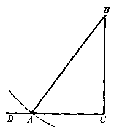

> 图1·4

锐角。

用量角器可以量得这个角约等于 \(53^{\circ}\) （简写做 \(\angle A\approx\) 53°）。

#### 例 2

已知一个锐角的余弦等于 0.79，求作这个锐角。

**［解］** 0.79 就是 \(\frac{79}{100}\). 为了使图形不要画得太大， 我们可以取 1 毫米 （就是 \(\frac{1}{10}\) 厘米） 作为长度单位。

因为锐角的余弦， 就是在直角三角形中， 这个角的邻边和斜边的比， 所以我们先作 \(AC = 79\) 毫米 （如图1·5所示）， 从 \(C\) 作 \(AC\) 的垂线 \(CD\)， 然后以 \(A\) 为圆心， 以100毫米为半径作弧交 \(CD\) 于 \(B\)， 并且连结 \(AB\). \(\angle A\) 就是所求作的锐角。

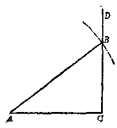

> 图1·5

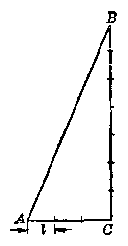

> 图1·6

用量角器可以量得 \(\angle A \approx 38^{\circ}\).

#### 例 3

已知 \(\cot A = 2 \frac{1}{3}\)，求作锐角 A.

**［解］** 我们把 \(2\frac{1}{3}\) 写成 \(\frac{7}{3}\). 取适当的长度单位 \(l\) （图1·6）。 作直角 \(C\). 在它的一边上截取 \(CB = 7l\)， 在另一边上截取 \(CA = 3l\). 连结 \(AB\). 那末， 直角三角形 \(ABC\) 中的 \(\angle A\) 就是所求作的锐角。

#### 例 4

已知 \(\operatorname{ctg} A = 1.4\)，求作锐角 A.

**［解］** 这里， \(1.4 = \frac{14}{10} = \frac{7}{5}\). 取适当的长度单位 \(l\). 我们在直角 \(C\) （图1·7） 的两边上分别取 \(AC = 7l\)， \(CB = 5l\). 连结 \(AB\). 直角三角形 \(ABC\) 中的 \(\angle A\) 就是所求作的锐角。

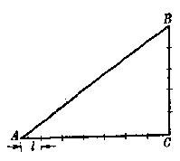

> 图1·7

从上面的这些例题中，我们看到，要画出具有已知三角函数值的锐角 \(A\)，它的一般步骤是：

把已知的三角函数值表示成分数 \(\frac{m}{n}\) 的形式。

| 已知 | 直角三角形的边长 |
| --- | --- |
| \(\sin A = \frac{m}{n}\) | \(a = m, \quad c = n\) |
| \(\cos A = \frac{m}{n}\) | \(b = m, \quad c = n\) |
| \(tg A = \frac{m}{n}\) | \(a = m, \quad b = n\) |
| \(ctg A = \frac{m}{n}\) | \(b = m, \quad a = n\) |

选取一个适当的长度单位，画直角三角形 \(ABC\)，使 \(\angle C\) 是直角，并且使 \(\angle A, \angle B\) 和 \(\angle C\) 的对边 \(a, b\) 和 \(c\) 分别适合于上面表中的条件。

这样， 直角三角形 \(ABC\) 中的角 \(A\) 就是所求作的锐角。

#### 习题1·2

1. 已知一个锐角的正弦等于0.5，作出这个锐角；并量量看大约等于多少度。

2. 已知 \(\cos A = 0.7\)，作出锐角 \(A\)；并量出它的近似值（精确到 \(1^{\circ}\)）。

3. 已知一个锐角的正割等于1.5； 求作这个锐角， 并量出它的近似值 （精确到 \(1^{\circ}\)）。

4. 已知 \(\operatorname{tg} A = \frac{5}{4}\)； 作出锐角 \(A\)， 并量出它的近似值 （精确到 \(1^{\circ}\)）。

5. 已知 \(\operatorname{ctg} A = \frac{4}{5}\)； 作出锐角 \(A\)， 并和前题中所求的角作比较。

### §1·3 余角的三角函数

在§1·1中我们已经知道，每一个锐角都有六个三角函数。 在图1·8的直角三角形 \(ABC\) 中， 除了 \(\angle A\) 是锐角以外， \(\angle B\) 也是锐角， 因此， \(\angle B\) 也有六个三角函数。 根据§1·1中讲过的三角函数的定义， 可以知道 \(\angle B\) 的六个三角函数是

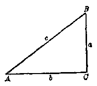

> 图1·8

$$
\sin B = \frac {\angle B \text {的对边}}{\text {斜边}} = \frac {b}{c}，
$$

$$
\cos B = \frac {\angle B \text {的邻边}}{\text {斜边}} = \frac {a}{c}，
$$

$$
\operatorname{tg} B = \frac {\angle B \text {的对边}}{\angle B \text {的邻边}} = \frac {b}{a}，
$$

$$
\operatorname{ctg} B = \frac {\angle B \text {的邻边}}{\angle B \text {的对边}} = \frac {a}{b}，
$$

$$
\sec B = \frac {\text {斜边}}{\angle B \text {的邻边}} = \frac {c}{a}，
$$

$$
\cos \theta = \frac {\text {斜边}}{\angle B \text {的对边}} = \frac {c}{b}.
$$

我们把 \(\angle B\) 的三角函数和 \(\angle A\) 的三角函数比较一下，例如，

$$
\sin B = \frac {b}{c}，
$$

但 \(\cos A = \frac{b}{c},\) 因此， \(\sin B = \cos A.\) 同样可以得到

$$
\cos B = \sin A， \quad \operatorname{tg} B = \operatorname{ctg} A，
$$

$$
\operatorname{ctg} B = \operatorname{tg} A， \quad \sec B = \operatorname{cosec} A，
$$

$$
\operatorname{cosec} B = \sec A.
$$

直角三角形的两个锐角互为余角，它们的和等于 \(90^{\circ}\) 所以 \(\angle B = 90^{\circ} - \angle A\)。在上面的六个等式里，用 \(90^{\circ} - \angle A\) 代替 \(\angle B\)，便得到

$$
\sin (90 ^{\circ} - A) = \cos A，
$$

$$
\cos (90 ^{\circ} - A) = \sin A，
$$

$$
\operatorname{tg} (90 ^{\circ} - A) = \operatorname{ctg} A，
$$

$$
\operatorname{ctg} (90 ^{\circ} - A) = \operatorname{tg} A，
$$

$$
\sec (90 ^{\circ} - A) = \sec A，
$$

$$
\operatorname{cosec} (90 ^{\circ} - A) = \sec A.
$$

通常我们把正弦和余弦互相叫做余函数，就是正弦是余弦的余函数，余弦也是正弦的余函数。同样，也把正切和余切互相叫做余函数，正割和余割互相叫做余函数。这样，上面的六个公式，就可以概括成一句话：锐角 \(A\) 的余角的三角函数等于锐角 \(A\) 的同名三角函数的余函数。

#### 例 1

已知 \(\sin35^{\circ}=0.57\)，求 \(\cos55^{\circ}\) .

**［解］** \(\cos 55^{\circ} = \cos (90^{\circ} - 35^{\circ}) = \sin 35^{\circ} = 0.57.\)

#### 例 2

设 \(A, B\) 和 \(C\) 是一个三角形的三个内角，求证

$$
\sin\frac{A+B}{2}=\cos\frac{C}{2}.
$$

**［证］** 因为 \(A + B + C = 180^{\circ}\)， 所以 \(A + B = 180^{\circ} - C\). 因此，

$$
\sin \frac {A + B}{2} = \sin \frac {180 ^{\circ} - C}{2} = \sin \left(90 ^{\circ} - \frac {C}{2}\right) = \cos \frac {C}{2}.
$$

#### 习题1·3

1. 已知 \(\operatorname{tg} 21^{\circ}48' = 0.4\)； 求 \(\operatorname{ctg} 68^{\circ}12'\).

2. 已知 \(\sin 30^{\circ} = \frac{1}{2}\)， \(\sin 45^{\circ} = \frac{\sqrt{2}}{2}\)， \(\sin 60^{\circ} = \frac{\sqrt{3}}{2}\)； 求 \(\cos 30^{\circ}\)， \(\cos 45^{\circ}\)， \(\cos 60^{\circ}\) 的值。

3. 将 \(\cos 71^{\circ}\)， \(\operatorname{ctg} 45^{\circ}10'\)， \(\operatorname{cosec} 89^{\circ}\) 化成小于 \(45^{\circ}\) 的锐角的三角函数。

4. 不用查表， 计算下列各式的值：

（1） \(\sin 37^{\circ}30' \cdot g 8^{\circ}21' - \cos 52^{\circ}30' \sin 49^{\circ}7' + \sin 37^{\circ}30' \sin 49^{\circ}7'\) \(-\cos 52^{\circ}30' \operatorname{ctg} 81^{\circ}39'\)；

（2） \(\frac{\sin 23^{\circ}40' - \cos 66^{\circ}20'}{\sin 23^{\circ}40' + \cos 66^{\circ}20'}\).

5. 求适合于下列条件的锐角 A：

（1） \(\cos A = \sin A\)；

（2） \(\cos A = \sin 2A.\)

### §1·4 30°， 45°， 60°角的三角函数

在 §1·1 的例 1 中， 我们已经看到， 当已知一个锐角的度数， 要找出它的三角函数时， 可以用画图的方法来解决。 当然， 这样做， 我们只能求得很粗略的近似值。

但是， \(30^{\circ}\)， \(45^{\circ}\)， \(60^{\circ}\) 角的三角函数，却可以利用几何学上的简单性质，求出它们的准确值。

#### 1. 30°角的三角函数

在平面几何中，我们知道，当直角三角形 \(ABC\) 的角 \(A = 30^{\circ}\) 时，\(c = 2a\)（图1·9）。因此，

$$
\sin A = \frac {a}{c} = \frac {a}{2 a} = \frac {1}{2}.
$$

为了求出 \(\cos A\)，必须先求出 \(b\)。利用勾股定理，得

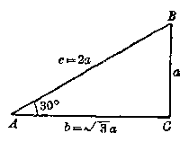

> 图1·9

$$
b = \sqrt {c ^ {2} - a ^ {2}} = \sqrt {(2 a) ^ {2} - a ^ {2}} = \sqrt {3 a ^ {2}} = \sqrt {3} a.
$$

因此， \(\cos A = \frac{b}{c} -\frac{\sqrt{3}a}{2a} = \frac{\sqrt{3}}{2}\) 其他四个函数，同样可以根据它们的定义从图1·9求出，结果是：

$$
\operatorname{tg} A = \frac {a}{b} = \frac {a}{\sqrt {\frac {3}{3} a}} = \frac {1}{\sqrt {\frac {3}{3}}} = \frac {\sqrt {3}}{3}，
$$

$$
\operatorname{ctg} A = \frac {b}{a} = \frac {\sqrt {3} a}{a} = \sqrt {\frac {3}{3}}，
$$

$$
\sec A = \frac {c}{b} = \frac {2 a}{\sqrt {3} a} = \frac {2}{\sqrt {3}} = \frac {2 \sqrt {3}}{3}，
$$

$$
\operatorname{cosec}A=\frac{c}{a}=\frac{2a}{a}=2.
$$

所以 \(30^{\circ}\) 角的三角函数是

$$
\sin 30 ^{\circ} = \frac {1}{2}， \quad \cos 30 ^{\circ} = \frac {\sqrt {3}}{2}， \quad \operatorname{tg} 30 ^{\circ} = \frac {\sqrt {3}}{3}，
$$

$$
\operatorname{ctg} 30 ^{\circ} = \sqrt {3}， \quad \sec 30 ^{\circ} = \frac {2 \sqrt {3}}{3}， \quad \sec 30 ^{\circ} = 2.
$$

#### 2. \(45^{\circ}\) 角的三角函数

在直角三角形 \(ABC\) 中，\(\angle A = 45^{\circ}\)（图1·10）。那末，

$$
\begin{array}{l} \angle B = 90 ^{\circ} - \angle A \\ = 90 ^{\circ} - 45 ^{\circ} = 45 ^{\circ}， \\ \end{array}
$$

所以 \(\angle B = \angle A.\) 因而 \(b = a.\) 根据勾股定理，得

$$
\begin{array}{l} \sigma = \sqrt {a ^ {2} + b ^ {2}} = \sqrt {a ^ {2} + a ^ {2}} \\ = \sqrt {2 a ^ {2}} = \sqrt {2} a. \\ \end{array}
$$

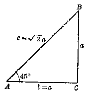

> 图1·10

所以 \(\sin A = \frac{a}{0} = \frac{a}{\sqrt{2}a} = \frac{1}{\sqrt{2}} = \frac{\sqrt{2}}{2},\)

$$
\cos A = \frac {b}{c} = \frac {a}{\sqrt {2} a} = \frac {1}{\sqrt {2}} = \frac {\sqrt {2}}{2}，
$$

$$
\operatorname{tg} A = \frac {a}{b} = \frac {a}{a} = 1，
$$

$$
\operatorname{ctg} A = \frac {b}{a} = \frac {a}{a} = 1，
$$

$$
\sec A = \frac {c}{b} = \frac {\sqrt {2} a}{a} = \sqrt {2}，
$$

$$
\operatorname{cosec}A=\sqrt2.
$$

就是

$$
\sin 45 ^{\circ} = \frac {\sqrt {2}}{2}， \quad \cos 45 ^{\circ} = \frac {\sqrt {2}}{2}， \quad \operatorname{tg} 45 ^{\circ} = 1，
$$

$$
\operatorname{ctg} 45 ^{\circ} = 1， \quad \sec 45 ^{\circ} = \sqrt {2}， \quad \sec 45 ^{\circ} = \sqrt {2}.
$$

#### 3. 60°角的三角函数

因为 \(60^{\circ}\) 角是 \(30^{\circ}\) 角的余角，所以 \(60^{\circ}\) 角的三角函数可以利用 \(30^{\circ}\) 角的函数来求，就是

$$
\sin 60 ^{\circ} = \sin (90 ^{\circ} - 30 ^{\circ}) = \cos 30 ^{\circ} = \frac {\sqrt {3}}{2}，
$$

$$
\cos 60 ^{\circ} = \cos (90 ^{\circ} - 30 ^{\circ}) = \sin 30 ^{\circ} - \frac {1}{2}，
$$

$$
\operatorname{tg} 60 ^{\circ} = \operatorname{tg} (90 ^{\circ} - 30 ^{\circ}) = \operatorname{ctg} 30 ^{\circ} = \sqrt {3}，
$$

$$
\operatorname{ctg} 60 ^{\circ} = \operatorname{ctg} (90 ^{\circ} - 30 ^{\circ}) = \operatorname{tg} 30 ^{\circ} = \frac {\sqrt {3}}{3}，
$$

$$
\sec 60 ^{\circ} = \sec (90 ^{\circ} - 30 ^{\circ}) = \operatorname{cosec} 30 ^{\circ} = 2，
$$

$$
\operatorname{cosec} 60 ^{\circ} = \operatorname{cosec} (90 ^{\circ} - 30 ^{\circ}) = \sec 30 ^{\circ} = \frac {2 \sqrt {3}}{3}.
$$

当然， 利用图 1·9 中三边的关系求 \(\angle B\) 的三角函数， 也能够得到上面的结果。

\(30^{\circ}, 45^{\circ}, 60^{\circ}\) 角的三角函数， 特别是每一个角的正弦， 余弦， 正切和余切四个函数， 用处很多。 要记住这些函数的值， 最好不要硬背。 我们可以记住图1·11中的三个图形。 在这些图形中， 我们用了最简单的数字表示直角三角形各边的长。 如果对这三个图形有深刻的印象， 那末， 我们就不难根据各个三角函数的定义， 正确地说出每一个函

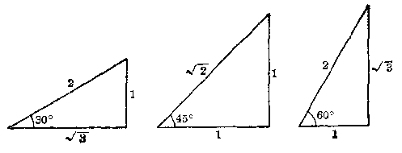

> 图1·11

数的值。

从图形上求得的角的函数值， 当分母有根号的时候， 要把它化去， 目的是为了便于算出用小数表示的近似值。 例如：

$$
\operatorname{tg} 30 ^{\circ} = \frac {1}{\sqrt {3}} = \frac {\sqrt {3}}{3} \approx \frac {1.7321}{3} \approx 0.5774；
$$

$$
\cos 45 ^{\circ} = \frac {1}{\sqrt {2}} = \frac {\sqrt {2}}{2} \approx \frac {1.4142}{2} \approx 0.7071；
$$

$$
\cos 60 ^{\circ} = \frac {2}{\sqrt {3}} = \frac {2 \sqrt {3}}{3} \approx \frac {2 \times 1.7321}{3} \approx 1.1547.
$$

象上面求得的有四位小数的近似值， 平常使用起来， 已经是足够精确的了。

##### 例 1

求 \(tg 30^{\circ} + \sin^{2}45^{\circ} - \cos 60^{\circ}\) 的值。

**［注意］** 为了简便，习惯上，\(\sin A\) 的平方不写做 \((\sin A)^2\) 而写做 \(\sin^2 A\)。这里 \(\sin^245^\circ\) 就是 \(\sin 45^\circ\) 的平方。

**［解］** \(\operatorname{tg} 30^{\circ} + \sin^{2} 45^{\circ} - \cos 60^{\circ}\)

$$
= \frac {\sqrt {3}}{3} + \left(\frac {\sqrt {2}}{2}\right) ^ {2} - \frac {1}{2} = \frac {\sqrt {3}}{3} + \frac {2}{4} - \frac {1}{2} = \frac {\sqrt {3}}{3}.
$$

##### 例 2

求适合于下式的锐角 \(x\)

$$
\sqrt {2} \cos x - 1 = 0.
$$

**［解］** \(\sqrt{2}\cos x - 1 = 0,\quad \sqrt{2}\cos x = 1,\) ∴ \(\cos x = \frac{1}{\sqrt{2}}\) . ∴ \(x = 45^{\circ}\) .

#### 习题1·4

1. 算出下列各式的结果：

（1） \(\cos^230^\circ + \sin^230^\circ\)；

（2） \(\sec^260^\circ - \operatorname{tg}^260^\circ\)；

（3） \(\operatorname{tg} 30^{\circ} \operatorname{ctg} 60^{\circ} + \cos^{2} 30^{\circ}\)；

（4） \(\sin 45^{\circ} \cos 45^{\circ} + \operatorname{cosec} 60^{\circ} \sec 45^{\circ}\)；

（5） \(\frac{4}{3} \operatorname{ctg}^230^\circ + 3 \sin^260^\circ - 2 \operatorname{cosec}^260^\circ - \frac{3}{4} \operatorname{tg}^230^\circ\)；

（6） \(\operatorname{tg}^230^\circ + 2 \sin 60^\circ \cos 45^\circ + \operatorname{tg} 45^\circ - \operatorname{ctg} 60^\circ - \cos^230^\circ\).

2. 求下列各式的结果：

（1） \(\sin (60^{\circ} - x) + \operatorname{cosec}^{2} 45^{\circ} - \operatorname{ctg}^{2} 45^{\circ} - \cos (30^{\circ} + x)\)；

（2） \(\frac{\operatorname{cosec}^{2}30^{\circ} \cdot \operatorname{ctg}(45^{\circ} + x)}{(1 + \operatorname{ctg}^{2}30^{\circ}) \cdot \operatorname{tg}(45^{\circ} - x)}.\)

3. 求适合于下列各式的锐角 \(x\)：

（1） \(\operatorname{tg} x - \sqrt{3} = 0\)；

（2） \(2\sin x - \sqrt{3} = 0;\)

（3） \(2\sec x - \sqrt{8} = 0.\)

4. 设 \(\angle A = 30^{\circ}\)， 验证：

（1） \(\sin 2A = 2\sin A\cos A;\)

（2） \(\cos 2A = 1 - 2\sin^2 A;\)

（3） \(\operatorname{tg} 2A = \frac{2\operatorname{tg} A}{1 - \operatorname{tg}^2 A}\).

5. 设 \(\angle A = 45^{\circ}\)， 求 \(\frac{\cos A}{\operatorname{tg} A - \sin(75^{\circ} - A)}\) 的值。

### §1·5 间隔为 \(1^{\circ}\) 的角的三角函数表

除了 \(30^{\circ}, 45^{\circ}, 60^{\circ}\) 角的三角函数以外， 其他锐角的三角函数， 要求得比较精确的值是不很容易的。 为了便于使用三角函数， 要学会怎样查现成的三角函数表。

第16页上的三角函数表，是 \(0^{\circ}\) 到 \(90^{\circ}\) 间整数度数的角的三角函数，精确到小数第四位。在这个表中，从左到右第一行（它的上端标着 \(A\)）所载的是角的度数：\(0^{\circ}, 1^{\circ}, 2^{\circ}, 3^{\circ}, \cdots, 90^{\circ}\)。第二行的上端标着正弦，第三行的上端标着三角函数表（0° 到 90° 间整数度数的角）

| A | 正弦 | 正切 | 正割 |  | A | 正弦 | 正切 | 正割 |  |
| --- | --- | --- | --- | --- | --- | --- | --- | --- | --- |
| 0° | 0.0030 | 0.0000 | 1.0000 | 90° | 45° | 0.7071 | 1.0000 | 1.4142 | 45° |
| 1° | 0.0175 | 0.0175 | 1.0062 | 89° | 46° | 0.7193 | 1.0355 | 1.4396 | 44° |
| 2° | 0.0349 | 0.0349 | 1.0006 | 88° | 47° | 0.7314 | 1.0724 | 1.4663 | 43° |
| 3° | 0.0523 | 0.0524 | 1.0014 | 87° | 48° | 0.7431 | 1.1106 | 1.4945 | 42° |
| 4° | 0.0698 | 0.0699 | 1.0024 | 86° | 49° | 0.7547 | 1.1504 | 1.5243 | 41° |
| 5° | 0.0872 | 0.0875 | 1.0058 | 85° | 50° | 0.7660 | 1.1918 | 1.5557 | 40° |
| 6° | 0.1045 | 0.1051 | 1.0055 | 84° | 51° | 0.7771 | 1.2849 | 1.5890 | 39° |
| 7° | 0.1219 | 0.1228 | 1.0075 | 83° | 52° | 0.7880 | 1.2799 | 1.6243 | 38° |
| 8° | 0.1392 | 0.1405 | 1.0058 | 82° | 53° | 0.7986 | 1.3270 | 1.6616 | 37° |
| 9° | 0.1554 | 0.1584 | 1.0125 | 81° | 54° | 0.8090 | 1.3764 | 1.7013 | 36° |
| 10° | 0.1736 | 0.1763 | 1.0154 | 80° | 55° | 0.8192 | 1.4281 | 1.7444 | 35° |
| 11° | 0.1908 | 0.1944 | 1.0187 | 79° | 56° | 0.8290 | 1.4826 | 1.7883 | 34° |
| 12° | 0.2079 | 0.2126 | 1.0223 | 78° | 57° | 0.8387 | 1.5899 | 1.8361 | 33° |
| 13° | 0.2250 | 0.2309 | 1.0263 | 77° | 58° | 0.8480 | 1.6003 | 1.8871 | 32° |
| 14° | 0.2419 | 0.2493 | 1.0306 | 76° | 59° | 0.8572 | 1.6643 | 1.9416 | 31° |
| 15° | 0.2588 | 0.2679 | 1.0353 | 75° | 60° | 0.8660 | 1.7321 | 2.0000 | 30° |
| 16° | 0.2756 | 0.2867 | 1.0403 | 74° | 61° | 0.8746 | 1.8044 | 2.0627 | 29° |
| 17° | 0.2924 | 0.3057 | 1.0457 | 73° | 62° | 0.8829 | 1.8807 | 2.1301 | 28° |
| 18° | 0.3090 | 0.3249 | 1.0515 | 72° | 63° | 0.8910 | 1.9626 | 2.2027 | 27° |
| 19° | 0.3256 | 0.3443 | 1.0576 | 71° | 64° | 0.8988 | 2.0505 | 2.2812 | 26° |
| 20° | 0.3420 | 0.3640 | 1.0642 | 70° | 65° | 0.9063 | 2.1445 | 2.3662 | 25° |
| 21° | 0.3584 | 0.3839 | 1.0711 | 69° | 66° | 0.9135 | 2.2460 | 2.4586 | 24° |
| 22° | 0.3746 | 0.4040 | 1.0785 | 68° | 67° | 0.9205 | 2.3559 | 2.5593 | 23° |
| 23° | 0.3907 | 0.4245 | 1.0864 | 67° | 68° | 0.9272 | 2.4751 | 2.6695 | 22° |
| 24° | 0.4067 | 0.4452 | 1.0946 | 66° | 69° | 0.9386 | 2.6051 | 2.7904 | 21° |
| 25° | 0.4226 | 3.4663 | 1.1034 | 65° | 70° | 0.9907 | 2.7475 | 2.9238 | 20° |
| 26° | 0.4384 | 0.4877 | 1.1126 | 64° | 71° | 0.9455 | 2.9042 | 3.0716 | 19° |
| 27° | 0.4540 | 0.5095 | 1.1223 | 63° | 72° | 0.9511 | 3.0777 | 3.2361 | 18° |
| 28° | 0.4695 | 0.5317 | 1.1326 | 62° | 73° | 0.9563 | 3.2709 | 3.4203 | 17° |
| 29° | 0.4848 | 0.5543 | 1.1434 | 61° | 74° | 0.9613 | 3.4874 | 3.6286 | 16° |
| 30° | 0.5000 | 0.5774 | 1.1547 | 60° | 75° | 0.9659 | 3.7321 | 3.8637 | 15° |
| 31° | 0.5150 | 0.6309 | 1.1666 | 59° | 76° | 0.9703 | 4.0108 | 4.1336 | 14° |
| 32° | 0.5299 | 0.6249 | 1.1792 | 58° | 77° | 0.9744 | 4.3315 | 4.4454 | 13° |
| 33° | 0.5446 | 0.6494 | 1.1924 | 57° | 78° | 0.9781 | 4.7046 | 4.8097 | 12° |
| 34° | 0.5592 | 0.6745 | 1.2062 | 56° | 79° | 0.9816 | 5.1446 | 5.2408 | 11° |
| 35° | 0.5736 | 0.7002 | 1.2208 | 55° | 80° | 0.9848 | 5.6713 | 5.7588 | 10° |
| 36° | 0.5878 | 0.7265 | 1.2361 | 54° | 81° | 0.9877 | 3.3138 | 6.3925 | 9° |
| 37° | 0.6018 | 0.7536 | 1.2521 | 53° | 82° | 0.9903 | 7.1154 | 7.1859 | 8° |
| 38° | 0.6157 | 0.7813 | 1.2690 | 52° | 83° | 0.9925 | 8.1448 | 8.2055 | 7° |
| 39° | 0.6293 | 0.8098 | 1.2865 | 51° | 84° | 0.9945 | 9.5144 | 9.5668 | 6° |
| 40° | 0.6428 | 0.8391 | 1.3054 | 50° | 85° | 0.9962 | 1.43011 | 11.4737 | 5° |
| 41° | 0.6561 | 0.8693 | 1.3250 | 49° | 86° | 0.9976 | 14.3007 | 14.3356 | 4° |
| 42° | 0.6691 | 0.9004 | 1.3458 | 48° | 87° | 0.9986 | 19.08119 | 19.1073 | 3° |
| 43° | 0.6820 | 0.9325 | 1.3673 | 47° | 88° | 0.9994 | 28.63628 | 28.6537 | 2° |
| 44° | 0.6947 | 0.9657 | 1.3902 | 46° | 89° | 0.9998 | 57.2900 | 57.2987 | 1° |
| 45° | 0.7071 | 2.0000 | 1.4142 | 45° | 90° | 1.0000 | ∞ | ∞ | 0° |
|  | 余弦 | 余切 | 余割 | 4 |  | 余弦 | 余切 | 余割 | 4 |

正切，第四行的上端标着正割。这三行分别载着各个角的正弦，正切和正割精确到小数第四位的近似值。

#### 例 1

查表求 tg 37°.

**［解］** 先在第一行中找到 \(37^{\circ}\)。在标着 \(37^{\circ}\) 的横列和上端标着正切的直行交叉处所载的数是 0.7536。所以

$$
\operatorname{tg} 37 ^{\circ} = 0.7536.
$$

由于 \(\cos A = \sin (90^{\circ} - A)\)，所以 \(\cos 1^{\circ} = \sin 89^{\circ}\)，\(\cos 2^{\circ} = \sin 88^{\circ}\)，…，同样，\(\operatorname{ctg} 1^{\circ} = \operatorname{tg} 89^{\circ}\)，\(\operatorname{ctg} 2^{\circ} = \operatorname{tg} 88^{\circ}\)，…；\(\operatorname{cosec} 1^{\circ} = \sec 89^{\circ}\)，\(\operatorname{cosec} 2^{\circ} = \sec 88^{\circ}\)，…。所以锐角的余弦，余切和余割的值，可以不必另外列出。

为了查起来方便， 表的最右边一行也载着角度， 但度数是按由下到上的方向增大的。同时， 在上端标着正弦， 正切或者正割的各行， 在它们的下端分别标着余弦， 余切或者余割。这样， 求锐角的余弦， 余切或者余割的时候， 就可以在最右边的一行找度数， 在下端去找函数的名称。

#### 例 2

查表求 \(\cos 24^{\circ}\)

**［解］** 在表的右边找到 \(24^{\circ}\)，下端找到余弦。在标着 \(24^{\circ}\) 的横列和标着余弦的直行的交叉处，所载的数是 0.9135。所以

$$
\cos 24 ^{\circ} = 0.9135.
$$

**［注意］** 按照表的这样排列，查锐角的余弦，余切或者余割时，就必须用最右边一行的度数，不可漏错。

用这个表， 我们不但能够求出已知锐角的三角函数， 并且反过来， 也能从已知的三角函数值， 求出对应的锐角。

#### 例 3

已知 \(\sin A=0.8387\)，求锐角 A.

**［解］** 在上端标着正弦的一行里，找到0.8387。横着看左边第一行里对应的角度是 \(57^{\circ}\)。所以锐角 \(A=57^{\circ}\)。

#### 例 4

已知 ctg A=4.0108， 求锐角 A.

**［解］** 在下端标着余切的一行里， 找到 4.0108。横着看最右边一行里对应的角度是 \(14^{\circ}\)。所以锐角 \(A = 14^{\circ}\)。

**［注意］**  由于已知的是余切的值，角的度数应当在最右边一行里找。

如果已知的三角函数值不能在表中找到，但能够找到和它接近的函数值，那末所求角的度数就不是整数。在这种情形下，我们可以仿照下例求出角度精确到1度的近似值。

#### 例 5

已知 \(\sec A = 1.18\)，求锐角 \(A\).

**［解］**  在正割的一行里，找不到1.1800，但能够找到比1.1800稍小的1.1792和比1.1800稍大的1.1924。对应于这两个正割值的锐角分别是 \(32^{\circ}\) 和 \(33^{\circ}\)，由此可知，锐角 \(A\) 在 \(32^{\circ}\) 和 \(33^{\circ}\) 之间。因为1.1792同1.1800更接近，所以我们取正割等于1.1792的那一个角作为角 \(A\) 的近似值。因此锐角 \(A = 32^{\circ}\)（精确到 \(1^{\circ}\)）。

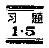

#### 习题1·5

1. 查表求下列三角函数的值：

（1） \(\sin 20^{\circ}\)；

（2） \(\cos 80^{\circ}\)；

（3） tg 15°；

（4） \(\operatorname{ctg} 78^{\circ}\)；

（5） \(\sec 18^{\circ}\)；

（6） \(\cos \alpha 89^{\circ}\).

2. 查表求下列各锐角 \(\alpha\) （精确到 \(1^{\circ}\)）：

（1） \(\sin \alpha = 0.3777\)；

（2） \(\cos \alpha = 0.9901\)；

（3） \(\operatorname{tg} \alpha = 0.8012\)；

（4） \(\operatorname{ctg} \alpha = 1.0012\)；

（5） \(\sec \alpha = 12.34\)；

（6） \(\operatorname{cosec} \alpha = 51.09\).

3. 查表回答下列问题：

（1） \(\sin 10^{\circ} + \sin 35^{\circ}\) 是不是等于 \(\sin 45^{\circ}\)？

（2） \(\cos 70^{\circ} - \cos 10^{\circ}\) 是不是等于 \(\cos 60^{\circ}\)？

（3） \(\operatorname{tg} 2^{\circ} \cdot \operatorname{tg} 15^{\circ}\) 是不是等于 \(\operatorname{tg} 30^{\circ}\)？

（4） 3 tg 20° 是不是等于 tg 60°？

4. 查表回答下列问题：

（1） \(\sin 18^{\circ}\) 和 \(\sin 72^{\circ}\) 哪个大？

（2） ctg 32° 和 ctg 41° 哪个大？

（3） 已知 \(\alpha, \beta\) 都是锐角，且 \(\cos \alpha = 0.1000, \cos \beta = 0.2000, \alpha\) 和 \(\beta\) 哪个大？

（4） 已知 \(\alpha, \beta\) 都是锐角，且 \(\operatorname{tg} \alpha = 1.3105, \operatorname{tg} \beta = 1.4291, \alpha\) 和 \(\beta\) 哪个大？

5. 已知 \(\alpha\) 是锐角，且 \(2\sin \alpha = \sin 60^{\circ}\)，\(\alpha\) 是不是等于 \(30^{\circ}\)？如果不是，那末它大约等于多少度？

### §1·6 角由 \(0^{\circ}\) 变到 \(90^{\circ}\) 时， 三角函数的变化

在第16页的三角函数表中，我们看到，当角由 \(0^{\circ}\) 变到 \(90^{\circ}\) 时，它的各个三角函数都在变化。现在我们仔细研究一下它们的变化情形。

我们把角看做是由一条射线绕着它的端点旋转而成的。在旋转开始时射线所在的位置叫做角的始边；在旋转终了时射线所在的位置叫做角的终边。

在图1·12中，射线由开始的水平位置旋转到铅直位置。

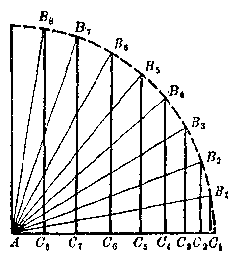

> 图1·12

这样就生成 \(0^{\circ}\) 到 \(90^{\circ}\) 的角。图中画出了射线每旋转 \(10^{\circ}\) 时所成的角的终边。在这些终边上，截取相等的线段 \(AB_{1}, AB_{2}, AB_{3}, \cdots\)，经过 \(B_{1}, B_{2}, B_{3}, \cdots\)，作始边上的垂线 \(B_{1}C_{1}, B_{2}C_{2}, B_{3}C_{3}, \cdots\)。根据角的正弦的定义，可以知道

$$
\sin B _ {1} A C _ {1} = \frac {B _ {1} C _ {1}}{A B _ {1}}， \quad \sin B _ {2} A C _ {2} = \frac {B _ {2} C _ {2}}{A B _ {2}}，
$$

$$
\dots \dots ， \quad \sin B _ {8} A C _ {8} = \frac {B _ {8} C _ {8}}{A B _ {8}}.
$$

我们看到，在这些分数中，分母都相等，而分子逐渐增大。所以这些分数也逐渐增大。这就是说，当锐角增大时，它的正弦是逐渐增大的。

同样，

$$
\cos B _ {1} A C _ {1} = \frac {A C _ {1}}{A B _ {1}}， \quad \cos B _ {2} A C _ {2} = \frac {A C _ {2}}{A B _ {2}}，
$$

$$
\dots \dots ， \quad \cos B _ {8} A C _ {8} = \frac {A C _ {8}}{A B _ {8}}.
$$

在这些分数中， 因为分母都相等， 而分子逐渐减小， 所以这些分数也逐渐减小。 因此， 当锐角增大时， 它的余弦逐渐减小。

正切的变化， 可以从下面的等式里看出：

$$
\operatorname{tg} B _ {1} A C _ {1} = \frac {B _ {1} C _ {1}}{A C _ {1}}， \quad \operatorname{tg} B _ {2} A C _ {2} = - \frac {B _ {2} C _ {2}}{A C _ {2}}，
$$

$$
\dots \dots ， \quad \mathrm{tg} B _ {8} A C _ {8} = - \frac {B _ {8} C _ {8}}{A C _ {8}}.
$$

在这些分数里， 分子逐渐增大， 分母逐渐减小。 分子和分母的变化都使分数增大。 所以当锐角增大时， 它的正切逐渐增大。

至于余切、正割和余割的变化，也都可以用同样的方法看出来：当锐角增大时，余切逐渐减小，正割逐渐增大，余割逐渐减小。

我们要特别注意当锐角变得愈来愈接近于 \(0^{\circ}\) 和愈来愈接近于 \(90^{\circ}\) 时， 它的三角函数的变化情形。

当直角三角形的锐角逐渐减小，接近于 \(0^{\circ}\) 的时候，它的对边的长逐渐接近于0，而邻边的长逐渐接近于斜边的长。只要想一想各个三角函数的定义，就可以知道，这时锐角的正弦和正切逐渐接近于0；余弦和正割逐渐接近于1；而余切和余割将无限制地增大，通常我们说，趋近于无穷大。

当直角三角形的锐角变成等于 \(0^{\circ}\) 的角时， 对边的长等于 0， 邻边和斜边的长相等。 因此， 对于一个 \(0^{\circ}\) 的角来说， 我们应该认为它的正弦和正切等于 0； 余弦和正割等于 1； 而没有余切和余割， 也就是， 余切和余割不存在。

同样可以看到， 当锐角逐渐增大， 接近于 \(90^{\circ}\) 时， 余弦和余切逐渐接近于 0， 正弦和余割逐渐接近于 1， 而正切和正割将无限制地增大。 等于 \(90^{\circ}\) 的角的余弦和余切等于 0， 正弦和余割等于 1， 而正切和正割不存在。

由上面，我们能够清楚地知道，当角由 \(0^{\circ}\) 变化到 \(90^{\circ}\) 时，它的三角函数的变化是：

正弦由0增大到1；

余弦由1减小到0；

正切由0逐渐增大，当角等于 \(90^{\circ}\) 时，正切不存在；

当角等于 \(0^{\circ}\) 时，余切不存在，然后由正值逐渐减小到 0；

正割由1逐渐增大，当角等于 \(90^{\circ}\) 时，正割不存在；

当角等于 \(0^{\circ}\) 时，余割不存在，然后由正值逐渐减小到1.

上面的结果可以列成下表：

|  | 0° | ↗ | 90° |
| --- | --- | --- | --- |
| 正弦 | 0 | ↗ | 1 |
| 余弦 | 1 | ↘ | 0 |
| 正切 | 0 | ↗ | 不存在 |
| 余切 | 不存在 | ↘ | 0 |
| 正割 | 1 | ↗ | 不存在 |
| 余割 | 不存在 | ↘ | 1 |

表中向上的箭头“↗”表示逐渐增大，向下的箭头“↘”表示逐渐减小。

#### 例

化简 \(\sin 90^{\circ} + \cos 90^{\circ} + \frac{1}{\sin 90^{\circ}} + \operatorname{ctg} 90^{\circ}\).

**［解］** \(\sin 90^{\circ} + \cos 90^{\circ} + \frac{1}{\sin 90^{\circ}} + \operatorname{ctg}90^{\circ}\)

$$
= 1 + 0 + \frac {1}{1} + 0 = 2.
$$

#### 习题1·6

1. 不用查表， 决定下列各差的符号：

（1） \(\sin 50^{\circ} - \sin 51^{\circ}\)；

（2） \(\cos 40^{\circ} - \cos 60^{\circ}\)；

（3） tg 17° - tg 18°；

（4） \(\operatorname{ctg} 81^{\circ} - \operatorname{ctg} 71^{\circ}\)；

（5） \(\sec 20^{\circ} - \sec 21^{\circ}\)；

（6） \(\operatorname{cosec} 1^{\circ} - \operatorname{cosec} 2^{\circ}\).

2. 不用查表， 比较下列各组三角函数值的大小：

（1） \(\sin 50^{\circ}\) 和 \(\cos 50^{\circ}\)；

（2） \(\operatorname{tg} 10^{\circ}\) 和 \(\operatorname{ctg} 80^{\circ}\)；

（3） \(\operatorname{ctg} 35^{\circ}\) 和 \(\operatorname{tg} 35^{\circ}\)；

（4） \(\sec 38^{\circ}\) 和 \(\operatorname{cosec} 80^{\circ}\)；

（5） \(\cos \alpha\) 和 \(\cos 2\alpha\) （\(0^{\circ} < \alpha < 45^{\circ}\)）。

3. 不用查表， 比较下列各题中锐角 \(\alpha\) 和 \(\beta\) 的大小：

（1） \(\cos \alpha = 0.7771, \cos \beta = 0.7052;\)

（2） \(\sin \alpha = 0.3041, \sin \beta = 0.3852;\)

（3） \(\operatorname{ctg} \alpha = 1.3010, \operatorname{tg}(90^\circ - \beta) = 0.9757;\)

（4） \(\operatorname{ctg}(90^{\circ} - \alpha) = 3.102, \operatorname{tg}\beta = 2.450.\)

4. 计算下列各题：

（1） \(\sin^20^\circ + \cos^20^\circ\)；

（2） \(\sec^20^\circ - \operatorname{tg}^20^\circ\)；

（3） \(\operatorname{ctg}^290^\circ + \cos^290^\circ\)；

（4） \(\operatorname{cosec}^290^\circ - \operatorname{ctg}^290^\circ\)；

（5） \(\cos 60^{\circ} - \operatorname{tg} 0^{\circ} + \sin^{2} 90^{\circ} - \cos 0^{\circ}\)；

（6） \(\frac{\sin 90^{\circ} \operatorname{cosec} 30^{\circ} \operatorname{tg} 33^{\circ}}{\cos 30^{\circ} \operatorname{ctg} 57^{\circ}}\).

5. 在下面这些公式中：

$$
\sin (90 ^{\circ} - A) = \cos A， \quad \cos (90 ^{\circ} - A) = \sin A，
$$

$$
\operatorname{tg} (90 ^{\circ} - A) = \operatorname{ctg} A， \quad \operatorname{ctg} (90 ^{\circ} - A) = \operatorname{tg} A，
$$

$$
\sec (90 ^{\circ} - A) = \sec \alpha A， \quad \operatorname{cosec} (90 ^{\circ} - A) = \sec A，
$$

（1） 当 \(A=0^{\circ}\) 时， 哪几个仍旧正确？ 哪几个失去意义？

（2） 当 \(A=90^{\circ}\) 时， 哪几个仍旧正确？ 哪几个失去意义？

### §1·7 中学数学用表中的三角函数表

第 16 页上的三角函数表所载的是从 \(0^{\circ}\) 到 \(90^{\circ}\) 每差 \(1^{\circ}\) 的各角的三角函数值。利用这表，只能查出整数度数的角的三角函数，而且反过来由已知的函数值求得的角，只能精确到 \(1^{\circ}\)。在实际应用中，这张表是不够精确的。

读者可买一本《中学数学用表》（人民教育出版社出版）。 这本书里的表八和表九的内容如下：

表八载有从 \(0^{\circ}\) 到 \(90^{\circ}\) 每差 \(6'\) 的各角的正弦和余弦值。

表九载有从 \(0^{\circ}\) 到 \(76^{\circ}\) 每差 \(6'\) 和从 \(76^{\circ}\) 到 \(90^{\circ}\) 每差 \(1'\) 的各角的正切值，以及从 \(0^{\circ}\) 到 \(14^{\circ}\) 每差 \(1'\) 和从 \(14^{\circ}\) 到 \(90^{\circ}\) 每差 \(6'\) 的各角的余切值。

现在说明它们的用法如下：

#### 1. 由已知锐角求函数值

我们以表八为例，下面是表八的一部分。

正弦

| \(\angle 1\) | \(0'\) | \(6'\) | \(12'\) | \(18'\) | \(24'\) | \(30'\) | \(36'\) | \(42'\) | \(48'\) | \(54'\) | \(60'\) |  | \(1'\) | \(2'\) | \(3'\) |
| --- | --- | --- | --- | --- | --- | --- | --- | --- | --- | --- | --- | --- | --- | --- | --- |
| \(35^{\circ}\) | 0.5736 | 5750 | 5764 | 5779 | 5793 | 5807 | 5821 | 5835 | 5850 | 5864 | 0.5878 | \(54^{\circ}\) | 2 | 5 | 7 |
| \(36^{\circ}\) | 5878 | 5892 | 5906 | 5920 | 5934 | 5948 | 5962 | 5976 | 5990 | 6004 | 6018 | \(53^{\circ}\) | 2 | 5 | 7 |
| \(37^{\circ}\) | 6018 | 6032 | 6046 | 6060 | 6074 | 6088 | 6101 | 6115 | 6129 | 6143 | 6157 | \(52^{\circ}\) | 2 | 5 | 7 |
| \(38^{\circ}\) | 6157 | 6170 | 6184 | 6198 | 6211 | 6225 | 6239 | 6252 | 6266 | 6280 | 6293 | \(51^{\circ}\) | 2 | 5 | 7 |
| \(39^{\circ}\) | 6293 | 6307 | 6320 | 6334 | 6347 | 6361 | 6374 | 6388 | 6401 | 6414 | 0.6428 | \(50^{\circ}\) | 2 | 4 | 7 |
| \(40^{\circ}\) | 0.6428 | 5441 | 6455 | 6468 | 6481 | 6494 | 6508 | 6521 | 6534 | 6547 | 6561 | \(49^{\circ}\) | 2 | 4 | 7 |
| \(41^{\circ}\) | 6561 | 6574 | 6587 | 6600 | 6613 | 6626 | 6639 | 6652 | 6663 | 6678 | 6691 | \(48^{\circ}\) | 2 | 4 | 7 |
| \(42^{\circ}\) | 6691 | 6704 | 6717 | 6730 | 6743 | 6756 | 6769 | 6782 | 6794 | 6807 | 6820 | \(47^{\circ}\) | 2 | 4 | 6 |
| \(43^{\circ}\) | 6820 | 6833 | 6845 | 6858 | 6871 | 6884 | 6896 | 6909 | 6921 | 6934 | 6947 | \(46^{\circ}\) | 2 | 4 | 6 |
| \(44^{\circ}\) | 6947 | 6959 | 6972 | 6984 | 6997 | 7009 | 7022 | 7034 | 7046 | 7059 | 0.7071 | \(45^{\circ}\) | 2 | 4 | 6 |
| ...... | ...... | ...... | ...... | ...... | ...... | ...... | ...... | ...... | ...... | ...... | ...... | ... | ...... | ... | ...... |
|  | \(60'\) | \(54'\) | \(48'\) | \(42'\) | \(36'\) | \(30'\) | \(24'\) | \(18'\) | \(12'\) | \(6'\) | \(0'\) | \(A\) | \(1'\) | \(2'\) | \(3'\) |

余弦从上面的样表可以看到，表的排列和第16页上的三角函数表一样，也是利用互为余角的三角函数间的关系，使同一张表既可查正弦，也可查余弦。在查一个角的正弦的时候，应当从左边标着 A 的直行和上端的横列中分别查出这个角的度数和分数；而在查一个角的余弦的时候，应当从右边标着 A 的直行和下端的横列中分别查出这个角的度数和分数。

##### 例 1

查表求 \(\sin 36^{\circ}42'\) .

**［解］** 从左边找到角的度数 \(36^{\circ}\)， 上端找到角的分数 \(42'\). 在 \(36^{\circ}\) 的横列和 \(42'\) 的直行的交叉处看到 \(5976\). 这是 \(36^{\circ}42'\) 的正弦的小数部分。 我们添上小数点， 得

$$
\sin 36 ^{\circ} 42 ^{\prime} = 0.5976.
$$

##### 例 2

查表求 \(\cos 49^{\circ}30'\).

**［解］** 从右边找到角的度数 \(49^{\circ}\)， 下端找到角的分数 \(30'\). 在 \(49^{\circ}\) 的横列和 \(30'\) 的直行的交叉处看到 6494， 得

$$
\cos 49 ^{\circ} 30 ^{\prime} = 0.6494.
$$

当角的分数不是 \(6'\) 的倍数时，可以从表的最右边三行查出函数的修正值，从而得到所求的函数值。

##### 例 3

查表求 \(\sin 46^{\circ}26'\).

**［解］** \(26'\) 在 \(24'\) 与 \(30'\) 之间， 靠近 \(24'\). 先查出

$$
\sin 40 ^{\circ} 24 ^{\prime} = 0.6481.
$$

因为 \(40^{\circ}26' = 40^{\circ}24' + 2'\)，我们在标着 \(40^{\circ}\) 的横列和标着 \(2'\) 的直行交叉处查出修正值4. 这是小数第四位的4. 由于锐角变大时，正弦增大，可见应当在 \(\sin 40^{\circ}24'\) 的值0.6481上加上 \(2'\) 的修正值，结果得

$$
\sin 40 ^{\circ} 26 ^{\prime} = 0.6481 + 0.0004 = 0.6485.
$$

##### 例 4

查表求 \(\sin 38^{\circ}17'\).

**［解］** \(17'\) 在 \(12'\) 与 \(18'\) 之间， 靠近 \(18'\). 先查出

$$
\sin 38 ^{\circ} 18 ^{\prime} = 0.6198.
$$

但 \(38^{\circ}17' = 38^{\circ}18' - 1'\)。在标着 \(38^{\circ}\) 的一列里查出 \(1'\) 的修正值 0.0002。因为角变小，正弦也减小，所以

$$
\sin 38 ^{\circ} 17 ^{\prime} = 0.6198 - 0.0002 = 0.6196.
$$

##### 例 5

查表求 \(\cos 51^{\circ}23'\) .

**［解］** 先查得 \(\cos 51^{\circ}24' = 0.6239\)。由于 \(51^{\circ}23' = 51^{\circ}24' - 1'\)，我们再查出 \(1'\) 的修正值 0.0002。因为较小角的余弦反而大，所以

$$
\cos 51 ^{\circ} 23 ^{\prime} = 0.6239 + 0.0002 = 0.6241.
$$

在例3里为了求 \(\sin 40^{\circ}26'\)，我们先查较小角 \(40^{\circ}24'\) 的正弦；在例4里为了求 \(\sin 38^{\circ}17'\)，我们先查较大角 \(38^{\circ}18'\) 的正弦。这是因为已知角和这些角更接近的缘故。如果已知角的大小同表中所列的相差 \(3'\)，那末先查较小角的函数值，或者先查较大角的函数值，就没有关系。

##### 例 6

查表求 \(\cos 54^{\circ}39'\).

**［解］** 因为 \(39'\) 跟 \(36'\) 和 \(42'\) 都相差 \(3'\)， 所以先查 \(54^\circ 36'\) 或者先查 \(54^\circ 42'\) 的余弦都可以， 假定我们先查 \(54^\circ 36'\) 的余弦， 得

$$
\cos 54 ^{\circ} 36 ^{\prime} = 0.5793，
$$

由于 \(54^{\circ}39' = 54^{\circ}36' + 3'\)，根据 \(3'\) 的修正值 \(= 0.0007\)，因为角增大，余弦减小，所以

$$
\cos 54 ^{\circ} 39 ^{\prime} = 0.5793 - 0.0007 = 0.5786.
$$

用表九查已知角的正切或者余切的方法和表八的用法相同，只要注意当锐角增大的时候，正切增大而余切减小，我们把利用修正值，求已知角的函数值的方法小结一下：

由已知角求正弦或正切： 角由小到大， 它的函数应加上函数的修正值； 角由大到小， 它的函数应减去函数的修正值。

由已知角求余弦或余切： 角由小到大， 它的函数应减去函数的修正值； 角由大到小， 它的函数应加上函数的修正值。

当锐角大于 \(76^{\circ}\) 时，它的正切增长得非常快。表九里列出了 \(76^{\circ}\) 到 \(90^{\circ}\) 每相差 \(1'\) 的正切值（同时也就是 \(0^{\circ}\) 到 \(14^{\circ}\) 每相差 \(1'\) 的余切值）， 因此就不需要列入修正值了。

#### 习题1·7（1）

1. 查表求下列各三角函数的值：

（1） \(\sin 42^{\circ}42'\)；

（2） \(\sin 59^{\circ}58'\)；

（3） \(\cos 71^{\circ}19'\)；

（4） \(\cos 55^{\circ}41'\)；

（5） tg 75°30'；

（6） tg 11°11'；

（7） ctg 79°54'；

（8） ctg 43°29'.

2. 当 \(\alpha = 32^{\circ}33'\) 时，验证不等式 \(\sin \alpha + \cos \alpha > 1\) 和 \(\sin \alpha + \cos \alpha < 1.5\) 是正确的。

3. 查表计算 \(\sin^221^\circ 31' + \cos^221^\circ 31'\) 的值。

#### 2. 由已知函数值求锐角

当已知的函数值能够在表中找到的时候，我们立刻就可以查出对应的锐角。这是没有困难的。例如：

已知 \(\sin x = 0.6428\)，那末 \(x = 40^{\circ}0'\).

已知 \(\cos x = 0.6600\)，那末 \(x = 48^{\circ}42'\).

但是， 如果已知的函数值在表中没有。 那末， 就要加上或者减去角度的修正值。 下面举几个例子。

##### 例 7

已知 \(\sin x = 0.5784\)，求锐角 \(x\).

**［解］** 在正弦表中查不到这个数，但能够找到同它最接近的数 0.5779 是 \(\sin 35^{\circ}18'\)，已知的正弦值比这个值大 0.0005，就是 0.5784 = 0.5779 + 0.0005。在修正值表中查出，同 0.0005 对应的角度修正值是 \(2'\)。由于正弦函数值越大，对应的锐角也越大，因此，所求的角 \(x\) 比表中查出的角大 \(2'\)。答案是

$$
x = 35 ^{\circ} 18 ^{\prime} + 2 ^{\prime} = 35 ^{\circ} 20 ^{\prime}.
$$

##### 例 8

已知 \(\sin x = 0.6273\)，求锐角 \(x\).

**［解］** 在正弦表中查出同已知函数值最接近的数0.6289是sin 38°54′。已知的正弦值比这个值小0.0007。在修正值表中查出同0.0007对应的角度修正值是3′。因为正弦值越小，对应的锐角也越小，所以应当从38°54′减去3′。也就是

$$
x = 38 ^{\circ} 54 ^{\prime} - 3 ^{\prime} = 38 ^{\circ} 51 ^{\prime}.
$$

##### 例 9

已知 \(\cos x = 0.6580\)，求锐角 x。

**［解］** 从表中查得 \(0.6587 = \cos 48^{\circ}48'\)，已知的余弦值比查得的余弦值小0.0007，这说明所求的角比查得的角大。因此，对应于0.0007的角度修正值 \(3'\) 应当加到 \(48^{\circ}48'\) 上去。也就是

$$
x = 48 ^{\circ} 48 ^{\prime} + 3 ^{\prime} = 48 ^{\circ} 51 ^{\prime}.
$$

##### 例 10

已知 \(\cos x = 0.6235\)，求锐角 \(x\)

**［解］** 在余弦表中查出 \(0.6239 = \cos 51^{\circ}24'\)，已知的余弦值比这个值小 0.0004。所以角度应当是 \(51^{\circ}24'\) 加上对应于 0.0004 的角度修正值。但在修正值表中只能查得对应于 0.0002、0.0005 和 0.0007 的角度修正值。在这三个数中，同 0.0004 最接近的是 0.0005。我们取对应于 0.0005 的角度修正值 \(2'\)，因此，

$$
x = 51 ^{\circ} 24 ^{\prime} + 2 ^{\prime} = 51 ^{\circ} 26 ^{\prime}.
$$

利用表九由已知的正切或余切值求锐角时，角度修正值的加减法则，与正弦和余弦的情况相同。

下面我们列出由已知的函数值求锐角时，角度修正值的加减法则：

由已知的正弦或正切值求锐角： 函数值增大， 对应的角度应加上角度修正值； 函数值减小， 对应的角度应减去角度修正值。

由已知的余弦或余切值求锐角： 函数值增大， 对应的角度应减去角度修正值； 函数值减小， 对应的角度应加上角度修正值。

当对应于已知正切值的角在 \(76^{\circ}\) 到 \(90^{\circ}\) 的范围里，或者对应于已知余切值的角在 \(0^{\circ}\) 到 \(14^{\circ}\) 的范围里时，对应的角精确到 \(1'\) 的值可在表九中直接找到。这时，如果已知的函数值不能恰好在表中找到，那末只要取最接近的函数值，根据它查出对应角就可以了。

#### 习题1·7（2）

1. 查表求下列各锐角 \(\alpha\)：

（1） \(\sin \alpha = 0.0363\)；

（2） \(\sin \alpha = 0.8873\)；

（3） \(\cos \alpha = 0.1656\)；

（4） \(\cos \alpha = 0.9893\)；

（5） \(\operatorname{tg} \alpha = 10.00\)；

（6） tg α = 0.2345，

（7） \(\operatorname{ctg} \alpha = 3.410\)；

（8） ctg α=0.3000.

2. 查表求适合于下列各式的锐角 \(\alpha\)：

（1） \(\sin x = 2\sin 10^{\circ}\)；

（2） \(\operatorname{tg} x = \sin 39^{\circ}39' + \cos 80^{\circ}10'\)；

（3） \(\operatorname{tg} x = \operatorname{tg} 10^{\circ} - \operatorname{tg} 20^{\circ}\)；

（4） \(\operatorname{tg} x = 1 + 2\sin 48^{\circ}16'\)；

（5） \(\cos 2x = 2\cos 70^{\circ}\).

### 本章提要

#### 1. 锐角三角函数的定义

$$
\sin A = \frac {a}{a}， \quad \cos A = \frac {b}{a}，
$$

$$
\operatorname{tg} A = \frac {a}{b}， \quad \operatorname{ctg} A = \frac {b}{a}，
$$

$$
\sec A = \frac {c}{b}， \quad \operatorname{cosec} A = \frac {c}{a}.
$$

#### 2. \(90^{\circ} - A\) 和锐角 \(A\) 的三角函数间的关系

$$
\sin (90 ^{\circ} - A) = \cos A，
$$

$$
\cos (90 ^{\circ} - A) = \sin A，
$$

$$
\operatorname{tg} (90 ^{\circ} - A) = \operatorname{ctg} A，
$$

$$
\operatorname{ctg} (90 ^{\circ} - A) = \operatorname{tg} A，
$$

$$
\sec (90 ^{\circ} - A) = \operatorname{cosec} A， \quad \operatorname{cosec} (90 ^{\circ} - A) = \sec A.
$$

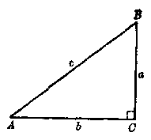

> 图1·13

#### 3. 几个特殊度数的角的三角函数值

| A | 0° | 30° | 45° | 60° | 90° |
| --- | --- | --- | --- | --- | --- |
| \(\sin A\) | 0 | \(\frac12\) | \(\frac{\sqrt2}{2}\) | \(\frac{\sqrt3}{2}\) | 1 |
| \(\cos A\) | 1 | \(\frac{\sqrt3}{2}\) | \(\frac{\sqrt2}{2}\) | \(\frac12\) | 0 |
| \(\operatorname{tg}A\) | 0 | \(\frac{\sqrt3}{3}\) | 1 | \(\sqrt3\) | 不存在 |
| \(\operatorname{ctg}A\) | 不存在 | \(\sqrt3\) | 1 | \(\frac{\sqrt3}{3}\) | 0 |
| \(\sec A\) | 1 | \(\frac{2\sqrt3}{3}\) | \(\sqrt2\) | 2 | 不存在 |
| \(\operatorname{cosec}A\) | 不存在 | 2 | \(\sqrt2\) | \(\frac{2\sqrt3}{3}\) | 1 |

#### 4. 锐角的三角函数的变化

锐角逐渐增大时 \(\left\{\begin{array}{l} 正弦, 正切, 正割逐渐增大; 余弦, 余切, 余割逐渐减小.\end{array}\right.\)

#### 5. 三角函数表的用法

| 表的名称 | 由已知锐角求相应的函数 | 由已知函数求相应的锐角 |
| --- | --- | --- |
| 正弦表和正切表 | 角增大，函数值应加上函数修正值 | 函数增大，角度应加上角度修正值 |
| 余弦表和余切表 | 角增大，函数值应减去函数修正值 | 函数增大，角度应减去角度修正值 |

### 复习题一A

1. 设直角三角形的斜边和一条直角边的比是 25：24，求最小角的六个三角函数。

2. A 是直角三角形中的一个锐角， 求证 \(\sin A + \cos A > 1\) .

3. 已知 \(\operatorname{cosec} A = 2\)，求作锐角 \(A\).

4. 不用查表， 计算

$$
[ \operatorname{tg} (50 ^{\circ} + x) - \operatorname{ctg} (40 ^{\circ} - x) ] [ \sec x + \sec (\alpha + 10 ^{\circ}) ]
$$

$$
(0 ^{\circ} <   x <   40 ^{\circ})
$$

的值。

5. 化简 \(2p^{2}\sin^{2}45^{\circ} - pq\sec 60^{\circ} + 3q^{2}\operatorname{tg}^{2}30^{\circ}\).

6. 化简下列各式：

（1） \(p^2\sin 90^\circ - 2pq\cos 0^\circ + q^2\cos 0^\circ + 2p\operatorname{tg}0^\circ - q\operatorname{ctg}90^\circ\)；

（2） \(m^3 \sec 0^\circ - m^2 n \operatorname{tg}^260^\circ \operatorname{cosec} 90^\circ + 9m n^2 \operatorname{ctg}^260^\circ - n^3 \sin^290^\circ,\)

7. 已知 \(\cos x = \frac{1}{4}\)， 查表求锐角 \(x\)， 并求 \(\sin x\)， \(\operatorname{tg} x\) 和 \(\operatorname{ctg} x\) 的值。

### 复习题一B

1. 已知 \(a = \sqrt{pq - q^2}\)， \(c = \sqrt{p^2 - pq}\) （\(p > q > 0\)）； 求下列各式的值：

（1） \(\sin^2 B + \cos^2 B\)；

（2） \(\sec^2 A - \operatorname{tg}^2 A\)；

（3） \(\operatorname{cosec}^2 A - \operatorname{ctg}^2 A.\)

2. 已知 \(\sec A = \sqrt{\frac{3}{2}}\)； 求作锐角 \(A\)， 并量出它的近似值。

3. 求证在圆内接四边形 \(ABCD\) 中：

（1） \(\sin \frac{A}{2} + \sin \frac{C}{2} = \cos \frac{A}{2} + \cos \frac{C}{2}\)；

（2） \(\operatorname{tg} \frac{A}{2} + \operatorname{tg} \frac{B}{2} = \operatorname{ctg} \frac{C}{2} + \operatorname{ctg} \frac{D}{2}\).

4. 求适合下列各式的锐角 \(x\)；

（1） \(2\cos (x - 10^{\circ}) = 1;\)

（2） \(\sqrt{3} \operatorname{ctg}(10^{\circ} + x) - 1 = 0.\)

5. （1） 已知 \(\cos \alpha = 0.6975, \sin \beta = 0.7328\)； 不用查表， 求证

$$
\alpha + \beta > 90 ^{\circ}.
$$

（2） 已知 \(\operatorname{tg} \alpha = 0.4579, \operatorname{ctg} \beta = 0.5497\)； 不用查表， 求证

$$
\alpha + \beta <   90 ^{\circ}.
$$

6. 在直角三角形中， 如果一条直角边的 3 倍与另一条直角边的 4 倍的和等于斜边的 5 倍。求两个锐角。

### 第一章 测验题

1. 在直角三角形 \(ABC\) 中，\(C\) 是直角，已知 \(a = 2\sqrt{mn}, c = m + n (m > n > 0)\)； 求 \(\sin A, \cos A\) 和 \(\sin^2 A + \cos^2 A\) 的值。

2. 求证对于任何小于 \(45^{\circ}\) 的锐角 \(x\)， 等式 \(\cos (45^{\circ} + x) = \sin (45^{\circ} - x)\) 都成立。

3. 计算 \(\sin 60^{\circ} - \cos^{2}60^{\circ} + \operatorname{tg}45^{\circ} - \sec^{2}30^{\circ}\) 的值。

4. 如果 \(\alpha\) 是小于 \(45^{\circ}\) 的锐角，又 \(2\sin 2\alpha = \sqrt{3}\)，求 \(\sin \alpha\) 的值。

5. 设 \(\alpha\) 和 \(\beta\) 都是锐角，并且已知 \(\sec \alpha > \operatorname{cosec} \beta\)；求证 \(\alpha + \beta > 90^\circ\).

6. （1） 已知 \(\sin 40^{\circ}18' = 0.6468\)，并且它和 \(\sin 40^{\circ}16'\) 的差是 0.0004，求 \(\sin 40^{\circ}16'\).

（2） 已知 \(\operatorname{ctg} 53^{\circ}30' = 0.7400\)，并且它和 \(\operatorname{ctg} 53^{\circ}29'\) 的差是 0.0005，求 \(\operatorname{ctg} 53^{\circ}29'\).

## 2. 直角三角形的解法

### §2·1 直角三角形解法的分类

一个三角形的三条边和三个角叫做它的六个元素。所谓解三角形，就是根据已知的元素，求出它的未知元素。

现在我们只研究直角三角形的解法。我们仍用 \(C\) 表示直角三角形 \(ABC\) 的直角，而把三个角 \(A, B, C\) 的对边分别用 \(a,b,c\) 表示，如图2·1.

对于直角三角形来说，除了一个直角以外，如果还知道两个

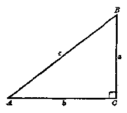

> 图2·1

元素（其中至少有一个元素是边）， 那末， 总可以利用三角函数求出其他的元素。 已知的两个元素可以是：

（1） 斜边和一个锐角： 就是已知 o 和 A， 或者 c 和 B.

（2） 一条直角边和一个锐角：这里已知的直角边可以是已知锐角的对边，例如已知 \(a\) 和 \(A\) 或者 \(b\) 和 \(B\)；也可以是邻边，例如已知 \(b\) 和 \(A\) 或者 \(a\) 和 \(B\).

（3） 斜边和一条直角边： 就是已知 \(\sigma\) 和 \(a\) 或者 \(\sigma\) 和 \(b\).

（4） 两条直角边： 就是已知 a 和 b.

在本章以下各节里，我们将依次举例说明这四种情形的解法，在所有的例题和习题中，求角都要求精确到 \(1'\) .

#### 习题2·1

1. 已知直角三角形的两个锐角，能不能求出这个直角三角形的三条边？为什么？

2. 利用刻度尺和量角器，画出下列各直角三角形，已知：

（1） \(c = 6.8\mathrm{cm}, A = 70^{\circ}\)；

（2） \(a = 4.9\mathrm{cm}, A = 36^{\circ}\)；

（3） \(b = 4.0\mathrm{cm}, A = 43^{\circ}\)；

（4） \(c = 8.6\mathrm{cm}, a = 4.5\mathrm{cm};\)

（5） \(a = 13.5\mathrm{cm}, b = 17.0\mathrm{cm}\).

### §2·2 已知斜边和一个锐角， 解直角三角形

#### 例 1

已知 \(c=287.4, B=42^{\circ}6'\)； 求 A， a 和 b （图 2·2）。

**［解］** （1） \(A = 90^{\circ} - B = 90^{\circ} - 42^{\circ}6'\)

$$
= 47 ^{\circ} 54 ^{\prime}.
$$

（2） \(\frac{a}{a} = \cos B,\)

$$
\begin{array}{l} \therefore a = c \cos B = 287.4 \cos 42 ^{\circ} 6 ^{\prime} \\ = 287.4 \times 0.7420 = 213.2. \\ \end{array}
$$

（3） \(\frac{b}{c} = \sin B,\)

$$
\therefore b = a \sin B = 287.4 \sin 42 ^{\circ} 6 ^{\prime}
$$

$$
= 287.4 \times 0.6704 = 192.7.
$$

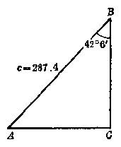

> 图2·2

**［注意］** 根据四位的三角函数值计算边长，如果没有指明要精确到哪一位，那末求得的结果就保留四个有效数字。

#### 例 2

一仓库屋顶的倾斜度是 \(30^{\circ}\)，椽长 AB 等于 7.3 米（图 2·3）；求

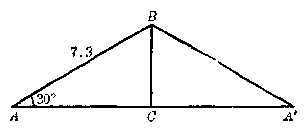

> 图2·8

这仓库的宽 \(AA'\) （精确到 0.1 米）。

**［解］** 在图 2·3 中，柱子 BC 垂直于梁 \(AA'\)，所以在直角三角形 \(ABC\) 中，

$$
\frac {A C}{A B} = \cos A，
$$

$$
A C = A B \cos A = 7.3 \cos 30 ^{\circ} = 7.3 \times 0.8660 = 6.32.
$$

$$
A A ^{\prime} = 2 A C = 2 \times 6.32 = 12.6.
$$

**答：** 仓库的宽约为12.6米。

#### 习题2·2

1. 解下列各直角三角形，已知：

（1） \(c = 35.00, A = 35^{\circ}35'\)；

（2） \(c = 315.7, B = 61^{\circ}6'\).

2. 等腰三角形的腰长为 30.02 cm，底角等于 \(70^{\circ}\)，求底边上的高和底边的长。

3. 梯长 6.5 m，下端着地，上端靠墙，设梯与地面成 \(72^{\circ}\) 的角，问下端距墙脚有多远（精确到 0.1 m）？

4. 山坡与地平面成 \(33^{\circ}17'\) 的角， 某人上坡走了 87.5 m， 问他上升了多少（即与地平面的垂直距离）？

5. 平行四边形的两边分别是 9 cm 和 12 cm，它们的夹角是 \(74^{\circ}30'\) . 求平行四边形的面积。

### §2·3 已知一条直角边和一个锐角，解直角三角形

#### 例 1

已知 a=15.2， \(A=13^{\circ}58'\)； 求 B， b 和 \(\sigma(\text{图 }2\cdot4)\) .

**［解］** （1） \(B = 90^{\circ} - A = 90^{\circ} - 13^{\circ}58' = 76^{\circ}2'\).

（2） \(\frac{b}{a} = \operatorname{ctg} A,\)

$$
\therefore b=a\operatorname{ctg}A = 15.2 \operatorname{ctg} 13 ^{\circ} 58 ^{\prime}
$$

$$
= 15.2 \times 4.021 = 61.12.
$$

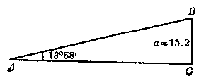

> 图2·4

（3） \(\frac{a}{c} = \sin A,\)

$$
\therefore \quad c = \frac {a}{\sin A} = \frac {15.2}{\sin 13 ^{\circ} 58 ^{\prime}} = \frac {15.2}{0.2414} = 62.97.
$$

#### 例 2

已知 \(b = 79.79, A = 66^{\circ}36'\)；求 \(B\)，\(a\) 和 \(c\)（图2·4）。

**［解］** （1） \(B = 90^{\circ} - A = 90^{\circ} - 66^{\circ}36'\)

$$
= 23 ^{\circ} 24 ^{\prime}.
$$

（2） \(\frac{a}{b} = \operatorname{tg} A,\)

$$
\therefore a = b \operatorname{tg} A = 79.79 \operatorname{tg} 66 ^{\circ} 36 ^{\prime}
$$

$$
= 79.79 \times 2.311 = 184.4.
$$

$$
\frac {b}{c} = \cos A， \tag {3}
$$

$$
\therefore \quad c = \frac {b}{\cos A} = \frac {79.79}{\cos 66 ^{\circ} 36 ^{\prime}} = \frac {79.79}{0.3971} = 200.9.
$$

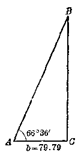

> 图2·5

在测量学里，常用到仰角和俯角这两个名词。如图 2·6，画出连结观测点（O）和目的物（A或B）的视线，并且经过观测点，画和视线在同一铅直面内的水平线（OL）.当视线在水平线的上方时，它们间的角叫做目

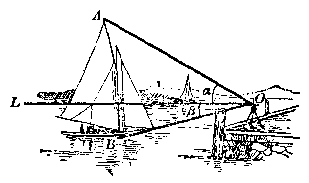

> 图2·6

的物的仰角 \((\angle\alpha)\)，当视线在水平线的下方时，它们间的角就叫做目的物的俯角 \((\angle\beta)\)。

#### 例 3

图 2·7 中， 为了决定树 \(AB\) 的高度， 在和 \(E\) 相距 47.0 米的 \(D\) 处， 用测角仪器测得仰角 \(\angle ABC = 20^{\circ}\). 设测角仪器 \(BD\) 的高度是 1.3 米， 求树的高度 （精确到 0.1 米）。

**［解］** 在直角三角形 \(ABO\) 中，

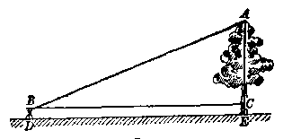

> 图2·7

$$
\frac {A C}{B C} = \operatorname{tg} B.
$$

$$
\therefore A C = B C \operatorname{tg} B = D E \operatorname{tg} B = 47.0 \operatorname{tg} 20 ^{\circ}
$$

$$
= 47.0 \times 0.3640 = 17.1.
$$

$$
\therefore A E = A C + C E = A C + B D = 17.1 + 1.3 = 18.4.
$$

**答：** 树高约为18.4米。

**［注意］** 当测量对象较高，测角仪器的高度对实际测得的高度影响很小时，可以略去不计。所以习题中有时并不指明测角仪器的高。

#### 例 4

由高出海面 150 米的山岩上的一点 A（图 2·8），观测海中一艘船 B 的俯角是 \(\alpha=9^{\circ}\)，求山脚 C 到船只的距离（精确到 1 米）。

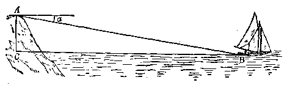

> 图2·8

**［解］** \(\angle BAC = 90^{\circ} - 9^{\circ} = 81^{\circ}\)

$$
\therefore B O = 150 \mathrm{tg} 81 ^{\circ}.
$$

查表得 tg 81°=6.3138.

$$
\therefore B C = 150 \times 6.3138 = 947.
$$

**答：** 山脚到船只的距离约为947米。

#### 习题2·3

1. 解下列各直角三角形， 已知：

（1） \(b = 45.62, A = 39^{\circ}15'\)；

（2） \(b \approx 100, B = 67^{\circ}20'\).

2. 直角三角形 \(ABC\) 的锐角 \(B = 40^{\circ}22'\)， 斜边 \(AB\) 上的高是 \(8.24 \mathrm{~cm}\)， 解这个直角三角形。

3. 等腰三角形 \(ABC\) 的底角 \(A = 72^{\circ}20'\)，腰 \(AC\) 上的高为 \(14.7\mathrm{cm}\)，求这个三角形的顶角，腰和底边的长（精确到 \(0.1\mathrm{cm}\)）。

4. 菱形的一锐角等于 \(77^{\circ}\)， 短对角线的长为 \(12.40 \mathrm{~cm}\)， 求这菱形的边长。

5. 从圆的直径的一端作长为 \(39.6\mathrm{cm}\) 的弦，它与直径所夹的角是 \(44^{\circ}30'\)，求这圆的半径。

6. 一树的上段被风吹折与地面成 \(30^{\circ}\) 的角， 树根与树顶着地处相距 \(20 \mathrm{~m}\)； 求树原有的高度。

7. 河岸上一岩， 高出水平面 \(13.2 \mathrm{~m}\)， 从直对这岩的对岸一点， 测得岩顶的仰角为 \(14^{\circ}36'\). 求河宽。

8. 一车以每小时 \(30 \mathrm{~km}\) 的速度， 向上行驶于与水平面成 \(10^{\circ}\) 的角的斜坡上。这车行驶到距水平面 \(41 \mathrm{~m}\) 的高度， 需时多少？

### §2·4 已知斜边和一条直角边，解直角三角形

#### 例 1

已知 \(b=35.47,\quad c=45.93\)； 求 A， B 和 \(\alpha\) （图 2·9）。

**［解］** （1） \(\cos A = \frac{b}{c} = \frac{35.47}{45.93}\)

$$
= 0.7723，
$$

$$
\therefore A = 39 ^{\circ} 26 ^{\prime}.
$$

（2） \(B = 90^{\circ} - A = 90^{\circ} - 39^{\circ}26'\)

$$
= 50 ^{\circ} 34 ^{\prime}.
$$

（3） \(\because a^{2} + b^{2} = c^{2},\)

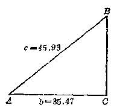

> 图2·9

$$
\therefore a=\sqrt{c^2-b^2}=\sqrt{45.93^2-35.47^2}
$$

$$
= \sqrt {2110-1258}=\sqrt{852}=29.2
$$

解题时遇到需要求数的平方或平方根， 可利用《中学数学用表》中的平方表和平方根表。

#### 例 2

长 21 尺的木板， 一端在地面上， 另一端离开地面的高是 10.3 尺， 求木板和地面所夹的角（精确到 1°）。

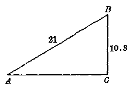

> 图2·10

**［解］** 设 AB 是长 21 尺的木板（图 2·10）， CB 是木板一端离开地面的高度 10.3 尺， 那末

$$
\sin A = \frac {C B}{A B} = \frac {10.3}{21} = 0.4905.
$$

查表得到 \(\angle A\) 的最接近的整数度数是 \(29^{\circ}\).

**答：** 木板和地面所夹的角约为 \(29^{\circ}\)

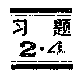

#### 习题2·4

1. 解下列各直角三角形， 已知：

（1） \(a = 50, c = 70.71\)；

（2） b=7， c=25.

2. 一个正多边形的边长为 \(5(\sqrt{5} - 1)\mathrm{cm}\)， 外接圆的半径为 \(10\mathrm{cm}\)， 求这个正多边形的边数。又它的内切圆半径等于多少？

3. 直角三角形 \(ABC\) 的斜边 \(AB = 21.72 \mathrm{~cm}\)， \(AC = 16.80 \mathrm{~cm}\)， 求 \(AB\) 上的高和角 \(A\) 的平分线的长。

4. 等腰三角形的周长为 26 cm， 底上的高为 8 cm， 求它的腰和底（精确到 0.001 cm）以及顶角。

### §2·5 已知两条直角边， 解直角三角形

#### 例

已知 \(a = 104.0, b = 20.49\)；求 \(A, B\) 和 \(\sigma\)（图2·11）。

**［解］** （1） \(\operatorname{tg} A = \frac{a}{b} = \frac{104.0}{20.49} = 5.076.\)

$$
\therefore A = 78 ^{\circ} 51 ^{\prime}.
$$

（2） \(B = 90^{\circ} - A = 90^{\circ} - 78^{\circ}51' =11^{\circ}9^{\prime}\)

（3） \(c = \sqrt{a^2 + b^2} = \sqrt{104.0^2 + 20.49^2}\)

$$
= \sqrt {10820 + 419} = \sqrt {11240} = 106.0.
$$

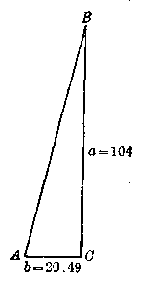

> 图2·11

#### 习题2·5

1. 解下列各直角三角形， 已知：

（1） \(a = \sqrt{5}, b = \sqrt{15}\)；

（2） \(a = 22.5, b = 12.\)

2. 一斜坡在 \(40 \mathrm{~m}\) 的水平距离间上升 \(1 \mathrm{~m}\)。求这个斜坡的倾斜角。

3. 一塔高 \(12 \mathrm{~m}\)， 太阳照射它在平地上的阴影长 \(7 \mathrm{~m}\). 求这时太阳的仰角。

4. 矩形一边的长是 8.25 cm；它的面积是 \(49.5 \, cm^{2}\)。求它的对角线跟底边所成的角。

5. 一块长方形池 \(ABCD\) 的一边 \(AB\) 长 \(80 \mathrm{~m}\)， 宽 \(AD\) 是 \(60 \mathrm{~m}\). 这块地被一条直的篱笆 \(PQ\) 划分成面积相等的两块。 已知点 \(P\) 在 \(AD\) 上且 \(AP\) 是 \(15 \mathrm{~m}\). 求 \(PQ\) 与 \(AD\) 所成的角。

6. 等腰梯形的上底为 \(8 \, cm\)，下底为 \(14 \, cm\)，高为 \(7.5 \, cm\)，求它的腰长和底角。

### §2·6 三角函数对数表

我们已经学会了根据已知的条件来解直角三角形。但在解题的过程中，往往要进行繁琐的运算，不仅要花费很多时间，而且容易产生错误。为了简化计算手续，我们可以利用对数。

利用对数解三角形，除掉要用到代数中关于对数的知识以外，我们还要学会怎样求已知角的三角函数的对数，以及反过来怎样从已知的三角函数的对数值，求出这个角。

#### 1. 求已知角的三角函数的对数

求已知角的三角函数的对数，可以先由三角函数表查得这个已知角的三角函数，再由对数表求它的对数。例如，求 \(\lg \sin 38^{\circ}41'\)，可以先由三角函数表求得

$$
\sin 38 ^{\circ} 41 ^{\prime} = 0.6250，
$$

再由对数表求得

$$
\lg 0.6250 = 1.7959，
$$

由此可知 \(\lg \sin 38^{\circ}41' = 1.7959.\) 上面的方法需要查两次表，为了简化查表的手续，我们可以利用“三角函数对数表”，这样就可以直接查得已知角的三角函数的对数了。

在《中学数学用表》内的第十二表和第十三表中，可以查得每相差 \(1'\) 的各锐角的正弦，余弦，正切和余切的对数（精确到小数第四位）。现在举例来说明它们的查法。

##### 例 1

求 \(\lg \sin 49^{\circ}54'\) 的值。

**［解］** 在中学数学用表表十二中，左上角标有 \(A\) 的直行中查得 \(49^{\circ}\)，然后横着向右查到顶上标有 \(54'\) 的一行处得 I.8883（在表中 I 省略了）。所以

$$
\lg \sin 49 ^{\circ} 54 ^{\prime} = I. 8836.
$$

##### 例 2

求 \(\lg \cos 76^{\circ}34'\) 的值。

**［解］** 在中学数学用表表十二中右下角标有 A 的直行中向上查得 \(76^{\circ}30'\)，横着向左查到底下标有 \(4'\) 的一行处得 I.3661。所以

$$
\lg \cos 76 ^{\circ} 34 ^{\prime} = I. 3661.
$$

##### 例 3

求 \(\lg \cos 34^{\circ}28'\) 的值。

**［解］** 在中学数学用表表十二中有下方标有 A 的直行中向上查得 \(34^{\circ}\)， 横着向左查到底下标有 \(30'\) 的一行处得 1.9160， 再横着向右查到表的末三行中标有 \(2'\) 的一行处得 2， 这就是 0.0002。然后把这个数加到 1.9160 上去。所以 \(\lg \cos 34^{\circ}28' = 1.9160 + 0.0002 = 1.9162\) （注意， 锐角的余弦和它的对数都随着角的增大而减小）。

##### 例 4

求 \(\lg \operatorname{tg} 82^{\circ} 17'\) 的值。

**［解］** 在中学数学用表表十三中左上角标有 \(A\) 的直行中查得 \(82^{\circ}10'\)，再横着向右查到顶上标有 \(7'\) 的一行处得 0.8681，所以 \(\lg \operatorname{tg} 82^{\circ}17' = 0.8681\).

##### 例 5

求 \(\lg \operatorname{ctg} 55^{\circ}51'\) 的值。

**［解］** 在中学数学用表表十三中右下方标有 \(A\) 的直行中向上查得 \(55^{\circ}\)， 再横着向左查到对准下面标有 \(48'\) 的一行处得 I.8323. 然后又横着向右查到表的末三行中标有 \(3'\) 的一行处得 8， 这就是 0.0008. 再从 I.8323 减去 0.0008. 所以 \(\lg \operatorname{ctg} 55^{\circ} 51' = I.8323 - 0.0008 = I.8315\) （注意， 锐角的余切和它的对数都随着角的增大而减小）。

#### 2. 已知一个角的三角函数的对数， 求这个角

如果已知一个锐角的正弦，余弦，正切或者余切的对数，我们也可以从这些表中查得这个锐角精确到 \(1'\) 的近似值，举例如下：

##### 例 6

已知 \(\lg \sin A = \overline{1.4508}\)， 求锐角 \(A\).

**［解］** 在中学数学用表表十二中，查得 I.4508。横着向左查到顶上标有 A 的直行中为 \(16^{\circ}\)；然后再看 I.4508 的直行顶上对准的是 \(24'\)，所以 \(A=16^{\circ}24'\)。

##### 例 7

已知 \(\lg \cos A = 2.8321\)，求锐角 \(A\).

**［解］** 在中学数学用表表十二中， 查得与 2.8321 最接近的数是 2.8326. 横着向右看下面标有 A 的直行中为 86°00'； 然后再看 2.8326 的直行底下对准的是 6'. 所以得到 A 的精确到 \(1'\) 的近似值是 \(86^{\circ}6'\).

##### 例 8

已知 \(\lg \operatorname{tg} A = 0.3260\)，求锐角 \(A\).

**［解］** 在中学数学用表表十三中， 查得与 0.3260 最接近的数是 0.3254. 横着向左查到上面标有 \(A\) 的直行中为 \(64^{\circ}\)； 然后再看 0.3254 的直行顶上对准的是 \(42'\). 但 0.3260 比 0.3254 大 0.0006. 于是再从 0.3254 横着向右查到末三行中与 6 较接近的 7 上面对准的是 \(2'\). 由于锐角的正切和它的对数都是随着角的增大而增大的， 所以 \(A = 64^{\circ}42' + 2' = 64^{\circ}44'\).

##### 例 9

已知 \(\lg \operatorname{ctg} A = \overline{1}.8205\)，求锐角 \(A\).

**［解］** 在中学数学用表表十三中， 查得与 I.8205 最接近的数是 I.8208. 横着向右查到底下标有 A 的直行中为 56°， 然后再看 I.8208 所在的直行下面对准的是 30'. 但 I.8205 比 I.8208 小 0.0003 于是再从 I.8208 横着向右看到末三行中的 3 底下对准的是 1'. 由于锐角的余切和它的对数都是随着角的增大而减小的， 所以 \(A = 56^{\circ}30' + 1' = 56^{\circ}31'\).

#### 习题2·6

1. 查表求下列各三角函数的对数的值：

（1） lg sin 61°50'；

（2） lg sin 67°20'；

（3） lg cos 66°10'；

（4） lg cos 89°23'；

（5） lg tg 35°50'；

（6） lg tg 88°38'；

（7） lg ctg 47°59'；

（8） lg ctg 11°21'.

2. 查表求下列各式中的锐角 \(\alpha\)：

（1） lg sin α=1.4321；

（2） lg sin α=2.9960；

（3） lg cos α=2.9301；

（4） lg cos α=1.8839；

（5） lg tg α=2.0311；

（6） lg tg α=2.0311；

（7） lg ctg α=1 5018；

（8） lg ctg α=0.7865.

### §2·7 利用三角函数对数表进行计算

上一节里，我们学习了利用三角函数对数表来求已知角的三角函数的对数和从三角函数的对数来求锐角的方法。现在我们就利用三角函数对数表对含有三角函数的式子进行计算。举例说明如下：

#### 例 1

利用对数计算 \(\pmb{x}\) 的值：

$$
x = 18.75 \cos 34 ^{\circ} 28 ^{\prime}.
$$

**［解］** 两边取对数，根据对数运算法则，得

$$
\begin{array}{l} \lg x = \lg 18.75 + \lg \cos 34 ^{\circ} 28 ^{\prime}. \\ \lg 18.75 = 1.2730 \\ \frac {\lg \cos 34 ^{\circ} 28 ^{\prime} = 1.9162}{\lg x = 1.1892} (+ \\ \therefore x = 15.46. \\ \end{array}
$$

#### 例 2

利用对数计算

$$
x = \frac {78}{\sin 62 ^{\circ} 10 ^{\prime}}.
$$

**［解］** 两边取对数， 得

$$
\begin{array}{l} \lg x = \lg 78 - \lg \sin 62 ^{\circ} 10 ^{\prime}. \\ \lg 78 = 1.8921 \\ \frac {\lg \sin 62 ^{\circ} 10 ^{\prime} = 1.9466}{\lg x = 1.9455} (- \\ \therefore x = 88.20. \\ \end{array}
$$

#### 例 3

利用对数计算，求适合于等式

$$
\sin x = - \frac {47.55}{58.4}
$$

的锐角 \(\alpha\)

**［解］** 由原式得

$$
\begin{array}{l} \lg \sin x = \lg 47.55 - \lg 58.4， \\ \lg 47.55 = 1.6772 \\ \frac {\lg 58.4 = 1.7664}{\lg \sin x = 1.9108} (- \\ \therefore x = 54 ^{\circ} 31 ^{\prime}. \\ \end{array}
$$

通过上面的例子可以看出， 利用对数计算的步骤是：

（1） 取对数， 并展开成横式；

（2） 列出计算的格式， 并把等号对齐；

（3） 将查表所得的值写在等号的右边，并对齐小数位置；

（4） 最后进行计算。

#### 习题2·7

1. 利用对数计算，求适合等式 \(x \sin 72^{\circ}26' = 123.45 \sin 22^{\circ}27'\) 的 \(x\) 的值。

4. 利用对数计算， 求适合等式 \(\frac{13.42}{\sin 27^{\circ}29'} = \frac{26.95}{\sin x}\) 的锐角 \(x\).

5. 利用对数计算， 求适合等式 \(2 \sin 3x = \sin 68^{\circ}40'\) 的锐角 \(x\).

6. 利用对数计算， 求适合等式 \(tg x = \sqrt{\frac{4.2tg 47^{\circ}13'}{\cos 17^{\circ}33'}}\) 的锐角 \(x\).

7. 利用对数计算， 求适合等式 \(x^{2} \sin 63^{\circ} 45' = \sqrt{211} \operatorname{ctg} 39^{\circ} 38'\) 的正数 \(x\).

### §2·8 利用对数解直角三角形

在 §2·2~2.5 中， 我们已经学会了根据已知条件来解直角三角形。 现在利用对数计算来解， 我们看下面的例题：

#### 例 1

在直角三角形 ABC 中， 已知 \(A = 63^{\circ}23'\)， c = 39.41， 解这个三角形（图 2·12）。

**［解］** （1） \(B = 90^{\circ} - 63^{\circ}23' = 26^{\circ}37'\).

（2） \(a = c\sin A = 39.41\sin 63^{\circ}23'\).

$$
\lg a = \lg 39.41 + \lg \sin 63 ^{\circ} 23 ^{\prime}，
$$

$$
\lg 39.41 = 1.5956
$$

$$
\frac {\lg \sin 63 ^{\circ} 23 ^{\prime} = \overline {{1.9513}}}{\lg a = 1.5469} (+ \tag {+}
$$

$$
\therefore a = 35.23.
$$

（3） \(b = \theta \cos A = 39.41 \cos 63^{\circ}23'\)，

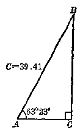

> 图2·12

$$
\lg b = \lg 39.41 + \lg \cos 63 ^{\circ} 23 ^{\prime}.
$$

$$
\lg 39.41 = 1.5956
$$

$$
\frac {\lg \cos 63 ^{\circ} 23 ^{\prime} = 1.6513}{\lg b = 1.2469} (+
$$

$$
\therefore b = 17.66.
$$

#### 例 2

一人在距塔基 50.68 m 处测得塔顶的仰角是 \(14^{\circ}30'\)，求塔高。

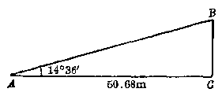

> 图2·13

**［解］** 设塔高 BO 为 \(x(\text{图 }2\cdot13)\)，

$$
\operatorname{tg} A = \frac {x}{A O}.
$$

$$
x=AO\cdot\operatorname{tg}A = 50.68 \operatorname{tg} 14 ^{\circ} 36 ^{\prime}.
$$

$$
\lg x = \lg 50.68 + \lg \operatorname{tg} 14 ^{\circ} 36 ^{\prime}.
$$

$$
\lg 50.68 = 1.7049
$$

$$
\frac {\lg \operatorname{tg} 14 ^{\circ} 36 ^{\prime} = 1.4158}{\lg x = 1.1207} (+
$$

$$
\therefore x = 13.20.
$$

**答：** 塔高 13.20 m.

#### 例 3

圆内一弦的长是 18.32 cm，中心到这弦的距离是 9.003 cm，求这弦所对的中心角和这圆的半径。

**［解］** 在图2·14中，

$$
A D = \frac {1}{2} A B = 9.16 \mathrm{cm}，
$$

$$
O D = 9.003 \mathrm{cm}.
$$

设 \(AO = x\)；又设 \(\angle AOB = \theta\)。于是

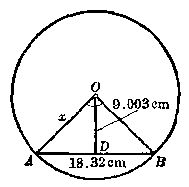

> 图2·14

$$
\angle A O D = \frac {\theta}{2}.
$$

$$
\operatorname{tg} \frac {\theta}{2} = \frac {A D}{O D} = \frac {9.16}{9.003}，
$$

$$
\lg \operatorname{tg} \frac {\theta}{2} = \lg 9.16 - \lg 9.003.
$$

$$
\lg 9.16 = 0.9619
$$

$$
\frac {\lg 9.003 - 0.9543}{\lg \operatorname{tg} \frac {\theta}{2} = 0.0076} (-
$$

$$
\frac {\theta}{2} = 45 ^{\circ} 30 ^{\prime}，
$$

$$
\therefore \quad \theta = 91 ^{\circ}.
$$

$$
x=\frac{AD}{\sin\frac{\theta}{2}}=\frac{9.16}{\sin45^{\circ}30^{\prime}}.
$$

$$
\lg x = \lg 9.16 - \lg \sin 45 ^{\circ} 30 ^{\prime}.
$$

$$
\lg 9.16 = 0.9619
$$

$$
\frac {\lg \sin 45 ^{\circ} 30 ^{\prime} = 1.8532}{\lg x = 1.1087} (-
$$

$$
\therefore x = 12.84.
$$

**答：** 弦所对的中心角是 \(91^{\circ}\)，圆的半径是 \(12.84\mathrm{cm}\)。

在利用对数解直角三角形时， 如果是已知两边， 可先求出一个锐角， 然后再求第三边； 我们避免直接用公式

$$
c = \sqrt {a ^ {2} + b ^ {2}} \quad \text {和} \quad a=\sqrt{c^2-b^2}
$$

去求， 因为这两个式子不适于直接取对数计算。

利用对数计算多位数的乘除法，较直接计算既省时又省力。这对于解三角题是很有利的，所以凡已经掌握对数运算的读者，解题时都应当尽可能利用对数。上例中的对数进行加减时，所用竖式是为帮助初学的读者而列出的。熟练后不必将它们写出作为解的内容，只要在草稿上算出结果就可以了。

#### 习题2·8

利用对数计算， 解下列各直角三角形， 已知：

1. \(A = 67^{\circ}10'\)， \(c = 402\).

2. \(B = 21^{\circ}34'\)， \(a = 0.8211\).

3. b=67.23， c=92.51.

4. \(a = 4.261, b = 10.43,\)

### 本章提要

#### 1. 已知斜边和一个锐角， 解直角三角形

| 已知 | 所 | 求 |  |
| --- | --- | --- | --- |
| c， A | B=90°-A | a=c sin A | b=c cos A |
| c， B | A=90°-B | b=c sin B | a=c cos B |

#### 2. 已知一条直角边和一个锐角， 解直角三角形

| 已知 | 所 | 求 |  |
| --- | --- | --- | --- |
| c， A | B=90°-A | b=a ctg A | c=\(\frac{a}{\sin A}\) |
| a， B | A=90°-B | b=a tg B | c=\(\frac{a}{\cos B}\) |
| b， A | B=90°-A | a=b tg A | c=\(\frac{b}{\cos A}\) |
| b， B | A=90°-B | a=b ctg B | c=\(\frac{b}{\sin B}\) |

#### 3. 已知斜边和一条直角边， 解直角三角形

| 已知 | 所 | 求 |  |
| --- | --- | --- | --- |
| c， a | sin A = c/c | B = 90° - A | b = √c2 - a2或 b = c cos A |
| c， b | cos A = b/c | B = 90° - A | a = √c2 - b2或 a = c sin A |

#### 4. 已知两条直角边， 解直角三角形

| 已知 | 所 | 求 |  |
| --- | --- | --- | --- |
| a，b | tg A=a/b | B=90°-A | c=√a2+b2或c=a/sin A |

### 复习题二A

1. 菱形的边长为 4.2m， 一个锐角为 \(70^{\circ}\)，求它的两条对角线的长（精确到 0.1m）。

2. 一树的上段被风吹折，与地面成 \(30^{\circ}\) 的角。如果上段被折断部分的长为 \(10.5\mathrm{m}\)，求树原有的高度。

3. 梯形的上底为 11.82 cm， 下底为 14.46 cm， 两底角为 \(70^{\circ}14'\) 和 \(75^{\circ}26'\) . 求这梯形的两腰的长。

4. 在平地上的一点， 测得一塔尖的仰角为 \(45^{\circ}\)； 向塔前进 \(100 \mathrm{~m}\) 又测得仰角为 \(60^{\circ}\)； 求塔高。

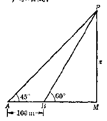

> （第4题）

5. 平面上有两个点 \(P\) 和 \(Q\) 彼此不能直达， 但是能够望见。 为了测量这两点间的距离， 沿 \(PQ\) 的垂线 \(QR\) 取一点 \(R\)， 测得 \(QR = 76.8 \mathrm{~m}, \angle PRQ = 62^{\circ}10'\). 求 \(PQ\).

6. 矩形的一边长 7.5 cm， 它的一条对角线长 8.2 cm。求这对角线与底边间的夹角。

7. 在直角三角形 \(ABC\) 中， 斜边 \(AB\) 上的高 \(CD\) 等于 \(20.4 \mathrm{~cm}\)， \(AD = 18 \mathrm{~cm}\)， 解这个三角形。

8. 利用对数计算，求 \(x = \frac{3 \times 2.752^2 \sin^230^\circ 42'}{2 \cos 25^\circ 28' \operatorname{tg}^257^\circ 3'}\) 的值。

9. 利用对数计算， 解下列各直角三角形， 已知：

（1） c=298， \(A=52^{\circ}35'\)；

（2） \(a = 54.3, c = 72.5\).

### 复习题二B

1. 圆的半径为 10 cm， 圆心角 \(77^{\circ}18'\) 所对的弦长多少？

2. 正十六边形的外接圆的直径为 20 cm，求它的周长和内切圆的半径。

3. 在 200 m 高的峭壁上测得一塔的塔顶与搭基的俯角各为 \(30^{\circ}\) 与 \(60^{\circ}\)，求塔高。

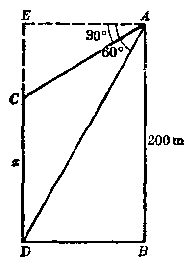

> （第3题）

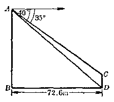

> （第4题）

4. 两个建筑物 \(AB\) 和 \(CD\) 的水平距离是 \(72.6 \mathrm{~m}\)， 从其中一个建筑物的顶点 \(A\) 测得另一个建筑物的顶 \(C\) 的俯角是 \(35^{\circ}\)， 底 \(D\) 的俯角是 \(40^{\circ}\). 求这两个建筑物的高 （精确到 \(0.1 \mathrm{~m}\)）。

5. 平地上两树的高 \(h_1 = 41.25 \, \text{m}\)， \(h_2 = 64 \, \text{m}\). 在两树基的联线上某点 \(K\)， 利用测角器从 \(L\) 测得两树顶端的仰角 \(a = 32^\circ 30'\)， \(\beta = 44^\circ 12'\). 求两树顶端间的距离 （精确到 \(0.1 \, \text{m}\). 测角器的高 \(KL = 1.2 \, \text{m}\)）。

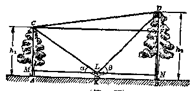

> （第5题）

6. 已知梯形的两底为 10， 14， 两腰为 7， 6. 求这梯形的各个角。

7. 菱形的一角为 \(37^{\circ}25'\)， 两对角线的和为 \(465\mathrm{cm}\). 求它的边长。

8. 利用对数计算， 求适合于等式

$$
\mathrm{tg} x = \frac {2 \sin^ {2} 39 ^{\circ} 15 ^{\prime} \times 0.0397}{3 \cos 72 ^{\circ} 17 ^{\prime}}
$$

的锐角 \(x\)

9. 利用对数计算， 解下列各直角三角形， 已知：

（1） \(a = 401, B = 52^{\circ}40'\)；

（2） \(a = 1.95, b = 4.25\).

### 第二章 测验题

1. 一块圆形铁板， 半径为 \(12.67 \mathrm{~m}\)， 要截成一块尽可能大的正九边形， 它的一边的长应当是多少？

2. 在直角三角形 \(ABC\) 中，锐角 \(A = 33^{\circ}17'\)，斜边 \(AB\) 上的高为 \(15\mathrm{cm}\)，解这个三角形。

3. 已知 \(\triangle ABC\) 中， \(\angle B = 60^{\circ}\)， \(AD \perp BC\)， \(AD = 3\)， \(AC = 5\). 求 \(BC\) 和 \(AB\).

4. 矩形 \(ABCD\) 中， \(AB = 25\)， \(BC = 312\)， 求它的外接圆的半径和两条对角线相交所形成的锐角。

5. 在直角三角形 \(ABC\) 中， 已知 \(B = 46^{\circ}19'\)， \(b = 0.6241\). 利用对数解这个三角形。

## 3. 任意角的三角函数

### §3·1 大于 \(90^{\circ}\) 的角和负角

我们在 §1·6 中已经说过， 角可以看做是由一条射线绕着它的端点旋转而成的。 在图 3·1 里， 角 AOB 就是由一条射线从 OA 的位置开始， 绕着端点 O， 旋转到 OB 而形成的。

如果图3·1中的射线绕着点 \(O\) 继续旋转，那末，形成的角 \(AOB\) 就逐渐增大，从锐角变成 \(90^{\circ}\) 的角，再变成钝角，\(180^{\circ}\) 的角等等。当射线旋转了一周而又与 \(OA\) 重合的时候，所得的角就等于 \(360^{\circ}\)。

设想图3·1中的射线旋转一周后再继续旋转，这样就会得到大于 \(360^{\circ}\) 的角。旋转两周以后，就得到大于 \(720^{\circ}\) 的角。象这样继续下去，射线可以旋转三周，四周等等，而形成任何大小的角。

假使我们再把射线旋转的方向也考虑进去，那末角的概念不但可以推广到任何大小的角，还可以推广到负角。例如，图3·2中相互衔接而具有同样半径的两个齿轮，在转动

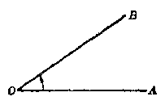

> 图3·1

> 图3·2

的时候， 其中一个齿轮的半径旋转某一个角度， 另一个就一定旋转同样的角度， 但是它们旋转的方向相反。 如果我们只是说， 在同一个时间里， 两个齿轮的半径旋转的度数是一样的， 那末， 这就象把温度计的零上 2 度和零下 2 度一律说做 2 度一样， 显然是不确切的。 为了解决这类问题， 我们可以规定射线按照一个方向旋转所成的角是正的， 而按照另一个方向旋转所成的角是负的。 通常我们规定： 按照反时针方向旋转所成的角是正的角， 按照顺时针方向旋转所成的角是负的角。 例如， 在图 3·2 中， 右边的一个齿轮旋转所得的角是正的， 左边的一个齿轮旋转所得的角是负的。

射线按顺时针方向旋转一周，生成的角是从 \(0^{\circ}\) 到 \(-360^{\circ}\)；旋转两周，就生成 \(-360^{\circ}\) 到 \(-720^{\circ}\) 的角。这样下去，我们可以有任何大小的负角。例如时钟的分针一昼夜所转过的角是 \(-8640^{\circ}\)。

这样，我们就扩大了角的概念。我们有了任意大小的正角，负角和等于 \(0^{\circ}\) 的角（简称零角）。

#### 例 1

画出下列各角： \(940^{\circ}\)， \(-790^{\circ}\)

**［解］** 940除以360，得到不完全的商2和余数220，所以

$$
940 ^{\circ} = 2 \times 360 ^{\circ} + 220 ^{\circ}.
$$

这就是说， 射线按照反时针方向旋转 2 周后， 继续按反时针方向旋转 \(220^{\circ}\)， 就得到 \(940^{\circ}\) 的角 （图 3·3）。

同样，-790除以360，商是负数，在-2与-3之间。我们取绝对值较大的不完全商-3，得

$$
- 790 ^{\circ} = - 3 \times 360 ^{\circ} + 290 ^{\circ}.
$$

因此，\(-790^{\circ}\) 是射线按顺时针方向旋转 3 周后再按逆时针方向旋转 \(290^{\circ}\) 而形成的 （图 3·4）。

一般地说，任意角 \(\theta\) 都可以表示成

$$
\theta = n \cdot 360 ^{\circ} + \alpha
$$

的形式， 其中 \(0^{\circ} \leqslant \alpha < 360^{\circ}\)， \(n\) 是整数。

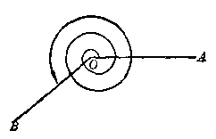

> 图3·3

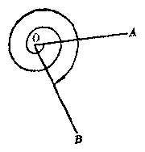

> 图3·4

反过来， 和任意角 \(\alpha\) 的始边相同， 终边也相同的一切角包括角 \(\alpha\) 本身在内可以用 \(n \cdot 360^{\circ} + \alpha\) 来表示， 其中 \(n\) 取正整数， 负整数或零。

#### 例 2

机器的轮子在 3 分钟内旋转 9000 周， 它的角速度是每秒几度？

**［解］** \(\frac{9000\times 360^{\circ}}{3\times 60} = 18000^{\circ}.\)

**答：** 轮子的角速度是每秒 \(18000^{\circ}\) .

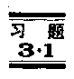

#### 习题3·1

1. 用量角器作出下列各角：

$$
- 55 ^{\circ}， - 265 ^{\circ}， 400 ^{\circ}， 1000 ^{\circ}， - 512 ^{\circ}.
$$

2. 当时钟上指出 3 点，6 点和 8 点的时候，把时针作为角的始边，写出分针与时针所成角的一般形式。

3. 把 \(410^{\circ}20'\)， \(845^{\circ}38'\)， \(-90^{\circ}\)， \(-220^{\circ}\) 与 \(-3000^{\circ}\) 写成 \(n \cdot 360^{\circ} + \alpha\) 的形式， 但必须使 \(0^{\circ} \leqslant \alpha < 360^{\circ}\).

4. 若下列各角有相同的始边， 判别哪些角有相同的终边。

$$
105 ^{\circ}， - 75 ^{\circ}， 465 ^{\circ}， - 615 ^{\circ}， 285 ^{\circ}.
$$

5. 飞轮在4小时内旋转 \(72 \times 10^{4}\) 周，它的角速度是每秒几度？

### §3·2 直角坐标系

我们在第一章中知道，对于任何一个锐角，可以用它所在的直角三角形两边的比来定义它的三角函数.在扩大了角的概念以后，我们很自然地也要对于任意的角，规定它们的三角函数的意义。三角函数的新的定义要用到代数中关于直角坐标系的知识。为了便于读者自学，我们在这一节里把有关直角坐标系的知识复习一下。

#### 1. 基本概念

在平面内画互相垂直的两条直线 \(Ox\) 和 \(Oy\) （图3·5）。 取任意一条线段作为长度单位，再规定两条直线的正方向如图中的箭头所示。 对于 \(Ox\) 上从 \(O\) 起截取的每一条线段，我们使它对应着一个数，这个数的绝对值是线段的长；向右截取的对应着正数，向左截取的对应着负数。 同样，在 \(Oy\) 上，从 \(O\) 起，使向上截取的线段对应着正数，向下截取的对应着负数。 这样，在两条直线上，每一条以 \(O\) 为一个端点的线段就对应着一个数。 例如，在图3·5中，线段 \(OA\) 对应着 \(+4\)，线段 \(OB\) 对应着 \(-3\)，线段 \(OD\) 对应着 \(-5\).

设平面内有一点 \(P\)。从点 \(P\) 作 \(Ox\) 的垂线 \(MP\) 和 \(Oy\) 的垂线 \(NP\)（图3·6）。用取定的长度单位量 \(OM\) 和 \(ON\)，并且放上应有的正负号以后，得到两个数。我们把 \(OM\) 所对应的数叫做点 \(P\) 的横坐标，\(ON\) 所对应的数叫做点 \(P\) 的纵坐标。例如在图3·6中，点 \(P\) 的横坐标是2，纵坐标是3。同样可以求得 \(A, B, C, D\) 各点的横坐标和纵坐标。

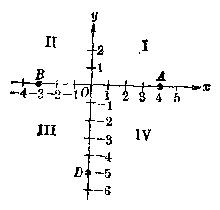

> 图3·5

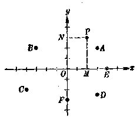

> 图3·6

一个点的横坐标和纵坐标总起来叫做这个点的坐标。

我们可以用 \(P(2,3)\) 来表示点 \(P\) 的坐标。括号里第一个数表示横坐标，第二个数表示纵坐标。例如，在图3·6中，点 \(A\) 的坐标是 \((3,2)\)，点 \(B\) 的坐标是 \((-3,2)\)，点 \(C\) 的坐标是 \((-4,-2)\)，点 \(D\) 的坐标是 \((3,-2.5)\)。

由此可知， 利用平面内互相垂直的两条直线， 可以按照上面的规定， 用一对有一定顺序的数来指出平面内任意一点的位置。

反过来，知道了一点的坐标， 我们也就能够画出这个点。

例如，要画出点 \(P(2.5, -3.5)\)，我们在 \(Ox\) 上，从 \(O\) 起向右截取2.5个长度单位，得到点 \(M\)；在 \(Oy\) 上，从 \(O\) 起向下截取3.5个长度单位，得到点 \(N\)（图3·7）。

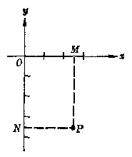

> 图3·7

过M作Ox的垂线，过N作Oy的垂线。这两条垂线的交点就是所求的点P。

我们把 \(Ox\) 叫做横坐标轴或者 \(x\) 轴，\(Oy\) 叫做纵坐标轴或者 \(y\) 轴，点 \(O\) 叫做坐标原点。\(x\) 轴和 \(y\) 轴把平面所分成的四个部分叫做象限。各象限的编号从右上方的一个开始，按照反时针方向，分别叫做第一象限，第二象限，第三象限和第四象限（参看图3·5）。各象限里点的坐标的符号如下表所示：

| 象限 | 横坐标 | 纵坐标 |
| --- | --- | --- |
| I | + | + |
| II | - | + |
| III | - | - |
| IV | + | - |

设从点 P 所作的 x 轴的垂线交 x 轴于 M，如果我们规定：当线段 \(MP\) 在 \(x\) 轴的上方时，令它的长带上正号，在 \(x\) 轴的下方时，令它的长带上负号，那末 \(MP\) 所对应的数显然就是点 \(P\) 的纵坐标。采用这个规定，求已知点的坐标或者画出已知坐标的点就更简便了。

##### 例 1

求图3·8中点 \(P\) 的坐标。

**［解］** 从 \(P\) 作 \(x\) 轴的垂线 \(MP\). 用取定的长度单位量 \(OM\) 和 \(MP\). 从图中可以看到， \(OM\) 所对应的数是 \(-3\)， \(MP\) 所对应的数是 4. 所以点 \(P\) 的横坐标是 \(-3\)， 纵坐标是 4， 就是说， 点 \(P\) 的坐标是 \((-3, 4)\).

##### 例 2

画出点 \(P(-5, -3.5)\).

**［解］** 在 \(x\) 轴上从 \(O\) 起向左截取线段 \(OM\) 使它的长等于5个长度单位。在点 \(M\) 处作 \(x\) 轴的垂线，并且向下截取线段 \(MP\) 使它的长等于3.5个长度单位（图3·9）。\(OM\) 所对应的数是-5，\(MP\) 所对应的数是-3.5，点 \(P\) 就是所求的点。

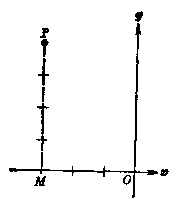

> 图3·8

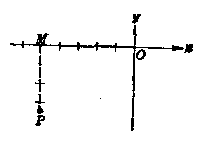

> 图3·9

#### 2. 两点间的距离

我们用 \(|M_1M_2|\) 表示 \(x\) 轴上的两点 \(M_{1}(2,0)\) 和 \(M_{2}(5,\) 0）之间的距离（图3·10），那末

$$
\left| M _ {1} M _ {2} \right| = | 5 - 2 | = 3.
$$

可以验证，不管 \(M_{1}(x_{1},0)\) 和 \(M_{2}(x_{2},0)\) 两点在 \(\pmb{x}\) 轴上的位

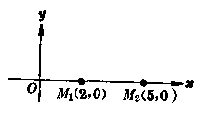

> 图3·10

置怎样， 它们间的距离总可以用下列公式表示：

$$
\left| M _ {1} M _ {2} \right| = \left| x _ {2} - x _ {1} \right|.
$$

这就是说，要计算 x 轴上 \(M_{1}\)， \(M_{2}\) 两点间的距离， 只要求出它们的横坐标的差， 再取绝对值就可以了。

同样，\(y\) 轴上 \(N_{1}(0, y_{1})\) 和 \(N_{2}(0, y_{2})\) 两点间的距离是

$$
\left| N _ {1} N _ {2} \right| = \left| y _ {2} - y _ {1} \right|.
$$

例如，在图3·11中，

$$
\left| M _ {1} M _ {2} \right| = | - 3 - 4 | = 7，
$$

$$
\left| N _ {1} N _ {2} \right| = | 3 - (- 2) | = 5.
$$

现在我们来研究怎样用两点的坐标来计算直角坐标系中任意两点间的距离。

设 \(P_{1}(x_{1},y_{1})\) 和 \(P_{2}(x_{2},y_{2})\) 是直角坐标系中的任意两点（图3·12）。 从点 \(P_{1}\) 和 \(P_{2}\) 分别作 \(M_{1}P_{1}\) 和 \(M_{2}P_{2}\) 垂直于 \(x\) 轴，垂足是 \(M_{1}(x_{1},0)\) 和 \(M_{2}(x_{2},0)\). 又从点 \(P_{1}\) 和 \(P_{2}\) 分别作 \(N_{1}P_{1}\) 和 \(N_{2}P_{2}\) 垂直于 \(y\) 轴，垂足是 \(N_{1}(0,y_{1})\) 和 \(N_{2}(0,y_{2})\). 直线 \(P_{1}M_{1}\) 和 \(P_{2}N_{2}\) 相交于点 \(Q\).

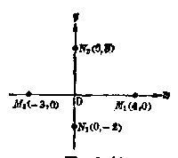

> 图3·11

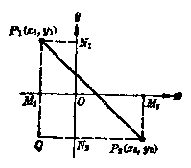

> 图3·12

在直角三角形 \(P_{1}QP_{2}\) 中，根据勾股定理，得

$$
\left| P _ {1} P _ {2} \right| ^ {2} = \left| Q P _ {2} \right| ^ {2} + \left| P _ {1} Q \right| ^ {2}.
$$

但 \(|QP_{3}| = |M_{1}M_{2}| = |x_{2} - x_{1}|\)

$$
\left| P _ {1} Q \right| \sim \left| N _ {1} N _ {2} \right| = \left| y _ {2} - y _ {1} \right|.
$$

所以 \(|P_{1}P_{2}|^{2} - |x_{2} - x_{1}|^{2} + |y_{2} - y_{1}|^{2}\)

$$
- \left(x _ {2} - x _ {1}\right) ^ {2} + \left(y _ {2} - y _ {1}\right) ^ {2}.
$$

由此得到 \(P_{1}(x_{1},y_{1})\) 和 \(P_{2}(x_{2},y_{2})\) 两点间的距离公式：

$$
\boxed {| P _ {1} P _ {2} | = \sqrt {(x _ {2} - x _ {1}) ^ {2} + (y _ {2} - y _ {1}) ^ {2}}.}
$$

##### 例 3

求 \(P_{1}(-1, -2)\) 和 \(P_{2}(3, 1)\) 两点间的距离（图 3·13）。

**［解］** 这里， \(x_{1}=-1,\quad y_{1}=-2,\quad x_{2}=3,\quad y_{2}=1.\)

$$
\begin{array}{l} \therefore \quad | P _ {1} P _ {2} | = \sqrt {[ 3 - (- 1) ] ^ {2} + [ 1 - (- 2) ] ^ {2}} \\ = \sqrt {4 ^ {2} + 3 ^ {2}} = \sqrt {25} = 5. \\ \end{array}
$$

作为两点间的距离公式的特例，从原点 \(O(0,0)\) 到任意点 \(P(x,y)\) 的距离是

$$
r = \sqrt {x ^ {2} + y ^ {2}}.
$$

##### 例 4

求从原点到点（3，4）的距离（图3·14）。

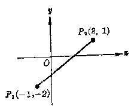

> 图3·13

**［解］** \(r = \sqrt{3^2 + 4^2} = \sqrt{25} = 5.\)

##### 例 5

求从原点到点 \((-3,-2)\) 的距离（图 3·15）。

**［解］** \(r = \sqrt{(-3)^2 + (-2)^2} = \sqrt{9 + 4} = \sqrt{13} \approx 3.6.\)

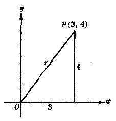

> 图3·14

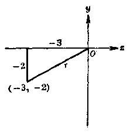

> 图3·15

#### 习题3·2

1. 在坐标平面上画出下列各点：

$$
P _ {1} (5， - \sqrt {2})； P _ {2} (- 3， \sqrt {3})； P _ {3} (- 1.3， - \sqrt {5})；
$$

$$
P _ {4} (- 5， 0)； P _ {5} (0， - 3)； P _ {6} (0， 3.3)； P _ {7} (- \sqrt {2}， - \sqrt {3})。
$$

2. 求下列两点间的距离：

（1） \(P_{1}(-4,3)\) 和 \(P_{2}(-2,0)\)；

（2） \(P_{1}(7, -3)\) 和 \(P_{2}(-3, -1)\).

3. 求从原点到下列各点的距离：

（1） \((-2, \sqrt{5})\)； （2） \((3, -4)\)； （3） \((1, 7)\)；

（4） \((0, -3)\)； （5） \((- \sqrt{5}, 0)\)； （6） \((a, -2a)\).

4. 某点的横坐标为 3，这点到原点的距离为 5，求它的纵坐标。

5. 写出以直角坐标系的原点为顶点，x轴的正半轴为始边，OP为终边的角的一般形式：

（1） \(P(1, \sqrt{3})\)； （2） \(P(2, -2)\)； （3） \(P(-\sqrt{3}, -1)\)；

（4） \(P(-3, 3)\)； （5） \(P(0, -3.5)\)； （6） \(P(4, 0)\)；

（7） \(P(0,3)\)； （8） \(P(-2,0)\).

### §3·3 任意角的三角函数

现在我们来说明对于任意的角，怎样规定它们的三角函数的意义。

设有一个锐角 \(\alpha\)，我们以它的顶点为原点，以它的始边（就是射线原来的位置）为正半 \(x\) 轴，作直角坐标系（图3·16）。

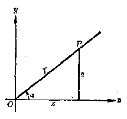

> 图3·16

在角 \(\alpha\) 的终边（就是射线最后的位置）上任意取一点 \(P\)。设点 \(P\) 的坐标为 \((x, y)\)，\(OP\) 的长为 \(r\)。根据锐角三角函数的定义，我们知道

$$
\sin \alpha = \frac {y}{r}， \tag {1}
$$

$$
\cos \alpha = \frac {x}{r}， \tag {2}
$$

$$
\operatorname{tg} \alpha = \frac {y}{x}， \tag {3}
$$

$$
\operatorname{ctg} \alpha = \frac {x}{y}， \tag {4}
$$

$$
\sec \alpha = \frac {r}{x}， \tag {5}
$$

$$
\operatorname{cosec} \alpha = \frac {r}{y}， \tag {6}
$$

设想射线继续按反时针方向旋转，成为大于 \(90^{\circ}\) 而小于 \(360^{\circ}\) 的角。那末，角 \(\alpha\) 的终边就将落到第一象限的外面去，如图 3·17， 3·18， 3·19 所示。不论角 \(\alpha\) 的终边落在哪一个象限里，或者在坐标轴上，我们仍可以取终边上的任意一点，而把锐角三角函数的定义推广到这些角上面

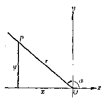

> 图3·17

去．就是说，我们仍旧把公式（1）到（6）里的六个比分别叫做角 \(\alpha\) 的正弦，余弦，正切，余切，正割和余割。

> 图3·18

> 图3·19

进一步，我们还可以使公式（1）到（6）适用于任意大小的角（正角和负角）。 这就是说， 如果任何一个角 \(\alpha\) 的终边上一点 \(P\) 的坐标是 \((x, y)\)， 原点到点 \(P\) 的距离是 \(r\)， 那末角 \(\alpha\) 的三角函数仍旧是公式（1）到（6）里的六个比。

这样，我们把三角函数的概念就从锐角推广到任意大小的角了。

#### 例

设角 \(\alpha\) 的顶点是 \(O\)， 始边是 \(Ox\)， 它的终边上一点 \(P\) 的坐标是 \((-4, -3)\)， 求角 \(\alpha\) 的六个三角函数。

**［解］** \(r = \sqrt{(-4)^2 + (-3)^2} = \sqrt{25} = 5.\) 因此， \(\sin \alpha = \frac{-3}{5} = -\frac{3}{5},\cos \alpha = \frac{-4}{5} = -\frac{4}{5},\)

$$
\operatorname{tg} \alpha = \frac {- 3}{- 4} = \frac {3}{4}， \quad \operatorname{ctg} \alpha = \frac {- 4}{- 3} = \frac {4}{3}，
$$

$$
\sec \alpha = \frac {5}{- 4} = - \frac {5}{4}， \operatorname{cosec} \alpha = \frac {5}{- 3} = - \frac {5}{3}.
$$

图 3·20 中画出的角 \(\alpha\) 是小于 \(360^{\circ}\) 的正角。根据我们所规定的任意角的三角函数的意义，可以知道，不论角 \(\alpha\) 是正角还是负角，只要它的终边和图3·20中的 \(OP\) 重合，那末，它的六个三角函数都和上面算出来的结果一样。

> 图3·20

这里要注意，终边上所取点 \(P\) 的位置不同， 会影响到 \(r, x\) 和 \(y\) 的值。 但是根据相似三角形的性质， 我们容易看出， 只要终边的位置确定， 不论点 \(P\) 是终边上的哪一点， \(r, x\) 和 \(y\) 这三个数中任意两个数的比还是不变的。 换句话说， 任意角的三角函数跟着角的大小而确定， 和点 \(P\) 在终边上的位置没有关系。

#### 习题3·3

1. 设角 \(\alpha\) 的顶点是 \(0\)， 始边是 \(Ox\)， 它的终边上一点 \(P\) 的坐标是 \((1, -7)\)， 求角 \(\alpha\) 的六个三角函数。

2. 设角 \(\alpha\) 的顶点是 \(O\)， 始边是 \(Ox\)， 它的终边上一点 \(P\) 的坐标是 \((-7, 1)\)， 求角 \(\alpha\) 的正弦， 余弦， 正切和余切。 又如果点 \(P\) 的坐标是 \((-10.5, 1.5)\)， 这些三角函数值有没有变化？ 为什么？

3. 设角 \(\alpha\) 的顶点是 \(O\)， 始边是 \(Ox\)， 它的终边上一点 \(P\) 的坐标是 \((3a, 4a)\). 分别按照 \(a > 0\) 和 \(a < 0\) 求角 \(\alpha\) 的六个三角函数。

### §3·4 三角函数值的符号

我们已经知道， 在研究任意角的三角函数时， 角的始边要固定为正半 \(x\) 轴。 至于它的终边， 根据角的大小， 可以在任何象限里， 或者在坐标轴上。

锐角的终边在第一象限， 终边上任何一点的横坐标， 纵坐标都是正的， 所以任何锐角的三角函数值都是正的。

当角的终边在其他的象限里时，根据各象限里点的坐标符号的规定，以及三角函数的定义，可以知道，它的三角函数的值就不一定是正的了。

记清楚各象限内点的横坐标 \(x\)，纵坐标 \(y\) 的符号，并且记住原点到任何一点的距离 \(r\) 都是正的，就很容易根据三角函数的定义，确定各个函数的符号。

下表所列是角 \(\alpha\) 的三角函数值的符号：

| 象限 | x | y | r | \(\sin\alpha\) | \(\cos\alpha\) | \(\operatorname{tg}\alpha\) | \(\operatorname{ctg}\alpha\) | \(\sec\alpha\) | \(\operatorname{cosec}\alpha\) |
| --- | --- | --- | --- | --- | --- | --- | --- | --- | --- |
| I | + | + | + | + | + | + | + | + | + |
| II | - | + | + | + | - | - | - | - | + |
| III | - | - | + | - | - | + | + | - | - |
| IV | + | - | + | - | + | - | - | + | - |

下面再来研究角的终边在坐标轴上的情形， 很明显的，当角的终边分别落在正半 \(x\) 轴，正半 \(y\) 轴，负半 \(x\) 轴，负半 y 轴的时候（图 3·21），它的正弦的值分别是：0，1，0，-1；

它的余弦的值分别是：1， 0， -1， 0；

它的正切的值分别是：0，不存在，0，不存在；

它的余切的值分别是：不存在，0，不存在，0；

> 图3·21

它的正割的值分别是：1，不存在，-1，不存在；

它的余割的值分别是：不存在，1，不存在，-1。

\(0^{\circ} \sim 360^{\circ}\) 问这些角的三角函数值， 可以列成下表：

|  | 0° | 90° | 180° | 270° |
| --- | --- | --- | --- | --- |
| sin α | 0 | 1 | 0 | -1 |
| cos α | 1 | 0 | -1 | 0 |
| tg α | 0 | 不存在 | 0 | 不存在 |
| ctg α | 不存在 | 0 | 不存在 | 0 |
| sec α | 1 | 不存在 | -1 | 不存在 |
| cosec α | 不存在 | 1 | 不存在 | -1 |

在 §1·4 中，我们用几何方法求出了 \(30^{\circ}\)， \(45^{\circ}\) 和 \(60^{\circ}\) 角的三角函数值。现在我们可以把这些性质更广泛地应用在 \(0^{\circ}\) 到 \(360^{\circ}\) 间某些终边在特殊位置上的角，从而求出它们的三角函数值，如下例所示。必须注意的是，应根据角的终边所在的象限来确定终边上的点的坐标。这样才能使求得的三角函数值具有正确的符号。

#### 例

当 \(\alpha = 30^{\circ}, 150^{\circ}, 210^{\circ}\) 和 \(330^{\circ}\) 时，求角 \(\alpha\) 的六个三角函数值。

**［解］** 作半径 r=2 的圆。由图 3·22，根据含 \(30^{\circ}\) 角的直角

> 图3·22

三角形的几何性质， 可知：

\(\alpha=30^{\circ}\) 时， \(P_{1}\) 的坐标是 \((\sqrt{3},1)\)；

\(\alpha=150^{\circ}\) 时， \(P_{2}\) 的坐标是 \((- \sqrt{3}, 1)\)；

\(\alpha=210^{\circ}\) 时， \(P_{3}\) 的坐标是 \((- \sqrt{3}, -1)\)；

\(\alpha=330^{\circ}\) 时， \(P_{4}\) 的坐标是 \((\sqrt{3},-1)\) .

于是按照任意三角函数的定义，立即可以得到各角的六个三角函数值如下表：

|  | \(30^\circ\) | \(150^\circ\) | \(210^\circ\) | \(330^\circ\) |
| --- | --- | --- | --- | --- |
| \(\sin\alpha\) | \(\frac12\) | \(\frac12\) | \(-\frac12\) | \(-\frac12\) |
| \(\cos\alpha\) | \(\frac{\sqrt3}{2}\) | \(-\frac{\sqrt3}{2}\) | \(-\frac{\sqrt3}{2}\) | \(\frac{\sqrt3}{2}\) |
| \(\operatorname{tg}\alpha\) | \(\frac{\sqrt3}{3}\) | \(-\frac{\sqrt3}{3}\) | \(\frac{\sqrt3}{3}\) | \(-\frac{\sqrt3}{3}\) |
| \(\operatorname{ctg}\alpha\) | \(\sqrt3\) | \(-\sqrt3\) | \(\sqrt3\) | \(-\sqrt3\) |
| \(\sec\alpha\) | \(\frac{2\sqrt3}{3}\) | \(-\frac{2\sqrt3}{3}\) | \(-\frac{2\sqrt3}{3}\) | \(\frac{2\sqrt3}{3}\) |
| \(\operatorname{cosec}\alpha\) | 2 | 2 | -2 | -2 |

#### 习题3·4

1. 确定下列各三角函数值的符号：

（1） tg 340°； （2） sin 155°； （3） cos 700°；

（4） \(\sec (-65^{\circ})\)； （5） ctg \(1200^{\circ}\)； （6） \(\operatorname{cosec} (-185^{\circ})\).

2. （1） \(120^{\circ}\) 角的哪些三角函数值是负的？ （2） \(280^{\circ}\) 角的哪些三角函数值是正的？ （3） \(560^{\circ}\) 角的那些三角函数值是负的？

3. 三角形内角的哪些三角函数可能取负值？在什么情况下，它们是负数？

4. 设（1） \(\sin \alpha\) 和 \(\cos \alpha\) 都是负的，（2） \(\cos \alpha\) 和 \(\operatorname{tg} \alpha\) 都是负的；角 \(\alpha\) 的终边在哪一象限内？

5. 设 （1） \(\sin \alpha\) 和 \(\cos \alpha\) 的符号相反，（2） \(\operatorname{tg} \alpha\) 和 \(\sin \alpha\) 的符号相同，（3） \(\cos \alpha\) 和 \(\operatorname{tg} \alpha\) 的符号相反；角 \(\alpha\) 的终边应当在哪些象限？

6. 按照绝对值来说：（1） \(\sec \alpha\) 能否小于 \(\operatorname{tg} \alpha\)？ （2） \(\sin \alpha\) 能否大于 \(\operatorname{tg} \alpha\)？ （3） \(\operatorname{cosec} \alpha\) 能否小于 \(\operatorname{ctg} \alpha\)？ （4） \(\cos \alpha\) 能否大于 \(\operatorname{ctg} \alpha\)？ 并加以解释。

7. 设 \(\alpha\) 的终边在第三象限内，决定下列各式的符号：（1） \(\sin \alpha + \cos \alpha\)；（2） \(\operatorname{tg} \alpha - \sin \alpha\)；（3） \(\cos \alpha - \operatorname{ctg} \alpha\)；（4） \(\sec^2 \alpha + \operatorname{tg} \alpha + \operatorname{ctg} \alpha\).

8. 求下列各式的值：

（1） \(\sin 270^{\circ} - 2\cos 0^{\circ} - \mathrm{tg}180^{\circ};\)

（2） \(5\sin 90^{\circ} + 2\cos 0^{\circ} - 3\sin 270^{\circ} + 10\cos 180^{\circ};\)

（3） \(a^2\cos 270^\circ + b^2\sin 0^\circ + 2ab\operatorname{ctg} 270^\circ\)；

（4） \(a^2\cos 0^\circ - b^2\sin 270^\circ + ab\cos 180^\circ - ab\cos 0^\circ\)；

（5） \(a^2\sin 90^\circ + 2ab\cos 180^\circ + \frac{b^2}{\cos^20^\circ}\)；

（6） \(m \sin 270^{\circ} - \frac{n \sin 90^{\circ}}{\cos 180^{\circ}} + k \operatorname{tg} 180^{\circ}\).

9. 按照下图，分别求 \(45^{\circ}, 135^{\circ}, 225^{\circ}\) 和 \(315^{\circ}\) 的六个三角函数的值。

> （第9题）

10. 按照下图，分别求 \(60^{\circ}, 120^{\circ}, 240^{\circ}\) 和 \(300^{\circ}\) 的六个三角函数的值。

> （第10题）

### §3·5 已知某角的一个三角函数的值， 求作角

根据任意角的三角函数的定义，只要知道角的终边上一点的坐标，就可以求出这个角的三角函数的值。现在我们来研究反面的问题：知道了某角的一个三角函数的值，怎样画出这个角？举例说明如下：

#### 例 1

已知 \(\sin \alpha = \frac{1}{2}\)，求作角 \(\alpha\).

**［解］** 已知正弦的值是正的。我们知道，当角的终边在第一或者第二象限时，它的正弦的值是正的。因此，求作的角的终边在第一或者第二象限。又因为 \(\sin \alpha = \frac{y}{r}\)，所以 \(\frac{y}{r} = \frac{1}{2}\)。

我们可以在 \(x\) 轴的上方，作平行于 \(x\) 轴并且距离等于1个长度单位的直线（图3·23）。这条直线上任何一点的纵坐标都等于1。以 \(O\) 为圆心，以2个长度单位为半径，作弧交所作的直线于 \(P_{1}\) 和 \(P_{2}\)。连结 \(OP_{1}\) 和 \(OP_{2}\)，就得到小于\(360^{\circ}\) 的两个正角 \(\alpha_{1}\) 和 \(\alpha_{2}\)。这两个角都适合于已知条件，并且始边为 \(Ox\)，终边为 \(OP_{1}\) 或者 \(OP_{2}\) 的任何正角或者负角也都是所求的角。

#### 例 2

已知 \(\cos \alpha = -0.6\)，求作角 \(\alpha\).

**［解］** 因为已知余弦的值是负的，所以求作的角的终边在第二或者第三象限内。又因为 \(\cos \alpha = \frac{x}{r}\)，所以 \(\frac{x}{r} = -0.6 = \frac{-3}{5}\)。

在 \(y\) 轴的左方作平行于 \(y\) 轴并且距离等于3个长度单位的直线（图3·24）。 以 \(O\) 为圆心， 以5个长度单位为半径，

> 图 3·23

> 图 3·24

作弧交所作的直线于 \(P_{1}\) 和 \(P_{2}\)，连结 \(OP_{1}\) 和 \(OP_{2}\)，就得到小于 \(360^{\circ}\) 的两个正角 \(\alpha_{1}\) 和 \(\alpha_{2}\)。这两个角都适合于已知条件，并且始边为 \(Ox\) 终边为 \(OP_{1}\) 或者 \(OP_{2}\) 的任意角也都是所求的角。

#### 例 3

已知 \(\operatorname{tg} \alpha = 2\frac{1}{2}\)， 求作角 \(\alpha\).

**［解］** 因为已知正切的值是正的，所以求作的角的终边在第一或者第三象限内。又因为 \(\operatorname{tg} \alpha = \frac{y}{x}\)，所以 \(\frac{y}{x} = 2\frac{1}{2} = \frac{5}{2}\)。

在第一象限作点 \(P_{1}(2,5)\)，在第三象限作点 \(P_{2}(-2,-5)\)（图3·25）。连结 \(OP_{1}\) 和 \(OP_{2}\)，就得到小于 \(360^{\circ}\) 的两个正角 \(\alpha_{1}\) 和 \(\alpha_{2}\)。这两个角都适合于已知条件，并且始边为 \(Ox\) 终边为 \(OP_{1}\) 或者 \(OP_{2}\) 的任意角也都是所求的角。

#### 例 4

已知 ctg α = -2，求作角 α.

**［解］** 因为已知余切的值是负的，所以求作的角的终边在第二或者第四象限内。又因为 \(\operatorname{ctg} \alpha = \frac{x}{y}\)，所以 \(\frac{x}{y} = -2\)。

在第二象限作点 \(P_{1}(-2,1)\)，在第四象限作点 \(P_{2}(2,-1)\)（图3·26）。连结 \(OP_{1}\) 和 \(OP_{2}\)，就得到小于 \(360^{\circ}\) 的两个正角 \(\alpha_{1}\) 和 \(\alpha_{2}\)。这两个角都适合于已知条件，并且始边为 \(Ox\) 终边为 \(OP_{1}\) 或者 \(OP_{2}\) 的任意角也都是所求的角。

> 图3·25

> 图3·26

#### 习题3·5

1. 作出角 \(\alpha\) 的终边， 已知：

（1） \(\cos \alpha = 0.8\)； （2） \(\sin \alpha = -\frac{2}{3}\)； （3） \(\operatorname{tg} \alpha = -1.25\)；

（4） \(\operatorname{ctg} \alpha = 2\)； （5） \(\sec \alpha = -2\)； （4） \(\operatorname{cosec} \alpha = 1.4\).

2. \(\alpha\) 是小于 \(360^{\circ}\) 的正角。如果 （1） \(\cos \alpha = -\frac{2}{9}\)， （2） \(\operatorname{ctg} \alpha = 4\)，

（3） \(\sec \alpha = 80\)，（4） \(\operatorname{cosec} \alpha = -3\)，那末 \(\alpha\) 所在的范围怎样？

3. 作出适合等式 \(\operatorname{tg} \alpha = -\frac{5}{12}\) 的角 \(\alpha_{1}\) 和 \(\alpha_{2}\)， 并求 \(\sin \alpha_{1}, \cos \alpha_{1}, \sin \alpha_{2}\) 和 \(\cos \alpha_{2}\) 的值。

4. 已知 \(\sin \alpha = -\frac{24}{25}\)， 作出角 \(\alpha\)； 并求 \(\operatorname{tg} \alpha\) 的值。

### §3·6 \(n \cdot 360^{\circ} + \alpha\) 与任意角 \(\alpha\) 的三角函数间的关系

0° 到 90° 的角的三角函数值是能够直接从三角函数表中查到的。但是大于 90° 的角和负角的三角函数值，就不能直接从三角函数表里查得。怎样求任意角的三角函数呢？从这一节起，我们来解决这个问题。

根据 §3·3 中任意角的三角函数的定义，可以知道所有始边和终边相同的角的各个三角函数值完全相同。例如，\(-30^{\circ}\) 和 \(330^{\circ}\) 的角当它们的始边相同时，终边也相同。因此，

$$
\sin (- 30 ^{\circ}) = \sin 330 ^{\circ} = - \frac {1}{2}，
$$

$$
\cos (- 30 ^{\circ}) = \cos 330 ^{\circ} = \frac {\sqrt {3}}{2}，
$$

等等。

在 §3·1 中， 我们又知道和角 \(\alpha\) 始边相同， 终边也相同的一切角可以用 \(n \cdot 360^{\circ} + \alpha\) 来表示。 所以， \(n \cdot 360^{\circ} + \alpha\) 的三角函数值和 \(\alpha\) 的三角函数值完全相同。 就是说， 对于任意角 \(\alpha\) 和任意整数 \(n\)，我们都有

$$
\sin (n \cdot 360 ^{\circ} + \alpha) = \sin \alpha ，
$$

$$
\cos (n \cdot 360 ^{\circ} + \alpha) = \cos \alpha ，
$$

$$
\operatorname{tg} (n \cdot 360 ^{\circ} + \alpha) = \operatorname{tg} \alpha ，
$$

$$
\operatorname{ctg} (n \cdot 360 ^{\circ} + \alpha) = \operatorname{ctg} \alpha ，
$$

$$
\sec (n \cdot 360 ^{\circ} + \alpha) = \sec \alpha ，
$$

$$
\operatorname{cosec} (n \cdot 360 ^{\circ} + \alpha) = \operatorname{cosec} \alpha .
$$

利用这一组公式，我们可以化任何正角的三角函数为小于 \(360^{\circ}\) 的正角的三角函数。

化 \(\sin 850^{\circ}\) 为小于 \(360^{\circ}\) 的正角的三角函数。

$$
\sin 850 ^{\circ} = \sin (2 \times 360 ^{\circ} + 130 ^{\circ}) = \sin 130 ^{\circ}.
$$

#### 习题3·6

1. 化下列各三角函数为小于 \(360^{\circ}\) 的正角的三角函数：

（I） sin 1112°； （2） cos 2000°； （3） tg 892°30'；

（4） ctg 567°； （5） sec 3700°； （6） cosec 947°.

2. 下列三角函数中，哪些有相同的值？

$$
\sin 390 ^{\circ}， \operatorname{tg} 405 ^{\circ}， \sin 870 ^{\circ}， \sin 750 ^{\circ}， \operatorname{ctg} 585 ^{\circ}， \cos 420 ^{\circ}.
$$

3. 求下列各三角函数的值：

（1） \(\sin 900^{\circ}\)； （2） \(\sin 1290^{\circ}\)； （3） \(\cos 1035^{\circ}\)；

（4） \(\cos1620^{\circ}\)； （5） \(tg2010^{\circ}\)； （6） \(ctg1755^{\circ}\) .

4. 求下列各式的值：

（1） \(8 \sin 390^{\circ} \cos 300^{\circ} tg 600^{\circ} ctg 210^{\circ}\)；

（2） \(2\sin 765^{\circ} + \operatorname{tg}^{2} 1485^{\circ} \operatorname{ctg} 135^{\circ}\)；

（3） \(\frac{2\cos 660^{\circ} + \sin 630^{\circ}}{3\cos 1020^{\circ} + 2\cos 660^{\circ}};\)

（4） \(\sin 840^{\circ} + \cos 750^{\circ} - \operatorname{tg} 945^{\circ} + \sec 405^{\circ}\).

### §3·7 \(180^{\circ}-\alpha, 180^{\circ}+\alpha, 360^{\circ}-\alpha\) 与锐角 \(\alpha\) 的三角函数间的关系

我们利用上一节的公式，把任何正角的三角函数化成小于 \(360^{\circ}\) 的正角的三角函数后， 求任何正角的三角函数值的问题还没有得到完全解决。 因为， 三角函数表只载有 \(0^{\circ}\) 到 \(90^{\circ}\) 角的函数。 所以进一步我们还要研究， 怎样把大于 \(90^{\circ}\) 而小于 \(360^{\circ}\) 角的三角函数， 化成 \(0^{\circ}\) 到 \(90^{\circ}\) 角的三角函数。

显然 \(90^{\circ}\) 与 \(180^{\circ}\) 间的角总可以写成 \(180^{\circ} - \alpha\) 的形式，其中 \(\alpha\) 是某一个锐角，例如 \(130^{\circ}\) 可以写成 \(180^{\circ} - 50^{\circ}\) 的形式，\(166^{\circ}\) 可以写成 \(180^{\circ} - 14^{\circ}\) 的形式等等。同样，\(180^{\circ}\) 与 \(270^{\circ}\) 间的角可以写成 \(180^{\circ} + \alpha\) 的形式，\(270^{\circ}\) 与 \(360^{\circ}\) 间的角可以写成 \(360^{\circ} - \alpha\) 的形式，这里 \(\alpha\) 都表示某一个锐角。所以为了求出 \(90^{\circ}\) 到 \(360^{\circ}\) 间的角的三角函数，我们只要研究 \(180^{\circ} - \alpha, 180^{\circ} + \alpha, 360^{\circ} - \alpha\) 与锐角 \(\alpha\) 的三角函数间的关系就可以了。

#### 1. \(180^{\circ} - \alpha\) 与锐角 \(\alpha\) 的三角函数间的关系

设 \(\alpha\) 是一个锐角。在直角坐标系中作角 \(\alpha\) 和 \(180^{\circ} - \alpha\)，并且在它们的终边上分别取点 \(P\) 和点 \(P_{1}\)，使 \(OP = OP_{1} - r\)（图3·27）。经过 \(P\) 和 \(P_{1}\) 分别作 \(x\) 轴的垂线 \(MP\) 和 \(M_{1}P_{1}\)，因为 \(OP_{1}\) 和 \(OP\) 对称于 \(y\) 轴，所以很容易得到直角三角形 \(OP_{1}M_{1}\) ②直角三角形 \(OPM\)。因此，设点 \(P\) 的坐标是 \((x, y)\)，那末，点 \(P_{1}\) 的坐标就是 \((-x, y)\)。

> 图3·27

根据三角函数的定义， 得

$$
\sin \alpha = \frac {y}{r}， \sin (180 ^{\circ} - \alpha) = \frac {y}{r}；
$$

$$
\cos \alpha = \frac {x}{r}， \cos (180 ^{\circ} - \alpha) = \frac {- x}{r} = - \frac {x}{r}；
$$

$$
\operatorname{tg} \alpha = \frac {y}{x}， \operatorname{tg} (180 ^{\circ} - \alpha) = \frac {y}{- x} = - \frac {y}{x}；
$$

$$
\operatorname{ctg} \alpha = \frac {x}{y}， \operatorname{ctg} (180 ^{\circ} - \alpha) = \frac {- x}{y} = - \frac {x}{y}；
$$

$$
\sec \alpha = \frac {r}{x}， \sec (180 ^{\circ} - \alpha) = \frac {r}{- x} = - \frac {r}{x}；
$$

$$
\operatorname{cosec} \alpha = \frac {r}{y}， \operatorname{cosec} (180 ^{\circ} - \alpha) = \frac {r}{y}.
$$

所以

$$
\sin (180 ^{\circ} - \alpha) = \sin \alpha ，
$$

$$
\cos (180 ^{\circ} - \alpha) = - \cos \alpha ，
$$

$$
\operatorname{tg} (180 ^{\circ} - \alpha) = - \operatorname{tg} \alpha ，
$$

$$
\operatorname{ctg} (180 ^{\circ} - \alpha) = - \operatorname{ctg} \alpha ，
$$

$$
\sec (180 ^{\circ} - \alpha) = - \sec \alpha ，
$$

$$
\operatorname{cosec} (180 ^{\circ} - \alpha) = \operatorname{cosec} \alpha .
$$

利用这一组公式，可以把 \(90^{\circ}\) 与 \(180^{\circ}\) 间的角的三角函数，化成锐角的三角函数。

##### 例 1

查表求 \(\cos 145^{\circ}24'\) .

**［解］** 先算出 \(145^{\circ}24' = 180^{\circ} - 34^{\circ}36'\)，于是

$$
\begin{array}{l} \cos 145 ^{\circ} 24 ^{\prime} = \cos (180 ^{\circ} - 34 ^{\circ} 36 ^{\prime}) \\ = - \cos 34 ^{\circ} 36 ^{\prime} = - 0.8231. \\ \end{array}
$$

#### 2. \(180^{\circ} + \alpha\) 与锐角 \(\alpha\) 的三角函数间的关系

从图3·28可以看到， \(180^{\circ} + \alpha\) 的终边和角 \(\alpha\) 的终边成一直线。因此，设 \(OP_{1} = OP = r\)，点 \(P\) 的坐标是 \((x, y)\)，那末，点 \(P_{1}\) 的坐标就是 \((-x, -y)\)。

> 图3·28

根据三角函数的定义， 得

$$
\sin \alpha = \frac {y}{r}， \quad \sin (180 ^{\circ} + \alpha) = \frac {- y}{r} = - \frac {y}{r}；
$$

$$
\cos \alpha = \frac {x}{r}， \quad \cos (180 ^{\circ} + \alpha) = \frac {- x}{r} = - \frac {x}{r}；
$$

$$
\operatorname{tg} \alpha = \frac {y}{x}， \quad \operatorname{tg} (180 ^{\circ} + \alpha) = \frac {- y}{- x} = \frac {y}{x}；
$$

$$
\operatorname{ctg} \alpha = \frac {x}{y}， \quad \operatorname{ctg} (180 ^{\circ} + \alpha) = \frac {- x}{- y} = \frac {x}{y}；
$$

$$
\sec \alpha = \frac {r}{x}， \quad \sec (180 ^{\circ} + \alpha) = \frac {r}{- x} = - \frac {r}{x}；
$$

$$
\operatorname{cosec} \alpha = \frac {r}{y}， \operatorname{cosec} (180 ^{\circ} + \alpha) = \frac {r}{- y} = - \frac {r}{y}，
$$

所以

$$
\sin (180 ^{\circ} + \alpha) = - \sin \alpha ，
$$

$$
\cos (180 ^{\circ} + \alpha) = - \cos \alpha ，
$$

$$
\operatorname{tg} (180 ^{\circ} + \alpha) = \operatorname{tg} \alpha ，
$$

$$
\operatorname{ctg} (180 ^{\circ} + \alpha) = \operatorname{ctg} \alpha ，
$$

$$
\sec (180 ^{\circ} + \alpha) = - \sec \alpha ，
$$

$$
\operatorname{cosec} (180 ^{\circ} + \alpha) = - \operatorname{cosec} \alpha ，
$$

利用这组公式，可以把 \(180^{\circ}\) 与 \(270^{\circ}\) 间的角的三角函数，化成锐角的三角函数。

##### 例 2

查表求 tg 204°30'.

**［解］**  先算出 \(204^{\circ}30' = 180^{\circ} + 24^{\circ}30'\)，于是

$$
\begin{array}{l} \operatorname{tg} 204 ^{\circ} 30 ^{\prime} = \operatorname{tg} (180 ^{\circ} + 24 ^{\circ} 30 ^{\prime}) \\ = \operatorname{tg} 24 ^{\circ} 30 ^{\prime} = 0.4557. \\ \end{array}
$$

#### 3. \(360^{\circ}-\alpha\) 与锐角 \(\alpha\) 的三角函数间的关系

从图 3·29 可以看到， 如果在角 \(\alpha\) 和 \(360^{\circ}-\alpha\) 的终边上分别取 \(OP\) 和 \(OP_{1}\)， 使 \(OP = OP_{1} = r\)， 并且作 \(x\) 轴的垂线 \(MP\) 和 \(M_{1}P_{1}\)， 那末， 由于 \(OP_{1}\) 和 \(OP\) 对称于 \(x\) 轴， \(M_{1}\) 和 \(M\) 必定重合[^p79-1]。 因此， 设点 \(P\) 的坐标是 \((x, y)\)， 那末， 点 \(P_{1}\) 的坐标就是 \((x, -y)\). 用前面同样的方法， 可以推得

> 图3·29

$$
\sin (360 ^{\circ} - \alpha) = - \sin \alpha ，
$$

$$
\cos (360 ^{\circ} - \alpha) = \cos \alpha ，
$$

$$
\operatorname{tg} (360 ^{\circ} - \alpha) = - \operatorname{tg} \alpha ，
$$

$$
\operatorname{ctg} (360 ^{\circ} - \alpha) = - \operatorname{ctg} \alpha ，
$$

$$
\sec (360 ^{\circ} - \alpha) = \sec \alpha ，
$$

$$
\operatorname{cosec} (360 ^{\circ} - \alpha) = - \operatorname{cosec} \alpha .
$$

利用这组公式，可以把 \(270^{\circ}\) 与 \(360^{\circ}\) 间的角的三角函数，化成锐角的三角函数。

##### 例 3

查表求 \(\sin 290^{\circ}4'\) .

**［解］** 先算出 \(290^{\circ}4' = 360^{\circ} - 69^{\circ}56'\)，于是

$$
\begin{array}{l} \sin 290 ^{\circ} 4 ^{\prime} = \sin (360 ^{\circ} - 69 ^{\circ} 56 ^{\prime}) \\ = - \sin 69 ^{\circ} 56 ^{\prime} = - 0.9393. \\ \end{array}
$$

利用 §3·6 的公式，把大于 \(360^{\circ}\) 的角的三角函数化成 0° 到 360° 间的角的三角函数后，如果得到的不是锐角的三角函数，那末，可以用本节的公式，把它们化成锐角的三角函数。这样，我们已能够求任何正角的三角函数值了。

##### 例 4

查表求 \(\operatorname{ctg} 1180^{\circ}\).

**［解］**

$$
\begin{array}{l} \operatorname{ctg} 1180 ^{\circ} = \operatorname{ctg} (3 \times 360 ^{\circ} + 100 ^{\circ}) = \operatorname{ctg} 100 ^{\circ} \\ = \operatorname{ctg} (180 ^{\circ} - 80 ^{\circ}) = - \operatorname{ctg} 80 ^{\circ} = - 0.1763. \\ \end{array}
$$

#### 习题3·7

1. 查表求下列各三角函数的值：

（1） \(\sin 162^{\circ}30'\)， \(\sin 232^{\circ}32'\)， \(\sin 295^{\circ}17'\)；

（2） \(\cos 102^{\circ}14'\)， \(\cos 220^{\circ}25'\)， \(\cos 310^{\circ}42'\)；

（3） tg 171°5′， tg 201°18′， tg 285°15′；

（4） ctg 94°50'， ctg 243°36'， ctg 320°6'.

2. 将下列各三角函数化成锐角的三角函数：

（1） \(\sin 510^{\circ}29'\)；

（2） \(\cos 596^{\circ}45'\)；

（3） tg 1022°；

（4） ctg 851°40'.

3. 设 \(x\) 是锐角， 化简

$$
\frac {(a ^ {3} - b ^ {2}) \operatorname{ctg} (180 ^{\circ} - x)}{\operatorname{ctg} (180 ^{\circ} + x)} + \frac {(a ^ {2} + b ^ {2}) \operatorname{tg} (90 ^{\circ} - x)}{\operatorname{ctg} (180 ^{\circ} - x)}.
$$

4. 设 \(A, B, C\) 是一个锐角三角形的三个内角，求证：

（1） \(\sin (A + B) = \sin C;\)

（2） \(\cos (B + C) = -\cos A;\)

（3） \(\operatorname{tg}(A + C) = -\operatorname{tg} B.\)

5. 将下列各式化成锐角 \(\alpha\) 的三角函数：

（1） \(\sin (900^{\circ} + \alpha)\)； （2） \(\operatorname{tg}(1620^{\circ} - \alpha)\).

6. 将下列各三角函数化成小于 \(45^{\circ}\) 的锐角的三角函数：

（1） \(\cos 107^{\circ}30'\)；

（2） \(\sin 242^{\circ}17'\)；

（3） tg 1015°；

（4） \(\operatorname{ctg} 460^{\circ}40'\).

［提示：利用 \(\sin (90^{\circ} - \alpha) = \cos \alpha\) 等.］

7. 不用查表， 计算 \(\sin 68^{\circ} \sin 22^{\circ} + \cos 112^{\circ} \sin 428^{\circ}\) 的值。

[^p79-1]: 图中用记号 \(M(M_{1})\) 表示点 \(M\) 和 \(M_{1}\) 重合。

### §3·8 -α与任意角α的三角函数间的关系

我们已经解决了求任意正角的三角函数值的问题。剩下来的问题是：怎样求负角的三角函数值？

在这一节中， 我们要对于任意角 \(\alpha\)， 推出一 \(\alpha\) 与 \(\alpha\) 的三角函数间的关系。 然后应用所得的公式， 化负角的三角函数为正角的三角函数。

我们知道， 不论 \(\alpha\) 是正角还是负角， \(-\alpha\) 和 \(\alpha\) 是射线按两个相反方向旋转同样的角度所产生的。 因此， 当 \(\alpha\) 和 \(-\alpha\) 有公共顶点并且取它们的公共始边为正半 \(x\) 轴时， 它们的终边一定对称于 \(x\) 轴， 如图3·30所示。

> 图3·30

在 \(\alpha\) 的终边和 \(-\alpha\) 的终边上分别取点 \(P\) 和 \(P_{1}\)， 使 \(OP = OP_{1} = r\). 经过 \(P\) 和 \(P_{1}\) 作 \(x\) 轴的垂线 \(MP\) 和 \(M_{1}P_{1}\). 那末， \(M\) 和 \(M_{1}\) 必定重合。 因此， 设点 \(P\) 的坐标是 \((x, y)\)， 点 \(P_{1}\) 的坐标就是 \((x, -y)\).

根据三角函数的定义， 得

$$
\sin \alpha = \frac {y}{r}， \quad \sin (- \alpha) = \frac {- y}{r} = - \frac {y}{r}；
$$

$$
\cos \alpha = \frac {x}{r}， \quad \cos (- \alpha) = \frac {x}{r}；
$$

$$
\operatorname{tg} \alpha = \frac {y}{x}， \quad \operatorname{tg} (- \alpha) = \frac {- y}{x} = - \frac {y}{x}；
$$

$$
\operatorname{ctg} \alpha = \frac {x}{y}， \quad \operatorname{ctg} (- \alpha) = \frac {x}{- y} = - \frac {x}{y}；
$$

$$
\sec \alpha = \frac {r}{x}， \quad \sec (- \alpha) = \frac {r}{x}；
$$

$$
\cos \alpha = \frac {r}{y}， \quad \cos \alpha (- \alpha) = \frac {r}{- y} = - \frac {r}{y}.
$$

所以

$$
\sin (- \alpha) = - \sin \alpha ，
$$

$$
\cos (- \alpha) = \cos \alpha ，
$$

$$
\operatorname{tg} (- \alpha) = - \operatorname{tg} \alpha ，
$$

$$
\operatorname{ctg} (- \alpha) = - \operatorname{ctg} \alpha ，
$$

$$
\sec (- \alpha) = \sec \alpha ，
$$

$$
\operatorname{cosec}(- \alpha) = - \operatorname{cosec}\alpha .
$$

#### 例

查表求 \(\operatorname{ctg}(-1596^{\circ})\)

**［解］** （1） 先化成正角的三角函数， 得

$$
\operatorname{ctg} (- 1596 ^{\circ}) = - \operatorname{ctg} 1596 ^{\circ}.
$$

（2） 其次， 化成小于 \(360^{\circ}\) 的正角的三角函数， 得

$$
- \operatorname{ctg} 1596 ^{\circ} = - \operatorname{ctg} (4\times360^{\circ} + 156 ^{\circ}) = - \operatorname{ctg} 156 ^{\circ}.
$$

（3） 再化成锐角的三角函数， 得

$$
\begin{array}{l} - \operatorname{ctg} 156 ^{\circ} = - \operatorname{ctg} (180 ^{\circ} - 24 ^{\circ}) \\ = - (- \operatorname{ctg} 24 ^{\circ}) = \operatorname{ctg} 24 ^{\circ}. \\ \end{array}
$$

（4） 查表得

$$
\operatorname{ctg} 24 ^{\circ} = 2.246.
$$

$$
\therefore \quad \operatorname{ctg} (- 1596 ^{\circ}) = 2.246.
$$

#### 习题3·8

1. 查表求下列各三角函数的值：

（1） \(\sin(-117^{\circ}30')\)；

（2） \(\cos(-71^{\circ}26')\)；

（3） \(\operatorname{tg}(-242^{\circ}31')\)；

（4） \(\operatorname{ctg}(-308^{\circ}50')\) .

2. 将下列各三角函数化成正锐角的三角函数：

（1） \(\sin(-400^{\circ})\)；

（2） \(\operatorname{ctg}(-1090^{\circ})\)；

（3） \(\sec(-700^{\circ})\) .

3. 设 A 是锐角， 化简

$$
\frac {\sin (- A)}{\sin (A - 180 ^{\circ})} - \frac {\operatorname{tg} (A - 90 ^{\circ})}{\operatorname{ctg} (A - 360 ^{\circ})} + \frac {\cos (- A - 180 ^{\circ})}{\sin (A - 90 ^{\circ})}.
$$

4. 设 \(\alpha = -240^{\circ}\)， 验证下列等式：

（1） \(\operatorname{tg} 2\alpha = \frac{2\operatorname{tg}\alpha}{1 - \operatorname{tg}^2\alpha}\)；

（2） \(2\cos^2\frac{\alpha}{2} = 1 + \cos \alpha ;\)

（3） \(\operatorname{tg} \frac{\alpha}{2} = \frac{1 - \cos \alpha}{\sin \alpha}\).

5. 将下列各式化成角 \(\alpha\) 的三角函数：

（1） \(\sin (1080^{\circ} - \alpha)\)；

（2） \(\operatorname{ctg}(1800^{\circ} - \alpha)\).

6. 设 \(\alpha\) 是锐角， 将 \(\sec (\alpha - 810^{\circ})\) 化成角 \(\alpha\) 的三角函数。

7. 求下列各式的值：

（1） \(\operatorname{ctg}(-870^{\circ}) + \cos \mathrm{e}(-870^{\circ})\)；

（2） \(\sin 240^{\circ} \cos 750^{\circ} \operatorname{tg}(-135^{\circ})\)；

（3） \(8\sin 510^{\circ}\cos (-300^{\circ})\mathrm{tg}240^{\circ};\)

（4） \(\cos 810^{\circ} + \sin (-930^{\circ}) - \mathrm{tg}(-1110^{\circ})\)

（5） \(\sin 420^{\circ}\cos 390^{\circ} + \cos (-300^{\circ})\sin (-330^{\circ});\)

（6） \(\operatorname{tg}(-840^{\circ})\sec (-900^{\circ}) + \sin (-405^{\circ})\operatorname{ctg}(-510^{\circ});\)

（7） \(\operatorname{ctg}(-60^{\circ})\sin 240^{\circ} - \cos (-60^{\circ}) + \operatorname{tg}^{2}150^{\circ};\)

（8） \(\frac{2\sin 1200^{\circ} - \sin 630^{\circ}}{\operatorname{tg}960^{\circ} + 2\cos(-660^{\circ})}\).

### §3·9 已知一个三角函数的值， 求角

我们已经能够求任意的正角或者负角的三角函数值。现在研究相反的问题：怎样求得具有已知三角函数值的一切角。

#### 1. 已知的三角函数值是正数

##### 例 1

已知 \(\sin x = 0.2385\)，求 \(x\).

**［解］** 因为已知 \(\sin x\) 的值是正的， 所以 \(x\) 的终边在第一象限或者第二象限内。

先求正弦等于0.2385的 \(0^{\circ}\) 到 \(360^{\circ}\) 的角。

查表得 \(\sin 13^{\circ}48' = 0.2385\).

所以第一个角是 \(x_{1} = 13^{\circ}48^{\prime}\) 因为 \(\sin (180^{\circ} - 13^{\circ}48^{\prime}) = \sin 13^{\circ}48^{\prime} = 0.2385\)，所以第二个角是 \(x_{2} = 180^{\circ} - 13^{\circ}48^{\prime} = 166^{\circ}12^{\prime}\) 要写出和这两个角终边相同的一切角，只要每一个都加上 \(n \cdot 360^{\circ}\) （\(n\) 是整数）。因此，正弦等于0.2385的一切角是

$$
x = n \cdot 360 ^{\circ} + 13 ^{\circ} 48 ^{\prime}，
$$

$$
x = n \cdot 360 ^{\circ} + 166 ^{\circ} 12 ^{\prime}.
$$

##### 例 2

已知 \(\cos x = \frac{2}{3}\)，求 \(x\).

**［解］** 因为已知 \(\cos x\) 的值是正的， 所以 \(x\) 的终边在第一或者第四象限内。

先求余弦等于 \(\frac{2}{3}\) 的 \(0^{\circ}\) 到 \(360^{\circ}\) 的角。

查表得 \(\cos 48^{\circ}11' = 0.6667 = \frac{2}{3}\).

所以第一个角是 \(x_{1} = 48^{\circ}11^{\prime}\) 因为 \(\cos (360^{\circ} - 48^{\circ}11') = \cos 48^{\circ}11' = \frac{2}{3}\)， 所以第二个角是 \(x_{2} = 360^{\circ} - 48^{\circ}11' = 311^{\circ}49'\).

因此，余弦等于 \(\frac{2}{3}\) 的一切角是

$$
x - n \cdot 360 ^{\circ} + 48 ^{\circ} 11 ^{\prime}，
$$

$$
x = n \cdot 360 ^{\circ} + 311 ^{\circ} 49 ^{\prime}.
$$

##### 例 3

已知 \(\operatorname{tg} x = 2\)，求 \(x\)。

**［解］** 因为已知 \(\operatorname{tg} x\) 的值是正的， 所以 \(x\) 的终边在第一象限或者第三象限内。

先求正切等于2的 \(0^{\circ}\) 到 \(360^{\circ}\) 的角。

查表得 \(\operatorname{tg} 63^{\circ} 26' = 2\).

所以第一个角是 \(x_{1} = 63^{\circ}26^{\prime}\) 因为 \(\operatorname{tg}(180^{\circ} + 63^{\circ}26') = \operatorname{tg}63^{\circ}26' = 2\)，所以第二个角是 \(x_{2} = 180^{\circ} + 63^{\circ}26' = 243^{\circ}26'\).

因此，正切等于2的一切角是

$$
x = n \cdot 360 ^{\circ} + 63 ^{\circ} 26 ^{\prime}，
$$

$$
x = n\cdot360^{\circ} + 243 ^{\circ} 26 ^{\prime}.
$$

#### 2. 已知的三角函数值是负数

##### 例 4

已知 \(\sin x = -0.6372\)，求 \(x\).

**［解］** 因为已知 \(\sin x\) 的值是负的， 所以 \(x\) 的终边在第三象限或者第四象限内。

先求正弦等于-0.6372的 \(0^{\circ}\) 到 \(360^{\circ}\) 的角。

查表得 \(\sin 39^{\circ}35' = +0.6372.\) 因为 \(\sin (180^{\circ} + 39^{\circ}35^{\prime}) = -\sin 39^{\circ}35' = -0.6372\)，所以第一个角是 \(x_{1} = 180^{\circ} + 39^{\circ}35' = 219^{\circ}35'\).

又因为 \(\sin (360^{\circ} - 39^{\circ}35') = -\sin 39^{\circ}35' = -0.6372,\) 所以第二个角是 \(x_{2} = 360^{\circ} - 39^{\circ}35' = 320^{\circ}25'\).

因此适合于 \(\sin x = -0.6372\) 的一切角是

$$
x = n \cdot 360 ^{\circ} + 219 ^{\circ} 35 ^{\prime}，
$$

$$
x = n \cdot 360 ^{\circ} + 320 ^{\circ} 25 ^{\prime}.
$$

##### 例 6

已知 \(\operatorname{ctg} x = -\frac{5}{3}\)， 求 \(x\).

**［解］** 因为已知 \(\operatorname{ctg} x\) 的值是负的， 所以 \(x\) 的终边在第二象限或者第四象限内。

先求余切等于 \(-\frac{5}{3}\) 的 \(0^{\circ}\) 到 \(360^{\circ}\) 的角。

查表得 \(\operatorname{ctg} 30^{\circ} 58' = 1.6667 = \frac{5}{3}\).

因为 \(\operatorname{ctg}(180^{\circ} - 30^{\circ}58') = -\operatorname{ctg}30^{\circ}58' = -\frac{5}{3}\)， 所以第一个角是 \(x_{1} = 180^{\circ} - 30^{\circ}58' = 149^{\circ}2'\).

又因为 \(\operatorname{ctg}(360^{\circ} - 30^{\circ}58') = -\operatorname{ctg}30^{\circ}58' = -\frac{5}{3}\)， 所以第二个角是 \(x_{2} = 360^{\circ} - 30^{\circ}58' = 329^{\circ}2'\).

因此，适合于 \(\operatorname{ctg} x = -\frac{\xi}{3}\) 的一切角是

$$
x = n \cdot 360 ^{\circ} + 149 ^{\circ} 2 ^{\prime}，
$$

$$
x = n \cdot 360 ^{\circ} + 329 ^{\circ} 2 ^{\prime}.
$$

#### 习题3·9

1. 求适合于下列各等式的角 \(x\) 的一切值：

（1） \(\cos x = 0\)；

（2） \(\operatorname{tg} x = -1\)；

（3） \(\sin x = \frac{\sqrt{3}}{2}\)；

（4） \(\operatorname{ctg} x = -\sqrt{3}\).

2. 查表求适合于下列各等式的角 \(x\) 的一切值：

（1） \(\sin x = 0.7183\)；

（2） \(\cos x = 0.3526\)；

（3） \(\operatorname{tg} x = 1.4312\)；

（4） \(\operatorname{ctg} x = 0.7541\)；

（5） \(\sin x = -0.1532\)；

（6） \(\cos x = -0.8342\)；

（7） \(\operatorname{tg} x = -\sin 82^{\circ}35'\)；

（8） \(\operatorname{ctg} x = -\cos 301^{\circ}43'\).

3. 求适合于下列各等式且在 \(-360^{\circ}\) 到 \(360^{\circ}\) 间的角 \(x\) 的四个值：

（1） \(\sin x = -\frac{1}{2}\)；

（2） \(\operatorname{tg} x = \sqrt{3}\)；

（3） \(\sec(-x) = \sqrt{2}\).

4. 查表求适合于下列各等式的角 \(x\) 的一切值：

（1） \(\sin 2x = 0.8351\)；

（2） \(2\sin x = -0.7790;\)

（3） \(\operatorname{tg} x = |2\sin 492^{\circ} + \cos 850^{\circ};\)

（4） \(|\operatorname{ctg} x| = 1.1255\).

### §3·10 三角函数的诱导公式

§3·6~§3·8 所推导的公式总称为诱导公式。为了今后应用的方便起见，我们在下面导出 \(90^{\circ}+\alpha\) 与任意角 \(\alpha\) 的三角函数间的关系。

如图3·31，我们看到，不论 \(\alpha\) 是什么值，如果射线从角\(\alpha\) 的终边起，按反时针方向旋转 \(90^{\circ}\)，就可以转成 \(90^{\circ} + \alpha\) 的角．在角 \(\alpha\) 的终边上取一点 \(P,90^{\circ} + \alpha\) 的终边上取一点\(P_{1}\)，并且使 \(OP_{1} = OP - r\) .过 \(P\) 和 \(P_{1}\) 分别作 \(MP\) 和 \(M_{1}P_{1}\) 垂直于 \(\alpha\) 轴．这样所组成的直角三角形 \(OP_{1}M_{1}\) 和 \(OPM\) 显然是全等的．因此，它们对应的直角边的长相等。

> 图3·31

设点 \(P\) 的坐标是 \((x, y)\)，在每一张图中，按绝对值和符号仔细比较一下点 \(P_{1}\) 和点 \(P\) 的坐标，就可以发现，点 \(P_{1}\) 的坐标总是 \((-y, x)\)。换句话说，点 \(P_{1}\) 的横坐标按绝对值来说， 等于点 \(P\) 的纵坐标， 但符号相反； 点 \(P_{1}\) 的纵坐标无论按绝对值和符号来说， 都和点 \(P\) 的横坐标相同。

因此，对于 \(\alpha\) 的任何值，都有

$$
\sin (90 ^{\circ} + \alpha) = \frac {x}{r} = \cos \alpha ，
$$

$$
\cos (90 ^{\circ} + \alpha) = - \frac {y}{r} = - \frac {y}{r} = - \sin \alpha ，
$$

$$
\operatorname{tg} (90 ^{\circ} + \alpha) = \frac {x}{- y} = - \frac {x}{y} = - \operatorname{ctg} \alpha ，
$$

$$
\operatorname{ctg} (90 ^{\circ} + \alpha) = \frac {- y}{x} = - \frac {y}{x} = - \operatorname{tg} \alpha ，
$$

$$
\sec (90 ^{\circ} + \alpha) = \frac {r}{- y} = - \frac {r}{y} = - \operatorname{cosec} \alpha ，
$$

$$
\cos \cos (90 ^{\circ} + \alpha) = \frac {r}{x} = \sec \alpha .
$$

就是

$$
\sin (90 ^{\circ} + \alpha) = \cos \alpha ，
$$

$$
\cos (90 ^{\circ} + \alpha) = - \sin \alpha ，
$$

$$
\operatorname{tg} (90 ^{\circ} + \alpha) = - \operatorname{ctg} \alpha ，
$$

$$
\operatorname{ctg} (90 ^{\circ} + \alpha) = - \operatorname{tg} \alpha ，
$$

$$
\sec(90^{\circ}+\alpha)=-\operatorname{cosec}\alpha ，
$$

$$
\operatorname{cosec}(90^{\circ}+\alpha)=\sec\alpha .
$$

从证明的过程可以看出，这一组公式对任意的正角或负角 \(\alpha\) 都成立。

现在我们已有了对任意角 \(\alpha\) 都成立的三组诱导公式：

（1） 关于 \(n \cdot 360^{\circ} + \alpha\) 的公式， 见 §3·6；

（2） 关于 \(-\alpha\) 的公式， 见 §3·8；

以及上面证明的

（3） 关于 \(90^{\circ} + \alpha\) 的公式。

以这三组公式为基础，还可以推得其他形式的诱导公式。例如，对于任意的正角或负角 \(\alpha\)，我们有：

（4） 关于 \(90^{\circ} - \alpha\) 的公式：

$$
\sin (90 ^{\circ} - \alpha) = \sin [ 90 ^{\circ} + (- \alpha) ] = \cos (- \alpha) = \cos \alpha ，
$$

$$
\cos (90 ^{\circ} - \alpha) = \cos [ 90 ^{\circ} + (- \alpha) ]
$$

$$
= - \sin (- \alpha) = - (- \sin \alpha) = \sin \alpha ，
$$

等等。

（5） 关于 \(180^{\circ} + \alpha\) 的公式：

$$
\sin (180 ^{\circ} + \alpha) = \sin [ 90 ^{\circ} + (90 ^{\circ} + \alpha) ]
$$

$$
= \cos (90 ^{\circ} + \alpha) = - \sin \alpha ，
$$

$$
\cos (180 ^{\circ} + \alpha) = \cos [ 90 ^{\circ} + (90 ^{\circ} + \alpha) ]
$$

$$
= - \sin (90 ^{\circ} + \alpha) = - \cos \alpha ，
$$

等等。

（6） 关于 \(180^{\circ} - \alpha\) 的公式：

$$
\sin (180 ^{\circ} - \alpha) = \sin [ 180 ^{\circ} + (- \alpha) ] = - \sin (- \alpha)
$$

$$
= - (- \sin \alpha) = \sin \alpha ，
$$

$$
\cos (180 ^{\circ} - \alpha) = \cos [ 180 ^{\circ} + (- \alpha) ]
$$

$$
= - \cos (- \alpha) = - \cos \alpha ，
$$

等等。

（7） 关于 \(270^{\circ} + \alpha\) 的公式：

$$
\sin (270 ^{\circ} + \alpha) = \sin [ 180 ^{\circ} + (90 ^{\circ} + \alpha) ]
$$

$$
= - \sin (90 ^{\circ} + \alpha) = - \cos \alpha ，
$$

$$
\cos (270 ^{\circ} + \alpha) = \cos [ 180 ^{\circ} + (90 ^{\circ} + \alpha) ]
$$

$$
= - \cos (90 ^{\circ} + \alpha)
$$

$$
= - (- \sin \alpha) = \sin \alpha ，
$$

等等，

（8） 关于 \(270^{\circ} - \alpha\) 的公式：

$$
\sin (270 ^{\circ} - \alpha) = \sin [ 270 ^{\circ} + (- \alpha) ]
$$

$$
= - \cos (- \alpha) = - \cos \alpha ，
$$

$$
\cos (270 ^{\circ} - \alpha) = \cos [ 270 ^{\circ} + (- \alpha) ]
$$

$$
= \sin (- \alpha) = - \sin \alpha ，
$$

等等。

（9） 关于 \(360^{\circ} - \alpha\) 的公式：

$$
\begin{array}{l} \sin (360 ^{\circ} - \alpha) = \sin [ 360 ^{\circ} + (- \alpha) ] \\ = \sin (- \alpha) = - \sin \alpha ， \\ \cos (360 ^{\circ} - \alpha) = \cos [ 360 ^{\circ} + (- \alpha) ] \\ = \cos (- \alpha) = \cos \alpha ， \\ \end{array}
$$

等等。

最后六组公式中，第（4）组曾在§1·3中利用直角三角形两个锐角互为余角的关系对于α是锐角的情形推得；第（5），（6），（9）三组也曾在§3·7中推得，但只限于α是锐角的情形。现在所有这些公式都以第（1），（2），（3）组对任意角α都成立的公式作为推理的基础而重新导出了，这就使我们确信它们都具有一般性；应用时可不受α必须是锐角的限制。

这九组公式可以分为两类：第一类是关于 \(90^{\circ}\) 的偶数倍加上或者减去 \(\alpha\) 的公式，属于这一类的是关于

$$
n \cdot 360 ^{\circ} + \alpha ， 180 ^{\circ} - \alpha ， 180 ^{\circ} + \alpha ， 360 ^{\circ} - \alpha ， - \alpha
$$

的五组公式。 这些公式可以列成下表：

| 角数 | 正弦 | 余弦 | 正切 | 余切 | 正割 | 余割 |
| --- | --- | --- | --- | --- | --- | --- |
| \(\pi \cdot 360^{\circ} + \alpha\) | sin \(\alpha\) | cos \(\alpha\) | tg \(\alpha\) | ctg \(\alpha\) | sec \(\alpha\) | cosec \(\alpha\) |
| \(180^{\circ} \cdot \alpha\) | sin \(\alpha\) | -cos \(\alpha\) | -tg \(\alpha\) | -ctg \(\alpha\) | -sec \(\alpha\) | cosec \(\alpha\) |
| \(180^{\circ} + \alpha\) | -sin \(\alpha\) | -cos \(\alpha\) | tg \(\alpha\) | ctg \(\alpha\) | -sec \(\alpha\) | -cosec \(\alpha\) |
| \(360^{\circ} - \alpha\) | -sin \(\alpha\) | cos \(\alpha\) | tg \(\alpha\) | -ctg \(\alpha\) | sec \(\alpha\) | -cosec \(\alpha\) |
| \(-\alpha\) | -sin \(\alpha\) | cos \(\alpha\) | -tg \(\alpha\) | -ctg \(\alpha\) | sec \(\alpha\) | -cosec \(\alpha\) |

第二类是关于 \(90^{\circ}\) 的奇数倍加上或者减去 \(\alpha\) 的公式，属于这一类的是关于

$$
90 ^{\circ} - \alpha ， 90 ^{\circ} + \alpha ， 270 ^{\circ} - \alpha ， 270 ^{\circ} + \alpha
$$

的四组公式，这些公式可以列成下表：

| 象限角 | 正弦 | 余弦 | 正切 | 余切 | 正割 | 余割 |
| --- | --- | --- | --- | --- | --- | --- |
| \(90^{\circ}-\alpha\) | \(\cos\alpha\) | \(\sin\alpha\) | \(\operatorname{ctg}\alpha\) | \(\operatorname{tg}\alpha\) | \(\cos\alpha\) | \(\sec\alpha\) |
| \(90^{\circ}+\alpha\) | \(\cos\alpha\) | \(-\sin\alpha\) | \(-\operatorname{ctg}\alpha\) | \(-\operatorname{tg}\alpha\) | \(-\cos\alpha\) | \(\sec\alpha\) |
| \(270^{\circ}-\alpha\) | \(-\cos\alpha\) | \(-\sin\alpha\) | \(\operatorname{ctg}\alpha\) | \(\operatorname{tg}\alpha\) | \(-\cos\alpha\) | \(-\sec\alpha\) |
| \(270^{\circ}+\alpha\) | \(-\cos\alpha\) | \(\sin\alpha\) | \(-\operatorname{ctg}\alpha\) | \(-\operatorname{tg}\alpha\) | \(\cos\alpha\) | \(-\sec\alpha\) |

从表里可以看到，第一类公式中与 \(\alpha\) 相关的角的函数一定化成 \(\alpha\) 的同名函数；第二类公式中与 \(\alpha\) 相关的角的函数一定化成 \(\alpha\) 的余函数。

正因为这些公式具有一般性， 所以为了帮助记忆， 我们仍只要把 \(\alpha\) 看成锐角， 并记住任一诱导公式右边三角函数前的符号与假定 \(\alpha\) 为锐角时， 左边三角函数值的符号相同。 例如

$$
\cos (90 ^{\circ} + \alpha) = - \sin \alpha ，
$$

右边放负号是因为 \(90^{\circ} + \alpha\)，当 \(\alpha\) 是锐角时是第二象限的角，它的余弦的值是负的。

#### 习题3·10

1. 分别求 \(\sin (90^{\circ} + 210^{\circ})\) 和 \(\cos 210^{\circ}\) 的值，验证诱导公式 \(\sin (90^{\circ} + \alpha) = \cos \alpha\)，当 \(\alpha = 210^{\circ}\) 时是成立的。

2. 将下列各三角函数化成小于 \(45^{\circ}\) 的正锐角的三角函数；

（1） \(\sin 289^{\circ}16'\)；

（2） \(\cos 111^{\circ}\)；

（3） tg 229°30'；

（4） ctg 94°1'；

（5） sin 2600°；

（6） cos 3114°；

（7） tg（-736°14'）；

（8） ctg（-653°）。

3. 将下列各式化为角 \(\alpha\) 的三角函数：

（1） \(\sin (990^{\circ} + \alpha)\)；

（2） \(\cos (630^{\circ} - \alpha)\)；

（3） \(\sin (1260^{\circ} + \alpha)\)；

（4） \(\operatorname{tg}(540^{\circ} + \alpha)\)；

（5） \(\cos (\alpha - 810^{\circ})\)；

（6） \(\operatorname{ctg}(\alpha - 1350^{\circ})\)；

（7） \(\operatorname{cosec}\alpha(-\pi-540^{\circ})\) .

4. 化简下列各式：

（1） \(\sin (450^{\circ} - \alpha) - \sin (270^{\circ} - \alpha) + \sin (\alpha - 450^{\circ})\)

$$
+ \sin (270 ^{\circ} + \alpha)；
$$

（2） \(\operatorname{tg}(\alpha - 360^{\circ}) = 2\sin (180^{\circ} + \alpha)\sin (90^{\circ} + \alpha)\)

$$
+ \operatorname{ctg} (270 ^{\circ} + \alpha)；
$$

（3） \(\sin (\alpha - 150^{\circ}) + \operatorname{tg} (\alpha - 180^{\circ}) - \cos (90^{\circ} + \alpha)\).

5. 已知 \(\sin 18^{\circ} = \frac{\sqrt{5} - 1}{4}\)， 求：

（1） sin 198°；

（2） \(\cos 252^{\circ}\)；

（3） \(\cos 1008^{\circ}\).

6. \(A, B, C, D\) 顺次为圆内接四边形的四个内角，求证：

（1） \(\sin A = \sin C;\)

（2） \(\cos (A + B) = \cos (C + D)\)；

（3） \(\operatorname{tg}(A + B + C) = -\operatorname{tg} D;\)

（4） \(\sin \left(\frac{A}{2} + B\right) = -\cos \left(\frac{C}{2} + D\right)\).

7. 已知 \(\sin (180^{\circ} + \alpha) = -\frac{1}{2}\)， 计算：

（1） \(\cos (270^{\circ} + \alpha)\)；

（2） \(\sin (180^{\circ} - \alpha)\)；

（3） \(\cos (90^{\circ} + \alpha)\).

8. 求证：

（1） \(\frac{\sin 101^{\circ}}{\cos 11^{\circ}} + \frac{\operatorname{tg}(45^{\circ} - x)}{\operatorname{ctg}(45^{\circ} + x)} = 2;\)

（2） \(\cos (-999^{\circ})\sin 99^{\circ} + \sin (-171^{\circ})\sin (-261^{\circ})\)

$$
- \operatorname{ctg} 1089 ^{\circ} \operatorname{ctg} (- 630 ^{\circ}) = 0.
$$

### §3·11 同角的三角函数间的关系

我们已经学会根据某一个三角函数的已知值，求出和这个三角函数值对应的角度。当这些角度求出来以后，我们也就能够求出这些角的其他三角函数的值，但任意角的六个三角函数并不是各自孤立的。研究了同角的三角函数间的关系以后，我们就会看到，一个角的所有的三角函数，都可以用它们中的任意一个表示出来。

同角的三角函数间的关系，最常用的有下面三类：

#### 1. 倒数关系

根据任意角的三角函数的定义， 可以知道

$$
\frac1{\sin\alpha}=\operatorname{cosec}\alpha ，
$$

$$
\frac {1}{\cos \alpha} = \frac {1}{\frac {x}{r}} = \frac {r}{x} = \sec \alpha ，
$$

$$
\frac {1}{\operatorname{tg} \alpha} = \frac {1}{\frac {y}{x}} = \frac {x}{y} = \operatorname{ctg} \alpha .
$$

就是

$$
\cos \alpha = \frac {1}{\sin \alpha}， \tag {1}
$$

$$
\sec \alpha = \frac {1}{\cos \alpha}， \tag {2}
$$

$$
\operatorname{ctg} \alpha = \frac {1}{\operatorname{tg} \alpha}. \tag {3}
$$

#### 2. 商数关系

根据任意角的三角函数的定义， 可以知道

$$
\frac {\sin \alpha}{\cos \alpha} = \frac {\frac {y}{r}}{\frac {x}{r}} = \frac {y}{x} = \operatorname{tg} \alpha ，
$$

就是

$$
\operatorname{tg}\alpha=\frac{\sin\alpha}{\cos\alpha}. \tag {4}
$$

从等式（3）和（4），又可以得到

$$
\operatorname{ctg} \alpha = \frac {1}{\operatorname{tg} \alpha} = \frac {1}{\frac {\sin \alpha}{\cos \alpha}} = \frac {\cos \alpha}{\sin \alpha}，
$$

就是

$$
\operatorname{ctg} \alpha = \frac {\cos \alpha}{\sin \alpha}. \tag {5}
$$

#### 3. 平方关系

因为

$$
\sin^ {2} \alpha + \cos^ {2} \alpha = \left(\frac {y}{r}\right) ^ {2} + \left(\frac {x}{r}\right) ^ {2} = \frac {y ^ {2} + x ^ {2}}{r ^ {2}}，
$$

而 \(y^{2} + x^{2} = r^{2},\) 所以 \(\sin^2\alpha +\cos^2\alpha = \frac{r^2}{r^2} = 1,\) 就是

$$
\boxed {\sin^ {2} \alpha + \cos^ {2} \alpha = 1.} \tag {6}
$$

把等式（6）的两边都除以 \(\cos^2\alpha\)，得

$$
\frac {\sin^ {2} \alpha}{\cos^ {2} \alpha} + 1 = \frac {1}{\cos^ {2} \alpha}，
$$

就是 \(\left(\frac{\sin\alpha}{cos\alpha}\right)^2 + 1 = \left(\frac{1}{\cos\alpha}\right)^2.\) 因此，

$$
\frac {1 + \left[ \mathrm{e} ^ {2} \alpha = \sec^ {2} \alpha . \right]}{1 + \left[ \mathrm{e} ^ {2} \alpha = \sec^ {2} \alpha . \right]} \tag {7}
$$

把等式（6）的两边都除以 \(\sin^2\alpha\)，得

$$
1 + \frac {\cos^ {2} \alpha}{\sin^ {2} \alpha} = \frac {1}{\sin^ {2} \alpha}，
$$

就是 \(1 + \left(\frac{\cos\alpha}{\sin\alpha}\right)^2 = \left(\frac{1}{\sin\alpha}\right)^2.\) 因此，

$$
\boxed{1+\operatorname{ctg}^2\alpha=\operatorname{cosec}^2\alpha.} \tag {8}
$$

以上（1）到（8）这八个等式中，（1），（2），（3），（4），（6）可以看做是基本的；（5），（7），（8）可以从它们推导出来。

这些等式，对于使它们的任何一边失去意义的那些角当然不成立。例如，当 \(\alpha = 90^{\circ}\) 时，\(\operatorname{tg} \alpha\) 不存在。所以对于 \(\alpha = 90^{\circ}\) 来说，等式（3），（4）和（7）都不成立。但是对于使等式的两边都具有意义的那些角来说，不论角的终边在哪一象限内，等式都成立。所以它们都是恒等式、

##### 例 1

已知 \(\cos \alpha = \frac{3}{5}\)， 求 \(\sin \alpha\).

**［解］** 根据恒等式 \(\sin^2\alpha +\cos^2\alpha = 1\)，得 \(\sin\alpha=\pm\sqrt{1-\cos^2\alpha}\) 因为已知的 \(\cos \alpha\) 的值是正的，所以 \(\alpha\) 的终边在第一象限或者第四象限内。

对于终边在第一象限内的角 \(\alpha\) 来说，\(\sin \alpha\) 的值是正的。因此，

$$
\sin \alpha = + \sqrt {1 - \cos^ {2} \alpha} = + \sqrt {1 - \left(\frac {3}{5}\right) ^ {2}} = - \frac {4}{5}.
$$

对于终边在第四象限内的角 \(\alpha\) 来说，\(\sin \alpha\) 的值是负的。因此，

$$
\sin \alpha = - \sqrt {1 - \cos^ {2} \alpha} = - \sqrt {1 - \left(\frac {3}{5}\right) ^ {2}} = - \frac {4}{5}.
$$

##### 例 2

已知 \(\operatorname{tg} \alpha = -\frac{15}{8}, 90^{\circ} < \alpha < 180^{\circ}\)， 求 \(\alpha\) 的其他三角函数的值。

**［解］** \(\operatorname{ctg} \alpha = \frac{1}{\operatorname{tg} \alpha} = \frac{1}{-\frac{15}{8}} = -\frac{8}{15}\).

$$
\begin{array}{l} \sec \alpha = - \sqrt {1 + \operatorname{tg} ^ {2} \alpha} = - \sqrt {1 + \left(- \frac {15}{8}\right) ^ {2}} \\ = - \sqrt {1 + \frac {225}{64}} = - \frac {17}{8}. \\ \end{array}
$$

根据恒等式 \(1+\operatorname{tg}^2\alpha=\sec^2\alpha\)，得 \(\sec \alpha = \pm \sqrt{1 + \mathrm{tg}^2\alpha}\) 这里，我们在根号前取负号，因为已知 \(\alpha\) 的终边在第二象限内，它的正割的值是负的。

$$
\cos \alpha = \frac {1}{\sec \alpha} = \frac {1}{- \frac {17}{8}} = - \frac {8}{17}.
$$

又从恒等式 \(\operatorname{tg} \alpha = \frac{\sin \alpha}{\cos \alpha}\)， 得

$$
\sin \alpha = \cos \alpha \cdot \operatorname{tg} \alpha = \left(- \frac {8}{17}\right) \left(- \frac {15}{8}\right) = \frac {15}{17}.
$$

$$
\cos \alpha = \frac {1}{\sin \alpha} = \frac {1}{\frac {15}{17}} = \frac {17}{15}.
$$

在例2中，我们看到，已知一个三角函数的值，可以求得其他五个三角函数的值。解题的步骤是：先利用倒数关系求出一个三角函数的值；其次利用平方关系和倒数关系再求出两个三角函数的值；最后利用商数关系和倒数关系求出剩下的两个三角函数的值。这样的步骤是比较合理的。

##### 例 3

已知 \(\alpha\) 的终边在第四象限内，用 \(\operatorname{tg} \alpha\) 来表示 \(\sin \alpha\).

**［解］** 这个例题就是要寻求一个公式，用它来根据已知的 \(\operatorname{tg} \alpha\) 的值，算出 \(\sin \alpha\) 的值。我们这样进行：

$$
\sec \alpha = \sqrt {1 + \operatorname{tg} ^ {2} \alpha}.
$$

这里，因为 \(\alpha\) 的终边在第四象限内，所以 \(\sec \alpha\) 的值是正的，根号前应取正号。

$$
\cos \alpha = \frac {1}{\sec \alpha} = \frac {1}{\sqrt {1 + \operatorname{tg} ^ {2} \alpha}}.
$$

所以 \(\sin \alpha = \cos \alpha \operatorname{tg} \alpha = \frac{\operatorname{tg} \alpha}{\sqrt{1 + \operatorname{tg}^2 \alpha}}.\) 下面再举例说明，怎样利用同角的三角函数间的关系，来化简含有三角函数的式子，或者证明三角恒等式。

##### 例 4

化简

$$
\cos \alpha \cdot \operatorname{cosec} \alpha \cdot \sqrt {\sec^ {2} \alpha - 1} \quad (270 ^{\circ} <   \alpha <   360 ^{\circ})。
$$

**［解］** 原式 \(= \cos \alpha \cdot \operatorname{cosec} \alpha \cdot \sqrt{\operatorname{tg}^2\alpha}\).

注意 \(\operatorname{tg}^2\alpha\) 的两个平方根是 \(\operatorname{tg}\alpha\) 和 \(-\operatorname{tg}\alpha\). 由于 \(\sqrt{\operatorname{tg}^2\alpha}\) 表示正的平方根，而且在所设的条件下，\(\operatorname{tg}\alpha\) 的值是负的，而 \(-\operatorname{tg}\alpha\) 的值是正的，所以 \(\sqrt{\operatorname{tg}^2\alpha} = -\operatorname{tg}\alpha\). 因此，

$$
\text {原式} = \cos \alpha \cdot \operatorname{cosec} \alpha (- \operatorname{tg} \alpha)
$$

$$
= \cos \alpha \cdot \frac {1}{\sin \alpha} \left(- \frac {\sin \alpha}{\cos \alpha}\right) = - 1.
$$

##### 例 5

证明恒等式

$$
\sec^ {2} \alpha + \operatorname{cosec}^ {2} \alpha = \sec^ {2} \alpha \cdot \operatorname{cosec}^ {2} \alpha .
$$

**［证］** \(\sec^2\alpha +\operatorname{cosec} \alpha^2\alpha = \frac{1}{\cos^2\alpha} +\frac{1}{\sin^2\alpha}\)

$$
= \frac {\sin^ {2} \alpha + \cos^ {2} \alpha}{\cos^ {2} \alpha \sin^ {2} \alpha} = \frac {1}{\cos^ {2} \alpha \sin^ {2} \alpha} = \cos^ {2} \alpha \cdot \operatorname{cosec}^ {2} \alpha .
$$

##### 例 6

证明恒等式

$$
\operatorname{ctg} \alpha + \frac {\sin \alpha}{1 + \cos \alpha} = \operatorname{cosec} \alpha .
$$

**［证］** \(\operatorname{ctg} \alpha + \frac{\sin \alpha}{1 + \cos \alpha} = \frac{\cos \alpha}{\sin \alpha} + \frac{\sin \alpha}{1 + \cos \alpha}\)

$$
= \frac {\cos \alpha + \cos^ {2} \alpha + \sin^ {2} \alpha}{\sin \alpha (1 + \cos \alpha)} = \frac {\cos \alpha + 1}{\sin \alpha (1 + \cos \alpha)}
$$

$$
= \frac {1}{\sin \alpha} = \cos \alpha ，
$$

在例5和例6中，我们用正弦和余弦来表示等式左边的其他三角函数。这是最常用的方法。但有时我们也用更简单的方法进行变形。

##### 例 7

证明恒等式

$$
\frac {\operatorname{tg} \alpha - \operatorname{ctg} \beta}{\operatorname{tg} \beta - \operatorname{ctg} \alpha} = \operatorname{tg} \alpha \cdot \operatorname{ctg} \beta .
$$

**［证］** \(\frac{\operatorname{tg}\alpha - \operatorname{ctg}\beta}{\operatorname{tg}\beta - \operatorname{ctg}\alpha} = \frac{\operatorname{tg}\alpha - \operatorname{ctg}\beta}{\frac{1}{\operatorname{ctg}\beta} - \frac{1}{\operatorname{tg}\alpha}}\)

$$
= \frac {\operatorname{tg} \alpha - \operatorname{ctg} \beta}{\frac {\operatorname{tg} \alpha - \operatorname{ctg} \beta}{\operatorname{ctg} \beta \cdot \operatorname{tg} \alpha}} = \operatorname{tg} \alpha \cdot \operatorname{ctg} \beta .
$$

在这个例题中，恒等式的两边只有两个角的正切和余切，用正弦和余弦来表示它们，就不见得妥当了。我们注意到 \(\operatorname{tg} \alpha\) 和 \(\operatorname{ctg} \beta\) 在右边出现，所以在左边就让它们保留不动；而 \(\operatorname{tg} \beta\) 和 \(\operatorname{ctg} \alpha\) 在右边不出现，我们就分别用 \(\operatorname{ctg} \beta\) 和 \(\operatorname{tg} \alpha\) 的倒数来代替它们。

化简含有三角函数的式子和证明三角恒等式，在解决实际问题中很有用处。但我们不可能提出一套到处都适用的法则。只有多做些练习，才能够逐步养成熟练的技巧。

#### 习题3·11

1. 已知 \(\sin \alpha = \frac{3}{5} (\alpha\) 是锐角）， 求 \(\cos \alpha\) 和 \(\operatorname{tg} \alpha\) 的值。

2. 已知 \(\sin \alpha = -\frac{24}{25}\)， 并且 \(270^{\circ} < \alpha < 360^{\circ}\)， 计算 \(\alpha\) 的其他各三角函数的值。

3. 已知 \(\operatorname{tg} \alpha = 1.4\)，并且 \(180^{\circ} < \alpha < 270^{\circ}\)，求 \(\cos \alpha\) 的值（精确到0.01）。

4. 求下列各式的值：

（1） \(\sin (30^{\circ} + \alpha)\operatorname {tg}(45^{\circ} + \alpha)\operatorname {tg}(45^{\circ} - \alpha)\sec (60^{\circ} - \alpha);\)

（2） \(\frac{\sin(180^{\circ} + \alpha)}{\sin(270^{\circ} - \alpha)} - \frac{\operatorname{tg}(270^{\circ} + \alpha)}{\operatorname{ctg}(180^{\circ} - \alpha)} + \operatorname{tg}(180^{\circ} - \alpha) + \cos 0^{\circ};\)

（3） \(\frac{\operatorname{tg}(180^{\circ} - \alpha)}{\sin(180^{\circ} - \alpha)\sin(270^{\circ} - \alpha)}\)

$$
+ \frac {\sin (360 ^{\circ} - \alpha) \cos (270 ^{\circ} - \alpha)}{\sin (270 ^{\circ} + \alpha) \cos (\alpha - 360 ^{\circ})}.
$$

5. 化简：

（1） \(\frac{\sin(180^{\circ} - \alpha)\sin(270^{\circ} - \alpha)\operatorname{tg}(90^{\circ} - \alpha)}{\sin(90^{\circ} + \alpha)\operatorname{tg}(270^{\circ} + \alpha)\operatorname{tg}(360^{\circ} - \alpha)};\)

（2）\(\frac{\sec(-\alpha)+\sin(-\alpha-90^\circ)}{\csc(360^\circ-\alpha)-\cos(-\alpha-270^\circ)}\)；

（3） \(\frac{2\cos^2(90^\circ + \alpha)[\sec^2(180^\circ - \alpha) + 1]}{1 - \sin^4(\alpha - 270^\circ)} + \operatorname{ctg}(270^\circ + \alpha)[\operatorname{ctg}(180^\circ + \alpha) + \operatorname{tg}(180^\circ + \alpha)].\)

6. 证明下列各恒等式：

（1） \(\frac{\sin^2(180^\circ + \alpha)}{\sin^2(270^\circ + \alpha)} + \frac{\operatorname{tg}^2(270^\circ + \alpha)}{\operatorname{ctg}^2(180^\circ + \alpha)} = \sec^2(\alpha - 360^\circ)\)；

（2） \(\operatorname{cosec} (90^{\circ} + A)\sec (560^{\circ} - A) + \sin (180^{\circ} + A)\sec A\cdot \operatorname {tg}(180^{\circ}\) \(+A) = \operatorname {tg}(45^{\circ} + A)\operatorname {tg}(45^{\circ} - A);\)

（3） \(\frac{1 + 2\sin\alpha\sin(90^{\circ} + \alpha)}{\sin^{2}\alpha - \sin^{2}(270^{\circ} + \alpha)} = \frac{\operatorname{tg}\alpha + 1}{\operatorname{tg}\alpha - 1}\).

7. 化简下列各式：

（1） \(\frac{\sin\alpha + \cos\alpha}{\sec\alpha + \cos\alpha}\)；

（2） \(\frac{\operatorname{tg} a - \operatorname{ctg} a}{\sin^2 a - \cos^2 a}\)；

（3） \(\sin^2\alpha \operatorname{tg}\alpha +\cos^2\alpha \operatorname{ctg}\alpha +2\sin \alpha \cos \alpha ;\)

（4） \(\frac{\operatorname{tg}\beta + \operatorname{ctg}\alpha}{\operatorname{ctg}\beta + \operatorname{tg}\alpha}\).

8. 设 \(\operatorname{tg} \alpha = 2\)，计算 \(\frac{\sin \alpha + \cos \alpha}{\sin \alpha - \cos \alpha}\) 的值。

9. 证明下列各恒等式：

（1） \(\sin^4\alpha + \cos^3\alpha + \sin^2\alpha \cos^2\alpha = 1\)；

（2） \(\sin^6\alpha + \cos^6\alpha = 1 - 3\sin^2\alpha \cos^2\alpha;\)

（3） \((\operatorname{cosec} \alpha - \sin \alpha)(\sec \alpha - \cos \alpha)(\operatorname{tg} \alpha + \operatorname{ctg} \alpha) = 1;\)

（4） \(\operatorname{tg}^2\theta - \sin^2\theta = \operatorname{tg}^2\theta \sin^2\theta;\)

（5） \((1 - \operatorname{ctg} x + \cos \alpha x)(1 - \operatorname{tg} x + \sec x) = 2;\)

（6） \(\sin^2\alpha + \sin^2\beta - \sin^2\alpha \sin^2\beta + \cos^2\alpha \cos^2\beta = 1\)；

（7） \((\alpha \sin \alpha + b \cos \alpha)^2 + (\alpha \cos \alpha - b \sin \alpha)^2 = a^2 + b^2;\)

（8） \(\frac{\cos\alpha\cos\alpha-\sin\alpha\sec\alpha}{\cos\alpha+\sin\alpha}=\cos\alpha-\sec\alpha.\)

### 本章提要

#### 1. 任意角的三角函数的定义

设任意角 \(\alpha\) 的顶点是 \(O\)， 始边是正半 \(x\) 轴， 终边上任意一点 \(P\) 的坐标是 \((x, y)\)， \(OP\) 的长是 \(r\)， 那末

$$
\sin \alpha = \frac {y}{r}， \quad \cos \alpha = \frac {x}{r}， \quad \operatorname{tg} \alpha = \frac {y}{x}，
$$

$$
\operatorname{ctg} \alpha = \frac {x}{y}， \quad \sec \alpha = \frac {r}{x}， \quad \operatorname{cosec} \alpha = \frac {r}{y}.
$$

#### 2. 三角函数的诱导公式

设 \(\alpha\) 是任意角，\(n\) 是整数：

（1） \(n \cdot 360^{\circ} + \alpha, 360^{\circ} - \alpha, 180^{\circ} \pm \alpha, -\alpha\) 的三角函数的值， 等于 \(\alpha\) 的同函数的值， 放上把 \(\alpha\) 看作是锐角时， 原来的函数在相应象限内的符号。

（2） \(90^{\circ} \pm \alpha, 270^{\circ} \pm \alpha\) 的三角函数的值， 等于 \(\alpha\) 的相应余函数的值。 放上把 \(\alpha\) 看作是锐角时， 原来的函数在相应象限内的符号。

#### 3. 把任意角的三角函数化成锐角的三角函数的步骤

任意负角的三角函数 \(\rightarrow\) 任意正角的三角函数 \(\rightarrow\) 小于 \(360^{\circ}\) 的正角的三角函数 \(\rightarrow\) 锐角的三角函数。

#### 4. 已知一个三角函数的值等于 \(\alpha\)，求角的步骤

（1） 求出同名函数的值等于 \(|\alpha|\) 的锐角；

（2） 然后求得适合于已知条件的 \(0^{\circ}\) 到 \(360^{\circ}\) 的角 \(x_{1}\) 和 \(x_{2}\)；

（3） \(n \cdot 360^{\circ} + x_{1}\) 和 \(n \cdot 360^{\circ} + x_{2}\) 就是所求的一切角。

#### 5. 同角的三角函数间的关系

（1） 倒数关系

$$
\sin \alpha \cdot \cos \alpha = 1， \cos \alpha \cdot \sec \alpha = 1， \operatorname{tg} \alpha \cdot \operatorname{ctg} \alpha = 1.
$$

（2） 商数关系

$$
\operatorname{tg} \alpha = \frac {\sin \alpha}{\cos \alpha}， \quad \operatorname{ctg} \alpha = \frac {\cos \alpha}{\sin \alpha}.
$$

（3） 平方关系

$$
\sin^ {2} \alpha + \cos^ {2} \alpha = 1， \quad 1 + \operatorname{tg} ^ {2} \alpha = \sec^ {2} \alpha ，
$$

$$
1 + \operatorname{ctg} ^ {2} \alpha = \sec^ {2} \alpha .
$$

### 复习题三A

1. 在 \(0^{\circ}\) 到 \(360^{\circ}\) 的范围内，找出与下列各角终边相同的角 \(\alpha\)，并把与下列各角有相同终边的一切角写成 \(n \cdot 360^{\circ} + \alpha\) 的形式：

（1） -120°；

（2） \(37^{\circ}30'\)；

（3） \(412^{\circ}15'\)；

（4） \(-950^{\circ}\)；

（5） \(-270^{\circ}\)；

（6） \(-135^{\circ}\)；

（7） \(540^{\circ}\)；

（8） \(0^{\circ}\) .

2. 设 （1） \(\frac{\sin \alpha}{\lg \alpha} < 0\)， （2） \(\frac{\operatorname{ctg} \alpha}{\cos \alpha} < 0\)， （3） \(\sin \alpha \cos \alpha > 0\)； 角 \(\alpha\) 的终边应当在哪些象限？

3. 查表求下列各三角函数的值：

（1） \(\sin 103^{\circ} \cdot 10^{\prime}\)；

（2） \(\cos 593^{\circ}25'\)；

（3） \(\operatorname{tg} 500^{\circ} \cdot 10^{\prime}\).

4. 求证 \(\cos \beta + \sqrt{3} \sin \beta\)

$$
= 2 \left[ \sin (- 210 ^{\circ}) \cos (- \beta) + \cos (- 210 ^{\circ}) \sin (- \beta) \right]。
$$

5. \(\alpha\) 是多少度时，方程 \(2x^{2} + 2\sqrt{2} x + \mathrm{tg}\alpha = 0\) 有两个相同的实数根 \((0\leqslant \alpha < 360^{\circ})\)？

6. 证明下列各等式（2）为整数）：

（1） \(\sin (n\cdot 180^{\circ} + \alpha) = (-1)^{n}\sin \alpha ;\)

（2） \(\cos (n\cdot 180^{\circ} - \alpha) = (-1)^{n}\cos \alpha ;\)

（3） \(\operatorname{tg}(n \cdot 180^{\circ} - \alpha) = -\operatorname{tg} \alpha.\)

7. 不用查表， 求下列各式的值。

（1） \(\sin^262^\circ + \mathrm{tg} 54^\circ \mathrm{tg} 45^\circ \mathrm{tg} 36^\circ + \sin^228^\circ\)；

（2） \(\operatorname{tg} 10^{\circ} \operatorname{ctg} 20^{\circ} \sin 35^{\circ} \cos 40^{\circ} \operatorname{cosec} 50^{\circ}\)

$$
\cdot \sec 55 ^{\circ} \operatorname{ctg} 70 ^{\circ} \operatorname{tg} 80 ^{\circ}.
$$

8. 设 \(\operatorname{ctg} \alpha = \frac{p}{q}\)， 求 \(\frac{p \cos \alpha - q \sin \alpha}{p \cos \alpha + q \sin \alpha}\) 和 \(\frac{1}{\sin^2 \alpha + \sin \alpha \cos \alpha + \cos^2 \alpha}\) 的值。

9. 已知 \(\operatorname{tg} x + \operatorname{ctg} x = 2\)，求 \(\sin x\).

10. 已知 \(2 \operatorname{tg} \alpha + 3 \sin \beta = 7, \operatorname{tg} \alpha - 6 \sin \beta = 1\)，求 \(\sin \alpha\) 和 \(\sin \beta\).

11. 把 \(\sin^4\alpha -\sin^2\alpha +\cos^2\alpha\) 化为只含 \(\cos \alpha\) 的式子。

### 复习题三B

1. 设角 \(\alpha\) 的顶点是坐标原点，始边是正半 \(x\) 轴，分别按照终边为 \(y = -2x\) 的第二象限部分和第四象限部分，求角 \(\alpha\) 的六个三角函数值。

2. 作出适合下列各等式的角 \(\alpha\) 所有的终边：

（1） \(|\sin \alpha| = 0.75;\)

（2） \(|\cos \alpha| = \frac{3}{7};\)

（3） \(|\operatorname{tg} \alpha| = 1.2\).

3. 已知 \(\sin (180^{\circ} + \alpha) = -0.4\)，计算：

（1） \(\sin (130^{\circ} - \alpha)\)；

（2） \(\sin (360^{\circ} - \alpha)\)；

（3） \(\cos (90^{\circ} - \alpha)\).

4. 求适合于下列各等式的角 \(\alpha\) 的一切值：

（1） \(\sin x = \sin 33^{\circ}50'\)；

（2） \(\operatorname{ctg} x = \operatorname{tg} 54^{\circ} 15'\).

5. 证明下列各等式：

（1） \(\sin [(2n - 1) \cdot 90^\circ + \alpha] = (-1)^{n + 1} \cos \alpha\)；

（2） \(\operatorname{tg}^2[(2n + 1), 90^\circ + \alpha] - \operatorname{tg}^2[(2n + 1), 90^\circ - \alpha] = 0.\)

6. 已知 \(\sin x + \cos x = a\)，求 \(\sin^3 x + \cos^3 x\) 和 \(\sin^4 x + \cos^4 x\).

［例如：求 \(\sin x\cos x.\) 由题设 \((\sin x - \cos x)^2 = a^2,\)

$$
\therefore \quad \sin^ {2} x + \cos^ {2} x + 2 \sin x \cos x = a ^ {2}，
$$

即 \(1 + 2\sin x\cos x = a^2,\)

$$
\therefore \quad \sin x \cos x = \frac {a ^ {2} - 1}{2}. ]
$$

7. 已知 \(\sec \alpha + \operatorname{cosec} \alpha = a\)，求证 \(\sin \alpha \cos \alpha = \frac{1 \pm \sqrt{a^2 + 1}}{a^2}\).

8. 设 \(\sin \alpha = a \sin \beta, \operatorname{tg} a = b \operatorname{tg} \beta\)，求证 \(\cos \alpha = \pm \sqrt{\frac{a^2 - 1}{b^2 - 1}}\).

9. 以 \(\operatorname{tg} \theta\) 表 \(2 \sec^2 \theta - \sec^4 \theta - 2 \operatorname{cosec} \sec^2 \theta + \operatorname{cosec}^4 \theta\).

10. 实数 \(p, q\) 应满足怎样的条件才能使 \(x^{2} + px + q = 0\) 的两根成为一直角三角形两个锐角的正弦？

11. \(x\) 为何值时，下列各公式是正确的？

（1） \(\sqrt{1 - \cos^2 x} = \sin x;\)

（2） \(\sqrt{\operatorname{tg}^2 x - \sin^2 x} = \operatorname{tg} x \sin x.\)

### 第三章 测验题

1. 求适合于等式 \(2\sin^2 x + \sqrt{3}\cos x + 1 = 0\) 的 \(x\) 的一切值。

2. 证明

$$
\frac {\sin (90 ^{\circ} + \theta) + \cos (270 ^{\circ} - \theta)}{\operatorname{ctg} (180 ^{\circ} + \theta) + \operatorname{tg} (360 ^{\circ} - \theta)} = \frac {\sin (360 ^{\circ} - \theta) \sin (90 ^{\circ} - \theta)}{\cos (180 ^{\circ} - \theta) + \cos (90 ^{\circ} + \theta)}.
$$

3. 已知 \(\cos \alpha = -\frac{52}{173}\)， 并且 \(90^{\circ} < \alpha < 130^{\circ}\)， 计算 \(\operatorname{tg} \alpha - \sec \alpha\) 的值。

4. 用 \(\operatorname{ctg} \alpha\) 来表示 \(\alpha\) 的其余五个三角函数。

5 证明

$$
\frac {1 + 2 \sin \alpha \cos \alpha}{\cos^ {2} \alpha - \sin^ {2} \alpha} = \frac {1 + t \tau \alpha}{1 - t g \alpha}.
$$

6. 化简 \(\sec A\sqrt{1 - \sin^2A}\) （\(90^\circ < A \leqslant 180^\circ\)）。

## 4. 斜三角形的解法

### §4·1 斜三角形解法的分类

在第二章中，我们研究了利用锐角的三角函数解直角三角形的问题。在实际问题中，我们有时也会遇到要解斜三角形（三个角都是锐角的三角形或者有一个角是钝角的三角形）的问题；就是，在斜三角形的六个元素（三个角和三条边）中，根据已经知道的三个元素（其中至少有一个元素是边），求出其他的三个元素。

解斜三角形的问题， 只有下面四种类型：

（1） 已知两个角和一条边，

（2） 已知两条边和其中一条边所对的角，

（3） 已知两条边和它们所夹的角，

（4） 已知三条边。

为了研究解斜三角形这几种类型的问题，我们要在下面各节中导出任意三角形的边与角的三角函数间的关系。

1. 已知斜三角形的三个角， 能解这个三角形吗？ 为什么？

2. 解直角三角形的四种类型能归并在解斜三角形的那几种类型里？

### §4·2 正弦定理

在平面几何中知道， 如果一个三角形的两条边不等， 那末它们所对的角也不等， 大边所对的角较大。 现在我们进一步来研究三角形的边长和它们所对的角的大小间究竟有怎样的关系。

下面我们先来证明一个事实：

设 \(R\) 是任意三角形 \(ABC\) 的外接圆的半径， \(\angle A\) 的对边是 \(a\)， 那末

$$
a = 2 R \sin A.
$$

因为 \(\angle A\) 可能是锐角，直角或钝角，所以我们要分三种情形来证明：

如图 4·1，由外接圆的圆心 O 作 \(OH \perp BC\)，并连结 OB， OC.

> （I）

> （II）

> （11）

> 图4·1

（1） 当 \(\angle A\) 是锐角时 ［图 4·1（I）］，

$$
\angle B O H - \frac {1}{2} \angle B O O - \angle A.
$$

于是 \(BH = BO\sin \angle BOH = R\sin A.\)

$$
\therefore a = 2 B H = 2 R \sin A.
$$

（2） 当 \(\angle A\) 是钝角时［图4·1（II）］， 在圆 \(O\) 上， 任意取一点 \(A'\) 使它和点 \(A\) 在 \(BC\) 的两旁。 连结 \(A'B\)， \(A'C\). 这时，

$$
\angle B O H = \frac {1}{2} \angle B O C = \angle A ^{\prime} = 180 ^{\circ} - \angle A.
$$

于是 \(BII = BO\sin \angle BOII = R\sin (180^{\circ} - A) - R\sin A,\) 所以也得到 \(a = 2BH = 2R\sin A.\)

（3） 当 \(\angle A\) 是直角时 ［图 4·1（III）］， \(BC\) 就是直径，也就是

$$
a = 2 R.
$$

但 \(2R\sin A = 2R\sin 90^{\circ} = 2R.\) 所以我们仍得到

$$
a = 2 R \sin A.
$$

以上我们对于各种情形证明了

$$
a = 2 R \sin A.
$$

同样可以知道

$$
b = 2 R \sin B，
$$

$$
c = 2 R \sin C.
$$

从上面推证出来的结果， 可以看到

$$
\frac {a}{\sin A} = \frac {b}{\sin B} = \frac {c}{\sin C} = 2 I t.
$$

这就是说，三角形的各边和它的对角的正弦的比都等于外接圆的直径。

这个结论叫做正弦定理，所得的连等式可以改写成

$$
\frac {a}{\sin A} = \frac {b}{\sin B}， \frac {b}{\sin B} = \frac {c}{\sin C}， \frac {c}{\sin C} = \frac {a}{\sin A}.
$$

每一个等式都表示三角形的两个角和它们的对边之间的关系。在这四个元素中，知道任意三个，就可以求出另一个未知的元素。

利用正弦定理还可以推得三角形的边角间的其它关系。

#### 例

在 \(\triangle ABO\) 中， 求证

$$
\frac {a + b}{c} = \frac {\sin A + \sin B}{\sin C}.
$$

**［证］** 由正弦定理， 得

$$
\frac {a + b}{c} = \frac {2 R \sin A + 2 R \sin B}{2 R \sin C} = \frac {\sin A + \sin B}{\sin C}.
$$

#### 习题4·2

1. 在 \(\triangle ABC\) 中， \(\sin A, \sin B, \sin C\) 的任何一个值能为负数吗？ 为什么？

2. 在 \(\triangle ABC\) 中， 求证 \(a = b\sin A \operatorname{cosec} B\).

3. 在 \(\triangle ABC\) 中， 如果 \(\sin A = \sin B\)， \(A\) 和 \(B\) 的关系怎样？ 为什么？

4. 在 \(\triangle ABC\) 中， 如果 \(\sin^2 A + \sin^2 B = \sin^2 C\)， 那末这个三角形一定是直角三角形。

5. 在 \(\triangle ABC\) 中， 如果 \(\frac{a}{\cos A} = \frac{b}{\cos B} = \frac{c}{\cos C}\)， 那末这个三角形一定是正三角形。

6. 在 \(\triangle ABC\) 中， \(\angle A\) 的平分线交 \(BC\) 于 \(D\)， 试利用正弦定理求证

$$
A B： A C = B D： D C.
$$

### §4·3 已知两角和一边， 解斜三角形

已知两个角和一条边，解斜三角形的问题（就是§4·1中的第一类问题）可以用正弦定理来解.现在举例说明如下：

#### 例 1

在三角形 ABC 中， 已知 \(\angle A = 105^{\circ}\)， \(\angle B = 60^{\circ}\)， b = 4， 解这个三角形。

**［解］** 这里，已知的是两个角和其中一个角所对的边（图4·2）。

（1） \(\angle C = 180^{\circ} - (A + B)\)

$$
\dots 180 ^{\circ} - (105 ^{\circ} + 60 ^{\circ})
$$

$$
= 15 ^{\circ}.
$$

（2） 由 \(\frac{a}{\sin A} = \frac{b}{\sin B}\)， 得

$$
a = \frac {b \sin A}{\sin B} = \frac {4 \sin 105 ^{\circ}}{\sin 60 ^{\circ}} = \frac {4 \times 0.9659}{0.8660} = 4.462.
$$

（3） 由 \(\frac{c}{\sin C} = \frac{b}{\sin B}\)， 得

$$
c = \frac {b \sin C}{\sin B} = \frac {4 \sin 15 ^{\circ}}{\sin 60 ^{\circ}} = \frac {4 \times 0.2588}{0.8860} = 1.196.
$$

> 图4·2

**［注意］**  已经掌握对数的读者， 解有关斜三角形的问题时， 应养成使用对数的习惯。例如上面的解（2）中， 由

$$
a = \frac {b \sin A}{\sin B} = \frac {4 \sin 105 ^{\circ}}{\sin 60 ^{\circ}}，
$$

可得 \(\lg a = \lg 4 + \lg \sin 105^{\circ} - \lg \sin 60^{\circ}\)

$$
\lg 4 = 0.6021
$$

$$
\frac {\lg \sin 105 ^{\circ} = \overline {{1.9849}}}{0.5870} (+
$$

$$
\frac {\lg \sin 60 ^{\circ} = \overline {{1.9375}}}{\lg a = 0.6495} (
$$

$$
\therefore a = 4.462.
$$

#### 例 2

在 \(\triangle ABC\) 中，已知 \(\angle A = 11^{\circ}48'\)， \(\angle C = 34^{\circ}30'\)，b = 13.02，解这个三角形。

> 图4·3

**［解］** 这里， 已知的是两个角和它们所夹的边 （图 4·3）。

（1） \(\angle B = 180^{\circ} - (\angle A + \angle C)\)

$$
= 180 ^{\circ} - (11 ^{\circ} 48 ^{\prime} + 84 ^{\circ} 30 ^{\prime}) = 138 ^{\circ} 42 ^{\prime}.
$$

（2） 由 \(\frac{a}{\sin A} = \frac{b}{\sin B}\)， 得

$$
a = \frac {b \sin A}{\sin B} = \frac {13.02 \sin 11 ^{\circ} 48 ^{\prime}}{\sin 133 ^{\circ} 42 ^{\prime}} = \frac {13.02 \times 0.2045}{0.7230}
$$

$$
= \frac {2.6626}{0.7230} = 3.683.
$$

（3） 由 \(\frac{c}{\sin C} = \frac{b}{\sin B}\)， 得

$$
\begin{array}{l} \sigma = \frac {b \sin C}{\sin B} = \frac {13.02 \sin 34 ^{\circ} 30 ^{\prime}}{\sin 133 ^{\circ} 42 ^{\prime}} = \frac {13.02 \times 0.5664}{0.7230} \\ = \frac {7.3745}{0.7230} = 10.20. \\ \end{array}
$$

从上面这两个例题可以知道， 已知两角和一边（不论是其中一个已知角所对的边或者是两个已知角所夹的边），解这个三角形时，都可以根据 \(\angle A + \angle B + \angle C = 180^{\circ}\) 先求出第三个角，然后应用正弦定理把其他两边求出来。

#### 例 3

要测工厂 \(A\) 和河对岸火车站 \(B\) 间的距离（图

> 图4·4

4·4）， 在岸旁选择一点 \(C\)， 量得 \(AC = 100\) 米， \(\angle BAC = 74^{\circ}\)， \(\angle BCA = 44^{\circ}\)， 求 \(AB\) 的长 （精确到 0.1 米）。

**［解］** \(\angle ABC = 180^{\circ} - (\angle BAC + \angle BCA)\)

$$
= 180 ^{\circ} - (74 ^{\circ} + 44 ^{\circ}) = 62 ^{\circ}.
$$

根据正弦定理， 得

$$
\frac {A B}{\sin \angle B C A} = \frac {A C}{\sin \angle A B C}，
$$

$$
\therefore A B = \frac {A C \sin \angle B C A}{\sin \angle A B C} = \frac {100 \sin 44 ^{\circ}}{\sin 62 ^{\circ}}
$$

$$
= \frac {100 \times 0.6947}{0.8829} = \frac {69.47}{0.8829} = 78.7.
$$

**答：** 工厂与火车站间的距离约为78.7米。

#### 习题4·3

1. 解下列各三角形， 已知：

（1） \(A = 54^{\circ}28'\)， \(C = 60^{\circ}\)， \(a = 400\)；

（2） \(A = 79^{\circ}59'\)， \(B = 44^{\circ}41'\)， \(a = 795\)；

（3） \(A = 31^{\circ}9'\)， \(B = 115^{\circ}24'\)， \(c = 2071\)；

（4） \(B = 63^{\circ}54'\)， \(C = 82^{\circ}48'\)， \(a = 274.5\).

2. 在 \(\triangle ABC\) 中， 已知 \(\angle A = 135^{\circ}, \angle B = 15^{\circ}, c = 1\). 求这三角形的最大边的长。

3. 三角形三内角的比是 5：10：21，最小角所对的边是 3 cm，求最长的边长。

4. 平行四边形对角线的长为 60cm，它和两边所成的角为 \(47^{\circ}14'\) 和 \(18^{\circ}53'\)，求这平行四边形两边的长（精确到 0.1cm）。

5. 平面上相距 5km 处， 有两人相向观测在同一个铅直面内的气球， 得仰角各为 \(55^{\circ}\) 和 \(58^{\circ}\)， 求气球与这两人的距离。

6. 某人在点 A 处测得塔顶的仰角为 \(32^{\circ}14'\)，向塔前进 50m 到 B 处，测得仰角为 \(63^{\circ}26'\)，求塔高。

7. 要测底部不能到达的烟囱的高度，在过烟囱底部的水平直线上，放置测角器 \(AM\) 和 \(CL\)，测得 \(\angle BAD = 49^\circ\)，\(\angle BCD = 35^\circ\)。如果 \(ML\) 的长是 \(11m\)，测角器的高是 \(1.37m\)，求烟囱的高度（精确到 \(0.1m\)）。

> （第7题）

> （第9题）

8. 某人测得岩石的仰角为 \(47^{\circ}12'\)，依 \(32^{\circ}\) 的斜坡向上行 \(100m\)，测得其仰角为 \(77^{\circ}32'\)。求这岩高出第一测点的高度。

9. 已知小山上的塔高 \(AB\) 等于 \(50\mathrm{m}\)； 由山底 \(C\) 处望塔顶的仰角为 \(70^{\circ}\)， 望塔底的仰角为 \(40^{\circ}\). 求山高 \(BD\).

### §4·4 已知两边和其中一边的对角， 解斜三角形

在一个三角形中， 已知两边和其中一边的对角， 例如已知 \(a, b\) 和 \(A\)， 解这个三角形的问题 （就是 §4·1 中的第二类问题）， 也可以应用正弦定理来解决。

在研究解法以前，我们先讨论一下，当已知三角形的两边a，b和a边的对角A时，怎样画出 \(\triangle ABC\) .

画一条直线 \(AP\) （图4·5），过点 \(A\) 画线段 \(AO\)，使 \(\angle OAP\) 等于已知角 \(A\)，并且使 \(AC\) 的长等于 \(b\)。然后要在 \(AP\) 上找出另一个顶点 \(B\)，使它和顶点 \(O\) 间的距离等于 \(a\)。我们可以以 \(O\) 为圆心 \(a\) 为半径画弧。如果这条弧能够和 \(AP\) 相交，就可以决定点 \(B\) 的位置。

> （1）

> （II）

> （II）

> 图4·5

（1） 设 A 是钝角，我们可能遇到下列三种情形：

1） 当 \(a > b\) 时， 存在一个三角形适合于已知的条件 ［图 4·5（I）］。

2） 当 \(a = b\) 时，适合于已知条件的三角形不存在［图4·5（II）］。

3） 当 \(a < b\) 时，适合于已知条件的三角形不存在［图4·5（III）］。

（2） 设 A 是直角， 可能遇到的情形也有三种：

1） 当 \(a > b\) 时， 存在一个三角形适合于已知的条件［图4·6（I）］。

2） 当 \(a = b\) 时，适合于已知条件的三角形不存在［图4·6（II）］。

3） 当 \(a < b\) 时，适合于已知条件的三角形不存在［图

> （I）

> （II）

> （1）

> 图4·6

4·6（ⅡI）］，

（3） 设 \(A\) 是锐角， 可能遇到的情形有五种 （图 4·7）。 为了分清楚这五种情形， 我们从 \(C\) 画 \(AP\) 的垂线。 这条垂线

> （I）

> （II）

> （Ⅲ）

> （IV）

> （V）

> 图4·7

的长是 \(b\sin A\)，它小于 \(b\)。对于 \(a < b\) 的情形，我们再比较 \(a\) 与 \(b\sin A\)。这样，就有：

1） 当 \(a > b\) 时， 存在一个三角形适合于已知的条件 ［图 4·7（I）］。

2） 当 \(a = b\) 时，也存在一个三角形适合于已知的条件 ［图4·7（II）］。

3） 当 \(a < b\)，但 \(a > b \sin A\) 时，存在两个三角形 \(AB_{1}C\) 和 \(AB_{2}C\) 适合于已知的条件，其中 \(\angle AB_{1}C\) 是锐角，\(\angle AB_{2}C\) 是钝角，并且两个角互为补角［图4·7（III）］。

4） 当 \(a < b\)，但 \(a = b \sin A\) 时，存在一个三角形适合于已知的条件，这个三角形是直角三角形［图4·7（IV）］。

5） 当 \(a < b\)，并且 \(a < b \sin A\) 时，不存在适合于已知条件的三角形［图4·7（V）］。

上面所讨论的结果，可以列成下表：

| 已知条件 | \(A>90^\circ\) | \(A=90^\circ\) | \(A<90^\circ\) |
| --- | --- | --- | --- |
| \(a>b\) | 一解 | 一解 | 一解 |
| \(a=b\) | 无解 | 无解 | 一解 |
| \(a<b,\ a>b\sin A\) | 无解 | 无解 | 两解 |
| \(a<b,\ a=b\sin A\) | 无解 | 无解 | 一解 |
| \(a<b,\ a<b\sin A\) | 无解 | 无解 | 无解 |

当已知两边及其中一边的对角解三角形时，最好先根据已知的元素，画一张草图，决定解的个数。

#### 例 1

在 \(\triangle ABO\) 中，已知下列条件，这个三角形有没有解？如果有解，有几个解？

（1） \(a = 16, b = 20, A = 106^{\circ}\)；

（2） \(a = 30, b = 30, A = 50^{\circ}\)；

（3） \(a = 20, b = 34, A = 72^{\circ}\)；

（4） \(a = 18, b = 22, A = 35^{\circ}\).

**［解］** （1） 这里， \(A > 90^{\circ}\)， \(a < b\)， 所以问题没有解。

（2） 这里， \(A < 90^{\circ}\)， \(a = b\)， 所以问题有一解。

（3） 这里， \(A < 90^{\circ}\)， \(a < b\). 为了决定问题有没有解， 我们计算 \(b \sin A\)， 得

$$
b \sin A = 34 \sin 72 ^{\circ} = 34 \times 0.9511 = 32.33.
$$

因为 \(a < b \sin A\)，所以问题没有解。

（4） 这里， \(A<90^{\circ}\)，a<b。但

$$
b \sin A = 22 \sin 35 ^{\circ} = 22 \times 0.5736 = 12.62.
$$

因为 \(a > b\sin A\)，所以问题有两解。

已知 \(a, b\) 和 \(A\)， 解三角形的问题， 如果有解， 我们根据正弦定理 \(\frac{a}{\sin A} = \frac{b}{\sin B}\)， 算出 \(\sin B = \frac{b \sin A}{a}\). 当问题有一解时，角 B 取锐角的值（在特殊情况下也可能是直角）。当问题有两解时，角 B 的一个值是锐角，另一个值是它的补角。

#### 例 2

在 \(\triangle ABC\) 中，已知 \(a =\)

> 图4·8

13.9， b=8.43， \(A=126^{\circ}43'\)， 解这个三角形。

**［解］** 这里，A 是钝角， \(a > b\)，所以问题有一个解（图 4·8）。

（1） 由 \(\frac{a}{\sin A} = \frac{b}{\sin B}\)， 得

$$
\begin{array}{l} \sin B = \frac {b \sin A}{a} = \frac {8.43 \sin 126 ^{\circ} 43 ^{\prime}}{13.9} \\ = \frac {8.43 \times 0.8016}{13.9} = \frac {6.757}{13.9} = 0.4861. \\ \therefore B = 29 ^{\circ} 5 ^{\prime}. \\ \end{array}
$$

（2） \(C = 180^{\circ} - (A + B) = 180^{\circ} - (126^{\circ}43' + 29^{\circ}5')\)

$$
= 24 ^{\circ} 12 ^{\prime}.
$$

（3） 由 \(\frac{\theta}{\sin C} = \frac{a}{\sin A}\)， 得

$$
\begin{array}{l} \sigma = \frac {a \sin C}{\sin A} = \frac {13.9 \sin 24 ^{\circ} 12 ^{\prime}}{\sin 126 ^{\circ} 43 ^{\prime}} = \frac {13.9 \times 0.4099}{0.8016} \\ = \frac {5.698}{0.8016} = 7.108. \\ \end{array}
$$

#### 例 3

在 \(\triangle ABO\) 中，已知 a=16， b=25， \(A=33^{\circ}15'\)，解这个三角形。

**［解］** 这里，A 是锐角，并且 \(a < b\)。我们先计算 \(b \sin A\)。 \(b \sin A = 25 \sin 33^{\circ} 15' = 25 \times 0.5483 = 13.71.\) 因为 \(a > b\sin A\)，所以问题有两解（图4·9）。

> 图4·9

（1） 由 \(\frac{a}{\sin A} = \frac{b}{\sin B}\)， 得

$$
\sin B = \frac {b \sin A}{a} = \frac {25 \sin 33 ^{\circ} 15 ^{\prime}}{16} = \frac {25 \times 0.5483}{16}
$$

$$
= \frac {13.71}{16} = 0.8568.
$$

查正弦表，得

$$
B _ {1} = 58 ^{\circ} 57 ^{\prime}，
$$

$$
B _ {2} = 180 ^{\circ} - B _ {1} = 180 ^{\circ} - 58 ^{\circ} 57 ^{\prime} = 121 ^{\circ} 3 ^{\prime}.
$$

（2） \(C_{1} = 180^{\circ} - (A + B_{1})\)

$$
= 180 ^{\circ} - (38 ^{\circ} 15 ^{\prime} + 58 ^{\circ} 57 ^{\prime}) = 87 ^{\circ} 48 ^{\prime}.
$$

$$
O _ {2} = 180 ^{\circ} - (A + B _ {2})
$$

$$
= 180 ^{\circ} - (38 ^{\circ} 15 ^{\prime} + 121 ^{\circ} 3 ^{\prime}) = 25 ^{\circ} 42 ^{\prime}.
$$

（3） 由 \(\frac{c}{\sin C} = \frac{a}{\sin A}\)， 得 \(c = \frac{a \sin C}{\sin A}\).

$$
\begin{array}{l} \therefore c _ {1} = \frac {a \sin C _ {1}}{\sin A} = \frac {16 \sin 87 ^{\circ} 48 ^{\prime}}{\sin 33 ^{\circ} 15 ^{\prime}} = \frac {16 \times 0.9993}{0.5483} \\ = \frac {15.99}{0.5483} = 29.16， \\ \end{array}
$$

$$
\begin{array}{l} c _ {2} = \frac {a \sin C _ {2}}{\sin A} = \frac {16 \sin 25 ^{\circ} 42 ^{\prime}}{\sin 33 ^{\circ} 15 ^{\prime}} = \frac {16 \times 0.4337}{0.5483} \\ = \frac {6.939}{0.5483} = 12.66. \\ \end{array}
$$

**［注意］** 在 \(A\) 是锐角， \(a < b\) 的情形下， 当 \(a > b \sin A\) 时， \(\frac{b \sin A}{a} < 1\)； 当 \(a = b \sin A\) 时， \(\frac{b \sin A}{a} = 1\)； 当 \(a < b \sin A\) 时， \(\frac{b \sin A}{a} > 1\). 但 \(\frac{b \sin A}{a} = \sin B\). 因此， 由 \(\sin B < 1\)， \(\sin B = 1\)， \(\sin B > 1\)， 可以决定 \(a > b \sin A\)， \(a = b \sin A\) 或者 \(a < b \sin A\)， 从而决定问题有两解， 一解或者没有解。

#### 习题4·4

1. 在三角形 \(ABC\) 中， 已知下列条件， 判定它们有没有解， 以及有解的时候解的个数：

（1） \(a = 130, b = 100, A = 30^{\circ}\)；

（2） \(a = 80, b = 100, A = 30^{\circ}\)；

（3） \(a = 50, b = 100, A = 50^{\circ}\)；

（4） \(a = 40, b = 100, A = 30^{\circ}\)；

（5） \(a = 40, b = 100, A = 100^{\circ}\).

2. 解下列三角形， 已知：

（1） \(a = 0.1234, b = 0.1412, B = 38^{\circ}8'\)；

（2） \(a = 55.55, b = 66.66, C = 77^{\circ}42'\)；

（3） \(a = 8.656, c = 10, A = 59^{\circ}57'\)；

（4） \(b = 23.37, c = 19.82, B = 109^{\circ}\)；

（5） \(a = 4.4, b = 5.21, A = 57^{\circ}38'\)；

（6） \(b = 242, c = 947, C = 132^{\circ}12'\)；

（7） \(a = 6.061, b = 7.083, A = 47^{\circ}25'\)；

（8） \(a = 18, b = 20, A = 55^{\circ}24'\).

3. 三角形的两边为 5375 cm 和 1587 cm，且知后一边所对的角是 \(15^{\circ}11'\)。求适合于这些条件的三角形的各角。

4. 已知 \(B = 30^{\circ}\)， \(c = 150\)， \(b = 50\sqrt{3}\). 求证满足这条件的三角形有两个， 一个是等腰三角形， 另一个是直角三角形。

5. 在 \(\triangle ABC\) 中， 已知 \(A = 10^{\circ}, a = 2309, b = 7903\). 求适合于此条件的较小的 \(c\) 边。

6. 若已知 \(a, b\) 与 \(A\) 的三角形有两个解，求证

$$
\left| c _ {1} - c _ {2} \right| = 2 \sqrt {a ^ {2} - b ^ {2} \sin^ {2} A}，
$$

7. 平行四边形一边的长 35 cm，一对角线的长 63 cm，两对角线的交角为 \(21^{\circ}37'\)，求另一对角线的长。

8. 两浮标相距 \(64.2\mathrm{m}\)， 一船距较近的浮标 \(74.1\mathrm{m}\)， 两浮标到这船的二直线所成的角为 \(27^{\circ}18'\)， 这船与较远的浮标相距若干？

### §4·5 余弦定理

根据勾股定理，我们知道，在 \(\triangle ABC\) 中，如果角 \(A\) 是直角，那末 \(a^2 = b^2 + c^2\) ［图4·10（I）］。

> （I）

> （II）

> （III）

> 图4·10

现在改变角 A 的大小，但保持两边 b 和 c 的长不变。那末当角 A 变成钝角时 ［图 4·10（II）］，

$$
a _ {1} > a，
$$

因而 \(a_{1}^{2} > a^{2},\) 就是 \(a_1^2 > b^2 + c^2;\) 当角 A 变成锐角时 ［图 4·10（III）］，

$$
a _ {2} <   a，
$$

因而 \(a_2^2 < a^2,\) 就是 \(a_2^2 < b^2 + c^2.\) 这就是说， 在任意三角形中， 钝角对边的平方大于其他两边的平方的和； 锐角对边的平方小于其他两边的平方的和。

现在我们来研究这样的问题：根据两边和它们所夹的角，怎样算出这个角的对边的平方？

我们可以证得下面的结果， 在任意三角形 \(ABC\) 中，

$$
a ^ {2} = b ^ {2} + c ^ {2} - 2 b c \cos A，
$$

这里 \(a, b\) 和 \(\sigma\) 分别是角 \(A, B\) 和 \(C\) 的对边。

因为角 A 可能是锐角，直角或钝角，所以我们分三种情形来证明：

如图 4·11，在 \(\triangle ABC\) 中，作 \(CD \perp AB\) 交 AB 或其延长线于 D。那末

$$
a ^ {2} = C D ^ {2} + B D ^ {2}，
$$

> （1）

> （II）

> （III）

> 图4·11

（1） 当 \(\angle A\) 是锐角时 ［图4·11（I）］，

$$
C D ^ {2} = (b \sin A) ^ {2} = b ^ {2} \sin^ {2} A = b ^ {2} (1 - \cos^ {2} A)
$$

$$
= b ^ {2} - b ^ {2} \cos^ {2} A，
$$

$$
B D ^ {2} = (c - A D) ^ {2} = (c - b \cos A) ^ {2}
$$

$$
= c ^ {2} - 2 b c \cos A + b ^ {2} \cos^ {2} A，
$$

两式的两边分别相加， 得

$$
C D ^ {2} + B D ^ {2} = b ^ {2} + c ^ {2} - 2 b c \cos A，
$$

即 \(a^2 = b^2 + c^2 - 2bc\cos A.\)

（2） 当 \(\angle A\) 是钝角时 ［图 4·11（II）］，

$$
C D ^ {2} = [ b \sin (180 ^{\circ} - A) ] ^ {2} = b ^ {2} \sin^ {2} A
$$

$$
= b ^ {2} (1 - \cos^ {2} A) = b ^ {2} - b ^ {2} \cos^ {2} A，
$$

$$
B D ^ {2} - (c + A D) ^ {2} = [ c + b \cos (180 ^{\circ} - A) ] ^ {2}
$$

$$
= (c - b \cos A) ^ {2} = c ^ {2} - 2 b c \cos A + b ^ {2} \cos^ {2} A.
$$

两式的两边分别相加，也得到

$$
C D ^ {2} + B D ^ {2} = b ^ {2} + c ^ {2} - 2 b c \cos A，
$$

即 \(a^2 = b^2 + c^2 - 2bc\cos A.\)

（3） 当 \(\angle A\) 是直角时 ［图 4·11（III）］，

$$
a ^ {2} = b ^ {2} + c ^ {2}.
$$

但 \(b^{2} + c^{2} - 2bc\cos A = b^{2} + c^{2} - 2bc\cos 90^{\circ} = b^{2} + c^{2}\) 所以我们仍得到

$$
a ^ {2} = b ^ {2} + c ^ {2} - 2 b c \cos A.
$$

上面证明了在所有的情况下，三角形一边的平方等于另外两边的平方和减去这两边与它们夹角的余弦的积的两倍。这样，在任意三角形 \(ABC\) 中，可以知道

$$
\left[ \begin{array}{l} a ^ {2} = b ^ {2} + c ^ {2} - 2 b c \cos A， \\ b ^ {2} = c ^ {2} - a ^ {2} - 2 c a \cos B， \\ c ^ {2} = a ^ {2} + b ^ {2} - 2 a b \cos C. \end{array} \right]
$$

这个结论叫做余弦定理。

#### 例

在 \(\triangle ABC\) 中， 用余弦定理证明：

$$
\begin{array}{l} c = a \cos B + b \cos A， \\ a = b \cos C + c \cos B， \\ b = c \cos A + a \cos C. \\ \end{array}
$$

**［证］** 根据余弦定理

$$
b ^ {2} = c ^ {2} + a ^ {2} - 2 c a \cos B，
$$

得 \(\cos B = \frac{c^2 + a^2 - b^2}{2ca}\).

同样，由 \(a^2 = b^2 + c^2 - 2bc\cos A,\) 得 \(\cos A = \frac{b^2 + c^2 - a^2}{2bc}\).

因此，

$$
\begin{array}{l} a \cos B + b \cos A = a \cdot \frac {c ^ {2} + a ^ {2} - b ^ {2}}{2 c a} + b \cdot \frac {b ^ {2} + c ^ {2} - a ^ {2}}{2 b a} \\ = \frac {c ^ {2} + a ^ {2} - b ^ {2}}{2 c} + \frac {b ^ {2} + c ^ {2} - a ^ {2}}{2 c} = c. \\ \end{array}
$$

就是 \(c = a\cos B + b\cos A.\) 其余两个公式也可以同样证明。

这里证明的三个式子叫做射影定理。

在 \(\triangle ABC\) 中， 求证 \((1 \sim 4)\)：

#### 习题4·5

1. \(a^2 + b^2 + c^2 = 2(bc \cos A + ca \cos B + ab \cos C)\).

2. \((b + c)\cos A + (c + a)\cos B + (a + b)\cos C = a + b + c.\)

3. \(a(b\cos C - c\cos B) = b^2 - c^2.\)

4. \(\frac{\cos A}{a} + \frac{\cos B}{b} + \frac{\cos C}{c} = \frac{a^2 + b^2 + c^2}{2abc}\).

5. 在 \(\triangle ABC\) 中， 已知 \(a^2 = b^2 + bc + c^2\)， 求 \(A\).

### §4·6 已知两边和它们的夹角， 用余弦定理解斜三角形

已知一个三角形的两条边和它们所夹的角，应用余弦定理，可以解这个斜三角形（就是§4·1中的第三类问题）.现在举例说明如下：

#### 例 1

在 \(\triangle ABC\) 中， 已知 b=40.33， c=92.11， \(\angle A=73^{\circ}40'\)， 解这个三角形（图 4·12）。

**［解］** （1） 由余弦定理， 得

> 图4·12

$$
\begin{array}{l} a ^ {2} = b ^ {2} + c ^ {2} - 2 b c \cos A \\ = 40.33 ^ {2} + 32.11 ^ {2} - 2 \times 40.33 \times 32.11 \times \cos 73 ^{\circ} 40 ^{\prime} \\ = 40.33 ^ {2} + 32.11 ^ {2} - 2 \times {40.33} \times {32.11} \times {0.2813} \\ = 1626 + 1031 - 728.3 = 1929. \\ \therefore a = 43.92. \\ \end{array}
$$

（2） 应用正弦定理求角 C，由

$$
\frac {a}{\sin A} = \frac {c}{\sin C}，
$$

得 \(\sin C = \frac{c\sin A}{a} = \frac{32.11\sin 73^{\circ}40'}{43.92}\)

$$
= \frac {32.11 \times 0.9596}{43.92} = \frac {30.813}{43.92} = 0.7016.
$$

查正弦表，得

$$
\angle C = 44 ^{\circ} 33 ^{\prime}.
$$

（3） \(\angle B = 180^{\circ} - (\angle A + \angle C)\)

$$
= 180 ^{\circ} - (73 ^{\circ} 40 ^{\prime} + 44 ^{\circ} 33 ^{\prime}) = 61 ^{\circ} 47 ^{\prime}.
$$

**［注意］** 以上解法（1）中的 \(b^{2}=40.33^{2}=1626,\quad c^{2}=32.11^{2}=\) 1081，可以在中学数学用表的平方表中查得。

$$
2 b c \cos A = 2 \times 40.33 \times 32.11 \times \cos 73 ^{\circ} 40 ^{\prime}
$$

可用对数计算：

$$
\begin{array}{l} \lg (2 b \cos A) = \lg 2 + \lg 40.33 + \lg 32.11 \\ + \lg \cos 73 ^{\circ} 40 ^{\prime}. \\ \end{array}
$$

$$
\lg 2 = 0.3010
$$

$$
\lg 40.33 = 1.6056
$$

$$
\lg 32.11 = 1.5066
$$

$$
\frac {\lg \cos 73 ^{\circ} 40 ^{\prime} = 1.4491}{\lg (2 b e \cos A) = 2.8623} (+
$$

$$
\therefore 2 b \cos A = 728.3.
$$

最后 \(a = 43.92\) 可由 \(a^3 = 1929\) 在平方根表中查得。

解法（2）中的 \(\sin C = \frac{32.11\sin 73^{\circ}40'}{43.92}\) 可用对数计算如下：

$$
\lg \sin C = \lg 32.11 + \lg \sin 73 ^{\circ} 40 ^{\prime} - \lg 43.92.
$$

$$
\lg 32.11 = 1.5066
$$

$$
\frac {\lg \sin 73 ^{\circ} 40 ^{\prime} = 1.9821}{1.4887} (+
$$

$$
\frac {\lg 43.92 = 1.6427}{\lg \sin C = 1.8460} (-
$$

$$
\therefore \angle C = 44 ^{\circ} 32 ^{\prime}.
$$

这个结果与上面解得的角 \(C = 44^{\circ}33'\) 比较一下，有 \(1'\) 的误差。这是因为我们所用的四位对数表给出的近似值是很粗略的。实际工作中用五位或七位的对数表，得到的结果便能精确得多。

在这个例题中， 我们看到， 应用余弦定理解已知两边和它们的夹角的三角形时， 一般步骤是： 先求出未知的一边；

再应用正弦定理求出未知的一个锐角；最后根据 \(\angle A + \angle B + \angle C = 180^{\circ}\)，求第三个角。

我们还要注意，在用正弦定理求未知的角时，由于根据正弦的值求角，一般可以有两个值，因此，我们应该先求对着较短的边的一个未知角。这样就可以一定取一个锐角的值，避免多余的讨论。在上面的

> 图4·13

#### 例

题中， 因为 \(c < b\)， 可以知道角 \(C\) 一定是锐角， 所以我们就先求角 \(C\).

#### 例 2

A， B 两点之间隔着一个池，现选择另一点 C，测得 CA = 462 米，CB = 322 米， \(\angle ACB = 68^{\circ}42'\) . 求 A 与 B 之间的距离精确到 1 米（图 4·13）。

**［解］** \(AB^{2} - CA^{2} + CB^{2} - 2CA\cdot CB\cos \angle ACB\)

$$
= 426 ^ {2} - 1322 ^ {2} - 2 \times 426 \times 322 \times \cos 68 ^ {2} 42 ^{\prime}
$$

$$
= 426 ^ {2} + 322 ^ {2} - 2 \times 426 \times 322 \times 0.3653
$$

$$
= 181500 - 103700 \cdot 99700 = 185500.
$$

$$
\therefore A B = \sqrt {185500} = 431.
$$

**答：** A 与 B 间的距离约为 431 米。

#### 习题4·6

1. 解下列各三角形， 已知：

（1） a=94， b=-56， \(C=29^{\circ}\)；

（2） b=200， c=125， \(A=63^{\circ}18'\) .

2. 在 \(\triangle ABC\) 中， 已知 \(a = (m + n)(m - 3n)\)， \(b = 4mn\)， \(C = 120^\circ\). 求 \(c(m > 3n > 0)\).

3. 在 \(\triangle ABC\) 中，已知 \(AB = 19.32\mathrm{cm}\)，\(AC = 23.57\mathrm{cm}\)，\(A = 52^{\circ}19'\)。求 \(AB\) 边上中线的长。

4. D 是 \(\triangle ABC\) 内一点，已知 AB = AC = 1， \(\angle CAB = 63^{\circ}\)， \(\angle DAB = 33^{\circ}\)， \(\angle DBA = 27^{\circ}\)，求 CD（精确到 0.01）。

5. 平行四边形的边长各为 23.4cm 和 41cm，一个内角为 \(35^{\circ}18'\)。求较长的对角线的长（精确到 0.1cm）。

6. 有中隔障碍物的 \(A, B\) 两地，从另一处 \(C\) 能看到 \(A, B\)，并测得 \(BC = 400 \mathrm{~m}, AC = 320 \mathrm{~m}, \angle ACB = 110^{\circ}21'\)，求 \(A, B\) 间的距离。

7. 两游艇自同地同时出发，一以每小时 \(10.44 \mathrm{~km}\) 的速度向正北行驶，一以每小时 \(7.71 \mathrm{~km}\) 的速度向北偏东 \(45^{\circ}\) 的方向行驶；40 分钟末两艇距离多远？

### §4·7 已知三边， 用余弦定理解斜三角形

如果知道任意三角形的三条边，也可以用余弦定理来求三个角（就是 §4·1 中的第四类问题）。因为从余弦定理的三个公式

$$
a ^ {2} = b ^ {2} + c ^ {2} - 2 b c \cos A，
$$

$$
b ^ {2} = c ^ {2} + a ^ {2} - 2 c a \cos B，
$$

$$
c ^ {2} = a ^ {2} + b ^ {2} - 2 a b \cos C，
$$

可以分别得到

$$
\cos A = \frac {b ^ {2} + c ^ {2} - a ^ {2}}{2 b c}，
$$

$$
\cos B = \frac {c ^ {2} + a ^ {2} - b ^ {2}}{2 c a}，
$$

$$
\cos C = \frac {c ^ {2} + b ^ {2} - c ^ {2}}{2 a b}.
$$

现在举例说明如下：

#### 例 1

在 \(\triangle ABC\) 中， 已知 \(\alpha = \beta_{2}, b = 40, c = 66\)， 解这个三角形（图 4·14）。

> 图4·14

**［解］** （1） \(\cos A = \frac{b^2 + c^2 - a^2}{2bc}\)

$$
= \frac {40 ^ {2} + 66 ^ {2} - 52 ^ {2}}{2 \times 40 \times 66}
$$

$$
= \frac {1600 + 4356 - 1024}{5280}
$$

$$
= \frac {4032}{5280} = 0.9341.
$$

查余弦表，得

$$
A = 20 ^{\circ} 55 ^{\prime}.
$$

（2） \(\cos B = \frac{e^2 + e^2 - b^2}{2ca} = \frac{66^2 + 32^2 - 40^2}{2 \times 66 \times 32}\) \(= \frac{4356 + 1024 - 1600}{4224}\) \(= \frac{3780}{4224} = 0.8940.\) 查余弦表，得

$$
B = 26 ^{\circ} 30 ^{\prime}，
$$

（3） \(\cos C = \frac{a^2 + b^2 - c^2}{2ab} = \frac{32^2 + 40^2 - 66^2}{2 \times 32 \times 40}\)

$$
= \frac {1024 + 1600 - 4356}{2560}
$$

$$
= - \frac {1732}{2560} = - 0.6766.
$$

查余弦表得 \(\cos 47^{\circ}25' = +0.6766\)。这里余弦的值等于 \(-0.6766\)，所以角 \(C = 180^{\circ} - 47^{\circ}25' = 132^{\circ}35'\)。

（注意）解已知三边的三角形，用余弦定理求得一个角以后，第二个角也可以应用正弦定理来求。 比方说，在上面的例题中，求得角 \(A\) 的值以后，可以根据 \(\sin B = \frac{b\sin A}{a}\) 来求角 \(B\). （请读者计算一下，看和上面的结果是不是相同.）但采用这个方法时，所选的第二个角应该是锐角，也就是对着较短的边的一个角。

另外，求得两个角以后，当然可以根据 \(\angle A + \angle B + \angle C = 180^{\circ}\) 来求第三个角。 不过为了便于验算， 我们通常总是独立地求出三个角， 而利用三角形内角和的性质来进行验算。 例如， 在这里， 我们得到 \(20^{\circ}55' + 26^{\circ}30' + 132^{\circ}35' = 180^{\circ}\)， 可以知道计算没有错误。 有时尽管没有算错， 但求得的三个角的和可能稍稍比 \(180^{\circ}\) 大几分或者小几分。 这是因为三角函数表所载的都是函数的近似值； 根据它们求得的结果总不免有一些误差的缘故。 遇到这样的情形， 我们可以把相差的几分适当地分配在三个角的值上，修正我们所得到的答案。

#### 例 2

长 17 米的梯子， 靠在斜壁上， 梯脚与壁基相距 7 米， 梯顶在沿着壁向上 15 米的地方， 求壁面和地面所成的角 \(\alpha\) .

**［解］** 如图4·15， BC=17， CA =7， AB=15.

> 图 4·15

由 \(BC^{2} = AB^{2} + AC^{2} - 2AB\cdot AC\cos \alpha ,\) 得 \(\cos \alpha = \frac{AB^2 + AC^2 - BC^2}{2AB\cdot AC} = \frac{15^2 + 7^2 - 17^2}{2\times 15\times 7}\)

$$
= \frac {225 + 49 - 289}{210} = - \frac {15}{210} = - 0.0714.
$$

查表得 \(\cos 85^{\circ}54' = +0.0714.\)

$$
\therefore \quad \alpha = 180 ^{\circ} - 85 ^{\circ} 54 ^{\prime} = 94 ^{\circ} 6 ^{\prime}.
$$

**答：** 壁面和地面所成的角约为 \(94^{\circ}\) .

#### 习题4·7

1. 解下列各三角形， 已知：

（1） a=2000， b=1050， c=1150；

（2） \(a = \sqrt{5}, b = \sqrt{6}, c = \sqrt{7}\).

2. 三角形的三边为 56， 65， 38， 求最大的角。

3. 三角形的三边为 \(7, 4\sqrt{3}, \sqrt{13}\)， 求最小的角。

4. 三角形的三边为 \(m, n, \sqrt{m^2 + mn + n^2}\)， 求最大的角。

5. 三角形的三边为 \(14.6 \mathrm{~cm}, 16.7 \mathrm{~cm}\) 和 \(18.8 \mathrm{~cm}\). 求由最大角的顶点到对边所作垂线段的长。

6. 三角形三边的长是17， 21， 28. 求证最大边上的中线的长是13.

7. 在平行四边形 \(ABCD\) 中， \(AB = 2cm\)， \(AC = 3cm\)， \(AD = 2.5cm\). 求 \(\angle GBA\).

8. 观看 \(7 \mathrm{~m}\) 长的物体， 眼睛和这物体的两端的距离分别是 \(5 \mathrm{~m}\) 和 \(8 \mathrm{~m}\)， 求这物体的视角 （就是这两条视线间的夹角）。

9. 设 \(A\) 城与 \(B\) 城相距 200 公里；\(A\) 城与 \(C\) 城相距 184 公里；\(B\) 城与 \(C\) 域相距150公里且在 \(C\) 域的正北，问 \(A\) 域在 \(C\) 域以北多少公里。

### 本章提要

#### 1. 三角形各元素间的关系

（1） 正弦定理： \(\frac{a}{\sin A} = \frac{b}{\sin B} = \frac{c}{\sin C} = 2R.\)

（2） 余弦定理： \(a^2 = b^2 + c^2 - 2bc\cos A\)；

$$
b ^ {2} = c ^ {2} + a ^ {2} - 2 a c \cos B；
$$

$$
c ^ {2} = a ^ {2} + b ^ {2} - 2 a b \cos C.
$$

（3） 射影定理： \(c = a \cos B + b \cos A\)；

$$
a = b \cos C + c \cos B；
$$

$$
b = c \cos A + a \cos C.
$$

#### 2. 斜三角形的解法

| 已知条件 | 解法 |
| --- | --- |
| 两角和一边（例如A，B，c） | 1.利用A+B+C=180°，求C；2.应用正弦定理求a，b。 |
| 两边和其中一边的对角（例如a，b，A） | 1.应用正弦定理求B；2.利用A+B+C=180°，求C；3.应用正弦定理求c。注如果问题有解，它可能有一解，也可能有两解。 |
| 两边和夹角（例如a，b，C） | 1.应用余弦定理求c；2.应用正弦定理求短边所对的角；3.利用A+B+C=180°，求另一角。 |
| 三边（a，b，c） | 应用余弦定理求A，B，C。 |

### 复习题四A

1. 解下列各三角形， 已知：

（1） \(A = 65^{\circ}, B = 40^{\circ}, a = 50;\)

（2） \(A = 50^{\circ}, B = 75^{\circ}, c = 60;\)

（3） \(A = 120^{\circ}35'\)， \(a = 9.399\)， \(b = 9.197\)；

（4） \(A = 37^{\circ}, a = 12.04, b = 20;\)

（5） \(C = 52^{\circ}24'\)， \(a = 32.16\)， \(c = 27.08\)；

（6） \(B = 51^{\circ}49'\)， \(a = 100\)， \(c = 130\)；

（7） \(a = 3.41, b = 2.60, c = 1.58.\)

2. 如图， 为求得河对岸建筑物的高 \(AB\)， 在地面上引一条基线 \(CD = a\)， 测得 \(\angle ACB - \alpha\)， \(\angle ECD = \beta\)， \(\angle BDC = \gamma\)， 求 \(AB\).

> （第2题）

3. 在修建水库时，欲测两山腰上 A， B 两点间的距离。在某处选与 AB 在同一平面内的 C， D 两个测点，测得 CD = 200 米， \(\angle ACD = 105^{\circ}\)， \(\angle BCD = 15^{\circ}\)， \(\angle BDC = 120^{\circ}\)， \(\angle ADC = 30^{\circ}\)。试求 AB。

4. 在 \(A\) 处的甲船测得乙船在北偏西 \(49^{\circ}48'\) 的 \(B\) 处，以22厘/小时的速度向正北方向行驶。甲船立即从 \(A\) 处出发，以26厘/小时的速度向北偏西 \(\alpha\) 角度的方向沿直线去追赶乙船。问 \(\alpha\) 是多大的角度时，经过一段时间，甲船能够在某处 \(C\) 恰好与乙船相遇？

> （第4题）

5. 布曲柄机构的装置凸， \(OA\) 是长为 \(r\) 的曲柄， 它绕 \(O\) 转动。 连此曲柄为一长 \(l\) 的轴 \(AP, P\) 在过 \(O\) 的直线上左右移动。当 \(\angle AOP = a\) 时，求 \(O, P\) 间的距离。

> （第5题）

6. 已知 \(A, B, C\) 是三角形的三个内角。求证

$$
\cos A = \frac {\sin^ {2} B + \sin^ {2} C - \sin^ {2} A}{2 \sin B \sin C}.
$$

7. 有两点 \(P, Q\) 不能直接到达，在同一平面上，找适当的 \(A, B\) 两点，测得 \(AB = 100\) 米。在 \(A\) 处测得 \(\angle PAB = 95^\circ 20'\)，\(\angle QAB = 37^\circ\)；在 \(B\) 处测得 \(\angle QBA = 98^\circ 45'\)，\(\angle PBA = 45^\circ 15'\)。求 \(PQ\) 的长。

8. 三角形三边的比为 2：3：4，求最大的角。

9. 设三角形的边长为 \(a = 4, b = 5, c = 6\)，其对角依次为 \(A, B, C\)。求 \(\cos C, \sin C, \sin B, \sin A\)。问 \(A, B, C\) 三个角是锐角还是钝角？

### 复习题四B

1. 在 \(\triangle ABC\) 中， \(A = 17^{\circ}48'\)， \(C = 51^{\circ}8'\)， \(a = 287\)， 求 \(\angle B\) 的平分线的长。

2. 一只船以 20 恒/小时的速度向正东航行，起初船在 A 处看，见一灯塔 B，在船的北 \(45^{\circ}\) 东方向。1 小时后，船在 C 处看见这个灯塔在船的北 \(15^{\circ}\) 东方向。求这时船和灯塔的距离 CB。

3. 有一个圆形的水池，设 \(A, B\) 为泡外的两点，从 \(A\) 点测得和圆池相切的视线 \(AD, AC\) 与 \(AB\) 所成的角是 \(\angle DAB = \alpha, \angle CAB = \beta\)；

> （第3题）

从 B 点测得和圆池相切的视线 BE， BF 与 AB 所成的角是 \(\angle EBA = a'\)， \(\angle FBA = \beta'\) . 如果 AB = a， 求水池的半径。

4. 由平地上的一点 \(O\) 测得山坡上的两点 \(P\) 与 \(Q\) 的仰角各为 \(38^{\circ}\) 与 \(25^{\circ}\)； 由 \(O\) 至山麓 \(A\) 的距离为 \(500 \mathrm{~m}\)， 而 \(AQ\) 的长为 \(320 \mathrm{~m}\). 已知各点都在同一铅直面内， 求 \(PQ\) 的长和山坡的斜度。

5. 两条直路相交成 \(30^{\circ}\) 的角；两人 \(A\) 与 \(B\) 由交点同时出发，\(A\) 沿一道以每小时 \(5 \mathrm{~km}\) 的速度步行，\(B\) 沿另一道步行，三小时后两人相距 \(9 \mathrm{~km}\)，试求适合于此条件的 \(B\) 的两个速度。

6. 如果 \(a, b, c\) 为三角形的三边，且 \(a^4 + b^4 + c^4 = 2c^2 (a^2 + b^2)\)，试证角 \(C\) 为 \(45^\circ\) 或 \(135^\circ\).

［提示：将上式化为 \(\frac{a^3 + b^2 - c^2}{2ab} = \pm \frac{\sqrt{2}}{2}\)。］

7. 有不可到达的 \(A\) 与 \(B\) 两点，除 \(D\) 点外，没有其他的点可望见 \(A\) 和 \(B\)。任取一点 \(C\) 可望见 \(A\) 和 \(D\)，测得 \(CD\) 为 \(200\mathrm{m}\)；\(\angle ADC = 89^{\circ}\)；\(\angle ACD = 50^{\circ}30'\)。又任取一点 \(E\) 可望见 \(D\) 和 \(B\)，测得 \(DE\) 为 \(200\mathrm{m}\)；\(\angle BDE = 54^{\circ}30'\)；\(\angle BED = 88^{\circ}30'\)。在 \(D\) 点测得 \(\angle ADB = 72^{\circ}30'\)。求 \(A\) 与 \(B\) 间的距离。

> （第7题）

8. 三角形的三边分别是 242， 188 和 270， 求最大的内角。

9. 三角形的三边 \(AB = 17.32\mathrm{cm}\)， \(BC = 12.96\mathrm{cm}\)， \(AC = 21.43\mathrm{cm}\)， 通过 \(B, C\) 的圆的圆心在 \(AC\) 上， 求 \(A\) 到这圆的圆心的距离。

### 第四章 测验题

1. 在 \(\triangle ABC\) 中， 求证

$$
a (\sin B - \sin C) + b (\sin C - \sin A) + c (\sin A - \sin B) = 0.
$$

2. 两船相距 \(1 \mathrm{~km}\)， 由各船测岸上一灯塔与他船所张的角各为 \(52^{\circ} 25'\) 与 \(75^{\circ} 10'\)， 求灯塔与各船的距离 （精确到 \(0.01 \mathrm{~km}\)）。

3. 三角形的一内角为 \(30^{\circ}\)， 它的一邻边长为 4， 对边长为 \(\frac{5}{2}\). 求另一边的长。

4. 两个物体从某一点起作匀速直线运动。它们的速度分别是每秒 \(15.6 \mathrm{~cm}\) 和 \(24.9 \mathrm{~cm}\)。如果它们的运动方向所夹的角是 \(34^{\circ}20'\)，它们在 10 秒后相距多远（精确到 \(0.1 \mathrm{~cm}\)）？

5. 设三角形 \(ABC\) 的三边 \(a = 2, b = 2\sqrt{2}, c = \sqrt{6} + \sqrt{2}\)， 解这个三角形。

## 5. 复角的三角函数

### §5·1 两角和与差的余弦

前面我们学过了含有一个自变量 \(\alpha\) 的三角函数。在实际应用中，我们还常常会遇到含有两个自变量 \(\alpha, \beta\) 的三角函数，如 \(\cos (\alpha + \beta), \cos (\alpha - \beta), \sin (\alpha + \beta), \sin (\alpha - \beta)\)，等等。

\(\cos (\alpha +\beta)\) 与 \(\cos (\alpha -\beta)\) 分别叫做两角 \(\alpha ,\beta\) 的和与差的余弦。

两角和的余弦 \(\cos (\alpha +\beta)\) 一般地与两角余弦的和\(\cos \alpha +\cos \beta\) 是不相等的，例如

$$
\cos (60 ^{\circ} + 30 ^{\circ}) = \cos 90 ^{\circ} = 0；
$$

但 \(\cos 60^{\circ} + \cos 30^{\circ} = \frac{1}{2} +\frac{\sqrt{3}}{2} = \frac{1 + \sqrt{3}}{2}.\) 所以 \(\cos (60^{\circ} + 30^{\circ})\neq \cos 60^{\circ} + \cos 30^{\circ}.\) 同样，两角差的余弦 \(\cos (\alpha -\beta)\) 一般也不等于两角余弦的差，例如

$$
\cos (60 ^{\circ} - 30 ^{\circ}) \neq \cos 60 ^{\circ} - \cos 30 ^{\circ}.
$$

怎样用两个角 \(\alpha\) 与 \(\beta\) 的三角函数来正确地表示这两个角的和或差的余弦呢？下面我们来进行研究。

#### 1. 两角差的余弦

设 \(0^{\circ} \leqslant \alpha < 360^{\circ}\)， \(0^{\circ} \leqslant \beta < 360^{\circ}\). 如图5·1， 以 \(\alpha\) 和 \(\beta\) 的公共顶点为原点， 公共始边为正半 \(x\) 轴， 建立坐标系。

OA 和 OB 分别是角 \(\alpha\) 和 \(\beta\) 的终边。 考察以 OB 为始边， OA 为终边的角 \(\theta\) . 容易看到， 这个角对于任意的 \(\alpha\) 和 \(\beta\)， 都等于 \(\alpha - \beta\)， 因为 \(\beta + \theta = \alpha\) .

为简便起见， 取 OA = OB = 1. 根据任意角三角函数的定义， 可知点 A 的坐标是 \((\cos \alpha, \sin \alpha)\)， 点 B 的坐标是 \((\cos \beta, \sin \beta)\) .

> 图5·1

> 图5·2

又根据直角坐标系中两点间的距离公式， 得

$$
\begin{array}{l} A B ^ {2} = (\cos \alpha - \cos \beta) ^ {2} + (\sin \alpha - \sin \beta) ^ {2} \\ = \cos^ {2} \alpha - 2 \cos \alpha \cos \beta + \cos^ {2} \beta + \sin^ {2} \alpha \\ - 2 \sin \alpha \sin \beta + \sin^ {2} \beta \\ = 2 - 2 (\cos \alpha \cos \beta + \sin \alpha \sin \beta)。 \tag {1} \\ \end{array}
$$

另一方面，建立新坐标系 \(x^{\prime}Oy^{\prime}\) 使 \(Ox^{\prime}\) 重合于 \(OB\) （图5·2）。这时，点 \(A\) 的坐标是 \((\cos (\alpha - \beta), \sin (\alpha - \beta))\)，点 \(B\) 的坐标是（1，0）。于是

$$
\begin{array}{l} A B ^ {2} = \left[ \cos (\alpha - \beta) - 1 \right] ^ {2} + \left[ \sin (\alpha - \beta) - 0 \right] ^ {2} \\ = \cos (\alpha - \beta) ^ {2} - 2 \cos (\alpha - \beta) + 1 + \sin^ {2} (\alpha - \beta) \\ = 2 - 2 \cos (\alpha - \beta)。 \tag {2} \\ \end{array}
$$

但两点间的距离不因采取不同的坐标系而变更。 因此， 由（1）和（2）， 得

$$
2 - 2 \cos (\alpha - \beta) = 2 - 2 (\cos \alpha \cos \beta + \sin \alpha \sin \beta)，
$$

就是

$$
\cos (\alpha - \beta) = \cos \alpha \cos \beta + \sin \alpha \sin \beta . \tag {3}
$$

这就证明了公式（3）对于任意的 \(0^{\circ}\) 到 \(360^{\circ}\) 间的角 \(\alpha\) 和 \(\beta\) 都成立。

##### 例 1

求 \(\cos15^{\circ}\) 的值（精确到 0.001）。

**［解］** \(\cos 15^{\circ} = \cos (45^{\circ} - 30^{\circ})\)

$$
\begin{array}{l} = \cos 45 ^{\circ} \cos 30 ^{\circ} + \sin 45 ^{\circ} \sin 30 ^{\circ} \\ = \frac {\sqrt {2}}{2} \cdot \frac {\sqrt {3}}{2} + \frac {\sqrt {2}}{2} \cdot \frac {1}{2} = \frac {\sqrt {6} + \sqrt {2}}{4} \\ = \frac {2.449 + 1.414}{2} = \frac {3.863}{4} = 0.966. \\ \end{array}
$$

以下再证明公式（3）对于任意角 \(\alpha\) 和 \(\beta\) （不仅是 \(0^{\circ}\) 到 \(360^{\circ}\) 间的角）都成立。设 \(\alpha\) 和 \(\beta\) 是任意的正角或负角。那末它们总可以表示成

$$
\alpha = m _ {1} \cdot 360 ^{\circ} + \alpha_ {1}，
$$

$$
\beta = m _ {2} \cdot 360 ^{\circ} + \beta_ {1}，
$$

其中 \(m_{1}\) 和 \(m_{2}\) 是整数，\(\alpha_{1}\) 和 \(\beta_{1}\) 是 \(0^{\circ}\) 到 \(360^{\circ}\) 间的角。

由于终边相同的角的同名三角函数值相等，所以

$$
\cos (\alpha - \beta) = \cos \left(m _ {1} \cdot 360 ^{\circ} + \alpha_ {1} - m _ {2} \cdot 360 ^{\circ} + \beta_ {1}\right)
$$

$$
= \cos \left[ \left(m _ {1} - m _ {2}\right) \cdot 360 ^{\circ} + \left(\alpha_ {1} - \beta_ {1}\right) \right]
$$

$$
= \cos (\alpha_ {1} - \beta_ {1})；
$$

$$
\cos \alpha \cos \beta + \sin \alpha \sin \beta
$$

$$
= \cos \left(m _ {1} \cdot 360 ^{\circ} + \alpha_ {1}\right) \cos \left(m _ {2} \cdot 360 ^{\circ} + \beta_ {1}\right)
$$

$$
+ \sin \left(m _ {1} \cdot 360 ^{\circ} + \alpha_ {1}\right) \sin \left(m _ {2} \cdot 360 ^{\circ} + \beta_ {1}\right)
$$

$$
= \cos \alpha_ {1} \cos \beta_ {1} + \sin \alpha_ {1} \sin \beta_ {1}.
$$

但因 \(\alpha_{1}\) 和 \(\beta_{1}\) 是 \(0^{\circ}\) 到 \(360^{\circ}\) 间的角，所以

$$
\cos \left(\alpha_ {1} - \beta_ {1}\right) = \cos \alpha_ {1} \cos \beta_ {1} + \sin \alpha_ {1} \sin \beta_ {1}.
$$

因此， \(\cos (\alpha -\beta) = \cos \alpha \cos \beta +\sin \alpha \sin \beta .\) 这就是说，所得的两角差的余弦公式对任意两个角是普遍成立的。

##### 例 2

已知 \(\sin \alpha = \frac{2}{3}, \cos \beta = -\frac{3}{4}\)，并且 \(\alpha\) 是第二象限的角，\(\beta\) 是第三象限的角；求 \(\cos (\alpha - \beta)\) 的值（精确到0.001）。

**［解］** 因为 \(\alpha\) 的终边在第二象限中， 所以

$$
\cos \alpha = - \sqrt {1 - \sin^ {2} \alpha} = - \sqrt {1 - \left(\frac {2}{3}\right) ^ {2}} = - \frac {\sqrt {5}}{3}.
$$

因为 \(\beta\) 的终边在第三象限中，所以

$$
\sin \beta = - \sqrt {1 - \cos^ {2} \beta} = - \sqrt {1 - \left(- \frac {3}{4}\right) ^ {2}} = - \frac {\sqrt {7}}{4}.
$$

因此， \(\cos (\alpha -\beta) = \cos \alpha \cos \beta +\sin \alpha \sin \beta\)

$$
= \left(- \frac {\sqrt {5}}{3}\right) \left(- \frac {3}{4}\right) + \frac {2}{3} \left(- \frac {\sqrt {7}}{4}\right)
$$

$$
= \frac {3 \sqrt {5} - 2 \sqrt {7}}{12} - 0.118.
$$

#### 2. 两角和的余弦

利用两角差的余弦公式，我们很容易证明对于任意角 \(\alpha\) 和 \(\beta\)，总有

$$
\cos (\alpha + \beta) = \cos \alpha \cos \beta - \sin \alpha \sin \beta .
$$

**［证］** 我们已经看到， 对任意角 x 和 y， 公式

$$
\cos (x - y) = \cos x \cos y + \sin x \sin y
$$

都成立。令 \(x = \alpha, y = -\beta\)，得

$$
\cos [ \alpha - (- \beta) ] = \cos \alpha \cos (- \beta) + \sin \alpha \sin (- \beta)。
$$

把两边都化简后， 就得到两角和的余弦公式

$$
\boxed {\cos (\alpha + \beta) - \cos \alpha \cos \beta - \sin \alpha \sin \beta .}
$$

##### 例 3

求证 \(\cos(\alpha+\beta)\cos(\alpha-\beta)=\cos^{2}\alpha-\sin^{2}\beta.\)

**［证］** \(\cos (\alpha +\beta)\cos (\alpha -\beta)\)

$$
= (\cos \alpha \cos \beta - \sin \alpha \sin \beta) (\cos \alpha \cos \beta + \sin \alpha \sin \beta)
$$

$$
= \cos^ {2} \alpha \cos^ {2} \beta - \sin^ {2} \alpha \sin^ {2} \beta
$$

$$
= \cos^ {3} \alpha (1 - \sin^ {2} \beta) - (1 - \cos^ {2} \alpha) \sin^ {2} \beta
$$

$$
= \cos^ {2} \alpha - \cos^ {2} \alpha \sin^ {2} \beta - \sin^ {2} \beta + \cos^ {2} \alpha \sin^ {2} \beta
$$

$$
= \cos^ {2} \alpha - \sin^ {2} \beta .
$$

##### 例 4

不用查表，求

$$
\cos 42 ^{\circ} \cos 18 ^{\circ} - \sin 42 ^{\circ} \sin 18 ^{\circ}
$$

的值。

**［解］** 因为 \(42^{\circ} + 18^{\circ} = 60^{\circ}\)， 我们可以反过来应用两角和的余弦公式， 得

$$
\cos 42 ^{\circ} \cos 18 ^{\circ} - \sin 42 ^{\circ} \sin 18 ^{\circ}
$$

$$
= \cos (42 ^{\circ} + 18 ^{\circ}) = \cos 60 ^{\circ} = \frac {1}{2}.
$$

#### 习题5·1

1. 利用 \(30^{\circ}\) 和 \(45^{\circ}\) 的三角函数， 求 \(\cos 75^{\circ}\) 的值 （精确到 0.001）。

2. 已知 \(\cos \theta = \frac{12}{13}\)， 且 \(0^\circ < \theta < 90^\circ\)， 求 \(\cos (\theta + 45^\circ)\) 的值。

3. 在 \(\triangle ABC\) 中，已知 \(\cos A = \frac{5}{13}\)，\(\cos B = \frac{3}{5}\)，求 \(\cos C\) 的值。

4. 利用两角和的余弦公式， 验证诱导公式：

（1） \(\cos (90^{\circ} + \alpha) = -\sin \alpha ;\)

（2） \(\cos (180^{\circ} + \alpha) = -\cos \alpha.\)

5. 不用查表， 求下列各式的值：

（1） \(\sin 40^{\circ} \sin 20^{\circ} - \cos 40^{\circ} \cos 20^{\circ}\)；

（2） \(\cos 78^{\circ} \cos 3^{\circ} + \cos 12^{\circ} \sin 3^{\circ}\)；

（3） \(\cos (33^{\circ} - x)\cos (27^{\circ} + x) - \sin (33^{\circ} - x)\sin (27^{\circ} + x);\)

（4） \(\cos (80^{\circ} + 2a)\cos (35^{\circ} + 2a) + \sin (80^{\circ} + 2a)\cos (55^{\circ} - 2a)\).

6. 求证 \(\cos (\alpha -\beta)\cos (\beta -\gamma) - \sin (\alpha -\beta)\sin (\beta -\gamma) = \cos (\alpha -\gamma)\).

7. 求证 \(1 + \operatorname{tg} \alpha \cdot \operatorname{tg} \frac{\alpha}{2} = \sec \alpha,\)

### §5·2 两角和与差的正弦

我们也可以用两个角的三角函数来表示它们的和与差的正弦。

设 \(\alpha\) 和 \(\beta\) 是任意两个角，那末

$$
\begin{array}{l} \sin (\alpha + \beta) = \cos [ 90 ^{\circ} - (\alpha + \beta) ] \\ = \cos [ (90 ^{\circ} - \alpha) - \beta ] \\ = \cos (90 ^{\circ} - \alpha) \cos \beta + \sin (90 ^{\circ} - \alpha) \sin \beta \\ = \sin \alpha \cos \beta + \cos \alpha \sin \beta . \\ \end{array}
$$

就是 \(\sin (\alpha +\beta) = \sin \alpha \cos \beta +\cos \alpha \sin \beta .\) 利用这里推得的两角和的正弦公式， 又可得

$$
\begin{array}{l} \sin (\alpha - \beta) = \sin [ \alpha + (- \beta) ] \\ = \sin \alpha \cos (- \beta) + \cos \alpha \sin (- \beta) \\ = \sin \alpha \cos \beta - \cos \alpha \sin \beta . \\ \end{array}
$$

就是 \(\sin (\alpha -\beta) = \sin \alpha \cos \beta -\cos \alpha \sin \beta .\) 因为推理的依据是具有一般性的两角差的余弦公式。所以，所得到的两角和与差的正弦公式对任意角都成立。

#### 习题5·2

1. 利用 \(30^{\circ}\) 和 \(45^{\circ}\) 的三角函数， 求 \(\sin 75^{\circ}\) 和 \(\sin 15^{\circ}\) 的值。

2. 已知 \(\sin \theta = \frac{3}{5}\)， 且 \(0^{\circ} < \theta < 90^{\circ}\)， 求 \(\sin (\theta + 30^{\circ})\) 的值。

3. 已知 \(\sin \alpha = \frac{3}{5}\)， \(\sin \beta = \frac{5}{13}\)， 且 \(\alpha\) 和 \(\beta\) 都是正锐角， 求 \(\sin (\alpha + \beta)\) 和 \(\cos (\alpha + \beta)\) 的值。

4. 利用两角和的正弦公式，验证诱导公式：

（1） \(\sin (180^{\circ} + \alpha) = -\sin \alpha;\)

（2） \(\sin (270^{\circ} + \alpha) = -\cos \alpha.\)

5. 不用查表， 求下列各式的值：

（1） \(\sin 13^{\circ} \cos 17^{\circ} + \cos 13^{\circ} \sin 17^{\circ}\)；

（2） \(\sin 42^{\circ} \cos 18^{\circ} + \cos 42^{\circ} \sin 162^{\circ}\)；

（3） \(\sin 70^{\circ} \cos 25^{\circ} - \sin 20^{\circ} \sin 25^{\circ}\)；

（4） \(\sin (45^{\circ} - \alpha)\cos \alpha +\cos (45^{\circ} - \alpha)\sin \alpha ;\)

（5） \(\sin (70^{\circ} + \alpha)\cos (10^{\circ} + \alpha) - \cos (70^{\circ} + \alpha)\sin (170^{\circ} - \alpha)\).

6. 求证下列各恒等式：

（1） \(\sin \alpha + \cos \alpha = \sqrt{2} \sin (45^\circ + \alpha)\)；

（2） \(\sin (30^{\circ} + \alpha) + \cos (60^{\circ} + \alpha) = \cos \alpha;\)

（3） \(\sin (\alpha +\beta)\sin (\alpha -\beta) = \sin^2\alpha -\sin^2\beta ;\)

（4） \(\frac{\sin(\alpha + \beta) - 2\sin\alpha\cos\beta}{2\sin\alpha\sin\beta + \cos(\alpha + \beta)} = \operatorname{tg}(\beta - \alpha)\)；

（5） \(\frac{\sin(2\alpha + \beta)}{\sin\alpha} - 2\cos (\alpha + \beta) = \frac{\sin\beta}{\sin\alpha}\).

7. 设 \(\alpha, \beta\) 是 \(0^{\circ}\) 到 \(360^{\circ}\) 间的角，如果 \(\operatorname{tg} \alpha = \operatorname{tg} \beta\)，那末 \(\alpha\) 与 \(\beta\) 间的关系怎样？

8. 在 \(\triangle ABC\) 中， \(A:B:C=3:4:5\). 不查表， 求 \(a:b:c\).

9. 在 \(\triangle ABC\) 中， \(\angle A = 30^{\circ}\)， \(\angle B - \angle C = 60^{\circ}\)， \(BC = 2\). 不查表， 求 \(AC\).

10. 在 \(\triangle ABC\) 中， \(\angle B = 45^{\circ}\)， \(b = 10\)， \(c = 5\sqrt{6}\). 不查表， 求 \(\angle C\)， \(\angle A\) 和 \(\alpha\).

### §5·3 两角和与差的正切

利用两角和的正弦公式与余弦公式， 我们得到

$$
\operatorname{tg} (\alpha + \beta) = \frac {\sin (\alpha + \beta)}{\cos (\alpha + \beta)} = \frac {\sin \alpha \cos \beta + \cos \alpha \sin \beta}{\cos \alpha \cos \beta - \sin \alpha \sin \beta}.
$$

假定 \(\operatorname{tg} \alpha\) 和 \(\operatorname{tg} \beta\) 都存在， 我们还可以把最后分式的分子和分母都除以 \(\cos \alpha \cos \beta\)， 使结果只含 \(\operatorname{tg} \alpha\) 和 \(\operatorname{tg} \beta\). 这样， 就得到

$$
\begin{array}{l} \operatorname{tg} (\alpha + \beta) = \frac {\frac {\sin \alpha \cos \beta + \cos \alpha \sin \beta}{\cos \alpha \cos \beta}}{\frac {\cos \alpha \cos \beta - \sin \alpha \sin \beta}{\cos \alpha \cos \beta}} - \frac {\frac {\sin \alpha}{\cos \alpha} + \frac {\sin \beta}{\cos \beta}}{1 - \frac {\sin \alpha}{\cos \alpha} \cdot \frac {\sin \beta}{\cos \beta}} \\ = \frac {\operatorname{tg} \alpha + \operatorname{tg} \beta}{1 - \operatorname{tg} \alpha \operatorname{tg} \beta}. \\ \end{array}
$$

就是

$$
\operatorname{tg} (\alpha + \beta) = \frac {\operatorname{tg}\alpha+\operatorname{tg}\beta}{1 - \operatorname{tg}\alpha\operatorname{tg}\beta}.
$$

因为两角和的正弦公式和余弦公式是具有一般性的，所以上面的公式在 \(\operatorname{tg}(\alpha + \beta), \operatorname{tg} \alpha, \operatorname{tg} \beta\) 都存在的条件下总能成立。换句话说，当 \(\alpha + \beta, \alpha\) 和 \(\beta\) 的终边都不与正半 \(y\) 轴或负半 \(y\) 轴重合时，上面的公式都能成立。

利用这里推得的两角和的正切公式， 又可得

$$
\operatorname{tg} (\alpha - \beta) = \operatorname{tg} [ \alpha + (- \beta) ]
$$

$$
= \frac {\operatorname{tg} \alpha + \operatorname{tg} (- \beta)}{1 - \operatorname{tg} \alpha \operatorname{tg} (- \beta)} = \frac {\operatorname{tg} \alpha - \operatorname{tg} \beta}{1 + \operatorname{tg} \alpha \operatorname{tg} \beta}，
$$

就是 \(\operatorname{tg}(\alpha - \beta) = \frac{\operatorname{tg}\alpha - \operatorname{tg}\beta}{1 + \operatorname{tg}\alpha\operatorname{tg}\beta}\).

这公式对于使它的两边有意义的角都能成立。

#### 习题5·3

1. 利用 \(30^{\circ}\) 和 \(45^{\circ}\) 的正切， 求 \(\operatorname{tg} 75^{\circ}\) 和 \(\operatorname{tg} 15^{\circ}\) 的值。

2. 已知 \(\operatorname{ctg} \alpha = \frac{3}{4}, \operatorname{tg} \beta = 7\)，且 \(0^{\circ} < \alpha < 90^{\circ}, 0^{\circ} < \beta < 90^{\circ}\)，求证

$$
\alpha + \beta = 135 ^{\circ}.
$$

3. 设 \(A, B\) 是锐角，且 \(\sin A = \frac{3}{5}, \sin B = \frac{5}{13}\)，求 \(\operatorname{tg}(A - B)\) 的值。

4. 设 \(\alpha, \beta, \gamma\) 都是锐角，它们的正切依次为 \(\frac{1}{2}, \frac{1}{5}, \frac{1}{8}\)；求证

$$
\alpha + \beta + \gamma = 45 ^{\circ}.
$$

［提示：先求 \(\operatorname{tg}(\alpha + \beta)\)，再求 \(\operatorname{tg}[\alpha + \beta) + \gamma]\)。］

5. 求证 \(\operatorname{tg}(\alpha + \beta + \gamma) = \frac{\operatorname{tg} \alpha + \operatorname{tg} \beta + \operatorname{tg} \gamma - \operatorname{tg} \alpha \operatorname{tg} \beta \operatorname{tg} \gamma}{1 - \operatorname{tg} \alpha \operatorname{tg} \beta - \operatorname{tg} \beta \operatorname{tg} \gamma - \operatorname{tg} \gamma \operatorname{tg} \alpha}\).

［提示：利用 \(\operatorname{tg}[(\alpha + \beta) + \gamma]\) 的展开式来求.］

6. 不用查表， 求下列各式的值：

（1） \(\frac{\operatorname{tg} 22^{\circ} + \operatorname{tg} 23^{\circ}}{1 - \operatorname{tg} 22^{\circ} (\operatorname{tg} 23^{\circ})}\)；

（2） \(\frac{1 + \operatorname{tg} 15^{\circ}}{1 - \operatorname{tg} 15^{\circ}};\)

（3） \(\frac{\operatorname{tg} 50^{\circ} + \operatorname{ctg} 20^{\circ}}{1 - \operatorname{ctg} 40^{\circ} \operatorname{tg} 70^{\circ}};\)

（4） \(\frac{\operatorname{tg} 81^{\circ} - \operatorname{tg} 36^{\circ}}{1 + \operatorname{ctg} 9^{\circ} \operatorname{ctg} 54^{\circ}}.\)

7. 求证下列各恒等式：

（1） \(\frac{1 + \mathrm{tg}\alpha}{1 - \mathrm{tg}\alpha} = \mathrm{tg}(45^{\circ} + \alpha)\)；

（2） \(\frac{\operatorname{tg} \alpha + \operatorname{tg} 4\alpha}{1 - \operatorname{tg} \alpha \operatorname{tg} 4\alpha} = \frac{\operatorname{tg} 2\alpha + \operatorname{tg} 3\alpha}{1 - \operatorname{tg} 2\alpha \operatorname{tg} 3\alpha}\)；

（3） \(\operatorname{tg}(\alpha + \beta) - \operatorname{tg} \alpha - \operatorname{tg} \beta = \operatorname{tg}(\alpha + \beta) \operatorname{tg} \alpha \operatorname{tg} \beta\)；

（4） \(\operatorname{tg}(45^{\circ} + \alpha) = \frac{\cos\alpha + \sin\alpha}{\cos\alpha - \sin\alpha};\)

（5） \(\operatorname{tg} \alpha + (1 + \operatorname{tg} \alpha) \operatorname{tg}(45^{\circ} - \alpha) = 1\)；

（6） \(\frac{\operatorname{tg}(75^{\circ} - \alpha) - \operatorname{tg}(30^{\circ} + \alpha)}{1 + \operatorname{tg}(75^{\circ} + \alpha)\operatorname{tg}(30^{\circ} + \alpha)} = \sin (60^{\circ} - \alpha)\cos (30^{\circ} + \alpha) + \cos (60^{\circ} - \alpha)\sin (30^{\circ} + \alpha);\)

（7） \(\frac{\operatorname{tg}(1 + n)x + \operatorname{tg}(1 - n)x}{1 + \operatorname{tg}(n - 1)x\operatorname{tg}(n - 1)x} = \operatorname{tg}2x.\)

8. 在一个正方形内作一个内接正方形，使它们面积的比为 3：2，求内接正方形的边与原正方形的边间所成的角。

### §5·4 两角和与差的余切

利用两角和的正切公式可以得到

$$
\begin{array}{l} \operatorname{ctg} (\alpha + \beta) = \frac {1}{\operatorname{tg} (\alpha + \beta)} = \frac {1 - \operatorname{tg} \alpha \operatorname{tg} \beta}{\operatorname{tg} \alpha + \operatorname{tg} \beta} \\ = \frac {1 - \frac {1}{\operatorname{ctg} \alpha \operatorname{ctg} \beta}}{\frac {1}{\operatorname{ctg} \alpha} + \frac {1}{\operatorname{ctg} \beta}} = \frac {\operatorname{ctg} \alpha \operatorname{ctg} \beta - 1}{\operatorname{ctg} \beta + \operatorname{ctg} \alpha}. \\ \end{array}
$$

就是 \(\boxed{\mathrm{ctg}(\alpha + \beta) = \frac{\mathrm{ctg}\alpha\mathrm{ctg}\beta - 1}{\mathrm{ctg}\beta + \mathrm{ctg}\alpha}}.\) 当 \(\operatorname{ctg}(\alpha + \beta)\)， \(\operatorname{ctg} \alpha\)， \(\operatorname{ctg} \beta\) 都存在， 也就是当 \(\alpha + \beta, \alpha\) 和 \(\beta\) 的终边都不重合于正半 \(x\) 轴或负半 \(x\) 轴时， 上面的公式都成立。

利用两角和的余切公式，又可导出

$$
\operatorname{ctg} (\alpha - \beta) = \operatorname{ctg} [ \alpha + (- \beta) ]
$$

$$
\begin{array}{l} = \frac {\operatorname{ctg} \alpha \operatorname{ctg} (- \beta) - 1}{\operatorname{ctg} (- \beta) + \operatorname{ctg} \alpha} = \frac {- \operatorname{ctg} \alpha \operatorname{ctg} \beta - 1}{- \operatorname{ctg} \beta + \operatorname{ctg} \alpha} \\ = \frac {\operatorname{ctg} \alpha \operatorname{ctg} \beta + 1}{\operatorname{ctg} \beta - \operatorname{ctg} \alpha}， \\ \end{array}
$$

就是 \(\boxed{\operatorname{ctg}(\alpha - \beta) = \frac{\operatorname{ctg}\alpha\operatorname{ctg}\beta + 1}{\operatorname{ctg}\beta - \operatorname{ctg}\alpha}}.\)

#### 例

已知 \(\cos x = -\frac{12}{13}\)，并且 \(180^{\circ} < x < 270^{\circ}\)，求 \(\operatorname{ctg}\left(x - \frac{\pi}{4}\right)\) 的值。

**［解］** 因为 \(x\) 的终边在第三象限内， 所以

$$
\sin x = - \sqrt {1 - \cos^ {2} x} = - \sqrt {1 - \left(- \frac {12}{13}\right) ^ {2}} = - \frac {5}{13}.
$$

$$
\operatorname{ctg} x = \frac {\cos x}{\sin x} = \frac {- \frac {12}{13}}{- \frac {5}{13}} = \frac {12}{5}.
$$

因此，\(\operatorname{ctg}\left(x - \frac{\pi}{4}\right) = \frac{\operatorname{ctg} x \operatorname{ctg} \frac{\pi}{4} + 1}{\operatorname{ctg} \frac{\pi}{4} - \operatorname{ctg} x}\)

$$
= \frac {\frac {12}{5} \cdot 1 + 1}{1 - \frac {12}{5}} = - \frac {17}{7}.
$$

#### 习题5·4

1. 利用 \(45^{\circ}\) 和 \(60^{\circ}\) 的三角函数， 求 \(\operatorname{ctg} 105^{\circ}\) 的值。

2. 设 \(\operatorname{ctg} \alpha, \operatorname{ctg} \beta\) 是 \(x^{2} + px + q = 0\) 的根，求 \(\operatorname{ctg}(\alpha + \beta)\) 的值。

3、已知 \(\operatorname{tg} \alpha = \frac{1}{3}, \operatorname{tg} \beta = -2\)，求 \(\operatorname{tg}(\alpha - \beta)\) 和 \(\operatorname{ctg}(\alpha - \beta)\) 的值。

4. 不用查表， 求下列各式的值：

（1） \(\frac{\operatorname{ctg} 70^{\circ} \operatorname{ctg} 140^{\circ} - 1}{\operatorname{ctg} 70^{\circ} + \operatorname{ctg} 140^{\circ}};\)

（2） \(\frac{\operatorname{ctg} 15^{\circ} - 1}{\operatorname{ctg} 15^{\circ} - 1}\)；

（3） \(\frac{\operatorname{ctg} 100^{\circ} \operatorname{ctg} 10^{\circ} + 1}{\operatorname{tg} 80^{\circ} + \operatorname{ctg} 80^{\circ}}.\)

5. 求证 \(\frac{\operatorname{ctg}(\alpha - \beta)\operatorname{ctg}\beta - 1}{\operatorname{ctg}\beta + \operatorname{ctg}(\alpha - \beta)} = \operatorname{ctg}\alpha.\)

### §5·5 二倍角的三角函数

我们知道， \(\sin 2\alpha\) 与 \(2\sin \alpha\) 的意义是不同的， \(\sin 2\alpha\) 表示角 \(\alpha\) 的两倍的正弦， 而 \(2\sin \alpha\) 表示角 \(\alpha\) 的正弦的两倍。 一般地说， \(\sin 2\alpha \neq 2\sin \alpha\). 例如， 当 \(\alpha = 30^{\circ}\) 时，

$$
\sin 2 \alpha = \sin (2 \times 30 ^{\circ}) = \sin 60 ^{\circ} = \frac {\sqrt {3}}{2}，
$$

但 \(2\sin \alpha = 2\sin 30^{\circ} = 2\times \frac{1}{2} = 1.\) 同样， \(2\alpha\) 的其他三角函数一般也不等于 \(\alpha\) 的同名三角函数的两倍。

我们现在来导出用 \(\alpha\) 的三角函数表示 \(2\alpha\) 的三角函数的公式。

#### 1. 二倍角的正弦

在两角和的正弦公式

$$
\sin (x + y) = \sin x \cos y + \cos x \sin y
$$

中，用 \(\alpha\) 代替 \(x\) 和 \(y\)，得

$$
\sin (\alpha + \alpha) = \sin \alpha \cos \alpha + \cos \alpha \sin \alpha ，
$$

就是 \(\sin 2\alpha = 2\sin \alpha \cos \alpha.\)

#### 2. 二倍角的余弦

在两角和的余弦公式

$$
\cos (x + y) = \cos x \cos y - \sin x \sin y
$$

中，用 \(\alpha\) 代替 \(x\) 和 \(y\)，得

$$
\cos (\alpha + \alpha) = \cos \alpha \cos \alpha - \sin \alpha \sin \alpha ，
$$

就是 \(\cos 2\alpha = \cos^2\alpha -\sin^2\alpha .\) 因为 \(\sin^2\alpha +\cos^2\alpha = 1\)，所以 \(\cos^2\alpha = 1 - \sin^2\alpha\)，代入上式得到

$$
\cos 2 \alpha = 1 - 2 \sin^ {2} \alpha .
$$

或者用 \(\sin^2\alpha = 1 - \cos^2\alpha\) 代替 \(\cos 2\alpha -\cos^2\alpha -\sin^2\alpha\) 中的\(\sin^2\alpha\)，又得到

$$
\cos 2 \alpha = 2 \cos^ {2} \alpha - 1.
$$

因此，二倍角的余弦可以写成三种形式。后面两种形式用起来比较方便，因为只要知道单角的一个函数便已足够了。

#### 3. 二倍角的正切和余切

同样，在两角和的正切公式与余切公式

$$
\operatorname{tg} (x + y) = \frac {\operatorname{tg} x + \operatorname{tg} y}{1 - \operatorname{tg} x \operatorname{tg} y}
$$

和 \(\operatorname{ctg}(x + y) = \frac{\operatorname{ctg} x \operatorname{ctg} y - 1}{\operatorname{ctg} y + \operatorname{ctg} x}\) 中，分别令 \(x = y = \alpha\)，化简后，得

$$
\boxed { \begin{array}{l} \operatorname{tg} 2 \alpha = \frac {2 \operatorname{tg} \alpha}{1 - \operatorname{tg} ^ {2} \alpha}. \\ \operatorname{ctg} 2 \alpha = \frac {\operatorname{ctg} ^ {2} \alpha - 1}{2 \operatorname{ctg} \alpha}. \end{array} }
$$

##### 例 1

已知 \(\sin\alpha=0.8\)，并且 \(\alpha\) 的终边在第二象限内，求 \(\sin2\alpha\) 和 \(\cos2\alpha\) 的值。

**［解］** 因为 \(\alpha\) 的终边在第二象限内， 所以

$$
\cos \alpha = - \sqrt {1 - \sin^ {2} \alpha} = - \sqrt {1 - 0.8 ^ {2}} = - 0.6.
$$

因此，

$$
\sin 2 \alpha = 2 \sin \alpha \cos \alpha = 2 \times 0.8 (- 0.6) = - 0.96；
$$

$$
\cos 2 \alpha = 1 - 2 \sin^ {2} \alpha = 1 - 2 \times 0.8 ^ {2} = 1 - 1.28 = - 0.28，
$$

##### 例 2

设 \(\operatorname{tg} \frac{\theta}{2} = t\)，求证：

（1） \(\sin\theta=\frac{2t}{1+t^2}\)；

（2） \(\cos \theta = \frac{1 - t^2}{1 + t^2}\)；

（3） \(\operatorname{tg} \theta = \frac{2t}{1 - t^2}\).

**［证］** （1） \(\sin \theta = \sin \left(2 \cdot \frac{\theta}{2}\right) = 2 \sin \frac{\theta}{2} \cos \frac{\theta}{2}\)

$$
= \frac {2 \sin \frac {\theta}{2} \cos \frac {\theta}{2}}{\cos^ {2} \frac {\theta}{2} + \sin^ {2} \frac {\theta}{2}}
$$

$$
= \frac {\frac {2 \sin \frac {\theta}{2} \cos \frac {\theta}{2}}{\cos^ {2} \frac {\theta}{2}}}{\frac {\cos^ {2} \frac {\theta}{2}}{\cos^ {2} \frac {\theta}{2}}}
$$

$$
= \frac {2 \operatorname{tg} \frac {\theta}{2}}{1 + \operatorname{tg} ^ {2} \frac {\theta}{2}} = \frac {2 t}{1 + t ^ {2}}.
$$

（2） \(\cos \theta = \cos \left(2 \cdot \frac{\theta}{2}\right) = \cos^2 \frac{\theta}{2} - \sin^2 \frac{\theta}{2}\)

$$
= \frac {\cos^ {2} \frac {\theta}{2} - \sin^ {2} \frac {\theta}{2}}{\cos^ {2} \frac {\theta}{2} + \sin^ {2} \frac {\theta}{2}}
$$

$$
\begin{array}{l} \frac {\cos^ {2} \frac {\theta}{2} - \sin^ {2} \frac {\theta}{2}}{\cos^ {2} \frac {\theta}{2}} \\ = \frac {\cos^ {2} \frac {\theta}{2}}{\cos^ {2} \frac {\theta}{2} + \sin^ {2} \frac {\theta}{2}} \\ \frac {\cos^ {2} \frac {\theta}{2}}{1 - \operatorname{tg} ^ {2} \frac {\theta}{2}} = \frac {1 - t ^ {2}}{1 + t ^ {2}}. \\ \end{array}
$$

（3） \(\operatorname{tg} \theta = \operatorname{tg}\left(2 \cdot \frac{\theta}{2}\right) = \frac{2 \operatorname{tg} \frac{\theta}{2}}{1 - \operatorname{tg}^2 \frac{\theta}{2}} = \frac{2t}{1 - t^2}\).

在这个例题里， 我们看到， 如果令 \(\operatorname{tg} \frac{\theta}{2} = t\)， 那末 \(\sin \theta\)， \(\cos \theta\) 和 \(\operatorname{tg} \theta\) 都可以表示成关于 \(t\) 的分式。 这种变形， 在高等数学里很有用处。 它们叫做万能代换。

我们还要注意，从二倍角的余弦公式

$$
\cos 2 \alpha = 1 - 2 \sin^ {2} \alpha ， \quad \cos 2 \alpha = 2 \cos^ {2} \alpha - 1，
$$

分别可以推得

$$
\sin^ {2} \alpha = \frac {1 - \cos 2 \alpha}{2}.
$$

$$
\cos^ {2} \alpha = \frac {1 + \cos 2 \alpha}{2}.
$$

这两个恒等式也是很有用的。

##### 例 3

求证 \(2\sin^{2}\theta\sin^{2}\varphi+2\cos^{2}\theta\cos^{2}\varphi\)

$$
= 1 + \cos 2 \theta \cos 2 \varphi .
$$

**［证］** \(2\sin^2\theta \sin^2\varphi + 2\cos^2\theta \cos^2\varphi\)

$$
= 2 \cdot \frac {1 - \cos 2 \theta}{2} \cdot \frac {1 - \cos 2 \varphi}{2}
$$

$$
\begin{array}{l} + 2 \cdot \frac {1 + \cos 2 \theta}{2} \cdot \frac {1 + \cos 2 \varphi}{2} \\ = \frac {1}{2} (1 - \cos 2 \theta - \cos 2 \varphi + \cos 2 \theta \cos 2 \varphi) \\ + \frac {1}{2} (1 + \cos 2 \theta + \cos 2 \varphi + \cos 2 \theta \cos 2 \varphi) \\ = 1 + \cos 2 \theta \cos 2 \varphi ， \\ \end{array}
$$

##### 例 4

分别用 \(\sin\alpha,\cos\alpha\) 和 \(\operatorname{tg}\alpha\) 来表示 \(\sin3\alpha,\cos3\alpha\) 和 \(\operatorname{tg}3\alpha.\)

**［解］** \(\sin 3\alpha = \sin (2\alpha + \alpha)\).

$$
\begin{array}{l} = \sin 2 \alpha \cos \alpha + \cos 2 \alpha \sin \alpha \\ = 2 \sin \alpha \cos^ {2} \alpha + (1 - 2 \sin^ {2} \alpha) \sin \alpha \\ = 2 \sin \alpha (1 - \sin^ {2} \alpha) + (1 - 2 \sin^ {2} \alpha) \sin \alpha \\ = 2 \sin \alpha - 2 \sin^ {2} \alpha + \sin \alpha - 2 \sin^ {3} \alpha \\ = 3 \sin \alpha - 4 \sin^ {3} \alpha . \\ \end{array}
$$

$$
\begin{array}{l} \cos 3 \alpha = \cos (2 \alpha + \alpha) \\ = \cos 2 \alpha \cos \alpha - \sin 2 \alpha \sin \alpha \\ = (2 \cos^ {2} \alpha - 1) \cos \alpha - 2 \sin^ {2} \alpha \cos \alpha \\ = (2 \cos^ {2} \alpha - 1) \cos \alpha - 2 (1 - \cos^ {2} \alpha) \cos \alpha \\ = 2 \cos^ {3} \alpha - \cos \alpha - 2 \cos \alpha + 2 \cos^ {3} \alpha \\ = 4 \cos^ {3} \alpha - 8 \cos \alpha . \\ \end{array}
$$

$$
\operatorname{tg} 3 \alpha = \operatorname{tg} (2 \alpha + \alpha) = \frac {\operatorname{tg} 2 \alpha + \operatorname{tg} \alpha}{1 - \operatorname{tg} 2 \alpha \operatorname{tg} \alpha}
$$

$$
= \frac {\frac {2 \operatorname{tg} \alpha}{1 - \operatorname{tg} ^ {2} \alpha} + \operatorname{tg} \alpha}{1 - \frac {2 \operatorname{tg} \alpha}{1 - \operatorname{tg} ^ {2} \alpha} \cdot \operatorname{tg} \alpha}
$$

$$
= \frac {2 \operatorname{tg} \alpha + \operatorname{tg} \alpha (1 - \operatorname{tg} ^ {2} \alpha)}{1 - \operatorname{tg} ^ {2} \alpha - 2 \operatorname{tg} ^ {2} \alpha}
$$

$$
= \frac {3 \operatorname{tg} \alpha - \operatorname{tg} ^ {3} \alpha}{1 - 3 \operatorname{tg} ^ {2} \alpha}.
$$

##### 例 5

求 \(18^{\circ}\) 的正弦和 \(36^{\circ}\) 的余弦。

**［解］** 解。 \(18^{\circ} = \alpha\)，那末

$$
5 \alpha = 90 ^{\circ}， 2 \alpha = 90 ^{\circ} - 3 \alpha .
$$

两边取正弦，得

$$
\sin 2 \alpha = \sin (90 ^{\circ} - 3 \alpha)，
$$

就是 \(\sin 2\alpha = \cos 3\alpha.\) 应用二倍角的正弦公式和三倍角的余弦公式， 得

$$
2 \sin \alpha \cos \alpha = 4 \cos^ {3} \alpha - 3 \cos \alpha .
$$

因 \(\cos \alpha = \cos 18^{\circ} \neq 0\)，上式的两边都除以 \(\cos \alpha\)，可变为

$$
2 \sin \alpha = 4 \cos^ {2} \alpha - 3，
$$

就是 \(2\sin \alpha = 4(1 - \sin^2\alpha) - 3.\) 整理后， 得 \(4\sin^{2}\alpha+2\sin\alpha-1=0.\) 这是一个以 \(\sin \alpha = \sin 18^{\circ}\) 为未知数的二次方程，解这个方程，得

$$
\sin \alpha = \frac {- 1 \pm \sqrt {5}}{4}.
$$

但 \(\sin \alpha = \sin 18^{\circ} > 0\)，所以其中一个解 \(\frac{-1 - \sqrt{5}}{4}\) 应舍去。

因此， \(\sin 18^{\circ} = \frac{\sqrt{5} - 1}{4}\) 再应用二倍角的余弦公式， 就得到

$$
\begin{array}{l} \cos 36 ^{\circ} = 1 - 2 \sin^ {2} 18 ^{\circ} = 1 - 2 \left(\frac {\sqrt {5} - 1}{4}\right) ^ {2} \\ = 1 - 2 \cdot \frac {3 - \sqrt {5}}{8} = 1 - \frac {3 - \sqrt {5}}{4} = \frac {\sqrt {5} + 1}{4}. \\ \end{array}
$$

#### 习题5·5

1. 已知 \(\cos \alpha = \frac{7}{8}, 270^{\circ} < \alpha < 360^{\circ}\)， 求 \(\cos 2\alpha\)， \(\sin 2\alpha\) 和 \(\operatorname{tg} 2\alpha\) 的值。

2. 已知 \(\operatorname{tg} \alpha = \frac{1}{7}, \operatorname{tg} \beta = \frac{1}{2}\)， 求 \(\operatorname{tg} (\beta - 2\alpha)\) 的值。

3. 已知 \(\cos \theta = 0.6, 270^{\circ} < \theta < 360^{\circ}\)， 求 \(\left(\sin \frac{\theta}{2} - \cos \frac{\theta}{2}\right)^{3}\) 的值。

4. 已知 \(\cos 2\theta = \frac{3}{5}\)， 求 \(\sin^4\theta + \cos^2\theta\) 的值。

5. 若 \(\sin (45^{\circ} - x) = \frac{b}{13}, 0^{\circ} < x < 45^{\circ}\)， 计算 \(\frac{\cos 2x}{\cos (15^{\circ} + x)}\) 的值。

6. 不用查表， 求下列各式的值：

（1） \(\cos^215^\circ - \sin^215^\circ\)；

（2） \(\sin 15^{\circ} \sin 75^{\circ}\).

7. 求证下列各恒等式：

（1） \(\operatorname{tg}\theta+\operatorname{ctg}\theta=2\operatorname{cosec}2\theta\)；

（2） \(\operatorname{tg} \theta - \operatorname{ctg} \theta = -2 \operatorname{ctg} 2\theta\)；

（3） \(\frac{1 + \sin(180^{\circ} - \alpha) - \cos(180^{\circ} + \alpha) + \sin 2\alpha}{1 - \sin(180^{\circ} + \alpha) + \cos(\alpha - 360^{\circ})}\)

$$
= \sin a + \cos a；
$$

（4） \(\frac{\sin(45^{\circ} + \theta)}{\sin(45^{\circ} - \theta)} + \frac{\cos(45^{\circ} + \theta)}{\cos(45^{\circ} - \theta)} = \frac{2}{\cos 2\theta};\)

（5） \(\frac{\sin\theta + \sin 2\theta}{1 + \cos\theta + \cos 2\theta} = \operatorname{tg}\theta;\)

（6） \(\frac{1 + \sin 2\alpha - \cos 2\alpha}{1 + \sin 2\alpha + \cos 2\alpha} = \operatorname{tg} \alpha;\)

（7） \(\frac{\cos A}{\operatorname{ctg}\frac{A}{2} - \operatorname{tg}\frac{A}{2}} = \frac{1}{2}\sin A;\)

（8） \(\frac{\operatorname{tg}\frac{\alpha}{2}}{1 + \operatorname{tg}\frac{\alpha}{2}} + \frac{\operatorname{tg}\frac{\alpha}{2}}{1 - \operatorname{tg}\frac{\alpha}{2}} = \operatorname{tg}\alpha;\)

（9） \(\sin^6\alpha+\cos^6\alpha = 1 - \frac{3}{4}\sin^22\alpha ;\)

（10） \(\frac{\sec 8\beta - 1}{\sec 4\beta - 1} = \frac{\operatorname{tg} 8\beta}{\operatorname{tg} 2\beta}\).

8. 在 \(\triangle ABC\) 中， 若 \(B = 2A\)， 求证 \(b = 2a \cos A\).

9. 在 \(\triangle ABC\) 中， \(B = 22^{\circ}30'\)， \(C = 112^{\circ}30'\). 求证 \(BC\) 的长为 \(BC\) 边上的高的 2 倍。

10. 方程 \(x^{2} - x \cos a + \frac{1}{4} \sin^{2} a = 0\) 有两个相等的实数根；求锐角 \(\alpha\) 并求方程的根。

11. 求证 \(\sin 70^{\circ} + 8\cos 20^{\circ}\cos 40^{\circ}\cos 80^{\circ} = 2\cos^{2}10^{\circ}\).

［提示：左边第二项乘以并除以 \(\sin 20^{\circ}\) .］

12. 不用查表， 求 \(\cos 24^{\circ} \cos 48^{\circ} \cos 96^{\circ} \cos 168^{\circ}\) 的值。

13. 已知 \(\operatorname{tg} a = \frac{m}{n}\)， 求 \(m \cos 2\alpha + n \sin 2\alpha\).

［提示：用万能代换公式.］

14. 在 \(\triangle ABC\) 中， 已知 \(b = 91\)， \(c = 125\)， \(\operatorname{tg} \frac{A}{2} = \frac{17}{6}\)， 求 \(a\).

15. 求证 （1） \(\cos 4\alpha = 1 - 8\cos^2\alpha + 8\cos^4\alpha\)；

$$
\sin 4 \alpha = 4 (\sin \alpha \cos^ {5} \alpha - \cos \alpha \sin^ {5} \alpha)， \tag {2}
$$

16. 求证下列各恒等式：

（1） \(\cos 6\alpha = 32\cos^6\alpha - 48\cos^4\alpha + 18\cos^2\alpha - 1;\)

（2） \(\sin 3A\sin^3 A + \cos 3A\cos^3 A = \cos^32A;\)

（3） \(\operatorname{ctg} 3\theta = \frac{\operatorname{ctg}^3\theta - 3\operatorname{ctg}\theta}{3\operatorname{ctg}^2\theta - 1};\)

（4） \(\operatorname{tg} \alpha + \operatorname{tg}(60^{\circ} + \alpha) + \operatorname{tg}(120^{\circ} + \alpha) = 3 \operatorname{tg} 3\alpha\).

17. 已知 \(\sin \alpha = 0.6\)，且 \(90^{\circ} < \alpha < 180^{\circ}\)，求 \(\sin 3\alpha, \cos 3\alpha\) 和 \(\operatorname{tg} 3\alpha\) 的值。

18. 已知 \(\operatorname{tg} \theta = \frac{7}{24}\)， 求 \(\cos 2\theta\) 和 \(\operatorname{ctg} 3\theta\) 的值。

19. 求证：

（1） \(\cos 36^{\circ} - \cos 72^{\circ} = \frac{1}{2}\)；

（2） \(\sin 18^{\circ} \sin 234^{\circ} = -\frac{1}{4}\).

### §5·6 半角的三角函数

一个角的一半叫做它的半角。有时我们要用一个角的三角函数来表示它的半角的三角函数。例如，已知

$$
\cos 45 ^{\circ} = \frac {\sqrt {2}}{2}，
$$

要算出 \(\sin 22^{\circ}30'\)， \(\cos 22^{\circ}30'\)， 等等。 半角三角函数的公式可以从二倍角的余弦公式推导出来。

在二倍角的余弦公式

$$
\cos 2 x = 1 - 2 \sin^ {2} x
$$

中，令 \(x = \frac{\alpha}{2}\)，那末 \(2x = \alpha\)。因此，

$$
\cos \alpha = 1 - 2 \sin^ {2} \frac {\alpha}{2}.
$$

移项， 得 \(2\sin^{2}\frac{\alpha}{2}=1-\cos\alpha,\) 就是

$$
\sin^ {2} \frac {\alpha}{2} = \frac {1 - \cos \alpha}{2}. \tag {1}
$$

$$
\therefore \quad \sin \frac {\alpha}{2} = \pm \sqrt {\frac {1 - \cos \alpha}{2}}.
$$

在二倍角的余弦的另一公式

$$
\cos 2 x = 2 \cos^ {2} x - 1
$$

中，令 \(x = \frac{\alpha}{2}\)，那末

$$
\cos \alpha = 2 \cos^ {2} \frac {\alpha}{2} - 1.
$$

移项， 得 \(2 \cos^{2} \frac{\alpha}{2} = 1 + \cos \alpha,\) 就是

$$
\cos^ {2} \frac {\alpha}{2} = \frac {1 + \cos \alpha}{2}. \tag {2}
$$

$$
\therefore \quad \boxed { \begin{array}{c} \cos \frac {\alpha}{2} = \pm \sqrt {\frac {1 + \cos \alpha}{2}}， \end{array} }
$$

把等式（1）的两边分别除以等式（2）的两边，还可以得到

$$
\mathrm{tg} ^ {2} \frac {\alpha}{2} = \frac {1 - \cos \alpha}{1 + \cos \alpha}.
$$

$$
\therefore \quad \operatorname{tg} \frac {\alpha}{2} = \pm \sqrt {\frac {1 - \cos \alpha}{1 + \cos \alpha}}.
$$

我们得到了由角 \(\alpha\) 的余弦来求 \(\frac{\alpha}{2}\) 的正弦，余弦和正切的公式。这些公式只能确定所求的三角函数的绝对值。根号前的符号，决定于角 \(\frac{\alpha}{2}\) 的终边所在的象限。因此，应用这些公式时， 应当根据题目的条件， 先求出 \(\frac{a}{2}\) 的终边所在的象限， 然后决定根号前应取的符号。 从下面的例1~例3可以看到， 如果知道角 \(\alpha\) 的值或者它所在的范围， 那末 \(\frac{a}{2}\) 的三角函数值可以唯一确定； 但是如果只知道角 \(\alpha\) 的终边所在的象限， 那末将得到 \(\frac{a}{2}\) 的两组三角函数值。

#### 例 1

求 \(\operatorname{tg}67^{\circ}30'\) 的值。

**［解］** \(67^{\circ}30' = \frac{135^{\circ}}{2}\)， 并且 \(67^{\circ}30'\) 的终边在第一象限内， 所以

$$
\operatorname{tg} 67 ^{\circ} 30 ^{\prime} = \operatorname{tg} \frac {135 ^{\circ}}{2} = + \sqrt {\frac {1 - \cos 135 ^{\circ}}{1 + \cos 135 ^{\circ}}}
$$

$$
= \sqrt {\frac {1 - \left(- \frac {1}{\sqrt {2}}\right)}{1 + \left(- \frac {1}{\sqrt {2}}\right)}} = \sqrt {\frac {\sqrt {2} + 1}{\sqrt {2} - 1}}
$$

$$
= \sqrt {\frac {(\sqrt {2} + 1) ^ {2}}{(\sqrt {2} - 1) (\sqrt {2} + 1)}} = \sqrt {\frac {(\sqrt {2} + 1) ^ {2}}{2 - 1}}
$$

$$
= \sqrt {2} + 1.
$$

#### 例 2

已知 \(\cos \alpha = -\frac{15}{17}\)， 并且 \(180^{\circ} < \alpha < 270^{\circ}\)， 求 \(\sin \frac{\alpha}{2}\) 和 \(\cos \frac{\alpha}{2}\) 的值。

**［解］** 因为 \(180^{\circ} < \alpha < 270^{\circ}\)， 所以 \(90^{\circ} < \frac{\alpha}{2} < 135^{\circ}, \frac{\alpha}{2}\) 的终边在第二象限内。因此，

$$
\sin \frac {\alpha}{2} + \sqrt {\frac {1 - \cos \alpha}{2}} + \sqrt {\frac {1 - \left(- \frac {15}{17}\right)}{2}} = - \frac {4 \sqrt {17}}{17}.
$$

$$
\cos \frac {\alpha}{2} = - \sqrt {\frac {1 + \cos \alpha}{2}} = - \sqrt {\frac {1 + \left(- \frac {15}{17}\right)}{2}} = - \frac {\sqrt {17}}{17}.
$$

#### 例 3

已知 \(\cos \alpha = \frac{3}{5}\)， 并且 \(\alpha\) 的终边在第四象限内， 求 \(\sin \frac{\alpha}{2}\)， \(\cos \frac{\alpha}{2}\) 和 \(\operatorname{tg} \frac{\alpha}{2}\) 的值。

**［解］** 终边在第四象限内的角 \(\alpha\) 可以写成

$$
n\cdot360^{\circ} + 270 ^{\circ} + \alpha_ {1}
$$

的形式， 这里 n 是一个整数， \(\alpha_{1}\) 是一个锐角。 因此，

$$
\frac {\alpha}{2} = n \cdot 180 ^{\circ} + 135 ^{\circ} + \frac {\alpha_ {1}}{2}.
$$

因为 \(\alpha_{1}\) 是锐角，所以 \(\frac{\alpha_{1}}{2}\) 是小于 \(45^{\circ}\) 的锐角，\(135^{\circ} + \frac{\alpha_{1}}{2}\) 是在 \(135^{\circ}\) 与 \(180^{\circ}\) 之间的角，并且容易看出：

当 \(n\) 是偶数时，\(\frac{\alpha}{2}\) 的终边在第二象限内；

当 \(n\) 是奇数时，\(\frac{\alpha}{2}\) 的终边在第四象限内。

（1） 当 \(\frac{\alpha}{2}\) 的终边在第二象限内时，

$$
\sin \frac {\alpha}{2} > 0， \cos \frac {\alpha}{2} <   0， \operatorname{tg} \frac {\alpha}{2} <   0.
$$

应用公式， 得到

$$
\sin \frac {\alpha}{2} = \sqrt {\frac {1 - \frac {3}{5}}{2}} = \frac {\sqrt {5}}{5}.
$$

$$
\cos \frac {\alpha}{2} = - \sqrt {\frac {1 + \frac {3}{5}}{2}} = - \frac {2 \sqrt {5}}{5}.
$$

$$
\operatorname{tg} \frac {\alpha}{2} = - \sqrt {\frac {1 - \frac {3}{5}}{1 + \frac {3}{5}}} = - \frac {1}{2}.
$$

（2） 当 \(\frac{\alpha}{2}\) 的终边在第四象限内时，

$$
\sin \frac {\alpha}{2} <   0， \cos \frac {\alpha}{2} > 0， \operatorname{tg} \frac {\alpha}{2} <   0.
$$

应用公式， 得到

$$
\sin \frac {\alpha}{2} = - \sqrt {\frac {1 - \frac {3}{5}}{2}} = - \frac {\sqrt {5}}{5}.
$$

$$
\cos \frac {\alpha}{2} = \sqrt {\frac {1 + \frac {3}{5}}{2}} = \frac {2 \sqrt {5}}{5}.
$$

$$
\operatorname{tg} \frac {\alpha}{2} = - \sqrt {\frac {1 - \frac {3}{5}}{1 + \frac {3}{5}}} = - \frac {1}{2}.
$$

tg \(\frac{\alpha}{2}\) 也可以用 \(\sin \alpha\) 和 \(\cos \alpha\) 的不带根号的式子来表示。

$$
\operatorname{tg} \frac {\alpha}{2} = \frac {\sin \frac {\alpha}{2}}{\cos \frac {\alpha}{2}} - \frac {2 \sin \frac {\alpha}{2} \cos \frac {\alpha}{2}}{2 \cos^ {2} \frac {\alpha}{2}} - \frac {\sin \alpha}{1 + \cos \alpha}.
$$

就是

$$
\operatorname{tg} \frac {\alpha}{2} - \frac {\sin \alpha}{1 + \cos \alpha}. \tag {3}
$$

同样，\(\operatorname{tg} \frac{\alpha}{2} = \frac{\sin \frac{\alpha}{2}}{\cos \frac{\alpha}{2}} = \frac{2 \sin^2 \frac{\alpha}{2}}{2 \sin \frac{\alpha}{2} \cos \frac{\alpha}{2}} = \frac{1 - \cos \alpha}{\sin \alpha}\).

就是

$$
\operatorname{tg} \frac {\alpha}{2} - \frac {1 - \cos \alpha}{\sin \alpha}. \tag {4}
$$

应用这两个公式时， 只要知道角 \(\alpha\) 的终边所在的象限， 可不必先分析 \(\frac{\alpha}{2}\) 的终边所在的象限， 就求出 \(\operatorname{tg} \frac{\alpha}{2}\) 的值。

例如， 在例 3 里， 已知 \(\cos \alpha = \frac{3}{5}\)， 并且 \(\alpha\) 的终边在第四象限内。 我们先算出 \(\sin \alpha\) 的值。

因为角 \(\alpha\) 的终边在第四象限内，所以 \(\sin \alpha < 0\)，因此，

$$
\sin \alpha = - \sqrt {1 - \cos^ {2} \alpha} = - \sqrt {1 - \left(\frac {3}{5}\right) ^ {2}} = - \frac {4}{5}.
$$

应用公式 \(\operatorname{tg} \frac{\alpha}{2} = \frac{1 - \cos \alpha}{\sin \alpha}\)，得到

$$
\operatorname{tg} \frac {\alpha}{2} = \frac {1 - \frac {8}{5}}{- \frac {4}{5}} = - \frac {1}{2}.
$$

我们看到， 这样计算就比较方便。

公式（3）和（4）不仅可以根据 \(\sin \alpha\) 和 \(\cos \alpha\) 的值，用来求 \(\operatorname{tg} \frac{\alpha}{2}\)，在化简三角函数式或者证明三角恒等式的时候，也很有用。

#### 例 4

化简： \(\frac{1 + \sin\theta - \cos\theta}{1 + \sin\theta + \cos\theta}\)

**［解］** 原式 \(= \frac{\frac{1 - \cos\theta}{\sin\theta} + 1}{\frac{1 + \cos\theta}{\sin\theta} + 1} = \frac{\operatorname{tg}\frac{\theta}{2} + 1}{\frac{1}{\operatorname{tg}\frac{\theta}{2}} + 1} = \operatorname{tg}\frac{\theta}{2}.\)

#### 习题5·6

1. 利用 \(45^{\circ}\) 的三角函数，求 \(\sin 22^{\circ}30'\)，\(\cos 22^{\circ}30'\) 和 \(\operatorname{tg} 22^{\circ}30'\) 的值。

2. 已知 \(\cos \alpha = \frac{119}{169}\)， 求 \(\sin \frac{\alpha}{2}\)， \(\cos \frac{\alpha}{2}\) 和 \(\operatorname{tg} \frac{\alpha}{2}\) 的值。

3. 已知 \(\cos \alpha = \frac{4}{5}\)， 且 \(270^{\circ} < \alpha < 360^{\circ}\)， 求 \(\operatorname{tg} \frac{\alpha}{2}\) 的值。

4. 已知等腰三角形顶角的余弦等于 \(\frac{7}{25}\)， 求底角的正弦和余弦。

5. 已知 \(\sin \alpha = \frac{12}{13}\)， 且 \(90^{\circ} < \alpha < 180^{\circ}\)， 求 \(\cos \frac{\alpha}{2}\) 的值。

6. 已知 \(\operatorname{tg} \alpha = \frac{4}{3}\)， 且 \(180^{\circ} < \alpha < 270^{\circ}\)， 求 \(\operatorname{tg} \frac{\alpha}{2}\) 的值。

7. 已知 \(\cos \theta = \frac{5}{21}, 270^\circ < \theta < 360^\circ\)，求 \(\operatorname{tg} \frac{\theta}{2}\) 和 \(\operatorname{tg} 2\theta\) 的值。

8. 求证 \(\frac{2\sin\theta - \sin 2\theta}{2\sin\theta + \sin 2\theta} = \operatorname{tg}^2\frac{\theta}{2}\).

### §5·7 三角函数的积化为和

在有些关于三角函数的计算和化简的问题中，我们需要把三角函数的积化成三角函数的代数和的形式。

我们知道：

$$
\sin (\alpha + \beta) = \sin \alpha \cos \beta + \cos \alpha \sin \beta ，
$$

$$
\sin (\alpha - \beta) = \sin \alpha \cos \beta - \cos \alpha \sin \beta .
$$

把这两个等式的两边分别相加或者相减，得

$$
\sin (\alpha + \beta) + \sin (\alpha - \beta) = 2 \sin \alpha \cos \beta ，
$$

$$
\sin (\alpha + \beta) - \sin (\alpha - \beta) = 2 \cos \alpha \sin \beta .
$$

把最后这两个等式的两边都除以2，并且调过来写，得到

$$
\sin \alpha \cos \beta = \frac {1}{2} [ \sin (\alpha + \beta) + \sin (\alpha - \beta) ]， \tag {1}
$$

$$
\cos \alpha \sin \beta = \frac {1}{2} [ \sin (\alpha + \beta) - \sin (\alpha - \beta) ]。 \tag {2}
$$

#### 例 1

计算 \(\sin 105^{\circ} \cos 75^{\circ}\) 的值。

**［解］** 应用公式（1），得

$$
\begin{array}{l} \sin 105 ^{\circ} \cos 75 ^{\circ} = \frac {1}{2} [ \sin (105 ^{\circ} + 75 ^{\circ}) + \sin (105 ^{\circ} - 75 ^{\circ}) ] \\ = \frac {1}{2} (\sin 180 ^{\circ} + \sin 30 ^{\circ}) = \frac {1}{2} \left(0 + \frac {1}{2}\right) - \frac {1}{4}. \\ \end{array}
$$

也可以应用公式（2），得

$$
\begin{array}{l} \cos 75 ^{\circ} \sin 105 ^{\circ} = \frac {1}{2} [ \sin (75 ^{\circ} + 105 ^{\circ}) - \sin (75 ^{\circ} - 105 ^{\circ}) ] \\ = \frac {1}{2} [ \sin 180 ^{\circ} - \sin (- 30 ^{\circ}) ] \\ = \frac {1}{2} (\sin 180 ^{\circ} + \sin 30 ^{\circ}) = \frac {1}{2} \left(0 + \frac {1}{2}\right) = \frac {1}{4}. \\ \end{array}
$$

从这个例题可以看到， 公式（1）和（2）的作用是一样的。它们都可以用来把正弦与余弦的积化成另外两个角的正弦的代数和的形式。

相仿地，可以推出把两个角的正弦的积或者余弦的积化成三角函数的代数和的公式。

根据公式

$$
\cos (\alpha + \beta) = \cos \alpha \cos \beta - \sin \alpha \sin \beta ，
$$

$$
\cos (\alpha - \beta) = \cos \alpha \cos \beta + \sin \alpha \sin \beta ，
$$

可以得到

$$
\cos (\alpha + \beta) + \cos (\alpha - \beta) = 2 \cos \alpha \cos \beta ，
$$

$$
\cos (\alpha + \beta) - \cos (\alpha - \beta) = - 2 \sin \alpha \sin \beta .
$$

因此，

$$
\cos \alpha \cos \beta = \frac {1}{2} [ \cos (\alpha + \beta) + \cos (\alpha - \beta) ]， \tag {3}
$$

$$
\sin \alpha \sin \beta = - \frac {1}{2} [ \cos (\alpha + \beta) - \cos (\alpha - \beta) ]。 \tag {4}
$$

注意公式（4）前面的系数是 \(-\frac{1}{2}\)，这个公式也可以写成另一种形式：

$$
\sin \alpha \sin \beta = \frac {1}{2} [ \cos (\alpha - \beta) - \cos (\alpha + \beta) ]。 \tag{4′}
$$

#### 例 2

化简 \(\cos (\alpha +\beta)\cos (\alpha -\beta) - \cos (\beta +\gamma)\cos (\beta -\gamma)\)

$$
+ \cos (\alpha + \gamma) \cos (\alpha - \gamma)。
$$

**［解］** 应用公式（3），得

$$
\cos (\alpha + \beta) \cos (\alpha - \beta) = \frac {1}{2} (\cos 2 \alpha + \cos 2 \beta)，
$$

$$
- \cos (\beta + \gamma) \cos (\beta - \gamma) = - \frac {1}{2} (\cos 2 \beta + \cos 2 \gamma)，
$$

$$
\cos (\alpha + \gamma) \cos (\alpha - \gamma) = \frac {1}{2} (\cos 2 \alpha + \cos 2 \gamma)。
$$

把这三个等式的两边分别相加， 就得到

$$
\begin{array}{l} \cos (\alpha + \beta) \cos (\alpha - \beta) - \cos (\beta + \gamma) \cos (\beta - \gamma) \\ + \cos (\alpha + \gamma) \cos (\alpha - \gamma) = \cos 2 \alpha . \\ \end{array}
$$

#### 例 3

求证 \(\sin (\alpha +\beta)\sin (\alpha -\beta) = \sin^2\alpha -\sin^2\beta .\)

**［证］** 应用公式 \((4')\)，得

$$
\begin{array}{l} \sin (\alpha + \beta) \sin (\alpha - \beta) \\ = \frac {1}{2} \left\{\cos [ (\alpha + \beta) - (\alpha - \beta) ] - \cos [ (\alpha + \beta) + (\alpha - \beta) ] \right\} \\ = \frac {1}{2} (\cos 2 \beta - \cos 2 \alpha) \\ = \frac {1}{2} \left[ (1 - 2 \sin^ {2} \beta) - (1 - 2 \sin^ {2} \alpha) \right] \\ = \sin^ {2} \alpha - \sin^ {2} \beta . \\ \end{array}
$$

#### 习题5·7

1. 不用查表， 计算下列各式的值：

（1） \(\sin52^{\circ}30'\cos7^{\circ}30'\)；

（2） \(\cos 97^{\circ}30'\sin 37^{\circ}30'\)；

（3） \(\sin 37^{\circ}30'\cos 7^{\circ}30'\)；

（4） \(\cos 67^{\circ}30'\cos 22^{\circ}30'\)；

（5） \(2\cos165^{\circ}\cos135^{\circ}\)

2. 求证 \(\operatorname{tg} 67^{\circ}30' - \operatorname{tg} 22^{\circ}30' = 2\).

3. 以和或差表示下列各式：

（1） \(2 \sin 3\theta \cos \theta;\)

（2） \(2\sin (45^{\circ} - 3x)\cos (45^{\circ} + x);\)

（3） \(\cos (135^{\circ} + 2x)\sin (45^{\circ} - x);\)

（4） \(2\sin (45^{\circ} - x)\sin (45^{\circ} + x)\).

4. 求证下列各恒等式：

（1） \(\operatorname{tg}(\alpha + \beta) + \operatorname{tg}(\alpha - \beta) = \frac{2\sin 2\alpha}{\cos 2\alpha + \cos 2\beta}\)；

（2） \(\operatorname{ctg}(A + 15^{\circ}) - \operatorname{tg}(A - 15^{\circ}) = \frac{4\cos 2A}{1 + 2\sin 2A};\)

（3） \(4\sin x\sin (60^{\circ} + x)\sin (60^{\circ} - x) = \sin 3x.\)

### §5·8 三角函数的和化为积

有时我们也需要把三角函数的代数和化成积的形式。

现在我们先来求出把 \(\sin \alpha \pm \sin \beta\) 与 \(\cos \alpha \pm \cos \beta\) 化成积的公式。

我们从 §5·7 中知道：

$$
\sin (x + y) + \sin (x - y) = 2 \sin x \cos y；
$$

$$
\sin (x + y) - \sin (x - y) = 2 \cos x \sin y；
$$

$$
\cos (x + y) + \cos (x - y) = 2 \cos x \cos y；
$$

$$
\cos (x + y) - \cos (x - y) = - 2 \sin x \sin y.
$$

令 \(x + y = \alpha, x - y = \beta\)，解这个方程组，得 \(x = \frac{\alpha + \beta}{2}\)，\(y = \frac{\alpha - \beta}{2}\)。代入上面的四个等式中，就得到

$$
\sin \alpha + \sin \beta = 2 \sin \frac {\alpha + \beta}{2} \cos \frac {\alpha - \beta}{2}， \tag {1}
$$

$$
\sin \alpha - \sin \beta = 2 \cos \frac {\alpha + \beta}{2} \sin \frac {\alpha - \beta}{2}， \tag {2}
$$

$$
\cos \alpha + \cos \beta = 2 \cos \frac {\alpha + \beta}{2} \cos \frac {\alpha - \beta}{2}， \tag {3}
$$

$$
\cos \alpha - \cos \beta = - 2 \sin \frac {\alpha + \beta}{2} \sin \frac {\alpha - \beta}{2}. \tag {4}
$$

利用这些公式，可以把两个角的正弦或者余弦的代数和化成另外两个角的三角函数的积。

注意公式（4）中的系数是-2。由于

$$
- \sin \frac {\alpha - \beta}{2} = \sin \left(- \frac {\alpha - \beta}{2}\right) = \sin \frac {\beta - \alpha}{2}，
$$

公式（4）也可以写成下面的形式：

$$
\cos \alpha - \cos \beta = 2 \sin \frac {\alpha + \beta}{2} \sin \frac {\beta - \alpha}{2}. \tag{4′}
$$

#### 例 1

求证 \(\sin(45^{\circ}+x)-\sin(45^{\circ}-x)=\sqrt{2}\sin x.\)

**［证］** \(\sin (45^{\circ} + x) - \sin (45^{\circ} - x)\)

$$
= 2 \cos \frac {(45 ^{\circ} + x) + (45 ^{\circ} - x)}{2}
$$

$$
\times \sin \frac {(45 ^{\circ} + x) - (45 ^{\circ} - x)}{2}
$$

$$
= 2 \cos 45 ^{\circ} \sin x = 2 \cdot \frac {\sqrt {2}}{2} \sin x = \sqrt {2} \sin x.
$$

#### 例 2

在 \(\triangle ABO\) 中，求证

$$
\frac {a + b}{c} = \frac {\cos \frac {A - B}{2}}{\sin \frac {C}{2}}； \quad \frac {a - b}{c} = \frac {\sin \frac {A - B}{2}}{\cos \frac {C}{2}}.
$$

**［证］** 由正弦定理 \(\frac{a}{\sin A} = \frac{b}{\sin B} = \frac{c}{\sin C} = 2R,\) 得

$$
\frac{a+b}{c} = \frac {2 R \sin A + 2 R \sin B}{2 R \sin C} = \frac {\sin A + \sin B}{\sin C}
$$

$$
= \frac {\sin A + \sin B}{\sin [ 180 ^{\circ} - (A + B) ]} = \frac {\sin A + \sin B}{\sin (A + B)}
$$

$$
= \frac {2 \sin \frac {A + B}{2} \cos \frac {A \cdot B}{2}}{2 \sin \frac {A + B}{2} \cos \frac {A + B}{2}} \cos \frac {\cos \frac {A - B}{2}}{\cos \frac {A + B}{2}}
$$

$$
= \frac {\cos \frac {A - B}{2}}{\cos \frac {180 ^{\circ} - C}{2}} \cos \frac {\cos \frac {A - B}{2}}{\cos \left(\theta 0 ^ {c} - \frac {C}{2}\right)}
$$

$$
= \frac {\cos \frac {A - B}{2}}{\sin \frac {C}{2}}，
$$

第二个等式可以类似地证明（证明留给读者）。这两个等式叫做莫尔外德公式。由于它们都含有三角形的三个角和三条边，在解斜三角形求出未知元素后，可以利用它们来进行验算。

应用公式（1）～（4）可以把两个角的正弦或余弦的代数和化成积。其他两个同名函数的代数和也能化成积的形式。 举例说明如下：

#### 例 3

把 \(tg\alpha + tg\beta\) 化成积的形式。

$$
\begin{array}{l} = \frac {\sin \alpha \cos \beta + \cos \alpha \sin \beta}{\cos \alpha \cos \beta} \\ = \frac {\sin (\alpha + \beta)}{\cos \alpha \cos \beta}. \\ \end{array}
$$

**［解］** \(\operatorname{tg} \alpha + \operatorname{tg} \beta = \frac{\sin \alpha}{\cos \alpha} + \frac{\sin \beta}{\cos \beta}\) 象 \(a + b\sin \alpha, a + b\cos \alpha, a + b\tan \alpha\) 等形式的式子可以利用辅助角把它们化成积的形式。

#### 例 4

把 \(1+\sqrt{3}\tan\alpha\) 化成积的形式。

**［解］** \(1 + \sqrt{3}\mathrm{tg}\alpha = \sqrt{3}\left(\frac{1}{\sqrt{3}} +\mathrm{tg}\alpha\right)\)

$$
= \sqrt {3} (\operatorname{tg} 30 ^{\circ} + \operatorname{tg} \alpha)。
$$

利用例3的结果，得

$$
\operatorname{tg} 30 ^{\circ} + \operatorname{tg} \alpha = \frac {\sin (30 ^{\circ} + \alpha)}{\cos 30 ^{\circ} \cos \alpha}.
$$

因此，

$$
\begin{array}{l} 1 + \sqrt {3} \operatorname{tg} \alpha = \sqrt {3} \cdot \frac {\sin (30 ^{\circ} + \alpha)}{\cos 30 ^{\circ} \cos \alpha} = \sqrt {3} \cdot \frac {\sin (30 ^{\circ} + \alpha)}{\frac {\sqrt {3}}{2} \cos \alpha} \\ = \frac {2 \sin (30 ^{\circ} + \alpha)}{\cos \alpha}. \\ \end{array}
$$

#### 例 5

把 \(1 + \sin \alpha\) 化成积的形式。

**［解］** \(1 + \sin \alpha = \sin 90^{\circ} + \sin \alpha\)

$$
= 2 \sin \left(45 ^{\circ} + \frac {\alpha}{2}\right) \cos \left(45 ^{\circ} - \frac {\alpha}{2}\right)。
$$

这个例题也可以应用二倍角的余弦公式，按照下面的方法来做：

$$
\begin{array}{l} 1 + \sin \alpha = 1 + \cos (90 ^{\circ} - \alpha) \\ = 1 + 2 \cos^ {2} \left(45 ^{\circ} - \frac {\alpha}{2}\right) - 1 = 2 \cos^ {2} \left(45 ^{\circ} - \frac {\alpha}{2}\right)。 \\ \end{array}
$$

两个结果的形式虽然不同，其实是一样的；因为

$$
\begin{array}{l} 2 \sin \left(45 ^{\circ} + \frac {\alpha}{2}\right) \cos \left(45 ^{\circ} - \frac {\alpha}{2}\right) \\ = 2 \cos \left[ 90 ^{\circ} - \left(45 ^{\circ} + \frac {\alpha}{2}\right) \right] \cos \left(45 ^{\circ} - \frac {\alpha}{2}\right) \\ = 2 \cos^ {2} \left(45 ^{\circ} - \frac {\alpha}{2}\right)。 \\ \end{array}
$$

当两个角（同角或不同角）的函数互为余函数时，可仿照下面的例6和例7把它们的和化成积的形式。

#### 例 6

把 \(\sin \alpha + \cos \alpha\) 化成积的形式。

**［解］** \(\sin \alpha + \cos \alpha = \sin \alpha + \sin (90^{\circ} - \alpha)\)

$$
= 2 \sin \frac {\alpha + (90 ^{\circ} - \alpha)}{2}
$$

$$
\times \cos \frac {\alpha - (90 ^{\circ} - \alpha)}{2}
$$

$$
= 2 \sin 45 ^{\circ} \cos (\alpha - 45 ^{\circ})
$$

$$
= 2 \cdot \frac {\sqrt {2}}{2} \cos (\alpha - 45 ^{\circ})
$$

$$
= \sqrt {2} \cos (\alpha - 45 ^{\circ})。
$$

#### 例 7

把 \(\operatorname{tg} \alpha + \operatorname{ctg} \beta\) 化成积的形式。

**［解］** \(\operatorname{tg} \alpha + \operatorname{ctg} \beta = \operatorname{tg} \alpha + \operatorname{tg}(90^\circ - \beta)\).

利用例2的结果，得

$$
\operatorname{tg} \alpha + \operatorname{tg} (90 ^{\circ} - \beta) = \frac {\sin (\alpha + 90 ^{\circ} - \beta)}{\cos \alpha \cos (90 ^{\circ} - \beta)} = \frac {\cos (\alpha - \beta)}{\cos \alpha \sin \beta}.
$$

因此， \(\operatorname{tg}\alpha +\operatorname{ctg}\beta = \frac{\cos(\alpha - \beta)}{\cos\alpha\sin\beta}.\) 遇到要把三个同名函数的代数和化成积的时候，要适当选择某两个函数，先把它们的和化成积，不要盲目乱套公式。

#### 例 8

把 \(\sin 40^{\circ} + \sin 50^{\circ} + \sin 60^{\circ}\) 化成积的形式。

$$
\begin{array}{l} = (\sin 60 ^{\circ} + \sin 40 ^{\circ}) + \sin 50 ^{\circ} \\ = 2 \sin 50 ^{\circ} \cos 10 ^{\circ} + \sin 50 ^{\circ} \\ = 2 \sin 50 ^{\circ} \left(\cos 10 ^{\circ} + \frac {1}{2}\right) \\ = 2 \sin 50 ^{\circ} (\cos 10 ^{\circ} + \cos 50 ^{\circ}) \\ = 2 \sin 50 ^{\circ} \cdot 2 \cos 35 ^{\circ} \cos 25 ^{\circ} \\ = 4 \sin 50 ^{\circ} \cos 35 ^{\circ} \cos 25 ^{\circ}. \\ \end{array}
$$

这里，我们先把 \(\sin 60^{\circ} + \sin 40^{\circ}\) 化成积，是因为 \(60^{\circ}\) 和 \(40^{\circ}\) 这两个角的和的一半等于 \(50^{\circ}\)，恰巧就是题目中的第三个角。

一般地说， 如果题目中的两个角的和或者和的一半， 差或者差的一半等于第三个角， 那末总应先把这两个角的函数的代数和化成积， 然后继续做下去。

三角函数的形式是多种多样的。要把某一个和化成积的形式，除了上面例题中所作的指示以外，并没有一定的方法，应该根据具体题目灵活处理。

#### 例 9

把 \(1 + tg x + \sec x\) 化成积的形式。

**［解］** \(1+tg x+\sec x\)

$$
\begin{array}{l} = \frac {\cos x + \sin x + 1}{\cos x} \\ = \frac {2 \cos^ {2} \frac {x}{2} - 1 + 2 \sin \frac {x}{2} \cos \frac {x}{2} + 1}{\cos x} \\ = \frac {2 \cos \frac {x}{2} \left(\cos \frac {x}{2} + \sin \frac {x}{2}\right)}{\cos x} \\ = \frac {2 \cos \frac {x}{2} \left[ \sin \left(90 ^{\circ} - \frac {x}{2}\right) + \sin \frac {x}{2} \right]}{\cos x} \\ \end{array}
$$

$$
= \frac {2 \cos \frac {x}{2} \cdot 2 \sin 45 ^{\circ} \cos \left(45 ^{\circ} - \frac {x}{2}\right)}{\cos x}
$$

$$
= \frac {2 \sqrt {2} \cos \frac {x}{2} \cos \left(45 ^{\circ} - \frac {x}{2}\right)}{\cos x}
$$

#### 习题5·8

1. 化简下列各式：

$$
\frac {\cos A - \cos 3 A}{\sin 3 A - \sin A}； \quad \frac {\sin \alpha + \sin 3 \alpha}{\cos \alpha + \cos 3 \alpha}； \tag {1}
$$

$$
\frac {\sin x + \sin 3 x + \sin 5 x}{\cos x + \cos 3 x + \cos 5 x}. \tag {3}
$$

2. 求证下列各恒等式：

（1） \(\cos (60^{\circ} + \alpha) + \cos (60^{\circ} - \alpha) = \cos \alpha;\)

（2） \(\cos 10\alpha + \cos 8\alpha + 3\cos 4\alpha + 3\cos 2\alpha = 8\cos \alpha \cos^33\alpha;\)

（3） \(\frac{\sin(n+1)A+2\sin nA+\sin(n-1)\dot{\alpha}}{\cos(n-1)A-\cos(n+1)A}=\operatorname{ctg}\frac{A}{2};\)

（4） \(\cos^2 x + \cos^2 (120^\circ + x) + \cos^2 (240^\circ + x) = \frac{3}{2}\)；

（5） \(\cos^2 (\alpha - 3\beta) + \cos^23\beta - 2\cos (\alpha - 3\beta)\cos \alpha \cos 3\beta = \sin^2\alpha.\)

3. 不用查表， 求下列各式的值：

（1） \(\frac{\sin 70^{\circ} + \sin 10^{\circ}}{\cos 70^{\circ} - \cos 10^{\circ}};\)

（2） \(\sin 10^{\circ} + \sin 50^{\circ} - \sin 70^{\circ}\).

4. 将下列各式化成积的形式：

（1） \(1 + \operatorname{ctg} a \operatorname{tg} \beta;\)

（2） \(\cos 6\theta - \cos 4\theta\)；

（3） \(\cos (45^{\circ} - x) + \cos (45^{\circ} + x)\)；

（4） \(\cos 4\theta \cos \theta - \sin 6\theta \sin 3\theta;\)

（5） \(\sin x - \cos x;\)

（6） \(\sin (45^{\circ} + x) - \cos (45^{\circ} + x)\)；

（7） \(\sin (30^{\circ} + x) + \cos (x + 60^{\circ}) - 1;\)

（8） \(1+\sin\alpha+\cos\alpha\).

5. 求证 \(\sin 47^{\circ} + \sin 61^{\circ} - \sin 11^{\circ} - \sin 25^{\circ} = \cos 7^{\circ}\).

6. 设 \(a, \beta\) 是 \(0^{\circ}\) 到 \(360^{\circ}\) 间的角，如果 \(\sin \alpha = \sin \beta\)，那末 \(\alpha\) 与 \(\beta\) 间的关系怎样？

7. 在 \(\triangle ABC\) 中， 求证

$$
b \cos B + c \cos C = a \cos (B - C)。
$$

8. 在 \(\triangle ABC\) 中， 若 \(\angle B = 60^{\circ}\)， 求证

$$
\frac {a + c}{2 b} = \sin (C + 30 ^{\circ})。
$$

9. 在 \(\triangle ABC\) 中， 已知 \(a + b = 2147\)， \(c = 353\)， \(\angle C = 13^{\circ}42'\). 用模尔外得公式求 \(\angle A, \angle B\).

### §5·9 a sin x + b cos x 的变形

在物理学中，我们会遇到 \(a \sin x + b \cos x\) 这样形式的函数。应用两角和或差的正弦余弦等公式，可以把它们化成两角和的正弦函数或余弦函数。现在举例说明如下：

#### 例 1

化 \(\frac{\sqrt{3}}{2}\sin x + \frac{1}{2}\cos x\) 为两角和的正弦的形式。

**［解］** 只要回忆一下某些特殊度数的角的三角函数，便会看到 \(\frac{\sqrt{3}}{2}\) 和 \(\frac{1}{2}\) 正好分别是 \(30^{\circ}\) 角的余弦和正弦。以 \(\cos 30^{\circ}\) 和 \(\sin 30^{\circ}\) 代入原式，得到

$$
\sin x \cos 30 ^{\circ} + \cos x \sin 30 ^{\circ} = \sin (x + 30 ^{\circ})。
$$

这就是我们所要化得的结果。

#### 例 2

化 \(\sqrt{3}\sin x + \cos x\) 为两角和的正弦的形式。

**［解］** 这里，\(\sin x\) 和 \(\cos x\) 的系数是 \(\sqrt{3}\) 和 1，它们不可能是某一个角的余弦和正弦。但原式象下面这样先经过一次变形，以下便能用例 1 的方法同样得出结果：

$$
\begin{array}{l} \sqrt {3} \sin x + \cos x = 2 \left(\frac {\sqrt {3}}{2} \sin x + \frac {1}{2} \cos x\right) \\ = 2 \left(\sin x \cos 30 ^{\circ} + \cos x \sin 30 ^{\circ}\right) \\ = 2 \sin (x + 30 ^{\circ})。 \\ \end{array}
$$

#### 例 2

告诉我们要把 \(a \sin x + b \cos x\) 化为两角和的正弦的形式， 关键是把原式先变形为

$$
k \left(\frac {a}{k} \sin x + \frac {b}{k} \cos x\right)， \tag {1}
$$

然后确定 \(k\) 的值以便求得一个辅助角 \(\varphi\) 使它适合于

$$
\cos \varphi = \frac {a}{k}， \sin \varphi = \frac {b}{k}；
$$

这样便能达到变换的要求。

为了说明在一般情形下怎样确定 \(k\) 值和辅助角 \(\varphi\)，我们以 \(a, b\) 为直角边作一个直角三角形

> 图5·3

（图 5·3），由于这个直角三角形的斜边是 \(\sqrt{a^{2}+b^{2}}\)，所以直角边 b 的对角 \(\varphi\) 的余弦和正弦分别是

$$
\cos \varphi = \frac {a}{\sqrt {a ^ {2} + b ^ {2}}}， \sin \varphi = \frac {b}{\sqrt {a ^ {2} + b ^ {2}}}.
$$

把这两个函数值与（1）式中的 \(\frac{a}{k}\) 和 \(\frac{b}{k}\) 对照一下，便知道变形时应使

$$
k = \sqrt {a ^ {2} + b ^ {2}}，
$$

而辅助角 \(\varphi\) 由

$$
\operatorname{tg} \varphi = \frac {b}{a}
$$

来确定。

这样，把 \(a\sin x + b\cos x\) 化成两角和（差）的正弦，具体步骤是：

$$
\begin{array}{l} a \sin x + b \cos x \\ = \sqrt {a ^ {2} + b ^ {2}} \left(\frac {a}{\sqrt {a ^ {2} + b ^ {2}} \sin x + \sqrt {a ^ {2} + b ^ {2}}} \cos x\right) \\ = \sqrt {a ^ {2} + b ^ {2}} (\sin x \cos \varphi + \cos x \sin \varphi) \\ = \sqrt {a ^ {2} + b ^ {2}} \sin (x + \varphi)， \\ \end{array}
$$

其中 \(\operatorname{tg} \varphi = \frac{\sin \varphi}{\cos \varphi} = \frac{b}{a}\).

#### 例 3

化 \(4 \sin x + 3 \cos x\) 为两角和的正弦的形式。

**［解］** 这里， \(a = 4, b = 3, \sqrt{a^2 + b^2} = 5,\)

$$
\operatorname{tg} \varphi = \frac {b}{a} = \frac {3}{4}， \varphi = 36 ^{\circ} 52 ^{\prime}.
$$

∴ 原式 = \(5\left(\frac{4}{5}\sin x + \frac{3}{5}\cos x\right)\)

$$
= 5 (\sin x \cos 36 ^{\circ} 52 ^{\prime} + \cos x \sin 36 ^{\circ} 52 ^{\prime})
$$

$$
= 5 \sin (x + 36 ^{\circ} 52 ^{\prime})。
$$

#### 例 4

把 \(\sin \alpha + \cos \alpha\) 化为两角差的余弦的形式。

**［解］** 这里， \(a = 1, b = 1, \sqrt{a^2 + b^2} = \sqrt{2}\) 先把原式变形为

$$
\sqrt {2} \left(\frac {1}{\sqrt {2}} \cos \alpha + \frac {1}{\sqrt {2}} \sin \alpha\right)。
$$

为了化原式为两角差的余弦的形式，我们以 \(\cos 45^{\circ}\) 代替 \(\cos \alpha\) 的系数，以 \(\sin 45^{\circ}\) 代替 \(\sin \alpha\) 的系数。这样，便得到

$$
\begin{array}{l} \text {原式} = \sqrt {2} (\cos \alpha \cos 45 ^{\circ} + \sin \alpha \sin 45 ^{\circ}) \\ = \sqrt {2} \cos (\alpha - 45 ^{\circ})。 \\ \end{array}
$$

这个题目已在 §5·8 例 6 中解过。前后用两种方法求得的结果是一致的。

#### 习题5·9

1. 化 \(4\sin x - 3\cos x\) 为两角差的正弦的形式。

2. 化 \(8\sin x + 15\cos x\) 为两角和的正弦的形式。

3. 化 \(12\sin x - 5\cos x\) 为两角差的正弦的形式。

4. 化 \(\sin x + \cos x\) 为两角和的正弦的形式。

5. 化 \(\sin x - \sqrt{3}\cos x\) 为两角和的余弦的形式。

6. 求证 \(4\sin 53^{\circ}8' + 3\cos 53^{\circ}8' = 5\).

7. 求证 \((1 + \sqrt{3})\cos \alpha + (1 - \sqrt{3})\sin \alpha = 2\sqrt{2}\cos (\alpha + 15^{\circ})\)

### 本章提要

#### 1. 重要公式（公式后面括号中注的是公式名称的略号）

（1） \(\sin (\alpha \pm \beta) = \sin \alpha \cos \beta \pm \cos \alpha \sin \beta;\) \((S_{\alpha + \beta})\)

（2） \(\cos (\alpha \pm \beta) = \cos \alpha \cos \beta\) 干 \(\sin \alpha \sin \beta\)； \((C_{\alpha \pm \beta})\)

（3） \(\operatorname{tg}(\alpha \pm \beta) = \frac{\operatorname{tg}\alpha \pm \operatorname{tg}\beta}{1 \mp \operatorname{tg}\alpha \operatorname{tg}\beta};\) （\(T_{\alpha \pm \beta}\)）

（4） \(\sin 2\alpha = 2\sin \alpha \cos \alpha ;\) （S2）

（5） \(\cos 2\alpha = \cos^2\alpha -\sin^2\alpha = 1 - 2\sin^2\alpha = 2\cos^2\alpha -1;\) \((C_{2\alpha})\)

（6） \(\operatorname{tg} 2\alpha = \frac{2\operatorname{tg}\alpha}{1 - \operatorname{tg}^2\alpha};\) （I'2a）

（7） \(\sin \frac{\alpha}{2} = \pm \sqrt{\frac{1 - \cos\alpha}{2}};\) （S\(_{\alpha}\)）

（8） \(\cos \frac{\alpha}{2} = \pm \sqrt{\frac{1 + \cos\alpha}{2}};\) （U\(_{\alpha}\)）

（9） \(\operatorname{tg} \frac{\alpha}{2} = \pm \sqrt{\frac{1 - \cos \alpha}{1 + \cos \alpha}} = \frac{1 - \cos \alpha}{\sin \alpha} = \frac{\sin \alpha}{1 + \cos \alpha};\) （I\(_{\frac{\alpha}{2}}\)）

（10） \(\sin \alpha \cos \beta - \frac{1}{2} [\sin (\alpha + \beta) + \sin (\alpha - \beta)]\)； （SC）

（11） \(\cos \alpha \sin \beta = \frac{1}{2} [\sin (\alpha + \beta) - \sin (\alpha - \beta)]\)； （CS）

（12） \(\cos \alpha \cos \beta = \frac{1}{2} [\cos (\alpha + \beta) + \cos (\alpha - \beta)]\)； （CC）

（13） \(\sin \alpha \sin \beta = -\frac{1}{2} [\cos (\alpha + \beta) - \cos (\alpha - \beta)]\)； （SS）

（14） \(\sin \alpha + \sin \beta = 2\sin \frac{\alpha + \beta}{2}\cos \frac{\alpha - \beta}{2}\)； （S+S）

（15） \(\sin \alpha - \sin \beta = 2\cos \frac{\alpha + \beta}{2}\sin \frac{\alpha - \beta}{2}\)； （S-S）

（16） \(\cos \alpha + \cos \beta = 2\cos \frac{\alpha + \beta}{2}\cos \frac{\alpha - \beta}{2}\)； \((C + C)\)

（17） \(\cos \alpha - \cos \beta = -2\sin \frac{\alpha + \beta}{2}\sin \frac{\alpha - \beta}{2}\). （C-C）

#### 2. 各个公式间的关系

#### 3. \(a \sin x + b \cos x\) 的变形

在 \(a\sin x + b\cos x\) 中，令 \(\frac{b}{a} = \operatorname{tg}\varphi\)，就得到

$$
\sin x + b \cos x = \sqrt {a ^ {2} + b ^ {2}} \sin (x + \varphi)。
$$

### 复习题五A

1. 已知 \(\alpha\) 是大于 \(30^{\circ}\) 的锐角，且 \(\cos (\alpha - 30^{\circ}) = \frac{15}{17}\)，求 \(\cos \alpha\) 的值。 ［提示：\(\cos \alpha = \cos [(\alpha - 30^{\circ}) + 30^{\circ}]\).］

2. 用 \(\alpha, \beta\) 和 \(\gamma\) 的三角函数表示 \(\cos (\alpha + \beta + \gamma)\) 和 \(\sin (\alpha + \beta + \gamma)\).

［提示：利用 \(\cos[(\alpha+\beta)+\gamma]\) 的展开式来求.］

3. 一梯靠干墙上与地面成 \(75^{\circ}\) 角，上端离地面 \(27 \mathrm{~m}\)。将梯足固定，转动上部，靠在街的另一旁墙上，这时梯与地面成 \(15^{\circ}\) 角。求街阔和梯长。

4. 已知 \(\operatorname{tg} \alpha\) 和 \(\operatorname{tg} \beta\) 是方程 \(x^{2} + 6x + 7 = 0\) 的两个根，求证：

$$
\sin (\alpha + \beta) = \cos (\alpha + \beta)。
$$

5. 已知 \(\operatorname{tg} \alpha = -(\sqrt{2} - 1)\)； 求 \(\sin 2\alpha, \cos 2\alpha\) 和 \(\operatorname{tg} 2\alpha\).

［提示：利用万能代换公式。］

6. 化 \(x = \frac{\cos 29^{\circ}45'}{1 - \cos 21^{\circ}46'}\) 为适合于对数计算的形式，然后用对数求它的值。

7. 求证 \(\operatorname{tg} 7^{\circ} 30' = \sqrt{6} - \sqrt{3} + \sqrt{2} - 2\).

8. 在 \(\triangle ABC\) 中， 求证

$$
\alpha \sin (B - C) + b \sin (C - A) + c \sin (A - B) = 0.
$$

9. 求证

$$
\begin{array}{l} \frac {1}{\sin (\alpha - \beta) \sin (\alpha - \gamma)} = \frac {1}{\sin (\beta - \gamma) \sin (\beta - \alpha)} \\ + \frac {1}{\sin (\gamma - \alpha) \sin (\gamma - \beta)} = \frac {1}{2 \cos \frac {\alpha - \beta}{2} \cos \frac {\beta - \gamma}{2} \cos \frac {\gamma - \alpha}{2}}. \\ \end{array}
$$

［提示：取 \(\sin(\alpha-\beta)\sin(\beta-\gamma)\sin(\gamma-\alpha)\) 为等式左边的公分母。］

10. 化简 \(\cos (\gamma \cdot 180^{\circ} + 45^{\circ} + \alpha) + \cos (\eta \cdot 180^{\circ} - 45^{\circ} - \alpha)\).

11. 在 \(\triangle ABC\) 中， 求证

$$
\frac {\sin (A - B)}{\sin (A + B)} = \frac {a ^ {2} - b ^ {2}}{c ^ {2}}.
$$

12. 当 \(x\) 取 \(0^{\circ}\) 到 \(360^{\circ}\) 间的什么值的时候， （1） \(\sin x - \cos x > 0\)？ （2） \(\sin x + \cos x < 0\)？

### 复习题五B

1. 已知 \(\cos (\alpha - \beta) = -\frac{4}{5}\)， \(\cos (\alpha + \beta) = \frac{4}{5}\)， 且 \(90^{\circ} < \alpha - \beta < 180^{\circ}\) 和 \(270^{\circ} < \alpha + \beta < 360^{\circ}\)， 求 \(\cos 2\alpha\) 和 \(\cos 2\beta\) 的值。

［提示：利用 \(\cos 2\alpha = \cos[(\alpha - \beta) + (\alpha + \beta)]\) 和 \(\cos (\alpha - \beta) = \cos (\beta - \alpha)\) 的关系可得。］

2. 设 \(\alpha + \beta + \gamma = 180^{\circ}\)， 且 \(\sin \alpha = \cos \beta \cos \gamma\)， 求证 \(\operatorname{tg} \beta + \operatorname{tg} \gamma = 1\).

3. 平地上一线段的长为 \(2a\)，由它的两端测得一屋顶的仰角为 \(\theta\)，由线段的中点测得屋顶的仰角为 \(\varphi\)，求证屋顶的高为

$$
\frac {\alpha \sin \theta \sin \varphi}{\sqrt {\sin (\varphi + \theta) \sin (\varphi - \theta)}}.
$$

4. 已知 \(\alpha + \beta = 45^{\circ}\)， 求证 \((1 + \operatorname{tg} \alpha)(1 + \operatorname{tg} \beta) = 2\).

5. 求证 \(\frac{1}{2\sin 10^{\circ}} - \frac{\sqrt{3}}{2\cos 10^{\circ}} = 2.\)

［提示：左边 \(= \frac{\sin 30^{\circ}}{\sin 10^{\circ}} -\frac{\cos 30^{\circ}}{\cos 10^{\circ}}.\)

6. 在三角形 \(ABC\) 中，已知 \(\operatorname{tg} \frac{A}{2} = \frac{5}{6}, \operatorname{tg} \frac{B}{2} = \frac{20}{37}\).

（1） 求 \(tg \frac{c}{2}\) 的值；

（2） 求证 \(\frac{a}{c} = \frac{87}{61}\).

7. 设 \(\sin \alpha + \sin \beta = a, \cos \alpha + \cos \beta = b,\) 求 \(\operatorname{tg} \frac{\alpha - \beta}{2}\).

8. 求证 \(\operatorname{tg} 6^{\circ} \operatorname{tg} 42^{\circ} \operatorname{tg} 66^{\circ} \operatorname{tg} 78^{\circ} = 1\).

9. 求证 \(\cos 55^{\circ} \cos 65^{\circ} + \cos 65^{\circ} \cos 175^{\circ} + \cos 55^{\circ} \cos 175^{\circ} = -\frac{3}{4}\).

10. 将 \(\cos \alpha + \cos \beta + \cos \gamma + \cos (\alpha + \beta + \gamma)\) 化成积的形式。

11. 已知 \(\sin \alpha\) 和 \(\sin \beta\) 是方程 \(x^{2} - (\sqrt{2} \cos 20^{\circ})x + \left(\cos^{2} 20^{\circ} - \frac{1}{2}\right) = 0\) 的两个根，其中 \(\alpha\) 和 \(\beta\) 都是锐角，求 \(\alpha\) 和 \(\beta\) 的度数。

### 第五章 测验题

1. 求证 \(\cos (\alpha + \beta)\cos \gamma - \cos \alpha \cos (\beta + \gamma)\)

$$
= \sin (\alpha + \beta) \sin \gamma - \sin \alpha \sin (\beta + \gamma)。
$$

2. 已知 \(\alpha\) 和 \(\beta\) 是三角形的两个内角，且 \(\alpha\) 是锐角，而 \(\cos \alpha = \frac{3}{5}\)，\(\sin \beta = \frac{5}{13}\)，求 \(\sin (\alpha + \beta)\) 的值。

3. \(\triangle ABC\) 的三个内角是 \(\alpha, \beta, \gamma\)， 而 \(\operatorname{tg} \alpha, \operatorname{tg} \beta\) 是方程 \(x^{2} - 5x + 6 = 0\) 的两个根。 求 \(\gamma\).

4. 不用查表求 \(\cos 40^{\circ} \cos 80^{\circ} \cos 160^{\circ}\) 的值。

5. 求证：

（1） \(1 + \sin \alpha = 2\cos^2\left(45^\circ -\frac{\alpha}{2}\right);\)

（2） \(1 - \sin \alpha = 2\sin^2\left(45^\circ -\frac{\alpha}{2}\right).\)

6. 求证 \(\sin (\alpha + \beta) \sin (\alpha - \beta) + \sin (\beta + \gamma) \sin (\beta - \gamma)\)

$$
+ \sin (\gamma + \alpha) \sin (\gamma - \alpha) = 0.
$$

7. 化简 \(\frac{\sin A + 2\sin 3A + \sin 5A}{\sin 3A + 2\sin 5A + \sin 7A}\).

## 6. 三角形的性质

### §6·1 三角形内角的三角函数间的关系

我们知道， 在任意三角形中， 三内角的和等于 \(180^{\circ}\). 应用把三角函数的和化为积的公式， 可以推出三个内角的三角函数间的各种关系。 现在举例说明如下：

#### 例 1

在 \(\triangle ABC\) 中， 求证

$$
\sin A + \sin B + \sin C = 4 \cos \frac {A}{2} \cos \frac {B}{2} \cos \frac {C}{2}.
$$

**［证］** \(\sin A + \sin B + \sin C\)

$$
= \sin A + \sin B + \sin [ 180 ^{\circ} - (A + B) ]
$$

$$
= \sin A + \sin B + \sin (A + B)
$$

$$
= 2 \sin \frac {1}{2} (A + B) \cos \frac {1}{2} (A - B)
$$

$$
+ 2 \sin \frac {1}{2} (A + B) \cos \frac {1}{2} (A + B)
$$

$$
= 2 \sin \frac {1}{2} (A + B) \left[ \cos \frac {1}{2} (A + B) + \cos \frac {1}{2} (A - B) \right]
$$

$$
= 2 \sin \frac {1}{2} (180 ^{\circ} - U) \cdot 2 \cos \frac {A}{2} \cos \frac {B}{2}
$$

$$
= 4 \sin \left(90 ^{\circ} - \frac {C}{2}\right) \cos \frac {A}{2} \cos \frac {B}{2}
$$

$$
= 4 \cos \frac {A}{2} \cos \frac {B}{2} \cos \frac {C}{2}.
$$

在这个例题中，我们看到，一开始要把 \(C\) 写成 \(180^{\circ} -\) \((A + B)\)， 后来又把 \(A + B\) 写成 \(180^{\circ} - C\). 证明这一类等式， 一般都可以这样做。

#### 例 2

在 \(\triangle ABC\) 中， 求证

$$
\cos 2 A + \cos 2 B + \cos 2 C = - 1 - 4 \cos A \cos B \cos C.
$$

**［证］** \(\cos 2A + \cos 2B + \cos 2C\)

$$
= \cos 2 A + \cos 2 B + \cos 2 [ 180 ^{\circ} - (A + B) ]
$$

$$
= \cos 2 A + \cos 2 B + \cos [ 360 ^{\circ} - 2 (A + B) ]
$$

$$
= \cos 2 A + \cos 2 B + \cos 2 (A + B)
$$

$$
= 2 \cos (A + B) \cos (A - B) + 2 \cos^ {2} (A + B) - 1
$$

$$
= - 1 + 2 \cos (A + B) [ \cos (A + B) + \cos (A - B) ]
$$

$$
= - 1 + 2 \cos (180 ^{\circ} - C) \cdot 2 \cos A \cos B
$$

$$
= - 1 - 4 \cos A \cos B \cos C.
$$

#### 例 3

在 \(\triangle ABC\) 中， 求证

$$
\cos^ {2} A + \cos^ {2} B + \cos^ {2} C = 1 - 2 \cos A \cos B \cos C.
$$

**［证］** \(\cos^2 A + \cos^2 B + \cos^2 C\)

$$
= \frac {1 + \cos 2 A}{2} + \frac {1 + \cos 2 B}{2} + \frac {1 + \cos 2 C}{2}
$$

$$
= \frac {3}{2} + \frac {1}{2} (\cos 2 A + \cos 2 B + \cos 2 C)。
$$

利用例 2 中所证明的关系， 得

$$
\cos^ {2} A + \cos^ {3} B + \cos^ {3} C = \frac {3}{2} + \frac {1}{2} (- 1 - 4 \cos A \cos B \cos C)
$$

$$
= 1 - 2 \cos A \cos B \cos C.
$$

#### 例 4

在 \(\triangle ABC\) 中， 求证

$$
\operatorname{tg} A + \operatorname{tg} B + \operatorname{tg} C = \operatorname{tg} A \operatorname{tg} B \operatorname{tg} C.
$$

**［证］** 利用 §5·8 例 3 的结果， 我们知道

$$
\operatorname{tg} A + \operatorname{tg} B = \frac {\sin (A + B)}{\cos A \cos B}.
$$

所以

$$
\begin{array}{l} \operatorname{tg} A + \operatorname{tg} B + \operatorname{tg} C = \frac {\sin (A + B)}{\cos A \cos B} + \frac {\sin C}{\cos C} \\ = \frac {\sin C}{\cos A \cos B} + \frac {\sin C}{\cos C} \\ = \sin C \cdot \frac {\cos C + \cos A \cos B}{\cos A \cos B \cos C} \\ = \sin C \cdot \frac {- \cos (A + B) + \cos A \cos P}{\cos A \cos B \cos C} \\ = \sin C \cdot \frac {- \cos A \cos B + \sin A \sin B + \cos A \cos B}{\cos A \cos B \cos C} \\ = \frac {\sin A \sin B \sin C}{\cos A \cos B \cos C} = \operatorname{tg} A \operatorname{tg} B \operatorname{tg} C. \\ \end{array}
$$

这个例题也可以不先把 \(\operatorname{tg} A + \operatorname{tg} B\) 变形， 而采用下面的更简便的证法：

因为 \(A + B = 180^{\circ} - C,\) 所以 \(\operatorname{tg}(A + B) = \operatorname{tg}(180^{\circ} - C)\)，就是 \(\frac{\operatorname{tg} A + \operatorname{tg} B}{1 - \operatorname{tg} A \operatorname{tg} B} - \operatorname{tg} C.\) 等式的两边都乘以 \(1 - \operatorname{tg} A \operatorname{tg} B\)，得

$$
\operatorname{tg} A + \operatorname{tg} B = - \operatorname{tg} C + \operatorname{tg} A \operatorname{tg} B \operatorname{tg} C.
$$

移项， 就得到 \(tg A + tg B + tg C = tg A tg B tg C.\) 注意，这个等式对于直角三角形不成立。（为什么？）

#### 习题6·1

设 \(A + B + C = 180^{\circ}\)，求证（1~11）：

1. \(\sin A + \sin B - \sin C = 4\sin \frac{A}{2}\sin \frac{B}{2}\cos \frac{C}{2}\).

2. \(\cos A + \cos B + \cos C = 1 + 4\sin \frac{A}{2}\sin \frac{B}{2}\sin \frac{C}{2}\).

3. \(\sin 2A + \sin 2B + \sin 2C = 4\sin A\sin B\sin C.\)

4. \(\sin 4A + \sin 4B + \sin 4C = -4\sin 2A\sin 2B\sin 2C.\)

5. \(\sin \frac{A}{2} + \sin \frac{B}{2} + \sin \frac{C}{2}\)

$$
= 1 + 4 \sin \frac {180 ^{\circ} - 4}{4} \sin \frac {180 ^{\circ} - B}{4} \sin \frac {180 ^{\circ} - C}{4}.
$$

$$
\begin{array}{l} 6. \cos \frac {A}{2} + \cos \frac {B}{2} - \cos \frac {C}{2} \\ = 4 \cos \frac {180 ^{\circ} + A}{4} \cos \frac {180 ^{\circ} + B}{4} \cos \frac {180 ^{\circ} - C}{4}. \\ \end{array}
$$

7. \(\sin^2 A + \sin^2 B + \sin^2 C = 2 + 2\cos A\cos B\cos C.\)

8. \(\sin^2\frac{A}{2} +\sin^2\frac{B}{2} +\sin^2\frac{C}{2} = 1 - 2\sin \frac{A}{2}\sin \frac{B}{2}\sin \frac{C}{2}.\)

9. ctg A ctg B + ctg B ctg C + ctg C ctg A = 1.

10. \(\operatorname{tg} \frac{A}{2} \operatorname{tg} \frac{B}{2} + \operatorname{tg} \frac{B}{2} \operatorname{tg} \frac{C}{2} + \operatorname{tg} \frac{C}{2} \operatorname{tg} \frac{A}{2} = 1.\)

11. \(\operatorname{ctg} \frac{A}{2} + \operatorname{ctg} \frac{B}{2} + \operatorname{ctg} \frac{C}{2} = \operatorname{ctg} \frac{A}{2} \operatorname{ctg} \frac{B}{2} \operatorname{ctg} \frac{C}{2}\).

12. 设 \(a + \beta + \gamma + \delta = 360^\circ\)，求证

$$
\cos \alpha + \cos \beta + \cos \gamma + \cos \delta + 4 \cos \frac {a + \beta}{2} \cos \frac {a + \gamma}{2} \cos \frac {a + \delta}{2} = 0.
$$

### §6·2 正 切 定 理

我们已经看到，有了正弦定理和余弦定理，§4·1中的所有四类解斜三角形的问题都得到了解决。但是，用余弦定理解已知两边和它们的夹角或者已知三边的三角形，对于对数计算是不顶合适的。这一节中我们要介绍正切定理，它可用来代替余弦定理解已知两边和夹角的三角形。

由正弦定理 \(\frac{a}{\sin A} = \frac{b}{\sin B} = 2R,\) 得 \(a = 2R\sin A, b = 2R\sin B.\) 因此，

$$
\frac {a + b}{a - b} = \frac {2 R \sin A + 2 R \sin B}{2 R \sin A - 2 R \sin B} = \frac {\sin A + \sin B}{\sin A - \sin B}.
$$

利用三角函数的和化为积的公式，变换分子和分母，得

$$
\begin{array}{l} \frac {a + b}{a - b} = \frac {2 \sin \frac {A + B}{2} \cos \frac {A - B}{2}}{2 \cos \frac {A + B}{2} \sin \frac {A - B}{2}} - \operatorname{tg} \frac {A + B}{2} \operatorname{ctg} \frac {A - B}{2} \\ = \frac {\operatorname{tg} - \frac {A + B}{2}}{\operatorname{tg} \frac {A - B}{2}}. \\ \end{array}
$$

所以 \(\frac{a + b}{a - b} = \frac{\operatorname{tg}\frac{A + B}{2}}{\operatorname{tg}\frac{A - B}{2}}.\) 这样，我们证明了三角形任意两边的和与差的比，等于它们所对角的和的一半的正切与差的一半的正切的比.因此，在任意三角形 \(ABC\) 中，我们可以写出六个联系任何两边与它们的对角的关系式：

$$
\begin{array}{l} \frac {a + b}{a - b} = \frac {\operatorname{tg} \frac {A + B}{2}}{\operatorname{tg} \frac {A - B}{2}}， \quad \frac {b + a}{b - a} = \frac {\operatorname{tg} \frac {B + A}{2}}{\operatorname{tg} \frac {B - A}{2}}， \\ \frac {b + c}{b - c} = \frac {\operatorname{tg} \frac {B + C}{2}}{\operatorname{tg} \frac {B - C}{2}}， \quad \frac {c + b}{c - b} = \frac {\operatorname{tg} \frac {C + B}{2}}{\operatorname{tg} \frac {C - B}{2}}， \\ \frac {c + a}{c - a} = \frac {\operatorname{tg} \frac {C + A}{2}}{\operatorname{tg} \frac {C - A}{2}}， \quad \frac {a + c}{a - c} = \frac {\operatorname{tg} \frac {A + C}{2}}{\operatorname{tg} \frac {A - C}{2}}. \\ \end{array}
$$

这个结论叫做正切定理。

#### 习题6·2

1. 在三角形 \(ABC\) 中， 如果 \(a = b\)， 公式

$$
\frac {c - b}{a + b} = \frac {\operatorname{tg} \frac {1}{2} (A - B)}{\operatorname{tg} \frac {1}{2} (A + B)}
$$

将变成什么形式？这说明 \(A\) 与 \(B\) 有什么关系？

2. 在 \(\triangle ABC\) 中， 已知 \(a = 2b\)， \(C = 120^\circ\)， 求 \(A\) 及 \(B\).

3. 三角形的两边是 9 与 3，这两边对角的差是 \(90^{\circ}\)，求这两个角。

4. 三角形的两个角是 \(105^{\circ}\) 和 \(15^{\circ}\)； 这两个角的对边的和是 \(4\sqrt{6}\)、求这两条边。

5. 已知三角形的两边是 10 和 11， 夹角是 \(50^{\circ}\). 用两种方法求第三边的长。

### §6·3 已知两边和它们的夹角，用正切定理解斜三角形

#### 用正切定理解斜三角形

已知两边和它们的夹角， 解斜三角形， 为了取对数来计算， 我们可以应用正切定理。 举例如下：

#### 例

在 \(\triangle ABC\) 中， 已知 \(a = 77.99\)， \(b = 83.39\)， \(C = 72^{\circ}16'\). 解这个三角形。

**［解］** （1） \(b + a = 83.39 + 77.99 = 161.38,\)

$$
b - a = 83.39 - 77.99 = 5.40，
$$

$$
\frac {B + A}{2} = \frac {180 ^{\circ} - C}{2} = \frac {180 ^{\circ} - 72 ^{\circ} 16 ^{\prime}}{2} = 53 ^{\circ} 52 ^{\prime}.
$$

$$
\mathrm{tg} \frac {B - A}{2} = \frac {b - a}{b + a} \mathrm{tg} \frac {B + A}{2} = \frac {5.40}{161.38} \mathrm{tg} 53 ^{\circ} 52 ^{\prime}.
$$

$$
\lg \operatorname{tg} \frac {B - A}{2} = \lg 5.40 + \lg \operatorname{tg} 53 ^{\circ} 52 ^{\prime} - \lg 161.38.
$$

查表计算后， 得

$$
\lg \operatorname{tg} \frac {B - A}{2} = 2.6612，
$$

$$
\therefore \quad \frac {1}{2} (B - A) = 2 ^{\circ} 38 ^{\prime}.
$$

$$
\therefore B = \frac {B + A}{2} + \frac {B - A}{2} = 53 ^{\circ} 52 ^{\prime} + 2 ^{\circ} 38 ^{\prime} = 56 ^{\circ} 30 ^{\prime}；
$$

$$
A = \frac {B + A}{2} - \frac {B - A}{2} = 53 ^{\circ} 52 ^{\prime} - 2 ^{\circ} 38 ^{\prime} = 51 ^{\circ} 14 ^{\prime}.
$$

（2） \(c = \frac{a\sin C}{\sin A} = \frac{77.99\sin 72^{\circ}16'}{\sin 51^{\circ}14'}\).

\(\lg e = \lg 77.99 + \lg \sin 72^{\circ}16' - \lg \sin 51^{\circ}14'\).

查表计算后，得

$$
\lg e = 1.8789，
$$

$$
\therefore e = 95.24.
$$

注意，在这个例题中，解的步骤是

（1） 由 \(\frac{b + a}{b - a} = \frac{\operatorname{tg} \frac{1}{2}(B + A)}{\operatorname{tg} \frac{1}{2}(B - A)}\) 求 \(\operatorname{tg} \frac{1}{2}(B - A)\) 的值，这里

$$
\frac {1}{2} (B + A) = \frac {1}{2} (180 ^{\circ} - C)。
$$

查表得到 \(\frac{1}{2} (B - A)\) 的值。然后由

$$
\begin{array}{l} \frac {1}{2} (B - A) + \frac {1}{2} (B - A) = B， \frac {1}{2} (B + A) - \frac {1}{2} (B - A) \\ = A， \\ \end{array}
$$

求角 B 和角 A 的值。

（2） 利用正弦定理 \(\frac{c}{\sin C} = \frac{a}{\sin A}\) （也可以用 \(\frac{c}{\sin C} = \frac{b}{\sin B}\)）， 求未知的一边 \(c\).

利用正切定理解下列各三角形，已知：

#### 习题6·3

1. \(a = 597.3, c = 702.4, B = 39^{\circ}42'\).

2. \(a = 88.79, b = 15.13, C = 79^{\circ}14'\).

3. \(b = 15.7, c = 43.6, A = 57^{\circ}12'\).

### §6·4 半角定理

在 §6·2 中，我们提出正切定理来代替余弦定理解已知两边和夹角的三角形。现在我们再提出半角定理来代替余弦定理解已知三边的三角形。

在 \(\triangle ABC\) 中，由半角的正切公式，知道

$$
\operatorname{tg} \frac {A}{2} = \sqrt {\frac {1 - \cos A}{1 + \cos A}}.
$$

这里，因为角 A 是三角形的一个内角，它的一半一定是锐角，所以我们在根号前取正号。

由余弦定理

$$
a ^ {2} = b ^ {2} + c ^ {2} - 2 b c \cos A，
$$

得 \(\cos A = \frac{b^2 + c^2 - a^2}{2bc}\) 我们来计算 \(1 - \cos A\) 和 \(1 + \cos A\)：

$$
\begin{array}{l} 1 - \cos A = 1 - \frac {b ^ {2} + c ^ {2} - a ^ {2}}{2 b c} \\ = \frac {2 b c - b ^ {2} - c ^ {2} + a ^ {2}}{2 b c} = \frac {a ^ {2} - (b ^ {2} - 2 b c + c ^ {2})}{2 b c} \\ = \frac {a ^ {2} - (b - c) ^ {2}}{2 b c} = \frac {(a + b - c) (a - b + c)}{2 b c}， \\ \end{array}
$$

$$
\begin{array}{l} 1 + \cos A = 1 + \frac {b ^ {2} + c ^ {2} - a ^ {2}}{2 b c} = \frac {2 b c + b ^ {2} + c ^ {2} - a ^ {2}}{2 b c} \\ = \frac {(b ^ {2} + 2 b c + c ^ {2}) - a ^ {2}}{2 b c} = \frac {(b + c) ^ {2} - a ^ {2}}{2 b c} \\ = \frac {(b + c + a) (b + c - a)}{2 b c}. \\ \end{array}
$$

如果设 \(a + b + c = 2s,\) 那末在这个等式的两边都减去 \(2a\)，可以得到

$$
- a + b + c = 2 (s - a)。
$$

同样，在 \(a + b + c = 2s\) 的两边都减去 \(2b\) 或者 \(2c\)，可以得到

$$
a - b + c = 2 (s - b)，
$$

$$
a + b - c = 2 (s - c)。
$$

因此，上面的结果可以写成

$$
1 - \cos A = \frac {2 (s - c) \cdot 2 (s - b)}{2 b c} = \frac {2 (s - b) (s - c)}{b c}. \tag {1}
$$

$$
1 + \cos A = \frac {2 s \cdot 2 (s - a)}{2 b c} = \frac {2 s (s - a)}{b c}. \tag {2}
$$

把它们代入半角的正切公式， 得

$$
\operatorname{tg} \frac {A}{2} = \sqrt {\frac {\frac {2 (s - b) (s - c)}{b c}}{\frac {2 s (s - a)}{b c}}}，
$$

$$
\therefore \quad \left| \operatorname{tg} \frac {A}{2} - \sqrt {\frac {(s - b) (s - c)}{s (s - a)}} \right|. \tag {3}
$$

同样可以知道 \(\operatorname{tg}\frac{B}{2}=\sqrt{\frac{(s-c)(s-a)}{s(s-b)}}.\) （4）

$$
\operatorname{tg} \frac {C}{2} - \sqrt {\frac {(s - a) (s - b)}{s (s - c)}}. \tag {5}
$$

这里， \(s=\frac{1}{2}(a+b+c)\) .

这三个公式叫做半角定理。

为了把上面的公式化成容易记忆的形式，我们把公式（3）根号中的分子和分母都乘以 \(s - a\)，得到

$$
\operatorname{tg} \frac {A}{2} = \sqrt {\frac {(s - a) (s - b) (s - c)}{s (s - a) ^ {2}}}，
$$

$$
\therefore \quad \operatorname{tg} \frac {A}{2} = \frac {1}{s - a} \sqrt {\frac {(s - a) (s - b) (s - c)}{s}}
$$

用同样的方法，可以把公式（4）和（5）分别写成

$$
\boxed { \begin{array}{l} \operatorname{tg} \frac {B}{2} = \frac {1}{s - b} \sqrt {\frac {(s - a) (s - b) (s - c)}{s}} \\ \operatorname{tg} \frac {C}{2} = \frac {1}{s - c} \sqrt {\frac {(s - a) (s - b) (s - c)}{s}} \end{array} }.
$$

#### 例 1

在 \(\triangle ABC\) 中， 求证

$$
\sin \frac {A}{2} = \sqrt {\frac {(s - b) (s - c)}{b c}}， \cos \frac {A}{2} = \sqrt {\frac {s (s - a)}{b c}}.
$$

这里， \(s=\frac{1}{2}(a+b+c)\) .

**［证］** 因为 \(\sin \frac{A}{2} = \sqrt{\frac{1 - \cos A}{2}}\) 由上面的（1），

$$
1 - \cos A = \frac {2 (s - b) (s - c)}{b c}，
$$

所以 \(\sin \frac{A}{2} = \sqrt{\frac{2(s - b)(s - c)}{bc}} = \sqrt{\frac{(s - b)(s - c)}{bc}}.\) 第二个等式留给读者自己证明。

#### 例 2

在 \(\triangle ABC\) 中， 求证

$$
\sin A = \frac {2}{b c} \sqrt {s (s - a) (s - b) (s - c)}.
$$

这里， \(s = \frac{1}{2} (a + b + c)\)

**［证］** 由例1，

$$
\sin \frac {A}{2} = \sqrt {\frac {(s - b) (s - c)}{b c}}，
$$

$$
\cos \frac {A}{2} = \sqrt {\frac {s (s - a)}{b c}}.
$$

因此，

$$
\begin{array}{l} \sin A = 2 \sin \frac {A}{2} \cos \frac {A}{2} = 2 \sqrt {\frac {(s - b) (s - a)}{b a}} \cdot \sqrt {\frac {s (s - a)}{b a}} \\ = 2 \sqrt {\frac {s (s - a) (s - b) (s - c)}{b ^ {2} c ^ {2}}} \\ = \frac {2}{b c} \sqrt {s (s - a) (s - b) (s - c)}. \\ \end{array}
$$

#### 习题6·4

1. 在 \(\triangle ABC\) 中， 求证 \(\frac{B}{2} \cdot \operatorname{tg} \frac{C}{2} = \frac{s - a}{s}\).

2. 在 \(\triangle ABC\) 中， 求证 \(b \cdot \cos^2 \frac{c}{2} + c \cdot \cos^2 \frac{R}{2} = s\).

3. 在 \(\triangle ABC\) 中， 求证 \((a + b + c)\left(\operatorname{tg} \frac{1}{2} + \operatorname{tg} \frac{R}{2}\right) = 2c \cdot \operatorname{ctg} \frac{G}{2}\).

4. 在 \(\triangle ABC\) 中， 已知 \(a + c = 2b\)， 求证 \(\operatorname{ctg} \frac{1}{2} + \operatorname{ctg} \frac{G}{2} = 2 \cdot \operatorname{tg} \frac{B}{2}\).

5. 已知 \(\operatorname{tg} \frac{A}{2} = \sqrt{\frac{(s - b)(s - c)}{s(s - a)}}\)，求 \(\operatorname{tg} \operatorname{tg} \frac{A}{2}\).

6. 在 \(\triangle ABC\) 中， 已知 \(a = 3\)， \(b = 3.5\)， \(c = 4.5\)， 先求 \(\operatorname{tg} \frac{A}{2}\) 的值， 然后求 \(\angle A\).

7. 设 \(\triangle ABC\) 的三边 \(BC = 4pq, CA = 3p^2 + q^2, AB = 3p^2 + 2pq - q^2,\) 求 \(\angle B\).

### §6·5 已知三边， 用半角定理解斜三角形

已知三边，解斜三角形，为了取对数来计算，我们可以应用半角定理，举例如下：

#### 例 1

在 \(\triangle ABC\) 中， 已知 \(a=513.4\)， b=726.8， c=931.3， 求 A， B 和 C.

**［解］** \(s = \frac{1}{2} (a + b + c) = 1085.8, s - a = 572.4, s - b = 359,\) \(s - c = 154.5.\)

（1） 令 \(r = \sqrt{\frac{(s - a)(s - b)(s - c)}{s}}\)

$$
= \sqrt {\frac {572.4 \times 359 \times 154.5}{1085.8}}.
$$

$$
2 \lg r = \lg 572.4 + \lg 359 + \lg 154.5 - \lg 1085.8.
$$

查表计算后，得

$$
2 \lg r = 4.4660，
$$

$$
\lg r = 2.2330.
$$

（2） \(\operatorname{tg} \frac{1}{2} A = \frac{r}{s - a} = \frac{r}{572.4}\).

$$
\lg \operatorname{tg} \frac {1}{2} A = \lg r - \lg 572.4.
$$

$$
\lg r = 2.2330
$$

$$
\frac {\lg 572.4 = 2.7677}{\lg \operatorname{tg} \frac {1}{2} A = 1.4753} (-
$$

$$
\frac {1}{2} A = 16 ^{\circ} 38 ^{\prime}
$$

$$
\therefore A = 33 ^{\circ} 16 ^{\prime}，
$$

$$
\operatorname{tg} \frac {1}{2} B = \frac {r}{s - b} = \frac {r}{359}.
$$

$$
\lg \operatorname{tg} \frac {1}{2} B = \lg r - \lg 359.
$$

查表计算后， 得

$$
\lg \operatorname{tg} \frac {1}{2} B = \overline {{1.6779}}，
$$

$$
\frac {1}{2} B = 25 ^{\circ} 28 ^{\prime}，
$$

$$
\therefore B = 50 ^{\circ} 56 ^{\prime}.
$$

$$
\therefore O = 180 ^{\circ} - (A + B) = 180 ^{\circ} - (33 ^{\circ} 16 ^{\prime} + 50 ^{\circ} 56 ^{\prime})
$$

$$
= 95 ^{\circ} 48 ^{\prime}.
$$

#### 例 2

一个三角形的边长分别是 1.68m， 2.04m 与 2.91m， 求它的最小角。

**［解］** 设 \(\alpha = 1.68\mathrm{m}\)， \(b = 2.04\mathrm{m}\) 和 \(\sigma = 2.91\mathrm{m}\)； 显然最小角就是 \(A\).

$$
s = \frac {1}{2} (a + b + c) = \frac {1}{2} (1.68 + 2.04 + 2.91) = 3.315，
$$

$$
s - a = 1.635， s - b = 1.275， s - c = 0.405.
$$

$$
\mathrm{tg} \frac {A}{2} = \sqrt {\frac {(s - b) (s - c)}{s (s - a)}} = \sqrt {\frac {1.275 \times 0.405}{3.315 \times 1.635}}，
$$

$$
\begin{array}{l} 2 \lg \operatorname{tg} \frac {A}{2} = (\lg 1.275 + \lg 0.405) \\ - (\lg 3.315 + \lg 1.635)。 \\ \end{array}
$$

查表计算后， 得

$$
2 \lg \operatorname{tg} \frac {A}{2} = 2.9791， \lg \operatorname{tg} \frac {A}{2} = 1.4896， \frac {A}{2} = 17 ^{\circ} 9 ^{\prime}，
$$

$$
\therefore A = 34 ^{\circ} 18 ^{\prime}.
$$

注意，因为所求的角只有一个，我们用公式

$$
\operatorname{tg} \frac {A}{2} = \sqrt {\frac {(s - b) (s - c)}{s (s - a)}}.
$$

如果用公式

$$
\operatorname{tg} \frac {A}{2} - \frac {1}{s - a} \sqrt {\frac {(s - a) (s - b) (s - c)}{s}}，
$$

计算就比较麻烦一些。

利用半角定理， 解下列各三角形， 已知：

#### 习题6·5

1. \(a = 3019, b = 6731, c = 4228.\)

2. \(a = 7.440, b = 9.063, c = 6.181\).

3. \(a = 487.3, b = 512.3, c = 544.4.\)

### §6·6 三角形的面积

应用三角形边角关系的定理，不仅可以根据三角形的已知元素，求出未知的边和角，还可以计算三角形的面积，外接圆半径，内切圆半径等。这一节我们先来研究三角形的面积的求法。

在三角形中， 如果

（1） 已知两条边和它们的夹角，

（2） 已知两个角和任意一条边，

（3） 已知三条边，我们可以求出三角形的面积 \(A\)，现在来推导这些公式。

#### 1. 已知两条边和它们的夹角

假定已知两边 \(b, c\) 和它们的夹角 \(A\). 如图6·1， 在 \(\triangle ABC\) 中， 作高 \(CD\). 那末 \(\triangle ABC\) 的面积

$$
\Delta = \frac {1}{2} c \cdot O D.
$$

> （I）

> （II）

> （III）

> 图6·1

（1） 当 \(\angle A\) 是锐角时 ［图6·1（I）］，

$$
C D = b \sin A，
$$

$$
\therefore \quad A = \frac {1}{2} b c \sin A.
$$

（2） 当 \(\angle A\) 是钝角时 ［图6·1（II）］，

$$
C D = b \sin (180 ^{\circ} - A) = b \sin A，
$$

$$
\therefore \quad A = \frac {1}{2} b c \sin A.
$$

（3） 当 \(\angle A\) 是直角时 ［图6·1（II）］，

$$
A = \frac {1}{2} b c.
$$

因为 \(\frac{1}{2} bc\sin A = \frac{1}{2} bc\sin 90^{\circ} = \frac{1}{2} bc,\) 所以我们也可以写做

$$
A = \frac {1}{2} b c \sin A.
$$

因此，不论 \(\angle A\) 是怎样的角，都有同样可以证明

$$
\Delta = \frac {1}{2} b \sin A.
$$

$$
\Delta = \frac {1}{2} e a \sin B.
$$

$$
\Delta = \frac {1}{2} a b \sin C.
$$

#### 2. 已知两个角和任意一条边

如果已经知道三角形的两个角，那末第三个角也就可以求出。因此，我们只要导出已知三个角和一条边，求三角形的面积的公式就可以了。

由正弦定理

$$
\frac {c}{\sin C} = \frac {a}{\sin \Delta}，
$$

得 \(c = \frac{a\sin C}{\sin A}\) 代入公式 \(\Delta = \frac{1}{2} a\sin B,\) 得 \(\Delta = \frac{1}{2} a\cdot \frac{a\sin C}{\sin A}\cdot \sin B = \frac{a^2\sin B\sin C}{2\sin A},\) 就是 \(\Delta = \frac{a^2\sin I\sin C}{2\sin A}.\) 同样可以知道 \(\Delta = \frac{b^2\sin C\sin A}{2\sin B}\)

$$
\Delta = \frac {c ^ {2} \sin A \sin B}{2 \sin C}.
$$

作为一个特例，如果知道两个角 \(A\)， \(B\) 和它们的夹边\(e\)，那末，由于 \(\sin C = \sin [180^{\circ} - (A + B)] = \sin (A + B)\)，最后一个公式可以写做

$$
\Delta = \frac {c ^ {2} \sin A \sin B}{2 \sin (A + B)}.
$$

#### 3. 已知三条边

在 §6·4 的例 2 中， 我们已经证明

$$
\sin A = \frac {2}{b c} \sqrt {s (s - a) (s - b) (s - c)}，
$$

这里 \(s = \frac{1}{2} (a + b + c).\) 把这个结果代入公式

$$
\Delta = \frac {1}{2} b c \sin A，
$$

得 \(\Delta = \frac{1}{2} b\alpha \cdot \frac{2}{b\alpha}\sqrt{s(s - a)(s - b)(s - c)}.\) 就是 \(\Delta = \sqrt{s(s - a)(s - b)(s - c)}.\) 这个公式最早出现在希腊数学家海伦（约纪元前三世纪到前二世纪）所著的书申，所以通常把它叫做海伦公式。

三角形的面积公式除了上面所得到的以外，我们还可以导出三角形的面积和边，角的其他关系式。

##### 例

求证三角形 \(ABC\) 的面积是

$$
\Delta = s ^ {2} \operatorname{tg} \frac {A}{2} \operatorname{tg} \frac {B}{2} \operatorname{tg} \frac {C}{2}，
$$

这里 \(s = \frac{1}{2} (a + b + c)\).

**［证］** 由半角定理，知道

$$
\mathrm{tg} \frac {A}{2} = \sqrt {\frac {(s - b) (s - c)}{s (s - a)}}，
$$

$$
\mathrm{tg} \frac {B}{2} = \sqrt {\frac {(s - c) (s - a)}{s (s - b)}}，
$$

$$
\mathrm{tg} \frac {C}{2} = \sqrt {\frac {(s - a) (s - b)}{s (s - c)}}.
$$

$$
\begin{array}{l} \therefore s ^ {2} \operatorname{tg} \frac {A}{2} \operatorname{tg} \frac {B}{2} \operatorname{tg} \frac {C}{2} \\ = s ^ {2} \sqrt {\frac {(s - b) (s - c)}{s (s - a)}} \cdot \sqrt {\frac {(s - c) (s - a)}{s (s - b)}} \cdot \sqrt {\frac {(s - a) (s - b)}{s (s - c)}} \\ = s ^ {2} \sqrt {\frac {(s - a) (s - b) (s - c)}{s ^ {2}}} = \sqrt {\frac {s ^ {4}}{s ^ {3}} (s - a) (s - b) (s - c)} \\ = \sqrt {s (s - a) (s - b) (s - c)} = \Delta . \\ \end{array}
$$

这个公式含有三角形的六个元素，我们很少用它来计算三角形的面积。但是在解三角形求出未知元素以后，如果再求出它的面积，那末，就可以代入这个公式来验算答案是否准确。

#### 习题6·6

1. 求下列各三角形的面积， 已知：

（1） \(b = 116.1, c = 100.0, A = 118^{\circ}16'\)；

（2） \(b = 62.83, B = 28^{\circ}19', C = 18^{\circ}1'\)；

（3） \(b = 28.51, c = 40.23, C = 77^{\circ}45'\)；

（4） \(a = 23.1, b = 19.7, c = 25.2.\)

2. 在 \(\triangle ABC\) 中， 已知 \(x = \sqrt{2}, A = 45^{\circ}, B = 60^{\circ}\)， 求 \(C, b, c\) 及三角形的面积。

3. 在 \(\triangle ABC\) 中， 求证

$$
b ^ {2} \sin 2 C + c ^ {2} \sin 2 B = 2 b \sin A.
$$

4. 开垦了一块四边形的荒地 \(ABCD\)，现测得 \(AB = 187.5\mathrm{m}\)，\(\angle CAD = 56^{\circ}30'\)，\(\angle BAC = 48^{\circ}5'\)，\(\angle ABD = 37^{\circ}30'\)，\(\angle CBD = 65^{\circ}10'\)。求这块荒地的面积。

> （第4题）

5. 求内接于半径为 \(10 \, cm\) 的圆的五角星形的面积。

### §6·7 三角形的外接圆的半径

设 \(\triangle ABC\) 的外接圆的半径是 \(R\)，由正弦定理

$$
\frac {a}{\sin A} = \frac {b}{\sin B} = \frac {c}{\sin C} = 2 R，
$$

即可得到

$$
R = \frac {a}{2 \sin A}； R = \frac {b}{2 \sin B}； R = \frac {c}{2 \sin C}.
$$

#### 例

在 \(\triangle ABC\) 中， 求证

$$
R = \frac {a b c}{4 d}.
$$

**［证］** \(R = \frac{a}{2\sin A} = \frac{abc}{2be\sin A} = \frac{abc}{4\times\frac{1}{2}be\sin A} = \frac{abc}{4d}.\)

#### 习题6·7

1. 设 \(R\) 是 \(\triangle ABC\) 的外接圆半径， 求证：

（1） \(a^2 = 2R^2 (1 - \cos 2A)\)；

（2） \(a + b + c = 8R\cos \frac{A}{2}\cos \frac{B}{2}\cos \frac{C}{2}.\)

2. 设三角形 \(ABC\) 的面积是 \(A\)， 外接圆的半径是 \(R\)， 求证 \(d = 2R^2 \sin A \sin B \sin C\).

3. 求证顶角为 \(\alpha\)，腰长为 \(m\) 的等腰三角形的外接圆的半径为 \(\frac{1}{2} m \sec \frac{\alpha}{2}\).

4. 三角形三边的长为 21.2cm，32.3cm 与 40.8cm，求它的外接圆的半径。

### §6·8 三角形的内切圆的半径

如图6·2， 设 \(\triangle ABC\) 的内切圆 \(I\) 和三条边分别切于 \(D\)， \(E\) 和 \(F\)， \(r\) 是内切圆的半径。 连结 \(IA, IB, IC, ID, IE\) 和 IF. 从平面几何学中知道， ID， IE 和 IF 分别垂直于 BC， CA 和 AB.

> 图6·2

设 \(\Delta\) 是 \(\triangle ABC\) 的面积， 那末

$$
\begin{array}{l} \Delta = \angle I B C + \triangle I C A + \triangle I A B \\ = \frac {1}{2} I D \cdot B O + \frac {1}{2} I E \cdot C A + \frac {1}{2} I F \cdot A B \\ = \frac {1}{2} r a + \frac {1}{2} r b + \frac {1}{2} r c = \frac {1}{2} a (a + b + c) - r s. \\ \end{array}
$$

因此， \(r = \frac{\Delta}{s}\) 但 \(\Delta = \sqrt{s(s - a)(s - b)(s - c)}\)

$$
\therefore r = \frac {\sqrt {s (s - a) (s - b) (s - c)}}{s}.
$$

就是 \(\left|\begin{array}{c}\overline{r} = \sqrt{\frac{(s - a)(s - b)(s - c)}{s}}\end{array}\right|\) 这是用三角形的边表示内切圆半径的公式。

在半角定理

$$
\text { 当 } \frac {A}{2} = \frac {1}{s - a} \sqrt {\frac {(s - a) (s - b) (s - c)}{s}}，
$$

$$
\text { 当 } \frac {B}{2} = \frac {1}{s - b} \sqrt {\frac {(s - a) (s - b) (s - c)}{s}}，
$$

$$
\text { 当 } \frac {U}{2} = \frac {1}{s - c} \sqrt {\frac {(s - a) (s - b) (s - c)}{s}}
$$

中，用 \(r\) 代替 \(\sqrt{\frac{(s - a)(s - b)(s - c)}{s}}\)，得

$$
\operatorname{tg} \frac {A}{2} = \frac {r}{s - a}； \operatorname{tg} \frac {B}{2} = \frac {r}{s - b}； \operatorname{tg} \frac {C}{2} = \frac {r}{s - c}，
$$

因此，

$$
r = (s - a) \operatorname{tg} \frac {A}{2} = (s - b) \operatorname{tg} \frac {B}{2} = (s - o) \operatorname{tg} \frac {C}{2}.
$$

#### 例 1

在 \(\triangle ABC\) 中， 求证

$$
r = \frac {a \sin \frac {B}{2} \sin \frac {C}{2}}{\cos \frac {A}{2}} = \frac {b \sin \frac {C}{2} \sin \frac {A}{2}}{\cos \frac {B}{2}} = \frac {o \sin \frac {A}{2} \sin \frac {B}{2}}{\cos \frac {C}{2}}.
$$

**［证］** \(\frac{a\sin\frac{B}{2}\sin\frac{C}{2}}{\cos\frac{A}{2}} = \frac{a\sqrt{\frac{(s - c)(s - a)}{ca}}\cdot\sqrt{\frac{(s - a)(s - b)}{ab}}}{\sqrt{\frac{s(s - a)}{bc}}}\)

$$
= \sqrt {\frac {(s - a) (s - b) (s - c)}{s}} = r.
$$

其余两个式子可以同样证明。

#### 例 2

在 \(\triangle ABC\) 中， 求证

$$
r = 4 R \sin \frac {A}{2} \sin \frac {B}{2} \sin \frac {C}{2}.
$$

**［证］** 由例1，

$$
r = \frac {a \sin \frac {B}{2} \sin \frac {C}{2}}{\cos \frac {A}{2}}.
$$

但 \(a = 2R\sin A = 2R\cdot 2\sin \frac{A}{2}\cos \frac{A}{2}\)

$$
= 4 R \sin \frac {A}{2} \cos \frac {A}{2}.
$$

$$
\therefore r = \frac {4 R \sin \frac {A}{2} \cos \frac {A}{2} \sin \frac {B}{2} \sin \frac {O}{2}}{\cos \frac {A}{2}}
$$

$$
= 4 R \sin \frac {A}{2} \sin \frac {B}{2} \sin \frac {O}{2}.
$$

#### 例 8

在 \(\triangle ABC\) 中， 求证

$$
\Delta = R r (\sin A + \sin B + \sin C)，
$$

**［证］** \(Rr(\sin A + \sin B + \sin C)\)

$$
- \frac {1}{2} r (2 R \sin A + 2 R \sin B + 2 R \sin C)
$$

$$
= \frac {1}{2} r (a + b + o) = r s = A.
$$

#### 习题6·8

1. 设 \(R\) 与 \(r\) 分别是 \(\triangle ABC\) 的外接圆和内切圆的半径， 求证：

（1） \(abc = 4R(s - a)(s - i)(s - c);\)

（2） \(4Rrs = abc,\)

（3） \(\frac{1}{bc} + \frac{1}{ca} + \frac{1}{ab} = \frac{1}{2Rr};\)

（4） \(\frac{a\cos A + b\cos B + c\cos C}{a + b + c} = \frac{r}{R}\).

2. 三角形三边的长是 15.4cm， 18.6cm 与 25.6cm. 求它的内切圆的半径。

### 本章提要

#### 1. 三角形内角的三角函数间的主要关系：

（1） \(\sin A + \sin B + \sin C = 4\cos \frac{A}{2}\cos \frac{B}{2}\cos \frac{C}{2};\)

（2） \(\cos A + \cos B + \cos C = 1 + 4\sin \frac{A}{2}\sin \frac{B}{2}\sin \frac{C}{2};\)

（3） \(\operatorname{tg} A + \operatorname{tg} B + \operatorname{tg} C = \operatorname{tg} A \operatorname{tg} B \operatorname{tg} C;\)

（4） \(\operatorname{ctg} A \operatorname{ctg} B + \operatorname{ctg} B \operatorname{ctg} C + \operatorname{ctg} C \operatorname{ctg} A = 1.\)

#### 2. 正切定理

$$
\frac {a + b}{a - b} = \frac {\operatorname{tg} \frac {1}{2} (A + B)}{\operatorname{tg} \frac {1}{2} (A - B)}，
$$

$$
\frac {b + c}{b - c} = \frac {\operatorname{tg} \frac {1}{2} (B + C)}{\operatorname{tg} \frac {1}{2} (B - C)}，
$$

$$
\frac {c + a}{c - a} = \frac {\operatorname{tg} \frac {1}{2} (C + A)}{\operatorname{tg} \frac {1}{2} (C - A)}， \text {等等.}
$$

利用对数解已知两边和夹角的三角形，用正切定理。

#### 3. 半角定理

$$
\sin \frac {A}{2} = \sqrt {\frac {(s - b) (s - c)}{b c}}，
$$

$$
\cos \frac {A}{2} = \sqrt {\frac {s (s - a)}{b c}}，
$$

\(\operatorname{tg} \frac{A}{2} = \frac{r}{s - a}\)， 等等。

这里， \(s = \frac{1}{2} (a + b + c),\)

$$
r = \sqrt {\frac {(s - a) (s - b) (s - c)}{s}}.
$$

利用对数解已知三边的三角形，用半角定理。

#### 4. 三角形的面积

（1） \(\Delta = \frac{1}{2} bc\sin A.\)

（2） \(\Delta = \frac{a^2\sin B\sin C}{2\sin(B + C)}.\)

（3） \(\Delta = \sqrt{s(s - a)(s - b)(s - c)}\).

#### 5. 三角形的外接圆半径

$$
R = \frac {a}{2 \sin A} = \frac {b}{2 \sin B} = \frac {c}{2 \sin C}.
$$

#### 6. 三角形的内切圆半径

（1） \(r = \sqrt{\frac{(s - a)(s - b)(s - c)}{s}}.\)

（2） \(r = (s - a) \operatorname{tg} \frac{A}{2} = (s - b) \operatorname{tg} \frac{B}{2} = (s - c) \operatorname{tg} \frac{C}{2}.\)

### 复习题六A

1. 在 \(\triangle ABC\) 中，求证 \(\cos A + \cos B + \cos C > 1\).

2. 已知 \(\Delta + B + C = 180^{\circ}\)， 求证

$$
\begin{array}{l} \sin (B + C - A) + \sin (C + A - B) + \sin (A + B - C) \\ = \pm \sin A \sin B \sin C. \\ \end{array}
$$

3. 在 \(\triangle ABC\) 中，求证 \(\operatorname{tg} \frac{A - B}{2} = \frac{a - b}{a + b} \operatorname{ctg} \frac{C}{2}\).

4. 已知三角形的两边是 17 和 12，夹角是 \(50^{\circ}18'\)；用正切定理求其他两角。

5. 已知三角形的三边是 21， 26， 31； 用半角定理求最大的角。

6. 已知 \(\triangle ABC\) 的两个角是 \(45^{\circ}\) 和 \(60^{\circ}\)， 且夹边的长是 1 尺。 求最小边的长和三角形的面积。

7. 求证任意四边形的面积等于两对角线与其夹角正弦的乘积的一半。

8. 在 \(\triangle ABC\) 中， \(a = 12.4\)， \(B = 45^{\circ}10'\)， \(C = 70^{\circ}10'\)， 求 \(b\) 边和外接圆的半径 \(R\) （精确到 0.01）。

### 复习题六B

1、设 \(A + B + C = 180^{\circ}\)，求证：

$$
\frac {\sin 2 A + \sin 2 B + \sin 2 C}{\sin A + \sin B + \sin C} = 8 \sin \frac {4}{2} \sin \frac {B}{2} \sin \frac {C}{2}.
$$

2. 已知 \(A + B + C = 180^{\circ}\)， 求证

$$
\begin{array}{l} \sin (B + 2 C) + \sin (C + 2 A) + \sin (A + 2 B) \\ = 4 \sin \frac {B - C}{2} \sin \frac {C - A}{2} \sin \frac {A - B}{2}. \\ \end{array}
$$

3. 在三角形 \(ABC\) 中， \(A - B = 90^\circ\)， 且 \(B = C\)， 求证 \(a + b = (a - b)(2 + \sqrt{3})\).

4. 已知三角形的两边是 \(\sqrt{5}\) 和 \(\sqrt{3}\)， 夹角是 \(35^{\circ}52'\)； 用正切定理求其他两角。

5. 已知三角形的三边是 4534， 5140 和 3624； 用半角定理求最小的角。

6. 在 \(\triangle ABC\) 中， 已知 \(b = 517.1\mathrm{cm}\)， \(c = 862.3\mathrm{cm}\)， 而 \(A\) 适合于等式 \(\cos A + \sin A = 1.375\). 求角 \(A\) 和三角形的面积。

7. 假设一个三角形三边的长成等差数列，它的周长等于12尺，面积等于6平方尺。求证这个三角形是直角三角形。

8. 直角三角形的一个锐角是 \(\alpha\)，面积是 \(120\mathrm{m}^2\)；求这个三角形的外接圆的面积。

### 第六章 测验题

1. 在 \(\triangle ABC\) 中， 求证

$$
\sin^ {2} A + \sin^ {2} B + \cos^ {2} C + 2 \sin \angle \sin B \cos (A + B) = 1.
$$

2. 在直角三角形 \(ABC\) 中， \(C\) 为直角。 求证

$$
\frac {a - b}{a + b} = \operatorname{tg} (A - 45 ^{\circ})。
$$

3. 三角形的两边是 \(a = 55.14, b = 33.09\)，夹角 \(C = 30^{\circ}24'\)，求其余两个角。

4. 在 \(\triangle ABC\) 中， 求证 \(a\cos \frac{B}{2}\cos \frac{C}{2}\cos \theta \cos \frac{A}{2} = s\).

5. 在 \(\triangle ABC\) 中， 已知 \(a = 18.06\)， \(B = 35^\circ\)， \(C = 48^\circ 30'\)， 求它的面积。

## 7. 三角函数的性质和图象

### §7·1 弧度制

我们以前量角的大小时所用的单位是度。1度的角就是周角的 \(\frac{1}{360}\)，这种用度做单位来量角的制度叫做角度制。量角的大小也可以不用度而用别的单位，就象量线段的长可以用来做单位，也可以用尺做单位一样。

#### 1. 弧度

我们知道， 角是由射线围绕它的端点旋转而形成的， 在形成角的同时，射线上的任意一点也必然旋转而形成一条弧，例如图7·1中，射线旋转而形成 \(n^{\circ}\) 角的时候，射线上的任意一点A就旋转而形成一条弧AB.

因为 \(n^{\circ}\) 的圆心角所对的弧长

> 图7·1

l 是整个圆的周长的 \(\frac{n}{360}\)，而圆的周长等于半径 R 的 \(2\pi\) 倍，所以

$$
l = \frac {n}{360} \cdot 2 \pi R.
$$

从这个等式可以得到

$$
\frac {l}{R} = \frac {\pi}{360} \cdot 2 \pi .
$$

这就是说，一定大小的圆心角所对的弧长和半径的比是确定不变的，和半径的长短没有关系。由此，我们可以看到，不论在哪一个圆里，只要知道弧长和半径的比，那末，这弧所对的圆心角的大小就确定了。当弧长和半径的比等于1，就是弧长等于半径时，我们把这弧所对的圆心角叫做1弧度的角（图7·2）；它可以用来作为量角的单位。

> 图7·2

为了和角度制区别开来，用弧度做单位来量角的制度叫做弧度制[^p195-1]。

#### 2. 度与弧度的相互换算

整个圆所对的圆心角是 \(360^{\circ}\) 的角。由于圆周长是半径的 \(2\pi\) 倍，很明显，整个圆所对的圆心角以弧度来计算就是 \(2\pi\) 弧度。

因此， \(360^{\circ} = 2\pi\) 弧度。

由此可以得到

$$
\begin{array}{l} 1 ^{\circ} = \frac {2 \pi}{360} \text {弧度} = \frac {\pi}{180} \text {弧度} \\ = \frac {3.1416}{180} \text {弧度} = 0.017453 \text {弧度}. \\ \end{array}
$$

$$
1 \text {弧度} = \frac {360 ^{\circ}}{2 \pi} = \frac {180 ^{\circ}}{\pi} = \frac {180 ^{\circ}}{3.1416} = 57 ^{\circ} 18 ^{\prime}.
$$

利用所得到的关系， 就可以对度和弧度相互换算。

##### 例 1

把 \(15^{\circ}\) 化成弧度。

**［解］** \(15^{\circ} = 15 \times \frac{\pi}{180}\) 弧度 \(= \frac{\pi}{12}\) 弧度。

如果需要求得这个弧度数的近似值，那末我们可以这样计算：

\(15^{\circ} = 15 \times 0.017453\) 弧度 \(= 0.26180\) 弧度。

##### 例 2

把 \(\frac{7\pi}{10}\) 弧度化成度。

**［解］** \(\frac{7\pi}{10}\) 弧度 \(-\frac{7\pi}{10} \times \frac{180^\circ}{\pi} - 126^\circ.\) 角的大小可以说成1直角的几分之几，在弧度制中，我们通常把角的大小表示成 \(\pi\) 弧度的几分之几，不一定化成小数。

下面表中所列的是一些常要用到的角的度数和弧度数的对应值：

| 度 | 360° | 180° | 90° | 60° | 45° | 30° |
| --- | --- | --- | --- | --- | --- | --- |
| 弧度 | 2π弧度 | π弧度 | \(\frac{\pi}{2}\)弧度 | \(\frac{\pi}{3}\)弧度 | \(\frac{\pi}{4}\)弧度 | \(\frac{\pi}{6}\)弧度 |

按照习惯，在用弧度来量角的时候，“弧度”两字可以略去。例如 \(\alpha - \frac{2\pi}{3}\) 弧度，可以简写做 \(\alpha = \frac{2\pi}{3}, \frac{2\pi}{3}\) 弧度的角的正弦可以写做 \(\sin \frac{2\pi}{3}\) 等等。

我们把 \(1^{\circ}\) 的圆心角所对的弧叫做 \(1^{\circ}\) 的弧，同样把1弧度的圆心角所对的弧叫做1弧度的弧。因此，\(\sin x, \cos x\) 等等不仅可以理解为角 \(x\) 的函数，也可以理解为圆心角 \(x\) 所对的弧的函数。进一步，由于是一个角或者一条弧总是得到一个实数，我们还可以把 \(\sin x, \cos x\) 等等看做是实数 \(x\) 的函数。但是，在把三角函数 \(\sin x, \cos x\) 等等看做数 \(x\) 的函数时，我们要把数 \(x\) 理解为角或者弧的弧度数（不是度数），来求出对应的函数值。例如 \(\sin 2\) 应该理解为 2 弧度的角或者弧的正弦，\(\cos 2\theta\) 是 20 弧度的角或者弧的余弦。

#### 3. 弧长公式

我们用字母 \(\varphi\) 表示角的弧度数。因为1弧度的圆心角所对的弧长等于半径 \(R\)，所以 \(\varphi\) 弧度的圆心角所对的弧长 \(l\) 就等于 \(\varphi R\)（图7·3）。就是

> 图7·3

$$
l = \varphi R.
$$

我们看到，采用了弧度制以后，计算弧长的公式特别简单。

##### 例 3

直径等于 40 厘米的轮子，以每秒 45 弧度的角速度旋转，求轮子圆周上一点在 5 秒钟内所经过的弧长。

**［解］** 轮子的半径 \(R=\frac{40}{2}=20\) （厘米）。

因为轮子的角速度就是它的半径在1秒钟内所转过的弧度数，所以这个轮子的半径在5秒钟内所转过的角 \(\varphi = 5 \times 45 = 225\) （弧度）。

因此，弧长 \(l = 225 \times 20 = 4500\) （厘米）。

**答：** 轮周上一点所经过的弧长是45米。

#### 习题7·1

1. 把下列各角的度数化为弧度数：

（1） \(2^{\circ}\)；

（2） \(5^{\circ}\)；

（3） \(7^{\circ}30'\)；

（4） \(12^{\circ}30'\)；

（5） 23.5°；

（6） \(200^{\circ}\)；

（7） \(320^{\circ}\) .

2. 把下列各角的弧度数化为度数：

（1） 0.48；

（2） 0.0099；

（3） 2.64；

（4） \(\frac{3\pi}{5}\)；

（5） \(\frac{3\pi}{2}\)；

（6） \(\frac{\pi}{15}\)；

（7） \(\frac{\pi}{10}\)；

（8） 3π.

3. 轮子每秒旋转 \(\frac{5}{18}\) 弧度，20秒钟内转了多大的角度？

4. 电动机的滑轮， 每分钟转 900 周， 按度数和弧度数求这滑轮每秒内旋转的角。

5. 设两角的差为 \(1^{\circ}\)， 它们的和为 1 弧度， 这两角各有多少弧度？

6. 一个大钟的长针长2尺8寸，20秒间针跳走了几寸？

7. 地球赤道的半径约为 \(6400 \, km\)，求赤道上的弧的长。

8. 距塔 1 km 处， 对于塔的视角为 \(1^{\circ}\)， 塔高多少米？

［提示： 塔所张的视角就是观测塔顶和塔底两视线间的夹角。当这个角很小时， 我们可以近似地把塔高看作以人眼为圆心， 塔与人之间的距离为半径所作圆上截得的弧.］

9. 已知 \(200^{\circ}\) 的圆心角所对的弧长等于 50cm，求圆的半径。

10. 一条铁道的转弯处成圆弧形，圆弧的半径是 \(2\mathrm{km}\)，一列火车用每小时 \(30\mathrm{km}\) 的速度通过，问在10秒间转过几度？

11. 有时我们用一种特殊的单位来度量角， 这种单位叫做密位。 1 密位等于整个圆的 \(\frac{1}{6000}\) 的弧所对的圆心角。

（1） 把 1 密位表示成弧度和度， 把 1 弧度和 1 度表示成密位。

（2） 半径是 \(R\) 的圆上， 一条弧所对的圆心角为 \(n\) 密位， 导出弧长 \(l\) 的近似公式 （取 \(\pi \approx 3\)）： \(l = \frac{n\pi}{1000}\).

（3） 物体 \(AB\) 的宽为 \(16\mathrm{m}\)， 观测者在 \(O\) 点测得 \(\angle AOB = 20\) 密位， 求观测者到物体的近似距离 （把物体看作 20 密位的圆心角所对的弧， 并取 \(\pi \approx 3\)）。

[^p195-1]: 弧度也叫做轻，所以弧度制也叫做轻制。

### §7·2 用单位圆中的有向线段表示三角函数

根据定义，角的三角函数是直角坐标系中角的终边上一点的横坐标，纵坐标和从原点到这点的距离这三个数中每两个数的比，得到的结果是正数，负数或零。

为了便于研究三角函数的性质，我们现在引进有向线段的概念。

规定了起点和终点的线段叫做有向线段。 以 \(A\) 为起点， \(B\) 为终点的有向线段 \(AB\) 通常用 \(\overrightarrow{AB}\) 表示， 有向线段的方向就是动点从起点向终点运动的方向。 以下我们把直角坐标系中的横线段和纵线段都看作有向线段； 并且规定横线段向右的对应着正数， 向左的对应着负数， 纵线段向上的对应着正数， 向下的对应着负数， 所对应的数的绝对值就是线段的长。有向线段 AB 所对应的数 m（正数或负数）叫做该线段的数值，并记作 \(\overrightarrow{AB}=m\)。

其次，以坐标原点 O 为圆心，以等于一个长度单位的长为半径画圆。这个圆通常叫做单位圆。我们把它的半径 r 总看作等于正数 1。

设单位圆与任意角 \(\alpha\) 的终边交于点 \(P(x, y)\)。下面我们利用单位圆中的有向线段来表示角 \(\alpha\) 的三角函数的值。

> 图7·4

#### 1. 正弦线

如图 7·4，从点 P 作 x 轴的垂线 MP.

根据正弦的定义，

$$
\sin \alpha = \frac {y}{i} = \frac {y}{1} = y.
$$

但 \(\overrightarrow{MP} = y.\) 所以 \(\sin \alpha = \overrightarrow{MP}\) 这就是说， \(\sin\alpha\) 的值可以用有向线段 \(\overrightarrow{MP}\) 的数值来表示。有向线段 \(\overrightarrow{MP}\) 叫做角 \(\alpha\) 的正弦线。

#### 2. 余弦线

根据余弦的定义，在图7·4里，

$$
\cos \alpha = \frac {r}{r} = \frac {x}{1} = x.
$$

但 \(\dot{O}\dot{M} = x,\) 所以 \(\cos\alpha=\dot{O}\dot{M}\) 这就是说，\(\cos \alpha\) 的值可以用右向线段 \(\overrightarrow{OM}\) 的数值来表示，有向线段 \(\overrightarrow{OM}\) 叫做角 \(\alpha\) 的余弦线。

#### 3. 正切线

设单位圆和正半 \(\alpha\) 轴交于点 \(A\) （图7·5）。 作 \(MP\) 垂直于 \(\alpha\) 轴。 过点 \(A\) 作单位圆的切线交 \(\alpha\) 的终边或者它的延长

> 图7·5

线于 \(T(x_{1},y_{1})\) 根据正切的定义，

$$
\operatorname{tg} \alpha = \frac {y}{x}.
$$

但直角 \(\triangle OMP\sim\) 直角 \(\triangle OAT\)，并且不论 \(OP\) 在哪一象限，当 \(y\) 和 \(x\) 的符号相同的时候，\(y_{1}\) 和 \(x_{1}\) 的符号也相同，\(y\) 和 \(x\) 的符号相反的时候，\(y_{1}\) 和 \(x_{1}\) 的符号也相反，因此， \(\frac{y}{x} = \frac{y_1}{x_1}\) 又因 \(x_{1} = 1,\) 所以 \(\operatorname{tg} \alpha = \frac{y_1}{x_1} = \frac{y_1}{1} = y_1.\) 这就是说，\(\operatorname{tg} \alpha\) 的值可以用有向线段 \(\overrightarrow{AT}\) 的数值来表示。有向线段 \(\overrightarrow{AT}\) 叫做角 \(\alpha\) 的正切线。

#### 4. 余切线

设单位圆和正半 y 轴交于点 B（图 7·6），作 MP 垂直

于 \(x\) 轴，过点 \(B\) 作单位圆的切线交 \(a\) 的终边或者它的延长线于 \(S(x_{2}, y_{2})\)。

根据余切的定义，

$$
\operatorname{ctg} \alpha = \frac {x}{y}.
$$

但直角 \(\triangle OMP\sim\) 直角 \(\triangle SBO\)，并且不论 \(OP\) 在哪一象限，当 \(x\) 和 \(y\) 的符号相同的时候， \(x_{2}\) 和 \(y_{2}\) 的符号也相同， \(x\) 和\(y\) 的符号相反的时候， \(x_{2}\) 和 \(y_{2}\) 的符号也相反，因此， \(\frac{x}{y} -\frac{x_2}{y_2}\) 又因 \(y_{2} - 1,\) 所以 \(\operatorname{ctg} \alpha = \frac{x_2}{y_2} = \frac{x_2}{1} = x_2.\) 这就是说，ctgα的值可以用有向线段 \(\overrightarrow{BS}\) 的数值来表示。有向线段 \(\overrightarrow{BS}\) 叫做角α的余切线。

**［注意］**  正切线 \(\overrightarrow{AT}\) 的起点 \(A\) 是单位圆与正半 \(x\) 轴的交点，余切线 \(\overrightarrow{BS}\) 的起点 \(B\) 是单位圆与正半 \(y\) 轴的交点，不能画错。

1. 设 \(\alpha = 40^{\circ}\)， 作出 \(\alpha\) 的正弦线和正切线； 量出它们的长， 并查表求 \(\sin 40^{\circ}\) 和 \(\operatorname{tg} 40^{\circ}\) 的值， 检验是否正确。

2. 利用线段表示 \(\sin 200^{\circ}, \cos 160^{\circ}, \operatorname{ctg} 290^{\circ}\).

3. 利用单位圆中的三角函数线， 验证：

（1） \(\sin \frac{5\pi}{6} = \sin \frac{\pi}{6};\)

（2） \(\cos \frac{7\pi}{6} = -\cos \frac{\pi}{6};\)

（3） \(\operatorname{tg} \frac{5\pi}{3} = -\operatorname{tg} \frac{\pi}{3}\)；

（4） \(\operatorname{ctg} \frac{2\pi}{3} = -\operatorname{ctg} \frac{\pi}{3}\).

4. 当 \(0^{\circ} < \alpha < 90^{\circ}\) 时， 利用 \(\alpha\) 的正切线和余切线验证： 当 \(\alpha\) 增大时， \(\operatorname{tg} \alpha\) 也跟着增大， 而 \(\operatorname{ctg} \alpha\) 却跟着减小。

5. 如果 \(\alpha\neq\frac{n\pi}{2}\) （\(n\) 为整数）， 试利用 \(a\) 的正弦线和余弦线验证

$$
\left| \sin a \right| + \left| \cos a \right| > 1 \text {和} \sin^ {2} a + \cos^ {2} a = 1.
$$

6. 利用正弦线和正切线验证 \(|\operatorname{tg}\alpha|>|\sin\alpha|\).

7. 作出角 \(\alpha\) 的正弦线， 余弦线和正切线， 验证： \(\operatorname{tg} \alpha = \frac{\sin \alpha}{\cos \alpha}\).

### §7·3 三角函数的定义域

我们知道， 角的正弦， 余弦， 正切， 余切等是由角的大小所确定的。 对于每一个具有一定大小的角， 一般说， 都有确定的三角函数值和它对应。 当角的大小变化的时候， 它的三角函数值也就相应地发生变化。 这就是说， 三角函数 \(\sin x\)， \(\cos x\) 等的变化， 是由角 \(x\) 的变化所引起的。 我们把 \(x\) 叫做自变量。

设 \(P(x, y)\) 是角 \(\alpha\) 终边上的一点，\(OP\) 的长为 \(r\)。根据角的正弦的定义，\(\sin \alpha = \frac{y}{r}\)。不论角 \(\alpha\) 的终边在哪里，\(\sin \alpha\) 总是存在的。因为我们总可以在终边上取一点 \(P\)，使 \(OP\) 的长 \(r\) 不等于零，从而可求出 \(\frac{y}{r}\) 的值。由此可知，正弦函数 \(y = \sin x\) 的自变量 \(x\) 可以取任何实数值。

某一个函数的自变量可以取的值的全体，叫做这个函数的定义域。例如，正弦函数的定义域是一切实数。

同样， 根据余弦的定义 \(\cos \alpha = \frac{x}{r}\)， 可以知道余弦函数的定义域也是一切实数。

从几何上来说，任意角都有它的正弦线和余弦线，包括退缩成一点的特例。

根据定义， \(\operatorname{tg}\alpha = \frac{y}{x}\) 当 \(\alpha = \frac{\pi}{2}\) 或者 \(\frac{3\pi}{2}\) 时，终边上任意一点的横坐标等于零，所以角 \(\alpha\) 的正切不存在。我们还知道，和 \(\frac{\pi}{2}\) 终边相同的一切角是 \(2n\pi + \frac{\pi}{2}\)；和 \(\frac{3\pi}{2}\) 终边相同的一切角是 \(2n\pi + \frac{3\pi}{2} = (2n + 1)\pi + \frac{\pi}{2}\)，这里 \(n\) 是任意整数。这些角的正切当然也不存在。因此，正切函数的定义域是除掉 \(2n\pi + \frac{\pi}{2}\) 和 \((2n + 1)\pi + \frac{\pi}{2}\) 以外的所有实数。注意 \(2n\) 是偶数，\(2n + 1\) 是奇数。任意整数不是偶数就是奇数。这样，我们还可以说得简单些，正切函数的定义域是除掉 \(k\pi + \frac{\pi}{2}\) 以外的所有实数，这里 \(k\) 表示任意整数。换句话说，所有等于 \(k\pi + \frac{\pi}{2}\) 的角都不存在正切线。

同样，从余切函数的定义 \(\operatorname{ctg} \alpha - \frac{x}{y}\)，可以知道，当 \(\alpha = 0\) 和 \(\alpha = \pi\) 的时候，由于终边上任意一点的纵坐标等于零，角 \(\alpha\) 的余切不存在。和这些角的终边相同的角 \(2n\pi\) 和 \(2n\pi + \pi = (2n + 1)\pi\) 的余切也不存在。所以余切函数的定义域是除掉 \(2n\pi\) 和 \((2n + 1)\pi\) 以外的所有实数，或者简单地说成除掉 \(k\pi\) 以外的所有实数。也就是，所有等于 \(k\pi\) 的角都不存在余切线。

在研究任何一个函数的性质以前，首先要明确它的定义域。因为只有当自变量取它可以取的值时，才可以研究对应的函数值的变化。

#### 例 1

求函数 \(\operatorname{tg} \frac{x}{2}\) 的定义域。

**［解］** 根据正切函数的定义域， 可以知道，

$$
\frac {x}{2} \neq n x + \frac {\pi}{2}，
$$

就是 \(x \neq 2n\pi + \pi, x \neq (2n + 1)\pi.\) 所以函数 \(\operatorname{tg} \frac{x}{2}\) 的定义域是除去 \((2n + 1)\pi\) 以外的全体实数， 这里 n 是整数。

#### 例 2

x 在什么条件下， 恒等式 \(\sin x\operatorname{cosec}x=1\) 能够成立？

**［解］**  函数 \(\sin x\) 的定义域是全体实数， 但是函数 \(\operatorname{cosec}x\) 的定义域是除去 \(n\pi\) 的全体实数。 所以这个恒等式只有当

$$
x \neq n \pi
$$

时才能成立，这里 n 是整数。

#### 习题7·3

1. 求下列各函数的定义域：

（1） \(y = \operatorname{ctg} \frac{x}{3}\)；

（2） \(y = \operatorname{tg} x + \sec x;\)

（3） \(y = \frac{1}{\operatorname{tg} x \sec x}\)；

（4） \(y = \frac{1}{\operatorname{tg} x - \operatorname{ctg} x}\)；

（5） \(y = \frac{\operatorname{cosec} x}{1 - \operatorname{tg} x}\)；

（6） \(y = \sqrt{\sin x}\)；

（7） \(y = \sqrt{-\cos x}\)；

（8） \(y = \sqrt{\sin x - \cos x}\)；

（9） \(y = \lg \operatorname{tg} 3x.\)

2. 设 \(\alpha = \frac{\pi}{2}\)， 下列各诱导公式哪些是正确的？ 哪些失效？

（1） \(\sin (\pi +\alpha) = -\sin \alpha ;\)

（2） \(\operatorname{tg}(\pi + \alpha) = \operatorname{tg} \alpha\)；

（3） \(\operatorname{tg}\left(\frac{\pi}{2} + \alpha\right) = -\operatorname{ctg}\alpha;\)

（4） \(\operatorname{ctg}(\pi + \alpha) = \operatorname{ctg}\alpha;\)

（5） \(\sec (\pi -\alpha) = -\sec \alpha ;\)

（6） \(\operatorname{cosec}\left(\frac{3\pi}{2}+\alpha\right)=-\sec\alpha.\)

3. \(x\) 在什么条件下， 下列各恒等式才能成立？

（1） \(\sin^2 x + \cos^2 x = 1\)；

（2） \(\operatorname{tg} 2x = \frac{\sin 2x}{\cos 2x}\)；

（3） \(\operatorname{tg} x \cdot \operatorname{ctg} x = 1\)；

（4） \(\cos 4x = \frac{1}{\cos 4x}\)；

（5） \(\operatorname{ctg} \frac{x}{2} = \frac{\sin x}{1 - \cos x}\).

### §7·4 三角函数的性质

在这一节中， 我们将根据三角函数的定义， 利用三角函数线， 初步研究三角函数的一些性质。

#### 1. 三角函数的奇偶性

如图7·7，绝对值相等而符号相反的两个 \(\alpha\) 值 \(\alpha\) 和 \(-\alpha\) 具有不同的正弦线 \(\overrightarrow{MP}\) 和 \(\overrightarrow{MP}_1\) 它们的长度相等而带有相反的符号。

实际上，从诱导公式

$$
\sin (- x) = - \sin x
$$

可以知道， 改变自变量的符号， 函数值的符号也改变， 但绝对值不变。

> 图7·7

在同一图中（图7·7），我们又看到，绝对值相等而符号相反的两个 \(x\) 值 \(\alpha\) 和 \(-\alpha\)，具有相同的余弦线 \(OM\)。

实际上，从诱导公式

$$
\cos (- x) = \cos x
$$

可以知道， 改变自变量的符号， 函数值不变。

一般地说， 设 \(f(x)\) 是 \(x\) 的任何一个函数， 如果

$$
f (- x) = - f (x)，
$$

那末 \(f(x)\) 叫做奇函数；如果

$$
f (- x) = f (x)，
$$

那末 \(f(x)\) 叫做偶函数。

这样，我们可以说：正弦函数 \(y = \sin x\) 是奇函数；余弦函数 \(y = \cos x\) 是偶函数。

因为 \(\operatorname{tg}(-x) = -\operatorname{tg} x, \operatorname{ctg}(-x) = -\operatorname{ctg} x,\) 所以正切函数和余切函数都是奇函数。

#### 习题7·4（1）

1. 决定下列各函数是偶函数， 还是奇函数， 或者都不是： （1） \(x \sin x\)；

（2） \(\sin x + \cos x\)； （3） \(\sin (\pi + x)\)； （4） \(\cos \left(\frac{3\pi}{2} + x\right)\)； （5） \(\cos^2 x -\) \(\sin^2 x; (6) |\sin x|; (7) \operatorname{ctg} 2x + x^3; (8) \operatorname{ctg} (\pi - x); (9) \sin x + \operatorname{ctg} x;\)

（10） \(\cos 2x + \sec x.\)

2. 根据 \(\sin x = \sin (-\pi) = 0\)，能不能就此断定 \(\sin x\) 是偶函数？为什么？

3. 对于 \(x\) 的任意值， \(\sec (-x) = \sec x\) 是不是总能成立？ 函数 \(y = \sec x\) 是不是偶函数？

4. 对于 \(x\) 的任意值， \(\operatorname{cosec} (-x) = -\operatorname{cosec} x\) 是不是总能成立？ 函数 \(y = \cos x\) 是不是奇函数？

#### 2. 三角函数的周期性

根据三角函数的定义，始边相同而终边也相同的角的同名三角函数都相等。例如 \(\sin (2n\pi + x) = \sin x\)。这一性质还可以用下面的式子表示：

$$
\sin (x \pm 2 \pi) - \sin (x \pm 4 \pi) = \dots = \sin x.
$$

当自变量在函数的定义域内变化，如果对于它的一切值每增加一定值（正数或者负数）的时候，函数值重复出现，那末，这样的函数叫做周期函数。这个一定值，叫做这个周期函数的周期。

这样，我们可以说，正弦函数是周期函数，\(\pm 2\pi\)，\(\pm 4\pi\)，……都是它的周期。根据三角函数的定义，我们很容易知道，其他的三角函数也都是周期函数，并且 \(\pm 2\pi\)，\(\pm 4\pi\)，……也都是它们的周期。

对于一个周期函数 \(y = f(x)\) 来说，如果存在一个最小正数 \(l\)，能够使

$$
f (x + l) = f (x)
$$

这个等式对于 \(x\) 在定义域内的一切值都成立，那末，\(l\) 叫做函数 \(f(x)\) 的最小正周期。

正弦函数的最小正周期是 \(2\pi\) 因为 \(\sin (x - 2\pi) = \sin x,\) 所以 \(2\pi\) 是正弦函数的周期。

下面再证明 \(2\pi\) 是能够使

$$
\sin (x + l) = \sin x \tag {1}
$$

对于 \(x\) 的一切值都成立的最小正数。

事实上，等式（1）可化为

$$
\sin (x + l) - \sin x = 0；
$$

化和为积， 得 \(2 \cos \frac{2x + l}{2} \sin \frac{l}{2} = 0\) .

要使这个等式对 \(x\) 的一切值都成立，必须有

$$
\sin \frac {l}{2} = 0.
$$

因此， \(\frac{l}{2}=\cdots,-2\pi,-\pi,0,\pi,2\pi,\cdots,\) 而 \(l = \dots, -4\pi, -2\pi, 0, 2\pi, 4\pi, \dots,\) 其中 \(2\pi\) 是 \(l\) 的最小正值。

这就证明了 \(2\pi\) 是正弦函数 \(y = \sin x\) 的最小正周期。 相仿地， 可以证明余弦函数的最小正周期也是 \(2\pi\).

观察图 7·4 中正弦线和余弦线的变化，也能看到角 \(\alpha\) 的终边至少要按逆时针方向旋转一周，才能重新取得它原有的正弦线和余弦线。

我们再来证明正切函数的最小正周期是 \(\pi\)。

根据诱导公式

$$
\operatorname{tg} (x + \pi) = \operatorname{tg} x，
$$

可以知道 \(\pi\) 是正切函数的周期。

还要证明 \(\pi\) 是能够使

$$
\operatorname{tg} (x + l) = \operatorname{tg} x \tag {2}
$$

对于 \(x\) 的一切可以取的值都成立的最小正数。

把等式（2）写成

$$
\operatorname{tg} (x + l) - \operatorname{tg} x = 0.
$$

那末

$$
\frac {\sin (x + l)}{\cos (x - l)} - \frac {\sin x}{\cos x} = 0，
$$

通分， 得

$$
\frac {\sin (x + l) \cos x - \cos (x + l) \sin x}{\cos (x + l) \cos x} = 0，
$$

就是

$$
\frac {\sin l}{\cos (x + l) \cos x} = 0.
$$

为了使这个等式对于 \(x\) 的一切可以取的值都成立，必须有

$$
\sin l = 0.
$$

$$
\therefore l = \dots ， - 2 \pi ， - \pi ， 0， \pi ， 2 \pi ， \dots ，
$$

其中 \(\pi\) 是 \(l\) 的最小正值。

这就证明了 \(\pi\) 是正切函数 \(y = \operatorname{tg} x\) 的最小正周期。相仿地，我们可以证明余切函数的最小正周期也是 \(\pi\)。

观察图 7·5 中的正切线和图 7·6 中的余切线的变化， 也能看到角 \(\alpha\) 的终边按逆时针方向旋转半周， 就能取得它原来的正切线或余切线。

下面举例说明怎样求某些三角函数的最小正周期。

##### 例 1

求 \(y=2\cos3x\) 的最小正周期。

**［解］** 根据余弦函数的周期性，一切 \(3x\) 的值至少要增加 \(2\pi\) 才能使它的余弦值不变。就是

$$
2 \cos 3 x = 2 \cos (3 x + 2 \pi)。
$$

但 \(2\cos (3x + 2\pi) = 2\cos 3\left(x + \frac{2\pi}{3}\right)\). 这说明当自变量 \(x\) 增加 \(\frac{2\pi}{3}\) 时， 函数值即能重复出现。 所以函数 \(y = 2\cos 3x\) 的最小正周期是 \(\frac{2\pi}{3}\).

##### 例 2

求 \(y = \operatorname{tg}\left(\frac{x}{2} + \frac{x}{6}\right)\) 的最小正周期。

**［解］** 根据正切函数的周期性， 一切可以取的 \(\frac{x}{2} + \frac{\pi}{6}\) 的值至少要增加 \(\pi\) 才能使它的正切值不变，就是

$$
\operatorname{tg} \left(\frac {x}{2} + \frac {\pi}{6}\right) = \operatorname{tg} \left(\frac {x}{2} + \frac {\pi}{6} + \pi\right)。
$$

但 \(\operatorname{tg}\left(\frac{x}{2} + \frac{\pi}{6} + \pi\right) = \operatorname{tg}\left[\frac{1}{2}(x + 2\pi) + \frac{\pi}{6}\right]\). 这说明当自变量 \(x\) 增加 \(2\pi\) 时，函数值才能重复出现。所以函数 \(y = \operatorname{tg}\left(\frac{x}{2} + \frac{\pi}{6}\right)\) 的最小正周期是 \(2\pi\)。

在以上两例中可以看到三角函数周期的改变只与自变量 \(x\) 的系数有关。一般地，函数 \(y = A\sin (ax + \varphi)\) 或 \(y = A\cos (ax + \varphi)\) 的周期是 \(\frac{2\pi}{a}\)，函数 \(y = A\operatorname{tg}(ax + \varphi)\) 或 \(y = A\operatorname{ctg}(ax + \varphi)\) 的周期是 \(\frac{\pi}{a}\) 其中 \(A, a, \varphi\) 是常数且 \(a > 0\)。

##### 例 3

求 \(y = \cos \frac{3x}{2} - \sin \frac{x}{3}\) 的最小正周期。

**［解］** 这个函数是两个函数 \(y_1 = \cos \frac{3x}{2}, y_2 = \sin \frac{x}{3}\) 的差。函数 \(y_1 = \cos \frac{3x}{2}\) 的最小正周期是 \(\frac{2\pi}{\frac{3}{2}} = \frac{4\pi}{3} = 4 \cdot \frac{\pi}{3}\)。函数 \(y_4 = \sin \frac{x}{3}\) 的最小正周期是 \(\frac{2\pi}{\frac{1}{3}} = 6\pi = 18 \cdot \frac{\pi}{3}\)。为了求函数 \(y = \cos \frac{3x}{2} - \sin \frac{x}{3}\) 的最小正周期，必须找一个能被 \(\frac{4\pi}{3}\) 和 \(6\pi\) 整除的最小正数。由4和18的最小公倍数是36可知 \(36 \cdot \frac{\pi}{3} = 12\pi\) 就是能被 \(\frac{4\pi}{3}\) 和 \(6\pi\) 整除的最小正数。这说明函数 \(\cos \frac{3x}{2} - \sin \frac{x}{3}\) 的自变量增加 \(12\pi\) 时，\(\cos \frac{3x}{2}\) 和 \(\sin \frac{x}{3}\) 同时重复出现原来的值，因而整个函数值也重复出现。所以 \(12\pi\) 就是所要求的最小正周期。

#### 习题7·4（2）

1. 等式 \(\sin \left(\frac{7\pi}{6} + \frac{2\pi}{3}\right) = \sin \frac{7\pi}{6}\) 能不能成立？如果能成立，能不能说 \(\frac{2\pi}{3}\) 是 \(\sin x\) 的周期？为什么？

2. 求下列各函数的最小正周期：

（1） \(y = 2\sin \left(ax + \frac{\pi}{3}\right)(a > 0);\)

（2） \(y = \cos \frac{2x}{7};\)

（3） \(y = \operatorname{tg}\left(\frac{x}{a} + \frac{\pi}{6}\right)(a > 0);\)

（4） \(y = -\operatorname{ctg}\frac{x}{2};\)

（5） \(y = |\sin x|\).

3. 求下列各函数的最小正周期：

（1） \(y = \sin \frac{\pi x}{a} (a > 0);\)

（2） \(y = \sin ax (a > 0);\)

（3） \(y = \cos \frac{\pi(x + 1)}{2};\)

（4） \(y = \operatorname{ctg}\left(1 + \frac{3\pi x}{5}\right).\)

4. （1） 举出一个正弦函数的例子它的最小正周期是 \(3\pi\)；

（2） 举出一个余弦函数的例子它的最小正周期是 2；

（3） 举出一个正切函数的例子它的最小正周期是 \(\frac{2\pi}{3}\).

5. 求下列各三角函数的最小正周期：

（1） \(y = \sin 2x + \cos 3x;\)

（2） \(y = \sin 3x + \operatorname{tg} \frac{2}{5} x;\)

（3） \(y = \operatorname{tg} 3\pi x + \operatorname{ctg} 2\pi x;\)

（4） \(y = \operatorname{tg} \pi x + \cos \pi x.\)

6. \(y = \sec x\) 和 \(y = \operatorname{cosec} x\) 是不是周期函数？如果是的，它们的最小正周期各是什么？

#### 3. 三角函数的单调性

为了明确三角函数值当自变量在不同范围内变化时的增减情况， 我们可以利用三角函数线， 因为它们直接表示三角函数的值。 显然， 由于三角函数具有周期性， 对于任何一个三角函数， 我们只要研究它在一个最小正周期内的变化就可以了，现在对各个三角函数分别讨论如下：

（1） 利用图7·4，观察角从 \(-\frac{\pi}{2}\) 滑到 \(\frac{3\pi}{2}\) 时，正弦线 \(\overrightarrow{MP}\) 在这一最小正周期内的变化情况，注意它们的长和它们所对应的数的符号。我们看到：

当 \(x\) 从 \(-\frac{\pi}{2}\) 变到0时，\(\sin x\) 从-1增大到0；

当 \(x\) 从0变到 \(\frac{\pi}{2}\) 时，\(\sin x\) 从0增大到1；

当 \(x\) 从 \(\frac{\pi}{2}\) 变到 \(\pi\) 时，\(\sin x\) 从1减小到0；

当 \(x\) 从 \(\pi\) 变到 \(\frac{6\pi}{2}\) 时，\(\sin x\) 从0减小到-1。

由此可知，当角 \(\alpha\) 增大时，适合于 \(-\frac{\pi}{2} \leqslant x \leqslant \frac{\pi}{2}\) 的角的正弦增大；适合于 \(\frac{\pi}{2} \leqslant x \leqslant \frac{3\pi}{2}\) 的角的正弦减小。

两个数 \(\alpha\) 和 \(\beta (\alpha < \beta)\) 之间的一切数，包括 \(\alpha\) 和 \(\beta\) 本身在内，叫做以 \(\alpha\) 和 \(\beta\) 为端点的闭区间，记做 \([\alpha, \beta]\).

对于一个函数来说， 当自变量在某一个区间内增大时， 如果函数值也增大， 那末就说函数在这个区间内递增； 如果函数值反而减小， 那末就说函数在这个区间内递减。

因此， 我们可以说， 正弦函数在闭区间 \(\left[-\frac{\pi}{2}, \frac{\pi}{2}\right]\) 内递增， 在闭区间 \(\left[\frac{\pi}{2}, \frac{3\pi}{2}\right]\) 内递减。

因为正弦函数的最小正周期是 \(2\pi\)，所以它在闭区间 \(\left[2n\pi - \frac{\pi}{2}, 2n\pi + \frac{\pi}{2}\right]\) 内都递增，在闭区间 \(\left[2n\pi + \frac{\pi}{2}, 2n\pi + \frac{3\pi}{2}\right]\) 内都递减。这里 \(n\) 是任意的整数。

在某一个区间内， 不论函数递增或者递减， 我们都说函数在这个区间内具有单调性， 而这个区间叫做函数的单调区间， 因此， 正弦函数的单调区间是 \(\left[2n\pi - \frac{\pi}{2}, 2n\pi + \frac{\pi}{2}\right]\) 和 \(\left[2n\pi +\frac{\pi}{2},2n\pi +\frac{3\pi}{2}\right].\) 研究函数的单调性就是要找出它的单调区间。

（2） 仍利用图 7·4，观察角从 \(-\pi\) 增到 \(\pi\) 时，余弦线 \(\overrightarrow{OM}\) 在这一最小正周期内的变化情况。我们看到：

当 \(x\) 从 \(-\pi\) 变到 \(-\frac{\pi}{2}\) 时，\(\cos x\) 从 -1 增大到 0；

当 \(x\) 从 \(-\frac{\pi}{2}\) 变到0时，\(\cos x\) 从0增大到1；

当 \(x\) 从0变到 \(\frac{\pi}{2}\) 时，\(\cos x\) 从1减小到0；

当 \(x\) 从 \(\frac{\pi}{2}\) 变到 \(\pi\) 时，\(\cos x\) 从0减小到-1；

由此可知， 余弦函数在闭区间 \([- \pi, 0]\) 内递增， 在闭区间 \([0, \pi]\) 内递减。

因为余弦函数的最小正周期是 \(2\pi\)，所以它在闭区间 \([2n\pi - \pi, 2n\pi]\) 都递增；在闭区间 \([2n\pi, 2n\pi + \pi]\) 都递减。换句话说，余弦函数的单调区间是闭区间 \([2n\pi - \pi, 2n\pi]\) 和 \([2n\pi, 2n\pi + \pi]\)。这里，\(n\) 是任意整数。

（3） 利用图7·5的正切线 \(\overrightarrow{AY}\)， 我们看到， 在 \(-\frac{\pi}{2}\) 和 \(\frac{\pi}{2}\) 之间的一个最小正周期里， 正切函数的值递增。 但 \(-\frac{\pi}{2}\) 和 \(\frac{\pi}{2}\) 不在正切函数的定义域内， 要除外。 在这个最小正周期里正切函数的具体变化情况是：

当 \(x\) 由略大于 \(-\frac{\pi}{2}\) 的值变到0时，\(\operatorname{tg} x\) 由负值增大到0；

当 \(x\) 由0变到略小于 \(\frac{\pi}{2}\) 的值时，\(\operatorname{tg} x\) 由0起逐渐增大。

由此可知， 当角 \(x\) 增大时， 适合于 \(-\frac{\pi}{2} < x < \frac{\pi}{2}\) 的角的正切增大。

两个数 \(\alpha\) 和 \(\beta (\alpha < \beta)\) 之间的一切数，不包括 \(\alpha\) 和 \(\beta\) 在内，叫做以 \(\alpha\) 和 \(\beta\) 为端点的开区间，记做 \((\alpha, \beta)\).

因此， 我们可以说， 正切函数在开区间 \(\left(-\frac{\pi}{2}, \frac{\pi}{2}\right)\) 内递增。

因为正切函数的最小正周期是 \(\pi\)，所以它在任何的开区间 \(\left(n\pi - \frac{\pi}{2}, n\pi + \frac{\pi}{2}\right)\) 内都递增。这里，\(n\) 是任意的整数。这就是说，正切函数的单调区间是任何一个开区间 \(\left(n\pi - \frac{\pi}{2}, n\pi + \frac{\pi}{2}\right)\)。

（4） 利用图 7·6 的余切线， 我们看到， 在 0 和 \(\pi\) 之间的一个最小正周期中， 余切函数的值递减。 但 0 和 \(\pi\) 不在余切函数的定义域内， 要除外。 在这个最小正周期里余切函数的具体变化情况是：

当 \(x\) 由略大于0的值变到 \(\frac{\pi}{2}\) 时，\(\operatorname{ctg} x\) 由正值减小到0；

当 \(x\) 由 \(\frac{\pi}{2}\) 变到略小于 \(\pi\) 的值时，\(\operatorname{ctg} x\) 由0起逐渐减小。

由此可知，余切函数在开区间 \((0,\pi)\) 内递减。

因为余切函数的最小正周期是 \(\pi\)，所以它在任何的开区间 \((n\pi, n\pi + \pi)\) 内都递减。这里，\(n\) 是任意的整数。

##### 例 4

已知 \(y=1-\sin x\)，角 x 的终边在哪些象限内，函数递增？在哪些象限内，函数递减？

**［解］** 以下用向上的箭头“↗”表示逐渐增大，用向下的箭头“↘”表示逐渐减小。

（1） \(x\) 从 \(0 / \frac{\pi}{2}\) 时，

$$
\sin x \text {   从   } 0 \nearrow 1，
$$

$$
- \sin x \text {   从   } 0 \searrow - 1，
$$

$$
y = 1 - \sin x \text {   从   } 1 \searrow 0.
$$

（2） \(\alpha\) 从 \(\frac{\pi}{2} \nearrow \pi\) 时，

$$
\sin x \text {   从   } 1 \searrow 0，
$$

$$
- \sin x \text {   从   } - 1 \nearrow 0，
$$

$$
y \cdot 1 - \sin x \text {   从   } 0 \nearrow 1.
$$

（3） \(x\) 从 \(\pi \nearrow \frac{3\pi}{2}\) 时，

$$
\sin x \text {   从   } 0 \searrow - 1，
$$

$$
- \sin x \text {   从   } 0 \nearrow 1，
$$

$$
y = 1 - \sin x \text {   从   } 1 \nearrow 2.
$$

（4） \(x\) 从 \(\frac{3\pi}{2} \nearrow 2\pi\) 时，

$$
\sin x \text {   从   } - 1 \nearrow 0，
$$

$$
- \sin x \text {   从   } 1 \searrow 0，
$$

$$
y = 1 - \sin x \text {   从   } 2 \searrow 1.
$$

所以函数 \(y = 1 - \sin x\) 在第二第三象限内递增；在第一第四象限内递减，

#### 习题7·4（3）

1. 决定下列各式的符号：

（1） \(\sin260^{\circ}-\sin250^{\circ};\)

（2） \(\cos130^{\circ}-\cos140^{\circ};\)

（3） \(\cos320^{\circ}-\cos310^{\circ};\)

（4） tg 160°-tg 170°；

（5） ctg 200°-ctg 210°；

（6） \(\frac{\cos 160^{\circ} - \cos 170^{\circ}}{\operatorname{tg} 165^{\circ}}.\)

2. sin2 与 sin3 哪个大？又 sec1 与 sec2 哪个大？

3. 当 \(\alpha\) 在第三象限内变化时，它的正弦，余弦，正切和余切中哪几个递增？哪几个递减？

4. 在哪一个象限内：

（1） 角的正弦和余弦都随着角的增大而增大？

（2） 角的正弦和正切都随着角的增大而增大？

5. 已知 \(y = -\operatorname{tg} x\)，\(x\) 在什么范围内，函数递增？\(x\) 在什么范围内，函数递减？

6. 讨论角 \(x\) 由 \(0^{\circ}\) 变化到 \(360^{\circ}\) 的时候，函数 \(y = |\sin x|\) 的变化。

7. \(x\) 是0到 \(2\pi\) 间的角；求适合于下列不等式的角 \(x\) 的范围：

（1） \(\sin x \geqslant \frac{\sqrt{3}}{2}\)；

（2） \(\operatorname{tg} x < \sqrt{3}\)；

（3） \(|\sin x| \geqslant \frac{\sqrt{2}}{2}\)；

（4） \(\sin x \geqslant \frac{1}{2}\) 且 \(\operatorname{tg} x \leqslant -1\).

8. 求 \(y = -\sin 2x\) 的单调区间和最小正周期，它是奇函数还是偶函数？

#### 4. 三角函数的有界性

观察图 7·4 中的正弦线和余弦线， 我们看到， 它们的长不能超过圆的半径， 即 1 个单位。 这说明角的正弦和余弦的绝对值不能超过 1； 就是

$$
\left| \sin \alpha \right| \leqslant 1， \left| \cos \alpha \right| \leqslant 1.
$$

而在图7·5和7·6中，可以看到正切线和余切线可以无限的长，因而可以知道，角的正切和余切的绝对值是不受限制的。

如果存在一个正数 \(N\)，对于自变量 \(x\) 的每一个可以取的值，函数 \(f(x)\) 的绝对值不超过 \(N\)，就是

$$
\left| f (x) \right| \leqslant N，
$$

那末， 这个函数叫做有界函数， 否则叫做无界函数。

因此， 正弦函数和余弦函数都是有界函数， 正切函数和余切函数都是无界函数。

函数 \(y = f(x)\) 当 \(x\) 遍取定义域中的一切数时，与它对应的 \(y\) 组成的数的集合叫做函数的值域。从上面所说的可以知道函数 \(y = \sin x\) 和 \(y = \cos x\) 的值域都是闭区间 \([-1, 1]\)； 函数 \(y = \operatorname{tg} x\) 和 \(y = \operatorname{ctg} x\) 的值域都是一切实数， 就是开区间 \((- \infty, + \infty)\).

##### 例 5

求 \(y = 3\sin \left(2x + \frac{\pi}{3}\right)\) 的最大值和最小值。

**［解］** 因为 \(\sin \left(2x + \frac{\pi}{3}\right)\) 的最大值是1，所以当

$$
2 x + \frac {\pi}{3} = 2 n \pi + \frac {\pi}{2}，
$$

即 \(x = n\pi + \frac{\pi}{12}\) 时， \(y=3\sin\left(2x+\frac{\pi}{3}\right)\) 取得最大值3。

又因 \(\sin \left(2x + \frac{\pi}{3}\right)\) 的最小值是-1，所以当

$$
2 x + \frac {\pi}{3} = 2 n \pi - \frac {\pi}{2}，
$$

即 \(x = n\pi -\frac{5\pi}{12}\) 时， \(y=3\sin\left(2x+\frac{\pi}{3}\right)\) 取得最小值-3，

#### 习题7·4（4）

1. 下列各等式能否成立，为什么？

（1） \(\sin^3 x = -1.5\)；

（2） \(\sec \alpha \operatorname{cosec} \alpha x = \sqrt{2}\)；

（3） \(\operatorname{tg} x + \operatorname{ctg} x = \sqrt{3}\)；

（4） \(\sin x + \cos x = \frac{2x^2}{a^2 - 1}\).

2. 已知 \(a, b\) 都是正数，且 \(a \neq b\)，下列等式中哪些不能成立？为什么？

（1） \(\sin\alpha=\frac{a^2+b^2}{2ab}\)；

（2） \(\cos\alpha=\frac{2ab}{a^2+b^2}\)；

（3） \(\operatorname{tg}\alpha=\frac{a^2-b^2}{a^2+b^2}\)；

（4） \(\sec\alpha=\frac{a^2}{a^2+b^2}\)；

（5） \(\cos \alpha = \frac{a^2 + b^2}{ab}\)；

（6） \(\sin \alpha = a + \frac{1}{a}\)；

（7） \(\cos \alpha = \frac{a^2 + 1}{2a}\).

9. 求下列各式中 \(x\) 和 \(y\) 所在的区间：

（1） \(y = \sqrt{\cos x - \frac{\sqrt{3}}{2}}\)；

（2） \(y = \operatorname{ctg} x \sin x;\)

（3） \(y = 1 + \sqrt{\sec x}\).

4. 已知 \(\operatorname{tg} x\) 无界而 \(\cos x\) 有界，\(y = \operatorname{tg} x \cdot \cos x\) 是有界还是无界？

5. 下列各函数在 \(x\) 取什么值的时候有最大值或者最小值？最大值和最小值各等于多少？

（1） \(y = 3 + \frac{2}{3}\cos \left(\frac{3x}{2} + \frac{\pi}{4}\right);\)

（2） \(y = 2 - \sin \left(3x - \frac{\alpha}{4}\right)\).

### §7·5 三角函数的图象

以上我们利用三角函数线初步探讨了三角函数的一些主要性质，即奇偶性，周期性，单调性和有界性。为了牢固地掌握这些性质，我们采用函数关系的图象表示法来更直观地显示角的变化所引起的三角函数值的变化。

#### 1. 正弦函数 \(y = \sin x\) 的图象

作三角函数的图象， 角 \(x\) 的大小通常用弧度做单位。 \(x\) 轴和 \(y\) 轴采用同一个长度单位。 \(x\) 轴上的一个长度单位表示 1 弧度； \(y\) 轴上的一个长度单位表示 1.

我们先给 \(x\) 以 0 到 \(2\pi\) 的一些值， 计算出和它们对应的 \(y\) 的值 （精确到 0.01）。 在下表中， 假设 \(x\) 的值的间隔是 \(\frac{\pi}{6}\) （就是 \(30^{\circ}\)）。

| x | 0 | \(\frac{\pi}{6}\) | \(\frac{\pi}{3}\) | \(\frac{\pi}{2}\) | \(\frac{2\pi}{3}\) | \(\frac{5\pi}{6}\) | \(\pi\) |
| --- | --- | --- | --- | --- | --- | --- | --- |
| y | 0 | 0.50 | 0.87 | 1.00 | 0.87 | 0.50 | 0 |
| x | \(\frac{7\pi}{6}\) | \(\frac{4\pi}{3}\) | \(\frac{3\pi}{2}\) | \(\frac{5\pi}{3}\) | \(\frac{11\pi}{6}\) | \(2\pi\) |  |
| y | -0.50 | -0.87 | -7.00 | -0.87 | -0.50 | 0 |  |

取一个适当的长度单位，例如，我们可以取1厘米的线段作为长度单位。

因为 \(2\pi = 2 \times 3.1416 \approx 6.28\)，所以我们在 \(x\) 轴上从原点 \(O\) 起，向右截取长 6.28 厘米的一条线段。把这条线段分成 12 等分，每一等分的长就是 \(\frac{\pi}{6}\) 厘米（近似于 0.52 厘米）。于是在 \(x\) 轴上，我们得到依次表示 \(\frac{\pi}{6}, \frac{\pi}{3}, \frac{\pi}{2}, \cdots\) 的点。这样，我们很容易作出以表中每一组对应值为坐标的点。用一条平滑的曲线把这些点顺次连结起来，就得到正弦函数 \(y = \sin x\) 从 \(x = 0\) 到 \(x = 2\pi\) 的一段图象（图 7·8）。很明显，这样作出的图象只是近似的。图象上的点作得越多，画出的图象也就越精确。

> 图7·8

因为正弦函数的周期是 \(2\pi\)，所以当角 \(\alpha\) 从 \(2\pi\) 增大到 \(4\pi\)，从 \(4\pi\) 增大到 \(6\pi\)，等等，或者从 \(-2\pi\) 增大到 0，从 \(-4\pi\) 增大到 \(-2\pi\)，等等的时候，角的正弦必然仍取得 0 到 \(2\pi\) 的各个角的正弦的值。因此，正弦函数 \(y = \sin x\) 在 \(x > 2\pi\) 或者 \(x < 0\) 的各段的图象，可以用重复描绘 \(x\) 从0到 \(2\pi\) 间的一段图象来得到（图7·9）。

> 图7·9

我们还可以纯粹用几何方法作正弦函数的图象。

作单位圆 O （图 7·10）。 从圆上的点 A 起把这个圆分成12等分，同时把对应的圆心角也分成12等分。过圆上的各个分点分别作OA的垂线，得到0到 \(2\pi\) 的各个角的正弦线。例如： \(\angle AOP_{1} = \frac{\pi}{6}\) 它的正弦线是 \(\overrightarrow{M_1P_1} +\overrightarrow{AOP_2} = \frac{\pi}{3}\) 它的正弦线是 \(\overrightarrow{M_2P_2}\) 等等。这些正

> 图7·10

弦线的长连同它们的符号表示对应的角的正弦值。

在直角坐标系里， 过 \(x\) 轴上表示 \(\frac{\pi}{6}, \frac{\pi}{8}, \cdots\) 的点作 \(x\) 轴的垂线。 在这些垂线上， 按照对应角的正弦线在 \(OA\) 的上方或者下方， 分别向上或者向下截取等于正弦线的长的线段。 这样， 我们不利用 \(x\) 和 \(y\) 的对应数值表， 也可以作出图7·8中的 \(y = \sin x\) 从 \(x = 0\) 到 \(x = 2\pi\) 的一段图象。

在图 7·9 中可以很清楚地看出正弦函数的下列性质：

（1） 对于绝对值相等、符号相反的两个 \(x\) 值， \(\sin x\) 的绝对值相等， 符号相反；

（2） 对于相差 \(2\pi\) 的两个 \(\alpha\) 值， \(\sin \alpha\) 的值相等；

（3） 当 \(x\) 从 \(-\frac{\pi}{2}\) 增大到 \(\frac{\pi}{2}\) 时， \(\sin x\) 的值逐渐增大； 当 \(x\) 从 \(\frac{\pi}{2}\) 增大到 \(\frac{3\pi}{2}\) 时， \(\sin x\) 的值逐渐减小；

（4） \(\sin x\) 的值最大等于 1，最小等于 -1；等等。

#### 2. 余弦函数 \(y = \cos x\) 的图象

要作余弦函数 \(y = \cos x\) 的图象，我们也可以先给 \(x\) 以0到 \(2\pi\) 每隔 \(\frac{\pi}{6}\) 的一些值，列出 \(x\) 和 \(y\) 的对应数值表：

| x | 0 | \(\frac{x}{6}\) | \(\frac{x}{3}\) | \(\frac{x}{2}\) | \(\frac{2x}{3}\) | \(\frac{5x}{6}\) | x |
| --- | --- | --- | --- | --- | --- | --- | --- |
| y | 1 | 0.87 | 0.50 | 0 | -0.50 | -0.87 | -1 |
| x | \(\frac{7x}{6}\) | \(\frac{4x}{3}\) | \(\frac{3x}{2}\) | \(\frac{5x}{3}\) | \(\frac{11x}{6}\) | \(2\pi\) |  |
| y | -0.87 | -0.50 | 0 | 0.50 | 0.87 | 1 |  |

把每一组对应值作为点的坐标，作出对应的各点，再用平滑的曲线把它们连结起来，就得到余弦函数 \(y=\cos x\) 从 x=0 到 \(x=2\pi\) 的一段图象（图 7·11）。

> 图7·11

由于余弦函数的最小正周期是 \(2\pi\)，所以在 \(x\) 等于 \(2\pi\) 到 \(4\pi, 4\pi\) 到 \(6\pi, \cdots\)，或者 \(-2\pi\) 到 \(0, -4\pi\) 到 \(-2\pi, \cdots\) 的各段内，只要重复描绘0到 \(2\pi\) 的一段图象，就可以得到任何范围内的余弦函数的图象（图7·12）。

> 图7·12

利用图 7·10 中的余弦线 \(\overrightarrow{OM_{1}}, \overrightarrow{OM_{2}}\) 等， 我们也可以用几何方法作出余弦函数的图象。

#### 3. 正切函数 \(y = \operatorname{tg} x\) 的图象

正切函数的最小正周期是 \(\pi\)。我们选取 \(x\) 从 \(-\frac{\pi}{2}\) 到 \(\frac{\pi}{2}\) 这一周期，列出 \(x\) 和 \(y\) 的对应数值如下表：

| x | \(-\frac{\pi}{2}\) | \(-\frac{5\pi}{12}\) | \(-\frac{\pi}{3}\) | \(-\frac{\pi}{6}\) | 0 | \(\frac{\pi}{6}\) | \(\frac{\pi}{3}\) | \(\frac{5\pi}{12}\) | \(\frac{\pi}{2}\) |
| --- | --- | --- | --- | --- | --- | --- | --- | --- | --- |
| y | ... | -3.73 | -1.73 | -0.58 | 0 | 0.58 | 1.73 | 3.73 | — |

由于角 \(x\) 接近 \(\frac{\pi}{2}\) 和 \(-\frac{\pi}{2}\) 时，正切值的变化比较剧烈，所以插入 \(x = \pm \frac{5\pi}{12}\) 时的 \(y\) 值，使描得的图象更精确。如图7·13所示，当 \(x\) 从右边趋近于 \(-\frac{\pi}{2}\) 时，\(y\) 取负值，曲线向下无限伸展；而当 \(x\) 从左边趋近于 \(+\frac{\pi}{2}\) 时，\(y\) 取正值，曲线向上无限伸展。

> 图7·13

把上面画出的图象重复描绘在 \(x > \frac{\pi}{2}\) 和 \(x < -\frac{\pi}{2}\) 的范围内，可以看到，正切函数的整个图象是由无穷多支曲线所组成。它们被经过 \(x\) 轴上的点 \(\pm \frac{\pi}{2}, \pm \frac{3\pi}{2}, \cdots\) 的垂线分隔着（图7·14）。

> 图7·14

用几何方法也可以作正切函数的图象。 作单位圆 \(O\) （图 7·15）。 以 \(OA\) 为公共始边， 作从 \(-\frac{\pi}{2}\) 到 \(\frac{\pi}{2}\) 间的若干个中心角。 延长各条终边交过 \(A\) 所作圆 \(O\) 的切线于 \(T_{1}, T_{2}, \cdots, T_{1}^{\prime}, T_{2}^{\prime}, \cdots\). 利用正切线 \(\overrightarrow{AT_{1}}, \overrightarrow{AT_{2}}, \cdots, \overrightarrow{AT_{1}^{\prime}}, \overrightarrow{AT_{2}^{\prime}}, \cdots\)， 就可以作出函数 \(y = \operatorname{tg} x\) 图象上的点。

在图 7·14 中， 可以看出正切函数的下列性质：

> 图7·15

（1） 对于绝对值相等、符号相反的两个 \(\alpha\) 值， \(\operatorname{tg} \alpha\) 的绝对值相等， 符号相反；

（2） 对于相差 \(\pi\) 的两个 \(\alpha\) 值， \(\operatorname{tg} \alpha\) 的值相等；

（3） 当 \(x\) 从 \(-\frac{\pi}{2}\) 增大到 \(\frac{\pi}{2}\) 时，\(\operatorname{tg} x\) 的值逐渐增大；

（4） tg x 可以取任何数值； 等等。

#### 4. 余切函数 \(y = \operatorname{ctg} x\) 的图象

先给 \(x\) 从0到 \(\pi\) 间的一些值，列出 \(x\) 和 \(y\) 的对应数值表：

| x | 0 | \(\frac{f}{12}\) | \(\frac{x}{6}\) | \(\frac{y}{3}\) | \(\frac{\pi}{2}\) | \(\frac{2\pi}{3}\) | \(\frac{6\pi}{6}\) | \(\frac{11\pi}{12}\) | \(\pi\) |
| --- | --- | --- | --- | --- | --- | --- | --- | --- | --- |
| ... |  |  |  |  |  |  |  |  |  |
| y | ... | 3.73 | 1.73 | 0.35 | 0 | 0.75 | -1.73 | -3.73 |  |

描点作图，就得到 \(x = 0\) 和 \(x - \pi\) 间的余切函数的图象（图7·16）。

> 图7·16

余切函数的整个图象，是被经过 \(x\) 轴上的点0，\(\pm \pi\)，\(\pm 2\pi\)，…所作的 \(x\) 轴的垂线分隔开来的（图7·17）。

> 图7·17

利用图7·18中0到 \(\pi\) 间各个角的余切线，我们可以用几何方法作出余切函数的图象。

> 图7·18

**［注意］** 作三角函数的图象， 在精确度要求不高的情况下， 一般可取 \(\pi \approx 3\).

自变量与函数的对应值表也不一定列得很细密。例如可使 \(x\) 的值的间隔为 \(\frac{\pi}{4}\)。这样，作 \(y = \sin x\) 从0到 \(2\pi\) 的图象，只要列出下表就够了：

| \(\pi\) | 0 | \(\frac{\pi}{4}\) | \(\frac{\pi}{2}\) | \(\frac{3\pi}{4}\) | \(\pi\) | \(\frac{5\pi}{4}\) | \(\frac{3\pi}{2}\) | \(\frac{7\pi}{4}\) | \(2\pi\) |
| --- | --- | --- | --- | --- | --- | --- | --- | --- | --- |
| y | 0 | 0.7 | 1 | 0.7 | 0 | -0.7 | -1 | -0.7 | 0 |

特别是，上表中的 \((0,0)\)，\(\left(\frac{\pi}{2},1\right)\)，\((\pi,0)\)，\(\left(\frac{3\pi}{2},-1\right)\)，\((2\pi,0)\) 是正弦函数图象上关键性的点。其中 \((0,0)\)，\((\pi,0)\) 和 \((2\pi,0)\) 是曲线与 \(x\) 轴的交点；\(\left(\frac{\pi}{2},1\right)\) 和 \(\left(\frac{3\pi}{2},-1\right)\) 分别是曲线上的最高点和最低点。读者参阅图7·8可以看出只要作出这五点，正弦函数的图象基本上就确定了。这种画草图的方法，通常叫做“五点法”。

余弦函数的图象同样可用“五点法”来作。 参阅图7·11， 可以看到用 \((0,1), \left(\frac{\pi}{2}, 0\right), (\pi, -1), \left(\frac{3\pi}{2}, 0\right)\) 和 \((2\pi, 1)\) 这五点即能基本上确定余弦函数从0到 \(2\pi\) 这一区间上的图象。

##### 例 1

作 \(y = 1 - \sin x\) 的图象 \((0 \leqslant x \leqslant 2\pi)\).

**［解］** 用五点法列表：

| x | 0 | \(\frac{\pi}{2}\) | π | \(\frac{3\pi}{2}\) | 2π |
| --- | --- | --- | --- | --- | --- |
| sin x | 0 | 1 | 0 | -1 | 0 |
| - sin x | 0 | -1 | 0 | 1 | 0 |
| y=1-sin x | 1 | 0 | 1 | 3 | 1 |

> 图7·18

作出如图7·19的图象。

##### 例 2

作 \(y = \{\cos x\}\) 的图象 （\(0 \leqslant x \leqslant 2\pi\)）。

**［解］** 以 \(\frac{\pi}{4}\) 为自变量的间隔， 列出对应值表：

| x | 0 | \(\frac{\pi}{4}\) | \(\frac{\pi}{2}\) | \(\frac{3\pi}{4}\) | π | \(\frac{5\pi}{4}\) | \(\frac{3\pi}{2}\) | \(\frac{7\pi}{4}\) | \(2\pi\) |
| --- | --- | --- | --- | --- | --- | --- | --- | --- | --- |
| cos x | 1 | 0.7 | 0 | -0.7 | -1 | -0.7 | 0 | 0.7 | 1 |
| y=\|cos x\| | 1 | 0.7 | 0 | 0.7 | 1 | 0.7 | 0 | 0.7 | 1 |

作出的图象如图7·20.

> 图7·20

同样，作函数 \(y = \operatorname{tg} x\) 在 \(-\frac{\pi}{2}\) 与 \(\frac{\pi}{2}\) 之间的图象可根据下表：

| x | \(-\frac{\pi}{2}\) | \(-\frac{\pi}{4}\) | 0 | \(\frac{\pi}{4}\) | \(\frac{\pi}{2}\) |
| --- | --- | --- | --- | --- | --- |
| y | — | -1 | 0 | 1 | — |

当 \(x = 0\) 时， \(\operatorname{tg} x = 0\)，曲线交 \(x\) 轴于原点。当 \(x = \frac{\pi}{4}\) 和 \(-\frac{\pi}{4}\) 时， \(\operatorname{tg} x\) 分别等于 \(+i\) 和 \(-1\)。而当 \(x\) 由0增大，趋向 \(\frac{\pi}{2}\) 时，曲线向上无限伸展；由0减小，趋向 \(-\frac{\pi}{2}\) 时，曲线向下无限伸展。所得的图象如图7·21所示。这种画正切函数图象的方法，叫做“三点二线法”。

函数 \(y = \operatorname{ctg} x\) 在 0 与 \(\pi\) 之间的图象也可以类似地用“三点二线法”作出，如图 7·22.

> 图7·21

> 图7·22

#### 习题7·5

1. 从 \(y = \sin x\) 的图象， 说明 （1） 当 \(x\) 从 \(-\frac{3\pi}{2}\) 变到 \(-\pi\) 的时候， \(\sin x\) 的值增大还是减小？ 是正的还是负的？ （2） \(x\) 是什么值的时候， \(\sin x\) 的值是 0？ （3） \(x\) 是什么值的时候， \(\sin x\) 取得最大值和最小值？

2. 从 \(y = \cos x\) 的图象， 说明 （1） 当 \(x\) 从 \(-\pi\) 变到 \(-\frac{\pi}{2}\) 的时候， \(\cos x\) 的值增大还是减小？ 是正的还是负的？ （2） \(\cos 210^\circ\) 与 \(\cos(-60^\circ)\) 的值哪一个大？ （3） 对应于 \(x = \frac{\pi}{6}\)， \(\cos x\) 有多少个值？ （4） 对应 \(\cos x=\frac{\sqrt3}{2}\)， \(x\) 有多少个值？

3. \(y = \sin x\) 和 \(y = \cos x\) 的图象中， 哪一个关于原点为对称？ 哪一个关于 \(y\) 轴为对称？

4. 作出下列各函数的图象 \((0 \leqslant x \leqslant 2\pi)\)：

（1） \(y = -\sin x;\)

（2） \(y = 1 + \cos x.\)

5. 从 \(y=\operatorname{tg}x\) 和 \(y = \operatorname{ctg} x\) 的图象，回答下列问题：（1） 对于 \(x\) 的哪些值，\(\operatorname{tg}x\) 不存在？\(\operatorname{ctg} x\) 不存在？（2） \(x\) 是什么值的时候，\(\operatorname{tg} x\) 的值是零？\(\operatorname{ctg} x\) 的值是零？（3） \(\operatorname{tg} x\) 和 \(\operatorname{ctg} x\) 的值存在的时候，是增大还是减小？

6. 作 \(y = -\operatorname{tg} \frac{x}{2}\) 的图象，并和 \(y = \operatorname{tg} \frac{x}{2}\) 的图象比较，它们有哪些区别？

### §7·6 一般正弦函数 \(y = A \sin (\omega t + \varphi)\) 的图象

如图7·23，点 \(P\) 是直角坐标系中同 \(O\) 上的一个动点。当它从某一个已知点 \(P_0\) 开始，作匀速圆周运动时，它在 \(y\) 轴上的射影 \(N\) 便作上下振动。设圆 \(O\) 的半径是 \(A\)，动半径 \(OP\) 的角速度是 \(\omega\)，动半径的起始位置 \(OP_0\) 与正半 \(\alpha\) 轴所成的角是

> 图7·23

\(\varphi\)，那末从某时刻起经过时间 \(t\)，点 \(N\) 的纵坐标（简称位移）可用

$$
y = A \sin (\omega t + \varphi)
$$

来表示，这里，A 是点 N 的最大位移的绝对值，叫做振幅。 \(\omega t+\varphi\) 是从某时刻起经过 t 秒后动半径 OP 与正半 x 轴所成的角，叫做相位；当 t=0 时， \(\omega t+\varphi=\varphi\)，叫做初相。 \(\frac{2\pi}{\omega}\) 是点 P 旋转一周所需的时间，也就是函数的周期。

下面我们来讨论当常数 \(A, \omega\) 和 \(\varphi\) 取不同的值的时候，表示点 \(N\) 的位移的函数有什么样的图象。各例都只画出一周期内的图象。利用函数的周期性可将图象向左右扩展出去。

#### 1. \(y = \sin \omega t(\omega > 0)\) 的图象

##### 例 1

画出函数 \(y=\sin2t\) 的图象。

**［解］** 根据下表画出图象（图7·24）。

| \(2t\) | 0 | \(\frac{\pi}{2}\) | \(\pi\) | \(\frac{3\pi}{2}\) | \(2\pi\) |
| --- | --- | --- | --- | --- | --- |
| \(t\) | 0 | \(\frac{\pi}{4}\) | \(\frac{\pi}{2}\) | \(\frac{3\pi}{4}\) | \(\pi\) |
| \(y=\sin 2t\) | 0 | 1 | 0 | -1 | 0 |

> 图7·24

解题步骤是先使相位 \(2t\) 按间隔 \(\frac{\pi}{2}\) 取0到 \(2\pi\) 的各值，写在表的第一行。因为这些角的正弦值是我们所熟悉的，所以可不用任何计算，求得对应的 \(y\) 值写在表的第三行。又从 \(2t\) 的各值求出 \(t\) 的对应值写在表的第二行。最后按 \(t\) 与 \(y\) 的对应值描点画图象。为了便于对照，图7·24中还画出了基本正弦函数 \(y = \sin t\) 的图象。

##### 例 2

画出函数 \(y = \sin \frac{1}{2} t\) 的图象。

**［解］** 列表画图象（图7·25）。

| \(\frac{1}{2}t\) | 0 | \(\frac{\pi}{2}\) | \(\pi\) | \(\frac{3\pi}{2}\) | \(2\pi\) |
| --- | --- | --- | --- | --- | --- |
| \(t\) | 0 | \(\pi\) | \(2\pi\) | \(3\pi\) | \(4\pi\) |
| \(y=\sin\frac{1}{2}t\) | 0 | 1 | 0 | -1 | 0 |

解题步骤与例1相同。图7·25中也画出了函数 \(y = \sin t\) 的图象。

> 图7·25

从以上两例可以看出函数 \(y = \sin \omega t (\omega > 0)\) 的周期与函数 \(y = \sin t\) 的周期不同，因而图象也不同。如果使函数 \(y = \sin t\) 的图象上每一点的横坐标除以 \(\omega\) 而不改变该点的纵坐标，连结这样所得的点就能得到以 \(\frac{2\pi}{\omega}\) 为周期的函数 \(y = \sin \omega t\) 的图象。

#### 2. \(y = \sin (\omega t + \varphi)(\omega > 0)\) 的图象

##### 例 3

画出函数 \(y = \sin \left(2t - \frac{\pi}{3}\right)\) 的图象

**［解］** 列表如下：

| \(2t - \frac{\pi}{3}\) | 0 | \(\frac{\pi}{2}\) | \(\pi\) | \(\frac{3\pi}{2}\) | \(2\pi\) |
| --- | --- | --- | --- | --- | --- |
| t | \(\frac{\pi}{6}\) | \(\frac{5\pi}{12}\) | \(\frac{2\pi}{3}\) | \(\frac{11\pi}{12}\) | \(\frac{7\pi}{6}\) |
| \(y = \sin\left(2t - \frac{\pi}{3}\right)\) | 0 | 1 | 0 | -1 | 0 |

画出的图象（图7·26）与同一坐标系中所画的 \(y=\sin2t\) 的图象相比较，可知两个图象的形状相同，但 \(y = \sin \left(2t - \frac{\pi}{3}\right)\) 的图象向右平移了一段距离 \(\frac{\pi}{6} \left( = \frac{\pi}{3} \div 2 \right)\).

> 图7·26

##### 例 4

画出函数 \(y = \sin \left(\frac{1}{2} t + \frac{\pi}{6}\right)\) 的图象。

**［解］** 列出下表：

| \(\frac{1}{2}t+\frac{\pi}{6}\) | 0 | \(\frac{\pi}{2}\) | \(\pi\) | \(\frac{3\pi}{2}\) | \(2\pi\) |
| --- | --- | --- | --- | --- | --- |
| t | \(-\frac{\pi}{3}\) | \(\frac{2\pi}{3}\) | \(\frac{5\pi}{3}\) | \(\frac{8\pi}{3}\) | \(\frac{11\pi}{3}\) |
| \(y=\sin\left(\frac{1}{2}t-\frac{\pi}{6}\right)\) | 0 | 1 | 0 | -1 | 0 |

画出的图象（图7·27）与同一坐标系中 \(y = \sin \frac{1}{2} t\) 的图象形状相同，但向左平移了一段距离 \(\frac{\pi}{3}\left(-\frac{\pi}{6} \div \frac{1}{2}\right)\).

一般地说， 函数 \(y = \sin (\omega t + \varphi)\) 的图象是由 \(y = \sin \omega t\) 的图象平行移动而得到的， 平移的距离是 \(\frac{|\varphi|}{w}\). 当 \(\varphi < 0\) 时， 移向右边； 当 \(\varphi > 0\) 时， 移向左边。

#### 3. \(y = A\sin (\omega t + \varphi)(\omega >0)\) 的图象

##### 例 5

画出函数 \(y = 2\sin \left(\frac{1}{2} t + \frac{\pi}{6}\right)\) 的图象。

**［解］** 只要将例4中表内所列各点的纵坐标乘以2，即得到 \(y=2\sin\left(\frac{1}{2}t+\frac{\pi}{6}\right)\) 的图象上的点。

列出的表如下：

| \(\frac{1}{2}t+\frac{\pi}{6}\) | 0 | \(\frac{\pi}{2}\) | \(\pi\) | \(\frac{3\pi}{2}\) | \(2\pi\) |
| --- | --- | --- | --- | --- | --- |
| t | \(-\frac{\pi}{3}\) | \(\frac{2\pi}{3}\) | \(\frac{5\pi}{3}\) | \(\frac{8\pi}{3}\) | \(\frac{11\pi}{3}\) |
| \(\sin\left(\frac{1}{2}t+\frac{\pi}{6}\right)\) | 0 | 1 | 0 | -1 | 0 |
| \(y=2\sin\left(\frac{1}{2}t+\frac{\pi}{6}\right)\) | 0 | 2 | 0 | -2 | 0 |

图象见图 7·28.

> 图7·28

一般地说， 将函数 \(y = \sin (\omega t + \varphi)\) 的图象上每一点的纵坐标乘以 \(A\)， 而不改变该点的横坐标， 就能得到振幅为 \(A\) 的函数 \(y = A \sin (\omega t + \varphi)\) 的图象。

##### 例 6

画出函数 \(y = 3\sin x - \sqrt{3}\cos x\) 的图象。

**［解］** \(y = 3\sin x - \sqrt{3}\cos x = 2\sqrt{3}\left(\frac{\sqrt{3}}{2}\sin x - \frac{1}{2}\cos x\right)\)

$$
= 2 \sqrt {3} \left(\sin x \cos \frac {\pi}{6} - \cos x \sin \frac {\pi}{6}\right)
$$

$$
= 2 \sqrt {3} \sin \left(x - \frac {\pi}{6}\right)。
$$

列表：

| \(x - \frac{\pi}{6}\) | 0 | \(\frac{\pi}{2}\) | \(\pi\) | \(\frac{3\pi}{2}\) | \(2\pi\) |
| --- | --- | --- | --- | --- | --- |
| \(x\) | \(\frac{\pi}{6}\) | \(\frac{2\pi}{3}\) | \(\frac{7\pi}{6}\) | \(\frac{5\pi}{3}\) | \(\frac{13\pi}{6}\) |
| \(\sin\left(x - \frac{\pi}{6}\right)\) | 0 | 1 | 0 | -1 | 0 |
| \(y = 2\sqrt{3}\sin\left(x - \frac{\pi}{6}\right)\) | 0 | \(2\sqrt{3}\) | 0 | \(-2\sqrt{3}\) | 0 |

画出图象（图7·29）。

> 图7·29

在以上各例中，为简便起见，都采用“五点法”列表，即按间隔 \(\frac{\pi}{2}\) 取相位的值。要画出较精确的图象，可按间隔 \(\frac{\pi}{3}\) 或 \(\frac{\pi}{4}\) 取值。

#### 习题7·6

1. 作出下列各函数在一周期内的图象， 并说明它们和 \(y = \sin x\) 的图象的区别：

（1） \(y = \sin 3x;\)

（2） \(y = \sin \frac{2}{3} x;\)

（3） \(y = \sin \left( x - \frac{\pi}{4} \right);\)

（4） \(y = \sin \left( x + \frac{\pi}{3} \right);\)

（5） \(y = 2\sin x;\)

（6） \(y = \frac{1}{2}\sin x.\)

2. 作出下列各函数在一周期内的图象：

（1） \(y = 2\sin \left( x + \frac{\pi}{4} \right)\)；

（2） \(y = 3 \sin \left( x - \frac{\pi}{6} \right)\)；

（3） \(y = \sin \left( 2x + \frac{\pi}{6} \right);\)

（4） \(y = \frac{1}{2}\sin \left( 3x - \frac{\pi}{4} \right).\)

3. 不画出图象，说明下列各函数的振幅，周期和初相：

（1） \(y = \frac{1}{3} \sin \left( \frac{x}{3} + \frac{\pi}{4} \right)\)；

（2） \(y = 6 \sin \left( 4x - \frac{\pi}{5} \right)\).

4. 作出函数 \(y = 3\cos \left(2x + \frac{\pi}{4}\right)\) 的图象。

5. 作 \(y = 1 - \sin \left( \frac{x}{2} + \frac{\pi}{4} \right)\) 的图象，并观察出它的单调区间，最大值和最小值。

6. 作 \(y = \sin \pi x\) 的图象，并求出它的单调区间。

### 本章提要

#### 1. 度和弧度的相互换算公式

$$
1 ^{\circ} = \frac {\pi}{180} \text {弧度}， \quad 1 \text {弧度} = \frac {180 ^{\circ}}{\pi}.
$$

#### 2. 三角函数线 设单位圆 \(O\) 和角 \(\alpha\) 的终边相交于点 \(P\) （图7·30）， 那末

$$
\sin \alpha = y， \cos \alpha = x， \operatorname{tg} \alpha = y _ {1}， \operatorname{ctg} \alpha = x _ {2}，
$$

> 图7·80

#### 3. 三角函数的定义域和基本性质

| 函数 | \(y=\sin x\) | \(y=\cos x\) | \(y=\operatorname{tg}x\) | \(y=\operatorname{ctg}x\) |
| --- | --- | --- | --- | --- |
| 定义域 | \((-\infty,+\infty)\) | \((-\infty,+\infty)\) | \(x\ne n\pi+\frac\pi2\) | \(x\ne n\pi\) |
| 值域 | \([-1,1]\) | \([-1,1]\) | \((-\infty,+\infty)\) | \((-\infty,+\infty)\) |
| 奇偶性 | 奇 | 偶 | 奇 | 奇 |
| 最小正周期 | \(2\pi\) | \(2\pi\) | \(\pi\) | \(\pi\) |
| 递增区间 | \([2n\pi-\frac\pi2,2n\pi+\frac\pi2]\) | \([2n\pi-\pi,2n\pi]\) | \((n\pi-\frac\pi2,n\pi+\frac\pi2)\) |  |
| 递减区间 | \([2n\pi+\frac\pi2,2n\pi+\frac{3\pi}2]\) | \([2n\pi,2n\pi+\pi]\) |  | \((n\pi,(n+1)\pi)\) |
| 有界性 | 有界 | 有界 | 无界 | 无界 |

### 复习题七A

1. 求下列各三角函数的值：

（1） \(\sin \frac{3\pi}{4}\)； （2） \(\cos \left(-\frac{7\pi}{6}\right)\)； （3） \(\operatorname{tg} \frac{5\pi}{3}\)； （4） \(\operatorname{ctg} \left(-\frac{2\pi}{3}\right)\).

2. 地球与太阳的平均距离约为 149460000 km， 一人在地球上望见太阳所张的角为 \(32'\)； 求太阳的直径。

3. 求下列各函数的定义域：

（1） \(y = \sin x \cos x;\)

（2） \(y = \cos x \sec x;\)

（3） \(y = \operatorname{tg} x \operatorname{ctg} x.\)

4. 求下列各函数的最小正周期：

（1） \(\sin 4x\)； （2） \(\cos \frac{x}{3}\)； （3） \(\operatorname{tg} \frac{x}{4}\)； （4） \(\operatorname{ctg} 2x\).

5. 求适合于下列各式的 \(x\) 的值所在的范围：

（1） \(|\sin x| \leqslant \frac{1}{2}\)；

（2） \(|\operatorname{tg} x| \leqslant 1\).

6. 求证 \(a \sin x + b \cos x\) 的最大值为 \(\sqrt{a^2 + b^2}\).

7. 作出下列各函数的图象 \((0 \leqslant x \leqslant 2\pi)\)：

（1） \(y = 1 + \sin x;\)

（2） \(y = 1 - \cos x.\)

8. 不画图， 写出下列各函数的振幅， 周期与初相：

（1） \(y = \frac{1}{3} \sin 2x;\)

（2） \(y = \sin \left(4x + \frac{\pi}{3}\right);\)

（3） \(y = 6\sin \left(\frac{x}{3} - \frac{\pi}{4}\right).\)

### 复习题七B

1. 机器的轴每秒旋转 50 次，按弧度求角速度；再按米求轴上距旋转中心为 0.05 米的点的线速度。

2. 设地球的直径为 12714 公里， 张于太阳的角为 \(17.5'\)， 已知太阳的光线经过 8 分 18.3 秒达到地球， 光线的速度是每秒多少公里？

3. 求下列各函数的定义域：

（1） \(y = \frac{tg 2x}{tg x}\)；

（2） \(y = \sqrt{\sin x} + \sqrt{\cos x}.\)

4. （1） 什么叫偶函数？什么叫奇函数？（2） 偶函数和奇函数的图象有什么特性？（3） 恒等式 \(\sin(-x)=-\sin x, \cos (-x) = \cos x, \operatorname{tg}(-x) = -\operatorname{tg} x, \operatorname{ctg}(-x) = -\operatorname{ctg} x, \sec (-x) = \sec x, \operatorname{cosec} (-x) = -\operatorname{cosec} x\) 表示哪些基本三角函数是偶函数？哪些是奇函数？

5. 当 \(x\) 由0增加到 \(2\pi\) 的时候，函数 \(y = \sin^2 x\) 是怎样变化的？

6. 设 \(\alpha\) 和 \(\beta\) 都是正锐角，求证 \(\sin (\alpha +\beta) < \sin \alpha +\sin \beta .\)

7. 作 \(y = |\sin x|\) 的图象，\(x\) 在什么范围内，等式 \(|\sin x|=-\sin x\) 成立？

8. 电流强度 I 随着时间 t 变化的函数关系式是 \(I = A \sin \omega t\)，设 \(\omega = 100\pi\) （弧度/秒），A = 5 安培：

（1） 求电流强度变化的周期；

（2） 当 \(t = 0, \frac{1}{200}, \frac{1}{100}, \frac{3}{200}, \frac{1}{50}\) 秒时，求电流的强度；

（3） 画出图象表示电流在一周期内变化的情况（纵坐标 I 以 \(\frac{1}{2}\) cm 表示 1 安培，横坐标 t 以 1 cm 表示 \(\frac{1}{200}\) 秒）。

9. 求函数 \(y=3\sqrt{3}\cos2x+3\sin2x\) 的振幅和周期。

### 第七章 测验题

1. 设地球为一圆球体， 已知地面上纬度相差 \(1^{\circ}\) 的两平行纬线相距 \(111.7 \mathrm{~km}\). 求地球的半径。

2. 求函数 \(y = \sqrt{\sqrt2-2\sin x}\) 的定义域。

3. 求函数 \(y = 3 \operatorname{tg} \left( \frac{x}{2} + \frac{\pi}{4} \right)\) 的最小正周期。

4. 求适合于不等式

$$
\sqrt {2} - 2 \cos x \geqslant 0
$$

的角 \(x\) 所在的区间。

5. 函数 \(y = \frac{1}{1 + \cos x}\) 在 \(x\) 取什么值的时候有最小值？最小值等于多少？

6. 作函数 \(y = 3 \sin \left( 2x - \frac{\pi}{6} \right)\) 的图象。

## 8. 反三角函数

### §8·1 反正弦

在前面各章中， 解三角形求未知角的时候， 我们总是先求出某一个角的一个三角函数， 然后根据这个三角函数的值， 求出未知角的度数。 例如， 已知两边 \(a, b\) 和角 \(A\)， 应用正弦定理求角 \(B\) 时， 我们先由 \(\sin B = \frac{b \sin A}{a}\) 算出等式右边的值， 然后查表得到角 \(B\) 的度数。

但是，对某一个问题，要寻求普遍性的解答的时候，我们常常会遇到用字母表示已知的三角函数值的式子，比方说，\(\sin x = m\)，这里 \(m\) 代表一个已知的数。这时，要写出角 x 的度数是不可能的。下面我们来研究怎样用 m 表示角 x。

在等式 \(\sin x = m(|m| \leqslant 1)\) 中，正弦等于某一个已知数 \(m\) 的角 \(x\) 不是有一个而是有无穷多个。

例如当 \(\sin x = \frac{1}{2}\) 时，\(x\) 可以是 \(30^{\circ}\)，\(150^{\circ}\) 以及这两个角加上或者减去 \(360^{\circ}\) 的任何整数倍所得的角。用弧度来表示，就是 \(\frac{\pi}{6}\)，\(\frac{5\pi}{6}\)，以及这两个角加上或者减去 \(2\pi\) 的任何整数倍所得的角。

如图8·1，在 \(y = \sin x\) 的图象中，作和 \(x\) 轴平行的直线\(y = \frac{1}{2}\) 这条直线将和 \(y = \sin x\) 的图象相交于无穷多个点，每一个交点的横坐标都是适合 \(\sin x = \frac{1}{2}\) 的 \(x\) 的值。

> 图8·1

由于 \(y = \sin x\) 是周期函数， 因此， 平行于 \(x\) 轴的直线如果和它的图象相交， 就必然有无穷多个交点。 但是， 我们可以把全体实数划分成区间， 使每一个区间内 \(\sin x\) 的值或者是递增的， 或者是递减的， 如图8·1中竖的虚线所示。 这样， 在每一个区间内， 直线 \(y = \frac{1}{2}\) 和函数 \(y = \sin x\) 的图象就只有一个交点。

由于我们最常用的角是0到 \(\frac{\pi}{2}\) 间的角，我们来观察包含0到 \(\frac{\pi}{2}\) 在内的区间 \(\left[-\frac{\pi}{2},\frac{\pi}{2}\right]\) .在这个区间上，直线 \(y=\frac{1}{2}\) 和函数 \(y=\sin x\) 的图象只有一个交点，这个交点的横坐标是 \(\frac{\pi}{6}\) .这说明，当 \(\sin\alpha=\frac{1}{2}\) 时，在从 \(-\frac{\pi}{2}\) 到 \(\frac{\pi}{2}\) 这个区间上的x的值是 \(\frac{\pi}{6}\) .我们把x的这个值写做 \(\arcsin\frac{1}{2}\) .换句话说， \(\arcsin\frac{1}{2}\) 是正弦等于 \(\frac{1}{2}\) 的角，而这个角是在 \(-\frac{\pi}{2}\) 到 \(\frac{\pi}{2}\) 的区间上。

一般地说， 当 \(\sin x = m(|m| \leqslant 1)\) 时， 在从 \(-\frac{\pi}{2}\) 到 \(\frac{\pi}{2}\) 这个区间上的 \(x\) 的值叫做 \(m\) 的反正弦， 用 \(\arcsin m\) 来表示。 这也就是说， \(\arcsin m(|m| \leqslant 1)\) 是正弦等于 \(m\) 并且在 \(-\frac{\pi}{2}\) 到 \(\frac{\pi}{2}\) 这个区间上的一个角，用式子来表示，就是

$$
\sin (\arcsin m) = m， - \frac {\pi}{2} \leqslant \arcsin m \leqslant \frac {\pi}{2} (| m | \leqslant 1)。
$$

#### 例

求下列反正弦的值：

（1） \(\arcsin 0.6536\)；

（2） arcsin 1；

（3） \(\arcsin\left(-\frac{\sqrt{3}}{2}\right)\)；

（4） arc sin（-0.4189）。

**［解］** （1） \(\arcsin 0.6536\) 表示从 \(-90^{\circ}\) 到 \(90^{\circ}\) 的一个角，它的正弦等于0.6536。查表得

$$
\sin 40 ^{\circ} 49 ^{\prime} = 0.6536，
$$

$$
\therefore \quad \arcsin 0.6536 = 40 ^{\circ} 49 ^{\prime}.
$$

（2） 从 \(-\frac{\pi}{2}\) 到 \(\frac{\pi}{2}\) 正弦等于 1 的角是 \(\frac{\pi}{2}\) . 因此，

$$
\arcsin 1 - \frac {\pi}{2}.
$$

（3） 正弦等于 \(\frac{\sqrt{3}}{2}\) 的锐角是 \(\frac{\pi}{3}\). 因为

$$
\sin \left(- \frac {\pi}{3}\right) = - \sin \frac {\pi}{3} = - \frac {\sqrt {3}}{2}，
$$

所以从 \(-\frac{\pi}{2}\) 到 \(\frac{\pi}{2}\) 正弦等于 \(-\frac{\sqrt{3}}{2}\) 的角是 \(-\frac{\pi}{3}\). 因此，

$$
\arcsin \left(- \frac {\sqrt {3}}{2}\right) = - \frac {\pi}{3}.
$$

（4） 查表得 \(\sin 24^{\circ}46' = 0.4189\)。因为 \(\sin (-24^{\circ}46') = -\sin 24^{\circ}46' = -0.4189\)，所以从 \(-90^{\circ}\) 到 \(90^{\circ}\) 正弦等于 \(-0.4189\) 的角是 \(-24^{\circ}46'\)。

$$
\therefore \quad \arcsin (- 0.4189) = - 24 ^{\circ} 46 ^{\prime}.
$$

#### 习题8·1

1. 求下列反正弦的值：

（1） arc sin \(\frac{\sqrt{2}}{2}\)；

（2） arc sin 0；

（3） arc sin \(\frac{3}{5}\)；

（4） arc sin（-0.2672）。

2. 用反正弦表示适合于下列各式的角 \(x\left(-\frac{\pi}{2} \leqslant x \leqslant \frac{\pi}{2}\right)\)；

（1） \(\sin x = \frac{\sqrt{3}}{4}\)；

（2） \(\sin x = 0.8715\)；

（3） \(\sin x = \frac{a^2 - b^2}{a^2 + b^2}\).

3. 计算下列各式的值：

（1） \(2\arcsin \frac{1}{2}\)；

（2） \(\frac{1}{3}\arcsin \frac{\sqrt{3}}{2};\)

（3） \(\arcsin 0.3144 + \arcsin (-0.3144)\)；

（4） \(-\arcsin (-1)\)；

（5） \(\arcsin \left(\cos \frac{\pi}{6}\right)\).

4. 写出下列各式的值：

（1） \(\sin (\arcsin 0.8239)\)；

（2） \(\sin \left(\arcsin \frac{\sqrt{7}}{5}\right)\)；

（3） \(\sin [\arcsin (-0.1221)]\)；

（4） \(\sin \left[\arcsin \left(-\frac{\sqrt{3}}{4}\right)\right]\).

5. 在直角三角形 \(ABC\) 中， 斜边是 \(c\)， 两条直角边是 \(a\) 和 \(b\). 用反正弦表示锐角 \(A\) 和 \(B\).

### §8·2 反余弦

从余弦函数 \(y = \cos x\) 的图象（图8·2）可以看到，当 \(\cos x\) 等于某一个已知数 \(m\) 的时候，对应的 \(x\) 值有无穷多个。例如，作和 \(x\) 轴平行的直线 \(y = \frac{1}{2}\)，这条直线将与 \(y = \cos x\) 的图象相交于无穷多个点。这说明当 \(\cos x = \frac{1}{2}\) 时，对应

> 图8·2

的 \(\pmb{x}\) 值有无穷多个。

但是， 如果将全体实数划分成区间， 使每一个区间内余弦函数的值或是递增的或是递减的， 如图 8·2 中竖的虚线所示， 那末， 在每一个区间内， 直线 \(y = \frac{1}{2}\) 和函数 \(y = \cos x\) 的图象就只有一个交点。

注意从0到 \(\pi\) 的一个区间，在这个区间上，适合 \(\cos x = \frac{1}{2}\) 的 \(x\) 的值是 \(\frac{\pi}{3}\)，并且是唯一的值。我们把 \(x\) 的这个值写做 \(\arccos \frac{1}{2}\)。换句话说，\(\arccos \frac{1}{2}\) 是余弦等于 \(\frac{1}{2}\)，并且在0到 \(\pi\) 的区间上的一个角。

一般地说，当 \(\cos x = m(|m| \leqslant 1)\) 时，在从0到 \(\pi\) 的区间上的 \(x\) 的值叫做 \(m\) 的反余弦，用 \(\arccos m\) 来表示。这就是说，\(\arccos m(|m| \leqslant 1)\) 是余弦等于 \(m\)，并且在从0到 \(\pi\) 这个区间上的一个角。可用式子表示为

$$
\cos (\arccos m) - m， 0 \leqslant \arccos m \leqslant \pi (| m | \leqslant 1)。
$$

#### 例

求下列反余弦的值：

（1） arc cos \(\frac{3}{4}\)；

（2） \(\arccos 0\)；

（3） \(\arccos\left(-\frac{1}{2}\right)\)；

（4） \(\arccos (-0.1543)\).

**［解］** （1） 查表得 \(\cos 41^{\circ}25' = 0.7500 = \frac{3}{4}\). 所以从 \(0^{\circ}\) 到 \(180^{\circ}\) 之间， 余弦等于 \(\frac{3}{4}\) 的角是 \(41^{\circ}25'\). 因此，

$$
\arccos \frac {3}{4} = 41 ^{\circ} 25 ^{\prime}.
$$

（2） 从0到π余弦等于0的角是 \(\frac{\pi}{2}\) . 因此，

$$
\arccos 0 = \frac {\pi}{2}.
$$

（3） 余弦等于 \(\frac{1}{2}\) 的锐角是 \(\frac{\pi}{3}\). 因为 \(\cos \left( \pi - \frac{\pi}{3} \right) = -\cos \frac{\pi}{3} = -\frac{1}{2}\)， 所以从 0 到 \(\pi\) 余弦等于 \(-\frac{1}{2}\) 的角是 \(\pi - \frac{\pi}{3}\)， 就是 \(\frac{2\pi}{3}\). 因此，

$$
\arccos \left(- \frac {1}{2}\right) = - \frac {2 \pi}{3}.
$$

（4） 查表得 \(\cos 81^{\circ}6' = 0.1543\). 因为 \(\cos (180^{\circ} - 81^{\circ}6') = -\cos 81^{\circ}6' = -0.1543\)， 所以从 \(0^{\circ}\) 到 \(180^{\circ}\) 余弦等于 \(-0.1543\) 的角是 \(180^{\circ} - 81^{\circ}6'\)， 就是 \(98^{\circ}54'\). 因此，

$$
\operatorname{arccos} (- 0.1543) = 98 ^{\circ} 54 ^{\prime}.
$$

#### 习题8·2

1. 求下列反余弦的值：

（1） \(\arccos \frac{\sqrt{2}}{2}\)；

（2） \(\arccos \frac{4}{5}\)；

（3） \(\arccos (-0.8617)\)；

（4） \(\arccos \left(-\frac{\sqrt{2}}{2}\right)\).

2. 用反余弦表示适合于下列各式的角 \(x(0 \leqslant x \leqslant \pi)\)：

（1） \(\cos x = \frac{1}{3}\)；

（2） \(\cos x = 0.3179\)；

（3） \(3 \cos x = -2.\)

3. 计算下列各式的值：

（1） \(3 \arccos\left(-\frac{\sqrt{2}}{2}\right)\)；

（2） \(\arccos 0.2157 + \arccos (-0.2157)\)；

（3） \(-\arccos\left(-\frac{1}{2}\right)\)；

（4） \(\pi - \arccos(-1)\)；

（5） \(\frac{\pi}{2} + \arccos 0\).

4. 写出下列各式的值：

（1） \(\cos(\arccos0.7717)\)；

（2） \(\cos(\arccos1)\)；

（3） \(\cos \left[\arccos \left(-\frac{\sqrt{3}}{2}\right)\right]\)；

（4） \(\cos[\arccos(-0.5)]\) .

5. 求下列各式的值：

（1） \(\arcsin 1 + \arccos 1\)；

（2） \(\arcsin (-1) + \arccos 0;\)

（3） \(2\arcsin \left(-\frac{\sqrt{2}}{2}\right) + \arccos (-1)\).

6. 证明 \(\arccos\left(\cos\frac{0\pi}{4}\right)=\frac{\pi}{4}\).

7. 求下列各式的值：

（1） \(\arcsin 0.5125 + \arccos 0.5125\)；

（2） \(\arcsin (-0.5125) + \arccos (-0.5125)\).

8. 三角形的三边为 \(a, b\) 和 \(c\)， 用反余弦表示角 \(C\).

### §8·3 反正切

当 \(\operatorname{tg} x\) 等于某一个已知数 \(m\) 的时候，对应的 \(x\) 的值也有无穷多个。从正切函数 \(y = \operatorname{tg} x\) 的图象上可以看到，和 \(x\) 轴平行的任意一条直线 \(y = m\) 与 \(y = \operatorname{tg} x\) 的图象相交于无穷多个点（图8·3）。

> 图8·3

但是在正切函数的每一个单调区间，例如 \(\left(-\frac{3\pi}{2}, -\frac{\pi}{2}\right), \left(-\frac{\pi}{2}, \frac{\pi}{2}\right), \left(\frac{\pi}{2}, \frac{3\pi}{2}\right)\) 内，直线 \(y = m\) 与 \(y = \operatorname{tg} x\) 的图象都只相交一次。所以在正切函数的每一个单调区间内，适合于 \(\operatorname{tg} x = m\) 的 \(x\) 有唯一确定的值。我们把适合于 \(\operatorname{tg} x = m\) 并且在 \(\left(-\frac{\pi}{2}, \frac{\pi}{2}\right)\) 这个区间内的 \(x\) 的值叫做 \(m\) 的反正切，用 \(\operatorname{arctg} m\) 来表示。换句话说，\(\operatorname{arctg} m\) 是正切等于 \(m\) 并且在区间 \(\left(-\frac{\pi}{2}, \frac{\pi}{2}\right)\) 内的一个角。用式子来表示，就是

$$
\operatorname{tg} (\operatorname{arctg} m) = m， - \frac {\pi}{2} <   \operatorname{arctg} m <   \frac {\pi}{2}.
$$

**［注意］** 角 \(\frac{\pi}{2}\) 和 \(-\frac{\pi}{2}\) 的正切不存在，所以 \(\operatorname{arctg} m\) 不可能等于 \(\frac{\pi}{2}\) 和 \(-\frac{\pi}{2}\).

#### 例

求下列反正切的值：

（1） \(\operatorname{arctg} 1\)；

（2） \(\operatorname{arctg} 3.471\)；

（3） \(\operatorname{arctg}(-0.5348)\).

**［解］** （1） 在 \(-\frac{\pi}{2}\) 和 \(\frac{\pi}{2}\) 间， 正切等于 1 的角是 \(\frac{\pi}{4}\). 因此，

$$
\operatorname{arctg} 1 = \frac {\pi}{4}.
$$

（2） 查表得 \(\operatorname{tg} 73^{\circ} 56' = 3.471\)。所以在 \(-90^{\circ}\) 和 \(90^{\circ}\) 之间，正切等于 3.471 的角是 \(73^{\circ} 56'\)。因此，

$$
\operatorname{arctg} 3.471 = 73 ^{\circ} 56 ^{\prime}.
$$

（3） 查表得 \(\operatorname{tg} 28^{\circ} 8' = 0.5348\)。因为 \(\operatorname{tg} (-28^{\circ} 8') = -\operatorname{tg} 28^{\circ} 8' = -0.5348\)，所以在 \(-90^{\circ}\) 和 \(90^{\circ}\) 之间正切等于 \(-0.5348\) 的角是 \(-28^{\circ} 8'\)。因此，

$$
\operatorname{arctg} (- 0.5348) = - 28 ^{\circ} 8 ^{\prime}.
$$

四

#### 习题8·3

1. 求下列反正切的值：

（1） \(\arg \sqrt{3}\)；

（2） \(\operatorname{arctg}\left(-\frac{\sqrt{3}}{3}\right)\)；

（3） \(\operatorname{arctg}(-1)\)；

（4） \(\operatorname{arctg} 2.154\).

2. 用反正切表示适合于下列各式的角 \(x\left(-\frac{\pi}{2} < x < \frac{\pi}{2}\right)\)：

（1） \(\operatorname{tg} x = -\pi\)；

（2） \(a \operatorname{tg} x = b\)；

（3） \(\operatorname{tg} x = -\frac{a + b}{\sqrt{a} + \sqrt{b}}.\)

3. 写出下列各式的值：

（1） tg（arctg1.112）；

（2） tg［arctg（-2）］；

（3） \(\operatorname{tg}\left(\operatorname{arctg}\frac{2a}{b}\right)\).

4. 计算下列各式的值：

（1） \(\operatorname{3arctg}\frac{1}{\sqrt{3}};\)

（2） \(\operatorname{arccos} 1 + 2\operatorname{arcsin}\frac{1}{2} + \operatorname{arctg}(-\sqrt{3})\)；

（3） \(\operatorname{3arctg}(-1)+\frac{3\pi}{4};\)

（4） arctg 0.8195 + arctg （-0.8195）。

5. 证明下列各等式：

（1） are \(\operatorname{tg}\left(\operatorname{tg}\frac{7\pi}{6}\right)=\frac{\pi}{6};\)

（2） \(\operatorname{arctg}\left(\operatorname{tg} \frac{7\pi}{4}\right) = \arcsin \left(\sin \frac{5\pi}{4}\right)\).

6. 在 \(\triangle ABC\) 中，已知三边为 \(a, b, c\)。试用反正切表示 \(\frac{A}{2}, \frac{B}{2}\)，\(\frac{C}{2}\)。

7. 矩形的面积是 \(S\)，一边是 \(a\)，求对角线和边的夹角。

［提示：有两解.］

### §8·4 反余切

当 \(\operatorname{ctg} x\) 等于某一个值 \(m\) 的时候，\(x\) 也有无穷多个值和它对应（图8·4）。

但在余切函数的每一个单调区间… \((-π,0),(0,π)\)，

> 图8·4

\((\pi, 2\pi), \cdots\) 内，对于 \(\operatorname{ctg} x\) 的每一个值，\(x\) 都只有一个确定的值和它对应。我们把适合于 \(\operatorname{ctg} x = m\) 并且在 \((0, \pi)\) 这个区间内的 \(x\) 的值叫做 \(m\) 的反余切，用 \(\operatorname{arcctg} m\) 来表示。换句话说，\(\operatorname{arcctg} m\) 是余切等于 \(m\) 并且在 \(0\) 和 \(\pi\) 间的一个角。用式子来表示，就是

$$
\boxed {\operatorname{ctg} (\operatorname{arcctg}m) - m， 0 <   \operatorname{arcctg}m <   \pi .}
$$

**［注意］** 角 0 和 \(\pi\) 的余切不存在， 所以 \(\operatorname{arcctg}m\) 不可能等于 0 和 \(\pi\).

#### 例

求下列反余切的值：

（1） arcctg 0.5820； （2） arcctg（-2.835）。

**［解］** （1） 查表得 \(\operatorname{ctg} 59^{\circ}48' = 0.5820\)。所以在 \(0^{\circ}\) 和 \(180^{\circ}\) 之间，余切等于 0.5820 的角是 \(59^{\circ}48'\)，因此，

$$
\operatorname{arcctg} 0.5820 = 59 ^{\circ} 48 ^{\prime}.
$$

（2） 查表得 \(\operatorname{ctg} 19^{\circ} 26' = 2.835\). 因为 \(\operatorname{ctg}(180^{\circ} - 19^{\circ} 26') = -\operatorname{ctg} 19^{\circ} 26' = -2.835\)， 所以在 \(0^{\circ}\) 和 \(180^{\circ}\) 之间， 余切等于 \(-2.835\) 的角是 \(180^{\circ} - 19^{\circ} 26' = 160^{\circ} 34'\). 因此，

$$
\operatorname{arcctg} (- 2.835) - 160 ^{\circ} 34 ^{\prime}.
$$

#### 习题8·4

1. 求下列反余切的值为：

（1） arectg（-1）2

（2） arectg0；

（3） arectg0.8215；

（4） arectg（-1.650）。

2. 用反余切表示适合于下列各等式的角 \(x(0 < x < \pi)\)：

（1） \(3 \operatorname{ctg} x + 1 = 0;\)

（2） \(\operatorname{ctg}\left(x + \frac{\pi}{3}\right) = \frac{1}{5};\)

（3） \(\operatorname{tg}\left(\frac{\pi}{2} - \frac{x}{2}\right) - \frac{2}{3} = 0.\)

3. 计算下列各式的值：

（1） 2 arecos0+arcctg0；

（2） aretg 0 + arectg 0；

（3） \(\operatorname{arctg}(-1) + \operatorname{arcctg}(-1)\)；

（4） \(\operatorname{arctg} \sqrt{3} + \operatorname{arctg}(-\sqrt{3})\)，

4. 证明下列各等式：

（1）\(3\operatorname{arctg}\sqrt3=4\operatorname{arcctg}1\)；

（2）\(\operatorname{arcctg}\left(\operatorname{tg}\frac{7\pi}{4}\right)=3\operatorname{arctg}\left(\operatorname{tg}\frac{5\pi}{4}\right)\)。

5. 求下列各式的值：

（1） \(\operatorname{arctg} 0.5125 + \operatorname{arctg} 0.5125\)；

（2） \(\operatorname{arctg}(-0.5125) + \operatorname{arctg}(-0.5125)\).

### §8·5 反函数的概念

大家在代数学里知道，在某一过程中可以取不同数值的量叫做变量。设有两个变量 \(x\) 和 \(y\)，如果当变量 \(x\) 在某一范围内任意取一个确定的数值时，变量 \(y\) 按照一定的规律总有唯一确定的数值和它对应，那末变量 \(y\) 叫做变量 \(x\) 的函数，其中变量 \(x\) 叫做自变量。

但是互相关联的两个量中间， 把哪一个看做自变量， 并不是绝对的。 例如， 每立方厘米的铁重 7.8 克。 设 \(x\) 立方厘米的铁重 \(y\) 克， 那末

$$
y = 7.8 x.
$$

用这个公式， 知道了铁的体积， 可以求得铁的重量。 这时， 我们把铁的重量 \(y\) 看做它的体积 \(\alpha\) 的函数， \(\alpha\) 是自变量。

反过来，知道了铁的重量 \(y\)， 也可以求铁的体积 \(\alpha\). 它们之间的关系是

$$
x = \frac {y}{7.8}.
$$

这时，我们把铁的体积 x 看做它的重量 y 的函数， y 是自变量。

从这个例子可以看到，由于考虑问题的出发点不同，不仅可以把铁的重量看做它的体积的函数，也可以把铁的体积看做它的重量的函数。

一般地说，对于函数 \(y = f(x)\)，如果把 \(y\) 看做自变量，并且对于 \(y\) 的每一个可以取的值，\(x\) 有唯一确定的值和它对应时，我们就把新的函数 \(x = \varphi(y)\) 叫做 \(y = f(x)\) 的反函数。函数 \(y = f(x)\) 的定义域和值域分别是函数 \(x = \varphi(y)\) 的值域和定义域。

在上面的例子中， \(x=\frac{y}{7.8}\) 就是y=7.8x的反函数。

又例如 \(y = 2x + 1\) 的反函数是 \(x = \frac{y - 1}{2}\)； \(y = x^3\) 的反函数是 \(x = \sqrt[3]{y}\)，等等。

这些例子说明，为了得出某些函数的反函数，只要对自变量 x 解代数方程 \(y=f(x)\) 就可以了。

但是象 \(y = 2^x\) 的反函数，却不是用代数运算的记号所能表示的，要采用新的记号。大家知道，表示“\(y\) 是 2 的几次方”的记号是 \(\log_2 y\)。所以为了指出 \(x\) 是 \(y\) 的函数，可用式子

$$
x = \log_ {2} y.
$$

还要注意， 对于某些函数例如 \(y = x^2\) 来说， 当 \(y\) 取某一个可以取的值（正数值）的时候， 在全体实数中， 对应的 \(x\) 值不是一个而是两个， 因为 \(x = \pm \sqrt{y}\). 在这种情形下， 我们通常说： 在全体实数的范围内， \(x\) 不是 \(y\) 的函数。 但如果不考虑 \(y = x^2\) 的全部定义域， 而只考虑某一个单调区间， 例如包含零和一切正数的区间， 如图8·5中 \(y\) 轴右边的部分， 那末不论 \(y\) 等于哪一个非负数 \(m\)， 对应的 \(x\) 只有一个值 \(\sqrt{m}\).

这就说明，函数 \(y = x^2\) 在缩小了的定义域 \(x \geqslant 0\) 的范围内，\(x\) 可以看做 \(y\) 的函数。它们

> 图8·5

$$
x = + \sqrt {y}.
$$

在这种情形， 我们说， \(x = +\sqrt{y}\) 是函数 \(y = x^2\) 在 \(x \geqslant 0\) 的区间内的反函数。 同样在 \(x < 0\) 的区间内也有反函数 \(x = -\sqrt{y}\).

#### 习题8·5

1. 已知圆的面积 \(A\) 是半径 \(\tau\) 的函数： \(A = \pi r^2\)， \(\tau\) 是 \(A\) 的函数吗？ 为什么？

2. 把下列各函数写成 \(x = \varphi(y)\) 的形式：

（1） \(y = \sqrt{2} x - \pi;\)

（2） \(y = 3x^{3} + 7;\)

（3） \(y = 2^{x} + 3;\)

（4） \(y = \lg (x + \sqrt{5})\).

### §8·6 反三角函数

三角函数在每一个单调区间内都有反函数，它们统称为反三角函数。§8·1~§8·4所讲用已知的三角函数值表示角的方法提供我们新的记号用来表示反三角函数。

#### 1. 反正弦函数

由于三角函数 \(y = \sin x\) 当 \(y\) 取 -1 到 +1 的一个值的时候， 对应的 \(x\) 值有无穷多个， 所以我们只能考虑它在某一个单调区间上的反函数。

从上面所说的，如果把 \(y = \sin x\) 的定义域缩小成 \(-\frac{\pi}{2}\) 到 \(\frac{\pi}{2}\) 的一个区间。 那末在这个区间上，当 \(y\) 取某一个值 \(m(|m|\leqslant 1)\) 的时候，对应的 \(x\) 的值只

> 图8·6

有一个，并且这个值已规定用反正弦 \(\arcsin m\) 来表示（图8·6）。因此，对于 \(y\) 的任意一个从-1到+1的值来说，

$$
x \dots \arcsin y.
$$

这就是说，函数 \(y = \sin x\) 在 \(\left[-\frac{\pi}{2}, \frac{\pi}{2}\right]\) 这个区间上的反函数是

$$
x = \arcsin y，
$$

我们把它叫做反正弦函数。

在反正弦函数 \(x = \arcsin y\) 中，当变量 \(y\) 是从-1到+1间的任意一个数，函数 \(x\) 是正弦等于 \(y\) 并且在 \(\left[-\frac{\pi}{2}, \frac{\pi}{2}\right]\) 这个区间上的角。因此，反正弦函数的定义域是

$$
- 1 \leqslant y \leqslant 1；
$$

值域是 \(-\frac{\pi}{2} \leqslant x \leqslant \frac{\pi}{2}\).

习惯上， 我们总是用字母 \(x\) 表示自变量， 用字母 \(y\) 表示函数的。 为了符合习惯， 我们把反正弦函数写成

$$
y = \arcsin x.
$$

这样一来，\(y\) 就是正弦等于 \(x(|x| \leqslant 1)\) 并且在 \(\left[-\frac{\pi}{2}, \frac{\pi}{2}\right]\) 这个区间上的角。换句话说，反正弦函数 \(y = \arcsin x\) 的定义域是

$$
- 1 \leqslant x \leqslant 1，
$$

值域是 \(-\frac{\pi}{2} \leqslant y \leqslant \frac{\pi}{2}\).

#### 2. 反余弦函数

余弦函数 \(y = \cos x\) 当 \(y\) 取从 -1 到 +1 的某一个值 \(m\) 的时候，在 \([0, \pi]\) 这个区间上，\(x\) 有确定的值，并且这个值已规定记做 \(\arccos m\)（图8·7）。所以在 \([0, \pi]\) 这个区间上，函数 \(y = \cos x\) 有反函数

$$
x = \operatorname{arccos} y，
$$

> 图 B·7

它叫做反余弦函数。它的定义域是

$$
- 1 \leqslant y \leqslant 1，
$$

函数值域是 \(0 \leqslant x \leqslant \pi,\) 如果自变量用 \(x\) 表示， 函数用 \(y\) 表示， 那末反余弦函数可以写成

$$
y = \arccos x.
$$

这里，\(y\) 是余弦等于 \(x(|x| \leqslant 1)\) 并且在 \([0, \pi]\) 这个区间上的角。就是，函数的定义域是

$$
- 1 \leqslant x \leqslant 1，
$$

值域是 \(0 \leqslant y \leqslant x.\)

#### 3. 反正切函数

因为正切函数 \(y = \operatorname{tg} x\) 取某一个值 \(m\) 的时候，在 \(\left(-\frac{\pi}{2}, \right.\) \(\frac{\pi}{2}\) 这个区间内，\(x\) 有确定的值，并且这个值已规定记做 \(\operatorname{arctg} m\)（图8·8），所以对于 \(y\) 的任何一个值，在 \(\left(-\frac{\pi}{2}, \frac{\pi}{2}\right)\) 这个区间内，\(y = \operatorname{tg} x\) 有反函数

$$
x = \operatorname{arctg} y.
$$

它叫做反正切函数，它的定义域是一切实数，也就是

$$
- \infty <   y <   \infty ，
$$

它的函数值域是

$$
- \frac {\pi}{2} <   x <   \frac {\pi}{2}.
$$

> 图8·8

如果自变量用 \(x\) 表示， 函数用 \(y\) 表示， 那末反正切函数可以写成

$$
y = \operatorname{arctg} x.
$$

这里，\(y\) 是正切等于 \(x\) 并且在 \(\left(-\frac{\pi}{2}, \frac{\pi}{2}\right)\) 区间内的角。它的定义域是

$$
- \infty <   x <   \infty ，
$$

函数值域是 \(-\frac{\pi}{2} < y < \frac{\pi}{2}\).

#### 4. 反余切函数

因为在 \((0, \pi)\) 这个区间内，函数 \(y = \operatorname{ctg} x\) 取某一个值 \(m\) 的时候，\(x\) 有确定的值 \(\operatorname{arcctg} m\) 和它对应（图8·9），所以

$$
x = \operatorname{arcctg} y
$$

是余切函数 \(y = \operatorname{ctg} x\) 在 \((0, \pi)\) 这个区间内的反函数。我们把它叫做反余切函数。它的定义域是

$$
- \infty <   y <   \infty ，
$$

函数值域是 \(0 < x < \pi\).

如果自变量用 x 表示，函数用 y 表示，那末反余切函数可以写成

$$
y = \operatorname{arcctg}x.
$$

它的定义域是

$$
- \infty <   x <   \infty ，
$$

函数值域是

$$
0 <   y <   \pi .
$$

##### 例 1

用反三角函数表示下列各式中的 \(x_{1}\)

> 图 8·9

（1） \(y = 4 \operatorname{tg} 3x \left( -\frac{\pi}{6} < x < \frac{\pi}{6} \right);\)

（2） \(y = m \cos nx \left( n > 0, 0 \leqslant x \leqslant \frac{\pi}{n} \right).\)

**［解］** （1） \(\frac{y}{4} = \operatorname{tg} 3x\)。由 \(-\frac{\pi}{6} < x < \frac{\pi}{6}\)，得 \(-\frac{\pi}{2} < 3x < \frac{\pi}{2}\)。

$$
\therefore 3 x = \operatorname{arctg} \frac {y}{4}， x - \frac {1}{3} \operatorname{arctg} \frac {y}{4}.
$$

（2） \(\frac{y}{m} = \cos nx\)。由 \(0 \leqslant x \leqslant \frac{\pi}{n}\)，得 \(0 \leqslant nx \leqslant \pi\)。

$$
\therefore \quad n x = \arccos \frac {y}{m}， x = \frac {1}{n} \arccos \frac {y}{m}.
$$

##### 例 2

求下列各函数的定义域：

（1）。 \(y = \operatorname{arctg} \frac{1}{x - 3}\)；

（2） \(y = \arcsin \frac{1}{x - 2}\)；

（3） \(y = \arccos(x - 1)\)；

（4） \(y = \arcsin \sqrt{2x}\).

**［解］** （1） \(x - 3 \neq 0\)。所以定义域是 \(x \neq 3\)。

（2） 由 \(\left|\frac{1}{x-2}\right| \leqslant 1\)，得 \(|x-2| \geqslant 1\)，就是

$$
x - 2 \geqslant 1， x \geqslant 3；
$$

或 \(x - 2 \leqslant -1, x \leqslant 1.\) 所求的定义域是 \(x \geqslant 3\) 和 \(x \leqslant 1\).

（3） \(|x - 1| \leqslant 1\)，就是

$$
- 1 \leqslant x - 1 \leqslant 1，
$$

所以定义域是

$$
0 \leqslant x \leqslant 2.
$$

（4） 由 \(0 \leqslant 2x \leqslant 1\) 得所求的定义域

$$
0 \leqslant x \leqslant \frac {1}{2}.
$$

#### 习题8·6

1. 用反三角函数表示下列各式中的 \(x\)；

（1） \(y = \sin 3x\left(-\frac{\pi}{6} \leqslant x \leqslant \frac{\pi}{6}\right);\)

（2） \(y = 3\cos \frac{x}{2} (0 \leqslant x \leqslant 2\pi);\)

（3） \(y = \operatorname{tg} 2x\left(-\frac{\pi}{4} < x < \frac{\pi}{4}\right);\)

（4） \(y = \operatorname{ctg}\left(x + \frac{\pi}{3}\right)\left(-\frac{\pi}{3} < x < \frac{2\pi}{3}\right).\)

2. 由下列各式将 \(x\) 表示成 \(y\) 的函数：

（1） \(y = \arcsin \frac{x}{4}\)；

（2） \(y = 4\operatorname{arctg} \frac{x}{3};\)

（3） \(y = 7 \arccos 2x;\)

（4） \(y - 3 = 5\arcsin x.\)

3. arc sin \(\sqrt{2}\) 有没有意义？为什么？

4. （1） \(\arccos 2\) 有没有意义？为什么？（2） \(a\) 在什么区间内 \(\arccos(1 - a)\) 才有意义？

5. 求下列各函数的定义域：

（1） \(y = \arcsin 2x;\)

（2） \(y = \arcsin \sqrt{x}\)；

（3） \(y = \arcsin \frac{1}{x};\)

（4） \(y = \arccos \frac{x}{3};\)

（5） \(y = 2 \arccos \sqrt{x - 1}\)；

（6） \(y = \operatorname{arctg}\sqrt{x - b};\)

（7） \(y = \arcsin \frac{2}{x} + \operatorname{arctg} \frac{2}{x};\)

（8） \(y = \operatorname{arcctg} \frac{1}{\sqrt{x}}\).

6. 在 \(2 \arcsin x\) 和 \(2 \arcsin \cos x\) 可以在什么范围内？\(2 \arcsin \tan x\) 和 \(2 \arcsin \tan x\) 可以在什么范围内？

### §8·7 反三角函数的图象和性质

在函数 \(y - \arcsin x\) 中，\(x\) 和 \(y\) 间的关系是

$$
x = \sin y \left(- \frac {\pi}{2} \leqslant y \leqslant \frac {\pi}{2}\right)。
$$

所以，要画出 \(y = \arcsin x\) 的图象，只要以 \(y\) 轴为自变量轴作 \(x = \sin y\) 从 \(-\frac{\pi}{2}\) 到 \(\frac{\pi}{2}\) 的一段图象就可以了。我们列出下面的数值表：

| y | \(\frac{\pi}{2}\) | \(-\frac{\pi}{3}\) | \(-\frac{\pi}{6}\) | 0 | \(\frac{\pi}{6}\) | \(\frac{\pi}{3}\) | \(\frac{\pi}{2}\) |
| --- | --- | --- | --- | --- | --- | --- | --- |
| x | -1 | -0.87 | 0.50 | 0 | 0.50 | 0.87 | 1 |

把每一组值作为点的坐标，得到图8·10的曲线。它就是函数 \(y = \arcsin x\) 的图象。

> 图 8·10

> 图 8·11

同样，要作 \(y - \arccos x\) 的图象，只要作 \(x = \cos y\) 从0到 \(\pi\) 的一段图象就可以了（图8·11）。

要作 \(y = \operatorname{arctg} x\) 的图象，只要作 \(x = \operatorname{tg} y\) 在 \(-\frac{\pi}{2}\) 和 \(\frac{\pi}{2}\) 间的一段图象（图8·12）。

> 图8·12

> 图8·13

要作 \(y = \operatorname{arctg} x\) 的图象，只要作 \(x = \operatorname{ctg} y\) 在0和 \(\pi\) 间的一段图象就可以了（图8·13）。

反三角函数的主要性质如下。

#### 1. 有界性

根据反三角函数的定义可知：

$$
y = \arcsin x \text {   的函数值的范围是   } - \frac {\pi}{2} \leqslant y \leqslant \frac {\pi}{2}；
$$

$$
y = \operatorname{arccos} x \text {   的函数值的范围是   } 0 \leqslant y \leqslant \pi ；
$$

$$
y = \operatorname{arctg} x \text {   的函数值的范围是   } - \frac {\pi}{2} <   y <   \frac {\pi}{2}；
$$

$$
y = \operatorname{arcctg}x \text {   的函数值的范围是   } 0 <   y <   \pi .
$$

因此，反三角函数都是有界的。

#### 2. 单调性

函数 \(x = \sin y\) 在 \(-\frac{\pi}{2} \leqslant y \leqslant \frac{\pi}{2}\) 的范围内是递增的；就是当 \(y_1 < y_2\) 时，\(x_1 < x_2\)。反过来，当 \(x_1 < x_2\) 时，\(y_1 < y_2\)。这就说明函数 \(y = \arcsin x\) 在它的定义域内也是递增的。

函数 \(x = \cos y\) 在 \(0 \leqslant y \leqslant \pi\) 的范围内是递减的；就是当 \(y_1 < y_2\) 时，\(x_1 > x_2\)。反过来，对于函数 \(y = \arccos x\) 来说，当 \(x_1 < x_2\) 时，必有 \(y_1 > y_2\)。所以函数 \(y = \arccos x\) 在它的定义域内也是递减的。

同样可以知道函数 \(y = \arcsin x\) 在它的定义域内递增；函数 \(y = \operatorname{arcctg} x\) 在它的定义域内递减。

#### 3. 奇偶性

函数 \(y = \arcsin x\) 是奇函数， 就是

$$
\boxed {\arcsin (- x) = - \arcsin x.} \tag {1}
$$

公式（1）的证明可以分为两步：

1）先证明等式两边的角有同一个正弦值。

根据反正弦的定义， 得

$$
\sin [ \arcsin (- x) ] = - x.
$$

利用诱导公式， 得

$$
\sin (- \arcsin x) = - \sin (\arcsin x) = - x.
$$

这就是说，在公式（1）中，两边的角的正弦都等于 \(-x\)。

2）其次，证明等式两边的角都在 \(\left[-\frac{\pi}{2},\frac{\pi}{2}\right]\) 这个区间内，根据反正弦的定义，知道

$$
- \frac {\pi}{2} \leqslant \arcsin (- x) \leqslant \frac {\pi}{2}.
$$

同样， \(-\frac{\pi}{2}\leqslant\arcsin x\leqslant\frac{\pi}{2}.\) 用 -1 乘第二个不等式的每一项，不等号都要改变方向， 所以得

$$
\frac {\pi}{2} \geqslant - \arcsin x \geqslant - \frac {\pi}{2}，
$$

就是 \(-\frac{\pi}{2} \leqslant -\arcsin x \leqslant \frac{\pi}{2}\).

因此，\(\arcsin(-x)\) 和 \(-\arcsin x\) 都在 \(\left[-\frac{\pi}{2}, \frac{\pi}{2}\right]\) 这个区间内。

但在 \(\left[-\frac{\pi}{2}, \frac{\pi}{2}\right]\) 这个区间内，正弦等于 \(-x\) 的角只有一个。这就证明了

$$
\arcsin (- x) = - \arcsin x.
$$

用同样的方法可以证明公式

$$
\boxed {\operatorname{arctg} (- x) = - \operatorname{arctg} x.}
$$

所以函数 \(y = \operatorname{arctg} x\) 也是奇函数。

至于 \(y = \arccos x\) 既不是奇函数，也不是偶函数。但我们可以证明

$$
\boxed {\operatorname{arccos} (- x) = \pi - \operatorname{arccos} x.} \tag {2}
$$

证明也分为两步：

1） 根据反余弦的定义， 得

$$
\cos [ \arccos (- x) ] = - x.
$$

利用诱导公式， 得

$$
\cos (\pi - \arccos x) = - \cos (\arccos x) = - x.
$$

所以公式（2）的两边的角的余弦都等于 \(-x\).

2） 根据反余弦的定义，

$$
0 \leqslant \arccos (- x) \leqslant \pi ，
$$

同样， \(0\leqslant \arccos x\leqslant \pi .\) 第二个不等式的每一项乘以 -1，不等号都要改向，就是

$$
- \pi \leqslant - \arccos x \leqslant 0.
$$

各项都加上 \(\pi\)，得

$$
0 \leqslant \pi - \arccos x \leqslant \pi .
$$

因此，公式（2）两边的角都在 \([0, \pi]\) 这个区间上。但在 \([0, \pi]\) 这个区间上，余弦等于 \(-x\) 的角只有一个。所以

$$
\arccos(-x)=\pi-\arccos x.
$$

用同样的方法可以证明

$$
\boxed {\operatorname{arccotg} (- x) \cdot x - \operatorname{arccotg} x.}
$$

#### 习题8·7

1. 不进行计算， 确定下列各差的符号：

（1） \(\arcsin \frac{2}{5} - \arcsin \frac{7}{10}\)；

（2） \(\operatorname{arcctg} \frac{3}{5} - \operatorname{arcctg} \frac{5}{4}\).

［提示：利用函数的单调性.］

2. 不用计算，求下列各式的值：

（1） \(\arcsin (-0.1) + \arcsin 0.4;\)

（2） \(\arccos \left(-\frac{1}{3}\right) + \arccos \frac{1}{3};\)

（3） \(\operatorname{arctg}(-2) + \operatorname{arctg}2;\)

（4） \(\operatorname{arcctg}(-0.8744) + \operatorname{arcctg}0.8744.\)

3. 作出 \(y = \arcsin 2x\) 的图象，并与 \(y = \arcsin x\) 的图象作比较。它们的区别在哪里？

4. 作出 \(y = 2\arccos \frac{x}{2}\) 的图象。

5. 作出 \(y = -\arccos x\) 的图象，并与 \(y = \arccos (-x)\) 的图象作比较。它们有什么区别？

6. \(y = |\operatorname{arctg} x|\) 的图象和 \(y = \operatorname{arctg} |x|\) 的图象有区别吗？为什么？

7. 作出 \(y = \operatorname{arctg}|x|\) 的图象和 \(y = |\operatorname{arctg} x|\) 的图象。它们是否一样？为什么？

### §8·8 反三角函数的三角运算

反三角函数都表示求一个区间内的角。求角的三角函数，通常叫做三角运算。所以反三角函数的三角运算指的就是求出用反正弦，反余弦，反正切和反余切所表示的角的三角函数。

根据反正弦， 反余弦， 反正切， 反余切的定义， 我们知道

$$
\sin (\arcsin m) = m (| m | \leqslant 1)；
$$

$$
\cos (\arccos m) = m (| m | \leqslant 1)；
$$

$$
\operatorname{tg} (\operatorname{arctg} m) = m；
$$

$$
\operatorname{ctg} (\operatorname{arcctg} m) = m.
$$

现在我们要研究怎样求反三角函数的其他三角函数。 下面我们用例子来说明：

#### 例 1

求 \(\sin [\operatorname{arctg}(-\sqrt{3})]\) 的值。

**［解］** 因为正切等于 \(\sqrt{3}\) 的锐角是 \(60^{\circ}\)， 在 \(-90^{\circ}\) 和 \(90^{\circ}\) 之间， 正切等于 \(-\sqrt{3}\) 的角是 \(-60^{\circ}\)， 所以

$$
\begin{array}{l} \sin [ \operatorname{arctg} (- \sqrt {3}) ] = \sin (- 60 ^{\circ}) = - \sin 60 ^{\circ} \\ = - \frac {\sqrt {3}}{2}. \\ \end{array}
$$

#### 例 2

求 \(\cos \left(\arcsin \frac{8}{17}\right)\) 的值。

**［解］** 设 \(\arcsin \frac{8}{17} = \alpha \left(-\frac{\pi}{2} \leqslant \alpha \leqslant \frac{\pi}{2}\right)\)， 那末

$$
\sin \alpha = \sin \left(\arcsin \frac {8}{17}\right) = \frac {8}{17}.
$$

因为 \(\sin \alpha\) 的值是正的，所以 \(\alpha\) 的终边在第一象限内，它的余弦的值是正的。

$$
\therefore \cos \alpha = \sqrt {1 - \sin^ {2} \alpha} = \sqrt {1 - \left(\frac {8}{17}\right) ^ {2}} = \frac {15}{17}.
$$

就是 \(\cos \left(\arcsin \frac{8}{17}\right) = \frac{15}{17}.\)

#### 例 3

求 \(\operatorname{tg}[\arccos (-0.8)]\) 的值。

**［解］** 设 \(\arccos (-0.8) = \alpha (0\leqslant \alpha \leqslant \pi)\)，那末

$$
\cos \alpha = - 0.8.
$$

因为 \(\cos \alpha\) 的值是负的，所以 \(\alpha\) 的终边在第二象限内。

$$
\therefore \quad \sin \alpha = \sqrt {1 - \cos^ {2} \alpha} - \sqrt {1 - (- 0.8) ^ {2}} = 0.6.
$$

$$
\operatorname{tg} \alpha = \frac {\sin \alpha}{\cos \alpha} = \frac {0.8}{- 0.8} = - 0.75.
$$

就是 \(\operatorname{tg}[\arccos (-0.8)] = -0.75.\)

#### 例 4

求 \(\sin \left(\arcsin \frac{1}{\sqrt{82}} + \arcsin \frac{4}{\sqrt{41}}\right)\) 的值。

**［解］** 设 \(\arcsin \frac{1}{\sqrt{82}} = \alpha\)，那末

$$
\sin \alpha = \frac {1}{\sqrt {82}}，
$$

$$
\cos \alpha = \sqrt {1 - \sin^ {2} \alpha} = \sqrt {1 - \left(\frac {1}{\sqrt {82}}\right) ^ {2}} = \frac {9}{\sqrt {82}}.
$$

又设 \(\arcsin \frac{4}{\sqrt{41}} = \beta\)，那末

$$
\sin \beta = \frac {4}{\sqrt {41}}，
$$

$$
\cos \beta = \sqrt {1 - \sin^ {2} \beta} = \sqrt {1 - \left(\frac {4}{\sqrt {41}}\right) ^ {2}} = \frac {5}{\sqrt {41}}.
$$

$$
\therefore \quad \sin (\alpha + \beta) = \sin \alpha \cos \beta + \cos \alpha \sin \beta
$$

$$
= \frac {1}{\sqrt {82}} \cdot \frac {5}{\sqrt {41}} + \frac {9}{\sqrt {82}} \cdot \frac {4}{\sqrt {41}} = \frac {41}{\sqrt {82} \cdot \sqrt {41}}
$$

$$
= \frac {1}{\sqrt {2}} = \frac {\sqrt {2}}{2}.
$$

就是 \(\sin (\arcsin \frac{1}{\sqrt{82}} +\arcsin \frac{4}{\sqrt{41}}) = \frac{\sqrt{2}}{2}.\)

#### 例 5

求角 \(\operatorname{arctg} x\) 的六个三角函数。

**［解］** 设 \(\operatorname{arctg} x = \alpha \left(-\frac{\pi}{2} < \alpha < \frac{\pi}{2}\right)\)， 那末 \(\operatorname{tg} \alpha = x\).

$$
\operatorname{ctg} (\operatorname{arctg} x) \cdot \operatorname{ctg} \alpha = \frac {1}{\operatorname{tg} \alpha} = \frac {1}{x}.
$$

$$
\sec (\operatorname{arctg} x) = \sec \alpha = \sqrt {1 + \operatorname{tg} ^ {2} \alpha} = \sqrt {1 + x ^ {2}}.
$$

这里，由于 \(-\frac{\pi}{2} < \alpha < \frac{\pi}{2}\)，而正割在这个区间内是正数，所以根号前应取正号。

$$
\cos (\operatorname{arctg} x) = \cos \alpha = \frac {1}{\sec \alpha} = \frac {1}{\sqrt {1 + x ^ {2}}}，
$$

$$
\sin (\operatorname{arctg} x) = \sin \alpha = \cos \alpha \operatorname{tg} \alpha = \frac {x}{\sqrt {1 + x ^ {2}}}，
$$

$$
\cos \left(\operatorname{arctg} x\right) = \cos \alpha = \frac {1}{\sin \alpha} = \frac {\sqrt {1 + x ^ {2}}}{x}.
$$

#### 习题8·8

1. 下列各式，哪些有值？ 并求出值来，哪些不存年？

（1） tg（are tg1.3）；

（2） tg（arcsin1）；

（3） \(\operatorname{tg}[\arcsin\left(-\frac{\sqrt{2}}{2}\right)]\)；

（4） ctg［arc cos（-1）］；

（5） ctg（arctg 0）。

2. 求下列各式的值：

（1） \(\cos \left(\arcsin \frac{\sqrt{3}}{2}\right)\)；

（2） \(\operatorname{tg}\left[\operatorname{are}\cos\left(-\frac{\sqrt{3}}{2}\right)\right]\)；

（3） \(\cos \left[2\arcsin \left(-\frac{\sqrt{2}}{2}\right)\right];\)

（4） \(\operatorname{tg}\left(5\arcsin \frac{\sqrt{3}}{2}\right)\)；

（5） \(\sin \left(\arcsin \frac{1}{2} + \arcsin \frac{1}{2}\right)\)；

（6） \(\sin \left(\frac{1}{2} \arccos \frac{\sqrt{3}}{2}\right)\)；

（7） \(\operatorname{ctg}\left[2\left(\arcsin \frac{\sqrt{2}}{2} + \operatorname{arcctg}\sqrt{3}\right)\right]\).

3. 证明下列各等式：

（1） \(\sin \left(\arccos \frac{12}{13}\right) = \frac{5}{13};\)

（2） \(\operatorname{tg}\left(\arccos \frac{8}{17}\right) = \frac{15}{8}\)；

（3） \(\operatorname{tg}\left(\arcsin \frac{1}{\sqrt{2}} + \arcsin \frac{1}{\sqrt{3}}\right) = \frac{\sqrt{3} + \sqrt{2}}{\sqrt{6} - 1};\)

（4） \(\sin \left(2\arcsin \frac{3}{5}\right) = \frac{24}{25}\).

4. 求下列各式的值：

（1） \(\cos \left(\arccos \frac{4}{5} + \arccos \frac{12}{13}\right)\)；

（2） \(\operatorname{tg}\left(\operatorname{arctg}\frac{5}{6} - \operatorname{arctg}\frac{3}{8}\right)\)；

（3） \(\cos \left(\arcsin \frac{4}{5} + \arcsin \frac{5}{13} + \arcsin \frac{16}{65}\right)\)；

（4） \(\operatorname{tg}\left[\operatorname{aretg}\frac{1}{2} + \operatorname{aretg}\frac{1}{3} + \operatorname{aretg}(-1)\right]\).

5. 证明下列各等式：

（1） \(\operatorname{tg}(\arcsin m) \cdot \cos(\arcsin m) = m\)；

（2） \(\sin (2\arcsin m) = 2m\sqrt{1 - m^2};\)

（3） \(\cos (2\arccos m) = 2m^2 - 1;\)

（4） \(\sin (2\operatorname{arctg} m) = \frac{2m}{1 + m^2};\)

（5） \(\operatorname{ctg}(2\operatorname{arcctg} m) = \frac{m^2 - 1}{2m}\)；

（6） \(\cos \left(\frac{1}{2} \arccos m\right) = \sqrt{\frac{1 + m}{2}}.\)

6. 计算 \(\operatorname{tg}\left(\operatorname{arctg}\frac{m}{n} - \operatorname{arctg}\frac{m - n}{m + n}\right)\) 的值。

7. 试证 \(\lg \left(\operatorname{arctg} x + \operatorname{arctg} \frac{1}{x}\right)\) 不存在。

### §8·9 反三角函数间的基本关系

反三角函数间的关系是多种多样的，它们常以恒等式的形式表达出来，为了确信等式能够成立，就需要予以证明。下面我们来看一些例子：

#### 例 1

证明：

（1） \(\arcsin m + \arcsin m - \frac{\pi}{2}\)；

（2） \(\operatorname{arctg} m + \operatorname{arctg} m - \frac{\pi}{2}\).

**［证］** 为了证明公式（1），我们只要证明

$$
\arcsin m - \frac {\pi}{2} - \arccos m
$$

就可以了。

1） 根据反正弦的定义，

$$
\sin (\arcsin m) = m.
$$

利用诱导公式， 得

$$
\sin \left(\frac {\pi}{2} - \arccos m\right) = \cos (\arccos m) = m.
$$

所以

$$
\sin (\arcsin m) = \sin \left(\frac {\pi}{2} - \arccos m\right)。
$$

2） 根据反正弦的定义，

$$
- \frac {\pi}{2} \leqslant \arcsin m \leqslant \frac {\pi}{2}.
$$

根据反余弦的定义，

$$
0 \leqslant \arccos m \leqslant \pi .
$$

因此， \(-\pi \leqslant -\arccos m \leqslant 0,\)

$$
- \frac {\pi}{2} \leqslant \frac {\pi}{2} - \arccos m \leqslant \frac {\pi}{2}.
$$

所以 \(\arcsin m\) 和 \(\frac{\pi}{2} - \arccos m\) 都在 \(\left[-\frac{\pi}{2}, \frac{\pi}{2}\right]\) 这个区间内。但是在 \(\left[-\frac{\pi}{2}, \frac{\pi}{2}\right]\) 这个区间内正弦等于 \(m\) 的角只有一个，因此

$$
\arcsin m = \frac {\pi}{2} - \arccos m，
$$

移项， 就得到

$$
\arcsin m + \arccos m = \frac {\pi}{2}.
$$

用同样的方法可以证明公式（2）。

从上面所讲的可以看到，证明反三角函数间的关系必须分为两步：第一步证明等式两边的角的某一个同名三角函数值相等；第二步证明两个角在同一个区间内。如果在这个区间内，对应于已知的三角函数值的角只有一个，那末，就可以知道等式两边的角是相等的。

#### 例 2

证明 \(\operatorname{arctg} \frac{1}{2} + \operatorname{arctg} \frac{1}{3} - \frac{\pi}{4}\).

**［证］** 1） \(\operatorname{tg}\left(\operatorname{arctg}\frac{1}{2} + \operatorname{arctg}\frac{1}{3}\right)\)

$$
\frac {\operatorname{tg} \left(\operatorname{arctg} \frac {1}{2}\right) + \operatorname{tg} \left(\operatorname{arctg} \frac {1}{3}\right)}{1 - \operatorname{tg} \left(\operatorname{arctg} \frac {1}{2}\right) \operatorname{tg} \left(\operatorname{arctg} \frac {1}{3}\right)}
$$

$$
= \frac {\frac {1}{2} + \frac {1}{3}}{1 - \frac {1}{2} \cdot \frac {1}{3}} = 1.
$$

$$
\operatorname{tg} \frac {\pi}{4} - 1.
$$

$$
\therefore \quad \operatorname{tg} \left(\operatorname{arctg} \frac {1}{2} + \operatorname{arctg} \frac {1}{3}\right) - \operatorname{tg} \frac {\pi}{4}.
$$

2） \(0 < \operatorname{arctg} \frac{1}{2} < \frac{\pi}{4}\)，

$$
0 <   \operatorname{arctg} \frac {1}{3} <   \frac {\pi}{4}.
$$

$$
\therefore 0 <   \operatorname{arctg} \frac {1}{2} + \operatorname{arctg} \frac {1}{3} <   \frac {\pi}{2}.
$$

同时 \(0 < \frac{\pi}{4} < \frac{\pi}{2}\).

所以 \(\operatorname{arctg} \frac{1}{2} + \operatorname{arctg} \frac{1}{3}\) 和 \(\frac{\pi}{4}\) 都在 \(\left(0, \frac{\pi}{2}\right)\) 这个区间内。

但是在 \(\left(0, \frac{\pi}{2}\right)\) 这个区间内，正切等于1的角只有一个。

因此，

$$
\text { are   } \operatorname{tg} \frac {1}{2} + \operatorname{arctg} \frac {1}{8} = \frac {\pi}{4}.
$$

#### 习题8·9

1. 不用计算，求下列各式的值：

（1） arcsin 0.5 + arccos 0.5；

（2） arctg 1 + arectg 1.

2. 求证下列各等式：

（1） arcsin \(\frac{3}{5} + \text{are}\sin \frac{8}{17} = \text{are}\sin \frac{77}{35}\)；

（2） arcsin \(\frac{3}{5}\) - arecos \(\frac{12}{13} = \text{are}\sin \frac{16}{65}\)；

（3） arcctg \(\frac{3}{4} + \text{arectg} \frac{1}{7} = \frac{3\pi}{4}\)；

（4） arctg \(\frac{1}{3} + \text{arctg} \frac{1}{5} + \text{arctg} \frac{1}{7} + \text{arctg} \frac{1}{3} = \frac{\pi}{4}\)，

3. 求证 \(\operatorname{arctg}n+\operatorname{arcctg}(n+1)=\operatorname{arctg}(n^2+n+1)\)。

4. 求证

$$
\begin{array}{l} \operatorname{arctg} \sqrt {\frac {a (a + b + c)}{b c}} + \operatorname{arctg} \sqrt {\frac {b (a + b + c)}{c a}} \\ + \operatorname{arctg} \sqrt {\frac {c (a + b + c)}{a b}} = \pi . \\ \end{array}
$$

5. 求适合下列各等式的 x：

（1） \(\arcsin\left(-\frac{4}{5}\right)=-\arccos x;\)

（2） \(\operatorname{arctg}\sqrt{3} = \operatorname{arcctg}x;\)

（3） \(\operatorname{arctg}\left(-\frac{1}{\sqrt{3}}\right) = -\operatorname{arctg}x.\)

6. \(m\) 等于什么值时 \(\arcsin m = \arccos m\)？ 又 \(m\) 等于什么值时， \(\arg m = \arg \arg m\)？

### 本章提要

#### 1. 反三角函数的概念

| 项目 | 反正弦 | 反余弦 | 反正切 | 反余切 |
| --- | --- | --- | --- | --- |
| 函数 | \(y=\arcsin x\) | \(y=\arccos x\) | \(y=\operatorname{arctg}x\) | \(y=\operatorname{arcctg}x\) |
| 定义 | \(\sin(\arcsin x)=x\) | \(\cos(\arccos x)=x\) | \(\operatorname{tg}(\operatorname{arctg}x)=x\) | \(\operatorname{ctg}(\operatorname{arcctg}x)=x\) |
| 定义域 | \([-1,1]\) | \([-1,1]\) | \(( -\infty,+\infty)\) | \(( -\infty,+\infty)\) |
| 值域 | \(\left[-\frac\pi2,\frac\pi2\right]\) | \([0,\pi]\) | \(\left(-\frac\pi2,\frac\pi2\right)\) | \((0,\pi)\) |
| 奇偶性 | 奇函数 | 既非奇函数也非偶函数 | 奇函数 | 既非奇函数也非偶函数 |
| 单调性 | 增函数 | 减函数 | 增函数 | 减函数 |

#### 2. 反三角函数数间的主要关系

（1） 自变量的正负值关系：

1） \(\arcsin (-x) = -\arcsin x;\) 2） \(\arccos (-x) = \pi -\arccos x;\) 3） \(\operatorname{arctg}(-x) = -\operatorname{arctg} x;\) 4） \(\operatorname{arcctg}(-x) = \pi - \operatorname{arcctg} x.\)

（2） 函数值的互余关系：

1） \(\arcsin x + \arccos x = \frac{\pi}{2}\)；

2） \(\operatorname{arctg} x + \operatorname{arcctg} x = \frac{\pi}{2}\).

#### 3. 证明反三角函数恒等式的一般步骤

（1） 证明等式两边的角的某一同名三角函数值相等；

（2） 证明两边的角同在某一个区间内。

### 复习题八A

1. 求下列反三角函数的值：

（1） \(\arcsin (-1)\)；

（2） arc cos 0.5125；

（3） \(\operatorname{arctg}(-0.9752)\)；

（4） arc dg \(\left(-\frac{\sqrt{3}}{3}\right)\) .

2. 用反三角函数表示适合于下列各式的角 \(x\)：

（1） \(2\sin x = -\frac{3}{5}\left(-\frac{\pi}{2} < x < 0\right)\)；

（2） \(\cos x = -\frac{2ab}{a^2 + b^2} (0 \leqslant x \leqslant \pi)\)；

（3） \(\operatorname{tg} x = \sqrt{2}\left(0 < x < \frac{\pi}{2}\right)\)；

（4） \(\operatorname{ctg}\left(2x + \frac{\pi}{4}\right) = -\sqrt{2}\left(\frac{\pi}{8} < x < \frac{3\pi}{8}\right)\).

3. 等式 \(\arccos\left(-\frac{1}{2}\right)=\arcsin\frac{\sqrt{3}}{2}\) 有没有错误？如果有的话，把它改正。

4. 计算下列各式的值：

（1） \(\operatorname{tg}\left(\frac{1}{2} \operatorname{arctg} 2\right)\)；

（2） \(\cos \left(2\operatorname{arctg} \frac{1}{2}\right)\)；

（3） \(\sin \left(\frac{1}{2} \arcsin \frac{3}{5}\right)\)；

（4） \(\cos \left(\arccos \frac{3}{5} + \arccos \frac{4}{5}\right)\).

5. 求证下列各等式：

（1） \(\arcsin \frac{1}{\sqrt{5}} + \operatorname{arcctg} 3 = \frac{\pi}{4}\)；

（2） \(2\operatorname{arctg} \frac{2}{3} = \operatorname{arctg} \frac{12}{5}\).

6. 从点 \(A\) 到圆心的距离等于 \(d\)， 圆的半径等于 \(r\)， 求由点 \(A\) 向圆所引两切线的夹角。

7. 矩形的面积等于 \(S\)，它的较长的一边等于 \(a\)。求两对角线所夹的锐角。

8. 长方体的底边是 \(m\) 和 \(n\)， 高是 \(H\)， 求长方体的对角线对于底面的倾斜角。

### 复习题八B

1. 计算下列各式的值：

（1） \(\frac{\pi}{4} + \arcsin\left(-\frac{\sqrt{2}}{2}\right)\)； （2） \(\arcsin\left(-\frac{1}{2}\right) + \arccos\frac{\sqrt{3}}{2}\)；

（3） \(2\operatorname{arctg} 1 + \arccos 0\)； （4） \(\operatorname{arctg}\left(-\frac{1}{\sqrt{3}}\right) + \operatorname{arcctg}\frac{1}{\sqrt{3}}\).

2. 证明下列各等式：

（1） \(\tan \sin \frac{\sqrt{2}}{2} = 3 \arcsin \frac{1}{2}\)；

（2） \(2\operatorname{arctg} t = 3\arccos \frac{\sqrt{3}}{2}\).

3. 证明下列各等式：

（1） \(\arcsin \left(\sin \frac{2}{3}\pi\right) = \frac{\pi}{3};\)

（2） \(\operatorname{arctg}\left(\operatorname{tg} \frac{3\pi}{4}\right) = -\frac{\pi}{4}\)；

（3） \(\arccos (\cos 9\pi) = \operatorname{arcctg}\left(\operatorname{ctg} \frac{2\pi}{3}\right) - \operatorname{arctg}\left(\operatorname{tg} \frac{2\pi}{3}\right)\).

4. 求下列各函数的定义域：

（1） \(y = \sqrt{\arcsin x}\)；

（2） \(y = \frac{1}{3} \arcsin (-x^2)\)；

（3） \(y = \arcsin \frac{1}{x - 1}\).

5. 注明下列各等式：

（1） \(\operatorname{tg}\left(\operatorname{arctg} \frac{a - b}{1 + ab} + a \operatorname{arctg} \frac{b - c}{1 + bc} + a \operatorname{arctg} c\right) = a\)；

（2） \(\operatorname{tg}\left(\frac{x}{4} + \frac{1}{2} \arccos \frac{a}{b}\right) \div \operatorname{tg}\left(\frac{x}{4} - \frac{1}{2} \arccos \frac{a}{b}\right) = \frac{2b}{a}\).

6. 求证下列各等式：

（1） \(2\arcsin x = \arccos \frac{1 - a^2}{1 + a^2} (a \geqslant 0)\)；

（2） \(3\arcsin x = \arcsin (3x - 4x^3)\left(-\frac{1}{2} \leqslant x \leqslant \frac{1}{2}\right)\).

7. 求适合于下列各等式的 \(x\)：

（1） \(\arcsin x = \arcsin 2x;\)

（2） \(\operatorname{arctg} \frac{x - 1}{x + 2} + \operatorname{arctg} \frac{x + 1}{x + 2} = \frac{\pi}{4}\)；

（3） \(\arcsin x + \arcsin 2x = \frac{\pi}{3}\).

8. 菱形的周长等于 \(p\)，它的较小的对角线等于 \(d\)，求菱形的锐角。

9. 螺旋的直径是4厘米，螺距（一圈螺纹的高度）等于1厘米。求螺旋的斜角和一圈螺纹的长。

### 第八章 测验题

1. 计算 \(\arcsin\left(-\frac{\sqrt{2}}{2}\right)-\arcsin\left(-\frac{1}{2}\right)\) 的值。

2. \(\alpha\) 是什么值的时候，\(\arccos \alpha - \arccos (-a)\) 的值是正数？是负数？等于零？

3. 证明 \(\operatorname{arctg}\left(\operatorname{tg}\frac{2\pi}{3}\right) = 2\arcsin\left(-\frac{1}{2}\right)\).

4. 求函数 \(y = \arcsin(1 - 2x)\) 的定义域。

5. 求 \(\operatorname{tg} \frac{1}{2} (\arcsin \frac{3}{5} - \arccos \frac{63}{65})\) 的值。

6. 求证 \(\arccos\frac45+\operatorname{arctg}\frac35=\operatorname{arctg}\frac{27}{11}\)。

## 9. 三角方程

### §9·1 最简三角方程

含有未知数的等式叫做方程，如果方程中含有未知数的三角函数，那末就叫做三角方程，例如

$$
2 \sin x - 1 = 0，
$$

$$
\sin x+\cos x-1=0；
$$

等等， 都是三角方程。 象方程

$$
\sin x + x - 1 = 0，
$$

未知数不仅出现在三角函数记号的后面，而且还有不在三角函数记号后面的，这样的方程一般也称为三角方程。

求出适合于三角方程的未知数的一切值，叫做解三角方程。这些值叫做三角方程的解。某些三角方程可能没有解，就是，未知数的任何值都不适合于求解的方程。遇到这样的情形，解方程的结果只要指出它没有解就可以了。

解三角方程的问题，在前面几章中早已遇到过。不过以前我们不说解方程，而说“求适合于等式的角”，或者“求适合于下列条件的角”。其实这和解方程是同一回事。在这一章中，我们要把解三角方程的知识比较有系统地介绍一下。

三角方程的形式是多种多样的，它不象代数中的一元一次方程或者一元二次方程那样，有固定的解法。实际上，只有某些特殊类型的三角方程才能够用初等数学的方法求出它们的解。

用初等方法解特殊类型的三角方程时，归根结底，要把所给的方程化成一个或者几个象 \(\sin x = a, \cos x = a, \operatorname{tg} x = a, \operatorname{ctg} x = a\) 等形式的方程。这样的方程叫做最简三角方程。

解最简三角方程，就是 §3·9 中所讲的“已知一个三角函数的值，求角”的问题。虽然这个问题以前已经解决了，但是利用反三角函数，可以更方便地写出结果。现在我们分别说明如下：

#### 1. \(\sin x = a\)

只要求出适合于 \(\sin x=a\) 的一个角 \(\alpha\)（即 \(\sin\alpha=a\)），那末必有另一个角 \(\pi-\alpha\) 也适合于原方程，因为对任意角 \(\alpha\)，\(\sin(\pi-\alpha)=\sin\alpha\) 都成立。

通常在 \(0 < a < 1\) 时，选取 \(\alpha\) 为第一象限的正角，\(0 < \alpha < \frac{\pi}{2}\)。当 \(-1 < a < 0\) 时，选取 \(\alpha\) 为第四象限的负角，\(-\frac{\pi}{2}<\alpha<0\)。这样选取的 \(\alpha\) 的值因为在反正弦的值的范围内，所以都可表示为 \(\arcsin a\)。

于是 \(\sin x = a\) 的两个解是（图9·1）：

$$
x _ {1} = \arcsin a；
$$

$$
x _ {2} = \pi - \arcsin a.
$$

> 0<a<1

> （I）

> -1<a<0

> （1）

> 图9·1

由于终边相同的角的三角函数值相同，所以 \(\sin x = a\) 的一切解是：

$$
\boxed {x = 2 n \pi + \arcsin a；} \quad \text {   与   }
$$

当 \(x = 2n\pi + (\pi - \arcsin a)\) 就是 \(\boxed{x=(2n+1)\pi-\arcsin a.}\) 这里 \(n\) 表示任意的整数[^p274-1]。

**［注意］** 在 \(\sin x\) 等于某些特殊值的情况下， 还可以把方程的解表示得简单些。 观察图9·2中各个方程的解的终边所在的位置（用粗线表示的）， 可以得到 \(\sin x = 0\) 的解是 \(x = n\pi\)；

\(\sin x = 1\) 的解是 \(x = 2n\pi + \frac{\pi}{2}\)；

\(\sin x = -1\) 的解是 \(x = 2n\pi - \frac{\pi}{2}\)；

> sin x = 0

> （1）

> sin x = 1

> （II）

> sin x = -1

> （II）

> 图9·2

由于正弦的绝对值不能超过1， 所以当 \(|a| > 1\) 时， 方程 \(\sin x = a\) 没有解。

##### 例 1

解方程 \(\sin x = \frac{3}{4}\).

**［解］** 利用上面的公式， 得

$$
x = 2 n \pi + \arcsin \frac {3}{4}；
$$

$$
x = (2 n + 1) \pi - \arcsin \frac {3}{4}.
$$

##### 例 2

解方程 \(\sin x = -\frac{2}{3}\).

**［解］** 所给方程的一切解是

$$
x = 2 n \pi + \arcsin \left(- \frac {2}{3}\right) = 2 n \pi - \arcsin \frac {2}{3}；
$$

$$
x = (2 n + 1) \pi - \arcsin \left(- \frac {2}{3}\right) = (2 n + 1) \pi + \arcsin \frac {2}{3}.
$$

#### 2. \(\cos x = a\)

求出任意一个适合于 \(\cos x=a\) 的角 \(\alpha\)（即 \(\cos\alpha=a\)），那末必有另一个角 \(-\alpha\) 也适合于原方程，这是因为对于任意角 \(\alpha\)，\(\cos(-\alpha)=\cos\alpha\) 都成立。

当 \(0<a<1\) 时，选取第一象限的一个锐角 \(\alpha, 0 < \alpha < \frac{\pi}{2}\)；当 \(-1<a<0\) 时，选取第二象限的一个钝角 \(\alpha, \frac{\pi}{2} < \alpha < \pi\)。这样选取的角 \(\alpha\) 因为是在反余弦的范围内，所以都可以表示成 \(\arccos a\)。因此，\(\cos x=a\) 的两个解是（图9·3）：

$$
\alpha_ {1} = \arccos \alpha ；
$$

$$
\alpha_ {2} = - \arccos a.
$$

> （1）

> （11）

> 图9·3

\(\cos x = a\) 的一切解是

$$
\boxed {x = 2 n \pi \pm \arccos a.}
$$

**［注意］** 对于 \(\cos x\) 的某些特殊值，可按照图9·4，直接根据解的终边所在的位置，写出这些方程的解：

$$
\cos x = 0 \text {   的解是   } x = n \pi + \frac {\pi}{2}；
$$

\(\cos x = 1\) 的解是 \(x = 2n\pi\) \(\cos x = -1\) 的解是 \(x = 2n\pi + \pi\)；

$$
\cos x = 0
$$

（1）

$$
\cos x = 1
$$

（J）

$$
\cos x = - 1
$$

（11）

> 图9·4

当 \(|a|>1\) 时，方程 \(\cos x = a\) 没有解。

##### 例 3

解方程 \(\cos x = -0.3\) .

**［解］** 由公式， 得方程的一切解是

$$
x = 2 n \pi \pm \arccos (- 0.3)。
$$

如果用度数表示，那末因

$$
\begin{array}{l} \arccos (- 0.3) = 180 ^{\circ} - \arccos 0.3 \\ = 180 ^{\circ} - 72 ^{\circ} 33 ^{\prime} = 107 ^{\circ} 27 ^{\prime}， \\ \end{array}
$$

原方程的解也可表示为

$$
x = n \cdot 360 ^{\circ} \pm 107 ^{\circ} 27 ^{\prime}.
$$

#### 3. tg x = a

求出任意一个角 \(\alpha\) 适合于 \(\operatorname{tg} x = a\) （即 \(\operatorname{tg}\alpha=a\)）， 那末必有另一个角 \(\pi + \alpha\) 也适合于原方程， 因为对于任意角 \(\alpha\)， \(\operatorname{tg}(\pi + \alpha) = \operatorname{tg} \alpha\) 都成立。

当 \(a>0\) 时，选取第一象限的锐角为 \(\alpha, 0 < \alpha < \frac{\pi}{2}\)；当 \(a<0\) 时，选取第四象限的负角为 \(\alpha, -\frac{\pi}{2} < a<0\)。这样选取的 \(\alpha\) 值因为是在反正切的值的范围内，所以都可表示为 \(\operatorname{arctg}a\)。

因此，\(\operatorname{tg} x = a\) 的两个解是（图9·5）：

$$
x _ {1} = \operatorname{arctg} a；
$$

$$
x_2=\pi+\operatorname{arctg}a.
$$

> a>0

> （1）

> a<0

> （1.1）

> 图9·5

由于正切函数的最小正周期是 \(\pi\)，所以 \(\operatorname{tg} x = a\) 的一切解是：

$$
x = n \pi + \operatorname{arctg} a，
$$

$$
x = n \pi + \pi + \operatorname{arctg} a.
$$

但 \(n\) 代表任意整数；第二解可并入第一解内。 \(\operatorname{tg} x = a\) 的一切解只要用一个公式表示：

$$
\boxed {x = n \pi + \operatorname{arctg} a.}
$$

很明显，\(\operatorname{tg} x = 0\) 的解是 \(x = n\pi\)。

##### 例 4

解方程 \(\operatorname{tg} x = \sqrt{3}\).

**［解］** 因为 \(\operatorname{arctg} \sqrt{3} = \frac{\pi}{3}\)， 所以方程的解是

$$
x = n \pi + \operatorname{arctg} \sqrt {3} = n\pi+\frac{\pi}{3}.
$$

4. ctg x = a 设 \(\alpha\) 是适合于这个方程的一个角，那末由 \(\operatorname{ctg}(\pi + \alpha) = \operatorname{ctg} \alpha\)，可知原方程必有另一个解 \(\pi + \alpha\).

当 \(a > 0\) 时，在 \(0 < \alpha < \frac{\pi}{2}\) 的范围内选取 \(\alpha\)；当 \(a < 0\) 时，在 \(\frac{\pi}{2} < \alpha < \pi\) 的范围内选取 \(\alpha\)。这样选取的 \(\alpha\) 的值都可用 \(\operatorname{arcctg}a\) 表示。所以 \(\operatorname{ctg} x = a\) 的两个解是（图9·6）：

$$
x _ {1} = \operatorname{arctg} a；
$$

$$
x _ {2} = \pi + \operatorname{arctg} a.
$$

> （I）

> a<0

> （II）

> 图9·6

ctg x = a 的一切解是

$$
x = n \pi + \operatorname{arctg} \alpha ；
$$

$$
x = n \pi + \pi + \operatorname{arctg} a.
$$

这两个公式也可并入一个公式

$$
\boxed {x = n \pi + \operatorname{arctg} a.}
$$

很明显，\(\operatorname{ctg} x = 0\) 的解是 \(x = n\pi + \frac{\pi}{2}\).

##### 例 5

解方程 \(\operatorname{ctg} x = -1\).

**［解］** 因为 \(\operatorname{arcctg}(-1) = \frac{3\pi}{4}\)，所以方程的解是

$$
x = n \pi + \operatorname{arctg} (- 1) = n \pi + \frac {3 \pi}{4}.
$$

#### 习题9·1

1. \(a\) 在怎样的范围内， 方程 \(\sin x = \frac{a - 1}{2}\) 有解？

2. \(a\) 在怎样的范围内， 方程 \(\cos x = \frac{a^2 + 1}{2}\) 没有解？

3. \(a\) 在怎样的范围内， 方程 \(\operatorname{tg} x = \frac{a^2}{a + 1}\) 没有解？

4. \(a\) 在怎样的范围内， 方程 \((a - 1)\operatorname{ctg} x = 3\) 有解？

5. 已知 \(a > 0, b > 0\)，方程 \(\sin x = \frac{a^2 + b^2}{2ab}\) 当 \(a = b\) 和 \(a \neq b\) 时解的猜想怎样？

6. 解下列各方程：

（1） \(\sin x = \frac{\sqrt{3}}{2}\)；

（2） \(\sin x = \sin \frac{5\pi}{4}\)；

（3） \(\cos x = 0.7342\)；

（4） \(\operatorname{tg} x = -\frac{\sqrt{3}}{3}\)；

（5） \(\operatorname{ctg} x = \sqrt{3}\).

[^p274-1]: 以下 n 都表示整数。

### §9·2 只含同角的同名三角函数的三角方程

如果三角方程中只含同一个角的同名三角函数，那末可以先应用最简三角方程的解法求出这个角，然后再求未知数的值。现在举例说明如下：

#### 例 1

解方程 \(\sin 3x = \frac{1}{2}\).

**［解］** 我们先把 \(3x\) 看做一个未知量， 求得它的一切解是

$$
3 x = 2 n \pi + \arcsin \frac {1}{2} = 2 n \pi + \frac {\pi}{6}；
$$

$$
3 x = (2 n + 1) \pi - \arcsin \frac {1}{2} = 2 n \pi + \pi - \frac {\pi}{6} = 2 n \pi + \frac {5 \pi}{6}.
$$

∴ 方程的解是

$$
x = \frac {2 n \pi}{3} + \frac {\pi}{18}； x = \frac {2 n \pi}{3} + \frac {5 \pi}{18}.
$$

为了要知道 \(x\) 的值是否适合于原来的方程，我们可以这样来进行验算：

当 \(n = 0\) 时，\(x = \frac{\pi}{18}\) 或 \(\frac{5\pi}{18}\) （就是 \(10^{\circ}\) 或 \(50^{\circ}\)）。

令 \(x = \frac{\pi}{18}\)，我们得

$$
\sin 3 x = \sin \left(3 \cdot \frac {\pi}{18}\right) = \sin \frac {\pi}{6} = \frac {1}{2}.
$$

令 \(x = \frac{5\pi}{18}\)，我们得

$$
\sin 3 x = \sin \left(3 \cdot \frac {5 \pi}{18}\right) = \sin \frac {5 \pi}{6} = \frac {1}{2}.
$$

所以 \(\frac{\pi}{18}\) 和 \(\frac{5\pi}{18}\) 都适合于原方程。

从方程的解可以看出，未知数的其他的值都和 \(\frac{\pi}{18}\) 或者 \(\frac{5\pi}{18}\) 相差 \(\frac{2\pi}{3}\) 的整数倍。由于 \(\sin 3x\) 的最小正周期是 \(\frac{2\pi}{3}\) （见 §7·4），所以可以知道 \(\frac{2n\pi}{3} + \frac{\pi}{18}\) 和 \(\frac{2n\pi}{3} + \frac{5\pi}{18}\) 的正弦都等于 \(\frac{1}{2}\)，因而它们都是所给方程的解。

#### 例 2

解方程 \(\cos \frac{x}{2} = -\frac{\sqrt{2}}{2}\)

**［解］** \(\frac{x}{2} = 2n\pi \pm \arccos \left(-\frac{\sqrt{2}}{2}\right) = 2n\pi \pm \frac{3\pi}{4}\).

$$
\therefore x = 4 n \pi \pm \frac {3 \pi}{2}.
$$

验算：当 \(n = 0\) 时，\(x = \pm \frac{3\pi}{2}\)，把 \(\frac{3\pi}{2}\) 和 \(-\frac{8\pi}{2}\) 代入原方程都适合。因为 \(\cos \frac{\pi}{2}\) 的最小正周期是 \(4\pi\)，所以 \(4n\pi \pm \frac{3\pi}{2}\) 都是原方程的解。

#### 例 3

解方程 \(\operatorname{tg}(x+30^{\circ})=\sqrt{3}\) .

**［解］** \(x + 30^{\circ} = n\cdot 180^{\circ} + \operatorname {arccot}\mathrm{tg}\sqrt{3} = n\cdot 180^{\circ} + 60^{\circ}.\)

$$
\therefore x = n \cdot 180 ^{\circ} + 30 ^{\circ}.
$$

请读者自己验算。

#### 例 4

解方程 \(\operatorname{tg}\left(2x - \frac{\pi}{12}\right) = -1.\)

**［解］** \(2x - \frac{\pi}{12} = n\pi + \operatorname{arctg}(-1) = n\pi + \left(-\frac{\pi}{4}\right) = n\pi - \frac{\pi}{4}\).

$$
\therefore 2 x = n \pi - \frac {\pi}{6}，
$$

$$
x = \frac {n \pi}{2} - \frac {\pi}{12}，
$$

#### 例 5

解方程 \(\operatorname{tg}^22x - 1 = 0\).

**［解］** \(\operatorname{tg}^22x - 1 = 0,\)

$$
\operatorname{tg} ^ {2} 2 x = 1，
$$

$$
\therefore \quad \operatorname{tg} 2 x = \pm 1.
$$

由 \(\operatorname{tg} 2x = 1\)，得

$$
2 x = n \pi + \arcsin t g 1 = n \pi + \frac {\pi}{4}，
$$

$$
\therefore x = \frac {n \pi}{2} + \frac {\pi}{8}.
$$

由 \(\operatorname{tg} 2x = -1\)，得

$$
2 x = n \pi + \arcsin t g (- 1) = n \pi - \frac {\pi}{4}，
$$

$$
\therefore x = \frac {n \pi}{2} - \frac {\pi}{8}.
$$

所以方程的解是

$$
x = \frac {n \pi}{2} + \frac {\pi}{8}； x = \frac {n \pi}{2} - \frac {\pi}{8}.
$$

#### 例 6

解方程 \(2\sin^2 x - 5\sin x - 3 = 0\).

**［解］** 我们先把 \(\sin x\) 看成一个未知量， 用代数方法解这个方程，得

$$
\sin x = 3， \sin x = - \frac {1}{2}.
$$

因为 \(\sin x\) 的值不能大于1，所以 \(\sin x = 3\) 没有解。

由 \(\sin x = -\frac{1}{2}\)，得

$$
x = 2 n \pi + \arcsin \left(- \frac {1}{2}\right) = 2 n \pi - \frac {\pi}{6}；
$$

$$
x = (2 n + 1) \pi - \arcsin \left(- \frac {1}{2}\right) = 2 n \pi + \frac {7 \pi}{6}.
$$

#### 例 7

解方程 \(\frac{\cos x - \sqrt{5}}{\cos x} = \frac{\cos x - 10}{\cos x + \sqrt{5}}.\)

**［解］** 两边都乘以 \(\cos x (\cos x + \sqrt{5})\)，得

$$
\cos^ {2} x - 5 = \cos^ {2} x - 10 \cos x，
$$

就是 \(\cos x=\frac12\)。

所以 \(x = 2n\pi \pm \frac{\pi}{3}\) 因为求得的 \(x\) 的值不使原方程的分母变成零，所以是原方程的解。

#### 习题9·2

解下列各方程：

1. \(\cos 4x = 1\).

2. \(\sin \left(5x - \frac{\pi}{3}\right) = -\frac{1}{2}\).

3. \(2\cos \left(\frac{x}{2} +60^{\circ}\right) = -\sqrt{2}\)

4. \(\operatorname{tg}^2\left(2x + \frac{\pi}{4}\right) = 3.\)

5. \(\sin^2 x + \sin x - 6 = 0\)

6. \(2\cos^22x + 3\cos 2x = 2.\)

7. \(\frac{\sin\frac{x}{2}}{1 + \cos x} = 0.\)

8. \(\frac{2\tan x}{1 + \tan^2 x} = 0.\)

9. \(\frac{1 - \sin 3x}{1 + \sin 3x} = 1.\)

### §9·3 可化成含同角的同名三角函数的三角方程

#### 三角函数的三角方程

如果一个三角方程经过变形，可以化成只含同一个角的同一个三角函数的方程，那末就可以用§9·2的方法来解。现在举例说明如下：

#### 例 1

解方程 \(\sin^{2}x - \cos^{2}x = \cos x.\)

**［解］** 这个方程含有未知数的正弦和余弦。但是，利用三角函数间的关系 \(\sin^2 x + \cos^2 x = 1\)，可以化成只含有未知数的余弦的三角方程。

$$
(1 - \cos^ {2} x) - \cos^ {2} x = \cos x，
$$

就是 \(2\cos^2 x + \cos x - 1 = 0.\)

$$
\therefore \quad \cos x = - 1， \cos x = \frac {1}{2}.
$$

由 \(\cos x = -1\)，得 \(x = 2n\pi + \pi = (2n + 1)\pi;\) 由 \(\cos x = \frac{1}{2}\)，得 \(x = 2n\pi \pm \frac{\pi}{3}\).

所以原方程的解是

$$
x = (2 n + 1) \pi ； x = 2 n \pi \pm \frac {\pi}{3}.
$$

#### 例 2

解方程 \(3\cos \frac{x}{2} +\cos x = 1.\)

**［解］** 由二倍角公式， 得 \(\cos x = 2\cos^2\frac{x}{2} - 1\). 因此， 原方程可以写成

$$
3 \cos \frac {x}{2} + 2 \cos^ {2} \frac {x}{2} - 1 = 1，
$$

就是 \(2\cos^2\frac{x}{2} + 3\cos \frac{x}{2} - 2 = 0.\)

$$
\therefore \cos \frac {x}{2} = - 2； \cos \frac {x}{2} = \frac {1}{2}.
$$

\(\cos \frac{x}{2} = -2\) 没有解。

由 \(\cos \frac{x}{2} = \frac{1}{2}\)，得

$$
\frac {x}{2} = 2 n \pi \pm \frac {\pi}{3}.
$$

$$
\therefore x = 4 n \pi \pm \frac {2 \pi}{3}.
$$

#### 例 3

解方程

$$
\begin{array}{l} \sin \left(3 x - \frac {\pi}{3}\right) \cos \left(3 x + \frac {\pi}{6}\right) \\ + \cos \left(3 x - \frac {\pi}{3}\right) \sin \left(3 x + \frac {\pi}{6}\right) = 1. \\ \end{array}
$$

**［解］** 这个方程虽然含有不同角的不同的三角函数，但是左边可以化成两个角的和的正弦。换句话说，这个方程可以写成

$$
\sin \left[ \left(3 x - \frac {\pi}{3}\right) + \left(3 x + \frac {\pi}{6}\right) \right] = 1，
$$

就是 \(\sin \left(6x - \frac{\pi}{6}\right) = 1.\) 因此， \(6x - \frac{\pi}{6} = 2nx + \frac{\pi}{2},\) 移项， 得 \(6x - 2nx + \frac{2\pi}{3}\) .

所以 \(x = \frac{n\pi}{3} +\frac{\pi}{9}.\)

#### 例 4

解方程 \(\frac{\cos 2x}{1 - \sin 2x} = 0.\)

**［解］** 把方程的两边都乘以 \(1 - \sin 2x\)，得

$$
\cos 2 x = 0.
$$

由 \(\cos 2x = 0\)，得 \(2x = 2n\pi \pm \frac{\pi}{2}, x = n\pi \pm \frac{\pi}{4}\) 因为 \(x = n\pi + \frac{\pi}{4}\) 使原方程的分母等于零，所以它不是原方程的解。原方程的解是 \(x = n\pi - \frac{\pi}{4}\)。

#### 例 5

解方程 \(\frac{\sin 3x}{\sin 2x} = \frac{\cos 3x}{\cos 2x}\).

**［解］** 把方程的两边都乘以最简公分母 \(\sin 2x\cos 2x\)，得

$$
\sin 3 x \cos 2 x = \cos 3 x \sin 2 x. \tag {1}
$$

移项，得 \(\sin 3x\cos 2x - \cos 3x\sin 2x = 0,\) 就是 \(\sin (3x - 2x) = 0,\)

$$
\sin x = 0.
$$

所以 \(x = n\pi .\) 但当 \(x = n\pi\) 时，\(\sin 2x = \sin 2n\pi = 0\)，原方程的一个分母等于零，所以 \(x = n\pi\) 不是原方程的解。

原方程没有解。

解下列各方程（1~13）：

#### 习题9·3

1. \(\sin^2 x + \cos x = -1\).

2. \(\cos^2 x + 3\sin x = 3.\)

3. \(5\cos^2 x + 3\sin^2 x = 7\cos x.\)

4. \(\sin^4 x - \cos^4 x = \frac{1}{2}\).

5. \(2\operatorname{ctg}^2 x + 2\cos \mathrm{cec}^2 x - 7\operatorname{ctg} x + 1 = 0.\)

6. \(\cos 2x = \cos x.\)

7. \(\operatorname{tg} x = \operatorname{tg} 2x\).

8. \(\frac{\sin 2x}{\cos x} = \frac{\cos x}{\cos 2x}\).

9. \(2\cos x + 3 = 4\cos \frac{x}{2}\).

10. \(\frac{\cos^2\frac{x}{2}}{\cos x} = 1.\)

11. \(\sin \left(x + \frac{\pi}{4}\right)\cos \left(\frac{\pi}{4} - x\right) = 1.\)

12. \(\operatorname{ctg}^2\left(\frac{\pi}{2} + x\right) + \sec^2 x - 3 = 0.\)

13. \(2\sin^2\frac{x}{2} = \cos \left(\frac{3x}{2} +\frac{x}{2}\right).\)

14. 设方程 \(8x^{2} - 8x\sin \alpha + 2 + \cos 2\alpha = 0\) 的两个根相等，求 \(\alpha\).

### §9·4 可化成一边为零而另一边是若干个因式的积的三角方程

在代数中，我们知道，如果一个方程的一边是零，而另一边是若干个因式的积，我们可以令每一个因式等于零，然后解这些方程.用同样的方法，我们可以解一边是零而另一边是若干个因式的积的三角方程.举例说明如下：

#### 例 1

解方程 \(\sin x \cos x + 1 = \sin x + \cos x.\)

**［解］** 移项， 得

$$
\sin x \cos x - \cos x - \sin x + 1 = 0，
$$

就是 \(\cos x(\sin x - 1) - (\sin x - 1) = 0,\)

$$
(\sin x - 1) (\cos x - 1) = 0，
$$

这样， 我们得到了右边为零， 而左边为两个因式的积的方程。

由 \(\sin x - 1 = 0\)，得 \(\sin x = 1, x = 2n\pi + \frac{\pi}{2}\) 由 \(\cos x - 1 = 0\)，得 \(\cos x = 1, x = 2n\pi.\) 因此，原方程的解是

$$
x = 2 n \pi + \frac {\pi}{2}； x = 2 n \pi .
$$

#### 例 2

解方程 \(\sin 4x + \sin x = 0\)

**［解］** 应用把三角函数的和化为积的公式， 得

$$
2 \sin \frac {5 x}{2} \cos \frac {3 x}{2} = 0.
$$

由 \(\sin \frac{5x}{2} = 0\)，得 \(\frac{5x}{2} = n\pi ,x = \frac{2n\pi}{5}.\) 由 \(\cos \frac{3x}{2} = 0\)，得 \(\frac{3x}{2} = n\pi +\frac{\pi}{2},\)

$$
x = \frac {2 n \pi}{3} + \frac {\pi}{3} = (2 n + 1) \frac {\pi}{3}.
$$

原方程的解是

$$
x = \frac {2 n \pi}{5}； x = (2 n + 1) \frac {\pi}{3}.
$$

#### 例 3

解方程 \(\sin 3x + \cos 2x = 0\)

**［解］** 因为 \(\cos 2x = \sin \left(\frac{\pi}{2} - 2x\right)\)，所以原方程可以写成

$$
\sin 3 x + \sin \left(\frac {\pi}{2} - 2 x\right) = 0.
$$

把左边的三角函数的和化为积， 得

$$
2 \sin \frac {1}{2} [ 3 x + (\frac {\pi}{2} - 2 x) ] \cos \frac {1}{2} [ 3 x - (\frac {\pi}{2} - 2 x) ] = 0，
$$

就是 \(2\sin \left(\frac{x}{2} +\frac{\pi}{4}\right)\cos \left(\frac{5x}{2} -\frac{\pi}{4}\right) = 0.\) 由 \(\sin \left(\frac{x}{2} +\frac{\pi}{4}\right) = 0\)，得 \(\frac{x}{2} +\frac{\pi}{4} = n\pi ,\frac{x}{2} = n\pi -\frac{\pi}{4},x =\) \(2n\pi -\frac{\pi}{2}.\) 由 \(\cos \left(\frac{5x}{2} -\frac{\pi}{4}\right) = 0\)，得 \(\frac{5x}{2} -\frac{\pi}{4} = n\pi +\frac{\pi}{2},\frac{5x}{2} = n\pi\) \(+\frac{3\pi}{4},x = \frac{2n\pi}{5} +\frac{3\pi}{10}.\) 原方程的解是

$$
x = 2 n \pi - \frac {\pi}{2}； x = \frac {2 n \pi}{5} + \frac {3 \pi}{10}.
$$

#### 例 4

解方程 \(\sin x + \sin 2x + \sin 3x = 0.\)

**［解］** 把这个方程写成

$$
(\sin x + \sin 3 x) + \sin 2 x = 0.
$$

再把括号中的三角函数的和化为积， 得

$$
2 \sin 2 x \cos x + \sin 2 x = 0.
$$

$$
\therefore \quad \sin2x(2\cos x+1)=0.
$$

由 \(\sin 2x = 0\)，得 \(2x = n\pi ,x = -\frac{n\pi}{2}\) 由 \(2\cos x + 1 = 0\)，得 \(\cos x = -\frac{1}{2}, x = 2n\pi \pm \frac{2\pi}{3}\) 因此，原方程的解是

$$
x = \frac {n \pi}{2}； x = 2 n \pi \pm \frac {2 \pi}{3}.
$$

#### 例 5

解方程 \(\operatorname{tg} x + \operatorname{tg} 2x + \operatorname{tg} 3x = 0\).

**［解］** 我们可以用正弦与余弦的比代替正切，把原方程化成分母含有未知数的三角方程

$$
\frac {\sin x}{\cos x} + \frac {\sin 2 x}{\cos 2 x} + \frac {\sin 3 x}{\cos 3 x} = 0.
$$

把第一个和第二个分式通分后相加，得

$$
\frac {\sin x \cos 2 x + \cos x \sin 2 x}{\cos x \cos 2 x} + \frac {\sin 3 x}{\cos 3 x} = 0，
$$

就是 \(\frac{\sin 3x}{\cos x \cos 2x} + \frac{\sin 3x}{\cos 3x} = 0.\) 两边都乘以最简公分母， 得

$$
\sin 3 x \cos 3 x + \sin 3 x \cos x \cos 2 x = 0.
$$

就是 \(\sin 3x(\cos 3x + \cos x\cos 2x) = 0.\) 这个方程可以分成下面的两个方程来解：

$$
\sin 3 x = 0， \cos 3 x + \cos x \cos 2 x = 0.
$$

如果 \(\sin 3x = 0\)，那末

$$
3x=n\pi ，
$$

$$
x = \frac {n \pi}{3}.
$$

因为所得的 \(x\) 的值不使原方程的分母等于零，所以它是原方程的解。

如果 \(\cos 3x + \cos x\cos 2x = 0\)，那末

$$
4 \cos^ {3} x - 3 \cos x + \cos x (2 \cos^ {2} x - 1) = 0，
$$

就是 \(6\cos^3 x - 4\cos x = 0,\)

$$
2 \cos x (3 \cos^ {2} x - 2) = 0.
$$

\(\cos x = 0\) 的解不是原方程的解，因为它使原方程的分母等于零。

由 \(3\cos^2 x - 2 = 0\)，得

$$
\cos^ {2} x = \frac {2}{3}，
$$

$$
\cos x = \pm \sqrt {\frac {2}{3}}.
$$

所以 \(x = 2n\pi \pm \arccos \sqrt{\frac{2}{3}};\)

$$
x = 2 n \pi \pm \arccos \left(- \sqrt {\frac {2}{3}}\right)。
$$

因为 \(x\) 的这些值不使原方程的分母等于零，所以它们都是原方程的解。

因此，原方程的解是

$$
x = \frac {n \pi}{3}； x = 2 n \pi \pm \arccos \sqrt {\frac {2}{3}}；
$$

$$
x = 2 n \pi \pm \arccos \left(- \sqrt {\frac {2}{3}}\right)。
$$

#### 习题9·4

解下列各方程（1~19）：

1 \(\operatorname{cosec} x \sin \frac{x}{2} = 0.\)

2. \(\cos 2x \tan x = 0.\)

3. \(\sin x \tan x \sec x = 0\).

4. \(\sin 3x \tan 2x \sec x = 0.\)

5. \(2\cot x\sin x + \cot x = 0.\)

6. \(\sin 2x + \sin x = 0.\)

7. \(\sin^2 x(1 + \sin^2 x) = 0.\)

8. \(2\sin^{2}x - \sin^{2}2x = 0.\)

9. \(\sin5x=\sin4x.\)

10. \(\cos15x=\sin5x.\)

11. \(\cos x + \cos 3x = \cos 5x + \cos 7x.\)

12. \(\sin(50^{\circ}-x)=\cos(50^{\circ}+x)\) .

13. \(1 - \sin x \cos x + \sin x - \cos x = 0.\)

14. \(\frac{1 + \operatorname{tg} x}{1 - \operatorname{tg} x} = 1 + \sin 2x.\)

15. \(\frac{1 + \cos 2x}{2\cos x} = \frac{\sin 2x}{1 - \cos 2x}\).

16. \(\frac{1}{\cos\left(x + \frac{2x}{3}\right)} + \frac{1}{\cos\left(x - \frac{2x}{3}\right)} = 2\cos x.\)

17. \(\sec x + \operatorname{cosec} x = 2\sqrt{2}\).

18. \(3\sin\left(x-\frac{\pi}{3}\right)+4\sin\left(x+\frac{\pi}{6}\right)+5\sin\left(bx+\frac{\pi}{6}\right)=0.\)

19. \(\cos x(1 + \sin 2x)(\sqrt{3} + \tan x) = \cos \frac{\pi}{12} + \cos \left(2x - \frac{3\pi}{12}\right)\).

20. 如果等腰三角形两腰上的高的和等于底边上的高，求这等腰三角形的各角。

### §9·5 形如 \(a \sin x + b \cos x = c\) 的

#### 三角方程的解法

前面三节中所讲的解三角方程的方法，是三种最常用的方法。此外，某些特殊形式的三角方程有特殊的解法。我们来看下面的例题：

#### 例 1

解方程 \(2\sin x + 7\cos x = 6\) .

**［解］** 用 §5·9 的方法把原方程变形，使它的左边成为二角和的正弦的形式。

先把方程的两边部除以 \(\sqrt{2^2 + 7^2} = \sqrt{53}\)，得

$$
\frac {2}{\sqrt {53}} \sin x + \frac {7}{\sqrt {53}} \cos x = \frac {6}{\sqrt {53}}.
$$

于是可令 \(-\frac{2}{\sqrt{53}} = \cos \varphi, \frac{7}{\sqrt{53}} = \sin \varphi\)，使原方程变为

$$
\sin (x - \varphi) = \frac {6}{\sqrt {53}}，
$$

其中辅助角 \(\varphi = \operatorname{arctg} \frac{7}{2} = 74^{\circ}3'\).

$$
\therefore \quad \sin (x + 74 ^{\circ} 3 ^{\prime}) = \frac {6}{\sqrt {53}} - 0.8241.
$$

$$
\begin{array}{l} \therefore x + 74 ^{\circ} 3 ^{\prime} = n \cdot 360 ^{\circ} - \text { arcsin } 0.8241 \\ = n \cdot 360 ^{\circ} + 55 ^{\circ} 30 ^{\prime}； \\ \end{array}
$$

$$
x + 74 ^{\circ} 3 ^{\prime} - n \cdot 360 ^{\circ} + 180 ^{\circ} - \arcsin 0.8241
$$

$$
= n \cdot 360 ^{\circ} + 180 ^{\circ} - 55 ^{\circ} 30 ^{\prime}.
$$

$$
\therefore x = n \cdot 360 ^{\circ} - 18 ^{\circ} 33 ^{\prime}；
$$

$$
x = n \cdot 360 ^{\circ} + 50 ^{\circ} 27 ^{\prime}.
$$

#### 例 2

解方程 \(\sin x - 8 \cos x = 14\) .

**［解］** 方程的两边都除以 \(\sqrt{1^2 + 8^2} = \sqrt{65}\)， 把原方程变形为

$$
\frac {1}{\sqrt {65}} \sin x - \frac {8}{\sqrt {65}} \cos x \dots \frac {14}{\sqrt {65}}.
$$

令 \(\frac{1}{\sqrt{65}} = \cos \varphi, \frac{8}{\sqrt{65}} = \sin \varphi,\) 代入后，得

$$
\sin (x - \varphi) = \frac {14}{\sqrt {65}}，
$$

其中 \(\varphi = \operatorname{arctg} 8 = 82^{\circ}53'\).

但 \(\frac{14}{\sqrt{65}} > 1\)。所以原方程没有解。

#### 例 3

解方程 \(6 \cos x - 8 \sin x = 9\) .

**［解］** 两边都除以 \(\sqrt{6^2 + 8^2} = 10\)，得

$$
\frac {3}{5} \cos x - \frac {4}{5} \sin x = \frac {9}{10}.
$$

令 \(\frac{3}{5} = \cos \varphi, \frac{4}{5} = \sin \varphi\)，代入后，得

$$
\cos (x - \varphi) = \frac {9}{10}，
$$

其中 \(\varphi = \operatorname{arctg} \frac{4}{3} = 53^{\circ}8'\).

因此， \(\cos (x + 53^{\circ}8^{\prime})\rightarrow 0.9000.\)

$$
\therefore x + 53 ^{\circ} 8 ^{\prime} = n \cdot 360 ^{\circ} \pm \arccos 0.9
$$

$$
\therefore n \cdot 360 ^{\circ} \pm 25 ^{\circ} 50 ^{\prime}.
$$

$$
x = n \cdot 360 ^{\circ} + 25 ^{\circ} 50 ^{\prime} - 53 ^{\circ} 8 ^{\prime} = n \cdot 360 ^{\circ} - 27 ^{\circ} 18 ^{\prime}；
$$

$$
x = n \cdot 360 ^{\circ} - 25 ^{\circ} 50 ^{\prime} - 53 ^{\circ} 8 ^{\prime} = n \cdot 360 ^{\circ} - 78 ^{\circ} 58 ^{\prime}.
$$

解下列各方程：

#### 习题9·5

1. \(\sin x + \cos x = 1.\)

2. \(\sin x + \sqrt{3}\cos x = 1.\)

3. \(\sqrt{3}\sin 9 - \cos 9 = \sqrt{2}\).

4. \(\cos\theta-\sin\theta=\sqrt{2}\)

5. \((2 + \sqrt{3})\cos \theta = 1 - \sin 9.\)

6. \(3\cos x - 4\sin x = 5.\)

7. \(\sin\frac{x}{2}-\cos\frac{x}{2}=1.\)

### §9·6 sin x 和 cos x 的齐次方程的解法

在代数中， 含有两个未知数 \(x\) 和 \(y\)， 并且各项的次数都相同的方程， 叫做 \(x\) 和 \(y\) 的齐次方程。 例如，

$$
a x + b y + 0， a x ^ {2} + b x y + c y ^ {2} - 0
$$

分别是 \(x\) 和 \(y\) 的一次齐次方程和二次齐次方程。 同样， 我们把含有 \(\sin x\) 和 \(\cos x\)， 并且对于 \(\sin x\) 和 \(\cos x\) 来说， 各项的次数都相同的三角方程叫做 \(\sin x\) 和 \(\cos x\) 的齐次方程。

\(\sin x\) 和 \(\cos x\) 的一次齐次方程和二次齐次方程的标准形式分别是

$$
a \sin x + b \cos x = 0.
$$

$$
a \sin^ {2} x + b \sin x \cos x + c \cos^ {2} x = 0.
$$

现在我们举例说明它们的解法。

#### 例 1

解方程 \(5\sin x + 2\cos x = 0\) .

**［解］** 这是 \(\sin x\) 和 \(\cos x\) 的一次齐次方程。

我们知道，\(\cos x \neq 0\)。因为如果 \(\cos x = 0\)，那末 \(\sin x\) 等于 1 或者 \(-1\)，\(5\sin x+2\cos x\) 就等于 5 或者 \(-5\)，不等于零。

因此，我们可以把方程的两边都除以 \(\cos x\)，得出和原方程同解的方程

$$
5 \frac {\sin x}{\cos x} + 2 = 0，
$$

就是 \(5\operatorname{tg}x+2=0.\) 解这个方程， 得

$$
\operatorname{tg} x = - \frac {2}{5}，
$$

$$
x = n \cdot 180 ^{\circ} + \operatorname{arctg} \left(- \frac {2}{5}\right) \cdot n \cdot 180 ^{\circ} - \operatorname{arctg} \frac {2}{5}，
$$

就是 \(x=n\cdot180^{\circ}-21^{\circ}48'\)

#### 例 2

解方程 \(2\sin^2 x + 3\sin x\cos x + \cos^2 x = 0.\)

**［解］** 这是 \(\sin x\) 和 \(\cos x\) 的二次齐次方程，很明显，\(\cos x \neq 0\)。把方程的两边都除以 \(\cos^2 x\)，得

$$
2 \operatorname{tg} ^ {2} x + 3 \operatorname{tg} x + 1 = 0.
$$

$$
\therefore \quad \operatorname{tg} x = - 1， \operatorname{tg} x = - \frac {1}{2}.
$$

由 \(\operatorname{tg} x = -1\)，得

$$
x = n \cdot 180 ^{\circ} + \operatorname{arctg} (- 1) = n \cdot 180 ^{\circ} - 45 ^{\circ}.
$$

由 \(\operatorname{tg} x = -\frac{1}{2}\)， 得

$$
x = n \cdot 180 ^{\circ} + \operatorname{arctg} \left(- \frac {1}{2}\right) = n \cdot 180 ^{\circ} - 26 ^{\circ} 34 ^{\prime}.
$$

所以原方程的解是

$$
x = n \cdot 180 ^{\circ} - 45 ^{\circ}； x = n \cdot 180 ^{\circ} - 26 ^{\circ} 34 ^{\prime}.
$$

有些方程表面上看来不是 \(\sin x\) 和 \(\cos x\) 的齐次方程，但是利用 \(\sin^2 x + \cos^2 x = 1\) 的关系，可以把它们化为齐次方程。

#### 例 3

解方程 \(3\sin^{2}x-4\sin x\cos x+5\cos^{2}x=2.\)

**［解］** 这个方程可以写成

$$
3 \sin^ {2} x - 4 \sin x \cos x + 5 \cos^ {2} x = 2 (\sin^ {2} x + \cos^ {2} x)，
$$

就是

$$
\sin^ {2} x - 4 \sin x \cos x + 3 \cos^ {2} x = 0. \tag {1}
$$

这样，我们就把原方程化成了 \(\sin x\) 和 \(\cos x\) 的二次齐次方程。

把方程（1）的两边都除以 \(\cos^2 x\)，得

$$
\operatorname{tg} ^ {2} x - 4 \operatorname{tg} x + 3 = 0.
$$

$$
\therefore \quad \operatorname{tg} x = 1， \operatorname{tg} x = 3.
$$

由 \(\operatorname{tg} x = 1\)，得

$$
x = n \cdot 180 ^{\circ} + \operatorname{arctg} 1 = n \cdot 180 ^{\circ} + 45 ^{\circ}.
$$

由 \(\operatorname{tg} x = 3\)，得

$$
x = n \cdot 180 ^{\circ} + \arcsin \operatorname{tg} 3 = n \cdot 180 ^{\circ} + 71 ^{\circ} 34 ^{\prime}.
$$

所以原方程的解是

$$
x = n \cdot 180 ^{\circ} + 45 ^{\circ}； x = n \cdot 180 ^{\circ} + 71 ^{\circ} 34 ^{\prime}.
$$

#### 例 4

解方程 \(8\sin^2\frac{x}{2} + 3\sin x - 4 = 0.\)

**［解］** 我们可以把这个方程写成

$$
8 \sin^ {2} \frac {x}{2} + 3 \cdot 2 \sin \frac {x}{2} \cos \frac {x}{2} - 4 \left(\sin^ {2} \frac {x}{2} + \cos^ {2} \frac {x}{2}\right) = 0，
$$

就是 \(4\sin^2\frac{x}{2} + 6\sin \frac{x}{2}\cos \frac{x}{2} - 4\cos^2\frac{x}{2} = 0,\)

$$
2 \sin^ {2} \frac {x}{2} + 3 \sin \frac {x}{2} \cos \frac {x}{2} - 2 \cos^ {2} \frac {x}{2} = 0.
$$

把最后这个方程的两边都除以 \(\cos^2\frac{x}{2}\)，得

$$
2 \operatorname{tg} ^ {2} \frac {x}{2} + 3 \operatorname{tg} \frac {x}{2} - 2 = 0.
$$

$$
\therefore \quad \operatorname{tg} \frac {x}{2} = \frac {1}{2}， \quad \operatorname{tg} \frac {x}{2} = - 2.
$$

由 \(\operatorname{tg} \frac{x}{2} = \frac{1}{2}\)，得

$$
\frac {x}{2} = n \cdot 180 ^{\circ} + \operatorname{arctg} \frac {1}{2} = n \cdot 180 ^{\circ} + 26 ^{\circ} 34 ^{\prime}.
$$

由 \(\operatorname{tg} \frac{x}{2} = -2\)，得

$$
\frac {x}{2} = n \cdot 180 ^{\circ} + \operatorname{arctg} (- 2) = n \cdot 180 ^{\circ} - 63 ^{\circ} 26 ^{\prime}.
$$

所以原方程的解是

$$
x = n \cdot 360 ^{\circ} + 52 ^{\circ} 8 ^{\prime}， x = n \cdot 360 ^{\circ} - 125 ^{\circ} 52 ^{\prime}.
$$

#### 习题9·6

解下列各方程（1~9）：

1. \(\sin \left(x + \frac{\pi}{6}\right) + \sin \left(\frac{\pi}{3} - x\right) = 0.\)

2. \(\frac{\sqrt{2}}{800\pi} - \frac{1}{\cos\alpha\pi} = 0.\)

3. \(a\sin x = b\cos^2\frac{x}{2}\).

4. \(a\sin^2 x + b\sin x\cos x + c\cos^2 x = 0.\)

5. \(\cos^25x + 7\sin^25x = 8\cos 5x\sin 5x.\)

6. \(1 \cos^2 \frac{x}{2} + 4 \cos x + 3 \sin x = 0.\)

7. \(1 + \sin^2 x = 3\sin x\cos x.\)

8. \(\sin 2x = \cos 2x - \cos^2 x + 1.\)

9. \(\sec x = 4\sin x + 6\cos x.\)

10. 把 \(60^{\circ}\) 的角分为两部分，使一部分的正弦为另一部分的正弦的两倍。求这两部分的度数。

### §9·7 三角方程的图象解法

前面各节所研究的三角方程的解法通常叫做解析法。 除此以外， 我们还可以利用图象来解三角方程。

为了使求出的解尽可能地精确，图象最好画在现成的方格纸上[^p295-1]。

现在我们举例说明三角方程的图象解法如下：

#### 例 1

解方程 \(\sin 2x = \sin x\) .

**［解］** 这个方程的解就是函数 \(y = \sin 2x\) 和 \(y = \sin x\) 的值相同的时候，自变量 \(x\) 的值。由此可知，要解这个方程，可以在同一坐标系中画曲线 \(y = \sin 2x\) 和 \(y = \sin x\)，求它们的交点的横坐标。

在图9·7中，我们看到，两条曲线在从 \(-\pi\) 到 \(\pi\) 的区间内有五个交点.它们的横坐标分别是

$$
x _ {1} = 0， x _ {2， 3} \approx \pm 1.0， x _ {4， 5} = \pm \pi .
$$

在图中还可以看出，这两个函数的公共周期是 \(2\pi\)。所以在上面这些值加上 \(2\pi\) 的任意整数倍，得到的值都是两条曲线的交点的横坐标。因此，原方程的解是

> 图 9·7

$$
x = n \pi ； x \approx 2 n \pi \pm 1.0.
$$

从上面的这个例题中， 我们看到， 用图象解法只能求得精确度不很高的近似结果， 并且手续也比较麻烦。但是， 在实际问题中， 我们往往遇到不能用初等方法来解的三角方程。在这种情形， 图象解法的作用就变得显著了。我们来看下面的例题：

#### 例 2

已知弓形的面积等于圆的面积的 \(\frac{1}{4}\)，求弓形的弧所对圆心角的弧度数。

**［解］** 如图 9·8，设弓形弧 AB 所对的圆心角的弧度数是 x。那末扇形 AOB 的面积 \(=\frac{x}{2\pi}\cdot\pi R^{2}=\frac{1}{2}R^{2}x.\) \(\triangle AOB\) 的面积 \(= \frac{1}{2} R^3\sin x.\)

> 图9·8

因此，弓形 \(\Delta CB\) 的面积 \(= \frac{1}{2} R^2 x - \frac{1}{2} R^2 \sin x.\) 根据问题的条件，得到方程

$$
\frac {1}{2} R ^ {2} x - \frac {1}{2} R ^ {2} \sin x = \frac {1}{4} \pi R ^ {2}.
$$

把方程的两边都乘以 \(\frac{2}{R^2}\)，得

$$
x - \sin x = \frac {\pi}{2}，
$$

就是 \(\sin x = x - \frac{\pi}{2}\) 这个方程的未知数既有含于三角函数记号后面的，也有不含于三角函数记号后面的。用初等方法不能求得它的解。但是，我们可以作函数

$$
y = \sin x \quad \text {和} \quad y = x - \frac {\pi}{2}
$$

的图象， 求得它们的交点的横坐标（图 9·9）；

$$
x \approx 2.3.
$$

> 图9·9

因此，弓形弧所对的圆心角约为2.3弧度（132°）。

#### 例 3

解方程 \(x - tg x = 0\) .

**［解］** \(x - \operatorname{tg} x = 0,\) 所以 \(x = \operatorname{tg} x.\) 作函数 \(y = x\) 和 \(y = \operatorname{tg} x\) 的图象（图9·10），从图中可以看到原方程的一个根是 \(x = 0\)，除此以外，原方程还有无穷多个正根和负根。

> 图9·10

因为直线 \(y = x\) 和曲线 \(y = \operatorname{tg} x\) 都是对称于原点的，所以我们只要注意原方程的正根就可以了。

第一个正根约等于4.5；第二个正根约等于7.7，因为每支曲线向右上方无限伸展，并且愈来愈靠近直线 \(x = n\pi + \frac{\pi}{2}\)，所以数值愈大的正根，愈近似于 \(n\pi + \frac{\pi}{2}\)。例如，第三个正根近似于 \(3\pi + \frac{\pi}{2}\)，第四个正根近似于 \(4\pi + \frac{\pi}{2}\)，等等。

原方程的解是 \(x = 0\)， \(\pm 4.5\)， \(\pm 7.7\)，等等。

#### 习题9·7

1. 利用图象解下列各方程：

（1） \(\sin (x - 1) = x - 1;\)

（2） \(\cos x - x = \frac{\pi}{2}\).

2. 下列各方程有多少实根？

（1） \(\cos x - x = 0\)；

（2） \(x^{2} - \sin x = 0.\)

3. 利用图象求下列各方程的最小正根的近似值（精确到0.01）：

（1） \(\operatorname{tg} x - x = 0.5\)；

（2） \(\operatorname{tg} x = 2x\).

4. 利用图象在 \(|x| < 2\pi\) 的范围内，解方程 \(\operatorname{ctg} x = \sin \frac{x}{2}\) （精确到 0.1 弧度）。

[^p295-1]: 这种方格纸又叫做计算纸，可以在文具店里买到。

### 本章提要

#### 1. 最简三角方程的解

| 方程 | 解 |
| --- | --- |
| \(\sin x=a\) | \(x=2n\pi+\arcsin a\)，\(x=(2n+1)\pi-\arcsin a\) |
| \(\cos x=a\) | \(x=2n\pi\pm\arccos a\) |
| \(\operatorname{tg}x=a\) | \(x=n\pi+\operatorname{arctg}a\) |
| \(\operatorname{ctg}x=a\) | \(x=n\pi+\operatorname{arcctg}a\) |

#### 2. 一般三角方程的解法

（1） 只含同角的同名三角函数的方程： 应用最简三角方程的解法。

（2） 可化成含同角的同名三角函数的方程：先化成含同角的同名三角函数的方程，然后应用最简三角方程的解法。

（3） 可化成一边为零而另一边为若干个因式的积的三角方程： 令各个因式等于零， 解所得的方程。

#### 3. \(a \sin x + b \cos x = c\) 的解法

利用辅助角 \(\varphi = \operatorname{arctg}\frac{b}{a}\)，把左边化成一个角的正弦来解。

#### 4. \(\sin x\) 和 \(\cos x\) 的齐次方程的解法

化成只含有未知数的正切的三角方程来解。

#### 5. 三角方程的图象解法

在同一坐标系中，作出方程两边的函数的图象。它们交点的横坐标就是原方程的解。

### 复习题九A

1. 下列各方程可能有解吗？为什么？

（1） \(\sin^2 x + \cos^2 x = \sqrt{2}\)；

（2） \(\operatorname{tg} x \operatorname{ctg} x = \sqrt{2}\)；

（3） \(\sin x = \sec x;\)

（4） \(\sin x + \cos x = \sqrt{3}\)；

（5） \(\cos^2 x = a^2 + \frac{1}{a^2} (a \neq 0)\).

2. 解方程 \(\frac{\operatorname{tg}^22x}{2 + \operatorname{tg}^22x} = \frac{1}{3}\).

3. 解下列各方程：

（1） \(\operatorname{tg} 2x \operatorname{tg} x = 1\)；

（2） \(\operatorname{tg} \frac{3}{5} x \operatorname{ctg} \frac{5}{3} x = 1 - \sec \frac{3}{5} x \operatorname{cosec} \frac{5}{3} x.\)

4. 解下列各方程：

（1） \(2\sin^2 x + \sin^22x = 0;\)

（2） \(\sin x + \sin 2x + \sin 3x = 1 + \cos x + \cos 2x;\)

（3） \(\operatorname{tg} x + \operatorname{tg} 2x = \operatorname{tg} 3x.\)

5. 解方程 \(\sin x - \cos x = 1\).

6. 解方程 \(\sin x + \sin 2x + \sin 3x = 4\cos \frac{x}{2}\cos x\cos \frac{3x}{2}\).

7. 利用函数的图象解方程 \(\sin x + x = 0\).

### 复习题九B

1. \(\alpha\) 在怎样的范围内， 下列各方程才有可能有解？

（1） \(\sec x = \frac{a^2 + 1}{3}\)；

（2） \((a + 1)\operatorname{cosec} x = 2;\)

（3） \(\sin x \cos x = a\)；

（4） \(\sin x + \cos x = a\).

2. 解方程 \(\sin (x + 25^{\circ})\sin (x - 20^{\circ}) = \sin (70^{\circ} + x)\sin (65^{\circ} - x)\).

3. 解下列各方程：

（1） \(\sin x\sin 3x = \frac{1}{2}\)；

（2） \(4\cos x - 3\sec x = 2\mathrm{tg}x.\)

4. 解下列各方程：

（1） \(\sin 3x = \cos x - \sin x;\)

（2） \(\sin 3x - \sin x + \cos 2x = 0.\)

5. 解方程 \(5\sin\theta + 2\cos\theta = 5\) .

6. 解方程 \(\sin x + \cos x = \frac{\cos 2x}{1 - \sin 2x}\).

7. 解方程组 \(\left\{\begin{aligned}x+y&=\frac{\pi}{3},\\ \operatorname{tg}x+\operatorname{tg}y&=\frac{2}{\sqrt{3}}.\end{aligned}\right.\)

［提示：以 \(y = \frac{\pi}{3} - x\) 代入第二个方程，先求出 \(x\) 的值。］

8. 利用图象解方程 \(\sin 2x = \operatorname{tg} x\).

### 第九章 测验题

解下列各三角方程：

1. \(\frac{\sin 4x}{\cos x} = \frac{\cos 4x}{\sin x}\).

2. \(1 - \cos^22x = \sin 3x - \cos \left(\frac{\pi}{2} + x\right)\).

3. \(\cos x - \cos 3x = \sin 2x.\)

4. \(\cos 2x = \cos x + \sin x.\)

5. \(\sin^2 x + \cos x \sin x = 1\).

## 总复习题A

1. 如图， 在梯形 \(ABCD\) 中， \(a:b:c:d=1:3:1:2\)， 求 \(\cos \alpha, \sin \alpha\) 和 \(\cos \beta\) 的值。

> （第1题）

2. 求适合于 \(\sqrt{3} \operatorname{tg}^2 x - 4 \operatorname{tg} x + \sqrt{3} = 0\) 的锐角 \(x\).

3. 矩形的一条对角线的长是 10cm，面积是 \(25\sqrt{3}\) cm²；求这对角线和各边所夹的角。

4. 三角形的两边等于 \(16.2\mathrm{cm}\) 和 \(18.9\mathrm{cm}\)，这两边间的夹角是 \(65^{\circ}42'\)，求这两边上的高（精确到 \(0.1\mathrm{cm}\)）。

5. 已知正 \(n\) 边形的一边长是 \(a\)， 求它的内切圆半径， 外接圆半径和面积。

6. 设等腰三角形 \(ABC\) 的底边 \(BC\) 在平面 \(P\) 上， 它的底角为 \(75^{\circ}\)， 顶点 \(A\) 到平面 \(P\) 的距离 \(AD\) 为 \(4cm\)， \(\triangle ABC\) 所在的平面与平面 \(P\) 成 \(60^{\circ}\) 的角。 求棱锥 \(A-BCD\) 的体积。

7. 已知平行六面体交于…点的棱长为 \(a, b, c\)，其中两棱互相垂直，另一棱与这两棱各成角 \(a\)，求平行六面体的体积。

8. 某人在高处望见正东海面上一船首，它的俯角为 \(30^{\circ}\)，当该船向正南航行 \(a\) 湿后，望其船首的俯角为 \(15^{\circ}\)，这人的视点高出海面多少？

9. 一架飞机以每小时 \(180 \mathrm{~km}\) 的匀速度向东飞行， 一人见此机在其北面仰角为 \(9^{\circ}30'\). 一分钟后其方向变为北偏东 \(62^{\circ}\). 若此机的高度为一定， 求它的高和第二次观测时的仰角。

10. 求下列各式的值：

（1） \(2\cos 0^{\circ} + 3\sin 90^{\circ} - 4\cos 180^{\circ} + 5\sin 270^{\circ} - 6\cos 360^{\circ}\)；

（2） \(m \operatorname{tg} 0^{\circ} + n \cos 90^{\circ} - p \sin 180^{\circ} - q \cos 270^{\circ} - r \sin 360^{\circ}\).

11. 求证下列各恒等式：

（1） \((\sin \alpha + \cos \alpha)(1 - \sin \alpha \cos \alpha) = \sin^3 \alpha + \cos^3 \alpha;\)

（2） \((1 - \sin \alpha + \cos \alpha)^2 = 2(1 - \sin \alpha)(1 + \cos \alpha)\)；

（3） \(\frac{1}{\sec \alpha + \operatorname{tg} \alpha} = \sec \alpha - \operatorname{tg} \alpha;\)

（4） \(\left(\frac{1}{\sec^2\alpha - \cos^2\alpha} + \frac{1}{\cos \operatorname{cosec}^2\alpha - \sin^2\alpha}\right) \cos^2\alpha \sin^2\alpha = \frac{1 - \sin^2\alpha \cos^2\alpha}{2 + \sin^2\alpha \cos^2\alpha}\).

12. 已知 \(\operatorname{tg} \theta + \operatorname{ctg} \theta = \alpha\)，求 \(\operatorname{tg}^2 \theta + \operatorname{ctg}^2 \theta, \operatorname{tg}^3 \theta + \operatorname{ctg}^3 \theta\) 的值。

13. 已知 \(\operatorname{tg} \alpha = \frac{2ab}{a^2 - b^2}\)， 求 \(\sin \alpha\).

14. 当锐角 \(\theta\) 为何值时，方程 \(3\alpha^2\sin \theta - 4x\cos \theta + 2 = 0\) 有两个相等的实数根？求出方程的解。

15. 在平地上有 \(A, B\) 两点，\(A\) 在山的正东，\(B\) 在山的正东南，且在 \(A\) 的西偏南 \(65^{\circ}\) 与 \(A\) 相距 300 米的地方。在 \(A\) 处测得山顶点的仰角是 \(30^{\circ}\)，求山高（精确到 10 米）。

15. 从一船上看到在南偏东 \(30^{\circ}\) 的海面上一灯塔，船以30厘/小时的速度向正东南方向航行。半小时后看到灯塔在船的正西方。这时船与灯塔的距离是多少厘（精确到0.1厘）？

17. 设塔 \(PQ, Q\) 为塔基。由地上的一点 \(A\) 测得塔顶的仰角为 \(\alpha\)，由 \(A\) 向 \(Q\) 前进距离 \(\alpha\) 至 \(B\)，测得塔顶的仰角为 \(\beta\)。求证塔高

$$
x = \frac {a \sin \alpha \sin \beta}{\sin (\beta - \alpha)}.
$$

18. 圆外一点 \(P\) 到圆的中心 \(O\) 的距离为 60.5am。从 \(P\) 作一与 \(OP\) 成 \(18^{\circ}42'\) 角的割线。设圆的半径为 \(24.2\mathrm{cm}\)，求自 \(P\) 点至此割线与圆相交的较近点的距离。

19. 一只船以每小时15里的速度向船坞A行驶，于A的正西10里处的一点B测得此船的方向为东偏北42°。若这船于三刻钟内抵坞，求初测时与B的距离。

20. 已知圆 A 的半径为 \(2\sqrt{3}\)，圆 B 的半径为 \(4-2\sqrt{3}\)，圆 C 的半径为 2，圆 A 与圆 B 外切，圆 A 又与圆 C 外切， \(\angle A=60^{\circ}\)。求 （1） BC 的长；（2） \(\angle C\) 的度数。

21. 在距塔底 40 m 的斜面上，测得塔所张的角为 \(41^{\circ}19'\)； 更远 60 m 处，测得塔所张的角为 \(29^{\circ}45'\) . 求塔高（精确到 0.1m）。

> （第20题）

22. 我炮兵地位于 \(A\)，两观察所分别设于 \(C, D\)。已知 \(\triangle ACD\) 为一正三角形，且 \(CD = a\)。当目标出现于 \(B\) 时，测得 \(\angle CDE = 45^\circ\)，\(\angle BCD = 75^\circ\)。求您与目标的距离 \(AB\)。

> （第22题）

> （第23题）

23. 我海军舰艇在 A 处测得入侵敌舰在北偏东 \(45^{\circ}\) 距离为 10 里的 C 处，并正沿南偏东 \(75^{\circ}\) 的方向以每小时 9 里的速度逃跑。我舰艇立即以每小时 21 还的速度沿直线前去追捕。我舰艇应按什么方向和需用多少小时才能若 B 处追上敌舰？

24. 一平行四边形的两边各为 \(52.1\mathrm{cm}\) 和 \(68.5\mathrm{cm}\)，较短的对角线为 \(31.6\mathrm{cm}\)，求较长的对角线的长（精确到 \(0.1\mathrm{cm}\)）。

25. 在 \(\triangle ABC\) 中， 求证

$$
a ^ {2} - 2 a b \cos (60 ^{\circ} + C) = c ^ {2} - 2 b c \cos (60 ^{\circ} + A)。
$$

26. 在 \(\angle ABC\) 中， 已知 \(\frac{\operatorname{tg} A - \operatorname{tg} B}{\operatorname{tg} A + \operatorname{tg} B} = \frac{c - b}{c}\)， 求证 \(A = 60^\circ\).

27. 已知 \(\operatorname{tg} \alpha\) 和 \(\operatorname{tg} \beta\) 是方程 \(x^{2} + px + q = 0\) 的两个根，求下式的值：

$$
\sin^ {2} (\alpha + \beta) + p \sin (\alpha + \beta) \cos (\alpha + \beta) + q \cos^ {2} (\alpha + \beta)。
$$

28. 如图，在矩形 \(ABCD\) 中，\(A_{1}B \parallel AB, A_{2}A_{1} = A_{1}A_{2} = A_{2}A_{3} = A_{3}A_{4} = A_{4}D = a, A_{5}B_{1} = B_{1}B_{2} = B_{2}B = \sqrt{3}a\)，证明 \(\angle B_{1}A_{1}B + \angle B_{2}A_{1}B + \angle BDC = 90^{\circ}\)。

> （第 28 题）

29. 求证下列各恒等式：

（1） \((1 + \operatorname{tg} \alpha)^{2} = \frac{1 + \sin 2\alpha}{\cos^{2} \alpha}\)；

（2） \(\frac{2\operatorname{ctg}\alpha}{1 + \operatorname{ctg}^2\alpha} = \sin 2\alpha;\)

（3） \(\frac{\sin 2\alpha + 1}{1 + \cos 2\alpha + \sin 2\alpha} = \frac{1}{2} \operatorname{tg} \alpha + \frac{1}{2}\)；

（4） \(\operatorname{tg}^{\alpha}\alpha - \operatorname{ctg}^{\alpha}\alpha = -\frac{2\sin 4\alpha}{\sin^{3}2\alpha}\).

30. \(A, B, C\) 是三角形的三个内角，且 \(\sin B \sin C = \cos^2 \frac{A}{2}\)，求证 \(\angle B = \angle C\).

31. 两打相距 \(12\mathrm{m}\)， 在两杆底部互相测得一样的仰角为另一杆的仰角的2倍。 如果在两杆距离的中点， 测得两杆的两个仰角互为余角， 求两杆的长。

32. 在一个圆的圆心的同旁作平行的两弦，这两条弦所对的圆心角各为 \(72^{\circ}\) 与 \(144^{\circ}\)，求证这两弦间的距离等于半径的二分之一。

33. 在 \(\triangle ABC\) 中， 求证

$$
(a - b) ^ {2} \cos^ {2} \frac {C}{2} + (a + b) ^ {2} \sin^ {2} \frac {C}{2} = c ^ {4}.
$$

34. 已知 \(\operatorname{tg} 2x = \frac{24}{7}\)， 求 \(\sin x\) 的值。

35. （1） 若三角形的三内角成等差数列， 求证一内角为 \(60^{\circ}\)；

（2） 若三角形的三内角成等差数列，且三边又成等比数列，求证三角形的三内角都是 \(60^{\circ}\).

36. 求证 \(\cos \frac{2\pi}{7} + \cos \frac{4\pi}{7} + \cos \frac{6\pi}{7} = -\frac{1}{2}\).

37. 将下列各式化成积的形式：

（1） \(\sec x - \operatorname{tg} x\)；

（2） \(3 - \operatorname{ctg}^2\alpha\)；

（3） \(\sin^2\alpha -\cos^2\beta ;\)

（4） \(\sin \theta + \sin 2\theta + \sin 3\theta;\)

（5） \(\sin (\alpha +\beta) - \frac{\sin(2\alpha + \beta) - \sin\beta}{2\cos\alpha}.\)

28. 求证下列各恒等式：

（1） \(\cos 47^{\circ} - \cos 61^{\circ} - \cos 11^{\circ} + \cos 25^{\circ} = \sin 7^{\circ}\)；

（2） \(\sin 87^{\circ} - \sin 59^{\circ} - \sin 93^{\circ} + \sin 61^{\circ} = \sin 1^{\circ}\).

33. 用 \(\cos 10^{\circ}\) 表示

$$
\cos 10 ^{\circ} + \cos 20 ^{\circ} + \cos 30 ^{\circ} + \cos 40 ^{\circ} + \cos 50 ^{\circ}
$$

$$
+ \cos 60 ^{\circ} = \cos 70 ^{\circ} + \cos 80 ^{\circ}.
$$

40. 已知 \(\frac{\cos x}{a} = \frac{\cos(x + a)}{b} = \frac{\cos(x + 2a)}{c} = \frac{\cos(x + 3a)}{d}\)，求证

$$
\frac {a + c}{b} = \frac {b + d}{c}.
$$

41. 在 \(\triangle ABC\) 中， 求证

$$
\frac {\cos \frac {B}{2} \sin \left(\frac {B}{2} + C\right)}{\cos \frac {C}{2} \sin \left(\frac {C}{2} + B\right)} = \frac {a + c}{a + b}.
$$

42. 已知 \(\alpha + \beta + \gamma + \delta = 2\pi\)，求证

$$
\operatorname{tg}\alpha+\operatorname{tg}\beta+\operatorname{tg}\gamma+\operatorname{tg}\delta = \operatorname{tg} \alpha \operatorname{tg} \beta \operatorname{tg} \gamma \operatorname{tg} \delta (\operatorname{ctg} a + \operatorname{ctg} \beta + \operatorname{ctg} \gamma + \operatorname{ctg} \delta)。
$$

43. 在 \(\triangle ABC\) 中，求证 \(\operatorname{tg} A = \frac{a \sin C}{b - a \cos C}\)，并利用这个公式解下列三角形，已知 \(a = 748, b = 375, c = 63^\circ 36'\).

44. 在 \(\triangle ABC\) 中， 求证 \(1 - \operatorname{tg} \frac{A}{2} \operatorname{tg} \frac{B}{2} = \frac{c}{s}\).

45. 求证 \(\triangle ABC\) 的面积 \(A = s(s - a)\operatorname{tg}\frac{A}{2}\).

46. 在 \(\triangle ABC\) 中，已知 \(a + b + c = 420.7\)，\(A = 24^{\circ}38'\)，\(B = 52^{\circ}32'\)；求这三角形的外接圆的直径和三角形的面积。

47. 在 \(\triangle ABC\) 中，求证 \(A = 4Br\cos \frac{A}{2}\cos \frac{B}{2}\cos \frac{C}{2}\).

48. \(\cos 1^{\circ}\) 与 \(\cos 1\) 哪个大？又 \(\operatorname{tg} 1^{\circ}\) 与 \(\operatorname{tg} 1\) 哪个大？

49. 一扇形的周长等于圆周长的一半，求扇形的角的度数。

50. 求下列各函数的定义域：

（1） \(y = \lg \sin x;\)

（2） \(y = \lg \sin^2 x.\)

51. 求下列各函数的最小正周期：

（1） \(y = \sin x + \cos x;\)

（2） \(y = \sin x + \operatorname{tg} x;\)

（3） \(y = \sin^2 x;\)

（4） \(y = \sin x \cos x.\)

52. 当 \(x\) 由 0 上升到 \(2\pi\) 时，讨论函数 （1） \(y = 1 + \sin x\)，（2） \(y = 1 - \cos x\) 的变化情况。

53. \(\alpha\) 为何值时，下列等式成立：

$$
\sqrt {\frac {1 + \sin a}{1 - \sin a}} + \sqrt {\frac {1 - \sin a}{1 + \sin a}} = - 2 \sec a.
$$

54. 作 \(y = 1 + \sin (2x + 1)\pi\) 的图象。

55. 求下列各式的值：

（1） \(\sin \left(2\operatorname{arctg} \frac{3}{4}\right)\)；

（2） \(\operatorname{tg}\left(\frac{1}{2}\arcsin \frac{5}{13}\right)\)；

（3） \(\sin \left(2\operatorname{arctg} \frac{1}{3}\right) + \cos (\operatorname{arctg} 2\sqrt{3})\)

（4） \(\cos \left[\operatorname{arctg}\left(-\frac{1}{3}\right) + \operatorname{arctg} \frac{2}{3}\right]\).

56. 证明下列各等式：

（1） \(\arccos \frac{3}{7} + \arccos \frac{9}{11} = \arccos \left(-\frac{13}{77}\right)\)；

（2） \(\arccos \frac{1}{\sqrt{2}} + \operatorname{arctg} \frac{\sqrt{2}}{2} = \operatorname{arctg} \frac{\sqrt{2} + 1}{\sqrt{2} - 1}\).

57. 已知菱形的周长是 \(2p\)，面积是 \(S\)，求它的各角。

58. 从地面上的一点测得月球的视角为 \(\alpha\)，设观测者到月球中心的距离为 \(\delta\)，证明月球的直径为 \(2d \operatorname{tg} \frac{\alpha}{2}\)。又如果月球到地心的距离是 \(d_1\)，而地球的半径为 \(R\)，证明在月球上观测地球的视角为 \(2 \operatorname{arctg} \frac{R}{d_1}\)。

59. 解下列各三角方程：

（1） \(|\sin x| = 1\)；

（2） \(\sin |x| = 1\).

60. 解方程 \(\sin^2 (x + 15^\circ) - \sin^2 (x - 15^\circ) = \frac{1}{4}\).

61. 解方程 \(\sin^4 \frac{x}{3} + \cos^4 \frac{x}{3} = \frac{5}{8}\).

62. 解下列各方程：

（1） \(\sin x\sin 2x\sin 3x = \frac{1}{4}\sin 4x;\)

（2） \(\cos^2 x + \cos^22x + \cos^23x + \cos^24x = 2.\)

63. 解下列各方程：

（1） \(\sec^2 x = \frac{2 - \cos x - \sin x}{1 - \sin x}\)；

（2） \(\sin^3 x - \sin^2 x \cos x - 3 \sin x \cos^2 x + 3 \cos^3 x = 0\).

64. 解方程组 \(\left\{\begin{array}{l}\sin x\sin y=\frac{3}{4},\\ \operatorname{tg} x\operatorname{tg} y=3.\end{array}\right.\)

## 总复习题B

1. 线段 \(AB\) 的三等分点依次为 \(C, D\)， 以 \(CD\) 为直径画圆， 在圆周上任取一点 P， 求证：

$$
\mathrm{tg} \angle A P C \cdot \mathrm{tg} \angle B P D = \frac {1}{4}.
$$

> （第1题）

2. 化简 \(\log_2\cos \frac{\pi}{4} -\log_2\sin \frac{\pi}{6}\)

3. A， B， C 是直线 l 上的三点，P 是这直线外一点。已知 AB = BC = a， \(\angle BPC = 45^{\circ}\)， \(\angle APB = 90^{\circ}\)。试求：（1） \(\angle PBA\) 的正弦，余弦，正切；（2） 线段 PB 的长；（3） P 点到直线 l 的距离。

4. 已知长方体的对角线的长为 \(l\)，它与底面所成的角为 \(\alpha\)，底面的两条对角线的夹角为 \(\beta\)。求长方体的体积。

> （第4题）

5. 直三棱柱的底是一个周长为 \(2p\) 的等腰三角形，每个相等的角为 \(\alpha\)。过下底面等腰三角形的底边以及上底面相对的顶点引一截面，截面三角形的底角为 \(\beta\)，求这个柱体的体积。

6. 锥体 \(SABC\) 的底是 \(\triangle ABC\)，\(AB\) 和 \(AC\) 所成的角为 \(\alpha\)，且 \(AB = AC = a\)，\(SBC\) 面垂直于锥体的底，\(SBA\)，\(SCA\) 面与底成 \(\varphi\) 角。求锥体的侧面积。

7. 正棱锥的高为 \(h\)，已知它的底面正多边形的内角和为 \(n \cdot 90^{\circ}\)，又知锥体侧面积和底面积的比为 \(h\)。求锥体的体积。

8. 某人在岸上望见海中两浮标在一直线上， 此线与海岸线所成的角为 \(\alpha\)， 此人沿岸向前走一距离 \(a\)， 这两浮标对于此人所张的角为 \(\alpha\)， 再向前走一距离 \(b\)， 见所张的角仍为 \(\alpha\). 设海岸为一直线， 此人的高度不计， 求证两浮标间的距离为 \(\left(a + \frac{b}{2}\right)\sec a - \frac{2a(a + b)}{2a + b}\cos a.\)

9. 某人向一塔前进，在离塔基 \(m\) 处，测得塔顶上旗杆的张角 \(\alpha\) 为最大，求证旗杆的长为 \(2m \operatorname{tg} \alpha\)，塔高为 \(m \operatorname{tg} \left( \frac{\pi}{4} - \frac{\alpha}{2} \right)\).

［提示：过旗杆的两端和测点所作的圆，与地平线相切于测点.］

10. 求下列各式的值：

（1） \(\sin 480^{\circ} \cos 480^{\circ} \cos 960^{\circ} \cos 1920^{\circ}\)；

（2） \(\frac{\sin 217^{\circ}}{\cos 53^{\circ}} + \frac{\operatorname{tg} 98^{\circ}}{\operatorname{tg} 278^{\circ}};\)

（3） \(\sin^2 (-990^\circ) + \operatorname{cosec}^2(-300^\circ)\)；

（4） \(10 \, ctg \, 315^{\circ} \sin(-150^{\circ}) \cos 225^{\circ}\)

11. 求证下列各恒等式：

（1） \(\left(\frac{1}{\cos x} + 1\right)\left(\frac{1}{\cos x} - 1\right) \cdot \operatorname{ctg} x =\operatorname{tg}x;\)

（2） \(\frac{1 + \sin\alpha}{1 - \sin\alpha} = (\operatorname{tg}\alpha + \sec\alpha)^2;\)

（3） \(\frac{1}{\operatorname{cosec} x - \operatorname{ctg} x} - \frac{1}{\sin x} = \frac{1}{\sin x} - \frac{1}{\operatorname{cosec} x + \operatorname{ctg} x}\)；

（4） \(\sqrt{\frac{1 - \cos\alpha}{1 + \cos\alpha}} = \frac{1}{\cos\alpha + \operatorname{ctg}\alpha} (0^{\circ} < \alpha < 180^{\circ})\).

12. 已知 \(\operatorname{tg}^2\alpha + \sec \alpha = 5\)，求 \(\cos \alpha\).

13. 已知 \(a\sec x-c\operatorname{tg}x=d,\ b\sec x+d\operatorname{tg}x=c\)，求证 \(a^2 + b^2 = c^2 + d^2\).

14. 已知 \(0^{\circ} < x < 45^{\circ}\)， 且 \(\lg \operatorname{tg} x - \lg \sin x = \lg \cos x - \lg \operatorname{ctg} x + 2 \lg 3 - \frac{3}{2} \lg 2\)， 求 \(\sin x - \cos x\) 的值。

15. 若方程 \(5x^{2} - 10x\cos \alpha + 7\cos \alpha + 6 = 0\) 的两个根相等， 试求两邻边之和为 6 且夹角为 \(\alpha\) 的平行四边形的最大面积。

16. 已知 \(\triangle ABC\) 中，\(a, b, c\) 是三个内角 \(A, B, C\) 的对边；\(\lg \sin A, \lg \sin B, \lg \sin C\) 成等差数列。（1）求证 \(\frac{\sin^2 A}{\sin^2 B} = \frac{a}{c}\)；（2）又若方程 \(cx^2 + 2cx + a = 0\) 有相等两实数根，求证 \(\sin A = \sin B = \sin C\).

17. 某人在地面上 B 处测得对面山顶 P 的仰角是 \(65^{\circ}\)，向山脚走前 800m，就走上一个坡度是 \(30^{\circ}\) 的山坡，再走前 800m，测得 P 的仰角是 \(78^{\circ}\)；求山的高度。

18. 一船以每小时24里的速度向正北航行，在 \(A_{1}\) 点处望见一灯塔在船的北偏东 \(30^{\circ}\)； 15分钟后在 \(A_{2}\) 处望灯塔在船的北偏东 \(65^{\circ}\). 求船在 \(A_{2}\) 点时与灯塔的距离 \(A_{2}S\).

> （第18题）

> （第19题）

19. 自通过城门的直街道上一点 \(A\)，测得城楼 \(ED\) 的仰角为 \(\alpha\)，楼上直立一旗杆 \(DC\) 的视角为 \(\beta (\angle CAD)\)，向城门走近距离 \(a\)，测得旗杆的视角仍为 \(\beta\)。求旗杆的长。

［提示：因为 \(\angle CAD = \angle CBD = \beta\)，所以可知 \(A, B, C, D\) 四点共圆.］

20. 半径为 \(R\) 的圆内一点 \(P\) 和圆心的距离为 \(a\)， 经过 \(P\) 点引直径和两条互相垂直的弦， 其中一弦和直径成 \(a\) 角， 求以此两弦为对角线的内接四边形的面积。

21. 有每边长 \(80 \mathrm{~m}\) 的正三角形地。今于这三角形中建一塔，由三角形的各顶点测得塔顶的仰角的正切各为 \(\sqrt{3} + 1, \sqrt{2}, \sqrt{2}\)，求塔高。

22. 已知圆内接四边形 \(ABCD\) 中， \(\angle A = 60^{\circ}\)， \(\angle B = 90^{\circ}\)， \(AB = 2\)， \(CD = 1\)， 求 \(BC\) 和 \(AD\).

23. 要测定被障碍物隔开的两点 \(P\) 和 \(A\) 之间的距离，在障碍物的两侧选取两点 \(\vec{B}\) 和 \(C\)（如图），测得 \(AB = AC = 50\mathrm{m}\)，\(\angle BAC = 60^{\circ}\)，\(\angle ABP = 120^{\circ}\)，\(\angle ACP = 135^{\circ}\)，求 \(A\) 和 \(P\) 之间的距离。

> （第23题）

24. 甲乙两船，甲船在某岛 \(B\) 的正南方向 \(A\) 处，\(AB = 10\) 理。甲船自 \(A\) 处以 4 理/小时的速度向正北方向航行；同时乙船以 6 理/小时的速度自岛 \(B\) 出发，向岛的北偏西 \(60^{\circ}\) 的方向驶去。问几分钟后两船相距最近？

25. 在曲柄机构的装置中， \(OA\) 为 \(20 \mathrm{~cm}\) 长的曲柄绕 \(O\) 而转动； 连此曲柄为 \(-50 \mathrm{~cm}\) 长的轴 \(AP\)， \(P\) 在过 \(O\) 的直线上左右移动， 当 \(P\) 由最远点移至全程的 \(\frac{1}{4}, \frac{1}{2}, \frac{3}{4}\) 处时， 求 \(OA\) 与 \(OP\) 间所成的角。

> （第25题）

26. 在 \(\triangle ABC\) 中，已知 \(\sin A: \sin C = \sin (A - B): \sin (B - C)\)，求证 \(a^2 + c^2 = 2b^2\).

27. 如果方程 \(x^{2} + px + q = 0\) 的两个根是 \(\operatorname{tg}\theta\) 和 \(\operatorname{tg}\left(\frac{\pi}{4} - \theta\right)\)， 这方程的两个根的比是 3：2， 求 \(p, q\) 的值。

28. 某人在 A 处看竿顶的国旗，由 A 向前走 11 m 至 B，由 B 向前走 5 m 至 C，已知在 A， B， C 测得竿顶的仰角分别为 \(\alpha, 2\alpha, 3\alpha\)。求旗杆的高度。

> （第28题）

29. 在等腰三角形 \(ABC\) 中， 已知 \(AB = AC = b\)， \(BC = a\)， \(\angle A = 20^\circ\)； 求证 \(a^3 + b^3 = 3ab^2\).

［提示：利用 \(\sin 30^{\circ} = 3\sin 10^{\circ} - 4\sin^{3}10^{\circ}\)］

30. 半径为 1 的球内切于直圆锥，已知圆锥的母线与底面的夹角是 \(2\theta\).

（1） 求证圆锥母线与底面半径的和是 \(\frac{2}{\operatorname{tg}\beta(1-\operatorname{tg}^{2}\theta)}\)；

（2） 求证圆锥的全面积是 \(\frac{2\pi}{\operatorname{tg}^{2}\theta(1-\operatorname{tg}^{2}\theta)}\)；

（3） 当 \(\theta\) 是什么值时， 圆锥的全面积最小？

31. 求证

$$
\cos \frac {\pi}{15} \cos \frac {2 \pi}{15} \cos \frac {3 \pi}{15} \cos \frac {4 \pi}{15} \cos \frac {5 \pi}{15} \cos \frac {6 \pi}{15} \cos \frac {7 \pi}{15} = \frac {1}{2 ^ {n}}.
$$

32. 已知 \(x + \frac{1}{x} = 2\cos \theta\)，求证 \(x^n + \frac{1}{x^n} = 2\cos n\theta\).

［提示：利用数学归纳法.］

33. 求证 \(\cos \frac{x}{2} \cos \frac{x}{2^2} \cos \frac{x}{2^3} \cdots \cos \frac{x}{2^n} = \frac{\sin x}{2^n \sin \frac{x}{2^n}}\).

34. 求证 \(2\cos \frac{45^{\circ}}{2^{n}} = \sqrt{2 + \sqrt{2 + \sqrt{2 + \cdots + 2n + 1}}}\) 项。

［提示：利用 \(2\cos 45^{\circ} = \sqrt{2}, 2\cos \frac{45^{\circ}}{2} = \sqrt{2 + \sqrt{2}}, \cdots.\)］

35. 若 \(\sin \alpha: \sin \frac{\alpha}{2} = 8:5\)，求 \(\operatorname{ctg} \frac{\alpha}{4}\) 的值。

36. 求证

$$
\frac {\sin \alpha}{\sin (\alpha - \beta) \sin (\alpha - \gamma)} + \frac {\sin \beta}{\sin (\beta - \alpha) \sin (\beta - \gamma)} + \frac {\sin \gamma}{\sin (\gamma - \alpha) \sin (\gamma - \beta)} = 0.
$$

［提示：取公分母 \(\sin (\alpha -\beta)\sin (\beta -\gamma)\sin (\gamma -\alpha)\) .］

37. 将下列各式化成积的形式：

（1） \(1 + \cos \alpha + \cos \beta + \cos (\alpha + \beta)\)；

（2） \(1 + \operatorname{ctg} \alpha + \cos \operatorname{cc} \alpha\)；

（3） \(2\cos 10^{\circ}\cos 20^{\circ} - 2\cos 30^{\circ} + \sin 40^{\circ};\)

（4） \(\sin 10^{\circ} + \sin 20^{\circ} + \sin 30^{\circ} + \sin 40^{\circ} + \sin 50^{\circ}\).

38. 不用查表， 求下列各式的值：

（1） \(\sin^210^\circ + \cos^240^\circ + \sin 10^\circ \cos 40^\circ\)；

（2） \(\cos 20^{\circ} + \cos 60^{\circ} + \cos 100^{\circ} + \cos 140^{\circ}\).

39. 已知 \(\cos \alpha - \cos \beta = \frac{1}{2}\)， \(\sin \alpha - \sin \beta = -\frac{1}{3}\)， 求 \(\sin (\alpha + \beta)\) 的值。

40. 设 \(A, B, C\) 都是正的锐角， 求证

$$
\sin A + \sin B + \sin C > \sin (A + B + C)。
$$

［提示：化 \(\sin A + \sin B + \sin C - \sin (A + B + C)\) 为积的形式.］

41. 等腰三角形 \(ABC\) 中， \(A = 100^{\circ}\)， 底角 \(B\) 的平分线交 \(AC\) 于 \(D\)， 求证

$$
A D + B D = B C.
$$

42. 在 \(\triangle ABC\) 中， 已知 \(a \operatorname{tg} A + b \operatorname{tg} B = (a + b) \operatorname{tg} \frac{A + B}{2}\)， 求证 \(A = B\).

43. 求证方程 \(x^{3} - (\sqrt{2} + 1)x^{2} - (\sqrt{2} - q)x + q = 0\) 的一个根是1. 设这个方程的三个根是一个三角形 \(ABC\) 的三个内角的正弦，求 \(A, B, C\) 的度数及 \(q\) 的值。

44. 如图所示， 半圆 \(O\) 的直径为 2； \(A\) 为直径延长线上的一点， 且 \(OA = 2\)； \(B\) 为半圆上任意一点。 以 \(AB\) 为一边作等边三角形 \(ABC\). 问点 \(B\) 在什么位置时， 四边形 \(OACB\) 的面积最大？ 并求这面积的最大值。

> （第44题）

45. 已知 \(a + \beta + \gamma = \pi, n\) 为整数，求证

$$
\sin 2 n \alpha + \sin 2 n \beta + \sin 2 n \gamma = (- 1) ^ {n + 1} \cdot 4 \sin n \alpha \sin n \beta \sin n \gamma .
$$

46. 已知 \(A + B + C = \pi\)，求证

$$
\begin{array}{l} \sin^ {3} A + \sin^ {3} B + \sin^ {3} C \\ = 3 \cos \frac {A}{2} \cos \frac {B}{2} \cos \frac {C}{2} + \cos \frac {3 A}{2} \cos \frac {3 B}{2} \cos \frac {3 C}{2}. \\ \end{array}
$$

47. 分别用余弦定理和正切定理解三角形， 已知： \(a = 4527\)， \(b = 3465\)， \(C = 66^{\circ}8'\).

48. 在 \(\triangle ABC\) 中， 求证

$$
b c \sin^ {2} \frac {A}{2} + c a \sin^ {2} \frac {B}{2} + a b \sin^ {2} \frac {C}{2} = b c + c a + a b - s ^ {2}，
$$

这里， \(s = \frac{1}{2} (a + b + c)\)

49. 设三角形的三边为 \(\frac{x}{y} + \frac{y}{z}, \frac{y}{z} + \frac{z}{x}, \frac{z}{x} + \frac{x}{y}\)， 求证它的面积

$$
A = \sqrt {\frac {x}{y} + \frac {y}{z} + \frac {z}{x}}.
$$

50. 半径 \(R\) 和 \(r\) 的两圆与直线 \(AD\) 切于 \(A\) 点，并且位于 \(AD\) 的一侧。一条平行于 \(AD\) 的直线交两圆于点 \(B\) 和点 \(C\)。\(B, C\) 位于中心线的一侧。求 \(\triangle ABC\) 的外接圆的半径。

51. 若 \(\triangle ABC\) 的内切圆半径为 \(r\)， 求证 \(BC\) 边上的高：

$$
A D = \frac {2 r \cos \frac {B}{2} \cos \frac {C}{2}}{\sin \frac {A}{2}}.
$$

52. 把地球看作半径是 \(R\) 的球。设 \(A, B\) 两地的纬度相同，都是 \(\alpha\) 度，它们的经度相差 \(\beta\) 度 \((0^{\circ} < \beta \leqslant 180^{\circ})\)。求 \(A, B\) 两地之间的地面距离（即大圆弧长）。

> （第 52 题）

53. 求函数 \(y = \frac{\sin x + \cot x}{1 + \tan x}\) 的定义域。

54. 当 \(x\) 从 \(0^{\circ}\) 变到 \(360^{\circ}\) 的时候， 讨论函数 \(y = \sin^{2} x - 2 \sin x + 3\) 的变化。

55. （1） 证明 \(|\sin 2x| \leqslant 2|\sin x|\)；

（2） 设 n 是正整数， 证明 \(\left|\sin nx\right| \leqslant n\left|\sin x\right|\) .

56. 一个垂直于地面的轮子的半径是 \(\frac{1}{2}\) 米； 轮子的中心离地面的高度是 1 米。 轮子每分钟旋转 10 周。 开始时 （即 \(t = 0\) 时）， 轮周上一点 \(P\) 所在的半径在水平位置 \(OA\). 求 \(P\) 点离地面的高度 \(h\) 随时间 \(t\) 变化的函数关系式， 并且画出这个函数的图象。

> （第56题）

57. 画出 \(y = \sqrt{3} \sin \left( \frac{\pi}{6} - x \right) + 3 \sin \left( \frac{\pi}{3} + x \right)\) 的图象。

58. 求下列各式的值：

（1） \(\arccos \left( \cos \frac{6\pi}{5} \right)\)；

（2） \(\operatorname{arctg} \left( \operatorname{ctg} \frac{11\pi}{4} \right)\).

59. 求下列各式的值：

（1） tg arc cos{sin ［arc cos（-1/2）］}；

（2） \(\cos\{2\arcsin[tg(\operatorname{arc}tg x)]\}\) .

60. 求适合下列各等式的 x：

（1） \(\arcsin x = 2\arcsin \sqrt{2} x;\)

（2） \(\arccos x = \operatorname{arctg} x;\)

（3） \(\operatorname{arctg}(x - 1) + \operatorname{arctg} x + \operatorname{arctg}(x + 1) = \operatorname{arctg} 3x;\)

（4） \(\arcsin \frac{2}{3\sqrt{x}} + \arcsin \sqrt{1 - x} = \arcsin \frac{1}{3}\).

61. 在一角内作互相外切的两个圆，同时这两个圆都与角的两边相切。连结每一个圆与角的两边的切点的弦，依次等于 \(2a\) 和 \(2b\)。求该角。

62. 设 \(\arccos x + \arccos y + \arccos z = \pi\)，求证：\(x^2 + y^2 + z^2 + 2xyz = 1\).

63. 设 \(\operatorname{arctg} x + \operatorname{arctg} y + \operatorname{arctg} z = \pi\)，求证：\(x + y + z = xyz\)。

64. 解方程 \(\cos^4 x + \sin^4 x - 2\sin 2x + \frac{3}{4}\sin^22x = 0.\)

65. 解方程 \(\sqrt{1 + \sin x} - \sqrt{1 - \sin x} = 2\cos x.\)

66. 解下列各方程：

（1） \(\cos 5x + \cos 3x + \sin 5x + \sin 3x = 2\cos \left(\frac{\pi}{4} - 4x\right)\)；

（2） \(\sin 2x\sin x + \cos^3 x = \sin 5x\sin 4x + \cos^24x.\)

67. \(m\) 在怎样的范围内， 方程

$$
\sin^ {2} x + \sin 2 x - 2 \cos^ {2} x = m
$$

才有解？又令 \(m = \frac{1}{2}\)，解这个方程。

68. 解下列各方程组：

（1） \(\left\{ \begin{array}{l} \sin^2 x + \sin^2 y = \frac{3}{4}, \\ x + y = 75^\circ; \end{array} \right.\)

（2） \(\left\{ \begin{array}{l} \sqrt{3} \sin 2x = \sin 2y, \\ \sqrt{3} \sin^2 x + \sin^2 y = \frac{1}{2} (\sqrt{3} - 1). \end{array} \right.\)

69. 利用图象求方程 \(x^{2}\sin x = 1\) 的绝对值最小的正根和负根的近似值（精确到0.01）。

## 总测验题

1. 锐角三角形 \(ABC\) 中， \(BC\) 边上的高为 \(AD\)； 已知 \(AD = 12.30 \mathrm{~cm}\)， \(BD = 8.48 \mathrm{~cm}\)， \(CD = 9.27 \mathrm{~cm}\). 求这个三角形其余两边的长和三个角的大小。

2. 已知 \(\sin x + \cos x = a\)，求

（1） \(\sin x - \cos x;\)

（2） \(\sin^4 x - \cos^4 x.\)

3. 甲乙两人在河的南岸 \(O\) 处。隔河在正北方向有一建筑物 \(P\)，甲向正东，乙向正西，沿河岸而行；甲每分钟比乙多走 \(a\) 米。10分钟后，甲望建筑物 \(P\) 在北偏西 \(a\) 度，乙望建筑物 \(P\) 在北偏东 \(\beta\) 度。求 \(O\) 与 \(P\) 之间的距离。

4. 在 \(\triangle ABC\) 中， 求证

$$
a ^ {2} \left(\cos^ {2} B - \cos^ {2} C\right) + b ^ {2} \left(\cos^ {2} C - \cos^ {2} A\right) + c ^ {2} \left(\cos^ {2} A - \cos^ {2} B\right) = 0.
$$

5. 已知 \(\triangle ABC\) 的三个内角 \(A, B, C\) 成等差数列，最大角与最小角所对的边之比是 \((\sqrt{3} + 1): 2\)。求这个三角形三个内角的度数。

6. 在 \(\triangle ABC\) 中， 已知 \(\angle B = 60^{\circ}\)， \(AC = 4\)， 面积是 \(\sqrt{3}\)； 求 \(AB\) 和 \(BC\) 两边的长。

7. 作函数 \(y = 2\cos \left(\frac{\pi}{3} - 2x\right)\) 的图象，并指出它的最小正周期和单调区间。

8. 求证 \(\arcsin \frac{4}{5} + \arcsin \frac{5}{13} + \arcsin \frac{16}{65} = \frac{\pi}{2}\).

9. 解方程 \(2\sin^2 x - 7\sin x\cos x + 6\cos^2 x = 0.\)

## 习题答案

### 第一章

#### 习题1·1

1.0.77，0.64，1.2，0.84，1.6，1.3； 2. \(\frac{40}{41}\)， \(\frac{9}{41}\)， \(\frac{40}{9}\)， \(\frac{9}{40}\)， \(\frac{41}{9}, \frac{41}{40}; 3. \frac{5}{13}, \frac{12}{13}, \frac{5}{12}; 4. \frac{2\sqrt{2}}{3}, \frac{1}{3}, 2\sqrt{2}, \frac{\sqrt{2}}{4};\)

5. \(\frac{\sqrt{5}}{5}, \frac{2\sqrt{5}}{5}, \frac{\sqrt{5}}{2}, \sqrt{5}\)； 6. \(\frac{2mn}{m^2 + n^2}, \frac{2mn}{m^2 - n^2}, \frac{m^2 + n^2}{m^2 - n^2}\)；

7. （1） tg A， （2） sec A， （3） ctg A， （4） cosec A.

#### 习题1·2

1. 约 \(30^{\circ}\)； 2. 约 \(45^{\circ}\)； 3. 约 \(48^{\circ}\)； 4. 约 \(51^{\circ}\)； 5. 约 \(51^{\circ}\).

#### 习题1·3

1. 0.4； 2. \(\frac{\sqrt{3}}{2}, \frac{\sqrt{2}}{2}, \frac{1}{2}\)； 3. \(\sin 19^{\circ}, \operatorname{tg} 44^{\circ}50', \sec 1^{\circ}\)；

4. （1）。 0， （2） 0； 5. （1） \(45^{\circ}\)， （2） \(30^{\circ}\).

#### 习题1·4

1. （1） 1， （2） 1， （3） \(\frac{13}{12}\)， （4） \(\frac{3 + 4\sqrt{6}}{6}\)， （5） \(3\frac{1}{3}\)，

（6） \(\frac{7 + 6\sqrt{6} - 4\sqrt{3}}{12}\)； 2. （1） 1， （2） 1； 3. （1） \(60^{\circ}\)， （2） \(60^{\circ}\)，

（3） \(45^{\circ}\)； 5. \(\sqrt{2}\).

#### 习题1·5

1. （1） 0.3420， （2） 0.1736， （3） 0.2679， （4） 0.2126，

（5） 1.0515， （6） 1.0002； 2. （1） \(22^{\circ}\)， （2） \(8^{\circ}\)， （3） \(39^{\circ}\)， （4） \(45^{\circ}\)，

（5） \(85^{\circ}\)， （6） \(1^{\circ}\)；

4. （1） \(\sin 72^{\circ}\)， （2） \(\operatorname{ctg} 32^{\circ}\)， （3） \(\alpha\)， （4） \(\beta\)； 5. 约 \(26^{\circ}\).

习题1·6 1.（1）负，（2）正，（3）负，（4）负，（5）负，（6）正；

2. （1） \(\sin 50^{\circ} > \cos 50^{\circ}\)， （2） \(\operatorname{tg} 10^{\circ} = \operatorname{ctg} 80^{\circ}\)， （3） \(\operatorname{ctg} 35^{\circ} > \operatorname{tg} 35^{\circ}\)，

（4） \(\sec 38^{\circ} > \operatorname{cosec} 80^{\circ}\)， （5） \(\cos \alpha > \cos 2\alpha\)； 3. （1） \(\alpha > \beta\)， （2） \(\alpha < \beta\)，

（3） \(\alpha < \beta\)， （4） \(\alpha > \beta\)； 4. （1） 1， （2） 1， （3） 0， （4） 1， （5） \(\frac{1}{2}\)，

（6） \(\frac{4\sqrt{3}}{3}\).

#### 习题1·7（1）

1. （1） 0.6872， （2） 0.8657， （3） 0.3203， （4） 0.5637，

（5） 3.867， （6） 0.1977， （7） 0.1781， （8） 1.0544； 3.1.

#### 习题1·7（2）

1. （1） \(2^{\circ}5'\)， （2） \(62^{\circ}32'\)， （3） \(80^{\circ}28'\)， （4） \(8^{\circ}24'\)，

（5） 84°18'， （6） 13°12'， （7） 16°21'， （8） 73°18'； 2. （1） 20°19'，

（2） \(38^{\circ}58'\)， （3） \(28^{\circ}23'\)， （4） \(68^{\circ}8'\)， （5） \(23^{\circ}26'\) .

#### 复习题一A

1. \(\frac{7}{25}, \frac{21}{25}, \frac{7}{24}, \frac{24}{7}, \frac{25}{24}, \frac{25}{7}; 4, 0; 5, (p - q)^2; 6, (1) (p - q)^2,\)

（2） \((m - n)^{3}\)； 7. \(75^{\circ}31'\)， 0.9682， 3.872， 0.2583.

#### 复习题一B

1. （1） 1， （2） 1， （3） 1； 2. 约 \(35^{\circ}\)； 4. （1） \(70^{\circ}\)， （2） \(50^{\circ}\)； 6. \(36^{\circ}53'\)， \(53^{\circ}7'\).

#### 第一章 测验题

1. \(\frac{2\sqrt{mn}}{m+n}, \frac{m-n}{m+n}, 1;\) 3. \(\frac{6\sqrt{3-7}}{12};\) 4. \(\frac{1}{2};\) 6. （1） 0.6464， （2） 0.7405.

### 第二章

#### 习题2·2

1. （1） \(B = 54^{\circ}25'\)， \(a = 20.36\)， \(b = 28.46\)， （2） \(A = 28^{\circ}54'\)， \(a = 152.6\)， \(b = 276.4\)； 2. \(28.21\mathrm{cm}\)， \(20.53\mathrm{cm}\)； 3. \(2.0\mathrm{m}\)； 4. \(48.01\mathrm{m}\)； 5. \(104.1\mathrm{cm}^2\).

#### 习题2·3

1. （1） \(B = 50^{\circ}45'\)， \(\alpha = 37.28\)， \(c = 58.91\)， （2） \(A = 22^{\circ}40'\)， \(a = 41.76\)， \(c = 108.3\)； 2. \(A = 49^{\circ}38'\)， \(a = 12.72\mathrm{cm}\)， \(b = 10.81\mathrm{cm}\)， \(c = 16.69\mathrm{cm}\)； 3. \(35^{\circ}20'\)， \(25.4\mathrm{cm}\)， \(15.4\mathrm{cm}\)； 4. \(9.961\mathrm{cm}\)； 5. \(27.76\mathrm{cm}\)； 6. \(20\sqrt{3}\mathrm{m}\)； 7. \(50.67\mathrm{m}\)； 8. \(28.33\) 秒。

#### 习题2·4

1. （1） \(A = 45^{\circ}\)， \(B = 45^{\circ}\)， \(b = 50\)， （2） \(A = 16^{\circ}16'\)， \(B = 73^{\circ}44'\)， \(a = 24\)； 2. 正十边形， \(9.511\mathrm{cm}\)； 3. \(10.65\mathrm{cm}\)， \(17.84\mathrm{cm}\)； 4. \(8.962\mathrm{cm}\)， \(8.076\mathrm{cm}\)， \(52^{\circ}34'\).

#### 习题2·5

1. （1） \(A = 30^{\circ}\)， \(b = 60^{\circ}\)， \(C = 2\sqrt{5}\)， （2） \(A = 61^{\circ}56'\)， \(B = 28^{\circ}4'\)， \(c = 25.51\)； 2. \(1^{\circ}26'\)； 3. \(59^{\circ}45'\)； 4. \(36^{\circ}2'\)； 5. \(69^{\circ}27'\)；

6. 8.078 cm， 68°12“.

#### 习题2·6

1. （1） 1.9452， （2） 1.9651， （3） 1.6065， （4） 2.0319， （5） 1.8586， （6） 1.6224， （7） 1.9547， （8） 0.6974； 2. （1） \(15^{\circ}42'\)， （2） \(5^{\circ}41'\)， （3） \(85^{\circ}7'\)， （4） \(40^{\circ}3'\)， （5） \(89^{\circ}28'\)， （6） \(0^{\circ}37'\)， （7） \(72^{\circ}23'\)， （8） \(9^{\circ}17'\).

#### 习题2·7

1.49.45； 2. \(67^{\circ}59'\)； 3. \(50^{\circ}49'\)； 4. \(65^{\circ}22'\)； 5. 4.423.

#### 习题2·8

1. \(B = 22^{\circ}50'\)， \(a = 156.0\)， \(b = 370.5\)； 2. \(A = 68^{\circ}26'\)， \(b = 0.3245\)， \(c = 0.8828\)； 3. \(A = 43^{\circ}22'\)， \(B = 46^{\circ}38'\)， \(a = 63.51\)； 4. \(A = 22^{\circ}13'\)， \(B = 67^{\circ}47'\)， \(c = 11.27\).

#### 复习题二A

1. 4.8m， 6.9m； 2. 15.75m； 3. 4.531cm， 4.406cm； 4. 236.6m； 5. 145.5m； 6. 23°49'； 7. A=48°34'， B=41°26'， a=30.83cm， b=27.20cm， c=41.11cm； 8. i.377； 9. （1） B=37°25'， a=236.7， b=181.1， （2） A=48°30'， B=41°30'， b=48.04.

#### 复习题二B

1. 12.49 cm； 2. 62.41 cm， 9.808 cm； 3. 133 \(\frac{1}{3}\) m； 4. 60.9 m， 10.1 m； 5. 129.5 m； 6. 58°49'， 86°25'， 93°35'， 121°11'； 7. 133.4 cm； 8. 1°57'； 9. （1） \(A = 37^{\circ}20'\)， \(b = 525.8\)， \(c = 661.3\)， （2） \(A = 24^{\circ}39'\)， \(B = 65^{\circ}21'\)， \(c = 4.675\).

#### 第二章 测验题

1. 8.668 cm； 2. \(B = 56^{\circ}43'\)， \(a = 17.95\) cm， \(b = 27.33\) cm， \(c = 32.70\) cm； 3. \(4 + \sqrt{3}\)， \(2\sqrt{3}\)； 4. 156.5， \(9^{\circ}10'\)； 5. \(A = 45^{\circ}41'\)， \(a = 0.5961\)， \(c = 0.8632\).

### 第三章

习题3·1 2. \(n \cdot 360^{\circ} + 90^{\circ}\)， \(n \cdot 360^{\circ} + 130^{\circ}\)， \(n \cdot 360^{\circ} + 240^{\circ}\)； 3. \(360^{\circ} + 50^{\circ}20'\)， \(2 \times 360^{\circ} + 125^{\circ}38'\)， \(-360^{\circ} + 270^{\circ}\)， \(-360^{\circ} + 140^{\circ}\)， \(-9 \times 360^{\circ} + 240^{\circ}\)； 5. 每秒 \(18000^{\circ}\).

#### 习题3·2

2. （1） 3.6， （2） 10.2； 3. （1） 3， （2） 5， （3） \(5\sqrt{2}\)，

（4） 3， （5） \(\sqrt{5}\)， （6） \(|\alpha| \sqrt{5}\)； 4. \(\pm 4\)； 5. （1） \(n \cdot 360^\circ + 60^\circ\)，

（2） \(n \cdot 360^{\circ} + 315^{\circ}\)， （3） \(n \cdot 360^{\circ} + 210^{\circ}\)， （4） \(n \cdot 360^{\circ} + 135^{\circ}\)，（b） \(n \cdot 360^{\circ} \div 270^{\circ}\)， （6） \(n \cdot 360^{\circ}\)， （7） \(n \cdot 360^{\circ} + 90^{\circ}\)， （8） \(n \cdot 360^{\circ} + 180^{\circ}\).

#### 习题3·3

1. \(-\frac{7\sqrt{2}}{10}, \frac{\sqrt{3}}{10}, -7, -\frac{1}{7}, 5\sqrt{2}, -\frac{5\sqrt{2}}{7}\)； 2. \(\frac{\sqrt{2}}{10}\)， \(-\frac{7\sqrt{2}}{10}, -\frac{1}{7}, -7; 3. a > 0\) 时：\(\frac{4}{5}, \frac{3}{5}, \frac{4}{3}, \frac{3}{4}, \frac{5}{3}, \frac{5}{4}, a < 0\) 时：

\(-\frac{4}{5}, -\frac{3}{5}, \frac{4}{3}, \frac{3}{4}, -\frac{5}{3}, -\frac{5}{4}\).

#### 习题3·4

1.（1）负，（2）正，（3）正，（4）正，（5）负，（6）正；

2. （1） \(\cos 120^{\circ}\)， \(\operatorname{tg} 120^{\circ}\)， \(\operatorname{ctg} 120^{\circ}\)， \(\sec 120^{\circ}\)， （2） \(\cos 280^{\circ}\)， \(\sec 280^{\circ}\)，

（3） \(\sin 560^{\circ}\)， \(\cos 560^{\circ}\)， \(\sec 560^{\circ}\)， \(\operatorname{cosec} 560^{\circ}\)； 4. （1） III， （2） II；

5. （1） II 和 IV， （2） I 和 IV， （3） III 和 IV； 7. （1） 负， （2） 正，

（3） 负，（4） 正；8. （1） -3，（2） 0，（3） 0，（4） \((a - b)^{2}\)，（5） \((a - b)^{2}\)，

（6） n-m.

习题3·5 2. （1） \(90^{\circ} < \alpha < 270^{\circ}\)， （2） \(0^{\circ} < \alpha < 90^{\circ}\)， \(180^{\circ} < \alpha < 270^{\circ}\)，

（3） \(0^{\circ} < \alpha < 90^{\circ}\)， \(270^{\circ} < \alpha < 360^{\circ}\)， （4） \(180^{\circ} < \alpha < 360^{\circ}\)；

3. \(\frac{5}{13}, -\frac{12}{13}, -\frac{5}{13}, \frac{12}{13}\)； 4. \(\pm \frac{24}{7}\).

#### 习题3·6

1. （1） \(\sin 32^{\circ}\)， （2） \(\cos 200^{\circ}\)， （3） \(\operatorname{tg} 172^{\circ}30'\)， （4） \(\operatorname{ctg} 207^{\circ}\)，

（5） \(\sec 100^{\circ}\)， （6） \(\operatorname{cosec} 227^{\circ}\)； 3. （1） 0， （2） \(-\frac{1}{2}\)， （3） \(\frac{\sqrt{2}}{2}\)， （4） -1，

（5） \(\frac{\sqrt{3}}{3}\)， （6） -1； 4. （1） 6， （2） \(\sqrt{2} - 1\)， （3） 0， （4） \(\sqrt{3} +\)

$$
\sqrt {2} - 1.
$$

#### 习题3·7

1. （1） 0.3007， -0.7938， -0.9042， （2） -0.2119， -0.7613， 0.6521， （3） -0.1569， 0.3899， -3.668， （4） -0.0846， 0.4964， -1.1960； 2. （1） sin 29°31'， （2） -cos 56°45'， （3） -tg 58°，

（4） -etg 48°20'； 3. -2a2； 5. （1） -sinα， （2） -tgα；

6. （1） \(-\sin17^{\circ}30'\)， （2） \(-\cos27^{\circ}43'\)， （3） \(-\operatorname{ctg}25^{\circ}\)， （4） \(-\operatorname{tg}10^{\circ}40'\)；

7.0.

#### 习题3·8

1. （1） -0.8870， （2） 0.3184， （3） -1.922， （4） 0.8049；

2. （1） \(-\sin40^{\circ}\)， （2） \(-\operatorname{ctg}10^{\circ}\)， （3） \(\sec20^{\circ}\)； 3. 3； 5. （1） \(-\sin\alpha\)，

（2） -cigα； 6. cosccα； 7. （1） \(\sqrt{3} - 2\)， （2） \(-\frac{3}{4}\)， （3） \(2\sqrt{3}\)，

（4） \(\frac{3 + 2\sqrt{3}}{6}\)， （5） 1， （6） \(-\frac{2\sqrt{3} + \sqrt{6}}{2}\)， （7） \(\frac{1}{3}\)， （8） 1.

#### 习题3·9

1. （1） \(n \cdot 360^{\circ} + 90^{\circ}\)， \(n \cdot 360^{\circ} + 270^{\circ}\)，

（2） \(n \cdot 360^{\circ} + 135^{\circ}, n \cdot 360^{\circ} + 315^{\circ},\) （3） \(n \cdot 360^{\circ} + 60^{\circ}, n \cdot 360^{\circ} + 120^{\circ},\)

（4） \(n \cdot 360^{\circ} + 150^{\circ}, n \cdot 360^{\circ} + 330^{\circ}\)；

2. （1） \(n \cdot 360^{\circ} + 45^{\circ}55'\)， \(n \cdot 360^{\circ} + 134^{\circ}5'\)，

（2） \(n \cdot 360^{\circ} + 69^{\circ}21'\)， \(n \cdot 360^{\circ} + 290^{\circ}39'\)，

（3） \(n \cdot 360^{\circ} + 55^{\circ}3'\)， \(n \cdot 360^{\circ} + 235^{\circ}3'\)，

（4） \(n \cdot 360^{\circ} + 52^{\circ}59'\)， \(n \cdot 360^{\circ} + 232^{\circ}59'\)，

（5） \(n \cdot 360^{\circ} + 188^{\circ}49'\)， \(n \cdot 360^{\circ} + 351^{\circ}11'\)，

（6） \(n \cdot 360^{\circ} + 146^{\circ}32'\)， \(n \cdot 360^{\circ} + 213^{\circ}28'\)，

（7） \(n \cdot 260^{\circ} + 135^{\circ}14'\)， \(n \cdot 360^{\circ} + 315^{\circ}14'\)，

（8） \(n \cdot 260^{\circ} + 117^{\circ}44'\)， \(n \cdot 360^{\circ} + 297^{\circ}44'\)；

3. （1） \(-150^{\circ}, -30^{\circ}, 210^{\circ}, 330^{\circ}\)， （2） \(-300^{\circ}, -120^{\circ}, 60^{\circ}, 240^{\circ}\)，

（3） \(-315^{\circ}, -45^{\circ}, 45^{\circ}, 315^{\circ}\)； 4. （1） \(n \cdot 180^{\circ} + 28^{\circ}19'\)， \(n \cdot 180^{\circ} + 61^{\circ}41'\)，

（2） \(n \cdot 360^{\circ} + 202^{\circ}55'\)， \(n \cdot 360^{\circ} + 337^{\circ}5'\)，

（3） \(n \cdot 360^{\circ} + 40^{\circ}9'\)， \(n \cdot 360^{\circ} + 220^{\circ}9'\)，

（4） \(n \cdot 360^{\circ} + 41^{\circ}37'\)， \(n \cdot 360^{\circ} + 221^{\circ}37'\)， \(n \cdot 360^{\circ} + 138^{\circ}23'\)， \(n\cdot360^{\circ} + 318^{\circ}23'\).

#### 习题3·10

2. （1） \(-\cos 19^{\circ}16'\)， （2） \(-\sin 21^{\circ}\)， （3） \(\cot 40^{\circ}30'\)，

（4） \(-\operatorname{tg} 4^{\circ} 1'\)， （5） \(\cos 10^{\circ}\)， （6） \(-\sin 36^{\circ}\)， （7） \(-\operatorname{tg} 16^{\circ} 14'\)， （8） \(\operatorname{tg} 29^{\circ}\)；

3. （1） \(-\cos \alpha\)， （2） \(-\sin \alpha\)， （3） \(-\sin \alpha\)， （4） \(\operatorname{tg} \alpha\)， （5） \(\sin \alpha\)， （6） \(-\operatorname{tg} \alpha\)，

（7） \(-\operatorname{cosec} \alpha;\) 4. （1） 0， （2） \(2\sin \alpha \cos \alpha,\) （3） \(\operatorname{tg} \alpha\)；

5. （1） \(-\frac{\sqrt{5} - 1}{4}\)， （2） \(-\frac{\sqrt{5} - 1}{4}\)， （3） \(\frac{\sqrt{5} - 1}{4}\)；

7. （1） \(\frac{1}{2}\)， （2） \(\frac{1}{2}\)， （3） \(-\frac{1}{2}\).

#### 习题3·11

1. \(\frac{4}{5}, \frac{3}{4}\)； 2. \(\frac{7}{25}, -\frac{24}{7}, -\frac{7}{24}, \frac{25}{7}, -\frac{25}{24}\)；

3. -0.58； 4. （1） 1， （2） 0， （3） 1； 5. （1） -cos x， （2） tg²α，

（3） \(\sec^2\alpha\)； 7. （1） \(\sin \alpha \cos \alpha\)， （2） \(\sec \alpha \operatorname{cosec} \alpha\)， （3） \(\sec \alpha \operatorname{cosec} \alpha\)，

（4） \(\frac{\operatorname{tg}\beta}{\operatorname{tg}\alpha}\)； 8. 3.

#### 复习题三A

1. （1） \(n \cdot 360^{\circ} + 240^{\circ}\)， （2） \(n \cdot 360^{\circ} + 37^{\circ}30^{\circ}\)， （3） \(n \cdot 360^{\circ} + 52^{\circ}15^{\circ}\)，

（4） \(n \cdot 360^{\circ} + 130^{\circ}\)，

（5） \(n \cdot 360^{\circ} + 90^{\circ}\)，

（6） \(n \cdot 360^{\circ} + 225^{\circ}\)，

（7） \(n \cdot 360^{\circ} + 180^{\circ}\)，

（8） \(n \cdot 360^{\circ}\)；

2. （1） II 和 III， （2） III 和 IV，

（3） I 和 III；

3. （1） -0.6798，

（2） 0.5960，

（3） -0.8195；

5. 45°或225°；

7. （1） 2， （2） 1；

8. \(\frac{p^2 - q^2}{p^2 + q^2}, \frac{p^2 + q^2}{p^2 + pq + q^2}\)；

9. ±\(\frac{\sqrt{2}}{2}\)；

10. ±\(\frac{3\sqrt{10}}{10}\)， \(\frac{1}{3}\)；

11. \(\cos^4\alpha\)

#### 复习题三B

1. \(\frac{2\sqrt{5}}{5}, -\frac{\sqrt{5}}{5}, -2, -\frac{1}{2}, -\sqrt{5}, \frac{\sqrt{5}}{2}; -\frac{2\sqrt{5}}{5}, \frac{\sqrt{5}}{5}, -2, -\frac{1}{2}, \sqrt{5}, -\frac{\sqrt{5}}{2};\) 3. （1） 0.4， （2） -0.4， （3） 0.4；

4. （1） \(n \cdot 360^{\circ} + 33^{\circ}50'\)， \(n \cdot 360^{\circ} + 146^{\circ}10'\)，

（2） \(n \cdot 360^{\circ} + 35^{\circ}45'\)， \(n \cdot 360^{\circ} + 215^{\circ}45'\)；

6. \(\frac{a}{2} (3 - a^2), \frac{1}{2} (1 + 2a^2 - a^4)\)； 9. \(\frac{1 - \operatorname{tg}^2 \theta}{\operatorname{tg}^4 \theta}\)； 10. \(1 + 2q = p^2\)；

11. （1） \(n \cdot 360^{\circ} \leqslant x \leqslant n \cdot 360^{\circ} + 180^{\circ}\)， （2） \(n \cdot 360^{\circ} - 90^{\circ} < x < n \cdot 360^{\circ} + 90^{\circ}\).

#### 第三章 测验题

1. \(n \cdot 360^{\circ} + 150^{\circ}, n \cdot 360^{\circ} + 210^{\circ}\)； 3. \(\frac{2}{13}\)；

4. \(\pm \frac{1}{\sqrt{1 + \operatorname{ctg}^2\alpha}}, \pm \frac{\operatorname{ctg}\alpha}{\sqrt{1 + \operatorname{ctg}^2\alpha}}, \frac{1}{\operatorname{ctg}\alpha}, \pm \frac{\sqrt{1 + \operatorname{ctg}^2\alpha}}{\operatorname{ctg}\alpha}, \pm \sqrt{1 + \operatorname{ctg}^2\alpha};\)

6. -1.

### 第四章

#### 习题4·3

1. （1） \(B = 65^{\circ}32'\)， \(b = 447.4\)， \(c = 425.7\)，

（2） \(C = 55^{\circ}20'\)， \(b = 567.6\)， \(c = 663.7\)， （3） \(C = 33^{\circ}27'\)， \(a = 1944\)， \(b = 3394\)，

（4） \(A = 33^{\circ}18'\)， \(b = 449.0\)， \(c = 496.2\)； 2. \(\sqrt{2}\)； 3.6.857 cm；

4. 21.2cm， 48.2cm； 5. 4.450 km， 4.607 km； 6. 46.04 m；

7. 21.1m； 8. 103.6m； 9. 24.18m.

#### 习题4·4

1.（1）一解，（2）两解，（3）一解，（4）无解，（5）无解；

2. （1） \(\Delta = 32^{\circ}39'\)， \(C = 109^{\circ}13'\)， \(c = 0.2159\)，

（2） \(A = 54^{\circ}30'\)， \(B = 47^{\circ}48'\)， \(b = 50.55\)， （3） \(C = 90^{\circ}\)， \(B = 30^{\circ}3'\)， \(b = 5.008\)，

（4） \(C = 53^{\circ}18'\)， \(A = 17^{\circ}42'\)， \(a = 7.515\)， （5） \(B = 90^{\circ}\)， \(C = 32^{\circ}22'\)， \(c = 2.789\)，

（6） \(B = 10^{\circ}55'\)， \(A = 36^{\circ}53'\)， \(a = 768.2\)， （7） 在 \(\triangle AB_{1}C_{1}\) 中， \(B_{1} = 59^{\circ}21'\)， \(C_{1} = 73^{\circ}14^{\prime}, c_{1} = 7.884\)，在 \(\triangle AB_{2}C_{2}\) 中，\(B_{2} = 120^{\circ}39^{\prime}, C_{2} = 11^{\circ}56^{\prime}, c_{2} = 1.702\)

（8） 在 \(\triangle AB_{1}C_{1}\) 中，\(B_{1} = 66^{\circ}9'\)，\(C_{1} = 58^{\circ}27'\)，\(c_{1} = 18.63\)，在 \(\triangle AB_{2}C_{2}\) 中，

$$
B _ {3} = 113 ^{\circ} 51 ^{\prime}， C _ {2} = 10 ^{\circ} 45 ^{\prime}， c _ {2} = 4.079；
$$

3. \(B_{1} = 62^{\circ}30'\)， \(C_{1} = 102^{\circ}19'\)， \(B_{2} = 117^{\circ}30'\)， \(C_{2} = 47^{\circ}19'\)；

5. 5928； 7. 124.6cm； 8. 120.3m.

#### 习题4·5

5. \(120^{\circ}\)

#### 习题4·6

1. （1） \(c = 52.6, A = 119^{\circ}56', B = 31^{\circ}4'\)，

（2） \(a = 192.7, B = 74^{\circ}38', C = 37^{\circ}4';\) 2. \(m^{3} + 3n^{2}\)； 3. \(19.25cm\)；

4. 0.61； 5. 61.6cm； 6. 592.8m； 7. 4.926km.

#### 习题4·7

1. （1） \(\Delta = 130^{\circ}40'\)， \(B = 23^{\circ}28'\)， \(C = 25^{\circ}52'\)，

（2） \(A = 51^{\circ}53'\)， \(B = 59^{\circ}32'\)， \(C = 68^{\circ}35'\)； 2. \(90^{\circ}\)； 3. \(30^{\circ}\)； 4. \(120^{\circ}\)；

5. 12.58cm； 7. 82°49'； 8. 60°； 9. 54.53公里。

#### 复习题四A

1. （1） \(C = 75^{\circ}, b = 35.46, c = 53.28,\) （2） \(C = 55^{\circ}, a = 56.11, b = 79.74,\)

（3） \(B = 57^{\circ}24'\)， \(C = 2^{\circ}1'\)， \(c = 0.3841\)， （4） \(B = 90^{\circ}\)， \(C = 53^{\circ}\)， \(c = 15.97\)，

（5） 在 \(\triangle A_{1}B_{1}C\) 中， \(A_{1} = 70^{\circ}12'\)， \(B_{1} = 57^{\circ}24'\)， \(b_{1} = 28.79\)， 在 \(\triangle A_{2}B_{2}C\) 中， \(A_{2} = 109^{\circ}48'\)， \(B_{2} = 17^{\circ}48'\)， \(b_{2} = 10.45\)， （6） \(b = 104.1\)， \(A = 49^{\circ}4'\)， \(C = 79^{\circ}7'\)，

（7） \(A = 106^{\circ}49'\)， \(B = 46^{\circ}51'\)， \(C = 26^{\circ}20'\)； 2. \(\frac{a\sin\gamma\lg\alpha}{\sin(\beta+\gamma)}\)； 3. \(200\sqrt{2}\) 米；

4. \(9^{\circ}33'\)； 5. \(r\cos\alpha+\sqrt{7^{2}-c^{2}\sin^{2}\alpha}\)； 7. 120.4 米； 8. \(104^{\circ}29'\)；

9. \(\frac{1}{8}, \frac{3}{8}\sqrt{7}, \frac{5}{16}\sqrt{7}, \frac{1}{4}\sqrt{7}\).

#### 复习题四B

1. 233.2； 2. \(20\sqrt{2}\) 理； 3. \(\frac{a\sin\frac{1}{2}(\alpha' + \beta')\sin\frac{1}{2}(\beta - \alpha)}{\sin\frac{1}{2}(\alpha + \beta + \alpha' + \beta')}\)；

4. 328.6m， 66°20'； 5. 5.988 公里/小时， 2.671 公里/小时；

7. 345.4m； 8. 76°39'； 9. 10.43cm.

#### 第四章 测验题

2. 1.00 km， 1.22 km； 3. 4.963 或 1.964； 4. 149.0 cm；

5. \(A = 30^{\circ}, B = 45^{\circ}, C = 105^{\circ}\).

### 第五章

#### 习题5·1

1.0.259； 2. \(\frac{7\sqrt{2}}{26}\)； 3. \(\frac{33}{65}\)， 5. （1） \(-\frac{1}{2}\)，

（2） \(\frac{\sqrt{6} - \sqrt{2}}{4}\)， （3） \(\frac{1}{2}\)， （4） \(\frac{\sqrt{2}}{2}\).

#### 习题5·2

1. \(\frac{\sqrt{6} + \sqrt{2}}{4}, \frac{\sqrt{6} - \sqrt{2}}{4}\)； 2. \(\frac{3\sqrt{3} + 4}{10}\)；

3. \(\frac{56}{65}, \frac{33}{65}\)； 5. （1） \(\frac{1}{2}\)， （2） \(\frac{\sqrt{3}}{2}\)， （3） \(\frac{\sqrt{2}}{2}\)， （4） \(\frac{\sqrt{3}}{2}\)， （5） \(\frac{\sqrt{3}}{2}\)；

7. \(\alpha = \beta, \alpha - \beta = 180^{\circ}\) 或 \(\beta - \alpha = 180^{\circ}\)； 8. \(2: \sqrt{6}: 1 - \sqrt{3}\)；

9. \(\sqrt{6} +\sqrt{2}\)；10.在 \(\triangle A_{1}BC_{1}\) 中， \(A_{1} = 75^{\circ},C_{1} = 60^{\circ},a_{1} = 5(\sqrt{3} +1)\) 在 \(\triangle A_2BC_2\) 中， \(A_{2} = 15^{\circ},C_{2} = 120^{\circ},a_{2} = 5(\sqrt{3} -1)\)

#### 习题5·3

1. \(2 + \sqrt{3}, 2 - \sqrt{3}\)； 3. \(\frac{16}{63}\)； 6. （1） 1， （2） \(\sqrt{2}\)， （3） \(-\sqrt{3}\)， （4） 1； 8. \(75^{\circ}, 15^{\circ}\).

#### 习题5·4

1. \(-(2 - \sqrt{3})\)； 2. \(\frac{1 - q}{p}\)； 3. \(-1, \frac{1}{7}\)；

4. （1） \(\sqrt{3}\)， （2） \(\frac{\sqrt{3}}{3}\)， （3） 0.

#### 习题5·5

1. \(\frac{17}{32}, -\frac{7\sqrt{15}}{32}, -\frac{7\sqrt{15}}{17}\)； 2. \(\frac{2}{11}\)； 3. \(1,8\)；

4. \(\frac{17}{25}\)； 5. \(1\frac{11}{13}\)； 6. （1） \(\frac{\sqrt{3}}{2}\)， （2） \(\frac{1}{4}\)； 10. \(a = 45^{\circ}\)， \(x = \frac{\sqrt{2}}{4}\)；

12. \(\frac{1}{16}\)； 13. \(\frac{m(3n^2 - m^2)}{m^2 + n^2}\)； 14. 204； 17. \(\frac{117}{125}\)， \(\frac{44}{125}\)， \(\frac{117}{44}\)；

18. \(\frac{527}{625}, \frac{10296}{11753}\).

#### 习题5·6

1. \(\frac{1}{2}\sqrt{2 - \sqrt{2}}\)， \(\frac{1}{2}\sqrt{2 + \sqrt{2}}\)， \(\sqrt{2} -1;\)

2. \(\pm \frac{5}{13}, \pm \frac{12}{13}, \pm \frac{5}{12};\) 3. \(-\frac{1}{3};\) 4. \(\frac{4}{5}, \frac{3}{5};\) 5. \(\frac{2}{13}\sqrt{17};\)

6. -2； 7. \(-\frac{1}{4}\sqrt{6}\)， \(\frac{40}{71}\sqrt{6}\) .

#### 习题5·7

1. （1） \(\frac{1}{4} (\sqrt{3} + \sqrt{2})\)， （2） \(\frac{1}{4} (\sqrt{2} - \sqrt{3})\)，

（3） \(\frac{1}{4} (\sqrt{2} + 1)\)， （4） \(\frac{1}{4} \sqrt{2}\)， （5） \(\frac{1}{2} (1 + \sqrt{3})\)；

3. （1） \(\sin 4\theta + \sin 2\theta\)， （2） \(\cos 2x - \sin 4x\)，

（3） \(-\frac{1}{2} (\sin x + \cos 3x), (4) \cos 2x.\)

#### 习题5·8

1. （1） tg2A， （2） tg2α， （3） tg3α； 3. （1） -√2， （2） 0；

4. （1） \(\frac{\sin(\alpha + \beta)}{\sin\alpha\cos\beta}\)， （2） \(-2\sin 5\beta \sin \theta\)， （3） \(\sqrt{2}\cos x\)， （4） \(\cos 7\theta \cos 2\theta\)，

（5） \(\sqrt{2}\sin (x - 45^{\circ})\) （6） \(\sqrt{2}\sin x\) （7） \(-2\sin^{2}\frac{x}{2}\)，

（8） \(2\sqrt{2}\cos \frac{\alpha}{2}\cos \left(\frac{\alpha}{2} - 45^{\circ}\right)\)； 6. \(\alpha + \beta = 180^{\circ}, \alpha + \beta = 540^{\circ}, \alpha = \beta\)；

9. \(A = 126^{\circ}40'\)， \(B = 39^{\circ}38'\).

#### 习题5·9

1. \(5\sin (x - 36^{\circ}52^{\prime})\)；2. \(17\sin (x + 61^{\circ}56^{\prime})\)

3. \(13 \sin(x - 22^{\circ}37')\)； 4. \(\sqrt{2} \sin(x + 45^{\circ})\)； 5. \(-2 \cos(x + 30^{\circ})\) .

#### 复习题五A

1. \(\frac{15\sqrt{3} - 8}{34}\)；

2. \(\cos \alpha \cos \beta \cos \gamma - \sin \alpha \sin \beta \cos \gamma - \sin \alpha \cos \beta \sin \gamma - \cos \alpha \sin \beta \sin \gamma,\) \(\sin \alpha \cos \beta \cos \gamma + \cos \alpha \sin \beta \cos \gamma + \cos \alpha \cos \beta \sin \gamma - \sin \alpha \sin \beta \sin \gamma;\)

3. \(27(3-\sqrt{3})m, 27(\sqrt{6}-\sqrt{2})m;\) 5. \(-\frac{\sqrt{2}}{2}, \frac{\sqrt{3}}{2}, -1;\)

6. 12.18； 10. 当 \(n\) 为奇数时，\(-2\cos(45^\circ + \alpha)\)，当 \(n\) 为偶数时，\(2\cos(45^\circ + \alpha)\)； 12. （1） \(45^\circ < x < 225^\circ\)， （2） \(135^\circ < x < 315^\circ\).

#### 复习题五B

1. \(-\frac{7}{25}\)， -1； 6. （1） \(\frac{2}{5}\)； 7. \(\pm\sqrt{\frac{4-a^{2}-b^{2}}{a^{2}+b^{2}}}\)；

10. \(4\cos \frac{\alpha + \beta}{2}\cos \frac{\beta + \gamma}{2}\cos \frac{\gamma + \alpha}{2};\) 11. \(65^{\circ}, 25^{\circ}\).

#### 第五章 测验题

2. \(\frac{63}{65}\) 或 \(-\frac{33}{65}\)； 3. \(45^{\circ}\)； 4. \(-\frac{1}{8}\)； 7. \(\frac{\sin 3.4}{\sin 5.4}\).

### 第六章

#### 习题6·2

1. \(\operatorname{tg} \frac{1}{2} (A - B) = 0, A = B;\) 2. \(A = 40^{\circ}54', B = 19^{\circ}6'\)；

3. \(108^{\circ}26'\)， \(18^{\circ}26'\)； 4. \(2(\sqrt6+\sqrt2)\)， \(2(\sqrt{6} - \sqrt{2})\)；

5. 8.92.

#### 习题6·3

1. \(A = 57^{\circ}32'\)， \(C = 82^{\circ}46'\)， \(b = 452.2\)；

2. \(A = 90^{\circ}59'\)， \(B = 9^{\circ}47'\)， \(c = 87.23\)；

3. \(B = 20^{\circ}37'\)， \(C = 102^{\circ}11'\)， \(a = 37.49\).

#### 习题6·4

5. \(\frac{1}{2} [\lg (s - b) + \lg (s - c) - \lg s - \lg (s - a)]\)；

6. 41°46'， 7. 60°.

#### 习题6·5

1. \(A = 18^{\circ}12'\)， \(B = 135^{\circ}52'\)， \(C = 25^{\circ}56'\)；

2. \(A = 54^{\circ}32'\)， \(B = 82^{\circ}52'\)， \(C = 42^{\circ}36'\)；

3. \(A = 54^{\circ}50'\)， \(B = 59^{\circ}13'\)， \(C = 65^{\circ}57'\).

#### 习题6·6

1. （1） 5113， （2） 931.1， （3） 488.5， （4） 216；

2. \(C = 75^{\circ}\)， \(b = \sqrt{3}\)， \(c = \frac{1}{2} (\sqrt{6} + \sqrt{2})\)， \(A = \frac{1}{4} (3 + \sqrt{3})\)；

4. 55100 m²； 5. 500 tg 36° cos 72° cm².

#### 习题6·7

4.20.56cm.

#### 习题6·8

2.4.767cm.

#### 复习题六A

4. 77°12'， 43°30'； 5. 81°48'；

6. \((\sqrt{3} - 1)\) 尺， \(\frac{1}{4} (3 - \sqrt{3})\) 平方尺； 8. 9.73， 6.86.

#### 复习题六B

4. 93°29'， 50°39'； 5. 43°18'；

6. \(\lambda=31^{\circ}30'\)， \(\lambda=116500cm^{2}\) 或 \(\lambda=58^{\circ}30'\)， \(\lambda=190100cm^{2}\)；

8. \(\frac{120\pi}{\sin 2\alpha}\)

#### 第六章 测验题

3. \(A = 117^{\circ}24'\)， \(B = 32^{\circ}12'\)； 5. 70.52.

### 第七章

#### 习题7·1

1. （1） \(\frac{\pi}{90}\)， （2） \(\frac{\pi}{36}\)， （3） \(\frac{\pi}{24}\)， （4） \(\frac{5\pi}{12}\)， （5） \(\frac{\pi}{8}\)， （6） \(\frac{10\pi}{9}\)，

（7） \(\frac{16\pi}{9}\)； 2. （1） \(27^{\circ}30'\)， （2） \(6^{\circ}34'\)， （3） \(151^{\circ}16'\)， （4） \(108^{\circ}\)， （5） \(270^{\circ}\)，

（6） \(12^{\circ}\)， （7） \(13^{\circ}\)， （8） \(540^{\circ}\)； 3. \(318.3^{\circ}\)； 4. \(5400^{\circ}\)， \(30\pi\) 弧度；

5. \(\frac{1}{2} + \frac{\pi}{360}, \frac{1}{2} - \frac{\pi}{360}\)； 6. \(\frac{44}{45}\) 寸； 7. \(1.861\mathrm{km}\)； 8. \(17.45\) 米；

9. 14.3cm； 10. \(2^{\circ}23'\)；

11. （1） 1 密位 = \(\frac{\pi}{3000}\) 弧度 = 3.6'， 1 弧度 = \(\frac{3000}{\pi}\) 密位， \(1^{\circ} = \frac{50}{3}\) 密位， （3） \(800\mathrm{m}\).

#### 习题7·3

1. （1） \(3n\pi < x < 3(n + 1)\pi\) （2） \(n\pi - \frac{\pi}{2} < x < n\pi + \frac{\pi}{2}\)，

（3） \(\frac{n\pi}{2} \leqslant x < \frac{(n+1)\pi}{2}\)， （4） \(\frac{n\pi}{4} < x < \frac{(n+1)\pi}{4}\)， （5） \(n\pi < x < n\pi + \frac{\pi}{4}\)， \(n\pi + \frac{\pi}{4} < x < n\pi + \frac{\pi}{2}\)， \(n\pi + \frac{\pi}{2} < x < (n+1)\pi\)， （6） \(2n\pi \leqslant x \leqslant (2n+1)\pi\)，

（7） \(2n\pi + \frac{\pi}{2} \leqslant x \leqslant 2n\pi + \frac{3\pi}{2}\). （8） \(2n\pi + \frac{\pi}{4} \leqslant x \leqslant 2n\pi + \frac{5\pi}{4}\)，

（9） \(\frac{n\pi}{3} < x < \frac{n\pi}{3} + \frac{\pi}{6}\)； 2. （1） 正确， （2） 失效， （3） 正确， （4） 正确， （5） 失效， （6） 失效； 3. （1） \(x\) 可为任何实数， （2） \(x \neq \frac{n\pi}{2} + \frac{\pi}{4}\)，

（3） \(x \neq \frac{n\pi}{2}\)， （4） \(x \neq \frac{n\pi}{4} + \frac{\pi}{8}\)， （5） \(x \neq 2n\pi\).

#### 习题7·4（1）

1. （1） 偶，（2） 都不是，（3） 奇，（4） 奇，（5） 偶，

（6） 偶，（7） 都不是，（8） 奇，（9） 奇，（10） 偶；3. 偶，4. 奇。

#### 习题7·4（2）

2. （1） \(\frac{2\pi}{a}\)， （2） \(7\pi\)， （3） \(a\pi\)， （4） \(2\pi\)， （5） \(\pi\)；

3. （1） \(2a, (2)\frac{2}{a}, (3)4, (4)\frac{5}{3};\) 5. （1） \(2\pi, (2)10\pi, (3)1,\)

（4） 2； 6. \(2\pi\) .

#### 习题7·4（3）

1. （1） 负， （2） 正， （3） 正， （4） 负， （5） 正， （6） 负；

2. \(\sin 2, \sec 1; 3. \cos \alpha, \operatorname{tg} \alpha\) 递增； \(\sin \alpha, \operatorname{ctg} \alpha\) 递减； 4. （1） 第四象限，

（2） 第一第四象限；5. \(x\) 在定义域内，函数都是递减；

7. （1） \(\frac{\pi}{3} \leqslant x \leqslant \frac{2\pi}{3}\)， （2） \(0 < x < \frac{\pi}{3}\)， \(\frac{\pi}{2} < x < \frac{4\pi}{3}\)， \(\frac{3\pi}{2} < x < 2\pi\)，

（3） \(\frac{\pi}{4} \leqslant x \leqslant \frac{3\pi}{4}, \frac{5\pi}{4} \leqslant x \leqslant \frac{7\pi}{4}, (4) \frac{\pi}{2} < x \leqslant \frac{3\pi}{4};\)

8. 在 \(\left[n\pi - \frac{\pi}{4}, n\pi + \frac{\pi}{4}\right]\) 递减，在 \(\left[n\pi + \frac{\pi}{4}, n\pi + \frac{3\pi}{4}\right]\) 递增，周期是 \(\pi\)，奇函数。

#### 习题7·4（4）

1. 都不能成立；2. （1），（4）和（6）都不能成立；

（7） 除 a=1 外都不能成立；

3. （1） \(2n\pi - \frac{\pi}{6} \leqslant x \leqslant 2n\pi + \frac{\pi}{6}, 0 \leqslant y \leqslant \frac{1}{2} (\sqrt{3} - 1)\)，

（2） \(x \neq n\pi, -1 \leqslant y \leqslant 1,\) （3） \(2n\pi - \frac{\pi}{2} < x < 2n\pi + \frac{\pi}{2}, y \geqslant 2;\) 4. 有界；

5. （1） 当 \(x = \frac{4n\pi}{3} - \frac{\pi}{6}\) 时有最大值 \(3\frac{2}{3}\)， 当 \(x = \frac{4n\pi}{3} + \frac{\pi}{2}\) 时有最小值 \(2\frac{1}{3}\)，

（2） 当 \(x = \frac{2n\pi}{3} - \frac{\pi}{12}\) 时有最大值 3， 当 \(x = \frac{2n\pi}{3} + \frac{\pi}{4}\) 时有最小值 1.

#### 习题7·5

1.（1）减小，是正的，（2） \(n\pi\)，（3） \(2n\pi -\frac{\pi}{2},2n\pi -\frac{\pi}{2};\)

2. （1） 增大， 是负的， （2） \(\cos(-60^{\circ}) > \cos 210^{\circ}\)， （3） 一个值，

（4） 无穷多个值；5. （1） \(n\pi + \frac{\pi}{2}, n\pi, (2) n\pi, n\pi - \frac{\pi}{2}\)，

（3） \(tg x\) 递增， \(ctg x\) 递减。

#### 习题7·6

3. （1） \(\frac{1}{3}\)， \(6\pi\)， \(\frac{\pi}{4}\)， （2） \(6\)， \(\frac{\pi}{2}\)， \(-\frac{\pi}{5}\)；

5. 在 \(\left[4n\pi - \frac{3\pi}{2}, 4n\pi + \frac{\pi}{2}\right]\) 递减，在 \(\left[4n\pi + \frac{\pi}{2}, 4n\pi + \frac{5\pi}{2}\right]\) 递增，最大值 2，最小值 0；6. 在 \(\left[2n - \frac{1}{2}, 2n + \frac{1}{2}\right]\) 递增，在 \(\left[2n + \frac{1}{2}, 2n + \frac{3}{2}\right]\) 递减。

#### 复习题七A

1. （1） \(\frac{\sqrt{2}}{2}\)， （2） \(-\frac{\sqrt{3}}{2}\)， （3） \(-\sqrt{3}\)， （4） \(\frac{\sqrt{3}}{3}\)； 2. 1391000 km；

3. （1） \(x \neq n\pi\)， （2） \(x \neq n\pi + \frac{\pi}{2}\)， （3） \(x \neq \frac{n\pi}{2}\)；

4. （1） \(\frac{\pi}{2}\)， （2） \(6\pi\)， （3） \(4\pi\)， （4） \(\frac{\pi}{2}\)；

5. （1） \(n\pi - \frac{\pi}{6} \leqslant x \leqslant n\pi + \frac{\pi}{6}\)， （2） \(n\pi - \frac{\pi}{4} \leqslant x \leqslant n\pi + \frac{\pi}{4}\)；

8. （1） \(\frac{1}{3}, \pi, 0, (2) 1, \frac{\pi}{2}, \frac{\pi}{3}, (3) 6, 6\pi, -\frac{\pi}{4}\).

#### 复习题七B

1. \(100\pi\) 弧度/秒， \(5\pi\) 米/秒； 2. 300000 公里/秒；

3. （1） \(x \neq \frac{n\pi}{4}\)， （2） \(2n\pi \leqslant x \leqslant 2n\pi + \frac{\pi}{2}\)； 7. \(2n\pi - \pi \leqslant x \leqslant 2n\pi\)；

8. （1） \(\frac{1}{50}\) 秒， （2） 0， 5 安培， 0， -5 安培， 0； 9. 6， \(\pi\).

#### 第七章 测验题

1. 6397 km； 2. \(2n\pi - \frac{5\pi}{4} < x < 2n\pi + \frac{\pi}{4}\)； 3. \(2\pi\)；

4. \(2n\pi - \frac{i\pi}{4} \leqslant x \leqslant 2n\pi + \frac{3\pi}{4}\)； 5. 当 \(x = 2n\pi\) 时， \(y\) 有最小值 \(\frac{1}{2}\).

### 第八章

#### 习题8·1

1. （1） \(\frac{\pi}{4}\)， （2） 0， （3） \(36^{\circ}52'\)， （4） \(-15^{\circ}30'\)；

2. （1） \(\arcsin \frac{\sqrt{3}}{4}\)， （2） \(\arcsin 0.8715\)， （3） \(\arcsin \frac{a^2 - b^2}{a^2 + b^2}\)；

3. （1） \(\frac{\pi}{3}\)， （2） \(\frac{\pi}{9}\)， （3） 0， （4） \(\frac{\pi}{2}\)， （5） \(\frac{\pi}{3}\)；

4. （1） 0.8239， （2） \(\frac{\sqrt{7}}{5}\)， （3） -0.1221， （4） \(-\frac{\sqrt{3}}{4}\)；

5. arc sin\(\frac{a}{c}\)， arc sin\(\frac{b}{c}\).

#### 习题8·2

1. （1） \(\frac{\pi}{4}\)， （2） \(36^{\circ}52'\)， （3） \(149^{\circ}31'\)， （4） \(\frac{3\pi}{4}\)；

2. （1） \(\arccos \frac{1}{3}\)， （2） \(\arccos 0.3179\)， （3） \(\arccos \left(-\frac{2}{3}\right)\)；

3. （1） \(\frac{9\pi}{4}\)， （2） \(\pi\)， （3） \(-\frac{2\pi}{3}\)， （4） 0， （5） \(\pi\)；

4. （1） 0.7717， （2） 1， （3） \(-\frac{\sqrt{3}}{2}\)， （4） -0.5；

5. （1） \(\frac{\pi}{2}\)， （2） 0， （3） \(\frac{\pi}{2}\)； 7. （1） \(\frac{\pi}{2}\)， （2） \(\frac{\pi}{2}\)；

8. arc cos \(\frac{a^3 + b^2 - c^2}{2ab}\).

#### 习题8·3

1. （1） \(\frac{\pi}{3}\)， （2） \(-\frac{\pi}{6}\)， （3） \(-\frac{\pi}{4}\)， （4） \(6!6!54'\)；

2. （1） \(\operatorname{arctg}(-\pi)\)， （2） \(\operatorname{arctg} \frac{b}{a}\)， （3） \(\operatorname{arctg}\left(-\frac{a \cdot b}{\sqrt{a + \sqrt{b}}}\right)\)；

3. （1） 1.412， （2） -2， （3） \(\frac{2a}{b}\)； 4. （1） \(\frac{\pi}{2}\)， （2） 0， （3） 0， （4） 0；

6. \(\operatorname{arctg}\sqrt{\frac{(s - b)(s - c)}{s(s - a)}}\)， \(\operatorname{arctg}\sqrt{\frac{(s - c)(s - a)}{s(s - b)}}\)， \(\operatorname{arctg}\sqrt{\frac{(s - a)(s - b)}{s(s - c)}}\)；

7. \(\operatorname{arctg} \frac{a^2}{S}, \frac{\pi}{2} - \operatorname{arctg} \frac{a^2}{S}\).

#### 习题8·4

1. （1） \(\frac{3\pi}{4}\)， （2） \(\frac{\pi}{2}\)， （3） \(50^{\circ}36'\)， （4） \(152^{\circ}56'\)；

2. （1） \(\operatorname{arctg}\left(-\frac{1}{3}\right)\)， （2） \(\operatorname{arctg}\frac{1}{5} - \frac{\pi}{3}\)， （3） \(2\arcsin \operatorname{ctg}\frac{2}{3}\)；

3. （1） \(\frac{3\pi}{2}\)， （2） \(\frac{\pi}{2}\)， （3） \(\frac{\pi}{2}\)， （4） \(\frac{7\pi}{6}\)； 5. （1） \(\frac{\pi}{2}\)， （2） \(\frac{\pi}{2}\).

#### 习题8·5

1. \(\gamma = \sqrt{\frac{4}{\pi}}\)； 2. （1） \(x = \frac{y + \pi}{\sqrt{2}}\)， （2） \(x = \sqrt[3]{\frac{y - 7}{3}}\)，

（3） \(x = \log_2(y - 3)\)， （4） \(x = 10^y - \sqrt{5}\).

#### 习题8·6

1. （1） \(x = \frac{1}{3}\arcsin y\)， （2） \(x = 2\arccos \frac{y}{3}\)， （3） \(x = \frac{1}{2}\operatorname{arc} t g y\)，

（4） \(x = \operatorname{arcctg} y - \frac{\pi}{3}\)； 2. （1） \(x = 4\sin y\)， （2） \(x = 3\operatorname{tg} \frac{y}{4}\)，

（3） \(x = \frac{1}{2}\cos \frac{y}{7},\) （4） \(x = \sin \frac{y - 3}{5};\) 4. （2） \(0\leqslant a\leqslant 2;\)

5. （1） \(\left[-\frac{1}{2}, \frac{1}{2}\right]\)， （2） \([0, 1]\)， （3） \(|x| \geqslant 1\)， （4） \([-3, 3]\)， （5） \([1, 2]\)，

（6） \(x \geqslant 5\)， （7） \(|x| \geqslant 2\)， （8） \(x > 0\)；

6. \([- \pi, \pi]\)， \([0, 2\pi]\)， \((- \pi, \pi)\)， \((0, 2\pi)\).

#### 习题8·7

1. （1） 负，（2） 正；2. （1） 0，（2） \(\pi\)，（3） 0，（4） \(\pi\).

#### 习题8·8

1. （1） 1.3， （2） 不存在， （3） -1， （4） 不存在， （5） 不存在；

2. （1） \(\frac{1}{2}\)， （2） \(-\frac{\sqrt{3}}{5}\)， （3） 0， （4） \(-\sqrt{3}\)， （5） 1， （6） \(\frac{\sqrt{6} - \sqrt{2}}{4}\)，

（7） \(-\sqrt{3}\)； 4. （1） \(\frac{33}{65}\)， （2） \(\frac{22}{63}\)， （3） 0， （4） 0； 6. 1.

#### 习题8·9

1. （1） \(\frac{\pi}{2}\)， （2） \(\frac{\pi}{2}\)； 5. （1） \(\frac{3}{5}\)， （2） \(\frac{\sqrt{3}}{3}\)， （3） \(\sqrt{3}\)；

6. \(\frac{\sqrt{2}}{2}, 1.\)

#### 复习题八A

1. （1） \(-\frac{\pi}{2}\)， （2） \(59^{\circ}10'\)， （3） \(-44^{\circ}17'\)， （4） \(\frac{2\pi}{3}\)；

2. （1） \(\arcsin(-0.3)\)， （2） \(\arccos \frac{2ab}{a^2 + b^2}\)， （3） \(\arg \operatorname{tr} \sqrt{2}\)，

（4） \(\frac{1}{2}\operatorname{arcotg}(-\sqrt{2}) - \frac{\pi}{8}\)； 3. \(\arccos\left(-\frac{1}{2}\right) = \pi - \arcsin\frac{\sqrt{3}}{2}\)；

4. （1） \(\frac{\sqrt{5} - 1}{2}\)， （2） \(\frac{3}{5}\)， （3） \(\frac{\sqrt{10}}{10}\)， （4） 0； 6. \(2\arcsin \frac{r}{d^3}\)；

7. \(2\operatorname{arctg}\frac{S}{a^{2}}\)； 8. \(\operatorname{arctg}\frac{H}{\sqrt{m^{2}+n^{2}}}\) .

#### 复习题八B

1. （1） 0， （2） 0， （3） \(\pi\)， （4） \(\frac{\pi}{6}\)； 4. （1） ［0， 1］， （2） ［-1， 1］，

（3） \(x \neq 1\)； 7. （1） 0， （2） \(\frac{\sqrt{10}}{2}\)， （3） \(\frac{\sqrt{21}}{14}\)； 8. \(2\arcsin \frac{2d}{p}\)；

9. arctg \(\frac{1}{4\pi}\)， \(\sqrt{1+16\pi^{2}}\) .

#### 第八章 测验题

1. \(-\frac{\pi}{12}\)； 2. \(-1 \leqslant a < 0, 0 < a \leqslant 1, a = 0;\) 4. \([0, 1]\)； 5. \(\frac{1}{5}\) .

### 第九章

#### 习题9·1

1. \(-3 \leqslant a \leqslant 1\)； 2. \(|a| > 1\)； 3. \(a = -1\)； 4. \(a \neq 1\)；

5. \(a = b\) 时，\(a = 2n\pi + \frac{\pi}{2}, a \neq b\) 时无解；

6. （1） \(2n\pi + \frac{\pi}{3}, (2n + 1)\pi - \frac{\pi}{3}\)， （2） \(2n\pi - \frac{\pi}{4}, (2n + 1)\pi + \frac{\pi}{4}\)，

（3） \(n \cdot 360^{\circ} + 42^{\circ}45'\)， （4） \(n\pi - \frac{\pi}{6}\)， （5） \(n\pi + \frac{\pi}{6}\).

#### 习题9·2

1. \(\frac{n\pi}{2}\)； 2. \(\frac{2n\pi}{5} + \frac{\pi}{30}\)， \(\frac{(2n + 1)\pi}{5} + \frac{\pi}{10}\)；

3. \((6n - 1)120^{\circ} \pm 270^{\circ}\)； 4. \(\frac{n\pi}{2} + \frac{\pi}{24}\)， \(\frac{n\pi}{2} - \frac{7\pi}{24}\)； 5. 无解；

6. \(n\pi \pm \frac{\pi}{6}\)； 7. \(2n\pi\)； 8. \(n\pi\)； 9. \(\frac{n\pi}{3}\).

#### 习题9·3

1. \((2n + 1)\pi\)；2. \(2n\pi + \frac{\pi}{2}\)；3. \(2n\pi \pm \frac{\pi}{3}\)；

4. \(n\pi \pm \frac{\pi}{3}\)； 5. \(n \cdot 180^{\circ} + 45^{\circ}\)， \(n \cdot 180^{\circ} + 53^{\circ}8'\)；

6. \(2n\pi, 2n\pi \pm \frac{2\pi}{3}\)； 7. \(n\pi\)； 8. \(n\pi + \frac{\pi}{2}, n\pi \pm \frac{\pi}{6}\)；

9. \(4n\pi \pm \frac{2\pi}{3}\)； 10. \(2n\pi\)； 11. \(n\pi + \frac{\pi}{4}\)； 12. \(n\pi \pm \frac{\pi}{4}\)；

13. \(2n\pi, 4n\pi + \frac{\pi}{3}, (4n + 2)\pi - \frac{\pi}{3}\)； 14. \(n\pi = \frac{\pi}{3}\).

#### 习题9·4

1. 无解；2. \(\frac{n\pi}{2}+\frac{\pi}{4}\)，nπ；3. \(n\pi\)；4. \(\frac{n\pi}{3}\)，nπ；

5. \(n\pi + \frac{\pi}{2}, 2n\pi - \frac{\pi}{6}, (2n + 1)\pi + \frac{\pi}{6}\)； 6. \(n\pi, 2n\pi \pm \frac{2\pi}{3}\)； 7. \(n\pi\)；

8. \(n\pi, n\pi \pm \frac{\pi}{4}\)； 9. \(\frac{2n\pi}{9} + \frac{\pi}{9}, 2n\pi\)； 10. \(\frac{n\pi}{5} - \frac{\pi}{20}, \frac{n\pi}{10} + \frac{\pi}{40}\)；

11. \(\frac{n\pi}{4}\)； 12. \(n\cdot180^{\circ}-45^{\circ}\)； 13. \(2n\pi\)， \(2n\pi-\frac{\pi}{2}\)；

14. \(n\pi + \frac{3\pi}{4}, n\pi;\) 15. 无解； 16. \(n\pi \pm \frac{\pi}{3}\)；

17. \(\frac{2n\pi}{3} + \frac{\pi}{4}\)； 8. \(\frac{n\pi}{3} + \frac{\pi}{36} - \frac{1}{6} \operatorname{arctg} \frac{4}{3}, \frac{n\pi}{2} + \frac{\pi}{8} + \frac{1}{4} \operatorname{arctg} \frac{4}{3}\)；

19. \(n\pi + \frac{3\pi}{4}, n\pi + \frac{2\pi}{3}, 2n\pi - \frac{\pi}{12}, (2n + 1)\pi - \frac{5\pi}{12}\)；

20. 28°58′， 75°31′.

#### 习题9·5

1. \(2n\pi + \frac{\pi}{2}, 2n\pi;\) 2. \(2n\pi + \frac{\pi}{2}, 2n\pi - \frac{\pi}{6};\)

3. \(2n\pi - \frac{\pi}{12}, 2n\pi - \frac{7\pi}{12}\)； 4. \(2n\pi - \frac{\pi}{4}\)； 5. \(2n\pi - \frac{\pi}{3}, 2n\pi + \frac{\pi}{2}\)；

6. \(2n\pi - \operatorname{arctg} \frac{4}{3}\)； 7. \((4n + 1)\pi, (4n - 2)\pi\).

#### 习题9·6

1. \(n\pi - \frac{5\pi}{12}\)； 2. \(n \cdot 180^\circ + 54^\circ 44'\)；

3. \(2n\pi + \pi, 2n\pi + 2\operatorname{arctg} \frac{b}{2a}\)； 4. \(n\pi + \operatorname{arctg} \frac{(-b \pm \sqrt{b^2 - 4ac})}{2a}\)；

5. \(n \cdot 36^{\circ} + 1^{\circ}37'\)， \(n \cdot 36^{\circ} + 9^{\circ}\)；

6. \(n \cdot 360^{\circ} + 143^{\circ}8'\)， \(n \cdot 360^{\circ} - 112^{\circ}36'\)；

7. \(n \cdot 180^{\circ} + 45^{\circ}, n \cdot 180^{\circ} + 26^{\circ}35'\)；

8. \(n\pi + \frac{\pi}{2}, n\pi + \operatorname{arctg} \frac{1}{2}\)；

9. \(n \cdot 180^{\circ} + 78^{\circ}41'\)， \(n \cdot 180^{\circ} - 45^{\circ}\)；

10. \(40^{\circ}54'\)， \(19^{\circ}6'\) .

#### 习题9·7

1. （1） 1， （2） \(-\frac{\pi}{2}\)； 2. （1） 一个， （2） 两个；

3. （1） 0.97， （2） 1.17； 4. ±1.1， ±4.0.

#### 复习题九A

1. （1） 无解，（2） 无解，（3） 无解，（4） 无解，（5） 无解； 2. \(\frac{n\pi}{2} \pm \frac{\pi}{8}\)；

3. （1） \(n\pi \pm \frac{\pi}{6}\)， （2） \(\frac{15n\pi}{8} + \frac{15\pi}{32}\)；

4. （1） \(n\pi\)， （2） \(n\pi + \frac{\pi}{2}\)， \(2n\pi \pm \frac{2\pi}{3}\)， \(2n\pi + \frac{\pi}{6}\)， \(2n\pi + \frac{5\pi}{6}\)，

（3） \(n\pi, n\pi \pm \frac{\pi}{3}\)； 5. \(2n\pi + \frac{\pi}{2}, 2n\pi + \pi\)；

6. \(n\pi + \frac{\pi}{2}, 2n\pi + \pi, \frac{2n\pi}{3} + \frac{\pi}{6};\) 7.0.

#### 复习题九B

1. （1） \(|a| \geqslant \sqrt{2}\)， （2） \(-1 < a \leqslant 1\)， （3） \(|a| \leqslant \frac{1}{2}\)， （4） \(|a| \leqslant \sqrt{2}\)；

2. \(n \cdot 90^{\circ} + 42^{\circ}30'\)； 3. （1） \(\frac{n\pi}{2} + \frac{\pi}{4}, n\pi \pm \frac{\pi}{6}\)，

（2） \(2n\pi + \frac{\pi}{10}, (2n + 1)\pi - \frac{\pi}{10}, 2n\pi - \frac{3\pi}{10}, (2n + 1)\pi + \frac{3\pi}{10}\)；

4. （1） \(n\pi + \frac{\pi}{2}, n\pi + \frac{\pi}{12}, n\pi + \frac{5\pi}{12}\)，

（2） \(\frac{n\pi}{2} + \frac{\pi}{4}, 2n\pi - \frac{\pi}{6}, (2n + 1)\pi + \frac{\pi}{6}\)；

5. \(n \cdot 360^{\circ} + 40^{\circ}2^{2}\)， \(n \cdot 360^{\circ} + 90^{\circ}\)； 6 \(2n\pi\)， \((2n + 1)\pi + \frac{\pi}{2}\)；

7. \(x = n\pi + \frac{\pi}{6}, y = -n\pi + \frac{\pi}{6}\)； 8. \(n\pi, n\pi \pm \frac{\pi}{4}\).

#### 第九章 测验题

1. \(n\pi \pm \frac{\pi}{10}, n\pi \pm \frac{3\pi}{10}\)； 2. \(\frac{n\pi}{2}\)； 3. \(\frac{n\pi}{2}, 2n\pi + \frac{\pi}{6}; (2n + 1)\pi - \frac{\pi}{6}\)；

4. \(n\pi - \frac{\pi}{4}, 2n\pi, 2n\pi - \frac{\pi}{2}\)； 5. \(n\pi + \frac{\pi}{2}, n\pi + \frac{\pi}{4}\).

### 总复习题A

1. \(\frac{7}{8}, \frac{1}{8} \sqrt{15}, \frac{1}{4}\)； 2. \(30^{\circ}, 60^{\circ}\)； 3. \(30^{\circ}, 60^{\circ}\)； 4. \(14.8\mathrm{cm}, 17.2\mathrm{cm}\)；

5. \(\frac{a}{2}\operatorname{ctg}\frac{180^{\circ}}{n},\frac{a}{2}\operatorname{cosec}\frac{180^{\circ}}{n},\frac{1}{4}na^{2}\operatorname{ctg}\frac{180^{\circ}}{n};\)

6. \(\frac{128}{9} (2 - \sqrt{3})\mathrm{cm}^3;\) 7. \(abc\sqrt{-\cos 2a};\) 8. \(\frac{a}{4}\sqrt{2(\sqrt{3} - 1)}\) 海里；

9. 0.2669 km， \(4^{\circ}30'\)； 10. （1） -2， （2） 0； 12. \(a^{2}-2\)， \(a(a^{2}-3)\)；

13. \(\pm \frac{2ab}{a^2 + b^2}\)； 14. \(30^\circ, \frac{2\sqrt{3}}{3}\)； 15. \(230\) 米； 16. 4.5 海里；

18. 42.84cm； 19. 16.47海里； 20. （1） \(2\sqrt{6}\)， （2） \(45^{\circ}\)；

21. 56.6m； 22. \(\frac{a}{3}\sqrt{15+6\sqrt{3}}\)； 23. 北偏东 \(66^{\circ}47'\)， \(\frac{2}{3}\) 小时；

24. 117.5cm； 27. g； 31. 9m， 4m； 34. ±\(\frac{3}{5}\)， ±\(\frac{4}{5}\)；

37. （1） \(\frac{2\cos\left(\pm5^{\circ}+\frac{x}{2}\right)\sin\left(\pm5^{\circ}-\frac{x}{2}\right)}{\cos x}\)，

（2） \(\frac{4\sin(\alpha + 30^\circ)\sin(\alpha - 30^\circ)}{\sin^2\alpha}, (3) -2\cos(\alpha + \beta)\cos(\alpha - \beta),\)

（4） \(4\sin \frac{3\theta}{2}\cdot \cos \theta \cos \frac{\theta}{2},\) （5） \(\frac{\sin\beta}{\cos\alpha};\)

39. \((\sqrt{3} + 1)\left(\frac{1}{2} + \sqrt{1 + \cos 10^3}\right)\)；

43. \(A = 86^{\circ}23'\)， \(B = 30^{\circ}1'\)， \(c = 671.4\)； 46. 192.6， 5974；

48. \(\cos 1^{\circ}\)， tg 1； 49. \(65^{\circ}20'\)； 50. （1） \(2n\pi < x < (2n + 1)\pi\)，

（2） \(x \neq n\pi\)； 51. （1） \(2\pi\)， （2） \(2\pi\)， （3） \(\pi\)， （4） \(\pi\)；

53. \(2n\pi + \frac{\pi}{2} < \alpha < 2n\pi + \frac{3\pi}{2}\)； 55. （1） \(\frac{2t}{25}\)， （2） \(\frac{1}{5}\)， （3） \(\frac{39 + 5\sqrt{13}}{65}\)，

（4） \(\frac{11\sqrt{130}}{130}\)； 57 arc sin \(\frac{4S}{p^2}\)， \(\alpha - \arcsin \frac{4S}{p^2}\)；

59. （1） \(n\pi + \frac{\pi}{2}\)， （2） \(\pm \left(2n\pi + \frac{\pi}{2}\right)\) 其中 \(n\) 为正整数或零；

60. \(n\pi + \frac{\pi}{12}, n\pi + \frac{5\pi}{12}\)； 61. \(\frac{3n\pi}{2} \pm \frac{\pi}{2}\)； 62. （1） \(\frac{n\pi}{4} + \frac{\pi}{8}, \frac{n\pi}{2}\)；

（2） \(n\pi + \frac{\pi}{2}, \frac{n\pi}{5} + \frac{\pi}{10}, \frac{n\pi}{2} + \frac{\pi}{4};\) 63. （1） \(2n\pi, n\pi + \frac{\pi}{4}\)，

（2） \(n\pi + \frac{\pi}{4}, n\pi \pm \frac{\pi}{3};\) 64. \(x = (n + m)\pi \pm \frac{\pi}{3}, y = (n - m)\pi \pm \frac{\pi}{3}\).

### 总复习题B

2. \(\frac{1}{2}\)； 3. （1） \(\frac{2\sqrt{5}}{5}\)， \(\frac{\sqrt{5}}{5}\)， 2， （2） \(\frac{a\sqrt{5}}{5}\)， （3） \(\frac{2a}{5}\)；

4. \(\frac{1}{2} l^2\sin \alpha \cos^2\alpha \sin \beta;\) 5. \(\frac{p^3\sin 2\alpha\sqrt{\sin(\beta + \alpha)\sin(\beta - \alpha)}}{16\cos^6\frac{\alpha}{2}\cos\beta};\)

6. \(\frac{a^2\sin\alpha}{2\cos\varphi}\left(\sin\frac{\alpha}{2}\sin\varphi+1\right)\)； 7. \(\frac{(n+4)h^3}{6(k^2-1)}\operatorname{tg}\frac{360^\circ}{n+4}\)；

10. （1） \(-\frac{\sqrt{3}}{16}\)， （2） 0， （3） \(2\frac{1}{3}\)， （4） \(-\frac{5\sqrt{2}}{2}\)； 12. \(-\frac{1}{3}\)， \(\frac{1}{2}\)；

14. \(-\frac{1}{3}(2\sqrt{2}-1)\)； 15. \(7\frac{1}{5}\)； 17. 5547 m； 18. 5.23 海里；

19. \(\frac{a\sin\beta}{\cos(2\alpha+\beta)}\)； 20. \(2\sqrt{R^4-a^2R^2-\frac{1}{4}a^4\sin^22\alpha}\)； 21. \(80\mathrm{m}\)；

22. \(2\sqrt{3} - 2, 4 - \sqrt{3}\)； 23. \(25\sqrt{10 + 4\sqrt{3}}\mathrm{m}\)； 24. \(21\frac{3}{7}\) 分；

25. \(51^{\circ}19'\)， \(78^{\circ}28'\)， \(108^{\circ}13'\)； 27. p=5， q=6 或 \(p=-\frac{5}{6}\)， \(q=\frac{1}{6}\)；

28. 8.8m； 30. （3） 45°； 35. ±3；

37. （1） \(4\cos \frac{\alpha}{2}\cos \frac{\beta}{2}\cos \frac{\alpha + \beta}{2}\)， （2） \(\frac{\sqrt{2}\cos\left(45^{\circ} - \frac{\alpha}{2}\right)}{\sin\frac{\alpha}{2}}\)，

（3） \(2\sqrt{3}\sin 20^{\circ}\sin 40^{\circ}\)， （4） \(\sin 30^{\circ}\sin 25^{\circ}\operatorname{cosec}5^{\circ}\)；

38. （1） \(\frac{3}{4}\)， （2） \(\frac{1}{2}\)； 39. \(\frac{12}{13}\)； 43. \(90^{\circ}, 45^{\circ}, 45^{\circ}, -\frac{1}{2}\)；

44. \(\angle AOB = 150^{\circ}\) 时有最大面积 \(\frac{8 + 5\sqrt{3}}{4}\)；

47. \(e = 4450, A = 68^{\circ}28', B = 45^{\circ}24'; 50. \sqrt{Rr}; 52. \frac{\pi R\beta}{180} \cos \alpha;\)

53. \(x \neq \frac{n\pi}{2}, x \neq n\pi - \frac{\alpha}{4}\)； 56. \(h = \frac{1}{2} \sin 20\pi t + 1\)；

58. （1） \(\frac{4\pi}{5}\)， （2） \(-\frac{\pi}{4}\)； 59. （1） \(\frac{\sqrt{3}}{3}\)， （2） \(\frac{x^2 - 2}{x^2}\)；

60. （1） \(\pm \frac{\sqrt{7}}{4}\)； （2） \(\pm \frac{1}{2}\sqrt{2\sqrt{5} - 2}\)， （3） 0， \(\pm \frac{1}{2}\)， （4） 无解；

61. \(2\arcsin\frac{b-a}{b+a}\)；

64. \(n\pi + \frac{1}{2} \arcsin (4 - 2\sqrt{3}), (2n + 1)\frac{\pi}{2} - \frac{1}{2} \arcsin (4 - 2\sqrt{3})\)；

65. \(2n\pi \pm \frac{\pi}{3}, 2n\pi - \frac{2\pi}{3}\)；

66. （1） \(\frac{n\pi}{4} - \frac{\pi}{16}\)， \(2n\pi \pm \frac{\pi}{4}\)， （2） \(\frac{2n\pi}{11} + \frac{\pi}{11}\)， \(\frac{n\pi}{3}\)；

67. \(\frac{-1 - \sqrt{13}}{2} \leqslant m \leqslant \frac{-1 + \sqrt{13}}{2}, n\pi - \operatorname{arctg} 5, n\pi + \frac{\pi}{4};\)

68. （1） \(\left\{ \begin{array}{l} x = (4n + 1)45^{\circ}, \\ y = (1 - 6n)30^{\circ}; \end{array} \right.\) \(\left\{ \begin{array}{l} x = (6n + 1)30^{\circ}, \\ y = (1 - 4n)45^{\circ}, \end{array} \right.\)

（2） \(\left\{ \begin{array}{l} x = n_1\pi + \frac{\pi}{12}, \\ y = n_2\pi + \frac{\pi}{6}; \end{array} \right.\) \(\left\{ \begin{array}{l} x = n_1\pi - \frac{\pi}{12}, \\ y = n_2\pi - \frac{\pi}{6}; \end{array} \right.\) 69. 1.07， -3.24.

### 总测验题

1. \(AB = 14.94, AC = 15.40, A = 71^{\circ}35', B = 55^{\circ}25', C = 53^{\circ}0'\)；

2. （1） \(\pm \sqrt{2 - a^2}\)， （2） \(\pm a\sqrt{2 - a^2}\)； 3. \(\frac{10a}{\mathrm{tg}a - \mathrm{tg}\beta}\)；

5. \(45^{\circ}, 60^{\circ}, 75^{\circ}\)； 6. \(\sqrt{7} + \sqrt{3}, \sqrt{7} - \sqrt{3}\)；

7. 最小正周期 \(\pi\)，递增区间 \(\left[n\pi - \frac{\pi}{3}, n\pi + \frac{\pi}{6}\right]\)，递减区间 \(\left[n\pi + \frac{\pi}{6}, n\pi + \frac{2\pi}{3}\right]\)；9. \(n \cdot 180^{\circ} + 63^{\circ}26'\)，\(n \cdot 180^{\circ} + 56^{\circ}18'\)。
