# 平面几何（第一册）

**丛书：** 数理化自学丛书  
**编者：** 数理化自学丛书编委会  
**出版社：** 上海科学技术出版社

## 内容提要

> 编辑说明：现有扫描来源未包含原书“内容提要”页，以下文字根据目录整理。

本书是《数理化自学丛书》的平面几何第一册，主要内容包括直线、角与平行线，三角形，四边形和圆。

## 版本信息

- **书名：** 平面几何（第一册）
- **丛书：** 数理化自学丛书
- **编者：** 数理化自学丛书编委会
- **出版社：** 上海科学技术出版社
- **版次：** 第二版
- **印次、统一书号及定价：** 现有扫描来源未提供
- **电子版说明：** 根据现有扫描版重建整理

## 前言

> 来源说明：原书目录列有“第二版出版说明”和“编者的话”，但现有扫描来源未包含对应正文。

## 目录

- 第二版出版说明
- 编者的话
- 绪论
- 1. 直线、角、平行线
  - 直线、圆和圆弧
    - §1·1 直线、射线和线段
    - §1·2 线段的相等和不等
    - §1·3 线段的度量和画法
    - §1·4 圆和圆弧
  - 角和垂线
    - §1·5 角、平角和周角
    - §1·6 角的相等和不等
    - §1·7 角的度量和画法
    - §1·8 垂线
    - §1·9 余角、补角、对顶角
  - 平行线
    - §1·10 平行线
    - §1·11 平行线的判定和画法
    - §1·12 平行线的性质
    - §1·13 两组对应边平行的角
  - 本章提要
  - 复习题一 A
  - 复习题一 B
  - 第一章测验题
- 2. 三角形
  - 三角形和它的内角和
    - §2·1 三角形和它的元素
    - §2·2 三角形的内角和
    - §2·3 三角形的主要线段
  - 等腰三角形
    - §2·4 轴对称图形
    - §2·5 等腰三角形的性质
    - §2·6 等腰三角形的性质在作图上的应用
    - §2·7 等腰三角形的判定
  - 全等三角形
    - §2·8 全等形
    - §2·9 三角形全等的判定
    - §2·10 直角三角形全等的判定
    - §2·11 三角形作图
  - 三角形的边角关系
    - §2·12 在同一个三角形内的边角关系
    - §2·13 两对边对应相等的两个三角形的边角关系
  - 基本轨迹
    - §2·14 线段的垂直平分线的性质
    - §2·15 角的平分线的性质
    - §2·16 点的轨迹
  - 本章提要
  - 复习题二 A
  - 复习题二 B
  - 第二章测验题
- 3. 四边形
  - 多边形和它的内角和
    - §3·1 多边形
    - §3·2 多边形的内角和
  - 平行四边形
    - §3·3 平行四边形和它的性质
    - §3·4 平行四边形的判定
    - §3·5 中心对称图形
    - §3·6 矩形、菱形、正方形
    - §3·7 平行线等分线段定理
    - §3·8 关于平行线的点的轨迹
    - §3·9 三角形的中位线的性质
    - §3·10 三角形的重心
  - 梯形
    - §3·11 梯形
    - §3·12 梯形的中位线的性质
  - 本章提要
  - 复习题三 A
  - 复习题三 B
  - 第三章测验题
- 4. 圆
  - 圆的基本性质
    - §4·1 不在一直线上的三点确定一个圆
    - §4·2 垂直于弦的直径的性质
    - §4·3 在同圆（或等圆）中，弦、弧、弦心距之间的关系
    - §4·4 圆心角、圆周角、圆内角和圆外角的度量
    - §4·5 圆内接四边形的性质
  - 直线和圆的位置关系
    - §4·6 直线和圆的相互位置
    - §4·7 切线的判定、性质和画法
    - §4·8 三角形的内切圆、内心和旁心
    - §4·9 圆外切四边形的性质
    - §4·10 弦切角的度量定理
  - 圆和圆的位置关系
    - §4·11 两个圆的相互位置
    - §4·12 两圆公弦的性质
    - §4·13 相切两圆的连心线的性质
    - §4·14 两圆的公切线
    - §4·15 直线和弧、弧和弧的吻接
  - 弧和角的关系
    - §4·16 在已知线段上作含有已知圆周角的弧
    - §4·17 基本轨迹
  - 本章提要
  - 复习题四 A
  - 复习题四 B
  - 第四章测验题
- 总复习题 A
- 总复习题 B
- 总测验题
- 习题答案

---

## 绪论

### 1. 几何学研究的对象

我们已经学习过算术和代数的初步知识，这两门课都是研究数的运算性质的。现在我们要开始学习数学的另一门学科：“几何学”，它研究物体的形状、大小和相互位置关系。

在日常生活里，我们经常要观察周围的各种物体。我们是怎样去观察的呢？经验告诉我们，首先看到的是各种物体的外形和颜色，其次是物体的重量和组成它们的元素等等。但是在区别各种物体的时候，最容易识别的还是物体的形状和大小。人类为了满足生活上的需要，在制造一些器具时，常常考虑它们的形状和大小要适合实际应用。

例如床的形状就需要是长方形的；它的大小要能够容纳人体的长度；汽车的车轮是圆形的，目的是使它在地面上容易滚动；并且在滚动时保持车身的平稳（图1）：

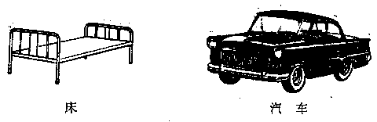

*图1*

我们在观察事物的过程中，还会看到这个物体和那个物体之间的位置关系，这些位置不是随便放的，这就需要我们来研究怎样放才是适当的。

例如图2中车间里合理地放置机床；田野里装置排灌设备等等，都需要一番研究才行。

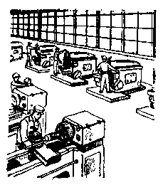

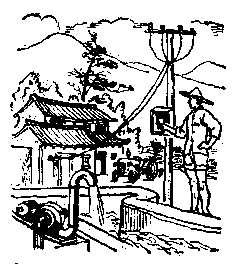

*图2*

几何学研究的对象就是物体的形状、大小和相互的位置关系。

### 2. 几何学的发展简史

几何学的产生和别的学科一样，也是由于人类生产和生活的需要。在原始社会里，人们已经积累了许多关于物体的形状和大小以及它们的分布和位置关系的知识。例如古代的人们为了记住他们居住和打猎的地方，就逐渐地学会怎样来判定各个地方之间的距离，怎样来测量各个地区的大小。

随着人类社会的发展，对于物体的形状、大小和相互位置关系的知识，要求愈来愈高，就这样经过劳动人民长期的生产和生活实践，积累了许多几何知识，并不断地丰富起来，形成了人类知识的一个部分。

谈起几何学的发展历史，就会联想到古埃及尼罗河的故事。相传4000多年前，尼罗河每年洪水泛滥把两岸的土地淹没，水退后河床常有变易，致使土地界线不明。当时埃及的劳动人民为了明确自己耕地的界线，用步长测出土地的周界，并计算它们面积的大小，画出耕地的图形，作为划分土地的依据。由于经常测量和画图、不断地积累和提高的结果，归纳出不少关于图形的知识，这样就产生了初步的几何学。

后来希腊人到埃及去经商，学到了测量和绘图的知识，再逐步加以补充，使这些初步的几何知识充实成为一门完整的几何学。“几何学”这个名词，希腊文原来的意义是“测量土地的技术”，一直沿用到今天。

公元前 388 年，希腊人欧几里得在亚力山得里亚大学教授，他把埃及和希腊的几何学知识，作了系统的总结和整理，写成一本《几何原本》。这本书对于几何学的发展，曾起了很大的作用。

我国的祖先对于几何学很早就有研究，同埃及和希腊人一样作出了光辉的成绩。在我国黑陶文化时期（约公元前一千年），陶器上的花纹就有菱形、正方形和圆内接正方形等等的图样（图3）。

在墨翟（约公元前500年）所著的《墨经》里，提出了关于几何图形的一些知识。在古算书《九章算术》里，载有土地面积和物体体积的计算方法。在另一本古算书《周髀算经》里，叙述了关于直角三角形的边长的比为3：4：5， 这个例子说明直角三角形斜边上所作的正方形面积等于两条直角边上所作正方形面积的和（图 4）。

*图3*

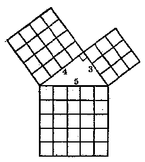

*图4*

我国数学家祖冲之（公元429～500年）计算的圆周率π，已准确到第七位小数，就是3.1415926<π<3.1415927，他还用\(\frac{355}{113}\)近似地表示π的值，可以准确到第六位小数。后人把\(\frac{355}{113}\)简称密率。这在当时是一项了不起的科学成就。圆周率π的这个近似值，直到十五世纪，才由伊斯兰国家的数学家阿尔·卡西达到了祖冲之所计算的精确度。

可以查考的例子还很多，这里不多举了。

### 3. 组成几何图形的元素

如果我们只考虑一个物体的形状和大小，不管它的其他性质时，这样的一个物体也叫做几何体。例如图5中一根圆形的木料和一只圆形的铅桶，尽管它们的颜色、重量和其他性质都不相同，但是只考虑它们外表的形状时，都是一个圆柱形的几何体。

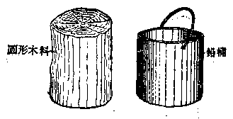

*图5*

又如图6中一个皮球和一个和它同样大小的木球，虽然它们的其他性质都不相同，但却是两个大小完全相等的球体。

我们知道，任何物体都占有一部分空间，都用它的表面和它的周围分开的，因此我们说面是体的界限。例如物体和它邻接的空气分开的地方就是这个物体的表面。我们可以放弃物体的本身，单独来想象它的表面，这样就把几何里的面看成是没有厚度的了。我们用一只玻璃杯装着水和油（图7），因为油比水轻都浮在水的上面，可以清楚地看出水和油分界的地方，就是它们共同的表面。很明显，这样的面是没有厚度的。

*皮球*

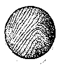

*木球*

*图6*

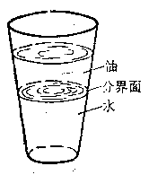

*图7*

如果我们想象两个面相交的部分，就会得到几何里的线。实际上我们所看到的线都是两个面的公共部分。因此，我们说线是面的界限。例如图8中火柴盒的棱就是相邻两个面的相交线。一张白纸上泼了一滴墨水，这两种颜色的分界也是一条线。

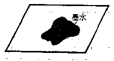

*图8*

从这些例子可以看到线是没有厚度，也没有宽度的。

如果我们想象两条线相交的地方，就会得到点的形象。实际上点就是两条线的公共部分，因此，我们说点是线的界限。例如图9中的两条线的公共部分都是点。

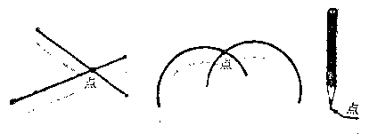

*图9*

可以看到点是没有厚薄、宽窄和长短的，它只占有一个位置。例如地图上就是用点来确定城市的位置的。

我们所说的点、线、面都不能单独存在，而只能是依附于物体的。但是在几何里为了研究它们的性质，常常把它们分开来研究，这并不是认为点、线、面是互不相关的。

点、线、面是组成几何图形的元素，点、线、面以及它们的集合都称为几何图形。

可以全部放在一个平面内的图形叫做平面图形。这些平面图形我们在小学数学里已经看到不少。例如图10中的一些图形。

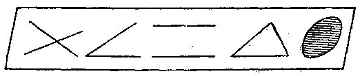

*图10*

平面几何学就是研究平面图形的性质、作法和计算等问题的一门学科。

#### 习题

1. 试举一实例来说明物体与几何体的区别。

2. 一只火柴盒有几个面？几条棱？几个顶点？

3. 试举例说明线是面的界限。

## 第一章 直线、角、平行线

### 直线、圆和圆弧

#### § 1.1 直线、射线和线段

木工为了锯木板所画的墨线，穿过小孔射出来的光线，双手拉紧的细绳等，都给我们直线的形象，我们把直线看作是可以向两方无限伸长的。直线常用两个大写字母来表示，例如，“直线\(AB\)”或者“直线\(BA\)”（图 1·1（1））；或者用一个小写字母来表示，例如，“直线\(a\)”（图 1·1（2））。

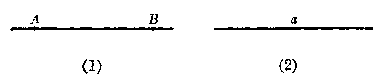

*图 1·1*

画直线可以用直尺。我们在纸上画两点，经过这两点用直尺可以画一条直线。木工锯木板，也是先在木料上定出两点，然后用墨斗沿着这两点弹出直线。

我们知道，经过一点可以画无数条直线，但是经过两点随便你画多少次，只能画出一条直线。从这些事实可以得知下述的直线的性质：

经过两点可以画一条直线，并且只可以画一条直线。

应用这个性质，可以检查尺的边是不是平直。方法是：先选定两点，让尺的边缘紧靠这两点，经过这两点画一条线。把尺调转过来，放在所画的线的另一侧，经过这两点再画一条线。如果两次画出的线是重合的，就可以确定尺的边是直的（图 1·2（1）），否则就不直（图 1·2（2））。

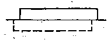

*（1）*

*（2）*

*图 1·2*

事实上，用直尺只能画出直线的一部分，移动直尺后可以把这一部分向两方无限地画出来。

探照灯、手电筒的光线，是由一点出发向一定方向射出的，这些都给我们射线的形象。在直线上某一点一旁的部分叫做射线，这一点叫做射线的端点，这个端点也叫做原点。射线用表示它的端点和射线上任意一点所注的两个大写字母来表示，并把表示端点的字母写在前面，例如“射线QC”（图 1·3）。

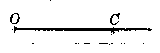

*图 1·3*

黑板和书本的边缘，都有两个端点，因此，可看作是直线在两点间的一部分。我们把直线上任意两点间的部分叫做线段，这两点叫做线段的端点。

线段通常用表示它们两个端点的大写字母来表示。例如，“线段 DE”或者“线段 ED”（图 1·4（1））；或者用一个小写字母来表示，例如“线段 b”（图 1·4（2））。

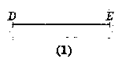

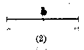

*图 1·4*

**［注意］** 直线、射线和线段有什么区别呢？区别就在于线段有两个端点，射线只有一个端点，而直线没有端点。我们用很短的细实线来表示端点（如图 1·3和1·4）。

我们通过画图容易知道，两点只能连接一条线段，而且这条线段是连结这两点的最短的线，因此我们可以说：两点间的线段的长，叫做这两点间的距离。

我们利用直尺可以把一条线段向任何一方延长。例如，我们可以经过点 B 把线段 AB 延长（图 1·5（1）），也可以经过点 A 把线段 AB 向 BA 方向延长（图 1·5（2））。在图中，它们的延长部分用虚线表示。

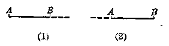

*图 1·5*

在图 1·5（1） 里，我们说延长 AB，不能说成延长 BA；但在图 1·5（2） 里，只能说延长 BA。线段的延长部分（虚线）叫做延长线。

问题 1 在图 1·6 中的直线和线段能相交吗？

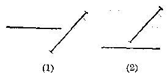

*图 1·6*

问题 2 在图 1·7 中的射线和线段能相交吗？

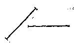

*（1）*

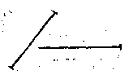

*（2）*

*图 1·7*

问题 3 在图 1·8 中的射线和直线能相交吗？

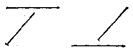

*（1）*

*（2）*

*图 1·8*

**［注意］** 要回答上面的问题，先要掌握前面学过的直线、射线和线段的概念，然后再仔细观察所画出的图形中，哪些是还可以继续画下去的，哪些是不可继续画下去的 （不是画它们的延长线），用一张纸在它的上面画，这样问题就容易回答了。

##### 习题 1.1

1. 裁衣服常用线袋在布上弹直线，布上就留下直线的痕迹，这是什么道理？

2. 要在墙上钉一根横木条，至少要钉几只钉？为什么？

3. 过纸上的一点 A，能画出几条直线？怎样画？过 A 和 B 两点呢？为什么？

4. 在纸上画出 4 点（要任意三点不在一条直线上），用直尺过每两点画一条直线，一共可画几条？

5. 用双手同时拿着两根绳子的两头，拉紧后这两根绳子一定紧紧地合在一起，为什么？

#### § 1.2 线段的相等和不等

把一条线段移到另一条线段上，可以比较两条线段的长短。我们把移动一个图形简称移形。几何图形具有这样一个性质：移形是不会改变它的形状和大小的。

现在我们来比较线段\(PQ\)和\(RS\)的长短。先把\(PQ\)放到\(RS\)上，使点\(P\)和点\(R\)合起来，并且使线段\(PQ\)沿着线段\(RS\)落下去。如果点\(Q\)和点\(S\)是合在一起的，那末线段\(PQ\)和线段\(RS\)相等 （图 1·9）。这时可写成：

$$
PQ = RS \text{或者} RS = PQ.
$$

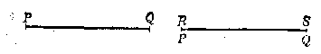

*图 1·9*

如果点\(Q\)落在\(R, S\)这两点之间，线段\(PQ\)就比较短（图 1·10）。这时可写成：

$$
PQ < RS \text{或者} RS > PQ.
$$

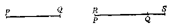

*图 1·10*

如果点\(Q\)落在\(RS\)的延长线上，线段\(PQ\)就比较长 （图 1·11）。这时可写成：

$$
PQ > RS \text{或者} RS < PQ.
$$

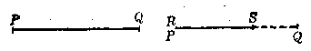

*图 1·11*

象上面这种比较线段大小的方法叫做迭合的方法。

从上面的线段比较过程中可以看到，在一条线段内可以截取一条比它短的线段；也可以在一条线段和它的延长线上截取一条比它长的线段。

#### § 1.3 线段的度量和画法

我们知道，可以用有刻度的直尺来量出线段的长度（图 1·12）。但是如果要把线段量得精确些，应当用分割规（两脚都是尖针的圆规）。量的方法是先把分割规两脚的针尖分别放在线段的两个端点上（图 1·13（1）），然后不改变分割规的张口大小，把它移到有刻度的直尺上，并使一个针尖落在直尺记着0的刻度线上，这时另一个针尖就指出这线段的长度（图 1·13（2））。

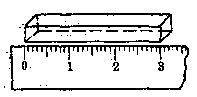

*图 1·12*

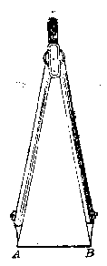

*（1）*

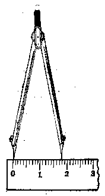

*（2）*

*图 1·13*

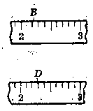

*图 1·14*

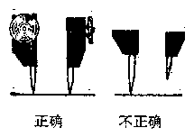

*图 1·15*

如果分割规的另一个针尖不是正好指着尺上的刻度线时，我们就要凭目力来估计，再用四舍五入法读出线段的近似长度。

如图 1·14中，B指着的点靠近22毫米，那末它的近似长度应该是22毫米（精确到1毫米）；D指着的点靠近23毫米，它的近似长度就应该是23毫米（精确到1毫米）。

使用分割规的时候，应该注意两个针尖是否已经并齐（图 1·15），如果不并齐时去度量线段，就会影响所量结果的精确度。

我们用分割规和直尺，也可以画出或者截取已知长度的线段。方法是先用直尺画一直线，用分割规在刻度尺上量好已知的长度，不改变它两脚的张口；移到画好的直线上去，使分割规两个针尖都落在直线上；用铅笔尖在针尖指着的地方画细直线，这时两个细实线间的那个线段就等于已知长度的线段了。

我们应用分割规和直尺截取线段的方法，可以在一条直线上画出线段，使它等于几条线段的和。如图 1·16中，

$$
PQ = a + b + c，
$$

其中线段\(a, b, c\)是已知的。

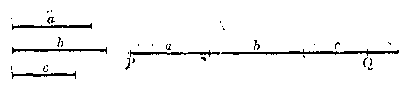

*图 1·16*

**［注意］** 在直线上截取各已知线段时，如果改变线段\(a, b, c\)的顺序，所画出的总长是一样的。这说明线段相加，交换律仍然是满足的，这和代数里所学的加法交换律一样。

同样，也可以画出一条线段，使它等于两条已知线段的差。如图 1·17 中，

$$
PQ = l - m，
$$

其中线段 l，m 是已知的，并且 l > m。

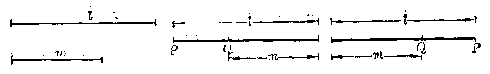

*图 1·17*

从上图可以看出，线段\(PQ + m = l\)，如果\(PQ\)和\(m\)的顺序交换一下，就有\(m + QP = l\)，所以在画图的时候，如果从线段\(l\)的左端起截取线段\(m\)，结果也是一样的。

我们用分割规和直尺还可以把线段等分、方法是先量出这条线段的长度，用除法计算出它的每一等分的长度（有时除不尽，取它的近似值），再利用分割规按每分的长度作出所要求的各等分线段（图 1·18）。

这样作图有时会有误差。如图 1·19，第 5 分点与点 B 相差线段 a，就应该使两个针尖间的距离在开始时就缩短 （图 1·19（1）或者加长（图 1·19（2））\(\frac{1}{5} a\)，这样量五次以后，刚巧截得\(B\)点。

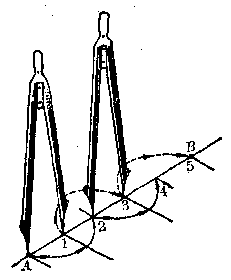

*图 1·18*

如果把一条线段二等分，这个分点也就是这条线段的中点。

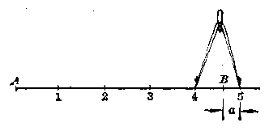

*（1）*

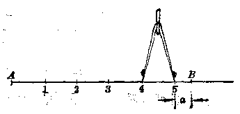

*（2）*

*图 1·19*

##### 例 1

在射线 AM 上截取一线段，使它等于已知线段 a 的 5 倍（图 1·20）。

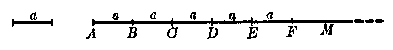

*图 1·20*

**［解］** 先画出已知线段\(a\)，再画出射线\(AM\)。用分割规自\(A\)点起顺次截取\(AB = BC = CD = DE = EF = a\)，所以

$$
AF = AB + BC + CD + DE + EF = 5 a.
$$

##### 例 2

已知线段 a，b （a > b），用分割规和直尺画出线段 x，y，使\(x = a + 2b\)，\(y = 3a - 2b\)（图 1·21）。

**［解］** 先画出已知线段 a 和 b，且 a > b。再画出射线 AM 和 BN。

（1） 用分割规在射线\(AM\)上自点\(A\)起顺次截取\(a\)和\(2b\)，

$$
\therefore x = a + 2 b.
$$

[^fn-p19-1]

（2） 用分割规在射线 BN 上截取 BE = 3a，再自 E 向左方截取线段等于 2b，

$$
\therefore y = 3 a - 2 b.
$$

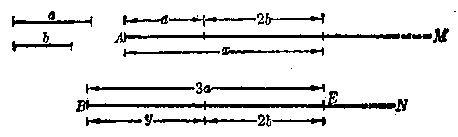

*图 1·21*

在图上标注线段的长度，有一定的方法。先在要标注的线段两端，引出细实线作为境界线（图 1·21），境界线通常用长约5毫米的细实线表示，在境界线中间再画一条细实线，中间留着空位，注明长度的数字或者小写字母，两端画上箭头，这条细实线叫做尺寸线。

##### 例 3

已知两条线段\(A'B' = 5.4 \, mm\)，\(C'D' = 2.5 \, mm\)，画出这两条线段依照定比 10：1 放大后的差。

**［解］** 已知\(A'B' = 5.4 \, mm\)，\(C'D' = 2.5 \, mm\)，依题意把它们放大 10 倍，就是

$$
AB = 5.4 \mathrm{mm} \times 10 = 54 \mathrm{mm} = 5.4 \mathrm{cm}，
$$

$$
CD = 2.5 \mathrm{mm} \times 10 = 25 \mathrm{mm} = 2.5 \mathrm{cm}，
$$

$$
\therefore AB - CD = 5.4 \mathrm{cm} - 2.5 \mathrm{cm} = 2.9 \mathrm{cm}.
$$

下面是按 10：1 放大的示意图（图 1·22）：

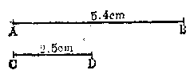

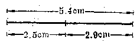

*图 1·22*

##### 习题 1.3

1. 任意画一条线段\(AB\)；用分割规和毫米尺量出线段\(AB\)的长度（精确到毫米）。

2. 任意画一条线段 CD；用分割规和毫米尺求出它的中点来。

3. 已知两条线段的长为 4.6 米和 340 厘米；用直尺和分割规分别画出按原来的长度缩小到 1：100 的两线段。

4. 在下图中可以找出几条线段？分别把它们表示出来。

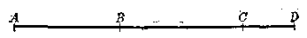

*（第4题）*

5. 根据上题的图填写下面的空白：

（1）\(AC = BC + (\quad)\)；

（2）\(CD = AD - (\quad) - (\quad)\)；

（3）\(BC = AD - (\quad) - (\quad)\)；

（4）\(AB + BC = (\quad) - CD;\)

（5）\(AD = (\quad) + (\quad)\)，把几种答案都写出来。

6. 下图中\(M\)是线段\(AB\)的中点，填写下面的空白：

④ “mm”表示毫米，“cm”表示厘米，“dm”表示分米，“m”表示米。

（1）\(AM = (\quad)\)；

（2）\(AB - AM = (\quad)\)；

（3）\(AM = \frac{1}{2} (\quad)\)；

（4）\(AB = 2(\quad)\)。

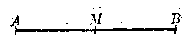

*（第6题）*

7. 已知线段\(AB = 15\mathrm{cm}\)，点\(C\)在线段\(AB\)上，\(D\)和\(E\)分别是\(AC\)，\(CB\)的中点，求\(DE\)的长。

8. 已知一线段的长等于\(l\)，把它分成任意两部分，求这两部分的中点之间的长。

9. 已知线段\(a\)和\(b\)（\(a>b\)），画出一条线段使它等于

（1）\(2a + 2b\)；

（2） 2a-b。

\*10. 下图中，由\(AB = CD\)，可得\(AC = BD\)，为什么？

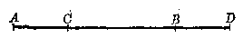

*（第10题）*

**［提示］** \(AC = AB - CB, BD = CD - CB.\)

\*11. 下图中，\(M\)是\(AB\)的中点，\(N\)是\(BC\)的中点，\(O\)是\(AC\)的中点。\(MN\)等于\(OC\)吗？为什么？

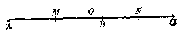

*（第11题）*

#### § 1.4 圆和圆弧

当我们看到太阳、中秋的月亮和车轮时，它们都给我们圆的形象。如果射线\(OA\)绕着它固定的端点\(O\)在平面内旋转一周（图 1·23），这时射线上的一点\(A\)也绕着点\(O\)旋转一周，如果在点\(A\)装上铅笔尖，就能画出一条首尾衔接的线，这条线叫做圆。通常我们用圆规画圆。射线的端点\(O\)叫做这圆的圆心。连结圆心与圆上任何一点的线段叫做圆的半径，如图 1·23的\(OA, OB, OC\)，而且它们都相等，即

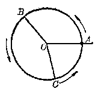

*图 1·23*

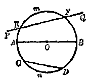

*图 1·24*

$$
OA = OB = OC.
$$

以点 O 为圆心的圆，通常我们记做“圆 O”，也可以用符号记做“⊙O”。

如果两圆的半径相等，把它们的圆心合在一起后，这两个圆就全部合在一起了。可以全部重合在一起的两个圆叫做等圆。因此，半径相等的圆是等圆，并且等圆的半径相等。

截圆于两点的直线（图 1·24）叫做割线（PQ）。连结圆上任意两点的线段（CD）叫做弦。经过圆心的弦（AB）叫做直径。

我们从线段的加法和同圆的半径相等的道理，可以推知圆的直径等于它的半径的2倍。所以，同圆或者等圆的直径都相等。

我们在圆上任意取两点\(E\)和\(F\)，夹在\(E, F\)两点间的部分\((EmF\)或\(EnF)\)叫做弧。这两点\(E, F\)叫做弧的端点。弧可以用符号“\(\wedge\)”来表示。例如，端点为\(E, F\)的弧，可以记做\(EF\)或者\(\widehat{FE}\)。有时我们为了确定这条弧，在弧的两端点之间添写一个小写字母，如\(EmF, EnF\)等。圆的直径把圆分成两个半圆，小于半圆的弧叫劣弧，大于半圆的弧叫优弧。

问题 1 什么叫割线？什么叫弦？它们有什么区别？弦就是割线被圆截在圆内的线段，这句话你看对吗？

问题 2 什么叫直径？直径与弦有什么区别？直径也是弦，这个说法对吗？弦也是直径，这句话对吗？

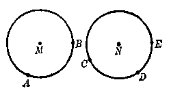

*图 1·25*

问题 3 为什么在同圆或等圆中的直径都相等？

问题 4 在图 1·25 的圆 M 和圆 N 中，各有几条弧？并用字母把它们确切地表示出来。

**［注意］** 在回答上述问题之前，应先复习课文，仔细观察各个图形的特点和描述它们的字句，然后再比较它们之间的异同。

##### 习题 1.4

1. 在纸上任取两点\(M\)和\(N\)，分别以\(M\)和\(N\)为圆心，以线段\(MN\)的长为半径画两个圆，它们的大小怎样？有几个交点？

2. 按下列条件画圆：

（1） 半径等于 1.5 厘米；

（2） 直径等于 86 毫米。

3. 设 A 是已知圆 O 上的一点，试画出下列各图：

（1） 过点 A 画直径，能够画出几条？为什么？

（2） 过点 A 画一条割线；

（3） 过点 A 画等于半径的弦，能够画几条？

4. 有一圆形的花台，中央立一根旗杆，怎样来测定旗杆是否居中？

### 角和垂线

#### § 1.5 角、平角和周角

如果我们在纸上取一点，并且从这点引两条射线（图 1·26）就得到一个角。

从一点引出的两条射线所组成的图形叫做角。我们用符号“∠”来表示“角”。两条射线的公共端点叫做角的顶点，组成角的射线叫做角的边。

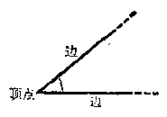

*图 1·26*

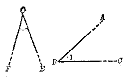

*图 1·27*

我们通常用三个大写字母来表示角，中间的一个字母是角的顶点，另外两个分别是角的两条边上的点。例如\(\angle ABC\)（图 1·27）。用三个字母来表示角时，必须把角的顶点那个字母写在中间。有时还可以用注在角里的一个数字或一个小写字母来表示角。例如\(\angle ABC\)可以写成\(\angle 1\)（图 1·27）。也可以用角的顶点的大写字母表示角。例如，\(\angle FOE\)可以写成\(\angle O\)（图 1·27）。

象上面所说的角的形象，在日常生活和生产中经常会看到。例如两脚分开的分割规和卡钳，钟表上的分针和时针构成的形状等，它们都成一个角（图 1·28）。

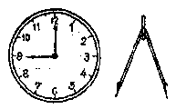

*图 1·28*

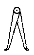

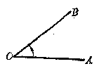

*图 1·29*

一个角可以看成是由一条射线绕着它的端点旋转而形成的，射线的端点就是角的顶点，射线就是角的边（图 1·29）。

如果我们依照相同的方向继续旋转，转到两条射线构成一条直线的位置（图 1·30）时所成的角叫做平角。

再旋转下去，到这条射线回到它原来的位置（图 1·31）

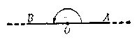

*图 1·30*

*图 1·31*

时所成的角叫做周角。

**［注意］** 射线旋转成角的时候，可以按逆时针方向，也可以按顺时针方向。本书中规定旋转的方向为逆时针方向。

现在我们来看下面的问题：

问题 1 在图 1·32 中，∠1 和 ∠AOB 表示同一个角吗？∠2 和 ∠BOC 呢？

问题 2 在图 1·32 中，能不能用 ∠O 来表示 ∠1 或 ∠2？∠O 应当表示哪一个角？

*图 1·32*

*图 1·33*

问题 3 在图 1·33 中，∠B 和 ∠2 都表示 ∠DBF 吗？用三个字母来表示 ∠1.

**［注意］** 在回答上面这三个问题之前，先要弄清楚角的三种表示方法。其次要留心角内部的记号，如“∠”或“∡”，这些记号都是指明角的大小的。如果当几个角共有一个顶点时，要表示其中某一个角，一般都用三个字母，把顶点的字母写在当中。如果图形中只含有已知顶点的一个角，可用表示顶点的字母来表示这个角。例如图 1·32中的∠1或∠2就不可用∠O表示。

##### 习题 1.5

1. 什么叫做角？说出角的各部分的名称。

2. 分别用数字来表示图中的\(\angle AOB, \angle BOC\)和\(\angle COD\)。

3. 分别用三个大写字母写出图中的\(\angle 1, \angle 2, \angle 3\)和\(\angle 4\)。

*（第2题）*

*（第3题）*

#### § 1.6 角的相等和不等

比较两个角的大小和比较两条线段的大小一样，也可以采用迭合的方法，就是把其中的一个角放在另一个角上，使它们的顶点重合，其中一边也重合，如果另外一条边也能重合，这两个角就是相等的。如图 1·34中，\(\angle AOB = \angle DEF\)。

*图 1·34*

也就是说：把一个角放在另一个角上，如果完全重合，这两个角是相等的。

两个平角重迭起来的时候，它们是完全重合的。由此得出：所有的平角都相等。

两个周角重迭起来的时候，它们也完全重合。因此，所有的周角都相等。

把一个角放在另一个角上，如果它们的顶点相重合，一个角的一边顺着另一个角的一边落下，它们的另一边都在重合的边的一旁，但是不相重合，这样的两个角就不相等。在图 1·35中，\(\angle ABC > \angle DEF\)，或者\(\angle DEF < \angle ABC\)。其中\(E\)和\(B\)重合，边\(ED\)和边\(BA\)重合，边\(EF\)则落在\(\angle ABC\)的两条边的里面。在图 1·36中，\(\angle ABC < \angle DEF\)，或者\(\angle DEF > \angle ABC\)。其中\(E\)和\(B\)重合，边\(ED\)和边\(BA\)重合，边\(EF\)则落在\(\angle ABC\)的两条边的外面。

*图 1·35*

*图 1·36*

#### § 1.7 角的度量和画法

我们要知道一个角的大小，可以用量角器来度量。量角器（图 1·37）是一个半圆形塑料板制成的。其中的点 O 是半圆形的圆心，把这个半圆弧等分成 180 个小格子，每一个小格表示 1 度，并在小格刻线的下面标明 0 到 180 每隔 10 度的度数。为了度量角度方便起见，在同一个量角器上标出次序正好相反的两排度数。

我们用量角器度量角的度数时，先把量角器的圆心 O 放在角的顶点上，并使量角器上标明 0 度那条刻度线对准角的一边，角的另一边所对准的刻度线上所标明的度数，就是这个角的度数。

*图 1·37*

如图 1·38 所示，\(\angle ABC=60^{\circ}\)，其中量角器上的圆心 O 与\(\angle ABC\)的顶点 B 重合在一起，角的边 BA 与量角器上的\(0^{\circ}\)刻线重合，角的另一边 BC 与量角器上的\(60^{\circ}\)刻线重合。

*图 1·38*

反过来，我们也可以用量角器画出已知度数的角和画出与已知角相等的角。例如我们要画出等于\(35^{\circ}\)的角，可先在平面上定一个点 O（图 1·39），然后把量角器上的圆心对准点 O，再沿着量角器半圆周上的刻度定出 E，F 两点，从点 O 作射线 OE，OF，得出\(\angle EOF\)就是所要画的\(35^{\circ}\)角。

*图 1·39*

我们还可以用量角器画出等于几个角的和或者两个角的差的角。如图 1·40中的

$$
\angle ABC = \angle 1 + \angle 2 + \angle 3.
$$

*图 1·40*

如图 1·41中的

$$
\angle EOF = \angle 4 - \angle 5.
$$

*图 1·41*

从角的相加可以看到，如果两个角共有一个顶点和一条公共的边，而且其他两边落在公共边的两旁，这样的两个角叫做互为邻角。例如图 1·40中∠1与∠2；∠2与∠3都是邻角。

用量角器还可以画出等于一个已知角的整数倍的角。例如，要画一个角等于已知角\(\alpha\)的3倍，它的画法就象上面所说的画等于几个角的和一样，只要在角\(\alpha\)上加上2个角 \(\alpha\)就可以了。如图 1·42 中的

$$
\begin{array}{l} \angle POQ = \angle POR + \angle ROS + \angle SOQ \\ = \angle \alpha + \angle \alpha + \angle \alpha = 3 \angle \alpha. \\ \end{array}
$$

用量角器还可以等分一个角。方法是先量出这个角的度数，计算出每一份的度数（如果除不尽，可取它的近似值），按照这个度数画出所有的等分角线。例如，三等分\(\angle AOB\)（图 1·43）。先量得\(\angle AOB = 66^{\circ}\)，则每一份是\(66^{\circ} \div 3 = 22^{\circ}\)。再以\(O\)为顶点，作\(\angle AOE = \angle EOF = 22^{\circ}\)，那末\(OE\)和\(OF\)就是\(\angle AOB\)的两条三等分线。

*图 1·42*

如果把一个角分成二等分时，则中间那条射线叫做角平分线。

*图 1·43*

*图 1·44*

在图 1·44中\(\angle AOC = \angle COB\)，射线\(OC\)就是\(\angle AOB\)的平分线，反过来，如果知道\(OC\)是\(\angle AOB\)的平分线，那末

$$
\angle AOC = \angle COB.
$$

讲到这里，我们已经学会用量角器来画出几个角的和、两个角的差、一个角的整数倍和一个角的几等分的角。但是，量角器的最小刻度是\(1^{\circ}\)，如果要画的那个角的度数不是整数，例如\(35.3^{\circ}\)，它的一边就在量角器上\(35^{\circ}\)与\(36^{\circ}\)之间，因此在画的时候就必须用目测来估计这边的位置，这样画出来的角就不可能很精确，总会有一些误差。所以，用量角器画角是一种近似画角的方法。但只要我们在画角的时候注意到它的精确度，是可以画出误差小于\(1^{\circ}\)的角，这样，就认为是达到画角的要求了。

取一张纸，在它的一边上标出一点\(O\)（如图 1·45）

*图 1·45*

作为平角的顶点，OA 和 OB 分别是这个平角的两边，事实上 A，O，B 在一直线上了。

如果把这张纸折过来，使折痕过点 O，并且射线 OA 与 OB 相重合，这时这个折痕就把这个平角分成相等的两个角，其中的每一个角都是平角的一半。我们把平角的一半叫做直角。通常用记号“ “∟” ”表示直角。

在上图中的\(\angle AOC = \angle COB\)，而且\(\angle AOB\)是平角，所以它们都是直角。直角的大小通常用字母\(d\)来表示，就是\(\angle AOC = d, \angle COB = d\)。平角等于\(2d\)。周角等于\(4d\)。

因为所有的平角都相等，因此平角的一半也相等。所以直角都相等。

我们从量角器上所刻的度数可以知道，一个平角是\(180^{\circ}\)。因为一个周角是平角的2倍，所以周角是\(360^{\circ}\)。一个直角是平角的一半，所以直角是\(90^{\circ}\)。

我们再看图 1·46中所画的这些角：

其中的\(\angle A\)和\(\angle B\)都小于直角。这种小于直角而大于\(0^{\circ}\)的角叫做锐角（\(0^{\circ}\)的角可理解为一条射线没有转动时的角）。

*图 1·46*

其中的\(\angle C\)和\(\angle D\)都比直角大。这种大于直角而小于平角的角叫做钝角。

也可以有大于平角的角（图 1·47）。

*图 1·47*

这种大于平角而小于周角的角叫做优角，但是现在我们所研究的都是小于或等于平角的角；至于优角，除非特别指明，一般我们不研究。

为了要精确地表示一个角的大小，我们把一度分成 60 等份，每一份叫做一分，再把一分分成 60 等分，每一份叫做一秒。用度、分、秒等单位来计量角的大小，那就精确得多了。度、分、秒分别用符号“°”、“′”、“″”来表示。例如一个角是 32 度 25 分 30 秒，可以写成\(32^{\circ}25'30''\)。

##### 例 1

如图 1·48 中\(\angle AOB = \angle DOC\)，图中还有相等的角吗？为什么？

**［解］** 因为\(\angle AOB = \angle DOC\)，如果这个等式的两边同时加上\(\angle BOC\)，就有

$$
\angle AOB + \angle BOC = \angle DOC + \angle BOC，
$$

即\(\angle AOC = \angle DOB.\) 这是因为“等量加等量其和仍相等”的缘故。

*图 1·48*

*图 1·49*

##### 例 2

如图 1·49 中，已知\(\angle AOC = \angle BOD\)，一定有\(\angle AOB = \angle COD\)，为什么？

**［解］** 因为\(\angle AOC = \angle BOD\)，如果这个等式的两边同时减去\(\angle BOC\)，就有

$$
\angle AOC - \angle BOC = \angle BOD - \angle BOC，
$$

即\(\angle AOB = \angle COD.\) 这是因为“等量减等量其差仍相等”的缘故。

##### 例 3

已知窗框间的夹角都是相等的。计算窗框（图 1·50）相邻两根木条间所夹的角\(\alpha\)是多少度？

**［解］** 因为一个平角等于\(180^{\circ}\)。

窗框之间的夹角\(\alpha\)都是相等的，如图共有6个角\(\alpha\)

$$
\therefore \angle \alpha = 180 ^{\circ} \div 6 = 30 ^{\circ}.
$$

**答**：\(\angle \alpha = 30^{\circ}\)

*图 1·50*

*图 1·51*

##### 例 4

设\(\angle AOB\)是直角，又 OC，OD 是射线（图 1·51），如果\(\angle AOC\)、\(\angle COD\)和\(\angle DOB\)的度数之比顺次为 1：3：5，求这三个角的度数。

**［解］** 因为直角等于\(90^{\circ}\)，

$$
\therefore \angle AOC + \angle COD + \angle DOB = 90 ^{\circ}.
$$

已知\(\angle AOC: \angle COD: \angle DOB = 1:3:5\)，我们由配分比例可求得

$$
\angle AOC = 90 ^{\circ} \times \frac{1}{1 + 3 + 5} = 90 ^{\circ} \times \frac{1}{9} = 10 ^{\circ}.
$$

$$
\therefore \angle COD = 90 ^{\circ} \times \frac{3}{9} = 30 ^{\circ}， \angle DOB = 90 ^{\circ} \times \frac{5}{9} = 50 ^{\circ}.
$$

**答**：\(\angle AOC = 10^{\circ}\)，\(\angle COD = 30^{\circ}\)，\(\angle DOB = 50^{\circ}\)

##### 习题 1.7

1. 根据下图填写下面空白：

（1）\(\angle AOC = (\quad) + (\quad)\)；

（2）\(\angle BOD = (\quad) + (\quad)\)；

（3）\(\angle AOC - \angle BOC = (\quad)\)；

（4）\(\angle AOD - \angle BOC = (\quad) + (\quad)\)；

（5）\(\angle DOC = \angle AOD - (\quad)\)；

（6）\(\angle AOD = (\quad) + (\quad)\)。

*（第1题）*

有几种答案都写出来。

2. 在图中，\(\angle AOB = \angle BOC = \angle COD = \angle DOE\)，哪一个角等于\(\angle AOB\)的4倍？哪些角等于\(\angle BOC\)的3倍？哪些角等于\(\angle AOE\)的二分之一。

*（第2题）*

*（第3题）*

3. 如图中，两角\(\angle AOC\)和\(\angle BOD\)都是直角，那末\(\angle AOB = \angle COD\)，为什么？

4. 试用一副三角板画出\(30^{\circ}, 45^{\circ}, 60^{\circ}, 75^{\circ}, 90^{\circ}\)的角。

**［提示］** 用量角器度量一副三角板上有哪些度数的角，再用三角板依照角的画法画出上列各角。

5. 任意画一个角，再用量角器：

（1） 画出一个角等于它的 4 倍；（2） 把它三等分。

6. 用量角器度量下图中三角形的三个角的大小（精确到\(1^{\circ}\)），并且计算它们的和。再任意画两个三角形，分别度量它们的三个角的和，你发现了什么？

*（第6题）*

7. 已知两个角的和等于\(73^{\circ}24'\)，它们的差等于\(23^{\circ}\)，计算这两个角的大小。再用量角器近似地画出这两个角。

8. 根据下面的方位图，我们来看：北和东两个方向所成的角是几度？南和南西呢？北西和北东呢？西和南东呢？东和西呢？

*（第8题）*

9. 画出一个锐角和一个钝角，先目测它们的大小，再用量角器来度量，检查目测的角度的误差。

10. 从点 O 引射线 OA，OB，OC （如图），已知\(\angle AOB = 100^{\circ}\)，又\(\angle AOB\)和\(\angle BOC\)的角平分线所成的\(\angle EOF\)等于\(70^{\circ}\)，求\(\angle AOC\)和\(\angle COB\)。

*（第10题）*

11. 从直角的顶点引一条射线，把它分成两个角，其中一个角比另一个角大18度，求这两个角的度数。

12. 从直角的顶点引一条射线把它分成两个角，这两个角的平分线所成的角是几度？

13. 从直角的顶点引一条射线，把它分成的两个角的度数的比是 1：3，求这两角各是几度？

14. 把一平角三等分，求两旁边两角的平分线所成的角的大小。

*（第 16 题）*

15. 用折纸的方法把一个角分成2等分、4等分。

16. 挖泥时，铁锹与地面形成两个角，当人身边的角是另一个角的一半时最省力，求这两个角。

#### § 1.8 垂线

我们在纸上画两条直线，如果它们相交，那末只能相交于一点，这点叫做两直线的交点。

如果两条直线相交成直角，那末这两条直线叫做互相垂直。在图 1·52中，直线\(AB\)和\(CD\) 是互相垂直的。

我们用符号“⊥”来表示“垂直于”。例如，在图 1·52中\(AB \perp CD\)，或写成\(CD \perp AB\)，它们的相交点E叫做垂足。

*图 1·52*

在日常生活和生产中，互相垂直的情形是很多的，例如，房屋的柱和梁一般是互相垂直的；东西方向和南北方向也是互相垂直的；等等。

如果两条直线相交不成直角，则其中一条叫做另一条的斜线。它们的交点叫做斜足（或斜线足）。在图 1·53中，直线AB和CD不垂直，简称斜交，它们的交点F是斜足。

*图 1·53*

过一点画一条直线的垂线，可以用三角板（图 1·54）。

用三角板画垂线时，一般是把三角板放在右边，铅笔从下方引向上方。图 1·54 中的情况，将虚线画的三角板拿掉后，沿着左面那块三角板画垂线较准确。

在工厂里，要画工作物边缘的垂线，用曲尺最方便（图 1·55）。

我们很容易看到，过直线外或者直线上的一点，都只能画一条直线和原来的直线垂直。

*P点在AB外*

*R点在CD上*

*图 1·54*

实际上，如果点\(P\)在\(AB\)上，而\(PC \perp AB\)（图 1·56）， 那末通过\(AB\)上的点\(P\)所引的任何其他射线都不能与直线\(AB\)垂直。例如\(PK\)就不能垂直\(AB\)。 因为\(\angle KPB\)小于直角，\(\angle KPA\)大于直角，所以都不是直角。

如果点 P 在直线 AB 外，我们取一张纸，画一直线 AB，并在 AB 外指定一点 P。沿着直线 AB 把纸折迭起来，用小针尖刺点\(P\)，则在纸的另一半面上留下和点\(P\)对齐的小孔\((P')\)。再把纸摊平，经过点\(P\)和点\(P'\)画一直线\(PP'\)（图 1·57），它与\(AB\)交于点\(O\)。倘再沿着\(AB\)折迭，就会看到\(\angle P'OB\)与\(\angle POB\)重合，而且\(\angle POP'\)是一平角，所以\(\angle P'OB\)和\(\angle POB\)都是直角，也就是\(PP' \perp AB\)。

*图 1·55*

*图 1·56*

*图 1·57*

如果从点 P 引其他任何直线，例如 PE，都不能垂直 AB。因为\(\angle PEP'\)小于一平角，它的一半\(\angle PEA\)就小于一直角，\(\angle PEB\)则大于一直角，所以都不是直角。

这样，就证实了过直线外或者直线上的一点，都只能画一条直线和原来的直线垂直。

从直线\(AB\)外一点\(P\)到\(AB\)的垂直线段\(PO\)的长，叫做点\(P\)和直线\(AB\)的距离。\(PO\)是所有从\(P\)到\(AB\)上各点的线段中最短的一条（图 1·57）。

我们学了垂线和用三角板画垂线以后，就可利用它来检查三角板的直角是否准确。先画一条直线，在这条直线上任意取一点作为角的顶点，过这点用三角板画直角。然后把三角板翻过来，使直角的同一条边放到这直线上顶点的另一旁，并且再用已知点作角的顶点画第二个直角。如果所画的两条直线重合（图 1·58（1）），三角板就是准确的，如果所画的两条直线不能重合（图 1·58（2）），三角板就不准确。

*（1）*

*（2）*

*图 1·58*

*图 1·59*

问题 1 地面上已经画好一条直线，要过线外一点作它的垂线，一人握住绳子的一端，固定在这一点，另一人把绳子拉直来确定垂足的位置，他应当怎么办？（图 1·59）

问题 2 已知两条直线相交所得的四个角中，有一个是直角，其他三个角各等于多少？

问题 3 填充下表中的空白，其中\(d = 90^{\circ}\)。

| \(\overline{d}\) |  | \(\frac{2}{3}\overline{d}\) | \(\frac{3}{4}\overline{d}\) |  |  | \(\frac{1}{9}\overline{d}\) |  | \(\frac{4}{5}\overline{d}\) | \(\frac{1}{18}\overline{d}\) |
| --- | --- | --- | --- | --- | --- | --- | --- | --- | --- |
| 90° | 45° |  |  | 30° | 15° |  | 6° |  |  |

##### 习题 1.8

1. 分别自点\(P_{1}\)和\(P_{2}\)画直线\(l_{1}\)和\(l_{2}\)的垂线，并把垂足用字母标出。

*（第1题）*

2. 举出一些两直线互相垂直的实际例子。

*（第3题）*

3. 上图中 P 在 AB 上，Q 在 CD 上，分别画出和量出 P 和 Q 的距离。点 P 到直线 CD 的距离，点 Q 到直线 AB 的距离。

4. 自钝角的顶点引它的一边的垂线，如果把它分成两个角的度数比是

（1） 2：3；（2）\(\frac{1}{3}:\frac{2}{5}\)；（3）\(\frac{1}{5}:\frac{3}{4}\)。

求这些钝角的大小。

［本题的（1）做在下面，供你参考。

解：图中设\(\angle POB = x^{\circ}, PO \perp AO, \angle AOP = 90^{\circ}\)，又\(\angle POB: \angle AOP = 2:3\)，代入，得

$$
\frac{x}{90} = \frac{2}{3}，
$$

*（第4题）*

*（第6题）*

计算，得

$$
x = 60，
$$

$$
\therefore \angle AOB = \angle AOP + \angle POB = 90 ^{\circ} + 60 ^{\circ} = 150 ^{\circ}.
$$

**答**：\(\angle AOB=150^{\circ}\)。］

5. 把一平角三等分，求中间一个角的平分线和平角的边所成的角是几度？这条角平分线与平角的边垂直吗？为什么？

6. 如图中，钝角\(\angle AOB = \angle COB\)，又\(CO \perp AO\)。 求\(\angle AOB\)的度数。

7. 能不能引两条直线同垂直于一条直线？过同一点呢？

8. 画出两条直线，使它们与一已知点的距离相等。

#### § 1.9 余角、补角、对顶角

我们用量角器来量两块不同形状的三角板的两个锐角，就会知道，其中一块的两个锐角分别是\(30^{\circ}\)和\(60^{\circ}\)；另一块的两个锐角都是\(45^{\circ}\)，每一块三角板上两个锐角的和都是：

$$
30 ^{\circ} + 60 ^{\circ} = 90 ^{\circ}； \quad 45 ^{\circ} + 45 ^{\circ} = 90 ^{\circ}.
$$

象这样的两个角的和等于\(90^{\circ}\)的情形是很多的。例如，自直角的顶点在两边之间任意引一射线，把直角分成两个角，这两个角的和也等于\(90^{\circ}\)。在图 1·60中

$$
\angle AOB = 90 ^{\circ}，
$$

而\(\angle AOC + \angle COB = 90^{\circ}\) 如果两个角的和等于\(90^{\circ}\)，那末这两个角叫做互为余角。例如，\(30^{\circ}\)角是\(60^{\circ}\)角的余角，\(60^{\circ}\)角也是\(30^{\circ}\)角的余角。

*图 1·60*

我们根据互为余角的关系，就容易推知下述结论是正确的：

等角（或同角）的余角相等。

例如，已知\(\angle 1 = \angle 2\) 而\(\angle 1 + \angle 3 = 90^{\circ},\angle 2 + \angle 4 = 90^{\circ},\) ∴\(\angle3=\angle4\)（等角的余角相等）。

又如，\(\angle 1 + \angle a = 90^{\circ}\)，\(\angle 1 + \angle b = 90^{\circ}\) ∴\(\angle a = \angle b\)（同角的余角相等）。

如果两个角的和等于\(180^{\circ}\)，那末这两个角叫做互为补角。例如，\(30^{\circ}\)和\(150^{\circ}\)角；\(100^{\circ}\)和\(80^{\circ}\)角；等等。

如果我们把任意一个锐角或者钝角的一边，从它的顶点向外延长，就得到两个角，它们的和等于\(180^{\circ}\)。它们同时又是邻角，所以叫做邻补角。

图 1·61 中的\(\angle1\)与\(\angle2,\angle3\)与\(\angle4\)都是邻补角。

*图 1·61*

我们根据互为补角的关系，可以推知，等角（或同角）的补角相等。

如果我们把一个角的两边从它的顶点向外延长，就得到两组角。象图 1·62中的∠AOB与∠COD，∠AOD与∠BOC；它们中间一角的两边都是另一角两边的反向延长线。

如果一个角的两边是另一个角的两边的反向延长线，则这两个角叫做对顶角。图 1·62中的∠AOB和∠COD；∠AOD和∠BOC都是对顶角。

*图 1·62*

*图 1·63*

现在来计算下面的题目：

已知\(\angle AOB = x^{\circ}\)，计算它的对顶角\(COD\)是几度？（图 1·63）。

**［解］** 因为\(\angle AOB\)和\(\angle COD\)是对顶角，因此\(AC\)和\(BD\)都是直线，所以

$$
\angle AOB + \angle BOC = 180 ^{\circ}，
$$

$$
\angle COD + \angle BOC = 180 ^{\circ}.
$$

从上式可知 \(\angle AOB = \angle COD\)（同角的补角相等）。

但已知

$$
\angle AOB = x ^{\circ}，
$$

$$
\therefore \angle COD = x ^{\circ}.
$$

**答**：∠COD 是\(x^{\circ}\)。

从此得出对顶角的性质：对顶角相等。

##### 例 1

求\(25^{\circ}30'\)的余角和补角。

**［解］** 它的余角是\(90^{\circ} - 25^{\circ}30' = 64^{\circ}30'\)。

它的补角是\(180^{\circ} - 25^{\circ}30' = 154^{\circ}30'\)。

##### 例 2

互为补角的两个角，能不能都是锐角？钝角？直角？

**［答］** （1） 互为补角的两个角不能都是锐角。因为如果它们都是锐角，则它们的和一定小于\(2d\)，而不等于\(2d\)。

（2） 互为补角的两个角不能都是钝角。因为如果它们都是钝角，则它们的和一定大于\(2d\)，而不等于\(2d\)。

（3） 互为补角的两个角可能都是直角。因为两直角的和等于\(2d\)。

##### 例 3

已知\(\angle a=15^{\circ}\)，求\(\angle a\)的余角的补角是几度？

**［解］** 图 1·64中，\(\angle a = 15^{\circ}\)，\(\angle AOC = 90^{\circ}\)，又\(BOD\)是一直线。

可知\(\angle b\)是\(\angle a\)的余角，\(\angle c\)是\(\angle b\)的补角，也就是\(\angle c\)是\(\angle a\)的余角的补角。计算得，

$$
\angle b = 90 ^{\circ} - 15 ^{\circ} = 75 ^{\circ}，
$$

$$
\angle c = 180 ^{\circ} - 75 ^{\circ} = 105 ^{\circ}.
$$

**答**：\(\angle \alpha\)的余角的补角等于\(105^{\circ}\)。

*图 1·64*

*图 1·65*

##### 例 4

图 1·65 中直线 AB 与 CD 相交于 O，已知\(\angle AOC\)的余角是它的 2 倍，求其余三个角的度数。

**［解］** 设\(\angle AOC = x\)（度），则它的余角为\(2x\)（度），

$$
\therefore x + 2 x = 90 ^{\circ}，
$$

即\(x = 30^{\circ}\) 故得\(\angle AOC = \angle BOD = 30^{\circ}\)（对顶角相等）。

又\(\angle BOC = 180^{\circ} - 30^{\circ} = 150^{\circ},\) ∴\(\angle DOA = \angle BOC = 150^{\circ}\)（对顶角相等）。

**答**：\(\angle BOD = 30^{\circ}\)，\(\angle DOA = \angle BOC = 150^{\circ}\)。

##### 习题 1.9

1. 下图中\(CO \perp AE, \angle AOB = \angle EOD\)，在图中还有相等的角吗？为什么？

*（第1题）*

2. 用量角器画出下列各角的余角：

（1）\(36^{\circ}\)；（2）\(65^{\circ}\)；（3）\(\frac{1}{5}d\)。

3. 用量角器画出下列各角的补角：

（1）\(\frac{3}{5} d\)；（2）\(125^{\circ}\)；（3）\(1\frac{2}{3} d\)。

［画已知角的补角有两种方法：

（1） 先计算出它的补角的度数，再画出这个角；

（2） 先画出已知角，再延长它的一边。

4. 一个角比它的余角大\(20^{\circ}15'\)，求这个角的度数。

5. 附图中\(\angle AOC = \angle BOD = 90^{\circ}\)，又\(\angle AOB: \angle BOC = 13:32\)，求\(\angle COD\)的度数。

**［提示］** 仿照习题 1.8第5题先求出∠AOB.

*（第5题）*

*（第7题）*

6. 一个角的补角是它余角的4倍，求这个角。

7. 如图中三直线相交于一点，已知\(\angle 1 = 96^{\circ}\)，\(\angle 5 = 70^{\circ}\)，求\(\angle 2\)，\(\angle 3, \angle 4\)和\(\angle 6\)各角的度数。

8. 两个角的度数的比为\(7:3\)，它们的角度差是\(72^{\circ}\)，这两个角互为补角吗？

9. 如图中\(AB\)和\(DG\)都是直线，其中\(\angle 1 = \angle 3\)，则\(\angle 2 = \angle 4\)，为什么？

*（第9题）*

*（第10题）*

10. 直线\(EF\)截\(AB\)和\(CD\)成 8 个角，哪几对角是对顶角？如果已知\(\angle 2 = 60^{\circ}\)，\(\angle 5 = 100^{\circ}\)，求其余各个角的度数（如上图）。

11. 如下图，直线\(AD\)和\(BC\)相交于点\(O\)，又\(\angle AOB\)和\(\angle COD\)的和等于\(\angle AOC\)的 4 倍，求\(\angle BOD\)。

*（第11题）*

*（第12题）*

\*12. 附图中\(AB\)是一直线，\(OP\)是\(\angle BOC\)的平分线，\(OQ\)是\(\angle COA\)的平分线，那末\(\angle EOQ\)是一个直角，为什么？

\*13. 直线\(EF\)截\(AB\)和\(CD\)成 8 个角，已知\(\angle 3\)等于\(\angle 5\)，则\(\angle 1 + \angle 8 = 2d\)，为什么？

### 平行线

#### § 1.10 平行线

我们已经知道，在一个平面上如果两条直线有一个公共点，这两条直线叫做相交直线。

例如，直线\(AB\)和\(CD\)有一个公共点\(E\)，这两条直线就是相交的。直线\(PQ\)和\(RS\)也是相交的，我们只要把这两直线继续画出来，它们的交点是\(O\)（图 1·66）。

*图 1·66*

但是，在生活实际中，我们还常常看到，象书本的上下两条边，铁轨下面的枕木，卡尺的两条腿等等，这些都给我们不相交直线的形象（图 1·67）。

*图 1·67*

从上面这些例子可知，在一个平面内还有不相交的两条直线。

在同一个平面内，两条不相交的直线叫做平行线。

图 1·68 中的 AB 和 CD，无论怎样把它们向两方继续地画出来，它们是永远不会相交的。象这样的两条直线，我们就叫它们是平行线。通常用记号“//”来表示平行，读作“平行于”。如上图中的 AB 平行于 CD，写成\(AB \parallel CD\)。

*图 1·68*

如果一直线\(EF\)截两直线\(AB\)和\(CD\)，就组成 8 个角 （图 1·69），其中直线 EF 叫做 AB 和 CD 的截线。

在直线\(AB\)和\(CD\)之间的4个角，也就是图中的角3、4、5、6叫做内角，角1、2、7、8叫做外角。

这8个角我们可以用不同的方法，把它们一对一对地结合起来。

*图 1·69*

由于各对角关于直线和截线的位置不同，它们的名称也不同。其中角1和5，2和6，3和7，4和8都叫做同位角。

角3和5，4和6都叫做内错角。

角1和7，2和8都叫做外错角。

角3和6，4和5都叫做同旁内角。

角1和8，2和7都叫做同旁外角。

我们把一直线截两直线所成的8个角简称为“三线八角”。这8个角的名称和它们之间位置关系，对于研究平行线很有用处，必须把它们弄清楚。

问题 1 说出图 1·70 中\(\angle1\)和\(\angle2,\angle3\)和\(\angle4\)的名称。

*（1）*

*（2）*

*（3）*

*图 1·70*

问题 2 在图 1·71 中找出哪些角是同位角，内错角，同旁内角？

*图 1·71*

**［注意］** 回答这个问题时，先要说出哪三条直线所成的角，然后再找问题指明的那些角。

#### § 1.11 平行线的判定和画法

假设当两条直线\(AB\)和\(CD\)被截线\(EF\)所截成的内错角相等（图 1·72（1）），例如\(\angle 1 = \angle 2\)时，现在我们来证明直线\(AB \parallel CD\)。要证实直线\(AB\)平行\(CD\)，也就是要证实\(AB\)与\(CD\)不相交。

由于\(\angle 1 = \angle 2\)，因为\(\angle 3\)和\(\angle 4\)分别是两个等角的补角，所以\(\angle 3\)也等于\(\angle 4\) 取图（1）线段\(MN\)的中点\(O\)，把图形在平面内绕着点\(O\)旋转，使它右边部分转到左边，左边部分 （阴影） 转到右边，如图（2）所示。

事实上，旋转时点 O 没有动，使线段 ON 转到 OM 的位置，也就是线段\(MN\)在原来位置调一个头，点\(N\)调到\(M\)，点\(M\)调到\(N\)的位置。

*图 1·72*

因为\(\angle 1 = \angle 2, ND\)就与\(MA\)重合，也就是直线\(DC\)与\(AB\)原位置重合；又因为\(\angle 3 = \angle 4, MB\)就与\(NC\)重合，也就是直线\(BA\)与\(CD\)原位置重合，如图（3）所示，其中括号内的字母表示旋转后的位置。

如果我们假定\(AB\)与\(CD\)能相交于很远的地方一点\(P\)，则在旋转后的\((A)(B)\)和\((C)(D)\)的方向恰好是原来的相反方向，根据上述假定，它们又必须相交于\(P'\)。 但是这是不可能的，因为两条直线如果相交，只能有一个交点。

因而我们假定\(AB\)与\(CD\)在内错角\(\angle 1 = \angle 2\)的情形下能相交是不可能的。

所以\(AB \parallel CD\)就得到了证明。

**［注意］** 本节的证明是用的旋转图形方法，读者初看起来可能会不清楚。建议读者最好用硬纸条依照图 1·73（1）做同样的两个模型，使它们的内错角相等，并且把模型固定起来，用红色涂\(B\)和\(D\)这两个头，然后把这两个相同的模型重合在一起，以点 O 为中心（在点 O 插一小针）旋转上面那个模型，达到图 1·73（3） 的位置。通过模型演示一番以后，对这种旋转会清楚得多，再看上面的证明，就容易明白了。

*图 1·73*

上面的叙述包括两个部分：

##### 1. 假设

直线\(AB\)和\(OD\)被截线\(EF\)所截成的内错角相等，即\(\angle 1 = \angle 2\)。

##### 2. 结论

$$
AB \parallel CD.
$$

如果关于一件数学事实的叙述包含“假设”和“结论”这两个部分，那末这样的叙述就成为一个数学命题，简称命题。例如，§ 1.1里的“经过两点可以画一条直线，并且只可以画一条直线”是一个命题，它的假设是“经过两点画直线”；结论是“可以画一条直线并且只能画一条直线”。又如 § 1.9 里对顶角的性质也是一个命题，它的假设是“两直线相交所成的对顶角”；结论是“对顶角相等”。象这样的命题我们在前面已经学了不少，读者自己去观察一下就会发现的。

如果一个命题根据它假设的条件，经过证明的步骤，证实它的结论是正确时，我们称这个命题为定理。上面这个定理是判定两条直线平行的，因此叫做平行线的“判定定理”。这个定理我们叙述如下：

定理1 两条直线和第三条直线相交，如果内错角相等，那末这两条直线平行。

现在我们再来看下面的定理：

定理2 两条直线和第三条直线相交，如果同位角相等，那末这两条直线平行。

**［已知］** \(\angle 1 = \angle 5\)（就是定理的假设\(\angle 1 = \angle 5\)）（图 1·74）。

**［求证］** \(AB \parallel CD\)（就是定理的结论\(AB \parallel CD\)）。

（在证明定理的时候，应该先进行分析，探求证明的途径，然后再进行证明。）

*图 1·74*

**分析** 根据定理1，如果能证得内错角\(\angle 3 = \angle 5\)，那末就可判定\(AB \parallel CD\)。 这里\(\angle 1\)和\(\angle 3\)是对顶角，所以是相等的。而题设\(\angle 1 = \angle 5\)，就可以证得\(\angle 3 = \angle 5\)。

**［证］** \(\angle 1 = \angle 5\)（已知）， 又\(\angle 1 = \angle 3\)（对顶角相等）， ∴\(\angle3=\angle5\)（等于同量的量相等）。

根据平行线判定定理1，可以判定：

$$
AB \parallel CD.
$$

这里要特别注意，对于一个命题，必须证明它是正确之后，才能确定这个命题是一个定理。在证明的时候，先要分清命题的已知条件（假设）和求证（结论），也就是已经知道了哪一些条件，要求证的是什么？这一步很重要，当然对初学几何者来说会产生一定的困难，希望读者特别重视。证明时先依照题目的条件画出一个符合于条件的示意图（如图 1·74就是），作为分析思考的依据。然后从已知条件，前面已经学到的几何命题（已经证明是正确的）以及已经学到过的其他明显的数学事实来探求证明的途径，找到了证明的方法之后，就应该按照证明的步骤，叙述证明的过程，每一步叙述都要有根据（已知条件、已经学过的定理和明显成立的数学事实），并且把这些根据简明地写在每一步叙述后面的括号里。例如，在平行线判定定理2的证明里那样，把叙述的根据写在后面的括号里。定理证明的格式包含四步：（1）已知；（2）求证；（3）分析；（4）证明。

其中的（1），（2），（4）是不可缺少的。分析这一步非常重要，我们通过分析来获得证明的途径，也是能不能找到证明的关键。但是这一步可以在草稿纸上做，不必写出来。本书所以写出来是做一个示范，启发读者思维能力。

读者或许会这样想，定理为什么一定要经过证明这个步骤呢？下面举出几个例子来说明定理的证明是必要的。

##### 例 1

如图 1·75 中的线段 a 和 b，凭目力来观测，就会感觉线段 a 比线段 b 较长，其实线段 a 是等于线段 b 的，我们用两脚规来量一下就可以证实了。

*图 1·75*

用两脚规量的过程，就是一种证明的方法，它的依据是等于同量（两脚尖的距离）的量相等。本例说明了目力估计是不足为凭的。

##### 例 2

“一个正方形，它的每边是8个单位长，它的面积不是64个，而是65个平方单位”。这个例题是一个诡辩，如果不经过证明，就很难驳倒它（图 1·76）。

*（1）*

*（2）*

*（3）*

*图 1·76*

诡辩的理由是这样的，把正方形分成四部分，如图 1·76（1）。再把梯形I和三角形III，梯形II和三角形IV拼成图 1·76（2）。把（2）中的两个三角形拼成图 1·76（3），而（3）是一个长方形，它的宽是5个单位，长是13个单位，由于\(13\times5=65\)，所以它的面积是65个平方单位。

其实，图 1·76（2）不是两个三角形，图 1·76（3）也不是里面铺满方格的长方形，而是有空隙的。诡辩者用一个不真实的图形欺骗了我们。

现在我们来证明图 （2） 不是三角形，而是一个凹四边形。

**分析** 如图 1·76（4），其中梯形 ABDE 是梯形 I，三角形 BCD 是三角形 III，它所拼合成的图形 ACDE 中的 A、B、C 在一直线上，A，F，B 也在一直线上。如果 E、D、C 能在一直线上，则图（4）是三角形，如果 E，D，C 不在一直线上，那末图（4）就不是三角形，而是四边形。

*图 1·76*

**［证］** \(FD \parallel AC\)，如果 E，D，C 是直线，则\(\angle BCD\)应等于\(\angle FDE\)（后面就要讲到的平行线的性质，同位角相等）， 但是\(\operatorname{tg} \angle BCD = \frac{3}{8}, \operatorname{tg} \angle FDE = \frac{2}{5},\) 而\(\frac{3}{8} < \frac{2}{5}\)，由于正切在第一象限是增函数， 可知\(\angle BCD < \angle FDE.\) ∴ E，D，C 不在一直线上，因此 ACDE 是一个四边形。又因\(\angle FDE > \angle BCD\)，故知 ACDE 是凹四边形。

现在我们把图 （4） 这样的两个三角形拼成图 （5），它的外边虽仍是一个长方形，但它的中间有空隙，且这个空隙的面积正好等于1个小方格这么大。诡辩者是利用这个空隙的面积进行诡辩的。

*图 1·76*

象这样的例子是很多的，这里不多举了。

上面的证明要用到三角函数的知识，如果还没有学过三角函数，可以暂时不看，等学了三角函数后再看。

总之，一个定理是否成立，必须经过证明才能确定。

下面我们来讨论平行线的判定：

定理 3 两条直线和第三条直线相交，如果同旁内角的和等于\(180^{\circ}\)，那末这两条直线平行。

**［已知］** \(\angle 4 + \angle 5 = 180^{\circ}\)（图 1·77）。

**［求证］** \(EF \parallel GH.\)

**分析** 如果能证得\(\angle 3 = \angle 5\)，就可判定\(EF \parallel GH\)。\(\angle 3 + \angle 4 = 180^\circ\)（\(EF\)是直线），又已知\(\angle 5 + \angle 4 = 180^\circ\)，从此可以知道\(\angle 3 = \angle 5\)。

**［证］** \(\angle 5 + \angle 4 = 180^{\circ}\)（已知）， 又\(\angle 3 + \angle 4 = 180^{\circ}\)（EF 是直线）， ∴\(\angle3=\angle5\)（同角的补角相等）。

根据平行线判定定理1，可以判定：

$$
EF \parallel GH.
$$

根据上述的判定定理，我们可以用直尺和三角板作平行线。

*图 1·77*

*图 1·78*

画的方法如下：

将三角板靠在直尺上，如图 1·78所示。把三角板移动，使它的一条边顺着直尺滑动，而顺着三角板的其他一边作两条直线，则这两条直线是平行线（根据判定定理2）。

画平行线还可以用丁字尺。丁字尺分为尺头和尺身（图 1·79），尺头的里边和尺身的上边应平直，并且一般互相垂直，也有把尺头和尺身用螺栓连接起来，可以转动尺头，使它和尺身成一定的角度。

*图 1·79*

用丁字尺画平行线的方法如图 1·80。画直线时要按定尺身，推移时必须使尺头靠紧图画板。

*图 1·80*

##### 习题 1.11

1. 如图，根据下列已知条件，分别说出直线\(AB \parallel CD\)的理由：

（1）\(\angle 1 = \angle 5;\)

（2）\(\angle 1 = \angle 7;\)

（3）\(\angle 4 = \angle 6;\)

（4）\(\angle 1 + \angle 6 = 180^{\circ};\)

（5）\(\angle 4 + \angle 7 = 180^{\circ};\)

（6）\(\angle 9 = \angle 10 = 90^{\circ}\)。

*（第1题）*

2. 如图中\(\angle ABC = 120^{\circ}\)，\(\angle BCD = 120^{\circ}\)，\(AB\)平行\(CD\)吗？为什么？

3. 如图中，\(\angle 1 = \angle 4\)，\(\angle 2 = \angle 3\)，\(AM \parallel ND\)吗？为什么？

*（第2题）*

*（第3题）*

4. 已知\(\angle 1 = \angle 2, \angle 2 = \angle 3\)（如图）。

求证：\(a \parallel c\) ［证：\(\angle 1 = \angle 2\)（已知），\(\angle 2 = \angle 3\)（已知）， ∴\(\angle1=\angle3\)（等于同量的量相等）。

∴\(a \parallel c\)（同位角相等两直线平行）。

注意：做下面的证明题要照本题的格式书写，每一步都要把理由写在后面的括号里。

*（第4题）*

*（第6题）*

5. 怎样用直尺和三角板来检验两条直线是不是平行。

**［提示］** 检验方法同三角板推平行线类似，但是本题的两条直线是已知的。

6. 如图中的\(\angle COD = \frac{1}{2} d, \angle 1 = 1\frac{1}{2} d, AB\)和\(OD\)是不是平行？为什么？

**［提示］** 本题是一个问答题，只要说出它的结论和理由。

7. 如果两条直线都和第三条直线垂直，那末这两条直线平行。

**［提示］** 本题是一个证明题，先照题目画好图，写出“已知”和“求证”。然后再“证明”。

8. 如图中已知\(\angle ADC = \angle ABC\)，又\(DB\)等分\(\angle D\)和\(\angle B\)，求证：\(AB \parallel DC, AD \parallel BC\)。

**［提示］** 要证明\(AB \parallel DC\)，必须证得\(\angle 1 = \angle 4\)；要证明\(AD \parallel BC\)，必须证得\(\angle 3 = \angle 2\)。

*（第8题）*

*（第9题）*

9. 如图中，已知\(CE\)平分\(\angle DCB, BE\)平分\(\angle ABC\)，又\(\angle 1 + \angle 2 = 90^\circ\)。

求证：\(AB \parallel DC.\)

**［提示］** 证明\(\angle ABC + \angle DCB = 180^{\circ}\)。

10. 用直尺和三角板，过已知直线\(a\)外面的一点\(P\)（下图） 画直线\(a\)的平行线。能画几条？

•P （第10题）

#### § 1.12 平行线的性质

我们从习题 1.11里第10题的作图的结果，可以知道平行线有下面的性质：

平行公理过已知直线外的一已知点，只能作一条直线平行于已知直线。

如图 1·81，过点\(O\)作出了直线\(OD\)平行于直线\(AB\)。

那末过点\(O\)的任何其他的直线和直线\(AB\)都不平行，而和直线\(AB\)相交。

这里请特别注意，凡是不加证明而采用的真理叫做公理。公理是命题的一种，它的正确性是经过亿万次的实践证明过的，因而被大家公认为真理，它和定理不同，用不着象定理这样的证明就能确定它是成立的。例如，§ 1.1里的“经过两点可以画一条直线，并且只可以画一条直线”就是一条直线的公理，它是不能、也不必象定理那样去证明，只能通过实践来验证。

*图 1·81*

*图 1·82*

平行线还有下面的一些性质：

两条平行线和第三条直线相交，那末同位角相等。

**［已知］** \(AB \parallel CD, EF\)是它们的截线（图 1·82）。

**［求证］** 同位角\(\angle 1 = \angle 2\)

**分析** 要证明\(\angle 1 = \angle 2\)，我们也可以证明\(\angle 1\)不等于\(\angle 2\)是不可能的。采用这种方法证明的时候，先要假定\(\angle 1\)不等于\(\angle 2\)（大于或者小于），那末再过点\(O\)作补助线\(OP\)，使\(\angle EOP = \angle 2\)，如图 1·83所示。然后再证明\(\angle 1\)不等于\(\angle 2\)是不可能的。

**［证］** 假定\(\angle 1\)不等于\(\angle 2\)，这样就可以过点\(O\)作一补助线\(OP\)，使\(\angle EOP = \angle 2\)（图 1·83）。

但如果\(\angle EOP = \angle 2\)，则直线\(OP \parallel CD\)（同位角相等则两直线平行），而已知\(AB \parallel CD\)。

*图 1·83*

这里得出经过一点\(O\)有两条直线\(AB\)和\(OP\)都平行于直线\(CD\)，这是不可以的（平行公理）。

这是由于假定\(\angle 1\)不等于\(\angle 2\)而引起的矛盾，因此\(\angle 1\)不等于\(\angle 2\)的假定不成立。既然\(\angle 1\)不等于\(\angle 2\)不成立，那末\(\angle 1\)就应该等于\(\angle 2\)。

从此得出本定理的结论，平行线的同位角相等。

这里所采用的证明方法，不是直接去证明\(\angle 1 = \angle 2\)而是反面去证明\(\angle 1\)不等于\(\angle 2\)是不可能的。事实上否定结论的反面，就是肯定结论的正面成立。这种证明的方法叫做反证法。

有时为了证明的需要添作补助线（图 1·83 的 OP），并且把补助线画成虚线，以便于区别。

我们根据平行线性质定理1，就容易得到下面的一些性质：

定理 2 两条平行线和第三条直线相交，那末内错角相等。

**［已知］** \(AB \parallel CD, EF\)是它们的截线（图 1·84）。

**［求证］** \(\angle 3 = \angle 2.\)

**分析** 要证明\(\angle 3 = \angle 2\)，可以这样想：\(\angle 3 = \angle 1\)（对顶角），如果能证得\(\angle 1 = \angle 2\)，就可证得\(\angle 3 = \angle 2\)。但已知\(AB \parallel CD\)，所以\(\angle 1 = \angle 2\)（平行线的同位角相等），从这里可以证得本题的结论。

**［证］** \(AB \parallel CD\)（已知）。

*图 1·84*

根据平行线性质定理1，可以得出

$$
\angle 1 = \angle 2，
$$

又\(\angle 1 = \angle 3\)（对顶角相等）， ∴\(\angle3=\angle2\)（等于同量的量相等）。

定理 3 两条平行线和第三直线相交，那末同旁内角的和等于\(180^{\circ}\)

**［已知］** \(AB \parallel CD, EF\)是它们的截线（图 1·85）。

**［求证］** \(\angle 2 + \angle 4 = 180^{\circ}\)

**分析** 要证明\(\angle 2 + \angle 4 = 180^{\circ}\) 只要证得\(\angle 1 = \angle 2\)。因为\(\angle 1 + \angle 4 = 180^{\circ}\)，但题设\(AB \parallel CD\)，\(\angle 1 = \angle 2\)（平行线的同位角相等），由此可以证得本题的结论。

*图 1·85*

**［证］** \(AB \parallel CD\)（已知）。

根据平行线性质定理 1，可以得出

$$
\angle 1 = \angle 2.
$$

又\(\angle 1 + \angle 4 = 180^{\circ}\)（邻补角）， ∴\(\angle2+\angle4=180^{\circ}\)（等量代入）。

定理如果两条直线都和第三条直线平行，那末这两条直线也互相平行。

**［已知］** \(AB \parallel EF, CD \parallel EF\)（图 1·86）。

**［求证］** \(AB \parallel CD\)。

**分析** 要证明\(AB \parallel CD\)，可先作一补助直线\(PQ\)与它们相交，证明\(\angle 1 = \angle 2\)就可以了。但是题设\(AB \parallel EF, CD \parallel EF\)，所以有\(\angle 1 = \angle 3\)和\(\angle 2 = \angle 3\)（平行线的同位角相等），即可证得\(\angle 1 = \angle 2\)。

*图 1·86*

**［证］** 任意画一条补助直线\(PQ\)与\(AB, CD, EF\)都相交，并注明它们的同位角为\(\angle 1, \angle 2\)和\(\angle 3\)（图 1·86）。

∵[^fn-p61-1]\(AB \parallel EF\)（已知）， ∴\(\angle1=\angle3\)（平行线的同位角相等）。

又\(CD \parallel EF\)（已知）， ∴\(\angle2=\angle3\)（平行线的同位角相等）。

∴\(\angle1=\angle2.\) 根据平行线的判定定理，就有

$$
AB \parallel CD.
$$

##### 例 1

已知\(\angle1=\angle7\)（图 1·87）。

**［求证］** \(l_{1} \parallel l_{2}\)

**分析** 要证明\(l_{1} \parallel l_{2}\)，只要证明\(\angle 1 = \angle 5\)就可以了。

**［证］** \(\angle 1 = \angle 7\)（已知）， \(\angle 7 = \angle 5\)（对顶角），

$$
\therefore \angle 1 = \angle 5.
$$

根据平行线的判定定理 2，则有

$$
l _{1} \parallel l _{2}.
$$

**［注意］** 本例可以作为平行线的判定定理。两直线和第三直线相交，如果它们的外错角相等，则两直线平行、

##### 例 2

求证，和两条平行线中的一条垂直的直线，也和另一条直线垂直。

*图 1·88*

**［已知］** \(l_{1} \parallel l_{2}\)，又\(l_{1} \perp l_{3}\)（图 1·88）。

**［求证］** \(l_{2} \perp l_{3}\)。

**分析** 要证明\(l_{2} \perp l_{3}\)，只要证明\(\angle 1 = 90^{\circ}\)就可以了。

**［证］** \(l_{1} \perp l_{3}\)（已知），

$$
\therefore \angle 2 = 90 ^{\circ}.
$$

又\(l_{1} \parallel l_{2}\)（已知）， ∴\(\angle1=\angle2\)（平行线的同位角相等）， 即\(\angle 1 = 90^{\circ}\)（等量代入），

$$
\therefore l _{2} \perp l _{3}.
$$

##### 例 3

已知直线 OA 与 OB 相交于 O，\(EF \perp OB\)，\(CD \perp OA\)， 求证\(EF\)和\(CD\)亦相交。

**分析** 用反证法先假设\(EF\)和\(CD\)不相交，就是\(EF \parallel CD\)，然后证明这个假设不成立，所以\(EF\)和\(CD\)相交。

*图 1·89*

**［证］** 假设\(EF\)和\(CD\)不相交，则\(EF \parallel CD\)。

今\(OB \perp EF, OA \perp CD\)（已知）， ∴ OB⊥CD （从例2得）。

可知\(OB \parallel OA\)（同垂直于\(CD\)），这与题设\(OA\)和\(OB\)相交于\(O\)矛盾，可知\(EF \parallel CD\)不成立。

∴ EF 和 CD 相交。

##### 例 4

已知\(AB \parallel OD, \angle3 = 45^{\circ}, \angle1 = 75^{\circ}\)（图 1·90）。

求\(\angle A\)。

**［解］** 因为\(AB \parallel CD\)，所以\(\angle 2 = \angle 3 = 45^{\circ}\)（平行线的内错角相等）， 而\(\angle A + \angle 1 + \angle 2 = 180^{\circ}\) （平行线的同旁内角互补），

*图 1·90*

$$
\begin{array}{l} \therefore \angle A = 180 ^{\circ} - \angle 1 - \angle 2 \\ = 180 ^{\circ} - 75 ^{\circ} - 45 ^{\circ} \\ = 60 ^{\circ}. \\ \end{array}
$$

**答**：\(\angle A = 60^{\circ}\)

##### 例 5

已知\(\angle1=\angle2\)，又\(\angle3=100^{\circ}\)（图 1·91）。求\(\angle4\)。

**［解］** 因为\(\angle 1 = \angle 2\)（已知）， ∴\(l_{1} \parallel l_{2}\)（外错角相等）。

可知\(\angle 3 + \angle 4 = 180^{\circ}\) （平行线的同旁内角互补）。

*图 1·91*

\(\therefore \angle 4 = 180^{\circ} - \angle 3.\) 已知\(\angle 3 = 100^{\circ}\) 即\(\angle 4 = 180^{\circ} - 100^{\circ} = 80^{\circ}\)

**答**：\(\angle 4 = 80^{\circ}\)

##### 习题 1.12

1. 已知\(AB \parallel CD\)。在图中找出相等的同位角，内错角和互补的同旁内角。

*（第1题）*

*（第2题）*

2. 已知\(AB \parallel DC, \angle ADC = \angle ABC\)（如图）。求证\(\angle 1 = \angle 2\)。

**［提示］** 先证明\(AD \parallel BC\)。

3. 图中已知\(AB \parallel CD, \angle D = 23^\circ, \angle B = 42^\circ\)。求\(\angle DEB\)。

**［提示］** 过 E 作补助线 EF 平行于 AB.

*（第3题）*

*（第4题）*

4. 如图，ABCD 是一张长方形纸，E 和 F 是 AB，AD 边上的点，把角 A 沿 EF 向长方形纸折合到\(A'\)，过 E 点作\(EP \perp EF\)。求证\(\angle A'EP = \angle PEB\)。

5. 如图，已知\(\angle 3 + \angle 4 = 180^{\circ}\)。 求证\(\angle 1 = \angle 2\)。

**［提示］** 先证明\(a \parallel b\)。

*（第5题）*

6. 如图，已知\(EG\)平分\(\angle FEB, FK\)平分 ∠EFC，EG∥FK。

求证\(AB \parallel CD\)。

7. 如图，已知\(AD\)平分\(\angle A\)，\(ED \parallel AB\)，

$$
\angle AED = 130 ^{\circ}， \angle B = 70 ^{\circ}.
$$

求\(\angle BDA.\)

8. 如图，\(\angle B = \angle D = 120^{\circ}\)，\(\angle A = 60^{\circ}\)。

（1） 哪些直线是平行的？

*（第6题）*

（2） 求出\(\angle C\)的度数。

*（第7题）*

*（第8题）*

9. 用曲尺画\(CD \perp AB\)，再画\(EF \perp AB\)，就可知道\(CD\)平行于\(EF\)，为什么？

*（第9题）*

*（第10题）*

10. 如图，已知\(\angle A = \angle B\)，又\(AB \parallel DC\)。 求证\(\angle D = \angle C\)。

11. 如图，\(BCD\)是一直线，\(CE \parallel BA\)，\(\angle 1 = 50^\circ\)，\(\angle 2 = 47^\circ\)。 求\(\angle A\)，\(\angle B\)和\(\angle ACB\)的度数。

*（第11题）*

*（第12题）*

12. 如图，已知\(BA \parallel DE\)，\(\angle B = 150^\circ\)，\(\angle D = 140^\circ\)。 求\(\angle C\)。

**［提示］** 过点 C 作补助线平行于 BA.

13. 两条平行线的同旁内角的度数之比为 11：7，求这两角的度数。

**［提示］** 可设这两角的度数为\(x\)和\(y\)，根据题目所指出的关系，列出方程组再求解。

14. 如图，\(\angle ADC = \angle ABC, BE, DF\)依次是\(\angle ABC\)和\(\angle ADC\)的平分线，又\(EB \parallel DF\)。求证\(AD \parallel BC\)。

**［提示］** 先设法证明\(DC \parallel AB\)。

*（第14题）*

*（第15题）*

15. 如图，\(DE\)是过\(\triangle ABC\)的顶点\(A\)的直线，并且\(DE\)平行于\(BC\)。 求\(\angle 1 + \angle 2 + \angle 3\)等于几度。

**［提示］** 利用\(\angle 4 + \angle 1 + \angle 5\)等于\(180^{\circ}\)。

#### § 1.13 两组对应边平行的角

在一个平面内取两点\(P\)和\(Q\)（图 1·92），并且从这两点向着相同的方向引射线\(PA \parallel QC\)，\(PB \parallel QD\)。 其中\(\angle APB\)和\(\angle CQD\)就是两组对应边平行的角。我们来证明这两个角相等。

**［证］** 如图所示\(PA \parallel QC\)（已知），

$$
\therefore \angle 1 = \angle P
$$

（平行线的同位角相等）。

又\(PB \parallel QD\)（已知）， ∴\(\angle1=\angle Q\)（平行线的同位角相等）。

*图 1·92*

∴\(\angle P = \angle Q\)（等量代入）。

如果我们将\(\angle CQD\)的两边从顶点\(Q\)向外延长（图 1·93），就得到\(\angle EQF = \angle CQD\)（对顶角），因而

$$
\angle EQF = \angle P.
$$

角 P 和角 Q 的两组对应平行的边的方向相同（图 1·92），而\(\angle FQE\)和\(\angle APB\)的两组对应平行的边的方向相反（图 1·93）。

*图 1·93*

由此得出：对应边互相平行的两个角，如果从它们的顶点出发，两组对应边的方向都相同或者都相反，这两个角相等。

在图 1·93中顶点\(Q\)处还有两个角，即\(\angle EQC\)和\(\angle DQF\)，它们是对顶角因而相等，并且都是\(\angle DQC\)的补角，因此

$$
\angle EQC + \angle DQC = 2 d，
$$

$$
\angle DQF + \angle DQC = 2 d.
$$

但\(\angle DQC = \angle BPA\)（前面已证明）。

$$
\therefore \angle EQC + \angle BPA = 2 d，
$$

$$
\angle DQF + \angle BPA = 2 d.
$$

其中\(\angle EQC\)的一边\(QC\)和\(\angle BPA\)的一边\(PA\)方向相同，而这两角的另一边\(QE\)和\(PB\)的方向相反。

同样也可以说明，\(\angle DQF\)和\(\angle BPA\)的两边中有一边的方向相同，另一边的方向相反。

由此得出：对应边互相平行的两个角，如果从它们的顶点出发，一组对应边的方向相同，而另一组对应边的方向相反，则这两个角的和等于\(2d\)。

*图 1·94*

##### 例 1

已知\(\angle ABC = 45^{\circ}\)，过\(\angle ABC\)内一点 P 作\(PE \parallel AB\)， \(PF \parallel CB, PH \perp AB\)（图 1·94）。求\(\angle FPH\)。

**［解］** 已知\(PE \parallel AB, PF \parallel CB\)，可知\(\angle EPF\)和\(\angle ABC\)的两组对应边平行且方向都相反，则有\(\angle EPF = \angle ABC = 45^{\circ}\)。

又\(\angle EPH + \angle PHB = 180^{\circ}\)（平行线的同旁内角互补），已知\(PH \perp AB\)，可知\(\angle PHB = 90^{\circ}\)

$$
\therefore \angle EPH = 180 ^{\circ} - \angle PHB = 180 ^{\circ} - 90 ^{\circ} = 90 ^{\circ}.
$$

但是\(\angle FPH = \angle EPH - \angle EPF,\)

$$
\therefore \angle FPH = 90 ^{\circ} - 45 ^{\circ} = 45 ^{\circ}.
$$

**答**：\(\angle FPH = 45^{\circ}\)。

##### 例 2

已知两个角的对应边互相平行，并且这两角的差是\(90^{\circ}\)，求这两个角各是几度？

**［解］** 本例的两角是互为补角。因为两角的对应边互相平行时，或者两角相等，或者两角互补，如果是相等，则它们的差是\(0^{\circ}\)，而不是\(90^{\circ}\)，因此断定是互补的。

设这两角的度数为\(x\)和\(y\)，则有

$$
x + y = 180， \tag {1}
$$

$$
x - y = 90. \tag {2}
$$

我们解这方程组，由（1） + （2），得

$$
2 x = 270，
$$

$$
\therefore x = 135，
$$

$$
y = 45.
$$

**答**：这两角各为\(135^{\circ}\)和\(45^{\circ}\)。

##### 习题 1.13

1. 已知两个角的对应边互相平行，并且这两角的差是\(50^{\circ}\)，求这两个角各是几度？

2. “已知平面内两个锐角相等，如果它们有一边平行，那末它们的另一边也平行，” 你认为这个说法对吗？为什么？

3. 如图，已知\(P\)是\(\angle AOB\)外的一点， 以\(P\)为顶点作角使它和\(\angle AOB\)互补，并且使角的边分别与\(\angle AOB\)的边平行。这样的角能作出几个？

*（第3题）*

4. 如果两个角的边分别都平行，且知这两个角的度数之比是5：1，求这两角的度数。

### 本章提要

#### 1. 概念

（1） 直线，射线，线段。它们的区别是：直线没有端点；射线有一个端点；线段有两个端点。

（2） 圆和圆弧。圆是一条首尾衔接的曲线，它没有端点；圆弧是圆的部分，它有两个端点。

（3） 割线，弦和直径。割线是与圆相交于两点的直线；弦是连结圆上两点的线段；直径是经过圆心的弦。

（4） 角的名称：

| 锐角 | 直角 | 钝角 | 平角 | 优角 | 周角 |
| --- | --- | --- | --- | --- | --- |
| 0°<α<90° | α=90° | 90°<α<180° | α=180° | 180°<α<360° | α=360° |

（5） 相互关系的角：

邻角：共有一个顶点和一条公共边，其他一边落在公共边异侧的两个角互为邻角。

余角：和等于直角的两个角互为余角。

补角：和等于平角的两个角互为补角。

对顶角：角两边的反向延长所夹的角和原来的角互为对顶角。

（6） 同一个平面上两直线的位置关系：

（i） 重合有两个交点；（ii） 相交有一个交点；（iii） 平行没有交点。兹列表如下：

同一个平面上两直线的关系\(\left\{\begin{array}{l} 重合(两交点) \\ 相交(一个交点) \\ 平行(没有交点) \end{array}\right.\)\(\left\{\begin{array}{l} 直交(交角为90°) \\ 斜交(交角不等于90°) \end{array}\right.\)

（7） 点和点的距离：是这两点所连线段的长。

直线和点的距离：是点和点到直线所作垂线足之间的线段的长。

（8） 命题，定理，公理：

（i） 命题一个数学事实的叙述。一般来说，数学命题包含“假设”和“结论”两个部分。

（ii） 定理经过证明结论是正确的命题叫定理。

（iii） 公理凡是不加证明而确认为正确的命题叫公理。

##### 2. 性质

（1） 直线的性质：（i） 两点确定一直线；（ii） 两点间以线段为最短；（iii） 两直线相交只有一个交点。

（2） 圆的性质：等圆或同圆的半径相等。

（3） 角的性质：（i） 平角都相等；（ii） 直角都相等；（iii） 周角都相等；（iv） 对顶角相等。

（4） 垂线的性质：（i） 过一点只能画一直线和已知直线垂直；（ii） 点到直线的垂线之长为最短。

（5） 平行线的性质：（i） 过直线外一点只能作一直线平行于已知直线；（ii） 平行线的同位角相等，内错角相等，同旁内角互补。

（6） 对应边两两平行的两角的性质：对应边互相平行的两个角，（i） 如果对应边的方向都相同或者都相反，则两角相等。（ii） 如果一组对应边的方向相同，而另一组对应边的方向相反，则两角互补。

##### 3. 判定定理

（1） 如果同位角相等，或内错角相等，或外错角相等，或同旁内角互补，则这两条直线平行。

（2） 三线平行定理：如果两条直线都和第三条直线平行，则这两条直线互相平行。

（3） 如果一个平面内的两角相等或互补，并且它们有一条边平行，则它们的另一条边也平行。

##### 4. 计算和画图

（1） 计算：线段和角的和，差，倍，分。

（2） 画图：利用刻度尺，三角板，曲尺，丁字尺，圆规，分割规，量角器等画图工具来画出：（i） 线段和线段，或角和角的和，差，倍，分的近似作法；（ii） 垂线，平行线，角的平分线 （其中角平分线是近似作法）；（iii） 圆和圆弧。

### 复习题一A

1. “相等而互补的角”是什么角？为什么？

2. 两个锐角的和一定小于多少度？两个钝角的和呢？

3. 割线、弦和直径与圆的关系中有哪些共同的地方，有哪些区别？

4. 互为余角的两角是什么角？为什么？

5. “三线八角”中的同位角一定相等吗？在怎样的条件下才相等？

6. “三线八角”中同旁内角相等且互补时三条直线是什么关系？

7. 举出本章教材里的三个命题，并且把它们各自的假设和结论写出来。怎样的命题才算定理？

8. 设\(A, B, C\)是平面上不在同一直线上的三个点，画出一组对顶角，使它们的顶点是\(A\)，且\(B, C\)分别在对顶角的边上。

9. 如图中，已知 OB⊥OD，又 \(\angle 1 = \angle 2, \angle 3 = \angle 4.\)证明\(A, O, E\)三点在一条直线上。

*（第9题）*

**［提示］** 只要证明\(\angle AOE = 180^{\circ}\)即可。

10. 证明一组对顶角中，一角的平分线的延长线，必平分另一角。

11. 从一只船上测定一个灯塔的方向是北偏西\(48^{\circ}\)，那末从灯塔看这只船是什么方向？

**［提示］** 参考习题 2.7的第8题的方位图。

*（第11题）*

*（第12题）*

12. 垫斜度的时候常用斜垫铁，如图是一块斜垫铁的断面，现在已知\(AB \parallel DC\)，\(\angle A = 45^{\circ}\)，\(\angle B = 90^{\circ}\)，求\(\angle D\)和\(\angle C\)的度数。

13. 如图，已知\(CD \parallel BA\)，\(BCE\)是一直线。求证：

（1）\(\angle 1 + \angle 2 = \angle 3 + \angle 4;\)

（2）\(\angle 1+\angle 2+\angle 5=180^{\circ}\)。

*（第13题）*

*（第14题）*

14. 如图，已知\(\angle BED = \angle 1 + \angle 2\)，求证\(AB \parallel CD\)。

**［提示］** 过 E 作补助线 EP，使平行于 AB.

15. 图同 14 题，已知\(AB \parallel CD\)。 求证\(\angle BED = \angle 1 + \angle 2\)。

16. 如图，已知\(\angle ABE + \angle BED + \angle EDC = 360^\circ\)。 求证\(BA \parallel DC\)。

**［提示］** 过点 E 作补助线 EP，并使\(EP \parallel BA\)，然后再设法证得\(EP \parallel DC\)。

17. 图同16题，已知\(BA \parallel DC\)。求证\(\angle ABE + \angle BED + \angle EDC = 4d\)。

*（第18题）*

*（第18题）*

18. 直线\(AB\)和\(CD\)被直线\(EF\)和\(GH\)所截，\(M, R, N, S\)是它们的交点，已知\(\angle AME = 1\frac{5}{24} d\)，\(\angle ANS = 1\frac{3}{8} d\)，\(\angle MRS = \frac{19}{24} d\)。 求\(\angle DSH\)。

19. 以半圆为基础，照样画出下面几个图。

*（第19题）*

20. 在正方形内画圆弧，照样画出下面几个图：

*（第20题）*

### 复习题一B

1. 如果两条平行线被一直线所截成的同旁外角度数的比为13：23，试求这两个角的度数。

2. 一个角的余角是这个角的补角的三分之一，求这个角的度数？

3. 设两直线\(AA'\)与\(BB'\)相交于点\(O\)，已知\(ON\)平分\(\angle AOB\)，又\(OC\)是\(\angle BOA'\)内的射线。求证\(\angle CON = \frac{1}{2} (\angle COB + \angle COA)\)。

4. 设 OC 是\(\angle AOB\)内的射线，又 ON 平分\(\angle AOB\)。

求证\(\angle CON = \frac{1}{2} (\angle COB\sim \angle COA).\)

**［注］** 符号“～”表示两角之差，它与“−”号不同；它表示大角减小角的差。

5. 自钝角的顶点向它的一边引垂线，如果把它分成两个角度数的比是（1） 3：2；（2）\(\frac{1}{5}:\frac{1}{2}\)。 试求这个钝角的度数？

6. 由经过一点的5条直线所成的10个角中，不相邻的5个角的和等于两直角，试证之。

7. 如图，直线\(AC\)与\(AP, CD\)相交于\(A, C,\)又它们的同旁内角\(\angle A + \angle C < 180^{\circ}\)。

求证：射线\(AP\)和\(CD\)必相交于\(AC\)的右侧。

*（第7题）*

**［提示］** 将\(AP, CD\)反向延长，并过点\(C\)作补助线\(EF \parallel AP\)，先证得\(\angle ACF > \angle ACD\)，可知\(CD\)在\(\angle ACF\)内，再由平行公理即可证得本题的结论。

8. 一直线同两平行线中的一直线相交，也必同另一直线相交。

**［提示］** 采用反证法证明本题的结论。

9. 求证：如果两条平行直线和第三条直线相交，那末它们的一对同位角的平分线互相平行；而它们的一对同旁内角的平分线互相垂直。

10. 各与相交两直线平行的两直线也必相交。

### 第一章测验题

*（希望在 60～80 分钟内完成）*

1. 试列举在平面上的两条直线的各种位置关系。

2. 直径是弦，弦也是直径对吗？为什么？

3. 已知\(\angle ABC\)内的一点\(P\)，过\(P\)画两直线分别平行角的两边。

4. 已知两个角的对应边互相平行，且它们的和为\(144^{\circ}\)，求这两个角的度数。

5. 已知\(AB \parallel CD, \angle 1 = \angle 2\)（如图），那末\(CD\)平分\(\angle BCE\)。

*（第5题）*

*（第6题）*

6. 如图，已知\(AD \parallel BC\)，\(AB \parallel DC\)，求证

$$
\angle A = \angle C.
$$

7. 如图，已知\(AB \parallel CD\)，\(\angle B = 128^{\circ}\)，\(\angle D = 154^{\circ}\)。 求\(\angle E\)。

*（第7题）*

*（第8题）*

8. 如图，已知\(ED \parallel AB\)，又\(\angle 1 = \angle 2\)，求证\(AC \parallel FD\)。

[^fn-p19-1]: 符号“…”表示“所以”。

[^fn-p61-1]: 符号“…”表示“因为”。

## 第二章 三角形

### 三角形和它的内角和

#### § 2.1 三角形和它的元素

在小学数学里我们已经学过，由不在一直线上的三条线段所围成的封闭图形叫做三角形。三角形有三条边和三个角。三角形的边和角都叫做三角形的元素。

三角形是我们经常碰到的图形，如屋架、桥梁、起重机的结构里有三角形，电杆的支架里有三角形 （图 2·1），竹篮、竹匾的编结花纹里也有三角形。

*图 2·1*

我们用符号“△”和标志三角形三个顶点的三个大写字母来表示三角形，例如图 2·2的“三角形\(ABC\)”可以写成“\(\triangle ABC\)”。

三角形的边，通常用和它所对的角的顶点相同的小写字母来表示。例如，在图 2·2中，BC边对着角A，就用小写字母a来表示；CA 边对着角 B，就用小写字母 b 来表示；同样 AB 边对着角 C，就用小写字母 c 来表示。

*图 2·2*

三角形的三条边的长度的和叫做三角形的周长。

如果延长三角形的任意一边，我们就得到这个三角形的一个内角的邻补角，这样的角叫做三角形的外角。例如图 2·3（1）的∠CBP就是△ABC的一个外角。一个三角形的每一个顶角都有两个邻补角，如图 2·3（2）的∠1和∠2都是∠BAC的邻补角，而且∠1=∠2；∠3和∠4是∠ABC的邻补角，且∠3=∠4；∠5和∠6是∠ACB的邻补角，且∠5=∠6。也就是说：一个三角形每一个顶角的两旁有2个外角，它有3个顶角，因此共有6个外角。

*（1）*

*（2）*

*图 2·3*

因为连结两点间的线段是所有连结这两点的线中最短的，而且三角形的任何一边都是一条线段，由此得出：

定理三角形中任何两边的和都大于第三边。

例如，图 2·2中，

$$
AC + BC > AB.
$$

如果从这个不等式的两边各减去\(BC\)（设\(AB > BC\)），我们得到

$$
AC > AB - BC.
$$

由此得出：

推论[^fn-p78-1] 三角形的任何一边大于其他两边的差。

三角形可以根据边的长短来分类：

三边各不相等的三角形（图 2·4）叫做不等边三角形。

有两边相等的三角形［图 2·5（1）］叫做等腰三角形。

三边都相等的三角形［图 2·5（2）］叫做等边三角形。

*图 2·4*

*（1）*

*（2）*

*图 2·5*

在等腰三角形中，相等的两边都叫做腰，其他一边叫做底边，两腰的夹角叫做顶角，腰和底的夹角叫做底角。

我们也可以将等边三角形作为等腰三角形的特例，就是底边和腰相等的等腰三角形。

##### 例 1

等腰三角形的周长（三边长度之和）等于38厘米，又知它的底边是周长的\(\frac{2}{5}\)，求它的腰长。

**［解］** 因为这等腰三角形的底边是周长的\(\frac{2}{5}\)，因此两腰之和应等于周长的\(\left(1 - \frac{2}{5}\right)\)

$$
\begin{array}{l} \therefore \text{腰长} = 38 \left(1 - \frac{2}{5}\right) \div 2 = 38 \times \frac{3}{5} \div 2 \\ = \frac{114}{5} \div 2 = \frac{114}{10} = 11.4. \\ \end{array}
$$

**答**：腰长为11.4厘米。

##### 例 2

设如图，P 是\(\triangle ABC\)内的一点，求证：

$$
AB + AC > PB + PC，
$$

**［证］** 延长\(BP\)交\(AC\)边于\(E\)。

在\(\triangle ABE\)中，

$$
AB + AE > BP + PE \tag {1}
$$

（三角形中两边之和大于第三边）。

在\(\triangle PEC\)中，

*图 2·6*

$$
PE + EC > PC. \tag {2}
$$

由（1）+（2），得

$$
AB + AE + PE + EC > BP + PE + PC
$$

（同向不等量的和仍不等，大者仍大）。

但\(AE + EC = AC,\) 代入上式并约简，得

$$
AB + AC > PB + PC.
$$

**［注意］** 本例的结论，通常称为“外包线大于内包凸折线”的性质。

注（1） 在一个平面上若干不在同一直线上的线段顺次连接起来叫做折线，把折线的每一条边向两方延长，如果这折线的其他各边都在这延长线的同旁，则这条折线叫做凸折线。

注（2） “包”就是包围的意思，外包就是包围在别的折线的外面。

##### 习题 2.1

1. 指出下图中有几个三角形，并用字母把它们记出来。

*（第1题）*

2. 下列长度的三条线段，你看哪几个是可以构成一个三角形的，哪几个是不可以构成三角形的，为什么？

（1） 5cm，12cm，13cm；

（2） 3dm，8dm，12dm；

（3） 2.5m，3.7m，6.1m；

（4） 4cm，1.7cm，2.3cm；

（5） 1dm，2dm，3.1dm。

3. 三条线段的长度之比等于：

（1） 2：3：4；

（2） 3：4：7；

（3） 1：2：5；

（4） 7：10：2；

哪几个可以组成一个三角形？为什么？

4. 等腰三角形一腰的长，至少要大于它底边的多少？为什么？

**［提示］** 应用三角形两边之和大于第三边。

5. 如果在\(\triangle ABC\)内取一点\(P\)，使\(PC = BC\)，求证\(AB > AP\)。

6. 画出一个等边三角形，使它的各边都等于3厘米（用圆规和直尺）。

7. 三角形的周长等于36厘米，它的三边的长度之比是2：3：4，求各边的长。

8. 等腰三角形的周长等于 32 毫米，它的腰比底长 4 毫米。求各边的长。

\*9. 设如图，\(O\)是\(\triangle ABC\)内的一点，连\(OA, OB, OC\)。 求证：

（1）\(AB + BC - CA > OA + OB + OC;\)

（2）\(OA + OB + OC > \frac{1}{2} (AB + AC + BC)\)。

**［提示］** 应用外包线大于内包凸折线的性质。

\*10. 设如图，\(E, F\)是\(\triangle ABC\)形内的任意两点，求证

*（第9题）*

$$
AB + AC > BE + EF + FC.
$$

**［提示］** 引长 BE，CF 使相交于 P.

*（第10题）*

#### § 2.2 三角形的内角和

三角形的角也叫做三角形的内角。三角形的三个内角的和是几度呢？

我们用纸剪成一个任意三角形，把其中的两个角剪下来拼到第三个角上去（图 2·7），可以看到，∠3和∠1的外边几乎是一直线，这样我们就找到了命题：三角形的内角和等于2d。由此得出：

*图 2·7*

定理三角形三个内角的和等于两个直角（180°）。

下面我们来证明这个定理。

**［已知］** \(\triangle ABC\)（如图 2·8）。

**［求证］** \(\angle A + \angle B + \angle ACB = 2d.\)

**分析** 要证明三角形三内角的和是\(2d\)，我们可以根据上面拼角实验的结果，把\(BC\)延长到\(D\)，则\(\angle ACB + \angle ACD = 2d\)。那么只要能够证明\(\angle ACD = \angle A + \angle B\)就可以了。

*图 2·8*

**［证］** 延长\(\triangle ABC\)的一边\(BC\)到\(D\)，过\(C\)画\(CE \parallel BA\)，根据平行线的性质，有 \(\angle B = \angle 2\)（平行线的同位角相等）， \(\angle A = \angle 1\)（平行线的内错角相等）。

$$
\therefore \angle A + \angle B + \angle ACB = \angle 1 + \angle 2 + \angle ACB = 2 d.
$$

从定理的证明过程可知

$$
\angle ACD = \angle 1 + \angle 2 = \angle A + \angle B，
$$

立即可以推出另一条定理，就是：

定理三角形的一个外角等于不相邻的两个内角的和。

推论三角形的一个外角大于它的任何一个不相邻内角。

定理三角形的三个外角的和等于四个直角（360°）。

下面我们来证明这个定理。

**［已知］** \(\triangle ABC\)的三个外角为\(\angle 1, \angle 2\)和\(\angle 3\)（图 2·9）。

**［求证］** \(\angle 1 + \angle 2 + \angle 3 = 360^{\circ}\)

**分析** 要证明三角形的三个外角的和，我们可以应用三角形的一个外角等于两个不相邻的内角之和的性质，然后把它们相加即可证得。

*图 2·9*

**［证］** 应用外角等于它不相邻两内角和的性质，得

$$
\angle 1 = \angle ACB + \angle ABC，
$$

$$
\angle 2 = \angle BCA + \angle CAB，
$$

$$
\angle 3 = \angle CAB + \angle ABC，
$$

三式相加，得

$$
\angle 1 + \angle 2 + \angle 3 = 2 (\angle ACB + \angle ABC + \angle CAB)。
$$

因为\(\angle ACB + \angle ABC + \angle CAB = 180^{\circ}\)（三角形内角和性质），

$$
\therefore \angle 1 + \angle 2 + \angle 3 = 360 ^{\circ}.
$$

**［注意］** 三角形的三个外角的和，是指每一个顶角的一个外角，即∠1，∠2和∠3.以后称三角形的外角和，就是指这样的三个角的和。

我们从三角形三内角的和等于\(2d\)，就可以推知三角形的三个内角中，至多只能有一个直角或者一个钝角。

现在我们又可根据角的大小把三角形分类：

三个角都是锐角的三角形叫做锐角三角形（图 2·10（1））。

有一个直角的三角形叫做直角三角形（图 2·10（2））。

有一个钝角的三角形叫做钝角三角形（图 2·10（3））。

*（1）*

*直角边*

*（2）*

*（3）*

*图 2·10*

在直角三角形中，夹直角的两边都叫做直角边，直角所对的边叫做斜边。

##### 例 1

三角形的两个外角的和等于三个直角，这是什么三角形？

**［解］** 因为三角形三个外角的和等于四直角，已知它的两个外角和等于三直角，可知它的第三个外角等于直角，那末这个外角的相邻内角也等于直角，所以这三角形是一个直角三角形。

##### 例 2

如图 2·11 中，\(AB \parallel CF\)，\(AD\) 与 BC 相交于 E，CDF 是直线，\(\angle B = 45^{\circ}\)，\(\angle CED = 93^{\circ}\)。 求\(\angle EDF\)。

*图 2·11*

**［解］** 已知\(\angle EDF\)是\(\triangle ECD\)的外角，因此

$$
\angle EDF = \angle CED + \angle C.
$$

又因\(AB \parallel CF,\)

$$
\therefore \angle C = \angle B = 45 ^{\circ}.
$$

由题设\(\angle CED = 93^{\circ}\)

$$
\therefore \angle EDF = 93 ^{\circ} + 45 ^{\circ} = 138 ^{\circ}.
$$

**答**：\(\angle EDF = 138^{\circ}\)

##### 例 3

如图 2·12，已知\(\angle BED = \angle B + \angle D\)。

**［求证］** \(AB \parallel CD\)。

**分析** 要证明\(AB \parallel CD\)，先可延长\(BE\)交\(CD\)于\(F\)，只要能证得\(\angle BFD\)等于\(\angle B\)就可以了，而\(\angle BED\)是\(\triangle EFD\)的外角，可知

$$
\angle BED = \angle 1 + \angle D，
$$

从此可以证得\(\angle 1 = \angle B\)

**［证］** 延长 BE 交 CD 于 F，则\(\angle BED\)是\(\triangle EFD\)的外角，因此

$$
\angle BED = \angle 1 + \angle D
$$

（三角形的外角等于它的不相邻两内角之和）。

又\(\angle BED = \angle B + \angle D\)（已知），

$$
\therefore \angle 1 = \angle B，
$$

$$
\therefore AB \parallel CD
$$

（内错角相等则两线平行）。

*图 2·12*

*图 2·13*

##### 例 4

如图 2·13 中，\(ED \perp OA\)，\(EF \perp OB\)。

**［求证］** \(\angle O = \angle E.\)

**分析** 已知\(\triangle PFE\)和\(\triangle PDO\)都是直角三角形，要证\(\angle O = \angle E\)，只要能证得\(\angle 1 = \angle 2\)就可以了，但它们是对顶角，故而相等。

**［证］** 在直角\(\triangle PEF\)中，\(\angle EFP = 90^{\circ}\)，从三角形内角和定理得\(\angle E + \angle 1 = 90^{\circ}\)，即\(\angle E = 90^{\circ} - \angle 1.\) 在直角\(\triangle PDO\)中，\(\angle PDO = 90^{\circ}\)， 同理得\(\angle O = 90^{\circ} - \angle 2.\) 但是\(\angle 1 = \angle 2\)（对顶角相等），

$$
\therefore \angle O = \angle E.
$$

##### 习题 2.2

1. 在\(\triangle ABC\)中，已知\(\angle A + \angle B = 74^{\circ}18'\)，\(\angle A - \angle B = 23^{\circ}42'\)。 求 ∠A，∠B 和 ∠C。

**［提示］** 先从已知条件求出\(\angle A\)和\(\angle B\)，再求\(\angle C.\)

2. 如图，\(\angle B = \angle C = 45^{\circ}\)，又\(AE\)是外角\(DAC\)的平分线。求\(\angle 1\)和\(\angle 2\)的度数。\(AE\)和\(BC\)有什么关系？

*（第2题）*

3. 在锐角三角形中，最小的锐角能大于\(60^{\circ}\)吗？能等于\(60^{\circ}\)吗？

4. 三角形的一个内角正好等于其余两个内角之和，这是哪一种三角形？

5.\(\triangle ABC\)中\(\angle B\)和\(\angle C\)外角的平分线相交于\(P\)，求证

$$
\angle P = 90 ^{\circ} - \frac{\angle A}{2}.
$$

6. 设如图，\(\triangle ABC\)中\(AD\)平分\(\angle A\)，并与\(BC\)相交于\(O\)，又\(\angle OCD = \angle OAC\)，求证\(\angle B = \angle D\)。

*（第6题）*

7. 三角形的三个内角度数的比是 2：3：4，这是哪一种三角形？［提示：先算出各角的度数，再定它是哪一种三角形。］

8. 如图，求证\(\angle 1 + \angle 2 = \angle 3 + \angle 4\)。

**［提示］** 延长\(AD\)与\(BC\)使相交。

*（第8题）*

*（第9题）*

9. 如图，求证\(\angle 1 - \angle 2 = \angle 3 - \angle 4\)。

**［提示］** \(\angle 1 - \angle 2 = \angle 3 - \angle 4\)就是\(\angle 1 + \angle 4 = \angle 3 + \angle 2\)。

\*10. 如图，已知\(\angle 1 = 37^{\circ}\)，\(\angle 2 = 95^{\circ}\)，\(\angle 3 = 38^{\circ}\)。 求\(\angle 4\)。

**［提示］** 应用三角形的外角定理。

*（第10题）*

*（第11题）*

11. 如图，\(AE \parallel BD\)，\(\angle 1 = 95^{\circ}\)，\(\angle 2 = 28^{\circ}\)。 求\(\angle C\)。

12. 三角形的三个外角中最多可有几个钝角？几个直角？几个锐角？

**［提示］** 应该与三角形的内角有几个锐角、直角、钝角联系起来想。

13. 三角形中一内角的平分线与另一内角的外角平分线所成的角等于第三个内角的一半。

*（第14题）*

14. 设如图，在\(\triangle ABC\)中\(AB > AC\)，\(AH \perp BC\)，又\(AD\)平分角\(A\)。

求证\(\angle DAH = \frac{\angle C - \angle B}{2}\)

**［提示］** 利用三角形内角和性质，则有三内角和的一半等于\(90^{\circ}\)。

#### § 2.3 三角形的主要线段

如果从三角形的任意一个顶点到它的对边或其延长线上作垂线，则顶点至垂足间的线段叫做三角形的高。

在图 2·14 中，高 EH 就和边 FD 的延长线相交于点 H，就是说夹钝角的边上的高要作到它的延长线上，因此钝角夹边上的高在三角形的外部。

连结三角形的任意一个顶点和它对边中点的线段叫做三角形的中线（图 2·15）。三角形的中线都在三角形内。

*图 2·14*

*图 2·15*

任意一个角的平分线上从角的顶点到对边间的线段，叫做三角形的角平分线（图 2·16）。三角形的角平分线都在三角形内。

*图 2·16*

一个三角形有三条高，三条中线和三条角平分线。

##### 习题 2.3

1. 画出一个三角形，分别画出它的三条中线，你发现些什么？

2. 画出一个三角形，分别画出它的三条角平分线。

3. 画出一个钝角三角形，分别画出它的三条高。

（注意：夹钝角那两条边上的高都落在它们的延长线上。）

4. 画出一个直角三角形，画它的三条高，你发现些什么？这三条高的交点在什么地方？

5. 画出等腰三角形顶角的平分线，底边上的中线和高，你发现了什么？

6. 已知等腰三角形的底边长 8cm，自底边上的一个顶点引腰的中线，分这三角形的周长成两部分，其中一部分比另一部分长 2cm，求腰的长。

**［提示］** 本题有两解。

7. 求直角三角形中两个锐角的平分线所夹成的钝角的度数。

8. 已知直角\(\triangle ABC\)的锐角\(B\)等于\(60^{\circ}\)，求\(\angle B\)和直角\(C\)的平分线相交所成的角是多少度？

### 等腰三角形

#### § 2.4 轴对称图形

在一张纸上用软铅笔画上一个花纹（图 2·17），然后把纸折起来，并且在上面用力摩擦，就可以使花纹印在纸的另一半面上。

*图 2·17*

*图 2·18*

把一张纸对折，用小针在上面刺三个小孔，然后把纸摊开（图 2·18），观察各对小孔的位置与折痕有什么关系。连结折痕同一边的三个小孔，就得到两个三角形。这两个三角形有什么关系？它们和折痕又有什么关系呢？

象上面所说的，把图形沿着一条直线折过来，在直线两边的图形是完全重合的，这种图形就叫做轴对称图形，这条直线（折痕）叫做对称轴。

*图 2·19*

从上面的事实，我们可以知道轴对称图形的两个重要性质：

（1） 对称轴垂直并且平分连结两个对称点 （如 A 和\(A'\)） 的线段 （图 2·18）。

（2） 关于一直线为轴对称的两个图形，可以重合在一起，所以是完全相等的。如图 2·18 中的\(\triangle ABC\)和\(\triangle A'B'C'\)是完全相等的，因此它们的对应线段和对应角都分别对应相等。

在自然界里，建筑工程和日常用品上常常可以看到轴对称图形。例如，蝴蝶、枫叶、钢架、扇面和天安门图案等等，我们都可以找到一条直线，沿着这条直线把图形对折起来，直线的两边的图形就完全重合在一起（图 2·19）。

#### § 2.5 等腰三角形的性质

如果我们画一个等腰三角形，把它折迭起来，使它的两腰重合，再把它摊开（图 2·20），研究一下这条折痕与三角形的其他元素有些什么关系。

（1） 折痕和两腰所成的两个角怎样？

（2） 被折痕分开的底边的两部分怎样？

（3） 折痕和底边相交所成的两个角怎样？

（4） 等腰三角形的两个底角怎样？

如果我们根据轴对称图形的性质来研究上述的这些问题，就可以得到下面的性质：

*图 2·20*

定理1 等腰三角形有一条对称轴，对称轴在三角形内部的那条线段，它是顶角的平分线，也是底边上的中线和高。

从定理1可知，等腰三角形顶角的平分线、底边上的中线和高，这三条线段是合而为一的。

定理2 等腰三角形的两个底角相等。

要证明定理1和2，我们只要沿着图 2·20的折痕再折迭起来，就可以明显地看到：

$$
\angle BAD \text{和} \angle CAD \text{是完全重合的，}
$$

因此\(\angle BAD = \angle CAD,\) 所以 AD 就是顶角 BAC 的平分线。

又\(BD\)和\(CD\)是完全重合的， 因此 BD=CD，所以 AD 是 BC 上的中线。

又\(\angle ADB\)和\(\angle ADC\)是完全重合的， 而且\(\angle ADB + \angle ADC = 2d\)（邻补角）， 因此\(\angle ADB = \angle ADC = d\)，所以\(AD\)又是\(BC\)上的高。

同样，等腰\(\triangle ABC\)的两个底角也相等，就是

$$
\angle B = \angle C.
$$

我们从上述定理，又可以推出下面的性质。

定理 3 两个有公共底边的等腰三角形，它们的顶点连结线是它们公共的对称轴。

如图 2·21 中的\(\triangle ABC\)和\(\triangle A^{\prime}BC\)的公共的底边是 BC，又\(AB = AC, A^{\prime}B = A^{\prime}C\)，那末直线\(AA^{\prime}\)就是它们的对称轴。

*图 2·21*

**［证］** 因为等腰\(\triangle ABC\)和等腰\(\triangle A'BC\)的对称轴\(AM\)和\(A'M\)都经过\(BC\)的中点\(M\)，而且都垂直\(BC\)（定理1），但是过\(BC\)中点\(M\)只能画一条直线垂直于\(BC\)，因此可知它们的对称轴\(AM\)和\(A'M\)都在直线\(AA'\)上，所以直线\(AA'\)是它们公共的对称轴。

**［注意］** 上面的三条定理很重要，必须彻底理解，它们对于下一节的作图用处很大。

轴对称图形有两种情形：

（1） 一个图形本身是一个轴对称图形，例如等腰三角形。

（2） 两个图形关于一直线为对称的轴对称图形，例如 § 2.4 的图 2·18.

不管是上述的那一种轴对称图形，对称轴总是一条直线，而不是一条线段。

##### 例 1

等边三角形的每一个内角都等于\(60^{\circ}\)。

**［已知］** \(\triangle ABC\)是一个等边三角形（图 2·22）。

**［求证］** \(\angle A = \angle B = \angle C = 60^{\circ}\)

*图 2·22*

**分析** 因为等边三角形是等腰三角形的特例，从等腰三角形的底角相等的性质，可知\(\angle B = \angle C, \angle C = \angle A\)，就是\(\angle A = \angle B = \angle C\)。又因三角形内角和等于\(180^{\circ}\)，所以可证得每一内角等于\(60^{\circ}\)。

**［证］** \(\because AB = AC\)（已知）， ∴\(\angle B = \angle C\)（等腰三角形的底角相等）。

∵ AB = BC （已知）， ∴\(\angle C = \angle A\)（等腰三角形的底角相等）。

$$
\therefore \angle A = \angle B = \angle C.
$$

但是\(\angle A + \angle B + \angle C = 180^{\circ}\)（三角形的内角和），

$$
\therefore 3 \angle A = 180 ^{\circ}， \angle A = 60 ^{\circ}.
$$

也就是\(\angle A = \angle B = \angle C = 60^{\circ}.\)

##### 例 2

等腰三角形顶角的外角的平分线，平行于它的底边。

**［已知］** 在\(\triangle ABC\)中，\(AB = AC\)，\(BAD\) 是一直线，又\(AE\)是\(\angle DAC\)的平分线（图 2·23）。

**［求证］** \(AE \parallel BC\)。

**分析** 要证明\(AE \parallel BC\)，只要证得\(\angle 1 = \angle B\)（或者\(\angle 2 = \angle C\)），但已知\(AE\)平分\(\angle DAC\)，因此\(\angle 1 = \angle 2\)， 又\(AB = AC\)，可知\(\angle B = \angle C\)。而\(\angle DAC\)是\(\triangle ABC\)的外角，所以有

*图 2·23*

$$
\angle DAC = \angle 1 + \angle 2 = \angle B + \angle C，
$$

从此得出\(\angle 1 = \angle 2 = \angle B = \angle C.\)

**［证］** \(AB = AC\)（已知）， ∴\(\angle B = \angle C\)（等腰三角形的底角相等）。

又\(\angle DAC = \angle B + \angle C\) （外角等于不相邻两内角之和）， 但\(\angle 1 = \angle 2(AE\)是角平分线），

$$
\therefore \angle DAC = 2 \angle 1 = 2 \angle 2 = 2 \angle B = 2 \angle C.
$$

就是\(\angle 1 = \angle 2 = \angle B = \angle C,\) ∴ AE∥BC（同位角相等或者内错角相等）。

**［注意］** 从本例可知等腰三角形顶角的外角平分线和它的对边不可能相交，从而推知等边三角形各顶角的外角平分线都不能和它的对边相交。

##### 例 3

已知等腰\(\triangle ABC\)的底角 B 的平分线 BE 交腰 AC 于 E，\(\angle AEB = 99^{\circ}\)。 求顶角 A 的度数。

**［已知］** 在\(\triangle ABC\)中\(AB = AC, BE\)平分\(\angle B\)，又\(\angle AEB = 99^{\circ}\)。

*图 2·24*

**［求］** 顶角 A 的度数。

**［解］** 因为 BE 等分\(\angle B\)，在\(\triangle ABE\)中已知\(\angle AEB = 99^{\circ}\)，

$$
\therefore \angle A + \frac{1}{2} \angle B + 99 ^{\circ} = 180 ^{\circ} \tag {1}
$$

（三角形内角和）。

又\(AB = AC, \therefore \angle B = \angle C\) （等腰三角形底角相等）。

$$
\therefore \angle A + 2 \angle B = 180 ^{\circ}. \tag {2}
$$

由（1），（2）两式解得

$$
\angle A = 48 ^{\circ}.
$$

**答**：顶角 A 等于\(48^{\circ}\)。

##### 例 4

设如图，\(\triangle ABC\)中 AB = AC，AH 是 BC 上的高，点 P 是\(\triangle ABH\)内任一点。

**［求证］** \(PC > PB.\)

**分析** 因为\(AH\)是等腰\(\triangle ABC\)底边\(BC\)上的高，所以\(AH\)是\(\triangle ABC\)的对称轴，令\(PC\)交\(AH\)于\(O\)，连\(BO\)，则 BO=OC，要证明 PC>PB，只要证明\(PO+OB>PB\)就可以了。

*图 2·25*

**［证］** \(AB = AC, AH \perp BC\)（已知）， ∴ AH 是\(\triangle ABC\)的对称轴。

又设点 P 在\(\triangle ABH\)内，则有 PC 必和 AH 相交于 O，连补助线 BO， ∴ BO=OC（关于 AH 为轴对称的线段相等）。

在\(\triangle POB\)中，

$$
PO + OB > PB，
$$

但\(PO + OB = PO + OC = PC\)（等量代入），

$$
\therefore PC > PB.
$$

##### 例 5

在已知直线\(l\)的同旁有两点\(A\)和\(B\)，求在\(l\)直线上取一点 P，使\(AP + PB\)最短。

**［已知］** A，B 是直线 l 的同旁的两定点（图 2·26）。

**［求作］** 在直线\(l\)上取一点\(P\)，使\(AP + PB\)最短。

**［作法］** 过点 A 作\(AM \perp l\)，延长 AM 至\(A'\)，使\(A'M = AM\)，连结线段\(A'B\)，并和直线\(l\)相交于点\(P\)，连结线段\(AP\)。则这个点\(P\)就是所求的点。

*图 2·26*

**［证］** 从作法可知\(AM \perp l, AM = MA'\)，因此点\(A'\)和\(A\)关于直线\(l\)对称。点\(P\)在直线\(l\)上，所以\(A'P\)和\(AP\)也关于直线\(l\)对称，就有

$$
A ^{\prime} P = AP (\text{ 对 称 图 形 性 质 } 2)。
$$

因此\(AP + PB = A'P + PB = A'B.\) 我们来证明\(AP + PB\)最短。不妨在直线\(l\)上随便再取一点\(P'\)，并连结\(AP'\)和\(BP'\)，只要证得\(AP' + BP' > AP + PB\)就可以了。

连结补助线\(A'P'\)，因为点\(P'\)在直线\(l\)上，所以有\(A'P'\)和\(AP'\)是关于直线\(l\)对称的线段，于是

$$
A ^{\prime} P ^{\prime} = AP ^{\prime} (\text{ 对 称 图 形 性 质 } 2)，
$$

就有\(AP' + P'B = A'P' + P'B.\) 但是在\(\triangle A'BP'\)中， \(A^{\prime}P^{\prime}+P^{\prime}B>A^{\prime}B\)（三角形两边之和大于第三边）， 就是\(A'P' + P'B > AP + PB\)（\(\because A'B = AP + PB\)）。

这样，就证明了\(AP + PB\)是最短的了。

##### 习题 2.5

1. 举出日常生活和生产实际中轴对称图形的例子。

2. 把一个水平放置的图形对着一面直立的镜子，在镜子里可以看到怎样的图形？

3. 钢板上有三个眼\(A\)、\(B\)、\(C\)，\(C\)在直线\(AB\)的一旁，要在直线\(AB\)的另一旁打一个眼，使它和点\(C\)关于直线\(AB\)对称。怎样把这个眼的位置定下来，并在图上画出。

*（第3题）*

4. 以已知直角三角形斜边所在的直线为对称轴，画出它的轴对称图形。

5. 试求下列图形的对称轴：（1） 两点；（2） 角；（3） 线段。

6. 一个等边三角形有几条对称轴？

7. 等腰三角形的一底角等于\(70^{\circ}30'\)，求它的顶角。

8. 等腰三角形的顶角如果是\(60^{\circ}\)，那末它的底角是几度？

9. 等腰三角形一腰与另一腰上的高所成的角比底角小\(\frac{2}{9} d\)，求等腰三角形的各角。

**［提示］** 一腰\(AB\)与另一腰\(AC\)上的高\(BB\)所成的角是\(\angle ABE\)，如图。

*（第9题）*

10. 通常屋椽\(AB\)和\(AC\)的长是相等的，如图，它们的夹角分别如下：（1） 铁皮屋顶是\(120^{\circ}\)；（2） 沥青纸屋顶是\(145^{\circ}\)；（3） 瓦屋顶是\(100^{\circ}\)。

就上面的情况分别求出屋椽与水平线\(BC\)所成的角。

*（第10题）*

11. 等腰直角三角形的每一个锐角是几度？

12. 任意画一个等腰三角形，用三角板画出它的顶角平分线，并且说明画图的根据是什么。

**［提示］** 利用等腰三角形的性质。

13. 如图，\(AB = AC\)，\(EB = EC\)。 求证：\(\angle ABE = \angle ACE\)。

*（第13题）*

*（第14题）*

14. 用一块等腰直角的三角板，在它的底边中点做一个记号\(M\)，再从直角顶点悬下一个铅锤。把这块三角板的底边放在屋梁上，看悬线是不是经过记号\(M\)，就能够检查屋梁的位置是否水平 （如图）。这是根据什么道理？

\*15. 设如图，\(\angle 1 = \angle 2, AC > AB,\)\(P\)是直线\(l\)上异与\(A\)的任一点。求证\(PC - PB < AC - AB\)。

［提示：因为\(\angle 1 = \angle 2\)，所以点 B 关于 l 的对称点\(B'\)在 AC 上，连补助线\(PB'\)。

*（第15题）*

\*16.\(P\)是锐角\(\triangle ABC\)的\(BC\)边上的一点，试在\(AC\)上取一点\(E\)和\(AB\)上取一点\(F\)，要使\(\triangle PEF'\)的周长最短。

［提示：如图，先画出\(P\)点关于\(AC\)的对称点\(K\)和关于\(AB\)的对称点\(R\)，连\(RK\)交\(AB\)，\(AC\)于\(F\)和\(E\)，则\(\triangle PEF\)的周长最短。由作图可知\(PE = EK\)，\(PF = FR\)，就是\(PE + EF + PF = RE\)，如果要证明\(\triangle PEF\)的周长最短，还必须在\(AB\)和\(AC\)上各取任意一点并和点\(P\)组成另一个三角形，设法证明它的周长大于\(RK\)就可以了。

*（第16题）*

#### § 2.6 等腰三角形的性质在作图上的应用

我们在前面几节里已经学了一些画几何图形的方法。应用等腰三角形的性质，我们还可以用直尺和圆规来作出几何图形。

##### 1. 平分一条线段\(AB\)

如果我们把线段\(AB\)看做是两个等腰三角形的公共底边，向两侧各作一个等腰三角形，再连结它们的顶点的线段，那么根据等腰三角形性质定理 3，就可以得到线段\(AB\)的平分点。

**［作法］** 以\(A, B\)为圆心，用大于\(\frac{1}{2} AB\)[^fn-p97-1]的长为半径，分别画弧，得到两个交点\(E\)和\(F\)（图 2·27）。

连结\(EF\)，那么\(EF \perp AB\)，并且平分\(AB\)，即\(AM = MB\)。

*图 2·27*

象这条直线\(EF\)垂直且平分\(AB\)线段，这直线叫做这条线段的垂直平分线。其中点\(M\)是\(AB\)的中点。

**［注意］** 图上的虚线是为了说明画法，如果只要求线段\(AB\)的中点，连\(EF\)直线也不必画出，画出一点\(M\)就可以了。

本题的作法，不仅可以求得线段的中点，还可以求得线段的垂直平分线。

##### 2. 平分一已知角\(A\)

平分一已知角，也就是画出已知角的角平分线。前面已经学过用量角器或折纸的方法画角的平分线。现在我们用直尺和圆规来画角的平分线。把已知角\(A\)当作等腰三角形的顶角，它的作法如下：

**［作法］** 以\(A\)为圆心，任意长为半径画弧，和角\(A\)的两边\(AB\)，\(AC\)分别相交于\(E, F\)。

再以\(E\)和\(F\)为圆心，大于\(EF\)的一半之长为半径，分别画弧，得交点\(P\)。

连结\(AP\)，则\(AP\)就是要作的\(\angle A\)的平分线（图 2·28）。

*图 2·28*

**［注意］** \(EP = FP\)，也就是以\(E\)和\(F\)为圆心画弧时，这两个半径必须相等。

##### 3. 过直线外（或者直线上）的一点，画这直线的垂线

我们可以把这点当作等腰三角形的顶点（或者底边上的中点），就可得到下面的作法。

**［作法］** 以\(P\)为圆心，取一适当的长度为半径画弧，使能与直线\(AB\)交于两点\(E, F\)，再以\(E\)和\(F\)为圆心，大于\(EF\)的一半之长为半径分别画弧，得交点\(Q\)。

连结 PQ 直线，就是所要作的垂线（图 2·29 和 2·30）。

*图 2·29*

*图 2·30*

**［注意］** 本节所叙述的作图方法，是只用直尺和圆规这两种工具来完成的作图法，我们称它为尺规作图法。在尺规作图里，可以利用直尺（不用它的刻度）和圆规这两种工具进行下面的简单作图：

1. 通过两已知点可画一条直线——用直尺。

2. 已知圆心和半径可画一个圆——用圆规。

3. 画两已知直线、一已知直线和一已知圆或两已知圆；如果相交，则可求它们的交点——用直尺和圆规。

在几何里对于尺规作图还有一个规约：在已知直线上或直线外都可以任意取点，但所取的点都不加任何规定的性质。

这些简单的作图，可以如图 2·31 表示。

我们约定，用上述的这些简单作图，经过有限次能够作出的图形，叫做尺规作图可能问题。否则就叫做尺规作图不可能问题。但是，在实际生产中的作图，为了省事和减少误差，人们还创造了一些作图的辅助工具，例如有刻度的直尺、三角板、丁字尺、量角器等等。

*图 2·31*

##### 习题 2.6

1. 任意画一条线段，用圆规和直尺把它4等分。

**［提示］** 二等分后再二等分。

2. 任意画一个三角形，用圆规和直尺画它的三条边的垂直平分线。

3. 画一钝角三角形，用圆规和直尺画出它的三条高。

4. 任意画一个角，再把它4等分。

5. 用圆规和直尺画出一个三角形的三条内角平分线。

#### § 2.7 等腰三角形的判定

我们已经知道，一个等腰三角形的两个底角是相等的， 如果有一个三角形，它有两个角相等，它是不是等腰三角形呢？我们来研究这一问题。

画\(\triangle ABC\)，使\(\angle B = \angle C\)（图 2·32），画\(BC\)上的高\(AM\)，因为

*图 2·32*

$$
\angle AMB = \angle AMC = d ，
$$

\(\angle B = \angle C\)，所以\(\angle MAB = \angle MAC\)（等角的余角相等）。

沿着\(AM\)把\(\triangle ABC\)折迭起来，则\(\angle MAB\)与\(\angle MAC\)重合，\(\angle AMB\)与\(\angle AMC\)也重合，那么\(AB\)就落在\(AC\)上，\(MB\)落在\(MC\)上，所以点\(B\)必然与点\(C\)重合 （两直线只能相交于一点）。由此可知\(AB\)也与\(AC\)重合，所以\(AB = AC\)。

定理一个三角形如果有两个角相等，那末等角所对的边也相等，它就是等腰三角形。

##### 例 1

求证：等腰三角形中有一个角是\(60^{\circ}\)，它就是等边三角形。

**［已知］** \(\triangle ABC\)中\(AB = AC, \angle A = 60^{\circ}\)（图 2·33）。

**［求证］** \(AB = BC = CA.\)

**分析** 要证明\(\triangle ABC\)是等边三角形， 只要证明\(AB = BC\)；要证明\(AB = BC\)，只要证明\(\angle C = \angle A\)；

*图 2·33*

也就是证明\(\angle C\)也等于\(60^{\circ}\)。

**［证］**

$$
\because \angle A = 60 ^{\circ} (\text{已知})，
$$

\(\therefore \angle C + \angle B = 180^{\circ} - 60^{\circ} = 120^{\circ}\)（三角形内角和）。

又因\(AB = AC\)（已知）， ∴\(\angle C = \angle B\)（等腰三角形的底角相等）。

就是\(2\angle C = 120^{\circ},\)

$$
\therefore \angle C = 60 ^{\circ}.
$$

由此可知，

$$
\angle C = \angle A，
$$

\(AB = BC\)（等腰三角形的判定定理）。

$$
\therefore AB = BC = AC.
$$

就是\(\triangle ABC\)是等边三角形。

如果已知等腰三角形的底角是\(60^{\circ}\)，也可得到同样的结论。证明方法和上面的一样，希望读者自己来完成这个证明。

##### 例 2

求证：含有\(30^{\circ}\)角的直角三角形中，\(30^{\circ}\)角所对的边等于斜边的一半。

**［已知］** 直角三角形\(ABC\)中，\(\angle A = 30^{\circ}\)（图 2·34）。

**［求证］** \(BC = \frac{1}{2} AB.\)

**分析** 要证明\(BC = \frac{1}{2} AB\)，我们可以延长\(BC\)到\(B'\)使\(CB' = BC\)，再证明\(BB'\)等于\(AB\)就可以了。

**［证］** \(\angle BAC = 30^{\circ}\)，我们已知\(\angle ACB\) \(= 90^{\circ}\)，延长\(BC\)至\(B^{\prime}\)，使\(CB' = BC\)，连结\(AB'\)。

*图 2·34*

可知\(\angle ACB' = \angle ACB = 90^\circ\)（邻补角），所以沿直线\(AC\)折迭，则点\(B\)落在点\(B'\)上，\(AB\)与\(AB'\)重合。

$$
\therefore \angle B ^{\prime} = \angle B.
$$

又因\(\angle B = 60^{\circ}(30^{\circ}\)的余角），

$$
\therefore \angle B ^{\prime} = \angle B = 60 ^{\circ}.
$$

又\(\angle BAB' = 2\angle BAC = 30^{\circ}\times 2 = 60^{\circ}.\) 所以在\(\triangle ABB'\)中，

$$
\angle B ^{\prime} = 60 ^{\circ} = \angle BAB ^{\prime}，
$$

∴\(BB' = AB\)（等腰三角形的判定定理）。

但是\(BC = \frac{1}{2} BB'\)

$$
\therefore BC = \frac{1}{2} AB.
$$

也就是证明了\(30^{\circ}\)角所对直角边等于斜边的一半。

**［注意］** 本例还可以在\(BA\)上取\(BM = BC\)，再证明\(MA = BC\) 同样可证得结论。希望读者作为练习来证明。

##### 例 3

已知直角三角形 ABC 中，\(\angle B=60^{\circ}\)，又 CD 是斜边 AB 上的高（图 2·35）。求证 AC=2CD。

*图 2·35*

**分析** 要证明\(CA = 2CD\)，只要证得\(CD\)是直角三角形中对\(30^{\circ}\)角的直角边就可以了。

**［证］** 已知\(\triangle ABC\)中，\(\angle C = 90^{\circ}\)，\(\angle B = 60^{\circ}\)，又

$$
CD \perp AB，
$$

所以\(\triangle ADC\)也是直角三角形。

又\(\angle A = 30^{\circ}\)（直角三角形的锐角互余）， ∴\(CD=\frac{1}{2}AC\)（例 2 的结论）。

就是\(AC = 2CD\)。

##### 例 4

设在\(\triangle ABC\)中，\(CF\)平分\(\angle BCA\)，过\(A\)作\(FC\)的平行线\(AD\)交\(BC\)的延长线于\(D\)（图 2·36）。

*图 2·36*

**［求证］** \(\triangle ACD\)是等腰三角形。

**分析** 要证明\(\triangle ACD\)是等腰三角形，只要证得\(\angle CAD = \angle D\)就可以了。

**［证］** CF 平分\(\angle BCA\)（已知），

$$
\therefore \angle BCF = \angle FCA.
$$

又\(AD \parallel FC\)，且\(BCD\)在一直线上（已知）， ∴\(\angle CAD = \angle FCA\)（平行线的内错角相等）， \(\angle D = \angle BCF\)（平行线的同位角相等）， 因此，\(\angle CAD = \angle D\)（等于等量的量相等）， ∴\(\triangle ACD\)是等腰三角形（等腰三角形判定定理）。

##### 例 5

一条船以每小时15公里的速度向北航行，上午8时到达 A 处，上午 10 时到达 B 处。从 A， B 望灯塔 C，并测得\(\angle A=42^{\circ}, \angle NBC\) \(= 84^{\circ}\)（图 2·37）。求从\(B\)到灯塔\(C\)的距离。

**［解］** 因为\(\angle NBC\)是\(\triangle ABC\)的外角，

$$
\therefore \angle NBC = \angle C + \angle CAB，
$$

就是\(84^{\circ} = \angle C + 42^{\circ}\) 计算得，\(\angle C = 42^{\circ}\)

*图 2·37*

$$
\therefore \angle CAB = \angle C.
$$

∴ BC = AB （等腰三角形判定定理）。

又\(AB = 15 \times (10 - 8) = 30,\) 即\(BC = 30.\)

**答**：从 B 到灯塔 C 的距离是 30 公里。

##### 习题 2.7

1. 求证等腰三角形的两底角的平分线和底边构成一个等腰三角形。

**［提示］** 只要证得\(\angle 1 = \angle 2\)，就可决定\(\triangle BOC\)是等腰三角形了。

*（第1题）*

*（第2题）*

2. 在\(\triangle ABC\)中，\(AB = AC\)，又\(EF \parallel BC\)，它与两腰分别相交于\(E, F\)（如图）。求证

$$
AE = AF.
$$

**［提示］** 先证\(\angle 1 = \angle 2\)。

3. 如图。如果我们要测量小河两岸 B，D 之间的距离，只要先测得\(\angle ABD = 2\angle ACD\)，再量 BC 的长， 就可以得到\(BD\)的长，为什么？

*（第3题）*

**［提示］** 参考例5.

4. 不用量角器，用直尺和圆规画出一个等于\(60^{\circ}\)的角。

**［提示］** 从等边三角形的内角来思考。

5. 要测量树的高度\(AB\)，可以应用带有铅垂的等腰直角三角板 DEF，走到 K 处，使一直角边在铅垂线的位置（也就是与铅垂的那条线重合）。沿着斜边 DE 看过去，正好看到树顶点 B（如下图）。量得 AK 的长和测点与地面的距离（眼睛的高度） DK = a 后，就得到树高 AB = AK + a. 说明所根据的道理。

［提示：其中\(AK = CD\)，只要说明\(\triangle BCD\)是等腰直角三角形就可以了.］

*（第5题）*

6. 如图。一个屋架\(AB = 7.4\mathrm{m}\)，\(D\)是\(AB\)的中点，并且\(DE, BC\) 都垂直于\(AC\)。如果\(\angle HAB = 150^\circ\)，\(DE\)，\(DC\)和\(CB\)的长各几米？为什么？

*（第6题）*

*（第7题）*

7. 如图，已知\(AB = AC, \angle 1 = \angle 2\)，求证\(BD = DC\)。

8. 等腰三角形的底角等于\(15^{\circ}\)，腰长等于\(2a\)，求腰上的高的长。

9. 在等腰直角三角形中，斜边和斜边上的高之和等于 30 厘米，求斜边之长。

10. 在直角三角形\(ABC\)中，\(D\)是斜边\(AB\)上的一点，如果\(CD = BD\)。 求证：（1）\(CD = AD\)；（2）\(CD\)是斜边上的中线。

\*11. 已知直角三角形的一条直角边等于10厘米，它所对的角为\(60^{\circ}\)，求斜边上的高。

\*12. 三角形的三个角的度数之比为 1：2：3，它的最大边长等于 16 厘米，求最小边的长。

### 全等三角形

#### § 2.8 全等形

如果要直接比较两条线段、两个角或者其他图形的相等和不等，一般是采用重迭的方法，就是把其中的一个图形移放到另一个图形上去，看它们是否完全重合，如果完全重合，则这两个图形叫做全等形。前面我们研究线段的相等和角的相等都是用的这种方法。工人拿一块样板按在铅皮或钢皮上画下图形，这样裁下来的板就和样板完全一样。成轴对称的两个图形是全等形，因为沿着它们的对称轴折过去是完全重合的。

我们用符号“\(\cong\)”来表示全等，读作“全等于”，例如图 2·38中，\(\triangle ABC\)和\(\triangle A'B'C'\)是全等的，可以写作

$$
\triangle ABC \cong \triangle A ^{\prime} B ^{\prime} C ^{\prime}.
$$

*图 2·38*

两个全等图形既然能够完全重合，那末它们的对应部分就一定相等。例如上图中的\(A\)和\(A'\)，\(B\)和\(B'\)，\(C\)和\(C'\)它们都是对应的点（重合的点），\(AB\)和\(A'B'\)，\(BC\)和\(B'C'\)，\(AC\)和\(A'C'\)都是对应的线段（重合的线段），\(\angle A\)和\(\angle A'\)，\(\angle B\)和\(\angle B'\)，\(\angle C\)和\(\angle C'\)都是对应角（相重合的角）。所以全等三角形的对应边相等，对应角也相等。

#### § 2.9 三角形全等的判定

要判定两个三角形是否全等，可以把其中一个三角形放在另一个三角形上面，看它们是否完全重合。如果这两个三角形的三个顶点都能够重合，那末它们的各部分都重合了，三角形就全等。但是两个三角形只要有某几个元素（指三角形的角和边）对应相等时，它们已可以完全重合，也就是可以判定它们全等了。现在要研究的是究竟需要几个元素对应相等，才能够使它们完全重合？让我们来做下面的实验：

*图 2·39*

取硬纸条三根，最长的一根要比另外两根的和短一些，在纸条的两头用针刺一小孔（图 2·39），把纸条的小孔处用线或铁丝穿结起来，便成一个三角形。

这样，三角形的形状和大小就不会改变了。这是三角形特有的性质，通常叫做三角形的稳定性，这个性质在工业上的用处很大。例如屋架、桥梁的钢架等都是利用三角形的稳定性固定起来的。

如果再取三根和前面相等的硬纸条构成一个三角形，很明显是和图 2·39这个三角形是全等的。

从实验可知，要两个三角形全等，只要它们的三条边对应相等就可以了。

如果两个三角形只有两条边对应相等，能不能全等呢？我们可以再做下面的实验：

取一定长度的纸条\(l_{1}\)和\(l_{2}\)，把它们一个头上的小孔穿结起来（图 2·40），很明显，这两根纸条所搭成的图形是不固定的，可以很多。如果我们用虚线表示三角形的第三条边，就可以构成无数个含有两条边对应相等的三角形，但是它们都不全等（除非第三条边也等）。这个实验告诉我们，两个三角形如果只有两条边对应相等是不一定全等（多数情形是不全等）的。

*图 2·40*

但是，如果把上面的条件（两边的长一定）再添上规定它们的夹角如\(\angle 1\)的大小（图 2·40），搭出来的图形就固定了。再用虚线表示它的第三边，事实上这第三边的长度也被\(l_{1}, l_{2}\)和夹角\(\angle 1\)所规定了。从第二个实验可知，如果两个三角形的两条边和这两边的夹角对应相等，这两个三角形也全等。

现在提出一个问题，如果两个三角形有两个角和这两角的夹边对应相等，它们能不能全等？这个问题让读者自己从实验来得出结论。

象上述这种实验方法，对于研究一个新的问题，寻找它的初步结论是很有用处的。但是我们毕竟不可能一一去实验，所以从实验得出的结论的正确性是有限度的。因此三角形全等的判定，还需要经过证明。

##### 1. 用三边来判定

从前面的实验可以得到：

定理1 三边对应相等的两个三角形全等。

**［已知］** 在\(\triangle ABC\)和\(\triangle A'B'C'\)中：\(AB = A'B'\)，\(BC = B'C'\)，\(AC = A'C'\)（图 2·41）。

**［求证］** \(\triangle ABC \cong \triangle A'B'C'\)。

*图 2·41*

**［证］** 把\(\triangle A'B'C'\)移到如图中虚线的位置，使两条相等的边\(A'B'\)和\(AB\)迭合，并且使点\(C'\)和点\(C\)在边\(AB\)的两旁，连结\(CC'\)。

因为\(AC = AC'\)，\(BC = BC'\)， 所以\(\triangle ACC'\)和\(\triangle BCC'\)是以\(CC'\)为公共底边的两个等腰三角形。

又\(AB\)是连结这两个等腰三角形的顶点的线段， ∴\(\triangle ABC\)和\(\triangle ABC'\)是以直线 AB 为轴的对称图形（§2·5 定理 3）。

所以它们是全等的，也就是

$$
\triangle ABC \cong \triangle A ^{\prime} B ^{\prime} C ^{\prime}.
$$

##### 2. 用两边和夹角来判定

从前面的实验可以得到：

定理 2 两边和夹角对应相等的两个三角形全等。

**［已知］** 在\(\triangle ABC\)和\(\triangle A'B'C'\)中：\(AB = A'B'\)，\(AC = A'C'\)，\(\angle A = \angle A'\)（图 2·42）。

**［求证］** \(\triangle ABC \cong \triangle A'B'C'\)。

*图 2·42*

**［证］** 把\(\triangle A'B'C'\)移到如图中虚线的位置，使两条相等的边\(A'B'\)和\(AB\)迭合，并且使点\(C'\)和点\(C\)在边\(AB\)的两旁。

以\(AB\)为轴，把\(\triangle ABC'\)翻折在\(\triangle ABC\)上，

$$
\because \angle BAC = \angle BAC ^{\prime}， AC = AC ^{\prime}，
$$

∴ 点\(O'\)与点 C 重合，可知\(\triangle ABC'\)完全重合在\(\triangle ABC\)上，因此\(\triangle ABC\)和\(\triangle ABC'\)是全等的。

就是\(\triangle ABC \cong \triangle A'B'C'\)。

##### 3. 用两角和夹边来判定

我们可以得到：

定理3 两角和夹边对应相等的两个三角形全等。

**［已知］** 在\(\triangle ABC\)和\(\triangle A'B'C'\)中，\(\angle A = \angle A'\)，\(\angle B = \angle B'\)，\(AB = A'B'\)（图 2·43）。

**［求证］** \(\triangle ABC \cong \triangle A'B'C'\)。

*图 2·43*

**［证］** 把\(\triangle A'B'C'\)移到如图中虚线的位置，使两条相等的边\(A'B'\)和\(AB\)重合，并且使点\(C'\)和点\(C\)在边\(AB\)的两旁。

以 AB 为轴，把\(\triangle ABC'\)翻折在\(\triangle ABC\)上，

$$
\because \angle BAC = \angle B ^{\prime} A ^{\prime} C ^{\prime}， \angle ABC = \angle A ^{\prime} B ^{\prime} C ^{\prime}，
$$

也就是\(\angle BAC = \angle BAC'\)，\(\angle ABC = \angle ABC'\)。

所以\(AC'\)落在 AC 上，\(BC'\)落在 BC 上，但是两条直线只能有一个交点，可知点\(C'\)必落在点 C 上，因此\(\triangle ABC\)和\(\triangle ABC'\)是全等的。

也就是\(\triangle ABC \cong \triangle A'B'C'\)。

因为三角形的内角和等于\(180^{\circ}\)，所以两个三角形如果有两双角对应相等，则第三双角也相等。因此，从本定理即可推得下面的推论。

推论：两个角和其中一个角的对边对应相等的两个三角形全等。

例如，在图 2·44 的\(\triangle ABC\)和\(\triangle A'B'C'\)中，\(\angle B = \angle B'\)，\(\angle C = \angle C'\)，\(AC = A'C'\)。 根据三角形内角和性质可知\(\angle A = \angle A'\)。 这样就等于知道两个三角形有两角和夹边对应相等，所以

$$
\triangle ABC \cong \triangle A ^{\prime} B ^{\prime} C ^{\prime}.
$$

*图 2·44*

**［注意］** 前面所讲的三条全等三角形的判定定理和一条推论， 都是判定三角形全等的根据。我们要判定线段和角的相等，往往从两个三角形全等的对应部分来得出结果。

*图 2·45*

##### 例 1

已知 AB = CD，BC = DA （图 2·45）。

**［求证］** \(\triangle ABC \cong \triangle CDA\)。

**分析** 因为\(AC\)是\(\triangle ABC\)和\(\triangle CDA\)的公共边，所以可利用三边对应相等来判定它们全等。

**［证］** \(AB = CD, BC = DA\)（已知）；

又\(AC = AC\)（公共边），

$$
\therefore \triangle ABC \cong \triangle CDA (s. s. s.)。
$$

**［注意］** 要证明两个三角形全等，可先在图上相等的线段（边）或相等的角做同样的“标记”。如图 2·45中的AB和CD，BC和DA都画1条或2条细线来表示它们相等，这样可帮助我们观察图形。其次是分析它们全等的条件，本例是因为公共边这个条件，所以符合三边对应相等的两三角形全等的判定定理。

我们为了简化叙述起见，用记号“s”表示三角形的边，记号“a”表示三角形的角，并以“s.s.s.”表示“三边对应相等的两个三角形全等”；以“s.a.s.”表示“两边和夹角对应相等的两个三角形全等”；以“a.s.a.”和“a.a.s.”分别表示三角形全等判定定理3和推论。

##### 例 2

已知线段\(AD\)和线段\(BC\)互相平分于\(O\)，就是\(AO = OD, BO = OC\)（图 2·46）。

**［求证］** \(AB = CD.\)

**分析** 要证明\(AB = CD\)，先要证得\(\triangle AOB \cong \triangle DOC\)，由题设知\(AD, BC\)都是线段，可知\(\angle 1 = \angle 2\)是对顶角相等，所以两三角形有两边夹角对应相等而全等。

**［证］** \(AO = OD, BO = OC\)（已知）。

又因直线\(AD\)和直线\(BC\)相交于\(O\)， ∴\(\angle1=\angle2\)（对顶角相等）。

∴\(\triangle AOB \cong \triangle DOC(s.a.s.)\)。

∴ AB = CD （全等三角形的对应边相等）。

**［注意］** 线段\(AD\)和\(BC\)互相平分于\(O\)，就是它们的交点\(O\)既是\(AD\)的中点，也是\(BC\)的中点。

*图 2·46*

*图 2·47*

##### 例 3

已知 AFOD 是一直线，\(\angle A = \angle D\)，AF = CD，\(\angle 1 = \angle 2\)（图 2·47）。

**［求证］** \(AB = DE.\)

**分析** AB 和 DE 是两个三角形的对应边，要证 AB = DE，只要证明\(\triangle ABC \cong \triangle DEF\)就可以了。由题设 AF = CD，AD 是一直线，所以 AD - CD = AD - AF，即 AC = FD，从此可证得这两个三角形全等。

**［证］** \(\angle A = \angle D\)（已知）， \(\angle 1 = \angle 2, AD\)是直线， 又\(AF = CD\)（题设）， ∴ AD-AF=AD-CD（等量减等量）， 就是\(AC = FD\)

$$
\therefore \triangle ABC \cong \triangle DEF (a. s. a.)
$$

∴ AB=DE（全等三角形的对应边相等）。

##### 例 4

等腰三角形的两腰上的中线相等。

**［已知］** \(\triangle ABC\)中\(AB = AC\)，\(E\)是\(AC\)的中点，\(F\)是\(AB\)的中点（图 2·48）。

**［求证］** \(BE = CF.\)

*图 2·48*

**分析** BE 和 CF 分别看作在\(\triangle BEC\)和\(\triangle CFB\)中，要证明 BE = CF，只须证得\(\triangle BEC \cong \triangle CFB\)。

**［证］** \(AB = AC\)（已知），

$$
\therefore \angle ACB = \angle ABC，
$$

就是拆图的\(\angle ECB = \angle FBC\)（等腰三角形底角相等）。

又因 E 是 AC 的中点，F 是 AB 的中点，

$$
\therefore EC = \frac{1}{2} AC， FB = \frac{1}{2} AB，
$$

∴ EC = FB （等量之半也相等）。

又\(BC = BC\)（公共边），

$$
\therefore \triangle BEC \cong \triangle CFB (s. a. s.)。
$$

∴ BE = CF （对应边相等）。

这个例题就是证明了等腰三角形两腰上的中线相等。

**［注意］** 本例这两个三角形有部分重迭，看起来不清楚，可以象图 2·48那样把它们拆开画在旁边，再把它们已知是相等的边和角做同样的标记，就容易看出它们有两边夹角对应相等。

##### 例 5

已知\(AB \parallel DC, AD \parallel BC\)（图 2·49）。

**［求证］**

$$
AB = CD， AD = CB.
$$

**分析** 连结\(BD\)。要证明\(AB = CD\)，\(AD = CB\)，只须证得\(\triangle ABD\)和\(\triangle CDB\)全等就可以了。因为\(DC \parallel AB\)，所以\(\angle 1 = \angle 2; AD \parallel BC\) 所以\(\angle 3 = \angle 4\)。又\(DB\)是公共边，从此找到了这两个三角形全等的条件。

*图 2·49*

**［证］** 因为\(DC \parallel AB\)（已知）， ∴\(\angle1=\angle2\)（平行线的内错角相等）。

∵ AD∥BC（已知）， ∴\(\angle3=\angle4\)（平行线的内错角相等）。

又\(DB = DB\)（公共边）， ∴\(\triangle ABD \cong \triangle CDB(a, s, a)\)。

∴ AB = CD，AD = CB （对应边相等）。

**［注意］** 本例的证明里，\(\angle 1 = \angle 2\)是因为\(AB \parallel DC\)，\(\angle 3 = \angle 4\)是因为\(AD \parallel BC\)，请读者仔细观察，不能弄错。

##### 习题 2.9

1. 如图，已知\(AD = DB, \angle 1 = \angle 2\)。求证\(\triangle CAD \cong \triangle CBD\)。

**［提示］** 利用公共边。

2. 如图，已知\(\angle 1 = \angle 3, \angle 2 = \angle 4\)。求证\(\triangle ABD \cong \triangle CDB\)。

3. 如图，已知\(AB = DC\)，\(\angle ABC = \angle DCB\)。 求证\(AC = DB\)。

*（第1题）*

*（第2题）*

*（第3题）*

**［提示］** 先设法证明\(\triangle ABC \cong \triangle DCB\)。

4. 如图，已知\(AE = AD, \angle 1 = \angle 2\)。求证\(\triangle ABD \cong \triangle ACE\)。

**［提示］** 注意公共角。

*（第4题）*

*（第5题）*

5. 如图，已知\(BC = DF, \angle B = \angle F, AC \parallel DE\)，求证\(\triangle ABC \cong \triangle EFD\)。

6. 如图，已知\(\angle 1 = \angle 2, \angle ABC = \angle CDA\)，求证\(AB = CD\)。 ［提示：研究\(\angle ABD\)和\(\angle CDB\)能否相等.］

*（第6题）*

*（第7题）*

7. 如图。已知\(AD = BC, BD = AC\)。 求证\(\triangle ADB \cong \triangle BCA, \angle 4 = \angle 3\)。

**［提示］** 要证明\(\angle 4 = \angle 3\)，可先证得\(\angle A = \angle B, \angle 1 = \angle 2\)，两等式相减即得。

8.\(AB\)和\(CD\)是圆的两条直径，连结它们的端点得到两条弦\(AC\)和\(BD\)，求证\(AC = BD\)。

9. 如图，已知\(AB = AE, BD = CE\)。 求证\(AD = AC\)。

［分析：要证明\(AD = AC\)，只要证得\(AD\)和\(AC\)分别是全等三角形的对应边，选择三角形\(ABD\)和\(AEC,\)只要证得它们全等就可以了。

*（第9题）*

**证**：在\(\triangle ABD\)和\(\triangle AEC\)中，\(AB = AE, BD = EC\)（已知）。

又在\(\triangle ABE\)中，因为\(AB = AE\)，所以有 \(\angle B = \angle E\)（等腰三角形的底角相等）， ∴\(\triangle ABD \cong \triangle AEC(s.a.s.)\)， ∴ AD = AC （对应边相等）。

本题如果选\(\triangle ABC\)和\(\triangle AED\)来考虑，可得另一证明，请读者自己来做.］

10. 求证等腰三角形的底角平分线相等。

11. 如图。已知\(\angle B = \angle C, BE = CF, AFB\)和\(AEC\)都是直线。求证\(BF = CE\)。

**［提示］** 要证明\(BF = CE\)，可先证得\(AB = AC\)，\(AF = AE\)，等量相减后即得。

*（第11题）*

*平分角仪*

*（第12题）*

12. 如图是一个平分角的仪器，其中\(AB = AD, BC = DC\)。为了平分一个角，只要将点\(A\)放在角的顶点，\(AB\)和\(AD\)沿着角的两边放在上面，那末\(AE\)就是这个角的平分线。试证明这个事实。

13. 用曲尺可以平分一个角。如图，先在\(\angle AOB\)的两边\(OA\)和\(OB\)上量出相等的线段\(OP\)和\(OQ\)，再使尺的两边上有相同刻度的点分别和\(P, Q\)重合，在曲尺直角顶点\(M\)处作一记号，经过\(OM\)画射线\(OC\)。这样，\(OC\)就平分\(\angle AOB\)。为什么？

*（第13题）*

*（第14题）*

14. 测量池塘两头\(A, B\)两点间的距离，我们可以用下面的方法。先在地面上取一点\(C\)可以直达\(A\)和\(B\)，测量\(AC\)和\(BC\)的长。再延长\(AC\)到\(D\)，使\(CD = AC\)；延长\(BC\)到\(E\)，使\(CE = BC\)，连结\(DE\)。 这时\(DE = AB\)。 量出\(DE\)的长，就是\(A, B\)两点间的距离。为什么？

\*15. 如图，\(AB = AC, E\)是\(AC\)延长线上的一点，且有\(BF = CE\)，连 FE 交 BC 于 M. 求证 MF = ME。

［分析：要求证相等的两条线段\(MF\)和\(ME\)分别在\(\triangle MFB\)和\(MEC\)中，但这两个三角形是不能全等的。为此我们作补助线\(FD\)，使它平行\(AE\)并与\(BC\)相交于\(D\)，这就构成\(\triangle FDM\)和\(\triangle ECM\)。如果能够证得\(\triangle FDM \cong \triangle ECM, MF\)就等于\(ME\)了。

*（第15题）*

要证明\(\triangle FDM \cong \triangle ECM\)，只要证得 \(\angle 1 = \angle 2, \angle DFM = \angle E,\)和\(FD = CE.\)而补助线\(FD \parallel AE,\)所以它们的内错角\(\angle 1 = \angle 2, \angle DFM = \angle E.\)又因\(AB = AC,\)\(\therefore \angle B = \angle ACB,\)而\(\angle ACB = \angle FDB\)（平行线的同位角相等），\(\therefore \angle B = \angle FDB,\)即\(FD = FB.\)又已知\(FB = CE,\)因此\(FD = EC,\)至此\(\triangle FDM\)和\(\triangle ECM\)可证得全等了。

**证** 明由读者自己完成。

注意：当我们利用全等三角形去证明它们的对应角和对应边相等的时候，如果要求证的线段或角不在两个全等的三角形里，就需要添置补助线，使求证的线段或角是两个全等三角形的对应部分。］

\*16. 要测量\(A, B\)间的距离，因为不能接近点\(A\)（如图），可以在\(AB\)线外任意取一点\(D\)，在\(AB\)的延长线上任取一点\(E\)，连结\(ED\)和\(BD\)，并且延长\(BD\)到\(G\)，使\(DG = BD\)；延长\(ED\)到\(F\)，使\(DF = ED\)。连结\(FG\)，并延长\(FG\)到\(H\)，使\(H,D,A\)在一条直线上，那末\(HG = AB\)。

试证明这种测量方法的原理。

**［提示］** 本题可以先证明\(\triangle BDE \cong \triangle GDF\)，得对应角\(\angle EBD = \angle FGD\)，从而得\(\angle ABD = \angle HGD\)，再证明\(\triangle ABD \cong \triangle HGD\)。

*（第16题）*

*（第17题）*

\*17. 在等边三角形\(ABC\)中，\(AF = BD = CE\)（如图）。求证\(\triangle DEF\)也是等边三角形。

**［提示］** 要证\(\triangle DEF\)是等边三角形，即证\(DE = EF = FD\)，只要证得\(\triangle AFE,\)\(\triangle BDF\)和\(\triangle CED\)全等就可以了。

\*18. 如图，\(AB = AC\)，\(DB = DC\)，\(E\)是\(AD\)延长线上的一点．求证\(EB = EC\)

**［提示］** 先证\(\triangle ABD\cong\triangle ACD\)，再证\(\triangle ABE\)\(\cong\triangle ACE\)或者\(\triangle BDE\cong\triangle CDE.\)

*（第18题）*

19. 如图，以\(\triangle ABC\)的边\(AB\)和\(AC\)分别为边，向外作等边\(\triangle ABD\)和\(\triangle ACE\)。 求证\(BE = DC\)。

**［提示］** 证明\(\triangle ABF\cong \triangle ADC.\)

*（第19题）*

*（第20题）*

\*20. 如图。自\(\triangle ABC\)的顶点\(A\)向形外作\(AF = AB\)，\(AE = AC\)，并使\(\angle 1 = \angle 2\)，又\(BE\)和\(CF\)相交于\(D\)。 求证\(\angle EDC = \angle 2\)。

**［提示］** 要证得\(\angle EDC = \angle 2\)，应先证明\(\angle OCD = \angle E\)，因为在\(\triangle DOC\)及\(\triangle AOE\)中，如果\(\angle OCD = \angle E\)，又对顶角\(\angle DOC = \angle AOE\)，那末第三个角\(\angle ODC\)就等于\(\angle 2\)了。为了要证明\(\angle OCD = \angle E\)，还要找一对全等三角形，而\(\angle OCD\)和\(\angle E\)是它们的对应角。

\*21. 如图，\(AB = AC\)，\(AF = AE\)，又\(BE\)与\(CF\)相交于\(D\)，则\(AD\)等分\(\angle A\)（就是求证\(\angle DAB = \angle DAC\)）。

**［提示］** 要证明\(\angle DAB = \angle DAC\)；可先证\(\triangle DAB \cong \triangle DAC\)或\(\triangle DAF \cong \triangle DAE\)，但这两对角线的全等条件都不够，因此必须先证明另外一对三角形全等，从它们的对应边或对应角的相等来创造条件。仔细观察之后，找到一对三角形\(\triangle BAE \cong \triangle CAF\)（\(s.a.s.\)），对应的\(\angle B = \angle C\)及\(\angle AEB = \angle AFC\)，但这两对角的相等对前两对角线的全等都没有用处。如果添一条补助线\(BC\)，就可以证得\(\angle DBC = \angle DCB\)，从等角对等边的性质，可知\(DB = DC\)。\(\therefore \triangle DAB \cong \triangle DAC(s.s.s.)\)，对应部分\(\angle DAB\)，\(\angle DAC\)相等。

*（第21题）*

*（第22题）*

\*22. 如图。M 是\(\triangle ABC\)的边\(AC\)的中点，\(N\)是\(AB\)的中点，延长 BM 至 E 使 ME = BM，延长 CN 至 F，使 NF = CN。

求证\(AE, AF\)在一直线上。

**［提示］** 要证明\(AE, AF\)在一直线上，先可证明\(AE \parallel BC, AF \parallel BC\)，然后由平行公理过点\(A\)只能画\(BC\)的一条平行线的性质，从而证明\(AE, AF\)在一直线上。

#### § 2.10 直角三角形全等的判定

因为直角三角形中有一个直角，所以从 § 2.9 所得的结果可以推得：

定理1 两条直角边对应相等的两个直角三角形全等。

事实上，它们有两直角边夹一直角对应相等，根据三角形全等判定定理 2，即可证明本定理。

定理2 一边和一个锐角对应相等的两个直角三角形全等。

根据三角形全等判定定理3和推论，即可证明本定理。

下面我们来研究直角三角形全等的另外一个判定定理，即用斜边和一条直角边来判定。

在直角\(\triangle ABC\)和\(\triangle A'B'C'\)中，\(\angle C\)和\(\angle C'\)是直角，\(AB = A'B'\)，\(BC = B'C'\)（图 2·50）。

把\(\triangle A'B'C'\)移到图中虚线的位置，使\(B'C'\)和\(BC\)重合，点\(A'\)落在点\(D\)的位置。

因为\(\angle ACB + \angle BCD = 90^{\circ} + 90^{\circ} = 180^{\circ},\) 所以 A，C，D 在一直线上。

*图 2·50*

又因\(AB = A'B' = BD,\) ∴\(\angle A = \angle D\)（等腰三角形底角相等）。

因此\(\triangle ACB \cong \triangle DCB\)（直角三角形全等判定定理2）。

就是\(\triangle ACB\cong \triangle A'C'B'\)。

由此可以得到：

定理 3 斜边和一条直角边对应相等的两个直角三角形全等。

**［注意］** 在以后的证明过程中有些显然的理由，我们将不一一叙述，但是主要的理由，则仍注明。

我们可以应用上述定理来判定两直角三角形的全等，从而证明它们的对应边或对应角相等。

##### 例 1

等腰三角形两腰上的高相等。

**［已知］** 在\(\triangle ABC\)中，\(AB = AC\)，\(BE \perp AC\)，\(CF \perp AB\)（图 2·51）。

**［求证］** \(BE = CF.\)

**分析** 要证明\(BE = CF\)，只要证得\(\triangle ABE \cong \triangle ACF\)就可以了。

**［证］** \(BE \perp AC, CF \perp AB,\)在直角三角形\(ABE\)和\(ACF\)中，\(AB = AC, \angle A = \angle A,\) ∴\(\triangle ABE \cong \triangle ACF\)（斜边和一锐角对应相等）。

∴ BE = CF （全等三角形的对应边相等）。

*图 2·51*

*图 2·52*

##### 例 2

如图 2·52 测河宽为 AB，先在河边画线段\(BB'\)，使 \(BB'\perp AB\)，取\(BB'\)的中点M，再从\(B'\)画\(B'A'\perp BB'\)，并使\(A',M,A\)在一条直线上，则\(A'B'\)的长就是河宽。为什么？

**［解］** 因为在两个直角三角形\(MBA\)和\(MB'A'\)中，有锐角\(\angle 1 = \angle 2\)（对顶角），\(MB = MB'\)，所以它们是全等的。因此对应边

$$
A ^{\prime} B ^{\prime} = AB.
$$

##### 例 3

在\(\triangle ABC\)中，已知\(\angle B = 2\angle A, AB = 2CB\)［图 2·53（1）］。

**［求证］** \(\angle C\)是直角。

**分析** 要证明\(\angle C\)是直角，有两个想法：（1） 证明\(\angle A + \angle B = 90^{\circ}\)；（2） 证明\(\angle C\)和一直角相等。根据本例的条件采用（2）较好，过点\(B\)作\(BE\)等分\(\angle B\)，并与\(AC\)相交于\(E\)。 因为已知\(\angle B = 2\angle A\)，即\(\angle EBA = \angle A\)，可知\(BE = AE\)。 再过\(E\)作等腰\(\triangle AEB\)底边上的高\(EM\)，则有\(MB = MA\)。 但是已知\(AB = 2CB\)，\(\therefore MB = CB\)。 至此即可证得\(\triangle BME \cong \triangle BCE\)。 因此可证得\(\angle C = \angle EMB = 90^\circ\)。

**证** 明由读者自己完成。

*（1）*

*（2）*

*图 2·53*

**［注意］** 证明\(\angle A + \angle B = 90^{\circ}\)。 过点\(C\)作\(CP\)使\(\angle ACP = \angle A\)，则\(PC = PA\)，又\(\angle CPB = \angle A + \angle AOP = 2\angle A = \angle B\)，可知\(PC = CB\)，但题设\(AB = 2CB\)，今\(CB = AP\)，\(\therefore CB = CP = PB\)，即\(\triangle PCB\)是等边三角形。因此\(\angle B = 60^\circ\)，\(\therefore \angle A = 30^\circ\)，\(\therefore \angle A + \angle B = 90^\circ\)。

##### 习题 2.10

1. 如果三角形的一条高平分底边，那末这个三角形是等腰三角形。

2. 如果三角形\(ABC\)的两条高\(BE, CF\)相等，则\(\triangle ABC\)是等腰三角形\((AB = AC)\)。

**［提示］** 证明\(\triangle ABE \cong \triangle ACF\)。

3. 如图，OP 平分\(\angle AOB\)，C 是 OP 上任一点。过 C 作\(MN \perp OP\)，与 OA，OB 分别相交于 M，N。求证 CM = CN。

**［提示］** 证明\(\triangle OMC \cong \triangle ONC\)。

*（第3题）*

*（第4题）*

4. 设如图。等腰直角\(\triangle ABC\)中，\(\angle A = 90^{\circ}\)，又\(BE\)平分角\(B\)交\(AC\)于\(E\)，\(EH \perp BC\)，求证\(AE = EH = HC\)。

5. 如图，M 是\(\angle AOB\)的平分线上的一点，\(MC \perp OA\)，\(MD \perp OB\)，C 和 D 是垂足。求证\(\angle MCD = \angle MDC\)。

**［提示］** 要证\(\angle MCD = \angle MDC\)，可先证 MC = MD。这可由\(\triangle MCO \cong \triangle MDO\)而得。

6. 如图，在\(\triangle ABC\)中，已知\(BM\)是\(AC\)上的中线，\(CD \perp BM\)，\(AE \perp BM\)的延长线，求证\(CD = AE\)。

*（第5题）*

*（第6题）*

7. 如图。等腰直角\(\triangle ABC\)中，\(\angle BAC = 90^\circ\)，延长\(CA\)至\(P\)，连结\(BP\)，过\(C\)作\(CR \perp BP\)并与\(AB\)相交于\(Q\)。求证\(AQ = AP\)。

*（第7题）*

*（第8题）*

8. 如图。已知\(E\)和\(F\)在直线\(AB\)上，又\(AE = FB, CE \perp AB, DF \perp AB, BC \parallel AD\)。求证\(CE = DF\)。

**［提示］** 先证\(AF = BE\)。

9. 在\(\triangle ABC\)中，如果\(\angle B\)和\(\angle C\)的外角平分线所成的角等于\(45^{\circ}\)，则\(\triangle ABC\)是直角三角形。

10. 在\(\triangle ABC\)中，\(\angle C\)是直角，\(\angle B = 2\angle A\)，则\(AB = 2BC\)。

\*11. 如图，\(CB \perp AE, AB = CB, BF = BE, AFH\)是一直线。求证\(AH \perp CE\)。

**［提示］** 要证明\(AH \perp CE\)，只要证得\(\angle CHF = 90^\circ\)。在\(\triangle CHF\)和\(\triangle FAB\)中，已知对顶角\(\angle AFB = \angle CFH\)，如果能证得\(\angle C = \angle A\)，那末它们的第三个角\(\angle CHF\)和\(\angle ABF\)也相等，但因\(\angle ABF = 90^\circ\)，可知\(\angle CHF = 90^\circ\)。

*（第11题）*

*（第12题）*

\*12. 自等腰三角形顶点向两底角的平分线所引的垂线相等。

**［提示］** 证明\(\triangle ABR \cong \triangle ACS\)。

#### § 2.11 三角形作图

我们在 § 2.6 里已学过用直尺和圆规画已知线段的垂直平分线，已知角的平分线，以及过一已知点画已知直线的垂线。我们学了全等三角形以后，就能够使用直尺和圆规画一个角，使它等于已知的角。

在图 2·54 中，\(\angle AOB\)是已知的角。

**［求作］** 一个角等于\(\angle AOB\)。

*图 2·54*

**［作法］** （1） 画射线\(O'A'\)。

（2） 分别用 O 和\(O'\)为圆心，相同的长做半径画两条弧，得交点 O，D 和\(C'\)。

（3） 用\(C'\)为圆心，\(CD\)的长为半径画弧，得交点\(D'\)。

（4） 连结\(O'D'\)。\(\angle A'O'D'\)就是所要画的角。

**［证］** 连结\(CD\)和\(C'D'\)，得\(\triangle OCD\)和\(\triangle O'C'D'\)。

由作图过程知道：

$$
OC = O ^{\prime} C ^{\prime}， OD = O ^{\prime} D ^{\prime}， CD = C ^{\prime} D ^{\prime}.
$$

$$
\therefore \triangle OCD \cong \triangle O ^{\prime} C ^{\prime} D ^{\prime} (s. s. s.)。
$$

$$
\therefore \angle O = \angle O ^{\prime} (\text{对应角})。
$$

下面我们来讨论三角形的基本作图。

##### 1. 已知三边作三角形

在图 2·55 中，线段 a，b，c 是已知的。

*图 2·55*

**［求作］** 一个三角形，使它的各边分别等于线段 a，b，c。

**［作法］** （1） 画射线\(CP\)，以\(C\)为圆心，\(a\)之长为半径画弧，在\(CP\)上截\(CB = a\)。

（2） 以\(C\)为圆心，\(b\)之长为半径画弧；再以\(B\)为圆心，\(c\)之长为半径画弧，使与前弧相交于\(A\)。

（3） 连结\(CA\)和\(AB\)，得\(\triangle CBA\)就是所要作的三角形。

**［证］** 由作图过程知道：

$$
CB = a， CA = b， BA = c.
$$

**［注意］** 所设\(a, b, c\)三边中，任何两边之和要大于第三边，否则三角形作不出。

##### 2. 已知两边和夹角作三角形

在图 2·56 中，线段 b，c 和角 A 是已知的。

**［求作］** 一个三角形，使它的两边等于\(b, c\)，并使这两边的夹角等于\(\angle A\)。

*图 2·56*

**［作法］** （1） 画线段\(AC\)，使\(AC = b\)。

（2） 作\(\angle B'AC\)，使等于已知角\(A\)。

（3） 以\(A\)为圆心，\(c\)之长为半径在\(AB'\)上截得\(AB = c\)。

（4） 连结 BC，得\(\triangle ACB\)就是所要作的三角形。

**证** 明由读者自行完成。

##### 3. 已知两角和它们的夹边作三角形

我们可以用类似的方法画出所求的三角形。

上述的三种作三角形的方法，叫做三角形的基本作图。利用它们可以解决其他一些简单的三角形作图题。

##### 例 1

已知斜边和一条直角边，求作直角三角形。在图 2·57 中，线段 c 和 a 是已知的。

**［求作］** 一个直角三角形，使它的斜边等于\(c\)，一直角边等于\(a\)。

*图 2·57*

**［作法］** （1） 画直线\(l\)，在\(l\)上任取一点\(C\)，过点\(C\)作\(l\)的垂线，并在垂线上截取\(CB = a\)。

（2） 以 B 为圆心，c 之长为半径画弧，使与 l 相交于 A。

（3） 连结\(AB\)，直角三角形\(AOB\)就是要作的三角形。

**［证］** 略。

**［注意］** 如果斜边\(c\)小于或等于直角边\(a\)，三角形就画不出来。

##### 例 2

已知等腰三角形的顶角和底边，求作这个三角形。

在图 2·58 中，\(\angle A'\)和线段 a 是已知的。

*图 2·58*

**［求作］** 一等腰三角形，使它的顶角等于\(\angle A'\)，底边等于\(a\)。

**分析** 已知求作的等腰三角形的顶角\(A'\)，则底角是\((180^{\circ} - \angle A') \div 2\)，所以底角可作出。再根据两底角和所夹的底边，我们就可作出这个等腰三角形。

**［作法］** （1） 作\(\angle DEF = \angle A'\)，并延长\(FE\)至\(G\)，再作\(EP\)等分\(\angle DEG\)，得\(\angle 1 = \angle 2\)。则\(\angle 1 = \angle 2 = (180^\circ - \angle A') \div 2\)。

（2） 画\(BC = a\)。以\(BC\)为边，分别以\(B\)和\(C\)为顶点在同侧作\(\angle ABC = \angle ACB = \angle 1\)。这两个角的另两条边相交于\(A\)。

\(\triangle ABC\)就是所求作的等腰三角形。

**［证］** 由作图可知\(BC = a, \angle B = \angle C = \angle 1,\) 而\(\angle BAC = 180^{\circ} - 2\angle 1\)（三角形内角和性质及等腰三角形底角相等）。

但是\(\angle A' = 180^{\circ} - \angle 1 - \angle 2\)（作图）， 又\(\angle 1 = \angle 2,\)

$$
\therefore \angle A ^{\prime} = 180 ^{\circ} - 2 \angle 1.
$$

$$
\therefore \angle BAC = \angle A ^{\prime}.
$$

这就证明了\(\triangle ABC\)是所要作的等腰三角形。

##### 例 3

已知三角形的两条边和其中一边的对角，求作这个三角形。

如图 2·59，已知\(\angle A'\)，c 和\(a\)。

*图 2·59*

**［求作］** \(\triangle ABC\)，使它的\(\angle A = \angle A'\)，\(AB = c\)，\(BC = a\)

**［作法］** （1） 作\(\angle A = \angle A'\)，并在\(\angle A\)的一边上取\(AB = c\)。

（2） 以 B 为圆心，a 的长为半径画弧，使与\(\angle A\)的另一边相交于 C 和\(C_{1}\)。

（3） 连结\(BC\)和\(BC_{1}\)。 则\(\triangle ABC\)和\(\triangle ABC_{1}\)都是所求作的三角形。

**［证］** 略。

**［注意］** 在本例的作法中，以\(B\)为圆心，\(a\)的长为半径画弧，如果与\(\angle A\)的另一边有两个交点，则有两个三角形可作；如果与\(\angle A\)的另一边只相交于一点时，只有一个三角形可作；如果与\(\angle A\)的另一边没有交点，就作不成三角形。

##### 例 4

已知三角形的两条边和其中一边上中线的长，求作这个三角形。

如图 2·60（1），已知 a，b 和\(m_{b}\)[^fn-p129-1]。

**［求作］** 一个三角形，使它的两边等于\(a\)和\(b\)，又\(b\)边上的中线等于\(m_b\)。

**分析** 先画一草图，\(\triangle A'B'C'\)作为求作的三角形已经画好（图 2·60）。则有\(B'C' = a, A'C' = b\)。设\(M'\)是\(A'C'\)的中点，则\(B'M' = m_b\)。而\(M'C' = \frac{b}{2}\)。从此可看出，有阴影的\(\triangle B'M'C'\)有三边已知可以作出，然后再作出所求作的三角形\(ABC\)。

*（1）*

*（2）*

*图 2·60*

**［作法］** （1） 以\(a, \frac{b}{2}\)和\(m_b\)为边画\(\triangle BMC[\text{图 2}\mathbin{\cdot}\text{60(2)}]\)。

（2） 延长 CM 至 A，使 MA = CM。

（3） 连结 BA，\(\triangle ABC\)即为所求作的三角形。

**［证］** 由作法可知

$$
BC = a， BM = m _{b}， CM = MA = \frac{b}{2}，
$$

$$
\therefore CA = CM + MA = \frac{b}{2} + \frac{b}{2} = b.
$$

**［注意］** 已知的线段\(a, \frac{b}{2}, m_b\)中，任两段之和大于第三段时\(\triangle BMC\)方可作出，否则就作不出，从而本例的作图也不能作出。

这里在分析中是先画了一张草图，草图是提供分析探求作图方法之用的，因此画草图一般是不必严格依照条件的。草图的重要之点是指明图中哪些线段已知，哪些角已知，以便利探求作图的方法。读者利用草图分析作法时，最好用彩色铅笔把已知的线段和角涂上彩色记号，这样就会更容易帮助我们发现可以先作出的三角形，从而作出所求的三角形。

解一个作图题一般有下面的一些步骤：

（1） 已知条件：应当把已知的线段或角画在左上角，并且用字母标明。

（2） 求作的图形：应当说明是那些边和角所构成的图形。

（3） 画草图分析：探求作图的方法。

（4） 作法：要清楚扼要地叙述作法。

（5） 证明：证明所作出的图形是符合条件和要求的。

解一个作图题，其中（1），（2），（4），（5）这四步不能缺一，（3）分析很重要，但可以在草稿纸上做，不写进去。有的作图题由于所给条件不合适，因此求作的图形就作不出来。我们用“注意”加以指明。

##### 习题 2.11

1. 用圆规和直尺，作一个角等于已知两个角的和。

2. 作出一个三角形\(ABC\)，使

（1）\(\angle A = 40^{\circ}, \angle B = 65^{\circ}, AB = 4\mathrm{cm};\)

（2）\(\angle B = 35^{\circ}, \angle C = 75^{\circ}, AC = 3.5\mathrm{cm}\)。

3. 已知一腰和顶角，求作等腰三角形。

［已知：线段\(b, \angle A\) 求作：一等腰三角形，使它的腰等于\(b\)，顶角等于\(\angle A\)

**分析**：已知求作的等腰三角形的一腰之长为\(b\)，则另一腰也等于\(b\)，又已知它的顶角等于\(\angle A\)，这就是已知两边和夹角，所以这个三角形可作。

**作法**：作角\(BAC\)等于已知角\(A\)，截取\(AB = AC = b\)。连结\(BC\)，则\(\triangle ABC\)即为所求作的等腰三角形。

**证**：由作法得\(AB = AC = b\)，\(\angle BAC = \angle A\)，所以\(\triangle ABC\)是所求的.］

*（第3题）*

4. 已知一边，求作等边三角形。

**［提示］** 和已知三边求作一三角形的作法相同。

5. 已知一个锐角和这个锐角相邻的直角边，求作这直角三角形。

**［提示］** 实际上，本题就是已知两角和夹边，求作三角形。

6. 已知一腰和底边上的高，求作等腰三角形。

**［提示］** 先画出腰和高所组成的直角三角形，然后再画出所求的等腰三角形。

7. 已知一条直角边，求作等腰直角三角形。

\*8. 已知一边和这边上的中线和高，作三角形。

**［提示］** 先画草图进行分析作图方法，注意草图中由中线和高所组成的直角三角形可先作出。

\*9. 已知两个角和第三个角的平分线之长，作三角形。

**［提示］** 把角的平分线所分成的两个三角形中，可先作出一个来，然后再作出这个所求的三角形。

10. 已知三角形中的一个角\(A, -\)边\(b\)和其他两边之差\(a - c\)，求作这个三角形。

*（第10题）*

**［提示］** 先画草图\(\triangle A'B'C'\)，使\(\angle B'A'C' = \angle A, A'C' = b\)，延长\(B'A'\)至\(D'\)，并使\(A'D' = a - c\)，则在\(\triangle A'D'C'\)中，已知\(A'C' = b, A'D' = a - c\)，又\(\angle D'A'C' = 180^\circ - \angle A\)，故\(\triangle A'D'C'\)可作出。然后注意到\(\triangle A'C'B'\)是等腰三角形，就不难作出求作的三角形。

\*11. 已知直角三角形的两直角边之差为\(d\)，斜边的长为\(c\)，求作这个直角三角形。

**［提示］** 先画草图如下，在边\(CA\)上取点\(E\)，使\(CE = CB\)，则\(EA = CA - CB = d, \angle CEB = 45^\circ\)，即\(\angle BEA = 135^\circ, AB = c\)，故知\(\triangle ABE\)可先作出，再求得点\(C\)。

*（第11题）*

\*12. 已知一角，这角的对边和另一边上的高。求作三角形。

**［提示］** 先画草图如下，再观察图中有哪一个三角形可先画出。

*（第12题）*

### 三角形的边角关系

#### § 2.12 在同一个三角形内的边角关系

我们已经知道，在一个三角形中，两条相等的边所对的角也相等（就是等腰三角形的底角相等）。

现在我们来证明，在一个三角形内，大边所对的角较大。

**［已知］** \(\triangle ABC\)中，\(AB > BC\)（图 2·61）。

**［求证］** \(\angle C > \angle A.\)

**［证］** 因为\(AB > BC\)，可在\(AB\)上取一点\(D\)，使\(BD = BC\)。连\(DC\)，则等腰三角形\(BDO\)中底角\(\angle 1 = \angle 2\)。但\(\angle AOB > \angle 1\)，所以\(\angle ACB > \angle 2\)。而\(\angle 2\)是\(\triangle DAC\)的外角，由此可知\(\angle 2 > \angle A\)，从此即可证得\(\angle C > \angle A\)。

也就是证明了：

定理 1 在一个三角形内，大边所对的角较大。

我们已经知道，在一个三角形中，两个相等的角所对的边也相等（§ 2.7等腰三角形的判定定理）。如果两角不相等，它们的对边大小怎样呢？下面来讨论这一问题。

在一个三角形内，大角所对的边较大。

*图 2·61*

*图 2·62*

**［已知］** 在\(\triangle ABC\)中，\(\angle A > \angle B\)（图 2·62）。

**［求证］** \(BC > AC.\)

**［证］** BC 和 AC 两边的关系只能有下面举出的三种情况中的一种成立：

（1）\(BC < AC\)；

（2）\(BC = AC\)；

（3）\(BC > AC\)。

我们分别讨论如下：

如果边\(BC < AC\)，那末根据上面的结论，\(\angle B\)就要大于\(\angle A\)，这与已知\(\angle A > \angle B\)的条件矛盾。所以\(BC\)不能小于\(AC\)。

如果边\(BC = AC\)，那末\(\angle B = \angle A\)。这也与已知\(\angle A > \angle B\)的条件矛盾。所以\(BC\)也不能等于\(AC\)。

从而推知，只有关系（3）的一种成立。

就是\(BC > AC.\) 至此，已证明了

定理 2 在一个三角形内，大角所对的边较大。

本定理的证明方法是先列举\(BC\)和\(AC\)所有的大小关系，（1）\(BC < AC\)，（2）\(BC = AC\)，（3）\(BC > AC\)，而我们要证明的是关系（3），因此只要证明关系（1）和（2）都不成立，那么关系（3）就一定成立了。象这样的否定结论的反面，从而得出结论的成立的证法，叫做反证法。但是本定理的结论的反面不止一个，因此又必须将结论的反面列举穷尽，然后再一个一个地去否定它们，从而得出结论成立，这种证明又叫做穷举法。

在 § 1.12 里证明平行线性质定理 1 所采用的反证法，由于它结论的反面只有一个（即\(\angle 1 \neq \angle 2\)），所以只须否定它结论的一个反面就可以了。象这种反证法又叫做归谬法，也就是说，反证法有两种：

反证法\(\left\{\begin{aligned}& 归谬法——当结论的反面只有一个时采用的方法.\\& 穷举法——当结论的反面不止一个时采用的方法.\end{aligned}\right.\)

##### 例 1

直角三角形中斜边最大。

**［证］** 因为直角三角形中直角最大，所以直角所对的斜边大于它的任一条直角边（在一个三角形内，大角对大边）。

##### 例 2

在\(\triangle ABC\)中，已知\(AD \perp BC\)，\(BD > DC\)（图 2·63）。

**［求证］** \(AB > AC.\)

**分析** 在\(\triangle ABC\)中，要证明\(AB > AC\)，只要证得\(\angle C > \angle B\)。 为了比较\(\angle B\)和\(\angle C\)，可以把\(\triangle ADC\)沿\(AD\)翻折过去。由于题设条件，则点\(C\)落在\(BD\)上的点\(C'\)。 又\(\angle 1\)是\(\triangle AC'B\)的外角，因此\(\angle 1 > \angle B\)。 但\(\angle 1 = \angle C\)，故可证得\(\angle C > \angle B\)。

*图 2·63*

**［证］** 因为\(AD \perp BC, BD > DC\)。 把\(\triangle ADC\)沿\(AD\)翻折到图上\(ADC'\)的位置，则\(C'\)必在\(BD\)上。

∠1是△AC'B的外角，∴∠1＞∠B。

但是\(\angle 1 = \angle C,\) 因此\(\angle C > \angle B.\) ∴ AB > AC （一个三角形内大角对大边）。

##### 习题 2.12

1. 在\(\triangle ABC\)中，\(\angle A = 70^{\circ}\)，\(\angle B = 50^{\circ}\)，试比较三边的大小。

2. 在\(\triangle ABC\)中，\(BC > AB > AC\)，试比较三个角的大小。

3. 在\(\triangle ABC\)中，\(AH\)是\(BC\)边上的高，又知\(\angle BAH > \angle HAC\)，则\(AB > AC\)。

4.\(AM\)是\(\triangle ABC\)中\(BC\)边上的中线，且\(\angle MAC > \angle MAB\)。求证\(AB > AC\)。

［提示：延长 AM 至 D，使 MD = MA， 连\(BD\)，先证明\(\triangle AMC\cong \triangle DMB.\)

*（第4题）*

5. 在钝角三角形中，哪一条边最大？

6. 求证，直角三角形中，任一直角边上的中线小于斜边。

7. 如图，\(\triangle ABC\)中，\(AB = AC\)，\(ACE\)是一直线。求证\(\angle ADE > \angle AED\)。

**［提示］** 证明\(AE > AD\)。

*（第7题）*

*（第8题）*

8. 如图。三角形的两边不等，则第三边上的中线和大边所夹的角小于中线和小边所夹的角。

9. 在\(\triangle ABC\)中，如果\(AB > AC\)，\(D\)是\(AC\)上的一点。求证\(DB > DC\)。

10. 如图，\(\triangle ABC\)中\(\angle A\)的平分线交\(BC\)于\(D\)，且\(AB > AC\)，求证\(BD > CD\)。

**［提示］** 延长\(AC\)至\(E\)，使\(AE = AB\)，连结\(DE\)。 再在\(\triangle DCE\)中比较\(DE\)和\(DC\)就能得到证明。

*（第10题）*

#### § 2.13 两对边对应相等的两个三角形的边角关系

我们已经知道，两边和它的夹角对应相等的两个三角形是全等的。因此在两个三角形中，如果有两边和夹角对应相等，那末它们的第三边也对应相等。但是，如果它们有两双边对应相等而夹角不等，那末它们的第三边又有什么关系呢？

下面我们来讨论这个问题：

定理 1 如果一个三角形的两边和另一个三角形的两边对应相等，而它们的夹角不等，那末第三边也不等，并且夹角大的第三边较大。

**［已知］** \(\triangle ABC\)和\(\triangle A'B'C'\)。 其中\(AB = A'B'\)，\(AC = A'C'\)，并且\(\angle A' > \angle A\)（图 2·64）。

**［求证］** \(B^{\prime}C^{\prime} > BC.\)

**［证］** 把\(\triangle ABC\)移到\(\triangle A'B'C'\)上虚线的位置，使等边\(AC\)和\(A'C'\)迭合，并使\(B\)和\(B'\)点落在\(A'C'\)的同旁。

因为\(\angle A < \angle A'\)，所以\(A'B\)边落在\(\angle A'\)的内部。

*图 2·64*

画\(\angle B'A'B\)的平分线\(A'M\)，交\(B'C'\)于\(M\)。连结\(MB\)。在\(\triangle A'B'M\)和\(\triangle A'BM\)中，因为

$$
A ^{\prime} B ^{\prime} = A ^{\prime} B， \angle 1 = \angle 2， A ^{\prime} M = A ^{\prime} M.
$$

$$
\therefore \triangle A ^{\prime} B ^{\prime} M \cong \triangle A ^{\prime} BM (s. a. s.)。
$$

$$
\therefore MB ^{\prime} = MB.
$$

又在\(\triangle MBC'\)中， \(C'M + MB > BC'\)（三角形的两边之和大于第三边）。

也就是\(C^{\prime}M + MB^{\prime} > BC^{\prime}\)

$$
\therefore B ^{\prime} C ^{\prime} > BC ^{\prime}.
$$

但是\(BC' = BC,\)

$$
\therefore B ^{\prime} C ^{\prime} > BC.
$$

**［注意］** 本例在证明中移图时，点\(B\)落在\(\triangle A'B'C'\)形外。有时点\(B\)可能落在\(\triangle A'B'C'\)形内，或者正好落在\(B'C'\)边上，这时定理还是正确的。读者可试行证明这两种情形。

定理 2 如果一个三角形的两边与另一个三角形的两边对应相等，而第三边不等，那末对应两等边的夹角也不等，并且第三边大的夹角较大。

**［已知］** \(\triangle ABC\)和\(\triangle A'B'C'\)中，\(AB = A'B'\)，\(AC = A'C'\)。 并且\(B'C' > BC\)（图 2·65）。

**［求证］** \(\angle A' > \angle A.\)

**［证］** \(\angle A'\)和\(\angle A\)的关系只能有下面三种情况的一种成立：

（1）\(\angle A' < \angle A\)；（2）\(\angle A' = \angle A\)；（3）\(\angle A' > \angle A\)。

*图 2·65*

如果\(\angle A' < \angle A\)，而\(A'B' = AB, A'C' = AC\)，根据上面的结论，\(B'C'\)就要小于\(BC\)，这与假设\(B'C' > BC\)矛盾。所以\(\angle A'\)不能小于\(\angle A\)。

如果\(\angle A' = \angle A\)，那末这两个三角形全等，\(B'C' = BC\)，这与假设\(B'C' > BC\)也矛盾。所以\(\angle A'\)不能等于\(\angle A\)。

因而只有\(\angle A' > \angle A\)成立。

##### 例 1

已知 OA，OB，OC，OD 都是圆 O 的半径，又弦 CD > AB （图 2·66）。

**［求证］** \(\angle 1 > \angle 2.\)

**［证］** 在\(\triangle OCD\)及\(\triangle OAB\)中，\(OA = OC, OB = OD\)（同圆的半径相等）。

又\(CD > AB,\)

$$
\therefore \angle 1 > \angle 2
$$

（两边对应相等的两三角形，第三边大的夹角较大）。

*图 2·66*

*图 2·67*

##### 例 2

在\(\triangle ABC\)中，AM 是 BC 边上的中线，P 是 AM 上的任意一点，如果 AB > AC，求证 PB > PC（图 2·67）。

**［证］** 在\(\triangle AMB\)及\(\triangle AMC\)中， 已知\(MB = MC\)（题设\(AM\)是\(BC\)上的中线），

$$
AM = AM，
$$

又设\(AB > AC\) ∴\(\angle AMB > \angle AMC\)（两边对应相等的两三角形，第三边大的夹角较大）。

又在\(\triangle PMB\)和\(\triangle PMC\)中，\(MB = MC, PM\)为公共边。

∴ PB > PC （两边对应相等的两三角形，夹角大的第三边较大）。

##### 习题 2.13

1. 用圆规画圆，把圆规两脚的夹角张得大一些，半径就大；夹角小一些，半径就小。这是什么道理？

2. 海岸上的一个测点 A 和海岛 B，C 的距离相等。在海面上发现目标 P，测得\(\angle BAP = 46^{\circ}, \angle PAC = 25^{\circ}\)，目标 P 离哪个岛较近？

3. 已知 D 是等腰三角形 ABC 的底边 BC 上的一点，\(\angle BAD > \angle CAD\)。求证 BD > DC。

*（第2题）*

4. 如图，已知\(AD = BC, \angle A > \angle B\)，求证\(BD > AC\)。

**［提示］** 注意\(\triangle ABD\)和\(\triangle BAC\)之间的关系：

5. 在\(\triangle ABC\)中，\(AB > AC\)，\(Q\)是\(BC\)上中线\(AM\)的延长线上的任一点，则\(QC > QB\)。

**［提示］** 可参考例2的证明。

6. 在\(\triangle ABC\)中，如果\(AB > AC\)，又\(AB, AC\)上分别取\(BP = CQ\)。 求证\(BQ > CP\)。

**［提示］** 先证明\(\angle C > \angle B\)。

*（第4题）*

7. 在\(\triangle ABC\)中，如果\(\angle A > \angle B\)，\(P\)是中线\(CM\)上的一点，求证\(AP < PB\)。

8. 在\(\triangle ABC\)中，如果\(\angle C > \angle B\)，\(AM\)是\(BC\)上的中线。求证\(\angle AMB > \angle AMC\)。

［提示：先证得\(AB > AC\)，再注意两个三角形\(AMB\)和\(AMC\)之间的关系.］

\*9. 在\(\triangle ABC\)中，如果\(\angle C > \angle B, E\)是中线\(AM\)上的任意一点。求证\(\angle ECB > \angle EBC\)。

**［提示］** 注意\(\triangle EMB\)和\(\triangle EMC\)之间的关系，得出 EB > EC.

### 基本轨迹

#### § 2.14 线段的垂直平分线的性质

我们已经学会了画已知线段的垂直平分线。但是这条垂直平分线具有什么性质呢？下面就来讨论这个问题。

定理1 在线段的垂直平分线上的任意点，同这条线段的两端距离相等。

**［已知］** \(MN\)是线段\(AB\)的垂直平分线，\(P\)是\(MN\)上的任意一点（图 2·68）。

**［求证］** \(PA = PB\)

*图 2·68*

**分析** 要证明\(PA = PB\)，只要证明它们是全等的直角三角形\(PAD\)和\(PBD\)的对应边就可以了。

**［证］** 在\(\triangle PAD\)和\(\triangle PBD\)中，

$$
PD = PD，
$$

$$
\angle PDA = \angle PDB = 90 ^{\circ}，
$$

$$
AD = DB，
$$

$$
\therefore \triangle PAD \cong \triangle PBD
$$

（两直角边对应相等的两直角三角形全等）。

$$
\therefore PA = PB.
$$

**［注意］** 本定理虽然只证明一点\(P\)和\(A, B\)等距离，但是应当知道\(P\)是\(MN\)上取的任意一点，这样，就证明了\(MN\)上的一切点都和 A，B 是等距离的。

定理 2 和一条线段的两端距离相等的点，必在这条线段的垂直平分线上。

**［已知］** 线段\(AB\)和点\(P\)，并且有\(PA = PB\)（图 2·69）。

**［求证］** 点 P 在线段 AB 的垂直平分线上。

**分析** 要证明点\(P\)在线段\(AB\)的垂直平分线上，只要先过点\(P\)作 AB 的垂线 MN，再证明 MN 和 AB 的交点 D 是线段 AB 的中点就可以了。

*图 2·69*

**［证］** 过点\(P\)作\(MN \perp AB, MN\)和\(AB\)相交于点\(D\)。 在\(\triangle PDA\)和\(\triangle PDB\)中：

$$
PA = PB， PD = PD，
$$

$$
\angle PDA = \angle PDB = d，
$$

$$
\therefore \triangle PDA \cong \triangle PDB
$$

（斜边和直角边对应相等的两直角三角形全等）。

$$
\therefore AD = DB.
$$

因此，MN 就是线段 AB 的垂直平分线，也就是点 P 在线段 AB 的垂直平分线 MN 上。

定理1和2究竟告诉我们些什么呢？我们学习了这两条定理之后，得到些什么？如果仔细地想一下就不难知道，和两个已知点的距离相等的点，在连结这两点的线段的垂直平分线上。我们注意到这两个定理的条件和结论正好是互相对调而组成的。我们不妨作一个对比。

定理1的条件：\(P\)是线段\(AB\)的垂直平分线\(MN\)上的任意一点。

结论：点 P 和线段 AB 的两端距离相等。

定理2的条件：点\(P\)和线段\(AB\)的两端距离相等。

结论：点\(P\)在线段\(AB\)的垂直平分线\(MN\)上。

象这样的两个命题，也就是它们的条件和结论正好是对调的，我们称它们互为逆命题。又这两个命题都经过证明是正确的，所以又可称它们互为逆定理。一般的把定理1称为原命题（如果已证明可称原定理），而把定理2称为定理1的逆命题（如果已证明可称逆定理）。象这样有互逆关系的命题（证明后称定理），在前面我们已经学习过了。例如：

原定理：“一三角形内，等边对等角”，即等腰三角形性质定理。

逆定理：“一三角形内，等角对等边”，即等腰三角形判定定理。

在这里必须特别指出，一个原命题成立，它的逆命题是不一定成立的。例如：

原命题：“对顶角相等”是成立的；

逆命题：“相等的角一定是对顶角”却不成立。

##### 例 1

在铁路线的同旁有 A 和 B 两个工厂。要在铁路线旁修建一个仓库，使与 A，B 两厂的距离相等，仓库应该修建在哪里？画出仓库的位置（图 2·70）。

**［作法］** 连线段\(AB\)，再作\(AB\)的垂直平分线\(MN\)。只要\(MN\)与铁路线不平行，那末它们的交点\(P\)就是修建仓库的地方。

*图 2·70*

因为线段的垂直平分线上各点都和线段的两端的距离相等，既然点\(P\)在\(MN\)上，所以

$$
PA = PB.
$$

##### 例 2

在一块三角形场地上装一盏灯。要使这盏灯和三个角顶一样远，这盏灯应该装在什么地方？

**［作法］** 如图 2·71，△ABC 表示三角形场地。

作\(AB\)的垂直平分线\(MN\)，\(AC\)的垂直平分线\(EF\)。\(MN\)和\(EF\)的交点\(O\)就是装灯的位置。

**［证］** O 在 MN 上，

*图 2·71*

$$
\therefore OA = OB.
$$

又，O 在 EF 上，

$$
\therefore OA = OC.
$$

所以\(OA = OB = OC.\)

#### § 2.15 角的平分线的性质

我们已经学会了画一个角的平分线，但是角的平分线有什么性质呢？下面来讨论这个问题。

定理 1 在一个角的平分线上的任意点，和这个角的两边距离相等。

**［已知］** \(P\)是\(\angle AOB\)的平分线\(OC\)上的任意点，\(PE \perp OA\)，\(PF \perp OB\)（图 2·72（1））。

**［求证］** \(PE = PF.\)

*（1）*

*（2）*

*图 2·72*

**［证］** 在\(\triangle POE\)和\(\triangle POF\)中，

$$
\because \angle PEO = \angle PFO = 90 ^{\circ}，
$$

$$
PO = PO，
$$

\(\angle POE = \angle POF(OC\)是角的平分线）。

$$
\therefore \triangle POE \cong \triangle POF
$$

（两直角三角形的斜边和一锐角对应相等）。

$$
\therefore PE = PF.
$$

**［注意］** 点到直线的距离，是点到这直线的垂线的长，如图 2·72（1）中的点\(P\)到\(OA, OB\)的距离，就是\(P\)至\(OA, OB\)的垂线\(PE\)和\(PF\)的长。在图 2·72（2）中，过点\(P\)垂直于\(OC\)的直线与\(OA, OB\)相交于点\(E, F, PE\)和\(PF\)分别是点\(E\)和点\(F\)到\(OC\)的距离，切勿把它错认为点\(P\)到\(OA, OB\)的距离。

定理 2 不在一个角的平分线上的任意点，和这个角的两边距离不等。

**［已知］** \(OC\)平分\(\angle AOB\)，又\(P\)是\(\angle AOC\)内不在\(OC\)上的任意点，\(PD \perp OA\)，\(PE \perp OB\)。

**［求证］** \(PE > PD.\)

**［证］** 今\(PE\)与\(OC\)相交于点\(K\)，过\(K\)作\(KF \perp OA\)，连\(FP\)。 如图 2·73.

∵ K 点在\(\angle AOB\)的平分线\(OC'\)上，又\(KE \perp OB\)，\(KF \perp OA\)， ∴ KE = KF （角平分线上的点和角的两边等距离）。

*图 2·73*

在\(\triangle PKF\)中，\(PK + KF > PF\)（三角形中两边之和大于第三边）。

∴\(PK + KE > PF\)，就是\(PE > PF\)（等量代入）。

但\(PF > PD\)（斜边大于直角边）；

$$
\therefore PE > PD (\text{ 因为 } PE > PF > PD)。
$$

我们学习了上述这两个定理以后，知道了角平分线上的点与角的两边等距离，不在角平分线上的点，它与角的两边的距离不等，这就证明了和角的两边距离相等的点，都在这角的平分线上。

定理2的条件和结论，正好是定理1的条件和结论的否定，如果以定理1为原命题，那末定理2叫做否命题。同样道理，否定一个逆命题的条件和结论所成的命题叫做原命题的逆否命题。

一般地说，这四种命题有如下的形式：

原命题如果有 A，则有 B；

逆命题如果有 B，则有 A；

否命题如果没有 A，则没有 B；

逆否命题如果没有 B，则没有 A。

例如：原命题“三角形内等边对等角”；

逆命题 “三角形内等角对等边”；

否命题 “三角形内大边对大角”；

逆否命题 “三角形内大角对大边”。

上面的四个命题我们已都学过，是都成立的，又如：

原命题 “对顶角相等”，是成立的；

逆命题 “相等的角是对顶角”，却不成立；

否命题 “不是对顶角不相等”，也不成立；

逆否命题 “不相等的角不是对顶角”，是成立的。

从前面的两例可以看出，如果原命题成立，则它的逆否命题一定成立。其中逆命题与否命题的关系也是逆否的关系，所以逆命题与否命题也是同真伪的。象这样的同真伪的两个命题，叫做等效的。

右面图形是一个命题的四种组成形式，其中连线是命题之间的关系。如逆、否和逆否等关系。凡是互为逆否的两个命题是等效的，也就是都成立或都不成立。

##### 例 1

在\(\triangle ABC\)中，O 是\(\angle A\)和\(\angle B\)的平分线的交点（图 2·74）。

**［求证］** 点 O 与\(\triangle ABC\)的各边的距离相等。

**［证］** \(OA\)等分\(\angle A, OB\)等分\(\angle B\)。 过\(O\)作\(OF \perp AB, OD \perp BC, OE \perp AC\)。

∴ OF = OE （O 在 AO 上）， \(OF = OD(O\)在\(BO\)上）。

∴ OF = OE = OD。

也就是点 O 与\(\triangle ABC\)各边的距离相等。

*图 2·74*

*图 2·75*

##### 例 2

在已知直线 l 上求一点，使与另两相交直线 AB，CD 的距离相等。

**［作法］** 如图 2·75，作\(\angle COB\)的平分线\(OP\)交直线\(l\)于\(P\)，作\(\angle BOD\)的平分线\(OQ\)交直线\(l\)于\(Q\)。 那末\(P\)和\(Q\)两点既在\(l\)上，又在\(AB\)和\(CD\)相交所成角的平分线上，所以\(P\)和\(Q\)都与\(AB, CD\)的距离相等。

#### § 2.16 点的轨迹

我们在作图的时候，通常要求出一点或几点来满足作图的要求，而这些点都具有某种性质。

例如，上节的例 2 求点\(P\)和\(Q\)：（1）\(P\)和\(Q\)要在直线\(l\)上；（2） 点\(P\)和\(Q\)到\(AB\)和\(CD\)的距离相等。这里的条件 （1） 和 （2） 都是点\(P\)和\(Q\)的性质。

这一类作图题的解法，差不多都和求具有某种性质的一些点是分不开的。

具有相同性质的所有点的集合，叫做点的轨迹。

下面举出最简单的点的轨迹。

##### 1. 圆

圆上所有的点都具有相同的性质，就是，它们和圆的圆心的距离都相等。这个距离等于这圆的半径。

平面上不在已知圆上的任何一点都不具有这种性质，从圆心到已知圆内（或圆外）任何一点的距离都小于（或大于）这圆的半径。在图 2·76中，假设圆O的半径为R，A是圆O内的任意一点，则有

$$
OA < R，
$$

*图 2·76*

又设\(B\)是圆\(O\)外的任意一点，则从圆心\(O\)至\(B\)的距离都大于半径，就是

$$
OB > R.
$$

至此，我们已证明了不在圆上的任何一点，它与圆心的距离都不等于半径，也就是说，与圆心的距离等于半径的一切点都在圆上。从此得出：

平面内和一个定点的距离相等的点的轨迹是一个圆。

##### 2. 线段的垂直平分线

在§ 2.14里我们已经学习了线段的垂直平分线的性质（定理1和2），我们从定理1可知，线段的垂直平分线上任一点，都具有和线段的两端等距离的性质，从定理2可知，和线段两端等距离的一切点，都在线段的垂直平分线上。从此得出：

和线段的两端距离相等的点的轨迹是这条线段的垂直平分线。

##### 3. 角的平分线

在 § 2.15 里我们已经学习了角的平分线的性质（定理1和2）。从定理1可知，角平分线上的任一点，都具有和角的两边等距离的性质。从定理2可知，不在角的平分线上的任一点与角的两边距离不等，也就是说明与角的两边等距离的点都在角的平分线上。从此得出：

和角的两边距离相等的点的轨迹是这个角的平分线。

轨迹命题的证明和一般命题的证明是有一些区别的，要证明一个轨迹命题，必须从两方面来证明：

（1） 图形上的任何一点都具有某种性质（纯粹性）。

（2） 具有某种性质的点都在这个图形上（完备性）。

只有经过两方面证明后才能保证轨迹上的一切点都合乎条件，也就是没有不合乎条件的点（纯粹性）；反过来，满足所设条件的一切点都在这个轨迹上，也就是没有遗漏（完备性）。

解一个轨迹题一般有下面的一些步骤：

（1） 已知条件；（2） 求合乎已知条件的轨迹（如轨迹题已指明轨迹的形状和位置，则（2）改为求证）；（3） 探求所得的轨迹图形（如果是求证题，则（3）省略）。（4）证明轨迹的完备性和纯粹性。

##### 例 1

已知点 O 与已知直线 MN 的距离为 2.2 厘米，在直线 MN 上求一点，使它和已知点 O 的距离等于 2.5 厘米。

**［解］** 如图 2·77 点 O 与直线 MN 的距离为 2.2 厘米。

以点 O 为圆心，2.5 厘米之长为半径画圆，和直线 MN 相交于\(P_{1}\)和\(P_{2}\)。\(P_{1}\)和\(P_{2}\)就是所求的点。

因为\(P_{1}\)和\(P_{2}\)都在圆 O 上，所以\(P_{1}O\)和\(P_{2}O\)都等于圆的半径 2.5 厘米。

*图 2·77*

*图 2·78*

##### 例 2

求具有公共底边的等腰三角形顶点的轨迹。

**［解］** 如图 2·78.\(\triangle A_{1}BC, \triangle A_{2}BC, \triangle A_{3}BC, \cdots\)是具有公共底边\(BC\)的一系列等腰三角形。求点\(A_{1}, A_{2}, A_{3}, \cdots\)的轨迹。

因为\(\triangle A_{1}BC, \triangle A_{2}BC, \triangle A_{3}BC, \cdots\)都是等腰三角形，所以每个三角形的两边都相等，即

$$
A _{1} B = A _{1} C， A _{2} B = A _{2} C， \dots.
$$

可知，具有公共底边\(BC\)的一系列等腰三角形的顶点的轨迹是 BC 的垂直平分线 PQ。

**［注意］**

例1是利用基本轨迹（圆）求交点的问题。例2是一个轨迹题，它的解法是先把问题归结到一个基本轨迹（线段的垂直平分线），然后利用基本轨迹定理得出轨迹。象这种归结到基本轨迹来解的轨迹题，它的纯粹性和完备性在基本轨迹里已经考虑到了，所以就不必再分纯粹性和完备性来证明了。

##### 习题 2.16

1.\(C\)和\(D\)是线段\(AB\)的垂直平分线上的两个点，求证\(\angle CAD = \angle CBD\)。

**［提示］** 本题的\(C\)和\(D\)的位置有两种情形：（1）\(C\)和\(D\)在\(AB\)的同旁；（2）\(C\)和\(D\)在\(AB\)的两旁。

2. 在\(\triangle ABC\)中，\(BD\)是\(AC\)上的中线，在\(BD\)上求一点，使这点与顶点\(B\)和\(C\)的距离相等。

3. 设\(M\)是\(\angle AOB\)的平分线\(OS\)上的一点，\(MC \perp OA\)，\(MD \perp OB\)，\(C\)，\(D\)是垂足，\(P\)是\(OS\)上的另一点。求证\(PC = PD\)。

4. 在和已知角\(AOB\)两边相交的直线\(MN\)上求一点，使与这个角的两边等距离。

5. 在\(\triangle ABC\)中，\(AD\)是\(BC\)上的高，在\(AD\)上求一点，使这点与边\(AC\)和\(BC\)的距离相等。

6. 说明并且画出下列点的轨迹：

（1） 和定点 A 的距离等于 3 厘米的点的轨迹；

（2） 到 4 厘米长的定线段（位置和长度都一定的线段）两端距离相等的点的轨迹；

（3） 到一个等于\(60^{\circ}\)的定角两边距离相等的点的轨迹。

7. 已知两定点的距离为 29 毫米，求一点使它和其中一点的距离为 15 毫米，和另一点的距离为 18 毫米。

**［提示］** 求两个基本轨迹（圆）的交点。

8. 分别写出下列定理的假设和结论：

（1） 内错角相等的两条直线平行；

（2） 成轴对称的图形，一定是全等形；

（3） 一个三角形内，大边对大角。

9. 在我们学过的定理中，举出两组互为逆定理的例子。

\*10. 写出下列命题的逆命题、否命题和逆否命题，并说明它们是否成立：

（1） 三角形中如果三条边都相等，那末三个角也相等；

（2） 三角形中如果有一角是直角，则其余两个角互余；

（3） 如图。A，B，C，D 是一直线上的点，如果 AC = BD，那末 AB = CD。

*（第10题（3））*

### 本章提要

#### 1. 概念

（1） 三角形：由三条线段首尾相接的封闭图形。

（2） 三角形的主要线段：

（i） 三角形的高三角形的顶点到对边或其延长线所引垂线的垂足间的线段。

（ii） 三角形的中线顶点和它对边中点的线段。

（iii） 三角形的角平分线角的平分线上从顶点至对边间的线段。

（3） 轴对称图形：

把图形沿着一条直线翻折过来，如果在直线两旁的图形能完全重合的，叫做轴对称图形。这条直线为对称轴。

（4） 全等三角形：

能够完全重合的两个三角形叫做全等三角形。

（5） 命题和定理：

命题一般包含已知的条件和要证明的结论这两个部分。如果命题经过证明是成立的，那末这个命题叫做定理。每一个命题可以组成四种形式，就是原命题、逆命题、否命题和逆否命题。其中原命题与逆否命题、逆命题与否命题是同真伪的，这两组命题叫做等效命题。

**（6） 点的轨迹** 具有相同性质的所有点的集合，叫做具有这种性质的点的轨迹。一个轨迹命题的一般形式是：具有某一性质的点的轨迹是某一图形。轨迹命题的证明，必须两方面入手。

（i） 证明图形上任何一点都具有某种性质（轨迹图形的纯粹性）。

（ii） 证明具有某种性质的点都在这个图形上，或者证明不在图形上的任何点都不具有某种性质（轨迹图形的完备性）。

##### 2. 三角形的分类

| 按边\按角 | 锐角的 | 直角的 | 钝角的 |
| --- | --- | --- | --- |
| 不等边的 | [图示] | [图示] | [图示] |
| 等腰的 | [图示] | [图示] | [图示] |
| 等边的 | [图示] |  |  |

##### 3. 性质

（1） 三角形的内角和定理：三角形三个内角的和等于两个直角（180°）。

（2） 三角形的外角定理：三角形的一个外角等于两个不相邻的内角之和。

（3） 轴对称图形的性质：（i） 对称轴垂直平分连结两对称点的线段；（ii） 两个轴对称图形是全等形。

（4） 等腰三角形的性质：（i） 有一条对称轴，这轴在三角形内部的线段是顶角平分线，也是底边上的中线和高；（ii） 两个底角相等；（iii） 两个有公共底边的等腰三角形，它们的顶点连结线是它们公共的对称轴。

（5） 全等三角形的对应边和对应角相等。

（6） 三角形中，边和角的不等量关系：（i） 一个三角形内任两边之和大于第三边，任两边之差小于第三边。（ii） 三角形内大边对大角，反之，大角对大边。（iii） 两双边对应相等的两三角形中，夹角大的对应的第三边大；反之，第三边大的对应的夹角也大。

（7） 线段的垂直平分线的性质：（i） 垂直平分线上任一点与线段两端距离相等；（ii） 和线段两端等距离的点必在这线段的垂直平分线上。

（8） 角的平分线的性质：（i） 在角平分线上任意点，和角两边距离相等；（ii） 和一个角两边等距离的点，在这个角的平分线上。

##### 4. 判定定理

（1） 等腰三角形判定定理：等角对等边。

（2） 三角形全等判定定理：（i） s.s.s. （ii） s.a.s. （iii） a.s.a. （iv） a.a.s。

（3） 直角三角形全等判定定理：（i） 两直角边对应相等；（ii） 一边和一锐角对应相等；（iii） 一直角边和斜边对应相等。

##### 5. 作图

（1） 平分一已知线段或一已知角。

（2） 过一点作已知直线的垂线。

（3） 作一角等于已知角。

（4） 三角形的基本作图：已知 （i） s.s.s. （ii） s.a.s. （iii） a.s.a. （iv） s.s.a。

##### 6. 基本轨迹

（1） 和一定点有定距离的点的轨迹——是圆。

（2） 和两定点有等距离的点的轨迹——是两定点连结线段的垂直平分线。

（3） 和一角的两边距离相等的点的轨迹——是这角的平分线。

### 复习题二A

1. 自等腰三角形的顶点，在两腰上截取相等的线段。求证等线段两端点决定的直线平行其底边。

2. 如图，已知\(\angle A = 27^{\circ}\)，\(\angle B = 96^{\circ}\)，\(\angle C = 30^{\circ}\)，求\(\angle x\)的度数。［提示：添补助线\(BD\)，再利用三角形外角定理。］

*（第2题）*

*（第3题）*

3. 如图，求证五角星形的各顶角之和等于\(180^{\circ}\)

**［提示］** 要证明\(\angle A + \angle B + \angle C + \angle D + \angle E = 180^{\circ}\)，可利用\(\triangle PAQ\)的内角和等于\(180^{\circ}\)，证明\(\angle APQ = \angle B + \angle D, \angle AQP = \angle C + \angle E.\)

4. 已知三角形的一边和另一边上的中线，以及这两边的夹角，求作这三角形。

5. 已知直角三角形的斜边和两直角边的和，求作这直角三角形。

**［提示］** 延长一直角边绕等于另一直角边，把它的端点和直角三角形另一顶点连结起来，再设法先作出这个三角形。

6. 在等腰三角形\(ABC\)中，延长腰\(AB\)至\(D\)，连结\(CD\)，如果\(\triangle ACD\)和\(\triangle BCD\)的周长分别等于 32 厘米和 22 厘米。求底\(AC\)的长。

7. 在\(\triangle ABC\)中，过\(AC\)中点引\(AC\)的垂线，和\(BC\)相交于\(D\)，连结\(AD\)。 如果\(AC\)的长为 3.5 厘米，\(\triangle ABD\)的周长为 9 厘米。求\(\triangle ABC\)的周长。

8. 两条线段\(AB\)和\(CD\)垂直相交于\(O\)，如果\(CO = OD\)。 求证\(\angle ACB = \angle ADB\)。

9. 如图，\(l_{1} \parallel l_{2}\)，线段 AB 的中点为 O。求证过点 O 且夹在\(l_{1}\)和\(l_{2}\)间的线段，被点 O 平分。

**［提示］** 过点\(O\)作任意线段\(PQ\)，且\(P, Q\)分别在\(l_1\)和\(l_2\)上。再证明\(OP = OQ\)即可。

*（第9题）*

*（第10题）*

10. 如图。正方形\(ABDE\)和正方形\(ACFG\)，连\(BG\)和\(CE\)，求证 （1）\(BG = CE\)；（2）\(BG \perp CE\)。

**［提示］** 先证\(\triangle ABG \cong \triangle AEC\)。再设法证明\(BG \perp CE\)。

11. 在等腰三角形中，一腰等于 38 厘米，底边上的高等于 19 厘米。求两底角平分线所成的钝角。

12. 已知三角形的两角和其中一个角的对边，求作这个三角形。

13. 已知直角三角形的直角的平分线和一锐角，求作这直角三角形。［提示：先画草图，会发现有一个三角形是已知 a.a.s. 可先作。］

14. 三角形的三个内角度数之比为 1：2：3，求它的三个外角之比。

15. 点\(D\)是等腰三角形\(ABC\)的底边\(BC\)上一点，\(E\)是腰\(AB\)上一点，如果延长线段 DE 和 CA 的延长线相交于 F. 求证\(CF > BF\)。 ［提示：先在\(\triangle FAB\)中证明\(FA + AB > FB\)，再利用已知条件 \(AB = AC\)，即可证得\(CF > BF.\)

*（第 15 题）*

*（第17题）*

16. 一个三角形的两个外角之和是第三个内角的3倍，试计算第三个内角是几度。

17. 如图，在\(\triangle ABC\)中，\(O\)是形内任意一点。求证\(\angle 1 < \angle 3\)。

**［提示］** 延长BO与AC相交，

18. 在等腰直角三角形\(ABC\)的底边\(BC\)上取两点\(D\)和\(E\)，使\(BE = BA\)，\(CD = CA\)。 求证\(\angle DAE = \frac{1}{2} d\)。

19. 在\(\triangle ABC\)中，\(AB = AC\)，\(O\)是\(\triangle ABC\)内一点，且\(\angle BAO > \angle CAO\)。 求证\(\angle BCO > \angle CBO\)。

**［提示］** 比较\(\triangle BAO\)和\(\triangle CAO\)的边\(OB\)和\(OC\)，再研究\(\triangle BOC\)的边角关系。

20. 如果\(D\)是\(\triangle ABC\)的\(\angle A\)的外角平分线上一点，求证\(DB + DC > AB + AC\)。

21. 等腰三角形的一个外角为\(110^{\circ}\)，求它的各内角的度数。

**［提示］** 本题有两解。

22. 等腰\(\triangle ABC\)中，\(\angle A\)是顶角，延长\(BA\)到\(D\)，使\(AD = AC\)。 求证\(\triangle DBC\)是一个直角三角形。

### 复习题二B

1. 三角形的三个外角的度数的比是 3：4：5，求三角形的三个内角的度数之比。

2. 锐角\(\triangle ABC\)中，如果\(BC > CA > AB\)，则\(\angle A > 60^\circ\)，\(\angle B > 45^\circ\)，\(\angle C < 60^\circ\)。

3. 如图，在\(\triangle ABC\)中，如果\(AB > AC\)，又在\(AB, AC\)两边的延长线上，取\(BP = CQ\)，则\(CP > BQ\)。

*（第3题）*

4. 如图，过\(\triangle ABC\)的各顶点，在形内作\(\angle 1 = \angle 2 = \angle 3\)，这三条线相互交于\(D, E, F\)。求证\(\triangle FDB\)的内角分别和\(\triangle ABC\)的内角对应相等。

*（第4题）*

*（第5题）*

5. 已知等边三角形的边长为\(a\)，形内任意一点\(P\)至三角形各顶的距离分别为\(x, y, z\)。试证\(x + y + z < 2a\)。

**［提示］** 过点 P 作 BC 的平行线 DE，分别交 AB，AC 于 D，E.

6. 设\(AD, BE, CF\)是\(\triangle ABC\)的三条中线。求证\(AB + BC + CA > AD + BE + CF\)。

7. 如图，在\(\triangle ABC\)中，\(AD, BE, CF\)分别是角顶到对边上任意一点的连结线。求证\(AB + BC + CA < 2(AD + BE + CF)\)。

*（第7题）*

*（第8题）*

8. 如图，AM 是等腰直角\(\triangle ABC\)斜边 BC 上的高，BE 是\(\angle B\)的平分线，又\(AD \perp BE\)。求证 AD 平分\(\angle MAC\)。

9. 在\(\triangle ABC\)中，\(\angle A = 90^\circ\)，\(AB = AC\)，\(BE\)是\(AC\)上的中线，又 \(AD \perp BE\)交 BC 于 D. 求证\(\angle BEA = \angle DEC\)。

10. 过等腰直角\(\triangle ABC\)的直角顶点\(A\)作底边\(BC\)的平行线\(AS\)，在\(AS\)上取一点\(P\)，使\(BP = BC\)，又\(BP\)交\(AC\)于\(K\)。 求证\(\overline{KC} = PC\)。

**［提示］** 设法先求得\(\angle PBC = 30^{\circ}\)。

*（第10题）*

### 第二章测验题

（希望在 120 分钟内完成）

1. 已知直角三角形的一个锐角等于\(30^{\circ}\)，求直角的平分线和斜边所成的锐角的度数。

2. 等腰三角形是轴对称图形么？如果是轴对称图形，那末它的对称轴是哪一条直线？等边三角形呢？它有几条对称轴？

3. 已知直线\(l\)是线段\(AB\)的垂直平分线，\(P\)是直线\(l\)外的任意一点，求证\(PA\)不等于\(PB\)。

4. 已知等腰直角三角形的斜边等于\(c\)，求斜边上的高。

5. 已知\(\triangle ABC\)的边\(a\)和\(b\)，及\(c\)边上的中线\(m_{c}\)。 求作\(\triangle ABC\)。

6. 在\(\triangle ABC\)中，如果\(\angle A > \angle B\)，又\(P\)是中线\(CM\)的延长线上的一点，求证\(AP > PB\)。

7. 如图。在\(\triangle ABC\)中，\(\angle C = 2\angle B\)，\(AH \perp BC\)，\(N\)是\(AC\)的中点，又\(NM \parallel AB\)交\(BC\)于\(M\)。 求证\(MH = \frac{1}{2} AC\)。 ［提示：连\(HN\)。］

*（第7题）*

*（第8题）*

8. 如图：\(AB = AC\)，\(AF = AE\)，又\(BE\)与\(CF\)相交于\(O\)。 求证\(OB = OC\)。

[^fn-p78-1]: 由定理直接推得的结论，通常叫做推论。推论也是定理。

[^fn-p97-1]: 如果取小于\(\frac{1}{2} AB\)的长为半径分别画弧就得不到交点。

[^fn-p129-1]: 一般用“m”代表中线，“\(m_{b}\)”即代表b边上的中线。

## 第三章 四边形

### 多边形和它的内角和

#### § 3.1 多边形

我们在上一章里已经学习了三角形的一些性质、作法和应用。除三角形外，我们还常常看到一些图形，它们是四条或四条以上的线段首尾顺序相接的封闭图形（图 3·1）。三条或三条以上的线段首尾顺序相接的封闭图形，叫做多边形。组成多边形的各条线段叫做多边形的边。按照边的数目分别叫做三角形，四边形，……。所以三角形是多边形中边数最少的一种。

*图 3·1*

多边形所有各边长度的和叫做它的周长。

如果延长多边形的任何一条边，而整个多边形都在这边的延长线的同旁，这样的多边形就叫做凸多边形（图 3·2）。

象图 3·3 中的多边形 ABCDE，它不在直线 CD 的同旁，就不是凸多边形。

我们研究的多边形，都是凸多边形。

*图 3·2*

*图 3·3*

**［注意］** 在判别一个多边形是否是凸多边形的时候，应该延长它的每一条边进行观察。如果这个多边形总是在它的所有的边的延长线的同旁，这就是凸多边形。例如，图 3·2中，我们分别延长边\(BC\)，\(CD\)，\(DE\)和\(EA\)，都可以看到这个多边形总是在各边的延长线的同旁，所以判定它是凸多边形。但是如图 3·3就不是这样，我们延长边\(AB\)，\(AE\)和\(ED\)时，多边形是在它们的同旁，而延长边\(BC\)和\(DC\)时，多边形就不在它们的同旁了，所以判定它不是凸多边形。

多边形的相邻两边所组成的角叫做多边形的内角，这些角的顶点叫做多边形的顶点。

多边形通常用它的顶点的大写字母顺次地写出来表示。在图 3·2中所表示的五边形ABCDE，就不允许写成五边形ABDCE，不能把它的顶点次序弄乱。

连续多边形中不在同一条边上的两个顶点的线段叫做多边形的对角线。很明显，在多边形中过一个顶点的对角线可以把多边形分成若干个三角形，它们的个数等于多边形的边数少2。例如图 3·2是一个五边形，所以自顶点A作出的对角线AC和AD，分成（5-2）个三角形，就是分成△ABC，△ACD和△ADE三个三角形。

问题1 那一种多边形没有对角线？

问题 2 过六边形的每一个顶点有几条对角线？可以分成几个三角形？七边形呢？

问题3 如图 3·4 中，我们可以用下面的几种形式之一来表示这个四边形：

（1） 四边形 BCDA；

（2） 四边形 BADC；

（3） 四边形 DCBA。

还有几种表示的形式，你能写出来吗？

*图 3·4*

为什么不允许表示为四边形 ACBD，或四边形 ACDB，或四边形 ABDC，或四边形 ADBC 等等？

##### 习题 3.1

1. 五边形有几个顶点，几个内角，几条对角线（几条对角线是指所有的对角线，不是在一个顶点所画的对角线。）？

2. 画出一个四边形并连结它的对角线。作出线段等于：（1）它的对角线之和；（2）四边形的周长。并比较它们的大小。

3. 上一章里我们已经知道三角形具有稳定性，四边形有没有稳定性？怎样才能把它的形状固定起来？

4. 求四边形的各边之长，如果：

（1） 它的周长等于 31 厘米，而四边的比是 2：3：4：5；

（2） 它的周长等于 76 毫米，其中一边等于 24 毫米，其余三边的长的比是\(\frac{1}{2} : \frac{1}{3} : \frac{1}{4}\)。

5. 证明：

（1） 四边形两对角线之和大于任何两条对边的和。

（2） 四边形两对角线之和大于四边形的周长的一半。

**［提示］** 利用三角形两边之和大于第三边这一定理。

*（第8题）*

6. 三角形的两条边被一条直线所截，得到一个四边形，证明这个四边形的周长小于原来三角形的周长。

**［提示］** 如图，求证的是\(EB + BC + CD + DE < AB + BC + CA\)，事实上只要求证\(DE < AE + AD\)就可以了。

#### § 3.2 多边形的内角和

我们从\(n\)（\(n\)大于或等于3的自然数） 边形的任意一个顶点画对角线\((n = 3\)时没有），就把这个多边形分成\((n - 2)\)个三角形。又因为每一个三角形的内角和等于\(180^{\circ}\)，所以四边形的内角和\(= (4 - 2) \cdot 180^{\circ}\)；

五边形的内角和\(= (5 - 2) \cdot 180^{\circ}\)；

[未能完整解析的非文本内容]

n 边形的内角和 =\((n-2) \cdot 180^{\circ}\)。

从此我们得出

定理\(n\)边形的内角和等于\((n - 2) \cdot 180^{\circ}\)，其中\(n \geqslant 3\)，\(n\)是自然数。

延长\(n\)边形的每一条边与它的邻边所成的角叫做\(n\)边形的外角，这\(n\)个外角的和，叫做\(n\)边形的外角和。如图 3·5中的\((\angle 1 + \angle 2 + \angle 3 + \angle 4 + \angle 5)\)就是五边形\(ABCDE\)的外角和。

现在我们来计算多边形的外角和。

*图 3·5*

因为多边形的每一个顶点的内角和它相邻的外角是邻补角，所以\(n\)边形的\(n\)个外角与\(n\)个内角之和等于\(n \cdot 180^{\circ}\)，但是\(n\)个内角之和等于\((n - 2) \cdot 180^{\circ}\)， 所以\(n\)边形的外角和

$$
= n \cdot 180 ^{\circ} - (n - 2) \cdot 180 ^{\circ} = 2 \cdot 180 ^{\circ} = 360 ^{\circ}.
$$

从此我们得出

定理任何多边形的外角和等于\(360^{\circ}\)。

**［注意］** 我们在本节里证明\(n\)边形\((n \geqslant 3)\)的内角和等于 \((n-2)\cdot180^{\circ}\)时，是先从\(n=3、4、\cdots\)等等特殊情况发现它们的内角和都符合\((n-2)\cdot180^{\circ}\)的规律，从而推到一般n边形的内角和是符合上述规律的。象这样从特殊事实的成立，概括出一般原理的推理方法，也就是从特殊到一般的逻辑推理方法，叫做归纳推理（或称归纳法）。

##### 例 1

一个多边形的内角和是\(720^{\circ}\)，这个多边形是几边形？

**［解］** 设多边形的边数是\(n\)，根据内角和定理可列出下面的方程：

$$
(n - 2) \cdot 180 = 720，
$$

$$
n - 2 = 4，
$$

$$
\therefore n = 6.
$$

**答**：这个多边形是6边形。

##### 例 2

一个多边形的每一个外角都等于\(30^{\circ}\)，这个多边形是几边形？

**［解］** 设多边形的边数是\(n\)，根据外角和定理可列出方程：

$$
30 \cdot n = 360，
$$

$$
\therefore n = 12.
$$

**答**：这个多边形是12边形。

##### 例 3

一个多边形的内角和正好等于它的外角和，这个多边形是几边形？

**［解］** 设多边形的边数是\(n\)，依题设的等量关系，可列出方程：

$$
(n - 2) \cdot 180 = 360，
$$

$$
n - 2 = 2，
$$

$$
\therefore n = 4.
$$

**答**：内角和等于外角和的多边形是四边形。

##### 例 4

一个四边形的内角可能都是锐角、直角或钝角吗？

**答**：四边形的内角和等于\(360^{\circ}\)，而四个锐角的和小于\(360^{\circ}\)；四个钝角的和大于\(360^{\circ}\)，所以四边形的四个内角不能都是锐角或者都是钝角。但四个直角的和正好等于\(360^{\circ}\)，所以四边形的内角可以都是直角。

##### 习题 3.2

1. 计算下列多边形的内角和：

（1） 七边形；

（2） 九边形；

（3） 十边形。

2. 已知一个多边形的内角和是\(1080^{\circ}\)，这个多边形是几边形？

3. 一个多边形的每一内角都等于\(120^{\circ}\)，这个多边形是几边形？

4. 一个五边形的所有的内角都相等，求：

（1） 每一个为角的度数；

（2） 每一个外角的度数。

5. 一个多边形的每一个外角都等于\(22^{\circ}30'\)，求它的边数。

6. 求四边形的各个内角，如果：

（1） 它的三个内角彼此相等，只有第四个内角比它们小\(30^{\circ}\)；

（2） 一个角比其他三个角分别小\(5^{\circ}12'\)，\(18^{\circ}45'\)，\(25^{\circ}31'\)。

7. 如果多边形的边数：（1） 增加 1；（2） 增加 2；（3） 增加\(k\)（\(k\)表示自然数）；它的内角和怎样变化？它们的外角和会不会变化？为什么？

8. 已知四边形的四条边的长和一个内角，求作这个四边形。

9. 在四边形\(ABCD\)中，已知\(\angle A = \angle D, \angle B = \angle C\)。 求证\(AD \parallel BC\)。

10. 在四边形\(ABCD\)中，已知\(\angle A = \angle C\)，\(\angle B = \angle D\)。 求证\(AB \parallel CD\)，\(BC \parallel AD\)。

11. 在四边形\(ABCD\)中，已知\(AB=BC\)，\(CD=DA\)，则对角线\(BD\)是\(\angle B\)和\(\angle D\)的平分线。

12. 在四边形\(ABCD\)中，已知\(AB=BC\)，对角线\(BD\)平分\(\angle B\)，则\(CD=DA\)，\(\angle A=\angle C\)。

\*13. 已知四边形的四条边的长和一条对角线的长，求作这个四边形。

**［提示］** 先作对角线和边所成的三角形。

### 平行四边形

#### § 3.3 平行四边形和它的性质

如果两条平行线和另外两条平行线相交，那末所得到的四边形的两组对边分别平行（图 3·6）。

*图 3·6*

我们在日常生活中常见的方桌面的边缘、黑板的边缘、书和练习簿的边缘、竹篱的格子和建筑上用的某些花边等（图 3·7），它们的两组对边各是平行的。

*竹篱的格子*

*建筑上用的花边*

*图 3·7*

两组对边分别平行的四边形，叫做平行四边形。我们用符号“□”表示“平行四边形”。例如图 3·6中平行四边形ABCD可以记作□ABCD。

下面我们来讨论平行四边形有哪些性质。

定理1 ［三知］ 平行四边形的对角线把它分成两个全等的三角形。

ABCD 是一个平行四边形（图 3·8），其中：\(AB \parallel DC\)，\(AD \parallel BC\)。

**［求证］** \(\triangle ABC \cong \triangle CDA\)。

**［证］** 因为\(AB \parallel DC\)， ∴\(\angle3=\angle4\)（平行线的内错角相等），又因\(AD \parallel BC\)，

$$
\therefore \angle 1 = \angle 2.
$$

又\(AC = AC.\) ∴\(\triangle ABC \cong \triangle CDA(a, s, a)\)。

从上面的定理的证明，我们就可以推得：

*图 3·8*

推论 1 平行四边形的对边相等。

这是因为\(\triangle ABC \cong \triangle CDA\)，所以它们的对应边相等，如\(AB = CD, BC = AD\)。

推论 2 平行四边形的对角相等。

这是因为全等三角形的对应角相等，所以就有\(\angle B = \angle D\)，又\(\angle 1 + \angle 4 = \angle 2 + \angle 3\)，即\(\angle C = \angle A.\)

定理 2 平行四边形的对角线互相平分。

**［已知］** \(AC\)和\(BD\)是\(\square ABCD\)的两条对角线，它们的交点是\(O\)（图 3·9）。

**［求证］** \(AO = OC, BO = OD.\)

**［证］** 在\(\triangle DOC\)和\(\triangle BOA\)中，因为\(ABCD\)是平行四边形，所以有 \(CD = AB\)（推论1）。

*图 3·9*

又因\(DC \parallel AB,\) ∴\(\angle1=\angle2,\angle3=\angle4\)（平行线的内错角相等）。

∴\(\triangle DOC \cong \triangle BOA(a, s, a)\)。

对应边\(AO = OC, BO = OD.\)

定理平行线所夹的平行线段相等。

如图 3·10中，\(AB \parallel CD, l_1 \parallel l_2 \parallel l_3 \parallel l_4\)，显然，\(AB, CD\)和\(l_{1}, l_{2}\)相交成一个\(\square RSQP\)，根据平行四边形性质1的推论1，可得

*图 3·10*

$$
RS = PQ， RP = SQ.
$$

也就证明了平行线\(AB, CD\)和平行线\(l_1, l_2\)之间的线段是相等的。我们也容易知道

$$
RS = PQ = EF = GH.
$$

夹在两条平行线间而且和这两条平行线都垂直的线段的长，叫做这两条平行线间的距离。

如图 3·11 中，\(AB \parallel CD\)， 又\(EF, GH, RS, PQ\)都垂直\(AB\)和\(CD\)， ∴\(EF \parallel GH \parallel RS \parallel PQ\)（平行线判定定理 2）。

*图 3·11*

我们从平行线间的平行线段相等的性质，就可得出

$$
EF = GH = RS = PQ.
$$

从此又可得出，

定理平行线间的距离处处相等。

##### 例 1

已知平行四边形的周长是 20 厘米，长边和短边的长度之比是 3：1，求各边之长。

**［解］** 设长边为 3x 厘米，则短边为 x 厘米。因为平行四边形有对边相等的性质，所以有

$$
2 (3 x + x) = 20.
$$

即 4x=10，

$$
\therefore x = 2.5.
$$

而\(3x = 2.5 \times 3 = 7.5.\)

**答**：长边是7.5厘米，短边是2.5厘米。

##### 例 2

如图 3·12，已知过 □ABCD 的对角线的交点 O，画一条直线，分别与 AB，DC 相交于 E，F。

**［求证］** OE=OF。

**［证］** 在\(\triangle FOC\)和\(\triangle EOA\)中，因为\(ABCD\)是一个平行四边形， ∴ OC = OA （平行四边形对角线互相平分）。

*图 3·12*

又\(DC \parallel AB\)（平行四边形的对边平行）， ∴\(\angle1=\angle2,\angle3=\angle4\)（平行线的内错角相等），

$$
\therefore \triangle FOC \cong \triangle EOA (a. a. s.)
$$

对应边\(OE = OF.\)

##### 例 3

平行四边形的对角线和它的边可能组成多少对全等的三角形？

**［解］** 每一条对角线分平行四边形为一对全等的三角形，两条对角线可组成两对全等的三角形。

又以对角线的交点为顶点和平行四边形的一条边所组成的全等三角形也有两对。

**答**：共可组成4对全等的三角形。

##### 习题 3.3

1. 自等腰\(\triangle ABC\)的底边\(BC\)上的任一点\(P\)，作\(PE \parallel AC\)交\(AB\)于\(E\)，作\(PF \parallel AB\)交\(AC\)于\(F\)，则\(PE + PF\)为定长。

**［提示］** 不论 P 点是 BC 边上的哪一点，而\(PE + PF\)的长常等于\(\triangle ABC\)的某一条线段。

2. 自等腰\(\triangle ABC\)的底边\(BC\)延长线上任一点\(P\)，作\(PE \parallel AC\)交\(BA\)的延长线于\(E\)，作\(PF \parallel AB\)交\(AC\)的延长线于\(F\)。 则\(PE - PF\)为定长。

3. 已知\(E, F\)分别是\(\square ABCD\)的对边\(AB, CD\)的中点（如图），求证\(DE = FB\)。

4. 量出图上的三条平行线中每两条之间的距离。

*（第3题）*

*（第4题）*

5. 从\(\square ABCD\)的顶点\(D\)和\(C\)分别引对边\(AB\)的垂线\(DE\)和\(CF\)，交\(AB\)或它的延长线于\(E\)和\(F\)（如图）。

求证\(\triangle AED \cong \triangle BFC\)。

6. 设\(E\)和\(F\)是\(\square ABCD\)的对角线\(AG\)上的两个点，并且\(AE = CF\)，那末\(DE = BF\)。

7. 能不能组成下列的平行四边形：

*（第5题）*

（1） 两条邻边分别等于 20 厘米和 34 厘米，一条对角线等于 60 厘米；

（2） 平行四边形的一边是 8 厘米，两条对角线分别等于 6 厘米和 10 厘米；

（3） 一边等于 22 厘米，两条对角线分别等于 20 厘米和 36 厘米。

8. 如果平行四边形的一个角是另一个角的4倍，求这个平行四边形的各角的度数。

9. 求证平行四边形中，大的对角线所对的角较大。

10. 求证平行四边形\(ABCD\)中，顶点\(B, D\)与对角线\(AC\)的距离相等。

11. 求证平行四边形的两个对角的两条平分线互相平行。

12. 将两个全等的三角形按不同的方法拼起来，可以拼成几个样式不同的平行四边形？

*（第14题）*

13. 如果平行四边形中有一个角是直角，那么其余3个角也是直角，为什么？

\*14. 连结平行四边形的一组对边中点的直线，必平分对角线。［提示：如图，证明\(\triangle AON \cong \triangle COM\)。］

15. 自等边三角形的任一条边上的任意一点，引其他两边的平行线与另两边所成的四边形的周长是定值。

**［提示］** 定值是指已知线段的长或若干已知线段的代数和。

#### § 3.4 平行四边形的判定

一个四边形是不是平行四边形，我们可以根据平行四边形的定义来判定，也就是看这个四边形的两双对边是否都能分别平行。除此以外，我们还可以利用下面的定理来判定。

定理1 两组对边分别相等的四边形是平行四边形。

**［已知］** 四边形 ABCD 中，已知 AB = DC，AD = BC （图 3·13）。

**［求证］** 四边形 ABCD 是一个平行四边形。

*图 3·13*

**分析** 要证明四边形\(ABCD\)是平行四边形，只要证得它的两组对边平行，就是\(AB \parallel DC\)，\(AD \parallel BC\)就可以了。

**［证］** 连结对角线\(DB\)，在\(\triangle ABD\)和\(\triangle CDB\)中，已知\(AB = DC, AD = BC\)，又\(DB = DB\)（公共边），

$$
\therefore \triangle ABD \cong \triangle CDB (s. s. s.)
$$

对应角\(\angle 1 = \angle 2, \angle 3 = \angle 4.\) ∴ \(AB \parallel DC\)，\(AD \parallel BC\)（内错角相等则两直线平行）。

这样就证明了四边形\(ABCD\)是平行四边形。

定理 2 一组对边平行且相等的四边形是平行四边形。

也就是说，一个四边形中如果有一组对边相等，而且这两条对边又平行，那末它一定是一个平行四边形，例如，图 3·13中如果已知这个四边形的一组对边\(AB = DC\)，且\(AB \parallel DC\)，就可判定它是平行四边形，

定理3 两条对角线互相平分的四边形是平行四边形。

就是在四边形 ABCD 中，已知 OA = OC，OB = OD，其中 O 是对角线 AC 与 BD 的交点 （图 3·14），可以判定这个四边形是平行四边形。

*图 3·14*

上面的判定定理2和3的证明，请读者仿照定理1的证明方法自己来完成。

**［注意］** 在证明定理时，可以利用前面已经证明过的定理。例如我们证明定理2时可以利用定理1，证明定理3时又可以利用定理1和2等。但是绝对不能用尚未证明过的定理来作为证明另一定理的根据。

##### 例 1

如图，已知：\(AC\)是\(\square ABCD\)的一条对角线，又\(BM \perp AC\)， \(DN \perp AC\)，M，N 是它们的垂足。

**［求证］** BMDN 也是平行四边形。

*图 3·15*

**分析** 要判定四边形 BMDN 是平行四边形，只要设法证得\(BM \parallel ND\)，且\(BM = ND\)就可以了。

**［证］**

$$
\because BM \perp AC， DN \perp AC，
$$

∴ \(BM \parallel ND\)（两直线同垂直于一直线，则两直线平行）。

又因为 ABCD 是平行四边形，

$$
\therefore BC = AD， \angle 1 = \angle 2.
$$

∴ 在直角\(\triangle BCM\)和直角\(\triangle DAN\)中，\(\triangle BCM \cong \triangle DAN\)（斜边一锐角对应相等）。

因此对应边\(BM = DN.\) 故知四边形 BMDN 是平行四边形（平行四边形判定定理 2）。

##### 例 2

如图，已知 □ABCD 中，E 是 CA 引长线上的一点，F 是 AC 引长线上的一点，且有 AE = CF，求证 BE = DF。

**分析** 要证明 BE=DF，可先判定 BFDE 是平行四边形，因此如果能证明 BFDE 的对角线互相平分，就是证明 OB=OD，OE=OF 就可以了。

*图 3·16*

**［证］** \(\because ABCD\)是平行四边形，

$$
\therefore OB = OD， OA = OC.
$$

又题设\(AE = CF\) 可知\(OA + AE = OC + CF,\) 就是\(OE = OF\) ∴ BFDE 是平行四边形。

所以它的对边\(BE = DF\) 注本例也可这样来分析：要证明\(BE = DF\)，也可判定\(\triangle BAE \cong \triangle DCF\)，因为已知\(BA = DC\)，\(AE = CF\)，又因\(AB \parallel DC\)，\(E, A, C, F\)是一直线，它们的外错角\(\angle BAE = \angle DCF\)。所以这两个三角形是全等的。

##### 例 3

图 3·17 是一架天平的示意图。根据平行四边形的判定和性质，说明为什么\(AA_{1}\)和\(BB_{1}\)在上下摆动时，仍旧保持平行，并且始终垂直于地面。

*图 3·17*

**［解］** 因为天平的各条杆的长度是固定的，所以在上下摆动时，都保持\(AA_{1}=OO_{1}=BB_{1}\)，AO=OB=\(A_{1}O_{1}=O_{1}B_{1}\)。

可见\(A_{1}O_{1}OA\)和\(O_{1}B_{1}BO\)都因为两组对边相等而是平行四边形。

∴\(AA_{1}\)和\(BB_{1}\)始终和\(OO_{1}\)保持平行。

又因\(OO_{1}\)是天平的支柱，它是垂直于地面而不动的，故而\(AA_{1}\)和\(BB_{1}\)始终保持平行，并且都垂直于地面。

##### 习题 3.4

1. 如图，A，B，C，D 是方格纸上四个点，为什么 AB 和 CD 是平行的？

*（第1题）*

*（第2题）*

2. 如图，ABCD 和 ABEF 都是平行四边形，求证四边形 DCEF 也是平行四边形。

3. 如图，在\(\square ABCD\)中，\(\angle B\)和\(\angle D\)的平分线分别与对角线\(AC\) 相交于 M 和 N. 求证 BMDN 是平行四边形。

4. 一个四边形的两双对角如果相等，那末这个四边形是平行四边形。

5. 延长 □ABCD 的对边 AB 至 E， CD 至 F，并使 BE = DF. 求证线段 AC 与 EF 互相平分。

*（第3题）*

**［提示］** 先证明四边形\(AECF\)是平行四边形，再注意到 AC 与 EF 是它的对角线。

6. 延长\(\triangle AEC\)中\(AC\)边上的中线\(BD\)到\(E\)，使延长部分\(DE = BD\)，连结\(AE\)和\(CE\)。 求证\(ABCE\)是一个平行四边形。

7. 如图所示：为什么\(AB \parallel CD\)？

*（第7题）*

\*8. 在四边形\(ABCD\)中，\(AC\)是对角线，\(AB \parallel CD\)，又\(\angle DAC = \angle ACB\)。\(F\)是\(AD\)上一点，\(E\)是\(CB\)上一点，且有\(DF = BE\)。 求

**证** \(FE\)过\(AC\)的中点。

**［提示］** 先证\(ABCD\)是平行四边形，再证\(AFCE\)也是平行四边形.］

9. 已知平行四边形\(ABCD\)中，\(E, F\)是对角线\(BD\)上的两个点，且有\(BF = DE\)，求证四边形\(AECF\)是平行四边形。

10. 如图，平行四边形\(ABCD\)的对边\(AD\)和\(BC\)的中点分别为\(P\)和\(Q\)，今点\(P\) 和点\(Q\)与其对边的两端的连线相交所成的四边形是一个平行四边形。

*（第10题）*

#### § 3.5 中心对称图形

在 § 2.4 里我们已经学过轴对称图形，并且研究了它们的性质。但是在自然界和工农业生产中，经常会碰到另一种对称的图形。例如：十字花冠、螺旋桨、四叶电扇、建筑设计上的图样等等（图 3·18）。

*十字花冠*

*螺旋桨*

*四叶电扇*

*设计图样*

*图 3·18*

我们观察上面的这些图形，发觉都有一个点居于图形的中心位置。如果把整个图形绕着这个点旋转\(180^{\circ}\)后，图形的位置仍和原来的位置完全重合的。我们把这种图形叫做中心对称图形。绕着转的那个点叫做对称中心。

例如，平行四边形是一个中心对称图形。它的对角线的交点，就是对称中心。

图 3·19 中，当平行四边形 ABCD 绕着对角线交点 O 旋转\(180^{\circ}\)后，点 C 和点 A，点 D 和点 B 正好都相互交换了位置。也就是\(\triangle OBC\)和\(\triangle ODA\)，\(\triangle OCD\)和\(\triangle OAB\)相互交换了位置。这说明平行四边形绕着它对角线的交点旋转\(180^{\circ}\)后，图形的位置和原来的位置完全重合，因此，它是一个中心对称的图形。它的对角线的交点是对称中心。

*图 3·19*

**［注意］** 平行四边形绕着对角线交点旋转\(180^{\circ}\)后为什么仍旧是原来的位置呢？我们的根据是平行四边形的对角线互相平分的性质，就是\(OC = OA, OB = OD\)，而且\(OC\)与\(OA, OB\)与\(OD\)所指的方向正好相反，所以绕点\(O\)旋转\(180^{\circ}\)后就交换了位置。

我们来讨论中心对称图形的性质。

（1） 如果 B 和 C 是关于点 O 成中心对称的两个点，线段 BC 必经过点 O，且有 OB = OC （图 3·20）。

*图 3·20*

我们只要把线段 OC 绕着点 O 旋转\(180^{\circ}\)，点 O 必落在点 B 上，OC 完全和 OB 重合，从而知道 COB 在一直线上，而且 OC = OB。也就是两个对称点的连结线段被对称中心所平分。

（2） 如果\(B, C\)和\(B', C'\)是关于点\(O\)成中心对称的两组对称点，则有\(OB = OB'\)，\(OC = OC'\)，\(BC = B'O'\)（图 3·21）。

*图 3·21*

仿照上面的办法，以点\(O\)为中心，旋转\(180^{\circ}\)后，就可得到\(B', C'\)分别与\(B, O\)重合，\(B'C'\)与\(BC\)重合。

（3） 如果两个三角形\(ABC\)和\(A'B'C'\)关于点\(O\)成中心对称，则有\(OA = OA'\)，\(OB = OB'\)，\(OC = OC'\)，又\(\triangle ABC \cong \triangle A'B'C'\)（图 3·22）。

上述结论由读者仿照（1）和（2）的办法自己来证明。

从上面的讨论，我们得到中心对称图形的两个重要性质：

*图 3·22*

（i） 对称中心平分连结图形上两个对称点的线段。

（ii） 关于一点为中心对称的两个图形是全等形。

这里必须指出，关于一点为中心对称的图形和关于一直线为轴对称的图形是不同的，要使轴对称图形相重合，一般必须使其中的一个沿着对称轴把平面翻转过来；而中心对称的图形只要在这个平面内绕着对称中心旋转\(180^{\circ}\)就可以重合，这是轴对称图形和中心对称图形的一个明显的区别。

1. 画一个任意\(\triangle ABC\)，再以\(BC\)的中点\(M\)作为对称中心，画出\(\triangle ABC\)并以\(M\)为对称中心的对称图形。

**［提示］** 依照中心对称图形的性质，求出点 A，B，C 关于点 M 的对称点。

2. 画出\(\square ABCD\)关于已知点\(O\)为中心的对称图形。

**［提示］** 先应用中心对称图形的性质求出 A，B，C，D 的对称点来，然后依次连结各对称点。

3. 应用中心对称的性质证明：过平行四边形对角线的交点而夹在平行四边形对边间的线段，被对角线的交点平分。

*（第2题）*

［提示：因为平行四边形对角线的交点是对称中心，利用中心对

##### 习题 3.5

称图形的性质来证明.］

4. 已知两线段关于一已知点成中心对称，证明它们相等且平行（或在一直线上）。

**［提示］** 只要证得这两线段是平行四边形的一组对边。

5. 求证任何一个具有对称中心的四边形是平行四边形。

6. 举出几个具有对称中心的图形。

7. 圆是否是中心对称图形？它是轴对称图形吗？为什么？

**［提示］** 用旋转和翻折来说明。

*（第8题）*

8. 设如图。两直线 PQ，RS 都通过平行四边形 ABCD 的对角线交点 O，并分别交各边于 P，Q，R，S。求证 PRQS 是一个平行四边形。

#### § 3.6 矩形、菱形、正方形

如果平行四边形中有一个角是直角，则其他三个角也就都是直角。这种平行四边形叫做矩形（又叫长方形）（图 3·23）。

矩形除具有平行四边形的一切性质外，还具有下面的特殊性质（请读者自行证明）：

（1） 矩形的四个角都是直角；

（2） 矩形的对角线相等。

我们常常利用矩形对角线相等的性质，来检查某些物件的形状是否矩形，例如砖模子、画框、窗框、门框和墙基等等是否精确地具有矩形的形状，可以量它们的对边和对角线是否分别对应相等。

*图 3·23*

如果平行四边形的两条邻边相等，也就是四边相等，那末这个平行四边形叫做菱形。菱形也是特殊的平行四边形，它除了具有平行四边形的一切性质以外，还具有下面的特殊性质（图 3·24）：

（1） 菱形的四边都相等；

（2） 菱形的对角线互相垂直平分，并且每一条对角线平分一组对角。

读者可以根据等腰三角形和平行四边形对角线的性质，自己来证明这两个性质。

如果矩形的邻边相等，或者菱形的一个角是直角，事实上就是四边相等和四个角都是直角的四边形。这种四边形叫做正方形。它是特殊的矩形，又是特殊的菱形，所以除了具有平行四边形的一切性质以外，还兼有矩形和菱形的所有特性。

*图 3·24*

##### 例 1

矩形的对角线大于它两对边间所连结的任意线段。

设如图，长方形 ABCD 中 P，Q 是两对边 AD 和 BC 上的任意点。

*图 3·25*

**［求证］** PQ<AC。

**分析** 要比较 PQ 和 AC 的大小，可以自点 A 作 PQ 的平行线 AS，使 AS 和 AC 同是\(\triangle ASO\)的两条边，然后再比较它们的大小。

**［证］** 过 A 作\(AS \parallel PQ\)交 BC 边于 S，则\(AS = PQ\)， 在\(\triangle ASC\)中，\(\angle ASC > \angle B = 90^\circ > \angle ACB,\) ∴ AC > AS，就是 AC > PQ。

##### 例 2

已知 E 是正方形 ABCD 的边 BC 上的任一点，AF 是\(\angle DAE\)的平分线。求证\(AE = BE + DF\)。

**分析** 要证明\(AE = BE + DF\)，可以延长\(EB\)至\(F'\)，并使\(BF' = DF\)，这样\(EF' = BE + BF\)了，把问题转化为证明\(AE = EF'\)就可以了。

**［证］** 如图 3·26所示。正方形ABCD的边BC上任一点E， \(AF\)等分\(\angle DAE\)。今延长\(EB\)至\(F'\)，并使\(BF' = DF\)，则\(EF' = EB + FD\)。

在\(\triangle ABF'\)及\(\triangle ADF\)中，

$$
AB = AD， BF ^{\prime} = FD，
$$

$$
\angle ABF ^{\prime} = \angle D = 90 ^{\circ}，
$$

$$
\therefore \triangle ABF ^{\prime} \cong \triangle ADF.
$$

因此

*图 3·26*

$$
\angle BAF ^{\prime} = \angle DAF， \angle F ^{\prime} = \angle AFD.
$$

∵ DC∥AB，AF 是它们的截线，

$$
\therefore \angle AFD = \angle FAB，
$$

而\(\angle FAB = \angle EAF' = \angle F'\) ∴ AE = EF'，就是 AE = BE + DF。

**［注意］** 象本例这样延长\(EB\)至\(F'\)，并使\(BF' = DF\)，从而得出\(\triangle ABF'\)，这种作补助线的方法，实际上就是以\(A\)为中心，把\(\triangle ADF\)顺时针方向旋转\(90^\circ\)而得。

##### 习题 3.6

1. 我们已经知道矩形、菱形和正方形都是中心对称图形，画出它们的对称中心。

2. 矩形、菱形和正方形也是轴对称图形，它们的对称轴如下图所示。为什么正方形的对称轴（4条）正好是矩形和菱形中所指出来的。

*（第2题）*

3. 求证：如果四边形的对角线互相平分且相等，则这个四边形是矩形。

4. 求证：如果平行四边形中的一条对角线平分顶角，则是菱形。［提示：证明它的邻边相等.］

5. 矩形的对角线所成的角之一是\(55^{\circ}\)，求对角线和各边所成角的度数。

6. 在矩形的内部（1）有没有与各边距离相等的点；（2）有没有与各顶点距离相等的点？如果有，是哪一点？

7. 矩形的边长为 15 厘米和 25 厘米，其中一个内角的平分线分长的边为两部分，求这两部分的长。

8. 矩形比平行四边形多些什么性质？

9. 矩形的两条对角线所成的钝角是\(120^{\circ}\)，求证它的对角线是短边的 2 倍。

**［提示］** 直角三角形中\(30^{\circ}\)角的对边是斜边的一半。

10. 求证：平行四边形的各角平分线组成一个矩形。

11. 求证矩形的各内角平分线组成一个正方形。

12.\(P\)是正方形\(ABCD\)的对角线\(AC\)上的一点，过\(P\)作正方形\(ABCD\) 两边的平行线，则以\(PC\)为对角线的四边形是正方形。

*（第10题）*

*（第12题）*

*（第13题）*

13. 如图中，\(ABCD\)是一个正方形，已知\(AE = BF = CG = DH\)，求证\(EFGH\)也是一个正方形。

14. 矩形的各边中点顺次连结所成的四边形是菱形。

#### § 3.7 平行线等分线段定理

前面我们已经学习了应用刻度尺近似等分一条已知线段的方法，但用这方法往往不容易找到准确的分点。现在学了下面的定理，我们就能够更好地解决这个问题。

定理在一条直线上截得相等线段的一组平行线，在其他直线上也截得相等的线段。

**［已知］** \(AB \parallel CD \parallel EF\)，又\(l_{1}\)和\(l_{2}\)是和\(AB, CD, EF\)都相交的直线，且\(AC = CE\)（图 3·27）。

**［求证］** \(BD = DF.\)

**分析** 过 B，D 分别画\(l_{1}\)的平行线 BS 和\(DK\)，要证明\(BD = DF\)，只要证得\(\triangle BSD \cong \triangle DKF\)就可以了。

*图 3·27*

**［证］** 过 B 和 D 画\(l_{1}\)的平行线 BS 和 DK，由已知

$$
AB \parallel CD \parallel EF，
$$

则有 SBAC 和 KDCE 都是平行四边形。

$$
\because AC = CE (\text{ 已知 })，
$$

所以\(BS = AC = CE = DK\)（平行四边形的对边相等）， 并且\(BS \parallel DK\)（它们都平行于\(l_{1}\)）， ∴\(\angle SBD = \angle KDF\)（平行线的同位角相等）， \(\angle SDB = \angle KFD\)（同上），

$$
\therefore \triangle BSD \cong \triangle DKF (a， a， s)。
$$

对应边\(BD = DF.\) 在上面的证明里，我们假设三条平行线在\(l_{1}\)上截得两条相等的线段\(AC = CE\)，结论是在\(l_{2}\)上也截得两条相等的线段\(BD = DF\)。如果假设三条以上的一组平行线在\(l_{1}\)上截得相等的线段，同样可以得出在\(l_{2}\)上截得的线段也相等。这样，定理就证明了。

我们应用这个定理，就能够比较简便而准确地任意等分一条线段。

例如，要在一块钢板上的\(A, B\)两个小孔间再钻三个小孔（图 3·28），使中心都在\(AB\)线上，并且每两个相邻的小孔中心间的距离相等。我们可以照下面的作法来定出小孔的中心。

**［作法］** 连结\(AB\)，过点\(A\)（或\(B\)）画一任意射线\(AD\)，在\(AD\)上自点\(A\)起用圆规截取线段使（\(AP\)的长度要适当）

$$
AP = PQ = QR = RS.
$$

连结\(SB\)，画\(RG, QF, PE\)都平行于\(SB\)，交\(AB\)线段于\(G, F, E\)，这就是所求的三个小孔的中心。

*图 3·28*

当然，也可以只画\(RG \parallel\) SB，得到 G 点以后，改用圆规来画出点 F 和 E。

##### 例 1

先画一条线段 PQ，用等距离的横格线（图 3·29）把 PQ 分成 5 等分。

**［作法］** 把线段 PQ 的两个端点放在等距离的横格线上，使 P，Q 中间有 5 个空格，那末中间这 4 条横格线和 PQ 的交点，就是所求的另外 4 个 5 等分点。

**［注意］** PQ 要大于或等于等距离横格线 5 格之间的距离，否则就分不出来。

*图 3·29*

##### 例 2

要在 20 厘米宽的一张长方形纸上，画出等宽的 6 个格子。

**［作法］** 因为 20 厘米除以 6 是除不尽的，所以不采用先求出每格的宽来画分点。我们可以用厘米尺上刻度是 0 和 24（厘米）这两刻线对准纸的对边（图 3·30），再在刻度是 4，8，12，16，20 处画出各分点。移动厘米尺的位置，用同样方法再画出各个分点，通过相应的两个分点画直线，就可得到等宽的6个格子。

*图 3·30*

**［注意］** 上面画出分点时，是取厘米尺上的0到24（厘米），因为\(24\div6=4\)，这样，可以每隔4厘米处得一分点。如果取厘米尺上的0到30（厘米），虽然每隔5厘米处也可得一分点，但是在实际画图中，已经得太长了，分点会求不出来。同样，如果取厘米尺上的0到18（厘米），每隔3厘米可以得一分点，可是所取的长度已小于20厘米（正方纸的宽），又太短了，分点也是求不出来。读者用20厘米宽的方纸和厘米尺去试做一下，就会更清楚地理解这个道理。

#### § 3.8 关于平行线的点的轨迹

我们已经在 § 2.16 里学习了三个基本轨迹。现在我们从平行线间的距离处处相等的定理，又可得出下面的两个基本轨迹：

1. 经过与已知直线\(AB\)的距离等于\(l\)的点\(P\)，作直线\(PQ\)平行于\(AB\)，那末直线\(PQ\)上的任意一点和直线\(AB\)的距离都等于\(l\)（图 3·31）。

**［证］** 如果\(PM = l, QN \perp AB\)，那末 \(QN = PM = l\)（平行线间的距离处处相等）。

所以直线 PQ 上任意一点和直线 AB 的距离都等于 l。

如果取 PQ 上方的一点 S 和 PQ，AB 之间的一点 R，分别向 AB 作垂线 SK 和 RH，则有

$$
SK > l； RH < l.
$$

*图 3·31*

也就是说，在\(AB\)的上方取不在直线\(PQ\)上的任何一点，它与直线\(AB\)的距离都不等于\(l\)。

从上面问题的证明和讨论，我们可以断定，在直线\(AB\) 的上方，与\(AB\)的距离等于\(\pmb{l}\)的一切点都在直线\(PQ\)上。

同理，在直线\(AB\)的下方可得直线\(P'Q'\)，与\(AB\)的距离等于\(l\)的一切点，都在直线\(P'Q'\)上。

由此我们可以得出：

和已知直线有已知距离的点的轨迹，是平行于已知直线且与它有定距离的两条直线。

2. 经过与两平行线\(AB\)和\(CD\)的距离相等的点\(P(PE = PF)\)作直线\(PQ \parallel AB \parallel CD\)，那末直线\(PQ\)上的任意一点和直线\(AB, CD\)的距离都相等（图 3·32）。

*图 3·32*

**［证］** 在\(PQ\)上任取一点\(Q\)，过\(Q\)作线段\(HG \perp AB\)。

因为\(EF \perp AB\)和\(CD\)，又\(AB \parallel PQ \parallel CD\)， ∴\(QG=PE, QH=PF,\)又 PE=PF，可知\(QG=QH.\) 这就证明了直线 PQ 上的任意一点和直线 AB，CD 的距离都相等。

如果在\(PQ\)外任取一点\(S\)，过\(S\)作\(KR \perp AB\)，则有\(SR > PF = EP > SK\)，即\(SR > SK\)。 也就是说不在\(PQ\)上的一切点，都不与\(AB\)和\(CD\)等距离。

由此我们可以得出：

和两条平行线距离相等的点的轨迹，是与这两平行线平行且距离相等的一条直线。

现在我们应用上面的轨迹来解某些作图题。

*图 3·33*

##### 例 1

**［已知］**

**［求作］** 在已知圆 O 上求一点，使这点与已知直线 l 有距离 d。定圆 O，直线 l 和定长 d（图 3·33）。

在定圆 O 上画出一点 P，使 P 到直线 l 的距离等于定长 d。

**分析** 要求点\(P\)一定在与直线\(\pmb{l}\)有距离\(\pmb{d}\)的平行线\(AB\)上，但又要在圆上，所以一定在圆\(O\)和直线\(AB\)的交点上。

**［作法］** 作\(EF \perp l\)，使\(EF = d\)，过\(E\)作\(AB \parallel l\)，并与圆\(O\)相交于\(P\)和\(P'\)，那末\(P\)和\(P'\)两点就是所求的点。

**证** 明由读者自己来完成。

**［注意］** 如果圆\(O\)和直线\(l\)的位置离开得过远，则\(AB\)可能与圆\(O\)不相交，或只相交于一点；如圆\(O\)与直线\(l\)相交时，最多可求得四点，希望读者自行研究。

##### 例 2

已知平行四边形的底边、一个底角和一双对边间的距离，求作这个平行四边形。

**［已知］** 平行四边形的底边\(a\)，底角\(A\)和一双对边间的距离\(h\)。

**［求作］** 平行四边形（图 3·34）。

*图 3·34*

**［作法］** 作\(\angle EAF = \angle A\)，在\(AE\)上取\(AB = a\)。

取\(AE\)上任意点\(S\)，作\(SR \perp AE\)，且使\(RS = h\)。 过点\(R\)作\(AE\)的平行线\(\ell\)交\(AF\)于\(D\)。

过 B 作 AD 的平行线交 l 于 C，则 ABCD 就是所求作的平行四边形。

**［证］** 在四边形\(ABOD\)中，\(\because l \parallel AE, BC \parallel AD, \therefore ABCD\)是一平行四边形。又根据作图，\(AB = a, \angle BAD = \angle A, AB\)与\(CD\)之间的距离等于\(h\)。

∴ ABCD 是满足已知条件的平行四边形。

##### 习题 3.8

1. 试利用横格子的练习簿，把 5 厘米长的线段分成 6 等分。

2. 在线段\(AB\)的两端点画\(\angle CAB = \angle DBA\)，从\(A\)和\(B\)分别在\(AC\)和\(BD\)上截取5条相等的线段， 如图连结各分点，就把\(AB\)线段分成6等分．为什么？

3. 已知平行四边形的两条邻边分别等于5厘米和4厘米，它们的夹角是\(30^{\circ}\)，求作这个平行四边形。

*（第2题）*

4. 已知平行四边形的一边等于 4.5 厘米，两条对角线各为 6.8 厘米和 3.6 厘米，求作这个平行四边形。

**［提示］** 先作出含有两对角线的一半，并以对角线的交点为顶点的那个三角形，再作出整个平行四边形。

5. 已知一边和一对角线之长，求作一个菱形。

6. 已知一边和一对角线之长，求作一矩形。

7. 如图所示，在直线\(AB\)上求一点，使这点与两已知平行的直线\(l_1\)和\(l_2\)的距离相等。

*（第7题）*

\*8. 已知平行四边形的两邻边和一双对边间的距离，求作这个平行四边形。

**［提示］** 利用与已知直线有一定距离的点的轨迹。

\*9. 已知一边和两对角线的夹角，求作一矩形。

10. 在\(45^{\circ}\)角的一边上，从顶点起连续截取 10 条相等的线段，过各个分点作角的另一边的垂线，如果最长的垂线之长是 35 厘米，求另一边被分成的线段之长。

11. 求一点\(P\)，使与已知\(\triangle ABC\)的边\(BC\)的两端距离相等，且与\(BC\)有一定距离\(d\)。

**［提示］** 求与 BC 两端等距离点的轨迹和与 BC 距离等于 d 的点的轨迹，它们的交点即为所求的点。

#### § 3.9 三角形的中位线的性质

我们从平行线等分线段的性质，可以得出下面的定理。

定理 1 如果过三角形一边的中点作直线平行于另一边，那末这条直线平分三角形的第三边。

**［已知］** 在\(\triangle ABC\)中，\(AN = BN\)，并且过\(N\)作\(AC\)的平行线\(NP\)交\(BC\)于\(M\)（图 3·35）。

**［求证］** BM = MC。

**分析** 要证明\(BM = MC\)，只要过\(B\) 作\(BS \parallel AC\)，再应用平行线等分线段的性质即可证得。

*图 3·35*

**［证］** 过 B 作 \(BS \parallel AC\)。 因为 \(NP \parallel AC\)， ∴ BS∥NP∥AC（三线平行定理）。

又\(BN = NA\)（已知）， ∴ BM = MC（平行线等分线段定理）。

连结三角形两边中点的线段，叫做这三角形的中位线。

定理2 三角形的中位线平行其底边，且等于底边的一半。

**［已知］** 在\(\triangle ABC\)中，线段\(MN\)是三角形的中位线 （图 3·36）。

**［求证］** \(MN \parallel BC, MN = \frac{1}{2} BC.\)

**分析** 过点 C 作 CS 平行于 AB，并且交 MN 的延长线于 S. 如果能证得 BCSM 是一个平行四边形，那末 MN 就平行于 BC 了。

*图 3·36*

**［证］** 题设\(MN\)是\(\triangle ABC\)的中位线，所以有

$$
AM = MB， AN = NC.
$$

过点 C 作\(CS \parallel AB\)，与 MN 的延长线相交于 S。在\(\triangle ANM\)和\(\triangle CNS\)中：

\(\angle A = \angle ACS\)（平行线的内错角相等）， 又\(\angle ANM = \angle CNS\)（对顶角）， 题设\(AN = NC.\)

$$
\therefore \triangle ANM \cong \triangle CNS (a.a.s.)。
$$

∴\(CS = AM = MB\)（对应边相等）， \(MN = NS\)（对应边相等）。

在四边形\(BCSM\)中，已知\(CS \parallel BM\)，且\(CS = BM\)，可知\(BCSM\)是一个平行四边形。

∴ \(MN \parallel BC\)（平行四边形的对边平行）。

又\(MS = BC\)（平行四边形的对边相等）， 但\(MN = \frac{1}{2} MS(\because MN = NS),\) ∴\(MN = \frac{1}{2} BC\)（等量代入）。

##### 例 1

直角三角形斜边上的中线等于斜边的一半。

**［已知］** 在直角三角形\(ABC\)中，\(M\)是斜边\(AB\)的中点（图 3·37）。

**［求证］** \(CM = \frac{1}{2} AB.\)

**分析** 题设 M 是 AB 的中点，即 MA = MB. 如果要证明 MC 等于 AB 的一半，只要证明 MC = MB 就可以了。

*图 3·37*

**［证］** 过 M 作 AC 的平行线 MN 交 CB 于 N. 因为 M 是 AB 的中点，所以 N 也是 CB 的中点。

即\(NC = NB\)（§ 3.9 定理1）。

又因\(\angle ACB = 90^{\circ}\)

$$
\therefore MN \perp CB.
$$

于是 M 是 CB 线段的垂直平分线上的一点，所以 M 与 C，B 等距离，即

$$
MC = MB.
$$

但是\(MB = MA = \frac{1}{2} AB,\)

$$
\therefore MC = \frac{1}{2} AB.
$$

**［注意］** 本例的结论已经证明是正确的，以后在别的题目的证明中也可引用作为根据。

##### 例 2

试证：顺次连结四边形各边的中点的线段，组成一个平行四边形。

**［已知］** 在四边形\(ABCD\)中，\(E, F, G, H\)分别是各边的中点（图 3·38）。

**［求证］** EFGH 是一个平行四边形。

**分析** 要证明\(EFGH\)是平行四边形，可以证明它的一组对边\(EF\)和\(HG\)平行且相等。连补助线\(AC\)后，就可利用三角形的中位线性质来证明。

**［证］** 连对角线\(AC\)，在\(\triangle ACD\)和\(\triangle ABC\)中，\(G, H\)和\(E\)，\(F\)分别是它们各边的中点，由三角形的中位线性质，可得

$$
HG \parallel AC， HG = \frac{1}{2} AC；
$$

$$
EF \parallel AC， \quad EF = \frac{1}{2} AC.
$$

$$
\therefore GH \parallel EF， GH = EF.
$$

∴ EFGH 是一个平行四边形（一组对边相等且平行的四边形是平行四边形）。

##### 例 3

如图，已知在四边形 ABCD 中，E、F、G、H 分别是 AB，BC，CD 和 DA 的中点，又 M，N 分别是 BD，AC 的中点。［求证］ HF，EG，MN 三线共点。

**分析** 要证明\(HF, EG\)和\(MN\)这三直线共点，可先连结\(HF\)和\(EG\)，设它们的交点是\(O\)，再由前例2得知\(EFGH\)是平行四边形， 而\(EG\)和\(FH\)是平行四边形的两条对角线，则互相平分于\(O\)点，然后只要证明\(MN\)也经过\(HF\)的中点\(O\)就可以了。

*图 3·39*

**［证］** 顺次连结四边形 ABCD 各边中点，得 EFGH 四边形，根据三角形中位线的性质，得

$$
EH \parallel BD,\quad EH = \frac{1}{2}BD;\qquad
FG \parallel BD,\quad FG = \frac{1}{2}BD.
$$

∴ EH ∥ FG，且 EH = FG，故知 EFGH 是一个平行四边形，它的对角线 EG 和 HF 互相平分于 O。

再顺次连结 HMFN 得四边形，又 HN 是\(\triangle ADO\)的中位线，MF 是\(\triangle BCD\)的中位线，因此

$$
HN \parallel CD,\quad HN = \frac{1}{2}CD,
$$

$$
MF \parallel CD,\quad MF = \frac{1}{2}CD.
$$

∴\(HN \parallel MF\)，且\(HN = MF\)，故知 HMFN 也是一个平行四边形，所以它的对角线 MN 和 HF 也互相平分于 O，也就是 EG 和 MN 都经过 HF 的中点 O，从而证明了这三条直线交于一点。

#### § 3.10 三角形的重心

我们知道每一个三角形都有三条中线，在前面的画图中已经看到三角形的三条中线是交于一点的。现在我们来证明这个事实。

定理三角形的三条中线相交于一点，这点到顶点的距离等于这点到顶点的对边中点的距离的2倍。

**［已知］** 在\(\triangle ABC\)中，\(AD, BE\)和\(CF\)是三条中线（图 3·40）。

求证 AD、BE 和 CF 交于一点 G. 又 GA = 2GD，GB = 2GE，GC = 2GF。

**分析** 要证明\(AD, BE\)和\(CF\)三中线相交于一点，证法不止一种，我们采用下面的方法：先画出中线 BE 和 CF，它们相交于点 G，连 AG 并延长之，交 BC 于 D。只要证明 AD 就是 BC 边上的中线就可以了。

*图 3·40*

**［证］** 中线\(BE\)和\(CF\)相交于点\(G\)，连\(AG\)并延长之，交\(BC\)于\(D\)。

延长\(AD\)至\(K\)，使\(GK = AG\)，连结\(BK\)和\(KC\)，则在\(\triangle ABK\)和\(\triangle ACK\)中，\(F, G, E\)分别是各边的中点，由三角形中位线的性质得

$$
FC \parallel BK， EB \parallel KC.
$$

所以四边形 K C G B 是一个平行四边形（两组对边平行）。因而它的对角线 GK 和 BC 互相二等分于 D，就是

$$
BD = DC， GD = DK.
$$

所以证得\(AG\)的延长线过\(BC\)边的中点，也就是说，\(AG\)的延长线\(AD\)线段是\(BC\)上的中线。这样，我们就证明了三条中线\(BE, CF\)和\(AD\)相交于一点\(G\)。

又知\(AG = GK\)（作图），而\(GK = 2GD(\because GD = DK)\)

$$
\therefore AG = 2 GD.
$$

同理可证得，\(GB = 2GE\)，\(GC = 2GF\) 三角形的三条中线的交点，通常称为三角形的重心。

例试证一个三角形的大边上的中线小于它的小边上的中线。

已知（如图 3·41）在\(\triangle ABC\)中，AB>AC，CF 是 AB 上的中线。BE 是 AC 上的中线，求证 CF<BE。

*图 3·41*

**分析** 从三角形重心至各顶点的距离， 等于它所在中线长的三分之二的性质，要比较中线\(CF\)小于\(BE\)，也可以比较它们的三分之二\(GC < GB\)就可以了。为了这个目的，可连结第三条中线\(AD\)，则在\(\triangle ADB\)和\(\triangle ADC\)及\(\triangle GDB\)和\(\triangle GDC\)中都有两边对应相等，可根据第三边大的夹角大的正、逆定理，来证明本题的结论。

**［证］** 连结中线 AD，在\(\triangle ADB\)和\(\triangle ADC\)中，

$$
DB = DC， AD = AD，
$$

又题设\(AB > AC, \therefore \angle ADB > \angle ADC,\) 又在\(\triangle GDB\)和\(\triangle GDC\)中，可证得

$$
GB > GC，
$$

今\(GB = \frac{2}{3} BE, GC = \frac{2}{3} CF,\) 即\(\frac{2}{3} BE > \frac{2}{3} CF.\)

$$
\therefore CF < BE.
$$

##### 习题 3.10

1. 顺次连结四边形各边的中点所成的平行四边形的周长，等于原四边形的两条对角线的和。

2. 证明，顺次连结菱形各边中点的线段组成一个矩形。

3. 如图，在四边形 ABCD 中，对边 AD = BC，P 是对角线 BD 的中点，M 是 DC 的中点，N 是 AB 的中点，求证\(\triangle PMN\)是一个等腰三角形。

*（第3题）*

**［提示］** 应用三角形中位线的性质可以证得\(PM = PN\)。

4. 如果把上题中的\(AD = BC\)改为\(AD > BC\)，那末\(PM\)和\(PN\)的大小怎样？

5. 如图，在\(\square ABCD\)中，\(M, N\)分别是\(AB\)和\(CD\)的中点，则\(DM\)和\(BN\)把对角线\(AC\)三等分。

*（第5题）*

**［提示］** 应用 § 3.9 定理 1 于\(\triangle ABF\)和\(\triangle ODE\)。

6. 如图，在\(\triangle ABC\)中，\(AD\)是\(BC\)边上的中线，\(G\)是\(AD\)上的一点，并且\(GD = \frac{1}{3} AD\)。试证明\(BG\)和\(CG\)的延长线各交对边于中点\(E\)和\(F\)。

［提示：延长\(AD\)至\(S\)，使\(DS = GD\)，则\(SCGB\)是一个平行四边形。再在\(\triangle ASC\)和\(\triangle ASB\)中，应用 § 3.9 定理 1，证明\(E\)和\(F\) 分别是\(AC\)和\(AB\)的中点.］

*（第6题）*

*（第8题）*

7. 如果一个四边形各边的中点，顺次连结成一菱形，则原四边形的对角线相等。

8. 如图，P 是\(\angle AOB\)内的一定点，求通过 P 作一直线，使截于\(\angle AOB\)内部的线段被点 P 所等分。

**［提示］** 过 P 引直线平行于角的一边 OB，与 OA 相交于 M. 注意 P 是线段 NS 的中点时，在\(\triangle OSN\)中 OM 与 MN 有什么关系。

9. 已知三角形的周长等于 58 厘米。求连结各边中点所成三角形的周长。

10. 已知一等边三角形的一边长 6 厘米，过其中一边的中点引其他两边的平行线，求所得到的四边形的周长。

11. 求证连结等边三角形各边中点的线段，把原三角形分成4个全等的等边三角形。

12. 如果一个四边形的各边中点，顺次连结成一矩形，则原四边形的对角线互相垂直。

13. 怎样利用三角形中位线的性质来确定图中 A，B 两点之间的距离。其中点 B 是不可到达的。

*（第13题）*

14. 已知三角形各边中点的位置，求作这个三角形。

**［提示］** 连结三个中点组成一个三角形，再过它的各顶点作它对边的平行线，则这三条直线所成的三角形就是所求的三角形。

15. 在等腰三角形\(ABC\)中，\(AD\)是底边\(BC\)上的高，\(M\)是\(AD\)的中点，\(CM\)和\(AB\)相交于\(P\)。 求证\(AP = \frac{1}{3} AB\)。

**［提示］** 过点 D 作 CP 的平行线交 AB 于 Q，证明 P，Q 是 AB 的三等分点。

16. 在正方形\(ABCD\)的对角线\(BD\)上取一点\(E\)，使\(BE = BC\)，自\(E\)作\(BD\)的垂线，使它与\(CD\)边相交于\(F\)。 则\(DE = EF = FC\)。

**［提示］** 连结 BF，证明直角\(\triangle FEB \cong \triangle FCB\)，再研究\(\triangle DEF\)是什么样的三角形。

*（第16题：*

*（第17题）*

17. 已知四边形\(ABCD\)中，\(AB=CD\)，\(M\)，\(N\)分别是\(AD\)和\(BC\)的中点，又\(BA\)，\(CD\)的引长线分别与\(NM\)的延长线相交于\(G\)和\(P\)，求证\(\angle BGN=\angle CPN\)。

**［提示］** 连结对角线 BD，取 BD 的中点 O，再连结 OM 和 ON，利用三角形的中位线性质证明\(\triangle OMN\)是等腰的，就容易证得本题的结论了。

### 梯形

#### § 3.11 梯形

我们已经知道平行四边形、矩形、菱形、正方形都是特殊的四边形。除此以外，我们在日常生活和生产中还会碰到另一种特殊的四边形。例如，渠道的截面图形、井圈的侧面、梯子等（图 3·42）。

我们注意到这些四边形的特点。它们都是一组对边平行，而另一组对边不平行。这种四边形叫做梯形。例如图 3·43（1） 的四边形 ABCD 的对边 \(AB \parallel DC\)，它就是一个梯形。其中平行的两边 AB 和 DC 叫做梯形的底，DC 叫上底，AB 叫下底；其他两边 AD 和 BC 叫做梯形的腰。

*渠道的截面*

*井圈的侧面*

*梯子*

*图 3·42*

两腰相等的梯形叫做等腰梯形。如图 3·43的（2），梯形EFGH的两腰EF=HG，它是一个等腰梯形。

*（1）*

*（2）*

*（3）*

*图 3·43*

一条腰垂直于底的梯形叫做直角梯形。如图 3·43的（3）就是一个直角梯形。

梯形两底之间所夹的那段公垂线叫做梯形的高。如图 3·43（1）的DK，连结两腰中点的线段叫做梯形的中位线，如图 3·43（1）的MN。

腰和下底所夹的角叫做梯形的底角。如图 3·43（1）的∠A和∠B。

定理 1 等腰梯形的底角相等。

［假设］ 梯形ABCD中，AB=CD（图 3·44）。

**［求证］** \(\angle B = \angle C.\)

*图 3·44*

**分析** 要证明\(\angle B\)和\(\angle C\)相等，先要把它们移形到同一个三角形里，然后再证明它们是等腰三角形的底角。因此可以自点 A 画补助线 AS，使\(AS \parallel DC\)。

**［证］** 过梯形 ABCD 的顶点 A，作 \(AS \parallel DC\) 交 BC 于 S，则 ASCD 是一个平行四边形。

$$
\therefore \angle ASB = \angle C， AS = DC.
$$

但题设\(AB = DC.\)

$$
\therefore AB = AS.
$$

∴\(\angle B = \angle ASB\)（等腰三角形底角相等）。

∴\(\angle B = \angle C\)（等量代入）。

定理 2 等腰梯形的两对角线相等。

［假设］ 在梯形\(ABCD\)中，\(AB = DC\)（图 3·45）。

**［求证］** \(AC = DB.\)

**证** 明可根据定理1. 证得

$$
\triangle ABC \cong \triangle DCB，
$$

就可以得到结论。请读者自己证明。

*图 3·45*

##### 例 1

如果梯形的底角相等，那末这个梯形是等腰梯形。

**［已知］** 梯形\(ABCD\)的底角相等，即\(\angle A = \angle B\)［图 3·46（1）］。

**［求证］** \(AD = BC.\)

**分析** 1 如果延长 AD 和 BC 使相交于 P. 因为\(\angle A = \angle B\)，可知\(\triangle PAB\)是一个等腰三角形，再证得\(\triangle PDC\)也是等腰三角形，就可证得\(AD = BC\)了。

［证 1］ 延长 AD 和 BC，使相交于 P。在\(\triangle PAB\)中，

*图 3·46（1）*

$$
\angle A = \angle B (\text{ 已知 })，
$$

∴ PA = PB （等腰三角形的判定定理）。

但是\(DC \parallel AB\)（梯形的两底平行）， ∴\(\angle A = \angle PDC, \angle B = \angle PCD\)（平行线的同位角相等）， 就是\(\angle PDC = \angle PCD.\) ∴ PD = PC （等腰三角形的判定定理）。

因为\(PA - PD = PB - PC,\)

$$
\therefore AD = BC.
$$

本题亦可用另一种方法来证明。

**分析** 2 要证明 AD=BC，可先平移其中一线段，使与另一线段在同一个三角形中，这样就便于比较它们的大小了。如图 3·46（2），把BC平移到DP的位置，也就是从D作DP//CB.这样DP就平行且等于CB了。只要再证得DA=DP即可。

*图 3·46（2）*

［证 2］ 过 D 作 \(DP \parallel CB\)，与 AB 相交于 P。

∵ BCDP 是平行四边形，

$$
\therefore DP \parallel CB，
$$

$$
\therefore \angle DPA = \angle B.
$$

但是\(\angle A = \angle B\)（已知），

$$
\therefore \angle DPA = \angle A.
$$

于是在\(\triangle DAP\)中， \(DA = DP\)（等腰三角形的判定定理）。

$$
\therefore DA = CB.
$$

**［注意］** 象本例的证法2中作补助线\(DP \parallel CB\)，而且\(DP = CB\)，也就是把\(CB\)线段平行移动 （简称平移） 到\(DP\)的位置。这种平移一条线段的方法：

不仅对证明会取得便利，而且对于作图也有好处。

##### 例 2

如果梯形的两条对角线相等，那末它是一个等腰梯形。

*图 3·47*

**［已知］** 梯形\(ABCD\)中\(AC = BD\)（图 3·47）。

**［求证］** \(AB = DC.\)

**分析** 要证明\(AB = DC\)，可以从\(\triangle ABC\)和\(\triangle DCB\)来考虑。如果能证得\(\angle 2 = \angle 1\)，那末就有\(\triangle ABC \cong \triangle DCB\)。为了证明\(\angle 2 = \angle 1\)，可把线段\(AC\)平移到\(DS\)的位置，再利用\(AC = BD\)的条件，就容易证得\(\angle 1 = \angle S = \angle 2\)了。

**［证］** 过\(D\)作\(DS \parallel AC\)，并交\(BC\)的延长线于\(S\)。 则\(ACSD\)是平行四边形，故有\(AC = DS\)。

在\(\triangle DBS\)中，

$$
\because DS = AC = DB，
$$

∴\(\angle1=\angle S\)（等腰三角形底角相等）， 又\(\angle 2 = \angle S(AC \parallel DS),\)

$$
\therefore \angle 1 = \angle 2.
$$

在\(\triangle ABC\)和\(\triangle DCB\)中，已知

$$
\angle 1 = \angle 2， AC = BD，
$$

\(BC = BC\)（公共边），

$$
\therefore \triangle ABC \cong \triangle DCB (s. a. s.)。
$$

∴ AB = DC （对应边相等）。

##### 例 3

已知梯形的四条边，求作这个梯形。

**［已知］** 线段\(a, b, c, d\)。

**［求作］** 梯形\(ABCD\)，使两底\(AB = a\)，\(DC = c\)，两腰\(AD = d\)，\(BC = b\)。

**分析** 先画一个草图，作为探求作图方法用。草图不要求严格符合条件。如草图 3·48（1）中，梯形\(A'B'C'D'\)认为已经作成。则\(A'B' = a, B'C' = b, C'D' = c, A'D' = d,\)并且\(D'C' \parallel A'B'\)。如果把\(D'A'\)平移到\(C'E'\)的位置，则对\(\triangle C'E'B'\)，已知三条边的长可先作出。就是\(C'E' = D'A' = d, C'B' = b, E'B' = A'B' - A'E' = A'B' - D'C' = a - c\)。作出\(\triangle E'B'C'\)之后，再作梯形就容易了。

*（1）*

*（2）*

*图 3·48*

**［作法］** 作\(\triangle EBC\)使\(CE = d, CB = b, EB = a - c.\)如图 3·48（2）。

延长 BE 到 A，使 AB = a。

过点 C 作\(CD \parallel BA\)，使 CD = c。

连结 DA，则 ABCD 就是所要画的梯形。

**［证］** \(\because BE = a - c,\)

$$
AB = a，
$$

$$
\therefore AE = AB - EB = a - (a - c) = c.
$$

$$
\therefore AE = DC.
$$

又\(AE \parallel DC.\) 所以\(AECD\)是一个平行四边形，故知它的对边

$$
AD = EC = d.
$$

又\(BC = b,\) 所以 ABCD 是所求作的梯形。

**［注意］** 求作梯形的问题，如果已知它的两腰之长时，先平移一腰使与另一腰和底边构成一个三角形，再根据其他条件来探求它的作法，掌握这个方法是有益的。

##### 例 4

梯形\(ABCD\)中，\(AB \parallel DC\)，且\(AB + CD = BC\)，求证\(\angle B\)和\(\angle C\)的平分线均经过\(AD\)的中点\(M\)。

**分析** 要证明\(\angle B\)和\(\angle C\)的平分线通过\(AD\)的中点\(M\)，可以先连结\(BM\)和\(CM\)，证明\(BM\)平分\(\angle B, CM\)平分\(\angle C\)，这实际上是证明本例的逆命题成立。由于本例的条件和结论是符合同一法则的，所以它的逆命题如果成立，那末它的原命题也成立。先延长\(BM\)使与\(CD\)的延长线相交于\(E\)，证明\(\triangle MAB \cong \triangle MDE\)，再证明\(CE = BC\)，\(CM\)是底边\(BE\)上的中线，这样就容易证得本例的结论了。

*图 3·49*

**［证］** 连 BM 和 CM （M 是 AD 的中点），并延长 BM 使与 CD 的延长线相交于 E 点（图 3·49）。

$$
\because MA = MD， \angle 2 = \angle E， \angle A = \angle MDE，
$$

∴\(\triangle MAB \cong \triangle MDE\)，所以它们的对应部分

$$
AB = DE， MB = ME.
$$

但题设\(CD + AB = BC\)，可知\(CD + DE = BC,\) 即\(CE = BC,\)

$$
\therefore \angle 1 = \angle E = \angle 2.
$$

今已证得点 M 是 BE 的中点，所以 CM 是等腰三角形底边上的中线，而平分它的顶角 C。

就是\(\angle 3 = \angle 4.\)

**［注意］** 在分析里所提出的本例的条件和结论是符合同一法则的，这是因为它的条件（其余条件不变动）\(\angle B\)的平分线是唯一的，它的结论是这平分线通过\(AD\)的中点\(M\)，也是唯一的。象这样的条件和结论都具有唯一性的，那末原命题和逆命题是等效的。如果符合同一法则的命题，我们就可以证明原命题的逆命题，象这种证明的方法，叫做同一法。

如果我们从一个命题的题设出发，根据已经学习过的定义、公理和定理，而推出命题成立，这种证明方法叫做直接证法。如果因为证明原命题成立有困难（或者比较繁复），而去证明原命题的等效命题，这种证明方法叫做间接证法。

同一法和反证法都属于间接证法。

现在把证题的方法列如下表：

**证** 明方法 { 直接证法（证明原命题）。间接证法（证明原命题的等效命题） } 反证法 { 归谬法穷举法同一法 }

##### 习题 3.11

1. 已知梯形的底角是\(68^{\circ}\)和\(76^{\circ}\)，求它的其余两个角。

2. 梯形的短的一条底等于4厘米，过它的一个顶点引一直线平行于一腰组成一个三角形，它的周长等于12厘米。求这梯形的周长。

3. 已知梯形的两底是 3.5 厘米和 11 厘米，两对角线等于 6 厘米和 9.2 厘米。求作这个梯形。

**［提示］** 先作草图，平移一对角线后再仔细观察，注意两对角线和两底之和所组成的三角形可先作出。

4. 已知等腰梯形的锐角等于\(60^{\circ}\)，它的两底分别为 15 厘米和 49 厘米，求它的腰长。

5. 求证顺次连结等腰梯形各边中点所组成的四边形是一个菱形。［提示：利用它的对角线相等的条件.］

6. 如果等腰梯形的下底是上底的两倍，它的一腰等于上底，求它的内角。

7. 等腰梯形的高是腰的一半，求它的内角。

8. 求证连结梯形对角线中点的线段平行于两底，且等于两底差的一半。

**［提示］** 可以把一对角线的中点与一腰的中点连结起来，应用三角形中位线的性质来证明此线必过另一对角线的中点。再观察包含上底和下底的两个三角形来证得第二个结论。

9. 已知直角梯形的两底长各为 3 厘米和 4 厘米，不与底边垂直的那个腰长为 2 厘米，求作这个直角梯形。

10. 证明顺次连结梯形的两底的中点和两对角线的中点所成的四边形是一个平行四边形，并且它的周长等于两腰的和。

#### § 3.12 梯形的中位线的性质

梯形的中位线具有下面的性质：

定理梯形的中位线平行两底，并且等于两底的和的一半。

**［已知］** \(MN\)是梯形ABCD的中位线，就是\(DM = MA\)，CN \(= NB\)（图 3·50）。

**［求证］** \(MN \parallel AB\)，且

$$
MN = \frac{AB + DC}{2}.
$$

*图 3·50*

**分析** 要证明\(MN \parallel AB\)，可以延长 DN 使与 AB 的延长线相交于 S. 只要证得点 N 是 DS 的中点，那末在\(\triangle DAS\)中 MN 是它的中位线，于是就能证得 MN 平行 AS 了。而要证明 N 是 DS 的中点，则可从\(\triangle DCN\)和\(\triangle SBN\)来考虑。

**［证］** 连结\(DN\)，并延长交\(AB\)的延长线于\(S\)。 在\(\triangle DCN\)和\(\triangle SBN\)中：

$$
NC = NB，
$$

$$
\angle CND = \angle BNS (\text{对顶角相等})，
$$

又因\(DC \parallel AS,\) ∴\(\angle C = \angle NBS\)（平行线的内错角相等）。

∴\(\triangle DCN \cong \triangle SBN (a.s.a.)\)。

∴ ND = NS （对应边相等）， \(DC = BS\)（对应边相等）。

在\(\triangle DAS\)中，\(M\)和\(N\)分别是两边的中点，所以有 \(MN \parallel AS\)，即\(MN \parallel AB\)。

故\(MN = \frac{1}{2} AS = \frac{1}{2}(AB + BS)\)

$$
= \frac{1}{2} (AB + DC)。
$$

例梯形的中位线等于16厘米，它被一对角线所分成两部分的差是4厘米，求这梯形的两底边的长。

**［解］** 设中位线被一对角线分成的两部分各为\(x\)和\((x + 4)\)厘米（图 3·51）。因此，有

$$
x + (x + 4) = 16，
$$

即\(2x = 12.\)

$$
\therefore x = 6，
$$

则\(x + 4 = 6 + 4 = 10.\) 也就是中位线被一对角线所分成的两部分各为6厘米和10厘米。

*图 3·51*

从而推得梯形的两底分别是12厘米和20厘米。

##### 习题 3.12

1. 证明，顺次连结矩形各边中点的线段，组成一个菱形。

2. 等腰梯形的周长为 80 厘米，如果它的中位线等于腰长。求它的腰长。

3. 梯形的中位线被它的两条对角线分成三部分长度的比为1：2：1，中位线的长是24厘米，求它的两底。

4. 如果等腰梯形的对角线互相垂直，求证它的中位线与高相等。

**［提示］** 顺次连结底和腰的四个中点，证明所组成的四边形是一个正方形。

5. 梯形的中位线能不能等于它的一条底边？为什么？

\*6. 如果等腰梯形的对角线平分锐角，又对角线分中位线成 10 厘米和 18 厘米两部分，求它的周长。

**［提示］** 它的较短的底等于一腰。

### 本章提要

#### 1. 概念

（1） 多边形：由三条或三条以上的线段首尾顺序相接的封闭图形，各边长度的和叫做周长。

（2） 中心对称：把整个图形绕着某一点旋转\(180^{\circ}\)后，图形的位置仍和原来的位置完全重合的图形叫做中心对称图形，那个点叫做对称中心。

（3） 三角形中位线：连结三角形任意两边的中点的线段。

（4） 梯形的中位线：连结梯形两腰中点的线段。

（5） 三角形的重心：三角形的三条中线的交点。

##### 2. 四边形的分类

##### 3. 性质

（1） 多边形的内角和及外角和定理：（i） 多边形的内角和等于\((n - 2)2d\)，（ii） 多边形的外角和等于\(4d\)。

（2） 平行四边形的性质：（i） 被一对角线分成两个全等三角形，（ii） 对边相等，（iii） 对角相等，（iv） 对角线互相平分。

（3） 平行线的性质：（i） 平行线间平行线段相等，（ii） 平行线间的距离处处相等，（iii） 平行线等分线段定理。

（4） 中心对称图形的性质：（i） 连结两中心对称点的线段被对称中心平分，（ii） 两个中心对称图形是全等形。

（5） 三角形中位线的性质：三角形的中位线平行其底，且等于底的一半。

（6） 三角形三条中线相交于一点（重心）。这点到顶点的距离等于这点到顶点的对边中点距离的 2 倍。

（7） 等腰梯形的性质：（i） 底角相等，（ii） 对角线相等。

（8） 梯形中位线的性质：梯形的中位线平行两底，并且等于两底的和的一半。

##### 4. 判定定理

平行四边形的判定。在四边形中：（i）两组对边分别相等，（ii）一组对边平行且相等，（iii）对角线互相平分。

等腰梯形的判定。在梯形中：（i）底角相等，（ii）对角线相等。

##### 5. 计算和作图

（1） 计算：多边形的内角和及外角和。

公式：

多边形内角和\(= (n - 2)\cdot 180^{\circ}\)（\(n\)为\(\geqslant 3\)的自然数）， 多边形外角和=360°。

（2） 作图：（i） 等分一已知线段，（ii） 作平行四边形和梯形，（iii） 平移法作图。

##### 6. 基本轨迹

（1） 和已知直线定距离的点的轨迹——是平行于已知直线、且与它有定距离的两条直线。

（2） 和两平行直线距离相等的点的轨迹——是与这两平行线平行且距离相等的一条直线。

### 复习题三A

1. 哪些四边形的对角线相等？

2. 哪些四边形的对角线互相平分？

3. 哪些四边形的对角线互相垂直？

4. 哪些四边形的边都相等？哪些四边形的角都相等？有没有边和角都相等的四边形？

5. 过矩形的顶点引对角线的垂线，并分对角线成6厘米和2厘米的两条线段，求矩形的短边之长。

**［提示］** 连结另一条对角线，找出其中有一个是等腰三角形。

6. 在正方形\(ABCD\)内取一点\(K\)，以\(AK\)为一边作正方形\(AKLM\)， 使\(L, M\)和\(D\)在\(AK\)的司旁，连结\(BK\)和\(DM\)（如图所示）。求

**证** \(BK = DM\)

**［提示］** 求证\(\triangle ABK \cong \triangle ADM\)。

7. 在对角线为 24 厘米的正方形中，内接一个矩形，使它的边分别与正方形的对角线平行，且矩形的两边长之比为 1：2，求矩形的边长。

**［提示］** 利用等腰直角三角形求得矩形的周长等于正方形对角线的2倍。

*（第6题）*

8. 已知平行四边形的一边和这边上的高， 以及对角线和这边的夹角，求作这个平行四边形。

9. 等腰三角形底边上的任一点，至两腰距离的和，是一个定值。

**［提示］** 这点至两腰距离的和等于一腰上的高，它是一个定值。

10. 从一线段的两端到和它相交的一直线的距离的差，等于这一线段的中点到直线的距离的二倍。

11. 在\(\triangle ABC\)中，\(M\)是边\(BC\)上中线\(AD\)的中点，又\(BM\)的延长线交\(AC\)于\(K\)，则\(AK = \frac{1}{3} AC\)。

**［提示］** 取\(KC\)的中点\(N\)，再应用三角形中位线的性质，设法证明\(AK = KN\)就可以了。

12. 等腰梯形的中位线等于15厘米，一个底角等于\(60^{\circ}\)，对角线平分\(60^{\circ}\)的底角，求这等腰梯形的周长。

*（第12题）*

［提示：如图中\(MN\)是中位线，则有 \(2MN = DC + AB\)。又\(AC\)等分\(\angle A\)，可知\(\triangle DAC\)等腰，即知\(DA = DC, CK, DH\)都是高，设法证明\(KB = AH = \frac{1}{2} AD\)。至此，再根据这些关系式和\(MN = 15cm\)，即可算出这等腰梯形的周长。

13. 以\(AD\)为公共边向同旁各作一个平行四边形\(ABCD\)和\(AEFD\)，求证\(BEFC\)也是平行四边形。

14. 过直角三角形两直角边的中点，分别引直角边的垂线，求这两条垂线交点的位置。

**［提示］** 它们的交点在斜边上。

15. 四边形\(ABCD\)中，\(AB=CD\)，对角线\(AC\)和\(BD\)的中点分别为 M，N，又 MN 向两方延长交 AB 于 E，交 CD 于 F. 求证\(\angle AEN = \angle DFM\)。

16. 已知一边和其他两边上的中线，求作三角形。

**［提示］** 先作重心和已知边的两端点为顶点的三角形，然后再根据重心分中线的性质作出三角形。

*（第 15 题）*

17. 在\(\triangle ABC\)中，\(\angle BAC = 90^\circ\)，以直角边\(AB, AC\)为边向外作正方形\(ABDB\)及正方形\(ACFG, DM, FN\)分别垂直边\(BC\)的延长线。求

**证** \(FN + DM = BC\)

**［提示］** 从 A 作\(AH \perp BC\)，H 是垂足。注意 BC 和 FN 的关系。

18. 矩形\(ABCD\)的周长等于56厘米，它的对角线交点为\(K, \triangle BKC\)和 △AKB的周长的差等于4厘米。求这矩形的各边的长。

*（第17题）*

19. 如果平行四边形的一对角线平分顶角，则这平行四边形的两对角线互相垂直。［提示：先证明它是菱形.］

20. 如图。\(P\)是四边形\(ABCD\)内的任意一点。求证

$$
PA + PB + PC + PD > AC + BD.
$$

*（第20题）*

21. 在四边形\(ABCD\)中，\(\angle B = \angle C\)，\(\angle A = \angle D\)。 求证\(AB = CD\)。

22. 河的两岸成平行线，\(A, B\)是河的两岸的两个车间（如图）。要在河上造一座桥，使桥垂直于河岸，并且使\(A, B\)间的路程最短。

确定桥的位置的方法如下：作从 A 到河岸的垂线，分别交河岸 PQ，MN 于 F，G。在 AG 上取 AE = FG，连结 EB，EB 交 MN 于 D，在 D 处到对岸作垂线 DC，那末 DC 就是造桥的位置。

*（第22题）*

试说出桥造在\(CD\)位置时路程最短的理由，也就是\((AC + CD + DB)\)最短的理由。

### 复习题三B

1. 二等边三角形底边的延长线上任一点，至两腰距离的差是一个定值。

2. 从等边三角形内的任一点，至各边距离的和，是一个定值。

3. 直线\(xy\)与平行四边形的\(AB\)和\(BC\)两边相交，过平行四边形\(ABCD\)的各个顶点向直线\(xy\)引垂线\(AA'\)，\(BB'\)，\(CC'\)及\(DD'\)。 求证\(AA' + CC' = DD' - BB'\)。

**［提示］** 过对角线交点 O 作 xy 的垂线 OH.

*（第3题）*

*（第4题）*

4. 设四边形\(ABCD\)中，\(AB < CD\)，点\(M\)，\(N\)分别是\(AD\)，\(BC\)的中点，又\(BA\)和\(CD\)的延长线与\(NM\)的延长线分别相交于\(P\)和\(Q\)。 求证\(\angle BPN > \angle NQC\)。

**［提示］** 作对角线 BD 的中点 O，连接 OM，ON.

5. 从\(\triangle ABC\)的顶点\(A\)引\(\angle B\)及其外角的二等分线的垂线，则连结两个垂足的直线，通过\(AB\)和\(AC\)的中点。

6. 三角形中小边上的高，大于大边上的高。

*（第6题）*

**［提示］** 把这两条高分别延长一倍后，再设法比较它们的大小。

7. 设对顶\(\triangle ADC\)及\(\triangle BDE\)中，\(\angle C\)和\(\angle E\)的平分线相交于\(P\)。

求证\(\angle P = \frac{1}{2} (\angle A + \angle B)\)。

8. 等底等高的三角形中，等腰三角形的周长最短。

*（第7题）*

*（第8题）*

**［提示］** 设如图，\(\triangle BCA\)和\(\triangle BCE\)是同底等高的两个三角形，且\(AB = AC\)。今要比较它们的周长，只须比较\(AB + AC\)和\(BE + EC\)就可以了。为了达到上述目的，可延长\(BA\)至\(C'\)，并使\(AC' = AC\)。连结\(C'E\)，由于这两个三角形同底等高，可知\(AE\)平行\(BC\)，且\(AE\)平分\(\angle CAC'\)，再注意到\(AC\)和\(AC'\)、\(EC\)和\(EC'\)的关系，就可比较\(AB + AC\)与\(BE + EC\)的大小了。

9.\(\triangle ABC\)中\(AD \perp BC\)，\(AE\)是\(\angle A\)的平分线，\(BM \perp AE\)，延长\(BM\)交\(AC\)于\(F\)。

求证\(\angle FBC = \angle DAE = \frac{1}{2} (\angle B - \angle C)\)。

*（第3题）*

*（第10题）*

10. 设如图，自\(\triangle ABC\)的顶点\(A\)向\(\angle ABC\)的外角\(\angle ABF\)的平分线\(BK\)作垂线\(AB\)，又向\(\angle ACB\)的外角\(\angle ACE\)的平分线\(CG\)作垂线\(AS\)。连结\(RS\)。

求证\(BS = \frac{1}{2} (AB + BC + CA)\)。

**［提示］** 延长\(AB\)和\(AS\)使与\(BC\)的延长线相交。

### 第三章测验题

（希望在 120～150 分钟内完成）

1. 解答下列各题：

（1） 已知平行四边形的周长为 50 厘米，长边比短边长 5 厘米。求各边的长。

（2） 你怎样利用米尺在 15 厘米宽的一张长方形纸上，画出等宽的 7 个格子。

（3） 一个等角多边形的一个外角等于\(40^{\circ}\)，问这是几边形？

（4） 一个三角形的周长等于 60 厘米，求连结这个三角形的各边中点所成的三角形的周长。

2. 试证顺次连结菱形各边的中点所成的四边形是矩形。

3. 在\(\triangle ABC\)中，\(AD\)是\(BC\)上的中线，又\(AK = \frac{1}{2} BK\)，\(CK\)交\(AD\)于\(M\)。

求证\(MA = MD\)。

*（第3题）*

4. 求证过平行四边形的对称中心，画不与对角线重合的任意直线，把平行四边形分成两个全等的梯形。

5. 过\(\triangle ABC\)的顶点\(A\)，引任意直线\(AS\)，又\(M\)是\(BC\)的中点，过\(B, M, C\)分别引\(AS\)的垂线\(BQ, MN, CP\)。 求证\(MP = MQ\)。

*（第6题）*

*（第6题）*

6. BE，CF 是\(\triangle ABC\)的两个高，M 是 BC 的中点，N 是 EF 的中点，则\(MN \perp EF\)。

7. 设平行四边形ABCD中，以AB，CD为边，分别向外作正△ABE及正△DCF，又以BC为边向形内作正△BCG，则有

（1）\(EG = AC\)；

（2）\(F^{\prime}G = BD.\)

*（第7题）*

## 第四章 圆

我们在第一章的 § 1.4 里已经学习过圆和圆弧，知道一个圆是由圆心的位置和半径的大小来确定的。后来，又在第二章的 § 2.16 里重新把圆的定义写成是平面内和一个定点的距离相等的点的轨迹。本章将再来研究关于圆的一些性质、直线和圆、圆和圆的关系等。

### 圆的基本性质

#### § 4.1 不在一直线上的三点确定一个圆

我们知道，经过两点能画一条直线，并且只能画一条直线。也就是说，两点的位置一确定，过这两点的直线的位置也随着确定了。那么，几点能确定一个圆呢？要回答这一问题，就需要过一点、两点或三点来画圆，然后作出结论。

（1） 设在平面上有一点\(A\)，求在这个平面上过点\(A\)能画几个圆（图 4·1）。

*图 4·1*

在平面上取点\(A\)以外的另一点\(O_{1}\)，并且以\(O_{1}\)为圆心，\(O_{1}A\)为半径画一个圆，这圆就是过一定点\(A\)的圆。其次，取不同于点\(A\)和点\(O_{1}\)的另一点\(O_{2}\)，以\(O_{2}\)为圆心，\(O_{2}A\)为半径又可画一个圆，这圆也是过定点\(A\)的圆。

如果我们依照上述的办法，再取不同于\(A, O_{1}\)和\(O_{2}\)的另一些点如\(O_{3}, O_{4}, \cdots\)做圆心，以这些点到点\(A\)的距离，分别为半径画圆，可以确信，所画出的这些圆都是过点\(A\)的，很明显，在平面上不同于点\(A\)的点如\(O_{1}, O_{2}, \cdots\)等等是无数多的，以它们为圆心，每一个点到点\(A\)的距离为半径，可以画出无数个过点\(A\)的圆。

现在我们得出结论：过一已知点可以画无数个圆。

（2） 设在平面上有两点\(A\)和\(B\)，求在这个平面上过点\(A\)和\(B\)能画几个圆 （图 4·2）。

要过两已知点画圆，这与过一已知点画圆不同。因为在平面上找的圆心就必须与两已知点等距离。

我们已经知道，与两定点\(A\)和\(B\)等距离的点一定在线段\(AB\)的垂直平分线\(PQ\)上。取直线\(PQ\)上的任意一点为圆心，这点到\(A\)（或\(B\)） 的距离为半径画的圆都是过点\(A\)和\(B\)的圆。

从此，我们得出结论：过两已知点可以画无数个圆。

*图 4·2*

（3） 设在平面上有三点\(A, B\)和\(C\)，求过\(A, B, C\)能画几个圆 （图 4·3）。

平面上三点的位置有两种情形，现在就这两种情形来讨论：

（1） 如果\(A, B, C\)三点在一条直线上 （图 4·3（I）），要经过这三点画圆，关键是能否找到圆心。也就是要找与\(A, B, C\)三点的距离都相等的一点。

与\(A, B\)距离相等的点在\(AB\)的垂直平分线\(PQ\)上，与\(B, C\)距离相等的点在\(BC\)的垂直平分线\(RS\)上。因为\(PQ\)和\(RS\)垂直于同一条直线\(AC\)，所以它们是平行的，也就是\(PQ\)和\(RS\)没有交点。这样，就找不到和\(A, B, C\)三点距离相等的点。因此，经过一条直线上的三点不可能画圆。

*（1）*

*（2）*

*图 4·3*

（2） 如果\(A, B, C\)是不在一直线上的三点 （图 4·3（2）），则连结\(AB, BC\)和\(AC\)组成\(\triangle ABC\)，再分别画\(AB\)和\(AC\)的垂直平分线，得交点\(O\)。 因为点\(O\)在线段\(AB\)的垂直平分线上，所以有

$$
OA = OB，
$$

同理，点 O 又在 AC 的垂直平分线上，所以有

$$
OA = OC.
$$

$$
\therefore OA = OB = OC.
$$

因此，取点 O 为圆心，OA 为半径画的圆一定经过 A，B，C 三点。

同时可证得点 O 也在线段 BC 的垂直平分线上，从此得三角形各边的垂直平分线交于一点。

因为\(AB\)和\(AC\)的垂直平分线一定相交于一点\(O, OA\)是定长的线段。所以经过不在一直线上的\(A, B, O\)三点，可以画一个圆，而且只能画一个圆。一般地说：经过不在一直线上的三点确定一个圆。

如图 4·3（2） 的圆 O，它是经过\(\triangle ABC\)的各顶点的，圆 O 叫做\(\triangle ABC\)的外接圆，\(\triangle ABC\)叫做圆 O 的内接三角形。

点 O 叫做三角形 ABC 的外接圆中心（简称外心）。外心就是三角形的三条边的垂直平分线的交点。

**［注意］** 如图 4·3（2） 中的\(\triangle ABC\)是一个锐角三角形，它的外心在三角形内。如果三角形是直角三角形，它的外心就在斜边的中点（图 4·4（1））。如果是钝角三角形，它的外心就在三角形外（图 4·4（2））。

*（1）*

*（2）*

*图 4·4*

下面利用三角形的外心来证明三角形的三条高交于一点。

**［已知］** 在\(\triangle ABC\)中，\(AD, BE, CF\)是三角形的三条高（图 4·5）。

**［求证］** 三条高\(AD, BE, CF\)相交于一点。

**分析** 过\(\triangle ABC\)的各个顶点作它的对边的平行线，组成 \(\triangle PQS\)（图 4·5）。如果要证明\(\triangle ABC\)的三条高\(AD, BE, CF\)交于一点，只要证明\(AD, BE, CF\)分别是\(\triangle PQS\)各边的垂直平分线就可以了。

**［证］** 过\(\triangle ABC\)的顶点\(A\)作\(BC\)的平行线\(PS\)；过点\(B\)作 AC 的平行线 PQ；过点 O 作 AB 的平行线 QS. 这三条线相交成\(\triangle PQS\)，则 BCAP 和 BCSA 都是平行四边形。

*图 4·5*

$$
\therefore PA = BC， AS = BC.
$$

因此，\(PA = AS.\) 又因，\(AD\bot BC\)，而\(PS \parallel BC,\)

$$
\therefore AD \perp PS.
$$

故知 AD 是 PS 的垂直平分线。

用同样证明的方法可以证得 BE 是 PQ 的垂直平分线。

CF 是 QS 的垂直平分线。

所以 AD，BE，CF 是\(\triangle PQS\)的各边的垂直平分线，从而交于一点（就是\(\triangle PQS\)的外心）。

既然 AD，BE，CF 这三条线交于一点，也就证明了\(\triangle ABC\)的三条高是交于一点的。

本例的证明是变更问题的证明方法。就是把\(\triangle ABC\)的三条高变更为\(\triangle PQS\)的三条垂直平分线。由于我们知道一个三角形三条边的垂直平分线是相交于一点的，因此原三角形的三条高交于一点也得到证明。

三角形的三条高的交点叫做三角形的垂心，通常用 H 标出。

**［注意］** 三角形垂心的位置可以在三角形的形内、顶点和形外，锐角三角形的垂心在形内（图 4·5），如果是直角三角形，它的垂心在直角顶点（图 4·6（1）），如果是钝角三角形，它的垂心在形外（图 4·6（2））。

*（1）*

*（2）*

*图 4·6*

圆的任何一条直径所在的直线都是被这条直径所分成两部分的对称轴，所以圆是关于它的直径为轴对称的图形。圆也是关于圆心为对称中心的中心对称图形。

##### 习题 4.1

1. 具有相同半径\(r\)，且通过已知点\(A\)的圆的圆心的轨迹是什么？

2. 求作通过两已知点且有已知半径的圆。

**［提示］** 要分已知半径大于、等于、小于两已知点间的距离的一半这三种情形来画。

3. 求作一个圆使它过两已知点，且圆心在已知直线上。

4. 设\(\angle ABC = 120^{\circ}\)，在角的两边上分别取\(BA = BC = 6\mathrm{cm}\)。 过\(A, B, C\)三点画一个圆，求它的直径之长。

*（第5题）*

5. 求一段车轮外胎的圆心。

6. 直角三角形的斜边为 15 厘米，求它的外接圆半径。

#### § 4.2 垂直于弦的直径的性质

定理 1 垂直于弦的直径平分这弦和它所对的两条弧。

**［已知］** 在圆 O 中直径 AB 垂直于弦 CD（图 4·7）。

**［求证］** \(CE = ED, \widehat{CB} = \widehat{BD}, \widehat{CA} = \widehat{DA}\)。

**分析** 要证明\(CE = ED\)，可先连结半径\(OC\)和\(OD\)，\(\triangle OCD\)是等腰三角形，再利用它底边上的高就是中线的性质，即可证得\(CE = ED\)。

*图 4·7*

要证明\(\widehat{CB} = \widehat{BD},\widehat{CA} = \widehat{DA}\)，只须利用轴对称图形的性质。沿着直径\(AB\)折迭起来，就可看出\(\widehat{CB} = \widehat{BD},\widehat{CA} = \widehat{DA}\)

**［证］** 连结半径\(OC, OD\)，在等腰\(\triangle OCD\)中，已知\(OE \perp CD\)，所以\(OE\)也等分\(CD\)，则有

$$
CE = ED.
$$

将圆沿着直径\(AB\)向左方折迭过去。因为\(AB\)是等腰三角形\(OCD\)的对称轴，因此可知点\(D\)落在点\(C\)上，右半圆落在左半圆上而完全重合。因此得

$$
\widehat {CB} = \widehat {BD}， \widehat {CA} = \widehat {BA}.
$$

我们证得了定理1.

从线段的垂直平分线的性质定理2以及本定理1，即可推出下面的定理：

定理 2 弦的垂直平分线经过圆心，并且平分这弦所对的两条弧。

我们根据定理 2，可以平分一条已知的弧，这只要画这弧所对的弦的垂直平分线就可以了（图 4·8（1））。

图中 PS 是已知\(\widehat{PS}\)所对的弦，AB 是弦 PS 的垂直平分线，M 是\(\widehat{PS}\)与 AB 的交点，则有

$$
\widehat {PM} = \widehat {MS}.
$$

*（1）*

*（2）*

*图 4·8*

定理 8 平行弦之间所夹的弧相等。

**［已知］** 在圆 O 中弦 AB 平行于弦 CD（图 4·8（2））。

**［求证］** \(\widehat{AC} = \widehat{BD}\)。

**［证］** 作直径\(EF \perp AB\)。因为\(CD \parallel AB\)，所以\(EF \perp CD\)。

把图形沿着直径 EF 翻折过来，使右边部分和左边部分重合。

由上面的作图，\(AB \perp EF\)。根据定理1，则有

$$
AN = NB.
$$

所以 A 和 B 是关于轴\(EF'\)为对称的两个点。因而点 B 和点 A 重合。

同样，点\(D\)和点\(C\)重合。半圆\(\widehat{EDBF}\)和半圆\(\widehat{ECAF}\)重合。所以得出

$$
\widehat {AC} = \widehat {BD}.
$$

#### § 4.3 在同圆（或等圆）中，弦、弧、弦心距之间的关系

圆心到弦的距离叫做弦心距。例如图 4·9，在圆O中\(OM \perp AB\)，OM就是弦AB的弦心距。

假设图中的\(\widehat{AB} = \widehat{CD}\)，把\(\widehat{AB}\)连同半径\(OA, OB\)依照箭头所指的方向绕着圆心\(O\)旋转，使点\(A\)和点\(C\)重合，那么点\(B\)就和点\(D\)重合，因此

$$
AB = CD.
$$

这时弦心距\(OM\)和\(ON\)也重合，所以

$$
OM = ON.
$$

从此得出下面的定理：

*图 4·9*

定理 1 在同圆或等圆[^fn-p220-1]中，相等的弧所对的弦相等；相等的弦的弦心距相等。

反过来，我们用同样的方法容易证明下面的定理：

定理 2 在同圆或等圆中，相等的弦所对的劣弧相等；弦心距相等的弦相等。

**［已知］** 如图 4·10，圆 O 和 O' 是相等的。AB = CD。

**［求证］** \(\widehat{AB} = \widehat{CD}\)。

**［证］** 请读者参照上面旋转图形的方法自己来证明。

*图 4·10*

下面来讨论弦和弦心距之间的不等量关系：

定理 3 在同圆或等圆中，对两条不相等的弦，大弦的弦心距较小。

**［已知］** 在圆 O 中 AB > CD，OM ⊥ AB，ON⊥CD（图 4·11）。

**［求证］** \(OM < ON.\)

**［证］** 从点 A 作弦 AE=CD，因为 AB >CD，∴ AB >AE，则圆心 O 与点 E 落在 AB 的两旁。过点 O 引 AE 的垂线 OK. 则 OK 和 AB 相交于一点 S，构成\(\triangle OMS\)。

*图 4·11*

在\(\triangle OMS\)中，因为\(OM \perp AB\)，可知\(OS\)是直角三角形\(OMS\)的斜边，因此

$$
OS > OM.
$$

又因\(OS\)是\(OK\)的一部分，

$$
OK > OS，
$$

$$
\therefore OK > OM.
$$

但是弦\(AE = CD\)，所以它们的弦心距相等，就是

$$
ON = OK.
$$

从此得\(OM < ON.\)

定理 4 在同圆或等圆中，对两条不相等的弦，弦心距较小的弦较大。

**［已知］** AB和CD是圆O中的两条弦，又\(OM \perp AB, ON \perp CD\)，并且\(OM < ON\)（图 4·12）。

**［求证］** \(AB > CD.\)

**［证］** 我们用反证法。

弦\(AB\)和\(CD\)之间只可能有下面三种关系的一种：

$$
AB = CD， AB < CD， AB > CD.
$$

*图 4·12*

但是\(AB\)不可能等于\(CD\)，因为这样就要有\(OM = ON\)，这和假设\(OM < ON\)相矛盾。

AB 也不可能小于 CD，因为这样就要有 OM > ON，这和假设 OM < ON 相矛盾。

因而\(AB > CD\)成立。

##### 例 1

求证圆的直径是最大的弦。

**［已知］** 圆 O 中 AB 是直径，CD 是不通过圆心的任意弦（图 4·13）。

*图 4·13*

**［求证］** \(AB > CD.\)

**分析** 要证明直径\(AB\)大于弦\(CD\)，只要连结两条半径\(OC\)和\(OD\)，则在\(\triangle OCD\)中有\(OC + OD > CD\)。 但\(OC + OD = AB\)。 这样就证得了\(AB > CD\)。

**［证］** 连结\(OC, OD\)，因为题设\(CD\)是不通过圆心的任意弦，\(O, C, D\)不在同一直线上，所以一定可以作出\(\triangle OCD\)。 在\(\triangle OCD\)中，

$$
OC + OD > CD，
$$

但是\(OC + OD = AB,\)

$$
\therefore AB > CD.
$$

##### 例 2

在圆\(O\)中引两条不等的平行弦\(AB\)和\(CD\)（图 4·14）。求证\(AC = BD\)。

**分析** 1 要证明弦\(AC = BD\)，只须证明它们所对的劣弧\(\widehat{CBA}\)等于\(\widehat{BAD}\)就可以了。

*图 4·14*

［证1］ 因为\(AB \parallel DC\) ∴\(\widehat{BO}=\widehat{AD}\)（平行弦之间所夹的弧相等）。

等式两边各加\(\widehat{AB}\)，则有

$$
\widehat {AB} + \widehat {BC} = \widehat {AB} + \widehat {AD}，
$$

就是\(\widehat{CBA} = \widehat{BAD},\) ∴ AC = BD （等弧对等弦）。

本例的证明又可如下来考虑：

**分析** 2 如图 4·15. 由题设\(AB \parallel DC\)，可知\(ABCD\)是一梯形， 而\(AC, BD\)都是梯形的对角线。要证明梯形的对角线相等，只要证得\(ABCD\)是一个等腰梯形就可以了。

［证 2］ 请读者自己完成。

##### 例 3

AB 是圆 O 的直径，自半径 OP 的端点 P，引\(PH \perp AB\)，作 PM 平分 ∠OPH，并交圆于 M. 求证 PM 过 AMB 的中点。

*图 4·15*

**分析** 要证明\(PM\)过\(AMB\)的中点，可连结\(OM\)，只要证明 \(MO \perp AB\)，就可知 M 是\(\widehat{AB}\)的中点了。题设\(PH \perp AB\)，如能证得\(MO \parallel PH\)问题就得证了。

**［证］** 如图 4·16，连结\(OM\)，在\(\triangle OMP\)中，半径\(OP = OM\)，因此\(\angle OMP =\) \(\angle OPM\)，又题设\(\angle OPM = \angle MPH,\) ∴\(\angle OMP = \angle MPH\)，故知\(MO \parallel PH\)，但题设\(PH \perp AB\)， 可知\(MO \perp AB\)，所以 M 是\(\widehat{AB}\)的中点。也就是\(\angle OPH\)的平分线 PM 过\(\widehat{AB}\)的中点 M。

##### 例 4

圆内两条半径三等分一弧，不能三等分这弧所对的弦（图 4·17）。

设半径 OC，OD 三等分\(\widehat{AB}\)，又 OC 交\(AB\)于\(R, OD\)交\(AB\)于\(S\)。

*图 4·16*

*图 4·17*

**［求证］**

$$
AR > RS.
$$

**分析** 要比较\(AB\)和\(BS\)的大小，可以在\(OA\)上取\(OS' = OS\)，则有\(\triangle ORS \cong \triangle OBS'\)，\(RS = RS'\)也就是把\(BS\)移到\(RS'\)的位置，然后比较\(AR\)与\(RS'\)的大小，因为\(\triangle OBS'\)等腰，可证得\(\angle AS'R > 90^\circ\)，\(\therefore AR > RS'\)，即\(AR > RS\)。

**［证］** 请读者自己完成。

##### 习题 4.3

1. 通过圆内的一已知点，试作一弦使之被这点平分。

**［提示］** 利用直径垂直于弦的性质。

2. 过圆上一定点\(A\)，引弦\(AB\)和\(AC\)分别等于这圆的半径，连结\(BC\)。求圆心到\(BC\)的距离。

**［提示］** 连结\(OA, OB, OC\)，证明\(OCAB\)是一个菱形。再由菱形的性质即可求得圆心\(O\)到\(BC\)的距离。

3. 圆内两条半径如果三等分一弦，不能三等分这弦所对的弧。

4. 在已知圆中任意引两条直径，顺次连结它们的端点所组成的四边形是一个矩形。

5.\(AB, CD\)是圆内两平行弦，\(EF\)是它们的垂直直径，则\(AD, BC, EF\)三直线相交于一点。

*（第5题）*

*（第6题）*

6. 在圆 O 中，弦\(AB = CD\)（如图）， 求证：（1）\(\widehat{AC} = \widehat{BD}\)；（2）\(\angle 1 = \angle 2\)。

7. 已知一条直线和这直线外的一点，求以已知点为圆心作一个圆，使这圆在已知直线上截取定长线段。

［提示：自己知点画已知直线的垂线，在已知直线上垂足的两旁各取一点，使这点与垂足间的距离等于定长线段的一半。再以已知点为圆心，这点到直线上刚取的那个点之长为半径的圆就是所求的。］

8. 过圆外一点\(M\)，引圆\(O\)的两条割线\(MBA\)和\(MDC\)，连结\(MO\)。 如果\(\angle OMA = \angle OMC\)，求证\(\widehat{AB} = \widehat{CD}\)。

9. 在上题的圆中，\(MBA\)和\(MDC\)是割线。已知弦\(AB = CD\)。 求证\(BM = DM\)。

**［提示］** 连\(OM\)，过圆心\(O\)作\(AB\)和\(CD\)的垂线，再证明两直角三角形全等。

*（第8题）*

10.\(AB\)是圆\(O\)的直径，自圆上的一点\(P\)引\(PH \perp AB\)，又\(M\)是直径\(AB\)下侧半圆周的中点，则\(MP\)等分\(\angle OPH\)。

*（第10题）*

*（第11题）*

11. 圆\(O\)内有两直径\(AB, CD\)互相垂直，\(OM = ON\)，\(BM\)交圆于点\(G\)，交\(DN\)于\(E\)，又\(DN\)交圆于\(F\)。

求证 （1）\(BG \perp DF\)；

（2）\(\widehat{GF}\)为四分之一圆周。

\*12. 求已知圆内等弦的中点的轨迹。

**［提示］** 等弦的中点的轨迹是以这圆的圆心为圆心，弦心距为半径的圆。

#### § 4.4 圆心角、圆周角、圆内角和圆外角的度量

##### 1. 圆心角

顶点在圆心上的角叫做圆心角。如图 4·18的∠AOB \(\therefore m = \frac{3}{11}\) 和\(\angle A^{\prime}OB^{\prime}\)都是。

下面我们来研究圆心角和它所对的弧的关系。

把圆心角\(A'OB'\)依照图 4·18中箭头所指的方向旋转，先使\(OB'\)落到\(OB\)的位置。如果\(OA'\)落到\(OA\)的位置，那么圆心角\(A'OB'\)所对的\(A'B'\)也就落到\(AB\)的位置。这样就可以得到：

*图 4·18*

*图 4·19*

定理在同圆或等圆中，相等的圆心角所对的弧相等。反过来，用同样的方法可以得到：

定理在同圆或等圆中，相等的弧所对的圆心角相等。

我们已经知道一个周角是\(360^{\circ}\)，如果把一个圆心角 （周角） 分成 360 等分，这时整个圆周也被分成 360 等分。我们把每一份叫做\(1^{\circ}\)的弧。由此可以看到，\(n^{\circ}\)的圆心角所对的弧是\(n^{\circ}\)的弧。反过来，\(n^{\circ}\)的弧所对的圆心角是\(n^{\circ}\)。从此得出

定理圆心角的度数等于它所对的弧的度数。

*图 4·20*

**［注意］** \(1^{\circ}\)的弧是指任何一个圆来说的，不管圆的半径的大小，总是把整个圆周的 360 分之 1 叫做\(1^{\circ}\)的弧。例如图 4·20 中，是两个圆心相同半径不等的圆 （同心圆），\(\angle AOB = d\)，所以\(\widehat{AB}\)是\(90^{\circ}\)的弧，\(\widehat{A'B'}\)也是\(90^{\circ}\)的弧，它们都是自己的圆周的圆分之一 （就是\(\frac{90}{360}\)）。但是\(\widehat{AB}\)并不等于\(\widehat{A'B'}\)。

这是因为它们所在圆的半径不等的关系。因此，相等的弧和相同度数的弧的意义是不同的。如图 4·18中的\(A'B'\)和\(\widehat{AB}\)是相等的弧，也是相同度数的弧。如图 4·20中的\(\widehat{AB}\)和\(\widehat{A'B'}\)是相同度数的弧，但不是相等的弧。前面所讲的量角器，就是根据圆心角定理创作的。

##### 2. 圆周角

顶点在圆上，并且两边和圆相交的角叫做圆周角。如图 4·21的∠APB，AB叫做圆周角∠APB所对的弧。下面我们来研究圆周角和它所对的弧的关系。

前面已经知道，圆心角的度数等于它所对的弧的度数，所以研究圆周角时也可以研究和它对同弧的圆心角的关系。

*图 4·21*

如图 4·22（1）的情况，圆周角\(APB\)的一边\(AP\)通过圆心\(O\)。 那么连结\(OB\)就可以证得，\(\angle AOB\)是等腰\(\triangle POB\)的外角，所以\(\angle AOB = 2\angle P\)。 就是\(\angle P = \frac{1}{2}\angle AOB\)。

*（1）*

*（2）*

*（3）*

*图 4·22*

如图 4·22 的（2）或（3）的情况，圆周角 APB 的边都不通过圆心。只要经过 P 作直径 PS，连结 OA 和 OB，就可以得 ____ 图 4·22（2） 中，

$$
\begin{array}{l} \angle APB = \angle APS + \angle SPB \\ = \frac{1}{2} \angle AOS + \frac{1}{2} \angle SOB = \frac{1}{2} \angle AOB； \\ \end{array}
$$

图 4·22（3） 中，

$$
\begin{array}{l} \angle APB = \angle APS - \angle BPS \\ = \frac{1}{2} \angle AOS - \frac{1}{2} \angle BOS = \frac{1}{2} \angle AOB. \\ \end{array}
$$

因此，不管是哪种情况，圆周角都等于对同弧的圆心角的一半。由于圆心角的度数等于它所对的弧的度数，所以得出

定理圆周角的度数等于它所对的弧的度数的一半。

**［注意］** 上面的圆周角定理的证明中，把圆周角的三种可能形式，一一列举加以证明。这种证法叫做枚举归纳法，应用这种方法证得的结论是完全正确的。

从上述定理，可以推知下面的两个推论。

推论 1 半圆上的圆周角是直角。

例如，图 4·23 的\(\widehat{AQB}\)的度数 =\(180^{\circ}\)，所以

$$
\angle APB = \frac{1}{2} \times 180 ^{\circ} = 90 ^{\circ}.
$$

*图 4·23*

*图 4·24*

推论 2 同一条弧上的圆周角都相等。

例如，图 4·24的\(\angle APB = \angle AQB = \angle ARB.\)

##### 3. 圆内角

角的顶点在圆内的角叫做圆内角。如图 4·25的∠APD。

我们研究圆内角可以从与它相等的圆周角来考虑，过点\(C\)作\(CS\)平行于\(AB\)，则有

$$
\angle APD = \angle C.
$$

因为\(\angle C\)的度数等于\(\widehat{DAS}\)的度数的一半。而且

$$
\widehat {DAS} = \widehat {DA} + \widehat {AS}.
$$

又\(\widehat{AS} = \widehat{BC}\)（平行弦之间所夹的弧相等）， 所以\(\angle APD\)的度数等于\((\widehat{DA} +\widehat{BO})\)的度数的一半。

从此得出

定理圆内角的度数等于它所对的弧与它对顶角所对的弧的度数之和的一半。

*图 4·25*

##### 4. 圆外角

角的顶点在圆外，并且两边都和圆相交的角叫做圆外角。如图 4·26的\(\angle APD\)。

我们研究圆外角也可从与它相等的圆周角来考虑。过点 C 作 OS 平行于 AB，则有

$$
\angle APD = \angle SCD.
$$

因为\(\angle SCD\)的度数等于\(\widehat{SD}\)的度数的一半，而且。

$$
\widehat {SD} = \widehat {AD} - \widehat {AS}，
$$

*图 4·26*

又\(\widehat{AS} = \widehat{BC}\)（平行弦之间所夹的弧相等）， 就是\(\widehat{SD} = \widehat{AD} -\widehat{BC},\) 所以\(\angle APD\)的度数等于\((\widehat{AD} -\widehat{BC})\)的度数的一半。

从此得出

定理圆外角的度数等于它所截两条弧的度数之差的一半。

##### 例 1

圆 O 的内接\(\triangle ABC, CF\)是 AB 边上的高，OD 垂直于 BC 弦（图 4·27）。

**［求证］** \(\angle ACF\approx \angle OCB.\)

**分析** 要证明\(\angle ACF = \angle OCB\)，只要证明它们的余角\(\angle BAC = \angle COD\)就可以了。

*图 4·27*

**［证］** 题设\(OD \perp BC\)，延长\(OD\)交\(\widehat{BC}\) 于 M，则 M 点是\(\widehat{BC}\)的中点，所以\(\angle BAC = \angle COM\)。又\(CF \perp AB\)，则在直角\(\triangle CFA\)及直角\(\triangle CDO\)中，已知一锐角相等，则另一锐角也必相等。

$$
\therefore \angle ACF = \angle OCB.
$$

##### 例 2

已知一直角三角形的一直角边和斜边，求作此直角三角形。

**［已知］** 线段 a，c。

**［求作］** 直角三角形\(ABC\)，使它的斜边\(AB = c\)，直角边\(BC = a\)。

**［作法］** 如图 4·28. 作线段 AB=c，以 AB 为直径画半圆。

*图 4·28*

以 B 为圆心，a 为半径画弧，使交半圆于点 C。

连结 BC 和 AC，则\(\triangle ABO\)就是所要作的直角三角形。

**［证］** 因为\(\angle ACB\)是半圆上的圆周角， ∴\(\angle ACB\)是直角。

由作图知\(AB = c, BC = a.\) ∴\(\triangle ABC\)是所要作的直角三角形。

##### 例 3

在圆周上任取四个点把圆周分成四段弧，求证连结相对两弧的中点的直线互相垂直。

**［已知］** P，M，Q，N 依次是\(\widehat{CD}\)，\(\widehat{DA}\)，\(\widehat{AB}\)，\(\widehat{BC}\)的中点（图 4·29）。

**［求证］**

$$
PQ \perp MN.
$$

**［证］** 因为 P，M，Q，N 分别是\(\widehat{CD}\)，\(\widehat{DA}\)，\(\widehat{AB}\)和\(\widehat{BC}\)的中点，则有

$$
\widehat {DP} = \widehat {PC}，
$$

$$
\widehat {MD} = \widehat {MA}，
$$

$$
\widehat {BQ} = \widehat {QA}，
$$

$$
\widehat {NB} = \widehat {NC}.
$$

*图 4·29*

把上面等式的左边和左边相加，右边和右边相加，得

$$
\widehat {DP} + \widehat {MD} + \widehat {BQ} + \widehat {NB} = \widehat {PC} + \widehat {MA} + \widehat {QA} + \widehat {NC}，
$$

就是\(\widehat{MP} + \widehat{QN} = \widehat{MQ} + \widehat{PN}\)。 等式两边弧的度数，因为它们都是整圆的度数的一半，所以都等于\(180^{\circ}\)。

设 PQ 与 MN 相交于 S，则圆内角\(\angle MSP\)等于\((\widehat{MP} + \widehat{QN})\)的度数的一半。

$$
\therefore \angle MSP = \frac{1}{2} \times 180 ^{\circ} = 90 ^{\circ}.
$$

就是\(PQ \perp MN\)。

##### 习题 4.4

1. 已知圆周角等于\(22^{\circ}30'\)，求它所对的弧的度数。

2. 在同圆或等圆中，一弧为另一弧的二倍，则大弧所对的弦小于小弧所对弦的二倍。

3. 求连结圆周上把圆周分成 1：2：3 的三个分点所成的三角形的三个内角。

4. 一条弦分圆周成两部分，其中一部分是另一部分的4倍。求这弦所对的圆周角。

5. 以圆的直径为一边作等边三角形，求圆展被这三角形其他两边截成的三条弧的度数。

6. 已知圆内接等腰三角形的腰所对的弧为\(99^{\circ}24'\)，求等腰三角形的内角。

7. 圆上有四个点\(A, B, C, D\)，分圆成四条弧，这四条弧的度数的比为\(AB:BC:CD:DA=2:3:5:6\)。 求下列相交直线所成的角：

（1）\(AB\)和\(CD\)；（2）\(BC\)和\(AD\)；（3）\(AC\)和\(BD\)。

8. 如图，过圆外一点 N 向圆引两条割线 MN 和 PN，交圆于 A，B，C，D。如果弧的度数的比为 AB：BC：CD：DA = 4：6：5：9，求\(\angle AND\)。

*（第8题）*

9. 自圆上一点 A 引直径 AB 和弦 AC。如果：（1） 弧的度数之比为数比 CB 的度数大\(36^{\circ}18'\)；求\(\angle BAC\)。

10. A，B，C，D 顺次在一圆上，且有\(\widehat{AB} > \widehat{BC} > \widehat{CD} > \widehat{DA}\)，则 BD > AC。

11. 如图，已知\(AB\)是直径，\(AC < AD\)，求证\(\angle 1 > \angle 2\)。

12. 以大圆的半径为直径作一小圆，求证大圆中过这条半径端点的弦被小圆所平分。［提示：利用小圆的半圆上的圆周角是直角，从而得到垂直于弦的直径平分这弦。］

*（第11题）*

13. 以锐角三角形的两边分别为直径作圆，求证这两个圆的交点在第三边上。

**［提示］** 应用半圆周上的圆周角是直角的性质。

14. 等腰三角形的顶角为\(56^{\circ}\)，以它的一腰为直径作半圆，它被底边分成两部分，求这两条弧的度数。

15. 弦\(AB\)和\(CD\)相交于点\(M\)。 如果：

（1）\(\angle AMC = 39^{\circ}\)，\(\widehat{AC} = \frac{1}{2} \widehat{DB}\)；

（2）\(\angle AMC = 55^{\circ}\)，\(\widehat{BD}\)的度数比\(\widehat{AC}\)的度数大\(62^{\circ}\)；

（3）\(\angle AMC = 75^{\circ}\)，\(\widehat{BD}: \widehat{AC} = 2:3\)；

求\(\widehat{AC}\)和\(\widehat{BD}\)的度数。

16. 从圆外一点\(N\)向圆引割线NBA和NDC，如果：

（1）\(\widehat{AC}\)的度数是\(112^{\circ}20'\)，\(\widehat{BD}\)的度数是\(33^{\circ}40'\)；

（2）\(\widehat{AB}\)的度数是\(120^{\circ}\)，\(\widehat{BD}: \widehat{DC}: \widehat{CA} = 1:3:8\)；

（3）\(\widehat{AB}\)的度数是\(38^{\circ}\)，\(\widehat{DC}\)的度数是\(72^{\circ}\)，\(\widehat{BD}: \widehat{AC} = 3:7\)；求两割线所成的角。

17.\(\triangle ABC\)内接于圆\(O; D, E, F\)分别是\(\widehat{AB}, \widehat{BC}, \widehat{AC}\)上的任意一点。

求证\(\angle ADB + \angle BEC + \angle CFA = 360^{\circ}\)

18. 已知直角三角形\(ABC\)中，\(\angle C = 90^{\circ}\)。 利用半圆周上的圆周角等于直角，求作下列条件的直角三角形：

（1） 已知\(\angle A\)和 c 边；

（2） 已知 c 边和 c 边上的高 h。

#### § 4.5 圆内接四边形的性质

如果多边形的所有的顶点都在一个圆上，那末这个多边形叫做圆内接多边形。而这个圆叫做多边形的外接圆。图 4·30中四边形ABCD是圆O的内接四边形，圆O叫做四边形ABCD的外接圆。

下面我们来研究圆的内接四边形有哪些性质：

定理 1 圆的内接四边形的对角互补。

如图 4·30的∠A和∠C是四边形ABCD的对角，而它们所对的弧\(\widehat{DO},\widehat{CB};\widehat{BA},\widehat{AD}\)正好是合成一个整圆，所以\(\angle A+\angle C=\frac{1}{2}\cdot360^{\circ}=180^{\circ}\)，也就是∠A和∠C互补。同样道理，∠B和∠D也是互补的。

定理 2 圆内接四边形的外角等于它的内角的对角。

*图 4·30*

*图 4·31*

图 4·31 的\(\angle DCE\)是四边形 ABCD 的一个外角，\(\angle A\)是\(\angle DCE\)相邻内角的对角。

**［求证］** \(\angle DCE = \angle A.\)

**［证］** 由定理1可知，\(\angle A\)与\(\angle BCD\)互补，但是外角\(DCE\)与\(\angle BCD\)也互补，所以有

$$
\angle DCE = \angle A (\text{同角的补角相等})。
$$

下面我们来研究怎样的四边形有外接圆：

定理 1 如果四边形的对角互补，则四边形的四个顶点共圆。

［假设］ 四边形\(ABCD\)中，\(\angle B + \angle D = 180^{\circ}\)（图 4·32）。

**［求证］** A，B，C，D 四点共圆。

*（1）*

*（2）*

*图 4·32*

**分析** 我们已经知道不在一直线上的三点确定一圆。现在通过\(A, B, C\)三点作一圆，再讨论这个圆是否通过点\(D, A, B, C\)三点的圆对点\(D\)来看不外乎下面的三种情形之一：（1） 点\(D\)在\(ABC\)圆外；（2） 点\(D\)在\(ABC\)圆内；（3） 点\(D\)在\(ABC\)圆上。

**［证］** （1） 设点\(D\)在\(ABC\)圆的外面 （图 4·32（1）），设\(S\)为\(AD\)和圆周的交点，连结\(SC\)，则有

$$
\angle ASC + \angle B = 180 ^{\circ}.
$$

由题设\(\angle D + \angle B = 180^{\circ}\) 因此有\(\angle D = \angle ASC\)。但这是不可能的，因为这样就与三角形的外角大于任一不相邻的内角有矛盾。

（2） 设点 D 在 ABC 圆的内部 （图 4·32（2））。我们延长 AD 至圆上 S，连 CS，则有

$$
\angle S + \angle B = 180 ^{\circ}，
$$

但\(\angle ADC + \angle B = 180^{\circ},\) 从此找到了\(\angle ADC = \angle S\)的矛盾结果。

（3） 前证（1）和（2）都不成立，因此只能（3）成立。就是点\(D\)一定在\(A, B, O\)三点所决定的圆上，也就是\(A, B, O, D\)四点共圆。

从本定理的证明，容易得出下面的推论：

推论如果四边形的一个外角等于它的内角的对角，则四边形的四个顶点共圆。

定理 2 如果立于四边形的一边上的两个顶点的视角相等，则四边形的四个顶点共圆。

如图 4·33中的∠1和∠2是立于AB边上的两个视角。如果已知

$$
\angle 1 = \angle 2.
$$

*图 4·33*

**［求证］** A，B，C，D 四点共圆。

**［证］** 请读者仿照定理1的证明方法自己来完成。

##### 例 1

已知四边形 ABCD 内接于圆，延长 AB 和 DC 相交于 E，EG 平分\(\angle E\)，且与 BC，AD 分别相交于 F，G （图 4·34）。求证\(\angle1 = \angle2\)。

**分析** 如图，要证明\(\angle 1 = \angle 2\)，可利用\(\angle 1\)是\(\triangle FEC\)的外角，\(\angle 2\)是\(\triangle GAE\)的外角，证明它们的不相邻两内角之和相等就可以了。

**［证］** \(\because A, B, C, D\)四点在一圆上，\(ABE\)和\(DCE\)都是直线，\(\angle ECF\)是四边形\(ABCD\)的一个外角，则有

$$
\angle ECF = \angle A.
$$

又\(EG\)是\(\angle E\)的平分线，所以

*图 4·34*

$$
\angle 3 = \angle 4.
$$

因为\(\angle 1\)是\(\triangle FEC\)的外角，则有

$$
\angle 1 = \angle 4 + \angle ECF.
$$

因为\(\angle 2\)是\(\triangle GAE\)的外角，则有

$$
\angle 2 = \angle 3 + \angle A.
$$

但是\(\angle 4 + \angle BCF = \angle 3 + \angle A,\) 所以\(\angle 1 = \angle 2.\)

##### 例 2

设 CF 是\(\triangle ABC\)的 AB 边上的高，\(FP \perp BC\)，\(FQ \perp AC\) （图 4·35）。求证 A，B，P，Q 四点共圆。

**分析** 连结 PQ. 要证明四边形的顶点 A，B，P，Q 共圆，只要证得它的外角\(\angle1\)等于它的内角的对角\(\angle A\)就可以了。要证明 \(\angle 1 = \angle A\)，可先证得它们都等于\(\angle 2\)，其中\(\angle 2\)和\(\angle A\)是同角的余角故而相等，\(\angle 1\)和\(\angle 2\)是同圆内一条弧上的圆周角，所以也相等。

*图 4·35*

**［证］** 连结 PQ. 在四边形 QFPC 中，

$$
\because FQ \perp AC， FP \perp BC.
$$

$$
\therefore \angle FQA = \angle FPC = d.
$$

所以四边形 QFPC 的四个顶点共圆（四边形的外角等于它的内角的对角，则四顶点共圆）。

因此\(\angle 1 = \angle 2\)（同弧所对的圆周角相等）。

又题设\(CF \perp AB\)，所以\(\angle 2\)与\(\angle QFA\)互余。但\(\angle A\)与\(\angle QFA\)也互余， ∴\(\angle A = \angle 2\)（同角的余角相等）。

于是\(\angle 1 = \angle A.\) 由于四边形 QABP 的外角等于它的内角的对角，所以它的顶点 A，B，P，Q 四点共圆。

**［注意］** 要证明四点共圆，首先要把这四点所组成的四边形连结起来，然后观察它的对角是否互补；或是有一个外角等于它的内角的对角；或是立于四边形的一边上的两个顶点的视角相等。

##### 例 3

锐角三角形各边的中点和一边上高的垂足，四点共圆。

**［已知］** D，E，F 分别是锐角\(\triangle ABC\)各边的中点，又点 P 是高\(AP\)在\(BC\)上的垂足（图 4·36）。

**［求证］** D，P，E，F 四点共圆。

**分析** 连结\(EF, FD\)和\(PE\)组成四边形\(DPEF\)。 要证明\(D, P, E, F\)四点共圆，只要证得\(\angle 1 = \angle 3\)就可以了。

*图 4·36*

**［证］** 连结\(EF, FD\)和\(PE\)。 因为\(E, F, D\)是\(\triangle ABC\)各边的中点，所以四边形\(EFDC\)是一个平行四边形，则有 \(\angle 3 = \angle 2\)（平行四边形的对角相等）。

又\(AP \perp BC\)，所以\(\triangle APC\)是一个直角三角形，\(E\)是斜边\(AC\)的中点，因此\(PE\)就是斜边上的中线，就有 \(PE = EC(3.9\)例1已证）。

$$
\therefore \angle 1 = \angle 2.
$$

$$
\therefore \angle 1 = \angle 3.
$$

故而\(D, P, E, F\)四点共圆。

##### 例 4

自三角形外接圆上的一点，引各边的垂线，则三个垂足在一直线上。

**［已知］** 如图 4·37 中，自\(\triangle ABC\)的外接圆上一点\(P\)引各边的垂线\(PD, PE, PF, D, E, F\)是各边上的垂足。

**［求证］** D，E，F 这三点在一条直线上。

**分析** 要证明\(D, E, F\)在一直线上，可连结\(DF\)和\(DE\)，再

*图 4·37*

**证** 明\(\angle PDF + \angle PDE = 180^{\circ}\)就可以了。

**［证］** 连结\(PB\)和\(PC\)。\(\because PD \perp BC, PF \perp AB\)。

∴\(\angle PDB = \angle PFB = d\)。 故知 P，D，F，B 共圆。

∴ 它的对角\(\angle PDF + \angle PBF = 180^{\circ}\)。

\(\because PE \perp AC, \therefore \angle PDC = \angle PEC = d.\) ∴ P，D，C，E 共圆（在4.37右图中是 P，C，D，E 共圆）。

∴\(\angle PDE = \angle PCE\)。 （同圆内对等弧的圆周角。）

但点\(P\)在\(\triangle ABC\)的外接圆上， ∴\(\angle PCE = \angle PBA\)，从而可证得

$$
\angle PDE = \angle PBA.
$$

所以\(\angle PDF + \angle PDE = 180^{\circ}\)，这就证明了\(F, D, E\)三点在一直线上。

**［注意］** 本例叫做西摩松（Simson）定理，而直线 FDE 叫做点 P 的西摩松线。

##### 习题 4.5

1. 如果梯形内接于圆，则这个梯形是等腰梯形。

2. 在已知角的内部（或外部）任取一点。从这点向已知角的两边引垂线，求证这点、两个垂线的足和角的顶点四点共圆。

*（第2题）*

**［提示］** 本题要分两种情形证明，一种是这点在角的内部，另一种是这点在角的外部。如上图。

3. 自等腰\(\triangle ABC\)的顶点\(A\)，向对边\(BC\)上引任意线段\(AP\)，分 \(\triangle ABC\)成\(\triangle APB\)和\(\triangle APC\)，则这两个三角形的外接圆相等。

**［提示］** 把\(\triangle APC\)沿\(AP\)为轴向左翻折过去，则\(C\)点落在\(C'\)的位置上。然后再证明\(A, P, B, C'\)四点共圆就可以了。

*（第3，4题）*

4. 两等圆相交于\(AP\)，过\(P\)的任意割线\(BPC\)交各圆于\(B\)和\(C\)。求证\(AB = AC\)。

5. 设有\(O, O_1\)两圆，圆\(O\)有内接\(\triangle ABC\)，圆\(O_1\)有内接\(\triangle A'B'C'\)。如果弦\(BC = B'C'\)，\(\angle A = \angle A'\)，则圆\(O\)等于圆\(O_1\)。

6. 设有\(O, O_1\)两圆，圆\(O\)有内接\(\triangle ABC\)，圆\(O_1\)有内接\(\triangle B'C'D'\)。如果弦\(BC = B'C'\)，且\(\angle A\)与\(\angle D'\)互补，则圆\(O\)等于圆\(O_1\)。

*（第5，6题）*

7. 一梯形内接于半径等于\(l\)的圆。它的较大的底边通过圆心，对角线相交成的钝角等于\(120^{\circ}\)。求这梯形各边的长。

8. 求证：钝角三角形\(ABC\)中，\(\angle A = 120^{\circ}\)，它的各边的中点和钝角夹边上的一个高的垂足四个点共圆。

9. 如图，N，M 是\(\triangle ABC\)的边 AB，AC 的中点，\(MP \perp AC\)与 AB 相交于 P，NQ\(\perp AB\)与 AC 相交于 Q。求证四边形 PBCQ 内接于一圆。

**［提示］** 先证明 N，P，Q，M 四点共面。再利用中位线性质和圆的内接四边形外角的性质，证得\(\angle1=\angle B=\angle MQP\)就可以了。

*（第9题）*

*（第10题）*

10. 如图，P 是\(\triangle ABC\)外接圆\(\widehat{BC}\)上的任一点，又 FDE 是 P 的西摩松线，延长 PD 交外接圆于 R。求证 RA 平行于 P 的西摩松线 FE。

**［提示］** 连结 PC，则\(\angle PCE\)与\(\angle PRA\)同以\(\widehat{PCA}\)的一半度量的，\(\therefore \angle PCE = \angle PRA\)，又 PDE 是 P 的西摩松线，可知 P、E、C、D 四点共圆，则\(\angle PDE = \angle PCE = \angle PRA\)。\(\therefore RA \parallel FE.\)

\*11. 过正方形的一对角线上任一点，作平行于正方形两边的两条平行线，它们和各边相交于四点。求证这四个交点共圆。

### 直线和圆的位置关系

#### § 4.6 直线和圆的相互位置

从圆的圆心到直线所作垂线的长叫做从圆心到这条直线的距离。

一条直线和圆有以下的三种位置关系（图 4·38）。

*（1） 相离*

*（2） 相交*

*（3） 相切*

*图 4·38*

从圆心到直线的距离可能大于圆的半径。在这种情况下，直线和圆没有任何公共点。例如图 4·38（1），自圆心O至直线l的距离OP大于圆的半径OC。因为OP是圆心O至直线l上任何一点的最短距离，所以可以断定直线l和圆O没有任何公共点，也就是直线和圆相离。

从圆心到直线的距离可能小于圆的半径。在这种情况下，直线和圆相交。例如图 4·38（2），自圆心O至直线l的距离OM小于圆的半径OC。显然在直线l上一定有点R，S和圆心O的距离大于OM而等于半径OC，所以直线l和圆O有两个公共点R和S。

从圆心到直线的距离可能等于圆的半径。在这种情况下，直线和圆只有一个公共点。

如图 4·38（3），自圆心 O 至直线 l 的距离 OC 等于圆的半径。那末，直线 l 上任何一点 Q 和圆心 O 的距离都大于半径，因为 OQ 和 OC 组成一个直角三角形 OCQ，而 OQ 是这个直角三角形的斜边，所以

$$
OQ > OC.
$$

因此点\(Q\)以及直线\(l\)上除去唯一的点\(\mathcal{O}\)以外，其他一切的点，都在圆\(O\)的外面。

所以，这时圆 O 和直线 l 只有一个公共点。和圆只有一个公共点的直线叫做圆的切线。这个公共点叫做切点。

#### § 4.7 切线的判定、性质和画法

如果要判定一条直线和圆是否相切，只要能够判定直线和圆只有一个公共点。

假设直线\(AB\)是经过圆\(O\)的半径\(OC\)的外端\(C\)，且垂直于\(OC\)（图 4·39）。能否证明直线\(AB\)和圆\(O\)只有一个公共点。

因为 OC 是圆 O 的半径，而直线 AB 是过点 C 垂直于 OC 的直线，因此 OC 即圆心 O 到直线 AB 的距离。由 § 4.6 知道，从圆心到直线的距离等于圆的半径时，直线和圆只有一个公共点。所以直线\(AB\)是圆\(O\)的切线。

从此得出切线的判定定理。

定理经过半径的外端并且垂直于半径的直线是圆的切线。

*图 4·39*

反过来，如果已知直线\(AB\)是圆\(O\)的切线，切点是\(C\)则\(AB \perp OC\)。

**［证］** 如图 4·39，AB是圆O的切线，C是切点。所以在AB上除点C以外的一切点如P，Q，…等等都在圆外。因此线段OP，OQ，…等等都大于OC，也就是OC是连结O与AB上任意一点的线段中最短的一条。所以OC是AB的垂线，也就是\(AB\perp OC\)。

从上面的证明又可得切线的性质定理。

定理1 切线垂直于经过切点的半径。

根据切线的判定定理，我们可以经过一点画圆的切线。

（1） 已知点 C 在圆上（图 4·40）。

**［作法］** 连半径 OC，过点 O 作\(AB \perp OC\)，则直线 AB 就是所要作的切线。

**［证］** 直线\(AB\)经过点\(C\)，并且\(AB \perp OC\)。 从切线的判定定理可知\(AB\)是圆\(O\)的切线，切点是点\(C\)。

我们可以用三角板画切线（图 4·41）。

*图 4·40*

**［作法］** 以三角板的直角顶点放在点\(C\)上，并使一直角边沿着半径\(OC\)落下，用第二块三角板，使它的一边紧靠着第一块三角板的垂直于半径 OC 的那一条边，然后抽去第一块三角板，过点 C 沿着第二块三角板的那一边画直线 AB，就是所要作的切线。

*图 4·41*

*图 4·42*

（2） 已知点 C 在圆外（图 4·42）。

**分析** 为了经过已知点 O 画圆 O 的切线，必须求得切点。假设切线 CP 已经画好，P 是切点，连结半径 OP，则有

$$
OP \perp PC.
$$

也就是 OPC 是一个直角三角形，其中斜边 OC 是定长，直角边 OP 等于已知圆 O 的半径，所以这直角三角形 OCP 可以作出，即 CP 可以作出。

**［作法］** 连结线段 OC，以 OC 为直径画圆\(O_{1}\)，和圆 O 相交于两点 P 和\(P'\)。连结 OP 和\(CP'\)，则 CP 和\(OP'\)都是过已知点 C 所引圆 O 的切线。

**［证］** 连结 OP 和\(OP'\)，因为\(\angle OPC\)是圆\(O_{1}\)内半圆上的圆周角，所以\(\angle OPC = d\)，就是\(PC \perp OP\)。注意到 OP 是圆 O 的半径，PC 又经过点 O，因此证实 PC 就是所要画的切线。同理，\(CP'\)也是所要作的切线。

我们从上面画切线的过程中可以知道：

如果已知点在圆上，则经过这点可以画这圆的一条切线；如果已知点在圆外，则经过这点可以画这圆的两条切线。

我们规定：从圆外一点向圆引切线，那末从这点到切点的线段的长叫做所引切线的长。例如图 4·42 的\(CP\)和\(CP'\)都是点\(C\)到圆\(O\)的切线的长。

现在我们来研究从圆外一点到圆的两条切线有那些性质：

定理 2 从圆外一点到圆的两条切线的长相等。这一点和圆心的连线平分两切线所夹的角。

**［已知］** \(C\)是圆\(O\)外的一点，\(CP\)和\(CP'\)是两切线（图 4·42）。

**［求证］** \(CP = CP'\)，\(\angle OCP = \angle OCP'\)。

**［证］** 在\(\triangle OCP\)及\(\triangle OCP'\)中，因为\(OP\)和\(CP'\)是圆\(O\)的切线，又半径\(OP = OP'\)，\(OC\)边公共，\(\angle OPC = \angle OP'C = d\)。

$$
\therefore \triangle OCP \cong \triangle OCP ^{\prime}.
$$

因此它们的对应部分\(CP = CP'\)，\(\angle OCP = \angle OCP'\)。

##### 例 1

过圆 O 外一点 M，引圆的两条切线 MA 和 MB，A，B 是切点。过点 B 引直径 BC（图 4·43）。

求证\(AC \parallel MO\)。

**分析** 连补助线\(AB\)。因为\(BC\)是直径，所以\(AC \perp AB\)。要证明\(AC \parallel MO\)，只要证得\(MO \perp AB\)就可以了。

*图 4·43*

**［证］** \(MA\)和\(MB\)都是圆\(O\)的切线，\(A, B\)是切点。所以有

$$
MA = MB，
$$

$$
\angle OMA = \angle OMB.
$$

连补助线\(AB\)，从而得\(\triangle MAB\)是等腰三角形，并且\(OM\)是顶角\(M\)的平分线。所以

$$
OM \perp AB.
$$

又\(BC\)是直径，\(\angle CAB\)是半圆周上的圆周角， ∴\(\angle CAB=d.\)即\(AC\perp AB.\) OM 和 AO 都垂直于直线 AB，所以\(AC \parallel MO\)。

##### 例 2

自圆心\(O\)至圆外的任意直线\(l\)作垂线\(OA\)，过垂足\(A\)作圆\(O\)的割线，它与圆相交于\(B, C\)。过\(B\)及\(C\)分别作圆的切线，各交直线 l 于 D，E. （图 4·44）

**［求证］** AD=AE。

**分析** 连结\(OD\)及\(OE\)，已知\(OA \perp l\)。 要证明\(AD = AE\)，只要证明\(OD = OE\)就可以了。为此，就要考虑两个直角\(\triangle ODB\)，\(\triangle OEC\)是否全等。

*图 4·44*

现在有 OB=OC，要判定它们全等还缺少一个条件。如果能断定 O、A、E、C 四点共圆，则有\(\angle OAG=\angle OEC\)，如果能断定 O、D、A、B 四点共圆，则有\(\angle OAC=\angle ODB\)。从而证得\(\angle OEC=\angle ODB\)。∴\(\triangle ODB\cong\triangle OEC\)，∴ AD=AE。

**［证］** 请读者自行证明。

##### 例 3

P 是圆 O 外的一点，直线 PO 与圆相交于 A，B 两点（图 4·45）。求证线段 PA 是点 P 到圆上各点所引线段中最短的一条。PB 是最长的一条。

**分析** 要证明\(PA\)是\(P\)到圆周上各点中最短的线段，只要在圆上取任意点\(S\)，连结\(PS\)。 能证得\(PS > PA\)就可以了。要证明\(PS > PA\)，可以连结半径\(OS\)，在\(\triangle PSO\)中，只要证明\(PS + OS > PO\)就可以了。

要证明\(PB\)是最长的线段，只要证明\(PB > PK\)。

*图 4·45*

**［证］** 在圆上任意取一点\(S\)。 连结\(PS\)和\(SO\)，则在\(\triangle PSO\)中有 \(PS+SO>PO\)（三角形两边之和大于第三边）。

但是\(PO = PA + AO,\)

$$
\therefore PS + SO > PA + AO.
$$

又\(SO\)和\(AO\)都是圆\(O\)的半径，上式两边同时减去一个半径后，不等式仍成立，即有

$$
PS > PA.
$$

由此可知，不论\(S\)在圆上那一个位置（除点\(A\)外），总是有\(PS > PA\)。这样就证明了\(PA\)是点\(P\)到圆上各点所引线段中最短的一条。

同样，在圆上任取一点\(K\)，连结\(PK\)和\(KO\)，在\(\triangle PKO\)中，则有

$$
PK < PO + OK.
$$

但是\(FO + OK = PO + OB(OK\)和\(OB\)都是半径）， 就是\(PO + OK = PB.\)

$$
\therefore PK < PB.
$$

这样就证明了\(PB\)是点\(P\)到圆上各点所引线段中最长的一条。

**［注意］** 本例中的\(PA\)，通常称为圆外一点到圆的距离。如果点\(P\)在圆内时，本例的结论也是成立的。请读者仿照本例的方法自己证明。

##### 例 4

过圆上\(\widehat{BC}\)的中点\(A\)，引任意弦\(AP\)及\(AQ\)，并与弦\(BC\)依次相交于\(E\)和\(F\)。 （图 4·46）

**［求证］** E、P、Q、F 四点共圆。

**分析** 要证\(E, P, Q, F\)四点共圆，首先把它们连结成四边形 EPQF，然后设法证明四边形 EPQF 的外角\(\angle AEF = \angle AQP\)，则 E、P、Q、F 四点就共圆了。

*图 4·46*

**［证］** 连结\(PQ\)，则\(\angle AEF\)是四边形\(EPQF\)的一个外角，而\(\angle AEF\)等于\((\widehat{BP} + \widehat{AC})\)的度数的一半，又题设点\(A\)是\(\widehat{BO}\)的中点，即\(\widehat{AC}\)等于\(\widehat{AB}\)，所以\(\angle AEF = \frac{1}{2} (\widehat{BP} + \widehat{AB}) = \frac{1}{2} \widehat{ABP}\)，又\(\angle AQP = \frac{1}{2} \widehat{ABP}\)， ∴\(\angle AEF = \angle AQP\)，由于四边形 EPQF 的一个外角

##### 习题 4.7

等于它的内角的对角，所以四边形 EPQF 的四个顶点共圆。

1. 已知圆的直径等于17厘米，如果直线和圆心的距离等于：

（1） 6 厘米；（2） 8.5 厘米；（3） 10 厘米。

则直线和圆有几个交点？为什么？

2. 如果从圆外一点向圆所引的两条切线的夹角为\(60^{\circ}\)，又圆的半径等于 5 厘米，求这点到圆心的距离。

3. 作已知圆 O 的切线，并使它平行于已知直线 l。

4. 直线和圆最多有几个公共点？为什么？

**［提示］** 利用不在一直线上的三点确定一个圆的道理，从反面说明直线和圆的交点不能多于2个。

5. “垂直于圆的半径的直线和圆相切”，这句话对吗？

**［提示］** 和切线的判定定理对比。

6.\(AB\)和\(AC\)是圆的两切线，\(B, C\)是切点。折线\(BAC\)的长是 30 厘米。如果\(\angle ABC = 60^\circ\)，求\(BC\)之长。

7. 如图。\(AB\)是直径，\(BC\)是切线，割线\(CA\)和圆相交于\(D\)，\(AD = DC\)，求\(\angle ABD\)的度数。

8. 圆\(O\)的直径\(AB\)和弦\(AO\)成\(30^{\circ}\)角，过\(C\)引切线与\(AB\)的延长线相交于\(D\)。求证\(OC = \frac{1}{2} OD\)。

9. 如图。\(AB, CD, KL\)都是圆\(O\)的切线，且\(AB \parallel CD\)。 求证\(\angle KOL = 90^\circ\)。

10. 作已知圆的切线，使它垂直于已知直线。

11. 如图，点 M 是\(\widehat{AB}\)的中点，\(MP \parallel AB\)。求证 MP 切于这圆。

［提示：要证明\(MP\)是圆\(O\)的切线， 必须证明\(MP \perp MO\)，但\(MP \parallel AB\)，所以只要证得\(AB \perp MO\)就可以了。

12. 在不知道圆心的一段弧上有一点\(M\)，求过点\(M\)引这弧的切线。［注意：弧的切线就是这弧所在圆的切线。］

13. 直角\(\triangle ABC\)中，\(\angle C = 90^\circ\)，以\(AC\)为直径作圆交斜边\(AB\)于\(D\)，过\(D\)点作圆的切线 DE. 求证 DE 等分 BC 于 E。

*（第7题）*

*（第9题）*

*（第11题）*

［提示：连 OE 及 CD，则有 OE⊥CD，而 CA 是圆的直径，可知 \(AB \perp CD, \therefore\)证得\(OE \parallel AB\)。 点\(O\)是圆心，故点\(E\)也是\(CB\)的中点。

14. 从圆外一点\(M\)引圆的两切线\(MA\)和\(MB\)，它们的和为 5.6 厘米。过劣弧\(AB\)上一点\(C\)引圆的切线，它和\(MA, MB\)相交于\(D, E\)，求\(\triangle MDE\)的周长。

15. 已知圆\(P\)在一已知直线\(AB\)上滚动，求圆心点\(P\)的轨迹。

*（第13题）*

16. 以已知半径\(R\)画圆，使它切于已知直线上的已知点。

**［提示］** 过已知直线上的已知点，作直线垂直于已知直线，就在这条垂线上可以找到圆心。

17. 在木工厂和铁工厂里，常常使用一种仪器来找各种圆件的圆心， 定心仪就是这种仪器之一。如图，由两条木质的或金属的薄板所构成的一个角，其中安上这个角的平分线。

把定心仪放到圆形零件上，使它的两边（两条薄板）成为圆形的切线，并且顺着角的平分线画一条直线。然后，转动定心仪，再顺着角的平分线画一条直线。

*（第17题）*

这两条直线的交点就是圆件的圆心。它的根据是什么？

#### § 4.8 三角形的内切圆、内心和旁心

多边形的所有的边都和一个圆相切，这样的多边形叫做圆外切多边形，而这个圆叫做多边形的内切圆。

例如图 4·47中的三角形\(ABC\)和四边形\(ABCD\)的各边都是圆\(M\)的切线，所以\(\triangle ABC\)是圆\(M\)的外切三角形，四边形ABCD是圆\(M\)的外切四边形；而圆\(M\)是它们的内切圆。

下面我们来讨论，在一个三角形内能不能画出它的内切圆？如果能够的，那末可以画几个内切圆？

*图 4·47*

**［已知］** 任意三角形\(ABC\)（图 4·48）。

**［求作］** 一个圆内切于\(\triangle ABC\)。

**分析** 如果在\(\triangle ABC\)内能够画一个内切圆，就必须找到一点做圆心，这点要在三角形内，并且要与三角形的各边的距离相等。根据角的平分线性质，可知这点一定在各角的平分线上，也就是各角的平分线的交点。我们以这点为圆心，这点到一边的距离为半径画圆，那末这圆就是所求作的\(\triangle ABC\)的内切圆。

*图 4·48*

**［作法］** 作\(\angle A\)的平分线\(AM\)，作\(\angle B\)的平分线\(BM\)，这两条平分线相交于\(M\)。 以点\(M\)为圆心，\(M\)至\(AB\)的距离为半径画圆，则圆\(M\)即为所求作的\(\triangle ABC\)的内切圆。

**［证］** 过点 M 向各边 AB、BC、CA 分别作垂线 MF，MD，ME. 因为点 M 是\(\angle A\)和\(\angle B\)的平分线的交点，因此有 \(MF = ME\)（角的平分线性质）， \(MF = MD\)（角的平分线性质），

$$
\therefore MF = MD = ME.
$$

即得圆 M 是切于\(\triangle ABC\)的各边，所以圆 M 内切于\(\triangle ABC\)。

既然点\(M\)与\(\triangle ABC\)各边的距离都相等，显然点\(M\)也在\(\angle C\)的平分线上，也就是三角形的三条角平分线相交于一点。

我们从作图可知\(\angle A\)和\(\angle B\)的平分线相交于一点\((M)\)，也只能相交于一点。也就是画圆的圆心有一个且只有一个。这就可以断定，我们所要作的\(\triangle ABC\)的内切圆是一定可以作出的，并且只能作出一个。

讨论至此，前面提出的问题已全部回答了。我们把它归结为下面的定理：

定理在一个任意三角形内可以作一个内切圆。三角形的内切圆的圆心（简称内心）是三角形的三条角平分线的交点。

下面我们来讨论另一个圆，它和三角形的一条边和其他两边的延长线相切。

**［已知］** CI 和 BI 分别是\(\triangle ABC\)外角 SCB 和外角 KBC 的平分线，它们相交于 I（图 4·49）。

*图 4·49*

**［求证］** 点 I 与\(\triangle ABC\)的边 BC 和 AB，AC 的延长线的距离相等。

**［证］** 过点 I 作\(IF \perp AK\)，\(ID \perp BC\)，\(IE \perp AS\)。

因为 I 在\(\angle SCB\)的平分线上，

$$
\therefore IE = ID.
$$

又因 I 在\(\angle KBC\)的平分线上，

$$
\therefore ID = IF.
$$

即有\(\therefore IE=ID=IF.\) 事实上，点\(I\)也在\(\angle A\)的平分线上，也就是\(\triangle ABC\)的一个内角\((A)\)和其他两个外角（\(\angle SCB\)和\(\angle KBC\)）的平分线相交于一点\((I)\)。这点\(I\)与三角形的一边\((BC)\)及其他两边的延长线\((AS\)和\(AK)\)的距离相等。

至此，我们可以把它归结为下面的定理：

定理三角形的一个内角和其他两个外角的平分线相交于一点。

以三角形的一个内角和其他两个外角的平分线的交点为圆心，这点到一边或其他的两边延长线的距离为半径画圆，这个圆必与三角形的一边和其他两边的延长线相切，这样的圆叫做旁切圆。它的圆心简称旁心。例如，图 4·49中的圆\(I\)就是\(\triangle ABC\)的旁切圆，点\(I\)是旁心。

**［注意］** 对一个三角形可以画三个旁切圆，所以它有三个旁心。

##### 例 1

设圆 M 是\(\triangle ABC\)的内切圆，又 D，E，F 分别是边 BC，CA，AB 上的切点（图 4·50）。

**［求证］** \(BD = \frac{1}{2} (BC + BA - AC)\)。

**［证］** 因为圆\(M\)内切于\(\triangle ABC, D, E,\)\(F\)都是切点，则有

$$
BD = BF， CD = CE， AE = AF.
$$

但是

$$
\begin{array}{l} BC + BA - AC = BD + DC + BF + AF - CE - AE \\ = BD + BF = 2 BD. \\ \end{array}
$$

$$
\therefore BD = \frac{1}{2} (BC + BA - AC)。
$$

*图 4·50*

本例可以这样说：三角形的一个顶点到它内切圆的切线的长等于顶点所在两边的和与第三边之差的一半。

就是\(BD = BF = \frac{1}{2} (BC + BA - AC)\)

$$
AF = AE = \frac{1}{2} (AB + AC - BC)；
$$

$$
CD = CE = \frac{1}{2} (CA + CB - AB)。
$$

##### 例 2

在线段 \(AB\) 上任取两点 \(E,H\)；在线段 \(CD\) 上任取两点 \(F,G\)；连结 \(EF\) 和 \(HG\)。\(\angle AEF\) 和 \(\angle CFE\) 的角平分线相交于 \(P\)；\(\angle HEF\) 和 \(\angle EFG\) 的角平分线相交于 \(Q\)；\(\angle EHG\) 和 \(\angle FGH\) 的角平分线相交于 \(R\)；\(\angle BHG\) 和 \(\angle HGD\) 的角平分线相交于 \(S\)（图4·51）。

*（1）*

*（2）*

*图 4·51*

**［求证］** \(P,Q,R,S\) 在一直线上。

**分析** 题设线段 \(AB\) 和 \(CD\) 有两种情形：不平行或者平行。先分析 \(AB\) 和 \(CD\) 不平行（如图4·51（1））时，延长 \(BA\)、\(DC\) 使相交于点 \(O\)。这样点 \(P\) 就是 \(\triangle OEF\) 的内心，点 \(Q\) 是 \(\triangle OEF\) 的旁心，因此 \(P,Q\) 都在 \(\angle O\) 的平分线上。同理，点 \(R,S\) 也分别是 \(\triangle OGH\) 的内心与旁心，所以 \(R,S\) 也在 \(\angle O\) 的平分线上。既然 \(P,Q\) 和 \(R,S\) 都在 \(\angle O\) 的平分线上，所以 \(P,Q,R,S\) 共线。

如果线段\(AB \parallel CD\)时（图 4·51（2）），则\(EFGH\)是一梯形，从而可证得\(EPFQ\)是一矩形，则它的对角线\(PQ\)和\(EF\)互相平分于\(M\)，且\(MQ = ME\)，\(\therefore \angle MQE = \angle MFQ = \angle QFG\)；可知\(PQ \parallel CD\)，从此证得\(P, Q\)在梯形的中位线上。同理可证\(R, S\)也在梯形的中位线上，所以\(P, Q, R, S\)共线。

**［证］** 请读者自行完成。

##### 习题 4.8

1. 在直角三角形中内切一圆，如果它的斜边等于\(s\)，两直角边的和等于\(s\)，求内切圆直径。

2. 求证，等边三角形的内心和外心重合，且外接圆的半径是内切圆的半径的两倍。

3. 在半径等于\(R\)的圆中内接一个等边三角形，再在这个等边三角形中内切一个圆，求内切圆半径。

4. 设正三角形（就是等边三角形）的高为\(h\)，求它的内切圆的半径。

5. 设三角形的三边之长分别是\(a, b, c\)，求各顶点到内切圆的切点的线段之长。

6. 在三角形中内切一个圆，过每相邻两切点间的弧上任一点作内切圆的切线，如果这些切线截原三角形所得到的三个三角形的周长各为\(p_{1}, p_{2}, p_{3}\)，求原来的三角形的周长。

**［提示］** 应用圆外一点到圆的两切线之长相等这一性质。

*（第7题）*

7. 三角形的三条高的交点为\(H\)，则点 H 是它的三个垂足所连结成的三角形的内心。

**［提示］** 如图，\(\triangle DEF\)是垂足连成的；通常叫它垂足三角形。要证明点\(H\)是\(\triangle DEF\)的内心，就是要证明\(AD\)平分\(\angle EDF, CF\)平分\(\angle EFD, BE\)平分\(\angle DEF\)。应用四点共圆的性质，证明三条高线的任何三条是有关角的角平分线就可以了。

#### § 4.9 圆外切四边形的性质

圆外切四边形有如下的性质：

定理圆的外切四边形两组对边之和相等。

**［已知］** 四边形\(ABCD\)外切于圆（图 4·52）。

**［求证］** 四边形\(ABCD\)的两组对边之和相等，也就是证明

$$
AB + CD = BC + AD.
$$

**［证］** 设内切圆切各边的切点分别是\(P, Q, R, S\)。 根据圆外一点到圆的两切线相等的性质，有

$$
AP = AS，
$$

*图 4·52*

$$
PB = BQ，
$$

$$
CR = QC，
$$

$$
DR = DS.
$$

以上这四个等式左边的四条线段的和仍等于它们右边的四条线段的和，即

$$
AP + PB + CR + DR = AS + BQ + QC + DS，
$$

$$
\therefore AB + CD = BC + AD.
$$

定理四边形两组对边的和如果相等，则这四边形可外切于圆。

*（1）*

*（2）*

*图 4·53*

**［已知］** 如图 4·53. 四边形 ABCD 中，

$$
AB + CD = AD + BC.
$$

**［求证］** 四边形 ABCD 可外切于圆。

**［证］** 引\(\angle B\)和\(\angle C\)的平分线，它们相交于\(N\)，则点\(N\)与\(AB, BC, CD\)三边等距离，因此以\(N\)为圆心可作一圆与\(AB, BC, CD\)相切。这时，\(AD\)可能与圆\(N\)不相交，或交于两点，或相切于一点。

（1） 先设\(AD\)与圆\(N\)不相交 （如图 4·53（1））。过点\(A\)引圆\(N\)的切线交\(CD\)于\(D'\)。 因\(ABCD'\)外切于圆\(N\)，故

$$
AB + CD ^{\prime} = AD ^{\prime} + BC. \tag {1}
$$

但题设

$$
AB + CD = AD + BC， \tag {2}
$$

由（2）-（1），\(DD' = AD - AD'\)，这显然是不合理的，因为三角形两边之差不能等于第三边，所以AD不能和圆N不相交。

（2） 设\(AD\)与圆\(N\)交于两点 （如图 4·53（2））。过点\(A\)引圆\(N\)的切线交\(CD\)的延长线于\(D'\)。 因\(ABCD'\)外切于圆\(N\)，故知用和 （1） 同样的证明方法，可以证得\(AD\)不能和圆\(N\)交于两点。

从而证得 AD 必与圆 N 相切，这就证明了本定理。

**［注意］** 本定理的证明是采用反证法中的穷举法。

##### 例 1

圆的外切平行四边形是一个菱形。

**［已知］** ABCD 是外切于圆 M 的平行四边形（图 4·54）。

**［求证］** ABCD 是一菱形。

**分析** 要证 □ABCD 是菱形，只要证得它的邻边相等就可以了。

**［证］** 题设 ABCD 是平行四边形，并且外切于圆 M，则

*图 4·54*

$$
AB = DC， BC = AD.
$$

但\(AB + DC = BC + AD\)（圆外切四边形的性质）， 就是\(2AB = 2AD,\) 即\(AB = AD.\) 所以\(ABCD\)是一菱形。

##### 例 2

顺次连结等腰梯形各边的中点所成的四边形可外切于圆。

**［已知］** 如图 4·55. 在梯形ABCD中，腰\(AB = CD, E, F, G, H\)依次是\(AB, BC, CD, DA\)的中点。

**［求证］** 四边形 HEFG 可外切于圆。

*图 4·55*

**分析** 要证明 HEFG 四边形可外切于一圆。只要证明它的对边之和相等就可以了。

**［证］** 连结对角线\(AC\)和\(BD\)，题设梯形\(ABCD\)等腰，因此它的对角线

$$
AC = BD.
$$

又因\(E, F, G, H\)是梯形各边的中点，所以有

$$
EH = FG = \frac{1}{2} BD，
$$

$$
EF = GH = \frac{1}{2} AC，
$$

故知\(EH = EF = FG = GH,\) 因此\(EH + FG = EF + GH,\) 所以菱形 HEFG 可以外切于一圆。

##### 习题 4.9

1. 求证圆外切四边形的各内角的平分线相交于一点。

**［提示］** 圆心至各边的距离相等，再应用角平分线的性质证明各角平分线都经过圆心。

2. 如果四边形的对角线相等，则顺次联结各边的中点所成的四边形可以外切于一圆。

3. 证明，如果等腰梯形外切于圆，则它的中位线等于一腰。

4. 圆外切四边形中三边长之比为 3：4：5，它的周长等于 48 厘米，求各边之长。

5. 画一个菱形的内切圆。

6. 已知圆外切直角梯形的周长为18厘米，其中不垂直底边的腰长5厘米。求已知圆的半径。

**［提示］** 设另一腰长 m 厘米，则\((m+5)\)厘米应等于它周长的一半，就是\(m+5=9\)。从而可求 m。再研究内切圆的圆心与垂直底边的腰两端点所组成的三角形，这样就不难求得结果了。

#### § 4.10 弦切角的度量定理

一个角的顶点在圆上，其中一边是圆的切线，另一边包含过切点的弦，这样的角叫做弦切角。如图 4·56（1） 的\(\angle TAB\)。

下面我们来研究弦切角的度量（图 4·56（1））。

研究弦切角的度量，可以从和它夹同弧 AB 的圆周角 C 来考虑。

（1） 过切点 A 引直径 AO，连 BO，则\(\angle B\)是半圆上的圆周角，所以\(\angle B = d\)。又 AC 是直径，AT 是切线，因此\(\angle TAC = d\)。从此可推得

$$
\angle TAB = \angle C (\text{同角的余角相等})。
$$

但是，圆周角\(C\)是以\(\widehat{AB}\)的度数之半来量的，所以和它相等的弦切角\(TAB\)也是以\(\widehat{AB}\)的度数之半来量。

也就是说：\(\angle TAB\)的度数等于它所夹的弧\(AB\)的度数的一半。这是当\(\angle TAB\)是锐角的情形。

*（1）*

*（2）*

*（3）*

*图 4·56*

下面我们再看当\(\angle TAB\)是直角和钝角的情形：

（2） 如果弦切角\(TAB\)的一边正好在圆的直径上，如图 4·56的（2），则有\(\angle TAB = d\)。而它所夹的弧是一个半圆\(ASB\)，半圆的度数\(180^{\circ}\)的一半等于\(90^{\circ}\)。

（3） 如果弦切角\(TAB\)是一个钝角，如图 4·56的 （3），过切点\(A\)作直径\(AC\)，则有

$$
\angle TAB = \angle TAO + \angle OAB.
$$

等式右边的\(\angle TAC\)的度数等于半圆\(ASC\)的度数的一半，又圆周角\(OAB\)的度数等于\(\widehat{CB}\)的度数的一半。因此，得\(\angle TAB\)的度数等于它所夹的弧\(ASCB\)的度数的一半。

从上面的三种情形的讨论，知道它们的度量方法是一致的，从此得出。

定理：弦切角的度数等于它所夹的弧的度数的一半。

例如图 4·57中，DE切圆于点A，\(\angle B=42^{\circ}\)，\(\angle BAE=72^{\circ}\)，求\(\angle C\)和\(\angle CAB\)的度数。

**［解］** 因为\(\angle C\)所对的弧和\(\angle BAE\)所夹的弧同是\(\widehat{AB}\)，

$$
\therefore \angle C = \angle BAE = 72 ^{\circ}.
$$

又因\(\angle CAD\)所夹的弧就是\(\angle B\)所对的弧\(\widehat{AC}\)，

$$
\therefore \angle CAD = \angle B = 42 ^{\circ}.
$$

*图 4·57*

从此，得\(\angle CAB = 180^{\circ} - \angle BAE - \angle CAD\)

$$
= 180 ^{\circ} - 72 ^{\circ} - 42 ^{\circ} = 66 ^{\circ}.
$$

**答**：\(\angle C\)等于\(72^{\circ}\)，\(\angle CAB\)等于\(66^{\circ}\)。

##### 习题 4.10

1. 一条弦分圆成1：3两部分，过这弦的一端点引切线，求所成弦切角的度数。

2. 弦切角的弦分圆成两部分，其中一部分比另一部分大\(42^{\circ}\)，求这个弦切角的度数。

3. 求证弦切角所夹的弧的中点与弦及切线等距离。

4. 过弧\(AB\)的中点\(M\)任意引两弦\(MR\)和\(MS\)，依次和弦\(AB\)相交于\(E, F\)。 求证\(E, R, S, F\)四点在一个圆上。

**［提示］** 过 M 作圆的切线，则切线与弦 AB 平行。再利用同弧上的弦切角和圆周角相等的性质，就不难证明了。

5.\(\triangle ABC\)内接于圆\(O, BE, CF\)是两条高。求证\(AO \perp EF\)。

**［提示］** 过点 A 作圆 O 的切线 AT，再设法证明\(AT \parallel EF\)，因为\(OA \perp AT\)，从而证得\(OA \perp EF\)。

*（第5题）*

*（第6题）*

6.\(\triangle ABC\)外切于圆\(O, D, E\)分别是\(AB, AC\)上的切点，连结\(AO\)的直线交圆于\(P, Q\)，则点\(P\)和\(Q\)分别是\(\triangle ADE\)的内心和旁心。［提示：连结\(DP\)及\(DQ\)，设法证明\(\angle ADP = \angle PDE, \angle QDE = \angle QDB\)，因为\(AO\)平分\(\angle A\)的，就可证得点\(P\)和\(Q\)是\(\triangle ADE\)的内心和旁心了。］

### 圆和圆的位置关系

#### § 4.11 两个圆的相互位置

我们在日常生活和生产中常常会碰到两个圆的相互位置关系的事物。例如自行车的前后轮，机器上的轮轴，滚珠轴承的平面图案，齿轮（图 4·58）等等，都给我们看到两个圆的各种位置关系的形象。

*图 4·58*

首先我们把圆心不相重合的两个圆叫做异心圆，通过它们的圆心的直线叫做连心线，两圆的圆心间的距离叫做圆心距。下面我们来研究两圆的各种位置关系。

经过实际观察，我们会看到，两个圆的位置关系有下列这些情形（图 4·59）：

##### 1. 两个圆没有公共点

（1） 一个圆在另一个圆外（图 4·59（1）），这时，我们称两圆外离。当两圆外离时，它们的圆心距大于两半径的和， 就是 \(AB > R + r(R\)和\(r\)分别表示两圆半径之长）。

*（1） 外离*

*（2） 外切*

*（3） 相交*

*（4） 内切*

*（5） 内含*

*（6） 同心*

*图 4·59*

（2） 一个圆在另一个圆内（图 4·59（5），（6）），这时我们称两圆内含。当两圆内含时，它们的圆心距小于两半径的差，就是

$$
AB < R - r (R > r)。
$$

但如果它们的圆心重合时，又叫做同心圆。圆心距\(AB = 0\)

##### 2. 两个圆只有一个公共点

只有一个公共点的两个圆叫做相切圆。相切圆的连心线必通过它们的切点（公共点），这是后面还要证明的。

（1） 在两个相切圆中，任意一个圆的圆心在另一个圆外（图 4·59（2）），这时这两个圆互相外切。当两圆外切时，它们的圆心距等于两圆半径之和，就是

$$
AB = R + r.
$$

（2） 在两个相切圆中，有一个圆的圆心在另一个圆内（图 4·59（4）），这两个圆称为内切。当两圆内切时，它们的圆心距等于两圆半径之差，就是

$$
AB = R - r (R > r)。
$$

##### 3. 两个圆有两个公共点

有两个公共点的两个圆叫做相交圆（图 4·59（3））。当两圆相交时，它们的圆心距小于两圆半径之和而大于两圆半径之差，就是

$$
R + r > AB > R - r \quad (R > r)。
$$

上面叙述的两圆关系的逆命题也是正确的：

（1） 如果当圆心距\(AB > R + r, AB < R - r (R > r)\)，或者\(AB = 0\)时，这两个圆就没有公共点。也就是外离，内含或同心。

（2） 如果当圆心距\(AB = R + r\)或者\(AB = R - r (R > r)\)时，这两个圆就相切。前者是外切，后者是内切。

（3） 如果圆心距\(R + r > AB > R - r (R > r)\)时，这两个圆相交。

这些逆命题的正确性，请读者自己证明。

例外离两圆的连心线被截于两圆之间的线段，是两圆间的最短距离。

**［已知］** M 和 N 两圆外离，连心线 MN 与两圆相交于点 A 和 B （图 4·60）。

*图 4·60*

**［求证］** AB 是两圆间的最短距离。

**分析** 要证明\(AB\)是两圆间的最短距离，可以在两圆上各任取一点\(P\)和\(Q\)，只要证明\(PQ\)常大于\(AB\)就可以了。

**［证］** 在圆 M 上任取一点 P，在圆 N 上任取一点 Q。连结 MP，PQ 和 QN，则 \(MN < MP + PQ + QN\)（两点间以线段为最短）。

上式可写成

$$
MA + AB + BN < MP + PQ + QN.
$$

其中\(MA, MP\)都是圆\(M\)的半径，故而相等，\(BN, QN\) 都是圆\(N\)的半径，故而相等，所以

$$
AB < PQ.
$$

只有当\(P\)和\(A\)重合，\(Q\)和\(B\)重合时，才有

$$
AB = PQ.
$$

这就证明了两圆间任何两点\(P, Q\)的距离，\(PQ\)大于或等于\(AB\)，就是\(AB \leqslant PQ\)。

故知\(AB\)是两圆间的最短距离。

##### 习题 4.11

1. 依照下列的条件来确定两圆的位置关系：

（1） 两圆的圆心距等于 15 厘米，它们的半径分别为 3 厘米和 5 - 厘米；

（2） 两圆的圆心距等于 20 厘米，它们的半径分别为 16 厘米和 4 厘米；

（3） 两圆的圆心距等于 8 厘米，半径分别为 10 厘米和 2 厘米；

（4） 两圆的圆心距等于 18 厘米，半径分别为 21 厘米和 5 厘米。

2. 两圆外离，圆心距的长为\(d\)，它们的半径分别是\(r_1\)和\(r_2\)。 求两圆间的最短距离。

3. 如图，一直线与两同心圆各交于两点\(A, D; B, C\)。求证\(AB = CD\)。

**［提示］** 过圆心 M 作 MK 垂直于这直线。

4. 已知两圆的半径分别为 2 厘米和 5 厘米，如果它们：

（1） 外切；（2） 内切；（3） 同心圆。求两圆的圆心距。

*（第3题）*

5. 已知两圆的半径分别为 3 厘米和 2 厘米，如果它们：

（1） 外离；

（2） 相交；

（3） 内含。

求两圆圆心距的范围。

6. 求证同心圆中，与小圆相切的大圆的弦相等。

7. 3个圆两两外切，它们的圆心距分别为3厘米，4厘米和5厘米。求这三个圆的半径。

#### § 4.12 两圆公弦的性质

我们先来证明下面的定理。

定理如果两圆有一交点不在两圆的连心线上，则必有第二个交点。

**［已知］** A，B 两圆有一交点 P，点 P 在连心线外（图 4·61）。

**［求证］** 两圆必有另一交点\(Q\)。

**分析** 要证明另一点\(Q\)是\(A, B\)两圆的另一个交点，就必须证得\(AQ = AP\)，\(BQ = BP\)。 这时点\(Q\)既在圆\(A\)上，又在圆\(B\)上，从此推知点\(Q\)是两圆的交点。

*图 4·61*

**［证］** 过\(P\)作\(PM \perp AB\)，延长\(PM\)至\(Q\)，使\(MQ = PM\)。 这样，点\(Q\)和点\(P\)关于\(AB\)对称，因此有

$$
AQ = AP， BQ = BP.
$$

可知点 Q 必落在 A，B 两圆的交点上，也就是证明了必有另一个交点 Q。

连接两圆交点的线段叫做公弦（如上题中的\(PQ\)），从上面的证明容易得出下面的推论。

推论相交两圆的连心线垂直平分其公弦。

如图 4·61 的 AB 垂直平分公弦 PQ。

#### § 4.13 相切两圆的连心线的性质

我们为了研究相切两圆的性质，先来证明下面的定理。

定理相切两圆的连心线必过切点。

**［已知］** M 和 N 两圆相切于 C，MN 是连心线（图 4·62）。

**［求证］** 两圆的连心线\(MN\)必经过切点\(C\)。

**［证］** 我们用反证法：如果连心线\(MN\)不经过切点\(C\)，据 § 4.12 定理必有第二个交点，但是题设 M 和 N 两圆是相切的，而相切的两圆只能有一个公共点。这就与连心线 MN 不经过切点 C 是矛盾的：因此连心线 MN 只能经过切点 C，也就证明了相切两圆的连心线必过它们的切点。

*（1）*

*（2）*

*图 4·62*

**［注意］** 相切两圆的连心线必过切点这一性质很重要，在有关切圆问题中，无论是计算、证明或作图，这一性质是经常要用到的，希望读者特别注意。

##### 例 1

求与已知圆相切于已知点的圆的圆心的轨迹。

**［已知］** 圆 M，R 是圆上的一定点（图 4·63）。

求切于点R的圆的圆心轨迹。

**［作法］** 作直线 MR，这就是所求作的轨迹。

*图 4·63*

**［证］** 因为任何大小的圆要与圆 M 相切于 R，则点 R 总是所画各圆与已知圆的切点。而这些相切圆的圆心和点 M 的连线必过切点 R，所以切圆的圆心一定在直线 MR 上。

反之，在直线\(MR\)上取任一点为圆心，以这点至点\(R\)的长为半径画圆，则这圆一定和圆\(M\)相切于点\(R\)。

这个例题表明，切已知圆于已知点的圆的圆心，必在已知圆的圆心和切点所决定的直线上。

##### 例 2

求与已知圆相切，且具有已知半径的圆的圆心的轨迹。

**［已知］** 定圆 M，线段 r（图 4·64）。

求以 r 为半径并与已知圆 M 相切圆的圆心的轨迹。

**分析** 以 r 为半径的圆 P 如果与圆 M 外切时，两圆的连心线\(MP = R + r\)（这里 R 表示圆 M 的半径）。可以看出，MP 是定长，而 M 又为定点，所以点 P 的轨迹是以 M 为圆心，\((R + r)\)为半径的一个圆。

如果以\(r\)为半径的圆与圆 M 内切，则有\(MP' = R - r\)（如果 r > R 时，则改为\(MP' = r - R\)）。同样点\(P'\)的轨迹是以\(M_{2}\)为圆心，\((R - r)\)为半径的一个圆。

*图 4·64*

**［作法］** 以点\(M\)为圆心，分别以\((R + r)\)和\((R - r)\)为半径画两个圆。这两圆就是以\(r\)为半径并与圆\(M\)，相切的圆的圆心的轨迹。

**［证］** 略。

这个例题表明，与已知圆相切，且有一定半径的圆的圆心，必在本例所说的两个同心圆上。

##### 例 3

以已知半径 R 画一圆，使这圆和已知直线 l 及已知圆 Q 都相切。

**［已知］** 已知圆\(Q_{2}\)直线\(l\)和线段\(R\)（图 4·65）。

**［求作］** 与圆\(Q\)和直线\(l\)都相切的半径等于\(R\)的圆。

**分析**：求作一圆就是要找出满足所设条件的圆心的位置，而这圆心是两个轨迹的交点。

*图 4·65*

先考虑与圆 O 相切，则所求圆的圆心轨迹是以 O 为圆心，\((K+R)\)为半径的圆和以 K-R 为半径（如果\(K<R\)，则可以 R-K 为半径）以 O 为圆心的圆。

其次，再考虑与直线 l 相切，则所求圆的圆心的轨迹是平行于直线 l 且与它的距离等于 R 的直线 V 和\(V'\)。

那末，这两个轨迹的交点就是所求作的圆的圆心。本例有两个交点\(O_{1}\)和\(O_{2}\)，则以\(O_{1}\)和\(O_{2}\)分别为圆心，以\(R\)为半径的两个圆，都是所要画的圆。

**［作法］** 以 O 为圆心，\((k+R)\)为半径画圆。再画平行于直线 l 且与 l 的距离等于 R 的直线 V。以它们的交点\((O_{1}\)和\(O_{2})\)为圆心，R 为半径画圆。则这两圆（圆\(O_{1}\)和\(O_{2}\)）就是所要画的圆。

**［证］** 请读者自己来完成。

**［注意］** 在本例中，如果改变已知条件或已知图形的相对位置，则所求的圆的个数也有改变。最多时可以画出 8 个合于条件的圆，最少时就画不出合于条件的圆。

##### 习题 4.13

1. 相交两等圆的圆心对公弦所张的视角为\(120^{\circ}\)。如果两等圆的半径为\(r\)，求圆心距之长。

2. 如图，圆\(M\)和\(N\)相切于\(P\)。过\(P\)作直线与两圆相交于\(A\)和\(B\)，连结\(MA\)和\(NB\)。求证\(MA \parallel NB\)。

**［提示］** 连结 MN，设法证明\(\angle MAP = \angle NBP.\)

*（第2题）*

3. 求作一圆，切已知圆于已知点，并过另一已知点。

［提示：考虑切已知圆于已知点的圆的圆心的轨迹，再求与切点和另一已知点有等距离的点的轨迹，这两个轨迹的交点就是求作的圆的圆心.］

4. 如图，过外切两圆\(M\)和\(N\)的切点\(C\)，画一直线与两圆相交于\(A\)和\(B\)，\(AP\)和\(BQ\)都是切线。求证\(AP \parallel BQ\)。

**［提示］** 连结 MN，MA 和 NB 线段。

*（第4题）*

*（第5题）*

5. 如图，M 和 N 两圆外切于 P，又 AB 和 CD 是平行的两条直径。求证 B，P，C 在一直线上；A，P，D 在一直线上。

**［提示］** 连结\(MN\)，连\(PB\)，\(PC\)，\(PA\)和\(PD\)线段。利用\(\angle 1 = \angle 2\)，设法证得\(\angle BPM = \angle NPC\)，那末就可证明\(B\)，\(P\)，\(C\)在一直线上了。同样可证得\(A\)，\(P\)，\(D\)在一直线上。

6. 画出下列的图形：

*（第6题）*

7. 两个半圆相互外离，它们的直径在一条直线上，直径的外端点相距24厘米，内端点相距4厘米。求两圆的圆心距之长。

8. 如图，\(A, B\)是两圆的两个交点，\(PAQ\)和\(RBS\)分别在两直线上，\(P, R, Q, S\)都分别在两圆上。求证\(PR \parallel QS\)。

*（第8题）*

**［提示］** 连结公弦\(AB\)，先证得\(\angle 1 = \angle 2 = \angle P\)，即可证得\(PR \parallel QS\)。

#### § 4.14 两圆的公切线

我们常常看到一条直线同时和两个圆相切的情形，例如拖拉机的履带和轮盘相切，传动带和轮子相切（图 4·66）。

*（1）*

*（2）*

*图 4·66*

一条直线和两个圆都相切，这条直线叫做这两个圆的公切线。

如图 4·66（1），两个圆在公切线同旁时，这条公切线叫做外公切线。如图 4·66（2），两个圆在公切线两旁时，这条公切线叫做内公切线。一条公切线上的两个切点间的距离叫做公切线的长。例如图 4·67 中线段 AB 的长就是这两圆的公切线的长。

要画两个圆的公切线，可以先画一个草图 4·67，以便分析它的作法。

*图 4·67*

假设两圆 M 和 N 的公切线 AB 已画好，那末 MA 和 NB 都垂直于 AB，所以从 N 画 NP 平行于 AB，交 MA 于 P，我们就得到矩形 APNB。由此可以看出，NP 是以 M 为圆心、MP为半径的圆的切线，而半径MP=MA-PA=MA-NB，就是两个圆的半径之差。因此我们可以先画出NP，再画出公切线AB。

**［作法］** 以 M 为圆心，MA-NB 为半径画圆（图 4·67），再从 N 画这个圆的切线 NP，P 是切点。连结 MP，延长 MP 交圆 M 于 A. 过点 A 画直线 AB 平行于 PN，则 AB 就是所要画的公切线。

用同样的方法，可以画出另一条公切线\(A'B'\)。

如果要画两个圆的内公切线，只要看矩形\(PABN\)（图 4·68）。先画出以\(M\)为圆心、\(MA + BN\)为半径的圆，然后按照前面的方法从\(N\)画这个圆的切线\(NP\)，\(P\)是切点。连结\(MP\)，和圆\(M\)相交于\(A\)。过点\(A\)画直线\(AB\)平行于\(PN\)，那末\(AB\)就是所要画的内公切线。用同样的方法还可以画出另一条内公切线\(A'B'\)。

*图 4·68*

**［注意］** 我们画两个圆的公切线时，总是以较大的圆的圆心为圆心，先画一个辅助圆。如果要画的是外公切线，那末辅助圆的半径等于两圆半径的差；如果要画的是内公切线，那末辅助圆的半径等于两圆半径的和。辅助圆画好后，再从较小的圆的圆心作辅助圆的切线，连结切点和较大圆的圆心的线段，使与较大圆相交于一点（画外公切线时要延长），然后过这交点画辅助圆的切线的平行线，就得到所要画的公切线。总之，画外公切线和画内公切线的方法是一样的，只是辅助圆的半径不同。

#### § 4.15 直线和弧、弧和弧的吻接

##### 1. 直线和弧的吻接

在设计和绘制工程图样、绘制机器零件图样时，常常需要把直线和弧平滑地连接起来。例如图 4·69所示的跑道、机械零件、鼓风机外壳等的图样，都需要把直线和弧平滑地连接起来。

*跑道*

*机械零件*

*鼓风机外壳*

*图 4·69*

一条直线过一条弧的端点，并且在这点和弧相切，如果直线在这点平滑地和弧连接，这种连接叫做直线和弧的吻接。

画直线和弧的吻接，有下面的几种基本情况：

（1） 画一条直线，和一条已知弧吻接。

要画一条直线和已知弧吻接，实际上就是在弧上指定吻接的那一点，画弧的切线。如图 4·70，先求得\(\widehat{AB}\)的圆心\(O\)，连结吻接点和圆心的半径\(OA\)，经过点\(A\)画\(AP \perp OA\)，这样\(AP\)就是\(\widehat{AB}\)在点\(A\)的切线，曲线\(BMAP\)就是所要画的直线和弧的吻接。

*图 4·70*

**［注意］** 曲线 BMAQ 就不称吻接，因为这样已不是平滑地和弧连接了。

（2） 画一条线段，使它和两条已知弧吻接。

这问题实际上就是画两已知弧的公切线。有时要画两弧的外公切线，如图 4·71的（1）；有时要画这两弧的内公切线，如图 4·71的（2）。

*（1）*

*（2）*

*图 4·71*

**［注意］** 象图（1）只能画两弧的外公切线来吻接，并且不能规定吻接点。象图（2）只能画两弧的内公切线来吻接，也不能规定吻接点。当然，如果两弧的位置改变了，外公切线和内公切线都可以用来吻接它们，但是有时两弧也会找不到吻接的线段。

（3） 画一条弧，使它和两条已知直线吻接。

这问题实际上就是画一个圆和两条已知直线相切。例如：

（i） 画半圆弧和两条已知平行线吻接（图 4·72），作矩形\(ABCD\)，以\(AD\)和\(BC\)为直径，向两侧画半圆弧就吻接好了。

**［注意］** 用圆弧吻接两条已知的平行线，一定是用两平行线间的距离之长为直径的半圆。

*图 4·72*

*图 4·73*

（ii） 画定半径的弧使它和两条已知的不平行直线吻接（图 4·73）。

如图中\(AB\)和\(CD\)不平行，分别画它们的平行线，使它们和原直线的距离都等于定半径\(R\)，得交点\(O\)。 再以\(O\)为圆心，定半径\(R\)为半径所画的弧\(PMQ\)就是所求的吻接弧。［注意］ 在本例中，如果不规定半径，则要画的弧有无穷多个。

##### 2. 弧和弧的吻接

同直线和弧的吻接一样，弧和弧的吻接也有广泛的应用（图 4·74）。

*图 4·74*

一条弧过另一条弧的端点，并且在这点的两弧相切，如果这两弧是平滑地连接着，这时称为两弧吻接。

画定半径的弧，使它和一条已知弧吻接。实际上，这就是画已知半径的圆和已知弧相切（内切或外切）于一定点。

如图 4·75，已知弧 AB，求在点 B 吻接一弧，使它的半径等于定长 R。

*（1）*

*（2）。*

*图 4·75*

**［作法］** 先求得弧\(AB\)的圆心\(M\)，连结\(MB\)，在\(MB\)上取一点\(N\)使\(NB = R\)。 （图 4·75（1）），以\(N\)为圆心，\(NB\)为半径画\(BC\)弧，则曲线\(ABC\)就是所要画的吻接的弧。

用同样的方法画图 4·75 的 （2），只要把圆心点 N 取在 MB 的延长线上，使 NB = R，画弧 BC，就可得到两弧吻接的曲线 ABC。

**［证］** 根据两圆相切和圆心距的关系，读者试自己证明。

##### 例 1

求证两圆的外公切线的长相等。

**［已知］** AB 和\(A'B'\)是两圆 M 和 N 的两外公切线，且 AB 和\(A'B'\)不平行（图 4·76）。

*图 4·76*

**［求证］** \(AB = A'B'\)

**分析** 因为\(AB\)和\(A'B'\)不平行，延长它们使相交于点\(P\)，再利用一点到圆的两切线之长相等的性质，即可证得\(AB = A'B'\)。

**［证］** 延长\(AB\)和\(A'B'\)，使相交于点\(P\)。 因为\(AB\)和\(A'B'\)都是两圆\(M\)和\(N\)的公切线，所以有

$$
PA = PA ^{\prime}，
$$

$$
PB = PB ^{\prime}.
$$

上面两式相减，即得

$$
PA - PB = PA ^{\prime} - PB ^{\prime}.
$$

就是\(AB = A'B'\)。

如果两外公切线平行，那末怎样证明它们相等呢？请读者自己来完成。

##### 例 2

汽车厂里常要把长方形铁板的四个角，截成一定半径的弧做样板。

假设长方形铁板宽15厘米，长30厘米。四角截成5厘米为半径的弧 （图 4·77）。按1：5的比例尺画出。

*按1：5比例尺*

*图 4·77*

**［作法］** 依照 1：5 的比例尺，先画出长方形，使它的宽为 3 厘米，长为 6 厘米。

再在四个角的地方以1厘米为定半径画弧吻接直角的两边，这样就完成了样板的图案。

##### 习题 4.15

1. 求证两圆的内公切线的长相等。

2. 如果两圆的外公切线互相垂直，两圆的半径分别为 15 厘米和 40 厘米。求外公切线的长。

3. 已知两圆的半径分别为 4 厘米和 6 厘米，它们圆心间的距离为 20 厘米。求它们的内公切线所成的角。

**［提示］** 利用直角边是斜边之半来求出锐角的度数。

4. 画出半径为 3 厘米和 5 厘米，圆心距为 10 厘米的两圆的内公切线和外公切线。

5. 如果两圆的外公切线成\(120^{\circ}\)的角，又它们的圆心距为 8 厘米，求外公切线的长。

**［提示］** 利用\(30^{\circ}\)角所对直角边等于斜边之半。

6. 两圆的内公切线如果成\(120^{\circ}\)的角，又内公切线的长为\(\alpha\)厘米，求两圆的圆心距。

7. 半径等于 9 毫米和 21 毫米的两圆的内公切线互相垂直，求内公切线的长。

8. 求证两等圆的外公切线互相平行。

9. 用一条弧连结两条互相垂直的直线，吻接弧的半径是不是可以任意的长？通过画图来回答这个问题。

10. 作出下图中的等边三角形的吻接弧，使各角的吻接点

$$
AP = AR = \frac{1}{4} AB.
$$

（解答画法时要说明吻接弧的圆心的画法。）

*（第10题）*

11. 画出已知正方形的四个角的吻接弧，使吻接点离顶点的距离等于边长的五分之一。

12. 如图，某公路的方向要改变\(60^{\circ}\)的角，连接公路的弧的半径之长为 10 米，按 1：500 的比例尺缩小，画出公路的吻接弧。

*（第12题）*

*（第13题）*

13. 用如图所示的方法画三心曲线。其中\(AC = CD = DB = CG = DG\)，又\(AE, EF, FB\)的圆心分别是\(C, G\)和\(D\)。

14. 铁路线进站处铁轨分成两条，如图所示。又\(\widehat{AB}\)和\(\widehat{BC}\)的度数都是\(45^{\circ}\)，它们的半径为 2 厘米。画出这个图。

*（第14题）*

*（第15题）*

15. 用图示的方法画渐伸线，其中\(ABCD\)是正方形，\(\widehat{C1}\)的圆心是\(B\)，\(\widehat{12}\)的圆心是\(A\)，\(\widehat{23}\)的圆心是\(D\)，\(\cdots\)，照此推下去。

### 弧和角的关系

#### § 4.16 在已知线段上作含有已知圆周角的弧

我们在 § 4.4 圆周角定理的推论 2 里，已经知道同一条弧上的圆周角都相等。在这个推论的基础上，现在我们来研究在已知线段上作含有已知圆周角的弧的画法。

**［已知］** 已知线段\(a\)和角\(\alpha\)（图 4·78）。

**［求作］** 一圆弧，使它所对的弦是线段\(a\)，弧上的圆周角等于\(\angle \alpha\)。

**分析** 要画圆弧关键是找到这个圆弧的圆心，图 4·78中 AB=a，因为 AB 是所求弧所对的弦，因此这弧的圆心与 AB 的两端点是等距的，可知圆心应该在 AB 线段的垂直平分线 MN 上。又自 AB 的端点 B 作 BD 和这圆弧所在的圆相切，因此有

*图 4·78*

$$
\angle DBA = \angle C = \angle \alpha.
$$

那么自点 B 作直线\(BT \perp BD\)，则 BT 必经过这圆弧的圆心。所以 MN 和 BT 的交点 O 就是所要画的弧的圆心。

**［作法］** 画线段\(AB = a\)，作\(MN\)垂直平分\(AB\)。过点\(B\)作\(BD\)使\(\angle DBA = \angle \alpha\)。过\(B\)作\(BT \perp BD\)，使\(BT\)和\(MN\)相交于\(O\)。以点\(O\)为圆心，\(OB\)为半径画圆，则弧\(ACB\)就是求作的弧。

**［证］** 。在圆弧上取任意点\(C(A, B\)除外），连结\(AC\)和\(BC\)。 圆周角\(C\)等于\(\widehat{AB}\)的度数之半。又从作法可知\(BD \perp OB\)，\(OB\)是圆的半径，所以\(BD\)是圆的切线。因此弦切角\(DBA\)也等于\(\widehat{AB}\)的度数之半。可见\(\angle C = \angle DBA\)。 但是\(\angle DBA = \angle \alpha\)，所以\(\angle C = \angle e\)。

**［注意］** 上面证明里的叙述方式和以前的证明的叙述方式有些不同。前面的格式是分行书写的，理由用括弧注在结论后面，在这里则把有些理由插入叙述中，并且在结论之前，对某些显然的事实，就不再叙述理由了。希望读者在熟悉前面的叙述方式以后，逐步练习这里所介绍的叙述方式，因为后面的叙述方式要比前面的更清楚些。

#### § 4.17 基本轨迹

根据圆周角定理的推论和上节圆弧的作图，我们就可以研究点的轨迹是圆弧的基本轨迹。

定理和已知线段的两端点连线的夹角等于已知角的顶点的轨迹，是以已知线段为弦，并含有已知圆周角的两个弧。

**［已知］** AB 是已知线段，弧 APB 上的圆周角等于已知\(\angle1\)（图 4·79）。

**［求证］** 点\(P\)的轨迹是以\(AB\)为弦并含有圆周角1的两个弧\(APB\)和\(AKB\)。

*图 4·79*

**［证］** （1） 在含有\(\angle 1\)为圆周角的弧上任取一点\(P(A, B\)除外），连结\(AP\)和\(BP\)，则有\(\angle APB = \angle 1\)。 也就是说，弧上的一切点\((A, B\)除外） 对\(AB\)线段的视角都等于\(\angle 1\)。 所以弧上各点都符合条件的。

（2） 如果在\(AB\)的上方且在弧\(APB\)外 （或是\(AB\)的下方且在弧\(AKB\)之外） 任取一点\(Q\)，并连结\(AQ\)和\(BQ\)。 又\(BQ\)和弧\(APB\)相交于\(P'\)，连结\(AP'\)。 因为\(P'\)在弧\(APB\)上，所以\(\angle AP'B = \angle 1\)。 又因\(\angle AP'B\)是\(\triangle AP'Q\)的外角，可知\(\angle Q < \angle AP'B\)，即\(\angle Q < \angle 1\)。 这样就证明了在弧\(APB\)外的任一点都是不符合条件的。

同样，在弧\(APB\)和弧\(AKB\)之间任取一点\(Q''\)，也可证明\(\angle AQ'B\)大于\(\angle 1\)。 就是在弧\(APB\)和\(AKB\)之间的任一点也都是不符合条件的。

至此，已证明点\(P\)的轨迹是以\(AB\)为弦，且圆周角等于\(\angle 1\)的两个弧\(APB\)和\(AKB\)。

下面举几个例子来说明本轨迹定理在作图上的应用。

##### 例 1

已知线段\(a, h_a\)和\(\angle A\)。

求作一三角形，使它的一边等于\(a, a\)边上的高等于\(h_a\)，\(a\)边对角等于\(\angle A\)（图 4·80）。

*图 4·80*

**［作法］** （1） 画\(BC = a\)。以\(BC\)为弦，作出含圆周角等于\(\angle A\)的圆弧（如图 4·80）。

（2） 作\(BC\)的垂线\(PQ\)，并使\(PQ = h_{\alpha}\)。 过点\(P\)作\(BC\)的平行线和弧相交于\(A\)和\(A'\)。

（3） 连结\(AB\)和\(AC\)（或\(A'B\)和\(A'C\)），则\(\triangle ABC\)（或\(\triangle A'BC\)） 即为所要画的三角形。

**［证］** 从作法可知\(BC = a, \angle BAC = \angle A\)。 过\(A\)作\(BC\)的高\(AD\)，因为\(PA \parallel BC\)，又\(PQ = h_a\)，所以\(AD = PQ = h_a\)。

**［注意］** 本例的图中合于条件的三角形有\(\triangle ABC\)和\(\triangle A'BC\)，但是这两个三角形是全等的，所以我们只算作出一个三角形，也就是说本例的作图是一解。

又，本例的作图方法是利用两个轨迹的交点来决定三角形的第三个顶点\(A\)的，其中轨迹之一是含有已知角\(A\)的圆弧\(BAC\)，轨迹之二是平行于\(BC\)且有已知距离\(h_a\)的直线\(PA\)。直线\(PA\)和弧\(BAC\)的交点\(A\)和\(A'\)，就是要画的三角形的第三个顶点。

##### 例 2

已知线段 a，\(h_{b}\)和\(\angle A\)。

**［求作］** \(\triangle ABC\)，使\(BC = a\)，\(\angle BAC = \angle A\)，\(AC\)上的高等于\(h_b\)（图 4·81）。

*图 4·81*

**［作法］** （1） 画\(BC = a\)，以\(BC\)为弦画含圆周角等于\(\angle A\)的圆弧 （如图 4·81）。

（2） 已知\(BE \perp AC\)，且\(BE = h_b\)。 因此以\(BC\)为直径画半圆，再以\(B\)为圆心，\(h_b\)之长为半径画弧，和半圆相交于\(E\)。

（3） 连结\(CE\)和\(BE\)。 并延长\(CE\)，与前面画的弧相交于点\(A\)。 连结\(AB\)。 则\(\triangle ABC\)就是所要画的三角形。

**［证］** 从作法可知，\(BC = a, \angle BAC = \angle A.\)又点 E 在半圆上，所以\(\angle BEC = d,\)且\(BE = h_{b}\)。

**［注意］** 条件中直角边\(h_b\)应小于斜边\(a\)，否则\(\triangle ABC\)作不出来。

##### 例 3

AB 是已知定圆内的定弦，P、Q 是 AB 同侧的圆上两定点，求在 AB 的另一侧圆上找一点 S，它与点 P、Q 的连线截 AB 于 E、F，使 EF 等于定长 l。

设如图 4·82. 定弦\(AB\)，\(P, Q\)是圆上在\(AB\)同侧的两定点。

*图 4·82*

求在\(AB\)的另一侧圆上，找一点\(S\)，并使\(SP, SQ\)截 AB 于 E、F，使 EF 等于定长 l。

**分析**：假设点 S 已作出，则 EF=l，过点 Q 作 AB 的平行线 QN，并使 QN=l，可知 N 点的位置一定，连结 PN，EN；则有 EN 平行 SQ，∴∠S=∠PEN，但 ∠S 对的弧\(\widehat{PQ}\)一定，所以 ∠S 也一定，就是 ∠PEN 一定。所以点 E 在以 PN（定线段）为弦，张定角 ∠S 的弓形圆弧上。

**［作法］** （1） 过点\(Q\)作\(QN \parallel AB\)，并使\(QN = l\)。

（2） 以\(PN\)为弦画含圆周角等于\(\widehat{PQ}\)所对的圆周角的圆弧，使圆弧交\(AB\)弦于\(E\)和\(E'\)。

（3） 连结\(PE\)并延长之交圆于\(S\)，再连结\(SQ\)。 则\(S\)点即为所求作的点。

**［证］** 从作法知\(\angle PEN = \angle PSQ, \because EN \parallel SQ\)，但\(QN \parallel AB\)，所以\(ENQF\)是平行四边形。\(\therefore EF = NQ = l\)。

**［注意］** 如本例以\(PN\)为弦画含圆周角等于\(\angle S\)的圆弧与\(AB\)有两个交点\(E\)和\(E'\)，则本例有两解。如果这弓形弧与\(AB\)相切，只有一解。如果这弓形弧与\(AB\)不相交，则无解。

##### 习题 4.17

1. 在已知线段\(a\)上，作含下列圆周角的弧：（i）\(30^{\circ}\)，（ii）\(45^{\circ}\)，（iii）\(60^{\circ}\)，（iv）\(120^{\circ}\)。

2. 求对已知线段所张视角等于：（i）\(50^{\circ}\)，（ii）\(75^{\circ}\)，（iii）\(135^{\circ}\)的角的顶点的轨迹。

**［提示］** 利用基本轨迹定理作出轨迹，不必证明。

3. 在已知直线上（位置一定的直线）求一点，使它与已知线段（位置和长短都一定）的端点连线所成的角等于已知角。

［设如图，已知直线 l 和线段 AB，又已知角\(\angle a\)，在直线 l 上求作一点，使这点对 AB 的视角等于\(\angle a\)。

*（第3题）*

**作法**：作出以\(AB\)为弦，并含圆周角\(\alpha\)的圆弧。这圆弧和直线\(l\)的交点\(P\)和\(P'\)即为所求的点。

**证**：因为点 P 和\(P'\)都在含\(\angle\alpha\)的圆弧上，所以

$$
\angle APB = \angle AP ^{\prime} B = \angle \alpha.
$$

4. 已知等腰三角形的顶角和底边，求作此等腰三角形。

**［提示］** 以它的底边为弦，作含已知顶角的圆弧，再利用等腰三角形的性质找到它的顶点。

5. 已知三角形的一边和对角以及这边上的中线，求作这个三角形。

6. 已知两对角线和一内角，求作平行四边形。

*（第8题）*

7. 在已知圆上求一点，使它与已知线段的端点连线所成的角等于\(60^{\circ}\)。

8. 如图，点 A 是半圆外的一点，AB 和 AC 分别和半圆相交于 E、F，则 BE 和 CF 的交点 H 是三角形 ABC 的垂心（三高的交点）。

*（第8题）*

9. 已知三角形的一边和另两边上的两个高，求作这个三角形。

10. 设如图所示，求一点\(P\)，使它与已知的\(\angle AOB\)的两边的距离相等，并对于定线段\(EF\)的视角（\(\angle EPF\)）等于\(60^\circ\)。

**［提示］** 先考虑和\(\angle O\)两边等距离点的轨迹是什么。再考虑使视角\(\angle EPF\)等于\(60^{\circ}\)的点的轨迹。求这两个轨迹的交点。

*（第10题）*

*（第11题）*

11. 设如图所示，求一点\(P\)，使它和定线段\(AB\)的两端等距离，并对于定线段\(EF\)的视角等于\(75^{\circ}\)。

12. 设如图所示，求一点 \(P\)，使它和一定点 \(Q\) 的距离等于已知距离 \(l\)，并对线段 \(AB\) 的视角等于 \(105^{\circ}\)。

*（第12题）*

13. 设如图所示，求一点\(P\)，使它和两已知平行线的距离相等，并对线段\(AB\)的视角等于\(90^{\circ}\)。

*（第13题）*

14. 设如图所示，求作一三角形，使它的底边为已知线段 BC，顶角\(A\)等于\(60^{\circ}\)，并使顶点 A 与已知直线\(l\)有已知距离\(d\)。

*（第14题）*

### 本章提要

#### 1. 概念

（1） 和圆有关的角

|  | 顶点 | 边 | 图形 | 度量关系 |
| --- | --- | --- | --- | --- |
| 圆心角 | 圆心 | 半径 | [图示] | ∠AOB的度数等于\(\widehat{AB}\)的度数 |
| 圆内角 | 圆内 | 两弦交于圆内 | [图示] | ∠APB的度数等于\((\widehat{AB}+\widehat{CD})\)度数的一半 |
| 圆周角 | 圆上 | 两弦交于圆上 | [图示] | ∠APB的度数等于\(\widehat{AB}\)的度数的一半 |
| 弦切角 | 圆上 | 切线和弦交于圆上 | [图示] | ∠AFT的度数等于\(\widehat{AP}\)的度数的一半 |
| 圆外角 | 圆外 | 两弦交于圆外 | [图示] | ∠APB的度数等于\((\widehat{AB}-\widehat{CD})\)度数的一半 |
| 圆外角 | 圆外 | 切线和弦交于圆外 | [图示] | ∠APT的度数等于\((\widehat{AT}-\widehat{TO})\)度数的一半 |
| 圆外角 | 圆外 | 两切线交于圆外 | [图示] | ∠APB的度数等于\((\widehat{AMB}-\widehat{ANB})\)度数的一半 |

**（2） 直线和圆的位置关系**

| 直线和圆的相互关系 | 直线和圆交点的个数 | 圆心和直线间的距离d和半径R的关系 | 直线和圆的位置关系图 |
| --- | --- | --- | --- |
| 相离 | 0 | d>R | [图示] |
| 相切 | 1 | d=R | [图示] |
| 相交 | 2 | d<R | [图示] |

（3） 多边形的外接圆多边形的所有顶点同在一个圆上，这个圆叫做多边形的外接圆。三角形各边的垂直平分线的交点，是三角形外接圆的圆心，简称外心。

（4） 多边形的内切圆多边形所有的边都切于一个圆，这个圆叫做多边形的内切圆。三角形各角的平分线的交点，是三角形内切圆的中心，简称内心。三角形的一内角和其他二角的外角平分线也交于一点，这点是三角形旁切圆的中心，简称旁心。

**（5） 三角形的垂心和垂足三角形** 垂心三角形三个高的交点垂足三角形三角形的三个垂足连成的三角形。

（6） 两圆的位置关系

| 两圆位置关系 | 两圆半径（R，r，R>r）和圆心距（d）的关系 | 公切线数 | 图形 |
| --- | --- | --- | --- |
| 外离 | d>R+r | 4 | [图示] |
| 外切 | d=R+r | 3 | [图示] |
| 相交 | R-r<d<R+r | 2 | [图示] |
| 内切 | d=R-r | 1 | [图示] |
| 内含 | d<R-r | 0 | [图示] |
| 同心 | d=0 | 0 | [图示] |

（7） 直线和弧的吻接一直线在弧的端点与弧相切，并且它们在切点处平滑地连接着，这样的连接叫做直线和弧的吻接。

（8） 弧和弧的吻接两弧在连接点相切，并且它们在切点处平滑地连接着。这样的连接叫做两弧吻接。

##### 2. 性质

（1） 垂直于弦的直径的性质：（i） 垂直于弦的直径平分这弦和它所对的两条弧；（ii） 弦的垂直平分线经过圆心，且平分这弦所对的两条弧；（iii）平行弦之间所夹的弧相等。

（2） 在同圆或等圆中弧、弦、弦心距之间的关系：

| 弧 | 弦 | 弦心距 |
| --- | --- | --- |
| 等 | 等 | 等 |
| 大（小于半圆） | 大 | 较小 |

（3） 和圆有关的角的度量：（i） 在同圆或等圆中，等圆心角对等弧，逆命题也成立；（ii） 圆心角定理；（iii） 圆周角定理和推论 1 和 2；（iv） 圆内角定理；（v） 圆外角定理；（vi） 弦切角定理。

（4） 圆内接四边形的性质：（i） 对角互补；（ii） 外角等于它的内角的对角。

（5） 圆的切线的性质：（i） 切线垂直于经过切点的半径；（ii） 圆外一点到圆的两条切线长相等，这点和圆心连线平分两切线所夹的角。

（6） 圆外切四边形的性质：圆外切四边形两组对边之和相等。

（7） 两圆公弦的性质：如果两圆有一交点不在两圆的连心线上，则必有第二个交点；推论：相交两圆的连心线垂直平分其公弦。

（8） 两圆连心线的性质：相切两圆的连心线必过切点。

##### 3. 判定定理

（1） 四点共圆的判定：

（i） 四边形的一组对角互补；（ii） 四边形的一个外角等于它内角的对角；（iii） 四边形中立于一边上的两个锐角相等；（iv） 找到一点和四边形的各个顶点等远。

（2） 切线的判定：过半径的外端且垂直于半径的直线是圆的切线。

（3） 四边形有内切圆的判定：如果四边形的一组对边的和等于另一组对边的和，这个四边形可以有一个内切圆。

##### 4. 计算和作图

（1） 计算：和圆有关的角的度量。一点到圆的切线长。

（2） 作图：（i） 切线，（ii） 三角形的外接圆，（iii） 三角形的内切圆和旁切圆，（iv） 两圆的公切线，（v） 直线和弧、弧和弧的吻接，（vi） 简单的直线和圆、圆和圆相切的作图。

##### 5. 基本轨迹

和已知线段的两端点连线的夹角等于已知角的顶点的轨迹——是以已知线段为弦，并含有已知圆周角的两个弧。

### 复习题四A

1. 怎样的两个圆只有一条公切线？二条呢？三条呢？四条呢？

2. 圆的内接平行四边形一定是矩形吗？为什么？

3. 圆的外切平行四边形一定是菱形吗？为什么？

4. 怎样判定两圆相切？

5. 三角形的内心和旁心的连线一定经过三角形的一个顶点，为什么？

6. 我们知道两条平行的弦所截的弧是相等的。如果是一弦和一切线平行，它们截的弧相等吗？两条平行的切线呢？

7. 在\(\triangle ABC\)中，\(AB = AC\)，\(AP\)是点\(A\)引向\(CB\)的延长线上的任意线段。则\(\triangle APC\)及\(\triangle APB\)的外接圆相等。

［提示：以\(AP\)为对称轴作出\(\triangle APC\)的对称\(\triangle APC'\)，然后再证明\(A, C', P, B\)四点共圆。

*（第7题）*

*（第8题）*

8. 如图，圆\(O_{1}\)和圆\(O_{2}\)外切于\(P, AB\)是外公切线。求\(\angle APB\)的度数。

**［提示］** 过点 P 作两圆的内公切线 PM，它和 AB 相交于 M. 再应用点到圆两切线相等的性质，即可求得\(\angle APB\)。

9. 在半径为\(r\)的圆上取\(60^{\circ}\)的弧，它所对的弦有多少长？如果弧的度数从\(60^{\circ}\)增加到\(180^{\circ}\)，则弧所对的弦如何变化？

10. 如图，两圆\(M, N\)相交于\(P, Q,\)而\(S\)是\(MN\)的中点，过\(P\)作垂直于\(SP\)的直线和两圆相交于\(A, B\)，求证\(PA = PB\)。

*（第10题）*

**［提示］** 过\(M, N\)向\(AB\)作垂线\(MC\)和\(ND\)，只要证得\(CP = PD\)就容易了。

11. 圆内有两相交的弦，一条弦对\(162^{\circ}\)的弧，另一条弦对\(43^{\circ}\)的弧，如果小弦的端点分大弧成 1：5 两部分，求这两弦所成的锐角。

12.\(\triangle ABC\)内接于\(O\)圆，它的垂心是\(H\)，又\(BE\)是圆\(O\)的直径，连结\(EC\)。

求证\(AH = EC\)

**［提示］** 连接\(AE\)，设法证明四边形AHCE是一个平行四边形。

*（第12题）*

*（第13题）*

13.\(\triangle ABC\)的垂心\(H\)，外心\(O\)，又\(OM\)垂直边\(BC\)。 则\(AH = 2OM\)。 ［提示：连结\(BO\)并延长交圆于\(E\)，连结\(EC\)。 利用上题的结论，再考虑\(EC\)和\(OM\)的关系.］

14. 如图。已知圆的直径\(AB\)的两端和切线\(CD\)的距离为 1 厘米和 3 厘米，求直径\(AB\)的长和弧\(AB\)及弧\(EB\)的度数。

15. 作一个圆和两已知的平行直线及一已知圆相切。

［提示：设如图，先求得和平行直线\(l_{1}, l_{2}\)有等距离的点的轨迹， 再以\((R + d)\)为半径，画圆\(M\)的同心圆，这两个轨迹的交点\(P\)和\(P'\)，就是所求作的圆的圆心。再以\(d\)为半径作圆即得。

*（第14题）*

*（第15题）*

16. 过圆上一点\(A\)，引直径\(AB\)和弦\(AC\)。 已知\(\angle BAC = 30^{\circ}\)，过\(C\)引圆的切线和\(AB\)的延长线交于\(D\)。 求证\(\triangle ACD\)是等腰三角形。

17. 从圆上一点引两条弦，一条弦分圆成3：5两部分，另一条弦分圆成1：9两部分。求这两弦所成的角。［注意，本题有两种情形。］

18. 具有怎样条件的四个点在同一个圆上？

19. 从半径等于\(r\)的圆上的一点引两条弦，它们的夹角为\(30^{\circ}\)，求它们的端点之间的距离。

\*20. 作一个圆使它

（1） 切已知圆于已知点且和已知直线相切。

（2） 切已知直线于已知点，且和已知圆相切。

［提示：（1）如图，已知圆\(M\)，直线\(l\)，和圆\(M\)上的已知点\(A\)。 求作一圆，切圆\(M\)于点\(A\)，并与直线\(l\)相切。

**作法**：（i） 所求圆的圆心的轨迹是直线\(MA\)（相切圆的连心线必过切点）。

ii. 过 A 作圆 M 的切线 AO 与直线 l 相交于 O，作 AO 与 l 所成两角的平分线，和 MA 相交于 P 和\(P'\)，则 P 和\(P'\)即求作圆的圆心。

iii. 以\(P\)和\(P'\)为圆心，分别以 PA 和\(P^{\prime}A\)为半径作两圆 P 和\(P^{\prime}\)，这两个圆即为所求。

*（第20题（1））*

**证**：读者自己完成。

注意：本题一般可作出两个符合条件的圆。

（2） 如图。已知圆 M，直线 l 和 l 上定点 A. 求作一圆切直线 l 于点 A，并与圆 M 相切。

**作法**：参考附图.］

21. 在直线上依次有\(A, M, N\)三个点，其中已知\(AM = 2.4\mathrm{cm}\)，\(MN = 5.8\mathrm{cm}\)。以\(A\)为圆心，\(5.3\mathrm{cm}\)为半径画圆，再分别以\(M\)和\(N\)为圆心，并同以2.9cm为半径画圆。研究这三个圆之间的相互位置关系。

*（第20题（2））*

22. 已知锐角三角形\(ABC, BD, CE\)是\(\triangle ABC\)的高，又\(M\)是\(BC\)的中点。

求证\(\angle MED = \angle MDE = \angle A.\)

**［提示］** 题设\(\triangle ABC\)是锐角三角形，所以它的高\(BD, CE\)都在三角形内部，画圆\(BCDE, BC\)是这圆的直径，\(M\)是圆心，因此\(ME = MD = MC\)，从而\(\angle MED = \angle MDE\)。 再指出\(\angle AED = \angle MCD = \angle MDC\)，然后证明\(\angle A = \angle MDE\)。

*（第22题）*

*（第23题）*

23. 奇数边的等边多边形，如果能外切于一个圆，则这个等边多边形是等角多边形。

**［提示］** 要证明等边多边形是等角多边形，只要证明它的顶角都相等，现在作补助线\(OR, OS, OB, OE\)，则可证\(\triangle OBR \cong \triangle OES\)，从而求得\(\angle 1 = \angle 2\)，又因\(\angle ABC = 2\angle 1 = 2\angle 2 = \angle DEA\)。再设法证明所有的顶角都等。

24. 四边形\(ABCD\)内接于圆，\(\angle B\)和\(\angle D\)都是直角，它的两对角线相交于\(K\)。如果\(\angle AKB = 58^\circ\)，弧\(AB\)的度数为\(46^\circ\)。求\(\angle BAD\)和\(\angle BCD\)。

25. 已知矩形的边长为\(a\)和\(b\)。 在被一条对角线分成的两三角形内作两个内切圆。求这对角线上两切点间的距离。

**［提示］** 设圆的半径为 r，矩形的一顶点到两个切点的距离分别为\((a-r)\)和\((b-r)\)。

*（第26题）*

\*26. 如图。已知直线\(l\)外的一定点 P，求自 P 向 l 作两直线 PA，PB，使在 l 上截得的线段等于定长线段 a. 并使\(\angle APB = 45^{\circ}\)。

［提示：参考图形，考虑画法。

其中\(PQ \parallel l, PB_{2} \parallel P_{1}B', PA_{1} \parallel P_{1}A', PA_{2} \parallel P_{2}B', PB_{1} \parallel P_{2}A'\)又\(A'B' = a\)，弧\(A'P_{1}P_{2}B'\)是以\(A'B'\)为弦含\(45^{\circ}\)圆周角的弧。

*（第 26 题提示图）*

### 复习题四B

1. 六边形\(ABCDEF\)内接于圆，并有\(AB \parallel ED, BC \parallel EF\)。求证\(CD \parallel AF\)。

**［提示］** 应用圆内平行弦截相等弧的性质。

*（第1题）*

*（第2题）*

2. 弦\(PQ\)垂直于直径\(AB\)，在圆上取任意点\(R\)，则\(\angle QRP\)的内角平分线和它的外角平分线分别经过点\(B\)和点\(A\)，

3. 设一奇数边的等角多边形，如能内接于圆，则这个多边形是等边多边形。

**［提示］** 不妨设这个等角多边形是五边形。设法证明它的各边都相等就是了。

4. 圆内接四边形中，如果与其一双对边成等角的直线，则这直线与另一双对边及四边形的两对角线也成等角。

**［提示］** 设如图，直线\(EF\)与\(BC\)，\(AD\)成等角，则\(EF\)也与\(BA\)和\(CD\)的延长线成等角，\(EF\)也和对角线\(AC\)，\(BD\)成等角。

*（第4题）*

*（第5题）*

5. 圆内接四边形\(ABCD\)中，如果对角线\(AC \perp BD\)，自对角线交点\(O\)作\(BC\)的垂线\(OM\)，则这垂线平分\(BC\)的对边\(AD\)。 同样自\(O\)作\(AD\)的垂线\(OH\)，则\(OH\)直线也平分\(AD\)的对边\(BC\)。

6. 设两圆相交于\(A, B\)，在一圆上取任意点\(P\)，过\(P\)引\(PA, PB\)并延长与另一圆相交于\(C, D\)。 则\(CD\)为定长的弦。

7.\(AB\)和\(CD\)是外离两圆的两条外公切线，\(A, B, C, D\)都是切点。\(EF\)是它们的内公切线。延长\(EF\)使与\(AB, CD\)分别交于\(P\)及\(Q\)。 求证\(PQ = AB = CD\)。

8. 自一点引三角形各边的垂线，如果垂足在一条直线上，则这点在这个三角形的外接圆上。

9. 在\(\triangle ABC\)中，\(P, Q, S\)分别为边\(AB, BC, CA\)上任意点，则\(\triangle APS, \triangle CSQ\)及\(\triangle BPQ\)的外接圆相交于一点。

10. 求作一菱形外切于定圆 O，并已知它的一边等于 l。

［提示：假设菱形ABCD已经作出，则菱形ABCD外切于定圆O，H，R，S，F是切点，且它的一边等于定长\(l\)，连结\(HF\)，则\(HF\)为圆的直径且垂直于\(BC\)和\(AD\)。过 H 引：\(HK \parallel AB\)，则 HK = AB = l，故知可以先作直角\(\triangle HKF\)，然后再作出菱形的各边.］

*（第10题）*

11. 在四边形\(ABCD\)的一边\(BC\)上求一点\(P\)，使\(\angle BAP = \angle PDC\)。

［提示：设如图。P点已经作出，则有\(\angle BAP = \angle PDC.\) 从而\(\angle B + \angle APB = \angle C + \angle DPC\)，即\(\angle APB = \angle DPC = \angle C - \angle B =\)定量（设为\(\alpha\)）， 取\(A\)点关于\(BC\)的对称点\(A'\)，连\(PA'\)，延长\(DP\)至\(s\)。则\(\angle SPA' = \angle BPA' - \angle BPS = \angle APB - \angle DPC = \alpha\)，今\(A'\)，\(D\)是定点，而\(\angle A'PD = 180^\circ - \alpha\)是一定角，故知点\(P\)在\(A'D\)为弦含定角\((180^\circ - \alpha)\)的弓形弧上，弓形弧和\(BC\)的交点即为点\(P\)。

*（第11题）*

### 第四章测验题

*（希望在 150 分钟内完成）*

1. 已知圆内接四边形的三个内角的度数的比为 3：4：6，求它的各个内角的度数。

2. 圆的内接四边形 ABCD，各弦所对劣弧的比为\(\widehat{AB}:\widehat{BC}:\widehat{CD}=4:2:5\)，又\(\angle B=120^{\circ}\)，求这个四边形其余三个角的度数。

3. 如果圆内接四边形\(ABCD\)的对边延长相交于\(E, F\)。 又\(\angle AFB\)的二等分线与\(AB, CD\)相交于\(G, H, \angle AED\)的二等分线与\(AD, BC\)相交于\(K, L\)，求证\(GKHL\)是一个菱形。

**［提示］** 试证四边形 GKHL 的对角线互相垂直平分。

4. 共有底边 BC 并落在两侧的三角形 PBC 和 QBC 内，如果 PB + QC = PC + QB，则两三角形的内切圆相切。

5.\(P\)是半圆周上一点，自点\(P\)作直径\(AB\)的垂线\(PC, AP\)交\(AC\)为直径之圆于\(D, BP\)交\(BC\)为直径之圆于\(E\)，求证\(DE\)为\(AC, BC\)为直径之两圆的外公切线。

**［提示］** 证明 P、D、C、E 四点共圆。

6. 在圆内的定弦\(PQ\)之两侧作与定弦夹等角的两弦\(PA, PB\)，则弦 AB的方向一定。

7. 自圆上一点作三弦\(PA, PB, PC\)，以这三弦为直径作图，则这三个圆中任两圆的交点，共三点在一直线上。

8. 半径为\(a, b, c\)的三个圆相互外切，如果这三个圆内切于半径为\(r\)的圆内。

求证\(a + b + c \leqslant \frac{3}{2} r.\)

**［提示］** 如图 A、B、C 三圆相互外切，这三圆并切圆 O 于 P、Q、R 各点，利用\(OA + OB > AB\)的关系，即可逐步推得结论。

*（第8题）*

### 总复习题A

1. 周长等于12厘米的三角形被一高分成两个三角形，已知它们的周长各等于7厘米和9厘米。求三角形的这个高。

2. 在一条直线上的三条线段，它们有着同一个起点。第一线段的终点是第二线段的中点，而第二线段的终点又是第三线段的中点。已知这三条线段的和是21厘米。求各线段的长。

3. 四条直线最多能有几个交点？六条直线呢？

4. 长等于 38 厘米的线段被分成不相等的四部分，它的两端两部分中点之间的距离是 29 厘米，求中央两部分中点之间的距离。

5. 如图，点 A，B，C，D 是在一直线上四点，且有 AB = BC = CD。又线段\(AA'\)，\(BB'\)，\(CC'\)，\(DD'\)同垂直于直线 l，其中 \(A'\)，\(B'\)，\(C'\)，\(D'\)是垂足。已知\(AA' = 8 \, cm\)，\(DD' = 5 \, cm\)。求\(BB'\)和\(CC'\)之长。

*（第5题）*

**［提示］** 应用梯形的中位线性质，并列出方程组求解。

6. 如图，在\(\triangle ABC\)中，\(PQ \parallel RS \parallel BC\)，又\(AP = PR = RB\)。已知\(RS = 7.6cm\)，求\(PQ\)和\(BC\)的长。

*（第6题）*

*（第7题）*

7. 如图，ABCD 是平行四边形，\(AA' \parallel DD' \parallel BB' \parallel CC'\)各与直线 l 相交于 \(A', D', B', C'\)。 求证\(AA' + CC' = DD' + EB'\)。

**［提示］** 过□ABCD的对角线的交点O作平行于AA'的线段OO'

8. 如图，点\(C\)是线段\(BD\)上的任一点，以\(BC, CD\)为一边向同侧作等边三角形\(BCA\)和等边三角形\(CDE\)，又\(AC\)与\(BE\)相交于\(P, AD\)与\(CE\)相交于\(Q\)，求证\(CP = CQ\)。

［分析：要证明\(CP = CQ\)，必须证明\(\triangle PCE \cong \triangle QCD\)。 但是\(\triangle PCE\)和\(\triangle QCD\)只有\(\angle PCE = \angle QCD = 60^\circ\)，\(CE = CD\)，要全等还缺少一个相等的条件。因此又必须先证明\(\triangle BCE \cong \triangle ACD\)，由此得出对应角\(\angle CEP = \angle CDQ\)，因而\(\triangle PCE \cong \triangle QCD\)。

**证**：在\(\triangle BCE\)和\(\triangle ACD\)中，\(BC = AC, CE = CD,\) 又\(\angle BCE = \angle ACD = 120^{\circ},\therefore \triangle BCE\cong \triangle ACD.\)

$$
\therefore \angle CEP = \angle CDQ.
$$

又\(\angle PCE = \angle QCD = 60^{\circ}, CE = CD, \therefore \triangle PCE \cong \triangle QCD.\)

$$
\therefore CP = CQ.
$$

*（第8题）*

*（第9题）*

9 如图。在\(\triangle ABC\)上，以\(AB, AC\)为一边向外作等边三角形\(ABR, ACP\)，又以\(BC\)为一边向内作等边三角形\(BCQ\)。求证\(APQR\)是一平行四边形。

**［提示］** 可证明图上三个阴影的三角形全等，从而得出\(APQR\)的两双对边相等。

10.\(\triangle ABC\)中，\(\angle C = 90^{\circ}\)，过\(AB\)的中点\(M\)作\(MF \perp AB\)并与\(\angle C\)的平分线相交于\(F\)。

求证\(CM = MF\)

**［提示］** 添补助线\(CH \perp AB\)。

*（第10题）*

11. 设如图，\(BC \perp AC, BS \parallel AC\)，又 AS 交 BC 于 R，且有 RS = 2AB。

求证\(\angle RAC = \frac{1}{3}\angle BAC.\)

**［提示］** 取RS的中点M，连BM.

*（第11题）*

*（第12题）*

12. 如图，\(\triangle ABC\)是等边三角形，又\(AF = BD = CE, AD, BE, CF\)相交于\(G, H, K\)三点。求证\(\triangle GHK\)也是等边三角形。

**［提示］** 先证明\(\triangle ADB \cong \triangle BEC \cong \triangle CFA\)，再证明\(\triangle AFK \cong \triangle BDG \cong \triangle CEH\)，从此证得\(KG = GH = HK\)。

13. 如图，P，R，M，N 分别是正方形 CDAB 各边的中点，又线段 AN，BP，CR，DM 分别相交于 G，H，K，F，求证 GHKF 是一个正方形。

*（第13题）*

*（第14题）*

14. 延长四边形\(ABCD\)的边\(AD, BC\)，使它们相交于\(O\)，延长\(DC, AB\)，使它们相交于\(P\)，又\(\angle O\)及\(\angle P\)的平分线相交于\(Q\)。

求证\(\angle OQP = \frac{1}{2} (\angle A + \angle BCD)\)。

15. 设如图。四边形 ABCD 移动而不变其形，它的相邻两边 AB，AD 分别恒经过定点 P 和 Q。则这四边形的对角线 AC 亦必恒通过一定点。

**［提示］** 过\(APQ\)作外接圆，这圆交\(AC\)（或延长线） 于\(R\)，再设法证明点\(R\)一定。

16. 如图。两圆\(M\)和\(N\)外切于\(C, PC\)是内公切线，\(P\)是\(PC\)上的任意一点，\(PS\)是\(P\)至圆\(M\)的切线，\(PR\)是\(P\)至圆\(N\)的切线。求证\(PS = PR\)。

*（第15题）*

*（第18题）*

17. 如图，两圆\(M\)和\(N\)相交于\(P, Q, PR\)和\(PS\)分别是圆\(M\)和\(N\)的直径，\(MN\)是连结圆心的线段。求证：

（1）\(R, Q, S\)三点在一直线上；（2）\(MN = \frac{1}{2} RS\)。

**［提示］** 连结公弦 PQ 和两弦 BQ，QS，证明\(\angle PQR + \angle PQS = 180^{\circ}\)。

*（第17题）*

*（第18题）*

18. 如图，两圆\(M\)和\(N\)内切于\(C\)。过\(C\)作大圆的两弦\(OB, OE\)，分别交小圆于\(A, D\)，连结\(BE, AD\)。求证\(BE \parallel AD\)。

**［提示］** 过切点 C 作外公切线 CT，利用弦切角和圆周角定理证其同位角相等就可以了。

19. 两直线相交于\(P\)，在一直线上顺次取\(PA = AB = BC\)，又在另一直线上顺次取\(LP = PM = MN\)。

求证\(LA, MC, NB\)三直线相交于一点。

［提示：要证\(LA, MC, NB\)三直线交于一点；可以证明\(LA\)和\(NB\)都通过 MC 的中点。在\(\triangle CML\)中\(CP\)是\(ML\)边上的中线，又\(AP = \frac{1}{3} CP\)，可知点\(A\)是\(\triangle CML\)的重心，只就证明了\(LA\)也是\(MC\)边的中线了。再作辅助线\(MA\)， 应用三角形中位线的性质，不难证明 NB 也过 MC 的中点.］

*（第19题）*

20. 如图，B，C 是线段 AD 的两个三等分点，P 是线段 AD 外的任意一点，连结 PA，PB，PC，PD。求证\(PA + PD > PB + PC\)。

**［提示］** 把\(DP\)线段平行移动至\(BP'\)的位置，连结\(AP'\)，则有\(BP' = DP\)，\(AP' = CP\)。因此求证可改为\(PA + P'B > PB + P'A\)，这样就容易证明了。

*（第20题）*

*（第21题）*

21. 如图，\(\triangle ABC\)的边\(AB = AC, D\)是\(AC\)延长线上的一点。求证

$$
\angle ACB = \frac{1}{2} (\angle ABD + \angle D)。
$$

［证：在\(\triangle ABC\)中，因为\(AB = AC\)，所以\(\angle ACB = \angle ABC\)，又\(\angle ACB\)是\(\triangle CBD\)的外角，所以有

$$
\angle ACB = \angle CBD + \angle D. \tag {1}
$$

又\(\angle ABC = \angle ABD - \angle CBD\)，即

$$
\angle ACB = \angle ABD - \angle CBD. \tag {2}
$$

由（1）+（2），得\(2\angle ACB=\angle ABD+\angle D,\)

$$
\therefore \angle ACB = \frac{1}{2} (\angle ABD + \angle D)。
$$

22. 自\(\triangle ABC\)的顶点\(A\)作\(BC\)边上的高和\(\angle A\)的平分线，则此高和角平分线所夹的角等于\(\angle B\)与\(\angle C\)之差（大的减去小的）的一半。

**［提示］** 依题目的条件先作一个图，再参照 21 题的证明方法。

23. 以直角三角形\(ABC\)的直角边\(AB\)为直径作圆交斜边\(BC\)于\(D\)，过\(D\)作这圆的切线，如果与\(AC\)的交点为\(E\)。 则点\(E\)平分\(AC\)（即求证\(EA = EC\)）。

24. 如图，圆 I 是\(\triangle ABC\)的一个旁切圆，切点是 P，R，Q。已知\(\triangle ABC\)的周长等于 26 厘米。求 AP 的长。

25. 如图，两圆内切于\(P\)，外圆的弦\(AB\)与内圆相交于\(C, D\)，求证\(\angle APC = \angle DPB\)。

［提示：过切点\(P\)作外公切线\(PQ\)，先证明\(\angle CPQ = \angle CDP, \angle APQ = \angle ABP\)， 再设法证得结论.］

*（第24题）*

*（第25题）*

26. 设\(ABCD\)是圆\(O\)的内接四边形，\(AB\)和\(CD\)的延长线交于圆外一点\(M\)， 过\(A, C, M\)作圆\(O'\)，并延长\(BD\)两端交于圆\(O'\)的弧上\(E\)和\(F\)。求证\(M\)是\(\widehat{EF}\)的中点。

27. 自三角形\(ABC\)的外接圆上一点\(P\)，向\(AB\)引\(PF\)，向\(BC\)引\(PD\)，向\(AC\)引\(PE\)，并使\(\angle BFP = \angle BDP = \angle AEP\)。 则\(F, D, E\)三点在一直线上。

28. 已知一三角形的周长等于线段1，两个内角等于∠1和∠2，求作这个三角形。

［提示：如图，设\(\triangle A'B'C'\)已经作成，则它的周长等于\(l\)。 延长\(B'C'\)，使\(B'P = B'A'\)，\(C'Q = C'A'\)。

则\(PQ = l\)，又\(\angle A'B'C' = \angle 1\)，\(\angle A'C'B' = \angle 2\)。连结\(A'P\)，\(A'Q\)，则有\(\angle P = \frac{1}{2} \angle 1\)，\(\angle Q = \frac{1}{2} \angle 2\)。在\(\triangle A'PQ\)中，已知\(\angle P\)和\(\angle Q\)，\(PQ = l\)，所以可作出。然后再决定\(B\)和\(C\)就容易了。］

*（第28题）*

*（第29题）*

\*29. 已知梯形的两底和两对角线，求作此梯形。

**［提示］** 如图。平行移动对角线 BD 至 AS 的位置，可知\(\triangle ACS\)已知三边之长可先作出。以它为基础再作出梯形 ABCD 就容易了。

30. 已知菱形的两对角线之长，求作此菱形。

\*31. 已知圆\(M\)外的一点\(P\)，求过\(P\)作圆\(M\)的割线，使截于圆内的弦等于已知长\(l\)。

**［提示］** 如图，在圆 M 内作任意弦使它等于 l，作圆 M 的同心圆使与弦 l 相切。过 P 作小圆的切线 PB 和 PD，则大圆的弦 AB 和 CD 都等于定长 l. 割线 PB 和 PD 即为所求。

*（第31题）*

\*32. 已知一圆\(M\)，直线\(l\)和一点\(P\)，设如图所示的位置。求自\(P\)作一直线使它截于圆\(M\)和\(l\)直线间的线段被点\(P\)所平分。

**［提示］** 如图，过\(P\)作\(RPS \perp l\)，并使\(PR = PS\)。 过\(R\)作平行于直线\(l\)的直线\(l'\)，和圆\(M\)相交于\(A, A'\)。 则\(APB\)和\(A'PB'\)即为所求。

*（第32题）*

### 总复习题B

1. 在\(\triangle ABC\)内取任意点\(P\)，线段\(PA, PB, PO\)的中点各为\(L, M, N\)，又边\(BC, CA, AB\)的中点各为\(D, E, F\)。 则三直线\(DL, EM, FN\)共点。

*（第1题）*

*（第2题）*

2. 圆\(O\)的割线\(EF\)交圆于\(CD\)，弦\(AB\)交于\(CD\)的中点\(M\)，过\(A, B\)的切线相交于\(G\)，又\(GA\)交割线于\(E\)，\(GB\)的延长线交割线于\(F\)，求证\(EC = DF\)

**［提示］** 连 OA，OE，OB，OF 及 OM，再利用四点共圆的性质，证明\(\angle OEF = \angle OFB\)，再设法证得结论。

3. 四边形 ABCD 外切于圆，对角线 AC 分成\(\triangle ABC\)及\(\triangle ADC\)，则这两个三角形的内切圆互相外切。

**［提示］** 设如图。圆 R 内切于\(\triangle ADC\)，圆\(\hat{S}\)内切于\(\triangle ABC\)，又 R 圆切 AC 于 M，S 圆切 AC 于 N，如果 R，\(\hat{S}\)两圆外切，则切点 M 和 N 必须重合，要证明 M，N 重合，只要证得 AM = AN 就可以了。

*（第3题）*

*（第4题）*

4. 延长\(\triangle ABC\)的\(BC\)边上的高\(AD\)，交\(\triangle ABC\)的外接圆于\(Y\)，则点\(Y\)的西摩松线平行于过点\(A\)的切线。

**［提示］** 设如图，AK 是\(\triangle ABC\)外接圆的切线，直线 FDE 是点 Y 的西摩松线，连结 BY，设法证明\(\angle EDY = \angle ABY = \angle KAY\)。

5. 试应用圆的性质，证明三角形的三条高相交于一点。

**［提示］** 假设如图高 AD 与 BE 相交于 H。再连 CH 并延长 CH 交 AB 边于 K，只要证明 CK⊥AB 就可以了。这是因为垂心唯一，AB 上的高也唯一，所以可采用同一法来证明。

*（第5题）*

*（第8题）*

6. 已知圆内接\(\triangle ABC\)的内心是\(I\)，延长\(AI\)交圆于点\(A'\)，延长\(BI\)交圆于点\(B'\)，延长\(CI\)交圆于点\(C'\)。 则点\(F\)为\(\triangle A'B'C'\)的垂心。

**［提示］** 由题设可知\(A', B', C'\)分别是\(\widehat{BC}, \widehat{CA}, \widehat{AB}\)的中点。从而可证得\(A'B' \perp CC'\)，同理可证明\(B'C' \perp AA'\)，\(C'A' \perp BB'\)。

7. 在\(\triangle ABC\)中，以\(AB, AC\)分别为边向形外作正方形\(ABDE\)及正方形\(ACFG\)，又\(AH\)是\(BC\)上的高，延长\(HA\)交\(GE\)于点\(M\)。

求证：MG=ME。

［提示：以 A 为中心把\(\triangle ABC\)向逆时针方向旋转\(90^{\circ}\)，到\(\triangle ASG\)的位置， 然后再证明\(\angle ASG = \angle ABC = \angle PAJ,\)问题就容易解决了.］

*（第7题）*

*（第8题）*

8. 设两圆相交于\(A, B\)，弦\(AP\)交另一圆于\(R\)，另一圆的弦\(AQ\)交前圆于\(S\)。 又\(\angle PAB = \angle QAB\)。

求证\(RP = SQ\)

9. 梯形\(ABCD\)中\(AB \parallel CD\)，对角线\(AC\)与\(BD\)相交于点\(E\)。 则\(\triangle ABE\)及\(\triangle CDE\)的外接圆互相外切于\(E\)。

**［提示］** 可先作\(\triangle ABE\)的外接圆，过\(E\)作这圆的切线\(EG\)。 然后证明\(EG\)也是\(\triangle CDE\)外接圆的切线就可以了。

*（第9题）*

*（第10题）*

10. 在平行四边形\(ABCD\)内有一点\(P\)，如果\(\angle PAB = \angle FCB\)。 则有\(\angle PBA = \angle PDA\)。

**［提示］** 把\(\triangle PAB\)平行移动到\(\triangle P'DC\)的位置，再设法证明本题的结论就不难了。

11.\(AM\)是\(\triangle ABC\)的\(BC\)边上的中线，而\(\angle B\)与\(\angle MAC\)互为余角，则\(\triangle ABC\)是何种三角形？

**［提示］** 作\(\angle MBN = \angle MAC\)，并延长\(AM\)，交\(BN\)于\(N\)。 则\(B, N, C, A\)共圆，且\(\angle ABN = 90^\circ\)，故知\(AN\)是这圆的直径。然后再根据题设判断\(\triangle ABC\)是何种三角形。注意本题有三种解答。

*（第11题）*

*（第12题）*

12. 在直角\(\triangle ABC\)中，\(\angle A = 90^\circ\)，\(AH\)是\(BC\)上的高。\(\triangle ABC\)的内切圆\(O\)，它与各边的切点为\(D\)，\(E\)，\(F\)。\(\triangle AHB\)的内切圆\(P\)，它与各边的切点为\(M\)，\(N\)，\(L\)。\(\triangle AHC\)的内切圆\(Q\)，它与各边的切点为\(G\)，\(R\)，\(S\)。 求证直角\(\triangle ABC\)，\(\triangle AHB\)，\(\triangle AHC\)的内切圆半径的和等于\(BC\)上的高\(AH\)。

**［提示］** 直角三角形内切圆的半径等于直角顶点至切点的距离。因此圆 O 的半径为 AF，圆 P 的半径为 HN，圆 Q 的半径为 HG. 但三角形的顶点至内切圆切点的距离公式为\(Al'=\frac{1}{2}(AB+AC-BC)\)，我们应用这个公式来证明这三个内切圆半径之和等于\(AH\)就不难了。

### 总测验题

（希望在 120 分钟到 150 分钟内完成）

1. 你简单地叙述一下：（1） 什么是轴对称图形？（2） 什么是中心对称图形？并各举二例。

2. 哪些四边形可以外切于圆？哪些四边形可以内接于圆？哪种四边形既有外接圆，也有内切圆？

3. 你学习了哪几个三角形全等的判定定理？当两个三角形中有一个钝角相等，这角的邻边及对边对应相等，你可以判定这两个三角形全等么？你是怎样理解的？

4. 设两圆相交于\(PQ\)，又弦\(PR\)交他圆于\(K\)，他圆的弦\(PS\)交前圆于\(H\)。 如果\(KR = HS\)。

求证\(\angle BPQ = \angle QPS.\)

*（第4题）*

*（第5题）*

5. 两圆相交于\(AP\)，过\(P\)作两圆的割线\(BPQ \perp PA\)，延长\(CA\)交他圆于\(R\)，延长\(BA\)交他圆于\(S\)，则\(AP\)平分\(\angle RPS\)。

6. 设两个\(\triangle ABC\)及\(\triangle ADE\)共有一个顶角\(A, M\)是\(BC\)和\(DE\)的交点，且

$$
AD = AE = \frac{1}{2} (AB + AC)。
$$

求证 ED 等分 BC，即 MB = MC。

7. 在\(\triangle ABC\)中，\(\angle C = 60^{\circ}\)，\(AD\)，\(BE\)是\(\triangle ABC\)的高，延长\(AD\)，交\(\triangle ABC\)的外接圆于\(P\)，则\(\triangle PBH\)是一个等边三角形。

*（第8题）*

8. 设如图。在正方形\(ABCD\)的边\(BC\)上取一点\(P\)，使\(DP = AB + BP\)，又\(M\)是边\(BC\)的中点。

求证\(\angle ADP = 2\angle MDC,\)

*（第7题）*

*（第8题）*

[^fn-p220-1]: 如果弦\(AB\)和\(CD\)在两个等圆\(O\)和\(O'\)中，则应先把圆\(O'\)和圆\(O\)重合，再用旋转的方法。

## 习题答案

### 绪论

习题 1. 例如铅笔匣子是一个物体，但如果只研究它的形状和大小，而不管其他性质时，就可以把铅笔匣子看做是一个长方体形状的几何体。2. 有6个面，12条棱，8个顶点。3. 例如表示某一区域的地图，它的边界线（直线和曲线）就是一些线围成的。

### 第一章

#### 习题 1.1

1. 因为经过两点可以确定一条直线；2. 两只钉，理由同上题；3. 过一点\(A\)可画无数条直线，只要在点\(A\)外再取一点，这样的两点所确定的直线都是，过\(A, B\)两点只能画一条直线；4. 可画6条；5. 两点只能确定一条直线。

#### 习题 1.3

3. 缩小的线段长为\(4.6\mathrm{cm}\)，\(3.4\mathrm{cm}\)；4. 6条，即\(AB\)，\(AC\)，\(AD\)，\(BC\)，\(BD\)和\(CD\)；5. （1）\(AB\)，（2）\(AB\)，\(BC\)，（3）\(AB\)，\(CD\)，（4）\(AD\)，（5）\(AB\)，\(BD\)或\(AC\)，\(CD\)；6. （1）\(MB\)，（2）\(MB\)，（3）\(AB\)，（4）\(AM\)或\(MB\)；7.\(7.5\mathrm{cm}\)；8.\(\frac{1}{2} l\)；9. 如图；11.\(MN = \frac{1}{2} AC = OC\)。 请读者自己说明理由。

*（习题 1.3第9题）*

#### 习题 1.4

1. 圆\(M\)和圆\(N\)是等圆，它们有两个交点\(A\)和\(B\)。3. 如图，

*（习题 1.4第3题）*

（1） 能画一条直径\(AB\)，（2）\(AC\)，（3） 能画 2 条，\(AD\)和\(AE\)；4. 量出旗杆底部和花台边缘上任意三个点的距离，如果都相等，则旗杆居中，否则不居中。

#### 习题 1.7

1. （1）\(\angle AOB, \angle BOC\)，（2）\(\angle BOC, \angle COD\)，（3）\(\angle AOB\)，（4）\(\angle AOB\)，\(\angle COD\)，（5）\(\angle AOC\)，（6）\(\angle AOB, \angle BOD\)或\(\angle AOC, \angle COD\)。 2.\(\angle AOE = 4\angle AOB, \angle AOD = \angle BOE = 3\angle BOC, \angle AOC = \angle COE = \angle BOD = \frac{1}{2}\angle AOE\)。 6.\(\angle 1 = 65^\circ, \angle 2 = 35^\circ, \angle 3 = 80^\circ, \angle 1 + \angle 2 + \angle 3 = 180^\circ\)（精确到\(1^\circ\)）；7.\(48^\circ 12', 25^\circ 12'\)；8.\(90^\circ, 45^\circ, 90^\circ, 135^\circ, 180^\circ\)；10.\(\angle BOC = 40^\circ, \angle AOC = 140^\circ\)；11.\(54^\circ, 36^\circ\)；12.\(45^\circ\)；13.\(22^\circ 80'\)，\(67^\circ 30'\)；14.\(120^\circ\)；16.\(60^\circ\)，\(120^\circ\)。

#### 习题 1.8

2. 书的相邻的两条边，门框的相邻的两条木条等；3. 如图；4 （2）\(165^{\circ}\)，（3）\(114^{\circ}\)；5.\(90^{\circ}\)，垂直的；6.\(135^{\circ}\)；7. 能，不能；8. 如图， 先作一条不通过点\(P\)的直线\(AB\)，再作\(PM \perp AB\)，过\(P\)作\(PN = PM\)，过点\(N\)作\(CD \perp PN\)，则\(AB\)和\(CD\)就与已知点\(P\)的距离相等。这类直线可以画出很多。

*（习题 1.8第3题）*

*（习题 1.8第8题）*

#### 习题 1.9

1.\(\angle BOC = \angle DOC, \angle AOC = \angle EOC, \angle AOD = \angle EOB;\) 4.\(55^{\circ}7'30''\)；5.\(26^{\circ}\)；6.\(60^{\circ}\)；7.\(\angle 2 = 70^{\circ}, \angle 3 = 14^{\circ}, \angle 4 = 96^{\circ}, \angle 6 = 14^{\circ}\)；8. 是；9. 等角的补角相等；10.\(\angle 1\)和\(\angle 3, \angle 2\)和\(\angle 4, \angle 5\)和\(\angle 7, \angle 6\)和\(\angle 8\)是对顶角，又\(\angle 1 = \angle 3 = 120^{\circ}, \angle 4 = 60^{\circ}, \angle 6 = \angle 8 = 80^{\circ}, \angle 7 = 100^{\circ}\)；11.\(60^{\circ}\)。

#### 习题 1.11

1. （1） 同位角相等，（2）\(\angle 1 = \angle 5\)或\(\angle 3 = \angle 7\)，（3） 内错角相等，（4） 同旁内角的和等于\(180^{\circ}\)，（5）\(\angle 7 = \angle 3\)或\(\angle 4 = \angle 8\)，（6）\(\angle 9 + \angle 10 = 180^{\circ}\)；2.\(AB \parallel CD\)，因为内错角相等；3.\(AM \parallel ND\)，因为内错角\(\angle DNM = \angle AMN\)；10. 一条。

#### 习题 1.12

1. 同位角有\(\angle 1 = \angle 4, \angle 3 = \angle 7\)，内错角有\(\angle 1 = \angle 9, \angle 3 = \angle 10\)，同旁内角有\(\angle 1 + \angle 3 = 2d, \angle 3 + \angle 11 = 2d;\) 3.\(65^\circ\)；7.\(\angle BDA = 85^\circ\)；8.\(AB \parallel CD, AD \parallel BC, \angle C = 60^\circ\)；9. 同位角相等；11.\(\angle A = 47^\circ\)，

$$
\begin{array}{l} \angle B = 50 ^{\circ}， \angle ACB = 83 ^{\circ}； 12.70 ^{\circ}； 13.110 ^{\circ}， 70 ^{\circ}； 15. \angle 1 + \angle 2 + \angle 3 \\ = 180 ^{\circ}. \end{array}
$$

#### 习题 1.13

1. 65°，115°；2. 对的，可证它们的内错角相等；4. 30°，150°。

#### 复习题一A

1. 直角，因为\(180^{\circ}\)的一半是\(90^{\circ}\)；2. 小于\(180^{\circ}\)，小于\(360^{\circ}\)；3. 共同点：它们都和圆有两个公共点，区别：割线是直线，弦是线段，直径是过圆心的线段；4. 锐角，因为它们的和等于\(90^{\circ}\)；5. 不一定，只有当两直线平行时的同位角才会相等；6. 两直线平行，第三条直线分别与它们垂直；11. 南偏东\(48^{\circ}\)；12.\(\angle D = 135^{\circ}\)，\(\angle C = 90^{\circ}\)；18.\(\angle DSH = \frac{5}{8} d\)。

#### 复习题一B

1. 65°，115°；2. 45°；5. （1） 150°，（2） 126°。

#### 第一章测验题

1. 有三种位置关系：重合，相交和平行；2. 直径是弦对的，但弦不一定是直径；4. 都等于\(72^{\circ}\)；7.\(78^{\circ}\)。

### 第二章

#### 习题 2.1

1. 有8个三角形，即\(\triangle AOB, \triangle BOC, \triangle COD, \triangle DOA, \triangle ABC, \triangle ADC, \triangle ABD, \triangle CBD\)；2. （1） 因为\(5 + 12 > 13\)，能，（2） 因为\(3 + 8 < 12\)，不能，（3） 能，（4） 和 （5） 都不能；3. （1） 能，（2），（3），（4） 都不能；4. 一腰大于底边的一半；7.\(8\mathrm{cm}, 12\mathrm{cm}, 16\mathrm{cm}\)；8. 腰\(= 12\mathrm{mm}\)，底\(= 8\mathrm{mm}\)。

#### 习题 2.2

1.\(\angle A = 49^{\circ}\)，\(\angle B = 25^{\circ}18'\)，\(\angle C = 105^{\circ}42'\)；2.\(\angle 1 = \angle 2 = 45^{\circ}\)，\(AE \parallel BC\)；3. 不能，能；4. 直角三角形；7. 锐角三角形；10.\(\angle 4 = 20^{\circ}\)；11.\(\angle C = 67^{\circ}\)；12. 3个，1个，1个。

#### 习题 2.3

4. 两条直角边就是高，只要画斜边上的高，三条高相交于直角的顶点；5. 三线合一；6.\(10\mathrm{cm}\)或\(6\mathrm{cm}\)；7.\(135^{\circ}\)；8.\(\frac{5}{6} d\)。

#### 习题 2.5

1. 建筑物的图样如天安门和人民大会堂，人脸的正面照相，乒乓球板等等；2. 和它相同的图形；5. 如图；6. 有3条，在每一个内角的平分线上；7.\(39^{\circ}\)；8.\(60^{\circ}\)；9.\(\frac{4}{9} d, \frac{7}{9} d, \frac{7}{9} d\)；10. （1）\(30^{\circ}\)，（2）\(17^{\circ}30'\)，

*（习题 2.5 第 5 题）*

（3）\(40^{\circ}\)；11.\(45^{\circ}\)；14. 等腰三角形底的中线必垂直其底。

#### 习题 2.7

6.\(DE = 1.85\mathrm{m}\)，\(DC = 3.7\mathrm{m}\)；8.\(a\)；9.\(20\mathrm{cm}\)；11. 5cm；12.\(8\mathrm{cm}\)。

#### 习题 2.12

1.\(a > c > b\)；2.\(\angle A > \angle C > \angle B\)；5. 对钝角的边最大，

#### 习题 2.13

2. 目标\(P\)离\(C\)岛较近。

#### 复习题二A

2.\(\angle x = 153^{\circ}\)；6.\(AC = 10\mathrm{cm}\)；7.\(12.5\mathrm{cm}\)；11.\(150^{\circ}\)；14. 三个外角度数的比顺次为\(5:4:3\)；16.\(90^{\circ}\)；21. 有两解：（1）\(70^{\circ}, 70^{\circ}, 40^{\circ}\)；（2）\(70^{\circ}, 55^{\circ}, 55^{\circ}\)。

#### 复习题二B

1. 三内角的度数之比为\(1:2:3\)。

#### 第二章测验题

1.\(75^{\circ}\)；4. 斜边上的高等于\(\frac{c}{2}\)。

### 第三章

#### 习题 3.1

1. 五个顶点，五个内角和五条对角线；3. 四边形没有稳定性，连结一条对角线成为两个三角形时形状就能固定；4. （1）\(4\frac{3}{7}\mathrm{cm}, 6\frac{9}{14}\mathrm{cm}, 8\frac{6}{7}\mathrm{cm}, 11\frac{1}{14}\mathrm{cm}\)，（2）\(24\mathrm{mm}, 16\mathrm{mm}, 12\mathrm{mm}\)。

#### 习题 3.2

1. （1）\(900^{\circ}\)，（2）\(1260^{\circ}\)，（3）\(1440^{\circ}\)；2. 八边形；3. 六边形；4. （1）\(108^{\circ}\)，（2）\(72^{\circ}\)；5. 16边形；6. （1）\(97.5^{\circ}\)，\(97.5^{\circ}\)，\(97.5^{\circ}\)，\(67.5^{\circ}\)，（2）\(77^{\circ}38'\)，\(82^{\circ}50'\)，\(96^{\circ}23'\)，\(103^{\circ}9'\)；7. （1） 增加\(180^{\circ}\)，（2） 增加\(360^{\circ}\)，（3） 增加\(k\cdot180^{\circ}\)，外角和不变。

#### 习题 3.3

7. （1） 和 （2） 都不能，（3） 能；8.\(144^{\circ}, 36^{\circ}\)；12. 3种。

#### 习题 3.4

1. 因为\(AC \parallel BD, AC = BD\)。

#### 习题 3.6

5.\(27^{\circ}30'\)，\(62^{\circ}30'\)；6. （1） 没有，（2） 有，对称中心；7.\(15\mathrm{cm}\)，\(10\mathrm{cm}\)。

#### 习题 3.8

10. 3.5cm。

#### 习题 3.10

4.\(PM < PN\)；9.\(29\mathrm{cm}\)；10.\(12\mathrm{cm}\)；

#### 习题 3.11

1.\(112^{\circ}\)，\(104^{\circ}\)；2.\(20\mathrm{cm}\)；4.\(34\mathrm{cm}\)；6.\(60^{\circ}\)，\(120^{\circ}\)；7.\(30^{\circ}\)，\(150^{\circ}\)。

#### 习题 3.12

2.\(20\mathrm{cm}\)；3.\(12\mathrm{cm}\)，\(56\mathrm{cm}\)；5. 不能；6.\(96\mathrm{cm}\)，

#### 复习题三A

1. 矩形，等腰梯形，正方形；2. 平行四边形，矩形，菱形，正方形；3. 菱形，正方形；4. 菱形和正方形等边，矩形和正方形等角，正方形等边也等角；5.\(4\mathrm{cm}\)；7.\(8\mathrm{cm}\)，\(16\mathrm{cm}\)；12.\(50\mathrm{cm}\)；18.\(12\mathrm{cm}\)，\(16\mathrm{cm}\)。

#### 第三章测验题

1. （1） 长 15 cm，宽 10 cm；（3） 9 边形；（4） 30 cm。

### 第四章

#### 习题 4.1

1. 以\(A\)为圆心，\(r\)为半径的圆；4.\(12\mathrm{cm}\)；6.\(7.5\mathrm{cm}\)。

#### 习题 4.3

2. 半径的一半；

#### 习题 4.4

1. 45°；3. 30°，60°，90°；4. 36°，144°；5. 60°，60°，60°；6. 80°36'，49°42'，49°42'；7. （1） 33°45'，（2） 33°45'，（3） 78°45'；8. 22°30'；9. （1） 50°37.5'，（2） 35°55.5'；14. 124°，56°；15. （1） 26°，52°，（2） 24°，86°，（3） 90°，60°；16. （1） 39°20'，（2） 70°，（3） 50°；

#### 习题 4.5

7. 腰=\(l\)，上底=\(l\)，下底=\(2l\)。

#### 习题 4.7

1. （1） 2，（2） 1，（3） 0；2. 10cm；5. 不对；6. 15cm；7. 45°；14. 5.6cm。

#### 习题 4.8

1.\(s - c\)；3.\(\frac{1}{2} R\)；4.\(\frac{1}{3} h\)；5.\(\frac{1}{2}(b + c - a)\)，\(\frac{1}{2}(c + a - b)\)，\(\frac{1}{2}(a + b - c)\)；6.\(p_1 + p_2 + p_3\)。

#### 习题 4.9

4. 9cm，12cm，15cm，12cm；6. 2cm。

#### 习题 4.10

1.\(45^{\circ}\)，\(135^{\circ}\)；2.\(79^{\circ}30'\)，\(100^{\circ}30'\)。

#### 习题 4.11

1. （1） 外离，（2） 外切，（3） 内切，（4） 相交；2.\(d - r_{1} - r_{2}\)；4. （1）\(7\mathrm{cm}\)，（2）\(3\mathrm{cm}\)，（3）\(0\)；5. （1）\(d > 5\mathrm{cm}\)，（2）\(1\mathrm{cm} < d < 5\mathrm{cm}\)，（3）\(d < 1\mathrm{cm}\)（\(d\)表示圆心距）；7.\(1\mathrm{cm}\)，\(2\mathrm{cm}\)，\(3\mathrm{cm}\)。

#### 习题 4.13

1. r；7. 14cm。

#### 习题 4.15

2. 25cm；3. 60°；5. 4cm；6. 2cm；7. 30mm；9. 可以的。

#### 复习题四A

1. 内切圆有一条外公切线，相交圆有两条外公切线，外切圆有两条外公切线和一条内公切线，外离两圆有四条公切线；2. 是，因为圆内接平行四边形的角都是直角；3. 是，因为它的邻边相等；4. 证其圆心距等于两半径之和或差，或证其连心线过它们的交点；5. 因为内心和某一旁心总与三角形某一角的两边都等距离；6. 是，是；9. r，r→2r；11. 75°30'；14. AB=4cm，AE=60°，EB=120°；17. 49°30'或94°30'；18. （1） 存在一点到这四点等距离，（2） 这四点所成四边形的对角互补或它的外角等于内对角，（3） 相邻两点到其余两点的视角相等；19. r；21. 圆 M 和 N 圆 A 和 N 外切，圆 A 和 M 内切；24. 78°，102°；25. |a-b|。

### 总复习题A

1. 2cm；2. 3cm，6cm，12cm；3. 6个交点，15个交点；4. 10cm；5.\(CC' = 6\mathrm{cm}\)，\(BB' = 7\mathrm{cm}\)；6.\(PQ = 3.8\mathrm{cm}\)，\(BC = 11.4\mathrm{cm}\)；24.\(AP = 13\mathrm{cm}\)。

### 总复习题B

11. （1） 等腰三角形，（2） 直角三角形，（3） 等腰直角三角形。

### 总测验题

2. 菱形、正方形、等腰四边形可外切于圆；矩形、正方形、等腰梯形可内接于圆。（注意四边形中一组邻边相等，另一组邻边也相等的叫做等腰四边形，它的对角线互相垂直，并有一条对角线平分它的一组对角。）
