# 平面几何（第二册）

**丛书：** 数理化自学丛书  
**编者：** 数理化自学丛书编委会  
**出版社：** 上海科学技术出版社

## 内容提要

> 编辑说明：现有扫描来源未包含原书“内容提要”页，以下文字根据目录整理。

本书是《数理化自学丛书》的平面几何第二册，主要内容包括相似形，三角形和圆中线段的度量关系，多边形面积，正多边形以及圆的周长和面积。

## 版本信息

- **书名：** 平面几何（第二册）
- **丛书：** 数理化自学丛书
- **编者：** 数理化自学丛书编委会
- **出版社：** 上海科学技术出版社
- **版次：** 第二版
- **印次、统一书号及定价：** 现有扫描来源未提供
- **电子版说明：** 根据现有扫描版重建整理

## 前言

> 来源说明：原书目录列有“第二版出版说明”和“编者的话”，但现有扫描来源未包含对应正文。

## 目录

- 第二版出版说明
- 编者的话
- 1. 相似形
  - 成比例的线段
    - §1·1 线段的比
    - §1·2 成比例的线段
    - §1·3 平行线截得比例线段定理
    - §1·4 应用平行线截得比例线段定理的作图题
    - §1·5 三角形内角、外角平分线性质
  - 相似三角形
    - §1·6 相似多边形
    - §1·7 相似三角形的判定
    - §1·8 相似直角三角形的判定
    - §1·9 相似三角形的性质
    - §1·10 比例规和对角线尺
  - 相似多边形
    - §1·11 相似多边形的性质
    - §1·12 多边形相似的判定
    - §1·13 位似形
    - §1·14 应用作位似形解作图题
    - §1·15 放缩尺
  - 本章提要
  - 复习题一A
  - 复习题一B
  - 第一章测验题
- 2. 有关三角形和圆的线段间的度量关系
  - 和三角形有关的线段间的度量关系
    - §2·1 直角三角形中成比例的线段
    - §2·2 勾股定理
    - §2·3 勾股定理的推广
    - §2·4 勾股定理的逆定理
    - §2·5 三角形的中线、高、外接圆半径和角平分线的计算公式
  - 和圆有关的线段间的度量关系
    - §2·6 关于圆的切线和割线间的度量关系
    - §2·7 关于圆内相交两弦的度量关系
    - §2·8 一个点对于一个圆的幂
  - 代数作图法
    - §2·9 代数作图法的基本作图题
  - 本章提要
  - 复习题二A
  - 复习题二B
  - 第二章测验题
- 3. 多边形的面积
  - §3·1 多边形的面积
  - §3·2 矩形的面积
  - §3·3 平行四边形的面积
  - §3·4 三角形的面积
  - §3·5 梯形的面积
  - §3·6 相似多边形的面积的比
  - §3·7 关于多边形面积的作图题
  - 本章提要
  - 复习题三A
  - 复习题三B
  - 第三章测验题
- 4. 正多边形
  - §4·1 圆的内接和外切正多边形
  - §4·2 正多边形的外接圆和内切圆
  - §4·3 关于正多边形的计算题
  - §4·4 正多边形的作图
  - 本章提要
  - 复习题四A
  - 复习题四B
  - 第四章测验题
- 5. 圆的周长和面积
  - §5·1 圆的周长
  - §5·2 圆弧的长
  - §5·3 弧度制
  - §5·4 圆的面积
  - §5·5 扇形的面积
  - §5·6 弓形的面积
  - 本章提要
  - 复习题五A
  - 复习题五B
  - 第五章测验题
- 总复习题A
- 总复习题B
- 总测验题
- 习题答案

## 第一章 相似形

### 成比例的线段

#### §1·1 线段的比

##### 1. 线段的度量

为了要知道竹竿的长度，我们就用尺去量：这里所谓“量”，就是把一把尺的一端和竹竿的一端对齐，然后把这把尺紧密地沿着竹竿一尺接一尺地比较，最后得到了竹竿的长度。例如5尺，这表示从长度来讲，竹竿是尺的五倍（图1·1）。

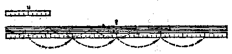

> 图1·1

用几何的观点来研究，尺和竹竿可以分别看做是线段 \(u\) 和 \(l\)。用尺量竹竿的过程，可以看做是用线段 \(u\) 去量线段 \(l\)，得出线段 \(l\) 含有线段 \(u\) 多少倍的过程。这里线段 \(u\) 叫做长度单位，线段 \(l\) 是被度量的线段，最后所得的数叫做量数。说得更确切一些，它是以线段 \(u\) 作长度单位去量线段 \(l\) 所得的量数。线段的量数和线段的长度是有区别的：量数只是一个正数，量数后面注明了长度单位才是长度。在前面的实例中，“5”是以尺作长度单位去量竹竿所得的量数，“5尺”才是竹竿的长度。度量线段的目的就是要得到一个量数。要得到线段的量数首先要选定作为长度单位的线段。用两种不同的长度单位先后去度量同一条线段，所得的两个量数显然是不等的。例如用市尺作单位去量线段l，如果所得的量数是6，用m（米）作单位去量同一线段，所得的量数就是2了。

但是， 用线段 \(u\) 量线段 \(l\) 和用尺量竹竿毕竟有些不同。 给定了两条线段 \(u\) 和 \(l\) 的图形之后， 我们很难想象， 在图形上“拿起”线段 \(u\)， 紧贴着线段 \(l\)， 对齐了两端， 一次接一次地进行比较。 这里就得利用分割规了。 首先把分割规两脚的两个尖端分别放在线段 \(u\) 的两个端点上 （图1·2（1））， 然后保持分割规两脚张口的大小， 把一个脚的尖端放在线段 \(l\) 的一个端点 \(A\) 上， 依着图1·2（2）虚线所指的方向， 在线段 \(l\) 上， 连续截取等于 \(u\) 的线段 \(AA_{1}, A_{1}A_{2}, A_{2}A_{3}, \cdots\)， 这样就在图形上进行了用线段 \(u\) 度量线段 \(l\) 的过程。

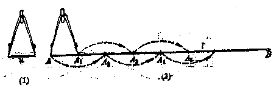

> 图1·2

用尺量竹竿是一件十分简单的事，但未能因此把线段的度量问题也理解为简单的问题。用长度单位 \(u\) 去截线段 \(l\) 是否一定截得尽？截不尽怎么办？度量线段所得的量数究竟是怎样的数？这些问题都是比较复杂的。下面我们将比较详细地来研究它们。

图1·3中，线段 \(u\) 是长度单位，线段 \(AB\) 是要度量的线段。现在利用分割规在线段 \(AB\) 上，从端点 \(A\) 起，连续截取等于 \(u\) 的线段 \(AA_{1}, A_{1}A_{2}, A_{2}A_{3}, \cdots\)。这样截取的结果总不出下面两种情况中的一种：

（1） 截了 \(m\) 次以后 （这里 \(m\) 是一个自然数）， 恰巧截尽 （图 1·3（1））；

（2） 截了 \(m\) 次以后，得到了小于 \(u\) 的剩余线段 \(r_1\)（图1·3（2））。

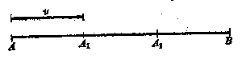

> （1）

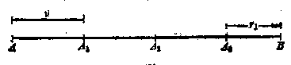

> （2）

> 图1·3

对于第一种情况，线段 \(AB\) 恰巧是线段 \(u\) 的整数倍。所得的量数是一个正整数 \(m\)。在图1·3（1）里，\(m = 3\)。度量线段 \(AB\) 的过程到此结束。

对于第二种情况， 线段 \(AB\) 的量数还没有确定， 只知道它的量数应当大于正整数 \(m\)， 但是小于正整数 \(m+1\)。 在图1·3（2）里， 线段 \(AB\) 的量数大于3而小于4， 度量的过程还没有结束。 我们把它叫做第一回截取。 在第一回截取里所得的剩余线段是 \(r_1\)。 为了进一步确定线段 \(AB\) 的量数， 我们可以采用比 \(u\) 小的线段作长度单位， 继续度量线段 \(r_1\)。

现在用线段 \(u\) 的 \(\frac{1}{10}\) 作单位来度量剩余线段 \(r_1\)，从线段 \(r_1\) 的左端起，用分割规连续截取等于 \(\frac{1}{10} u\) 的线段，截取的结果总不出下面的两种情况之一：

（1） 截了 \(m_{1}\) 次以后，线段 \(r_1\) 恰巧被截尽（图1·4（1））。

（2） 截了 \(m_{1}\) 次以后， 得到了小于 \(\frac{1}{10} u\) 的剩余线段 \(r_{2}\) （图1·4（2））。

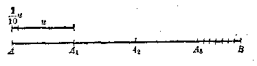

> （1）

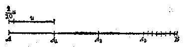

> （2）

> 图1·4

对于第一种情况， 线段 \(r_1\) 恰巧是线段 \(\frac{1}{10} u\) 的整数 \(m_1\) 倍， 这里 \(m_1\) 可以等于从 1 到 9 的任何一个正整数。 这时线段 \(AB\) 的量数已经确定为有限小数 \(m + \frac{m_1}{10}\)。 在图 1·4（1） 里 \(m + \frac{m_1}{10} = 3.7\)。 度量线段 \(AB\) 的过程到此结束。

对于第二种情况： 线段 \(AB\) 的量数仍旧没有确定， 只知道它的量数大于 \(m + \frac{m_1}{10}\) 而小于 \(m + \frac{m_1 + 1}{10}\)， 这里 \(m_1\) 可以等于 0 （如果 \(r_1 < \frac{1}{10} u\)）， 也可以等于从 1 到 9 的任何一个正整数 （如果 \(r_1 > \frac{1}{10} u\)）。 在图 1·4（2）里， 线段 \(AB\) 的量数大于 3.7 而小于 3.8。 度量线段 \(AB\) 的过程还没有结束， 我们把这一回的截取叫做第二回截取。 在第二回截取里所得的剩余线段是 \(r_2\)。 为了更进一步确定线段 \(AB\) 的量数， 我们可以采用比 \(\frac{1}{10} u\) 小的线段作长度单位， 继续度量线段 \(r_2\)。

线段的度量就是这样进行的。从上面的讨论，可以得到度量线段的初步结论：用长度单位 \(u\) 去度量线段 \(l\)。如果线段 \(l\) 恰巧被 \(u\) 所截尽，那末线段 \(l\) 的量数是一个正整数；

如果截不尽，那末再用 \(\frac{1}{10} u, \frac{1}{100} u, \frac{1}{1000} u, \cdots\) 做长度单位分别去截第一回剩余线段 \(r_1\)，第二回剩余线段 \(r_2\)，第三回剩余线段 \(r_3, \cdots\)。如果某一回的剩余线段恰巧被截尽，那末线段 \(l\) 的量数是一个正有限小数。

用线段 \(u, \frac{1}{10} u, \frac{1}{100} u, \cdots\) 分别去截线段 \(l\)， 第一回剩余线段 \(r_1\)， 第二回剩余线段 \(r_2, \cdots\)， 会不会每截一次总有剩余，线段的度量过程将无限止地进行下去呢？线段的度量过程确实有这种无限地进行下

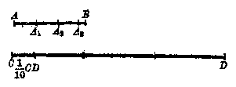

> 图1·5

去的情况。例如用线段 \(AB\) 作长度单位去量线段 \(CD\)，所得的量数是 \(3\)，研究用线段 \(CD\) 作长度单位去度量线段 \(AB\) 的度量过程（图1·5）。

依照题意， 线段 CD 含有线段 AB 的 3 倍。 显然 CD > AB。 用 CD 作长度单位去度量 AB 时， 第一回就得用 \(\frac{1}{10}\) CD 去截 AB。

因为 \(AB - 3 \cdot \frac{1}{10} CD = AB - 3 \cdot \frac{1}{10} \cdot 3AB = \frac{1}{10} AB\)。 所以用 \(\frac{1}{10} CD\) 去截 \(AB\)， 截了 3 次而得到第一回剩余线段 \(\frac{1}{10} AB\)。

因为 \(\frac{1}{10} AB - 3 \cdot \frac{1}{100} CD = \frac{1}{10} AB - 3 \cdot \frac{1}{100} \cdot 3AB = \frac{1}{100} AB\)，所以用 \(\frac{1}{100} CD\) 去截第一回剩余线段 \(\frac{1}{10} AB\)，截了3次而得第二回剩余线段 \(\frac{1}{100} AB\)。

因为 \(\frac{1}{100} AB - 3 \cdot \frac{1}{1000} CD = \frac{1}{100} AB - 3 \cdot \frac{1}{1000} \cdot 3AB = \frac{1}{1000} AB\)，所以用 \(\frac{1}{1000} CD\) 去截第二回剩余线段 \(\frac{1}{100}\) ·AB，截了3次而得第三回剩余线段 \(\frac{1}{1000}\) AB。

度量的过程将无限地继续下去，所得的量数是一个循环小数0.333…。

度量线段的量数还可能是一个无限不循环小数。例如用正方形的一边作长度单位去度量它的对角线，度量的过程将无限地继续下去，所得的量数是一个无限不循环小数1.414214……。这里我们只能把这些度量的结果作为已经确立的几何事实接受下来。

一般地说， 在选定了长度单位线段之后， 每一条线段总有一个量数， 这量数可能是正整数、正有限小数、正循环小数或正无限不循环小数。在代数学里， 把整数、分数 （有限小数、循环小数） 叫做有理数， 把无限不循环小数叫做无理数； 有理数和无理数总称实数。因此我们有下面的结论： 以确定的长度单位线段去度量任意线段， 总有一个确定的正实数作为它的量数。

##### 2. 两条线段的比

给定了两个正实数 \(a\) 和 \(b\)， 要想知道 \(a\) 是 \(b\) 的多少倍 \((a > b)\)， 或者 \(a\) 是 \(b\) 的几分之几 \((a < b)\)， 我们可以用 \(b\) 去除 \(a\)， 所得的商叫做 \(a\) 和 \(b\) 两数的比； 这里被除数 \(a\) 叫做比的前项， 除数 \(b\) 叫做比的后项。 两个数 \(a\) 和 \(b\) 的比通常表示为 \(\frac{a}{b}\) 的形式， 或者 \(a:b\) 的形式。

两个数的比的概念可以推广到两条线段的比。

用同一长度单位去量两条线段，所得的两个量数的比叫做这两条线段的比。

在图1·7里，线段 \(EBF\) 是长度单位，用 \(EBF\) 分别去量线段 \(AA'\) 和 \(BB'\)，必然得到两个量数 \(a\) 和 \(b\)、量数 \(a\) 和 \(b\)

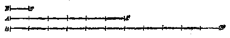

> 图1·6

的比就是线段 \(AA'\) 和 \(BB'\) 的比，并且表达为 \(\frac{AA'}{BB'} = \frac{a}{b}\) 或者 \(AA':BB' = a:b\)。在图1·6里，显然有 \(\frac{AA'}{BB'} = \frac{6}{11}\)。

确定线段的量数必须首先确定长度单位。长度单位改变了，一条线段的量数也跟着改变。例如用尺做长度单位量竹竿，如果量数是 \(b\)，长度单位改用了寸，这根竹竿的量数就变为50了。

线段的量数既由所选的长度单位确定；两线段的比又由两线段的量数确定，那末，改变了长度单位，两线段的比是否也要改变呢？

假设用寸作长度单位，两条线段的量数分别为50和30。改用尺作长度单位后，它们的量数分别改变为5和3了。改用分作长度单位后，它们的量数又分别改变为500和300。我们先后采用尺，寸，分作长度单位，两线段的比先后为： \(\frac{5}{3}\)， \(\frac{50}{30}\) 和 \(\frac{500}{300}\)，它们是相等的。由此可见，每改变一次长度单位，两条线段的量数各扩大或缩小同样的倍数，对于两线段的比来讲，正好把它的前项和后项扩大或缩小同样的倍数，比的值是不会改变的。因此，两线段的比和所采用的长度单位没有关系。

###### 例 1

线段 AB 和 CD 的长度分别为 2.1 尺和 1.4 米。求两线段 AB 和 CD 的比。如果用 CD 作长度单位，求出线段 AB 的量数。

**［解］** 要求 \(AB\) 与 \(CD\) 的比， 首先要使它们的长度单位相同。 \(CD\) 的长度 1.4 米 = 4.2 尺， 所以 \(\frac{AB}{CD} = \frac{2.1}{4.2} = 0.5\)。

用 \(CD\) 作长度单位去度量线段 \(AB\)， 所得的量数 \(a\)， 就是线段 \(AB\) 含有线段 \(CD\) 的倍数， 所以 \(a = \frac{2.1}{4.2} = 0.5\)。 从这个例题可以知道， 两线段 \(AB, CD\) 的比， 也可以理解为以线段 \(CD\) 作长度单位去度量线段 \(AB\) 所得的量数。

##### 习题1·1

1. 一条线段的量数一定是有理数吗？并举出例子。

2. “线段的量数”和“线段的长度”是一样的吗？为什么？

3. 线段 a 和长度单位 l 分别含有第三线段 c 的 54 倍和 15 倍，求出线段 a 的量数。

4. 用圆规和直尺任意作一个正方形和正三角形；再利用分割规截取相等线段的方法，验证：

（1） 以正方形的一边为长度单位， 量它的对角线所得的量数， 精确到 0.1 的时候是 1.4。

（2） 以正三角形一边为长度单位， 量它的高所得的量数， 精确到 0.1 的时候是 0.8。

5. 线段 \(a\) 和 \(b\) 的长度分别是 5 厘米和 4 厘米，求出它们的比。如果改用 1 寸长的线段为长度单位时，它们的量数分别是多少？它们的比有没有变化？

6. 什么是两线段之比？它一定是有理数吗？上题中，如果采用线段 \(b\) 做长度单位，两线段之比如何？

7. 把一条长 56 厘米的线段分成 1：2：3 的三段，然后求出每一个分点把全线段分成两部分的比。

8. 点 C 把线段 AB 分成 \(AC:CB=2:3\)，已知 AB 为 48 厘米，求 AC 和 CB 的长。

9. 如果 \(AB = 12\mathrm{cm}\)，那末延长几厘米后可以使得 \(AC:BC = 5:2\)？这里 \(C\) 是延长线的终点。

10. 线段 \(AB\) 被点 \(C\) 分成 \(AC:CB=3:2\)， 求 \(AC\) 和 \(AB\) 的比， 以及 \(AB\) 和 \(CB\) 的比。

#### §1·2 成比例的线段

在算术里， 我们已经学习过关于比例的概念， 比例是表示两个比相等。如果两个数 \(a\) 和 \(b\) 的比等于另外两个数 \(c\) 和 \(d\) 的比，那末我们说四个数 \(a, b, c, d\) 组成一个比例 \(\frac{a}{b} = \frac{c}{d}\)，或 \(a:b = c:d\)。

在等式 \(\frac{a}{b} = \frac{c}{d}\) 里， \(a\)， \(d\) 叫比例的外项， \(b\)， \(c\) 叫比例的内项， \(d\) 叫做 \(a,b,c\) 的第四比例项。

如果 \(a\) 和 \(b\) 的比等于 \(b\) 和 \(c\) 的比，即 \(\frac{a}{b} = \frac{b}{c}\)，那末 \(b\) 叫做 \(a\) 和 \(c\) 的比例中项。

四个数组成比例的概念，可以推广为四条线段组成比例的概念。

如果线段 \(a\) 和 \(b\) 的比等于线段 \(c\) 和 \(d\) 的比，线段 \(a, b, c, d\) 叫做成比例的线段。

在图1·7中，线段 \(a\) 和 \(b\) 的比等于 \(\frac{4}{7}\)，线段 \(c\) 和 \(d\) 的比也等于 \(\frac{4}{7}\)。所以线段 \(a, b, c, d\) 是成比例的线段。

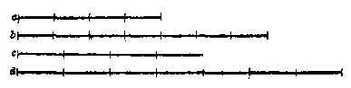

> 图1·7

##### 例 1

在图 1·8 中，DE，D'E' 分别是 \(\triangle ABC\) 和 \(\triangle A'B'C'\) 的中位线。试证线段 BC，DE，B'C'，D'E' 是成比例的线段。

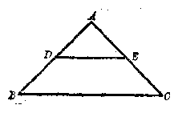

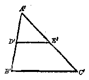

> 图1·8

**［已知］** DE， \(D'E'\) 分别为 \(\triangle ABC\) 和 \(\triangle A'B'C'\) 的中位线。

**［求证］** \(\frac{BC}{DE} = \frac{B'C'}{D'E'}\)。

**［证］** 因为 \(DE\) 是 \(\triangle ABC\) 的中位线， \(BC\) 是底边， 所以 \(BC = 2DE\)， 或 \(\frac{BC}{DE} = 2\)。

同理可证： \(\frac{B^{\prime}C^{\prime}}{D^{\prime}E^{\prime}}=2\)。从而 \(\frac{BC}{DE}=\frac{B^{\prime}C^{\prime}}{D^{\prime}E^{\prime}}\)。

依据两线段的比的定义：两线段的比是用同一长度单位去量两条线段所得的量数的比，四条线段组成的比例实际上是它们的四个量数所组成的比例。因此关于数的比例的各个性质完全适用于线段的比例。

下面是关于比例的一些主要性质的定理。在定理里的所有字母都代表不等于零的实数。有些定理比较简单，读者可参阅括号里的提示，自己证明。

###### 定理 1

如果 \(\frac{a}{b} = \frac{c}{d}\)，那末 \(ad = bc\)（将等式 \(\frac{a}{b} = \frac{c}{d}\) 的两端各乘以 \(bd\)）。

###### 定理 2

如果 \(ad = bc\)，那末可以以a和d为比例外项（或者比例内项），以 \(b\) 和 \(c\) 为比例内项（或者比例外项）组成比例（以db除等式 \(ad=bc\) 的两端）。

###### 定理 3

（反比定理） 如果 \(\frac{a}{b} = \frac{c}{d}\)， 那末 \(\frac{b}{a} = \frac{d}{c}\) （把等式 \(\frac{a}{b} = \frac{c}{d}\) 两端各乘以 \(bd\)， 再各除以 \(ac\)）。

###### 定理 4

（更比定理） 如果 \(\frac{a}{b} = \frac{c}{d}\)， 那末 \(\frac{a}{c} = \frac{b}{d}, \frac{d}{b} = \frac{c}{a}\) （把等式 \(\frac{a}{b} = \frac{c}{d}\)） 的两端各乘以 \(\frac{b}{c}\) 或 \(\frac{d}{a}\)。

###### 定理 5

（合比定理） 如果 \(\frac{a}{b} = \frac{c}{d}\)， 那末 \(\frac{a + b}{b} = \frac{c + d}{d}\)。

**［已知］** \(\frac{a}{b} = \frac{c}{d}\)。

**［求证］** \(\frac{a + b}{b} = \frac{c + d}{d}\)。

**［证］** \(\because \frac{a}{b} = \frac{c}{d}, \therefore \frac{a}{b} + 1 = \frac{c}{d} + 1.\) 通分相加，得

$$
\frac {a + b}{b} = \frac {c + d}{d}.
$$

###### 定理 6

（分比定理） 如果 \(\frac{a}{b} = \frac{c}{d}\)， 那末 \(\frac{a - b}{b} = \frac{c - d}{d}\) （把等式 \(\frac{a}{b} = \frac{c}{d}\) 的两端各减 1， 再通分）。

###### 定理 7

（等比定理） 如果 \(\frac{a}{b} = \frac{c}{d} = \frac{e}{f} = \cdots\)，那末

$$
\frac {a + c + e + \cdots}{b + d + f + \cdots} = \frac {a}{b}.
$$

**［已知］** \(\frac{a}{b} = \frac{c}{d} = \frac{e}{f} = \dots\)。

**［求证］** \(\frac{a + c + e + \cdots}{b + d + f + \cdots} = \frac{a}{b}\)。

**［证］** 设 \(\frac{a}{b} = \frac{c}{d} = \frac{e}{f} = \dots = k\)，那末

$$
a = b k， c = d k， e = f k， \dots.
$$

因此

$$
\begin{array}{l} \frac {a + c + e + \cdots}{b + d + f + \cdots} = \frac {b k + d k + f k + \cdots}{b + d + f + \cdots} \\ = \frac {k (b + d + f + \cdots)}{b + d + f + \cdots} = k = \frac {a}{b}. \\ \end{array}
$$

###### 例 2

线段 a， b， c， d 的长度分别为 （1） 2 cm， \(1 \cdot \frac{1}{2}\) cm， \(5 \cdot \frac{1}{4}\) cm， 7 cm； （2） 5 cm， \(\frac{2}{3}\) cm， \(\frac{3}{2}\) cm， \(\frac{1}{5}\) cm。 如果它们可以组成比例， 写出这些比例的一个。

**［解］** （1） 先把四条线段的长度按大小次序排列起来：

$$
b = 1 \frac {1}{2} \mathrm{cm}， a = 2 \mathrm{cm}， c = 5 \frac {1}{4} \mathrm{cm}， d = 7 \mathrm{cm}.
$$

再求第一第二和第三第四两对线段的比：

$$
b： a = 1 \frac {1}{2}： 2 = 3： 4.
$$

$$
c： d = 5 \frac {1}{4}： 7 = 3： 4.
$$

可见它们是成比例的线段， \(1\frac{1}{2}:2=5\frac{1}{4}:7\) 是所成的一个比例。

（2） 先把四条线段的长度按大小次序排列起来：

$$
d = \frac {1}{5} \mathrm{cm}， b = \frac {2}{3} \mathrm{cm}， c = \frac {3}{2} \mathrm{cm}， a = 5 \mathrm{cm}.
$$

再求第一第四和第二第三两对线段的长度的积：

$$
d a = \frac {1}{5} \cdot 5 = 1.
$$

$$
b c = \frac {2}{3} \cdot \frac {3}{2} = 1.
$$

$$
\therefore d a = b c.
$$

依据定理2可知，它们是成比例的线段， \(\frac{1}{5}:\frac{2}{3} = \frac{3}{2}:5\) 是所成的一个比例。

###### 例 3

从等式 4y-3x=0，求 x：y； （x+y）：y； （x-y）：y； （x+y）：（x-y）。

**［解］** 从等式 \(4y - 3x = 0\) 得 \(3x = 4y\)。

依据比例性质定理2，把 \(x\)，3写作一个比例的外项；\(y\)，4写作这个比例的内项，即

$$
x： y = 4： 3. \tag {1}
$$

对（1）式应用合比定理：

$$
(x + y)： y = 7： 3. \tag {2}
$$

对（1）式应用分比定理：

$$
(x - y)： y = 1： 3. \tag {3}
$$

把（3）式除（2）式：

$$
(x + y)： (x - y) = 7： 1.
$$

###### 例 4

在图1·9中，已知 \(\frac{AB}{AC} = \frac{BD}{DC}\)， \(AB = 3.0\mathrm{cm}\)， \(BC =\) 5.6cm， AC=5.0cm。 求 BD 和 DC 的长。

**［解］** 对已知比例

$$
\frac {A B}{A C} = \frac {B D}{D C}
$$

应用合比定理， 得

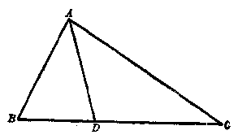

> 图1·9

$$
\frac {A B + A C}{A C} = \frac {B D + D C}{D C}.
$$

即 \(\frac{8}{5} = \frac{BC}{DC}\) 从此得 \(DC = BC \times \frac{5}{8} = 5.6 \times \frac{5}{8} = 3.5(\mathrm{cm})\)。

$$
B D = B C - D C = 5.6 - 3.5 = 2.1 (\mathrm{cm})。
$$

###### 例 5

已知 \(\frac{x}{2} = \frac{y}{7} = \frac{z}{5}\)，求 \(\frac{x + y + z}{z}\)； \(\frac{x + z}{y}\)； \(\frac{x + y - z}{x}\)。

**［解］** 应用等比定理得 \(\frac{x + y + z}{2 + 7 + 5} = \frac{z}{5}\)，也就是 \(\frac{x + y + z}{14} = \frac{z}{5}\)，从而 \(\frac{x + y + z}{z} = \frac{14}{5}\)。

应用等比定理得 \(\frac{x + z}{2 + 5} = \frac{y}{7}\)，也就是 \(\frac{x + z}{7} = \frac{y}{7}\)，从而 \(\frac{x + z}{y} = 1\)。

$$
\because \frac {z}{5} = \frac {- z}{- 5}， \quad \therefore \quad \frac {x}{2} = \frac {y}{7} = \frac {- z}{- 5}.
$$

应用等比定理得

$$
\frac {x + y - z}{2 + 7 - 5} = \frac {x}{2}， \quad \text {即} \quad \frac {x + y - z}{4} = \frac {x}{2}，
$$

从而 \(\frac{x + y - z}{x} = 2.\)

##### 习题1·2

1. 已知两条线段 \(a\) 和 \(b\)。 求证线段 \(ma, mb, \frac{a}{n}\) 和 \(\frac{b}{n}\) 四线段成比例， 这里的 \(m\) 和 \(n\) 都是正的有理数。

2. 已知 \(\frac{a}{b} = \frac{c}{d}, m, n\) 为任意实数，求证 \(\frac{a}{b} = \frac{ma - nc}{mb - nd}\)。

3. 已知下列各数， 试分别求出它们的第四比例项：

（1） 1， 2 和 3；

（2） 2， 1 和 3；

（3） m， n 和 1；

（4） a， b 和 c。

4. 如果对于已知的线段 \(a, b, c, d\) 和 \(l\) 成立比例式： \(\frac{a}{b} = \frac{c}{d}, \frac{a}{b} = \frac{c}{l}\)， 证明线段 \(d\) 与 \(l\) 是相等的。

5. 从下列各式中， 分别求出 \(x\) 和 \(y\) 的比：

（1） 9x=2y；

（2） 6x=y；

（3） mx = ny；

（4） 4x - 6y = 0；

（5） ax - ay = bx - by。

6. 如果三线段 \(a, b\) 和 \(c\) 成立比例式 \(a:b = b:c\)， 证明 \(b = \sqrt{ac}\)。

7. 按照下列各条件， 分别写出两个数的比例中项 \(x\)：

（1） 9 和 4；

（2） 1 和 16；

（3） 2a 和 32a；

（4） \(\frac{4}{3}\) 和 \(\frac{25}{3}\)；

（5） \(3b^{2}\) 和 \(9a^{2}\)。

8. 求下列各比例式中的 \(x\)；

（1） 2：3=（5-x）：x；

（2） \(a:b = (2 - x):x;\)

（3） \((5 + x):x = 7:5;\)

（4） \((3 + x): x = a:b.\)

9. 已知四条线段 \(a = \frac{11}{7} \mathrm{~cm}\)， \(b = \frac{13}{5} \mathrm{~cm}\)， \(c = \frac{33}{7} \mathrm{~cm}\)， \(d = \frac{39}{5} \mathrm{~cm}\)， 这四条线段是否成比例？ 为什么？

10. 已知 \(\frac{a}{b} = \frac{b}{c} = \frac{c}{d}\)。 求证

（1） \(\frac{a}{c} = \frac{a^2}{b^2}\)；

（2） \(\frac{a}{d} = \frac{a^3}{b^3}\)。

11. 已知 \(\frac{a}{4} = \frac{b}{5} = \frac{c}{7}\)， 求

（1） \(\frac{a + b}{b + c}\)；

（2） \(\frac{a + b + c}{b}\)。

12. 如果已知各线段成比例： \(\frac{a}{b} = \frac{c}{d}, \frac{c'}{b'} = \frac{c'}{d'}\)。 证明 \(\frac{aa'}{bb'} = \frac{cc'}{dd'}\)。

13. 在下列各式中，分别求出线段 \(x\) 和 \(y\) 的比：

（1） \((x + y): y = 5:4\)；

（2） \((x + y): (x - y) = 6:2;\)

（3） \((2y + 3x):(5y - 2x) = 8:3;\)

（4） \(\frac{x - a - c}{y - b - d} = \frac{a}{b} = \frac{c}{d}\)。

14. 已知线段 DE 分别交 \(\triangle ABC\) 的边 AB 和 AC 于 D 和 E，并且 \(\frac{AD}{DB} = \frac{AE}{EC}\)。 证明：

（1） \(\frac{AB}{DB} = \frac{AC}{EC}\)；

（2） \(\frac{AB}{AD} = \frac{AC}{AE}\)。

15. 已知 \(M\) 是线段 \(AB\) 上的一个分点， 如果：

（1） \(AM:MB = 1:2;\)

（2） \(AM:MB = m:n.\) 分别求出 AM：AB 和 MB：AB 的值。

16. 如果四线段间成比例： \(\frac{a}{b}=\frac{c}{d}\)，证明 \(\frac{a+b}{a-b}=\frac{c+d}{c-d}\)，或 \(\frac{a-b}{a+b}=\frac{c-d}{c+d}\)。

17. 已知 \(C\) 是线段 \(AB\) 上的一点，\(D\) 是 \(AB\) 延长线上的一点，并且 \(AD:DB = AC:CB\)，如果 \(AB = 6\mathrm{cm}\)，\(AC = 3.6\mathrm{cm}\)，求 \(AD\) 和 \(DB\) 的长。

18. 在四边形 \(ABCD\) 与 \(A'B'C'D'\) 中，已知 \(\frac{AB}{A'B'} = \frac{BC}{B'C'} = \frac{CD}{C'D'} = \frac{DA}{D'A'} = \frac{3}{5}, AB + BC + CD + DA = 12.6\mathrm{cm}\)，求四边形 \(A'B'C'D'\) 的周长。

*19. 已知线段 \(AB\) 上有一点 \(P\)， 使 \(AP:PB = m:n\)。 证明点 \(P\) 是唯一的。

［提示：假设 \(AB\) 上还有一点 \(P'\)，也有 \(AP': P'B = m:n\)，看结果会怎样？］

*20. 已知线段 \(AB\) 的延长线上有一点 \(Q\)， 使 \(AQ: BQ = m:n (m > n)\)。证明点 \(Q\) 也是唯一的。

#### §1·3 平行线截得比例线段定理

现在我们来研究， 平行于三角形一边的直线， 在其他两边上所截得线段之间的关系。

##### 1. 平行线截得比例线段定理1

平行于三角形一边的直线，在其他两边上截得的对应线段成比例。

**［已知］** 在 \(\triangle ABC\) 中， \(DE \parallel BC\)， \(DE\) 分别在 \(AB\) 和 \(AC\) 上截得线段 AD， DB 和 AE， \(EC(\text{图 }1-10)\)。

**［求证］** \(\frac{AD}{DB} = \frac{AE}{EC}\)。

**［证］** 在§1·1里指出过： 线段 \(AD\) 和 \(DB\) 的比也可以看做以线段 \(DB\) 作长度单位去量 \(AD\) 所得的量

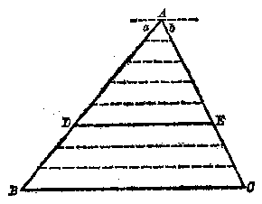

> 图1·10

数；一条线段的量数可能是有理数，也可能是无理数。现在设 \(\frac{AD}{DB}\) 是一个有理数，即 \(\frac{AD}{DB} = \frac{m}{n}\)，这里 \(m, n\) 是两个互质的正整数。这表示线段 \(AD\) 含有线段 \(a\) 的 \(m\) 倍，线段 \(DB\) 含有线段 \(a\) 的 \(n\) 倍。在图1·10中，\(m = 5, n = 3\)。今把线段 \(AD\) 和 \(DB\) 分别分成 \(m\) 和 \(n\) 个等份，经过每一个分点和三角形顶点 \(A\) 各作 \(BC\) 的平行线。因为 \(DE \parallel BC\)，所以 \(DE\) 也和所作的平行线平行。这些平行线既在线段 \(AB\) 上截了 \(m + n\) 条相等的线段 \(a\)，在线段 \(AC\) 上一定也截得 \(m + n\) 条相等的线段 \(b\)，即 \(AE = mb, EC = nb\)。从而

$$
\frac {A E}{E C} = \frac {m}{n}.
$$

$$
\therefore \frac {A D}{D B} = \frac {A E}{E C}.
$$

当 \(AD\) 和 \(DB\) 的比是一个无理数时，证明 \(\frac{AD}{DB} = \frac{AE}{EC}\) 的过程要复杂得多，超出了现在学习的知识范围，因此这里略而不证了。

读者如果有兴趣，可以参考下面的例题。这个例题实际上阐明了当 \(\frac{AD}{DB}\) 是无理数时，证明 \(\frac{AD}{DB} = \frac{AE}{EC}\) 的方法。

例 设在 \(\triangle ABC\) 中，\(DE \parallel BC\)，并且 \(AD:DB = 1: \sqrt{2}\)，试说明 \(\frac{AD}{DB} = \frac{AE}{EC}\)（图1·11）。

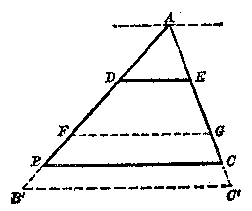

> （1）

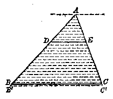

> （2）

> 图1·11

**［解］** 从已知 \(\frac{AD}{DB} = \frac{1}{\sqrt{2}}\)，显然有 \(\frac{DB}{AD} = \frac{\sqrt{2}}{1}\)，这里 \(\sqrt{2}\) 是一个无理数。下面是无理数 \(\sqrt{2}\) 的近似值：

精确度 1， \(\frac{1}{10}\)， \(\frac{1}{100}\)， \(\frac{1}{1000}\)， \(\frac{1}{10000}\)， \(\cdots\) \(\frac{DB}{AD}\) 的不足近似值 1， 1.4， 1.41， 1.414， 1.4142， \(\cdots\) \(\frac{DB}{AD}\) 的过剩近似值 2， 1.5， 1.42， 1.415， 1.4148， \(\cdots\) 现在我们准备说明对应于各级相同的精确度，\(\frac{EC}{AE}\) 和 \(\frac{DB}{AD}\) 有完全相等的不足近似值和相等的过剩近似值；从而断定（需要用到超出本书知识范围的实数理论）

$$
\frac {E C}{A E} = \sqrt {2}， \quad \text {即} \quad \frac {D B}{A D} = \frac {E C}{A E}.
$$

首先在 \(DB\) 上截取等于 \(AD\) 的线段。由于 \(1 < \frac{DB}{AD} < 2\)，因此在 \(DB\) 上截了一次（截点为 \(F\)）而有余，截两次又不足（第二次的截点 \(B'\) 在 \(DB\) 的延长线上）（图1·11（1））。经过分点 \(F, B'\) 引 \(DE\) 的平行线，这组平行线在线段 \(AC\) 上截得 \(AE = EG = GC'\)，\(C'\) 是在 \(AC\) 的延长线上。这里显然有 \(AE < EC < 2AE\)，即 \(1 < \frac{EC}{AE} < 2\)。所以当精确度为1时，\(\frac{DB}{AD}\) 和 \(\frac{EC}{AE}\) 有相等的不足近似值和相等的过剩近似值。

接着以 \(\frac{1}{10} AD\) 作长度单位，在 \(AD\) 和 \(DB\) 上截取等于 \(\frac{1}{10} AD\) 的线段。显然在 \(AD\) 上正好截10次。由于1.4 \(< \frac{DB}{AD} < 1.5\)，因此在 \(DB\) 上截了14次而有余，截15次又不足（第15次的截点 \(B'\) 在 \(AB\) 的延长线上）（图1·11（2））。过这些分点作 \(DE\) 的平行线，这一组平行线把 \(AE\) 分成10个等分，在 \(EC\) 上截了14个 \(\frac{1}{10} AE\) 而有余，截15个 \(\frac{1}{10} AE\) 又不足（第15次截点 \(C'\) 在 \(AC\) 的延长线上）。这里显然有 \(14 \cdot \frac{1}{10} AE < EC < 15 \cdot \frac{1}{10} AE\)，即 \(1.4 < \frac{EC}{AE} < 1.5\)。所以当精确度为 \(\frac{1}{10}\) 时 \(\frac{DB}{AD}\) 和 \(\frac{EC}{AE}\) 有相等的不足近似值和相等的过剩近似值。

接着依次用 \(\frac{1}{100} AD, \frac{1}{1000} AD, \frac{1}{10000} AD, \cdots\) 作长度单位，用完全相同的方法，可以说明当精确度分别为 \(\frac{1}{100}, \frac{1}{1000}, \frac{1}{10000}, \cdots\) 时，\(\frac{DB}{AD}\) 和 \(\frac{EC}{AE}\) 都有相等的不足近似值和相等的过剩近似值。

这样就说明了 \(\frac{DB}{AD} = \frac{EC}{AE}\)，由反比定理，得

$$
\frac {A D}{D B} = \frac {A E}{E C}.
$$

###### 推论

平行于三角形一边的直线截其他两边，一边和这边上的一条线段与另一边和另一边上的对应线段成比例。

**［已知］** 在 \(\triangle ABC\) 中， \(D E \parallel B C\)， \(DE\) 分别截 \(AB\) 和 \(AC\) 于 \(D\) 和 \(E\) （图1·12）。

**［求证］** \(\frac{AB}{DB} = \frac{AC}{EC}\) 或 \(\frac{AB}{AD} = \frac{AC}{AE}\)。

**［证］** \(\because DE \parallel BC\)，由上面定理得

$$
\frac {A D}{D B} = \frac {A E}{E C}.
$$

∴ \(\frac{AD + DB}{DB} = \frac{AE + EC}{EC}\) （合比定理）。

即 \(\frac{AB}{DB} = \frac{AC}{EC}\) 再从 \(\frac{AD}{DB} = \frac{AE}{EC}\)，由反比定理得 \(\frac{DB}{AD} = \frac{EC}{AE}\)。由合比定理，得 \(\frac{DB + AD}{AD} = \frac{EC + AE}{AE}\)，即 \(\frac{AB}{AD} = \frac{AC}{AE}\)。

**［注意］** 平行线截得比例线段定理1和它的推论是判定四条线段成比例的主要依据，在以后的证明和演算中经常要用到。

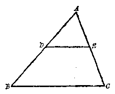

> 图1·12

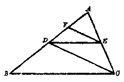

> 图1·13

###### 例 1

在 \(\triangle ABC\) 中， \(DE \parallel BC\)， \(EF \parallel CD\)。证明 AD 是 AF 和 AB 的比例中项（图 1·13）。

**［已知］** 在 \(\triangle ABC\) 中，\(DE \parallel BC, EF \parallel CD\)。

**［求证］** \(\frac{AF}{AD} = \frac{AD}{AB}\)。

**［证］** 在 \(\triangle ABC\) 中，\(\because DE \parallel BC\)，由前面的推论得

$$
\frac {A B}{A D} = \frac {A C}{A E}. \tag {1}
$$

在 \(\triangle ADC\) 中，\(\because EF \parallel CD\)，由前面的推论得

$$
\frac {A D}{A F} = \frac {A C}{A E}. \tag {2}
$$

由（1）式和（2）式得

$$
\frac {A B}{A D} = \frac {A D}{A F}.
$$

再由更比定理， 得

$$
\frac {A F}{A D} = \frac {A D}{A B}.
$$

###### 例 2

在 \(\triangle ABC\) 中， \(DE \parallel BC\)， \(DF \parallel AC\)。AE = 3cm，AC =5cm， BC=10cm。 求 BF 和 CF 的长（图 1·14）。

**［解］** \(\because DE \parallel BC,\)

$$
\therefore \quad \frac {A D}{A B} = \frac {A E}{A C} = \frac {3}{5}. \tag {1}
$$

$$
\because D F \parallel A C，
$$

$$
\therefore \quad \frac {A D}{A B} = \frac {F C}{B C}. \tag {2}
$$

由（1）式和（2）式得

$$
\frac {3}{5} = \frac {F C}{10}.
$$

从而 \(FC = 10 \times \frac{3}{5} = 6(\mathrm{cm})\)。

$$
B F = 10 - 6 = 4 (\mathrm{cm})。
$$

答： \(BF\) 和 \(CF\) 的长分别为 4 厘米和 6 厘米。

##### 2. 逆定理

如果一条直线截三角形的两边所得的对应线段成比例， 那末这条直线平行于第三边。

**［已知］** 在 \(\triangle ABC\) 中， 直线 \(DE\) 分别截 \(AB\) 和 \(AC\) 于 \(D\) 和 \(E\)， 且 \(\frac{AD}{DB} = \frac{AE}{EC}\) （图1·15）。

**［求证］** \(DE \parallel BC\)。

**［证］** 过 D 作 BC 的平行线 \(DE'\)， \(DE'\) 截 AC 于 \(E'\)。

由平行线截得比例线段定理1的推论， 得

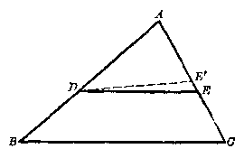

> 图1·15

$$
\frac {A B}{D B} = \frac {A C}{E ^ {\prime} C}. \tag {1}
$$

但是根据已知 \(\frac{AD}{DB} = \frac{AE}{EC}\)，即有

$$
\frac {A B}{D B} = \frac {A C}{E C}. \tag {2}
$$

由（1）式和（2）式得

$$
\frac {A C}{E ^ {\prime} C} = \frac {A C}{E C}.
$$

$$
\therefore E ^ {\prime} C = E C.
$$

现在线段 \(EC\) 和 \(E'C\) 有一个共同的端点 \(C\)， 并且 \(E'C\) 顺着 \(EC\) 落下， 依据相等线段的定义， \(E\) 和 \(E'\) 一定重合。 再根据“经过两点只有一条直线”的理由， 可知 \(DE\) 和 \(DE'\) 也重合。

$$
\because D E ^ {\prime} \parallel B C，
$$

$$
\therefore D E \parallel B C.
$$

证明这一逆定理时，我们是先作 \(DE' \parallel BC\)，然后推出 \(DE'\) 和 \(DE\) 就是同一条直线，从而断定 \(DE \parallel BC\)。这样的证题法叫同一法。

用同一法证题时，应当注意同一法的特点。象在前面的证明里， \(DE \parallel BC\) 是定理的求证部分，在证明之前DE是否平行于BC，还不一定，因此我们才有可能作 \(DE' \parallel BC\)。如 \(DE \parallel BC\)，则 \(DE'\) 与DE重合；如DE不平行于BC，则 \(DE'\) 与DE不重合。这在道理上也讲得通。实际上 \(DE'\) 就是DE。我们把 \(DE'\) 和DE画成两条不同直线，这不过是表达推证的技巧，只要把 \(DE'\) 作得和DE靠近一些就可以了。 \(DE'\) 的位置可以在DE的上面，也可以在DE的下面，这对论证并没有影响。

###### 推论

如果一条直线截三角形的两边，一边和这边上的一条线段与另一边和另一边上的对应线段成比例，那末这条直线平行于第三边。

**［已知］** 在 \(\triangle ABC\) 中， 直线 \(DE\) 分别截 \(AB\) 和 \(AC\) 于 \(D\) 和 \(E\)， 且 \(\frac{AB}{DB} = \frac{AC}{EC}\) 或 \(\frac{AB}{AD} =\) \(\frac{AC}{AE}\) （图1·16）。

**［求证］** \(DE \parallel BC\)。

**［证］** \(\because \frac{AB}{DB} = \frac{AC}{EC},\) 应用分比定理得

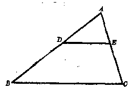

> 图1·16

$$
\frac {A B - D B}{D B} = \frac {A C - E C}{E C}，
$$

即 \(\frac{AD}{DB} = \frac{AE}{EC}\) 依据逆定理， 得 \(DE \parallel BC\)。

请读者根据已知 \(\frac{AB}{AD} = \frac{AC}{AE}\)，证明 \(DE \parallel BC\)。

**［注意］** 这一条逆定理和它的推论对判定两直线平行提供了新的依据。

###### 例 3

延长 \(\triangle ABC\) 的一边 AB，至 \(B'\)，使 \(AB' = 3AB\)，再延长 AC 至 \(C'\)，使 \(AC' = 3AC\)。连结 \(B'C'\)。证明 \(BC \parallel B'C'\) （图1·17）。

**［已知］** 在 \(\triangle AB'C'\) 中，

$$
A B ^ {\prime} = 3 A B，
$$

$$
A C ^ {\prime} = 3 A C.
$$

**［求证］** \(BC \parallel B'C'\)。

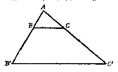

> 图1·17

**［证］** \(\because AB' = 3AB, \therefore \frac{AB'}{AB} = 3.\) （1）

$$
\because A C ^ {\prime} = 3 A C， \quad \therefore \frac {A C ^ {\prime}}{A C} = 3. \tag {2}
$$

由（1）式和（2）式得

$$
\frac {A B ^ {\prime}}{A B} = \frac {A C ^ {\prime}}{A C}.
$$

依据上面逆定理的推论得 \(BC \parallel B'C'\)。

###### 例 4

A， C， E 和 B， F， D 分别是 \(\angle O\) 两边上的点，并且 \(AB \parallel DE, BC \parallel EF.\) 证明 \(AF \parallel CD\) （图1·18）。

**［已知］** A， C， E 和 B， F， D 分别是 \(\angle O\) 两边上的点。

\(AB \parallel ED, BC \parallel FE,\)

**［求证］** \(AF \parallel CD\)。

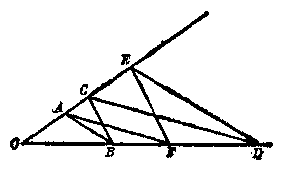

> 图1·18

分析 要证明 \(AF \parallel CD\)，只要证明 \(AF\) 在 \(\triangle ODC\) 的两边上截得的线段成比例，例如 \(\frac{OC}{OA} = \frac{OD}{OF}\) 即可。从已知 \(AB \parallel ED\) 和 \(BC \parallel FE\)，我们可得 \(\frac{OA}{OE} = \frac{OB}{OD}\) 和 \(\frac{OC}{OE} = \frac{OB}{OF}\)。把前式除后式即可推得 \(\frac{OC}{OA} = \frac{OD}{OF}\)。

**［证］** \(\because AB \parallel ED,\quad \therefore \frac{OA}{OE} = \frac{OB}{OD}.\) （1）

$$
\because B C \parallel E F， \quad \therefore \frac {O C}{O E} = \frac {O B}{O F}. \tag {2}
$$

以（1）式两端分别除（2）式两端， 得

$$
\frac {O C}{O A} = \frac {O D}{O F}. \tag {3}
$$

依据逆定理的推论， 由（3）式得

$$
A F \parallel C D.
$$

##### 3. 平行线截得比例线段定理2

三条平行线在两条直线上截得的线段对应成比例。

**［已知］** 直线 \(l_{1} \parallel l_{2} \parallel l_{3}; l_{1}, l_{2}, l_{2}\) 截直线 \(\alpha\) 于 \(A_{1}, A_{2}, A_{3}\)， 截直线 \(b\) 于 \(B_{1}, B_{2}, B_{3}\) （图1·19）。

**［求证］** \(\frac{A_1A_2}{A_2A_3} = \frac{B_1B_2}{B_2B_3}\)。 分析 在平行线截得比例线

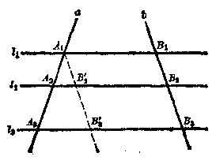

> 图1·19

段出现在同一个三角形的两条边上，为了证明 \(\frac{A_1A_2}{A_2A_3} = \frac{B_1B_2}{B_2B_3}\)，有必要把线段 \(A_1A_2, A_2A_3, B_1B_2, B_2B_3\) 设法集中在同一个三角形里。现在过 \(A_1\) 引 \(A_1B_3' / b, A_1B_3'\) 分别截 \(l_2\) 和 \(l_3\) 于 \(B_2'\) 和 \(B_3'\)。显然 \(A_1B_2B_2B_1\) 和 \(B_2B_3'B_3B_2\) 都是平行四边形，从而 \(A_1B_3' = B_1B_2, B_2'B_3' = B_2B_3\)。这样就把四条有关的线段集中在 \(\triangle A_1A_3B_3'\) 里了。

**［证］** 过 \(A_{1}\) 引 \(A_{1}B_{3}^{\prime} \parallel b, A_{1}B_{3}^{\prime}\) 截 \(l_{2}\) 于 \(B_{2}^{\prime}\)， 截 \(l_{3}\) 于 \(B_{3}^{\prime}\)。 在 \(\triangle A_{1}A_{3}B_{3}^{\prime}\) 里，

$$
\because A _ {2} B _ {2} ^ {\prime} / A _ {3} B _ {3} ^ {\prime}， \quad \therefore \frac {A _ {1} A _ {2}}{A _ {2} A _ {3}} = \frac {A _ {1} B _ {2} ^ {\prime}}{B _ {2} ^ {\prime} B _ {3} ^ {\prime}}.
$$

但是四边形 \(A_{1}B_{2}^{\prime}B_{3}B_{1}\) 和 \(B_{2}^{\prime}B_{3}^{\prime}B_{3}B_{2}\) 都是平行四边形， 由平行四边形对边相等的性质知 \(A_{1}B_{2}^{\prime} = B_{1}B_{2}, B_{2}^{\prime}B_{3}^{\prime} = B_{2}B_{3}\) 从而有

$$
\frac {A _ {1} A _ {2}}{A _ {2} A _ {3}} = \frac {B _ {1} B _ {2}}{B _ {2} B _ {3}}.
$$

##### 习题1·3

1. 在 \(\angle A\) 的一边上有两点 \(B\) 和 \(C\)， 另一边上有两点 \(D\) 和 \(E\)。 在下列条件下， 直线 \(BD\) 与 \(CE\) 是否平行？

（1） \(AB = 3\mathrm{m}\)， \(BC = 4\mathrm{m}\)， \(AD = 1.8\mathrm{m}\)， \(DE = 2.4\mathrm{m}\)；

（2） \(AB:BC = 3:4, AE = 3.5m, AD = 1.5m;\)

（3） \(AB = \frac{7}{15} AC, AD = 2.8\mathrm{m}, DE = 2\mathrm{m}\)。

2. 如图，\(\angle A\) 的两边 \(AB\) 和 \(AC\) 被两平行线 \(DE\) 和 \(BC\) 所截，证明 \(DE\) 和 \(BC\)，与线段 \(AE\) 和 \(AC\) 或 \(AD\) 和 \(AB\) 成比例。

［提示：过点 \(E\) 作 \(EF \parallel AB, EF'\) 交 \(BC\) 于 \(F\) （如图），再利用平行线截得比例线段定理以及图中平行四边形的关系即可证明。如果 \(DE\) 和 \(\angle A\) 两边的延长线相交，本题的结论也是正确的。］

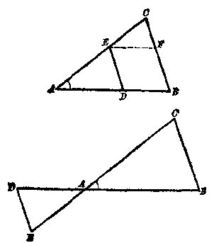

> （第2题）

3. 在 \(\triangle ABC\) 中，如果 \(DE \parallel BC\)，\(DE\) 分别交 \(AB\)，\(AC\) 于点 \(D\) 和 \(E\)。那末 \(DE\) 必被 \(\triangle ABC\) 的 \(BC\) 边上的中线 \(AF\) 所平分。

4. 在四边形 \(AB'D\) 的对角线 \(BD\) 上取一点 \(G\)， 作 \(GE \parallel DA\)， \(GE\) 交 \(AB\) 于 \(E\)， 作 \(GF \parallel DC\)， \(GF\) 交 \(BC\) 于 \(F\)， 并且连接 \(EF\)。 求证 \(EF \parallel AC\)。

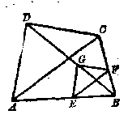

> （第4题）

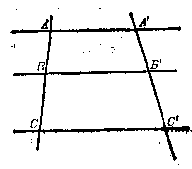

> （第5题）

5. 已知直线 \(AA' \parallel BB' \parallel CC'\)，这三条直线被另两条直线所截，截得 \(AB:BC = m:n\)，求证 \((m + n)BB' = nAA' + mCC'\)。

［提示：连结 \(AC'\)，交 \(BB'\) 于点 \(P\)，然后利用第2题的结论。］

6. 判断下面的结论是否正确：“已知直线 \(l_{1}, l_{2}\) 和 \(l_{3}\) 分别交 \(\angle O\) 的两边于 \(A, B, C\) 以及 \(A_{1}, B_{1}, C_{1}\) 各点，而且 \(\frac{AB}{A_{1}B_{1}} = \frac{BC}{B_{1}C_{1}}\)。那么，\(l_{1} \parallel l_{2} \parallel l_{3}\)。”

7. 已知直线 \(AA'\)， \(BB'\)， \(CC'\) 和 \(DD'\) 相交于点 \(O\)， 它们和两条平行直线 \(MN\) 和 \(M'N'\) 的交点分别是 \(A, B, C, D\) 和 \(A', B', C', D'\)。

证明 \(\frac{AB}{A'B'} = \frac{BC}{B'C'} = \frac{CD}{C'D'}\)。

［提示： 参考第2题的结果。］

8. 已知 \(\triangle ABC\) 中，点 \(E\) 在 \(AB\) 上，且 \(AE = \frac{1}{3} AB, D\) 是 \(BC\) 的中点，\(AD\) 与 \(CE\) 交于 \(R\)，求 \(AR:RD\)。

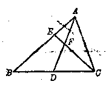

> （第8题）

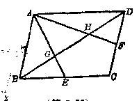

> （第9题）

9. 已知平行四边形 \(ABCD, BC, CD\) 边的中点分别为 \(E, F, AE, AF\) 与 \(BD\) 分别交于点 \(G, H\)， 求证 \(BG = GH = HD\)。

［提示： 连结 AC。］

10. 证明梯形中两条对角线被交点分成的两部分的比是相等的。

11. 在已知梯形的两腰 \(AD\) 和 \(BC\) 上各有一点 \(E\) 和 \(F\)。 如果 \(\frac{AE}{ED} =\) \(\frac{BF}{FC}\)， 那么 \(EF\) 平行于梯形的两底。 假使 \(E\) 和 \(F\) 是分别在两腰的延长线上， 这时结论也成立。

（注意：这可作为平行线截得比例线段定理2的逆定理。）

12. 证明过梯形对角线交点，且平行于底的直线被夹在两腰间的线段部分，必被这个交点所平分。

13. 在 \(\angle A\) 的一边上顺次截取 \(AB = 3\mathrm{cm}\)， \(BC = 5\mathrm{cm}\)， \(CD = 6\mathrm{cm}\)， 并且作相互平行的直线 \(BB'\)， \(CC'\)， \(DD'\)， 分别交 \(\angle A\) 的另一边于 \(B'\)， \(C'\)， \(D'\)。 如果 \(AC'\) 与 \(C'D'\) 的差是 4 厘米， 求 \(AB'\)， \(B'C'\)， \(C'D'\) 的长。

*14. 在梯形 \(ABCD\) 中，下底 \(AB\) 长12丈，上底 \(CD\) 长9丈，过对角线的交点 \(O\) 作平行于底的直线，求夹在两腰间的线段 \(EF\) 的长（附图）。

［已知： \(AB = 12\) 丈， \(CD = 9\) 丈．直

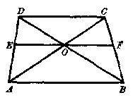

> （第14题）

线 \(EF\) 过对角线的交点 \(O\)，平行于梯形的底。

求线段 \(EF\) 的长。

解：∵ 四边形 ABCD 是梯形，

$$
\therefore A B \parallel C D，
$$

由第2题及已知条件可得

$$
\frac {O C}{O A} = \frac {C D}{A B} = \frac {3}{4}，
$$

因此， \(\frac{OC}{OA + OC} = \frac{OC}{CA} = \frac{3}{7}.\) 已知 \(EF\) 过点 \(O\) 且平行于 \(AB\)， 那么， \(OF \parallel AB\)， 应有

$$
\frac {O C}{C A} = \frac {O F}{A B} = \frac {3}{7}，
$$

于是 \(OF = \frac{3}{7} AB = 5\frac{1}{7}\)（丈）， 同理可以求出 \(OE = 5\frac{1}{7}\) （丈）（或利用第10题的结果）。

$$
\therefore E F = O E + O F = 10 \frac {2}{7} (\text {丈})。 ］
$$

15. 已知梯形的两底分别等于12厘米和18厘米，而它的两腰分别等于7厘米和9厘米。（1）延长两腰使相交，求交点和梯形的上底所组成的三角形的周长。

（2） 求经过梯形对角线的交点，平行于底的直线夹在两腰间线段的长；

（3） 两腰被此线段所分成的线段的长。

16. 已知 \(P\) 是一个定角 \(ABC\) 所在平面上的一点，过点 \(P\) 作直线使它在角的两条边上所截到的线段成定比 \(m:n\)。

［提示：要考虑点 P 在已知角的边上和点 P 在角的内部或外部的情形。］

#### §1·4 应用平行线截得比例线段定理的作图题

##### 作图题 1

。 求作线段 \(a, b, c\) 的第四比例项。

**［已知］** 线段 \(a, b, c\) （图1·20）。

**［求作］** 线段 \(x\)，使 \(a:b = c:x\)。

**［作法］** 从任意点 O，引射线 OA 和 OB。在 OA 上截取线段 OC = a， CE = b。在 OB 上截取线段 OD = c。连结 CD。过 E 引 EF // CD，EF 截 OB 于 F。线段 DF 就是求作的线段 x。

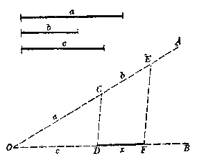

> 图1·20

**［证］** \(\because CD \parallel EF, \therefore OC:CE = OD:DF.\) 这就是 \(a:b = c:x\)。所以线段 \(DF\) 为求作的线段。

**［注意］** 在这个作图里， 线段 \(DF\) 也是线段 \(a, c, b\) 的第四比例项。

###### 例 1

已知线段 a， b， c，求作线段 x，使 \(a = \frac{5ab}{2c}\)。

**［已知］** 线段 a， b， c（图 1·21）。

**［求作］** 线段 \(x\)，使 \(x = \frac{3ab}{2c}\)。

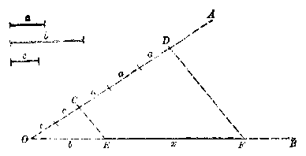

> 图1·21

分析 等式 \(x = \frac{3ab}{2c}\) 可以改写为 \(2c:3a = b:x\)，因此求作的线段 \(x\) 为线段 \(2c, 3a, b\) 的第四比例项。

**［作法］** 按照作图题1，作线段 \(2c, 3a, b\) 的第四比例项，证明由读者自己来完成。

**［注意］** 等式 \(x = \frac{3ab}{2c}\) 也可改写为 \(2c:b = 3a:x\)，或 \(2c:a = 3b:x\)，或 \(2c:3b = a:x\)。对应每一个比例，就有一个作线段 \(x\) 的方法。

###### 作图题 2

。 在已知线段 \(AB\) 上求作一点 \(P\)， 使线段 \(AP\) 和 \(PB\) 的比等于已知线段的比 \(m:n\)。

**［已知］** 线段 \(AB, m, n\) （图1·22）。

**［求作］** 线段 AB 上的点 P， 使 \(\frac{AP}{PB} = \frac{m}{n}\)。

**［作法］** 过 \(A\) 引任意射线 \(AO\)。 在 \(AC\) 上截取线段 \(AD = m\)， 线段 \(DE = n\)。 连结 \(EB\)。 过 \(D\) 引 \(DP \parallel EB\)， DP 截 AB 于 P，则 P 就是求作的点。

证明由读者自己来完成。

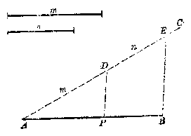

> 图1·22

**［注意］** 在这个作图题里， 如果已知的比不是已知线段 \(m, n\) 的比，而是两个数的比，譬如3：2，那末可以选取任意线段 \(l\) 作长度单位，用线段 \(3l, 2l\) 作为线段 \(m, n\)，再按上面的方法作图。

###### 作图题 3

。 在已知线段 \(AB\) 的延长线上求作一点 \(P\)， 使线段 AP 和 BP 的比等于已知线段的比 m：n。

**［已知］** 线段 \(AB, m, n\) （图1·23）。

**［求作］** 线段 \(AB\) 延长线上的点 \(P\)， 使 \(\frac{AP}{PB} = \frac{m}{n}\)。

**［作法］** 过 \(A\) 引任意射线 \(AC\)。 在 \(AC\) 上截取线段 \(AD =\)

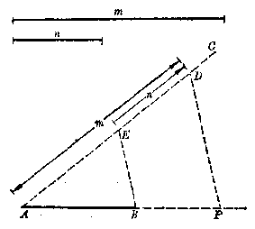

> 图1·23

m， 再在 DA 上截取线段 DE=n。 连结 EB。 过 D 引 DP // EB， DP 截 AB 的延长线于 P。 则 P 就是求作的点。

**［证］** \(\because EB \parallel DP,\)

$$
\therefore A D： D E = A P： P B，
$$

即 \(AP:PB = m:n.\) 如果 \(P\) 是线段 \(AB\) 上的点，并且它使线段 \(AP\) 和 \(PB\) 的比等于已知比 \(m:n\)，那末点 \(P\) 叫做线段 \(AB\) 的内分点，或者说点 \(P\) 按照定比 \(m:n\) 内分线段 \(AB\)。作图题2指出了按定比内分一条已知线段的方法。

如果 \(P\) 是线段 \(AB\) （或 \(BA\)） 的延长线的点，并且它使线段 \(AP\) 和 \(PB\) 的比等于已知比 \(m:n\)，那末点 \(P\) 叫做线段 \(AB\) 的外分点，或者说点 \(P\) 按照定比 \(m:n\) 外分线段 \(AB\)。作图题3指出了按定比外分一条已知线段的方法。

**［注意］** 当 \(m = n\) 时， 线段 \(AB\) 的内分点就是它的中点； 但是它没有外分点。

###### 例 2

求作一个三角形，使它的周长等于 \(l\)，三边的比是 3：5：7。

**［已知］** 线段 \(l\) （图1·24）。

**［求作］** \(\triangle ABC\)，使 \(AB:BC:CA = 3:5:7\)，并且

$$
A B + B C + C A = l.
$$

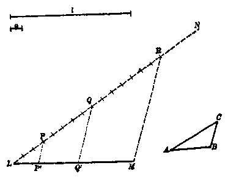

> 图1·24

**［作法］** 作 \(LM = l\)，过 \(L\) 引任意射线 \(LN\)。取适当线段 \(a\) 为长度单位，在 \(LN\) 上截 \(LP = 3a\)，\(PQ = 5a\)，\(QR = 7a\)。连结 \(RM\)。过 \(P\) 和 \(Q\) 各引 \(RM\) 的平行线 \(PP'\) 和 \(QQ'\)，\(PP'\) 和 \(QQ'\) 分别截 \(LM\) 于 \(P'\) 和 \(Q'\)。取 \(LP'\)，\(P'Q'\)，\(Q'M\) 为三边，作三角形 \(ABC\)，这就是求作的三角形。

证明由读者自己来完成。

##### 习题1·4

1. 已知线段 \(a = 25 \mathrm{~mm}\)， \(b = c = 18 \mathrm{~mm}\)。 求作线段 \(a, b, c\) 的第四比例项 \(d\)。

2. 已知两线段 \(a\) 与 \(b\)， 求作线段 \(x\)， 使 \(a:b = b:x\)。

3. 已知三线段 \(a, b, c\)，求作线段 \(x\)，使：

（1） \(x = \frac{a^2}{b}\)；

（2） \(x = \frac{ab}{c}\)；

（3） \(x = \frac{2a^2}{c}\)；

（4） ax = bc；

（5） \(\frac{\frac{1}{2}a}{b} = \frac{c}{x}\)；

（6） \(\frac{a}{b} = \frac{3x}{c}\)；

（7） \(\frac{x}{2} = \frac{bc}{a};\)

（8） \(x = \frac{2ab}{3c}\)。

4. 分已知线段为两部分， 使这两部分的比为 3：5。

5. 在已知线段的延长线上求一点，使这点到两端点所成的两线段之比为 7：4。

6. 把已知线段分为三部分， 使与三已知线段 \(a, b, c\) 成比例。

7. 已知两线段 \(a\) 与 \(b\) 的和为 \(s\)， 比为 \(m:n\)。 求作这两线段。

8. 已知两线段 \(a\) 与 \(b\) 的差为 \(d\)， 比为 \(m:n\)。 求作这两线段。

9. 过角内的一个已知点作一直线，使它夹着定角两边间的线段被已知点分成 \(m:n\)。

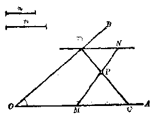

> （第9题）

［已知： \(P\) 是 \(\angle AOB\) 内的一个定点， \(m:n\) 是定比。

求作：过点 \(P\) 的直线与 \(\angle AOB\) 的两边分别交于点 \(C\) 和 \(D\) 使

$$
C P： P D = m： n.
$$

作法：在 \(OA\) 上任意取一点 \(M\)，连结 \(MP\) 并且延长到 \(N\)，使 \(MP:PN = m:n\)。过 \(N\) 作直线 \(ND \parallel OA\) 交 \(OB\) 于 \(D\)，连结 \(DP\) 并延长 \(DP\) 交 \(OA\) 于 \(C, CD\) 就是所求的直线。

证：由作图， \(DN \parallel CM\)， \(\therefore CP:PD = MP:PN.\)

$$
\because M P： P N = m： n， \quad \therefore C P： P D = m： n. ］
$$

10. 过已知角外的一个已知点作一直线，使已知点到直线和角的两边的交点所成的两线段的比为 \(m:n\)。

*11. 已知三角形的一个角和这角对边上的高，以及对边被高分成的两线段的比，求作这个三角形。

［提示：可先放弃高为定长的条件作三角形。］

12. \(O\) 为定直线 \(AB\) 外一点， 点 \(P\) 分 \(O\) 到 \(AB\) 所作线段成定比 \(m:n\)。 求点 \(P\) 的轨迹。

［已知：O 为定直线 AB 外一点，连结 O 与 AB 上任意一点

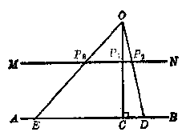

> （第12题）

的线段被点 P 分成 m：n。

求点 \(P\) 的轨迹。

解：从 \(O\) 作 \(OC \perp AB\)，垂足是 \(C\)，并作点 \(P_{1}\)，使 \(OP_{1}:P_{1}C = m:n\)。过 \(P_{1}\) 作直线 \(MN\) 平行于 \(AB\)，那么 \(MN\) 就是所求的轨迹。

这里读者应当回忆一下，对一个轨迹命题：“具有性质 \(S\) 的点的轨迹是图形 \(F\)”必须从两方面来证明：

（1） 证明图形 \(F\) 的任意点都具有性质 \(S\) （纯粹性）； （2） 证明具有性质 \(S\) 的任意点都在图形 \(F\) 上 （完备性）。 经过上述两方面的证明之后， 才能断定： 具有性质 \(S\) 的点的轨迹是图形 \(F\) （复习本丛书《平面几何》第一册 §2·16 点的轨迹）。 把这些步骤用到本题上来， 应当证明如下：

（1） 纯粹性的证明 设 \(P_{2}\) 为 \(MN\) 上的任意一点， 连接 \(OP_{2}\) 并延长交 \(AB\) 于 \(D\)。 由于 \(P_{1}P_{2} \parallel CD\)， 可知 \(\frac{OP_{2}}{P_{2}D} = \frac{OP_{1}}{P_{1}C} = \frac{m}{n}\)。 这就是说， \(MN\) 上的点都符合题目所给的条件。

（2） 完备性的证明 从 \(O\) 到 \(AB\) 任作一线段 \(OE\)， 假定 \(OE\) 上的点 \(P_{3}\) 使 \(\frac{OP_{3}}{P_{3}E} = \frac{m}{n}\)。 连结 \(P_{1}P_{3}\)， 那么 \(\frac{OP_{1}}{P_{1}C} = \frac{m}{n} = \frac{OP_{3}}{P_{3}E}\)。 \(\therefore P_{1}P_{3} \parallel CE\)。 这就是说， \(P_{3}\) 必定在直线 \(MN\) 上， 这是因为过直线 \(AB\) 外的一点 \(P_{1}\) 只能作一条直线和它平行。 于是证得了符合已知条件的点， 都在 \(MN\) 上。］

13. 证明在三角形内，夹在两边之间且平行于底边的线段的中点的轨迹，是底边上的中线。

14. 与两条平行线距离之比是 \(m:n\) 的点的轨迹是直线。

［提示： 本题应先确定轨迹直线的位置， 然后证明。］ “15。 分夹在一已知角的两边的平行线段成定比 \(m:n\) 的点的轨迹是什么？并加以证明。

#### §1·5 三角形内角、外角平分线性质

##### 1. 三角形内角平分线定理

三角形内角的平分线按照夹这个角的两边的比内分对边。

**［已知］** 在\(\triangle ABC\)中， \(AD\)是\(\angle BAC\)的平分线（图1·25）。

**［求证］** \(\frac{BD}{DC} = \frac{AB}{AO}\)。

分析 要判定线段 \(BD, DC, AB, AC\) 成比例，我们可以应用平行线截得比例线段定理1，但是这

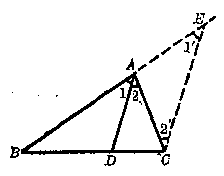

> 图1·25

四条线段必须对应地分布在同一个三角形的两边上。为此，过 \(C\) 引 \(DA\) 的平行线 \(CE\)，交 \(BA\) 的延长线于 \(E\)。在 \(\triangle BCE\) 中，显然有 \(\frac{BD}{DC} = \frac{BA}{AE}\)，只要能够证得 \(AE = AC\) 即可。

**［证］** 过 \(C\) 引 \(CE \parallel DA, CE\) 交 \(BA\) 的延长线于 \(E\)。

$$
\because C E \parallel D A，
$$

$$
\therefore \angle 1 = \angle 1 ^ {\prime}， \angle 2 = \angle 2 ^ {\prime}.
$$

∵ AD 是 ∠BAC 的平分线，

$$
\therefore \angle 1 = \angle 2.
$$

从而 \(\angle 1' = \angle 2'\) 由此得： \(AE = AC.\)

$$
\because C E \parallel D A，
$$

$$
\therefore \quad \frac {B D}{D C} = \frac {B A}{A E}.
$$

也就是 \(\frac{BD}{DC} = \frac{AB}{AC}\)

##### 2. 三角形外角平分线定理

三角形外角的平分线如果和对边的延长线相交，它按照夹相应内角的两边的比外分对边。

**［已知］** 在 \(\triangle ABC\) 中， 外角 \(CAE\) 的平分线 \(AD\) 交 \(BC\) 的延长线于 \(D\) （图1·26）。

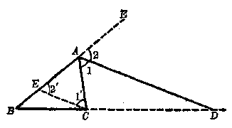

> 图1·26

**［求证］** \(\frac{BD}{DC} = \frac{AB}{AC}\)。

分析 要判定线段 \(BD, DC, AB, AC\) 成比例， 我们可以应用平行线截得比例线段定理 1 或它的推论。 但是这四条线段必须对应地分布在同一个三角形的两边上， 为此， 过 \(C\) 引 \(CE \parallel DA\)， 交 \(AB\) 于 \(E\)， 在 \(\triangle ABD\) 中， 显然有 \(\frac{BD}{DC} = \frac{BA}{AE}\)。 只要能证得 \(AE = AC\) 即可。

**［证］** 过 \(C\) 引 \(CE \parallel DA, CE\) 交 \(AB\) 于 \(E\)。

$$
\because C E \parallel D A，
$$

$$
\therefore \angle 1 = \angle 1 ^ {\prime}， \angle 2 = \angle 2 ^ {\prime}.
$$

∵ AD 是 ∠CAE 的平分线， ∴ \(\angle1=\angle2.\) 从而 \(\angle1'=\angle2'\)。

由此得 \(AE = AC,\)

$$
\because C E \parallel D A，
$$

$$
\therefore \quad \frac {B D}{D C} = \frac {B A}{A E}.
$$

也就是 \(\frac{BD}{DC} = \frac{BA}{AC}\)

**［注意］** 在这一条定理里，当 \(AB > AC\) 时，\(AD\) 交 \(BC\) 的延长线于 \(D\) 当 \(AB = AC\) 时，\(AD \parallel BC\)，\(AD\) 和 \(BC\) 不相交；当 \(AB < AC\) 时， \(AD\) 交 \(CB\) 的延长线于 \(D\)

###### 例 1

在 \(\triangle ABC\) 中，点 \(D\) 按照 \(AB\) 和 \(AC\) 的比内分 \(BC\)。 试证线段 \(AD\) 是 \(\angle BAC\) 的平分线。

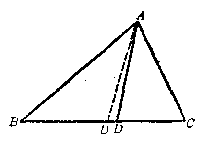

> 图1·27

**［已知］** 在 \(\triangle ABC\) 中，\(\frac{BD}{DC} = \frac{AB}{AC}\) （图1·27）。

**［求证］** AD 是 \(\angle BAC\) 的平分线。

**［证］** 作 \(\angle BAC\) 的平分线 \(AD'\)，依据三角形内角平分线定理得

$$
\frac {B D ^ {\prime}}{D ^ {\prime} C} = \frac {A B}{A C}. \tag {1}
$$

把（1）式和已知比例 \(\frac{BD}{DC} = \frac{AB}{AC}\) 作比较，得

$$
\frac {B D ^ {\prime}}{D ^ {\prime} C} = \frac {B D}{D C}. \tag {2}
$$

对（2）式应用合比定理， 得

$$
\frac {B D ^ {\prime} + D ^ {\prime} C}{D ^ {\prime} C} = \frac {B D + D C}{D C}，
$$

即 \(\frac{BC}{D'C} = \frac{BC}{DC}\) 从而 \(D^{\prime}C = DC\)， \(D\) 和 \(D^{\prime}\) 重合， \(AD\) 和 \(AD^{\prime}\) 重合。因此 \(AD\) 是 \(\angle BAC\) 的平分线。

**［注意］** 这个例题是三角形内角平分线定理的逆定理，证明这条逆定理的方法是同一法。利用图1·25不用同一法也可以证明这条逆定理，请读者自己考虑证明方法。

###### 例 2

已知 \(\triangle ABC\) 的三边 BC， CA， AB 的长分别为 a， b， c。 求它的内心 I 分三条角平分线 AD， BE， CF 所成之比 （图1·28）。

**［解］** 三角形的内心是三条角平分线的交点。

∵ CF 平分角 ACB，∴ \(AC:CB = AF:FB\)。

也就是

$$
b： a = A F： (c - A F)，
$$

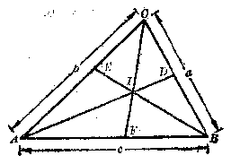

> 图1·28

从而有 \(AF = \frac{bc}{a + b}\) ∴ AI 平分角 CAF，

$$
\therefore C I： I F = A C： A F.
$$

也就是 \(CI:IF = b:\frac{bc}{a + b} = (a + b):c.\) 同法可得 \(AI:ID = (b + c):a,\)

$$
B I： I E = (c + a)： b.
$$

答：内心 \(I\) 分三条角平分线所成之比分别为

$$
A I： I D = (b + c)： a；
$$

$$
B I： I E = (c + a)： b； C I： I F = (a + b)： c.
$$

###### 例 3

在 \(\triangle ABC\) 中， 点 D 按照 AB 和 AC 的比外分 BC。 证明线段 AD 是 \(\triangle ABC\) 的外角 CAE 的平分线（图 1·29）。

**［已知］** 在 \(\triangle ABC\) 中，

$$
\frac {B D}{D C} = \frac {A B}{A C}.
$$

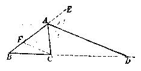

> 图1·29

**［求证］** AD 是 \(\triangle ABC\) 外角 CAE 的平分线。

**［证］** 过 \(\triangle ABC\) 的顶点 \(C\) 作线段 \(CF \parallel DA\)， 交 \(AB\) 于 \(F\)。 依据平行线的性质定理得

$$
\angle A F C = \angle E A D， \tag {1}
$$

$$
\angle A C F = \angle C A D. \tag {2}
$$

根据平行线截得比例线段定理1的推论，得 \(\frac{BD}{DC} = \frac{BA}{AF}\) 但是 \(\frac{BD}{DC} = \frac{AB}{AC}\)，所以 \(\frac{AB}{AC} = \frac{AB}{AF}\)。就是 \(AF = AC\)。于是 \(\triangle ACF\) 是等腰三角形，\(\angle ACF = \angle AFC\)。再结合（1）与（2）式，得

$$
\angle E A D = \angle A F C = \angle A C F = \angle C A D，
$$

所以 AD 是 \(\triangle ABC\) 的外角 CAE 的平分线。

**［注意］** 这个例题就是三角形外角平分线定理的逆定理，它的证明也可以采用与例1类似的方法，读者可以把它们互相对比。

###### 例 4

已知 \(\triangle ABC\) 的三边 \(AB, BC, CA\) 的长各为 \(5\mathrm{cm}\)， \(3\mathrm{cm}, 4\mathrm{cm}\)。 在底边 \(AB\) 和它的延长线上分别取点 \(D\) 和 \(D'\)， 使 \(AD = 2\frac{6}{7}\mathrm{cm}, BD' = 15\mathrm{cm}\) （图1·30）。

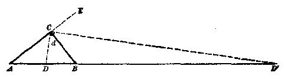

> 图1·30

**［求证］** \(CD \perp CD'\)。

**［证］** 连结 \(CD\) 和 \(CD'\)。

$$
\because A D： D B = 2 \frac {6}{7}： \left(5 - 2 \frac {6}{7}\right) = 4： 3 = C A： B C，
$$

∴ CD 平分 ∠ACB。

$$
\because A D ^ {\prime}： D ^ {\prime} B = (5 + 15)： 15 = 4： 3 = C A： B C，
$$

∴ CD' 平分 \(\triangle ABC\) 的外角 BCE。

$$
\because \angle A C B + \angle B C E = 2 d，
$$

$$
\begin{array}{l}\therefore \angle DCD' = \angle DCB + \angle BCD' \\= \frac{1}{2}\angle ACB + \frac{1}{2}\angle BCE \\= \frac{1}{2}(\angle ACB+\angle BCE) \\= \frac{1}{2}\cdot 2d = d。\end{array}
$$

$$
\therefore C D \perp C D ^ {\prime}.
$$

###### 例 5

已知点 \(x、x'\) 按定比 m：n 分别内分、外分已知线段 AB，试证和 A、B 两点的距离成 m：n 的点的轨迹是以线段 \(xx'\) 为直径的圆。

本轨迹命题的证明分两步进行：

（1） 完备性的证明，即满足比例式 \(PA:PB = m:n\) 的任意点 \(P\) 都在以 \(xx'\) 为直径的圆上；

（2） 纯粹性的证明，即在以 \(xx'\) 为直径的圆上的任意点 \(P\) 都满足比例式 \(PA:PB = m:n\)。

本题证明如下：

（1） 已知线段 \(AB\) 和定比 \(m:n, x, x'\) 分别按定比 \(m:n\) 内分、外分 \(AB, P\) 是满足比例式 \(PA:PB = m:n\) 的任意点（图1·31）．求证点 \(P\) 在以 \(xx'\) 为直径的圆上。

**［证］** 连结 \(PA\)、\(PB\)、\(Px\) 和 \(Px'\)，延长 \(AP\) 至 \(C\)。

$$
\because A x： x B = P A： P B = m： n，
$$

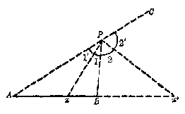

> （1）

> 图1·31

根据本节例1，∴ Px 平分 \(\angle APB\)，即得 \(\angle1=\angle1'\)。

$$
\because A x ^ {\prime}： x ^ {\prime} B = P A： P B = m： n，
$$

根据本节例3，∴ \(Px'\) 平分 \(\angle BPC\)，即得 \(\angle2=\angle2'\)。

于是，平角 \(APC = \angle APB + \angle BPC = \angle 1 + \angle 1' + \angle 2 + \angle 2' = 2(\angle 1 + \angle 2) = 180^\circ\)。

$$
\therefore \angle x P x ^ {\prime} = \angle 1 + \angle 2 = 90 ^ {\circ}.
$$

∴ 点 P 在以 \(xx'\) 为直径的圆上。

（2） 已知线段 \(AB\) 和定比 \(m:n, x, x'\) 分别按定比 \(m:n\) 内分、外分 \(AB\)，\(P\) 是以 \(xx'\) 为直径的圆上的任意点。求证 \(PA:PB = m:n\)。

**［证］** 连结 \(PA\)、\(PB\)、\(Px\)、\(Px'\)，延长 \(AP\) 至 \(C\)，过 \(B\) 引 \(BD \parallel Px'\)，交 \(AP\) 于 \(D\)；过 \(B\) 引 \(BE \parallel Px\)，交 \(AP\) 的延长线于 \(E\)。

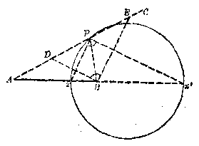

> （2）

> 图1·31

\(\because \angle xPx'\) 是半圆的内接角， \(\therefore \angle xPx' = 90^{\circ}.\)

$$
\because B D \parallel P x ^ {\prime}， B E \parallel P x，
$$

∴ \(\angle DBE = \angle xPx' = 90^{\circ}\)，即得 \(\triangle DBE\) 是直角三角形。

∵ BD∥Px'， 由平行线截得比例线段定理1， 有

$$
A x ^ {\prime}： x ^ {\prime} B = P A： P D = m： n. \tag {1}
$$

∵ BE∥Px， 同理可得

$$
A x： x B = P A： P E = m： n. \tag {2}
$$

由（1）和（2），可得 \(AP:PD = AP:PE\) ∴ PD=PE，于是 BP 是直角三角形 DBE 的斜边 DE 上的中线。

∵ 直角三角形斜边上的中线等于斜边的一半，

$$
\therefore P B = P D. \tag {3}
$$

由（1）和（3），可得 \(PA:PB=PA:PD=m:n\)。

##### 习题1·5

1. 已知 \(\triangle ABC\) 中， \(AD\) 是 \(\angle BAC\) 的平分线， 试按提示证明

$$
A B： A C = B D： D C.
$$

［提示：过 \(C\) 点作 \(AB\) 的平行线，与 \(AD\) 的延长线交于 \(E\)，可证 \(AC = CE\)，并利用习题1·3第2题的结论。］

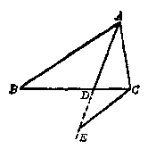

> （第1题）

2. 在 \(\triangle ABC\) 中， \(AD\) 和 \(AD'\) 分别为 \(\angle A\) 和它的外角的平分线， 它们和对边 \(BC\) 的交点分别是 \(D, D'\)。 求证 \(\frac{BD}{DC} = \frac{BD'}{D'C}\)。

3. 已知 \(BD\) 为 \(\triangle ABC\) 中 \(\angle B\) 的平分线：

（1） \(AB = 10\mathrm{cm}\)， \(BC = 15\mathrm{cm}\)， \(AC = 20\mathrm{cm}\)。 求 \(AD\) 和 \(DC\)；

（2） AD：DC=8：5， AB=16cm。 求 BC；

（3） \(AB:BC = 2:7, DC - AD = 1\mathrm{cm}\)。 求 \(AC\)。

4. 在 \(\triangle ABC\) 中，\(BC = a, CA = b, AB = c, \angle B\) 和 \(\angle C\) 的平分线相交于 \(O, AO\) 的延长线交 \(BC\) 于 \(D\)。 求 \(AO:OD\)。

［提示：可设 \(BD = a - CD\)；或 \(CD = a - BD\)。］

5. \(D\) 为 \(\triangle ABC\) 中 \(BC\) 上的一点，由下面的条件分别判定 \(AD\) 是否是 \(\angle A\) 的平分线：

（1） \(AB = 12\mathrm{cm}\)， \(AC = 15\mathrm{cm}\)， \(BD = 8\mathrm{cm}\)， \(DC = 10\mathrm{cm}\)；

（2） \(AB = 12\mathrm{m}\)， \(AC = 56\mathrm{cm}\)， \(BD:DC = 14:3\)；

（3） \(AB = \frac{5}{11} AC, BD = 2m, DC = 4.5m;\)

（4） \(AB = 6\mathrm{m}, AC = 28\mathrm{m}, BD = \frac{3}{17} BC.\)

6. 在 \(\triangle ABC\) 中， \(\angle B\) 与 \(\angle C\) 的平分线各交 \(AC\)， \(AB\) 于 \(D\) 和 \(E\)， 如果 \(AB = AC\)， 那末 \(DE \parallel BC\)。

7. 在 \(\triangle ABC\) 中， \(AB = 15\mathrm{cm}\)， \(AC = 10\mathrm{cm}\)， \(AD\) 为 \(\angle A\) 的平分线， 由点 \(D\) 引直线平行于 \(AB\)， 并和 \(AC\) 相交于 \(E\)。 求 \(AE\)， \(EC\) 和 \(DE\)。

8. 在四边形 \(ABCD\) 中， 如果一双对角 \(A\) 和 \(C\) 的平分线的交点 \(E\) 在对角线 \(BD\) 上， 那末， 另一双对角 \(B\) 和 \(D\) 的平分线的交点 \(F\) 在对角线 \(AC\) 上。

［已知：四边形 \(ABCD\) 的对角 \(A\) 和 \(C\) 的平分线的交点 \(E\) 在对角线 \(BD\) 上（如图）。

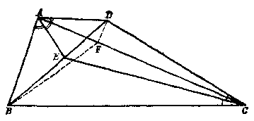

> （第8题）

求证：\(\angle B\) 和 \(\angle D\) 的平分线的交点 \(F\) 必在另一对角线 \(AC\) 上。

证：已知 \(\angle A\) 和 \(\angle C\) 的平分线的交点 \(E\) 在 \(BD\) 上，由角平分线定理得 \(AB:AD = BE:ED\)，以及 \(CB:CD = BE:ED\)，从这两个等式就有 \(AB:AD = CB:CD\)，又可以把它改写为

$$
A B： C B = A D： C D. \tag {1}
$$

假定 \(\angle B\) 和 \(\angle D\) 的平分线分别交对角线 \(AC\) 于 \(F\) 和 \(F'\)。 那末根据与前面同样的理由， 应有 \(AB:CB = AF:F'C\)， 以及 \(AD:CD = AF':F'C\)。 这时由（1）式可以知道 \(AF:F'C = AF':F'C\)， 从合比定理得 \((AF + FC):FC = (AF' + F'C):F'C\)， 也就是 \(AC:FC = AC:F'C\)。 于是 \(FC = F'C\)， 从而可知 \(F\) 与 \(F'\) 重合。 这就是说 \(\angle B\) 与 \(\angle D\) 的平分线的交点 \(F\) 在对角线 \(AC\) 上。

9. AC 和 BD 是四边形 ABCD 的对角线，如果 \(\angle BAC\) 和 \(\angle BDC\) 的平分线的交点在 BC 边上，那末 \(\angle ABD\) 和 \(\angle ACD\) 的平分线的交点在 AD 边上。

10. 在 \(\triangle ABC\) 中， \(AB \neq AC\)。 \(\angle A\) 的平分线交对边 \(BC\) 于 \(D\)。 \(D'\) 是 \(BC\) 延长线上的点， 如果以 \(DD'\) 为直径的圆通过顶点 \(A\)， 那末

$$
\frac {B D}{D C} = \frac {B D ^ {\prime}}{D ^ {\prime} C}.
$$

11. 已知 \(\triangle ABC\) 中， \(AD, BF, OF\) 是高， \(H\) 是垂心， \(AD\) 与 \(EF\) 相交于 \(G\) 点。 求证 \(GH: HD = GA: AD\)。 ［提示： 连结 \(DF\)， 延长 \(DE\)， 证 \(EH\) 与 \(EA\) 分别是 \(\triangle EGD\) 的内角和外角的平分线。］

12. AMNP 为 \(\triangle ABC\) 的内接菱形，

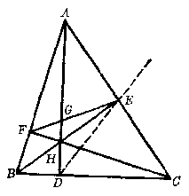

> （第11题）

点 \(M, N\) 和 \(P\) 分别在 \(AB, BC\) 和 \(CA\) 上。如果 \(AB = 21\mathrm{cm}, BC = 18\mathrm{cm}, CA = 15\mathrm{cm}\)；求 \(BN\) 和 \(NC\) 的长。

［提示：菱形的对角线平分菱形的内角。］

13. 在等腰三角形 \(ABC\) 中， \(AC = b\)， \(AB = BC = a\)。 \(AN\) 和 \(CM\) 为 \(\angle A\) 与 \(\angle C\) 的平分线。 求 \(MN\) 的长。

14. 已知 \(\triangle ABC\) 中，\(\angle B = 2\angle C, M\) 为 \(BC\) 的中点，\(AD \perp BC\)。求证 \(MD = \frac{1}{2} AB\)。

［提示：作∠ABC的平分线BE，连结EM。］

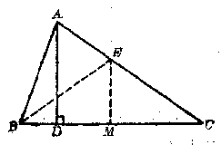

> （第14题）

15. 自已知 \(\triangle ABC\) 的顶点 \(A\)， 引动直线 \(AK\)， 交 \(BO\) 于 \(K\)。 求证 \(\triangle AKC\) 的内心的轨迹是一条线段。

### 相似三角形

#### §1·6 相似多边形

图1·32和图1·33是同一地段的平面图，在绘图时由于应用了不同的比例尺，因此它们的大小不同，但形状是一样的。如果用直角器和直尺分别度量它们的每一个角和每一条边，我们得到下面的关系：（1） 它们的对应角相等，即 \(\angle A = \angle A'\)，\(\angle B = \angle B'\)，\(\angle O = \angle O'\)，\(\angle D = \angle D'\)；（2） 它们的对应边都成比例，即

$$
\frac {A B}{A B ^ {\prime}} = \frac {B C}{B ^ {\prime} C ^ {\prime}} = \frac {C D}{C ^ {\prime} D ^ {\prime}} = \frac {D A}{D ^ {\prime} A ^ {\prime}}
$$

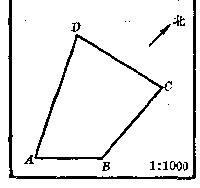

> 图1·32

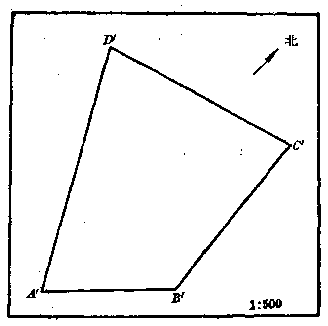

> 图1·33

我们把对应角相等，对应边都成比例的两个多边形叫做相似多边形。

表示两个图形相似，我们用符号“∽”，读做“相似于”。在图1·32和1-33里，显然有四边形ABCD∽四边形A'B'C'D'。

在用字母符号表示两个多边形相似时，要将对应顶点的字母写成相同的次序。

两个相似多边形的任一组对应边的比叫做相似比（也叫做相似系数）。在图1·32和图1·33里，我们分别量得 \(AB = 1.2\mathrm{cm}\)，\(A'B' = 2.4\mathrm{cm}\)。相似四边形ABCD和\(A'B'C'D'\)的相似比为1/2。在这里我们观察：如果多边形\(I_1\)和多边形\(II\)的相似比等于\(K\)，那末多边形\(I\)的一条边是多边形\(II\)的一条对应边的\(K\)倍。当\(K = 1_{4-3}\)即多边形\(I\)和多边形\(II\)的每一组对应边相等时，则它们不仅相似，而且全等。因此全等多边形是相似多边形当相似比等于1时的特例。

在图1·34中，已知多边形 \(I\sim\) 多边形 \(II\)，多边形 \(II\sim\) 多边形 \(III\)，容易证明，多边形 \(I\sim\) 多边形 \(III\)，这就证

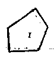

> 图1·34

明了图形的相似性是可以传递的。在后面的论证中，常常要用到这个性质。请读者自己证明关于多边形相似性的传递性质。

判定两个多边形相似，必须指出它们同时符合两个条件：（1） 对应角相等，（2） 对应边都成比例。正方形和矩形的对应角相等，但是对应边不都成比例，因此它们不是相似形。正方形和菱形的对应边都成比例，但是对应角不等，因此它们也不是相似形（图1·35）。

> 图1·35

如果已知两个多边形相似， 根据定义， 这两个多边形一定具有性质： （1） 对应角相等； （2） 对应边都成比例。

在日常生活里， 我们经常遇到形状相同的图形， 例如原来照片和放大后的照片， 用不同比例尺绘制的同一机械零件的图样等等。 所以相似多边形的图形性质有着广泛的应用。

##### 例 1

锐角等于 \(60^{\circ}\) 的两个菱形是相似的。

**［已知］** 菱形ABCD的 \(\angle A = 60^{\circ}\)，菱形 \(A'B'C'D'\) 的 \(\angle A' = 60^{\circ}\) （图1·36）。

> 图1·36

**［求证］** 菱形 \(ABCD \sim\) 菱形 \(A'B'C'D'\)。

**［证］** \(\because\) 菱形 \(ABCD\) 的 \(\angle A = 60^{\circ}\)， \(\therefore\) 其他的三个角为： \(\angle B = 120^{\circ}, \angle C = 60^{\circ}, \angle D = 120^{\circ}\)。 同样菱形 \(A'B'C'D'\) 的 \(\angle A' = 60^{\circ}\)， 其他三角各为： \(\angle B' = 120^{\circ}, \angle C' = 60^{\circ}, \angle D' = 120^{\circ}\)。 从而有

$$
\angle A = \angle A ^ {\prime}， \angle B = \angle B ^ {\prime}， \angle C = \angle C ^ {\prime}， \angle D = \angle D ^ {\prime}. \tag {1}
$$

菱形是等边的， \(AB=BC=CD=DA; A'B'=B'C'=C'D'=D'A'\)，从而有

$$
\frac {A B}{A ^ {\prime} B ^ {\prime}} = \frac {B C}{B ^ {\prime} C ^ {\prime}} = \frac {C D}{C ^ {\prime} D ^ {\prime}} = \frac {D A}{D ^ {\prime} A ^ {\prime}} \tag {2}
$$

由（1），（2）两式可知，菱形 \(ABCD \sim\) 菱形 \(A'B'C'D'\)。

###### 例 2

工厂铺地用矩形水泥砖，半砖 \(EFD A'\) 和整砖 ABCD 相似。求水泥砖的两条邻边的比 （图1·37）。

**［已知］** 矩形 \(EFDAC \sim\) 矩形 \(ABCD\)， 并且 \(AE = \frac{1}{2} AB.\)

**［求］** \(\frac{AB}{DA}\)

> 图37

**［解］** 设 \(AB = a, DA = b\)，则 \(AE = \frac{1}{2} a\)。这里 \(DA\) 是矩形 \(EFDA\) 的长边，同时它又是矩形 \(ABCD\) 的短边，\(\because\) 矩形 \(EFDA \sim\) 矩形 \(ABCD\)，

$$
\therefore \frac {A B}{D A} = \frac {D A}{A E}. \quad \text {即} \quad \frac {a}{b} = \frac {b}{\frac {a}{2}}.
$$

从上式得 \(a^2 = 2b^2, \frac{a^2}{b^2} = 2, \frac{a}{b} = \sqrt{2}\)。

答： \(\frac{AB}{DA} = \sqrt{2}\)

###### 例 3

两个相似梯形的中位线分原梯形为两组对应相似梯形。

**［已知］** 梯形 \(ABCD \sim\) 梯形 \(A'B'C'D'\)，中位线 \(EF\) 分梯形 \(ABCD\) 为四边形 \(ABFE\) 和 \(EFCD\)，中位线 \(E'F'\) 分梯形 \(A'B'C'D'\) 为四边形 \(A'B'F'E'\) 和 \(E'F'C'D'\)（图1·38）。

> 图1·38

**［求证］** 四边形 \(ABFE, EFCD, A'B'F'E', E'F'C'D'\) 都是梯形；并且梯形 \(ABFE \sim\) 梯形 \(A'B'F'E'\)，梯形 \(EFCD \sim\) 梯形 \(B'F'C'D'\)。

**［证］** \(\because EF \parallel AB, \therefore ABFE\) 是梯形。同理可证 \(EFCD\)。 \(A'B'F'E', F'F'C'D'\) 都是梯形。

梯形 \(ABCD\sim\) 梯形 \(A'B'C'D'\)，依据相似多边形的定义，有

$$
\angle A = \angle A ^ {\prime}， \angle B = \angle B ^ {\prime}， \angle C = \angle C ^ {\prime}， \angle D = \angle D ^ {\prime}， (1)
$$

$$
\frac {A B}{A ^ {\prime} B ^ {\prime}} = \frac {B C}{B ^ {\prime} C ^ {\prime}} = \frac {C D}{C ^ {\prime} D ^ {\prime}} = \frac {D A}{D ^ {\prime} A ^ {\prime}}. \tag {2}
$$

∴ \(EF \parallel CD, E'F' \parallel C'D', \therefore\) （1） 的四个等式可以写为

$$
\left. \begin{array}{l} \angle A = \angle A ^ {\prime}， \angle B = \angle B ^ {\prime}， \\ \angle B F E = \angle C = \angle C ^ {\prime} = \angle B ^ {\prime} F ^ {\prime} E ^ {\prime}， \\ \angle F E A = \angle D = \angle D ^ {\prime} = \angle F ^ {\prime} E ^ {\prime} A ^ {\prime}. \end{array} \right\} \tag {3}
$$

这表示梯形 \(ABFE\) 和 \(A'B'F'E'\) 的对应角相等。

等式（2）的部分可以写为

$$
\frac {A B}{A ^ {\prime} B ^ {\prime}} = \frac {\frac {1}{2} B C}{\frac {1}{2} B ^ {\prime} C ^ {\prime}} = \frac {\frac {1}{2} D A}{\frac {1}{2} D ^ {\prime} A ^ {\prime}}，
$$

即

$$
\frac {A B}{A ^ {\prime} B ^ {\prime}} = \frac {B F}{B ^ {\prime} F ^ {\prime}} = \frac {E _ {1} A}{E ^ {\prime} A ^ {\prime}}. \tag {4}
$$

从等式 \(\frac{AB}{A'B'} = \frac{CD}{C'D'}\) 应用等比定理，得

$$
\frac {A B}{A ^ {\prime} B ^ {\prime}} = \frac {A B + C D}{A ^ {\prime} B ^ {\prime} + C ^ {\prime} D ^ {\prime}} = \frac {\frac {1}{2} (A B + C D)}{\frac {1}{2} (A ^ {\prime} B ^ {\prime} + C ^ {\prime} D ^ {\prime})}. \tag {5}
$$

$$
\because E F = \frac {1}{2} (A B + C D)， E ^ {\prime} F ^ {\prime} = \frac {1}{2} (A ^ {\prime} B ^ {\prime} + C ^ {\prime} D ^ {\prime})，
$$

∴ （5）式成为

$$
\frac {A B}{A ^ {\prime} B ^ {\prime}} = \frac {E F}{E ^ {\prime} F ^ {\prime}}. \tag {6}
$$

从（4），（6）两式得

$$
\frac {A B}{A ^ {\prime} B ^ {\prime}} = \frac {B F}{B ^ {\prime} F ^ {\prime}} = \frac {E F}{E ^ {\prime} F ^ {\prime}} = \frac {E A}{E ^ {\prime} A ^ {\prime}}. \tag {7}
$$

这表示梯形 \(ABFE\) 和 \(A'B'F'E'\) 的对应边都成比例。 由（3）和（7），依据相似多边形的定义，梯形 \(ABFE \sim\) 梯形 \(A'B'F'E'\)。用同法可证梯形 \(EFCD \sim\) 梯形 \(E'F'C'D'\)。

##### 习题1·6

1. 所有的矩形都相似吗？所有的菱形呢？所有的正方形呢？为什么？

2. 举出一个日常生活中经常遇到的相似形的例子。

3. 两个四边形中， 如果它们的对应边成比例， 并且有三个角对应相等， 这两个四边形是否相似？

4. 证明有一个锐角对应相等的两个菱形相似。

5. 已知平行四边形 \(ABCD\) 和 \(A'B'C'D'\) 中，\(\angle A = \angle A'\)，并且 \(AB: A'B' = BC: B'C'\)。求证 \(ABCD\) 和 \(A'B'C'D'\) 相似。

6. 已知梯形的两底分别为 \(a\) 厘米与 \(b\) 厘米。如果一直线平行于底，并且把梯形分成两个小的相似梯形。求这直线夹在两腰间的线段之长。

7. 在 1.6 的例 2（图 1·37） 中， 如果已知砖长 \(AB = 160 \mathrm{~cm}\)， 求砖的宽 \(AD\)。

8. 在 \(\square ABCD\) 中，已知 \(AB = a\mathrm{dm}\)，\(BC = b\mathrm{dm}\)。直线 \(EF\) 截平行四边形成两个小的平行四边形，其中 \(EFDA\) 和 \(ABCD\) 相似。求 \(AE\) 的长。

9. 已知 \(P\) 是平行四边形 \(ABCD\) 的对角线 \(BD\) 上的任意一点。过 \(P\) 引与 \(AB, AD\) 平行的直线，分别交 \(AB, CD, AD, BC\) 于 \(E, F, G, H\) 点。求证 \(\square EBHP \sim \square GPFD \sim \square ABCD\)。

> （第9题）

10. 求作一个四边形， 使它和一个已知四边形相似， 并且对应边的比等于 2。

#### §1·7 相似三角形的判定

判定两个多边形相似，必须证明它们对应角相等和对应边都成比例。三角形是多边形的特殊情况，两三角形相似，自然也要满足这些条件，即三个角分别对应相等，三条边对应成比例。但是在判定两个三角形相似时，只要两个三角形的对应角和对应边符合上面条件的一部分，我们就能判定这两个三角形相似了。在提出三角形相似判定定理之前，我们先证明下面的一条预备定理。

##### 定理

和三角形两边相交并且平行于第三边的直线，截三角形两边所得的三角形和原三角形相似。

**［已知］** 在 \(\triangle ABC\) 中，\(B^{\prime}C^{\prime}\) 分别交

> 图1·39

AB 和 AC 于 \(B'\) 和 \(C'\)，并且 \(B'O' \parallel BC\) （图 1·39）。

**［求证］** \(\triangle ABC \sim \triangle AB'C'\)。

**［证］** 在 \(\triangle ABC\) 和 \(\triangle AB'C'\) 中，

$$
\angle B A C = \angle B ^ {\prime} A C ^ {\prime}.
$$

$$
\because \quad B ^ {\prime} C ^ {\prime} \parallel B C，
$$

$$
\therefore \angle B = \angle A B ^ {\prime} C ^ {\prime}，
$$

$$
\angle G = \angle A C ^ {\prime} B ^ {\prime}.
$$

即 \(\triangle ABC\) 和 \(\triangle AB'C'\) 的对应角相等。

由 \(B^{\prime}C^{\prime} \parallel BO\)，依据平行线截得比例线段定理1的推论，得

$$
\frac {A B}{A B ^ {\prime}} = \frac {C A}{C ^ {\prime} A}. \tag {1}
$$

过 \(B'\) 引 \(B'D \parallel AC\)，交 \(BC\) 于 \(D\)。依据平行线截得比例线段定理1的推论，得

$$
\frac {A B}{A B ^ {\prime}} = \frac {B C}{D C ^ {\prime}}. \tag {2}
$$

但是四边形 \(DC'B'\) 是平行四边形， 从而有 \(DC = B'C'\)， （2） 式成为

$$
\frac {A B}{A B ^ {\prime}} = \frac {B C ^ {\prime}}{B ^ {\prime} C ^ {\prime}}. \tag {3}
$$

由（1）和（3）式得

$$
\frac {A B}{A B ^ {\prime}} = \frac {B C}{B ^ {\prime} C ^ {\prime}} = \frac {C A}{C ^ {\prime} A}. \tag {4}
$$

（4）式断定了 \(\triangle ABC\) 和 \(\triangle AB'C'\) 的对应边都成比例，所以

$$
\triangle A B C \sim \triangle A B ^ {\prime} C ^ {\prime}.
$$

###### 例 1

和三角形两边的延长线相交，并且平行于第三边的直线截三角形两边延长线所得的有三角形和原三角形相似。

**［已知］** \(AB \parallel A'B'\)， \(A'B'\) 分别截 \(AC\) 和 \(BC\) 的延长线于 \(A'B'\)。

**［求证］** \(\triangle A'B'C \sim \triangle ABC,\)

分析 在 AC 上取点 \(A''\)，使 \(A''C \sim A'C\)，过 \(A''\) 引 \(A''B'' \parallel AB\)，交

> 图1·40

\(BC\) 于 \(B''\)。容易证明 \(\triangle A''B''C \cong \triangle A'B'C \cdots \cdots (1)\)，再根据预备定理，有 \(\triangle ABC \sim \triangle A''B''C \cdots \cdots (2)\)，由（1）和（2）可得 \(\triangle A'B'C \sim \triangle ABC\)。

请读者自己完成证明。

###### 例 2

试证连结梯形两对角线交点和两腰延长线交点的直线平分梯形的两底。

**［已知］** 梯形 \(ABCD, E\) 是两对角线 \(AC, BD\) 的交点；\(F\) 是两腰 \(BC, AD\) 延长线的交点。\(EF\) 分别交 \(AB, CD\) 于 \(G, H\)。

**［求证］** AG=GB； DH=HC。

**［证］** \(\because ABCD\) 是梯形， ∴ AB // CD。

> 图1·41

根据预备定理，有 \(\triangle FDH \sim \triangle FAG\)， 从而有

$$
\frac {D H}{A G} = \frac {H F}{G F}. \tag {1}
$$

同理，\(\triangle F H C \sim \triangle F G B\)， 从而有

$$
\frac {H C}{G B} = \frac {H F}{G F}. \tag {2}
$$

由（1）和（2）可得

$$
\frac {D H}{A G} = \frac {H C}{G B}. \tag {3}
$$

根据例1，有 \(\triangle HDE\sim \triangle GBE,\) 从而有

$$
\frac {D H}{G B} = \frac {H E}{G E}. \tag {4}
$$

同理，\(\triangle CHE \sim \triangle AGE\) 从而有

$$
\frac {H C}{A G} = \frac {H E}{G E}. \tag {5}
$$

由（4）和（5），可得

$$
\frac {H C}{A G} = \frac {D H}{G B}. \tag {6}
$$

由（3）和（6），得

$$
A G = G B， \tag {7}
$$

由（6）和（7），得

$$
D H = H C.
$$

现在我们来研究怎样以较少的条件来判定两个三角形相似的问题。下面是三条三角形相似的判定定理，在这三条判定定理的证明过程里，前面的预备定理将起重要的作用。

###### 定理 1

如果一个三角形的两个角和另一个三角形的两个角对应相等， 那末这两个三角形相似。

**［已知］** 在 \(\triangle ABC\) 和 \(\triangle A'B'C'\) 中，\(\angle A = \angle A'\)，\(\angle B = \angle B'\)（图1·42）。

**［求证］** \(\triangle ABC \sim \triangle A'B'C'\)。

**［证］** 在 \(AB\) 上取 \(B''\)； 使 \(AB'' = A'B'\) （如果 \(AB < A'B'\)， 那

> 图1·42

末在 \(A'B'\) 上取 \(B''\)，使 \(A'B'' = AB\)。过 \(B''\) 引 \(B''C'' \parallel BC, B''C''\) 交 \(AC\) 于 \(C''\)。依据预备定理，得 \(\triangle ABC \sim \triangle AB''C''\)。

在 \(\triangle AB''C''\) 和 \(\triangle A'B'C'\) 里，有 \(AB'' = A'B'\)，\(\angle A = \angle A'\)。

$$
\because B''C'' \parallel BC，
$$

$$
\therefore \angle A B ^ {\prime \prime} C ^ {\prime \prime} = \angle B = \angle B ^ {\prime}.
$$

依据三角形全等判定定理3知 \(\triangle AB''C''\cong \triangle A'B'C'\)。

$$
\therefore \triangle A B C \sim \triangle A ^ {\prime} B ^ {\prime} C ^ {\prime}.
$$

###### 例 1

两个等腰三角形的顶角相等，那末它们相似。

**［已知］** 在等腰三角形 \(ABC\) 和 \(A'B'C'\) 中，顶角 \(A =\) 顶角 \(A'\) （图1·43）。

> 图1·43

**［求证］** 等腰三角形 \(ABC \sim\) 等腰三角形 \(A'B'C'\)。

**［证］** 依据等腰三角形两底角相等的性质和三角形的内角和定理知

$$
\angle B = \frac {180 ^ {\circ} - \angle A}{2}.
$$

$$
\angle B ^ {\prime} = \frac {180 ^ {\circ} - \angle A ^ {\prime}}{2}.
$$

$$
\because \angle A = \angle A ^ {\prime}， \quad \therefore \angle B = \angle B ^ {\prime}.
$$

再依据三角形相似的判定定理1得

$$
\triangle A B C \sim \triangle A ^ {\prime} B ^ {\prime} C ^ {\prime}.
$$

###### 例 2

从圆外一点 A 所引的两割线分别交圆于 B， C 和 D， E。 连结 B， D 和 E， C。

那末 \(\triangle ABD \sim \triangle ABC\) （图1·44）。

**［已知］** A 是圆外的一点。 ABC 和 ADE 是圆的割线。 连结 BD 和 EC。

**［求证］** \(\triangle ABD\sim \triangle AEC.\)

> 图1·44

分析 要证明 \(\triangle ABD \sim \triangle AEC\)，必须指出它们有两组对应角相等。现在已经有了 \(\angle BAD = \angle EAC\)，还须找出一组角对应相等。

四边形 BCED 是圆内接四边形。我们已经学过：圆内接四边形的任何一个外角等于它的内对角，据此即有 \(\angle ABD = \angle AEC\)。再依据三角形相似判定定理 1 就可以断定 \(\triangle ABD \sim \triangle AEC\) 了。

证明请读者自己来完成。

###### 例 3

在 \(\triangle ABC\) 中，AB = AC。以 B 为圆心，BC 为半径作圆弧，交 AC 于 D。试证 BC 是 AC 和 OD 的比例中项（图 1·45）。

**［已知］** 在 \(\triangle ABC\) 中，\(AB = AC\)。以 \(B\) 为圆心，\(BC\) 为半径作圆弧，交 \(AC\) 于 \(D\)。

> 图1·45

**［求证］** \(\frac{AC}{BC} = \frac{BC}{CD}\)。

分析 要证 \(\frac{AC}{BC} = \frac{BC}{CD}\)，只要证明 \(AC, BC\) 和 \(BC, CD\) 为一对相似三角形的两组对应边即可。为此，连结 \(BD\)，得 \(\triangle BCD\)。现在研究 \(\triangle ABC\) 和 \(\triangle BCD\) 是否相似。

已知 \(\triangle ABC\) 是等腰三角形， 因此

$$
\angle A = 180 ^ {\circ} - 2 \angle C. \tag {1}
$$

∵ BC 和 BD 是同圆的半径，∴ BC = BD， \(\triangle BCD\) 也是等腰的。 因此

$$
\angle D B C = 180 ^ {\circ} - 2 \angle C. \tag {2}
$$

从而 \(\angle A = \angle DBC.\) 根据例1知

$$
\triangle A B C \sim \triangle B C D.
$$

$$
\therefore \frac {A C}{B C} = \frac {B C}{C D}.
$$

为了表明 \(\triangle ABC\) 和 \(\triangle BCD\) 的边角对应关系， 我们把一个图里的三角形分成两个图（图1·46）， 请读者指出它们的对应边和对应角。

证明请读者自己来完成。

> 图1·46

> 图1·47

###### 例 4

\(\triangle ABC\) 的内角平分线 \(AD\) 延长后交外接圆于 \(E\)，求证 \(\frac{AB}{AD} = \frac{AB}{AC}\)（图1·47）。

**［分析］** 要证 \(\frac{AB}{AD} = \frac{AE}{AO}\)，只要证明 \(AB, AE\) 和 \(AD, AO\) 是两个相似三角形的两组对应边就可以了。为此，连结 \(BE\)，得 \(\triangle ABE\)。现在研究 \(\triangle ABE\) 和 \(\triangle ADC\) 是否相似。

∵∠BEA和∠DCA是同弧上的圆周角

$$
\therefore \angle B E A = \angle D C A. \tag {1}
$$

∵ AD 是内角平分线，

$$
\therefore \angle B A E = \angle D A C. \tag {2}
$$

从（1），（2）两式，依据三角形相似判定定理1，可以断定

$$
\triangle A B E \sim \triangle A D C，
$$

从而有

> 图1·48

$$
\frac {A B}{A D} = \frac {A E}{A C}.
$$

为了表明 \(\triangle ABE\) 和 \(\triangle ADC\) 的边角间的对应关系， 我们把一个图分成两个图（图1·48）。

证明请读者自己来完成。

###### 定理 2

如果一个三角形的两条边和另一个三角形的两条边成比例， 并且夹角相等， 那末这两个三角形相似。

**［已知］** 在 \(\triangle ABC\) 和 \(\triangle A'B'C'\) 中， \(\frac{AB}{A'B'} = \frac{AC}{A'C'}\)， \(\angle A = \angle A'\) （图1·49）。

**［求证］** \(\triangle ABC \sim \triangle A'B'C'\)。

> 图1·49

**［证］** 在 \(AB\) 上取 \(B''\)，使 \(AB'' = A'B'\)（如果 \(AB < A'B'\)，那末在 \(A'B'\) 上取 \(B''\) 使 \(A'B'' = AB\)）。过 \(B''\) 引 \(B''C'' \parallel BC\)，\(B''C''\) 交 \(AC\) 于 \(C''\)。依据预备定理，

$$
\triangle AB''C'' \sim \triangle ABC，
$$

所以

$$
\frac{AB}{AB''} = \frac{AC}{AC''}。 \tag{1}
$$

但

$$
A B ^ {\prime \prime} = A ^ {\prime} B ^ {\prime}， \tag {2}
$$

故（1）式可以写为

$$
\frac {A B}{A ^ {\prime} B ^ {\prime}} = \frac {A C}{A C ^ {\prime \prime}}. \tag {3}
$$

将（3）式与已知比例 \(\frac{AB}{A'B'} = \frac{AC}{A'C'}\) 比较，得

$$
A C ^ {\prime \prime} = A ^ {\prime} C ^ {\prime}. \tag {4}
$$

由已知 \(\angle A = \angle A'\) 以及（2）和（4）式，依据三角形全等判定定理2，得

$$
\triangle A B ^ {\prime} C ^ {\prime \prime} \cong \triangle A ^ {\prime} B ^ {\prime} C ^ {\prime}.
$$

$$
\therefore \triangle A B C \sim \triangle A ^ {\prime} B ^ {\prime} C ^ {\prime}.
$$

###### 例 5

已知线段 \(AA'\) 和线段 \(BB'\) 相交于点 O， OA = 3cm， \(OA' = 2cm\)， OB = 4.5cm， \(OB' = 3cm\)。 求证 \(AB \parallel A'B'\) （图 1·60）。

> 图1·50

［评］

$$
\frac {O A}{O A ^ {\prime}} = \frac {3}{2}， \frac {O B}{O B ^ {\prime}} = \frac {4. 5}{3} = \frac {3}{2}.
$$

$$
\therefore \frac {O A}{O A ^ {\prime}} = \frac {O B}{O B ^ {\prime}}.
$$

在 \(\triangle AOB\) 和 \(\triangle A'OB'\) 中，有 \(\angle AOB = \angle A'OB'\) （对顶角），

$$
\frac {O A}{O A ^ {\prime}} = \frac {O B}{O B ^ {\prime}}.
$$

依据三角形相似判定定理2，得

$$
\triangle A O B \sim \triangle A ^ {\prime} O B ^ {\prime}.
$$

依据相似三角形对应角相等的性质得 \(\angle OAB = \angle OA'B'\)，再依据平行线判定定理得 \(AB \parallel A'B'\)。

###### 例 6

在三角形 \(ABC\) 内取一点 \(D\)， 连接 \(AD\) 和 \(BD\)。 以 \(BC\) 为一边， 并在 \(\triangle ABC\) 外作三角形 \(BCE\)， 使

$$
\angle E B C = \angle A B D，
$$

\(\angle ECB = \angle DAB\) （图1·51）。

**［求证］** \(\triangle DBE\sim \triangle ABC.\)

**［证］** 连接 \(DE\)，在 \(\triangle DBE\) 与 \(\triangle ABC\) 中，

$$
\angle D B E = \angle E B C + \angle C B D，
$$

$$
\angle A B O = \angle A B D + \angle D B O.
$$

$$
\because \angle A B D = \angle E B C，
$$

$$
\therefore \angle D B E = \angle A B C.
$$

由已知条件，在 \(\triangle ABD\) 与 \(\triangle CBE\) 中，已有

$$
\angle E B C = \angle A B D， \angle E C B = \angle D A B，
$$

$$
\therefore \triangle A B D \sim \triangle C B E.
$$

可知

$$
\frac {B E}{B D} = \frac {B O}{A B}， \tag {2}
$$

即 \(\frac{BE}{BC} = \frac{BD}{AB}\) 在 \(\triangle DBE\) 与 \(\triangle ABC\) 中，从（1）与（2）知有一角对应相等，且夹这角的两边成比例，那么根据三角形相似的判定定

$$
\triangle D B E \sim \triangle A B C.
$$

###### 例 7

已知 \(A, B\) 和 \(C, D\) 分别是 \(\angle O\) 两边 \(OX\) 和 \(OY\) 上的点，并且 \(OA \cdot OB = OC \cdot OD\)。证明 \(A, B, C, D\) 四点在同一个圆上（图1·52）。

> 图1·52

**［证］** 已知等式 \(OA \cdot OB = OC \cdot OD\) 可以改写成比例

$$
\frac {O A}{O D} = \frac {O C}{O B}.
$$

连结 \(AC\) 和 \(BD\)。

在 \(\triangle OAC\) 和 \(\triangle ODB\) 中：\(\angle AOC = \angle DOB,\)

$$
\frac {O A}{O D} = \frac {O C}{O B}，
$$

依据三角形相似判定定理2，得 \(\triangle OAC \sim \triangle ODB\)。从而 \(\angle OAC = \angle ODB\)。

以前学习过， 如果一个四边形的一个外角等于它的内对角， 那末这个四边形可以内接于一个圆。 据此， 四边形 ABDC 可以内接于一个圆， 即 A， B， C， D 四点在同一个圆上。

**［注意］** 请读者研究这个例题和本节例2的关系。

###### 定理 3

如果一个三角形的三条边和另一个三角形的三条边成比例， 那末这两个三角形相似。

**［已知］** 在 \(\triangle ABC\) 和 \(\triangle A'B'C'\) 中，\(\frac{AB}{A'B'} = \frac{BC}{B'C'} = \frac{CA}{C'A'}\)（图1·53），

> 图1·53

**［求证］** \(\triangle ABC \sim \triangle A'B'C'\)。

**［证］** 在 \(AB\) 上取 \(B''\)，使 \(AB'' = A'B'\)（如果 \(AB < A'B'\)，那末在 \(A'B'\) 上取 \(B''\) 使 \(A'B'' = AB\)）。过 \(B''\) 引 \(B''C'' \parallel BC\)，交 \(AC\) 于 \(C''\)。依据预备定理，有 \(\triangle ABC \sim \triangle AB''C''\)。从而有

$$
\frac {A B}{A B ^ {\prime \prime}} = \frac {B C}{B ^ {\prime} C ^ {\prime \prime}} = \frac {C A}{C ^ {\prime \prime} A ^ {\prime}}. \tag {1}
$$

$$
\therefore A B ^ {\prime \prime} = A ^ {\prime} B ^ {\prime}， \tag {2}
$$

∴ （1）式成为

$$
\frac {A B}{A ^ {\prime} B ^ {\prime}} = \frac {B C}{B ^ {\prime} C ^ {\prime \prime}} = \frac {C A}{C ^ {\prime \prime} A}. \tag {3}
$$

将（3）式和已知比例 \(\frac{AB}{A'B'} = \frac{BC}{B'C'} = \frac{CA}{C'A'}\) 比较，得

$$
B ^ {\prime \prime} C ^ {\prime \prime} = B ^ {\prime} C ^ {\prime}， \tag {4}
$$

$$
C ^ {\prime \prime} A = C ^ {\prime} A ^ {\prime}， \tag {5}
$$

由（2），（4），（5）式，依据三角形全等判定定理1，得

$$
\triangle A B ^ {\prime \prime} C ^ {\prime \prime} \cong \triangle A ^ {\prime} B ^ {\prime} C ^ {\prime}，
$$

从而 \(\triangle ABC \sim \triangle A'B'C'\)。

###### 例 8

已知 \(D, E, F\) 分别是 \(\triangle ABC\) 三边 \(BC, CA, AB\) 的中点，求证 \(\triangle ABC \sim \triangle DEF\) （图1·54）。

**［证］** 线段 \(EF, FD, DE\) 都是 \(\triangle ABC\) 的中位线。我们已经学习过，三角形的中位线平行于底并且等于底的一半。据此即有

$$
E F = \frac {1}{2} B C，
$$

$$
F D = \frac {1}{2} C A，
$$

$$
D E = \frac {1}{2} A B.
$$

即 \(\frac{EF}{BC} = \frac{FD}{CA} = \frac{DE}{AB} = \frac{1}{2}.\)

> 图1·54

依据三角形相似判定定理3，得

$$
\triangle A B C \sim \triangle D E F.
$$

**［注意］** 三角形相似判定定理是十分重要的。在依据这些定理判定两个三角形相似的同时，我们推出了在一个图形中，某些线段的量数的关系式（象例3，例4），判定两直线平行（象例5），证明四点在同一个圆上（象例7），以后还要进一步来研究这些判定定理的应用。

三角形相似判定定理和三角形全等判定定理都是初等几何里的重要定理。判定两个三角形相似和判定两个三角形全等，在条件方面还是有些类似的，但是判定两个三角形相似只需两个独立条件，判定两三角形全等必需三个独立条件，并且在三个条件里至少有一个是关于边的条件。请读者把三角形的相似判定定理和全等判定定理的内容作比较和联系，这样做对理解和掌握这些定理是有帮助的。

##### 习题1·7

1. 下列说法是否正确？

（1） 两个全等的三角形是相似的；

（2） 两个钝角三角形是相似的；

（3） 所有的等边三角形都相似；

（4） 所有的直角三角形都相似；

（5） 所有的等腰三角形都相似。

2. 设下列数值为两个三角形的边长， 这两个三角形是否相似？

（1） 1m， 1.5m 和 2m； 10cm， 15cm 和 20cm；

（2） 1m， 2m 和 1.5m； 12dm， 8dm 和 16dm；

（3） 1m， 2m 和 1.25m； 10cm， 9cm 和 16cm。

3. 在 \(\square ABCD\) 中， 过点 \(D\) 引直线分别与 \(AC\)、\(AB\) 以及 \(CB\) 的延长线交于 \(E\)、\(F\)、\(G\)。试写出图中所有的各对相似三角形。

> （第3题）

> （第4题）

4. 已知 \(E\) 是 \(\square ABCD\) 的对角线 \(BD\) 上任意一点， \(EF \perp BC\) 交 \(BC\) 于 \(F, EG \perp AB\) 交 \(AB\) 于 \(G\)。 求证 \(EG \cdot AB = EF \cdot BC\)。

5. 如果一个圆过 \(\triangle ABC\) 的顶点 \(B\) 和 \(C\)， 并且分别交 \(AB\) 和 \(AC\) 于 \(D\) 和 \(E\)。 那么 \(\frac{AD}{AC} = \frac{AE}{AB}\)。

6. 如果两条线段 \(AB\) 和 \(CD\) 相交于 \(E\)， 且 \(AE \cdot BE = CE \cdot DE\)。 那么 \(A, B, C\) 和 \(D\) 四点共圆。

7. 二圆 \(O\) 与 \(O'\) 相交于 \(A\) 和 \(B\) 两点，圆 \(O\) 的切线 \(AC\) 交圆 \(O'\) 于 \(C\)，圆 \(O'\) 的切线 \(AD\) 交圆 \(O\) 于 \(D\)。求证 \(AB^2 = BC \cdot BD\)。

8. 已知一个三角形的两边和其中一边上的中线与另一个三角形的相当部分成比例， 求证这两个三角形相似。

9. \(O\) 是 \(\triangle ABC\) 的内心， 过 \(O\) 点引直线与 \(AO\) 垂直， 分别交 \(AB, AC\) 于 \(M, N\) 点。 求证 \(\triangle BMO \sim \triangle BOC \sim \triangle ONC\)。

> （第9题）

10. 由圆外一点至圆引二切线及一割线，割线和圆周的两个交点和两切点连成一个四边形，证明这四边形的两对边的乘积相等。

11. 如果从圆外一点 A 引切线 AB 和 AC， B 与 C 是切点。 在圆上任取一点 \(P\)，作 \(PD \perp BC, PE \perp AB, PF \perp AC\)，而 \(D, E\) 和 \(F\) 分别是垂足。那么，

$$
P D ^ {2} = P E \cdot P F，
$$

［提示：连接 \(PB\) 和 \(PC\)，根据弦切角的定理证明 \(\angle PBE = \angle PCD\)，从而推得 \(\triangle PEB\sim \triangle PDC\)，即有 \(\frac{PE}{PD} = \frac{PB}{PC}\) 同法再证 \(\frac{PD}{PL} = \frac{PB}{PC}\)，这样便可得到 \(\frac{PE}{PD} = \frac{PD}{PF}\)

> （第11题）

本题也可以从证明 \(\triangle PED \sim \triangle PDF\) 入手；其中要利用四点共圆以及弦切角的关系。］

12. 已知 \(E\) 是圆内接四边形 \(ABCD\) 的对角线 \(BD\) 上的一点，并且 \(\angle BAE = \angle CAD\)，求证：

（1） \(AB \cdot CD = AC \cdot BE\)；

（2） \(AD \cdot BC = AC \cdot ED\)。

13. 线段 \(EF\) 平行于 \(\square ABCD\) 的一边 \(AD\)， \(BE\) 同 \(CF\) 交于一点 \(G\)， \(AE\) 同 \(DF\) 交于一点 \(H\)。 求证 \(GH \parallel AB\)。

14. 已知 \(D\) 是 \(\triangle ABC\) 的 \(BC\) 边上的中点，过 \(D\) 点引一直线与 \(AC\)

> （第18题）

> （第14题）

交于点 \(E\)，与 \(BA\) 的延长线交于点 \(F\)。求证 \(AE:CE=AF:BF\)。［提示：过点 \(A\) 作 \(BC\) 或 \(DF\) 的平行线，或过 \(D\) 作 \(AC\) 的平行线，均可得相似三角形］

15. 已知一个三角形的各边的比为 2：5：6，和它相似的另一个三角形的最大边为 15 厘米。求这三角形其他两边的长。

16. 如图。 \(AC = 12\mathrm{cm}\)， \(BC = 16\mathrm{cm}\)， \(\angle BAC = \angle ADC\)。 求 \(DC\) 之长。

17. 已知一菱形内接于平行四边形，它的各边和平行四边形的对角线平行。如果平行四边形的对角线的长为 \(l\) 与 \(m\)，求菱形的边长。

> （第16题）

> （第18题）

18. 已知 \(CD\) 是 \(\triangle ABC\) 的 \(\angle ACB\) 的平分线， \(DE \parallel BC\)， 点 \(D, E\) 分别在 \(AB, AC\) 上， \(BC = m\)， \(AC = n\)。 求 \(DE\) 的长。

19. 在腰为 100 分米， 底为 60 分米的等腰三角形中作一内切圆。求在两腰上二切点间的距离。

［提示：设法证明这二切点连线平行底边。］

20. 如图，DEBF 为 \(\triangle ABC\) 的内接菱形，如果 AB=18cm， AC=BC=12cm，求菱形的边长。

> （第20题）

> （第21题）

21. 如图，DEBF 为 \(\triangle ABC\) 的内接平行四边形，且 DE：DF=2：1。已知 AB=6cm， BC=4cm，求平行四边形各边的长。

22. 已知相似比为 \(\frac{1}{2}\)， 求作一矩形使它和已知的矩形相似。

23. 求作一个三角形， 使它的一边等于已知线段， 且和已知三角形相似。

24. 设 \(\square ABCD\) 中， \(AB = a\)， \(BC = b\)。 作一和 \(AB\) 平行的直线 \(BB'\)， 使它截成的平行四边形 \(ABEF\) 和 \(ABCD\) 相似。

#### §1·8 相似直角三角形的判定

直角三角形是一般三角形的特例，因此有些判定两个直角三角形相似的方法，可以看做是判定两个一般三角形相似方法的特例。我们来看下面的两条定理：

##### 定理 1

如果一个直角三角形的一个锐角和另一个直角三角形的一个锐角相等， 那末这两个直角三角形相似。

###### 定理 2

如果一个直角三角形的两条直角边和另一个直角三角形的两条直角边成比例， 那末这两个直角三角形相似。

现在我们把这两条定理的内容和一般三角形相似判定定理1和2的内容作比较。

一般三角形相似判定定理1的条文是：“如果一个三角形的两个角和另一个三角形的两个角对应相等，那末这两个三角形相似”。现在把条文里的“两个角”三字都换成“一个直角和一个锐角”，那末这样所得定理的内容和直角三角形相似判定定理1的内容完全一致，只是条文上略有出入。

一般三角形相似判定定理2的条文是：“如果一个三角形的两条边和另一个三角形的两条边成比例，并且夹角相等，那末这两个三角形相似”。现在把条文里的“夹角相等”四个字换成“夹角是直角”，那末这样所得定理的内容和直角三角形相似判定定理2的内容完全一致，只是在条文上略有出入。

由此可见，直角三角形相似判定定理1和2，实质上分别是一般三角形相似判定定理1和2的特例，因此对这两条定理没有再加详细证明的必要。

判定两直角三角形相似还有下面的定理：

###### 定理 3

如果一个直角三角形的斜边和一条直角边与另一个直角三角形的斜边和一条直角边成比例，那末这两个直角三角形相似。

**［已知］** 直角三角形 \(ABC\) 和 \(A'B'C'\)，\(\angle C\)，\(\angle C'\) 都是直角，且 \(\frac{AB}{A'B'} = \frac{AC}{A'C'}\)（图1·55）。

> 图1·55

**［求证］** \(\triangle ABC \sim \triangle A'B'C'\)。

**［证］** 在 \(AB\) 上取 \(B''\) 使

$$
A B ^ {\prime \prime} = A ^ {\prime} B ^ {\prime} \tag {1}
$$

（如果 \(AB < A'B'\)，那末在 \(A'B'\) 上取 \(B''\)，使 \(A'B' = AB\)）。 过 \(B''\) 引 \(B''C'' \parallel BC\)，交 \(AC\) 于 \(C''\)。依据 §1·7 预备定理，得

$$
\triangle ABC \sim \triangle AB''C''，
$$

从而有

$$
\frac {A B}{A B ^ {\prime \prime}} = \frac {A C}{A C ^ {\prime \prime}}. \tag {2}
$$

由（1），（2）式可得

$$
\frac {A B}{A ^ {\prime} B ^ {\prime}} = \frac {A C}{A C ^ {\prime \prime}}. \tag {3}
$$

将已知比例 \(\frac{AB}{A'B'} = \frac{AC}{A'C'}\) 与（3）式比较，得

$$
A C ^ {\prime \prime} = A ^ {\prime} C ^ {\prime}. \tag {4}
$$

由（2），（4）两式，依据直角三角形全等判定定理得

$$
\triangle A B ^ {\prime \prime} C ^ {\prime \prime} \cong \triangle A ^ {\prime} B ^ {\prime} C ^ {\prime}.
$$

但 \(\triangle AB''C''\sim\triangle ABC,\) 从而 \(\triangle ABC\sim\triangle A'B'C'\)。

###### 例 1

已知 AD， BE 是 \(\triangle ABC\) 的高， H 是 AD， BE 的交点（图1·56）。 求证：

（1） \(AD\cdot BC = BE\cdot AC\)，

（2） \(AH \cdot HD = BH \cdot HE\)。

分析 （1） 要证明

$$
A D \cdot B C = B E \cdot A C，
$$

只要证明 \(\frac{AD}{BE} = \frac{AC}{BC}\)。 现在 \(AD\)，

> 图1·56

AC 和 BE，BC 分别是直角三角形 ADC 和 BEC 的直角边和斜边， 只要能证明 \(\triangle ADC \sim \triangle BEC\)， 那么比例

$$
\frac {A D}{B E} = \frac {A C}{B C}
$$

就成立了。直角三角形 \(ADC\) 和 \(BEC\) 有一个锐角 \(C\) 相等，根据直角三角形相似判定定理1，可见它们是相似的。

（2） 要证明 \(AH \cdot HD = BH \cdot HE\)， 只要证明

$$
\frac {A H}{B H} = \frac {H E}{H D}.
$$

现在 \(AH, HE\) 和 \(BH, HD\) 分别是直角三角形 \(AHE\) 和 \(BHD\) 的斜边和直角边，只要能证明 \(\triangle AHE \sim \triangle BHD\)，那么比例 \(\frac{AH}{BH} = \frac{HE}{HD}\) 就成立了。在直角三角形 \(AHE\) 和 \(BHD\) 里，锐角 \(AHE, BHD\) 是对顶角，因此相等。从而

$$
\triangle A H E \sim \triangle B H D.
$$

**［证］** （1） 在直角三角形 ADC 和 BEC 中，

$$
\angle ACD = \angle BCE，
$$

$$
\therefore \triangle A D C \sim \triangle B E C.
$$

从而得 \(\frac{AD}{BE} = \frac{AC}{BC}\) 即 \(AD\cdot BC = BE\cdot AC.\)

（2） 在直角三角形 AHE 和 BHD 中，

$$
\angle A H E = \angle B H D.
$$

$$
\therefore \triangle A H E \sim \triangle B H D.
$$

$$
\therefore \frac{AH}{BH} = \frac{HE}{HD}，
$$

即 \(AH\cdot HD = BH\cdot HE.\)

###### 例 2

已知两个直角梯形的两底与一条对角线分别对应成比例， 求证这两个梯形是相似的。

> 图1·57

**［证］**：如图1·57在梯形ABCD与 \(A^{\prime}B^{\prime}C^{\prime}D^{\prime}\) 中；

$$
\frac{AB}{A'B'} = \frac{AC}{A'C'} = \frac{CD}{C'D'}。
$$

$$
\because \angle D = \angle D ^ {\prime} = d，
$$

可知 \(\triangle ACD\) 与 \(\triangle A'C'D'\) 是直角三角形，根据直角三角形相似的判定定理3，应有 \(\triangle ACD \sim \triangle A'C'D'\)。因此 \(\angle CAD = \angle C'A'D'\)，从而 \(\angle CAB = \angle C'A'B'\)，再由已知

$$
\frac {A B}{A ^ {\prime} B ^ {\prime}} = \frac {A C}{A ^ {\prime} C ^ {\prime}}，
$$

根据相似三角形判定定理2，即得 \(\triangle ABC \sim \triangle A'B'C'\)。再注意到 \(\triangle ACD \sim \triangle A'C'D'\)，显然有

$$
\frac {A B}{A ^ {\prime} B ^ {\prime}} = \frac {B C}{B ^ {\prime} C ^ {\prime}} = \frac {C A}{C ^ {\prime} A ^ {\prime}} = \frac {A D}{A ^ {\prime} D ^ {\prime}} = \frac {D C}{D ^ {\prime} C ^ {\prime}}，
$$

以及 \(\angle A = \angle A'\)，\(\angle B = \angle B'\)，\(\angle C = \angle C'\)，\(\angle D = \angle D'\)。

也就是说，梯形 \(ABCD \sim\) 梯形 \(A'B'C'D'\)。

**［注意］** 上例的证明中， 省掉了一些显然的理由的叙述。

##### 习题1·8

1. 已知 \(AD\) 是直角三角形 \(ABC\) 斜边 \(BC\) 上的高， 求证

$$
\triangle A B C \sim \triangle D B A \sim \triangle D A C.
$$

2. 设 \(\triangle ABC\) 是钝角三角形，如果 \(AD, BE\) 和 \(CF\) 是 \(\triangle ABC\) 的三条高，那么

$$
A D \cdot B C = B E \cdot C A = C F \cdot A B.
$$

3. 在上题中，如果 \(E\) 是垂心。求证这个图形中的大大小小共12 个直角三角形可以分成三组，每组四个三角形彼此相似。

4. 两圆外切，求证外公切线是两圆直径的比例中项。

［提示：如图，设二圆的切点为 \(T\)，外公切线为 \(PQ\)， \(PA\) 与\(QB\) 分别是二圆直径。设法证明\(\triangle APQ\sim \triangle PQB.\)］

> （第4题）

5. 由圆外一点 \(P\)， 向圆引割线 \(PAB\) 与切线 \(PC\)， 再从 \(A\) 和 \(B\) 至 \(PC\) 引垂线 \(AL, BM\)， 由 \(C\) 至 \(AB\) 引垂线 \(CN\)。 求证 \(AL \cdot BM = CN^2\)。

6. 如图， \(AB \perp BD\)， \(CD \perp BD\)， \(AD\) 与 \(BC\) 相交于 \(E\)， \(EF \perp BD\)。 求证 \(\triangle ABF \sim \triangle CDF\)。

> （第6题）

> （第7题）

7. 已知矩形 \(ABCD, E, F\) 分别是 \(AD, BC\) 边的中点，\(P\) 是 \(AE\) 的中点，\(Q\) 是 \(PE\) 的中点，\(BD\) 与 \(EF\) 交于 \(O\) 点。求证 \(\triangle BAP \sim \triangle BOQ \sim \triangle DAB \sim \triangle OEQ\)。

8. 为了测量树高 \(DM\)，在平地上找出与树是 \(D\) 成一直线的两点 \(A\) 和 \(B\)，现竖立两根杆 \(AA'\) 和 \(BB'\)，使 \(A'\) 和 \(B'\) 与树梢 \(M\) 在一直线上。如果设 \(AD = m, AB = n, AA' = a, BB' = b\)，求树高。若已知 \(m = 22.5n, n' = 1.25m, a = 1.75m, b = 2.55m\)，那么树高多少？

> （第8题）

“9。 有人望海岛（AB），立两表（即标杆CD和EF）齐高三丈（c），前后相去千步（d），从前表退行一百二十三步（b），人目着地（G），望岛峰（A）恰与表顶相合。从后表退行一百二十七步（a），人目着地（B），再望岛峰（A），也与表顶（E）相合，求岛高（AB）和距前表的远（BD）。

［解：假设海岛的高 \(AB = x\)，岛与前表的距离 \(BD = y\)，如图，按照题中的已知条件，可知有相似的直角三角形：

$$
\triangle A B G \sim \triangle C D G， \triangle A B H \sim \triangle E F H；
$$

> （第3题）

由此就得到：

$$
\frac{y+b}{b}=\frac{x}{c},\qquad \frac{y+d+a}{a}=\frac{x}{c}.
$$

这两式相减，有方程：

$$
\frac{y+b}{b}-\frac{y+d+a}{a}=0.
$$

也就是， \(\frac{y}{b} -\frac{y + d}{a} = 0.\) 解出方程中的 \(y\)

$$
y = \frac {b d}{a - b}.
$$

把 \(y\) 的值代入前两式中的任一个，即得

$$
x = \frac {c d}{a - b} + c.
$$

按照我国古制，1步=6尺，1里=300步。代入计算，即得 x=4 里 55 步，y=102 里 150 步。

所以本题的答案是： 岛高 4 里 55 步， 岛距前表 102 里 150 步（古制）。

注：这个题目是我国古代数学家刘徽所著“海岛算经”（公元263年）中的第一题。现在海岛算经里一共存九个题目。刘徽注“九章算术”后，即在算术上这些题目，并附有算法和答案。他称这种算法为“重差术”。后人因为其中第一题有望海岛之句，所以又称为“海岛算经”。这些问题都是讲测量方法的，可惜当时只从三角形的边上着想，没有研究角与边的关系，不然的话，三角学在我国也会很早就发生了。

10. 要测海岛 \(AB\) 的高，在海边立2丈高的竿 \(GH\)。在 \(D\) 处人眼着地，见竿尖与岛顶相合，量得 \(DH = 32\) 尺。退行到距 \(H\) 20丈处，再立同样高的竿 \(EP\)，又在 \(C\) 处人眼着地，见竿尖与岛顶相合。量得 \(CP = 48\) 尺。求岛高 \(AB\) 以及第一根竿距海岛的远 \(HB\)（如图）。

> （第10题）

#### §1·9 相似三角形的性质

两个相似三角形最突出的性质，就是它们的对应角相等和对应边都成比例（或者每一组对应边的比等于这两个三角形的相似比）。以这些性质作主要依据，我们还可推出相似三角形的另外一些性质。

##### 定理

相似三角形的周长（三角形三边的和）的比等于它们的相似比（相似三角形一组对应边的比）。

**［已知］** \(\triangle ABC \sim \triangle A'B'C'\) （图1·58）。

> 图1·58

**［求证］** \(\frac{AB + BC + CA}{A'B' + B'C' + C'A'} = \frac{AB}{A'B'}\)。

**［证］** \(\because \triangle ABC \sim \triangle A'B'C'\)，

$$
\therefore \frac {A B}{A ^ {\prime} B ^ {\prime}} = \frac {B C}{B ^ {\prime} C ^ {\prime}} = \frac {C A}{C ^ {\prime} A ^ {\prime}}. \tag {1}
$$

对等式（1）应用等比定理， 得

$$
\frac {A B + B C + C A}{A ^ {\prime} B ^ {\prime} + B ^ {\prime} C ^ {\prime} + C ^ {\prime} A ^ {\prime}} = \frac {A B}{A ^ {\prime} B ^ {\prime}}.
$$

###### 定理

相似三角形对应高的比等于它们的相似比。

**［已知］** \(\triangle ABC \sim \triangle A'B'C'\)， \(AD \perp BC\)， \(A'D' \perp B'C'\) （图1·59）

（1）或（2）。

**［求证］** \(\frac{AD}{A'D'} = \frac{AB'}{A'B'}\)。

**［证］** \(\because \triangle ABC \sim \triangle A'B'C'\)，

> （1）

> 图1·59

$$
\therefore \angle B = \angle B ^ {\prime}.
$$

在直角三角形 \(ABD\) 和 \(A'B'D'\) 中，\(\angle B = \angle B'\)。依据直角三角形相似判定定理1，得

$$
\triangle A B D \sim \triangle A ^ {\prime} B ^ {\prime} D ^ {\prime}.
$$

从而有 \(\frac{AD}{A'D'} = \frac{AB}{A'B'}\)。

三角形的周长和高都是和三角形有关的线段。和三角形有关的线段还有中线，角平分线，……等。可以证明，两个相似三角形的对应边上的中线的比，或者对应角的平分线的比，……都等于它们的相似比。一般讲，相似三角形对应线段的比等于它们的相似比。

###### 例 1

试证， 相似三角形外接圆直径的比等于它们的相似比。

**［已知］** \(\triangle ABC \sim \triangle A'B'C'\)。 \(AD\) 和 \(A'D'\) 分别为 \(\triangle ABC\) 和 \(\triangle A'B'C'\) 的外接圆直径（图1·60）。

**［求证］** \(\frac{AD}{A'D'} = \frac{AB}{A'B'}\)。

**［证］** 连结 \(BD\) 和 \(B^{\prime}D^{\prime}\)， 得直角三角形 \(ABD\) 和 \(A^{\prime}B^{\prime}D^{\prime}\)。

$$
\because \triangle A B C \sim \triangle A ^ {\prime} B ^ {\prime} G ^ {\prime}；
$$

> 图1·60

$$
\therefore \angle C = \angle C ^ {\prime}.
$$

从而 \(\angle D = \angle D^{\prime}\) 直角三角形 \(ABD \sim\) 直角三角形 \(A'B'D'\)， 所以 \(\frac{AD}{A'D'} = \frac{AB}{A'B'}\)。

###### 例 2

在 \(\triangle ABC\) 中， \(AC = 2\mathrm{m}\)， \(BC + CA + AB = 8\mathrm{m}\)， 圆 \(O\) 为 \(\triangle ABC\) 的内切圆。 点 \(D\) 和 \(E\) 分别为边 \(AB\) 和 \(BO\) 上的点， 且 \(DE \parallel AC\)， \(DE\) 与圆 \(O\) 相切。 求线段 \(DE\) 的长 （图1·61）。

> 图1·61

**［解］** 假定 \(\triangle ABC\) 的内切圆 \(O\) 切三边 \(BC, CA\) 和 \(AB\) 于 \(G, H\) 和 \(K\)， 切 \(DE\) 于 \(L\)， 由切线的性质得

$$
A K = A H， O G = O H；
$$

$$
D K = D L， E G = E L.
$$

所以 \(\triangle BDE\) 的周长为

$$
\begin{array}{l}BD+DE+EB \\=BD+(DL+LE)+EB \\=BD+DK+EG+EB \\=BK+BG \\=(BA-KA)+(BC-GC) \\=BA+BC-AH-HC \\=BA+BC-AC \\=BA+AC+BC-2AC。\end{array}
$$

$$
\because A C = 2 \mathrm{m}， B A + B C + A C = 8 \mathrm{m}，
$$

$$
\therefore B D + D E + E B = 4 \mathrm{m}，
$$

$$
\because D E \parallel A C， \therefore \triangle A B C \sim \triangle D B E.
$$

∴ 这两个三角形对应边的比等于周长的比，于是

$$
\frac {D E}{A C} = \frac {4 \mathrm{m}}{8 \mathrm{m}}. \quad \text {得} \quad D E = 1 \mathrm{m}.
$$

###### 例 3

求作一个三角形， 使它和一已知 \(\triangle ABC\) 相似， 并使所作的三角形的周长为定线段 m。

**［已知］** \(\triangle ABC\) 和线段 \(MN = m\) （图1·62）。

> 图1·62

**［求作］** 相似于 \(\triangle ABC\)、并且三边之和为 \(MN\) 的三角形。

**［作法］** 过点 M 引任意射线 \(MM'\)，在 \(MM'\) 上取点 P， Q， \(M'\)，使 MP = BC， PQ = CA， \(QM' = AB\)。连结 \(M'N\)，过点 P， Q 引 PD， QF 各平行于 \(M'N\)，分别交 MN 于 D， \(F'\)。以 MD， DF 与 FN 为三边作 \(\triangle MDE\)，那末 \(\triangle MDE\) 就是所求作的三角形。

**［证］** 由作法，

$$
M D + D E + E M = M D + D F + F N = M N = m，
$$

$$
\begin{array}{l} \because M D： D E： E M = M D： D F： F N \\ = M P： P Q： Q M ^ {\prime} = B C： C A： A B， \\ \therefore \triangle E M D \sim \triangle A B C. \\ \end{array}
$$

∴ \(\triangle EMD\) 就是求作的三角形。

##### 习题1·9

1. 求证相似三角形对应边上的中线以及对应角的平分线，都和它们的对应边成比例。

2. 求证相似三角形内切圆半径的比，等于它们对应的旁切圆半径的比。

3. 已知 \(\triangle ABC \sim \triangle A'B'C'\)，\(D\) 与 \(D'\) 为 \(AB\) 或 \(AC\) 与它对应边 \(A'B'\) 或 \(A'C'\) 上的任意点，\(\angle BDC = \angle B'D'C'\)，求证

$$
\frac {B D}{B ^ {\prime} D ^ {\prime}} = \frac {C D}{C ^ {\prime} D ^ {\prime}} = \frac {D A}{D ^ {\prime} A ^ {\prime}}.
$$

4. 已知梯形 \(ABCD, E, F\) 分别为上底 \(AD\) 和下底 \(BC\) 的中点。\(O\) 为对角线的交点。求证 \(E, O, F\) 在一直线上。

> （第4题）

［提示：引长 \(EO\) 使交 \(BC\) 边于点 \(F'\)，再证明 \(F'\) 与 \(F\) 重合。］

5. 如果两个锐角三角形中有一角对应相等，从另一对应顶点所作的高与等角的对边成比例，那末这两个三角形相似。如果把上述条件中的高换为中线或角平分线又怎样？

6. 如果两个三角形的对应边都是平行的，或都是垂直的。证明这两个三角形相似。

7. 已知正方形 \(EFGH\) 内接于 \(\triangle ABC, E, H\) 点分别在 \(AB, AC\) 上，\(F, G\) 点均在 \(BC\) 上。\(BC = m, BC\) 边上的高 \(AD = h\)。求正方形的边长。

> （第7题）

> （第8题）

8. 在图中那样的架子上修军用桥。为了使桥的重量均匀地压在地基上，架子的底部钉在板上，并且把每对脚用横木 \(DK\) 连起来。如果架高 \(3\mathrm{m}\)，板宽 \(AB = 1.5\mathrm{m}\)，而横木钉在高出 \(AB\) 为 \(0.5\mathrm{m}\) 的地方。求 \(DE\) 的长。

9. 已知 \(\triangle ABC\) 的高 \(AH = 10\mathrm{cm}\)， 底 \(BC = 30\mathrm{cm}\)， 内接半圆的直径 \(DOE \parallel BC\)， 切 \(BC\) 于 \(F\)。 求内接半圆的半径 \(OD\)。

> （第9题）

10. 求作与已知三角形 \(ABC\) 相似的三角形 \(A'B'C'\)，并且分别使它的（1）中线 \(A'M'\)；（2）高 \(A'D'\)；（3）角平分线 \(A'T'\)；（4）内切圆半径 \(r\)；（5）外接圆半径 \(R\)，各等于已知线段 \(a\)。

#### §1·10 比例规和对角线尺

依据比例线段和相似三角形的原理，可以制作比例规和对角线尺——两种常见的画图工具。下面介绍比例规和对角线尺的构造原理和应用方法。

##### 1. 比例规

比例规的主要作用是按一定的比迅速地放大和缩小已知线段。它由长度相等的两脚 \(AD\) 和 \(BC\) 构成（图1·63）。两脚的两端都是尖的，两脚中间都有一条纵沟，沟内装有一个螺丝钉 \(O\)。螺丝钉放松时，它可以在沟内滑动，螺丝钉转紧时，它可以固定在沟的任何地方。螺丝钉的位置固定在点 \(O\) 后，两脚可以绕 \(O\) 转动。在纵沟的

> 图1·63

旁边刻有数字，这个数字表示 \(\frac{OA}{OD}\) 或 \(\frac{OB}{OC}\) 的值。

如果要缩小线段 \(l\) 成为 \(\frac{1}{3} l\)。先把螺丝钉 \(O\) 固定在两条纵沟边都刻有“8”字的位置，然后把两脚分开，使尖端 \(A, B\) 分别落在线段 \(l\) 两个端点。这时 \(\angle AOB\) 和 \(\angle DOC\) 因对顶角而相等，即等腰三角形 \(OAB\) 和 \(ODC\) 的顶角相等。依据 §1·7 例 1 知

$$
\triangle O A B \sim \triangle O D C.
$$

从而有 \(\frac{CD}{AB} = \frac{OD}{OA} = \frac{1}{3},\)

$$
C D = \frac {1}{3} A B.
$$

即比例规的 \(C, D\) 两个尖端所决定的线段是按定比3缩小 \(l\) 的线段。这时，把比例规倒转过来，在线段 \(l\) 上，从一端起连续截取等于 \(CD\) 的线段，这样就可把线段 \(l\) 三等分。

如果要放大线段 l 为 3l，那末仍旧把螺丝钉固定在两条纵沟边都刻有 3 字的位置上，然后把两脚分开，使尖端 C， D 分别落在线段 l 的两个端点。根据前面同样的理由， 比例规的 A， B 两个端点所决定的线段是按定比 3 放大 l 的线段。

利用比例规放大和缩小线段时，原线段和它的放大线段或缩小线段的长度还须用有刻度的直尺来量，并且这些线段的长度必须在比例规两脚尖端所能指的范围以内。

##### 2. 对角线尺

画地图或平面图时，常按一定的比将两点间的实际距离缩绘在图上。例如地面上长50米的线段，缩绘在1：5000的地图上就成为长1厘米的线段 \(\left(5000\times\frac{1}{5000}\right)\)，地面上长347米的线段也将缩绘为长6.94厘米的线段 \(\left(34700\times\frac{1}{5000}\right)\)。但是一般直尺上的刻度只刻到 \(\frac{1}{10}\) 厘米为止，要量出一条长度精确到 \(\frac{1}{100}\) 厘米的线段，象6.94厘米，就不可能了。要这样做就得应用对角线尺。

对角线尺是根据比例线段的原理制作的。图1·64表示指定比1：5000缩画线段的对角线尺的一部分。在尺上 \(A_{1}B_{1}A_{1}\)， \(A_{1}B_{1}B_{2}A_{2}\)， \(A_{2}B_{2}B_{3}A_{3}\)，…都是全等的正方形。

> 图1·64

线段 AB， \(AA_{1}\)， \(A_{1}A_{2}\)， … 都等于 2 厘米，它们每一条代表的距离为 100 米 （0.02×5000）。

线段 \(AA_{1}\)， \(BB_{1}\) 各分为 10 等分，每个等分都等于 0.2 厘米， 它们代表的距离为 10 米 （0.002×5000）。

线段 \(AA_{1}\) 的每一个分点和线段 \(BB_{1}\) 的对应点的右边一个分点连结成一组斜平行线。

线段 \(AB\) 也分为10等分， 经过每一个分点有一条平行于尺边 \(AA'\) 的直线。现在研究这些直线被直角三角形 \(CA_{1}O\) 所截的情形， 为了清楚起见， 把这个三角形放大画在图1·65里。这里有一组平行于 \(CA_{1}\) 的直线， 把 \(A_{1}B_{1}\) 分为10等分。因此

> 图1·65

$$
\frac {D E}{C A _ {1}} = \frac {B _ {1} E}{B _ {1} A _ {1}} = \frac {1}{10}， D E = \frac {1}{10} C A _ {1} = \frac {1}{50} (\text {厘米})。
$$

DE 代表的距离为 1 米 \(\left(\frac{1}{5000} \times 5000\right)\)。

$$
\frac {F G}{C A _ {1}} = \frac {B _ {1} G}{B _ {1} A _ {1}} = \frac {2}{10}， F G = \frac {2}{10} C A _ {1} = \frac {2}{50} (\text {厘米})。
$$

FG 代表的距离为 2 米 \(\left(\frac{2}{5000} \times 5000\right)\)。

$$
\frac {P Q}{C A _ {1}} = \frac {B _ {1} Q}{B _ {1} A _ {1}} = \frac {7}{10}， \quad P Q = \frac {7}{10} C A _ {1} = \frac {7}{50} (\text {厘米})。
$$

PQ 代表的距离为 7 米 \(\left(\frac{7}{5000} \times 5000\right)\)。

……现在注意图1·64（对角线尺）上的线段 MN。

\(MN = QN + MP + PQ\)，线段 \(QN = A_{1}A_{4} = 6\) 厘米，它代表的距离为300米，线段 \(MP = HC = \frac{4}{10} AA_{1} = 0.8\) 厘米，它代表的距离为40米，线段 \(PQ = \frac{7}{50}\) 厘米，它代表7米．因此 \(MN = 6.94\) 厘米，它代表的距离为347米．如果用分割规在对角线尺上截取线段 \(MN\)，这就是实际长度为 347 米的线段按定比 1：5000 缩小的线段。

在图1·64 里还有一条线段 \(M'N'\)，请读者自己证明这条线段代表的距离是 274 米。

用对角线尺画图时， 原线段的长度是已知的， 按定比缩小的线段的长度可在尺上求得。

##### 习题1·10

1. 在 \(\triangle ABC\) 和 \(\triangle DEF\) 中，\(\angle B=\angle D\)，\(AB=\frac{4}{3}DE\)，\(DF=0.75BC\)，\(AC-EF=5\mathrm{cm}\)，求 \(AC\) 和 \(EF\)。

2. 如图 NM // AC， AB：NB=13：9， 如果 DE=2cm， 求 BE 之长。

> （第2题）

> （第3题）

3. 已知 \(\triangle ABC\) 的两条边 \(AB\)、\(AC\) 的中点分别是 \(D\)、\(E\) 点，连接 \(BE\)、\(CD\) 交于点 \(G\)，连接 \(DE\)。求证 \(\triangle GBC \sim \triangle GED\)，并求相似比。

4. 试说明利用比例规与对角线尺按定比放大或缩小某一线段的原理。

5. 自己动手制作一个比例规（要能等分 50 厘米的任意线段）， 利用它把一条已知线段分成 （1） 5 等分； （2） 7 等分。

6. 作一个任意三角形， 再利用比例规作它的一个相似三角形， 使它的各边缩小 6 倍。

7. 用比例规来检验： 两个相似三角形中一切对应线段的比， 都是相等的。（注意： 本题中的三角形为便于检验， 画图时应该画得大些。）

8. 利用对角线尺， 按 1：500 的比例作出表示 25.7 米的线段。

9. 利用对角线尺和分割规来量地图上两个已知点间的距离，并按地图中所注明的比例尺计算出实际距离，看结果是否相符。

10. 为了要测出被土堆隔开的两点 \(A\) 与 \(B\) 的距离，先定 \(C\) 点，量得 \(AC = 150\) 米，\(BC = 125\) 米，然后延长 \(AC\) 到 \(D\)，延长 \(BC\) 到 \(E\) 使 \(CD = 30\) 米，\(CE = 25\) 米，又量得 \(DE = 28\) 米。试求 \(A, B\) 两点间距离多少。

> （第10题）

### 相似多边形

#### §1·11 相似多边形的性质

在 §1·6 里，我们把对应角相等和对应边都成比例的两个多边形定义为相似多边形，接着研究了相似三角形的判定和性质，现在研究一般相似多边形的性质。

##### 定理

从两个相似多边形的--对对应顶点所作的对角线，把这两个多边形分成个数相等，并且排列顺序相同的相似三角形。

我们只对两个相似五边形进行证明：对其他边数的相似多边形可以用同样的证法。

**［已知］** 多边形 \(ABCDE \sim\) 多边形 \(A'B'C'D'E'\)。 \(AC\)， \(AD\) 和 \(A'C'\)， \(A'D'\) 是分别从对应顶点 \(A\) 和 \(A'\) 所作的对角线 （图1·66）。

**［求证］** \(\triangle ABC \sim \triangle A'B'C'\)； \(\triangle ACD \sim \triangle A'C'D'\)；

$$
\triangle A D E \sim \triangle A ^ {\prime} D ^ {\prime} E ^ {\prime}.
$$

**［证］** \(\because\) 多边形 \(ABCDE \sim\) 多边形 \(A'B'C'D'E'\)。

$$
\therefore \angle E A B = \angle E ^ {\prime} A ^ {\prime} B ^ {\prime}， \tag {1}
$$

> 图1·66

$$
\angle B = \angle B ^ {\prime}. \tag {2}
$$

$$
\angle B C D = \angle B ^ {\prime} C ^ {\prime} D ^ {\prime}， \tag {3}
$$

$$
\angle C D E = \angle C ^ {\prime} D ^ {\prime} E ^ {\prime}， \tag {4}
$$

$$
\angle E = \angle E ^ {\prime}； \tag {5}
$$

$$
\frac {A B}{A ^ {\prime} B ^ {\prime}} = \frac {B C}{B ^ {\prime} C ^ {\prime}} = \frac {C D}{C ^ {\prime} D ^ {\prime}} = \frac {D E}{D ^ {\prime} E ^ {\prime}} = \frac {E A}{E ^ {\prime} A ^ {\prime}}. \tag {6}
$$

由（2）和（6）式，依据三角形相似判定定理2，得

$$
\triangle A B C \sim \triangle A ^ {\prime} B ^ {\prime} C ^ {\prime}.
$$

从而

$$
\angle B C A = \angle B ^ {\prime} C ^ {\prime} A ^ {\prime}， \tag {7}
$$

$$
\frac {B C}{B ^ {\prime} C ^ {\prime}} = \frac {A C}{A ^ {\prime} C ^ {\prime}}. \tag {8}
$$

从（3）式减（7）式， 得

$$
\angle B C D - \angle B C A = \angle B ^ {\prime} C ^ {\prime} D ^ {\prime} - \angle B ^ {\prime} C ^ {\prime} A ^ {\prime}，
$$

即

$$
\angle A C D = \angle A ^ {\prime} C ^ {\prime} D ^ {\prime}. \tag {9}
$$

从（8）式和（6）式， 得

$$
\frac {A C}{A ^ {\prime} C ^ {\prime}} = \frac {C D}{C ^ {\prime} D ^ {\prime}}. \tag {10}
$$

由（9）式和（10）式，依据三角形相似判定定理2，得

$$
\triangle A C D \sim \triangle A ^ {\prime} C ^ {\prime} D ^ {\prime}，
$$

从而

$$
\angle C D A = \angle C ^ {\prime} D ^ {\prime} A ^ {\prime}， \tag {11}
$$

$$
\frac {A D}{A ^ {\prime} D ^ {\prime}} = \frac {C D}{C ^ {\prime} D ^ {\prime}}. \tag {12}
$$

从（4）式减去（11）式， 得

$$
\angle C D E - \angle C D A = \angle C ^ {\prime} D ^ {\prime} E ^ {\prime} - \angle C ^ {\prime} D ^ {\prime} A ^ {\prime}，
$$

即

$$
\angle A D E = \angle A ^ {\prime} D ^ {\prime} E ^ {\prime}， \tag {13}
$$

从（12）式和（6）式， 得

$$
\frac {A D}{A ^ {\prime} D ^ {\prime}} = \frac {D E}{D ^ {\prime} E ^ {\prime}}. \tag {14}
$$

由（13）和（14）两式，依据三角形相似判定定理2，得

$$
\triangle A D E \sim \triangle A ^ {\prime} D ^ {\prime} E ^ {\prime}.
$$

从图 1·66 看出， 这些个数相等的相似三角形有相同的排列顺序。

定理两个相似多边形周长（多边形各边的和）的比等于它们的相似比（一对对应边的比）。

读者自己证明这条定理，证明时可参阅 §1·9 三角形周长的比定理的证明。

习题1·11

##### 习题1·11

1. 求证两个相似三角形的周长的比等于两条对应高的比。

2. 已知 \(\triangle ABC\) 以 \(a, b, c\) 为边，\(\triangle A'B'C'\) 以 \(\sqrt{a}, \sqrt{b}, \sqrt{c}\) 为边，且 \(a \neq b \neq c\)。这两个三角形相似吗？如果 \(a = b = c\)，这两个三角形相似吗？

3. 如果两个矩形的邻边的比相等， 那么它们是相似矩形。

4. 求证相似多边形的对应对角线（即连结两个对应角的顶点的对角线）的比，等于对应边的比。

5. 四边形 \(ABCD\) 与四边形 \(A'B'C'D'\) 相似， 而且

$$
A B： B C： C D： D A = 1： \frac {1}{2}： \frac {2}{3}： 2；
$$

如果 \(A'B'C'D'\) 的周长是75米。试求 \(A'B'\)，\(B'C'\)，\(C'D'\)，\(D'A'\) 之长。

6. 矩形的两邻边的和等于 \(p\)，在这两个邻边上分别增加 \(a\) 和 \(b\) 后，所得的新矩形和原矩形相似。求原矩形各边的长。

7. 两个相似多边形周长的和等于145厘米，它们的对应对角线的比为 \(m:n\)，求它们的周长。

8. 已知两相似多边形一组对应边各为 \(p\) 米和 \(q\) 米，如果它们周长的差为 \(d\) 米，求出它们的周长。

9. 一个五边形的边长顺次等于4， 5， 6， 7， 8厘米，另外一个和它相似的五边形的一边是9厘米。这9厘米的边和5厘米的边是对应边，求后一个五边形的周长。

10. 已知四边形 \(ABCD \sim\) 四边形 \(A'B'C'D'\)，对应边中点分别为 \(E\) 与 \(E'\)、\(F\) 与 \(F'\)、\(G\) 与 \(G'\)、\(H\) 与 \(H'\)。求证四边形 \(EFGH \sim\) 四边形 \(E'F'G'H'\)。如果 \(AC = m, B) = n, BC = p, B'C' = q\)，求 \(EFGH\) 与 \(E'F'G'H'\) 的周长。

#### §1·12 多边形相似的判定

在 §1·11 里我们证明了：从一对对应顶点所作的对角线，分两个相似多边形为个数相等，并且排列顺序相同的相似三角形。反过来讲，具有这样性质的两个多边形是否相似呢？下面的定理回答了这个问题。

##### 定理

由两组个数相等， 排列顺序相同， 对应相似的三角形所组成的两个多边形相似。

我们只对两个五边形进行证明，对其他边数的多边形可用同样的证法。

**［已知］** \(\triangle ABC \sim \triangle A'B'C', \triangle ACD \sim \triangle A'C'D'\)。

$$
\triangle A D E \sim \triangle A ^ {\prime} D ^ {\prime} E ^ {\prime}.
$$

这些三角形的排列顺序相同， 如图 1·67 所示。

> 图1·67

**［求证］** 多边形 \(ABCDE \sim\) 多边形 \(A'B'C'D'E'\)。

**［证］** \(\because \triangle ABC\sim \triangle A'B'C',\)

$$
\therefore \frac {A B}{A ^ {\prime} B ^ {\prime}} = \frac {B C}{B ^ {\prime} C ^ {\prime}} = \frac {C A}{C ^ {\prime} A ^ {\prime}}， \tag {1}
$$

$$
\angle B A O = \angle B ^ {\prime} A ^ {\prime} C ^ {\prime}， \tag {2}
$$

$$
\angle B = \angle B ^ {\prime}， \tag {3}
$$

$$
\angle B C A = \angle B ^ {\prime} C ^ {\prime} A ^ {\prime}. \tag {4}
$$

$$
\therefore \quad \triangle A C D \sim \triangle A ^ {\prime} C ^ {\prime} D ^ {\prime}，
$$

$$
\therefore \quad \frac {C A}{C ^ {\prime} A ^ {\prime}} = \frac {C D}{C ^ {\prime} D ^ {\prime}} = \frac {D A}{D ^ {\prime} A ^ {\prime}}， \tag {5}
$$

$$
\angle D A C = \angle D ^ {\prime} A ^ {\prime} C ^ {\prime}， \tag {6}
$$

$$
\angle A G D = \angle A ^ {\prime} C ^ {\prime} D ^ {\prime}， \tag {7}
$$

$$
\angle C D A = \angle C ^ {\prime} D ^ {\prime} A ^ {\prime}. \tag {8}
$$

$$
\therefore \quad \triangle A D E \sim \triangle A ^ {\prime} D ^ {\prime} E ^ {\prime}，
$$

$$
\therefore \quad \frac {D A}{D ^ {\prime} A ^ {\prime}} = \frac {D E}{D ^ {\prime} E ^ {\prime}} = \frac {E A}{E ^ {\prime} A ^ {\prime}}， \tag {9}
$$

$$
\angle E A D = \angle E ^ {\prime} A ^ {\prime} D ^ {\prime}， \tag {10}
$$

$$
\angle A D E = \angle A ^ {\prime} D ^ {\prime} E ^ {\prime}， \tag {11}
$$

$$
\angle E = \angle E ^ {\prime}. \tag {12}
$$

由（1），（5），（9）三式，得

$$
\frac {A B}{A ^ {\prime} B ^ {\prime}} = \frac {B C}{B ^ {\prime} C ^ {\prime}} = \frac {C D}{C ^ {\prime} D ^ {\prime}} = \frac {D E}{D ^ {\prime} E ^ {\prime}} = \frac {E A}{E ^ {\prime} A ^ {\prime}}. \tag {13}
$$

将（2），（6），（10）三式相加，得

$$
\angle B A E = \angle B ^ {\prime} A ^ {\prime} E ^ {\prime}. \tag {14}
$$

将（4），（7）两式相加，得

$$
\angle B C D = \angle B ^ {\prime} C ^ {\prime} D ^ {\prime}. \tag {15}
$$

将（8），（11）两式相加，得

$$
\angle C D E = \angle C ^ {\prime} D ^ {\prime} E ^ {\prime}. \tag {16}
$$

根据（13），（14），（3），（15），（16），（12）六式，就证明了多边形 \(ABCDE \sim\) 多边形 \(A'B'C'D'E'\)。

###### 例 1

已知两圆外切于点 P，过 P 的四条直线分别交两圆于 A， \(A'\)； B， \(B'\)； C， \(C'\)； D， \(D'\) （图 1·68）。 求证

> 图1·68

四边形 \(ABCD \sim\) 四边形 \(A'B'C'D'\)。

分析 要证四边形 \(ABCD \sim\) 四边形 \(A'B'C'D'\)， 只要先证五边形 \(PABCD \sim\) 五边形 \(PA'B'C'D'\)。 然后把这两个相似五边形用它们的对应对角线分成两组个数相等， 排列顺序相同， 对应相似的三角形， 这些三角形显然是 \(\triangle DPA\)， \(\triangle DAB\)， \(\triangle DBC\) 和 \(\triangle D'PA'\)， \(\triangle D'A'B'\)， \(\triangle D'B'C'\)。 这样四边形 \(ABCD\) 和 \(A'B'C'D'\) 就分别由两组对应相似的 \(\triangle DAB\)， \(\triangle DBU\) 和 \(\triangle D'A'B'\)， \(\triangle D'B'C'\) 组成， 就可断定它们是相似的。

**［证］** 过 P 引两圆的内公切线 \(TT'\)，由弦切角定理的推论得

$$
\angle P B A = \angle A P T， \angle P B ^ {\prime} A ^ {\prime} = \angle A ^ {\prime} P T ^ {\prime}.
$$

但 \(\angle APT = \angle APT^{\prime},\)

$$
\therefore \angle P B A = \angle P B ^ {\prime} A ^ {\prime}. \tag {1}
$$

∵ \(\angle APB\) 和 \(\angle A'PB'\) 为对顶角，

$$
\therefore \angle A P B = \angle A ^ {\prime} P B ^ {\prime}. \tag {2}
$$

由（1），（2）两式，得

$$
\triangle P A B \sim \triangle P A ^ {\prime} B ^ {\prime}， \tag {3}
$$

用同样方法可证

$$
\triangle P B C \sim \triangle P B ^ {\prime} C ^ {\prime}， \tag {4}
$$

$$
\triangle P C D \sim \triangle P ^ {\prime} D ^ {\prime}. \tag {5}
$$

由（3），（4），（5）三式，依据多边形相似的判定定理得五边形 \(PABCD \sim\) 五边形 \(PA'B'C'D'\)。 （6） 连结对角线 \(BD\) 和 \(B^{\prime}D^{\prime}\)，由（6），根据相似多边形性质定理知

$$
\triangle P D A \sim \triangle P D ^ {\prime} A ^ {\prime}，
$$

$$
\triangle A D B \sim \triangle A ^ {\prime} D ^ {\prime} B ^ {\prime}， \tag {7}
$$

$$
\triangle B C D \sim \triangle B ^ {\prime} C ^ {\prime} D ^ {\prime}. \tag {8}
$$

由（7），（8）两式，依据多边形相似的判定定理，得四边形 \(ABCD \sim\) 四边形 \(A'B'C'D'\)。

###### 例 2

作一个和已知多边形 \(ABCDE\) 相似的多边形，并使与 \(AB\) 对应的边等于已知线段 \(a\)。

已知 多边形 ABCDE； 线段 a（图1·69）。

**［求作］** 多边形 \(A'B'C'D'E'\sim\) 多边形 \(ABCDE\)，使 \(A'B' = a\)。

**［作法］** 连结 \(AO\) 和 \(AD\)、作

> 图1·69

线段 \(A'B' = a\)，以 \(A'B'\) 为一边，作 \(\triangle A'B'C' \sim \triangle ABC\)，使 \(A'B'\) 和 \(AB\) 对应，\(\angle B'\) 和 \(\angle B\) 对应。

再以 \(A^{\prime}C^{\prime}\) 为一边作 \(\triangle A^{\prime}C^{\prime}D^{\prime}\sim \triangle ACD.\) 再以 \(A^{\prime}D^{\prime}\) 为一边作 \(\triangle A^{\prime}D^{\prime}E^{\prime}\sim \triangle ADE.\) 多边形 \(A'B'C'D'E'\) 就是求作的多边形。

**［证］** 显然多边形 \(ABCDE\) 和多边形 \(A'B'C'D'E'\) 由两组个数相等，排列顺序相同，对应相似的三角形所组成，根据多边形相似判定定理，有多边形 \(ABCDE \sim\) 多边形 \(A'B'C'D'E'\)， 并且

$$
A ^ {\prime} B ^ {\prime} = a.
$$

##### 习题1·12

1. 一个平行四边形的两条邻边同另一个平行四边形的两条邻边成比例，并且它们所夹的角相等，则这两个平行四边形相似。

2. 在两个四边形 \(ABCD\) 和 \(A'B'C'D'\) 中， 如果

$$
\angle B = \angle B ^ {\prime}， \angle C = \angle C ^ {\prime}， \angle D = \angle D ^ {\prime}， \frac {A B}{A ^ {\prime} B ^ {\prime}} = \frac {A D}{A ^ {\prime} D ^ {\prime}}.
$$

证明这两个四边形相似。

3. 在两个四边形 \(ABCD\) 和 \(A'B'C'D'\) 中， 如果

$$
\angle A = \angle A ^ {\prime}， \frac {A B}{A ^ {\prime} B ^ {\prime}} = \frac {B C}{B ^ {\prime} C ^ {\prime}} = \frac {C D}{C ^ {\prime} D ^ {\prime}} = \frac {D A}{D ^ {\prime} A ^ {\prime}}，
$$

证明这两个四边形相似。

4. 一个矩形镜框， 如果边框宽度相等， 即镜框内外两个矩形各平行线间的距离相等， 这两个矩形是相似的吗？

> （第4题）

> （第5题）

5. 两圆 O 及 \(O'\) 外切于 P，外公切线分别切两圆于 A， B，内公切线 PM 交 AB 于 M。求证四边形 \(OPMA \sim\) 四边形 \(MP'O'B\)。

［证：连结 \(OA\)。∵ \(AB\) 是外公切线，∴ \(OA \perp AB\)。又 \(MP\) 是内公切线，∴ \(MP \perp OO'\)。于是可知：\(A, O, P, M\) 四点共圆。

$$
\therefore \angle A O P = \angle P M B，
$$

同理， \(\angle AMP = \angle PO'B.\) 再连结 PA 和 PB， 显然， OA = OP， \(O'P = O'B\)， PM = MB = MA。

∴ \(\triangle OPA \sim \triangle MPB\) 以及 \(\triangle MAP \sim \triangle O'BP.\) 根据多边形相似的判定定理， 四边形 \(OPMA \sim\) 四边形 \(MPO'B\)。］

6. 已知 A 是圆外一点， AB、AC 为切线。 P 是圆上一点， PD⊥BC， PE⊥AC， PF⊥AB。 D、E、F 都是垂足。 求证四边形 PECDC 四边形 PDBF。

> （第6题）

7. 试就两圆内切的情形， 证明 §1·12 的例 1。

8. 如图。 \(AF \parallel BE \parallel CD\)， 而且 \(BF \parallel CE\)。 求证梯形 \(ABEF \sim\) 梯形 \(BCDE\)。

> （第8题）

9. 求作一个四边形， 使它和一个已知四边形相似， 并且它的一条对角线等于已知线段 \(a\)。

*10. 求作一个梯形， 使它和已知梯形相似， 并且要使它的较大的底等于已知梯形较小的底。

［提示：求作的梯形和已知梯形对应边的比，就是已知的梯形两底的比，利用这个关系，就可以确定求作的梯形其他的边。］

#### §1·13 位似形

在本节里，我们将研究处于某种特殊相对位置的两个相似多边形，并且将利用前一节求作相似多边形的作图题例2入手。例2要求我们作一个多边形 \(A'B'C'D'E'\)，使它和已知多边形ABCD相似，并且 \(A'B'\) 等于已知线段 \(\alpha\)。这个作图题也可以用下面的方法来作。

**［作法］** 任取一点 \(O\)，以 \(O\) 为端点作射线 \(OA, OB, OC, OD, OE\)（图1·70）。在射线 \(OA\) 上作点 \(A'\)，使 \(OA:OA' = AB: \alpha\)（这里 \(OA'\) 是已经确定的线段 \(AB, \alpha, OA\) 的第四比例项（参阅 §1·4，作三条已知线段的第四比例项的作图题）。

> 图1·70

过 \(A'\) 引 \(AB\) 的同向平行线 \(A'B'\)， \(A'B'\) 交 \(OB\) 于 \(B'\)。 过 \(B'\) 引 \(BC\) 的同向平行线 \(B'C'\)， \(B'C'\) 交 \(OC\) 于 \(C'\)。 过 \(C'\) 引 \(CD\) 的同向平行线 \(C'D'\)， \(C'D'\) 交 \(OD\) 于 \(D'\)。 过 \(D'\) 引 \(DE\) 的同向平行线 \(D'E'\)， \(D'E'\) 交 \(OE\) 于 \(E'\)。 连结 \(E'A'\)， 这样所得的多边形 \(A'B'C'D'E'\) 就是求作的多边形。

**［证］** （1） \(\because A'B' \parallel AB, \therefore \frac{AB}{A'B'} = \frac{OA}{OA'}\)。

但是 \(\frac{AB}{a} = \frac{OA}{OA'}\)。

比较这两个等式即得 \(A'B' = a\)。

（2） \(\because A'B' \parallel AB, B'C' \parallel BO,\)

$$
C ^ {\prime} D ^ {\prime} \parallel G D， D ^ {\prime} E ^ {\prime} \parallel D E.
$$

$$
\therefore \quad \frac {O A ^ {\prime}}{O A} = \frac {O B ^ {\prime}}{O B} = \frac {O C ^ {\prime}}{O C} = \frac {O D ^ {\prime}}{O D} = \frac {O E ^ {\prime}}{O E}，
$$

从而 \(\frac{OA'}{OA} = \frac{OE'}{OE}\)。

根据平行线截比例线段定理1的逆定理， 有 \(E'A' \parallel EA\)。 可见多边形 \(A'B'O'D'E'\) 和 \(ABCDE\) 的对应边平行。

∵ \(A'B'\) 和 AB 同向平行， \(B'C'\) 和 BC 同向平行，

$$
\therefore \angle A ^ {\prime} B ^ {\prime} C ^ {\prime} = \angle A B C.
$$

用同法可证两个多边形的对应角都相等， 即

$$
\angle B ^ {\prime} C ^ {\prime} D ^ {\prime} = \angle B C D， \angle C ^ {\prime} D ^ {\prime} E ^ {\prime} = \angle C D E，
$$

$$
\angle D ^ {\prime} E ^ {\prime} A ^ {\prime} = \angle D E A， \angle E ^ {\prime} A ^ {\prime} B ^ {\prime} = \angle E A B.
$$

$$
\because A ^ {\prime} B ^ {\prime} \parallel A B， B ^ {\prime} C ^ {\prime} \parallel B C.
$$

$$
\therefore \quad \frac {A ^ {\prime} B ^ {\prime}}{A B} = \frac {O B ^ {\prime}}{O B} = \frac {B ^ {\prime} C ^ {\prime}}{B C}，
$$

从而 \(\frac{A'B'}{AB} = \frac{B'C'}{BC}\)。

同理， 得 \(\frac{A'B'}{AB}=\frac{B'C'}{BC}=\frac{C'D'}{CD}=\frac{D'E'}{DE}=\frac{E'A'}{EA}.\) ∴ 多边形 \(A^{\prime}B^{\prime}C^{\prime}D^{\prime}E^{\prime}\circ\) 多边形 ABCDE。

由上面的方法所作的多边形 \(A'B'C'D'E'\)，不但和已知多边形 \(ABCDE\) 相似，并且它们的对应边互相同向平行，对应顶点的连线相交于同一点，这一点把连结对应顶点的线段（象 \(A'A\)）按照它们的相似比 \(\left(K = \frac{A'B'}{AB}\right)\) 外分 \(\left(\frac{A'O}{OA} = K\right)\)。

这个作图题还有下面的作法。

**［作法］** 任取一点 \(O\)，以 \(O\) 为端点引射线 \(OA, OB, OC, OD, OE\) （图1·71）。 在射线 \(OA\) 的反向延长线上作点 \(A''\)，使

$$
A B： a = O A： O A ^ {\prime}
$$

> 图1·71

（这里 \(OA''\) 是已经确定的线段 \(AB, a, OA\) 的第四比例项）。

过 \(A''\) 引 \(AB\) 的反向平行线 \(A''B''\)， \(A''B''\) 交 \(OB\) 的反向延长线于 \(B''\)。 过 \(B''\) 引 \(BC\) 的反向平行线 \(B''C''\)， \(B''C''\) 交 \(OC\) 的反向延长线于 \(C''\)。 过 \(C''\) 引 \(OD\) 的反向平行线 \(C''D''\)， \(C''D''\) 交 \(OD\) 的反向延长线于 \(D''\)。 过 \(D''\) 引 \(DE\) 的反向平行线 \(D''E''\)， \(D''E''\) 交 \(OE\) 的反向延长线于 \(E''\)。 连结 \(E''A''\)。 这样所得的多边形 \(A''B''C''D''E''\) 相似于多边形 \(ABCDE\)。

请读者仿照前面的证明方法，自己证明。

由上面的方法所作的多边形 \(A''B''C''D''E''\) 不但和已知多边形 \(ABCDE\) 相似，并且它们的对应边互相反向平行，对应顶点的连线相交于同一点，这一点把连结对应顶点的线段（象 \(A''A\)）按照它们的相似比 \(\left(K = \frac{A''B''}{AB}\right)\) 内分 \(\left(\frac{A''O}{OA} = K\right)\)。

如果两个相似多边形的对应边互相平行（有时共线），对应顶点的连线相交于一点，那么这两个多边形叫做位似多边形。对应顶点的连线的交点叫做位似中心。

如果位似中心在连结对应顶点的线段的延长线上，这个位似中心叫做外位似中心。

如果位似中心在连结对应顶点的线段上，这个位似中心叫做内位似中心。

图 1·70 和图 1·71 里，多边形 ABCDE 和多边形 \(A'B'C'D'E'\) 以及多边形 \(A''B''C''D''E''\) 都是位似多边形，它们的位似中心都是点 O。在图 1·70 里是外位似中心，图 1·71 里是内位似中心。

位似形的位似中心可以取任何位置。在图1·72中，位似中心 \(O\) 是两个位似多边形内部的点；在图1·73中，位似中心 \(O\) 是两个位似多边形边上的一点，并且有一组对应边

> 图1·72

> 图1·73

> 图1·74

共线； 在图 1·74 中， 位似中心 O 正好是位似多边形的一个顶点， 并且有两组对应边共线。

从前面的讨论可以知道，位似形是处于特殊相对位置的相似形，所以位似形必然相似；相似形却未必位似。特别要注意，对应边互相平行，对应顶点的连线都过同一点的两个多边形未必是位似形（图1·75）。

关于位似形的知识，在实际测量中有广泛的应用。例如：平地上有一片多边形形状

> 图1·75

的地段 \(ABDE\)。如果要测绘这片地段的图形，我们可以在地段中找一个点 \(O\)，从 \(O\) 测定地面线段 \(OA\)，\(OB\)，\(OC\)，\(OD\)，\(OE\) 的方向和长度，然后在纸上取一点 \(O'\)，从 \(O'\) 画出对应的方向线 \(O'A'\)，\(O'B'\)，\(O'C'\)，\(O'D'\)，\(O'E'\)，并且使

$$
\frac{O'A'}{OA} = \frac{O'B'}{OB} = \frac{O'C'}{OC} = \frac{O'D'}{OD} = \frac{O'E'}{OE} = K。
$$

（这里 K 可以取适当的值例如 \(\frac{1}{500}\)）。 这样就利用了画位似形的方法在纸上画出了这片地段的图形。

##### 习题1·13

1. 举例说明， 两个多边形如果只是各边对应平行， 并且对应顶点的连线相交于一点， 它们不一定是位似形。

2. 已知 \(\triangle ABC \sim \triangle A'B'C'\) （如图）， 它们对应顶点的连线 \(AA'\)， \(BB'\) 与 \(CC'\) 相交于一点 \(O\)。 这两个三角形是不是位似三角形？

> （第2题）

3. 试作出一个四边形， 使它和一个已知的四边形是位似的：

（1） 取相似比等于 2， 位似中心在形内；

（2） 取相似比等于 \(\frac{1}{3}\)，位似中心在边上。

4. 求作一个四边形， 使和已知的四边形 ABCD 相似， 并且使和 AB 的对应边等于已知线段 \(a(a > AB)\)

5. 如果两条不相等的线段 \(AB \parallel A'B'\)，能不能把它们看作是位似的图形？怎样确定它们的位似中心和相似比？

6. 已知线段 \(AB\)，任意取一点 \(S\) 为位似中心，作出 \(AB\) 的位似图形 \(A'B'\)，使 \(A'B': AB = 1:2\)，并讨论当 \(A'B'\) 与 \(AB\) 有相同或相反方向时，点 \(S\) 的位置如何。

7. 证明以三角形三边中点作顶点的三角形与原三角形位似，并且两三角形的公共重心是它们的位似中心。

8. 在图中， \(AB \parallel DC\)。

（1） 找出图中所有的每一对位似三角形；

（2） 区别每一对位似三角形的位似中心是内位似中心还是外位似中心；

（3） 说明各对位似三角形的相似比都相等；

（4） 求证 \(AF = BF\)。

> （第8题）

> （第9题）

*9. 证明半径不相等的二圆有内、外位似中心，并且它们按定比内分与外分连结两圆圆心的线段（唯同心圆例外）。

［略证：假设圆 \(O\) 的半径为 \(R\)，圆 \(O'\) 的半径为 \(R'\)，并且它们是外离的。

作出二圆的同向平行半径 \(OA\) 与 \(O'A'\)，连结 \(AA'\)，交连心线 \(OO'\) 于 \(S\)。这样就得到

$$
\frac {S A}{S A ^ {\prime}} = \frac {8 O}{8 O ^ {\prime}} = \frac {O A}{O ^ {\prime} A ^ {\prime}} = \frac {R}{R ^ {\prime}}.
$$

既然 \(A\) 与 \(A'\) 是任意作的二条平行半径的端点，必有 \(\frac{SO}{SO'} = \frac{R}{R'}\)。可见 \(S\) 是一个定点，它是二圆所有同向平行的半径的对应端点连线与连心线的交点。因而 \(S\) 成为二圆的外位似中心，\(A\) 与 \(A'\) 是一双对应点。

如果在圆 \(O'\) 中，延长 \(A'O'\) 至圆上一点 \(A''\)，连结 \(AA''\) 交 \(OO'\) 于 \(S'\)。同理，\(S'\) 就是二圆的内位似中心，并且 \(\frac{S'O}{S'O'} = \frac{R}{E'}\)。这时 \(A\) 与 \(A''\) 是一双对应点，它们是反向平行的二条半径的端点。二圆其他情形的详细证明，留给读者去作。］

10. 如图，已知点 \(S\) 是 \(\odot O_1\) 与 \(\odot O_2\) 的位似中心，过 \(S'\) 的一条直线与 \(\odot O_1\) 相交于 \(A_1, B_1\) 点，与 \(\odot O_2\) 相交于 \(A_2, B_2\) 点。求证 \(SA_1: SA_2, SB_1: SB_2, A_1B_1: A_2B_2\) 均为定值。

> （第10题）

#### §1·14 应用作位似形解作图题

某些作图题一方面规定了求作图形的形状，另一方面又规定了求作图形的位置或大小。以作图题：“求作一个正方形，使它内接于一个已知半圆（即正方形的一边在半圆的直径上，正方形的两个顶点在半圆上）”为例，在形状上规定求作的图形是一个正方形，在位置上规定求作的图形内接于已知半圆。又以作图题：“求作三角形 \(ABC\)，使它和已知三角形 \(A'B'C'\) 相似，并且在 \(BC\) 边上的中线等于已知线段 \(m\)”为例，这里在形状上规定求作的三角形和已知三角形相似，在大小上又规定在 \(BC\) 边上的中线要等于已知线段 \(m\)。

解这一类作图题的一般方法是：先作一个和求作图形相似的图形 \(F\)，然后选择适当的位似中心和相似比，作出图形 \(F\) 的位似图形 \(F'\)，使 \(F'\) 的位置或大小符合作图题的要求， 那末图形 \(F'\) 就是求作的图形。

##### 例 1

作三角形 ABC 的内接正方形， 使正方形的一边在 BC 上，两个顶点分别在 \(AB\)，\(AC\) 上。

**［已知］** \(\triangle ABC\) （图1·76）。

**［求作］** 正方形 DEFG，使 DE 在 BC 上，顶点 G 和 F 分别在 AB 和 AC 上。

分析 这里，在形状上要求所

> 图1·76

作的图形是一个正方形，在位置上要求所作的正方形内接在已知三角形 \(ABC\) 中。直接作出同时符合这两个要求的图形比较困难，但是可以作出一个正方形，象 \(D'E'F'G'\)，使它只符合位置要求的一部分。即一条边 \(D'E'\) 在 \(BC\) 上，一个顶点 \(G'\) 在 \(AB\) 上。然后选 \(B\) 为位似中心，作正方形 \(D'E'F'G'\) 的位似形 \(DEFG\)。这里按照作位似形的方法，\(F'\) 的对应顶点 \(F\) 是在射线 \(BF'\) 上；按照作图题的要求，顶点 \(F\) 又必须在 \(AC\) 上，因此 \(BF'\) 和 \(AC\) 的交点 \(F\) 应当为求作正方形的一个顶点。

**［作法］** 在 \(AB\) 上取任意点 \(G'\)，作 \(G'D' \perp BC, D'\) 为垂足。在 \(D'C\) 上取点 \(E'\)，使 \(D'E' = G'D'\)。以 \(G'D', D'E'\) 为邻边作正方形 \(D'E'F'G'\)。

连结 \(BF'\)，射线 \(BF'\) 交 \(AC\) 于 \(F\)。作 \(GF \parallel G'F'\)，\(GF\) 交 \(AB\) 于 \(G\)。作 \(GD \parallel G'D'\)，\(GD\) 交 \(BC\) 于 \(D\)。作 \(FE \parallel F'E'\)，\(FE\) 交 \(BO\) 于 \(E\)。则 \(DEFG\) 为求作的正方形。

**［证］** 由作法容易断定，四边形 DEFG 的四个角都是直角，即 DEFG 是矩形。

$$
\because G F \parallel G ^ {\prime} F ^ {\prime}， \therefore \frac {G F}{G ^ {\prime} F ^ {\prime}} = \frac {B G}{B G ^ {\prime}}.
$$

$$
\because G D \parallel G ^ {\prime} D ^ {\prime}， \therefore \frac {G D}{G ^ {\prime} D ^ {\prime}} = \frac {B G}{B G ^ {\prime}}.
$$

$$
\therefore \frac{GF}{G'F'} = \frac{GD}{G'D'}。
$$

但 \(G'F' = G'D'\)，\(\therefore GF = GD\)。∴ DEFG 为正方形，并且 DEFG 的一边在 BC 上，顶点 G 和 F 又分别在 AB 和 AC 上，因此 DEFG 为所求作的正方形。

**［注意］** 在这个作图题里，作正方形 \(D'E'F'G'\) 的位似形时，我们取点 \(B\) 为位似中心，两个位似形的相似比显然等于 \(\frac{BF}{BF'}\)。

这个作图题的解法很多， 请读者参阅图 1·77 自己选择一个方法， 然后写出作法和证明。 本题当 \(\angle B\) 或 \(\angle C\) 为钝角时无解。

> 图1·77

###### 例 2

作三角形 \(ABC\)，使 \(BC:CA:AB=4:5:7\)，并且在边 \(BC\) 上的中线等于4厘米。

分析 这里，条件“BC：CA：AB=4：5：7”规定了求作三角形的形状，条件“在边BC上的中线等于4厘米”规定了求作三角形的大小，可以先考虑规定形状的条件，先作任意大小的一个三角形 \(A'B'C'\)，只要使 \(B'O':C'A':A'B'=4:5:7\)。然后作三角

> 图1·78

形 \(A'B'C'\) 的位似三角形 \(ABC\)，使 \(BC\) 边上的中线等于 4 厘米（图 1·78）。

**［作法］** 作任意大小的三角形 \(AB'C'\)，使

$$
B ^ {\prime} C ^ {\prime}： C ^ {\prime} A： A B ^ {\prime} = 4： 5： 7.
$$

作 \(B^{\prime}C^{\prime}\) 边上的中线 \(AM^{\prime}\)， 在 \(AM^{\prime}\) 上（或 \(AM^{\prime}\) 的延长线上）取点 \(M\)， 使 \(AM\) 等于 4 厘米。 过 \(M\) 引 \(BC \parallel B^{\prime}C^{\prime}\)， \(BC\) 分别交 \(AB^{\prime}\) 和 \(AC^{\prime}\) （或它们的延长线）于 \(B\) 和 \(C\)。 三角形 \(ABC\) 就是求作的。

**［证］** \(\because BO \parallel B^{\prime}C^{\prime},\therefore \triangle ABC\sim \triangle AB^{\prime}C^{\prime},\) 从而 \(\frac{AB}{AB'} = \frac{BC}{B'C'} = \frac{CA}{C'A} = K,\) 即 \(AB = K \cdot AB'\)， \(BC = K \cdot B'C'\)， \(CA = K \cdot O'A\)。

$$
\begin{array}{l} \therefore B C： O A： A B = K： B ^ {\prime} O ^ {\prime}： K \cdot C ^ {\prime} A： K \cdot A B ^ {\prime} \\ = B ^ {\prime} O ^ {\prime}： O ^ {\prime} A： A B ^ {\prime} = 4： 5： 7. \\ \end{array}
$$

$$
\because B C \parallel B ^ {\prime} C ^ {\prime}，
$$

$$
\therefore \quad \frac {B M}{B ^ {\prime} M ^ {\prime}} = \frac {A M}{A M ^ {\prime}} = \frac {M C}{M ^ {\prime} C ^ {\prime}}，
$$

从而 \(\frac{BM}{B'M'} = \frac{MC}{M'O'}\)。

但 \(B^{\prime}M^{\prime} = M^{\prime}C^{\prime},\quad \therefore \quad BM = MC,\) 即证明 \(AM\) 为 \(BC\) 边上的中线，依据作图 \(AM = 4\mathrm{cm}\)

**［注意］** 在这个作图里， 三角形 \(AB'O'\) 和 \(ABC\) 显然是位似的， \(A\) 是位似中心， 它们的相似比等于 \(\frac{AM}{AM'}\)。

###### 例 3

给定的线段 OA、OB 有公共端点 O，要求分别在 OA、OB 上作出点 M、 \(N\)，使 MA = MN = NB。

**［已知］** 线段 \(OA\)、\(OB\)（图1·79）。

**［求作］** \(OA\) 上的点 \(M\) 和 \(OB\) 上的点 \(N\)， 使 \(MA = MN = NB\)。

> 图1·79

> 图1·80

分析 在求作的两点中， 如果能作出一点， 比如 \(N\)， 那么另一点 \(M\) 就容易作出。 但是本题的已知条件很简单， 直接根据条件不易作出 \(M\) 或 \(N\)。 必须创设一些新的条件。 为此， 先假设本题已经解决， \(M\)、\(N\) 是作出的点， 它们使 \(AM = MN = NB\) （图 1·80）。

现在连结 \(AB\)， 得四边形 \(AMNB\)。 设想以 \(A\) 为位似中心， 作 \(AMNB\) 的位似形 \(AM'N'B'\) （取位似比小于 1）， 显然有 \(AM' = M'N' = N'B'\)。 如果四边形 \(AM'N'B'\) 可作， 问题就能解决。

作出四边形 \(AM'N'B'\) 的关键在于确定点 \(N'\) 的位置。 点 \(N'\) 有两个性质： （1） 在 \(OB\) 上取点 \(C\)， 使 \(CB = N'B'\)， 连结 \(N'C\)， 则 \(CBB'N\) 是一个平行四边形， 所以点 \(N'\) 在通过 \(C\) 又和 \(AB\) 平行的直线上。 （2） 点 \(N'\) 和 \(M'\) 的距离等于 \(AM'\)。 因此任意在 \(OA\) 上取点 \(M'\) 之后， 根据这两个性质， 可以作出点 \(N'\)， 从而作出四边形 \(AM'N'B'\)。 最后以 \(A\) 为位似中心， 把四边形 \(AM'N'B'\) 变换为四边形 \(AMNB\)。 问题得解。在变换过程中，最先得到的是 \(N'\) 的对应点 \(N\)。

**［作法］** 连结 \(AB\)。在 \(OA\) 上靠近 \(A\) 处，取任意点 \(M'\)，设 \(M'A=\alpha\)。在 \(OB\) 上截取线段 \(CB=\alpha\)。过 \(C\) 引 \(CN'\parallel AB\)。以 \(M'\) 为圆心，\(\alpha\) 为半径，作弧交 \(CN'\) 于 \(N'\)[^p105-1]。连结 \(M'N'\)。过 \(N'\) 引 \(N'B'\parallel OB\)，\(N'B'\) 交 \(AB\) 于 \(B'\)（现在所作的四边形 \(AM'N'B'\) 有三边 \(AM'\)、\(M'N'\)、\(N'B'\) 都等于 \(\alpha\)）。

连结 \(AN'\)，它的延长线交 \(OB\) 于 \(N\)。过 \(N\) 引 \(MN \parallel M'N'\)，\(MN\) 交 \(OA\) 于 \(M\)，则 \(M\)、\(N\) 为求作的两点，（这一步实际上是以 \(A\) 为位似中心，\(\frac{AB}{AB'}\) 为位似比，把四边形 \(AM'N'B'\) 变换为四边形 \(AMNB\)。）

**［证］** \(\because\) 四边形 \(CBB'N'\) 是平行四边形（作法）， ∴ \(N'B' = CB = \alpha\)。 \(M'N' = \alpha\) （作法）。

\(AM'=\alpha\)（作法）。

∵ 四边形 AMNB 位似于四边形 \(AM'N'B'\) （作法），

$$
\therefore \quad \frac {A M}{A M ^ {\prime}} = \frac {M N}{M ^ {\prime} N ^ {\prime}} = \frac {N B}{N ^ {\prime} B ^ {\prime}}.
$$

但 \(AM' = M'N' = N'B' = \alpha, \therefore AM = MN = NB.\) ∴ M、N 为求作的两点。

解本题时， 也可以先作四边形 \(BN'M'A'\) （图1·81）。 然后以 B 为位似中心，把它变换为四边形 BNMA。请读者根据图 1·81，自己说出作法和证明。

**［注意］** 本题解法比较复杂。求作的图形是一条等边折线 AMNB， 而位似形的利用

> 图1·81

只是作为解题的一种手段。解题的关键在于通过分析，添作了四边形 \(AM'N'B'\) （图1·80）或 \(BN'M'A'\) （图1·81）。在解题过程中，常常因添设图形得当而问题得解。但是添设

图形没有一定的方法， 要因地制宜， 因思路而异。 我们只有多想多练， 在熟能生巧的基础上， 逐步培养这种为解决问题而创造条件的能力。

##### 习题1·14

1. 按相似比 \(K = \frac{2}{3}\) 求作一个已知五边形的位似形。

2. 已知 \(\angle AOB\) 内一定点 \(P\)， 求作一圆与 \(AO, BO\) 都相切且通过点 \(P\)。

3. 在一个已知三角形 \(ABC\) 内，求作一个等腰直角三角形，使它的三个顶点分别在三条边上，并且使一条直角边平行于已知三角形的一边 \(BC\)。

4. 在已知半圆内求作一个内接正方形，使它的一边在半圆的直径上，其他两个顶点在半圆上。

5. 已知三角形三边的比是 \(a:b:c=7:3:5\)， \(a\) 边上的中线为定长 \(m\)， 求作此三角形。

6. 已知两个角 \(\alpha\) 和 \(\beta\) 以及外接圆半径 \(R\)， 求作三角形。

> （第6题）

7. 已知两条边的比，一个角和一条对角线，求作一个平行四边形。

8. 已知一个角和内切圆的半径， 求作菱形。

9. 已知对角线与一边之差， 求作正方形。

*10. 求作一个三角形与一已知三角形相似，且它的内切圆与外接圆半径的和为定长。

［已知：线段s，△ABC。

求作：\(\triangle A'B'C' \sim \triangle ABC\)，且使 \(R' + r' = s\)；这里 \(R'\) 和 \(r'\) 分别是 \(\triangle A'B'C'\) 的外接圆半径和内切圆半径。

作法；把 \(\triangle ABC\) 的内切圆半径 \(OD\) 延长至 \(E\) （如图），使

> （第10题）

OE 等于 \(\triangle ABC\) 内切圆半径与外接圆半径之和。再在任意位置作 \(O'E' \parallel OE\)，而且 \(O'E' = s\)。连接 \(OO'\) 与 \(EE'\)，设它们相交于点 Q。连接 QA， QB， QC，再连接并延长 QD，交 \(O'E'\) 于 \(D'\)。过 \(D'\) 作 \(C'A' \parallel CA\) 分别与 QC， QA 交于 \(C'\) 和 \(A'\)。再从 \(A'\) 作 \(A'B' \parallel AB\) 交 QB 于 \(B'\)，连接 \(B'C'\)， \(\triangle A'B'C'\) 就是求作的三角形。

证：由作法， \(A'B'\parallel AB,\quad C'A'\parallel CA\)，可知

$$
\angle B ^ {\prime} A ^ {\prime} C ^ {\prime} = \angle B A C.
$$

在 \(\triangle A'B'C'\) 与 \(\triangle ABC\) 中，又有 \(\frac{A'C'}{AC} = \frac{QA'}{QA} = \frac{A'B'}{AB}\)，这就满足了三角形相似的判定定理2，

$$
\therefore \quad \triangle A ^ {\prime} B ^ {\prime} C ^ {\prime} \sim \triangle A B C.
$$

已知 \(OD\) 与 \(DE\) 是 \(\triangle ABC\) 的内切圆半径与外接圆半径，根据 §1-9 中关于相似三角形对应线段成比例的结论（参阅 §1-9 的例 1），\(OD\) 与 \(DE\) 应与 \(\triangle A'B'C'\) 的内切圆半径 \(r'\) 和外接圆半径 \(E'\) 成比例；

$$
\therefore \quad \frac {r ^ {\prime}}{O D} = \frac {A ^ {\prime} C ^ {\prime}}{A C}， \quad \frac {E ^ {\prime}}{D E} = \frac {A ^ {\prime} C ^ {\prime}}{A C}.
$$

又从图中的 \(O'E' \parallel OB, D'E' \parallel DE\)，可见 \(\frac{OD'}{OD} = \frac{QD'}{QD} = \frac{D'E'}{DE}\)，以及 \(\frac{QD'}{QD} = \frac{A'D'}{AD} = \frac{QA'}{QA} = \frac{A'C'}{AC}\)。

由此得到 \(\frac{O'D'}{OD} = \frac{A'C'}{AC'}\)，\(\frac{D'E'}{DE} = \frac{A'C'}{AC}\)。

$$
\therefore O ^ {\prime} D ^ {\prime} = r ^ {\prime}， D ^ {\prime} E ^ {\prime} = R ^ {\prime}.
$$

而且 \(B^{\prime} + r^{\prime} = D^{\prime}E^{\prime} + O^{\prime}D^{\prime} = O^{\prime}E^{\prime} = s,\) ∴ \(\triangle A^{\prime}B^{\prime}C^{\prime}\) 符合条件。 ］

#### §1·15 放缩尺

放缩尺是画出已知图形的位似形的工具。它是由 \(AD, AB, CE, CS\) 四条直尺组成的。在 \(A, B, C, D\) 处，用螺丝钉把这些尺连接起来，构成一个平行四边形ABCD，但是每一条尺都可以绕着连接点自由地转动（图1·82）。

> 图1·82

在应用时， 尺 \(CS\) 的端点 \(S\) 被固定在图画板上， 但是尺 \(CS\) 仍旧可以绕 \(S\) 自由地转动。 在点 \(A\) 装上一个描已知图形用的尖针。 在尺 \(CE\) 的端点 \(E\) 插上一枝铅笔， 已知图形的位似形就由这枝笔画出。

直尺 \(CE = CS\)，因此三角形 \(CSE\) 是等腰的，从而

$$
\angle C S E = \frac {1}{2} (180 ^ {\circ} - \angle C)。 \tag {1}
$$

直尺 \(DS = DA\)，因此三角形DSA是等腰的，从而

$$
\angle D S A = \frac {1}{2} (180 ^ {\circ} - \angle S D A)。
$$

但是 \(\because DA \parallel CB, \therefore \angle SDA = \angle C.\) 因此

$$
\angle D S A = \frac {1}{2} (180 ^ {\circ} - \angle C)。 \tag {2}
$$

由（1），（2）两式，得 \(\angle CSE = \angle DSA\)。这说明连结 \(S\)，\(E\) 的线段和连结 \(S\)，\(A\) 的线段相重，因此 \(S, A, E\) 三点总在一直线上。

同时，∵ \(DA \parallel CE, \therefore \frac{ES}{SA} = \frac{CS}{SD}\)。 但是点 D 是尺 CS 上的固定点，因此 \(\frac{CS}{SD}\) 为定值。 所以不管放缩尺的位置如何，我们总有 S， A， E 三点在一直线上，而且点 S 把线段 EA，按定比 \(\frac{CS}{SD}\) 外分。

在图1·83里，当放缩尺的尖针，顺着已知四边形 \(A_{1}A_{2}A_{3}A_{4}\)，从 \(A_{1}\) 插到 \(A_{2}\) 时，放缩尺的位置，从 \(SE_{1}C_{1}\) 改变为 \(SE_{2}C_{2}\)，铅笔也对应地画出线段 \(E_{1}E_{2}\)。

> 图1·83

当尖针连续地描出已知四边形 \(A_{1}A_{2}A_{3}A_{4}\) 时，铅笔就对应地画出四边形 \(E_{1}E_{2}E_{3}E_{4}\)。连结这两个四边形的对应顶点的线段，延长后都通过点 \(S\)，而且被 \(S\) 按定比 \(\frac{CS}{SD}\) 外分。因此这两个四边形是位似形，\(S\) 是它们的外位似中心，它们的相似比等于 \(\frac{CS}{SD}\)。

在图1·82里是 \(CS > SD\)， \(\therefore \frac{CS}{SD} > 1\)，因此我们得到一个放大的位似形。

如果在 A 插上一枝铅笔，在 E 插上一个尖针。当尖针连续地描出已知四边形 \(E_{1}E_{2}E_{3}E_{4}\) 时，铅笔就对应地画出四边形 \(A_{1}A_{2}A_{3}A_{4}\)。这两个四边形当然是位似形，S 仍旧是位似中心，但是它们的相似比等于 \(\frac{DS}{SC}\)。现在 \(DS < SC\)，\(\therefore \frac{DS}{SC} < 1\)。因此我们得到一个缩小的位似形。

如图 1·82 所示的放缩尺，当它描绘位似图形时，固定点 S 总是它们的外位似中心；如果固定了点 A，那么 A 是它所描绘的位似图形的内位似中心。

利用放缩尺也可放缩曲线形。

##### 习题1·15

1. 相似多边形的相似比 \(k\)，是否只能是整数或分数？为什么？在相似多边形的作图中，当 \(k > 1, k = 1\) 或 \(k < 1\) 时，所得到的图形较原图形的对应边大小如何？放缩尺是不是就根据这个原理设计出来的？

2. 怎样判定两个多边形是相似的？它有哪些性质？试与两个成为位似的多边形作一对比。

3. 怎样区别位似形的内位似中心与外位似中心？对于多边形来说，位似中心可能在哪些位置上？

4. 试用木条制作一个放缩尺，并说明它和比例规与对角线尺的异同。

### 本章提要

#### 1. 概念

线段的量数， 线段的长度， 两条线段的比， 成比例线段； 相似三角形， 相似多边形； 位似多边形。

#### 2. 图形的性质

比例线段定理， 平行线截得比例线段定理， 三角形的内外角平分线定理， 相似三角形中关于对应线段比的定理， 相似多边形性质定理， 位似多边形的性质。

#### 3. 图形的判定

四线段成比例， 两直线平行； 三角形、直角三角形、四边形及多边形的相似。

#### 4. 作图的方法

三线段的第四比例项， 一线段的定比分点， 用相似或位似法解关于三角形与多边形的作图题。

本章的重点是相似形的概念、性质定理和判定方法。线段的比例关系是研究相似形的基础，相似三角形的判定与性质又是研究多边形相似和位似的基础。因此，要掌握相似图形的属性，必须首先掌握线段成比例的概念并熟悉有关比例线段的定理的运用。

### 复习题一A

1. 用长度单位去量一条线段，结果有几种可能？试举例说明。

2. “线段”、“线段的量数”和“线段的长度”的概念是否相同？为什么？

3. 假如线段 \(a = 5\sqrt{2} b\)，求线段 \(a\) 与 \(b\) 的比？如果我们取 \(\sqrt{2} b\) 为长度单位时，结果又怎样？

4. 已知线段 \(d\) 是线段 \(a, b, c\) 的第四比例项。证明线段 \(a\) 和 \(d\) 的比例中项等于线段 \(b\) 和 \(c\) 的比例中项。

5. 在下列条件中，三角形的形状和大小是否完全确定？否则应该补充什么条件后才能使它们完全确定下来：

（1） 已知三角形中的任意两个内角；

（2） 已知三角形中的一个角及夹这角的两边的比；

（3） 已知一个三角形的三条边的比。

6. 判定三角形相似的条件主要有几种？判定直角三角形呢？后者的条件中哪些是由前者直接推导出来的？把这两类的定理和三角形全等的判定定理作一对比。

7. 已知三角形各边的长为 \(a, b, c; a\) 边最长，求最大角的平分线分对边所得线段的长。

8. 梯形的两腰之间有一条和底边平行的线段，求证该线段在一腰和一对角线之间的部分等于左另一腰和另一对角线之间的部分。

9. 把梯形的一腰分成三等分， 从各分点引平行于底的直线， 已知梯形的两底分别为 20 厘米和 50 厘米， 求各平行线夹在梯形两腰间的线段的长。

10. 过分梯形一腰为 \(m:n\) 的分点，引平行于底的直线。已知梯形的两底分别等于 \(\alpha\) 和 \(b\)，试计算出这条平行线夹在梯形两腰间的线段的长。

11. 如果正方形 DEFG 的顶点 D 和 E 在 \(\triangle ABC\) 的 BC 边上，顶点 G 在 AB 边上，顶点 F 在 AC 边上。已知 \(\triangle ABC\) 中，BC 的长是 12 厘米，高 AH 的长是 6 厘米，求正方形的边长。

12. 设梯形 \(ABCD\) 的两底中点分别为 \(E\) 和 \(F\)。 两对角线的交点为 \(G\)； 求证： \(E, F, G\) 三点在同一条直线上。

13. 已知两圆相交于 \(P, Q\) 两点，过 \(P, Q\) 分别作割线 \(AB, CD\) 交两圆于 \(A, B, C, D\)，求证

（1） \(\triangle AQB \sim \triangle CPD\)； （2） \(CD \cdot AQ = CP \cdot AB\)。

> （第13题）

14. 在 \(\triangle ABC\) 内， \(M\) 为 \(BC\) 的中点， \(\angle AMB\) 的平分线交 \(AB\) 于 \(E\)， \(\angle AMC\) 的平分线交 \(AC\) 于 \(D\)， 证明 \(\triangle AED \sim \triangle ABC\)。

15. 已知 \(D\) 是 \(\triangle ABC\) 中 \(BC\) 边上任意一点， \(G\)、\(G_1\) 和 \(G_2\) 分别是 \(\triangle ABC\)、\(\triangle ABD\) 和 \(\triangle ADC\) 的重心。 求证

（1） 点 G、 \(G_{1}\) 和 \(G_{2}\) 在一条直线上；

（2） \(G_{1}G:GG_{2} = DC:BD.\)

> （第15题）

> （第16题）

16. 已知矩形 \(ABCD\) 中， \(BC = 3AB\)， 在 \(BC\) 上有分点 \(E, F, BE = EF = FC\)， \(AF\) 与 \(BD\) 交于点 \(G\)。 求证 \(EG \perp AF\)。

17. 在已知半圆内作一个内接矩形， 使矩形两边之比为 \(m:n\)。

18. 以一已知线段为周长作一个多边形，并使它相似于一个已知多边形。

19. 已知直线 \(l\) 平行于线段 \(AB\)， 要求只用直尺 （不用圆规） 平分线段 \(AB\)。

［提示：复习习题1·13第8题，把该题图中的 \(CD\) 看作本题中直线 \(l\) 上的线段。］

20. 有人拿着一支每厘米刻有分划的小尺，在距电线杆30米的地方，把手臂向前伸直，看到尺上12个分划恰好遮住电线杆，已知臂长为60厘米，求电线杆的高（如图）。

21. 在 \(\triangle ABC\) 内求作一个半圆与 \(BC\) 相切，并且半圆的直径和 \(BO\) 平行，它的两端分别在 \(AB\) 和 \(AC\) 上。如果 \(\triangle ABC\) 中，\(BC = a\)，高 \(AD = h\)，求半圆的半径。

22. 已知点 \(O\)、\(H\) 分别是 \(\triangle ABC\) 的外心和垂心，\(OD \perp BC\)，\(OE \perp AB\)，求证 \(\triangle ODE\) 与 \(\triangle HAC\) 是位似形，并求位似中心和相似比。

> （第20题）

> （第22题）

### 复习题一B

1. 已知线段 \(a, b\) 和 \(c\)， 求作线段 \(x\)， 使 \(\frac{1}{2} x = \frac{ab}{b + a}\)。

2. 已知 \(\frac{a}{b} = \frac{b}{c} = \frac{c}{d}\)； 求证 \(\frac{ma + nd}{ma - nd} = \frac{ma^3 + nb^3}{ma^3 - nb^3}\)。

［提示：从形式上看来，要证明的结果与合比、分比定理有关系，因此看能不能先证明 \(\frac{ma}{nd} = \frac{ma^3}{nb^3}\)？］

*3. 在 \(\triangle ABC\) 中， \(\angle A = 90^{\circ}\)。 在二边 \(AB\) 及 \(AC\) 上向外作正方形 \(ABDE\) 及 \(ACFG\)， 而且 \(DC\) 交 \(AB\) 于 \(K\)， \(BF\) 交 \(AC\) 于 \(L\)。 求证 \(AK = AL\)。

［提示：利用比例，分别用 \(AB, AC\) 来表示 \(AK\) 与 \(AL\)。］

> （第3题）

> （第4题）

4. 如图所示，在 \(\triangle ABC\) 的边 \(AB\) 上任意取一点 \(D\)，过 \(D\) 作 \(DE \parallel BC\) 交 \(AC\) 于 \(E\)，再过 \(E\) 作 \(EF \parallel AB\)，交 \(BC\) 于 \(F\)，如此继续作出 \(FG \parallel AC\)，\(GH \parallel BC\)，\(HI \parallel AB\)，然后连结 \(ID\)。求证 \(ID \parallel AC\)。

5. 已知 \(\triangle ABC\) 三边上的高 \(AD, BE\) 和 \(CF\) 相交于 \(H\)。 求证 \(DA \cdot DH = DE \cdot DF\)。

［提示：证 \(\triangle AED\sim \triangle FHD.\)］

6. 设 \(\triangle ABC\) 的垂心为 \(H; D, E, F\) 是三条高的垂足，连结 \(EF\) 交 \(AD\) 于 \(G\)，证明线段 \(GD\) 被 \(H, A\) 按同比内分与外分。

［提示：设法利用 \(\triangle DEF\) 的内角与外角平分线的性质。］

7. 已知 \(\odot O_{1}\) 与 \(\odot O_{2}\) 外切于 \(C, AB\) 是 \(\odot O_{1}\) 与 \(\odot O_{2}\) 的外公切线，\(\odot O_{1}, \odot O_{2}\) 的半径分别为 \(R, r\)。求证 \(AB^{2} = 4Rr\)。

［提示：证 \(AB:2R = 2r:AB.\)］

8. 如图， \(EF\) 平分 \(\triangle ABC\) 中 \(\angle BAC\)

> （第7题）

的外角， \(BE \perp EF, CF \perp FE, BF\) 与 CE 相交于点 D。求证 AD 平分 \(\angle BAC\)。

［提示：证 \(\angle DAC = \angle ACF, \angle DAB = \angle ABE.\)］

> （第8题）

> （第9题）

9. 已知 \(AD\) 是 \(\triangle ABC\) 的角平分线，求证

$$
A D ^ {2} = A B \cdot A C - B D \cdot D C.
$$

［提示：作 \(\triangle ABC\) 的外接圆 \(\odot O\)，延长 \(AD\) 交 \(\odot O\) 于 \(E\)，记 \(\triangle ABE \sim \triangle ADC.\)］

10. 求证 \(\triangle ABC\) 中的三边上的高与对应的边成反比例， 即

$$
h _ {a}： h _ {b}： h _ {c} = \frac {1}{a}： \frac {1}{b}： \frac {1}{c}.
$$

［提示：由 \(\triangle ACE \sim \triangle ABD\) 可证得 \(h_0:h_c = c:b\)］

> （第10题）

> （第11题）

11. 已知射线 \(OA, OB, OC, \angle AOB = \angle BOC = 60^\circ\)，一直线若同时与 \(OA, OB, OC\) 分别交于点 \(D, E, F\)。如 \(OD = p, OE = r, OF = q\)。求证 \(\frac{1}{r} = \frac{1}{p} + \frac{1}{q}\)。

［提示：过 D 作 BO 的平行线与 FO 的延长线交于 G，得成比体，的线段。］

12. 已知 \(\odot O_{1}\) 与 \(\odot O_{2}\) 都与 \(\odot O_{3}\) 外切，切点分别为 \(A, B\)，求证直线 \(AB\) 通过 \(\odot O_{1}\) 与 \(\odot O_{2}\) 的位似中心。

*13. 把一四边形的相对的两边各分成两段，使被分成的比等于其他两边的比。证明连结这两分点的直线与其他两边的延长线成等角。

［提示：设四边形相对的两边上的分点为 E 与 F，把其他二边平移到 E 或 F，再利用角平分线性质的逆定理。］

> （第13题）

14. 过菱形一顶点，在形外引一直线和菱形其他两边的延长线相交，所截两延长线的长各为 \(p\) 及 \(q\)。求这菱形的边长。

15. 已知梯形 \(ABCD\) 中， 点 \(E, G\) 在腰 \(AB\) 上， 点 \(F, H\) 在腰 \(CD\) 上， 且 \(EF \parallel GH \parallel AD\)， \(EF\) 和 \(GH\) 分梯形 \(ABCD\) 成三个彼此相似的梯形。 （1） 如 \(BC = 10\mathrm{cm}\)， \(AD = 80\mathrm{cm}\)， 求 \(EF\) 和 \(GH\) 的长； （2） 如 \(BC = 10\mathrm{cm}\)， \(AD = 80\mathrm{cm}\)， \(AB = 70\mathrm{cm}\)， \(CD = 140\mathrm{cm}\)， 求这三个梯形的周长。

16. 圆的半径为 25 厘米，弦的一端和过另一端的切线距离为 30 厘米，求这弦的长。

17. 两圆外切， 它们的半径分别为 \(r\) 和 \(R\)， 这两圆的外公切线和连心线的交点为 \(M\)。 求 \(M\) 到大圆圆心的距离。

18. 已知顶角、底边上中线的长以及其他两边之比，求作三角形。

19. 已知定角 \(\alpha\)，线段 \(a\)，定比 \(m:n\)。求作 \(\triangle ABC\)，使 \(\angle A = a\)，\(BC =\)

$$
a， B C： B A = m： n.
$$

20. 在已知的三角形内作一个内接菱形（如图所示）。

［提示：可先作 \(\angle A\) 的平分线，确定菱形在 \(BC\) 边上的一个顶点。］

21. 已知 \(C\) 为 \(\angle AOB\) 内部一定点，

> （第20题）

在边 \(OB\) 上求一点 \(M\)， 使 \(M\) 到 \(OA\) 的距离等于 \(M\) 和 \(C\) 的距离。 22.  已知五边形 \(ABCDE\)， 相似比 \(k\left(\text{设为} \frac{1}{2}\right)\)， 求作与已知五边形相似的五边形。 如果我们采用下述作法， 你能否证明这个作法是正确的？ 从此你还可以得出类似的作图方法吗？

> （第22题）

作法：在已知五边形的一边 \(AB\) 上取一点 \(A'\)，使 \(\frac{A'B}{AB} = k\)。然后过 \(A'\) 分别作 \(AE\)，\(AD\) 和 \(AC\) 的平行线各交 \(BE\)，\(BD\) 和 \(BC\) 于 \(E'\)，\(D'\) 以及 \(C'\)，再连结 \(E'D'\) 和 \(D'C'\)，所得到的五边形 \(A'B'C'D'E'\) 就和已知的五边形相似，且相似比等于定比 \(k\)。

*23. 已知一条边的长以及三条高的比， 求作三角形。

［提示：可参阅 §1·8 例 1，并利用习题 1·8 第 2 题。］

24. 已知 \(OA\)、\(OB\) 是 \(\odot O\) 的两条半径（不在一直线上），求作 \(\odot O\) 的一条弦 \(CD\) 分别交 \(OA\)、\(OB\) 于 \(E\)、\(l'\)，使 \(CE = EF = FD\)。

25. \(A\) 为定圆 \(O\) 上的一个定点，点 \(P\) 分过点 \(A\) 所作的圆 \(O\) 的弦成定比 \(m:n\)，求点 \(P\) 的轨迹。

［解：过点 A 作圆 O 的直径 AB，假定点 \(P'\) 分 AB 成定比 m：n，

> （第25题）

那么 \(P'\) 就是所求轨迹上的一个定点。再作任意一条弦 \(AC\)，假定点 \(P\) 分 \(AC\) 成定比 \(m:n\)，连接 \(BC, PP'\)，

$$
\because \frac {A P ^ {\prime}}{P ^ {\prime} B} = \frac {A P}{P C} = \frac {m}{n}，
$$

$$
\therefore P ^ {\prime} P \parallel B C，
$$

由于 \(\angle ACB = d,\)

$$
\therefore \angle A P P ^ {\prime} = d，
$$

因此，点 \(P\) 的轨迹是以 \(AP'\) 作直径的一个圆。

26. 证明把连结一个点和已知圆上各点的线段分成定比的点的轨迹是一个圆。

### 第一章测验题

1. 已知 \(AB\)、\(DC\) 都垂直于 \(BC\)，如下图所示，\(AC\) 与 \(BD\) 交于 \(E\)，\(EF \perp BC\)，且 \(AB = 8cm\)，\(CD = 12cm\)。

求（1） BE 与 ED 的比值；

（2） BE 与 BD 的比值；

（3） EF 的长。

> （第1题）

> （第2题）

2. 已知 \(\square ABCD\) 的两条对边 \(AD\)、\(BC\) 的中点各为 \(E\)、\(F\)，\(AF\) 与 BE 交于 G， CE 与 DF 交于 H， 求证 \(GH \parallel BC\)。

3. 在 \(\triangle ABC\) 中，以 \(A\) 为圆心，\(AC\) 为半径作圆与 \(\triangle ABC\) 的外接圆交于点 \(E\)，又与 \(AB\) 交于点 \(D, CE\) 与 \(AB\) 交于点 \(F\)，求证

$$
A D ^ {2} = A F \cdot A B.
$$

> （第3题）

4. 已知 \(\odot O\) 与 \(\odot A\) 的半径分别为 \(R, r\)， 圆心 \(A\) 在 \(\odot O\) 上， \(\odot A\) 的切线是 \(\odot O\) 的弦， 交 \(\odot O\) 于 \(P, Q\)， 求证 \(AP \cdot AQ = 2R \cdot r\)。

> （第4题）

> （第5题）

5. 已知 \(\triangle ABC\) 中，\(\angle B = 2\angle C, BD\) 是 \(\angle B\) 的平分线，求证 \(BA \cdot BC = AC \cdot CD\)。

6. 已知梯形 \(ABCD, AB \parallel CD, AB = 2CD, O\) 为对角线 \(BD\) 的中点，过点 \(O\) 作直线平行于 \(AC\)，分别交 \(AB\) 于 \(M\)，交 \(CB\) 于 \(N\)。若 \(AC = 12cm\)，求 \(MN\) 之长。

> （第6题）

[^p105-1]: 圆弧和直线有两个交点。要选一个使 \(AM'N'B'\) 成凸四边形的交点，因为 \(AMN'B\) 是一个凸四边形。

## 第二章 有关三角形和圆的线段间的度量关系

在第一章的开始，我们就指出了度量线段的目的在于得到一个量数。现在设想用同一长度单位去量某一个图形里的某些线段，如果在所得的量数之间存在着一种关系，并且这种关系可以用这些量数的等式来表达，那末这种关系叫这个图形的度量关系。表达图形的度量关系的等式叫度量关系式。

图形的度量关系式有极重要的意义，一方面它具体地表达了图形的度量性质；另一方面，我们知道了一个图形的某几条线段的量数，其他线段的量数可以通过它们的度量关系式计算而得。

在后面的许多等式里，我们将遇到线段的和（象 \(AB + CD\)），线段的差（象 \(AB - CD\)），线段的积（象 \(AB \cdot CD\)），线段的商（象 \(\frac{AB}{CD}\)），线段的乘幂（象 \(AB^2\)），必须分别理解为对应于这些线段的量数的和，差，积，商，幂。

在这一章里，首先研究有关三角形的线段间的度量关系。这里所说的和三角形有关的线段，主要指三角形的边，高，中线，……等。接着研究有关圆的线段间的度量关系。这里的和圆有关的线段主要是指圆的弦，切线，割线，……等。最后介绍如何应用度量关系式解作图题的方法——代数作图法。

### 和三角形有关的线段间的度量关系

#### §2·1 直角三角形中成比例的线段

在推求直角三角形中哪些线段成比例时，我们要用到线段在一条直线上的射影的概念。

从一点向一直线所引垂线的垂足，叫做这个点在这条直线上的正射影。在图2·1中， \(AA'\perp MN\)，垂足 \(A'\) 是点A在直线MN的正射影。如果点A是MN上的点，那末A在MN上的正射影就是它本身。

> 图2·1

> 图2·2

一条线段在直线上的正射影，就是线段的两个端点在这条直线上的正射影间的线段。在图2·2中，线段AB的两个端点A和B在直线MN上的正射影分别为 \(A'\) 和 \(B'\)，线段 \(A'B'\) 是线段AB在直线MN上的正射影。

关于正射影，我们可以想象为垂直射向 \(MN\) 的光线，把一个点或者一条线段投射在直线 \(MN\) 上的阴影。

当 \(AB \parallel MN\) 时， \(AB = A'B'\)。 当 \(AB\) 既不平行于 \(MN\)， 又不垂直于 \(MN\) 时， \(AB > A'B'\)。 当 \(AB \perp MN\) 时， \(A'B' = 0\) （图2·3）。

总的来讲，一个点在一条直线上的正射影仍旧是一个点；一条线段在一条直线上的正射影仍旧是一条线段（除非

> 图2·3

线段垂直于这条直线时，正射影是一个点）；线段的正射影不大于线段本身。

在本书中，点和线段的正射影一律简称射影。

##### 定理 1

在直角三角形中，斜边上的高是两条直角边在斜边上的射影的比例中项。

**［已知］** AB 是直角三角形 ABC 的斜边， \(CD \perp AB\) （图 2·4）。

**［求证］** AD：CD=CD：BD。

分析 要证 \(AD:CD = CD:BD\)，只要能证得 AD 和 CD， CD 和 BD

> 图2·4

是两个相似三角形的对应边，在这里也就是只要能证直角三角形 \(ACD \sim\) 直角三角形 CBD 就可以了。

**［证］** 在直角三角形 ACD 和 CBD 中，

$$
\because \angle A = 90 ^ {\circ} - \angle A C D，
$$

$$
\angle B C D = 90 ^ {\circ} - \angle A C D，
$$

$$
\therefore \angle A = \angle B C D.
$$

\(\triangle ACD \sim \triangle CBD\)。故 \(\frac{AD}{CD} = \frac{CD}{BD}\)，即

$$
A D： C D = C D： B D.
$$

###### 定理 2

在直角三角形中，每一条直角边是斜边和这一条直角边在斜边上的射影的比例中项。

**［已知］** \(AB\) 是直角三角形 \(ABC\) 的斜边， \(CD \perp AB\) （图2·4）。

**［求证］** \(AD:AC = AC:AB,BD:OB = CB:AB.\)

**［证］** 在直角三角形 \(ACD\) 和 \(ABC\) 中，\(\angle A\) 为共有的锐角，因此 \(\triangle ACD \sim \triangle ABC\)，从而有 \(\frac{AD}{AC} = \frac{AC}{AB}\)，即 \(AD:AC = AC:AB\)。

同理可证 \(BD:CB = CB:AB\)

###### 例 1

半圆上一点 C 在直径 AB 上的射影为 \(C'\)， \(C'\) 分 AB 成 \(AC' = 2 \, cm\)， \(C'B = 8 \, cm\) （图 2·5）。求 \(CC'\)，AC 和 BC 的长。

**［解］** \(\angle ACB\) 是半圆上的圆周角， 所以它是直角， \(\triangle ABC\) 为直角三角形。

根据直角三角形中成比例线段定理，有

> 图2·5

$$
A C ^ {\prime}： C C ^ {\prime} = C C ^ {\prime}： C ^ {\prime} B， C C ^ {\prime 2} = A C ^ {\prime} \cdot C ^ {\prime} B，
$$

$$
C C ^ {\prime} = \sqrt {A C ^ {\prime} \cdot C ^ {\prime} B} = \sqrt {2 \cdot 8} = 4.
$$

$$
A C ^ {\prime}： A C = A C： A B， A C ^ {2} = A C ^ {\prime} \cdot A B，
$$

$$
A C = \sqrt {A C ^ {\prime} \cdot A B} = \sqrt {A C ^ {\prime} \cdot (A C ^ {\prime} + C ^ {\prime} B)}
$$

$$
= \sqrt {2 \cdot 10} = 2 \sqrt {5} \approx 4.47.
$$

$$
B C ^ {\prime}： B C = B C： A B， B C ^ {2} = B C ^ {\prime} \cdot A B，
$$

$$
B C = \sqrt {B C ^ {\prime} \cdot A B} = \sqrt {B C ^ {\prime} \cdot (A C ^ {\prime} + C ^ {\prime} B)}
$$

$$
= \sqrt {8 \cdot 10} = 4 \sqrt {5} \approx 8.94.
$$

答： \(CC'\) 为 4 厘米；AC 和 BC 约各为 4.47 厘米和 8.94 厘米。

###### 例 2

已知线段 \(a, b\) （图2·6）。 求作线段 \(a\) 和 \(b\) 的比例中项。

分析 要作线段 \(a\) 和 \(b\) 的比例中项，只要作出一个直角三角形，使斜边上的高的垂足分斜边为 \(a, b\) 两部分，那末这条高就是 \(a\) 和 \(b\) 的比例中项。

**［作法］** 1。 作任意直线 \(MN\)。在 \(MN\) 上截取线段 \(AB = a\)， \(BC = b (AC = a + b)\)。以 \(AC\) 为直径作半圆。过 \(B\) 作 \(BD\)

> 图2·6

> 图2·7

⊥AC， BD 交半圆于 D。 线段 BD 为求作的线段。

**［证］** 连结 \(AD, DC\)。 因为 \(\angle ADC\) 是半圆上的圆周角， 所以它是直角， \(\triangle ACD\) 是直角三角形。

依据直角三角形中成比例线段定理1，有 \(a:BD = BD:b.\) 这个作图题还有另一个作法（图 2·7）。

**［作法］** 2。 作任意直线 \(MN\)。 在 \(MN\) 上截取线段 \(AB = a\)； \(AC = b (CB = a - b)\)。 以 \(AB\) 为直径作半圆。 过 \(C\) 作 \(DC \perp AB\)， \(DC\) 交半圆于 \(D\)。 连结 \(AD\)。 则 \(AD\) 为求作的线段。

［证明］ 请读者依据直角三角形中成比例线段定理2，自己写出来。

**［注意］** 求作已知两线段的比例中项的作图方法有广泛的应用，读者应当牢记。

###### 例 3

已知由三角形的顶点至它的对边所引的垂线在此三角形内，而且垂线长为对边被垂足所分成的两线段的长比例中项，证明这个三角形是一个直角三角形。

**［已知］** 在 \(\triangle ABC\) 中，\(CD \perp AB\)，且 \(CD^2 = AD \cdot DB\)（图2·8）。

**［求证］** \(\triangle ABC\) 是直角三角形。

**［证］** 在 \(\triangle CDA\) 与 \(\triangle BDC\) 中，从已知 \(CD \perp AB\) 可知，

> 图2·8

\(\angle CDA = \angle BDC = 90^{\circ}\)， \(AD:CD = CD:DB\)， 也就是这两个直角三角形的直角边成比例， 根据直角三角形相似的判定定理， 得 \(\triangle CDA \sim \triangle BDC\)。 \(\therefore \angle CAD = \angle BCD\)。 但是在 \(\triangle ACD\) 中， \(\angle CAD + \angle ACD = 90^{\circ}\)， 从而 \(\angle BCD + \angle ACD = 90^{\circ}\)。 由于 \(CD\) 是在 \(\triangle ABC\) 内的， \(\therefore \angle BCD + \angle ACD = \angle ACB = 90^{\circ}\)。 这就证得了 \(\triangle ABC\) 是一个直角三角形。

##### 习题2·1

1. 作出 \(\square ABCD\) 的各边在对角线 \(AC\) 上的射影。

2. 在直角三角形 \(ABC\) 中， \(BD\) 是斜边 \(AC\) 上的高 （图如下）， 求证：

（1） \(CB \cdot BD = BA \cdot CD\)；

（2） \(BC \cdot BA = BD \cdot CA\)；

如果 \(CD = 9\mathrm{cm}\)， \(AD = 4\mathrm{cm}\)，试求 \(BD, AB\) 和 \(BC\) 的长。

> （第2题）

3. 在 \(\triangle ABC\) 中， 已知 \(\angle BAC = 60^{\circ}\)， 证明 \(BC\) 边在 \(AB\) 边上的射影是 \(AB\) 边与 \(\frac{1}{2} AC\) 的差 （图如下）。

> （第3题）

4. 已知直角三角形一条直角边和斜边的长分别为 15 厘米和 25 厘米， 求两条直角边在斜边上的射影和斜边上的高。

5. 在 \(\triangle ABC\) 中， \(\angle C = 90^{\circ}\)， \(AB = 13\mathrm{dm}\)， \(BC = 12\mathrm{dm}\)， \(CD \perp AB\)， \(D\) 是垂足， 求 \(AD\)， \(CD\) 和 \(AC\) 的长。

6. 在 \(\triangle ABC\) 中， \(\angle C = 90^{\circ}\)， \(CD\) 是斜边 \(AB\) 上的高。 已知 \(CD = 60\mathrm{mm}\)， \(AD = 25\mathrm{cm}\)。 求 \(BD\)， \(AB\)， \(AC\) 和 \(BC\) 的长。

7. 已知直角三角形 \(ABC\)， 由直角边 \(AC\) 上任意一点 \(D\) 作直线垂直于斜边 \(AB\)， 垂足为 \(E\)， 直线 \(DE\) 又分别与 \(BC\) 的延长线和 \(\triangle ABC\) 的外接圆交于点 \(F\) 和 \(G\)， 求证： ① \(EG\) 是 \(EA\) 和 \(EB\) 的比例中项； ② \(EG\) 是 \(ED\) 和 \(EF\) 的比例中项。

> （第7题）

> （第8题）

8. 用圆 \(O\) 的半径 \(OA\) 做直径作一圆，过 \(OA\) 上任意点 \(B\) 引线段 \(BD \perp OA, BD\) 交小圆于 \(C\)，交大圆于 \(D\)，连结 \(AC, AD\)。求证 \(AD^2 = 2AC^2\)。

［提示：延长 \(AO\) 为大圆的直径 \(AA'\) （如图），利用关系式：\(AD^2 = AB \cdot AA'\)，\(AC^2 = AB \cdot AO\) 来考虑。］

9. 已知直角三角形 \(ABCD\) 中，斜边 \(AB\) 上的高 \(CD = h, AC = b, BC = a\)。求证 \(\frac{1}{h^2} = \frac{1}{a^2} + \frac{1}{b^2}\)。

10. 已知线段 \(a\) 和 \(b\)， 求作线段 \(x\)， 使：

（1） \(x^{2} = 2ab\) ［提示： \(x\) 是 \(2a\) 和 \(b\) 的比例中项］；

（2） \(x = \sqrt{2} a\) ［提示：把等式两端平方得 \(x^{2} = 2a\cdot a]\)；

（3） \(x = \sqrt{\frac{2}{3}} a;\) （4） \(x = \sqrt{3ab};\) （5） \(x = 2\sqrt{ab}\)。

#### §2·2 勾股定理

我们将研究关于直角三角形三边间的度量关系。我国古代的数学家把直角三角形较短的一条直角边称为“勾”，较长的一条直角边称为“股”，斜边称为“弦”，因此我们把确定直角三角形三条边之间的度量关系的定理称为“勾股定理”。

##### 定理

直角三角形斜边的平方等于两条直角边的平方和。

**［已知］** 在三角形 \(ABC\) 中， \(\angle C = 90^{\circ}\) （图2·9）。

**［求证］** \(AB^{2} = BC^{2} + CA^{2}\)

**［证］** 作 \(CD \perp AB\)。依据直角三角形中成比例线段定理2，有

$$
A D： C A = C A： A B， \text {即} C A ^ {2} = A D \cdot A B， \tag {1}
$$

$$
D B： B C = B C： A B， \text {即} B C ^ {2} = D B \cdot A B. \tag {2}
$$

（1）式加（2）式，得

$$
\begin{array}{l} C A ^ {2} + B C ^ {2} \\ = A D \cdot A B + D B \cdot A B \\ = (A D + D B) A B， \\ \end{array}
$$

但 \(AD + DB = AB,\)

$$
\therefore A B ^ {2} = B C ^ {2} + C A ^ {2}.
$$

> 图2·9

**［注意］** 勾股定理是一个十分重要而著名的定理，不少的计算公式都从勾股定理推导而来。我国从前的数学家对这条定理做了不少研究。远在公元前一世纪成书的《周髀算经》内就有“勾广三，股修四，径隅五”的记载。

###### 例 1

已知菱形 ABCD 的对角线 AC 和 BD 分别等于 22 厘米和 10 厘米， 求菱形一边的长（图 2·10）。

**［解］** 我们已经学过，菱形的对角线互相垂直平分。设 O 是 AC 和 BD 的交点，显然 \(\triangle BCO\) 为直角三角形，它的直角边 OC 和 OB 分别为 11 厘米和 5 厘米。由勾股定理，得

$$
B C ^ {2} = O C ^ {2} + O B ^ {2} = 11 ^ {2} + 5 ^ {2} = 146，
$$

$$
\therefore B C = \sqrt {146} \approx 12.1.
$$

> 图2·10

答：菱形的一边约为12.1厘米。

###### 例 2

已知等边三角形 ABC 的高 AD 为 10 厘米，求一边的长（图 2·11）。

**［解］** 设三角形 ABC 的一边为 x， BC 上的高为 AD。 显然三角形 CAD 是直角三角形。根据“等腰三角形的高也是底边上的中线”的理由， \(\triangle CAD\) 的三边分别为 AD=10， \(DC = \frac{x}{2}, AC = x.\) 依据勾股定理， 得

$$
x ^ {2} = 10 ^ {2} + \left(\frac {x}{2}\right) ^ {2}， \quad \frac {3}{4} x ^ {2} = 10 ^ {2}，
$$

$$
x = \frac {20}{3} \sqrt {3} \approx 11.5.
$$

> 图2·11

答：等边三角形一边的长约为11.5厘米。

###### 例 3

已知等腰梯形 ABCD 的上底 CD，下底 AB，腰 BC 分别等于 4 厘米，10 厘米，5 厘米。求梯形的高 CE 和对角线 AC 的长（图 2·12）。

**［解］** 过 \(C\) 引 \(CF \parallel AD, CF\) 交 \(AB\) 于 \(F\)。

∵ AFCD 为平行四边形，

$$
\therefore A F = C D = 4.
$$

> 图2·12

从而 \(FB = AB - AF = 10 - 4 = 6.\) 且 \(CF = AD = CB\)。从而 \(\triangle FBC\) 为等腰三角形，它的高 \(CE\) 平分底边 \(FB\)，即 \(FE = EB = 3\)，并且 \(AE = AF + FE = 4 + 3 = 7\)。

在直角三角形 BCE 里，

$$
C E = \sqrt {B C ^ {2} - E B ^ {2}} = \sqrt {5 ^ {2} - 3 ^ {2}} = \sqrt {16} = 4，
$$

在直角三角形 \(AEC\) 里，

$$
A C = \sqrt {C E ^ {2} + A E ^ {2}} = \sqrt {4 ^ {2} + 7 ^ {2}} = \sqrt {65} \approx 8.0.
$$

答：梯形 ABCD 的高 CE 为 4 厘米， 对角线 \(AC\) 约为8.0厘米。

###### 例 4

求作一条线段，使它等于已知两线段的平方和的平方根。

**［已知］** 线段 a 和 b （图 2·13）。

**［求作］** 线段 \(x\)，使

$$
x = \sqrt {a ^ {2} + b ^ {2}}.
$$

**［作法］** 用 \(a\) 和 \(b\) 作直角边，作直角三角形 \(ABC\)。斜边 \(AB\) 就是求作的线段。

**［证］** 由勾股定理，

$$
x ^ {2} = a ^ {2} + b ^ {2}，
$$

> 图2·13

即 \(x = \sqrt{a^2 + b^2}\)。

###### 例 5

求作一条线段，使它等于已知两线段的平方差的平方根。

**［已知］** 线段 \(a\) 和 \(b, a > b\) （图2·14）。

**［求作］** 线段 \(x\)，使

$$
x = \sqrt {a ^ {2} - b ^ {2}}.
$$

**［作法］** 用 \(a\) 和 \(b\) 分别作斜

> 图2·14

边和直角边，作直角三角形 \(ABC\)。另一直角边 \(BC\) 就是求作的线段。

**［证］** 由勾股定理， \(a^2 = x^2 + b^2\) 即 \(x = \sqrt{a^2 - b^2}\)

##### 习题2·2

1. 如果等边三角形的边长为 \(a\)，求它的高 \(h\)。

2. 矩形的对角线是 5 厘米， 一边长是 4 厘米， 求它另一边的长。

3. 等腰直角三角形的底边为 c，求它的腰长。

4. 以 \(a\) 与 \(b\) 表示两直角边， \(c\) 表示斜边， \(h\) 表示斜边上的高， \(p\) 和 \(q\) 分别表示直角边 \(a\) 和 \(b\) 在斜边上的射影。 根据下列的已知元素， 求直角三角形中的其他元素：

（1） a=16， b=12；

（2） a=5， c=13；

（3） b=17， h=15；

（4） c=122， p=50；

（5） p=1， q=9；

（6） a=3， p=1.8；

（7） h=18， q=12；

（8） x=40， c=41。

5. 作出直角三角形 \(ABC_{1}\)， 使 \(AB = BC_{1} = 1\)， 按下列两图所示， 顺

> （第5题1）

> （第5题1i）

次作出等于 \(\sqrt{2}, \sqrt{3}, \sqrt{4}, \sqrt{5}, \sqrt{6}, \sqrt{7}\) 的线段，并说明作图所根据的理由。

6. 求作正方形 \(A_{2}B_{2}C_{2}D_{2}, A_{3}B_{3}C_{3}D_{3}\)， 使它们的面积分别等于已知正方形 \(A_{1}B_{1}C_{1}D_{1}\) 的面积的二倍、三倍。

7. 直立在地上的旗竿，有一根绳从竿顶垂下，绳碰到地后还有3尺。把绳的着地端移动，到离开竿足8尺的一点恰巧把绳拉直。问这根旗竿有多高？

8. 为了要测出圆柱的直径 \(d\)，使用如图所示的卡尺。卡尺的脚长 \(s = 25 \mathrm{~mm}\)，两脚间的距离为 \(l = 20 \mathrm{~cm}\)；求直径 \(d\) 与 \(s, l\) 的关系式，从而求圆柱的直径 \(d\) 的长。

［提示：l 是圆的弦，它的长是已知的，s 是在垂直于弦的半径上夹于弦、弧之间的部分，因此可用勾股定理求出半径。］

> （第8题）

> （第10题）

9. 设在直角三角形中， 勾为 \(a\)， 股为 \(b\)， 弦为 \(c\)。 如果它们是三个连续的自然数， 求出 \(a, b\) 和 \(c\)。

［提示：设 \(a = b - 1, c = b + 1\)。］

10. 如图，ABC 是一把测径器， \(\angle ABC\) 是直角，AB 的长等于 a，BC 上有以 B 为零的刻度，A 在圆上，BC 与圆相切于 M。如果 BM = b，试证明直径 \(MN = \frac{a^{2} + b^{2}}{a}\)。

［提示：证明 \(\triangle MAN \sim \triangle ABM\)。］

11. 求证直角三角形勾和股在弦上射影的比，等于勾和股的平方的比。

12. 求证：在直角三角形中，勾股的乘积，等于弦与弦上的高的乘积。

13. 在 \(\triangle ABC\) 中，\(AD\) 为 \(BC\) 边上的高，\(E\) 是 \(AD\) 上任意一点。证明 \(AB^2 - EB^2 = AC^2 - EC^2\)。

14. 如果 \(AD, BE\) 和 \(CF\) 分别是 \(\triangle ABC\) 三边上的高，求证 \(BD^2 + CE^2 + AF^2 = CD^2 + AE^2 + BF^2\)。

15. 已知 \(\triangle ABC\) 内任意一点 \(O\)， 由 \(O\) 作 \(OD \perp BC\)， \(OE \perp AC\)， \(OF \perp AB\)， 垂足分别是 \(D, E, F\)。 求证 \(AE^2 + CD^2 + BF^2 = AF^2 + BD^2 + CE^2\)。

16. 已知梯形 \(ABCD\)，对角线 \(AC\)、\(BD\)。求证 \(AC^2 + BD^2 = AB^2 + CD^2 + 2AD \cdot BC\)。

［提示：由 \(B, C\) 作垂线 \(BE, CF\)，由 \(AC^2 - AF^2 = CF^2 = CD^2 - FD^2, BD^2 - ED^2 = BE^2 = AB^2 - AE^2\) 推证。］

17. 已知边长为 \(12\mathrm{cm}\) 的正方形纸片ABCD，\(P\) 为 \(BC\) 边上一定点，\(BP = 5\mathrm{cm}\)，若折迭纸片，使 \(A\) 点与 \(P\) 点重合，求折痕 \(EF\) 的长度。

*18. 已知直角三角形的两条直角边为 \(a\) 和 \(b, c\) 是斜边。\(d\) 为内切圆的直径。证明 \(d = \frac{2ab}{a + b + c}\)。

［提示：利用三角形顶点到切点的距离间的关系，求出 \(d\)，再利用勾股定理。］

> （第17题）

> （第19题）

19. 求证：（1） 对角线相互垂直的四边形，其对边的平方和相等；（2） 对边的平方和相等的四边形，其对角线相互垂直。

［提示：证（2）可用同一法。如图，分别由 \(A,C\) 向 \(BD\) 作垂线 \(AH,CH'\)。应用勾股定理可证得 \(BH^2+DH'^2=HD^2+BH'^2\)，从而有 \(BH^2-BH'^2=HD^2-DH'^2\)。如果 \(H\) 与 \(H'\) 不重合，则这两个差一正一负（次序相反时符号互换），产生矛盾，所以 \(H\) 与 \(H'\) 只能重合。］

*20. 如果在圆 \(O\) 中两弦 \(AC \perp BD\)， 那么 \(AB^{2} + CD^{2} = d^{2}\)， 其中 \(d\) 是圆 \(O\) 的直径。

> （第20题）

［提示：如图，M 和 N 各为 AC 和 BD 的中点，先证 \(AB^{2} + CD^{2} = AH^{2} + BH^{2} + CH^{2} + DH^{2}\)，再证 \(AH^{2} + HC^{2} = 2(AM^{2} + ON^{2})\)， \(BH^{2} + HD^{2} = 2(BN^{2} + OM^{2})\)；最后证明 \(AB^{2} + CD^{2} = 4R^{2}\) 即得。

#### §2·3 勾股定理的推广

在三角形里，直角对边的平方等于其他两边的平方的和，这就是勾股定理；锐角的对边或者钝角的对边和其他两边是否也有类似的关系呢？

先研究图 2·15 中的三个三角形。

> 图2·15

\(\triangle ABC\) 是一个直角三角形， \(\angle C = 90^{\circ}, BC = a, CA = b, AB = c\)。 由勾股定理， 得 \(c^{2} = a^{2} + b^{2}\)。

\(\triangle A_{1}B_{1}C_{1}\) 是一个钝角三角形， \(\angle C_1 > 90^\circ\)， \(B_{1}C_{1} = a\) \(C_1A_1 = b\)， \(A_{1}B_{1} = c_{1}\)。根据两个三角形的边角关系定理：“两个三角形有两条边对应相等，如果这两条边所夹的角大，这个角所对的边也大”，所以有 \(c_{1} > c\)，从而 \(c_{1}^{2} > c^{2}\) 即\(c_{1}^{2} > a^{2} + b^{2}\) \(\triangle A_{2}B_{2}C_{2}\) 的 \(\angle C_2 < 90^\circ, B_2C_2 = a, C_2A_2 = b, A_2B_2 = c_2.\) 同样根据两个三角形的边角关系定理，有 \(c_2 < c\)，从而 \(c_2^2 < c^2\)，即 \(c_2^2 < a^2 + b^2\) 从上面的讨论，可见三角形的一个钝角的对边的平方大于其他两边的平方和，一个锐角的对边的平方小于其他两边的平方和，只有一个直角的对边（斜边）的平方正好等于其他两边（直角边）的平方和。

下面的两条勾股定理的推广定理，将分别精确地指出三角形中锐角或钝角的对边和其他两边的关系。

##### 定理 1

三角形的锐角对边的平方， 等于其他两边平方的和， 减去两边中的一边与另一边在它上面的射影的乘积的两倍。

**［已知］** 三角形 \(ABC\) 的 \(\angle C < 90^{\circ}\)。 \(BC\) 在 \(CA\) 上的射影为 \(CD\) （图2·16）。

> 图2·16

**［求证］** \(AB^{2} = BC^{2} + CA^{2} - 2CA\cdot CD.\)

**［证］** \(\because\) 三角形 \(ABD\) 为直角三角形，

$$
\therefore A B ^ {2} = B D ^ {2} + D A ^ {2}. \tag {1}
$$

但

$$
D A = C A - C D (\text {或} D A = C D - C A)。 \tag {2}
$$

又因三角形 \(BCD\) 为直角三角形，

$$
\therefore B D ^ {2} + C D ^ {2} = B C ^ {2}，
$$

即

$$
B D ^ {2} = B C ^ {2} - C D ^ {2}. \tag {3}
$$

将（2），（3）两式代入（1）式，得

$$
A B ^ {2} = (B C ^ {2} - C D ^ {2}) + (C A - C D) ^ {2}，
$$

或 \(AB^{2} = (BC^{2} - CD^{2}) + (CD - CA)^{2},\) 即 \(AB^{2} = BC^{2} + CA^{2} - 2CA\cdot CD.\)

###### 定理 2

三角形的钝角对边的平方，等于其他两边平方的和，加上两边中的一边与另一边在它上面的射影的乘积的两倍。

**［已知］** 三角形 \(ABC\) 中， \(\angle C > 90^{\circ}\)。 \(BC\) 在 \(AC\) 上的射影为 \(CD\) （图2·17）。

**［求证］** \(AB^{2} = BC^{2} + CA^{2} + 2CA\cdot CD.\)

**［证］** \(\because\) 三角形 \(ABD\) 为直角三角形，

$$
\therefore A B ^ {2} = B D ^ {2} + D A ^ {2}. \tag {1}
$$

但

$$
D A = C D + C A. \tag {2}
$$

又因三角形 BCD 为直角三角形，

$$
\therefore B D ^ {2} + C D ^ {2} = B C ^ {2}，
$$

即

> 图2·17

$$
B D ^ {2} = B C ^ {2} - C D ^ {2}. \tag {3}
$$

将（2），（3）两式代入（1）式，得

$$
A B ^ {2} = (B C ^ {2} - C D ^ {2}) + (C D + C A) ^ {2}，
$$

即 \(AB^{2} = BC^{2} + CA^{2} + 2CA\cdot CD.\) 关于上面的两条定理， 在证明过程里， 取 \(CA\) 在 \(BC\) 上的射影也是可以的。 在图2·18里， \(CE\) 是 \(CA\) 在 \(BC\) 上的射影， 请读者证明直角三角形 \(CBD \sim\) 直角三角形 \(CAE\)， 从而推出 \(CA \cdot CD = BC \cdot CE\)。

**［注意］** 当 \(\angle C = 90^{\circ}\) 时，\(BC \perp AC\)，\(BC\) 在 \(CA\) 上的射影退缩

> 图2·18

为一个点，即 \(CD = 0\)，前面两条定理的结论都成为 \(AB^{2} = BC^{2} + CA^{2}\)，这就是勾股定理。

#### §2·4 勾股定理的逆定理

逆定理 如果一个三角形两边平方的和等于第三边的平方，那末这个三角形是直角三角形。第三边所对的角是直角。

**［已知］** \(\triangle ABC\) 中，\(BC^2 + CA^2 = AB^2\)（图2·19）。

**［求证］** \(\triangle ABC\) 为直角三角形， 且 \(\angle C = 90^{\circ}\)。

**［证］** 用反证法。

设 \(\angle C \neq 90^{\circ}\)， 那末 \(\angle C < 90^{\circ}\)， 或者 \(\angle C > 90^{\circ}\)。 如果 \(\angle C < 90^{\circ}\)， 根据勾股定理的推广1，可得 \(BC^{2}+\) \(CA^{2}-2CA\cdot CD=AB^{2}\)，即 \(BC^{2}+CA^{2}>AB^{2}\)。这和已知条件矛盾，所以 \(\angle C\) 不能小于 \(90^{\circ}\)。

> 图2·19

如果 \(\angle C > 90^{\circ}\)，根据勾股定理的推广2，可得 \(BC^{2} + CA^{2} + 2CA \cdot CD = AB^{2}\)，即 \(BC^{2} + CA^{2} < AB^{2}\)，这又和已知条件矛盾，所以 \(\angle C\) 不能大于 \(90^{\circ}\)。因此，\(\angle C\) 只能等于 \(90^{\circ}\)，\(\triangle ABC\) 为直角三角形。

**［注意］** 在上面的证明中，我们否定了结论 \(\angle C = 90^{\circ}\) 之后，出现了两种情况：\(\angle C < 90^{\circ}\) 和 \(\angle C > 90^{\circ}\)，然后利用由于否定结论而引起的矛盾，分别论证这两种情况都不可能发生，从而得出 \(\angle C\) 必然等于直角的结论。这种形式的反证法叫穷举法。穷举法不同于归谬法。例如用归谬法证明同一平面上两直线平行时，否定了两直线平行之后，只出现一种情况：两直线相交。然后利用由于否定两直线平行而引起的矛盾，驳倒两直线相交，就能得出两直线平行的结论。

##### 例 1

已知三角形 ABC 三边的长为：（1） BC = 48 cm， CA = 14 cm， AB = 60 cm； （2） \(BC = m^{2} - n^{2}\)， CA = 2mn， AB = \(m^{2} + n^{2}\) （m > 0， n > 0， m > n）。 求证 \(\triangle ABC\) 为直角三角形。

**［证］** （1） \(\because BC^{2} + CA^{2} = 48^{2} + 14^{2}\)

$$
= 2304 + 196
$$

$$
= 2500.
$$

而 \(AB^{2} = 2500.\)

$$
\therefore B C ^ {2} + C A ^ {2} = A B ^ {2}.
$$

由勾股定理的逆定理知 \(\triangle ABC\) 为直角三角形，\(\angle C = 90^{\circ}\)。

（2） \(\because BC^{2} + CA^{2} = (m^{2} - n^{2})^{2} + (2mn)^{2}\)

$$
= m ^ {4} - 2 m ^ {2} n ^ {2} + n ^ {4} + 4 m ^ {2} n ^ {2}
$$

$$
= m ^ {4} + 2 m ^ {2} n ^ {2} + n ^ {4}
$$

$$
= (m ^ {2} + n ^ {2}) ^ {2}，
$$

而 \(AB^{2} = (m^{2} + n^{2})^{2}\)

$$
\therefore B C ^ {2} + C A ^ {2} = A B ^ {2}.
$$

由勾股定理的逆定理知 \(\triangle ABC\) 为直角三角形，\(\angle C = 90^{\circ}\)。

###### 例 2

试证平行四边形两条对角线平方的和等于它各边平方的和。

**［已知］** 平行四边形 \(ABCD, AC, BD\) 是对角线（图2·20）。

**［求证］** \(AC^2 + BD^2 = AB^2 + BC^2 + CD^2 + DA^2.\)

**［证］** 在一般平行四边形里，总有一个角是锐角。现在 \(\angle DAB\) 为锐角。 \(\because \angle CBA = 180^{\circ} - \angle DAB, \therefore \angle CBA\) 为钝角。

> 图2·20

设 \(AD\) 在 \(AB\) 上的射影为 \(AF, BC\) 在 \(AB\) 上的射影为 \(BE\)。 在直角三角形 \(ADF\) 和 \(BCE\) 中， \(AD\) 和 \(BC\) 为平行四边形的对边， 所以相等， \(\angle DAF\) 和 \(\angle CBE\) 为平行线的同位角， 所以相等。 根据直角三角形全等判定定理 2， \(\triangle ADF \cong \triangle BCE\)， 从而

$$
A F = B E.
$$

对 \(\triangle ABD\)，应用勾股定理的推广1，得

$$
B D ^ {2} = D A ^ {2} + A B ^ {2} - 2 A B \cdot A F. \tag {1}
$$

对 \(\triangle ABC\)，应用勾股定理的推广2，得

$$
A C ^ {2} = A B ^ {2} + B C ^ {2} + 2 A B \cdot B E. \tag {2}
$$

利用 \(AF = BE\) 的关系， 将（1）， （2）两式相加， 得

$$
A C ^ {2} + B D ^ {2} = A B ^ {2} + B C ^ {2} + A B ^ {2} + D A ^ {2}. \tag {3}
$$

但 \(AB, CD\) 为平行四边形的对边， 因此相等。 （3） 式可以写为

$$
A C ^ {2} + B D ^ {2} = A B ^ {2} + B C ^ {2} + C D ^ {2} + D A ^ {2}.
$$

如果平行四边形 \(ABCD\) 的 \(\angle DAB = 90^{\circ}\)， 那末它就成为矩形， 三角形 \(ABD\) 和 \(ABC\) 都成为直角三角形。 应用勾股定理， 得

$$
B D ^ {2} = D A ^ {2} + A B ^ {2}， \tag {1}
$$

$$
A C ^ {2} = A B ^ {2} + B C ^ {2}. \tag {2}
$$

（1）， （2）两式相加， 且利用关系 \(AB = CD\)， 得

$$
A C ^ {2} + B D ^ {2} = A B ^ {2} + B C ^ {2} + C D ^ {2} + D A ^ {2}.
$$

##### 习题2·3~2·4

1. 假设在三角形中夹锐角的两边为 \(b\) 和 \(c, b\) 边在 \(c\) 边上的射影为 \(p\)。 当 \(b, c, p\) 分别为下列数值时，求这锐角的对边 \(a\)：

（1） b=8， c=5， p=4；

（2） b=5， c=6， p=3；

（3） b=24， c=9， p=12；

（4） b=13， c=14， p=12；

（5） b=17， c=9， p=15。

> （第1题）

2. 已知三角形三边的比如下， 试求这些三角形中哪些是锐角的、直角的或钝角的三角形：

（1） 4：13：14；

（2） 13：10：15；

（3） 7：24：25；

（4） 13：30：37；

（5） 9：40：41；

（6） 17：40：41。

3. 在 \(\triangle ABC\) 中，已知 \(\angle A = 60^{\circ}\)，夹 \(\angle A\) 的两边 \(b\) 和 \(c\) 的长分别为下列各数值，求 \(a\) 边的长：

（1） b=10， c=16；

（2） b=14， c=30；

（3） b=9， c=24；

（4） b=48， c=13。

4. 在 \(\triangle ABC\) 中，\(\angle A = 30^{\circ}\)，\(b = 4\)，\(c = 3\)。求 \(a\) 边长。

5. 在 \(\triangle ABC\) 中， 已知 \(AB = 13\mathrm{cm}\)， \(BC = 14\mathrm{cm}\)， \(CA = 15\mathrm{cm}\)。 求 \(AB\) 边在 \(AC\) 边上射影的长。

6. 设在 \(\triangle ABC\) 中，\(\angle B = 45^{\circ}\)，\(a = 2\mathrm{dm}\)，\(c = 3\mathrm{dm}\)。计算 \(\angle B\) 的对边 \(b\) 的长。

7. 在 \(\triangle ABC\) 中，已知 \(\angle A = 120^{\circ}\)，证明 \(BC^{2} = AB^{2} + AC^{2} + AB \cdot AC\)。

8. 在 \(\triangle ABC\) 中，已知 \(\angle C = 120^{\circ}\)，它的夹边 \(AC\) 和 \(BC\) 分别等于 30 厘米和 50 厘米。

求 \(AB\) 边的长。

9. 如图的一个铁质梁架的图样，其中所注数字是这根铁条的长，用米来表示。试求整

> （第9题）

个梁架所需用铁条的长。

［提示：图中虚线是添加的辅助线。应该从确定三角形的角开始来求问题的解。］

10. 已知平行四边形的两条邻边各为3厘米和4厘米，一角为 \(60^{\circ}\)，求两条对角线的长。

11. 已知平行四边形两条对角线的长分别等于 \(l_{1}\) 和 \(l_{2}\)，该平行四边形有一边的长为 \(a\)，求另一边的长。

12. 求证任意四边形两对角线的平方和，等于各对边中点联结线段平方和的二倍。

13. 在四边形 \(ABCD\) 中， 已知 \(AB^2 + CD^2 = AD^2 + BC^2\)。 用提示的方法证明它的对角线 \(AC\) 与 \(BD\) 互相垂直。

［提示：用反证法，由勾股定理的推广引出矛盾。］

*14. 已知 \(\triangle ABC, D\) 为 \(BC\) 边上任意一点。求证 \(AB^2 \cdot DC + AC^2 \cdot BD - AD^2 \cdot BC = BC \cdot DC \cdot BD\)。

［提示：作 BC 边上的高 AH，应用勾股定理的推广 1 和推广 2 的结论表示 \(AB^{2}\) 与 \(AC^{2}\)，然后求 \(AC^{2} \cdot BD\) 与 \(AB^{2} \cdot DC\) 的和。］

15. 已知锐角 \(\triangle ABC\) 中， 高 \(BE\)、\(CF\) 交于 \(H\)。 求证 ① \(BC^{2} = AB\cdot BF + AC\cdot CE;\) ② \(BC^{2} = BE\cdot BH + CF\cdot CH.\)

16. 证明， 等腰梯形一对角线的平方， 等于一腰的平方加上二底的乘积。

［提示：如图，梯形ABCD中， \(AB=CD\)，设∠B是锐角。由A作 \(AE\perp BC\)，那么， \(AC^{2}=AB^{2}+BC^{2}-2BG\cdot BE=AB^{2}+BC(BC-2BE)\)。现在要证 \(AC^{2}=AB^{2}+\)

> （第16题）

\(BC \cdot AD\)，因此，只要设法能证明 \(AD = BC - 2BE\) 就可以了。］ 注：这一题是习题2·2第16题的特殊情形。

#### §2·5 三角形的中线、高、外接圆半径和角平分线的计算公式

已知三角形三边，我们来求三角形的中线、高、外接圆半径和角平分线的长度的计算公式。在下面的推导里，我们规定：

（1） \(\triangle ABC\) 的三边： \(BC = a, CA = b, AB = c\)。

（2） \(\triangle ABC\) 的周长 \(a + b + c = 2s\)，从而

$$
a+b-c = a+b+c-2c = 2s-2c = 2(s-c)，
$$

$$
a-b+c = a+b+c-2b = 2s-2b = 2(s-b)，
$$

$$
-a+b+c = a+b+c-2a = 2s-2a = 2(s-a)。
$$

（3） \(\triangle ABC\) 中，在 \(BC, CA, AB\) 上的中线分别为：\(m_a, m_b, m_c\)。

（4） \(\triangle ABC\) 中，在 \(BC, CA, AB\) 上的高分别为：\(h_a, h_b, h_c\)。

（5） \(\triangle ABC\) 的外接圆半径为 \(R\)。

（6） \(\triangle ABC\) 的 \(\angle A, \angle B, \angle C\) 的平分线分别为 \(t_a,t_b,t_c\)。

（i） 求中线：设 \(\triangle ABC\) 的边 \(BC\) 上的中线 \(AM = m_a\)，延长 \(AM\) 到 \(E\)，使 \(ME = AM\) （图 2·21）。 连接 BE 和 EC。

四边形 ABEC 的两对角线 AE 和 BC 互相平分，根据平行四边形判定定理 3，四边形 ABEC 为平行四边形。

应用前面例2的结论，我们有

> 图2·21

$$
A E ^ {2} + B C ^ {2} = A B ^ {2} + B E ^ {2} + E C ^ {2} + C A ^ {2}.
$$

即 \((2m_{a})^{2} + a^{2} = 2b^{2} + 2c^{2},\)

$$
4 m _ {a} ^ {2} = 2 b ^ {2} + 2 c ^ {2} - a ^ {2}.
$$

$$
\therefore m _ {a} = \frac {1}{2} \sqrt {2 b ^ {2} + 2 c ^ {2} - a ^ {2}}.
$$

同理，有

$$
m _ {b} = \frac {1}{2} \sqrt {2 a ^ {2} + 2 c ^ {2} - b ^ {2}}， \quad m _ {c} = \frac {1}{2} \sqrt {2 a ^ {2} + 2 b ^ {2} - c ^ {2}}.
$$

（ii） 求高：在 \(\triangle ABC\) 中，引高 \(AH = h_a\) （图2·22）。 在 \(\angle B\) 和 \(\angle C\) 中，至少有一个角是锐角，设 \(\angle B\) 为锐角，并设 \(AB\) 在 \(BC\) 上的射影 \(BH = c'\)。

> 图2·22

应用勾股定理的推广1，得

$$
C A ^ {2} = A B ^ {2} + B C ^ {2} - 2 B C \cdot B H，
$$

即

$$
b ^ {2} = c ^ {2} + a ^ {2} - 2 a c ^ {\prime}. \tag {1}
$$

从（1）式知

$$
c ^ {\prime} = \frac {a ^ {2} + c ^ {2} - b ^ {2}}{2 a}. \tag {2}
$$

但 \(\triangle ABH\) 为直角三角形， 应用勾股定理， 得

$$
A H ^ {2} = A B ^ {2} - B H ^ {2}，
$$

即

$$
h _ {a} ^ {2} = c ^ {2} - c ^ {\prime 2}. \tag {3}
$$

由（2）和（3）式， 得

$$
\begin{array}{l} h _ {a} ^ {2} = c ^ {2} - \left(\frac {a ^ {2} + c ^ {2} - b ^ {2}}{2 a}\right) ^ {2} \\ = \left(c + \frac {a ^ {2} + c ^ {2} - b ^ {2}}{2 a}\right) \left(c - \frac {a ^ {2} + c ^ {2} - b ^ {2}}{2 a}\right) \\ = \frac {2ac + a^2 + c^2 - b^2}{2 a} \cdot \frac {2 a c - a ^ {2} - c ^ {2} + b ^ {2}}{2 a} \\ = \frac {1}{4 a ^ {2}} \left[ (a ^ {2} + 2 a c + c ^ {2}) - b ^ {2} \right] \cdot \left[ b ^ {2} - (a ^ {2} - 2 a c + c ^ {2}) \right] \\ \end{array}
$$

$$
\begin{array}{l} = \frac {1}{4 a ^ {2}} \left[ (a + c) ^ {2} - b ^ {2} \right] \cdot \left[ b ^ {2} - (a - c) ^ {2} \right] \\ = \frac {1}{4 a ^ {2}} (a + c + b) (a + c - b) (b + a - c) (b - a + c) \\ = \frac {1}{4 a ^ {2}} 2 s \cdot 2 (s - b) \cdot 2 (s - c) \cdot 2 (s - a) \\ = \frac {4}{a ^ {2}} \cdot s (s - a) (s - b) (s - c)， \\ \end{array}
$$

$$
\therefore h _ {a} = \frac {2}{a} \sqrt {s (s - a) (s - b) (s - c)}.
$$

同理，有 \(h_b = \frac{2}{b}\sqrt{s(s-a)(s-b)(s-c)}\)。

$$
h _ {c} = \frac {2}{c} \sqrt {s (s - a) (s - b) (s - c)}.
$$

（iii） 求外接圆半径： 设 \(\triangle ABC\) 的外接圆 \(O\) 的直径为 \(AD\)， 它的半径 \(OA\) 或 \(OD\) 等于 \(R\)。 引高 \(AH\) （图2·23）。

在 \(\triangle ABH\) 和 \(\triangle ADC\) 中，

$$
\angle A H B = 90 ^ {\circ}.
$$

∵ \(\angle ACD\) 为半圆上的圆周角，

$$
\therefore \angle A C D = 90 ^ {\circ}.
$$

∵ \(\angle B, \angle D\) 为同弧上的圆周角，

$$
\therefore \angle B = \angle D.
$$

依据三角形相似判定定理1， 有

> 图2·23

$$
\triangle A B H \sim \triangle A D C.
$$

$$
\therefore \quad \frac {A B}{A D} = \frac {A H}{A C}，
$$

或 \(\frac{c}{2R} = \frac{h_a}{b}\)，即 \(R = \frac{bc}{2h_a}\)。由于 \(h_a = \frac{2}{a}\sqrt{s(s-a)(s-b)(s-c)}\)，

$$
\therefore R = \frac {a b c}{4 \sqrt {s (s - a) (s - b) (s - c)}}.
$$

（iv） 求角平分线：在 \(\triangle ABC\) 中，\(AD\) 平分 \(\angle A, DA'\) 为 \(AD\) 在 \(BC\) 上的射影（图 2·24）。 根据三角形内角平分线的性质， 有

$$
B D： D C = A B： A C.
$$

即 \((a - DC):DC = c:b,\)

$$
D C = \frac {a b}{b + c}.
$$

> 图2·24

从而 \(BD = a - DC = a - \frac{ab}{b + c} = \frac{ac}{b + c}\) 对 \(\triangle ADC\) 应用勾股定理的推广1，得

$$
A C ^ {2} = A D ^ {2} + D C ^ {2} - 2 D C \cdot D A ^ {\prime}，
$$

即

$$
b ^ {2} = t _ {a} ^ {2} + \left(\frac {a b}{b + c}\right) ^ {2} - 2 \cdot \frac {a b}{b + c} \cdot D A ^ {\prime}. \tag {1}
$$

对 \(\triangle ABD\) 应用勾股定理的推广2，得

$$
A B ^ {2} = A D ^ {2} + B D ^ {2} + 2 B D \cdot D A ^ {\prime}.
$$

即

$$
c ^ {2} = t _ {a} ^ {2} + \left(\frac {a c}{b + c}\right) ^ {2} + 2 \cdot \frac {a c}{b + c} \cdot D A ^ {\prime}. \tag {2}
$$

以 \(c\) 乘（1）式，以 \(b\) 乘（2）式，然后相加，得

$$
c b ^ {2} + b c ^ {2} = c t _ {a} ^ {2} + c \left(\frac {a b}{b + c}\right) ^ {2} + b t _ {a} ^ {2} + b \left(\frac {a c}{b + c}\right) ^ {2}.
$$

即 \(bc(b + c) = (b + c)t_a^2 +\frac{a^2bc(b + c)}{(b + c)^2},\)

$$
t _ {a} ^ {2} = b c - \frac {a ^ {2} b c}{(b + c) ^ {2}}
$$

$$
= b c \left[ 1 - \frac {a ^ {2}}{(b + c) ^ {2}} \right]
$$

$$
= b c \cdot \frac {(b + c + a) (b + c - a)}{(b + c) ^ {2}}
$$

$$
= \frac {b c}{(b + c) ^ {2}} \cdot 2 s \cdot 2 (s - a)。
$$

$$
\therefore \quad t _ {a} = \frac {2}{b + c} \sqrt {b c s (s - a)}.
$$

同理， \(t_b = \frac{2}{c + a}\sqrt{cas(s - b)}\)

$$
t_c = \frac {2}{a + b} \sqrt {a b s (s - c)}.
$$

在这一节里， 我们学习了一些图形的度量关系式， 必须注意到这些关系式有一个共同的性质： 它们都是量数的齐次式， 即关系式的每一项所含量数的次数都是相等的。 例如在关系式（勾股定理的推广2）中

$$
A B ^ {2} = B C ^ {2} + C A ^ {2} + 2 C A \cdot C D \tag {1}
$$

每一项都是量数的二次式。从这个性质，可以得到一个重要的推论：几何图形的度量关系式的形式不因度量单位的改变而改变。

假设（1）中 \(AB\)、\(BC\)、\(CA\)、\(CD\) 都是用公制米 \((m)\) 作度量单位而得到的量数。现在改用市制尺作度量单位，度量所得的对应的量数分别是 \(A'B'\)、\(B'C'\)、\(C'A'\)、\(C'D'\)。因为1米=3尺，所以 \(AB=\frac{1}{3}A'B'\)、\(BC=\frac{1}{3}B'C'\)、\(CA=\frac{1}{3}C'A'\)、\(CD=\frac{1}{3}C'D'\)。代入（1）式得

$$
\left(\frac {1}{3} A ^ {\prime} B ^ {\prime}\right) ^ {2} = \left(\frac {1}{3} B ^ {\prime} C ^ {\prime}\right) ^ {2} + \left(\frac {1}{3} C ^ {\prime} A ^ {\prime}\right) ^ {2}
$$

$$
+ 2 \left(\frac {1}{3} C ^ {\prime} A ^ {\prime}\right) \cdot \left(\frac {1}{3} C ^ {\prime} D ^ {\prime}\right)，
$$

化简后，得

$$
A ^ {\prime} B ^ {\prime 2} = B ^ {\prime} C ^ {\prime 2} + C ^ {\prime} A ^ {\prime 2} + 2 C ^ {\prime} A ^ {\prime} \cdot C ^ {\prime} D ^ {\prime}. \tag {2}
$$

（2） 式和 （1） 式在形式上没有什么不同，掌握这些性质， 一方面可以加深我们对度量关系式的理解， 另一方面可以帮助我们鉴别一个度量关系式是否正确。如果我们推导所得的度量关系式是一个非齐次式， 肯定在推导过程中有错误。

##### 习题2·5

1. 已知三角形的三边分别为 16， 18 和 26。 求最大边上中线的长。

2. 在 \(\triangle ABC\) 中， \(BC = 8\mathrm{cm}\)， \(AC = 11\mathrm{cm}\)， \(AB\) 边上的中线长为 \(8.5\mathrm{cm}\)。 求 \(AB\) 边的长。

3. 已知三角形的三边 \(a, b, c\) 的长为下列各数，求 \(c\) 边上的高 \(h_c\)：

（1） a=10， b=17， c=21；

（2） a=20， b=13， c=21；

（3） a=20， b=13， c=25；

（4） a=37， b=13， c=40；

（5） a=39， b=45， c=42。

4. 已知三角形的三边之长：

（1） a=17， b=8， c=15；

（2） a=10， b=17， c=21。

求它的外接圆的半径。

*5. 已知梯形的底为 \(a\) 与 \(c\)， 腰为 \(b\) 和 \(d\)。 试求出它的高和两条对角线的长， 若设 \(a = 6, b = 3, c = 1, d = 4\)。 计算其结果。

6. 如果一个三角形的三条中线为 \(m_{a}, m_{b}, m_{c}\)， 那末 \(m_{a}^{2} + m_{b}^{2} + m_{c}^{2} = \frac{3}{4}(a^{2} + b^{2} + c^{2})\)。

7. 已知四边形 \(ABCD\) 中， \(AB = 20 \mathrm{~cm}\)， \(BC = 34 \mathrm{~cm}\)， \(CD = 26 \mathrm{~cm}\)， AD=40cm， AC=42cm， 求 BD 的长度。

［提示：如图所示，作 \(BE \perp AC\)，\(DF \perp AC\)，可求出 \(BE, DF\) 之长，从而求出 \(BG\)，再由 \(BG, DG\) 求得 \(BD\)。］

> （第7题）

8. 在任何三角形中，外接圆的直径，等于任意两边之积除以第三边上的高。

9. 在任何三角形中，角平分线的平方，等于夹这角的两边的乘积，减去第三边上两线段之积。

10. 已知 \(\triangle ABC\) 中，\(AB=c, AC=b, BC=a\)，且 \(b\neq c\)，求证 \(t_a<m_a\)。［提示：由 \(m_a^2=\frac{b^2+c^2}{2}-\frac{a^2}{4}\) 可证得 \(m_a^2>\frac{(b+c)^2}{4}-\frac{a^2}{4}\)。又由

$$
t_a^2 = bc\left[1-\frac{a^2}{(b+c)^2}\right]\quad\text{和}\quad 4bc<(b+c)^2
$$
推得 \(t_a^2<\frac{(b+c)^2}{4}-\frac{a^2}{4}\)。］

### 和圆有关的线段间的度量关系

#### §2·6 关于圆的切线和割线间的度量关系

现在研究和圆有关的各线段间的关系。这里所谓和圆有关的线段，主要是指圆的弦和圆的切线或割线上的线段。下面的几条定理将说明它们之间的关系。

##### 定理

从圆外一点到圆引两条割线，一条割线和它在圆外部分的积，等于另一条割线和它在圆外部分的积。

**［已知］** PAB 和 PCD 是圆的两条割线。 PAB 交圆于 A， B， PCD 交圆于 C， D （图 2·25）。

**［求证］** \(PA\cdot PB = PC\cdot PD\)。分析 等式 \(PA\cdot PB = PC\cdot PD\) 可以变形为 \(\frac{PA}{PC}=\frac{PD}{PB}\)。要证这个比例，只要证明 \(PA,PC\) 和 \(PD,PB\) 是两个相似三角形的两组对应边。为此，连结 \(AD\) 和 \(CB\)。只要证明 \(\triangle PAD\sim\triangle PCB\) 就可以了。

> 图2·25

**［证］** 连结 \(AD\) 和 \(CB\)。 在 \(\triangle PAD\) 和 \(\triangle PCB\) 中，

$$
\because \angle A P D = \angle C P B， \angle P D A = \angle P B C.
$$

$$
\therefore \triangle P A D \sim \triangle P C B. \text { 从而 } \frac {P A}{P C} = \frac {P D}{P B}，
$$

即 \(PA \cdot PB = PD \cdot PC.\)

###### 定理

从圆外一点到圆所引的割线，和它在圆外部分的积等于从这一点到圆的切线的平方。

**［已知］** \(PAB\) 和 \(PT\) 分别是从圆外一点 \(P\) 到圆所引的割线和切线（图2·26）。

**［求证］** \(PA\cdot PB = PT^2\)。

分析 等式 \(PA \cdot PB = PT^2\) 可以变形为 \(\frac{PA}{PT} = \frac{PT}{PB}\) 要证 \(\frac{PA}{PT} = \frac{PT}{PB}\)，只要证

> 图2·26

明 \(PA, PT\) 和 \(PT, PB\) 是两个相似三角形的两组对应边。 为此， 连结 \(AT\) 和 \(BT\)。 只要证明 \(\triangle PAT \sim \triangle PTB\) 就可以了。

**［证］** 连结 \(AT\) 和 \(BT\)。 在 \(\triangle PAT\) 和 \(\triangle PTB\) 中，

$$
\because \angle A P T = \angle T P B， \angle A T P = \angle T B P.
$$

∴ \(\triangle PAT \sim \triangle PTB\)，从而 \(\frac{PA}{PT} = \frac{PT}{PB}\)， 即 \(PA\cdot PB = PT^{2}\)

###### 例 1

圆 O 的割线 PAB 交圆 O 于 A 和 B （图 2·27）。 已知 PA = 6 cm， AB = 7 \(\frac{1}{3}\) cm， PO = 12 cm。 求圆 O 的半径。

**［解］** 设圆 O 的半径为 r， PO 和它的延长线交圆 O 于 C 和 D。 依据割线定理， 得

$$
P A \cdot P B = P C \cdot P D.
$$

$$
\because P A = 6，
$$

$$
P B = P A + A B = 13 \frac {1}{3}.
$$

$$
P C = P O - C O = 12 - r，
$$

$$
P D = P O + O D = 12 + r，
$$

$$
\therefore \quad 6 \times 13 \frac {1}{3} = (12 - r) (12 + r)，
$$

> 图2·27

即 \(80 = 144 - r^{2}\)

$$
r ^ {2} = 64， r = 8.
$$

答：圆 \(O\) 的半径为8厘米。

###### 例 2

求证：两个相交圆的公共弦的延长线上任一点到两圆所作的切线等长。

**［已知］** \(P\) 为两圆公弦 \(AB\) 的延长线上任意点，\(PT_{2}\) 和 \(PT_{3}\) 为从点 P 到两圆所引的切线（图 2·28）。

**［求证］** \(PT_{1} = PT_{2}\)

**［证］** \(\because PAB\) 和 \(PT_{1}\) 分别为从点 \(P\) 到一个圆所引的割线和切线，根据切线割线定理，\(PT_{1}^{2} = PA \cdot PB\)。

> 图2·28

同理， \(PT_{2}^{2}=PA\cdot PB.\)

$$
\therefore P T _ {1} = P T _ {2}.
$$

###### 例 3

已知点 B 为线段 AC 上的任意点。过 A 引线段 AD，使 AD 为 AB 和 AC 的比例中项。求证 AD 切 B， C， D 三点所决定的圆于 D（图 2·29）。

**［证］** 作 B， C， D 三点所决定的圆，连结 BD 和 CD。在 \(\triangle ABD\) 和 \(\triangle ADC\) 中，有

$$
\angle B A D = \angle D A C，
$$

$$
\frac {A B}{A D} = \frac {A D}{A C}.
$$

> 图2·29

根据三角形相似判定定理2，有

$$
\triangle A B D \sim \triangle A D C.
$$

由相似三角形对应角相等的性质， 得

$$
\angle A D B = \angle A C D. \tag {1}
$$

过 D 引圆的切线 \(A^{\prime}D\)， \(A^{\prime}D\) 交 AC 于 \(A^{\prime}\)。依据弦切角定理的推论：“弦切角等于它所夹的弧上的圆周角”，得

$$
\angle A ^ {\prime} D B = \angle A C D. \tag {2}
$$

比较（1），（2）两式，得

$$
\angle A D B = \angle A ^ {\prime} D B.
$$

- 依据两角相等的定义，\(AD\) 和 \(A'D\) 重合。由此可知 \(AD\) 切 \(B, C, D\) 三点所决定的圆于 \(D\)。

**［注意］** 在例 3 的证明里， 用了同一法。 同时， 请读者考虑例 3 和切线割线定理的关系。

##### 习题2·6

1. 已知一圆的两弦 \(CB\) 与 \(ED\) 交于圆外的点 \(A\)， 试按下列条件， 分别计算所要求的线段长： （1） \(AB = 4\mathrm{cm}\)， \(BC = 6\mathrm{cm}\)， \(AD = 5\mathrm{cm}\)， 求 \(AE\)； （2） \(AC = 9\mathrm{cm}\)， \(BC = 5\mathrm{cm}, AE = 12\mathrm{cm}\)， 求 \(DE\)。

2. 在 \(\angle A\) 的两边上分别有 \(B, C\) 和 \(D, E\) 各点，如果 \(AB \cdot AC = AD \cdot AE\)，那末 \(B, C, D, E\) 四点在同一圆上（本题是割线定理的逆定理）。

> （第1题）

3. 已知 \(EF\) 与 \(\odot O\) 相切于点 \(D\)， 直径 \(AD\)， 弦 \(AB\)、\(AC\) 交切线于 \(E\)、\(F\)。 求证 \(B\)、\(E\)、\(F\)、\(C\) 四点共圆。

4. \(AB\) 是一圆的切线，\(B\) 是切点，\(AOD\) 是割线，\(C\) 和 \(D\) 是割线和圆的交点。已知 \(AB = 4\mathrm{cm}\)，\(AC = 2\mathrm{cm}\)，求 \(CD\) 的长。又，如果 \(AC = a\)，\(AB = CD\)，求 \(AB\) 的长。

5. 地球半径约是 6370 公里， 有一颗彗星距地面是 1880 公里。地面上能观察到这颗彗星的最远的地方离彗星约有多少公里？

> （第5题）

6. 自圆外一点向圆所引的切线长为 20 厘米，而由这点所引的最长的割线为 50 厘米，求这圆的半径。（注意：最长的割线，是指通过圆心的割线。）

7. 从两圆公共弦的延长线上任取一点（参考123页例2的图）作两圆的割线， 分别交两圆于 \(E\)， \(F\) 和 \(G\)， \(H\)。 证明 \(E\)， \(F\)， \(G\) 和 \(H\) 四点在同一圆上。

8. 证明：如果两圆相交，那末到两圆有相等切线之长的点的轨迹，必在两圆公共弦所在的直线上（参考143页例2）。

9. 上题中，如果两圆是相切的（外切或内切），那么将有什么结论？对所得结论加以证明。

10. 如图，自圆外一点 \(P\) 作直线 \(PA\) 切圆 \(O\) 于 \(A\)，过 \(PA\) 的中点 \(M\) 作割线交圆 \(O\) 于 \(B\) 和 \(C\)，求证 \(\angle MPB = \angle MCP\)。

［提示：可证明 \(\triangle PMB\sim\) \(\triangle CMP.\)］

> （第10题）

11. 已知 \(\odot O\) 外一点 \(P\)， 直线 \(PC\) 与 \(\odot O\) 相切于点 \(C\)， 割线 \(PAB\) 与 \(\odot O\) 相交于 \(A, B\) 点， 在 \(A, B\) 间有一点 \(E\)， 且 \(PE = PC\)。 求证 \(CE\) 平分 \(\angle ACB\)。

*12. 四边形 \(ABCD\) 内接于圆，它的一双对边 \(AD\) 和 \(BC\) 相交于 \(E\)。过 \(E\) 作 \(AC\) 的平行线交 \(BD\) 于 \(M\)，再从 \(M\) 作四边形 \(ABCD\) 外接圆的切线 \(MT\)，如果 \(T\) 是切点，证明 \(MT = ME\)。

［提示：按照已知条件，显然 \(MT^2 = MB \cdot MD\)，如果再证明 \(ME^2 = MB \cdot MD\) 就可以了．为此只要设法证明 \(\triangle DEM \sim \triangle EBM.\)］

> （第12题）

> （第13题）

13. 已知 \(\odot O\) 与 \(\odot O'\) 内切于 \(A\) 点，由 \(\odot O\) 上动点 \(P\) 作 \(PT\) 与 \(\odot O'\) 相切于 \(T, PA\) 交 \(\odot O'\) 于点 \(Q\)。求证 \(PA: PT\) 为定值。

#### §2·7 关于圆内相交两弦的度量关系

圆内相交两弦被交点分成四条线段，下面的定理指出这些线段间的相互关系。

##### 定理

经过圆内一点引两条弦，各弦被这点所分成的两线段的积相等。

**［已知］** 过圆内一点 P 的两弦 AB 和 CD（图 2·30）。

**［求证］** \(PA \cdot PB = PC \cdot PD.\)

**［证］** 连结 \(AO\) 和 \(BD\)。 在 \(\triangle PAC\) 和 \(\triangle PDB\) 中， ∵ \(\angle APC\) 和 \(\angle DPB\) 为对顶角，

$$
\therefore \angle A P C = \angle D P B.
$$

∵ \(\angle ACP\) 和 \(\angle DBP\) 为对同弧的圆周角，

$$
\therefore \angle A C P = \angle D B P.
$$

∴ \(\triangle PAC \sim \triangle PDB\)。 从而 \(\frac{PA}{PD} = \frac{PC}{PB}\)， 即 \(PA\cdot PB = PC\cdot PD.\)

> 图2·30

> 图2·31

###### 例 1

APB 和 CPD 是圆 O 内经过点 P 的两条弦，它们和圆各交于 A， B 和 C， D。

已知 \(PA = PB = 4\) 个长度单位，\(PC = \frac{1}{4} PD\)。

求 \(CD\) （图2·31）。

**［解］** 设 \(CD = x\) 个长度单位， 那末 \(PD = \frac{4}{5} x\) 个长度单位， \(CP = \frac{1}{5} x\) 个长度单位， 依据相交弦定理， \(PA \cdot PB = PC \cdot PD.\) 即 \(4 \times 4 = \frac{1}{5} x \cdot \frac{4}{5} x, x = 10\) 个长度单位。 答： \(CD = 10\) 个长度单位。

###### 例 2

线段 AB 和 CD 相交于点 P，并且 \(PA \cdot PB = PC \cdot PD\)， 那末 A， B， C， D 四点共圆。

**［已知］** 线段 \(AB, CD\) 交于点 \(P\)， 并且 \(PA \cdot PB = PC \cdot PD\) （图2·32）。

**［求证］** A， B， C， D 四点共圆。

分析 要证 \(A, B, C, D\) 四点共圆，只要证明 \(C, B\) 两点在线段 \(AD\) 的同一侧，并且对 \(AD\) 所张的视角 \(\angle ACD\) 和 \(\angle DBA\) 相等。为

> 图2·32

此， 连结 \(AC, BD\)。 只要能证 \(\triangle APO \sim \triangle DPB\)， 那末就有 \(\angle ACD\) 和 \(\angle DBA\) 相等。

**［证］** 连结 \(AC, BD\)。 在 \(\triangle APC\) 和 \(\triangle DPB\) 中， ∵ \(\angle APC\) 和 \(\angle DPB\) 为对顶角，

$$
\therefore \angle A P C = \angle D P B.
$$

等式 \(PA \cdot PB = PC \cdot PD\) 可以变形为 \(\frac{PA}{PD} = \frac{PC}{PB}\)。

依据三角形相似判定定理2，\(\triangle APC \sim \triangle DPB\)。从而 \(\angle ACD = \angle DBA\)，\(\angle ACD\) 和 \(\angle DBA\) 可以看做 \(C\) 和 \(B\) 对线段 \(AD\) 的两个视角，并且 \(C, B\) 在 \(AD\) 的同侧，因此 \(A, B, C, D\) 四点共圆。

**［注意］** 请读者体会例2和相交弦定理的关系。

##### 习题2·7

1. 两弦相交，一弦被分为12厘米和18厘米两段，另一弦被分为3：8，求另一弦的长。

［略解：设另一弦被分成的两段之长为 \(a\mathrm{cm}\) 和 \(y\mathrm{cm}\)，由已知条件和本节相交弦定理，得方程组：

$$
\left\{ \begin{array}{l} x \cdot y = 12 \times 18， \\ \frac {x}{y} = \frac {3}{8}. \end{array} \right.
$$

解这个方程组， 得 x=9， y=24。

∴ 另一弦的长为 \(9 \, cm + 24 \, cm = 33 \, cm\)。

注意：也可以设另一弦被分成的两段之长为 \(3x\mathrm{cm}\) 和\(8x\mathrm{cm}\)，可得方程 \(3x\cdot 8x = 12\times 18\)，由此解出 \(x\) 来，再求 \(3x + 8x\) 即得．或者，假定另一弦的长是 \(x\mathrm{cm}\)，那么被分成的两段之长是 \(\frac{3}{11} x\mathrm{cm}\) 与 \(\frac{8}{11} x\mathrm{cm}\)，这样就得到另一形式的方程： \(\frac{8}{11} x\cdot\) \(\frac{3}{11} x = 12\times 18\)，由此可以直接求出所要求的结果。］

2. 两弦相交， 一弦被分为 12 厘米和 16 厘米的两段， 而另一弦的全长为 32 厘米。 求另一弦被交点所分成的两段的长。

3. 我国古算书“九章算术”里，有“圆材埋壁”一题，内容是：今有圆材，埋在壁中，不知大小。以锯锯之，深一寸，锯道长一尺。问径几何？

［已知：如图，圆O是圆材的横断面，CD是直径，CM长1寸，它表示锯深，AB长1尺，它表示锯道。

求圆材直径 CD 之长。

> （第4题）

略解：按照题意，在圆 O 中，弦 AB 垂直直径 \(CD\) 于 \(M\)，由 §2·7 可知，\(MA^2 = MC \cdot MD\)，那么 \(CD = CM + MD = CM + \frac{MA^2}{CM}\)。代入已知的长度后可得 \(CD = 1\) 寸 \(+ \frac{5^2}{1}\) 寸 \(= 26\) 寸。

答：圆材的直径是2尺6寸。］

4. 有一直径为 40 毫米的轴，一头为平面，另一头为圆头，圆半径为 36 毫米。全轴除圆头部分外，长为 160 毫米，求这轴的全长。

> （1）

> （2）

> （第5题）

［解：如图（1）是轴的纵断面图，图（2）是圆头部分的图形。其中弦 \(CD = 40\mathrm{nm}\)，直径 \(AB = 72\mathrm{mm}\)，且 \(AB \perp CD\) 于 \(M\)。那么 \(BM\) 就是圆头部分的长。

设 \(BM = x\mathrm{mm}\)，由 §2·7 可知， \(\left(\frac{CD}{2}\right)^2 = AM\cdot MB = (AB - MB)MB\)，由此得： \(20^{2} = (72 - x)x\)，即 \(x^{2} - 72x + 400 = 0\) 解这个方程，即得 \(x = 36\pm 29.9\)， \(\therefore x_{1} = 65.9\)， \(x_{2} = 6.1\) 因此轴的全长可能是 \(160 + 65.9\approx 226\)；或是 \(160 + 6.1\approx 166.\)

答：全轴的长是226毫米或166毫米。

注意：这一类问题，也可以用勾股定理去计算，但不要忽略可能有两个解。］

5. 如图所示的一个推杆头，圆球的直径是 25 毫米，轴的直径是 15 毫米，长 30 毫米，求推杆头的总长。

> （第5题）

> （第6题）

6. 已知两圆相交于点 \(M, N\)， 点 \(C\) 为公共弦 \(MN\) 上任意一点， 过 \(C\) 任意作一直线与两圆的交点顺次为 \(A, B, D, E\)。 求证 \(AB: BC = ED: DC\)。

7. 已知 \(AD\) 是 \(\triangle ABC\) 的 \(\angle A\) 的平分线。求证 \(AD^2 = AB \cdot AC - BD \cdot CD\)。

［提示：作 \(\triangle ABC\) 的外接圆，延长 \(AD\) 交外接圆于点 \(E\)，连结 \(EC\)。］

8. 设 \(P\) 是圆 \(O\) 外的点，直线 \(PA, PB\) 切圆 \(O\) 于 \(A, B\)，联结 \(AB, OP\)，它们相交于点 \(M\)。再过 \(M\) 作一弦 \(CD\)，证明 \(\angle CPO = \angle CDO\)。

［提示：（1） 利用比例线段的等式］

$$
A M \cdot M B = O M \cdot M P， A M \cdot M B = C M \cdot M D.
$$

（2） 证明 O， C， P 与 D 四点在同一圆上。］

9. 自半圆的直径 \(AB\) 的两端引两弦 \(AD\) 和 \(BE\)， 相交于圆内点 \(C\)。

求证 \(AC \cdot AD + BC \cdot BE = AB^2\)。

［提示：如图，F 为 C 在 AB 上的射影，利用 C， E， A 和 F 四点共圆的关系，由 §2·6 定理可得到一组等式，同理，由 B， D， C， F 四点共圆还可得到另一组等式，再把它们相加后即可得证。］

> （第9题）

*10. 过 \(\triangle ABC\) 的重心 \(G\) 及顶点 \(A\) 作圆与 \(BG\) 相切于点 \(G\)， 再延长 \(CG\)， 交这圆于 \(D\)。 证明 \(AG^2 = GC \cdot GD\)。

［提示：先过 \(C\) 作 \(BG\) 的平行线，交 \(AG\) 的延长线于 \(F\)，从已知条件出发，看 \(AG\) 与 \(GF\) 是否相等？然后再证 \(A, D, F\) 和 \(C\) 四点是在同一圆上的，利用这些关系导出要证明的关系式。］

#### §2·8 一个点对于一个圆的幂

圆的割线定理、切线割线定理、相交弦定理的知识都和一个点对于一个圆的幂有关。什么叫做一个点对于一个圆的幂呢？

设 \(\odot O\) 的半径等于 \(R\)， 点 \(P\) 和圆心 \(O\) 的距离等于 \(d\)， 那末平方差 \(d^2 - R^2\) 叫做点 \(P\) 对于 \(\odot O\) 的幂。

当点 \(P\) 在圆外时，则 \(d > R, d^2 - R^2 > 0\)，所以圆外的点对于圆的幂取正值；

当点 \(P\) 在圆上时，则 \(d = R, d^2 - R^2 = 0\)，所以圆上的点对于圆的幂等于零；

当点 \(P\) 在圆内时，则 \(d < R, d^2 - R^2 < 0\)，所以圆内的点对于圆的幂取负值。

##### 定理 1

从圆外一点向圆引切线，那末切线长的平方等于这个点对于圆的幂。

**［已知］** \(\odot O\) 和圆外一点 \(P, PT\) 是从 \(P\) 向 \(\odot O\) 所引的切线（图2·33）。

> 图2·33

> 图2·34

**［求证］** \(PT^{2} =\) 点 \(P\) 对于 \(\odot O\) 的幂。

**［证］** 连结 \(PO\)、\(OT\)，则 \(\triangle OPT\) 是直角三角形，\(\angle PTO\) 是直角。

$$
\therefore P T ^ {2} = P O ^ {2} - O T ^ {2}
$$

$$
= d ^ {2} - R ^ {2}
$$

=点P对于 \(\odot O\) 的幂。

现在从圆外的一个定点 \(P\)，向圆引一些割线 \(PA_{1}B_{1}, PA_{2}B_{2}, PA_{3}B_{3}, \cdots\) 和切线 \(PT\)（图2·34）。由割线定理，切线割线定理和本节定理1有

$$
P A _ {1} \cdot P B _ {1} = P A _ {2} \cdot P B _ {2} = P A _ {3} \cdot P B _ {3} = \dots = P T ^ {2}.
$$

这个等式说明从圆外一点向圆引割线，这些割线和圆外部分的乘积等于一个定值；点 \(P\) 对于这个圆的幂。

###### 定理 2

经过圆内一点作一条最短的弦，这条弦的一半的平方的相反数等于这个点对于圆的幂。

**［已知］** \(\odot O\) 和圆内一点 P， AB 是过点 P 的最短的弦（图 2·35）。

**［求证］** \(-\left(\frac{AB}{2}\right)^2 =\) 点 \(P\) 对于 \(\odot O\) 的幂。

**［证］** 连结 \(PO, AO\)。

∵ AB 是过 P 所引的最短的弦， ∴ OP⊥AB， △OPA 是直角三角形， 且 PA = PB = \(\frac{AB}{2}\)。

> 图2·35

$$
\begin{array}{l} - \left(\frac {A B}{2}\right) ^ {2} = - P A ^ {2} \\ = - \left(O A ^ {2} - O P ^ {2}\right) \\ = - \left(R ^ {2} - d ^ {2}\right) \\ = d ^ {2} - R ^ {2} \\ = \text {点} P \text {对于} \odot O \text {的幂}. \\ \end{array}
$$

现在过圆内的一个定点 \(P\) 引圆的一些弦 \(A_{1}PB_{1}, A_{2}PB_{2}, A_{3}PB_{3}, \cdots\) 和最短的弦 \(APB\) （图2·36），写出每一条弦被点 \(P\) 所分成两段的乘积，并且在乘积前添一个负号，由相交弦定理和本节定理2，有

$$
\begin{array}{l} - P A _ {1} \cdot P B _ {1} = - P A _ {2} \cdot P B _ {2} \\ = - P A _ {3} \cdot P B _ {3} = \dots \\ = - \left(\frac {A B}{2}\right) ^ {2}. \\ \end{array}
$$

> 图2·36

这个等式说明这些乘积 \((-PA_{1} \cdot PB_{1}, -PA_{2} \cdot PB_{2}, -PA_{3} \cdot PB_{3}, \cdots)\) 等于一个定值：点 \(P\) 对于这个圆的幂。

从上面的讨论，可见圆的割线定理、切线割线定理、相交弦定理可以通过一个点对于一个圆的幂的概念统一起来，成为一个更具有一般性的定理：

过一定点而与一定圆相交的任意一条直线，由定点到交点的两条线段的积是一个常数，这个常数就是定点对于定圆的幂的绝对值。

在研究某些轨迹问题时，由于有了一个点对于一个圆的幂的概念而使问题得到简化，说明比较方便。

###### 例 1

已知 \(\odot O\) 的半径等于 \(R\)，求对于 \(\odot O\) 的幂为常数 \(a\) 的点的轨迹。

**［解］** 设轨迹上一点到圆心 O 的距离为 d，根据所求轨迹上的点应满足的条件，可知 \(d^{2}-r^{2}=a\)，从而 \(d^{2}=a+r^{2}\)， \(d=\sqrt{a+r^{2}}\)。因此，轨迹上的点具有性质：到点 O 的距离都等于 \(\sqrt{a+r^{2}}\)，即满足问题条件的点都在以 O 为圆心， \(\sqrt{a+r^{2}}\) 为半径的圆上。

另一方面， 容易证明在这个以 O 为圆心， 以 \(\sqrt{a+r^{2}}\) 为半径的圆上的点都满足问题的条件（请读者给出证明）。 所以， 问题要求的轨迹是已知圆的同心圆， 它的半径是 \(\sqrt{a+r^{2}}\)。

显然，当 \(a < -r^2\) 时，所求的轨迹是不存在的。当 \(a > 0\) 时，轨迹在已知圆的外部；当 \(a = 0\) 时，轨迹与已知圆重合；当 \(-r^2 \leqslant a < 0\) 时，轨迹在已知圆的内部。

###### 例 2

已知不同位置的两个圆： \(\odot O_{1}\) 和 \(\odot O_{2}\)，半径分别为 \(R_{1}\) 和 \(R_{2}\) （图 2·37），求对于这两个圆有相等的幂的点的轨迹。

**［解］** 设点 P 是所求轨迹上的一点（图 2·37），它到 \(O_{1}\)、 \(O_{2}\) 的距离分别为 \(d_{1}\)、 \(d_{2}\)。根据所求轨迹上的点应满足的条

> 图2·37

件， 可知 \(d_{1}^{2} - R_{1}^{2} = d_{2}^{2} - R_{2}^{2}\)。 如果 \(R_{1} > R_{2}\)， 则可得 \(d_{1}^{2} - d_{2}^{2} = R_{1}^{2} - R_{2}^{2}\)， 并令 \(l^{2} = R_{1}^{2} - R_{2}^{2}\)， 于是 \(d_{1}^{2} - d_{2}^{2} = l^{2}\)， 即 \(PO_{1}^{2} - PO_{2}^{2} = l^{2}\)。

在 \(\triangle PO_{1}O_{2}\) 中，\(\because PO_{1} > PO_{2}, \therefore \angle PO_{1}O_{2}\) 一定是锐角。由点 \(P\) 向 \(O_{1}O_{2}\) 引垂线，垂足为 \(H\)。根据勾股定理的推广 \(I\)，有等式

$$
P O _ {2} ^ {2} = P O _ {1} ^ {2} + O _ {1} O _ {2} ^ {2} - 2 O _ {1} O _ {2} \cdot O _ {1} H，
$$

即 \(d_2^2=d_1^2+O_1O_2^2-2O_1O_2\cdot O_1H\)，从而可得 \(O_1H=\frac{O_1O_2^2+d_1^2-d_2^2}{2O_1O_2}\)，即 \(O_1H=\frac{O_1O_2^2+l^2}{2O_1O_2}\)。由此可知轨迹上的点 \(P\) 具有性质：点 \(P\) 在连心线 \(O_1O_2\) 上的射影 \(H\) 到 \(O_1\) 的距离是常数 \(\frac{O_1O_2^2+l^2}{2O_1O_2}\)，即满足问题条件的点都在垂直于 \(O_1O_2\)，且到圆心 \(O_1\) 的距离为这一常数的直线上（图2·37）。

另一方面，在这一直线上的点都满足对于 \(\odot O_{1}\) 与 \(\odot O_{2}\) 有相等的幂的条件（请读者自行证明）。所以，问题要求的轨迹是一条垂直于两已知圆连心线的直线，它到半径较大的圆的圆心的距离等于 \(\frac{O_1O_2^2 + l^2}{2O_1O_2}\)。

显然，当两已知圆是同心圆时，所求的轨迹是不存在的。当两圆半径相等时，所求的轨迹是两已知圆连心线的垂直平分线。

我们把对于两个已知圆有相等的幂的点的轨迹叫做这两个已知圆的等幂轴。

##### 习题2·8

1. 已知点 \(P\) 和 \(\odot O_1, \odot O_2, \odot O_1\) 的半径等于 4， \(\odot O_2\) 的半径等于 6， 点 \(P\) 与 \(O_1, O_2\) 的距离都等于 5， 求点 \(P\) 对于两圆的幂各是多少。

2. 已知点 \(P_{1}, P_{2}, P_{3}\) 对于半径等于 3 的 \(\odot O\) 的幂分别等于 9、0、-9，求点 \(P_{1}, P_{2}, P_{3}\) 分别和圆心 \(O\) 的距离 \(d_{1}, d_{2}, d_{3}\)。

3. 已知点 \(P_{1}\) 对于半径等于4的圆的幂等于9，另一点 \(P_{2}\) 对于这同一圆的幂等于20，求 \(P_{1}\) 与 \(P_{2}\) 的最小距离和最大距离。

4. 已知半径各为 3cm 和 2cm 的两个圆，它们的等幂轴与大圆的圆心的距离等于 5cm，求这两圆的连心线的长。

5. 已知两圆相切于点 \(A\)，求证过 \(A\) 点的两圆的公切线是这两圆的等幂轴。

6. 已知两圆相交于点 \(A, B\)，求证过 \(A, B\) 点的直线是这两圆的等幂轴。

7. 已知 \(MN\) 是 \(\odot O_{1}\) 与 \(\odot O_{2}\) 的等幂轴，求证 \(MN\) 上的点（不在 \(\odot O_{1}\) 或 \(\odot O_{2}\) 内）向 \(\odot O_{1}\) 和 \(\odot O_{2}\) 所引的切线的长相等。

8. 已知两圆有公切线，求证这两圆的等幂轴与公切线的交点平分两切点之间的线段。

### 代数作图法

#### §2·9 代数作图法的基本作图题

在我们已经学过的作图题中， 有不少作图题是， 已知条件是线段 \(a, b, c, \cdots\)， 求作的图形是一条线段 \(x\)， 它要满足如下关系式中之一：

（1） \(x = a + b;\)

（2） \(x = a - b\) \((a > b)\)；

（3） \(x = ma\) （\(m\) 为一正整数）；

（4） \(x = \frac{1}{m} a\) （\(m\) 为一正整数）；

（5） \(a:b = c:x, x = \frac{bc}{a};\)

（6） \(a: x = x:b, x = \sqrt{ab};\)

（7） \(x = \sqrt{a^2 + b^2}\)；

（8） \(x = \sqrt{a^2 - b^2}\) \((a > b)\)。

根据这八个等式， 我们可以看出， 这一类作图题的共同的特点是： 每个作图题求作的图形都是一条线段， 每一条求作线段都可以用已知线段的代数式来表达， 对应于不同的代数式， 就应用不同的作法来作线段 \(x\)。 因此解这一类作图题的方法叫代数作图法。 在应用代数作图法解的作图题里， 前面的八个作图是最简单的， 也是最基本的。

下面的一些例题都是用代数作图法解的作图题，它们要比前面的八个作图题复杂一些。但是把这些作图题分析到最后，它们的解法总不外是这八个作图方法的有限次的反复应用。

##### 例 1

已知线段 a 和 b。 求作线段 x，使 \(x=\frac{3ab}{\sqrt{a^{2}+b^{2}}}\) （图2·38）。

> 图2·38

分析 在等式 \(x = \frac{3ab}{\sqrt{a^2 + b^2}}\) 里，设 \(c = 3a, d = \sqrt{a^2 + b^2}\)，那末 \(x = \frac{c \cdot b}{d}\)。由作图题（3），线段 \(c = 3a\) 可作（图2·38（1））。由作图题（7），线段 \(d = \sqrt{a^2 + b^2}\) 可作（图2·38（2））。由作图题（6），线段 \(x = \frac{c \cdot b}{d}\) 也是可作的（图2·38（3））。

请读者详细观察图 2·38，然后自己完成这个作图题的作法和证明。

###### 例 2

已知两线段 a 和 b （a > b）。 现要求作线段 x， 使 \(x = \sqrt{(a + b) \sqrt{a^{2} - b^{2}}}\) （图2·39）。

分析 在等式 \(x=\sqrt{(a+b)\sqrt{a^2-b^2}}\) 里，设 \(c=a+b, d=\sqrt{a^2-b^2}\)，那末 \(x=\sqrt{cd}\)。

> （1）

> （2）

> （3）

> 图2·39

由作图题（1），线段 \(c = a + b\) 是可作的（图2·39（1））。由作图题（8），线段 \(d = \sqrt{a^2 - b^2}\) 是可作的（图2·39（2））。由作图题（6），线段 \(x = \sqrt{c \cdot d}\) 也是可作的（图2·39（3））。

请读者详细观察图2·39，然后自己完成这个作图题的作法和证明。

###### 例 3

已知线段 AB，把 AB 分成两部分，使较大部分为全线段和较小部分的比例中项（图 2·40）。

分析 设 \(AB = a\)，点 \(P\) 为所求的分点。若较大部分 \(AP = x\)，则较小部分 \(PB = a - x\)（图2·40）

> （2）

> 图2·40

（1）。 按题意有等式 \(\frac{a}{x} = \frac{x}{a - x}\)， 即 \(x^{2} + ax - a^{2} = 0\)。 解这个方程得

$$
x=-\frac{a}{2}\pm\sqrt{a^2+\left(\frac{a}{2}\right)^2}。
$$

去负根， \(x = \sqrt{a^2 + \left(\frac{a}{2}\right)^2} -\frac{a}{2}.\) 由作图题（7），线段 \(\sqrt{a^2 + \left(\frac{a}{2}\right)^2}\) 是可作的。再由作图题（2），线段 \(x = \sqrt{a^2 + \left(\frac{a}{2}\right)^2} - \frac{a}{2}\) 也是可作的。

**［作法］** 过点 \(B\)，引 \(BC \perp AB\)，且使 \(BC = \frac{1}{2} a\)（图2·40（2））。连结 \(AC\)，在 \(AC\) 上取点 \(D\)，使 \(CD = \frac{1}{2} a\)。在 \(AB\) 上取点 \(P\)，使 \(AP = AD\)。则点 \(P\) 为所求的点。

**［证］** \(\because\) 直角三角形 \(ABC\) 的直角边为 \(a\) 和 \(\frac{1}{2} a,\)

$$
\therefore A C = \sqrt {a ^ {2} + \left(\frac {a}{2}\right) ^ {2}}.
$$

$$
\because \quad C D = \frac {1}{2} a，
$$

$$
\therefore A D = A P = \sqrt {a ^ {2} + \left(\frac {a}{2}\right) ^ {2}} - \frac {a}{2}.
$$

$$
\therefore \quad \frac {A B}{A P} = \frac {a}{\sqrt {a ^ {2} + \left(\frac {a}{2}\right) ^ {2}} - \frac {a}{2}}
$$

$$
= \frac {a \left(\sqrt {a ^ {2} + \left(\frac {a}{2}\right) ^ {2}} + \frac {a}{2}\right)}{\left(\sqrt {a ^ {2} + \left(\frac {a}{2}\right) ^ {2}} - \frac {a}{2}\right) \left(\sqrt {a ^ {2} + \left(\frac {a}{2}\right) ^ {2}} + \frac {a}{2}\right)}
$$

$$
= \frac {a \left(\sqrt {a ^ {2} + \left(\frac {a}{2}\right) ^ {2}} + \frac {a}{2}\right)}{a ^ {2}}
$$

$$
= \frac {1}{2} (\sqrt {5} + 1)。
$$

$$
\frac {A P}{P B} = \frac {\sqrt {a ^ {2} + \left(\frac {a}{2}\right) ^ {2}} - \frac {a}{2}}{a - \left(\sqrt {a ^ {2} + \left(\frac {a}{2}\right) ^ {2}} - \frac {a}{2}\right)}
$$

$$
= \frac {\sqrt {a ^ {2} + \left(\frac {a}{2}\right) ^ {2}} - \frac {a}{2}}{\frac {3 a}{2} - \sqrt {a ^ {2} + \left(\frac {a}{2}\right) ^ {2}}}
$$

$$
= \frac {\left(\sqrt {a ^ {2} + \left(\frac {a}{2}\right) ^ {2}} - \frac {a}{2}\right) \left(\frac {3 a}{2} + \sqrt {a ^ {2} + \left(\frac {a}{2}\right) ^ {2}}\right)}{\left(\frac {3 a}{2} - \sqrt {a ^ {2} + \left(\frac {a}{2}\right) ^ {2}}\right) \left(\frac {3 a}{2} + \sqrt {a ^ {2} + \left(\frac {a}{2}\right) ^ {2}}\right)}
$$

$$
= \frac {a \sqrt {a ^ {2} + \left(\frac {a}{2}\right) ^ {2}} + \frac {a ^ {2}}{2}}{a ^ {2}}
$$

$$
= \frac {1}{2} (\sqrt {5} + 1)。
$$

$$
\therefore \frac {A B}{A P} = \frac {A P}{P B}.
$$

把一条线段分成长短不同的两个部分，使较长的部分是全线段和较短部分的比例中项，这样的作图题是十分重要的，后面我们还要应用到它。这个作图题通常叫做分线段成中外比，或者叫做黄金分割。

##### 习题2·9

1. 已知线段 \(a, b, c\) 和 \(d\)， 求作线段 \(x\)， 使：

（1） \(x = \sqrt{5ac}\)；

（2） \(x = 3\sqrt{bd}\)；

（3） \(x = \sqrt{a^2 + b^2 + c^2}\)；

（4） \(x = \sqrt{a^2 - b^2 - d^2}\)；

（5） \(x^{2} = a^{2} + b^{2} - c^{2}\)。

2. 已知线段 \(a, b, c\) 和 \(d\)， 求作线段 \(x\)， 使：

（1） \(x = \sqrt{ab + cd}\)；

（2） \(x = a\sqrt{\frac{b}{c}};\)

（3） \(x = \sqrt{2a^2 + bc}\)；

［提示：设 \(y^{2} = 2a^{2}\)，\(z^{2} = bc\)，那末 \(x = \sqrt{y^{2} + z^{2}}\)。］

（4） \(x = \frac{bc\sqrt{a^2 - b^2}}{a^3}\) ［提示：设 \(y = \sqrt{a^2 - b^2}\)，\(z = \frac{c}{a}y\)，那末 \(x = \frac{b}{a}z\)，其中 \(a > b\)。］

3. 下列方程中 \(x, y\) 是未知量，试用作图方法来解：

$$
\left\{ \begin{array}{l} x + y = a， \\ x - y = d. \end{array} \right.
$$

4. 已知两线段 \(a\) 与 \(b\)， 且 \(a > b\)。 求作线段 \(x\)， 使 \(x^2 = ab\)。 试证明下列作法的正确性。

作法：作线段 \(MB = a\)。在 \(MB\) 上取一点 \(A\)，使 \(MA = b\)。过 \(A\) 与 \(B\) 两点任意作一个圆，再由 \(M\) 作切线 \(MC\) 切圆于 \(C\)。线段 \(MC\) 就是所求作的。

> （第4题）

5. 过已知 \(\odot O\) 外的定点 \(P\)， 求作 \(\odot O\) 的割线 \(PAB\)， 使割线的圆外部分 \(PA\) 等于圆内部分 \(AB\)。

6. 已知两线段的和为 \(a\)，它们的比为 3：2。求作这两线段。

［提示：据题意可列联立方程 \(\left\{\begin{aligned}x+y&=a,\\ x:y&=3:2.\end{aligned}\right.\) 解之可得 \(\frac{a-y}{y}=\frac{3}{2}\)，因此 \(\frac{a}{y}=\frac{5}{2}\)。］

7. 已知两线段的和（或差）为 \(a\)，它们的比为 \(m:n\)，求作这两线段。

*8. 已知 \(m\) 和 \(n\) 是两条线段的长， 试用作图方法解方程组：

$$
\left\{ \begin{array}{c} x + y = m， \\ x y = n ^ {2}. \end{array} \right.
$$

［提示：如图，图中 \(n < \frac{m}{2}\)。］

> （第8题）

> （第9题）

9. 在正方形 \(ABCD\) 的 \(CD\) 边上求作一点 \(P\)， 使 \(BC + CP = AP\)。

［分析：设已知正方形的边长为 \(a, CD\) 边上的点 \(P\) 适合条件 \(BC + CP = AP\)。那末，在直角三角形 \(ADP\) 中：\(AP^2 = AD^2 + DP^2\)。如果设 \(PC = x\)，则 \(DP = a - x, AP = a + x\)。所以得方程 \((a + x)^2 = (a - x)^2 + a^2, x = \frac{a}{4}\)。于是点 \(P\) 可作。］

10. 已知矩形的一边 \(AB = a\)。截去正方形 \(AEFD\) 后，所得矩形 \(EBCF\) 和原矩形相似。求作原矩形的另一边 \(BC\)。

11. 在正方形 \(ABCD\) 中，求作一内接正方形，使它的边等于定线段 \(b\)。

*12. 在直径为 \(AB\) 的半圆上求作一点 \(P\)，使从点 \(P\) 向 \(AB\) 所引垂线的垂足 \(Q\) 在 \(AB\) 上，并且 \(AQ=BP\)。

［提示：如图，设 \(AQ = BP = x, AB = a\) （定长）。显然 \(BP^2 = AB \cdot BQ, \therefore x^2 = a(a - x)\)。那么由§2·8例3可知，分线段 \(AB\) 成

> （第12题）

> （第13题）

中外比就可求得 \(x\)，于是点 \(Q\) 可以作出。］

13. 已知两个同心圆，求作一直线和两圆相交，使大圆截得的弦等于小圆截得的弦的两倍。

［分析：假设直线已经作出，它交大圆于 \(A, B\)，交小圆于 \(C, D\)，过圆心 \(O\) 作 \(OE \perp AB\)，垂足是 \(E\)，那末 \(AE = \frac{1}{2} AB, CE = \frac{1}{2} CD\)。由于 \(AB = 2CD, \therefore AE = 2CE\)。再连接 \(OC, OA\)，则 \(OC = r, OA = R\)。设 \(OE = x\)，那么 \(AE = \sqrt{R^2 - x^2}, CE = \sqrt{r^2 - x^2}\)。于是得到 \(\sqrt{R^2 - x^2} = 2\sqrt{r^2 - x^2}\)；解此方程得 \(x = \sqrt{\frac{1}{3}(4r^2 - R^2)} = \sqrt{\frac{1}{3}(2r + R)(2r - R)}\)。这样，只要求出 \(\frac{1}{3}(2r + R)\) 和 \((2r - R)\) 的比例中项就可以了。由此可以作出所要求的直线。］

14. 在已知圆的已知直径的延长线上求一点，使由这点向圆所作的切线的长等于过这一点和圆心的割线长的一半。

［注：过圆外某一定点的割线长是指由这一定点到割线与圆较远的一个交点之间的线段的长。］

15. 已知圆外一点 \(A\)， 连接 \(A\) 和圆心 \(O\)。 试在 \(AO\) 上作出一点 \(P\)， 使从点 \(P\) 向圆所作的切线 \(PT = PA\)。

16. 在已知圆直径的延长线上求一点， 使自这一点向圆所引的切线等于圆的直径。

［提示：设圆的直径 \(AB\) 延长线上一点 \(P\)，向圆所引的切线长等于 \(AB\)，那末 \(AB^{2} = (AB + BP)PB\)，就是 \(4R^{2} = (2R + BP)BP\)，由此可定点 \(P\)。］

17. 求作一圆，使通过两定点 A 和 B，并与一条已知直线 MN 相切。

［提示：如图，连 \(AB\) 并延长交 \(MN\) 于 \(P\)， 利用切线割线定理确定点 \(T\)。］

> （第17题）

### 本章提要

#### 1. 概念

度量关系， 点和线段在一直线上的正射影， 一个点对于一个圆的幂， 代数作图法的基本作图题。

#### 2. 图形的性质

直角三角形中成比例线段定理， 勾股定理， 勾股定理的推广， 平行四边形的对角线和边的度量关系， 已知三角形三边求它的中线、高、外接圆半径和角平分线的公式， 由圆外一点所引的切线和割线的度量关系以及圆内相交弦定理， 一个点对于一个圆的圆幂的定理。

#### 3. 图形的判定

勾股定理的逆定理。

#### 4. 作图

作两线段的比例中项，用代数法解作图题。

#### 5. 计算

直角三角形中的直角边 \(a, b\) 在斜边 \(c\) 上的射影为 \(p\) 与 \(q\)， 斜边上的高为 \(h\)。 它们之间， 一般已知了两个就可以计算出其他的元素。

在与圆有关的一些线段间，求某些线段的长如下图：

> （1）

> （2）

> （3）

> （4）

> （5）

> （6）

例如 （4） 在 \(MC\)、\(MA\) 与半径 \(R\) 中，已知其中两线段就可以计算出另一线段，如 （6），在直径 \(AB\)，弦 \(CD\) 以及 \(AM\)（或 \(BM\)）中，知道其中两线段，也就可以计算出另一线段。

本章的重点是勾股定理及其应用。直角三角形中成比例线段定理不仅是推导勾股定理的依据，而且在几何图形的论证、计算、作图中都有较多的应用。

一个点对于一个圆的幂的概念是本章中较难的部分。要着重弄清楚它的定义以及它和圆的割线定理，切线割线定理以及相交弦定理之间的关系。

直角三角形中成比例线段定理和圆的比例线段定理都是以相似三角形的属性为推导依据的，对于这些定理的应用，都要注意到它们和相似三角形性质的联系。

### 复习题二A

1. 在直角三角形中，高 \(h\) 分斜边为两线段，这两线段的差为3厘米，如果高 \(h\) 为2厘米。试求此两线段之长。

2. AB 为圆的直径，BC 为这圆的切线，D 为 AC 和圆的交点。已知 AD = 32 cm，DC = 18 cm。求圆的半径。

3. 从距圆心为 13 厘米的点， 向半径为 5 厘米的这个圆引割线， 此割线恰被圆周所平分， 求这割线的长。

4. 直角梯形两底的差为 30 厘米， 梯形的斜边等于 50 厘米， 且最大对角线等于 60 厘米。 求梯形的两底。

5. 直角三角形的两直角边为13分米和84分米，求它的内切圆半径。

6. 已知三角形的三边分别等于 4.5l， 6l 和 7.5l， l 是一个定长的线段。试确定这个三角形是否直角三角形，然后把它三边上的高用 l 表示出来。

7. 在等边三角形中，边比高要长 26.8 毫米，求边长。

8. 直角三角形的两条直角边各为 75 分米和 100 分米，斜边被高分成两线段，以这两线段为直径作两圆，求两直角边分别为两圆所截线段的长。

9. 在半径为 5 分米的圆内，内接一等腰三角形。它的底和圆心相距 4 分米，求这个三角形的腰。

［提示：要考虑两种可能情形。］

*10. 在 \(\triangle ABC\) 中， 已知 \(BC = 39\mathrm{cm}, CA = 42\mathrm{cm}, AB = 45\mathrm{cm}\)。 从 \(C\) 作 CA的垂线，交AB的延长线于D。求BD及CD之长。

［解：在 \(\triangle ABC\) 中，根据已知条件，\(BC\) 是最短边，可知 \(\angle A\) 是锐角。由 \(C\) 作

> （第10题）

\(CE \perp AB\)，交 AB 于 E，那末由勾股定理的推广，可得 \(BC^{2} = AC^{2} + AB^{2} - 2AB \cdot AE\)。代入已知的数值，即有 \(39^{2} = 42^{2} + 45^{2} - 2 \cdot 45 \cdot AE, \therefore AE = 25.2\)。在直角三角形 ADC 中，因为 AE 是 AC 在斜边 AD 上的射影， \(\therefore AC^{2} = AE \cdot AD\)，即 \(42^{2} = 25.2 \cdot AD\)。那末， \(AD = \frac{42^{2}}{25.2} = 70\)。于是 BD = AD - AB = 70 - 45 = 25 （cm）； \(CD = \sqrt{AD^{2} - AC^{2}} = \sqrt{70^{2} - 42^{2}} = 56\) （cm）。］

11. 三角形的边分别为 45 米，42 米和 39 米。求长为 42 米的和 39 米的边在 45 米的边上的射影。

12. 已知平行四边形两条邻边的长各为 \(\alpha\) 厘米和 \(b\) 厘米，一角为 \(60^{\circ}\)，求两条对角线的长。

13. 已知 \(CD\) 是直角三角形 \(ABC\) 斜边 \(AB\) 上的高， \(CD = 6\mathrm{cm}\)， 且 \(AD:DB = 3:1\)。 求 \(AC\) 与 \(BC\) 的长。

14. 一个大圆 \(O\) 分别和两个相等的小圆 \(O_{1}, O_{2}\) 相切，一是内切，一是外切（如图）。两切点间的弧 \(AB\) 为 \(60^{\circ}\)，大圆的半径是 \(R\)，小圆的半径是 \(r\)，求两个小圆的圆心间距离 \(O_{1}O_{2}\)。

［提示：如图，从 \(\triangle OO_{1}O_{2}\) 去求 \(O_{1}O_{2}\) 的长。］

> （第14题）

> （第15题）

15. 已知圆的半径是 \(R\)，过直径 \(AB\) 的一端 \(B\) 和与这直径垂直的半径 \(OC\) 的中点 \(M\) 作一弦 \(BD\)，求这弦的长。

16. 从直角三角形 \(ABC\) 的直角边 \(BC\) 的中点 \(M\) 到斜边 \(AB\) 作垂线 \(MN, N\) 是垂足。求证 \(AN^2 - BN^2 = AC^2\)。

［提示： \(AN^{2}-BN^{2}=(AN+BN)(AN-BN)\)。］

17. 已知 \(AD\)、\(BE\)、\(CF\) 分别是 \(\triangle ABC\) 三边上的高，\(H\) 是垂心。求证 （1） \(CH \cdot FH = BH \cdot EH\)；（2） \(AB \cdot AF = AC \cdot AE\)；（3） \(AE \cdot CE = BE \cdot HE\)。

18. 已知 PA、PC 是圆的两条切线，切点为 A 和 C，圆的割线 PBD 交圆于 B、D，求证 \(AB \cdot CD = AD \cdot BC\)。

> （第18题）

> （第20题）

19. 已知线段 \(a, b, c\) 和 \(d\)， 求作线段 \(x\)， 使：

（1） \(x^{2} = 2a^{2}\)；

（2） \(x = (\sqrt{5} - \sqrt{3})a;\)

20. 求作一条直线， 平行于梯形的底并把这梯形分成两个相似梯形。

### 复习题二B

1. 已知 \(AB\) 为半圆的直径， \(C\) 为半圆上一点， \(CD \perp AB\)， 垂足为 \(D\)， \(AB = 1\)， \(AC:CB = 4:1\)， 求 \(CD\) 的长。

2. 已知 \(\triangle ABC\) 中，\(AB = AC = 10\mathrm{cm}\)，\(BC = 12\mathrm{cm}\)，\(\angle B\) 与 \(\angle C\) 的平分线 BD、CE 交于点 G，求 AG 的长。

3. 设 \(AM\) 为直角三角形 \(ABC\) 斜边 \(BC\) 上的中线，求证 \(BC^2 + CA^2 + AB^2 = 8AM^2\)。

4. 三角形的大边和中边，中边与小边的差都是1，并且大边在中边上的射影为9厘米，求三边的长

> （第2题）

5. 两相交圆的半径分别等于 3 分米和 4 分米，如果这两个圆的公共弦等于 48 厘米，求它们圆心间的距离。

［提示：要考虑两种可能情形。］

6. 半径为 \(r_1\) 和 \(r_2\) 的两个已知圆外切于 \(C\)， 外公切线 \(AB\) 分别切圆 \(O_1\) 于 \(A\)， 切圆 \(O_2\) 于 \(B\)。 求线段 \(AB\) 的长。

［解：假设 \(r_1 > r_2\)，如图，由 \(B\) 作 \(BD \parallel O_1O_2\)、交 \(O_1A\) 于 \(D\)，因为 \(\triangle ABD\) 是直角三角形，由勾股定理得 \(AB = \sqrt{BD^2 - AD^2}\)，但是 \(BD = O_1O_2 = r_1 + r_2\)，\(AD = O_1A - O_1D = O_1A - O_2B = r_1 - r_2\)，因此 \(AB = \sqrt{(r_1 + r_2)^2 - (r_1 - r_2)^2} = 2\sqrt{r_1r_2}\)。

> （第6题）

> （第7题）

7. 在上题中， 试计算 \(\triangle ABC\) 各边的长。

［提示：设公切线 \(CE\) 交 \(AB\) 于 \(E\)，\(AC\) 交 \(O_1E\) 于 \(F\)，可知 \(AE = \frac{1}{2} AB\)。再证 \(\triangle O_1AF \sim \triangle O_1EC\)，从而求得 \(AF, AC = 2AF, BC\) 同理可求。］

8. 两圆的圆心距为 65 分米， 它们的外公切线长 68 分米， 内公切线长 25 分米。 求这两圆的半径。

［提示：从圆心作公切线的平行线，设法从勾股定理先求出二半径的和与差。］

9. 在等腰三角形的底 \(AC\) 上任取一点 \(M\)， 证明 \(BC^2 - BM^2 = AM \cdot MC\)。

［提示： \(BC^{2}=BD^{2}+\frac{1}{4}AC^{2}\)， \(BM^{2}=BD^{2}+MD^{2}\)；二式相减，并把MD以 \(\frac{1}{2}AC-AM\) 加以代换。这里D是AC中点，M在AD上。］

10. 已知点 \(A\) 在 \(\odot O\) 上， \(\odot A\) 交 \(\odot O\) 于点 \(B, C\)， 过 \(A\) 作 \(\odot O\) 的弦 \(AD\)， 交 \(\odot A\) 于点 \(F\)， 交 \(BC\) 弦于点 \(E\)。 求证 \(AF^2 = AE \cdot AD\)。

> （第10题）

> （第11题）

11. 已知 \(P\) 是 \(\odot O\) 外一点，\(PA\) 和 \(PB\) 是 \(\odot O\) 的切线 \(AB\) 与 \(CP\) 交于点 \(M, CD\) 是过点 \(M\) 的任意一条弦。 求证 \(\angle CPM = \angle DPM\)。

12. 从圆外一点向圆引切线和割线，割线的长为 \(a\)，它的圆内部分减去圆外部分的差等于切线的长。求这切线的长。

13. 已知 \(\square ABCD\) 中， \(G\) 是 \(DB\) 上任意一点， 过 \(A, G\) 两点的直线交 \(BC\) 于点 \(F\)， 交 \(DC\) 的延长线于点 \(E\)， \(GH\) 是 \(\triangle FEC\) 的外接圆 \(\odot O\) 的切线， 切点为 \(H\)。 求证 \(AG = GH\)。

> （第13题）

> （第16题）

14. 求证在直角三角形中 （1） 内切圆直径等于两直角边的和减去斜边；（2） 内切圆与外接圆直径之和等于两直角边之和。

15. 设圆 \(O\) 的直径垂直弦 \(MN\) 于点 \(A\)， 弦 \(BC\) 与 \(MN\) 相交于 \(D\)。 证明 \(AD^2 + BD \cdot CD\) 的值与点 \(D\) 的位置没有关系。

［提示：不论点 \(D\) 的位置怎样，只要能证明 \(AD^2 + BD \cdot CD\) 总是等于 \(AN^2\) 就可以了，］

16. 已知 \(\triangle ABC\) 中角平分线 \(AD\) 的延长线交 \(\triangle ABC\) 的外接圆于 \(E\)，\(BF\perp AE\)，\(F\) 是垂足。求证

\[
AB^2-2BF^2=AB\cdot AC-2AF\cdot EF.
\]

［提示：可证 \(AB^2-AB\cdot AC=2BF^2-2AF\cdot EF\)。在证明过程中要延长 \(AC\) 与 \(BF\)，得交点 \(G\)，\(FG\) 交圆于 \(H\)，再利用性质 \(AF\cdot EF=BF\cdot HF\) 和 \(AG\cdot CG=BG\cdot HG\)。］

17. 利用切线割线定理求作两已知线段 \(a\) 和 \(b\) 的比例中项。

18. 已知线段 \(a, b, c\) 和 \(d\)， 求作线段 \(x\)， 使

（1） \(x = a\sqrt{\frac{b^2 + c^2}{c^2 - d^2}};\) （2） \(x = \frac{a^2 - b^2}{\sqrt{c^2 + d^2}}.\)

19. 试分别用位似法与代数法来解：作半圆的内接正方形。

20. 在平行四边形 \(ABCD\) 中，\(AB = a\) \(BC = b\)，求作一直线 \(EF \parallel AB\)，且使 \(\square ABFE\sim \square DEFC\)，并说

> （第19题）

明在什么情况下不可能作出这条 \(EF\) 直线。

21. 如图， \(AB\) 是半圆的直径， \(C\) 是半圆上一点， 直线 \(MN\) 切半圆于点 \(C\)， \(AM \perp MN\) 于点 \(M\)， \(BN \perp MN\) 于点 \(N\)， \(CD \perp AB\) 于点 \(D\)。 求证： （1） \(CD = CM = CN\)， （2） \(CD^2 = AM \cdot BN\)。

> （第21题）

> （第22题）

22. 如图， \(CEDF\) 是一个已知圆的内接矩形， 过 \(D\) 作圆的切线与 \(CE\) 的延长线交于点 \(A\)， 与 \(CF\) 的延长线交于点 \(B\)。 求证： \(\frac{BF}{AE} = \frac{BC^3}{AC^3}\)。

### 第二章测验题

1. 已知 \(\odot O\) 的弦 \(AB\)、\(CD\) 相交于 \(\odot O\) 外一点 \(E\)， \(BE:DE=2:3\)， 且 \(AB=7\text{ cm}\)， \(CD=4\text{ cm}\)， 求 \(BE\)、\(DE\) 的长。

2. 已知矩形 \(ABCD\) 中， \(AB = 10\mathrm{cm}\)， \(AD = 8\mathrm{cm}\)， 以过顶点 \(A\) 的直线 \(AE\) 为折痕， 折迭矩形的一部分， 使顶点 \(B\) 落在 \(CD\) 边上点 \(F\) 的位置， 求 \(DF\)、\(EF\) 和 \(AE\) 的长。

> （第2题）

> （第3题）

3. 已知 \(\triangle ABC\) 中，\(\angle A = 90^\circ\)，\(AB = 3\)，\(AC = 4\)，\(\odot O_1\) 与 \(AB\)，\(BC\) 相切，\(\odot O_2\) 与 \(AC\)，\(BC\) 相切，\(\odot O_1\) 与 \(\odot O_2\) 外切，\(\odot O_1\) 与 \(\odot O_2\) 半径相等， 求 （1） 斜边上的高； （2） 圆的半径。

4. 已知 \(\odot O_{1}\) 与 \(\odot O_{2}\) 相交， \(\odot O_{2}\) 与 \(\odot O_{3}\) 相交， 点 \(P\) 是 \(\odot O_{1}\) 与 \(\odot O_{2}\) 的等算轴和 \(\odot O_{2}\) 与 \(\odot O_{3}\) 的等算轴的交点， 求证点 \(P\) 到 \(\odot O_{1}\) 和 \(\odot O_{3}\) 所引起的切线有相等的长。

5. 已知圆外一点 \(P\)， 由 \(P\) 引切线 \(PA\)， \(A\) 是切点， 过 \(PA\) 的中点 \(M\) 作割线 \(MBC\)， 交圆于 \(B\)、\(C\)， 连结 \(PB\)、\(PC\)， 求证 \(\angle MCP = \angle MPB\)。

> （第5题）

> （第6题）

6. 已知 \(AB\) 为圆的直径，弦 \(AD, BE\) 相交于圆内一点 \(C\)，求证 \(AC \cdot AD + BC \cdot BE = AB^2\)。

## 第三章 多边形的面积

我们已经学习过线段的度量问题，现在要研究多边形面积的度量问题。这里首先介绍多边形面积的意义和处理多边形面积问题的一般方法，然后推导出关于某些常见的多边形的面积计算公式，最后再引入一些有关面积问题的作图题。

### §3·1 多边形的面积

一个多边形所包围的平面部分的大小叫做这个多边形的面积。

以前我们学习过：如果一个多边形迭合到另一个多边形上，它们能够处处重合，那末这两个多边形全等。从迭合两个全等多边形的过程中，我们很容易领会到两个全等多边形包围同样大小的平面部分，因此它们的面积相等。面积相等的多边形叫等积形。全等多边形显然是等积的，但是等积形不一定是全等形。

为了确定某一个多边形 \(P\) 的面积，我们首先选定另一个多边形 \(U\) 作为面积单位，然后把多边形 \(U\)，一个靠着一个地平铺在多边形 \(P\) 里，找出多边形 \(P\) 所包围的平面部分是多边形 \(U\) 所包围的平面部分的多少倍。例如，被度量的多边形 \(P\) 是矩形ABCD，作为面积单位的多边形 \(U\) 是每边为1厘米的正方形（图3·1）。现在把多边形 \(U\)，一个靠着一个地平铺在矩形ABCD里，发现矩形ABCD所包围的平面部分正好是正方形 \(U\) 所包围的平面部分的6倍，如果把正方形 \(U\) 的面积叫做一个平方厘米 \((\mathrm{cm}^2)\)，那末矩形ABCD的面积就是6平方厘米，并且可以记作矩形ABCD的面积=6cm²。

但是，一般多边形的形状不能都象矩形的形状这样的有规则，用正方形的面积单位去度量

> 图3·1

一般多边形实际上是有困难的。例如在图3·2里，用平方厘米去度量五边形ABCDE的面积时，我们很难得出精确的结果。因此关于多边形的面积度量问题，我们采用间接的方法：先用长度单位去测定一个多边形的某些线段的长度，然后以这些线段的长度作数据，经过一定的计算，才得到这个多边形的面积。

> 图3·2

在推导某些多边形的面积计算公式时，我们常常割去一个多边形的一部分，把割下的部分改变了位置，再把它拼凑在原有多边形的剩余部分上。象在图3·3里，我们在四边形ABCD的左边，割去一个三角形I（图3·3（1）），然后把三角形I搬到四边形ABCD的右边去（图3·3（2）和（3）），把它拼凑在四边形II上，成为四边形 \(EED'D\) （图3·3（4））。这样处理图形的方法叫面积割补法。显然多边形经过割补之后， 它的面积没有改变， 即经过割补后的多边形和原多边形是等积的。 割补一个多边形的目的在于改变它的形状， 使它成为一个面积度量问题已经解决的等积多边形， 从而解决了度量原有多边形的面积问题。

> （1）

> （2）

> （3）

> （4）

> 图3·3

在不同的情况下，我们选用不同的面积单位。计算一页纸的面积可用平方厘米；测定一间教室的面积可用平方米 \((\mathrm{m}^2)\)；表达一个国家的领土的面积可用平方公里 \((\mathrm{km}^2)\)。表达面积的数字后面一定要注明面积单位，象 \(16\mathrm{cm}^2\)。如果只写16，就不能确定这是 \(16\mathrm{cm}^2\) 还是 \(16\mathrm{km}^2\)。

表达 \(\triangle ABC\) 和 \(\triangle A'B'C'\) 等积时，应当写成 \(\triangle ABC\) 的面积 \(= \triangle A'B'C'\) 的面积。

如果我们就写成 \(\triangle ABC = \triangle A'B'C'\) 是不妥当的。

#### 习题3·1

1. 说明什么是多边形的面积？什么是面积的单位？

2. 试分别说明下列概念有什么区别：

（1） “全等图形”与“等积图形”；

（2） “长度单位”与“面积单位”。

3. 已知图中的 \(\square ABCD\) 与 \(\square ABC'D'\) 有公共的底边， 问它们是否等积？ 为什么？

> （第3题）

#### §3·2 矩形的面积

在计算各种多边形的面积公式里，矩形的面积公式特别重要。因为其他多边形的面积公式都可由它直接地或者间接地推导出来。现在证明下面的定理。

##### 定理

矩形的面积等于它的底和高的积。

**［已知］** 矩形 \(ABCD\)，它的底边 \(AB = b\)，高 \(AD = h\)（图3·4）。

**［求证］** 矩形 \(ABCD\) 的面积 \(= bh\)。

**［证］** 假设我们采用的长度单位为线段 \(a\)，面积单位为每边等于 \(a\) 的正方形。现在用这个长度单位分别去度量矩形 \(ABCD\) 的底边 \(AB\) 和高 \(AD\)，所得的量数各为 \(b\) 和 \(h\)。

> 图3·4

（1） 如果 \(b\) 和 \(h\) 都是整数 （为了具体起见， 在图3·4中假定 \(b = 5\) 个长度单位， \(h = 3\) 个长度单位）， 那末我们可以将底 \(AB\) 分成 \(b\) 个等分， 高 \(AD\) 分成 \(h\) 个等分， 每个等分都等于线段 \(a\)。过 \(AB\) 的每一个分点引 \(BC\) 的平行线，过 \(AD\) 的每一个分点引 \(AB\) 的平行线。

这两组平行线将矩形 \(ABCD\) 分为若干个四边形。容易证明这些四边形的每一条边都等于 \(a\)，每个角都是直角，即每一个四边形都是面积等于1个单位面积的正方形。

因为矩形的底边 \(AB\) 被分成 \(b\) 等分，所以过这些分点所作平行于 \(BC\) 的平行线，把矩形 \(ABCD\) 分为 \(b\) 个具有等底等高的长条矩形。

又因为矩形的高 \(AD\) 被分成 \(h\) 个等分，所以过这些分点所作平行于 \(AB\) 的平行线，把每一个长条矩形分成 \(h\) 个面积等于单位面积的正方形。

可见矩形 \(ABCD\) 一共分成 \(b \times h\) 个面积等于单位面积的正方形， 即矩形 \(ABCD\) 的面积 \(= bh\) （单位面积）。

（2） 如果 \(b\) 和 \(h\) 都是分数，我们将通过下面的具体例子来说明问题。

设 \(b = 5\frac{1}{2}\) （单位长度）， \(h = 3\frac{1}{5}\) （单位长度）。 将这两个分数通分后得 \(b = \frac{55}{10}\) （单位长度）， \(h = \frac{32}{10}\) （单位长度）。

我们改用 \(\frac{1}{10} a\) 作长度单位，那末底 \(AB\) 可以分成55个等分，高 \(AD\) 可以分成32个等分，每个等分都等于线段\(a\) 的 \(\frac{1}{10}\) 过 \(AB\) 的每一个分点引 \(BC\) 的平行线，过 \(AD\) 的每一个分点引 \(AB\) 的平行线。

用前面同样的方法，可以说明这两组平行线将矩形ABCD分成 \(55\times32\) 个正方形，这些正方形的每一条边都等于 \(\frac{a}{10}\)。

但是每边等于 \(\frac{a}{10}\) 的正方形的面积是每边等于 \(a\) 的正方形的面积的 \(\frac{1}{100}\) [^p181-1]。 所以用原面积单位表示时， 矩形 \(ABCD\) 的面积 \(= 55 \times 32 \times \frac{1}{100} = \frac{55}{10} \times \frac{32}{10}\) \(= 5\frac{1}{2} \times 3\frac{1}{5}\) （单位面积）， 即矩形ABCD的面积 \(= bh\) （单位面积）。

（3） 如果 \(b\) 和 \(h\) 是无理数， 那末证明的过程比较复杂， 我们通过下面的具体例子来说明：

设 \(b = \sqrt{3}\) （单位长度）， \(h = \sqrt{2}\) （单位长度）， 这里 \(\sqrt{3}\) 和 \(\sqrt{2}\) 都是无理数。 在无理数的实际运算里， 我们总是利用无理数的近似值来进行的。 \(\sqrt{3}\) 和 \(\sqrt{2}\) 的各级精确度的近似值分别列表如下：

| 数值 | 近似类型 | 精确到 0.1 | 精确到 0.01 | 精确到 0.001 | 精确到 0.0001 |
| --- | --- | ---: | ---: | ---: | ---: |
| \(\sqrt{3}\) | 不足近似值 | 1.7 | 1.73 | 1.732 | 1.7321…… |
| \(\sqrt{3}\) | 过剩近似值 | 1.8 | 1.74 | 1.733 | 1.7322…… |
| \(\sqrt{2}\) | 不足近似值 | 1.4 | 1.41 | 1.414 | 1.4142…… |
| \(\sqrt{2}\) | 过剩近似值 | 1.5 | 1.42 | 1.415 | 1.4143…… |

在矩形 \(ABCD\) 的底边 \(AB\) 和它的延长线上，分别取点 \(B_{1}\) 和 \(B_{2}\)，使 \(AB_{1}\) 和 \(AB_{2}\) 分别等于 \(\sqrt{3}\) 的不足和过剩近似值，它们的精确度都是 0.1。即使 \(AB_{1}=1.7\) （单位长度）， \(AB_{2}=1.8\) （单位长度）（图3·5）。

再在矩形ABCD的高AD和它的延长线上，分别取点 \(D_{1}\)

> 图3·5

和 \(D_{2}\)， 使 \(AD_{1}\) 和 \(AD_{2}\) 分别等于 \(\sqrt{2}\) 的不足和过剩近似值， 它们的精确度都是 0.1。 即使 \(AD_{1} = 1.4\) （单位长度）， \(AD_{2} = 1.5\) （单位长度）。

作矩形 \(AB_{1}C_{1}D_{1}\) 和 \(AB_{2}C_{2}D_{2}\) 这两个矩形的底边和高的长度都是有理数，根据前面的（1），（2）两步论证，有矩形 \(AB_{1}C_{1}D_{1}\) 的面积 \(= 1.7 \times 1.4\) （单位面积）。

矩形 \(AB_{2}C_{2}D_{2}\) 的面积 \(= 1.8 \times 1.5\) （单位面积）。

从图3·5里可以看出，矩形 \(AB_{1}C_{1}D_{1}\) 的面积只是矩形ABCD的面积的一部分，矩形ABCD的面积又只是矩形\(AB_{2}C_{2}D_{2}\) 的面积的一部分，从而矩形 \(AB_{1}C_{1}D_{1}\) 的面积 \(<\) 矩形ABCD的面积 <矩形 \(AB_{2}C_{2}D_{2}\) 的面积， 就是 1.7×1.4（单位面积）<矩形ABCD的面积

$$
< 1.8 \times 1.5 (\text {单位面积}) \tag {1}
$$

用完全相同的方法， 可以得到下面的不等式：

1.73×1.41（单位面积）<矩形ABCD的面积

$$
< 1.74 \times 1.42 (\text {单位面积}) \tag {2}
$$

1.732×1.414（单位面积） < 矩形 ABCD 的面积

$$
< 1.783 \times 1.415 (\text {单位面积}) \tag {3}
$$

1.7321×1.4142（单位面积） <矩形 ABCD 的面积

$$
< 1.7822 \times 1.4143 (\text {单位面积}) \tag {4}
$$

显然， 这样的不等式可以无限地继续下去。

在代数里我们知道， 无理数 \(\sqrt{3}\) 和 \(\sqrt{2}\) 的积就是求一个实数， 它大于 \(\sqrt{2}\) 与 \(\sqrt{3}\) 的任意一组对应的不足近似值的积， 而小于任意一组对应的过剩近似值的积。 如果我们把这个实数写成 \(\sqrt{3} \times \sqrt{2}\)， 就有

$$
1.7 \times 1.4 < \sqrt {3} \times \sqrt {2} < 1.8 \times 1.5 \tag {1'}
$$

$$
1.73 \times 1.41 < \sqrt {3} \times \sqrt {2} < 1.74 \times 1.42 \tag {2}
$$

$$
1.732 \times 1.414 < \sqrt {3} \times \sqrt {2} < 1.738 \times 1.415 \tag {3}
$$

$$
1.7321 \times 1.4142 < \sqrt {3} \times \sqrt {2} < 1.7322 \times 1.4143 (4 ^ {\prime})
$$

显然， 这样的不等式可以无限地继续下去。

比较（1），（2），（3），（4），…和（1），（2），（3），（4），…诸式，可见矩形ABCD的面积，在数值上与 \(\sqrt{3}\) 和 \(\sqrt{2}\) 的乘积完全一致，即矩形 \(ABCD\) 的面积 \(= \sqrt{3} \times \sqrt{2}\) （单位面积）， 或者 矩形 \(ABCD\) 的面积 \(= bb\) （单位面积）。

因为正方形是特殊的矩形，所以我们可以得出：

###### 推论

正方形的面积等于它一边的平方。

下面我们将复习长度单位和面积单位的关系。从正方形面积的计算方法，我们容易理解：

（i） 如果长度单位是十进制的，那末和它们对应的面积单位是百进制的。例如 1 尺 = 10 寸，那末，1 平方尺 = 100 平方寸；1 dm = 10 cm，那末，1 dm² = 100 cm²。

（ii） 如果两种不同的长度单位的换算因数为 \(k\)，那末和它们对应的面积单位的换算因数为 \(k^2\)。例如 \(1\mathrm{m}=3\) 市尺（这里 \(k = 3\)），那末 \(1\mathrm{m}^2 = 9\) 平方尺（这里 \(k^2 = 9\)）。

我国耕地的面积用亩作单位，1亩=60平方丈。国外耕地用公亩作单位，1公亩=100m²。

###### 例 1

一亩等于多少公亩？

**［解］** 1亩=60平方丈

$$
= 6000 \text { 平方尺 } \quad (\because \quad 1 \text { 平方丈 } = 100 \text { 平方尺 })
$$

$$
= \frac {6000}{9} \mathrm{m} ^ {2} \quad (\because 1 \mathrm{m} ^ {2} = 9 \text { 平方尺 })
$$

$$
= \frac {6000}{9 \times 100} \text { 公亩 } (\because 1 \text { 公亩 } = 100 \mathrm{m} ^ {2})。
$$

答：1亩=6\(\frac{2}{3}\)公亩。

###### 例 2

在比例尺为1：10000000的平面图上，1平方厘米代表的真正面积是多少？

**［解］** 在这幅平面图上，1厘米代表10000000厘米的真正长度，就是1厘米代表100公里。因此，图上1平方厘米代表的真正面积为10000平方公里。

###### 例 3

矩形的面积为 \(144\mathrm{m}^2\)，底和高的比为9：4，求底和高。

**［解］** 设矩形的底和高分别为 \(9x\) 米和 \(4x\) 米，根据矩形面积公式有 \(9x\cdot4x=144\)，即 \(x^2=4\)，所以 \(x=2\)。

∴ 底 = 9x = 18（m），高 = 4x = 8（m）。

答：矩形的底和高分别为18米和8米。

###### 例 4

矩形土地的面积为400公顷，长为8公里，求这块土地的周长（1公顷=100公亩）。

**［解］** 1公顷=100公亩

$$
= 10000 \mathrm{m} ^ {2} \quad (\because 1 \text { 公亩 } = 100 \mathrm{m} ^ {2})
$$

$$
= \frac {1}{100} \mathrm{km} ^ {2} (\because 1 \mathrm{km} ^ {2} = 1000000 \mathrm{m} ^ {2})。
$$

∴ 400 公顷 = \(400 \times \frac{1}{100} = 4 \, km^{2}\)。

设矩形土地的宽为 \(a\mathrm{km}\)，根据矩形面积公式，有

$$
8 x = 4， \quad x = \frac {1}{2} (\mathrm{km})。
$$

矩形的周长 \(= 2\left(8 + \frac{1}{2}\right) = 17(\mathrm{km})\)

答：矩形的周长为17公里。

##### 习题3·2

1. 通过计算，回答下列问题：（1）正方形的各边为原来的3倍或 \(\frac{2}{3}\) 时，它的面积变化怎样？（2）怎样变动正方形的各边，使面积为原正方形面积的4倍或 \(\frac{1}{25}\)。

2. 已知矩形地面的面积为 15 亩，它的两条邻边的比为 5：2，它的周长是多少丈？

3. 已知正方形的对角线的长为 \(l\) 米，求它的面积。

4. 已知矩形的面积为 4800 平方厘米，对角线的长为 1 米，求这个矩形的周长。

5. 已知一块矩形的土地的面积是 18 公亩，宽是 24 米。问长是几米？

6. 有两块田，一是矩形，一是正方形，它们的面积相等。已知矩形长45丈，宽18丈。求正方形田每边的长。

7. 设想用一个平面来切截物体，物体上被平面切到的部分叫作截面，用画有斜细线的阴影来表示。试计算附图中各种截面的面积。

> （1）

> （2）

> （3）

> （4）

> （第7题）

8. 试按下列各图形分别证明公式：

（1） \((a+b)^{2}=a^{2}+2ab+b^{2};\)

（2） \((a-b)^{2}=a^{2}-2ab+b^{2};\)

（3） \((a + b)(a - b) = a^2 - b^2\)；

（4） \((x + a)(x + b) = x^2 + (a + b)x + ab\)。

*9. 只用面积概念， 不用计算公式， 试就附图证明：

> （1）

> （2）

> （3）

> （4）

> （第8题）

（1） 三角形与同底（或等底）同高（或等高）的矩形的一半等积。

（2） 三角形与同底（或同高）半高（半底）的矩形等积。

（3） 三角形与同底（或等底）同高（或等高）的平行四边形的一半等积。

（4） 三角形与同底（或同高）半高（或半底）的平行四边形等积。

> （1）

> （2）

> （3）

> （4）

> （第9题）

#### §3·3 平行四边形的面积

前面已经推导出计算矩形面积的公式。平行四边形经过一定的割补以后，可以得到和它等积的矩形，我们就在这样的基础上来推导出平行四边形的面积公式。在推导之前，应当明确：平行四边形的任何一条边，象图3·6里的AB，都可以做平行四边形的底，平行四边形的底和它平行对边间的距离，象图3·6里的DD'，是平行四边形的高。

> 图3·6

##### 定理

平行四边形的面积等于底和高的积。

**［已知］** 平行四边形 \(ABCD\)，它的底 \(AB = b\)，高 \(DD' = h\)（图3·7）。

**［求证］** 平行四边形 ABCD 的面积 = bh。

**［证］** 过 \(C\) 引 \(CE'\) 垂直于 \(AB\)， \(E'\) 为垂足。 四边形 \(D'E'CD\) 为

> 图3·7

矩形。在直角三角形 \(AD'D\) 和 \(BE'C\) 中，\(AD\) 和 \(BC\) 是平行四边形的对边，所以它们相等。\(DD'\) 和 \(CE'\) 都是平行线 \(AB\) 和 \(CD\) 间的距离，所以它们也相等。从而 \(\triangle AD'D \cong \triangle BE'C\)。所以 \(\triangle AD'D\) 和 \(\triangle BE'C\) 等积。

□ ABCD 的面积 = △ AD'D 的面积 + 梯形 D'BCD 的面积 = △ BE'C 的面积 + 梯形 D'BCD 的面积 = 矩形 \(D'E'CD\) 的面积

$$
= DC \cdot E'C。
$$

但 \(DC = AB,\)

$$
E ^ {\prime} C = D ^ {\prime} D = h，
$$

∴ □ABCD 的面积 = AB·D'D = bh。

如果 \(DD'\) 的垂足 \(D'\) 在 \(AB\) 的延长线上（图3·8），那末有 \(\square ABCD\) 的面积 \(= \triangle AD'D\) 的面积 \(+\triangle ECD\) 的面积

$$
- \triangle B D ^ {\prime} E \text { 的面积 }
$$

$$
= \triangle BC'C\text{ 的面积} + \triangle ECD\text{ 的面积}
$$

$$
- \triangle B D ^ {\prime} E \text { 的面积 }
$$

$$
= \text{矩形 }D'C'CD\text{ 的面积}
$$

$$
= D C \cdot C ^ {\prime} C
$$

$$
= A B \cdot D ^ {\prime} D
$$

$$
= b h.
$$

在上面的证明里， 我们用了面积的割补法。

> 图3·8

**［注意］** 请读者研究，在图3·7和3·8里，我们在平行四边形ABCD中割去了什么，补上了什么，才成为等积的矩形。

更一般地说， 用割补法研究多边形面积时， 先把一个多边形分割成几个多边形， 然后把这些分割所得的部分拼凑成另一种形状的多边形， 从而解决面积问题。 象平行四边形 \(ABCD\) （图3·9（a）） 先被分割为 \(I, II, III, IV\) 四个部分， 然后把它们拼凑成和平行四边形 \(ABCD\) 等底同高的矩形 \(A'B'C'D'\) （图3·9（b））。 因此，在平行四边形ABCD和矩形 \(A'B'C'D'\) 中有两组对应全等的多边形，\(I\) 与 \(I', II\) 与 \(II', III\) 与 \(III', IV\) 与 \(IV'\)。如果两个形状不同的多边形可以被分别划分为两组对应全等的多边形，那末这两个多边形叫做剖分相等的多边形。两个剖分相等的多边形的面积相等。这是用割补法研究多边形面积的根据。两个面积相等的多边形一定是剖分相等的。这是初等几何的一个重要定理，它的论证超出了本书的范围。

> （a）

> （b）

> 图3·9

###### 例 1

已知平行四边形 ABCD 的一组邻边 AB 和 AD 分别长5厘米和4厘米，\(\angle DAB = 60^{\circ}\) （图3·10）。 求平行四边形ABCD的面积。

**［解］** 引平行四边形 ABCD 的高 \(DD'\)，在直角三角形 \(AD'D\) 中，

> 图3·10

$$
\because \angle A = 60 ^ {\circ}， \quad \therefore \angle A D D ^ {\prime} = 30 ^ {\circ}.
$$

我们已经知道，在含有 \(30^{\circ}\) 角的直角三角形中，\(30^{\circ}\) 角所对的边等于斜边的一半。因此

$$
A D ^ {\prime} = \frac {1}{2} A D = \frac {1}{2} \times 4 = 2 (\mathrm{cm})。
$$

根据勾股定理知， \(AD^{2}=AD^{\prime2}+DD^{\prime2}\)， 即 \(4^{2} = 2^{2} + DD^{\prime 2}\) 从而 \(DD' = 2\sqrt{3} (\mathrm{cm})\) 平行四边形 ABCD 的面积 = AB · DD' = 5 · 2 √ 3

$$
= 10 \sqrt {3} \approx 17.3 (\mathrm{cm} ^ {2})。
$$

答：平行四边形 ABCD 的面积约为 17.3 平方厘米。

###### 例 2

已知 P 为平行四边形 ABCD 对角线 AC 的任意点，EF 和 GH 都通过 P，并且 \(EF \parallel BC, GH \parallel AB\) （图 3·11）。

求证平行四边形 EBHP 的面积等于平行四边形 GPFD 的面积。

**［证］** EF 和 GH 把 □ ABCD 分为 4 个平行四边形， 它们是：

□ AEPG， □ PHCF， □ EBHP， □ GPFD。

> 图3·11

我们曾经在证明平行四边形的对边相等的过程中，附带证明了：平行四边形的任一条对角线把平行四边形分为两个全等三角形。据此，我们有：

\(\triangle ABC \cong \triangle ADC\)， 从而 \(\triangle ABC\) 和 \(\triangle ADC\) 等积。 （1） \(\triangle AEP \cong \triangle AGP\)，从而 \(\triangle AEP\) 和 \(\triangle AGP\) 等积。（2） \(\triangle PHC \cong \triangle PFC\)，从而 \(\triangle PHC\) 和 \(\triangle PFC\) 等积。（3） 现在 □EBHP的面积 \(= \triangle ABC\) 的面积 \(-\triangle AEP\) 的面积 \(-\triangle PHC\) 的面积。

□GPFD的面积 \(= \triangle ADC\) 的面积 \(-\triangle AGP\) 的面积 \(-\triangle PFC\) 的面积。

依据（1），（2），（3）得 □EBHP 的面积 = □GPFD 的面积。

###### 例 3

一个正方形和一个菱形的周长相等，比较它们的面积（图 3·12）。

**［解］** 设正方形和菱形的周长都为 \(4a\)，那末它们的每一边都

> 图3·12

等于 \(a\)，又设菱形 \(A'B'C'D'\) 的高 \(D'E' = h\)。在直角三角形 \(A'E'D'\) 中，斜边 \(A'D' >\) 直角边 \(D'E'\)，就是 \(a > h\)。

正方形 ABCD 的面积 \(=a^{2}\) 菱形 \(A'B'C'D'\) 的面积 \(= ah\)。

\(\because a > h, \therefore a^2 > ah.\) 因此正方形 \(ABCD\) 的面积大于菱形 \(A'B'C'D'\) 的面积。

##### 习题3·3

1. 一个平行四边形，边长分别为12厘米与6厘米，其中一组对边相距8厘米；求另一组对边之间的距离。

2. 设有两等底的平行四边形，一个的面积是182平方米，高14米， 另一个的面积是126平方米，求它的高。

3. 如图，证明 □ABCD 的面积等于矩形 EFBC 的面积。

［提示： \(ABCE\) 的面积 \(+\triangle CDE\) 的面积 \(= ABCE\) 的面积 \(+\triangle BAF\) 的面积。］

> （第3题）

4. 假定梯形 \(ABCD\) 的腰 \(BC\) 上的中点为 \(M\)， 且过 \(M\) 的直线 \(EF' \parallel AD\) （如图）。 证明 \(\square AEFD\) 的面积 = 梯形 \(ABCD\) 的面积。

> （第4题）

> （第5题）。

5. 已知 \(\square ABCD, O\) 为对角线交点，如图，\(OB \perp BC, AB = 37\mathrm{cm}\)，\(BE = 26\mathrm{cm}, BC = 14\mathrm{cm}\)。求 \(\square ABCD\) 的面积。

［提示：延长 EO 交 AD 于 \(F_{4}\) 作 \(AH \perp BC\)，可求出高 AH 的长。］ *6。 平行四边形两对对边间的距离分别为 \(h_{1}\) 和 \(h_{2}\)，周长为 2s，求它的面积。

［解：已知 \(\square ABCD\) 中，\(AB\) 上的高为 \(h_1, BC\) 上的高为 \(h_2\)，那末， □ABCD的面积=AB·h₁=BC·h₂。

由已知条件： \(AB+BC+CD+DA=2s.\) 但 \(AB = CD, BC = DA.\) 可知 \(AB + BC = s.\) 再从 \(AB \cdot h_1 = BC \cdot h_2\)，得到

$$
\frac {A B}{B C} = \frac {h _ {2}}{h _ {1}}.
$$

应用合比定理

$$
\frac {A B + B C}{B C} = \frac {h _ {1} + h _ {2}}{h _ {1}}，
$$

$$
\triangle B C = \frac {(A B + B C) h _ {1}}{h _ {1} + h _ {2}} = \frac {s h _ {1}}{h _ {1} + h _ {2}}.
$$

于是 \(\square ABCD\) 面积 \(= BC\cdot h_2 = \frac{sh_1h_2}{h_1 + h_2}\)。

> （第6题）

7. 平行四边形的面积为 480 平方厘米， 周长为 112 厘米， 两条长边间的距离为 12 厘米。 求两条短边间的距离。

8. 已知平行四边形的两边和夹角的值如下。求它的面积：

（1） \(a, b, 30^{\circ}\)； （2） \(a, b, 45^{\circ}\)； （3） \(a, b, 60^{\circ}\)。

9. 一个矩形和一个平行四边形的边都相等，而平行四边形的面积等于矩形的一半。求这平行四边形的锐角。

10. 求证平行四边形的对角线分平行四边形为四个等积的三角形。［提示： 可以利用 §3·3 例 2； 或参照习题 3·2 的第 9 题。］

#### §3·4 三角形的面积

平行四边形的一条对角线把平行四边形分为两个全等的， 从而也是等积的三角形。反过来， 我们也可把两个全等三角形拼凑为一个平行四边形。这样就可以把计算三角形面积的问题归结为计算平行四边形面积的问题。下面的定理就是根据这个方法证明的。

##### 定理

三角形的面积等于底和高的积的一半。

**［已知］** 在 \(\triangle ABC\) 中， 底 \(CA = b\)， 高 \(BB' = h\) （图3·13）。

**［求证］** \(\triangle ABC\) 的面积 \(= \frac{1}{2} bh.\)

**［证］** 过 B 引 BD // CA，过 A 引 AD // CB。BD 和 AD 相交于 D。 显然四边形 CADB 为平行四边形， 并且三角形 CAB 的底 CA 和高 \(BB'\) 分别为平行四边形 CADB 的底和高。 因此

> 图3·13

平行四边形 CADB 的面积 = bh。

现在 \(AB\) 是平行四边形 CADB 的对角线， 它把这个平行四边形分为两个全等的三角形： \(\triangle ABC\) 和 \(\triangle BAD\)。 从而 \(\triangle ABC\) 的面积 \(= \triangle BAD\) 的面积。

∴ □CADB 的面积 = △ABC 的面积 + △BAD 的面积 = 2△ABC 的面积。

因此 \(\triangle ABC\) 的面积 \(= \frac{1}{2}\square OADB\) 的面积 \(= \frac{1}{2}bh.\)

**［注意］** 在这个证明里， 请读者研究一下在图 3·13 中我们添作了哪些线段， 就完成了拼凑两个全等三角形成为一个平行四边形的手续。

###### 例 1

已知等边三角形 ABC 的一边为 a，求证它的面积 = \(\frac{\sqrt{3}}{4}a^{2}\) （图 3·14）。

**［证］** 作高 \(CD\)， 则 \(CD\) 又是 \(AB\) 边上的中线， 即 \(DB = \frac{1}{2} a\)。

根据勾股定理，

$$
B C ^ {2} = C D ^ {2} + D B ^ {2}.
$$

即 \(a^2 = CD^2 +\left(\frac{1}{2} a\right)^2,\) 从而 \(CD = \frac{\sqrt{3}}{2} a.\) \(\triangle ABC\) 的面积 \(= \frac{1}{2} AB\cdot CD = \frac{1}{2} a\cdot \frac{\sqrt{3}}{2} a = \frac{\sqrt{3}}{4} a^2.\)

> 图3·14

> 图3·15

###### 例 2

已知菱形 \(ABCD\) 的对角线 \(AC = l_{1}, BD = l_{2}\)， 求证它的面积等于 \(\frac{1}{2} l_{1}l_{2}\) （图3·15）。

**［证］** 设 \(AC, BD\) 相交于 \(E\)， 菱形的对角线互相垂直平分，

$$
\therefore A E = E C = \frac {1}{2} l _ {2}，
$$

$$
E B = D E = \frac {1}{2} l _ {2}.
$$

并且直角三角形 \(EBC, EDC, EBA, EDA\) 都是全等的，因此它们也是等积的。

$$
\begin{array}{l} \triangle E B C \text { 的面积 } = \frac {1}{2} E B \cdot E C = \frac {1}{2} \cdot \frac {1}{2} l _ {2} \cdot \frac {1}{2} l _ {2} \\ = \frac {1}{8} l _ {2} l _ {2}. \\ \end{array}
$$

菱形 \(ABCD\) 的面积 \(= 4 \cdot \triangle EBC\) 的面积

$$
= 4 \cdot \frac {1}{8} l _ {1} l _ {2} = \frac {1}{2} l _ {1} l _ {2}.
$$

###### 例 3

菱形的高为 12 厘米， 较短的一条对角线为 13 厘米。 求它的面积。

**［已知］** 菱形 ABCD， 它的高 \(DD' = 12 \, cm\)， 对角线 BD = 13 cm （图 3·16）。

求菱形 ABCD 的面积。

> 图3·16

**［解］** 直角三角形 \(BDD'\) 的三边分别为：

$$
B D = 13 \mathrm{cm}， D D ^ {\prime} = 12 \mathrm{cm}，
$$

$$
D ^ {\prime} B = \sqrt {13 ^ {2} - 12 ^ {2}} = 5 (\mathrm{cm})。
$$

直角三角形 BCO 的边

$$
B O = \frac {1}{2} \times 13 = 6.5 (\mathrm{cm})。
$$

∵ 菱形的每一条对角线平分一组对角；

$$
\therefore \angle D ^ {\prime} B D = \angle O B C，
$$

从而 \(\triangle BDD' \sim \triangle BCO\)，因此

$$
D ^ {\prime} B： O B = D D ^ {\prime}： C O，
$$

$$
5： 6.5 = 12： C O，
$$

$$
C O = \frac {6.5 \times 12}{5} = 15.6 (\mathrm{cm})。
$$

对角线 AC=2CO=31.2cm。

∴ 菱形 ABCD 的面积 \(=\frac{1}{2}\times13\times31.2\)

$$
= 202.8 (\mathrm{cm} ^ {2})。
$$

答：菱形ABCD的面积为202.8平方厘米。

###### 例 4

已知 \(\triangle ABC\) 的三边： \(BC = a, CA = b, AB = c\) （图3·17），并且 \(s = \frac{1}{2} (a + b + c)\)，求证

$$
\triangle A B C \text { 的面积 } = \sqrt {s (s - a) (s - b) (s - c)}.
$$

**［证］** 已知 \(\triangle ABC\) 的三边分别为 \(a, b, c\)， 我们根据 §2·5 可以求得 \(\triangle ABC\) 在 \(CA\) 边上的高 \(BD\) 为

$$
h _ {b} = \frac {2}{b} \sqrt {s (s - a) (s - b) (s - c)}.
$$

∴ \(\triangle ABC\) 的面积 \(=\frac{1}{2}b\cdot h_{b}\)

$$
= \frac {b}{2} \cdot \frac {2}{b} \sqrt {s (s - a) (s - b) (s - c)}
$$

$$
= \sqrt {s (s - a) (s - b) (s - c)}.
$$

###### 例 5

已知 \(\triangle ABC\) 的三边： \(BC = a, CA = b, AB = c\) （图3·18），并且 \(s = \frac{1}{2} (a + b + c)\)，求证 \(\triangle ABC\) 内切圆的半径

> 图3·17

> 图3·18

$$
r = \sqrt {\frac {(s - a) (s - b) (s - c)}{s}}.
$$

**［证］** 作 \(\triangle ABC\) 的内切圆 \(O\)，这个圆分别切 \(AB\) 于 \(F\)，切 \(BC\) 于 \(D\)，切 \(CA\) 于 \(E\)。连结 \(OA, OB, OC, OF, OD, OE\)，显然 \(OF = OD = OE = r\)，并且 \(OF \perp AB, OD \perp BC, OE \perp CA\)。\(\triangle ABC\) 的面积 \(= \triangle OAB\) 的面积 \(+\triangle OBC\) 的面积

$$
\begin{array}{l} + \triangle O C A \text { 的面积 } = \frac {1}{2} A B \cdot O F + \frac {1}{2} B C \cdot O D \\ + \frac {1}{2} C A \cdot O E = \frac {1}{2} c r + \frac {1}{2} a r + \frac {1}{2} b r \\ = \frac {1}{2} (a + b + c) r = s r. \\ \end{array}
$$

\(\because \triangle ABC\) 的面积 \(= \sqrt{s(s - a)(s - b)(s - c)}\) 即 \(sr = \sqrt{s(s - a)(s - b)(s - c)}\)

$$
\therefore r = \sqrt {\frac {(s - a) (s - b) (s - c)}{s}}.
$$

###### 例 6

已知 \(\triangle ABC\) 的三边 \(BC = 11\mathrm{cm}\)， \(CA = 13\mathrm{cm}\)， \(AB = 20\mathrm{cm}\)， 求 \(\triangle ABC\) 的面积和它的内切圆的半径。

**［解］** \(s = \frac{1}{2} (11 + 13 + 20) = 22.\)

$$
s - a = 22 - 11 = 11，
$$

$$
s-b=22-13=9，
$$

$$
s - c = 22 - 20 = 2.
$$

\(\triangle ABC\) 的面积 \(= \sqrt{s(s - a)(s - b)(s - c)}\)

$$
=\sqrt{22\times11\times9\times2}
$$

$$
=66\,(\mathrm{cm}^2)。
$$

\(\triangle ABC\) 的内切圆半径 \(= \sqrt{\frac{(s - a)(s - b)(s - c)}{s}}\)

$$
= \sqrt {\frac {11 \times 9 \times 2}{22}} = 3 (\mathrm{cm})。
$$

答：\(\triangle ABC\) 的面积为 66 平方厘米，内切圆半径为 3 厘米。

##### 习题3·4

1. 已知三角形两边中点所连结的线段等于 \(m\)，第三边上的高为 \(h\)，求这个三角形的面积。

2. 已知等边三角形的面积为 \(36 \sqrt{3}\) 平方米， 求它的高。

3. 证明在直角三角形中， 两直角边的乘积， 等于斜边和斜边上高的乘积。

4. 如图， \(ABCD\) 是矩形， \(AB = 4\mathrm{cm}\)， \(BC = 6\mathrm{cm}\)， \(\triangle EFD\) 的面积比 \(\triangle ABF\) 的面积大 \(6\mathrm{cm}^2\)。 求 \(ED\) 的长。

> （第4题）

> （第6题）

> （第7题）

5. \(\triangle ABC\) 中， 如果 \(CM\) 是 \(AB\) 边上的中线， 证明 \(\triangle AMC\) 与 \(\triangle BMC\) 等积。

6. 已知梯形 \(ABCD\) 的对角线 \(AC, BD\) 的交点为 \(O\)。 求证 \(\triangle ABO\) 与 \(\triangle DCO\) 的面积相等。

7. 如果 \(AE \parallel BC\) （如图）， 点 \(D\) 在 \(AE\) 上。 证明 \(\triangle ABC\) 的面积 \(= \triangle DBC\) 的面积 \(= \triangle EBC\) 的面积； 并说明 \(AE\) 这条直线上的其它点为什么都具有这个性质。

*8. 证明三角形的三条中线分原三角形为六个等积的三角形。

*9. 在 \(\triangle ABC\) 的各边 \(AB, BC, CA\) 上取 \(AD, BE, CF\) 各等于边的三分之一，求证 \(\triangle DEF\) 的面积是 \(\triangle ABC\) 的面积的三分之一。

［证： 连结 \(AE\)， 已知 \(BE = \frac{1}{3} BC\)， \(BC\) 和 \(BE\) 各是 \(\triangle ABC\) 和 \(\triangle ABE\) 的底， 这两三角形有同高， 因此 \(\triangle ABE\) 的面积 \(= \frac{1}{3}\triangle ABC\) 的面积。

又由 \(BD = \frac{2}{3} AB\)，可知 \(\triangle BED\) 的面积 \(= \frac{2}{3}\triangle ABE\) 的面积．即 \(\triangle BED\) 的面积 \(= \frac{2}{9}\triangle ABC\) 的面积。

同样的理由， 可知 \(\triangle CEF\) 的面积 \(= \frac{2}{9}\triangle ABC\) 的面积。

\(\triangle ADF\) 的面积 \(= \frac{2}{9}\triangle ABC\) 的面积。

∴ \(\triangle DEF\) 的面积 \(=\left(1-3\times\frac{2}{9}\right)\triangle ABC\) 的面积 \(= \frac{1}{3}\triangle ABC\) 的面积。］

> （第9题）

> （第10题）

10. 设 \(E\) 为 \(\square ABCD\) 的边 \(AB\) 上的任意一点， 延长 \(CE\) 交 \(DA\) 的延长线于 \(F\)。 求证 \(\triangle AED\) 与 \(\triangle BEF\) 等积。

［提示：连结 □ABCD 的对角线 AC，注意 △AEC 与 △AED，△BEF 有什么关系。］

11. 从等边三角形内的任何一点向三边引垂线，求证这三条垂线的和是一个定值。

［提示： 定值等于这个等边三角形的高。］

12. 在 \(\triangle ABC\) 中， \(BC = a\)， \(CA = b\)， \(AB = c\)。 \(P\) 为 \(\triangle ABC\) 内的任意一点， 从 \(P\) 到 \(BC\)， \(CA\) 和 \(AB\) 的距离分别为 \(x, y, z\)。 证明 \(ax + by + cz\) 是一个定值。

［提示： 定值等于 \(\triangle ABC\) 面积的两倍。］

13. 在 \(\square ABCD\) 中， 已知 \(EF \parallel AC\) （如图）。 求证 \(\triangle AED\) 的面积 \(= \triangle CFD\) 的面积。

［提示：\(\triangle AED\) 与 \(\triangle AEC\) 是等积的；\(\triangle CFD\) 和 \(\triangle AFC\) 是等积的，注意 \(\triangle AEC\) 和 \(\triangle AFC\) 的关系。］

> （第13题）

> （第15题）

14. 已知 \(\triangle ABC\) 的面积为 \(A\)， 周长为 \(2s\)。 证明它的内切圆半径 \(r = \frac{A}{s}\)。

15. 已知 \(\odot O_a\) 是 \(\triangle ABC\) 的旁切圆，圆心为 \(O_a\)，\(AO_a\) 平分 \(\angle BAC\)（旁切圆的定义见本丛书《平面几何》第一册 §4·8），半径为 \(r_a\)，\(\triangle ABC\) 的周长为 \(2s\)，面积为 \(S\)。求证 \(r_a=\frac{S}{s-a}\)。

［提示：\(S=\triangle O_aAB\) 面积 \(+\triangle O_aAC\) 面积 \(-\triangle O_aBC\) 面积 \(=\frac{r_a c}{2}+\frac{r_a b}{2}-\frac{r_a a}{2}=r_a(s-a)\)。］

16. 已知菱形的边是二对角线的比例中项， 求它的锐角。

> （第 16 题）

> （第19题）

［已知：菱形ABCD中， \(\angle A<90^{\circ}\)。 \(\frac{AC}{AB}=\frac{AB}{BD}\)。 求角A。

解：在已知菱形 ABCD 中， \(AB^{2}=AC\cdot BD\)，由 §3·4 的例 2 知， 菱形 ABCD 的面积= \(\frac{1}{2}AC\cdot BD\)， ∴ 菱形 ABCD 的面积= \(\frac{1}{2}AB^{2}\)。

如果过 D 作 AB 边上的高 DE，那末可由平行四边形的面积求法，得菱形ABCD的面积=AB·DE。

于是 \(AB\cdot DE = \frac{1}{2} AB^2,\) 因此 DE = \(\frac{1}{2}AB\)。

但 AB = AD，

$$
\therefore D E = \frac {1}{2} A D.
$$

在直角三角形 \(\triangle ADE\) 中，\(AD\) 是斜边，可知 \(AE = 30^{\circ}\)。

17. 已知菱形对角线的长是16分米和12分米，求它的高。

18. 已知三角形的三边分别是 3 厘米，4 厘米和 5 厘米，求它的面积。

*19. 在 \(\triangle ABC\) 中， 已知 \(AB = 14\mathrm{cm}\)， \(BC = 13\mathrm{cm}\)， \(CA = 15\mathrm{cm}\)。 作一圆使圆心 \(O\) 在 \(AB\) 边上， 且分别切 \(AC\)， \(BC\) 于 \(D\) 和 \(E\)。 求圆 \(O\) 的半径 （如图）。

［解： 设圆 O 的半径为 R， 则

$$
R = O D = O E = x.
$$

连接 OC，可知

$$
\triangle A O C \text { 的面积 } = \frac {1}{2} A C \cdot O D = \frac {1}{2} \cdot 15 \cdot x，
$$

$$
\triangle B O C \text { 的面积 } = \frac {1}{2} B C \cdot O E = \frac {1}{2} \cdot 13 \cdot x.
$$

于是

$$
\triangle A B C \text { 的面积 } = \triangle A O C \text { 的面积 } + \triangle B O C \text { 的面积 }
$$

$$
= \frac {1}{2} (15 x + 13 x) = 14 x.
$$

根据 §3·4 例 4，在 \(\triangle ABC\) 中，

$$
s = \frac {1}{2} (13 + 14 + 15) = 21.
$$

∴ \(\triangle ABC\) 的面积 \(=\sqrt{21}(21-13)(21-14)(21-15)=84.\) 因此 14x=84，∴ x=6。

答：圆 O 的半径为 6 厘米。］

*20. 已知三角形三边的比是9：10：17，它的面积是144平方厘米。求这个三角形的各边。

21. 已知 \(\triangle ABC\) 三边上的高的比是 6：4：3，它的周长是 9 厘米，求这个三角形的面积。

22. 试按提示证明勾股定理——分别以直角三角形两直角边为边的正方形的面积的和等于以斜边为边的

> （第22题）

正方形的面积。

［提示： 如图所示， 证明 \(\triangle AFC\) 与 \(\triangle AFB\) 面积相等； \(\triangle ACD\) 与 \(\triangle AHD\) 面积相等（同底等高）。 又证 \(\triangle AFB \cong \triangle ACD(s, a, s)\)， 从而得正方形 \(AFGO\) 与矩形 \(ADIH\) 面积相等。 同理证正方形 \(BKJC\) 与矩形 \(HIEB\) 面积相等。］

#### §3·5 梯形的面积

梯形的对角线分梯形为两个三角形，因此我们可以利用三角形的面积公式，推导出梯形的面积公式。

##### 定理

梯形的面积等于高和两底和的积的一半。

**［已知］** 梯形 \(ABCD\)，上底 \(CD = b\)，下底 \(AB = b'\)，高 \(DD' = h\)（图3·19）。

**［求证］** 梯形 \(ABCD\) 的面积 \(= \frac{1}{2} (b + b')h.\)

**［证］** 作对角线 \(AC, AC\) 分梯形 \(ABCD\) 为 \(\triangle ABC\) 和 \(\triangle ACD\)。 以 \(A\) 为顶点， 作 \(\triangle ACD\) 的高 \(AA'\)， 以 \(C\) 为顶点， 作 \(\triangle ABC\) 的高 \(CC'\)。 \(\because AB \parallel CD, \therefore \triangle ABC\) 的高 \(CC'\) 和 \(\triangle ACD\) 的高 \(AA'\) 相等， 并且都等于 \(DD'\)。

梯形 \(ABCD\) 的面积 \(= \triangle ACD\) 的面积 \(+\triangle ABC\) 的面积

$$
= \frac {1}{2} C D \cdot A A ^ {\prime} + \frac {1}{2} A B \cdot C C ^ {\prime}
$$

> 图3·19

> 图3·20

$$
\begin{array}{l} = \frac {1}{2} b \cdot h + \frac {1}{2} b ^ {\prime} \cdot h \\ = \frac {1}{2} (b + b ^ {\prime}) h. \\ \end{array}
$$

###### 推论

梯形的面积等于中位线和高的积。

**［已知］** 梯形 \(ABCD\)，中位线 \(MN = m\)，高 \(CC' = h\)（图3·20）。

**［求证］** 梯形 ABCD 的面积 = mh。

**［证］** 梯形 ABCD 的面积 \(=\frac{1}{2}(AB+CD)CC'\)。

梯形的中位线等于两底的和的一半，即

$$
M N = \frac {1}{2} (A B + C D)，
$$

∴ 梯形 ABCD 的面积 = MN · CC' = mh。

###### 例 1

等腰梯形的两底分别为 51 厘米和 69 厘米，腰为 41 厘米。求它的面积。

> 图.3-21

**［已知］** 在梯形 \(ABCD\) 中，

$$
A B = 69 \mathrm{cm}，
$$

$$
B C = D A = 41 \mathrm{cm}，
$$

\(CD = 51\mathrm{cm}\) （图3·21）．求梯形ABCD的面积。

**［解］** 作梯形的高 \(DD'\) 和 \(CC'\)。

$$
\because D A = B C， D D ^ {\prime} = C C ^ {\prime}，
$$

∴ 直角三角形 \(AD'D \cong\) 直角三角形 \(BC'C\)， 从而 \(AD' = BC'\)。

四边形 \(D^{\prime}C^{\prime}CD\) 为矩形，

$$
\therefore C D = C ^ {\prime} D ^ {\prime}，
$$

由此得

$$
A D ^ {\prime} = \frac {1}{2} (A B - C D) = \frac {1}{2} \times (69 - 51) = 9 (\mathrm{cm})。
$$

从勾股定理， 得

$$
D D ^ {\prime} = \sqrt {A D ^ {2} - A D ^ {\prime 2}} = \sqrt {41 ^ {2} - 9 ^ {2}} = 40 (\mathrm{cm})。
$$

∴ 梯形 ABCD 的面积 \(=\frac{1}{2}\times(69+51)\times40\) =2400（cm²）。

答：梯形 ABCD 的面积为 2400 平方厘米。

###### 例 2

已知直角梯形ABCD的一个锐角A为 \(30^{\circ}\)， \(AB + CD = mcm\)， \(BC + AD = ncm\) （图3·22）。

> 图3·22

求梯形 ABCD 的面积。

**［解］** 作梯形的高 \(DD'\)。

∵ 直角三角形 \(AD^{\prime}D\) 的锐角 \(A=30^{\circ}\)，

$$
\therefore A D = 2 D D ^ {\prime}.
$$

四边形 \(D^{\prime}BCD\) 为矩形，

$$
\therefore D ^ {\prime} D = B C.
$$

设 \(DD' = h\)，那末

$$
B C + A D = D D ^ {\prime} + 2 D D ^ {\prime} = 3 D D ^ {\prime} = 3 h = n，
$$

$$
\therefore h = \frac {1}{3} n (\mathrm{cm})。
$$

梯形 \(ABCD\) 的面积 \(= \frac{1}{2} h(AB + CD) = \frac{1}{2} \cdot \frac{n}{3} \cdot m\)

$$
= \frac {1}{6} m n (\mathrm{cm} ^ {2})。
$$

答：梯形 \(ABCD\) 的面积为 \(\frac{1}{6} mn\) 平方厘米。

以上我们推导了计算矩形，平行四边形，三角形，梯形的面积公式。其他多边形我们可以将它划分成三角形或梯形，然后计算这些三角形和梯形的面积，它们面积的和就是原多边形的面积。图3·23表示了怎样把一个多边形划分为三角形或梯形的方法。在图3·22（1）里，从顶点A所引的对角线把多边形 \(ABCDEF\) 划分成四个三角形。请读者在图里找出这些三角形的底和高，研究怎样计算这个多边形的面积。在图3·22（2）里，对角线CG把多边形ABCDEFGH划分成两部分，再从其他顶点向CG作垂线，这些垂线又把每一个部分划分为直角三角形和直角梯形。请读者在图里找出这些直角三角形的底和高，直角梯形的两条底和高，研究怎样计算这个多边形的面积。

> 图3·23

##### 习题3·5

1. 把梯形的长底延长， 使延长部分等于短底。同向延长短底， 且延长部分等于长底。连结这两延长线段的端点， 那末得到怎样的图形？ 和原梯形的面积有什么关系？

2. 等腰梯形的腰为1分米，而短底为16厘米，腰和长底所夹的角为 \(60^{\circ}\)，求它的面积。

3. 在四边形 \(ABCD\) 中，已知 \(AB = AD\)，\(CB = CD\)，对角线 \(AC = a, BD = b\)。计算它的面积。

4. 已知一梯形的高为 8 尺，面积为 2 平方丈。求两腰中点连线的长。

5. 已知直角梯形 \(ABCD\) 中， 如图， \(AB \perp BC\)， \(FC \parallel AB\)， \(BE \parallel CD\)，

> （第5题）

> （第8题）

交 \(FC\) 于点 \(G\)，\(AB = 6\mathrm{cm}\)，\(BC = 3\mathrm{cm}\)，\(FG = 2\mathrm{cm}\)。求梯形 \(GCDE\) 的面积。

6. 已知直角梯形 \(ABCD\) 中， 如图， \(AD \parallel BC\)， \(DC \perp BC\)， \(AD = 8cm\)， \(DC = 6cm\)， \(BO = 10cm\)， \(BF = \frac{2}{3} BC\)， \(AE = ED\)， 且 \(\triangle EPL\) 与 \(\triangle FPC\) 面积相等。 求 （1） \(PD\) 的长； （2） \(\triangle ABP\) 的面积。

7. 设一梯形的长底是短底的 3 倍，又是高的 2 倍。已知它的面积是 1176 平方米。求两底和高的长度。

8. 求证过平行四边形的对角线交点的任意一条直线，分这平行四边形为等积的两部分。

*9. 证明：以梯形的一腰的中点及其另一腰的两端为顶点的三角形的面积，为原梯形面积的一半。

［证： 假设点 K 是已知梯形 ABCD 的腰 BC 的中点， 引两腰中点连线

> （第9题）

KM，以及高 DE，DE 交 KM 于点 F，那末， 梯形 \(ABCD\) 的面积 \(= \frac{1}{2} (AB + DC) \cdot DE = KM \cdot DE,\) 而 \(\triangle ADK\) 的面积 \(= \triangle AMK\) 的面积 \(+\triangle DKM\) 的面积

$$
= \frac{1}{2}KM\cdot(EF+DF) = \frac{1}{2}KM\cdot DE。
$$

∴ \(\triangle ADK\) 的面积 \(=\frac{1}{2}\) 梯形 ABCD 的面积。］

*10. 从三角形 \(ABC\) 的各顶点作三条平行线 \(AD \parallel BE \parallel CF, AD\) 交 \(BC\) 于 \(D, BE\) 和 \(CF\) 各与对边的延长线交于 \(E\) 和 \(E\)。 求证 \(\triangle DEF\) 的面积是 \(\triangle ABC\) 的面积的 2 倍。

［提示： 设 D 为 BC 边上的点， E 和 F 分别在其他二边的延长线上。 先看 \(\triangle DEF\) 可以分为哪三部分？ \(\triangle ADE\) 与 \(\triangle ADB\) 有什么关系？ \(\triangle ADF\) 与 \(\triangle ADC\) 呢？ 能不能再证明 \(\triangle AEF\) 与 \(\triangle ABC\) 的面积相等？］

#### §3·6 相似多边形的面积的比

我们先研究两个相似三角形的面积的比。

##### 定理

相似三角形的面积的比等于它们对应边的平方的比。

**［已知］** \(\triangle ABC \sim \triangle A'B'C'\) （图3·24）。

**［求证］** \(\frac{\triangle ABC\text{的面积}}{\triangle A'B'C'}\text{的面积} = \left(\frac{AB}{A'B'}\right)^2.\)

> 图3·24

**［证］** 作 \(\triangle ABC\) 和 \(\triangle A'B'C'\) 的高 \(CD\) 和 \(C'D'\)。

$$
\frac {\triangle A B C \text {的面积}}{\triangle A ^ {\prime} B ^ {\prime} C ^ {\prime} \text {的面积}} = \frac {\frac {1}{2} A B \cdot C D}{\frac {1}{2} A ^ {\prime} B ^ {\prime} \cdot C ^ {\prime} D ^ {\prime}} = \frac {A B \cdot C D}{A ^ {\prime} B ^ {\prime} \cdot C ^ {\prime} D ^ {\prime}}.
$$

∴ 相似三角形对应高的比等于它们的相似比， 即

$$
\frac {C D}{C ^ {\prime} D ^ {\prime}} = \frac {A B}{A ^ {\prime} B ^ {\prime}}
$$

$$
\therefore \quad \frac {\triangle A B C \text {的面积}}{\triangle A ^ {\prime} B ^ {\prime} C ^ {\prime} \text {的面积}} = \frac {A B \cdot A B}{A ^ {\prime} B ^ {\prime} \cdot A ^ {\prime} B ^ {\prime}} = \frac {A B ^ {3}}{A ^ {\prime} B ^ {\prime 2}}.
$$

###### 例 1

如果两个三角形有一个角相等，那末它们面积的比等于夹这个等角的两边乘积的比。

**［已知］** \(\triangle ABC\) 和 \(\triangle A'B'C'\) 中，\(\angle A = \angle A'\) （图3·25）。

**［求证］** \(\frac{\triangle ABC\text{的面积}}{\triangle A'B'C'\text{的面积}} = \frac{AB\cdot AC}{A'B'\cdot A'C'}\)。

**［证］** 分别作 \(\triangle ABC\) 和 \(\triangle A'B'C'\) 的高 \(CD\) 和 \(C'D'\)，在直角三角形 \(ACD\) 和 \(A'C'D'\) 中，

$$
\because \angle A = \angle A ^ {\prime}，
$$

$$
\therefore \triangle A C D \sim \triangle A ^ {\prime} C ^ {\prime} D ^ {\prime}.
$$

从而 \(\frac{CD}{C'D'} = \frac{AO}{A'O'}\)。

> 图3·25

$$
\begin{array}{l} \frac {\triangle A B C \text {的面积}}{\triangle A ^ {\prime} B ^ {\prime} C ^ {\prime} \text {的面积}} = \frac {\frac {1}{2} A B \cdot C D}{\frac {1}{2} A ^ {\prime} B ^ {\prime} \cdot C ^ {\prime} D ^ {\prime}} = \frac {A B \cdot C D}{A ^ {\prime} B ^ {\prime} \cdot C ^ {\prime} D ^ {\prime}} \\ = \frac {A B \cdot A C}{A ^ {\prime} B ^ {\prime} \cdot A ^ {\prime} C ^ {\prime}}. \\ \end{array}
$$

如果在 \(\triangle ABC\) 和 \(\triangle A'B'C'\) 中，\(\angle BAC + \angle B'A'C' = 180^\circ\)（图3·26），那末等式 \(\frac{S_{\triangle ABC}}{S_{\triangle A'B'C'}}=\frac{AB\cdot AC}{A'B'\cdot A'C'}\) 能否成立？我们分别作这两个三角形的高 \(BD\) 和 \(B'D'\)，找出 \(\triangle ABD\) 和 \(\triangle A'B'D'\) 的关系，请读者考虑回答这个问题。

> 图3·26

###### 例 2

已知 \(\triangle ABC\) 的边 AC 上有一个定点 D。在边 AB 上求作一点 E，使 \(\triangle AED\) 的面积为 \(\triangle ABC\) 的面积的五分之一（图 3·27）。

分析 设 E 是求作的点。 \(\triangle AED\) 和 \(\triangle ABC\) 有一角 A 相等， 根据例 1， 有

> 图3·27

$$
\frac {\triangle A E D \text {的面积}}{\triangle A B C \text {的面积}} = \frac {A D \cdot A E}{A C \cdot A B} = \frac {1}{5}.
$$

从而 \(AD\cdot AE = \frac{AC}{5}\cdot AB,\) 即 \(AD:AB = \frac{AC}{5}:AE.\) 在这个比例里， 线段 \(AD, AB\) 为已知。 \(AC\) 也为已知， 所以 \(\frac{AC}{5}\) 为可作。 因此第四比例项 \(AE\) 是可作的。

**［作法］** 五等分 \(AC\)，得 \(AP = \frac{1}{5} AC\)。连结 \(DB\)，过 \(P\) 引 \(PE \parallel DB\)，交 \(AB\) 于 \(E\)。连结 \(DE\)。则 \(\triangle AED\) 的面积为 \(\triangle ABC\) 的面积的五分之一。

**［证］** \(\because PE \parallel DB,\)

$$
\therefore A P： A D = A E： A B，
$$

即 \(AE = \frac{AP\cdot AB}{AD} = \frac{\frac{1}{5}AC\cdot AB}{AD}.\)

$$
\frac {\triangle A E D \text {的面积}}{\triangle A B C \text {的面积}} = \frac {A D \cdot A E}{A C \cdot A B}
$$

$$
= \frac {A D}{A C \cdot A B} \cdot \frac {\frac {1}{5} A C \cdot A B}{A D} = \frac {1}{5}.
$$

即 \(\triangle AED\) 的面积 \(= \frac{1}{5}\triangle ABC\) 的面积。

**［注意］** 如果点 \(D\) 在 \(A, P\) 两点之间， 本题无解。 如果点 \(D\) 和点 \(P\) 重合， 那末点 \(E\) 和顶点 \(B\) 重合。

###### 定理

两个相似多边形面积的比等于它们对应边的平方的比。

我们以五边形为例来证明，对于其它边数的多边形，也可用同样的方法证明（图3·28）。

> 图3·28

**［已知］** 五边形 \(ABCDE \sim\) 五边形 \(A'B'C'D'E'\)。

**［求证］** \(\frac{\text{五边形 }ABCDE\text{ 的面积}}{\text{五边形 }A'B'C'D'E'\text{ 的面积}}=\frac{AB^2}{A'B'^2}\)。

**［证］** 过 A 和 \(A'\) 分别作五边形 ABCDE 和 \(A'B'C'D'E'\) 的对角线 AC， AD 和 \(A'C'\)， \(A'D'\)。 这些对角线把两个相似五边形分成个数相等， 排列顺序相同， 并且一一对应的相似的三角形， 即

$$
\begin{array}{l} \triangle A B C \sim \triangle A ^ {\prime} B ^ {\prime} C ^ {\prime}， \triangle A C D \sim \triangle A ^ {\prime} C ^ {\prime} D ^ {\prime}， \\ \triangle A D E \sim \triangle A ^ {\prime} D ^ {\prime} E ^ {\prime}. \\ \end{array}
$$

根据相似三角形的面积比定理，有

$$
\frac {\triangle A B C \text {的面积}}{\triangle A ^ {\prime} B ^ {\prime} C ^ {\prime} \text {的面积}} = \frac {A B ^ {2}}{A ^ {\prime} B ^ {\prime 2}}， \tag {1}
$$

$$
\frac{\triangle ACD\text{ 的面积}}{\triangle A'C'D'\text{ 的面积}}=\frac{CD^2}{C'D'^2}。 \tag{2}
$$

$$
\frac{\triangle ADE\text{ 的面积}}{\triangle A'D'E'\text{ 的面积}}=\frac{EA^2}{E'A'^2}。 \tag{3}
$$

$$
\because \quad \frac {A B}{A ^ {\prime} B ^ {\prime}} = \frac {B C}{B ^ {\prime} C ^ {\prime}} = \frac {C D}{C ^ {\prime} D ^ {\prime}} = \frac {D E}{D ^ {\prime} E ^ {\prime}} = \frac {E A}{E ^ {\prime} A ^ {\prime}}，
$$

（2）， （3）两式成为

$$
\frac {\triangle A C D \text {的面积}}{\triangle A ^ {\prime} C ^ {\prime} D ^ {\prime} \text {的面积}} = \frac {A B ^ {2}}{A ^ {\prime} B ^ {\prime 2}}， \tag {4}
$$

$$
\frac {\triangle A D E \text {的面积}}{\triangle A ^ {\prime} D ^ {\prime} E ^ {\prime} \text {的面积}} = \frac {A B ^ {2}}{A ^ {\prime} B ^ {\prime 2}}. \tag {5}
$$

对（1），（4），（5）三式，应用等比定理，得

$$
\frac {\triangle A B C \text {的面积} + \triangle A C D \text {的面积} + \triangle A D E \text {的面积}}{\triangle A ^ {\prime} B ^ {\prime} C ^ {\prime} \text {的面积} + \triangle A ^ {\prime} C ^ {\prime} D ^ {\prime} \text {的面积} + \triangle A ^ {\prime} D ^ {\prime} E ^ {\prime} \text {的面积}}
$$

$$
= \frac {A B ^ {2}}{A ^ {\prime} B ^ {\prime 2}}，
$$

即 \(\frac{\text{五边形} ABCDE \text{的面积}}{\text{五边形} A'B'C'D'E' \text{的面积}} = \frac{AB^2}{A'B'^2}\)。

###### 例 3

以直角三角形两条直角边 BC， CA 和斜边 AB 分别为对应边，作相似多边形 P， Q 和 R。 那末多边形 P 和 Q 的面积的和等于多边形 R 的面积（图 3·29）。

**［已知］** 直角三角形 \(ABC\) 中，\(AB\) 为斜边，多边形 \(P \sim\) 多边形 \(Q \sim\) 多边形 \(R; BC, CA, AB\) 为它们的对应边。

> 图3·29

**［求证］** 多边形 P 的面积 + 多边形 Q 的面积 = 多边形 R 的面积。

**［证］** 根据相似多边形的面积比定理， 有

$$
\frac{\text{多边形 }P\text{ 的面积}}{\text{多边形 }R\text{ 的面积}} = \frac{BC^2}{AB^2}，
$$

$$
\frac {\text {多边形} Q \text {的面积}}{\text {多边形} R \text {的面积}} = \frac {C A ^ {2}}{A B ^ {2}}.
$$

两式相加， 多边形 \(P\) 的面积 \(+\) 多边形 \(Q\) 的面积 \(= \frac{BC^2 + CA^2}{AB^2}\) 多边形 \(R\) 的面积根据勾股定理，

$$
\frac {B C ^ {2} + C A ^ {2}}{A B ^ {2}} = \frac {A B ^ {2}}{A B ^ {2}} = 1，
$$

从而 \(\frac{\text{多边形} P \text{的面积} + \text{多边形} Q \text{的面积}}{\text{多边形} R \text{的面积}} = 1,\) 即多边形 \(P\) 的面积 \(+\) 多边形 \(Q\) 的面积 \(=\) 多边形 \(R\) 的面积。

**［注意］** 这个例题在作图方面有广泛的应用。如果我们取两个已知相似多边形的一组对应边，作为一个直角三角形的两条直角边，再以这个直角三角形的斜边作对应边，作一个和已知多边形相似的多边形。那末所作多边形的面积，等于两个已知多边形的面积的和。

##### 习题3·6

1. 在 \(\triangle ABC\) 中， \(D\) 是 \(BC\) 边上的一点， \(O\) 是 \(AD\) 上的任意一点。 求证（1） \(\frac{\triangle ABD\text{面积}}{\triangle ACD\text{面积}} = \frac{BD}{CD}\)； （2） \(\frac{\triangle AOB\text{面积}}{\triangle AOC\text{面积}} = \frac{BD}{CD}\)。

2. 证明相似三角形面积的比，等于对应边上高的平方比。

3. 证明相似多边形面积的比，等于周长的平方的比。

［提示： 相似多边形周长的比等于它们对应边的比。］

4. 当三角形的各边都扩大 2 倍的时候，这个三角形的面积扩大多少倍？各边都扩大 3 倍呢？各边都扩大 4 倍呢？

5. 三角形一边的长是 5 分米，与它相似的另一个三角形的面积是它的 2 倍。求这个三角形中与 5 分米对应的一边的长。

6. 三个相似多边形面积的和是232平方厘米，对应边的比是2：3：4。 求各多边形的面积。

［提示：这三个相似多边形面积的比是 \(2^{2}:3^{2}:4^{2}=4:9:16\)，因此可设它们的面积分别为4K，9K，16K。］

7. 在 \(\triangle ABC\) 中， \(D\) 与 \(E\) 两点分别在 \(AB\)， \(AC\) 边上， 而且

$$
\frac {A D}{D B} = \frac {2}{3}， \quad \frac {A E}{E C} = \frac {3}{4}.
$$

求证 \(\triangle ADB\) 面积的35倍是 \(\triangle ABC\) 面积的6倍。

8. 两个三角形有一角对应相等，夹这等角的边各为12分米，28分米和21分米，24分米，求这两个三角形的面积的比。

9. 延长 \(\triangle ABC\) 的边 \(BA\) 到 \(D\)， 使 \(AD = 0.2BA\)。 延长 \(BC\) 到 \(E\)， 使 \(CE = \frac{2}{3} BC\)。 连 \(DE\)。 求 \(\triangle ABC\) 和 \(\triangle DBE\) 的面积的比。

10. 已知 \(\triangle ABC\) 中， \(D\) 为 \(AB\) 的中点， \(E\) 为 \(AC\) 边上一点， 且 \(AE: EC = 1:2\)， \(AB = 8cm\)， \(AC = 6cm\)。 求 \(\triangle ADE\) 和四边形 \(DBCE\) 的面积的比。

11. 延长 \(\triangle ABC\) 的边 \(AB\) 到 \(D, BC\) 到 \(E, CA\) 到 \(F\)， 使 \(AB = BD\)， \(BC = CE, CA = AF\)。 证明 \(\triangle DEF\) 的面积是 \(\triangle ABC\) 面积的 7 倍。

12. 三角形中两边中点的连线，将三角形面积分成两部分的比是多少？

13. 从三角形的顶点起将它的一边分成 2：3：4 三段，过各分点作底边的平行线，求这些平行线所分三角形面积各部分的比。

14. 梯形的对角线分它的面积成两部分的比是 3：7。由上底的一端引一条平行于腰的直线， 梯形被这条直线分成两部分， 求这两部分的面积的比。

15. 在第 14 题中，求这梯形被两腰中点连线所分成的两部分面积的比。

16. 两个相似多边形面积之和为25平方分米，它们的一对对应边为2分米和1.5分米。试求这二个多边形的面积。

*17. 经过已知三角形内某点引三条平行于三角形各边的直线，这些直线分三角形为六

> （第17题）

部分， 其中三个三角形的面积为 \(S_{1}, S_{2}, S_{3}\)。 求已知三角形的面积。

［已知：\(\triangle ABC\) 内一点 \(P\)，过点 \(P\) 的三条直线 \(EF \parallel AB, GH \parallel CA, MN \parallel BC, \triangle PEM\) 的面积 \(= S_{1}, \triangle PFG\) 的面积 \(= S_{2}, \triangle PHN\) 的面积 \(= S_{3}\)。

求 \(\triangle ABC\) 的面积。

解：由假设条件对应边平行

$$
\therefore \quad \triangle H N P \sim \triangle E P M \sim \triangle P F G \sim \triangle A B C.
$$

令 \(\triangle ABC\) 的面积 \(= S\)，那末

$$
\frac {S _ {1}}{S} = \frac {P M ^ {2}}{B C ^ {2}}， \quad \frac {S _ {2}}{S} = \frac {F G ^ {2}}{B C ^ {2}}， \quad \frac {S _ {3}}{S} = \frac {N P ^ {2}}{B C ^ {2}}.
$$

这些等式， 可以改写为：

$$
\frac {\sqrt {S _ {1}}}{\sqrt {S}} = \frac {P M}{B C}， \quad \frac {\sqrt {S _ {2}}}{\sqrt {S}} = \frac {F G}{B C}， \quad \frac {\sqrt {S _ {3}}}{\sqrt {N}} = \frac {N P}{B C}.
$$

因此， \(\frac{\sqrt{S_1} + \sqrt{S_2} + \sqrt{S_3}}{\sqrt{S}} = \frac{PM + FG + NP}{BC},\) 但是 \(NP = BF, PM = GC,\)

$$
\therefore \frac {\sqrt {S _ {1}} + \sqrt {S _ {2}} + \sqrt {S _ {3}}}{\sqrt {S}} = \frac {B P + F G + G C}{B C} = \frac {B C}{B G} = 1.
$$

$$
\therefore \sqrt {S} = \sqrt {S _ {1}} + \sqrt {S _ {2}} + \sqrt {S _ {3}}
$$

即 \(\triangle ABC\) 的面积 \(= (\sqrt{S_1} +\sqrt{S_2} +\sqrt{S_3})^2.\)

#### §3·7 关于多边形面积的作图题

在 §3-1 里我们提到过多边形面积的割补法。通过割补法，我们可以作出一个和已知多边形面积相等但是形状不同的多边形，从几何作图的观点来看，这是叫做等积变形的作图法。在关于多边形面积的作图题里，有不少作图题都是利用等积变形来完成的。

> 图3·30

现在先研究图3·30。 这里 \(XY \parallel AB\)，它们间的距离为 \(h\)，\(\triangle ABC_1\) 的顶点 \(C_1\)，和 \(\triangle ABC_2\) 的顶点 \(C_2\) 都在 \(XY\) 上。显然 \(\triangle ABC_1\) 和 \(\triangle ABC_2\) 有相同的底 \(AB\) 和相等的高 \(h\)，因此它们是等积的（它们的面积都等于 \(\frac{1}{2} AB \cdot h\)）。应用“同底等高的三角形是等积形” 的道理，可以解决不少有关等积变形的作图题。下面是一些简单的例子。

##### 例 1

已知 \(\triangle ABC\)，求作一个和它同底等积的三角形，并且分别满足下列条件：

（1） 是等腰的；

（2） 有一个底角等于已知角 \(\alpha;\)

（3） 它的顶角等于已知角 \(\beta;\)

（4） 底边上的中线等于已知线段 l （图 3·31）。

**［作法］** （1） 过 \(\triangle ABC\) 的顶点 \(A\)， 引 \(XY \parallel BC\)。 作 \(BC\) 的垂直平分线 \(MN\)。 \(MN\) 和 \(XY\) 交于 \(A'\)。 连结 \(A'B\) 和 \(A'C\)。 那末 \(\triangle A'BC\) 是等腰三角形， 并且和 \(\triangle ABC\) 等积 （图3·31（1））。

> （1）

> （2）

> （3）

> （4）

> 图3·31

（2） 过 \(\triangle ABC\) 的顶点 \(A\)， 引 \(XY \parallel BC\)。 以 \(CB\) 为一边， \(B\) 作顶点， 作角 \(CBA' = \alpha\)， \(\angle CBA'\) 的边 \(BA'\) 交 \(XY\) 于 \(A'\)。 连结 \(A'C\)。 那末 \(\triangle A'BC\) 有一个底角等于 \(\alpha\)， 并且和 \(\triangle ABC\) 等积 （图3·31（2））。

（3） 过 \(\triangle ABC\) 的顶点 \(A\)， 引 \(XY \parallel BC\)。 在线段 \(BC\) 上作含有已知圆周角 \(\beta\) 的弧， 交 \(XY\) 于 \(A'\)。 连结 \(A'B\) 和 \(A'C\)。 那末 \(\triangle A'BC\) 的顶角为 \(\beta\)， 并且它和 \(\triangle ABC\) 等积 （图3·31（3））。

**［注意］** 直线 \(XY\) 可能与圆弧相交，相切或相离，因此本题可能有两解，一解或无解。

（4） 过 \(\triangle ABC\) 的顶点 \(A\)， 引 \(XY \parallel BC\)。 以 \(BC\) 的中点 \(O\) 为圆心， 已知线段 \(l\) 为半径作圆弧， 交 \(XY\) 于 \(A'\)。 连结 \(A'B\) 和 \(A'C\)。 那末 \(\triangle A'BC\) 的 \(BC\) 边上的中线等于 \(l\)， 并且和 \(\triangle ABC\) 等积 （图3·31（4））。

**［注意］** 直线 \(XY\) 可能和圆弧相交，相切或相离，因此本题可能有两解，一解或无解。

请读者自己完成这个作图题的证明。

在上面的例题中，很明显地我们应用了“同底等高的三角形是等积形”的道理。

> 图3·32

下面的作图题是一个重要的等积变形的作图题。

###### 作图题 1

。 已知五边形 \(ABCDE\)，求作一个和它等积的四边形（图3·32）。

**［作法］** 作任意一条对角线 \(BD\)，过顶点 \(C\) 引 \(CF \parallel BD, CF\) 交 \(AB\) 的延长线于 \(F\)。连结 \(DF\)，四边形 \(AFDE\) 就是求作的四边形。

**［证］** \(\because CF \parallel BD, \therefore\) 有同底 \(BD\) 的 \(\triangle BDC\) 和 \(\triangle BDF\) 有等高，从而 \(\triangle BDC\) 和 \(\triangle BDF\) 等积。

四边形 AFDE 的面积 = 四边形 ABDE 的面积 +△BDE'的面积 = 四边形 ABDE 的面积 +△BDC的面积 =五边形 ABCDE 的面积。

利用这个作图题，我们可以把一个 \(n\) 边形化为一个和它等积的 \((n - 1)\) 边形（这里 \(n\) 是一个大于3的自然数）。这样一步一步的利用同法做下去，最后可以化为一个和它等积的三角形。

有不少等积变形的作图题还须应用代数作图法来完成，请注意下面的两个作图题。

###### 作图题 2

已知三角形 \(ABC\)，求作一个和它等积的正方形 （图3·33）。

> 图3·33

分析 设求作的正方形的一边为 \(x\)，那末它的面积为 \(x^2\)。作已知三角形的高 \(CD\)，那末 \(\triangle ABC\) 的面积为 \(\frac{1}{2} AB \cdot CD\)。

按题意有 \(x^{2} = \frac{1}{2} AB\cdot CD.\) 这就是 \(\frac{1}{2} AB: x = x: CD.\) 求作的正方形的一边为线段 \(\frac{1}{2} AB\) 和 \(OD\) 的比例中项。

**［作法］** 作三角形 \(ABC\) 的高 \(CD\)。作线段 \(\frac{1}{2} AB\) 和 \(CD\) 的比例中项 \(FJ\)，以 \(FJ\) 为一边作正方形 \(FHIJ\)。这就是求作的正方形。

**［证］** 略。

把作图题1和作图题2结合起来，我们可以作出一个和 \(n\) 边形等积的正方形（这里 \(n\) 是一个大于3的自然数）。作图题3。 已知三角形 \(ABC\)，求作一个和它等积的等边三角形（图3·34）。

> （1）

> （2）

> （3）

> （4）

> 图3·34

分析 作高 \(CD\)。 \(\triangle ABC\) 的面积为 \(\frac{1}{2} AB \cdot CD\)。 设求作的等边三角形的一边为 \(x\)， 那末它的面积为 \(\frac{\sqrt{3}}{4} x^2\)。

按题意有 \(\frac{\sqrt{3}}{4} x^2 = \frac{1}{2} AB\cdot CD,\) 就是 \(\frac{2}{3} AB: x = x: \sqrt{3} CD,\) 因此求作等边三角形的一边为线段 \(\frac{2}{3} AB\) 和 \(\sqrt{3} CD\) 的比例中项。

**［作法］** 作 \(\triangle ABC\) 的高 \(CD\) （图3·33（1））。

根据代数作图法基本作图题（3）和（4），作线段 \(EF = \frac{2}{3} AB\) （图3·33（2））。

根据代数作图法基本作图题（8），作线段

$$
GH=\sqrt{(2CD)^2-CD^2}=\sqrt{3}\,CD。
$$

（图 3·33（3））。

作线段 \(\frac{2}{3} AB\) 和 \(\sqrt{3} CD\) 的比例中项 \(A'C'\)，以 \(A'C'\) 为一边，作等边三角形 \(A'B'C'\)（图3·33（4））。这就是求作的三角形。

**［证］** 三角形 \(A'B'C'\) 的面积 \(= \frac{\sqrt{3}}{4} A'C'^2\)

$$
= \frac {\sqrt {3}}{4} \cdot \frac {2}{3} A B \cdot \sqrt {3} C D
$$

$$
= \frac {1}{2} A B \cdot C D
$$

=三角形 ABC 的面积。

把作图题1和作图题3结合起来，我们可以作出一个和 \(n\) 边形等积的等边三角形（这里 \(n\) 是一个大于3的自然数）。

###### 例 2

已知正方形 ABCD，求作一个矩形，使它和已知正方形等积，并且它的周长为正方形周长的 \(\frac{5}{4}\) （图 3·35）。

> 图3·35

分析 设已知正方形 \(ABCD\) 的一边为 \(\alpha\)，它的面积和周长分别为 \(a^2\) 和 \(4a\)。设求作矩形的底和高分别为 \(x\) 和 \(y\)，那末它的面积和周长分别为 \(xy\) 和 \(2(x + y)\)。按照题意，有

$$
\left\{ \begin{array}{l} x y = a ^ {2}， \\ 2 (x + y) = \frac {5}{4} \cdot 4 a. \end{array} \right.
$$

解方程组， 得

$$
\left\{ \begin{array}{ll} x = \frac {a}{2}， \\ y = 2 a. \end{array} \right. \quad \text {或} \quad \left\{ \begin{array}{ll} x = 2 a， \\ y = \frac {a}{2}. \end{array} \right.
$$

【作法】作矩形 \(A'B'C'D'\)，使 \(A'B' = 2a, A'D' = \frac{a}{2}\)。这就是求作的矩形。

**［证］** 矩形 \(A'B'C'D'\) 的面积 \(= A'B' \cdot A'D'\)

$$
= 2 a \cdot \frac {a}{2} = a ^ {2}
$$

= 正方形 ABCD 的面积。

矩形 \(A'B'C'D'\) 的周长 \(= 2(A'B' + A'D')\)

$$
= 2 \left(2 a + \frac {1}{2} a\right) = 5 a = \frac {5}{4} \cdot 4 a
$$

\(= \frac{5}{4}\) 正方形ABCD的周长。

下面的一些作图题是要作出线段，使它依照已知的规定划分一个已知多边形的面积。

###### 作图题 4

。 已知三角形 \(ABC\)，求作过顶点 \(A\) 的线段，使它们三等分三角形 \(ABC\) 的面积（图3·36）。

**［作法］** 三等分 \(\triangle ABC\) 的底边 \(BC, D\) 和 \(E\) 是分点。连结 \(AD\) 和 \(AE\)。线段 \(AD\) 和 \(AE\) 就是求作的线段。

**［证］** \(\because BD = DE = EC,\)

> 图3·36

∴ \(\triangle ABD, \triangle ADE, \triangle AEC\) 有相等的底，同时这些三角形在底边 BD， DE， EC 上的高就是三角形 ABC 在底边 BC 上的高。

这些三角形既有等底同高，所以它们等积。每个三角形的面积为三角形 \(ABC\) 的面积的三分之一。

这个作图题很容易推广为“过三角形一个顶点，引线段把三角形的面积分为 \(n\) 个等分”（这里 \(n\) 为大于1的自然数）。

###### 例 3

已知三角形 ABC 中，P 是 BC 边上的点。求作过 P 并且平分三角形 ABC 的面积的线段（图 3·37）。

**［作法］** 作 \(\triangle ABC\) 边 \(BC\) 上的中线 \(AM\)。 连结 \(AP\)， 过 \(M\) 引 \(MQ \parallel AP\)， \(MQ\) 交 \(AC\) 于 \(Q\)。 连结 \(PQ\)。 \(PQ\) 就是求作的线段。

> 图3·37

> 图3·38

**［证］** 根据作图题4的理由，\(\triangle ABM\) 的面积为 \(\triangle ABC\) 的面积的二分之一。

∵ AP // MQ， ∴ △APQ 和 △APM 等积。

四边形 \(BPQA\) 的面积 \(= \triangle ABP\) 的面积 \(+\triangle APQ\) 的面积

$$
= \triangle A B P \text { 的面积 } + \triangle A P M \text { 的面积 }
$$

$$
= \triangle A B M \text { 的面积 }
$$

$$
= \frac {1}{2} \triangle A B C \text { 的面积 }.
$$

**［注意］** 如果点 P 正好是 BC 的中点，那末中线 AP 就是求作的线段。

###### 作图题 5

。 已知 \(\triangle ABC\)，求作平行于 \(BC\) 的线段 \(B'C'\)，使 \(B'C'\) 截得的三角形 \(AB'C'\) 的面积为 \(\triangle ABC\) 的面积的三分之一（图3·38）。

分析 设 \(B^{\prime}C^{\prime}\) 为求作的线段。

$$
\because B ^ {\prime} C ^ {\prime} \parallel B C，
$$

$$
\therefore \triangle A B ^ {\prime} C ^ {\prime} \sim \triangle A B C.
$$

$$
\therefore \frac {\triangle A B ^ {\prime} C ^ {\prime} \text {的面积}}{\triangle A B C \text {的面积}} = \frac {A B ^ {\prime 2}}{A B ^ {2}} = \frac {1}{3}.
$$

从而 \(AB' = \sqrt{\frac{1}{3}} AB \cdot AB,\) 或 \(\frac{1}{3} AB:AB' = AB':AB.\) 线段 \(AB'\) 为线段 \(\frac{1}{3} AB\) 和 \(AB\) 的比例中项， 所以它是可作的。 线段 \(AB'\) 可作， 那末 \(B'C'\) 也可作了。

**［作法］** 三等分 \(AB\)，使 \(AN = \frac{1}{3} AB\)。

根据作已知线段的比例中项的作图题，作线段 \(\frac{1}{3} AB\) 和 \(AB\) 的比例中项 \(AP\)。

在 \(AB\) 上， 截 \(AB'\)， 使 \(AB' = AP\)。

过 \(B'\) 引 \(B'C' \parallel BC, B'C'\) 交 \(AC\) 于 \(C'\)。

\(B^{\prime}C^{\prime}\) 就是求作的线段。

**［证］** \(\because B^{\prime}C^{\prime} \parallel BC,\quad \therefore \triangle AB^{\prime}C^{\prime}\sim \triangle ABC.\)

$$
\therefore \quad \frac {\triangle A B ^ {\prime} C ^ {\prime} \text {的面积}}{\triangle A B C \text {的面积}} = \frac {A B ^ {\prime 2}}{A B ^ {2}}.
$$

$$
\because A B ^ {\prime 2} = \frac {1}{3} A B ^ {2}，
$$

$$
\therefore \quad \frac {\triangle A B ^ {\prime} C ^ {\prime} \text {的面积}}{\triangle A B C \text {的面积}} = \frac {\frac {1}{3} A B ^ {2}}{A B ^ {2}} = \frac {1}{3}.
$$

这就是 \(\triangle AB'C'\) 的面积 \(= \frac{1}{3}\triangle ABC\) 的面积。

这个作图题可以推广为“作已知三角形底边的平行线，使它所截得的三角形的面积为原三角形面积的 \(\frac{1}{n}\) （这里 \(n\) 为大于1的自然数）”。

下面的一个作图题是以勾股定理作根据的。

###### 作图题 6

已知正方形 \(ABCD\) 和 \(A'B'C'D'\)，求作正方形 \(A''B''C''D''\)，使它的面积等于两个已知正方形的面积的和（图3·39）。

> 图3·39

**［作法］** 作直角三角形 \(A''OB''\)，使直角边 \(OA'' = AB\)，\(OB'' = A'B'\)。以斜边 \(A''B''\) 为一边，作正方形 \(A''B''C''D''\)，\(A''B''C''D''\) 就是求作的正方形。

**［证］** 略。

这个作图题可以推广为“求作一个正方形，使它的面积等于 \(n\) 个已知正方形面积的和（这里 \(n\) 是一个大于2的自然数）”。如果把这个作图题和作图题1，作图题2结合起来，我们可以作出一个正方形，使它的面积等于两个已知多边形面积的和。

读者可以仿效这个作图题， 仍旧根据勾股定理， 作出一个正方形， 使它的面积等于两个已知正方形的面积的差。

##### 习题3·7

1. 在已知 \(\triangle ABC\) 上，以 \(BC\) 为底，作一个和 \(\triangle ABC\) 等积的三角形，使：

（1） 这个三角形的其他两条边相等；

（2） 其他两条边中的一条等于定长。

2. 把一个已知四边形改成一个等积的三角形。

3. 把一个已知的五边形改成一个等积的三角形，使它的底边等于五边形的一边 \(AB\)。

4. 以已知的三角形的一边为腰，作一个和这个三角形等积的等腰三角形。

5. 以 \(\triangle ABC\) 的边 \(BC\) 为底， 作一个和 \(\triangle ABC\) 等积的三角形， 使这个三角形的以 \(BC\) 为一边的一个角等于 \(60^{\circ}\)。

6. 求作一个三角形， 与一个已知三角形等积， 并使它的底边等于定长， 且与已知三角形有一相同的底角。

7. 作一个直角三角形， 使与一已知的三角形等积。

8. 把一个已知三角形改成一个等积的矩形，使矩形的底等于定长。

9. 作一个正方形， 使它与已知三角形等积。

10. 求作一个正方形， 使它和已知的矩形等积。

［已知： 矩形 ABCD。

求作： 一个正方形， 与矩形 ABCD 等积。

作法： 延长矩形的底边 BA 至 E， 使 AE = AD。 以 BE 为直径作半圆， 设与 AD 的延长线交于 F， 以 AF 为边作正方形， 这个正方形就是所要求作的。

> （第10题）

> （第14题）

证：根据作图， \(AF\) 是 \(AB\) 和 \(AE\) 的比例中项。即 \(AF^2 = AB\cdot AE\)

$$
\because A E = A D，
$$

∴ \(AF^{2}=AB\cdot AD=\) 矩形 ABCD 的面积。

这就是说，以 \(AF\) 为边所作的正方形符合条件。］

11. 作一正方形，使与一已知的梯形等积。

*12. 作一个正方形，使它的面积与已知的一个正方形的面积的比等于 \(m: n\)。

［已知： \(P\) 是已知正方形的面积， \(m:n\) 是定比。

> （第12题）

求作： 一正方形， 它的面积为 \(a^2\)， 使 \(a^2: l^2 = m:n\)。

作法：作线段 \(ABC\)，使 \(AB = m, BC = n\)，以 \(AC\) 为直径作一半圆。过 \(B\) 作 \(DB \perp AC\)，交半圆于点 \(D\)。然后连接 \(DA\) 和 \(DC\)，并在 \(DC\) 上截取 \(DF = l\)。过 \(F\) 作 \(FE \parallel AC\)，交 \(DA\) 于 \(E\)。以 \(DE\) 为边作一正方形 \(DEKH\)，这就是所要求作的正方形。

证：∵ \(EF \parallel AC\)，∴ DE：DF = DA：DC，于是

$$
DE^2:DF^2 = DA^2:DC^2。
$$

但 \(DA^{2} = AB\cdot AC, DC^{2} = BC\cdot AC,\)

$$
\therefore D A ^ {2}： D C ^ {2} = A B \cdot A C： B C \cdot A C = A B： B C = m： n，
$$

因此 \(DE^2:DF^2 = m:n\)。根据作法 \(DF = l\)，\(\therefore DE^2:l^2 = m:n\)。所以以 \(DE\) 为边所作出的正方形合乎条件。］

13. 过三角形的一个顶点， 求作两条直线， 把三角形的面积分成 2：3：4 三部分。

14. 以 \(\triangle ABC\) 的角 \(A\) 为顶角，作一个和 \(\triangle ABC\) 等积的等腰三角形。

［提示：设 \(\triangle ADE\) 是所要作的等腰三角形，由于 \(\angle A\) 是公共角（如图），那末

$$
\frac {\triangle A D E \text {的面积}}{\triangle A B C \text {的面积}} = \frac {A D \cdot A E}{A B \cdot A C} = 1.
$$

但 \(AE = AD\)， \(\therefore AD^{2} = AB\cdot AC\)，因而 \(AD\) 可求出，于是点 \(D\) 可定。］

15. 求作一个正方形，使它的面积等于三个已知正方形面积的和。

16. 作平行于平行四边形对角线的两条直线，把平行四边形面积分为三等分。

### 本章提要

#### 1. 概念

多边形的面积， 面积单位， 等积形， 面积割补法， 矩形面积定理的证明。

#### 2. 与面积有关的性质

相似三角形面积之比定理， 相似多边形面积之比定理。

#### 3. 面积的计算

归结为下列定理的应用： 矩形面积定理及其推论， 平行四边形面积定理， 三角形面积定理， 梯形面积定理及其推论。

#### 4. 与面积有关的作图

解等积变形的作图题（包括代数法作图在等积变形中的应用）。

本章的重点是多边形面积的定义和各种多边形面积计算公式。必须弄清楚这些公式推导过程的来龙去脉，并且在实际应用中熟记它们。

在论证和作图中，等积变形的运用是本章的难点。为了掌握解决这一类问题的思想方法，必须掌握同底等高的三角形面积相等的原理及其应用。

### 复习题三A

1. 地图上的比例尺如果是 1：5000，在图上等于 3 平方厘米的一个多边形，实际地面上应有多少平方米？

2. 已知四边形 \(ABCD\) 的面积是 \(520\mathrm{cm}^2\)，如图，四边形 \(ABED\) 是正方形，\(DE:EC=5:3\)，求 \(\triangle DEC\) 的面积

3. 如图，\(\triangle ABC, \triangle DEF\) 都是等腰直角三角形。\(\angle ACB = \angle DFE = 90^\circ\)，\(EF = 7\mathrm{cm}\)，\(BC = 10\mathrm{cm}\)，\(CD = 1\mathrm{cm}\)。求多边形 \(FGHIC\) 的面积。

> （第2题）

> （第3题）

4. 已知两个正三角形的边长分别是 3 厘米和 3 分米，求等于这两个正三角形面积的和的正三角形的边长。

5. 已知 E 为四边形 ABCD 的对角线 AC 和 BD 的交点， 求证

$$
\frac {\triangle A B C \text {面积}}{\triangle C D A \text {面积}} = \frac {B E}{D E}.
$$

6. 三角形的三高如果相等， 求证它是一个正三角形。

7. 证明有内切圆的多边形的面积，等于圆的半径与多边形的周长之半的乘积。

8. 证明两相似平行四边形面积之比，等于它们对角线的乘积之比。

9. 两个相似多边形面积之比，是否等于对应的对角线平方之比？为什么？

10. 已知直角三角形 \(ABC, AC = 8\mathrm{cm}, BC = 6\mathrm{cm}\)， 由斜边 \(AB\) 的中点 \(D\) 作 \(DE \perp AB\)， 交 \(AC\) 于 \(E\)。 求 \(\triangle ABC\) 和 \(\triangle BEC\) 的面积的整数比。

11. 已知菱形的对角线为 150 厘米和 200 厘米。从钝角的顶点向所对的两边分别引垂线，并且连接两个垂足。求所得的三角形的面积。

［提示：要利用直角三角形中的比例中项关系。］

12. 在四边形 \(ABCD\) 中， 已知 \(AB = 26 \mathrm{~cm}, BC = 30 \mathrm{~cm}, CD = 17 \mathrm{~cm}, DA = 25 \mathrm{~cm}\)。 对角线 \(AC = 28 \mathrm{~cm}\)。 求四边形 \(ABCD\) 的面积。

13. 假设 \(\triangle ABC\) 的两中线 \(CD\) 与 \(BE\) 相交于 \(G\)。 \(M\) 与 \(N\) 分别是 \(BG\) 与 \(CG\) 的中点， 证明以 \(D, E, M\) 和 \(N\) 为顶点的四边形面积， 等于 \(\triangle ABC\) 面积的三分之一。

14. 如果 E， F， G， H 为四边形 ABCD 各边的中点。求证：

（1） 四边形 EFGH 面积 = \(\frac{1}{2}\) 四边形 ABCD 面积。

（2） 六边形 \(EBFGDH\) 的面积 \(= \frac{3}{4}\) 四边形 \(ABCD\) 的面积；

15. \(\triangle ABC\) 三边的中点分别为 \(F, E, D; M\) 与 \(N\) 分别是 \(DF\) 与 \(FB\) 的中点。求 \(\triangle AMN\) 与 \(\triangle ABC\) 面积的比。

> （第14题）

> （第15题）

### 复习题三B

1. 如图， 梯形 \(ABCD\) 中， \(E, F\) 分别是下底 \(BC\) 和上底 \(AD\) 的内分点， 且 \(BE:EC=2:3\)， \(AF:FD=1:1\)， \(AD:BC=2:5\)。 试以整数比表示 \(\triangle GFD, \triangle FED\) 和 \(\triangle DEC\) 的面积的连比。

2. 如图， \(CA' = 4CA\)， \(AB' = 2AB\)， \(BC' = 3BC\)。求 \(\triangle A'B'C'\) 与 \(\triangle ABC\) 的面积的比。

> （第1题）

> （第2题）

［提示：连结 \(A'B\)，三等分 \(AA'\)，由 \(B\) 连结 \(AA'\) 的各个分点，可证 \(\triangle ABC\) 的面积是 \(\triangle A'B'A\) 面积的 \(\frac{1}{6}\)，同理证 \(\triangle ABC\) 的面积是 \(\triangle B'BC'\) 的 \(\frac{1}{3}\)，又是 \(\triangle A'CC'\) 的 \(\frac{1}{8}\)。

3. 在梯形 \(ABCD\) 中， 两底间的距离为 \(12\mathrm{dm}\)， 对角线 \(BD = 20\mathrm{dm}\)， \(AC = 15\mathrm{dm}\)。 求梯形的面积。

4. 四边形 \(ABCD\) 中， 对角线 \(AC\) 和 \(BD\) 相交于 \(E\)， 延长 \(CA\) 到 \(F\)， 使 \(AF = CE\)。 延长 \(DB\) 到 \(G\)， 使 \(BG = DE\)。 连结 \(FG\)。 求证 \(\triangle EFG\) 的面积 = 四边形 \(ABCD\) 的面积。

5. 已知 \(\square ABCD\)，如图，分别在 \(AB\) 和 \(AD\) 边上各取一点 \(E\) 和 \(F\)，使 \(BF = DE\)，\(BF\) 与 \(DE\) 交于点 \(P\)。求证 \(PC\) 平分 \(\angle BPD\)。

［提示： 分别连结 EC、FC， 可证 \(\triangle FBC\)、 \(\triangle ECD\) 的面积相等， 从而推得点 C 到 BF、DE 的距离相等。］

> （第5题）

> （第6题）

6. 在 \(\triangle ABC\) 中， \(CB:CA = 1:2\)。 引过点 \(C\) 的内角与外角的平分线， 内角平分线与 \(AB\) 交于点 \(L\)， 外角平分线与 \(AB\) 的延长线交于点 \(L'\)。 求证 \(\triangle BCL\) 的面积： \(\triangle ACL\) 的面积： \(\triangle ABC\) 的面积： \(\triangle CL'\) 的面积 \(= 1:2:3:4\)。

［证： 取 \(CA\) 的中点 \(M\)， 连接 \(LM\)。 \(\because CM = \frac{1}{2} AC = BC, CL\) 是 \(\angle ACB\) 的平分线。 可知 \(\triangle CBL \cong \triangle CML\)， 从而他们的面积相等。 又因 \(\triangle CLM\) 与 \(\triangle ALM\) 是等积三角形， \(\therefore \triangle BCL\) 的面积： \(\triangle ACL\) 的面积 \(= 1:2\)。 那末 \(\triangle BCL\) 的面积： \(\triangle ABC\) 的面积 \(= 1:3\)。

由 \(\frac{BC}{CA} = \frac{1}{2} = \frac{BL'}{AL'}\)，得 \(\frac{BL'}{AL' - BL'} = \frac{1}{2 - 1} = 1\)，\(\therefore BL' = AB\)。于是 \(\triangle ABC\) 与 \(\triangle BCL'\) 有等底等高，因而它们是等积的。

∴ \(\triangle BCL\) 的面积： \(\triangle BCL'\) 的面积 = 1：3， 由此可知，\(\triangle BCL\) 的面积： \(\triangle CLL'\) 的面积=1：4。 所以 \(\triangle BCL\) 的面积： \(\triangle ACL\) 的面积： \(\triangle ABC\) 的面积： \(\triangle CLL'\) 的面积 \(= 1:2:3:4.\)

*7. 求证： 以三角形的三条中线的长度为边的三角形的面积， 等于原三角形面积的 \(\frac{3}{4}\)。

8. 已知 \(E, F, G, H\) 分别是正方形 \(ABCD\) 的边 \(BC, CD, DA, AB\) 的中点。求证 \(AE, BF, CG, DH\) 相交而成的四边形是正方形；并且它的面积是原正方形面积的 \(\frac{1}{5}\)。

9. 已知矩形 \(ABCD\)， 如图， \(AE:EB=2:1\)， \(CG:GD=2:1\)， \(BF:FG=2:1\)， \(DH:HA=2:1\)。 求四边形 \(IJKL\) 的面积与矩形 \(ABCD\) 的面积的比是 \(1:13\)。

> （第9题）

> （第10题）

10. 已知四边形 \(ABCD\) 中， \(E, F\) 两点三等分 \(AD, G, H\) 两点三等分 \(BC\)。 求证四边形 \(EGHF\) 的面积是四边形 \(ABCD\) 面积的 \(\frac{1}{3}\)。

［提示： 连结 \(EB\)、\(EH\)、\(DH\)， 可证 \(EGHF\) 的面积是 \(EBHD\) 的面积的 \(\frac{1}{2}\)， 仍然利用等底同高的三角形的面积相等原理证 \(EBHD\) 的面积是 \(ABCD\) 的面积的 \(\frac{2}{3}\)。］

11. 已知四边形 \(ABCD\) 中， \(E, F\) 两点三等分 \(AD, G, H\) 两点三等分 \(BC, I, J\) 两点三等分 \(AB, K, L\) 两点三等分 \(CD\)， 分别连结 \(EG, FH, IK, JL\)， 得四边形 \(MNOP\)。 求证四边形 \(MNOP\) 的面积是四边形 \(ABCD\) 的面积的 \(\frac{1}{9}\)。

［提示： 利用第10题的结论， 只需再证 M、N 两点三等分 EG、P、O 两点三等分 FH。 连结 I、E、B、D、G、K。 因为 \(IE \parallel BD \parallel GK\)， \(\triangle IME \sim \triangle KMG\)， 所以由 IE：BD=1：3， GK：BD=2：3 可

> （第11题）

证得 EM：MG=1：2，周理可证 N、Q、P 均为三等分线段的分点。］

12. 把一个正方形改成与它等积的矩形，使矩形两邻边之和（或差） 为定长。

13. 求作一个梯形， 使和--已知梯形相似， 而且它的面积为已知梯形的 2 倍。

14. 如果梯形底边和对角线所成的三角形的面积分别为 \(p^2\) 和 \(q^2\)，那末梯形的面积为 \((p + q)^2\)。

15. 已知直角三角形 \(ABC\) 中， \(AD\) 垂直于斜边 \(BC\)， \(DE \perp AC\)， \(DF \perp AB\)。

求证 \(\triangle BEF\) 面积： \(\triangle CEF\) 面积 \(= AB^{4}:AC^{4}\)。

［提示：可证 \(\triangle BEF\) 与 \(\triangle BDF\) 等积，\(\triangle CEF\) 与 \(\triangle CED\) 等积，\(\triangle CED \sim \triangle DFB\)。］

> （第15题）

### 第三章测验题

1. 如图， \(E\) 为直角三角形 \(ABC\) 斜边 \(AB\) 上一点， \(EF \perp BC\)， \(ED \perp AC\)， \(EF:ED = 2:1\)， \(BC = 16\mathrm{cm}\)， \(AC = 12\mathrm{cm}\)。 求四边形 \(EFCD\) 的面积。

> （第1题）

> （第2题）

2. 已知直角梯形 \(ABCD\)，如图，\(AB \perp BC\)，\(AD \parallel BC\)，\(EF \perp BC\)，\(AD = 10\mathrm{cm}\)，\(AB = 8\mathrm{cm}\)，\(BF = 6\mathrm{cm}\)。求 （1） \(EF\) 的长；（2） \(AE: EC\)；（3） \(\triangle DEC\) 的面积。

3. 已知圆的内接四边形 \(ABCD\)，求证 \(\triangle ABD\) 的面积：\(\triangle CBD\) 的面积 \(= AB \cdot AD: BC \cdot DC\)。

> （第3题）

> （第4题）

4. 如图，E 为梯形 ABCD 的一腰 CD 的中点。求证 \(\triangle ABE\) 的面积是梯形 ABCD 的面积的一半。

5. 在四边形 \(ABCD\) 中， 经过 \(BD\) 的中点 \(M\)， 引 \(AC\) 的平行线， 分别交 \(AB, BC\) 于点 \(E, F\)。 求证 \(CE\) 平分四边形 \(ABCD\) 的面积。

> （第5题）

6. 求作一个三角形与已知 \(\triangle ABC\) 相似， 且使它的面积等于 \(\triangle ABC\) 的面积的 \(\frac{2}{3}\)。

[^p181-1]: 这是因为，将边长为 \(a\) 的正方形，每边上等分，并过分点作边的平行线，可以看出，边长为 \(a\) 的正方形和100个边长为 \(\frac{1}{10} a\) 的正方形的面积相等，如附图。

## 第四章 正多边形

我们学习过正三角形（就是等边三角形）。正三角形的三条边都相等，三个角都相等（每个角都等于 \(60^{\circ}\)）。我们也学习过正方形，正方形的四条边都相等，四个角也相等（每个角都等于 \(90^{\circ}\)）。

正三角形和正方形都是特殊的多边形，它们的共同的特点是：在同一个图形里，所有的边都相等，所有的角都相等。现在我们要进一步研究：是否存在着具有上面的特点，但是边数多于4的多边形呢？有的，公园里八角亭的地基，会堂里铺地的花瓷砖（图4·1），它们的图形全是边数多于四，而且各边相等，各角相等的多边形。

> 图4·1

我们把各边相等，各角也都相等的多边形叫做正多边形。判定一个多边形为正多边形时，必须同时证明它的各边相等和各角相等。仅仅各边相等的多边形，象菱形，就不是正多边形；仅仅各角相等的多边形，象矩形，也不是正多边形。

一个有 \(n\) 条边的正多边形就叫正 \(n\) 边形（这里 \(n\) 是大于2的自然数），但是正三边形和正四边形，我们一般叫做正三角形和正方形。应用较广的正多边形有：正三角形，正方形，正五边形，正六边形，正八边形（图4·2）。

> 图4·2

在这一章里， 我们将研究正多边形的一般性质， 关于正多边形的计算问题和某些正多边形的作图法。

### §4·1 圆的内接和外切正多边形

正多边形和圆的关系非常密切，只要把一个圆分成 \(n\) 个相等的弧，我们就可作出这个圆的内接或外切正多边形。学习了下面的定理后就可明确这个事实。

#### 定理

如果把一个圆分成 \(n\) 个等分 \((n \geqslant 3\) 的自然数），那末顺次连结各个分点所得的多边形是这个圆的内接正 \(n\) 边形；经过各个分点作圆的切线，这些切线所组成的多边形是这个圆的外切正 \(n\) 边形。

我们将以 \(n = 5\) 来证明这条定理。

**［已知］** 在圆 \(O\) 上， \(\widehat{AB} = \widehat{BC} = \widehat{CD} = \widehat{DE} = \widehat{EA}\)， \(AB, BC, CD, DE, EA\) 分别为顺次连结分点 \(A, B, C, D, E\) 的弦。 \(TP, PQ, QB, BS, ST\) 分别为经过 \(A, B, C, D, E\) 各点的切线 （图4·3）。

**［求证］** （1） 五边形 \(ABCDE\) 是圆

> 图4·3

O 的内接正五边形；（2） 五边形 PQRST 是圆 O 的外切正五边形。

**［证］** （1） 因为在同圆内等弧对等弦， 现在

$$
\widehat {A B} = \widehat {B C} = \widehat {C D} = \widehat {D E} = \widehat {E A}，
$$

$$
\therefore A B = B C = C D = D E = E A，
$$

就是五边形 ABCDE 的边都相等。

我们知道， 圆周角的度数等于它所对弧的度数的一半， 所以 \(\angle EAB\) 的度数 \(= \frac{1}{2} (\widehat{BC} + \widehat{CD} + \widehat{DE})\) 的度数

$$
= \frac {1}{2} (\widehat {B C} + \widehat {B C} + \widehat {B C}) \text {的度数}
$$

$$
= \frac {3}{2} \widehat {B C} \text {的度数}.
$$

用同样的方法，可以证明 \(\angle ABC, \angle BCD, \angle CDF,\) \(\angle DEA\) 的度数也各等于 \(\frac{3}{2}\widehat{BC}\) 的度数。

$$
\therefore \angle E A B = \angle A B C = \angle B C D = \angle C D E = \angle D E A，
$$

同时五边形 \(ABCDE\) 的顶点 \(A, B, C, D, E\) 都在圆上。因此它是圆 \(O\) 的内接正五边形。

（2） 因为弦切角的度数等于它所夹的弧的度数的一半， 现在 \(\angle PAB\) 和 \(\angle PBA\) 都是弦切角， ∴ \(\angle PAB\) 的度数 = \(\angle PBA\) 的度数 = \(\frac{1}{2} \widehat{AB}\) 的度数。

∴ \(\triangle PAB\) 是等腰三角形，它的两个底角的度数各等于 \(\frac{1}{2}\widehat{AB}\) 的度数的一半。

用同样的方法可以证明 \(\triangle QBC, \triangle BCD, \triangle SDE, \triangle TEA\) 都是等腰三角形， 它们的每一个底角的度数都等于 \(\frac{1}{2}\widehat{AB}\) 的度数的一半。

这些等腰三角形不仅有底角相等，而且它们的底边 \(AB, BC, CD, DE, EA\) 也都相等。

因此 \(\triangle PAB \cong \triangle QBC \cong \triangle RCD \cong \triangle SDE \cong \triangle TEA,\) 从而

$$
\angle P = \angle Q = \angle R = \angle S = \angle T.
$$

就是五边形 PQRST 的角都相等。

因全等三角形对应边相等，

$$
\therefore PB = QC = RD = SE = TA，
$$

$$
BQ = CR = DS = ET = AP.
$$

将上面两式相加， 得

$$
P Q = Q R = R S = S T = T P，
$$

即五边形 PQRST 的边都相等。

五边形 PQRST 的每一条边都是圆 O 的切线，因此它是圆 O 的外切正五边形。

##### 例 1

求证圆的内接等边多边形一定是正多边形。

我们以圆的内接等边五边形为例来证明。

**［已知］** 五边形 \(ABCDE\) 内接于圆 \(O\)， 并且 \(AB = BC = CD =\)

$$
D E = E A (\text { 图 } 4 \cdot 4)。
$$

**［求证］** 五边形 \(ABCDE\) 为正多边形。

**［证］** 因为同圆内等弦对等弧，现在 \(AB = BC = CD = DE = EA,\)

$$
\therefore \quad \widehat {A B} = \widehat {B C} = \widehat {C D} = \widehat {D E} =
$$

\(\widehat{EA}\)，即点 \(A, B, C, D, E\) 把圆 O 分成五个等分。根据前面的定

> 图4·4

理可以断定，顺次连结这些分点的五边形 \(ABCDE\) 是正五边形。

###### 例 2

求证圆的外切等角多边形一定是正多边形。

我们以圆的外切等角五边形为例来证明。

**［已知］** 五边形 PQRS7 外切于圆 \(O_{1}\)，A，B，C，D，E 分别为边 \(PQ, QR, RS, ST, TP\) 的切点。 \(\angle P = \angle Q = \angle R = \angle S = \angle T\) （图4·5）。

**［求证］** 五边形 \(PQRST\) 为正多边形。

**［证］** 连结 \(EA\) 和 \(AB\)。因为从圆外一点到圆的两条切线的长相等，

$$
\therefore P E = P A，
$$

> 图4·5

从而 \(\triangle PAE\) 为等腰三角形，它的底角之一

$$
\angle P A E = \frac {1}{2} (180 ^ {\circ} - \angle P)。
$$

用同样方法， 可得 \(\angle QBA = \frac{1}{2} (180^{\circ} - \angle Q)\)。

$$
\because \angle P = \angle Q， \quad \therefore \angle P A E = \angle Q B A.
$$

现在 \(\angle PAE\) 和 \(\angle QBA\) 都是弦切角。根据“弦切角的度数等于它所夹的弧的度数的一半”的理由，可以推得 \(\angle PAE\) 的度数 \(= \frac{1}{2} EA\) 的度数， \(\angle QBA\) 的度数 \(= \frac{1}{2}\widehat{BA}\) 的度数。

$$
\therefore \widehat {E A} = \widehat {A B}.
$$

用同样方法可证，\(\widehat{AB}=\widehat{BC}=\widehat{CD}=\widehat{DE}=\widehat{EA}\)。∴ 点 A，B，C，D，E 把圆 O 分成五个等分。

根据前面的定理， 经过这些分点作圆的切线， 这些切线所组成的多边形 PQRST 是正多边形。

###### 例 3

作垂直于圆内接正多边形的各边的半径，并且经过所作各半径的外端作圆的切线，那末这些切线组成一个圆外切正多边形。

我们将以正六边形为例进行证明。

**［已知］** 圆 O 和它的内接正六边形 ABCDEF；半径 \(OM'\)、\(ON'\)、\(OP'\)、\(OQ'\)、\(OR'\)、\(OS'\) 分别垂直于 AB、BC、CD、DE、EF、FA，它们的垂足各为 M、N、P、Q、R、S。过 \(M'\)、\(N'\)、\(P'\)、\(Q'\)、\(R'\)、\(S'\) 引圆 O 的切线，这些切线组成六边形 \(A'B'C'D'E'F'\)（图4·6）。

> 图4·6

> 图4·7

**［求证］** 六边形 \(A'B'C'D'E'F'\) 为正六边形。

**［证］** 因为切线垂直于经过切点的半径，\(\therefore A'B' \perp OM'\)。

因为 \(AB\) 和 \(A'B'\) 都垂直于 \(OM'\)， \(\therefore AB \parallel A'B'\)。

用同法可证， \(AF \parallel A'F'\)。

两边对应平行（都是同向平行或都是反向平行）的两角必相等， \(\therefore\angle A'=\angle A.\) 用同法可证得： \(\angle B' = \angle B, \angle C' = \angle C, \angle D' = \angle D,\) \(\angle E' = \angle E, \angle F' = \angle F.\) 多边形 \(ABCDEF\) 为正多边形。 \(\because \angle A, \angle B, \angle C, \angle D, \angle E, \angle F\) 都相等，从而 \(\angle A', \angle B', \angle C', \angle D', \angle E', \angle F'\) 也都相等。

根据例 2， “圆的外切等角多边形一定是正多边形，” 所以多边形 \(A'B'C'D'E'F'\) 为正六边形。

###### 例 4

试证圆内接奇数边等角多边形一定是正多边形。

我们以五边形为例来进行证明，对于其它奇数边的多边形，可以用同样的方法来证明。

**［已知］** 在圆 \(O\) 的内接五边形 \(A_{1}A_{2}A_{3}A_{4}A_{5}\) 里，\(\angle A_{1} = \angle A_{2} = \angle A_{3} = \angle A_{4} = \angle A_{5}\) （图4·7）。

**［求证］** 五边形 \(A_{1}A_{2}A_{3}A_{4}A_{5}\) 是正五边形。

分析 要证五边形 \(A_{1}A_{2}A_{3}A_{4}A_{5}\) 是正五边形，只要证明点 \(A_{1}, A_{2}, A_{3}, A_{4}, A_{5}\) 把圆 O 分成五等分就可以了。

**［证］** 因为圆周角的度数等于它所对的弧的度数的一半， 所以 \(\angle A_{1}\) 的度数 \(= \frac{1}{2} (\widehat{A_{2}A_{3} + A_{8}A_{4} + A_{4}A_{5}})\) 的度数， \(\angle A_{2}\) 的度数 \(-\frac{1}{2} (\widehat{A_3A_4 + A_4A_5 + A_5A_1})\) 的度数。

$$
\because \angle A _ {1} = \angle A _ {2}，
$$

$$
\therefore \quad \frac {1}{2} (\widehat {A _ {2} A _ {3}} + \widehat {A _ {3} A _ {4}} + \widehat {A _ {4} A _ {5}}) = \frac {1}{2} (\widehat {A _ {3} A _ {4}} + \widehat {A _ {4} A _ {5}} + \widehat {A _ {5} A _ {1}})，
$$

即 \(\widehat{A_2A_3} = \widehat{A_5A_1}\) 用同法证得 \(\widehat{A_8A_4} = \widehat{A_1A_2}, \widehat{A_4A_5} = \widehat{A_2A_3}, \widehat{A_5A_1} = \widehat{A_3A_4}\)。 比较这些等式， 得

$$
\widehat {A _ {1} A _ {2}} = \widehat {A _ {2} A _ {3}} = \widehat {A _ {3} A _ {4}} = \widehat {A _ {4} A _ {5}} = \widehat {A _ {5} A _ {1}}.
$$

∴ 五边形 \(A_{1}A_{2}A_{3}A_{4}A_{5}\) 为正多边形。

> 图4·8

**［注意］** 圆内接偶数边等角多边形不一定是正多边形，在图4·8里，圆 \(O\) 的内接六边形是等角的，但不是等边的。

##### 习题4·1

1. 求下列各正多边形每一内角的度数：

（1） 正五边形；

（2） 正六边形；

（3） 正八边形；

（4） 正十边形；

（5） 正十二边形；

（6） 正十五边形。

2. 求上题各正多边形的外角的度数。

3. 求证正五边形的对角线相等。

*4. 如图，正五边形的对角线 \(AC\) 和 \(BE\) 相交于 \(M\)。

> （第4题）

求证：ME=AB；且 \(ME^{2}=BE\cdot BM\)。

［提示：\(\triangle ABC \sim \triangle AMB.\)］

5. 证明在圆内接正六边形中， 最长的对角线等于圆的直径。

6. 延长一个已知的正五边形的各边，相交而成一个五角星形。证明这个五角星形的各边都相等。

7. BE 是正五边形 ABCDE 的一条对角线，证明它必与正五边形的一边 CD 平行。

8. 如果圆中的一条弦垂直平分这圆的某一条半径，那末这弦等于圆的内接正三角形的一边。

9. 在正六边形的各边上，向形外分别作六个正方形。证明这些正方形外面的那十二个顶点，是正十二边形的顶点。

10. 把一个已知圆分成四等分，并过各分点作出圆的内接和外切的正方形。

#### §4·2 正多边形的外接圆和内切圆

以圆的内接和外切正多边形定理为根据，只要我们能够 n 等分一个圆，就可作出这个圆的内接和外切正多边形。反过来，每一个正多边形是不是都有一个内切圆和外接圆呢？下面的定理将答复这个问题。

##### 定理

任何正多边形都有一个外接圆和一个内切圆；这两个圆是同心圆。我们将以正五边形来进行证明。

> 图4·9

**［已知］** 正五边形 \(ABCDE\) （图4·9）。

**［求证］** （1） 正五边形 \(ABCDE\) 有一个外接圆；（2） 正五边形 \(ABCDE\) 有一个内切圆，它的圆心就是外接圆的圆心。

分析 要证明正多边形 \(ABCDE\) 有一个外接圆，只要证明正多边形的顶点 \(A, B, C, D, E\) 是同一个圆的点，这就是要证明这些顶点和某一个点的距离相等。为此，过 \(A, B, C\) 三点先作一个圆，如果能够证明圆心 \(O\) 和所有的顶点等距，那末点 \(O\) 就是外接圆的圆心。

要证明正多边形 \(ABCDE\) 有一个内切圆，只要证明正多边形的边 \(AB, BC, CD, DE, EA\) 到某一个点的距离相等，这个点就是内切圆的圆心。从本题的求证部分看来，这个点就是 \(O\)。

**［证］** （1） 经过 \(A, B, C\) 三点作圆，它的圆心是 \(O\)。 连结 \(OA, OB, OC, OD\)。

在 \(\triangle OBC\) 中，\(OB, OC\) 是同圆的半径，所以它们相等，\(\triangle OBC\) 是等腰三角形。

从而 \(\angle OBC = \angle OCB.\) （1） 但 \(\angle ABC = \angle BCD.\) （2）

（2）式减去（1）式，得

$$
\angle A B C - \angle O B C = \angle B C D - \angle O C B，
$$

即 \(\angle ABO = \angle OCD,\) 在 \(\triangle OAB\) 和 \(\triangle ODC\) 中，

$$
A B = D C，
$$

$$
\angle A B O = \angle D C O，
$$

$$
O B = O C，
$$

$$
\therefore \triangle O A B \cong \triangle O D C，
$$

$$
O A = O D，
$$

∴ 顶点 D 在圆 O 上。

用同样方法可以证明顶点 E 也在圆 O 上。

∴ 正五边形 ABCDE 有一个外接圆。

（2） 因为正多边形的边都相等，所以 \(AB = BC = CD = DE = EA\)，但是这些边同时又是外接圆 \(O\) 的弦，根据“同圆里，等弦的弦心距相等”的理由，可知外接圆心 O 到 AB，BC，CD，DE，EA 的距离都相等。

因此以 O 为圆心， 以点 O 到 AB 的距离为半径所作的圆和 AB， BC， CD， DE， EA 都相切。

∴ 正五边 ABCDE 有一个内切圆，它的圆心就是同一多边形的外接圆的圆心。

> 图4·10

我们把一个正多边形的外接圆和内切圆的公共圆心，叫做正多边形的中心，外接圆半径叫做正多边形的半径。内切圆的半径叫做正多边形的边心距。正多边形每一边所对的外接圆的圆心角，叫做正多边形的中心角。

在图 4·10 里，六边形 ABCDEF 是一个正六边形，O 是它的中心，OA（或 OB， OC， …）是它的半径，OL（或 OM， ON， …）是它的边心距，∠AOB（或 ∠BOC， ∠COD， …）是它的中心角。

我们把一个正多边形的边， 角， 半径， 边心距， 中心角等叫做这个正多边形的各元素。

正多边形都是轴对称图形，一个正 \(n\) 边形一共有 \(n\) 条对称轴，每一条对称轴都通过正多边形的中心（图4·11）。

> 图4·11

如果一个正多边形有偶数条边， 那末它又是中心对称图形， 它的中心就是对称中心（图 4·11（2）（4））。

##### 习题4·2

1. 证明在正多边形中： （1） 中心角皆相等； （2） 任一外角也相等； （3） 中心角与外角相等。

2. 求证： 正三角形的边心距等于它的高的三分之一， 或等于外接圆半径的二分之一。

3. 证明正三角形的边心距、半径和高的比为 1：2：3。

［提示： 参考上题的结果。］

4. 如果正多边形的中心为 \(O\)，顺次相连的三边为 \(AB\)，\(BC\) 和 \(CD\)，\(AB\) 与 \(DC\) 的延长线相交于 \(E\)。那末四边形 \(OAEC\) 和 \(OLEB\) 都各有一个外接圆。

5. 利用 §4·2 的定理， 证明正多边形各角的平分线交于同一点， 这一点距各顶点等远， 距各边也等远。

6. 如果圆的外切等边多边形的边数为奇数， 那末这是一个正多边形。

7. 已知正多边形的边长为 \(a\)，边心距为 \(r\)。求半径 \(R\)。

> （第12题）

8. 设正 \(n\) 边形的边长为 \(a\)， 当 \(n\) 为下列数值时， 求它的边心距 \(r\) 和半径 \(R\)：

（1） \(n = 3\)； （2） \(n = 4\)； （3） \(n = 6\)。

9. 如果一个多边形有一个外接圆和一个内切圆，并且这两个圆是同心圆，那末这个多边形是正多边形。

10. 证明同圆的内接正 \(n\) 边形和外切正 \(n\) 边形周长的比，等于内接正 \(n\) 边形的边心距和半径的比（参阅 §4·1 例 3 的图 4·6）。

11. 试就图4·11的（3）和（4）两种情况，证明正多边形的各个角的平分线所在直线，以及它的各条边的垂直平分线都是它的对称轴。

*12. 如图，直线 \(AC\) 切圆 \(O\) 于 \(A, B\) 在圆 \(O\) 上，且 \(AB = AC = AO\)。\(OC\) 与 \(BC\) 分别交圆 \(O\) 于 \(E, F\)。求证 \(EF\) 是圆内接正二十四边形的一边。

［提示： 从已知条件， 找出图中三角形的角的关系， 证明 \(\angle EOF = 15^{\circ}\)。］

#### §4·3 关于正多边形的计算题

在正多边形的计算题里， 我们习惯上用：

n 表示一个正多边形的边数， 并且 \(n \geqslant 3\)；

\(a_{n}\) 表示一个正 n 边形的一条边的长度；

\(a_{n}\) 表示一个正 n 边形的一个中心角的度数；

\(p_{n}\) 表示一个正 n 边形的周长， 显然 \(p_{n}=na_{n}\)；

B 表示一个正多边形的半径的长度；

r 表示一个正多边形的边心距的长度。

最简单的计算题是已知正多边形的边数，求它的内角和中心角。

我们学习过： 一个 \(n\) 边形的 \(n\) 个内角的和等于 \((n - 2) \cdot 180^{\circ}\)。 根据“正多边形的角都相等”的理由， 我们有：

正 \(n\) 边形的一个内角 \(= \frac{(n - 2)180^{\circ}}{n}\) 根据习题4·2第1题（1）， “正 \(n\) 边形的 \(n\) 个中心角都相等”， 我们有：

正 \(n\) 边形的中心角的度数 \(\alpha_{n} = \frac{360^{\circ}}{n}\)。

下面半径和边心距分正多边形为全等三角形的定理，在解正多边形的计算题时经常要用到。

##### 定理

正 \(n\) 边形的半径和边心距把正 \(n\) 边形分成 \(2n\) 个全等的直角三角形。

我们以正六边形为例来证明。

**［已知］** \(OA, OB, OC, \cdots\) 和 \(OL, OM, ON, \cdots\) 分别为正六边形 \(ABCDEF\) 的半径和边心距（图4·12）。

**［求证］** 直角三角形 \(OAI, OBI, OBM, OCM, \cdots\) 全等。

**［证］** 因为在一个正多边形里， 所有的边心距都相等， 所有的半径也都相等， 所以在直角三角形 OAL， OBL， OBM， OCM， …中，它们有直角边 \(OL, OM, \cdots\) 对应相等，还有斜边 \(OA, OB, OC, \cdots\) 对应相等。

根据直角三角形全等判定定理3，直角三角形 \(OAL, OBL, OBM, OCM, \cdots\) 全等。

> 图4·12

> 图4·13

因为正六边形的每一条边上有两个直角三角形，所以这些全等的直角三角形一共有12个。

应用这条定理，我们可以把正 \(n\) 边形的计算问题归结为直角三角形的计算问题；这些直角三角形（象直角三角形 \(OAL\)）的一条直角边 \((OL)\) 是正 \(n\) 边形的边心距 \(r\)，另一条直角边 \((AL)\) 是正 \(n\) 边形的边 \(a_{n}\) 的一半，它的斜边 \((OA)\) 是正 \(n\) 边形的半径 \(R\)，一个锐角 \((\angle AOL)\) 的度数是正 \(n\) 边形的中心角度数 \(a_{n}\) 的一半。

对这些直角三角形， 应用勾股定理， 可得

$$
R ^ {2} = r ^ {2} + \left(\frac {a _ {n}}{2}\right) ^ {2}.
$$

###### 定理

正多边形的面积等于它的周长和边心距乘积的一半。 ［已知］ 正 n 边形的周长 \(p_{n}\) 和边心距 r（图 4·13）。

**［求证］** 正 \(n\) 边形的面积 \(= \frac{1}{2} p_n r\)。

**［证］** 设 \(AB\) 为已知正 \(n\) 边形的一边 \(a_{n}, OB\) 和 \(OL\) 分别为半径和边心距 \(r\)。 那末

$$
L B = \frac {1}{2} a _ {n}.
$$

直角三角形 \(OLB\) 的面积 \(= \frac{1}{2} OL \cdot LB\)

$$
= \frac {1}{2} r \cdot \frac {a _ {n}}{2} = \frac {1}{4} a _ {n} r，
$$

因为正 \(n\) 边形被半径和边心距分为 \(2n\) 个和 \(\triangle OLB\) 全等的直角三角形， 所以它的面积为直角三角形 \(OLB\) 的面积的 \(2n\) 倍， 因此正 \(n\) 边形的面积 \(= 2n\left(\frac{1}{4} a_n r\right) = \frac{1}{2}(na_n)r\)

$$
= \frac {1}{2} p _ {n} r.
$$

###### 例 1

已知正三角形，正方形，正六边形的外接圆的半径为 R，求它们一边的长和面积。

**［解］** （1） 作正三角形 \(ABC\) 的边心距 \(OL\) 和外接圆的半径 \(OB\) （图4·14），得直角三角形 \(OLB\)。

$$
\because \angle L O B = \frac {1}{2} \alpha_ {3} = \frac {1}{2} \left(\frac {360 ^ {\circ}}{3}\right) = 60 ^ {\circ}，
$$

$$
\therefore \angle L B O = 30 ^ {\circ}.
$$

在含有 \(30^{\circ}\) 角的直角三角形里，\(30^{\circ}\) 角所对的边等于斜边的一半。

$$
\therefore O L = \frac {1}{2} R.
$$

应用勾股定理，得

$$
a_3 = 2LB = 2\sqrt{OB^2-OL^2}
$$

$$
= 2 \sqrt {R ^ {2} - \left(\frac {R}{2}\right) ^ {2}} = \sqrt {3} R.
$$

> 图4·14

$$
\therefore p _ {3} = 3 a _ {3} = 3 \sqrt {3} R.
$$

$$
\because r=OL=\frac{1}{2}R，
$$

∴ 正三角形 ABC 的面积 \(=\frac{1}{2}p_{3}r\)

$$
= \frac {1}{2} \cdot 3 \sqrt {3} R \cdot \frac {1}{2} R
$$

$$
= \frac {3 \sqrt {3}}{4} R ^ {2}.
$$

（2） 作正方形 ABCD 的边心距 OL 和外接圆的半径 OB （图 4·15），得直角三角形 OLB。

$$
\because \angle LOB=\frac{1}{2}\alpha_4=\frac{1}{2}\left(\frac{360^{\circ}}{4}\right)=45^{\circ}，
$$

$$
\therefore \angle L B O = 45 ^ {\circ}，
$$

$$
OL=LB.
$$

应用勾股定理，得

$$
OL^2+LB^2=OB^2，
$$

$$
2LB^2=OB^2，
$$

> 图4·15

> 图4·16

$$
LB=\sqrt{\frac{OB^2}{2}}=\frac{\sqrt{2}}{2}R.
$$

$$
\therefore a _ {4} = 2 L B = \sqrt {2} R，
$$

$$
\therefore p _ {4} = 4 a _ {4} = 4 \sqrt {2} R.
$$

$$
\because r = O L = \frac {\sqrt {2}}{2} R，
$$

∴ 正方形 ABCD 的面积 \(=\frac{1}{2}p_{4}r\)

$$
\begin{array}{l} = \frac {1}{2} \cdot 4 \sqrt {2} R \cdot \frac {\sqrt {2}}{2} R \\ = 2 R ^ {2}. \\ \end{array}
$$

（3） 作正六边形 \(ABCDEF\) 的边心距 \(OL\) 和外接圆的半径 \(OB\) （图4·16），得直角三角形 \(OLB\)。

$$
\because \angle LOB = \frac{1}{2}\alpha_6 = \frac{1}{2}\left(\frac{360^{\circ}}{6}\right)=30^{\circ}，
$$

$$
\therefore L B = \frac {1}{2} R.
$$

$$
a _ {6} = 2 L B = 2 \cdot \frac {1}{2} R = R，
$$

$$
\therefore p _ {6} = 6 a _ {6} = 6 R.
$$

$$
r=OL=\sqrt{OB^2-LB^2}=\sqrt{R^2-\left(\frac{R}{2}\right)^2}=\frac{\sqrt{3}}{2}R.
$$

∴ 正六边形 ABCDEF 的面积 \(=\frac{1}{2}p_6r\)

$$
= \frac {1}{2} \cdot 6 R \cdot \frac {\sqrt {3}}{2} R
$$

$$
= \frac {3 \sqrt {3}}{2} R ^ {2}.
$$

###### 定理

边数相等的正多边形相似。

今以正六边形为例进行证明，其他的正 n 边形，可用同样方法证明。

**［已知］** 正多边形 \(ABCDEF\) 和 \(A'B'C'D'E'F'\) 的边数都等于6（图4·17）。

> 图4·17

**［求证］** 正多边形 \(ABCDEF \sim\) 正多边形 \(A'B'C'D'E'F'\)。

**［证］** 因为正多边形的角都相等，并且每个角都等于 \(\frac{(6 - 2)180^{\circ}}{6}\)，所以

$$
\angle A = \angle A ^ {\prime}， \angle B = \angle B ^ {\prime}， \angle C = \angle C ^ {\prime}， \dots.
$$

因为正多边形的边都相等，所以 \(AB = BC = CD = \cdots, A'B' = B'C' = C'D' = \cdots\)，从而

$$
\frac {A B}{A ^ {\prime} B ^ {\prime}} = \frac {B C}{B ^ {\prime} C ^ {\prime}} = \frac {C D}{C ^ {\prime} D ^ {\prime}} = \dots.
$$

因为正六边形 \(ABCDEF\) 和 \(A'B'C'D'E'F'\) 的对应角相等，对应边成比例，所以正六边形 \(ABCDEF \sim\) 正六边形 \(A'B'C'D'E'F'\)。

关于相似多边形的性质，有两点现在值得重视一下：（1）相似多边形的对应线段（象周长，对应的对角线等）的比等于它们的相似比（就是对应边的比）； （2）相似多边形的面积比等于它们相似比的平方（就是对应边的比的平方）。 相似的正多边形当然也有同样的性质，并且它们的半径和边心距都可以看做对应线段。 因此依据正多边形相似断定定理，再结合相似多边形的这些性质，我们有下面的两条推论：

###### 推论

1 边数相同的正多边形的周长的比，半径的比或边心距的比各等于它们的边的比。

###### 推论

2 边数相同的正多边形的面积的比等于它们边的比的平方，周长的比的平方，半径的比的平方或边心距的比的平方。

请读者自己证明这两条推论。

###### 例 2

已知圆 O 的半径是 R，它的内接正 n 边形的边长为 \(a_{n}\)。求这个圆的外切正 n 边形的边长和这两个正多边形的面积的比。

> 图4·18

**［解］** （1） 设 \(AB\) 和 \(A'B'\) 分别是圆 \(O\) 的内接和外切正 \(n\) 边形的一边， \(OM\) 和 \(OM'\) 分别是它们的边心距。 再设 \(A'B' = a_n'\) （图4·18）。

因为这两个正多边形的边数同为 \(n\)，所以根据推论1，得

$$
\frac {A ^ {\prime} B ^ {\prime}}{A B} = \frac {O M ^ {\prime}}{O M}. \tag {1}
$$

根据勾股定理， 有 \(OM = \sqrt{OA^2 - AM^2}\)。 代入（1）式， 得

$$
\frac {A ^ {\prime} B ^ {\prime}}{A B} = \frac {O M ^ {\prime}}{\sqrt {O A ^ {2} - A M ^ {2}}}，
$$

就是 \(\frac{a_n'}{a_n} = \frac{R}{\sqrt{R^2 - \frac{a_n^2}{4}}},\)

$$
a _ {n} ^ {\prime} = \frac {2 R a _ {n}}{\sqrt {4 R ^ {2} - a _ {n} ^ {2}}}.
$$

（2） 依据推论2，有圆 O 内接正 n 边形的面积与圆 O 外切正 n 边形的面积之比为 \(\frac{a_n^2}{a_n'^2}\)。

$$
\begin{array}{l} = \frac {a _ {n} ^ {2}}{\left(\frac {2 R a _ {n}}{\sqrt {4 R ^ {2} - a _ {n} ^ {2}}}\right) ^ {2}} \\ = \frac {4 R ^ {2} - a _ {n} ^ {2}}{4 R ^ {2}}. \\ \end{array}
$$

关于正多边形的计算问题，介绍下面的倍边公式和这条公式的推导过程。

已知圆 O 的半径为 R，它的内接正 n 边形的一边为 \(a_n\)，那末圆 O 的内接正 2n 边形的一边 \(a_{2n}\) 可由下面的公式计算而得：

$$
a _ {2 n} = \sqrt {2 R ^ {2} - R \sqrt {4 R ^ {2} - a _ {n} ^ {2}}}，
$$

这里 n 是不小于 3 的自然数。这个公式简称为倍边公式。

**［证］** 在图4·19里， \(AB = a_{n}\) 是圆 \(O\) 的内接正 \(n\) 边形的一边，\(OA = R\)。

作 \(AB\) 的垂直平分线，平分 \(AB\) 于 \(D\)，根据“弦的垂直平分线经过圆心，并且平分这条弦所对的两条弧”，所作的直线一定经过圆心 \(O\) 和 \(\widehat{AB}\) 的中点 \(C\)，连结 \(AC\)。

> 图4·19

因为 \(AB\) 是圆 \(O\) 的内接正 \(n\) 边形的一边， 它所对的 \(\widehat{AB}\) 是全圆的 \(\frac{1}{n}\)， 显然 \(\widehat{AC}\) 是全圆的 \(\frac{1}{2n}\)， 从而 \(AC\) 是圆 \(O\) 内接正 \(2n\) 边形的一边。 即 \(AC = a_{2n}\)。

因为 \(n\) 是不小于3的自然数，所以 \(\widehat{AC}\) 不大于全圆的 \(\frac{1}{6}\)，从而 \(\angle AOC\) 总是一个锐角。

对 \(\triangle OAC\) 应用勾股定理的推广，

$$
A C ^ {2} = O A ^ {2} + O C ^ {2} - 2 O C \cdot O D，
$$

就是

$$
a _ {2 n} ^ {2} = 2 R ^ {2} - 2 R \cdot O D. \tag {1}
$$

对直角三角形 OAD 应用勾股定理，

$$
O D = \sqrt {O A ^ {2} - A D ^ {2}}，
$$

就是

$$
O D = \sqrt {R ^ {2} - \left(\frac {a _ {n}}{2}\right) ^ {2}}. \tag {2}
$$

将（2）式代入（1）式， 得

$$
a _ {2 n} ^ {2} = 2 R ^ {2} - 2 R \cdot \sqrt {R ^ {2} - \left(\frac {a _ {n}}{2}\right) ^ {2}}，
$$

就是 \(a_{2n} = \sqrt{2R^2 - R\sqrt{4R^2 - a_n^2}}\)

###### 例 3

已知圆的半径是 R。求这个圆的内接正 8 边形的边长， 边心距和面积。

**［解］** 在图 4·20 里，AB 和 AE 分别为圆 O 的内接正四边形和正八边形的一边，OM 是正八边形的边心距，OA 是半径。

依据 §4·3 例 1， \(a_{4} = AB = \sqrt{2} R\)。 再应用倍边公式：

> 图4·20

$$
\begin{array}{l} a_8 = AE = \sqrt{2R^2-R\sqrt{4R^2-a_4^2}} \\ = \sqrt{2R^2-R\sqrt{4R^2-(\sqrt{2}R)^2}} \\ = \sqrt{2-\sqrt{2}}R. \\ \end{array}
$$

对直角三角形 OAM，应用勾股定理，

$$
\begin{array}{l} r = O M = \sqrt {O A ^ {2} - A M ^ {2}} \\ = \sqrt {R ^ {2} - \left(\frac {1}{2} A E\right) ^ {2}} \\ = \sqrt {R ^ {2} - \left(\frac {\sqrt {2-\sqrt{2}}}{2}R\right) ^ {2}} \\ = \frac {\sqrt {2 + \sqrt {2}}}{2} R. \\ \end{array}
$$

圆 \(O\) 的内接正八边形的面积 \(=\frac{1}{2}p_8r\)

$$
= \frac {1}{2} \cdot 8 \sqrt {2 - \sqrt {2}} R \cdot \frac {\sqrt {2 + \sqrt {2}}}{2} R = 2 \sqrt {2} R ^ {2}.
$$

答：圆 \(O\) 的内接正八边形的一边为 \(\sqrt{2 - \sqrt{2}} R\)，边心距为 \(\frac{1}{2}\sqrt{2 + \sqrt{2}} R\)，面积为 \(2\sqrt{2} R^2\)。

###### 例 4

已知圆 O 的半径为 R。求这个圆的内接正 12 边形的边长。

**［解］** 在图4·21里， \(AB\) 和 \(AG\) 分别是圆 \(O\) 的内接正六边形

> 图4·21

和正十二边形的一边。

根据 §4·3 例 1， \(AB = a_6 = R\)， 应用倍边公式，

$$
\begin{array}{l} AG = a_{12} = \sqrt{2R^2-R\sqrt{4R^2-a_6^2}} \\ = \sqrt{2R^2-R\sqrt{4R^2-R^2}} \\ = \sqrt{2-\sqrt{3}}R. \\ \end{array}
$$

###### 例 5

已知圆 O 的内接正 2n 边形的一边为 \(a_{2n}\)，半径为 R。求这个圆的内接正 n 边形的边 \(a_{n}\)。

**［解］** 从倍边公式 \(a_{2n} = \sqrt{2R^2 - R\sqrt{4R^2 - a_n^2}}\)，解 \(a_n\)，得

$$
a _ {n} = \frac {1}{R} \sqrt {4 R ^ {2} a _ {2 n} ^ {2} - a _ {2 n} ^ {4}} = \frac {a _ {2 n}}{R} \sqrt {4 R ^ {2} - a _ {2 n} ^ {2}}.
$$

##### 习题4·3

1. 求内接于直径为 2 分米的圆中的正三角形一边的长。

2. 一块直径为 4 分米长的圆木板， 要求充分利用， 可以锯成一块每边多长的正方形木板？

3. 如果和半径为 R 的圆相切的有 n 个相等的圆，并且它们每相邻的两个也互相外切，试在 n=3， 4， 6 时，分别求出这些圆的半径。

4. 求证： 圆内接正六边形的面积， 等于同圆外切正六边形的面积的四分之三。

［提示： 参考本节的例 2.］

5. 以边长为 \(2a\) 的正方形的各顶点为圆心，用对角线的一半为半径作弧与各边相交，顺次连接各交点，证明所得到的是一个正八边形，并计算它的面积。

> （第4题）

> （第14题）

［证：顺次连接弧与各边交点所得到的八边形，设为 EFGHKLMN（如图）。已知 ABCD 这个正方形的边长为 2a，那末，由勾股定理可求出对角线之半，应为 \(\sqrt{2}a\)。于是图中 \(AE = AB-BE=(2-\sqrt{2})a\)，\(EF=AB-AE-BF=AB-2AE=2a-2(2-\sqrt{2})a=2(\sqrt{2}-1)a\)，\(EN=\sqrt{AE^2+AN^2}=\sqrt{2}AE=\sqrt{2}(2-\sqrt{2})a=2(\sqrt{2}-1)a\)。可知八边形的各边均为 \(2(\sqrt{2}-1)a\)；另一方面，八边形的各角皆是等腰直角三角形的外角，它们各等于 \(135^{\circ}\)。按照定义，EFGHKLMN 是一个正八边形。

显然可见，这个正八边形的边心距是正方形 \(ABCD\) 的边长之半，就是 \(r=a\)，周长 \(p_8=16(\sqrt{2}-1)a\)，所以它的面积 \(S=8(\sqrt{2}-1)a^2\)。］

6. 已知边长为 a 的正方形，怎样削去四角，使它成为一个正八边形？

［提示： 参考第 4 题， 求出图中 x 的长。］

7. 把边长为 \(a\) 的正八边形的相间的四条边的中点相连，证明得到的是一个正方形，并计算它的边长。

8. 设正三角形的内切圆半径 r 和外接圆半径 R 的差为 d，试求三角形的边长和面积。

9. 已知圆内接正多边形的半径为 \(R\)，边心距为 \(r\)，面积为 \(Q\)。求同圆的边数相同的外切多边形的面积。

*10. 用计算来证明圆内接正六边形的面积等于同圆内接正三角形面积的两倍， 又为同圆内接及外切正三角形面积的比例中项。

11. 圆内接三角形的一边等于内接正三角形的一边。另一边是内接正六边形的一边。求证这个三角形的面积与内接正三角形面积的比为 \(\frac{2}{3}\) ［证： 设 \(\triangle ABD\) 为圆内接正三角形， \(\triangle ABC\) 为内接三角形。 又设圆的半径为 \(R\)， 应有

$$
A B = B D = D A = \sqrt {3} R，
$$

$$
\triangle A B D \text { 的面积 } = \frac {\sqrt {3}}{4} (\sqrt {3} R) ^ {3}
$$

$$
= \frac {3}{4} \sqrt {3} R ^ {2}.
$$

在 \(\triangle ABC\) 中，由已知条件知 \(\angle C\) 与 \(\angle BAC\) 分别对 \(120^{\circ}\) 与 \(60^{\circ}\) 的弧。

$$
\therefore \angle C = 60 ^ {\circ}， \quad \angle B A C = 30 ^ {\circ}.
$$

由此可知 \(\triangle ABC\) 为直角三角形，它的两直角边分别为

> （第11题）

> （第17题）

$$
A B = \sqrt {3} R， \quad B C = R.
$$

∴ \(\triangle ABC\) 的面积= \(\frac{\sqrt{3}}{2}R^{2}\)。

13. 已知 \(a_4=\sqrt{2}R\)，求 \(a_8\) 及 \(a_{16}\)。

12. 已知 \(a_6 = R\)，由倍边公式求 \(a_{12}\) 及 \(a_3\)。

13. 已知 \(a_4 = \sqrt{2} R\)，求 \(a_3\) 及 \(a_{16}\)。

14. 已知正十二边形的半径为 R，求它的面积。

15. 已知一圆的内接正 \(n\) 边形，求证这圆的内接正 \(2n\) 边形的周长大于已知的内接正 \(n\) 边形的周长。

16. 在正六边形中，如果分别过相间的顶点引对角线，求证它们围成一个正六边形。

17. 将半径为 \(R\) 的圆 \(O\) 分为六等分，并将各分点每隔一个用弦连结，相交而成六边形 \(ABCDEF\)（如图），求这六边形各边的长。

> （第18题）

> （第20题）

18. 设螺丝帽为正六边形， 它的每边长 \(a = 18 \mathrm{~mm}\)， 螺丝扳头和螺丝帽之间共留空隙 \(0.3 \mathrm{~mm}\)。求出这个扳头的开口 \(b\) 的长。

19. 用全等的正多边形的砖铺地面，要每两块之间都不留空地，问：（1） 有哪几种正多边形的砖合用？（2） 已知房间的面积是 40 平方米，试计算需用每边长是 18 厘米的正六边形的砖多少块。

20. 假设一个图案是由正八边形（白色）与正方形（黑色）所组成。正方形的边等于2厘米，求正八边形两对边之间的距离AB（附图）。

#### §4·4 正多边形的作图

我们学习过正多边形的性质之后，容易体会出正多边形的作图问题，实质上就是等分圆的问题。只要应用圆规和直尺能够 n 等分一个圆，那末顺次连结各个分点，所得的多边形就是这个圆的内接正 n 边形。

##### 作图题 1

已知圆 O，求作这个圆的内接正六边形（图 4·22）。

分析求作圆 O 的内接正六边形，

> 图4·22

首先应当六等分这个圆。设 \(A_{1}A_{2}\) 是圆 \(O\) 的 \(\frac{1}{6}\)，连结 \(A_{1}A_{2}\)，\(A_{1}A_{2}\) 就是求作的正六边形的一边。连结半径 \(OA_{1}\) 和 \(OA_{2}\)，在等腰三角形 \(OA_{1}A_{2}\) 中，

$$
\angle A_1OA_2=60^{\circ}\quad\left(360^{\circ}\text{ 的 }\frac{1}{6}\right)，
$$

从而 \(\angle OA_{1}A_{2}=\angle OA_{2}A_{1}=60^{\circ}\left(\frac{1}{2}(180^{\circ}-60^{\circ})\right)\)。可见 \(\triangle OA_{1}A_{2}\) 是正三角形，

$$
A _ {1} A _ {2} = \text { 半径 } O A _ {1}.
$$

**［作法］** 从圆上任意点 \(A_{1}\) 起，用圆规连续截取等于半径的弦 \(A_{1}A_{2}, A_{2}A_{3}, A_{3}A_{4}, A_{4}A_{5}, A_{5}A_{6}\) 多边形 \(A_{1}A_{2}A_{3}A_{4}A_{5}A_{6}\) 就是圆 \(O\) 的内接正六边形。

**［证］** 请读者自己来完成。

为了简化作图的步骤，我们常常应用下面的方法作已知圆 \(O\) 的内接正六边形。

**［作法］** 引圆 \(O\) 的任意直径 \(A_1A_4\)，以 \(A_1\) 为圆心、圆 \(O\) 的半径为半径作弧，截圆 \(O\) 于 \(A_2\) 和 \(A_6\) 两点。再以 \(A_4\) 为圆心、圆 \(O\) 的半径为半径作弧，截圆 \(O\) 于 \(A_3\) 和 \(A_5\) 两点。顺次连结 \(A_1,A_2,A_3,A_4,A_5,A_6\)，那末六边形 \(A_1A_2A_3A_4A_5A_6\) 就是圆 \(O\) 的内接正六边形（图4·23）。

> 图4·23

> 图4·24

###### 作图题 2

。 已知圆 \(O\)， 求作这个圆的内接正三角形。

分析 求作圆 O 的内接正三角形， 首先应当三等分这个圆。 但是三等分一个圆可以在六等分这个圆的基础上完成， 因为全圆的 \(\frac{1}{6}\) 的两倍就是全圆的 \(\frac{1}{3}\)。

**［作法］** 依据作图题1，六等分圆 \(O\)。依次连结第一，第三和第五个分点所得的三角形 \(A_{1}A_{3}A_{5}\)，就是圆 \(O\) 的内接正三角形（图4·24）。

**［证］** 请读者自己完成。

为了简化作图的步骤，我们常常应用下面的方法来作已知圆 \(O\) 的内接正三角形。

**［作法］** 引圆 \(O\) 的任意直径 \(A_{1}B\)。以 \(B\) 为圆心，圆 \(O\) 的半径为半径作弧，截圆 \(O\) 于 \(A_{2}\) 和 \(A_{3}\)。顺次连结 \(A_{1}, A_{2}\) 和 \(A_{3}\)，那末三角形 \(A_{1}A_{2}A_{3}\) 就是圆 \(O\) 的内接正三角形（图4·25）。

> 图4·25

> 图4·26

###### 作图题 3

。 已知圆 \(O\)， 求作这个圆的内接正方形。 分析 求作圆 \(O\) 的内接正方形， 首先应当四等分这个圆。 设 \(\widehat{A_1A_2}\) 是圆 \(O\) 的 \(\frac{1}{4}\)， 连结半径 \(OA_1\) 和 \(OA_2\)。

因为 \(\widehat{A_1A_2}\) 是全圆的 \(\frac{1}{4}\)， 所以 \(\angle A_1OA_2 = 90^\circ (360^\circ\) 的 \(\frac{1}{4})\)， 从而 \(OA_{2} \perp OA_{2}\) （图 4·26）。

**［作法］** 作互相垂直的直径 \(A_{1}A_{3}\) 和 \(A_{2}A_{4}\)，顺次连结直径的端点，得四边形 \(A_{1}A_{2}A_{3}A_{4}\)。这就是圆 \(O\) 的内接正方形。

**［证］** 请读者自己完成。

> 图 4·27

###### 作图题 4

。 已知圆 \(O\)， 求作这个圆的内接正十边形。

分析 要作圆 \(O\) 的内接正十边形， 首先应当十等分这个圆。 设 \(\widehat{A_1A_2}\) 是圆 \(O\) 的 \(\frac{1}{10}\) （图4·27）， 连结 \(A_1A_2\)， 那末 \(A_1A_2\) 是求作的正十边形的一边。

连结半径 \(OA_{1}\) 和 \(OA_{2}\)。因为 \(\widehat{A_1A_2}\) 是圆 \(O\) 的 \(\frac{1}{10}\)，所以

$$
\angle A _ {1} O A _ {2} = 36 ^ {\circ} (360 ^ {\circ} \text {的} \frac {1}{10})，
$$

从而 \(\angle OA_{1}A_{2} = \angle OA_{2}A_{1} = \frac{1}{2} (180^{\circ} - 36^{\circ}) = 72^{\circ}.\) 这里 \(72^{\circ}\) 正好是 \(36^{\circ}\) 的两倍，因此作 \(\angle OA_{2}A_{1}\) 的平分线 \(A_{2}M\)。

在 \(\triangle OA_{2}M\) 中，

$$
\angle A _ {2} O M = \angle O A _ {2} M = 36 ^ {\circ}，
$$

所以 \(OM = A_{2}M.\) \(\angle A_{1}M A_{2}\) 是 \(\triangle O M A_{2}\) 的一个外角， 所以 \(\angle A_{1}MA_{2} = \angle A_{2}OM + \angle OA_{2}M = 72^{\circ}\) 从而 \(\angle A_{1}MA_{2} = \angle MA_{1}A_{2} = 72^{\circ},\)

$$
\therefore A _ {1} A _ {2} = A _ {2} M.
$$

即得 \(A_{1}A_{2} = A_{2}M = OM.\) 根据三角形内角平分线性质定理（§1·5），有

$$
O A _ {2}： A _ {1} A _ {2} = O M： M A _ {1}，
$$

用 \(OM\) 代替 \(A_{1}A_{2}\)， 再根据同圆半径相等的理由， 用 \(OA_{1}\) 代替 \(OA_{2}\)， 上式成为

$$
O A _ {1}： O M = O M： M A _ {1}.
$$

由这个比例式，可知点 M 按中外比分割半径 \(OA_{1}\) （\(§2-8\) 例 3），由中外比分割半径 \(OA_{1}\) 所得的较大线段 OM 就是圆 O 的内接正十边形的一边。

**［作法］** 作圆 \(O\) 的任意半径 \(OA_{1}\)， 按中外比分 \(OA_{1}\) 于 \(M\) （具体的过程是： 作 \(A_{1}B \perp OA_{1}\)， 并且使

$$
A _ {1} B = \frac {1}{2} \cdot O A _ {1}.
$$

连结 BO，以 B 为圆心， \(BA_{1}\) 作半径作弧，截 BO 于 C，以 O 为圆心，OC 为半径作弧截 \(OA_{1}\) 于 M。从点 \(A_{1}\) 起，顺次截取等于 OM 的弦 \(A_{1}A_{2}\)， \(A_{2}A_{3}\)， \(A_{3}A_{4}\)，…，所得十边形就是圆 O 的内接正十边形（图 4·28）。

> 图4·28

**［证］** 连结 \(A_{2}M\) 和半径 \(OA_{2}\)。根据中外比分割线段的定义，有

$$
O A _ {1}： O M = O M： M A _ {1}. \tag {1}
$$

但

$$
O M = A _ {1} A _ {2}， \tag {2}
$$

所以（1）式可以写作

$$
OA_1:A_1A_2 = A_1A_2:MA_1。 \tag{3}
$$

在 \(\triangle OA_{1}A_{2}\) 和 \(\triangle A_{2}A_{1}M\) 中，

$$
\angle O A _ {1} A _ {2} = \angle A _ {2} A _ {1} M，
$$

且 \(OA_{1}: A_{1}A_{2} = A_{1}A_{2}: MA_{1}\) 依据三角形相似判定定理2，

$$
\triangle O A _ {1} A _ {2} \sim \triangle A _ {2} A _ {1} M.
$$

因为 \(\triangle OA_{1}A_{2}\) 是等腰三角形，所以 \(\triangle A_{2}A_{1}M\) 也是等腰的，从而

$$
A _ {1} A _ {2} = A _ {2} M. \tag {4}
$$

由（2）和（4）式得，

$$
A _ {1} A _ {2} = A _ {2} M = O M. \tag {5}
$$

且

$$
\angle A _ {2} A _ {1} M = \angle A _ {1} M A _ {2}， \quad \angle M O A _ {2} = \angle M A _ {2} O. \tag {6}
$$

根据三角形的外角定理和（6）式，有

$$
\angle A _ {1} M A _ {2} = \angle M O A _ {2} + \angle M A _ {2} O = 2 \angle M O A _ {2}，
$$

从而 \(\angle A_{2}A_{1}M = 2\angle MOA_{2},\)

$$
\angle O A _ {2} A _ {1} = \angle A _ {2} A _ {1} M = 2 \angle M O A _ {2}.
$$

根据三角形内角和定理，把 \(\triangle OA_{1}A_{2}\) 的三个角相加，得

$$
\begin{array}{l} \angle A _ {1} O A _ {2} + \angle O A _ {1} A _ {2} + \angle O A _ {2} A _ {1} \\ = \angle M O A _ {2} + \angle A _ {2} A _ {1} M + \angle O A _ {2} A _ {1} \\ = \angle M O A _ {2} + 2 \angle M O A _ {2} + 2 \angle M O A _ {2} \\ = 5 \angle M O A _ {2} = 180 ^ {\circ}. \\ \therefore \angle M O A _ {2} = 36 ^ {\circ}. \\ \end{array}
$$

∴ \(A_{1}A_{2}\) 为圆 O 内接正十边形的一边。

###### 例 1

已知圆 O 的半径为 R，求这个圆的内接正十边形的一边。

**［解］** 依据作图题4，把圆 \(O\) 的半径 \(R\) 按中外比分割，所得的较长线段就是圆 \(O\) 的内接正十边形的一边。按照中外比分割线段的定义，这一条较长线段是半径 \(R\) 和由分割所得的较短线段的比例中项，因此有比例式

$$
R： a _ {10} = a _ {10}： (R - a _ {10})， \tag {1}
$$

这里 \(a_{10}\) 是圆 \(O\) 的内接正十边形的一边，经过整理，（1）式成为 \(a_{10}\) 的一元二次方程

$$
a_{10}^2 + Ra_{10} - R^2 = 0。 \tag{2}
$$

解方程（2）得

$$
a _ {10} = \frac {- R \pm \sqrt {R ^ {2} + 4 R ^ {2}}}{2}. \tag {3}
$$

取正根，并且化简，得

$$
a _ {10} = \frac {\sqrt {5} - 1}{2} R.
$$

###### 作图题 5

。 已知圆 O。 求作这个圆的内接正五边形。

分析 要作圆 O 的内接正五边形， 首先应当五等分这个圆。 但是五等分一个圆可以在十等分一个圆的基础上完成，因为全圆的 \(\frac{1}{10}\) 的两倍就是全圆的 \(\frac{1}{5}\)。

> 图4·29

**［作法］** 应用作图题4，十等分圆 \(O\)。顺次连结第一，第三，第五，第七和第九个分点，所得的五边形 \(A_{1}A_{3}A_{5}A_{7}A_{9}\) 就是圆 \(O\) 的内接正五边形（图4·29）。

**［证］** 请读者自己来完成。

###### 例 2

已知圆 O 的半径为 R，求这个圆的内接正五边形的一边。

**［解］** 应用 §4·3 例 5 的结果：

$$
a _ {n} = \frac {1}{R} \sqrt {4 R ^ {2} a _ {2 n} ^ {2} - a _ {2 n} ^ {4}}，
$$

并且利用例1的答案：

$$
a _ {2 n} = a _ {10} = \frac {\sqrt {5} - 1}{2} R，
$$

得 \(a_{5} = \frac{1}{R}\sqrt{4R^{2}a_{10}^{2} - a_{10}^{4}}\)

$$
= \frac {1}{R} \sqrt {4 R ^ {2} \left(\frac {\sqrt {5} - 1}{2} R\right) ^ {2} - \left(\frac {\sqrt {5} - 1}{2} R\right) ^ {4}}.
$$

$$
\therefore a _ {5} = \frac {\sqrt {10 - 2 \sqrt {5}}}{2} R.
$$

以上五个作图题是应用圆规和直尺作正多边形的基本作图题，如果我们已经应用圆规和直尺作出了一个圆的内接正 \(n\) 边形（象正方形），那末我们可以平分这个正多边形每一条边所对的弧，然后顺次连结这些分点和原有内接正 \(n\) 边形的顶点，就得到一个同圆的

> 图4·30

内接正 2n 边形（象正八边形，图 4·30）。

如果一次又一次地继续平分所得的正多边形每一条边所对的弧，我们可以得到这个圆的内接正 \(2^{2} \cdot n\) 边形，正 \(2^{3} \cdot n\) 边形，……等（象正十六边形，正三十二边形，……等）。

有些正多边形的作图题是已知了这正多边形的元素之一， 象周长， 边心距， 对角线，……等， 求作这个正多边形。 这些作图题并没有一定的解法， 希望读者在熟习上面这些内容后， 通过一定的练习来掌握。

###### 例 3

已知正八边形的边心距 r，求作这个正八边形。

**［作法］** 作直角三角形 \(OA_{1}M\)，使 \(\angle A_{1}OM = 22.5^{\circ}\left(22.5^{\circ} = \frac{1}{4} \cdot 90^{\circ}\right)\)，直角边 \(OM = r\)。以 \(O\) 为圆心，\(OA_{1}\) 为半径作圆，延长 \(A_{1}M\) 交圆 \(O\) 于 \(A_{2}\)。从 \(A_{2}\) 起，连续截取等于 \(A_{1}A_{2}\) 的弦，由这些弦构成的八边形就是所求作的正八边形（图4·31）。

> 图4·31

**［证］** 连结 \(OA_2\)，在直角三角形 \(OA_1M\) 和 \(OA_2M\) 中，

$$
\because O A _ {1} = O A _ {2}，
$$

$$
O M = O M.
$$

$$
\therefore \triangle O A _ {1} M \cong \triangle O A _ {2} M.
$$

$$
\therefore \angle A_2OM=\angle A_1OM
$$

$$
= 22.5 ^ {\circ}.
$$

从而 \(\angle A_{1}OA_{2} = 2\times 22.5^{\circ} = 45^{\circ} = 360^{\circ}\cdot \frac{1}{8}.\) ∴ \(\widehat{A_{1}A_{2}}\) 是圆 O 的 \(\frac{1}{8}\)， \(A_{1}A_{2}\) 是圆 O 的内接正八边形的一边，边心距 OM = r。

∴ 正八边形 \(A_{1}A_{2}A_{3}A_{4}A_{5}A_{6}A_{7}A_{8}\) 是求作的正八边形。

###### 例 4

已知正五边形的对角线 \(d\)。求作这个正五边形。

**［作法］** 根据作图题5，作任意圆 O 的内接正五边形 \(A_1A_2'A_3'A_4'A_5'\)，作对角线 \(A_1A_3'\)。在 \(A_1A_3'\) 的延长线上取点 \(A_3\)，使 \(A_1A_3=d\)。过 \(A_3\) 作 \(A_3A_2\parallel A_3'A_2'\)，\(A_3A_2\) 交边 \(A_1A_2'\) 的延长线于 \(A_2\)。过 \(A_3\) 作 \(A_3A_4\parallel A_3'A_4'\)，\(A_3A_4\) 交对角线 \(A_1A_4'\) 的延长线于 \(A_4\)。过 \(A_4\) 作 \(A_4A_5\parallel A_4'A_5'\)，\(A_4A_5\) 交边 \(A_1A_5'\) 的延长线于 \(A_5\)。

> 图4·32

五边形 \(A_1A_2A_3A_4A_5\) 就是求作的正五边形（图4·32）。

**［证］** 多边形 \(A_{1}A_{2}A_{3}A_{4}A_{5}\) 位似于多边形 \(A_{1}A_{2}^{\prime}A_{3}^{\prime}A_{4}^{\prime}A_{5}^{\prime}\)， ∵ 多边形 \(A_{1}A_{2}^{\prime}A_{3}^{\prime}A_{4}^{\prime}A_{5}^{\prime}\) 是正五边形， ∴ 多边形 \(A_{1}A_{2}A_{3}A_{4}A_{5}\) 也是正五边形。

对角线 \(A_{1}A_{3} = d.\) ∴ 多边形 \(A_{1}A_{2}A_{3}A_{4}A_{5}\) 为求作的正五边形。

##### 习题4·4

1. 下列各图是使用圆规和直尺作出的圆内接正三、四、六、八边形，并用数字表示各顶点作出的顺序，试说明它们的作图方法，并且用同样的方法，画出这些图形。

2. 作已知圆的内接和外切正六边形。

3. 作已知圆的内接和外切正八边形。

4. 作已知圆的内接和外切正十二边形。

*5. 作圆内接正五边形， 再作正五角星。

［提示： 参考本节作图题 5， 例 2.］

6. 我国民间相传有正五边形的近似画法：“九五顶五九，八五分两边。”它的意义如图所示。试采用这个近似画法，作边长是50毫米的正五边形。

7. 作一正六边形 \(ABCDEF\)， 使对角线 \(AC\) 等于定长。

8. 作一正方形， 使它与一已知的正六边形等积。

*9. 求作下列各角：

> （第6题）

（1） \(36^{\circ}\)； （2） \(72^{\circ}\)； （3） \(18^{\circ}\)。

10. 已知一边， 求作（1）正六边形； （2）正八边形。

11. “圆内接正七边形的边长约等于内接正三角形的边长的一半”，试利用这个性质，在半径为50厘米的圆内作出一个近似的内接正七边形（不加证明）。

*12. 作出已知圆的内接正十五边形的一边。

［提示：参考本节作图题4，并利用圆周的 \(\frac{1}{6} -\frac{1}{10} = \frac{1}{15}\)。］

### 本章提要

#### 1. 概念

正多边形（中心、半径、边心距、中心角）。

#### 2. 性质

正多边形必有内切圆和外接圆，正多边形有对称轴。

#### 3. 判定

等分圆周可以得到圆的内接和外切正多边形，正多边形的相似。

#### 4. 计算

利用 \(R,r,a_n,p_n\) 或 \(n\) 之间的各种关系式，可以进行计算。

例如，已知 \(R\)，可得下表：

| 正多边形的边数 | 内角 | 中心角 | 外角 | 边长 | 边心距 | 面积 |
| ---: | ---: | ---: | ---: | --- | --- | --- |
| 3 | 60° | 120° | 120° | \(\sqrt{3}R\) | \(\frac{1}{2}R\) | \(\frac{3\sqrt{3}}{4}R^2\) |
| 4 | 90° | 90° | 90° | \(\sqrt{2}R\) | \(\frac{\sqrt{2}}{2}R\) | \(2R^2\) |
| *5 | 108° | 72° | 72° | \(\frac{1}{2}\sqrt{10-2\sqrt{5}}R\) | \(\frac{1}{4}\sqrt{2(3+\sqrt{5})}R\) | \(\frac{5}{8}\sqrt{2(5+\sqrt{5})}R^2\) |
| 6 | 120° | 60° | 60° | \(R\) | \(\frac{\sqrt{3}}{2}R\) | \(\frac{3\sqrt{3}}{2}R^2\) |

$$
\left(\star=\frac{1}{4}\sqrt{2(3+\sqrt{5})}\,R\right)。
$$

倍边公式 \(a_{2n} = \sqrt{2R^2 - R\sqrt{4R^2 - a_n^2}}\)

#### 5. 作图

已知圆的半径 \(R\)，可作内接于这圆的正三、四、五边形（或外切于这圆的同边数的正多边形），从而可作这些边数倍增时的同圆内接（或外切）的正多边形。

在上述基础上，已知边长（或对角线等），利用代数法（或位似法）也可以作出一些正多边形。

本章的重点是关于正多边形的计算和作图。弄清楚正多边形和它的内切圆、外接圆的关系是掌握这些计算和作图方法的关键。

黄金分割的作图，在本章内有重要的应用，值得注意，

### 复习题四A

1. 怎样的多边形才能叫做正多边形？试举出等角而不等边、等边而不等角的多边形的例子。如果这些多边形内接或外切于一个圆时又如何？

2. 已知一正多边形的一外角等于一内角的 \(\frac{2}{3}\)，求这个多边形的边数。

3. 怎样判定相似正多边形？它们的周长之比，面积之比可以用哪些比来表示？

4. 已知圆的半径，求内接正三角形的内切圆的内接正方形的边长。

5. 如果已知某一圆 \(O\) 的外切正 \(n\) 边形的面积是 \(S\) 平方厘米。当 \(n = 3, 4, 6\) 时，能不能求出这个正多边形的边长，边心距，以及它的外接圆半径？

6. 已知一个正三角形的边长等于 2 米，在这个三角形中有三个内切等圆，其中的

> （第8题）

每一个与三角形的两边相切，且与其他二圆都相切。求这些圆的半径。

［提示： 要用勾股定理。］

7. 作边长为 \(a\) 的正三角形的外接圆，再作这圆的外切正方形。求这个正方形外接圆的半径。

8. 正三角形的外接圆半径是 4 分米，在正三角形的边上作一正方形，求这正方形外接圆的半径。

9. 已知一边，试作出一个正八边形。

10. 按下列方法自己动手去做一正五边形，并证明作法是正确的：用一条边缘平行的纸条，用折迭的方法，先把纸条打好一个结，然后拉紧并压平（但要注意不使它起皱纹），再裁去多余的部分，剩下的结便成为一个正五边形了（如图示）。

［提示： 纸的边缘是平行的， 折迭之后， 它们与五边形的一边和一条对角线重合。］

> （第10题）

### 复习题四B

1. 在半径等于 \(R\) 的定圆中，已经作出一个正 \(n\) 边形，再依次连接它的各边中点，得到一个新的正 \(n\) 边形。当 \(n=6,8\) 时，分别求出这两个新的正 \(n\) 边形的周长和面积。

2. 在边长为 \(2a\) 的第一个正方形中，将各边中点连成第二个正方形，再将第二个正方形各边中点连成第三个正方形，计算这三个正方形周长的和与面积的和。

3. 试用切去角的方法， 把边长为 \(a\) 的正三角形变为正六边形， 求这正六边形的边长。

4. 已知正八边形的边长是 \(a\)，求各对角线。

［提示： 先求外接圆的半径。］

5. 水泥钢桩柱子的横断面是正八边形，最长的对角线是40厘米。 求这横断面的面积。

［解：设横断面的正八边形是 \(ABCDEFGH\)，连结AC，OB，它们相交于M，且 \(OB\perp AC\)， \(\triangle AOB\) 是正八边形面积的 \(\frac{1}{8}\)。

> （第8题）

$$
\triangle A O B \text { 面积 } = \frac {1}{2} O B \cdot A M， \quad O B = R，
$$

$$
A M = \frac {1}{2} A C = \frac {\sqrt {2}}{2} R.
$$

所以 横断面面积 \(= 8 \cdot \frac{1}{2} R \cdot \frac{\sqrt{2}}{2} R = 2\sqrt{2} R^2 = 2\sqrt{2}(20)^2\)

$$
= 800 \sqrt {2} \approx 1130 (\text { 平方厘米 })。
$$

注意： 这里假如用 \(S=\frac{1}{2}pr\) 的公式来计算， 或者计算 \(\triangle AOB\) 面积时以 AB 为底， 那末计算就麻烦得多了。 在解题中， 我们应留心选择简捷的方法。

6. 如果延长正六边形的各边， 使两两相交。 顺次连结交点， 那末得到一个新的正六边形， 而且它们面积之比为 3：1。

7. 一房顶的纵断面恰成正八边形的一半（如图）。 已知 \(AE = 6\mathrm{m}\)。 求房顶 \(BD\) 的宽， 八边形的边长， 以及天棚 \(ABDE\) 的高。

8. 将半径为 R 的圆分为 8 等分，并将各分点每隔一个用弦连结，使成一八角星形。求它各边的长。

> （第7题）

> （第8题）

［提示：要求八角星形 ALB… 的一边 AL （如图）， 就是要求等腰直角三角形 ALM 的斜边。 这里 AM 是半径 OA 和正方形 BDFH 的边心距 OM 之差， 是可求的。］

9. 半径等于 2 厘米的圆中， 一弦分圆周成 3：7 的两部分。求这条弦长。

*10. 已知一正五边形的对角线等于8厘米，求这个五边形的边长。

### 第四章测验题

1. 已知正五边形 \(ABCDE\) 内接于 \(\odot O\)， 对角线 \(BE\)、\(AC\) 交于点 \(F\)， \(AB = 2\mathrm{cm}\)。 求 （1） \(\angle BAC\) 的度数； （2） \(\angle BAC\)： \(\angle BFA\) （用简单的整数比表示）； （3） \(AC\) 的长。

2. 已知 \(\odot O\) 的半径为 \(R\)， 求 \(\odot O\) 的内接正十二边形的面积。

3. 已知等腰 \(\triangle ABC\)，顶角 \(BAC = 36^{\circ}\)，\(BD\) 是角平分线。（1）求证

> （第1题）

> （第3题）

\(AD^2=CD\cdot AC\)。 （2） 如果 \(AB=10\mathrm{cm}\)，求 \(CB\) 的长。

4. 如图， 四个等圆相切于边长为 \(a\) 的正三角形内， 求圆的半径。

5. 如图， 在一边长为 \(2 \mathrm{dm}\) 的正方形内， 镶有五个全等的正八边形， 求一个正八边形的面积。

> （第4题）

> （第5题）

6. 已知正六边形 \(ABCDEF\)， 边长为 1。 如图， \(QR\) 为正六边形内平行于 \(BC\) 的任一线段， \(P\) 为 \(EF\) 上任意一点。 求证 \(\triangle PQR\) 的面积不大于这个正六边形的面积的 \(\frac{3}{8}\)。

> （第6题）

## 第五章 圆的周长和面积

我们学习过线段的度量问题。这个问题的主要内容是：在指定了单位线段之后，研究怎样用一个实数精确地来表达一条任意线段的长短。我们对圆弧是不是可以作同样的处理呢？在指定了单位线段之后，能否用一个实数精确地表达一个圆或者一条圆弧的长短呢？下面我们就来研究怎样计算圆的周长和弧长的问题。

### §5·1 圆的周长

度量线段时，我们用代表单位长度的线段选合在被度量的线段上进行比较。只要单位线段的两个端点都落在被度量的线段上，它就和被度量线段处处密切迭合。这是因为“经过两点只有一条直线”的缘故。度量线段就是在这样的基本事实的基础上进行的。

用单位线段去度量圆弧时，情况就完全不同。把单位线段的两个端点落在被度量的圆弧上之后，它们就没有任何其它的公共点，这是因为“一条直线和一个圆至多只有两个公共点”的缘故。因此，用线段迭合比较来度量圆就无法进行，我们必须另想别法。

我们的办法是：用圆的内接正多边形的周长来近似地代替圆的周长。一方面，正多边形的边是线段，不论这条边是多么短，至少在理论上我们可以用度量线段的方法来得到它的长度。另一方面，我们可以无限地增加圆的内接正多边形的边数， 使每一条边非常小， 这时正多边形的周长就十分接近圆的周长。

照这个办法，我们先在圆 \(O\) 内作一个正六边形 \(A_{1}A_{2}A_{3}A_{4}A_{5}A_{6}\)（图5·1）。设它的周长为 \(p_6\)。打算用 \(p_6\) 来近似地代替圆 \(O\) 的周长，显然这是不够精确的。我们知道，“在所有连结两点的线中，线段是最短的”，因此边 \(A_{1}A_{2}\) 必然小于它所对的圆弧 \(\widehat{A_1A_2}\)。其他的边，象 \(A_{2}A_{3},A_{3}A_{4},\cdots\) 和它们各自所对的圆弧也有同样的关系。由此可知：用 \(p_6\) 代替圆 \(O\) 的周长要小得多。

> 图5·1

> 图5·2

因此，我们平分这个正六边形每边所对的圆弧，顺次连结这些分点 \(B_{1}, B_{2}, \cdots, B_{6}\) 和原有正六边形的顶点 \(A_{1}, A_{2}, \cdots, A_{6}\)，得圆 \(O\) 的内接正十二边形（图5·2）。设它的周长为 \(p_{12}\)，并且打算用 \(p_{12}\) 来近似地代替圆 \(O\) 的周长。

根据“三角形任意两边的和大于第三边”的道理，我们有：

$$
A _ {1} B _ {1} + B _ {1} A _ {2} > A _ {1} A _ {2}，
$$

$$
A _ {2} B _ {2} + B _ {2} A _ {3} > A _ {2} A _ {3}，
$$

$$
\cdots \tag{1}
$$

$$
A _ {6} B _ {6} + B _ {6} A _ {1} > A _ {6} A _ {1}.
$$

把这些同向不等式相加， 得

$$
\begin{array}{l} A_1B_1+B_1A_2+A_2B_2+B_2A_3+\cdots+A_6B_6+B_6A_1 \\ >A_1A_2+A_2A_3+\cdots+A_6A_1， \\ \end{array}
$$

就是 \(p_{12} > p_6.\) 仍旧依据“在所有连结两点的线中，以线段为最短”的道理，边 \(A_{1}B_{1}\) 必然小于它所对的圆弧 \(\widehat{A_1B_1}\)。其他的边和它们各自所对的圆弧也有同样的关系，因此 \(p_{12}\) 仍旧比圆的周长要小。

从上面的讨论可知， 用 \(p_{12}\) 来代替圆 \(O\) 的周长， 比用 \(p_6\) 来代替要更接近一些， 因为 \(p_{12} > p_6\)， 但是 \(p_{12}\) 仍旧比圆的周长要小一些。

因此， 我们平分这个正十二边形每边所对的圆弧， 顺次连结这些分点和原有正十二边形的顶点， 得圆 \(O\) 的内接正二十四边形。 设它的周长为 \(p_{24}\)， 并且打算用 \(p_{24}\) 来近似地代替圆 \(O\) 的周长。

根据和上面完全相同的方法，可以得到这样的结论：用 \(p_{24}\) 来代替圆 \(O\) 的周长，比用 \(p_{12}\) 来代替要更接近一些，因为 \(p_{24} > p_{12}\)，但是 \(p_{24}\) 仍旧比圆的周长要小一些。

平分圆 \(O\) 的内接正多边形每一边所对的圆弧的过程，理论上讲，可以无限止地继续下去。每平分一次，正多边形的边数就增加一倍。如果我们从圆 \(O\) 的内接正六边形开始，一倍又一倍地增加它的边数，并且把正多边形的周长理解为正多边形一边的长度和它边数的乘积，那么所得的一系列的周长可以排成下面的一列数：

$$
p _ {6}， p _ {12}， p _ {24}， p _ {48}， p _ {96}， p _ {192}， p _ {384}， \dots \tag {1}
$$

这里象 \(p_{192}\) 代表圆 \(O\) 的内接正192边形的周长。

从前面的讨论可知，圆 \(O\) 内接正多边形的边数每增加一倍，它的周长就相应地有所增加。因此上面的一列数里，任何一个数都比它前面所有的数要大。例如 \(p_{48}\) 比 \(p_6,p_{12},p_{24}\) 都要大。但是在边数无限止地成倍增加时，圆 \(O\) 的内接正多边形的周长却并不漫无止境地增加，因为每一个周长始终比圆小，因此在这一列数里任何一个数都小于圆的周长。

在此情形下， 可以看出， 圆 \(O\) 的内接正多边形的边数越多， 它的周长越接近圆， 它们之间的差也越来越小， 在边数无限止地成倍增加时， 圆和它内接正多边形的周长的差可以达到“微乎其微”的程度。 因此， 我们把圆的内接正多边形的边数无限增加时， 它的周长就看做是圆的周长。

现在我们假设圆 \(O\) 的半径为 \(R\)， 逐步计算这个圆的内接正六边形， 正十二边形， 正二十四边，……的周长， 从而得到圆 \(O\) 的周长的近似值。在计算的过程中， 我们要用到“倍边公式”

$$
a _ {2 n} = \sqrt {2 R ^ {2} - R \sqrt {4 R ^ {2} - a _ {n} ^ {2}}}.
$$

（1） 根据 §4·3 例 1，\(a_6=R\)。\(\therefore p_6=6R\)。

（2） 根据倍边公式 \(a_{12}=\sqrt{2R^{2}-R\sqrt{4R^{2}-a_{6}^{2}}}\)

$$
\approx 0.51764 R，
$$

$$
\therefore p _ {12} = 12 a _ {12} \approx 6.2117 R.
$$

（3） 根据倍边公式 \(a_{24} = \sqrt{2R^2 - R\sqrt{4R^2 - a_{12}^2}}\)

$$
\approx 0.26105 R，
$$

$$
\therefore p _ {24} = 24 a _ {24} \approx 6.2652 R.
$$

（4） 根据倍边公式 \(a_{48} = \sqrt{2R^2 - R\sqrt{4R^2 - a_{24}^2}}\)

$$
\approx 0.13081 R，
$$

$$
\therefore p _ {48} = 48 a _ {48} \approx 6.2789 R.
$$

……依照这样的方法可以继续计算下去。计算的结果列表如下，在这个表里，我们还计算了周长与直径的比：

| 圆 \(O\) 的内接正多边形边数 \(n\) | 一边的长 \(a_n\) | 周长 \(p_n=na_n\) | 周长与直径的比 \(\frac{p_n}{2R}\) |
| ---: | ---: | ---: | ---: |
| 6 | \(1.0000R\) | \(6.0000R\) | 3.0000 |
| 12 | \(0.51764R\) | \(6.2117R\) | 3.1058 |
| 24 | \(0.26105R\) | \(6.2652R\) | 3.1326 |
| 48 | \(0.13081R\) | \(6.2789R\) | 3.1394 |
| 96 | \(0.06544R\) | \(6.2822R\) | 3.1411 |

仔细观察这一张表，可以发现一个非常重要的结果：当边数 \(n\) 逐步成倍增加时，圆内接正 \(n\) 边形的周长和直径的比逐步接近一个常数。如果把圆内接正96边形的周长 \((p_{96})\) 近似地代替圆的周长 \((C)\)，那末圆的周长 \(C\)，和直径 \(2R\) 的比近似于3.14。

我们把圆的周长 \(C\) 和直径 \(2R\) 的比叫做圆周率。圆周率是一个绝对常数，就是说，不管在直径为多少的圆中，圆的周长和它的直径的比值总是一致的。我们用希腊字母 \(\pi\) [^p276-1]来代表它。

$$
\therefore \quad \frac {C}{2 R} = \pi ，
$$

$$
\therefore \quad C = 2 \pi R. \tag {2}
$$

（2）式就是圆的周长公式。 根据这个公式， 只要把圆的直径乘以常数 \(\pi\) 就得到圆的周长， 或者把圆的周长除以常数 \(\pi\) 就得到圆的直径的长度。

**［注意］** 计算圆的周长也可利用圆的外切正多边形的周长。在边数成倍增加的情况下，这些多边形的周长，按边数从少到多的次序排列起来，成为一个每一项都大于圆的递减数列。在边数无限止地成倍增加时，这个数列也接近圆的周长。

在高等数学里，可以证明圆周率 \(\pi\) 是一个无理数，只能取它的近似值。在一般性质的运算中，取 \(\pi \approx 3.14\) 或

\(\pi \approx \frac{22}{7}\) 就足够了。在精确度要求较高的计算中，可以取 \(\pi \approx 3.1416\)。在某些运算里，需要把 \(\pi\) 去除某数，我们可以把这个运算看做把 \(\frac{1}{\pi}\) 去乘某数，并且记好 \(\frac{1}{\pi} \approx 0.3183\)。这样就能简化一些运算的手续。

圆周率 \(\pi\) 是一个非常特殊的数，它有广泛的应用。过去有不少数学家计算了 \(\pi\) 的值。我国南北朝时代的祖冲之（公元 \(429\sim 500\) 年）精确地断定：

$$
3.1415926 < \pi < 3.1415927，
$$

并且又规定了 \(\frac{22}{7} \approx 3.142\) 为疏率，\(\frac{355}{113} \approx 3.14159\) 为密率。在祖冲之算出密率之后的一千一百多年，德国数学家鄂图才得到同样的结果。

从圆的周长公式，容易得到下面的推论：

#### 推论

圆的周长的比等于它们半径的比，或者直径的比。

##### 例 1

火车头上的主动轮每分钟转动250次，主动轮的直径为1.2米，求火车每小时行多少公里？

**［解］** 主动轮每转一次，火车前进1.2π米。

主动轮每小时转动250次×60，

$$
\begin{array}{l} \therefore \text { 火车一小时行的路 } = \frac {250 \times 60 \times 1. 2 \pi}{1000} \\ = 18 \pi \\ \approx 57 (\text { 公 里 })。 \\ \end{array}
$$

答：火车每小时约行57公里。

###### 例 2

圆 \(O_{1}\) 的半径为圆 \(O_{2}\) 的半径的 \(K\) 倍，圆 \(O_{2}\) 的周长为 \(C\)。求它们的直径。

**［解］** 设圆 \(O_{2}\) 的半径为 \(r\)， 那末圆 \(O_{1}\) 的半径为 \(K r\)。 根据圆的周长公式得 \(C = 2 \pi r\)。

∴ 圆 \(O_{2}\) 的直径 \(=2r=\frac{C}{\pi}\) 圆 \(O_{1}\) 的直径 \(= 2(Kr) = K(2r) = \frac{KC}{\pi}\)

###### 例 3

环形的外圆 \(C_2\) 和内圆 \(C_1\) 的周长分别为250厘米和150厘米，求环形的宽 \(d\) （图5·3）。

**［解］** 设圆 \(C_2\) 和 \(C_1\) 的半径分别为 \(r_{2}\) 和 \(r_{1}\)，那末

$$
r _ {2} = \frac {250}{2 \pi}， \quad r _ {1} = \frac {150}{2 \pi}.
$$

$$
d = r _ {2} - r _ {1}
$$

$$
= \frac {250}{2 \pi} - \frac {150}{2 \pi} = 50 \times \frac {1}{\pi}
$$

$$
\approx 50 \times 0.318 \approx 16 (\mathrm{cm})。
$$

> 图5·3

答：环形的宽约为16厘米。

###### 例 4

已知等腰三角形 \(ABC\) 的顶角 \(A\) 为 \(120^{\circ}\)，高 \(AD = h\)（图5·4）。求它的内切圆的周长。

> 图5·4

**［解］** 以前学习过：三角形三个内角的平分线交于一点，这点就是这个三角形的内切圆的圆心。

等腰三角形 \(ABC\) 的高 \(AD\) 也是它的顶角 \(BAC\) 的平分线。现在作 \(\angle ABD\) 的平分线 \(BO\)，交 \(AD\) 于 \(O\)。那末点 \(O\) 就是三角形 \(ABC\) 的内切圆的圆心，\(OD\) 就是它的半径。

在直角三角形 \(ABD\) 中，\(\angle BAD = \frac{1}{2} \angle BAC = 60^\circ\) 所以 \(\angle ABD = 30^\circ\)。

我们知道，“在含有 \(30^{\circ}\) 角的直角三角形中，\(30^{\circ}\) 角所对的边等于斜边的一半”，因此有 \(AB = 2AD = 2h.\) 应用勾股定理， 得 \(AD^{2} + BD^{2} = AB^{2}\)。 从而

$$
B D = \sqrt {A B ^ {2} - A D ^ {2}} = \sqrt {3} h.
$$

根据三角形内角平分线定理， 有

$$
A O： O D = A B： B D.
$$

根据合比定理， 上式成为

$$
(A O + O D)： O D = (A B + B D)： B D.
$$

也就是 \(h:OD = (2h + \sqrt{3} h):\sqrt{3} h.\) 由此求 \(OD\)，得

$$
\begin{array}{l} O D = \frac {\sqrt {3}}{2 + \sqrt {3}} h \\ = \sqrt {3} (2 - \sqrt {3}) h. \\ \end{array}
$$

∴ 内切圆 O 的周长 = 2π·OD

$$
= 2 \sqrt {3} (2 - \sqrt {3}) \pi h.
$$

###### 例 5

在图5·5中，\(AB\) 是圆 \(O\) 的直径，弦 \(AC\) 等于半径 \(OA\)，引 \(OD\) 平分 \(\angle AOC\)，\(OD\) 交过 \(A\) 的切线 \(PQ\) 于 \(D\)。在PQ上取点E，使 \(DE=3\cdot OA\)。连结BE。如果把BE当作圆O的周长的一半，那末误差是多少？

> 图5·5

**［解］** 设圆 O 的半径为 R。

∵ \(\angle AOD\) 是圆内接正六边形中心角的一半。

$$
\therefore \angle A O D = 30 ^ {\circ}.
$$

从而 \(OD = 2 \cdot DA\)。应用勾股定理，有

$$
O D ^ {2} = D A ^ {2} + O A ^ {2}.
$$

就是 \((2\cdot DA)^{2} = DA^{2} + OA^{2},\) 从而 \(3DA^{2} = R^{2}, DA = \frac{\sqrt{3}}{3} R.\)

$$
\because \quad A E = D E - D A
$$

$$
= 3 R - \frac {\sqrt {3}}{3} R
$$

$$
= \left(\frac {9 - \sqrt {3}}{3}\right) R.
$$

$$
\begin{array}{l} \therefore B E = \sqrt {A B ^ {2} + A E ^ {2}} \\ = \sqrt {(2 R) ^ {2} + \left[ \left(\frac {9 - \sqrt {3}}{3}\right) R \right] ^ {2}} \\ = \sqrt {\frac {40 - 6 \sqrt {3}}{3}} \cdot R \\ \approx 3.14153 R. \\ \end{array}
$$

圆 \(O\) 的周长的一半 \(= \frac{1}{2} \cdot 2\pi R\)

$$
\approx 3.14159 R.
$$

所以用 \(BE\) 代替圆 \(O\) 半周长时，误差是

$$
3.14159R-3.14153R=0.00006R.
$$

**［注意］** 已知圆的半径，我们不能用圆规和直尺作出和圆周等长的线段。例5提供了“已知圆的半径，用圆规和直尺作出一条和圆周近似相等的线段”的作法。

##### 习题5·1

1. 已知圆的直径为（1）20米，（2）70厘米，求圆的周长。

2. 已知圆的周长为（1） 25 厘米，（2） 4.75 分米。求圆的半径。

3. 一圆的周长是 \(1000\) 毫米， 求它的直径 （精确到 0.05 毫米）。

**［解］** \(\because C = 2\pi R, 2R\) 是直径，\(C = 1000\mathrm{mm}\)。

$$
\therefore 2 R = \frac {1000}{\pi} \mathrm{mm} \approx 1000 \mathrm{mm} \times 0.3183 \approx 318.3 \mathrm{mm}. ］
$$

4. 求边长是6厘米的正三角形的外接圆和内切圆的周长。

5. 圆的直径为 50 厘米， 如果半径增加 10%， 圆周长增加多少（精确到厘米）？

6. 如果圆的半径增加 \(a\)，它的周长增加多少？

7. 如果圆周增加100厘米， 那末圆的直径增加多少厘米？

8. 直径各等于 20 厘米的两滑轮， 中心相距 140 厘米。求连结这两个滑轮的皮带的长（精确到 0.05 厘米）。

> （第8题）

9. 已知同心的两圆组成的环形的宽为 \(1.1 \mathrm{~cm}\)， 外圆的周长为 \(83 \mathrm{~cm}\)。 求内圆的周长和半径（精确到毫米）。

10. 已知 \(\odot O\) 的周长比 \(\odot O\) 的内接正六边形的周长长 \(10 \mathrm{~cm}\)。求 \(\odot O\) 的周长（精确到毫米）。

11. 一只皮带轮的直径是 250 毫米， 转速为 96 转/分。 求皮带移动的速度（米/秒）。

12. 图示的曲线是这样组成的：虚线下的弧是以 \(O_{1}\) 为圆心，分别以 \(r, r + h, \cdots\) 为半径画出的半圆；虚线上面的弧是以 \(O_{2}\) 为圆心，分别以 \(r + \frac{h}{2}, r + \frac{3h}{2}, \cdots\) 为半径画出的半圆。这里 \(O_{1}O_{2} = \frac{r}{2}, h = r, r = 5\mathrm{mm}\)。求这条曲线的总长。

> （第12题）

> （第13题）

13. AD 为圆 O 的直径，B 与 C 为直径 AD 上的点，如果 AB = BC = CD，证明连结 A 和 D 由四个半圆做成的曲线（如图），和圆 O 的周长一样长。

14. 中心在 \(A\) 和 \(B\) 的两个轮子由皮带相连结。\(B\) 的半径为 8 尺，每分钟转 40 次，\(A\) 的半径为 2 尺。求：（1） \(A\) 轮每分钟转多少次？（2） 当 \(AB\) 的长为 12 尺时，皮带有多少长？

> （第14题）

15. 求作一个圆， 使它的周长等于二已知圆的周长的和。

#### §5·2 圆弧的长

圆弧是圆的一部分。圆的周长问题已经解决，圆弧的长度问题也可以跟着得到解决。我们曾经把一个圆分为360个等分，每一个等分叫做一度的弧。显然一度的弧是圆的 \(\frac{1}{360}\)，因此一度的弧的长度应当是圆的周长的 \(\frac{1}{360}\)。设圆的半径为 \(R\)，那末圆的周长为 \(2\pi R\)。所以在这个圆上，一度的弧的长度为 \(\frac{1}{360} \cdot 2\pi R\)，就是 \(\frac{\pi R}{180}\)。在这个圆上 \(n^{\circ}\) 的弧的长度显然为 \(n \cdot \frac{\pi R}{180}\)。因此，我们得到下面的弧长公式：

$$
l = \frac {n \pi R}{180}.
$$

这里 l 是弧长， n 是弧所含的度数， R 是弧的半径。 读者只要牢牢记好： “一条含有 \(n^{\circ}\) 的弧是圆的 \(\frac{n}{360}\) ” 这一基本事实， 就不会忘记弧长公式； 即使忘记， 也可自己推导出来。

##### 例 1

如图5·6。 滑轮 \(O\) 的半径为 \(R\)， 绳子和滑轮的接触部分是 \(\widehat{BCD}\)， 绳子 \(AB\) 段和 \(DE\) 段成 \(30^{\circ}\) 的角。 求 \(\widehat{BCD}\) 的长。

**［解］** 连结半径 OB 和 OD，AB 切圆 O 于 B，∵ \(OB \perp AB\)。同样 \(OD \perp DE\)。

四边形 OBFD 有一个角为 \(30^{\circ}\)，两个角为直角。∴ \(\angle BOD = 150^{\circ}\)，从而 \(\widehat{BCD}\) 含有 \(150^{\circ}\)。应用弧长公式，得

$$
l = \frac {150 \pi R}{180} = \frac {5}{6} \pi R.
$$

###### 例 2

已知弧长150厘米， 弧半径为30厘米。 求弧的度数。

**［解］** 应用弧长公式， 得

> 图5·6

$$
150 = \frac {n \cdot \pi \cdot 30}{180}，
$$

$$
n = \frac {150 \cdot 180}{30 \pi} = 900 \cdot \frac {1}{\pi}
$$

$$
\approx 900 \times 0.318 \approx 286.
$$

答：弧的度数约为286。

###### 例 3

两轮的半径各为1尺和5尺，两轮的圆心距是8尺。现在大轮用皮带拖动小轮，如图5·7所示。求皮带的长。

> 图5·7

**［解］** 设两轮的圆心分别是 O 和 \(O'\)，过 O 和 \(O'\) 引两轮的对称轴 CD，因此所求皮带之长 = （OA 的长 + 公切线 AB 的长 + BD 的长） × 2。

连结半径 OA 和 \(O'B\)，过 O 引 OE // AB，OE 交 \(O'B\) 于 E。

容易看出 OEB A 是一个矩形，从而 OA = EB， AB = OE。 \(\triangle OO'E\) 是一个直角三角形，它的直角边 \(O'E = O'B - EB = O'B - OA = 5 - 1 = 4\) 尺，它的斜边 \(OO' = 8\) 尺。由勾股定理得

$$
O E = \sqrt {8 ^ {2} - 4 ^ {2}} = 4 \sqrt {3} (\text { 尺 })，
$$

就是 \(AB = 4\sqrt{3}\) （尺）。

现在 \(OO'\) 正好是 \(O'E\) 的两倍，根据“如果直角三角形的斜边是一条直角边的两倍，那末这两边所夹的角是 \(60^{\circ}\)”的理由，有 \(\angle OO'E = 60^{\circ}\)。从而 \(\angle DO'B = 120^{\circ}\)。根据弧长公式，得

$$
\widehat {B D} \text { 的长 } = \frac {120 \cdot \pi \cdot 5}{180} = \frac {10}{3} \pi (\text { 尺 })。
$$

\(\because OA \perp AB, O'B \perp AB, \therefore OA \parallel O'B.\) 从而 \(\angle COA = \angle OO'B = 60^\circ\)。根据弧长公式，得 \(\widehat{CA}\) 的长 \(= \frac{60 \cdot \pi \cdot 1}{180} = \frac{\pi}{3}\) （尺）。

∴ 皮带的长= \(\left(\frac{1}{3}\pi+4\sqrt{3}+\frac{10}{3}\pi\right)\times2\)

$$
= \left(\frac {22}{3} \pi + 8 \sqrt {3}\right) \approx 36.9 (\text {尺})。
$$

答：皮带的长约为36.9尺。

###### 例 4

圆 \(O\) 和 \(O'\) 相交于 \(A\) 和 \(B\)， 它们的半径都是 \(R\)， 圆心距 \(OO' = \sqrt{3} R\)。 求两圆所围的平面部分的周长 （图5·8）。

**［解］** 作半径 \(OA, OB, O'A, O'B\) 和公弦 \(AB\)。 图形关于 \(AB\) 为轴对称， 因此所求的周长为 \(\widehat{AMB}\) 的两倍。

∵ AB 垂直平分 \(OO'\)，∴ \(OC = \frac{\sqrt{3}}{2} R\)， \(\triangle OCB\) 为直角三角形。

应用勾股定理， 得

$$
\begin{array}{l} B C = \sqrt {O B ^ {2} - O C ^ {2}} \\ = \sqrt {R ^ {2} - \left[ \left(\frac {\sqrt {3}}{2}\right) R \right] ^ {2}} \\ = \frac {R}{2}. \\ \end{array}
$$

> 图5·8

根据“如果直角三角形的斜边是一条直角边的两倍，那末这两边所夹的角是 \(60^{\circ}\) ”的理由， \(\angle OBC=60^{\circ}\)，从而 \(\angle BOC=30^{\circ}\)， \(\angle AOB=2\angle BOC=60^{\circ}\)。所以 \(\widehat{AMB}\) 所对的圆心角 \(=300^{\circ}\)，就是 \(\widehat{AMB}\) 含有 \(300^{\circ}\)。

依据弧长公式， 得所求的周长 \(= 2 \times \frac{300 \cdot \pi R}{180} = \frac{10}{3} \pi R.\)

##### 习题5·2

1. 已知一圆的半径为 46.0 厘米，求 \(18^{\circ}26'\) 的弧的长（精确到 0.1 厘米）。

［解：1°的弧的长= \(\frac{\pi R}{180}\)。 1'弧的长是1°弧的 \(\frac{1}{60}\)，所以18°26'的弧也就是 \(\left(18+\frac{26}{60}\right)^{\circ}\) 的弧。 ∴ \(l=\frac{46\pi}{180}\left(18+\frac{26}{60}\right)\)。 这里σ可取3.142，使l精确到0.1厘米。

$$
\therefore l = \frac {46 \times 3. 142}{180} \left(18 + \frac {26}{60}\right) = 14.8 (\mathrm{cm})。 ］
$$

2. 如图所示的一个传动装置中，小圆盘的直径是20厘米，传动带

> （第2题）

与圆盘接触部分所对的圆心角是 \(135^{\circ}\)，求小圆盘上摩擦面的长度。

3. 如图，两圆内切于 A，大圆的半径是小圆的直径。又，大圆的半径 OC 交小圆于点 B，求证 AB 弧的长等于 AC 弧的长。

4. 在两个圆中， 等长的弧所对的圆心角的比， 等于两圆半径的反比。

5. 在圆心角为 \(120^{\circ}\) 的 \(\widehat{ACB}\) 的两端，引相交于点 \(D\) 的两条切线。再作一个圆和线段 \(AD, BD\) 以及 \(\widehat{ACB}\) 都相切。求证这个圆的周长等于 \(\widehat{ACB}\) 的长。

6. 已知弧长为 \(l\)， 它所对的圆心角为 \(120^{\circ}\)。 求它所对的弦长。

解：根据弧长公式 \(l = \frac{n\pi R}{180}\)，现知 \(n = 120\)，所以圆的半径 \(R = \frac{180l}{120\pi} = \frac{3l}{2\pi}\)。

设所求的弦长为 \(a\)，\(\because\) 它对 \(120^{\circ}\) 的圆心角，\(\therefore\) 它应当是这个圆的内接正三角形的一边。于是 \(a = \sqrt{3} R,\)

$$
\therefore a = \frac {3 \sqrt {3}}{2 \pi} l = \frac {3}{2} \times 1.732 \times 0.318 l = 0.81 l.
$$

7. 设弧所对的圆心角为：（1） \(60^{\circ}\)； （2） \(90^{\circ}\)； （3） \(120^{\circ}\)。 所对的弦长是 \(a\)， 试分别求出弧的长。

8. 要用白铁皮剪成如图的扇形， 要剪成多么大的圆心角？

> （第8题）

> （第9题）

9. 滑轮的直径是 180 mm， 皮带附着滑轮的弧 AB 的长是 200 mm； 求这弧所对的圆心角 （精确到 10'）。

10. 有时我们这样计算圆周长的近似值：作正三角形 AOB 和高 OD，延长 OD 交圆 O 于 E，则取圆周长 \(C = 6AO + 2DE\)。试问当用 \(\pi = 3.1416\) 时，它的误差是多少？

> （第10题）

> （第11题）

*11. 图中 \(\angle AOB = 120^{\circ}\)， \(ACB\) 的长为 \(l\)， 求和两半径 \(OA, OB\) 与 \(ACB\) 相切的圆 \(O'\) 的周长。

［提示：先求出已知弧的半径 r，再求圆 \(O'\) 的半径 x。］

#### §5·3 弧度制

角的单位由圆弧的单位而来，我们先把一个圆分为360个等分，每一个等分叫做 \(1^{\circ}\) （度）的弧， \(1^{\circ}\) 的弧所对的圆心角叫做 \(1^{\circ}\) 的角（图5·9）。不到 \(1^{\circ}\) 的角用“′”（分）和“″”（秒）的单位来量，并且规定 \(1^{\circ}=60'\)， \(1'=60''\)。“60进位”是这个制度的特点。

> 图5·9

> 图5·10

现在介绍另一种量角的单位。我们规定：如果圆心角 \(AOB\) 所对的 \(\widehat{AB}\) （注意：这里是 \(\widehat{AB}\)，不是弦 \(AB\)） 恰好等于半径 \(R\)，那末圆心角 \(AOB\) 是一个单位角，并且把它叫做 1 弧度的角 （图 5·10）。

用弧度作单位来量角的制度叫弧度制。

度， 分， 秒是量角的单位， 弧度也是量角的单位， 这两种单位之间究竟有什么关系？ \(1^{\circ}\) 合多少弧度？ 1 弧度合多少度， 分， 秒？ 现在我们来研究这些问题。

依据圆的周长公式 \(C = 2\pi R\)，得 \(\frac{C}{R} = 2\pi\)。这个式子指出，圆的周长 \(C\) 含有半径 \(R\) 的 \(2\pi\) 倍。但是整个圆所对的圆心角是一个周角，一周角所对的弧含有 \(2\pi\) 个半径，所以一周角等于 \(2\pi\) 弧度。但是一周角也等于 \(360^\circ\)，从而

$$
2 \pi \text {弧度} = 360 ^ {\circ}. \tag {1}
$$

把（1）式两端都除以 \(2\pi\)，得

$$
1 \text {弧度} = \frac {180 ^ {\circ}}{\pi}
$$

$$
\approx 57.2957 ^ {\circ}. \tag {2}
$$

把（1）式两端都除以360，得

$$
1 ^ {\circ} = \frac {\pi}{180} \text {弧度}
$$

$$
\approx 0.017453 \text {弧度}. \tag {3}
$$

根据（2）式和（3）式，我们得到两种单位互相换算的方法：把一个角的弧度 \(m\) 乘上因式 \(\frac{180}{\pi}\)，所得的乘积 \(\frac{m \cdot 180}{\pi}\)，就是这个角的角度数；把一个角的角度 \(n\) 乘上因式 \(\frac{\pi}{180}\)，所得的乘积 \(\frac{n \pi}{180}\)，就是这个角的弧度数。

**［注意］** 对上面的方法，我们还可以这样的理解：从图5·9和5·10可以看出，1弧度的角比 \(1^{\circ}\) 的角要大得多。把一个m弧度的角化为 \(n^{\circ}\) 的角，n的值必然比m要大得多，因此在换算时，m必须乘上一个大于一的因子 \(\frac{180}{\pi}\)。同时 \(1^{\circ}\) 的角比1弧度的角要小得多。把一个 \(n^{\circ}\) 的角化为m弧度的角，m的值必然比n要小得多，因此在换算时，n必须乘上一个小于一的因子 \(\frac{\pi}{180}\) 如果我们再牢牢记好：“360°相当于2π弧度”这一基本事实，我们就能准确地掌握角度制和弧度制的互相换算的方法了。

\(30^{\circ}, 45^{\circ}, 60^{\circ}, 90^{\circ}, 180^{\circ}, 270^{\circ}, 360^{\circ}\) 是一些常常用到的特殊角，把它们分别乘以 \(\frac{\pi}{180}\)，我们得到这些特殊角的弧度值：\(\frac{\pi}{6}, \frac{\pi}{4}, \frac{\pi}{3}, \frac{\pi}{2}, \pi, \frac{3\pi}{2}, 2\pi.\) 采用了弧度制以后，圆心角和它所对圆弧的关系的表示式得到简化。因为1弧度的圆心角所对的圆弧等于半径R，所以α弧度的圆心角所对的圆弧等于半径R的α倍，就是αR（图5·11）。从而得弧长公式：

$$
l = \alpha R.
$$

这个弧长公式和 §5·2 的弧长公式 \(l=\frac{n\pi R}{180}\) 形式虽然不同，实质上是一样的。把公式 \(l=\frac{n\pi R}{180}\) 写成 \(l=\left(n\cdot\frac{\pi}{180}\right)R\)，因为一个角的角度 \(n\) 乘以 \(\frac{\pi}{180}\) 后，就得这个角的弧度 \(\alpha\)，所以公式 \(l=\left(n\cdot\frac{\pi}{180}\right)R\) 就成为 \(l=\alpha R\) 了。

##### 例 1

化 \(305^{\circ}30'\) 为弧度。

**［解］** \(305^{\circ}30' = 305.5 \times \frac{\pi}{180}\) \(\approx 5.332\) 弧度。

###### 例 2

化3.5弧度为度。

**［解］** 3.5弧度 \(= 3.5 \times \frac{180}{\pi}\) \(\approx 200^{\circ}30'\)。

###### 例 3

弦长等于 \(R\)，求这条弦所对的圆心角的弧度（图5·12）。

> 图5·11

**［解］** 设弦 \(AB = R\)。根据 §4·3 例 1， \(AB\) 是圆内接正六边形的一边，它所对的圆心角 AOB = 60°。 现在把 \(60^{\circ}\) 化为弧度，

$$
60 ^ {\circ} = 60 \times \frac {\pi}{180}
$$

\(\approx 1.047\) 弧度。

答：这条弦所对的圆心角约为 1.047弧度。

> 图5·12

**［注意］** 这个例题告诉我们，等于半径的弦所对的中心角不是1弧度！

##### 习题5·3

1. 把下列角度化为弧度：（1） \(135^{\circ}\)； （2） \(75^{\circ}\)； （3） \(67^{\circ}30'\)； （4） \(60^{\circ}\)； （5） \(22^{\circ}30'\)； （6） \(18^{\circ}\)。

2. 把下列弧度化为角度：（1） \(\frac{\pi}{4}\)； （2） \(\frac{3}{5}\pi\)； （3） \(\frac{5}{6}\pi\)； （4） \(\frac{3}{8}\pi\)； （5） \(\frac{\pi}{12}\)； （6） \(\frac{8}{9}\pi\)。

3. 已知一条弧的长是 3.7 厘米，这弧所对的圆心角是 1.85 弧度，圆的半径是几厘米？

4. 已知弧长为 \(l\)，它所对的圆心角的弧度为 （1） \(\frac{\pi}{3}\)； （2） \(\frac{\pi}{2}\)； （3） \(\frac{2}{3}\pi\) 时，分别求它所对弦的长。

5. 已知含 \(81^{\circ}54'\) 的弧的长为 0.455 米， 求它的半径 （精确到毫米）。

6. 直径等于 40 厘米的滑轮，以 45 弧度/秒的角速度旋转。求轮子的圆周上一点在 5 秒钟内所经过的距离。

（角速度是指连接运动质点和圆心的半径转过的角度跟所用时间的比。）

7. 圆的直径为 400 毫米， 求圆心角为 1.358 弧度时所对的弧长 （精确到毫米）。

#### §5·4 圆的面积

在计算圆的周长时，我们先在圆内作内接正多边形，然后使它的边数一倍又一倍地增加，这时正多边形的周长就逐步接近圆的周长。

在求圆的面积时，我们采用类似的方法：先在圆内作一个内接正多边形，然后使它的边数成倍地增加，这时，这个内接正多边形的面积就逐步接近圆的面积。

我们已经学习过下面的两点：

（1） 正多边形的面积= \(\frac{1}{2}\times\) 周长×边心距。

（2） 当边数无限地成倍增加时，圆的内接正多边形的周长就接近圆的周长 \(2\pi R\)。

通过图 5·13， 我们可以看出：

（3） 当边数无限地成倍增加时，圆的内接正多边形的边心距逐步接近圆的半径 R。

根据以上的三点，我们用 \(2\pi R\) 和 \(R\) 分别代替（1）的正多边形面积公式中的周长和边心距，得圆面积公式：

> 图5·13

$$
\text { 圆的面积 } = \frac {1}{2} \cdot (2 \pi R) \cdot R = \pi R ^ {2}.
$$

这里 R 是圆的半径。

以圆面积公式为根据，容易得到下面的推论：

##### 推论

圆的面积的比等于它们半径平方的比。

###### 例 1

一个正方形和一个半径等于100厘米的圆等积。求这个正方形一边的长。

**［解］** 设正方形的一边为 \(x\) 厘米， 按题意得

$$
x ^ {2} = \pi \times 100 ^ {2}，
$$

$$
x = 100 \sqrt {\pi} \approx 177 (\mathrm{cm})。
$$

答：这个正方形的一边约为177厘米。

###### 例 2

圆的面积为100平方厘米、求它的直径。

**［解］** 设圆的直径为 D， 按题意得

$$
100 = \pi \left(\frac {D}{2}\right) ^ {2}，
$$

$$
\therefore D = \frac {20}{\sqrt {\pi}} \approx 11.3 (\mathrm{cm})。
$$

答：圆的直径约为11.3厘米。

###### 例 3

圆形铁片的周长为100厘米，在这一铁片的中间挖去一个小圆片，使余下部分的面积为400平方厘米（图5·14）。

求挖去部分的半径。

**［解］** ∵ 圆形铁片的周长为 100 cm， ∴ 它的半径 = \(\frac{100}{2\pi}\) cm， 它的面积 \(= \pi \left(\frac{100}{2\pi}\right)^2\mathrm{cm}^2.\) 设挖去部分的半径为 x，按题意得，

$$
\pi \left(\frac {100}{2 \pi}\right) ^ {2} - \pi x ^ {2} = 400.
$$

解方程， 得 \(x=\sqrt{\left(\frac{100}{2\pi}\right)^{2}-\frac{400}{\pi}}\)

$$
\approx 11.2 (\mathrm{cm})。
$$

> 图5·14

答：挖去部分的半径约为11.2厘米。

###### 例 4

已知正十边形的半径为 \(R\)，求它的内切圆的面积。

**［解］** 在图 5·15 里， 正十边形的边心距 OM 就是内切圆的半径。 依据 §4·4 例 1，

$$
A _ {1} A _ {2} = a _ {10} = \frac {\sqrt {5} - 1}{2} R，
$$

$$
A _ {1} M = \frac {A _ {1} A _ {2}}{2} = \frac {\sqrt {5} - 1}{4} R，
$$

> 图5·15

应用勾股定理，得

$$
O A _ {1} ^ {2} = A _ {1} M ^ {2} + O M ^ {2}，
$$

就是 \(R^2 = \left[\left(\frac{\sqrt{5} - 1}{4}\right)R\right]^2 + OM^2,\)

$$
\therefore O M = \frac {\sqrt {10 + 2 \sqrt {5}}}{4} R.
$$

正十边形内切圆的面积 \(= \pi \cdot OM^{2}\)

$$
= \frac {5 + \sqrt {5}}{8} \pi R ^ {2}.
$$

###### 例 5

已知正三角形， 正方形， 正六边形， 圆的周长都是 \(a\)， 比较它们的面积（图5·16）。

> 图5·16

**［解］** （1） 设正三角形的一边为 \(a_{3}\)， 那末 \(a_{3} = \frac{a}{3}\)。 根据正三角形的面积公式， 得

正三角形 \(A_1A_2A_3\) 的面积 \(=\frac{\sqrt{3}}{4}a_3^2=\frac{\sqrt{3}}{4}\left(\frac{a}{3}\right)^2\)

$$
=\frac{\sqrt{3}}{36}a^2\approx0.04811a^2.
$$

（2） 设正方形的一边为 \(b_{4}\)， 那末 \(b_{4} = \frac{a}{4}\)。 根据正方形的面积公式， 得正方形 \(B_{1}B_{2}B_{3}B_{4}\) 的面积 \(= b_{4}^{2} = \left(\frac{a}{4}\right)^{2} = \frac{a^{2}}{16}\)

$$
= 0.06250 a ^ {2}.
$$

（3） 设正六边形的一边为 \(c_{6}\)， 那末 \(c_{6} = \frac{a}{6}\)。 依据正六边形的面积公式， 得正六边形 \(C_1C_2C_3C_4C_5C_6\) 的面积 \(= 6\cdot \frac{\sqrt{3}}{4} c_6^2\)

$$
= 6 \cdot \frac {\sqrt {3}}{4} \left(\frac {a}{6}\right) ^ {2}
$$

$$
= \frac {\sqrt {3}}{24} a ^ {2} \approx 0.07217 a ^ {2}.
$$

（4） 设圆的半径为 r，那末 \(r=\frac{a}{2\pi}\)。根据圆的面积公式，得圆 \(O\) 的面积 \(= \pi r^2 = \pi \left(\frac{a}{2\pi}\right)^2 = \frac{1}{4\pi} a^2\approx 0.07957a^2.\) 比较它们的面积，得正三角形的面积<正方形的面积<正六边形的面积<圆的面积。

**［注意］** 例5为一件有用的几何事实提供了线索。这件几何事实是：“在所有的等周长的平面封闭图形里，以圆的面积为最大”。不过在中学数学的范围里，我们还不能证明它。

##### 习题5·4

1. 已知圆的周长为 200 厘米，求这圆的面积。

2. 已知圆的面积为 A，求这圆的周长。

3. 抽水机活塞的横断面是圆形：（1） 已知半径为 \(10 \mathrm{~cm}\)，求它的面积；（2） 已知面积为 \(12 \mathrm{~cm}^{2}\)，求它的直径。

4. 如果圆的半径：（1） 增加为原来的 1.5 倍；（2） 减少到原来的 \(\frac{1}{2}\) 倍；（3） 增加 \(200\%\)；（4） 减少 \(75\%\)。它的面积怎样变化？

5. 两个同心圆的半径分别是 \(R\) 和 \(r\)， 求它们所夹的环形的面积，

6. 一正方形的面积为 \(S\)， 求它的外接圆的面积。

7. 已知圆的周长为 \(C\)，求证圆面积 \(S = \frac{C^2}{4\pi}\)。如果取 \(\frac{25}{8}\) 作为 \(\pi\) 的近似值，那末求面积 \(S\) 的公式可以写为 \(S = \frac{2}{25} C^2\)。

8. 如图， \(ABCD\) 为正方形， \(AB=10cm\)， 分别以 \(B、D\) 为圆心， \(AB\) 为半径作圆弧，得图中斜线部分，求这部分的面积。

> （第8题）

> （第9题）

9. 以边长为 \(a\) 的正方形的各边为直径， 向形内画四个半圆， 求所得的四瓣菊形的面积。

［分析：图中阴影部分是所要求的菊形面积，四个半圆都通过正方形的中心。如果能计算菊形在正方形中留有的空隙部分，那末从正方形面积减去这空隙部分，剩下的就是菊形面积了。现在正方形共有四块空隙，我们从正方形的面积减去两个半圆的面积就得到两块空隙的面积，然后从正方形面积减去它的两倍，就得到所求的面积了。

读者也可以用四个半圆面积减去正方形面积而得到所求的结果，但是这个更简捷的方法，要仔细地思考它所根据的理由。］

10. 求正六边形的内切圆和外接圆面积的比。

11. 圆面积是 \(\varphi\)，圆的外切菱形的锐角是 \(30^{\circ}\)，求菱形的面积。

［提示：圆的直径等于菱形的高。］

12. 已知正三角形的面积是 \(\varphi\)，求它的外接圆与内切圆间的环形面积。

［提示：先求正三角形的高，由此再求出 \(R\) 与 \(r\)。］

*13. 两个同心圆中， 外圆的弦切于内圆， 已知弦长为 \(a\)， 求两圆间的环形面积： 由此， 如果说： “圆环的面积， 等于以大圆的弦且是小圆的切线的长为直径的圆面积。” 你认为是否正确？

［提示：本题虽不能直接求出两圆的半径，但可求半径平方之差。］

14. 在半圆上取任意一点 \(C\)， 引 \(CD\) 垂直直径 \(AB\) 于 \(D\)。 再在半圆内分别以 \(AD, DB\) 为直径作两个半圆。 求证： 三个半圆间的面积等于以 \(CD\) 为直径所作的圆的面积。

［提示：利用 \(CD^2 = AD \cdot DB\) 的关系。］

> （第14题）

> （第15题）

15. \(AB\) 为一圆的直径。在 \(AB\) 上任取 \(C, D\) 二点，以 \(AC\) 及 \(AD\) 为直径，在 \(AB\) 的同旁画半圆 \(APC, AQD\)；再在另一旁以 \(CB\) 及 \(DB\) 为直径分别画半圆 \(CRB, DSB\)，求证由曲线 \(APCEBDSDQA\) 所围成的面积对于圆面积之比，等于 \(CD:AB\)。

［证：曲线 \(APCBDSDQA\) 围成的面积 \(=\) 半圆 \(AQD\) 的面积一半圆 \(APC\) 的面积 \(+\) 半圆 \(CRB\) 的面积一半圆 \(DSB\) 的面积。

半圆 \(AQD\) 的面积 \(= \frac{\pi}{2} \cdot \frac{AD^2}{4}\)；

半圆 \(APC\) 的面积 \(= \frac{\pi}{2} \cdot \frac{AC^2}{4}\)；

半圆 \(BRS\) 的面积 \(= \frac{\pi}{2} \cdot \frac{CB^2}{4}\)；

半圆 \(BSD\) 的面积 \(= \frac{\pi}{2} \cdot \frac{DB^2}{4}\)。

但是 \(AD^{2} = (AC + CD)^{2} = AC^{2} + 2AC\cdot CD + CD^{2},\)

$$
C B ^ {2} = (C D + D B) ^ {2} = C D ^ {2} + 2 C D \cdot D B + D B ^ {2}，
$$

∴ 曲线形 APCRBSDQA 的面积

$$
= \frac {\pi}{8} (A D ^ {2} - A C ^ {2} + B C ^ {2} - B D ^ {2})
$$

$$
= \frac {\pi}{8} (2 A C \cdot C D + 2 C D ^ {2} + 2 C D \cdot D B)
$$

$$
= \frac {\pi}{4} (A C + C D + B D) C D = \frac {\pi}{4} A B \cdot C D.
$$

已知圆的面积 \(= \pi \left(\frac{AB}{2}\right)^2 = \frac{\pi}{4} AB^2.\) ∴ 它们面积的比是 \(\frac{\pi}{4}AB \cdot CD: \frac{\pi}{4}AB^{2} = CD: AB.\)

16. 求证以直角三角形斜边为直径的半圆，等于分别以直角边为直径的两个半圆的面积的和。

17. 求证图中以直角三角形的斜边为直径的半圆，与分别以直角边为直径的半圆所夹的两个镶刀形的面积的积，等于这直角三角形的面积。

> （第17题）

18. 作一个圆，使它的面积等于已知二圆面积的和（或差）。

19. 作一个圆，使它的周长等于已知二圆的周长的差。

20. 作一个圆，使它的周长等于已知圆的周长的三分之二。

#### §5·5 扇形的面积

一条弧和经过这条弧的端点的两条半径所组成的图形叫做扇形。

在图5·17里， \(\widehat{AmB}\) 和半径OA，OB组成的图形就是一个扇形。 \(\widehat{AmB}\) 是扇形的弧，OA和 OB 是扇形的半径。

现在已知扇形的弧含有 \(n^{\circ}\)，它的半径是R，我们来研究怎样计算这个扇形的面积。

我们先把一个圆分成360个等分，每一个等分是含有 \(1^{\circ}\) 的弧，如果

> 图5·17

经过圆上的 360 个分点， 引 360 条半径， 那末就得了 360 个全等的扇形， 这些扇形的弧都是含有 \(1^{\circ}\) 的弧。

我们学习过“全等的图形是等积的”，因此这360个扇形是互相等积的，每个扇形的面积是圆面积的 \(\frac{1}{360}\)，就是 \(\frac{1}{360}\pi R^2\)。

如果扇形的弧含有 \(n^{\circ}\)，那末它的面积正好是 \(\frac{1}{360} \cdot \pi R^{2}\) 的 \(n\) 倍，从而得扇形面积公式：

$$
\text { 扇形面积 } = \frac {n \pi R ^ {2}}{360}， \tag {1}
$$

这里 n 是扇形弧所含单位弧的度数（或者扇形弧所对圆心角的度数）， R 是扇形的半径。

公式（1）的右端可以写为： \(\frac{1}{2}\left(\frac{n\pi R}{180}\right)R\)。依据§5·2弧长公式， \(\frac{n\pi R}{180}\) 正好是扇形弧的长l。因此我们又得下面的公式：

$$
\text { 扇形面积 } = \frac {1}{2} l R， \tag {2}
$$

这里 l 为扇形的弧长， R 为扇形的半径。

公式（2）指出：扇形的面积等于它的弧长和半径的乘积的一半。公式（2）和三角形面积公式在形式上（仅仅形式上！）有些类似。三角形的面积等于底和高的乘积的一半，只要把扇形的弧和半径分别比做三角形的底和高，我们知道了三角形面积公式，就能容易记忆扇形面积计算方法了。

> 图5·18

##### 例 1

在图5·18里， \(ABB^{\prime}A^{\prime}\) 是人行道的转弯处。 已知 \(\widehat{AA'}\) 和 \(\widehat{BB'}\) 都是 \(45^{\circ}\) 的弧， \(\widehat{AA'}\) 的半径为 \(8\mathrm{m}\)， 人行道宽 \(2\mathrm{m}\)。 求 \(ABB'A'\) 的面积。

**［解］** 所求图形的面积是扇形 \(OBB'\) 和扇形 \(OAA'\) 的面积的差。依据扇形面积公式（1），得图形 \(ABB'A'\) 的面积 \(= \frac{45\cdot\pi(8 + 2)^2}{360} -\frac{45\cdot\pi\cdot8^2}{360}\) \(= \frac{9}{2}\pi \approx 14(\mathrm{m}^2).\)

答：图形 \(ABB'A'\) 的面积约为14平方米。

###### 例 2

在图5·19里， \(A_{1}A_{2}\cdots A_{6}\) 是正六边形，它的一边为 \(\alpha\)。

以每个顶点为圆心， \(\frac{a}{2}\) 为半径作六个圆弧。求这些圆弧所围成的阴影部分的面积 S。

**［解］** 要求的面积 S，显然是正六边形 \(A_{1}A_{2}\cdots A_{6}\) 的面积和六倍扇形 \(A_{1}MN\) 的面积的差。根据正六边

> 图5·19

形的面积公式和扇形面积公式（1），得

$$
\begin{array}{l} S = 6 \cdot \frac {\sqrt {3}}{4} a ^ {2} - 6 \cdot \frac {120 \cdot \pi \left(\frac {a}{2}\right) ^ {2}}{360} \\ = \frac {1}{2} (3 \sqrt {3} - \pi) a ^ {2} \approx 1.03 a ^ {2}. \\ \end{array}
$$

###### 例 3

已知扇形面积为 \(150 \, cm^{2}\)，半径为 \(10 \, cm\)。求扇形弧的度数。

**［解］** 依据扇形面积公式（1），得

$$
150 = \frac {n \cdot \pi \cdot 10 ^ {2}}{360}，
$$

$$
\therefore n = \frac {150 \times 360}{\pi \cdot 100} \approx 172.
$$

答：扇形弧约为 \(172^{\circ}\)。

###### 例 4

已知扇形的弧为 \(75^{\circ}\)，面积为 \(100 \, cm^{2}\)。求扇形的周长（图 5·20）。

**［解］** 设扇形的半径为 R。 依据 §5·2 弧长公式， 得

$$
l = \widehat {A B} \text { 的长 } = \frac {75 \cdot \pi R}{180}.
$$

> 图5·20

依据扇形面积公式（1），得

$$
100 = \frac {75 \cdot \pi R ^ {2}}{360}.
$$

从而 \(R^2 = \frac{100\times 360}{75\pi}, R = 12\sqrt{\frac{10}{3\pi}}.\) ∴ 扇形的周长=2R+l

$$
\begin{array}{l} = 2 R + \frac {75 \cdot \pi R}{180} \\ = \left(2 + \frac {75 \pi}{180}\right) \cdot R \\ = \left(2 + \frac {75 \pi}{180}\right) \cdot 12 \sqrt {\frac {10}{3 \pi}} \\ \approx 41 (\mathrm{cm})。 \\ \end{array}
$$

答：扇形的周长约为 41cm。

##### 习题5·5

1. 已知扇形的半径为 R，面积是 S。求它的圆心角的度数。

2. 已知扇形的半径为 R，扇形的圆心角等于 \(\alpha\) 弧度。求证这个扇形的面积是 \(\frac{1}{2}\alpha R^{2}\)。

3. 已知扇形的周长（两半径与弧的和）等于30厘米，面积为31.25平方厘米。求它的半径。

4. 求下列图形中阴影部分的面积：

> （1）

> （2）

5. 三个半径都等于 \(R\) 的圆两两外切，求切点间的弧所围成的图形的面积。

［解：设三个等圆分别外切于 \(A, B\) 和 \(C\)。连接三个圆心的线段 \(O_1O_2, O_2O_3, O_3O_1\) 都等于 \(2R\)，因此 \(\triangle O_1O_2O_3\) 是正三角形。

∴ \(\triangle O_{1}O_{2}O_{3}\) 的面积 \(=\frac{\sqrt{3}}{4}(2R)^{2}=\sqrt{3}R^{2}\) 由于扇形 \(O_{1}BC, O_{2}CA\) 以及 \(O_{3}AB\) 的半径都是相等的，它们的圆心角都是 \(60^{\circ}\)，所以它们的面积都是：

$$
\frac {60 \pi R ^ {2}}{360} = \frac {\pi}{6} R ^ {2}.
$$

三切点间的弧所围成的面积

$$
= \sqrt {3} R ^ {2} - 3 \cdot \frac {\pi}{6} R ^ {2}
$$

$$
= \left(\sqrt {3} - \frac {\pi}{2}\right) R ^ {2} \approx 0.16 R ^ {2}. ］
$$

> （第5题）

6. 窗框的上边是 \(60^{\circ}\) 的弧，窗高（从弧的中点到底所引垂线的长）是2.4米，窗宽是1.6米。求窗框内的面积。

> （第6题）

> （第7题）

7. 求图示钢材横断面的面积（长度单位是 mm）。

8. 正三角形的边长为 \(a\)，过每两个顶点和三角形的中心在形内作弧，求所得扇形（图中阴影部分）的面积。

> （第8题）

> （第9题）

*9. 正三角形的边长为 \(a\)，以它的中心为圆心作圆，使所作的圆在各边上所截的弦对 \(90^{\circ}\) 的圆心角。求三角形与圆公共部分的面积。

［提示：圆心到三角形的各边的距离是 \(\frac{\sqrt{3}}{6} a\)，圆的半径是以 \(\frac{\sqrt{3}}{6} a\) 为腰的等腰直角三角形的斜边。］

10. 求作一个圆， 使它内切于已知扇形。

#### §5·6 弓形的面积

一条弧和它所对的弦组成的图形叫做弓形。

在图 5·21 里，AmB 和它所对的弦 AB 组成的图形就是弓形。现在我们来研究怎样计算弓形的面积。

> （1）

> （2）

> （3）

> 图5·21

（1） 在图 5·21（1） 里， \(AmB\) 小于半圆。 引半径 \(OA\) 和 \(OB\)， 显然弓形 \(AmB\) 的面积是扇形 \(OAmB\) 的面积和三角形 \(OAB\) 的面积的差。

（2） 在图 5·21（2） 里， \(AmB\) 大于半圆。 引半径 \(OA\) 和 \(OB\)。 显然弓形 \(AmB\) 的面积是扇形 \(OAmB\) 的面积和三角形 \(OAB\) 的面积的和。

（3） 在图 5·21（3） 里， AmB 等于半圆。 这时弓形 AmB 的面积等于圆面积的一半。

从上面的讨论，可见弓形的面积可以在计算扇形面积和三角形面积的基础上求得。

##### 例 1

弓形 \(AmB\) 的弧含有 \(60^{\circ}\)， \(\widehat{AmB}\) 所对的弦为 \(\alpha\)。 求弓形 \(AmB\) 的面积（图5·22）。

**［解］** 引半径 \(OA\) 和 \(OB\)。 弓形 \(AmB\) 的面积等于扇形 \(OAmB\) 的面积和三角形 \(OAB\) 的面积的差。 容易看出， 三角形 \(OAB\) 为正三角形， 所以半径 \(OA = AB = a\)。

根据扇形面积公式和正三角形面积公式， 得弓形 \(AmB\) 的面积 \(= \frac{60\pi a^2}{360} -\frac{\sqrt{3}}{4} a^2\)

$$
= \left(\frac {\pi}{6} - \frac {\sqrt {3}}{4}\right) a ^ {2}.
$$

> 图5·22

> 图5·23

###### 例 2

弓形 \(AmB\) 的弧含有 \(240^{\circ}\)， \(\widehat{AmB}\) 所对的弦为 \(a\)。 求弓形 \(AmB\) 的面积 （图5·23）。

**［解］** 引半径 \(OA\) 和 \(OB\)。 弓形 \(AmB\) 的面积等于扇形 \(OAmB\) 的面积和三角形 \(OAB\) 的面积的和。 容易看出， 等腰三角形 \(OAB\) 的顶角为 \(120^{\circ}\)。 作 \(OC \perp AB\)， 在直角三角形 \(OAC\) 中， 锐角 \(AOC = 60^{\circ}\)。 利用一个锐角为 \(60^{\circ}\) 的直角三角形的性质， 容易算出 \(AC = \frac{a}{2}, OC = \frac{\sqrt{3}}{6} a, OA = \frac{\sqrt{3}}{3} a\)。 根据扇形面积公式和三角形面积公式， 得

$$
\text { 弓形 } A m B \text { 的面积 } = \frac {240 \pi \cdot O A ^ {2}}{360} + \frac {1}{2} \cdot A B \cdot O C
$$

$$
\begin{array}{l} = \frac {240 \pi}{360} \left(\frac {\sqrt {3}}{3} a\right) ^ {2} + \frac {1}{2} \cdot a \cdot \frac {\sqrt {3}}{6} a \\ = \frac {2}{9} \pi a ^ {2} + \frac {\sqrt {3}}{12} a ^ {2} = \frac {1}{3} \left(\frac {2}{3} \pi + \frac {\sqrt {3}}{4}\right) a ^ {2}. \\ \end{array}
$$

###### 例 3

在图 5·24 里，直径 \(AB\perp\) 直径 \(CD\)。以 \(C\) 为圆心，\(CA\) 为半径作 \(\widehat{AEB}\)，求证月牙形 \(ADBE\) 的面积（阴影部分）等于三角形 \(ADB\) 的面积。

**［证］** 设圆的半径为 R，那末

$$
C A = \sqrt {O A ^ {2} + O C ^ {2}} = \sqrt {2} R.
$$

∠ACB 是半圆上的圆周角， 所以是 \(90^{\circ}\)。

> 图5·24

月牙形 ADBE 的面积 =半圆 ADB 的面积 + △ACB 的面积一扇形 CAEB 的面积

$$
\begin{array}{l} = \frac {1}{2} \pi R ^ {2} + \triangle A C B \text { 的面积 } - \frac {90 \pi \cdot (\sqrt {2} R) ^ {2}}{360} \\ = \frac {1}{2} \pi R ^ {2} + \triangle A C B \text { 的面积 } - \frac {1}{2} \pi R ^ {2} \\ = \triangle A C B \text { 的面积 }. \\ \end{array}
$$

但是 \(\triangle ACB \cong \triangle ADB,\) ∴ \(\triangle ACB\) 的面积 = \(\triangle ADB\) 的面积， 从而，月牙形 ADBE 的面积 = △ADB 的面积。

##### 习题5·6

1. 在半径是 8 厘米的圆中， 已知弓形的弧的度数如下， 求弓形的面积： （1） \(60^{\circ}\)； （2） \(90^{\circ}\)； （3） \(120^{\circ}\)； （4） \(240^{\circ}\)。

2. 一个水平放着的圆形排水管，半径是 \(R = 12\mathrm{cm}\)，里面有高 \(6\mathrm{cm}\) 的水。求截面有水部分的面积。

3. 如图，\(\widehat{AC}=2\widehat{AB}\)。求证：以 \(AB\) 为弦、\(\widehat{AB}\) 为弧的弓形面积等于

\[
\frac12R\left(\widehat{AB}-\frac{AC}{2}\right),
\]

其中 \(R\) 为圆的半径。

> （第2题）

> （第3题）

4. 扇形面积公式如果采用 \(\frac{1}{2}\alpha R^2\) 时 （习题5·5第2题）， 那末弓形面积可以怎样表示？

5. 在圆 \(O\) 中，引弦 \(AB\)，以 \(OA\) 为直径作圆 \(O'\)。那末圆 \(O\) 与圆 \(O'\) 被 \(AB\) 所截成的两个弓形面积的比为 4：1。

> （第5题）

> （第6题）

6. 以圆内接正方形的各边为直径， 应形外各作半圆， 则这四个半圆与圆所围成的四个新月形面积之和（图中阴影部分）等于正方形的面积。

7. 分半圆 \(AB\) 于 \(C\) 和 \(D\)， 使 \(\widehat{AC} = \widehat{CD} = \widehat{DB}\)。 已知圆的半径为 \(R\)， 求图中曲线形 \(BCD\) （阴影部分） 的面积。

［提示：连结 OC， OD。 看扇形 COD 与曲线形 BCD 是否是等积形。］

> （第7题）

> （第8题）

8. 弓形的弦长为 \(a\)，所张的角为 \(120^{\circ}\)，求这弓形的面积。

［解：设 \(D\) 为弦 \(AB\) 的中点。 已知 \(\angle AOB = 120^{\circ}, \therefore \angle AOD\) =60°。由于AB=a，所以 \(AD=\frac{1}{2}a\)，并且 \(AD=\frac{\sqrt{3}}{2}OA\)， ∴ \(OA=\frac{2}{\sqrt{3}}AD=\frac{\sqrt{3}}{3}a\)，∴ 扇形 AOBLA 的面积= \(\frac{120\pi}{360}\) \(\left(\frac{\sqrt{3}}{3}a\right)^{2}=\frac{\pi}{9}a^{2}\)。再看 \(\triangle AOB\) 的面积= \(\frac{1}{2}OD\cdot AB=\frac{1}{2}\cdot\frac{\sqrt{3}}{6}a\cdot a=\frac{\sqrt{3}}{12}a^{2}\) ∴ 弓形 ABLA 的面积= \(\frac{\pi}{9}a^{2}-\frac{\sqrt{3}}{12}a^{2}=\frac{1}{36}(4\pi-3\sqrt{3})a^{2}\approx0.205a^{2}.\)

9. 圆的半径是 \(R\)，在圆心的一条引两条平行的弦，它们所对的圆心角分别为 \(120^{\circ}\) 与 \(60^{\circ}\)，求这两条平行弦在圆内所夹的面积。

> （第9题）

> （第10题）

10. 在两个同心圆中，小圆将大圆的面积两等分。求证环形夹于小圆两平行切线间的部分的面积，等于小圆的内接正方形的面积。

### 本章提要

#### 1. 概念

圆周率， 圆周长， 弧度， 弧长， 圆面积， 扇形和弓形的面积。

$$
1 \text {弧度} = \frac {180 ^ {\circ}}{\pi}， 1 ^ {\circ} = \frac {\pi}{180} \text {弧度}.
$$

#### 2. 计算

本章的计算的公式，主要是在圆周长的基础上建立起来的，用以解决：圆半径 \(R\)，圆周长 \(C\)，弧长 \(l\)，圆心角的度数 \(n\) （或用弧度制），弦的长 \(a\)，圆面积 \(A\)，扇形面积 \(Q\) 以及弓形面积 \(D\) 等相互间的一些计算问题。

例如，已知周长 \(C\)，圆面积 \(A = \frac{C^2}{4\pi}\)。 \(n,l,R\) 中任意知道某两个，可以由 \(n:360 = l:2\pi R\) 来求得另一个。

本章的重点是关于圆的长度和面积的计算公式。要掌握这些公式的推导，关键在于掌握圆周率的概念。通过实际计算，熟练各个公式的应用。

### 复习题五A

1. 某游泳池中间部分是一个矩形，两端都是弓形弧。已知矩形长35米，宽10米；弓形弧所对的圆心角是 \(120^{\circ}\)。求游泳池的周长。

> （第1题）

2. 过半径为 \(r\) 的弧 \(ACB\) 的两端点 \(A\) 和 \(B\) 各引切线，这两条切线相交于 \(D\)。若弧所对的圆心角为：（1） \(90^{\circ}\)；（2） \(120^{\circ}\)；（3） \(60^{\circ}\)。求两条切线和 \(ACB\) 所包围的面积。

3. 在圆 \(O\) 中， 两条半径 \(OA, OB\) 所夹的弧 \(\widehat{AB} = 120^{\circ}\)。 过 \(A\) 和 \(B\) 分别作圆的切线， 这两条切线相交于 \(C\)。 以 \(C\) 为圆心， 作弧和 \(\widehat{AB}\) 相切， 分别交 \(AC, BC\) 于 \(D\) 和 \(E\)。 求扇形 \(DCE\) 和扇形 \(AOB\) 面积的比。

4. 滑轮以角速度 \(\omega=\frac{2}{9}\pi\) 弧度/秒旋转，转一周要几秒？（角速度概念见习题 5·3，第 6 题。）

5. 一铁道转弯处成一圆弧， 它的半径是 1.5 公里， 一列车以每小时 30 公里的速度在上面行驶， 10 秒间转过多少度？

6. 设三弧的半径皆为 r，各弧的圆心分别是其他二弧的交点。求这三弧所围成的面积。

7. 如图，OA=2cm， AB=BC=4cm， EF⊥CD，求图中画斜线部分的面积是其余部分面积的几分之几。

8. 如图，\(\triangle ABC\) 中，\(\angle BAC = 90^\circ\)，\(AB =\)

> （第6题）

> （第7题）

> （第8题）

AC， BC = 20 cm， AD ⊥ BC， EB ∥ FM ∥ GN ∥ HC。 求图中画斜线部分的面积。

［提示：斜线部分可拼成一个半圆割去一个等腰直角三角形。］

9. A、B、C、D 是正方形顶点，AB=10cm。分别以 B、D 为圆心，10cm 为半径作出如图所示的圆弧，求这个图形的面积。

> （第9题）

> （第10题）

10. 如图，\(\angle AOx = 90^{\circ}\)，\(Ox \parallel Ay\)，\(OA = 1cm\)，\(\widehat{AB}\)、\(\widehat{CD}\)、\(\widehat{EF}\) 都是以 \(O\) 为圆心的圆弧，\(\widehat{BC}\)、\(\widehat{DE}\) 都是以 \(A\) 为圆心的圆弧。（1）求图形 \(ABC\)（斜线部分）的周长和面积；（2）求 \(OF\) 的长。

11. 已知 \(\odot O\) 内切于正三角形 \(ABC, AB = 6\mathrm{cm}\)。 \(\odot O'\) 与 \(AB, BC\) 及 \(\odot O\) 相切， \(T, E, D\) 均为切点。 求 \(OD, O'E, ED\) 的长以及图形 \(TED\) （斜线部分） 的面积。

12. 作一个圆，使它的面积等于已知圆面积的 \(\frac{m}{n}\)（设 \(m = 2, n = 3\)）。

> （第11题）

13. 作一个已知圆的同心圆， 使它分已知圆为两个等积形。

14. 求作一个圆，使它的面积等于两个已知同心圆间所夹环形的面积。

### 复习题五B

1. 如图， \(AC = 10 \mathrm{~cm}\)， \(CB = 3 \mathrm{~cm}\)。 求图中画斜线部分的周长和面积（精确到 0.01）。

> （第1题）

> （第2题）

2. 如图，\(\angle BAC = 30^{\circ}\)，\(BA = CA = 40\mathrm{cm}\)。求图中画斜线部分的周长（精确到0.01）。

3. 以菱形的各边为直径向菱形内各作一半圆，已知二对角线的长各是 \(a, b\)。求所成四个叶形的总面积。

> （第3题）

> （第4题）

4. 如图， 半径为 \(\sqrt{3} \mathrm{~cm}\) 的 \(\odot O\) 内切于菱形 \(ABCD\)， 且 \(\angle ABC = 60^{\circ}\)。 （1） 求菱形 \(ABCD\) 一边的长； （2） 求菱形之内， \(\odot O\) 之外 （画斜线部分） 的面积 （图 a）； （3） 求与 \(AB\)、\(CB\) 和 \(\odot O\) 都相切的 \(\odot O'\) 的半径 （图 b）。

5. 七个等圆相切， 被紧套于一圆环中， 已知七个等圆面积的和等于圆环的面积、求证圆环的宽与圆的半径相等。

［证明：设七个等圆的半径为 r，圆环的宽为 x。因为圆心、切点都在一直线上，可知圆环的内圆半径为 3r，外圆半径为 \(x + 3r\)。于是得到圆环的面积是 \(\pi(x + 3r)^{2} - \pi(3r)^{2} = \pi(x + 6r)x\)。

> （第5题）

但等圆的面积之和是 \(7\pi r^2\)，所以有方程： \(\pi (x + 6r)x = 7\pi r^2\)，也就是 \(x^{2} + 6rx - 7r^{2} = 0\)，解出这个方程，得到 \(x = r.\)

6. 把圆的直径分为三等分，以直径的一端与各分点间的线段为直径，在直径的上方分别作半圆。再以直径的另一端与各分点间的线段为直径，在直径的下方分别作半圆。求证这些半圆把圆分成三个等积形。

［提示：设 \(M\) 与 \(N\) 是直径 \(AB\) 上的分点，只要能够证明曲线形 \(AP_{2}NP_{1}BC\) 的面积 \(=\) 曲线形 \(ADBP_{3}MP_{1}\) 的面积 \(= \frac{1}{3}\) 全圆的面积就可以了。］

> （第6题）

> （第7题）

7. 已知 \(\odot O\) 与 \(\odot O'\) 的半径分别为 \(2\mathrm{cm}, 1\mathrm{cm}\)，两圆相交于 \(A, B\) 两点，且经过交点所作的各圆的切线相互经过另一圆的圆心。（1） 求 \(OO'\) 和 \(AB\) 的长；（2） 设 \(\angle AOB = a^\circ\)，以 \(a\) 表示四边形 \(AOBO'\) 中扇形 \(OAB\) 和扇形 \(O'AB\) 的面积；（3） 两圆重合部分的面积。

8. 如图，\(\odot O\) 与 \(\odot O'\) 相交于点 \(A, D\)，弦 \(AB, AC\) 分别为另一圆的切线，\(\angle BAD = 45^\circ\)，\(\angle CAD = 30^\circ\)，\(O'A = 5\sqrt{2} \text{ cm}\)。（1）求 \(AD\) 的长；（2）求弓形 \(BD\) 的面积（斜线部分），精确到 0.01。

> （第8题）

9. 点 B 分已知圆 O 的半径 OA 成中外比，以 OB 为半径作一同心圆，那末它把已知圆的面积分为中外比。

［提示：分已知线段为中外比见§2·8例3，本题只要能够证明圆环的面积是二圆面积的比例中项就可以了。

10. 已知 \(\odot O_{1}, \odot O_{2}, \odot O_{3}\) 两两外切， 半径相等， 三圆都与 \(\odot O\) 外切 （如图）， \(\odot O\) 的半径为 \(r\)。 求图中三个曲边三角形 （画斜线部分） 面积的和。

> （第10题）

### 第五章测验题

1. 如图， 半圆以 \(AB\) 为直径， \(AB = 4\)， \(EF \perp OC\)， \(OD = DC\)。 求图中斜线部分的面积 （结果用 \(\pi\) 表示）。

> （第1题）

> （第2题）

2. 如图，OA=2cm，扇形OAB为圆O的 \(\frac{1}{4}\)，以BO为直径作半圆，过OB中点C作CD平行于OA，交 \(\widehat{AB}\) 于点D。求图中斜线部分的面积。

3. 已知 \(\odot O\) 的半径为 \(R, A\) 为 \(\odot O\) 上一点。

（1） 求作 \(\odot A\)，使 \(\odot A\) 与 \(\odot O\) 的交点平分 \(\odot O;\)

（2） 求 \(\odot A\) 的半径；

（3） 求 \(\odot O\) 在 \(\odot A\) 外的那一部分的面积。

4. 如图所示， \(AD = 1 \mathrm{~cm}\)， \(AB = \sqrt{3} \mathrm{~cm}\)。 在平面上将矩形 \(ABCD\) 以 \(D\) 为中心旋转到 \(A'B'C'D'\) 的位置， 使 \(A'\) 落在原来对角线 \(BD\) 的位置上。 求矩形在旋转时扫过的面积。

> （第4题）

> （第5题）

5. 已知扇形 OAB 与圆内切（如图）。扇形半径为 R，圆半径为 r，AB = 2a。

求证 \(\frac{1}{r} = \frac{1}{B} +\frac{1}{a}\)

6. 如图， 三个半圆的圆心分别为 \(O_{1}, O, O_{2}\)， 半径分别为 \(r_{1}, R, r_{2}\)， 过 \(O_{1}, O_{2}\) 的切点 \(T\) 且垂直于 \(O_{1}O_{2}\) 的半弦长为 \(h\)。 求证图中画斜线部分的面积为 \(\frac{1}{4} \pi h^{2}\)。

> （第8题）

### 总复习题A

1. 在 \(\triangle ABC\) 中， \(AD\) 为边 \(BC\) 上的中线， \(M\) 为 \(AD\) 上的任意一点。 过 \(M\) 作 \(EF \parallel BC\)， \(EF\) 交 \(AB\) 于 \(E\)， 交 \(AC\) 于 \(F\)。 求证 \(EM = MF\)。

2. 等腰三角形 \(ABC\) 中， \(AB = BC = 6\mathrm{cm}\)， \(AC = 3\mathrm{cm}\)。 \(D\)， \(E\) 分别是 \(AB\) 和 \(BC\) 上的点， 并且 \(DE \parallel AC\)， \(DE = AD + EC\)， 求梯形 \(ADEC\) 的各边的长。

3. \(AD\) 为 \(\triangle ABC\) 的边 \(BC\) 上的中线， \(DM\) 与 \(DN\) 分别为 \(\angle ADB\) 和 \(\angle ADC\) 的平分线， 并且 \(M\) 和 \(N\) 分别是 \(AB\) 与 \(AC\) 上的点。 求证 \(MN \parallel BC\)。

4. 如图， 已知 \(PA\) 与 \(\odot O\) 相切于点 \(A\)， 直线 \(PO\) 交 \(\odot O\) 于点 \(B, C, AD \perp PO\)， 垂足是 \(D\)。 求证 \(\frac{OB}{CD} = \frac{OP}{CP}\)。

> （第4题）

> （第5题）

5. 如图，已知割线 \(PAB\) 经过圆心 \(O, PC\) 切圆 \(O\) 于 \(C, CD \perp AB\) 于 \(D\)。求证 \(PA:AD = PB:BD\)。

［提示：证明 \(CA\) 是 \(\angle PCD\) 的平分线。］

6. 已知直角三角形 \(ABC\) 的直角边 \(AC, BC\) 分别是 \(4\mathrm{cm}, 3\mathrm{cm}\)。 在 \(AC\) 上取一点 \(D\)， 过点 \(D\) 作 \(DE \perp AB\)， 交 \(AB\) 于 \(E\)， 并使 \(\triangle ADE\) 的面积是 \(\triangle ABC\) 的面积的四分之一。 求外接于四边形 \(BCDE\) 的圆的直径。

7. 如图，已知 \(AD = FB, DE \parallel FG \parallel BC\)，求证：

（1） \(DE + FG = BC;\)

（2） 四边形 \(DEGE\) 的面积 \(\triangle ABC\) 的面积 \(\triangle ABC\) 的面积

8. 设 \(\triangle ABC\) 的垂心为 \(H, D, E\) 和 \(F\) 是三条高的垂足。连结 \(EF\) 交 \(AD\) 于 \(G\)。证明线段 \(GD\) 被 \(H, A\) 按同比内分与外分。

［提示：设法利用 \(\triangle DEF\) 的角平分线的性质。］

> （第8题）

> （第7题）

9. 已知两个三角形中，各有两边和第三边上的中线都对应成比例，求证这两个三角形相似。

10. 进行四边形的顶点 A，引任意直线与对角线 BD，直线 BC 和 CD 分别相交于 M，N 和 P 各点。求证 AM 为 MN 和 MP 的比例中项。

［提示：如图，找出它们与 \(BM:MD\) 的关系。］“11。 求证梯形的两腰延长线的交点，两底中点和对角线交点在一条直线上。

> （第10题）

12. 已知 \(\triangle ABC\) 中 \(a^2 = b^2 + bc\)。 求证 \(\angle A = 2\angle B\)。

［提示：延长 \(CA\) 至 \(D\)，使 \(AD = c\)，证 \(\triangle CAB \sim \triangle OBD\)。］

> （第12题）

> （第13题）

13. 已知直线 \(BN \parallel AM, \odot O\) 与两直线分别相切于 \(A, B\)， 与 \(MN\) 相切于点 \(E\)。 求证 \(MK \cdot KN\) 与点 \(K\) 的位置无关。

［提示：证 \(\angle MON = 90^{\circ}\)，且 \(MK\cdot KN = OK^{2}\)。］

14. 从等腰三角形 \(ABC\) 的顶点 \(A\) 引直线，和底边 \(BC\) 相交于 \(D\)，和外接圆相交于 \(E\)。求证 \(AB\) 为 \(AD\) 与 \(AE\) 的比例中项。

15. 已知 \(\triangle ABC\) 的内切圆 \(O\) 与 \(AB\)、\(BC\)、\(CA\) 分别相切于 \(D\)、\(E\)、\(F\) 各点。\(AB = 13\mathrm{cm}\)，\(BC = 12\mathrm{cm}\)，\(CA = 5\mathrm{cm}\)。（1）求 \(AD\)、\(BE\)、\(CF\) 的长；（2）求 \(\odot O\) 的直径。

> （第15题）

> （第16题）

16. 已知半径为 \(R\) 的直角扇形 \(OAB\) （如图）， 以 \(A\) 为圆心， \(AO\) 为半径作圆弧将扇形分成两部分。 \(O O_{1}\) 内切于扇形中较小的部分。 设 \(\odot O_{1}\) 的半径为 \(r\)， 求以 \(R\) 表示 \(r\) 的代数式。

17. 两圆 \(O\) 及 \(O'\) 外切于 \(P\)， 外公切线分别切两圆 \(O, O'\) 于 \(A, B\)， 内公切线 \(PM\) 交 \(AB\) 于 \(M\)。 求证四边形 \(OPMA \sim\) 四边形 \(MPO'B\)。

18. 已知 \(\triangle ABC\) 中， \(E, F\) 分别为 \(AB, AC\) 边上任意一点， 求证 \(\triangle AEF\) 的面积：\(\triangle ABC\) 的面积 \(= \frac{AE\cdot AF}{AB\cdot AC}\)， ［提示：连结 \(BF\)。］

> （第18题）

> （第19题）

19. 已知 \(\triangle ABC\) 的面积为 24，三边上的内分点分三边为 \(\frac{AD}{DB} = 1, \frac{BE}{EC} = 2,\) \(\frac{CF}{FA} = 3.\) 求 \(\triangle DEF\) 的面积。

20. 已知 \(\triangle ABC\) 中 \(O\) 为任意一点， \(AD, BE, CF\) 相交于点 \(O\) （如图）。 求证 （1） \(\triangle OBC\) 的面积： \(\triangle ABC\) 的面积 \(= OD: AD\)；

（2） \(\frac{OD}{AD} + \frac{OE}{BE} + \frac{OF}{CF} = 1.\)

21. 已知锐角 \(\triangle ABC\) 中， \(AB > AC\)， 如图 \(AD \perp BC\)， 点 \(M\) 平分 \(BC\)， 点 \(P\) 在 \(M\) 和 \(D\) 之间， 且 \(BP\) 是 \(BM\) 与 \(BD\) 的比例中项， \(QP \perp BC\)。 求证 \(\triangle BPQ\) 与四边形 \(AQPC\) 的面积相等。

> （第20题）

［提示：连结 \(AM\) 交 \(QP\) 于 \(E\)，证 \(\triangle AQE\) 与 \(\triangle MPE\) 面积相等。］

> （第21题）

> （第23题）

22. 同圆中的两弦 \(AB\) 和 \(CD\) 相交于 \(M\)， 弦 \(AB\) 被 \(M\) 分为 2：3 两段， 弦 \(CD\) 被 \(M\) 分为 1：6 两段。 已知 \(AB\) 弦长 30 厘米， 求 \(CD\) 弦的长。

23. 如图，O 是两同心圆的圆心，AB 切大圆于点 B，小圆的切线 AD 交大圆于 C，D 两点。已知 AB = 12 cm，AO = 15 cm，AO = 8 cm。求两圆的半径。

24. 如果已知线段为 \(a\) 和 \(b\)， 要作线段 \(x\)， 使 \(x = \frac{b^2}{a}\) （即 \(a:b = b:x\)）。 我们只要任意作一个 \(\triangle ABC\)， 使 \(AC = b\)， \(AB = a\)； 过 \(C\) 作 \(CD\) 交 \(AB\) 或其延长线于 \(D\) （如附图）， 使 \(\angle ACD = \angle B\)， 那么 \(AD\) 就是所求的线段 \(x\)。 这样作的根据是什么？

> （第24题）

25. 已知单位线段为 \(u\)，求作等于 \(\sqrt{11} u, \frac{1}{2} \sqrt{5} u, \frac{3}{5} \sqrt{6} u\) 的线段。

### 总复习题B

1. 如图，正方形 \(ABCD\) 的边长为 \(a\)，\(\widehat{BD}\) 以 \(A\) 为圆心，\(a\) 为半径。\(\odot O_1\) 与 \(\odot O_2\) 外切于点 \(E\)，且分别与 \(AB\)、\(AD\) 和 \(BC\)、\(DC\) 相切。\(\widehat{BD}\) 与 \(\odot O_1\) 内切于 \(E\)，与 \(\odot O_2\) 外切于 \(E\)。求 \(\odot O_1\) 与 \(\odot O_2\) 的半径。

2. 要在一个圆环中恰好装上四个直径是 \(d\) 圆盘，求这圆环的直径。

> （第1题）

> （第2题）

3. 已知一矩形的两边分别等于 2 厘米和 24 厘米，另一矩形与这矩形等积，邻边的比为 3：4。求此矩形的边长。

4. 边长等于12厘米的等边三角形内一点， 至三边距离的比等于1：2：3。求此点至三边的距离各为多少厘米？

5. 已知圆的面积是 \(A\)，它的内接矩形的两条邻边的比是 \(m:n\)。求这矩形的面积。

6. 菱形的两对角线之比等于 \(1 \frac{1}{2}: 2\)，周长为 40 厘米。求此菱形的面积和高。

7. 已知两同心圆，且大圆中与小圆相切的孩子等于6厘米。求这两个圆周所成的环形的面积。

8. 已知 \(\square ABCD\) 中（如图），\(\angle A = 60^{\circ}\)，对角线 \(AC\) 与 \(BD\) 的平方之比为 19：7。求 \(\square ABCD\) 的两条邻边之比。

［提示：□ABCD中，AC>BI， \(AC^{2}=a^{2}+b^{2}+ab\)， \(BD^{2}=a^{2}+b^{2}-ab\)。

\(\because \frac{AC^2}{BD^2} = \frac{19}{7}\)， 因此可由 \(\frac{a^2 + b^2 + ab}{a^2 + b^2 - ab}\) 来求两邻边 \(a\) 与 \(b\) 的比。］

> （第8题）

9. 已知 \(\triangle ABC\) 中三边分别为 \(a, b, c\)， 且有 \(a \cdot b: b \cdot c: c \cdot a = 2: (\sqrt{6} + \sqrt{2}): (\sqrt{3} + 1)\)； 三边上的高分别为 \(h_a, h_b, h_c\)。 求 \(h_a: h_b: h_c\)。

10. 如图，圆内两条弦 \(AD\)、\(BC\) 相交于一点 \(E\)，\(\triangle ABE\) 与 \(\triangle CDE\) 的面积的和为 \(50 \mathrm{~mm}^2\)，\(\widehat{AB}\)、\(\widehat{CD}\) 的弧度分别是 \(\frac{2\pi}{3}\)、\(\frac{\pi}{2}\)。求 \(\triangle ABE\) 与 \(\triangle CDE\) 的面积各是多少。

［提示：证 \(\triangle ABE \sim \triangle CDE\)，并求面积的比。］

*11. 圆的半径为 4 厘米， 求内接正五边形的面积。

［提示：已知 \(R = 4\mathrm{cm}\)，以 \(R\) 表示 \(\alpha_{5}\) 后即知周长，再根据勾股定理求出边心距。最后用面积公式即得。］

> （第10题）

> （第11题）

12. 自正多边形内的任意一点到各边距离的和，对这个多边形来说，是一个定值。

13. 在含有 \(120^{\circ}\) 的弧的弓形内，一圆分别与弓形的弧和弦相切于它们的中点。求证这圆的周长等于弓形的弧长的 \(\frac{3}{4}\)。

14. 直角三角形绕着直角顶点旋转 \(90^{\circ}\)，求证两直角边旋转而得出扇形面积的和，等于这三角形外接圆的面积。

［提示：这两扇形的半径分别是两条直角边，圆心角是 \(90^{\circ}\)，而斜边正是外接圆的直径。］

15. 如图， \(O\) 为 \(\triangle ABC\) 内任意一点， \(DE\)、\(MN\)、\(FK\) 相交于 \(O\)； \(DE \parallel AB\)， \(MN \parallel BC\)， \(FK \parallel AC\)。 求证 \(\frac{AF}{AB} + \frac{BE}{BC} + \frac{CN}{AC} = 1\)。

> （第15题）

> （第17题）

16. 已知 \(\triangle ABC\) 的三边分别是 \(a, b, c\)， 它的外接圆半径是 \(R\)。 求证 \(\triangle ABC\) 的面积 \(= \frac{abc}{4R}\)。

［提示：\(\triangle ABC\) 的面积 \(= \frac{1}{2} a \cdot h\)，试证 \(h = \frac{bc}{2R}\)。］

17. 已知 \(\triangle ABC\) 中， \(\angle A\) 的平分线交 \(BC\) 于点 \(D\)， 交外接圆于点 \(E\)。 若 \(BC = a\)， \(AC = b\)， \(AB = c\)， 求证 \(AD \cdot DE = \frac{a^2 bc}{(b + c)^2}\)。

18. 已知 \(P\) 是等边 \(\triangle ABC\) 外接圆的 \(\widehat{BC}\) 上的一点。求证 \(PA^2 = AB^2 + PB \cdot PC\)。

*19. 已知 \(M\) 和 \(N\) 是四边形 \(ABCD\) 的两对角线 \(AC\) 和 \(BD\) 的中点，求证 \(AB^2 + BC^2 + CD^2 + AD^2 = AC^2 + BD^2 + 4MN^2\)。当 \(M\) 与 \(N\) 重合时，结果又如何？

［提示：要设法利用三角形中的中线公式。］

> （第18题）

*20. 在矩形 \(ABCD\) 内作两个互相外切的等圆， 使各切于矩形的对角 \(\angle A\) 和 \(\angle C\) 的两边。

［提示：矩形的二边为 \(a, b\)，圆半径为 \(x\)。利用二圆外切的关系和勾股定理列出方程，解出 \(x\)。］

21. 设 A 为圆 O 外的定点， 试由 A 作圆 O 的割线， 使它的圆外部分和圆内部分之差等于已知长 a。

22. 作一个四边形， 使它和一个已知四边形相似， 并且使

（1） 周长的比是 3：2；

（2） 面积的比是 1：3。

23. 求作一个三角形，使它和两个已知的相似三角形相似，并且面积等于它们面积的和。

24. 作平行于梯形底的直线， 将梯形的面积二等分。

25. 求作一直线， 平分已知三角形的周长及面积。

［提示：如图，假设直线 \(MN\) 是所求，应有 \(\triangle AMN\) 的面积 \(= \frac{1}{2}\triangle ABC\) 的面积，而且 \(AM + AN = \frac{1}{2}(AB + BC + CA)\)，如果 \(AB = c, BC = a, CA = b, AM = x,\)

> （第25题）

\(AN = y\)，注意 \(x,y\) 与 \(a,b,c\) 有何关系？利用 \(\frac{xy}{bc} = \frac{1}{2},x + y = \frac{1}{2} (c + a + b)\) 可求 \(x,y.\)

### 总测验题

1. 已知矩形 \(ABCD, E, F, G\) 分别是 \(AB, BC, CD\) 的中点。\(AF\) 与 \(EG, BG\) 分别交于点 \(H, I\)， 求 （1） \(\triangle ABH\) 与矩形 \(ABCD\) 的面积的比； （2） \(HI\) 与 \(AF\) 的比。

> （第1题）

> （第2题）

2. 如图，圆内两弦 \(AB\)、\(CD\) 相交于点 \(E\)；\(\triangle AED\) 与 \(\triangle CEB\) 的面积之比是 1：4；\(EF\) 平分 \(\angle DEB\)，且交 \(DB\) 于 \(F\)，若 \(DB = 3\mathrm{cm}\)，求 \(BF\) 和 \(FD\) 的长。

3. 如图，已知 \(\odot O\)，直径 \(PQ = QR = 2\mathrm{cm}\)，\(RT\) 与 \(\odot O\) 相切于点 \(T\)。求 （1） \(PT: TQ\)；（2） \(TQ\) 与 \(PT\) 的长；（3） \(\triangle PRT\) 的面积。

> （第3题）

> （第4题）

4. 已知 \(\widehat{AB}\) 是 \(\odot O\) 上含 \(120^{\circ}\) 的弧，过 \(A, B\) 两点分别作 \(\odot O\) 的切线交于点 \(C; \odot O'\) 是与 \(\widehat{AB}, AC, BC\) 都相切的圆。求证 \(\odot O'\) 的周长等于 \(\odot O\) 的周长的三分之一。

5. 已知直角 \(\triangle ABC\) 中 \(c\) 为斜边， \(a\) 与 \(b\) 为直角边， \(r\) 为内切圆的半径， 求证 \(r = \frac{ab}{a + b + c}\)。

6. 已知直角 \(\triangle ABC\) 中斜边 \(c\) 上的高为 \(h\)； \(a\) 与 \(b\) 为直角边， 求证以 \(h, c + h\)， \(a + b\) 为边能组成直角三角形。

7. 如图，⊙O 是等边 △ABC 的外接圆，弦 \(AE=\frac{1}{2}AB\)， \(EH\perp AO\)。求 AH： HO。

> （第7题）

> （第8题）

8. 如图，A 为 \(\odot O\) 外的一点，AB、AC 为 \(\odot O\) 的切线，B、C 为切点。P 为 \(\odot O\) 上任意一点，由点 P 分别作 BC、AB、AC 的垂线，垂足分别为 D、E、F。（1）求证 PD 是 PE 与 PF 的比例中项；（2）若 \(\odot O\) 的半径为 R，AO = a，求 \(PE \cdot PF\) 的最大值。

[^p276-1]: 读作pài。

## 习题答案

### 第一章

#### 习题1·1

1. 不一定是有理数；2.  不一样；3.  3.6；5.  a：b=5：4， a和b的量数分别是1.5、1.2，它们的比没有变化；7.  第一个分点把全线段分成1与5之比，第二个分点恰是已知线段的中点；8.  AC与CB分别长19.2厘米，28.8厘米；9.  延长AB至C，使BC长8厘米；10.  3：5和5：2。

#### 习题1·2

3. （1） 6， （2） \(1\frac{1}{2}\)， （3） \(\frac{n}{m}\)， （4） \(\frac{bc}{a}\)； 5.  （1） 2：9， （2） 1：6， （3） \(n:m\)， （4） 3：2， （5） 1：1； 7.  （1） \(x=6\)， （2） \(x=4\)， （3） \(x=8a\)， （4） \(x=\frac{10}{3}\)， （5） \(x=3\sqrt{3}ab\)； 8.  （1） \(x=3\)， （2） \(x=\frac{3b}{a+b}\)， （3） \(x=12.5\)， （4） \(x=\frac{3b}{a-b}\)； 9.  是成比例的线段； 11.  （1） \(\frac{3}{4}\)， （2） \(3\frac{1}{5}\)； 13.  （1） 1：4， （2） 2：1， （3） 34：25， （4） \(a:b\) 或 \(c:d\)； 15.  （1） 1：3 和 2：3， （2） \(m:m+n\) 和 \(n:m+n\)； 17.  \(AD=18cm\)， \(DB=12cm\)； 18.  21cm。

#### 习题1·3

1. （1） 平行， （2） 平行， （3） 不平行； 6.  不正确； 8.  1：1； 13.  \(AB' = 6\mathrm{cm}\)， \(B'C' = 10\mathrm{cm}\)， \(C'D' = 12\mathrm{cm}\)； 15.  （1） 44厘米， （2） 14.4厘米， （3） 2.8厘米， 4.2厘米， 3.6厘米， 5.4厘米。

#### 习题1·5

3. （1） \(AD = 8\mathrm{cm}\)， \(DC = 12\mathrm{cm}\)， （2） \(BC = 10\mathrm{cm}\)， （3） \(AC = 1.8\mathrm{cm}\)； 4.  \(AO:OD = b + c:a\)； 5.  （1） 是， （2） 不是， （3） 不是， （4） 是； 7.  \(AE = DE = 6\mathrm{cm}\)， \(EC = 4\mathrm{cm}\)； 12.  \(BN = 10.5\mathrm{cm}\)， \(NC = 7.5\mathrm{cm}\)； 13.  \(MN = \frac{ab}{a + b}\)。

#### 习题1·6

1. 不都是相似的；3.  相似的；5.  不相似；7.  \(\sqrt{ab}\)。 8.  \(AD = 80\sqrt{2} \approx 113\) （厘米）； 9.  \(AE = \frac{b^2}{a} \mathrm{dm}\)。

#### 习题1·7

3. \(\triangle AED \sim \triangle CEG\)， \(\triangle ADC \sim \triangle CBA\)， \(\triangle ADF \sim \triangle BGF\)， \(\triangle GBF \sim \triangle GCD\)， \(\triangle ADF \sim \triangle CGD\)， \(\triangle AEF \sim \triangle CED\)； 15.  5厘米和 12.5 厘米； 16.  \(DC = 9\mathrm{cm}\)； 17.  \(\frac{1m}{l - m}\)； 18.  \(DE = \frac{mn}{m + n}\)

19. 42 dm； 20.  7.2cm； 21.  3 厘米和 1.5 厘米。

#### 习题1·8

8. \(\frac{m}{n} (b - a) + a = 16.15\mathrm{m};\) 10。 岛高 \(270\) 尺， \(HB\) 为400尺。

#### 习题1·9

7. \(\frac{mh}{m + h}\)： 8。 \(DE = 1.25\mathrm{m}\)； 9.  \(OD = 6\mathrm{cm}\)。

#### 习题1·10

1. \(AC = 20\mathrm{cm}, EF = 15\mathrm{cm}\)； 2.  \(BE = 4.5\mathrm{cm}\)； 3.  \(\frac{1}{2}\)；

10. 140 m。

#### 习题1·11

2. 不相似； 相似； 5.  \(A'B' = 18\mathrm{m}, B'C' = 9\mathrm{m}, C'D' = 12\mathrm{m}\)， \(D^{\prime}A^{\prime} = 36\mathrm{m};\) 6。 \(\frac{ap}{a + b}\) 和 \(\frac{bp}{a + b};\) 7。 \(\frac{145m}{m + n}\) 厘米和 \(\frac{145n}{m + n}\) 厘米；

8. \(\frac{pd}{p - q}\) 和 \(\frac{qd}{p - q}\) 厘米 \((p > q)\)， \(\frac{pd}{q - p}\) 和 \(\frac{qd}{q - p}\) 厘米 \((q > p)\)； 9.  54 厘米；

10. \(EFGH\) 的周长 \(= m + n, E'F'G'H'\) 的周长 \(= \frac{q}{p} (m + n)\)。

#### 习题1·12

4. 不相似。

#### 习题1·13

2. 不是位似三角形。

#### 复习题一A

3. \(a:b = 5\sqrt{2}:1\)，结果不变；5.  应该补充一个有关的固定线段，如三角形的某一边或角平分线，高，……等，才能使这样的三角形的大小也固定下来；

7. \(\frac{ac}{b + c}\) 及 \(\frac{ab}{b + c}\)；

9. 30cm 和 40cm；

10. \(\frac{na + mb}{m + n}\)；

11. 4厘米； 20.6米；

21. \(r = \frac{ah}{2h + a}\)；

22. 相似比是 \(\frac{1}{2}\)。

#### 复习题一B

14. \(\sqrt{pq}\)；

15. （1） \(EF = 20\mathrm{cm}\)， \(GH = 40\mathrm{cm}\)；

（2） 60 cm， 120 cm， 240 cm；

16. \(10\sqrt{15}\mathrm{cm}\approx 38.7\mathrm{cm}\)；

17. \(OM = \frac{R(R + r)}{R - r}\)。

#### 第一章测验题

1. BE：ED=2：3， BE：BD=2：5， EF=4.8cm；

6. \(MN = 9\mathrm{cm}\)

### 第二章

#### 习题2·1

4. 直角边在斜边上的射影为9厘米和16厘米，斜边上的高为12厘米；5.  \(AD = 1\frac{12}{13}\mathrm{dm}, CD = 4\frac{8}{13}\mathrm{dm}, AC = 5\mathrm{dm}\)；

6. BD=144 mm， AB=169 mm， AC=65 mm， BC=156 mm。

#### 习题2·2

1. \(h = \frac{\sqrt{3}}{2} a;\) 2.3厘米；3.  \(\frac{\sqrt{2}}{2} c;\) 4.（1） \(c = 20,\) \(h = 9.6, p = 12.8, q = 7.2,\) （2） \(b = 12, h = 4\frac{8}{13}, p = 1\frac{12}{13}, q = 11\frac{1}{13};\) （3） \(a = 31\frac{7}{8}, c = 36\frac{1}{8}, p = 28\frac{1}{8}, q = 8,\) （4） \(a = 10\sqrt{61}, b = 12\sqrt{61}, h =\) \(60, q = 72,\) （5） \(a = \sqrt{10}, b = 3\sqrt{10}, c = 10, h = 3,\) （6） \(b = 4, c = 5, h = 2.4,\) \(q = 3.2,\) （7） \(a = 9\sqrt{13}, b = 6\sqrt{13}, c = 39, p = 27,\) （8） \(b = 9, p = 39\frac{1}{41},\) \(q = 1\frac{40}{41}, h = 8\frac{32}{41};\) 7。 \(9\frac{1}{6}\) 五；8.  \(d = 425\mathrm{mm};\) 9。 \(a = 3, b =\) 4， \(c = 5;\) 17。 \(E F = 13\mathrm{cm}\) 习题2·3~2.4 1。 （1） \(a = 7\)， （2） \(a = 5\)， （3） \(a = 21\)， （4） \(a = \sqrt{29}\)， （5） \(a = 10\)； 2.  （1） 是钝角三角形， （2） 是锐角三角形， （3） 是直角三角形， （4） 是钝角三角形， （5） 是直角三角形， （6） 是锐角三角形； 3.  （1） \(a = 14\)， （2） \(a = 26\)， （3） \(a = 21\)， （4） \(a = 43\)； 4.  \(\sqrt{25 - 12\sqrt{3}}\)； 5.  \(6.6\mathrm{cm}\)； 6.  \(b = \sqrt{13 - 6\sqrt{2}}\mathrm{dm}\)； 8.  70厘米； 9.  61米；

#### 习题2·5

1.11厘米；2.9厘米；3.（1）8，（2）12，（3）10.34，（4）12，（5）36；4.（1）8.5，（2）10.6；5.2.4，\(\sqrt{23.4}\)，\(\sqrt{13.6}\)；7.  \(BD = 20\sqrt{5}\mathrm{cm}\)，

#### 习题2·6

1. （1） \(AE = 8\mathrm{cm}\)， （2） \(DE = 9\mathrm{cm}\)； 4.  \(CD = 6\mathrm{cm}\)， \(AB = \frac{\sqrt{5} + 1}{2}\alpha\)； 5.  约5243公里； 6.  半径是21厘米。

#### 习题2·7

2.8厘米和24厘米；5.52.5毫米或32.5毫米。

#### 复习题二A

1. 1厘米和4厘米； 2.  \(R = 20\mathrm{cm}\)； 3.  \(12\sqrt{2}\) 厘米； 4.  \((20\sqrt{5} - 30)\) 厘米和 \(20\sqrt{5}\) 厘米； 5.  \(r = 6\mathrm{dm}\)； 6.  是直角三角形，三边上的高是4.5l、6l、3.6l；

7. 200 毫米；

8. 27 分米和 64 分米；9.  \(3\sqrt{10}\) 分米或 \(\sqrt{10}\) 分米；

11. 25.2 米和 19.8 米；

12. \(\sqrt{a^2 + b^2 - ab}\)， \(\sqrt{a^2 + b^2 + ab}\)；

13. \(AO = 12\mathrm{cm}\)， \(BC = 4\sqrt{3}\mathrm{cm}\)

14. \(O_{1}O_{2} = \sqrt{R^{2} + 3r^{2}};\)

15. \(\frac{4}{5}\sqrt{5} R.\)

#### 复习题二B

1. \(CD = \frac{4}{17}\)；

2. \(AG = 5\mathrm{cm}\)；

4. 13厘米，14厘米和15厘米；

5. \((32 \pm 18)\) 厘米；

7. \(AB = 2\sqrt{r_1r_2}\)， \(BC = 2r_2\sqrt{\frac{r_1}{r_1 + r_2}}\)， \(AC =\) \(2r_{1}\sqrt{\frac{r_{2}}{r_{1}+r_{2}}};\) 1

8. 38 分米和 22 分米；

12. \(\frac{a}{2}\)； 20.  在 \(b < 2a\) 时，EF 直线不可作。

#### 第二章测验题

1. \(BE = \frac{4}{5}, DE = 1\frac{1}{5}\)；

2. \(DF = 6\mathrm{cm}\)， \(EF = 5\mathrm{cm}\)， \(AE = 5\sqrt{5}\mathrm{cm}\)；

3. 斜边上的高是 \(2\frac{2}{5}\)， 圆的半径是 \(\frac{5}{7}\)。

### 第三章

#### 习题3·1

3. 是等积形， 因为 \(\triangle ADD' \cong \triangle BCC'\)。

#### 习题3·2

1. （1） 为原面积的9倍或 \(\frac{4}{9}\) 倍，（2） 使各边为原正方形的2倍或 \(\frac{1}{5}\)； 2.  132.7丈； 3.  \(\frac{l^2}{2}\) 平方米； 4.  2.8米； 5.  75米；

6. 约28.5丈；7.  （1） \(2ab - a^2\)，（2） \(ah + t(b - a)\)，（3） \(ad + 2t(b - a)\)，（4） \(dh + 2t(b - d)\)。

#### 习题3·3

1.4厘米；2.9.7米；5.  \(1400\mathrm{cm}^2\)；7.30厘米；

8. （1） \(\frac{1}{2} ab\)， （2） \(\frac{\sqrt{3}}{2} ab\)， （3） \(\frac{\sqrt{3}}{2} ab\)； 9.  \(30^{\circ}\)。

#### 习题3·4

1. \(mh\) 2.10.4米；4.  \(ED = 6\mathrm{cm}\) 17.9.6厘米；

18. 6 平方厘米； 20.  18 厘米，20 厘米，34 厘米； 21.  \(\frac{3}{4}\sqrt{15}\) 平方厘米。

#### 习题3·5

1. 得到平行四边形， 面积是原梯形面积的2倍； 2.  \({105}\sqrt{3}\) 平方厘米；3.  由 \(AO\) 垂直平分 \(BD\)，得面积为 \(\frac{1}{2} ab\)；4.  25 尺；

5. \(12 \, cm^{2}\)； 6.  （1） \(PD = 2\frac{8}{11} \, cm\)； （2） \(\triangle ABP\) 的面积 \(= 26\frac{8}{11} \, cm^{2}\)；

7. 两底分别为 \(42\sqrt{2}\) 米、\(14\sqrt{2}\) 米，高为 \(21\sqrt{2}\) 米。

#### 习题3·6

4. 面积扩大4倍，9倍，16倍；5.  \(5\sqrt{2}\mathrm{dm}\)；6.  分别是 32 平方厘米，72 平方厘米，128 平方厘米；8.  2：3；9.  1：2；

10. 1：5； 12.  1：3； 13.  4：21：56； 14.  6：4； 15.  4：6；

16. 9 平方分米， 16 平方分米。

#### 复习题三A

1. 7500 平方米；2.  \(120\mathrm{cm}^2\)；3.  \(21.75\mathrm{cm}^2\)；4.  \(3\sqrt{101}\) 厘米；

10. 32：7； 11.  6912 平方厘米； 12.  546 平方厘米； 15.  3：16。

#### 复习题三B

1. 1：2：6； 2.  18：1； 3.  150 平方分米； 9.  1：13。

#### 第三章测验题

1. 46.08 cm²； 2.  （1） EF=4.8 cm， （2） AE：EO=2：3， （3） △DEO 的面积=24 cm²。

### 第四章

#### 习题4·1

1. （1） \(108^{\circ}\)， （2） \(120^{\circ}\)， （3） \(135^{\circ}\)， （4） \(144^{\circ}\)， （5） \(150^{\circ}\)，

（6） \(156^{\circ}\)； 2.  （1） \(72^{\circ}\)， （2） \(60^{\circ}\)， （3） \(45^{\circ}\)， （4） \(36^{\circ}\)， （5） \(30^{\circ}\)，

（6） \(24^{\circ}\)。

#### 习题4·2

7. \(R = \frac{1}{2}\sqrt{4r^2 + a^2}\)； 8.  （1） \(r = \frac{\sqrt{3}}{6} a, R = \frac{\sqrt{3}}{3} a,\)

（2） \(r = \frac{a}{2}, R = \frac{\sqrt{2}}{2} a, (3) r = \frac{\sqrt{3}}{2} a, R = a.\)

#### 习题4·3

1. \(\sqrt{3}\) 分米；2.  \(2\sqrt{2}\) 分米；

3. \(n=3, r=\sqrt{3}(2+\sqrt{3})R;\ n=4, r=(\sqrt{2}+1)R;\ n=6, r=R\)；

6. \(x = \frac{1}{2} (2 - \sqrt{2})a;\) 7。 \(\left(1 + \frac{\sqrt{2}}{2}\right)a;\) 8。 \(2\sqrt{3} d, 3\sqrt{3} d^2;\)

9. \(\frac{R^2}{r^2}Q\)；12. \(a_{12}=\sqrt{2-\sqrt{3}}R,\ a_3=\sqrt{3}R\)；13. \(a_8=\sqrt{2-\sqrt{2}}R,\ a_{16}=\sqrt{2-\sqrt{2+\sqrt{2}}}R\)；14. \(3R^2\)；17. \(\frac{\sqrt{3}}{3}R\)；18. \(b=31.5\mathrm{mm}\)；

19. （1） 正三角形， 正方形， 正六边形， （2） 475 块；

20. \(2(\sqrt{2}+1)\) 厘米。

#### 复习题四A

1. 等边或等角的多边形内接或外切于一个圆时，一般都是正多边形，但圆内接偶数边等角多边形不一定是正多边形（如矩形），圆外切偶数边的等边多边形也不一定是正多边形（如菱形）；2.  5；3.  边数相同的必相似，周长之比等于边的比（或边心距、半径的比），面积之比等于边的平方的比（或周长平方、对应对角线平方的比）；4.  \(\frac{\sqrt{2}}{2} R\)；5.  可以求出这正多边形的边长、边心距和外接圆半径；6.  \(\frac{1}{2} (\sqrt{3} - 1)\) 米；7.  \(\frac{\sqrt{6}}{3} a\)；8.  \(2\sqrt{6}\mathrm{dm}\)。

#### 复习题四B

1. \(n = 6\) 时，\(3\sqrt{3} R, \frac{9}{8}\sqrt{3} R^2, n = 8\) 时，\(4\sqrt{2} R, \sqrt{2}\sqrt{2} R^2;\) 2。 周长的和为 \(4(3 + \sqrt{2})a\)，面积的和为 \(7a^2;\) 3。 \(\frac{a}{3};\) 4。 \(\sqrt{2 + \sqrt{2}} a,\) \((1 + \sqrt{2})a, \sqrt{4 + 2\sqrt{2}} a;\) 7。 \(BD = 4.2\mathrm{m}, a_8 = 2.3\mathrm{m}, h = 2.1\mathrm{m};\) 8。 \(AL = (\sqrt{2} - 1)R;\) 9。 \((\sqrt{5} + 1)\) 厘米；10.  \(4(\sqrt{5} - 1)\) 厘米。

#### 第四章测验题

1. （1） \(\angle BAC = 36^{\circ}\)， （2） \(\angle BAC: \angle BFA = 1:3\)， （3） \(AC = (\sqrt{5} + 1)\) 厘米； 2.  \(\because 3R^{2}\)； 3.  \(CB = 5(\sqrt{5} - 1)\mathrm{cm}\)； 4.  \(\frac{\sqrt{3}}{12}a\)； 5.  \((40\sqrt{2} - 56)\mathrm{dm}^{2}\)。

### 第五章

#### 习题5·1

1. （1） 62.83米，（2） 219.91厘米；2.  （1） 3.98厘米，（2） 0.76分米；4.  \(2\pi R = 21.77\mathrm{cm}\)，\(2\pi r = 10.88\mathrm{cm}\)；5.  圆周增加15.7厘米，也增加 \(10\%\)；6.  周长增加 \(2\pi a\)；7.  直径增加31.8厘米；

8. 342.8 厘米； 9.  76.1 cm， 12.1 cm； 10.  221.88 cm； 11.  约为 1.257 米/秒； 12.  212 mm； 14.  （1） A 轮每分钟转 160 次， （2） 皮带长 58.5 尺； 15.  \(R = R_{1} + R_{2}\)。

#### 习题5·2

1. \(l = 14.8\mathrm{cm}\)； 2.  23.6厘米； 7.  （1） \(\frac{\pi}{3} a\)， （2） \(\frac{\sqrt{2}}{4}\pi a\)， （3） \(\frac{2}{9}\sqrt{3}\pi a\)； 8.  圆心角 \(\alpha\) 约为 \(100^{\circ}\)； 9.  \(127^{\circ}20'\)； 10.  约为 \(\frac{15}{1000}\)； 11.  \(3(2\sqrt{3} - 3)l \approx 1.392l\)。

#### 习题5·3

1. （1） \(\frac{3}{4}\pi\)， （2） \(\frac{5}{12}\pi\)， （3） \(\frac{3}{8}\pi\)， （4） \(\frac{1}{3}\pi\)， （5） \(\frac{1}{8}\pi\)， （6） \(\frac{\pi}{10}\)； 2.  （1） \(45^{\circ}\)， （2） \(108^{\circ}\)， （3） \(150^{\circ}\)， （4） \(67^{\circ}30'\)， （5） \(15^{\circ}\)， （6） \(160^{\circ}\)； 3.  2厘米； 4.  （1） \(0.95l\)， （2） \(0.90l\)， （3） \(0.83l\)； 5.  \(R = 318\mathrm{mm}\)； 6.  45米； 7.  272毫米。

#### 习题5·4

1. 3183平方厘米；2.  \(2\sqrt{\pi A}\)；3.  （1） 314.2平方厘米，（2） 直径为 \(4\sqrt{\frac{3}{\pi}}\) 厘米 \(\approx 3.91\) 厘米；4.  （1） 增加到2.25倍，（2） 减少到0.25倍，（3） 增加到9倍，（4） 减少到0.0625倍；5.  \(\pi(R^2 - r^2)\)；6.  \(\frac{\pi}{2} S\)；8.  57.1平方厘米；9.  \(0.57a^2\)；10.  \(\frac{3}{4}\)；

11. \(\frac{8Q}{\pi} \approx 2.55Q;\) 12。 \(\frac{\sqrt{3}}{3}\pi Q \approx 1.82Q;\) 13。 \(\frac{\pi}{4}a^2.\)

#### 习题5·5

1. \(n = \frac{360S}{\pi R^2}\)； 3.  \(R = 12.5\mathrm{cm}\)， 注意 \(R = 2.5\mathrm{cm}\) 不合命题条件， 故舍去； 4.  （1） \(\left(1 - \frac{\pi}{4}\right)r^2 \approx 0.215r^2\)， （2） \(r^2 - \frac{\pi}{4}r^2 \approx 0.215r^2\)； 6.  窗的面积约为3.7平方米； 7.  约697平方厘米；

8. \(\frac{1}{6} (2\pi - 3\sqrt{3})a^2 \approx 0.18a^2\)； 9.  \(\frac{1}{24} (\pi + 6)a^2 \approx 0.38a^2\)。

#### 习题5·6

1. （1） \(5.79\mathrm{cm}^2\)，（2） \(18.27\mathrm{cm}^2\)，（3） \(39.2\mathrm{cm}^2\)，（4） \(161.8\mathrm{cm}^2\)

2. 88.5 平方厘米；7.  \(\frac{\pi}{6} R^2\)；9.  \(\frac{\pi}{6} R^2\)。

#### 复习题五A

1. 约94.2米；2. （1）\(0.215r^2\)，（2）\(0.685r^2\)，（3）\(0.054r^2\)；3. 1：2；

4. 9秒；5.  \(\frac{1}{18}\) 弧度或 \(3.18^{\circ}\)；6.  \(\frac{\pi - \sqrt{3}}{2} r^{2} \approx 0.705r^{2}\)；

7. \(\frac{17}{33}\)； 8.  \(107\mathrm{cm}^2\)； 9.  \(571\mathrm{cm}^2\)；

10. （1） \(\frac{\pi}{4} (2 + \sqrt{2}) + \sqrt{2} \approx 4.1\mathrm{cm}\) 和 \(0.5\mathrm{cm}^2\) （2） \(OF = \sqrt{5}\mathrm{cm}\)；

11. （1） \(OD = \sqrt{3}\mathrm{cm}\)， \(O'E = \frac{\sqrt{3}}{3}\mathrm{cm}\)， \(ED = 2\mathrm{cm}\)， （2） \(\frac{4\sqrt{3}}{3} - \frac{11\pi}{18} \approx 0.39\mathrm{cm}^2\)。

#### 复习题五B

1. 40.82cm， 23.55cm²； 2.  123.7cm； 3.  \(\frac{\pi}{3} (a^2 + b^2) - \frac{1}{2} ab\)；

4. （1） 4cm， （2） \(8\sqrt{3} - 3\pi \approx 4.43\mathrm{cm}^2\)， （3） \(\frac{\sqrt{3}}{3}\mathrm{cm}\)； 7.  （1） \(OO' = \sqrt{5}\mathrm{cm}\)， （2） \(AB = \frac{4\sqrt{5}}{5}\mathrm{cm}\)， （3） 扇形 \(OAB\) 面积 \(= \frac{\pi a}{90}\mathrm{cm}^2\)， 扇形 \(O'AB\) 面积 \(= \frac{\pi(180 - a)}{360}\mathrm{cm}^2\)，（4） \(\left[\frac{\pi(a + 60)}{120} -2\right]\mathrm{cm}^2;\) 8.（1） \(AD = 10\mathrm{cm}\)

（2） 弓形面积 \(= 25(\pi - 2) \approx 28.54 \mathrm{~cm}^{2}\)，

10. \(\left[36 + 21\sqrt{3} -\left(\frac{23}{2} +6\sqrt{3}\right)\pi\right]r^2\approx 3.60r^2.\)

#### 第五章测验题

1. \(\frac{4\pi}{3} -\sqrt{3};\) 2。 \(\left(\frac{5\pi}{12} -\frac{\sqrt{3}}{2}\right)\mathrm{cm}^2;\) 3。 （2） \(AB = \sqrt{2} R,\) （3） \(R^2;\)

4. \(\left(\sqrt{3} +\frac{2\pi}{3}\right)\mathrm{cm}^2.\)

### 总复习题A

2. \(AD = CE = \frac{6}{5}\mathrm{cm}, DE = \frac{12}{5}\mathrm{cm}, AC = 5\mathrm{cm};\) 6。 \(BD = \frac{3\sqrt{5}}{2}\mathrm{cm};\)

15. （1） \(AD = 3\mathrm{cm}\)， \(BE = 10\mathrm{cm}\)， \(CF = 2\mathrm{cm}\)， （2） \(4\mathrm{cm}\)； 16.  \(r = \frac{R}{6}\)；

19. 6； 22.  \(CD = 42\mathrm{cm}\)； 23.  \(R = 9\mathrm{cm}\)， \(r = 2\sqrt{14}\mathrm{cm}\)。

### 总复习题B

1. \(R_{1} = (\sqrt{2} - 1)a, R_{2} = (3 - 2\sqrt{2})a;\) 2。 \((\sqrt{2} + 1)d;\) 3。 \(6\mathrm{cm}\) 和 8 cm； 4.  \(\sqrt{3}\) cm， \(2\sqrt{3}\) cm， \(3\sqrt{3}\) cm； 5.  \(\frac{4mnA}{\pi(m^2 + n^2)}\)；

6. \(S = 96\mathrm{cm}^2, h = 9.6\mathrm{cm}\)； 7.  \(9\pi \mathrm{cm}^2\)； 8.  3：2 或 2：3；

9. \((\sqrt{6} + \sqrt{3}): (\sqrt{3} + 1): 2;\) 10。 \(S_{\triangle CDB} = 20\mathrm{mm}^2, S_{\triangle AEB} = 30\mathrm{mm}^2;\)

11. \(10\sqrt{10 + 2\sqrt{5}}\mathrm{cm}^2\approx 38\mathrm{cm}^2.\)

### 总测验题

1. \(S_{\triangle AFH}: S_{ABCD} = 1:16, HI: AF = 3:10;\)

2. \(BF = 2\mathrm{cm}\)， \(FD = 1\mathrm{cm}\)；

3. （1） \(PT: TQ = \sqrt{2}: 1\)， （2） \(TQ = \frac{2\sqrt{3}}{3}\mathrm{cm}\)， \(PT = \frac{2\sqrt{6}}{3}\mathrm{cm}\)，

（3） \(S_{\angle PAB} = \frac{4\sqrt{3}}{3}\mathrm{cm}^2;\) 7。 \(AH:HO = 3:5;\) 8。 （2） \(\frac{R^2(B + a)^2}{a^2}.\)
