# 平面解析几何

**丛书：** 数理化自学丛书  
**编者：** 数理化自学丛书编委会  
**出版社：** 上海科学技术出版社

## 内容提要

> 编辑说明：现有扫描来源未包含原书“内容提要”页，以下文字根据目录整理。

本书是《数理化自学丛书》的平面解析几何分册，主要内容包括平面直角坐标系、曲线和方程、直线、圆锥曲线、坐标变换、二元二次方程、参数方程和极坐标。

## 版本信息

- **书名：** 平面解析几何
- **丛书：** 数理化自学丛书
- **编者：** 数理化自学丛书编委会
- **出版社：** 上海科学技术出版社
- **版次：** 第二版
- **印次、统一书号及定价：** 现有扫描来源未提供
- **电子版说明：** 根据现有扫描版重建整理

## 前言

> 来源说明：原书目录列有“第二版出版说明”和“编者的话”，但现有扫描来源未包含对应正文。

## 目录

- 第二版出版说明
- 编者的话
- 1. 平面直角坐标系
  - §1·1 有向线段
  - §1·2 平面直角坐标系
  - §1·3 两点间的距离
  - §1·4 直线的倾斜角和斜率
  - §1·5 线段的定比分点
  - §1·6 三角形面积
  - 本章提要
  - 复习题一 A
  - 复习题一 B
  - 第一章测验题
- 2. 曲线和方程
  - §2·1 曲线和方程的关系
  - §2·2 从曲线求出它的方程
  - §2·3 从方程画出它的曲线
  - §2·4 方程的讨论
  - §2·5 两曲线的交点
  - 本章提要
  - 复习题二 A
  - 复习题二 B
  - 第二章测验题
- 3. 直线
  - §3·1 直线方程的几种形式
  - §3·2 直线和二元一次方程的关系
  - §3·3 直线方程的法线式
  - §3·4 化直线方程的一般式为法线式
  - §3·5 点到直线的距离
  - §3·6 直线和直线之间的关系
  - §3·7 直线系
  - §3·8 过两条直线交点的直线系
  - 本章提要
  - 复习题三 A
  - 复习题三 B
  - 第三章测验题
- 4. 圆锥曲线
  - I. 圆
    - §4·1 圆的方程
    - §4·2 决定一个圆的条件
    - §4·3 圆的切线
    - §4·4 圆系
  - II. 椭圆
    - §4·5 椭圆的定义
    - §4·6 椭圆的标准方程
    - §4·7 椭圆的性质
    - §4·8 用几何方法画出椭圆上的点
  - III. 双曲线
    - §4·9 双曲线的定义
    - §4·10 双曲线的标准方程
    - §4·11 双曲线的性质
    - §4·12 用几何方法画出双曲线上的点
  - IV. 抛物线
    - §4·13 抛物线的定义
    - §4·14 抛物线的标准方程
    - §4·15 抛物线的性质
    - §4·16 抛物线方程的其他一些形式
    - §4·17 用几何方法画出抛物线上的点
    - §4·18 圆锥曲线
  - ＊V。 圆锥曲线的切线和法线
    - §4·19 曲线的切线
    - §4·20 切线的斜率
    - §4·21 切线的方程
    - §4·22 已知斜率的切线方程
    - §4·23 圆锥曲线的切线和法线的性质
  - 本章提要
  - 复习题四 A
  - 复习题四 B
  - 第四章测验题
- 5. 坐标变换和二元二次方程的讨论
  - §5·1 坐标轴的平行移动
  - §5·2 方程 \(Ax^2 + Cy^2 + Dx + Ey + F = 0\) 的讨论
  - §5·3 坐标轴的旋转
  - §5·4 一般二元二次方程的讨论
  - §5·5 化简关于数字系数的一般二元二次方程的实用方法
  - §5·6 圆锥曲线的统一定义
  - §5·7 圆锥曲线系
  - 本章提要
  - 复习题五 A
  - 复习题五 B
  - 第五章测验题
- 6. 参数方程
  - §6·1 参数方程
  - §6·2 将参数方程化为普通方程
  - §6·3 描绘参数方程的图象
  - §6·4 将普通方程化为参数方程
  - §6·5 直线和圆锥曲线的参数方程
  - §6·6 参数方程的应用
  - §6·7 圆锥曲线的直径
  - 本章提要
  - 复习题六 A
  - 复习题六 B
  - 第六章测验题
- 7. 极坐标
  - §7·1 极坐标的意义
  - §7·2 极坐标和直角坐标的互化
  - §7·3 描绘极坐标方程的曲线
  - §7·4 求曲线的极坐标方程
  - §7·5 直线和圆锥曲线的极坐标方程
  - §7·6 等速螺线
  - 本章提要
  - 复习题七 A
  - 复习题七 B
  - 第七章测验题
- 总复习题 A
- 总复习题 B
- 总测验题
- 习题答案

## 第一章 平面直角坐标系

本章主要叙述解析几何的一些基础知识。

解析几何是一门用代数的方法研究某些几何图形的学科。它的基本思想是把几何问题转化为代数问题进行研究。因此，通过坐标轴或坐标系的引入，建立点与实数、或与有序实数对、有序实数组的对应关系，是学习解析几何的关键。学习时，务求做到深刻理解，达到以下要求：

（1） 理解有向线段的概念，学会用坐标方法表示有向线段的数量。

（2） 掌握坐标平面上任意一点与一对有序实数之间的对应关系。就是说，能从坐标平面上任意一点求出它的坐标，以及由已知的一对实数能在坐标平面上定出它的对应点。

（3） 了解并掌握四个基本公式的推导方法及其应用。

（4） 初步学会应用解析法证明几何问题。

### § 1·1 有向线段

#### 1. 有向直线和有向线段

在平面几何里， 对于一条直线， 我们只考虑它的位置而不考虑它的方向。 如图1·1 是一条经过 B、A 两点的直线， 我们称它为直线 \(BA\) 或直线 \(AB\) 是没有什么区别的。但如果把这条直线看作是由一个点移动而成的，那就有一个由B到A或由A到B的方向问题了，在物理学

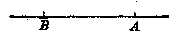

*图1·1*

里（尤其是在力学中），在实际生活和生产中，考虑直线的方向是有它的实际意义的。

任意一条直线都具有两个相反的方向，我们可以规定它的一个方向为正向，那么和它相反的方向就是负向了。象这样规定了方向的直线叫做有向直线，有向直线的正方向习惯上用箭头表示。如图1·2中的直线，称为有向直线BA或有向直线l。

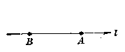

*图1·2*

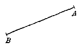

*图1·3*

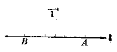

*图1·4*

线段是直线上两点间所截得的部分，因此线段也有两个相反的方向。如果以线段的一个端点 \(B\) 为起点，另一端点 \(A\) 为终点，那么由起点 \(B\) 到终点 \(A\) 是线段的一个方向（图1·3）；反之，如果以 \(A\) 为起点，\(B\) 为终点，那么由 \(A\) 到 \(B\) 的方向恰好与由 \(B\) 到 \(A\) 的方向相反。规定了方向的线段叫做有向线段，有向线段的方向就是由起点到终点的方向。

有向线段BA，用记号BA（表示起点的字母写在前，表示终点的字母写在后。当不发生混淆时也可以用BA表示）。有向线段的方向，通常由它所在的有向直线的方向来确定，就是说，如果有向线段的方向与它所在的有向直线的方向相同，就说它是正向的；如果相反，就说它是负向的。如图1·4的有向直线l上，BA表示正向，AB表示负向。

#### 2. 有向线段的数量

选定一条线段作为长度单位，可以用它来度量有向线段的长度。一条有向线段的长度，连同表示它的方向的正负号，叫做这条有向线段的数量（或值）。如图1·4的 \(\overrightarrow{BA}\)；

它的长度为6，方向为正向，用记号

$$
BA = 6
$$

表示。 \(\overline{AB}\) 的长度为6，方向为负向，用记号

$$
AB = - 6
$$

表示。如果只表示有向线段的长度，而不考虑它的方向时，只要给有向线段的数量加上绝对值的记号。如

$$
\left| BA \right| = | 6 | = 6, \quad \left| \overline {{{AB}}} \right| = | - 6 | = 6.
$$

注意， 三个记号的区别： “\(\overline{BA}\)”表示有向线段， “\(BA\)”表示有向线段的数量， “\(|BA|\)”表示有向线段的长度。对有向线段的长度来说，

$$
\left| BA \right| = \left| AB \right|.
$$

对有向线段的数量来说，

$$
BA = - AB,
$$

就是 \(BA + AB = 0.\)

#### 3. 用点的坐标表示有向线段的数量

在代数里，我们曾经在一条有向直线上选取一点 \(O\) 作为原点，任取一定长的线段作为长度单位，建立了坐标轴（也称数轴，图1·5）。并且知道，任意一个实数都可以用数轴上一个（唯一的）点来表示；反之，数轴上的任意一点，都可以表示一个（唯一的）实数。这就是数轴上的点与实数集有着一一对应的关系。对应于数轴上一点 \(P\) 的实数 \(x\) 叫做这点 \(P\) 的坐标，记作 \(P(x)\)。如果一点 \(P\) 的坐标是5，就是以原点 O 为起点，P 为终点的有向线段的数量是 5，即 OP = 5。反过来，如以原点 O 为起点，Q 为终点的有向线段的数量 \(OQ =\) -4，就是点 \(Q\) 的坐标为 \(-4\) （图1·5）。

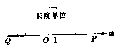

*图1·5*

设数轴 \(x\) 上有两点 \(A, B\)， 它们的坐标分别是 \(x_{1}\) 和 \(x_{2}\)。

现在我们来研究， 如何用坐标 \(x_{1}\) 和 \(x_{2}\) 表示有向线段 \(AB\) 的数量。 在图1·6（a） 中， \(OA = x_{1}, OB = x_{2}\)， 线段 \(AB\) 的起点为 \(A\)， 终点为 \(B\)。 从图形上， 我们可以直观地看到

$$
AB = OB - OA.
$$

即

$$
AB = x_{2} - x_{1}. \tag {1}
$$

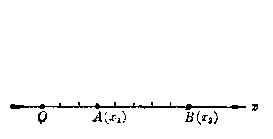

*（a）*

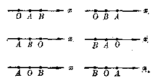

*（b）*

*图1·6*

就是说，有向线段 \(AB\) 的数量是终点的坐标减去起点的坐标。

这个结论， 不管 \(A 、 B\) 在 \(x\) 轴上的位置如何， 总是成立的 \((O 、 A 、 B\) 三点在数轴上的位置关系， 共有 6 种， 见图 \(1 \cdot 6(b)\)。我们不妨任选其中的一种情况加以证明（其余各种情况由读者自己论证）：

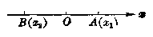

*图1·7*

设 \(A(x_{1})\) 在原点的右边，\(B(x_{2})\) 在原点的左边。由图1·7可得：

$$
BO + OA = BA,
$$

而 \(BA = -AB, BO = -OB,\) 代入上式， 得

$$
- OB + OA = - AB,
$$

$$
AB = OB - OA,
$$

就是 \(\boxed{AB=x_{2}-x_{1}}\) 如果要计算数轴上 A、B 两点间的距离，只要在求出 AB的数量后加上绝对值就可以了， 就是

$$
| AB | = \left| x_{2} - x_{1} \right|.
$$

这两个公式以后经常用到，要切实理解并记住。

#### 例1

已知数轴上有 \(P(-5)\)、\(Q(6)\)、\(R(9)\) 三点，求 PQ， QP， QR 和 PR 的数量。

［解］ 因为 P、Q、R 三点的坐标分别为 -5，6 和 9，所以

$$
PQ = 6 - (- 5) = 11; QP = - 5 - 6 = - 11;
$$

$$
QR = 9 - 6 = 3; PR = 9 - (- 5) = 14.
$$

#### 例2

在数轴上， 已知 \(\left|AB\right|=7\)， A 点的坐标是 -4， 求 B 点的坐标。

［解］ 设 B 点的坐标为 x，则

$$
\vert AB \vert = \vert x - (- 4) \vert,
$$

就是 \(|x + 4| = 7, x + 4 = \pm 7,\) x=3 或 x=-11.

所以 B 点的坐标是 3 或 -11（图1·8）。

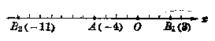

*图1·8*

#### 例3

已知 A、B、C 是直线上的三个点，不管它们的位置顺序如何排列，等式 \(AB+BC=AC\) 总是成立的，试加证明。

［证］ 以 \(A, B, C\) 所在的直线为数轴，并设 \(A, B, C\) 三点的坐标分别是 \(a, b, c\)。于是有

$$
AB = b - a, \quad BC = c - b,
$$

$$
\therefore AB + BC = (b - a) + (c - b) = c - a.
$$

而 \(AC = c - a, \therefore AB + BC = AC.\)

［注意］ （1） \(\because AC = -CA\)，故上式亦可写成 \(AB + BC + CA = 0\)。这个关系式通常叫做有向线段的加法定理（或称沙尔公式）。

（2） 这个定理可推广到直线上 \(n\) 个点的情况，即直线上有 \(n\) 个点：\(A_{1}, A_{2}, A_{3}, \cdots, A_{n-1}, A_{n}\)，不管它们的位置顺序如何排列，总有

$$
A_{1} A_{2} + A_{2} A_{3} + A_{3} A_{4} + \dots + A_{n - 1} A_{n} = A_{1} A_{n}
$$

或 \(A_{1}A_{2}+A_{2}A_{3}+A_{3}A_{4}+\cdots+A_{n-1}A_{n}+A_{n}A_{1}=0.\)

#### 例4

设 \(A, B, C, D\) 是同一轴上的四个点，试证

$$
AB \cdot CD + BC \cdot AD = AC \cdot BD.
$$

［证］ 以 \(A, B, C, D\) 四点所在的直线为数轴，并设它们的坐标分别为 \(a, b, c, d\)。

$$
\begin{array}{l} \because AB \cdot CD + BC \cdot AD \\ = (b - a) (d - c) + (c - b) (d - a) \\ = - b c - a d - c d + a b \\ = c (d - b) - a (d - b) = (c - a) (d - b)。 \\ \end{array}
$$

又 \(AC\cdot BD = (c - a)(d - b),\) 所以 \(AB\cdot CD + BC\cdot AD = AC\cdot BD.\)

1. 已知数轴上有 \(A(-3), B(4), C(7)\) 三点，求：

（1） AB， BA， BC， CA 的数量；

（2） \(BC + CA + AB\) 的值。

2. 求 M 点的坐标，并在数轴上表示出来，已知：

（1） \(N(-3), NM = -2\)； （2） \(N(2), |MN| = 5\)。

3. 已知 \(A, B, C\) 是直线上的三点，\(P\) 是这条直线上的任意一点，证明

$$
PA \cdot BC + PB \cdot CA + PC \cdot AB = 0,
$$

### § 1·2 平面直角坐标系

为了确定平面上点的位置， 象在代数里讲过的一样， 在平面上取两条互相垂直的数轴， 它们具有公共的原点和相同的长度单位。 其中一条数轴叫做 \(x\) （或横） 轴， 另一条叫做 \(y\) （或纵） 轴。 \(x\) 轴， \(y\) 轴统称为坐标轴， 公共原点称为坐标原点。 这样， 就在平面上建立了直角坐标系。

设 \(P\) 是平面上的任一点， 由 \(P\) 分别向 \(x\) 轴和 \(y\) 轴作垂线， 垂足分别是 \(M\) 和 \(N\)， 若 \(M\) 点在 \(x\) 轴上的坐标是 \(x(OM\) \(= x)\)， \(N\) 点在 \(y\) 轴上的坐标是 \(y(ON = y)\)，那末，实数对 \((x,y)\) 叫做 \(P\) 点在这个直角坐标系中的坐标。 \(x\) 称为横坐标， \(y\) 称为纵坐标。 \(|x|\) 和 \(|y|\) 分别表示 \(P\) 点到 \(y\) 轴和 \(x\) 轴的距离， \(x\) 和\(y\) 的符号则表明 \(P\) 点所在的象限。我们知道， 在平面内建立直角坐标系后， 这个平面内的点和所有的实数对 \((x, y)\) 之间便建立了一一对应的关系。

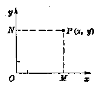

*图1·9*

由于坐标系的建立，平面内的点和一对实数就联系起来了，这就有可能把平面内关于点的几何问题转化成关于这些点的坐标数的代数问题，从而通过代数问题的研究达到解决几何问题的目的。平面解析几何就是从这一基本观念出发，用代数方法来研究几何问题的。

#### 例1

在直角坐标系中作出下列各点，并指出各点所在的象限：

（1） \(A(0,3)\)；

（2） \(B(-6,0)\)；

（3） \(C(6, \lg 6)\)；

（4） \(D\left(\frac{5\pi}{3}, 4\sin \frac{5\pi}{3}\right)\)；

（5） \(E\left(-\frac{10}{3}, -\sqrt{3}\right)\)。

［解］ （1） 因为 \(A\) 点的横坐标是 0，纵坐标是 3，所以 \(A\) 点在 \(y\) 轴的正向上。点 \(A\) 不属于任何象限。

（2） 因为 B 点的横坐标是 -6，纵坐标

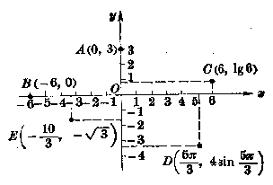

*图1·10*

是0，所以B点在x轴的负向上。点B不属于任何象限。

（3） 因为 \(\lg 6 \approx 0.7782 \approx 0.8\)，所以 \(C\) 点的坐标是 （6， 0.8）， 在第 I 象限内。

（4） 因为 \(\frac{5\pi}{3} \approx 5.2, 4\sin \frac{5\pi}{3} = -4\sin \frac{\pi}{3} = -4 \times \frac{\sqrt{3}}{2} \approx -3.5\)，所以 \(D\) 点的坐标是 \((5.2, -3.5)\)，在第 IV 象限内。

（5） 因为 E 点的坐标是 \(\left(-\frac{10}{3}, -\sqrt{3}\right)\)，所以 E 点在第 III 象限内 （图1·10）。

#### 例2

（1） 画出一个边长为 a 的正方形， 已知它有一个顶点在原点， 两边合于坐标轴。

（2） 平面上有一个三角形 ABC，应用直角坐标法，标出这个三角形

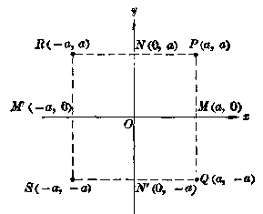

*图1·11*

的三个顶点（要求三顶点的坐标用字母个数最少）。

［解］ （1） 根据要求， 正方形可在各个象限内画出。 如图1·11 中的 OMPN， ONRM'， OM'SN'， ON'QM。

在第 I 象限内的正方形的顶点是 \(O(0, 0)\)， \(M(a, 0)\)， \(P(a, a)\)， \(N(0, a)\)。

如图， 其他象限的正方形的顶点也容易写出来。

（2） 对于一个三角形的三个顶点，它们的坐标最多要用到六个字母来表达，如 \(A(a, b), B(c, d), C(e, f)\) （图1·12（1））。但假使我们把坐标轴取得适宜，有三个字母就足够表达了。方法如下：

取三角形的一个顶点（设是 \(C\)）作为原点，三角形的一边（如 \(AC\) 边）所在的直线为 \(x\) 轴，就可定出 \(C\) 点的坐标是 \((0,0)\)，并设 \(A\) 点的坐标是 \((a,0)\)，\(B\) 点的坐标是 \((b,c)\)，这样选择直角坐标系，就可以使三角形的三个顶点 \(A(a,0), B(b,c), C(0,0)\) 只用到三个字母了（图1·12（2））。

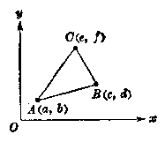

*（1）*

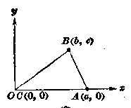

*（2）*

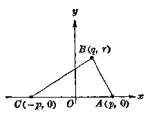

*（3）*

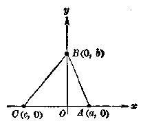

*（4）*

*图1·12*

如取三角形的一边 \(CA\) 所在直线为 \(x\) 轴，这边的中点为原点，设 \(|CA| = 2p\)，则 \(C, A\) 两点的坐标分别是 \((-p, 0)\) 和 \((p, 0)\)。再设 \(B\) 点的坐标为 \((q, r)\)。三角形的三个顶点的坐标也只用到三个字母（图1·12（3））。

还可以取三角形的一边所在的直线为 \(x\) 轴，这边上的高为 \(y\) 轴，这样，三角形的三个顶点的坐标也只用到三个字母（图1·12（4））。

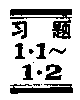

1. 在直角坐标系中作出下列各点， 已知它们的坐标各为： \((3, -5)\)， \((-2\sqrt{5}, 0)\)， \((0, \pi)\)， \((1, 3\arcsin 1)\)， \((c, d)\)。

2. 求下列各点关于 \(x\) 轴，\(y\) 轴及原点的对称点：

（1） \((-5,3)\)；

（2） \((a,-b)\)。

3. \(ABCDEF\) 是边长为 \(a\) 的正六边形， 依照下面建立的坐标系， 求各个顶点的坐标：

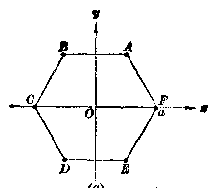

*（a）*

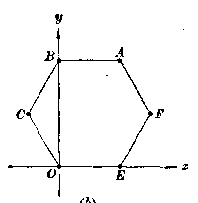

*（b）*

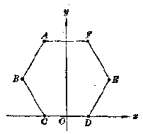

*（c）*

*（第3题）*

4. 求下图中 A， B， C， D 各点的坐标，其中 \(\alpha_{1}=30^{\circ}\)， \(\alpha_{2}=120^{\circ}\)

$$
\alpha_{3} = 225^{\circ}, \alpha_{4} = 315^{\circ}; | OA | = 5,
$$

$$
\vert OB \vert = 6, \vert OC \vert = 4, \vert OD \vert = 5.
$$

5. 平行四边形 ABCD 中，AB=8，AD=5， \(\angle A=60^{\circ}\)。以 A 为原点，AB 边所在的直线为 x 轴，求各个顶点的坐标。

［提示：有四种情况。］

6. 一个菱形的边长是 5，又它的一条对角线的长是 8，如果以两条

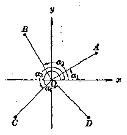

*（第4题）*

对角线作为坐标轴，求各个顶点的坐标。

［提示：有两种情况。］

7. （1） 在 \(x\) 轴上的点， 它们的纵坐标都等于什么？

（2） 在 y 轴上的点， 它们的横坐标都等于什么？

（3） 在两条坐标轴夹角平分线上的点，它们的横坐标和纵坐标有什么关系？

［提示：分第I，III象限和第II，IV象限的夹角平分线两种情况。］

8. 证明点 \(M(a, b)\) 关于两坐标轴夹角在第 I 和第 III 象限内的平分线的对称点 \(M'\) 的坐标是 \((b, a)\)。

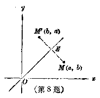

### § 1·3 两点间的距离

设平面上有两点 \(P_{1}(x_{1},y_{1})\) 和 \(P_{2}(x_{2},y_{2})\)，我们用坐标来表示它们之间的距离 \(d = |P_{1}P_{2}|\)：

由 \(P_{1}, P_{2}\) 分别向 \(x\) 轴和 \(y\) 轴作垂线 \(P_{1}M_{1}, P_{2}M_{2}\) 和 \(P_{1}N_{1}, P_{2}N_{2}\)，则 \(OM_{1} = x_{1}, OM_{2} = x_{2}, ON_{1} = y_{1}, ON_{2} = y_{2}\)。 设 \(P_{1}N_{1}\) 与 \(P_{2}M_{2}\) 的延长线交于 \(R\)（图1·13（1））。 那末，在直角三角形 \(P_{1}RP_{2}\) 中：

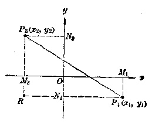

*图·1·13（1）*

$$
d = \left| P_{1} P_{2} \right| = \sqrt {\left| P_{1} R \right| ^ {2} + \left| RP_{2} \right| ^ {2}}.
$$

$$
\left| P_{1} R \right| = \left| M_{1} M_{2} \right| = \left| x_{2} - x_{1} \right|,
$$

$$
\left| RP_{2} \right| = \left| N_{1} N_{2} \right| = \left| y_{2} - y_{1} \right|.
$$

所以

$$
d = \sqrt {\left(x_{2} - x_{1}\right) ^ {2} + \left(y_{2} - y_{1}\right) ^ {2}} \tag {1}
$$

这就是两点间的距离公式。

若求一点 \(P(x, y)\) 到原点 \(O\) 的距离 \(d = |OP|\) 时，则公式（1）变为

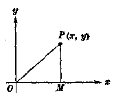

*图1·13（2）*

$$
d = \sqrt {x^{2} + y^{2}}.
$$

#### 例1

求两点间的距离，已知：

（1）。 \(P_{1}(-2,3), P_{2}(-4,-5)\)；

（2） \(A(a\cos \theta, a\sin \theta), B(a\sin \theta, -a\cos \theta) (a \neq 0)\)。

［解］ （1） \(\left|P_{1}P_{2}\right|=\sqrt{(-4+2)^{2}+(-5-3)^{2}}\)

$$
= \sqrt {68} = 2 \sqrt {17}.
$$

（2） \(|AB| = \sqrt{(a\sin\theta - a\cos\theta)^2 + (-a\cos\theta - a\sin\theta)^2}\)

$$
= \sqrt {2 a^{2} (\sin^{2} \theta + \cos^{2} \theta)} = | \sqrt {2} a |,
$$

当 \(a > 0\) 时，\(|AB| = \sqrt{2} a;\) 当 \(a < 0\) 时，\(|AB| = -\sqrt{2} a.\)

#### 例2

已知线段 \(|AB| = 13\)，端点 \(A\) 的坐标是 \((-4, 8)\)，端点 \(B\) 的纵坐标是 3，求 \(B\) 点的横坐标。

［解］ 设 B 点的坐标是 \((x, 3)\)，因为

$$
\mid AB \mid = 13,
$$

就是 \(\sqrt{(x + 4)^2 + (3 - 8)^2} = 13.\) 所以 \((x + 4)^{2} = 169 - 25, x + 4 = \pm 12,\) 故 \(x_{1} = 8, x_{2} = -16.\) 就是说， 纵坐标等于 3， 并且与 \(A(-4, 8)\) 距离等于 13 的点有 \(B_{1}(8, 3)\) 和 \(B_{2}(-16, 3)\) 两点 （图1·14）。

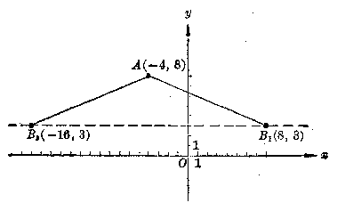

*图1·14*

#### 例3

证明矩形的对角线相等。

［证］ 取矩形两邻边所在的直线为坐标轴，设它的一边长为 a， 另一边长为 \(b\)， 置矩形 \(ABCO\) 于第一象限， 它的四个顶点是： \(O(0,0), A(a,0), B(a,b), C(0,b)\)。 由两点间的距离公式， 得

$$
\begin{array}{l} \vert OB \vert = \sqrt {a^{2} + b^{2}}, \\ \left| AC \right| = \sqrt {(0 - a) ^ {2} + (b - 0) ^ {2}} \\ = \sqrt {a^{2} + b^{2}}, \\ \therefore \quad | OB | = | AC |. \\ \end{array}
$$

故知矩形的对角线相等。

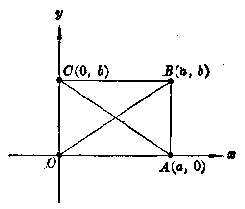

*图1·15*

1. 求下列各两点间的距离：

（1） （5， 1） 与 \((-3, -4)\)；

（2） \((-3,0)\) 与 \((0,5)\)；

（3） \((a\cos \theta, a\sin \theta)\) 与 \((0, 0)\)；

（4） \((a, b)\) 与 \((-a, b)\)；

（5） \((a + b, c + a)\) 与 \((c + a, b + c)\)；

（6） \(\left(\frac{\sqrt{3}}{2},-\frac{\sqrt{2}}{2}\right)\) 与 \(\left(-\frac{\sqrt{2}}{2},-\frac{\sqrt{3}}{2}\right)\)。

2. 证明正方形的对角线相等。

3. 在 \(x\) 轴上求一点 \(P\)， 使 \(P\) 点到 \(A(-4, 3)\) 和 \(B(2, 6)\) 两点的距离相等。

4. 证明（1， 4）， （4， 1）， （5， 5）是一个等腰三角形的三个顶点。

5. 证明 \((-4, -2), (2, 0), (8, 6), (2, 4)\) 是一个平行四边形的四个顶点，并求它的两条对角线的长度。

［提示：证明两组对边分别相等。］

### § 1·4 直线的倾斜角和斜率

#### 1. 直线的倾角和斜率

一条直线与 \(x\) 轴相交时，我们规定这条直线的向上方向和 \(x\) 轴的正方向所成的最小正角叫做这条直线的倾斜角，简称倾角。如图1·16（a）的 \(\alpha_{1}\) 和 \(\alpha_{2}\)，如果直线与 \(x\) 轴平行，我们规定，这直线的倾斜角为0（图1·16（b））。由上面的规定可知，任何一条直线的倾角 \(\alpha\) 的范围是 \(0 \leqslant \alpha < \pi\)。

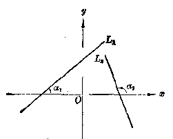

*（a）*

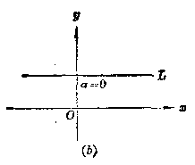

*图1·16*

因此在坐标平面内， 直线的方向可由它的倾角来确定。

一条直线的倾角 \(\alpha\) 的正切，叫做这条直线的斜率，用 \(k\) 表示，就是

$$
k = \operatorname{tg} \alpha.
$$

因为 \(0 \leqslant \alpha < \pi\)，所以不同的倾角 \(\alpha\) 对应于不同的斜率 \(k\)；反过来，确定的斜率 \(k\) 对应于一个确定的倾角 \(\alpha\)。当直线垂直于 \(x\) 轴时，\(\alpha = 90^\circ\)，斜率 \(k\) 不存在。

我们知道， 两点确定一直线。 因此一条直线的斜率， 只要倾角 \(\alpha \neq 90^{\circ}\)， 总可以由直线上任意两点的坐标来表示。

设已知直线上有任意两点 \(P_{1}(x_{1},y_{1})\) 和 \(P_2(x_2,y_2)\)，它的倾角为 \(\alpha (\alpha \neq 90^{\circ})\)，斜率为 \(k = \mathrm{tg}\alpha\)。由 \(P_{1}, P_{2}\) 分别向 \(x\) 轴和 \(y\) 轴作垂线 \(M_{1}P_{1}, M_{2}P_{2}\) 和 \(P_{1}N_{1}, P_{2}N_{2}\)，又 \(P_{1}N_{1}\)（或它的延长线）交 \(M_{2}P_{2}\) 于 \(Q\)（如图1·17中的 \((a)\) 和 \((b))\)。

从图1·17（a）的直角 \(\triangle P_{1}QP_{2}\) 中，可以得到：

$$
k = \operatorname{tg} \alpha = \frac {\left| QP_{2} \right|}{\left| P_{1} Q \right|} = \frac {\left| N_{1} N_{2} \right|}{\left| M_{1} M_{2} \right|} = \frac {\left| y_{2} - y_{1} \right|}{\left| x_{2} - x_{1} \right|}.
$$

从图上可直观地看到， \(x_{2}>x_{1}\)， \(y_{2}>y_{1}\) （如果把 \(P_{1}\)， \(P_{2}\) 的位置对调，则 \(x_{1}>x_{2}\)， \(y_{1}>y_{2}\)），所以

$$
\left| \frac {y_{2} - y_{1}}{x_{2} - x_{1}} \right| = \frac {y_{2} - y_{1}}{x_{2} - x_{1}}.
$$

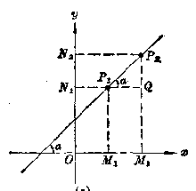

*（a）*

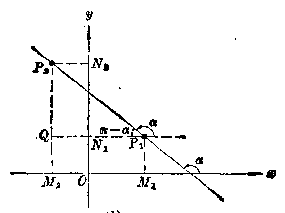

*（b）*

*图1·17*

就是 \(k = \operatorname{tg}\alpha = \frac{y_2 - y_1}{x_2 - x_1}\) 同理，在图1·17（b）的直角 \(\triangle P_{1}QP_{2}\) 中，因为

$$
\operatorname{tg} (\pi - \alpha) = \frac {| QP_{2} |}{| P_{1} Q |} = \frac {| N_{1} N_{2} |}{M_{1} M_{2} |} = \frac {| y_{2} - y_{1} |}{| x_{2} - x_{1} |}
$$

$$
= \frac {y_{2} - y_{1}}{x_{1} - x_{2}} = - \frac {y_{2} - y_{1}}{x_{2} - x_{1}} (\text {因} x_{1} > x_{2}),
$$

又 \(\operatorname{tg}(\pi - \alpha) = -\operatorname{tg} \alpha,\) 所以 \(\operatorname{tg} \alpha = \frac{y_2 - y_1}{x_2 - x_1}\)， 就是 \(k = \frac{y_2 - y_1}{x_2 - x_1}\) 从上面的讨论可以看到， 不论 \(\alpha\) 是锐角或是钝角， 总可以得到直线的斜率是

$$
k = \frac {y_{2} - y_{1}}{x_{2} - x_{1}}.
$$

这就是直线斜率的计算公式。

#### 例1

已知一直线过 \((2\sqrt{3}, -6)\)， \((- \sqrt{3}, 3)\) 两点，求这直线的斜率和倾角。

［解］ 设这两点依次为 A， B。 又直线的斜率为 k， 倾角为 \(\alpha\)， 则

$$
k = \frac {- 6 - 3}{2 \sqrt {3} + \sqrt {3}} = \frac {- 9}{3 \sqrt {3}} = - \frac {3}{\sqrt {3}} = - \sqrt {3},
$$

就是 \(\operatorname{tg} \alpha = -\sqrt{3}, \quad \therefore \alpha = \pi - \frac{\pi}{3} = \frac{2}{3} \pi.\) 这直线的斜率为 \(-\sqrt{3}\)，倾角是 \(\frac{2\pi}{3}\)。

1. 已知 \(P, Q\) 是直线上的两点，求直线 \(PQ\) 的斜率和倾角：

（1） \(P(-2,0), Q(-5,3)\)；

（2） \(P(2,2), Q(2,-2)\)。

2. \(A(1, 1), B(-1, -1), C(\sqrt{3}, -\sqrt{3})\) 是 \(\triangle ABC\) 的三个顶点，求三角形各边所在的直线的斜率。

3. 求连结两点 \(M(a + b, c + a)\) 和 \(N(c + a, b + c)\) 的直线的斜率。

#### 2. 两直线平行的条件

设直线 \(l_{1}\) 和 \(l_{2}\) 都不和 \(x\) 轴垂直，它们的倾角分别是 \(\alpha_{1}\) 和 \(\alpha_{2}\)，如果 \(l_{1} / / l_{2}\)，则 \(\alpha_{1} = \alpha_{2}\)，这时 \(\operatorname{tg} \alpha_{1} = \operatorname{tg} \alpha_{2}\)，即 \(k_{1} = k_{2}\)。

就是说，如果两条直线互相平行，那么这两条直线的斜率必相等（图1·18）。

在代数里， 我们知道， 为了要获得某种结论所必须具有的条件， 叫做获得这种结论的必要条件。 今为了要得出 \(L_{1} \parallel L_{2}\) 的结论， 推得必须 \(k_{1} = k_{2}\)， 因此我们说， 斜率相等（即 \(k_{1} = k_{2}\)） 是两条直线平行 （即 \(L_{1} // L_{2}\)） 的必要条件。

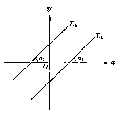

*图1·18*

反过来，如果已知直线 \(L_{1}\) 和 \(L_{2}\) 的斜率相等（就是 \(k_{1} = k_{2}\)，亦即 \(\operatorname{tg} \alpha_{1} = \operatorname{tg} \alpha_{2}\)），我们来观察 \(L_{1}\) 和 \(L_{2}\) 的相互位置关系。

由于直线的倾角的范围有限制，就是 \(0 \leqslant \alpha_{1} < \pi, 0 \leqslant \alpha_{2}\) \(<\pi,\) 且 \(\operatorname{tg}\alpha_{1}=\operatorname{tg}\alpha_{2},\) 所以 \(\alpha_{1}=\alpha_{2}.\) 因为两条直线（即 \(L_{1}\) 和 \(L_{2}\)）被第三条直线（即 \(x\) 轴）所截得的同位角相等，则这两条直线平行，所以可以得出 \(L_{1}\parallel L_{2}.\) 这就是说，如果两条直线的斜率相等，那么这两条直线必平行。

我们把获得某种结论的充分的论据，叫做获得这种结论的充分条件。就是说，只须要具有这种条件，无须附加其他的条件，就有充分的依据可以得出这个结论。今我们证得只须要两条直线的斜率相等（即 \(k_{1} = k_{2}\)），这两条直线就平行（即 \(L_{1} / / L_{2}\)），因此我们把 \(k_{1} = k_{2}\) 叫做是两条直线 \(L_{1}\) 和 \(L_{2}\) 平行的充分条件。

根据上面的讨论知道， \(k_{1}=k_{2}\) 既是直线 \(L_{1}\) 和 \(L_{2}\) 平行的充分条件，又是这两条直线平行的必要条件，因此我们就说， \(k_{1}=k_{2}\) 是直线 \(L_{1}//L_{2}\) 的充分与必要条件，简称为充要条件。

#### 例2

证明 \(A(-6, -4)\)， \(B(0, -2)\)， \(C(8, 6)\)， \(D(2, 4)\) 是一个平行四边形的四个顶点（图1·19）。

［证］ 证明一个四边形是平行四边形时，可以证明这个四边形的两组对边分别相等。现在我们根据两条直线平行的条件来证明这个四边形的两组对边分别平行。

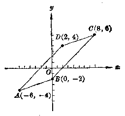

*图1·19*

设 AB， DC， BC， AD 各边的斜率分别是 \(k_{AB}\)， \(k_{DC}\)， \(k_{BC}\)， \(k_{AD}\)。

$$
\therefore k_{AB} = \frac {- 2 - (- 4)}{- (- 6)} = \frac {2}{6} = \frac {1}{3}, k_{DO} = \frac {6 - 4}{8 - 2} = \frac {1}{3},
$$

∴ \(k_{AB}=k_{DC}\)，故 \(AB \parallel DC;\) 又 \(k_{BC} = \frac{6 - (-2)}{8 - 0} = 1, k_{AD} = \frac{4 - (-4)}{2 - (-6)} = 1,\) ∴ \(k_{BC}=k_{AD}\)，故 \(BC \parallel AD\)。

在四边形 \(ABCD\) 中， \(AB \parallel DC\)， \(BC \parallel AD\)， 所以 \(ABOD\) 是一个平行四边形。

在平面几何学里，我们知道两平行线如有一个公共点时，这两直线就重合。就是说，假定平面上有 \(P_{1}(x_{1},y_{1})\)，\(P_{2}(x_{2},y_{2})\) 和 \(P_{3}(x_{3},y_{3})\) 三点，连结 \(P_{1},P_{2}\) 和 \(P_{3},P_{3}\)，如果 \(k_{P_1P_2} = k_{P_1P_3}\)，就是

$$
\frac {y_{1} - y_{2}}{x_{1} - x_{2}} = \frac {y_{1} - y_{3}}{x_{1} - x_{3}},
$$

则 \(P_{1}, P_{2}, P_{3}\) 三点在同一直线上。

#### 3. 两直线垂直的条件

设直线 \(L_{1}\) 垂直于 \(L_{2}\)，它们的倾角分别是 \(\alpha_{1}\) 和 \(\alpha_{2}\)，斜率是 \(k_{1} = \operatorname{tg}\alpha_{1}, k_{2} = \operatorname{tg}\alpha_{3}\)。

从图1·20可以得到

$$
\alpha_{2} = \frac {\pi}{2} + \alpha_{1},
$$

所以 \(\operatorname{tg} \alpha_{2} = \operatorname{tg}\left(\frac{\pi}{2} + \alpha_{1}\right)\)

$$
= - \operatorname{ctg} \alpha_{1} = - \frac {1}{\operatorname{tg} \alpha_{1}},
$$

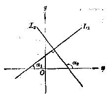

*图1·20*

就是 \(k_{2} = -\frac{1}{k_{1}}\)，或 \(k_{1}k_{2} = -1.\) 这就是说， 如果两条直线互相垂直时， 它们的斜率是互为负倒数。 也就是说， \(k_{1} \cdot k_{2} = -1\) 是两条直线垂直的必要条件。

反过来，如果 \(k_{1} \cdot k_{2} = -1\) 时，就是 \(\operatorname{tg} \alpha_{1} \cdot \operatorname{tg} \alpha_{2} = -1\)，或 \(\operatorname{tg} \alpha_{2} = -\frac{1}{\operatorname{tg} \alpha_{1}} = -\operatorname{ctg} \alpha_{1} = \operatorname{tg} \left( \frac{\pi}{2} + \alpha_{1} \right)\)。

由于 \(0 \leqslant \alpha_{1} < \pi, 0 \leqslant \alpha_{2} < \pi\)，并且 \(\alpha_{2} > \alpha_{1}\)①，所以 \(\alpha_{2} = \frac{\pi}{2} + \alpha_{1}\)，可见直线 \(L_{1} \perp L_{2}\)。

这就是说， \(k_{1}\cdot k_{2}=-1\) 是两条直线垂直的充分条件。

由上面的讨论知道， \(k_{1}\cdot k_{2}=-1\) 是直线 \(L_{1}\perp L_{2}\) 的充要条件。

#### 例3

证明正方形的对角线互相垂直。

［证］ 设 \(a\) 是正方形 \(ABCD\) 的边长。 取相邻两边 \(DA\) 和 \(DC\) 所在的直线为坐标轴， 并置正方形于第 I 象限内。 则正方形的四个顶点分别是 \(A(a, 0)\)， \(B(a, a)\)， \(C(0, a)\)， \(D(0, 0)\)。 因为 \(k_{AC} \cdot k_{BD} = -1\)， 所以对角线， \(AC \perp BD\)。

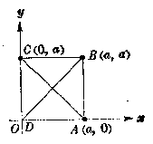

*图1·21*

1. 证明以 \(A(10,0), B(5,5), C(5,-5), D(-5,5)\) 为顶点的四边形是一个梯形。

2. 证明以 \(O(0,0), A(a,0), B(a+b,c), C(b,c)\) 为顶点的四边形是一个平行四边形。

3. 证明以 \(A(4,0), B(5,2), C(-4,4)\) 为顶点的三角形是一个直角三角形（用距离公式和两直线互相垂直的条件两种方法证明）。

1. 直线的倾角有没有什么限制？平行于 \(x\) 轴的直线的倾角是什么？平行于 \(y\) 轴呢？直线的斜率有没有什么限制？是不是所有的直线都有倾角？是不是所有的直线都有斜率？为什么？

2. 已知 \(\triangle ABC\) 的三个顶点的坐标分别是 \((-1, -1)\)， \((3, 2)\) 和 \((11, -6)\)， 求这个三角形的周长。

3. 已知 \(A(-3, 2)\) 和 \(B(1, y)\) 两点间的距离等于 5，求 \(B\) 点的纵坐标。

① 如 \(\alpha_{1} > \alpha_{2}\)，同样可以证得两直线垂直。

4. 已知 \(P(2, 2)\)， \(Q(5, -2)\) 两点， 在 \(x\) 轴上求一点 \(M\)， 使得 \(\angle PMQ\) 为直角。

5. 设 \(\triangle ABC\) 的三个顶点的坐标分别是 \(A(8,0)\)， \(B(5,9)\) 和 \(C(-3,11)\)， 求这个三角形的外接圆的圆心。

［提示：设外接圆的圆心是 \(M(x, y)\)，则 \(|MA| = |MB| = |MC|\)，由此可建立关于 \(x, y\) 的方程组。］

6. 证明 \(P(7, 2)\) 和 \(Q(1, -6)\) 两点是在以 \(C(4, -2)\) 为圆心的圆周上；并求这个圆的半径。

7. 在 \(x\) 轴上求一点， 使它与 \(M(-2,3)\) 点的距离等于 5.

8. 求通过下列两点的直线的斜率和倾角：

（1） （4， 8） 和 \((-2, -2)\)；

（2） （2， -2） 和 （4， 2）；

（3） （1， 1） 和 （5， -5）；

（4） （0， -3） 和 （1， \(\sqrt{3} - 3\)）。

9. 下列哪三点在同一条直线上？

（1） （3， -2）， （5， 1）， （10， 0）；

（2） \((a, b + c), (b, c + a), (c, a + b)\)。

10. 求与两点 \(P(-1,3)\) 和 \(Q(5,0)\) 连线垂直的直线的斜率。

11. 证明经过 \(A(a, b)\)， \(B(c, -d)\) 两点的直线平行于经过 \(C(-a, -b)\)， \(D(-c, d)\) 两点的直线。

12. 证明以 \(A(-2,0), B(2,4), C(6,0)\) 为顶点的三角形是等腰直角三角形。

13. 设 \(x_{1}, x_{2}, x_{3}\) 两两不等，证明三点 \(A(x_{1}, y_{1}), B(x_{2}, y_{2}), C(x_{3}, y_{3})\) 在同一条直线上的充要条件是

$$
\frac {y_{1} - y_{2}}{x_{1} - x_{2}} = \frac {y_{2} - y_{3}}{x_{2} - x_{3}}.
$$

14. 设 \(A, B\) 的坐标分别是 \((x_{1}, y_{1})\) 和 \((x_{2}, y_{2})\)，直线 \(AB\) 的倾角是 \(a\)，证明 \(|x_{1} - x_{2}| = \sqrt{(x_{1} - x_{2})^{2} + (y_{1} - y_{2})^{2}} \cdot |\cos \alpha|\)。

### § 1·5 线段的定比分点

设 \(P\) 是有向线段 \(P_{1}P_{2}\) 上的点，那末 \(P\) 点分 \(P_{1}P_{2}\) 为 \(P_{1}P\) 和 \(PP_{2}\) 两部分，我们称 \(P\) 为 \(P_{1}P_{2}\) 的分点。有向线段 \(P_{1}P\) 和 \(PP_{2}\) 的数量的比，叫做 \(P\) 点分 \(P_{1}P_{2}\) 所成的两条线段的比，通常用希腊字母 \(\lambda\) 表示，就是

$$
\lambda = \frac {P_{1} P}{PP_{2}}.
$$

若 \(P\) 点在线段 \(P_{1}P_{2}\) 之间，则称 \(P\) 为 \(P_{1}P_{2}\) 的内分点，这时因为 \(P_{1}P\) 和 \(PP_{2}\) 的方向相同，所以 \(\lambda = \frac{P_1P}{PP_2} > 0\)；若 \(P\) 点在线段 \(P_{1}P_{2}\) 的延长线上，则称 \(P\) 为 \(P_{1}P_{2}\) 的外分点，这时 \(P_{1}P\) 与 \(PP_{2}\) 的方向相反（图1·22），所以 \(\lambda = \frac{P_1P}{PP_2} < 0\)（但 \(\lambda \neq -1\)）。

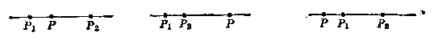

*图1·22*

特别要注意的是，P 点分 \(P_{1}P_{2}\) 所成的比是 \(\lambda=\frac{P_{1}P}{PP_{2}}\)，P 点分 \(P_{2}P_{1}\) 所成的比是 \(\lambda'=\frac{P_{2}P}{PP_{1}}\)，两者是有区别的，但它们都是把由起点到分点的线段作为比的前项，把由分点到终点的线段作为比的后项。例如 C 内分（或外分）AB 所成两线段的比是 \(\lambda=\frac{AC}{CB}\)，A 内分（或外分）CB 所成两线段的比是 \(\lambda'=\frac{CA}{AB}\)，切不可把顺序写错。

#### 例1

延长一线段 \(AB\) 至 \(C\)， 使延长部分为原长度的 \(\frac{1}{4}\)， 求点 \(C\) 外分 \(AB\) 所成两线段的比。

［解］ 因为 \(C\) 在 \(AB\) 的延长线上（图1·23），且 \(|BC| = \frac{1}{4}\) \(|AB|\)，根据题意有：

$$
\left| AC \right| = \left| AB \right| + \frac {1}{4} \left| AB \right| = \frac {5}{4} \left| AB \right|,
$$

$$
\therefore \frac {| AC |}{| CB |} = \frac {\frac {5}{4} | AB |}{\frac {1}{4} | AB |} = 5.
$$

但 \(AC, CB\) 方向相反，故 \(\lambda = -5\)，这就是点 \(O\) 外分 \(AB\) 所成两线段的比。

下面我们用坐标法求定比分点的坐标。

*图1·23*

设 \(P_{1}(x_{1},y_{1})\) 和 \(P_{2}(x_{2},y_{2})\) 是两个已知点，\(P(x,y)\) 是有向线段 \(P_{1}P_{2}\) 的分点，并且 \(\frac{P_{1}P}{PP_{2}} = \lambda\) 是一个定值。由 \(P_{1},P_{2}\) 和 \(P\) 分别向 \(x\) 轴作垂线 \(P_{1}M_{1},P_{2}M_{2}\) 和 \(PM\) （图1·24），根据平行线截得比例线段定理，得

$$
\frac {\left| P_{1} P \right|}{\left| PP_{2} \right|} = \frac {\left| M_{1} M \right|}{\left| MM_{2} \right|}.
$$

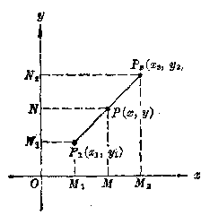

*（1）*

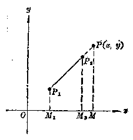

*（2）*

*图1·24*

如果 \(P\) 是 \(P_{1}P_{2}\) 的内分点，则 \(M\) 也是 \(M_{1}M_{2}\) 的内分点；如果 \(P\) 是 \(P_{1}P_{2}\) 的外分点，则 \(M\) 也是 \(M_{1}M_{2}\) 的外分点。因此 \(\frac{P_1P}{PP_2}\) 与 \(\frac{M_1M}{MM_2}\) 的符号相同，所以

$$
\frac {P_{1} P}{PP_{2}} = \frac {M_{1} M}{MM_{2}} = \lambda.
$$

从图1·24可知， \(M_{1}M = x - x_{1}\)， \(MM_{2} = x_{2} - x\)，代入上式，得

$$
\frac {x - x_{1}}{x_{2} - x} = \lambda.
$$

去分母， 整理得 \((1+\lambda)x=x_{1}+\lambda x_{2}\) 当 \(\lambda \neq -1\) 时，\(x = \frac{x_1 + \lambda x_2}{1 + \lambda}\)。

同样方法，由 \(P_{1}, P_{2}\) 和 \(P\) 分别向 \(y\) 轴作垂线 \(P_{1}N_{2}, P_{2}N_{2}\) 和 \(PN\)，当 \(\lambda \neq -1\) 时，可得

$$
y = \frac {y_{1} + \lambda y_{2}}{1 + \lambda}.
$$

这说明， 只要 \(\lambda \neq -1\)， 分线段 \(P_{1}P_{2}\) 所成的比为 \(\lambda\) 的分点 \(P\) 必存在， 它的坐标是：

$$
\left[ \begin{array}{l} x = \frac {x_{1} + \lambda x_{2}}{1 + \lambda}, \\ y = \frac {y_{1} + \lambda y_{2}}{1 + \lambda}. \end{array} \right] \tag {1}
$$

当 \(P\) 是 \(P_{1}P_{2}\) 的中点时，\(P_{1}P = PP_{2}, \lambda = 1\)。所以连结 \(P_{1}(x_{1}, y_{1})\) 和 \(P_{2}(x_{2}, y_{2})\) 的线段中点的坐标是：

$$
\left[ \begin{array}{c} x = \frac {x_{1} + x_{2}}{2}, \\ y = \frac {y_{1} + y_{2}}{2}. \end{array} \right] \tag {2}
$$

［注意］ 公式 （1） 分子中的 \(\lambda\) 的位置别搞错，用“\(\lambda\) 乘终点的坐标”可帮助记忆。

#### 例1

已知 \(P_{1}(-2, -2)\) 和 \(P_{2}(2, 6)\) 两点。

（1） 在 \(P_{1}P_{2}\) 上求一点 \(P\)，使 \(|P_{1}P| = \frac{1}{4} |P_{1}P_{2}|\)；

（2） 在 \(P_{2}P_{1}\) 的延长线上求一点 \(Q\)， 使 \(|P_{1}Q| = \frac{1}{2} |P_{2}Q|\)。

［解］ （1） 已知 \(|P_1P| = \frac{1}{4} |P_1P_2| = \frac{1}{4} (|P_1P| + |PP_2|)\)， 所以 \(3|P_1P| = |PP_2|\)。

由于 P 是 \(P_{1}P_{2}\) 的内分点，

$$
\therefore \lambda = \frac {P_{1} P}{PP_{2}} = \frac {1}{3}.
$$

由公式（1）可知 P 点的坐标是

$$
\left\{ \begin{array}{l} x = \frac {- 2 + \frac {1}{3} \times 2}{1 + \frac {1}{3}} = - 1, \\ y = \frac {- 2 + \frac {1}{3} \times 6}{1 + \frac {1}{3}} = 0. \end{array} \right.
$$

（2） 由 \(|P_{1}Q| = \frac{1}{2} |P_{2}Q|\)， 得知 \(P_{1}(-2, -2)\) 是 \(P_{2}Q\) 的中点。由公式（2），可知 \(Q\) 点的坐标是：

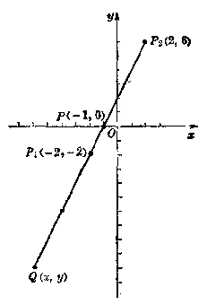

*图1·25*

$$
\left\{ \begin{array}{ll} {- 2 = \frac {2 + x}{2},} \\ {- 2 = \frac {6 + y}{2},} \end{array} \right. \quad \text {解得} \quad \left\{ \begin{array}{ll} {x = - 6,} \\ {y = - 10,} \end{array} \right.
$$

（注意） \(P_{1}, P_{2}\) 和 \(Q\) 三点的位置关系是相对的，\(P_{1}\) 作为 \(P_{2}Q\) 的内分点，那末 \(Q\) 就是 \(P_{2}P_{1}\) 的外分点，\(P_{2}\) 也是 \(QP_{1}\) 的外分点，此时 \(\lambda\) 的值要根据具体情况确定，如 \(Q\) 分 \(P_{1}P_{2}\) 所成的比是 \(\lambda = \frac{P_1Q}{QP_2} = -\frac{1}{2},\)

$$
\therefore \quad \left\{ \begin{array}{l} x = \frac {- 2 + \left(- \frac {1}{2}\right) \times 2}{1 + \left(- \frac {1}{2}\right)} = - 6, \\ y = \frac {- 2 + \left(- \frac {1}{2}\right) \times 6}{1 + \left(- \frac {1}{2}\right)} = - 10; \end{array} \right.
$$

\(P_{2}\) 分 \(QP_{1}\) 所成的比是 \(\lambda = \frac{QP_2}{P_2P_1} = -2,\)

$$
\therefore \quad \left\{ \begin{array}{ll} 2 = \frac {x + (- 2) (- 2)}{1 + (- 2)}, \\ 6 = \frac {y + (- 2) (- 2)}{1 + (- 2)}, \end{array} \right. \quad \text {解得} \quad \left\{ \begin{array}{ll} x = - 6, \\ y = - 10. \end{array} \right.
$$

其结果完全一样。

#### 例2

已知三角形的顶点是 \(A(4,0), B(7,4), C(-1,12)\)，求 \(\angle A\) 的角平分线的长度。

［解］ 设 \(AD\) 是 \(\angle A\) 的角平分线， 交 \(BC\) 于 \(D(x, y)\)， 由三角形的角平分线的性质， 得

$$
\frac {| AB |}{| AC |} = \frac {| BD |}{| CD |},
$$

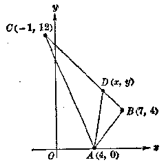

*图1·26*

$$
\because \quad | AB | = \sqrt {(7 - 4) ^ {2} + 4^{2}} = 5,
$$

$$
\vert AC \vert = \sqrt {(4 + 1) ^ {2} + 12^{2}} = 13,
$$

又 \(D\) 是 \(BC\) 的内分点，

$$
\therefore \quad \lambda = \frac {BD}{DC} = \frac {5}{13},
$$

因此 \(D\) 点的坐标是

$$
x = \frac {7 + (- 1) \times \frac {5}{13}}{1 + \frac {5}{13}} = \frac {43}{9},
$$

$$
y = \frac {4 + 12 \times \frac {5}{13}}{1 + \frac {5}{13}} = \frac {56}{9},
$$

$$
\begin{array}{l} \therefore \quad | AD | = \sqrt {\left(\frac {43}{9} - 4\right) ^ {2} + \left(0 - \frac {56}{9}\right) ^ {2}} \\ = \frac {7}{9} \sqrt {65} \approx 6. 3. \\ \end{array}
$$

#### 例3

已知三角形三边的中点分别是 \(\left(\frac{1}{2}, \frac{5}{2}\right), \left(\frac{5}{2}, \frac{3}{2}\right)\) 和 \((0, 6)\)。 求三角形的三个顶点。

［解］ 设三角形的三个顶点是 \(A(x_{1}, y_{1}), B(x_{2}, y_{2})\) 和 \(C\) \((x_{3}, y_{3})\) （图1·27）。 依题意，得

$$
\left\{ \begin{array}{ll} \frac {x_{1} + x_{2}}{2} = \frac {1}{2}, & (1) \\ \frac {x_{2} + x_{3}}{2} = \frac {5}{2}, & (2) \\ \frac {x_{3} + x_{1}}{2} = 0. & (3) \end{array} \right.
$$

解这个方程组， 得

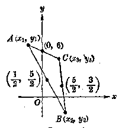

*图1·27*

$$
x_{1} = - 2, x_{2} = 3, x_{3} = 2.
$$

同理可得 \(\left\{ \begin{array}{l} \frac{y_1 + y_2}{2} = \frac{5}{2}, \\ \frac{y_2 + y_3}{2} = \frac{3}{2}, \\ \frac{y_3 + y_1}{2} = 6. \end{array} \right.\) 解这个方程组，得

$$
y_{1} = 7, y_{2} = - 2, y_{3} = 5.
$$

所以三角形的三个顶点是 \(A(-2, 7)\)， \(B(3, -2)\) 和 \(C(2, 5)\)。

#### 例4

试证三角形的三条中线交于一点，此点在每条中线上离顶点三分之二处。

［证］ 今采取如下的证法， 就是任意选择两条中线， 各求它的 \(\frac{2}{3}\) 分点 （顶点作始点）， 假如它们的坐标相同， 就是两点合一， 这说明两中线交于一个定点， 同样可以证第三条中线也经过这一点。 这样， 三中线交于一点就得证了。 它的证明步骤如下：

设三角形的三个顶点为 \(P_{1}(x_{1},y_{1}), P_{2}(x_{2},y_{2}), P_{3}(x_{3},y_{3})\)，中线为 \(P_{1}D, P_{2}E, P_{3}F\)。今 \(D, E, F\) 分别为各边的中点（如图1·28），它们的坐标是

$$
D \left(\frac {x_{2} + x_{3}}{2}, \frac {y_{2} + y_{3}}{2}\right),
$$

$$
E \left(\frac {x_{1} + x_{3}}{2}, \frac {y_{1} + y_{3}}{2}\right),
$$

$$
F \left(\frac {x_{1} + x_{2}}{2}, \frac {y_{1} + y_{2}}{2}\right)。
$$

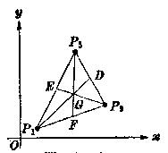

*图1·28*

又设中线 \(P_{1}D, P_{2}E\) 上各有一点 \(G, G'\)， 且

$$
\left| P_{1} G \right| = \frac {2}{3} \left| P_{1} D \right|, \left| P_{2} G^{\prime} \right| = \frac {2}{3} \left| P_{2} E \right|,
$$

即 \(|P_1G| = 2|GD|, |P_2G'| = 2|G'E|\)，

$$
\therefore \frac {| P_{1} G |}{| GD |} = 2, \quad \frac {| P_{2} G^{\prime} |}{| G^{\prime} E |} = 2.
$$

今 \(G\) 在 \(P_{1}, D\) 两点之间，故 \(\lambda = 2\)。设它的坐标为 \((x, y)\)，则

$$
\left\{ \begin{array}{l} x = \frac {x_{1} + 2 \left(\frac {x_{2} + x_{3}}{2}\right)}{1 + 2} = \frac {x_{1} + x_{2} + x_{3}}{3}, \\ y = \frac {y_{1} + 2 \left(\frac {y_{2} + y_{3}}{2}\right)}{1 + 2} = \frac {y_{1} + y_{2} + y_{3}}{3}. \end{array} \right.
$$

又 \(G'\) 在 \(P_{2}, E\) 两点之间，故 \(\lambda' = 2\)。设它的坐标是 \((x', y')\)，则

$$
\left\{ \begin{array}{l} x^{\prime} = \frac {x_{2} + 2 \left(\frac {x_{1} + x_{3}}{2}\right)}{1 + 2} = \frac {x_{1} + x_{2} + x_{3}}{3}, \\ y^{\prime} = \frac {y_{2} + 2 \left(\frac {y_{1} + y_{3}}{2}\right)}{1 + 2} = \frac {y_{1} + y_{2} + y_{3}}{3}. \end{array} \right.
$$

所以 \(x = x'\)， \(y = y'\)， 就是 \(G\)， \(G'\) 两点合一， 也就是 \(P_1D\)， \(P_2E\) 相交于一个定点。同样，如 \(P_{3}F\) 上有一点 \(G''\)，而 \(|P_{3}G''| = \frac{2}{3} |P_{3}F|\)，即 \(|P_{3}G''| = 2|G''F|\)。可证 \(G''\) 点的坐标也是 \(\left(\frac{x_1 + x_2 + x_3}{3}, \frac{y_1 + y_2 + y_3}{3}\right)\)，也合于 \(G\) 点。所以一个三角形的三条中线交于一点，此点与三个顶点的距离各在相应中线的 \(\frac{2}{3}\) 处。

G 点称为三角形 \(P_{1}P_{2}P_{3}\) 的重心，它的坐标是：

$$
x = \frac {x_{1} + x_{2} + x_{3}}{3},
$$

$$
y = \frac {y_{1} + y_{2} + y_{3}}{3}.
$$

这就是三角形的重心的坐标公式。

#### 例5

一根质量均匀的刚体棒的两端是 \(P_{1}(x_{1},y_{1})\) 和 \(P_{2}(x_{2},y_{2})\)，分别置放 \(m_{1}\) 和 \(m_{2}\) 克重物。若棒的重量不计，试求它的重心 \(P(x,y)\)。

［解］ 根据力矩平衡的原理，对于重心 P 来说， \(P_{1}\)、\(P_{2}\) 处的力矩应相等，即

$$
m_{1} \cdot | P_{1} P | = m_{2} \cdot | PP_{2} |.
$$

由于 P 内分 \(P_{1}P_{2}\)，所以

$$
\lambda = \frac {P_{1} P}{PP_{2}} = \frac {m_{2}}{m_{1}}.
$$

因此重心（物理学上也称为质心）的坐标是：

$$
\left\{ \begin{array}{l} x = \frac {x_{1} + \frac {m_{2}}{m_{1}} x_{2}}{1 + \frac {m_{2}}{m_{1}}} = \frac {m_{1} x_{1} + m_{2} x_{2}}{m_{1} + m_{2}}, \\ y = \frac {y_{1} + \frac {m_{2}}{m_{1}} y_{2}}{1 + \frac {m_{2}}{m_{1}}} = \frac {m_{1} y_{1} + m_{2} y_{2}}{m_{1} + m_{2}}. \end{array} \right.
$$

#### 例6

证明：梯形的中位线平行于底边，且等于两底和的一半。

［证］ 设梯形 OABC， OA， CB 为两底，且长度各为 a 和 b， 取顶点 O 为原点，OA 所在的直线为 x 轴（图1·29），则 A 点的坐标就是 \((a, 0)\)。设 C 点的坐标是 \((c, d)\)，作 CK，BH 垂直于 x 轴，K、H 是垂足，则因 \(OH = OK + KH = OK + CB = c + b\)，又 KC = HB = d，故得 B 点的坐标是 \((b + c, d)\)。

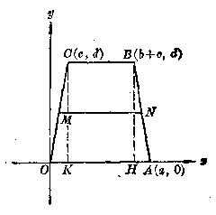

*图1·29*

又设 \(OC, AB\) 的中点各为 \(M(x', y'), N(x'', y'')\)， 则 \(x' = \frac{1}{2} c, y' = \frac{1}{2} d; x'' = \frac{1}{2}(a + b + c), y'' = \frac{1}{2} d.\) 令 \(y' = y''\)， 故 \(MN // x\) 轴， 即 \(MN // OA\)。

又 \(|MN| = \sqrt{\left[\frac{1}{2}(a + b + c) - \frac{1}{2}c\right]^2 + \left(\frac{d}{2} - \frac{d}{2}\right)^2}\) \(= \frac{1}{2} (a + b),\) 由此证得梯形的中位线 \(MN\) 平行于底边，且等于两底和的一半。

#### 例7

证明：任意四边形两组对边的中点的连线互相平分。

［证］ 以四边形的一个顶点 A 为原点，一边 \(AB\) 所在的直线为 x 轴，设 B， C， D 各点

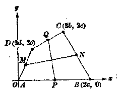

*图1·30*

的坐标分别是 \((2a,0),(2b,2c),(2d,2e)\)，且 \(M,N,P,Q\) 为各边的中点（图1·30），于是 M 点的坐标为 \((d, e)\)， N 点的坐标为 \((a+b, c)\)， P 点的坐标为 \((a, 0)\)， Q 点的坐标为 \((b+d, c+e)\)。

又 \(MN\) 的中点的坐标为

$$
\left(\frac {a + b + d}{2}, \frac {c + e}{2}\right),
$$

PQ 的中点的坐标为

$$
\left(\frac {a + b + d}{2}, \frac {c + e}{2}\right)。
$$

可见 \(MN\) 和 \(PQ\) 的中点的坐标相同，说明它们互相平分。

［注意］ 上面的例4、例6和例7（还有§1·3的例3， §1·4的例3）都是平面几何的定理。这里，我们采用代数的方法给予另一种证法。象这样的方法叫做解析法。用解析法证明几何定理时，应注意下面几点：

（1） 根据已知条件先画出几何图形，然后在图形的适当位置上建立直角坐标系。就是说，坐标系是后来人为地添上去的，不是图形中原来就有的。不管坐标系置放在图形的什么位置上，都不会影响图形的性质。但如果坐标系选取得恰当，可使证明过程简便。如例6，例7就是这样，有时为了探求某一个问题的一般规律或便于类推，坐标系就不应置放在特殊位置上，如例4就是。

（2） 选取适当的坐标系后，还要设置图形中已知点的坐标。在设置已知点的坐标时，要符合图形中的已知条件，如例6，因为 \(CB \parallel OA\)，所以 \(C\) 和 \(B\) 两点的纵坐标应相同（都设为 \(d\)），又 \(OA = a, CB = b\)，设 \(C\) 点的横坐标为 \(c\)，那末 \(OH = OK + KH = c + b\)，因此 \(B\) 点的横坐标为 \(b + c\)，不能随意乱设。有时为了计算上的方便，可根据计算的特点来设置点的坐标，如例6，我们设 \(B(2a, 0), C(2b, 2c)\)， \(D(2d, 2e)\)，是为了使中点 P， Q， M， N 的坐标不出现分数形式，计算起来较简单。

（3） 用解析法证明几何定理与几何方法不同，它主要是应用坐标法根据所学的公式进行计算，以计算的结果来论证定理的正确性。

再看下面一个例题。

#### 例8

在等腰直角三角形 ABC 中， M 是斜边 AB 的中点， P 是 AB 上任意一点， \(PE \perp AC\)， \(PF \perp BC\)， E、F 是垂足， 连接 ME 和 MF。 求证 \(ME \perp MF\)。

［证］ 以 C 为原点， 两直角边所在的直线为坐标轴。 设 \(\left|CA\right|\) \(= |CB| = 2a\)，故 \(A, B\) 两点的坐标分别为 \((2a, 0)\) 和 \((0, 2a)\)，于是 \(AB\) 的中点 \(M\) 的坐标为 \((a, a)\)。又因为 \(PE \perp CA\)，故 \(PEA\) 亦为等腰直角三角形，设腰长 \(|EP| = |EA| = b\)（图1·31），

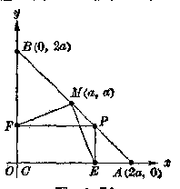

*图1·31*

$$
\therefore OE = 2 a - b,
$$

因此得 \(E(2a - b,0)\) 和 \(F(0,b)\) 两点，由斜率公式可得：

$$
k_{EM} \cdot k_{FM} = \frac {a}{a - (2 a - b)} \cdot \frac {a - b}{a} = - 1,
$$

所以 \(ME \perp MF.\)

1. 写出下列各比值：

（1） A 分线段 BC 所成的比；

（2） A 分线段 CB 所成的比；

（3） C 分线段 AB 所成的比；

（4） B 分线段 CA 所成的比。

2. 已知线段 \(P_{1}P_{2}\) 的两个端点的坐标如下，\(P\) 点分 \(P_{1}P_{2}\) 所成的比是 \(\lambda\)，求 \(P\) 点的坐标：

（1） \(P_{1}(-2,1), P_{2}(3,-3), \lambda = 2;\)

（2） \(P_{1}(5, -2), P_{2}(5, -3), \lambda = -\frac{2}{3};\)

（3） \(P_{1}(3,4), P_{2}(0,0), \lambda = 2\frac{1}{2};\)

（4） \(P_{1}(8,5), P_{2}(-13, -2), \lambda = -1\frac{1}{3}\)。

3. 求连结下列两点的线段的中点坐标：

（1） \(P(3, 2), Q(7, 4)\)；

（2） \(A(-3, 1), B(2, 7)\)；

（3） \(M(-2.8, 6.4), N(-3.9, 7.2)\)。

4. 从点 \(A(2,3)\) 引一线段到 \(B(7,-2)\)， 再延长同样的长度。求延长线端点的坐标。

5. \(P_{1}\) 和 \(P_{2}\) 两点的坐标分别是 \((-1, -6)\) 和 \((3, 0)\)，延长 \(P_{2}P_{1}\) 到 \(P\)，使 \(\{P_{1}P| = \frac{1}{3} |P_{1}P_{2}|\)。求 \(P\) 点的坐标。

6. 求 \(A(-1, 2)\) 和 \(B(-10, -1)\) 两点连线的三等分点的坐标（有两个点）。

7. 已知三角形的三个顶点是 \(A(3, -7)\)， \(B(5, 2)\) 和 \(C(-1, 0)\)。

（1） 求各边的中点坐标；（2） 求各边上中线的长；（3） 求重心的坐标。

8. 用解析法证明：

（1） 直角三角形斜边上的中线长等于斜边长的一半；

（2） 三角形两边中点的连线平行于底边，并且等于底边长的一半；

（3） 顺次连结四边形各边的中点，所得的四边形是一个平行四边形；

（4） 菱形的对角线互相垂直， 并且互相平分；

［提示：设菱形的顶点是 \(O(0,0), A(a,0), C(b,c), D(a+b, c)\)，而 \(c = \sqrt{a^2 - b^2}\).］

（5） 梯形两条对角线中点的连结线段平行于底边，且等于两底差的一半；

（6） 在 \(\square ABCD\) 中， \(E, F\) 分别是 \(BC\) 和 \(CD\) 的中点， 则 \(AE\) 和 \(AF\) 必三等分 \(BD\)。

9. 一线段的中点是（6，4），它的一个端点是（5，7），求另一个端点。

10. \(C(2,3)\) 点分线段 \(AB\) 所成的比是 \(\frac{1}{2}\)， 已知 \(A\) 点的坐标是 （1， 2）。 求 \(B\) 点的坐标。

*11. 已知 \(A(2,3), B(6,-5), C(-3,-6)\) 是三角形的三个顶点， 又在 \(A, B, C\) 处分别挂上3克，2克，1克的重量，求重心的坐标。

［提示：用本节例5的方法。］

12. 已知 \(A(1, 1), B(2, 2), C(3, -1)\) 是一个平行四边形的三个顶点，求第四个顶点。

［提示：有三解．求 \(AB, BC, CA\) 的中点，再根据平行四边形对角线的性质。］

### § 1·6 三角形面积

#### 1. 三角形的面积

在平面几何及三角学中，对于三角形的面积有几种求法大家已经熟知了，现在根据三角形三个顶点的坐标来求它的面积。具体求法如下：

设一个三角形的三个顶点分别是 \(P_{1}(x_{1},y_{1}), P_{2}(x_{2},y_{2})\) 和 \(P_{3}(x_{3},y_{3})\)。从三个顶点分别向 \(x\) 轴作垂线 \(P_{1}M_{1}, P_{2}M_{2}\) 和 \(P_{3}M_{3}\)，又由 \(P_{1}\) 作平行于 \(x\) 轴的直线，交 \(P_{3}M_{3}\) 于 \(Q_{3}\)，交 \(P_{2}M_{2}\) 于 \(Q_{2}\)（图1·32）。

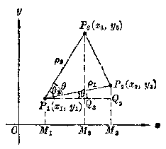

*图1·32*

设 \(P_{1}P_{2}\) 的长是 \(\rho_{1}, P_{1}P_{3}\) 的长是 \(\rho_{2}, \angle P_{2}P_{1}P_{3} = \theta (0 < \theta < \pi)\)。 如以 \(\triangle_{P_1P_2P_3}\) 表示三角形 \(P_{1}P_{2}P_{3}\) 的面积， 则

$$
\triangle_ {P_{1} P_{2} P_{3}} = \frac {1}{2} \rho_{1} \cdot \rho_{2} \sin \theta.
$$

现在我们来考虑如何以三角形顶点的坐标来表示三角形面积的问题。我们设三角形 \(P_{1}P_{2}\) 和 \(P_{1}P_{3}\) 两边的倾角分别是 \(\theta_{1}\) 和 \(\theta_{2}\)，就是 \(\angle Q_{2}P_{1}P_{2} = \theta_{1}, \angle Q_{2}P_{1}P_{3} = \theta_{2}\)。从图1·32可以看到 \(\theta = \theta_{2} - \theta_{1}\)，并且

$$
\rho_{1} \cos \theta_{1} = P_{1} Q_{2} = M_{1} M_{2} = x_{2} - x_{1},
$$

$$
\rho_{1} \sin \theta_{1} = Q_{2} P_{2} = y_{2} - y_{1},
$$

$$
\rho_{2} \cos \theta_{2} = P_{1} Q_{3} = M_{1} M_{3} = x_{3} - x_{1},
$$

$$
\rho_{2} \sin \theta_{2} = Q_{3} P_{3} = y_{3} - y_{1},
$$

所以

$$
\begin{array}{l} \triangle_ {P_{1} P_{2} P_{3}} = \frac {1}{2} \rho_{1} \rho_{2} \sin \theta \\ = \frac {1}{2} \rho_{1} \rho_{2} \sin (\theta_{2} - \theta_{1}) \\ = \frac {1}{2} \rho_{1} \rho_{2} (\sin \theta_{2} \cos \theta_{1} - \cos \theta_{2} \sin \theta_{1}) \\ = \frac {1}{2} \left[ \left(\rho_{1} \cos \theta_{1}\right) \left(\rho_{2} \sin \theta_{2}\right) - \left(\rho_{1} \sin \theta_{1}\right) \left(\rho_{2} \cos \theta_{2}\right) \right] \\ = \frac {1}{2} \left[ \left(x_{2} - x_{1}\right) \left(y_{3} - y_{1}\right) - \left(y_{2} - y_{1}\right) \left(x_{3} - x_{1}\right) \right] \\ = \frac {1}{2} \left(x_{1} y_{2} + x_{2} y_{3} + x_{3} y_{1} - x_{1} y_{3} - x_{2} y_{1} - x_{3} y_{2}\right)。 \\ \end{array}
$$

最后的一个式子， 恰好可以写成一个三阶行列式， 就是

$$
\triangle_ {P_{1} P_{2} P_{3}} = \frac {1}{2} \left| \begin{array}{lll} x_{1} & y_{1} & 1 \\ x_{2} & y_{2} & 1 \\ x_{3} & y_{3} & 1 \end{array} \right|.
$$

［注意］ 这个三阶行列式的特点是，它的第一列的各个元素是三角形的三个顶点的横标，第二列的各个元素是相应顶点的纵标，第三列的各个元素都是1，它是便于记忆的。但在进行计算时，往往会由于疏忽而把“\(\frac{1}{2}\)”丢掉，这点要引起注意。

#### 例1

求以 \(A(-5, -1)\)， \(B(1, -6)\)， \(C(2, 3)\) 为顶点的三角形的面积。

［解一］ 我们以 \(A\) 为第一个顶点，\(B\) 为第二个顶点，\(O\) 为第三个顶点，依照这规定的顺序计算，得

$$
\begin{array}{l} \triangle_{AB C} = \frac {1}{2} \left| \begin{array}{ccc} - 5 & - 1 & 1 \\ 1 & - 6 & 1 \\ 2 & 3 & 1 \end{array} \right| \\ = \frac {1}{2} (30 + 3 - 2 \\ + 12 + 1 + 15) \\ = 29. 5 (\text { 单位面积 })。 \\ \end{array}
$$

［解二］ 把顶点的顺序改变一下，仍以 A 为第一个顶点，而以 C 为第二个顶点，B 为第三个顶点，得

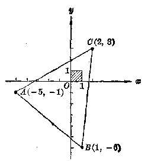

*图1·33*

$$
\triangle_{AB C} = \frac {1}{2} \left| \begin{array}{ccc} - 5 & - 1 & 1 \\ 2 & 3 & 1 \\ 1 & - 6 & 1 \end{array} \right| = - 29. 5.
$$

所以 \(\triangle ABC\) 的面积是29.5个（单位面积）。

由于所取的三角形顶点的顺序不同（在“解一”里， 顶点的顺序是依照反时针方向的， 在“解二”里是依照顺时针方向的）， 因而计算的结果也不一样， 但它们的绝对值却是相等的。 这是怎么一回事？ 我们应该怎样来理解这个问题呢？

在图1·34里我们可以看到， 如果三角形的顶点依照（a）图的顺序排列， 那末 \(\alpha\) 可以理解为由 \(P_{1}P_{2}\) 按反时针方向绕顶点 \(P_{1}\) 旋转到 \(P_{1}P_{3}\) 所成的角， 根据平面三角里角的形成的概念知道 \(\alpha > 0\)， 所以 \(\sin \alpha > 0\)， 因而三角形的面积 \(\triangle = \frac{1}{2} \rho_{1} \rho_{2} \sin \alpha > 0\)。 如果三角形的顶点依照（b）图的顺序排列， 那末 \(\alpha\) 可以理解为由 \(P_{1}P_{3}\) 按顺时针方向绕顶点 \(P_{1}\) 旋转到 \(P_{1}P_{2}\) 所成的角， 这时 \(\alpha < 0\)， 因而 \(\triangle = \frac{1}{2} \rho_{1} \rho_{2} \sin \alpha < 0\)。 但它们的绝对值相等， 就是说， 在实际计算中， 假使我们按照顶点的反时针方向顺序计算， 则得正值， 如按顺时针方向顺序计算，则得负值。 面积是没有负值的，所以我们应取它们的绝对值。 为了避免负值出现，可先作图使顶点顺序总是照反时针方向排列，再行计算（面积的单位是一个正方形，每边长度是一个单位长，参考图1·33）。

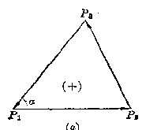

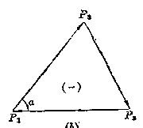

*图1·34*

从上面的讨论可知三角形的面积是

$$
\triangle = \frac {1}{2} \left| \begin{array}{lll} x_{1} & y_{1} & 1 \\ x_{2} & y_{2} & 1 \\ x_{3} & y_{3} & 1 \end{array} \right| \text {的绝对值.}
$$

如果三角形的一个顶点在原点（图1·35），又其他两个顶点为 \(P_{1}(x_{1},y_{1}), P_{2}(x_{2},y_{2})\)，即在上面公式中 \(x_{3} = 0\)，\(y_{3} = 0\)，所以

$$
\triangle = \frac {1}{2} (x_{1} y_{2} - x_{2} y_{1}) = \frac {1}{2} \left| \begin{array}{ll} x_{1} & y_{1} \\ x_{2} & y_{2} \end{array} \right| \text {的绝对值.}
$$

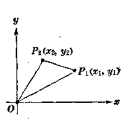

*图1·35*

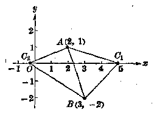

*图1·36*

#### 例2

在 x 轴上求一点，使它和 \(A(2,1)\)， \(B(3,-2)\) 所成三角形的面积等于 4 个平方单位。

甲乙丙

［解］ 设 \(C(x,0)\) 是 \(x\) 轴上的一点。由于无法确定 \(A,B,O\) 的方向顺序，因此三角形的面积应取绝对值。依题意，得：

$$
\frac{1}{2}\left| \begin{array}{ccc} 2 & 1 & 1 \\ 3 & -2 & 1 \\ x & 0 & 1 \end{array} \right| = 4.
$$

解这个方程， 得

$$
x = 5 \quad \text {或} \quad x = - \frac {1}{3}.
$$

所以适合条件的点有 \(C_1(5,0)\) 和 \(C_2\left(-\frac{1}{3},0\right)\) 两点（图1·36）。

#### 例3

已知 \(\triangle ABC\) 的顶点是 \(A(1,1), B(8,3), O(3,10)\)。 在三角形内求一点 \(P(x,y)\)， 使 \(\triangle_{PAB} = \triangle_{PBC} = \triangle_{PCA}\)。

［解］ 三角形的顶点依反时针方向顺序排列，根据三角形的面积公式可得

$$
\frac {1}{2} \left| \begin{array}{lll} x & y & 1 \\ 1 & 1 & 1 \\ 8 & 3 & 1 \end{array} \right| = \frac {1}{2} \left| \begin{array}{lll} x & y & 1 \\ 8 & 3 & 1 \\ 3 & 10 & 1 \end{array} \right| = \frac {1}{2} \left| \begin{array}{lll} x & y & 1 \\ 3 & 10 & 1 \\ 1 & 1 & 1 \end{array} \right|.
$$

由此得方程组

$$
\left\{ \begin{array}{l} 5 x + 12 y = 76, \\ 11 x - 9 y = 2. \end{array} \right.
$$

解这个方程组， 得

$$
\left\{ \begin{array}{l} x = 4, \\ y = \frac {14}{3}. \end{array} \right.
$$

所求的点是 \(P\left(4, \frac{14}{3}\right)\)。

*图1·37*

［注意］ 这点 \(P\) 实际上是 \(\triangle ABC\) 的重心（图1·37），因为三角形的重心与三个顶点的连线把三角形分成三个等积的三角形，事实上：

$$
x = \frac {1 + 8 + 3}{3} = 4, y = \frac {1 + 3 + 10}{3} = \frac {14}{3}.
$$

#### 例4

证明：梯形的面积等于两底的和与高乘积的一半。

［证］ 设梯形 \(ABCD\) 两底边的长分别是 \(a\) 和 \(b\)， 高是 \(h\)。以梯形的一个顶点 \(D\) 为原点，以底边 \(DA(= a)\) 所在的直线为 \(x\) 轴建立直角坐标系（图1·38）。 于是点 \(A\) 的坐标为 \((a,0)\)，又梯形的高为 \(h\)，设点 \(C\) 的坐标为 \((c,h)\)，那末点 \(B\) 的坐标为 \((c + b,h)\)。 连结 \(OB\)，即得梯形的面积

*图1·38*

$$
\begin{array}{l} S = \triangle_{OA B} + \triangle_{OB C} = \frac {1}{2} \left(\left| \begin{array}{cc} a & 0 \\ c + b & h \end{array} \right| + \left| \begin{array}{cc} c + b & h \\ c & h \end{array} \right|\right) \\ = \frac {1}{2} (a + b) h. \\ \end{array}
$$

#### 2. 三点共线的条件

三点在一直线上的条件，我们在1·4节是从每两点的斜率相等求得

$$
\frac {y_{1} - y_{2}}{x_{1} - x_{2}} = \frac {y_{2} - y_{3}}{x_{2} - x_{3}}. \tag {1}
$$

现在我们可以从三角形面积的公式求得同一的结果。方法如下：假使 \(P_{1}(x_{1},y_{1}), P_{2}(x_{2},y_{2}), P_{3}(x_{3},y_{3})\) 三点在一直线上，则此三点所成三角形的面积应当等于零。我们用行列式表示为

$$
\frac {1}{2} \left| \begin{array}{lll} x_{1} & y_{1} & 1 \\ x_{2} & y_{2} & 1 \\ x_{3} & y_{3} & 1 \end{array} \right| = 0, \text {即} \left| \begin{array}{lll} x_{1} & y_{1} & 1 \\ x_{2} & y 2 & 1 \\ x 3 & y 3 & 1 \end{array} \right| = 0. \tag {2}
$$

展开（2）式得 \(x_{1}y_{2} + x_{2}y_{3} + x_{3}y_{1} - x_{2}y_{1} - x_{2}y_{2} - x_{1}y_{3} = 0,\) 这和（1）式化简时所得到的结果是一致的。

反过来可以证明，如果

$$
\left| \begin{array}{ccc} x_{1} & y_{1} & 1 \\ x_{2} & y_{2} & 1 \\ x_{3} & y_{3} & 1 \end{array} \right| = 0,
$$

则 \((x_{1},y_{1})\)， \((x_{2},y_{2})\)， \((x_{3},y_{3})\) 三点在同一条直线上，就是说， \(P_{1}(x_{1},y_{1})\)， \(P_{2}(x_{2},y_{2})\)， \(P_{3}(x_{3},y_{3})\) 三点共线的充要条件是

$$
\left| \begin{array}{ccc} x_{1} & y_{1} & 1 \\ x_{2} & y_{2} & 1 \\ x_{3} & y_{3} & 1 \end{array} \right| = 0.
$$

#### 练习

1. 检验下列三点是不是在同一条直线上， 如果不是， 求以这三点为顶点的三角形的面积：

（1） \((0,5),(2,1),(-1,7)\)； （2） \((3,3),(1,-1),(0,-3)\)；

（3） \((3,0),(6, - 4),(-1, - 3);\)

（4） \((-2,3),(-7,5),(3,-5).\)

2. 求下列三角形或多边形的面积。 已知它们的顶点是：

（1） \((0, 1), (3, 4), (-1, -1)\)；

（2） \((-2, -3), (-1, 4), (3, 3), (6, -1)\)；

（3） \((1, 1), (3, 4), (5, -2), (4, -7)\)；

（4） \((0, -1), (2, 0), (3, 2), (-1, 3), (-3, 0)\)。

1. 计算下列各行列式的值：

（1） \(\left| \begin{array}{cc}\sin \alpha & \cos \alpha \\ \sin 2\alpha & \cos 2\alpha \end{array} \right|\)

（2） \(\left| \begin{array}{cc}3 & \lg 3\\ 6 & \lg 9 \end{array} \right|\)

（3） \(\left| \begin{array}{ccc}7.3 & 1 & 0.2\\ 5 & 0 & 3.1\\ 2.5 & 4 & 10 \end{array} \right|\)

（4） \(\left| \begin{array}{ccc}1 & \cos \alpha & \cos \beta \\ \cos \alpha & 1 & \cos (\alpha +\beta) \\ \cos \beta & \cos (\alpha +\beta) & 1 \end{array} \right|\)

2. 求经过 \(M(5, 5)\) 和 \(N(1, 3)\) 两点的直线与 \(x\) 轴的交点。 ［提示：设交点是 \((x, 0)\)，三点共线。］

3. 已知三角形的面积是10，它的两个顶点的坐标是（5，1）和（-2，2），第三个顶点在 \(x\) 轴上，求第三个顶点的坐标。

4. 三角形的三个顶点是 \(A(4, -1), B(1, 3), C(8, 4)\)，求它的面积和各边上高的长。

［提示：△的高等于△的面积的2倍除以相应底边的长度。］

5. 证明， 连结三角形各边的中点所成的新三角形的面积等于原三角形面积的四分之一。

6. 证明以 \(A(10, 5)\)， \(B(-2, 5)\)， \(C(-5, -3)\)， \(D(7, -3)\) 为顶点的四边形是平行四边形， 并且：

（1） 求它的面积；

（2） 求 CD 边上的高。

7. 已知三角形的三个顶点是 \(A(3, -8)\)， \(B(-4, 6)\)， \(C(7, 0)\)， 证明重心与三顶点的连结线把三角形分成三个等积的小三角形。

［提示：先求重心的坐标，再计算三个小三角形的面积。］

8. 设 \(A, B, C\) 三点的横坐标分别是 \(0, m, m + n\)， 若 \(A, B, C\) 三点共线， 求这三点的纵坐标之间的关系式。

提示：设 \(A(0, y_1), B(m, y_2), C(m + n, y_3)\)，则

$$
\left| \begin{array}{ccc} 0 & y_{1} & 1 \\ m & y_{2} & 1 \\ m + n & y_{3} & 1 \end{array} \right| = 0, \dots. ]
$$

### 本章提要

这一章建立的各种概念和公式， 是解析几何的基础， 以后各章都要不断地用到它， 一定要做到深刻理解， 牢固掌握， 以利于对全书的学习。

通过这一章的学习，我们初步体会到运用解析法研究某些几何图形的性质的优越性。这种解析法与过去用代数式计算几何量的方法有本质的不同，最重要的一点是在图形平面上置放了直角坐标系，使图形上的点与一对有序实数建立一一对应的关系，然后进行计算。因此学会在图形上选择适当的坐标系是正确运用解析法的关键所在，希望初学的同志能认真体会这种思想方法。

#### 1. 几个概念

（1） 有向直线；

（2） 有向线段；

（3） 有向线段的数量；

（4） 有向线段的长度；

（5） 轴与数轴；

（6） 直线的倾角和斜率。

#### 2. 坐标系

（1） 直线上的坐标系；

（2） 平面上的直角坐标系。

#### 3. 四个基本公式

（1） \(P_{1}(x_{1},y_{1})\) 和 \(P_{2}(x_{2},y_{2})\) 两点间的距离是

$$
d = \sqrt {(x_{1} - x_{2}) ^ {2} + (y_{1} - y_{2}) ^ {2}}.
$$

（2） \(P_{1}(x_{1},y_{1})\) 和 \(P_{2}(x_{2},y_{2})\) 是直线上的任意两点，则这直线的斜率是

$$
k = \operatorname{tg} \alpha = \frac {y_{2} - y_{1}}{x_{2} - x_{1}} \quad (x_{1} \neq x_{2})。
$$

（3） \(P\) 点分线段 \(P_{1}P_{2}\) 所成的比是 \(\lambda (\lambda \neq -1)\)， 则线段的定比分点的坐标是

$$
x = \frac {x_{1} + \lambda x_{2}}{1 + \lambda}, y = \frac {y_{1} + \lambda y_{2}}{1 + \lambda} \quad (\lambda = 1 \text {时}, P \text {是} P_{1} P_{2} \text {的中点})。
$$

（4） 以 \(A(x_{1}, y_{1}), B(x_{2}, y_{2})\) 和 \(C(x_{3}, y_{3})\) 为顶点的三角形面积 \(= \frac{1}{2} \left| \begin{array}{lll} x_{1} & y_{1} & 1 \\ x_{2} & y_{2} & 1 \\ x_{3} & y_{3} & 1 \end{array} \right|\) 的绝对值。

#### 4. 三个充要条件

（1） 两直线平行的充要条件是它们的斜率相等，即 \(k_{1} = k_{2}\)。

（2） 两直线垂直的充要条件是它们的斜率互为负倒数， 即 \(k_{1} \cdot k_{2} = -1\)。

（3） \(A(x_{1}, y_{1}), B(x_{2}, y_{2})\) 和 \(O(x_{3}, y_{3})\) 三点共线的充要条件是

$$
\left| \begin{array}{ccc} x_{1} & y_{1} & 1 \\ x_{2} & y_{2} & 1 \\ x_{3} & y_{3} & 1 \end{array} \right| = 0, \text {或} \frac {y_{1} - y_{2}}{x_{1} - x_{2}} = \frac {y_{2} - y_{3}}{x_{2} - x_{3}}.
$$

### 复习题一 A

1. 已知点的坐标满足方程组：

（1） \(\left\{ \begin{array}{l} x^{2} + y^{2} = 25, \\ x + y = 7; \end{array} \right.\)

（2） \(\left\{ \begin{array}{l} y^{2} - 4x = 0, \\ x^{2} - 4y = 0; \end{array} \right.\)

（3） \(\left\{ \begin{array}{l} 9x^{2} + 25y^{2} = 225, \\ x^{2} + y^{2} = 16, \end{array} \right.\) 作出这些点。

2. 已知 \(A(1, 4), B(5, 0), C(3, -3)\) 是三角形的三个顶点，求关于 \(y\) 轴的对称图形，并写出它的顶点。

3. 已知 \(B\) 点分 \(AC\) 所成的比是 \(\frac{2}{3}\)， 求：

（1） B 点分 CA 所成的比；

（2） A 点分 BC 所成的比；

（3） C 点分 AB 所成的比。

4. 已知三角形的顶点是 \(A(5, -1), B(-1, 7), C(1, 2)\)，试求顶角 \(A\) 的分角线的长度。

5. 点 \(C(0, 2)\) 以定比 \(\frac{1}{5}\) 分 \(A(-2, 1)\) 和 \(B\) 两点间的线段，求 \(B\) 点的坐标。

6. 已知 \(A(-2, 5)\) 和 \(M(x, y)\) 两点间的距离等于 3，并且：

（1） \(A\) 和 \(M\) 在平行于 \(x\) 轴的直线上，求 \(M\) 点的坐标；

（2） A 和 M 在平行于 y 轴的直线上， 求 M 点的坐标。

7. 求与 \(A(32, 10)\)， \(B(42, 0)\)， \(C(0, 0)\) 三点等距离的点的坐标。

8. 一直线垂直于 \(P(1,2)\) 和 \(Q(-1,3)\) 两点的连线，求这条直线的斜率和倾角。

9. 证明 \(P_{1}(-2, 9), P_{2}(10, -7)\) 两点在以 \(C(4, 1)\) 为圆心，10 为半径的圆上；如果 \(P_{3}(-4, k)\) 也在这个圆上，求 \(k\) 的值。

10. 设 \(M(3, \alpha)\) 和 \(N(\alpha, -1)\) 两点到 \(P(4, 2)\) 点的距离相等，求 \(\alpha\) 的值。

11. 在 \(A(2, -4), B(5, 11)\) 两点连成的线段 \(AB\) 上，求纵标等于 1 的点。

12. \(D\) 为三角形 \(ABC\) 的边 \(AB\) 上的中点， 证明

$$
AC^{2} + BC^{2} = 2 (CD^{2} + AD^{2})。
$$

［提示：选取 \(A\) 为原点，\(AB\) 所在的直线为 \(x\) 轴，证明较方便。］

13. 设以 \(A(6,1), B(3,8), C(1,k)\) 为顶点的三角形的面积为41，求 \(k\) 的值。

14. 一圆的圆心是 \(C(3,0)\)， 弦 \(AB\) 的长是 4， 弦的中点是 \(D(5,4)\)， 求这个圆的半径。

［提示：从直角 \(\triangle CAD\) 中求 \(|CA|\).］

*（第14题）*

15. 证明线段 \(AB\) 的垂直平分线上的点到 \(A, B\) 两点的距离相等。

### 复习题一 B

1. \(P_{1}(1,2)\) 和 \(P_{2}(3,4)\) 是线段 \(AB\) 的三等分点，求 \(A,B\) 两点的坐标。

2. 求一点 \(P\)，使它到两坐标轴的距离与到点 \(A(3,6)\) 的距离都相等。

*3. 已知 \(a, b, c\) 是 \(\triangle ABC\) 三边的长，且顶点 \(A, B, C\) 的坐标分别是 \((x_1, y_1), (x_2, y_2), (x_3, y_3)\)，试证 \(\triangle ABC\) 的内心 \(I(x, y)\) 的坐标是

$$
x = \frac {a x_{1} + b x_{2} + c x_{3}}{a + b + c}, y = \frac {a y_{1} + b y_{2} + c y_{3}}{a + b + c}.
$$

4. 证明， 如 \(P(x, y)\) 点到 \(M(2, 3)\) 和 \(N(4, 5)\) 两点的距离相等， 则

$$
x + y = 7.
$$

5. 在纵轴上求一点 \(P\)， 使 \(P\) 与 \(A(4, -6)\) 的距离等于 5.

*6. 三角形的顶点是 \(A(0,0), B(4,8)\) 和 \(C(6,-4)\)，已知 \(M\) 内分 \(AB\) 所成的比是 3：1，\(P\) 是 \(AC\) 边上一点，且三角形 \(APM\) 的面积等于三角形 \(ABC\) 的面积的一半，求 \(P\) 分 \(AC\) 所成的比。

［提示：设 \(P(x, y)\) 分 \(AC\) 所成的比为 \(\lambda\)，则 \(x = \frac{6\lambda}{1 + \lambda}, y = -\frac{4\lambda}{1 + \lambda}\)。 由面积 \(\triangle APM = \frac{1}{2} \triangle ABC\) 可求得 \(\lambda\).］

7. 已知正六边形相邻的两个顶点是 \(A(2,0)\) 和 \(B(5,3\sqrt{3})\)。求这个正六边形的重心。

［提示：设重心是 \(P(x, y)\)，则 \(|PA| = |PB| = |AB| = \cdots\)，有两解。］

8. 三角形的重心到三角形的三个顶点距离的平方和等于三边平方和的三分之一。

［提示：如以顶点 A 为原点，AB 所在直线为 x 轴，并设 \(B(8a, 0)\)， \(C(8b, 3c)\)，则重心的坐标为 \((a+b, c)\)，计算较简。］

9. 设三角形的三个顶点分别是 \((a\cos \theta_1, b\sin \theta_1), (a\cos \theta_2, b\sin \theta_2), (a\cos \theta_3, b\sin \theta_3)\)，求证它的面积是

$$
\left| 2 a b \sin \frac {\theta_{1} - \theta_{2}}{2} \cdot \sin \frac {\theta_{2} - \theta_{3}}{2} \cdot \sin \frac {\theta_{3} - \theta_{1}}{2} \right|.
$$

10. 用三个共面向量表示作用于原点的三个力。向量的终点坐标分别是（9， 7）， （-6， 8）， （2， -3）。 求表示它们的合力的线段的长以及合力与 \(x\) 轴和 \(y\) 轴所成的角。

### 第一章测验题

1. 求根据下列每一条件， 确定点 M 的坐标 \((x, y)\)。

（1） \(\sqrt{x + 2} + |1 - y^2| = 0\)；

（2） 点 M 在 x 轴上，且与点 \(P(3, 4)\) 的距离等于 5；

（3） 点 M 在连结 \(A(-2,5)\) 和 \(B\left(8,-\frac{5}{2}\right)\) 的线段上，且横坐标为 2；

（4） 点 M 和 \(P(3,7)\)、\(Q(-2,5)\) 是三角形的三个顶点，且 MP、MQ 的中点 A 和 B 分别在 x 轴和 y 轴上。

2. 已知 \(\triangle ABC\) 的三个顶点是 \(A(-1, -3)\)、\(B(6, -4)\)、\(C(-3, 8)\)。\(P\) 是 \(BC\) 边上靠近 \(B\) 点的一个三等分点，求证 \(AP \perp BC\)。

3. 已知抛物线 \(y=4x^{2}-5x+m\) 的图象与 x 轴的两个交点间的距离为 1，求 m 的值。

4. 已知 \(A(-3, -4)\) 和 \(B(5, 0)\) 是 \(\triangle ABC\) 的两个顶点，\(G(2, 1)\) 是三角形的重心。求顶点 \(C\) 及 \(\triangle ABC\) 的面积。

5. 已知 A、B、C 是坐标轴上的三个定点，P 是这轴上任意一点，试证：

$$
PA^{2} \cdot BC + PB^{2} \cdot CA + PC^{2} \cdot AB + BC \cdot CA \cdot AB = 0.
$$

6. 用解析法证明：等腰三角形两腰上的中线相等。

7. 证明以 \(A(5,3), B(1,4), C(3,-1), D(7,-2)\) 为顶点的四边形为平行四边形。

8. 已知直线 \(l\) 的倾角 \(\alpha\) 的正弦是方程 \(6x^{2} + x - 1 = 0\) 的根，求这直线的斜率和倾角（用反三角函数表示）。

## 第二章 曲线和方程

在第一章里，我们通过直角坐标系建立了平面内的点和一对实数之间的一一对应关系。在这个基础上，我们进一步研究平面内的曲线和含有两个变数的方程之间的对应关系，解决曲线和方程的两个基本问题：由曲线求出它的方程和由方程描绘它的曲线。这样，就可以把研究曲线性质的几何问题，转化为研究方程的代数问题。因此本章内容是学习以后各章知识的重要基础。

通过这一章的学习，要求理解曲线和方程的意义以及它们之间的相互关系；掌握由曲线求出它的方程，和由方程画出它的曲线的基本方法，并能用代数方法求出两条曲线交点的坐标。

### § 2·1 曲线和方程的关系

我们知道， 曲线可以看作适合于某种条件的点的轨迹。 例如， 一条线段的垂直平分线是到这条线段两个端点距离相等的点的轨迹； 圆是到一个定点的距离等于定长的点的轨迹等等。 所谓曲线是适合于某种条件的点的轨迹， 指的是：

（1） 曲线上所有的点都适合于这个条件；

（2） 适合于这个条件的所有的点， 都在这条曲线上。

例如，一条线段的垂直平分线满足下面两个要求：

（1） 线段垂直平分线上所有的点，到这条线段两个端点的距离相等；

（2） 到这条线段两个端点距离相等的点，都在这条线段的垂直平分线上。

我们把这条线段的垂直平分线叫做到这条线段两个端点距离相等的点的轨迹。

在解析几何里， 平面上的点是用一对有序实数（点的坐标）来表示的。 因此， 曲线上适合于某种条件的点， 就对应于满足某种关系的坐标。 而这种由两个坐标 \(x\) 和 \(y\) 所满足的关系， 可以用一个二元方程 \(F(x, y) = 0\) 来表示。 这样， 平面上的一条曲线就对应于一个二元方程 \(F(x, y) = 0\)， 反过来， 一个二元方程 \(F(x, y) = 0\)， 如果有一系列的实数解： \((x_1, y_1), (x_2, y_2), \cdots\)， 把它们作为点的坐标， 对应平面上一系列的点， 这些点的集合就组成一条曲线。 这样， 一个二元方程 \(F(x, y) = 0\) 就对应于平面上的一条曲线。 所以， 平面上的一条曲线可以用一个二元方程 \(F(x, y) = 0\) 来表示； 反过来， 一个二元方程 \(F(x, y) = 0\) 表示平面上的一条曲线。

［注意］ 这里所说的曲线，可以是通常意义下的一条曲线，也可以是一条或几条直线或几条曲线，在特殊情况下也可能是几个点或整个平面。

通过上面的讨论，我们可以得到曲线的方程和方程曲线的定义。

如果一条曲线和一个二元方程 \(F(x, y) = 0\) 之间有下面的关系：

（1） 曲线上所有的点的坐标都适合于这个方程；

（2） 坐标适合于这个方程的所有的点都在这条曲线上， 那末， 这个方程叫做这条曲线的方程； 这条曲线叫做这个方程的曲线。

平面上的曲线和代数方程之间建立了对应关系之后，可以将研究曲线的几何问题转化为研究方程的代数问题， 用代数方法来研究曲线。同时，也可以将研究方程的代数问题转化为研究曲线的几何问题。

#### 例1

下列各点是不是在方程 \(2x^{2} - 3y^{2} = 5\) 的曲线上：

（1） \(P(2,1)\)；

（2） \(Q(-3,0)\)。

［解］ （1） \(\because 2 \cdot 2^{2} - 3 \cdot 1^{2} = 5,\) ∴ P 点在方程 \(2x^{2}-3y^{2}=5\) 的曲线上。

（2） \(\because 2(-3)^{2} - 3 \cdot 0^{2} \neq 5,\) ∴ Q 点不在方程 \(2x^{2}-3y^{2}=5\) 的曲线上。

#### 例2

方程 x=1 和 y=-2 分别表示什么曲线？为什么？

［解］ 方程 \(x = 1\) 表示平行于 \(y\) 轴，在 \(y\) 轴右方，和 \(y\) 轴相距 1 个长度单位的一条直线 （图2·1）。

因为这条直线上所有的点的横坐标都等于1，并且横坐标等于1的所有的点都在这条直线上，所以这条直线是方程 \(x = 1\) 所表示的曲线。

方程 \(y = -2\) 表示平行于 \(x\) 轴，在 \(\alpha\) 轴下方，和 \(x\) 轴相距2个长度单位的一条直线（图2·1）。

因为这条直线上所有的点的纵坐标都等于 -2，并且纵坐标等于 -2 的所有的点都在这条直线上，所以这条直线是方程 y = -2 所表示的曲线。

*图2·1*

*图2·2*

#### 例3

试确定方程 \(|y| = |x|\) 是不是第一和第三象限两坐标轴所成的角的平分线 \(l\) 的方程（图2·2）？

［解］ 因为直线 l 上的所有的点到两坐标轴的距离都相等，所以它们的坐标都适合方程 \(\left|y\right|=\left|x\right|\)。

但是， 反过来， \(P(-2, 2)\) 是坐标适合于方程 \(|y| = |x|\) 的点， 而它却不在直线 \(l\) 上。

所以方程 \(|y| = |x|\) 不是第一和第三象限的两坐标轴所成的角的平分线 \(l\) 的方程。它表示两条坐标轴所成角的两条角平分线 \(l\) 和 \(l'\)。

由此可知：如果一个方程满足曲线的方程的定义中的两个条件，那末这个方程是这条曲线的方程，或者说这条曲线是这个方程的曲线。如果曲线的方程的定义中有一个条件不满足，那末这个方程就不是这条曲线的方程，这条曲线也就不是这个方程的曲线。

为了使曲线和方程之间相互转化，我们必须解决以下两个基本问题：

（1） 已知曲线， 求出它的方程；

（2） 已知方程， 画出它的曲线。

下面我们将分别解决这两个问题。

#### 练习

1. 判定下列各点是不是在所给的方程的曲线上：

（I） \((-4, -3)\)， \((7, -3\sqrt{2})\)， \((2, 4)\)， \((5\cos \theta, 5\sin \theta)\)； \(x^{2} + y^{2} = 25\)；

（2） \((0, 0)\)， \((0, -2)\)， \((-6 + 2\sqrt{2}, 2 + \sqrt{2})\)， \((3, 0)\)； \(y^{2} - x - 2y - 8 = 0\)。

2. 方程 \(x = 4, x = -3, x = 0, y = 2, y = -5, y = 0\) 的曲线分别是什么？为什么？

3. （1） 平行于 \(x\) 轴且在它上方 2 个长度单位的直线的方程是什么？为什么？

（2） 平行于 \(y\) 轴且在它左方 3 个长度单位的直线的方程是什么？为什么？

### § 2·2 从曲线求出它的方程

在平面几何里， 我们求适合于某种条件的点的轨迹， 一般是先探求轨迹的形状和特点， 用几何方法作出它的图形， 然后再加以证明。 现在我们建立了曲线和方程之间的联系以后， 可以把求适合于某种条件的点的轨迹的问题， 变为求适合于某种条件的曲线的方程的问题。

已知曲线，如何求出它的方程呢？下面我们先来看几个例题。

#### 例1

平面上有两点 \(A(-3, 1), B(5, -3)\)，求与 \(A, B\) 两点等距离的点的轨迹的方程（图2·3）。

［解］ 设 \(P(x, y)\) 为轨迹上的任意一点，则

$$
\left| PA \right| = \left| PB \right|, \tag {1}
$$

根据两点间的距离公式，

*图2·3*

$$
\left| PA \right| = \sqrt {(x + 3) ^ {2} + (y - 1) ^ {2}},
$$

$$
\left| PB \right| = \sqrt {(x - 5) ^ {2} + (y + 3) ^ {2}},
$$

所以

$$
\sqrt {(x + 3) ^ {2} + (y - 1) ^ {2}} = \sqrt {(x - 5) ^ {2} + (y + 3) ^ {2}}, \tag {2}
$$

两边平方， 得

$$
(x + 3) ^ {2} + (y - 1) ^ {2} = (x - 5) ^ {2} + (y + 3) ^ {2}, \tag {3}
$$

化简后，得

$$
2 x - y - 3 = 0. \tag {4}
$$

这个方程是不是与 A， B 两点等距离的点的轨迹的方程呢？由曲线的方程的定义，我们知道，必须证明以下两个方面：

（1） 曲线上所有点的坐标都适合于这个方程；

（2） 坐标适合于这个方程的所有的点都在这条曲线上。

因为轨迹上任意一点到 A， B 两点的距离相等，所以它一定适合关系式（1），它的坐标一定适合于方程（2）和方程（3），所以它的坐标也一定适合于方程（4）。

但是反过来， 从关系式（1）到方程（4）的化简过程中， 我们曾经把等式两边平方， 因此， 适合于方程（4）的实数解 \((x_{1}, y_{1})\)， 它所表示的点是否适合于关系式（1）， 也就是是否在轨迹上呢？ 我们必须加以证明。

设点 \(P_{1}(x_{1},y_{1})\) 的坐标适合于方程（4），就是

$$
2 x_{1} - y_{1} - 3 = 0,
$$

经过配方我们可以得到

$$
(x_{1} + 3) ^ {2} + (y_{1} - 1) ^ {2} = (x_{1} - 5) ^ {2} + (y_{1} + 3) ^ {2},
$$

等式两边都取算术根， 得

$$
\sqrt {\left(x_{1} + 3\right) ^ {2} + \left(y_{1} - 1\right) ^ {2}} = \sqrt {\left(x_{1} - 5\right) ^ {2} + \left(y_{1} + 3\right) ^ {2}}.
$$

最后这个方程说明点 \(P_{1}(x_{1},y_{1})\) 到 \(A,B\) 两点的距离相等， 就是说，点 \(P_{1}(x_{1}, y_{1})\) 是在 \(AB\) 的垂直平分线上。

因此方程（4）是所求的与 \(A, B\) 两点等距离的点的轨迹的方程。

#### 例2

一个圆的圆心是 \(O(-1,3)\)，半径是5，求这个圆的方程（图2·4）。

*图2·4*

［解］ 设 \(P(x, y)\) 是圆上任意一点，则

$$
\left| PO \right| = 5, \tag {1}
$$

就是

$$
\sqrt {(x + 1) ^ {2} + (y - 3) ^ {2}} = 5, \tag {2}
$$

两边平方， 得

$$
(x + 1) ^ {2} + (y - 3) ^ {2} = 25, \tag {3}
$$

化简后， 得

$$
x^{2} + y^{2} + 2 x - 6 y - 15 = 0. \tag {4}
$$

现在我们来证明方程（4）就是这个圆的方程：

1. 这个圆上的任意一点必适合于关系式（1），所以这点的坐标也必然适合于方程（4）；

2. 设点 \(P_{1}(x_{1}, y_{1})\) 的坐标适合于方程（4），就是

$$
x_{1} ^ {2} + y_{1} ^ {2} + 2 x_{1} - 6 y_{1} - 15 = 0,
$$

配方后， 得 \((x_{1}+1)^{2}+(y_{1}-3)^{2}=25,\) 等式两边都取算术根， 得

$$
\sqrt {\left(x_{1} + 1\right) ^ {2} + \left(y_{1} - 3\right) ^ {2}} = 5.
$$

最后这个方程说明点 \(P_{1}(x_{1}, y_{1})\) 到定点 \(C(-1, 3)\) 的距离等于 5，就是说，点 \(P_{1}(x_{1}, y_{1})\) 是在这个圆上。

因此方程（4）是这个圆的方程。

从上面的例题，我们可以看到要证明一个方程是某一曲线的方程，必须证明两个方面：

（1） 曲线上的所有的点的坐标都适合于这个方程；

（2） 坐标适合于这个方程的所有的点，都在这条曲线上。

但是， 通过进一步的研究， 我们可以发现： 上面两个例题中， 方程的化简过程都是同解变形的过程， 每一个方程都与前面一个方程同解， 也就是点的坐标适合于前一个方程， 必然适合于后一个方程； 反过来， 点的坐标适合于后一个方程， 也必然适合于前一个方程。 这样， 通过化简， 最后得到的方程一定是所求的曲线的方程。 实际上就可以不必再加以证明。 因此， 以后我们如果遇到方程的化简过程是同解变形的过程， 那末一般可以略去它的证明。

前面两个例题是在给定坐标系的情况下来求出曲线的方程的， 但是也有些问题， 只已知轨迹的条件， 而不给出坐标系，怎样来求出它的曲线的方程呢？那就首先必须根据图形的性质，在平面内选取适当的坐标系，然后在所设置的坐标系中导出曲线的方程。

#### 例3

已知两个定点之间的距离为 10，求到这两个点的距离的平方和为 58 的动点的轨迹的方程。

［解］ 设两个定点为 A、B，以 AB 所在的直线为 x 轴，线段 AB 的垂直平分线为 y 轴，建立直角坐标系（图2·5），则 A、B 两点的坐标分别为 \((-5,0)\) 和 \((5,0)\)。

*图2·5*

设 \(P(x, y)\) 为轨迹上任意一点，则

$$
\left| PA \right| ^ {2} + \left| PB \right| ^ {2} = 58,
$$

就是 \(\left[\sqrt{(x + 5)^2 + y^2}\right]^2 +\left[\sqrt{(x - 5)^2 + y^2}\right]^2 = 58,\) 化简后，得

$$
x^{2} + y^{2} = 4. \tag {1}
$$

这就是所求的轨迹方程。

如果选取其他位置的坐标系，也可以导出轨迹的方程，例如，以 \(AB\) 所在的直线为 \(x\) 轴，以 \(A\) 点为原点，建立坐标系（图2·6），那末 \(A\)、 B 两点的坐标为 \((0, 0)\) 和 \((10, 0)\)，得到的方程为

*图2·6*

$$
[\sqrt {x^{2} + y^{2}}] ^ {2} + [ \sqrt {(x - 10) ^ {2} + y^{2}} ] ^ {2} = 58,
$$

化简后，得

$$
x^{2} + y^{2} - 10 x + 21 = 0. \tag {2}
$$

方程（1）和（2）都是这个轨迹的方程，但是由于选取的坐标系不同，方程的形式也不相同，显然，方程（1）比方程（2）简单。因此，在求曲线的方程时，为了使所得的方程的形式比较简单，必须根据问题的条件选取适当的坐标系。

从上面的几个例题我们可以得到由曲线求它的方程的一般步骤是：

（1） 定坐标系：根据题意，选取适当的平面直角坐标系；

（2） 设点： 设曲线上任意一点是 \(P(x, y)\)；

（3） 列式： 根据几何轨迹的条件列出等式；

（4） 代换： 以解析几何的关系式代换上述等式， 得到一个关于 \(x\) 和 \(y\) 的方程；

（5） 化简： 整理化简后， 得到所求的方程；

（6） 证明： 证明所得的方程是所求的曲线的方程 （如果化简的过程都是同解变形的过程， 那末证明可以省略）。

1. 求适合于下列条件的动点的轨迹的方程：

（1） 与 \(A(1, 2)\)， \(B(-3, 4)\) 两点等距离；

（2） 与 x 轴的距离等于 5；

（3） 与原点的距离等于 r；

（4） 与定点 \((a, b)\) 的距离等于 r；

（5） 与 x 轴和 y 轴的距离之比等于 4.

2. 一个动点到两个定点 \(F_{1}(-3,0)\) 和 \(F_{2}(3,0)\) 的距离的平方和为36，求这个动点的轨迹的方程。

1. 方程 \(y = ax^2 + bx + c\) 的曲线经过原点的条件是什么？

2. 已知方程 \(x^{2} + y^{2} - 6x + \lambda (x^{2} + y^{2} + 4) = 0\) 的曲线经过 \(P(2, -2)\) 点，求 \(\lambda\) 的值。

3. 一个动点到 \(A(2,0)\) 的距离等于它到 \(B(8,0)\) 的距离的一半。求这个动点的轨迹的方程。

4. 已知 \(\triangle ABC\) 的面积等于 3 平方单位， 并且两个顶点是 \(A(1,1)\) 和 \(B(3,6)\)。 求第三个顶点 \(C\) 的轨迹的方程。

5. 求与 y 轴和点 \(F(10,0)\) 距离相等的点的轨迹的方程。

6. 一根刚体棒长 l 厘米， 两端各在互相垂直的两根轴上滑动， 求棒中点的轨迹的方程。

提示：以互相垂直的两轴为坐标轴，设棒的两端各为 \(A(a,0)\)

#### 练习

#### 习题 2·1～2·2

和 \(B(0, b), A, B\) 两点分别在 \(x\) 轴、\(y\) 轴上滑动。\(AB\) 的中点为 \(P(x, y)\)，则 \(x = \frac{1}{2} a, y = \frac{1}{2} b\)，又 \(a^2 + b^2 = l^2\)。

7. 求到两个定点的距离的平方差等于常数的点的轨迹的方程。

［提示：以两个定点的连线为 x 轴，它的垂直平分线为 y 轴，建立坐标系。设两个定点间的距离为 2a，常数为 k。］ 8 一个动点与 \(P(-2, 1)\) 的连线的斜率等于这个动点与 \(Q(2, 0)\) 的连线的斜率的2倍。求这个动点的轨迹的方程。

### § 2·3 从方程画出它的曲线

已知二元方程 \(F(x, y) = 0\)，要画出它所表示的曲线，这与代数中已知函数画出它的图象一样，通常采用描点法，它的一般法则是：

（1） 解方程：一般是解出 \(y\)，即用 \(x\) 的解析式表示 \(y\)，写成 \(y = f(x)\) 的形式（有时为了列表方便，也可以解出 \(x\)，用 \(y\) 的解析式表示 \(x\)，写成 \(x = g(y)\) 的形式）。

（2） 列表：给 \(x\) （或 \(y\)） 以适当的实数值，求出 \(y\) （或 \(x\)） 的对应值，列成表格。

（3） 定点描图：将表中的 \(x\) 和 \(y\) 的一组对应值作为一点的坐标，在坐标平面上定出各点的位置，然后按照由左到右的次序，依次顺势连结各点，描成一条平滑的曲线。

#### 例1

画出方程 \(x^{2} + y^{2} = 16\) 的曲线。

［解］ （1） 解 \(y\)， 得 \(y = \pm \sqrt{16 - x^2}\)；

（2） 列表：

| x | -4 | -3 | -2 | -1 | 0 | 1 | 2 | 3 | 4 |
| --- | --- | --- | --- | --- | --- | --- | --- | --- | --- |
| y | 0 | ±2.6 | ±3.5 | ±3.9 | ±4 | ±3.9 | ±3.5 | ±2.6 | 0 |

（3） 定点描图， 得到一个中心在原点， 半径为 4 的一个圆 （图2·7）。

*图2·7*

*图2·8*

#### 例2

画出方程 \(y^{2}-x-4=0\) 的曲线。

［解］ （1） 解 \(x\)， 得 \(x = y^2 - 4\)。

（2） 列表：

| x | 5 | 0 | -3 | -4 | -3 | 0 | 5 |
| --- | --- | --- | --- | --- | --- | --- | --- |
| y | -3 | -2 | -1 | 0 | 1 | 2 | 3 |

（3） 定点描图， 得到这个方程的曲线是一条抛物线 （图2·8）。

在代数中二次函数 \(y = ax^2 + bx + c\) 的图象是抛物线，它的开口是向上或向下的。这里的抛物线的方程是 \(x = ay^2 + by + c\) 的形式，它的开口是向右或向左的。

1. 画出方程 \(2x + 3y - 6 = 0\) 的曲线。

2. 分别画出方程 \(x^{2} + y^{2} = 25\) 和 \(y = \sqrt{25 - x^{2}}\) 的曲线，并指出它们的区别。

3. 画出方程 \(y^{2} - x - 4y + 3 = 0\) 的曲线。

4. 画出方程 \(xy = 4\) 的曲线。

### § 2·4 方程的讨论

根据 §2·3 所讲的从方程画出它的曲线的法则，描绘比较复杂的方程的曲线时，常常会产生以下的问题：

#### （I） 如何列表取点？

一般说来， 取的对应值越多， 点也就越多， 连结起来就越容易， 画得的图也就越精确。 但是， 一方面要画出所有的点是不可能的， 另一方面， 画的点越多， 计算就越繁， 画的点太少， 曲线又不易画精确。 怎样才能取较少的点， 而画出比较精确的曲线呢？

#### （2） 如何掌握图象的全貌？

在 §2·3 中例 1 的曲线在有限的范围内，例 2 的曲线的两端却无限伸展，怎样能在事前估计曲线的趋势和动向，画出比较完整的图形呢？

为了解决这些问题， 在描图以前必须对方程进行讨论。 根据方程中 \(x\) 和 \(y\) 的相依关系， 找出曲线的特点， 掌握曲线的性质和大致轮廓， 以便比较正确而且迅速地描绘出方程的曲线。

讨论的方法如下。

#### 1. 截距

如果曲线和坐标轴有交点，那末原点到交点的有向线段的数量叫做曲线在坐标轴上的截距。曲线在 \(x\) 轴上的截距简称为横截距，在 \(y\) 轴上的截距简称为纵截距。求截距的方法如下。

（1） 横截距：在方程 \(F(x, y) = 0\) 中，令 \(y = 0\)，解 \(x, x\) 的实数解就是它的横截距。如 §2·3 例 1 中，\(x^2 + y^2 = 16\)。令 \(y = 0\)，得 \(x = \pm 4\)。所以曲线的横截距是 -4 和 4。又如在 §2·3 例 2 中，\(y^2 - x - 4 = 0\)，令 \(y = 0\)，得 \(x = -4, -4\) 就是曲线的横截距。

（2） 纵截距：在方程 \(F(x, y) = 0\) 中，令 \(x = 0\)，解 \(y, y\) 的实数解就是它的纵截距。如 §2·3 例 1 中，\(x^2 + y^2 = 16\)，令 \(x = 0\)，得 \(y = \pm 4\)，-4 和 4 就是曲线的两个纵截距。又如在 §2·3 例 2 中，\(y^{2} - x - 4 = 0\)，令 \(x \neq 0\)，得 \(y = \pm 2\)，-2 和 2 就是曲线的两个纵截距。

表示截距的简便方式是列一个表格。如 §2·3 例 2 的截距可用 \(\begin{bmatrix}x & \pm 4 & 0 \\ y & 0 & \pm 4\end{bmatrix}\) 来表示，例3的截距可用 \(\begin{bmatrix}x & -4 & 0 \\ y & 0 & \pm 2\end{bmatrix}\) 来表示。

如果在一个方程中，x=0 同时也得到 y=0，就表示这条曲线经过原点，它的横截距和纵截距都是 0。在整式方程中，如果缺少常数项，那末它的曲线一定经过原点。例如方程 \(x^{2}+3y^{2}-2x+4y=0\) 的曲线经过原点。

#### 2. 对称

这里我们所讨论的曲线的对称性质是指一条曲线关于 \(x\) 轴，\(y\) 轴或原点是否对称。

（1） 曲线关于 \(x\) 轴对称：

因为点 \((x_{1}, y_{1})\) 关于 \(x\) 轴的对称点为 \((x_{1}, -y_{1})\)，所以，如果任意一个点的坐标 \((x_{1}, y_{1})\) 适合方程，同时 \((x_{1}, -y_{1})\) 也适合方程，就说明如果任意一点 \((x_{1}, y_{1})\) 在曲线上，它关于 \(x\) 轴的对称点 \((x_{1}, -y_{1})\) 也在曲线上，也就是这条曲线关于 \(x\) 轴对称。由此我们可以得到判定一个方程的曲线关于 \(x\) 轴对称的方法：

在方程 \(F(x, y) = 0\) 中，以 \(-y\) 换 \(y\)，方程不变，则它的曲线关于 \(x\) 轴对称。

按照同样的理由和方法，可以判定一个方程的曲线关于 \(y\) 轴和原点是否对称。

（2） 曲线关于 y 轴对称：

在方程 \(F(x, y) = 0\) 中，以 \(-x\) 换 \(x\)，方程不变，则它的曲线关于 \(y\) 轴对称。

（3） 曲线关于原点对称：

在方程 \(F(x, y) = 0\) 中，以 \(-x\) 换 \(x\)，同时以 \(-y\) 换 \(y\)，方程不变，则它的曲线关于原点对称。

如 §2·3 例 1 的方程 \(x^{2} + y^{2} = 16\) 中，以 \(-y\) 代 \(y\)，得 \(x^{2} + (-y)^{2} = 16\)，即 \(x^{2} + y^{2} = 16\)，方程不变，所以它的曲线关于 \(x\) 轴对称。同理可以知道，它的曲线关于 \(y\) 轴和原点都对称。又如在 §2·3 例 2 的方程 \(y^{2} - x - 4 = 0\) 中，以 \(-y\) 换 \(y\)，得 \((-y)^{2} - x - 4 = 0\)，即 \(y^{2} - x - 4 = 0\)，方程不变，所以曲线关于 \(x\) 轴对称，但是以 \(-x\) 换 \(x\)，得 \(y^{2} - (-x) - 4 = 0\)，方程改变，所以曲线关于 \(y\) 轴不对称。同理可以知道，它关于原点也不对称。

在这三种对称性质中，如有两种同时成立，那末第三种也必然成立。即：

（1） 如果曲线关于两条坐标轴都对称，那末它一定关于原点对称；

（2） 如果曲线关于一条坐标轴和原点对称，那末它一定关于另一条坐标轴对称。

但是，关于原点对称的曲线，不一定关于两条坐标轴对称。例如方程 \(xy = 4\)，以 \(-y\) 换 \(y\)，同时以 \(-x\) 换 \(x\)，得 \((-x)(-y) = 4\)，即 \(xy = 4\)，方程不变，它的曲线关于原点对称。但是如果仅以 \(-y\) 换 \(y\)，得 \(x(-y) = 4\)，或仅以 \(-x\) 换 \(x\)，得 \((-x)y = 4\)，方程都改变，因此它的曲线关于 \(x\) 轴和 \(y\) 轴都不对称。

如果 \(F(x, y) = 0\) 是一个整式方程，那末可以不必通过以 \(-x\) 换 \(x\)，或以 \(-y\) 换 \(y\)，而只须直接根据方程中 \(x\) 和 \(y\) 的指数的奇偶性，就可以判定它的曲线关于坐标轴或原点的对称性：

（1） 一个方程中， 如果 \(y\) 的指数全是偶数， 则它的曲线关于 \(x\) 轴对称 （因为以 \(-y\) 换 \(y\) 时， 方程不变）。

（2） 一个方程中， 如果 \(x\) 的指数全是偶数， 则它的曲线关于 y 轴对称（因为以 -x 换 x 时， 方程不变）。

（3） 一个方程中， 如果每一项 \(x, y\) 的指数的和全是偶数 （或全是奇数）， 则它的曲线关于原点对称 （因为以 \(-x\) 换 \(x\)， 同时以 \(-y\) 换 \(y\)， 方程不变）。

例如，方程 \(y^{2} = 3x, x^{3} + 3xy^{2} - y^{4} + 4 = 0\) 的曲线关于 \(x\) 轴对称；方程 \(y = 4x^{3}, x^{4} - x^{2}y - 2 = 0\) 的曲线关于 \(y\) 轴对称；方程 \(x^{2} + x^{2}y + y = 0, 3x^{2} + 4xy + 5y^{2} = 0, xy = 9\) 的曲线关于原点对称；方程 \(4x^{2} - 5y^{2} = 20, 3x^{2} + 4y^{2} = 12\) 的曲线关于 \(x\) 轴，\(y\) 轴和原点都对称。

［注意］ 这里所讨论的曲线的对称性质，仅指曲线关于两坐标轴或原点是否对称而言。至于曲线本身是不是对称图形现在还不适宜讨论。例如方程 \(y = x^{2} + 4x + 3\) 的曲线是抛物线，它关于直线 \(x = -2\) 对称，是一个轴对称图形，但它关于两坐标轴和原点都不对称，目前就不属于我们讨论的内容。

#### 3. 范围

要求曲线存在的范围，就是要求出方程 \(x\) 和 \(y\) 的变化范围，也就是要求出 \(x\) （或 \(y\)） 取哪些实数值时，才能使 \(y\) （或 \(x\)） 有确定的实数值。这可以先从方程 \(F(x, y) = 0\) 中解出 \(y = f(x)\) 和 \(x = g(y)\)，然后分别求出 \(x\) 和 \(y\) 的允许值范围。

例如在方程 \(x^{2} + y^{2} = 16\) 中，解 \(y\)，得

$$
y = \pm \sqrt {16 - x^{2}},
$$

要使 \(y\) 有确定的值，必须使 \(16 - x^{2} \geqslant 0\)，即

$$
x^{2} - 16 \leqslant 0, (x + 4) (x - 4) \leqslant 0,
$$

所以 \(-4 \leqslant x \leqslant 4\)。

同理 \(x = \pm \sqrt{16 - y^2}\) 要使 \(x\) 有确定的值， 必须使 \(16 - y^{2} \geqslant 0\)， 则

$$
- 4 \leqslant y \leqslant 4.
$$

所以曲线在四条直线 \(x = -4, x = 4, y = -4, y = 4\) 所围成的正方形区域内（图2·7）。

又如，在方程 \(y^{2} - x - 4 = 0\) 中，解 \(y\)，得

$$
y = \pm \sqrt {x + 4},
$$

解 \(x\)，得 \(x = y^{2} - 4.\) 要使 \(y\) 有确定的值，必须使 \(x + 4 \geqslant 0\)，即

$$
x \geqslant - 4.
$$

由 \(x = y^{2} - 4\) 可知：

\(y\) 可以取一切实数。 并且当 \(x \to +\infty\) 时， \(y \to \infty\)。 因此， 曲线在直线 \(x = -4\) 的右方， 而且向上向下无限伸展 （图2·8）。

在某些情况下，方程 \(F(x, y) = 0\) 中，当一个变数无限增大时，另一个变数趋近于一个常数，也就是曲线伸展到无穷远时，无限接近于一条直线（平行于一条坐标轴的直线），我们把这条直线叫做曲线的渐近线（平行于坐标轴的）。如果当 \(x \to +\infty\) 时，\(y \to b\) 或 \(x \to -\infty\) 时，\(y \to b\)，我们把 \(y = b\) 叫做曲线的水平渐近线。当 \(x \to a\) 时 \(y \to +\infty\)，或当 \(x \to a\) 时 \(y \to -\infty\)，我们把 \(x = a\) 叫做曲线的垂直渐近线。

例如，在方程 \(xy - 3y - 2 = 0\) 中，

$$
y = \frac {2}{x - 3}.
$$

$$
\lim_{x \rightarrow \infty} y = \lim_{x \rightarrow \infty} \frac {2}{x - 3} = \lim_{x \rightarrow \infty} \frac {\frac {2}{x}}{1 - \frac {3}{x}} = 0,
$$

即当 \(x \to \infty\) 时， \(y \to 0\)。

所以 \(y = 0\) 是这个方程的曲线的水平渐近线。

又 \(\lim_{x\to 3}y = \lim_{x\to 3}\frac{2}{x - 3} = \infty ,\) 即当 \(x \to 3\) 时， \(y \to \infty\)。

所以 \(x = 3\) 是这个方程的曲线的垂直渐近线。

#### 练习

1. 求下列各方程的曲线的截距：

（1） \(\frac{x^2}{9} - \frac{y^2}{16} = 1\)；

（2） \(y = x^{2} - 4x + 4;\)

（3） \(\frac{x}{2} + \frac{y}{3} = 1\)；

（4） \(y^{2} = -2x;\)

（5） \(x^{2} - 2xy + y^{2} + 2y - 1 = 0;\)

（6） \(x^{2} + y^{2} = r^{2}\) \((r > 0)\)。

2. 在下列各方程的曲线中，哪些关于 \(x\) 轴对称？哪些关于 \(y\) 轴对称？哪些关于原点对称？

（1） \(x^{2} + y^{2} - 4x - 13 = 0;\)

（2） \(2x + x^{2}y - 3y^{3} = 0;\)

（3） \(x^{2} = 4y;\)

（4） \(4x^{2} + 9y^{2} = 36;\)

（5） \(x^{3} + y^{2} - 4x - 2 = 0;\)

（6） \(y = \lg x.\)

3. 求下列曲线的范围：

（1） \(y^{2} = -8x;\)

（2） \(y^{2}-x^{2}=3x+2;\)

（3） \(x^{2} + y^{2} + 2x - 6y - 15 = 0;\)

（4） \(\frac{x^2}{a^2} + \frac{y^2}{b^2} = 1.\)

4. 求下列曲线的渐近线：

（1） \(xy = 6\)；

（2） \((x - 1)(y - 3) = 2;\)

（3） \(y = c\deg x.\) 下面我们举几个例题， 先讨论曲线的截距； 对称性和范围， 然后再画出它们的曲线。

#### 例1

描绘方程 \(x^{2}+4y^{2}=16\) 的曲线。

［解］ （1） 截距：

令 \(y = 0\)，得 \(x = \pm 4.\) 令 \(x = 0\)，得 \(y = \pm 2\) 所以曲线的横截距是 \(\pm 4\)，纵截距是 \(\pm 2\)。

（2） 对称：

因为 \(x\) 和 \(y\) 的指数都是偶数， 所以曲线关于 \(x\) 轴、\(y\) 轴和原点都对称。

（3） 范围：

解 \(y\)，得

$$
y = \pm \frac {1}{2} \sqrt {16 - x^{2}}, 16 - x^{2} \geqslant 0,
$$

$$
\therefore - 4 \leqslant x \leqslant 4.
$$

解 \(x\)，得 \(x = \pm 2\sqrt{4 - y^2},\therefore 4 - y^2\geqslant 0,\)

$$
\therefore - 2 \leqslant y \leqslant 2.
$$

所以曲线在 \(x = -4, x = 4, y = -2, y = 2\) 四条直线所围成的矩形内。

（4） 列表：

| x | 0 | 1 | 2 | 3 | 4 |
| --- | --- | --- | --- | --- | --- |
| y | 2 | 1.9 | 1.7 | 1.3 | 0 |

根据曲线的对称性和范围的讨论，可以知道只要画出曲线在第一象限内从 \(x = 0\) 到 \(x = 4\) 的一部分，就可以画出整个曲线。

（5） 定点描图：

可得方程的曲线是椭圆（图2·9）。

#### 例2

描绘方程 \(x^{2} - y^{2} + 2y + 3 = 0\) 的曲线。

［解］ （1） 截距：

*图2·9*

令 \(y = 0\)，得 \(x^{2} + 3 = 0\)， \(x\) 没有实数根；令 \(x = 0\)，得\(y_{1} = -1,y_{2} = 3.\) 所以曲线没有横截距，纵截距是-1和3.

（2） 对称：

因为 \(x\) 的指数是偶数，所以曲线关于 \(y\) 轴对称。

（3） 范围：

解 \(x\)，得 \(x = \pm \sqrt{y^2 - 2y - 3}\)

$$
y^{2} - 2 y - 3 \geqslant 0, (y + 1) (y - 3) \geqslant 0,
$$

∴ \(y \leqslant -1\) 或 \(y \geqslant 3\)。

因此曲线在两条平行直线 y = -1 和 \(y = 3\) 的外面。

解 \(y\)，得 \(y = 1 \pm \sqrt{x^2 + 4}\) x 可以取任何实数，当 \(|x|\) 无限增大时， \(|y|\) 也无限增大，所以曲线在各个象限内都是无限伸展的。

（4） 列表：

根据曲线的对称性可知， 只须取 \(x \geqslant 0\) 的值， 代入 \(y = 1 \pm \sqrt{x^2 + 4}\) 便可求得。

| x | 0 | 2 | 4 | 6 | 8 | 10 | .。。。。。 |
| --- | --- | --- | --- | --- | --- | --- | --- |
| y | -1 | -1.8 | -3.5 | -5.3 | -7.2 | -9.2 | .。。。。。 |
| y | 3 | 3.8 | 5.5 | 7.3 | 9.2 | 11.2 | .。。。。。 |

（5） 定点描图：

可得方程的曲线是双曲线（图2·10）。

画出方程

$$
x y + 3 x - 2 y - 12 = 0
$$

的曲线。

［解］ （1） 截距：

令 \(y = 0\)，得 \(x = 4\) 令 \(x = 0\)，得 \(y = -6\) 所以曲线的横截距为 4，纵截距为 -6。

*图2·10*

（2） 对称：

曲线关于 x 轴、y 轴和原点都不对称。

（3） 范围：

解 \(y\)，得

$$
y = \frac {12 - 3 x}{x - 2}. \tag {1}
$$

解 \(x\)，得

$$
x = \frac {2 y + 12}{y + 3}. \tag {2}
$$

从（1）式，得

$$
\lim_{x \rightarrow \infty} y = \lim_{x \rightarrow \infty} \frac {12 - 3 x}{x - 2} = \lim_{x \rightarrow \infty} \frac {\frac {12}{x} - 3}{1 - \frac {2}{x}} = - 3.
$$

即当 \(x \to \infty\) 时， \(y \to -3\)。 所以 \(y = -3\) 是曲线的水平渐近线。

又从（1）式，得

$$
\lim_{x \rightarrow 2} y = \lim_{x \rightarrow 2} \frac {12 - 3 x}{x - 2} = \infty.
$$

即当 \(x \to 2\) 时， \(y \to \infty\)， 所以 \(x = 2\) 是曲线的垂直渐近线。

因此这个方程的曲线向左向右无限伸展，并且无限接近于直线 \(y = -3\)，向上向下无限伸展，并且无限接近于直线 \(x = 2\)。

（4） 列表：

| x | -10 | -4 | -1 | 0 | 1 | 1.5 | 2.5 | 3 | 4 | 5 | 8 | 14 |
| --- | --- | --- | --- | --- | --- | --- | --- | --- | --- | --- | --- | --- |
| y | -3.5 | -4 | -5 | -6 | -9 | -15 | 9 | 3 | 0 | -1 | -2 | -2.5 |

（5） 定点描图：

可得方程的曲线是双曲线（图2·11）。

在方程 \(F(x, y) = 0\) 中，如果 \(F(x, y)\) 可以分解为几个因式，例如

$$
F (x, y) = f_{1} (x, y) \cdot f_{2} (x, y)
$$

$$
\cdot f_{3} (x, y) \dots,
$$

在代数上说， 方程 \(F(x, y)\) =0 与方程

*图2·11*

$$
f_{1} (x, y) = 0, \quad f_{2} (x, y) = 0, \quad f_{3} (x, y) = 0, \quad \dots
$$

是同解的．反映到曲线上来，这些方程，每一个都决定一条曲线，这些曲线合起来就是原方程 \(F(x,y)=0\) 的曲线．例如在下列方程中：

（1） \(x^{2} - y^{2} = 0,\) 因为 \(x^{2} - y^{2} = (x - y)(x + y),\) 所以原方程可以分解成两个方程：

$$
x - y = 0
$$

和 \(x + y = 0.\) 它们的两条曲线就是方程 \(x^{2} - y^{2} = 0\) 的曲线（图2·12）。

*图2·12*

*图2·13*

（2） \(x^{2} - y^{2} - x^{2}y + xy^{2} - 25x + 25y = 0,\) 它的左边可以分解成两个因式， 就是

$$
(x - y) (x^{2} + y^{2} - 25) = 0,
$$

就是 \(x - y = 0\) 和 \(x^{2} + y^{2} - 25 = 0.\) 它们的两条曲线就是原方程的曲线（图2·13）。

从一个方程描绘它的曲线，还可能产生下列特殊情况：

（1） 方程只有有限组实数解。这时方程的曲线是几个孤立的点。

例如方程 \(x^{2} + y^{2} + 2x - 6y + 10 = 0\)，配方后，得

$$
(x + 1) ^ {2} + (y - 3) ^ {2} = 0.
$$

这个方程只有一组实数解 \(x = -1, y = 3\)。所以这个方程的曲线只有一个孤立的点：\((-1, 3)\)。

（2） 方程没有实数解， 这时方程就没有曲线。

例如方程 \(x^{2} + y^{2} + 2x - 6y + 11 = 0\)，配方后，得

$$
(x + 1) ^ {2} + (y - 3) ^ {2} + 1 = 0.
$$

这个方程没有实数解，所以这个方程没有曲线。

讨论并描绘下列方程的曲线：

1. \(y^{2} = 4x;\)

2. \(9x^{2} + 4y^{2} = 36;\)

3. \(4x^{2} - 9y^{2} = 36;\)

4. \(xy - 3x + 4y - 14 = 0;\)

5. \(16x^{2} - 25y^{2} = 0;\)

6. \((x^{2} - 4)(y^{2} - 1) = 0;\)

7. \(x^{2} + y^{2} - 4x + 6y + 13 = 0;\)

8. \(4x^{2} + y^{2} - 4x + 6y + 13 = 0.\)

### § 2·5 两曲线的交点

设两曲线 \(C_{1}, C_{2}\) 的方程分别是

$$
F_{1} (x, y) = 0 \quad \text {和} \quad F_{2} (x, y) = 0.
$$

如果 \(P_{1}(x_{1},y_{1})\) 是两曲线 \(C_1\) 及 \(C_2\) 的交点（图2·14），则以 \(x_{1}, y_{1}\) 代入上列方程必然适合，即

$$
F_{1} (x_{1}, y_{1}) = 0,
$$

同时 \(F_{2}(x_{1},y_{1}) = 0.\) 这说明 \(x_{1}\) 和 \(y_{1}\) 是方程组

*图2·14*

$$
\left\{ \begin{array}{l} F_{1} (x, y) = 0, \\ F_{2} (x, y) = 0 \end{array} \right.
$$

的一组实数解。

反过来， 如果方程组

$$
\left\{ \begin{array}{l} F_{1} (x, y) = 0, \\ F_{2} (x, y) = 0 \end{array} \right.
$$

有一组实数解如 \(x_{1}, y_{2}\)，则

$$
\left\{ \begin{array}{l} F_{1} (x_{1}, y_{1}) = 0, \\ F_{2} (x_{1}, y_{1}) = 0. \end{array} \right.
$$

可以看出，以 \((x_{1}, y_{1})\) 为坐标的点必然既在曲线 \(C_{1}\) 上，也同时在曲线 \(C_{2}\) 上，即为 \(C_{1}\) 及 \(C_{2}\) 的交点。

因此我们得到两曲线的交点的坐标，就是这两曲线的方程所成的方程组的实数解；反过来，两个二元方程所组成的方程组的实数解，是这两方程的曲线的交点的坐标。要求两条曲线交点的坐标，只要解这两条曲线的方程所组成的方程组，求出它的实数解就可以了。如果这个方程组没有实数解，那末这两个方程的曲线就没有交点。

#### 例1

求 \(x^{2} + 4y^{2} = 52\) 和 \(x^{2} - y^{2} - 7 = 0\) 的曲线交点。

［解］

$$
\left\{ \begin{array}{l} x^{2} + 4 y^{2} = 52, \\ x^{2} - y^{2} = 7. \end{array} \right. \tag {1}
$$

解这个方程组：

（1） - （2）， 得 \(5y^{2} = 45, y^{2} = 9,\)

$$
\therefore y = \pm 3.
$$

以 \(y = 3\) 代入（1），得

$$
x^{2} = 16, \quad \therefore x = \pm 4.
$$

以 \(y = -3\) 代入（1），得

$$
x^{2} = 16, \quad \therefore x = \pm 4.
$$

这方程组有四组实数解：

$$
\left\{ \begin{array}{l} x_{1} = 4, \\ y_{1} = 3; \end{array} \right. \quad \left\{ \begin{array}{l} x_{2} = 4, \\ y_{2} = - 3; \end{array} \right. \quad \left\{ \begin{array}{l} x_{3} = - 4, \\ y_{3} = 3; \end{array} \right. \quad \left\{ \begin{array}{l} x_{4} = - 4, \\ y_{4} = - 3. \end{array} \right.
$$

就是说，两曲线的交点是 \(A(4,3), B(4,-3), C(-4,3), D(-4,-3)\) 四点（图2·15）。

#### 例2

已知方程 \(y = x^2 - x + 2\) 和 \(y = x + k\)，求 \(k\) 为下列各值时，它们的曲线的交点：

（1） k=2；

（2） k=1；

（3） k=0.

［解］ 解方程组

*图2·15*

$$
\left\{ \begin{array}{l} y = x^{2} - x + 2, \\ y = x + k. \end{array} \right. \tag {1}
$$

（2）代入（1），得

$$
x^{2} - 2 x + 2 - k = 0,
$$

$$
x = 1 \pm \sqrt {k - 1}.
$$

代入（2），得 \(y = k + 1 \pm \sqrt{k - 1}\)。

这个方程组的解为：

$$
\left\{ \begin{array}{l} x = 1 \pm \sqrt {k - 1}, \\ y = k + 1 \pm \sqrt {k - 1}. \end{array} \right.
$$

（1） 当 k=2 时， 方程组有两组解：

$$
\left\{ \begin{array}{l} x_{1} = 2, \\ y_{1} = 4; \end{array} \right. \quad \left\{ \begin{array}{l} x_{2} = 0, \\ y_{2} = 2. \end{array} \right.
$$

所以两条曲线的交点为（2，4）和（0，2）。

（2） 当 k=1 时， 方程组有两组相同的解：

$$
\left\{ \begin{array}{l} x_{1} = 1, \\ y_{1} = 2, \end{array} \right. \quad \left\{ \begin{array}{l} x_{2} = 1, \\ y_{2} = 2. \end{array} \right.
$$

所以两条曲线只有一个交点（或者说，有两个互相重合的交点）为（1，2）。

（3） 当 \(k = 0\) 时， 方程组没有实数解， 所以两条曲线没有交点 （图2·16）。

*图2·16*

*图2·17*

#### 例3

k 取什么值时，直线 \(y=2x+k\) 和圆 \(x^{2}+y^{2}=5\) 相切？

［解］ 解方程组

$$
\left\{ \begin{array}{l} x^{2} + y^{2} = 5, \\ y = 2 x + k. \end{array} \right. \tag {1}
$$

（2）代入（1），得

$$
5 x^{2} + 4 k x + (k^{2} - 5) = 0. \tag {3}
$$

因为直线 \(y = 2x + k\) 和圆 \(x^{2} + y^{2} = 5\) 相切，也就是它们有一个公共点，所以这个方程组应有两组相等的实数解，也就是方程（3）中，\(x\) 有两个相等的实数根，所以

$$
\Delta = 16 k^{2} - 20 (k^{2} - 5) = 0,
$$

$$
k = \pm 5.
$$

即当 \(k = \pm 5\) 时，直线 \(y = 2x \pm 5\) 和圆 \(x^{2} + y^{2} = 5\) 相切（图2·17）。

应用两条曲线交点的坐标就是它们的方程所组成的方程组的实数解这一原理，不仅可以用代数的方法（解方程组）来求出两条曲线的交点，而且反过来，也可以用几何方法（求两条曲线的交点）来解方程组。

对于一元方程 \(F(x) = 0\)，要求它的实数解，我们可以把它变为求方程组 \(\left\{ \begin{array}{l} y = F(x), \\ y = 0 \end{array} \right.\) 的实数解。方程 \(y = F(x)\) 的曲线和 \(x\) 轴的交点的横坐标，就是方程 \(F(x) = 0\) 的实数解。 也可以把方程 \(F(x) = 0\) 变为方程 \(f_{1}(x) = f_{2}(x)\)。 要求方程 \(F(x) = 0\) 的实数解，也就是求方程组 \(\left\{ \begin{array}{l} y = f_1(x), \\ y = f_2(x) \end{array} \right.\) 的实数解。因此，方程 \(y = f_1(x)\) 和 \(y = f_2(x)\) 的两条曲线的交点的横坐标，就是方程 \(F(x) = 0\) 的实数解。我们把这种利用求曲线的交点来解方程的方法叫做方程的图解法，用图解法求得的实数解一般是近似的。

#### 例4

求方程 \(x^{3} - 10x - 20 = 0\) 的实数解。

［解］ 把方程写成 \(x^{3} = 10x + 20\)，令

$$
\left\{ \begin{array}{l} y = x^{3}, \\ y = 10 x + 20. \end{array} \right.
$$

分别作出这两个方程的曲线，它们只有一个交点，交点的横坐标约为3.9，所以这个方程只有一个实数解 \(x \approx 3.9\) （图2·18）。

*图2·18*

1. 求下列各组曲线的交点：

（1） \(\left\{ \begin{array}{l} x^{2} + y^{2} = 10, \\ 3x - y - 2 = 0; \end{array} \right.\)

（2） \(\left\{ \begin{array}{l} x^{2} = 4y, \\ xy = 2; \end{array} \right.\)

（3） \(\left\{ \begin{array}{l} x^{2} + y^{2} = 10, \\ 3x - y + 15 = 0; \end{array} \right.\)

（4） \(\left\{ \begin{array}{l} (x - 4y + 6)(x + 3y + 6) = 0, \\ (3x + 2y - 10)(2x - y + 5) = 0. \end{array} \right.\)

2. 已知方程 \(y = x^2 - 3x + 5\) 和 \(y = x + k\)，求 \(k\) 为下列值时，这两条曲线的交点：

（1） k=2；

（2） \(k = 1\)；

（3） k=0.

3. 已知方程 \(kx - y + 2 = 0\) 和 \(y^{2} - 4x - 2y + 1 = 0\)， 求 \(k\) 为什么值时， 这两条曲线： （1）有两个交点； （2）有一个交点； （3）没有交点？

4. 图解下列方程组：

（1） \(\left\{ \begin{array}{l} x^{2} + y^{2} = 5, \\ xy = 2; \end{array} \right.\)

（2） \(\left\{ \begin{array}{l} x^{2} + 4y^{2} = 25, \\ x^{2} - 2y = 13. \end{array} \right.\)

5. 用图解法求下列方程的实数根：

（1） \(2x^{2} + 5x - 14 = 0;\)

（2） \(x^{3} - 3x - 4 = 0;\)

（3） \(2\cos x = x.\)

### 本章提要

#### 1. 曲线和方程的关系

平面上的曲线和二元方程 \(F(x, y) = 0\) 之间建立对应关系， 要满足下列两个条件：

（1） 曲线上所有点的坐标， 都适合于这个方程；

（2） 坐标适合于这个方程的所有的点，都在这条曲线上。

#### 2. 两个基本问题

（1） 已知曲线， 求出它的方程。

有下列六个步骤：

（i） 定坐标系；

（ii） 设点；

（iii） 列式；

（iv） 代换；

（v） 化简；

（vi） 证明。

（2） 已知方程， 画出它的曲线。

可以分成下列三个步骤：

（i） 讨论 ① 曲线的截距， ② 曲线的对称性， ③ 曲线的范围；

（ii） 列表；

（iii） 描点画图。

#### 3. 两条曲线的交点

求两条曲线的交点的坐标就是求它们的方程组成的方程组的实数解。

4. 本章研究的曲线的方程和方程的曲线的概念是解析几何中最基本也是最重要的概念。它反映了平面上的曲线和二元方程之间的对应关系。已知曲线求方程和已知方程画曲线这两个基本问题是解析几何的基本思想方法，它为用代数方法研究几何图形的性质奠定了基础，因此本章是整个解析几何的基础，以后各章将根据这个基本思想方法研究各种曲线。

### 复习题二 A

1. 已知 \(P\) 点在下列方程的曲线上， 求 \(k\) 的值；

（1） 2x - 3y + k = 0， P（-2， -3）；

（2） \(x^{2} + k^{2}y^{2} - 3x - ky - 4 = 0, P(2,1)\)。

2. 方程 \((x - a)^2 + (y - b)^2 = r^2\) 的曲线在什么条件下经过原点？

3. 设有两点 \(F_{1}(-4,0)\) 和 \(F_{2}(4,0)\)，求适合下列条件的动点 \(P\) 的轨迹的方程，并且画出方程的曲线：

（1） P 点到 \(F_{1}\) 和 \(F_{2}\) 的距离平方差是 32；

（2） P 点到 \(F_{1}\) 和 \(F_{2}\) 的距离平方和是 50；

（3） P 点到 \(F_{1}\) 和 \(F_{2}\) 的距离的比是 \(\frac{1}{3}\)；

（4） P 点到 \(F_{1}\) 和 \(F_{2}\) 的距离的和是 10.

4. 两根杆子绕着两个定点 A 和 B 转动，这两根杆子在转动时要保持垂直，求杆的交点 P 的轨迹的方程（设 AB 的距离是 2a）。

［提示：取 AB 所在的直线为 x 轴，AB 的中点为原点。］

5. 不画图， 说出下列方程表示什么曲线：

*（第4题）*

（1） \((3x - 2)^{2} + (2y + 3)^{2} = 0;\)

（2） \(x^{2} + y^{2} + 1 = 0;\)

（3） \((x^{2} - 1)^{2} + (y^{2} - 4)^{2} = 0;\)

（4） \((x^{2} + 1)(y^{2} - 4) = 0.\)

6. 怎样求方程 \(F(x, y) = 0\) 的曲线的截距？写出下面方程的曲线的截距：

（1） \(4x^{2} + y^{2} - 8x + 4y - 12 = 0;\)

（2） \(y = \operatorname{tg} x;\)

（3） \(4x^{2} - y^{2} - 8x + 4y - 12 = 0;\)

（4） \(y = 10^{x}\)。

7. （1） 同时对称于两坐标轴的图形， 是不是对称于原点？

（2） 对称于原点的图形，是不是也对称于两坐标轴？

8. 方程 \(x^{2} + y^{2} = 9\) 和 \(y = \sqrt{9 - x^{2}}\) 是否表示同一条曲线， 为什么？

9. 讨论并描绘下列方程的曲线：

（1） \(x^{2} + y^{2} - 6x + 2y - 15 = 0;\)

（2） \(y^{2}=x^{3};\)

（3） \(4x^{2} + 9y^{2} + 16x - 18y - 11 = 0;\)

（4） \(\sqrt{x} + \sqrt{y} = 2.\)

10. 当 \(k\) 为何值时， 下列曲线有①两个交点， ②一个交点， ③没有交点？

（1） \(\left\{ \begin{array}{l} y = 2x - 5, \\ x^2 + y^2 = k; \end{array} \right.\)

（2） \(\left\{ \begin{array}{l} y = x + k, \\ 4x^2 + 9y^2 = 36. \end{array} \right.\)

### 复习题二 B

1. 设 \(f(x, y) = 0\) 和 \(g(x, y) = 0\) 分别是两条曲线的方程，求证方程 \(f(x, y) + \lambda g(x, y) = 0\) （\(\lambda\) 是任何实数）

表示经过这两条曲线交点的曲线。

2. （1） 求证： 在曲线的方程里， 如果以 \(y\) 代 \(x\)， 同时以 \(x\) 代 \(y\) 而方程不变， 那末曲线关于第一和第三象限两坐标轴所成的角的平分线对称。

（2） 求证下列方程的曲线关于第一和第三象限两坐标轴所成的角的平分线对称：

（i） xy = lv；

（ii） \(x^{2} + y^{2} = a^{2}\)；

（iii） \(x^{2}y + y^{2}x = k.\)

（3） 求证下列各组方程的图形关于第一和第三象限两坐标轴所成的角的平分线对称：

（i） \(3x + y = 1\) 和 \(3y + x = 1\)；

（ii） \(x^{2} + (y - a)^{2} = a^{2}\) 和 \(y^{2} + (x - a)^{2} = a^{2}\)；

（iii） \(y = x^3\) 和 \(x = y^3\)。

3. 等腰三角形一腰的两端是 \(A(4, 2), B(3, 5)\)，求这个三角形的第三个顶点的轨迹的方程。

4. 求经过点 \(F(4,0)\)，并且和直线 \(y = 5\) 相切的圆的圆心的轨迹方程。

5. 长度为 \(\alpha\) 的线段 \(AB\) 上有一个定点 \(P, AP\) 和 \(PB\) 的比为 2，线段的两个端点 \(A\) 和 \(B\) 分别在 \(x\) 轴和 \(y\) 轴上滑动，求 \(P\) 点的轨迹的方程。

［提示：设 \(P\) 点的坐标为 \((x, y)\)，则 \(A\) 和 \(B\) 两点的坐标分别为 \((3x, 0)\) 和 \(\left(0, \frac{3}{2} y\right)\)。

6. 一个动点 \(P\) 与两个定点 \(A(-6,0)\) 和 \(B(6,0)\) 的连线 \(PA\) 和 \(PB\) 的斜率的积为 \(-\frac{4}{9}\)，求这个动点 \(P\) 的轨迹的方程。

7. 在 \(\triangle ABC\) 中， \(\angle B = 2\angle A\)， \(AB\) 为定长， 求第三个顶点 \(C\) 的轨迹的方程。

［提示：设 \(|AB| = 2a\)，以 \(AB\) 所在直线为 \(x\) 轴，线段 \(AB\) 的中点为原点，建立坐标系，则 \(A\) 点和 \(B\) 点的坐标分别为 \((-a, 0)\) 和 \((\alpha,0)\)，由 \(\angle B - 2\angle A\) 得出 \(\operatorname {tg}B = \operatorname {tg}2A\)，由此导出轨迹的方程。］

8. 在 \(\triangle ABC\) 中， 已知两个顶点为 \(A(-a, 0)\) 和 \(B(a, 0)\)， 第三个顶点 \(C\) 在方程 \(x^{2} + y^{2} = 9\) 曲线上移动， 求这个三角形的重心 \(G\) 的轨迹的方程。

*（第8题）*

［提示：设 \(G\) 点的坐标为 \((x, y)\)，\(C\) 点的坐标为 \((x_1, y_1)\)，则

$$
x_{1} ^ {2} + y_{1} ^ {2} = 9. \tag {1}
$$

因为 \(\frac{OG}{GC} = \frac{1}{2}\)，所以 \(x = \frac{x_1}{3}, y = \frac{y_1}{3}\)，则

$$
x_{1} = 3 x, \quad y_{1} = 3 y,
$$

代入（1）式，得

$$
(3 x) ^ {2} + (3 y) ^ {2} = 9,
$$

所以 \(x^{2} + y^{2} = 1\) 是所求轨迹的方程，］

9. 讨论并描绘下列方程的曲线：

（1） \(y = 2|x| - 3;\)

（2）。 \(y = |x| + |x - 2|\)；

（3） \(x^{2} - xy + y^{2} = 9;\)

（4） \(y = \frac{1}{|x + 1|}\)。

### 第二章测验题

1. 已知方程 \(x^{2} + 2y^{2} - 2kx - 3y - k^{2} = 0\) 的曲线经过点 \(P(1,2)\)，求 \(k\) 的值。

2. 一个动点和两条互相垂直的直线的距离的积等于3， 求这个动点的轨迹的方程。

3. 求到点 \(A(-4, 2)\) 的距离等于到点 \(B(2, 1)\) 的距离的 2 倍的动点的轨迹的方程。

4. 描绘下列方程的曲线：

（1） \(x^{2} = y^{2}\)；

（2） \((x + 2)^{2} + (y - 3)^{2} = 0;\)

（3） \(x^{2} + (y - 1)^{2} + 1 = 0;\)

（4） \(9x^{2} + 4y^{2} - 36x = 0.\)

5. \(m\) 为什么值时，两曲线 \(5x^{2} - y^{2} + 5 = 0\) 和 \(2x - y + m = 0\) 有两个交点？有一个交点？没有交点？

6. 试讨论方程 \(y^{2} = 4(|x| + 1)\) 的曲线的对称性。

## 第三章 直线

在这一章中，我们主要研究直线和二元一次方程之间的关系。首先介绍直线方程的各种不同形式，包括点斜式、斜截式、两点式、截距式、一般式和法线式等，然后应用直线方程讨论点和直线之间的关系，以及两条直线之间的关系，最后还介绍了直线系方程。

通过这一章的学习， 必须掌握直线方程的各种形式， 理解各种形式所表示的几何意义。 学会已知两个条件求出直线的方程， 并能应用直线方程求出点到直线的距离和两条直线的夹角等。

### § 3·1 直线方程的几种形式

在平面几何中，我们知道一条直线可以由不同的条件来确定，下面我们研究几种不同形式的直线方程。

#### 1. 点斜式

一条直线可以由直线上的一个点和它的方向来确定，点可以由它的坐标来确定，直线的方向可以由它的斜率来确定，因此知道了直线上一个点的坐标和它的斜率就可以求出直线的方程。

已知直线 l 经过点 \(P_{1}(x_{1}, y_{1})\)，并且它的斜率是 k，求直线 l 的方程（图3·1）。

*图3·1*

设 \(P(x, y)\) 是直线 \(l\) 上除 \(P_{1}\) 外的任意一点，则 \(l'_{1}P\) 的斜率就是直线 \(l\) 的斜率，所以

$$
\frac {y - y_{1}}{x - x_{1}} = k,
$$

即

$$
y - y_{1} = k (x - x_{1})。
$$

这说明， 直线 \(l\) 上任意一点的坐标都适合于这个方程。 反过来， 坐标适合于这个方程的点都在直线 \(l\) 上。 因此， 直线 \(l\) 的方程是：

$$
\boxed {y - y_{1} = k (x - x_{1}).}
$$

这个方程是由直线上一点和直线的斜率所确定的，所以叫做直线方程的点斜式。

［注意］ 当直线 l 经过点 \(P_{1}(x_{1}, y_{1})\) 但平行于 y 轴时，它的倾角等于 \(\frac{\pi}{2}\)， 而 \(\operatorname{tg} \frac{\pi}{2}\) 不存在， 也就是直线 \(l\) 的斜率 \(k\) 不存在， 这时就不能应用点斜式来求它的方程 （图3·2）。

因为在这种情况下直线 l 上任意一点 \(P(x,y)\) 的横坐标都等于点 \(P_{1}(x_{1},y_{1})\) 的横坐标 \(x_{1}\)，反过来，横坐标等于 \(x_{1}\) 的点都在直线 l 上。因此，这条直线的方程是

*图3·2*

$$
x = x_{1}.
$$

#### 例1

根据下列条件求直线方程：

（1） 经过 \((-1, 2)\) 点，斜率等于 \(-\frac{2}{3}\)；

（2） 经过（3， -4）点，倾角等于 \(\frac{\pi}{3}\)。

［解］ （1） 经过 \((-1, 2)\) 点，并且斜率等于 \(-\frac{2}{3}\) 的直线方程是

*图3·3*

*图3·4*

$$
y - 2 = - \frac {2}{3} (x + 1),
$$

就是（图3·3） \(2x + 3y - 4 = 0.\)

（2） 因为 \(\alpha = \frac{\pi}{3}\)， 所以直线的斜率是

$$
k = \operatorname{tg} \frac {\pi}{3} = \sqrt {3}.
$$

经过（3， -4），倾角为 \(\frac{\pi}{3}\) 的直线方程是

$$
y + 4 = \sqrt {3} (x - 3),
$$

就是（图3·4） \(\sqrt{3} x - y - (3\sqrt{3} +4) = 0.\)

#### 例2

已知 \(A(3,3)\) 和 \(B(-1,-5)\) 两点，M 点内分 AB， \(\frac{AM}{MB} = \frac{1}{2}\)， 求过 \(M\) 点且垂直于 \(AB\) 的直线的方程。

［解］ 所求的直线既经过 M 点， 又垂直于 AB （图3·5）， 因此先必须求出 M 点的坐标 \((x, y)\) 和 AB 的斜率 \(k_{AB}\)。

M 点的坐标是

*图3·5*

$$
x = \frac {3 + \frac {1}{2}(-1)}{1 + \frac {1}{2}} = \frac {5}{3},
$$

$$
y = \frac {3 + \frac {1}{2} (- 5)}{1 + \frac {1}{2}} = \frac {1}{3}.
$$

AB的斜率是

$$
k_{AB} = \frac {3 - (- 5)}{3 - (- 1)} = 2.
$$

设所求直线的斜率是 \(k\)，根据两条直线互相垂直的条件得

$$
k_{AB} \cdot k = - 1, 2 k = - 1, k = - \frac {1}{2}.
$$

因此所求直线的方程为

$$
y - \frac {1}{3} = - \frac {1}{2} (x - \frac {5}{3}),
$$

即 \(3x + 6y - 7 = 0.\)

#### 2. 斜截式

已知直线 l 在 y 轴上的截距是 b，它的斜率是 k，求直线 l 的方程（图3·6）。

因为直线 l 在 y 轴上的截距是 b，所以这条直线经过点 \((0, b)\)，又已知它的斜率为 k，根据直线方程的点斜式可以得到直线 l 的方程为：

$$
y - b = k (x - 0),
$$

*图3·6*

即 \(\boxed{y=kx+b.}\) 这个方程是由直线的斜率和它在 y 轴上的截距所确定的， 所以叫做直线方程的斜截式。

显然，直线方程的斜截式是点斜式的特例。

［注意］ 与直线方程的点斜式一样， 当直线 l 平行于 y 轴时， 它和 y 轴没有交点， 而且斜率又不存在， 因此也不能应用斜截式来求出它的方程。

和前面一样，如图3·7所示，如果直线 \(l\) 平行于 \(y\) 轴，且和 \(x\) 轴的交点为 \(A(a,0)\)，那么这条直线的方程是

$$
x = a.
$$

#### 例3

已知一条直线的倾斜角的余弦为 \(\frac{3}{5}\)，它在 y 轴上的截距为 -2，求这条直线的方程。

［解］ 设这条直线的倾斜角为 \(\alpha\) （图3·8）， 则

*图3·7*

*图3·8*

$$
\cos \alpha = \frac {3}{5} (0 \leqslant \alpha < \pi),
$$

$$
\sin \alpha = \sqrt {1 - \cos^{2} \alpha}
$$

$$
= \sqrt {1 - \left(\frac {3}{5}\right) ^ {2}} = \frac {4}{5}.
$$

$$
\therefore \quad \operatorname{tg} \alpha = \frac {\sin \alpha}{\cos \alpha} = \frac {\frac {4}{5}}{\frac {3}{5}} = \frac {4}{3}.
$$

∴ 直线的斜率

$$
k = \frac {4}{3}.
$$

所求的直线方程为：

$$
y = \frac {4}{3} x - 2,
$$

就是 \(4x - 3y - 6 = 0.\)

#### 3. 两点式

已知直线 l 经过 \(P_{1}(x_{1}, y_{1})\) 和 \(P_{2}(x_{2}, y_{2})\) 两点 \((x_{1} \neq x_{2})\)， \(y_{1} \neq y_{2}\)，求直线 l 的方程（图3·9）。

根据直线的斜率公式，可以求得直线 l 的斜率是：

$$
k = \frac {y_{1} - y_{2}}{x_{1} - x_{2}}.
$$

*图3·9*

又知道直线 l 经过点 \(P_{1}(x_{1}, y_{1})\)， 应用直线方程的点斜式， 就可以得到这条直线的方程为：

$$
y - y_{1} = \frac {y_{1} - y_{2}}{x_{1} - x_{2}} (x - x_{1}),
$$

即

$$
\frac {y - y_{1}}{y_{1} - y_{2}} = \frac {x - x_{1}}{x_{1} - x_{2}}.
$$

这个方程是由直线上的两点所确定的，所以叫做直线方程的两点式。

［注意］

（1） 当 \(x_{1}=x_{2}\) 时， 直线平行于 y 轴， 它的方程为：

$$
x = x_{1}.
$$

（2） 当 \(y_{1}=y_{2}\) 时，直线平行于 x 轴，它的方程为：

$$
y = y_{1}.
$$

#### 例4

设 A（3，0）， B（-2，5）， C（-4，-6） 是 \(\triangle ABC\) 的三个顶点，求三角形各边所在的直线的方程 （图3·10）。

［解］ 从 A， B， C 三点，每次取出两点的坐标代入两点式，得

*图3·10*

AB 边所在的直线的方程是

$$
\frac {y - 0}{0 - 5} = \frac {x - 3}{3 - (- 2)},
$$

就是 \(x + y - 3 = 0;\) BC 边所在的直线的方程是

$$
\frac {y - 5}{5 - (- 6)} = \frac {x - (- 2)}{(- 2) - (- 4)},
$$

就是 \(11x - 2y + 32 = 0,\) OA 边所在的直线的方程是

$$
\frac {y - (- 6)}{(- 6) - 0} = \frac {x - (- 4)}{(- 4) - 3},
$$

就是 \(6x - 7y - 18 = 0.\)

#### 例5

以直角三角形 ABC 的两直角边 AC 和 BC 分别为边向外作正方形 ACDE 和 BCFG，连结 AG、BE，分别交 \(BC, AC\) 于 \(P, Q\)， 求证 \(|CP| = |CQ|\)。

［解］ 以 \(AC\) 和 \(BC\) 所在的直线分别为 \(x\) 轴和 \(y\) 轴建立直角坐标系（图3·11）。

设各点的坐标分别为 \(A(-a,0), B(0,b), E(-a,-a), G(b,b)\)，则直线 \(AG\) 的方程为：

*图3·11*

$$
\frac {y - 0}{0 - b} = \frac {x - (- a)}{(- a) - b},
$$

就是

$$
b x - (a + b) y + a b = 0. \tag {1}
$$

因为 \(P\) 点在 \(y\) 轴上， 所以 \(P\) 点的横坐标 \(x = 0\)， 代入方程（1）， 求出 \(P\) 点的纵坐标 \(y = \frac{ab}{a + b}\)。 因此，

$$
| CP | = \frac {a b}{a + b}.
$$

同理可求出直线 \(BE\) 的方程为：

$$
\frac {y - b}{b - (- a)} = \frac {x - 0}{0 - (- a)},
$$

就是

$$
(a + b) x - a y + a b = 0. \tag {2}
$$

由 \(y = 0\) 代入方程（2）求出 \(x = -\frac{ab}{a + b}\)，因此，

$$
\left| CQ \right| = \frac {a b}{a + b}.
$$

所以 \(|CP| = |CQ|\) 如果把 \(P, P_{1}\) 和 \(P_{2}\) 三点理解为直线 \(l\) 上的三点，那末根据三点共线的条件，直线 \(l\) 的方程也可以写成三阶行列式的形式：

$$
\left| \begin{array}{ccc} x & y & 1 \\ x_{1} & y_{1} & 1 \\ x_{2} & y_{2} & 1 \end{array} \right| = 0.
$$

这也是直线的两点式方程， 也可用来求直线方程， 如例4的 \(AB\) 边所在的直线方程是

$$
\left| \begin{array}{ccc} x & y & 1 \\ 3 & 0 & 1 \\ - 2 & 5 & 1 \end{array} \right| = 0,
$$

就是 \(x + y - 3 = 0.\)

#### 4. 截距式

已知直线 l 在 x 轴和 y 轴上的截距分别是 a 和 \(b (a \neq 0, b \neq 0)\)，求直线 l 的方程（图3·12）。

因为直线 l 在 x 轴和 y 轴上的截距分别是 a 和 b，所以这条直线经过两点 \(A(a,0)\) 和 \(B(0,b)\)，根据直线方程的两点式，可以得到直线 l 的方程为：

$$
\frac {y - 0}{0 - b} = \frac {x - a}{a - 0},
$$

就是

$$
\frac {x}{a} + \frac {y}{b} = 1.
$$

这个方程是由直线在 \(x\) 轴和 \(y\) 轴上的截距所确定的，所以叫做直线方程的截距式。

［注意］

1. 直线方程的截距式的特点是：它的左边是两个分数

*图3·12*

的和， 其中一个是以 \(x\) 作分子， 横截距 \(a\) 为分母， 另一个是以 \(y\) 作分子， 纵截距 \(b\) 为分母； 它的右边是 1. 只有符合这些特点的直线方程才是截距式， 否则就不是截距式。 例如 \(\frac{x}{2} - \frac{y}{3} = 1, \frac{3x}{2} + \frac{2y}{3} = 1, x + y = 2\) 等都不是截距式。 但它们都可以化成截距式。

2. 如果直线经过原点，那末 \(a = 0, b = 0\)，这种直线不能用截距式表示。如果直线平行于 \(x\) 轴，那末它在 \(x\) 轴上的截距不存在；如果直线平行于 \(y\) 轴，那末它在 \(y\) 轴上的截距不存在。因此这两种直线也都不能用截距式来表示。

#### 例6

已知正方形的边长是2，它的中心在原点，又对角线上在坐标轴上（如图3·13），求正方形各边所在的直线的方程。

*图3·13*

［解］ 设 ABCD 是已知的正方形，且 \(\left|AB\right|=2\)，根据题设，可求得对角线

$$
\vert AC \vert = \vert BD \vert = 2 \sqrt {2}.
$$

所以 \(A, B, C, D\) 各点的坐标分别是 \((\sqrt{2}, 0), (0, \sqrt{2}), (-\sqrt{2}, 0), (0, -\sqrt{2})\)。由截距式求得各边所在的直线的方程是：

\(AB: \frac{x}{\sqrt{2}} + \frac{y}{\sqrt{2}} = 1,\) 就是 \(x + y - \sqrt{2} = 0;\) BC： \(\frac{x}{-\sqrt{2}} + \frac{y}{\sqrt{2}} = 1,\) 就是 \(x - y + \sqrt{2} = 0;\) CD： \(\frac{x}{-\sqrt{2}} + \frac{y}{-\sqrt{2}} = 1,\) 就是 \(x + y + \sqrt{2} = 0;\) \(DA: \frac{x}{\sqrt{2}} + \frac{y}{-\sqrt{2}} = 1,\) 就是 \(x - y - \sqrt{2} = 0.\)

1. 求出适合下列条件的直线的点斜式方程：

（1） 经过点 \((-1, 2)\)，斜率是3；

（2） 经过点 \((-3,0)\)，斜率是 \(-\frac{5}{2}\)；

（3） 经过点 \((\sqrt{3}, -1)\)，倾斜角是 \(\frac{\pi}{3}\)；

（4） 经过点 \((-2, -5)\)，倾斜角是 \(0^{\circ}\)；

（5） 经过原点，和斜率是 \(\frac{1}{4}\) 的直线平行；

（6） 经过点 \((0,-7)\)，和斜率是 \(-\frac{6}{5}\) 的直线垂直；

（7） 经过点（0， 2），和两条坐标轴所夹的角的平分线平行。

［提示：有两解。］

2. 求出适合下列条件的直线的斜截式方程：

（1） 斜率是 \(-\frac{1}{2}\)，在 y 轴上的截距是 -5；

（2） 斜率是 \(\frac{3}{4}\)，在 y 轴上的截距是 0；

（3） 斜率是 0，在 y 轴上的截距是 -4；

（4） 倾斜角是 \(\frac{2\pi}{3}\)，在 y 轴上的截距是 \(-\sqrt{3}\)；

（5） 平行于直线 \(y = -3x + 4\)，在 y 轴上的截距是 -1；

（6） 垂直于直线 \(y = \frac{1}{2}x\)，在 y 轴上的截距是 \(\frac{2}{3}\)。

3. 求出适合下列条件的直线的两点式方程，并把它们化成斜截式方程：

（1） 经过（4， 3）和（-4， 1）两点；

（2） 经过（0， -2）和（-3， 0）两点；

（3） 经过（0，0）和（2，4）两点；

（4） 经过原点和两直线 \(y = -2x + 1\) 和 \(y = \frac{3}{2}x - 6\) 的交点。

4. 求出适合下列条件的直线的截距式方程，并作出它们的图象：

（1） 在 x 轴上的截距是 2，在 y 轴上的截距是 3；

（2） 在 x 轴上的截距是 -1，在 y 轴上的截距是 2；

（3） 在 x 轴上的截距是 \(-\frac{5}{4}\)，在 y 轴上的截距是 \(-\frac{2}{3}\)；

（4） 在 x 轴上的截距是 2，在 y 轴上的截距是 \(-\frac{1}{3}\)。

5. 设一直线经过 \((-2, 4)\) 点，它的倾角是直线 \(y = \frac{\sqrt{3}}{3} x + 3\) 的倾角的两倍，求它的方程。

6. 已知直线的倾角是 \(\alpha\)，且 \(\sin \alpha = \frac{3}{5}\)；又直线的纵截距是 \(\frac{2}{3}\)，求它的方程。

7. 已知直线的倾角是 \(\alpha = \arcsin \left(-\frac{1}{3}\right)\)， 并且过 \((0, 3)\) 点， 求它的方程。

### § 3·2 直线和二元一次方程的关系

在上一节中，我们看到直线方程的几种不同形式，它们有一个共同的特点，就是都是二元一次方程。那末直线和二元一次方程有些什么关系呢？下面我们来讨论这个问题。

首先， 我们可以证明：

（1） 在平面直角坐标系中，任何一条直线的方程都是关于 \(x\) 和 \(y\) 的一次方程。

我们知道， 在平面直角坐标系中， 一条直线和 y 轴的关系有两种：一种是相交；一种是平行（包括重合）。

（i） 直线和 y 轴相交： 它们的方程都可以写成形式

$$
y = k x + b.
$$

（ii） 直线和 \(y\) 轴平行 （包括重合）： 它们的方程都可以写成形式

$$
x = a,
$$

因为 \(y = kx + b\) 是关于 \(x\) 和 \(y\) 的一次方程，\(x = a\) 写成 \(x + 0 \cdot y = a\)，也可以看成是关于 \(x\) 和 \(y\) 的一次方程，因此可以得到：

在平面直角坐标系中，任何一条直线的方程都是关于 \(x\) 和 \(y\) 的一次方程。

反过来， 我们也可以证明：

（2） 任何一个关于 \(x\) 和 \(y\) 的一次方程，在平面直角坐标系中的图象是一条直线。

我们知道， 关于 \(x\) 和 \(y\) 的一次方程的一般形式是

$$
A x + B y + C = 0. \tag {1}
$$

其中 \(A, B, C\) 是任意实数，但 \(A, B\) 不能同时等于零，否则，\(A = 0, B = 0\)，方程（1）就变成

$$
0 x + 0 y + C = 0,
$$

得出 \(C = 0\)，方程就没有什么意义了。

既然 \(A, B\) 不能同时等于零，这里就有 \(B \neq 0\) 和 \(B = 0\) 两种情况，现在分别加以讨论如下：

1. 如 \(B \neq 0\)，则方程（1）可以写成

$$
y = - \frac {A}{B} x - \frac {C}{B}
$$

的形式。把它与斜截式方程 \(y = kx + b\) 作比较，\(-\frac{A}{B}\) 相当于 \(k, -\frac{C}{B}\) 相当于 \(b\)，就是说，方程 \(y = -\frac{A}{B} x - \frac{C}{B}\) 的图象是一条与 \(y\) 轴相交的直线，这条直线的斜率为 \(k = -\frac{A}{B}\)，在 \(y\) 轴上的截距为 \(b = -\frac{C}{B}\)。

2. 如 \(B = 0\)，则 \(A \neq 0\)。方程（1）可以写成

$$
A x + C = 0, \quad \text {或} \quad x = - \frac {C}{A}.
$$

把它与平行于 \(y\) 轴的直线方程 \(x = a\) 作比较，\(-\frac{C}{A}\) 相当于 \(\alpha\)，就是说，方程 \(x = -\frac{C}{A}\) 的图象是一条经过 \(\left(-\frac{C}{A}, 0\right)\) 点且平行于 \(y\) 轴的直线。

因此， 我们可以得到：

任何一个关于 \(x\) 和 \(y\) 的一次方程，在平面直角坐标系中的图象是一条直线。

根据上面两个结论，可以得出直线与二元一次方程的关系是：

在平面直角坐标系中，任何一条直线都可以用关于 \(x\) 和 \(y\) 的一次方程来表示；反过来，任何一个关于 \(x\) 和 \(y\) 的一次方程都表示一条直线。

我们把方程

$$
A x + B y + C = 0
$$

叫做直线方程的一般式。这里 A、B 不同时为零。

要确定这个方程， 就是要确定方程中的系数 \(A, B, C\)。 下面我们来研究确定系数 \(A, B, C\) 需要几个条件。

如 \(B \neq 0\)，方程各项都除以 \(B\)，得

$$
\frac {A}{B} x + y + \frac {C}{B} = 0.
$$

设 \(\frac{A}{B} = m, \frac{C}{B} = n\)，上面的方程可写成

$$
m x + y + n = 0,
$$

方程中的两个未定的系数 \(m\) 和 \(n\)， 通常称为参数。确定参数 \(m\) 和 \(n\) 只要两个独立的条件就可以了。

如 \(B = 0\)，这是一个条件，方程可变为

$$
A x + C = 0,
$$

这时 \(A \neq 0\)，可得

$$
x + \frac {C}{A} = 0,
$$

只要再有一个条件， 就可以确定比 \(\frac{C}{A}\) 的值。

从上面的分析， 我们可以得出这样的结论， 确定一个二元一次方程， 只需要两个独立的条件， 就是说， 两个独立的条件确定一条直线。

直线方程的各种形式是相互联系的，它们可以相互转化，§3·1中的直线方程的几种形式都可以化成一般式，直线方程的一般式也可以化为其他形式。例如：

当 \(B \neq 0\) 时，一般式 \(Ax + By + C = 0\) 可以化成斜截式

$$
y = - \frac {A}{B} x - \frac {C}{B}.
$$

这里直线的斜率等于 \(-\frac{A}{B}\)， 在 \(y\) 轴上的截距等于 \(-\frac{C}{B}\)。

当 \(A, B, C\) 都不为0时，一般式 \(Ax + By + C = 0\) 可以化成截距式

$$
\frac {x}{- \frac {C}{A}} + \frac {y}{- \frac {C}{B}} = 1,
$$

这里直线在 \(x\) 轴上的截距等于 \(-\frac{C}{A}\)，在 \(y\) 轴上的截距等于 \(-\frac{C}{B}\)。

#### 例1

已知直线的方程是 \(2x - 3y + 4 = 0\)，求出它的斜率和在 \(y\) 轴上的截距。

［解］ 把方程 \(2x - 3y + 4 = 0\) 化为斜截式， 得

$$
y = \frac {2}{3} x + \frac {4}{3}.
$$

所以直线的斜率 \(k = \frac{2}{3}\)，在 \(y\) 轴上的截距 \(b = \frac{4}{3}\)。

#### 例2

把直线方程 \(3x - 2y + 6 = 0\) 化为截距式，并画出图形。

［解］ 将方程

$$
3 x - 2 y + 6 = 0
$$

移项， 得

$$
3 x - 2 y = - 6,
$$

两边除以 -6，得到所求的截距式

$$
\frac {x}{- 2} + \frac {y}{3} = 1.
$$

*图3·14*

在 \(x\) 轴上取点 \((-2,0)\)，在 \(y\) 轴上取点 \((0,3)\)，连结这两点的直线就是方程 \(3x - 2y + 6 = 0\) 的图形（图3·14）。

1. 求下列各直线的斜率和纵截距：

（1） 2x - 5y - 2 = 0；

（2） \(5x + 3y + 6 = 0;\)

（3） 3x - 7 = 0；

（4） \(2x + 3y = 0;\)

（5） \(y + 3 = 0;\)

（6） \(x - y + 1 = 0\)

2. 把下列直线方程化为截距式，并作出图形：

（1） \(x - y + 3 = 0\)；

（2） \(2x + y + 3 = 0\)；

（3） \(3x - 2y - 5 = 0\)；

（4） 7x - 2y - 1 = 0.

1. 根据下列条件， 写出直线方程， 并作出它们的图形：

（1） 经过 \((-3,4)\) 点，且平行于直线 \(5x+4y-6=0\)；

（2） 经过 \((-2,-3)\) 点，且与x轴交于（10，0）点；

（3） 经过 \((5,-2)\) 点，且平行于y轴；

（4） 经过原点及两直线 \(2x + y - 1 = 0\)， \(3x - 2y = 13\) 的交点；

（5） 经过 \((-1,0)\) 点，且垂直于直线 \(\frac{x-1}{5}=\frac{y+2}{-2}\)。

2. 直线 \(Ax + By + C = 0\) 与 \(k(Ax + By + C) = 0 (k \neq 0)\) 是不是表示同一条直线？为什么？

3. 求直线 \(5x - 2y + 12 = 0\) 和坐标轴所围成的三角形的面积。

4. 已知 \(A(5, 3), B(7, -1), C(-1, 5)\) 是三角形的三个顶点，求下列各直线的方程：

（1） 三边所在的直线；

（2） 三条中线所在的直线；

（3） 三边的中垂线；

（4） 三条高所在的直线；

（5） 过各顶点且平行于其对边的直线。

5. 设一条直线经过 \(P_{1}(x_{1}, y_{1})\) 点，它的倾角是 \(\alpha\)，证明这条直线方程可以写成：

$$
\frac {x - x_{1}}{\cos \alpha} = \frac {y - y_{1}}{\sin \alpha},
$$

［提示： 根据点斜式： \(y - y_{1} = (x - x_{1}) \operatorname{tg} \alpha\)。］

6. 证明 \(A(-2, -2), B(-3, 1), C(3, 5)\) 和 \(D(7, -7)\) 四点为梯形的四个顶点，并求这梯形的中位线和对角线所在的直线的方程。

7. 证明由四条直线 \(x - y + 1 = 0, 3x + 2y - 3 = 0, 2x - 2y - 5 = 0\) 和 \(6x + 4y + 3 = 0\) 所围成的四边形是一个平行四边形。

8. 求经过两直线 \(x - 2y + 2 = 0\) 和 \(3x + 4y - 14 = 0\) 的交点，且平行于直线 \(3x - y - 8 = 0\) 的直线方程。

9. 求证由直线 \(x + 2y - 5 = 0, 2x + 4y + 5 = 0, 2x - y = 0\) 和 \(7x - 11y - 35 = 0\) 所围成的四边形是一个直角梯形。

10. 菱形的两条对角线分别等于8和6，并且分别放置在 \(x\) 轴和 \(y\) 轴上，求菱形各边所在的直线的方程。

11. 求斜率是 \(\frac{4}{3}\)， 并且在 \(x\) 轴上的截距是 -6 的直线方程。

### § 3·3 直线方程的法线式

#### 1. 法线和法线的辐角

为了解决点到直线的距离等问题，我们还要掌握直线方程的同一种形式——直线方程的法线式。根据直线的各种不同的位置，我们分别讨论如下：

（1） 直线不经过原点： 设 \(l\) 是已知的直线 （如图3·15）， 从原点 \(O\) 向 \(l\) 作垂线 \(OQ\)， 垂足是 \(N\)， 我们称 \(OQ\) 是直线 \(l\) 的法线， \(ON\) 的长就是原点到直线 \(l\) 的距离， 并且规定从原

*（a）*

*（b）*

*（c）*

*（d）*

*图3·15*

点 O 到垂足 N 的方向是法线的正方向。从 x 轴的正向依反时针方向转到法线的正方向所成的角 \(\theta\) 叫做法线的辐角。

如以 p 表示 ON 的长度，那末 p 应取正值，就是 \(p = |ON| > 0\)；又辐角 \(\theta\) 的大小随着法线 OQ 的位置的不同而有所变化，当 OQ 绕着原点 O 从 x 轴的正向按反时针方向旋转时， \(\theta\) 就由 0 逐渐增大到 \(2\pi\)。因此我们有：

*（a）*

*（i）*

*图3·16*

$$
0 \leqslant \theta < 2 \pi.
$$

（2） 直线经过原点： 如直线 l 经过原点时 （但不与 y 轴重合）， 显然 p=0， 这时我们规定法线的正方向是向上的， 如图3·16 的 （a） 和 （b）， 容易看出， 此时 \(0<\theta<\pi\)。

在特殊情况下， 如直线 l 和 y 轴重合时， 法线的正方向规定向右， 就是和 x 轴的方向相同， 如图3·17， 这时 p=0， \(\theta=0\)。

归结上面讨论的结果，我们可以得出原点到直线的距离 \(p\) 和辐角 \(\theta\) 的范围是：

*图3·17*

1. 当直线不过原点时，

$$
p > 0, 0 \leqslant \theta < 2 \pi;
$$

2. 当直线过原点且不与 \(y\) 轴相合时， \(p = 0\)， \(0 < \theta < \pi\)。

3. 当直线过原点又合于 \(y\) 轴时， \(p = 0\)， \(\theta = 0\)。

很明显，由直线 l 可以确定原点到直线的距离 p 和辐角 \(\theta\) 的大小；反过来，由 p 和 \(\theta\) 的大小也可以确定直线 l。因此，可以根据 p 和 \(\theta\) 来建立直线的方程。

#### 2. 直线方程的法线式

设 \(OQ\) 是直线 \(l\) 的法线，原点到直线的距离 \(|ON| =\) p， 辐角是 \(\theta\) （图3·18）， 则 N 点的坐标是 \(x = p \cos \theta, y = p \sin \theta\)。 又因为法线 OQ 的斜率是 \(tg \theta\)， 如果直线 l 的斜率是 k， 根据两条直线互相垂直的条件， 得

*图3·18*

$$
k = - \frac {1}{\operatorname{tg} \theta} = - \frac {\cos \theta}{\sin \theta}.
$$

根据点斜式， 直线 l 的方程为

$$
y - p \sin \theta = - \frac {\cos \theta}{\sin \theta} (x - p \cos \theta),
$$

整理后， 得

$$
x \cos \theta + y \sin \theta - p (\sin^{2} \theta + \cos^{2} \theta) = 0,
$$

即

$$
x \cos \theta + y \sin \theta - p = 0. \tag {1}
$$

这个方程叫做直线方程的法线式，它是由两个参数 \(p\) 和 \(\theta\) 所确定的。

方程（1）的导出，是假定直线不过原点，且不平行于坐标轴的情况下得到的，但它对于其他情况同样适用。

（1） 如直线经过原点时， 则 \(p = 0\)， 方程 （1） 变成

$$
x \cos \theta + y \sin \theta = 0.
$$

（2） 如直线平行于 \(y\) 轴，且与 \(y\) 轴距离为 \(p\) 时，则 \(\theta = 0\) 或 \(\theta = \pi\)。方程（1）变成

$$
x \cos 0 + y \sin 0 - p = 0,
$$

即 \(x - p = 0;\) 或 \(x\cos \pi +y\sin \pi -p = 0,\) 即 \(-x - p = 0.\)

（3） 如直线平行于 \(x\) 轴， 且与 \(x\) 轴距离为 \(p\) 时， 则

$$
\theta = \frac {\pi}{2} \quad \text {或} \quad \theta = \frac {3 \pi}{2}.
$$

方程（1）变成

$$
x \cos \frac {\pi}{2} + y \sin \frac {\pi}{2} - p = 0,
$$

即 \(y - p = 0;\) 或 \(x\cos \frac{3\pi}{2} +y\sin \frac{3\pi}{2} -p = 0,\) 即 \(-y - p = 0.\) 由此可见，方程（1）和直线方程的一般式 \(Ax + By +\) C=0 同样具有普遍性。就是说在平面直角坐标系中，任何一条直线的方程都可以用法线式或一般式表示；反过来也是一样。

#### 3. 法线式方程的特点

法线式方程

$$
x \cos \theta + y \sin \theta - p = 0
$$

的特点是：

（1） \(x\) 和 \(y\) 的系数分别是 \(\cos \theta\) 和 \(\sin \theta\)， 所以它们的平方和等于 1.

（2） 常数项是一个负数或零 （因为 \(p \geqslant 0\)， 所以 \(-p \leqslant 0\)）。 如果常数项是零， 那末因为 \(0 \leqslant \theta < \pi\)， 所以 \(y\) 的系数是一个正数或零； 如果 \(y\) 的系数是零， 那末因为 \(\theta = 0\)， 所以 \(x\) 的系数是 1.

由这两个特点可以判断直线方程是不是法线式，例如方程 \(-\frac{\sqrt{3}}{2} x + \frac{1}{2} y - 3 = 0\) 是法线式，这是因为 \(\left(-\frac{\sqrt{3}}{2}\right)^2 + \left(\frac{1}{2}\right)^2 = 1\)，且常数项 \(-3 < 0\)，符合法线式方程的两个特点。但如果把方程 \(-\frac{\sqrt{3}}{2} x + \frac{1}{2} y - 3 = 0\) 变形，化成 \(\frac{\sqrt{3}}{2} x - \frac{1}{2} y + 3 = 0\) 或 \(-\sqrt{3} x + y - 6 = 0\)，就不是法线式了，这是因为在方程 \(\frac{\sqrt{3}}{2} x - \frac{1}{2} y + 3 = 0\) 中，虽然 \(\left(\frac{\sqrt{3}}{2}\right)^2 + \left(\frac{1}{2}\right)^2 = 1\)，但常数项 \(3 > 0\)，不符合法线式方程的第二个特点。同样，\(-\sqrt{3} x + y - 6 = 0\)，虽然常数项 \(-6 < 0\)，但 \((- \sqrt{3})^2 + 1^2 \neq 1\)，不符合法线式方程的第一个特点。因此，我们必须记住，只有同时具备上面两个特点的直线方程才是法线式。

例已知一条直线的倾角是 \(60^{\circ}\)， 并且到原点的距离等于 3， 求它的方程。

［解］ 因为直线到原点的距离等于3，我们可以以原点为圆心，3为半径作一个圆，那末和圆相切的一切直线到原点的距离都等于3；又直线的倾角是 \(60^{\circ}\)。因此适合于这两个条件的直线有两条，如图3·19中的 \(l_{1}\) 和 \(l_{2}\)。

（1） 对于 \(l_{1}\) 来说， \(p = 3\)， \(\theta_{1} = 330^{\circ}\)， 它的方程是

$$
x \cos 330^{\circ} + y \sin 330^{\circ} - 3 = 0,
$$

*图3·19*

也可以写成 \(\frac{\sqrt{3}}{2} x - \frac{1}{2} y - 3 = 0,\) 就是 \(\sqrt{3} x - y - 6 = 0.\)

（2） 对于 \(l_{2}\) 来说， \(p = 3\)， \(\theta_{3} = 150^{\circ}\)， 它的方程是

$$
x \cos 150^{\circ} + y \sin 150^{\circ} - 3 = 0,
$$

也可以写成 \(-\frac{\sqrt{3}}{2} x + \frac{1}{2} y - 3 = 0,\) 就是 \(\sqrt{3} x - y + 6 = 0.\)

［注意］ 这里应把直线的倾角 \(\alpha\) 和它的法线的辐角 \(\theta\) 区别开来，直线的倾角指的是 \(x\) 轴的正方向和直线的向上方向所成的最小正角 \((0 \leqslant \alpha < \pi)\)，而法线的辐角指的是 \(x\) 轴的正方向依反时针方向转到法线的正方向所成的角 \((0 \leqslant \theta < 2\pi)\)。这是两个完全不同的概念，不能把它们混淆起来。

1. 原点到直线的距离为 \(p\)，法线的辐角为 \(\theta\)，求下列各直线的法线式方程：

（1） \(p = 3, \theta = \frac{3}{2}\pi;\)

（2） \(p = 4, \theta = 45^{\circ}\)；

（3） \(p = 0, \theta = 123^{\circ}\)；

（4） \(p = 3, \theta = 0^{\circ}\)。

2. 根据法线式的两个特点，判断下列方程哪几个是法线式？哪几个不是？

（1） \(\frac{1}{2} x + \frac{\sqrt{3}}{2} y + 2 = 0;\)

（2） \(\frac{3}{5} x - \frac{4}{5} y - 3 = 0;\)

（3） \(x - y - 1 = 0\)；

（4） \(-\frac{5}{13} x + \frac{12}{13} y = 0;\)

（5） \(-\frac{5}{13} x - \frac{12}{13} y = 0;\)

（6） \(x + y = 0\)；

（7） \(2y - 3 = 0;\)

（8） \(-x + 4 = 0\)；

（9） \(x - 5 = 0\)；

（10） \(-5x = 0\)。

3. 已知下列直线的法线式方程， 求原点到直线的距离和法线的辐角：

（1） \(\frac{\sqrt{3}}{2} x - \frac{1}{2} y - 3 = 0;\)

（2） \(-\frac{3}{5} x + \frac{4}{5} y - 4 = 0;\)

（3） \(\frac{\sqrt{2}}{2} x + \frac{\sqrt{2}}{2} y = 0;\)

（4） \(x - 2 = 0\)；

（5） \(-y - 1 = 0\)；

（6） \(x = 0\)

4. 一圆以原点为圆心，它的半径等于4，有一直径的倾角是 \(150^{\circ}\)，求以直径的端点为切点的切线方程。

［提示：有两解。］

### § 3·4 化直线方程的一般式为法线式

在上一节里， 我们知道， 只有满足法线式的两个特点的直线方程才是法线式。 下面我们来研究如何把直线方程的一般式

$$
A x + B y + C = 0
$$

化为法线式。

用常数因子 \(\lambda\) 乘方程 \(Ax + By + C = 0\) 的两边，得

$$
\lambda A x + \lambda B y + \lambda C = 0.
$$

要使这个方程为法线式， 必须

$$
(\lambda A) ^ {2} + (\lambda B) ^ {2} = 1.
$$

因为 A 和 B 不同时为零， 所以

$$
\lambda = \frac {1}{\pm \sqrt {A^{2} + B^{2}}}.
$$

因此，将方程 \(Ax + By + C = 0\) 化为：

$$
\boxed {\frac {A x + B y + C}{\pm \sqrt {A^{2} + B^{2}}} = 0.}
$$

这就是直线 \(Ax + By + C = 0\) 的法线式方程，其中

$$
\lambda = \frac {1}{\pm \sqrt {A^{2} + B^{2}}}
$$

叫做法线化因子。

法线化因子 \(\lambda\) 的符号应根据法线式的特点来确定：

（1） 当 \(C \neq 0\) 时， \(\lambda\) 和 \(C\) 异号。

这是因为 \(C \neq 0\) 时， 要使常数项 \(\lambda C < 0\)， 必须取 \(\lambda\) 和 \(C\) 异号。

（2） 当 \(C = 0, B \neq 0\) 时， \(\lambda\) 和 \(B\) 同号。

这是因为 \(C = 0, B \neq 0\) 时，要使 \(y\) 的系数 \(\lambda B > 0\)，必须取 \(\lambda\) 和 \(B\) 同号。

（3） 当 \(C = 0, B = 0\) 时， \(\lambda\) 和 \(A\) 同号。

这是因为 \(C = 0, B = 0\) 时，要使 \(x\) 的系数 \(\lambda A = 1\)，必须取 \(\lambda\) 和 \(A\) 同号。

#### 例1

把直线 \(y=\frac{4}{3}x+1\) 化成法线式，并求法线的辐角 \(\theta\) 和原点到这直线的距离。

［解］ 把直线 \(y = \frac{4}{3} x + 1\) 写成一般式，得

$$
4 x - 3 y + 3 = 0.
$$

因为 \(A = 4, B = -3, C = 3 > 0\)，所以法线化因子

$$
\lambda = \frac {1}{- \sqrt {16 + 9}} = \frac {1}{- 5}. \quad (\lambda \text {与} C \text {异号})
$$

用 \(-\frac{1}{5}\) 乘方程两边，即得直线的法线式方程是

$$
\frac {4 x - 3 y + 3}{- 5} = 0,
$$

或写成 \(-\frac{4}{5} x + \frac{3}{5} y - \frac{3}{5} = 0.\) 这里 \(\cos \theta = -\frac{4}{5} < 0, \sin \theta = \frac{3}{5} > 0, \theta\) 是第 II 象限角，

$$
\theta = 180^{\circ} - 36^{\circ} 52^{\prime} = 143^{\circ} 8^{\prime}.
$$

又 \(-p = -\frac{3}{5}\)，所以原点到直线的距离是 \(p = 0.6\)。

［注意］ 把直线方程一般式化成法线式后，通常不能去分母化简，也不能用“-1”去乘或除方程两边，如 \(-\frac{4}{5}x + \frac{3}{5}y - \frac{3}{5} = 0\) 是法线式，如果去分母化简，得到 \(4x - 3y + 3 = 0\)，就不再是法线式，而是又回到一般式方程了。

#### 例2

化直线 \(4x + y = 0\) 为法线式方程。

［解］ 因为常数 \(C = 0, B = 1 > 0\)，所以法线式因子

$$
\lambda = \frac {1}{\sqrt {16 + 1}} = \frac {1}{\sqrt {17}} \quad (\lambda \text {与} B \text {同号})。
$$

用 \(\frac{1}{\sqrt{17}}\) 乘方程的两边，即得直线的法线式方程是

$$
\frac {4 x + y}{\sqrt {17}} = 0
$$

或写成 \(\frac{4\sqrt{17}}{17} x + \frac{\sqrt{17}}{17} y = 0.\)

#### 练习

把下列各直线方程化为法线式方程，并求法线的辐角 \(\theta\) 和原点到直线的距离 \(p\)；

（1） \(2x + 3y - 5 = 0;\)

（2） \(y = -\frac{2}{3} x - \frac{5}{3};\)

（3） \(\frac{x + 2}{12} = \frac{y + 1}{5};\)

（4） \(x + 3y = 0;\)

（5） \(4x + 5 = 0;\)

（6） \(4y - 5 = 0;\)

（7） \(-2y = 0;\)

（8） 4x=0.

#### 习题3·3～3·4

1. 已知直线 \(x-y-3=0\)，求它的倾角 \(\alpha\)、法线的辐角 \(\theta\) 和原点到直线的距离 \(p\)。

2. 已知直线 \(ax+y+7=0\) 到原点的距离等于6，求 \(a\) 的值。

［提示］把方程 \(ax+y+7=0\) 化成法线式，得

$$
\frac{ax+y+7}{\pm\sqrt{a^2+1}}=0.
$$

这里

$$
-p=\frac{7}{-\sqrt{a^2+1}},\qquad p=\frac{7}{\sqrt{a^2+1}}
$$

（不能写成 \(p=\frac{7}{-\sqrt{a^2+1}}\)）。又已知 \(p=6\)，所以

$$
\frac{7}{\sqrt{a^2+1}}=6.
$$

解这个方程，得

$$
a=\pm\frac{\sqrt{13}}{6}
$$

（\(\pm\frac{\sqrt{13}}{6}\) 都适合，因为这样的直线有两条）。

3. 已知直线 \(kx-y-7=0\) 的法线的辐角是 \(30^\circ\)，求 \(k\) 的值。

4. 已知直线经过 \((5,10)\) 点，且到原点的距离是10，求它的方程。

［提示］设所求的直线是

$$
y-10=k(x-5),
$$

即

$$
kx-y+5(2-k)=0.
$$

化成法线式，得

$$
\frac{kx-y+5(2-k)}{\pm\sqrt{k^2+1}}=0,
$$

因此

$$
\left|\frac{5(2-k)}{\pm\sqrt{k^2+1}}\right|=10.
$$

解这个方程，得

$$
k=0\quad\text{或}\quad k=-\frac{4}{3}.
$$

所求的直线方程是

$$
4x+3y-50=0,
$$

或

$$
y-10=0.
$$

5. 已知一条直线过 \(\left(\frac{1}{3},1\right)\) 点，且到原点的距离等于1，求它的方程。

6. 已知一条直线的斜率是 \(-3\)，且到原点的距离等于10，求它的方程。

7. 已知一条直线在 \(y\) 轴上的截距是 5，且到原点的距离等于 4，求它的方程。

8. 填写下表：

| 一般式 | 截斜式 | 截距式 | 法线式 |
| --- | --- | --- | --- |
| \(x+2y+8=0\) |  |  |  |
|  | \(y=\frac{1}{2}x-2\) |  |  |
|  |  | \(\frac{x}{1}+\frac{y}{3}=1\)\(-\frac{z}{2}\) |  |
| \(y+5=0\) |  |  |  |

9. 试证直线 \(2x + \sqrt{5} y - 15 = 0\) 和 \(\sqrt{11} x - 5y + 30 = 0\) 与圆心在原点的同一个圆相切，并求这个圆的半径。

### § 3·5 点到直线的距离

我们已经知道，应用直线方程的法线式可以求出原点到一条已知直线的距离，下面我们进一步研究如何求任意一个已知点到一条已知直线的距离。

设已知点是 \(P_{1}(x_{1},y_{1})\)，已知直线 \(l\) 的方程的法线式是

$$
x \cos \theta + y \sin \theta - p = 0.
$$

如果已知点 \(P_{1}\) 和原点 \(O\) 在直线 \(l\) 的两旁，过 \(P_{1}\) 作直线 \(l\) 的平行线 \(l_{1}\)，设原点到直线 \(l_{1}\) 的距离为 \(p_{1}\)，则直线 \(l_{1}\) 的方程的法线式可以写成：

$$
x \cos \theta + y \sin \theta - p_{1} = 0.
$$

因为 \(P_{1}(x_{1},y_{1})\) 点在直线 \(l_{1}\) 上，所以

$$
x_{1} \cos \theta + y_{1} \sin \theta - p_{1} = 0,
$$

由此可得 \(p_1 = x_1\cos \theta +y_1\sin \theta .\) 从图3·20（α） 中可以看到点 \(P_{1}\) 到直线 l 的距离 d=

*（c）*

*（4）*

*图3·20*

\(\left|P_{1}H\right|=\left|NN_{1}\right|=p_{1}-p,\) 就是

$$
d = x_{1} \cos \theta + y_{1} \sin \theta - p.
$$

如果已知点 \(P_{1}\) 和原点 \(O\) 在直线 \(l\) 的同旁，有三种情况：

（1） 如图3·20（b），直线 \(l_{1}\) 的法线式方程为：

$$
x \cos \theta + y \sin \theta - p_{1} = 0.
$$

点 \(P_{1}\) 到直线 \(l\) 的距离 \(d = |P_{1}H| = |N_{1}N| = p - p_{1}\)， 可以得到：

$$
\begin{array}{l} d = p - \left(x_{1} \cos \theta + y_{1} \sin \theta\right) \\ = - \left(x_{1} \cos \theta + y_{1} \sin \theta - p\right)。 \\ \end{array}
$$

（2） 如图3·20（e），直线 \(l_{1}\) 的法线式方程为：

$$
w \cos (\pi + \theta) + y \sin (\pi + \theta) - p_{1} = 0.
$$

点 \(P_{1}\) 到直线 \(\ell_{1}\) 的距离 \(d = |P_{1}H| = |N_{1}N| = p_{2} + p_{3}\) 可以得到：

$$
\begin{array}{l} d = x_{1} \cos (\pi + \theta) + y_{1} \sin (\pi + \theta) + p \\ = - x_{1} \cos \theta - y_{1} \sin \theta + p \\ = - \left(x_{1} \cos \theta + y_{1} \sin \theta - p\right)。 \\ \end{array}
$$

（3） 如图3·20（d），直线 \(l_{1}\) 的法线式方程为：

$$
x \cos (\theta - \pi) + y \sin (\theta - \pi) - p_{1} = 0.
$$

点 \(P_{1}\) 到直线 \(l_{1}\) 的距离 \(d = |P_{1}H| = |N_{1}N| = p_{1} + p_{2}\) 可以得到：

$$
\begin{array}{l} d = x_{1} \cos (\theta - \pi) + y_{1} \sin (\theta - \pi) + p \\ = - x_{1} \cos \theta - y_{1} \sin \theta + p \\ = - \left(x_{1} \cos \theta + y_{1} \sin \theta - p\right)。 \\ \end{array}
$$

因此，点 \(P_{1}(x_{1},y_{1})\) 到直线 \(x\cos \theta + y\sin \theta -p = 0\) 的距离为：

$$
\boxed {d = \left| x_{1} \cos \theta + y_{1} \sin \theta - p \right|.}
$$

由此得出求点到直线的距离的法则是：

（1） 把直线方程化成法线式；

（2） 把已知点的坐标代入法线式方程的左边，求出它的绝对值。

上面的公式也可以写成

$$
d = \pm (x_{1} \cos \theta + y_{1} \sin \theta - p)。
$$

为了使 \(d \geqslant 0\)，等式中的符号可以这样来选取：

1. 如果直线不经过原点：

已知点和原点在直线的两旁时（图3·20（a）），取正号；已知点和原点在直线的同旁时（图3·20（b），（c），（d）），取负号。

2. 如果直线经过原点但不与 y 轴重合 （图3·21（a）， （b））；

*（a）*

*（1）*

*图3·21*

已知点在直线的上方时， 取正号； 已知点在直线的下方时， 取负号。

这是因为直线经过原点但不与 y 轴重合时，我们规定它的法线的正方向是向上的。

3. 如果直线与 \(y\) 轴重合（图3·22）：

已知点在直线的右方时，取正号；已知点在直线的左方时，取负号。

*图3·22*

这是因为直线与 \(y\) 轴重合时，我们规定它的法线的正方向是向右的。

#### 例1

求 \(A(\theta, \sqrt{3})\)， \(B\left(-4, \frac{\sqrt{3}}{2}\right)\)， \(C(1, \sqrt{3})\) 三点到直线 \(x + \sqrt{3}y - 4 = 0\) 的距离。

［解］ 化方程 \(x + \sqrt{3} y - 4 = 0\) 为法线式，得

$$
\frac {x + \sqrt {3} y - 4}{2} = 0.
$$

A 点到直线的距离是

$$
d_{1} = \left| \frac {6 + \sqrt {3} \cdot \sqrt {3} - 4}{2} \right| = \frac {5}{2}.
$$

B 点到直线的距离是

$$
d_{2} = \left| \frac {(- 4) + \sqrt {3} \cdot \frac {\sqrt {3}}{2} - 4}{2} \right| = \left| - \frac {13}{4} \right| = \frac {13}{4}.
$$

C 点到直线的距离是

$$
d_{3} = \left| \frac {1 + \sqrt {3} \cdot \sqrt {3} - 4}{2} \right| = 0.
$$

可见 C 点在这直线上（图3·23）。

*图3·23*

#### 例2

求平行直线 \(L_{1}: 3x + 2y - 6 = 0\) 和 \(L_{2}: 3x + 2y + 12 = 0\) 间的距离。

［解］ 在 \(L_{2}\) 上任意取一点 \(P_{0}\)， 令 \(y = 0\)， 则 \(x = -4\)， 所以 \(P_{0}\) 点的坐标是 \((-4, 0)\) （图3·24）。

化 \(L_{1}: 3x + 2y - 6 = 0\) 为法线式，得

$$
\frac {3 x + 2 y - 6}{\sqrt {13}} = 0.
$$

所以平行线 \(L_{1}\) 和 \(L_{2}\) 间的距离就是 \(P_{0}\) 点和 \(L_{1}\) 的距离：

$$
d = \left| \frac {3 \cdot (- 4) + 2 \cdot 0 - 6}{\sqrt {13}} \right| = \frac {18}{\sqrt {13}} = \frac {18 \sqrt {13}}{13}.
$$

#### 例3

求与直线 \(7x + 24y - 5 = 0\) 平行， 并且距离等于 3 的直线。

［解］ 因为两条直线平行，它们的斜率相等，纵截距不等，因此可以设所求的直线是

*图3·24*

*图3·25*

$$
7 x + 24 y + C = 0.
$$

化成法线式是

$$
\frac {7 x + 24 y + O}{\pm 25} = 0.
$$

在 \(7x + 24y - 5 = 0\) 上取一点 \(\left(\frac{5}{7}, 0\right)\) （图3·25），因为它们之间的距离等于3，所以

$$
\left| \frac {7 \times \frac {5}{7} + 0 + C}{\pm 25} \right| = 3,
$$

$$
\left| C + 5 \right| = 75,
$$

就是 \(C = -80\) 或 \(C = 70.\) 可见所求的直线有两条， 它们的方程是

$$
7 x + 24 y - 80 = 0
$$

和 \(7x + 24y + 70 = 0.\)

#### 例4

求两条直线

$$
L_{2}： \quad 4 x - 3 y + 1 = 0,
$$

$$
L_{2}： 12 x + 5 y + 13 = 0
$$

的交角的平分线的方程。

［解］ 设 \(P(x, y)\) 是直线 \(L_{1}\) 和 \(L_{2}\) 的交角平分线上任意一点，那末 \(\bar{P}\) 到 \(L_{1}\) 的距离 \(= \bar{P}\) 到 \(L_{2}\) 的距离。

所以 \(\left|\frac{4x - 3y + 1}{-5}\right| = \left|\frac{12x + 5y + 13}{-13}\right|\) 即 \(\frac{4x - 3y + 1}{-5} = \pm \left(\frac{12x + 5y + 13}{-13}\right),\) 化简后就是

$$
2 x + 16 y + 13 = 0
$$

和 \(56x - 7y + 39 = 0.\) 这就是所求的两条角平分线的方程。

具体地说，如图3·26，设 \(P_{1}\) 是平分线 \(t_1\) 上的任意一点，则 \(P_{1}\) 与原点 \(O\) 都在 \(L_{1}\) 和 \(L_{2}\) 的同旁（或都在 \(L_{1}\) 和 \(L_{2}\) 的两旁）， 所以 \(t_{1}\) 的方程是

*图3·26*

$$
- \frac {4 x - 3 y + 1}{- 5} = - \frac {12 x + 5 y + 13}{- 13}
$$

或 \(\frac{4x - 3y + 1}{-5} = \frac{12x + 5y + 13}{-13},\) 就是 \(2x + 16y + 13 = 0.\) 设 \(P_{3}\) 是平分线 \(t_3\) 上的任意一点，则 \(P_{3}\) 与原点 \(O\) 在 \(L_{1}\) 的两旁，而在 \(L_{3}\) 的同旁（或在 \(L_{1}\) 的同旁，在 \(L_{3}\) 的两旁），所以 \(t_3\) 的方程是

$$
\frac {4 x - 3 y + 1}{- 5} = - \frac {12 x + 5 y + 13}{- 13}
$$

或 \(-\frac{4x - 3y + 1}{-5} = \frac{12x + 5y - 13}{-13},\) 就是 \(56x - 7y + 39 = 0.\)

#### 例5

用解析法证明：等边三角形一边上的任一点到其他两边的距离的和等于这个等边三角形的高。

［解］ 以等边三角形 \(ABC\) 的一边 \(AB\) 所在的直线为 \(x\) 轴， AB上的高所在的直线为y轴建立直角坐标系（图3·27）。

设等边 \(\triangle ABC\) 的三个顶点为：\(A(-a,0), B(a,0), C(0, \sqrt{3}a)\)，一边 \(AB\) 上的 \(P\) 点为 \((x_1,0)\)。

则直线 \(AC\) 的方程为

$$
\frac {x}{- a} + \frac {y}{\sqrt {3} a} = 1,
$$

*图3·27*

就是 \(\sqrt{3} x - y + \sqrt{3} a = 0.\) 直线 \(BC\) 的方程为

$$
\frac {x}{a} + \frac {y}{\sqrt {3} a} = 1,
$$

就是 \(\sqrt{3} x + y - \sqrt{3} a = 0.\) 因为 \(P\) 点和原点在 \(AC\) 的同旁， 所以 \(P\) 点到 \(AC\) 的距离为

$$
| PD | = - \frac {\sqrt {3} x_{1} - 0 + \sqrt {3} a}{- 2} = \frac {\sqrt {3} x_{1} + \sqrt {3} a}{2}.
$$

因为 \(P\) 点和原点在 \(BC\) 的同旁， 所以 \(P\) 点到 \(BC\) 的距离为

$$
| PE | = - \frac {\sqrt {3} x_{1} + 0 - \sqrt {3} a}{2} = \frac {- \sqrt {3} x_{1} + \sqrt {3} a}{2}.
$$

因此，

$$
\begin{array}{l} | PD_{1} + | PE | = \frac {\sqrt {3} x_{1} + \sqrt {3} a}{2} \\ + \frac {- \sqrt {3} x_{1} + \sqrt {3} a}{2} \\ = \sqrt {3} a = | OC |. \\ \end{array}
$$

这就证明了等边三角形任一边上的一点到其他两边的距离的和等于这个等边三角形的高。

#### 习题3·5

1. 求下列点与直线的距离：

（1） 6x-8y-5=0， （2， -10）；

（2） \(y = \sqrt{3} x + 7, (0, 5);\)

（3） \(4x + y = 0, (-1, 3);\)

（4） \(x - y = 0\)，（3，1）；

（5） 7x=0， （-2， -1）；

（6） y=0， （-1， 3）。

2. 求下列各对平行线间的距离：

（1） \(3x + 4y = 10, 3x + 4y = 0;\)

（2） 12x - 5y - 6 = 0， 12x - 5y + 5 = 0；

（3） 2x - 7y + 8 = 0， 4x - 14y - 7 = 0；

（4） \(y = kx + 3, y = kx - 3.\)

3. 求下列每对直线交角的平分线的方程：

（1） \(3x + y - 7 = 0\) 与 \(x - 3y + 5 = 0\)；

（2） \(3x + 4y = 7\) 与 \(8x + 6y = 13\)。

4. 已知 \(\triangle ABC\) 的三条边所在的直线的方程分别是

$$
AB： \quad 5 x - 12 y = 0;
$$

$$
BC： 12 x - 5 y - 60 = 0;
$$

$$
CA： 5 x + 12 y + 60 = 0.
$$

求（1）三角形的三个内角的平分线所在的直线的方程；

（2） 三角形的内心 I。

5. 证明两条直线 \(l_{1}: x \cos \theta_{1} + y \sin \theta_{1} - p_{1} = 0\) 和 \(l_{2}: x \cos \theta_{2} + y \sin \theta_{2} - p_{2} = 0\) 交角的平分线方程是

$$
x \cos \theta_{1} + y \sin \theta_{1} - p_{1} = \pm (x \cos \theta_{2} + y \sin \theta_{2} - p_{2})。
$$

6. 求点 \((a, b)\) 到直线 \(\frac{x}{a} + \frac{y}{b} = 1\) 的距离。

7. 已知 \(A(a, 0), B(0, b)\) 和 \(C(h, k)\) 是三角形的三个顶点，求 \(AB\) 边上的高 \(h_0\)，并验证 \(h_0\) 与 \(AB\) 长的乘积等于 \(\triangle ABC\) 面积的两倍。

［提示：先求 \(AB\) 边的方程，再求 \(C\) 点到 \(AB\) 的距离。］

8. 求与原点及直线 \(x + 4y = 3\) 等距离的点的轨迹方程。

*9. 正方形的一个顶点在原点， 它的一边的倾角为 \(\alpha\)， 边长等于 \(a\)， 求这个正方形的各边所在的直线的方程。

*（第9题）*

［提示： 两条边是经过原点的， 另两条边到原点的距离等于 \(a\).］

### § 3·6 直线和直线之间的关系

#### 1. 两条直线的交点

设两条直线的方程是：

$$
\begin{array}{l} L_{1}： A_{1} x + B_{1} y + C_{1} = 0, \\ L_{2}： A_{2} x + B_{2} y + C_{2} = 0. \\ \end{array}
$$

我们知道，两条直线交点的坐标就是它们的方程所组成的方程组的解。因此要研究两条直线是否有交点，只要讨论方程组

$$
\left\{ \begin{array}{l} A_{1} x + B_{1} y + C_{1} = 0, \\ A_{2} x + B_{2} y + C_{2} = 0 \end{array} \right.
$$

是否有解。

下面我们来讨论这个方程组的解：

（1） 当 \(A_{1}B_{2} - A_{2}B_{1} \neq 0\)， 就是

$$
\frac {A_{1}}{A_{2}} \neq \frac {B_{1}}{B_{2}}, \tag {1}
$$

方程组有唯一组解，就是说，当（1）式成立时，两条直线相交，交点的坐标是

$$
\left\{ \begin{array}{l} x = \frac {B_{1} C_{2} - B_{2} C_{1}}{A_{1} B_{2} - A_{2} B_{1}}, \\ y = \frac {A_{2} C_{1} - A_{1} C_{2}}{A_{1} B_{2} - A_{2} B_{1}}. \end{array} \right.
$$

（2） 当 \(A_{1}B_{2} - A_{2}B_{1} = 0\)，就是

$$
\frac {A_{1}}{A_{2}} = \frac {B_{1}}{B_{2}},
$$

在这种情况下有两种可能：

① \(B_{1}C_{2} - B_{2}C_{1} = 0\)，就是

$$
\frac {B_{1}}{B_{2}} = \frac {C_{1}}{C_{2}},
$$

则方程组有无穷多组解， 就是说， 当

$$
\frac {A_{1}}{A_{2}} = \frac {B_{1}}{B_{2}} = \frac {C_{1}}{C_{2}}
$$

时， 两条直线重合；

② \(B_{1}C_{2} - B_{2}C_{1}\neq 0\)，就是

$$
\frac {B_{1}}{B_{2}} \neq \frac {C_{1}}{C_{2}},
$$

则方程组无解， 就是说， 当

$$
\frac {A_{1}}{A_{2}} = \frac {B_{1}}{B_{2}} \neq \frac {C_{1}}{C_{2}}
$$

时，两条直线平行。

从上面的讨论可以看到，直线方程的系数可以反映直线的相互位置关系。

#### 例1

判断下列各对直线的相互位置关系， 如果它们相交， 求出交点的坐标：

（1） \(2x + y = 5\) 和 \(4x - y = 7\)；

（2） \(2x + y = 5\) 和 \(4x + 2y = -3\)。

［解］ （1） 因为 \(\frac{2}{4} \neq \frac{1}{-1}\)， 所以方程组

$$
\left\{ \begin{array}{l} 2 x + y = 5, \\ 4 x - y = 7. \end{array} \right.
$$

有唯一组解，解这个方程组，得

$$
\left\{ \begin{array}{l} x = 2, \\ y = 1. \end{array} \right.
$$

所以这两条直线相交， 交点坐标为 \((2, 1)\)。

（2） 因为 \(\frac{2}{4} = \frac{1}{2} \neq \frac{5}{-5}\)， 所以方程组无解， 即两条直线平行。

1. 判断下列各对直线的相互位置关系，并作出图形验证判断的结果，如果两条直线有交点，把交点的坐标求出来：

（1） \(\left\{ \begin{array}{l} x - y + 5 = 0, \\ 2x - 2y - 5 = 0; \end{array} \right.\)

（2） \(\left\{ \begin{array}{l} 3x + y = 4, \\ 6x + 3y = 12; \end{array} \right.\)

（3） \(\left\{ \begin{array}{l} 2x - y - 1 = 0, \\ 2x + y - 1 = 0, \end{array} \right.\)

（4） \(\left\{ \begin{array}{l} y = 4x - 3, \\ y = 5x - 3. \end{array} \right.\)

2. 证明平行于直线 \(a_1x + b_1y + c_1 = 0\) 的直线的方程可以写成 \(a_2x + b_2y + k = 0\) 的形式。

#### 2. 两条直线的夹角

如图3·28所示，两条相交直线 \(L_{1}\) 和 \(L_{2}\) 有两个夹角 \(\varphi_{1}\) 和 \(\varphi_{2}\)，它们互为补角。为明确起见，我们规定：

直线 \(L_{1}\) 和 \(L_{2}\) 的夹角是指 \(L_{1}\) 按逆时针方向旋转到和 \(L_{2}\) 重合时所转的角，如图3·28中的 \(\varphi_{1}\)；而直线 \(L_{2}\) 和 \(L_{1}\) 的夹角是指 \(L_{2}\) 按逆时针方向旋转到和 \(L_{1}\) 重合时所转的角，如图3·28中的 \(\varphi_{2}\)。

*图3·28*

这里必须分清楚哪一条直线是第一条直线，哪一条直线是第二条直线，才能确定是哪一个夹角。

很明显，\(\varphi_{1}\) 和 \(\varphi_{2}\) 两个角中，如有一个是锐角，则另一个必定是钝角。我们总是规定两条直线的夹角 \(\varphi\) 是在0与 \(\pi\) 之间，如两条直线平行，它们之间的夹角规定为0，所以

$$
\mathbf {0} \leqslant \varphi < \pi.
$$

有了上述的规定，我们就可以研究如何计算两条直线的夹角的问题了。

设相交的两条已知的直线的方程是

$$
L_{1}： A_{1} x + B_{1} y + C_{1} = 0,
$$

$$
L_{2}： A_{2} x + B_{2} y + C_{2} = 0,
$$

又设它们的倾角分别是 \(\alpha_{1}\) 和 \(\alpha_{2}\) （图3·29），斜率对应是 \(k_{1}\) 和 \(k_{2}\)，则

*（a）*

*（b）*

*图3·29*

$$
k_{1} = \operatorname{tg} \alpha_{1} = - \frac {A_{1}}{B_{1}},
$$

$$
k_{2} = \operatorname{tg} \alpha_{2} = - \frac {A_{2}}{B_{2}}.
$$

这里有两种情况：

（1） 如图3·29（a），

$$
\varphi = \alpha_{2} - \alpha_{1}.
$$

（2） 如图3·29（b），

$$
\varphi = \pi - (\alpha_{1} - \alpha_{2}) = \pi + (\alpha_{3} - \alpha_{1})。
$$

如果两条直线不垂直（即 \(k_{1} \cdot k_{2} + 1 \neq 0\)， 或 \(A_{1}A_{2} + B_{1}B_{2} \neq 0\)）， 则 \(\varphi\) 角的正切值是

$$
\operatorname{tg} \varphi = \operatorname{tg} \left(\alpha_{2} - \alpha_{1}\right),
$$

或 \(\operatorname{tg} \varphi = \operatorname{tg} [\pi + (\alpha_2 - \alpha_1)] = \operatorname{tg} (\alpha_2 - \alpha_1)\)。

不论哪一种情况，都有

$$
\operatorname{tg} \varphi = \frac {\operatorname{tg} \alpha_{2} - \operatorname{tg} \alpha_{1}}{1 + \operatorname{tg} \alpha_{2} \cdot \operatorname{tg} \alpha_{1}},
$$

就是 \(\operatorname{tg} \varphi = \frac{k_2 - k_1}{1 + k_2 \cdot k_1}\)。

又因为 \(k_{1} = -\frac{A_{1}}{B_{1}}, k_{2} = -\frac{A_{2}}{B_{2}},\) 所以两条直线的夹角也可以用方程的系数表示， 就是

$$
\operatorname{tg} \varphi = \frac {- \frac {A_{2}}{B_{2}} - \left(- \frac {A_{1}}{B_{1}}\right)}{1 + \left(- \frac {A_{2}}{B_{2}}\right) \left(- \frac {A_{1}}{B_{1}}\right)},
$$

就是 \(\operatorname{tg} \varphi = \frac{A_1 B_2 - A_2 B_1}{A_1 A_2 + B_1 B_2}\)。

［注意］ 如果没有指明哪一条直线是第一条直线，哪一条直线是第二条直线，那末，习惯上写在前面的直线作为第一条直线，写在后面的直线作为第二条直线。

#### 例1

求直线 \(L_{1}: y = \frac{1}{2} x - 5\) 和直线 \(L_{2}: y = 3x + 2\) 的夹角。

［解］ 因为直线 \(L_{1}\) 和 \(L_{2}\) 的斜率分别为：

$$
k_{1} = \frac {1}{2}, k_{2} = 3,
$$

所以 \(\operatorname{tg} \varphi = \frac{3 - \frac{1}{2}}{1 + 3 \cdot \frac{1}{2}} = 1,\) 则 \(\varphi = 45^{\circ}\) 即直线 \(L_{1}\) 和 \(L_{2}\) 的夹角为 \(45^{\circ}\) （图3·30）。

#### 例2

已知三角形三条边所在的直线方程是

$$
AB： x - y - 3 = 0,
$$

$$
BC： x - 3 y + 3 = 0,
$$

$$
AC： 2 x + y + 5 = 0.
$$

求这个三角形的三个内角。

［解］ 如图3·31，可以看出 ∠A是由AB到AC的夹角，所以

$$
\operatorname{tg} A = \frac {1 \times 1 - (- 1) \times 2}{1 \times 2 + (- 1) \times 1} = 3,
$$

$$
\angle A \approx 71^{\circ} 34^{\prime};
$$

∠B是由BC到AB的夹角，所以

*图3·30*

*图3·31*

$$
\operatorname{tg} B = \frac {1 \times (- 1) - (- 3) \times 1}{1 \times 1 + (- 3) (- 1)} = \frac {1}{2},
$$

$$
\angle B \approx 26^{\circ} 34^{\prime};
$$

\(\angle O\) 是由 \(AO\) 到 \(BC\) 的夹角， 所以

$$
\operatorname{tg} C = \frac {2 \times (- 3) - 1 \times 1}{2 \times 1 + 1 \times (- 3)} = 7,
$$

$$
\angle C \approx 81^{\circ} 52^{\prime}.
$$

［注意］ 求三角形的内角时，必须看清是哪一条边按逆时针方向转到哪一条边的夹角，否则，求出来的角就有可能不是三角形的内角，而是它的外角。三个内角求出后必须检验它们的和是否正好 \(180^{\circ}\)，以免出现概念性错误。

1. 求下列各对直线的夹角：

（1） \(x - y - 10 = 0\) 与 \(3x - y + 2 = 0\)；

（2） \(y = 3x - 5\) 与 \(y = 3x + 3\)；

（3） \(2x - y + 7 = 0\) 与 \(5x + y - 3 = 0;\)

（4） \(x + 2 = 0\) 与 \(3x - \sqrt{3} y + 5 = 0.\)

2. 已知三角形三条边所在的直线的方程分别是：

$$
AB： x - y + 4 = 0,
$$

$$
BC： 2 x + 6 y - 17 = 0,
$$

$$
AC： 3 x + 2 y - 14 = 0,
$$

求这个三角形的三个内角，

#### 3. 三条直线共点的条件

设 \(L_{1}, L_{2}\) 和 \(L_{3}\) 是互不平行的三条直线，它们的方程分别是

$$
L_{1}： A_{1} x + B_{1} y + C_{1} = 0,
$$

$$
L_{2}： A_{2} x + B_{2} y + C_{2} = 0,
$$

$$
L_{3}： A_{3} x + B_{3} y + C_{3} = 0.
$$

如果这三条直线相交于一点，那末其中的两条直线的交点必定在第三条直线上，也就是其中的两个方程所组成的方程组的解，必定满足第三个方程。解出 \(L_{1}\) 和 \(L_{2}\) 的方程所组成的方程组，得

$$
\left\{ \begin{array}{l} x = \frac {B_{1} C_{2} - B_{2} C_{1}}{A_{1} B_{2} - A_{2} B_{1}}, \\ y = \frac {A_{2} C_{1} - A_{1} C_{2}}{A_{1} B_{2} - A_{2} B_{1}}. \end{array} \right.
$$

这个交点的坐标必定满足 \(L_{3}\) 的方程，就是

$$
A_{3} \left(\frac {B_{1} C_{2} - B_{2} C_{1}}{A_{1} B_{2} - A_{2} B_{1}}\right) + B_{3} \left(\frac {A_{2} C_{1} - A_{1} C_{2}}{A_{1} B_{2} - A_{2} B_{1}}\right) + C_{3} = 0,
$$

化简后得 \(A_{1}B_{2}C_{3} + A_{2}B_{3}C_{1} + A_{3}B_{1}C_{2} - A_{1}B_{3}C_{2}\)

$$
- A_{2} B_{1} C_{3} - A_{3} B_{2} C_{1} = 0,
$$

这个等式的左边是一个三阶行列式的展开式， 可以写成

$$
\left[ \begin{array}{ccc} A_{1} & B_{1} & C_{1} \\ A_{2} & B_{2} & C_{2} \\ A_{3} & B_{3} & C_{3} \end{array} \right] = 0.
$$

反过来， 如果三条互不平行的直线满足这一关系式， 那末将上述步骤逆推， 可以证明这三条直线共点。

因此这是三条互不平行的直线相交于一点的充要条件，简单地说，就是三线共点的条件。如果三条直线互不平行，利用这个公式就可以判断三条直线是不是交于一点。

#### 例1

判断下列直线是否共点：

（1） \(3x - y + 1 = 0, 2x + 4y - 3 = 0, x + y - 3 = 0;\)

（2） \(3x - y + 1 = 0, x - y + 2 = 0, x + y - 3 = 0.\)

［解］ （1） 这三条直线的斜率互不相等， 因此， 它们是互不平行的三条直线， 我们作三阶行列式并计算它的值， 得

$$
\left| \begin{array}{ccc} 3 & - 1 & 1 \\ 2 & 4 & - 3 \\ 1 & 1 & - 3 \end{array} \right| = - 36 + 2 + 3 - 4 - 6 + 9 = - 32 \neq 0.
$$

这三条直线虽然互不平行， 但三阶行列式的值不等于零， 所以它们不共点。

（2） 这三条直线也是互不平行的， 又因为

$$
\left| \begin{array}{ccc} 3. & - 1 & 1 \\ 1 & - 1 & 2 \\ 1 & 1 & - 3 \end{array} \right| = 9 + 1 - 2 + 1 - 3 - 6 - 0.
$$

所以这三条直线共点。如果要求出这个交点，我们只要解这三条直线中的任意两条的方程所组成的方程组，例如解

$$
\left\{ \begin{array}{l} x - y + 2 = 0, \\ x + y - 3 = 0. \end{array} \right. \quad \text {得} \quad \left\{ \begin{array}{l} x = \frac {1}{2}, \\ y = \frac {5}{2}. \end{array} \right.
$$

这个方程组的解就是三条直线的交点的坐标。

【注意】从上面例题的讨论，可以帮助我们进一步地理解三线共点的条件，就是说，这三条直线必须是互不平行的，并且三个方程的系数所组成的三阶行列式的值要等于零，三线才共点。如果三条线中有任意两条平行，则三线不可能共点，可以直接进行判断。

#### 例2

已知三条互不平行的直线

$$
2 x + y - 5 = 0, x + k y + 2 = 0, x + y - 4 = 0
$$

共点，求 \(k\) 的值。

［解］ 这三条互不平行的直线共点的条件是

$$
\left| \begin{array}{ccc} 2 & 1 & - 5 \\ 1 & k & 2 \\ 1 & 1 & - 4 \end{array} \right| = 0,
$$

解这个方程， 得

$$
- 8 k - 5 + 2 + 5 k + 4 - 4 = 0,
$$

所以 \(k = -1\)

#### 例3

求证三角形的三条高线共点。

［证］ 以 \(\triangle ABC\) 的一边 \(AB\) 所在的直线为 \(x\) 轴，\(AB\) 上的高线为 \(y\) 轴，建立坐标系（图3·32）。

设 \(A, B, C\) 三点坐标为 \((a, 0), (b, 0), (0, c)\)。 则

*图3·32*

$$
k_{AC} = \frac {c - 0}{0 - a} = - \frac {c}{a},
$$

$$
k_{BC} = \frac {c - 0}{0 - b} = - \frac {c}{b}.
$$

因为 \(AD \perp BC, BE \perp AC,\) 所以 \(k_{AD} = -\frac{1}{k_{BC}} = \frac{b}{c},\)

$$
k_{BE} = - \frac {1}{k_{AO}} = \frac {a}{c}.
$$

三条高线的方程分别为 \(AD: y - 0 = \frac{b}{c} (x - a)\)，即 \(bx - cy - ab = 0\) \(B_{E}: y - 0 = \frac{a}{c} (x - b)\)，即 \(ax - cy - ab = 0\) CO： x=0.

因为这三条直线互不平行，并且

$$
\left| \begin{array}{ccc} b & - c & - a b \\ a & - c & - a b \\ 1 & 0 & 0 \end{array} \right| = 0,
$$

所以这三条高线共点。

判断下列每组中的三条直线是否相交于一点， 如果是， 求出它们的交点：

① \(3x - y + 1 = 0\)， \(2x + 4y - 3 = 0\)， \(x + 2y + 5 = 0\)；

② 3x-5y-9=0， \(4x+7y+29=0\)， 2x-17y-47=0；

③ 5x-7y+6=0， 3x-4y+9=0， x+2y+4=0；

④ \(4x-6y+15=0,\quad5x+4y+13=0,\quad x+12y-3=0.\)

1. 求经过原点的直线，并且使它满足下列所给的条件：

（1） 与直线 4x - y - 3 = 0 平行；

（2） 与直线 \(x + 2y + 2 = 0\) 垂直；

（3） 与直线 \(y=2x+5\) 的夹角是 \(45^{\circ}\)。

2. （1） 求经过 \((2, -3)\) 点，并且与直线 \(x - 2y + 4 = 0\) 或 \(\operatorname{arctg} \frac{2}{3}\) 的角的直线方程；

［提示：设 \(\varphi=\operatorname{arctg}\frac{2}{3}\)，则 \(\operatorname{tg}\varphi=\frac{2}{3}\)，经过 \((2,-3)\) 点的直线可写成

$$
y + 3 = k (x - 2), \text {即} k x - y - (2 k + 3) = 0.
$$

它与直线 \(x - 2y + 4 = 0\) 的夹角是 \(\varphi\)

$$
\operatorname{tg} \varphi = \frac {- 2 k + 1}{k + 2} = \frac {2}{3},
$$

*（第2题）*

从上式解得 \(k = -\frac{1}{3}\) 故所求的直线方程是

$$
y + 3 = - \frac {1}{8} (x - 2), \text {即} x + 8 y + 22 = 0. ]
$$

（2） 求经过（2， -3）点的直线， 并且使直线 \(x - 2y + 4 = 0\) 与它的夹角为 \(\arctan \frac{2}{3}\)。

3. 已知等腰直角三角形的斜边所在的直线方程是

$$
3 x - y = 5 = 0,
$$

直角顶点是 \(C(4, -1)\)，求两条直角边所在的直线的方程。

4. 已知 \(A(-9, 0), B(-3, 6), C(3, 4), D(6, -3)\) 是四边形的四个顶点，求这四边形的两条对角线的交点和对角线的夹角。

5. 已知三角形的一个顶点是 \(A(3, -4)\)，两条高所在的直线的方程是

$$
7 x - 2 y - 1 = 0 \text {和} 2 x - 7 y - 6 = 0.
$$

求这个三角形各边所在的直线的方程。

6. 求经过（2， -3）点，并且与直线 \(2x - 4y + 5 = 0\) 成 \(\operatorname{arctg} \frac{2}{3}\) 的角的直线方程。这个方程与第2（1）题所求的方程完全一样，为什么？

7. 已知直线 \(x + ky + 2 = 0\) 经过两条直线

$$
3 x + 2 y - 9 = 0 \text {和} x - 1 = 0
$$

的交点，求 \(k\) 的值。

8. 已知三条不平行的直线

$$
3 x + 2 y + 9 k = 0, 2 x + y - 5 = 0, x + k y + 2 = 0
$$

共点，求 \(k\) 的值。

9. 用解析法证明： 三角形三边的垂直平分线共点。

### § 3·7 直线系

现在我们讨论具有一个共同的性质的一系列直线。先看下面几个例题。

#### 例1

写出与原点的距离等于 3 的直线方程。

［解］ 因为原点到直线的距离等于3，用法线式就可以写出它的方程，就是

$$
x \cos \theta + y \sin \theta - 3 = 0.
$$

这个方程表示到原点的距离等于3的直线，这一类直线有无穷多条，但没有肯定所求的直线是哪一条，因此，如果给辐角 \(\theta\) 以不同的值，例如给 \(\theta\) 以 \(30^{\circ}, 45^{\circ}, 60^{\circ}, \cdots\) 等角度，我们就可以相应地得到几条不同的直线，如图3·33中

*图3·33*

$$
l_{1}： \quad x \cos 30^{\circ} + y \sin 30^{\circ} - 3 = 0,
$$

$$
l_{2}： \quad x \cos 45^{\circ} + y \sin 45^{\circ} - 3 = 0,
$$

$$
l_{3}： \quad x \cos 60^{\circ} + y \sin 60^{\circ} - 3 = 0,
$$

• • • • • • • • • • • • • • • • • • • • • • • • • • • • • • • • • • • • • 这些直线有一个共同的性质，那就是原点到它们的距离都等于3。当然，如果给 \(\theta\) 以一切可以取的值，我们就可以相应地得到与原点的距离都等于3的一切直线。

#### 例2

方程 \(y = kx + 3\) 和 \(y = \frac{1}{2} x + b\) 分别表示哪些直线，它们分别具有什么共同的性质？

［解］ 方程 \(y = kx + 3\) 表示在 y 轴上的截距等于 3 的一组直线，这一类的直线也有无穷多条。如果给斜率 k 以不同的值，例如给 k 以 -3， -2， -1， \(-\frac{2}{3}\)， \(-\frac{1}{3}\)， 0， … 等的值，我们就可以相应地得到许多条不同的直线（图3·34）。

这些直线有一个共同的性质，那就是它们在 \(y\) 轴上的

*图3·34*

截距都等于3. 如果给斜率 \(k\) 以一切可以取的值， 我们就可以得到在 \(y\) 轴上的截距都等于3的一切直线。

同样在方程 \(y = \frac{1}{2} x + b\) 中给 \(b\) 以一切可以取的值，我们就可以相应地得到相互平行斜率都等于 \(\frac{1}{2}\) 的一切直线（图3·35）。

上面的两个例题中，都是含有一个参数的直线方程，例1的参数是法线的辐角 \(\theta\)，例2的参数分别是斜率 \(k\) 和纵截距 \(b\)，可以看出，当直线方程中含有一个参数时，它表示具有某一个共同性质的直线的集合。象这种具有某一个共同性质的直线的集合，叫做直线系，它的方程叫做直线系方程。

*图3·35*

#### 例3

写出下列直线系方程：

（1） 法线的辐角为 \(90^{\circ}\)；

（2） 在 x 轴上的截距是 5.

［解］ （1） 设原点到直线的距离为 \(p\)，因为法线的辐角为 \(30^{\circ}\)，应用法线式，可以写出直线系方程为：

$$
x \cos 30^{\circ} + y \sin 30^{\circ} - p = 0.
$$

（2） 设直线在 \(y\) 轴上的截距为 \(b\)， 而直线在 \(x\) 轴上的截距是 5， 应用截距式， 可以写出直线系方程为：

$$
\frac {x}{5} + \frac {y}{b} = 1.
$$

#### 例4

已知直线在两坐标轴上的截距之和是2，并且经过 \((-2,3)\) 点，求这直线的方程。

［解一］ 我们可以先写出在两轴上的截距之和是2的直线系方程，然后在这些直线中，求出经过 \((-2,3)\) 点的直线。

设直线在 \(x\) 轴上的截距是 \(a\)，那末它在 \(y\) 轴上的截距是 \(2 - a\)，用截距式可以写出满足第一个条件的直线系方程是

$$
\frac {x}{a} + \frac {y}{2 - a} = 1. \tag {1}
$$

又直线过 \((-2,3)\) 点，它必须满足方程（1），就是

$$
\frac {- 2}{a} + \frac {3}{2 - a} = 1,
$$

解 \(\alpha\) 的方程，得

$$
a^{2} + 3 a - 4 = 0,
$$

$$
a_{1} = - 4, a_{2} = 1.
$$

代入方程（1），得

$$
3 x - 2 y + 12 = 0,
$$

和 \(x + y - 1 = 0.\) 这两条直线就是所求的直线方程（图3·36）。

*图3·36*

［解二］ 也可以先写出经过点 \((-2,3)\) 的直线系方程，然后在这些直线中，求出在两坐标轴上的截距之和是2的直线。

设直线的斜率是 \(k\)，那末经过点 \((-2, 3)\) 的直线系方程为：

$$
y - 3 = k (x + 2)。 \tag {2}
$$

把这个方程化为截距式， 得

$$
\frac {x}{- \frac {2 k + 3}{k}} + \frac {y}{2 k + 3} = 1.
$$

直线在 \(x\) 轴和 \(y\) 轴上的截距分别为： \(-\frac{2k + 3}{k}\) 和 \(2k + 3\)，则

$$
- \frac {2 k + 3}{k} + 2 k + 3 = 2,
$$

解这个方程， 得

$$
k_{2} = \frac {3}{2}, k_{2} = - 1.
$$

代入方程（2），得

$$
y - 3 = \frac {3}{2} (x + 2),
$$

和 \(y - 3 = -(x + 2)\) 就是 \(3x - 2y + 12 = 0,\) 和 \(\alpha+y-1=0.\) 从这个例题我们可以得到，求满足两个条件的直线的方程，这一类问题的解题步骤是：

（1） 设方程： 写出满足其中一个条件的直线系方程；

（2） 求参数： 用另一个条件求出直线系方程中的参数；

（3） 代入： 将所求得参数的值代入直线系方程， 就得到所求的直线方程。

#### 例5

求与直线 \(3x + 4y - 7 = 0\) 平行，并且和两坐标轴交在第 I 象限所成的三角形的面积是 24 的直线的方程。

［解一］ 平行于直线 \(3x + 4y - 7 = 0\) 的直线系方程是

$$
3 x + 4 y - C = 0. \tag {1}
$$

这直线的横截距是 \(\frac{C}{3}\)， 纵截距是 \(\frac{C}{4}\)， 根据第二个条件， 三角形面积是 24， 所以

$$
\frac {1}{2} \cdot \frac {C}{3} \cdot \frac {C}{4} = 24,
$$

从上面的方程，得

$$
C = \pm 24.
$$

因为三角形在第I象限内， \(C\) 是正值，所以 \(C = 24\)，将它代入方程（1），得

$$
3 x + 4 y - 24 = 0.
$$

这就是所求的直线方程（图3·37）。

*图3·37*

［解二］ 设直线在 \(x\) 轴和 \(y\) 轴上的截距分别为 \(a\) 和 \(b\)， 则

$$
\frac {1}{2} a b = 24, b = \frac {48}{a}.
$$

因此和两坐标轴交在第Ⅰ象限所成的三角形的面积是24的直线系方程为：

$$
\frac {x}{a} + \frac {y}{\frac {48}{a}} = 1, \tag {2}
$$

它们的斜率为： \(-\frac{48}{a^{2}}\) 因为所求的直线与直线 \(3x + 4y - 7 = 0\) 平行，所以

$$
- \frac {48}{a^{2}} = - \frac {3}{4}, a = \pm 8,
$$

因为三角形在第1象限内，a>0，所以a=8，代入方程（2），得

$$
3 x + 4 y - 24 = 0.
$$

#### 练习

1. 根据下列所给的条件， 写出直线系方程：

（1） 在 y 轴上截距是 -2； （2） 斜率是 \(-\frac{1}{2}\)；

（3） 原点到直线的距离是： 5； （4） 法线的粗角是 \(60^{\circ}\)；

（5） 经过（2， -3）点；

（6） 经过两条直线 \(L_{1}\)： \(x + 2y - 5 = 0\)， \(L_{2}\)： 3x - y - 1 = 0 的交点；

（7） 平行于直线 \(3x + 4y - 7 = 0;\)

（8） 垂直于直线 \(x + 3y - 2 = 0;\)

（9） 在两轴上的截距之和是 2；

（10） 平行于直线 \(x \cos 60^{\circ} + y \sin 60^{\circ} - 4 = 0;\)

（11） 切于圆心在原点而半径等于4的圆；

（12） 垂直于直线 \(\frac{x}{a} + \frac{y}{b} = 1;\)

（13） 在两轴上的截距之积是 2.

2. 利用直线系方程， 求满足下列两个条件的直线方程：

（1） 垂直于直线 \(x + 3y - 2 = 0\)，并且在 y 轴上的截距是 2；

（2） 过 \((-3, 2)\) 点，并且平行于直线 \(3x - 2y - 7 = 0\)；

（3） 过（1， 4）点，并且垂直于直线 \(3x - 5y + 8 = 0\)；

［提示： 设所求直线的方程是 \(5x + 3y + C = 0\)。］

（4） 经过 \((-5, 5)\) 点，并且与原点的距离是1；

（5） 经过 \((-2, 2)\) 点，并且与两坐标轴相交所成的三角形面积是1.

### § 3·8 过两条直线交点的直线系

如果要求经过两条直线

$$
L_{1}： x + 2 y - 5 = 0,
$$

$$
L_{2}： 3 x - y - 1 = 0
$$

交点的直线系方程，可以先求出 \(L_{1}\) 和 \(L_{2}\) 的交点坐标（1，2），然后用点斜式写出直线系方程 \(y - 2 = k(x - 1)\)。那末能不能不求出两条直线交点而直接写出经过它们的交点的直线系方程呢？下面就来探讨这个问题。

如 \(m, n\) 不同时等于零时，我们观察方程

$$
m (x + 2 y - 5) + n (3 x - y - 1) = 0. \tag {1}
$$

这个方程的特点是，它是一个二元一次方程，表示一条直线，如 \(m = 0\)，那末 \(n(3x - y - 1) = 0\) 表示直线 \(I_{2}\)，如 \(n = 0\)，那末 \(m(x + 2y - 5) = 0\) 表示直线 \(I_{1}\)。另外，直线 \(I_{1}\) 和 \(I_{2}\) 交点的坐标（1，2）是满足这个方程的，因为当\(x = 1,y = 2\) 时，

*图3·38*

$$
x + 2 y - 5 - 0, 3 x - y - 1 = 0,
$$

所以 \(m \cdot 0 + n \cdot 0 = 0,\) 也就是说，直线

$$
m (x + 2 y - 5) + n (3 x - y - 1) = 0
$$

是经过直线 \(L_{1}\) 和 \(L_{2}\) 的交点的。很明显，如给 \(m, n\) 以一切可以取的值 \((m, n\) 不可以同时等于零），就可以相应地得到经过交点 \((1, 2)\) 的一切直线的方程。例如 \(m = 3, n = 2\)，方程（1）变为

$$
3 (x + 2 y - 5) + 2 (3 x - y - 1) = 0,
$$

就是 \(9x + 4y - 17 = 0.\) 它是经过（1， 2）点的直线。

一般地，设

$$
I_{1}： A_{1} x + B_{1} y + C_{1} = 0;
$$

和 \(I_{2}: A_{2}x + B_{2}y + C_{2} = 0\) 是相交的两条直线，m，n 是不同时等于零的任意实数，那末

$$
L： m (A_{1} x + B_{1} y + C_{1}) + n (A_{2} x + B_{2} y + C_{2}) = 0 \tag {1}
$$

是经过 \(L_{1}\) 和 \(L_{2}\) 的交点的直线系的方程。

这里必须证明：

（I） 不论 \(m, n\) 是怎样的值 （只要不同时等于零）， \(L\) 的方程都是 \(x\) 和 \(y\) 的一次方程， 从而说明 \(L\) 总是表示直线。

（II） 直线系 L 经过 \(L_{1}\) 和 \(L_{2}\) 的交点， 反过来所有经过 \(L_{1}\) 和 \(L_{2}\) 交点的直线都包括在直线系 L 中。

为了证明（I），把方程（1）化为

$$
\left(m A_{1} + n A_{2}\right) x + \left(m B_{1} + n B_{2}\right) y + \left(m C_{1} + n C_{2}\right) = 0, \tag {2}
$$

只要证明 \(mA_{1} + nA_{2}\) 和 \(mB_{1} + nB_{2}\) 不能同时等于零就可以了。用反证法，如 \(mA_{1} + nA_{2}\) 和 \(mB_{1} + nB_{2}\) 同时等于零，则

$$
\frac {A_{1}}{A_{2}} = \frac {B_{1}}{B_{2}} = - \frac {n}{m}.
$$

这说明了 \(L_{1}\) 和 \(L_{2}\) 是平行的，但这是不可能的，因为我们已经假设 \(L_{1}\) 和 \(L_{2}\) 是相交的。因此 \(mA_{1} + nA_{2}\) 和 \(mB_{1} + nB_{2}\) 不能同时等于零，所以方程（2）（即 \(L\) 的方程）是 \(x\) 和 \(y\) 的一次方程，从而证明了 \(L\) 的方程是表示直线。

为了证明（L1），我们设 \(L_{1}\) 和 \(L_{2}\) 的交点是 \(P_{0}(x_{0},y_{0})\) 因为 \(P_{0}(x_{0},y_{0})\) 在 \(L_{1}\) 和 \(L_{2}\) 上，所以

$$
A_{1} x_{0} + B_{1} y_{0} + C_{1} = 0, A_{2} x_{0} + B_{2} y_{0} + C_{2} = 0.
$$

把 \(P_{0}\) 的坐标代入 \(L\) 的方程左边，得

$$
\begin{array}{l} m \left(A_{1} x_{0} + B_{2} y_{0} + C_{1}\right) + r \left(A_{2} x_{0} + B_{2} y_{0} + C_{2}\right) \\ = m \cdot 0 + r \cdot 0 = 0. \\ \end{array}
$$

这说明 \(P_{0}\) 的坐标满足 \(L\) 的方程，也就是说直线系方程所表示的直线都经过 \(L_{1}\) 和 \(L_{2}\) 的交点 \(P_{0}(x_{0}, y_{0})\)。

其次，我们证明所有经过 \(L_{1}\) 和 \(L_{2}\) 交点的直线都包括在直线系 \(L\) 中，要说明这个问题，只要设 \(P_{1}(x_{1},y_{1})\) 是交点 \(I'_{0}\) 外的任意一点，然后证明经过 \(P_{0}\) 和 \(I'_{1}\) 的直线都包括在直线系 \(L\) 中就可以了。

因为直线 \(L\) 经过 \(P_{1}(x_{1},y_{1})\) 的条件是

$$
m \left(A_{1} x_{1} + B_{1} y_{1} + C_{1}\right) + n \left(A_{2} x_{1} + B_{2} y_{1} + C_{2}\right) = 0,
$$

由假设 \(P_{0}\) 和 \(P_{1}\) 不重合，所以 \(P_{1}\) 不是 \(L_{1}\) 和 \(L_{2}\) 的交点，因此 \(A_{1}x_{1} + B_{1}y_{1} + C_{1}\) 和 \(A_{2}x_{1} + B_{2}y_{1} + C_{2}\) 不能同时等于零，如设 \(A_{2}x_{1} + B_{2}y_{1} + C_{2} \neq 0\)，可得

$$
n = - \frac {A_{1} x_{1} + B_{1} y_{1} + C_{1}}{A_{2} x_{1} + B_{2} y_{1} + C_{2}} \cdot m.
$$

在上式中，如给 \(m\) 以任意确定的值，就可以相应地求出 \(n\) 的值。就是说，直线系 \(L\) 中的 \(m\) 和 \(n\)，只要按照上式中的关系取它们的值，所得的直线就是经过 \(P_0\) 和任意一点 \(P_1\) （不与 \(P_0\) 重合）的直线。

经过上面的论证，我们可以得出下面的结论：

经过直线

$$
L_{1}： A_{1} x + B_{1} y + C_{1} = 0
$$

和 \(J_{2}: A_{2}x + B_{2}y + C_{2} = 0\) 交点的直线系的方程是

$$
L： m (A_{1} x + B_{1} y + C_{1}) + n (A_{2} x + B_{2} y + C_{2}) = 0
$$

（这里 m， n 不能同时等于零）。

如 \(m \neq 0\)，设 \(\frac{n}{m} = \lambda\)，那末 \(L\) 的方程也可以写成

$$
A_{1} x + B_{1} y + C_{1} + \lambda (A_{2} x + B_{2} y + C_{2}) = 0 ①.
$$

这个形式的直线系方程，在解决问题时，用起来比较方便。

#### 例1

求经过两直线 \(L_{1}: 2x + 3y - 5 = 0\) 和 \(L_{2}: 7x + 15y + 1 = 0\) 的交点，并且垂直于直线 \(L_{3}: 12x - 5y - 1 = 0\) 的直线方程。

［解］ 经过 \(L_{1}\) 和 \(L_{2}\) 交点的直线系方程可以写成

$$
2 x + 3 y - 5 + \lambda (7 x + 15 y + 1) = 0,
$$

就是

$$
(2 + 7 \lambda) x + (3 + 15 \lambda) y - (5 - \lambda) = 0. \tag {1}
$$

① 如 \(n \neq 0\)，也可设 \(\lambda = \frac{m}{n}\)，直线系的方程就是

$$
\lambda (A_{1} x + B_{1} y + C_{1}) + A_{2} x + B_{2} y + C_{2} = 0.
$$

它的斜率是

$$
\frac {12 + 257 \lambda_{1}}{3 + 15 \lambda_{1}}
$$

而直线 12x-5y-1=0 的斜率是

$$
k^{\prime} = \frac {12}{5},
$$

根据两条直线垂直的条件， 得

$$
k \cdot k^{\prime} = - 1,
$$

就是 \(\left(-\frac{2 + 7\lambda}{3 + 15\lambda}\right) \times \frac{12}{5} = -1,\) 解得 \(\lambda = -1,\) 代入方程（1），得

$$
5 x + 12 y + 6 = 0,
$$

这就是所求的直线方程（图3·39）。

*图3·39*

#### 例2

求经过 \(P(2,1)\) 点和两直线 \(I_{12}:3x-5y-10=0\)， \(I_{22}:x+y+1=0\) 的交点的直线的方程。

［解］ 经过 \(L_{2}\) 和 \(L_{2}\) 交点的直线系方程是

$$
8 x - 5 y - 10 + \lambda (x + y + 1) = 0, \tag {1}
$$

因 \(P(2,1)\) 点在这直线上，所以

$$
3 \times 2 - 5 - 10 + \lambda (2 + 1 - i - 1) = 0,
$$

解得 \(\lambda = \frac{9}{4},\) 代入方程（1），得

*图3·40*

$$
21 x - 11 y - 31 - 0,
$$

这就是所求的直线方程（图3·10）。

不求出交点，而求经过两直线

$$
L_{1}： 2 x - 3 y + 2 = 0,
$$

$$
L_{2}： 3 x - 4 y - 2 = 0
$$

的交点，并且满足下列条件的直线方程：

① 经过原点；

② 平行于直线 \(2x + 5y + 3 = 0\)；

③ 垂直于直线 \(2x + 3y - 4 = 0\)；

④ 经过 \((-3,2)\) 点；

⑤ 与原点的距离等于1.

1. 证明下列方程都是具有斜率为 \(-\frac{2}{3}\) 的直线系方程：

（1） \(y = -\frac{2}{3} x + b;\)

（2） \(y - y_{1} = -\frac{2}{3}(x - x_{1})\)；

（3） \(2x + 3y + C = 0;\)

（4） \(\left\{ \begin{array}{l} Ax + By + C = 0, \\ 3A - 2B = 0; \end{array} \right.\)

（5） \(\frac{x}{3t} + \frac{y}{2k} = 1.\)

2. 证明下列方程都是经过 \((1, -2)\) 点的直线系方程：

（1） \(y + 2 = k(x - 1);\)

（2） \(A(x - 1) + B(y + 2) = 0;\)

（3） \(\frac{x}{a} + \frac{y}{b} = \frac{1}{a} - \frac{2}{b}\)；

（4） \(\left| \begin{array}{ccc} x & y & 1 \\ x_1 & y_1 & 1 \\ 1 & -2 & 1 \end{array} \right| = 0;\)

（5） \(\left\{ \begin{array}{l} Ax + By + C = 0, \\ A - 2B + C = 0. \end{array} \right.\)

3. 直线 \(7x + 2y + h = 0\) 在两坐标轴上的截距之差是3，求 \(h\) 的值。

4、直线 L 经过 \((-3, 4)\) 点，并且具有下列所给的条件，分别求它的方程：

（1） 垂直于经过（4， 1）和（7， 3）两点的直线；

（2） 到（12， 3）点的距离等于 5.

5. 求经过 \(2x + y - 8 = 0\) 和 \(3x + 2y = 0\) 两直线的交点，并且垂直于 \(x\) 轴的直线方程。

6. \(x + y - 8 = 0, x - 2y - 5 = 0, 3x - y = 0\) 是一个三角形的三条边所在的直线的方程，求：

（1） 经过三角形各顶点并且与对边平行的直线的方程；

（2） 三边上的高所在的直线的方程。

7. 求证直线 \(Ax + By + C = 0\) 分两定点 \(P_{1}(x_{1}, y_{1})\) 和 \(P_{2}(x_{2}, y_{2})\) 的连结线段的比是 \(= -\frac{Ax_1 + By_1 + C}{Ax_2 + By_2 + C}\) ［提示： 可以把分点的坐标代入直线方程。］

### 本章提要

1. 直线方程

| 方程名称 | 方程 | 说明 |
| --- | --- | --- |
| 一般式 | \(Ax + By + C = 0\) | A，B不能同时等于零 |
| 点斜式 | \(y - y_1 = k(x - x_1)\) | \((x_1, y_1)\)是已知点，\(k\)是斜率，平行于y轴的直线不能用此式表示 |
| 斜截式 | \(y = kx + b\) | 点斜式的特例，\(k\)是斜率，\(b\)是纵截距，平行于y轴的直线不能用此式表示 |
| 两点式 | \(\frac{y - y_1}{y_1 - y_2} = \frac{x - x_1}{x_1 - x_2}\)或\(\begin{vmatrix} x & y & 1 \\ x_1 & y_1 & 1 \\ x_2 & y_2 & 1 \end{vmatrix} = 0\) | \((x_1, y_1)\)和\((x_2, y_2)\)是已知的两点 |
| 截距式 | \(\frac{x}{a} + \frac{y}{b} = 1\) | \(a, b\)分别是直线在\(x\)轴和\(y\)轴上的截距，经过原点或平行于坐标轴的直线不能用此式表示； |
| 柱线式 | \(x\cos\theta + y\sin\theta - p = 0\)或\(\frac{Ax + By + C}{ \pm \sqrt{A^2 + B^2}} = 0\) | \(p >0\)，它表示原点到直线的距离，\(\theta\)是法线的幅角，\(0 \leqslant \theta < 2\pi\)（注意法线化因子\(\frac{1}{ \pm \sqrt{A^2 + B^2}}\)的符号法则） |

#### 2. 直线方程的应用

（1） 已知两条直线：

\(L_{1}\colon A_{1}x + B_{1}y + C_{1} = 0\) （或 \(y = k_{1}x + b_{1}\)）， \(L_{2}\colon A_{2}x + B_{2}y + C_{2} = 0\) （或 \(y = k_{2}x + b_{2}\)）， （i） 平行的条件是

$$
\frac {A_{1}}{A_{2}} = \frac {B_{1}}{B_{2}} \neq \frac {C_{1}}{C_{2}} \quad \text {或} \quad k_{1} = k_{2};
$$

垂直的条件是

$$
A_{1} A_{2} + B_{1} B_{2} = 0 \quad \text {或} \quad k_{1} \cdot k_{2} = - 1.
$$

（ii） 交点的坐标是

$$
\left(\frac {B_{1} C_{2} - B_{2} C_{1}}{A_{1} B_{2} - A_{2} B_{1}}, \frac {A_{2} C_{1} - A_{1} C_{2}}{A_{2} B_{2} - A_{2} B_{1}}\right)。
$$

（iii） 交角

$$
\operatorname{tg} \varphi = \frac {A_{1} B_{2} - A_{2} B_{1}}{A_{1} A_{2} + B_{1} B_{2}} \quad (\text {或} \quad \operatorname{tg} \varphi = \frac {k_{2} - k_{1}}{1 + k_{2} \cdot k_{1}})。
$$

（由第一条直线到第二条直线按逆时针方向计算。）

（iv） 经过两直线交点的直线系方程是

$$
A_{1} x + B_{1} y + C_{1} + \lambda (A_{2} x + B_{2} y + C_{2}) = 0.
$$

（2） 已知一个点 \(P_{1}(x_{1}, y_{1})\) 和一条直线

$$
x \cos \theta + y \sin \theta - p = 0
$$

点到直线的距离是

$$
d = \left| x_{1} \cos \theta + y_{1} \sin \theta - p \right|.
$$

（3） 已知三条直线（互不平行）：

$$
L_{2}： A_{1} x + B_{1} y + C_{1} = 0,
$$

$$
L_{2}： A_{2} x + B_{2} y + C_{2} = 0,
$$

$$
L_{3}： A_{3} x + B_{3} y + C_{3} = 0.
$$

三线共点的充要条件是：

$$
\left| \begin{array}{ccc} A_{1} & B_{1} & C_{1} \\ A_{2} & B_{2} & C_{2} \\ A_{3} & B_{3} & C_{3} \end{array} \right| = 0.
$$

#### 3. 已知两个条件， 求直线方程

（1） 两个条件是直线方程某一种形式的两个条件，可将它们直接代入。

（2） 两个条件不全是直线方程某一种形式的两个条件， 可分三步来求：

（i） 设方程： 写出满足其中一个条件的直线系方程；

（ii） 求参数： 用另一个条件求出直线系方程中的参数；

（iii） 代入： 将所求得参数的值代入直线系方程。

### 复习题三 A

1. 把直线方程 \(13x + 12y - 5 = 0\) 化为斜截式，截距式和法线式。

2. 根据下列所给的条件求直线的方程：

（1） 经过 \(P(3,2)\) 点，并且倾斜角是 \(135^{\circ}\)；

（2） 经过 \(P(3, 4)\) 点，并且与直线 \(y = 2x + 1\) 相交成 \(\frac{\pi}{4}\) 的角；

（3） 经过 \(P(2, -3)\) 点，并且平行于直线 \(x - 2y + 3 = 0\)；

（4） 经过 \(P\left(-\frac{1}{2}, 2\right)\) 点，并且垂直于斜率为 \(\frac{2}{3}\) 的直线；

（5） 经过原点， 并且与 \(P(2, 1)\) 点的距离等于 \(\frac{2}{5}\)；

（6） 经过两条直线 \(2x + y + 1 = 0\) 和 \(x - 2y + 1 = 0\) 的交点，并且垂直于直线 \(3x + 4y - 7 = 0\)。

8. 解下列各题：

（1） 求原点到直线 \(4x - 3y + 5 = 0\) 的距离；

（2） 求两条平行线 \(5x + 2y - 5 = 0\) 和 \(10x + 4y + 35 = 0\) 间的距离；

（3） 求两条直线 \(2x - 3y + 1 = 0\) 与 \(x - 3 = 0\) 的夹角；

（4） 求（2， 3）点到直线 \(3x - 4y - 15 = 0\) 的距离；

（5） 在直线 \(x + 3y = 0\) 上求一点，使它到原点的距离与到直线 \(x + 3y - 3 = 0\) 的距离相等；

（6） 在直线 \(4x + 3y - 12 = 0\) 上求一点，使它到 \((-1, -2)\) 和 \((1, 4)\) 两点等距。

4. 当 \(a\) 和 \(b\) 取什么值时， 两条直线 \(ax - 2y - 1 = 0\) 和 \(6x - 4y - b = 0\) （1） 有一个公共点； （2） 平行； （3） 重合。

5. 一个动点 \(R(x, y)\)，以 \(P_0(15, 32)\) 为起点，沿着和直线 \(12x + 5y - 12 = 0\) 垂直的方向作每秒6.5个单位长的匀速运动，求动点 \(P\) 运动的路线方程，并且求出到达直线时所需的时间。

［提示： 求出 \(P_{c}\) 到直线的距离， 而时间 = \(\frac{距离}{速度}\)。］

6. （1） 求经过两直线 \(y = -\frac{1}{3} x + \frac{10}{3}\) 和 \(y = 3x\) 的交点，并且与原点距离为 1 的直线方程；

（2） 求经过两直线 \(x - 3y + 2 = 0\) 和 \(5x + 6y - 4 = 0\) 的交点，并且与直线 \(x - y + 2 = 0\) 交成 \(30^{\circ}\) 的角的直线方程。

7. 如果 \(P(2,3)\) 是从原点向一直线所作的垂线的垂足，求这条直线的方程。

［提示：所求直线的斜率是 \(k = -\frac{2}{3}\)。］

8. 设 \(a, b, k, p\) 分别表示同一直线的横截距、纵截距、斜率和原点到这直线的距离，证明下列各关系式是成立的：

（1） \(b = -ka\)；

（2） \(a^2 k^2 = p^2 (1 + k^2)\)；

（3） \(\frac{1}{a^2} + \frac{1}{b^2} - \frac{1}{p^2}\)。

9. 试求 \(P_{1}(1,3)\) 和 \(P_{2}(7,2)\) 两点的连结线段被直线 \(2x - 5y + 8 = 0\) 所分成的两段的比 \(\lambda\)，并求这两条线的交点的坐标。

［提示： 设 \(P(x, y)\) 是 \(P_{1}P_{2}\) 与直线 \(2x - 5y + 8 = 0\) 的交点， 则 \(\frac{P_{1}P}{PP_{2}} = \lambda, x = \frac{1 + 7\lambda}{1 + \lambda}, y = \frac{3 + 2\lambda}{1 + \lambda}\).］

10. 求经过 \(P(2, -3)\) 点，并且分 \(P_{1}(6, 3)\) 和 \(P_{2}(2, -1)\) 两点的连线成两段的比为 2：5 的直线方程。

11. 求经过直线 \(7x + y - 3 = 0\) 和 \(3x + 6y - 31 = 0\) 的交点，并且垂直于这交点与原点的连线的直线方程。

［提示： 过原点和交点的直线是 \(68x - 7y = 0\)。］

12. 已知三角形的三条边分别在直线 \(4x - y + 4 = 0, x + y - 4 = 0\) 和 \(x - 4y + 1 = 0\) 上，求

（1） 经过原点和三角形的重心的直线方程；

（2） 三个内角的平分线所在直线的方程；

（3） 三角形的三条高的长。

13. 一物体作直线运动，从静止开始以3厘米/秒²的匀加速度出发，2秒后停止加速，作匀速运动，再过4秒后作6厘米/秒²的匀减速运动直到静止。作出它的速度c随着时间t变化的图象，求出图象各段的方程，并且说明图象与t轴间的面积等于物体整个运动所经过的距离。

14. 弹簧原长是3厘米，在0.5千克到3.5千克的载重限度内，每增加一千克弹簧伸长0.5厘米。用公式表示弹簧长度（y）和载重量（x）间的关系式。

### 复习题三 B

1. 在两条平行直线 \(x - 2y - 2 = 0\) 和 \(x - 2y - 6 = 0\) 之间作一条直线，使它与这两平行直线的距离的比为1：3，求这条直线的方程。

2. 一直线或两平行直线 \(3x + 4y - 7 = 0\) 和 \(3x + 4y + 8 = 0\) 截得的线段的长为 \(3\sqrt{2}\)，且这直线通过点（2，3），求它的方程。

［提示：先求出两平行直线间的距离等于3，由此得到所求直线和两平行直线所成的角为 \(45^{\circ}\) 或 \(135^{\circ}\)，从而求得这条直线的斜率。］

3. 过点 \(P(0,1)\) 作直线，使它夹在两直线 \(x - 3y + 10 = 0\) 和 \(2x + y - 8 = 0\) 间的线段被 \(P\) 点所平分。

4. 已知直线 \(l: y = 4x\) 和点 \(P(6, 4)\)，在直线 \(l\) 上求一点 \(Q\)，使过 \(P, Q\) 的直线和 \(l\) 以及 \(x\) 轴在第 I 象限内围成的三角形的面积最小。

5. 求经过两直线 \(7x + 7y - 24 = 0\) 和 \(x - y = 0\) 的交点，并且与两轴在第三象限内围成周界是12的直线方程。

［提示：设所求的直线是 \(7x+7y-24+\lambda(x-y)=0\)，求出在两轴上的交点 \(\left(\frac{24}{7+\lambda},0\right),\left(0,\frac{24}{7-\lambda}\right)\)； 从三角形的周界是 12，求出 \(\lambda\)。］

6. 一条光线经过 \(P(2,3)\) 点，射在直线 \(x + y + 1 = 0\) 上，反射后穿过 \(Q(1,1)\) 点，求

（1） 光线的人射线和反射线的方程；

（2） 入射角： 0

7. 已知等腰三角形底边方程是 \(x + y - 1 = 0\)，一腰的方程是 \(x - 2y - 2 = 0\)，点 \((-2, 0)\) 在另一腰上，求此腰的方程。

8 已知正方形的中心为 \((1, -1)\)，边长为 4，一边所在直线的斜率为 \(\sqrt{3}\)，求四边的方程。

9 已知正方形的两个相邻的顶点是 \(A(2,3), B(6,6)\)，求其他两个顶点的坐标。

［提示：有两解。］

10. 在 \(\triangle ABC\) 中， 已知 \(\angle B = 90^\circ\)， \(D\) 是 \(AC\) 边的中点， \(DE \perp AC\)， \(\angle B\) 的平分线交 \(DE\) 于 \(E\) 点， 用解析法证明 \(\triangle DBE\) 是等腰三角形。

11. 在正方形 \(ABCD\) 的边 \(AD\) 上取一点 \(P\)， 使 \(CP = AP + AB\)， 又 \(M\) 为 \(AD\) 的中点， 用解析法证明： \(\angle BCP = 2\angle MCD\)。

12. 求证直线 \((2m - 1)x + (m + 3)y - (m - 11) = 0\) 不论 \(m\) 取什么实数，必通过一个定点。

［提示： 把方程化为 \((2x+y-1)m=x-3y-11.\) ］

13. 求方程 \(|x| + |y - 1| = 2\) 的图形所围成的区域的面积。

14. 在平面内过一个已知点 \(P(1, 4)\) 引一条直线， 要使它在两坐标轴上的截距都为正， 且它们的和最小， 求这条直线的方程。

［提示： 设所求的直线方程为

$$
y - 4 = k (x - 1),
$$

则它在 \(x\) 轴和 \(y\) 轴上的截距分别为：

$$
1 - \frac {4}{k} \quad \text {和} \quad 4 - k,
$$

因为 \(1 - \frac{4}{k}\) 和 \(4 - k\) 都大于0，所以 \(k < 0\)。

$$
s = \left(1 - \frac {4}{k}\right) + (4 - k) = 5 + \left[ \left(- \frac {4}{k}\right) + (- k) \right],
$$

因为 \(\left(-\frac{4}{k}\right) + (-k) \geqslant 2\sqrt[3]{\left(-\frac{4}{k}\right)(-k)} = 4,\) 所以 \(s \geqslant 9\)，等号当 \(-\frac{4}{k} = -k\) 时成立。

而 \(k < 0\)，因此当 \(k = -2\) 时截距的和最小。

由此得到这条直线的方程为

$$
y - 4 = - 2 (x - 1),
$$

即

$$
2 x + y - 6 = 0
$$

15. 在平面内过一已知点 \(P(3,2)\) 引一条直线，和两坐标轴交于 \(M\) 和 N 两点， 要使三角形 OMN 的面积最小， 求这条直线的方程。

16. 在平面内过一已知点 \(P(2,1)\) 于一条直线，和两坐标轴分别相交于 \(A\) 和 \(B\) 要使 \(|PA| \cdot |PB|\) 最小，求这条直线的方程。

［提示：设所求直线的倾角为 \(\alpha\)，则它的方程为

*（第16题）*

$$
y - 1 = \operatorname{tg} \alpha (x - 2),
$$

$$
\left| PA \right| = \left| \frac {1}{\sin \alpha} \right|,
$$

$$
\left| PB \right| = \left| \frac {2}{\cos \alpha} \right|,
$$

$$
\begin{array}{l} \left| PA \right| \cdot \left| PB \right| = \left| \frac {1}{\sin \alpha} \right| \cdot \left| \frac {2}{\cos \alpha} \right| = \left| \frac {2}{\sin \alpha \cos \alpha} \right| \\ = \left| \frac {4}{\sin 2 \alpha} \right|. \\ \end{array}
$$

因为 \(0 \leqslant \alpha < \pi,\) 所以当 \(2\alpha = \frac{\pi}{2}\) 和 \(2\alpha = \frac{3\pi}{2}\) 时， 即 \(\alpha = \frac{\pi}{4}\) 和 \(\alpha = \frac{3\pi}{4}\) 时， \(|\sin 2\alpha|\) 最大，\(|PA|\cdot |PB|\) 最小。

因此所求的直线方程为

$$
y - 1 = \operatorname{tg} \frac {\pi}{4} (x - 2),
$$

和 \(y - 1 = \operatorname{tg}\frac{3\pi}{4} (x - 2).\) 就是 \(x - y - 1 = 0\) 和 \(x + y - 3 = 0,\)

### 第三章测验题

1. 已知 \(\triangle ABC\) 的三个顶点的坐标是： \(A(3,3), B(2,-2)\) 和 \(C(-7,1)\)， 求：

（1） AB 边上的高 BC 所在直线的方程；

（2） AC 边上的中线 BE 所在直线的方程；

（3） \(\angle A\) 的平分线 \(AD\) 所在直线的方程；

（4） \(\angle A\) 的度数。

2. 把方程 \(3x - 4y - 10 = 0\) 化为斜截式、截距式和法线式。

3. \(k\) 为什么值时，三条直线 \(x - y - 2, x - ky = 3, kx - y = 4\) 相交于一点。

4. 求出下列直线的方程：

（1） 经过点 \(P(2, 1)\)， 且和直线 \(5x - 2y + 3 = 0\) 的夹角是 \(\frac{\pi}{4}\)；

（2） 垂直于直线 3x - 4y = 7 = 0，且和原点的距离等于 6；

（3） 与点（4， 3）的距离为 5，且在两坐标轴上的截距相等；

（4） 经过两条直线 \(2x + y + 1 = 0\) 和 \(x - 2y + 1 = 0\) 的交点，且平行于直线 \(4x - 3y - 7 = 0\)。

5. 已知 \(ABCD\) 是正方形， \(E, F, G, H\) 分别是边 \(AB, BC, CD, DA\) 的中点， 用解析法证明： 线段 \(AB', BG, CH, DE\) 围成一个正方形， 并证明这个正方形的面积是原正方形面积的 \(\frac{1}{5}\)。

6. 已知 \(\triangle ABC\) 的两个顶点是 \(A(2,0)\) 和 \(B(6,2)\)， 第三个顶点 \(C\) 在直线 \(y = 4x\) 上， 求 \(\triangle ABC\) 的重心的轨迹。

## 第四章 圆锥曲线

这一章共包括五个部分的内容， 它们是圆、椭圆、双曲线、抛物线（这些曲线统称为圆锥曲线）和圆锥曲线的切线。

在日常生活和自然科学里，经常要应用到圆锥曲线的图形和性质。例如汽车前灯、探照灯的反射镜面就是应用了抛物线的性质制造的。光学中往往应用圆锥曲线的焦点来聚光、散光和返光，制造各种灯具；地球绕太阳运行的轨道是一个椭圆形，天体运动的规律，和椭圆、双曲线、抛物线都有着深刻的联系；在工厂里，有些机床的偏心轮是椭圆形，自然通风塔的外形是双曲线形状，有些拱桥是抛物线形等等。可见，圆锥曲线是客观事物的反映。因此，当我们在学习这一章时，希望能做到以下几点：

（1） 理解各种圆锥曲线的定义，并学会怎样利用坐标法导出它们的标准方程。

（2） 学会应用解析的方法来研究圆锥曲线的几何性质。

（3） 了解圆锥曲线上某一点的切线和法线的定义及性质， 以及它们在光学上的应用。

### I. 圆

#### § 4·1 圆的方程

我们知道，圆心确定圆的位置，而半径确定圆的大小。下面我们根据圆心的坐标和半径的长来求圆的方程。

##### 1. 圆的标准方程

设圆心是 \(C(a, b)\)，半径的长是 \(r, P(x, y)\) 是圆上任意一点，那末

$$
\left| CP \right| = r,
$$

根据两点间的距离公式，
得

$$
\sqrt {(x - a) ^ {2} + (y - b) ^ {2}} = r,
$$

两边平方，得

$$
(x - a) ^ {2} + (y - b) ^ {2} = r^{2}. \tag {1}
$$

因为 \(P(x,y)\) 是圆上的任意一点，这就说明了圆上的任意一点的坐标是满足方程（1）的。下面我们还得说明，凡是满足方程（1）的坐标的点，必定在这个圆上。为此，可以设 \(P_{1}(x_{1},y_{1})\) 点，它的坐标是满足方程（1）的，就是

*图4·1*

$$
(x_{1} - a) ^ {2} + (y_{1} - b) ^ {2} = r^{2},
$$

两边取算术根，得

$$
\sqrt {(x_{1} - a) ^ {2} + (y_{1} - b) ^ {2}} = r.
$$

这个式子说明 \(P_{1}(x_{1},y_{1})\) 点到 \(C(a,b)\) 点的距离等于圆的半径 \(r\)，就是

$$
\left| P_{1} O \right| = r.
$$

可见满足方程（1）的坐标的点是在这个圆上。

根据上面的讨论， 可以得出结论： 圆心是 \(C(a, b)\)， 半径是 \(r\) 的圆的方程是

$$
(x - a) ^ {2} + (y - b) ^ {2} = r^{2}.
$$

我们把这个方程叫做圆的标准方程。

在这个方程中，如 \(a = 0, b = 0\)，它就变为 \(x_{1}^{2} + y^{2} = r^{2}\)。这是圆心在原点，半径是 \(r\) 的圆的方程。

显然， 如果 \(M_{1}(x_{1}, y_{1})\) 点是在圆的外部， 那末这点到圆心的距离大于圆的半径， 就是

$$
(x_{2} - a) ^ {2} + (y_{2} - b) ^ {2} > r^{2}.
$$

如果 \(M_{3}(x_{2},y_{2})\) 点是在圆的内部，那末这点到圆心的距离小于圆的半径，就是

$$
(x_{2} - a) ^ {2} + (y_{2} - b) ^ {2} < r^{2}.
$$

##### 例1

依照下面所给的圆心和半径， 写出圆的标准方程：

（1） \((-2,3)\)， \(r=\sqrt{3}\)

（2） \((0, -1), r = \sqrt{3}\)。

［解］ （1） 圆心是 \((-2, 3)\)， 就是 \(a = -2, b = 3\)； 又半径 \(r = 5\)， 所以圆的标准方程是

$$
(x + 2) ^ {2} + (y - 3) ^ {2} = 25;
$$

（2） 圆心是 \((0, -1)\)， 半径是 \(\sqrt{3}\) 的圆的标准方程是 \(a^2 + (y + 1)^2 = 3\)。

注意： 方程的右边是 \(r^{2}\)，即半径的平方，不能把（1）写成 \((x+2)^{2}+(y-3)^{2}=5\)。把（2）写成 \(x^{2}+(y+1)^{2}=\sqrt{3}\)。

1. 检验下列各点和圆 \((x + 2)^2 + (y - 3)^2 = 9\) 的位置关系；

（1） \(M_{1}(-5,3)\)；

（2） \(M_{2}(3, -5)\)；

（3） \(M_{3}(-1,2)\)；

（4） \(M_{4}(0,0)\)。

2. 依照下列所给的圆心和半径， 写出圆的标准方程：

（1） \((0, -1), r = 3\)；

（2） \((0,0), r = -5\)；

（3） \((-3, -2), r = \sqrt{5}\)；

（4） \((2, -2), r = -\frac{13}{4}\)；

（5） \((0, a), r = a (a > 0)\)；

（6） \((m, n)_2 = m (m > 0)\)。

##### 2. 圆的一般式方程

把圆的标准方程

$$
(x - a) ^ {2} + (y - b) ^ {2} = r^{2} \tag {1}
$$

的左边展开并整理成：

$$
x^{2} + y^{2} - 2 a x - 2 b y + a^{2} + b^{2} - r^{2} = 0.
$$

在这个方程中，令 \(-2a = D, -2b = E, a^2 + b^2 - r^2 = F,\) 它就变成：

$$
x^{2} + y^{2} + D x + E y + F = 0, \tag {2}
$$

这是一个二元二次方程，若把它与一般的二元二次方程

$$
A x^{2} + B x y + C y^{2} + D x + E y + F = 0 \tag {3}
$$

作比较， 可以发现它有两个特点：

（1） 没有乘积 \(xy\) 这一项，即这项的系数 \(B = 0\)；

（2） \(x^{2}\) 和 \(y^{2}\) 项的系数相同， 即 \(\Delta = C \neq 0 (x^{2}\) 和 \(y^{2}\) 的系数是否等于“1”， 是无关紧要的， 因为可以用 \(A (= C)\) 去除方程的两边， 那它就变成（2）的形式了）。

现在我们来说明方程（2）的轨迹一般的是表示一个圆的问题，经过配方，方程（2）可化成

$$
\left(x + \frac {D}{2}\right) ^ {2} + \left(y + \frac {E}{2}\right) ^ {2} = \frac {D^{2} + E^{2} - 4 F}{4}, \tag {4}
$$

把它与圆的标准方程

$$
(x - a) ^ {2} + (y - b) ^ {2} = r^{2}
$$

作比较， 可以看到：

（1） 如果 \(D^{2} + E^{2} - 4F > 0\)，方程（4）的轨迹是一个圆，它的圆心是 \(\left(-\frac{D}{2}, -\frac{E}{2}\right)\)，半径是 \(r = \frac{1}{2}\sqrt{D^{2} + E^{2} - 4F}\)。

（2） 如果 \(D^{2} + E^{2} - 4F = 0\)，这时 \(r = 0\)，方程（4）的轨迹便缩小成一个点 \(\left(-\frac{D}{2}, -\frac{E}{2}\right)\)，我们叫它做点圆。

（3） 如果 \(D^{2} + E^{2} - 4F < 0\)，因为方程的左边是两个实数的平方和，不可能是负值，说明方程（4）没有实数解，就是说方程（4）没有轨迹（或说轨迹是虚圆）。

根据上面的讨论， 我们可以得出结论： 任何一个圆的方程都可以写成

$$
x^{2} + 1 - y^{2} + D x + E y + F = 0
$$

的形式，反过来，凡是属于这种形式的方程，它的轨迹一般都是一个圆（特殊情况是点圆或没有轨迹）。

我们把方程

$$
x^{2} + y^{2} + D x + E y + F = 0
$$

叫做圆的一般式方程。

到现在为止， 我们已掌握了圆的方程的两种表达形式， 就是说， 任何一个圆， 它的方程都可以写成标准式

$$
(x - a) ^ {2} + (y - b) ^ {2} = r^{2},
$$

或一般式

$$
x^{2} + y^{2} + D x + E y + F = 0.
$$

展开标准式的左边并整理后，可以把它化成一般式，而一般式经过配方后，可以把它化成标准式。标准式的特点，就在于它具有鲜明的几何意义，从形式上可以看出圆的圆心是 \((a, b)\)，半径是 \(r\)。一般式的特点，就在于它的 \(x^2\) 和 \(y^2\) 项的系数相同，并且缺少 \(xy\) 项，掌握它，我们可以很容易地在一般的二元二次方程中辨别出哪些是圆的方程，哪些不是圆的方程。在解答圆的问题时，有时用标准式方便，有时用一般式方便，要根据具体问题妥善选择（下一节另有介绍）。

##### 例2

求圆 \(3x^{2}-3y^{2}-10x-24y=0\) 的圆心和半径。

［解］ 用3除方程两边，得

$$
x^{2} + y^{2} - \frac {10}{3} x - 8 y = 0,
$$

配方后得

$$
\left(x - \frac {5}{3}\right) ^ {2} + (y - 4) ^ {2} = \left(\frac {13}{3}\right) ^ {2}.
$$

所以圆的圆心是 \(\left(\frac{5}{3},4\right)\)，半径是 \(\frac{13}{3}\)。

##### 例3

求过 \(O(0,0)\)， \(A(-1,-3)\)， \(C(4,2)\) 三点的圆的方程，并求出这个圆的半径和圆心的坐标。

［解］ 设所求的圆的方程为

$$
x^{2} + y^{2} + D x + E y + F = 0,
$$

因为 \(O, A, C\) 三点在圆上，所以它们的坐标都是这方程的解。把它们的坐标依次代入所设方程，就得到关于 \(D, E, F\) 的方程组：

$$
\left\{ \begin{array}{l} F = \dot {0}, \\ D + 3 E - F = 10, \\ 4 D + 2 E + F = - 20. \end{array} \right.
$$

解这个方程组， 得 D = -8， E = 6， F = 0. 于是所求的圆的方程是

$$
x^{2} + y^{2} - 8 x + 6 y = 0.
$$

经配方，得

$$
(x - 4) ^ {2} + (y + 3) ^ {2} = 25,
$$

半径 r=5，圆心的坐标是 \((4,-3)\)。

*图4·2*

*图4·3*

##### 例4

某零件图的尺寸如图4·3 所示，试求交点 A、A'、B、B' 的坐标。

［解］ 因为图形是关于 \(x\) 轴和 \(y\) 轴对称的，因此只要求出一个交点 \(A\)，其它三个交点都可以根据对称性质得到。

A 点的坐标是方程组

$$
\left\{ \begin{array}{l} x^{2} + y^{2} = 50^{2}, \\ (x - 60) ^ {2} + y^{2} = 30^{2}. \end{array} \right. \tag {1}
$$

$$
(x - 60) ^ {2} + y^{2} = 30^{2}. \tag {2}
$$

的解，解这方程组，得 \(x\) 的 \(x = 1\)

$$
x = 43 \frac {1}{3} \approx 43. 33,
$$

$$
y = \pm \frac {20 \sqrt {14}}{3} \approx \pm 24. 94.
$$

四个交点的坐标是

$$
A (43. 33, 24. 94), \quad A^{\prime} (- 43. 33, 24. 94),
$$

$$
B (43. 33, - 24. 94), \quad B^{\prime} (- 43. 33, - 24. 94)。
$$

求下列各圆的圆心和半径：

（1） \(x^{2} + y^{2} - 2x + 2y - 2 = 0;\) （2） \(7x^{2} + 7y^{2} - 4x - y - 3 = 0;\)

（3） \(x^{2} + y^{2} + 2x - 4y + 5 = 0;\) （4） \(x^{2} + y^{2} + 4x - 13 = 0;\)

（5） \(x^{2} + y^{2} + (a - b)x - (a - b)y = 0;\)

（6） \(3x^{2} + 3y^{2} = 0.\)

#### § 4·2 决定一个圆的条件

我们知道， 两个独立条件决定一直线， 现在来研究决定一个圆需要几个独立条件的问题。

因为圆的方程是

$$
(x - a) ^ {2} + (y - b) ^ {2} = r^{2},
$$

或 \(x^{2} + y^{2} + Dx + Ey + F = 0.\) 每一个方程都有三个参数 \((a, b, r\) 或 \(D, E, F)\)，求圆的方程就是要确定这三个参数，求一个参数需要一个条件，因此决定一个圆必须并且只须三个条件。

##### 例1

已知 \(A(-4, -5)\) 和 \(B(6, -1)\) 两点，求以 \(AB\) 为直径的圆的方程。

*图4·4*

［解］ 设所求圆的方程是

$$
(x - a) ^ {2} + (y - b) ^ {2} = r^{2}.
$$

因为圆心 \(C(a, b)\) 是 \(AB\) 的中点，

$$
\therefore a = \frac {- 4 + 6}{2} = 1, \quad b = \frac {- 5 + (- 1)}{2} = - 3,
$$

$$
r = \frac {1}{2} | AB | = \frac {1}{2} \sqrt {(6 + 4) ^ {2} + (- 1 + 5) ^ {2}} = \sqrt {29}.
$$

所求圆的方程是

$$
(x - 1) ^ {2} + (y + 3) ^ {2} = 29.
$$

##### 例2

已知圆 \(C\) 是 \(x^{2} + y^{2} + 4x - 6y + 12 = 0\)，求以 \(A(1,7)\) 为圆心并且与圆 \(C\) 外切和内切的圆。

［解］ 把圆 \(C\) 的方程改写成标准式， 就是

$$
(x + 2) ^ {2} + (y - 3) ^ {2} = 1.
$$

因而得知圆心是 \(C(-2,3)\)，半径是 \(r = 1\)，连心线

$$
\vert AC \vert = \sqrt {(1 + 2) ^ {2} + (7 - 3) ^ {2}} = 5.
$$

（1） 以 \(A(1,7)\) 为圆心且与圆 \(C\) 外切的圆的半径是 \(R_{1} = |AC| - r = 5 - 1 = 4,\) 它的方程是

$$
(x - 1) ^ {2} + (y - 7) ^ {2} = 16;
$$

（2） 以 \(A(1,7)\) 为圆心，且与圆 \(C\) 内切的圆的半径是 \(R_{2} = |AC| + r = 5 + 1 = 6\)，它的方程是

$$
(x - 1) ^ {2} + (y - 7) ^ {2} = 36.
$$

*图4·5*

##### 例3

已知一圆的圆心在直线 y = -2x 上，且经过点 \(P(2, -1)\)，求在 x 轴上截得的弦长为 2 的圆的方程。

［解］ 设所求的圆为 \((x - a)^2 + (y - b)^2 - r^2\)，令 \(y = 0\)，得

$$
x^{2} - 2 a x + a^{2} + b^{2} - r^{2} = 0;
$$

又设圆与 \(x\) 轴的两个交点的横坐标分别为 \(x_{1}\) 和 \(x_{2}\)，那末

$$
\left| x_{1} - x_{2} \right| = 2.
$$

根据韦达定理， 得

$$
\begin{array}{l} \left| x_{1} - x_{2} \right| \\ = \sqrt {\left(x_{1} + x_{2}\right) ^ {2} - 4 x_{1} x_{2}} \\ = \sqrt {4 a^{2} - 4 (a^{2} + b^{2} - r^{2})} \\ = 2 \sqrt {r^{2} - b^{2}}, \\ \end{array}
$$

$$
\therefore \sqrt {r^{2} - b^{2}} = 1. \tag {1}
$$

由于则心在直线 \(y = -2x\) 上，

*图4·6*

$$
\therefore \quad b = - 2 a. \tag {2}
$$

又圆经过 \(P(2, -1)\) 点，

$$
\therefore (2 - a) ^ {2} + (- 1 - b) ^ {2} = r^{2}. \tag {3}
$$

解由（1），（2），（3）所组成的方程组，得

$$
\left\{ \begin{array}{l} a = 4 - 2 \sqrt {3} \approx 0. 54, \\ b = - 8 + 4 \sqrt {3} \approx - 1. 07, \\ r^{2} = 113 - 64 \sqrt {3} \approx 2. 15; \end{array} \right.
$$

或 \(\left\{ \begin{array}{l} a = 4 + 2\sqrt{3} \approx 7.46, \\ b = -8 - 4\sqrt{3} \approx -14.93, \\ r^2 = 113 + 64\sqrt{3} \approx 223.85. \end{array} \right.\) 因此所求的圆的方程是

$$
(x - 0. 54) ^ {2} + (y + 1. 07) ^ {2} = 2. 15,
$$

或 \((x - 7.46)^{2} + (y + 14.93)^{2} = 223.85.\)

##### 例4

设 \(\triangle ABC\) 的三条边所在的直线的方程分别是

$$
AB： 4 x - 3 y + 10 = 0,
$$

$$
BC： y = 2,
$$

$$
CA： 3 x - 4 y - 5 = 0.
$$

求这个三角形内切圆的方程。

［解］ 设三角形的内切圆的方程是

*图4·7*

$$
(x - a) ^ {2} + (y - b) ^ {2} = r^{2}.
$$

为了求三角形内切圆的圆心 \((a, b)\)，可以求 \(\angle A\) 和 \(\angle B\) 的平分线的交点，根据第三章求角的平分线的方法，得

$$
t_{a}： \frac {3 x - 4 y - 5}{\sqrt {9 + 16}} = \frac {4 x - 3 y + 10}{- \sqrt {9 + 16}},
$$

就是

$$
7 x - 7 y + 5 = 0. \tag {1}
$$

$$
t_{n}： \frac {4 x - 3 y + 10}{- 5} = \frac {y - 2}{1},
$$

就是

$$
2 x + y = 0. \tag {2}
$$

所以 \(t_0\) 和 \(t_0\) 的交点是 \(\left(-\frac{5}{21}, \frac{10}{21}\right)\)。 就是

$$
a = - \frac {5}{21}, \quad b = \frac {10}{21}.
$$

又 \(r = \left|\frac{10}{21} - 2\right| = \frac{32}{21}\) （求交点到 \(BC\) 边的距离）。

所以三角形的内切圆的方程是

$$
\left(x + \frac {5}{21}\right) ^ {2} + \left(y - \frac {10}{21}\right) ^ {2} = \left(\frac {32}{21}\right) ^ {2}.
$$

就是 \(441x^{2} + 441y^{2} + 210x - 420y - 899 = 0.\)

##### 例5

在已知圆 \(O\) 中， \(CD\) 是平行于直径 \(AB\) 的弦， \(P\) 是直径上任一点， 求证 \(PC^2 + PD^2 = PA^2 + PB^2\)。

［证］ 以圆心 O 为原点，直径 AB 所在的直线为 x 轴。设圆的半径是 r，那么 A、B 两点的坐标分别是 \((-r,0)\)， \((r,0)\)，圆的方程是 \(x^{2}+y^{2}=r^{2}\)。

设 \(D\) 点的坐标是 \((a, b)\)，根据对称性可得 \(O\) 点的坐标是 \((-a, b)\)。

*图4·8*

因为 \(D\) 点在圆上，所以

$$
a^{2} + b^{2} = r^{2},
$$

又因为 P 是直径 AB 上任意一点，故设 P 点的坐标为 \((x, 0)\)，于是：

$$
\begin{array}{l} PC^{2} + PD^{2} = \left[ (x + a) ^ {2} + b^{2} \right] + \left[ (x - a) ^ {2} + b^{2} \right] \\ = 2 x^{2} + 2 \left(a^{2} + b^{2}\right) = 2 \left(x^{2} + r^{2}\right), \\ \end{array}
$$

$$
PA^{2} + PB^{2} = (x + r) ^ {2} + (x - r) ^ {2} = 2 (x^{2} + r^{2}),
$$

由此证得 \(PC^{2} + PD^{2} = PA^{2} + PB^{2}\)

##### 例6

已知 \(P(x, y)\) 是圆 \(x^{2} + y^{2} = 4\) 上的动点， \(A(-4, 0)\) 是定点， 求线段 AP 的中点的轨迹。

［解］ 设 \(AP\) 的中点为 \(M\) \((x_0, y_0)\)， 那末

$$
x_{0} = \frac {x - A}{2}, \quad y_{0} = \frac {y + O}{2}.
$$

由此可得

$$
x = 2 x_{0} + 4, y = 2 y_{0}.
$$

*图4·9（1）*

因为 \((x, y)\) 是圆 \(x^{2} + y^{2} = 4\) 上点的坐标，所以

$$
(2 x_{0} + 4) ^ {2} + (2 y_{0}) ^ {2} = 4.
$$

由于都是同一坐标平面上的点，把 \((x_0, y_0)\) 改写成 \((x, y)\)， 就可得到 \(M\) 点的轨迹方程是

$$
(x + 2) ^ {2} + y^{2} = 1.
$$

很明显， 它是以 \(C(-2,0)\) 为圆心， 半径为 1 的一个圆。

［注意］ 从例6的解题过程可以看到，轨迹上的点 \((M)\) 是依赖于已知圆上的点 \((P)\) 而求得的。就是说，凡是能找到轨迹上点的坐标和已知曲线上点的坐标间的函数关系式时，求点的轨迹就可以利用已知曲线的性质来研究。这是在求轨迹时经常采用的一种间接的方法。再看一个例题：

#### 例7

已知 \(A(-4,0), B(2,2)\) 是 \(\triangle ABC\) 的两个顶点，顶点 \(C\) 在圆 \(x^{2} + y^{2} = 4\) 上移动，求 \(\triangle ABC\) 重心的轨迹。

［解］ 设顶点 C 的坐标为 \((x_{0}, y_{0})\)，重心为 \(G(x, y)\)，根据重心公式：

$$
\left\{ \begin{array}{l} x = \frac {- 4 + 2 + x_{0}}{3}, \\ y = \frac {0 + 2 + y_{0}}{3}. \end{array} \right.
$$

*图4·9（2）*

得 \(\left\{ \begin{array}{l} x_0 = 3x + 2, \\ y_0 = 3y - 2. \end{array} \right.\) 因为 \((x_0, y_0)\) 是圆 \(x^2 + y^2 = 4\) 上的点，所以

$$
(3 x + 2) ^ {2} + (3 y - 2) ^ {2} = 4,
$$

就是 \(\left(x + \frac{2}{3}\right)^2 +\left(y - \frac{2}{3}\right)^2 = \left(\frac{2}{3}\right)^2.\) 所求 \(\triangle ABC\) 的重心的轨迹是一个以 \(\left(-\frac{2}{3}, \frac{2}{3}\right)\) 为圆心、以 \(\frac{2}{3}\) 为半径的圆。

1. 圆 \((x - a)^2 + (y - b)^2 = r^2\) 中，\(a, b, r\) 满足什么条件时，能使圆

（1） 过原点； \((a^{2}+b^{2}-r^{2}=0)\)

（2） 圆心在 x 轴上； \((b=0)\)

（3） 圆心在 y 轴上； \((a=0)\)

（4） 与 x 轴相切； \((b=\pm r)\)

（5） 与 y 轴相切； \((a=\pm r)\)

（6） 与 x 轴和 y 轴都相切；（\(|a|=|b|=r\)）

（7） 与 x 轴不相交。 \((r^{2}<b^{2})\)

2. 求经过两点（3， 5）和（-3， 7），并且圆心在 \(x\) 轴上的圆的方程。

［提示： 圆心在 x 轴上的方程是 \((x-a)^{2}+y^{2}=r^{2}\)。］

3. 证明直线 \(4x - 3y - 6 = 0\) 和圆 \(x^{2} + y^{2} - 18x + 45 = 0\) 相切。

［提示： 圆心到直线的距离等于圆的半径。］

4. 证明两圆 \(x^{2} + y^{2} + 13x + 6y - 19 = 0, x^{2} + y^{2} - 4x - 6y + 9 = 0\) 相切。

［提示：两个圆心的距离等于两个圆半径的和或差。］

5. 求以（3， -5）和（8， -1）为直径的端点的圆的方程。

6. 设三角形的三边所在的直线的方程分别是 \(x - 6 = 0, x + 2y = 0\) 和 \(x - 2y - 8 = 0\)， 求这三角形的外接圆的方程。

7. 设圆经过（5， -3）和（0， 6）两点，它的圆心在直线 \(y = \frac{2}{3} x - 2\) 上，求这个圆的方程。

8. 设圆经过（4， 2）和（-6， -2）两点，它的圆心在 y 轴上，求这个圆的方程。

［提示： 设圆的方程是 \(x^{2}+y^{2}+Ey+F=0\)。］

9. 设圆经过（2， -1）点，和直线 \(x - y - 1 = 0\) 相切，并且圆心在直线 \(y + 2x = 0\) 上，求这个圆的方程。

10. 求经过 \((-2, -4)\) 点，并且和直线 \(x + 3y - 26 = 0\) 相切于（8， 6）点的圆的方程。

11. 半径是 \(2\sqrt{2}\) 的圆与两直线 \(L_{1}: x + y = 0, L_{2}: x - y = 0\) 相切，求它的方程。

［提示： 圆心在坐标轴上， 有四解。］

12. 一圆与两平行直线 \(x + 3y - 5 = 0\) 和 \(x + 3y - 3 = 0\) 相切，圆心在直线 \(2x + y + 1 = 0\) 上，求圆的方程。

13. 用解析法证明： 在圆内， 垂直弦的直径必平分这条弦。

14. 一圆切 \(y\) 轴于 \(A(0,6)\)， 在 \(x\) 轴上截得的弦长为 16， 求圆的方程。

15. \(F_{1}\) 和 \(F_{2}\) 两点间的距离是8，求到 \(F_{1}\) 和 \(F_{2}\) 两点距离之比是 \(\frac{4}{3}\) 的点的轨迹。

16. 已知 \(P(x, y)\) 是圆 \(x^2 + y^2 = 4\) 上的动点，另有定点 \(A(4, -2)\)，求线段 \(AP\) 的中点的轨迹。

17. 已知 \(A(-2,0)\) 和 \(B(0,-2)\) 是 \(\triangle ABC\) 的两个顶点，第三个顶点 \(C\) 是圆 \(x^{2} + y^{2} - 2x - 3 = 0\) 上的动点。求 \(\triangle ABC\) 的重心的轨迹。

#### § 4·3 圆的切线

在平面几何里， 圆的切线有一个性质， 就是它与过切点的半径垂直。 现在我们根据这个性质来推导圆的切线方程。

##### 1. 过已知点的圆的切线

分两种情况讨论：

（1） 经过圆上一点的圆的切线设 \(P_{1}(x_{1}, y_{1})\) 是圆

$$
x^{2} + y^{2} = r^{2}
$$

上的一点， \(L\) 是过 \(P_{1}\) 点的切线（图4·10），可见

$$
\left| OP_{1} \right| = r,
$$

并且切线 \(L \perp OP_{1}\)。

因为 \(OP_{1}\) 的斜率是 \(\frac{y_1}{x_1}\)，所以它的垂线 \(L\) 的斜率是 \(-\frac{x_{1}}{y_{1}}\left(\frac{y_{1}}{x_{1}}\right)\) 的负倒数），于是求切线 \(I_{1}\)，就变成求过 \(P_{1}(x_{1},y_{1})\) 点而斜率是 \(-\frac{x_{1}}{y_{1}}\) 的直线方程了。用点斜式得L的方程是

$$
y - y_{1} = - \frac {x_{1}}{y_{1}} (x - x_{1}),
$$

就是 \(x_{1}x + y_{1}y = x_{1}^{2} + y_{1}^{2}\) 因为 \(P_{1}\) 是圆上的一个点，它的坐标必满足圆的方程，

*图4·10*

就是

$$
x_{1} ^ {2} + y_{1} ^ {2} = r^{2}.
$$

代入上式， 得

$$
\boxed {x_{1} x + y_{1} y = r^{2}.} \tag {1}
$$

这就是所求的与圆 \(x^{2} + y^{2} = r^{2}\) 切于 \(P_{1}(x_{1},y_{1})\) 点的切线方程，\(P_{1}\) 是切点。从形式上容易看出，只要把圆 \(x^{2} + y^{2} = r^{2}\) 中的 \(x^{2}\) 用 \(x_{1}x\) 代替，\(y^{2}\) 用 \(y_{1}y\) 代替，就可以得到切线方程 \(x_{1}x + y_{1}y = r^{2}\)。

用同样方法可证得过圆 \((x - a)^2 + (y - b)^2 = r^2\) 上一点 \(P_{1}(x_{1}, y_{1})\) 且和圆相切的切线方程是

$$
(x_{1} - a) (x - a) + (y_{1} - b) (y - b) = r^{2}.
$$

##### 例1

求与圆 \(x^{2} + y^{2} = 13\) 切于\(P(-3,2)\) 点的切线方程。

［解］ 因为 \(P(-3, 2)\) 是切点（图4·11），所以 \(x_{1} = -3, y_{1} = 2\) 用 \(-3x\) 代替 \(x^{2}, 2y\) 代替 \(y^{2}\)，就可以直接写出切线的方程

$$
- 3 x + 2 y = 13,
$$

就是 \(3x - 2y + 13 = 0.\)

*图4·11*

1. 已知 \(P\) 点是在圆上， 求经过这一点的圆的切线方程：

（1） \(x^{2} + y^{2} = 25, P(-3, 4)\)； （2） \(x^{2} + y^{2} = 36, P(0, -6)\)；

（3） \(x^{2} + y^{2} = 7, P(\sqrt{3}, 2)\)； （4） \(x^{2} + y^{2} = 4, P(a, b)\)；

（5） \(x^{2} + y^{2} = 1, P\left(-\frac{1}{2}, -\frac{\sqrt{3}}{2}\right)\)。

2. 求过圆 \((x + 1)^2 + (y - 2)^2 = 13\) 上一点 \(A(1,5)\) 的切线方程。

（2） 经过圆外一点的圆的切线设 \(P_{0}(x_{0}, y_{0})\) 是圆

$$
x^{2} + y^{2} = r^{2}
$$

外的一点， 过 \(P_{0}\) 且和圆相切的直线为

$$
y - y_{0} = k (x - x_{0}),
$$

它到圆心的距离等于圆的半径 \(r\)，就是

*图4·12*

*图4·13*

$$
\left| \frac {- k x_{0} + y_{0}}{\sqrt {k^{2} + 1}} \right| = r.
$$

因为 \((x_0, y_0)\) 和 \(r\) 都是已知数，解出 \(k\) 值就可以得到所求的切线方程。由于 \(k\) 一般有两解，因而所求的切线有两条（图4·12）。

##### 例2

求过圆 \((x + 1)^2 + (y - 2)^2 = 13\) 外一点 \(P(-5,9)\) 且与圆相切的直线的方程。

［解］ 设所求圆的切线为

$$
y - 9 = k (x + 5),
$$

化成法线式就是

$$
\frac {k x - y + (5 k - 9)}{\pm \sqrt {k^{2} + 1}} = 0,
$$

它和圆心 \((-1, 2)\) 的距离等于圆的半径 \((r = \sqrt{13})\)，即

$$
\left| \frac {- k - 2 + 5 k + 9}{\pm \sqrt {k^{2} + 1}} \right| = \sqrt {13},
$$

$$
(4 k + 7) ^ {2} = 13 (k^{2} + 1),
$$

解这个方程得

$$
k_{1} = - 18, \quad k_{2} = - \frac {2}{3}.
$$

故所求的切线为（图4·13）

$$
18 x + y + 81 = 0 \text {和} 2 x + 3 y - 17 = 0.
$$

##### 2. 已知斜率的圆的切线

看下面例子：

##### 例3

设圆 \(x^{2} + y^{2} = 13\) 与斜率为 \(-\frac{2}{3}\) 的直线相切，求这切线的方程。

［解一］ 因为切线的斜率是 \(-\frac{2}{3}\)，我们可以设切线是

$$
y = - \frac {2}{3} x + b,
$$

就是 \(2x + 3y = 3b.\) 如果切点是 \((x_{1},y_{1})\)，那末切线又可写成

$$
x_{1} x + y_{1} y = 13.
$$

可见 \(2x + 3y = 3b\) 和 \(x_{1}x + y_{1}y = 13\) 表示同一条直线，根据两条直线重合的条件，得

$$
\frac {x_{1}}{2} = \frac {y_{1}}{3} = \frac {13}{3 b}.
$$

从这个方程组可得

$$
x_{1} = \frac {26}{3 b}, \quad y_{1} = \frac {13}{b}.
$$

但 \((x_{1},y_{1})\) 是圆上的一点，它的坐标必满足圆的方程

$$
x_{1} ^ {2} + y_{1} ^ {2} = 13,
$$

就是 \(\left(\frac{26}{3b}\right)^2 +\left(\frac{13}{b}\right)^2 = 13,\) 解关于 \(b\) 的方程，得

$$
b = \pm \frac {13}{3}.
$$

所以 \(x_{1} = \pm 2, y_{1} = \pm 3.\) 从 \(x_{1}, y_{1}\) 的两组解， 说明有两个切点 \((2, 3)\) 和 \((-2, -3)\)， 相应地得到两条切线， 它们的方程是

$$
2 x + 3 y - 13 = 0,
$$

和 \(2x + 3y + 13 = 0.\) 注本题可以有多种解法。

［解二］ 我们从直线和圆的位置关系来考虑解法，如果直线 \(y = -\frac{2}{3} x + b\) 与圆 \(x^2 + y^2 = 13\) 相交于两点，那末交点的坐标就是方程组

$$
\left\{ \begin{array}{l} y = - \frac {2}{3} x + b, \\ x^{2} + y^{2} = 13 \end{array} \right. \tag {1}
$$

的两组实数解，今直线与圆相切，两个交点必须重合，就是说方程组应有两组相等的实数解，这是代数里已经解决过的问题。

把（1）式代入（2）式， 得

$$
x^{2} + \left(- \frac {2}{3} x + b\right) ^ {2} = 13,
$$

就是

$$
\frac {13}{9} x^{2} - \frac {4}{3} b x + b^{2} - 13 = 0,
$$

*图4·14*

（3）

为使方程（3）有相等的实数根， 必须使判别式 \(d = 0\)， 就是

$$
\left(\frac {4}{3} b\right) ^ {2} - 4 \left(\frac {13}{9}\right) (b^{2} - 13) = 0,
$$

整理后得 \(9b^{2} = 169,\) 所以 \(b = \pm \frac{13}{3}\) 代入（1）式， 就得到两条切线的方程是

$$
2 x + 3 y - 13 = 0,
$$

或 \(2x + 3y + 13 = 0.\) ［解三］ 因为直线 \(y = -\frac{2}{3} x + b\) 与圆 \(x^2 + y^2 = 13\) 相切，所以直线到圆心，也就是直线到原点的距离等于圆的半径，而圆的半径是 \(r = \sqrt{13}\)，利用直线到点的距离公式，可得

$$
\left| \frac {- 3 b}{\sqrt {13}} \right| = \sqrt {13},
$$

就是 \(\cdot |b| = \frac{13}{3},\) 所以 \(b = \pm \frac{13}{3}\) 代入（1）式， 就可以得到两条切线的方程是

$$
2 x + 3 y - 13 = 0,
$$

或 \(2x + 3y + 13 = 0.\)

1. 求经过 \(P\) 点并且与圆相切的切线方程：

（1） \(x^{2} + y^{2} = 1, P(-2, -1)\)； 答： \(y + 1 = 0, 4x - 3y + 5 = 0\)。

（2） \(x^{2} + y^{2} = 2, P(1,3)\)； 答： \(x - y + 2 = 0, 7x + y - 10 = 0\)。

（3） \(x^{2} + y^{2} = 20, P(4, -2)\)； 答： \(4x - 2y - 20 = 0\)。

（4） \((x + 5)^{2} + (y - 5)^{2} = 5, P(0,5)\)。 答： \(x - 2y + 10 = 0\)，

$$
x + 2 y - 10 = 0.
$$

2. 已知圆 \(x^{2} + y^{2} = 25\) 与斜率为 \(k\) 的直线相切，求切线方程：

（1） \(k = \frac{3}{4}\)； （2） \(k = -2\)； （3） \(k = 0\)。

答：（1） \(3x - 4y \pm 25 = 0\)； （2） \(y = -2x \pm 5\sqrt{5}\)；

（3） \(y = \pm 5.\)

#### § 4·4 圆系

在第三章里， 我们曾经学习过直线系的问题， 现在我们用类似的方法来研究圆系。

##### 1. 圆系

先看下面的问题：

（1） 圆心在原点， 半径为 \(r\) 的圆的方程是

$$
x^{2} + y^{2} = r^{2}. \tag {1}
$$

在这个方程中，r 是一个参数，如给 r 以不同的值；如 \(r=1,2,3,4,\cdots\)， 我们就可以相应地得到一系列以原点为圆心的同心圆，这一系列的圆，我们称它为同心圆系。

（2） 我们知道圆心在 \(x\) 轴上的圆的方程可以写成

$$
(x - a) ^ {2} + y^{2} = r^{2},
$$

或 \(x^{2} + y^{2} + Dx + F = 0.\) 在这两个方程中，a 和 r 或 D 和 F 是两个参数，如给 \(a\) 和 \(r\) 或 \(D\) 和 \(F\) 以可以取的一系列的值， 我们就可以相应地得到一系列圆心都在 \(x\) 轴上的圆， 这一系列的圆也构成一个圆系。

*图4·15*

从上面的两个问题可以看出，如果圆的方程

$$
(x - a) ^ {2} + (y - b) ^ {2} = r^{2},
$$

或 \(x^{2} + y^{2} + Dx + Ey + F = 0\) 中，含有一个（或二个）参数，给这些参数以一系列的值，就可以相应地得到一系列具有共同性质的圆。这一系列圆的集合就叫做圆系。

##### 2. 经过两圆交点的圆系

在3-8节里，我们知道经过两条直线

$$
L_{1}： A_{1} x + B_{1} y + C_{1} = 0
$$

和 \(I_{2}: A_{2}x + B_{2}y + C_{2} = 0\) 的交点的直线系是

$$
A_{1} x + B_{1} y + C_{1} + \lambda (A_{2} x + B_{2} y + C_{2}) = 0,
$$

现在使我们感到兴趣的是， 设有相交的两个圆

$$
C_{1}： x^{2} + y^{2} + D_{1} x + E_{1} y + F_{1} = 0, \tag {1}
$$

$$
C_{2}： x^{2} + y^{2} + D_{2} x + E_{2} y + F_{2} = 0, \tag {2}
$$

那末方程

$$
\begin{array}{l} x^{2} + y^{2} + D_{1} x + E_{1} y + F_{1} \\ + \lambda (x^{2} + y^{2} + D_{3} x + E_{2} y + F_{2}) = 0 \tag {3} \\ \end{array}
$$

的轨迹是否也是经过 \(C_1\) 和 \(C_2\) 两圆的交点的圆系呢？为了说明问题，把方程（3）整理成

$$
\begin{array}{l} (1 + \lambda) x^{2} + (1 + \lambda) y^{2} + \left(D_{1} + \lambda D_{2}\right) x \\ + \left(E_{1} + \lambda E_{2}\right) y + \left(F_{1} + \lambda F_{2}\right) = 0 \tag {4} \\ \end{array}
$$

的形式。容易看出，方程中如 \(\lambda \neq -1\) 时，是一个二元二次方程，并且

（1） \(x^{2}\) 和 \(y^{2}\) 项的系数相同， 它们都是 \((1 + \lambda)\)；

（2） 缺少 \(xy\) 项。

可见方程（3）的轨迹是一个圆。

又设 \(P_{1}(x_{1},y_{1})\) 和 \(P_{2}(x_{2},y_{2})\) 是 \(C_1\) 和 \(C_2\) 两圆的交点，则 \(P_{1}\) 和 \(P_{2}\) 两点的坐标必定满足方程（1）和（2），当然也满足方程（3），也就是说，方程（3）是经过 \(C_1\) 和 \(C_2\) 两圆的交点的圆。

［注意］

1. 不论圆 \(C_1\) 和圆 \(C_2\) 相交或不相交，

$$
C_{1} (x, y) + \lambda C_{2} (x, y) = 0
$$

是一个圆系方程 \((\lambda \neq -1)\)，这些圆的中心都在 \(C_1, C_2\) 的联心线上。

2. 当 \(\lambda = -1\) 时，（3）式变为一直线

$$
(D_{1} - D_{2}) x + (E_{1} - E_{2}) y + (F_{1} - F_{2}) = 0, \tag {5}
$$

我们称它为两圆的根轴。

（1） 设 \(C_1\) 和 \(C_2\) 相交， 则根轴通过它们的交点 （就是它们的公共弦所在的直线）。

（2） 设 \(C_{1}\) 和 \(C_{2}\) 相切， 则根轴就是它们的内公切线。

3. 在（3）式中如 \(C_1\) 和 \(C_2\) 相交，（3）式的圆过它们的交点，如相切则过切点。

4. （3）式中任意两个圆的根轴都是（5）式。所以我们称（3）式为同轴圆系方程。（5）式是它们公共的根轴，根轴垂直于 \(C_1, C_2\) 两圆的联心线。

5. 经过直线 \(L(x, y) = 0\) 和圆 \(C(x, y) = 0\) 交点的圆系的方程也可以写成

$$
C (x, y) + \lambda \cdot L (x, y) = 0,
$$

或 \(L(x, y) + \lambda \cdot C(x, y) = 0.\)

##### 例1

已知圆 \(C\) 的圆心在直线 \(x - y - 4 = 0\) 上，并且经过两圆 \(C_{1}: x^{2} + y^{2} - 4x - 3 = 0\) 和 \(C_{2}: x^{2} + y^{2} - 4y - 3 = 0\) 的交点，求圆 \(C\) 的方程。

［解］ 设所求的圆是

$$
x^{2} + y^{2} - 4 x - 3 + \lambda (x^{2} + y^{2} - 4 y - 3) = 0, \tag {1}
$$

就是 \((1 + \lambda)x^{2} + (1 + \lambda)y^{2} - 4x - 4\lambda y - 3(1 + \lambda) = 0.\) 它的圆心 \(\left(\frac{2}{1 + \lambda}, \frac{2\lambda}{1 + \lambda}\right)\) 在直线 \(x - y - 4 = 0\) 上，所以

$$
\frac {2}{1 + \lambda} - \frac {2 \lambda}{1 + \lambda} - 4 = 0,
$$

去分母，得

$$
1 - \lambda = 2 (1 + \lambda),
$$

$$
\lambda = - \frac {1}{3}.
$$

*图4·18*

代入（1）并化简，即得所求的圆的方程是

$$
x^{2} + y^{2} - 6 x + 2 y - 3 = 0.
$$

##### 例2

求过直线 \(2x + y + 4 = 0\) 和圆 \(x^{2} + y^{2} + 2x - 4y + 1 = 0\) 的交点，且各满足下列条件的圆的方程：

（1） 过 \(P(-2, 1)\) 点；

（2） 有最小的面积。

［解］ 设所求的圆的方程是

$$
x^{2} + y^{2} + 2 x - 4 y + 1 + \lambda (2 x + y + 4) = 0. \tag {1}
$$

（1） 因为圆过 \(P(-2, 1)\) 点， 所以

$$
\begin{array}{l} 4 + 1 - 4 - 4 + 1 + \lambda (- 4 + 1 + 4) = 0, \\ \lambda = 2. \\ \end{array}
$$

所求的圆的方程是

$$
x^{2} + y^{2} + 2 x - 4 y + 1 + 2 (2 x + y + 4) = 0,
$$

就是 \(x^{2} + y^{2} + 6x - 2y + 9 = 0.\)

（2） 把方程（1）整理成标准式：

$$
\begin{array}{l} [ x + (\lambda + 1) ] ^ {2} + \left(y + \frac {\lambda - 1}{2}\right) ^ {2} \\ = \frac {1}{4} (5 \lambda^{2} - 16 \lambda + 16)。 \\ \end{array}
$$

设 \(r^2 = \frac{1}{4} (5\lambda^2 - 16\lambda + 16)\)， 那末 \(r^2 = \frac{5}{4}\left(\lambda^2 -\frac{16}{5}\lambda \cdot 1\cdot \frac{16}{5}\right)\)

$$
= \frac {5}{4} \left(\lambda - \frac {8}{5}\right) ^ {2} + \frac {4}{5},
$$

当 \(\lambda = \frac{8}{5}\) 时，\(r^2\) 取最小值，因而所求圆的面积最小。它的方程是：

$$
\left(x + \frac {13}{5}\right) ^ {2} + \left(y - \frac {6}{5}\right) ^ {2} = \frac {4}{5}.
$$

*图4·17*

##### 例3

证明： 不论 \(m\) 取什么实数， 方程

$$
x^{2} + y^{2} - 6 m x - 2 (m - 1) y + 10 m^{2} - 2 m - 24 = 0
$$

所表示的图形是圆心在同一直线上的圆系，并以 \(m = -1\) 0，1来检验论证的结果。

［证］ 把方程整理成标准式：

$$
(x - 3 m) ^ {2} + [ y - (m - 1) ] ^ {2} = 25.
$$

可见方程的图形是以 \((3m, m - 1)\) 为圆心，半径为5的圆系。

从圆心坐标 \(\left\{\begin{aligned}x&=3m,\\ y&=m-1\end{aligned}\right.\) 中消去 m， 可得

$$
\frac {x}{3} = y + 1,
$$

就是

$$
x - 3 y - 3 = 0.
$$

这就是圆心所在的直线方程，它不含有 \(m\)，说明不论 \(m\) 取什么实数值，圆心总在直线 \(x - 3y - 3 = 0\) 上。

当 \(m = -1\) 时，方程变形为

$$
(x + 3) ^ {2} + (y + 2) ^ {2} = 25,
$$

当 \(m = 0\) 时，方程变形为

$$
x^{2} + (y + 1) ^ {2} = 25,
$$

当 \(m = 1\) 时，方程变形为

$$
(x - 3) ^ {2} + y^{2} = 25.
$$

*图4·18*

经检验，圆心 \((-3,-2)\)， \((0,-1)\)， \((3,0)\) 都在直线 \(x-3y-3=0\) 上。

1. 求经过 \(C_{1}, C_{2}\) 两圆交点和 \(P\) 点的圆的方程：

（1） \(C_{1}: x^{2} + y^{2} + 2x = 0, C_{2}: x^{2} + y^{2} = 1, P(3, 2)\)；

（2） \(C_{1}: x^{2} + y^{2} - x + 2y - 3 = 0,\)

$$
C_{2}： x^{2} + y^{2} - 6 x - 4 = 0, P (2, - 1)。
$$

2. 求经过两圆 \(x^{2} + y^{2} + 6x - 5 = 0\) 和 \(x^{2} + y^{2} + 6y - 7 = 0\) 的交点，并且圆心在直线 \(x - y - 4 = 0\) 上的圆的方程。

3. 求过两圆： \(x^{2}+y^{2}=16\) 和 \(x^{2}+y^{2}+2x-4y-4=0\) 的交点，且面积等于 9x 的圆的方程。

4. 已知一圆与两坐标轴相切，并且经过 \(P(2,9)\) 点，求它的方程。［提示：圆心在坐标轴角的平分线上，又 \(a = b = r\).］

5. 求经过原点并且与圆 \((x-2)^{2}+(y-4)^{2}=2\) 相切的切线方程。

6. 求平行于直线 \(2x - y + 1 = 0\) 并且与圆 \(x^{2} + y^{2} = 5\) 相切的直线。

7. 从 \(P(8,0)\) 向圆 \(x^{2} + y^{2} = 16\) 作两条切线，求这两条切线的夹角 \(\alpha\)。

8. （1） 证明圆外一点 \(P_{1}(x_{1}, y_{1})\) 到圆 \((x - a)^{2} + (y - b)^{2} - r^{2} = 0\) 的切线长 \(l\) 是

$$
t = \sqrt {(x_{1} - a) ^ {2} + (y_{1} - b) ^ {2} - 4^{2}},
$$

注如圆的方程是 \(x^{2} + y^{2} + Dx + By + F = 0\)，则

$$
t = \sqrt {x_{1} ^ {2} + y_{1} ^ {2} + D x_{1} + E y_{1} + F}.
$$

（2） 利用这个结果， 求点 \(P(2,6)\) 到圆

$$
① x^{2} + y^{2} = 2, \quad ② (x + 3) ^ {2} + (y - 2) ^ {2} = 25
$$

的切线长。

*9. 设

$$
C_{1}： x^{2} + y^{2} + D_{1} x + E_{1} y + F_{1} = 0, \tag {1}
$$

$$
C_{2}： x^{2} + y^{2} + D_{2} x + E_{2} y + F_{2} = 0 \tag {2}
$$

的同轴圆系方程为

$$
C_{1} + \lambda C_{2} = 0, \tag {3}
$$

试证明（3）式任一个圆的中心必在圆 \(C_1\) 及圆 \(C_2\) 的联心线上。

*10. 在上式中试证圆 \(C_1\) 及圆 \(C_2\) 的根轴上的点到两圆的切线长相等。

11. 已知圆的方程是：

$$
x^{2} + y^{2} + 2 (m - 1) x - 4 m y + 5 m^{2} - 2 m - 8 = 0,
$$

证明： 不论 \(m\) 取何实数， 圆心都在同一直线上， 并以 \(m = 0, 1, 2\) 来检验所论证的结果。

12. 用解析法证明： 自半圆上任一点 \(C\) 向直径 \(AB\) 作垂线， 垂足是 \(D\)， 由 \(C\)、\(A\) 两点各自作圆的切线相交于 \(Q\)。 连 \(BQ\) 交 \(CD\) 于 \(E\)， 求证 \(E\) 是 \(CD\) 的中点。

### II. 椭圆

除了直线和圆外，椭圆也是一种常见的图形。下面就来研究椭圆的方程和它的性质，以及它的作图方法等一些问题。

#### § 4·5 椭圆的定义

现在我们来做一个实验，考查一个事实，取两只小钉子把它钉在平板上（平板上放一张纸），用一条定长的绳子并把它结成一个圈套在这两个钉子上，然后把一支铅笔插入圈内并轻轻地拉紧，使铅笔尖顺势在平板上移动一圈，笔尖在纸上所画出的图形，就是一个椭圆（图4·19）。

如果把两只小钉的位置看成是定点 \(F_{1}\) 和 \(F_{2}\)，笔尖看成是一个动点 \(P\)，那末这个实验的结果就告诉我们一个事实，不论动点 \(P\) 移到什么地方，它到两定点 \(F_{1}\) 和 \(F_{2}\) 的距离的和总是等于一个定长。这是因为 \(|PF_{1}| + |PF_{2}| + |F_{1}F_{2}| =\) 绳子的长，所以 \(|PF_{1}| + |PF_{2}| =\) 绳子的长- \(|F_{1}F_{2}|\)。由于 \(|F_{1}F_{2}|\) 是定长，所以 \(|PF_{1}| + |PF_{2}|\) 是定长。

*图4·19*

根据椭圆的这一个几何性质， 可以给椭圆下一个定义。 定义如果平面内一个动点到两个定点的距离的和等于定长， 那末这个动点的轨迹叫做椭圆。 这两个定点叫做焦点， 两个焦点间的距离叫做焦距。

根据这个定义， 就可以导出椭圆的方程。

#### § 4·6 椭圆的标准方程

首先必须在椭圆的平面上选取坐标系，取经过焦点 \(F_{1}\) 和 \(F_{2}\) 的直线为 x 轴， \(F_{1}F_{2}\) 的中点 O 作为原点， 则 \(F_{1}F_{2}\) 的垂直平分线为 y 轴 （图4·20）。

设焦距为 \(2c\) （即 \(|F_{1}F_{2}| = 2c, c > 0\)）， 可见 \(F_{1}\) 的坐标是 \((-c, 0)\)， \(F_{2}\) 的坐标是 （c， 0）。 又设 \(P(x, y)\) 是椭圆上的任意一点，并且到两个焦

*图4·20*

点 \(F_{1}\) 和 \(F_{2}\) 的距离的和为 \(2a\)，就是

$$
\left| PF_{1} \right| + \left| PF_{2} \right| = 2 a (a > 0)。
$$

用两点间的距离公式， 可得

$$
\left| PF_{1} \right| = \sqrt {(x + c) ^ {2} + y^{2}}, \quad \left| PF_{2} \right| = \sqrt {(x - c) ^ {2} + y^{2}},
$$

所以

$$
\sqrt {(x + c) ^ {2} + y^{2}} + \sqrt {(x - c) ^ {2} + y^{2}} = 2 a. \tag {1}
$$

这个方程说明了在椭圆上的点到两焦点 \(F_{1}\) 和 \(F_{2}\) 的距离的和等于定长 \(2a\)，因此它就是椭圆的方程。但这个方程在形式上还不够简单，我们要尽可能地把它化简。主要是想办法去掉根号。

经过移项， 得

$$
\sqrt {(x + c) ^ {2} + y^{2}} = 2 a - \sqrt {(x - c) ^ {2} + y^{2}},
$$

两边平方

$$
(x + c) ^ {2} + y^{2} = 4 a^{2} - 4 a \sqrt {(x - c) ^ {2} + y^{2}} + (x - c) ^ {2} + y^{2},
$$

把整式和根式分在等号两边

$$
a^{2} - c x - a \sqrt {(x - c) ^ {2} + y^{2}},
$$

再平方

$$
(a^{2} - c x) ^ {2} = a^{2} [ (x - c) ^ {2} + y^{2} ],
$$

整理后得

$$
(a^{2} - c^{2}) x^{2} + a^{2} y^{2} = a^{2} (a^{2} - c^{2})。 \tag {2}
$$

由于在 \(\triangle PF_{1}F_{2}\) 中，\(|PF_{1}| + |PF_{2}| > |F_{1}F_{2}|\)，就是 \(2a > 2c, a > c (>0)\)，所以 \(x^{2} > c^{2}\)，因此 \(a^{2} - c^{2} > 0\)，设 \(a^{2} - c^{2} = b^{2}(b > 0)\)，并把它代入方程（2），可得

$$
b^{2} x^{2} + a^{2} y^{2} = a^{2} b^{2}, \tag {3}
$$

以 \(a^2 b^2\) 除方程（3）的两边，得

$$
\frac {x^{2}}{a^{2}} + \frac {y^{2}}{b^{2}} = 1. \tag {4}
$$

最后这个方程（4）是由方程（1）推导出来的，说明椭圆上的任意点 \(P\) 的坐标满足方程（1），当然也满足方程（4）。但从方程（1）经过代数的变形化到方程（2）时，中间曾经把等式平方两次，因此满足方程（4）的实数对 \((x_0, y_0)\) 是不是也满足方程（1），也就是说以 \((x_0, y_0)\) 为坐标的点是不是也在椭圆上．这需要经过检验才能下结论。

设点 \(P_{0}\) 的坐标 \((x_0, y_0)\) 满足方程（4），就是

$$
\frac {x_{0} ^ {2}}{a^{2}} + \frac {y_{0} ^ {2}}{b^{2}} = 1,
$$

所以

$$
y_{0} ^ {2} = b^{2} \left(1 - \frac {x_{0} ^ {2}}{a^{2}}\right) = (a^{2} - c^{2}) \left(1 - \frac {x_{0} ^ {2}}{a^{2}}\right)
$$

$$
(\because b^{2} = a^{2} - c^{2})。
$$

现在来计算 \(P_{0}\) 点到 \(F_{1}\) 和 \(F_{2}\) 两点间的距离：

$$
\begin{array}{l} \left| P_{0} F_{1} \right| = \sqrt {\left(x_{0} + c\right) ^ {2} + y_{0} ^ {2}} \\ = \sqrt {\left(x_{0} ^ {2} + 2 c x_{0} + c^{2}\right) + \left(a^{2} - c^{2}\right) \left(1 - \frac {x_{0} ^ {2}}{a^{2}}\right)} \\ = \sqrt {\frac {v^{2}}{a^{2}} x_{0} ^ {2} + 2 c x_{0} + a^{2}} \\ = \sqrt {\left(\frac {c}{a} x_{0} + a\right) ^ {2}} = \left| a + \frac {c}{a} x_{0} \right| ^ {①}, \\ \end{array}
$$

同理可得 \(|P_0F_2| = |a - \frac{c}{a} x_0|^{\text{②}}.\) 为了求出 \(|P_0F_1| + |P_0F_2|\) 的值，就是为了计算

$$
\left| a + \frac {c}{a} x_{0} \right| + \left| a - \frac {c}{a} x_{0} \right|
$$

的值，必须先确定 \(a\) 与 \(\frac{c}{a} x_0\) 的大小关系，才能去掉绝对值的符号。

由 \(\frac{x_0^2}{a^2} + \frac{y_0^2}{b^2} = 1\)，可知 \(\frac{y_0^2}{b^2} \geqslant 0\)，所以 \(\frac{x_0^2}{a^2} \leqslant 1\)，就是 \(|x_0|\) \(\leqslant a\)，又 \(c < a\)，所以 \(\frac{c}{a} < 1\)，因此 \(\left|\frac{c}{a} x_0\right| < a\)，就是 \(-a < \frac{c}{a} x_0 < a\)。由此可知

$$
a + \frac {c}{a} x_{0} > 0, \quad a - \frac {c}{a} x_{0} > 0,
$$

所以

$$
\left| P_{0} F_{1} \right| + \left| P_{0} F_{2} \right| = \left(a + \frac {c}{a} x_{0}\right) + \left(a - \frac {c}{a} x_{0}\right) = 2 a.
$$

计算的结果说明了 \(P_{0}\) 到 \(F_{1}\) 和 \(F_{2}\) 两点间的距离的和等于 \(2\alpha\)，也就是说，\(P_{0}\) 点确实是在椭圆上，方程（4）确是椭圆的方程。我们把方程

$$
\boxed {\frac {x^{2}}{a^{2}} + \frac {y^{2}}{b^{2}} = 1}
$$

叫做椭圆的标准方程。

［注意］ 在方程中 \(a\) 表示椭圆上的点 \(P\) 到两个焦点间距离的和的一半。参考下图可以帮助记忆，并容易看出，\(a, b, c\) 恰成一个直角三角形的三条边，\(a\) 是斜边，所以 \(a > b, a > c\)，且 \(b^2 = a^2 - c^2\)，其中 \(c\) 是焦距之半（因为我们设 \(|F_1F_2| = 2c\)，切不能把 \(c\) 误为焦距）。又 \(a, b, c\) 都是正数。

例就图4·21， 如 \(\left|PF_{1}\right|+\left|PF_{2}\right|=20,\left|F_{1}F_{2}\right|=16\)， 写出椭圆的方程。

［解］ \(|PF_{1}| + |PF_{2}| = 20\)，就是 \(2a = 20, a = 10\)。

\(|F_{1}F_{2}|=16\)，就是

$$
2 c = 16, c = 8.
$$

所以 \(b^{2} - a^{2} - c^{2}\)

$$
= 100 - 64 = 36,
$$

因此椭圆的标准方程是

$$
\frac {x^{2}}{100} - \frac {y^{2}}{36} = 1.
$$

*图4·21*

##### 练习

1. 如在 4.6 节中的 \(\left|PF_{4}\right|+\left|PF_{2}\right|=16,\left|F_{1}F_{2}\right|=10\) 时，求椭圆的方程。

2. 如已知 \(\triangle ABC\) 的底边 \(BC\) 的长是 \(8\)， 其他两边的长的和是 \(10\)， 求第三个顶点 \(A\) 的轨迹。

#### § 4·7 椭圆的性质

在第二章里，我们已掌握了对曲线进行讨论的一般方法，现在根据这个方法，从椭圆的标准方程

$$
\frac {x^{2}}{a^{2}} + \frac {y^{2}}{b^{2}} = 1 \quad (a > b > 0) \tag {1}
$$

讨论椭圆的性质。

##### 1. 对称性

容易看出如果以 \(-x\) 代 \(x\)， 以 \(-y\) 代 \(y\)， 方程都不变。 这说明椭圆关于 \(x\) 轴和 \(y\) 轴对称， 因而也关于原点对称。 就是说， \(x\) 轴和 \(y\) 轴是椭圆 \(\frac{x^2}{a^2} + \frac{y^2}{b^2} = 1\) 的对称轴， 原点是它的对称中心 （也叫做椭圆的中心）。

*图4·22*

##### 2. 截距

就是求椭圆与 \(x\) 轴和 \(y\) 轴的交点，在方程（1）中，令 \(y = 0\)，得 \(x = \pm a\)；令 \(x = 0\)，得 \(y = \pm b\)，就是说，椭圆交 \(x\) 轴于 \(A(a,0)\) 和 \(A'(-a,0)\) 两点，交 \(y\) 轴于 \(B(0,b)\) 和 \(B'(0,-b)\) 两点（图4·22）。这四个交点称为椭圆的四个顶点。

\(AA'\) 称为椭圆的长轴。显然，长轴 \(AA'\) 的长是 2a，它的一半长是 a，我们称 a 是半长轴的长。 \(BB'\) 称为椭圆的短轴，显然，短轴 \(BB'\) 的长是 2b，它的一半长是 b，我们称 b 是半短轴的长。焦点必定在长轴上。

从椭圆的标准方程，可以直接写出它的长轴和短轴的长。

［注意］ 1. 在标准方程下， 椭圆的对称轴合于两条坐标轴。 椭圆的长轴和短轴， 是指对称轴上被椭圆所截的一段。 它们的长是长轴和短轴的长。

2. 我们规定半长轴为 \(a\)， 半短轴为 \(b\)， 所以 \(a > b\) （当然 \(a > c\)）。

##### 例1

求椭圆 \(\frac{x^2}{9} +\frac{y^2}{5} = 1\) 的长轴和短轴的长。

［解］ 把方程化为标准的形式， 即

$$
\frac {x^{2}}{3^{2}} + \frac {y^{2}}{(\sqrt {5}) ^ {2}} = 1.
$$

因为总是 \(a > b\)，故 \(a = 3, b = \sqrt{5}\)，所以长轴和短轴的长分别是6和 \(2\sqrt{5}\)。

［注意］ 初学椭圆， 有时会因疏忽而产生两种错误： 第一种是把半长轴的长当作长轴的长， 把半短轴的长当作短轴的长； 或者相反地把长轴的长当作半长轴的长， 把短轴的长当作半短轴的长。 如例1中， 把3当作长轴的长， 把 \(\sqrt{5}\) 当作短轴的长。 只要注意些就可以避免这种错误。 第二种是把 \(a^2\) 当作半长轴（或长轴）的长， 把 \(b^2\) 当作半短轴（或短轴）的长。 如把例1中的9当作 \(a\)， 把5当作 \(b\)。 为了避免这种错误， 可以把方程与标准形式相比较， 如 \(a^2 = 9\)， \(b^2 = 5\)， 这样就很容易得出 \(a = 3\)， \(b = \sqrt{5}\)。

##### 3. 范围

就是确定曲线存在的范围。从方程（1）解出 \(y\) 或 \(x\)，得

$$
y = \pm \frac {b}{a} \sqrt {a^{2} - x^{2}} \text {或} x = \pm \frac {a}{b} \sqrt {b^{2} - y^{2}}.
$$

由这两个关系式，可以知道

$$
a^{2} - x^{2} \geqslant 0, b^{2} - y^{2} \geqslant 0.
$$

所以 \(|x|\leqslant a,|y|\leqslant b.\) 可见椭圆的图形是在四条直线

$$
x = a, x = - a, y = b, y = - b
$$

所围成的矩形内（图4·23）。

*图4·23*

这个矩形的长是 2a（就是椭圆的长轴的长），宽是 2b（就是椭圆的短轴的长）。

##### 例2

求椭圆 \(4x^{2} + 9y^{2} = 36\) 的长轴和短轴的长，焦点的坐标，并画出它的图形。

［解］ 方程的两边都除以 36，把它化为标准式，得

$$
\frac {x^{2}}{9} + \frac {y^{2}}{4} = 1,
$$

所以 \(a = 3, b = 2,\)

$$
c = \sqrt {a^{2} - b^{2}} = \sqrt {9 - 4}
$$

$$
= \sqrt {5}.
$$

因此椭圆的长轴和短轴的长分别是6和4，两个焦点分别是 \(F_{1}(-\sqrt{5},0), F_{2}(\sqrt{5},0)\)。

*图4·24*

由关系式 \(y = \frac{2}{3}\sqrt{9 - x^2}\) 计算出 \(x, y\) 在第I象限内的对应值：

| x | 0 | 1 | 1.5 | 2 | 2.5 | 3 |
| --- | --- | --- | --- | --- | --- | --- |
| y | 2 | 1.9 | 1.7 | 1.5 | 1.1 | 0 |

根据坐标 \((x, y)\) 描点，并由对称性就可以作出所求的椭圆（图4·24）。

##### 4. 离心率

椭圆的形状有扁平一些的，也有圆一些的，怎样才能刻划出它的扁平程度呢？从椭圆的短轴与长轴的长的大小关系，不难看出它们对椭圆的扁平程度的影响。例如 \(\frac{b}{a} = \frac{1}{4}\)，椭圆就显得扁一些（图4·25（a））；如 \(\frac{b}{a} = \frac{1}{2}\)，椭圆就圆一些（图4·25（b））：如 \(\frac{b}{a} = \frac{4}{5}\)，椭圆就更圆一些了（图4·25（c））。可见 \(\frac{b}{a}\) 的值是可以刻划椭圆的扁平程度的。就是说当 \(\frac{b}{a}\) 的值愈接近1时，椭圆愈近于圆，当 \(\frac{b}{a}\) 的值接近于0时，椭圆就愈扁平。但是

$$
\frac {b}{a} = \frac {\sqrt {a^{2} - c^{2}}}{a} = \sqrt {\frac {a^{2} - c^{2}}{a^{2}}} = \sqrt {1 - \left(\frac {c}{a}\right) ^ {2}},
$$

*（a）*

*（b）*

*（c）*

*图4·25*

且由于 \(a > c > 0\)，所以 \(0 < \frac{c}{a} < 1\)，容易看出，在式子

$$
\frac {b}{a} = \sqrt {1 - \left(\frac {c}{a}\right) ^ {2}}
$$

中，如 \(\frac{b}{a} \to 1\) 时，则 \(\frac{c}{a} \to 0\)；如 \(\frac{b}{a} \to 0\) 时，则 \(\frac{c}{a} \to 1\)。因此用 \(\frac{c}{a}\) 的值也可以刻划椭圆的扁平程度。就是说，当 \(\frac{c}{a}\) 的值愈大，即愈接近于1时（这时 \(\frac{b}{a}\) 愈接近于0），椭圆就愈扁平；

当 \(\frac{c}{a}\) 的值愈小，即愈接近于0时（这时 \(\frac{b}{a}\) 愈接近于1）；椭圆就愈近于圆，一般我们不用 \(\frac{b}{a}\) 的值，而是用 \(\frac{c}{a}\) 的值来表示椭圆的扁平程度的。就是说，用焦距的长和长轴的长比来表示椭圆的扁平程度。这个比就叫做椭圆的离心率，并且用 \(e\) 表示，就是

$$
\boxed {e = \frac {c}{a}.}
$$

因为 \(a > c > 0\)，所以 \(0 < \frac{c}{a} < 1\)，就是 \(0 < e < 1\)。如果 \(e = 0\)，则 \(\frac{b}{a} = 1, a = b\)，椭圆的方程就变为 \(\frac{x^2}{a^2} + \frac{y^2}{a^2} = 1\)，即 \(x^2 + y^2 = a^2\) 了。就是说，当 \(e = 0\) 时，椭圆就变成圆，这时 \(c = 0\)。因此可以把圆看成是椭圆的特例，它的两个焦点都与原点重合。

综合上面所讲的：

（1） 椭圆的四个顶点是 \(A(a, 0), A'(-a, 0)\) 和 \(B(0, b), B'(0, -b)\)，因此椭圆的长轴和短轴的长分别是 \(2a\) 和 \(2b\)，且 \(a > b\)；

（2） 焦点是在长轴上， 所以 \(a > c\)， 焦点的坐标是 \((-c, 0)\) 和 \((c, 0)\)， 因此焦距的长是 \(2c\)；

（3） 离心率 \(\theta = \frac{c}{a}\)， 其中 \(c = \sqrt{a^2 - b^2}\)， 因此

$$
\theta = \frac {\sqrt {a^{2} - b^{2}}}{a},
$$

又 \(\frac{b}{a} = \sqrt{1 - \theta^2}\)， 所以 \(b^2 = a^2(1 - \theta^2)\)。 在 \(\alpha, b, c, \theta\) 四个参数中， 只要知道其中的任意两个， 便可以求出其他的两个， 因而也可以写出椭圆的方程。 为此， 我们必须正确地掌握这四个参数之间的相互关系。

##### 例3

已知 \(c = 8, e = \frac{2}{3}\)， 写出椭圆的方程 （中心在原点， 长轴在 \(x\) 轴上）。

［解］ 因为 \(e = \frac{c}{a}\)。

$$
\therefore \quad a = \frac {c}{e} = \frac {8}{\frac {2}{3}} = 12.
$$

又 \(b^{2} = a^{2} - c^{2} = 12^{2} - 8^{2} = 80,\) 因此椭圆的方程是

$$
\frac {x^{2}}{144} + \frac {y^{2}}{80} = 1.
$$

##### 例4

地球绕太阳运行的轨道是一个椭圆形，太阳在它的一个焦点上，轨道的近日点到太阳的距离是144百万公里，轨道的远日点到太阳的距离是149百万公里。求这轨道的离心率和轨道的方程。

［解］ 以百万公里作为单位长度。

如图4·26 所示，设 \(F_{2}\) 是太阳的位置，A 是近日点， \(A'\) 是远日点（就是椭圆在长轴上的顶点）。

因为 \(|OF_{2}| = c,\)

$$
\left| OA \right| = a,
$$

且 \(|F_{2}A|=144,\)

$$
\left| A^{\prime} F_{2} \right| = 149,
$$

所以 \(\left\{\begin{aligned}a-c=144,\\ a+c=149.\end{aligned}\right.\)

*图4·26*

$$
\therefore a = 146. 5, \quad c = 2. 5,
$$

$$
b = \sqrt {a^{2} - c^{2}} = \sqrt {146. 5^{2} - 2. 5^{2}} \approx 146. 4.
$$

所以轨道的离心率

$$
e = \frac {c}{a} = \frac {2. 5}{146. 5} = \frac {5}{293} \approx \frac {1}{50}.
$$

轨道的方程是

$$
\frac {x^{2}}{146. 5^{2}} + \frac {y^{2}}{146. 4^{2}} = 1.
$$

1. 求下列各椭圆的长轴和短轴的长、焦点的坐标和离心率并画出图形：

（1） \(\frac{x^2}{25} + \frac{y^2}{9} = 1\)；

（2） \(16x^{2} + 25y^{2} = 400,\)

（3） \(x^{2} + 9y^{2} = 81;\)

（4） \(x^{2} + 16y^{2} = 25.\)

2. 根据下列所给的条件， 写出中心在原点， 焦点在 \(x\) 轴上的椭圆方程：

（1） \(a = 6, e = \frac{1}{3}\)；

答： \(\frac{x^2}{36} +\frac{y^2}{32} = 1.\)

（2） \(b = 4, e = \frac{3}{5}\)；

答： \(\frac{x^2}{25} +\frac{y^2}{16} = 1.\)

（3） \(c = 3, e = \frac{3}{5}\)。

答： \(\frac{x^2}{25} +\frac{y^2}{16} = 1.\) 上面所讲的是中心在原点，焦点在 \(x\) 轴上的椭圆（图4·27（a）），事实上我们也可以把椭圆的中心放在原点，把焦点放在 \(y\) 轴上（图4·27（b）），这时椭圆的长轴在 \(y\) 轴上，它的长是 \(2a\)，短轴在 \(x\) 轴上，它的长是 \(2b(a > b > 0)\)，很明显，只要把 \(a\) 和 \(b\) 的位置互换，便可得到椭圆的方程是

$$
\frac {x^{2}}{b^{2}} + \frac {y^{2}}{a^{2}} = 1 \quad (a > b > 0)。
$$

这也是椭圆的标准方程，例如椭圆 \(\frac{x^2}{25} +\frac{y^2}{9} = 1\) 的焦点是在 \(x\) 轴上，而椭圆 \(\frac{x^2}{9} + \frac{y^2}{25} = 1\) 的焦点是在 \(y\) 轴上，这里 \(a = 5, b = 3\) 是不变的，只是它们的位置不同而已。就是说，在椭圆的标准方程下，如果 \(x^2\) 项的分母比 \(y^2\) 项的分母大，则焦点在 \(x\) 轴上，如 \(x^2\) 项的分母比 \(y^2\) 项的分母小，则焦点是在 \(y\) 轴上。关系式 \(c^2 = a^2 - b^2\) 不变，椭圆的离心率仍然是 \(e = \frac{c}{a}\)，只是焦点的坐标不同。如果焦点是在 \(x\) 轴上，它们的坐标是 \((-c, 0)\) 和 \((c, 0)\)，如果焦点是在 \(y\) 轴上，则它们的坐标是 \((0, -c)\) 和 \((0, c)\)。例如对椭圆 \(\frac{x^2}{25} + \frac{y^2}{9} = 1\) 来说，焦点是 \((-4, 0)\) 和 \((4, 0)\)，而椭圆 \(\frac{x^2}{9} + \frac{y^2}{25} = 1\) 的焦点是 \((0, -4)\) 和 \((0, 4)\)。这是容易理解的，但也容易疏忽，必须引起注意。

*图4·27*

从上面的讨论，知道椭圆的标准方程有

$$
\frac {x^{2}}{a^{2}} + \frac {y^{2}}{b^{2}} = 1 \quad (a > b > 0, \text {焦点在} x \text {轴上})
$$

或 \(\frac{x^2}{b^2} +\frac{y^2}{a^2} = 1\quad (a > b > 0,\) 焦点在 \(y\) 轴上）

的形式，去分母后，也可以写成

$$
b^{2} x^{2} + a^{2} y^{2} = a^{2} b^{2}
$$

或 \(a^2 x^2 + b^2 y^2 = a^2 b^2.\) 一般地， 我们可以把它们写成

$$
A x^{2} + C y^{2} = K.
$$

上式中 A， C 同号， 这是一个只有 \(x^{2}\) 项、\(y^{2}\) 项和常数项的二元二次方程。

（1） 如 \(K \neq 0\)。 且：

① K 与 A， C 同号， 则 \(\frac{A}{K}\) 和 \(\frac{C}{K}\) 都是正的值， 用 K 除方程的两边， 就得到

$$
\frac {x^{2}}{K} + \frac {y^{2}}{K} = 1,
$$

这也就是椭圆的标准方程。容易看出，如 \(\frac{K}{A} >\frac{K}{C}\)，即 \(A < C\) 时，则椭圆的焦点在 \(x\) 轴上（长轴也在 \(x\) 轴上），这时

$$
a = \sqrt {\frac {K}{A}}, \quad b = \sqrt {\frac {K}{C}};
$$

如 \(\frac{K}{A} < \frac{K}{C}\)， 即 \(A > C\) 时， 则椭圆的焦点在 \(y\) 轴上 （长轴也在 \(y\) 轴上）， 这时 \(a = \sqrt{\frac{K}{C}}\)， \(b = \sqrt{\frac{K}{A}}\)， 如 \(\frac{K}{A} = \frac{K}{C}\)， 即 \(A = C\) 时， 则轨迹是一个圆。

② \(K\) 与 \(A, O\) 异号，此时方程无轨迹，例如 \(16x^{2} + y^{2} = -3\)。这种方程有时也叫做虚椭圆。

（2） 如 \(K = 0\)，只有 \(x = 0, y = 0\)，轨迹是一个点，叫做点椭圆。

［注意］

1. 从上面的讨论看来， 如果由椭圆的方程求它的长轴和短轴时， 必须先判定长轴是在 \(x\) 轴或 \(y\) 轴上， 焦点的坐标也要相应地随之改变； 反过来， 如果由所给的条件求椭圆方程时， 也必须认清长轴是在 \(x\) 轴或 \(y\) 轴上 （就是焦点在 \(x\) 轴或 \(y\) 轴上）， 以免产生错误。

2. 我们所说的椭圆的标准方程，是指焦点在坐标轴上，中心在原点上的椭圆的方程。

##### 例5

已知菱形的边长为4，一个内角为 \(60^{\circ}\)，以菱形的两条对角线为坐标轴，求：

（1） 以菱形的四个顶点为顶点的椭圆；

（2） 以 \(60^{\circ}\) 角的两个顶点为焦点，并且过另一对顶点的椭圆。

［解］ （1） 把椭圆的焦点置于 \(x\) 轴上（图4·28），那末

$$
\left| A_{1} B_{3} \right| = 4, \angle OA_{1} B_{3} = 30^{\circ},
$$

*图4·28*

$$
b = \left| OB_{2} \right| = 2,
$$

$$
a = ^ {\prime} OA_{1} | = \frac {\sqrt {3}}{2} \times 4 = 2 \sqrt {3},
$$

所求的椭圆方程是 \(\frac{x^2}{12} +\frac{y^2}{4} = 1.\) 若把焦点置于 \(y\) 轴上，则椭圆为

$$
\frac {x^{2}}{4} + \frac {y^{2}}{12} = 1.
$$

（2） 把椭圆的焦点置于 \(x\) 轴上， 那末

$$
a = | OA_{1} | = | \bar {F} _ {1} B_{2} | = 4,
$$

$$
b = | OB_{2} | = 2,
$$

所求的椭圆方程是

$$
\frac {x^{2}}{16} + \frac {y^{2}}{4} = 1.
$$

若焦点置于 \(y\) 轴上，则椭圆为

$$
\frac {x^{2}}{4} + \frac {y^{2}}{16} = 1.
$$

##### 例6

当 \(k\) 取何实数时，圆 \(x^{2} + y^{2} = k\) 与椭圆 \(\frac{x^2}{9} +\frac{y^2}{16} = 1\)

（1）相交；（2）不相交？相交时有几个交点？

［解］ 圆与椭圆若相交，方程组

$$
\left\{ \begin{array}{l} x^{2} + y^{2} = k, \\ \frac {x^{2}}{9} + \frac {y^{2}}{16} = 1 \end{array} \right. \tag {1}
$$

必有实数解。

由（1） \(y^{2}=k-x^{2}\) 代入（2），得

$$
x = \pm \sqrt {\frac {144 - 9 k}{7}}. \tag {3}
$$

同时由（1） \(x^{2}=k-y^{2}\)，代入（2），得

$$
y = \pm \sqrt {\frac {16 k - 1. 44}{7}}. \tag {4}
$$

由（3）、（4）得知方程组有实数解的条件是：

$$
\left\{ \begin{array}{l} 144 - 9 k \geqslant 0, \\ 16 k - 144 \geqslant 0. \end{array} \right.
$$

解这个不等式组， 得

$$
9 \leqslant k \leqslant 16.
$$

所以当 \(9 < k < 16\) 时，圆与椭圆有四个交点；

当 \(k = 9\) 或 \(k = 16\) 时，圆与椭圆有两个交点（即圆与椭圆相切）；

当 \(k < 9\) 或 \(k > 16\) 时，圆与椭圆不相交。

##### 例7

已知椭圆 \(\frac{x^2}{a^2} + \frac{y^2}{b^2} = 1\) 和 \(\frac{x^2}{b^2} + \frac{y^2}{a^2} = 1 (a > b > 0)\) 有四个交点，试证明，这四个交点在同一圆上，并求这个圆的半径。

［证］ 因为两个椭圆有四个交点，所以这些交点的坐标是方程组。

$$
\left\{ \begin{array}{l} b^{2} x^{2} + a^{2} y^{2} = a^{2} b^{2}, \\ a^{2} x^{2} + b^{2} y^{2} = a^{2} b^{2} \end{array} \right. \tag {1}
$$

的实数解。

（1） + （2）， 得

$$
\left(a^{2} + b^{2}\right) x^{2} + \left(a^{2} + b^{2}\right) y^{2} - 2 a^{2} b^{2} = 0, \tag {3}
$$

因为 \(a^2 + b^2 \neq 0\)，所以

$$
x^{2} + y^{2} = \frac {2 a^{2} b^{2}}{a^{2} + b^{2}}.
$$

这是一个以原点为圆心， \(r=\frac{\sqrt{2}ab}{\sqrt{a^{2}+b^{2}}}\) 为半径的圆，两椭圆的交点坐标既满足（1）和（2），当然也满足（3），因而证得两椭圆的四个交点在同一圆上，并且这个圆的半径

$$
r = \frac {a b \sqrt {2 (a^{2} + b^{2})}}{a^{2} + b^{2}},
$$

##### 例8

已知线段 \(AB\) 的长为 \(2a\)，它的两个端点分别在 \(x\) 轴和 \(y\) 轴上滑动，求内分 \(AB\) 成 \(n:m\) 的点的轨迹。

*图4·29*

［解］ 设 A， B 两点的坐标分别是 \((x_{0}, 0)\)， \((0, y_{0})\)， \(P(x, y)\) 内分 AB 所成的比为 n：m， 即

$$
\lambda = \frac {AP}{PB} = \frac {n}{m}.
$$

由线段的定比分点公式， 得

$$
\left\{ \begin{array}{l} x = \frac {x_{0} + \frac {n}{m} \cdot 0}{1 + \frac {n}{m}}, \\ y = \frac {0 + \frac {n}{m} \cdot y_{0}}{1 + \frac {n}{m}}. \end{array} \right.
$$

由此解得：

$$
x_{0} = \frac {m + n}{m} x, \quad y_{0} = \frac {m + n}{n} y. \tag {1}
$$

在直角三角形 AOB 中， \(OA^{2} + OB^{2} = AB^{2}\)， 即

$$
x_{0} ^ {2} + y_{0} ^ {2} = (2 a) ^ {2}.
$$

用（1）式代换， 得

$$
\left(\frac {m + n}{m} x\right) ^ {2} + \left(\frac {m + n}{n} y\right) ^ {2} = 4 a^{2},
$$

即 \(\frac{x^2}{\left(\frac{2am}{m + n}\right)^2} + \frac{y^2}{\left(\frac{2an}{m + n}\right)^2} = 1.\) 可以看出， 分 \(AB\) 成 \(n:m\) 的点的轨迹是一个椭圆。当 \(m>\) n时，焦点在x轴上；当m<n时，焦点在y轴上；当m=n时，轨迹是一个圆，即 \(x^{2}+y^{2}=a^{2}\)。

1. 求下列各椭圆的焦点、离心率，并作出图形：

（1） \(x^{2} + 2y^{2} = 8;\)

（2） \(9x^{2} + 25y^{2} = 100;\)

（3） \(x^{2} = 1 - 2y^{2}\)；

（4） \(25x^{2} + 9y^{2} = 100.\)

2. 求中心在原点并且适合下列条件的椭圆方程：

（1） a=4， b=1， 焦点在 y 轴上；

（2） \(a = 4, c = \sqrt{15}\)， 焦点在 \(x\) 轴上；

（3） \(a = 10, b = 1\)， 焦点在 \(x\) 轴上。

#### § 4·8 用几何方法画出椭圆上的点

1. 我们根据椭圆的定义， 用圆规和直尺画出椭圆上的一些点， 然后用光滑的曲线顺势连结各点， 就可以得到所要画的椭圆。

设椭圆的长轴的长是 \(2a\)，焦距是 \(2a\)。

取 \(F_{1}\) 和 \(F_{2}\) 两点，使 \(F_{1}F_{2} - 2c\)，因此 \(F_{1}\) 和 \(F_{2}\) 两点就可以看成是椭圆的两个焦点。

令 \(A^{\prime}A = 2a\)，在 \(A^{\prime}A\) 上取\(M,N\) 两点，使

$$
A^{\prime} M = NA = a - c.
$$

然后在 \(MN\) 上任意取一点 \(Q\)， 并设 \(A'Q = t\) （这时 \(a - c \leqslant t \leqslant a + c\)）， 则 \(QA = 2a - t\)。 分别以 \(F_1\) 和 \(F_2\) 为圆心， \(t\) 和 \(2a - t\) 为半径作弧， 设它们交于 \(P_1\) 和 \(P_1'\) 两点，则 \(P_{1}\) 和 \(P_{1}\) 是椭圆上的两点（因为 \(\left|P_{1}P_{1}\right| + \left|P_{1}P_{2}\right| = t + 2a - t = 2a\)）。在 \(MN\) 上改变 \(Q\) 点的位置，以同样的方法可得到 \(P_{2}\) 和 \(P_{2}^{\prime}\) 两点，……最后用光滑的曲线顺势连结 \(P_{1}, P_{2}, \cdots\) 各点，就得到所画的椭圆。

*图4·30*

2. 我们以长轴和短轴为直径画两个同心圆。这两个圆叫做辅助圆（一个叫大辅助圆，一个叫小辅助圆），从圆心 O 任意作一半径 ON 交两圆于 M 和 N，再从 N 和 M 分别引短轴和长轴的平行线，设它们相交于 \(P_{1}\)，则 \(P_{1}\) 点是椭圆上的一点，同样的方法可以得到 \(P_{2}, P_{3}, \cdots\) 各点，用光滑的曲线连结各点，就得到所画的椭圆。

*图4·31*

下面证明 \(P_{1}, P_{2}, P_{3}, \cdots\) 各点是椭圆上的点。

如图4·31，设 \(P_{1}\) 点的坐标是 \((x, y)\)，则 \(ON' = x, N'P_{1} = y\)。根据作法，可知 \(|ON| = a, |OM| = b\)。如设 \(\angle N'ON = \theta\)①，则在 \(\triangle ON'N\) 中，\(\cos \theta = \frac{x}{a}\)，在 \(\triangle ODM\) 中，\(\sin \theta = \frac{y}{b}\)，由此可得

$$
\frac {x^{2}}{a^{2}} + \frac {y^{2}}{b^{2}} = \sin^{2} \theta + \cos^{2} \theta = 1.
$$

可见 \(P_{1}(x, y)\) 点是在椭圆上。

利用圆规和直尺画出下列各椭圆上的一些点，然后顺势连结各点，画出椭圆的图形。

（1） \(\frac{x^2}{49} + \frac{y^2}{16} = 1\)；

（2） \(\frac{x^2}{16} + \frac{y^2}{49} = 1\)；

（3） \(x^{2} + 4y^{2} = 25;\)

（4） \(9x^{2} + 25y^{2} = 100.\)

1. 根据下列所给的条件，求以原点为中心，长轴在 \(x\) 轴上的椭圆方程，并画出它们的图形：

（1） 焦点间的距离等于 8， 长轴的长等于 10；

（2） 焦点间的距离等于 6， 短轴的长等于 4；

（3） 焦点间的距离等于 12， 离心率 e=0.6；

（4） 长轴和短轴的和等于 20， 焦点间的距离等于 \(4 \sqrt{5}\)。

① ON 与 OX 的夹角 \(\theta\) 叫做椭圆在 \(P_{1}\) 点的离心角。

［提示： 解方程组 \(a+b=10\)， \(a^{2}-b^{2}=20\)。］

2. 求以原点为中心， 两轴都在坐标轴上的椭圆方程：

（1） 经过 \(P_{1}(3,0)\) 和 \(P_{2}(0,-4)\) 两点；

（2） 长轴的长是短轴的长 5 倍， 且经过 \(P(7, 2)\) 点。

［提示： 设 \(a = 5b\)， 考虑长轴在 \(x\) 轴或 \(y\) 轴上的两种情况。］

3. 求与椭圆 \(\frac{x^2}{16} + \frac{y^2}{4} = 1\) 有相同焦点，并且经过 \(P(\sqrt{3}, -\sqrt{6})\) 点的椭圆方程。

4. 已知地球的轨道是一个椭圆，太阳在它的一个焦点上。轨道的近日点到太阳的距离和远日点到太阳的距离均记为29：30。求地球轨道的离心率。

5. 在椭圆 \(\frac{x^2}{25} + \frac{y^2}{9} = 1\) 上求一点，（1） 使它到中心与到 \(x\) 轴正方向上的焦点的距离相等；（2） 使它与两焦点的连线构成一个直角。

6. 地球的子午线是一个椭圆形， 它的两个半轴的比是 \(\frac{299}{305}\)， 求子午线的离心率。

［提示： 设 a=300t， b=299k， 求出 e。］

7. 已知椭圆短轴的两个端点各与焦点组成一个直角三角形，求椭圆的离心率。

8. 一个动点 \(P(x, y)\) 到一个定点 \(F(2, 0)\) 的距离和它到一条定直线 \(x = 3\) 的距离的比是 1：2，求动点 \(P\) 的轨迹。

9. \(P\) 是椭圆 \(\frac{x^2}{25} + \frac{y^2}{16} = 1\) 上的动点，求连结顶点 \(A(5,0)\) 和 \(P\) 的中点的轨迹。

［提示： 设 \(P(x_{0}, y_{0})\)， AP 的中点为 \(Q(x, y)\)， 则 \(x_{0}=2x-5\)， \(y_{0}=2y, \cdots\)。］

10. 已知一圆经过椭圆 \(x^{2} + 4y^{2} = 4\) 的两个焦点，并且以椭圆在 \(y\) 轴正向上的顶点为圆心，求圆和椭圆的交点。

11. 椭圆的中心在原点，短轴上一端点 \(B(0,2)\) 对两焦点的视角为 \(120^{\circ}\)，求

（1） 椭圆的方程；

（2） 椭圆的内接正方形的面积及这个正方形的内切圆的方程。

12. 已知 \(P\)、\(Q\) 是椭圆 \(b^{2}x^{2} + a^{2}y^{2} = a^{2}b^{2}(a > b > 0)\) 上的两点，且

$$
\angle PO Q = \frac {\pi}{2}, \text {试证} \frac {1}{OP^{2}} + \frac {1}{OQ^{2}} = \frac {1}{a^{2}} + \frac {1}{b^{2}}.
$$

### III. 双曲线

双曲线也是一种常见的图形，现举一个实际例子来说明。

设 A， B 是两个观察站， P 是敌人炮兵阵地， 如果敌人在 P 处发炮， 在 A 站听到炮声的时间比在 B 站听到炮声的时间迟 5 秒钟， 而声音在空气中的传播速度是 330 米/秒， 根据这个数据， 就可以知道 P 到 A 的距离比 P 到 B 的距离多 \(330 \times 5 = 1650\) 米， 列出式子就是

$$
\left| PA \right| - \left| PB \right| = 1650,
$$

其中 1650 是一个常数， A， B 是两个定点， 因此可以说 P 点到 A， B 两点的距离的差是一个常数。当然，仅有这个数据，我们还是无法测定敌人炮兵阵地 P 的方位，但是我们却可以知道 P 是在与 A， B 的距离之差等于 1650 米的点所组成的曲线上。这曲线是双曲线的一支（下面画图说明），如果要测定 P 的方位，我们只要设立第三个观察站 C（图4·32），再根据 B， C 两站所听到的炮声的时间差，就可以知道 P 也在与 B， C 的距离的差等于另一定值的另一支双曲线上。这两支双曲线的交点，当然就是敌人的炮兵阵地 P 了，然后按照地图的比例尺，画出这些双曲线，就能确定敌人的炮兵阵地 P 的位置。

*图4·32*

#### § 4·9 双曲线的定义

根据上面的实例， 我们先来画一个图形。在平板上（板上放一张纸）钉两个钉子作为定点 \(F_{1}\) 和 \(F_{2}\)， 取两条长度相差为 \(2a\) 的线， 把长的一端结在 \(F_{1}\) 上， 把短的一端结在 \(F_{2}\) 上， 它们的另一端打成结 \(M\)。 以铅笔尖套住这两条线。左手将 \(M\) 轻轻拉紧， 右手握笔顺势移动， 则笔尖 \(P\) 在纸上画出的图形就是双曲线的一支。这时我们可以发现， 不论 \(P\) 移动到哪里， \(PF_{1}\) 的长与 \(PF_{2}\) 的长的差总是 \(2a\)， 这是因为

$$
\begin{array}{l} \left| PF_{1} \right| - \left| PF_{2} \right| = \left(\left| PF_{1} \right| + \left| PM \right|\right) \\ - \left(\left| PF_{2} \right| + \left| PM \right|\right) \\ = \text { 两条线长度的差 } 2 a. \\ \end{array}
$$

如果把长的一端结在 \(F_{2}\) 上， 短的一端结在 \(F_{1}\) 上， 用同样的方法就可以画出双曲线的另一支（图4·33）。

这个事实给我们提供了给双曲线下定义的依据。

如果平面内一个动点到两个定点的距离的差的绝对值等于定长，那末这个动点的轨迹叫做双曲线。这两个定点叫做双曲线的焦点，两个焦点间的距离叫做焦距。

**注意**

比较一下椭圆和双曲线的定义是有好处的，一个是动点到两定点距离之和为一常数的点的轨迹；一个是动点到两定点距离之差的绝对值为一常数的点的轨迹，仅是“和”与“差”一字的区别，其他完全一致，但它们的图象却完全不同了。

*图4·33*

#### § 4·10 双曲线的标准方程

现在我们从双曲线的定义出发来推导双曲线的方程。与椭圆的情形一样，首先要在双曲线的平面上建立坐标系。取焦点 \(F_{1}\) 和 \(F_{2}\) 的连线作为 \(x\) 轴，\(F_{1}F_{2}\) 的垂直平分线为 \(y\) 轴，交点 \(O\) 作为原点（图4·34）。

设焦距 \(|F_{1}F_{2}| = 2c (c > 0)\)，则两个焦点的坐标分别为 \((-c, 0)\) 和 \((c, 0)\)。

设 \(P(x, y)\) 是双曲线上的任意一点，根据定义，它到焦点 \(F_{1}\) 和 \(F_{2}\) 的距离的差的绝对值为定长 \(2a(a > 0)\)，则有 \(\left|PF_{2}\right| - \left|PF_{3}\right| = \pm 2a\)①。

用两点间的距离公式可得

$$
\left| PF_{1} \right| = \sqrt {(x + c) ^ {2} + y^{2}},
$$

$$
\left| PF_{2} \right| = \sqrt {(x - c) ^ {2} + y^{2}}.
$$

*图4·34*

所以双曲线的方程是

$$
\sqrt {(x + c) ^ {2} + y^{2}} - \sqrt {(x - c) ^ {2} + y^{2}} = \pm 2 a. \tag {1}
$$

这个方程说明了在双曲线上的点到两个焦点间的距离的差的绝对值等于 \(2a\)，因此它就是双曲线的方程，但它不够简单，我们要尽可能地把它化简。先移项，得

$$
\sqrt {(x + c) ^ {2} + y^{2}} = \pm 2 a + \sqrt {(x - c) ^ {2} + y^{2}},
$$

两边平方

$$
\begin{array}{l} (x + c) ^ {2} + y^{2} = (x - c) ^ {2} + y^{2} + 4 a^{2} \pm 4 a \sqrt {(x - c) ^ {2} + y^{2}}, \\ c x - a^{2} = \pm a \sqrt {(x - c) ^ {2} + y^{2}}, \\ \end{array}
$$

再平方

$$
c^{2} x^{2} + a^{4} - 2 a^{2} c x = a^{2} x^{2} + a^{2} c^{2} - 2 a^{2} c x + a^{2} y^{2},
$$

$$
c^{2} x^{2} - a^{2} x^{2} - a^{2} y^{2} = a^{2} c^{2} - a^{4},
$$

$$
\left(c^{2} - a^{2}\right) x^{2} - a^{2} y^{2} = a^{2} \left(c^{2} - a^{2}\right)。 \tag {2}
$$

在 \(\triangle PF_{1}F_{2}\) 中，因为 \(|PF_{1}| - |PF_{2}| < |F_{1}F_{2}|\) （两边之差小于第三边），即 \(2a < 2c, c > a\)，所以 \(c^2 - a^2 > 0\)，令 \(c^2 - a^2 = b^2 (b > 0)\)，于是方程（2）可化成

$$
b^{2} x^{2} - a^{2} y^{2} = a^{2} b^{2},
$$

就是

$$
\frac {x^{2}}{a^{2}} - \frac {y^{2}}{b^{2}} = 1. \tag {3}
$$

方程（3）是由方程（1）经过平方化简后而得到的，所以双曲线上的点的坐标必定满足方程（3），但是在化简过程中，我们把等式平方两次，因此我们还得说明满足方程（3）的实数对 \((x_0, y_0)\) 是不是也满足方程（1），也就是说以 \((x_0, y_0)\) 为坐标的点是不是在双曲线上，下面我们就来做这个检验。

设 \(P_{0}(x_{0},y_{0})\) 满足方程（3），就是

$$
\frac {x_{0} ^ {2}}{a^{2}} - \frac {y_{0} ^ {2}}{b^{2}} = 1,
$$

得 \(y_0^2 = b^2\left(\frac{x_0^2}{a^2} - 1\right) = (c^2 - a^2)\left(\frac{x_0^2}{a^2} - 1\right)\)

$$
(\because b^{2} = c^{2} - a^{2})。
$$

现在来计算 \(|P_0F_1|\) 和 \(|P_0F_2|\)

$$
\begin{array}{l} \left| P_{0} F_{1} \right| = \sqrt {\left(x_{0} - c\right) ^ {2} + y_{0} ^ {2}} \\ = \sqrt {\left(x_{0} + c\right) ^ {2} + \left(c^{2} - a^{2}\right) \left(\frac {x_{0} ^ {2}}{a^{2}} - 1\right)}, \\ \end{array}
$$

化简得 \(|P_0F_1| = \sqrt{\left(\frac{c}{a} x_0 + a\right)^2} = \left|\frac{c}{a} x_0 + a\right|\)。

同理可得 \(|P_0F_2| = \left|\frac{c}{a} x_0 - a\right|\)。

与椭圆的情形一样，为了求出 \(|P_0F_1| - |P_0F_2|\) 的值，就是为了计算 \(\left|\frac{c}{a} x_0 + a\right| - \left|\frac{c}{a} x_0 - a\right|\) 的值，必须讨论 \(\frac{c}{a} x_0\) 与 \(a\) 的大小关系，才能去掉绝对值的符号。

由 \(\frac{x_0^2}{a^2} -\frac{y_0^2}{b^2} = 1\)，可知 \(\frac{x_0^2}{a^2}\geqslant 1\)，就是 \(|x_0|\geqslant a\)；又因为 \(c\) \(>a\)，所以 \(\frac{c}{a} >1\)；因此 \(\left|\frac{c}{a} x_0\right| > a\)，从这个绝对值不等式可得

$$
\frac {c}{a} x_{0} > a \text {或} \frac {c}{a} x_{0} < - a.
$$

这里有两种情况：

（1） 如 \(\frac{c}{a} x_0 > a\)，即 \(\frac{c}{a} x_0 - a > 0\)，则

$$
\left| P_{0} F_{1} \right| - \left| P_{0} F_{2} \right| = \frac {c}{a} x_{0} + a - \left(\frac {c}{a} x_{0} - a\right) = 2 a
$$

（2） 如 \(\frac{c}{a} x_0 < -a\)，即 \(\frac{c}{a} x_0 + a < 0\)，则

$$
\left| P_{0} F_{1} \right| - \left| P_{0} F_{2} \right| = - \left(\frac {c}{a} x_{0} + a\right) - \left(a - \frac {c}{a} x_{0}\right) = - 2 a.
$$

综合（1），（2）可写成

$$
\left| P_{0} F_{1} \right| - \left| P_{0} F_{2} \right| = \pm 2 a.
$$

计算的结果，说明了 \(P_{0}\) 到 \(F_{1}\) 和 \(F_{2}\) 间的距离的差的绝对值等于 \(2a\)，也就是说，\(P_{0}\) 点确是在双曲线上，方程（3）确是双曲线的方程。我们把方程

$$
\boxed {\frac {x^{2}}{a^{2}} - \frac {y^{2}}{b^{2}} = 1}
$$

称为双曲线的标准方程。

［注意］

1. 方程中的 \(a\) 是表示双曲线上的点到两个焦点间的距离的差的一半。在 \(\triangle PF_{1}F_{2}\) 中，\(\vert PF_{1}\vert - \vert PF_{2}\vert < |F_{1}F_{2}|\)，所以 \(2a < 2c, a < c, \frac{c}{a} > 1, c^{2} = a^{2} + b^{2}\)，这个关系式与椭圆里的关系式不同，在椭圆里是 \(a > c, \frac{c}{a} < 1, a^2 = b^2 + c^2\)。要仔细观察比较。

2. 椭圆方程与双曲线的方程仅相差一个符号，这里 \(\frac{y^2}{b^2}\) 前的符号是“-”的。

例已知双曲线的焦点是 \(F_{1}(-4,0)\) 和 \(F_{2}(4,0)\)，曲线上的点到两焦点间的距离的差是6。求这双曲线的方程。

［解］ 由焦点坐标可知 \(c = 4\)，又 \(2a = 6, a = 3\)，所以

$$
b^{2} = c^{2} - a^{2} = 16 - 9 = 7,
$$

因此双曲线的方程是

$$
\frac {x^{2}}{9} - \frac {y^{2}}{7} = 1.
$$

根据下列所给的条件写出双曲线的标准方程（中心在原点，焦点在x轴上）：

（1） a=4， b=3；

（2） \(a = 5, -\) 个焦点是 \(F(-0,0)\)；

（3） \(|F_{1}F_{2}|=8,\ b=2;\)

（4） \(|F_{1}F_{2}|=8,\ a=2.\)

#### § 4·11 双曲线的性质

与椭圆的情形一样，从双曲线的标准方程

$$
\frac {x^{2}}{a^{2}} - \frac {y^{2}}{b^{2}} = 1 \tag {1}
$$

讨论双曲线的性质。

##### 1. 对称性

以 \(-x\) 代 \(x\)，以 \(-y\) 代 \(y\)，方程都不变，这说明图形对称于 \(x\) 轴和 \(y\) 轴，因而也对称于原点。也就是说，\(x\) 轴和 \(y\) 轴是双曲线的对称轴，原点是双曲线的对称中心（也叫做双曲线的中心）。

##### 2. 截距

在方程（1）中， 令 \(y = 0\)， 得 \(x = \pm a\)， 就是说， 双曲线和 \(x\) 轴有两个交点 \(A(a,0)\) 和\(A^{\prime}(-a,0)\)，这两个交点叫做双曲线的顶点。双曲线与 \(y\) 轴没有交点，因为在\(x = 0\) 时， \(y = \pm b i\)，是虚数解（\(b\) 是实数），因此我们把 \(AA^{\prime}\) 叫做双曲线的实轴， \(2a\) 称为实轴的长， \(a\) 称为半实轴的长；我们称 \(BB'\) 为虚轴，虚轴的长等于 \(2b, b\) 称为半虚轴的长。

*图4·35*

［注意］ 根据上面 \(b^{2} = c^{2} - a^{2}\) 的规定，因此我们只要以顶点 \(A\) 为圆心，半焦距 \(\sigma\) 为半径作弧交 \(y\) 轴于 \(B\) 和 \(B'\)，则

$$
\left| OB \right| ^ {2} = \left| OB^{\prime} \right| ^ {2} = c^{2} - a^{2},
$$

所以有向线段 \(OB = b, OB' = -b\)，而 \(B'B = 2b\)，见图4·35.

如果 \(a = b\)，双曲线称为等轴双曲线或等边双曲线，它的方程是

$$
x^{2} - y^{2} = a^{2},
$$

##### 3. 范围

就 \(y\) 解方程（1）得

$$
y = \pm \frac {b}{a} \sqrt {x^{2} - a^{2}}, \tag {2}
$$

由这个关系式可以知道 \(x^{2} - a^{2} \geqslant 0\)，即 \(x \leqslant -a\) 或 \(x \geqslant a\)，就是说，双曲线在 \(x = -a\) 和 \(x = a\) 两条平行直线的外侧，右侧的一支是 \(|PF_{1}| - |PF_{2}| = 2a\)，左侧的一支是 \(|PF_{1}| - |PF_{2}| = -2a\)。

如果就 \(x\) 解方程（1）得

$$
x = \pm \frac {a}{b} \sqrt {y^{2} + b^{2}}, \tag {3}
$$

那末 \(y\) 不论取何实数，\(\alpha\) 总是有意义的。

基于对称性，我们要讨论曲线的变化趋势，只要在第I象限内进行就可以了。从关系式

$$
y = \frac {b}{a} \sqrt {x^{2} - a^{2}}
$$

中可以看出， 当 \(x\) 从 \(a\) 开始逐渐增大时， \(y\) 则从 \(0\) 开始也随之逐渐增大。 当 \(x\) 趋向无穷时， \(y\) 也趋向无穷。 可见双曲线在第 I 象限内是无限伸延的， 或者说是无界的 （由对称性， 可以知道它在其他象限内也是无界的）。

正因为双曲线是无界的，要画出它的整个图形是不可能的，因此我们只能画出它的一部分。但是对它的无限伸延的趋势要有一个正确的了解，才不致于把图形画错。下面的性质可以说明这种无限伸延的趋势。

##### 4. 渐近线

把关系式（2）变形写成

$$
y = \pm \frac {b}{a} \sqrt {x^{2} - a^{2}} = \pm \frac {b x}{a} \sqrt {1 - \frac {a^{2}}{x^{2}}}
$$

的形式， 可以看出， 当 \(x\) 趋于无穷时， \(\frac{a^2}{x^2}\) 趋于零， 就是说， 当 \(x\) 趋于无穷时， 双曲线上的点， 差不多在直线 \(y = \pm \frac{b}{a} x\) 上了。

直线 \(y = \frac{b}{a} x\) 和 \(y = -\frac{b}{a} x\) 是怎样得来的？从图4·36可以看到，这两条直线是以原点为中心的矩形的两条对角线所在的直线。这个矩形的边平行于坐标轴，它的边长分别是 \(2a\) 和 \(2b\)，在I、III象限内的一条是 \(y = \frac{b}{a} x\)，在II、IV 象限内的一条是 \(y = -\frac{b}{a} x\)。

现在我们来进一步研究双曲线与这两条对角线所在的直线的关系（根据对称性， 只要在第 I 象限内进行讨论就可以）。

设 \(P(x, y)\) 是第 I 象限内双曲线上的任意一点，现在我们求 P 点到直线 \(y=\frac{b}{a}x\) 的距离。设这个距离是 d，然后观察当 P 点在第 I 象限内的曲线上无限远离顶点时，这个距离 d 变化的情况。但根据上面的分析，当 x 趋于无穷时，P 点差不多在直线 \(y - \frac{b}{a} x\) 上了，就是说 \(d\) 差不多等于零了。下面我们就来研究这个问题。

*图4·36*

根据点到直线的距离计算公式，可得 \(P(x, y)\) 点到直线 \(y - \frac{b}{a} x\)，就是到 \(bx - ay = 0\) 的距离

$$
d = \left| \frac {b x - a y}{- \sqrt {a^{2} + b^{2}}} \right|,
$$

因为 \(b^{2}x^{2} - a^{2}y^{2} = a^{2}b^{2},\) 所以 \(ay = \sqrt{b^2x^2 - a^2b^2} = b\sqrt{x^2 - a^2}\) （∵ P 在第 I 象限内， y > 0），

$$
\therefore \quad d = \left| \frac {b x - b \sqrt {x^{2} - a^{2}}}{- \sqrt {a^{2} + b^{2}}} \right| = \left| \frac {b (x - \sqrt {x^{2} - a^{2}})}{- \sqrt {a^{2} + b^{2}}} \right|
$$

$$
= \left| \frac {b (x - \sqrt {x^{2} - a^{2}})}{(- \sqrt {a^{2} + b^{2}}) (x + \sqrt {x^{2} - a^{2}})} \right|
$$

$$
= \left| \frac {b (x^{2} - x^{2} + a^{2})}{- \sqrt {a^{2} + b^{2}} (x + \sqrt {x^{2} - a^{2}})} \right|
$$

$$
= \frac {a^{2} b}{\sqrt {a^{2} + b^{2}}} \cdot \left| \frac {1}{x + \sqrt {x^{2} - a^{2}}} \right|.
$$

经过这样变形后，容易看出，最后这个式子中，当 \(x\) 愈大时，\(d\) 的值就愈小，当 \(x\) 无限地增大时，\(d\) 就趋近于零。这说明当 \(P\) 点从双曲线的顶点 \(A\) 开始沿曲线移动而无限远离 \(A\) 点时，\(P\) 点和直线 \(y = \frac{b}{a} x\) 就无限接近，它们的距离就趋近于零。根据对称性容易理解在其他的三个象限内，双曲线上的点，也有同样的性质。因此我们把直线

$$
y = \pm \frac {b}{a} x,
$$

就是

$$
\frac {x}{a} \pm \frac {y}{b} - 0
$$

叫做双曲线的渐近线。由此可以知道等边双曲线的渐近线是 \(x \pm y = 0\)。

这是坐标轴夹角的两条平分线， 它们是互相垂直的。

上面讲过，这两条渐近线是一个矩形的两条对角线所在的直线。如果我们把它与双曲线的标准方程作比较，就会发现，只要令双曲线的标准方程的左式等于零，就是

$$
\frac {x^{2}}{a^{2}} - \frac {y^{2}}{b^{2}} = 0,
$$

然后将左式分解因式得

$$
\left(\frac {x}{a} + \frac {y}{b}\right) \left(\frac {x}{a} - \frac {y}{b}\right) = 0,
$$

就可以得出双曲线的两条渐近线

$$
\frac {x}{a} + \frac {y}{b} = 0 \text {和} \frac {x}{a} - \frac {y}{b} = 0.
$$

就是说，我们可以直接从双曲线的标准方程写出它的渐近线来。

##### 例1

直接写出双曲线 \(\frac{x^2}{9} - \frac{y^2}{4} = 1\) 的渐近线。

［解］ 从双曲线的方程可知 \(a = 3, b = 2\)，所以渐近线是

$$
\frac {x}{3} \pm \frac {y}{2} = 0 \quad (\text {或} y = \pm \frac {2}{3} x)。
$$

［注意］ 1. 有了双曲线的渐近线， 我们就可以较正确地画出双曲线的图形了：

（1） 先以 \(2a\) 和 \(2b\) 为边长画一个矩形 （中心在原点， 边与轴平行）， 把矩形的两条对角线延长， 他们就是渐近线。

（2） 在第 1 象限内描点， 画出曲线的一段， 再用对称的方法画出其他部分。

图4·37（a） 就是例 1 的图，它就是依照上述的方法画出来的。

2. 从双曲线方程 \(\frac{x^2}{9} - \frac{y^2}{4} = 1\) 中可以知道 \(a = 3, b =\)

*图4·37*

2， 渐近线就是 \(\frac{x}{3} \pm \frac{y}{2} = 0\)。 反过来， 如果已知双曲线的渐近线方程是 \(\frac{x}{3} \pm \frac{y}{2} = 0\)， 是不是可以肯定地说 \(a = 3, b = 2\)， 因而双曲线方程是 \(\frac{x^2}{9} - \frac{y^2}{4} = 1\) 呢？ 从图4·37（b）可以看出， 这样的双曲线是不确定的， 也就是 \(a = 3, b = 2\) 只是其中的一种情形。 因为当 \(a = 1.5, b = 1\) 时， 双曲线方程是

$$
\frac {x^{2}}{\left(\frac {3}{2}\right) ^ {2}} - \frac {y^{2}}{1} = 1,
$$

它的渐近线方程是

$$
\frac {x}{\frac {3}{2}} \pm y = 0,
$$

就是 \(\frac{x}{3} \pm \frac{y}{2} = 0.\) 一般地说， 当 \(a = 3k\)， \(b = 2k\) 时 \((k > 0)\)， 双曲线方程是

$$
\frac {x^{2}}{(3 k) ^ {2}} - \frac {y^{2}}{(2 k) ^ {2}} = 1,
$$

它的渐近线仍然是 \(\frac{x}{3} \pm \frac{y}{2} = 0\)。因此，仅从渐近线方程求双曲线，是不能得到唯一的双曲线的。如果给问题多加上一个条件求出 \(k\) 的值来，那末双曲线就是可以确定的了。

##### 例2

求中心在原点， 一条渐近线是 \(2x - 3y = 0\)， 一个焦点是 \((-4, 0)\) 的双曲线。

［解］ 渐近线可以写成 \(\frac{x}{3} - \frac{y}{2} = 0\)，可见另一条渐近线是 \(\frac{x}{3} + \frac{y}{2} = 0\)。

设 \(a = 3k, b = 2k\)，则所求的双曲线方程是

$$
\frac {x^{2}}{(3 k) ^ {2}} - \frac {y^{2}}{(2 k) ^ {2}} = 1. \tag {1}
$$

因有一个焦点是 \((-4,0)\)，所以 \(a = 4\)，由关系式 \(c^2 = a^2 + b^2\) 得

$$
16 = 9 k^{2} + 4 k^{2}, \quad k^{2} = \frac {16}{13}.
$$

$$
\therefore (3 k) ^ {2} = \frac {16}{13} \times 9 = \frac {144}{13}, (2 k) ^ {2} = \frac {16}{13} \times 4 = \frac {64}{13}.
$$

代入（1）式， 就可以得到所求的双曲线是

$$
\frac {x^{2}}{\frac {144}{13}} - \frac {y^{2}}{\frac {64}{13}} = 1.
$$

1. 求以原点为中心的双曲线方程， 已知：

（1） \(a = 5, b = 6\) （焦点在 \(x\) 轴上）；

（2） b=3，一个焦点是（5，0）；

（2） a=2， c=4 （焦点在 x 轴上）。

2. 画出下列双曲线的图形，并求出它的渐近线方程和焦点的坐标：

（1） \(\frac{x^2}{16} - \frac{y^2}{9} = 1\)；

（2） \(x^{2} - \frac{y^{2}}{4} = 1;\)

（3） \(x^{2} - y^{2} = 9;\)

（4） \(3x^{2} - y^{2} = 12.\)

3. 求中心在原点，一条渐近线是 \(3x + 4y = 0\)，一个焦点是（4，0）的双曲线方程。

##### 5. 双曲线的离心率

双曲线的形状有的张口小，如图4·38中的I；有的张口大，如图4·38中的II。 张口的大小与渐近线的斜率有关， 如I的渐近线是 \(y=\pm\frac{1}{2}x\)， 斜率 \(k=\pm\frac{1}{2}\)； II的渐近线是 \(y=\pm3x\)， 斜率 \(k=\pm3\)， 就是说渐近线的斜率的绝对值愈大， 双曲线的张口也愈大； 渐近线的斜率的绝对值愈小，双曲线的张口也愈小。

*图4·38*

一般地说，\(\pm \frac{b}{a}\) 是渐近线 \(y = \pm \frac{b}{a} x\) 的斜率，而

$$
\frac {b}{a} = \frac {\sqrt {c^{2} - a^{2}}}{a} = \sqrt {\left(\frac {c}{a}\right) ^ {2} - 1}
$$

$$
\left(b^{2} = c^{2} - a^{2}, c > a, \frac {c}{a} > 1\right)。
$$

从这个式子可以看出，当 \(\frac{c}{a}\) 从接近于1的值逐渐增大时，\(\frac{b}{a}\) 也就从接近于零的值逐渐增大起来，这时双曲线的张口就由小逐渐变大。因此用 \(\frac{b}{a}\) 和 \(\frac{c}{a}\) 的值都可以表示双曲线张口的大小。与椭圆里的情形一样，我们不用 \(\frac{b}{a}\) 而是用 \(\frac{c}{a}\) 表示双曲线张口的大小，并且用 \(e\) 表示，就是

$$
e = \frac {c}{a}.
$$

和椭圆一样，我们也把 \(e = \frac{c}{a}\) 叫做双曲线的离心率，因为 \(e > a\)，所以双曲线的离心率 \(e > 1\)

［注意］ 1. 椭圆的离心率也是 \(e = \frac{c}{a}\)，但在椭圆里是 \(c < a\)，所以椭圆的离心率 \(e = \frac{c}{a} < 1\)。

2. 椭圆的离心率愈大（即愈接近于1），椭圆就愈扁平，而双曲线的离心率愈大（即 \(e>1\)），双曲线的张口就愈大，必须区分它们的异同点。

归结上面所述：

（1） 双曲线有两个顶点 \(A(a,0)\) 和 \(A'(-a,0)\)，实轴的长是 \(2a\)，虚轴的长是 \(2b\)。

（2） 焦点是在实轴的延长线上， 所以 \(c > a\)， 焦点的坐标是 \((-c, 0)\) 和 \((c, 0)\)， 焦距长是 \(2c\)。

（3） 离心率 \(e=\frac{c}{a}>1\)，其中 \(c=\sqrt{a^{2}+b^{2}}\)，因此离心率也可以写成 \(e=\frac{\sqrt{a^{2}+b^{2}}}{a}\)，又 \(\frac{b}{a}=\sqrt{a^{2}-1}\)，所以 \(b^{2}=a^{2}(e^{2}-1)\)。在 a， b， c， e 四个参数中，只要知道其中的两个，便可以求出其他两个。我们要熟悉它们之间的相互关系。

##### 例3

已知双曲线的对称轴合于坐标轴，两顶点间的距离是16， 离心率 \(e=\frac{5}{4}\)，焦点在 x 轴上。写出双曲线的方程，并且求出它的渐近线和焦点。

［解］ 因为顶点间的距离是 16， 即 \(2a = 16, a = 8\)。

又 \(e = \frac{5}{4}\) 即 \(\frac{c}{a} = \frac{5}{4}, c = 10\)，所以焦点是 \(F_{1}(-10,0)\) 和 \(F_{2}(10,0)\) 又 \(b = \sqrt{c^2 - a^2} = \sqrt{100 - 64} = 6,\) 所以双曲线的方程是

$$
\frac {x^{2}}{64} - \frac {y^{2}}{36} = 1,
$$

它的渐近线方程是

$$
\frac {x}{8} \pm \frac {y}{6} = 0,
$$

就是 \(\frac{x}{4} \pm \frac{y}{3} = 0.\)

*图4·39*

##### 练习

1. 求以原点为中心，焦点在 \(x\) 轴上的双曲线的方程，已知：

（1） 焦距是 16， \(e = \frac{4}{3}\)；

（2） 顶点间的距离是 8， \(e=\frac{5}{4}\)；

（3） 半实轴长是 \(\sqrt{15}\)，并且经过 \((5, -2)\) 点。

2. 等边双曲线的一个焦点是 \((-6, 0)\)， 求它的方程和渐近线方程。

3. 求汪等边双曲线的离心率等于 \(\sqrt{2}\)。

［提示： 中心放在原点， 又设焦点在 x 轴上。］ 上面讲到的是中心在原点，焦点在 \(x\) 轴上的双曲线（图4·40），与椭圆一样，我们也可以把双曲线的中心放在原点，把焦点放在 \(y\) 轴上（图4·41）。很容易理解，如果要求它的方程时，只要把图4·40的方程

*图4·40*

*图4·41*

$$
\frac {x^{2}}{a^{2}} - \frac {y^{2}}{b^{2}} = 1 \tag {1}
$$

中的 \(x\) 和 \(y\) 的位置互相交换就可以，就是

$$
\frac {y^{2}}{a^{2}} - \frac {x^{2}}{b^{2}} = 1,
$$

或写成

$$
- \frac {x^{2}}{b^{2}} + \frac {y^{2}}{a^{2}} = 1. \tag {2}
$$

这时，双曲线的实轴在 \(y\) 轴上，它的长仍是 \(2a\)，顶点是 \(A(0, \alpha)\) 和 \(A'(0, -\alpha)\)，焦点是 \(F_1(0, -c)\) 和 \(F_2(0, c)\)（图4·41）。虚轴在 \(x\) 轴上，它的长也是 \(2b\)；离心率 \(\theta = \frac{c}{a} (c^2 = a^2 + b^2)\) 不变；渐近线是 \(\frac{x}{b} \pm \frac{y}{a} = 0\)。方程（1）和（2）都是双曲线的标准方程。

［注意］ 这两个方程不同的地方就在于“-”号上。如果“-”号是放在 \(y^{2}\) 项前的，则实轴就在x轴上，如果“-”号是放在 \(x^{2}\) 项前的，则实轴在y轴上，这与 \(x^{2}\) 和 \(y^{2}\) 项的分母数值的大小无关。例如双曲线 \(\frac{x^{2}}{4}-\frac{y^{2}}{9}=1\)，它的实轴在x轴上，a-2，b=3；而 \(-\frac{x^{2}}{4}+\frac{y^{2}}{9}=1\) 的实轴在y轴上，a=3，b-2。在椭圆里情况就有些不同了，如椭圆 \(\frac{x^{2}}{4}+\frac{y^{2}}{9}=1\) 中，因为a总是大于b，所以长轴是在y轴上，而 \(\frac{x^{2}}{9}+\frac{y^{2}}{4}=1\)，说明长轴在x轴上，就是说长轴在x轴或y轴上是由 \(x^{2}\) 和 \(y^{2}\) 项的分母数值的大小来决定的。

方程（1）和（2）去分母后，可以写成

$$
b^{2} x^{2} - a^{2} y^{2} = a^{2} b^{2} \text {和} - a^{2} x^{2} + b^{2} y^{2} = a^{2} b^{2}.
$$

一般地可以写成

$$
A x^{2} + C y^{2} = K. \tag {3}
$$

这也是一个只有 \(x^{2}\) 项、\(y^{2}\) 项和常数项的二元二次方程。

（1） 如 A， C 的符号相反， 且 A， C， K 都不等于零， 则 \(\frac{A}{K}\) 和 \(\frac{C}{K}\) 的符号也相反， 用 K 除方程 （3） 的两边， 得

$$
\frac {x^{2}}{\frac {K}{A}} + \frac {y^{2}}{\frac {K}{C}} = 1. \tag {4}
$$

如果 \(K\) 与 \(A\) 同号， 则 \(\frac{K}{A}\) 是正的， 而 \(\frac{K}{C}\) 是负的， \(-\frac{K}{C}\) 是正的， 方程（4）可写成

$$
\frac {x^{2}}{K} = \frac {y^{2}}{K} = 1 \quad \left(\frac {x^{2}}{a^{2}} - \frac {y^{2}}{b^{2}} = 1 \text {的形式}\right)。
$$

这是实轴在 \(x\) 轴上的双曲线的方程，其中

$$
a = \sqrt {\frac {K}{A}}, b = \sqrt {- \frac {K}{C}}.
$$

如果 \(K\) 与 \(C\) 同号，则 \(\frac{K}{C}\) 是正的，而 \(\frac{K}{A}\) 是负的，\(-\frac{K}{A}\) 是正的，方程（4）可写成

$$
- \frac {x^{2}}{- \frac {K}{A}} + \frac {y^{2}}{\frac {K}{C}} = 1 \quad \left(- \frac {x^{2}}{b^{2}} + \frac {y^{2}}{a^{2}} = 1 \text {的形式}\right),
$$

这是实轴在 \(y\) 轴上的双曲线的方程， 其中

$$
a = \sqrt {\frac {K}{C}}, b = \sqrt {- \frac {K}{A}}.
$$

（2） 如 \(A, C\) 的符号相同， 且 \(A, C, K\) 都不等于零， 方程 （4） 是椭圆型的方程 （复习 4·7 节）。

总之，在方程 \(Ax^2 + Cy^2 = K\) 中 \((A, C, K\) 都不等于零），如 \(A, C, K\) 同号，它的轨迹是椭圆；如 \(A, C\) 异号，它的轨迹是双曲线。所以方程 \(Ax^2 + Cy^2 = K\) 既代表椭圆，也代表双曲线，总称之为有心曲线型方程（它们都有对称中心）。

##### 例4

求中心在原点，两对称轴合于坐标轴，并且过 \(P(-3, 2\sqrt{7})\) 和 \(Q(-6\sqrt{2}, -7)\) 两点的双曲线的方程。

［解］ 由于焦点的位置未曾指出， 若用标准方程来解， 一般要分两种情况进行讨论， 如果我们设所求的方程为

$$
\frac {x^{2}}{m} + \frac {y^{2}}{n} = 1,
$$

就可以由解出的 m 和 n 的值直接判定曲线的性质， 这样解答就简单得多。

因为曲线过 \(P\)、\(Q\) 两点，所以

$$
\left\{ \begin{array}{l} \frac {9}{m} + \frac {28}{n} = 1, \\ \frac {72}{m} + \frac {49}{n} = 1. \end{array} \right.
$$

解这个方程组， 得

$$
m = - 75, n = 25.
$$

所求的双曲线的方程是

$$
- \frac {x^{2}}{75} + \frac {y^{2}}{25} = 1.
$$

##### 例5

求经过 \(P(1, -3)\) 点，并且两对称轴都合于坐标轴上的等边双曲线方程。

［解］ 设所求的等边双曲线是

$$
x^{2} - y^{2} = K.
$$

因为双曲线经过 \(P(1, -3)\) 点，所以

$$
1 - 9 = K, K = - 8.
$$

因此所求的双曲线的方程是

$$
- x^{2} + y^{2} = 8.
$$

［注意］ 题目里并没有具体指出焦点是在 \(x\) 轴或 \(y\) 轴上，从字面上一时又难判定焦点的位置，遇到这种情形时，我们必须作全面考虑，就是说，应该考虑到焦点在 \(x\) 轴或 \(y\) 轴上的两种可能，我们一般是用方程 \(x^{2} - y^{2} = K\) 表示的。

##### 例6

求与两定圆

$$
x^{2} + y^{2} + 10 x - 24 = 0 \text {和} x^{2} + y^{2} - 10 x + 24 = 0
$$

都相切的圆的圆心的轨迹。

［解］ 把两定圆都化为标准形式， 得

$$
(x + 5) ^ {2} + y^{2} = 7^{2} (\text { 圆心 } C_{1} (- 5, 0), \text { 半径 } r_{1} = 7),
$$

和 \((x - 5)^{2} + y^{2} = 1\) （圆心 \(O_{2}(5,0)\)，半径 \(r_2 = 1)\) 设所求的圆的圆心为 \(M(x, y)\)，半径为 \(R\)。依题意应该有四种情况：

（1） 当 \(\odot M\) 与 \(\odot C_1\) 和 \(\odot C_2\) 都分别外切时，则

$$
\left| MC_{1} \right| - r_{1} = \left| MC_{2} \right| - \dot {r} _ {2} (= R),
$$

就是 \(\sqrt{(x - 5)^2 + y^2} - 7 = \sqrt{(x - 5)^2 + y^2} - 1,\) 化简并整理后可得

$$
\frac {x^{2}}{9} - \frac {y^{2}}{16} = 1.
$$

因为 \(|MC_1| > |MC_2|\)，所以动圆 \(M\) 的圆心的轨迹是双曲线的右侧（即 \(x \geqslant 3\)）一支。

事实上，

$$
\begin{array}{l} \left| MC_{1} \right| - \left| MC_{2} \right| \\ = r_{1} - r_{2} = 6, \\ \end{array}
$$

这说明动点 M 到两定点 \(C_{1}\) 和 \(C_{2}\) 的距离之差等于定值 6，根据双曲线定义，得知点 M 的轨迹是以 \(C_{1}\) 和 \(C_{2}\) 为焦点、以坐标轴为对称轴的双曲线

*图4·42（a）*

$$
(c = 5, a = 3, b^{2} = 25 - 9 = 16),
$$

它的方程是 \(\frac{x^2}{9} -\frac{y^2}{16} = 1(x\geqslant 3).\)

（2） 当 \(\odot M\) 与 \(\odot C_1\) 和 \(\odot C_2\) 都分别内切时， 则

$$
MC_{1} + r_{1} = \left| MC_{2} \right| + r_{2} (= R),
$$

就是 \(\sqrt{(x + 5)^2 + y^2} + 7\)

$$
= \sqrt {(x - 5) ^ {2} + y^{2}} + 1,
$$

化简并整理后可得

$$
\frac {x^{2}}{9} - \frac {y^{2}}{16} = 1.
$$

因为 \(|MC_{1}|<|MC_{2}|\)，显然点M的轨迹是双曲线的左侧（即 \(x\leqslant-3\)）一支。

*图4·42（b）*

（3） 当 \(\odot M\) 与 \(\odot C_{1}\) 外切而与 \(\odot C_{2}\) 内切时，则

$$
\left| MC_{1} \right| - r_{1} = \left| MC_{2} \right| + r_{2} (= R),
$$

就是 \(\sqrt{(x + 5)^2 + y^2} - 7 = \sqrt{(x - 5)^2 + y^2} + 1,\) 化简并整理后可得

$$
\frac {x^{2}}{16} - \frac {y^{2}}{9} = 1.
$$

因为 \(|MC_1| > MC_2|\) 显然点 \(M\) 的轨迹是双曲线的右侧（即 \(x \geqslant 4\)）一支。

（4） 同理，当 \(\odot M\) 与 \(\odot C_{1}\) 内切而与 \(\odot C_{2}\) 外切时， 则 \(|MC_1| + r_1 = |MC_2| - r_2 (= R)\)，可得

$$
\frac {x^{2}}{16} - \frac {y^{2}}{9} = 1 \quad (x \leqslant - 4)。
$$

*图4·42（c）*

综上讨论，所求圆的圆心的轨迹是双曲线

$$
\frac {x^{2}}{9} - \frac {y^{2}}{16} = 1 \text {或} \frac {x^{2}}{16} - \frac {y^{2}}{9} = 1.
$$

［注意］ 求上述轨迹的关键在于根据两圆相切时半径之间的关系，列出限制动点（M）的条件等式，从而直接求出满足动点的坐标x和y的方程 \(f(x,y)=0\) 或 \(y=f(x)\)。这是求轨迹时的一种常用的直接方法。

1. 求下列各双曲线的渐近线、焦点的坐标和离心率，并画出它们的图象：［（1），（2）画在同一个坐标系上；（3），（4）画在同一个坐标系上。］

（1） \(\frac{x^2}{81} - \frac{y^2}{144} = 1\)；

（2） \(-\frac{x^{2}}{144}+\frac{y^{2}}{81}=1;\)

（3） \(\frac{x^2}{144} - \frac{y^2}{81} = 1;\)

（4） \(-\frac{x^{2}}{81}+\frac{y^{2}}{144}=1.\)

2. 某种钢管校直机上双曲面传动辊

*（第2题）*

轮的尺寸如图所示。试求检验样板的双曲线的方程。

答： \(\frac{x^2}{58.5^2} = \frac{y^2}{117.75^2} = 1.\)

#### § 4·12 用几何方法画出双曲线上的点

根据双曲线的定义，可以用圆规和直尺画出双曲线上的一些点，然后用光滑的曲线顺势连结各点，就可以得到所要画的双曲线。

设双曲线的实轴的长是 2a，焦距是 2c。

取 \(F_{1}, F_{2}\) 作为焦点， 且使 \(|F_{1}F_{2}|=2c\)。另作线段 \(|A'A|=2a\) （图4·43），并在它的延长线上取一点M，令

$$
\mid AM \mid = t (t \geqslant c - a)。
$$

然后分别以 \(F_{1}\) 和 \(F_{2}\) 为圆心，以 \(2a + t\) 和 \(t\) 为半径作弧交于 \(P_{1}\) 和 \(P_{1}^{\prime}\)，则 \(P_{1}\) 和 \(P_{1}^{\prime}\) 就是双曲线上的点。这是因为

*图4·43*

$$
\left| P_{1} F_{1} \right| - \left| P_{1} F_{2} \right| = 2 a + t - t = 2 a,
$$

改变 \(t\) 的长度， 用同样方法画出 \(P_{2}\) 和 \(P_{2}^{\prime}, P_{3}\) 和 \(P_{3}^{\prime}, \cdots\) 等点。 最后用光滑的曲线顺势连接各点， 就可以得到双曲线的一支。 交换半径或用对称的方法， 可以画出双曲线的另一支。 在工程上及其他一些实际问题中， 通常是用这种方法画双曲线的。

1. 设 \(a = 3, c = 4\)， 根据本节的方法作双曲线。

2. 用上面的方法画出双曲线 \(\frac{x^2}{16} - \frac{y^2}{9} = 1\) 的图象。

3. 求经过 \(P(3, -4)\) 点，并且对称轴都在坐标轴上的等边双曲线的

##### 练习

##### 习题4·9～4·12

方程：

［提示： 假定所求等边双曲线的方程是 \(x^{2}-y^{2}=K\)。］

1. 求中心在原点， 两对称轴都含坐标轴上， 并且适合下列条件的双曲线方程：

（1） 经过 \(P_{1}(2\sqrt{7}, 3)\) 和 \(P_{2}(-7, -6\sqrt{2})\) 两点；

（2） 渐近线是 \(y=\pm\frac{5}{3}x\)，且经过 \(P(6,9)\) 点；

（3） 渐近线是 \(y = \pm 2x\)，且焦点与中心的距离为 5。

2. 求经过 \(P(2\sqrt{2}\sec \theta, 2\sqrt{2}\operatorname{tg}\theta)\)，并且两对称轴都在坐标轴上的等边双曲线的方程。

3. 求与椭圆 \(\frac{x^2}{49} + \frac{y^2}{24} = 1\) 有公共焦点，且离心率是 \(e = 1.25\) 的双曲线方程。

4. 求以椭圆 \(\frac{x^2}{8} + \frac{y^2}{5} = 1\) 的焦点为顶点，而以椭圆的顶点为焦点的双曲线方程。

5. 求与双曲线 \(\frac{x^2}{9} - \frac{y^2}{16} = 1\) 有共同的渐近线，并且经过 \(P(-3, 2\sqrt{3})\) 点的双曲线方程。

6. 证明双曲线上任意一点到二渐近线的距离的乘积是一个定值。
［提示：设 \(P_{0}(x_{0}, y_{0})\) 是双曲线上的任意一点，计算 \(P_{0}\) 到二渐近线的距离，又 \(\frac{x_{0}^{2}}{a^{2}} - \frac{y_{0}^{2}}{b^{2}} = 1\)。］

7. 判定当（1） \(k<4\)，（2） \(4<k<9\) 时，方程 \(\frac{x^{2}}{9-k}+\frac{y^{2}}{4-k}=1\) 的轨迹各是什么曲线。

8. 一个动点 \(P(x, y)\) 到一定点 \(F(3, 0)\) 的距离和它到一条定直线 \(x = \frac{3}{4}\) 的距离约比是 2：1，求动点 \(P\) 的轨迹。

### IV. 抛物线

抛物线是我们很熟悉的一种图形。

在代数里学习过的二次函数 \(y = ax^2\)，它的图象就是抛物线（图4·44）。抛物线拱形在建筑工程上很有用处，如有

*图4·44*

*图4·45*

*图4·46*

的桥拱就是抛物线形（图4·45），探照灯或手电筒的反射镜面的形状，也都是由一抛物线绕着它的对称轴旋转而成的曲面（图4·46）。

在代数里学习二次函数时，我们已初步掌握了抛物线的一些性质，但还是不够的，我们需要进一步掌握它的特性，以便能更好地把它应用到实际中去。

#### § 4·13 抛物线的定义

椭圆（或双曲线）上的点的几何特征是“到两个定点的距离的和（或差）等于一个常数”。我们利用这种几何特征给椭圆（或双曲线）下了定义。用同样的方法，我们来探讨抛物线的几何特征。先考察下面的事实：

如图4·47， 将一根直尺固定在平板上， 把直尺的一边当作为定直线 l， 拿一块直角三角板，以它的较短的直角边紧靠直线 \(l\)，在另一条直角边的锐角顶点处 \(A\) 上结一条细绳，取这条绳与长的直角边等长。绳的另一端扎一个小钉，并把它钉牢在平板上的 \(F\) 处作为定点，然后以铅笔尖紧靠三角板把绳拉紧，并将三角板紧靠 \(l\) 移动，笔尖画出的图形就是抛物线。

*图4·47*

从上面画图的过程可以看出，不论笔尖 P 移到什么位置，它到定点 F 的距离 \(\left|PF\right|\) 总是等于它到定直线 l 的距离 \(\left|PQ\right|\)，这是因为

$$
\left| PF \right| + \left| PA \right| = \left| PQ \right| + \left| PA \right|,
$$

所以 \(|PF| = |PQ|\)。

抛物线的这个几何特征可以用来作为抛物线的定义。
如果平面内的一个动点到一个定点和一条定直线的距离相等， 那末这个动点的轨迹叫做抛物线， 这个定点叫做抛物线的焦点， 用 \(F\) 表示， 这条定直线叫做抛物线的准线， 用 \(l\) 表示。 焦点到准线的距离 \(|FK|\)， 叫做焦参数， 用 \(p\) 表示， \(p\) 作为焦点到准线的距离， 它的值应该是正的， 即 \(p > 0\) （这点要特别注意， 在以后的计算中， \(p\) 总是取正的值）。

#### § 4·14 抛物线的标准方程

先在抛物线所在的平面上建立直角坐标系：取过焦点

##### 定义

F 而垂直于准线 l 的直线作为 x 轴，设垂足是 K，以 KF 的垂直平分线作为 y 轴，两轴的交点 O 就是原点，因为 \(|FK|=p,\) 所以

$$
\vert KO \vert = \vert OF \vert = \frac {p}{2},
$$

焦点 F 的坐标是 \(\left(\frac{p}{2}, 0\right)\)， 准线的方程是

$$
x = - \frac {p}{2} (p > 0)
$$

（图4·48）。

*图4·4B*

设 \(P(x, y)\) 是抛物线上的任意一点，从 \(P\) 点作 \(PQ \perp l\)，垂足是 \(Q\)，则 \(Q\) 点的坐标是 \(\left(-\frac{p}{2}, y\right)\)，根据定义，有

$$
\left| PF \right| = \left| PQ \right|,
$$

而 \(|PF| = \sqrt{\left(x - \frac{p}{2}\right)^2 + y^2}\)

$$
\left| PQ \right| = \sqrt {\left(x + \frac {p}{2}\right) ^ {2} + (y - y) ^ {2}} = \left| x + \frac {p}{2} \right|,
$$

所以

$$
\sqrt {\left(x - \frac {p}{2}\right) ^ {2} + y^{2}} = \left| x + \frac {p}{2} \right|. \tag {1}
$$

现在把这个方程化简：

两边平方得 \(\left(x - \frac{p}{2}\right)^2 + y^2 = \left(x + \frac{p}{2}\right)^2,\) 就是 \(x^{2} - px + \frac{p^{2}}{4} + y^{2} = x^{2} + px + \frac{p^{2}}{4},\)

$$
y^{2} = 2 p x. \tag {2}
$$

方程（2）是从方程（1）经过平方整理后得到的，因此抛物线上的点的坐标必定满足方程（2），但从方程（1）到方程（2），等式平方一次，因此我们还要检验，满足方程（2）的实数对 \((x_0, y_0)\) 是否也满足方程（1），也就是说，以 \((x_0, y_0)\) 为坐标的点是不是在抛物线上。做这个检验是很容易的。设点 \(P_0(x_0, y_0)\) 的坐标满足方程（2），就是

$$
y_{0} ^ {2} = 2 p x_{0}.
$$

现在计算 \(|P_{0}F|\) 的值，

$$
\begin{array}{l} \left| P_{0} F \right| = \sqrt {\left(x_{0} - \frac {p}{2}\right) ^ {2} + y_{0} ^ {2}} \\ = \sqrt {\left(x_{0} - \frac {p}{2}\right) ^ {2} + 2 p x_{0}} \quad (\because y_{0} ^ {2} = 2 p x_{0}) \\ = \sqrt {x_{0} ^ {2} - p x_{0} + \frac {y^{2}}{4}} \cdot 2 p x_{0} \\ = \sqrt {x_{0} ^ {2} + p x_{0} + \frac {p^{2}}{4}} \\ = \sqrt {\left(x_{0} + \frac {p}{2}\right) ^ {2}} \\ = \left| x_{0} + \frac {p}{2} \right|. \\ \end{array}
$$

计算的结果表明 \(P_0\) 到 \(F\) 的距离等于 \(P_0\) 到准线 \(l\) 的距离，就是说，\(P_0(x_0, y_0)\) 点在抛物线上。所以方程（2）确是抛物线的方程。我们把方程

$$
y^{2} = 2 p x
$$

叫做抛物线的标准方程。

例已知抛物线的焦点是 \(F(2,0)\)，写出它的标准方程和准线方程。

［解］ 因为焦点的坐标是 \((2,0)\)， 所以 \(\frac{p}{2} = 2, p = 4\)， 抛物线的方程是

$$
y^{2} = 2 \cdot 4 x = 8 x,
$$

准线方程是 \(x = -2\)

##### 练习

根据下列所给的条件，写出抛物线的标准方程：

（1） 焦参数 \(p=\frac{1}{2}\) （焦点在 x 轴的正方向上）；

（2） 焦点是 \(F(1,0)\)；

（3） 准线方程是 \(x = -\frac{1}{4}\)；

（4） 焦点到准线的距离是 3 （焦点在 x 轴的正方向上）。

#### § 4·15 抛物线的性质

##### 1. 对称性

在标准方程 \(y^{2} = 2px\) 中的 \(y\) 用一 \(y\) 代替，就是 \((-y)^{2} = 2px\)，即 \(y^{2} = 2px\)，方程不变，这说明抛物线是对称于 \(x\) 轴的。就是说，\(x\) 轴是抛物线的对称轴。抛物线只有这一条对称轴，它没有对称中心。

##### 2. 截距

在方程（2）中， 令 \(x = 0\)， 则 \(y = 0\)， 说明抛物线经过原点， 抛物线与对称轴只有一个交点， 这个交点叫做抛物线的顶点。 就是说， 抛物线 \(y^{2} = 2px\) 的顶点在原点。

##### 3. 范围

从方程（2）得 \(y = \pm \sqrt{2px}\)，因为 \(p > 0\)，所以 \(x \geqslant 0\)，当 \(x\) 的值无限增大趋于无穷时，\(y\) 的值也无限增大趋于正无穷或无限减小趋于负无穷。就是说，抛物线在 \(y\) 轴的右侧向上或向下无限伸延，可见抛物线是无界的曲线。

##### 4. 离心率

与椭圆和双曲线一样，我们规定抛物线上的点到焦点的距离和这点到准线的距离的比叫做抛物线的离心率，用 e 表示。根据定义，这两个距离是相等的，所以抛物线的离心率

$$
\boxed {e = 1.}
$$

##### 例1

求抛物线 \(y^{2}=5x\) 的焦点和准线，并画出它的图形。

［解］ 把抛物线方程 \(y^{2}=5x\) 化为标准形式， 即

$$
y^{2} = 2 \cdot \frac {5}{2} x.
$$

可见 \(p = \frac{5}{2}, \frac{p}{2} - \frac{5}{4},\) 所以焦点是 \(F\left(\frac{5}{4}, 0\right)\)，准线是

$$
x = - \frac {5}{4},
$$

*图4·43*

| x | 0 | \(\frac{5}{4}\) | 3 | 5 | .。。 |
| --- | --- | --- | --- | --- | --- |
| y | 0 | ±2.5 | ±3.9 | ±5 | .。。 |

［注意］ 从方程 \(y^{2} = 5x\) 求 \(p\)，必须把方程化为标准方程，得 \(y^{2} = 2 \cdot \frac{5}{2} x, p = \frac{5}{2}\)，不是 \(p = 5\)。又焦点是 \(\left(\frac{p}{2}, 0\right)\)，不是 \((p, 0)\)。初学者，由于疏忽，容易把方程 \(y^{2} = 5x\) 中的“5”当作 \(p\)，必须很好的理解，才不会出现不必要的错误。

##### 例2

汽车的前灯的反射曲面是由一抛物线绕着它的对称轴旋转一周而成的（因此这种反射面也叫做抛物镜面）。已知灯口的直径是20厘米，深度（就是顶点到灯口的距离）是10厘米，灯泡是装在焦点上的，求灯泡的位置。

［解］ 因为灯泡是装在焦点上的，要确定焦点的位置，先要求出抛物线的方程。为此我们取顶点为原点，对称轴为 \(x\) 轴，建立坐标系。因为灯口直径 \(|AB| = 20\)，深度 \(|OM| = 10\)，所以 \(A\) 点的坐标是 \((10, 10)\)，把 \(A\) 点的坐标代入抛物

##### 练习

线的方程

$$
y^{2} = 2 p x
$$

中，得

$$
10^{2} = 2 p \cdot 10, p = 5,
$$

$$
\frac {p}{2} = \frac {5}{2}.
$$

所以焦点的位置是 \(F\left(\frac{5}{2},0\right)\) 就是说，灯泡应装在对称轴上离顶点2.5厘米处。

*图4·50*

1. 求下列各抛物线的焦参数、焦点坐标和准线方程，并画出图形：

（1） \(y^{2}=10x;\)

（2） \(y^{2}=\frac{3}{5}x;\)

（3） \(2y^{2} = 9x.\)

2. 求以原点为顶点，x 轴为对称轴的抛物线方程

（1） 经过 \(P(2, 4)\) 点；

（2） 焦点到顶点的距离是 \(\frac{1}{2}\) （焦点在 x 轴的正方向上）；

（3） 焦点到准线的距离是 \(\frac{3}{4}\) （同上）。

#### § 4·16 抛物线方程的其他一些形式

1. 上面的抛物线方程 \(y^{2} = 2px\) 是建立在这样的坐标系下推导出来的，即以原点为顶点，以 \(x\) 轴为对称轴，焦点在 \(x\) 轴的正半轴上，所以焦点是 \(F\left(\frac{p}{2}, 0\right)\)，准线是 \(x = -\frac{p}{2}\) （图4·51（a）），抛物线的张口向右，图形全在 \(y\) 轴的右侧。

2. 当然， 如果以原点为顶点， 以 \(x\) 轴为对称轴， 焦点在 \(x\) 轴的负半轴上 （图4·51（b））， 那末焦点就是 \(F\left(-\frac{p}{2}, 0\right)\)， 准线就是 \(x = \frac{p}{2}\)， 抛物线的方程就是 \(y^2 = -2px\)。 这是因为

*（a）*

*（b）*

*图4·51*

\(p > 0, x \leqslant 0, -2px \geqslant 0\)，抛物线 \(y^{2} = -2px\) 的张口向左，图形全在 \(y\) 轴的左侧。

##### 例1

求抛物线 \(y^{2} = -3x\) 的焦点和准线。

［解］ 把抛物线方程写成标准形式， 得

$$
y^{2} = (- 2) \cdot \frac {3}{2} x.
$$

所以 \(p = \frac{3}{2}, \frac{p}{2} = \frac{3}{4}\)， 焦点是 \(F\left(-\frac{3}{4}, 0\right)\)， 准线是 \(x = \frac{3}{4}\)。 （注意） 别把方程写成 \(y^2 = 2 \cdot \left(-\frac{3}{2}\right)x\)， 而错误得出 \(p = -\frac{3}{2}\)， 这是因为 \(p\) 恒为正值的缘故。

3. 同样的道理， 如果以原点为顶点， 以 \(y\) 轴为对称轴， 焦点在 \(y\) 轴的正半轴上 （图4·51（c））， 那末焦点就是 \(F\left(0, \frac{p}{2}\right)\)， 准线就是 \(y = -\frac{p}{2}\)， 抛物线的方程就是 \(x^2 = 2py, p > 0\)， \(y \geqslant 0\)，抛物线的张口向上，图形全部在 x 轴的上方。

［注意］ 如果把方程写成 \(y = \frac{1}{2p} x^2\)，且令 \(\frac{1}{2p} = a\)，就得到 \(y = ax^2\)，因为 \(p > 0\)，所以 \(a > 0\)，这是代数里所学过的二次函数，它的图象就是（c），可以看出，它们是完全一致的。

##### 例2

求抛物线 \(y = \frac{1}{3} x^2\) 的焦点和准线。

［解］ 把抛物线方程写成标准形式， 得

$$
x^{2} = 3 y, \text {即} x^{2} = 2 \cdot \frac {3}{2} y.
$$

所以 \(p = \frac{3}{2}, \frac{y}{2} = \frac{3}{4}\)， 焦点是 \(F\left(0, \frac{3}{4}\right)\)， 准线是 \(y = -\frac{3}{4}\)。

［注意］ 由于焦点的位置在 \(y\) 轴上，别把焦点的坐标错误地写成 \(\left(\frac{3}{4}, 0\right)\)，也别把准线写成 \(x = -\frac{3}{4}\)。

4. 如果以原点为顶点，以 \(y\) 轴为对称轴，焦点在 \(y\) 轴的负半轴上（图4·51（d）），那末焦点就是 \(F\left(0, -\frac{p}{2}\right)\)，准线就是 \(y = \frac{p}{2}\)，抛物线的方程就是 \(x^2 = -2py, p > 0, y \leqslant 0\)，抛物线的张口向下，图形全部在 \(x\) 轴的下方。

##### 例3

求抛物线 \(x^{2}=-4y\) 的焦点和准线。

［解］ 把抛物线方程写成标准形式， 得

$$
x^{2} = (- 2) \cdot 2 y,
$$

所以 \(p = 2, \frac{p}{2} = 1\)，焦点是 \(F(0, -1)\)，准线是 \(y = 1\)。

根据上面的讨论可以看出， 以原点为顶点， 以坐标轴为对称轴的抛物线有四种不同的位置， 它们的方程也是不同的， 因此在解有关抛物线的问题时， 就应注意：

（1） 从已知抛物线的方程， 求它的焦点或准线时， 首先要判断抛物线的张口方向， 才不致于把焦点和准线方程写错。

（2） 从已知的条件求抛物线方程时，必须全面考虑到所求的方程是否满足已知条件，这里有可能出现几个解的情况。另外，在解题的过程中，要随时注意焦参数，\(p\) 恒为正值。

##### 例4

求以原点为顶点，坐标轴为对称轴，并且经过 \(P(-2, -4)\) 点的抛物线方程。

［解］ 因为抛物线经过的点是第 III 象限内的一个点，又没有具体指出以 x 轴或 y 轴为对称轴，应考虑抛物线的张口向左或向下两种情况：

（1） 如果抛物线张口向左， 则它的方程是

$$
y^{2} = - 2 p x \quad (x \leqslant 0),
$$

又它经过 \(P(-2, -4)\) 点，所以

$$
16 = - 2 p (- 2), p = 4, \frac {p}{2} = 2.
$$

抛物线的方程是

$$
y^{2} = - 8 x.
$$

焦点是 \(F(-2,0)\)，准线是 \(x = 2\)（图4·52中的I）。

（2） 如果抛物线张口向下， 则它的方程是

$$
x^{2} = - 2 p y \quad (y \leqslant 0),
$$

又它经过 \(P(-2, -4)\) 点，所以

$$
4 = - 2 p (- 4),
$$

$$
p = \frac {1}{2}, \frac {p}{2} = \frac {1}{4}.
$$

抛物线的方程是

$$
x^{2} = - y.
$$

焦点是 \(F^{\prime}\left(0, -\frac{1}{4}\right)\)，准线是 \(y = \frac{1}{4}\)（图4·52中的11）。

*图4·52*

##### 例5

求与椭圆 \(4x^{2}+5y^{2}=20\) 有相同的焦点，并且顶点在原点的抛物线的方程。

［解］ 把椭圆化成标准式， 得

$$
\frac {x^{2}}{5} + \frac {y^{2}}{4} = 1.
$$

$$
c = \sqrt {a^{2} - b^{2}} = \sqrt {5 - 4} = 1.
$$

因为椭圆和抛物线的焦点相同，所以

*图4·53*

$$
0 = \frac {p}{2} = 1, \quad p = 2.
$$

根据椭圆方程， 得知焦点在 x 轴上， 故所求的抛物线的方程为

$$
y^{2} = \pm 4 x.
$$

1. 判断下列各抛物线张口的方向， 求出它们的焦点和准线， 并且画出图形：

（1） \(x^{2} = -3y;\)

（2） \(y = \frac{1}{2} x^2;\)

（3） \(y^{2}=4x;\)

（4） \(x + 10y^{2} = 0.\)

2. 求以原点为顶点，并且满足下列条件的抛物线方程，并画出图形：

（1） 以 y 轴为对称轴，并且经过 \(P(-4, 5)\) 点；

（2） 以 x 轴为对称轴，并且经过 \(P(2, -4)\) 点；

（3） 以 y 轴为对称轴，焦点是 \(F(0,3)\)；

*（第2题）*

（4） 以坐标轴为对称轴，并且经过 \(P(-2, 4)\) 点。

3. 鱼履式吊车梁下部采用抛物线形状，试根据图中的尺寸（单位：米）及建立的坐标系，求抛物线（AOB弧）的方程。

答： \(x^{2} = 17.5y\)

［注意］ 在代数里学习过的二次函数 \(y = ax^2 + bx + c (a \neq 0)\) 的图象也是抛物线，和本节所学的抛物线的性质一样，只是顶点的位置不同。有关这方面的内容，第五章将作介绍。

#### § 4·17 用几何方法画出抛物线上的点

1. 根据定义，用圆规和直尺可以作出抛物线上的点，方法如下：

设 l 是准线，F 是焦点（图4·54），在 x 轴上取一系列的点 \(A_{1}, A_{2}, A_{3}, \cdots\)，并过各点引 y 轴的平行线，分别以 \(KA_{1}, KA_{2}, KA_{3}, \cdots\) 为半径，F 为圆心作弧，顺序交这一系列的平行线于 \(P_{1}\) 和 \(P_{1}^{\prime}, P_{2}\) 和 \(P_{2}^{\prime}, P_{3}\) 和 \(P_{3}^{\prime}, \cdots\)。用光滑的曲线顺势连结各点就得到所求的抛物线。

现在我们来证明 \(P_{1}, P_{2}, P_{3}, \cdots\) 各点确是抛物线上的点。

从 \(P_{1}\) 作 \(P_{1}Q \perp l\)，则

$$
\begin{array}{l} \left| QP_{1} \right| = \left| KA_{1} \right| \\ = \left| PP_{1} \right|, \\ \end{array}
$$

就是说 \(P_{1}\) 点到焦点的距离和到准线的距离相等，这就证明了 \(P_{1}\) 点确是抛物线上的点。

同理可证其他各点也是抛物线上的点。

*图4·54*

*2. 拱形的画法：在前面曾经介绍过桥拱的形状可以是抛物线形。顶点在上、张口向下的抛物线通常叫做拱形。拱形在建筑工程上应用很广泛，我国古代工人在造桥时早就利用拱形了。下面就来介绍拱形的画法：

设 \(AB = 2a\) 表示拱形的宽（图4·55），\(BC = h\) 表示拱形的高，以 \(AB, BO\) 为边作一个矩形ABCD。

以 \(AB\) 的垂直平分线 \(OK\) 作为 \(y\) 轴，\(DC\) 所在的直线

*图4·55*

为 \(x\) 轴，把 \(AK\) 分成 \(n\) 等分（\(n\) 取什么整数，根据实际情况决定，一般地说，等分线段愈小，就是 \(n\) 愈大，作出来的拱形愈正确），同样把 \(AD\) 也分成 \(n\) 等分（\(AK\) 上的一等分线段 \(AA_{1}\) 与 \(AD\) 上的一等分线段 \(AB_{1}\) 不一定相等，因为 \(AK\) 与 AD 不一定相等）。 我们这里是把 AK 和 AD 都分成五等分。 分点分别是 \(A_{1}, A_{2}, \cdots\) 和 \(B_{1}, B_{2}, \cdots\)， 过 AK 上各分点作 y 轴的平行线 \(A_{1}A_{1}^{\prime}, A_{2}A_{2}^{\prime}, \cdots\)。 连结 \(B_{1}O, B_{2}O, B_{3}O, \cdots\)， 并设它们分别交 \(A_{1}A_{1}^{\prime}, A_{2}A_{2}^{\prime}, A_{3}A_{3}^{\prime}, \cdots\) 于 \(P_{1}, P_{2}, P_{3}, \cdots\) 各点，用平滑的曲线顺势连结 \(P_{1}, P_{2}, P_{3}, \cdots\) 各点，就得到拱形左侧的一段。用对称的方法，可以得到拱形右侧的一段。

*图4·56*

现在我们来证明 \(P_{1}, P_{2}, P_{3}, \cdots\) 各点确是拱形上的点。根据上面的作法，由图4·56可知 \(A\) 点的坐标是 \((-a, -h)\)。从

$$
\text { 直角 } \triangle OA_{1} ^ {\prime} P_{1} \sim \text { 直角 } \triangle OD B_{1}
$$

中得

$$
\frac {\left| P_{1} A_{1} ^ {\prime} \right|}{\left| B_{1} D \right|} = \frac {\left| OA_{1} ^ {\prime} \right|}{\left| OD \right|}. \tag {1}
$$

设 \(P_{1}\) 点的坐标是 \((x_{1}, y_{1})\)，则

$$
\left| P_{1} A_{1} ^ {\prime} \right| = \left| y_{1} \right|,
$$

$$
\left| OA_{1} ^ {\prime} \right| = \left| x_{1} \right|,
$$

$$
\left| OD \right| = a.
$$

代入（1）式，得

$$
\frac {\left| y_{1} \right|}{\left| B_{1} D \right|} = \frac {\left| x_{1} \right|}{a}. \tag {2}
$$

因为 \(y_{1} < 0, x_{1} < 0\)，所以 \(|y_{1}| = -y_{1}, |x_{1}| = -x_{1}\)，代入（2）式得

$$
- y_{1} = \frac {- x_{1} | B_{1} D |}{a}, \text {即} y_{1} = \frac {x_{1} | B_{1} D |}{a}. \tag {5}
$$

从作图中知道

$$
\frac {\left| B_{1} D \right|}{\left| DA \right|} = \frac {\left| KA_{1} \right|}{\left| KA \right|},
$$

其中 \(|DA| = |-h| = h,\)

$$
\left| KA_{1} \right| = \left| x_{1} \right| = - x_{1}, \quad \left| KA \right| = \left| - a \right| = a,
$$

所以 \(|B_{1}D| = \frac{-x_{1}\cdot h}{a}\) 代入（3）式， 得

$$
y_{1} = \frac {x_{1} \left(- \frac {x_{1} \cdot h}{a}\right)}{a},
$$

就是

$$
x_{1} ^ {2} = - \frac {a^{2}}{h} y_{1}, \tag {4}
$$

所以 \(P_{1}(x_{1},y_{1})\) 是抛物线

$$
x^{2} = - \frac {a^{2}}{h} y \quad \left(p = \frac {a^{2}}{2 h}\right)
$$

上的一点，同理可证 \(P_{1}, P_{2}, \cdots\) 各点也都在这曲线上。这就说明了我们这样作出的曲线是一条抛物线（拱形）。

##### 练习

1. 根据抛物线的定义，利用圆规和直尺画出下列各抛物线上的若干点，然后用平滑的曲线连结这些点画出抛物线的图形。

（1） \(y^{2}=16x;\)

（2） \(x^{2}=12y.\)

2. 有抛物线形的桥拱， 已知拱的跨度（就是宽）等于 24 米， 高 6 米， 用本节方法画出这个桥拱的图形（以厘米表示米， 画在图画纸上）， 并求出桥拱的抛物线方程。

#### § 4·18 圆锥曲线

前面我们分别学习了椭圆（圆作为椭圆的特例）、双曲线和抛物线的定义，根据定义导出了它们的标准方程，并就标准方程讨论了它们的一些性质。这些曲线有它们的共通的性质。下面就作简单的介绍：

如图4·57， 如果用一个不过圆锥顶点的平面去截圆锥的侧面， 有这样的几种可能：

*图4·57*

（1） 如截面与圆锥的母线平行，则截面只与圆锥的一半相交，交线是一抛物线；

（2） 如截面与母线不平行， 则有两种可能， 一种是截面与圆锥的一半相交， 交线是一个椭圆 （当截面与圆锥的轴垂直时， 交线变成一个圆）， 一种是截面与圆锥的上下两面都相交， 交线是双曲线， 因此我们把椭圆 （包括圆）、双曲线、抛物线总称为圆锥曲线。

椭圆（包括圆）、双曲线都是具有对称中心的，因此椭圆（包括圆）和双曲线是有心圆锥曲线。 抛物线不具有对称中心，因此抛物线是无心圆锥曲线。

##### 习题4-13～4·18

1. 画出抛物线 \(y^{2} = 12x\) 与椭圆 \(\frac{x^2}{25} + \frac{y^2}{16} = 1\) 的图形，并求它们的交点。

2. 由喷水池喷出的水滴的轨迹是抛物线形，在它的方程里的焦参数 \(p = 0.1\)，如果喷出的水落在离喷口处 2 米的池里，求喷出的水的高。

*（第2题）*

3. 一石块与水平线成锐角抛出，已知石块最高达12米，水平距离为16米，求这抛物线的方程（根据下列a， b， c不同的坐标系建立抛物线的方程）。

*（第3题）*

4. 如图是抛物线形拱桥，当水线在1时，拱顶离水面2米，水面宽是4米，水线下降1米后，水面宽多少？

*（第4题）*

5. 求焦点是 \(F(4, -2)\)， 准线是 \(x = 1\) 的抛物线的方程。

［提示：设 \(P(x, y)\) 是抛物线上的点，计算 \(|PF|\) 和 \(P\) 点到准线的距离。］

6. 在抛物线 \(y^{2} = 12x\) 上取三点，使它们的纵坐标分别是 \(y_{1} = 6, y_{2} = 2, y_{3} = -3\)。计算以这三点作为顶点的三角形的面积。

7 经过抛物线 \(y^{2} = 2px\) 的焦点 \(F\)，作一条直线垂直于它的对称轴，并且交抛物线于 \(P_{1}, P_{2}\) （线段 \(P_{1}P_{2}\) 叫做抛物线的通径）。 求 \(P_{1}P_{2}\) 的长。

8. 一个动点 \(P(x, y)\) 到一个定点 \(F(4, 0)\) 的距离比它到一条定直线 \(x + 5 = 0\) 的距离少1。求动点 \(P\) 的轨迹，并画出轨迹的图象。

##### ＊V。 圆锥曲线的切线和法线①

在平面几何里，我们说“和圆只有一个公共点的直线，叫做圆的切线”。圆是曲线的一种，我们能不能把圆的切线的定义推广，作为一般曲线的定义呢？就是说，“和曲线只有一个公共点的直线，叫做曲线的切线”，对一般曲线来说，是不是正确？看图4·58. 直线 \(l_{1}\) 虽然和曲线有两个公共点 \(P_{1}\) 和 \(P_{2}\)，但它和曲线切于 \(P_{1}\) 点，就是说，\(l_{1}\) 还是经过曲线上 \(P_{1}\) 点的一条切线。再看直线 \(l_{2}\)，它虽然和曲线只有一个公共点 \(P_{3}\)，但它却不是曲线的切线。可见圆的切线的定义是不能推广到一般曲线的。为了研究一般曲线的切线和它的性质，我们有必要给一般曲线的切线下一个新的定义（当然新的定义应当包括圆的切线的定义）。

*图4·58*

#### § 4·19 曲线的切线

设 \(P_{1}\) 是曲线上的一点，过 \(P_{1}\) 点引一条割线 \(P_{1}P_{2}\) （图 4·59）， 并且设 \(P_{2}\) 和 \(P_{1}\) 是曲线上邻近的两个点 （就是说， 在 \(P_{1}\) 和 \(P_{2}\) 两点间的距离相当小， 使曲线与割线在 \(P_{1}\) 和 \(P_{2}\) 之间除了 \(P_{1}\) 和 \(P_{2}\) 外再没有其他的交点了）。 如果把 \(P_{1}\) 点固定下来， 而让 \(P_{2}\) 点沿曲线逐渐向 \(P_{1}\) 点移动， 如图中的 \(P_{2}\) 点移动到点 \(P_{3}, P_{4}, \cdots\) 的位置，这时割线 \(P_{1}P_{2}\) 就绕着 \(P_{1}\) 点转动到相应的 \(P_{1}P_{2}, P_{1}P_{3}, \cdots\) 的位置。如果让 \(P_{2}\) 点无限地靠近 \(P_{1}\) 点，并且以 \(P_{1}\) 点作为它的极限位置时，那末割线 \(P_{1}P_{2}\) 也无限地接近于一个极限的位置，设这个极限的位置是 \(P_{1}T\)（图4·59），直线 \(P_{1}T\) 叫做经过曲线上 \(P_{1}\) 点的切线。

*图4·59*

经过上面的描述， 我们可以得到曲线的切线定义如下：

如果 \(P_{1}\) 和 \(P_{2}\) 是曲线上邻近的两点，设 \(P_{1}\) 是定点，当 \(P_{2}\) 点沿着曲线无限地接近 \(P_{1}\) 点时，割线 \(P_{1}P_{2}\) 的极限位置 \(P_{1}T\) 叫做在这条曲线上经过 \(P_{1}\) 点的切线，\(P_{1}\) 点叫做切点。

经过切点并且垂直于切线的直线叫做曲线在这点的法线，如图4·60， \(P_{1}\) 是切点， \(P_{1}T\) 是切线， \(P_{1}N\perp P_{1}T\)，则 \(P_{1}N\) 是在 \(P_{1}\) 点的法线。

*图4·60*

［注意］ 这个切线的定义是用极限的观点描述的，它也适合圆的切线的定义。用这个方法定义曲线的切线，容易导出切线的方程。

#### § 4·20 切线的斜率

根据切线的定义，我们设 \(P_{1}(x_{1},y_{1})\) 是曲线上的一定点， \(P_{1}T\) 是经过 \(P_{1}\) 点的切线，\(P_{2}\) 是在曲线上与 \(P_{1}\) 邻近的一点（图4·61）。 \(P_{2}\) 是动点，它可以沿曲线无限地向 \(P_{1}\) 点接近，因此，当 \(P_{2}\rightarrow P_{1}\) 时，割线 \(P_{1}P_{2}\) 的极限位置就是切线 \(P_{1}T\)，因而割线 \(P_{1}P_{2}\) 的斜率（用 \(k_{P_{1}P_{2}}\) 表示）的极限也就是切线 \(P_{1}T\) 的斜率（用 \(k_{P_{1}T}\) 表示），用式子表示，就是

*图4·61*

$$
k _ {P_{1} T} = \lim _ {P_{2} \rightarrow P_{1}} k _ {P_{1} P_{2}} = \lim _ {P_{2} \rightarrow P_{1}} \frac {QP_{2}}{P_{1} Q}. \tag {1}
$$

因为 \(P_{2}\) 在曲线上可与 \(P_{1}\) 点任意靠近，这两点的横坐标和纵坐标就各自相差一个很小的量，在代数量，对横坐标相差的一个很小的量，习惯上用 \(dx\) 表示，对纵坐标相差的一个很小的量，用 \(dy\) 表示（式中“\(d\)”表示一个微小的差距）。可见 \(P_{2}\) 点的横坐标可以写成 \(x_{2} = x_{1} + dx\)，纵坐标可以写成

$$
y_{2} = y_{1} + \Delta y,
$$

就是 \(P_{2}(x_{1} + \Delta x, y_{1} + \Delta y)\)。

随着 \(P_{3}\) 点沿曲线逐渐接近 \(P_{1}\) 点，\(\Delta x\) 和 \(\Delta y\) 也逐渐变小，我们把 \(\Delta x\) 和 \(\Delta y\) 分别叫做 \(x_{1}\) 和 \(y_{1}\) 的很小改变量。

从图4·61可以看出， \(P_{1}\) 和 \(P_{2}\) 两点的横坐标的差距\(P_{1}Q\) 就是 \(\Delta x\)，它们的纵坐标的差距 \(QP_{2}\) 就是 \(\Delta y\)，因此割线\(P_{1}P_{2}\) 的斜率 \(k_{P_1P_2}\) 就可以写成

$$
k _ {P_{1} P_{2}} = \frac {\Delta y}{\Delta x}.
$$

在（1）式中， 当 \(P_{2} \rightarrow P_{1}\) 时， \(P_{1}Q \rightarrow 0\)， 就是 \(\Delta x \rightarrow 0\)， 这时 \(QP_{2} \rightarrow 0\)， 即 \(\Delta y \rightarrow 0\)， 因此

（1）式也可以写成：

$$
k _ {P_{1} P} = \lim_ {\substack {\Delta x \rightarrow 0\\\Delta y \rightarrow 0}} \frac {\Delta y}{\Delta x}. \tag{2}
$$

从（2）式可以知道，对于任何一条曲线上的一点 \(P_{1}\)，只要已知曲线的方程，就可以计算出经过 \(P_{1}\) 点的切线的斜率。有了切线的斜率，并且知道切线经过 \(P_{1}\) 点，只要用直线的点斜式方程便可以写出切线的方程。

*图4·62*

##### 例1

已知 \(P_{1}(x_{1}, y_{1})\) 是抛物线 \(y^{2}=2px\) 上的一点，求经过 \(P_{1}\) 点的切线的斜率。

［解］ 设 \(P_{2}(x_{1} + \Delta x, y_{1} + \Delta y)\) 是抛物线上与 \(P_{1}(x_{1}, y_{1})\) 点邻近的一点，则割线 \(P_{1}P_{2}\) 的斜率是 \(\frac{\Delta y}{\Delta x}\)，现在求这个比。

因为 \(P_{1}(x_{1},y_{1})\) 点在抛物线上，所以

$$
y_{1} ^ {2} = 2 p x_{1}. \tag {1}
$$

又 \(P_{2}(x_{1} + \Delta x, y_{1} + \Delta y)\) 点也在抛物线上，所以

$$
(y_{1} - \Delta y) ^ {2} = 2 p (x_{1} + \Delta x),
$$

即

$$
y_{1} ^ {2} + 2 y_{1} (\Delta y) + (\Delta y) ^ {2} = 2 p x_{1} + 2 p (\Delta x)。 \tag {2}
$$

以（2）-（1），得

$$
2 y_{1} (\Delta y) + (\Delta y) ^ {2} = 2 p (\Delta x),
$$

$$
(\Delta y) (2 y_{1} + \Delta y) = 2 p (\Delta x),
$$

∴ \(\frac{\Delta y}{\Delta x}=\frac{2p}{2y_{1}+\Delta y}\) （这就是割线 \(P_{1}P_{2}\) 的斜率）。

根据上面分析，知道割线斜率的极限就是切线的斜率，因此经过抛物线上 \(P_{1}\) 点的切线的斜率是

$$
k = \lim_ {\substack {\Delta x \rightarrow 0\\\Delta y \rightarrow 0}} \frac {\Delta y}{\Delta x} = \lim_ {\substack {\Delta x \rightarrow 0\\\Delta y \rightarrow 0}} \frac {2 p}{2 y_{1} + \Delta y} = \frac {2 p}{2 y_{1} + 0} = \frac {p}{y_{2}}.
$$

##### 例2

已知 \(P_{1}(x_{1},y_{1})\) 是双曲线 \(xy = K\) 上的一点，求经过 \(P_{1}\) 点的切线的斜率。

［解］ 设 \(P_{2}(x_{1} + \Delta x, y_{1} + \Delta y)\) 是双曲线上与 \(P_{1}(x_{1}, y_{2})\) 邻近的点。因为它们都在双曲线 \(xy = K\) 上，所以

$$
\left\{ \begin{array}{l} x_{1} y_{1} = K, \\ (x_{1} + \Delta x) (y_{1} + \Delta y) = K. \end{array} \right. \tag {1}
$$

就（1），（2）两式解出 \(\frac{dy}{dx}\) 来，就是

$$
\frac {\Delta y}{\Delta x} = - \frac {y_{1}}{x_{1} + \Delta x}.
$$

所以经过切点 \(P_{1}\) 的切线的斜率是

$$
k = \lim _ {\substack {\Delta x \rightarrow 0\\\Delta y \rightarrow 0}} \frac {\Delta y}{\Delta x} = \lim _ {\substack {\Delta x \rightarrow 0\\\Delta y \rightarrow 0}} \left(- \frac {y_{1}}{x_{1} + \Delta x}\right) = - \frac {y_{1}}{x_{1}}.
$$

从上面的例题，我们可以得到求经过曲线上一点 \(P_{1}(x_{1},y_{1})\) 的切线的斜率的一般法则，那就是：

（1） 在曲线 \(f(x, y) = 0\) 上取与 \(P_{1}(x_{1}, y_{1})\) 邻近的一点 \(P_{2}(x_{1} + \Delta x, y_{1} + \Delta y)\)。

（2） 把 \(P_{1}\) 和 \(P_{2}\) 两点的坐标分别代入所给的曲线的方程中去，并解出 \(\frac{dy}{dx}\) （这就是割线 \(P_{1}P_{2}\) 的斜率）的值。

（3） 求当 \(\Delta x \to 0\) 时 （这时 \(\Delta y \to 0\)）， \(\frac{\Delta y}{\Delta x}\) 的极限， 即

$$
\lim_ {\frac {d x \rightarrow 0}{d y \rightarrow 0}} \frac {4 y}{4 x}.
$$

这个极限就是所求的切线的斜率。

设 \(P_{1}(x_{1},y_{1})\) 是下列曲线上的一点，求经过 \(P_{1}\) 点的切线的斜率：

（1） \(x^{2} + y^{2} = r^{2}\)；

（2） \(x^{2} = 2xy;\)

（3） \(\frac{x^2}{a^2} + \frac{y^2}{b^2} = 1\)；

（4） \(\frac{x^2}{a^2} - \frac{y^2}{b^2} = 1.\)

#### § 4·21 切线的方程

我们已经掌握了求切线的斜率的方法，现在来推导切线的方程就很方便了。

##### 1. 抛物线的切线

设 \(P_{1}(x_{1},y_{1})\) 是抛物线 \(y^{2} = 2px\) 上的一点，根据4·20节的例1，知道经过抛物线上 \(P_{1}\) 点的切线的斜率是 \(\frac{p}{y_1}\)，又因为切线经过切点 \(P_{1}(x_{1},y_{-})\)，用直线的点斜式方程就可以写出切线的方程是：

$$
y - y_{1} = \frac {p}{y_{1}} (x - x_{1}),
$$

即 \(y_{1}y - y_{1}^{2} = p(x - x_{2})\) 又 \(P_{1}(x_{1},y_{1})\) 是抛物线上的点，所以

$$
y_{1} ^ {2} = 2 p x_{1},
$$

代入上式， 得

$$
y_{1} y - 2 p x_{1} = p x - p x_{1},
$$

就是 \(y_{1}y = p(x + x_{1})\) 或写成

$$
y_{1} y - 2 p \left(\frac {x + x_{1}}{2}\right)。 \tag {1}
$$

如果抛物线是以原点为顶点，以 \(y\) 轴为对称轴时，我们用同样的方法可以求得经过抛物线 \(x^{2} = 2py\) 上的 \(P_{1}(x_{1},y_{1})\) 点的切线方程是

$$
x_{1} x = p (y + y_{1}),
$$

或写成

$$
x_{1} x = 2 p \left(\frac {y + y_{1}}{2}\right)。 \tag {2}
$$

从方程（1）和（2）可以看出，如果知道 \(P_{1}(x_{1},y_{1})\) 是抛物线上的点，那末求经过这点的切线方程，只要把抛物线方程中的 \(y^{2}\) （或 \(x^{2}\)）用 \(y_{1}y\) （或 \(x_{1}x\)）代换，方程中的 \(x\) （或 \(y\)）用 \(\frac{x + x_1}{2}\) （或 \(\frac{y + y_1}{2}\)）代换，就可以直接写出切线方程来。这个法则与经过圆上的一点求圆的切线方程的法则是一致的。

根据本章 4·20 节法线的定义，在抛物线 \(y^{2}=2px\) 中知道法线是经过切点 \(P_{1}(x_{1},y_{1})\) 并且垂直于切线 \(y_{1}y=p(x+x_{1})\) 的直线，因此它的法线的斜率是 \(-\frac{y_{1}}{p}\)。所以过点 \(P_{1}(x_{1},y_{1})\) 的法线的方程是

$$
y - y_{1} = - \frac {y_{1}}{p} (x - x_{1}),
$$

即 \(y_{1}x + py = x_{1}y + py_{1}\)

##### 例1

求经过抛物线 \(y^{2} = 8x\) 上 \(P(2, -4)\) 点的切线和法线。

［解］ 切点是 \(P(2, -4)\)， 所以 \(x_{1} = 2, y_{1} = -4\)。 用 \(-4y\) 代换抛物线 \(y^{2} = 8x\) 中的 \(y^{2}\)， 用 \(\frac{x + 2}{2}\) 代换其中的 \(x\)， 得

*图4·63*

$$
- 4 y = 8 \left(\frac {x + 2}{2}\right),
$$

就是 \(x + y + 2 = 0\)。这就是所求的切线方程。

因为法线是经过切点 \(P(2, -4)\) 并且垂直于切线的直线，所以经过 \(P\) 点的法线方程是 \(y+4=(x-2)\) （法线的斜率是切线的斜率的负倒数）， 就是 \(x - y - 6 = 0.\)

##### 例2

求经过 \(A(-6,3)\) 点并且切于抛物线 \(2y^{2} = 9x\) 的直线方程。

［解］ 因为 \(2 \times 3^{2} \neq 9 \times (-6)\)， 所以 \(A\) 点不在抛物线上， 我们不能直接写出切线的方程， 但如果能求出切点的坐标， 问题就可解了。

设 \(P(x_{1},y_{1})\) 是切点，则切线方程是

$$
2 y_{1} y = 9 \left(\frac {x + x_{1}}{2}\right),
$$

就是 \(4y_{1}y = 9x + 9x_{1}\) 这条切线是经过 \(A(-6,3)\) 点的，所以

$$
12 y_{1} = - 54 + 9 x_{1},
$$

就是

$$
4 y_{1} = 3 x_{1} - 18. \tag {1}
$$

又 \(P(x_{1},y_{1})\) 点是在抛物线上，所以

$$
2 y_{1} ^ {2} = 9 x_{1}. \tag {2}
$$

解由（1）和（2）所组成的方程组

$$
\left\{ \begin{array}{l} A y_{1} = 3 x_{1} - 1. 8, \\ 2 y_{1} ^ {2} = 9 x_{1}, \end{array} \right.
$$

得 \(\left\{ \begin{array}{l} x_{1} = 18, \\ y_{1} = 9; \end{array} \right.\) 或 \(\left\{\begin{aligned}x_{1}&=2,\\ y_{1}&=-3.\end{aligned}\right.\) 计算的结果，说明有两个切点，就是说满足条件的切线有两条，把 \(x_{1}\) 和 \(y_{2}\) 的两组解分别代入切线方程，就得到所求的两条切线：

*图4·64*

$$
x - 4 y + 18 = 0 \quad \text {和} \quad 3 x + 4 y + 6 = 0.
$$

［注意］ 1. 在求切线方程时，首先要判断所给的点是不是在曲线上，如果是，可以直接应用法则写出切线方程；如果不是，可求出切点的坐标，再应用代换法则写出切线方程。

2. 本题也可以设所求的切线为 \(y - 3 = k(x + 6)\)，然后从方程组

$$
\left\{ \begin{array}{l} 2 y^{2} = 9 x \\ y - 3 = k (x + 6) \end{array} \right.
$$

中消去 \(x\)，得

$$
2 k y^{2} - 9 y + 27 (2 k + 1) = 0.
$$

根据题意， 必有 4=0， 即

$$
16 k^{2} + 8 k - 3 = 0,
$$

$$
\therefore k = \frac {1}{4} \text {或} k = - \frac {3}{4}.
$$

同样可得两条切线为 \(x - 4y + 18 = 0\) 和 \(3x + 4y + 6 = 0\)。

1. 在下列各题中，先证明 \(P\) 点是在抛物线上，然后求经过 \(P\) 点的切线和法线：

（1） \(y^{2}=12x,\ P\left(\frac{1}{3},-2\right);\)

（2） \(y^{2}+10x=0,P(-3.6,6);\)

（3） \(x^{2} = -4y, P(-2, -1)\)；

（4） \(x - 9y^{2} = 0, P(9,1)\)。

2. 求直线 \(y = kx + m\) 与抛物线 \(y^2 = 2px\) 相切的条件。

3. 仿照求抛物线的切线方程的方法，证明经过圆 \(x^{2} + y^{2} = r^{2}\) 上一点 \(P_{1}(x_{1},y_{1})\) 的切线方程是 \(x_{1}x + y_{1}y = r^{2}\)。

##### 2. 椭圆和双曲线的切线

设 \(P_{1}(x_{1},y_{1})\) 是椭圆 \(\frac{x^2}{a^2} - 1 - \frac{y^2}{b^2} = 1\) 上的一个点，我们来求经过 \(P_{1}\) 点的切线的方程。

要解这个问题， 先要求出经过 \(P_{1}\) 点的切线的斜率， 这个斜率 \(\left(-\frac{b^2x_1}{a^2y_1}\right)\) 在4·20节的练习题里读者已经求过了，为了加深印象，我们在这里重解一次。

设 \(P_{2}(x_{1} + \Delta x, y_{1} + \Delta y)\) 是椭圆上与点 \(P_{1}(x_{1},y_{1})\) 邻近的一点，因为 \(P_{1}\) 和 \(P_{2}\) 都在椭圆上，所以

*图4·65*

$$
\frac {x_{1} ^ {2}}{a^{2}} + \frac {y_{1} ^ {2}}{b^{2}} = 1, \tag {1}
$$

$$
\frac {(x_{1} + \Delta x) ^ {2}}{a^{2}} + \frac {(y_{1} + \Delta y) ^ {2}}{b^{2}} = 1. \tag {2}
$$

由（2）得

$$
\frac {x_{1} ^ {2} + 2 x_{1} (\Delta x) + (\Delta x) ^ {2}}{a^{2}} + \frac {y_{1} ^ {2} + 2 y_{1} (\Delta y) + (\Delta y) ^ {2}}{b^{2}} = 1,
$$

就是

$$
\frac {x_{1} ^ {2}}{a^{2}} + \frac {y_{1} ^ {2}}{b^{2}} + \frac {(\Delta x) (2 x_{1} + \Delta x)}{a^{2}} + \frac {(\Delta y) (2 y_{1} + \Delta y)}{b^{2}} = 1. \tag {3}
$$

以（1）式代入（3）式，并移项得

$$
\frac {(\Delta x) (2 x_{1} + \Delta x)}{a^{2}} = - \frac {\Delta y (2 y_{1} + \Delta y)}{b^{2}},
$$

所以 \(\frac{dy}{dx} = -\frac{b^2}{a^2}\left(\frac{2x_1 + \Delta x}{2y_1 + \Delta y}\right).\) 经过 \(P_{1}\) 点的切线的斜率是

$$
k - \lim_{\substack{\Delta x\to 0\\ \Delta y\to 0}}\frac{\Delta y}{\Delta x} -\lim_{\substack{\Delta x\to 0\\ \Delta y\to 0}}\left[-\frac{b^{2}}{a^{2}}\left(\frac{2x_{1} + \Delta x}{2y_{1} + \Delta y}\right)\right] = -\frac{b^{2}x_{1}}{a^{2}y_{1}}.
$$

下面我们用直线的点斜式方程就可以写出切线的方程：

$$
y - y_{1} = - \frac {b^{2} x_{1}}{a^{2} y_{1}} (x - x_{1}),
$$

就是 \(b^{2}x_{1}x + a^{2}y_{1}y = b^{2}x_{1}^{2} + a^{2}y_{1}^{2},\) 等式两边都除以 \(a^2 b^2\)，得

$$
\frac {x_{1} x}{c^{2}} + \frac {y_{1} y}{b^{2}} = \frac {x_{1} ^ {2}}{a^{2}} + \frac {y_{1} ^ {2}}{b^{2}}. \tag {4}
$$

以（1）式代入（4）式， 得

$$
\frac {x_{1} x}{a^{2}} + \frac {y_{1} y}{b^{2}} = 1.
$$

这就是经过椭圆 \(\frac{x^2}{a^2} +\frac{y^2}{b^2} = 1\) 上的 \(P_{1}(x_{1},y_{1})\) 点的切线的方程。

我们用同样的方法，可以求出经过双曲线 \(\frac{x^{2}}{a^{2}}-\frac{y^{2}}{b^{2}}=1\) 上的 \(P_{1}(x_{1},y_{1})\) 点的切线的方程是

$$
\frac {x_{1} x}{a^{2}} - \frac {y_{1} y}{b^{2}} = 1.
$$

从求抛物线和椭圆的切线过程中，可以看到求切线的一般方法是：先求出切线的斜率，然后用直线的点斜式写出切线方程，经过化简和整理，可以得到所求的切线方程。

##### *3. 一般二次曲线的切线

在一般的情况下， 我们设二次曲线的方程是

$$
\Delta x^{2} + B x y + C y^{2} + D x + E y + F = 0.
$$

\(P_{1}(x_{1},y_{1})\) 是曲线上的一个点，根据上面提出的方法，我们来求经过曲线上 \(P_{1}\) 点的切线方程。

先求经过 \(P_{1}\) 点的切线的斜率。

设 \(P_{2}(x_{1} + \Delta x, y_{1} + \Delta y)\) 是在曲线上与 \(P_{1}(x_{1}, y_{1})\) 邻近的一点，所以

$$
\begin{array}{l} A \left(x_{1} + \Delta x\right) ^ {2} + B \left(x_{1} + \Delta x\right) \left(y_{1} + \Delta y\right) + C \left(y_{1} + \Delta y\right) ^ {2} \\ + D \left(x_{1} + \Delta x\right) + E \left(y_{1} + \Delta y\right) + F = 0, \tag {1} \\ \end{array}
$$

又

$$
A x_{1} ^ {2} + B x_{1} y_{1} + C y_{1} ^ {2} + D x_{1} + E y_{1} + F = 0, \tag {2}
$$

由（1）-（2），得

$$
\begin{array}{l} [ 2 A x_{1} + A (\Delta x) + B y_{1} + B (\Delta y) + D ] (\Delta x) \\ + [ B x_{1} + 2 C y_{1} + C (\Delta y) + E ] (\Delta y) = 0, \\ \end{array}
$$

所以 \(\frac{\Delta y}{\Delta x} = \frac{2Ax_1 + A(\Delta x) + By_1 + B(\Delta y) + D}{Bx_1 + 2Cy_1 + C(\Delta y) + E}.\) 在 \(P_{1}\) 点的切线的斜率是

$$
k = \lim _ {\substack {4 x \rightarrow 0 \\ 4 y \rightarrow 0}} \frac {\Delta y}{\Delta x} = - \frac {2 A x_{1} + B y_{1} + D}{B x_{1} + 2 C y_{1} + E}.
$$

用直线的点斜式， 可得求经过 \(P_{1}\) 点的切线方程是

$$
y - y_{1} = - \frac {2 A x_{1} + B y_{1} + D}{B x_{1} + 2 C y_{1} + E} (x - x_{1}),
$$

化简后得

$$
\begin{array}{l} A x_{1} x + B \left(\frac {y_{1} x + x_{1} y}{2}\right) + C y_{1} y + D \left(\frac {x + x_{1}}{2}\right) \\ + B \left(\frac {y + y_{1}}{2}\right) + F = 0. \\ \end{array}
$$

这就是所求的经过曲线上 \(P_{1}(x_{1},y_{1})\) 点的切线方程。

归结 1， 2， 3 的讨论， 设 \(P_{1}(x_{1}, y_{1})\) 是二次曲线上的一点， 那末曲线在点 \(P_{1}\) 处的切线方程的特征是很明显的， 其代换法则如下：

（1） 用 \(x_{1}x\) 和 \(y_{1}y\) 分别代换方程中的 \(x^{2}\) 和 \(y^{2}\)；

（2） 用 \(\frac{x + x_1}{2}\) 和 \(\frac{y + y_1}{2}\) 分别代换方程中的 \(x\) 和 \(y\)；

（3） 用 \(\frac{y_1x + x_1y}{2}\) 代换方程中的 \(xy\)；

（4） 常数项不变。

##### 例3

已知 P 是曲线上的点， 求经过 P 点的切线。

（1） \(x^{2} + 9y^{2} - 40, P(-2, 2)\)；

（2） \(xy = 2, P(1, 2)\)。

［解］ （1） 切点 \(P\) 的坐标是 \((-2, 2)\)， 就是 \(x_{1} = -2, y_{1} = 2\)。 用 \(-2x\) 代换方程中的 \(x^{2}\)， 用 \(2y\) 代换方程中的 \(y^{2}\)， 得

$$
- 2 x + 9 (2 y) = 40,
$$

就是 \(x - 9y + 20 = 0.\) 这就是所求的切线的方程。

（2） 切点 \(P\) 的坐标是 \((1, 2)\)， 就是 \(x_{1} = 1, y_{1} = 2\)， 方程中有 \(xy\) 项， 用 \(\frac{y_{1}x + x_{1}y}{2}\) 即 \(\frac{2x + y}{2}\) 代换 \(xy\)， 得

$$
\frac {2 x + y}{2} = 2,
$$

就是 \(2x + y - 4 = 0.\) 这就是所求的切线方程（图4·66）。

*图4·66*

*图4·67*

##### 例4

求经过 \(A(-2, -1)\) 点，并且切于椭圆 \(5x^{2} + y^{2} = 5\) 的切线方程。

［解］ 因为 \(5(-2)^{2} + (-1)^{2} \neq 5\)，所以 \(A(-2, -1)\) 点不在椭圆上，不能直接应用代换法则写出切线的方程。解这个问题的关键同过去一样，是先求出切点的坐标。

设切点是 \(P_{1}(x_{1},y_{1})\)，则切线方程是：

$$
5 x_{1} x + y_{1} y = 5, \tag {1}
$$

这条切线经过 \(A(-2, -1)\) 点，所以

$$
- 10 x_{1} - y_{1} = 5. \tag {2}
$$

因为 \(P_{1}(x_{1},y_{1})\) 是椭圆上的点，所以

$$
5 x_{1} ^ {2} + y_{1} ^ {2} = 5. \tag {3}
$$

解由（2）和（3）所组成的方程组

$$
\left\{ \begin{array}{l} y_{1} = - 5 (1 + 2 x_{1}), \\ 5 x_{1} ^ {2} + y_{1} ^ {2} = 5, \end{array} \right.
$$

得 \(\left\{ \begin{array}{l} x_{1} = -\frac{2}{3}, \\ y_{1} = \frac{5}{3}; \end{array} \right.\) 或 \(\left\{ \begin{array}{l} x_{1} = -\frac{2}{7}, \\ y_{1} = -\frac{15}{7}. \end{array} \right.\) 计算的结果，说明过 \(A(-2, -1)\) 点而切于椭圆的直线有两条。以 \(x_{1}\) 和 \(y_{1}\) 的两组解分别代入（1）式，就可以得到所求的两条切线是：

$$
2 x - y + 3 = 0 \text {和} 2 x + 3 y + 7 = 0.
$$

*对这个问题，我们也可以另解如下：

设所求的切线是 \(y + 1 = k(x + 2)\)，因为它与椭圆 \(5x^{2} + y^{2} = 5\) 相切，故方程组

$$
\left\{ \begin{array}{l} y = k (x + 2) - 1, \\ 5 x^{2} + y^{2} = 5 \end{array} \right. \tag {1}
$$

有两组相等的实数解。

以（1）代入（2），并化简，得 \(x\) 的二次方程：

$$
(k^{2} + 5) x^{2} - (4 k^{2} - 2 k) x + (4 k^{2} - 4 k - 4) = 0.
$$

有两个相等的实数解的条件是 \(\Delta = 0\)，即

$$
(4 k^{2} - 2 k) ^ {2} - 16 (k^{2} + 5) (k^{2} - k - 1) = 0,
$$

$$
3 k^{2} - 4 k - 4 = 0,
$$

解这个方程， 得

$$
k = 2 \text {和} k = - \frac {2}{3},
$$

代入（1）式， 即得所求的两条切线

$$
2 x - y + 3 = 0 \text {和} 2 x + 3 y + 7 = 0.
$$

##### 例5

证明： 过抛物线焦点的任一条弦（直线被抛物线截得的线段）的两个端点的切线必互相垂直。

［证］ 设抛物线方程为

$$
y^{2} = 2 p x,
$$

过焦点 \(F\left(\frac{p}{2}, 0\right)\) 的弦为 \(P_{1}P_{2}\)，它的两个端点是 \(P_{1}(x_{1}, y_{1}), P_{2}(x_{2}, y_{2})\)，那末，抛物线在 \(P_{1}\) 和 \(P_{2}\) 处的切线分别是

$$
y_{1} y = p (x + x_{1}) \quad \left(\text {斜率} k_{1} = \frac {p}{y_{1}}\right)
$$

和 \(y_{2}y = p(x + x_{2})\) （斜率 \(k_{2} = \frac{p}{y_{2}}\)）， 现在我们只要证明这两条切线的斜率互为负的倒数就可以了，即证

$$
k_{1} \cdot k_{2} = \frac {p^{2}}{y_{1} y_{2}} = - 1.
$$

因为弦 \(P_{1}P_{2}\) 的方程是 \(y = k\left(x - \frac{p}{2}\right)\) 解方程组 \(\left\{ \begin{array}{l} y = k\left(x - \frac{p}{2}\right), \\ y^2 = 2px, \end{array} \right.\) 消去 \(\alpha\)，得 \(y\) 的二次方程

$$
y^{2} = 2 p \left(\frac {y}{k} + \frac {p}{2}\right),
$$

即 \(ky^{2} - 2py - kp^{2} = 0.\) 方程的两个根 \(y_{1}\) 和 \(y_{2}\) 就是 \(P_{1}\) 和 \(P_{2}\) 两点的纵坐标，由根和系数的关系得知 \(y_{1} \cdot y_{2} = -\frac{kp^{2}}{k} = -p^{2}\)，所以

$$
k_{1} \cdot k_{2} = - \frac {p^{2}}{y_{1} y_{2}} = - \frac {p^{2}}{- p^{2}} = - 1.
$$

这就证明了抛物线在 \(P_{1}\) 和 \(P_{2}\) 两点处的切线互相垂直。

1. 在下列各题中，先证明 \(P\) 点是在曲线上，再求在 \(P\) 点处的切线和法线的方程：

（1） \(x^{2} + 9y^{2} = 40, P(2, -2)\)；

（2） \(5x^{2} + y^{2} = 5, P\left(-\frac{2}{3}, -\frac{5}{3}\right)\)；

（3） \(x^{2} + 4y^{2} + 2x + 8y - 20 = 0, P(2, -3)\)；

（4） \(xy = 4, P(4, 1)\)；

（5） \(2x^{2} - 3y^{2} = 12, P(3, \sqrt{2})\)；

（6） \(y = x^{2} + 3x + 1, P(-3, 1).\)

2. 在下列各题中， 求经过 \(P\) 点并且与曲线相切的直线方程：

（1） \(P(8, 13), y^2 = 6x\)；

（2） \(P(2, 2), x^{2} + 4y^{2} = 4;\)

（3） \(P(0, 2), 6x^{2} - 5y^{2} = 60.\)

3. 由 \(P(2,4)\) 向圆 \(x^{2} + y^{2} = 4\) 作两条切线，切点是 \(A\) 和 \(B\)，求连结 \(\Delta, B\) 的直线方程。

#### § 4·22 已知斜率的切线方程

先看下面的例题：

##### 例1

求斜率是 -2，并且切于双曲线 \(x^{2}-4y^{2}=9\) 的直线方程。

［解］ 因为已知道切线的斜率，我们可以设所求的切线是 \(y = -2x + m\) （\(m\) 是切线的纵截距），现在只要求 \(m\) 的值就可以了。

以 \(y = -2x + m\) 代入方程 \(x^{2} - 4y^{2} = 9\)，得

$$
x^{2} - 4 (- 2 x + m) ^ {2} = 9,
$$

整理后，得 \(x\) 的二次方程：

$$
15 x^{2} - 16 m x + 4 m^{2}
$$

$$
+ 9 = 0, \tag {1}
$$

*图4·69*

因为 \(y = -2x + m\) 是双曲线的切线，所以

$$
\Delta = (16 m) ^ {2} - 4 \times 15 (4 m^{2} + 9) = 0,
$$

解这个方程， 得

$$
m = \pm \frac {3}{2} \sqrt {15}.
$$

因此，所求的切线方程是

$$
y = - 2 x \pm \frac {3}{2} \sqrt {15}.
$$

从这个例题可以看到， 只要已知切线的斜率， 我们都可以用上述的方法求出切线的方程。

##### 例2

设抛物线 \(y^{2}=2px\) 的切线的斜率是 k，求切线方程。

［解］ 设切线是 \(y=kx+m\) （m 是切线的纵截距）。

由 \(y = kx + m\) 和 \(y^{2} = 2px\) 消去 \(x\) （也可以消去 \(y\)，这里以消去 \(x\) 较简便），得

$$
y^{2} = 2 p \left(\frac {y - m}{k}\right),
$$

就是 \(ky^{2} - 2py + 2pm = 0,\) 直线和抛物线相切的条件是 \(\Delta = 0\)，即

$$
(2 p) ^ {2} - 4 k \cdot 2 p m = 0,
$$

就是 \(m = \frac{p}{2k}\) 因此所求的切线方程是

$$
y = k x + \frac {p}{2 k}.
$$

用同样的方法，我们求出斜率是 \(k\)，并且切于椭圆 \(\frac{x^2}{a^2} + \frac{y^2}{b^2} = 1\) 的切线方程是

$$
y = k x \pm \sqrt {a^{2} k^{2} + b^{2}}.
$$

切于双曲线 \(\frac{x^2}{a^2} -\frac{y^2}{b^2} = 1\) 的切线方程是

$$
y = k x \pm \sqrt {a^{2} k^{2} - b^{2}}.
$$

切于双曲线 \(-\frac{x^2}{b^2} + \frac{y^2}{a^2} = 1\) 的切线方程是

$$
y = k x \pm \sqrt {a^{2} - b^{2} k^{2}}.
$$

圆是椭圆的特例，因此斜率是 \(k\) 且切于圆 \(x^{2} + y^{2} = r^{2}\) 的切线方程是

$$
y = k x \pm r \sqrt {k^{2} + 1}.
$$

现在把上面讨论的结果列成下表，以便查阅：

| 曲线 | 曲线的方程 | 斜率是k的切线方程（y=kx+m） | 注 |
| --- | --- | --- | --- |
| 抛物线 | \(y^{2}=2px\) | \(y=kx+\frac{p}{2k}\) | \(m=\frac{p}{2k}\) |
| 椭圆 | \(\frac{x^{2}}{a^{2}}\cdot\frac{y^{2}}{b^{2}}=1\)（特例：\(x^{2}+y^{2}=p^{2}\)） | \(y=kx\pm\sqrt{a^{2}k^{2}+b^{2}}\)\((y=kx\pm r\sqrt{k^{2}+1})\) | 不同a、b的相对大小 |
| 双曲线 | \(\frac{x^{2}}{a^{2}}-\frac{y^{2}}{b^{2}}=1\) | \(y=kx\pm\sqrt{a^{2}k^{2}-b^{2}}\) | \(a^{2}k^{2}>b^{2}\) |
| 双曲线 | \(-\frac{x^{2}}{b^{2}}+\frac{y^{2}}{a^{2}}=1\) | \(y=kx\pm\sqrt{a^{2}-b^{2}k^{2}}\) | \(b^{2}k^{2}<a^{2}\) |

应用上列的公式， 可以迅速写出切线的方程， 如上面例题 1， 我们把双曲线方程写成标准形式：

$$
\frac {x^{2}}{9} - \frac {y^{2}}{\frac {9}{4}} = 1,
$$

这里 \(a^2 = 9, b^2 = \frac{9}{4}\)，又切线的斜率 \(k = -2\)，所以双曲线的切线方程是

$$
y = - 2 x \pm \sqrt {9 \cdot (- 2) ^ {2} - \frac {9}{4}},
$$

就是 \(y = -2x \pm \frac{3}{2}\sqrt{15}\)。

再看下面的例题：

##### 例3

已知椭圆 \(7x^{2}+3y^{2}=28\) 的切线的斜率是 \(\frac{2}{3}\)，求切线方程。

［解］ 把椭圆方程写成标准形式：

$$
\frac {x^{2}}{4} + \frac {y^{2}}{\frac {28}{3}} = 1,
$$

所以椭圆的切线方程是

$$
y = \frac {2}{3} x \pm \sqrt {4 \cdot \left(\frac {2}{3}\right) ^ {2} + \frac {28}{3}},
$$

就是 \(y = \frac{2}{3} x \pm \frac{10}{3}\)。

*图4·70*

*图4·71*

##### 例4

求抛物线 \(y^{2} = 5x\) 与圆 \(9x^{2} + 9y^{2} = 16\) 的公切线。

［解］ 设公切线是 \(y = kx + m\)。则对抛物线 \(y^2 = 5x\) 来说，切线是

$$
y = k x + \frac {5}{4 k}, \quad \left(\because \quad p = \frac {5}{2}\right) \tag {1}
$$

对圆 \(x^{2} + y^{2} = \left(\frac{4}{3}\right)^{2}\) 来说，切线是

$$
y = k x \pm \frac {4}{3} \sqrt {1 + k^{2}}. \quad (r = \frac {4}{3}) \tag {2}
$$

因为 \(y = kx + m\) 是公切线，所以（1）和（2）表示同一条直线，因此

$$
\frac {5}{4 k} = \pm \frac {4}{3} \sqrt {1 + k^{2}}. \tag {3}
$$

现在只要解 \(k\) 的方程，就可以写出它们的公切线来，（3）式两边平方，得

$$
256 k^{4} + 256 k^{2} - 225 = 0,
$$

解这个方程， 得

$$
k^{2} = \frac {9}{16} \text {或} k^{2} = - \frac {25}{16},
$$

负的不适合舍去，所以 \(k = \pm \frac{3}{4}\)，代入（1）得

$$
9 x \pm 12 y + 20 = 0.
$$

这就是所求的两条公切线的方程。

写出下列圆锥曲线的切线，已知切线的斜率是 \(k_{2}\)

（1） \(\frac{x^2}{16} + \frac{y^2}{9} = 1\)；

（2） \(\frac{x^2}{9} + \frac{y^2}{16} = 1\)；

（3） \(\frac{x^2}{9} + \frac{y^2}{9} = 1\)；

（4） \(\frac{x^2}{16} - \frac{y^2}{9} = 1\)；

（5） \(-\frac{x^2}{9} + \frac{y^2}{16} = 1\)；

（6） \(-\frac{x^2}{16} + \frac{y^2}{9} = 1\)；

（7） \(y^{2}=4x;\)

（8） \(x^{2} = 4y;\)

（9） \(y^{2} = -4x.\)

1. 证明： 斜率是 \(k\)， 并且与圆 \(x^{2} + y^{2} = r^{2}\) 相切的切线方程是

$$
y = k x \pm r \sqrt {k^{2} + 1}.
$$

2. 证明：斜率是 \(k\)，并且与双曲线 \(\frac{x^2}{a^2} - \frac{y^2}{b^2} = 1\) 相切的切线方程是

$$
y = k x \pm \sqrt {a^{2} k^{2} - b^{2}}.
$$

3. \(k\) 是什么实数时， 下列的直线与曲线 （i） 相交， （ii） 相切， （iii） 不相交？

（1） 直线 \(kx - y - 1 = 0\) 与抛物线 \(x^{2} = 4y\)；

（2） 直线 \(3x - 4y + 10 = 0\) 与圆 \(x^{2} + y^{2} = k^{2}\) \((k > 0)\)；

（3） 直线 y=kx 与双曲线 \(4x^{2}-y^{2}=16\)。

4. 根据下列所给的曲线方程和切线的斜率 \(k\)，求切线方程和切点的坐标：

（1） \(y^{2}=4x,\ k=\frac{1}{2};\)

（2） \(2y^{2} - 16x^{2} = 1, l = 2;\)

（3） \(x^{2} - 6y^{2} = 12, k = \frac{1}{2};\)

（4） \(x^{2} + y^{2} = 16, k = -\frac{4}{3};\)

（5） \(9x^{2} + 16y^{2} = 144, k = -\frac{1}{4}\)；

（6） \(2xy = a^2, k = m (m < 0)\)。

5. 求倾斜角是 \(30^{\circ}\)， 并且切于抛物线 \(y^{2} = 4x\) 的直线方程和切点。

6. 求与直线 \(3x - y + 5 = 0\) 平行，并且切于抛物线 \(y^{2} = 12x\) 的直线方程。

7. 求与直线 \(6x - 4y + 9 = 0\) 垂直，并且切于双曲线 \(x^{2} - 4y^{2} = 36\) 的直线方程。

8. 证明： 圆 \(x^{2} + y^{2} + Dx + Ey + F = 0\) 切于 \(x\) 轴的条件是 \(D^{2} = 4F\)。 ［提示： \(x\) 轴是 \(y = 0\).］

9. 求经过 P 点，并且与下列曲线相切的直线方程：

（1） \(P(0, -1), x^2 = 4y;\)

（2） \(F(4, 4), xy = 16,\)

*10. 求下列圆锥曲线的公共切线，并作出图形：

（1） 椭圆 \(\frac{x^{2}}{45} + \frac{y^{2}}{20} = 1\) 与抛物线 \(y^{2} = \frac{20}{3} x;\)

（2） 椭圆 \(\frac{x^{2}}{5}+\frac{y^{2}}{4}=1\) 与椭圆 \(\frac{x^{2}}{4}+\frac{y^{2}}{3}=1;\)

（3） 椭圆 \(9x^{2}+16y^{2}=144\) 与双曲线 \(7x^{2}-32y^{2}=224\)。

11. 若椭圆和双曲线有相同的焦点，那末椭圆和双曲线在一个交点处的两条切线必互相垂直。

12. 一个单位圆（即半径为1）的圆心在 \(x\) 轴上移动， 问这个圆的圆心移动到什么位置时， 圆和抛物线 \(y^{2} = 2x\) 在一个交点处的两条切线互相垂直？

#### § 4·23 圆锥曲线的切线和法线的性质

##### 1. 抛物线的切线和法线的性质

我们在介绍抛物线的定义前，曾经提出过，如探照灯， 汽车前灯和手电筒等在灯泡后面都有一个反射镜，这种反射镜是由抛物线绕着它的对称轴旋转而成的（也叫做抛物镜面）。光线从灯泡（灯泡是放在焦点上的）射出，经过反射镜的反射，就成为一束平行的光线射出。为了说明这个性质，我们先来介绍一个概念：

*图4·72*

焦点半径圆锥曲线上的一点与焦点的连结线段，叫做这一点的焦点半径，如图4·72的 \(FP\) 就是。

由光学知道， 光线的入射角（就是入射光线与法线所成的角）与反射角（就是反射光线与法线所成的角）相等， 因此上面所提到的抛物线的性质可归结为：

经过抛物线上一点 \(P\) 作平行于对称轴的射线 \(PE\)， 则经过 \(P\) 点的法线 \(PN\) 平分由焦点半径 \(FP\) 和经过 \(P\) 点而平行于对称轴的射线 \(PE\) 所夹的角 （如图中的 \(\alpha_{1} = \alpha_{2}\)）。

下面就来证明这个性质：

设 \(P(x_{1},y_{1})\) 点是抛物线 \(y^{2} = 2px\) 上的任意一点，\(PT\) 和 \(PN\) 是经过 \(P\) 点的切线和法线，\(PE\) 平行于抛物线的对称轴。\(PN\) 把 \(\angle FPE\) 分成 \(\alpha_{1}\) 和 \(\alpha_{2}\) 两个角。我们要证明 \(\alpha_{1} = \alpha_{2}\)，可以转变为证明 \(\beta_{1} = \beta_{2}\)（它们分别是 \(\alpha_{1}\) 和 \(\alpha_{2}\) 的余角）。

切线 \(PT\) 的方程是 \(y_{1}y = p(x + x_{1})\)，它的斜率是

$$
k_{PT} = \operatorname{tg} \alpha = \operatorname{tg} \beta_{1} = \frac {p}{y_{1}}.
$$

又 \(PE\) 的斜率是 \(k_{PE} = 0, PF\) 的斜率是

$$
k_{PF} = \operatorname{tg} \theta = \frac {y_{1}}{x_{1} - \frac {p}{2}},
$$

从图4·72中的 \(\triangle PTF\) 可以看出，\(\beta_{3} = \theta - \alpha\)，所以

$$
\begin{array}{l} \operatorname{tg} \beta_{2} = \frac {\operatorname{tg} \theta - \operatorname{tg} \alpha}{1 + \operatorname{tg} \theta \cdot \operatorname{tg} \alpha} \\ = \frac {\frac {y_{1}}{x_{1} - \frac {p}{2}} - \frac {p}{y_{1}}}{1 + \frac {y_{1}}{x_{1} - \frac {p}{2}} \cdot \frac {p}{y_{1}}} = \frac {y_{1} ^ {2} - p x_{1} + \frac {p^{2}}{2}}{y_{1} \left(x_{1} - \frac {p}{2} + p\right)}. \\ \end{array}
$$

因为 \(y_{1}^{2} = 2px_{1}\)，所以

$$
\begin{array}{l} \operatorname{tg} \beta_{3} = \frac {2 p x_{1} - p x_{1} + \frac {p^{2}}{2}}{y_{1} \left(x_{1} + \frac {p}{2}\right)} = \frac {p \left(x_{1} + \frac {p}{2}\right)}{y_{1} \left(x_{1} + \frac {p}{2}\right)} = \frac {p}{y_{1}}, \\ \therefore \operatorname{tg} \beta_{1} = \operatorname{tg} \beta_{2}. \\ \end{array}
$$

但 \(\beta_{1}\) 和 \(\beta_{2}\) 都是在0到 \(\pi\) 之间的角，因此

$$
\beta_{1} = \beta_{2}.
$$

由此我们证得了

$$
\alpha_{1} = \alpha_{2}.
$$

经过上面的证明，我们就可以对探照灯为什么射出的光线是平行的一束作出科学的解释了 （图4·73）。

抛物线的这个性质有很多的用处，除了前面讲的探照灯、汽车前灯和手电筒外，太阳能灶（图4·74）也是利用这个性质设计的：把太阳能灶的聚光镜制成抛物镜面，使它正朝着太阳，则沿着平行于对称轴射来的太阳能都集中到焦点上，在焦点上产生高温，炊具放在焦点上，就可以进行烹饪。

*图4·73*

读者如果有可能借到一只抛物镜面（一般物理实验室都有）， 可以做这样的一个实验： 把抛物镜面正对太阳， 拿一根火柴， 设法把火柴头放在焦点的地方， 一会儿功夫， 火柴就会燃烧起来。

*图4·74*

##### 2. 椭圆的切线和法线的性质

上面我们证明的抛物线的性质，可以用来产生平行光束，或使平行光线经过反射后聚于一点。椭圆也有与抛物线类似的性质，就是：

经过椭圆上一点的法线，平分这一点的两条焦点半径所夹的角。

下面就是这个性质的证明（图4·75）。

设 \(P(x_{1},y_{1})\) 是椭圆 \(\frac{x^2}{a^2} + \frac{y^2}{b^2} = 1\) 上的一点。

PT 和 PN 是经过 P 点的切线和法线， \(PF_{1}\) 和 \(PF_{2}\) 是 P 点的两条焦点半径。 PN 分 \(\angle F_{1}PF_{2}\) 为 \(\alpha_{1}\) 和 \(\alpha_{2}\) 两个角。 我们要证明的就是 \(\alpha_{1}=\alpha_{2}\)。

*图4·75*

\(\alpha_{1}\) 是 \(PN\) 与 \(PF_{2}\) 的夹角，\(\alpha_{2}\) 是 \(PF_{1}\) 与 \(PN\) 的夹角，求两条直线的夹角的方法在第三章里已学习过了。为了计算出 \(\alpha_{1}\) 和 \(\alpha_{2}\)，我们须要计算出 \(PF_{1}, PF_{2}\) 和 \(PN\) 的斜率。

因为 \(P(x_{1},y_{1})\) 是椭圆 \(\frac{x^2}{a^2} +\frac{y^2}{b^2} = 1\) 上的一点，所以经过 \(P\) 点的切线 \(PT\) 的方程是

$$
\frac {x_{1} x}{a^{2}} + \frac {y_{1} y}{b^{2}} = 1,
$$

就是 \(y = -\frac{b^2x_1}{a^2y_1} x + \frac{b^2}{y_1}.\) 可见切线 \(PT\) 的斜率是 \(k_{PT} = -\frac{b^2x_1}{a^2y_1}\)，法线 \(PN\) 的斜率是

$$
k_{PN} = \frac {a^{2} y_{1}}{b^{2} x_{1}} \quad (\because \quad k_{PT} \cdot k_{PN} = - 1)。
$$

设两个焦点分别是 \(F_{1}(-c,0), F_{2}(c,0)\)，根据直线的斜率公式可得两条焦点半径的斜率：

$$
k _ {PF_{1}} = \frac {y_{1} - 0}{x_{1} - (- c)} = \frac {y_{1}}{x_{1} + c},
$$

$$
k _ {PF_{2}} = \frac {y_{1} - 0}{x_{1} - c} = \frac {y_{1}}{x_{1} - c}.
$$

用两条直线夹角的计算公式得：

$$
\begin{array}{l} \operatorname{tg} \alpha_{1} = \frac {k _ {PF_{1}} - k_{PN}}{1 + k _ {PF_{1}} \cdot k_{PN}} = \frac {\frac {y_{1}}{x_{1} - c} - \frac {a^{2} y_{1}}{b^{2} x_{1}}}{1 + \frac {y_{1}}{x_{1} - c} \cdot \frac {a^{2} y_{1}}{b^{2} x_{1}}} \\ = \frac {a^{2} c y_{1} - (a^{2} - b^{2}) x_{1} y_{1}}{b^{2} x_{1} ^ {2} + a^{2} y_{1} ^ {2} - b^{2} c x_{1}}. \tag {1} \\ \end{array}
$$

因为 P 是椭圆上的点，它的坐标必满足椭圆的方程，就是

$$
b^{2} x_{1} ^ {2} + a^{2} y_{1} ^ {2} = a^{2} b^{2}. \tag {2}
$$

又根据 \(a, b, c\) 的相互关系，有

$$
a^{2} - b^{2} = c^{2}. \tag {3}
$$

把（2），（3）式代入（1）式，得

$$
\operatorname{tg} \alpha_{1} = \frac {a^{2} c y_{1} - c^{2} x_{1} y_{1}}{a^{2} b^{2} - b^{2} c x_{1}} = \frac {c y_{1} (a^{2} - c x_{1})}{b^{2} (a^{2} - c x_{1})} = \frac {c y_{1}}{b^{2}}. \tag {4}
$$

同理可得

$$
\begin{array}{l} \operatorname{tg} \alpha_{2} = \frac {k_{PN} - k _ {PF_{1}}}{1 + k_{PN} \cdot k _ {PF_{1}}} = \frac {\frac {a^{2} y_{1}}{b^{2} x_{1}} - \frac {y_{1}}{x_{1} + c}}{1 + \frac {a^{2} y_{1}}{b^{2} x_{1}} \cdot \frac {y_{1}}{x_{1} + c}} \\ = \frac {\left(a^{2} - b^{2}\right) x_{1} y_{1} + a^{2} c y_{1}}{b^{2} x_{1} ^ {2} + a^{2} y_{1} ^ {2} + b^{2} c x_{1}} = \frac {c^{2} x_{1} y_{1} + a^{2} c y_{1}}{a^{2} b^{2} + b^{2} c x_{1}} \\ = \frac {c y_{1} (c x_{1} + a^{2})}{b^{2} (a^{2} + c x_{1})} = \frac {c y_{1}}{b^{2}}. \tag {5} \\ \end{array}
$$

由（4），（5）可知

$$
\mathrm{tg} \alpha_{1} = \mathrm{tg} \alpha_{3}.
$$

但 \(\alpha_{1}\) 和 \(\alpha_{2}\) 都是0到 \(\pi\) 之间的角，所以 \(\alpha_{1} = \alpha_{2}\)，于是性质得到了证明。

这个性质同样可以应用到光学上，由于入射角和反射角相等，因此，从椭圆的一个焦点发出的光线，经过反射后， 都集中到另一个焦点上。同样由椭圆的一个焦点发出的声音，经过反射后，也都集中到另一个焦点上。有一种叫做“耳语廊”的建筑物，它的顶的纵断面是椭圆的半弧，在一个焦点处低声讲话，本来不可能在另一个焦点处听得到的声音，经过反射后却能清晰地听到。

*图4·76*

##### 3. 双曲线的切线和法线的性质

双曲线也有与椭圆类似的性质， 就是： 经过双曲线上一点的切线，平分这一点的两条焦点半径所夹的角。

如图4·77， \(P\) 是双曲线上的一点。 \(P T\) 是切线，则

$$
\angle F_{1} PT = \angle F_{2} PT^{\prime},
$$

*图4·77*

这个性质的证明可以仿照椭圆的性质的证明进行，就是说，先求出切线 \(PT\) 和焦点半径 \(PF_{2}\) 和 \(PF_{1}\) 的斜率，再计算 \(\angle F_{1}PT\) 和 \(\angle F_{2}PT\) 的正切（这个证明留给读者去完成）。

这个性质的光学意义是，如果光线从一个焦点 \(F_{2}\) 发出，经过靠近 \(F_{2}\) 的双曲线的一支的反射后，光线就好象是从另一个焦点 \(F_{1}\) 发出的一样（图4·78）。

*图4·78*

*图4·79*

##### 例1

电影放映机用的一种放映灯泡的反射镜面是椭球面的一部分（图4·79），光源置于一个焦点 \(F_{1}\) 处，胶片置于另一焦点 \(F_{2}\) 处。如图4·79，已知 \(F_{1}\) 和 \(F_{2}\) 到椭球顶点 A 的距离分别是 14.5 毫米和 46.5 毫米。试求出椭球轴截面的曲线（椭圆）的方程。

［解］ 以焦点 \(F_{1}\) 和 \(F_{2}\) 所在的直线为 \(x\) 轴，\(F_{1}F_{2}\) 的中点为原点建立直角坐标系，则 \(AF_{1} = 14.5, AF_{2} = 46.5,\)

$$
2 C = F_{1} F_{2} = 46. 5 - 14. 5 = 32, C = 16,
$$

又 \(2a = AA' = AF_{2} + F_{3}A' = AF_{2} + AF_{1}\)

$$
= 46. 5 + 14. 5 = 61,
$$

$$
a = 30. 5, b^{2} = a^{2} - c^{2} = 30. 5^{2} - 16^{2} = 674. 25,
$$

所以椭球的轴截面的曲线（椭圆）的方程是

$$
\frac {x^{2}}{930. 25} + \frac {y^{2}}{674. 25} = 1.
$$

##### 例2

若过椭圆通径的一端的法线恰好过椭圆短轴的一端，那末离心率 \(e\) 必满足关系式 \(e^4 + e^2 - 1 = 0\)，试证之。

［证］ 设椭圆方程为

$$
b^{2} x^{2} + a^{2} y^{2} = a^{2} b^{2},
$$

通径是 \(P_{1}P_{2}\) （过焦点且垂直于 \(x\) 轴），则通径的一端 \(P_{1}\) 的坐标为 \(\left(c,\frac{b^{2}}{a}\right)\)。

椭圆在 \(P_{1}\) 处的切线方程是

$$
c x + a y = a^{2},
$$

其斜率 \(k = -\frac{c}{a}\) 因为过点 \(P_{1}\) 的法线过点 \(B(0, -b)\)，所以法线 \(P_{1}B\) 的方程是

$$
y + b = \frac {a}{c} x.
$$

又 \(P_{1}B\) 过点 \(P_{1}\left(c, \frac{b^{2}}{a}\right)\)， 所以

$$
\frac {b^{2}}{a} + b = \frac {a}{c} \cdot c,
$$

即 \(a^2 - b^2 = ab.\) 因为 \(a^2 - b^2 = c^2, b = \sqrt{a^2 - c^2}\)， 所以 \(c^2 = a\sqrt{a^2 - c^2}\)。

*图4·80*

等式两边平方并除以 \(a^4\)，即得

$$
e^{4} + e^{2} - 1 = 0.
$$

1. 设 \(P\) 是抛物线或双曲线上的一点，用几何方法作经过 \(P\) 点的切线和法线。

2. 有一个光源在椭圆 \(\frac{x^2}{25} + \frac{y^2}{9} = 1\) 的一个焦点上，光线从光源射出后，在椭圆的 \(P\) 点处反射，\(P\) 点的横标为 2，求入射线和反射线的方程。

3. 太阳炉的反射面是抛物面，已知太阳炉的口径为3米，深度为0.2米。问热能接受器应放在离顶点多远的位置上。

*（第3题）*

### 本章提要

这一章主要是根据椭圆、双曲线和抛物线的几何条件导出它们的标准方程，并通过对标准方程的讨论，研究了这三种曲线的几何性质。

1. 圆锥曲线的标准方程、图象和几何性质

|  | 椭圆 | 双曲线 | 抛物线 |
| --- | --- | --- | --- |
| 标准方程 | \(\frac{x^2}{a^2} + \frac{y^2}{b^2} = 1\)（a≥b>0）（当a=b时是圆） | \(\frac{x^2}{a^2} - \frac{y^2}{b^2} = 1\)（a>0，b>0）（a=b时是等边双曲线） | \(y^2 = 2px\)（p>0） |
| 图形 |  |  |  |
| 顶点 | （-a，0），（a，0）（0，-b），（0，b） | （-a，0），（a，0） | （0，0） |
| 对称轴 | 对称轴： x轴，y轴长轴的长： 2a短轴的长： 2b | 对称轴： x轴，y轴实轴的长： 2a虚轴的长： 2b | 对称轴： x轴 |
| 焦点 | \(F_1(-e,0),F_2(c,0)\) | \(F_1(-c,0),F_2(c,0)\) | \(F\left(\frac{p}{2},0\right)\) |
| 焦距 | \(\|F_1F_2\|=2c(c>c)c^2=a^2-b^2\) | \(\|F_1F_2\|=2c(c>0)c^2=a^2+b^2\) | — |
| 离心率 | \(e=\frac{c}{d}\quad(a>c0≤e<1)\)（当e=0时是圆） | \(e=\frac{c}{a}\quad(a<ec>1)\) | e=1 |
| 渐近线 | — | \(\frac{x}{a}\pm\frac{y}{b}=0\) | — |

表中所举的是圆锥曲线主要的标准方程和性质，对于椭圆 \(\frac{x^2}{b^2} + \frac{y^2}{a^2} = 1\)，双曲线 \(-\frac{x^2}{b^2} + \frac{y^2}{a^2} = 1\) 和抛物线 \(y^2 \to -2px, x^2 \to \pm 2py\) 等的图形和性质，由读者仿照上表自己去完成它。

#### 2. 圆锥曲线的切线和法线

（1） 理解切线和法线的定义。

（2） 经过一已知点 \(P(x_{1}, y_{1})\)，作圆锥曲线的切线时，若点 \(P\) 在曲线上，则照 §4-21 介绍的代换法则解答；若点 \(x\) 在曲线外，有两种解题方法，一是求切点坐标，一是把问题转变为求一元二次方程的实数解，利用 \(\Delta = 0\) 进行解答（参考 §4-21 的例 2）。

（3） 已知切线的斜率，求切线的方程时，可直接用 §4·22 导出的公式解答。

（4） 了解圆锥曲线的切线和法线的光学性质及其应用。

学完这一章，除要求能根据所给的条件求出圆锥曲线的方程外，还要求

（1） 能用解析法证明圆锥曲线的性质及某些几何量之间的关系式。

（2） 学会运用直接方法和间接方法求点的轨迹的方程。

### 复习题四 A

1. （1） 根据椭圆的标准方程

$$
\frac {y^{2}}{a^{2}} + \frac {y^{2}}{b^{2}} = 1 \text {和} \frac {x^{2}}{b^{2}} + \frac {y^{2}}{a^{2}} = 1,
$$

分别说明焦距 c 和 a、b 之间的关系，离心率、焦点和顶点的坐标，长轴、短轴的位置和长度；

（2） 根据双曲线的标准方程

$$
\frac {x^{2}}{a^{2}} - \frac {y^{2}}{b^{2}} = 1 \text {和} - \frac {x^{2}}{b^{2}} + \frac {y^{2}}{a^{2}} = 1,
$$

分别说明半焦距 a 和 a， b 之间的关系， 离心率、焦点和顶点的坐标， 长轴、短轴的位置和长度。

2. 用解析法证明：

（1） 半圆上的圆周角是直角；

（2） 从圆周上一点向直径作垂线， 垂足把直径分成两段， 则这垂线长是直径上两段的比例中项。

3. 在椭圆上求一点，使经过这点的两条焦点半径互相垂直。

4. \(P_{1}(x_{1},y_{1})\) 是圆 \(x^{2} + y^{2} = r^{2}\) 上的任意一点，又设 \(P\) 点和 \(P_{1}\) 点的横标相同，如果纵坐标的比是1：2（如图中的 \(\frac{MP}{MP_1} = \frac{1}{2}\)），求 \(P\) 点的轨迹。

［提示： \(\frac{MP}{MP_1} = \frac{1}{2}\)， 即 \(\frac{y}{y_1} = \frac{1}{2}\)， 用 \(y\) 表示 \(y_1\)， 又 \(x = x'\)， 代入 \(x_1^2 + y_1^2 = r^2\) 里。］

*（第4题）*

5. 求经过 \(P(4, -1)\) 点，并且与圆 \(x^{2} + y^{2} + 2x - 6y + 5 = 0\) 切于 \(M(1, 2)\) 点的圆的方程。

［提示：已知圆的圆心为 \((-1,3)\) 而所求圆的圆心必在 \((-1,3)\) 和 \((1,2)\) 两点的连线上，同时又在 \((4,-1)\) 和 \((1,2)\) 两点的连线的垂直平分线上。］

6. 已知圆的半径是 4，并且经过两圆 \(x^{2} + y^{2} = 4\) 和 \(x^{2} + y^{2} + 2x - 3 = 0\) 的交点。求这个圆的方程。

7. 已知圆 \(x^{2} + y^{2} - 4x + 6y - 4 = 0\) 的切线与直线 \(4x + y = 0\) 垂直，求这个圆的切线方程。

*8. 证明： \(P(x_{1}, y_{1})\) 点到两圆

$$
x^{2} + y^{2} + D_{1} x + E_{1} y + F_{1} = 0,
$$

$$
x^{2} + y^{2} + D_{2} x + E_{2} y + F_{2} = 0
$$

有相等长的切线的轨迹， 就是这两圆的根轴。

［提示： 参考本章习题 4·3~4·4 第 8 题， 从 \(t_1 = t_2\) 即 \(t_1^2 = t_2^2\) 再化简。］

9. 求一点的轨迹， 已知它到直线 \(x = 18\) 的距离等于它到 \(F(2,0)\) 点的距离的 3 倍。

10. 求切于纵轴和圆 \(x^{2} + y^{2} = 1\) 的圆的圆心的轨迹方程。

11. 已知一个等边三角形内接于抛物线 \(y^{2} = 2x\)，并且一个顶点在原点，求其他两个顶点的坐标。

12. 设双曲线 \(\frac{x^2}{15} - \frac{y^2}{6} = 1\) 的切线平行于直线 \(x + y - 7 = 0\)，求切线。

13. 双曲线与直线 \(x - y - 2 = 0\) 切于 \(P(4,2)\) 点，求这个双曲线的方程。

14. 设双曲线的渐近线是 \(y = \pm \frac{1}{2} x\)，它的一条切线是 \(5x - 6y - 8 = 0\)，求这个双曲线的方程。

15. 求直线 \(Ax + By + C = 0\) 与下列各圆锥曲线相切的条件：

（1） 椭圆 \(\frac{x^{2}}{a^{2}} + \frac{y^{2}}{b^{2}} = 1;\)

（2） 双曲线 \(\frac{x^{2}}{a^{2}} - \frac{y^{2}}{b^{2}} = 1;\)

（3） 抛物线 \(y^{2}=2px\)。

16. 设 \(\triangle ABC\) 的周长是 50，底边 \(AB = 24\)。今 \(AB\) 不动，并且在不改变三角形周长的条件下，移动顶点 \(C\)，求 \(C\) 点的轨迹。

［提示： 取 AB 所在的直线为 x 轴， AB 的中点为原点。］

17. 求抛物线 \(y^{2} = 6x\) 与直线 \(4x + 3y + 46 = 0\) 的最短距离。

［提示：求与直线 \(4x + 3y + 46 = 0\) 平行，并且与抛物线相切的直线，把问题转变为求两平行线间的距离。］

18. 证明内接于抛物线 \(y^{2} = 2px\) 的三角形的面积是

$$
S = \left| \frac {1}{4 p} (y_{1} - y_{2}) (y_{2} - y_{3}) (y_{3} - y_{1}) \right|
$$

（其中 \(y_{1}, y_{2}, y_{3}\) 是三角形的三个顶点的纵坐标）。

19. 就 \(k\) 的值， 确定方程 \(\frac{x^2}{k} + \frac{y^2}{16} = 1\) 的轨迹， 并且当 \(k = -16, 4, 16, 20\) 时， 作出各轨迹的图形。

20. 证明， 等边双曲线任意一点到两个焦点间的距离的积， 等于这点到中心距离的平方。

［提示： 设等边双曲线是 \(x^{2}-y^{2}=\alpha^{2}\)，则二焦点是 \((\pm\sqrt{2}a,0)\)。］

### 复习题四 B

1. 已知圆 \(x^{2} + y^{2} - 8x - 2y + 12 = 0\) 内一点 \(P(3,0)\)， 求经过 \(P\) 点的最长弦和最短弦的方案。

2. 求圆心为 \(O_{1}(5,4)\) 且与圆 \(x^{2} + y^{2} - 4x - 5 = 0\) 相外切和相内切的圆的方程。

3. 过定点 \(M(x_0, y_0)\) 的两圆都与两轴相切，它们的半径分别为 \(r_1\) 和 \(r_{2}\)，试证 \(r_{1}\cdot r_{2}=x_{0}^{2}+y_{0}^{2}\)

4. 过椭圆 \(\frac{x^2}{16} + \frac{y^2}{4} = 1\) 内一点 \(P(1,1)\) 作一直线交椭圆于 \(A, B\) 两点，且使 \(|PA| = |PB|\) 时的直线方程。

5. 椭圆 \(\frac{x^2}{a^2} + \frac{y^2}{b^2} = 1\) 上任意取一点 \(T\)， 过点 \(T\) 的切线交 \(x\) 轴于 \(M\)， 由 \(T\) 向 \(x\) 轴作垂线， 垂足是 \(N\)。 求证 \(|ON| \cdot |OM| = a^2\)。

6. 试证： 双曲线 \(xy = m^2 (m \neq 0)\) 上任一点的切线与两坐标轴围成的三角形的面积为定值。

7. 作椭圆 \(\frac{x^2}{a^2} + \frac{y^2}{b^2} = 1\) 的内接正三角形，使一个顶点在 \(B(0, b)\) 处。求这个正三角形的边长。

8. 过椭圆 \(x^{2} + 2y^{2} = 2\) 的焦点引一条倾角为 \(45^{\circ}\) 的直线，求以这直线与椭圆的两个交点和椭圆的中心为顶点的三角形的面积。

9. 一个单位圆的圆心在 \(x\) 轴上移动， 问当圆移动到什么位置时， 则和双曲线 \(x^{2} - y^{2} = 1\) 的渐近线相切？ 并求圆在此位置时和双曲线的交点。

10. 动点 \(P(x, y)\) 与定点 \(A(2, 4)\) 连线的斜率比与另一点 \(B(-2, 4)\) 连线的斜率多3，求 \(P\) 点的轨迹方程，并画出轨迹的图形。

11. \(P\) 为椭圆 \(\frac{x^2}{a^2} + \frac{y^2}{b^2} = 1\) 上的一点，两焦点是 \(F_1\) 和 \(F_2\)，设

$$
\angle F_{1} PF_{2} = \alpha,
$$

试证 \(\triangle F_{1}^{\prime}PF_{2}\) 的面积为 \(b^{2}\operatorname{tg}\frac{\alpha}{3}\)。

12. 抛物线 \(y^{2} = 2px\) 上任一点 \(P(x_0, y_0)\) 的切线是 \(PT, OH \perp PT\) 于 \(H\)，点 \(P\) 和焦点 \(F\) 的连线交 \(HO\) 的延长线于 \(Q\)。 当点 \(P\) 在抛物线上运动时，求点 \(Q\) 的轨迹。

13 A 和 \(A'\) 是等轴双曲线 \(x^{2} - y^{2} = x^{2}\) 的两个顶点，MN 是双曲线平行于虚轴的弦，试证 \(\angle HAN\) 和 \(\angle MA'N\) 两负必互补。

*（第12题）*

14. \(P\) 是圆 \(x^{2} + y^{2} = r^{2}\) 上的一点，作 \(PD \perp x\) 轴，垂足是 \(D\)，以 \(P\) 为圆心，\(PD\) 为半径作圆交已知圆于 \(E, F\) 两点。当点 \(P\) 在已知圆上运动时，求 \(PD\) 和 \(EF\) 的交点 \(M\) 的轨迹。

### 第四章测验题

1. 根据下列条件， 求以原点为中心， 长轴在 \(x\) 轴上的椭圆：

（1） 长轴和短轴的长的和为 20， 焦距为 \(4\sqrt{5}\)；

（2） 短轴上的两个顶点与两焦点构成一个正方形，长轴上的一个顶点与较近的一个焦点相距 2.

2. 试证对于任何实数 \(\theta\)，直线 \(x\cos \theta + y\sin \theta = r\) 都和圆 \(x^{2} + y^{2} = r^{2}\) 相切。

3. 求过一定点且切于一定直线的圆的圆心的轨迹。

［提示： 以定直线为 x 轴， 并使 y 轴过定点， 设定点为 \(A(0, \alpha)\)， 圆心为 \(C(x, y)\)。 利用勾股定理列出等量关系。］

4. 顺序连结两椭圆 \(9x^{2} + 25y^{2} = 225\) 和 \(25x^{2} + 10y^{2} = 400\) 的各焦点得一菱形，求这菱形的内切圆的方程。

5. 已知 \(A(0,0)\) 和 \(B(2,0)\) 是 \(\triangle ABC\) 的两个顶点，\(CA\) 边上的中线长是 3。求顶点 \(C\) 的轨迹。

6. 已知 \(A(x_1, y_1)\) 和 \(B(x_2, y_2)\) 是抛物线 \(y^2 - 2px\) 上的两点，连结 \(AB\) 交 \(x\) 轴于 \(P\)，由 \(A\) 和 \(B\) 分别向 \(x\) 轴作垂线 \(AM\) 和 \(BN\)，\(M\)、\(N\) 是垂足。试证 \(|OP|\) 是 \(|OM|\) 和 \(|ON|\) 的比例中项。

7. 已知双曲线过点 \(P\left(10, \frac{3}{3}\right)\)，它的两条渐近线是 \(y = \pm \frac{x}{3}\)，求双曲线的方程。

8. 已知 \(P\) 为抛物线 \(y = x^2\) 上的一个动点，连结原点 \(O\) 与 \(P\)，以 \(OP\) 为边长作一正方形 \(OPQR\)，求顶点 \(R\) 的轨迹。

9. 已知中心在原点、对称轴合于坐标轴的双曲线上一点 \(P\) 的两条焦点半径分别为 \(\frac{37}{3}\) 和 \(\frac{13}{3}\)， 双曲线在点 \(P\) 处的切线交 \(x\) 轴于点 \(Q\left(\frac{12}{5}, 0\right)\)。 求双曲线方程。

10. 给定双曲线 \(x^{2} - \frac{y^{2}}{2} = 1\)。（1）过点 \(A(2,1)\) 的直线 \(l\) 与给定的双曲线交于 \(P_{1}, P_{2}\) 两点，求线段 \(P_{1}P_{2}\) 的中点 \(M\) 的轨迹方程；（2）过点 \(B(1,1)\) 能否作直线 \(m\)，使 \(m\) 与给定的双曲线交于 \(Q_{1}\) 和 \(Q_{2}\) 两点，且以 \(B\) 为 \(Q_{1}Q_{2}\) 的中点？这样的直线 \(m\) 如果存在，求出它的方程；如果不存在，说明理由。

#### 注释

- ① 设 \(|F_1F_2| = 2c\) 和 \(|PF_1| + |PF_2| = 2a\)，只是为了导出椭圆方程时的方便。

- ①、② \(\left|P_{0}F_{1}\right|\) 和 \(\left|P_{0}F_{2}\right|\) 叫做椭圆上 \(P_{0}\) 点的焦点半径。

- ① 用 \(2c\) 和 \(2a\) 只是为了推导方程时的方便。 如 \(P\) 是双曲线右面一支上的点， 则 \(\left|PF_{1}\right| - \left|PF_{2}\right| = 2a\)， 如 \(P\) 是左面一支上的点， 则 \(\left|PF_{1}\right| - \left|PF_{2}\right| = -2a\)。

- ① 在学习这些以前应复习一下代数中有关的极限知识。

## 第五章 坐标变换和二元二次方程的讨论

本章讨论平面上直角坐标系的两种变换，就是坐标轴的平行移动和坐标轴的旋转。我们可以通过它们来变换一点的坐标。利用坐标变换化简一个方程，可以使我们既容易掌握这方程所表示的曲线的性质，又便于描绘这方程的曲线。本章主要就是研究如何化简一般的二元二次方程，使它在形式上符合于某一圆锥曲线的标准型方程或其他便于掌握的形式的方程，从而进一步根据二元二次方程的系数来讨论它的曲线。

### § 5·1 坐标轴的平行移动

以前我们对方程

$$
4 x^{2} + 9 y^{2} + 16 x - 18 y - 11 = 0 \tag {1}
$$

的形式，一时不容易看出它的曲线的性质，因此在描绘曲线时就感到有些困难，现在我们如果用

$$
\left\{ \begin{array}{l} x = x^{\prime} - 2, \\ y = y^{\prime} + 1 \end{array} \right. \tag {2}
$$

代入原方程， 就得到

$$
4 (x^{\prime} - 2) ^ {2} + 9 (y^{\prime} + 1) ^ {2} + 16 (x^{\prime} - 2) - 18 (y^{\prime} + 1) - 11 = 0,
$$

整理后得

$$
4 x^{\prime 2} + 9 y^{\prime 2} = 36. \tag {3}
$$

在方程（3）中，就变数 \(x'\)，\(y'\) 来说，一看就知道它是一个椭圆的方程。这样的代换，对研究方程的曲线是大有帮助的，关于（2）式的代换公式如何推导得来的，以及怎样利用它来化简方程等，就是我们下面所要解决的问题。

#### 1. 坐标轴的平移公式

在一个直角坐标系中，把原来两轴平行移动到新的位置，例如把 \(x\) 轴移过 \(|k|\) 个单位长度， \(y\) 轴移过 \(|h|\) 个单位长度后（坐标轴的方向和长度单位都不变），成为新的 \(x'\) 轴及 \(y'\) 轴，两新轴的交点 \(O'\) 作为新的原点，对原坐标系来说，\(O'\) 的坐标是 \((h, k)\)。通过坐标轴的平行移动，坐标系的原点被移至 \(O'(h, k)\) 作为新原点（图5·1），就构成新坐标系 \(x'O'y'\)。

*图5·1*

如果在平面上任取一点 \(P\)，并设它在原坐标系中的坐标是 \((x, y)\)，在新坐标系中的坐标是 \((x', y')\)。现在来研究这两组坐标间的关系。

从图5·1可以看到：

$$
OH = h, \quad OK = k,
$$

又 \(OM = x, \quad ON = y,\)

$$
O^{\prime} M^{\prime} = x^{\prime}, \quad O^{\prime} N^{\prime} = y^{\prime},
$$

令 \(\left\{\begin{aligned}OM&=HM+OH=O'M'+OH,\\ ON&=KN+OK=O'N'+OK,\end{aligned}\right.\) 就是

$$
\left[ \begin{array}{l} x = x^{\prime} + h, \\ y = y^{\prime} + k. \end{array} \right] \tag {1}
$$

或

$$
\left\{ \begin{array}{l} x^{\prime} = x - h, \\ y^{\prime} = y - k. \end{array} \right. \tag {2}
$$

如果变动坐标轴时，只改变原点的位置而不改变轴的方向和长度单位，这种变换，叫做坐标轴的平行移动，简称移轴。公式（1）和（2）表示同一个点关于原坐标系与新坐标系的两组坐标间的关系，叫它为坐标轴的平移公式（简称移轴公式），\((k, k)\) 表示新原点 \(O'\) 对于原坐标系的坐标。

#### 2. 平移公式的应用

（1） 已知一点对原坐标系的坐标， 从公式（2）可以求到它对新坐标系的坐标； 反过来， 已知一点对新坐标系的坐标， 从公式（1）可以求到它对原坐标系的坐标 （见下面例题）。

#### 例1

平移坐标轴， 以 \(O'(-3, 4)\) 为新原点， 求下列各点的新坐标： \(O(0, 0)\)， \(A(-4, 2)\)， \(B(0, 4)\)， \(C(-1, -2)\)。

［解］ 把已知各点的坐标分别代入移轴公式（2）

$$
\left\{ \begin{array}{l} x^{\prime} = x - (- 3), \\ y^{\prime} = y - 4, \end{array} \right.
$$

便得到它们在新坐标系 \(x^{\prime}O^{\prime}y^{\prime}\) 中的坐标：

\(O(3, -4), A(-1, -2), B(3, 0), C(2, -6)\) （图5·2）。

#### 例2

经过怎样的移轴变换，可以把点 \(P(4, -1)\) 变为 \(P(-1, 3)\)？

［解］ 因为 \(x = 4, y = -1,\)

$$
x^{\prime} = - 1, y^{\prime} = 3,
$$

把它们代入移轴公式（1）

$$
\left\{ \begin{array}{l} 4 = - 1 + h, \\ - 1 = 3 + k, \end{array} \right.
$$

得 \(h = 5, k = -4.\) 就是说， 只须以 \(O'(5, -4)\) 为新原点的平移变换， 就可以使

*图5·2*

#### 练习

点 \(P(4, -1)\) 在新坐标 \(x^{\prime}O^{\prime}y^{\prime}\) 系中的坐标成为 \((-1, 3)\)。

平行移动坐标轴，以（2，-3）为新原点：

1. 在原坐标系中有 \(A(4, 5)\)， \(B(-3, 1)\)， \(C(0, 0)\)， \(D(\sqrt{3}, -2\sqrt{2})\)， \(E(2, -3)\)， \(F(a, b)\) 各点，求以上各点在新坐标系中的坐标，并在图上作出各点的位置。

2. 以下各点在新坐标系中的坐标分别为 \(E(2,8), G(-3,1), H(0,0), P(-2,3), Q(a,b)\)。 求它们在原坐标系中的坐标。

3. 经过怎样的移轴变换， 点 \(M(-5, -3)\) 可变为 \(M(2, -2)\)？

（2） 在一个方程 \(F(x, y) = 0\) 中，以公式（1）或（2）进行代换，就是以变数 \(x'\) 和 \(y'\) 代替变数 \(x, y\)，就可以得到对于新坐标系的方程 \(f(x', y') = 0\)，显然这两个方程是表示一个相同的曲线，公式（1）或（2）是说明两方程中变数间的关系。利用这种关系可以化简方程。化简的方法有两种：

① 代公式法以移轴公式代入已知的方程 \(F(x, y) = 0\)，得新方程 \(f(x', y') = 0\)，然后适当选取 \(h, k\) 的值，可以使方程化简。从下面的例题我们来考察如何选取 \(h\) 和 \(k\) 的值的问题。

#### 例3

化简方程 \(4x^{2}+1\cdot9y^{2}+16x-18y-11=0\) 并作出它的曲线。

［解］ 以

$$
\left\{ \begin{array}{l} x = x^{\prime} + h, \\ y = y^{\prime} + k \end{array} \right.
$$

代入原方程得

$$
4 (x^{\prime} + h) ^ {2} + 9 (y^{\prime} + k) ^ {2} + 16 (x^{\prime} + h) - 18 (y^{\prime} + k) - 11 = 0,
$$

即

$$
\begin{array}{l} 4 x^{\prime 2} + 9 y^{\prime 2} + 8 (h + 2) x^{\prime} + 18 (k - 1) y^{\prime} \\ + (4 h^{2} + 9 k^{2} + 16 h - 18 k - 11) = 0. \tag {1} \\ \end{array}
$$

如欲化去 \(x'\)，\(y'\) 的一次项，则新方程就成为我们所熟悉的标准形式了。

令 \(x'\)，\(y'\) 的系数为 0，即

$$
\left\{ \begin{array}{l} h + 2 = 0, \\ k - 1 = 0, \end{array} \right.
$$

$$
h = - 2, k = 1.
$$

代入（1）式得

$$
4 x^{\prime 2} + 9 y^{\prime 2} = 36. \tag {2}
$$

就是说通过坐标轴的平移，以 \((-2,1)\) 为新原点，即得新方程（2），也就是

$$
\frac {x^{\prime 2}}{9} + \frac {y^{\prime 2}}{4} = 1.
$$

从第四章知道这是椭圆的标准方程，中心在新原点，即 \((-2,1)\)。方程的曲线对称于新原点及两新坐标轴，对称轴在新坐标轴上，即在y=1，x=-2上，长轴的长为6，短轴的长为4（图5·3）。

#### 例4

化简方程 \(2y^{2}+5x+12y+13=0\) 并作它的曲线。

［解］ 以

$$
\left\{ \begin{array}{l} x = x^{\prime} + h, \\ y = y^{\prime} + k \end{array} \right.
$$

代入原方程得

$$
2 (y^{\prime} + k) ^ {2} + 5 (x^{\prime} + h) + 12 (y^{\prime} + k) + 13 = 0,
$$

即

$$
2 y^{\prime 2} + 5 x^{\prime} + 4 (k + 3) y^{\prime} + (2 k^{2} + 5 h + 12 k + 13) = 0.
$$

*图5·3*

*图5·4*

消去 \(y'\) 项及常数项，新方程中只有 \(y'^2\) 和 \(x'\) 两项，它的轨迹是对称于 \(x'\) 轴的抛物线，因此令

$$
\left\{ \begin{array}{l} k + 3 = 0, \\ 2 k^{2} + 5 h + 12 k + 13 = 0. \end{array} \right.
$$

解这个方程组， 得

$$
k = - 3, h = 1.
$$

平行移动两坐标轴以（1， -3）为新原点后， 它的方程是

$$
2 y^{\prime 2} + 5 x^{\prime} = 0,
$$

即 \(y^{\prime 2} = -\frac{5}{2} x^{\prime}\) 从第四章知道这是抛物线的标准方程， \(p=\frac{5}{4}\)，顶点在新原点 \((1,-3)\)，对称轴是 \(y+3=0\) （图5·4）。

从上面两个例题中可以看到，在二次方程

$$
A x^{2} + C y^{2} + D x + E y + F = 0
$$

（没有 \(xy\) 项）中， 通过移轴可以使方程化简， 就是说假使 \(A\)， \(C\) 都不为 0， 则化去一次项就得一个新方程 （有心圆锥曲线的标准型方程）， 它的曲线对称于新坐标轴， 也对称于新原点； 假使 \(A\) 或 \(C\) 有一个为 0 （如设 \(A\) 为 0）， 则消去 \(y'\) 的一次项的系数及常数项， 这样就得到抛物线的标准型方程， 它的曲线对称于 \(x'\) 轴， 顶点在新原点 （如 \(C = 0\)， 则消去 \(x'\) 的一次项及常数项）。

观察上述两例，可以看到一个二元二次方程通过移轴化简，它的二次项的系数保持不变，受到影响的只是一次项的系数及常数项。

利用移轴公式，分照上面例题化简下列各方程，并描它们的曲线：

1. \(x^{2} + y^{2} - 2x + 6y - 6 = 0.\)

2. \(x^{2} - y^{2} - 2x + 6y - 6 = 0.\)

3. \(6x^{2} + 4y^{2} - 18x + 16y - 11 = 0.\)

4. \(2x^{2} + 12x + 5y + 13 = 0.\)

5. \(y^{2}-2x+4y-4=0.\)

② 配方法对于缺少 \(xy\) 项的二元二次方程，我们可以用配平方的方法来确定 \(h, k\) 的值，从而化简方程。这种方法比上面的代公式方法来得简单。举例如下：

#### 例5

化简 \(4x^{2} + 9y^{2} + 16x - 18y - 11 = 0.\)

［解］ 按照 \(x^{2}, y^{2}\) 项分别配成平方

$$
4 (x^{2} + 4 x + 4) + 9 (y^{2} - 2 y + 1) = 11 + 16 + 9,
$$

即

$$
4 (x + 2) ^ {2} + 9 (y - 1) ^ {2} = 36, \tag {1}
$$

令 \(\left\{ \begin{array}{l} x + 2 = x', \\ y - 1 = y'. \end{array} \right.\) 可得 \(\left\{ \begin{array}{l} x = x' - 2, \\ y = y' + 1. \end{array} \right.\) （2）

以（2）代入（1）即得

$$
4 x^{\prime 2} + 9 y^{\prime 2} = 36.
$$

得到与上面例3同一的结果（见例3及图5·3）。

#### 例6

化简 \(2y^{2} + 5x + 12y + 13 = 0\)

［解］ 按 \(y^{2}\) 配方，

$$
2 (y^{2} + 6 y + 9) = - 5 x + 5,
$$

即

$$
2 (y + 3) ^ {2} = - 5 (x - 1), \tag {1}
$$

令 \(\left\{ \begin{array}{l} x = x' + 1, \\ y = y' - 3, \end{array} \right.\) 代入（1）式得 \(2y'^{2} = -5x'\) 得到与上面例4同一的结果（见例4及图5·4）。

在 \(A, C\) 都不等于零（或 \(A, C\) 不同时为0），并且没有 \(xy\) 项的二次方程 \(Ax^2 + Cy^2 + Dx + Ey + F = 0\) 中，我们都可以用配方法求出 \(h\) 和 \(k\) 的值，再行移轴化简。

#### 练习

利用配方法化简下列各方程：

1. \(x^{2} + y^{2} - 2x + 6y - 6 = 0.\)

2. \(x^{2} - y^{2} - 2x + 6y - 6 = 0\)

3. \(9x^{2} + 4y^{2} - 18x + 10y - 11 = 0.\)

4. \(2x^{2} + 12x + 5y + 13 = 0\)

5. \(2y^{2} - 5x - 12y + 13 = 0.\)

### § 5·2 方程 \(Ax^{2} + Cy^{2} + Dx + Ey + F = 0\) 的讨论

缺少 \(xy\) 项的二元二次方程的一般形式是 \(Ax^2 + Cy^2 + Dx + Ey + F = 0\)，对于这一类形式的方程，在前一节里我们已经通过具体例子，利用移轴进行化简了。现在我们来进行一般性的讨论，研究方程

$$
A x^{2} + C y^{2} + D x + E y + F = 0 \tag {1}
$$

的轨迹。

1. 设 \(A \cdot C \neq 0\)，分别就 \(x, y\) 各项配成平方，可得

$$
A (x - h) ^ {2} + C (y - k) ^ {2} = F^{\prime},
$$

（其中 \(h = -\frac{D}{2A}\)， \(k = -\frac{E}{2C}\)，

$$
F^{\prime} = \frac {CD^{2} + AE^{2} - 4 AC F}{4 AC})。
$$

由移轴公式， 可变换成

$$
A x^{\prime 2} + C y^{\prime 2} = F^{\prime},
$$

它是有心圆锥曲线型方程， 中心在 \((h, k)\)，

（1） 当 \(A, C, F'\) 同号时，它的图象一般是椭圆（特殊情况，当 \(F' = 0\) 时是一个点）。

（2） 当 \(A, C\) 异号时， 它的图象一般是双曲线 （特殊情况， 当 \(F' = 0\) 时是两条相交直线）。

2. 设 \(A, C\) 中有一个为零 （设 \(A = 0, C \neq 0\)。 若 \(A \neq 0, C = 0\)， 一样讨论）， 经配方， 可得

$$
C (y - k) ^ {2} = - D (x - k),
$$

$$
\left(\text {其中} h = - \frac {E^{2} - AC F}{AC D}, k = - \frac {F}{2 C}.\right)
$$

由移轴公式， 可变换成

$$
y^{\prime 2} = - \frac {D}{C} x^{\prime},
$$

它是抛物线型方程，顶点在 \((k, k)\)，对称轴在 \(y = k\) 上（特殊情况是两条平行（或重合）直线）。

#### 例1

写出一个椭圆方程并描它的图，已知它的长轴的两端点的坐标是 \((-2, 4)\)，\((-2, -2)\)；又半焦距 \(c = \sqrt{5}\)。

［解］ 由长轴两端点为 \(A(-2, 4)\)， \(A'(-2, -2)\)， 可知焦点在 \(x = -2\) 线上， 又

$$
2 a = 4 - (- 2) = 6,
$$

$$
\therefore a = 3, b = \sqrt {a^{2} - c^{2}} = \sqrt {9 - 5} = 2,
$$

两对称轴为 \(x = -2, y = 1\)，中心在点 \((-2, 1)\)。所以它的方程是

$$
\frac {(x + 2) ^ {2}}{4} + \frac {(y - 1) ^ {2}}{9} = 1, \tag {1}
$$

以 \((-2,1)\) 作为新原点，平移坐标轴，即以

$$
\left\{ \begin{array}{l} x = x^{\prime} - 2, \\ y = y^{\prime} + 1 \end{array} \right.
$$

代入（1）式得

$$
\frac {x^{\prime 2}}{4} + \frac {y^{\prime 2}}{9} = 1. \tag {2}
$$

照（2）式在新坐标系上作曲线，它的图象如图5·5.

#### 例2

已知一个双曲线的半实轴 a=2，两焦点是 \((2,2)\)， \((2,-4)\)，求它的方程并描它的图。

［解］ 这双曲线焦点是 \(F(2,2)\) 和 \(F'(2,-4)\)，所以

$$
2 c = 2 - (- 4) = 6,
$$

$$
c = 3.
$$

*图5·5*

*图5·8*

已知

$$
a = 2,
$$

$$
\therefore b = \sqrt {c^{2} - a^{2}} = \sqrt {5}.
$$

实轴在 \(x = 2\) 线上，虚轴在 \(y = -1\) 线上，中心在 \((2, -1)\)。所以它的方程是

$$
- \frac {(x - 2) ^ {2}}{5} + \frac {(y + 1) ^ {2}}{4} = 1, \tag {1}
$$

以（2， -1）作为新原点， 通过移轴， 用

$$
\left\{ \begin{array}{l} x = x^{\prime} + 2, \\ y = y^{\prime} - 1 \end{array} \right.
$$

代入（1）式得

$$
- \frac {x^{\prime 2}}{5} + \frac {y^{\prime 2}}{4} = 1. \tag {2}
$$

照（2）式在新坐标系描曲线，它的图象如图5·6.

#### 例3

已知一抛物线的焦点是 \(F\left(\frac{3}{8}, -3\right)\)，准线是 \(x=\frac{13}{8}\)，写出它的方程并描它的图。

［解］ 抛物线的准线是 \(x = \frac{13}{8}\)， 焦点在 \(\left(\frac{3}{8}, -3\right)\)， 所以 \(p = \frac{5}{4}\) （即焦点到准线的距离）， 轴在 \(y + 3 = 0\) 线上， 顶点的坐标是 \((1, -3)\)， 因为焦点在准线的左方， 所以抛物线的张口方向向左， 它的方程是

$$
(y + 3) ^ {2} = - \frac {5}{2} (x - 1), \tag {1}
$$

以（1， -3）为新原点， 通过移轴， 将

$$
\left\{ \begin{array}{l} x = x^{\prime} + 1, \\ y = y^{\prime} - 3 \end{array} \right.
$$

代入（1）式得 \(y'^2 = -\frac{5}{2} x'\)。

它的图象同5·1节例4（见图5·4）。

［注意］ 对于例1，2，3这种类型的习题，应当从所给条件把已知的点或直线等先行作出，对照图象考虑问题，这样做比较便利，并且可以减少错误。

#### 例4

已知一椭圆（对称轴平行于坐标轴）内切于由四条直线 \(x = -2, x = 8, y = -5, y = 1\) 所围成的矩形，求这椭圆的方程及这椭圆的离心率和焦点的坐标。

*图5·7*

［解］ 设椭圆的中心为 \(O'(b, k)\)，则

$$
\left\{ \begin{array}{l} h = \frac {- 2 \mid 8}{2} = 3, \\ k = \frac {1 + (- 5)}{2} = - 2, \end{array} \right.
$$

又椭圆的长、短轴分别是

$$
2 a = 8 - (- 2) = 10, \quad a = 5
$$

$$
2 b = 1 - (- 5) = 6, \quad b = 3.
$$

所以椭圆的方程为

$$
\frac {(x - 3) ^ {2}}{25} + \frac {(y + 2) ^ {2}}{9} = 1,
$$

令 \(x' + 3 = x, y' - 2 = y\)，方程可变换成

$$
\frac {x^{\prime 2}}{25} + \frac {y^{\prime 2}}{9} = 1.
$$

$$
\because \quad a = 5, b = 3, \quad \therefore \quad c = 4.
$$

$$
\therefore \quad e = \frac {c}{a} = \frac {4}{5}.
$$

在新坐标系 \(x^{\prime}O^{\prime}y^{\prime}\) 中，焦点为 \(F_{1}(-4,0)\) 和 \(F_{2}(4,0)\)。

在原坐标系 \(xOy\) 中，焦点为 \(F_{1}(-1, -2)\) 和 \(F_{2}(7, -2)\)：

根据下列所给的条件， 分别求曲线的方程， 并用一般式方程表示 （不必作图）：

（1） 一圆， 中心在（1， -3）， 半径是 4；

答： \(x^{2} + y^{2} - 2x + 6y - 6 = 0.\)

（2） 一椭圆， 它的对称轴平行于坐标轴， 中心在 \((-2, 1)\)， \(a = 3\)， \(b = 2\)， 焦点在直线 \(y - 1 = 0\) 上；

答： \(4x^{2}+9y^{2}+16x-18y-11=0\)

（3） 在上题中， 设焦点在直线 \(x + 2 = 0\) 上， 那末方程又如何？

答： \(9x^{2}+4y^{2}+36x-8y+4=0\)

（4） 一双曲线，它的实轴合于 \(x - 1 = 0\)，中心在 \((1, -3)\)，又 \(a = 1, b = 1\)；答：\(x^2 - y^2 - 2x - 6y - 7 = 0\)。

（5） 在上题中， 设实轴合于 \(y + 3 = 0\)， 那末方程又如何？

答： \(x^{2} - y^{2} - 2x - 6y - 9 = 0.\)

（6） 一抛物线顶点在 \((-3, 1)\)， \(p = \frac{5}{4}\)， 准线平行于 \(y\) 轴， 曲线向左伸展。 答： \(2y^{2} + 5x - 4y + 17 = 0\)。

1. 利用移轴公式化简下列各方程，并且描出它的图象：

（1） \(16x^{2} + 25y^{2} + 64x - 150y - 111 = 0;\)

（2） \(x^{2} - 4y^{2} - 4x - 24y - 16 = 0;\)

（3） \(x^{2} + 4y^{2} - 2x + 10y + 17 = 0;\)

（4） \(4x^{2} - y^{2} - 24x + 16y + 17 = 0;\)

（5） \(x^{2} + 6x - 8y + 17 = 0.\)

2. 利用配方法把第一题各方程化简。

3. 用移轴法化简方程 \(x^{2} - 6x + 9 = y^{3} - 6y^{2} + 12y - 8\)，并描绘它的图象。［提示：两边先各自分解因式，再移轴。］

4. 写出抛物线方程，并且描出它的曲线，已知。

（1） 顶点在 \((1, 3)\)， \(p=\frac{5}{4}\)，准线平行于 y 轴，曲线张口向右伸展；又如这直线向左伸展则它的方程又如何？

（2） 焦点在 \((-3, 3)\)，准线是 \(y+1=0\)。

5. 写出椭圆方程，并且描出它的曲线，已知：

（1） 短轴两端的坐标分别是 \((-2, 3)\)， \((-2, -1)\)， 又 \(c = \sqrt{5}\)；

（2） 长轴长是 10，焦点相距是 6，长轴合于直线 \(x + 2 = 0\) 上，又中心在 \((-2, 2)\)。

6. 写出下列各双曲线方程，并且描绘它的图象，已知：

（1） 焦点在 \((1 + 2\sqrt{2}, -3)\)， \((1 - 2\sqrt{2}, -3)\)， 又实轴的长度与虚轴的长度相等；

（2） 实轴长 \(2\sqrt{3}\)， 两焦点在 \((0,0)\) 和 \((0,-4)\)。

7. 求双曲线 \(4x^{2} - 9y^{2} + 16x - 54y - 29 = 0\) 的焦点、离心率和渐近线的方程。［提示：先化成标准形式。］

8. 求抛物线 \(3x^{2} - 6x + y = 0\) 的顶点、焦点和准线的方程。

### § 5·3 坐标轴的旋转

在前两节里， 我们讲过坐标轴的平移， 并学会用移轴公式化简不含有 \(xy\) 项的二元二次方程。 这一节里， 我们将学习坐标轴的旋转。 并讨论怎样用转轴公式化简含有 \(xy\) 项的二元二次方程。

先看一个例子。

我们知道 \(xy = K\) 是等轴双曲线的方程， 当 \(K > 0\) 时， 曲线在第 I 和第 III 象限内 （图5·8）， 如果我们把 \(x\) 轴和 \(y\) 轴绕原点按反时针方向同时旋转 \(45^{\circ}\) 的角， 长度单位不变， 那末， 在新坐标系 \(x^{\prime}Oy^{\prime}\) 中，双曲线的方程就变成

*图5·9*

$$
x^{\prime 2} - y^{\prime 2} = K^{\prime}
$$

的形式，它的性质是我们所熟知的。同一个曲线在不同的坐标系中表示它的方程也不同。

从上例可以知道，如果坐标轴的原点和长度单位都不变，而只改变坐标轴的方向，即两坐标轴绕原点按同一方向旋转同一个角度，这种坐标轴的变换叫做坐标轴的旋转，简称转轴。

#### 1. 坐标轴的旋转公式

设平面内有一点 P，对于原坐标系 \(\alpha O y\) 它的坐标是 \((x, y)\)，把 x 轴和 y 轴同时按反时针方向转过同一个角度 \(\theta, Ox\) 转到 \(Ox'\) 的位置，\(Oy\) 转到 \(Oy'\) 的位置，\(Ox'\) 和 \(Oy'\) 构成新坐标系 \(x'Oy'\)。

如图5·9， \(\angle xOx^{\prime}\) \(= \theta ,\angle yOy^{\prime} = \theta .\) 设点 P 关于新坐标系 \(x'Oy'\) 的坐标是 \((x', y')\)，今假定

$$
\left| OP \right| = \rho, \angle x^{\prime} OP = \phi,
$$

则 \(\left\{ \begin{array}{l} x' = OM' = |OP| \cos \phi = \rho \cos \phi, \\ y' = M'P = |OP| \sin \phi = \rho \sin \phi. \end{array} \right.\) 又

*图5·9*

$$
x = OM = | OP | \cos (\phi + \theta) = \rho (\cos \phi \cos \theta - \sin \phi \sin \theta)
$$

$$
= \rho \cos \phi \cdot \cos \theta - \rho \sin \phi \cdot \sin \theta,
$$

$$
y = MP = | OP | \sin (\phi + \theta) = \rho (\sin \phi \cos \theta + \cos \phi \sin \theta)
$$

$$
= \rho \sin \phi \cdot \cos \theta + \rho \cos \phi \cdot \sin \theta.
$$

从（1）式 \(\rho\cos\phi=x'\)， \(\rho\sin\phi=y'\)，代入上式得。

$$
\left[ \begin{array}{l} x = x^{\prime} \cos \theta - y^{\prime} \sin \theta, \\ y = x^{\prime} \sin \theta + y^{\prime} \cos \theta. \end{array} \right] \tag {2}
$$

这个公式是用点的新坐标 \((x', y')\) 来表示它的旧坐标 \((x, y)\) 的。如果我们要用点的旧坐标 \((x, y)\) 来表示它的新坐标 \((x', y')\) 时，只要解方程组（2）就可以得到

$$
\left[ \begin{array}{l} x^{\prime} = x \cos \theta + y \sin \theta, \\ y^{\prime} = - x \sin \theta + y \cos \theta. \end{array} \right] \tag{2′}
$$

为了便于记忆，对公式（2'）我们也可以作这样的解释：坐标系 \(xOy\) 是从坐标系 \(x'Oy'\) 旋转 \(-\theta\) 角而达到 \(xOy\) 的位置的，这时，\((x', y')\) 是点 \(P\) 的旧坐标，\((x, y)\) 是点 \(P\) 的新坐标，用 \(-\theta\) 代入（2），即得

$$
\left\{ \begin{array}{l} x^{\prime} = x \cos (- \theta) - y \sin (- \theta), \\ y^{\prime} = x \sin (- \theta) + y \cos (- \theta)。 \end{array} \right.
$$

就是 \(\left\{ \begin{array}{l} x' = x \cos \theta + y \sin \theta, \\ y' = -x \sin \theta + y \cos \theta. \end{array} \right.\)

（2） 和 （2'） 都叫做坐标轴的旋转公式，简称转轴公式，θ 叫做旋转角。

#### 2. 转轴公式的应用

（1） 已知一点对原坐标系的坐标，通过转轴公式可以求到它对新坐标系的坐标。反过来，已知一点对新坐标系的坐标，通过这个公式也可以求到它对原坐标系的坐标（见下例）。

#### 例1

有一点 \((2\sqrt{6}, -3)\)，当两轴转过角

$$
\theta = \operatorname{arc} \operatorname{tg} \frac {1}{2}
$$

时，求这点对新坐标系的坐标。

［解］ \(\because \theta = \operatorname{arc} \operatorname{tg} \frac{1}{2}, \therefore \operatorname{tg} \theta = \frac{1}{2},\)

$$
\therefore \quad \sin \theta = \frac {1}{\sqrt {5}}, \cos \theta = \frac {2}{\sqrt {5}},
$$

由转轴公式 \((2')\)，可得

$$
\left\{ \begin{array}{l} x^{\prime} = 2 \sqrt {5} \cdot \frac {2}{\sqrt {5}} + (- 3) \cdot \frac {1}{\sqrt {5}} = 4 - \frac {3}{\sqrt {5}}, \\ y^{\prime} = - 2 \sqrt {5} \cdot \frac {1}{\sqrt {5}} + (- 3) \cdot \frac {2}{\sqrt {5}} = - 2 - \frac {6}{\sqrt {5}}. \end{array} \right.
$$

所以这点对新坐标系的坐标是 \(\left(4 - \frac{3}{\sqrt{5}}, -2 - \frac{6}{\sqrt{5}}\right)\)。

#### 例2

在前题中，有一点对新坐标系的坐标是 \(\left(4 - \frac{3}{\sqrt{5}}, -2 - \frac{6}{\sqrt{5}}\right)\)，求它对原坐标系的坐标。

［解］ 由转轴公式（2）得

$$
x = x^{\prime} \cos \theta - y^{\prime} \sin \theta = \frac {8 - \frac {6}{\sqrt {5}}}{\sqrt {5}} - \frac {- 2 - \frac {6}{\sqrt {5}}}{\sqrt {5}},
$$

$$
y = x^{\prime} \sin \theta + y^{\prime} \cos \theta = \frac {4 - \frac {3}{\sqrt {5}}}{\sqrt {5}} + \frac {- 4 - \frac {12}{\sqrt {5}}}{\sqrt {5}},
$$

$$
\therefore x = 2 \sqrt {5}, y = - 3.
$$

因此这点对原坐标系的坐标是 \((2\sqrt{5}, -3)\)。

#### 例3

坐标轴旋转多大的角度时，点 \(M(-1,2)\) 的新坐标为 \((2,-1)\)？

［解］ 因为 \(x = -1, y = 2; x' = 2, y' = -1\)。

由转轴公式可得

$$
\left\{ \begin{array}{l} - 1 = 2 \cos \theta - (- 1) \sin \theta, \\ 2 = 2 \sin \theta + (- 1) \cos \theta. \end{array} \right.
$$

解这个方程组，得 \(\sin \theta = \frac{3}{5}\)，\(\cos \theta = -\frac{4}{5}\)，所以旋转角 \(\theta = (2n + 1)\pi -\operatorname {arc}\sin \frac{3}{5} (n\) 是整数）。

（2） 在一个方程 \(F(x, y) = 0\) 中，以转轴公式把变数 \(\alpha, y\) 变换成变数 \(x', y'\)，就得到对新坐标系（两轴同时转过 \(\theta\) 角）的方程 \(f(x', y') = 0\)，两个方程表示同一个图形。

#### 例4

在 \(xy = 6\) 中， 把两轴同时按反时针方向旋转 \(45^{\circ}\)， 求对新坐标系的方程。

［解］ \(\because \theta = 45^{\circ}, \therefore \sin 45^{\circ} = \frac{1}{\sqrt{2}}, \cos 45^{\circ} = \frac{1}{\sqrt{2}}\)，代入转轴公式，得

$$
\left\{ \begin{array}{l} x = \frac {x^{\prime} - y^{\prime}}{\sqrt {2}}, \\ y = \frac {x^{\prime} + y^{\prime}}{\sqrt {2}}. \end{array} \right.
$$

代入原方程， 得

$$
\frac {x^{\prime} - y^{\prime}}{\sqrt {2}} \cdot \frac {x^{\prime} + y^{\prime}}{\sqrt {2}} = 6,
$$

就是 \(x^{\prime 2} - y^{\prime 2} = 12.\) 这是我们所熟悉的等轴双曲线方程， 见图5·8.

通过转轴， 适当选取 \(\theta\) 角， 可以把一个方程化简， 见下例。

#### 例5

在 \(13x^{2}-10xy+13y^{2}=72\) 中，把坐标轴旋转过 \(45^{\circ}\)，求它的新方程并描它的图象。

［解］ 以

$$
\left\{ \begin{array}{l} x = x^{\prime} \cos 45^{\circ} - y^{\prime} \sin 45^{\circ} = \frac {x^{\prime} - y^{\prime}}{\sqrt {2}}, \\ y = x^{\prime} \sin 45^{\circ} + y^{\prime} \cos 45^{\circ} = \frac {x^{\prime} + y^{\prime}}{\sqrt {2}}, \end{array} \right. \tag {1}
$$

代入原方程得

$$
13 \left(\frac {x^{\prime} - y^{\prime}}{\sqrt {2}}\right) ^ {2} - 10 \left(\frac {x^{\prime} - y^{\prime}}{\sqrt {2}}\right) \left(\frac {x^{\prime} + y^{\prime}}{\sqrt {2}}\right) + 13 \left(\frac {x^{\prime} + y^{\prime}}{\sqrt {2}}\right) ^ {2} = 72,
$$

整理后得

$$
\begin{array}{l} \frac {13 (x^{\prime} - y^{\prime}) ^ {2}}{2} - \frac {10 (x^{\prime 2} - y^{\prime 2})}{2} \\ + \frac {13 (x^{\prime} + y^{\prime}) ^ {2}}{2} = 72, \tag {2} \\ \end{array}
$$

就是

$$
4 x^{\prime 2} + 9 y^{\prime 2} = 36. \tag {3}
$$

如图5·10，它是一个椭圆。

*图5·10*

1. 设旋转角 \(\theta = \frac{\pi}{4}\)， 下列各点对新坐标系的坐标为 \((-2, 1)\)， \(\left(3\sqrt{2}, -\frac{4}{\sqrt{2}}\right)\)， \((0, 0)\)， 分别求它们对原坐标系的坐标。

2. 设旋转角 \(\theta = \frac{\pi}{6}\)， 下列各点对原坐标系的坐标为 \((-2, 1)\)， \(\left(-\frac{1 + 2\sqrt{3}}{2}, \frac{-2 + \sqrt{3}}{2}\right)\)， \((0, 0)\)， 求它们对新坐标系的坐标。

3. 把点 \(A(-2, 3)\) 的坐标变成新坐标 \((-3, -2)\)，坐标轴要旋转多大的角度（用通解表示）？

4. 按照所给的角 \(\theta\) 转轴， 变换下列各方程并描第（2）及第（4）题的图：

（1） \(x - y = 0(\theta = 90^{\circ})\) 答： \(x^{\prime} + y^{\prime} = 0.\)

（2） \(13x^{2} + 10xy + 13y^{2} = 72(\theta = 45^{\circ})\) 答： \(9x^{\prime 2} + 4y^{\prime 2} = 36\)

（3） \(3x^{2} - 4\sqrt{3}xy - y^{2} = 6(\theta = 60^{\circ})\) 答： \(3x^{\prime 2} - 5y^{\prime 2} + 6 = 0\)

（4） \(x^{2} - y^{2} = 8\left(\theta = \frac{\pi}{4}\right)\)。

答： \(x^{\prime}y^{\prime} + 4 = 0\)

### § 5·4 一般二元二次方程的讨论

二元二次方程的一般形式是

$$
A x^{2} + B x y + C y^{2} + D x + E y + F = 0,
$$

其中二次项的系数 A， B， C 不能同时为 0.

1. 在二元二次方程中经过移轴和转轴变换后，我们来考察所得到

的新方程和原方程系数间的关系。

设旋转角为 \(\theta (\theta\) 一般可取任意值，但在方程化简过程中，为了方便起见，限定它是锐角，即 \(0 < \theta < \frac{\pi}{2}\)，就是说新轴是按照反时针方向旋转，并不超过一直角，也不等于一直角。因为假定 \(\theta\) 是一直角，那就等于 \(x\) 轴转到 \(y\) 轴，对方程的化简毫无帮助。又假使 \(\theta > \frac{\pi}{2}\)，如

$$
\theta = \frac {\pi}{2} + \theta^{\prime} \left(0 < \theta^{\prime} < \frac {\pi}{2}\right),
$$

实际上转到 \(\theta'\) 就可以了， 没有转过大于 \(\frac{\pi}{2}\) 角的必要）， 由转轴公式

$$
\left\{ \begin{array}{l} x = x^{\prime} \cos \theta - y^{\prime} \sin \theta, \\ y = x^{\prime} \sin \theta + y^{\prime} \cos \theta, \end{array} \right.
$$

代入原方程， 得

$$
\begin{array}{l} A \left(x^{\prime} \cos \theta - y^{\prime} \sin \theta\right) ^ {2} + B \left(x^{\prime} \cos \theta - y^{\prime} \sin \theta\right) \left(x^{\prime} \sin \theta \right. \\ + y^{\prime} \cos \theta) + C \left(x^{\prime} \sin \theta + y^{\prime} \cos \theta\right) ^ {2} \\ + D \left(x^{\prime} \cos \theta - y^{\prime} \sin \theta\right) \\ + E \left(x^{\prime} \sin \theta + y^{\prime} \cos \theta\right) + F = 0, \\ \end{array}
$$

整理后得①

$$
\begin{array}{l} A \cos^{2} \theta \\ + B \sin \theta \cos \theta \\ + C \sin^{2} \theta \\ + A \sin^{2} \theta \\ - B \sin \theta \cos \theta \\ + C \cos^{2} \theta \\ - D \sin \theta \\ + E \cos \theta \\ \end{array}
$$

① 一竖“1”，作括号用。

设所得的这个新方程的形式是

$$
A^{\prime} x^{\prime 2} + B^{\prime} x^{\prime} y^{\prime} + C^{\prime} y^{\prime 2} + D^{\prime} x^{\prime} + E^{\prime} y^{\prime} + F = 0,
$$

这里

$$
A^{\prime} = A \cos^{2} \theta + B \sin \theta \cos \theta - C \sin^{2} \theta, \tag {1}
$$

$$
B^{\prime} = - 2 (A - C) \sin \theta \cos \theta + B (\cos^{2} \theta - \sin^{2} \theta), \tag {2}
$$

$$
C^{\prime} = A \sin^{2} \theta - B \sin \theta \cos \theta + C \cos^{2} \theta, \tag {3}
$$

$$
D^{\prime} = D \cos \theta + E \sin \theta, \tag {4}
$$

$$
E^{\prime} = - D \sin \theta + E \cos \theta, \tag {5}
$$

F 不变。

由（1）+（3），得

$$
A^{\prime} + C^{\prime} = A \left(\cos^{2} \theta + \sin^{2} \theta\right) + C^{\prime} \left(\sin^{2} \theta + \cos^{2} \theta\right),
$$

即

$$
A^{\prime} + C^{\prime} = A + C. \tag {6}
$$

又 \(2A' = 2A\cos^2\theta + 2B\sin \theta \cos \theta + 2C\sin^2\theta,\) 根据三角公式

$$
\cos^{2} \theta = \frac {1 + \cos 2 \theta}{2}, \sin^{2} \theta = \frac {1 - \cos 2 \theta}{2},
$$

$$
\sin 2 \theta = 2 \sin \theta \cos \theta,
$$

代入上式得

$$
\begin{array}{l} 2 A^{\prime} = A (1 + \cos 2 \theta) + B \sin 2 \theta + C (1 - \cos 2 \theta) \\ = (A + C) + [ (A - C) \cos 2 \theta + B \sin 2 \theta ]。 \tag {7} \\ \end{array}
$$

同理可得

$$
2 C^{\prime} = (A + C) - [ (A - C) \cos 2 \theta + B \sin 2 \theta ]。 \tag {8}
$$

从（7）×（8），得

$$
4 A^{\prime} C^{\prime} = (A + C) ^ {2} - [ (A - C) \cos 2 \theta + B \sin 2 \theta ] ^ {2}. \tag {9}
$$

由（2） \(^{2}\)，得

$$
B^{\prime 2} = [ - (A - C) \sin 2 \theta + B \cos 2 \theta ] ^ {2}. \tag {10}
$$

从（10）~（9），得

$$
\begin{array}{l} B^{\prime 2} - 4 A^{\prime} C^{\prime} = (A - C) ^ {2} (\sin^{2} 2 \theta + \cos^{2} 2 \theta) \\ + B^{2} \left(\cos^{2} 2 \theta + \sin^{2} 2 \theta\right) - (A + C) ^ {2} \\ = (A - C) ^ {2} + B^{2} - (A + C) ^ {2}, \\ \therefore \quad B^{\prime 2} - 4 A^{\prime} C^{\prime} = B^{2} - 4 AC. \tag {11} \\ \end{array}
$$

如 \(B' = 0\)，新方程就成为缺少 \(xy\) 项的二次方程

$$
A^{\prime} x^{\prime 2} + C^{\prime} y^{\prime 2} + D^{\prime} x^{\prime} + E^{\prime} y^{\prime} + F = 0.
$$

这时（11）式就变为

$$
- 4 A^{\prime} C^{\prime} = B^{2} - 4 AC.
$$

又从（6）式和（11）式，说明在一般二元二次方程 \(F(x, y) = 0\) 中，通过转轴 \(\left(0 < \theta < \frac{\pi}{2}\right)\)，得到新方程 \(f(x', y') = 0\)，它们的系数 \(A, B, C\) 分别变为 \(A', B', C'\)，但是 \(A + C\) 及 \(B^2 - 4AC\) 之值始终未变，所以我们称它们为二元二次方程的不变式。通常是用 \(H\) 表示 \(A + C\)，用 \(A\) 表示 \(B^2 - 4AC\)，即

$$
H = A + C = A^{\prime} + C^{\prime},
$$

$$
\Delta = B^{2} - 4 AC = B^{\prime 2} - 4 A^{\prime} C^{\prime}.
$$

（注意）

1. 以 \(x = x' + h, y = y' + k\) 代入二元二次方程，通过移轴所得到的新方程的二次项系数不变，即原方程和新方程中的二次项系数完全相同，因此我们可以说，通过移轴或转轴，\(A + C, B^2 - 4AC\) 的值都是不变的。

2. 利用不变式 \(H\)，可以作为检验一个方程经过转轴变换后所得到的新方程的二次项系数是不是正确的一种方法，因为 \(A' + C'\) 应当与 \(A + C\) 相等的。（但是我们要注意即使 \(A' + C'\) 与 \(A + C\) 相等了，未必 \(A'\)，\(C'\) 就无错误。只是因为这种方法运用简单，所以介绍于此，仅作参考。）

3. 不变式 \(\Delta = B^2 - 4AC\) 与一元二次方程 \(ax^2 + bx + c = 0\) 的判别式 \(\Delta = b^2 - 4ac\) 的形式一样（性质不同），很容易记忆。

#### 练习

1. 证明 \(A' - C' = (A - C)\cos 2\theta + B\sin 2\theta\)。

2. 试从 \(B' = 0\)，推到 \(B \operatorname{tg}^2 \theta + 2(A - C) \operatorname{tg} \theta - B = 0\)，并解此方程求 \(\operatorname{tg} \theta\) 的正值。

3. 为什么说上题中 \(\operatorname{tg} \theta\) 的根（1）一定是实数；（2）一个是正，一个是负；（3）只要取正根而负根不合？

4. 通过转轴试证 \(x^{2} + y^{2} = x'^{2} + y'^{2}\)，并说明它的几何意义。

#### 2. 一般二元二次方程类型的判定

利用上节不变式 \(A\)，从一个含有 \(x, y\) 的二次方程的系数而不需要变轴化简，就可以直接判定它是属于什么类型的曲线的方程，今分别叙述于下：

设所给的方程是

$$
A x^{2} + B x y + C y^{2} + D x - E y + F = 0, \tag {1}
$$

其中 \(B \neq 0\)，把坐标轴转过适当的角 \(\theta\)，使新方程中 \(xy\) 的系数 \(B'\) 为 0，从本节1中的第（2）式，就必须

$$
- 2 (A - C) \sin \theta \cos \theta + B (\cos^{2} \theta - \sin^{2} \theta) = 0,
$$

即 \(-(A - C)\sin 2\theta + B\cos 2\theta = 0,\) 即[^ag-p279-1]

$$
\operatorname{ctg} 2 \theta = \frac {A - C}{B}. \tag {2}
$$

所以 \(\theta = \frac{1}{2}\operatorname{arc}\operatorname{ctg}\frac{A - C}{B}\)，就是说，两轴转过这样一个角度后，新方程中就没有 \(x'y'\) 项了。

再从三角公式得

$$
\cos 2 \theta = \frac {\operatorname{ctg} 2 \theta}{\pm \sqrt {1 + \operatorname{ctg} ^ {2} 2 \theta}} = \frac {A - C}{\pm \sqrt {B^{2} + (A - C) ^ {2}}},
$$

因为规定 \(0 < \theta < \frac{\pi}{2}\)，故 \(0 < 2\theta < \pi\)，\(2\theta\) 在第 I 或第 II 象限内， \(\cos2\theta\) 与 \(ctg2\theta\) 的符号相同。

又从三角公式推到

$$
\sin \theta = \sqrt {\frac {1 - \cos 2 \theta}{2}}, \quad \cos \theta = \sqrt {\frac {1 + \cos 2 \theta}{2}},
$$

由于 \(\theta\) 规定取锐角，所以 \(\sin \theta, \cos \theta\) 都是正值。把 \(\sin \theta, \cos \theta\) 的值代入转轴公式

$$
\left\{ \begin{array}{l} x = x^{\prime} \cos \theta - y^{\prime} \sin \theta, \\ y = x^{\prime} \sin \theta + y^{\prime} \cos \theta \end{array} \right.
$$

中，再代入原方程（1）中，就得到新方程

$$
A^{\prime} x^{\prime 2} + C^{\prime} y^{\prime 2} + D^{\prime} x^{\prime} + E^{\prime} y^{\prime} + F = 0.
$$

今有不变式 \(-4A^{\prime}C^{\prime}=B^{2}-4AC,\) 所以 \(\Delta = -4A^{\prime}C^{\prime}\)

（1） \(A \neq 0\)，就是 \(-4A'C' \neq 0\)，也就是 \(A'\)，\(C'\) 均不是 0，从 5·2 节的结论，可知它是有心圆锥曲线。

① \(\Delta<0\) 即 \(A^{\prime}C^{\prime}>0\)，即 \(A^{\prime}, C^{\prime}\) 同号，它的图象是椭圆型。

② \(\Delta>0\) 即 \(A^{\prime}C^{\prime}<0\)，即 \(A^{\prime}, C^{\prime}\) 异号，它的图象是双曲线型。

（2） 当 \(\Delta = 0\)，就是 \(-4A'C' = 0\)，也就是 \(A'\)，\(C'\) 必有一个是 0 时，它的图象是抛物线型。

关于一般二元二次方程

$$
A x^{2} + B x y + C y^{2} + D x + E y + F = 0,
$$

所表示的曲线可以归结为下表：

| 条件 | 类型 | - 段情形 | 特例（退化圆维曲线） |
| --- | --- | --- | --- |
| \(\Delta \neq 0\)（有心圆锥曲线） | 椭圆型 | 锥圆 | 1. 点（点椭圆）2. 无轨迹（虚椭圆） |
| \(\Delta \neq 0\)（有心圆锥曲线） | 双曲线型 | 双正线 | 两相交直线 |
| \(\Delta = 0\)（无心圆锥曲线） | 抛物线型 | 抛物线 | 1. 两平行线2. 一直线（两条重合直线）3. 无轨迹（两虚直线） |

对于一般二元二次方程，只要根据 \(\Delta = B^2 - 4AC\) 的值为负为正或为0，就可以直接判定它是椭圆、双曲线或抛物线型的曲线方程。这些曲线都是圆锥截面所割成的曲线。所以二元二次方程所表示的曲线是圆锥曲线，因此我们称代数的二元二次方程为圆锥曲线方程，又称 \(\Delta = B^2 - 4AC\) 为二元二次方程的判别式。

［注意］

1. 圆锥曲线的特例也叫退化圆锥曲线。

2. 从上面许多例题看来，一个代数的二元二次方程，经过轴的变换，这方程的系数有变动（有的为0了），但因为不论移轴或转轴，在它的变换公式中，原来的变数与新的变数（即 \(x, y\) 与 \(x', y'\)）间的关系是一次对一次的变换，所以通过轴的变换，所得新方程的次数不会提高；当然也不会降低（即最高次数项的系数不能全为0），因为假使降低了，那从新方程反转变换过来（即还原到原方程），它的次数就要升高了，这是不合理的。所以一个代数方程，通过移轴或转轴，它的次数是不变的。

这是解析几何中的一条重要的性质，正因为如此，所以曲线是以方程的次数来区别的，如二元一次方程为直线，二元二次方程为圆锥曲线等。因此我们也说叫直线为一次曲线，圆锥曲线为二次曲线了。

#### 例1

作 \(4xy - 3x^{2} - 4 = 0\) 的图象。

［解］ 今 \(\Delta = B^{2} - 4AC = 4^{2} - 4\)

*图5·11*

\(\times(-3)\cdot0=16>0\)，所以方程的图象是双曲线型。

现在先转轴， 设旋转角是 \(\theta\)， 则

$$
\operatorname{ctg} 2 \theta = \frac {A - C}{B} = \frac {- 3 - 0}{4} = - \frac {3}{4},
$$

所以 \(\cos 2\theta = -\frac{3}{5} (\cos 2\theta\) 与ctg \(2\theta\) 同号）。

又 \(\sin \theta = \sqrt{\frac{1 - \cos 2\theta}{2}} = \sqrt{\frac{1 + \frac{3}{5}}{2}} = \frac{2}{\sqrt{5}},\)

$$
\cos \theta = \sqrt {\frac {1 + \cos 2 \theta}{2}} = \frac {1}{\sqrt {5}},
$$

代入转轴公式， 得

$$
\left\{ \begin{array}{l} x = x^{\prime} \cos \theta - y^{\prime} \sin \theta = \frac {x^{\prime} - 2 y^{\prime}}{\sqrt {5}}, \\ y = x^{\prime} \sin \theta + y^{\prime} \cos \theta = \frac {2 x^{\prime} + y^{\prime}}{\sqrt {5}}. \end{array} \right.
$$

代入原方程， 得

$$
\begin{array}{l} 4 \left(\frac {x^{\prime} - 2 y^{\prime}}{\sqrt {5}}\right) \left(\frac {2 x^{\prime} + y^{\prime}}{\sqrt {5}}\right) - 3 \left(\frac {x^{\prime} - 2 y^{\prime}}{\sqrt {5}}\right) ^ {2} = - 4, \\ \frac {4 (2 x^{\prime 2} - 3 x^{\prime} y^{\prime} - 2 y^{\prime 2})}{5} - \frac {3 (x^{\prime 2} - 4 x^{\prime} y^{\prime} + 4 y^{\prime 2})}{5} = - 4, \\ \end{array}
$$

经过化简， 可得 \(x'^{2}-4y'^{2}=-4,\) 即 \(-\frac{x'^2}{4} + \frac{y'^2}{1} = 1,\) 这是双曲线的标准方程， 它的实轴长度是 2， 虚轴长度是 4， 焦点在 \(y'\) 轴上， 在新坐标系 \(x'Oy'\) 中， 两渐近线为 \(x'^2 - 4y'^2 = 0\)， 即 \(x' \pm 2y' = 0\)。

#### 例2

用转轴化简方程 \(4x^{2}+4xy+y^{2}+6x-12y=0\)，并且描出它的图象。

［解］ 今 \(\Delta = 4^{2} - 4 \cdot 4 = 0\)，它的图象是抛物线型， 原方程是

$$
(2 x + y) ^ {2} + 6 x - 12 y = 0. \tag {1}
$$

$$
\because \quad \operatorname{ctg} 2 \theta = \frac {A - C}{B} = \frac {A - 1}{4} = \frac {3}{4},
$$

又 \(\operatorname{tg} 2\theta = \frac{2\operatorname{tg}\theta}{1 - \operatorname{tg}^2\theta}\)

$$
\therefore \quad \frac {2 \operatorname{tg} \theta}{1 - \operatorname{tg} ^ {2} \theta} = \frac {4}{3}.
$$

去分母 \(2\mathrm{tg}^2\theta +3\mathrm{tg}\theta -2 = 0,\) 即 \((\operatorname{tg}\theta + 2)(2\operatorname{tg}\theta - 1) = 0,\)

$$
\therefore \quad \operatorname{tg} \theta = \frac {1}{2} \quad (\because \quad 0 < \theta < \frac {\pi}{2}, \therefore \quad \operatorname{tg} \theta > 0),
$$

$$
\therefore \quad \sin \theta = \frac {1}{\sqrt {5}}, \cos \theta = \frac {2}{\sqrt {5}}.
$$

转轴公式是 \(x = \frac{2x' - y'}{\sqrt{5}}, y = \frac{x' + 2y'}{\sqrt{5}},\) 又 \(2x + y = \frac{5x'}{\sqrt{5}} = \sqrt{5} x'\) 代入（1）式，得

$$
(\sqrt {5} x^{\prime}) ^ {2} + 6 \cdot \frac {2 x^{\prime} - y^{\prime}}{\sqrt {5}}
$$

$$
- 12 \cdot \frac {x^{\prime} + 2 y^{\prime}}{\sqrt {5}} = 0,
$$

即 \(x'^2 = \frac{6\sqrt{5}}{5} y'\)。

*图5·12*

它的图象是抛物线，顶点在原点，对称于 \(y'\) 轴。

1. 应用判别式决定圆锥曲线 \(13x^{2} + 10xy + 13y^{2} = 72\) 的类型，并利用转轴消除 \(xy\) 项（不必描图）。

2. \(xy = 4\)，应用判别式先决定它的图象类型，再利用转轴消除 \(xy\) 项化到它的标准型方程。

3. 利用转轴把 \(x^{2} - 4xy + 4y^{2} + 12x + 6y = 0\) 化简，并描出它的图象。（第1题的新方程是 \(9x'^{2} + 4y'^{2} = 36\)，图形与5·4节例2相同，只是长轴合于 \(y'\) 轴上。第2题的新方程是 \(x'^{2} - y'^{2} = 8\)。第3题的新方程是 \(y'^{2} = -\frac{6}{5}\sqrt{5} x'\)，它的图形与本节例2相同，只是以 \(x'\) 轴为对称轴，向 \(x'\) 轴的负向伸展。）

### § 5·5 化简关于数字系数的一般二元二次方程的实用方法

关于二元二次方程的化简方法在本章前几节里曾经举过许多例子，但一遇到转轴，在计算上就比较麻烦，并且容易发生错误。一般的二元二次方程（具有 \(xy\) 项）的化简是要经过移轴和转轴两个步骤的，那当然就更繁了。对于只具有数字系数的方程有没有比较简单的化简方法呢？又对于移轴和转轴两个步骤哪一个先做是比较适合呢？这是值得再深入一步讨论的。我们的原则是对于不同情况，应当采取不同的办法，上面所推导出来的公式应当尽量加以利用，使便于计算。现在把化简方法分类叙述于下：

#### 1. 对于有心圆锥曲线方程可以先行移轴再行转轴

就是以它的中心为新原点，通过移轴消去 \(x, y\) 的一次项，再行转轴消去它的 \(xy\) 项。如在方程

$$
A x^{2} + B x y + C y^{2} + D x + E y + F = 0 \tag {1}
$$

中，如果 \(\Delta \neq 0\)，则这方程是有心圆锥曲线的方程。

设它的中心坐标是 \((h, k)\)，以它作为新原点，用移轴公式

$$
\left\{ \begin{array}{l} x = x^{\prime} + h, \\ y = y^{\prime} + k \end{array} \right.
$$

代入方程（1），得

$$
A \left(x^{\prime} + h\right) ^ {2} + B \left(x^{\prime} + h\right) \left(y^{\prime} + k\right) + C \left(y^{\prime} + k\right) ^ {2}
$$

$$
+ D \left(x^{\prime} + h\right) + E \left(y^{\prime} + k\right) + F = 0,
$$

即

$$
\begin{array}{l} A x^{\prime 2} + B x^{\prime} y^{\prime} + C y^{\prime 2} + (2 A h + B k + D) x^{\prime} \\ + (B h + 2 C k + E) y^{\prime} \\ + (A h^{2} + B h k + C k^{2} + D h + E k + F) = 0. \tag {2} \\ \end{array}
$$

因为 \((h, k)\) 是这曲线的中心（就是对称中心），所以 \(x, y\) 项系数（即一次项系数）应当等于零，就是

$$
\left\{ \begin{array}{l} 2 A h + B k + D = 0, \\ B h + 2 C k + E = 0, \end{array} \right. \tag {3}
$$

即 \(\left\{ \begin{array}{l} 2Ah + Bk = -D, \\ Bh + 2Ck = -E. \end{array} \right.\) 解这方程组， 得 \(h, k\)。 以 \(h, k\) 的值代入（2）式化简， 则得新方程为

$$
A x^{\prime 2} + B x^{\prime} y^{\prime} + C y^{\prime 2} + F^{\prime} = 0. \tag {4}
$$

这里

$$
\begin{array}{l} F^{\prime} = A h^{2} + B h k + C k^{2} + D h + E k + F \\ = \frac {1}{2} \left[ (2 A h + B k + D) h + (B h + 2 C k + E) k \right. \\ \left. + (D h + E k + 2 F) \right], \\ \end{array}
$$

由（3）式就可以得

$$
F^{\prime} = \frac {1}{2} (D h + E k + 2 F)。 \tag {5}
$$

观察（3）和（5）式， 可以发现， h 和 k 的系数恰好分别与一个三阶行列式

$$
\left| \begin{array}{ccc} 2 A & B & D \\ B & 2 C & E \\ D & E & 2 F \end{array} \right|
$$

里第一行第二行和第三行的元素相同。如（3）式关于 \(h, k\) 的方程组中，第一个方程的每一项的系数和第二个方程的每一项的系数，依次是行列式里第一、第二行的元素，即

$$
\left\{ \begin{array}{l} 2 A h + B k + D = 0, \\ B h + 2 C k + E = 0. \end{array} \right.
$$

（5） 式中关于 \(h, k\) 的每一项的系数依次是行列式里第三行的元素， 但计算的结果必须除以 2， 即

$$
F^{\prime} = \frac {1}{2} (D h + E k + 2 F)。
$$

这个三阶行列式各元素的排列是很有规律的，只要把二元二次方程的系数 \(A, B, C, D, E, F\) 依次取 \((A), (B,\) \(C) 、 (D, E, F)\) 排成为 \(\left| \begin{array}{cc} A & \\ B & C \\ D & E & F \end{array} \right|\) 的形式，然后以主对角线的元素 \(A, C, F\) 为轴，对称地补上三个元素 \(B, D, E,\) 成为 \(\left| \begin{array}{cc} A & B & D \\ B & C & E \\ D & E & F \end{array} \right|\)，最后，主对角线上的三个元素 \(A, C, F\) 都乘以 2，即得上面介绍的三阶行列式。

利用上面介绍的（3）和（5）式进行转轴变换，求下列有心圆锥曲线的中心 \((h, k)\) 和 \(F'\) 的值：

（1） \(2x^{2} + 4xy + 5y^{2} - 4x - 22y + 7 = 0;\) 答： \((-2,3), - 22.\)

（2） \(2x^{2}-7xy+6y^{2}-y-2=0;\) 答： \((-7,-4),0.\)

（3） \(3x^{2} - 10xy + 3y^{2} + 26x - 22y + 35 = 0.\) 答： \((-1,2),0.\)

#### 例1

化简 \(2x^{2}+4xy+5y^{2}-4x-22y+7=0\) 并描它的图象。

［解］ 今 \(\Delta = B^{2} - 4AC = 4^{2} - 4\cdot 2\cdot 5 = 16 - 40 = -24 < 0\)，可知曲线为椭圆型。

假定它的中心是 \((h, k)\)，从公式

$$
\left\{ \begin{array}{l} 2 A h + B k + D = 0, \\ B h + 2 C k + E = 0, \end{array} \right.
$$

得 \(\left\{ \begin{array}{l} 4h + 4k - 4 = 0, \\ 4h + 10k - 22 = 0. \end{array} \right.\) 就是

$$
\left\{ \begin{array}{l} h + k = 1, \\ 2 h + 5 k = 11. \end{array} \right. \tag {1}
$$

解得 \(h = -2, k = 3,\) 就是说中心是 \((-2,3)\)。今移轴，以 \((-2,3)\) 为新原点，那未新方程是

$$
2 x^{\prime 2} + 4 x^{\prime} y^{\prime} + 5 y^{\prime 2} + F^{\prime} = 0. \tag {3}
$$

从公式 \(F^{\prime} = \frac{1}{2} (Dh + Ek + 2F),\) 得 \(F^{\prime} = \frac{1}{2} [-4\cdot (-2) + (-22)\cdot 3 + 14] = -22.\)

（3）式方程就是

$$
2 x^{\prime 2} + 4 x^{\prime} y^{\prime} + 5 y^{\prime 2} = 22.
$$

把轴转过角 \(\theta\)，使

$$
\operatorname{ctg} 2 \theta = \frac {A - C}{B} = \frac {2 - 5}{4} = - \frac {3}{4},
$$

则得新方程为

$$
A^{\prime} x^{\prime \prime 2} + C^{\prime} y^{\prime \prime 2} = 22. \tag {4}
$$

从不变式 \(\left\{ \begin{array}{l} A' + C' = A + C, \\ -4A'C' = B^2 - 4AC, \end{array} \right.\) 得

$$
\left\{ \begin{array}{l} A^{\prime} + C^{\prime} = 7, \\ - 4 A^{\prime} C^{\prime} = - 24. \end{array} \right. \tag {5}
$$

\(\sqrt{(5)^{2} + (6)}\)，得

$$
A^{\prime} - C^{\prime} = \pm 5.
$$

*图5·13*

∴ \(\left\{\begin{aligned}A'=6,\\ O'=1.\end{aligned}\right.\) （因 B>0，则 \(A'>C'\)，所以只取一组值） ④
所以（4）式为

$$
6 x^{\prime 2} + y^{\prime 2} = 22,
$$

就是 \(\frac{x'^{2}}{\frac{11}{3}} + \frac{y'^{2}}{22} = 1.\) 这是椭圆方程， \(a = \sqrt{22}\approx 4.7,\quad b = \sqrt{\frac{11}{3}}\approx 1.9.\) 焦点在 \(y'\) 轴上（图5·13）。

#### 例2

作方程 \(3x^{2}-10xy+3y^{2}+26x-22y+35=0\) 的图象。

［解］ 今 \(\Delta = (-10)^{2} - 4 \cdot 3 \cdot 3 = 100 - 36 > 0\)，可知曲线是双曲线型，把原点移到 \((h, k)\) 作为新原点，由公式

$$
\left\{ \begin{array}{l} 2 A h + B k + D = 0, \\ B h + 2 C k + E = 0, \end{array} \right.
$$

得

$$
\left\{ \begin{array}{l} 6 h - 10 k + 26 = 0, \\ - 10 h + 6 k - 22 = 0, \end{array} \right.
$$

就是

$$
\left\{ \begin{array}{ll} 3 h - 5 k = - 13, & (1) \\ 5 h - 3 k = - 11. & (2) \end{array} \right.
$$

解得 \(h = -1, k = 2.\) 以 \((-1,2)\) 为新原点，通过移轴得新方程

*图5·14*

$$
3 x^{\prime 2} - 10 x^{\prime} y^{\prime} + 3 y^{\prime 2} + F^{\prime} = 0. \tag {3}
$$

① 从5-4节， \(A^{\prime}-C^{\prime}=(A-C)\cos2\theta+E\sin2\theta,\) 令 \(\operatorname{ctg} 2\theta = (A - C) / B, 0 \leqslant 2\theta < \pi,\)

（1） 在 \(A > C\) 时，如 \(B > 0\)，则 \(\operatorname{ctg} 2\theta > 0\)，\(\cos 2\theta > 0\)，又 \(\sin 2\theta > 0\) 故 \(A' > C'\)；如 \(B < 0\)，则 \(\operatorname{ctg} 2\theta < 0\)，\(\cos 2\theta < 0\)，又 \(\sin 2\theta > 0\) 故 \(A' < C'\)

（2） 在 \(A < C\) 时， 如 \(B > 0\)， 则 \(\operatorname{ctg} 2\theta < 0\)， \(\cos 2\theta < 0\)， 又 \(\sin 2\theta > 0\) 故 \(A' > C'\)； 如 \(B < 0\)， 则 \(\operatorname{ctg} 2\theta > 0\)， \(\cos 2\theta > 0\)， 又 \(\sin 2\theta > 0\) 故 \(A' < C'\)。所以不同 \(A, C\) 的大小， 在 \(B > 0\) 时 \(A' > C'\)， \(B < 0\) 时 \(A' < C'\)。

又 \(F^{\prime} = \frac{1}{2} (Dh + Ek + 2F)\)

$$
= \frac {1}{2} [ 26 (- 1) + (- 22) \cdot 2 + 70 ] = 0,
$$

所以（3）式是

$$
3 x^{\prime 2} - 10 x^{\prime} y^{\prime} + 3 y^{\prime 2} = 0. \tag {4}
$$

很明显，方程的左边可分解成两个因式

$$
\left(x^{\prime} - 3 y^{\prime}\right) \left(3 x^{\prime} - y^{\prime}\right) = 0,
$$

就是 \(x^{\prime} - 3y^{\prime} = 0,\)

$$
3 x^{\prime} - y^{\prime} = 0.
$$

它的图象是两条相交直线（就是退化双曲线），它们都经过 \((-1,2)\)，又斜率已知，故从点斜式，这两直线在原坐标系中的方程是

$$
y - 2 = \frac {1}{3} (x + 1) \quad \text {或} \quad y - 2 = 3 (x + 1),
$$

即 \(x - 3y + 7 = 0\) 或 \(3x - y + 5 = 0.\)

2. 对于无心曲线 \((\Delta = 0)\) 的方程，即抛物线型方程，一般是先转轴再行移轴。

就是利用转轴消去它的 \(xy\) 项， 再用配方法化为抛物线型标准方程。

#### 例3

化简方程 \(x^{2}-4xy+4y^{2}-6\sqrt{5}x-8\sqrt{5}y-35=0\)，并描它的图象。

［解］ 因为 \(\Delta = (-4)^2 - 4 \cdot 4 = 0\)，可知它的图象是抛物线型。今把轴转过角 \(\theta\)，使

$$
\operatorname{ctg} 2 \theta = \frac {A - C}{B} = \frac {1 - 4}{- 4} = \frac {3}{4}, \tag {1}
$$

$$
\therefore \cos 2 \theta = \frac {1}{\sqrt {1 + \operatorname{tg} ^ {2} 2 \theta}} = \frac {1}{\sqrt {1 + \left(\frac {4}{3}\right) ^ {2}}} = \frac {3}{5}
$$

\((\cos 2\theta\) 与 \(\operatorname{ctg} 2\theta\) 同号 \()\)。

$$
\therefore \cos \theta = \sqrt {\frac {1 + \cos 2 \theta}{2}} = \sqrt {\frac {4}{5}} = \frac {2}{\sqrt {5}},
$$

$$
\sin \theta = \sqrt {\frac {1 - \cos 2 \theta}{2}} = \sqrt {\frac {1}{5}} = \frac {1}{\sqrt {5}}.
$$

代入转轴公式， 得

$$
\left\{ \begin{array}{l} x = \frac {2 x^{\prime} - y^{\prime}}{\sqrt {5}}, \\ y = \frac {x^{\prime} + 2 y^{\prime}}{\sqrt {5}}. \end{array} \right. \tag {2}
$$

原方程可改写成

$$
(x - 2 y) ^ {2} - 2 \sqrt {5} (3 x + 4 y) - 35 = 0. \tag {3}
$$

以（2）代入（3），得

$$
(- \sqrt {5} y^{\prime}) ^ {2} - 2 \sqrt {5} \left[ \frac {3 (2 x^{\prime} - y^{\prime})}{\sqrt {5}} + \frac {4 (x^{\prime} + 2 y^{\prime})}{\sqrt {5}} \right] = 35 = 0,
$$

整理后得 \(5y'^{2}-20x'-10y'-35=0,\) 就是

$$
y^{\prime 2} - 4 x^{\prime} - 2 y^{\prime} - 7 = 0. \tag {4}
$$

就 \(y'\) 配平方，得

$$
(y^{\prime} - 1) ^ {2} = 4 (x^{\prime} + 2)。 \tag {5}
$$

令 \(\left\{\begin{aligned}x^{\prime}&=x^{\prime\prime}-2,\\ y^{\prime}&=y^{\prime\prime}+1,\end{aligned}\right.\) （6）

以 \((-2,1)\) 为新原点平移 \(x'\) 和 \(y'\) 轴，即以（6）式代入（5）得最后的方程为

$$
y^{\prime \prime 2} = 4 x^{\prime \prime}.
$$

它的图象是一个抛物线 （图5·15）。

*图5·15*

#### 例4

描 \(9x^{2}+12xy+4y^{2}-6x-4y-3=0\) 的图象。

［解］ 因为 \(\Delta=(12)^{2}-4\cdot9\cdot4=0,\) 所以它的曲线是抛物线型。

原方程可配方，得

$$
(3 x + 2 y) ^ {2} - 2 (3 x + 2 y) - 3 = 0,
$$

就是 \((3x + 2y - 3)(3x + 2y + 1) = 0.\)

$$
\therefore 3 x + 2 y - 3 = 0 \text {或} 3 x + 2 y + 1 = 0.
$$

这是两条直线的方程，它们的斜率都是 \(-\frac{3}{2}\)，所以原方程的图象是两条平行线（图略）。

［注意］ 此题若按照一般的方法先行转轴，从 \(\operatorname{ctg} 2\theta = \frac{5}{12}\) 算到 \(\cos 2\theta\)，又推到 \(\cos \theta, \sin \theta\)，再以转轴公式代入原式求得

$$
13 x^{\prime 2} - 2 \sqrt {13} x^{\prime} - 3 = 0,
$$

即 \((\sqrt{13} x' - 3)(\sqrt{13} x' + 1) = 0,\) 这样做就繁得多。所以对于一个数字系数方程，在变轴的运算过程中看到它可以分解因式，或者可以用其他特殊简便方法处理时，公式就要灵活运用。

上面叙述的是对于具有数字系数的一般二元二次方程（设 \(B \neq 0\)）

$$
A x^{2} + B x y + C y^{2} + D x + E y + F = 0 \tag {a}
$$

的几种化简实例，是比较简单的也是容易掌握的，现在把它的方法和步骤归结如下：

首先计算 \(\Delta\) 的值，看它的值是否等于零。如果 \(\Delta \neq 0\) 它是有心圆锥曲线类型方程，应先移轴再转轴；如 \(\Delta = 0\) 它是抛物线类型方程，应先转轴再行移轴。

化简的步骤如下：

1. 有心圆锥曲线化简具体步骤

（1） 移轴： 用公式

$$
\left\{ \begin{array}{l} 2 A h + B k + D = 0, \\ B h + 2 C k + E = 0, \end{array} \right. \tag {1}
$$

求它的中心 \((h, k)\)， 再以 \((h, k)\) 代入公式

$$
F^{\prime} = \frac {1}{2} (D h + E k + 2 F), \tag {2}
$$

求 \(F'\)，它第一次的新方程是

$$
A x^{\prime 2} + B x^{\prime} y^{\prime} + C y^{\prime 2} + F^{\prime} = 0. \tag {b}
$$

［注意］ 不须用移轴公式 \(x = x' + h, y = y' + k\) 代入原式，直接用上面（1）式求 \(h, k\) 的值，再从（2）求 \(F'\) 的值就便当得多。

（2） 转轴： 求

$$
\operatorname{ctg} 2 \theta = \frac {A - C}{B}, \tag {3}
$$

当轴转过角 \(\theta\) 之后，第二次新方程为

$$
A^{\prime} x^{\prime \prime 2} + C^{\prime} y^{\prime \prime 2} + F^{\prime} = 0. \tag {c}
$$

用“不变式”建立方程组

$$
\left\{ \begin{array}{l} A^{\prime} + C^{\prime} = A + C, \\ - 4 A^{\prime} C^{\prime} = B^{2} - 4 AC, \end{array} \right. \tag {4}
$$

解这个方程组求出 \(A', C'\) 的值。

［注意］ ① 进行转轴不须用转轴公式

$$
x = x^{\prime} \cos \theta - y^{\prime} \sin \theta, y = x^{\prime} \sin \theta + y^{\prime} \cos \theta
$$

代入，今从两个不变式直接求得 \(A'\)，\(C'\) 就简便得多。

② B>0 时， \(A^{\prime}>C^{\prime}\)； B<0 时， \(A^{\prime}<C^{\prime}\)。

（3） 化到标准式：看 \(A'\)，\(C'\) 同号或异号，进一步化到椭圆或双曲线的标准方程，以便作图。

（4） 描图：画出所有的坐标轴，新原点在 \((h, k), x', y'\) 轴转过的角是 \(\theta, \theta = \frac{1}{2} \arccos \frac{A - C}{B}\)。照最后的新方程 （c） 在最后的新坐标系 \((x''O'y'')\) 描图。

#### 2. 无心圆锥曲线（即抛物线型）化简的具体步骤

（1） 转轴：从 \(\operatorname{ctg} 2\theta = \frac{A - C}{B}\) （也可先求 \(\cos 2\theta\)），化到 \(\operatorname{tg} \theta\) 的方程

$$
B \operatorname{tg} ^ {2} \theta + 2 (A - C) \operatorname{tg} \theta - B = 0
$$

以求 \(\operatorname{tg} \theta\)，取它的正值，再由 \(\operatorname{tg} \theta\) 用三角公式求 \(\cos \theta, \sin \theta\) 的值，用转轴公式代入

$$
(\sqrt {A} x + \sqrt {C} y) ^ {2} + D x + E y + F = 0, \tag {5}
$$

得第一次新方程为

$$
A^{\prime} x^{\prime 2} + D^{\prime} x^{\prime} + E^{\prime} y^{\prime} + F = 0, \tag {d}
$$

或 \(C^{\prime}y^{\prime 2} + D^{\prime}x^{\prime} + E^{\prime}y^{\prime} + F = 0.\)

（2） 移轴：用配方法以移轴，化到抛物线的标准式

$$
A^{\prime} x^{\prime \prime 2} + E^{\prime \prime} y^{\prime \prime} = 0, \tag {e}
$$

或 \(C^{\prime}y^{\prime\prime 2} + D^{\prime\prime}x^{\prime\prime} = 0.\)

（3） 描图：画出所有的坐标轴，照最后新方程 （e） 以 \(x''\) 和 \(y''\) 为轴作图。

（4） 关于特例： 在演算过程中， 可以用分解因式或其他方法处理时， 要随时灵活掌握， 不必按照规定手续刻板进行 （见上例 4）。

1. 利用移轴或转轴化简下列各方程，并且描出它们的图象：

（1） \(5x^{2} - 6xy + 5y^{2} - 6x - 22y + 21 = 0;\)

（2） \(2x^{2}+4xy-y^{2}-20x-8y+32=0;\)

（3） \(x^{2} + xy + y^{2} + 3y + 3 = 0;\)

（4） \(4x^{2} - 4xy + 1y^{2} - 2x - 14y + 7 = 0;\)

（5） \(4x^{2} - 4xy + y^{2} + 4x - 2y - 3 = 0;\)

（6） \(6x^{2} - 7xy + 2y^{2} - x - 2 = 0;\)

（7） \(5x^{2} - 12xy - 8x + 24y - 40 = 0;\)

（8） \(x^{2} - 4xy + 4y^{2} + 2x - 4y + 1 = 0;\)

（9） \(x^{2} + 2xy + y^{2} + 4x - 4y = 0;\)

（10） \(2x^{2} + 8xy + 8y^{2} + 6x + 12y + 5 = 0,\)

2. 用移轴法证明 \(y = ax^2 + bx + c (a \neq 0)\) 的轨迹一般是抛物线。

3. 用移轴法证明 \(y = \frac{b}{x - a}\) 的轨迹是等边双曲线。

4. 方程 \(2x^{2} - axy + 4y^{2} - 7x + a^{2}y + 3 = 0\) 中，\(\alpha\) 取什么值时，方程的曲线（1）是椭圆型？（2）是双曲线型？（3）是抛物线型？

5. 把点 \(A(a, b)\) 的坐标，变换成下列新坐标，坐标轴要旋转多大的角度？

（1） \((-a, b)\)；

（2） \((-a, -b)\)。

［提示：由转轴公式求出 \(\sin \theta\) 和 \(\cos \theta\) 的表达式，然后进行讨论。］

6. 由圆 \(x^{2} + y^{2} = 1\) 上动点 \(P\) 向直线 \(x + y = 2\) 引垂线 \(PQ\)， 垂足为 \(Q\)， 求 \(PQ\) 的中点 \(M\) 的轨迹的方程并作轨迹的图形。

### § 5·6 圆锥曲线的统一定义

关于抛物线、椭圆和双曲线这三种曲线，在第四章里，我们曾经分别作为轨迹问题提出详细讨论，并在该章末了，又从立体几何观念用一个平面截割圆锥曲面。由于截面与圆锥轴的相关位置不同，得到的截线有时为抛物线，有时为椭圆或双曲线或者是它们的特例，为了这个原因，我们统称这些曲线为圆锥曲线。现在我们来研究这些圆锥曲线的共同的几何特征，以便得到一个统一的定义。看下面的轨迹题：

*图5·16*

有一动点，它到一个定点的距离和它到一条定直线的距离的比是一个常数e，求这动点的轨迹。

［解］ 设定点是 \(F\)，定直线是 \(l\)，它们之间的距离是 \(p\)，今以 \(l\) 为 \(y\) 轴，又使 \(x\) 轴通过 \(F\) 点，故 \(F\) 点的坐标是 \((p, 0)\)。假定合于条件的一点 \(P\) 的坐标是 \((x, y)\)，从图上看，

$$
\left| NP \right| = | x |, \left| FP \right| = \sqrt {(x - p) ^ {2} + y^{2}},
$$

依照题意，有 \(\frac{|FP|}{|NP|}=\left|\frac{\sqrt{(x-p)^{2}+y^{2}}}{x}\right|=e,\) 平方得 \((x - p)^2 + y^2 = e^2 x^2,\) 化简后，得

$$
(1 - e^{2}) x^{2} + y^{2} - 2 p x + p^{2} = 0. \tag {1}
$$

（1） 式是一个二次方程，所以它的轨迹是圆锥曲线。因此我们叫这轨迹的方程为圆锥曲线的统一轨迹方程。

直线 l 叫做这曲线的准线，F 点叫做这曲线的焦点，常数 e 叫做圆锥曲线的离心率。由于所取 e 的数值不同，所得到的曲线就不同。

从 5·2 节， 考察方程（1）可以知道：

当 \(e = 1\) 时，它的轨迹是抛物线（因为 \(x^{2}\) 的系数是0）；

\(0 < e < 1\) 时，它的轨迹是椭圆（因为 \(x^{2}, y^{2}\) 的系数符号相同）；

e>1 时，它的轨迹是双曲线（因为 \(x^{2}\)， \(y^{2}\) 的系数符号相反）。

又在本节中所定义的焦点 F，离心率 e，与第四章所定义的是完全一致的。再在第四章里，我们知道抛物线有准线，读了本节可知焦点、准线等是一般圆锥曲线所具有的共同性质，就是说椭圆和双曲线都有准线。根据对称性质可知，有心圆锥曲线有两个焦点；相应地，椭圆和双曲线也各有两条准线。

*图5·17*

#### 例1

求椭圆 \(\frac{x^2}{a^2} + \frac{y^2}{b^2} = 1\) 的准线方程。

［解］ 在图5·17 中， 设准线 \(DN'\) 的方程是

$$
x = \lambda.
$$

令 \(D', A', F_1\) 的坐标分别是 \(D'(\lambda, 0), A'(-a, 0), F_1(-c, 0)\)， 所以

$$
A^{\prime} F_{1} = - c - (- a) = a - c, D^{\prime} A^{\prime} = - a - \lambda.
$$

因为 \(\frac{A'F_1}{D'A'} = \theta\) （使 \(A^{\prime}F_{1}, D^{\prime}A^{\prime}\) 方向相同）， ∴ \(A'F_{1}=\theta(D'A')\)，即 \(a-c=e(-a-\lambda)\)，

$$
\therefore \quad \lambda = - \frac {a}{e}.
$$

即准线 \(D^{\prime}N^{\prime}\) 的方程是

$$
x = - \frac {a}{e} \left(= - \frac {a^{2}}{c}\right) \quad (\because \quad e a = c)。
$$

根据对称性质， 它还有一条准线是

$$
x = \frac {a}{e} \left(= \frac {a^{2}}{c}\right)。
$$

#### *例2

在方程 \((1-e^{2})x^{2}+y^{2}-2px+p^{2}=0\) 中，当 \(e<1\) 时，已知它是椭圆方程了，它所定义的焦点及离心率和第四章所定义的是一致的，试证明它。

［证］ 今以准线为纵轴，焦点是 \(F(p,0)\)，当 \(0 < e < 1\) 时，\(1 - e^2 \neq 0\)，拿它除上式两边，得

$$
x^{2} + \frac {y^{2}}{1 - e^{2}} - \frac {2 p x}{1 - e^{2}} + \frac {p^{2}}{1 - e^{2}} = 0,
$$

配平方得 \(\left(x - \frac{p}{1 - e^2}\right)^2 + \frac{y^2}{1 - e^2} = \frac{e^2p^2}{(1 - e^2)^2}\)。

以它的中心 \(O^{\prime}\left(\frac{p}{1 - e^{2}},0\right)\) 为新原点，通过移轴，就是用

$$
\left\{ \begin{array}{l} x = x^{\prime} + \frac {p}{1 - e^{2}}, \\ y = y^{\prime} \end{array} \right. \tag {1}
$$

代入上式得 \(x^{\prime 2} + \frac{y^{\prime 2}}{1 - e^{2}} = \frac{e^{2}p^{2}}{(1 - e^{2})^{2}}.\) 用 \(\frac{e^2p^2}{(1 - e^2)^2}\) 除两边，而且 \(x'^2\) 项的分母大于 \(y'^2\) 项的分母（因 \(1 > 1 - e^2\)），所以得到

$$
\frac {x^{\prime 2}}{a^{2}} + \frac {y^{\prime 2}}{b^{2}} = 1.
$$

其中 \(a^2 = \frac{e^2p^2}{(1 - e^2)^2}, b^2 = \frac{e^2p^2}{1 - e^2},\) 所以 \(c^2 = a^2 - b^2 = \frac{e^4p^2}{(1 - e^2)^2},\)

$$
\therefore c = \frac {e^{2} p}{1 - e^{2}}.
$$

故这椭圆的两焦点对新坐标系的坐标是

$$
F_{1} \left(- \frac {e^{2} p}{1 - e^{2}}, 0\right), F_{2} \left(\frac {e^{2} p}{1 - e^{2}}, 0\right)。
$$

用 \(F_{1}\) 的坐标代入（1）式， 则 \(F_{1}\) 对原坐标系的坐标是

$$
\left\{ \begin{array}{l} x = - \frac {e^{2} p}{1 - e^{2}} + \frac {p}{1 - e^{2}} = \frac {p (1 - e^{2})}{1 - e^{2}} = p, \\ y = 0. \end{array} \right.
$$

这就说明根据第四章所定义椭圆的焦点与本节所定义的是一致的。

其他一个焦点 \(F_{2}\) 对于原坐标系说，它的坐标是

$$
\left(\frac {p (1 + e^{2})}{1 - e^{2}}, 0\right)。
$$

又如第四章规定离心率为 \(\frac{c}{a}\) （设 \(\frac{c}{a} = e'\)），则

$$
e^{\prime} = \frac {c}{a} = \frac{\frac {e^{2} p}{1 - e^{2}}}{\frac {e p}{1 - e^{2}}} = e.
$$

这也就说明根据第四章所定义椭圆的离心率与本节所定义的是一致的。

*图5·18*

［注意］ 1. 照例2同样的方法， 可以推证第四章与本节对于双曲线或抛物线的焦点、离心率的定义也都是一致的。

2. 用与例1同样的方法， 可以求到双曲线的两条准线也是

$$
x = \pm \frac {a}{e} \left(= \pm \frac {a^{2}}{c}\right)。 \quad (\text{见图5}\mathbin{\cdot}\text{18})
$$

3. 在椭圆中（图5·17），假使 P 点在 B 处，从 \(\left|F_{1}B\right|\)

\(\left|BH\right|=a:\left|OD'\right|\)，更容易求到准线的方程。

据上所述，在圆锥曲线的统一轨迹方程

$$
(1 - e^{2}) x^{2} + y^{2} - 2 p x + p^{2} = 0
$$

中， 它所表示的曲线可以归结如下表的内容：

| e=1 | \(\|FP\|=\|NP\|\) | 抛物线 | 顶点在\(\left(\frac{p}{2},0\right)\) | 只有一个焦点 | 只有一条准线 |
| --- | --- | --- | --- | --- | --- |
| e<1 | \(\|FP\|<\|NP\|\) | 椭圆 | 中心在\(\left(\frac{p}{1-e^{2}},0\right)\) | 有两个焦点 | 有二条准线 |
| e>1 | \(\|FP\|>\|NP\|\) | 双曲线 | 中心在\(\left(\frac{p}{1-e^{2}},0\right)\) | 有两个焦点 | 有二条准线 |

下面是圆锥曲线方程的各个相应准线方程：

曲线方程

$$
y^{2} = 2 q x
$$

$$
\frac {x^{2}}{a^{2}} \pm \frac {y^{2}}{b^{2}} - 1
$$

$$
x^{2} = 2 p y
$$

$$
\pm \frac {x^{2}}{a^{2}} + \frac {y^{2}}{b^{2}} - 1
$$

准线方程

$$
x = - \frac {p}{2}
$$

$$
x = \pm \frac {a}{e} = \pm \frac {a^{2}}{c}
$$

$$
y = - \frac {p}{2}
$$

$$
y = \pm \frac {b}{e} = \pm \frac {b^{2}}{c}
$$

#### 例3

写出下列各圆锥曲线的准线：

（1） \(y^{2}+5x=0;\)

（2） \(5x^{2} + 3y^{2} = 15;\)

（3） \(-9x^{2} + 4y^{2} - 36 = 0.\)

［解］ （1） \(y^{2} = -5x\)； 它的焦点在 \(x\) 轴上， 令 \(p = \frac{5}{2}\)， 张口向左，所以准线是 \(x=\frac{5}{4}\)。

（2） \(\frac{x^2}{3} + \frac{y^2}{5} = 1\)，今 \(a = \sqrt{5}\)，\(b = \sqrt{3}\)，焦点在 \(y\) 轴上，\(c = \sqrt{a^2 - b^2} = \sqrt{2}\)，又准线是

$$
y = \pm \frac {a}{e} = \pm \frac {a^{2}}{c} = \pm \frac {5}{2} \sqrt {2},
$$

（3） \(-\frac{x^2}{4} + \frac{y^2}{9} = 1\)，焦点在 \(y\) 轴上，\(a = 3, b = 2, c = \sqrt{13}\)，所以准线是 \(y = \pm \frac{9}{13}\sqrt{13}\)。

#### 例4

一椭圆，已知它的中心在原点，又两焦点间的距离是 \(4\sqrt{3}\)，两准线方程是 \(y = \pm \frac{8}{3}\sqrt{3}\)，求它的方程。

［解］ 因为 \(2c = 4\sqrt{3}\)， 所以 \(c = 2\sqrt{3}\)， 焦点在 \(y\) 轴上， 又

$$
\frac {a^{2}}{c} = \frac {8}{3} \sqrt {3}, \quad \therefore \quad a^{2} = 16.
$$

$$
b^{2} = a^{2} - c^{2} = 16 - 12 = 4,
$$

因此这椭圆的方程是

$$
\frac {x^{2}}{4} + \frac {y^{2}}{16} = 1.
$$

#### 例5

证明过抛物线的一个焦点半径的端点的切线，与过焦点且垂直这焦点半径的直线相交于这抛物线的准线上。

［证］ 设抛物线方程是 \(y^{2} = 2px\)，又设 \(FP\) 是一个焦点半径， 再设 P 点的坐标是 \((x_{1}, y_{1})\)， 则过 \(P\) 点的切线是

$$
y_{1} y = p (x + x_{1})。 \tag {1}
$$

FP的斜率是

$$
k_{FP} = \frac {y_{1}}{x_{1} - \frac {p}{2}} = \frac {2 y_{1}}{2 x_{1} - p}.
$$

过 F 作 \(FQ \perp FP\)，交过 P 点的切线于 Q 点，用点斜式可求得 \(FQ\) 的方程是

*图5·19*

$$
y = - \frac {2 x_{1} - p}{2 y_{1}} \left(x - \frac {p}{2}\right),
$$

就是

$$
2 y_{1} y = - (2 x_{1} - p) x + \frac {p}{2} (2 x_{1} - p)。 \tag {2}
$$

由（1），（2），得

$$
2 p (x + x_{1}) = - (2 x_{1} - p) x + p x_{1} - \frac {p^{2}}{2},
$$

就是 \((p + 2x_{1})x = -\frac{p}{2} (p + 2x_{1})\)

$$
\therefore x = - \frac {p}{2}.
$$

（因 P 点的横坐标不会等于 \(-\frac{p}{2}\)，所以 \(2x_{1} + p \neq 0\)。）

这就是 \(Q\) 点的横坐标，所以说 \(Q\) 点在这抛物线的准线上（因为准线方程是 \(x = -\frac{p}{2}\)）。

#### 例6

已知 \(P\) 是椭圆 \(\frac{x^2}{a^2} + \frac{y^2}{b^2} = 1 (a > b > 0)\) 上的点，\(F_1, F_2\) 是椭圆的焦点。分别求当 \(|PF_1|\) 和 \(|PF_2|\) 之积取最大和最小值时 \(P\) 点的坐标，最大值和最小值各是多少？

［解］ 设 \(P(x, y)\) 是椭圆上的一点，准线为 \(x = \frac{a^2}{c}\)，离心率为 \(\theta = \frac{c}{a}\)，\(|PQ|\) 为点 \(P\) 到准线的距离。根据圆锥曲线的定义，得

$$
\frac {| PF_{2} |}{| PQ |} = \theta,
$$

*图5·20*

$$
\therefore \quad | P f_{2} ^ {\prime} | = e \left| \frac {a^{2}}{c} - x \right| = | a - e x |.
$$

$$
\because 0 < \theta < 1, | x | \leqslant a,
$$

$$
\therefore \quad | PF_{2} | = a - e x.
$$

同理可得 \(|PF_{1}| = a + ex.\)

$$
\therefore \quad | PF_{1} | \cdot | PF_{2} | = a^{2} - e^{2} x^{2}.
$$

因为 \(e^2 > 0\)，所以当 \(x = 0, P\) 点的坐标为 \((0, b)\) 或 \((0, -b)\) 时，\(|PF_1| \cdot |PF_2| = a^2\) 为最大值；

又因为 \(|x| \leqslant a\)，所以当 \(x = \pm a\)，\(P\) 点的坐标为 \((a, 0)\) 或 \((-a, 0)\) 时，\(|PF_1| \cdot |PF_2| = a^2 - e^2 a^2 = a^2 - c^2 = b^2\) 为最小值。

#### 练习

1. \(b^{2}x^{2}\pm a^{2}y^{2} = a^{2}b^{2}\) 的准线方程也可写成 \(x = \pm \frac{a^2}{c}\)，为什么？

2. 写出下列圆锥曲线的准线方程：

（1） \(y^{2}=7x;\)

（2） \(x^{2} = -7y;\)

（3） \(4x^{2} + 9y^{2} - 36 = 0;\) 答： \(x = \pm \frac{9}{5}\sqrt{5}\)

（4） \(9x^{2} + 4y^{2} - 36 = 0;\) 答： \(y=\pm\frac{9}{5}\sqrt{5}\)

（5） \(9x^{2} - 4y^{2} - 36 = 0;\) 答： \(x = \pm \frac{4}{13}\sqrt{13}\)

（6） \(9x^{2} - 4y^{2} + 36 = 0.\) 答： \(y=\pm\frac{9}{13}\sqrt{13}\)

1. 求下列圆锥曲线的焦点、离心率及准线方程：

（1） \(y^{2}=2p\left(x+\frac{p}{2}\right);\)

（2） \(4(x - 3)^{2} + 9(y + 2)^{2} = 36;\)

（3） \(4(x - 3)^{2} - 9(y + 2)^{2} + 36 = 0.\)

2. 在方程 \((1 - e^2)x^2 + y^2 - 2px + p^2 = 0\) 中，以它的焦点 \((p, 0)\) 为解原点进行移轴，证明新方程是

$$
(1 - e^{2}) x^{2} + y^{2} - 2 e^{2} p x - e^{2} p^{2} = 0.
$$

3. 在椭圆 \(\frac{x^2}{a^2} + \frac{y^2}{b^2} = 1\) 中，试从 \(\frac{|F_1P|}{|N'P|} = \frac{|F_2P|}{|N'P|} = e\) 推到准线 \(F\) 和 \(l\) 的方程是 \(x = \pm \frac{a}{e}\) （见图5·17）。

［提示：如图5·17， \(|F_{1}P|=e|N^{\prime}P|\)， \(|F_{2}P|=e|NP|\)，

$$
\therefore \quad | F_{1} P | + | F_{2} P | = e | N^{\prime} P | + e | NP |,
$$

即 \(2a = e[2|OD|]\)

$$
\therefore \quad | OD | = \frac {2 a}{2 b} = \frac {a}{e}, \dots. ]
$$

4. 照本节例1的方法，试推出双曲线 \(\frac{x^2}{a^2} - \frac{y^2}{b^2} = 1\) 的准线也是

$$
x = \pm \frac {a}{e}.
$$

又你能不能照第3题的方法推出来？

5. 写出抛物线方程， 已知

（1） 焦点在（3，0），准线是 x = -3；

（2） 顶点在（1，1），准线是 \(y+2=0\)；

（3） 焦点在 \(\left(0,-\frac{1}{2}\right)\)，准线是 \(y=\frac{5}{2}\)。

6. 写出下列有心圆锥曲线方程， 已知

（1） 椭圆：焦点在（2，0），（-2，0），一条准线是 x=4.5；

（2） 双曲线：实轴长是 6，一条准线是 \(\frac{19}{5}\)，中心在 \((-3, 2)\)；

（3） 双曲线：渐近线是 \(3x \pm 4y = 0\)，准线是 \(x = \pm \frac{16}{5}\)。

7. 经过抛物线的一个焦点半径的端点作它的切线，证明它和准线的交点与焦点的连线必垂直于这焦点半径。

［提示：设抛物线方程是 \(y^{2}=2px\)， \((2p)^{2}\)， \(2p^{2}\)）是抛物线上的一点。］

8. 在抛物线中，经过通径的两端作切线，证明它们的交点在准线上。

［提示：设抛物线方程是 \(y^{2}=2px\)，则过焦点又垂直于轴的弦的端点是

$$
R \left(\frac {p}{2}, p\right), Q \left(\frac {p}{2}, - p\right)。
$$

通径是过焦点又垂直于抛物线轴的弦。］

*9. 证明 \(x^{\frac{1}{2}} + y^{\frac{1}{2}} = a^{\frac{1}{2}}\) 的图形是抛物线的一部分。

*10. 设 \(P_{1}(x_{1}, y_{1})\) 为 \(y^{2} = 2px\) 上的一点，从焦点向过 \(P_{1}\) 点的切线作垂线，证明这垂线与过 \(P_{1}\) 点而平行于抛物线对称轴的直线相交于准线上。

### § 5·7 圆锥曲线系

在一个二元二次方程中， 如果它包含一个不定的常数， 就是说这常数的值我们可以任意给的， 这样对于每一个值， 它就表示一条圆锥曲线， 但是这许多曲线都具有某一种共同的性质， 所以我们叫它们为圆锥曲线系。

对于曲线系的名称， 我们是不陌生的， 在直线里及圆里已经接触过多次了， 如

$$
y = 3 x + k, \tag {1}
$$

$$
A_{1} x + B_{1} y + C_{1} + \lambda (A_{2} x + B_{2} y + C_{2}) = 0, \tag {2}
$$

$$
C (x, y) + \lambda \cdot l (x, y) = 0 \tag {3}
$$

等等。 （1）式表示具有相同斜率“3”的一组平行线系； （2）式表示过两直线 \(A_{1}x + B_{1}y + C_{1} = 0\) 和 \(A_{2}x + B_{2}y + C_{2} = 0\) 的交点的直线束； （3）式表示过圆 \(C: x^{2} + y^{2} + Dx + Ey + F = 0\) 和直线 \(l: Ax + By + C = 0\) 的交点的圆系。

现在我们来讨论常见的几种圆锥曲线系，举例如下：

#### 例1

讨论 \(\frac{x^2}{16} -\frac{y^2}{9} = k\) 的图象。

［解］ 原方程即 \(\frac{x^2}{16k} - \frac{y^2}{9k} = 1\)，它是双曲线型方程，中心在 \((0,0)\)，对称轴是两坐标轴，当

（1） k>0 时， 曲线是双曲线， 焦点在 x 轴上。

（2） k=0 时为两相交线，就是这许多双曲线的公共渐近线，就是 \(3x \pm 4y = 0\)。

（3） k<0 时也是双曲线， 焦点在 y 轴上。

所以这方程所表示的曲线是双曲线系（图5·21），它有

（1） 同一中心；

（2） 相同的对称轴；

（3） k>0，焦点在 x 轴上，k<0，焦点在 y 轴上；

*图5·21*

（4） 有相同的渐近线。

图上的图形是当 \(k = 16, 9, 4, 1, 0, -1, -4, -9\) 时画出的。

#### 例2

讨论 \(\frac{x^2}{25 - k} + \frac{y^2}{9 - k} = 1\) 的图象。

［解］ 设 \(k \neq 25, k \neq 9\)，则

$$
(9 - k) x^{2} + (25 - k) y^{2} = (25 - k) (9 - k)。 \tag {1}
$$

它是有心圆锥曲线型方程，中心在 \((0,0)\)，对称轴是两坐标轴，当

（1） k<9 时，它的图象是椭圆，因为 \(c^{2}=a^{2}-b^{2}=(25-k)-(9-k)=16=4^{2}\)，所以焦点是 \(F_{1}(-4,0)\) 和 \(F_{2}(4,0)\)。

（2） \(k \to 9\) 时，从上面（1）式看到它是 \(y^{2} = 0\)，退化为一直线即 \(\alpha\) 轴。

（3） \(9 < k < 25\) 时，图象是双曲线，因 \(25 - k > 0, 9 - k < 0\)，故 \(c^2 = a^2 + b^2 = (25 - k) + (k - 9) = 16\)，所以焦点是 \(F_1(-4, 0), F_2(4, 0)\)，它与椭圆的焦点相同。

（4） \(k \to 25\) 时， 从上面 （1） 式看到它是 \(x^{2} = 0\)， 退化为一直线即 \(y\) 轴。

（5） \(k > 25\) 时， 则 \(25 - k < 0, 9 - k < 0\)， 方程无实数解， 所以方程无轨迹。

从以上的讨论可以知道原方程所表示的图象是有心圆锥曲线系（椭圆或双曲线， 图5·22）， 它具有：

（1） 同一中心；

（2） 同一的对称轴；

（3） 相同焦点。

所以我们称它为同焦点有心圆锥曲线系。

#### 例3

已知二次方程 \(ax^2 - bx + c = 0 (a, b, c\) 为实数， \(a \neq 0\) 的判别式的值等于1，二根之积等于 \(K\)。若以 \((b, c)\) 为点 \(P\) 的坐标，求点 \(P\) 的轨迹，并作出表示点 \(P\) 的轨迹的图形。

*图5·22*

［解］ 因为 \((b, c)\) 作为点 \(P\) 的坐标，故必须求出关于 \(b\) 和 \(c\) 的函数解析式，然后在坐标系 \(bOc\) 中作出方程 \(f(b, c) = 0\) 的图形。

设 \(x_{1}, x_{2}\) 是方程的两个根，依题意，有

$$
x_{1} \cdot x_{2} = K, \Delta = 1, a \neq 0.
$$

就是 \(\frac{c}{a} = K, b^2 - 4ac = 1.\)

（1） 当 \(K \neq 0\) 时， 从上面两式中消去 \(a\)， 得

$$
b^{2} - \frac {4 c^{2}}{K} = 1,
$$

就是 \(b^{2} - \frac{c^{2}}{K} = 1.\) 当 \(K > 0\) 时，点 \(P(b, c)\) 的轨迹是双曲线（其图形如图5·23所示，图中 \(K = 4\)）；

*图5·23*

当 \(K < 0\) 时，方程变成

$$
b^{2} + \frac {c^{2}}{- \frac {K}{4}} = 1,
$$

点 \(P(b, c)\) 的轨迹是椭圆 \((K < -4\)，焦点在 \(c\) 轴上，\(-4 < k < 0\)，焦点在 \(b\) 轴上，\(K = -4\)，是圆，其图形如图5·23所示，图中 \(K = -16, -1, -4\)。

（2） 当 K=0 时，c=0，则

$$
b^{2} = 1, b = \pm 1.
$$

\(P(b, c)\) 表示的是两点 \((1, 0)\) 和 \((-1, 0)\)。

#### 例4

设方程 \(f_{1}(x, y) = 0\) 和 \(f_{2}(x, y) = 0\) 的次数不超过二次，如果它们的曲线有交点，那么，对于实数 \(\lambda\)，方程

$$
f_{1} (x, y) + \lambda f_{2} (x, y) = 0
$$

表示过两曲线交点的曲线系方程。证明这个结论，并用它求过两直线 \(l_{1}: x - y = 0, l_{2}: x + y - 4 = 0\) 和圆 \(C: x^{2} + y^{2} - 4x - 2y - 4 = 0\) 的四个交点的抛物线方程。

［解］ 设 \(P_{0}(x_{0}, y_{0})\) 是两曲线 \(f_{1}(x, y) = 0\) 和 \(f_{2}(x, y) = 0\) 的一个交点，那么 \(f_{1}(x_{0}, y_{0}) = 0, f_{2}(x_{0}, y_{0}) = 0\)。于是对于实数 \(\lambda\)，都有

$$
f_{1} (x_{0}, y_{0}) + \lambda f_{2} (x_{0}, y_{0}) = 0.
$$

这说明曲线 \(f_{1}(x, y) + \lambda f_{2}(x, y) = 0\) 过点 \(P_{0}\)。 对于 \(\lambda\) 的不同取值， \(f_{1}(x,y)+\lambda f_{2}(x,y)=0\) 表示过两曲线交点的不同曲线。

由两直线 \(l_{1}: x - y = 0, l_{2}: x + y - 4 = 0\)，可知二次方程 \((x - y)(x + y - 4) = 0\) 也表示这对直线 \(l_{1}\) 和 \(l_{2}\)。根据上述结论，设过 \(l_{1}, l_{2}\) 和圆 \(C\) 的四个交点的曲线系方程为

$$
(x - y) (x + y - 4) + \lambda (x^{2} + y^{2} - 4 x - 2 y - 4) = 0
$$

［或 \((x^{2} + y^{2} - 4x - 2y - 4) + \lambda (x - y)(x + y - 4) = 0]\) 整理后得

$$
(\lambda + 1) x^{2} + (\lambda - 1) y^{2} - 4 (\lambda + 1) x - 2 (\lambda - 2) y - 4 \lambda = 0.
$$

这是一个二元二次方程，表示抛物线的条件是 \(d = 0\)，即

$$
0 - 4 (\lambda + 1) (\lambda - 1) = 0,
$$

$$
\lambda = \pm 1.
$$

因此所求的抛物线为

$$
(x - 2) ^ {2} = - (y - 6)
$$

或 \(y^{2} - 3y - 2 = 0\) （退缩为两平行直线）。

*图5·24*

#### 例5

求过 \(A(1, -1)\)， \(B(2, 3)\)， \(C(2, -5)\)， \(D(5, 7)\)， \(E(-2, -9)\) 五点的圆锥曲线的方程。

［解］ 可以用两种方法解这个问题：

（一）设所求的圆锥曲线的方程为

$$
a x^{2} + b x y + c y^{2} + d x + e y + f = 0 \tag {1}
$$

把五点的坐标分别代入（1），得方程组

$$
\left\{ \begin{array}{l} a - b + c + d - e + f = 0, \\ 4 a + 6 b + 9 c + 2 d + 3 e + f = 0, \\ 4 a - 10 b + 25 c + 2 d - 5 e + f = 0, \\ 25 a + 35 b + 49 c + 5 d + 7 e + f = 0, \\ 4 a + 18 b + 81 c - 2 d - 9 e + f = 0. \end{array} \right.
$$

就 \(b\) 解这方程组，得

$$
a = - 2 b, \quad c = - \frac {1}{14} b, \quad d = \frac {57}{7} b,
$$

$$
s = - \frac {15}{7} b, f = - \frac {101}{14} b.
$$

代入（1）式化简，即得所求的圆锥曲线的方程

$$
28 x^{2} - 14 x y + y^{2} - 114 x + 30 y + 101 = 0.
$$

（二）记过 A、B 两点的直线为 \(l_{AB}(x, y) = 0\) （即 4x - y - 5 = 0）， 同理： \(l_{BC}(x,y) = 0\) （即 \(x - 2 = 0\)），

$$
l_{CD} (x, y) = 0 \quad (\text {即} 4 x - y - 13 = 0),
$$

$$
l_{DA} (x, y) = 0 \quad (\text {即} 2 x - y - 3 = 0)。
$$

与例4相同，我们可以证明过 \(A, B, C, D\) 四点的圆锥曲线系方程为

$$
l_{AB} (x, y) \cdot l_{CD} (x, y) + \lambda \cdot l_{BC} (x, y) \cdot l_{DA} (x, y) = 0, \tag {2}
$$

就是

$$
(4 x - y - 5) (4 x - y - 13) + \lambda (x - 2) (2 x - y - 3) = 0. \tag {3}
$$

（3）式是一个二元二次方程，它过点 \(E(-2, -9)\)，所以

$$
(- 4) \cdot (- 12) + \lambda (- 4) \cdot (2) = 0,
$$

$$
\lambda = 6.
$$

把 \(\lambda = 6\) 代入（3）式化简，即得过五已知点的圆锥曲线的方程为

$$
28 x^{2} - 14 x y + y^{2} - 114 x + 30 y + 101 = 0.
$$

［注意］ 过 \(A, B, C, D\) 四点的圆锥曲线系的方程 （2） 的形式不是唯一的，因为过四点中的任意两点的直线有各种不同的组合方法，因此我们只要使 （2） 式左边的各项分别都含有 \(A, B, C, D\) 四点就可以了，如设过 \(A, B, C, D\) 四点的曲线系方程为 \(l_{AC}(x, y) \cdot l_{BD}(x, y) + \lambda \cdot l_{CB}(x, y) \cdot l_{AD}(x, y) = 0\) 也可以得到同样的结果。

#### 练习

1. 求下列各题的圆锥曲线方程， 已知它分别经过五点：

（1） （1， 1）， （-1， 5）， （2， 4）， （0， 3）， （3， 1）；

答： \(6x^{2}+5xy+y^{2}-29x-13y+30=0.\)

（2） \((0, \alpha), (\alpha, 0), (0, -\alpha), (-\alpha, 0), (\alpha, \alpha)\)。

答： \(x^{2} - xy + y^{2} - a^{2} = 0.\)

2. 求一抛物线的方程， 已知它经过四点 \((1, -1)\)， \((2, 3)\)， \((2, -5)\)， \((5, 7)\)。

答： \(y^{2}-16x+2y+17=0,\) 或两平行线 \(4x - y - 5 = 0, 4x - y - 13 = 0.\)

### 本章提要

1. 对于同一点或同一条曲线在不同的坐标系中， 点的坐标或曲线的方程是不同的， 因此可以利用坐标轴的平移或旋转（或既平移又旋转）使坐标轴置于圆锥曲线的对称轴上， 原点置于图形的对称中心或顶点上， 将曲线的一般方程化成标准方程， 以利于对曲线的性质进行研究。 坐标变换是化简方程、研究曲线的重要工具。

对于一般的二元二次方程

$$
A x^{2} + B x y + C y^{2} + D x + E y + F = 0,
$$

（1） 若 B=0，利用坐标轴的平移就可以把它化成标准方程。

（2） 若 \(B \neq 0\)，先利用判别式

$$
\Delta = B^{2} - 4 AC
$$

判别曲线的类型。是有心圆锥曲线型时，先移轴再转轴；是无心圆锥曲线型时，则先转轴再移轴。经过这样的变换，就可以把圆锥曲线的一般方程化成标准方程（具体方法和步骤如§5·5所述）。

2. 第四章里，我们曾分别给椭圆、双曲线和抛物线下过定义。在学习坐标轴的变换后，我们又给圆锥曲线下了一个统一的定义，并由此导出圆锥曲线的统一方程。从统一方程中，我们可以根据 \(a < 1, e = 1, e > 1\) 来认识它是属于什么曲线型。因此我们必须理解圆锥曲线的各自定义和统一定义是等价的。前者是为了对圆锥曲线的几何性质进行深入的研究，这样做，对自学有利。后者是为了使自学的同志了解圆锥曲线的统一性，以加深对圆锥曲线的认识和理解。

### 复习题五 A

1. 用移轴法化简方程：

$$
(1 - e^{2}) x^{2} + y^{2} - 2 p x + p^{2} = 0.
$$

（1） 当 \(e=\frac{\sqrt{3}}{2}\) 时；

（2） 当 e=1 时。

2. 用移轴法化简下列方程，并作它们的图：

（1） \(y = a \sin (x + a)\)；

（2） \(y = a \sin x + k.\)

3. 求 \(4x^{2} + 9y^{2} + 8x - 36y + 4 = 0\) 的中心、离心率、焦点和准线方程。

4. 求 \(9x^{2} - 4y^{2} - 54x - 32y - 19 = 0\) 的中心、离心率、焦点、准线和渐近线方程。

5. 求抛物线 \(y^{2} - 5x + 6y - 1 = 0\) 的顶点、焦点、轴和准线方程。

6. 利用轴的变换作方程

$$
\begin{array}{l} x^{2} - 6 \sqrt {3} x y - 5 y^{2} + (2 + 12 \sqrt {3}) x + (20 - 6 \sqrt {3}) y \\ - 15 + 12 \sqrt {3} = 0 \\ \end{array}
$$

的图象。

7. 证明下列各方程的轨迹都是圆锥曲线的特例，并且说明它们各自的图象：

（1） \(x^{2} - 6xy + 9y^{2} + 4x - 12y + 4 = 0;\)

（2） \(14x^{2} - 4xy + 11y^{2} - 88x + 34y + 149 = 0;\)

（3） \(9x^{2} + 24xy + 16y^{2} - 36x - 48y + 61 = 0;\)

（4） \(x^{2} + 3xy - 3y^{2} + 6x + 9y + 9 = 0.\)

8. 写出下列圆锥曲线的方程：

（1） 椭圆：长轴的两端是 \((k, -k), (-3k, -k)\)，又一个焦点在 \((\sqrt{3} k - k, -k)\)；

（2） 双曲线： 它的中心是 \((-1, 2)\)， 离心率是 \(1 \frac{1}{2}\)， 实轴平行于 \(x\) 轴， 它的长是 \(4\)

（3） 抛物线：它的焦点在原点，准线是 \(x + k = 0\)。

9. 通过多轴或转轴，证明两点间的距离公式是不变式。

10. 讨论下列各曲线系的性质， 并照给出 k 的值作图：

（1） \((x - k)^2 + (y - k)^2 = k^2\) （\(k = 1, -1, 2, -2\)）；

（2） \(\frac{x^2}{16} + \frac{y^2}{9} = k\) （\(k = 4, 2, 1, \frac{1}{4}, \frac{1}{9}\)）；

（3） \(y^{2} = 2kx\) （\(k = -1, 1, -4, 4\)）；

（4） \(xy = k\) （\(k = -4, -1, 0, 1, 4\)）；

（5） \(x^{2} + y^{2} - 16 + k(x^{2} - y^{2} - 4) = 0\)

$$
\left(k = 0, 1, - 1, 3, - 4, - 5, - \frac {1}{3}\right);
$$

（6） \(\frac{x^2}{k - 25} + \frac{y^2}{k - 9} = 1\) （\(k = 29, 26, 13, 10\)）；

（7） \(\frac{x^2}{k - 45} - \frac{y^2}{k - 9} = 1\) （\(k = 29, 26, 0, 5, 8\)）。

### 复习题五 B

1. 说明下列坐标变换是哪一种变换（旋转角 \(\theta \in [0, 2\pi)\)）。

（1） \(\left\{ \begin{array}{l} x = x' + 3, \\ y = y' - 2; \end{array} \right.\)

（2） \(\left\{ \begin{array}{l} x = \frac{1}{2} x' + \frac{\sqrt{3}}{2} y', \\ y = -\frac{\sqrt{3}}{2} x' + \frac{1}{2} y'; \end{array} \right.\)

（3） \(\left\{ \begin{array}{l} x = y', \\ y = -x; \end{array} \right.\)

（4） \(\left\{ \begin{array}{l} x = \frac{\sqrt{2}}{2} x' - \frac{\sqrt{2}}{2} y'' - 3, \\ y = \frac{\sqrt{2}}{2} x'' + \frac{\sqrt{2}}{2} y'' + 2. \end{array} \right.\)

2. （1） 将坐标轴旋转 \(\alpha\) 角，求直线 \(x \cos \alpha + y \sin \alpha - p = 0\) 的新方程；

（2） 经过转轴变换， 证明方程 \(x^{2} + y^{2} = r^{2}\) 的形式不变。

3. 在方程 \(2x^{2} + uxy + 2y^{2} - 7x + vy + 3 = 0\) 中，选择系数 \(u\) 和 \(v\) 的一组值，使方程的曲线为一对平行直线。

4. 坐标轴旋转多大的角度时，才能使点 \(M(1, 2 + \sqrt{3})\) 在新坐标系中的横坐标和纵坐标相同，并求出点 \(M\) 在新坐标系中的坐标。

5. 求以 \(x = 1\) 和 \(y = 1\) 为渐近线，并且经过点（2，2）的双曲线。

6. 椭圆和双曲线的中心在原点， 有公共准线 \(y = \pm 4\)， 它们的离心率之差为 1， 直线 \(4x \pm 3y = 0\) 是双曲线的渐近线， 求椭圆和双曲线的方程和离心率。

7. 已知椭圆的离心率 \(e = \frac{1}{2}\)，一焦点为 \(F(3,0)\)，和 \(P\) 相应的准线为 \(x + y - 1 = 0\)，求椭圆的方程，并通过坐标变换把它化成标准方程。

8. 已知动点 \(P\) 和定点 \(A(-4,0)\) 和 \(B(4,0)\) 的连线的斜率成反比。求点 \(P\) 的轨迹方程，并且讨论和作出表示其轨迹的图形。［提示：设 \(k_{P A} \cdot k_{P B} = K\) （\(K\) 为不等于零的任意常数），得 \(\frac{x^2}{16} - \frac{y^2}{16K} = 1\)，就 \(K > 0, K < 0\) 进行讨论。］

9. 有相同的准线和轴的两抛物线相交于 \(P_{1}\) 和 \(P_{2}\) 两点，其中一抛物线的顶点为 A，焦点为 F。另一抛物线的顶点在 \(F'\) 上。作 \(P_{1}M\) 垂直于准线，垂足为 M，连结 \(AP_{1}\) 和 \(AM\)，试证

$$
\left| AP_{1} \right| ^ {2} = 4 \left| AF \right| \cdot \left| AM \right|.
$$

10. 已知方程组 \(\left\{\begin{aligned}\sigma^{2}+y^{2}-y=0,\\ ax^{2}+bxy+x=0\end{aligned}\right.\) 有、且仅有三组不同的实数解，试求

*（第9题）*

（1） 实数系数 a 和 b 所满足的条件；

（2） 将 \((a, b)\) 作为坐标系 \(aOb\) 上点的坐标， 画出满足上述条件的点的轨迹。

### 第五章测验题

1. 把坐标原点移至 \(O^{\prime}\left(\frac{3}{2}, 0\right)\) 处，求直线 \(2x + 4y - 3 = 0\) 在新坐标系 \(x^{\prime}O^{\prime}y^{\prime}\) 中的方程。

2. 将坐标轴旋转多大的角度时，

（1） 点 \(M(1, 2)\) 的新坐标是 \((2, 1)\)；

（2） 点 \(A(2,0)\) 在新坐标系中的两个坐标相同？

3. 已知方程 \(x^{2} + 2xy - y^{2} - 2\lambda x + 4\lambda y + 1 = 0\) （\(\lambda\) 是任意常数）。

（1） 判别方程的曲线的类型；

（2） 求曲线的中心的轨迹。

4. 试证 \(\operatorname{arctg} x + \operatorname{arcctg} y = \pi\) 所表示的曲线是等边双曲线，并通过转轴变换，求它的标准方程。

5. 双曲线的中心在原点，实轴在 \(x\) 轴上，它的两条准线将焦距三等分，又双曲线过点 \(P(12, 16)\)，求双曲线方程，离心率和准线。

6. 求抛物线 \(2y^{2} + 5x + 12y + 13 = 0\) 的焦点坐标和准线方程，并作图。

7. \(A, B, C\) 是椭圆 \(\frac{x^2}{a^2} + \frac{y^2}{b^2} = 1\) 上横坐标成等差数列的三个点，\(P\) 是椭圆的一个焦点，试证 \(|AF|, |BF|\) 和 \(|CF|\) 也成等差数列。

8. 讨论方程 \(Kx^{2} + y^{2} = 4\) 所表示的曲线，并作出表示曲线系的草图。

9. 已知方程 \(x^{2} - 4h x + 4y + 8\lambda - 12 = 0\)。

（1） 证明：无论 \(\lambda\) 取何实数，方程的曲线都是过一定点的抛物线，并求出这个定点；

（2） 求各抛物线的顶点的轨迹方程。

10. 直线 \(l_{1}\) 过点 \(P_{1}(4,0)\)， \(l_{2}\) 过点 \(P_{2}(0,4)\)， 已知 \(l_{1}\) 的初始位置与 \(P_{1}P_{2}\) 重合， 而且 \(l_{1} \perp l_{2}\)。 若 \(l_{1}\) 绕点 \(P_{1}\) 按反时针方向旋转角 \(\theta\)， \(l_{2}\) 同时绕点 \(P_{2}\) 按顺时针方向亦旋转角 \(\theta\) 求 \(l_{1}\) 和 \(l_{2}\) 交点的轨迹的方程， 并把所求的轨迹方程化为标准形式。

[^ag-p279-1]: 用 ctg 2θ 比用 tg 2θ 好，因为在 A=C 时，tg 2θ 无意义，而 ctg 2θ=0；又因 B 假定不为0（否则不用转轴），所以 ctg 2θ 的值总可求得。

## 第六章 参数方程

参数和参数方程在解答某些数学问题时起着很大的作用。参数方程的引入，大大丰富了我们的解题方法。因此在学习这章时，希望能注意做到下面几点：

1. 理解参数方程中参数的几何或物理意义（如果它具有的话）， 学会把参数方程化为普通方程和把普通方程化为参数方程的方法， 并学会作参数方程的图形。

2. 学会选择适当的参数求点的轨迹的参数方程。

3. 学会应用参数方程研究几何图形（曲线）的性质。

### § 6·1 参数方程

对有些几何轨迹问题，在应用直角坐标系求它的方程时，由于曲线上一点的两个坐标 \(x, y\) 的直接关系难于找到， 因此方程就不易求出。我们可以适当地引进一个与 \(x, y\) 都有关系的辅助变数， 通过它作媒介， 求得 \(x, y\) 的间接关系， 即 \(x, y\) 对于这同一辅助变数的函数式， 同样地可以解决这轨迹问题。先看下面的例题。

*图6·1*

#### 例1

一个长为 \(2a\) 的刚体棒，两端各在固定的两根互相垂直的杆上滑动，求这棒中点的轨迹。

［解］ 图上 \(AB\) 代表这根刚体棒， 长是 \(2a\)， 它的中点是 \(P\)， 则 \(|BP| = |PA| = a\)。 把两根垂直杆作为坐标轴， 假定 \(A\) 在 \(x\) 轴上， \(B\) 在 \(y\) 轴上滑动。 设 \(P\) 的坐标是 \((x, y)\)， 又设 \(\angle OAB = \phi\)， 由于 \(AB\) 在滑动时的不同位置， 相应地 \(\phi\) 就有各种不同数值。 作 \(NP \perp\) 于 \(y\) 轴， \(MP \perp x\) 轴， 则 \(\angle NPB = \angle OAB = \phi\)， 所以

$$
x = OM - NP = | BP | \cos \phi,
$$

$$
y - ON = MP - | PA | \sin \phi.
$$

就是 \(\left\{ \begin{array}{l} x = a \cos \phi, \\ y = a \sin \phi. \end{array} \right.\) 这就是所求 \(P\) 点轨迹的参数方程。

#### 例2

一物体与地面成一定的倾角 \(\alpha\) 向前射出，初速为 \(v_{0}\) 米/秒。求此物体在空间所运行的途径的方程①。

［解］ 物体射出后，根据牛顿运动定律，假使无其他外力干扰，它朝着一定方向以匀速作直线运动。但在地球上它受到地球引力作用，所以它运动的路线就不是直线了。

设发射点在地面，以它为坐标的原点，又设包含物体运行路线的垂直平面与地面的相交线为 x 轴，当然 y 轴是在垂直平面上而与地面垂直。

*图6·2*

图上 \(OG\) 表示物体抛射的方向， 它与地面成倾角 \(\alpha\)， 按照物理学规定， 凡是斜向上抛的物体， 它的运动是由两种运动所合成的， 一种是抛射的定向匀速直线运动， 一种是地球引力所生的向下自由落体运动。物体射出经过 \(t\) 秒之后，如无外力干扰，它是照着 \(OG\) 直线运动经过 \(v_{0}t\) 距离到达 \(Q\) 点，但以地球引力拉它向下到达 \(P\) 点，所以物体实际上所运行的路线（不计空气的阻力）是一条曲线 \((OPA)\)。

设 \(P\) 点的坐标是 \((x, y)\)， 按照图上

$$
x = OM,
$$

$$
y - MP - MQ - I^{2} Q.
$$

但 \(OQ = v_{0}t,\)

$$
OM = OQ \cos \alpha = v_{0} t \cos \alpha,
$$

$$
MQ = OQ \sin \alpha = v_{0} t \sin \alpha,
$$

又 \(PQ = \frac{1}{2} gt^2\) （这表示自由落体经过 t 秒后下落的距离， 其中 g 米/秒 \(^{2}\) 是重力加速度）， 由此可得

$$
\left\{ \begin{array}{l} x = v_{0} t \cos \alpha, \\ y = v_{0} t \sin \alpha - \frac {1}{2} g t^{2}. \end{array} \right.
$$

这方程组所表示的曲线，就是本题所求物体抛射在空间所运行的路线。

从上面两个例子看来， 求一轨迹方程， 有时可以引入一个辅助新变数， 在例1为一个角的量“\(\phi\)”， 在例2为时间的量“\(t\)”， 独立地表示它与 \(x\) 及 \(y\) 的关系， 使 \(x, y\) 分别是同一个新变数的函数， 它的形式如 （假使辅助变数是 \(t\)）

$$
\left\{ \begin{array}{l} x - f_{1} (t), \\ y - f_{2} (t)。 \end{array} \right.
$$

在这方程组中，对于 \(t\) 的同一个数值，所得到相应的 \(x, y\) 数值是曲线上一点的坐标。由于 \(t\) 的数值变动，相应地一点的坐标也跟着变动，也就是这一点沿着一定的曲线移动。因此叫这方程组是这曲线的参变数方程（简称参数方程）。 t称为参变数（简称参数）。

在有些几何轨迹问题和物理学（尤其是力学）中，经常是利用参数以求方程的。

### § 6·2 将参数方程化为普通方程

在参数方程

$$
\left\{ \begin{array}{l} x = f_{1} (t), \\ y = f_{2} (t) \end{array} \right. \tag {1}
$$

中，设法消去参数 \(t\) 就得到关于 \(x, y\) 的方程

$$
F (x, y) = 0. \tag {2}
$$

相对于参数方程而言，我们称方程（2）为参数方程（1）的普通方程。对于同一个 \(t\) 值代入（1），可得对应的一对实数 \(\alpha, y\)（一点的坐标）的值，把它们代入（2）式，也必然适合。所以（1）式的图象与（2）式的图象一般是一致的（个别情况有时不一致，见§6·4例3）。消去参数方程中的参数从而求得它的普通方程的方法叫做消去法。

消去参数的方法是多种多样的。但常用的是两种基本方法，一是代入消去法，一是利用三角恒等式（如 \(\sin^2\alpha +\cos^2\alpha = 1\)， \(\sec^2\alpha -\operatorname {tg}^2\alpha = 1\)， \(\operatorname {tg}\alpha \cdot \operatorname {ctg}\alpha = 1\dots\) 等）的消去法。如果方程比较复杂，消去参数就无通法可循，必须运用代数和三角的综合知识以及恒等变形的技能技巧才能达到消去参数的目的。

请看下面例题：

#### 例1

消去下列各参数方程中的参数 \((t, \phi\) 是参数）：

（1） \(\left\{ \begin{array}{l} x = -t - 1, \\ y = t^2 + 2t - 8; \end{array} \right.\)

（2） \(\left\{ \begin{array}{l} x = 2t^2, \\ y = 2t^3; \end{array} \right.\)

（3） \(\left\{ \begin{array}{l} x = a \cos \phi, \\ y = b \sin \phi; \end{array} \right.\)

（4） \(\left\{ \begin{array}{l} x = 4 \sec \phi - 3, \\ y = 5 \tan \phi + 1. \end{array} \right.\)

［解］ （1） 从第一式得 \(t = x + 1\)， 代入第二式并化简得

$$
y = x^{2} + 4 x - 5.
$$

（2） 从第一、第二式得 \(t^2 = \frac{x}{2}\) 和 \(t^3 = \frac{y}{2}\)， 可得

$$
t^{6} = \left(\frac {x}{2}\right) ^ {3} = \left(\frac {y}{2}\right) ^ {2}, \text {就是} y^{2} = \frac {1}{2} x^{3}.
$$

（3） 从第一、第二式得

$$
\frac {x}{a} = \cos \phi, \frac {y}{b} = \sin \phi,
$$

上面两式平方相加，得

$$
\frac {x^{2}}{a^{2}} + \frac {y^{2}}{b^{2}} = 1.
$$

（4） 从第一、第二式得

$$
\frac {x + 3}{4} = \sec \phi, \quad \frac {y - 1}{5} = \operatorname{tg} \phi,
$$

上面两式平方相减，得

$$
\frac {(x + 3) ^ {2}}{16} = \frac {(y - 1) ^ {2}}{25} = 1.
$$

#### 例2

在上节例 2 中求它的普通方程（即消去 t）。

［解］ 从第一式得

$$
t = \frac {x}{v_{0} \cos \alpha},
$$

代入第二式化简得

$$
y = x \operatorname{tg} \alpha - \frac {g x^{2}}{2 v_{0} ^ {2} \cos^{2} \alpha}.
$$

可见它的图象是抛物线。

上式当 y=0 时解 x 的值，则除 \(x_{1}=0\) 外，还有

$$
x_{2} = \frac {x_{0} ^ {2} \sin 2 \alpha}{g},
$$

它是物体的落地点与射出点间的距离，一般叫它射程。

#### 例3

设曲线的参数方程（\(\theta\) 为参数）为

$$
\left\{ \begin{array}{l} x = \cos 3 \theta + \sin 3 \theta, \\ y = \cos \theta - \sin \theta. \end{array} \right. \tag {1}
$$

求它的普通方程。

［解］

$$
\because \cos 3 \theta = 4 \cos^{3} \theta - 3 \cos \theta,
$$

$$
\sin 3 \theta = 3 \sin \theta - 4 \sin^{3} \theta,
$$

所以

$$
x = 4 (\cos^{3} \theta - \sin^{3} \theta) - 3 (\cos \theta - \sin \theta)
$$

$$
= 4 (\cos \theta - \sin \theta) (1 + \sin \theta \cos \theta)
$$

$$
- 3 (\cos \theta - \sin \theta)
$$

$$
= (\cos \theta - \sin \theta) (1 + 4 \sin \theta \cos \theta)。 \tag {3}
$$

由（2）的平方得

$$
y^{2} = 1 - 2 \sin \theta \cos \theta,
$$

所以

$$
\sin \theta \cos \theta = \frac {1 - y^{2}}{2}, \tag {4}
$$

以（2）和（4）代入（3），即得

$$
x = y (3 - 2 y^{2}),
$$

就是 \(x - 3y + 2y^3 = 0.\) 消去下列各参数方程中的参数 \((t, \phi, p\) 是参数）：

#### 练习

（1） \(\left\{ \begin{array}{l} x = 2p t^2, \\ y = 2p t; \end{array} \right.\)

（2） \(\left\{ \begin{array}{l} x = a \cos \phi, \\ y = b \sec \phi; \end{array} \right.\)

（3） \(\left\{ \begin{array}{l} x = a \sec \phi, \\ y = b \operatorname{tg} \phi; \end{array} \right.\)

（4） \(\left\{ \begin{array}{l} x = x_{1} + \rho \cos \alpha, \\ y = y_{1} + \rho \sin \alpha; \end{array} \right.\)

（5） \(\left\{ \begin{array}{l} x = x_{1} + a \cos \phi, \\ y = y_{1} + a \sin \phi; \end{array} \right.\)

（6） \(\left\{ \begin{array}{l} x = a \sec \phi - x \operatorname{tg} \phi, \\ y = b \sec \phi + y \operatorname{tg} \phi; \end{array} \right.\)

（7） \(\left\{ \begin{array}{l} x = \frac{a - b \operatorname{ctg} \phi}{2}, \\ y = \frac{b - a \operatorname{tg} \phi}{2}. \end{array} \right.\)

### § 6·3 描绘参数方程的图象

从参数方程描它的图象， 首先列一个表， 就是说在允许值范围内先给参数（如 t）一系列的值， 分别计算对应于同一个 t 值的一组 x， y 的值， 作为一个点的坐标， 在直角坐标系中定出各点的位置， 然后顺次平滑地连结各点， 就可描出它的曲线。 举例如下：

#### 例1

描绘下面参数方程的图象：

$$
\left\{ \begin{array}{l} x = 2 t^{2}, \\ y = 2 t^{3}. \end{array} \right.
$$

［解］ 列表：

| t | 0 | \(\pm \frac{1}{2}\) | ±1 | \(\pm \frac{3}{2}\) | ±2 | ±∞ |
| --- | --- | --- | --- | --- | --- | --- |
| x | 0 | 0.5 | 2 | 4.5 | 8 | ∞ |
| y | 0 | +0.3 | ±2 | ±7 | +16 | ±∞ |

*图6·3*

这方程的图象如图6·3，它是半立方抛物线。

如消去参数，它的普通方程是

$$
y^{2} = \frac {1}{2} x^{2}. \quad (\text {见上节例} 1 (2))
$$

#### 例2

作下式的图象：

$$
\left\{ \begin{array}{l} x = 3 \cos \phi, \\ y = 2 \sin \phi. \end{array} \right.
$$

［解］ 列表：

| \(\phi\) | 0° | 30° | 60° | 90° | 120° | 150° | 180° | 210° | 240° | 270° |
| --- | --- | --- | --- | --- | --- | --- | --- | --- | --- | --- |
| x | 3 | 2.6 | 1.5 | 0 | -1.5 | -2.6 | -3 | -2.6 | -1.5 | 0 |
| y | 0 | 1 | 1.7 | 2 | 1.7 | 1 | 0 | -1 | -1.7 | -2 |

*图6·4*

消去参数得到它的普通方程（见上节例1（3））是

$$
\frac {x^{2}}{9} + \frac {y^{2}}{4} = 1.
$$

### § 6·4 将普通方程化为参数方程

有些较复杂的方程，要描绘它的图象比较困难。但若引入一个适当的参数并把它化为参数方程后，它的图象就不难作出。

下面举几个将普通方程化为参数方程的例子。

#### 例1

描出方程 \(x^{3}+y^{3}-3axy=0\) 的轨迹。

［解］ 这方程中 \(x, y\) 的最高次数都是三次。设定了 \(x\) 的值很难求出和它对应的 \(y\) 的值，但若令

$$
y = t x \quad (\text { 过原点的直线 }), \tag {1}
$$

代入原式得

$$
x^{3} + t^{3} x^{3} - 3 a t x^{2} = 0, \tag {2}
$$

就是 \(x^{2}[(1 + t^{3})x - 3at] = 0.\) 除 \(x = 0, y = 0\) 外，可得它的参数方程

$$
\left\{ \begin{array}{l} x = \frac {3 a t}{1 + t^{3}}, \\ y = \frac {3 a t^{2}}{1 + t^{3}}. \end{array} \right. \quad \left(\text {以} \frac {3 a t}{1 + t^{3}} \text {代(1)式的} x\right)
$$

列表：

| t | -5 | -3 | -2 | -1 | 0 | 1 | \(\frac{1}{2}\) | 2 | 3 | \(-\frac{1}{2}\) | \(-\frac{2}{3}\) | ∞ |
| --- | --- | --- | --- | --- | --- | --- | --- | --- | --- | --- | --- | --- |
| x | \(\frac{15}{124}a\) | \(\frac{9}{26}a\) | \(\frac{6}{7}a\) | -∞ | 0 | \(\frac{3}{2}a\) | \(\frac{4}{3}a\) | \(\frac{2}{3}a\) | \(\frac{9}{28}a\) | \(-\frac{12}{7}a\) | \(\frac{54}{19}a\) | 0 |
| y | \(-\frac{75}{124}a\) | \(-\frac{9}{13}a\) | \(-\frac{12}{7}a\) | ∞ | 0 | \(\frac{3}{2}a\) | \(\frac{2}{3}a\) | \(\frac{4}{5}a\) | \(\frac{27}{28}a\) | \(\frac{6}{7}a\) | \(\frac{18}{19}a\) | 0 |

它的图象叫做柳叶线（图6·5（1））。

*（1）*

*（2）*

*图6·5*

［注意］ 解题思想是这样的：因为 \(y = tx\) 是过原点的直线，它与曲线除原点外，一定还有一个交点 \(P(\text{图6-5(2)})\)，而且只能有一个交点：这是因为 \(y = tx\) 是一次的，方程（2）是三次的，解由（1）和（2）组成的方程组应有三组解。就是说，直线和曲线应有三个交点，但由解的过程看，\(x^2 = 0\)，得 \(y = 0\)，说明原点 \(O\) 是一个二重交点，故除原点外直线与曲线只能有一个交点，并且这点的坐标分别都是参数 \(t\) 的函数，即 \(\left\{ \begin{array}{l} x = f_1(t), \\ y = f_2(t). \end{array} \right.\) 由此可见 \(t\) 和交点 \(P\) 有着一一对应的关系，给 \(t\) 以不同的值，便可得到对应的 \(P\) 点的坐标 \((x, y)\)，于是方程的图象变得容易作了。

#### 例2

描出方程 \(y^{2}(2a - x) = x^{3}\) 的轨迹。

［解］ 令

$$
y = t x, \tag {1}
$$

代入原方程得

$$
t^{2} x^{2} (2 a - x) = x^{3},
$$

即 \(x^{2}[(1 + t^{2})x - 2at^{2}] = 0.\) 除 \(x = 0, y = 0\) 外，得

$$
\left\{ \begin{array}{l} x = \frac {2 a t^{2}}{1 + t^{2}}, \\ y = \frac {2 a t^{3}}{1 + t^{2}}. \quad (\text {以} x \text {代入(1)式}) \end{array} \right. \tag {2}
$$

列表：

| t | 0 | ±1 | ±2 | ±3 | ±7 |
| --- | --- | --- | --- | --- | --- |
| x | 0 | a | 1.6a | 1.8a | 1.9a |
| y | 0 | ±a | ±3.2a | ±5.4a | ±13.3a |

当 \(t \to \pm \infty, x \to 2a\)，同时 \(y \to \pm \infty\)，它的图象叫做蔓叶线（见图6·6）。

在直角坐标系的方程中引入参数化为参数方程时， 方法是多种多样的， 因而它的参数方程也可有多种形式。 怎样得到一个简单而又便于作图的方程， 是无一定法则可以遵循的。 有时可以先假定 \(x = f_{1}(t)\)， 代入式中求到 \(y = f_{2}(t)\)， 或则令 \(y = tx + k\) （\(k\) 为常数） 代入原式求 \(x = f_{1}(t)\)， 再设法求 \(y=f_{3}(t)\)。 方法很多， 不可能一一列举， 今只举几个简单例子如下。

*图6·6*

#### 例3

化椭圆方程 \(\frac{x^2}{9} + \frac{y^2}{4} = 1\) 为参数方程。

［解］ 第一法：令 \(x = 3\cos \phi\)，代入原方程，得

$$
\cos^{2} \phi + \frac {y^{2}}{4} = 1,
$$

即 \(\frac{y^2}{4} = 1 - \cos^2\phi = \sin^2\phi ,\) ∴ \(y=2\sin\phi\) （取正号）。

由此可得参数方程

$$
\left\{ \begin{array}{l} x = 3 \cos \phi, \\ y = 2 \sin \phi. \end{array} \right. \tag {1}
$$

参数是 \(\phi\)，它是椭圆的离心角（参考4·8节）。

［注意］ 1. 令 \(x = 3\cos \phi\)，主要是使方程中 \(\frac{x^2}{9}\) 这一项的分母变为 1，求对应的 \(y\) 值就简单多了。

2. 上面如取 \(y = -2\sin \phi\)，那么 \(\left\{ \begin{array}{l} x = 3\cos \phi, \\ y = -2\sin \phi \end{array} \right.\) 也是该椭圆的参数方程。

第二法：令

$$
y = t x + 2, \tag {A}
$$

代入原方程， 得

$$
(4 + 9 t^{2}) x^{2} + 36 t x = 0.
$$

除 \(x = 0, y = \pm 2\) 外，得

$$
\left\{ \begin{array}{l} x = - \frac {36 t}{4 + 9 t^{2}}, \\ y = \frac {8 - 18 t^{2}}{4 + 9 t^{2}}. \end{array} \right. \tag {2}
$$

（将 \(\frac{-36t}{4+9t^{2}}\) 代（A）式的 x）

这也是椭圆 \(\frac{x^2}{9} +\frac{y^2}{4} = 1\) 的参数方程，参数是 \(t\)

#### 例4

将 \(y = 1 + 2x^{2}\) 化为参数方程。

［解］ 第一法：令 \(x = \cos \phi\)，则

$$
y = 1 + 2 \cos^{2} \phi = 2 + (2 \cos^{2} \phi - 1) = 2 + \cos 2 \phi.
$$

故得参数方程为

$$
\left\{ \begin{array}{l} x = \cos \phi, \\ y = 2 + \cos 2 \phi. \end{array} \right.
$$

第二法：令 \(y = tx + 1\)，代入原方程，得

$$
t x = 2 x^{2},
$$

除 \(x = 0, y = 1\) 外，得参数方程为

$$
\left\{ \begin{array}{l} x = \frac {t}{2}, \\ y = \frac {t^{2}}{2} + 1. \end{array} \right.
$$

*图6·7*

［注意］ 方程 \(y = 1 + 2x^2\) 为一抛物线，曲线在第I和第II象限内无限伸展。但在第一法的参数方程中，

$$
| x | \leqslant 1, 1 \leqslant y \leqslant 3
$$

却是抛物线的一段。而第二法的参数方程中，却无这种限制。因此在引入参数时应尽可能避免出现第一法的情况。从例3和例4可以看出，曲线的参数方程的形式不是唯一的，但参数选择得恰当与否，直接影响参数方程的繁简，这点应引起充分注意。

1. 描出下列各参数方程的图象 \((t, \phi\) 是参数）：

（1） \(\left\{ \begin{array}{l} x = \cos \phi, \\ y = \sin \phi, \end{array} \right.\)

（2） \(\left\{ \begin{array}{l} x = 5 \cos \phi + 2, \\ y = 2 \sin \phi - 3; \end{array} \right.\)

（3） \(\left\{ \begin{array}{l} x = t, \\ y = 2 - t; \end{array} \right.\)

（4） \(\left\{ \begin{array}{l} x = t^2, \\ y = \frac{t}{2}; \end{array} \right.\)

（5） \(\left\{ \begin{array}{l} x = \frac{1}{2} t^2, \\ y = \frac{1}{4} t^3. \end{array} \right.\)

2. 根据所给的条件， 把下面方程化成参数方程 \((\theta, t\) 是参数）， 并描出它的图象。

（1） \(4x^{2} + y^{2} = 16, x = 2\cos \theta ;\) 答： \(y=4\sin\theta\)，椭圆。

（2） \(y = 2x^{2} - 1, y = tx - 1.\) 答： \(x = \frac{t}{2}\)，抛物线。

### § 6·5 直线和圆锥曲线的参数方程

#### 1. 直线的参数方程

设点 \(P_{1}(x_{1},y_{1})\) 是直线 \(l\) 上一个定点，\(l\) 的倾角为 \(\alpha\) \(P(x, y)\) 是这条直线上的任意一点。那末这直线的点斜式方程是

$$
y - y_{1} = k (x - x_{1}), \tag {1}
$$

而 \(k = \operatorname{tg}\alpha = \frac{\sin\alpha}{\cos\alpha},\) 代入（1）式， 得

*图6·8*

$$
\frac {y - y_{1}}{\sin \alpha} = \frac {x - x_{1}}{\cos \alpha}.
$$

我们引入一个参数 \(t\)，并设

$$
\frac {y - y_{1}}{\sin \alpha} = \frac {x - x_{1}}{\cos \alpha} = t,
$$

则

$$
\left\{ \begin{array}{l} x - x_{1} = t \cos \alpha, \\ y - y_{1} = t \sin \alpha. \end{array} \right. \tag {2}
$$

就是

$$
\left\{ \begin{array}{l} x = x_{1} + t \cos \alpha, \\ y = y_{1} + t \sin \alpha. \end{array} \right.
$$

这就是直线 \(l\) 的另一种形式的参数方程，\(t\) 是参数。取（2）式的平方和，得

$$
(x - x_{1}) ^ {2} + (y - y_{1}) ^ {2} = t^{2},
$$

两边开平方， 得

$$
| t | = \sqrt {(x - x_{1}) ^ {2} + (y - y_{1}) ^ {2}}.
$$

可见参数 \(t\) 是表示动点 \(P\) 到定点 \(P_{1}\) 的有向距离。当 \(P\) 在 \(P_{1}\) 的向上方向时，\(t > 0\)，当 \(P\) 在 \(P_{1}\) 的向下方向时，\(t < 0\)。这就是参数 \(t\) 的几何意义。充分理解这个几何意义，在解有关直线上两点间的距离问题时，往往会带来意想不到的方便。

一般地说 \(\left\{ \begin{array}{l} x = x_{1} + at, \\ y = -y_{1} + bt \end{array} \right.\) 是直线的参数方程，它是过定点 \((x_{1}, y_{1})\)，斜率为 \(\frac{b}{a}\) 的直线。当 \(a^{2} + b^{2} = 1\) 时，参数 \(t\) 才具有上述的几何意义。

#### 例1

（1） 求经过点 \((2,-3)\)、倾角为 \(\frac{2\pi}{3}\) 的直线的参数方程。

（2） 求经过点 \((-4, 0)\)、且和直线 \(l: 3x + 2y - 5 = 0\) 垂直的直线的参数方程。

［解］

$$
\left\{ \begin{array}{l} x = 2 - t \cos \frac {2 \pi}{3}, \\ y = - 3 + t \sin \frac {2 \pi}{3}. \end{array} \right. \tag {1}
$$

就是 \(\left\{ \begin{array}{l} x = 2 - \frac{1}{2} t, \\ y = -3 \cdot \left( \frac{\sqrt{3}}{2} t \right) (t \text{是参数}). \end{array} \right.\)

（2） 因为直线 \(l\) 的斜率 \(k = -\frac{3}{2}\)， 所以和 \(l\) 垂直的直线的斜率 \(k' = \operatorname{tg} \alpha = \frac{2}{3}\)， 又 \(\alpha \in [0, \pi)\)。

$$
\therefore \quad \sin \alpha = \frac {2}{\sqrt {13}}, \cos \alpha = \frac {3}{\sqrt {13}}.
$$

所以过点 \((-4,0)\) 且和 \(l\) 垂直的直线的参数方程是

$$
\left\{ \begin{array}{ll} x = - 4 + \frac {3}{\sqrt {13}} t, \\ y = \frac {2}{\sqrt {13}} t & (t \text {是参数})。 \end{array} \right.
$$

#### 例2

已知 \(l\) 是经过点 \(P(-2,3)\)、倾角为 \(\frac{3\pi}{4}\) 的直线。

（1） 求 l 被直线 \(l_{1}\)： 3x - y - 2 = 0 和 \(l_{2}\)： x - 2y - 4 = 0 所截得的线段的长。

（2） 设 \(l\) 和圆 \(x^{2} + y^{2} = 4\) 相交于 \(M, N\) 两点，求 \(|PM| \cdot |PN|\) 的值和弦 \(MN\) 的长。

［解］ （1） 直线 \(l\) 的参数方程是

*图6·3（1）*

$$
\left\{ \begin{array}{l} x = - 2 + t \cos \frac {3 \pi}{4}, \\ y = 3 + t \sin \frac {3 \pi}{4}. \end{array} \right.
$$

就是 \(\left\{ \begin{array}{l} x = -2 - \frac{\sqrt{2}}{2} t, \\ y = 3 + \frac{\sqrt{2}}{2} t \end{array} \right.\) （\(t\) 是参数）。

设 \(A\) 是 \(l\) 和 \(l_{1}\) 的交点，所以 \(l\) 上点 \(A\) 的坐标

$$
\left(- 2 - \frac {\sqrt {2}}{2} t, 3 + \frac {\sqrt {2}}{2} t\right)
$$

必满足 \(l_{1}\) 的方程，就是

$$
3 \left(- 2 - \frac {\sqrt {2}}{2} t\right) - \left(3 + \frac {\sqrt {2}}{2} t\right) - 2 = 0,
$$

$$
t = - \frac {11 \sqrt {2}}{4},
$$

根据参数 \(t\) 的几何意义， 可知

$$
\left| PA \right| = \left| t \right| = \frac {11 \sqrt {2}}{4},
$$

设 \(B\) 是 \(l\) 和 \(l_{2}\) 的交点，用同样方法，可求 \(PB\) 的长 \(|t^{\prime}|\)，就是

$$
\left(- 2 - \frac {\sqrt {2}}{2} t^{\prime}\right) - 2 \left(3 + \frac {\sqrt {2}}{2} t^{\prime}\right) - 4 = 0,
$$

$$
t^{\prime} = - 4 \sqrt {2},
$$

即 \(|PB| = |t'| = 4\sqrt{2}\) 所以 \(|AB| = |PB - PA| = |t' - t|\)

$$
= \left| - 4 \sqrt {2} + \frac {11 \sqrt {2}}{4} \right| = \frac {5 \sqrt {2}}{4}.
$$

（2） 将 \(x = -2 - \frac{\sqrt{2}}{2} t, y = 3 + \frac{\sqrt{2}}{2} t\) 代入方程 \(x^2 + y^2 = 4,\) 得

$$
\left(- 2 - \frac {\sqrt {2}}{2} t\right) ^ {2} + \left(3 + \frac {\sqrt {2}}{2} t\right) ^ {2} = 4.
$$

$$
t^{2} + 5 \sqrt {2} t + 9 = 0.
$$

方程的两个根 \(t_1\) 和 \(t_2\) 就是 \(l\) 上定点 \(P\) 到与圆的两个交点 \(M\) 和 \(N\) 的有向距离 \(PM\) 和 \(PN\)， 根据韦达定理， 得

$$
t_{1} \cdot t_{2} = 9, t_{1} + t_{2} = - 5 \sqrt {2}.
$$

所以 \(|PM|\cdot |PN| = |t_1\cdot t_2| = 9.\) 弦 \(MN\) 的长是

$$
\begin{array}{l} \vert MN \vert = \vert t_{1} - t_{2} \vert = \sqrt {(t_{1} - t_{2}) ^ {2}} \\ = \sqrt {\left(t_{1} + t_{2}\right) ^ {2} - 4 t_{1} \cdot t_{2}} = \sqrt {(5 \sqrt {2}) ^ {2} - 4 \times 9} \\ = \sqrt {14}. \\ \end{array}
$$

［注意］ 上面的解法，是利用直线参数方程中的参数 \(t\) 的几何意义，这样就减少了先求两曲线的交点坐标，再利用两点间的距离公式求线段的长。这是利用参数方程解题的优点。

#### 例3

已知半径为10的圆和直线 \(l: 3x + 4y - 70 = 0\) 切于点 \(A(10, 10)\)，求这个圆的方程（图6·10）。

*图6·9（2）*

［解］ 求圆的方程关键是求圆的圆心的坐标，而圆心 C 必在过切点 A 且垂直于 l 的直线 \(l'\) 上，又 \(|CA| = r = 10\)，若 \(l'\) 的方程是参数方程，那末 AC = t = 10， \(AC' = -t = -10\)， 由此可求得圆心 C 和 \(C'\) 的坐标。

因为 \(\ell\) 的斜率

$$
k = - \frac {3}{4},
$$

所以 \(V\) 的斜率

$$
k^{\prime} = \operatorname{tg} \alpha - \frac {4}{3},
$$

*图6·10*

则 \(\sin \alpha = \frac{4}{5},\cos \alpha = \frac{3}{5},\) \((\alpha \in [0,\pi))\) 因此直线 \(V\) 的参数方程是

$$
\left\{ \begin{array}{l} x = 10 + \frac {3}{5} t, \\ y = 10 + \frac {4}{5} t. \end{array} \right.
$$

若圆心 \(Q\) 是 \(V\) 在 \(A\) 的向上方向时（图6·10），\(AC = 10\)，即 \(t = 10\)，则点 \(C\) 的坐标为

$$
\left\{ \begin{array}{l} x = 10 + \frac {3}{5} \times 10 = 16, \\ y = 10 + \frac {4}{5} \times 10 = 18. \end{array} \right.
$$

若圆心 \(C'\) 是 \(V\) 在 \(A\) 的向下方向时，\(AC' = -10\)，即 \(t' = -10\)，则点 \(C'\) 的坐标为

$$
\left\{ \begin{array}{l} x = 10 + \frac {3}{5} \times (- 10) = 4, \\ y = 10 + \frac {4}{5} \times (- 10) = 2. \end{array} \right.
$$

由此可求得圆的方程为

$$
(x - 16) ^ {2} + (y - 18) ^ {2} = 100,
$$

和 \((x - 4)^{2} + (y - 2)^{2} = 100.\)

#### 例4

设过抛物线 \(y^{2} = 2px (p > 0)\) 的焦点的弦是 \(AB\)，焦点半径 \(FA\) 和 \(FB\) 的长分别是 \(m\) 和 \(n\)，求证 \(\frac{1}{m} + \frac{1}{n} = \frac{2}{p}\)。

［证］ 设弦 \(AB\) 所在的直线的参数方程（\(t\) 为参数）为

$$
\left\{ \begin{array}{l} x = \frac {p}{2} + t \cos \alpha, \\ y = t \sin \alpha. \end{array} \right.
$$

它和抛物线 \(y^{2} = 2px\)，相交，则

$$
(t \sin \alpha) ^ {2} = 2 p \left(\frac {p}{2} + t \cos \alpha\right),
$$

*图8·11*

就是 \((\sin^2\alpha)t^2 -(2p\cos \alpha)t - p^2 = 0.\) 方程的两根 \(|t_1|\) 和 \(|t_2|\) 对应于两条焦点半径 \(FA\) 和 \(FB\) 的长，所以

$$
m + n = | AB | = | t_{1} - t_{2} |,
$$

$$
m \cdot n = | FA | \cdot | FB | = | t_{1} \cdot t_{2} |.
$$

又 \(\frac{1}{m} +\frac{1}{n} = \frac{m + n}{mn} = \frac{|t_1 - t_2|}{|t_1\cdot t_2|}\) 而 \(|t_1 - t_2| = \sqrt{(t_1 + t_2)^2 - 4t_1 \cdot t_2} = \frac{2p}{\sin^2\alpha},\)

$$
\left| t_{1} \cdot t_{2} \right| = \left| - \frac {p^{2}}{\sin^{2} \alpha} \right| = \frac {p^{2}}{\sin^{2} \alpha}.
$$

所以 \(\frac{1}{m} +\frac{1}{n} = \frac{2p}{\sin^2\alpha}\cdot \frac{\sin^2\alpha}{p^2} = \frac{2}{p}\)

1. 根据下列所给的条件， 求直线的参数方程：

（1） 过点 \(P(3, -2)\)， 倾角为 \(\frac{5\pi}{6}\)；

（2） 过点 \(Q(-5, 0)\)，斜率 \(k = -\frac{3}{4}\)；

（3） 在 y 轴上的截距为 4，且平行于直线 \(x-2y+13=0\)。

2. 已知直线 \(l\) 过点 \(M(1, -3\sqrt{2})\)，倾角为 \(\frac{\pi}{3}\)，并且与另一直线 \(x - y - 2\sqrt{3} = 0\) 相交于 \(N\)。求 \(MN\) 的长。［答：\(4 + 2\sqrt{3}\)。］

#### 2. 圆的参数方程

设一圆的中心是 \(C(x_{1},y_{1})\)，半径是 \(r\)，又设 \(P(x,y)\) 是圆上任意一点（如图6·12）。

$$
\angle QC P = \theta,
$$

则

$$
CQ = CP \cos \theta = r \cos \theta,
$$

$$
QP = CP \sin \theta = r \sin \theta.
$$

今

$$
CQ = DM = x - x_{1},
$$

$$
\therefore x - x_{1} = r \cos \theta.
$$

又

*图6·12*

$$
QP = MP - MQ = y - y_{1},
$$

$$
\therefore y - y_{1} = r \sin \theta.
$$

由此可得

$$
\left\{ \begin{array}{l} x = x_{1} + r \cos \theta, \\ y = y_{1} + r \sin \theta. \end{array} \right. \tag {1}
$$

这就是已知圆心及半径的圆的参数方程， 圆心角 \(\theta\) 为参数。 从（1）消去 \(\theta\)， 即得圆的标准方程：

$$
(x - x_{1}) ^ {2} + (y - y_{1}) ^ {2} = r^{2}. \tag {2}
$$

当圆心在原点时， 圆的参数方程变为

$$
\left\{ \begin{array}{l} x = r \cos \theta, \\ y = r \sin \theta. \end{array} \right.
$$

［注意］ 圆的参数方程

$$
\left\{ \begin{array}{l} x = x_{1} + r \cos \theta, \\ y = y_{1} + r \sin \theta \end{array} \right. (\theta \text {为参数,表示圆心角})
$$

和直线的参数方程

$$
\left\{ \begin{array}{ll} x = x_{1} + t \cos \alpha, & (t \text {为参数,表示定点到动点} \\ y = y_{1} + t \sin \alpha & (\text {有向距离}) \end{array} \right.
$$

在形式上相仿，但参数不同，其几何意义亦异，不要混淆。

#### 例5

在圆 \(x^{2} + y^{2} - 4x - 2y - 20 = 0\) 上求两点 \(P\) 和 \(Q\)， 使它们到直线 \(4x + 3y + 19 = 0\) 的距离分别为最长和最短。

［解］ 将圆化成标准式

$$
(x - 2) ^ {2} + (y - 1) ^ {2} = 25.
$$

知圆心为 \((2,1)\)，半径r=5。

所以圆的参数方程为

$$
\left\{ \begin{array}{l} x = 2 + 5 \cos \theta, \\ y = 1 + 5 \sin \theta. \end{array} \right. \tag {1}
$$

又直线的法线式方程为

$$
\frac {4 x + 3 y + 19}{- 5} = 0, \quad, \tag {2}
$$

*图6·13*

圆上任一点 \((2+5\cos\theta,1+5\sin\theta)\) 到直线的距离

$$
\begin{array}{l} \theta = \left| \frac {4 (2 + 5 \cos \theta) + 3 (1 + 5 \sin \theta) + 19}{- 5} \right| \\ = 4 \cos \theta + 3 \sin \theta + 6 | = | 5 \sin (\theta + \phi) + 6 |. \\ \end{array}
$$

（其中 \(\sin\phi=\frac{4}{5},\cos\phi=\frac{3}{5}.\)）

当 \(\sin (\theta +\phi) = 1,\theta +\phi = \frac{\pi}{2}\) 时， \(d = 11\) 为最长，此时\(\sin \theta = \cos \phi = \frac{3}{5},\cos \theta = \sin \phi = \frac{4}{5}\)，代入（1）式，得圆周上相应的点 \(P\) 的坐标为

$$
x = 2 + 5 \times \frac {4}{5} = 6, y = 1 + 5 \times \frac {3}{5} = 4;
$$

当 \(\sin (\theta +\phi) = -1,\theta +\phi = \frac{3\pi}{2}\) 时， \(d = 1\) 为最短，此时 \(\sin \theta = -\cos \phi = -\frac{3}{5},\cos \theta = -\sin \phi = -\frac{4}{5},\) 代入（1）式，得圆周上相应的点 \(Q\) 的坐标为

$$
x = 2 + 5 \times \left(- \frac {4}{5}\right) = - 2, y = 1 + 5 \times \left(- \frac {3}{5}\right) = - 2.
$$

所以圆上的点 \(P(6,4)\) 到直线的距离最长，点 \(Q(-2,-2)\) 到直线的距离最短，这两个距离分别为11和1.

【注意】

根据平面几何中直线和圆的位置关系，P、Q两点必在过圆心且与 \(4x+3y+19=0\) 垂直的直线上，因此可设PQ的参数方程为

$$
\left\{ \begin{array}{l} x = 2 + \frac {4}{5} t, \\ y = 1 + \frac {3}{5} t, \end{array} \right.
$$

代入圆的方程求出 \(t = \pm 5\)。同样可求得 \(P(6, 4)\)，\(Q(-2, -2)\)。然后分别求 \(P\)、\(Q\) 到已知直线的距离。这种解法可能更简捷些。

#### 3. 椭圆和双曲线的参数方程

（1） 椭圆 \(\frac{x^{2}}{a^{2}} + \frac{y^{2}}{b^{2}} = 1\) 的参数方程以 \(O\) 为圆心，\(a\) 和 \(b\) 为半径分别作两个辅助圆，设 \(P(x, y)\) 是椭圆上的一点，过 P 作 x 轴的垂线，交大圆于 N，交 x 轴于 Q。连结 ON，设 \(\angle QON = \phi\) （参考 §4·8 的 2），那么

$$
\begin{array}{l} x = OQ = | ON | \cos \phi \\ = a \cos \phi, \\ \end{array}
$$

代入椭圆 \(\frac{x^2}{a^2} +\frac{y^2}{b^2} = 1\)，得

$$
y = b \sin \phi.
$$

*图6·14*

因此椭圆 \(\frac{x^2}{a^2} +\frac{y^2}{b^2} = 1\) 的参数方程是

$$
\left\{ \begin{array}{l} x = a \cos \phi, \\ y = b \sin \phi. \end{array} \right.
$$

其中 \(2a\) 和 \(2b\) 是椭圆的长轴和短轴的长，\(\phi\) 是参数，叫做点 \(P\) 的离心角。

（2） 双曲线 \(\frac{x^{2}}{a^{2}} - \frac{y^{2}}{b^{2}} = 1\) 的参数方程以O为圆心，a和b为半径分别作两个辅助圆。设 \(P(x,y)\) 是双曲线上的一点，过P作x轴的垂线，交x轴于Q，从Q作大圆的切线ON，切点是N，设 \(\angle QON=\phi\)，那么

*图。 6·15*

$$
x = OQ = | ON | \sec \phi = a \sec \phi,
$$

代入双曲线 \(\frac{x^2}{a^2} -\frac{y^2}{b^2} = 1\)，得

$$
y = b \operatorname{tg} \phi.
$$

因此双曲线 \(\frac{x^2}{a^2} -\frac{y^2}{b^2} = 1\) 的参数方程是

$$
\left[ \begin{array}{l} x - a \sec \phi, \\ y - b \operatorname{tg} \phi. \end{array} \right]
$$

其中 \(2a\) 和 \(2b\) 是双曲线的实轴和虚轴的长，\(\phi\) 是参数。

（3） 抛物线 \(y^{2}=2px\) 的参数方程我们应用 §6·4 中将普通方程化为参数方程的方法，设过原点的直线为

$$
x = t y \quad (t \text {是参数}),
$$

代入抛物线 \(y^{2} = 2px\)，得

$$
y^{2} = 2 p t y,
$$

则除 \(y = 0, x = 0\) 外，得 \(y = 2pt, x = 2pt^2\)，因此抛物线 \(y^2 = 2px\) 的参数方程是

$$
\left. \begin{array}{l} x = 2 p t^{2}, \\ y = 2 p t. \end{array} \right\}
$$

#### 例6

求椭圆中面积最大的内接矩形。

［解］ 设椭圆的方程是

$$
\frac {x^{2}}{a^{2}} + \frac {y^{2}}{b^{2}} = 1, \tag {1}
$$

它的参数方程是

$$
\left\{ \begin{array}{l} x = a \cos \phi, \\ y = b \sin \phi. \end{array} \right. \tag {2}
$$

它的半长轴及半短轴的长是 a 及 b。 内接矩形各边必然分别平行于两对称轴，当然这矩形也就对称于椭圆的对称轴。如图6·16， PQRS 是椭圆的一个内接矩形，并且这内接矩形 PQRS 的面积等于矩形 PNOM 的面积的 4 倍，即 PQRS 的面积 = 4（OM·MP）。

*图6·16*

因为 \(P\) 是内接矩形的一个顶点，它在椭圆周上，从（2）式设它的坐标是 \((a\cos \phi, b\sin \phi)\)，也就是说

$$
OM = a \cos \phi, MP = b \sin \phi,
$$

所以内接矩形 PQRS 的面积 = 4ab sin φ cos φ = 2ab sin 2φ。 因为 a， b 都是已知正数，假使它的面积极大，必须 sin 2φ 为极大，但 |sin 2φ| ≤ 1，即 sin 2φ 的极大值是 1，此时 2φ = 90°，∴ φ = 45°。故当 P 点的离心角为 45° 时，所得的矩形的面积为最大。图上的矩形 ABCD 是内接最大矩形，它的面积是 2ab。

#### 例7

试证双曲线上任意一点到它的两条渐近线的距离的乘积是一个定值。

［证］ 设双曲线 \(\frac{x^2}{a^2} - \frac{y^2}{b^2} = 1\) 的参数方程是

$$
\left\{ \begin{array}{l} x = a \sec \phi, \\ y = b \operatorname{tg} \phi. \end{array} \right.
$$

它的两条渐近线的法线式方程为

$$
\frac {b x \pm a y}{\pm \sqrt {a^{2} + b^{2}}} = 0,
$$

所以双曲线上任意一点 \((a\sec \phi, b\tan \phi)\) 到两条渐近线的距离分别为

$$
d_{1} = \frac {| a b \sec \phi + a b \tan \phi |}{\sqrt {a^{2} + b^{2}}} \left|, d_{2} = \right| \frac {a b \sec \phi - a b \tan \phi}{\sqrt {a^{2} + b^{2}}} \left|. \right.
$$

$$
\therefore d_{1} \cdot d_{2} = \left| \frac {a^{2} b^{2} (\sec^{2} \phi - \operatorname{tg} ^ {2} \phi)}{a^{2} \cdot b^{2}} \right| = \frac {a^{2} b^{2}}{a^{2} + b^{2}} (\text {定值})。
$$

［注意］ 对比习题 4·9～4·12 第 6 题的证法，领会参数方程在解题中的作用。

#### 例8

过抛物线 \(y^{2} = 2px\) 顶点任作两条互相垂直的弦交抛物线于 A 和 B 两点， 求 AB 的中点的轨迹。

［解］ 设抛物线 \(y^{2} = 2px\) 的参数方程是

$$
\left\{ \begin{array}{l} x = 2 p t^{2}, \\ y = 2 p t. \end{array} \right.
$$

点 A 的坐标为 \((2pt^{2}, 2pt)\)，则

$$
k_{OA} = \frac {2 p t}{2 p t^{2}} = \frac {1}{t},
$$

*图6·17*

因为 \(OA \perp OB\)，所以 \(k_{OB} = -t\)，由此可得 \(OB\) 的方程是

$$
y = - t x.
$$

代入抛物线方程 \(y^{2} = 2px\)，可得交点 \(B\) 的坐标为 \(\left(\frac{2p}{t^2}, -\frac{2p}{t}\right)\)。

设 \(AB\) 的中点为 \(M(x, y)\)，则

$$
\left\{ \begin{array}{l} x = \frac {2 p t^{2} + \frac {2 p}{t^{2}}}{2} = p \left(t^{2} + \frac {1}{t^{2}}\right), \\ y = \frac {2 p t - \frac {2 p}{t}}{2} = p \left(t - \frac {1}{t}\right)。 \end{array} \right.
$$

这就是 \(AB\) 的中点的轨迹的参数方程 \((t\) 为参数）。

但

$$
t^{2} + \frac {1}{t^{2}} = \left(t - \frac {1}{t}\right) ^ {2} + 2,
$$

代入上式， 消去参数 \(t\)， 即得轨迹的普通方程

$$
\frac {x}{p} = \left(\frac {y}{p}\right) ^ {2} + 2, \quad \text {就是} \quad y^{2} = p (x - 2 p)。
$$

所求的轨迹是以 \((2p,0)\) 为顶点，\(x\) 轴为其对称轴的抛物线。

#### 练习

#### 习题6·1～6·5

1. 引入适当的参数， 把下列普通方程化为参数方程：

（1） \(4x^{2} + 9y^{2} = 36;\)

（2） \(5x^{2} - 3y^{2} = 15;\)

（3） \(x^{2} = 2py;\)

（4） \(xy = k^2;\)

（5） \(x^{2} + y^{2} + 4x - 2y + 3 = 0.\)

2. 设 \(C\) 是圆 \((x - a)^2 + y^2 = a^2 (a > 0)\) 的圆心，\(P\) 为圆上的任一点。根据下列给定的参数，分别求圆的参数方程：

（1） 以圆心角 \(\angle XCP = \theta\) 为参数；

（2） 以圆周角 \(\angle XOP = \phi\) 为参数。

1. 描绘下列各个参数方程的图象 \((t, \theta\) 是参数），并且消去它们的参数求普通方程：

（1） \(x = 2 - t, y = 2 - t;\)

（2） \(x = t^3, y = t^2\)；

（3） \(x = 3\csc \theta, y = 2\cot \theta;\)

（4） \(x = 10t\cos 45^{\circ}, y = 10t\sin 45^{\circ} - 490t^{2}\)。

2. （1） 写出经过 \(P_{1}(-2,3)\)， 又倾角为 \(\frac{3}{4}\pi\) 的直线参数方程；

（2） 根据上面参数方程，求出 \(P_{1}\) 到这直线与另一直线 3x-y-2=0 的交点间的距离；

（3） 第（1）题的直线交圆 \(x^{2} + y^{2} = 25\) 于两点 \(A, B\)， 求 \(P_{1}A, P_{1}B\) 两个长度的积和弦 \(AB\) 的长；

（4） 过圆 \(x^{2} + y^{2} = 25\) 内一点 \(P_{1}\) 作这圆的弦。证明这弦被 \(P_{1}\) 所分成的两段长度 \(|t_{1}|\) 和 \(|t_{2}|\) 的积为定值。

3. 描 \(y(x^{2} + 4a^{2}) = 8a^{3}\) 的图象。

［提示：先令 \(x = 2a\mathrm{tg}\theta\) 求它的参数方程再描图。］

4. 描 \(x^{\frac{1}{2}} + y^{\frac{1}{2}} = a^{\frac{1}{2}}\) 的图象。

［提示：先令 \(x = a\cos^4\theta\)，化为参数方程，再行描图。］

5. 描 \(y^{2} = \frac{x^{3}}{2a - x}\) 的图。

［提示：先令 \(y = tx\)，求得它的参数方程，再描图。］

6. 已知 \(A(-\sqrt{3}, 1)\)、\(B(0, -2)\) 和 \(C(1, -\sqrt{3})\) 是圆 \(x^{2} + y^{2} = 4\) 上的三点，在 \(AC\) 上求一点 \(D\)，使四边形 \(ABCD\) 的面积最大。

［提示：设 \(D(2\cos 9, 2\sin \theta)\)，求 \(\triangle ACD\) 的最大值。］

7. 求过抛物线 \(y^{2} = 2px\) 的焦点，且倾角为 \(\frac{\pi}{4}\) 的弦长。

8. 过椭圆 \(\frac{x^2}{a^2} + \frac{y^2}{b^2} = 1\) 的焦点 \(F(x, 0)\) 作弦 \(PQ\)，试证

$$
\frac {1}{| FP |} + \frac {1}{| FQ |} = \frac {2 a}{b^{2}}.
$$

9. 已知半径为 5 的圆与直线 \(l: 4ax - 3y + 5 = 0\) 相切于 \(T(-2, -1)\)， 求圆的方程。

10. 求过抛物线 \(y^{2} = 4x\) 的焦点的弦的中点的轨迹方程。

### § 6·6 参数方程的应用

上几节里， 我们已讲到一些参数方程的应用， 在本节中要进一步应用参数方程解决几种比较复杂而又常见的轨迹问题。 现在分两种情况来讨论：

（1） 第一种仍照前几节的方法引入一个参数，分别求 \(x, y\) 对于这参数的函数式（就是参数方程）。

（2） 第二种也是引入一个参数， 从而求出两组直线， 使得轨迹上的每一点就是两组中的相应两直线的交点。今分别举例于下：

第一种：利用参数求点的轨迹的参数方程。

#### 例1

在线段 AP 上，B 为 AP 间的一定点。A， B 两点分别在相互垂直的两直线之一上滑动，求 P 点轨迹的方程。

［解］ 用相互垂直的两直线为坐标轴，假定 A 在 y 轴上滑动，B 在 x 轴上滑动。设

$$
\begin{array}{l} \left| AP \right| = a, \\ \left| BP \right| = b, \\ \end{array}
$$

又 \(AP\) 与 \(x\) 轴所成的角为 \(\theta, P\) 点的坐标为 \((x, y)\)。 如图6·18（a）， 则

*图6·18*

$$
\left\{ \begin{array}{l} x = OM = AQ = AP \left| \cos \theta, \right. \\ y = MP = | BP | \sin \theta, \end{array} \right.
$$

即 \(\left\{ \begin{array}{l} x = a\cos \theta , \\ y = b\sin \theta . \end{array} \right.\) 上面是本题所求 P 点轨迹的参数方程，消去 \(\theta\) 得

$$
\frac {x^{2}}{a^{2}} + \frac {y^{2}}{b^{2}} = 1,
$$

这是一个椭圆， 半长轴的长是 a， 半短轴的长是 b。

［注意］ 利用本题的性质， 可以制造一种画椭圆的工具。 方法如下： 用两根木条（或其他刚性物体）钉成十字形， 木条中间挖一道槽。 在另一活动木条 \(PBA\) 的 \(P\) 处钻一小孔， 可以容纳铅笔尖， \(A, B\) 是两个螺旋钉， 可以放松移动以配合 \(|AP| = a\)， \(|BP| = b\) 的长度， 当 \(A, B\) 各在一条槽内移动时， \(P\) 处笔尖就画出一个椭圆（图6·18（b））。

#### 例2

已知线段 \(\left|AB\right|=a\)，它的两端分别在两条互相垂直的直线上滑动，过 A、B 分别作这两条垂线的平行线交于点 P，求点 P 在 AB 上的射影点 Q 的轨迹。

［解］ 取相互垂直的两直线为坐标轴，设点 \(Q\) 的坐标为 \((x, y)\)，过点 \(Q\) 分别作两轴的平行线 \(QM\) 和 \(QN\)（图6·19），则

$$
x = OM = NQ, y = MQ,
$$

可以看出，x， y 和 a 这三个量分别是相似直角三角形 QNB、AMQ 和 BPA 的边，通过等角 （\(\angle MAQ = \angle NQB = \angle ABP = \angle APQ\)） 的三角函数关系可建立变量 x， y 和已知量 a 之间的关系。为此我们设 \(\angle OAB = \theta\) 为参数，则

*图6·19*

$$
\begin{array}{l} x = OM = NQ = | BQ | \cos \theta = (| BP | \cdot \cos \theta) \cdot \cos \theta \\ = | BP | \cos^{2} \theta - (| AB | \cdot \cos \theta) \cos^{2} \theta = a \cos^{2} \theta. \\ \end{array}
$$

$$
y = MQ = | AQ | \sin \theta = (| AP | \sin \theta) \sin \theta
$$

$$
= | AP^{\prime} \sin^{2} \theta = (| AB | \sin \theta) \sin^{2} \theta = a \sin^{2} \theta.
$$

∴ 点 Q 的轨迹的参数方程是

$$
\left\{ \begin{array}{l} x = a \cos^{2} \theta, \\ y = a \sin^{2} \theta. \end{array} \right.
$$

消去参数 \(\theta\)，得轨迹的普通方程是

$$
x^{2} + y^{2} = a^{2}.
$$

#### 例3

一个大小一定的圆，沿一条直线滚动，求这圆周上一个定点 P 的轨迹的方程。

［解］ 用这条定直线作为 \(x\) 轴，又以 \(P\) 点接触此直线之处为原点。

设圆的半径是 \(r\) （如图6·20（1）），滚到这样一个位置，\(O\) 为圆心，\(A\) 为圆与 \(x\) 轴接触处（当然相切于 \(A\)），\(P(x, y)\) 是轨迹上的一个位置。又设 \(\angle QCP = \theta\)（弧度），则

$$
\left\{ \begin{array}{l} x = OM = OA - MA, \\ y = MP = AQ - AC \cdot QC. \end{array} \right.
$$

但 \(OA = \widehat{AP} = r\cdot \theta ,MA = PQ = r\sin \theta ,\) 又 \(AC = |OP| = r, QC = r\cos \theta,\)

*图8·20（1）*

代入上两式得参数方程为

$$
\left\{ \begin{array}{l} x = r \theta - r \sin \theta, \\ y = r - r \cos \theta. \end{array} \right. \tag {1}
$$

这就是所求 P 点轨迹的参数方程。从（2），得

$$
\cos \theta = \frac {r - y}{r}, \tag {3}
$$

所以

$$
\theta = \arccos \frac {r - y}{r}, \quad \sin \theta = \frac {1}{r} \sqrt {2 r y - y^{2}}.
$$

代入（1）式，得

$$
x = r \operatorname{arc} \cos \frac {r - y}{r} - \sqrt {2 r y - y^{2}}.
$$

这就是 P 点轨迹的普通方程，它表示的曲线叫做旋轮线（也称摆线）。

摆线是齿条中常用的齿面轮廓线（图6·20（2））。

#### 例4

一根绳子紧紧围绕着一个圆，当此绳子拉紧而逐渐剥离时（这时剥离部分的绳为圆的切线），求绳外端P点的轨迹。

*图8·20（2）*

［解］ 以圆心为坐标的原点，使 \(x\) 轴经过圆上 \(A\) 点，\(A\) 点为绳端 \(P\) 合于圆上时的位置，\(AB\) 是围绕圆的一段绳子，现在拉到 \(BP\) 的位置，因为绳子是拉紧的，所以 \(BP\) 切圆于 \(B\) 点。设 \(P(x, y)\) 为轨迹上的一点，连结 \(OB\)（如图6·21（1）），设圆半径为 \(r\)，又设 \(\angle AOB = \theta\)，则 \(\angle QBP\) 也是 \(\theta\)。

$$
\left\{ \begin{array}{l} x = OM = OD + DM = OD + QP, \\ y = MP = DQ = DB - QB. \end{array} \right.
$$

但 \(OB = r, BP = \widehat{BA} = r\theta,\)

$$
\therefore OD = r \cos \theta, QP = BP \sin \theta = r \theta \sin \theta,
$$

*图6·21（1）*

又 \(DB = r\sin \theta, QB = Bl' \cos \theta = r\theta \cos \theta.\) 代入上式得

$$
\left\{ \begin{array}{l} x = r \cos \theta + r \theta \sin \theta, \\ y = r \sin \theta - r \theta \cos \theta. \end{array} \right.
$$

这就是所求 \(P\) 点轨迹的参数方程，表示它的曲线叫做圆的渐开线。圆的渐开线是齿轮中最常用的齿轮面轮廓线（图6·21（2））。

*图6·21（2）*

第二种：利用两组直线的交点求点的轨迹的方程。它是引用一个参数，求出两条相交直线的方程，再从这两个方程求出轨迹的普通方程或者参数方程。

#### 例5

一个三角形的底边长一定， 高的长也一定， 求它的垂心的轨迹的方程。

［解］ 设三角形的底边长是 \(2a\)，高是 \(h\)，以底边所在的直线为 \(x\) 轴，底边的中点为原点，所以底边上的两顶点是 \(A(a,0), B(-a,0)\)，它的第三个顶点一定在直线 \(y = h\) 上。因此可以设 \(O\) 点的坐标是 \((t,h), t\) 是参数（图6·22）。高 \(OD\) 所在的直线的方程是

$$
x = t. \tag {1}
$$

*图6·22*

又垂心是三个高的交点， 也就是 \(CD\) 与另一个高 \(BE\) 的交点 \(P\)， 因 \(AC\) 的斜率是 \(\frac{h}{t - a}\)， 故 \(BE\) 的斜率是 \(\frac{a - t}{h}\)， 所以高 \(BE\) 所在的直线的方程是

$$
y = \frac {a - t}{h} (x + a)。 \tag {2}
$$

所以 \(\triangle ABC\) 的垂心 \(P\) 的轨迹的参数方程是

$$
\left\{ \begin{array}{l} x = t, \\ y = \frac {a - t}{h} (t + a)。 \end{array} \right.
$$

消去参数 \(t\)，即得轨迹的普通方程为

$$
y = - \frac {1}{h} (x^{2} - a^{2}),
$$

这是抛物线的方程。

#### *例6

［解］ 求椭圆的两条垂直切线交点的轨迹的方程（图6·23）。

设椭圆的方程是

$$
\frac {x^{2}}{a^{2}} + \frac {y^{2}}{b^{2}} = 1,
$$

它的一条切线的斜率是 \(m(m\) 是参数），从4·22节可知这一条切线的方程是

$$
y = m x + \sqrt {a^{2} m^{2} + b^{2}}. \tag {1}
$$

与它垂直的一条切线的斜率是 \(-\frac{1}{m}\)，所以另一条切线方程是

$$
y = - \frac {1}{m} x + \sqrt {\frac {a^{2}}{m^{2}} + b^{2}}. \tag {2}
$$

从（1）得

$$
y - m x = \sqrt {a^{2} m^{2} + b^{2}}, \tag {3}
$$

由（2）得

$$
m y + x = \sqrt {a^{2} + b^{2} m^{2}}, \tag {4}
$$

（3） \(^{2}+(4)^{2}\) 得

$$
(1 + m^{2}) (x^{2} + y^{2}) = (1 + m^{2}) (a^{2} + b^{2}),
$$

因为 \(1 + m^2 > 0\)，所以

$$
x^{2} + y^{2} = a^{2} + b^{2}.
$$

这就是所求的两条切线的交点轨迹的方程，这个轨迹是一个圆。

*图6·23*

*图6·24*

#### 例7

已知椭圆 \(\left\{ \begin{array}{l} x = 2\cos \theta, \\ y = \sin \theta \end{array} \right.\) 上一点 \(P\) 处的切线 \(PQ\) 交 \(x\) 轴于 \(Q, O\) 是坐标原点。当点 \(P\) 在椭圆上运动时，求 \(\triangle OPQ\) 的垂心 \(H\) 的轨迹。

［解］ 设 \(\triangle OPQ\) 的垂心是 \(H(x, y)\)， 点 \(P\) 的坐标为 \((2\cos \theta, \sin \theta)\)， 则椭圆在点 \(P\) 处的切线是

$$
\frac {x \cos \theta}{2} + y \sin \theta = 1,
$$

令 \(y = 0\)，得点 \(Q\left(\frac{2}{\cos\theta},0\right)\)

$$
k_{PQ} = \frac {\sin \theta}{2 \cos \theta - \frac {2}{\cos \theta}} = - \frac {\cos \theta}{2 \sin \theta} = - \frac {1}{2} \cot \theta.
$$

$$
\therefore k_{OH} = 2 \operatorname{tg} \theta.
$$

则 \(PQ\) 边上的高 \(OH\) 的方程为

$$
y = 2 x \operatorname{tg} \theta. \tag {1}
$$

又 \(OQ\) 边上的高 \(DH\) 的方程为

$$
x = 2 \cos \theta, \tag {2}
$$

（2）代入（1）得 \(y = 4\sin \theta\) 所以 \(\triangle OPQ\) 的垂心的轨迹的参数方程为

$$
\left\{ \begin{array}{l} x = 2 \cos \theta, \\ y = 4 \sin \theta. \end{array} \right.
$$

消去 \(\theta\)，即得轨迹的普通方程为 \(\frac{x^2}{4} + \frac{y^2}{16} = 1\)。

这题也可以先把椭圆的参数方程化为普通方程 \(\frac{x^2}{4} + y^2 = 1\)，设 \(P(x_1, y_1)\)，则切线 \(PQ\) 为 \(x_1x + 4y_1y = 4\)，令 \(y = 0\)，得 \(Q\left(\frac{4}{x_1}, 0\right)\)，参照上述解法也能求得同样的轨迹方程。

上面介绍的几个例题，都是引入适当的参数 \((t\) 或 \(\theta)\)。

然后分别建立动点坐标 \((x, y)\) 与这个参数的函数关系式以求轨迹的方程的。这种求轨迹的方法叫做参数法。连同第四章介绍的直接法和间接法，都是解几中求轨迹时常用的几种方法。求轨迹时，要先对轨迹条件进行分析，然后采用适当的方法加以解决。

### § 6·7 圆锥曲线的直径

连接圆锥曲线上任意两点的线段叫做圆锥曲线的弦，现在我们来考虑一个圆锥曲线中一组平行弦中点的轨迹。

先从圆谈起， 在图6·25（a） 中是圆的一组平行的弦， 由平面几何的知识可以知道它们的中点的轨迹是圆的直径。 这个性质对于一般的圆锥曲线是否适用， 还须要我们来探讨和证明。 下面先来探求椭圆的一组平行弦的中点的轨迹方程：

*（a）*

*（i）*

*图6·25*

椭圆的直径设椭圆的方程是

$$
\beta^{2} x^{2} + \alpha^{2} y^{2} = \alpha^{2} \beta^{2}. \tag {1}
$$

又设一组平行弦的斜率是定值 \(k\)，那末这组平行弦的直线系方程是

$$
y = k x + t \quad (t \text {是参数})。 \tag {2}
$$

从（1），（2）两式消去y并加以整理，得

$$
\left(\alpha^{2} k^{2} + \beta^{2}\right) x^{2} + 2 \alpha^{2} t k x + \alpha^{2} \left(t^{2} - \beta^{2}\right) = 0. \tag {3}
$$

方程（3）的两根 \(x_{1}\) 和 \(x_{2}\) 即弦的两个端点的横坐标，由韦达定理可知

$$
x_{1} + x_{2} = - \frac {2 \alpha^{2} k t}{\alpha^{2} k^{2} + \beta^{2}}.
$$

设 \(P^{\prime}(x,y)\) 是弦的中点，则

$$
x = \frac {x_{1} + x_{2}}{2} = - \frac {\alpha^{2} k t}{\alpha^{2} k^{2} + \beta^{2}},
$$

把它代入（2），即得

$$
y = \frac {\beta^{2} t}{\alpha^{2} k^{2} + \beta^{2}}.
$$

所以这组平行弦中点的轨迹的参数方程是

$$
\left\{ \begin{array}{l} x = - \frac {\alpha^{2} k t}{\alpha^{2} k^{2} + \beta^{2}}, \\ y = \frac {\beta^{2} t}{\alpha^{2} k^{2} + \beta^{2}}. \end{array} \right.
$$

消去 \(t\)，即得这轨迹的普通方程

$$
y = - \frac {\beta^{2}}{\alpha^{2} k} x.
$$

这是一条过椭圆中心，斜率为 \(-\frac{\beta^2}{\alpha^2k}\) 的直线，但依题意，所求的轨迹只是直线被椭圆截得的一段。我们称这一线段为椭圆 \(\beta^2 x^2 + \alpha^2 y^2 = \alpha^2 \beta^2\) 的直径。

如椭圆 \(4x^{2} + 9y^{2} = 36\) 的平行弦的斜率为2，则其相应的直径是 \(y = -\frac{4}{9\times 2} x,\) 即 \(2x + 9y = 0\)，又如椭圆 \(9x^{2} + 4y^{2} = 36\) 的平行弦的斜率为2，其相应的直径是 \(y = -\frac{9}{4\times 2} x,\) 即 \(9x + 8y = 0.\) 圆锥曲线的平行弦中点的轨迹，叫做圆锥曲线的直径。

照上述方法， 设双曲线 \(\beta^{2}x^{2} - \alpha^{2}y^{2} = \alpha^{2}\beta^{2}\) 的平行弦的斜率为 \(k\)， 可求得相应的直径是

$$
y = \frac {\beta^{2}}{\alpha^{2} k} x \quad (\text {图} 6 \cdot 26 (a))。
$$

同理，设抛物线 \(y^{2} = 2px\) 的平行弦的斜率为 \(k\)，其相应的直径是

$$
y = \frac {p}{k} \quad (\text {图} 6 \cdot 26 (b))。
$$

（对于 \(x^{2} = 2py\)，平行弦的斜率为 \(k\) 的相应直径是 \(x = kp\).）

*（a）*

*（b）*

*图6·26*

1. 填列下表（根据公式直接写出直径方程）：

| 方程 | 平行弦的方程或斜率 | 直径 |
| --- | --- | --- |
| \(4x^{2} - 9y^{2} = 36\) | \(k = 2\) |  |
| \(9x^{2} - 4y^{2} = 36\) | \(k = 2\) |  |
| \(9x^{2}-4y^{2}=36\) | \(2x-y+c=0\) |  |
| \(4y^{2} - 9x^{2} = 36\) | \(9x - 8y + c = 0\) |  |
| \(y^{2} = 8x\) | \(k = -3\) |  |
| \(x^{2} = 4y\) | \(k = 3\) |  |

2. （1） 已知有心圆锥曲线的方程为 \(Ax^2 + By^2 = 1\)，求斜率为 \(k\) 的平行弦中点的轨迹方程；

（2） 已知抛物线 \(x^{2}=2py\)，求斜率为 k 的平行弦中点的轨迹。

#### 习题 6·6～6·7

1. 一刚体棒 \(AB\)，两端 \(A, B\) 各在相互垂直的两杆上滑动，令在 \(AB\) 间有一点 \(P\)，已知 \(PB, PA\) 的长度各为 \(a, b\)。求

（1） P 点的轨迹的参数方程；

（2） 假使 a， b 相等时，P 点的轨迹是什么？

*（第1题）*

*（第2题）*

2. 过一定点 \(Q\) 作直线分别交 \(x\) 和 \(y\) 两轴于 \(A, B\) 两点，求 \(AB\) 中点 \(P\) 的轨迹的方程。

［提示：令过 \(Q(a, b)\) 点的直线方程为 \(y - b = k(x - a)\)，令 \(k\) 是参数，再分别令 \(y = 0, x = 0\) 求得 \(A, B\) 两点的截距。设 \(P\) 点的坐标是 \((x, y)\)，则

$$
x = \frac {1}{2} (OA), y = \frac {1}{2} (OB), \dots. ]
$$

3. 由圆外一点 \(Q(a, b)\) 向圆 \(x^{2} + y^{2} = r^{2}\) 作割线交圆周于 \(A, B\) 两点，求 \(AB\) 中点 \(P\) 的轨迹的方程。

4. 在双曲线 \(\beta^2 x^2 - \alpha^2 y^2 = \alpha^2\beta^2\) 中，一组平行弦的斜率是 \(k\)，求平分这组弦的直径方程。

5. 在上题中， 设双曲线的一组平行弦的斜率是 \(\frac{\beta^2}{\alpha^2 k}\) （即上题直径的斜率）， 求它的对应直径的方程。

6. 一动圆在 \(x\) 轴和 \(y\) 轴上分别截得定长为 \(2a\) 和 \(2b\) 的弦，求动圆的圆心的轨迹。

7. 过点 \(P(2, -1)\) 引椭圆 \(5x^{2} + 8y^{2} = 40\) 的弦，且这弦在点 \(P\) 处被平分，求这弦的方程。

8. 在椭圆 \(\frac{x^2}{b^2} + \frac{y^2}{a^2} = 1 (a > b > 0)\) 上有一动点 \(M\)，短轴上两个顶点为 \(B'\) 和 \(B\)。求 \(\triangle B'MB\) 的重心的轨迹。

9. 过抛物线 \(x^{2} = 2py\) 的顶点 \(O\) 任作两条互相垂直的弦 \(OA\) 和 \(OB\)。 连结 \(AB\)， 求弦 \(AB\) 的中点的轨迹。

10. 设点 \(B\) 是圆 \(x^{2} + (y - a)^{2} = a^{2}(a > 0)\) 上的动点。连结 \(OB\) 并延长交直线 \(y = 2a\) 于 \(P\)，作 \(PD \perp x\) 轴于 \(D\)，求点 \(B\) 在 \(DP\) 上的射影点 \(Q\) 的轨迹的方程。

［提示：取 \(\angle DOP = \theta\) 作为参数。］

*（第10题）*

*（第11题）*

11. 一个小圆半径是一个大圆半径的四分之一，今小圆在大圆内沿大圆周滚动，求小圆上一个点 \(P\) 的轨迹的参数方程和普通方程。［提示：如图上小圆半径 \(CB = r\)，大圆半径 \(OB = 4r\)，\(\angle AOB = \phi\)。又设 \(P(x, y)\) 为小圆上一点。以大圆心为原点，\(x\) 轴经过大圆周上 \(A\) 点，此 \(A\) 点为滚动开始时 \(P\) 与大圆周相合之处，所以但又故今

$$
\widehat {BP} = \widehat {BA}.
$$

$$
\widehat {BP} = r (\angle PC B),
$$

$$
\widehat {BA} = 4 r \cdot \phi,
$$

$$
\therefore r (\angle PC B) = 4 r \cdot \phi,
$$

$$
\angle PC B = 4 \phi.
$$

$$
\left\{ \begin{array}{l} x = OM = OD + DM = GD + EP, \\ y = MP = DE = DC - EG. \end{array} \right. \tag {1}
$$

$$
CD = | OC | \cos \phi = 3 r \cos \phi
$$

$$
(\because OC = OB - CB = 3 r),
$$

$$
\angle PC E = \angle BC E - \angle PC B = (\phi + 90^{\circ}) - 4 \phi = 90^{\circ} - 3 \phi,
$$

$$
EP = | CP | \sin (\angle PC E) = r \sin (90^{\circ} - 3 \phi) = r \cos 3 \phi,
$$

$$
DC = | OC | \sin \phi = 3 r \sin \phi,
$$

$$
EC = | CP | \cos (\angle PC E) = r \cos (90^{\circ} - 3 \phi) = r \sin 3 \phi,
$$

代入（1），（2）两式得

$$
\left\{ \begin{array}{l} x = 3 r \cos \phi + r \cos 3 \phi, \\ y = 3 r \sin \phi - r \sin 3 \phi. \end{array} \right. \tag {3}
$$

这是所求轨迹的参数方程，参数为 \(\phi\)。

从三角公式，

$$
\cos 3 \phi = 4 \cos^{3} \phi - 3 \cos \phi,
$$

$$
\sin 3 \phi = 3 \sin \phi - 4 \sin^{3} \phi,
$$

$$
\therefore 3 \cos \phi + \cos 3 \phi = 4 \cos^{3} \phi,
$$

$$
3 \sin \phi - \sin 3 \phi = 4 \sin^{3} \phi,
$$

代入（3）得

$$
\left\{ \begin{array}{l} x = 4 r \cos^{3} \phi, \\ y = 4 r \sin^{3} \phi. \end{array} \right.
$$

这曲线是内摆线的一个特例，因为它有四个枝点，所以叫它是四歧点内摆线。

*12. 图中 \(OB\) 是一根曲棍，它围绕 \(O\) 点旋转；\(AB\) 是一根联

*（第12题）*

杆，A 点在 Ox 线上滑动，今 OB 长 r， \(|AB| = |OB|\)，设 P 为 AB 上的一点，又 \(|PB| = b, |PA| = a\)。求 P 点的轨迹的方程。

### 本章提要

1. 参数方程的一般形式（设 t 是参数）

$$
\left\{ \begin{array}{l} x = f_{1} (t), \\ y = f_{2} (t)。 \end{array} \right.
$$

（1） 将参数方程化为普通方程，常用代入消去法和三角恒等式消去法。消去参数 t 即得普通方程

$$
F (x, y) = 0 \quad \text {或} \quad y = \phi (x)。
$$

（2） 将普通方程化为参数方程，应先确定一个参数与 \(x\) （或 \(y\)） 的函数关系式

$$
x = f_{1} (t) \quad (\text {或} y = y_{1} (t)),
$$

代入原方程， 求得

$$
y = f_{2} (t) \quad (\text {或} x = g_{2} (t)),
$$

#### 2. 直线和圆锥曲线的普通方程和参数方程对照表

|  | 普通方程 | 参数方程 |
| --- | --- | --- |
| 直线 | \(y - y_1 = k(x - x_1)\)\(k = \operatorname{tg}\alpha,\ 0 \leqslant \alpha < \pi\) | \(\begin{cases} x = x_1 + t \cos \alpha \\ y = y_1 + t \sin \alpha \end{cases}\)（t为参数） |
| 圆 | \((x - a)^2 + (y - b)^2 = r^2\) | \(\begin{cases} x = a + r \cos \theta \\ y = b + r \sin \theta \end{cases}\)（θ为参数） |
| 椭圆 | \(\frac{x^2}{a^2} + \frac{y^2}{b^2} = 1\) | \(\begin{cases} x = a \cos \phi \\ y = b \sin \phi \end{cases}\)（φ为参数） |
| 双曲线 | \(\frac{x^2}{a^2} - \frac{y^2}{b^2} = 1\) | \(\begin{cases} x = a \sec \phi \\ y = b \tan \phi \end{cases}\)（φ为参数） |
| 抛物线 | \(y^2 = 2px\)\(\left( x^2 = 2py \right)\) | \(\begin{cases} x = 2p t^2 \\ y = 2p t \end{cases}\)（t为参数） |

（参数方程的形式不是唯一的， 表中所列的是常用的几种形式。）

#### 3. 参数方程的作用

（1） 有些轨迹问题，很难或不能找到曲线上点的坐标之间的直接关系时，适当引进一个参数，问题就较容易解决。

（2） 有些较复杂的曲线， 适当引入一个参数， 化为参数方程后， 就容易描绘它的图象。

（3） 有些问题引用参数方程解答，要比通常的解题方法既快又好。

### 复习题六 A

1. 根据所给条件， 把下列各方程化成参数方程 \((\theta, t\) 是参数）；

（1） \(x^{\frac{2}{3}} + y^{\frac{2}{3}} = a^{\frac{2}{3}}\) 中，当 \(x = a\cos^3\theta ;\)

（2） \(x^{2} + 4y^{2} - 6x + 5 = 0\) 中，当 \(x = 3 + 2\cos \theta ;\)

（3） \(x^{2} + y^{2} - 3xy = 0\) 中，当 \(y = tx\)

2. 消去下列各式的参数 \((\xi, \phi, \theta\) 或 \(\lambda)\)：

（1） \(\left\{ \begin{array}{l} x = -3 + a \cos \phi, \\ y = 4 + b \operatorname{ctg} \phi; \end{array} \right.\)

（2） \(\left\{ \begin{array}{l} x = \cos \phi, \\ y = 2 + \cos 2\phi; \end{array} \right.\)

（3） \(\left\{ \begin{array}{l} x = \frac{x_1 + \lambda x_2}{1 + \lambda}, \\ y = \frac{y_1 + \lambda y_2}{1 + \lambda}; \end{array} \right.\)

（4） \(\left\{ \begin{array}{l} x = -\frac{36t}{4 + 9t^2}, \\ y = \frac{8 - 18t^2}{4 + 9t^2}; \end{array} \right.\)

（5） \(\left\{ \begin{array}{l} x = a \cos^4 \theta, \\ y = a \sin^4 \theta; \end{array} \right.\) ［提示：化成 \(\cos^2 \theta = \cdots\).］

（6） \(\left\{ \begin{array}{l} x = \phi - \sin \phi, \\ y = 1 - \cos \phi. \end{array} \right.\) ［提示：从第二式得 \(\cos \phi = 1 - y,\) \(\therefore \phi = \arccos (1 - y)\)；又 \(\sin \phi = \cdots\).］

3. 设椭圆方程是 \(\beta^2 x^2 + a^2 y^2 = a^2 \beta^2\)，它的平行弦的倾角是定值 \(\gamma\)，试从平行弦的参数方程 \(x = x' + \rho \cos \gamma, y = y' + \rho \sin \gamma\) （\(\rho\) 是参数），求它的相应直径的方程。

［提示：以弦的参数方程代入椭圆方程，并照 \(\rho\) 的降幂次序排列得

$$
\begin{array}{l} \left(\beta^{2} \cos^{2} \gamma + a^{2} \sin^{2} \gamma\right) \rho^{2} + 2 \left(\beta^{2} x^{\prime} \cos \gamma + a^{2} y^{\prime} \sin \gamma\right) \rho \\ + \left(\beta^{2} x^{\prime 2} + a^{2} y^{\prime 2} - a^{2} \beta^{2}\right) = 0, \\ \end{array}
$$

今 \(\rho_{1} = -\rho_{2}\)，那末

$$
\rho_{1} + \rho_{2} = \frac {- 2 (\beta^{2} x^{\prime} \cos \gamma + a^{2} y^{\prime} \sin \gamma)}{\beta^{2} \cos^{2} \gamma + a^{2} \sin^{2} \gamma} = 0.
$$

即 \(\beta^2 x' \cos \gamma + a^2 y' \sin \gamma = 0\)，即 \(\beta^2 x' + a^2 \operatorname{tg} \gamma \cdot y' = 0\)，即 \(\beta^2 x' + a^2 \operatorname{tg} y' = 0\)，如 \(P'(x', y')\) 以动点 \(P(x, y)\) 代替，则前式可改写为 \(\beta^2 x + a^2 \operatorname{tg} y = 0\)，这就是所要求的直径方程。

4. 已知方程 \(\left\{\begin{aligned}x&=\frac{1}{2}(e^{t}+e^{-t})\cos\theta,\\ y&=\frac{1}{2}(e^{t}-e^{-t})\sin\theta.\end{aligned}\right.\)

（1） 若 t 为常数， \(\theta\) 为参数时，方程表示什么曲线？

（2） 若 \(\theta\) 为常数，t 为参数时，方程表示什么曲线？

（3） 试证这些曲线都是同焦点的有心圆锥曲线。

5. 距离山脚 A 点 1000 米处有炮兵阵地 O（设点 A 和阵地在同一水平线上），向倾角为 \(15^{\circ}\) 的山坡上目标 P 发炮，经过 20 秒钟命中目标。已知发射角

*（第5题）*

\(\theta = 45^{\circ}, g = 9.8\) 米/秒²，不计空气阻力，求

（1） 发射的初速度 \(V_{0}\)；

（2） 目标 P 与炮兵阵地的水平距离。

6. 已知抛物线的轴和准线相交于 \(A\)，过点 \(A\) 引一直线交抛物线于 \(B, C\) 两点；又过焦点 \(F\) 引一条直线平行于 \(BC\) 且交抛物线于 \(P, Q\)，试证 \(|AB \cdot AC| = |QF \cdot FP|\)。

7. 求双曲线的两个垂直切线交点的轨迹。

［提示：方法同§6.6例§。］

8. 求抛物线的两个垂直切线交点的轨迹。

［提示：用切线 \(y = kx + \frac{p}{2k}\)，\(y = -\frac{x}{k} - \frac{pk}{2}\)，再设法消去y，同时也把k消去了。］

*9. 作（1）椭圆；（2）双曲线；（3）抛物线的切线，从焦点向所作切线作垂线，求垂足的轨迹的方程。

［提示：用斜率为 \(k\) 的切线式。］

*10. 一直线截一双曲线及它的渐近线，证明夹于渐近线与曲线间的线段相等。

*（第10题）*

［提示：设双曲线为

$$
b^{2} x^{2} - a^{2} y^{2} = a^{2} b^{2}, \tag {1}
$$

则它的渐近线是

$$
b^{2} x^{2} - a^{2} y^{2} = 0. \tag {2}
$$

又设任意一直线

$$
y = k x + r, \tag {3}
$$

交 （1） 于 \(P(x_{1}, y_{1}), Q(x_{2}, y_{2})\) 两点，又交 （2） 于 \(R(x_{3}, y_{3}), S(x_{3}, y_{3})\) 两点。

以（3）代入（1）得

$$
\left(b^{2} - a^{2} b^{2}\right) x^{2} - 2 a^{2} r b x - a^{2} \left(r^{2} + b^{2}\right) = 0. \tag {4}
$$

它的两根为 \(x_{1}, x_{4}\)

$$
\therefore x_{1} + x_{4} = \frac {2 a^{2} r b}{b^{2} - a^{2} b^{2}}. \tag {5}
$$

又以（3）代入（2）得

$$
\left(b^{2} - a^{2} b^{2}\right) x^{2} - 2 a^{2} r k x - a^{2} y^{2} = 0, \tag {6}
$$

它的两根为 \(x_{2}, x_{3}\)

$$
\therefore \quad x_{2} + x_{3} = \frac {2 a^{2} r k}{b^{2} - a^{2} k^{2}}. \tag {7}
$$

从（5），（7）得

$$
x_{1} + x_{4} = x_{2} + x_{3},
$$

设 \(PQ\) 的中点为 \(M, RS\) 的中点为 \(M'\)，由上式可得知 \(M\) 和 \(M'\) 重合，所以

$$
PR = SQ. ]
$$

11. 设一圆锥曲线的方程是 \(Ax^2 + Bxy + Cy^2 + Dx + Ey + F' = 0\)，它的一组平行弦的斜率是 \(k\)，求证它相应的直径的方程是

$$
(2 A + B k) x + (B + 2 C k) y + (D + E k) = 0.
$$

［提示：按照6·7节1的方法求直径方程。］

12. 等边双曲线的方程是 \(xy = \lambda, \lambda \neq 0\)，它的一组平行弦的斜率是 \(k\)，求证它相应的直径的方程是 \(kx + y = 0\)。

### 复习题六 B

1. 求下例两曲线的交点 \((\theta, t\) 为参数）

（1） \(\left\{ \begin{array}{l} x = 2\cos \theta, \\ y = 2\sin \theta, \end{array} \right.\) 和 \(\left\{ \begin{array}{l} x = 3t, \\ y = 3t^2; \end{array} \right.\)

（2） \(\left\{ \begin{array}{l} x = 2\cos \theta, \\ y = \sqrt{2}\sin \theta, \end{array} \right.\) 和 \(\left\{ \begin{array}{l} x = -\sqrt{2} t, \\ y = 2 + t. \end{array} \right.\) ［（1）提示：方法一：化参数方程为普通方程，求方程组

$$
\left\{ \begin{array}{l} x^{2} + y^{2} = 4, \\ 3 y = x^{2} \end{array} \right.
$$

的解， 得交点为 \((\pm \sqrt{3}, 1)\)；

方法二：由 \(\left\{ \begin{array}{l} 2\cos \theta = 3t, \\ 2\sin \theta = 3t^2 \end{array} \right.\) 消去 \(t\)，得 \(2\cos^2\theta - 3\sin \theta = 0\)，解三角方程，得 \(\sin \theta = \frac{1}{2}\)，\(\cos \theta = \pm \frac{\sqrt{3}}{2}\)，得交点为 \(\left\{ \begin{array}{l} x = \pm \sqrt{3}, \\ y = 1; \end{array} \right.\) 方法三：从上式消去 \(\theta\)，得 \(9t^4 + 9t^2 - 4 = 0\) 解得 \(t^2 = \frac{1}{3}\left(t^2 = -\frac{4}{3}\right)\) 舍去），\(\therefore t = \pm \frac{\sqrt{3}}{3}\)，也可得到交点为

$$
\left\{ \begin{array}{l} x = 3 \times \left(\pm \frac {\sqrt {3}}{3}\right) = \pm \sqrt {3}, \\ y = 3 \times \left(\pm \frac {\sqrt {3}}{3}\right) ^ {2} = 1. \end{array} \right.
$$

2. 当 \(a, b\) 应满足什么条件时，对于任意实数 \(m\) 来说，直线 \((L)\)：

\(\left\{ \begin{array}{l} x = t \\ y = b + mt \end{array} \right.\) （\(t\) 是参数）和椭圆 \((E)\)： \(\left\{ \begin{array}{l} x = 1 + a \cos \theta \\ y = \sin \theta \end{array} \right.\) （\(a \neq 0\)，\(\theta\) 为参数）总有公共点？

［提示：参考第1题，有多种解法，如消去x、y和t，可得 \(\sin\theta - am\cos\theta = b + m,\quad \therefore \quad \sin(\theta - \phi) = \frac{b + m}{\sqrt{a^2m^2 + 1}}\) （其中 \(\cos\phi = \frac{1}{\sqrt{a^2m^2 + 1}}\)）， \(\because |\sin(\theta - \phi)| \leqslant 1,\therefore \left|\frac{b + m}{\sqrt{a^2m^2 + 1}}\right| \leqslant 1,\cdots\)

3. 过抛物线 \(x^{2} = 2py (p > 0)\) 的焦点引一条倾角为 \(\alpha\) 的弦，求这条弦的长。

4. 由椭圆 \(b^{2}x^{2} + a^{2}y^{2} = a^{2}b^{2}\) 的两个焦点 \(F_{1}\) 和 \(F_{2}\) 分别作椭圆的切线的垂线 \(F_{1}P\) 和 \(F_{2}Q(P, Q\) 为垂足）。 试证 \(\{F_{1}P\} \cdot \{F_{2}Q\} = b^{2}\)。

5. （1） 过点 \(P(-1, 2)\) 作一直线分别交 \(x\) 和 \(y\) 轴于 \(A, B\) 两点。 求当 \(|PA| \cdot |PB|\) 取得最小值时的直线的方程；

（2） 过抛物线 \(y^{2} = 4x\) 的焦点 \(F\) 作一直线交抛物线于 \(A, B\) 两点，求当 \(|PA| \cdot |PB|\) 取得最小值时的直线方程。

6. 若动直线 \(y = \frac{2}{t} (x - t - 1)\) （t 为参数） 和抛物线 \(y^2 = 4x\) 相交于两点，求两交点间线段的中点的轨迹的方程。

7. 动点 \(P\) 在直线 \(y = 2\) 上，点 \(Q\) 在 \(OP\) 上，且 \(|OP| \cdot |OQ| = 1\)。求点 \(Q\) 的轨迹的方程。

8. 求下列两直线 \(l_{1}\) 和 \(l_{2}\) 的交点的轨迹的方程：

（1） \(l_{1}\)： \(kx - y - 3k + 2 = 0\)， \(l_{2}\)： \(x + ky + 1 = 0 (k \text{ 为参数})\)；

（2） \(l_{1}\)： \(ax - ky + k = 0\)， \(l_{2}\)： \(kx - y - 1 = 0 (k \text{ 为参数}, a \text{ 为常数})\)；

（3） \(l_{1}\)： \(mx + ny = \sqrt{2}\sin\left(\theta + \frac{\pi}{4}\right)\)， \(l_{2}\)： \(mx - my = \sqrt{2} \sin \left( \theta - \frac{\pi}{4} \right)\)， （\(\theta\) 为参数， m、n 为常数， \(m \cdot n \neq 0\)）。

9. 已知点 \(A(0,2)\) 和两条直线 \(l_{1}: y = 2x - 2, l_{2}: y = -2x - 2\)，求过点 \(A\) 的直线被 \(l_{1}\) 和 \(l_{2}\) 之间截得的线段的中点的轨迹。

10. 三角形的一个顶点 \(A\) 的位置不动， 不改变其对边 \(BC\) 的长度， 使 \(BC\) 在一条已知直线上滑动， 求这个三角形的外心的轨迹。

［提示：以已知直线为 \(x\) 轴，并使 \(y\) 轴过定点 \(A\)，设 \(BC\) 边上的高为 \(h, BC\) 的长为 \(a\)，引入参数 \(t\)，设 \(B(t, 0)\)，则 \(C(a + t, 0), A(0, h)\)，求 \(BC\) 和 \(AB\) 的中垂线的交点 \(P(x, y), \cdots]\)。

*11. 已知曲线 \(Q: \left\{ \begin{array}{l} x = \cos \phi, \\ y = 2 + \cos 2\phi \end{array} \right.\) （\(\phi\) 是参数）。

（1） 试证方程的图形是抛物线弧，并求出它的焦点 F 的坐标和准线 l 的方程；

（2） 验证点 \(A(1,3)\) 是否在曲线 \(Q\) 上，并求出经过点 \(A\) 且和曲线 \(Q\) 相切的切线 \(AB\) 的方程；

（3） 过 \(F\) 作 \(FB \perp FA\) 交切线于 \(B\)。 证明不论点 \(A\) 在曲线上的位置如何， 交点 \(B\) 恒在准线 \(l\) 上。

12. \(\triangle PQB\) 的两个顶点 \(P\) 和 \(Q\) 是椭圆 \(\left\{ \begin{array}{l} x = 2 + 13\cos \theta, \\ y = -1 + 5\sin \theta \end{array} \right.\) 的两个焦点，顶点 \(B\) 是抛物线 \(y = x^2 + 1\) 上的动点。求 \(\triangle PQB\) 的重心的轨迹。

13. 双曲线 \(x^{2} - y^{2} = a^{2}\) 的一条准线与 \(x\) 轴交于点 \(A\)。过点 \(A\) 引一条直线与双曲线交于 \(M, N\) 两点，又过焦点 \(F\) 引一条垂直于 \(MN\) 的直线交双曲线于 \(P, Q\) 两点。求证

$$
| FP | \cdot | FQ | = 2 | AM | \cdot | AN |.
$$

### 第六章测验题

1. 参数方程 \(\left\{\begin{aligned}x&=\frac{3}{2}\left(t+\frac{1}{t}\right),\\ y&=\frac{5}{2}\left(t-\frac{1}{t}\right)\end{aligned}\right.\) 表示什么曲线，并作出这曲线的草图
（t 是参数）。

2. 求直线 \(\left\{\begin{aligned}x=t-1,\\ y=t+1\end{aligned}\right.\) 和曲线 \(\left\{\begin{aligned}x=2\cos\theta,\\ y=1-\sin\theta\end{aligned}\right.\) 的交点坐标 \((t,\theta\) 为参数）。

3. 将方程 \(\left\{\begin{aligned}x&=2\sqrt{a}\cos\theta,\\ y&=\sqrt{2}\sin\theta\end{aligned}\right.\) （\(\theta\) 为参数， a 为常数） 化为普通方程， 并就常数 a 的取值范围讨论这曲线的性质。

4. 过双曲线 \(\frac{x^2}{a^2} - \frac{y^2}{b^2} = 1\) 的焦点 \(F(c, 0)\) 作双曲线的弦 \(AB\)，试证 \(\frac{1}{|AF|} + \frac{1}{|BF|}\) 为定值。

5. 平移直线 \(y = 2x - 1\)，使之与曲线 \(\left\{ \begin{array}{l} x = t \\ y = t^2 \end{array} \right.\) 相交，并且被曲线截得的弦长为 \(6\sqrt{5}\)。 求平移后的直线方程。

6. A、B、C、D 依次是椭圆 \(\frac{x^{2}}{16} + \frac{y^{2}}{25} = 1\) 内接四边形的四个顶点。已知点 A 的横坐标为 4，点 C 的纵坐标为 5，求当四边形取得最大面积时顶点 B 和 D 的坐标，并求出四边形的最大面积。

7. 过点（2， -10）引曲线 \(\left\{\begin{aligned}x &= t, \\ y &= t^{2} + 2\end{aligned}\right.\) （t 为参数， 且 t > 0） 的切线， 求切线方程和切点的坐标。

8. 求直线 \(y = x - b\) （b 为参数） 被截在两直线 \(l_1: 2x + y - 1 = 0\) 和 \(l_2: x + 2y - 2 = 0\) 之间的线段的中点的轨迹。

9. 已知长方形 \(ABCD\) 的边 \(AB\) 和 \(AD\) 上各有一点 \(E\) 和 \(F\)， 且 \(BE: BA = AF: AD\)。 连结 \(CE\) 和 \(BF\) 交于点 \(P\)， 求点 \(P\) 的轨迹。

*（第9题）*

10. 已知 \(B\) 是圆 \(x^{2} + (y - a)^{2} = a^{2}\) 上的任意一点，过原点的直径为 \(OA\)，连结 \(AB\) 并延长使之交 \(x\) 轴于点 \(C\)，过 \(C\) 引 \(x\) 轴的垂线。交 \(OB\) 的延长线于点 \(P\)，求点 \(P\) 的轨迹。

#### 注释

- ① 物理学上叫它抛射线或叫弹道。

## 第七章 极坐标

前面我们学习了用直角坐标系来确定平面上点的位置和建立曲线的方程的方法。在这一章里，我们将介绍另一种坐标——极坐标。有些曲线用直角坐标来研究比较困难，但用极坐标来处理却比较简单。因此极坐标也是一种重要的坐标法，它在研究曲线的性质时有着一定的作用。

通过这一章的学习，要求理解极坐标的概念，掌握极坐标和直角坐标之间的互化，初步学会描绘极坐标方程的曲线和求轨迹的极坐标方程的方法，并掌握等速螺线和它的极坐标方程。

### § 7·1 极坐标的意义

在平面直角坐标系中，是用一对实数表示两个长度来确定平面内点的位置的。除了这种方法以外，我们还可用一个长度和一个角度来确定平面内点的位置。例如，炮兵射击目标时，就是根据目标的距离和方位角来确定它的位置的。

在平面内取一个定点 \(O\)，从 \(O\) 点出发作一条射线 \(\hat{O} x\) 并规定一个长度单位和角度的正方向（通常取逆时针方向为正方向），这样就组成了一个极坐标系。O点叫做极点，射线Ox叫做极轴（图7·1）。

*图7·1*

设点 P 是平面内任意一点，连结 OP，线段 OP 的长度叫做极径，通常用 p 表示。以 \(Q_{0}\) 为始边，OP 为终边的角叫做极角，通常用 \(\theta\) 表示。我们把 \((\rho, \theta)\) 叫做点 P 的极坐标。极坐标为 \(\rho, \theta\) 的点 P，可表示为 \(P(\rho, \theta)\)。

如果 \(\rho = 0\)，那末不论 \(\theta\) 取什么值，\((0, \theta)\) 都表示极点。

#### 例1

在极坐标系中画出下列各点：

$$
A \left(3, \frac {\pi}{6}\right), B (4, 225^{\circ}), C \left(8, - \frac {\pi}{3}\right), D (5, \pi)。
$$

［解］

*图7·2*

如图7·2所示，作射线 \(OA\)，使 \(\angle xOA = \frac{\pi}{6}\)，在射线 \(OA\) 上取 \(|OA| = 3\)，就得到 \(A\) 点。用同样的方法，可以作出 \(B, C, D\) 各点。

为了研究方便起见，我们还允许极径 \(\rho\) 取负值，当 \(\rho < 0\) 时，点 \(P(\rho, \theta)\) 的位置可以按下列规则来确定：作射线 \(OM\)，使 \(\angle xOM = \theta\)，在 \(OM\) 的反向延长线上取 \(P\) 点使 \(|OP| = |\rho|\)，那末点 \(P\) 就是当 \(\rho < 0\) 时，极坐标为 \((\rho, \theta)\)

*图7·3*

#### 例2

在极坐标系中， 画出下列各点：

$$
A \left(- 4, \frac {\pi}{3}\right), \quad B \left(- 6, \frac {3 \pi}{2}\right),
$$

$$
C \left(- 9, - \frac {5 \pi}{4}\right), D (- 5, 210^{\circ})。
$$

［解］

*图7·4*

如图7·4所示，作射线 \(OA_{1}\) 使 \(\angle xOA_{1} = \frac{\pi}{3}\)，在 \(OA_{1}\) 的反向延长线上取 \(|OA| = 4\)，就得到 \(A\) 点。用同样的方法，可以作出 \(B, C, D\) 各点。

从例1和例2可以看出： 在极坐标系中， 每一个极坐标 \((\rho, \theta)\) 都可以在平面内确定一个点 \(P\)。 但是反过来就不是， 因为对于极角来说， 终边相同的角有无穷多个， 对于极径来说， 可以取正值， 也可以取负值， 因此， 平面内任意一个点可以对应无穷多个极坐标。 例如， 图7·2中点 \(A\) 的极坐标可以是： \(\left(3, \frac{\pi}{6}\right), \left(-3, \frac{\pi}{6} + \pi\right)\)， 也可以是 \(\left(3, \frac{\pi}{6} + 2\pi\right)\)， \(\left(3, \frac{\pi}{6} - 2\pi\right), \left(-3, \frac{\pi}{6} + 3\pi\right), \left(-3, \frac{\pi}{6} - \pi\right)\) 等等。

一般说来，如果一个点的极坐标为 \((\rho, \theta)\)，那末，\((\rho, \theta + 2n\pi)\) 和 \([- \rho, \theta + (2n + 1)\pi]\) 都是它的极坐标（这里 n 是整数）。

但如果约定 \(\rho > 0\)，且 \(0 \leqslant \theta < 2\pi\)（或 \(-\pi < \theta \leqslant \pi\)），那末除极点外，平面内的点和极坐标就一一对应了。

#### 例3

写出图7·5中 \(A\)、\(B\)、\(C\)、\(D\)、\(E\)、\(F\) 各点的极坐标 \((\rho \geqslant 0, 0 \leqslant \theta < 2\pi)\)。

*图7·5*

［解］ \(A\left(6, \frac{3\pi}{4}\right), B\left(2, \frac{11\pi}{6}\right), C\left(3, \frac{\pi}{3}\right), D\left(7, 0\right), E\left(4, \frac{\pi}{2}\right), F\left(5, \frac{7\pi}{6}\right).\)

#### 例4

写出图7·6中点 \(A\) 的极坐标，使得：

（1） \(\rho > 0, 0 \leqslant \theta < 2\pi\)；

（2） \(\rho > 0, -\pi < \theta \leqslant \pi;\)

（3） \(\rho < 0, 0 \leqslant \theta < 2\pi;\)

（4） \(\rho < 0, -2\pi < \theta \leqslant 0.\)

［解］ （1） \(A\left(6, \frac{5\pi}{3}\right)\)；

（2） \(A\left(6, -\frac{\pi}{3}\right)\)；

（3） \(A\left(-6, \frac{2\pi}{3}\right)\)；

（4） \(A\left(-6, -\frac{4\pi}{3}\right)\)。

*图7·6*

#### 例5

在极坐标系中画出下列各点：

$$
P_{1} \left(\bar {5}, \frac {\pi}{6}\right), \quad P_{2} \left(5, - \frac {\pi}{6}\right),
$$

$$
P_{3} \left(- 5, - \frac {\pi}{6}\right), \quad P_{4} \left(- 5, \frac {\pi}{6}\right)。
$$

并分别说明 \(P_{2}, P_{3}, P_{4}\) 各点和 \(P_{1}\) 点之间的关系。

［解］ 如图7·7所示， \(P_{2}\) 点和 \(P_{1}\) 点关于极轴对称， \(P_{8}\) 点和\(P_{1}\) 点关于过极点且垂直于极轴的直线（以后我们简称它为极垂线）对称， \(P_{4}\) 点和 \(P_{1}\) 点关于极点对称。

由此可见，\((\rho, \theta)\) 和 \((\rho, -\theta)\) 两点关于极轴对称；\((\rho, \theta)\) 和 \((- \rho, -\theta)\) 两点关于极垂线对称；\((\rho, \theta)\) 和 \((- \rho, \theta)\) 两点关于极点对称。

由于点的极坐标的多值性， 所以点 \((\rho, \theta)\) 关于极轴、极垂线或极点的对称点的极坐标也都有无穷多个， 它们分别是：

*图7·7*

（1） 点 \((\rho, \theta)\) 关于极轴的对称点的极坐标为：

$$
(\rho, 2 n \pi - \theta)
$$

和 \([- \rho, (2n + 1)\pi - \theta]\)；

（2） 点 \((\rho, \theta)\) 关于极垂线的对称点的极坐标为：

$$
(- \rho, 2 n \pi - \theta)
$$

和 \([\rho, (2n + 1)\pi - \theta]\)；

（3） 点 \((\rho, \theta)\) 关于极点的对称点的极坐标为：

$$
(- \rho, 2 n \pi + \theta)
$$

和 \([\rho, (2n + 1)\pi + \theta]\)。

（这里 n 都是整数。）

在极坐标系中，平面内的一条曲线，可以用含有 \(\rho, \theta\) 这两个变数的方程

$$
F (\rho, \theta) = 0
$$

来表示， 这个方程叫做这条曲线的极坐标方程。反过来， 含有 \(\rho, \theta\) 两个变数的方程

$$
F (\rho, \theta) = 0,
$$

表示平面内极坐标适合于这个方程的点组成的曲线，这条曲线叫做这个极坐标方程的曲线。

#### 练习

1. 写出图中 \(A, B, C, D, E, F\) 各点的极坐标 \((\rho \geqslant 0, 0 \leqslant \theta < 2\pi)\)，

*（第1题）*

2. 在极坐标系中， 画出下列各点：

$$
\begin{array}{l} A \left(4, \frac {\pi}{6}\right), \quad B (3, - 240^{\circ}), \quad C \left(2, \frac {\pi}{2}\right), \\ D \left(- 3, \frac {7 \pi}{4}\right), E (- 6, 0), \quad F (- 5, - 60^{\circ})。 \\ \end{array}
$$

3. 已知 A 点的极坐标为 \(\left(4, \frac{7\pi}{6}\right)\)，写出 A 点的其他极坐标，使得：

（1） \(\rho > 0, -\pi < \theta < \pi;\) （2） \(\rho < 0, 0 \leqslant \theta < 2\pi;\)

（3） \(\rho < 0, -2\pi \leqslant \theta < 0;\) （4） \(\rho < 0, 2\pi \leqslant \theta < 4\pi.\)

4. 在极坐标系中， 画出下列各点， 并分别说明它们之间的关系：

（1） \(A\left(5, \frac{3\pi}{4}\right), B\left(3, \frac{\pi}{3}\right), U(5, \pi),\)

$$
D \left(5, - \frac {7 \pi}{6}\right), E \left(5, - \frac {3 \pi}{2}\right);
$$

（2） \(A\left(6, \frac{2\pi}{3}\right), B\left(2, \frac{2\pi}{3}\right), C\left(-3, \frac{2\pi}{3}\right),\)

$$
D \left(5, \frac {2 \pi}{3}\right), \quad E \left(- 4, \frac {2 \pi}{3}\right);
$$

（3） \(A\left(3, \frac{\pi}{6}\right), B\left(3, -\frac{\pi}{6}\right)\)；

（4） \(A\left(-6, \frac{\pi}{4}\right), B\left(6, -\frac{\pi}{4}\right)\)；

（5） \(A\left(4, \frac{2\pi}{3}\right), B\left(-4, \frac{2\pi}{3}\right)\)。

5. 分别写出点 \(\left(7, \frac{5\pi}{6}\right)\) 关于极轴、极垂线和极点的对称点的坐标。

### § 7·2 极坐标和直角坐标的互化

前面我们学习了直角坐标系，本章我们又介绍了极坐标系， 这是两种不同的坐标系， 但它们在一定的条件下可以相互转化。

如图7·8， 使直角坐标系的原点和极坐标系的极点重合， x 轴的正半轴和极轴重合， 并且在两个坐标系中取相间的长度单位。 设 P 是平面内任意一点， P 点的直角坐标是 \((x, y)\)，它的极坐标是 \((\rho, \theta)\)。过 \(P\) 作 \(PM \perp Ox\)，则

*图7·8*

$$
OM = x, MP = y, OP = \rho, \angle x OP = \theta.
$$

由此可得由极坐标化为直角坐标的公式：

$$
\left. \begin{array}{l} x = \rho \cos \theta, \\ y = \rho \sin \theta. \end{array} \right\} \tag {1}
$$

反过来，从公式（1）可以得到由直角坐标化为极坐标的公式：

$$
\left. \begin{array}{l} \rho^{2} = x^{2} + y^{2}, \\ \operatorname{tg} \theta = \frac {y}{x}. \end{array} \right\} \tag {2}
$$

公式（2）中， 在一般情况下， \(\rho\) 取正值， 由 \(\cos \theta\) 确定 \(\theta\) 角时， 根据点 \(P\) 所在的象限取最小正角。

应用公式（1）和（2）可以将点的坐标和曲线的方程由极坐标的化为直角坐标的，也可由直角坐标的化为极坐标的。

#### 例1

把 \(P\) 和 \(Q\) 两点的极坐标 \(\left(8, \frac{\pi}{3}\right)\) 和 \((-4, -225^{\circ})\) 化为直角坐标。

［解］ 设 \(P\) 和 \(Q\) 两点的直角坐标分别为 \((x_{1}, y_{1})\) 和 \((x_{2}, y_{2})\)，由公式（1），得：

$$
x_{1} = 8 \cos \frac {\pi}{3} = 8 \times \frac {1}{2} = 4,
$$

$$
y_{1} = 8 \sin \frac {\pi}{3} = 8 \times \frac {\sqrt {3}}{2} = 4 \sqrt {3}.
$$

所以 P 点的直角坐标为 \((4, 4\sqrt{3})\)。

同理，

$$
x_{2} = - 4 \cos (- 225^{\circ}) = - 4 \times \left(- \frac {\sqrt {2}}{2}\right) = 2 \sqrt {2},
$$

$$
y_{3} = - 4 \sin (- 225^{\circ}) = - 4 \times \frac {\sqrt {2}}{2} = - 2 \sqrt {2}.
$$

所以 Q 点的直角坐标为 \((2\sqrt{2}, -2\sqrt{2})\)。

#### 例2

在直角坐标系中有 \(M(-3\sqrt{3}, 3)\) 和 \((-4, -3)\) 两点，求它们相应的极坐标。

［解］ 设 M 和 N 两点的极坐标分别为 \((\rho_{1}, \theta_{1})\) 和 \((\rho_{2}, \theta_{2})\)，由公式（2），得：

$$
\rho_{1} = \sqrt {(- 3 \sqrt {3}) ^ {2} + 3^{2}} = 6,
$$

$$
\operatorname{tg} \theta_{1} = \frac {3}{- 3 \sqrt {3}} = - \frac {\sqrt {3}}{3}.
$$

因为 M 点在第 II 象限， 所以

$$
\theta_{1} = \frac {5 \pi}{6},
$$

因此 M 点的极坐标为 \(\left(6, \frac{5\pi}{6}\right)\)。

同理， \(\rho_{2} = \sqrt{(-4)^{2} + (-3)^{2}} = 5,\)

$$
\operatorname{tg} \theta_{2} = \frac {- 3}{- 4} = 0. 75.
$$

因为 \(N\) 点在第三象限， 所以

$$
\theta_{2} = 217^{\circ},
$$

因此 N 点的极坐标为 \((5, 217^{\circ})\)。

#### 例3

把下列直角坐标方程化为极坐标方程：

（1） \(x^{2} + y^{2} - 4x = 0;\)

（2） \(\sqrt{3} x - y = 0;\)

（3） \(y^{2}=6x;\)

（4） \(x^{2} - y^{2} = 25.\)

［解］ （1） 将公式（1）代入方程， 得：

$$
(\rho \cos \theta) ^ {2} + (\rho \sin \theta) ^ {2} - 4 \rho \cos \theta = 0,
$$

$$
\rho^{2} - 4 \rho \cos \theta = 0,
$$

$$
\rho (\rho - 4 \cos \theta) = 0,
$$

$$
\rho = 0, \quad \rho = 4 \cos \theta.
$$

这里 \(\rho=0\) 表示极点， 而极点的坐标也满足方程

$$
\rho = 1 \cos \theta.
$$

所以得到的极坐标方程为：

$$
\rho = 4 \cos \theta.
$$

（2） \(y = \sqrt{3} x, \frac{y}{x} = \sqrt{3}.\) 由公式（2），得 \(\operatorname{tg} \theta = \sqrt{3}\)，

$$
\therefore \quad \theta - \frac {\pi}{3}.
$$

（3） 将公式（1）代入方程， 得：

$$
(\rho \sin \theta) ^ {2} - 6 \rho \cos \theta,
$$

$$
\rho^{2} \sin^{2} \theta = 6 \rho \cos \theta,
$$

就是 \(\rho (\rho \sin^2\theta -6\cos \theta) = 0,\) 与第（1）题同样道理，可得。

$$
\rho \sin^{2} \theta = 6 \cos \theta,
$$

就是 \(\rho = 6\cot \theta \sec \theta .\)

（4） 将公式（1）代入方程， 得

$$
(\rho \cos \theta) ^ {2} - (\rho \sin \theta) ^ {2} = 25,
$$

$$
\rho^{3} (\cos^{2} \theta - \sin^{2} \theta) = 25,
$$

就是 \(\rho^3\cos 2\theta = 25.\)

#### 例4

把下列极坐标方程化为直角坐标方程：

（1） \(\rho = 10\sin \theta ;\)

（2） \(\rho^2 = a^2\cos 2\theta ;\)

（3） \(\rho = \frac{4}{1 - 3\cos\theta};\)

（4） \(\rho = a\sec \theta + b\)。

［解］ （1） 由公式（1）可知：

$$
\sin \theta = \frac {y}{\rho},
$$

代入方程，得 \(\rho = 10\frac{y}{\rho},\) 就是 \(\rho^2 = 10y,\) 又 \(\rho^2 = x^2 + y^2,\)

$$
\therefore x^{2} + y^{2} - 10 y = 0.
$$

（2） 原方程化为：

$$
\rho^{2} = a^{2} (\cos^{2} \theta - \sin^{2} \theta),
$$

则 \(\rho^2 = a^2\left(\frac{x^2}{\rho^2} -\frac{y^2}{\rho^2}\right),\) 就是 \(\rho^4 = a^2 (x^2 - y^2),\) 将公式（2）代入，得：

$$
(x^{2} + y^{2}) ^ {2} = a^{2} (x^{2} - y^{2})。
$$

（3） 原方程化为：

$$
\rho - 3 \rho \cos \theta = 4,
$$

将公式（1）代入，得：

$$
\rho - 3 x = 4,
$$

就是 \(\rho = 3x + 4,\) 两边平方，得：

$$
\rho^{2} = (3 x + 4) ^ {2},
$$

将公式（2）代入， 得

$$
x^{2} + y^{2} = (3 x + 4) ^ {2},
$$

就是 \(8x^{2} - y^{2} + 24x + 16 = 0.\)

（4） 将公式（1）代入得：

$$
\rho = a \cdot \frac {\rho}{x} + b, \quad \rho x - a \rho + b x,
$$

$$
\rho = \frac {b x}{x - a},
$$

两边平方， 得

$$
\rho^{2} = \left(\frac {b x}{x - a}\right) ^ {2},
$$

将公式（2）代入， 得

$$
x^{2} + y^{2} = \left(\frac {b x}{x - a}\right) ^ {2},
$$

就是 \((x^{2} + y^{2})(x - a)^{2} = b^{2}x^{2}\)

1. 化下列各点的极坐标为直角坐标：

$$
\begin{array}{l} \left(10, \frac {\pi}{4}\right), \quad \left(8, - \frac {7}{2} \pi\right), (0, 0), (- 12, 0), (- 3, - \frac {\pi}{6}), \\ (- 5, 135^{\circ})。 \\ \end{array}
$$

2. 化下列各点的直角坐标为极坐标：

$$
\begin{array}{l} (- 2, 2), (- 5, - 5 \sqrt {3}), (0, 0), (5, - 12), (- 4, 0), \\ (0, 8)。 \\ \end{array}
$$

3. 化下列各直角坐标方程为极坐标方程：

（1） \(x = 4\)；

（2） \(y + 3 - 0\)；

（3） \(x + y = 0\)；

（4） \(x \cos \alpha + y \sin \alpha - p = 0\)；

（5） \(x^{2} + y^{2} = 16\)；

（6） \(x^{2} + y^{2} - 6x = 0;\)

4. 化下列各极坐标方程为直角坐标方程：

（1） \(\rho = 3\)；

（2） \(\theta = \frac{\pi}{4}\)；

（3） \(\rho = 2r\cos \theta ;\)

（4） \(\rho \sin \left( \theta - \frac{\pi}{6} \right) = 2;\)

（5） \(\rho = 4\csc \theta ;\)

（6） \(\rho^2\sin 2\theta = 4.\)

1. 求 A、B 两点之间的距离：

（1） \(A(8, 30^{\circ})\) 和 \(B(8, 210^{\circ})\)；

（2） \(A\left(3, \frac{\pi}{4}\right)\) 和 \(B\left(7, \frac{\pi}{4}\right)\)；

（3） \(A\left(4, \frac{3x}{4}\right)\) 和 \(B\left(10, \frac{5x}{12}\right)\)；

（4） \(A(\rho_1, \theta_1)\) 和 \(B(\rho_2, \theta_2)\) （\(\rho_1 > 0, \rho_2 > 0\)）。

［提示：应用余弦定理。］

2. 已知三角形的三个顶点的坐标分别是 \((\rho_{1}, \theta_{1}), (\rho_{2}, \theta_{2})\) 和 \((0, 0)\) \((\rho_{1} > 0, \rho_{2} > 0,)\) 求证三角形的面积是

$$
s = \left| \frac {1}{2} \rho_{1} \rho_{2} \sin (\theta_{1} - \theta_{2}) \right|.
$$

3. 化下列各直角坐标方程为极坐标方程：

（1） \(xy = 10\)；

（2） \(x^{2} = 2py;\)

（3） \((x^{2} + y^{2})^{2} = a(x^{2} - y^{2})\)；

（4） \(x^{2} + y^{2} + Dx + Ey + F = 0.\)

4. 化下列各极坐标方程为直角坐标方程：

（1） \(\rho(3\cos\theta - 4\sin\theta) = 5\)；

（2） \(\rho^2 = a^2\sin 2\theta;\)

（3） \(\rho = \frac{5}{1 - \sin\theta};\)

（4） \(\rho = 10(1 - \cos \theta)\)。

### § 7·3 描绘极坐标方程的曲线

要描绘极坐标方程的曲线， 也可以应用描点法， 但是为了简化作图过程， 通常对极坐标方程先进行讨论， 掌握曲线的性质， 然后再画出曲线。

讨论的内容如下：

#### 1. 曲线的周期：

根据点的极坐标具有多值性可以知道：

\((\rho, 2n\pi + \theta)\) 和 \([- \rho, (2m + 1)\pi + \theta]\) 都与 \((\rho, \theta)\) 表示同一点（这里 \(m, n\) 都是整数）。

在极坐标系中，\((\rho, \theta)\) 是方程 \(F(\rho, \theta) = 0\) 的曲线上的任意一点，如果对于某一非零整数 \(n\)（或整数 \(m\)），点 \((\rho, 2n\pi + \theta)\)（或 \([- \rho, (2m + 1)\pi + \theta]\)）也在这条曲线上，那末曲线就重复出现，我们把 \(2n\pi\)（或 \((2m + 1)\pi\)）叫做这条曲线的周期。曲线的周期中的最小正数叫做曲线的最小正周期。

显然， 如果存在某一个正整数 \(n\)， 以 \(2n\pi + \theta\) 代 \(\theta\)， 方程不变， 这说明当点 \((\rho, \theta)\) 的坐标满足方程 \(F(\rho, \theta) = 0\) 时， 点 \((\rho, 2n\pi + \theta)\) 的坐标也同时满足这个方程， 即

$$
F (\rho, 2 n \pi + \theta) = 0.
$$

也就是当点 \((\rho, \theta)\) 在方程 \(F(\rho, \theta) = 0\) 的曲线上时，点 \((\rho, 2n\pi + \theta)\) 也在这条曲线上，所以曲线的周期是 \(2n\pi\)。

同样，如果存在某一个非负整数 \(m\)，以 \(-\rho\) 代 \(\rho\)，同时以 \((2m + 1)\pi + \theta\) 代 \(\theta\)，方程不变，则曲线的周期是 \((2m + 1)\pi\)。

由此我们可以得到求极坐标方程的曲线的周期的方法， 列表如下：

| 条件 | 曲线的周期 |
| --- | --- |
| 以\(2n\pi+\theta\)代\(\theta\)，方程不变 | \(2n\pi\) |
| 以\(-\rho\)代\(\rho\)，同时以\((2m+1)\pi+\theta\)代\(\theta\)，方程不变 | \((2m+1)\pi\) |

表中的 \(n\) 和 \(m\) 都是整数。

以后如果没有特别说明，我们所说的周期都是指最小正周期。

例如，方程 \(\rho = a\cos \theta\)，以一 \(\rho\) 代 \(\rho\)，同时以 \(\pi +\theta\) 代 \(\theta\) 得 \(-\rho = a\cos (\pi +\theta)\)，即 \(\rho = a\cos \theta\)，方程不变，所以这条曲线的周期是 \(\pi\) 又如方程 \(\rho = a\sin 2\theta\)，以 \(2\pi +\theta\) 代 \(\theta\)，得

$$
\rho = a \sin 2 (2 \pi + \theta),
$$

即 \(\rho = a\sin 2\theta\)，方程不变，所以这条曲线的周期是 \(2\pi\)

［注意］

1. 在求曲线的周期时， 如果以 \((2m + 1)\pi + \theta\) 代 \(\theta\) 时， 必须同时以一 \(\rho\) 代 \(\rho\)， 方程不变， 才能说曲线的周期是 \((2m + 1)\pi\)。 而如果只是以 \((2m + 1)\pi + \theta\) 代 \(\theta\)， 不同时以一 \(\rho\) 代 \(\rho\)， 方程即使不变， 也不能说曲线的周期是 \((2m + 1)\pi\)， 例如方程 \(\rho = a\sin 2\theta\)， 以 \(\pi + \theta\) 代 \(\theta\)， 得 \(\rho = a\sin 2(\pi + \theta)\)， 即 \(\rho = \alpha \sin 2\theta\)，方程不变，就不能说这条曲线的周期是 \(\pi\)。同样的，如果以 \(2n\pi + \theta\) 代 \(\theta\) 时，就不能同时以 \(-\rho\) 代 \(\rho\)，否则即使方程不变，也不能说曲线的周期是 \(2n\pi\)。例如方程 \(\rho = \alpha \sin \frac{\theta}{2}\)，以 \(2\pi + \theta\) 代 \(\theta\)，同时以 \(-\rho\) 代 \(\rho\)，得

$$
- \rho = \alpha \sin \frac {2 \pi + \theta}{2},
$$

即 \(\rho = \alpha \sin \frac{\theta}{2},\) 方程不变， 但不能说这条曲线的周期是 \(2\pi\)。 正确的求法是； 以 \(4\pi + \theta\) 代 \(\theta\)， 得

$$
\rho = \alpha \sin \frac {4 \pi + \theta}{2},
$$

即 \(\rho = \alpha \sin \frac{\theta}{2},\) 方程不变，这条曲线的周期是 \(4\pi\)。

2. 极坐标方程中三角函数的周期不一定是曲线的周期，应注意区别这两个概念，不能把它们等同起来。在有些情况下极坐标方程中三角函数的周期正好等于曲线的周期，例如方程 \(\rho = a\sin \frac{\theta}{2}\) 中，\(\sin \frac{\theta}{2}\) 的周期是 \(4\pi\)，曲线的周期也是 \(4\pi\)，但在很多情况下，极坐标方程中的三角函数的周期不等于曲线的周期，例如方程 \(\rho = a\sin 2\theta\) 中，\(\sin 2\theta\) 的周期是 \(\pi\)，但曲线的周期却是 \(2\pi\)。

#### 2. 曲线的对称性：

从 §7·1 我们知道， 在极坐标系中：

点 \((\rho, \theta)\) 关于极轴的对称点的极坐标为

$$
(\rho, 2 n \pi - \theta) \text {和} [ - \rho, (2 n + 1) \pi - \theta ];
$$

点 \((\rho, \theta)\) 关于极垂线的对称点的极坐标为

$$
(- \rho, 2 n \pi - \theta) \text {和} [ \rho, (2 n + 1) \pi - \theta ];
$$

点 \((\rho, \theta)\) 关于极点的对称点的极坐标为

$$
(- \rho, 2 n \pi + \theta) \text {和} [ \rho, (2 n + 1) \pi + \theta ]。
$$

这里 \(n\) 都是整数。

仿照第二章 §2·4 方程的讨论中判定曲线关于 x 轴、y 轴和原点对称的方法，可以得到由极坐标方程 \(F(\rho, \theta) = 0\) 判定曲线关于极轴、极垂线和极点对称的方法。现将它们列表如下：

| 条件 | 曲线的对称性 |
| --- | --- |
| 以2nπ-θ代θ，方程不变 | 关于极轴对称 |
| 以-ρ代ρ，同时以（2n+1）π-θ代θ，方程不变 | 关于极轴对称 |
| 以（2n+1）π-θ代θ，方程不变 | 关于极垂线对称 |
| 以-ρ代ρ，同时以2nπ-θ代θ，方程不变 | 关于极垂线对称 |
| 以（2n+1）π+θ代θ，方程不变 | 关于极点对称 |
| 以-ρ代ρ，同时以2nπ+θ代θ，方程不变 | 关于极点对称 |

上面表中 n 都是整数。这是一般的结论，但是在大多数情况下，只须取 n=0，也就是：

| 条件 | 曲线的对称性 |
| --- | --- |
| 以-θ代θ，方程不变 | 关于极轴对称 |
| 以-ρ代ρ，同时以π-θ代θ，方程不变 | 关于极轴对称 |
| 以π-θ代θ，方程不变 | 关于极垂线对称 |
| 以-ρ代ρ，同时以-θ代θ，方程不变 | 关于极垂线对称 |
| 以π+θ代θ，方程不变 | 关于极点对称 |
| 以-ρ代ρ，方程不变 | 关于极点对称 |

以后我们经常用到的是后一表格中的结论。

［注意］

1. 这里所说的对称只是指曲线关于极轴、极垂线和极点对称而言，至于曲线是否关于其他点或直线对称，没有加以讨论。

2. 如果曲线在关于极轴、极垂线和极点三种对称性质中具有任意两种， 那末它必定具有第三种。

3. 表中所列的每一种对称性质的两个条件， 如果其中一个不满足， 并不说明它一定不具有这种对称性质， 假如它满足另一个条件， 同样可以判定这条曲线具有这种对称性质。 例如， 方程 \(\rho^2 = a \cos \theta\) 中， 以 \(-\rho\) 代 \(\rho\)， 同时以 \(\pi - \theta\) 代 \(\theta\)， 得 \((- \rho)^2 = a \cos (\pi - \theta)\)， 即 \(\rho^2 = -a \cos \theta\)， 方程改变， 但不能肯定这条曲线关于极轴一定不对称。 因为如果以 \(-\theta\) 代 \(\theta\)， 得 \(\rho^2 = a \cos (-\theta)\)， 即 \(\rho^2 = a \cos \theta\)， 方程不变， 所以这条曲线关于极轴对称。

例如，方程 \(\rho = a\cos 2\theta\) 中，以 \(-\theta\) 代 \(\theta\)，得

$$
\rho = a \cos 2 (- \theta),
$$

即 \(\rho = a\cos 2\theta\)，方程不变，所以这条曲线关于极轴对称；如果以 \(\pi -\theta\) 代 \(\theta\)，得 \(\rho = a\cos 2(\pi -\theta)\)，即 \(\rho = a\cos 2\theta\)，方程也不变，所以这条曲线又关于极垂线对称。由此可得，这条曲线关于极点也对称。

又如，方程 \(\rho = a\sin 3\theta\) 中，以 \(-\rho\) 代 \(\rho\)，同时以 \(-\theta\) 代 \(\theta\)，得 \(-\rho = a\sin 3(-\theta)\)，即 \(\rho = a\sin 3\theta\)，方程不变，所以这条曲线关于极垂线对称。

在很多情况下，根据曲线的周期和对称性，可以确定 \(\theta\) 角的取值范围，然后列表描点作图，最后根据曲线的对称性，画出整个曲线。这样通过讨论以后再画图，既可以避免重复和遗漏，又可以省略许多繁复的计算，大大地简化了作图的过程。

下面我们举例说明如何通过讨论描绘极坐标方程的曲线。

#### 例1

描绘方程 \(\rho = a(1 + \cos\theta)\) 的曲线。

［解］ 在方程 \(\rho = a(1 + \cos \theta)\) 中，以 \(2\pi + \theta\) 代 \(\theta\)，得

$$
\rho = a [ 1 + \cos (2 \pi + \theta) ],
$$

即 \(\rho = a(1 + \cos \theta)\)，方程不变，曲线的周期是 \(2\pi\)，所以 \(\theta\) 只要在 \([0, 2\pi]\) 内取值就可以了。

又因为以 \(-\theta\) 代 \(\theta\)，得 \(\rho = a[1 + \cos (-\theta)]\)，方程不变，所以曲线关于极轴对称。这样，\(\theta\) 只要在 \([0, \pi]\) 内取值，再由对称性就可以画出整个曲线。

为作图方便，设 \(a = 5\)，方程是 \(\rho = 5(1 + \cos \theta)\) 列表：

| \(\theta\) | 0 | \(\frac{\pi}{6}\) | \(\frac{\pi}{4}\) | \(\frac{\pi}{3}\) | \(\frac{\pi}{2}\) | \(\frac{2\pi}{3}\) | \(\frac{3\pi}{4}\) | \(\frac{5\pi}{6}\) | \(\pi\) |
| --- | --- | --- | --- | --- | --- | --- | --- | --- | --- |
| \(\rho\) | 10 | 9.3 | 8.5 | 7.5 | 5 | 2.5 | 1.5 | 0.7 | 0 |

将表中 \(\rho\) 和 \(\theta\) 的对应值作为点的极坐标，在极坐标系中定出各点的位置，顺次连结这些点得到极轴上方的一半曲线，再根据对称性，作出在极轴下方的一半曲线，就可以得到所求的曲线（图7·9），这条曲线叫做心脏线。

*图7·9*

从上面的例子，我们可以得到描绘极坐标方程的曲线的步骤：

1. 解方程：将方程 \(E(\rho, \theta) = 0\) 化为 \(\rho = f(\theta)\)。

2. 讨论： 确定曲线的周期， 判别曲线的对称性， 并根据它们确定 \(\theta\) 的取值范围。

3. 列表：在 \(\theta\) 的取值范围内，取一系列的值，求出对应的 \(\rho\) 的值，列成表格。

4. 定点描图：将每组 \(\theta\) 和 \(\rho\) 的值作为坐标，定出各点的位置，再根据曲线的对称性，描得整个曲线。

#### 例2

画出方程 \(\rho^2 = a^2\cos 2\theta\) 的曲线。

［解］ 在方程 \(\rho^2 = a^2\cos 2\theta\) 中，以 \(-\rho\) 代 \(\rho\)，同时以 \(\pi +\theta\) 代\(\theta\)，得 \((- \rho)^2 = a^2\cos 2(\pi +\theta)\) 即 \(\rho^2 = a^2\cos 2\theta\)，方程不变，所以曲线的周期是 \(\pi\)， \(\theta\) 只要在 \([0,\pi ]\) 内取值就可以了，又以\(-\theta\) 代 \(\theta\)，或以 \(-\rho\) 代 \(\rho\)，方程均不变，所以它的曲线关于极轴、极垂线和极点都对称．这样， \(\theta\) 只要在 \([0,\frac{\pi}{2} ]\) 内取值，再由对称性就可以画出整个曲线。

由方程 \(\rho^2 = a^2\cos 2\theta\)，可得：

$$
\rho = \pm a \sqrt {\cos 2 \theta},
$$

则 \(\cos 2\theta \geqslant 0,\) 在0到 \(2\pi\) 之间，可得：

$$
0 \leqslant 2 \theta \leqslant \frac {\pi}{2}, \quad \frac {3 \pi}{2} \leqslant 2 \theta \leqslant 2 \pi.
$$

就是 \(0 \leqslant \theta \leqslant \frac{\pi}{4}, \frac{3\pi}{4} \leqslant \theta \leqslant \pi.\) 这说明 \(\theta\) 在 \(\frac{\pi}{4}\) 到 \(\frac{3\pi}{4}\) 之间没有曲线， 所以 \(\theta\) 只要取 0 到 \(\frac{\pi}{4}\) 之间的值， 就可以画出整个曲线。

为画图方便起见， 设 \(u = 10\)， 方程是

$$
\rho = \pm 10 \sqrt {\cos 2 \theta}.
$$

列表：

| \(\theta\) | 0 | \(\frac{\pi}{12}\) | \(\frac{\pi}{8}\) | \(\frac{\pi}{6}\) | \(\frac{\pi}{4}\) |
| --- | --- | --- | --- | --- | --- |
| \(\rho\) | ±10 | ±9.3 | ±8.4 | ±7.1 | 0 |

根据表中 \(\rho\) 和 \(\theta\) 的对应值，在极坐标系中画出各点，再由曲线的对称性，可以画出整个曲线（图7·10），这条曲线叫做双纽线（也叫双叶玫瑰线）。

*图7·10*

#### 例3

作出方程 \(\rho = \frac{p}{1 - \sin\theta}\) 的图形。

［解］ 在方程 \(\rho = \frac{p}{1 - \sin\theta}\) 中，以 \(2\pi + \theta\) 代 \(\theta\)，得

$$
\rho = \frac {p}{1 - \sin (2 \pi + \theta)},
$$

即 \(\rho = \frac{p}{1 - \sin\theta}\) 方程不变， 所以曲线的周期是 \(2\pi\)。 \(\theta\) 只要在 \([- \pi, \pi]\) 内取值就可以了， 又如果以 \(\pi - \theta\) 代 \(\theta\)， 得

$$
\rho = \frac {p}{1 - \sin (\pi - \theta)},
$$

即 \(\rho = \frac{p}{1 - \sin\theta},\) 方程不变，所以这条曲线关于极垂线对称。这样，\(\theta\) 只要在 \(\left[-\frac{\pi}{2}, \frac{\pi}{2}\right]\) 内取值，再由对称性就可以画出整个曲线。

当 \(\theta \to \frac{\pi}{2}\) 时，\(\sin \theta \to 1\)，则 \(1 - \sin \theta \to 0\)，当 \(p > 0\) 时，\(\rho \to +\infty\)，曲线向上无限伸展，当 \(p < 0\) 时，\(\rho \to -\infty\)，曲线向下无限伸展。

如设 \(p = 2\) 时，方程是

$$
\rho = \frac {2}{1 - \sin \theta}.
$$

列表：

| \(\theta\) | \(-\frac{\pi}{2}\) | \(-\frac{\pi}{3}\) | \(-\frac{\pi}{4}\) | \(-\frac{\pi}{5}\) | 0 | \(\frac{\pi}{6}\) | \(\frac{\pi}{4}\) | \(\frac{\pi}{3}\) | \(\frac{\pi}{2}\) |
| --- | --- | --- | --- | --- | --- | --- | --- | --- | --- |
| \(\rho\) | 1 | 1.1 | 1.2 | 1.3 | 2 | 4 | 6.8 | 15 | +∞ |

*图7·11*

描出对应的点，再根据曲线的对称性，画出整个曲线（图7·11），这个方程的曲线是抛物线。

#### 练习

1. 画出下列各极坐标方程的图形，并说出图形的名称：

（1） \(\rho = 12\)；

（2） \(\theta = \frac{5\pi}{3}\)；

（3） \(\rho \cos \theta = 4\)；

（4） \(\rho = -3\csc \theta ;\)

（5） \(\rho = 5\cos \theta ;\)

（6） \(\rho = a\sin \theta ;\)

（7） \(\rho^2 - 3\rho - 70 = 0\)。 ［提示： 分解因式后， 分别描图。］

2. 不作出图形， 比较下列各方程的曲线有什么区别？

（1） \(\theta = \frac{\pi}{3}\) 和 \(\cos \theta = \frac{1}{2}\)；

（2） \(\cos \theta = \frac{1}{2}\) 和 \(\sin \theta = \frac{\sqrt{3}}{2}\)；

（3） \(\theta = \frac{\pi}{3}\) 和 \(\operatorname{tg}\theta = \sqrt{3}\)；

（4） \(\rho = 10, \rho = -10\) 和 \(\rho^2 - 100 = 0\)。

3. 不作出图形， 比较极坐标方程 \(\rho = \sin \theta\) 和直角坐标方程 \(y = \sin x\) 的曲线有什么区别？

### § 7·4 求曲线的极坐标方程

有些点的轨迹问题， 在求它的直角坐标方程时， 比较困难， 而在适当地应用极坐标法后， 求它的极坐标方程时， 却比较简单。 求曲线的极坐标方程的方法和求直角坐标方程的方法基本相同， 它的步骤是：

1. 定坐标系：根据题意，选取适当的极坐标系；

2. 设点：设 \(P(\rho, \theta)\) 是曲线上任意一点；

3. 列式：根据轨迹的条件列出等式表示曲线上点的性质；

4、代换：用 \(\rho\)、\(\theta\) 来表示这个等式，得到一个方程 \(f(\rho, \theta) = 0\)；

5. 化简：化简和整理后，得到所求的极坐标方程。

下面我们举例加以说明。

#### 例1

求经过 \(A(a,0)\) 点，且和极轴垂直的直线 l 的极坐标方程（图7·12）。

［解］ 设 \(P(\rho, \theta)\) 是直线 \(\vec{l}\) 上的任意一点，因为 \(l \perp Ox\)，所以在直角 \(\triangle POA\) 中，

$$
OP \cos \angle AO P = OA,
$$

即

$$
\rho \cos \theta = a.
$$

这就是直线 l 的极坐标方程。

*图7·12*

*图7·13*

#### 例2

已知一个直角三角形斜边的两个端点为定点，求直角顶点的轨迹的极坐标方程。

［解］ 设直角三角形的斜边为 \(OA\)，它的长度为 \(2r\)。

以 O 点为极点， OA 所在的射线为极轴， 建立极坐标系 （图7·13）。

设 \(P(\rho, \theta)\) 是轨迹上任意一点，则

$$
\angle OP A = 90^{\circ},
$$

$$
OP = OA \cos \angle AO P,
$$

因为 \(OP = \rho, OA = 2r, \angle AOP = \theta,\) 所以

$$
\rho = 2 r \cos \theta. \tag {1}
$$

这就是所求的轨迹的极坐标方程。

［注意］ 应用 §7·2 的公式， 可以将它化为直角坐标方程：

将 \(\cos \theta = \frac{x}{\rho}\) 代入方程（1），得

$$
\rho = 2 r \cdot \frac {x}{\rho}, \quad \rho^{2} = 2 r x,
$$

即 \(a^2 + y^2 - 2rx = 0.\) 它是一个圆心在 \((r,0)\)，半径为 \(r\) 的圆。

#### 例3

\(O\) 是极点， \(OQ\) 是圆 \(\rho = a\cos \theta\) 的弦（图7·14），延长 \(OQ\) 到 \(P\)，使\(QP = a\)，当 \(Q\) 点在圆上移动时，求\(P\) 点的轨迹的方程。

［解］ 设 P 点的坐标为 \((\rho, \theta)\)，Q 点的坐标为 \((\rho_{1}, \theta_{1})\)，则

*图7·14*

$$
\rho_{1} = \rho - a, \tag {1}
$$

$$
\theta_{1} = \theta, \tag {2}
$$

因为 \(Q(\rho_1, \theta_1)\) 在圆 \(\rho = a \cos \theta\) 上，所以

$$
\rho_{1} = a \cos \theta_{1}.
$$

将（1）和（2）代入（3），得

*图7·15*

$$
\rho - \alpha = a \cos \theta,
$$

就是 \(\rho = a(1 + \cos \theta)\)。

这就是所求轨迹的极坐标方程。

这个轨迹就是 §7·3 例 1 中所画的心脏线。

［注意］

1. 例3中动点 \(P\) 是依赖着 \(Q\) 点的运动而运动，而 \(Q\) 点在已知曲线圆 \(\rho = a\cos \theta\) 上运动，也就是 \(Q\) 点的坐标满足方程 \(\rho = a\cos \theta\)，要求动点 \(P\) 运动的轨迹的方程，可以应用代入法，先求出 \(P\) 点的坐标 \((\rho, \theta)\) 和 \(Q\) 点的坐标 \((\rho_1, \theta_1)\) 的关系式 \(\rho_1 = \rho - a, \theta_1 - \theta\)，而 \(\rho_1 = a\cos \theta\)，再将它们代入这个等式，就可以得到 \(P\) 点的轨迹方程。

2. 例3中如果 \(QP = b\)，则所求的 \(P\) 点的轨迹方程为 \(\rho = a\cos \theta + b\)，它的曲线叫做蜗线，如图7·15所示。

当 \(a = b\) 时，就是心脏线。

1. 求适合下列条件的直线的极坐标方程：

（1） 过极点，倾斜角是 \(\frac{\pi}{3}\)；

（2） 过点 \(\left(4, \frac{\pi}{9}\right)\)， 平行于极轴。

2. 求适合下列条件的圆的极坐标方程：

（1） 圆心在极点， 半径等于 5；

（2） 圆心在点 \(\left(4, \frac{\pi}{2}\right)\)， 半径等于 1；

（3） 圆心在点 \((3, \pi)\)，半径等于 3.

3. 从极点作圆 \(\rho = 2r\cos \theta\) 的弦，求各弦的中点的轨迹的方程。

4. 从极点 \(O\) 作射线和直线 \(\rho \cos \theta = 10\) 相交于 \(M\) 点，求 \(OM\) 的中点 \(P\) 的轨迹的方程，并且说明这个轨迹是什么图形。

1. 描绘下列各极坐标方程的曲线：

（1） \(\rho = a(1 - \cos \theta)\)；

（2） \(\rho = \frac{2}{1 - \cos\theta}\)， 它与例3的图形有什么关系？

（3） \(\rho^2 = a^2\sin 2\theta;\)

（4） \(\rho = a\cos 3\theta\) （\(a > 0\)）；

［提示：在方程 \(\rho = a\cos 3\theta\) 中，以 \(-\rho\) 代 \(\rho\)，同时以 \(n + \theta\) 代 θ，得 \(-p=a\cos3(\pi+\theta)\)，即 \(p=a\cos3\theta\)，方程不变，曲线的周期是 \(\pi\)。又以 \(-\theta\) 代 \(\theta\)，得 \(p=a\cos3(-\theta)\)，即 \(p=a\cos3\theta\)，方程不变，曲线关于极轴对称。这样，θ 只要在 \(\left[0,\frac{\pi}{2}\right]\) 内取值，再由对称性就可以画出整个曲线。

列表：

| \(\theta\) | 0 | \(\frac{\pi}{12}\) | \(\frac{\pi}{6}\) | \(\frac{\pi}{4}\) | \(\frac{\pi}{3}\) | \(\frac{5\pi}{12}\) | \(\frac{\pi}{2}\) |
| --- | --- | --- | --- | --- | --- | --- | --- |
| \(\rho\) | \(a\) | 0.7\(a\) | 0 | -0.7\(a\) | -\(a\) | -0.7\(a\) | 0 |

这条曲线叫三叶玫瑰线。

*（第1（4）题）*

*（第1（5）题）*

*（第16题）*

*（第17题）*

（b） \(\rho-\alpha\sin2\theta(a>0)\)； （三） \(\beta\) -玫瑰线）

（c） \(\rho-\alpha\sin2\theta(a>0)\)； （四） \(\beta\) -玫瑰线）

（T） \(\rho=\alpha\cos2\theta(a>0)\)； （四） 玫瑰线）

2. 过一个直径为 \(2a\) 的定圆上一个定点 \(O\)， 作这圆的弦 \(OQ\)， 在 \(OQ\) 上取 \(P\) 点， 使 \(OP \cdot OQ = a^2\)， 求 \(P\) 点的轨迹的极坐标方程， 并且画出它的图形。

3. 已知一个定点 \(O\) 和一条定直线 \(l\) 的距离为 \(a\)， 从 \(O\) 点向直线 \(l\) 作射线 \(OQ\)， 交直线 \(l\) 于 \(Q\) 点， 在 \(OQ\) 上取一点 \(P\)， 使 \(QP = a\)， 求 \(P\) 点的轨迹的极坐标方程， 并且画出它的图形。

4. 长为 \(2a\) 的线段，其端点分别在两个直角坐标轴上滑动，过原点 \(O\) 作这条线段的垂线，垂足为 \(M\)，求 \(M\) 点的轨迹的极坐标方程（以 \(Ox\) 为极轴），再化为直角坐标方程。

### § 7·5 直线和圆锥曲线的极坐标方程

在这一节里我们来研究直线和圆锥曲线的极坐标方程。

#### 1. 直线的极坐标方程

已知直线 l，设极点 O 到直线 l 的距离 OD 为 p，

$$
\angle x OD = \omega,
$$

\(P(\rho, \theta)\) 是直线 \(l\) 上任意一点（图7·16）。

连结 \(OP\)

$$
OP = \rho, \angle x OP = \theta.
$$

在直角 \(\triangle ODP\) 中

*图7·16*

$$
\angle PO D = \omega - \theta, \quad \cos \angle PO D = \frac {OD}{OP},
$$

就是 \(\cos (\omega -\theta) = \frac{p}{\rho},\) 所以 \(\rho \cos (\theta -\omega) = p.\) 这就是直线的极坐标方程。

［注意］ 1. 如 \(p = 0\)，方程变为

$$
\rho \cos (\theta - \omega) = 0,
$$

$$
\therefore \quad \theta - \omega = \frac {\pi}{2}
$$

（或 \(\theta-\omega=-\frac{\pi}{2}\)，与上式表示同一条直线）， 就是 \(\theta = \omega +\frac{\pi}{2}\) （为定值）， 这说明直线经过极点而与极轴成 \(\omega +\frac{\pi}{2}\) 角。

2. 如 \(p \neq 0, \omega = 0\)，方程是

$$
\rho \cos \theta = p,
$$

说明这直线垂直于极轴，与极垂线的距离是 \(p\)

3. 如 \(\varphi \neq 0, \omega = \frac{\pi}{2}\)， 即直线平行于极轴， 这时方程为

$$
\rho \cos \left(\theta - \frac {\pi}{2}\right) = p,
$$

就是 \(\rho \sin \theta = p.\) 说明这直线平行于极轴， 而与极轴的距离是 p。

#### 2. 圆的极坐标方程

设圆心在 \(C(\rho_1, \theta_1)\)，半径为 \(\tau\)。

\(P(\rho, \theta)\) 是圆上的任意一点（图7·17）。

连结 OC，OP 和 OP，则 \(OC = \rho_{1}\)， \(OP = \rho\)， \(OP = r\)， \(\angle aOC = \theta_{1}\)， \(\angle xOP = \theta\)， \(\angle COP = \theta - \theta_{1}\)。

在 \(\triangle OCP\) 中，

$$
CP^{2} = OP^{2} + OC^{2} - 2 OC \cdot OP \cos \angle CO P,
$$

$$
r^{2} = \rho^{2} + \rho_{1} ^ {2} - 2 \rho_{1} \rho \cos (\theta - \theta_{1}),
$$

即

$$
\rho^{2} - 2 \rho_{1} \rho \cos (\theta - \theta_{1}) + \rho_{1} ^ {2} - r^{2} = 0.
$$

这就是圆的极坐标方程。

*（a）*

*（b）*

*（c）*

*（d）*

*图7·17*

（注意） 1. 如中心 \(C\) 在极点， 此时 \(\rho_{1} = 0\)， 即 （图7·17（b））

$$
\rho^{2} = \gamma^{2},
$$

$$
\therefore \quad \rho = r
$$

\((\rho = -r\) 或 \(\rho = r\) 表示同一个圆，所以只取正号）。

2. 如圆经过极点，并且中心 C 在极轴上，如 \((r, 0)\)，即（图7·17（c））

$$
\rho_{1} = r, \quad \theta_{1} = 0,
$$

则 \(\rho^2 - 2r\rho \cos \theta = 0,\) 就是 \(\rho = 2r\cos \theta\) （参阅上节例2）。

3. 如圆经过极点，并且中心在极垂线上，如 \(\left(r, \frac{\pi}{2}\right)\)，即（图7·17（d））

$$
\rho_{1} = r, \quad \theta_{1} = \frac {\pi}{2}.
$$

则 \(\rho^2 - 2r\rho \cos \left(\theta - \frac{\pi}{2}\right) = 0,\) 就是 \(\rho = 2r\sin \theta .\)

#### 3. 圆锥曲线的极坐标方程

从第五章 § 5·6 圆锥曲线的统一定义我们知道，一个动点 P 到一个定点 F 和一条定直线 l 的距离的比是一个常数 e，P 点的轨迹是圆锥曲线。定点 F 是焦点，定直线 l 是准线，常数 e 是离心率。

以焦点 F 为极点 O，过极点作准线 l 的垂线，和 l 相交于 H，取 OH 的反向延长线 Ox 为极轴（图7·18），建立极坐标系。

设焦点 F 到准线 l 的距离 \(\left|HO\right|=p.\) \(P(\rho, \theta)\) 是圆锥曲线上的任意一点，连结 \(OP\)，作 \(PD \perp l, PQ \perp Ox\)，则 \(OP = \rho, \angle xOP = \theta\)。

*图7·18*

根据圆锥曲线的定义

$$
\frac {| OP |}{| PD |} = e,
$$

而 \(|PD| = |QH| = |HO| + |OQ| = p + \rho \cos \theta,\) 所以 \(\frac{\rho}{p + \rho\cos\theta} = e,\) 即 \(\left| \begin{array}{l} \rho = \frac{e p}{1 - e \cos \theta}. \end{array} \right|\) 这就是圆锥曲线的极坐标方程。

［注意］ 1. 从上式得

$$
\rho (1 - e \cos \theta) = e p,
$$

即 \(\rho = e(x + p),\)

$$
\therefore \rho^{2} = e^{2} (x + p) ^ {2}.
$$

由此可得它的直角坐标方程是

$$
(1 - \theta^{2}) x^{2} + y^{2} - 2 \theta^{2} p x - \theta^{2} p^{2} = 0.
$$

2. 从第五章 §5·6，我们知道当 \(0 \leqslant \theta < 1\) 时，这个方程表示椭圆；

当 \(\theta = 1\) 时，这个方程表示抛物线；

当 \(\theta > 1\) 时，这个方程表示双曲线。

#### 例1

已知圆锥曲线通过 \(A\left(\theta, \frac{\pi}{3}\right)\)， \(B\left(3, \frac{3\pi}{2}\right)\) 两点，求这圆锥曲线的极坐标方程，并判定它是哪一类圆锥曲线？

［解］ 设所求圆锥曲线的极坐标方程为：

$$
\rho = \frac {e p}{1 - e \cos \theta}, \tag {1}
$$

因为点 \(A\left(9, \frac{\pi}{3}\right)\) 和 \(B\left(3, \frac{3\pi}{2}\right)\) 在曲线上，所以

$$
\left\{ \begin{array}{l} 9 = \frac {\theta p}{1 - e \cos \frac {\pi}{3}}, \\ 3 = \frac {\theta p}{1 - e \cos \frac {3 \pi}{2}}. \end{array} \right.
$$

解这个方程组， 得

$$
\left\{ \begin{array}{l} e = \frac {4}{3}, \\ p = \frac {9}{4}. \end{array} \right.
$$

代入方程（1），得到所求的圆锥曲线方程为：

$$
\rho = \frac {3}{1 - \frac {4}{3} \cos \theta}.
$$

$$
\because \quad \theta = \frac {4}{3} > 1,
$$

∴ 这条圆锥曲线是双曲线。

#### 例2

求证经过抛物线焦点和抛物线的轴成角 \(\theta\) 的弦长等于 \(\frac{2p}{\sin^2\theta} (p\) 为焦点到准线的距离）。

［解］ 取抛物线的焦点为极点，抛物线的轴为极轴，建立极坐标系（图7·19），则抛物线的极坐标方程为

$$
\rho = \frac {p}{1 - \cos \theta}.
$$

*图7·19*

设 \(PQ\) 是经过焦点 \(O\) 和抛物线的轴成 \(\theta\) 角的弦，\(P\) 点的坐标为 \((\rho, \theta)\)，\(Q\) 点的坐标为 \((\rho_1, \pi + \theta)\)，则

$$
\begin{array}{l} | PQ | = | OP | + | OQ | = \rho + \rho_{1} \\ = \frac {p}{1 - \cos \theta} + \frac {p}{1 - \cos (\pi + \theta)} \\ = \frac {p}{1 - \cos \theta} + \frac {p}{1 + \cos \theta} \\ = \frac {2 p}{1 - \cos^{2} \theta} - \frac {2 p}{\sin^{2} \theta}. \\ \end{array}
$$

1. 写出下列直线的极坐标方程：

（1） 经过极点， 和极轴成 \(\frac{3\pi}{4}\) 的角；

（2） 经过点 \(\left(-3, \frac{7\pi}{6}\right)\)，且垂直于极轴；

（3） 和极点的距离为 6，且和极轴成 \(\frac{2\pi}{3}\) 的角。

2. 写出下列圆的极坐标方程：

（1） 圆心在极点， 半径等于 9；

（2） 圆心在 \((7,0)\)，半径等于7；

（3） 圆心在 \(\left(1, \frac{\pi}{2}\right)\)，半径等于 4；

（4） 圆心在 \(\left(5, \frac{2\pi}{3}\right)\)，半径等于 3。

3. 以圆锥曲线的焦点为极点，焦点到准线的垂线的反向延长线为极轴，写出下列圆锥曲线的极坐标方程：

（1） 焦点到准线的距离等于 6，离心率等于 3；

（2） 焦点准线的距离等于 5，离心率等于 \(\frac{3}{5}\)；

（3） 焦点到准线的距离等于 7，离心率等于 1。

（3） 焦点到准线的距离等于 7，离心率等于 1。

4. 说明下列方程表示什么曲线，并画出图形：

（1） \(\rho = \frac{6}{4 - 3\cos\theta}\)；

（2） \(p = \frac{5}{1 - \cos\theta};\)

（3） \(\rho = \frac{4}{2 - 3\cos\theta}\)。

### § 7·6 等速螺线

在许多机械装置中，常常应用凸轮把旋转运动转化为从动杆的直线运动。如图7·20，当凸轮绕定轴旋转时，它推动从动杆作上下往复的直线运动。

凸轮轮廓线是根据从动杆运动的规律画出来的。从动杆运动有各种不同的规律，其中有一种是作等速运动，它的凸轮的轮廓线是等速螺线。

什么是等速螺线呢？

当从 O 点出发的射线 OM 绕着 O 点作等角速转动时， 动点 P 在射线 OM 上， 我们把动点 P 的轨迹叫做等速螺线或阿基米德螺线（图7·21）。

下面我们来求等速螺线的极坐标方程。

取 O 点为极点，以射线 OM 的初始位置为极轴 Ox，建立极坐标系（图7·21）。

*图7·20*

*图7·21*

设动点 P 的初始位置为 \(P_{0}(\rho_{0}, 0)\)，射线 OM 绕 O 点转动的角速度为 \(\omega\)，点 P 沿射线 OM 运动的速度为 v，经过时间 t，射线 OM 转过角度 \(\theta\)，动点到达点 P 的位置，设点 \(P\) 的极坐标为 \((\rho, \theta)\)。因为射线绕着 \(Q\) 点作等角速转动，所以

$$
\theta = \omega t, \tag {1}
$$

又点 \(P\) 沿射线 \(OM\) 作等速直线运动， 所以

$$
\rho = \rho_{0} + v t, \tag {2}
$$

由（1）式， 得 \(t=\frac{\theta}{\omega}\)， 代入（2）式， 得

$$
\rho = \rho_{0} + \frac {v}{\omega} \theta.
$$

因 \(v\) 和 \(\omega\) 是常数，故设 \(\frac{v}{\omega} = a (a \neq 0)\)，则

$$
\rho = \rho_{0} + a \theta.
$$

这就是等速螺线的极坐标方程。

当 \(\rho_0 = 0\) 时，等速螺线的方程变为

$$
\rho = a \theta.
$$

这时极径 \(\rho\) 和极角 \(\theta\) 成正比例。

［注意］

1. 等速螺线的极坐标方程 \(\rho = \rho_0 + a\theta\) 中，如果 \(a > 0\) 那末极径随着极角的增加而均匀增加（图7·21）。如果 \(\alpha < 0\)，那末极径随着极角的增加而均匀减少（图7·22）。

*图7·22*

2. 从方程 \(\rho = \rho_0 + a\theta\)，可以知道，当射线 \(OM\) 转动一周（即 \(2\pi\) 弧度）时，点 \(P\) 在 \(OM\) 上移动（即极径的增加或减少）的距离为 \(2\pi |a|\)，我们把 \(2\pi |a|\) 叫做等速螺线的螺距，用 \(d\) 来表示，则 \(d = 2\pi |a|\)，\(|a| = \frac{d}{2\pi}\)，这样，等速螺线的方程也可以表示成

$$
\rho = \rho_{0} + \frac {d}{2 \pi} \theta, \quad \text {或} \quad \rho = \rho_{0} - \frac {d}{2 \pi} \theta.
$$

其中 d 为等速螺线的螺距， \(\rho=\rho_{0}+\frac{d}{2\pi}\theta\) 和 \(\rho=\rho_{0}-\frac{d}{2\pi}\theta\)
分别表示极角增加时，极径增加和减少两种情况。

#### 例1

作 \(\rho = 3\theta\) 的曲线。

［解］ 因为 \(-\rho=3(-\theta)\)，所以曲线关于极垂线对称。

当 \(|\theta|\) 的值增大时，\(|\rho\) 也随之增大，所以曲线伸展到无穷远。

列表（\(\theta\) 用弧度）：

| θ | 0 | ±\(\frac{\pi}{6}\) | ±\(\frac{\pi}{3}\) | ±\(\frac{\pi}{2}\) | ±\(\frac{2}{3}\)π | ±\(\frac{5}{6}\)π | ±π |
| --- | --- | --- | --- | --- | --- | --- | --- |
| ρ | 0 | ±1.6 | ±3.1 | ±4.7 | ±6.3 | ±7.0 | ±9.4 |
| θ | ±\(\frac{7}{6}\)π | ±\(\frac{4}{3}\)π | ±\(\frac{3}{2}\)π | ±\(\frac{5}{3}\)π | ±\(\frac{11}{6}\)π | +2π |  |
| ρ | ±11.0 | ±12.6 | ±14.1 | ±15.7 | ±17.3 | ±18.8 |  |

曲线如图7·23，实线表示 \(\rho, \theta\) 的值均是正时所对应的曲线部分；虚线表示 \(\rho, \theta\) 的值均是负时所对应的曲线部分。

*图7·23*

#### 例2

一条等速螺线共有三圈， 它的起点 A 和终点 B 分别与射线端点 O 的距离为 20cm 和 35cm， 求这条等速螺线的方程。

［解］ 以 O 为极点，OA 为极轴建立极坐标系（图7·24），设所求的等速螺线的方程为

$$
\rho = \rho_{0} + a \theta,
$$

*图7·24*

因为 \(\rho_0 = 20,\) 所以 \(\rho = 20 + a\theta ,\) 又点 \((35,6\pi)\) 在曲线上，所以

$$
33 = 20 + a \times 6 \pi,
$$

解这个方程， 得

$$
a = \frac {5}{2 \pi}.
$$

因此这条等速螺线的方程为

$$
\rho = 20 + \frac {5}{2 \pi} \theta \quad (0 \leqslant \theta \leqslant 6 \pi)。
$$

#### 例3

某机床的一个凸轮，它的轮廓线由三段不同的曲线组成（图7·25）。设计的要求如下：

凸轮按顺时针方向绕着 O 点作等角速转动，开始时从动杆接触点为 A， OA = 25 cm。

*图7·25*

（1） 当凸轮旋转 \(\frac{\pi}{2}\) 时， 将从动杆自 A 点向右方等速推出

（2） 凸轮继续旋转 \(\frac{5\pi}{6}\) 时， 从动杆保持不动；

（3） 凸轮再旋转 \(\frac{2\pi}{3}\) 时， 从动杆等速退回到原来位置 \(A\) 点。

求这三段曲线的极坐标方程。

［解］ 以 O 为极点， OA 为极轴， 建立极坐标系（图7·25）。

因为曲线 AB 是等速螺线， 设它的极坐标方程为

$$
\rho = \rho_{0} + a \theta. \tag {1}
$$

因为 \(\rho_0 = 25,\) 所以 \(\rho = 25 + a\theta .\) 又点 \(B\left(35, \frac{\pi}{2}\right)\) 在曲线上，所以

$$
35 = 25 + a \times \frac {\pi}{2},
$$

解这个方程， 得

$$
a = \frac {20}{\pi}.
$$

代入方程（1），得到曲线 \(AB\) 的极坐标方程为

$$
\rho = 25 + \frac {20}{\pi} \theta \quad \left(0 \leqslant \theta \leqslant \frac {\pi}{2}\right)。
$$

因为曲线 \(BC\) 是圆弧， 所以它的极坐标方程为

$$
\rho = 35 \quad \left(\frac {\pi}{2} \leqslant \theta \leqslant \frac {4 \pi}{3}\right)。
$$

由于曲线 \(CA\) 是等速螺线， 设它的极坐标方程为

$$
\rho = \rho_{0} ^ {\prime} + a^{\prime} \theta. \tag {2}
$$

因为点 \(C\left(35, \frac{4\pi}{3}\right)\) 和点 \(A(25, 2\pi)\) 都在曲线上，所以

$$
\left\{ \begin{array}{l} 35 = \rho_{0} ^ {\prime} + a^{\prime} \times \frac {4 \pi}{3}, \\ 25 = \rho_{0} ^ {\prime} + a^{\prime} \times 2 \pi. \end{array} \right.
$$

解这个方程组， 得

$$
\rho_{0} ^ {\prime} = 55, \quad a^{\prime} = - \frac {15}{\pi}.
$$

代入方程（2），得到曲线 \(CA\) 的极坐标方程为

$$
\rho = 55 - \frac {15}{\pi} \theta \quad \left(\frac {4 \pi}{3} \leqslant \theta \leqslant 2 \pi\right)。
$$

#### 练习

1. 如图， 已知一条等速螺线的起点在 \(\phi 43\) 圆上， 终点 \(B\) 在 \(\phi 102\) 圆上， 起点到终点要转 \(\frac{5\pi}{8}\)。 弧度， 在以 \(O\) 为极点， \(OA\) 为极轴的极坐标系中， 求这条等速螺线的方程。

*（第1题）*

*（第2题）*

2. 某自动机床上有一个凸轮，它的轮廓线 \(ACB\) 是一段等速螺线（如图），\(A\) 点到旋转中心 \(O\) 的距离 \(\rho_0 = 60\mathrm{mm}\)，轴心角 \(\angle AOB = 30^\circ\)，工作时曲线 \(ACB\) 能把从动杆推出 \(5\mathrm{mm}\)。求这段等速螺线的极坐标方程。

3. 画出下列等速螺线的图形：

（1） \(\rho=5\theta;\)

（2） \(\rho = -39;\)

（3） \(\rho=2+3\theta.\)

4. 求极径和极角成反比例的点的轨迹的极坐标方程。

1. 一个彗星的轨道是抛物线， 太阳位于这条抛物线的焦点上， 已知彗星距太阳 \(1.6 \times 10^{3}\) 公里， 极径和轨道的轴成 \(\frac{\pi}{3}\) 的角， 求这个彗星轨道的极坐标方程， 并且求它的近日点离开太阳的距离。

2. 经过圆锥曲线的焦点 \(F\) 作任意的弦 \(P_{1}P_{2}\)， 求证 \(\frac{1}{|F P_{1}|} + \frac{1}{|F P_{2}|}\) 是一个定值。

3. 一凸轮如图所示， 当它按箭头方向等速转动时， 要求：

（1） 从动杆接触弧 ABC 时， 从动杆不动；

（2） 从动杆接触弧 CDE 时， 从动杆等速向右移动。

试按图中尺寸写出该凸轮轮廓线 ABC 和 CDE 的极坐标方程。

*（第3题）*

*（第4题）*

4. 由于某种需要， 设计一个凸轮， 轮廓线如图中所示， 要求如下： 凸轮依顺时针方向绕点 O 转动， 开始时从动杆接触点为 A， OA = 4 cm。

（I） 当从动杆接触轮廓线 ABC 时，它被指向右方作等速直线运动。凸轮旋转角度 \(\frac{11}{8}\pi\) 时，有最大准程 14cm；

（2） 当从动杆接触轮廓线 CA 时， 它向左等速退回原位。求曲线 ABC 和曲线 CA 的方程。

### 本章提要

#### 1. 极坐标的概念

（1） 极坐标系的建立和极坐标的表示方法；

（2） 极坐标的多值性。

#### 2. 极坐标和直角坐标的互化

（1） 极坐标化为直角坐标

$$
\left\{ \begin{array}{l} x = \rho \cos \theta, \\ y = \rho \sin \theta. \end{array} \right.
$$

（2） 直角坐标化为极坐标

$$
\left\{ \begin{array}{l} \rho^{2} = x^{2} + y^{2}, \\ \operatorname{tg} \theta = \frac {y}{x}. \end{array} \right.
$$

#### 3. 描绘极坐标方程的曲线

可分成下列几个步骤：

（1） 解方程， 化为 \(\rho = f(\theta)\)；

（2） 讨论曲线的周期和对称性， 确定 \(\theta\) 的取值范围；

（3） 列表；

（4） 定点描图。

#### 4. 求曲线的极坐标方程

可分成下列几个步骤：

（1） 定坐标系；

（2） 取点；

（3） 列式；

（4） 代换；

（5） 化简。

#### 5. 直线和圆锥曲线的极坐标方程

（1） 直线 \(\rho\cos(\theta-\omega)=p;\)

（2） 侧 \(\rho^2 - 2\rho_1\rho \cos (\theta - \theta_1) + \rho_1^2 - r^2 = 0;\)

（3） 圆锥曲线 \(\rho=\frac{ep}{1-e\cos\theta}\)。

6. 等速螺线的极坐标方程 \(\rho=\rho_{0}+e\theta\)

7. 本章研究的思想方法和平面直角坐标一样， 首先通过极坐标系建立平面上的点和极坐标之间的对应关系以及平面上的曲线和极坐标方程之间的对应关系， 然后解决两个基本问题： 已知曲线求极坐标方程和已知极坐标方程画曲线。 在此基础上研究各种曲线， 要注意将极坐标和直角坐标进行对比， 掌握它们的异同和相互转化。

### 复习题七 A

1. 在极坐标系中，平面上的一个点和它的极坐标是不是一一对应的？为什么？

2. 已知 \(4\) 点的极坐标为 \(\left(4, \frac{\pi}{3}\right)\)，如果极点 \(O'\) 在直角坐标系 \(xOy\) 中的坐标为 \((-1, 2)\)，极轴平行于 \(x\) 轴，且方向相同，长度单位也相同，求 \(A\) 点的直角坐标。

3. 化下列极坐标方程为直角坐标方程：

（1） \(\rho = \frac{2}{1 + \sin\theta}\)；

（2） \(\rho = a\sin 3\theta ;\) ［提示： 化 \(\sin3\theta=3\sin\theta-4\sin^{3}\theta,\therefore\rho=\frac{3ay}{\rho}-\frac{4ay^{3}}{\rho^{3}},\cdots\) ］

（3） \(\rho = \sin 2\theta\)；

（4） \(\rho = a\cos \frac{\theta}{3};\) ［提示：以 \(\cos \frac{\theta}{3} = \frac{\rho}{a}\) 代入 \(\cos \theta = 4\cos^3\frac{\theta}{3} - 3\cos \frac{\theta}{3}\)］

（5） \(\rho=a\sin\theta+b;\)

（6） \(\rho = -4\cot \theta \csc \theta.\)

4. 化下列直角坐标方程为极坐标方程：

（1） \(y^{2} = \frac{x^{3}}{2a - x};\)

（2） \((1 - e^{2})x^{2} + y^{2} - 2e^{2}px - e^{2}p^{2} = 0;\)

（3） \(y^{2} + 4ax - 4a^{2} = 0.\)

5. 在 \(\theta = \frac{\pi}{4}, \arg \theta = 1, \sin \theta = \frac{\sqrt{2}}{2}\) 三个方程中，它们所表示的曲线是不是相同的？为什么？

6. 一个三角形的顶点是 \(A\left(5, \frac{\pi}{2}\right)\)， \(B\left(8, \frac{5}{6}\pi\right)\)， \(C\left(-3, \frac{\pi}{6}\right)\)， 求证 \(ABC\) 是一个等边三角形。

［提示： \(|AB|=|BC|=|CA|=7.\) ］ 求证抛物线的焦点弦的两个端点到抛物线的轴的距离之积是一个常数。

［提示：设两点极坐标为 \((\rho_1, \theta)\) 和 \((\rho_2, \theta + \pi)\).］

8. 证明经过点 \(P(\rho_{1}, \theta_{1})\) 和极轴成 \(\alpha\) 角的直线方程是

$$
\rho \sin (\theta - \alpha) = \rho_{1} \sin (\theta_{1} - \alpha);
$$

9. 画出下列各极坐标方程的图形：

（1） \(\rho = \frac{8}{1 - 2\cos\theta}\)；

（2） \(\rho = a(\csc \theta + 1)\)；

（3） \(\rho = a\cos \frac{2}{3}\theta;\)

（4） \(\rho = \frac{\pi}{\theta}\) （双曲螺线）；

（5） \(\rho = e^{2\theta}\) （对数螺线）。

*（第9（2）题）*

*（第9（3）题）*

*（第9（4）题）*

*（第9（5）题）*

10. 过圆上一定点 \(O\) 作直径 \(OA\)， 再过 \(A\) 点作这圆的切线 \(LK\)， 从 \(O\) 作一任意直线交圆于 \(D\)， 又交 \(LK\) 于 \(E\)。 在 \(OE\) 上取一点 \(P\)， 使 \(OP = DE\)， 求 \(P\) 点的轨迹的极坐标方程， 并把它化为直角坐标方程。

11. 从极点 \(O\) 引一直线和圆 \(\rho^2 - 2a\rho \cos \theta + a^2 - r^2 = 0\) 相交于一点 \(Q, P\) 点分线段 \(OQ\) 成 \(m:n\) 的比，当 \(Q\) 点在圆 \(O\) 上移动时，求 \(P\) 点的轨迹的方程，并画出图形。

12. 极坐标平面内，动点 \(P(\rho, \theta)\) 移动时，\(\rho\) 与 \(\cos^2 \frac{\theta}{2}\) 成反比例函数关系：

（1） 已知动点 \(P(\rho, \theta)\) 的轨迹经过 （1， 0） 点，确定轨迹的极坐标方程；

（2） 把极坐标方程化为直角坐标方程，并指出轨迹是何种曲线。

13. 我国发射的第一颗人造卫星的运行轨道是以地球的中心为一个焦点的椭圆，轨道的近地点（即距离地球最近点）离地球439公里，远地点离地球2384公里，求轨道的极坐标方程（地球半径为6371公里）。

14. 求证：如果 \(P_{1}(\rho_{1}, \theta_{1})\) 和 \(P_{2}(\rho_{2}, \theta_{2})\) 是等速螺线上的两点，那末 \(\rho_{2} - \rho_{1}\) 和 \(\theta_{2} - \theta_{1}\) 成正比例。

15. 某自动机床上一个凸轮的平面图如图所示，它的轮廓线 ABC 部分和 ADC 部分是对称的，从动杆接触 ABE 段时，从动杆不动；从动杆接触 EO 段时 （\(\angle EOC = 65^{\circ}\)），从动杆波等速

*（第14题）*

推出，求凸轮各段轮廓线的极坐标方程（其中 \(OC = 33\mathrm{mm}\)）。

### 复习题七 B

1. 在极轴上求一点 \(P\)，使与 \(A\left(-3, -\frac{\pi}{3}\right)\) 和 \(B\left(3\sqrt{2}, -\frac{\pi}{2}\right)\) 两点等距离。

2. 极点不动，把极轴反时针方向转过 \(\alpha\) 角，设一点 \(P\) 的坐标原为 \((\rho, \theta)\)，经过转轴后对新极轴的坐标为 \((\rho', \theta')\)，则有关系：

$$
\rho^{\prime} = \rho, \quad \theta^{\prime} = \theta - \alpha,
$$

亦即 \(\rho = \rho^{\prime},\quad \theta = \theta^{\prime} + \alpha .\) 根据这公式，说明下列每组极坐标方程的图形间的关系：

（1） \(\rho = a\cos \theta, \rho = a\sin \theta, \rho = a\cos (\theta + 30^{\circ})\)；

（2） \(\rho = \frac{ep}{1 - e\cos\theta},\rho = \frac{ep}{1 + e\cos\theta},\rho = \frac{ep}{1 - e\sin\theta};\)

（3） \(\rho = a(1 - \cos \theta), \rho = a(1 - \sin \theta)\)。

3. 求下列两曲线的交点：

（1） \(\left\{ \begin{array}{l} \rho = 2 - 2\cos \theta, \\ \rho = \frac{1}{1 - \cos \theta}. \end{array} \right.\) ［提示： \(2+2\cos\theta=\frac{1}{1-\cos\theta}\)

*（第3（1）题）*

即 \(1 - \cos^2\theta = \frac{1}{2},\) 即 \(\sin^2\theta = \frac{1}{2},\quad \therefore \sin \theta = \pm \frac{\sqrt{2}}{2}.\) 故 \(\theta = \pm 45^{\circ},\quad \pm 135^{\circ}.\) 代入第一式得四个交点

$$
(2 + \sqrt {2}, \pm 45^{\circ}), (2 - \sqrt {2}, \pm 135^{\circ})。 ]
$$

（2） \(\left\{ \begin{array}{l} \rho = 4\sin \theta, \\ \rho = 2. \end{array} \right.\)

（3） \(\left\{ \begin{array}{l} \rho \cos \theta = 4, \\ \rho = 4 \cos \theta. \end{array} \right.\)

4. 求经过两点 \(A(\rho_{1}, \theta_{1})\) 和 \(B(\rho_{2}, \theta_{2})\) 的直线的极坐标方程。

［提示：设 P 是直线 AB 上任意一点，O 为极点，则 \(S_{AOB} = S_{AOP} + S_{AOB}\)。］

5. 正三角形 \(ABC\) 的顶点 \(A\) 为定点， 顶点 \(B\) 在定直线 \(l\) 上运动， 求顶点 \(C\) 的轨迹。

6. 已知双曲线的极坐标方程为 \(\rho = \frac{ep}{1 - e\cos\theta}\)，求证它的渐近线的夹角是 \(\arccos \frac{2 - e^2}{e^2}\)。

7. 求证：圆锥曲线通过焦点的弦的中点轨迹也是圆锥曲线。

［提示：设圆锥曲线的极坐标方程为

$$
\rho = \frac {e p}{1 - e \cos \theta},
$$

如图 \(PQ\) 是过焦点 \(T\) 的弦，则

$$
EP = \frac {e p}{1 - e \cos \theta}.
$$

*（第7题）*

$$
\text { 小 } FQ = \frac {e p}{1 - e \cos (\pi + \theta)} = \frac {e p}{1 + e \cos \theta}.
$$

PQ 的中点 M 的极坐标为 \((\rho_{1}, \theta)\)，

$$
\begin{array}{l} \rho_{1} = FM = FP - MP = FP - \frac {FQ + FP}{2} \\ = \frac {FP - FQ}{2} = \frac {1}{2} \left(\frac {e p}{1 - e \cos \theta} - \frac {e p}{1 + e \cos \theta}\right) \\ = \frac {e^{2} p \cos \theta}{1 - e^{2} \cos^{2} \theta}. \\ \end{array}
$$

再把它化为直角坐标方程，即可证明。］

8. 已知两个定点 \(A, B\) 的距离是 \(2a\)， 动点 \(P\) 满足关系： \(PA \cdot PB = a^2\)， 求 \(P\) 点的轨迹的极坐标方程， 并且描出它的曲线。

［提示：取 \(AB\) 的中点 \(O\) 为极点，\(OB\) 为极轴，应用余弦定理。］

9. 在上题中， 如果 \(PA \cdot PB = b^2\)， 求出 \(P\) 点的轨迹的极坐标方程。

10. 已知 \(A\) 为定圆 \(O\) 内的定点，\(OB\) 为 \(\odot O\) 的任意一条半径，连结 \(AB\)，过 \(A\) 作 \(AP \perp AB\)，交 \(OB\) 于点 \(P\)，求 \(P\) 点的轨迹的极坐标方程。

### 第七章测验题

1. 已知 \(P\) 点的极坐标为 \(\left(10, \frac{2\pi}{3}\right)\)， 写出 \(P\) 点的其他极坐标， 使得

（1） \(\rho < 0, 0 \leqslant \theta < 2\pi\)；

（2） \(\rho > 0, -2\pi < \theta \leqslant 0\)；

（3） \(\rho < 0, -\pi < \theta \leqslant \pi.\)

2. （1） 化点 \(A\) 的极坐标 \(\left(-8, -\frac{3\pi}{4}\right)\) 为直角坐标；

（2） 化点 B 的直角坐标 \((-3\sqrt{2}, 3\sqrt{6})\) 为极坐标。

3. （1） 化极坐标方程 \(\rho^2\cos 2\theta = 9\) 为直角坐标方程；

（2） 化直角坐标方程 \(x^{2}+8y=0\) 为极坐标方程。

4. 画出方程 \(\rho = a(1 - \sin \theta)\) 的图形。

5. 已知方程 \(\rho = \frac{5}{3 - 4\cos\theta}\)。

（1） 说出它表示什么曲线；

（2） 画出它的图形；

（3） 把它化成直角坐标方程。

6. 已知定圆的直径 \(OA = 2a\)，从点 \(O\) 任作定圆的弦 \(OB\)，过 \(B\) 作 \(BC \perp OA, C\) 为垂足，又过 \(O\) 作 \(CP \perp OB, P\) 为垂足，求 \(P\) 点的轨迹的极坐标方程。

7. 通过椭圆的一个焦点 \(F\)， 引互相垂直的两条弦 \(AB\) 和 \(CD\)， 求证 \(\frac{1}{|AB|} + \frac{1}{|CD|}\) 是一个常数。

8. 在极坐标平面内， 动点 \(P(\rho, \theta)\) 移动时， \(\rho\) 与 \(\sin^2 \frac{\theta}{2}\) 成反比例函数。 已知点 \(P\) 的轨迹经过 \((1, \pi)\) 点。 求轨迹的极坐标方程， 并把它化为直角坐标方程的标准形式。

### 总复习题A

1. 证明连结 \(A(-4,0), B(12,2)\) 两点的直线的垂直平分线必经过 \(P(5,-7)\) 点。

2. 已知一个矩形的三个顶点分别是 \(A(2, 2), B(4, 6), U(6, 5)\)，求：

（1） 它的第四个顶点 D 的坐标；

（2） 矩形的面积；

（3） 对角线的长；

（4） 对角线的交点 M。

3. 求证以 \((x_{1}, y_{1}), (x_{2}, y_{2})\) 和 \((x_{3}, y_{3})\) 为顶点的三角形的三条高所在的直线的方程是

$$
(x - x_{1}) (x_{2} - x_{3}) + (y - y_{1}) (y_{2} - y_{3}) = 0,
$$

$$
(x - x_{2}) (x_{3} - x_{1}) + (y - y_{2}) (y_{3} - y_{1}) = 0,
$$

$$
(x - x_{3}) (x_{1} - x_{2}) + (y - y_{3}) (y_{1} - y_{2}) = 0.
$$

［提示：应用直线方程的点斜式。］

4. 用解析法证明：

（1） 等腰三角形底边上任意一点到两腰的距离的和等于一腰上高的长 ［提示：取底边所在的直线为 \(x\) 轴，底边上的高为 \(y\) 轴。］

（2） 等边三角形内任意一点到各边的距离的和是一个常数。

5. 设 \(P\) 点与 \(A(4, -3)\)， \(B(2, -1)\) 两点的距离相等， 并且到直线 \(4x + 3y - 2 = 0\) 的距离等于 2， 求 \(P\) 点的坐标。

［提示：求两轨迹的交点。］

6. 两直线 \((3a + 2)x + (1 - 4a)y + 8 = 0\) 和 \((5a - 2)x + (a + 4)y - 7 = 0\)，当参数 \(a\) 为何值时，互相垂直？

7. 求适合下列条件的直线方程：

（1） 经过点 \(P(3, 2)\)，并且在两轴上的截距的绝对值相等；

（2） 经过两直线 \(2x - y - 4 = 0, x - y + 5 = 0\) 的交点，并且和点 \(P(2, -1)\) 的距离等于5个长度单位；

（3） 在 y 轴上的截距是 -2，并和直线 \(x + y = 0\) 的夹角是 \(135^{\circ}\)；

（4） 经过两直线 \(3x + 2y - 6 = 0\) 和 \(4x - 3y - 12 = 0\) 的交点，并且和两坐标轴所围成的三角形的面积是3.

8. 已知三条直线 \(ax + by + 1 = 0, 2x - 3y + 5 = 0, x - 1 = 0\) 相交于一点，求 \(\alpha\) b 之间的关系式。

9. 已知三角形的三个顶点是 \(A(12, 48^{\circ})\)，\(B(10, 108^{\circ})\) 和 \(C(9, 18^{\circ})\)。求它的面积。

［提示：应用公式 \(S = \frac{1}{2} ab\sin C.\)］

10. 已知 \(A, B, C\) 的极坐标分别是 \(\left(5, \frac{\pi}{2}\right), \left(8, \frac{5\pi}{6}\right)\) 和 \(\left(3, \frac{7\pi}{6}\right)\)。

（1） 求 A， B， C 各点的直角坐标；

（3） 用两种方法（在直角坐标系和极坐标系下）证明 \(\triangle ABC\) 是等边三角形。

11. 已知 \(A(0,1), B(1,0), C(2,1)\) 是三角形 \(ABC\) 的三个顶点，求它的外接圆的方程，外心的坐标和半径的长。

12. 求证以定点 \(P_{1}(x_{1}, y_{1})\) 和 \(P_{2}(x_{2}, y_{2})\) 为直径两端点的圆的方程是

$$
(x - x_{1}) (x - x_{2}) + (y - y_{1}) (y - y_{2}) = 0.
$$

［提示：设 \(P(x, y)\) 是圆上的任一点，则 \(k_{PP_1} \cdot k_{PP_2} = -1\).］

13. 求以 \(C(5,4)\) 为圆心，并且外切于圆 \(x^{2} + y^{2} - 4x - 5 = 0\) 的圆的方程。

［提示：两圆半径的和等于它们的连心线的长。］

14. 设三个圆 \(x^{2} + y^{2} + D_{1}x + E_{1}y + F_{1} = 0 (i = 1, 2, 3)\) 两两相交，证明每两圆的公共弦（有三条）共点。

15. 设以 \(C_{1}(a_{1}, b_{1})\) 和 \(C_{2}(a_{2}, b_{2})\) 为圆心，\(r_{1}\) 和 \(r_{2}\) 为半径的两个圆有公共点 \(P\)，证明

$$
\cos \angle C_{1} PC_{2} = \frac {r_{1} ^ {2} + r_{2} ^ {2} - [ (x_{1} - a_{2}) ^ {2} + (b_{1} - b_{2}) ^ {2} ]}{2 r_{1} r_{2}}.
$$

（当 \(\angle C_{1}PC_{2} = \pi\) 时， 两圆外切， 当 \(\angle C_{1}PC_{2} = 0\) 时， 两圆内切， 又当 \(\angle C_{1}PC_{2} = \frac{\pi}{2}\) 时， 这两圆称为直交。）

［提示：先写出两圆的标准方程，然后用余弦定理证明。］

16. （1） 从原点向圆 \((x - 8)^{2} + y^{2} = 64\) 作弦， 求这些弦的中点的轨迹的方程；

（2） \(P(x, y)\) 到 \(P_{1}(r_{1}, y_{1}), P_{2}(x_{2}, y_{2})\) 两个定点的距离的比是一个正数 \(m\)， 求 \(P\) 点的轨迹的方程， 并说明轨迹是什么图形 （考虑 \(m = 1\) 或 \(m \neq 1\) 两种情况）。

17. （1） 一动点 \(P(x, y)\) 把圆 \(x^{2} + y^{2} = 25\) 上各点的纵坐标分成 2：3，求这动点的轨迹的方程；

［提示：设相应 P 点在圆上为 \(Q(x', y')\)，则 \(x = x', y = \frac{3}{5}y', \therefore x' = x,\) \(y'=\frac{5}{3}y\) 代入圆方程…。

（2） \(P^{\prime}(x^{\prime},y^{\prime})\) 点在圆 \(x^{2} + y^{2} = a^{2}\) 上移动，\(P\) 点和 \(P^{\prime}\) 点的横坐标相同，它们的纵坐标之比是 \(b: a (a > b > 0)\)，求证 \(P\) 点的轨迹是椭圆

$$
b^{2} x^{2} + a^{2} y^{2} = a^{2} b^{2};
$$

提示： \(\frac{y}{y'}=\frac{b}{a}\)，把 \(y'=\frac{a}{b}y\) 和 \(x'=x\) 代入 \(x'^{2}+y'^{2}=a^{2}\) 即得。

*（第17（2）题）*

*（第17（3）题）*

（3） 经过圆 \(x^{2} + y^{2} = a^{2}\) 和椭圆 \(\frac{x^2}{a^2} + \frac{y^2}{b^2} = 1\) 上横坐标相同的各点，作坐标轴的平行线，得到如图所示的一系列的矩形：

① 证明属于椭圆都属于圆的相应的矩形的面积之比是 \(b:a\)；

［提示：根据第17（2）题的结果。］

② 证明椭圆的面积是 \(S = \pi ab\)；

［提示：圆和椭圆的面积，可以看成是相应的矩形（矩形数增至无限时）面积的和的极限，在极限情况下，椭圆的面积与圆的面积之比也是 \(b:a\)，但圆的面积是 \(\pi a^{2}\)，由此可证得椭圆的面积是 \(S=\pi ab\)。］

（4） 根据第 17（3） 题的结果， 求下列各椭圆的面积：

① \(4x^{2}+9y^{2}=36,\)

② \(x^{2} + 2y^{2} = 12,\)

③ \(\frac{x^{2}}{16}+\frac{y^{2}}{4}=k,\)

④ \(45x^{2} + 20y^{2} = k.\)

18. 已知经过 \(P(5, -1)\) 点的椭圆的两个焦点是 \(P_{1}(2, 3)\) 和 \(P_{2}(2, -5)\)。 求这个椭圆的方程。

19. 菱形的边长是 5，高是 4.8，以它的两个相对的顶点为椭圆的两个顶点，另两个相对的顶点为焦点；用菱形的对角线作坐标轴（取长的对角线为 x 轴）。

求这个椭圆的方程。

［提示：设菱形为 \(PRQS\)，今对角线 \(PQ > RS\)，\(P, Q\) 在 \(x\) 轴上。作 \(OK \perp PR\)，则 \(OK = 2.4\)。今 \(OP^2 + OB^2 = 25\)，又 \(OP \cdot QR = 5 \times 2.4 = 12\)。故 \(OP = 4, OR = 3\)。先以 \(P, Q\) 为两焦点，可求得一个椭圆，又以 \(R, S\) 为两焦点，又可求得一个椭圆。］

20. 地球的子午线是一个椭圆，长轴和短轴的差与长轴的比（即 \(\frac{a - b}{a}\)）等于 \(\frac{1}{300}\)，求它的离心率。

［提示： \(\frac{a - b}{a} = \frac{1}{300}, e = \frac{c}{a} = \frac{\sqrt{a^2 - b^2}}{a} = \sqrt{1 - \left(\frac{b}{a}\right)^2}\).］

21. 从椭圆的短轴的一端看两焦点间的线段所成的视角是直角，求这个椭圆的离心率。

22. 求与两定圆

$$
C_{1}： x^{2} + y^{2} = 4, \quad C_{x}： x^{2} + y^{2} - 12 x - 64 = 0
$$

相切的圆的圆心的轨迹，并说明轨迹是什么曲线（要求作图）。

23. 证明：

（1） 从双曲线的焦点到渐近线的距离等于虚半轴的长；

（2） \(k\) 是不等于零的实数， 两直线 \(bx + ay = k\) 和 \(bx - ay = \frac{1}{k}\) 的交点必定在一双曲线上。

［提示：消去 \(k\)，可得一双曲线方程。］

24. 设 \(e_1\) 和 \(e_2\) 分别是双曲线

$$
\frac {x^{2}}{a^{2}} - \frac {y^{2}}{b^{2}} = 1 \quad \text {和} \quad \frac {x^{2}}{b^{2}} - \frac {y^{2}}{a^{2}} = 1
$$

的离心率，证明 \(e_1^2 + e_2^2 = e_1^2 \cdot e_2^2\) ［提示： \(e_{1}=\frac{c}{a}\)， \(e_{2}=\frac{c}{b}\)，又 \(a^{2}+b^{2}=c^{2}\)。］

25. 求下列双曲线的离心率：

（1） 渐近线间的夹角是 \(60^{\circ}\)；

（2） 从焦点看双曲线虚轴的线段， 视角为 \(60^{\circ}\)。

26. （1） 已知双曲线的离心率 \(e = 2\)，求它的两条渐近线间的夹角；

（2） 已知双曲线的两条准线间的距离的 4 倍等于焦距， 求它的离心率。

［提示：准线间的距离是 \(\frac{2a^2}{c}\)。］

27. 证明：

（1） 经过双曲线上任何一点，分别作平行于渐近线的两条直线，这两条直线与两条渐近线所围成的平行四边形的面积是一个常数；

［提示：这个常数是 \(\frac{1}{2} ab.\)］

（2） 双曲线的任何一条切线，与两条渐近线所围成的三角形的面积是一个常数。

［提示： 这个常数是 ab。］

28. 已知双曲线准线间的距离等于6，焦距等于10，求双曲线的标准方程。

29. 求以原点为一个焦点，直线 \(3x + 4y - 12 = 0\) 为准线，离心率为3的双曲线的方程。

30. 在双曲线上可否作任何方向的切线？如果不可能，那末这双曲线的切线的斜率应有什么限制？

31. 一只探照灯的四面镜边缘的直径是0.8米，深度是0.3米，求它的焦点的位置。

32. 抛物线的顶点在 \(y\) 轴上， 它的对称轴平行于 \(x\) 轴， 且通过 \(\left(\frac{1}{2}, 3\right)\) 和 （2， 4） 两点， 求这抛物线的方程。

［提示：设 \((y-b)^{2}=2px\)，求b，p。］

33. 证明：

（1） 抛物线上任意一点到它的对称轴的距离是这点在轴上的射影至顶点的距离和通径的比例中项；

［提示：通径-2p。］

（2） 抛物线 \(y^{2}=2px\) 的任何切线截 x 轴负方向的线段的长等于切点的横坐标，而截 y 轴上的线段的长等于切点的纵坐标绝对值的一半；

（3） 抛物线的对称轴与它的准线相交于 A，抛物线的通径的两个端点是 B 和 C，则 \(BA \perp CA\)。

34. （1） 求抛物线 \(y^{2} = 2px\) 上各点的纵坐标的切点的轨迹；

（2） 求抛物线 \(y^{2}=2px\) 上各点的焦点半径的中点的轨迹。

35. 证明：

（1） 椭圆 \(\frac{x^{2}}{a^{2}} + \frac{y^{2}}{b^{2}} = 1\) 上任意一点 \(P_{0}(x_{0}, y_{0})\) 的两条焦点半径的长是 \(a \pm e x_{0}\)；

（2） 双曲线 \(\frac{x^{2}}{a^{2}} - \frac{y^{2}}{b^{2}} = 1\) 上任意一点 \(P_{0}(x_{0}, y_{0})\) 两条焦点半径的长是 \(ex_{0} \pm a\) （或 \(-ex_{0} \mp a\)）；

（3） 抛物线 \(y^{2} = 2px\) 上任意一点 \(P_{0}(x_{0}, y_{0})\) 的焦点半径的长是 \(x_{0} + \frac{p}{2}\)。

36. 设在椭圆上任意一点 \(P_{1}(x_{1}, y_{1})\) 的切线与椭圆在长轴的两端 \(A'\) 和 \(A\) 上的切线相交于 \(Q'\) 和 \(Q\)，求证积 \(A'Q' \cdot AQ\) 是一个定值。

37. 用移轴和转轴来化简下列各二元二次方程，并且（1）作图；（2）求出新坐标轴对于旧坐标系的方程：

（1） \(6x^{2} - 4xy + 3y^{2} + 4x + 12y + 5 = 0;\) ［提示：把原点移至 \(\left(-\frac{9}{7},-\frac{20}{7}\right)\)，又 \(\operatorname{ctg}2\theta=-\frac{3}{4}\)。］

（2） \(8x^{2} + 12xy + 3y^{2} - 8x + 5 = 0;\) ［提示：把原点移至 \((-1,2)\)，ctg \(2\theta=\frac{5}{12}\)。］

（3） \(9x^{2} + 24xy + 16y^{2} + 30x - 210y + 975 = 0;\) ［提示： \(\operatorname {tg}\theta = \frac{4}{3} .]\)

（4） \(18x^{2} - 12xy + 2y^{2} - 21x + 7y - 15 = 0;\)

（5） \(9x^{2} - 30xy + 25y^{2} + 12x - 20y + 4 = 0.\)

38. 有一物体在平地上以初速 \(v_0\) 米/秒和水平线成 \(\alpha\) 角向上抛出。

（1） 以出发点为原点， 水平方向为 x 轴， 求物体所经过的轨迹的方程；

（2） 求物体达到的最大高度；

（3） 求物体的射程（即出发点到落地点的距离）；

（4） 如初速固定， 求证当 \(\alpha = 45^{\circ}\) 时， 物体的射程最大。

39. 参数方程

$$
\left\{ \begin{array}{l} x = x_{1} + \rho \cos \theta, \\ y = y_{1} + \rho \sin \theta \end{array} \right.
$$

中，（1）如 \(\rho\) 为定值，\(\theta\) 为参数；（2）如 \(\theta\) 为定值，\(\rho\) 为参数时；它的曲线分别是什么？

40. 设一直线经过点 \(P(-3, 3)\)，并且与 \(Ox\) 轴的倾斜角为 \(\frac{5\pi}{6}\)。

（1） 写出这条直线的参数方程；

（2） 设这条直线与曲线

$$
x = 2 \cos \theta, \quad y = 4 \sin \theta \quad (\theta \text {为参数})
$$

相交于 A， B 两点， 求乘积 \(\left|PA\right|\cdot\left|PB\right|\)。

41. 设 \(MN\) 为圆 \(O\) 内平行于直径 \(AB\) 的任意弦，\(Q\) 是 \(MN\) 的中点，求 \(OM\) 和 \(AQ\) 的交点的轨迹。

［提示：如图建立坐标系，取 \(x \in M = 0\) 为参数，先求出 \(OM\) 和 \(AQ\) 的方程，再求出它们交点的坐标。］

*（第41题）*

*（第42题）*

42. 如图，\(\angle MON = 60^{\circ}\)。边长为 \(a\) 的正三角形 \(ABP\) 在 \(\angle MON\) 内滑动（不能翻动），使得 \(A\) 始终在 \(OM\) 上，\(B\) 始终在 \(ON\) 上。求点 \(P\) 的轨迹方程；并求其直角坐标的标准方程；说出轨迹是何种曲线；并画出它的草图。

43. 画出下列各极坐标方程的图象，并把它们化成直角坐标方程：

（1） \(\rho = \frac{6}{2 - \cos\theta};\)

（2） \(\rho = 2\sin \theta + 3\cos \theta\)。

44. 等边三角形的一个顶点为定点，另一个顶点在定圆上移动，求第三个顶点的轨迹的方程。

［提示：以定点 O 为极点，定点 O 和定圆圆心 C 连结的射线为极轴，设定圆圆心 C 的坐标为 \((a, 0)\)，半径为 r，第三个顶点为 \(P(\rho, \theta)\)，应用余弦定理即可以求出轨迹的方程。］

*（第44题）*

45. 求分连结圆锥曲线上任意一点和焦点的线段成定比的点的轨迹的方程。

### 总复习题B

1. 已知 \(\triangle ABC\) 的 \(\angle A\) 的平分线所在直线的方程为： \(2x + y - 1 = 0\)， 两个顶点分别为： \(B(1,2)\) 和 \(C(-1,-1)\)， 求顶点 \(A\) 的坐标。

2. 在直线 \(x - y + 1 = 0\) 上取一点，使它到两直线 \(2x + y - 1 = 0\) 和 \(3x - y + 2 = 0\) 的距离的平方和为最小。

3. 求与直线 \(x + 2y + 1 = 0\) 相切于点 \((1, -1)\)，且被 \(x\) 轴截得的弦长为 4 的圆的方程。

4. 设等腰三角形 OAB 的顶角为 \(2\theta\)，高为 h，

（1） 在 \(\triangle OAB\) 内有一动点 \(P\)， 到三边 \(OAG \cap OB\)， \(AB\) 的距离分别为 \(|PD|\)， \(|PF|\)， \(|PE|\)， 并且满足关系 \(|PD| \cdot |PE| = |PE|^2\)， 求 \(P\) 点的轨迹；

（2） 在上述轨迹中定出 P 的坐标， 使得

$$
\left| PD \right| + \left| PE \right| = \left| PF \right|.
$$

*（第4题）*

*（第5题）*

5. 在正方形 \(ABCD\) 内侧，作等边三角形 \(ABE, BCL, CDM\) 和 \(DAN\)，试证 \(KL, LM, MN\) 和 \(NK\) 这四条线段的中点和 \(AE, BE, BL, CL, CM, DM, DN, AN\) 等八条线段的中点是一个正十二边形的十二个顶点。

6. 如果抛物线 \(y^{2} = 2px\) 的两条切线的交角是 \(45^{\circ}\)，求两切线交点的轨迹。

［提示：设这两条切线的斜率分别为 \(k_{1}\) 和 \(k_{2}\)，则它们的方程分别为

$$
y = k_{1} x + \frac {p}{2 k_{1}} \quad \text {和} \quad y = k_{2} x + \frac {p}{2 k_{2}}.
$$

求出它们交点的坐标：

$$
x = \frac {p}{2 k_{1} k_{2}}, \quad y = \frac {(k_{1} + k_{2}) p}{2 k_{1} k_{2}}.
$$

又知道 \(\operatorname{tg} 45^{\circ} = \frac{k_{2} - k_{1}}{1 + k_{1}k_{2}},\) 再消去 \(k_{1}\) 和 \(k_{2}\) 后即可得到轨迹的方程。】

7. 如果抛物线 \(x^{2} = 8y\) 的切线交等边双曲线 \(xy = 4\) 于 \(A, B\) 两点，求 \(AB\) 中点的轨迹。

［提示：设切线方程为 \(x_0x = 4(y + y_0)\)，在方程组

$$
\left\{ \begin{array}{l} x_{0} x = 4 (y + y_{0}), \\ x y = 4 \end{array} \right.
$$

中消去 \(y\)，得 \(x_0x^2 - 4y_0x - 16 = 0,\) 消去 \(x\)，得 \(y^{2} + y_{0}y - 4x_{0} = 0.\) 再应用韦达定理， 得 \(x_{1} + x_{2} = \frac{4y_{0}}{x_{0}}\)，

$$
y_{1} + y_{2} = - y_{0}. ]
$$

8. 求证抛物线两条互相垂直的切线的交点在它的准线上。

9. 已知抛物线 \(y^{2} = 2x\)，

（1） 在抛物线上任取两点 \(P_{1}(x_{1}, y_{1}), P_{2}(x_{2}, y_{2})\)，经过线段 \(P_{1}P_{2}\) 的中点作直线平行于抛物线的轴，和抛物线交于 \(P_{3}\)，证明：\(\triangle P_{1}P_{2}P_{3}\) 的面积为 \(\frac{1}{16} |y_1 - y_2|^3;\)

（2） 经过线段 \(P_{1}P_{2}, P_{2}P_{3}\) 的中点分别作直线平行于抛物线的轴，与抛物线依次交于 \(Q_{1}, Q_{2}\)，试将 \(\triangle P_{1}P_{3}Q_{1}\) 与 \(\triangle P_{2}P_{3}Q_{2}\) 的面积和用 \(y_{1}, y_{2}\) 表示出来；

（3） 仿照（2）又可作出四个更小的三角形，如此继续下去可以作出一系列

*（第9题）*

的三角形，由此设法求出线段 \(P_{1}P_{2}\) 与抛物线所围成的图形的面积。

10. \(P_{1}\) 和 \(P_{2}\) 为抛物线上两点，过这两点的切线交于 \(P, P'\) 为抛物线的焦点，则 \(\left|P P_{1}'\right|^{2} = \left|P P_{1}\right| \cdot \left|P P_{2}\right|\)。

11. 长度为 \(l (t \geqslant 1)\) 的线段两个端点 \(A\) 和 \(B\) 在抛物线 \(y = x^2\) 上移动，这条线段的中点是 M，求离 x 轴最近的 M 点的坐标。

［提示：设线段 \(AB\) 的延长线的倾角为 \(\alpha, A\) 点和 \(B\) 点的坐标分别为 \((x_1, x_2^2)\) 和 \((x_2, x_2^2)\)，则

$$
x_{2} - x_{1} = l \cos \alpha, \tag {1}
$$

$$
x_{2} ^ {2} - x_{1} ^ {2} = l \sin \alpha,
$$

$$
x_{2} + x_{1} = l \operatorname{tg} \alpha. \tag {2}
$$

*（第11题）*

（1） + （2）， 得

$$
x_{2} = \frac {1}{2} (\operatorname{tg} \alpha + l \cos \alpha),
$$

（2）-（1），得

$$
x_{1} = \frac {1}{2} (\operatorname{tg} \alpha - l \cos \alpha)。
$$

设 \(M\) 点的坐标为 \((x, y)\)，则

$$
y = \frac {x_{1} ^ {2} + x_{2} ^ {2}}{2} = \frac {1}{4} (\operatorname{tg} ^ {2} \alpha + l^{2} \cos^{2} \alpha) = \frac {1}{4} (\sec^{2} \alpha + l^{2} \cos^{2} \alpha - 1),
$$

由此可以求出 y 的极小值。

12. 求证由椭圆 \(\frac{x^2}{a^2} + \frac{y^2}{b^2} = 1\) 的焦点引它的切线的垂线，垂足在圆 \(x^2 + y^2 = a^2\) 上。

13. 从椭圆 \(b^{2}x^{2} + a^{2}y^{2} = a^{2}b^{2}\) 上一点 \(M(x_{1},y_{1})\) 向椭圆族

$$
b^{2} x^{2} + a^{2} y^{2} = k a^{2} b^{2} \quad (0 \leqslant k < 1)
$$

的每一个椭圆作切线，求切点的轨迹的方程。

［提示：设切点的坐标为 \((x_0, y_0)\)，则切线方程为 \(b^2 x_0 x + a^2 y_0 y = ka^2 b^2\)，从方程 \(b^2 x_0^2 + a^2 y_0^2 = ka^2 b^2\) 和 \(b^2 x_0 x_1 + a^2 y_0 y_1 = ka^2 b^2\) 消去 \(b\)，即可求得切点的轨迹的方程。］

14. 证明从焦点到椭圆的任一切线的垂线和连结中心与切点的直线交于准线上。

［提示：先求出切线的垂线和中心与切点连线的方程，然后证明它们与准线共点。］

15. 求椭圆 \(\frac{x^2}{a^2} + \frac{y^2}{b^2} = 1\) 的切线被两坐标轴截得的最短线段的长。

［提示：椭圆的参数方程为

$$
\left\{ \begin{array}{l} x = a \cos \theta, \\ y = b \sin \theta. \end{array} \right.
$$

过 \(P(a\cos \theta ,b\sin \theta)\) 的切线方程为

$$
\frac {x \cos \theta}{a} + \frac {y \sin \theta}{b} = 1,
$$

它与 \(x\) 轴、\(y\) 轴的交点为 \(A\left(\frac{a}{\cos\theta}, 0\right), B\left(0, \frac{b}{\sin\theta}\right)\)，则

$$
\vert AB \vert = \sqrt {\frac {a^{2}}{\cos^{2} \theta} + \frac {b^{2}}{\sin^{2} \theta}},
$$

可以求出它的最小值为 \(a + b\)。

16. 设 \(AB\) 是定圆 \(O\) 的直径， \(M\) 为圆 \(O\) 上的动点， 过 \(M\) 点的切线和过 \(A, B\) 两点的切线分别交于 \(D, C\)， 求梯形 \(ABCD\) 的对角线交点 \(P\) 的轨迹。

［提示：设圆 \(O\) 的方程为

$$
\left\{ \begin{array}{l} x = r \cos \theta, \\ y = r \sin \theta, \end{array} \right.
$$

则过 \(M(r\cos \theta, r\sin \theta)\) 点的切线 \(CD\) 方程为：\(x\cos \theta + y\sin \theta = r\)。先求出 \(O\) 和 \(D\) 两点的坐标，然后求出 \(AC\) 和 \(BD\) 的方程，最后得到 \(P\) 点的轨迹的方程。

17. 抛物线上任一点的切线与准线交于 \(A\) 点， 和过焦点 \(F\) 且垂直于抛物线轴的直线交于 \(B\) 点， 求证 \(|FA| = |FB|\)。

18. 求双曲线的一个焦点关于双曲线的切线的对称点的轨迹的方程。

［提示：设双曲线的方程为

$$
\left\{ \begin{array}{l} x = a \sec \varphi, \\ y = b \operatorname{tg} \varphi, \end{array} \right.
$$

过 \(M(a\sec \varphi ,b\deg \varphi)\) 点的切线方程为

$$
\frac {x \sec \varphi}{a} - \frac {y \operatorname{tg} \varphi}{b} = 1.
$$

因为 \(P(x, y)\) 和 \(P(c, 0)\) 关于切线 \(MN\) 对称，所以 \(PF \perp MN\)，且 \(PF\) 的中点 \(N\) 在切线 \(MN\) 上，可以得出

$$
\left\{ \begin{array}{l} \frac {y}{x - c} = - \frac {a \sin \varphi}{b}, \\ b \cdot \frac {x + c}{2} - a \cdot \frac {y}{2} \sin \varphi = a b \cos \varphi, \end{array} \right.
$$

消去参数 \(\varphi\)，就得到轨迹的方程。］

*（第18题）*

*（第19题）*

19. 定角 \(AOB\) 内一点 \(P\) 向角的两边作垂线 \(PM\) 和 \(PN\)， 如果四边形 \(OMPN\) 的面积等于 \(a^2\)， 求 \(P\) 点的轨迹的方程。

［提示：如图，以 \(\angle AOB\) 的顶点 \(O\) 为原点，角平分线所在直线为 \(x\) 轴建立直角坐标系，设 \(\angle AOB = 2\alpha, \angle xOP = \theta, \theta\) 为参数，根据

$$
\frac {1}{2} | OM | \cdot | PM | + \frac {1}{2} | ON | \cdot | PN | = a^{2}
$$

的关系，导出轨迹的方程。］

20. 求证对称轴互相垂直的两条抛物线的四个交点共圆。

21. 在抛物线 \(y = ax^2\)（常数 \(a > 0\)）的上侧（即 \(y \geqslant ax^2\)）求出一个与抛物线相切于原点的最大的圆。

［提示：抛物线方程为

$$
y = a x^{2} \tag {1}
$$

与这条抛物线相切，且在 \(x\) 轴上方的圆的方程为

$$
x^{2} + (y - h) ^ {2} = h^{2} \quad (h > 0), \tag {2}
$$

（1）代入（2），得

$$
x^{2} + (a x^{2} - h) ^ {2} = h^{2},
$$

即 \(x^{2}[a^{2}x^{2} + (1 - 2ah)] = 0,\) x=0， y=0，抛物线和圆相切于原点，

$$
a^{2} x^{2} + (1 - 2 a h) = 0.
$$

分 \(1 - 2ah > 0, 1 - 2ah = 0, 1 - 2ah < 0\) 三种情形加以讨论。

22. 设 \(A, B, C\) 不同时等于 0，证明方程

$$
A x^{2} + B x y + C y^{2} + D x + E y + F = 0,
$$

（1） 表示两条直线的条件是

$$
\left| \begin{array}{ccc} 2 A & B & D \\ B & 2 C & E \\ D & E & 2 F \end{array} \right| = 0;
$$

［提示：设 \(A \neq 0\)，就 \(x\) 解方程。］

（2） 所表示的两条直线的夹角是

$$
\arctan \frac {\sqrt {B^{2} - 4 AC}}{A + C} \quad (\text { 设 } B^{2} - 4 AC > 0)。
$$

［提示：设

$$
(a x + b y + c) \left(a^{\prime} x + b^{\prime} y + c^{\prime}\right) = A x^{2} + B x y + C y^{2} + D x + E y + F,
$$

得 \(aa' = A, ab' + a'b = B, bb' = C,\) 又 \(\operatorname{tg}\varphi = \frac{ab' - a'b}{aa' + bb'}\) 而 \(ab' - a'b = \sqrt{(ab' + a'b)^2 - 4aa'bb'} = \sqrt{B^2 - 4A0}\)。

23. 在一个直角坐标系中，把 \(x\) 轴和 \(y\) 轴分别旋转至新的位置，使新 \(x\) 轴（称它为 \(x'\) 轴）与 \(x\) 轴成角 \(\theta\)，同时使新 \(y\) 轴（称它为 \(y'\) 轴）与 \(x\) 轴成角 \(\phi\)。对同一点的坐标的变换公式是

$$
\left\{ \begin{array}{l} x = x^{\prime} \cos \theta + y^{\prime} \cos \phi, \\ y = x^{\prime} \sin \theta + | y^{\prime} \sin \phi. \end{array} \right.
$$

（1） 若 \(\phi = \frac{\pi}{2} + \theta\) 时， 上面的变换公式是什么？

（2） 若 \(\theta = 0\) 时， 变换公式是什么？

（3） 在直角坐标系中一个双曲线的方程是 \(b^{2}x^{2}-a^{2}y^{2}=a^{2}b^{2}\)，令以它的两条渐近线为新轴时，它的新方程是什么？

［提示：

（1） \(\phi = \frac{\pi}{2} + \theta\) 时，两新轴的夹角是直角，所得的变换公式是第五章里的转轴公式；

（2） 这是一般的由直角坐标变换为斜坐标的变换公式（假定新、旧 \(\alpha\) 轴重合， 而两新轴的夹角是 \(\phi\)）；

（3） 因为 \(\operatorname{tg} \theta = \frac{b}{a}\)， \(\operatorname{tg} \phi = -\frac{b}{a}\)， 且 \(\theta\) 在第 I 象限， \(\phi\) 在第 II 象限。 所以

$$
\cos \theta = \frac {a}{\sqrt {a^{2} + b^{2}}}, \quad \sin \theta = \frac {b}{\sqrt {a^{2} + b^{2}}},
$$

$$
\cos \phi = \frac {- a}{\sqrt {a^{2} + b^{2}}}, \quad \sin \phi = \frac {b}{\sqrt {a^{2} + b^{2}}},
$$

把这四个式子代入双曲线方程…。］

24. 已知双曲线的中心在点 \(O'(2, -1)\)，实轴的一个端点为 \(A'(-4, 3)\)，虚轴的一个端点为 \(B'(4, 2)\)，求这条双曲线的方程。

25. 求被曲线族 \(4x^{2} + 5y^{2} - 8mx - 20my + 24m^{2} - 20 = 0\) （\(m\) 是实参数） 的每一条曲线截得的线段都等于 \(\frac{5}{3}\sqrt{5}\) 的直线的方程。

［提示：曲线族是一族椭圆：

$$
\frac {(x - m) ^ {2}}{5} + \frac {(y - 2 m) ^ {2}}{4} = 1,
$$

它们的中心 \((m, 2m)\) 在直线 \(y = 2x\) 上，被每个椭圆截得相等线段的直线与直线 \(y = 2x\) 平行，设所求直线的方程为 \(y = 2x + b\)。

26. A 为两圆 \(x^{2} + y^{2} - 9 = 0\) 和 \(x^{2} + y^{2} - 8x - 9 = 0\) 的一个交点，过 \(A\) 点引动直线 \(l\)，交两圆于 \(M\)。\(N\)，在直线 \(l\) 上取点 \(P\)，使 \(|PA| = |MN|\)，求点 \(P\) 的轨迹。

［提示：解方程组

$$
\left\{ \begin{array}{ll} x^{2} + y^{2} - 9 = 0, & \\ x^{2} + y^{2} - 8 x - 9 = 0 & \end{array} \right. \tag {1}
$$

求得两圆的交点为 \((0,3)\) 和 \((0, - 3)\)，当 \(A\) 点坐标为 \((0,3)\) 时，直线 \(l\) 的方程为

*（第26题）*

$$
\left\{ \begin{array}{l} x = t \cos \theta, \\ y = 3 + t \sin \theta. \end{array} \right. \tag {3}
$$

将（3）代入（1）得 \(AM = t_{1} = -6\sin \theta .\) 将（3）代入（2）得 \(AN = t_2 = -6\sin \theta + 8\cos \theta.\)

$$
AP - MN = 8 \cos \theta,
$$

$$
AP^{\prime} = - 8 \cos \theta,
$$

设 \(P\) 点的坐标为 \((x, y)\)，则由

$$
\left\{ \begin{array}{l} x = AP \cos \theta, \\ y = AP \sin \theta + 3, \end{array} \right.
$$

可以求得 P 点轨迹的参数方程，消去参数 \(\theta\)，就得到 P 点轨迹的普通方程，同理可以求得 \(P'\) 点轨迹的方程。如果 A 点坐标为 \((0, -3)\)，用同样方法可以求得轨迹的方程。］

27. A、B 为已知二次曲线上的两个定点，过 A、B 任作一圆，设该圆与已知二次曲线交于另外两点 C、D，求证直线 CD 有定向。

［提示：取 \(A\) 点为原点，\(AB\) 所在直线为 \(x\) 轴，建立直角坐标系。设 \(B\) 点坐标为 \((l, 0)\)，二次曲线方程为 \(x^2 + bxy + ay^2 + ex + fy + g = 0\)，由 \(A(0, 0)\)，\(B(l, 0)\) 在曲线上，可得二次曲线方程为 \(x^2 + bxy + cy^2 - kx + fy = 0\)。过 \(A\)、\(B\) 两点的圆方程为 \(x^2 + y^2 - kx + my = 0\)。两式相减，即可求出直线 \(CD\) 的方程。］

28. 求证抛物线上任意四个点组成的四边形不可能是平行四边形。

［提示：设抛物线方程为

$$
\left\{ \begin{array}{l} x = 2 p t^{2}, \\ y = 2 p t. \end{array} \right.
$$

四个点为 \(A(2pt_1^2, 2pt_1), B(2pt_2^2, 2pt_2), C(2pt_3^2, 2pt_3), D(2pt_4^2, 2pt_4)\)，其中 \(t_1, t_2, t_3, t_4\) 互不相等。

29. 过已知圆 \(A\) 外一个已知点 \(O\)， 作直线和圆交于 \(P_{1}\) 和 \(P_{2}\)， 在这直线上有一点 \(P\)，使 \(\frac{2}{OP} = \frac{1}{OP_1} +\frac{1}{OP_2}\)，求 \(P\) 点的轨迹。

30. 从定圆上一定点 \(A\) 作两条弦 \(AB\) 和 \(AC\)， 如果 \(|AB| \cdot |AC| = k\) （定值）， 求证直线 \(BC\) 恒切于一定圆。

［提示：以 A 为极点，过 A 的定圆直径所在直线为极轴，建立极坐标系。设定圆半径为 r， 则圆的方程为 \(\rho = 2r\cos \theta\)，设弦 \(AB, AC\) 和极轴的夹角分别为 \(\alpha, \beta\)，则 \(B, C\) 的极坐标各为 \((2r\cos \alpha, \alpha), (2r\cos \beta, \beta)\)，直线 \(BC\) 的方程为

*（第30题）*

$$
\rho \cos (\theta - \varphi) = p. ]
$$

### 总测验题

1. 在等腰直角三角形中，直角顶点坐标为 \((5, 4)\)，斜边所在直线的方程为 \(x + 5y + 1 = 0\)，求两直角边所在直线的方程。

2. 求以直线 6x-3y-4=0 被抛物线 \(y^{2}=6x\) 所截得的弦为直径的圆的方程。

3. 已知双曲线的焦距为 10，渐近线方程为 \(y = \pm \frac{3}{4} x\)，求它的标准方程。

4. 一直线移动时，始终和坐标轴围成面积为 S 的三角形，求内分包含在坐标轴间的线段为定比 \(\lambda\) 的点的轨迹的方程。

5. 求椭圆 \(7x^{2}+4y^{2}=28\) 上的点到直线 3x-2y-16=0 的最短距离。

6. 化简方程 \(2x^{2} + 4xy - y^{2} - 20x - 8y + 33 = 0\)，画出它的图形，并求出在原坐标系中焦点的坐标，准线的方程。

7. 已知等腰三角形的直角顶点在 \(x\) 轴上滑动，另一个顶点在 \(y\) 轴上滑动，求第三个顶点的轨迹的参数方程，并把它化为普通方程。

8. 求证中心在极点， 焦点在极轴上的椭圆 \(\frac{x^2}{a^2} + \frac{y^2}{b^2} = 1\) 的极坐标方程为

$$
\rho^{2} = \frac {b^{2}}{1 - e^{2} \cos^{2} \theta}.
$$

9. 求证过抛物线的焦点引它的任意一条切线的垂线和过切点平行于抛物线的轴的直线的交点在准线上。

10. \(P\) 是椭圆上的一点，焦点半径 \(PF_{1}\) 和 \(PF_{2}\) 与 \(x\) 轴的夹角分别是 \(\alpha\) 和 \(\beta\)，求这椭圆的离心率。

11. 抛物线 \(y^{2} = 2px\) 的内接三角形有两边与抛物线 \(x^{2} = 2py\) 相切，证明这个三角形的第三边与 \(x^{2} = 2py\) 相切。

*（第10题）*

## 习题答案

### 第一章

#### 习题 1.1～1.2

2. （1） \((-5, -3)\)， \((5, 3)\)， \((5, -3)\)；

（2） \((a, b), (-a, -b), (-a, b)\)。

3. （a） \(A\left(\frac{a}{2}, \frac{\sqrt{3}}{2} a\right), B\left(-\frac{a}{2}, \frac{\sqrt{3}}{2} a\right), C(-a, 0)\)，

$$
D \left(- \frac {a}{2}, - \frac {\sqrt {3}}{2} a\right), E \left(\frac {a}{2}, - \frac {\sqrt {3}}{2} a\right), F (a, 0);
$$

（b） \(A(a, \sqrt{3} a), B(0, \sqrt{3} a), C\left(-\frac{a}{2}, \frac{\sqrt{3}}{2} a\right), D(0, 0)\)，

$$
E (a, 0), F \left(\frac {3}{2} a, \frac {\sqrt {3}}{2} a\right);
$$

（c） \(A\left(-\frac{a}{2}, \sqrt{3} a\right), B\left(-a, \frac{\sqrt{3}}{2} a\right), C\left(-\frac{a}{2}, 0\right)\)，

$$
D \left(\frac {a}{2}, 0\right), E \left(a, \frac {\sqrt {3}}{2} a\right), F \left(\frac {a}{2}, \sqrt {3} a\right)。
$$

4. \(A\left(\frac{5\sqrt{3}}{2}, \frac{5}{2}\right), B(-3, 3\sqrt{3}), C(-2\sqrt{2}, -2\sqrt{3})\)

$$
D \left(\frac {5 \sqrt {2}}{2}, - \frac {5 \sqrt {2}}{2}\right)。
$$

5. 见附图。

*（第5题）*

6. （1） （3， 0）， （0， 4）， （-3， 0）， （0， -4）；

（2） （4， 0）， （0， 3）， （-4， 0）（0， -3）。

7. （1） 0； （2） 0； （3） 略。

8. 证明 \(\triangle OMB \cong \triangle OM'B\)。

#### 习题 1·3～1·4

2. 18 | 8√2.

4. \(M(1,0)\) 或 \(M(6,0)\)。

6. r=5.

8. （1） \(k = \frac{5}{3}, \alpha = 59^{\circ}2'\)；

（3） \(k = -\frac{3}{2}, \alpha = 123^{\circ}41'\)；

9. （1） 不共线；

10. k=2.

#### 习题 1.5

1. （1） \(\lambda = \frac{BA}{AC}\)；

（3） \(\lambda = \frac{AC}{CB}\)；

2. （1） \(\left(\frac{4}{3}, -\frac{5}{3}\right)\)；

（3） \(\left(\frac{6}{7}, \frac{9}{7}\right)\)；

3. （1） （5， 3）；

（3） \((-3.35, 6.8)\)。

4. （12， -7）。

5. \(\left(-\frac{7}{3},-8\right)\)。

7. （1） （4， -2.5）， （1， -3.5）， （2， 1）；

（2） \(m_{n} = \sqrt{65}, m_{n} = \sqrt{46.25}, m_{0} = \sqrt{31.25}\)；

（3） \(\left(\frac{7}{3}, -\frac{5}{3}\right)\)。

9. （7， 1）。

11. \(\left(2\frac{1}{2}, -1\frac{1}{6}\right)\)。

3. \(y_{1} = 5, y_{2} = -1.\)

5. \((-1, 2)\)。

7. \((-6, 0)\) 或 \((2, 0)\)。

（2） \(k = 2, \alpha - 63^{\circ}26'\)；

（2） \(k = 2, \alpha - 63^{\circ}26'\)；

（4） \(k = \sqrt{3}, \alpha = 60^{\circ}\)。

（2） 共线。

（2） \(\lambda = \frac{GA}{AB}\)；

（4） \(\lambda = \frac{CB}{BA}\)。

（2） （5， 0）；

（4） \((-76, -23)\)。

（2） \(\left(-\frac{1}{2},4\right);\)

6. \((-7, 0), (-4, 1)\)。

10. （4， 5）。

12. （0， 4） 或 （2， -2） 或 （4， 0）。

（2） 0；

（4） 0.

2. \((-5,0)\)。

3. （32， 0） 或 （-8， 0）。

4. \(\triangle\) 面积 \(= 15.5, h_{a} = \frac{31}{10}\sqrt{2}, h_{b} = \frac{31}{41}\sqrt{41}, h_{c} = \frac{31}{6}\)。

6. （1） \(S = 96\)；

（2） h=8.

8. \(\frac{y_1 - y_2}{y_1 - y_2} = \frac{m}{m + n}\)。

#### 复习题一 A

1. （1） （4， 3）， （3， 4）；

（2） （0， 0）， （4， 4）；

（3） \(\left(\frac{5}{4}\sqrt{7}, \frac{9}{4}\right), \left(\frac{5}{4}\sqrt{7}, -\frac{9}{4}\right), \left(-\frac{5}{4}\sqrt{7}, \frac{9}{4}\right)\)，

$$
\left(- \frac {5}{4} \sqrt {7}, - \frac {9}{4}\right)。
$$

2. \(A^{\prime}(-1,4), B^{\prime}(-5,0), C^{\prime}(-3,-3)\)。

3. （1） \(\frac{3}{2}\)；

（2） \(-\frac{2}{5}\)；

（3） \(-\frac{5}{3}\)。

4. \(\frac{14}{3}\sqrt{2}\)。

5. （10， 7）。

6. （1） \(M_{1}(1,5), M_{2}(-5,5)\)；

（2） \(M_{1}(-2,8), M_{2}(-2,3)\)。

7. （21， -11）。

8. \(k = 2, \alpha = \operatorname{arctg} 2 \approx 63^{\circ}26'\)。

9. \(k_{1} = -5, k_{2} = 7\)。

10. \(\alpha = 5\)。

11. （3， 1）。

13. \(k_{1} = -\frac{44}{3}, k_{2} = 40.\)

14. \(r = 2\sqrt{6}\)。

#### 复习题一 B

1. \(A(-1,0), B(5,6)\)。

2. \(P_{1}(3,3), P_{2}(15,15)\)。

3. 设 \(AD\) 是角 \(A\) 的平分线交 \(BC\) 于 \(D(x', y')\)， 则 \(\frac{|BD|}{|DC|} = \frac{c}{b}\)， 可求得

$$
| BD | = \frac {a c}{b + c}, \quad \text {又} \quad \frac {AI}{ID} = \frac {c}{| BD |} = \frac {b + c}{a},
$$

据此先求出 \(x' = \frac{bx_2 + cx_3}{b + c}, \quad y' = \frac{by_2 + cy_3}{b + c},\) 再求 \(x, y\)。

5. \(P_{1}(0, -3), P_{2}(0, -9)\)。 6. \(\lambda = 2\)。

7. （8， 0）， 或 \((-1, 3\sqrt{3})\)。

10. 13， 与 \(x\) 轴所成的角是 \(\arccos \frac{5}{13} \approx 67^\circ 23'\)， 与 \(y\) 轴所成的角是

$$
\arcsin \frac {5}{13} \approx 22^{\circ} 37^{\prime}.
$$

#### 第一章测验题

1. （1） \(M_{1}(-2, 1)\)， \(M_{2}(-2, -1)\)；

（2） \(M_{1}(6,0), M_{2}(0,0)\)；

（3） \(M(2, 2)\)；

（4） \(M(2, -7)\)。

2. \(\lambda = \frac{BP}{PC} = \frac{1}{2}\)， 故 \(P(3,0)\)。 又 \(k_{BO} \cdot k_{AP} = -1\)， \(\therefore AP \perp BO\)。

3. 设两交点为 \((x_{1},0)\) 和 \((x_{2},0)\)，则 \(|x_{1} - x_{2}| = 1\)，即

$$
\sqrt {(x_{1} + x_{2}) ^ {2} - 4 x_{1} x_{2}} = 1, \sqrt {\left(\frac {5}{4}\right) ^ {2} - 4 \cdot \frac {m}{4}} = 1, m = \frac {9}{16}.
$$

4. \(C(4,7), A = 30.\)

8. \(\sin \alpha = \frac{1}{3}\left(\sin \alpha = -\frac{1}{3}\right)\) 应舍去），\(k_{1} = \frac{\sqrt{2}}{4}, \alpha_{1} = \operatorname{arc} \operatorname{tg} \frac{\sqrt{2}}{4}, k_{2} = -\frac{\sqrt{2}}{4}, \alpha_{2} = \pi - \operatorname{arc} \operatorname{tg} \frac{\sqrt{2}}{4}\)。

### 第二章

#### 习题 2.1～2.2

1. c=0.

2. \(\lambda = \frac{1}{3}\)。

3. \(x^{2} + y^{2} = 16.\)

4. \(5x - 2y + 3 = 0\) 或 \(5x - 2y - 9 = 0\)。

5. \(y^{2} - 20x + 100 = 0.\)

6. \(4x^{2} + 4y^{2} = 12.\)

7. \(x = \pm \frac{k}{4x}\)。

8. \(xy + x - 6y - 3 = 0.\)

#### 习题 2.3～2.4

*（习题 2.3~2.4 第 1 题）*

*（习题 2.3~2.4 第 2 题）*

*（习题2·3~2·4第3题）*

*（习题 2·3~2·4 第 4 题）*

*（习题 2·3~2·4 第 5 题）*

*（习题 2·3~2·4 第 6 题）*

8. 没有曲线。

*（习题 2·3~2·4 第 7 题）*

#### 习题2.5

1. （1） \(\left(\frac{3 + 2\sqrt{6}}{5}, \frac{-1 + 6\sqrt{6}}{5}\right), \left(\frac{3 - 2\sqrt{6}}{5}, \frac{-1 - 6\sqrt{6}}{5}\right)\)；

（2） （2， 1）；

（3） 没有交点；

（4） （2， 2）， （-2， 1）， （6， -4）， （-3， -1）。

2. （1） （3， 5） 和 （1， 3）；

（3） 没有交点。

3. （1） \(k < 1\)；

（3） k > 1.

4. （1） \(\left\{ \begin{array}{l} x_{1} = 2, \\ y_{1} = 1, \end{array} \right.\) \(\left\{ \begin{array}{l} x_{2} = -2, \\ y_{2} = -1, \end{array} \right.\)

（2） \(\left\{ \begin{array}{l} x_{1} = 4, \\ y_{1} = \frac{3}{2}, \end{array} \right.\) \(\left\{ \begin{array}{l} x_{2} = -4, \\ y_{2} = \frac{3}{2}, \end{array} \right.\)

5. （1） 1.7 和 -4.2；

（3） 1.05.

（2） （2， 3）；

（2） \(k = 1\)；

\(x_{3} = 1,\) \(y_{3} = 2,\) \(\left\{ \begin{array}{l} x_{1} = -1, \\ y_{4} = -2; \end{array} \right.\) \(x_{3} = 3,\) \(y_{3} = -2,\) \(\left\{ \begin{array}{l} x_{4} = -3, \\ y_{4} = -2. \end{array} \right.\)

（2） 2.2；

#### 复习题二 A

1. （1） -5；

2. \(a^2 + b^2 = r^2\)。

3. （1） \(x = \pm 2\)；

（3） \(x^{2} + y^{2} + 10x + 16 = 0;\)

（2） 3， -2.

（2） \(x^{2} + y^{2} = 9;\)

（4） \(9x^{2} + 25y^{2} = 225.\)

*（第3（1）题）*

*（第3（2）题）*

*（第3（3）题）*

*（第3（4）题）*

4. \(x^{2} + y^{2} = a^{2}\)

5. （1） 一点 \(\left(\frac{2}{3}, -\frac{3}{2}\right)\)；

（2） 没有曲线；

（3） 四个点（1， 2）， （1， -2）， （-1， 2）和（-1， -2）；

（4） 平行于 \(x\) 轴且和 \(x\) 轴的距离等于 2 的两条直线。

6. \(y = 0\) 时求出横截距，\(x = 0\) 时求出纵截距。

（1） 横截距为 3， -1； 纵截距为 2， -6.

（2） 横截距为 \(n\pi\)； 纵截距为 0.

（3） 横截距为 3， -1； 无纵截距。

（4） 纵截距为 1； 无横截距。

7. （1） 一定；

（2） 不一定。

8. 不表示同一条曲线。 \(x^{2}+y^{2}=9\) 表示一个圆， \(y=\sqrt{9-x^{2}}\) 只表示这个圆在 x 轴上方的部分。

9.

*（第9（1）题）*

*（第9（3）题）*

*（第9（2）题）*

*（第9（4）题）*

10. （1） \(k > 5\) 两个交点； \(k = 5\) 一个交点； \(k < 5\) 没有交点。

（2） \(-\sqrt{13} < k < \sqrt{13}\) 两个交点；\(k = \pm \sqrt{13} - 1\) 个交点；\(k < -\sqrt{13}, k > \sqrt{13}\) 没有交点。

#### 复习题二 B

3. \((x - 4)^{2} + (y - 2)^{2} = 10\) 和 \((x - 3)^{2} + (y - 5)^{2} = 10.\)

4. \(x^{2} - 8x + 10y - 9 = 0\)

5. \(36x^{2} + 9y^{2} = 4a^{2}\)

6. \(4x^{2} + 9y^{2} = 1.44.\)

7. \(3x^{2} - y^{2} + 2ax - a^{2} = 0.\)

9.

*（第9（1）题）*

*（第9（2）题）*

*（第9（3）题）*

*（第9（4）题）*

#### 第二章测验题

1. 1， -3.

2. \(xy = 3, xy = -3.\)

3. \(3x^{2} + 3y^{2} - 24x - 4y = 0.\)

4.

*（第4（1）题）*

*（第4（2）题）*

（3） 没有曲线。

*（第4（4）题）*

5. \(m < -1, m > 1\) 两个交点；\(m = \pm 1\) 一个交点；\(-1 < m < 1\) 没有交点。

6. 曲线关于 \(x\) 轴、\(y\) 轴和原点都对称。

### 第三章

#### 习题 3.1～3.2

1. （1） \(5x + 4y - 1 = 0\)；

（2） \(x - 4y - 10 = 0;\)

（3） x=5；

（4） \(23x + 15y = 0;\)

（5） 5x - 2y + 5 = 0.

2. 表示同一条直线（斜率相等， 纵截距相等）。

3. \(7\frac{1}{5}\)。

4. （1） \(2x + y - 13 = 0, 3x + 4y - 17 = 0, x + 3y - 14 = 0;\)

（2） \(x - 2y + 1 = 0, x + y - 6 = 0, 4x + 7y - 31 = 0;\)

（3） \(4x - 3y - 6 = 0, 3x - y - 2 = 0, x - 2y - 4 = 0;\)

（4） \(4x - 3y - 11 = 0, 3x - y - 22 = 0, x - 2y + 11 = 0;\)

（5） \(3x + 4y - 27 = 0, x + 3y - 4 = 0, 2x + y - 3 = 0.\)

5. 中位线： \(3x+y-3=0;\) 对角线： \(7x - 5y + 4 = 0, 4x + 5y + 7 = 0.\)

8. 3x - y - 4 = 0.

10. \(3x + 4y - 12 = 0\)， \(3x - 4y - 12 = 0\)，

$$
3 x + 4 y + 12 = 0, 3 x - 4 y + 12 = 0.
$$

11. \(4x - 3y + 24 = 0.\)

#### 习题 3·3～3·4

1. \(a = 45^{\circ}, \theta = 315^{\circ}, p = \frac{3\sqrt{2}}{2}\)。

3. \(\sqrt{3}\)。

5. \(3x + 4y - 5 = 0\)， y = 1.

6. \(3x + y \pm 10\sqrt{10} = 0.\)

7. \(y = \pm \frac{3}{4} x + 5.\)

8.

| \(x+2y+8=0\) | \(y=-\frac{1}{2}x-4\) | \(\frac{x}{-8}+\frac{y}{-4}=1\) | \(\frac{x+2y+8}{-\sqrt{5}}=0\) |
| --- | --- | --- | --- |
| \(x-2y-4=0\) | \(y=\frac{1}{2}x-2\) | \(\frac{x}{4}-\frac{y}{2}=1\) | \(\frac{x-2y-4}{\sqrt{5}}=0\) |
| \(6x-y+3=0\) | \(y=6x+3\) | \(\frac{x}{-\frac{1}{2}}+\frac{y}{3}=1\) | \(\frac{6x-y+3}{-\sqrt{37}}=0\) |
| \(y+5=0\) | \(y=-5\) | — | \(-y-5=0\) |

9. r=5.

#### 习题 3.5

1. （1） 8.7；

（2） 1；

（3） \(\frac{\sqrt{17}}{17}\)；

（4） \(\frac{7}{2}\sqrt{2}\)；

（5） 2；

（6） 3.

2. （1） 2；

（2） \(\frac{11}{13}\)；

（3） \(\frac{23\sqrt{53}}{106}\)；

（4） \(\frac{6}{b^2 + 1}\sqrt{k^2 + 1}\)。

3. （1） \(x + 2y - 6 = 0\) 和 \(2x - y - 1 = 0\)；

（2） \(2x - 2y + 1 = 0\) 和 \(14x + 14y - 27 = 0\)。

4. （1） \(t_{a}\)： \(2y + 5 = 0\)； \(t_{b}\)： \(17x - 17y - 60 = 0\)； \(t_{c}\)： \(17x + 7y = 0\)。

（2） \(I\left(\frac{35}{34}, -\frac{5}{2}\right)\)。

6. \(\left|\frac{ab}{\sqrt{a^2 + b^2}}\right|\)。

7. \(h_{a} = \left|\frac{bh + ak - ab}{\sqrt{a^{2} + b^{2}}}\right|\)。

8. \(16x^{2} - 8xy + y^{2} + 6x + 24y - 9 = 0.\)

9. \(y = x\tan a, y = -x\cot a, x\cos a + y\sin a - a = 0, x\sin a - y\cos a + a = 0.\)

#### 习题3·6

1. （1） \(4x - y = 0\)；

（2） \(2x - y = 0;\)

（3） \(x - 3y = 0.\)

2. （2） \(7x - 4y - 26 = 0\)。

3. \(2x + y - 7 = 0, x - 2y - 6 = 0.\)

4. （0， 3）； arc tg 2 ≈ 63°27'。

5. \(2x + 7y + 22 = 0, 7x + 2y - 13 = 0, x - y + 2 = 0.\)

7. k = -1.

8. k = -1.

#### 习题 3.7～3.8

3. \(k = \pm 8\frac{2}{5}\)

4. （1） \(3x + 2y + 1 = 0\)；

（2） \(3x - 4y + 25 = 0\) 或 \(y - 4 = 0\)。

5. x=16.

6. （1） \(x - 2y + 10 = 0, 3x - y - 20 = 0, x + y + 4 = 0\)；

（2） \(2x + y - 10 = 0, x + 3y - 10 = 0, x - y - 2 = 0.\)

#### 复习题三 A

2. （1） \(x + y - 5 = 0\)；

（3） \(x - 2y - 8 = 0\)；

（5） 3x-4y=0 或 7x-24y=0；

3. （1） \(p = 1\)；

（3） \(\varphi \approx 56^{\circ}18'\)；

（5） \(\left(\pm \frac{3}{5}, \mp \frac{1}{5}\right)\)；

4. （1） \(a \neq 3\)；

（3） \(a = 3, b = 2\)。

5. \(5x-12y+309=0,\quad t=3\frac{149}{169}\) （秒）。

6. （1） \(x - 1 = 0\) 或 \(4x - 3y + 5 = 0\)；

7. \(2x + 3y - 13 = 0.\)

（2） \(x - 3y + 9 = 0;\)

（4） \(6x + 4y - 5 = 0;\)

（6） \(4x - 3y + 2 = 0.\)

（2） \(a = \frac{45\sqrt{23}}{58}\)；

（4） \(a = \frac{21}{5}\)；

（6） （3， 0）。

（2） \(a = 3, b \neq 2\)；

（2） \(y = (2 - \sqrt{3})x + \frac{2}{3}.\)

9. \(\lambda = \frac{5}{12}, \left(\frac{47}{17}, \frac{46}{17}\right)\)。

10. 分点 \(\left(\frac{34}{7}, \frac{13}{7}\right), 17x - 10y - 64 = 0\)。

11. \(y = -\frac{7}{68} x + \frac{4673}{2652}\)。

12. （1） 5x-2y=0；

（2） \(t_{1}: x - y + 1 = 0,\)

$$
t_{2}： (4 \sqrt {2} + \sqrt {17}) x + (\sqrt {17} - \sqrt {2}) y + (4 \sqrt {3} - 4 \sqrt {17}) = 0,
$$

$$
t_{3}： (\sqrt {17} - \sqrt {2}) x + (4 \sqrt {2} + \sqrt {17}) y - (4 \sqrt {17} + \sqrt {2}) = 0;
$$

（3） \(\frac{15\sqrt{17}}{17}, \frac{15\sqrt{17}}{17}, \frac{5\sqrt{2}}{2}\)。

13. \(v = \left\{ \begin{array}{ll}3t & (0\leqslant t\leqslant 2),\\ 6 & (2\leqslant t\leqslant 6),\\ 6 - 6(t - 6) & (0\leqslant t\leqslant 7). \end{array} \right.\)

14. \(y = 0.5x + 3\) （0.5≤x≤3.5）。

#### 复习题三 B

1. \(x - 2y - 3 = 0\)

2. \(7x + y - 17 = 0\)， \(x - 7y + 19 = 0\)。

3. \(x + 4y - 4 = 0\)

4. \(Q(2, 3)\)。

5. \(4x + 3y - 12 = 0\) 或 \(3x + 4y - 12 = 0\)。

6. （1） 入射线 \(5x - 4y + 2 = 0\)，反射线 \(4x - 5y + 1 = 0\)；

（2） 入射角 \(\varphi=\operatorname{arcg}\frac{1}{9}\)。

7. 2x-y+4=0.

8. \(\sqrt{3} x - y + 3 - \sqrt{3} = 0, \sqrt{3} x - y - 5 - \sqrt{3} = 0,\)

$$
x + \sqrt {3} y + 3 + \sqrt {3} = 0, x + \sqrt {3} y - 5 + \sqrt {3} = 0.
$$

9. \(C(9, 2)\)， \(D(5, -1)\) 或 \(C(3, 10)\)， \(D(-1, 7)\)。

13. 8 平方单位。

15. \(2x + 3y - 12 = 0.\)

#### 第三章测验题

1. （1） \(x + 5y + 2 = 0\)；

（2） \(x + y = 0\)；

（3） \(x - y = 0\)；

（4） 67°23'。

2. \(y = \frac{3}{4} x - \frac{5}{2}; \frac{x}{\frac{10}{3}} + \frac{y}{-\frac{5}{2}} = 1; \frac{3}{5} x - \frac{4}{5} y - 2 = 0.\)

3. \(k = \frac{5}{2}\)。

4. （1） \(3x - 7y + 1 = 0\)；

（2） \(4x + 3y + 30 = 0, 4x + 3y - 30 = 0;\)

（3） \(x + y - 7 + 5\sqrt{2} = 0, x + y - 7 - 5\sqrt{2} = 0;\)

（4） \(4x - 3y + 3 = 0\)

5. 提示：以正方形相对两边的中点的连线为坐标轴，计算较简便。

6. 4x - y - 10 = 0.

### 第四章

#### 习题 4.1～4.2

2. \(x^{2} + y^{2} + 4x - 46 = 0.\)

5. \(x^{2} + y^{2} - 10x + 6y + 21 = 0.\)

6. \(2x^{2} + 2y^{2} - 21x + 8y + 60 = 0.\)

7. \(3x^{2} + 3y^{2} - 11.4x - 64y + 276 = 0.\)

8. \(x^{2} + y^{2} + 5y - 30 = 0.\)

9. \(x^{2} + y^{2} - 2x + 4y + 3 = 0\) 或 \(x^{2} + y^{2} - 18x + 36y + 67 = 0\)。

10. \(x^{2} + y^{2} - 11x + 3y - 30 = 0.\)

11. \((x \pm 4)^{2} + y^{2} = 8, x^{2} + (y \pm 4)^{2} = 8.\)

12. \(\left(x + \frac{7}{5}\right)^2 +\left(y - \frac{9}{5}\right)^2 = \frac{1}{10}.\)

14. 设所求的圆为 \((x - a)^2 + (y - 6)^2 = a^2\)。令 \(y = 0\)，得

$$
x^{2} - 2 a x + 36 = 0, \quad | x_{1} - x_{2} | = 36, a = \pm 10.
$$

$$
\therefore (x \pm 10) ^ {2} + (y - 6) ^ {2} = 100.
$$

15. \(7x^{2} + 7y^{2} - 200x + 112 = 0\) （连结 \(P_{1}P_{2}\) 为 \(x\) 轴，\(F_{1}F_{2}\) 的中点为原点）。

16. \((x - 2)^{2} + (y + 1)^{2} - 1.\)

17. \(\left(x + \frac{1}{3}\right)^2 +\left(y + \frac{2}{3}\right)^2 = \frac{4}{9}.\)

#### 习题 4·3～4·4

1. （1） \(7x^{2} + 7y^{2} - 24x - 19 = 0\)；

（2） \(9x^{2} + 9y^{2} + x + 22y - 25 = 0,\)

2. \(3x^{2} + 3y^{2} - 3x + 21y - 22 = 0.\)

3. \(x^{2} + y^{2} + 2x - 4y - 4 = 0\) 或 \(5x^{2} + 5y^{2} + 14x - 28y = 4 = 0.\)

4. \((x - 5)^{2} + (y - 5)^{2} = 5^{2}\) 或 \((x - 17)^{2} + (y - 17)^{2} = 17^{2}\)。

5. 7x-y=0 或 x-y=0.

6. 2x-y±5=0.

7. \(x = 60^{\circ}\)

8. （2） ① \(\sqrt{38}\)， ② 4.

11. 由 \(x = 1 - m, y = 2m\) 消去 \(m\)， 得 \(2x + y - 2 = 0\)。

#### 习题 4.5～4.8

1. （1） \(\frac{x^2}{25} + \frac{y^2}{9} = 1\)；

（2） \(\frac{x^2}{13} + \frac{y^2}{4} = 1\)；

（3） \(\frac{x^2}{100} + \frac{y^2}{64} = 1\)；

（4） \(\frac{x^2}{36} + \frac{y^2}{16} = 1.\)

2. （1） \(\frac{x^2}{9} + \frac{y^2}{16} = 1\)；

（2） \(x^{2} + 25y^{2} = 149\) 或 \(25x^{2} + y^{2} = 1229,\)

3. \(\frac{x^2}{20} + \frac{y^2}{8} = 1.\)

4. \(e \approx \frac{1}{59}\)。

5. （1） \(\left(2, \pm \frac{3}{5}\sqrt{21}\right)\)；

（2） \(\left(\pm \frac{5\sqrt{7}}{4}, \pm \frac{9}{4}\right)\) 共四点。

6. \(\varepsilon = \frac{\sqrt{599}}{300}\)。

7. \(e = \frac{\sqrt{2}}{2}\)

8. 椭圆： \(3x^{2}+4y^{2}=48\)

9. \(\frac{\left(x - \frac{5}{2}\right)^2}{\left(\frac{5}{2}\right)^2} + \frac{y^2}{2^2} = 1.\)

10. \(\langle 0, -1\rangle, \left(\pm \frac{4\sqrt{2}}{3}, \frac{1}{3}\right)\)。

11. （1） \(\frac{x^2}{16} + \frac{y^2}{4} = 1\)；

（2） \(S = \frac{64}{5}, x^2 + y^2 = \frac{16}{5}\)。

12. 设 \(OP\) 的倾角为 \(\alpha\)， 那末 \(OQ\) 的倾角为 \(\frac{\pi}{2} + \alpha\)。 \(\therefore P\) 点的坐标为 \((|OP| \cos \alpha, |OP| \sin \alpha)\)， \(Q\) 点的坐标为 \((-|OQ| \sin \alpha, |OQ| \cos \alpha)\)。

$$
\therefore OP^{2} (b^{2} \cos^{2} \alpha + a^{2} \sin^{2} \alpha) = a^{2} b^{2},
$$

$$
OQ^{2} (b^{2} \sin^{2} \alpha + a^{2} \cos^{2} \alpha) = a^{2} b^{2},
$$

$$
\therefore \frac {1}{OP^{2}} + \frac {1}{OQ^{2}} = \frac {1}{a^{2}} + \frac {1}{b^{2}}.
$$

#### 习题 4.9～4.12

1. （1） \(\frac{x^2}{25} - \frac{y^2}{75} = 1\)；

（2） \(25x^{2} - 9y^{2} = 171;\)

（3） \(\frac{x^2}{5} - \frac{y^2}{20} = \pm 1.\)

3. \(\frac{x^2}{16} -\frac{y^2}{9} = 1.\)

2. \(x^{2} - y^{2} = 8.\)

5. \(16x^{2} - 9y^{2} = 36.\)

4. \(\frac{x^2}{3} -\frac{y^2}{5} = 1.\)

7. （1） 椭圆；

（2） 双曲线。

8. 双曲线， \(12x^{2}-4y^{2}=27\)。

#### 习题 4·13～4·18

1. \(\left(\frac{5}{4}, \pm \sqrt{15}\right)\)。

2.5米。

3. （a） \(y = -\frac{3}{16} (x^2 - 64)\)；

（b） \(x^{2} = -\frac{16}{3} y;\) （c） \(y = -\frac{3}{16} (x - 8)^2 + 12\)。

4. \(2\sqrt{6}\) 米。

5. \(y^{2} - 6x + 4y + 19 = 0.\)

6. \(7 \frac{1}{2}\)。

7. \(|P_{1}P_{2}| = 2p.\)

8. \(y^{2} = 16x.\)

#### 习题 4·19～4·22

3. （1） （i） \(|k| > 1\)， （ii） \(|k| = 1\)， （iii） \(|k| < 1\)；

（2） （i） \(k > 2\)， （ii） \(k = 2\)， （iii） \(0 < k < 2\)；

（3） （i） \(|k| < 2\)， （ii） \(|k| = 2\)， （iii） \(|k| > 2\)。

4. （1） \(x - 2y + 4 = 0\)， （4， 4）； （2） \(y = 2x \pm \frac{1}{2}\)， \(\left(\pm \frac{1}{4}, \pm 1\right)\)；

（3） \(y = \frac{x}{2} \pm 1, (\pm 6, \pm 2);\) （4） \(4x + 3y \pm 20 = 0, \left(\pm \frac{16}{5}, \pm \frac{36}{15}\right);\)

（5） \(x + 4y \pm 4\sqrt{10} = 0, \left(\pm \frac{2\sqrt{10}}{5}, \pm \frac{9\sqrt{10}}{10}\right)\)；

（6） \(y = mx \pm a\sqrt{-2m}, \left(\pm \frac{a\sqrt{-2m}}{2m}, \mp \frac{a\sqrt{-2m}}{2}\right).\)

5. \(x - \sqrt{3} y + 3 = 0, (3, 2\sqrt{3})\)。 6. \(3x - y + 1 = 0\)。

7. \(2x + 3y \pm 3\sqrt{7} = 0.\)

9. （1） \(y = \pm x - 1\)； （2） \(x + y = 8\)。

10. （1） \(x \pm 3y + 15 = 0\)； （2） \(x + y \pm 3 = 0, x - y \pm 3 = 0\)；

（3） \(y = \pm x + 5, y = \pm x - 5.\)

11. 设 \(P_{1}(x_{1}, y_{1})\) 是 \(b^{2}\omega^{2} + a^{2}y^{2} = a^{2}b^{2}\) 和 \(B^{2}x^{2} - A^{2}y^{2} = A^{2}B^{2}\) 的一个交点，只须证明在 \(P_{1}\) 处两切线的斜率之积 \(k_{1} \cdot k_{2} = -\frac{B^{2}b^{2}x_{1}^{2}}{A^{2}a^{2}y_{1}^{2}} = -1\)。

12. 圆心移至 \(\left(\frac{-1 \pm \sqrt{5}}{4}, 0\right)\) 处。

#### 复习题四 A

5. \((x - 3)^{2} + (y - 1)^{2} = 5.\)

6. \(x^{2} + y^{2} + 8x = 0\) 或 \(x^{2} + y^{2} - 6x - 7 = 0.\)

7. \(x - 4y + 3 = 0\) 或 \(x - 4y - 31 = 0\)。 9. \(8x^{2} + 9y^{2} = 289\)。

10. \(y^{2} = \pm 2x + 1\) 11. \((6, \pm 2\sqrt{3})\)

12. \(x + y \pm 3 = 0\)。 13. \(\frac{x^2}{8} - \frac{y^2}{4} = 1\)。

14. \(x^{2} - 4y^{2} = 4.\)

15. （1） \(A^2 x^2 + B^2 b^2 = C^2\)；

（2） \(A^2 a^2 - B^2 b^2 = C^2\)；

（3） \(p = \frac{2AC}{B^2}.\)

16. 椭圆，\(\frac{x^2}{13^2} + \frac{y^2}{5^2} = 1\)。

17. \(d = 2\)

#### 复习题图B

1. \(x - y - 3 = 0, x + y - 3 = 0.\)

2. \((x - 5)^{2} + (y - 4)^{2} = 4, (x - 5)^{2} + (y - 4)^{2} = 64.\)

3. 设两圆分别为 \((x - r_1)^2 + (y - r_1)^2 = r_1^2\) 和 \((x - r_2)^2 + (y - r_2)^2 = r_2^2\)，它们都过 \(M(x_0, y_0)\)。 \(\therefore r_1 = (x_0 + y_0) \pm \sqrt{2x_0y_0}, r_2 = (x_0 + y_0) \pm \sqrt{2x_0y_0}, r_1 \neq r_2\) 故 \(r_1 \cdot r_2 = x_0^2 + y_0^2\)。

4. \(x + 4y - 5 = 0\)。

5. 设切点为 \(T(x_0, y_0)\)， 则过 \(T\) 的切线为 \(b^2 x_0 x + a^2 y_0 y = a^2 b^2\)， 令 \(y = 0\)， 得 \(|OM| = \left|\frac{a^2}{x_0}\right|\)。 又 \(|ON| = x_0\)， \(\therefore |OM| \cdot |ON| = a^2\)。

6. 设切线为 \(y = bx + b\)，联立 \(\left\{ \begin{array}{l} y = kx + b \\ xy = m^2, \end{array} \right.\) 得 \(kx^2 + bx - m^2 = 0, \Delta = b^2 + 4km^2 = 0, k = -\frac{b^2}{4m^2}, \therefore\) 切线为 \(y = -\frac{b^2}{4m^2}x + b\)，令 \(y = 0, x = -\frac{4m^2}{b}\)。

\(\Delta = \frac{1}{2} \cdot \left| \frac{4m^2}{b} \right| \cdot |b| = 2m^2\) （定值）。

7. \(\frac{4\sqrt{3}a^2b}{3a^2 + b^2}\)。

8. \(\frac{2}{3}\)。

9. 圆心移至 \((\sqrt{2}, 0)\) 或 \((- \sqrt{2}, 0)\)； 交点 \((\sqrt{2}, \pm 1)\) 或 \((- \sqrt{2}, \pm 1)\)。

10. \(y = \frac{3}{4} x^2 + 1\)。

11. \(|PF_1| + |PF_2| = 2a, \therefore PF_1^2 + PF_2^2 + 2|PF_1| \cdot |PF_2| = 4a^2.\) 又 \(PF_{1}^{2} + PF_{2}^{2} - 2|PF_{1}|\cdot |PF_{2}|\cos \alpha = 4c^{2},\) 两式相减得

$$
\left| PF_{1} \right| \cdot \left| PF_{2} \right| = \frac {2 b^{2}}{1 - \cos \alpha}, \quad \therefore \quad \triangle_ {PF_{1} F_{2}} = \frac {b^{2} \sin \alpha}{1 + \cos \alpha} = b^{2} \operatorname{tg} \frac {\alpha}{2}.
$$

12. 求出 \(OH: y = -\frac{y_0}{p} x, PF: y(2x_0 - p) = y_0(2x - p)\)， 解出 \(x_0\) 和 \(y_0\)， 并代入 \(y^2 = 2px\)， 得 \(x^2 + y^2 - px = 0\)。

13. 设 \(\angle MAN = 2\alpha, \angle MA'N = 2\theta\)，计算 \(\operatorname{ctg}(\alpha + \beta) = 0, \cdots\)。

14. 设 \(P(x_0, y_0), EF\) 即两圆的根轴：\(2x_0x + 2y_0y = r^2 + x_0^2\)。而 \(PD: x = x_0\)，从而求出 \(\left\{ \begin{array}{l} x_0 = x \\ y_0 = 2y, \end{array} \right.\) 即得点 \(M\) 的轨迹：\(x^2 + 4y^2 = r^2\)。

#### 第四章测验题

1. （1） \(\frac{x^2}{36} + \frac{y^2}{16} = 1\)；

（2） \(\frac{x^2}{(4 + 2\sqrt{2})^2} + \frac{y^2}{(2 + 2\sqrt{2})^2} = 1.\)

3. 以定直线为 \(x\) 轴并使 \(y\) 轴过定点 \(A(0, a)\)， 圆心为 \(C(x, y)\)， 作 \(CD \perp y\) 轴于 \(D\)， 则 \(|AC|^2 = |AD|^2 + |DC|^2\)， \(\therefore y^2 = (x - y)^2 + x^2\)， 即 \(x^2 = 2a\left(y - \frac{a}{2}\right)\)。

4. \(x^{2} + y^{2} = \left(\frac{13}{5}\right)^{2}\)

5. \((x - 4)^{2} + y^{2} = 36.\)

7. \(\frac{x^2}{36} - \frac{y^2}{4} = 1.\)

8. \(y^{2} = \pm x.\)

9. 消去 \(y\)，得 \((1 - \cos^2\phi)x^2 + (2\cos^2\phi) + (1 - \cos^2\phi) = 0\)，\(d = 4\cos 2\phi\)。当 \(0 < \phi < \frac{\pi}{4}\) 或 \(\frac{3\pi}{4} < \phi < \pi\) 时相交；当 \(\phi = \frac{\pi}{4}\) 或 \(\phi = \frac{3\pi}{4}\) 时相切，切点 \((-1, \pm 2)\)；当 \(\frac{\pi}{4} < \phi < \frac{3\pi}{4}\) 时不相交。切点 \((-1, \pm 2)\)。

10. 设 \(b^2 x^2 - a^2 y^2 = a^2 b^2\)， \(2a = |PF_2| - |PF_1| = \frac{37}{3} - \frac{13}{3}\)， \(a = 4\)， 又点 \(P(x_0, y_0)\) 处的切线为 \(b^2 x_0 x - a^2 y_0 y = a^2 b^2\)， 令 \(y = 0\)， 得 \(x = \frac{a^2}{x_0} = \frac{12}{5}\)， \(x_0 = \frac{20}{3}\)。

\(\because |PF_2|^2 = (x_0 + c)^2 + y_0^2 = \left(\frac{37}{3}\right)^2, |PF_1|^2 = (x_0 - c)^2 + y_0^2 = \left(\frac{13}{3}\right)^2\)。 两式相减得 \(4cx_0 = \frac{1200}{9}, \therefore c = 5, b = 3\)。

∴ 双曲线方程是 \(\frac{x^{2}}{16}-\frac{y^{2}}{9}=1\)。

### 第五章

#### 习题 5·1～5·2

1. （1） \(16x'^2 + 25y'^2 - 400 = 0\)；

（2） \(x^{\prime 2} - 4y^{\prime 2} + 16 = 0;\)

（3） \(x^{\prime 2} + 4y^{\prime 2} = 0;\)

（4） \(4x^{\prime 2} - y^{\prime 2} + 45 = 0;\)

（5） \(x^{\prime 2} - 8y^{\prime} = 0.\)

2. 同上题。

3. \(x^{\prime 2} = y^{\prime 3}\)

4. （1） \((y - 3)^{2} = \pm \frac{5}{2} (x - 1)\)；

（2） \((x + 3)^{2} = 8(y - 1)\)。

5. （1） \(4(x + 2)^{2} + 9(y - 1)^{2} = 36\)；

（2） \(25(x + 2)^{2} + 16(y - 3)^{2} = 400.\)

6. （1） \((x - 1)^{2} - (y + 3)^{2} = 4\)；

（2） \(3x^{2} - (y + 2)^{2} + 3 = 0.\)

7. 焦点 \(F(-2, -3 \pm \sqrt{13})\)，渐近线 \(2x + 3y + 13 = 0, 2x - 3y - 5 = 0\)。

8. 顶点 \(O'(1,3)\)，焦点 \(F(1,\frac{35}{12})\)，准线 \(y = \frac{37}{12}\)。

#### 习题 5.3～5.5

1. （1） \(x''^{2} + 4y''^{2} = 16\;(h = 3, k = 4)\)；

（2） \(3x''^{2} - 2y''^{2} = 6\;(h = 3, k = 2)\)；

（3） 一点 \((1, -2)\)；

（4） \(y''^{2} = \frac{6\sqrt{5}}{5} x'';\)

（5） \(2x - y + 3 = 0, 2x - y - 1 = 0;\)

（6） \(2x - y + 1 = 0, 3x - 2y - 2 = 0;\)

（7） \(4x''^{2} - 9y''^{2} + 36 = 0;\)

（8） \((x - 2y + 1)^{2} = 0;\)

（9） \(x^{2} - 2\sqrt{2} y' = 0;\)

（10） 无轨迹。

2. 可以化到 \(ax'^2 = y'\) 的形式。

3. 可以化到 \(x'y' = b\) 的形式。

4. \(\Delta=a^{2}-32,\)

（1） \(-4\sqrt{2} < a < 4\sqrt{2}\)；

（2） \(a < -4\sqrt{2}\) 或 \(x > 4\sqrt{2}\)；

（3） \(a = \pm 4\sqrt{2}\)。

5. （1） 当 \(|b| \geqslant |a|\) 时， \(\theta = 2n\pi + \arcsin \left(-\frac{2ab}{a^2 + b^2}\right)\)， 当 \(|b| < |a|\) 时，\(\theta = (2n + 1)\pi - \arcsin \left(-\frac{2ab}{a^2 + b^2}\right)\)；

（2） \(\theta = (2n + 1)\pi, n \in J.\)

6. \(5x^{2} + 6xy + 5y^{2} - 8x - 8y + 2 = 0\)，经移轴和转轴变换，在 \(x''O'y''\) 系下轨迹的标准方程为 \(\frac{x''^2}{\frac{1}{4}} + y''^2 = 1\)，中心 \(O'(\frac{1}{2}, \frac{1}{2})\)，\(\theta = 45^\circ\)。

#### 习题5.6

1. （1） \((0, 0)\)， \(e = 1\)， \(x = -p\)；

（2） \((3 + \sqrt{5}, -2), (3 - \sqrt{5}, -2), e = \frac{\sqrt{5}}{3}, x = 3 \pm \frac{9}{5} \sqrt{5}\)；

（3） \((3, \sqrt{13} - 2), (3, -\sqrt{13} - 2), e = \frac{\sqrt{13}}{2}, y = \pm \frac{4}{13} \sqrt{13} - 2.\)

5. （1） \(y^{2} - 12x\)； （2） \(x^{2} - 2x - 12y + 13 = 0\)；

（3） \(x^{2} + 6y - 6 = 0.\)

6. （1） \(5x^{2} + 9y^{2} - 45 = 0\)； （2） \(9x^{2} - 16y^{2} + 54x + 64y + 161 = 0\)；

（3） \(9x^{2} - 16y^{2} - 144 = 0.\)

#### 复习题五 A

1. （1） \(x^{\prime 2} + 4y^{\prime 2} = 12p^{2}\)；

（2） \(y'^{2}=2px^{2}\)。

2. （1） \(y' = a \sin x'\)；

（2） \(y' = a \sin x'\)。

3. 中心： \((-1, 2)\)； \(e = \frac{\sqrt{5}}{3}\)； 焦点： \((-1 \pm \sqrt{5}, 2)\)； 准线： \(5x + 5 \pm 9\sqrt{5} = 0\)。

4. 中心： \((3, -4)\)； \(e = \frac{\sqrt{13}}{2}\)； 焦点： \((3 \pm \sqrt{13}, -4)\)； 准线： \(13x - 39 \pm 4\sqrt{13} = 0\)； 渐近线： \(3x + 2y - 1 = 0\)， \(3x - 2y - 17 = 0\)。

5. 顶点： \((-2,-3)\)； 焦点： \(\left(-\frac{3}{4},-3\right)\)； 轴： \(y+3=0\)； 准线： \(4x+13=0\)。

6. \(2x''^{2} - y''^{2} = 1.\)

7. （1） 两重合直线； （2） 一点；

（3） 无轨迹； （4） 两相交直线。

8. （1） \((x + k)^2 + 4(y + k)^2 = 4k^2\)； （2） \(5x^2 - 4y^2 + 10x + 16y - 31 = 0\)；

（3） \(y^{2}=2kx+k^{2}\)

10. （1） 它是圆系方程： 中心在 \(x - y = 0\) 直线上， 切于两坐标轴。 （\(k \neq 0\) 为圆； \(k = 0\) 为一点 \((0, 0)\).）

（2） 它是椭圆系方程： 中心 \((0, 0)\)， 长轴合于 \(x\) 轴上， 长短两轴长度之比是 4：3. （k > 0 为椭圆； k = 0 为一点； k < 0 无轨迹。）

（3） 它是抛物线系方程：顶点 \((0,0)\)，对称轴合于 \(x\) 轴。（\(k > 0\) 为抛物线，向右伸展；\(k = 0\) 为 \(x\) 轴；\(k < 0\) 为抛物线，向左伸展。）

（4） 它是等边双曲线系方程： 中心 \((0,0)\)， 两渐近线是两坐标轴。 \((k > 0\) 在第 I、III 象限； \(k < 0\) 在第 II、IV 象限。）

（5） \((1 + k)x^{2} + (1 - k)y^{2} = 4(k + 4)\)， 它是圆锥曲线系方程： 同中心 \((0, 0)\)， 对称轴为两坐标轴。

\((k > 1\) 为双曲线； \(k = 1\) 为两平行线 \(x = \pm \sqrt{10}; -1 < k < 1\) 为椭圆， \(-1 < k < 0\) 时，长轴合于 \(x\) 轴， \(0 < k < 1\) 时，长轴合于 \(y\) 轴（\(k = 0\) 为圆）；\(k = -1\) 为两平行线 \(y = \pm \sqrt{6}; -4 < k < -1\) 为双曲线； \(k = -4\) 为两相交线 \(3x^{2} - 5y^{2} = 0; k < -4\) 为双曲线。）

（6） 它是有心圆锥曲线系方程： 同中心 \((0,0)\)， 同焦点 \((0,\pm 4)\)。 \((k > 25\) 为椭圆； \(k = 25\) 为 \(y\) 轴； \(9 < k < 25\) 为双曲线； \(k = 9\) 为 \(x\) 轴； \(k < 9\) 无轨迹。）

（7） 它是双曲线系方程；k>25 为双曲线，焦点在 x 轴上；k=25 为 y 轴；9<k<25 无轨迹；k=9 为 x 轴；x<9 为双曲线，焦点在 y 轴上。

#### 复习题五 B

1. （1） 平移变换， 新原点为 \((-3, 2)\)；

（2） 旋转变换， \(\cos\theta=\frac{1}{2}\)， \(\sin\theta=-\frac{\sqrt{3}}{2}\)， \(\theta=\frac{5\pi}{3}\)；

（3） 旋转变换， \(\cos\theta=0\)， \(\sin\theta=-1\)， \(0=\frac{3\pi}{2}\)；

（4） 平移和旋转变换， 新原点为 \((3, -2)\)， \(\sin \theta = \cos \theta = \frac{\sqrt{2}}{2}\)， \(\theta = \frac{\pi}{4}\)。

2. （1） \(x' - y = 0\)。

3. 必须是抛物线型， \(\Delta=v^{2}-4\times2\times2=0,\quad u=\pm4,\quad u=4\)，取v=-7， \(2x+2y-1=0\) 和 \(x+y-3=0\)，平行；u=-4，取 v=7， \(2x-2y-1=0\)，和 x-y-3=0，平行。

4. 设 \(\left\{\begin{aligned}1&=a\cos\theta-a\sin\theta,\\ 2+\sqrt{3}&=a\sin\theta+a\cos\theta,\end{aligned}\right.\) 解得 \(a=\pm(\sqrt{3}+1)\)。 \(\therefore\cos\theta=\pm\frac{\sqrt{3}}{2},\)

\(\theta=\frac{\pi}{6}\) 或 \(\theta=\frac{5\pi}{6}\)，点 M 在斜坐标系的坐标为 \((\sqrt{3}+1,\sqrt{3}+1)\) 或 \((-\sqrt{3}-1,-\sqrt{3}-1)\)。

5 \((x - 1)(y - 1) = 1.\)

6. 椭圆 \(16x^{2} + 15y^{2} = 15, e = \frac{1}{4}\)； 双曲线 \(-16x^{2} + 9y^{2} = 225, e' = \frac{5}{4}\)。

7. \(\frac{\sqrt{(x-3)^2 + y^2}}{\left|\frac{x+y-1}{\sqrt{2}}\right|} = \frac{1}{2}, \quad 7x^2 - 2xy + 7y^2 - 46x + 2y + 71 = 0,\) 其标准方程为 \(\frac{x'^2}{\frac{8}{9}} + \frac{y'^2}{\frac{3}{3}} = 1\) （新原点 \(O' \left( \frac{10}{3}, \frac{1}{3} \right)\)，旋转角 \(\theta = \frac{\pi}{4}\)）。

8. \(\frac{x^2}{16} - \frac{y^2}{16k} = 1\) （\(k \neq \pm 4\)）。 \(k > 0\) 时， 为双曲线， 实轴在 \(x\) 轴上； \(k < 0\) 时， 为椭圆 \(\frac{x^2}{4^2} + \frac{y^2}{(4\sqrt{-k})^2} = 1\)， ① 当 \(-1 < k < 0\)， 长轴在 \(x\) 轴上， ② 当 \(k < -1\)， 长轴在 \(y\) 轴上， ③ 当 \(k = -1\)， 为圆 \(x^2 + y^2 = 16\)。

9. 设第一条抛物线为 \(y^{2} = 2px\)，则另一条为

$$
y^{2} = 4 p \left(x - \frac {p}{2}\right),
$$

求得一交点为 \((p,\sqrt{2}p),\cdots.\)

10. 除两组解（0，0）和（0，1）外，另一组解必为 \(\left\{ \begin{array}{l} ax + by + 1 = 0, \\ x^2 + y^2 - y = 0 \end{array} \right.\) 的解；消去 \(x\) \((a^{2}+b^{2})y^{2}+(2b-a^{2})y+1=0,\quad\because d=0,\quad\therefore a^{2}(a^{2}-4b-4)=0,\quad\therefore a=0\) 或 \(a^{2}=4(b+1)\)。 在坐标系 \(aOb\) 上， 满足条件的点 \((a,b)\) 的轨迹为抛物线 （包括其对称轴 \(b\)）。

#### 第五章测验题

1. \(x^{2} + 2y^{\prime} = 0.\)

2. （1） \(\theta = 2k\pi + \operatorname{arctg} \frac{3}{4}\)；

（2） \(\theta = k\pi - \frac{\pi}{4}\) （\(k \in J\)）。

3. （1） \(d > 0\)， 为双曲线型；

（2） 设中心为 \(O'(x, y)\)，则

$$
\left\{ \begin{array}{l} 2 x + 2 y - 2 \lambda = 0, \\ 2 x - 2 y + \lambda = 0, \end{array} \right. \quad \left\{ \begin{array}{l} x = - \frac {\lambda}{2}, \\ y = \frac {3 \lambda}{2}. \end{array} \right.
$$

消去 \(\lambda, 3x + y = 0\)。

4. \(xy = -1\)，标准方程为 \(x'^2 - y'^2 = -2\)。

5. \(\frac{x^2}{16} - \frac{y^2}{32} = 1\)，准线 \(x = \pm \frac{4\sqrt{3}}{3}\)，\(e = \sqrt{3}\)。

6. \(F\left(\frac{3}{8}, -3\right)\)； 准线 \(x = \frac{13}{8}\)。

7. \(\because |AF| = a - ex_1, |BF| = a - ex_2, |CF| = a - ex_3, \cdots.\)

8. ① \(k < 0\) 时为双曲线；② \(k = 0\) 时，\(y = \pm 2\)；③ \(k > 0\) 时为椭圆 \((k > 1\)，焦点在 \(y\) 轴上，\(0 < k < 1\)，焦点在 \(x\) 轴上，\(k = 1\) 为圆）。

9. 定点（2， 2），顶点轨迹 \((x-2)^{2}=4(y-2)\)。

10. \(l_{1}: y = [\operatorname{tg}(135^{\circ} + \theta)](x - 4) = -(x - 4)\operatorname{tg}(45^{\circ} - \theta)\)， \(l_{2}\)： \(y-4=x\operatorname{tg}(45^{\circ}-\theta)\)， \(\therefore -\frac{y}{x-4}=\frac{y-4}{x}\)， \(\therefore l_{1}\) 与 \(l_{2}\) 交点的轨迹

$$
x y - 2 (x + y) + 8 = 0,
$$

取旋转角 \(45^{\circ}\)，标准式：\(-\frac{(x' - 2\sqrt{2})^{2}}{8} + \frac{y'^{2}}{8} = 1\)。

### 第六章

#### 习题 6.1～6.5

1. （1） \(x + y = 4\)；

（2） \(x^{2} = y^{2}\)；

（3） \(4x^{2} - 9y^{2} = 36;\)

（4） \(y = x - 9.8x^{2}\)。

2. （1） \(x = -2 - \frac{\sqrt{2}}{2} t, y = 3 + \frac{\sqrt{2}}{2} t;\)

（2） \(\frac{11}{4}\sqrt{2}\)；

（3） \(|P_{1}A|\cdot|P_{1}B|=12,\quad|AB|7\sqrt{2};\)

（4） \(|t_{1}\cdot t_{2}|=|x_{1}^{2}+y_{1}^{2}-25|\)。

3. \(x = 2a \operatorname{tg} \theta, y = 2a \cos^2 \theta.\)

4. \(x = a\cos^4\theta, y = a\sin^4\theta.\) 抛物线。

5. \(\left\{ \begin{array}{l} x = \frac{2a t^2}{1 + t^2}, \\ y = \frac{2a t^3}{1 + t^2}. \end{array} \right.\)

*（习题6.1~6.5第3题）*

*（习题6.1~6.5第4题）*

6. \(D(\sqrt{2}, \sqrt{2}), S_{\text{最大}} = 1 + \sqrt{2} + \sqrt{3} + \sqrt{6}\)。

7. 4p。

8. 参考 § 6·5 例 4.

9. \((x + 6)^{2} + (y - 2)^{2} = 25\) 或 \((x - 2)^{2} + (y + 4)^{2} = 25.\)

10. \(y^{2} = 2(x - 1)\)

#### 习题 6.6～6.7

1. （1） 椭圆， \(x = a\cos \theta\)， \(y = b\sin \theta\)；

（2） 圆， \(x = a \cos \theta\)， \(y = a \sin \theta\)。

2. \(x = \frac{ak - b}{2k}, y = \frac{b - ak}{2}\)； 或 \((2x - a)(2y - b) = ab\)。

3. \(x = \frac{ak^2 - bk}{k^2 + 1}, y = \frac{b - ak}{k^2 + 1}\)， 或 \(x^2 + y^2 - ax - by = 0\)； 圆，

4. \(\beta^{2}x - \alpha^{2}k y = 0.\)

5. y=kx。

6. \(x^{2} - y^{2} = a^{2} - b^{2}, a \neq b\) 时，是等边双曲线；\(a = b\) 时，\(x \pm y = 0\)。

7. 5x-4y-14=0.

8. \(9a^{2}x^{2}+9b^{2}y^{2}=a^{2}b^{2}\)

9. \(x^{2} = p(y - 2p)\)。

10. \(\left\{ \begin{array}{l} x = 2a \operatorname{ctg} \theta, \\ y = 2a \sin^2 \theta, \end{array} \right.\) 消去 \(\theta: x^2 y + 4a^2 y - 8a^3 = 0\)。

12. 椭圆： \(\left\{\begin{aligned}x&=(a+2b)\cos\theta,\\ y&=a\sin\theta.\end{aligned}\right.\)

#### 复习题六 A

1. （1） \(y = a \sin^3 \theta\)；

（2） \(y = \sin \theta;\)

（3） \(x = \frac{3at}{1 + t^3}, y = \frac{3at^2}{1 + t^3}\)。

2. （1） \(\frac{(x + 3)^2}{a^2} - \frac{(y - 4)^2}{b^2} = 1\)；

（2） \(y = 2x^{2} + 1\)；

（3） \(\frac{x - x_1}{x - x_2} = \frac{y - y_1}{y - y_2}\)；

（4） \(4x^{2} + 9y^{2} = 36\) （参考6·4节例9）；

（5） \(x^{\frac{1}{2}} + y^{\frac{1}{2}} = a^{\frac{1}{2}}.\)

（6） \(x = \arccos (1 - y) - \sqrt{2y - y^2}\)。

4. （1） \(\frac{x^2}{\left(\frac{e^x + e^{-t}}{2}\right)^2} + \frac{y^2}{\left(\frac{e^x - e^{-t}}{2}\right)^2} = 1, c^2 = a^2 - b^2 = 1, F(\pm 1, 0)\)；

（2） \(\frac{x^2}{\cos^2\theta} - \frac{y^2}{\sin^2\theta} = 1, c^2 = a^2 + b^2 = 1, F(\pm 1, 0)\)。

5. 弹道方程： \(\left\{\begin{aligned}x&=10\sqrt{2}V_{0},\\ y&=10\sqrt{2}V_{0}-1960,\end{aligned}\right.\) \(V_{0}\approx164\) （米/秒），目标P与阵地O的水平距离 \(x\approx2319\) （米）。

6. 设 \(AC: \left\{ \begin{array}{l} x = -\frac{p}{2} + t \cos \alpha, \\ y = t \cos \alpha, \end{array} \right.\) 则 \(PQ: \left\{ \begin{array}{l} x = \frac{p}{2} + t' \cos \alpha, \\ y = t' \sin \alpha. \end{array} \right.\) 分别代入 \(y^2 = 2px,\) 计算 \(|t_1 \cdot t_2|\) 和 \(|t_1' \cdot t_2'|\)。

7. \(x^{2} + y^{2} = a^{2} - b^{2}\)。

8. \(x = -\frac{p}{2}\)。

9. （1） \(x^{2} + y^{2} = a^{2}\)；

（2） \(x^{2} + y^{2} = a^{2}\)；

（3） \(x = 0\)。

#### 复习题六 B

1. （2） \((\sqrt{2}, 1)\)。

2. \(\left\{ \begin{array}{l} |a| > 1, \\ b^2 + \frac{1}{a^2} \leqslant 1, \end{array} \right.\) 当 \(|a| = 1\) 时，\(b = 0\)（或 \(|a| \geqslant 1, |b| \leqslant \frac{\sqrt{a^2 - 1}}{|a|}\)）。

3. 2p sec² α。

5. （1） 设过 \(P(-1, 2)\) 的直线为 \(\left\{ \begin{array}{l} x = -1 + t \cos \alpha, \\ y = 2 + t \sin \alpha, \end{array} \right.\) 令

$$
x = 0, | t_{1} | = | PB | = \left| \frac {1}{\cos \alpha} \right|, \quad y = 0, | t_{2} | = | PA | = \left| \frac {2}{\sin \alpha} \right|,
$$

$$
\therefore \quad \{PA | \cdot | PB | = \left| \frac {4}{\sin 2 x} \right| \leqslant 4.
$$

$$
x - y + 3 = 0 \quad \text {或} \quad x + y - 1 = 0;
$$

（2） 最小值 4， x=1.

6. \((y + 1)^{2} = 2\left(x - \frac{1}{2}\right)\)。

7. \(x^{2} + \left(y - \frac{1}{4}\right)^{2} = \frac{1}{16}\)。

8. （1） \((x - 1)^{2} + (y - 1)^{2} = 5\)；

（2） \(-\frac{x^2}{\frac{1}{a}} + y^2 = 1,\) a>0 时为双曲线，a=0 时为直线 y=1，a<0 时为椭圆（再考虑一下焦点的位置）；

（3） \(\frac{x^2}{\left(\frac{1}{m}\right)^2 + \frac{y^2}{\left(\frac{1}{n}\right)^2}} = 1\)，椭圆，\(|m| > |n|\) 时焦点在 \(y\) 轴上，\(|m| < |n|\) 时焦点在 \(x\) 轴上，\(|m| = |n|\) 时为圆。

9. \(-x^{2} + \frac{y^{2}}{4} = 1.\)

10. 以定直线为 \(x\) 轴，使 \(y\) 轴过定点 \(A\)，设 \(|AO| = h, |BC| = a, B(t, 0)(t\) 为参数），则得 \(C(a + t, 0)\)，若 \(P(x, y)\) 是轨迹上的点，则

$$
\left\{ \begin{array}{l} x = \frac {a + 2 t}{2}, \\ y = \frac {t^{2} + a t - h^{2}}{2 h}, \end{array} \right.
$$

消去 t 即 \(x^{2}=2hy+\frac{a^{2}}{4}-h^{2}\)

11. （1） \(F\left(0, \frac{9}{8}\right)\)， 准线 \(y = \frac{7}{8}\)；

（2） \(A(1,3)\) 在曲线 \(\mathcal{Q}\) 上，切线为 \(4x - y - 1 = 0\)；……

12. \(y = 3x^{2} - 8x + 5.\)

#### 第六章测验题

1. \(\frac{x^2}{9} - \frac{y^2}{25} = 1\)，双曲线。

2. \(\left(-\frac{8}{5}, \frac{2}{5}\right), (0, 2)\)。

3. \(a < 0\) 时，无意义；\(a = 0\) 时，\(x = 0, |y| \leqslant \sqrt{2}\)，以 \((0, -\sqrt{2})\) 和 \((0, \sqrt{2})\) 为端点的线段；\(a > 0\) 时，\(\frac{x^2}{4a} + \frac{y^2}{2} = 1\) 为椭圆，……

4. \(\frac{2a}{b^2}\) （定值）。

5. 设直线为 \(y = 2x + c\)，化为参数方程 \(x = \frac{t}{\sqrt{5}}\)，\(y = c + \frac{2}{\sqrt{5}}t\)，代入 \(y = x^2\) 中，得 \(|t_1 - t_2| = \sqrt{20 + 20c} = 6\sqrt{5}\)，解之，\(c = 8\)，∴ \(y = 2x + 8\)。

6. \(B\left(2\sqrt{2}, \frac{5\sqrt{2}}{2}\right), D\left(-2\sqrt{2}, -\frac{5\sqrt{2}}{2}\right)\)， 最大值为 \(20\sqrt{2}\)。

7. \(y = 12x - 34\)，切点（6，38）。 8. \(x + y - 1 = 0\)

9. 以 \(BC\) 和 \(BA\) 所在直线为 \(x\) 轴和 \(y\) 轴， 设 \(B(a,0), A(0,b)\)。 令

$$
\frac {BE}{BA} = \frac {AF}{AD} = k_{0}.
$$

于是得 \(E(0, bk), F(ak, b), \therefore CE: y = -\frac{bk}{a} (x - a), BF: y = \frac{b}{ak} x,\) 消去 \(k\) 即得 \(b^2 \left(x - \frac{a}{2}\right)^2 + a^2 y^2 = \frac{a^2 b^2}{4} \left(0 \leqslant x \leqslant \frac{a}{2}, 0 \leqslant y \leqslant \frac{b}{2}\right)\)，轨迹为椭圆弧的 \(\frac{1}{4}\)。

10. 以 \(\angle COP = \theta\) 为参数， \(x^{2} = 2xy\)。

### 第七章

#### 习题 7.1～7.2

1. （1） 16；

（3） \(2\sqrt{19}\)；

3. （1） \(\rho^2\sin 2\theta = 20\)；

（3） \(\rho^2 = a\cos 2\theta;\)

4. （1） 3x - 4y - 5 = 0；

（3） \(x^{2} - 10y - 25 = 0;\)

（2） 4；

（4） \(\sqrt{\rho_1^2 + \rho_2^2 - 2\rho_1\rho_2\cos(\theta_1 - \theta_2)}.\)

（2） \(\rho = 2p\tan \theta \sec \theta ;\)

（4） \(\rho^2 + (D\cos \theta + E\sin \theta)\rho + F = 0.\)

（2） \((x^{2} + y^{2})^{2} = 2x^{2}xy;\)

（4） \((x^{2} + y^{2} + 10x)^{2} = 100(x^{2} + y^{2})\)

#### 习题 7·3～7·4

*（习题 7.3~7.4 第1（1）题）*

*（习题 7·3~7·4 第 1（2） 题） （习题 7·3~7·4 第 1（3） 题）*

2. \(\rho \cos \theta = a\)，直线。

3. \(\rho = a(1 + \sec \theta)\)。

*（习题 7·3~7·4 第 3 题）*

4. \(\rho = a\sin 2\theta ;(x^{2} + y^{2})^{3} = 4a^{2}x^{2}y^{2}\)

#### 习题 7·6～7·6

1. \(\rho = \frac{8 \times 10^{7}}{1 - \cos \theta}\)； \(4 \times 10^{7}\) （公里）。

2. \(\frac{2}{ep}\)。

3. \(\rho = 100 + \frac{10}{\pi}\theta\) （\(0 \leqslant \theta \leqslant \pi\)）； \(\rho = 100\) （\(\pi \leqslant \theta \leqslant 2\pi\)）。

4. \(\rho = 4 + \frac{11.2}{11\pi}\theta\) \((0\leqslant \theta \leqslant \frac{11}{8}\pi)\)

$$
\rho = 48. 8 - \frac {22. 4}{\pi} \theta \quad \left(\frac {11}{8} \pi \leqslant \theta \leqslant 2 \pi\right)。
$$

#### 复习题七 A

2. （1， 2+2√3）。

3. （1） \(x^{2} + 4y - 4 = 0\)；

（2） \((x^{2} + y^{2})(3ay - x^{2} - y^{2}) = 4ay^{3};\)

（3） \((x^{2} + y^{2})^{3} = 4x^{2}y^{2};\)

（4） \(4(x^{2} + y^{2})^{2} - 3a^{2}(x^{2} + y^{2}) = a^{2}x;\)

（5） \((x^{2} + y^{2} - ay)^{2} = b^{2}(x^{2} + y^{2});\)

（6） \(y^{2} = -4x.\)

4. （1） \(p = 2a \operatorname{tg} \theta \sin \theta;\)

（2） \(\rho = \frac{ep}{1 - e\cos\theta};\)

（3） \(\rho^2\sin^2\theta + 4\alpha\rho\cos\theta - 4\alpha^2 = 0.\)

5. \(\theta = \frac{\pi}{4}\) 与 \(\operatorname{tg} \theta = 1\) 的曲线相同，但 \(\sin \theta = \frac{\sqrt{2}}{2}\)，即 \(\theta = \frac{\pi}{4}\) 或 \(\theta = \frac{3\pi}{4}\)，与上二方程的曲线不全相同。

9.

*（第9（1）题）*

10. 令 \(OA = a\)，则极坐标方程是 \(\rho = a \operatorname{tg} \theta \cdot \sin \theta\)，直角坐标方程是

$$
x^{2} + (x - a) y^{2} = 0.
$$

11. \((m + n)^{2}\rho^{2} - 2am(m + n)\rho \cos \theta + m^{2}(a^{2} - r^{2}) = 0.\)

12. （1） \(\rho \cos^2 \frac{\theta}{2} = 1\)；

（2） \(y^{2} = -4(x - 1)\)，抛物线。

13. \(\rho = \frac{7661}{1 - 0.125\cos\theta}\)。

15. \(\rho = 20\) （\(0 \leqslant \theta \leqslant \frac{23}{36}\pi\)）；

$$
\rho = - 3 + \frac {36}{\pi} \theta \quad \left(\frac {23}{36} \pi \leqslant \theta \leqslant \pi\right);
$$

$$
\rho = 69 - \frac {36}{\pi} \theta \quad \left(\pi \leqslant \theta \leqslant \frac {49}{36} \pi\right); \quad \rho = 20 \quad \left(\frac {49}{36} \pi \leqslant \theta < 2 \pi\right)。
$$

#### 复习题七 B

1. （3， 0）。

2. （1） 同是一个圆； \(\rho = a \cos \theta\) 对称于极轴； 第二方程的图象是第一方程的图象转过 \(90^{\circ}\) 正角； 第三方程的图象是第一方程的图象转过 \(30^{\circ}\) 正角， 即以 \(\theta = 30^{\circ}\) 直线为对称轴。

（2） 同是一个圆锥曲线； 第一第二方程的图象均对称于极轴， 但位置不同； 第三方程的图象则对称于 \(90^{\circ}\) 线。

（3） 同是心脏形线； 第一方程的图象对称于极轴， 图象偏向左边； 第二方程的图象是第一方程的图象转过 \(90^{\circ}\) 的正角。

3. （2） \((2, 150^{\circ})\)， \((2, 30^{\circ})\)；

（3） \((4, 0^{\circ})\)， \((-4, 180^{\circ})\) 与上一点重合。

4. \(\frac{\sin(\theta_{v} - \theta_{1})}{\rho} = \frac{\sin(\theta - \theta_{1})}{\rho_{1}} + \frac{\sin(\theta_{3} - \theta)}{\rho_{3}}.\)

5. 设点 \(A\) 到直线 \(l\) 的距离为 \(p, \rho \cos \left( \theta + \frac{\pi}{3} \right) = p\) 和 \(\rho \cos \left( \theta - \frac{\pi}{3} \right) = p\)。

8. \(\rho^2 = 2a^2\cos 2\theta .\)

10. \(\rho = \frac{a(a - r\cos\theta)}{a\cos\theta - r}\)。

9. \(\rho^2 = a^2\cos 2\theta \pm \sqrt{b^4 - a^4\sin^22\theta}\)。

#### 第七章测验题

1. （1） \(\left(-10, \frac{5\pi}{3}\right)\)；

（2） \(\left(10, -\frac{4\pi}{3}\right)\)。

（3） \(\left(-10,-\frac{\pi}{3}\right).\)

（2） \(\left(6\sqrt{2}, \frac{2\pi}{3}\right)\)。

2. （1） \((4\sqrt{2}, 4\sqrt{2})\)；

（2） \(\rho = -8\mathrm{tg}\theta \sec \theta .\)

3. （1） \(x^{2} - y^{2} = 9\)；

4.

*（第4题）*

5. （1） 双曲线

*（第5（2）题）*

（3） \(7x^{2} - 9y^{2} + 40x + 25 = 0.\)

6. \(\rho = 2a\cos^3\theta\)

7. 设椭圆的方程为

$$
\rho = \frac {e p}{1 - e \cos \theta},
$$

$$
A (\rho_{1}, \theta), B (\rho_{2}, \theta + x), C (\rho_{3}, \theta + \frac {\pi}{2}), D (\rho_{4}, \theta - \frac {\pi}{2})。
$$

$$
\rho_{1} = \frac {e p}{1 - e \cos \theta}, \quad \rho_{2} = \frac {e p}{1 + e \cos \theta},
$$

$$
\rho_{3} = \frac {e p}{1 + e \sin \theta}, \quad \rho_{4} = \frac {e p}{1 - e \sin \theta},
$$

$$
| AB | = \rho_{1} + \rho_{2} = \frac {2 e p}{1 - e^{2} \cos^{2} \theta},
$$

$$
| CD | = \rho_{3} + \rho_{4} = \frac {2 e p}{1 - e^{2} \sin^{2} \theta},
$$

$$
\frac {1}{| AB |} + \frac {1}{| CD |} = \frac {2 - e^{2}}{2 e p}.
$$

8. \(y^{2} = 4(x + 1)\)。

### 总复习题A

2. （1） \(D(4, 1)\)；

（2） 10；

（3） 5；

（4） \(M\left(4, \frac{7}{2}\right)\)。

5. \(P_{1}(1, -4), P_{2}\left(\frac{27}{7}, -\frac{8}{7}\right)\)。

6. \(a_1 = 0, a_2 = 1\)。

7. （1） \(x + y - 5 = 0\) 或 \(x - y - 1 = 0\)；

（2） \(4x - 3y + 14 = 0\) 或 \(3x + 4y - 27 = 0\)；

（3） \(y + 2 = 0;\)

（4） \(3x + 2y - 6 = 0\) 或 \(8x + 147y + 84 = 0\)。

8. \(3a + 7b + 3 = 0.\)

9. \(6(5\sqrt{3}-3)\)。

10. （1） \(A(0,5), B(-4\sqrt{3},4), C\left(-\frac{3\sqrt{3}}{2}, -\frac{3}{2}\right)\)。

11. \(x^{2} + y^{2} - 2x - 2y + 1 = 0\)，圆心（1，1），半径1.

13. \(x^{2} + y^{2} - 10x - 8y + 37 = 0.\)

16. （1） \(x^{2} + y^{2} - 8x = 0\)；

（2） \((1 - m^2)(x^2 + y^2) - 2(x_1 - m^2x_2)x - 2(y_1 - m^2y_2)y + x_1^2 + y_1^2 - m^2(x_2^2 + y_2^2) = 0\)，当 \(m = 1\) 时为直线，\(m \neq 1\) 时为圆。

17. （1） \(4x^{2} + 25y^{2} = 100\) 或 \(9x^{2} + 25y^{2} = 225\) （当2：3或3：2时）；

（4） ① \(6\pi,\)

② \(6\sqrt{2}\pi,\)

③ \(8k\pi,\)

④ \(\frac{k}{30}\pi.\)

18. \(\frac{(x - 2)^2}{9} +\frac{(y + 1)^2}{25} = 1.\)

19. \(\frac{x^2}{25} + \frac{y^2}{9} = 1\) 或 \(\frac{x^2}{16} + \frac{y^2}{25} = 1\)。

20. \(e = \frac{\sqrt{599}}{300}\)

21. \(e = \frac{\sqrt{2}}{2}\)。

22. 椭圆 \(\frac{(x - 3)^2}{36} + \frac{y^2}{27} = 1\) 或 \(\frac{(x - 3)^2}{16} + \frac{y^2}{7} = 1\)。

25. （1） \(e = \frac{2\sqrt{3}}{3}\) 或2；

（2） \(e = \frac{\sqrt{6}}{2},\)

26. （1） \(120^{\circ}\)；

（2） \(e = 2\)

28. \(\frac{x^2}{15} -\frac{y^2}{10} = 1\) 或 \(\frac{x^2}{10} -\frac{y^2}{15} = -1.\)

29. \(56x^{2} + 216xy + 119y^{2} - 648x - 864y + 1296 = 0.\)

30. 不可能，对于 \(\frac{x^2}{a^2} - \frac{y^2}{b^2} = 1\)，斜率 \(|k| \geqslant \frac{b}{a}\)；对于 \(-\frac{x^2}{b^2} + \frac{y^2}{a^2} = 1\)，斜率 \(|k| \leqslant \frac{a}{b}\)。

31. 距镜心 \(\frac{2}{15}\) 米处。

32. \((y - 2)^{2} = 2x\) 或 \(\left(y - \frac{10}{3}\right)^{2} = \frac{2}{9} x.\)

34. （1） \(y^{2} = \frac{1}{2} px\)；

（2） \(4y^{2} = 4px - p^{2}\)。

36. 这个定值是 \(b^2\)。

37. （1） 椭圆： \(14x^{2} + 49y^{2} - 103 = 0\)； \(x''\) 轴： \(14x - 7y - 2 = 0\)； \(y''\) 轴： \(7x + 14y + 49 = 0\)；

（2） 双曲线： \(12x^{2}-y^{2}+9=0\)； 实轴在 \(y''\) 轴上， \(x''\) 轴： \(2x-3y+8=0\)； \(y''\) 轴： \(3x+2y-1=0\)；

（3） \(x'^{2} = 6y'\)；

（4） 两平行线： \(3x - y - 5 = 0, 6x - 2y + 3 = 0\)；

（5） 两重合直线： \((3x - 5y + 2)^{2} = 0\)。

38. （1） \(\left\{ \begin{array}{l} x = v_0 t \cos \alpha, \\ y = v_0 t \sin \alpha - \frac{1}{2} g t^2; \end{array} \right.\)

（2） \(\frac{v_0^2\sin^2\alpha}{2g}\)；

（3） \(y = 0\) 时， \(x = \frac{v_0^2\sin 2\alpha}{g}\)。

39. （1） 图；

（2） 直线。

40. （1） \(\left\{ \begin{array}{l} x = -3 - \frac{\sqrt{3}}{2} t, \\ y = 3 + \frac{1}{2} t; \end{array} \right.\)

（2） \(\frac{116}{13}\)。

41. \(y^{2} = r^{2} - 2rx\)，轨迹是抛物线在圆内的部分。

42. 以 O 为原点， OM 为 x 轴， 设 \(P(x, y)\)， 作 \(PD \perp OM\)， \(\angle OBA = \theta\)， 则

$$
\angle OA B = 120^{\circ} - \theta, \quad \angle PA D = \theta,
$$

$$
OA = \frac {2 a}{\sqrt {3}} \sin \theta,
$$

因此 \(\left\{ \begin{array}{l} x = \frac{2a}{\sqrt{3}} \sin \theta + a \cos \theta, \\ y = a \sin \theta. \end{array} \right.\) 消去 \(\theta\)，得

$$
x^{2} - \frac {4}{\sqrt {3}} x y + \frac {7}{3} y^{2} = a^{2}.
$$

经转轴变换得

$$
\frac {x^{\prime 2}}{3 a^{2}} + \frac {y^{\prime 2}}{\frac{a^{2}}{3}} = 1.
$$

轨迹是以原点为中心，以 \(y = \frac{1}{\sqrt{3}} x\) 为一条对称轴的椭圆在 \(\angle MON\) 内（包括两边上）的部分。

43. （1） 椭圆 \(3x^{2} + 4y^{2} - 12x - 36 = 0\)； （2） 圆 \(x^{2} + y^{2} - 3x - 2y = 0\)。

44. \(\rho^2 - 2\rho \cos (\theta \pm 60^\circ) + a^2 - r^2 = 0.\)

45. \(\rho = \frac{\frac{\lambda}{1 + \lambda}ep}{1 - e\cos\theta}\)。

### 总复习题B

1. \(A\left(-\frac{13}{5}, \frac{31}{5}\right)\)。

2. \(\left(-\frac{1}{11},\frac{10}{11}\right)\)。

3. \((x + 4)^{2} + (y + 11)^{2} = 125, (x - 2)^{2} + (y - 1)^{2} = 5.\)

4. （1） \(\left(x - \frac{h}{\cos^2\theta}\right)^2 + y^2 = \left(\frac{h\sin\theta}{\cos^2\theta}\right)^2\)。轨迹为以 \(\left(\frac{h}{\cos^2\theta}, 0\right)\) 为中心，\(\frac{h\sin\theta}{\cos^2\theta}\) 为半径的圆在等腰 \(\triangle ABC\) 内的一部分。

（2） \(P\left(\frac{\sqrt{5} h}{\sqrt{5} + 2\sin\theta}, \frac{h \operatorname{tg}\theta}{\sqrt{5} + 2\sin\theta}\right)\)。

6. \(4x^{2} - 4y^{2} + 12px + p^{2} = 0.\)

7. 抛物线 \(x^{2} = -y\)。

9. （2） \(\frac{1}{64} |y_1 - y_2|^3\)；

（3） \(\frac{1}{12} |y_1 - y_2|^2.\)

11. \(\left(\frac{1}{2}\sqrt{l - 1},\frac{1}{4}(2l - 1)\right),\left(-\frac{1}{2}\sqrt{l - 1},\frac{1}{4}(2l - 1)\right).\)

13. \(b^{2}x^{2} + a^{2}y^{2} = b^{2}x_{1}x + a^{2}y_{1}y.\)

15. \(a + b\)。

16. \(x^{2} + 4y^{2} = r^{2}\)

18. \((x + c)^2 + y^2 = 4a^2\)。

19. \(x^{2} - y^{2} = \frac{2a^{2}}{\sin 2\alpha}\)。

21. 最大的圆的半径为 \(\frac{1}{2a}\)。

23. （1） \(x = x' \cos \theta - y' \sin \theta, y = x' \sin \theta + y' \cos \theta;\)

（2） \(x = x' + y'\cos \phi, y = y'\sin \phi;\)

（3） \(x^{\prime}y^{\prime} = -\frac{1}{4} (a^{2} + b^{2})\)

24. \(7x^{2} + 60xy + 32y^{2} + 32x - 56y + 616 = 0.\)

25. \(y = 2x \pm 2\)。

26. \(A(0,3)\) 时， \((x\pm 4)^{2} + (y - 3)^{2} = 16;\) \(A(0, -3)\) 时， \((x\pm 4)^{2} + (y + 3)^{2} = 16.\)

29. \(\rho \cos \theta = \frac{a^2 - r^2}{a}\) \(\left(|\theta| \leqslant \arcsin \frac{r}{a}\right)\)。

### 总测验题

1. \(2x - 3y + 2 = 0, 3x + 2y - 23 = 0.\)

2. \(\left(x - \frac{17}{12}\right)^2 + \left(y - \frac{3}{2}\right)^2 = \frac{125}{16}\)。

3. \(\frac{x^2}{16} - \frac{y^2}{9} = 1, -\frac{x^2}{16} + \frac{y^2}{9} = 1.\)

4. \(xy = \pm \frac{2\lambda S}{(1 + \lambda)^2}\)。

5. \(d = \frac{8\sqrt{13}}{13}\)。

6. \(\frac{x'^{2}}{2} - \frac{y'^{2}}{3} = 1; F_1(1, 1), F_2(5, 3)\)； 准线： \(2x + y - 6 = 0, 2x + y - 10 = 0\)。

7. \(\left\{ \begin{array}{l} x = a (\cos \theta + \sin \theta), \\ y = a \cos \theta, \end{array} \right.\) 其普通方程为 \(x^{2} - 2xy + 2y^{2} - a^{2} = 0\)。

10. 设 \(\{F_1F_2\} = 2c\)，则 \(\{PF_1\} = \frac{2c\sin\beta}{\sin(\alpha + \beta)}\)，\(|PF_2| = \frac{2c\sin\alpha}{\sin(\alpha + \beta)}\)，所以

$$
2 a = | PF_{1} | + | PF_{2} | = \frac {2 c \cos \frac {\alpha - \beta}{2}}{\cos \frac {\alpha + \beta}{2}},
$$

$$
e = \frac {c}{a} = \frac {\cos \frac {\alpha + \beta}{2}}{\cos \frac {\alpha - \beta}{2}}.
$$
