# 物理（第一册）

**丛书：** 数理化自学丛书  
**编者：** 数理化自学丛书编委会  
**出版社：** 上海科学技术出版社

## 内容提要

> 编辑说明：现有扫描来源未包含原书“内容提要”页，以下文字根据目录整理。

本书是《数理化自学丛书》的物理第一册，主要内容包括基本量的量度，力与固体、液体和气体的性质，直线运动，牛顿运动定律，物体的平衡，简单机械，机械能，冲量与动量，曲线运动与转动，万有引力以及流体的流动。

## 版本信息

- **书名：** 物理（第一册）
- **丛书：** 数理化自学丛书
- **编者：** 数理化自学丛书编委会
- **出版社：** 上海科学技术出版社
- **版次：** 第二版
- **印次、统一书号及定价：** 现有扫描来源未提供
- **电子版说明：** 根据现有扫描版重建整理

## 前言

> 来源说明：原书目录列有“第二版出版说明”和“编者的话”，但现有重建稿未包含对应正文。

## 目录

- 第二版出版说明
- 编者的话
- 1. 基本量的量度
  - §1·1 长度的量度
  - §1·2 面积的量度
  - §1·3 体积的量度
  - §1·4 质量的量度
  - §1·5 时间的量度
- 2. 力 固体的一些性质
  - §2·1 力 重量
  - §2·2 物质的比重
  - §2·3 物质的三态
  - §2·4 固体的弹性
  - §2·5 压强
- 3. 液体和气体的一些性质
  - §3·1 液体和气体对压强的传递
  - §3·2 液体的压强
  - §3·3 连通器及其应用
  - §3·4 大气压强
  - §3·5 气压计
  - §3·6 阿基米德定律
  - §3·7 物体的浮沉
- 4. 匀速直线运动
  - §4·1 机械运动
  - §4·2 质点的运动
  - §4·3 路程和位移
  - §4·4 匀速直线运动
  - §4·5 匀速直线运动的路程图线和速度图线
  - §4·6 运动的合成 路程的合成
  - §4·7 速度的合成
- 5. 变速直线运动
  - §5·1 变速直线运动 平均速度 即时速度
  - §5·2 匀变速直线运动 加速度
  - §5·3 匀加速直线运动的速度和路程
  - §5·4 匀减速直线运动的速度和路程
  - §5·5 匀加速直线运动的速度图线
  - §5·6 匀减速直线运动的速度图线
  - §5·7 自由落体运动
  - §5·8 竖直上抛运动
- 6. 牛顿第一运动定律
  - §6·1 牛顿第一运动定律
  - §6·2 几种常见的力
  - §6·3 共点力的合成
  - §6·4 共点力的分解
- 7. 牛顿第二运动定律
  - §7·1 牛顿第二运动定律
  - §7·2 质量和重量 密度和比重
  - §7·3 力学单位制
- 8. 牛顿第三运动定律
  - §8·1 作用力和反作用力
  - §8·2 牛顿第三运动定律
  - §8·3 受力分析 隔离法
  - §8·4 牛顿运动定律的局限性
- 9. 物体的平衡
  - §9·1 物体在共点力作用下的平衡条件
  - §9·2 力矩
  - §9·3 有固定转轴的物体的转动平衡条件
  - §9·4 物体在平行力作用下的平衡条件
  - §9·5 物体在一般平面力作用下的平衡条件
  - §9·6 平行力的合成
  - §9·7 重心
  - §9·8 物体平衡的种类 稳度
- 10. 简单机械
  - §10·1 机械的功的原理
  - §10·2 机械效率和机械利益
  - §10·3 杠杆类简单机械
  - §10·4 杠杆类简单机械的组合
  - §10·5 斜面类简单机械
- 11. 机械能
  - §11·1 功
  - §11·2 功的计算 正功和负功
  - §11·3 功的图示
  - §11·4 功率
  - §11·5 能 动能 动能定理
  - §11·6 重力势能和弹性势能
  - §11·7 重力的功
  - §11·8 机械能守恒定律
  - §11·9 功能原理 能的转变和能量守恒定律
- 12. 冲量 动量 动量守恒定律
  - §12·1 冲量 动量
  - §12·2 动量定理
  - §12·3 动量守恒定律 反冲运动
  - §12·4 弹性碰撞和非弹性碰撞
- 13. 曲线运动 转动
  - §13·1 物体作曲线运动的条件
  - §13·2 平抛运动
  - §13·3 斜抛运动
  - §13·4 圆周运动
  - §13·5 向心力和向心加速度
  - §13·6 向心力
  - §13·7 离心力 离心现象
  - §13·8 皮带传动和齿轮传动
- 14. 万有引力
  - §14·1 行星的运动
  - §14·2 万有引力定律
  - §14·3 重力加速度随高度的变化
  - §14·4 人造卫星
- 15. 流体的流动
  - §15·1 理想流体
  - §15·2 稳流 连续性原理
  - §15·3 流线
  - §15·4 流动液体中的压强
  - §15·5 液流和气流的空吸作用
  - §15·6 物体在流体中受到的阻力
  - §15·7 飞机的举力
  - §15·8 麦格努斯效应
- 总复习题
- 习题答案
- 附录一 本书主要物理量和单位
- 附录二 本书重要常数

## 第1章 基本量的量度

在日常生活中，我们常常要进行各种量度。例如买布要量长短，赛跑要计时间，购买粮食也得称量它的多少。

无论量度什么，都必须定个标准。你要量你的身长吗？你就要用一根尺，而尺上的刻度就是按照一定的长度标准刻好的。你要知道你完成某一件工作用了多少时间，你就得有一只钟或表，钟或表上的刻度也是按照一定的时间间隔标准刻好的。所以每一种量度都各有一个规定的可以客观衡量的标准，这个标准叫做单位。量度就是把一个要测定的量（待测量）跟这种量的单位进行比较，看它是单位的多少倍。例如你的身长是1.8米，那就是你的身长是长度单位1米的1.8倍。你完成某一件工作的时间是45秒，那就是你完成这件工作所需的时间是时间单位1秒的45倍。

> **量度就是将待测量与标准量进行比较**

量度的结果必须写明单位。如果你量一个物体的长度只写“20”，那么谁能知道它究竟是20米、20尺还是20寸呢？所以一个量度的结果，不能只写数值，必须写明单位，否则就没有实际意义。

量度还必须精确。好比裁剪衣服，尺寸量不准，做出来的衣服必然不合身。量度的精确度在现代生产和科学技术中显得更加重要，一架机器的零件尺寸不准确，很可能装配不起来，更不用说机器正常运转了。发射人造地球卫星，要使它准确地进入预定的轨道，必须严密地进行各种测量和计算，最后一级火箭的速度如果差错千分之二，卫星就要偏离预定轨道十万米之多！

物理学是一门自然科学。要研究自然现象首先要观察自然现象，要观察就得用各种不同的仪器来测量，来量度。学习物理，不仅要懂得量度的道理，还应学会正确量度的方法和技术，这样才能认识自然和改造自然。

物理学中常见的基本量有三种，就是长度、质量和时间，本章将一一讨论这三种基本量的量度。

### §1·1 长度的量度

#### 长度的单位

国际通用的长度单位是米。这个单位是怎样规定的呢？国际上最初是以通过法国巴黎的地球子午线，从赤道到北极的那一段弧长的一千万分之一作为1米。为了便于实际应用，又用性质稳定的含有 \(90\%\) 铂和 \(10\%\) 铱的合金制成一根标准米尺，称为国际米原器，保存在巴黎的国际计量局里。为了使用方便，许多国家都有它的副型（复制品）。米原器的横截面呈X形，它的凹槽两端各刻有三条很细并靠得很近与棒长垂直的平行标线。在0℃时两端中间标线之间的距离就是1米（图1·1）。

> **长度的基本单位是“米”**

用米原器作为1米的标准是有缺点的，例如它可能变形，甚至可能损坏而失去标准。随着科学的进步米原器就显得陈旧了，它的两条标线之间的精密度越来越不能满足现代科学技术精密测量的要求。1960年，国际计量会议决定以氪原子发射的桔红色光的波长作为长度标准，把氪86发射桔红色光的波长的1650763.73倍规定为1米。它既不会变形，又不会损坏，而且在任何地方都是能够使它重现的，这样规定的标准来精密度要高得多。

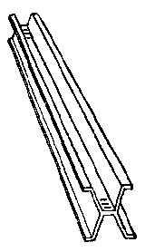

*图1·1 国际米原器*

下面是自然界里一些长度的实例（单位是米）：

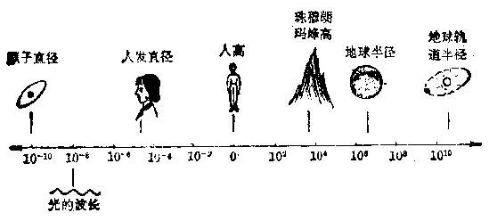

*图1·2*

由于实际测量的需要，除了把米作为长度的基本单位外，其它的长度单位还有千米、分米、厘米、毫米等。它们之间的关系是：

1 千米（公里） = 1000 米（公尺）

1 米（公尺） = 10 分米

1 分米 = 10 厘米

1 厘米 = 10 毫米

1 毫米 = 1000 微米

我国也采用国际通用长度单位。由于历史、习惯等原因，目前还保留里、丈、尺、寸等长度单位。

1 里 = 150 丈

1 丈 = 10 尺

1 尺 = 10 寸

它们和国际通用长度单位米的基本关系是：

1米=3尺，或1尺= \(\frac{1}{3}\) 米

#### 测量长度的基本工具

测量长度的基本工具有刻度尺，最常用的刻度尺有直尺和卷尺（图1·3）。卷尺不仅携带方便，还可量一些较长的长度，如房门的高度，操场的长度或宽度等。

> **测量要有适当的量具和正确的方法**

用刻度尺测量物体的长度时，先使尺上的零刻度跟被量物体的一端对齐，物体另一端对齐的刻度就表示量度的结果。也可以照图 1·4 那样来量。一般直尺最小刻度是0.1厘米，由图可以看出，测得长度的结果是13.9厘米-10厘米=3.9厘米。

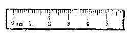

*直尺*

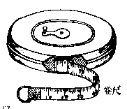

*图1·3 刻度尺*

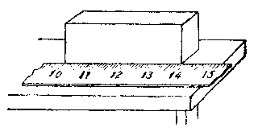

*图1·4 用直尺量物体的长度*

下面是两种经常出现的错误的测量方法。

图 1·5 表示尺放斜了，图 1·6 右图表示眼睛位置放得不对，左图表示眼睛位置放得正确。

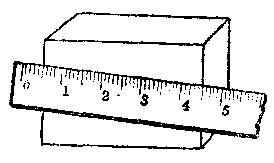

*图1·5 尺放斜了*

因为一般直尺最小刻度是1毫米，如果要求精确到十分之几毫米，那么就应该使用游标卡尺，它主要由尺身、游标、卡脚三部分组成（图1·7）。

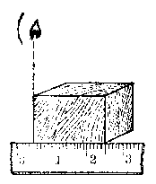

*眼睛的位置放得正确*

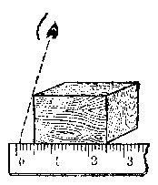

*眼睛的位置放得不对*

*图1·6*

尺身上的最小刻度是毫米。游标上刻度是把9毫米的长度分成10个等分，1个等分就是 \(9\ \text{毫米} \div 10 = 0.9\) 毫米。当游标卡尺的卡脚合在一起时，游标上的零线与尺身上的零线相重合，游标上的第一条刻线比尺身上的第一条刻线“短”0.1毫米，游标上的第二条刻线比尺身上的第二条刻线“短”0.2毫米，……，游标上最后的第十条刻线才与尺身上的第九条刻线相重合（图1·7）。

> **使用游标可以较精确地测出小于1毫米的长度**

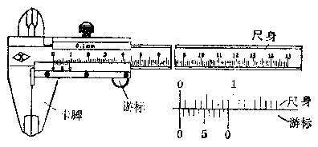

*图1·7 游标卡尺*

使用时，张开卡脚，把被测物体松紧适当地夹在两卡脚之间。如果被测物体使两卡脚张开 0.1 毫米时，则游标上第一条刻线与尺身上第一条刻线相重合，这时就读作 0.1 毫米。如果被测物体使两卡脚张开 0.2 毫米时，则游标上第二条刻线与尺身上的第二条刻线相重合，这时读作0.2毫米。依此类推。所以，用游标卡尺测量物体的长度时，毫米数可以从尺身上直接读出，十分之几的毫米数可以从游标上与尺身上相重合的某刻线读出。图1·8表示被测零件的宽度是5.2毫米。

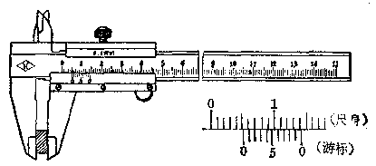

*图1·8 被测零件的宽度是5.2毫米*

#### 习题1·1

1. 如果说：这本物理书长 18.4，宽 12.8，或某人的身长是 1.54 有意义吗？为什么？

2. 量一下常见东西的长度，例如：你的手指、手臂、铅笔、或各种硬币的直径。

3. 用下面的方法测定自己一步的平均距离：先沿鞋的前端（或后端）在地上做一记号，向前走20～30步，再沿鞋的前端（或后端）在地上做一记号，用卷尺量出这两个记号之间的距离，用步数去除，就得到你自己一步的平均距离。用这个平均距离来估算一下你家到学校或你工作单位的距离。

4. 如附图所示，量出你的拇指与小指间的距离。用这个距离量出桌子的长度，然后用直尺来量，比较两次所得的结果。

5. 如附图所示，这是测量铜丝直径的一种方法。图中铜丝的直径等于多少厘米？再用游标卡尺来量一下，比较两次所得的结果。

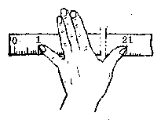

*（第4题）*

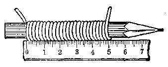

*（第5题）*

6. 怎样利用刻有毫米的直尺量出铁钉或螺丝钉头部的圆周长？测出头部的直径，并乘以3.1（或3.14），算出圆周长。比较两次所得的结果。

7. 1厘米合多少微米？多少米？多少寸？

### §1·2 面积的量度

测量物体的面积是以长度的测量为基础的，国际通用的面积单位是米 \(^{2}\) （读作平方米）。我们规定边长为1米的正方形面积为1米 \(^{2}\)。在国际通用单位中，面积的单位还有分米 \(^{2}\)、厘米 \(^{2}\)、毫米 \(^{2}\) （依次读作平方分米、平方厘米、平方毫米）等。

从图1·9可以看出：如果一个正方形的边长等于另一个正方形边长的10倍，那么前一个正方形的面积就是后一个正方形面积的 \(10 \times 10 = 100\) 倍。面积的单位之间关系如下：

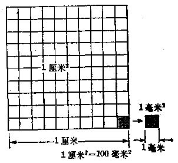

*图1·9 面积的单位*

1米²=100分米²

1 分米 \(^{2}\) =100 厘米 \(^{2}\)

1 厘米 \(^{2}\) =100 毫米 \(^{2}\)

有规则形状的面积，可以按照求面积的公式来计算。例如，长方形面积 \(= \text{长} \times \text{宽}\)，三角形面积 \(= \frac{1}{2} \times \text{底} \times \text{高}\)，圆面积 \(= \pi \times \text{半径}^2\) 等。所以如果你要知道书桌的面积，可以先量出书桌的长度和宽度，然后把测得的两个数值相乘，就得到面积的大小。在进行计算时，长度和宽、底和高等一定要用同一种长度单位。如果你用的长度单位都是米，那么你算出面积的单位就是米 \(^{2}\)；如果你用的长度单位都是厘米，那么你算出面积的单位就是厘米 \(^{2}\)。

对于不规则形状的面积，一般可以这样来测量：把图形放在方格纸上，描下要测量的面积轮廓（图1·10），数一数图形里所包括的小方格的数目，对于图形边缘上不满一小格的各部分，采用大于半小格的和小于半小格的凑作一小格计算，或者采用大于半小格的作一小格而小于半小格的舍去不计，把这样算出来的小方格的总数乘以每一小方格的面积，就是所要求的面积了。这里，我们不难看出，如果小方格分得越多，小方格的面积越小，测出的面积就越精确。

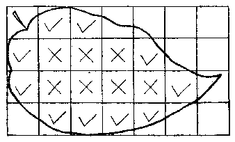

*“×”完整一小格 “√”大于半小格*

*图1·10 不规则面积的计算*

#### 习题1·2

1. 用尺来量这本书封面的面积，假使说这本书封面的面积是235.5，你看对不对？为什么？

2. 先测量一下图1·10中的每一小方格的面积，然后计算一下这张树叶表面的面积大约是多少？把每一小方格面积四等分，用同样的方法计算这张树叶表面的面积。比较两次计算的结果。

3. 用小方格纸描出你手的轮廓和鞋底的轮廓，分别算出它们的面积。

4. 先估计一下你家里床面和桌面的面积，然后用尺测量，并分别算出它们的实际面积。看一看估计与实际测量的结果相差多少？

### §1·3 体积的量度

体积的单位也是从长度单位导出来的，它的国际通用的单位是米 \(^{3}\) （读作立方米）。在国际通用的单位中，体积的单位还有分米 \(^{3}\)、厘米 \(^{3}\)、毫米 \(^{3}\) （依次读作立方分米、立方厘米、立方毫米）等。

我们规定边长为1米的正立方体的体积为1米 \(^{3}\)。从图1·11可以看出：如果一个正立方体每边的长是另一个正立方体每边长的10倍，那么，前一个正立方体的体积就是后一个正立方体体积的 \(10\times10\times10=1000\) 倍。体积单位之间的关系如下：

1 米 \(^{3}\) =1000 分米 \(^{3}\)

1 分米 \(^{3}\) =1000 厘米 \(^{3}\)

1 厘米 \(^{3}\) =1000 毫米 \(^{3}\)

有规则形状的体积同样可按照求体积的公式来计算。例如，长方体的体积=长×宽×高，球的体积= \(\frac{1}{6}\pi\times\) 直径 \(^{3}\) 等，和前面的求面积一样，在计算时要注意长度、宽度、高度等一定要用同一种长度单位。

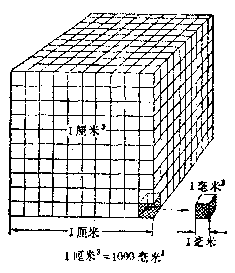

*图1·11 体积的单位*

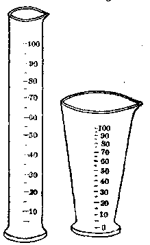

*图1·12 鼠筒（左）、量杯（右）*

液体没有一定的形状，要测量液体的体积必须把液体倒在带有刻度的容器里，这种容器叫做量筒或量杯（图1·12），筒壁或杯壁上带有刻度，常标明立方厘米的数目。

把液体倒入量筒或量杯里，看它升高到哪个刻度，也就是要看液面和容器壁上的哪一个刻度相重合，这样，就可以读出液体的体积。读数的时候，眼睛必须跟液面相平 （图1·13）。

容器的容量单位有时用升表示，1升=1分米 \(^{3}\) =1000厘米 \(^{3}\)。

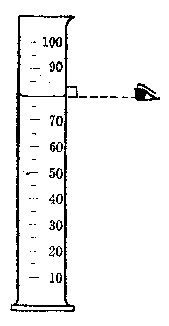

*图1·13 眼睛要跟液面相平*

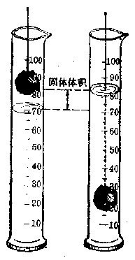

*图1·14 量度形状不规则，固体的体积*

形状不规则的固体的体积，只要比水（或某种液体）重，并且不吸收水（或某种液体）也不溶解于水（或某种液体），就可以用量筒或量杯来测量。如果物体不太大，可以用细线系上物体浸入水中，或把物体直接投入量筒或量杯里。如图1·14那样，先在量筒里面放进适量的水，记下水面所在的刻度，然后把物体放入，并使它完全浸没在水中，这时水面升高了，再记下这个水面所在的刻度，这样两次读数的差，就是这个固体的体积。

#### 习题1·3

1. 用厚纸做一个体积为 1 厘米 \(^{3}\) 的正立方体。

2. 估计一下一个火柴盒、和一本书等体积，然后用直尺测量它们的长、宽和高，分别算出它们的体积，看一看你的估计和实际测算的结果相差百分之几？

3. 观察图1·12，看看量筒和量杯的刻度有什么不同？为什么不同？

4. 47896 厘米 \(^{3}\) 等于多少毫米 \(^{3}\)？多少米 \(^{3}\)？4.8 米 \(^{3}\) 等于多少厘米 \(^{3}\)？

5. 用什么方法，可以测出一只玻璃杯的容量？用什么方法，可以测出一只玻璃杯的玻璃体积？

6. 取一个有底的小玻璃管（如装药片的小玻璃管），管外糊上狭纸条，制作一个简易的小量筒。取橡皮泥一块，用铅笔插入橡皮泥里压出一个1厘米 \(^{3}\) 的“凹坑”（想想看，铅笔插入的深度是怎样求得的？）。利用橡皮泥的“凹坑”把1厘米 \(^{3}\) 的水依次倒入玻璃管里，每次都沿着水面在纸条上划出刻度。如果玻璃管粗细均匀，还可以在刻度间划出等距离的较小刻度（见附图）。

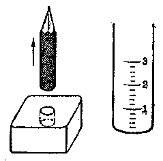

*（第6题）简易小量筒的制作*

用“简易小量筒”来量小钮扣、图钉、小钉等体积。

### §1·4 质量的量度

前面我们已经学过长度的量度，还学过了以长度为基础的面积和体积的量度。现在我们要开始学习质量的量度。

我们周围有许多物体，物体是由各种物质组成的，空气、水、玻璃、铁等都是物质。物体所含的物质有多有少，一桶水比一杯水所含的水多，一个铁球比一个铁丸所含的铁多，同样道理，大块玻璃板比小块玻璃片所含的物质也多。

> **质量就是物体所含物质的多少**

物体里所含的物质多少叫做物体的质量。

质量是物体本身的一种属性。一个物体的质量，它不随物体的形状、温度、状态等而改变。一块铁打成铁板或做成铁球，形状是不同的，但质量并没有变。一块冰化成水，由固体状态变成了液体状态，但质量也未变。窗户上的玻璃，从酷热的夏天到冰雪的严冬，质量总是一样的。质量也不随物体的位置而改变。一个物体，不论放在地球上什么地方，或者用火箭把它送上月球，它的质量也是保持不变的。

如果只有“多”、“少”或“大”、“小”来比较物体的质量那显然是太笼统了。为了量度物体的质量，同样需要选定一个物体作为质量的标准来比较，这也就是说要规定质量的单位。国际通用的质量单位是千克（公斤）。质量是1千克的标准原器是一个用铂90%和铱10%合金制成的圆柱体，直径与高相等，保存在巴黎国际计量局里（图1·15），许多国家也有它的副型.1分米 \(^{3}\) 纯水在温度为4℃时的质量也是1千克。

> **质量的基本单位是“千克”**

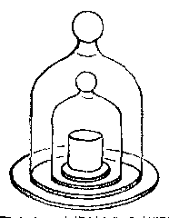

*图 1·15 国际标准千克原器*

除把千克作为质量的基本单位外，其它的质量单位还有克、毫克等。

1千克（公斤）=1000克

1克=1000毫克

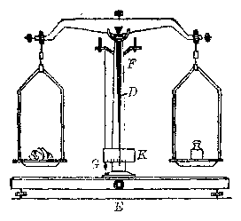

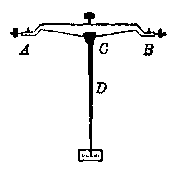

*图1·16 确定物体质量用的天平*

测量质量的工具很多，可以根据不同需要来选用。在实验室里，为了精确地测定物体的质量，常常使用天平 （图1·16）。天平最主要的部分是它的横梁 （图1·16右），\(A 、 B 、 C\) 是三个刀口，中央的刀口 \(C\) 向下，支承在支柱 \(F\) 的顶上，天平横梁可以绕这个刀口转动。两端的刀口 \(A\) 和 \(B\) 都向上，各挂一个盘子。横梁的中央有一根竖直向下的指针 \(D\)，它能够沿标尺 \(K\) 左右摆动。天平的底座中央有止动旋钮 \(E\)，旋动它能让刀口 \(C\) 离开支柱，使横梁止动。天平的两臂 \(AC, BC\) 长度相等，当两盘不放东西时，指针指在标尺的中央，天平平衡。

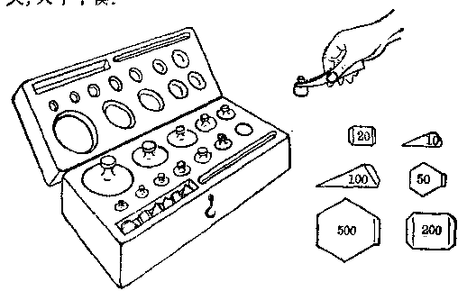

*图1·17 砝码*

称物体时，先把物体放在左盘里，再把标明质量的砝码 （图 1·17） 一个一个地放在右盘里，直到指针刚好指在标尺中央 （或指针左右摆动角度相等） 为止。这时，被测物体的质量就等于砝码的总质量。

天平是精密仪器，称量时不可粗心大意，否则天平会很容易受到损坏。在使用天平时，先要调节底座螺旋使天平保持水平 （这时细线 \(G\) 所挂的小锤的尖端跟底板上小锥体的尖端恰好对齐），再调节横梁两端的螺丝，使指针指在标尺中央。在加（或减）砝码时，为了避免磨损刀口，要转动止动旋钮使横梁止动。砝码要用盒子里的镊子夹取，不可用手拿，因为手指上常沾有汗水等污物，容易使砝码污损，质量不准。

还要注意天平上所标明的称量，称量就是天平所能够称的最大质量，超过这个质量，刀口就容易损坏。普通天平的称量是1000克。

在生产、科研上，经常要测定各种不同物质的质量。橡胶里硫的含量多了，橡胶就易脆裂。炼钢时随时要分析各种成分的含量，否则一炉钢可能报废。科学家们不仅要测定原子、电子等极其微小的质量，还要通过测量来计算地球、太阳和各种星球等庞然大物的质量。

#### 习题1·4

1. 什么是质量？质量的基本单位是什么，它是怎样规定的？

2. 怎样在天平上称液体的质量？

3. 砝码盒里配有一套砝码，每套砝码通常是：

1，2，2，5，10，20，20，50，100，200，200，500 克；

10，20，20，50，100，200，200，500 毫克。

为什么有些砝码（例如1克的、5克的）只要一个，有些砝码（例如2克的）却要两个？

4. 1 厘米 \(^{3}\) 的纯水在 \(4^{\circ}\) C 时的质量是多少克？合多少毫克？

1米 \(^{3}\) 的纯水在4℃时的质量是多少克？合多少千克？

5. 用天平称一下一分、二分、五分硬币的质量各是多少克？

6. 简易天平的制作：

用木条、木板、装鞋油的金属圆盒盖、细线、铁钉等照附图自制简易天平。

用这架简易天平和已知质量的一分、二分、五分硬币做砝码来粗称一下，一支钢笔、一块橡皮的质量。

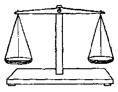

*（第6题）*

### §1·5 时间的量度

赛跑、游泳比赛要测时间，否则无法定胜负。调度列车也要准确地测定时间，否则不能保证安全正点。随着工农业生产、国防和科学研究的日益现代化，就更需要精确的时间测量。

一切自然现象都是在一定时间内发生的。你知道吗，太阳光照到地球上要多“长”时间？你是否想过，闪电一刹那的时间又是多“短”？物理学里在研究自然现象的过程中就是经常要准确地测定时间的长短。

测定时间和测量长度、质量一样，要定一个标准。实际测量时，这个“标准”还需要连续不变地成周期性出现，否则，“被测时间”和“标准时间”之间就无法进行比较，也就是说无法进行测量。太阳和我们关系最密切，由于地球的自转，从地球上看到太阳的运动具有上述的特点，是周期性的，因而我们规定太阳每连续两次经过中天相隔的时间 （也就是从今天正午到明天正午这段时间） 为一个太阳日，俗称一昼夜。但是一年之中各个太阳日的长短略有差异，于是我们就取一年之中所有太阳日的平均值作为时间的单位，叫做平均太阳日，或简称为日。1 日的 \(\frac{1}{24}\) 定义为 1 小时，1 小时的 \(\frac{1}{60}\) 为 1 分，1 分的 \(\frac{1}{60}\) 为 1 秒。

> **凡是作周期性运动的物体，都可以用来测时间**

国际通用的时间基本单位是秒。从上面可以看出，1秒=1个平均太阳日的 \(\frac{1}{86400}\)（\(24\times60\times60=86400\)）。后来人们又发现，不仅地球自转的周期（转一周的时间）有长短，地球公转的周期也不是固定不变，也就是说，各年的1个平均太阳日也不相等的。根据1967年国际计量会议所通过的规定：铯133原子基态的两个超精细能级之间跃迁周期的9192631770倍的持续时间称为1秒。

测量时间的工具通常有钟、表、秒表（图1·18）等。一般的手表计时可精确到秒，秒表可以精确到0.1秒或0.01秒。

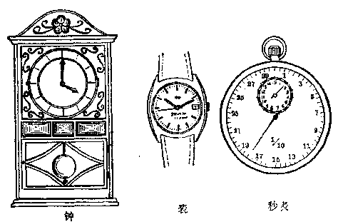

*图1·18 钟、表、秒表*

钟表测时原理和太阳是一样的。图1·18（左）是一个有摆的钟，摆的周期（往返一次时间）是不变的，利用摆的这种等时性，再通过齿轮的传动，使钟的指针均匀走动来指示时间。机械手表，里面有一个摆轮，它也是靠摆轮周期性的左右摆动，使指针均匀走动而指示时间的。所以任何周期性运动，只要它的周期是稳定不变的，都可用作测时标准。随着科学技术的发展，人们还制成了各种更精密的测时仪表。

#### 习题1·5

1. 用手表测量你脉搏每分钟跳多少次？每相邻两次相隔大约有多少秒？

2. 某年有365.24日，计算这一年有多少小时，多少秒？

3. 太阳光照到地球上大约需要8.5分，合多少秒，多少小时？

4. 通常一次不连续天空闪电大约是万分之一秒，1分是这个时间的多少倍？

5. 用手表来测量你跑一百米的时间。

6. 自制简易测时工具——单摆。

在一根长约1米的细线的一端挂一小球（或一个小螺帽），线的另一端固定，就成了单摆（最简单的摆，见附图）。使小球偏开一个不大的角度，然后放开它，单摆就摆动起来。用手表测出单摆往返摆动10次（注意一个往返只算一次）所需时间，求出单摆周期。再测出它往返20次和30次所用的时间，再分别求出它的周期。实验表明，如果细线长度不变，那么，单摆周期是一定的（改变小球质量或使摆动角度稍大些，单摆周期都不变，只有改变细线长度，周期才变）。事先用手表测出单摆周期，这个单摆就可用来计时了。

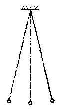

*（第6题） 单摆*

用它来测你脉搏每分钟大约跳几次？

### 本章提要

提要是把一章的主要内容简单扼要地概括一下，它可以起到复习、巩固、提高的作用，便于我们抓住重点，也能帮助我们记忆。但提要不能代替全部内容，因为它只包括内容的一部分，只有简单的几条或几句话。所以我们说，提要只有在经过仔细阅读课文，复习了全部内容之后，才能对我们有所帮助。

1. 物理学中要经常进行各种量度。量度就是把待测量和标准量进行比较。

2. 长度的量度。

国际单位制中，长度的基本单位是米。

测量长度的常用工具是刻度尺。

3. 质量的量度。

国际单位制中，质量的基本单位是千克（公斤）。

物理实验中测量质量的常用工具是天平。天平是较精密的测量工具，使用时应严格遵守操作规则。

4. 时间的量度。

国际单位制中，时间的基本单位是秒。

测量时间的常用工具有钟、表等。

### 复习题一

1. 2厘米中有多少毫米，合多少米，多少寸？一块钢板面积是1.25米²，它合多少毫米²？

2. 一间厂房的长是18米，宽是12米，它的面积是多少？如果每台车床平均占地面积8平方米，问这间厂房可以安装多少台车床？

3. 普通恒星的估计寿命是 \(10^{12}\) 秒，合多少天，多少年？

4. 地球质量大约是 \(6 \times 10^{27}\) 克，合多少千克，多少毫克？

5. 一块长方形的薄板，长1米，宽50厘米。如果从宽边中点处切去阴影部分，那么剩下的表面积是多少？（见附图）

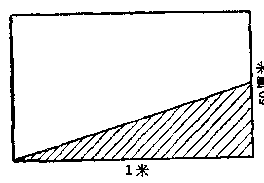

*（第5题）*

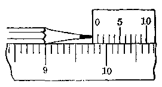

*（第7题）*

6. 工厂买到8立方米的木板，每块木板长是5米，宽是40厘米，厚是5厘米。问工厂买了多少块木板？

7. 如附图所示，刻度尺上靠近铅笔尖的那个“游标”是用硬纸做的，它的刻度10小格，全长为0.9厘米。这支铅笔全长是多少？

请你自己去做一个游标，先用直尺去量你的钢笔长度，再用游标放在直尺上去量一下，比较两次结果，它们的精确程度有什么不同？

## 第2章 力 固体的一些性质

本章要讨论力，初步建立力的概念。在学习力的基础上还要讨论重量、比重、压强等物理量。再要讨论物体的一些性质，先谈固体的性质，下一章再谈液体和气体。这里所谈的物体性质只是一些最基本的性质，更详细的内容将在第二册中学习。

### §2·1 力 重量

> **力**

人们都知道提一桶水要用力，搬一袋粮食要用力，用锄头耘地也要用力。人们在用力的时候，肌肉总是紧张的，因此力是人们在劳动时从肌肉紧张中感受到的。

力就是“肌肉紧张”吗？不能这么说，在物理学中，力有着严密的定义。

> **力能改变物体的运动状态或改变物体的形状**

打乒乓球时，当球向你飞来你用力将球拍把球反击回去，本来向你运动的球，现在却变为向对方运动，这就是说球的运动状态发生了改变。再如你手里拿着一块小橡皮，当手用力一按，橡皮就凹了进去，这就是说橡皮的形状发生了改变。

还有，当你站在一块架空的木板上，木板就要向下弯曲；当你手推车子的时候，车子就由静止而变为运动。

这些例子说明了什么呀？

乒乓球运动状态的改变是由于受到球拍的拍击，也就是由于球拍对球施加了作用的结果，这个作用就是“击”。车子由静止变为运动是因为你推了它，也就是由于你对它施加了“推”的作用的缘故。

同样，小橡皮的形状的改变，木板之所以弯曲，都是因为你施加了“压”的作用结果。

由此可见，要改变一个物体（如车子和球）的运动状态或者改变物体的形状，必须要有另一个物体（如人手和球拍）对它施加作用。这种作用在物理学上就称为力，所以力是一个物体对另一个物体的作用。当一个物体受到力（作用）时，一定有别的物体对它施加力（作用），离开了物体，力是不存在的。例如手推车子，车子是受力物体，手（或人）就是施力物体；球拍击球，球是受力物体，球拍就是施力物体（如果对人和球拍来说，人是施力的物体，球拍就是受力物体）。

> **力是物体之间的相互作用**

对于力这个概念，我们还应该有以下几点认识：

第一，力有大小。例如拉车子，用的力大，车子就容易起动；用的力小，车子就不容易起动，可见力有大小之分。为了量度力的大小，我们规定力的单位为公斤，多大的力算1公斤呢，下面就要讨论。

第二，力有方向。原来停着的一辆车子，你朝这个方向拉，它就向这个方向运动；你朝那个方向拉，它就向那个方向运动，可见力还有方向性。

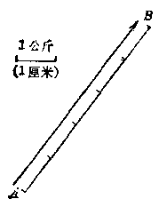

*图2·1 力的图示*

第三，力有作用点。力作用在物体上时，物体上的受力点叫做力的作用点。力除了有大小、方向之外，力在物体上的作用点不同，产生的效果也不同。例如开门，虽然向同一方向用力大家都知道握住把手推门容易把门推开，如果在门的铰链附近推门就不容易把门推开。

力的大小、方向和作用点称为力的三要素。

> **力的三要素
（大小、方向和作用点）可以用一定长度的有向线段来表示**

我们经常用有一定长度的有向（带箭头）线段来表示力。如图2·1，从力的作用点A开始依照力的方向画一线段AB，使它的长度和力的大小成正比，例如1厘米长代表1公斤，那么5公斤的力就用5厘米长的线段来表示。然后在AB线段的末端 B 画一个箭头（注意，画箭头时不能使 AB 之长超过 5 厘米），表示力的方向，这样用有一定长度的有向线段把力的三要素都表示出来的方法，叫做力的图示法。图 2·2 表示一个人通过绳子用 8 公斤水平向左的力拖一辆小车。图中每一格代表 1 公斤，八格就代表 8 公斤，力的作用点（在钩子上）和方向也都在图上分别表示出来了。

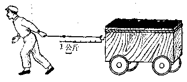

*图2·2 力的图示*

#### 重量（重力）

大家都知道，任何一个物体都有重量。但是重量到底是什么，这恐怕不是每个人都是很清楚的。让我们来分析以下一些现象。

用手托住物体，我们会感到物体对手有压力；把物体放在薄木板上，物体会把木板压弯 （图 2·5（a））；用手提物体，会感到物体对手有拉力；把物体用绳子挂起来，物体对绳子也有拉力，会把绳子拉紧（图2·3（b））。”我们平常说物体有重量，就是从物体对支持物的这种“压力”或“拉力”表现出来的。如果物体对支持物的压力越大，或拉力越大，我们就说这个物体的重量越大。

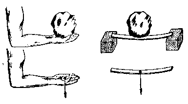

*（a） 物体对支持物的压力*

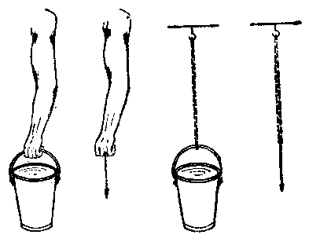

*（b） 物体对支持物的拉力*

*图2·3 物体的重量*

那么，物体的重量又是怎样产生的呢？一块石头，手一放，石头就要落下来；踢出去的皮球，不管你踢得多高，结果也还是要落下来。总之，地球上的一切物体，如果没有东西支持它，都会落到地面上来。这些如果手里拿着事实表明：地球上一切物体都要受到地球的引力作用，物体的重量就是由于地球对物体的引力作用而产生的。所以，重量实际上是一种力。因此在物理学中，常常把重量叫做重力。

> **物体的重量是由于物体受到地球的引力而产生的**

重量的单位是怎样规定的呢？

如果有两只相同的杯子，一只杯子盛满水，另一只杯子盛一半水，那么一杯水的质量一定是半杯水的质量的两倍。根据生活经验可以知道，一杯水的重量也是半杯水的重量的两倍。这就是说，物体的重量和物体的质量是有关系的。于是人们把质量为 1 千克的物体，在纬度 \(45^{\circ}\) 的海平面上的重量，规定为 1 公斤。重量是力，所以力的单位也是公斤 （在前面讲量度力的大小时已经提到）。重量的单位还有克、毫克等。

公斤又常叫做千克，这样一来，重量单位和质量单位变成一样了。在物理学里，不同的物理量一般都有不同的单位。为了避免和质量单位混淆，有时我们把力的单位（当然也包括重量）写作公斤（力）、千克（力）或克（力）等。

> **重量和质量是两个不同的物理量**

在这里，重量和质量的单位虽然相同，但它们是两个不同的物理量，读者必须很好注意。在前面§1·4中我们曾谈到：一个物体的质量不仅与它的形状、温度和状态等无关，也不会因为它在地面上不同的地方而有所不同。例如，质量是1千克的砝码，不管把它放在哪里质量总是1千克，但是它的重量却“因地而异”，只有把它放在纬度为 \(45^{\circ}\) 的海平面上时它的重量才是1公斤（或1千克）。当然同一物体在不同的地点的重量的差别是不大的，所以如果不是要特别精确，我们可以认为质量是几克或几千克的物体在地球上任何地方的重量也就是几克或几千克。这个问题到学习第七章时我们还要深入讨论。

在我们日常生活中还有斤、两等重量单位，1斤=10两。

1 公斤 = 2 斤

重力不但有大小，而且也是有方向的。悬挂物体的绳子，静止时总是竖直下垂的，所以重力的方向总是竖直向下。利用重力的这种性质，人们常在一根线的下端挂一个重物做成重垂线，来检验墙壁等是否竖直（图2·4）。

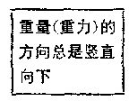

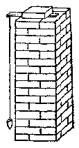

*图2·4 重垂线*

当然重力还有作用点，重力的作用点要到第九章才讨论。

#### 习题2·1

1. 什么是力？什么是重量？

2. 重量的单位是什么？它是怎样规定的？为什么可以把力的单位作为重量的单位？

3. 你能把质量和重量作一简单比较吗？试试看，

4. 如附图所示，在车子的 A 点有一个大小为 5 公斤的水平向左的推力，试作出力图。

5. 自己用个螺丝帽做个重垂线，用它来检查一下门框、窗框、桌子脚等是否竖直？

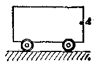

*（第4题）*

### §2·2 物质的比重

我们经常说：铁比木头重。但如果把大圆木和小铁钉比较，那就不能这么说（图2·5）。大圆木是由木质材料组成的，小铁钉是由铁质材料组成的，讲铁比木头重，这是把相同体积的木头和铁进行比较而得出的结论，离开体积来比较物质的“轻重”是没有意义的。

同一种物质做成不同体积的物体，它们的重量当然是不同的，体积大的重，体积小的轻。但是，用这些不同物体的重量分别除以各自的体积（即单位体积（1米 \(^{3}\)）

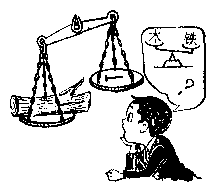

*图2·5 铁和木头到底谁重*

或1厘米 \(^{3}\)）的重量），可以得到相同的数值，例如1厘米 \(^{3}\) 的铁的重量是7.8克，1厘米 \(^{3}\) 的木料的重量是0.4～0.8克（各种木料不一样）；1厘米 \(^{3}\) 的水重1克，1厘米 \(^{3}\) 水银重13.6克等等，这样，各种物质的“轻重程度”就非常清楚了。

> **物质的比重等于单位体积的物质的重量**

为了表示物质的这种性质，我们引入比重这个物理量。

某种物质的重量与它的体积之比叫做这种物质的比重，它表示单位体积某物质的重量。

$$
\text{比重} = \frac {\text{重量}}{\text{体积}}
$$

如果比重用 \(\gamma^{*}\) 表示，体积用 \(V\) 表示，重量用 \(G\) 表示，则比重公式可写成

$$
\gamma = \frac {G}{V}
$$

比重这个物理量的单位是由重量和体积的单位组合而成的。如果重量的单位用克，体积的单位用厘米 \(^{3}\)，那么比重的单位就是克/厘米 \(^{3}\)，读作克每立方厘米。象这样由两个或两个以上单位组合成的单位叫做组合单位。因为1厘米 \(^{3}\) 铁的重量是7.8克，所以铁的比重应写成7.8克/厘米 \(^{3}\)，读作7.8克每立方厘米；同理，水银的比重应写成13.6克/厘米 \(^{3}\)，读作13.6克每立方厘米。以后，我们还会碰到各种各样的组合单位，注意不要写错、读错。下面我们还将看到比重的单位也可以用公斤/分米 \(^{3}\) 和吨/米 \(^{3}\) 等来表示。

> 注：γ：希腊字母，读作“伽马”。

比重也是物质本身的一种属性。不同物质，比重不等。表2·1是各种常见物质的比重，单位是克/厘米 \(^{3}\)。

表 2.1 常见物质的比重表

| 物质 | 比重 | 物质 | 比重 |
| --- | --- | --- | --- |
| 铝 | 2.7 | 木料 | 0.4～0.8 |
| 硬铝 | 2.8 | 冰 | 0.9 |
| 铁、钢 | 7.8 | 玻璃 | 2.5～2.7 |
| 镍 | 8.8 | 汽油（15°C） | 0.70 |
| 铜 | 8.9 | 酒精（18°C） | 0.79 |
| 银 | 10.5 | 煤油（15°C） | 0.8 |
| 铅 | 11.4 | 水（4°C） | 1.00 |
| 金 | 19.3 | 海水（15°C） | 1.03 |
|  |  | 硫酸（15°C） | 1.84 |
|  |  | 水银（0°C） | 13.6 |

比重这个概念很重要，它常常是我们在选择材料时必须考虑的因素之一。例如飞机上的许多金属部分，我们不用钢，而用和钢同样坚固的硬铝（一种合金）来做，就是因为硬铝的比重比钢小，质料轻。现在某些机器（如自行车等）的金属部分甚至可以大部或全部用比重很小的塑料来代替了。

化学上，常常从药液的比重来确定药液的浓度。此外，日常生活中的有些现象也和比重有关。例如木块总是浮在水面上，因为木块的比重比水小；铁总是沉在水底或浮在水银面上，就是因为铁的比重比水大，比水银小的缘故（物体的浮、沉原因到第三章再讲）。

从比重公式，我们可以看出：要求出某种物质的比重，实际上就是要求出它的重量和体积。因为重量和体积求出后，代入公式求出比值就可得到比重。

#### 例 1

有金属一块，长5厘米，宽4厘米，厚3厘米，重528克。求它的比重，并且指出它是哪一种金属？

**［解］** 先求这块金属的体积：

$$
\mathrm{体积} = 5 \times 4 \times 3 \mathrm{厘米} ^ {3} = 60 \mathrm{厘米} ^ {3}
$$

代入比重公式：

$$
\text{比重} = \frac {\text{重量}}{\text{体积}} = \frac {528 \text{克}}{60 \text{厘米} ^ {3}} = 8.8 \text{克 / 厘米} ^ {3}
$$

查表2·1，知道这块金属是镍。

##### 例 2

把一块重50克的金块，投入盛水820厘米³的量筒中后，水面上升到823厘米³的地方。试问这个金块是否为纯金？

**［解］** 从 §1·3 知道这块金属的体积为 823 厘米 \(^{3}\) -820 厘米 \(^{3}\) =3 厘米 \(^{3}\)。

然后用比重公式求出它的比重约等于 16.7 克/厘米 \(^{3}\) （由读者自己计算）。

查表2·1，知道金的比重为19.3克/厘米 \(^{3}\)，所以这个金块不是用纯金做的。

以上两个例题说明我们可以利用比重来鉴别物质、地质勘探人员常常根据找到矿石的颜色、比重等来初步判断它属哪种矿石，利用比重我们还可以求出许多不能或不便直接称量的物体的重量，也可以求出形状比较复杂的物体的体积。现在我们再来看几个例题。

##### 例 3

某处要修建一座铁路桥梁，全部用钢质材料。各种钢件的总体积如果是200立方米，问一共要多少重的钢材？

**［解］** 查表2·1知道钢的比重为7.8克/厘米³。因为表中比重的体积单位是用厘米³表示，所以这里体积也要用厘米³表示。把体积200米³化成 \(200\times100\times100\times100\) 厘米³=200000000厘米³。从比重定义知道，1厘米³钢重7.8克，现在体积是200000000厘米³，钢重多少呢？设所求钢重为 \(G\)，则：

$$
\frac {1 \text{厘米} ^ {3}}{20000000 \text{厘米} ^ {3}} = \frac {7.8 \text{克}}{G}
$$

$$
\therefore G = \frac {200000000 \text{厘米} ^ {3} \times 7.8 \text{克}}{1 \text{厘米} ^ {3}} = 1560000000 \text{克}
$$

$$
= 1560 \text{吨}
$$

这就是说，要建造这样一座桥梁，要用钢材1560吨。

这个例题也可以用比重公式做，因为已知钢的比重是7.8克/厘米 \(^{3}\)，体积是200000000厘米 \(^{3}\)。重量假定为G，则代入公式得：

$$
7.8 \text{克 / 厘米} ^ {3} = \frac {G}{200000000 \text{厘米} ^ {3}}
$$

解这个简单的代数方程，得：

$$
\begin{array}{l} G = 7.8 \text{克 / 厘米} ^ {3} \times 200000000 \text{厘米} ^ {3} \\ = 1560000000 \text{克} = 1560 \text{吨} \\ \end{array}
$$

这里有两个问题要谈一下：

第一，比重单位问题。我们已经知道比重单位是克/厘米 \(^{3}\)，但是还可以用公斤/分米 \(^{3}\)、吨/米 \(^{3}\) 来表示。因为1公斤=1000克，1分米 \(^{3}\) =1000厘米 \(^{3}\)，所以：

$$
\begin{array}{l} 7.8 \text{公斤 / 分米} ^ {3} = \frac {7.8 \text{公斤}}{1 \text{分米} ^ {3}} = 7.8 \times \frac {1000 \text{克}}{1000 \text{厘米} ^ {3}} \\ = 7.8 \text{克 / 厘米} ^ {3} \\ \end{array}
$$

同理，

$$
7.8 \text{吨 / 米} ^ {3} = 7.8 \text{克 / 厘米} ^ {3}
$$

这样，如果钢的比重取 7.8 吨/米 \(^{3}\)，那么原来的体积单位不必再化了，可以将 200 米 \(^{3}\) 直接代入，这样得到钢的重量也是 1560 吨，读者可以自己试一下。

第二，从上面的例题可以知道，在计算有关比重的习题时，物质的体积与重量的单位必须和比重单位中的体积与重量的单位一致。这一点，在今后计算其它习题时，也是如此，题目中各相同量的单位必须一致，希读者注意。

##### 例 4

有 \(5 \text{米}^{3}\) 的水完全结成冰，问冰的体积是多少？

**［解］** 先分析一下：要求出冰的体积，根据比重公式先应知道冰的比重和冰的重量。冰的比重可查表，冰的重量怎样求呢？冰由水凝固而成，水结成冰时重量是不变的，而水的重量可以从比重公式求得。所以这个题目应分两步来做：第一步，先用比重公式求出 \(5 \text{米}^{3}\) 水的重量，这个重量就是水结成的冰的重量。第二步，再用比重公式，从冰的比重和重量求出冰的体积。这里的关键是水结冰时两者的重量是相同的。我们现在来计算一下：

（1） 先求 5 米 \(^{3}\) 水的重量，设它的重量为 G，则从比重公式得：

$$
1 \text{吨} / \text{米} ^ {3} = \frac {G}{5 \text{米} ^ {3}}
$$

$$
G = 1 \text{吨} / \text{米} ^ {3} \times 5 \text{米} ^ {3} = 5 \text{吨}
$$

（2） 从（1）得水重为5吨，冰重也是5吨。现求5吨冰的体积，设体积为V，同上可得：

$$
0.9 \text{吨} / \text{米} ^ {3} = \frac {5 \text{吨}}{V}
$$

$$
V = \frac {5 \text{吨}}{0.9 \text{吨/米} ^ {3}} = \frac {5}{0.9} \text{米} ^ {3} \approx 5.56 \text{米} ^ {3}
$$

即所求冰的体积约为 5.56 米 \(^{3}\)。

由此可见，水结成冰时体积会增大的。冬天自来水管应该注意保暖，使里面的水不致结冰，否则结冰时可能会被胀裂。

#### 习题2·2

1. 用铜、铁、铅、铝分别做成体积相同的立方体，哪一个最重？哪一个最轻？

2. 用铜、铁、铅、铝分别做成重量相等的立方体，哪一个体积最大？哪一个最小？

3. 一根体积是 6000 厘米 \(^{3}\) 的钢轴，重量是 23.4 公斤，问它是实心的还是空心的？为什么？

4. 某工人需要截面积是 25 毫米² 的铜导线 100 米，问这根导线重多少公斤？

5. 有一大堆沙，重4.2吨。这堆沙比重如果是1.4克/厘米³，求这堆沙的体积。

6. 有一空瓶重12.6克，充满水后重62.8克。如果此瓶中充满比重为1.2克/厘米³的食盐溶液，那么它是多少重？

7. 一立方体的冰，每边为4厘米，溶解成水后的体积为58.24厘米 \(^{3}\)，求冰的比重。

8. 用自制简易天平、量筒等测出煤油比重。

### §2·3 物质的三态

自然界是由物质组成的。铁、木、水和空气等都是物质。物质一般有三种状态：就是固态、液态和气态。我们通常把固态的物体叫固体，液态的物体叫液体，气态的物体叫气体。

> **物质有三态：固态、液态和气态**

固体有一定的形状和体积（图2·6（a））。液体容易流动，没有一定的形状，但是它的体积是一定的（图2·6（b））。至于气体，它的流动性就更大。把一定量的气体放在一个容积较小的密闭容器里，它充满整个容器，这时它的体积等于容器的容积；如果把它放在一个容积较大而形状不同的密闭容器里，它还是充满整个容器，这时它的形状变了，体积也增大了。所以我们说气体是既没有一定的形状，也没有一定的体积（图2·6（c））。

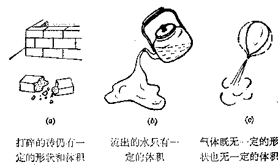

*图2·6 固体、液体和气体*

### §2·4 固体的弹性

固体有一定的形状和体积，前面谈到力能够改变物体的形状。例如我们已经知道橡皮在手指的作用下要凹进去，木板在人体的作用下会发生弯曲。还有，象铁块可以按照我们的需要，用锤打成各种形状；弹簧在力的作用下也可以拉长或压缩，等等。这些都说明了固体在力的作用下要改变它的形状。

物体在形状改变的时候常常要产生体积的变化。物体在力的作用下所发生的形状或体积的变化，叫做形变。任何物体在力的作用下都会发生不同程度的形变，不发生形变的物体是没有的。

用力拉长或压缩的弹簧，一旦除去外力，它可以恢复到原来的长度。同样，在力的作用下发生弯曲的木板，如果除去外力，它也可以又变成平直。物体在外力作用下发生形变，除去外力以后能够恢复到原来形状，这种性质叫做弹性。

大家都知道，如果用力过大，即使除去外力，弹簧和木板也不再恢复到原状。可见，要使物体仍能恢复原状，它所受的作用力是有个限度的。在限度以内，除去外力，物体能够完全恢复原来的形状；超过这个限度，除去外力，物体就不能完全恢复到原来的形状。这个限度，我们叫它弹性限度。物体受到超过它的弹性限度的作用力后，不能恢复到原来的形状，这种性质叫做范性。

任何物体都有弹性和范性。不同材料的弹性限度是不同的。钢、铁、橡皮等物质的弹性限度比较大，在通常情况下，它们常常显示出弹性，而不显示范性，所以这类物质组成的物体叫做弹性体。铅、蜂蜡等物质，它们的弹性限度较小，弹性并不显著，所以这类物质组成的物体叫做范性体。

同一物质的弹性限度会随着温度的升高而减小。钢在平常温度下的弹性限度很大，但是温度升高时弹性限度就减小，因此我们可以把它做成各种不同的形状。所谓“趁热打铁”，就是用升高温度的办法，使钢铁的弹性限度减小，以便比较容易地利用它的范性制成各种不同形状的器件。

固体的弹性有一个很重要的规律：在弹性限度以内，固体在外力作用下所发生的形变与它所受的外力成正比。这就是，作用力增大多少倍，形变也增大多少倍；作用力减小多少倍、形变也减小多少倍。关于这一点，我们可以用弹性限度较大的弹簧在外力作用下长度的改变（形变）来加以说明。

> **弹性体的形变与外力成正比**

在图2·7中：把一根弹簧悬挂在附有刻度尺的架子上，弹簧下端挂着一个盘子，盘子里可以放砝码，盘子上还附有一只指针，可以指出刻度尺上的刻度（图2·7（a））。现在把砝码一个一个地放到盘中去，假定放入100克重的砝码（也就是质量为100克的砝码）时，从指针在刻度尺上所指出的刻度变化，可以知道弹簧伸长2毫米（图2·7（b））；放入200克重的砝码时，可以看出弹簧伸长4毫米（图2·7（c））；放入300克重的砝码时，要伸长6毫米。以后，如果所放入的砝码的总重量只要是在这根弹簧的弹性限度以内，那么每多放100克重的砝码，弹簧一定多伸长2毫米。如果把所有放在盘中的砝码都拿走，那么弹簧又将完全恢复到原来的长度。可见在弹性限度以内，弹簧的伸长（即形变），与它所受到外力的大小是成正比的。不仅弹簧如此，其它固体只要不超过它们的弹性限度，也是如此。

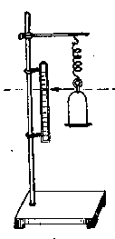

*（a）*

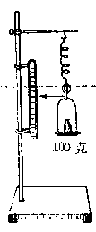

*（b）*

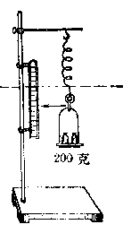

*（c）*

*图2·7 弹簧的伸长*

利用固体的这种特性，我们可以制造测量力的大小的仪器，叫做测力计。测力计有好几种形式，最简单的一种叫弹簧秤。把一个钢质的弹簧放在一个用金属制成的外壳里面，弹簧上端固定在壳顶的环上，下端和一只钩子连在一起。固定圆环，用手拉钩子，或把要称的物体挂在钩上，弹簧就要伸长，于是固定在弹簧上的指标跟着下降，从指标所停止的位置和壳面上的刻度，就可以读出所测力的大小或物体的重量（图2·8）。

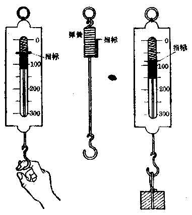

*图2·8 弹簧秤*

#### 例 1

一根弹簧，不悬挂重物时，长150毫米；悬挂300克的重物时，长为165毫米。问悬挂500克重物时弹簧长多少？

**［解］** 我们知道，在弹性限度以内，弹簧的伸长和所受的外力成正比。现在弹簧在不悬挂重物时，长150毫米；悬挂300克的重物时，长165毫米，可见悬挂300克的重物后，使弹簧伸长了

$$
165 \text{毫米} - 150 \text{毫米} = 15 \text{毫米}.
$$

悬挂300克的重物时，弹簧伸长15毫米，那么悬挂500克的重物时，弹簧将伸长多少呢？假定悬挂500克重物时仍在弹簧的弹性限度以内，伸长和外力成正比，设此时弹簧伸长为 \(l\)，那么：

$$
\frac {300 \text{克}}{500 \text{克}} = \frac {15 \text{毫米}}{l}
$$

$$
\therefore \quad l = \frac {500 \text{克} \times 15 \text{毫米}}{300 \text{克}} = 25 \text{毫米}
$$

弹簧原长150毫米，现在伸长了25毫米，所以悬挂500克的重物时，弹簧的长度应为

$$
150 \text{毫米} + 25 \text{毫米} = 175 \text{毫米}.
$$

这里，要请读者注意：有关外力和形变的计算，虽然一般题目中常常不指明是否在弹性限度以内，但习惯上都认为是不超出弹性限度的。在弹性限度以内，弹簧的伸长和所受的外力成正比，但不是弹簧的长度与外力成正比。因此上面例题如果做成：

$$
\frac {300 \text{克}}{500 \text{克}} = \frac {165 \text{毫米}}{l}
$$

$$
l = \frac {500 \text{克} \times 165 \text{毫米}}{300 \text{克}} = 275 \text{毫米}
$$

> **那就完全错了。**

##### 例 2

一根弹簧下端悬挂250克重物时，伸长6毫米。现在不悬挂重物，而用力拉住这根弹簧的下端，发现它伸长1.8厘米。问手的拉力是多少？

**［解］** 本题告诉我们的都是弹簧的伸长，可以直接按正比关系计算。但是，列比例式时，同一物理量的单位必须相同。所以此题中的伸长应该都用毫米（当然也可以都用厘米）表示。

设：手的拉力为 x，那么

$$
\frac {250 \text{克}}{x} = \frac {6 \text{毫米}}{18 \text{毫米}}
$$

$$
\therefore x = \frac {250 \text{克} \times 18 \text{毫米}}{6 \text{毫米}} = 750 \text{克}
$$

即手的拉力是750克。

#### 习题2·4

1. 为什么一般的弹簧都是用钢丝做的，而不是用铅丝做的？是不是铅丝没有弹性？

2. 一根弹簧长200毫米，在它的下端悬挂200克的砝码时，它的长度变为210毫米，问悬挂500克的砝码时，它的长度是多少？

3. 把一个物体悬挂在上题的弹簧下端，弹簧的长度是 224 毫米，问这个物体的重量是多少公斤？

4. 一根金属导线长10米，在5公斤力的作用下伸长了0.5厘米。问在10公斤的拉力作用下，导线长多少？

5. 一根弹簧，当它悬挂600克的重物时，长200毫米；悬挂400克的重物时，长100毫米。问悬挂500克的重物时长多少？［提示：先求弹簧未挂重物时的长度。］

6. 货车车厢里装有10吨的货物时，车厢下面的弹簧被压缩0.2厘米，如果装40吨的货物时，弹簧被压缩多少？［注意：弹簧受压缩时和伸长一样，在弹性限度内，弹簧缩短的长度也和外力成正比。］

7. 玻璃的弹性可以从附图的装置来观察。在烧瓶（也可用底较平又不太厚的玻璃瓶代替）里装满水，用手仔细地压烧瓶底，细玻璃管里的水柱就上升，手放开水柱就下降到原来的位置。如有条件，实际做一下这个实验。

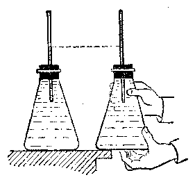

*（第7题）*

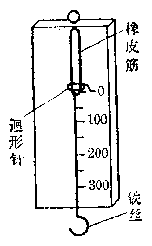

*（第8题）*

8. 自制橡皮筋测力计，用几根橡皮筋代替弹簧照附图做一个简易测力计。橡皮筋受力稍大时它的伸长可能不和外力成正比，所以划刻度时最好用已知重量的砝码依次挂在钩上，根据每次指标的实际位置来刻划。用自制的简易测力计测一下拉断一根头发或一张窄纸条所需的力。

### §2·5 压强

物体放在桌子上，因为物体有重量，就压着桌面，物体对桌面有一个作用力：人站在地板上，因为人有重量，就压着地板，人对地板也有一个作用力。象这些桌面、地板等所受的力都是和接触表面垂直的，我们把垂直作用在物体表面上的力叫做压力。

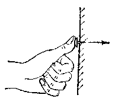

*图2·9 手对图钉施加压力*

物体都有重量，对支持它的物体的表面都要产生压力。当然，压力也不全是由重量产生的。用手往墙上揿图钉，手对图钉就施加压力（图2·9）。

这个压力是和重量无关的。

压力产生的效果是怎样的呢？

我们在泥烂的路上步行时，两脚常常陷得很深（图2·10（a））；如果在路面上铺一块木板，人从木板上走过去，两脚就不致于再陷下去了（图2·10（b））。这是什么原因呢？我们知道，人的重量是通过接触面作用到泥烂路面上的，前一种情况，压力（人的重量）分布在较小的脚底那样大的路面上，受力面积小，压力集中，陷进去就深些。在后一种情况下，压力（人的重量）作用在比脚底面积大得多的受力面积上，压力分散，也就是说，此时每一块象脚底那样大的路面上受的压力比原来小得多，因而陷进去就浅些。我们还可以实际计算一下：假如这个人重72公斤，两只脚底面积是360厘米²，也就是面积为360厘米²的路面上受到72公斤的压力。假定木板的表面积是7200厘米²，这个面积是两只脚底面积的20倍，那么铺上木板，人立在板上面时，在同样360厘米²面积的泥烂路面上分到的压力只有72公斤/20=3.6公斤，比原来不用木板时小了20倍（如果考虑木板本身重量，只要木板和人相比不太重，所得的结果也是差不多的）。

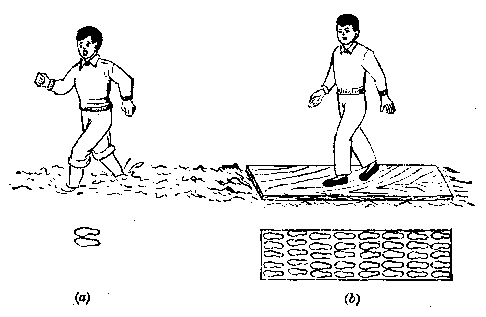

*图2·10 在泥烂的路上行走*

由此可见，压力产生的效果不仅与它的大小有关，而且与受力面积的大小也有关。要比较压力产生的效果，必须比较在相同的面积上物体所受到的压力大小。一般都取单位面积上所受到的压力来进行比较。

我们把压力与受力面积之比叫做压强。它表示物体单位面积上所受的压力。

$$
\mathrm{压强} = \frac {\mathrm{压力}}{\mathrm{受力面积}}
$$

通常用 \(p\) 表示压强，用 \(F\) 表示压力，用 \(S\) 表示受力面积，则压强公式可写成

$$
p = \frac {F}{S}
$$

压强的单位是由力的单位和面积的单位组合而成的。如果压力单位用公斤，面积单位用厘米 \(^{2}\)，那么压强单位就是公斤/厘米 \(^{2}\)，读作公斤每平方厘米。压强的单位有克/厘米 \(^{2}\) 等。

从压强定义，我们可以看出：

第一，同一压力，由于受力面积不同，压强也不一样。受力面积大时压强小，受力面积小时压强大。上面讲的例子就是属于这一类。人的重量是一定的，由于脚底面积比木板表面积小20倍，也就是泥路面上受力面积前者比后者小20倍，所以路面受到的压强前者比后者大到20倍。因为压强越大，压力效果就越显著，脚也就陷得越深。

这一类例子还很多：如纪念塔总是下面大，房子的基础往往连成一整块（一般称为箱形基础），铁路轨道下面要铺枕木，拖拉机的轮盘下面有很宽的履带等。这些都是为了增大跟地面的接触面积，使地面压强不致过大。图 2·11 是大型公路平板车，想想看，要这么些又多、又宽的轮子有什么好处？

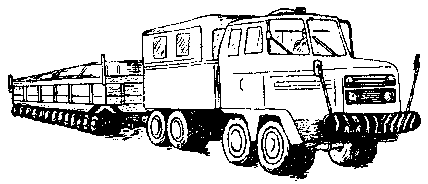

*图 2·11 大型公路平板车*

第二，面积一定时，压强随着压力的增大（减小）而成正比地增大（减小）。例如，重量是50公斤，底面积是1米²的汽油桶，竖直放时对地面的压强是

$$
p = \frac {50 \text{公斤}}{1 \text{米} ^ {2}} = 50 \text{公斤/米} ^ {2} = 0.005 \text{公斤/厘米} ^ {2}
$$

如果在桶里面再装入750公斤的汽油，压强就增加到

$$
\begin{array}{l} p ^ {\prime} = \frac {50 \text{公斤} + 750 \text{公斤}}{1 \text{米} ^ {2}} = 800 \text{公斤/米} ^ {2} \\ = 0.08 \text{公 斤 / 厘 米} ^ {2} \\ \end{array}
$$

最后，我们要请读者注意：压力和压强是不同的两个概念。压力是物体所受到的垂直于受力面积的作用力（注意，如果力不垂直于受力面，要求出垂直于受力面的力是多少，计算方法以后会讲到。），与受力面积大小无关。例如，一个体重 70 公斤的人，不论他坐在面积多大的凳子上，凳面所受的压力都是 70 公斤 （一般凳面都是水平的）。压强表示物体单位面积上所受到的压力，它不仅和压力的大小有关，还和受力面积的大小有关。一个人坐在一条狭长的凳面上，与凳面的接触面积小，凳面受到的压强就较大；坐在一只方凳上，与方凳的接触面积较大，凳面受到的压强就较小。因为压力和压强的概念不同，所以它们的单位也不一样。压力的单位就是力的单位，如吨、公斤、克等。而压强的单位是公斤/米²、克/厘米²等，它是由力和面积单位共同组合而成的。

#### 例 1

针尖的面积是0.0003厘米²，当针尖受到300克的压力作用时，针尖上的压强是多大？

**［解］** 针尖上的压强

$$
p = \frac {300 \text{克}}{0.0003 \text{厘米} ^ {2}} = 1000000 \text{克/厘米} ^ {2} = 1 \text{吨/厘米} ^ {2}
$$

##### 例 2

高5米大理石圆柱对地基的压强是多少？已知大理石的比重是2.6克/厘米³。

**［解］** 这是与前面讲的比重有关系的题目，先要根据比重求出大理石的重量。假定大理石圆柱的底面积为 \(A\) 厘米²，表示数值，则大理石圆柱的体积为 \((500A)\) 厘米³。从比重公式可得：

大理石圆柱的重量

$$
G = \gamma V = 2.6 \text{克 / 厘米} ^ {3} \times 500 A \text{厘米} ^ {3} = 1300 A \text{克}
$$

再应用压强公式：

此大理石对地基压强

$$
p = \frac {1300 A \text{克}}{A \text{厘米} ^ {2}} = 1300 \text{克 / 厘米} ^ {2}
$$

这种类型的题目看上去好象缺少条件（圆柱的底面积），实际上解的时候可先假定底面积为 A 厘米 \(^{2}\)，计算到最后底面积 A 会被约去的。

#### 习题2·5

1. 自己举几个生活中或生产上增大或减小压强的实例，并简要说明道理。

2. 枪托做成宽而平，刺刀却是扁而尖的。为什么？

3. 在结冰的河面上，人走过去和匍匐前进哪一种方法较安全？为什么？

4. 称称你的体重，再根据你鞋底的面积（见习题1·2（3））算一下你站着时对地面的压强。

5. 人在走路时轮流用一脚踏地，设每只脚底的面积等于150厘米²，试计算体重60公斤的人在走路时对地面的压强。

6. 履带拖拉机重5吨，每条履带的接触地面部分长250厘米，宽28厘米，求拖拉机对地面的压强，并和上题的压强作比较。

7. 图画钉尖端面积是0.3毫米²，钉帽面积是1.5厘米²，钉帽面积是钉尖的几倍？如果用0.5公斤的压力往墙上压钉帽（力压在整个钉帽上），那么钉帽面上所受的压强是多大？钉尖作用在墙上的压强是多大？钉尖的压强是钉帽压强的几倍？

8. 用砖砌成高2米、厚25厘米、长20米的墙，其中泥土占全部体积的 \(\frac{1}{10}\)，问墙的总重量是多少？地面所受到的压强是多少？已知砖的比重是1.8克/厘米³，泥土的比重是1.6克/厘米³。【提示：利用比重公式从砖的总体积和泥土的总体积分别算出它们的重量。然后，利用压强公式从墙的总重量求出地面受到的压强。】

### 本章提要

1. 力是一个物体对另一个物体的作用。力能使物体产生形变或使它的运动状态发生变化。

力的单位有公斤（千克）、克等。

力的大小可以用弹簧秤来测量。

2. 力的大小、方向和作用点叫做力的三要素：它可以用一定长度的有向（带箭头）线段来表示。线段的起点表示力的作用点，线段的长度表示力的大小，箭头表示力的方向。

3. 由于地球吸引而使物体受到的力叫做重力。重力也叫做重量，它的方向总是竖直向下的。

重量的单位、测量方法和一般力的单位、测量方法是相同的。

4. 物质的比重等于这一物质的重量与它的体积之比。

比重大，指物质重，比重的公式：

$$
\gamma = \frac {G}{V}
$$

它的单位有公斤/米 \(^{3}\)、克/厘米 \(^{3}\) 等。

5. 物质一般有固态、液态和气态三种状态。固体有一定的形状和体积；液体具有一定的体积，没有一定的形状；气体既无一定的形状，也无一定的体积。

在弹性限度以内，固体所发生的形变与它所受的外力成正比。

6. 垂直作用在物体表面上的力叫做压力。压力与受力面积之比叫做压强。

> **压强的公式：**

$$
p = \frac {F}{S}
$$

它的单位有公斤/米 \(^{2}\)、克/厘米 \(^{2}\) 等。

压力越大，受力面积越小，压强就越大。

### 复习题二

1. 用一根绳子系住一块石头，用8公斤的力拖它。试用力的图示法根据下列情况各作出力图：（1）绳子与地面平行；（2）绳子与地面成一角度。

2. 一长方体重4公斤，试用图示法把这个力表示出来（设重力作用点在长方体中心）。

3. 一条粗绳能支持200公斤的重量，问它能不能提起体积为0.5米 \(^{3}\) 的钢梁？

4. 瓶子的容积是 500 厘米 \(^{3}\)，问瓶中能装多少克酒精？

5. 有一块长方形的锡锭，长20厘米，宽4厘米，厚1厘米，重量是584克。求锡的比重。

6. 在一烧瓶中，最多可以容纳 1000 克重的水。问它能否装 1000 克重的煤油？或 1000 克重的硫酸？

7. 有一重 300 公斤的冰块，问它的体积是多少？如熔解成水，它的体积又是多少？

8. 人民英雄纪念碑是用花岗石砌成的，高 14.7 米，宽 2.9 米，厚 1 米，花岗石的比重是 2.7 克/厘米³。问这个纪念碑的重量是多少？它的底部产生的压强有多大？

9. 滑雪板每块长2米，宽10厘米。如果一个72公斤重的人用它来滑雪，试计算雪地上受到的压力和压强。

10. 一个铅块长0.7分米，宽4.2厘米，厚20毫米，铅的比重是11.4克/厘米³，问：（1）铅块怎样放置时所产生的压强最小？并求此压强的大小。（2）铅块怎样放置时所产生的压强最大？并求此压强的大小。

11. 一根弹簧在悬挂200克砝码时，长18厘米，悬挂400克砝码时，长20厘米。问长21厘米时，所悬挂的砝码是几克？

12. 一个弹簧原长15厘米。受到2公斤的拉力时，伸长了2.4厘米，问要用多少公斤拉力，才能使它伸长到17.7厘米？

## 第3章 液体和气体的一些性质

上一章我们已经学习了固体的弹性，并介绍了压力和压强的概念与计算方法。这一章我们将要讨论液体和气体的一些基本性质。

### §3·1 液体和气体对压强的传递

#### 帕斯卡定律

当我们向墙上揿图画钉时，如果图钉尖端的面积是0.3毫米²，钉帽的面积是1.5厘米²。今在整个钉帽面上施加0.6公斤的压力，这个压力传到钉尖，将对墙壁产生多大的压强呢？根据压强的公式计算，将是

$$
\frac {0.6 \text{公斤}}{0.003 \text{厘米} ^ {2}} = 200 \text{公斤/厘米} ^ {2}
$$

它比钉帽面上的压强

$$
\frac {0.6 \text{公斤}}{1.5 \text{厘米} ^ {2}} = 0.4 \text{公斤/厘米} ^ {2}
$$

大得多，这种情况下，固体所传递的压力大小和方向都没有改变，而压强则由于钉帽和钉尖面积大小不同，而有很大的改变（以上可参考习题 2·5（7））。

那么液体和气体传递压力和压强的情况又怎样呢？用一个注射器，里面装适量的水，将出水口尖端封闭，封闭时管中留下少许空气，使空气在水中形成一个气泡。如果用力推压活塞，我们会看到气泡的体积会均匀缩小，这说明气泡受到了水的各个方向的压力，这个压力，是由于活塞压水，再由水传递过去的（图3·1）。活塞是沿一定方向压水的，而传递到气泡表面处，变成了沿各个方向上的压力，当然压强也是这样。由此可见，液体传递压力和压强时总是向各个方向传递的，而固体传递压力和压强时，总是沿着力的方向传递。

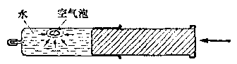

*图3·1 注射器内水的压力和压强*

下面再来研究液体传递的压力和压强的大小有什么改变。图3·2是一个密闭的连通器（两个粗细不等的注射器，中间接一根橡皮管），里面充满了水，台秤 \(C\) 与注射器 \(B\) 接触。实验时用力向下压注射器 \(A\) 的活塞，使活塞对水施加压力，通过水的传递作用，水对注射器 \(B\) 的活塞底部产生一个向下的压力，这个压力的大小，可从台秤 \(C\) 的读数测出。\(A\) 活塞的底面积假定是1厘米²，\(B\) 活塞的底面积假定是4厘米²，今在 \(A\) 活塞上加500克重砝码，发现 \(C\) 的读数不是500克，而是2000克，通过水的传递作用，压力变大了。但是 \(A\) 活塞底对水的压强是 \(\frac{500\text{克}}{1\text{厘米}^2} = 500\text{克/厘米}^2\) （因为水的受力面积是1厘米²），而B活塞底面上受到的水作用的压强也是\(\frac{2000\text{克}}{4\text{厘米}^2}=500\text{克/厘米}^2\)，两者相等，这就是说通过水传递的压强大小是不变的。由于压强是向各个方向传递的，所以在水里面任何一处的各个方向上，都要受到500克/厘米²的压强。在注射器的内壁和橡皮管的内壁的垂直方向上，也都受到同样的压强。用其它液体或气体代替水来做同样的实验，结果也是如此。例如，当我们用力按一下打足气的篮球时，在篮球的内壁各处，都将会受到一个与内壁面垂直、大小相同向外的附加压强，就是这个道理。由上面实验得出的液体、气体传递压强的规律，可归纳如下：加在密闭的液体或气体上的压强，将按照它原来的大小，由液体或气体向各个部分各个方向传递。这个结论叫做帕斯卡定律，是法国科学家帕斯卡在1653年发现的。

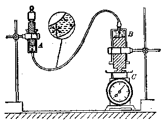

*图3·2 密闭的连通器中液体传递压力和压强的作用*

> **液压机**

液压机是工业生产上常见的一种机械，就是根据帕斯卡定律的原理制成的。如图3·3所示，两个直径大小不同的圆筒，下部用管连通，筒内各装有活塞，形成密闭的盛有液体的容器。提起小活塞A时，液体就从下面的槽中经过阀C进入小圆筒。压下小活塞时，阀C被压闭，而阀D则被压开。小活塞加于液体的向下的压强被液体传递到大活塞 B 上，方向向上。设大小两活塞的横截面积分别为 \(S_{1}\) 和 \(S_{2}\)，作用在两活塞上的压力分别为 \(F_{2}\) 和 \(F_{1}\)，那么，小活塞对液体的压强\(p_{1}=\frac{F_{1}}{S_{1}}\)，液体对大活塞的压强 \(p_{2}=\frac{F_{2}}{S_{2}}\)。根据帕斯·卡定律 \(p_{1}=p_{2}\)，可得：

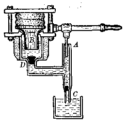

*图3·3 液压机工作原理示意图*

$$
\frac {F _ {1}}{S _ {1}} = \frac {F _ {2}}{S _ {2}} \tag {3.1}
$$

或 \(\frac{F_2}{F_1} = \frac{S_2}{S_1}\)由此可见，大活塞的横截面积是小活塞横截面积的几倍，那么在大活塞上得到的压力就是加在小活塞上的压力的几倍。在小活塞上用较小的力，就可以在大活塞上得到很大的力。这点是固体传力所不能达到的。

液压机的应用范围很广：如榨油，锻压，胶合板，试验金属的强度，举升重物等等。液压机的筒内如果充满的是水，叫做水压机。为了防止生锈，有时不用水而用矿物油，这种液压机叫做油压机。图3·4是我国制造的能产生一万二千吨压力的万吨水压机。二、三百吨的特大钢锭，在它的强大压力下，好象揉面团似的被锻压成各种大型锻件。

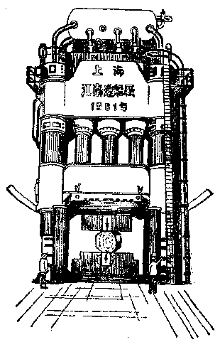

*图3·4 万吨水压机*

##### 例 1

有一只水压机，小活塞的横截面积是 4 厘米 \(^{2}\)，大活塞的横截面积是 80 厘米 \(^{2}\)，如果在小活塞上用 5 公斤的力压它，同在大活塞上将产生多大的力？

**［解］** 根据题意，先求小活塞对水的压强 p：

$$
p = \frac {5 \text{公斤}}{4 \text{厘米} ^ {2}} = 1.25 \text{公斤/厘米} ^ {2}
$$

帕斯卡定律指出，作用在两个活塞面上的压强是相等的，因而可求出这个压强传递到大活塞上的力。设水对大活塞上的压力为 F，则

$$
1.25 \text{公 斤 / 厘 米} ^ {2} = \frac {F}{80 \text{厘 米} ^ {2}}
$$

解方程式，得：

$$
F = 1.25 \text{公 斤 / 厘 米} ^ {2} \times 80 \text{厘 米} ^ {2} = 100 \text{公 斤}
$$

即在大活塞上将产生100公斤的力。

##### 例 2

水压机两活塞的直径是 2 厘米和 10 厘米，在小活塞上加 500 克的压力，问大活塞可举起多少公斤的物体？

**［解］** 先求两活塞的横截面积 \(S_{1}\) 和 \(S_{2}\) 的大小。

小活塞的横截面积 \(S_{1} = \pi \times \left(\frac{2}{2}\right)^{2}\) 厘米\(^{2} = \pi\) 厘米\(^{2}\)大活塞的横截面积 \(S_{2} = \pi \times \left(\frac{10}{2}\right)^{2}\) 厘米\(^{2} = 25\pi\) 厘米\(^{2}\)设大活塞能举起重量为 G 的物体。根据帕斯卡定律，两活塞上的压强相等，得：

$$
\frac {500 \text{克}}{\pi \text{厘米} ^ {2}} = \frac {G}{25 \pi \text{厘米} ^ {2}}
$$

解方程式，得：

$$
G = \frac {500 \text{克}}{\pi \text{厘米} ^ {2}} \times 25 \pi \text{厘米} ^ {2} = 12500 \text{克} = 12.5 \text{公斤}
$$

解此题时，有一点要注意，就是具体的计算最好放在末了再算。例如上面我们没有把 \(S_{1} = \pi\) 厘米\(^{2}\)，\(S_{2} = 25\pi\) 厘米\(^{2}\) 计算出来 （\(\pi = 3.1416\)），因为最后在求 \(G\) 的式子中，\(\pi\) 恰好消去。这一点粗看起来，好象没有什么，而且在本题中计算一下也花不了多少时间。实际上它有着一定重要的意义，因为第一，遇到一些比较麻烦的题目，如果每一步都计算就要多花许多时间。第二，有的时候，我们往往要遇到一些除不尽的数如 \(\frac{2}{3}\)，\(\frac{5}{7}\) 等，于是不得不取近似值，如 \(\frac{2}{3}\) 取 \(0.67\)，\(\frac{5}{7}\) 取 \(0.71\) 等。如果每一步都计算出结果来，那么每一步的结果都是近似值，而最后得到的结果必然误差很大。如果每一步不计算出来，而保留分数形式，那么到最后当有些分数可以消去时，即使有必要取近似值，也只有一次，这样误差就比较小了。

#### 习题3·1

1. 下图中，瓶中装满水，玻璃塞的上、下端的面积分别是 6 厘米 \(^{2}\) 和2厘米 \(^{2}\)。如果在塞子顶上加1.8公斤的压力，求：（1）塞子上面受到的压强（假定力作用在整个面上）。（2）塞子下面对水的压力和压强。（3）瓶内壁A、B、C三处和水内D处受到的压强。并在图中注明各处压强的方向。（4）这时水对整个瓶底的压力是不是1.8公斤，为什么？（以上都不计水的重量或摩擦）

2. 用塞子塞住玻璃管的一端，塞子的横截面积是3厘米²，今由另一端向管中吹气，假定管内气体在管壁上所产生的压强是20克/厘米²，那么塞子上所受到的压强是多少？压力是多少？

3. 有一只水压机，它的小活塞的横截面积是4厘米²，如果在小活塞上用5公斤的压力，在大活塞上能够产生100公斤的力，问大活塞的横截面积是多少？

4. 水压机大活塞的横截面积是小活塞的 50 倍，要想使大活塞上产生 60 吨的压力，问加在小活塞上的压力应该是多大？

5. 油压起重机大小活塞上两力之比是100：1. 求两活塞直径之比。

*（第1题）*

### §3·2 液体的压强

#### 液体对于容器的压强

液体和固体一样是有重量的，当容器里面盛着液体的时候，容器底部必然受到因液体重量而引起的压力，因而容器底面上受到一定的压强。很容易看出，同一容器，液面越高，底面所受到的压强也越大。

读者可以自己做一个实验，例如拿一根两头空的竹管或玻璃管（图3·5），下端拴一张橡皮膜，一只手竖直拿着管子，空的一头向上，另一只手把水从这一头灌下去，你就会看见橡皮膜凸出来了，这说明橡皮膜受到水的压强作用后，产生了形变。水灌得越深，膜凸出得越厉害，也就是容器底部受到水的压强越大。

*图 3·5 液体对容器底的压强*

液体不但对容器底部有压强作用，由于液体具有流动性，所以对容器侧壁也有压强作用，图3·6就说明这一点。

*图 3·6 液体对容器壁的压强*

图中侧壁上有一个孔，把拴有橡皮膜的漏斗插进孔里面，慢慢地把水倒入瓶内，就可以看见橡皮膜渐渐地凸出来。水加得越深，膜凸出得越厉害，这表明液体对容器侧壁的压强与对容器底部的压强一样，也是随着液体深度的增加而增大。修筑堤坝，越在下面的部分越要加厚，就是这个道理。

综上所述，我们可以得到下面两个结论：

1. 液体对容器底部和侧壁都有压强作用，深度越深处，压强越大。

2. 压强与容器底面或侧壁垂直。

#### 液体内部的压强

如果把容器里面的液体自上而下分成许多层，每层液体都有一定的重量，那么第二层液体要受到第一层液体的重量所产生的压强作用，第三层液体要受到第一、二层液体的重量所产生的压强作用，依此类推。由此可见液体除去对容器有压强外，液体内部也存在着压强，而且也是液体深度越深，压强越大。这可以用下面的实验来证明。

> **液体内部向任何方向都有压强。深度深，压强大**

我们先来介绍一种测量压强的仪器，这种仪器叫做压强计。它是一个U形的玻璃管（图3·7），里面装了一些液体，为了便于读数，有时装入红色的水。在玻璃管的一个管口上套上一根橡皮管，橡皮管的另一端又接上一只拴有橡皮膜的漏斗。平时两根玻璃管中液面上的压强相等，即两个液面在同一水平面上。现在用手指压一下橡皮膜，压强就被橡皮管里面的空气传递到液面，于是玻璃管中的液面开始下降，而另一根玻璃管中的液面开始上升。压橡皮膜的力越大，压强越大，两根玻璃管中液面的高度差也越大。因此，根据两根玻璃管中液面的高度差，就可以知道橡皮膜上所受到的压强的大小。

*图3·7 压强计*

*（c）*

*（4） 液体内部压强和密度增大*

*（3） 和液体内壁同一深度处，各方向的压强都相等*

*图3·8 液体内部的压强*

现在我们把这种压强计的漏斗部分如图3·8那样放到盛液体的容器中去，于是可以看到：

漏斗放得越深，两根玻璃管中液面的高度差越大，这表示压强越大（图3·8（a））。因此，液体内部的压强，是随着液体深度的增加而增大的。

把漏斗放在同一深度上沿各个不同的方向转动，也就是有时使橡皮膜向下，有时向上，有时向左，有时向右，有时斜放（图3·8（b））。这时两根玻璃管中液面的高度差始终相同，即表示压强没有变化。因此，在液体内部的同一深度上，向各个方向都有压强，并且大小相等。

由此可见，液体内部向任何方向都有压强；在同一深度处，向各个方向的压强都相等；深度增加，压强也跟着增大。

#### 液体压强的计算

液体对容器器壁（侧壁和容器底部）和液体内部都存在着由于液体本身的重量而引起的压强。这种压强究竟怎样来计算呢？从上面我们知道，在液体内部同一深度处，向各个方向的压强都相等，所以只要计算出液体内部某一深度的向下压强，就能够知道在这个深度处任何方向上的压强了。

> **液体的压强
p = hγ**

设想在圆柱形容器中液面下方深度为 h 的地方，水平地划出一个面 AB，如图 3·9 所示。这个面将受到上面液体重量的压力。如果液体的比重为 \(\gamma, AB\) 面的面积为 \(S\)，则 \(AB\) 上方液柱的重量就是 \(hS\gamma\)。这些重量压在 \(AB\) 面上，就是 \(AB\) 面受到的压力。我们已经知道，单位面积所受的压力叫做压强，所以 \(AB\) 面受到的压强 \(p\) 为

*图3·9 液体内部压强的计算*

$$
p = \frac {h S \gamma}{S} = h \gamma \tag {3.2}
$$

根据液体传递压强的性质，可以知道上面的公式也适用于液体对容器壁（侧壁和容器底部）的压强。也就是，离液面深度为 \(h\) 处的容器壁上，所受到比重为 \(\gamma\) 的液体的压强也是 \(p = h\gamma\)，所以液体内部（包括对容器侧壁或底部）某一深度的压强等于深度与液体比重的乘积。

##### 例 3

在 10 厘米高的杯子里面装满水银，计算杯底所受的压强。如果这只杯子里面装满了水，则杯底所受的压强是多少？

**［解］** 应用压强公式 \(p = h\gamma\)

（1） 装满水银时，由于水银的比重是 13.6 克/厘米 \(^{3}\)，所以杯底压强

$$
p = 10 \text{厘米} \times 13.6 \text{克 / 厘米} ^ {3} = 136 \text{克 / 厘米} ^ {2}
$$

（2） 装满水时，水的比重是 1 克/厘米 \(^{3}\)，所以杯底压强 \(p=10\) 厘米 × 1 克/厘米 \(^{3}=10\) 克/厘米 \(^{2}\)由此可见，同一深度，由于水银的比重大于水的比重，因而压强也相应成正比地增大。

##### 例 4

海水的比重是 1.03 克/厘米 \(^{3}\)，求海面下深 100 米和深 1000 米处的压强。

**［解］** 用压强公式 \(p = h\gamma\)

（1） \(p = 10000\) 厘米 \(\times 1.03\) 克/厘米\(^3 = 10300\) 克/厘米\(^2\) \(= 10.3\) 公斤/厘米\(^2\)。

（2） \(p = 100000\) 厘米 \(\times 1.03\) 克/厘米\(^3\) \(= 103000\) 克/厘米\(^2 = 103\) 公斤/厘米\(^2\)。

由此可见，同一液体的深度越深，压强也相应成正比地增大。

##### 例 5

在一粗细均匀的玻璃管中，下面放了10厘米高的水银，水银面上又放了20厘米高的煤油，已知水银的比重为13.6克/厘米³，煤油的比重为0.8克/厘米³。求（1）玻璃管底部所受的压强，（2）煤油面下深25厘米处的压强，（3）煤油面下深15厘米处的压强。

**［解］** （1） 求玻璃管底部所受的压强：这个压强是由两部分组成，一部分是由 10 厘米高的水银的重量所产生，另一部分是由 20 厘米高的煤油的重量所产生。我们要求的压强，就是这两部分重量所产生的压强之和。所以应用压强公式，即得

$$
\begin{array}{rl} & p = 10 \text{厘米} \times 13.6 \text{克 / 厘米} ^ {3} + 20 \text{厘米} \times 0.8 \text{克 / 厘米} ^ {3} \\ & = 136 \text{克 / 厘米} ^ {2} + 16 \text{克 / 厘米} ^ {2} = 152 \text{克 / 厘米} ^ {2} \end{array}
$$

（2） 求煤油面下深 25 厘米处的压强；这个压强也由两部分组成，一部分是 20 厘米高的煤油的重量所产生的压强，另一部分是 5 厘米高的水银的重量所产生的压强。要求出的压强等于这两个压强之和，即

$$
p = 5 \text{厘米} \times 13.6 \text{克 / 厘米} ^ {3} + 20 \text{厘米} \times 0.8 \text{克 / 厘米} ^ {3}
$$

$$
= 68 \text{克 / 厘米} ^ {2} + 16 \text{克 / 厘米} ^ {2} = 84 \text{克 / 厘米} ^ {2}
$$

（3） 求煤油面下深15厘米处的压强，这个压强就是15厘米高的煤油的重量所产生的压强，所以

$$
p = 15 \text{厘米} \times 0.8 \text{克 / 厘米} ^ {3} = 12 \text{克 / 厘米} ^ {2}
$$

应用压强公式时，还要注意以下三点：

1. 液体内部（包括容器侧壁和底部）的压强，只与液体的深度和比重有关，而与盛有液体的容器形状、大小无关。所以求压力时，应该先计算压强，然后再根据受力面积求压力。如下面例6所示。

2. 公式中的 \(h\) 是指要求压强或压力之处到液体表面的竖直距离，如图 3·10 所示。这一点在一些形状不规则的容器，例如曲管的容器中或容器侧斜放置时要特别注意，切勿搞错。在图 3·10 中，如果各容器里都是放的同一种液体，那么 \(A, B, C, D\) 四处压强相等，各容器“底”处的压强也相等。

*图 3·10 压强的分布与容器的形状无关*

3. 根据压强公式，在盛有液体的容器的侧壁上，位于不同深度的任何一小块面积上所受到的压强各不相等，那么这样一来，怎样计算侧壁上某处受力面所受到的压强和压力呢？一般我们是这样计算的：把侧壁某处受力面的中心压强（它等于侧壁受力面的中心到液面竖直距离和液体比重的乘积）作为侧壁某一块受力面的平均压强（通常所说的侧壁上所受的压强就是指平均压强），把平均压强和受力面积的乘积作为侧壁上这一块面上所受的压力，如下面例7所示。

##### 例 6

在图3·11中，已知 \(A, B\) 两容器的底面积相等，盛水高度相同。试比较它们底部所受的压力和压强。

*图3·11 比较容器底部的压力和压强*

**［解］** （1） 先比较压强：因为 \(p = h\gamma\)，而与容器的大小和形状无关，所以它们底部所受的压强一定相等。

（2） 然后比较压力：根据题意，容器的底面积相等，那么它们底部所受的压力也相等。

如果有人先比较压力，再比较压强，同时又把A容器中整个水的重量作为底部所受的压力，那么一定会得出，A容器中底部所受的压力和压强都大于B容器底部所受的压力和压强的错误结论。事实上，A容器底部所受的压力小于A容器中整个的水重（有一部分水重由两侧壁负担，如图中虚线所示）。所以我们强调，在解题时要先从计算压强着手。

##### 例 7

某游泳池长 20 米，宽 10 米，深 1.2 米，贮满了水，求底面和四个侧面受到的压力和压强。

**［解］** （1） 先求底面所受的压强和压力。

用 \(p=h\gamma\) 这个公式，求出底面所受到的压强，即

$$
p = 1.2 \text{米} \times 1 \text{吨 / 米} ^ {3} = 1.2 \text{吨 / 米} ^ {2}
$$

再用 \(F = pS\) 这个关系式求压力，即

$$
F ^ {\prime} = 1.2 \text{吨 / 米} ^ {2} \times (20 \times 10) \text{米} ^ {2} = 240 \text{吨}
$$

（2） 再求四个侧面所受到的压强和压力。本题中，水池侧壁中心处的深度是 \(1.2 \text{米} \div 2 = 0.6 \text{米}\)。因此，任何一个侧面所受的平均压强 \(p\) 为

$$
p = 1 \text{吨} / \text{米} ^ {2} \times 0.6 \text{米} = 0.6 \text{吨} / \text{米} ^ {2}
$$

四个侧面的面积 \(S\) 是

$$
S = (20 \times 1.2 + 10 \times 1.2) \times 2 \text{米} ^ {2} = 72 \text{米} ^ {2}
$$

*图3·12 水塔*

所以四个侧面所受的总压力 F 为

$$
\begin{array}{l} F ^ {\prime} = 72 \text{米} ^ {2} \times 0.6 \text{吨/米} ^ {2} \\ = 43.2 \text{吨} \\ \end{array}
$$

##### 例 8

一个圆柱形水塔（图3·12），高8米，塔底离地面22米。问

贮满水时，在（1）与塔底相连通水管里的A处（靠近地平面），

（2） 塔底，（3） 塔顶的压强各是多少？

**［解］** 从 \(p = h\gamma\) 公式（压强和容器的形状、大小无关）得：

（1） A 处的压强 \(p = (22 + 8)\) 米 × 1 吨 / 米 \(^{3}\) = 30 吨 / 米 \(^{2}\)。

（2） 塔底受到的压强 \(p=8\) 米 × 1 吨/米 \(^{3}\) =8 吨/米 \(^{2}\)。

（3） 塔顶受到的压强 \(p=0\times1\) 吨/米 \(^{3}=0\)。

#### 习题3·2

1. 右图中：比较 A、B、C、D 四处压强 \(p_{A}\)、\(p_{B}\)、\(p_{C}\)、\(p_{D}\) 的大小。画出A、B、C、D 四处压强的方向
（A、B、C 三处是在容器内壁的表面上）。

2. 计算 76 厘米高的水银柱所产生的压强。这个压强的大小和水银柱的横截面大小有关系吗？为什么？

*（第1题）*

3. 把一根盛有液体的竖直放置的玻璃管逐渐倾斜时，液体对管底的压强会发生变化吗？怎样变化？为什么？

4. 有一个小孩，看见河堤上有一个孔，水从孔里流出来，他立刻用手掌去挡住，直到大人来把孔堵住为止。如果小孔的面积是 3 厘米²，孔在水面下 1.5 米处，问这个小孩用力多少？

5. 一根玻璃管长1米，下面放置20厘米高的水银，上面灌满了水。求（1）管底所受的压强；（2）水面下深85厘米处的压强；（3）水面下深50厘米处的压强。

6. 一个量筒的内径为5厘米，另一个量杯，底的内径也是5厘米（假定它们的底部是平的），同样放了15厘米高的水。试问它们的底面所受的压力相等吗？为什么？求它们底面所受的压力。

7. 有一个闸门，浸入水中的面积为 16 米²，这个面积的中心到水面的竖直距离是 4 米。求闸门上所受到的平均压强和压力。

8. 在前面的例7中，如果池中贮水仅1米深，那么底面和四个侧面所受到的压强和压力将是多少？［提示：这时每一侧壁中心处的深度，每一侧壁受力的面积都将减小，得注意。］

### §3·3 连通器及其应用

连通器是由几个互相接通的容器组成，如图3·13所示。如果我们向一根管子里面灌水，由于水的流动性，必然要从这一根管子流向另一根管子，直到所有各管子里面的水面相平为止，跟各管子的大小和形状等都没有关系。这时，我们可以把整个连通器看成是一只容器，容器里面的液体静止时，整个液面总是相平的。

*图3·13 连通器*

我们可以做一个实验。取两根两端开口的竹管或玻璃管，下端用塑料管连通，再把一根管子固定在夹柱上，另一根管子用手拿着（图3·14左）。现在把水从一根管子灌入，就可以看到水立即流到另一根管子中去，直到两根管子中的水面相平为止。如果把一根管子上下移动，则管子中的水面就要忽下忽上，以保持两根管子中的水面相平（图3·14右）。因此，在连通器中，如果只灌入一种液体，液面总是保持水平的。

> **连通器里灌入一种液体，液面保持水平**

*图3·14 连通器实验*

我们也可以用压强概念来加以说明，取一个U形玻璃管，放入某一种液体。设液体的比重为 \(\gamma\)，左右两根管子的液面高度分别为 \(h_1\) 和 \(h_2\)，如图3·15所示。现在在两根管子的连通部分的底部取一小块薄片 \(AB\)，则左边液体对这块小薄片的压强等于 \(h_1\gamma\)，右边液体对这块小薄片的压强为 \(h_2\gamma\)。如果液体不流动，则 \(AB\) 两个面上所受到的两个相反方向的压力应该相等。因为 AB 两边面积是相等的，所以小薄片 AB 两边所受的压强也应该相等，即

*图 3·15 连通器中水面相平的说明*

$$
h _ {1} \gamma = h _ {2} \gamma, \quad h _ {1} = h _ {2}
$$

即如果液体不流动，左右两根管子的液面应在同一高度。

连通器的道理虽然简单，但应用很广泛，自来水装置、井、喷泉、汽锅上的水位计等等都利用了连通器的原理。

现在我们来谈谈简易自来水的装置（图3·16）。设置在抽水站中的抽水机把水源中的水抽送到滤水池，池中放了砂和石子等。把水过滤并消毒后，再压到水塔顶上的水箱中去，然后沿着总水管、分水管流到各用户。水箱位置很高。比用户一般房屋都高，所以按照连通器原理讲，凡与水箱有同一高度的地方，都可以用到水，但实际上因为水要流过许多管子，遇到不少阻力，因而和水箱处于同一高度的地方，就往往用不到水。

*图3·16 自来水装置*

连通器还可以用来测定液体的比重，例如在U形玻璃管中，先灌入一些比重已知的水银（或其它液体），设它的比重为 \(\gamma_{1}\)，再把比重末知但互不混和的液体倒入，设它的比重为 \(\gamma_{2}\)。当两种液体不流动时，以两根管子中水银面较低的一面为标准作一水平线 \(AB\)（图3·17（a）），然后用前面的方法，在管底取一小薄片 \(CD\)（图3·17（b）），这时，左边的液体对 \(CD\) 面上的压强是 \((h_{1} + h_{3}) \times \gamma_{1}\)，右边液体对 \(CD\) 面上的压强是 \(h_{2}\gamma_{2} + h_{3}\gamma_{1}\)，两者相等。消去 \(h_{3}\gamma_{3}\) 得到

$$
h _ {1} \gamma_ {1} = h _ {2} \gamma_ {2}, \quad \therefore \quad \gamma_ {2} = \frac {h _ {1} \gamma_ {1}}{h _ {2}}
$$

*（a）*

*（b）*

*图 3·17 测量液体的比重*

式中 \(\gamma_{1}=13.6\) 克/厘米 \(^{3}\)，\(h_{1}\) 和 \(h_{2}\) 可以测量出来，代入上式，就可以求出未知液体的比重 \(\gamma_{2}\)。

#### 例 9

U 形管中盛有一些酒精，在管的一端倒入一定量的

*图3·18 求酒精比重*

比重为13.6克/厘米 \(^{3}\) 的水银，酒精柱的高度是6.8厘米，另一根管子中水银面的高度比酒精柱低6.4厘米，求酒精的比重。

**［解］** 根据题意，作图3·18，\(h_{1}\) （6.8厘米-6.4厘米）=0.4厘米，\(h_{2}=6.8\) 厘米。设酒精比

重为 \(\gamma\)，则根据 \(h_1\gamma_1 = h_2\gamma_2\) 可得

$$
0.4 \text{厘米} \times 13.6 \text{克 / 厘米} ^ {3} = 6.8 \text{厘米} \times \gamma
$$

∴ 酒精比重 \(\gamma=0.8\) 克/厘米 \(^{3}\)

##### 例 10

有一根粗细均匀的U形管，每根支管长32厘米，先在管内盛水银到8厘米高，然后在一根管子中注入汽油（比重为0.75克/厘米 \(^{3}\)），直至装到管顶为止，求管中汽油的高度。

*图 3·19 水管中汽油的高度*

**［解］**

两根管子中都已装了8厘米高水银，每根支管长32厘米，因此，每根支管都有32厘米-8厘米=24厘米高的一段空着。现在把汽油倒入一根支管中，设这根支管中的水银面降低了 \(x\) 厘米，那么这根支管中共倒入汽油 \((24+x)\) 厘米高（如图3·19所示）。另一方面，这根支管的水银面降低了 \(x\) 厘米，因为管子是粗细均匀的，那么另一根支管中的水银面就会升高 \(x\) 厘米。因此，两根支管中的水银面相差2x厘米。所以

$$
2 x \times 13.6 = (24 + x) \times 0.75
$$

$$
\therefore x \approx 0.68 \text{厘米}
$$

即注入汽油的高度约为 \(24 + 0.68 = 24.68\) 厘米。

#### 习题3·3

1. 在图3·14 中，如果 U 形管两边管子的粗细不相同，液面还保持一样高吗？实际试一下，再说明为什么。

2. 如附图所示，粗细不匀的 U 形管里原来装有水银，向右管倒入一些水后，左管里的水银面比右管里的水银面高出了 0.5 厘米，求右管里的水柱的高度。

3. 在 U 形连通器的左管中注入水银，右管中注入水。设两根管口在同一水平面时，测得水银面和管口的距离为 8.8 厘米，水面和管口的距离为 2.5 厘米。问水柱的高度是多少？

4. 在一连通管的底部放入水银，并在左边的管子中加入8厘米的水，右边的管子中加入某种油，当两根管子中的水银面达到相平时，油柱的高度恰为10厘米，求油的比重。

*（第2题）*

*（第5题）*

5. 附图表示装在汽锅上的水位计（即图中的 B）。试说明水位计的用途和它的原理。

6. 观察一下手扶拖拉机的油箱上的油位计，画简图说明它的工作原理。想想看，还有哪些地方用到连通器的原理。

### §3·4 大气压强

上面我们已经谈到了固体和液体的压强，现在再来看看气体的压强。由于气体既没有一定的形状，又没有一定的体积，情况比较复杂，要在第二册中才能详细讨论，因此这里只能简略地介绍一下大气的压强。

地球表面包围着一层空气，这一厚层空气叫做大气。从人造卫星观看大气层，它光彩夺目，非常瑰丽。跟液体内部存在着压强一样，大气里的物体也都要受到压强，这个压强叫做大气压强（简称大气压）。在图3·20中，由于大气压强，纸片受到大气向上的压力（大于一满杯水的重量），把纸片托住，使纸片和水都不掉下来。封口的注射器，由于内筒端面上受到大气压强的作用，要想把它拉出来，是要化较大力气的（图3·21）。根据科学家们的研究，知道在离地面200 多公里的高空还有空气存在，我们就生活在大气海洋的最低层，随时随刻都受着大气压强的作用，所以大气压强和我们的关系十分密切。

*图3·20 受大气压，纸片和水都不掉下来*

*图3·21 证明大气压存在的又一实验*

我们知道，空气也受到地球吸引，所以空气也有重量。

地面附近空气最浓厚，它的平均比重大约是0.00129克/厘米³，而高空的空气稀薄，比重变小（图3·22）。大气层的厚度（深度）不易用精确的数字表示，比重又不均匀，所以我们不能用压强等于深度乘比重这个简单的关系来求大气压强。

> **大气也有重量，因此也有压强**

我们每天生活在地面上，那么地面上的大气压强到底有多大呢？1642年意大利科学家托里拆利用实验方法求出了地面大气压强的数值。这个实验很简单，如图3·23所示，用一根长约1米的一端封闭的玻璃管，灌满水银，用手指揿住玻璃管的开口一端，把管倒置于水银槽中，然后放开手指，就可以看到管里面的水银立即下降，直到管内的水银面比管外的水银面大约高76厘米为止。如果将玻璃管斜放，两水银面的竖直高度差仍不变。

*图3·22 地面空气密度大*

*图3·23 测定大气压——托里拆利实验*

这时，管外的水银所受到的压强是大气压强，而管内水银面上所受的压强，由于管内上部没有空气，应该就是这段76厘米水银柱高所产生的压强。根据液体压强公式，它应该是76厘米×13.6克/厘米³=1033.6克/厘米²≈1公斤/厘米²。当平衡时，在同一水银面上，管内外压强是相等的，所以这个压强就是大气压强。由此可见，在地面上的物体每平方厘米的表面上，都要受到1公斤左右的大气压力。

大气压强的单位有克/厘米²、公斤/米²，常见的还有厘米水银柱高（或毫米水银柱高）、标准大气压（简称大气压）等。1标准大气压=1033.6克/厘米²。还有，在电台气象广播节目里，我们常常听到“台风中心气压690毫巴”，毫巴也是常用的大气压强的单位。1毫巴约等于标准大气压的千分之一。工程上为了计算简便，把1公斤/厘米²规定为1工业大气压。

大气压强并不是固定不变的。不但在不同的地方，大气压强往往不同，即使在同一个地方，也在不断地变化着。实际的大气压强并不总是等于1个标准大气压。大气压还与高度有关，一般讲来，在地面附近，平均每升高12米，大气压强就要降低1毫米水银柱高。

### §3·5 气压计

测量大气压强的仪器叫做气压计。气压计常有两种，水银气压计与无液气压计。我们只讨论水银气压计，它是实验室中经常使用的仪器。

水银气压计是根据托里拆利实验，把装满水银的玻璃管 \(ED\) 倒立在水银槽 \(C\) 中做成的（图3·24）。水银槽的底部是皮囊 \(B, B\) 的下面有一个螺旋 \(A, I\) 是一支象牙针，固定在水银槽上，气压计上部的 \(S\) 是刻度尺，尺上所刻的高度是从象牙针的尖端算起的。因此，使用时，必须先仔细地看一下槽中的水银面是否恰好和象牙针的尖端相接触，否则应该先旋动螺旋 A 使它们恰好接触，然后再行读数。这种气压计叫做槽式水银气压计。

*图3·24 槽式水银气压计*

*图 3·25 曲管水银气压计*

图 3·25 的装置叫做曲管水银气压计。它的长臂的顶端是封闭的，短臂是开口的。因为长臂水银面的上方是真空，因而大气压的数值，就是两臂中的水银面的高度差。

水银气压计的优点是能够较精确地测出大气压的数值，缺点是比较笨重，容易打坏，并且玻璃管里面还可能有空气跑进去，影响它的精密度。

#### 习题3·5

1. 试计算：1 标准大气压合多少厘米水银柱高？1 毫巴合多少克/厘米 \(^{2}\)？

2. 解释下列现象：

（1） 如果在煤油桶上只开一个小孔，煤油就不容易倒出来，为什么？

（2） 从很深的海底捕到的鱼，一出水面，体腔常常会胀破。这是什么道理？［提示：从鱼体腔内气体压强和外界压强变化来考虑。］

（3） 大气压强这么大，为什么我们感觉不到呢？

3. 如附图所示，取两支粗细相差不大的试管，在大试管中装满水。把小试管开口向上竖直放置于大试管口处，然后把它们倒过来，这时大试管里的水不断流出，小试管却自动上升，试解释这个现象。

*（第3题）*

4. 在图3·21中，用一个使用多年的旧注射器（两筒腔之间摩擦要小，可涂些润滑油之类），竖直竖立，并在内筒一端手拉处改挂重物。逐渐增加所挂物体重量，看最多能挂多重（所挂物体总重可用秤称）。实验时，所挂物体离桌面尽量近一些，以免内筒被拉出时碰碎。根据内筒的横截面积，粗略算一下地面大气压强的数值。

5. 估计一下你的手掌背的面积有多少平方厘米，然后求出它受到多少公斤的大气压力。

6. 气压计在山脚下的示数为 760 毫米水银柱高，在山顶上的指示为 650 毫米水银柱高。这座山大约有多高？

7. 在图 3·23 中如果水银槽中的玻璃管一再倾斜，它能否表示大气压强的数值，为什么？

8. 举几个日常生活中应用大气压的实例。

9. 有条件的话，利用气压计每天测量大气压强数次，十天或半月小结一次，看看大气压和天气晴雨的关系。

### §3·6 阿基米德定律

我们知道，木头总是浮在水面上，铁块总要沉到水底。但是，铁块却能浮在水银面上，这是什么道理呢？

如果我们用力压住木块，使它向水中沉下去，那么，不论木块沉到多深，只要手一放，木块就会立刻浮起来，而在压木块下沉的过程中，我们总是感到有一个向上的力阻止我们把木块压下去。从井里吊一桶水，当桶还在水中的时候，好象用不到多大力气就可以提起来，但当桶一离开水面，就感到很重。游泳时，也总是感觉到有一个力在向上托。

这些现象说明，在水中的物体，不论它全部沉没在水中，或者部分地浸在水中，水总要给物体一个向上的托力，这个向上的托力叫做浮力。实验还表明，物体在其它液体或气体中也是这样。例如一个氢气球，由于受到空气对它的浮力作用，一放手就会升到空中去。所以一切液体和气体，对于浸在它里面的物体，都有浮力作用。

浮力是怎样产生的呢？

设有一个正立方体完全浸没在水中，如图3·26所示。

这个正立方体的上下、左右、前后都受到水的压力，但左右、前后面上同深度处的压强相等，所以相应的压力，彼此大小相等，方向相反，恰好抵消。上表面 \(AB\) 受到向下压力 \(P\)，等于 \(AB\) 处的深度、液体的比重和 \(AB\) 面积三者的乘积；下表面 \(CD\) 受到的向上压力 \(Q\)等于 \(CD\) 处的深度、液体的比重和 \(CD\) 面积三者的乘积。液体的比重虽然相同，\(AB\) 和 \(CD\) 的面积也都一样，但因为两处深度不等 \((CD\) 面的深度大于 \(AB\) 面的深度），向上的压力 \(Q\) 总比向下的压力 \(P\) 大，这两个力的差 \(Q - P\) 就是水对这个正立方体的浮力，方向竖直向上。如果浸在液体里的物体是其它的形状，那么物体同样也要受到一个向上的浮力作用。因此，浮力实际上就是液体（或气体）对浸入物体向上向下的压力之差。

*图3·26 浮力的产生*

让我们来做一个实验：如图3·27，把秤钮固定好，秤钩上吊着一个缚着杯子 A 的网袋，杯子 A 是空的，袋子下面挂着一块石块，记下这时秤平衡时的示数。把石块浸入一只竖直插有刻度尺的较大的杯中（杯中原来盛有适量的水，水的深度可从刻度尺上看出）。石块全部浸入杯中后，杯中水面升高，秤杆失去平衡而下垂，这说明水对石块有一个向上的浮力作用。现在我们可以用一只小杯子，仔细地从大杯中取出一些水，使大杯中留下的水的水面正好在石块未浸入前的刻度上（这可以采用先多舀再慢慢地把水倒回去的办法），然后把小杯子中的这些水倒入杯子A中，这时秤杆将逐渐上翘，当小杯子中的水全部倒入杯子A时，秤杆恢复平衡，秤的示数和原来一样。由此可见，杯子A中的水的重量（即石块所排开的水的重量）等于石块在水中所减轻的重量（即石块所受到的浮力）。如果我们实验时并不把石块全部浸入水中，例如浸入一半，也就是使石块排开水的体积减少到一半，用同样的方法，可以得到这时石块受到的浮力也减小到一半。

> **浮力大小等于物体所排开的液体（或气体）的重量**

*图 3·27 阿基米德定律的证明*

如果不用水，而用其它的液体如酒精、盐水等，也可以得到同样的结果。如果不用石块，而用其它物体如铁块甚至木块，不管什么形状，只要物体不溶解不和液体起化学作用，结果也是一样的。

因此，我们就得到一个结论：浸在液体（或气体）中的物体，受到一个向上的浮力，浮力的大小等于物体所排开的液体（或气体）的重量。这是二千多年前希腊学者阿基米德发现的，所以叫它阿基米德定律。

这个定律很重要，也很有用，我们再把它归纳一下：

第一：浸在任何液体（或气体）里面的物体（不一定全部浸没），都要受到一个向上的托力，这个力叫做浮力。

第二：浮力的大小等于物体所排开的液体（或气体）的重量。所以实际计算浮力时，只要知道了物体所排开的液体（或气体）的体积（这个体积最大不超过物体本身的体积）和液体（或气体）的比重，我们就可以计算出物体在液体（或气体）中所受到的浮力大小。

第三：物体全部浸没时，浮力的大小与物体浸入的深度无关。因为物体所排开液体的体积，并不因物体浸入液体的深度不同而改变，所以物体受到的浮力也不变。

### §3·7 物体的浮沉

一切浸在液体里的物体既然都受到浮力的作用，那么为什么木块浮在水面而石块要沉到水底？为什么钢板在水里下沉而用钢板制成的船舰却能浮在水面上呢？要回答上面的问题，必须要了解浸在液体里的物体的受力情况。

从上一节，我们可以知道，物体浸物体的沉浮决定于它所排开的液体（或气体）的重量（即浮力）与物体本身重量的大小在液体中时，要受到两个力的作用。一个力是液体对它的浮力，这个力等于物体所排开的液体的重量，它的大小等于物体所排开液体体积和液体的比重的乘积；另一个力是物体的重量，它的大小等于物体本身的体积和物体的比重的乘积。浮力向上，重量向下，所以物体的浮沉，就取决于这两物体的比重大于液体的比重——下沉
物体的比重等于液体的比重——悬浮
物体的比重小于液体的比重——上浮个力谁大谁小。下面分三种情况来讨论。

第一，如果物体的重量大于它全部浸入液体时所受的最大浮力，即大于物体所排开的等体积的液体的重量，物体就要下沉，一直沉到容器底部（图3·28左）。我们知道，物体的比重大于液体的比重，物体的重量就一定大于同体积的液体的重量，可见比重大于液体的物体一定要在这种液体中下沉，石头、铁块等要在水中下沉，就是这个原因。

第二，如果物体的重量等于它所受到的最大浮力，这时物体可以在液体中的任何位置平衡或静止不动，即悬浮在液体中。这种物体的比重一定等于液体的比重（图3·28中）。例如鸡蛋的比重稍大于1，放在清水中要沉到水底，但放在浓度适当的盐水中，就可以静止在盐水中任何位置处。

第三，如果物体的重量小于最大浮力（例如把木块压在水下时），物体就要上浮。在上浮过程中，只要物体一开始露出水面，物体排开液体的体积就要逐渐减小，这时浮力也要开始减小，物体要一直上浮到它所受的浮力等于它的重量为止。这时，物体只有部分浸在液体中（图3·28右）。这种物质的比重总是小于液体的比重。如木块浮在水面上，铁块浮在水银面上。

*图3·28 物体的浮沉*

从上面的分析还可以知道，比重大于水的物质如做成空心的物体，它也可以浮在水面上。例如实心的铁块要在水中下沉，但是如果把它制成船只，它就能浮在水面上，这是由于空心的物体能够排开较多的水，当排开的水的重量等于空心物体的重量时，那就可以浮在水面上了。

物体浮沉条件有许多实际应用。测量液体比重用的比重计就是根据物体的浮沉原理制成的。如图3·29所示，它是一根封闭的玻璃管，管下端的球形泡内装有小铅丸，使它能够在液体中竖直浮立。比重计的重量是一定的，所以把它放在比重较大的液体中时，比重计浸在液体中的体积比浸在比重较小的液体中的体积要小一些，从而浸入的深度也就小一些。因此根据比重计浸入液体不同深度，利用粘贴在玻璃管内壁的刻度可以直接读出待测液体的比重，使用起来非常方便。

*图3·29 比重计*

潜水艇（图 3·30）也是根据物体浮沉原理制成的。潜水艇两侧装有备用水箱，把水放进水箱，潜水艇的总重量增加，当总重量大于潜水艇所排开的水重（浮力）时，它就潜入水下。如果用压缩空气把水箱里的水压出去，潜水艇重量减少，当它的总重量小于它所排开的水重时，它就能浮出水面。

*图3·30 潜水艇*

物体的浮沉条件，也适用于气体、气球和飞艇（图3·31）里装有比空气比重小的气体，它们都是依靠空气的浮力升空的。飞艇是由气球发展起来的，它是人类第一种空间交通工具。飞艇的特点是节省燃料，在空中停留时间长，载重量大。核动力的飞艇制成后，它将能运载2000吨货物和几千名旅客，飞行很长时间。

*图 3·31 气球（左）和飞艇（右）*

#### 例 11

在图 3·26 中，如果正立方体每边长 2 厘米，AB 面在水面下 5 厘米。求 （1） AB 面受到的向下压力，（2） CD 面受到的向上压力，（3） 两面受到的压力差，（4） 立方体所排开的水重，

**［解］** （1） \(AB\) 面受到的向下压力：

AB 面离水面 5 厘米，所以它受到的压强为

$$
p = h \gamma = 5 \text{厘米} \times 1 \text{克 / 厘米} ^ {3} = 5 \text{克 / 厘米} ^ {2}
$$

AB 面受到的向下压力为

$$
F = pS = 5 \text{克/厘米}^{2}\times 4 \text{厘米}^{2}=20\text{克}
$$

（2） CD 面受到的向上压力：

CD 面离水面 7 厘米，面积为 4 厘米 \(^{2}\)，所以受到的向上压力为

$$
F = h\gamma S = 7 \text{厘米}\times 1 \text{克/厘米}^{3}\times 4 \text{厘米}^{2}=28\text{克}
$$

（3） 两个面上所受到的压力差 = 28 克 - 20 克 = 8 克，方向向上。

（4） 正立方体所排开的水重：

$$
G = V \gamma = 2 \times 2 \times 2 \text{厘米} ^ {3} \times 1 \text{克 / 厘米} ^ {3} = 8 \text{克}
$$

由此可见，物体在液体（或气体）中所受的浮力（即物体在竖直方向上所受到液体对它的压力差），等于物体所排开液体的重量。这和阿基米德定律完全一致。

读者可以把这个正立方体的 \(AB\) 面改为在水面下10厘米，再按上法求出它所受到的浮力，以验证浮力的大小与物体沉到什么深度无关。

##### 例 12

一块木板，长 8 厘米，宽 6 厘米，厚 2 厘米，比重为 0.4 克/厘米 \(^{3}\)，浮在水面，一只小牛蛙蹲在上面，木板上面恰好与水面齐平。问这只牛蛙有多少重？

**［解］** 木板的体积是 \(8 \times 6 \times 2\) 厘米\(^{3}\)=96厘米\(^{3}\)，所以与木板同体积的水重=1克/厘米\(^{3}\)×96厘米\(^{3}\)=96克。当小牛蛙蹲在木板上时，木板全部浸入水中，所以这时木板受到向上的浮力就等于96克。

木板的重量是0.4克/厘米 \(^{3}\) ×96厘米 \(^{3}\) =38.4克。设小牛蛙的重量为x，则木板和小牛蛙的总重量为 \((38.4+x)\)克，方向向下。现在木板不再下沉，浮力与重量应该相等，即

$$
38.4 + x = 96
$$

$$
x = 57.6 \text{克}
$$

所以小牛蛙重 57.6 克。

阿基米德定律还可用来求物体的体积和比重。

##### 例 13

某物体重 250 克，完全浸没在煤油中时重 224.5 克。求物体的体积和比重。

**［解］** 物体浸没在煤油中时，由于受到煤油对它的浮力作用，所以要轻一些。这个浮力等于

$$
250 \text{克} - 224.5 \text{克} = 25.5 \text{克}
$$

物体既然完全浸入煤油中，它排开煤油的体积应该等于物体本身的体积，所以这个浮力就等于物体同体积的煤油的重量。设物体的体积为 \(V\)，已知煤油的比重为0.8克/厘米³，则体积为 \(V\) 的煤油重量为 \((0.8 \times V)\) 克，这个重量应该等于浮力。所以

$$
25.5 = 0.8 \times V
$$

物体的体积 \(V \approx 32\) 厘米 \(^{3}\)。

现在已算得重量为 250 克的物体的体积是 32 厘米 \(^{3}\)，根据比重定义，得物体的比重 \(\gamma = \frac{G}{V} = \frac{250\text{克}}{25.5 / 0.8\text{厘米}^3} \approx 7.9\text{克/厘米}^3\)

##### 例 14

有一种叫做“大力神号”

的充氮的飞艇，载重可达900吨，本身体积有150万立方米（图3·32）。问它在空气中所受的浮力有多大？它本身的重量有多大？

*图 3·32 “大力神号”飞艇*

**［解］** 阿基米德定律也适用于浸没在气体中的物体，因为飞

艇在空气中，它排开了和它同体积（即150万立方米）的空气，地面附近空气的平均比重是0.00129克/厘米 \(^{3}\) =1.29公斤/米 \(^{3}\)，所以空气对气艇的浮力是1.29公斤/米 \(^{3}\) ×150×10 \(^{4}\) 米 \(^{3}\) ≈1.94×10 \(^{6}\) 公斤=1940吨。

又因为它能载重900吨，所以飞艇本身自重是1940吨-900吨=1040吨。

#### 习题3·7

1. 两个物体的质量不等，而体积相同，试问浸在同一液体中所减轻的重量是否相等？

2. 有人说：物体的比重比水小，物体放到水里一定浮在水面；物体的比重比水大，物体放到水里一定沉到水底。对不对？为什么？

3. 船从河中开到海洋中时，是沉下一些还是浮起一些？

4. 在一根细木条（如筷子等）下面绕几圈铁丝，做成一个可以竖立在液体中的浮体。先把木条放到水中，再把木条放到煤油中，木条都浮在液面上。问木条在水中还是在煤油中沉得深些？为什么？

5. 有种比重计和图3·29中的比重计的刻度正好相反，最下面为1.00，往上逐渐减小。这两种比重计用途有何不同？

6. 有一个重390克的金圆球，浸没在水中时重340克，你能知道这个球体是用哪一种金属制成的？

7. 一块体积为 800 厘米 \(^{3}\) 的木块浮在水面上，恰好排开 500 厘米 \(^{3}\) 的水，求木块比重。

8. 轮船进港后卸下了一部分货物，因此吃水深度减少了60厘米（即轮船上浮了60厘米）。假定轮船上浮部分的截面积是5000米²，问卸下的货物有多重？

### 本章提要

1. 帕斯卡定律 加在密闭的液体或气体上的压强，将按照它原来的大小，由液体或气体向各个部分各个方向传递。

#### 问题

（1） 液体和气体传递力与固体有什么不同（从力的方向、大小两方面来比较）？

（2） 在图 3·2 中，注射器器壁上或橡皮管管壁上压强的方向是不是任意的？注射器里水内部某处的压强方向又是怎样表示的？简要说明理由。

（3） 这个定律应用在液压机上，可以得到怎样的一个关系式？它表示什么意思？

2. 液体内部向任何方向都有压强，公式是 \(p = h \gamma\)。

#### 问题

（1） 液体内部压强是怎样产生的？

（2） 怎样计算液体对容器壁（侧壁或底部）的压强？它的方向怎样？

（3） 怎样计算液体内部压强？为什么求液体中某一深度处的压强时，常常只要求它的向下压强就够了？这时，向上、向左、向右，向其它方向有没有压强，各等于什么？

（4） 求液体对容器侧壁的压力，应该怎样进行计算？求液体对容器底面的压力，应该怎样进行计算？

3. 连通器里如果只有一种液体，在液体静止时，液面总保持相平。

（1） 证明一下连通器的原理。

（2） 想想看，哪些地方应用了连通器原理？

4. 大气对物体产生的压强叫做大气压强，1 标准大气压 = 1033.6 克/厘米 \(^{2}\)。

#### 问题

（1） 大气压强的单位有哪些？

（2） 为什么不能用 \(p = h\gamma\) 这个公式来求大气压强？

（3） 大气压的变化和哪些因素有关？

（4） 测量大气压的仪器有哪些，使用方法怎样？

5. 阿基米德定律 浸在液体或气体中的物体受到向上的浮力，浮力的大小等于物体所排开的液体（或气体）的重量。

#### 问题

（1） 当物体全部浸入液体中时，为什么物体所受浮力的大小与它浸没液体中的深度无关？

（2） 物体浮沉有哪三种情况？和液体比重有什么关系？液体比重小于物体的比重，物体在液体中一定下沉吗？为什么？

（3） 想想看，有哪些方法可以测定固体或液体的比重？各需要些什么器材？测定步骤怎样？

（4） 人在大气中会受到空气的浮力吗？为什么人并不浮在空中呢？

### 复习题三

1. 海水比重为 1.03 克/厘米 \(^{3}\)，有一艘潜水艇，潜入水中 50 米深处，问潜水艇每平方米面积上受到多大压力？

2. 一只长方形的水箱长60厘米，宽50厘米，深40厘米，贮满了水，求底面上和四个侧面上受到的压强和压力。

3. 一根玻璃管中放入水银、水、油（比重=0.9克/厘米 \(^{3}\)）三种液体。设水银深2厘米，水深3厘米，油深1.5厘米。求管底所受的压强。

4. 一座平顶木屋，长4米，宽3米，高3.5米。问大气对屋顶及长墙的压力各多少？为什么木屋不倒下来？

5. 在第1题中，如果海面上的大气压强是75厘米水银柱高，那么这时潜水艇在原来的面积上将受到多大的压力？

6. 一个青年右手携水一桶，重20斤，左手携鱼一条，重1斤。设鱼的比重和水相同。如果把这条鱼投入水桶，水并未溢出，问鱼这时净重多少？又携桶的力又是多少？

7. 有一块金属是银铜合金，在空气中重25克，在水中重22.4克，问此合金中含银、铜各多少克？

8. 一根弹簧秤，悬挂80克的金屑块后伸长8厘米（金属块比重为8克/厘米³），如果将金属块全部浸入水中，这时弹簧秤伸长几厘米？

9. 如果物体的比重比水轻，它能用什么方法说出它的比重？写出需要的器材（可能是容易办到的）和测定的简要步骤。

## 单元检查题（第1～3章）

1. 选择题（在正确的答案上作“√”）：

（1） 如附图所示，这时：

① 拉车子的拉力作用在：\(\langle a\rangle O\) 点；\(\langle b\rangle A\) 点；\(\langle c\rangle B\) 点。

*（第1题）*

② 拉力的方向是：

\(\langle a\rangle\) 水平；\(\langle b\rangle\) 水平向右；

> **\(\langle c\rangle\) 右面。**

③ 拉力的大小是：

\(\langle a\rangle 2\) 厘米；\(\langle b\rangle 4\)；\(\langle c\rangle 4\) 公斤。

（2） 如附图所示，\(A 、 B 、 O\) 三个底面积相同的不同容器中装了某种液体，那么：

*（第2题）*

① 各容器底部所受的压强 \(p\) 是：\(\langle a \rangle p_{C} = p_{B} = p_{A};\) \(\langle b \rangle p_{A} > p_{C} > p_{B}; \langle c \rangle p_{B} < p_{C}, p_{A} > p_{C}; \langle d \rangle\) 其它。

② 各容器底部受到的压力 F 是：\(\langle a\rangle F_{A}>F_{B}\)、\(\dot{F}_{B}>F_{C}\)；\(\langle b\rangle F_{C}=F_{B}=F_{A}\)；\(\langle c\rangle F_{C}>F_{B}<F_{A}\)。

（3）如附图，密闭的两瓶中各插有一根玻璃管，A 瓶盛满水，B 瓶中水面上留有空气。如果用口吸两根玻璃管时：

① A、B 两瓶中的水都吸不上来；

② 两瓶中的水都能吸上来；

③ A 瓶中水多更容易吸上来；

④ A 瓶中的水不能吸上来，B 瓶中的水能吸上来。

（4） 一块铜块和一块铝块在空气中称时它们的重量是相同的。

*（第3题）*

① 如果把它们放到水里面去称，那么：\(\langle a\rangle\) 铜块比铝块重；\(\langle b\rangle\) 一样重；\(\langle c\rangle\) 无法确定；\(\langle d\rangle\) 铝块比铜块重。

② 如果把它们放到真空中去称，那么：\(\langle a\rangle\) 一样重；\(\langle b\rangle\) 铝块比铜块重；\(\langle c\rangle\) 铝块比铜块轻。

2. 填充题（把正确的答案填进空格里）：

（1） 在第三章里图 3·10 的最右边一个倾斜的容器中，这时它底部各处的压强是____间的，容器底部越是靠近左侧的地方压强越是____，这是因为那里离开液面的深度越是____。

*（第2题）*

（2） 附图中，正立方体每边长4厘米，截去部分是原体积1/4，AF面离液面2厘米。液体比重为0.8克/厘米³。此时由于液体产生的压强作用：

① 物体上表面 AF 面上受到的压力 = ____ 克，AB 面上受到压力 = ____，BC 面上受到压力 = ____。

② OD 面上受到压力 = ____，DE 面上受到压力 = ____，EF 面上受到压力 = ____；

③ 把以上六个力的方向分别在图中标明：

④ 物体受到的浮力 = ____。

（3） 某物体重 G，比重为 \(\gamma\)。如果该物体浸没在某液体中时，它的重量为 \(G'\)，那么，这种液体的比重 \(\gamma' =\) ____。

### 3. 问题

（1） 给你一把直尺，怎样测算出干电池中碳棒的体积？

（2） 如果在正立方体内挖去一个球，球的直径等于正立方体的边长。那么挖去的体积约占原体积的百分之几？

（3） 一个空瓶重 300 克，装满水重 900 克，装满油重 800 克，求油的比重。

（4） 一个纪念碑重 100 吨，立在一个长方形的基石上面。基石高 1 米，它的比重是 2 克/厘米 \(^{3}\)，碑的底面积是基石底面积的一半。如果地面的承受压强不能超过 0.7 公斤/厘米 \(^{2}\)，那么基石的底面积应该是多大？基石对地面的压力有多大？这时碑对基石的压力、压强又各是多大？

*（第6题）*

（5） 在弹簧上挂着 500 克的重物时，弹簧被伸长 7 毫米，如果把重物全部浸入水中，弹簧就要缩短 2.1 毫米，求重物的比重。

（6） 附图中，如果注射器内筒活塞 B 端的直径为 1.2 厘米，出口细管 C 处的内径为 0.1 厘米，用小橡皮帽套牢，今在 A 端面上用 20 克的力推压时，求：

① 活塞对水的压力、压强（要在图中注明压强的方向）。

② 水在 D、E 两处产生的压强 （E 在壁上），也要在图中分别注明它们的方向。

③ 水对 C 处小橡皮帽内表面的压力。

（7） 一比重为 0.4 克/厘米 \(^{3}\) 的木块，放到比重为 0.8 克/厘米 \(^{3}\) 的煤油中，问木块浮出液面的体积占整个原体积的几分之几？如果这时用一个和木块重量相等的力向下压木块，那么木块浸入煤油中的体积将是多少？

（8） 你能用什么最简单的方法（要求：实验器材尽量少而容易办到，手续要简便。） 测出不规则物体（如石块等）的比重？要写出实验步骤和原理。

## 第4章 匀速直线运动

本章和下一章将要讨论物体在直线上的运动，也就是要研究物体在直线运动中的位置与时间的关系。直线运动是一种最简单的运动，在第十二章还要讨论物体的曲线运动。

按照物体运动的快慢是否有变化，物体的直线运动还可以分为匀速直线运动和变速直线运动。本章先讨论匀速直线运动，下一章再讨论变速直线运动。

### §4·1 机械运动

我们知道世界上存在着各种各样的物质，如空气、水、煤、铁等。物质总是在不断地进行着各式各样的变化，如天气的变化、河水的流动、钢铁生锈，煤炭燃烧等。因此，我们说物质总是在不断地变化着、发展着，或者说，物质总是在运动着。这里运动的含义不仅指物体从一个位置移动到另一个位置，还包含着各式各样的变化在内。

> **世界上的一切物质都在不断变化、不断运动着**

在物质的各种各样的运动形式中，有一类是我们在日常生活中和生产上经常遇到的运动形式，即物体的位置变化。例如行进中的车、船，各种机械的运转，天体的运动和卫星的飞行等都是。象这种物体的位置随时间而改变的运动我们把它叫做机械运动。机械运动是一种最常见、最简单的运动形式。机械运动也常简称作运动。

世界上的一切物体都在不停地运动着，所以说运动是绝对的。但是，当我们要研究一个物体的运动时，总是要先选择另一个假定不动的物体作为标准，参照这个标准来判断我们所要研究的那个物体的位置是否改变，从而确定它的运动情况。例如：当我们研究火车的运动时，一般选择铁路的路基（或车站）作为标准，如果火车对路基（或车站）的位置没有改变，我们说火车是静止的或不动的，如果火车对路基（或车站）的位置在改变，我们就说火车是在运动着。其实，铁路的路基（或车站）是在地球上的，由于地球有自转和公转，因而它也是跟着地球在运动着，所谓不动，只是为了研究运动而作的假定罢了。

研究物体运动时，假定为不动的那个物体叫做参照物。

用不同的参照物来研究同一物体的运动情况，可以得出不同的结论。例如当你坐在正在行驶着的公共汽车里，如果用公共汽车里的某一固定的部分（如座椅）作为参照物，你与汽车里的座椅之间位置没有变化，所以说你是静止的；如果用地面（如地面一棵树木）作为参照物，那么你又是在运动着。又如正在行进的自行车，以地面为参照物它是在前进，如果以在前面的同方向快速行驶的汽车为参照物，它却在向相反方向后退。

> **必须有参照物，才能确定一个物体的位置，研究一个物体的运动**

一个物体相对于参照物（即假定为不动的物体）的运动叫做相对运动。因此对一个运动的观察和描述，都只有相对的意义。

在研究一个物体的运动时，首先必须选定一个参照物，然后才能求出这个物体相对于这个参照物的运动情况，至于参照物如何选择，这要看问题的性质和研究的方便而定。

研究地面上物体的运动时，通常都用地面或静止在地面上的物体作参照物；研究地球和其它星球的运动时，常以太阳作参照物。一般不指明参照物的，就是以地球或静止在地球上的物体作为参照物。

### §4·2 质点的运动

机械运动也有各种不同的形式。例如地球既绕太阳转动，又绕自己的转轴转动；汽车的轮子既在向前移动又绕自己的轴转动；炮弹在空中既向前飞行又旋转等等。现在我们来讨论一种最简单的机械运动，叫做平动。

物体作平动的特征是：在物体上所引的任何一条直线，在运动过程中始终保持平行，在作平动的物体中，所有各点运动的快慢、运动的方向等是完全相同的。例如，图4·1表示一块长方体在作平动。AB是物体上的任意一条直线，它在运动过程中，总是保持互相平行，即 \(A_{2}B_{2}\parallel A_{1}B_{1}\parallel AB\)。从图中可以看出，A点的运动和B点的运动以及其它任何一点的运动是完全相同的。抽屉从桌内拉出、推进，内燃机或蒸汽机汽缸里活塞的运动，火车在平直的轨道上的运动，车刀在车床上的运动等都是平动。

*图4·1 物体的平动*

既然物体在作平动时，所有各点的运动情况一样，那么物体上任何一点的运动可以代表整个物体的运动。因此，我们在研究物体的平动时，就可以不考虑物体的形状和大小，而只要研究其中任何一点的运动就可以了。这种用来代表整个物体的点叫做质点，它的质量就是物体的质量。

在研究其它物体的运动中，有时物体的形状、大小也可忽略不计。例如研究地球绕太阳转动（地球公转）时，地球的大小（直径约 \(1.3 \times 10^{4}\) 千米）比地球和太阳之间的距离（约 \(1.5 \times 10^{8}\) 千米）要小得多，这时也可以把地球当作质点看待。但是当研究地球自转时，我们就不能忽略它的形状和大小，不能把地球看作质点了。

> **平动物体的运动可以用质点的运动来代表**

质点是一种理想的模型，它是人们为了研究问题方便而设想的。这种研究问题的方法，在物理学中是常常用到的。

本章和以后几章中，我们所研究的运动物体一般都看作质点。

运动的质点依次通过 \(A_{1}, A_{2}, A_{3}\)……点连成的线（如图4·2）叫做质点的运动轨迹。例如把铅笔尖在纸上划过，纸上所留下的一条痕迹表示铅笔尖的运动轨迹；夏日夜晚天空中陨星所划过的一条亮线就是陨石运动的轨迹。

*图4·2 质点的运动轨迹*

质点的运动按照它的运动轨迹的不同，可分为直线运动和曲线运动；按照它的运动快慢是否变化，又可分为匀速运动和变速运动。

#### 习题4·2

1. 观察任何一个物体，总可找到一个参照物，相对于这个参照物，我们说这个物体是运动的。这话对吗？

2. 用行驶的车子作参照物，路旁电线杆的运动情况是怎样的？

3. 两辆在公路上行驶的汽车，在某段时间内，它们的距离保持不变。试说明，用什么物体作为参照物时，这两辆汽车都是静止的；用什么物体作为参照物时，它们又是运动的？

4. 小孩从滑梯上滑下，钢球沿斜槽滚下，两手松开后石块自由落下，这些物体的运动是否都是平动？

5. 如附图所示，把一个墨水瓶绕一圆周运动。问哪一种是平动？哪一种不是平动？为什么？

*（第5题）*

### §4·3 路程和位移

设质点在某段时间里，从一个位置 O 沿曲线运动到另一个位置 M（图 4·3），我们说质点通过了一段路程 OM。

*图4·3 路程和位移*

路程是质点运动的轨迹的长短，也就是图中的曲线OM段的长度。

在许多情况下，只知道运动质点所通过的路程是不能了解质点位置的变化的。一个质点从某一位置 \(O\) 出发，运动5分钟后通过路程10米，这时，这个质点的位置变化是不确定的，它可以是由 \(O\) 点向东运动10米，也可能由 \(O\) 点向西或向其它方向运动10米，因此运动质点的位置变化要用另一种方法来表示。例如在图4·3中，质点从 \(O\) 运动到 \(M\) 的位置变化，我们用有向线段 \(OM\) 来表示，这条有向线段 \(OM\) 叫做质点的位移。\(OM\) 的长度表示位移的大小，箭头表示位移的方向。这样，质点就是在 \(OM\) 的方向上变化了 \(OM\) 长的距离，它的位置变化就确定了。

了解运动质点的位置变化，从而确定质点的位置，这常常是十分重要的。如大海里的舰船、天空中的飞机的驾驶员必须随时知道自己的位置，这样才能使路线正确，航行安全。

在直线运动中，路程和位移的大小有时相等，有时不等的。例如，某人向东走 10 米，再继续向东走 8 米，则他所走的路程是 18 米，而位移是向东 18 米 （即现在的位置在原来位置的东边 18 米处），路程和位移的大小都是 18 米，因而是相等的；如果这人先向东走 10 米，再向西走 8 米，则他所走的路程仍然是 18 米，但位移却是向东 2 米 （即现在的位置在原来位置的东边 2 米），因而它们的大小就不等了。又如竖直向上抛出一个小球后，过一会儿又落回到你的手中，假如小球到达的最大高度为 10 米，则它来回通过的路程是 20 米，而位移则等于零，因为小球仍旧落回到你的手中，经过这段时间的运动，小球的位置并没有发生变化。

由此可见，位移和路程不同，位移是有方向的，而路程是只计大小而不计方向的。就象上面的例子那样，如果以向东为正，向西为负，则向东走10米，再向西走8米的位移是 \((+10\text{米}) + (-8\text{米}) = +2\) 米，是正，所以在东边；抛小球的例子也是如此，如果以向上为正，向下为负，则位移为（+10米）+（-10米）=0，这表示小球的位置没有变化。

在本章所讨论的匀速直线运动中，物体运动是单方向的，也就是方向保持不变的，因而路程和位移的大小是相等的，所以我们不再把两者区别开来，而一律写作路程。

> **矢量：有大小，有方向；标量：只有大小，没有方向**

这种不但要知道它的大小，而且还要知道它的方向才能确定的物理量叫做矢量。例如以前讲过的力（包括重力、压力、浮力等）、位移、和下面就要讲到的速度、加速度等都是矢量。只需要大小就能确定的物理量叫做标量，以前讲过的长度、面积、时间、路程和以后要讲到的功、能量等都是标量。

一个矢量必须用一定长度的有向线段来表示。线段长度表示这个矢量的大小，箭头表示这个矢量的方向。这和第二章中讲过的力的图示法相同。图4·4表示9米向东的一个位移（1厘米长线段代表3米）。

*图4·4. 位移的图示*

#### 习题4·3

1. 为什么路程不能很好地表示质点在运动中的位置变化？如果我们说质点的位移是3米，它表示什么？

2. 一个人沿一个半径为5米的圆圈走了一圈，问他走了多少路程？位移等于多少？

3. 某质点向南运动 5 米，再向北运动 8 米，然后又前进 4 米。试计算它的路程和位移。

4. 如果在前面竖直上抛小球的例子中，小球上升的最大高度是 12 米，当它落回到手下 4 米处时，求它的路程和位移。

5. 质点的什么样运动是：（1） 路程等于位移（指大小，下同）？（2） 路程大于位移？有没有可能路程小于位移呢？

### §4·4 匀速直线运动

我们知道，飞机比汽车跑得快，汽车又比帆船跑得快。

火车刚从车站开出时跑得慢一些，后来才逐渐快起来，到站时又会开始慢下来。这些现象说明，不同物体的运动有快有慢，同一物体的运动也有时快有时慢，因此运动的情况是比较复杂的。我们现在要讨论的是始终在一直线上的快慢不变的运动。

在任意相等的时间内通过相等路程的直线运动叫做匀速直线运动。

> **匀速直线运动是速度的大小和方向都保持不变的一种运动**

图 4·5 是某物体在作匀速直线运动的示意图。它在第 1 秒内通过的路程为 AB，在第 2 秒内通过的路程为 BC，第 3 秒内通过的路程为 CD，……。由于各段时间相等，所以通过的各段路程也相等，假定为 5 米，即 AB = BC = CD = … = 5 米。如果我们从 A 点起计算路程和时间，就可以把物体在不同时间内通过的路程列成下表：

| 时间t（秒） | 路程s（米） |
| --- | --- |
| \(t_1=1\) | \(s_1=AB=5\) |
| \(t_2=2\) | \(s_2=AC=10\) |
| \(t_3=3\) | \(s_3=AD=15\) |
| \(t_4=4\) | \(s_4=AE=20\) |
| 。。。。。。 | 。。。。。。 |

*图4·5 匀速直线运动*

从上表很容易看出，路程随着时间的增加而正比地增加，也就是路程与对应的时间的比

$$
\frac {s _ {1}}{t _ {1}} = \frac {s _ {2}}{t _ {2}} = \frac {s _ {3}}{t _ {3}} = \dots \dots = 5
$$

是一个不随时间而改变的常量。

这个比值“5”就等于运动物体在单位时间（例如1秒）内所通过的路程（5米）。它可以用来说明物体运动的快慢。比值大，说明物体在单位时间内通过的路程长，也就是物体运动得快；比值小，说明物体在单位时间内通过的路程短，也就是物体运动得慢。我们把这个比值叫做物体运动的速度。

运动物体所通过的路程和通过这段路程所用的时间的比叫做物体运动的速度。

通常我们用 v 表示速度。因为在匀速直线运动中速度 v 是不变的，所以可用任意长短的一段路程 s 和相应的时间 t 来求速度，即

$$
v = \frac {s}{t} \tag{4.1}
$$

或者

$$
s = v t \tag{4.2}
$$

（4·1）式是匀速直线运动速度的定义式，（4·2）式是匀速直匀速直线运动：

$$
s = v t
$$

线运动的路程公式。（4·2）式说明：物体在作匀速直线运动时，通过的路程与它所用的时间成正比。

现在我们来谈谈速度的单位、根据（4·1）式，速度的单位是由路程单位和时间单位组成的。如果路程用米作单位，时间用秒作单位，则速度的单位是米/秒，读作米每秒。速度的单位还有千米/小时、厘米/秒等，分别读作千米每小时、厘米每秒等。

速度也是一个矢量，因为不仅要指明它的大小，而且还要指出它的方向才有实际意义。例如我们讲风的速度吧，如果我们只知道今天的风速是 14 米/秒是不够的，因为不知道它的方向，就不能利用它或者防备它。大家都晓得，对骑自行车的人说来，与其说他关心风速倒不如说他更关心风向，因为逆风踏车是很费力的。又如一只船要划到河的对岸去，不仅决定于划行的快慢（速度大小），而且与船头的指向（速度方向）也有关。

因此，表示一个速度时，和力、位移一样，必须用一定长度的有向线段来表示。速度方向就是运动方向。

最后，还要请读者注意以下几点：

第一，匀速直线运动定义中的“在任意相等的时间内”这几个字的意思是：如果一个沿直线运动的物体在第1秒内走10米，第2秒内走10米，第3秒内也是走10米，……这还不能确定这个物体是否在作匀速直线运动，因为在每1秒内虽然走了10米，但就在这1秒内也可能有快有慢，例如前半秒快些，后半秒慢些，因此我们还必须考虑这个物体是否每1/10秒走1米，每1/100秒走0.1米，每1/1000秒走0.01米，……等。必须在任意相等时间内物体通过的路程都相等，并且轨迹是直线的运动，才是匀速直线运动。

第二，按照这样的运动定义，严格地讲，匀速直线运动在自然界中是不存在的。因为物体的实际运动，常常会受到各种影响，它的速度大小很难保持不变，而且运动的方向也常常会改变。其次，我们也无法判定物体是否作真正的匀速直线运动，因为它首先要受到测量仪器精密程度的限制。例如根据仪器的精密度我们只能测出物体每经过1/1000秒通过的路程，物体每经过1/10000秒或1/100000秒，……通过的路程就无法可知了。事实上，对于问题要求不太精确，或者为了使问题简化，我们常常可以把一些速度变化不大的直线运动当作匀速直线运动。例如在两车站中间笔直轨道上行驶的火车，在路面平直公路上奔驰的汽车，在直的跑道上作百米赛跑，等等，都可作为匀速直线运动来处理。

第三，速度是矢量，速度的定义应该是：运动物体所通过的位移和发生这段位移所用的时间的比，速度的方向就是位移的方向。由于在匀速直线运动中位移的方向和运动方向是一致的，所以我们只需要考虑位移的大小，这时位移的大小就等于路程，因此，在匀速直线运动中，通常就用路程来定义速度。

第四，要注意不同的速度单位之间的换算。这和前面第2章中比重各单位之间的换算是一样的，如：

60千米/小时 \(= 60\times \frac{100000\text{厘米}}{3600\text{秒}} = \frac{10000}{6}\) 厘米/秒

式中分子上的 100000 是因为 1 千米 = 100000 厘米，分母上的 3600 是因为 1 小时 = 3600 秒。

又如，把14米/秒化为多少千米/小时：

$$
14 \text{米/秒} = 14 \times \frac {\frac {1}{1000} \text{千米}}{\frac {1}{3600} \text{小时}} = 50.4 \text{千米/小时}
$$

式中分子上的 \(\frac{1}{1000}\) 是因为 \(1\text{米} = \frac{1}{1000}\) 千米，分母上的 \(\frac{1}{3600}\) 是因为 \(1\text{秒} = \frac{1}{3600}\) 小时。

#### 例 1

一艘轻巡洋舰用 90 公里/小时速度追赶在它前面 120 公里处的一艘战斗舰，轻巡洋舰追了 270 公里才追上，求战斗舰的速度。

**［解］** 做这类题目，最好先根据题意作一个简单的示意图，这样，可以把题目中的主要意义在图上形象地反映出来，分析就比较清晰，也就可以容易地根据图示列出方程来解。

根据题意作出示意图：

设战斗舰的速度 \(= v\)，轻巡洋舰追赶时所用的时间 \(= t\)。

在这段时间 \(t\) 中，轻巡洋舰得驶了270公里，战斗舰行驶的路程 \(s' = (270 - 120)\) 公里 \(= 150\) 公里，它们都作匀速直线运动。

由轻巡洋舰的运动得：

$$
t = \frac {s}{v} = \frac {270 \text{公里}}{90 \text{公里/小时}} = 3 \text{小时}
$$

由战斗舰的运动，可得战斗舰的速度：

$$
v = \frac {s ^ {\prime}}{t} = \frac {150 \text{公里}}{3 \text{小时}} = 50 \text{公里/小时}
$$

##### 例 2

甲、乙两车从相距1.5公里的两站同时出发，相向而行，并在距甲车出发站0.9公里处相遇。如果甲车的速度为40公里/小时，求乙车的速度。

**［解］** 根据题意作出示意图：

设从两车出发到相遇时所经过的时间为 \(t\)，乙车的速度 \(= u\)。根据上图，对甲车而言，它在 \(t\) 时间内走的路程是 \(s = 0.9\) 公里，所以：

$$
t = \frac {s}{v} = \frac {0.9 \text{公里}}{40 \text{公里/小时}} = 0.0225 \text{小时}
$$

对乙车而言，它在 \(t\) 时间内走的路程 \(s' = (1.5 - 0.9)\) 公里 \(= 0.6\) 公里，所以乙车的速度是：

$$
u = \frac {s ^ {\prime}}{t} = \frac {0.6 \text{公里}}{0.0225 \text{小时}} \approx 26.67 \text{公里 / 小时}
$$

#### 习题4·4

1. 有人说，匀速直线运动的运动方向是一定不变的。对吗？

2. 如果作直线运动的物体，在半秒内、1秒内、10秒内的速度都是2.5米/秒，方向保持不变。这物体是不是作匀速直线运动？为什么？

3. A、B 两汽车都作匀速直线运动，A 在 20 秒内通过 300 米，B在 5 分钟内通过 9 公里，它们的速度各是多少？哪一辆汽车的速度比较大？

4. 有甲、乙两物体都作匀速直线运动，甲的速度为5厘米/秒，乙的速度为10厘米/秒，甲物体在乙物体前20厘米处，而且比乙物体早2秒运动。问（1）当乙物体开始运动时，两物体间的距离是多少？（2）乙物体要多少时间才能赶上甲物体？（3）这时乙物体离开出发点有多少远？

5. 逆流航行轮船的速度是14公里/小时，在4小时内从一个码头到达了另一个码头。如果顺流返回时的速度为5.6米/秒，问它返航时需要多少时间？

### §4·5 匀速直线运动的路程图线和速度图线

在研究物体的运动时，我们不但可以用数学公式来表示运动的规律，而且还可以用图线来表示。例如公式 \(s = vt\)，就是用来表示匀速直线运动规律的数学公式，它表示物体以一定的速度 \(v\) 作匀速直线运动时，路程是随着运动的时间成正比地增加。这样的运动规律也可以用图线表示出来。下面来讨论两种图线：一种是表示路程 \((s)\) 随时间 \((t)\) 变化规律的，叫做路程图线，即路程-时间图，简称 \(s - t\) 图；另一种是表示速度 \((v)\) 随时间 \((t)\) 变化规律的，叫做速度图线，即速度-时间图，简称 \(v - t\) 图。

#### 路程图线

在一张纸上画两条互相垂直的直线 \(Os\) 和 \(Ot\) （图4·6）。这两条直线叫做坐标轴，\(Ot\) 叫做时间轴，\(Os\) 叫做路程轴。两轴交点 \(O\) 是计算时间和路程的起点，叫做原点。在 \(Ot\) 轴上截取许多相等的线段，每一线段代表一定长短的时间 （图4·6中每一线段代表1秒）。同样在 \(Os\) 轴上也截取许多相等的线段，每一线段代表一定长短的路程 （图4·6中每一线段代表1米）。这样我们就可以利用图中的一些“点”来表示物体在不同时间内所通过的路程。例如图4·6中的 \(A\) 点就表示运动物体在3秒内通过2米的路程，记作 \(A(3,2)\)；

*图 4·6 物体在不同时间内所通过的路程*

B 点表示运动物体在 6 秒内通过了 4 米路程，记作 B（6，4）；等等。这里括弧内的两个数就是该点的时间、路程匀速直线运动的路程-时间图线是一条直线，直线的倾斜度大，表示运动的速度也大坐标，对确定的点说来，它有确定的坐标。

现在我们来作速度 \(v = 2.5\) 米/秒的匀速直线运动的路程图线。先依公式 \(s = vt\) 计算物体在开始以及2、4、6、…秒内所通过的路程，并把计算结果写在下表中：

| 时间（秒） | 0 | 2 | 4 | 6 | 。。。。。。 |
| --- | --- | --- | --- | --- | --- |
| 路程（米） | 0 | 5 | 10 | 15 | 。。。。。。 |

作坐标轴，在时间轴 \(Ot\) 上从原点 \(O\) 起截取许多等长的线段，每一线段代表1秒。同样，在路程轴 \(Os\) 上从原点 \(O\) 起截取若干等长的线段，每一线段代表2米。

用前面讲的方法，在图中描出上表中各点 \(O(0,0)\)、\(A\) （2，5）、B（4，10）、C（6，15）……来，表中点取得多一些，作图就精确些。把这些点联结起来，就得到一条通过坐标原点O的直线OD，这就是速度v=2.5米/秒的匀速直线运动的路程图线。如图4·7所示。

由此可见，匀速直线运动的路程图线是一条通过原点的倾斜直线。但图线不是运动轨迹，希读者注意。

从匀速直线运动的路程图线，我们可以得出下列几点：

第一，从图线可以求出运动物体在任何一段时间内所通过的路程。例如在图4·7中，我们要知道物体在3秒内所通过的路程，就可以在Ot轴上相当于3秒的N点作Ot轴垂线，它与图线OD交于P。从P点作Os轴的垂线，这一垂线交Os轴于M点，OM的长度就代表物体在3秒内所通过的路程。根据Os轴上标明的数字，知道这段路程是7.5米。

第二，可以从图线上求出运动物体通过任何一段路程所用的时间。例如在图4·7中，物体通过12.5米时所用的时间是5秒。读者可以仿照上面的方法自己求求看。

第三，还可以从路程图线上看出哪一个运动的速度比较大。如图4·8表示两个速度不同的匀速直线运动的路程图线。我们在时间轴上任意取定一点 \(A\)，作垂直于时间轴的直线 \(ABC\)，分别交图线1和II于 \(C\) 和 \(B\)。对于图线I来讲，在这段时间内物体所通过的路程是 \(AC\)；对于图线II来讲，在同样这段时间内物体所通过的路程是 \(AB\)。因为 \(AC\) 大于 \(AB\)，所以在相同的时间内，作第一个运动的物体（图线I）比作第二个运动的物体（图线II）所通过的路程长，也就是第一个运动物体的速度比第二个运动物体的速度大。可见，倾斜度大的路程图线，表示速度大的匀速直线运动。从路程图线的倾斜度来比较匀速直线运动速度的大小，非常直观。

*图4·7 匀速直线运动的路程图线*

*图4·8 两个匀速直线运动的路程图线*

#### 速度图线

作速度图线和作路程图线一样，先要作好两条互相垂直的坐标轴。竖直的一条坐标轴叫做速度轴用 \(Ov\) 表示；水平的一条坐标轴仍叫做时间轴用 \(Ot\) 表示（图4·9）。在两条轴上也分别截取相等线段代表一定的速度（如1米/秒）和时间（如1秒）。由于匀速直线运动的速度不随时间而改变，始终保持一个定值，所以匀速直线运动的速度图线是一条平行于时间轴的直线。在图4·9中直线MN就是表示匀速直线运动的一条速度图线。在8秒内，物体运动的速度始终等于4米/秒。

> **匀速直线运动的速度-时间图线是一条平行于时间轴的直线**

*图4·9 匀速直线运动的速度图线*

例如，有一个骑自行车的人，用5米/秒的速度作匀速直线运动，现在我们来作他的速度图线。根据匀速直线运动的定义，我们可以作出下表（0秒是开始计时的那个时刻，那时物体的速度也是5米/秒）：

| 时间（秒） | 0 | 1 | 2 | 3 | 4 | 。。。。。。 |
| --- | --- | --- | --- | --- | --- | --- |
| 速度（米/秒） | 5 | 5 | 5 | 5 | 5 | 。。。。。。 |

作坐标轴，分别用一定的线段代表1米/秒和1秒，这样就可以点出表中所列各点。联结这些点，得到直线PM（图4·10），这就是v=5米/秒的速度图线。显然，它是平行于时间轴的直线。

根据速度图线，我们可以求出在某段时间内物体所通过的路程。按照匀速直线运动的规律，路程等于速度和时间的乘积。在图4·10中，OP跟ON的乘积，在数值上代表运动物体在7秒内所通过的路程，而这个乘积从图上看正是长方形OPMN的面积。

*图 4·10 速度图线和路程*

由此可见，在匀速直线运动的速度图线上，路程的数值等于一个长方形面积的数值，这个长方形的一边是速度轴，一边是时间轴，一边是与时间轴平行的速度图线，另一边是与速度轴平行而由运动时间所决定的直线，即图中的 \(MN\)。

读者要注意，路程的单位就是长度单位，而面积的单位是长度单位的“平方”，路程和面积是两个不同的物理量，说路程等于面积是没有意义的。这里所说的面积是指“长”为7秒，“宽”为5米/秒的长方形的“面积”，用它来表示物体在一定时间内所通过的路程，而与通常我们所理解的面积积意义是不一样的。

用速度图线求路程的方法不仅适用于匀速直线运动，而且也适用于变速运动，这在以后将要用到。

##### 例 3

某物体先以 5 厘米/秒的速度运动 2 秒钟，然后停止运动 2 秒钟，再以 6 厘米/秒的速度运动 4 秒钟。

1. 作出它的 s-t 图。

2. 用公式和图线分别求物体在 3.5 秒内、6.5 秒内所通过的路程。

**［解］**

1. 作 \(s - t\) 图：因为物体在运动过程中有停止的时候，并且它前后作匀速直线运动的速度也不一样，所以我们不能只取两对或几对时间和路程的对应值来作图线。现在计算物体在各个时间内所通过的路程，并列表如下：

| 时间（秒） | 0 | 1 | 2 | 3 | 4 | 5 | 6 | 7 | 8 |
| --- | --- | --- | --- | --- | --- | --- | --- | --- | --- |
| 路程（厘米） | 0 | 5 | 10 | 10 | 10 | 16 | 22 | 28 | 34 |

作两条坐标轴，在时间轴 \(Ot\) 上取相等线段标明秒数，在路程轴 \(Os\) 上，取相等线段标明厘米数，描出表中所列各点，并联结成线。\(OA\) 线段是最初2秒的匀速直线运动的路程图线，\(AB\) 线段表示停止运动2秒钟，\(BC\) 线段是最后4秒钟的匀速直线运动的路程图线（如图4·11）。所以整个运动的s-t图不是一条直线而是一条折线。

*图4·11 s-t 图*

#### 2. 用公式计算

因为物体在2秒末到4秒末的这段时间里是停止运动的，所以物体在3.5秒内通过的路程就是它在2秒内通过的路程

$$
s = v t = 5 \text{厘米 / 秒} \times 2 \text{秒} = 10 \text{厘米}
$$

同样，物体在6.5秒内所通过的路程

$$
s ^ {\prime} = 5 \text{厘米 / 秒} \times 2 \text{秒} + 6 \text{厘米 / 秒} \times 2.5 \text{秒} = 25 \text{厘米}
$$

由 \(s - t\) 图来计算：

在时间轴 \(O'\) 上相当于3.5秒的点 \(N\) 处作一条 \(O'\) 轴垂线与路程图线交于 \(M\)，过 \(M\) 作路程轴 \(O'\) 的垂线交 \(O'\) 于 \(F\)。\(O'\) 就表示物体在3.5秒内通过的路程。从图上看出它等于10厘米。

同样，从图线可以求出物体在6.5秒内所通过的路程，它是OH所代表的长度，即25厘米。这和计算的结果是相同的。

##### 例 4

甲、乙两地相距220公里，汽车A由甲地出发，以40公里/小时的速度向乙地行驶；汽车B由乙地出发，以30公里/小时的速度向甲地行驶。A、B两车同时开出，在出发后1小时，B车在中途停留了2小时，再以原来速度继续前进，A车则一直在开行。问它们在出发后经过多少时间相遇？相遇处离甲地多远？用公式法和图线法求解。

**［解］** 1. 用公式法解：

先作出示意图：

设在 A 车出发后 t 时间两车相遇，相遇处离甲地 \(s_{A}\) 离乙地 \(s_{B}\)，则\(s_{A}=40\) 公里/小时×t 小时=40t 公里\(s_{B}=30\) 公里/小时 \(\times(t-2)\) 小时 = 30（t-2） 公里注意，B 车行驶的实际时间是 \((t-2)\) 小时。

由示意图可知：

$$
s _ {A} + s _ {B} = 220 \text{公 里}
$$

所以 40t 公里 + 30（t - 2） 公里 = 220 公里∴ t=4 小时即 \(s_A = 40\) 公里/小时 \(\times 4\) 小时 \(= 160\) 公里\(s_{B} = 30\) 公里/小时 \(\times (4 - 2)\) 小时 \(= 60\) 公里或 \((s_{B} = 220\) 公里-160公里 \(= 60\) 公里。）

所以，两车在它们出发后4小时相遇，相遇处离甲地160公里。

2. 用图线法解（图 4·12）：

时间轴 \(Ot\) 上每一线段代表1小时，路程轴 \(Os\) 上每一线段代表30公里。以原点 \(O\) 为汽车 \(A\) 的路程图线的起点，\(Os\) 轴上 \(B\) 点为汽车 \(B\) 的路程图线的起点，\(OB\) 等于220公里。过\(O\) 点作 \(v_{A} = 40\) 公里/小时的 \(A\) 车的路程图线 \(OA\)。过 \(B\) 点作 \(B\) 车的路程图线，其中 \(BC\) 段是第1小时 \(v_{B} = 30\) 公里/小时的路程图线，\(CD\) 段是它停留2小时 \((v_{B} = 0)\) 的路程图线，\(DF\) 段是继续以 \(v_{B} = 30\) 公里/小时前进时的路程图线，两车的路程图线相交于 \(E\)，\(E\) 点的坐标读数依次是4小时、160公里，\(E\) 的坐标表示在它们同时开出4小时后A车离甲地160公里，乙车离甲地也是160公里，这就是说它们相遇了，相遇时间是出发后的4小时，相遇的地点在离甲地160公里处，结果和用公式法所得到的完全相同。

*图 4·12 A、B 两车的路程图线*

#### 习题4·5

1. 两辆汽车都作匀速直线运动，第一辆在5秒钟内通过60米，第二辆在3秒钟内通过90米，哪一辆汽车的速度大？用v-t图表示出来。（思考：两车真正相遇在“E”点吗？）

2. 某物体先以5米/秒速度运动5秒钟，再以4米/秒的速度运动4秒钟，然后休息2秒钟，最后又以10米/秒的速度运动5秒钟。作出它的 \(s-t\) 图线，并用公式法和图线法分别求它经过7.5秒、10.5秒、14.5秒时所通过的路程。

3. 附图表示某一架飞机的路程图线，问这架飞机在 30 分钟内飞行了多少路程？它飞过 200 公里路程用了多少时间？速度是多大？

4. 一个作匀速直线运动的物体的速度是另一个作匀速直线运动的物体的两倍。而这两个物体的路程图线和速度图线各有什么不同？

5. 附图表示火车运动的路程图线，试确定 OA、AB、BC 各线段所表示的速度，以及火车在最初3小时内所通过的路程。

*（第3题）*

*（第5题）*

6. 某人步行到附近邮箱投递一信，很快奔走而回。假定此人来回都看作匀速直线运动，试粗略地作出他一个来回的 \(s - t\) 图和 \(v - t\) 图。

7. A、B 两地相距 180 公里，在这两个地方各有一辆汽车同时同向开出，由 A 地出发的汽车的速度是 40 公里/小时，由 B 地出发的汽车的速度是30公里/小时。用同一坐标轴作出它们的路程图线。利用图线求出它们在出发后经过多少时间相遇和相遇处距B地多远。用公式法检查所得到的结果。两条路程图线的交点，是否就是它们真正相遇的地点，为什么？

### §4·6 运动的合成 路程的合成

我们都知道，顺水划船比在静水中划速度要快一些，逆水划船比在静水中划速度要慢一些。或者说，在相同的时间里，同样的情况下顺水划船比逆水划船所通过的路程要长一些。这是为什么呢？

在静水中划船只有一种运动，即划行运动，在流水中划船，船具有两种运动，即船对水的划行运动，和同时船又随着水流的运动。我们在岸上看到的是船相对于岸的运动，就是以上两种运动的合运动。通常把划行运动和水流运动称为船的分运动。由分运动求合运动的方法叫做运动的合成。运动的合成主要讨论路程的合成和速度的合成所遵循的规律。

> **合运动反映物体同时参与几个分运动的总的运动情况**

根据分运动的路程求合运动的路程叫做路程的合成。

两个在同一直线上的匀速直线运动的路程合成我们知道，划行运动就是船在静水中的运动，也就是船相对于水（即以水为参照物）的运动。所以划行速度就是船在静水中运动的速度，也就是船相对于水的速度。现在设船的划行速度 \(v_{1} = 4\) 公里/小时，在 4 小时内，它划行的路程，即相对于水的路程为

$$
s _ {1} = 4 \text{公里 / 小时} \times 4 \text{小时} = 16 \text{公里}
$$

这就是说，如果河水静止不流，船在4小时内要行驶16公里。

当船顺水划行时，船除了自己的划行以外，还跟着水流一起运动。现在设水流速度（即以岸为参照物，水相对于岸的速度） \(v_{2}=3\) 公里/小时，那么即使船不划行，它在4小时内也要运动一段路程

$$
s _ {2} = 3 \text{公里 / 小时} \times 4 \text{小时} = 12 \text{公里}
$$

所以船顺水划行时，船就同时参与以上两种运动：船一面向前划行了一段路程 \(s_1 = 16\) 公里，同时又被河流向前带动了一段路程 \(s_2 = 12\) 公里，所以船相对于岸，它的路程为

$$
s = s _ {1} + s _ {2} = 16 \text{公里} + 12 \text{公里} = 28 \text{公里}
$$

在逆水的情况下，船相对于水向前划行了一段路程 \(s_1 = 16\) 公里，但同时却又被水流向后带动了一段路程 \(s_2 = 12\) 公里，所以这时船相对于岸也就是在岸上的人看来，它的路程为

$$
s ^ {\prime} = s _ {1} - s _ {2} = 16 \text{公里} - 12 \text{公里} = 4 \text{公里}
$$

在上面两个等式中，s 或 \(s'\) 表示船的合运动的路程，\(s_{2}\) 和 \(s_{2}\) 分别表示船的两个分运动的路程，两个等式表示：顺水划船时，船的合运动路程等于两个分运动路程的和；逆水划船时，船的合运动路程等于两个分运动路程的差。如果我们规定划行的方向为正，则 \(s_{1}\) 为正，即 \(s_{1}=+16\) 公里。在顺水划行时，因为水流和划行是同方向，所以 \(s_{2}\) 也为正，即 \(s_{2}=+12\) 公里，此时 \(s=s_{1}+s_{2}=(+16 \text{公里})+(+12 \text{公里})=+28 \text{公里}\)；在逆水划行时，因为水流和划行反方向，因此 \(s_{2}\) 为负，即 \(s_{2}=-12\) 公里，此时 \(s'=s_{1}+s_{2}=(+16 \text{公里})+(-12 \text{公里})=+4 \text{公里}\)。这样，对“路程”引入了正负方向（实际就是位移）以后，就可以把上面的两个式子，简化为一个式子，即船的合运动路程就等于两个分运动路程的代数和，

$$
s = s _ {1} + s _ {2}
$$

根据同样的道理，我们可以推想，一个物体不论它同时具有几个分运动，只要这些分运动都是在同一直线上（与方向无关）的匀速直线运动，那么合运动的路程总是等于各个分运动路程的代数和。即

$$
s = s _ {1} + s _ {2} + s _ {3} + \dots
$$

在应用上式求合运动的路程时，必须正确使用正负号。我们可以任意选定某一分运动的方向正，那么，和它同方向运动的路程就都是正的，和它反方向运动的路程就都是负的。

#### 两个互成角度的匀速直线运动的路程合成

仍旧拿划船为例来说明。在横渡一条江河的时候，如果我们把船头直对着河岸（即垂直于河岸的方向）划行，结果不能划到正对岸，只会划到偏向下游的某处。如果把船头适当偏向上游划行，那么可以达到横渡的目的。这是什么原因呢？

这里，船仍然是参与了两个分运动，一个是划行运动，另一个是水流运动，不过，这时两个分运动不在同一直线上，而是互成角度的。

如果船头是直对着河岸划行，则与划行对应的路程 \(s_1\) 与河岸垂直。但与此同时，由于水流的带动，船还要向下游通过一段路程 \(s_2\)，它与河岸平行。如图4·13所示，结果船从 \(A\) 点出发，经过一段时间后到达的不是对岸的 \(B\) 点，而是在 \(B\) 点下游的 \(C\) 点。

*图4·13 小船的“斜渡”*

如果我们要想从 A 点出发，横渡河面到达 B 点，那么必须按照具体情况，把划行运动的方向适当向上游偏斜，如图 4·14 所示。划行的路程是 \(s_{1}\)，它的方向指向对岸靠上游的 D 点，与此同时，由于水流的带动，船还要向下游通过一段路程 \(s_{2}\)，它与河岸平行。结果，船从 A 点出发后，不是到达对岸 D 点，而是恰好到达 B 点。至于船头究竟应该向上游偏斜多大的角度才算适当，那就要由划行速度和水流速度来决定。

*图 4·14 小船的“横渡”*

从图 4·13 和图 4·14 可以看出：两个互成角度的匀速求合路程一般用平行四边形法则直线运动的合运动的路程，就是以代表两个分运动路程的长度为邻接边的平行四边形共点对角线的长度。

上面这个普遍结论也包括了同一直线上的路程的合成。例如当两个分运动的夹角减小到零时，则代表合运动路程的对角线的长度，就等于代表两个分运动路程的两个邻边的长度之和，即 \(s = s_1 + s_2\)；如果两个分运动的夹角增大到 \(180^\circ\) 时，同理可以说明合运动的路程就等于两个分运动路程的差，即 \(s = s_1 - s_2\)（设 \(s_1\) 较大）。这和前面讲的顺水划船或逆水划船中路程的合成是一致的。

上面讲的路程合成的平行四边形法，实际上就是互成角度的两个匀速直线运动的求合位移的方法。

##### 例 5

某人划船要横渡 50 米宽的大河。因水流关系，他把船

头指向正对岸划行时，结果在其对岸下游 80 米处靠岸。试用图解法求船合运动（即船相对于岸的运动）的路程。

**［解］**

我们用1厘米线段代表20米，按题意作图4·15。图中A是开船的地方，B是它的正对岸。由于水流自左向右，结果船到达正对岸B的下游80米的C处。所以AC是合运动的路程，AB（划行路程）和AD（水流路程）都是分运动的路程。显然矩形ABCD的对角线AC代表船合运动的路程。

*图 4·15 “横渡”变成了“斜渡”*

用直尺量得 AC 长度约为 4.7 厘米，所以船合运动的路程（即船相对于岸的路程）约为 20 米 × 4.7 米 = 94 米。

#### 习题4·6

1. 两个分运动的路程一定时，它们的合运动的路程和它们之间的夹角有怎样的关系？

2. 两地相距144公里。如果水流的速度是3米/秒，轮船在静水中的速度是18公里/小时，问轮船在这两个地方之间完成来回的航行，需要多少时间？

3. 用 240 公里/小时的速度飞行的飞机，无风时能在 2.2 小时内从一个飞机场飞到另一个飞机场。返回的时候，由于受到逆风的影响，用了 2.4 小时。求风的速度。

4. 两个码头相距70公里。两只轮船同时从这两个码头出发，相向航行，经过2.5小时后两船相遇，这时顺流航行的轮船已走了55.5公里。设水流的速度是2米/秒，求这两只轮船在静水中的速度。

5. 小船对准对岸划行，渡过 48 米宽的河流，但在渡河的过程中，水流把它冲向下游36米处。用图解法求出小船合运动的路程。

6. 上题中，如果划船的人把船头指向正对岸的上游40米处划行，结果船恰好划到正对岸。试用图解法求船本身划行的路程。

### §4·7 速度的合成

上一节我们谈到了运动的合成，并且讨论了怎样从分运动的路程来求合运动的路程。那么合运动的速度和分运动的速度又有什么关系呢？从分运动的速度求合运动的速度，叫做速度的合成。我们先讨论在同一条直线上匀速直线运动的速度合成，然后再讨论两个互成角度的匀速直线运动的速度合成。

#### 在同一条直线上匀速直线运动的速度合成

前面已经讲过，在同一条直线上的几个匀速直线运动合运动的路程总是等于各个分运动路程的代数和。

$$
s = s _ {1} + s _ {2} + s _ {3} + \dots
$$

读者要注意，物体所参与的几个分运动是同时进行的，所以各个分运动所经过的时间是相同的，也等于合运动所经过的时间。如果把上式中的每一项都除以完成这一段路程所需的时间 \(t\)，则

$$
\frac {s}{t} = \frac {s _ {1}}{t} + \frac {s _ {2}}{t} + \frac {s _ {3}}{t} + \dots
$$

等式左边是合运动的速度，右边是各个分运动速度的代数和。因为各个分运动都是匀速直线运动，它们的速度是不变的，它们的代数和当然也是不变的，所以合运动的速度也是不变的。因此，我们可以说：

几个在同一条直线上的匀速直线运动的合运动仍旧是一个匀速直线运动，并且就在这条直线上；合运动的速度，等于所有分运动速度的代数和，即

$$
v = v _ {1} + v _ {2} + v _ {3} + \dots
$$

在应用上面的公式时，同样应注意各个速度的正负（方向）。

#### 两个互成角度的匀速直线运动的速度合成

我们已经讲过，一个物体同时具有两个互成角度的匀速直线运动合运动的路程，是以代表两个分运动路程为邻接边的平行四边形共点对角线的长度。现在如果用运动的时间来除这些路程，就可以得到合速度 \(v\) 和分速度求合速度一般
也用平行四边形法则\(v_{1}\)、\(v_{2}\)，如图4·16所示。可以看出合速度和分速度的关系也是符合平行四边形法则的，也就是说，以代表分速度 \(v_{1}\) 和 \(v_{2}\) 为邻接边作平行四边形，它的共点对角线就代表合速度v的大小和方向。

从图4·16还可以看出，合运动也是一个匀速直线运动，它的速度大小就是 \(v\)，速度的方向（就是运动的方向）是沿着直线 \(O_{s}\) 的方向。

*图4·16 速度的合成*

##### 例 6

某船的划行速度是 4 公里/小时。如果水流速度是 3 公里/小时或 5 公里/小时，试分别求顺水、逆水划船的合运动的速度。

**［解］** 如果以船划行的方向为正，那么：

顺水划船时，船的合运动速度（即船对岸的速度）

$$
v = v _ {1} + v _ {2} = (+ 4 \text{公里 / 小时}) + (+ 3 \text{公里 / 小时})
$$

$$
= + 7 \text{公 里} / \text{小 时}
$$

或

$$
\begin{array}{l} v ^ {\prime} = v _ {1} + v _ {2} ^ {\prime} = (+ 4 \text{公 里 / 小 时}) + (+ 5 \text{公 里 / 小 时}) \\ = + 9 \text{公 里 / 小 时} \\ \end{array}
$$

即合速度的方向和划行方向一致。从岸上看到，船在前进。逆水划船时，船的合速度

$$
\begin{array}{l} v = v _ {1} + v _ {2} = (+ 4 \text{公 里 / 小 时}) + (- 3 \text{公 里 / 小 时}) \\ = 1 \text{公 里 / 小 时} \\ \end{array}
$$

或

$$
\begin{array}{l} v ^ {\prime} = v _ {1} + v _ {2} ^ {\prime} = (+ 4 \text{公 里 / 小 时}) + (- 5 \text{公 里 / 小 时}) \\ = - 1 \text{公 里 / 小 时} \\ \end{array}
$$

后者 \((v' = -1\) 公里/小时）说明合速度的方向与划行方向相反，也就是从岸上看到，船在“倒退”，“倒退”的速度是1公里/小时。

##### 例 7

一只船以速度 \(v_{1}\) 向垂直于河岸方向划行。如果水流速度为 \(v_{2}\)，求船的实际速度 v 的大小和方向。

**［解］** 船的实际速度，就是船的合运动速度，也就是船相对于岸的速度。如图 4·17 所示，画 OA 代表划行分速度 \(v_{1}\) 的大小和方向，再画 OB 代表水流分速度 \(v_{2}\) 的大小和方向。以 \(OA\)、OB 为邻接边作矩形 OACB，那么对角线 OC 的长度就代表船的合速度 v 的大小，OC 的方向就代表船的合速度 v 的方向。

*图4·17 互成角度的速度合成*

在实际问题中，常常需要把一个已知速度分成几个分速度，称为速度的分解。我们从下面的例题来讨论这个问题。

##### 例 8

一只飞机以 200 米/秒的速度斜向上飞，与水平线成 \(60^{\circ}\) 角。问飞机这样飞行 4 秒后，升高了多少？在水平方向上前进了多少？

**［解］** 按题意，先要求出飞机竖直向上和水平向前的分速度。我们也用图解法来求这两个速度。

如图4·18 所示，作 OA 线代表水平方向，再作 OB 线与OA成60°角（可用量角器量出），用1厘米代表40米/秒，使OB有向线段代表飞机的速度200米/秒。再在O点作垂直于OA的竖直向上的直线OC，并通过B点作垂直于OA的线段BA交OA于A，于是有向线段OA就是飞机速度的水平分速度，通过B点又作平行于OA的线段BC交OC于C，于是有向线段OC 就是飞机速度的竖直分速度。用直尺量 OC 和 OA，分别得 4.3 厘米和 2.5 厘米。所以飞机竖直向上的分速度是 172 米/秒，水平向前的分速度是 100 米/秒。

*图4·18 飞机的两个分速度*

飞机的两个分运动都是匀速直线运动。飞机的竖直向上的分速度既是172米/秒，所以在4秒内，飞机沿竖直方向上升了 \(h = 172\) 米/秒 \(\times 4\) 秒 \(= 688\) 米，而它在水平方向上前进了 \(s = 100\) 米/秒 \(\times 4\) 秒 \(= 400\) 米。

##### 例 9

渔夫用 1.6 米/秒的划行速度摇着一只小船渡过 320 米宽的河流，水流的速度是 1.2 米/秒。如果小船直接指向对岸划行，求：

（1） 小船的合速度 v。

（2） 小船被水流冲下了多远？

（3） 小船实际通过的路程。

**［解］**

（1） 已知小船划行速度 \(v_{1}=1.6\) 米/秒，水流速度 \(v_{2}=1.2\) 米/秒，它们都是分速度。先用图解法求合速度 v。我们用 1 厘米代表 0.4 米/秒的速度，作 \(v_{1}\) 和 \(v_{2}\) 并以 \(v_{1}\) 和 \(v_{2}\)为邻接边作矩形。量对角线长度，等于 5 厘米，所以合速度 \(v = 2\) 米/秒 （图 4·19）。用量角器量出 \(v\) 和 \(v_{2}\) 的夹角为 \(51^{\circ}\)，这就是 \(v\) 的方向。

*图4·19 小船的合速度*

这个速度 v 的大小也可以这样求：

$$
\begin{array}{l} v = \sqrt {v _ {1} ^ {2} + v _ {2} ^ {2}} = \sqrt {1.2 ^ {2} + 1.6 ^ {2}} \\ = 2 (\text{米 / 秒}) \\ \end{array}
$$

（2） 因为水流的速度 \(v_{2}\) 是已知的；如果小船过河的时间为 \(t\)，那么这个时间 \(t\) 应该是渡河过程中的划行时间、水流的时间和合运动的时间，即

$$
t _ {1} = t _ {2} = t.
$$

小船划行的路程是 \(s_1 = 320\) 米，速度是 \(v_1 = 1.6\) 米/秒，因而小船在渡河过程中划行的时间 \(t_1\) 应为

$$
t _ {1} = \frac {320 \text{米}}{1.6 \text{米/秒}} = 200 \text{秒}
$$

所以，在渡河过程中，小船被水流冲下的距离是

$$
s _ {2} = v _ {2} t _ {2} = 1.2 \text{米/秒} \times 200 \text{秒} = 240 \text{米}
$$

（3） 在渡河过程中小船实际通过的路程是

$$
s = v t = 2 \text{米 / 秒} \times 200 \text{秒} = 400 \text{米}
$$

#### 习题4·7

1. 炮筒与水平方向成 \(60^{\circ}\) 的角。炮弹从炮口飞出时的速度是 800 米/秒。求这个速度的水平分速度。计算在 5 秒钟内炮弹在水平方向上通过了多少距离？

2. 有一辆向东北方向行驶的汽车，速度是 50 公里/时，用图解法求其向东、向北的分速度。

3. 小汽艇在静水中的速度是12公里/小时，河中水流的速度为6公里/小时，小汽艇沿垂直于水流的方向开行，求合速度的大小和方向。

4. 在题3中，如果小汽艇向着上游与河岸成 \(60^{\circ}\) 角的方向开行，求它的合速度。

5. 有一只划行速度为2公里/小时的小船，在水的流速为1.7公里/小时的河中划行。如果要使船实际进行的方向与水流相垂直，问船头应该指向什么方向？船行驶时的合速度是多少？

### 本章提要

1. 一切物体都在运动着。物体的位置随时间而变化的运动叫做机械运动（简称运动）。

具体描述一个物体的运动情况总要选定一个我们假定为不动的物体作为标准，这个标准叫做参照物。

根据物体运动的情况，有时可以不考虑物体的形状和大小，而把整个物体当作一个点。这种点叫做质点。（思考：哪些运动情况可把运动物体当作质点？）

有大小和方向的物理量叫矢量，如力、位移、速度等；只有大小的物理量叫标量，如长度、面积、时间等。（思考：位移和路程有什么不同？）

2. 在任意相等时间内通过路程都相等的直线运动叫做匀速直线运动。它的速度大小、方向都是不变的。

匀速直线运动的路程公式是 s = vt。

匀速直线运动的路程图线是一条通过原点的倾斜直线。

匀速直线运动的速度图线是一条平行于时间轴的直线。

3. 物体常常同时具有几个运动，每一个运动叫做分运动，所有分运动的合成结果就是它的合运动。（思考：什么叫做运动的合成或分解？）

在同一直线上的几个匀速直线运动的合运动，也是一个匀速直线运动；合运动的路程等于所有分运动路程的代数和。两个互成角度的匀速直线运动的合运动，也是匀速直线运动；合运动的路程就是以两个分运动路程为邻接边的平行四边形的共点对角线。

在同一直线上的几个分速度的合速度，等于所有分速度的代数和。互成角度的两个分速度的合速度是以代表两个分速度为邻接边的平行四边形的共点对角线（注意方向）。（思考：运动合成（路程或速度）的基本方法是什么？）

### 复习题四

1. 火车的速度为 80 公里/小时向西。这时是以什么作为它的参照物？如果这时以火车为参照物，那么铁路旁的树木运动情况是怎样的？

2. 举例说明，在什么情况下可以把运动物体当作质点？

3. 如附图所示，它表示某物体从原点 O 出发，向南、再向东运动的轨迹图。用直尺、量角器求出该物体通过的路程和发生的位移。

*（第3题）*

4. 分别作出：速度 v=24 公里/小时向北；位移 s=24 米东偏南 \(30^{\circ}\) 的矢量图。

5. 无线电波的传播速度是 300000 公里/秒。一位战斗英雄在北京中山公园的音乐厅对听众作报告，同时用播音机把他的话直接播送出去。试计算（1）坐在离战斗英雄 50 米远处的听众，（2）离开北京 3070 公里远的上海无线电收音机前的听众，听到报告所需的时间，哪一处的听众先听到？取声音在空气中传播的速度为 340 米/秒。

6. 引火线的火焰顺着引火线匀速向爆炸物传播的速度为0.8厘米/秒。为了使点引火线的人在火焰烧到爆炸物之前，能够跑到150米以外的安全地区去（设人离开的速度是5米/秒），问引火线至少要多少长？

7. 画 v=4 厘米/秒的速度图线。

8. 画 （1） \(S = 2t\)，（2） \(S = \frac{1}{2} t\) 的路程图线。

9. 画出习题 4·4（4） 的甲、乙两物体的路程图线。从图线来解原题的第（2）、（3）两小题。

10. 在静止的空气中，跳伞人的着地速度是 5 米/秒。如果风使他以 4 米/秒的速度沿水平方向移动，他将用什么速度着地？

11. 一架飞机，顺风飞行的合速度是每秒40米，逆风飞行的合速度是每秒20米。求飞机相对于空气的飞行速度和风的速度。

12. 飞机在 30 公里/小时的东风中用 200 公里/小时的速度向正北方向飞行，求飞机相对于静止空气的速度。

13. 一物体从山上沿 \(30^{\circ}\) 斜坡滑下，经过一定时间达到 10 米/秒的速度。求此时它的水平分速度和竖直分速度。

14. 某人要渡过 20 米宽河流，因水流关系，他把船头指向对岸上流的某处划行时，结果在正对岸下流 20 米处靠岸。试分别用图解法、计算法求合运动的路程。

15. 某河宽 600 米，水流的速度是 1.5 米/秒。一轮船以 2 米/秒的速度垂直于对岸开航，求抵达对岸的地点、航行的路程和所需的时间。

## 第5章 变速直线运动

本章讨论变速直线运动，主要是研究速度变化均匀的直线运动，即匀变速直线运动，例如自由落体运动和竖直上抛运动等。

首先要讨论描述变速直线运动的几个重要的物理量，如平均速度、即时速度、加速度和重力加速度等。然后再研究匀变速直线运动的一些基本规律，这些基本规律，以后常常要用到。

### §5·1 变速直线运动 平均速度 即时速度

上一章我们讲了匀速直线运动，但是，我们日常生活中看到的物体运动，速度常常是变化的。如汽车在起动后越开越快，它在相等的时间间隔内通过的路程是不同的。火车到站前运动越来越慢，在相等的时间间隔内通过的路程也是不同的。物体在一条直线上运动，如果在相等的时间内通过的路程不是都相等的，这种运动叫做变速直线运动。这和匀速直线运动不同，因此，对于变速直线运动，速度的概念应作进一步的发展。

为了粗略地描述物体作变速直线运动的快慢，我们引入平均速度这个物理量。物体在作变速直线运动时，路程和通过这段路程所用的时间的比，叫做运动物体在这段路程中的平均速度。如果用 \(s\) 代表物体在时间 \(t\) 内通过的路程，\(\bar{v}\) 代表这个物体在这段路程中的平均速度，则

$$
\overline {{v}} = \frac {s}{t} \tag{5.1}
$$

如果我们知道物体在通过某一段路程的平均速度和所用的时间，那么，这段路程就可以用下面的公式来求得：

$$
s = \bar {v} t \tag{5.2}
$$

用平均速度来描述物体运动的快慢常常是不精确的。例如一个人在半小时内步行了4公里，他的平均速度是

$$
\frac {4 \text{公里}}{0.5 \text{小时}} = 8 \text{公里/小时}
$$

实际上，在这半小时内他有时可能走得快些，有时可能走得慢些，也就是说他的速度有时比8公里/小时大一些，有时比8公里/小时小一些。所以用平均速度来描述变速直线运动的情况是近似的，它只能表示运动物体通过某段路程或在某段时间内的平均快慢程度，并没有反映出物体运动快慢的实际情况。

> **平均速度只能反映变速直线运动物体平均快慢的程度**

为了更精确地描述物体作变速直线运动的快慢，必须把速度的概念再作更进一步的发展。例如，从光滑斜槽上滑下来的小球，它的运动就越来越快 （如图5·1）。小球通过位置 \(C\) 时，比它通过位置 \(B\) 时运动得快。在通过位置 \(D\) 时又比通过位置 \(C\) 时运动得快。为了要表示物体在某一时刻或通过某一位置时的运动快慢，我们引进即时速度的概念。运动物体在某一时刻的速度，或运动物体通过轨迹上某一位置时的速度，叫做即时速度。

*图5·1*

即时速度能够
反映物体运动
快慢的实际情
况即时速度和平均速度有什么联系呢？在前面图5·1中，由于小球在斜槽里下滑速度越来越大，所以小球通过 \(C\) 点的即时速度比CR这段路程的平均速度要小很多。如果用小球在通过CD时或 \(CC'\)、\(CC''\)时的平均速度来和 \(C\) 点的即时速度相比，相差就越来越小了。可以看出，靠近 \(C\) 点越短的一段路程内的平均速度就越接近 \(C\) 点的即时速度。所以，在 \(CC''\) 接近于零的情况下求得的平均速度就可以作为小球通过 \(C\) 点时的即时速度。因而，即时速度能精确地反映出物体在每时刻的实际运动快慢。

我们在讲到匀速直线运动的速度时，是用运动物体在某一段时间内通过的路程和这段时间的比来定义的。由于这个比值不随所取的时间长短固有所不同，所以它等于运动物体在每单位时间内通过的路程。例如，某物体作匀速直线运动的速度是5米/秒，就是它在每1秒钟内总是通过5米的路程。

变速直线运动的平均速度，也是指运动物体在某一段时间内通过的路程和这段时间的比。但是，因为是变速运动，所以这个比值与所取的路程或所取的时间有关。例如，某物体在第一小时内走了39公里，后来的一个半小时内走了45公里，最后半小时走了51公里。那么物体在走全路程39公里+45公里+51公里=135公里或在3小时这段时间内，它的平均速度是 \(\frac{135\text{公里}}{3\text{小时}}=45\text{公里/小时}\)；但是物体在走前一段路程，39公里+45公里=84公里即在开始运动后2.5小时内的平均速度却是

$$
\frac {84 \text{公里}}{2.5 \text{小时}} = 33.6 \text{公里/小时}
$$

表明这两个平均速度是不同的，所以某一段路程或某一段时间内的平均速度，并不一定等于另一段路程或另一段时间内的平均速度。

变速直线运动的即时速度，是运动物体在某一时刻的速度，它有瞬时性。例如，我们说某运动物体1秒末的即时速度是9.8米/秒，2秒末的即时速度是19.6米/秒，那就是说运动物体在第1秒末这个时刻或这一瞬间的速度是9.8米/秒，在第2秒末这个时刻或这一瞬间的速度是19.6米/秒。在第1秒末稍前的某一时刻（如0.99秒末），或稍后的某一时刻（如1.01秒末）的速度不一定就是9.8米/秒。同样，在第2秒末稍前的某一时刻（如1.99秒末），或稍后的某一时刻（如2.01秒末）的速度也都不一定是17.6米/秒。

即时速度数值上等于它假如从这一时刻起作匀速直线运动的速度，但不可认为就是运动物体在单位时间内所通过的路程。如在上例中，物体在第1秒末的即时速度是9.8米/秒，我们决不可认为该物体在第1秒内通过的路程就是9.8米。一般讲到运动物体在某一时刻的“即时速度”时，常常省去“即时”两字。例如，3秒末的即时速度是29.4米/秒，我们一般就说3秒末的速度是29.4米/秒。

#### 习题5·1

1. 匀速直线运动与变速直线运动有什么相同，有什么不同？

2. 子弹以 500 米/秒的速度从枪口飞出，这是指的什么速度，火车比自行车快，这指的又是什么速度？

3. 在匀速直线运动中，各段路程的平均速度和整个路程的平均速度有什么关系？每一时刻的即时速度又等于什么？

4. 一块石头从高空自由下落，在第一秒内下落4.9米，在第二秒内下落14.7米，第三秒内下落24.5米。求它在第一秒、第二秒，第三秒内的平均速度；三秒内的平均速度。

5. 火车在最初20分钟内平均速度为15米/秒，在以后的10分钟内的平均速度为20米/秒，在最后5分钟内的平均速度为10米/秒，求此列火车在整个35分钟内的平均速度。

### §5·2 匀变速直线运动 加速度

变速直线运动的速度常常变化，而且变化常是不均匀的。但是，有一种最简单的变速直线运动，它的速度是随着时间而均匀地变化的，这种运动叫做匀变速直线运动。

在任何相等的时间内速度的增加都相等的直线运动，叫做匀加速直线运动。例如，我们测得作直线运动的某物体在各秒末的速度如下：

| 时刻（第几秒末） | 1 | 2 | 3 | 4 | 5 | 。。。 |
| --- | --- | --- | --- | --- | --- | --- |
| 速度（米/秒） | 2 | 2.6 | 3.2 | 3.8 | 4.4 | 。。。 |

显然，每1秒内的速度增加是相等的，都是0.6米/秒。如果每 \(\frac{1}{2}\) 秒内的速度增加都是 \(\frac{0.6}{2}\) 米/秒 \(= 0.3\) 米/秒，每 \(\frac{1}{3}\) 秒内的速度增加都是 \(\frac{0.6}{3}\) 米/秒 \(= 0.2\) 米/秒，……那么这个物体的运动就是匀加速直线运动。在日常生活中，如物体沿斜面自由下滑的运动，地面上物体自由下落的运动，火车、汽车在平直轨道或公路上刚开始行驶的运动，还有，火箭在地面开始发射时的运动等，都可近似地看作是匀加速直线运动。

在任何相等的时间内速度的减少都相等的直线运动，叫做匀减速直线运动。如，运动物体沿斜面自由上升的运动，在地面竖直上抛物体上升到最高点前的运动，火车、汽车在快到站的运动等都可近似地看作是匀减速直线运动。

不同的变速直线运动的物体，它们的速度改变（增加或减少）的快慢，一般说来也是不同的。例如，同时从静止开始运动的小汽车和载重汽车，在经过相同的时间后，速度都增加了，但小汽车的速度比载重汽车要大，这表明在相同的时间内，小汽车的速度增加得多，或者说小汽车的速度增加得快，载重汽车的速度增加得慢。又如，火车进站前是慢慢地停下来的，但在发生紧急情况的时候却要很快地停下来，所以在这两种情况下，火车速度减少的快慢也是不同的。前一种情况，速度减少得慢，后一种情况，速度减少得快。为了表示物体在作变速直线运动时速度变化的快慢，我们引入加速度这个物理量。

物体作变速直线运动时，速度的变化与发生这个变化所用的时间之比，叫做加速度。加速度的数值就等于单位时间内的速度变化值。加速度值大，表示速度变化得快（不是大）；加速度值小，表示速度变化得慢（不是小）。

> **速度的变化快慢的程度用加速度来表示**

设物体在 t 时间内速度由 \(v_{0}\) 变为 \(v\)，那么速度的变化值就是 \(v - v_{0}\)。用 a 表示这段时间内的加速度，则加速度可以用下式来表示：

$$
a = \frac {v - v _ {0}}{t} \tag{5.3}
$$

我们知道速度是一个矢量，速度之差也是一个矢量。上式表示的加速度也是个矢量，它的方向和速度变化 \(v - v_0\) 的方向一致。那么，\(v - v_0\) 的方向又是怎样的呢？前面已讲过，在直线运动中速度只有两个方向。我们如果取物体运动的方向为正方向，相反的方向就是负方向。在匀加速直线运动中，速度常取正的，但 \(v > v_0\)，所以 \(v - v_0 > 0\)，即加速度 \(a > 0\)。这时加速度不仅大小一定，方向也不变，跟速度方向相同。正因为这样，速度才越来越大。在匀减速直线运动中，速度也取正的，但 \(v < v_{0}\)，所以 \(v - v_{0} < 0\)，即加加速度是矢量。

> **在匀加速直线运动中 \(a > 0\)，速度越来越大；**

> **在匀减速直线运动中 \(a < 0\)，速度越来越小**

速度 \(a < 0\)。这时加速度大小虽一定，方向也不变，但方向总跟速度方向相反。也正因为这样，速度才越来越小（图5·2）。

加速度的单位由速度单位和时间单位组成。如果速度的单位是厘米/秒，时间的单位是秒，则加速度的单位就是（厘米/秒）/秒。为简单起见，通常写成厘米/秒²，读作厘米每秒平方。如果速度的单位取米/秒，时间的单位是秒，则加速度的单位就是米/秒²，读作米每秒平方。

*图5·2 匀加速和匀减速直线运动加速度的方向示意图*

#### 例 1

火车从车站匀加速开出，5分钟后速度达到36公里/小时。求火车在这段时间内的加速度（加速度单位规定是米/秒²）。

**［解］** （1） 先把各物理量的单位统一起来。题目要求加速度用“米/秒\(^{2}\)”表示，因而速度单位应先化为“米/秒”，时间单位用“秒”，即

36 公里/小时 = 36 × \(\frac{1000 \text{米}}{3600 \text{秒}}\) = 10 米/秒

5 分 = 5 × 60 秒 = 300 秒

（2） 火车从车站开出，所以初速度 \(v_{0} = 0\)。5 分钟后的速度，即 5 分末的即时速度 \(v = 10\) 米/秒，因而火车在这段时间内的加速度是中

$$
\begin{array}{l} a = \frac {v - v _ {0}}{t} = \frac {10 \text{米/秒} - 0}{300 \text{秒}} \\ = \frac {1}{30} \text{米/秒} ^ {2} \approx 0.033 \text{米/秒} ^ {2} \\ \end{array}
$$

##### 例 2

火车在紧急刹车时，在 10 秒钟内速度从 54 公里/小时均匀地减小到零。求它的加速度是多少米/秒²？

**［解］** 由于火车最后停止下来，所以 10 秒末的即时速度 \(v = 0\)。同时已知道它的初速度

$$
v _ {0} = 54 \text{公里 / 小时} = 54 \times \frac {1000}{3600} \text{米 / 秒} = 15 \text{米 / 秒}
$$

t=10秒，因此，火车在这段时间内的加速度是

$$
a = \frac {0 - 15 \text{米/秒}}{10 \text{秒}} = - 1.5 \text{米/秒} ^ {2}
$$

火车加速度是不变的负值，表示火车的运动是匀减速直线运动。

#### 习题5·2

1. 加速度的正、负表示什么？“正的加速度比负的加速度大”。这话对吗，为什么？

2. 匀速直线运动的加速度是多大？

3. 火车经过某一路标时的速度是18米/秒，1.5分钟后，它的速度达到43.2公里/小时。计算火车的加速度（用米/秒²、厘米/秒²表示）。

4. 从飞机上竖直落下的炸弹，在10秒钟内，速度从193米/秒变成为276米/秒。计算它的加速度。

5. 一个物体的速度在 10 秒钟内从 60 厘米/秒变为 20 厘米/秒。计算它的加速度。

6. 火车以9公里/小时的速度行驶，刹车后在半分钟内就完全停止下来，求它的加速度。

7. 甲、乙两物体作直线运动，甲的加速度恒为2米/秒²，乙的加速度恒为-3米/秒²。问：（1）各是何种直线运动？（2）甲、乙每秒内，每1.5秒内，每2秒内的速度变化各是多少？（要说明是增加或减小）（3）谁的速度变化快？

### §5·3 匀加速直线运动的速度和路程

匀变速直线运动可分为匀加速直线运动和匀减速直线运动。匀加速直线运动又可分为初速度等于零的和初速度不等于零的两种情况。

#### 初速度等于零的匀加速直线运动

前面已讲过，匀加速直线运动是在任何相等时间内速度增加都相同的运动，也就是说，它的加速度是不变的（大小、方向都不变）。

让我们设想有一列火车从车站静止开出，作匀加速直线运动，加速度是0.2米/秒²。因为火车的速度每1秒钟增加0.2米/秒，所以火车在运动开始时和各秒末的速度是：

开始时：\(v_{0}=0\)；

第1秒末：\(v_{1}=0+0.2\) 米/秒

$$
= 0.2 \text{米} / \text{秒}
$$

$$
= 0.2 \text{米} / \text{秒} ^ {2} \times 1 \text{秒};
$$

第2秒末：\(v_{2}=0.2\) 米/秒+0.2米/秒

$$
= 0.4 \text{米} / \text{秒}
$$

$$
= 0.2 \text{米} / \text{秒} ^ {2} \times 2 \text{秒};
$$

第3秒末：\(v_{3}=0.4\) 米/秒+0.2米/秒

$$
= 0.6 \text{米} / \text{秒}
$$

$$
= 0.2 \text{米} / \text{秒} ^ {2} \times 3 \text{秒};
$$

> **• • • • • • • • • •**

第 \(t\) 秒末：\(v = 0.2\) 米/秒²×t秒。

从上面的例子可以看出，如果用 \(a\) 代表加速度，则第 \(t\) 秒末的速度 \(v\) 就是：

$$
v = a t \tag {5.4}
$$

这就是初速度等于零的匀加速直线运动的速度公式。应用这个公式，如果知道了加速度，可以算出在任何时刻的速度。这个公式中的 \(t\) 是运动的时间，\(v\) 是末速度，也就是这一时间 \(t\) 终了时的（即时）速度。例如，如果 \(t\) 是8秒，那么 \(v\) 就是在8秒末那一时刻的（即时）速度，而不是任何其它时刻的（即时）速度。

我们再来讨论初速度为零的匀加速直线运动的路程公式。根据本章§5·1中公式（5·2）知道，作变速直线运动的物体在时间 \(t\) 内所通过的路程 \(s\)，等于这段时间内的平均速度 \(\overline{v}\) 和时间 \(t\) 的乘积。那么 \(\overline{v}\) 又等于什么呢？假定在这段时间 \(t\) 内的初速度为 \(v_0\)，末速度为 \(v\)，现在物体在作匀加速直线运动，显然，平均速度 \(\overline{v}\) 是大于初速度 \(v_0\) 而小于末速度 \(v\)。又因为速度是均匀增大的，所以 \(\overline{v}\) 比 \(v_0\) 大多少就应该比 \(v\) 小多少。因此

$$
\bar {v} - v _ {0} = v - \bar {v}
$$

即 \(\overline{v} = \frac{v_0 + v}{2} = \frac{0 + v}{2} = \frac{v}{2}\) （\(\because v_0 = 0\)）

所以物体在这段时间内的路程是：

$$
s = \overline {{v}} t = \frac {1}{2} v t \tag{5.5}
$$

如果运动物体的加速度为 a，那么从公式 \((5\cdot4)\) v=at 得：

$$
s = \bar {v} t = \frac {1}{2} v t = \frac {1}{2} (a t) t = \frac {1}{2} a t ^ {2} \tag{5.6}
$$

这就是初速度等于零的匀加速直线运动的路程公式。应用这个公式，如果知道了加速度，可以算出任何一段时间内运动物体所通过的路程。

公式（5·4）\(v=at\) 和公式（5·6）\(s=\frac{1}{2}at^{2}\) 就是初速度等于零的匀加速直线运动规律的两个数学表达式。这里，在两个公式中共有四个物理量：v、a、t、s，知道其中任何两个，就可以从这两个公式求出其它两个。

从公式（5·4）解出 \(t = \frac{v}{a}\)，并把这个 \(t\) 值代入公式（5·6）可得

$$
v ^ {2} = 2 a s \tag {5.7}
$$

这个导出公式也很有用。例如解某些不需要求时间的题目时，直接用这个公式就比较方便。

#### 初速度不等于零的匀加速直线运动

设想一列火车在平直的轨道上用10米/秒的速度作匀速直线运动，后来行驶到一个斜坡，沿着斜坡向下作匀加速直线运动，它的速度是每秒增加0.2米/秒即加速度为0.2米/秒²。这样，它在每秒末的速度是：

第1秒末的速度：

$$
\begin{array}{l} v _ {1} = 10 \text{米/秒} + 0.2 \text{米/秒} = 10.2 \text{米/秒} \\ = 10 \text{米/秒} + 0.2 \text{米/秒} ^ {2} \times 1 \text{秒}; \\ \end{array}
$$

第2秒末的速度：

$$
\begin{array}{l} v _ {2} = 10.2 \text{米/秒} + 0.2 \text{米/秒} = 10.4 \text{米/秒} \\ = 10 \text{米/秒} + 0.2 \text{米/秒} ^ {2} \times 2 \text{秒}; \\ \end{array}
$$

第3秒末的速度：

$$
\begin{array}{l} v _ {3} = 10.4 \text{米/秒} + 0.2 \text{米/秒} = 10.6 \text{米/秒} \\ = 10 \text{米/秒} + 0.2 \text{米/秒} ^ {2} \times 3 \text{秒}; \\ \end{array}
$$

> **• • • • • • • • • •**

第 \(t\) 秒末的速度：

$$
v = 10 \text{米/秒} + 0.2 \text{米/秒} ^ {2} \times t \text{秒}.
$$

如果用 \(v_{0}\) 代表物体开始作匀加速直线运动的初速度，\(\alpha\) 代表加速度，那么第 t 秒末的速度 v 就是

$$
v = v _ {0} + a t \tag {5.8}
$$

这就是初速度不等于零的匀加速直线运动的速度公式。可以看出如果初速度等于零（即 \(v_{0}=0\)），它就是公式（5·4）。

我们再来推导它的路程公式，仿照前面公式（5·6）的推导过程

$$
\begin{array}{l} s = \overline {{v}} t = \frac {v _ {0} + v}{2} \times t = \frac {v _ {0} + v _ {0} + a t}{2} \times t \\ = v _ {0} t + \frac {1}{2} a t ^ {2} \tag{5.9} \\ \end{array}
$$

这就是初速度不等于零的匀加速直线运动的路程公式。可以看出，如果初速度等于零（即 \(v_{0}=0\)），它就是公式（5·6）。

公式（5·8）和公式（5·9）是一般匀加速直线运动的运动规律的数学表达式。初速度等于零或初速度不等于零的匀加速直线运动都可以应用这两个公式来解。

从公式（5·8）解出 \(t = \frac{v - v_0}{a}\)，并把这个 \(t\) 值代入公式（5·9），

$$
s = v _ {0} \times \frac {v - v _ {0}}{a} + \frac {1}{2} \times a \times \left(\frac {v - v _ {0}}{a}\right) ^ {2}
$$

化简上式可得

$$
v ^ {2} = v _ {0} ^ {2} + 2 a s \tag {5.10}
$$

这个导出公式和前面公式（5·7）一样，在不需要求时间的情况下经常用到。

综上所述，在一般的匀加速直线运动中（包括 \(v_{0}=0\) 和 \(v_{0}\neq0\)），共有五个物理量：\(v_{0}\)、v、a、t、s。因为独立的方程只有两个，所以必须要知道其中任何三个物理量，才可以求出其它另外两个。我们还看到，上面的两个基本公式（5·8）、（5·9）和一个导出公式（5·10）中都有加速度a，所以在实际解题时常常要先求出a。

##### 例 3

某飞机起飞需要达到的速度为 288 公里/小时，若它在跑道上作匀加速滑行 20 秒才能达到这个速度，求飞机的起飞跑道至少要多长？

**［解］** 已知：飞机在跑道上从静止作匀加速直线运动，初速度 \(v_{0}=0\)，滑行时间t=20秒，20秒末的速度

$$
v = 288 \text{公里 / 小时} = 288 \times \frac {1000}{3600} \text{米 / 秒} = 80 \text{米 / 秒}.
$$

本题虽然在 \(v_{0}, v, a, t, s\) 五个物理量中已经知道了三个 \(v_{0}, v, t\)，但 \(a\) 是未知数，所以要先求 \(a\)。

从 \(v = v_0 + at\)

$$
a = \frac {v - v _ {0}}{t} = \frac {80 \text{米/秒} - 0}{20 \text{秒}} = 4 \text{米/秒} ^ {2}
$$

代入路程公式

$$
s = v _ {0} t + \frac {1}{2} a t ^ {2}
$$

或 \(v^{2} = v_{0}^{2} + 2as\) 就可以求出路程 \(s\) 了，现在把 \(a = 4\) 米/秒²，\(v_{0} = 0, t = 20\) 秒代入

$$
s = v _ {0} t + \frac {1}{2} a t ^ {2}
$$

得跑道至少长 \（s = \frac{1}{2}at^2 = \frac{1}{2}\times4\times20^2 = 800米

##### 例 4

火车从车站出发作匀加速直线运动，当它行驶到离站600米远的地方，它的速度是27公里/小时，试计算所用的时间。

**［解］** 根据题意可以知道：

$$
v _ {0} = 0
$$

\(v = 27\) 公里/小时 \(= 27 \times \frac{1000}{3600}\) 米/秒 \(= 7.5\) 米/秒

$$
s = 600 \text{米}
$$

求所用的时间 t。

本题在五个物理量中已经知道三个即 \(v_{0}, v\) 和 \(s\)，可以进行解题，但解法有几种。我们举两种为例：

（1） 前面已谈到匀加速直线运动的公式中都有 \(a\)，要求 \(t, t\) 先要求 \(a\)。根据已知条件，因为 \(v^2 = 2as\)，所以

$$
a=\frac{v^{2}}{2s} =\frac{(7.5\text{米/秒})^{2}}{2\times600\text{米}} =\frac{3}{64}\text{米/秒}^{2}
$$

再用公式 \(v = v_0 + at\) 求 \(t\)，即

$$
t=\frac{v}{a} =\frac{7.5\text{米/秒}}{\frac{3}{64}\text{米/秒}^{2}} =160\text{秒}
$$

（2） 用公式 \(s = v_0 t + \frac{1}{2}at^2\) 和 \(v = v_0 + at\) 得 \(s = \frac{1}{2}vt\)，这样可以直接而又简便地求出时间，

$$
t=\frac{2s}{v} =\frac{2\times600\text{米}}{7.5\text{米/秒}} =160\text{秒}
$$

从以上两例可以看出，做这类习题时往往有好几种解法。象在例4中，用第二种方法就比较简便。实际上

$$
s = \frac {1}{2} v t
$$

> **是来自 \(s = \overline{v} t\)**

$$
\because \quad \overline {{v}} = \frac {0 + v}{2} = \frac {v}{2}
$$

还有，在例4中的第一种解实际上就是下式的解：

$$
t=\frac{v}{a} =\frac{v}{v^{2}/(2s)} =\frac{2s}{v} =\frac{2\times600\text{米}}{7.5\text{米/秒}} =160\text{秒}
$$

读者还可以用其它方法来解，例如求出a后用 \(s=\frac{1}{2}at^{2}\) 求t。我们可以比较一下，哪一种解法最简便。

##### 例 5

试证明：在初速度为零、加速度为 a 的匀加速直线运动中：（1） 物体在 1 秒内、2 秒内、3 秒内、……所通过的路程之比为 1：4：9……；（2） 物体在第 1 秒内、第 2 秒内、第 3 秒内、……所通过的路程之比为 1：3：5：…。

**［解］** \(\because v_{0} = 0\)，用公式 \(s = \frac{1}{2} at^2.\)

（1） 设 \(s_{1}\)、\(s_{2}\)、\(s_{3}\cdots\)，分别代表物体在1秒内、2秒内、3秒内、……所通过的路程，则

$$
s _ {1} = \frac {1}{2} \times a \times 1 ^ {2} = 1 \times \left(\frac {1}{2} a\right)
$$

$$
s _ {2} = \frac {1}{2} \times a \times 2 ^ {2} = 4 \times \left(\frac {1}{2} a\right)
$$

$$
s_3=\frac{1}{2}a\times3^2=9\times\left(\frac{1}{2}a\right)
$$

$$
\therefore s _ {1}： s _ {2}： s _ {3}： \dots = 1 \times \frac {1}{2} a： 4 \times \left(\frac {1}{2} a\right)： 9 \times \left(\frac {1}{2} a\right)： \dots
$$

$$
= 1： 4： 9： \dots
$$

（2） 设 \(s_1, s_2, s_3, \cdots\) 分别代表物体在第 1 秒内、第 2 秒内、第 3 秒内、……所通过的路程。所谓物体在第 2 秒内所通过的路程，就是物体在第 2 秒这一秒钟时间内所通过的路程，它应该等于物体在最初 2 秒内通过的路程，减去物体在最初 1 秒内通过的路程。同样地，物体在第 3 秒内所通过的路程，应该等于物体在最初 3 秒内通过的路程，减去物体在最初 2 秒内通过的路程。因此：

$$
s _ {1} = \frac {1}{2} a \times 1 ^ {2} = 1 \times \left(\frac {1}{2} a\right)
$$

$$
s_2=\frac{1}{2}a\times2^2-\frac{1}{2}a\times1^2 =3\times\left(\frac{1}{2}a\right)
$$

$$
s_3=\frac{1}{2}a\times3^2-\frac{1}{2}a\times2^2 =5\times\left(\frac{1}{2}a\right)
$$

$$
\therefore s_1:s_2:s_3:\dots =1\times\frac{1}{2}a: 3\times\left(\frac{1}{2}a\right): 5\times\left(\frac{1}{2}a\right):\dots
$$

$$
= 1： 3： 5： \dots
$$

以上两个关系，是物体作初速度等于零的匀加速直线运动的特点。一般说来，如果作直线运动的物体具有这些特点，它就是初速度等于零的匀加速直线运动。

### §5·4 匀减速直线运动的速度和路程

匀减速直线运动和匀加速直线运动相反，速度在均匀地减小，即在任何相等时间内，速度的减小是相等的（图5·3）。速度既然减小，那么加速度就是负的。所以，前面三个一般匀加速直线运动的公式（5·8）、（5·9）和（5·10）仍然适用，只不过此时加速度 \(a\) 应取“负”值。

匀变速直线运动的两个基本公式是：

$$
v = 120 \rightarrow a t,
$$

$$
s = v _ {0} t + \frac {1}{2} a t ^ {2}
$$

*（a） 每1秒速度增加1个“a”*

*（b） 每1秒速度减少1个“a”*

*图 5·3 （a） 匀加速直线运动 （b） 匀减速直线运动（示意图）*

如果用 a 表示加速度的绝对值（大小）时，那么，只要把上面三个匀加速直线运动公式中的 a 前面的“+”号改成“-”号，上列三式就成为匀减速直线运动的公式，即：

$$
v = v _ {0} - a t \tag {5.11}
$$

$$
s = v _ {0} t - \frac {1}{2} a t ^ {2} \tag {5.12}
$$

$$
v ^ {2} = v _ {0} ^ {2} - 2 a s \tag {5.13}
$$

#### 例 6

汽车紧急刹车后的加速度（大小）是6米/秒 \(^{2}\)，如果要使汽车在2秒内必须停下来，那么汽车行驶的最大允许速度是多少千米/小时？

**［解］** t=2 秒，汽车必须在刹车后 2 秒内停下来，就是要

求2秒末的速度为零，即v=0.一般取汽车运动方向为正，汽车在紧急刹车后2秒的运动可作为匀减速直线运动，所以加速度的方向与运动方向相反。如果用匀加速直线运动公式来解，加速度应取负值，即 \(a = -6\) 米/秒²。汽车行驶的最大允许速度，就是汽车在刹车后开始作匀减速直线运动的初速度，所以：

由 \(v = v_{0} + at\) 得

$$
\begin{array}{l} v_{0}=v-at\\ =0-(-6\text{米/秒}^{2})\times2\text{秒}\\ =12\text{米/秒}\\ =12\times\frac{1/1000\text{千米}}{1/3600\text{小时}}\\ =43.2\text{千米/小时} \end{array}
$$

读者自己可用匀减速直线运动公式来解，看看结果怎样？

再有，从公式（5·8）和（5·9）中，我们看到它们都有两项相加，一项相当于匀速直线运动的速度或路程。另一项相当于初速度为零的匀加速直线运动的速度或路程。因此，应用上一章所讲的运动的合成知识，我们可以把初速度为 \(v_0\) 的、加速度为 \(a\) 的匀加速直线运动，看作是一个速度为 \(v_0\) 的匀速直线运动和在同方向上一个初速度为零、加速度为 \(a\) 的匀加速直线运动的合运动。同样，可以把初速度为 \(v_0\) 的加速度（大小）为 \(a\) 的匀减速直线运动，看作是一个速度为 \(v_0\) 的匀速直线运动和在相反方向上一个初速度为零、加速度为 \(a\) 的匀加速直线运动的合运动。

#### 习题5·4

1. 物体从静止开始作匀加速直线运动，加速度为 2 米/秒\(^{2}\)。求：（1） 第 1 秒末、第 2 秒末、第 3 秒末的速度；（2） 第 0.2 秒末、第 0.6 秒末、第 1.5 秒末的速度。

2. 物体用 1 米/秒 \(^{2}\) 的加速度作匀减速直线运动，初速度为 10 米/秒。求：（1） 第 1 秒末、第 2 秒末、第 3 秒末的速度；（2） 第 0.4 秒末、第0.8秒末、第2.4秒末的速度。

3. 一个物体从静止开始作匀加速直线运动，加速度是 \(a = 8\) 厘米/秒²，经过一段时间之后，它的速度达到了 \(v = 80\) 厘米/秒。试计算所用的时间和在这段时间内所通过的路程。

4. 火车用 54 公里小时的速度前进，如果现在突然紧急刹车使它停止，需要 15 秒钟以后才能使它停下来。试计算它所经过的路程和加速度。

5. 让物出去的右手在水平冰面上滑动，刚开始滑动时，它的速度是12米/秒。如果石子的加速度是-0.6米/秒²，则石子从开始在冰上滑动到停止滑动，共需要多长时间？走了多少路程？滑动的平均速度是多少？［提示：应用匀减速直线运动公式时加速度a应取正值，即a=0.6米/秒²。］

6. 子弹在刚要射入树下前的速度是 400 米/秒，射入枪干后在 20 厘米深处停止，假定子弹在树下内的运动是匀减速的，计算子弹在其中的运动时间、加速度和在 10 厘米深处的速度。

7. 有骑自行车的甲、乙两人，甲用21.6公里/小时的初速度、-20厘米/秒²的加速度从山脚向山顶行进，乙用5.4公里/小时的初速度、0.2米/秒²的加速度从山顶向山脚行进。从山顶到山脚的距离是195米。如果甲、乙两人同时分别从山脚和山顶出发，问要经多少时间两人才相遇？两人相遇时各走了多少路程？

### §5·5 匀加速直线运动的速度图线

在前面讨论匀速直线运动时，我们曾谈过，物体的运动规律可以用数学公式来表示，也可以用图线来表示。在 §5·3 中，我们已经列出了匀加速直线运动规律的数学表达式，在本节中，我们将讨论它的图线表示法，因限于数学知识，我们这里只讲匀加速直线运动的速度图线（v-t匀变速直线运动的 \(v - t\) 图是一条直线。

它与速度轴的截距是运动的初速度；它的倾斜度越大，表示运动的加速度也越大先作初速度等于零，加速度等于2米/秒²的匀加速直线运动的速度图线。根据 v=at，计算物体运动开始以及其后的第1秒末、第2秒末、第3秒末、……的速度，并列成下表：

| t（秒） | 0 | 1 | 2 | 3 | 4 | 5 | 6 |
| --- | --- | --- | --- | --- | --- | --- | --- |
| v（米/秒） | 0 | 2 | 4 | 6 | 8 | 10 | 12 |

作坐标轴，在时间轴 \(Ot\) 上，每段代表 1 秒钟，在速度轴 \(Ov\) 上，每段代表 1 米/秒 （图 5·4）。然后在图中点出与表中所列各对应值为 \((0, 0)\)、\((1, 2)\)、\((2, 4)\)，……等的点 \(O\)、\(A\)、\(B\)、\(C\)、……来。把这些点联结起来，就得到一条通过坐标轴原点 \(O\) 的向上倾斜的直线。这就是初速度等于零的匀加速直线运动的速度图线。

同样，如果要画出初速度不等于零，例如 \(v_{0} = 2\) 米/秒，\(a = 1\) 米/秒\(^{2}\) 的匀加速直线运动的速度图线，可先根据 \(v = v_{0} + at\)，计算出运动开始以及其后第 1 秒末、第 2 秒末、第 3 秒末、……的速度，并列成下表：

| t（秒） | 0 | 1 | 2 | 3 | 4 | 5 | 6 |
| --- | --- | --- | --- | --- | --- | --- | --- |
| v（米/秒） | 2 | 3 | 4 | 5 | 6 | 7 | 8 |

和上面一样，先作坐标轴，再在图中点出上表中所列各对应值为 \((0, 2)\)、\((1, 3)\)、\((2, 4)\)、……等的点 \(A\)、\(B\)、\(C\)、……来。把这些点联结起来，就得到一条不通过坐标轴原点 \(O\) 的向上倾斜的直线。这就是初速度不等于零的匀加速直线运动的速度图线 （图5·5）。

如果我们通过实验，把某一运动一些时刻的速度测量出来，然后列出表格，根据表格数值，就可以作出这个运动的速度图线。从速度图线，我们还可以判断这个运动是否是匀变速直线运动。

*图5·4 初速度为零的匀加速直线运动的速度图线*

*图5·5 初速度不等于零的匀加速直线运动的速度图线*

从图5·4和图5·5中可以看出：匀加速直线运动的速度图线是一条向上倾斜的直线。当初速度等于零时，这条直线通过原点，因为 \(t = 0\) 时，物体的速度 \(v_{0} = 0\)；初速度不等于零时，它不通过原点，因为 \(t = 0\) 时，\(v_{0} \neq 0\)。

一般说来，在描点作图线时，点取得越多，描出的图线越精确。匀加速直线运动的速度图线是一条直线，如果已经肯定某运动是匀加速直线运动，则在作出它的速度图线时，只要取任意两个点的对应值，描出此两点在图中的位置，再用直尺把这两点联结起来就可以了。

和上一章所讲的匀速直线运动的速度图线类似，利用匀加速直线运动的速度图线：

#### 习题5·5

1. 可以求出该运动物体在任何时刻的即时速度，同时也可以求出达到某一速度所用的时间。

例如在图5·4中，从图线求物体在第2.5秒末的速度：在时间轴 \(Ot\) 上找出代表 \(t = 2.5\) 秒的点，过此点向上作速度轴 \(Ov\) 的平行线交图线于某点，这点的纵坐标（点到 \(Ot\) 轴的距离）表示 \(v = 5\) 米/秒就是要求的速度。同样，如果要求该物体达到某一速度所用的时间，应该先在速度轴 \(Ov\) 上找出仪表某速度的点，过此点向右作时间轴 \(Ot\) 的平行线交图线与某点，这点的横坐标 （点到 \(Ov\) 轴的距离） 表示的时间就是所要求的时间。例如在图5·5 中，该物体速度达到 6.5 米/秒时所需的时间是 4.5 秒。

2. 可以求出加速度。因为匀加速直线运动中加速度是不变的恒量，且等于单位时间内的速度变化值。由图5·5可以看出，前2秒内的单位时间内的速度变化值是

$$
\frac {4 - 2}{2} \text{米} / \text{秒} ^ {2} = 1 \text{米} / \text{秒} ^ {2}
$$

前 3 秒内的单位时间内的速度变化值是

$$
\frac {5 - 2}{3} \text{米} / \text{秒} ^ {2} = 1 \text{米} / \text{秒} ^ {2}
$$

等等，可见这个运动的加速度就是 1 米/秒 \(^{2}\)。显然，加速度越大的运动，它的速度图线倾角越大（越陡）；加速度越小的运动，它的速度图线倾角越小（越平）。

3. 可以确定物体在一定时间内所通过的路程。

图 5·6 表示利用速度图线求路程的方法。从图可以看出，这里所研究的运动是初速度为零的匀加速直线运动。在时间 \(t\) 内物体所通过的路程大小，等于这样一个直角三角形的面积（画斜线的部分），斜边是速度图线，底边是时间轴，另一边是与时间轴垂直的由运动时间所决定的线段。图5·7表示从初速度不等于零的匀加速直线运动的速度图线，求得的物体在时间 \(t\) 内所通过的路程。这个路程的数值是这样一个梯形的面积（画斜线的部分），上边是速度图线，它的对边是时间轴，两条平行边中的一条是速度轴，另一条是与时间轴垂直的由运动时间所决定的直线。这个梯形的“面积”是

*图 5·6 利用速度图线求所通过的路程（初速度等于零）*

*图 5·7 利用速度图线求所通过的路程（初速度不等于零）*

$$
\frac {v _ {0} + v}{2} \times t = \frac {v _ {0} + v _ {0} + a t}{2} \times t = v _ {0} t + \frac {1}{2} a t ^ {2}
$$

这就是物体作匀加速直线运动（初速为 \(v_{0}\)，加速度为a）在时间t内所通过的路程。可以看出，这个结果和我们前面用平均速度方法求得的结果完全相同。如图所示，这个梯形面积也可以看作是一个直角三角形和一个长方形的面积之和。

### §5·6 匀减速直线运动的速度图线

上一节我们讨论了匀加速直线运动的速度图线，现在我们来讨论匀减速直线运动的速度图线。

#### 例 7

作 \(v_{0}=10\) 米/秒，\(a=-1\) 米/秒 \(^{2}\) 的匀减速直线运动的速度图线。

**［解］** 根据公式 \(v = v_{0} + at\)，求出运动开始以及其后第1秒末、第2秒末、第3秒末、……的速度，并列成下表：

| t（秒） | 0 | 1 | 2 | 3 | 4 | 5 | 6 |
| --- | --- | --- | --- | --- | --- | --- | --- |
| v（米/秒） | 10 | 9 | 8 | 7 | 6 | 5 | 4 |

如图 5·8 所示，作坐标轴，在时间轴 Ot 上截取相等的线段，每一线段代表1秒；在速度轴 \(Ov\) 上也截取相等的线段，每一线段代表1米/秒。再把表中所列的各对应值的点在图中都点出来，联结这些点，就得到一条向下倾斜的直线，这就是我们要求的速度图线。

*图5·8 匀减速直线运动的速度图线*

*图5·9 升降机运动的速度图线*

把图 5·8 与图 5·4 和图 5·5 比较一下，我们可以看出：匀加速直线运动和匀减速直线运动的速度图线都是一条倾斜的直线。但前者向上倾斜，表示速度越来越大，是加速；后者向下倾斜，表示速度越来越小，是减速。和匀加速直线运动速度图线一样，利用匀减速直线运动的速度图线，也能够求出运动物体的即时速度、加速度和路程等。

##### 例 8

升降机从静止开始作匀加速直线运动，上升6秒钟，速度达到3米/秒，然后就以这个速度匀速上升了5秒钟，最后又作匀减速直线运动，经过3秒钟才停止。

作出升降机整个运动的速度图线，并从速度图线求：

（1） 第1秒末、第2秒末的速度和前6秒内的加速度。

（2） 第 6 秒末、第 7 秒末的速度和中间 5 秒内的加速度。

（3） 第 11 秒末、第 12 秒末的速度和最后 3 秒内的加速度。

（4） 各段时间内的路程和总路程。

**［解］**

根据前面所讲，因为匀加速直线运动、匀减速直线运动的速度图线都是直线，所以我们作图线时只要各取两个点就可以画出这种图线了。对匀加速直线运动我们知道 \(t = 0\)，\(v_0 = 0\)；\(t = 6\) 秒，\(v = 3\) 米/秒。对于匀减速直线运动，第11秒末的即时速度就是它的初速度，这个速度就是3米/秒，因为升降机在中间5秒内是以3米/秒作匀速直线运动。最后升降机又是停止的，所以这两个点就是 \(t = 11\) 秒，\(v_0 = 3\) 米/秒；\(t = 14\) 秒，\(v = 0\)。升降机在14秒内整个运动的速度图线如图5·9所示。

从图线可求出：

（1） 第1秒末的速度 \(v_{1}(AB)=0.5\) 米/秒，第2秒末的速度 \(v_{2}(CD) = 1\) 米/秒，前6秒内的加速度 \(a_{1}\left(\frac{CD - AB}{1\text{秒}}\right) = 0.5\) 米/秒²。

（2） 第6秒末的速度 \(v_{6}(EF) = 3\) 米/秒，第7秒末的速度 \(v_{7}(E^{\prime}F^{\prime}\) 或 \(EE^{\prime})=3\) 米/秒，第11秒末的速度 \(v_{11}(GH)=3\) 米/秒，中间5秒内的加速度 \(a_{2}\left(\frac{GH - EF}{5\text{秒}}\right) = 0.\)

> **• • • • • • • • • •**

（3） 第11秒末的速度 \(v_{11}(GH) = 3\) 米/秒，第12秒末的速度 \(v_{12}(IJ) = 2\) 米/秒，最后3秒内的加速度 \(a_{3}\left(\frac{IJ - GH}{I\text{秒}}\right) = -1\) 米/秒²。

（4） 第一段时间（前6秒）内的路程

$$
s _ {1} = \triangle O E F = \frac {1}{2} \times 6 \times 3 \text{米} = 9 \text{米}
$$

第二段时间（中间5秒）内的路程

$$
s _ {2} = \square E G H F = 5 \times 3 \text{米} = 15 \text{米}
$$

最后第三段时间（3秒）内的路程

$$
s _ {3} = \triangle G K H = \frac {1}{2} \times 3 \times 3 \text{米} = 4.5 \text{米}
$$

升降机在6秒+5秒+3秒=14秒内的总路程

$$
s = s _ {1} + s _ {2} + s _ {3} = 9 \text{米} + 15 \text{米} + 4.5 \text{米} = 28.5 \text{米}
$$

读者可以用匀变速直线运动和匀速直线运动的公式，把上面的题目自己来算一下。

图线和公式一样，它也能够揭示物体运动的规律，所以也常是解题方法之一，只是不够精确，但是它很直观。

现在我们来看下面一个例题。

##### 例 9

甲、乙两物体同时同地向同一方向运动，甲作匀速运动，速度 \(v = 6\) 米/秒；乙从静止出发作匀加速直线运动，在2秒末的速度达到 \(v_{2} = 4\) 米/秒。问经过多少时间两物体速度相等？这时甲、乙两物体各离出发处多远？

**［解］**

如果我们用图线来解，先在同一图上画出甲、乙的速度图线，见图5·10. 从图中看出，两条图线交点 \(M\) 处的横坐标 \(t = 3\) 秒，所以经 3 秒后它们速度相等。（比较：\(M\) 和图4·12的E）

*图 5·10 甲、乙的速度图线*

甲离出发处的距离就是甲通过的路程 \(s_{甲}\)，

$$
s _ {\text{甲}} = \square O B M 6 = 3 \times 6 \text{米} = 18 \text{米}
$$

而这时乙离出发处的距离

$$
s _ {乙} = \triangle O B M = \frac {1}{2} \times 3 \times 6 \text{米} = 9 \text{米}
$$

#### 习题5·6

1. 附图是甲、乙、丙、丁四个作直线运动物体的一t图线，从图线回答：（1）甲、乙、丙、丁各是何种直线运动？（2）谁的加速度最大，它的方向怎样？（3）谁的加速度等于零？（4）哪两个物体在相同时间内的速度变化大小是相等的，方向怎样？

*（第1题）*

*（第2题）*

2. 这是一个作直线运动物体的 v-t 图线。从图线回答：（1） 一共运动了多少时间？（2） 每段运动的时间及各是何种运动？（3） 比较各加速度的大小、方向。

3. 作 \(v_0 = 8\) 米/秒，\(a = -1\) 米/秒²的匀减速直线运动的速度图线，并求出它在5秒末的速度和停止运动前所通过的路程。

4. 汽车在过桥后最初5分钟用5米/秒的速度作匀速直线运动，后来又用0.25米/秒²的加速度作匀加速直线运动，再过20秒时经过一所学校大门。作汽车速度图线，并分别用图线和公式求汽车经过学校大门时速度和桥到大门的距离。

5. 一个从静止开始作匀加速直线运动的物体，在第1秒末的速度是1米/秒。求它第5秒末速度，前5秒内和第5秒内路程。作它的v-t图线，并从图线求以上各量。

6. 从前面例9图5·10中，找出经过多少时间甲、乙两物体在途中相遇？相遇处离出发处多远？

### §5·7 自由落体运动

在第二章中讲重量时，我们曾提到，任何物体如果没有其它物体支持它，就要落向地面。例如手里拿着的物体，在手松开后，就要向下落，我们说这是由于地球对物体有吸引作用而产生的。

> **自由落体运动是初速度为零的匀加速直线运动，加速度是 g，方向向下**

现在我们要研究这种物体的自由降落是怎样的一种运动。

历史上，有人曾经错误地认为，地球表面物体自由降落的快慢决定于它的重量。手中拿着一块金属片和一张纸片，同时放手，金属片比纸片降落得快，因而人们当时错误地认为，物体降落的快慢是由物体的重量所决定的，物体越重，就降落得越快。直到16世纪，著名的意大利物理学家伽俐略才证明了这种看法是不正确的。

我们可以做这样一个实验，把重量不同的铁块和砖块，从同一高度同时由静止释放，我们可以观察到它们的运动越来越快，而且同时到达地面。那么前面讲到的金属片和纸片从同一高度由静止开始下落，为什么不是同时到达地面呢？分析一下它们的受力情况就可以知道原因所在。一般说来，物体下落时受到重力和空气阻力作用（空气的浮力因为很小，一般可忽略）。铁块和砖块下落时两者所受空气的阻力基本相同，同时和重力相比要小得多，可以忽略。金属片和纸片下落时，虽然它们所受空气的阻力也基本相同，但是纸片受到空气的阻力和它所受的重力相比不是小得多，所以不能忽略。这样纸片的下落，就不可以认为只受重力作用了。如果把纸片捏成结实的纸团，这时纸团受到空气的阻力将大为减少，重复上面的实验，就会看到金属片和纸团差不多同时到达地面。读者自己可以试一下。如果有条件，还可以用一根长约1.5米、一端封闭一端有管闩的玻璃圆筒，圆筒里放着各种大小、轻重不同的物体，如石子、羽毛、纸片等来进行实验。如果让它们在抽去空气的玻璃筒中同时下落，快慢就一样了（图5·11）。由此可见，我们平常所看到的物体降落的快慢之所以不同，并不是由于它们的重量不同，而是由于空气的阻碍作用。

*图 5·11 物体在真空中（a）和空气中（b）的下落*

*图5·12 自由落体运动（时间间隔1/30秒）*

物体在没有空气的空间中自由降落的运动叫做自由落体运动。物体在空气中降落时，如空气对它的影响和重量相比可以忽略，就可以看作是自由落体运动，如石块、铁球等一般物体在地面上自由落下时的运动等。

让小球作自由落体运动，可以看出它的速度越来越大，可见，自由落体运动是一个加速直线运动。如果用快速闪光照象方法，把它每隔相等时间的位置在一张照片上拍下来，我们发现小球在连续各段相等的时间内通过路程的比大约是1：3：5：7：…（图5·12），这正是初速度等于零的匀加速直线运动的特点，所以自由落体运动是一种初速度等于零的匀加速直线运动。

不同物体同时从同一高度由静止自由下落时，它们都同时着地这一事实也说明：在同一地点，一切自由落体的加速度都是相同的。这个加速度叫做自由落体加速度，也叫做重力加速度，一般用字母 \(g\) 表示。\(g\) 的方向竖直向下，它的大小在地球上不同的地方是稍有不同的。例如在赤道上，\(g = 9.78\) 米/秒²；在北极，\(g = 9.83\) 米/秒²；在北京，\(g = 9.8\) 米/秒²。物体在不同地方，\(g\) 的数值不同的原因，我们将在以后加以说明。通常规定北纬 \(45^{\circ}\) 的海平面上的重力加速度 \((g = 9.80665\) 米/秒²）为重力加速度的标准值。在同一地点的不同高度上，重力加速度也有一些差异。如果上升的高度不大，平均每上升1千米，重力加速度减少3/10000。一般情况，只讨论地面附近的自由落体运动，计算实际问题时，往往也不需要非常精确，所以通常 \(g\) 取9.8米/秒²。

因为自由落体运动是初速度为零，加速度为 \(g\) 的匀加速直线运动，所以反映这种运动规律的路程公式和速度公式与（5.4）、（5·6）式完全一样，只不过把 \(\alpha\) 换成 \(g\)、路程 \(s\) 换成高度 \(h\) 而已，即

$$
v = g t \tag {5.14}
$$

$$
h = \frac {1}{2} g t ^ {2} \tag {5.15}
$$

这就是自由落体运动规律的数学表达式。

在（5·14）和（5·15）中消去t后，可得到：

$$
v ^ {2} = 2 g h \tag {5.16}
$$

利用自由落体运动的这种规律，可用实验方法求出 g 的大小。例如从已知高度为 h 的楼上自由落下一铁球或石块，用手表测出物体落到地面所用的时间，这段时间假定为 t，把 h 和 t 代入公式（5·15）就可以算出当地的重力加速度 g 来。

#### 习题5·7

1. 为了测出矿井深度，工人让一块小石头从井口自由下落，经过5秒钟听到小石头碰到井底声音。求井深，小石头碰到井底时的速度。（不计声音传播所用的时间）

2. 一个自由下落的物体到达地面时的速度是 39.2 米/秒，计算物体落下的高度和降落的时间。

3. 从不同高度自由落下的两个物体同时到达地面，第一个物体落下的时间是1秒，第二个物体落下的时间是2秒。问第一个物体开始降落时，第二个物体离地面的高度是多少？

4. 一物体从塔顶上自由下落，在到达地面前的最后1秒内落下的路程是全程的5/9。求物体下落时间和塔高。

5. 证明作自由落体运动的物体，（1） 它在第 1 秒末、第 2 秒末、第 3 秒末……的速度之比是 \(r_1: r_2: r_3 \cdots = 1: 2: 3 \cdots\)；（2） 它在前 1 秒内、前 2 秒内、前 3 秒内……所通过的路程之比是

$$
S _ {1}： S _ {2}： S _ {3} \dots = 1： 4： 9 \dots
$$

6. 证明作自由落体运动的物体，（1） 它在第 1 秒内、第 2 秒内、第 3 秒内……的平均速度之比为 \(\overline{v}_{1}:\overline{v}_{2}:\overline{v}_{3}\cdots = 1:3:5\cdots\)；（2） 它在第 1 秒内、第 2 秒内、第 3 秒内……所通过的路程之比为

$$
S _ {1}： S _ {11}： S _ {111} \dots = 1： 3： 5 \dots
$$

### §5·8 竖直上抛运动

从地面竖直向上抛出一块小石子，我们看到它的上升速度慢慢地减小，直到零为止。这时，石子已经上升到最大高度，然后它又从这个高度自由下落。在地面上，将物体用一定的初速度沿竖直方向向上抛出去，物体所作的运动叫做竖直上抛运动。地面上竖直落下的皮球碰到地后反跳起来的运动，竖直对空射击时枪弹的运动等都是竖直上抛运动。

竖直上抛运动也是加速度为 g 的匀变速直线运动，它和自由落体运动有相似之处，在运动过程中，它们都作为只受重力作用，同样具有向下不变的重力加速度 g。不同的是自由落体的初速度等于零，因而速度方向始终向下，并越来越快，而竖直上抛运动却有一个和加速度方向相反，竖直向上的初速度，因而速度是先向上，后向下，先“慢”再“快”。

> **竖直上抛运动是初速度不为零的匀变速直线运动，加速度是 g，方向向下，跟初速度相反**

竖直上抛运动的全过程，可分作两段处理：在物体到达最大高度前，作匀减速直线运动，加速度为 g，跟初速度方向相反，速度就越来越小。物体到达最大高度以后，作自由落体运动，此后可以按照自由落体运动来处理。

#### 例 10

用初速度 \(v_{0}\) 竖直上抛一个物体，求：

（1） 上升到达最大高度所用的时间；

（2） 所能到达的最大高度；

（3） 从最大高度落回手中的下落时间；

（4） 落回手中时的速度。

**［解］** 可以分两步来考虑，先考虑上升运动（图5·13中由A到B），这时它作匀减速直线运动；再考虑下落运动（图5·13中由B到C），这时它作自由落体运动。

*图5·13 竖直上抛运动*

先看 A 到 B，设 \(t_{1}\) 为物体上升时间，根据匀减速直线运动公式，因 B 点速度为零，所以

$$
0 = v _ {0} + (- g) t _ {1}
$$

$$
\therefore \quad t _ {1} = \frac {v _ {0}}{g}
$$

又由 \(h = v_{0}t + \frac{1}{2} (-g)t^{2}, t = t_{1} = \frac{v_{0}}{g}\)所以上升的最大高度

$$
h _ {m} = v _ {0} \times \frac {v _ {0}}{g} + \frac {1}{2} \times (- g) \times \left(\frac {v _ {0}}{g}\right) ^ {2} = \frac {v _ {0} ^ {2}}{2 g}
$$

再看 B 到 \(C_{1}\) 设 \(t_{2}\) 为物体下落时间，v 为落回手中时的速度，根据自由落体公式 \(h = \frac{1}{2} g t^{2}\)，得

$$
h = \frac {v _ {0} ^ {2}}{2 g} = \frac {1}{2} g t _ {2} ^ {2}
$$

∴ \(t_{2}=\frac{v_{0}}{g}\) \((t_{2}^{\prime}=-\frac{v_{0}}{g}\) 无意义，舍去）

又 \(v = g t_{3} = g \times \frac{v_{0}}{g} = v_{0}\)根据上面计算结果，我们可以看到：

（1） \(t_1 = t_2 = \frac{v_0}{g}\)，即上升时间等于下落时间；

（2） \(v = v_{0}\)，表明下落到原处的速度和抛出时的初速度大小相等 （但方向相反）。这两点是竖直上抛运动的特点。

根据 §5·4 匀加（减）速直线运动的合成，竖直上抛运动可以看作是同一条直线上方向相反的两个分运动的合运动：一个分运动是竖直向上的匀速直线运动，它的速度就是上抛时的初速度；另一个分运动是竖直向下的自由落体运动。应用第四章中同一直线上两个分运动合成的公式：

$$
v = v _ {1} + v _ {2} \quad \text{和} \quad s = s _ {1} + s _ {2}
$$

而 \(v_{1} = v_{0}, v_{2} = -gt, s_{1} = v_{0}t, s_{2} = -\frac{1}{2} gt^{2}\)，可得：

$$
v = v _ {1} + v _ {2} = v _ {0} - g t
$$

$$
s： s _ {1} + s _ {2} = v _ {0} i - \frac {1}{2} g t ^ {2}
$$

这样，我们就可以把竖直上抛到最高点，再自由下落的整个过程看成一个运动。直接应用上面两个式子来解题，例题10 分两步做来得简便。

*图 5·14 竖直上抛运动中的速度、加速度和位移*

在 \(v = v_0 - gt\) 的式子中，速度向上为正，向下为负，即取初速度 \(v_0\) 方向为正，因而 \(v\) 的正负就由时间 \(t\) 的长短所决定。如果 \(t\) 较大，\(v\) 将为负值，这表示物体已经通过最高点而在下落了。在 \(s = v_0 t - \frac{1}{2} g t^2\) 的式子中，\(s\) 是从出发点算起的位移，在上为正，在下为负。当 \(t\) 足够大时，\(s\) 可以是负值。这表示物体已回到原处，而且由原处再向下落下去了。

图 5·14 表示竖直上抛运动中的速度、加速度和位移。

##### 例 11

某人在一高台上竖直向上抛一物体，初速度为 20 米/秒，经 5 秒落到地面。求物体在抛出后的 1、2、3、4、5 秒末的速度和 1、2、3、4、5 秒内的位移各是多少？（g 取 10 米/秒²）

**［解］** （1） 根据速度公式 \(v = v_0 - gt\)，

第1秒末速度 \(v_{1} = (20 - 10 \times 1)\) 米/秒 = 10 米/秒，第2秒末速度 \(v_{2}=(20-10\times2)\) 米/秒=0，速度等于零，表示物体已到达最高点；

第3秒末速度 \(v_{3}=(20-10\times3)\) 米/秒=-10米/秒，第 4 秒末速度 \(v_{4}=(20-10\times4)\) 米/秒 = -20 米/秒，第 5 秒末速度 \(v_{5}=(20-10\times5)\) 米/秒 = -30 米/秒，速度为负值，表示物体在向下运动。

（2） 根据位移公式 \(s = v_{0} t - \frac{1}{2} g t^{2}\)，1秒内的位移

$$
s _ {1} = \left(20 \times 1 - \frac {1}{2} \times 10 \times 1 ^ {2}\right) \text{米} = 15 \text{米}
$$

> **2秒内的位移**

$$
s _ {2} = \left(20 \times 2 - \frac {1}{2} \times 10 \times 2 ^ {2}\right) \text{米} = 20 \text{米}
$$

> **3秒内的位移**

$$
s _ {3} = \left(20 \times 3 - \frac {1}{2} \times 10 \times 3 ^ {2}\right) = 15 \text{米}
$$

以上表示第1秒、第2秒末物体的位置分别在抛出点正上方15米和20米高处，第3秒末物体的位置是又回到抛出点正上方15米处；

> **4秒内的位移**

$$
s _ {4} = \left(20 \times 4 - \frac {1}{2} \times 10 \times 4 ^ {2}\right) \text{米} = 0
$$

位移为零，表示物体已落回发出点；

> **5秒内的位移**

$$
s _ {5} = \left(20 \times 5 - \frac {1}{2} \times 10 \times 5 ^ {2}\right) \text{米} = - 25 \text{米}
$$

位移为负值，表示物体已落到抛出点以下，所以该物体在5秒末的位置是在抛出点以下25米处。

如果我们作出物体运动的 v-t 图线，从图线我们也可以求出以上各量。

例如，取 t=0，\(v_{0}=20\) 米/秒和 t=1 秒，\(v_{1}=10\) 米/秒作该物体的 v-t 图线如下（图 5·15）。

这条 v-t 图线和前面的稍有不同，图线的一部分在时间轴 Ot 的下方。时间轴下方的图线所代表的速度应该是负的，这样，我们从图线求得的 1、2、3、4、5 秒末的速度就是 10、0、-10、-20 和 -30 米/秒了。

*图5·15 竖直上抛运动的 v-t 图*

各段时间内的位移可从有关图形的面积求得。同样，在时间轴的下方的面积也应取负值，所以：

\(s_{3}=\triangle O1BA=\frac{10+20}{2}\times1=15\) （米）（路程也是15米）

\(s_{2}=\angle OCA=\frac{1}{2}\times2\times20=20\) （米）（路程也是20米）

\(s_{3}=\triangle OCA+(-\triangle C3D)=20-\frac{1}{2}\times1\times10=15\) （米）

（路程= \(\triangle OCA-\triangle C3D=20+5=25\) （米））

\(s_{4} = \triangle OCA + (-\triangle CAE) = 20 - \frac{1}{2} \times 2 \times 20 = 0\) （这时路程= \(\triangle OCA+\triangle CAE=20+20=40\) （米））

\(s_{6} = \triangle OCA + (-\triangle C5F) = 20 - \frac{1}{2} \times 3 \times 30 = -25\) （米）

（同样，这时路程 \(=\triangle OCA+\triangle C5F=20+45=65\) （米））。

我们可以看出，用这种方法求出的面积，是表示位移，而不是路程。

#### 习题5·8

1. 在例11中，从它的速度图线（图5·15）求物体在1秒内、2秒内的路程。并分别和1秒内、2秒内的位移比较一下。

2. 在竖直上抛运动中，物体位移的大小和它通过的路程相等吗？什么时候相等，什么时候不等？

3. 在高台上把物体以 40 米/秒的速度竖直向上射出，用 v-t 图和公式分别求它在：（1） 2 秒末、4 秒末的速度，（2） 2 秒内、4 秒内的路程和位移，（3） 8 秒末、10 秒末的速度，（4） 8 秒内、10 秒内的路程和位移。（g 取 10 米/秒²）

4. 把物体竖直向上抛出，至少应给它多大的速度，它才能上升到20米的高处。取 \(g = 10\) 米/秒\(^{2}\)。

5. 一颗石子从80米高的塔上自由落下，在同一时刻，正对着这颗石子在地面上用40米/秒的速度竖直向上抛出另一颗石子。问经过多少时间两石子相遇？在什么高度相遇？

6. 从某点用25米/秒的速度同时抛出两个物体，一个物体竖直向上，另一个物体竖直向下，求经过2秒和3秒后，两个物体间的距离。

7. 竖直上抛的球经过6秒钟后回到原地，求它上升的最大高度和它回到原地时的速度。

### 本章提要

#### 1. 描述变速直线运动的几个基本物理量

（1） 平均速度：某一段路程和通过这段路程所用的时间的比，叫做运动物体在这段路程（或这段时间）内的平均速度，即 \(\overline{v} = \frac{s}{t}\)。

一般说来，平均速度大小和选取的路程（或时间）长短有关，所以它只能粗略表示变速直线运动的快慢。

（2） 即时速度：运动物体在某一时刻或通过轨迹上某一位置时的速度。数值上等于假如运动物体从这一时刻（或这一位置）开始作匀速直线运动时所具有的速度。

即时速度能准确地表示变速直线运动中，物体在各个时刻（瞬时）运动的快慢。它具有瞬时性，所以它决不能理解为某段时间内物体所通过的路程。

（3） 加速度：速度的变化与发生这个变化所用的时间的比。

加速度能表示变速直线运动的物体速度改变的快慢程度。它是矢量。

#### 2. 匀变速（匀加速或匀减速）直线运动

（1） 匀变速直线运动是一种最简单的变速直线运动。

它的即时速度是随着时间均匀地增加或减少的；

它的加速度是一个大小、方向都不变的恒量；

它在某段路程或某段时间内的平均速度，可用和这段路程或这段时间相对应的初速度 \(v_{0}\) 与末速度 \(v\) 来求得，即

$$
\overline {{v}} = \frac {v _ {0} + v}{2}
$$

（2） 它的两个运动的基本公式是：

$$
v = v _ {0} + a t
$$

$$
s = v _ {0} t + \frac {1}{2} a t ^ {2}
$$

如果 \(v_{0} = 0\)，或 \(v_{0} \neq 0\) 而 \(a\) 的方向与 \(v\) 相同，那就是匀加速直线运动；如果 \(v_{0} \neq 0\) 而 \(a\) 的方向与 \(v\) 相反，那就是匀减速直线运动。一切匀变速直线运动都可用上式来解。

（3） 自由落体运动：一般物体在地面上自由降落的运动可看作是自由落体运动。它是一种常见的匀加速直线运动。它的初速度 \(v_{0} = 0\)，加速度 \(a = g\)，所以

$$
v = g t
$$

$$
h = \frac {1}{2} g t ^ {2}
$$

（4） 竖直上抛运动：它是一种常见的匀变速直线运动。在上升过程中：它是匀减速直线运动，\(a = -g\)，所以：

$$
v = v _ {0} + (- g) t = v _ {0} - g t
$$

$$
\dot {h} = v _ {0} t + \frac {1}{2} (- g) t ^ {2} = v _ {0} t - \frac {1}{2} g t ^ {2}
$$

在下落过程中：它是匀加速直线运动（自由落体运动），\(v_{0}=0\)，a=g，所以：

$$
v = g t
$$

$$
h = \frac {1}{2} g t ^ {2}
$$

根据运动合成，竖直上抛运动的“上升”和“下落”整个过程的运动规律是：

速度：\(v=v_{0}+(-gt)=v_{0}-gt,\)位移：\(s = v_{0}t + \left(-\frac{1}{2} gt^{2}\right) = v_{0}t - \frac{1}{2} gt^{2}\)这里要注意：v>0 表示速度方向向上，v<0 表示速度方向向下；s>0 表示物体在抛出点上方某处，s<0 表示物体在抛出点下方某处。只有上升过程中 s 才能也表示路程。

#### 3. 匀变速直线运动的速度图线

（1） 匀加速直线运动的速度图线是一条向上倾斜的直线；匀减速直线运动的速度图线是一条向下倾斜的直线。

（2） 图线与速度轴的交点的纵坐标表示运动的初速度。图线越倾斜（越陡），加速度越大。

（3） 从速度图线可以求出：运动物体在某时刻的即时速度、加速度和一定时间内的路程（或位移）。

### 复习题五

1. 一个从静止开始作匀加速直线运动的物体在3秒钟内通过的路程是45厘米。求它的加速度和第3秒末的速度。

2. 从车站开出的火车作匀加速直线运动，在最初一分钟内走540米，求它在最初10秒钟内走了多少路程。

3. 喷气式飞机的加速度是10米/秒²，计算它的速度由240公里/小时增加到 600 公里/小时时所通过的距离和所用的时间。

4. 证明：竖直上抛运动的物体在上升过程中某一位置的速度，和下降到同一位置时的速度，两者是大小相等、方向相反。

5. 作匀速运动的物体，在 5 秒钟内走了 25 厘米。然后改作匀加速运动，再经过 5 秒钟后连前面所走的路程共计通过了 100 厘米。作出它的速度图线，并从图线求物体的加速度。

6. 汽车用原来的速度 36 公里/小时开行 10 秒钟，后来又以 1 米/秒² 的加速度开行 10 秒钟。作出它的速度图线，并从图线求：（1） 在什么时候汽车的速度为 15 米/秒，（2） 此时汽车连同原来共通过了多少路程。

7. 物体被竖直向上抛出，当它到达最大高度的一半时速度为 \(9.8\sqrt{2}\) 米/秒。或：（1） 抛出时速度的大小，（2） 物体上升的最大高度，（3） 抛出 1 秒后、3 秒后的速度（要说明方向）（4） 头半秒内的平均速度。

8. 由斜面上开始滚下的后来又在平面上涨动的小球在6秒钟内走了270厘米，小球前3秒钟是在斜面上作匀加速运动，后3秒钟是在平面上作匀速运动。求小球在第1秒钟内所通过的路程和后3秒钟的运动速度。

9. 一个气球用4米/秒的速度竖直上升。气球下面系着一个重物。在气球上升到217米的高处时，系重物的绳断了。问从这时起，重物要经过多少时间才落到地面？（取 \(g = 10\) 米/秒²）［提示：绳断后，重物并不立刻向下降落，因为它有一个向上的初速度4米/秒，要上升一段路程。］

10. 两个物体从不同的高度落下，但同时到达地面。已知第一个物体降落的时间是1秒钟，第二个物体原来离地面的高度是30米。求第二个物体降落了多少时间后第一个物体才开始降落。

## 单元检查题（第4～5章）

1. 在下列各题中，在你认为是正确的答案上作“√”号：

（1） 地球上空的人造同步卫星（同步卫星绕地球转动的周期和地球自转周期相同）：以地球为参照物它是①运动的，②静止的；以太阳为参照物它是③运动的，④静止的；以月亮为参照物它是⑤运动的，⑥静止的。

（2） 如果作匀加速直线运动的物体第1秒末的速度 \(t_1 = 2\) 米/秒，那么，它在第1秒内所通过的路程 \(s_1\) 是① \(s_1 = 2\) 米，② \(s_1 > 2\) 米，③ \(s_1 < 2\) 米。

（3） 如果作匀减速直线运动的物体第1秒末的速度 \(t_2 = 2\) 米/秒，那么，它在第1秒内所通过的路程 \(s_1\) 是① \(s_1 = 2\) 米，② \(s_1 > 2\) 米，③ \(s_1 < 2\) 米。

（4） 自由落体运动是①匀加速直线运动。②匀变速直线运动，③匀减速直线运动。作自由落体运动的物体在一定时间内所通过的路程和位移（大小）是④相等的，⑤不等的，⑥不一定。

（5） 竖直上抛运动是①匀加速直线运动，②匀变速直线运动，③匀减速直线运动。作竖直上抛运动的物体在一定时间内所通过的路程和位移（大小）是④相等的，⑤不等的，⑥不一定。

（6） 甲、乙两物体都作匀加速直线运动。①如果甲比乙运动快，那么甲的加速度一定大于乙的加速度，②如果甲的加速度大于乙的加速度，那么甲就比乙运动快，③如果甲的加速度大于乙的加速度，那么甲的速度变化就大于乙的速度变化，④以上都不对。

（7） 静水中某船横渡小河需 3 分钟，如河水在流动，船在渡河（船头保持与岸垂直）所需时间是 ① 超过 3 分钟，② 3 分钟，③ 不到 3 分钟，④ 要由水流速度的大小来决定。

### 2. 回答下列各问题

（1） 怎样求自由落体运动在时间 t 内的路程和位移 （大小）？它的路程图线是不是竖直向下的？

（2） 怎样求初速度为 \(v_{0}\) 的竖直上抛运动在时间 t 内的程路和位移（大小）？它的路程图线是不是竖直向上的？

（3） 有一个作匀速直线运动的物体，经过 10 秒通过路程 30 米。那么它在前 3 秒、1 秒、半秒内的速度是多少？

如果一个作直线运动的物体，在前3秒、1秒、半秒内的速度都是3米/秒，那么，它是不是作匀速直线运动？

*（第5题*

（4） 作出 v=2 米/秒、-2 米/秒、0 的 v-t 图线。

（5） 附图是某同学作的一个运动物体的 v-t 图。请你看一下，这个图有没有错误？有什么错误？

（6） 把下列的各 v-t 图 （或 s-t 图） 改画成相对应的 s-t 图 （或 v-t 图），并简述各图所表示的各质点运动的情况。

*（第6题）*

#### 3. 计算下列各题

（1） 附图表示某物体从 O 点出发，向南，再向东，又向北，最后向西的运动轨迹图。用直尺、量角器等，从图求出该物体通过的路程和发生的位移。

（2） 正以 35 千米/小时速度在与铁路平行的公路上匀速直线行驶的汽车，忽然遇到一列火车迎面开来，这列火车长 180 米，速度是 40 千米/小时。问汽车司机看火车从旁经过要多长时间？路旁站着的人看火车从旁经过需要多长时间？

*（第1题）*

（3） 小船预定要用 10 分钟时间横渡 600 米宽的河流。若小船是以 2 米/秒的速度斜向上游划行的，用图解法求水流速度大小和小船划行方向。

（4） 作变速直线运动的物体，前6秒内的平均速度为8米/秒，后2秒内的平均速度为6米/秒。求物体在此8秒内的路程和平均速度。

（5） 物体作初速为零的匀加速直线运动。求：\(v_{1}\) （第1秒末速度）：\(v_{2}\) （第2秒末速度）：\(v_{3}\) （第3秒末速度）；第1个1米，第2个1米，第3个1米所用时间之比。

（6） 某质点作直线运动，它的速度和时间的关系式是 \(v = 45 + 3t\)。问：①质点作哪一种直线运动？②它在10秒末的速度，10秒内的路程，10秒内的平均速度各是多少？③作出质点运动的速度图线，并从图线求②中各量。

（7） 已知小钢球在斜面上滚下的运动是匀加速运动，如果小球从静止出发，沿斜面滚下了96厘米。现在要把这个长度分成4段，使小球通过每一段所化的时间都相等，问这4段的长度各是多少？

（8） 从某一高度自山落下一个物体，2秒钟后又从同一高度落下另一个物体，同再过几秒钟后两物体间的距离等于第二个物体开始下落时两物体间距离的4倍。

（9） 某人骑车以 4 米/秒速度沿公路作匀速直线运动，当他经过一辆汽车时，汽车刚好从同方向开出。假定汽车运动是匀加速的，a=2 米/秒。用图解法求汽车追上骑车人时的速度和这时它离出发点多远。

（10） 竖直上抛一物，\(v_{0}=20\) 米/秒。（\(\mu\) 取10米/秒 \(^{2}\)）作它的v-t图，并从图线和公式分别求：①上升的最大高度，②5秒内的路程和位移。

## 第6章 牛顿第一运动定律

在第四、第五章两章中，我们讨论了物体的各种直线运动，但没有进一步讨论物体为什么作这种直线运动或那种直线运动。只研究物体位置变化的情况，而不涉及物体运动变化的原因这一部分力学叫做运动学。

从这一章开始，我们将研究物体发生运动变化的原因，以及这种原因与运动变化之间的联系和规律。这一部分力学叫做动力学。

动力学的知识在日常生活中、生产上和科学技术等方面都有广泛的联系与应用。控制汽车、火车等交通工具的速度，调节机器运转，计算人造卫星轨道等都需要力学知识，而本章要讨论的是这些力学知识的基础。

动力学的基础是牛顿运动三定律。

### §6·1 牛顿第一运动定律

牛顿第一运动定律是从人类长期生产劳动实践中总结出来的。

一辆劳动车，没有人用力推它，它会永远停在那里不动；河岸边停的小船不用桨去划它，也不会自动改变它的静止状态。

> **力是物体发生运动状态变化的原因**

如果要它们从静止开始运动，必须有其它物体的力的作用。

从高处落下的物体，速度越来越大，这是因为物体受到地球引力的作用。在公路上行驶的汽车，如果把发动机关闭了，速度就会越来越小，最后停下来，这是因为汽车受到摩擦力和空气阻力的关系。可见，要改变物体运动的快慢，也必须有其它物体的力的作用。

还有，在光滑桌面上用一定速度投出的钢珠，如果遇到了障碍物，就会改变运动的方向（图6·1）；水平射出的枪弹，因为受到地球引力作用，也会弯向地面沿曲线运动。可见，要改变物体的运动方向（即速度方向），同样必须有其它物体的力的作用。

*图 6·1 钢珠碰“碰”，改变了运动方向*

综上所述，要使静止的物体运动，或使运动的物体静止，要改变物体运动的快慢或运动的方向，都必须有其它物体的力的作用。

那么，如果物体没有受到别的物体的作用，它的运动状态又将怎样呢？前面举到的停在公路上的劳动车和靠在岸边的小船，如果没有外力作用，它总是停在原处。这就是说，物体原来是静止的，如果不受外力作用它仍将保持静止。如果物体原来是运动的，例如在公路上行驶着的汽车关闭发动机后，它仍然要滑行一段路程，只是由于摩擦力和空气阻力的作用，才迫使它最后停下来。如果路面很平滑，空气阻力很小，那么它滑行的路程将更长，速度减小将更慢。可以设想如果路面绝对平滑，而且也没有空气阻力，那么汽车将以制动时的速度作匀速直线运动，一直向前运动下去。图6·1中，在光滑桌面上原来运动的钢珠如果没有遇到障碍物，将按原来的速度原来的方向作匀速直线运动。类似例子很多，读者自己也可以举出一些。

> **物体不受到力的作用时，将保持它原来的运动状态**

从上面的分析，并且根据大量事实，可以得出以下结论：如果物体没有受到外力的作用，那么，这个物体将保持原来自己的静止状态或匀速直线运动状态，这就是牛顿第一运动定律。

为了进一步了解这个定律的含义，我们还要说明几点：

第一，我们知道，世界上没有一个物体可以孤立地存在而不与其它物体发生相互作用的。地面上的一切物体至少都要受到地球的引力作用。所以“物体没有受到力的作用”指的是物体虽受到其它物体的力的作用，但这些作用力恰好互相平衡和“不受力”一样。例如上面讲到的作匀速直线运动的汽车，即使关闭了发动机，路面很平滑和没有空气阻力，但它还是受到地球对它的引力作用和路面对它的支持作用，不过这两个力一个向上，一个向下，大小相等，相互平衡，正好抵消罢了。

第二，匀速直线运动是速度的大小和方向都不会变化的运动，也就是没有加速度。静止不过是运动的特殊情形，这时速度总等于零，也没有加速度。因此，我们可以说，如果物体没有受到别的物体的力的作用，物体的运动就没有加速度，也就是说，物体的运动状态保持不变。

第三，物体从静止开始运动，或者从运动变为静止，从这个速度变为另一个速度，或者运动方向有所改变，这些都表明物体的速度发生了变化，或者说物体的运动状态发生了变化，也就是说物体有了加速度。因此，如果物体受到别的物体的力的作用时，它的运动状态就要发生变化。所以说，力是改变物体运动的速度或运动状态的原因，而不是维持物体运动速度或运动状态的原因。

第四，物体不受到别的物体的作用时，所以能保持运动状态不变，是由物体本身的属性所决定的。物体保持静止状态或匀速直线运动状态的性质，叫做物体的惯性。牛顿第一运动定律也叫做惯性定律。一切物体，不论在何时何地，也不论物体的大小如何，它们都具有惯性，所以惯性是物体的固有属性。

日常生活中，惯性是常见的。例如：急速向前奔跑的人，因为他的惯性要使它保持原来的速度前进，所以他就不能立刻停下来。当汽车突然开动时，汽车里的乘客的身体要向后倒，这是因为汽车已经开始前进而乘客由于惯性要保持静止状态的缘故。机器在发动机停止工作后，因为惯性的原因总要继续再转几下。汽车司机为了节约汽油往往在到站前提早关闭油门，利用汽车的惯性使车趟到车站。生活中、生产上惯性表现的例子是很多的。正因为物体有惯性，所以要改变物体的运动状态，必须有外力作用于物体。

> **惯性是任何物体本身固有的属性**

由此可见，第一运动定律实际上阐明了物体的惯性的概念。

#### 习题6·1

1. 骑马急行的人，如果马突然停止运动，骑在马上的人将向哪一个方向倾倒？

2. 开行的汽车当它速度突然增大时或减小时，或转弯时，车里的乘客会发生什么情况？

3. 一列火车在平直的铁路上行驶。如果不看窗外，我们有什么办法能够知道火车的运动状态（加速运动、减速运动）在改变？

4. 向前跑的人被障碍物绊脚踩为什么会摔倒？倒向何方？

5. 人在匀速前进的车子里向上跳，落下来时为什么仍然落在车子里跳起的地方？

### §6·2 几种常见的力

我们知道力是物体间的相互作用。根据牛顿第一运动定律，物体的运动有加速度是因为受到别的物体的力的作用而引起的，所以通常说力是使物体获得加速度的原因。

由于一个物体对另一个物体可以有不同的作用，所以自然界里有各种各样的力，其中常见的力有重力、弹性力、摩擦力、电力和磁力等。

> **力学中常见的力有重力、弹性力、摩擦力**

#### 重力

重力就是物体的重量，它是由于地球对物体的吸引而引起的。重力的方向竖直向下，它使物体获得加速度 \(g\)，即重力加速度。任何物体、任何时候在地球上都要受到重力的作用，重力是最常见的力。这些，我们在前面 §2·2 中已简单地讨论过。下面我们着重谈谈弹性力和摩擦力，电力和磁力等以后在第三册中再讲。

#### 弹性力

在第二章中，我们曾经讨论过，一个物体受到力的作用时，要发生形变。例如，用手压弹簧，弹簧就缩短了；用手拉弹簧，弹簧就伸长了；重物压在木板上，木板就弯曲了等等。

> **有弹性的物体只要有形变，就有弹性力**

物体在力的作用下发生的形变，有的很显著，一看就可以看出来，有的不显著（习题2·4（7）），有的甚至要靠仪器才能觉察出来。事实上，物体在受到任意大小的力的作用时，都要发生一定的形变。

*（a） 压缩的弹簧在向右推手*

*（b） 拉长的弹簧在向左拉手*

*图6·2 弹性力*

把弹簧的一端固定，如果用手向左压弹簧，使弹簧压缩，这时，手会感到弹簧对它有一个向右的推力（图6·2（a））；如果用手向右拉弹簧，使弹簧拉长，这时手会感到弹簧对它有一个向左的拉力 （图6·2（b）），再如拿一根细竹片，拨动浮在水面的木头，一面看到细竹片开始弯曲，同时也看到木头也移动了（图6·3），从这些例子可以看出，物体在发生形变的同时，就有一个力作用到使它发生形变的物体上，这种由于物体发生形变而产生的力叫做弹性力（或弹力）。在图6·3中，细竹片因形变而产生的弹力除对手有作用外，也推动了跟它接触而使它形变的木头．弹力的方向总是与使物体发生形变的外力方向相反。

*图 6·3 弯曲的竹片使物体运动*

这里，我们要请读者注意“同时”这两个字。它的意思是：物体一发生形变，就立刻出现弹力；形变消失后，弹力也立刻消失。形变总是由小到大的，因而弹力也是逐渐增大。例如，用力拉一根弹簧时，即使你拉的很快，弹簧的形变总有一个从小到大的拉长过程。只要比原来的长度稍长一点，立刻就有弹力出现，只是很小而已。逐渐拉长，弹力逐渐增大，拉得越长，弹力越大。如果让弹簧逐渐恢复原状，弹力也是逐渐减小，直到最后恢复到原来的长度，弹力也完全没有了。

> **日常所遇到拉、推、托、压等都是弹力**

我们平常所说的相接触物体间的拉力、推力、压力、托力等实质上都是弹力。液体对浸在其中的物体的浮力也属弹力，所以弹力也是一种常见的力。

#### 摩擦力

摩擦现象在日常生活中和生产上是普遍存在的，例如关闭了汽车或机器的发动机以后，汽车的前进速度和机器的转速都会逐渐变小，这是由于车轮和路面间的摩擦或相互接触的机件表面间的摩擦的缘故。人们即使在冰上滑行，如果不用力，他的速度也会逐渐变慢，最后完全停止下来。我们用手指能夹住东西，也是靠摩擦。如果手和物体的表面之间没有摩擦，手中握的东西会滑掉。没有摩擦，人也不能走路，车子、火车也不能前进或不能刹车，钉子也钉不住东西。有人说，没有摩擦便没有世界。这话是有一定道理的。

> **两物体接触处有相对运动趋势或有相对运动时，就会有摩擦**

摩擦可以分为三种：静摩擦、滑动摩擦和滚动摩擦。

> **静摩擦力没有达到最大值时，总与外力相平衡**

1. 静摩擦：放在房间里地面上的桌子，不去推动它，它静止不动；如果我们试用不大的力去推动它，它仍然不动。这是为什么呢？这是不是跟我们前面所讲的牛顿第一运动定律有了矛盾？不是，原来在我们推桌子的时候桌子与地面间产生了摩擦作用，人作用在桌子上的推力和地面作用在桌子脚上的摩擦力相平衡了，所以桌子保持原来的静止状态。象这样相互接触的两个物体之间虽然没有滑动，仍然保持静止，但在外力的作用下一个物体已经有了相对于另一个物体的滑动趋势，这样的摩擦叫静摩擦。这时物体总要受到一个阻止物体开始滑动的力，我们把这种力叫做静摩擦力。静摩擦力作用在有滑动趋势物体的接触面上，跟物体滑动趋势的方向相反。

现在我们来做一个实验研究静摩擦力的性质以及它的大小与哪些条件有关。如图6·4所示，把长方形物体放在水平桌面上，物体的一端系一根绳，并且跨过滑轮与有砝码的盘相联。逐渐增加盘内的砝码使物体受到的拉力 \(F\) 增大，我们发现，在拉力 \(F\) 逐渐增大的过程中，物体并不立即开始滑动，这表明，在这个过程中，尽管拉力在加大，而静摩擦力也在加大，但二者总是大小相等，方向相反，使物体保持平衡。但当拉力增大到一定的数值时，物体就会开始滑动。这表明，静摩擦力随着拉力的增大逐渐增大，但在增大到一定的数值以后就不再增大。静摩擦力的大小是有限度的，这个静摩擦力的最大值叫做最大静摩擦力，常用 \(f_{m}\) 表示。

*图6·4 打哈啰的表演*

在物体上加几个砝码，增大它对桌面的压力（通常叫正压力）N，同样地做几次实验，我们发现，最大静摩擦力的大小是与正压力的大小成正比的。即

$$
f _ {m} = \mu_ {0} N
$$

式中 \(\mu_{0}^{*}\) 叫做静摩擦系数，它的数值与相互接触物体的质料和接触表面情况（如粗糙程度等）有关。当两个物体的接触面不很大或不太小时，\(\mu_{0}\) 的大小与接触面积大小无关。

2. 滑动摩擦：在图6·4中，当拉力 \(F\) 超过最大静摩擦力 \(f_{m}\) 时物体开始滑动。一个物体在另一个物体表面上滑动时产生的摩擦叫做滑动摩擦。这时滑动物体总要受到一个阻碍滑动的力，我们把这种力叫做滑动摩擦力。滑动摩擦力作用在滑动物体的接触面上，跟滑动物体运动的方向相反。斜面上的物体下滑时，物体与斜面的摩擦，自行车刹车时，刹车片与车轮内圈的摩擦，犁田时犁面和泥土的摩擦等都是滑动摩擦。实验表明，滑动摩擦力 \(f\) 的大小也与物体的正压力 \(N\) 大小成正比，即

> 注：μ：希腊字母，读作“米尤”。

$$
f = \mu N
$$

\(\mu\) 叫做滑动摩擦系数，它的数值也与相互接触物体的质料和接触表面情况有关，通常和两个物体的接触面大小几乎无关。对同样两个物体来说，\(\mu_{0}\) 略大于 \(\mu\)，在一般计算中认为两者是相等的。

表 6·1 一些材料之间的滑动摩擦系数表

| 材料 | 滑动摩擦系数 |
| --- | --- |
| 轻钢 | 0.25 |
| 木和木（调整纤维） | 0.4 |
| 木和木（纤维互相垂直） | 0.3 |
| 木和金属 | 0.2 |
| 皮革和铸铁 | 0.23 |
| 轻和冰 | 0.02 |
| 木头和砂 | 0.03 |
| 橡皮轮胎和路面（干） | 0.71 |

产生静摩擦和滑动摩擦的原因很复杂，简单说来，可以认为是由于两物体接触面之间的粗糙不平。一般物体表面看来似乎相当平滑，但用放大镜来看还是凹凸不平的。如图6·5所示，两个物体表面上的凹凸部分互相啮合着。当一个物体有沿着另一个物体表面滑动趋势时，两个物体表面互相啮合的凹凸部分会阻碍物体的相对运动，这就产生了静摩擦。当一个物体沿着另一个物体表面滑动时，啮合的部分要互相碰撞和挤压甚至互相磨损，阻碍物体的运动，这就产生了滑动摩擦。

*图6·5 摩擦的产生*

3. 滚动摩擦：如果一个轮子，一个圆柱体或者一个球体在另一个物体表面上滚动，这时的摩擦叫做滚动摩擦。火车的轮子在轨道上滚动时，汽车轮子、自行车轮子以及圆木或木棒等在地上滚动时，都有滚动摩擦存在。

> **滚动摩擦
滑动摩擦
最大静摩擦**

如果在图6·4的装置中，用一个圆柱形的物体代替原来的长方体，把盘上的绳子缠在圆柱形的物体上，重新做这个实验，就可以发现，使圆柱体作匀速滚动时所需加于盘中的砝码数，要比使长方体作匀速滑动时所需加的砝码数小得多。由此可见，同样情况下，滚动摩擦比滑动摩擦要小得多。例如，在有些笨重的家具下面装上小轮，搬运时就要省力得多。移动重物时，在下面垫上几根滚棒，也易于推动。

摩擦和其他事物一样，可以是有益的，甚至是必要的，也可以是有害的。

> **减小摩擦力的方法有：1. 减小正压力
2. 改变接触面情况
（1）润滑
（2）气垫
3. 变滑动摩擦为滚动摩擦**

工厂里流水作业线上的运输机就是利用静摩擦来工作的。货物放在传送皮带上，由于货物和皮带之间有静摩擦力，使货物保持静止在皮带上，这样货物就能随着皮带被传送到别处。

人走路时总有一脚着地，如果脚和路面之间静摩擦较小的话，脚就要在路面上滑动，这时人不能前进甚至会摔跤，人在冰面上行走时，就常有这种情况。

一般说来，增大有益摩擦的主要方法是增大正压力和使接触面变得粗糙些。

在皮带传动中，如果皮带松了，就要“打滑”（皮带与皮带轮之间产生滑动）。这时我们可以张紧皮带以增大皮带对皮带轮的压力，从而增大皮带与轮之间的静摩擦，使它们之间在转动过程中保持相对静止，很好地把一个轮子的动力，通过皮带传给另一个轮子（图6·6）。

*图6·6 手扶拖拉机张紧皮带用的张紧轮*

各种机器内部有许多转动和滑动部分，运转的时候都有摩擦，结果使机器发热、磨损，在这些情形中，摩擦是有害的。减小有害摩擦的主要方法是用滚动代替滑动和加润滑剂。

机器的转动部分都有转动的“轴”和支承转动轴的“轴承”。轴承分滑动轴承和滚动轴承两种。图6·7（a）是滑动轴承，机器运转时轴和轴瓦间发生滑动摩擦（图6·7（b））。图6·8（a）是滚动轴承，它的内圈紧套在轴上，外圈固定在不转动的轴承座上，两圈之间装有许多光滑的钢珠或钢柱。机器运转时，轴带着内圈转动，钢珠或钢柱在两圈之间滚动，摩擦力就大大减小（图6·8（b））。

用滚动轴承代替滑动轴承摩擦可减小到原来的\(\frac{1}{20}\sim\frac{1}{30}\)，但滑动轴承比较简单。同时滚动轴承不能承受太大的压力，所以在很多地方还是使用滑动轴承。

*（a）*

*（b）*

*图6·7 （a）滑动轴承 （b）轴与轴瓦相对运动*

*（a）*

*（b）*

*图6·8 （a）滚动轴承 （b）轴、内圈与外圈之间的关系*

常用的润滑剂是油剂。加了润滑油能在摩擦表面间形成油膜，使原来表面的凹凸不平部分不互相啮合，表面之间相对运动变成了油层之间的相对滑动，因而可以减小摩擦。良好的润滑不仅可以减少磨损延长机件的使用寿命，还能保证机件正常工作。

润滑剂也有固体或气体的。通讯卫星上转动天线的轴承的滚珠上就涂有固体润滑剂，因为一般油剂在空气稀薄的高空很易蒸发掉。气体的粘性比液体小，所以随着现代科学的发展，气体轴承的应用也越来越广泛。近代，时速达到几百公里的汽车和火车，它们和路面或轨道间就隔有一层“气垫”。

##### 例 1

某人在冰面上拉 500 公斤的木材，最初用 10 公斤的水平力拉，接着又用 15 公斤、18 公斤的水平力拉，但都不能使木材滑动，一直增大到 20 公斤时，木材才开始滑动。求上述各情况下的静摩擦力，最大静摩擦力和静摩擦系数。

**［解］** 木材受到使它沿冰面滑动的力而仍旧不动，这说明它所受到的静摩擦力与所受的拉力大小相等方向相反。所以，

当它受到10公斤拉力时，静摩擦力 \(f_{1}=10\) 公斤，当它受到15公斤拉力时，静摩擦力 \(f_{2}=15\) 公斤，当它受到18公斤拉力时，静摩擦力 \(f_{3}=18\) 公斤。

由于木材受到20公斤的拉力时开始滑动，所以最大静摩擦力 \(f_{m}=20\) 公斤。

静摩擦系数 \(\mu_{0}=\frac{f_{m}}{N}=\frac{20\text{公斤}}{500\text{公斤}}=0.04\)

##### 例 2

一块 900 公斤重的石板在地面上滑动，如果滑动摩擦系数是 0.45，求石板滑动时所受到的摩擦力。

**［解］** 根据题意，压力 N = 900 公斤，滑动摩擦系数

$$
\mu = 0.45
$$

求滑动摩擦力 \(f\)

$$
f = \mu N = 0.45 \times 900 \text{公斤}
$$

$$
f = 405 \text{公 斤}
$$

#### 习题6·2

1. 自己动手做一个实验。

把平面镜放在桌子上适当的位置处，电筒的光穿过小孔后经平面镜反射在墙上可得一光斑。这个稍错用力压桌子，看看光斑的位置有没有变化。这个实验说明了什么（见附图）？

2. 为什么雨鞋底、车胎上都有凹凸的花纹；机车（火车头）要造得很重；手表要经常清洗、加油；手握瓶子，瓶子越重要握得越紧？

3. 用50公斤的拉力，可以使一个500公斤重的物体作匀速滑动。求滑动摩擦系数。

*（第1题）*

4. 为了使重40公斤的物体从静止起动，必须对它加上20公斤的力。物体开始移动以后，为了使它继续作匀速滑动，只要加上19公斤的力就够了。求最大静摩擦力，静摩擦系数和滑动摩擦系数。

5. 学生在研究木头和木头之间的滑动摩擦力与正压力的关系时，在木块上面放置不同的重物，使它在水平木板上作匀速滑动。实验结果得出如下的数据：

| 实验次数 | 木块的重量（克） | 放在木块上的重物（克） | 所用的拉力 | 滑动摩擦系数 |
| --- | --- | --- | --- | --- |
| 1 | 60 | 0 | 20 |  |
| 2 | 60 | 100 | 60 |  |
| 3 | 60 | 200 | 80 |  |
| 4 | 60 | 300 | 130 |  |
| 5 | 60 | 500 | 200 |  |

试计算各项中的滑动摩擦系数，并求出它们的平均值。

### §6·3 共点力的合成

在实际问题中，一个物体往往不是只受到一个力的作用，而是同时受到几个力的作用。例如：人提物体时，物体受到重力作用和人向上提起物体的力的作用；工地上拉泥土的小车，在水平方向上受到人的拉力和地面摩擦力的作用，在竖直方向上受到重力和地面对它向上的弹力作用。

物体上同时在受到几个力共同作用的时候，为了便于分析问题，常常用一个力来代替几个力，这个力单独作用在物体上产生的效果与原来几个力共同作用在物体上所产生的效果完全一样。例如在前面的例子中，原来两个人提的重物，也可以由一个人来提；两、三个人拉的小车，也可以用一个人来拉达到同样的效果。象这样一个力与几个力等效的力，叫做那几个力的合力。而那几个力就是这个力的分力。

> **合力可以反映几个分力同时作用于物体的总效应**

求已知几个力的合力，叫做力的合成。

#### 共点力的合成

如果同时作用在一个物体上几个力的作用点是同一点，或者虽作用于物体的不同点，但它们的作用线相交于同一点，那么这几个力叫做共点力。我们先来研究两个共点的力的合成，也就是研究如何求出作用于物体上同一点的两个力的合力。

作用点相同的两个力，如果在同一直线上，当它们方向相同的时候，合力大小等于两力之和，方向与这两个力的方向相同，合力的作用点就是原来两力的共同作用点；当它们方向相反的时候，合力大小等于两力之差，方向与较大的那个力相同，作用点不变。图6·9说明了这一结论。图中 \(AB\) 是某橡皮筋的原长，它的 \(A\) 端固定 （图6·9（a）甲），\(B\) 端用两根细线分别跨过滑轮挂上一定重量的砝码，设每个砝码重为20克。图6·9（a）乙表示橡皮筋在方向相同 （都向右）且沿同一直线的两个力 \(F_{1}\) 和 \(F_{2}\) 共同作用下伸长了\(BB'\)，图6·9（a）内表示撤去 \(F_{1}\) 和 \(F_{2}\) 后，只用一个力 \(R\) 作用在橡皮筋上，使橡皮筋也伸长 \(BB'\)，这时发现 \(R\) 的大小为 \(R = F_{1} + F_{2}\)，方向与 \(F_{1}\) 和 \(F_{2}\) 相同（向右）。同样，在图6·9（b）乙中，力 \(F_{1}\) 和 \(F_{2}\) 方向相反（\(F_{2}\) 向右，\(F_{1}\) 向左，但 \(F_{2} > F_{1}\)），根据实验，在伸长相同的情况下，它们的合力 \(R = F_{2} - F_{1}\)，方向和较大的力 \(F_{2}\) 相同（也向右）。\(R\) 的作用点都是原来作用点 \(B\)（即 \(B'\)）。

*图 6·9 司一直线上两个共点力的合成*

下面再讨论作用线不在同一直线上的两个共点力的合成。在这种情况下，只要仿照前面实验，使 \(F_{1}\) 和 \(F_{2}\) 的作用线互成一个角度即可。图 6·10 表示力 R 是互成角度的两个共点力 \(F_{1}\) 和 \(F_{2}\) 的合力。

合力 R 与力 \(F_{1}\) 和 \(F_{2}\) 有什么关系呢？在力的共同作用点 \(B'\) （即 B）沿 \(F_{1}\)、\(F_{2}\)和 R 方向上作有向线段 \(B^{\prime}C\)、\(B^{\prime}D\) 和 \(B^{\prime}E\)，根据选定比例，使 \(B^{\prime}O\)、\(B^{\prime}D\) 和 \(B^{\prime}E\) 分别代表力 \(F_{1}\)、\(F_{2}\) 和 R。现将 CE 和 DE 联接起来，可以看到 \(B^{\prime}OED\) 是一个平行四边形，BE 就是它的对角线。

> **力的合成的基本法则是平行四边形法则**

*图6·10 互成角度两个共质力的合成*

改变力 \(F_{1}\) 和 \(F_{2}\) 大小和方向，重做上面实验，可以得出同样结果。所以作用在物体上的互成角度的两个共点力的合力，是以代表这两个力的有向线段为邻边的平行四边形的有向共点对角线。这个法则叫做力的平行四边形法则。

在第四章中，我们求两个互成角度的合速度时，也曾经利用过平行四边形法则。实际上，速度和力都是矢量，在一切相交于一点的矢量的合成中，平行四边形法则都是适用的。

如果平行四边形的边长不变，则对角线的长短和位置就决定于两邻边夹角的大小（即方向），这就是说，如果作用于物体上某点的两个力的大小不变，则合力的大小和方向决定于这两个力夹角的大小。夹角越小，合力越大，夹角越大，合力越小；合力的方向也随着夹角的变化而变化（图6·11）。夹角小到零时，合力最大，等于两力之和，合力方向和两个分力的方向一致（图6·11（a）），这就是图6·9（a）；夹角大到180°时，合力最小，等于两力之差，这时合力的方向与两分力中较大的那个力同向（图6·11（b）），这就是图6·9（b），这时如果又有 \(F_{1}\cdot F_{2}\)，则R·0，物体将保持其静止状态或匀速直线运动状态。

*图 6·11 两个共点力的大小不变，它们之间的夹角越大，合力越小*

应用力的平行四边形法则，还可以求出两个以上的共点力的合力。具体步骤是：先求出任意两个力的合力，再求出这个合力和第三个力的合力。依次类推，一直到与最后一个分力相加为止。图6·12表明求 \(F_{1}, F_{2}, F_{3}, F_{4}\) 四个力的合力的例子，\(R_{12}\) 是 \(F_{1}, F_{2}\) 的合力，\(R_{123}\) 是 \(F_{1}, F_{3}, F_{3}\) 的合力，\(R\) 就是它们四个力的合力。

*图6·12 求四个共点力的合力*

*图6·13 求两个共点力的合力*

##### 例 3

两个力都等于9公斤，作用于一点，并成 \(120^{\circ}\) 角。用图解法求出它们的合力和平衡力。

**［解］** 如图6·13所示，假定两个力共同作用于 \(A\) 点，作 \(AB\) 和 \(AC\) 两条直线成 \(120^{\circ}\) 角。

用1厘米长的线段代表2公斤，在两直线上各取4.5厘米的有向线段AD和AE代表9公斤的力 \(F_{1}\) 和 \(F_{2}\)。以AD、AE为邻边作平行四边形ADGE，联结有向对角线AG，用直尺量出它的长度为4.5厘米，用量角器量出 \(\angle GAD=60^{\circ}\)，所以要求的合力 \(R(AG)\) 是9公斤，它的方向与 \(F_{1}(AD)\) 的夹角是 \(60^{\circ}\)。

如果再在 \(R\) 的相反方向上作有向线段 \(AH\)，使 \(AH\) 的长度和 \(R(AG)\) 相等，则力 \(R' = AH\) 与力 \(R\) 的合力为零，\(R'\) 就叫做 \(R\) 的平衡力。

#### 习题6·3

1. 下图中哪些力是共点力？（力都在同一平面上）

*（第1题）*

2. 求下列图中在同一平面上的各个力的合力。“因为合力是一些力‘合’起来的，因此合力一定大于任何一个分力”。这话对不对？

*（第2题）*

3. 两个互成 \(60^{\circ}\) 的共点力，一个是 10 公斤，一个是 6 公斤。用图解法求出它们的合力和平衡力。

4. 两部牵引机在运河两岸拉着驳船前进，驳船作匀速直线运动。两个拉力都等于200公斤，两绳成 \(45^{\circ}\) 角，求水的阻力。

5. 如附图所示，在绳的下端悬挂一个 16 公斤重的物体，又在水平方向上用 12 公斤的力拉住绳，使它移动到另一个位置上保持静止状态。用图解法求斜绳上的拉力 \(T\) 与绳和竖直方向间的夹角。

*（第5题）*

### §6·4 共点力的分解

上节我们讨论了力的合成，但是在实际问题中也常常需要把一个力分解成几个力。把一个力分解成几个力，叫做力的分解。这几个力就叫做那个力的分力。

#### 共点力的分解

我们主要研究把一个已知力分解成两个互成角度的共点力的分解方法。因为力的分解是力的合成的逆（相反的意思）运算，它同样地遵守平行四边形法则，所以只要把原来已知的力当作某个平行四边形的对角线，作一个平行四边形，则与对角线共点的两个邻边就是所要求的两个分力。

> **力的分解是力的合成的逆运算**

但是从一条对角线可以画出无数个平行四边形，也就是一个力可以分解成无数对的分力，每一对分力都可以作为答案（图6·14）。那么，究竟应取哪一对分力才是需要的答案呢？这要看具体问题的需要及所给的已知条件来确定。经常遇到的力的分解问题，大致有下列两种：

1. 已知合力及两个分力的方向，求两个分力的大小。

让我们举一个例子说明：有一个光滑的斜面，长 \(l=2.5\) 米，高 \(h=1.5\) 米，底长 \(b=2\) 米，在斜面上放一个 \(G=60\) 公斤的物体。求使物体下滑的力和斜面上所受的压力。

根据题目的意思，就是要我们把重力 \(G\) 分解为互相垂直的两个分力 \(G_{1}\) 和 \(G_{2}\)，其中 \(G_{1}\) 是沿着斜面向下使物体下滑的力，\(G_{2}\) 是与斜面垂直对斜面的压力。以 \(G\) 为对角线，沿 \(G_{1}, G_{2}\) 的方向作平行四边形，使 \(G_{1}\) 与 \(G_{2}\) 是这个平行四边形的两邻边 （图6·15）。

*图6·14 一个力可以分成无数对的分力*

*图6·15 已知两个分力方向求分力大小*

由图可知 \(\triangle ODE \sim \triangle ABC\) （“\(\sim\)”） 是“相似”符号），所以

$$
G _ {1}： G = h： l
$$

即 \(G_{1} = G_{1}\cdot \frac{h}{4} = 60\) 公斤 \(\times \frac{1.5\text{米}}{2.5\text{米}} = 36\) 公斤又 \(G_{2}:G = b:l\)即 \(G_{2} = G\cdot \frac{b}{4} -60\) 公斤 \(\times \frac{2\text{米}}{2.5\text{米}} = 48\) 公斤读者如果已经学过三角，可直接用三角关系来做：

$$
G _ {1} = G \sin \theta = G \frac {b}{4} - 60 \text{公斤} \times \frac {1.5 \text{米}}{2.5 \text{米}} = 36 \text{公斤}
$$

$$
G _ {2} = G \cos \theta = G \frac {b}{4} = 60 \text{公斤} \times \frac {2 \text{米}}{2.5 \text{米}} = 48 \text{公斤}
$$

如果一个物体放在水平桌面上，重力只产生一个效果，就是压支持它的桌面。一个物体放到斜面上，重力虽仍竖直向下，同样会使斜面受到压力，但它并不竖直下落而是沿斜面下滑。可见这时重力是产生两个效果，一个使物体压斜面，一个使物体沿斜面下滑。因此，在斜面上物体的重力正象前面的例题那样，应分解为一个使物体沿斜面下滑的力 \(G_{1}\)，和一个垂直于斜面的压力 \(G_{2}\)。

2. 已知合力和一个分力的大小和方向，求另一个分力的大小和方向。

也让我们举一个例子来说明。有一根竖直的电线杆，水平天线对它的拉与是20公斤，另一侧用一条铁索拉住它，使它不发生倾斜，这样在两力共同作用下，电线杆就受到一个30公斤竖直向下的力。求铁索和地面的夹角与铁索对电线杆的拉力（图6·16左）。

*图 6·16 已知一个分力的大小和方向，求另一个分力的大小和方向*

用一定的比例（如1厘米代表10公斤）作有向线段AO和AB分别代表竖直电线木杆受到的向下的力30公斤和水平天线拉力20公斤。以AB为一边，AC为对角线，作平行四边形（图6·16右）。从图中可以看出△ABC是直角三角形，所以铁索的拉力

$$
A D = B C = \sqrt {A C ^ {2} + A B ^ {2}} = \sqrt {30 ^ {2} + 20 ^ {2}} \approx 36 (\text{公 斤})
$$

读者也可以用直尺量出 \(AD\) 线段的长度，按原来选定的比例折算为公斤数。

最后用量角器测量 \(\angle ADC\)，得 \(56^{\circ}\)。

所以铁索的拉力是36公斤，它和地面的夹角是 \(56^{\circ}\)。

力和地面的夹角，它表示拉力的方向。这个角度也可以用三角来求：

$$
\lg \theta = \frac {A C}{D C} = \frac {A C}{A B} = \frac {30}{20} - 1.5
$$

查三角函数表，得 \(\theta \approx 56^{\circ}19'\)。

让我们再举几个例子：

##### 例 4

在图6·17中：电线的上端固定在天花板上，下面吊一盏重0.5公斤的电灯，因为照明的需要，用一条水平绳子将电线拉过一段距离使电线与竖直方向成 \(45^{\circ}\) 角。求电线和水平绳子所受到的拉力各是多少？（一般不计绳重）

*图6·17 拉电灯*

*图6·18 支架的受力*

**［解］** 这实际是一个已知合力和两个分力的方向，求两个分力大小的题目。电灯的重量 G。沿电线 AO 方向的分力 \(G_{1}\) 表示通过 O 点作用在电线上的拉力，沿绳子 BO 方向的分力 \(G_{2}\) 表示通过 O 点作用在绳子上的拉力。（一般不计支架重）

因为直角三角形 OCD 的两个锐角都等于 \(45^{\circ}\)，所以水平绳子所受的拉力

$$
G _ {2} = G = 0.5 \text{公斤}
$$

而电线所受的拉力

$$
G _ {1} = \sqrt {G ^ {2} + G _ {2} ^ {2}} = \sqrt {0.5 ^ {2} + 0.5 ^ {2}} \approx 0.7 (\text{公 斤})
$$

##### 例 5

在图6·18的支架上，悬挂着一个 \(G = 48\) 公斤的物体，支架的横梁 \(AB = 0.9\) 米，直柱 \(AC = 1.2\) 米。求沿横梁 \(AB\) 所受的拉力和斜梁 \(BC\) 所受的压力。（不计支架重）

**［解］** 这个题目和例4相似。要把重力 \(G\) 沿着两个方向分解：一个是沿着 \(AB\) 方向的分力 \(G_{1}\)，一个是沿着 \(BC\) 方向的分力 \(G_{2}\)。\(G_{1}\) 表示通过 \(B\) 点拉横梁 \(AB\) 的力，\(G_{2}\) 表示通过 \(B\) 点压斜梁 \(BC\) 的力。我们可以用作图法求这两个力：作有向线段 \(BE\) 代表 \(G(48)\) 公斤，然后沿 \(AB\) 和 \(BC\) 方向作平行四边形 \(BDEF\)，再用直尺量一下有向线段 \(BD(G_{1})\)、\(BF(G_{2})\)，就可求得

$$
G _ {1} = 36 \text{公斤,} G _ {2} = 60 \text{公斤}
$$

要计算这两个分力的大小，也可以用相似三角形关系求得，因为 \(\triangle BDE\sim \triangle ABC\)，因此对应边成比例，即

$$
\frac {B D}{A B} = \frac {B F}{A G} = \frac {D E (B F)}{B C}
$$

也就是 \(\frac{G_1}{AB} = \frac{G}{AC} = \frac{G_2}{BC}\)所以 \(G_{1} = G \times \frac{AB}{AC} = 48\) 公斤 \(\times \frac{0.9\text{米}}{1.2\text{米}} - 36\) 公斤

$$
\begin{array}{l} G _ {2} = G \times \frac {B O}{A O} = G \times \frac {\sqrt {A B ^ {2} + A C ^ {2}}}{A C} \\ = 48 \text{公斤} \times \frac {\sqrt {0.9 ^ {2} + 1.2 ^ {2}}}{1.2 \text{米}} \\ = 48 \text{公斤} \times \frac {1.5 \text{米}}{1.2 \text{米}} \\ = 60 \text{公斤} \\ \end{array}
$$

读者也许会问，由于重力 \(G\) 的作用，横梁 \(AB\) 受的是不是拉力，斜梁 \(BO\) 受的是不是压力？为了判断 \(AB\)、\(BO\) 的受力情况，我们可以设想先把 \(AB\) 换成弹簧，这时弹簧将会被拉长，表示 \(AB\) 受到的是拉力；然后 \(AB\) 仍为横梁，设想将 \(BO\) 换成弹簧，这时弹簧将会被压缩，表示 \(BO\) 受到的是压力。可见重力在这种情况下产生两个效果：一个沿 \(AB\) 方向拉横梁，一个沿 \(BO\) 方向压斜梁。因此，这时应该把重力沿这两个方向来分解。

对一个已知力究竟怎样分解，前面只讲了一个原则：根据这个力产生的实际效果来分。但是这种“实际效果”往往使初学的读者感到困惑，难以判定，因此本书开始时在题目中都已指明。从上面举到的一些例子，读者初步也可以看出一些关于重力分解的一般情况：

1. 物体放在斜面上：重力应分解为一个沿着斜面向下的分力，一个与斜面垂直压斜面的分力，

*图 6·19 三角形支架上深受到拉力，下穿受到压力*

2. 物体挂在互成角度的两根绳子上：重力应分解为沿着绳子的方向拉绳子的两个分力。

3. 物体挂在三角形支架的一个顶点上：重力应分解为一个沿梁长方向上的拉力（上面的一条梁），一个沿梁长方向上的压力（下面的一条梁），如图 6·19 所示。

#### 习题6·4

1. “一个力的分力，是从这个力分出来的，所以分力总比原来的力小”。这话对不对？可举例说明。

2. 如果两个分力和合力方向相同，那么，已知合力和一个分力的大小，能否求出另一个分力的大小？

3. 有一个直角三角形的支架 \(ABC\)，它的横梁 \(AB\) 长 1.2 米，斜梁 \(BC\) 长 1.5 米，\(C\) 点在 \(A\) 点的正上方。在 \(B\) 点是挂一个 9 公斤重的灯。求 \(AB\) 所受的压力和 \(BC\) 所受的拉力。

4. 有一个直角三角形的支架 \(ABC\)，它的横梁 \(AB\) 是 2.5 米，直径 \(AC\) 是 1 米，\(A\) 点在 \(C\) 点的正上方，在 \(B\) 点悬挂一个 960 公斤重的物体，求 \(AB\) 所受的拉力和 \(BC\) 所受的压力。

5. 把一个 20 公斤重的球放在一个 3.25 米长，1.35 米高的斜面上，要想叫它停在斜面上不动，问必须用多大的平行于斜面的力作用在这个球上？

6. 在一条长 20 米的绳子的中点悬挂一个 20 公斤重的物体，使绳子的中点降低了 0.1 米。求绳子受到的拉力。（假定绳子不伸长）

### 本章提要

#### 牛顿第一运动定律

如果物体没有受到别的物体的作用（即合外力为零），那么，这个物体将保持自己的静止状态或匀速直线运动状态不变。

物体这种保持静止状态或匀速直线运动状态不变的性质，叫做物体的惯性。惯性是一切物体的固有属性。

#### 力、几种常见的力

任何使物体获得加速度的别的物体的作用，叫做力。

力是使物体获得加速度的原因。

力学中常见的力除重力外，还有弹力和摩擦力。

1. 弹力：物体因发生形变而出现的力叫做弹力。有形变就同时有弹力，形变大，弹力大（在弹性限度内），形变小，弹力小，形变消失，弹力也同时消失。

弹力方向总是跟使物体发生形变的外力方向相反。

2. 摩擦力：如果一个物体在另一个物体上滑动，这时存在于两物体间的摩擦力叫滑动摩擦力；如果两个相互接触的物体并不滑动，但因在外力的作用下有了滑动趋势，这时存在于两物体间的摩擦力叫做静摩擦力。

静摩擦力随着外力增大而有限地（≤最大静摩擦力）增大。最大静摩擦力 \(f_{m}=\mu_{0}N\)。静摩擦力与物体滑动趋势的方向相反。

滑动摩擦力 \(f = \mu N\)。滑动摩擦力的方向与物体的滑动方向相反。

#### 力的合成、力的分解

1. 力的合成：求几个已知力的合力，叫做力的合成。

一个力，如果它单独作用在物体上所产生的效果与几个力共同作用在该物体上所产生的效果相同，那么，这个力就叫做那几个力的合力。与合力大小相等、方向相反的力叫做平衡力。

合力和速度一样，可以用平行四边形法则来求。一切相交于一点的矢量的合成都遵守平行四边形法则。

如果两个力的夹角是直角，则它们的合力的大小和方向可以由下列两式求得：

$$
R = \sqrt {F _ {1} ^ {2} + F _ {2} ^ {2}}
$$

\(tg \theta = \frac{F_{2}}{F_{1}} (\theta \text{是} R \text{与} F_{1} \text{的夹角})\)

2. 力的分解：把一个已知力分解成两个力，叫做力的分解。

力的分解是力的合成的“逆”运算，同样可用平行四边形法则。

如果要把一个力分解为互成直角的两个分力，那么 \(F_{1}=R\cos\theta,F_{2}=R\sin\theta(\theta\) 是R与 \(F_{1}\) 的夹角）

### 复习题六

1. 在正在上升的气球上落下一个物体，是自由落体运动吗，为什么？

2. 装在木柄上的铁锤松了，你是用什么方法使铁锤紧套在柄上的？为什么？

3. 附图是火车的速度图线。推出图线中的哪几段表示火车是在互相平衡的力的作用下运动的。

*（第3题）*

4. 悬挂路灯的两条绳互成 \(120^{\circ}\) 的夹角，每条绳上的拉力是 4 公斤，求路灯的重量。

5. 在一块水平放置的光滑长木板上放了一个重50公斤的物体。问板面所受的压力是多少？如果把木板的一端逐渐抬起，问板面所受的压力有何变化？当木板的倾角 \(\theta = 60^{\circ}\) 时，斜面所受的压力是多少？

6. 木箱重60公斤，放在光滑的水平地面上。一个人用20公斤的力作用在箱子上。在附图所示的两种情况下，使箱子前进的力和地面所受的压力分别是多少？

*（4）*

*（1）*

*（第6题）*

7. 斜面长 4 米，高 1 米。在它上面放一个 50 公斤卫星物体，假如没有摩擦，那么，要沿着斜面的方向上用多大的力，才能防止物体滑动？如果仅仅依靠摩擦来保持物体不滑，那么，静摩擦系数至少是多大？

8. 由于斜面对水平面的倾角不同，放在斜面上的物体可以作匀速运动，可以静止不动，也可以作匀加速运动。说明在这几种情况下物体所受到的沿斜面向下的力与摩擦力之间的关系。

## 第7章 牛顿第二运动定律

### §7·1 牛顿第二运动定律

牛顿第一运动定律指出，一个物体在不受别的物体的作用时物体保持原来的运动状态。牛顿第二运动定律将指出，一个物体在受到别的物体的作用时，物体的运动状态将按怎样的规律发生变化。具体地讲，牛顿第二运动定律是描述物体的加速度、质量和所受作用力三者之间的关系。

牛顿第二运动定律是从许多事实中归纳出来的客观规律，现在我们用下列简单的实验分两步来进行讨论：第一步研究相同质量物体的加速度与物体所受的作用力之间的关系；第二步研究在作用力相同的情况下，物体的加速度与质量的关系。

我们知道，力是物体产生加速度的原因。大家都有这种生活经验：用大小不同的力先后去推同一物体，力大使物体在相同的时间内可得到较大的速度，也就是物体得到的加速度较大；用相同的力作用在质量不同的物体上，在相同的时间内质量小的物体得到的速度较大，也就是加速度较大。那么质量、加速度和力三者之间到底有怎样的关系呢？

我们先来做第一个实验。如图7·1所示，在一个较长带有刻度的光滑斜面上，放一辆小车，小车上面再放几个砝码，小车和砝码的总质量 \((m)\) 是已知的，使小车沿斜面下滑的力 \((F)\) 可以从重力沿斜面的分力求出。先把小车放在斜面顶部，然后放手，让它在这个力的作用下由静止沿斜面下滑，下滑时的运动是初速度等于零的匀加速直线运动（见§5·2），其出在时间 \(t\) 内在斜面上通过的路程 \(s\)，利用公式\(\left(\because s=\frac{1}{2}at^{2}\right)\) 就可以算出小车运动的加速度 \(a=\frac{2s}{t^{2}}\)。

*图 7·1 研究质量、加速度和作用力三者之间的关系*

> **质量相同时，加速度与作用
力成正比**

改变斜面的倾斜度，即改变作用在小车上的力，保持小车连同砝码的质量不变，重作上面的实验。我们得到下列数据：

| 作用力F（克） | 加速度a（厘米/秒²） |
| --- | --- |
| 40 | 16.4 |
| 80 | 32.8 |
| 120 | 49.2 |

换上另一辆小车，只要车和砝码的总质量不变，发现实验结果相同。因此从表中可以看出：对于相同质量的物体，它们的加速度与作用在它们上面的力成正比，这可用数学式子表示如下：

$$
\frac {a _ {1}}{a _ {2}} = \frac {F _ {1}}{F _ {2}} \tag {7.1}
$$

> **作用力相同时，加速度与质量成反比**

现在再来做第二个实验，在小车上加入不同的砝码，改变运动物体的质量，同时又改变斜面的斜度，使每次作用在小车上的下滑力都相同 （即改变 G 和\(\theta\)，但保持 \(G\sin \theta\) 不变），用上面的实验方法，分别计算出每一次的加速度，我们得到数据如下：

| 物体的质量m（克） | 加速度a（厘米/秒²） |
| --- | --- |
| 200 | 54.8 |
| 400 | 27.4 |
| 600 | 18.3 |

从表中可以看出：在作用力相同时，物体的加速度与它们的质量成反比，用数学式子表示如下：

$$
\frac {a _ {1}}{a _ {2}} = \frac {m _ {2}}{m _ {1}} \tag {7.2}
$$

综合以上两个实验的结果，得到这样的结论：物体的加速度与受到的作用力成正比，与物体的质量成反比。这就是牛顿第二运动定律。

牛顿第二运动定律也可用一个数学公式来表示，但先要介绍一个新的力的单位——牛顿（简称牛），它是这样规定的：使质量为1千克的物体获得1米/秒²的加速度的力，叫做1牛顿。

根据“牛顿”的规定和（7·1）式，我们可以作出以下推论：

1 牛顿的力使质量为 1 千克的物体获得 1 米/秒 \(^{2}\) 的加速度，2 牛顿的力使质量为 1 千克的物体获得 2 米/秒 \(^{2}\) 的加速度，3 牛顿的力使质量为 1 千克的物体获得 3 米/秒 \(^{2}\) 的加速度，F 牛顿的力使质量为 1 千克的物体获得 F 米/秒 \(^{2}\) 的加速度，再根据（7·2）式：

> **• • • • • • • • • •**

F 牛顿的力使质量为 1 千克的物体获得 F 米/秒 \(^{2}\) 的加速度，F 牛顿的力使质量为 2 千克的物体获得 F/2 米/秒 \(^{2}\) 的加速度，F 牛顿的力使质量为 3 千克的物体获得 F/3 米/秒 \(^{2}\) 的加速度。

> **牛顿第二运动定律。\(F = ma\)**

F 牛顿的力使质量为 m 千克的物体获得 \(F / m\) 米/秒²的加速度。如果用 \(a\) 米/秒²来表示一个质量为 \(m\) 千克的物体在 \(F\) 牛顿的力的作用下所产生的加速度，那么从上面的推论可以得出：

$$
a = \frac {F}{m}
$$

或

$$
F = m a \tag{7.3}
$$

这就是牛顿第二运动定律的公式。

对于这个定律，我们要请读者注意下列几点：

（1） 只有质量不变的条件下，物体的加速度才与作用力成正比；同样，只有作用力不变的条件下，物体的加速度才与它的质量成反比。

（2） 加速度和力都是矢量，加速度方向总是和作用力的方向相同。这也就是说，物体受到作用力时，总是在力的方向上产生加速度。

（3） 牛顿第二定律不但进一步说明了力是物体产生加速度的原因，而且也说明了它们之间的大小、方向关系，如果力在改变，则加速度也随之改变，对每一瞬时，公式（7·3）都是成立的。

（4） 如果物体同时受到几个力的作用，那么公式（7·3）中的 F 就是这几个力的合力。这时加速度 a 的方向就是合力 F 的方向。

（5） 如果物体同时受到的几个力的合力 \(F\) 等于零，则加速度 \(\alpha\) 也等于零，这时物体保持静止或匀速直线运动状态。这就是牛顿第一定律所讲的情形。

（6） 运算时必须注意单位。应用公式（7·3）时，F的单位是牛顿，质量m的单位是千克，加速度 \(\alpha\) 的单位是米/秒 \(^{2}\)。

力的国际单位是“牛顿”，我们今后可能遇到的还有一种力的单位叫“达因”，使质量为1克的物体获得1厘米/秒²的加速度的力就是1达因。所以1牛顿 = 1千克·米/秒² 1达因 = 1克·厘米/秒 \(^{2}\)

#### 例 1

质量为 1500 克的物体，受到 0.2 牛顿的力的作用，求物体的加速度。

**［解］** 用牛顿第二定律解题时，必须注意单位的统一。力的单位用牛顿，质量的单位用千克，则加速度的单位必定是米/秒²。这是定义力的单位“牛顿”时所规定了的，不能任意改动。所以解此题时，应先把质量单位化为千克，即

$$
m = 1500 \text{克} = 1.5 \text{千克}
$$

因 \(F = 0.2\) 牛顿代入公式（7·3） \(F=ma\) 得

$$
0.2 \text{牛 顿} = 1.5 \text{千 克} \times a
$$

∴ 物体的加速度 \(a=\frac{0.3\text{牛顿}}{1.5\text{千克}}=0.2\text{米/秒}^{2}\)。

> 校注：原书题干和前一代入式均作 \(F=0.2\) 牛顿，但本行作 \(0.3/1.5=0.2\)，数值彼此不自洽；这里保留原印结果。

##### 例 2

一个2.5千克的物体受到的重力有多大？如果它在竖直下落过程中的加速度是11米/秒 \(^{2}\)，问物体除了受到重力外，还受到一个多大力的作用，方向怎样？

**［解］** 物体下落过程中如果只受到重力，这时它在竖直下落的重力加速度是9.8米/秒²，所以根据牛顿第二运动定律该物体受到的重力 \(G = mg = 2.5\) 千克 × 9.8 米/秒² = 24.5

牛顿，又，现在它竖直下落的加速度是11米/秒²>9.8米/秒²，根据牛顿第二运动定律质量不变时物体的加速度与作用力成正比，可见物体除受到重力外，一定还受一个向下的力 \(F'\)，这两个力的合力 \((mg+F')\) 产生加速度11米/秒²。下面来计算 \(F'\) 的大小。

$$
\because m g + F ^ {\prime} = m a
$$

$$
\begin{array}{l} F'=ma-mg\\ =2.5\times11-2.5\times9.8\\ =2.5\times1.2=3\text{牛顿} \end{array}
$$

##### 例 3

在第五章例 8 中，如果升降机重量是 500 公斤，从它上升时的 v-t 图线，求它在上升过程中的三段时间内作用在升降机上的合力 F 大小和方向。作出合力 F 随时间变化的图线 （F-t 图线）。（g 取 10 米/秒 \(^{2}\)）

**［解］** 升降机的质量 \(m = 500\) 千克（物体重量的公斤数就是它质量的千克数）。在前6秒 \((0 < t < 6\) 秒）中，从 \(v - t\) 图 \(OF\) 段得 \(a_{1} = 0.5\) 米/秒²

$$
\begin{array}{l} \therefore \text{合力} F = m a \\ = 500 \text{千克} \times 0.5 \text{米/秒} ^ {2} \\ = 250 \text{牛 顿} \\ \end{array}
$$

在中间5秒（6秒 \(< t < 11\) 秒）中，从 \(v - t\) 图 \(FH\) 段得 \(a_{2} = 0\)

$$
\therefore \quad \text{合力} F = m a = 0
$$

在最后3秒（11秒<t<14秒）中，从v-t图HK段得 \(a_{3}=-1\) 米/秒 \(^{2}\) ∴ 合力 F = ma

$$
= 500 \text{千克} \times (- 1 \text{米 / 秒} ^ {2})
$$

$$
= - 500 \text{牛 顿}
$$

负号表示加速度 a 方向和合力 F 的方向都向下（与升降机向上运动的正方向相反）。

升降机的 \(F - t\) 图如图7·2所示。

*图7·2 升降机的 \(F - t\) 图*

#### 习题7·1

1. 1牛顿合多少达因？

2. 根据牛顿第二定律，无论怎样小的力都可以使物体产生加速度。为什么用小力提重物时，重物仍然静止不动？

3. 在匀加速直线运动中力的方向和速度方向有什么关系？在匀减速直线运动中力的方向和速度方向又有什么关系？

4. 在原来作匀速直线运动的物体上加上一个力，方向和运动方向一致，如果这个力越来越小，那么物体的速度将减小还是增大？

5. 要使质量为 0.5 公斤的物体得到 0.04 米/秒² 的加速度对这个物体应该加上多大的力？

6. 0.01 牛顿的力作用在一个物体上，产生 0.5 米/秒²的加速度，这个物体的质量是多少？

7. 一个重200克的物体在空气中竖直落下，加速度为920厘米/秒²，求空气对它的阻力。

8. 一个物体的质量是4.9公斤，问受到9.8牛顿的力作用时，产生多大的加速度？

9. 下图是某一物体作直线运动的 v-t 图，如果它的重量是 2 千克，试分析物体在各段运动中的受力情况，并作出它的 F-t 图。［提示：物体从第2秒开始运动，］

*（第9题）*

### §7·2 质量和重量 密度和比重

#### 质量和重量

前面第一章和第六章中我们曾经谈到质量这个概念，现在我们再来进一步讨论有关质量的问题。我们知道，在相同的力的作用下，有的物体很容易改变它的运动状态，有的物体就不容易改变。例如，一辆空车和一辆装着货物的车，在相同的力推动下，空车的运动状态容易改变，装着货物的车就比较难改变。在牛顿第一运动定律中我们讲到过物体都有保持原来运动状态的性质，叫做惯性，但不同物体，惯性的大小也不同，惯性大的物体在同样力的作用下不容易改变它的运动状态，惯性小的物体在同样力的作用下容易改变它的运动状态。因此，在相同的力的作用下，惯性小的物体获得的加速度大，惯性大的物体获得的加速度小。

从另一方面来讲，牛顿第二运动定律指出，在相同力的作用下，物体获得的加速度与它的质量成反比，即质量小的物体获得的加速度大，质量大的物体获得的加速度小。

> **质量是物体惯性的量度，重量是地球对物体的吸引力**

质量越小，反映出它的惯性也越小，所以物体的质量是物体惯性的量度。

在前面，我们曾从“静止”的角度来理解质量，把质量定义为物体所含物质的多少。现在我们从“运动状态的改变”的角度来理解质量的概念。质量是物体惯性的量度，这样牛顿第二运动定律使我们对质量的概念有了深入一步的认识。

重量是使物体获得重力加速度的原因，在 § 7·1 的例 2 中我们已谈到过，如果用 \(G\) 表示物体的重量，\(m\) 表示它的质量，当它自由下落时，它的加速度就是重力加速度 \(g\)，这时作用在物体上唯一的力就是物体的重量 \(G\)，所以按照牛顿第二运动定律就可得出重量和质量的关系式：

$$
G = m g
$$

在这个式子中，如果质量用于克作单位，重力加速度 \(g\) 用来/秒²作单位，那么重量 \(G\) 的单位就是牛顿。根据上面的式子，知道了物体的质量，就可算出物体的重量；知道物体的重量，也可算出物体的质量。不过这里的重量的单位必须用“牛顿”来表示。

在地球上同一个地方，各个物体的重力加速度 g 是相同的，如果有两个物体，它们的重量分别是 \(G_{1}\) 和 \(G_{2}\)，质量分别是 \(m_{1}\) 和 \(m_{2}\)，那么 \(G_{1}=m_{1}g\)，\(G_{2}=m_{2}g\)，因而得出

$$
\frac {G _ {1}}{G _ {2}} = \frac {m _ {1}}{m _ {2}}
$$

这就是说，地球上同一个地方，物体的重量和它的质量成正比。如果 \(G_{1} = G_{2}\)，则 \(m_{1} = m_{2}\)。这表明，在地球上同一个地方的两个物体，如果它们的重量相同，那么，它们的质量也一定相同。这就是天平能够测量物体质量的道理。因为天平是一种等臂杠杆，天平平衡时，天平两臂的力矩相等，所以两臂上的作用力也相等，也就是说物体的质量和砝码的质量相等。

重量和质量虽有着密切联系，但实质上它们是完全不相同的两个物理量，它们的区别在于：

第一，一个物体的质量表示这个物体惯性的大小，一个物体的重量是由于地球的吸引而受到的力，是使物体产生重力加速度的原因，质量和力是两个不同的物理量。

第二，一个物体的质量是恒定的，把它放在任何地方总是不变的；一个物体的重量不是恒定的，同一物体在地球上各个地方的重量不一样时。

第三，物体的质量是一个没有方向性的物理量，是标量；重量和所有的力一样，它是一个矢量，它的方向总是竖直向下。

在第一章里我们曾经讲过，质量的标准是保存在巴黎国际度量局里的一块铂铱合金圆柱体的质量，叫做1千克。在第二章里也谈到重量的标准是这块圆柱体在北纬 \(45^{\circ}\) 海平面上的重量，叫做 1 公斤（或 1 千克（力））。所以，在北纬 \(45^{\circ}\) 海平面上物体的质量是多少千克，它的重量也是多少公斤（或千克（力））。质量为 1 千克的物体在地球上别的地方，其重量就不是 1 公斤了。造成这种差别的原因是地球上不同地方的重力加速度不同。

设有一个质量为 \(m\) 的物体，它在不同的地点重量分别为 \(G_{1}\) 和 \(G_{2}\)。因为 \(G_{1} = mg_{1}, G_{2} = mg_{2}\)，所以

$$
\frac {G _ {1}}{G _ {2}} = \frac {g _ {1}}{g _ {2}}
$$

这就是说，同一物体在地球上不同地点的重量和那里的重力加速度成正比。拿前面讲到的铂铱合金圆柱体为例来说它在北纬 \(45^{\circ}\) 海面上的重量为1公斤，它在赤道上的重量\(G\) 应该是：

> **由于各地的g不同，所以同一物体在不同地方重量也不同**

$$
\frac {G}{1} = \frac {g _ {\text{赤道}}}{g _ {45 ^ {\circ}}} = \frac {9.78}{9.80}
$$

\(G\approx 0.997\) （公斤）（图7·3）。

由此可见，在赤道上质量为1千克的物体，它的重量只有0.997公斤。又如，由于两极的重力加速度 \(g=9.83\) 米/秒 \(^{2}\)，所以，如果把这个合金体移放到两极处，它的重量就变为

*图7·3 地球上1千克物体的重量*

$$
\frac{G}{1}=\frac{g_{\text{两极}}}{g_{45^{\circ}}}=\frac{9.83}{9.80}
$$

\(G\approx 1.003\) （公斤）（图7·3）。

这说明在两极上质量为1千克的物体，它的重量是1.003公斤，比它在北纬 \(45^{\circ}\) 海平面上时要重一些，比它在赤道上时更重一些。但是我们看到这种差别并不很大，通常可以略去不计。

我们曾规定力的单位用牛顿，那么1公斤的重量等于多少牛顿呢？根据 \(G = mg\)，在纬度 \(45^{\circ}\) 海平面上 \(g = 9.807\) 米/秒²，所以质量为1千克的物体在这个地方的重量又应该是

$$
G = m g = 1 \text{千克} \times 9.807 \text{米 / 秒} ^ {2} = 9.807 \text{牛顿}
$$

1 公斤 = 9.8
牛顿

这样，就得到力的两种单位之间关系：

1 公斤 = 9.807 牛顿

一般取1公斤=9.8牛顿。

#### 密度和比重

我们知道，同一种物质的物体，所含物质的多少与这个物体的体积有关，所以相同两杯水的质量是一样的，而一杯水和一桶水相比，一桶水的质量就大。但是，不同物质的物体，即使它们的体积相同，质量常常不同，质量大的物体，所含的物质较多，质量小的物体，所含物质较少。例如一块石头和一块木头，虽然体积相同，可是它们的质量却不同。所以，为了比较各种物质在相同的体积下所含物质的多少 （即质量大小），我们引进一个新的物理量，这个物理量叫做密度。

某物质的密度等于一定体积该物质的质量与它的体积之比。如果用 \(m\) 代表物质的质量，\(V\) 代表它的体积，\(\rho^{*}\) 代表它的密度，那么

$$
\rho = \frac {m}{V}
$$

| 密度= | 质量/体积 |
| --- | --- |
| 比重= | 重量/体积 |

密度是物质固有属性之一，各种物质有一定的密度，不同物质的密度也不同。从以上定义可以知道，各种物质的密度在数值上就等于它们单位体积的质量。密度的单位是质量单位和体积单位的组合，一般有千克/米³、克/厘米³等。

我们曾经学过物质的比重，比重是指物质单位体积的重量。我们在前面讲过，一定体积物质的质量是不随地点而变的，而一定体积物质的重量随纬度的不同而不同，可见密度是不随地点而变的，它是物质固有属性之一，而比重却是随地点而变的。但由于这种变化很小，常常略去不计，所以当我们用克、公斤等来表示重量时，同一物质的比重的克/厘米³数、公斤/分米³数或吨/米³数就是它的密度的克/厘米³数、千克/分米³数或吨/米³数。例如铜的比重是8.9 克/厘米 \(^{3}\)，铜的密度也是 8.9 克/厘米 \(^{3}\)。因此，各种物质的密度也可以在第二章中的各种物质的比重表。但我们应注意，密度与比重也是两个不同的物理量，密度反映物质单位体积的质量，比重反映物质单位体积的重量。

> 注：ρ：希腊字母，读作“无”。

##### 例 4

有人说，因为Ⅰ公斤～9.8牛顿，所以Ⅰ公斤重的物体，它的重量总是9.8牛顿，对吗？

**［解］** 不对，因为Ⅰ公斤·9.8牛顿是指两种力的单位“公斤”和“牛顿”之间换算关系，这是确定不变的。但是1公斤重的物体它的重量却因地而异。如果它在纬度 \(45^{\circ}\) 海平面上重1公斤，那么放在两极时是稍大于1公斤，这时它的重量如果用牛顿做单位就要大于9.8牛顿；相反，把它放在赤道上时，它的重量就不到1公斤，这时它的重量也就要小于9.8牛顿了。

##### 例 5

有一个空瓶重 200 克，盛满水后重 700 克。如果在空瓶中先放入若干金属片，这时金属片与空瓶共重 1 千克，然后再盛满水，这时共重 1410 克。求：

（1） 空瓶的容积；（2） 金属片的体积；（3） 金属的密度；（4） 它是何种金属？

**［解］** （1） 瓶重…200克，

瓶重+水重…700克，∴ 水重=700…200克=500克。

已知水的比重为1克/厘米 \(^{3}\)，根据比重公式，重500克水的体积就是500厘米 \(^{3}\)，这也就是空瓶的容积。

（2） 瓶重+金属片重=1000克，瓶重+金属片重+水重=1410克，∴ 这时水重=1410克-1000克=410克。

同理，这时瓶中水的体积是410厘米 \(^{3}\)，但瓶的容积是500厘米 \(^{3}\)，可见金属片的体积=500厘米 \(^{3}\) -410厘米 \(^{3}\) =90厘米 \(^{3}\)。

（3） 瓶重 = 200 克，瓶重+金属片重=1000克，∴ 金属片重 = 1000 克 - 200 克 = 800 克。

因为一定体积物质的重量克数和它的质量克数是一样的，所以

$$
\text{金属的密度} \rho = \frac {m}{V} = \frac {800 \text{克}}{90 \text{厘米} ^ {3}} \approx 8.9 \text{克厘米} ^ {3}
$$

（4） 查物质密度表（也就是比重表），知道铜的密度是 8.9 克/厘米³，所以这种金属是铜。

#### 习题7·2

1. 一个人的体重60公斤，合多少牛顿？他的质量是多少千克？

2. 一块石头质量是50千克，它的重量是多少牛顿？

3. 在北京用弹簧秤称一个物体，在广州用弹簧秤称另一个物体，两个读数相同。这两个物体的质量是否相同？如果把它们都放到北京或广州用弹簧秤称，读数是否也相同？

4. 在北京用天平称一个物体，在广州用天平称另一个物体，两个读数相同。它们的质量是否相同？如果在两地分别改用弹簧秤来称，读数是否相同？

5. 上题中，如果把它们都放到北京或广州用弹簧秤来称，读数又是怎样？

6. 铜的密度是多少千克/米 \(^{3}\)？它的比重是多大，合多少牛顿/米 \(^{3}\)？

7. 求质量为1克的金、1千克的冰和1吨的木料体积。

8. 有比重为0.9克/厘米³的液体3升（1升=1000立方厘米）与比重为1.5克/厘米³的液体2升互相混合，求此混合液体的密度。

9. 某金币由金与银合成，其体积的百分之九十是金，百分之十是银，求这块金币的密度。

### §7·3 力学单位制

本书在一开始，就介绍了长度、质量、时间三种基本量的量度，我们还分别规定了它们的单位为米、千克、秒。在力学范围内，长度、质量、时间是三个基本量，米、千克、秒分别是以上三个量的基本单位，基本量和基本单位确定以后，一切力学量的单位都可以按照它们与基本量之间的关系来导出。凡是根据物理量的定义或物理规律由基本量导出来的物理量叫做导出量，导出量的单位叫做导出单位。除去第一章中讲到的由长度基本量导出的导出量如面积、体积及其导出单位米 \(^{2}\)、米 \(^{3}\) 等外，其它导出量、导出单位还有：

> **基本单位、导出单位组成的单位体系叫单位制**

| 导出量 | 导出量与基本量的关系 | 导出单位 |
| --- | --- | --- |
| \(v(\text{速度})\) | \(v=\frac{s}{t}\) | 米/秒 |
| \(a(\text{加速度})\) | \(a=\frac{v-v_{0}}{t}\) | \(\frac{\text{米/秒}}{\text{秒}}=\text{米/秒}^{2}\) |
| \(\rho(\text{密度})\) | \(\rho=\frac{m}{V}\) | 千克/米\(^{3}\) |
| \(F(\text{力})\) | \(F=ma\) | 千克×米/秒\(^{2}\)=千克·米/秒\(^{2}\)（即牛顿，简称牛） |
| 。。。。。。 | 。。。。。。 | 。。。。。。 |

可见，从几个基本单位出发，可以引出一系列有关的导出单位，组成一整套单位体系，叫做单位制。采用不同的基本单位为基础，就有不同的单位制。国际单位制是国际上通用的单位制。国际单位制规定力学中的三个基本单位是：长度单位为米，质量单位为千克和时间单位为秒。而速度、加速度、密度、力等的一系列单位，就是由基本单位导出的。

在力学单位制中，现在还有使用厘米·克·秒制的。这种单位制取长度单位厘米、质量单位克、时间单位秒作为基本单位。在这种单位制中，速度的单位是厘米/秒，加速度的单位是厘米/秒 \(^{2}\)，力的单位是克·厘米/秒 \(^{2}\) （这就是前面讲到的达因）。

还有一种单位制叫做工程单位制，在这种单位制中，力的单位既不是牛顿也不是达因，而是公斤（千克（力））或克（力）等。这样比重的单位就是公斤/米 \(^{3}\)、克（力）/厘米 \(^{3}\)，压强的单位就是公斤/米 \(^{2}\)、克（力）/厘米 \(^{2}\)。为了使单位制逐步统一，有利于科学技术、生产和经济文化的交流，我国目前采用国际单位制，今后我们解题一般都要求用国际单位制。

国际单位制对于各个单位的十进倍数单位和分数单位的词冠也作了规定，常见的词冠如下：

| 词头名称 | 国际代号 | 为基本单位的倍数 | 词头名称 | 国际代号 | 为基本单位的倍数 |
| --- | --- | --- | --- | --- | --- |
| 兆 | M | 10^6 | 分 | d | 10^-1 |
| 千 | k | 10^3 | 厘 | c | 10^-2 |
| 百 | h | 10^2 | 毫 | m | 10^-3 |
| 十 | da | 10^1 | 微 | μ | 10^-6 |

从上表可得：1兆米= \(10^{6}\) 米，1千克= \(10^{3}\) 克，1毫秒= \(10^{3}\) 微秒，1牛= \(10^{3}\) 毫牛。

#### 例 6

50毫牛的力作用于原来静止的、质量为250克的物体上，问物体在第5秒末的速度是多少？这个物体在前5秒内共走了多少路程？

**［解］** 这是运动和力的综合题，先用国际单位制统一各单位。再按题意，用牛顿第二定律求加速度：

$$
50 \times 10 ^ {- 3} \text{牛顿} = 0.25 \text{千克} \times a
$$

$$
\therefore a = 0.2 \text{米} / \text{秒} ^ {2}
$$

再用匀加速直线运动公式求速度和路程：

物体在第5秒末的速度

$$
v = a t = 0.2 \text{米 / 秒} ^ {2} \times 5 \text{秒} = 1 \text{米 / 秒}
$$

物体在前5秒内所走的路程

$$
s = \frac {1}{2} a t ^ {2} = \frac {1}{2} \times 0.2 \text{米 / 秒} ^ {2} \times (5 \text{秒}) ^ {2} = 2.5 \text{米}
$$

##### 例 7

用一恒力作用在质量为 200 克的物体上，使它的速度在 5 秒内从零均匀增加到 1 米/秒，求作用力。

**［解］** 先求加速度：

$$
a=\frac{v-v_{0}}{t} =\frac{1\text{米/秒}-0}{5\text{秒}} =0.2\text{米/秒}^{2}
$$

∴ 作用力

$$
\begin{array}{l} F = m a = 0.2 \text{千克} \times 0.2 \text{米 / 秒} ^ {2} \\ = 0.04 \text{千克} \cdot \text{米 / 秒} ^ {2} = 0.04 \text{牛} \\ \end{array}
$$

从以上解题可以看出，在应用公式进行计算时，如果题目中各物理量的单位都是或都化成是国际单位制，那么答案的单位一定也是国际单位制的单位，所以今后在解题时，就不必再写上各已知量的单位名称，只要在最后对所求的量标明单位就可以了。

##### 例 8

一个质量为 0.01 千克的物体，在 0.1 毫牛的力的作用下开始作匀加速直线运动，求它在通过 18 米的路程中所用的时间。

**［解］** 从初速度等于零的匀加速直线运动公式 \(s = \frac{1}{2} at^2\) 和牛顿第二运动定律 \(F = ma\)，得到所用时间

$$
\begin{array}{l} t = \sqrt {\frac {2 s}{a}} = \sqrt {\frac {2 m s}{F}} = \sqrt {\frac {2 \times 0.01 \times 18}{0.1 \times 10 ^ {- 3}}} \\ = \sqrt {3600} = 60 \text{秒} \\ \end{array}
$$

##### 例 9

质量为 100 克的物体，在一个不变的作用力和 \(2 \times 10^{-3}\) 牛的摩擦力作用下，从静止开始作匀加速直线运动，在 4 秒内通过 80 厘米的路程。求作用力。如果要使物体在此后作匀速运动，还需要对它加多大的阻力才行？

**［解］** （1） 按题意，先用初速度等于零的匀加速直线运动路程公式 \(s = \frac{1}{2} at^2\) 求加速度 \(a\)，即

$$
0.8 = \frac {1}{2} \times a \times 4 ^ {2}
$$

$$
\therefore a = \frac {2 \times 0.8}{16} = 0.1 \text{米/秒} ^ {2}
$$

再用牛顿第二运动定律求作用力 F，但要注意摩擦力是阻止物体运动的力，必须从作用力上减去摩擦力后，才能使物体获得 0.1 米/秒 \(^{2}\) 的加速度。因此

$$
F _ {\text{合}} = F - 2 \times 10 ^ {- 2} = 0.1 \times 0.1
$$

$$
\therefore F = 1 \times 10 ^ {- 2} + 2 \times 10 ^ {- 2} = 3 \times 10 ^ {- 2} \text{牛}
$$

（2） 从上面讨论可以知道，如果要使物体在此后作匀速运动，根据牛顿第一运动定律，合力必须为零。所以要加的阻力 \(F'\) 可由下式求出，即

$$
3 \times 10 ^ {- 2} - 2 \times 10 ^ {- 2} - F ^ {\prime} = 0
$$

$$
\therefore F ^ {\prime} = 1 \times 10 ^ {- 2} \text{牛}
$$

##### 例 10

一个重 10 公斤的物体，沿着长 5 米、高 3 米的斜面下滑，如果物体和斜面之间的滑动摩擦系数是 0.15，求物体滑下的加速度。

**［解］** 从上一章力的分解可以知道（图7·4）：

使物体沿斜面滑下的力

$$
G _ {1} = G \sin \theta = G \frac {h}{l}
$$

$$
= 10 \times \frac {3}{5} = 6 \text{公斤}
$$

$$
= 6 \times 9.8 \text{牛}
$$

阻碍物体沿斜面滑下的摩擦力

*图 7·4 物体滑下的加速度*

$$
f = \mu N = \mu \times G \cos \theta = \mu \times G \times \frac {b}{l}
$$

$$
= 0.15 \times 10 \times \frac {4}{b} = 1.2 \text{公斤} = 1.2 \times 9.8 \text{牛}
$$

（为什么 b=4 米，你知道吗？）

根据牛顿第二运动定律，使物体获得下滑加速度 \(\alpha\) 的力应是这两个力的合力。因为物体的质量 \(m = 10\) 千克，所以

$$
6 \times 9.8 - 1.2 \times 9.8 = 10 \times \alpha
$$

$$
\therefore \quad \alpha = \frac {4.8 \times 9.8}{10} \approx 4.7 \text{米 / 秒} ^ {2}
$$

#### 习题7·3

1. 要使一个质量为 4.9 公斤的静止物体在 5 秒钟内匀加速地通过 250 米的路程，问作用力是多少牛顿？多少公斤？

2. 光滑水平桌面上有一质量为 24.5 千克的物体，加上 1 公斤沿桌面的力后，问它在 1 分钟内将通过多少路程？

3. 一个原来用 10 米/秒的速度运动的物体，在受到一个与运动方向相同的 150 克的水力的作用下，在 5 秒钟内通过了 200 米的路程，求物体的质量。

4. 停在光滑铁轨上的小车厢重 430 公斤，问它在 2.5 公斤力的作用下要经过多少时间，速度才变成为 2 米/秒？

5. 重9.6克的子弹从步枪口飞出时的速度是880米/秒。设子弹在枪筒内通过的距离是55厘米，求火药爆发后产生的气体对子弹的平均压力是多少？

6. 我们对重 490 吨的列车开始刹车，当时它的速度是 36 公里/小时，刹车以后它又前进了 200 米才停下来。假定从刹车开始到停止过程中的运动是匀减速的，求制动力。

7. 重 12.5 吨的电车由静止开始作匀加速运动，经过 3 秒钟后速度达到 15 公里/小时。设电车受到的阻力是它重量的 0.02 倍。求牵引力。

8. 列车在一段长 600 米的平直铁路上行驶，速度由 32.4 公里/小时均匀增加到 54 公里/小时。列车的重量是 9.8 兆牛，机车的牵引力是 15，000 公斤。求列车在运动中所受的阻力是多少？

9. 一个重3公斤的物体沿长5米、高3米的斜面顶开始滑下。如果物体和斜面之间的摩擦系数为0.2，求物体滑到斜面中点和斜面底时的速度。

### 本章提要

#### 牛顿第二运动定律

物体运动的加速度与受到的作用力（如果有几个力同时作用，就是它们的合力）成正比，与物体的质量成反比。即

$$
F = m a
$$

（1） 加速度的方向与合力的方向总是相同的。

（2） 加速度与合力总是同时存在，同时消失。

（3） 计算时，各量必须采用同一个单位制的单位。

#### 质量和重量

（1） 区别：质量是物体中所含物质的多少，是物体惯性的量度；是一个不变的恒量；它没有方向性，是一个标量。

重量是物体由于地球的吸引而受到的力，所以重量又称重力，是产生重力加速度的原因；它的大小是因地而异；重量的方向是竖直向下，是一个矢量。

（2） 联系：质量和重量的关系可用 G = mg 来表示。由于各地 g 值相差不大，即同一物体在各个地方的重量相差不大，因此，一般计算中，物体的质量是多少千克，它的重量就是多少公斤。（思考：也是“多少”牛吗？）

#### 密度和比重

某种物质的密度等于一定体积该物质的质量与它体积的比。即

$$
\rho = \frac {m}{V}
$$

（1） 密度是比较各种物质在相同体积下，所含物质多少（质量大小）的物理量；比重是比较各种物质在相同体积下，它的重量大小的物理量。

（2） 物质的密度是不变的。物质的比重因重量关系会有变化，但这种变化较小，一般忽略不计。所以如果我们对质量和重量都采用同样的单位（如克、公斤或千克、吨等）时，那么各种物质的密度和比重在数值上可以认为相等的。

> **单位制**

| 物理量 | 厘米·克·秒制 | 国际单位制 | 换算关系 |
| --- | --- | --- | --- |
| 长度 | 厘米 | 米 | 1米=100厘米 |
| 质量 | 克 | 千克 | 1千克=1000克 |
| 时间 | 秒 | 秒 |  |
| 速度 | 厘米/秒 | 米/秒 |  |
| 加速度 | 厘米/秒\(^{2}\) | 米/秒\(^{2}\) |  |
| 力 | 达因（克·厘米/秒\(^{2}\)） | 牛顿（千克·米/秒\(^{2}\)） | 1牛顿=10\(^{5}\)达因（1公斤=9.8牛顿） |

### 复习题七

1. 某人质量为 60 千克，爬到月球上质量是多少？重量是多少公斤？多少牛顿？月球表面重力加速度 \(g_{月}=1.6\) 米/秒 \(^{2}\)。

2. 一个学生认为半块砖头的重力加速度是整块砖头的二倍，因为半块砖头的质量是整块砖头的一半；另一个学生认为半块砖头的重力加速度是整块砖头的一半，因为半块砖头的重量是整块砖头的一半，他们说得对不对？为什么？

3. 有人提出了下列一些看法：

（1） 如果力 F 在时间 t 内把质量为 m 的物体推进了一段距离 s，那么，用相同的力在相同的时间内，可以把质量为 \(\frac{m}{2}\) 的物体，推进距离 2s；

（2） 用相同的力在时间 \(\frac{t}{2}\) 内，把质量为 \(\frac{m}{2}\) 的物体推进距离 \(s\)；

（3） 用相同的力在时间 2t 内，把质量为 2m 的物体推进距离 s；

（4） 用 \(\frac{F}{2}\) 的力在时间 \(t\) 内，把质量为 \(\frac{m}{2}\) 的物体推进距离 \(S\)；

（5） 用 \(\frac{F}{2}\) 的力在时间 \(t\) 内，把质量为 \(m\) 的物体推进距离 \(\frac{S}{2}\)，试分别说明这些看法正确不正确。

4. 在复习题六（6）的（7）、（8）两图中，木箱的加速度各是多大？

5. 用相同的力作用于质量不同的静止物体上，如果作用时间相同，试证明物体所得到的速度和通过的路程，都跟它们的质量成反比。

6. 一个物体从光滑的斜面上无摩擦地滑下，滑到斜面底的速度与自由落体从同一高度落下时所具有的速度相同。试证明之。

7. 一列车厢共重400吨，所受阻力为重量的2%。现在要使火车从静止状态开始在1分钟内达到12米/秒的速度，机车的牵引力应为多少公斤？

8. 一个5牛顿的力能使质量是 \(m\) 的物体在0.5秒内速度增加4米/秒，能使质量是 \(m'\) 的物体在2秒内速度增加48米/秒。现把它们拴在一起，用同样大的力作用，那么在3秒内速度增加是多少？

9. 某起重机吊起重量为 4.9 千牛的物体，如上升过程中速度与时间的关系如附图所示，试分析各段时间内钢索拉重物的起吊力，作出起吊力随时间变化的 \(F \cdot t\) 图。

*（第9题）*

## 第8章 牛顿第三运动定律

### §8·1 作用力和反作用力

我们已经知道，力是一个物体对另一物体的作用。所以，只要发生力的作用，就一定有两个物体同时存在。现在我们来讨论，当甲物体对乙物体施加力的作用时，乙物体是不是对甲物体也有力的作用呢？这两个作用之间又存在着什么关系呢？我们先从常见的一些例子来说明。

> **力的相互作用，是力的基本性质之一**

用手拉一根弹簧，弹簧受力而被拉长了，同时，我们会感觉到弹簧也在拉我们的手（图8·1）；同样，踢足球时，脚对球作用，球也对脚作用（图8·2）；用锤敲打铁砧时，锤对铁砧有作用，同时，从锤会向上弹跳一下可以知道，铁砧对锤也有作用；木块在粗糙的桌面上滑动时，桌面对木块有摩擦力作用，木块对桌面也有摩擦力作用；磁棒吸引铁棒时，铁棒也吸引磁棒（图8·3）。

*图8·1*

上面这些例子和其它许多现象，都可以使我们得出这样一个结论：物体之间的作用总是相互的，成对的。具体地说，当甲物体受到乙物体的作用时，乙物体也同时受到甲物体的作用。力的相互作用，是力的基本性质之一。习惯上，我们常常把这两个力中的任意一个力叫做作用力，那么另一个力就叫做反作用力。至于哪一个叫做作用力，哪一个力叫做反作用力，可以由我们自己来选择决定。

*图8·2*

*图8·3*

### §8·2 牛顿第三运动定律

在上一节中，我们知道力总是成对地出现，一个是作用力，另一个就是反作用力。那么，这两个力之间究竟有什么关系呢？取两个完全相同的弹簧秤甲和乙，把它们的秤钩互相挂住，甲秤与一辆小车系住，乙秤用手拉住（图8·4）。先使小车固定在地面上，使它不能移动，那么当用手沿水平方向拉紧弹簧秤乙时，可以发现两只弹簧秤上读数相等；如果放松一些，读数就小一些，但是甲、乙两只弹簧秤上的读数仍彼此相等；当全松不拉时，两秤上读数也都等于零。弹簧秤甲上的读数表示甲秤受到乙秤的拉力大小，方向向右；弹簧秤乙上的读数表示乙秤受到甲秤的拉力大小，方向向左。实验表明，不管拉得紧一些还是拉得松一些，作用力和反作用力总是大小相等，方向相反，并且两力在同一条直线上。

> **作用力和反作用力大小相等，方向相反，沿着同一条直线**

*图8·4*

现在让小车可以在地面上移动。当用手拉弹簧秤乙时，小车将向右运动，当手的拉力较大时，小车加速得也快一些，如果弹簧秤的质量远小于车子的质量，以致弹簧秤的质量可以略去不计，那么，实验表明，两秤上的读数是相等的；当拉力较小时，小车加速得慢一些，秤上读数也小一些，但两秤读数仍彼此相等。

从以上的实验结果，我们得到下面的结论：两个物体之间的作用力和反作用力总是同时出现，同时消失，它们的大小相等，方向相反，沿着同一条直线。这个结论叫做牛顿第三运动定律，它是从相互作用的意义上阐明了力的重要性质。

为了正确地理解牛顿第三运动定律，我们希望读者注意下面几点。

（1） 作用力和反作用力总是同时出现，同时消失。例如人推车子时（图8·5），人的手和车子在相互作用，人作用在车子上一个力 \(F_{1}\)，车子也同时作用在手上一个力 \(F_{2}\)。当人一开始推车，车子也同时开始反推人的手；只要人在推车，车子同时也在反推人的手；一旦人不推车子，车子也就不再反推人的手，所以，这一对作用力和反作用力是由相互作用的两个物体共同产生的，其中任何一个力都不能单独地存在，没有作用力，也就不存在反作用力，反之亦然。虽然人推车子是“主动”的，车子反推人是“被动”的，但是，决不能认为人推车子在先，车子反推人在后。

*图8·5*

（2） 作用力和反作用力是分别作用在两个物体上的，决不可以把它们作为两个分力来进行合成，认为相互平衡。能够平衡的两个力一定是作用在同一个物体上的两个力。例如，静止在地面上的砖块，它和地面相互之间有弹力作用 （图8·6）。\(F\) 是地面托住砖块的弹力，作用在砖块上；\(F'\) 是砖块压地面的弹力，作用在地面上，它们是一对作用力和反作用力，分别作用在两个物体上。但是我们决不可以认为砖块的静止是 \(F\) 和 \(F'\) 相互平衡的结果。在这里，砖块之所以平衡，是由于弹力 \(F\) 与另一个也是作用在砖块上的力相平衡，这另一个力就是重力 \(G\)。所以，弹力 \(F\) 和重力 \(G\) 才是一对平衡力。至于 \(F'\) 是作用在地面上的力，它与砖块的平衡是毫不相关的。

*图8·6*

> **作用力和反作用力是分别作用在相互作用的两个物体上的，决不可以把它们看成一对互相平衡的力**

由于作用力和反作用力分别作用在两个物体上，所以它们只是各对自己的受力物体产生影响。图8·6中 \(F'\) 使地面略有变形，F与G相平衡使砖块静止。又如图8·7所示，A、B两人分别站在两钢摩擦很小的小车上，他们各自拉住绳子的一端，如果在他们之间任何一个人用力拉绳，两辆小车连同人就同时作相向运动。在这里必须注意，B拉A的力 \(F_{A}\) 与A拉B的力 \(F_{B}\) 是一对作用力和反作用力，它们分别作用在A和B上；使A产生加速度 \(a_{A}\) 的力是 \(F_{A}\)，而不是 \(F_{B}\)；同样，使B产生加速度 \(a_{B}\) 的力是 \(F_{B}\)，而不是 \(F_{A}\)。把牛顿第二运动定律分别应用到A、B上，就有

$$
F _ {A} = m _ {A} a _ {A}
$$

$$
F _ {B} = m _ {B} a _ {B}
$$

其中 \(m_{A}, m_{B}\) 是质量（包括车子和人的质量）。当然，\(\alpha_{A}\) 与 \(F_{A}\) 同方向，\(\alpha_{B}\) 与 \(F_{B}\) 同方向。可见，作用力和反作用力各对自己的受力物体产生各自的加速度，而决不是两力相平衡。

*图8·7*

（3） 作用力和反作用力的大小总是相等。例如在图8·5中，当人推车子时，不论车子是处于静止状态还是在运动，人推车子的作用力大小总是等于车子反推人的反作用力的大小。可能有人会有这样的想法：当车子不动时，作用力和反作用力大小相等，而当车子起动或作加速运动时，人对车子的推力应当大于车子推人的力，否则车子怎么会起动或作加速运动呢？其实，这种想法是错误的。根据牛顿第二运动定律，一个物体的运动状态（平衡、加速或减速等）是由同时作用在同一物体上的各个力的合力所决定的。车子的静止是由于人推车子的力和地面对车子的摩擦力相平衡的缘故，这两个力都是作用在车子上的力，所以能够合成或相互平衡。车子的起动、加速，是由于人推车的力大于地面对车子的摩擦力的缘故，作用在车子上的两个力合成的结果不等于零，因此车子有加速度。至于车子对人的反作用力，作用在人的手上，只对手的运动状态变化有关，而与车子的运动状态变化毫无关系。

（4） 作用力和反作用力总是属于同一性质的力。在平地上用力推一只箱子的时候，地面对箱子有摩擦力的作用。那么，这个力的反作用力，即箱子对地面的反作用力也一定是摩擦力。手压皮球时，手对球的作用力是一种弹力，则皮球对手的反作用力也一定是弹力。又如磁棒对铁棒有磁力的作用，那么铁棒对磁棒的反作用力也一定是磁力；再如月球与地球之间的作用力和反作用力都是属于万有引力。关于万有引力，我们在第十四章中还要讨论。

### §8·3 受力分析 隔离法

在实际问题中，一个物体常常同时和几个物体相互作用，这时，这个物体就同时受到几个物体对它的作用，而这些作用力的反作用力则分别作用在不同的其它几个物体上，为了研究某一指定物体的运动情况，就需要分析这一物体受到哪些力的作用，这叫做受力分析。把这个指定物体与其它物体区分开来，并作出它的受力图，以便分析它的运动情况，这种方法叫做隔离法。

> **解力学问题的关键是做好受力分析，画好受力图**

在应用牛顿运动定律来解力学问题时，必须对问题中的有关物体作出受力分析，只有作出了正确的受力分析，才能画出正确的受力图，才能应用运动规律以求出正确的解答。因此，对一个物体进行受力分析，是解力学问题时的一个很重要的步骤。

在作受力分析时，通常要注意以下几点：

（1） 首先要弄清我们是对哪个物体作受力分析，也就是首先要弄清对象。只有抓住了研究对象，才能集中注意力去寻找作用于这个对象上的所有作用力。

（2） 其次必须注意题目中所涉及到的有哪几个物体，然后再去找作用力和反作用力，并对每一个力都要弄清哪一个是施力物体和哪一个是受力物体。只有弄清这些关系，才能对受力物体作出正确的受力分析。

（3） 因为物体都有重量，因此对一个物体作受力分析时，都要考虑到重力，不要遗漏。

（4） 在一般的力学问题中，经常遇到的相互作用力是两个物体接触时的弹力，这种弹力包括压力、托力、拉力等等。如果在物体之间有摩擦力的话，那么在作受力分析时，也应当把摩擦力考虑进去。

（5） 我们说一个物体受到几个力的作用，都是其它物体对这个物体的具体的作用力，凭空设想的力是不存在的，因此对物体作受力分析，决不是任意臆想几个力作用于这个物体上，而是要作具体的分析。

学习力学，必须学会受力分析，但是受力分析不是一下子就能学会，这只能从简单的力学问题着手，多做多练，逐渐养成分析问题的习惯和技能，才能不断提高。下面让我们举些例子来说明怎样进行受力分析。

#### 例 1

水平板上迭放着甲、乙两个物体，它们的重量分别为 \(G_{1}\) 和 \(G_{2}\)。（1） 指出有哪几对作用力和反作用力。（2） 分析两个物体各受到哪几个力的作用。（3） 如 \(G_{1}=5\) 公斤，\(G_{2}=10\) 公斤，木板以 2 米/秒 \(^{2}\) 的加速度上升，求乙物体对甲物体的作用力和乙物体对木板的作用力（图 8·8）。

*图8·8*

**［解］** （1） 在本题范围内有以下几对作用力和反作用力（图8·9）：

（i） 甲物体和地球之间的相互作用 \(G_{1}\) 和 \(G_{1}^{\prime}\)，是一种万有引力；

（ii） 乙物体和地球之间的相互作用 \(G_{2}\) 和 \(G_{2}^{\prime}\)，是一种万有引力；

（iii） 甲、乙两物体之间的相互作用 \(N_{1}\) 和 \(N_{1}^{\prime}\)，是弹力；

（iv） 乙物体和木板之间的相互作用 \(N_{3}\) 和 \(N_{3}^{\prime}\)，是弹力。

（2） 甲物体受到两个力的作用：一个是竖直向下的重力 \(G_{1}\)，这是地球对它的作用；另一个是竖直向上的力 \(N_{1}\)，这是乙物体对它的托力。在甲物体静止时，\(N_{1}\) 与 \(G_{1}\) 是一对平衡力。如果我们取向上为正方向，向下为负方向，那么根据两力平衡的条件，应有

*图8·9*

$$
^ {*} \sum F = N _ {1} - G _ {1} = 0
$$

或 \(N_{1} = G_{1}\)乙物体受到三个力的作用：一个是竖直向下的重力 \(G_{2}\)，这是地球对它的作用力；一个是竖直向下的压力 \(N_{1}^{\prime}\)，这是甲物体对它的作用力；还有一个是竖直向上的力 \(N_{2}\)，这是木板对它的作用力。在乙物体静止时，这三个力平衡，即

$$
\sum F = N _ {2} - N _ {1} ^ {\prime} - G _ {2} = 0
$$

或 \(N_{2} - N_{1}^{\prime} + G_{2}\)

（3） 现在木板以 2 米/秒² 的加速度上升，甲与乙之间以及乙与木板之间仍相接触着，并且甲、乙两物体与木板一起都以同样的加速度 a 上升，把甲、乙两物体分别“隔离”开来看时，作用在甲物体上的两个力 \(N_{1}\)、\(G_{1}\) 不再平衡，作用在乙物体上的三个力也不再平衡。根据牛顿第二运动定律，对于甲物体有：

$$
\sum F = N _ {1} - G _ {1} = m _ {A} a
$$

$$
N _ {1} - (5 \times 9.8) \text{牛顿} = 5 \times 2 \text{牛顿}
$$

解出 \(N_{1} = 59\) 牛顿这是乙物体作用在甲物体上的力。

> 注：Σ：希腊字母，读作“西格马”。

对于乙物体有：

$$
\sum F = N _ {2} - N _ {1} ^ {\prime} - G _ {2} = m _ {1} a
$$

由于 \(N_{1}\) 与 \(N_{1}^{\prime}\) 是作用力和反作用力，所以 \(N_{1}^{\prime} = N_{1} = 59\) 牛顿，代入上式，

$$
N _ {2} = 59 \text{牛顿} - 10 \times 9.8 \text{牛顿} - 10 \times 2 \text{牛顿}
$$

解得 \(N_{3} = 177\) 牛顿这是木板作用在乙物体上的力，题目要求的是乙物体对木板的作用力，就是 \(N_{2}\) 的反作用力，所以 \(N_{2}^{\prime} = 177\) 牛顿，竖直向下，作用在木板上。

##### 例 2

甲、乙两物体用绳子 A 相连之后放在水平桌面上，然后通过绳子 B 用手沿水平方向拉动物体（图 8·10）。绳子很轻，其质量可略去不计。（1）试分析本题中有哪几对作用力和反作用力；（2）如果甲、乙两物体的质量分别为 \(m_{1}=m_{2}=5\) 千克，它们与桌面之间的滑动摩擦系数为 0.2，拉力 F 为 20.6 牛顿，求运动的加速度以及 A 绳中的张力。

*图8·10*

**［解］** （1） 根据本题的范围，有下面几对作用力和反作用力 （图8·11）：

（i） 甲物体与地球之间的万有引力 \(G_{1}\) 和 \(G_{2}^{\prime}\)；

（ii） 乙物体与地球之间的万有引力 \(G_{2}\) 和 \(G_{2}^{\prime}\)；

（iii） 甲物体与桌面之间的弹力 \(N_{1}\) 和 \(N_{1}^{\prime}\)；

（iv） 乙物体与桌面之间的弹力 \(N_{2}\) 和 \(N_{2}^{\prime}\)；

（v） 甲物体与桌面之间的滑动摩擦力 \(f_{1}\) 和 \(f_{1}^{\prime}\)；

*图8·11*

（vi） 乙物体与桌面之间的滑动摩擦力 \(f_{2}\) 和 \(f_{2}^{\prime}\) （vii） 甲物体与乙物体之间通过绳子 A 的相互拉力 \(T_{1}\) 和 \(T_{1}^{\prime}\)；

（viii） 手与乙物体之间通过绳子 B 的相互拉力 \(F'\) 和 \(F'\)。

（2） 把甲物体隔离出来看，可以看到甲物体受到的作用力有：绳子 A 拉它的力 \(T_{1}\)，桌面对它的滑动摩擦阻力 \(f_{1}\)，桌面对它的弹力 \(N_{1}\)，地球对它的引力即重力 \(G_{1}\)。

把乙物体隔离出来看时，可以看到乙物体受到的作用力有：绳子 B 对它的拉力 F，绳子 A 对它的拉力 \(T_{1}^{\prime}\)，桌面对它的弹力 \(N_{2}\)，桌面对它的摩擦阻力 \(f_{2}\)，地球对它的引力即重力 \(G_{2}\)。

在作出以上的受力分析以及作出受力图（图8·11）之后，根据题意应用牛顿运动定律，就可以求解了。由于物体只在水平方向上有滑动，因此，只在水平方向上有加速度，而在垂直方向上没有运动，也没有加速度。设物体在水平方向上的加速度为 \(a\)，则根据牛顿第二运动定律 \(\sum F = ma\)，对甲物体来讲，应有

$$
\left\{ \begin{array}{l} T _ {1} - f _ {1} = m _ {1} a \\ N _ {1} - G _ {1} = 0 \end{array} \right.
$$

对乙物体来讲，应有

$$
\left\{ \begin{array}{l} F - f _ {2} - T _ {1} ^ {\prime} = m _ {2} a \\ N _ {2} - G _ {2} = 0 \end{array} \right.
$$

其中 \(T_{1}\) 和 \(T_{1}^{\prime}\) 是一对作用力和反作用力，大小相等，即 \(T_{1}\) \(=T_{1}^{\prime}\)，而二个摩擦力分别等于

$$
\left\{ \begin{array}{l} f _ {1} = \mu N _ {1} \\ f _ {2} = \mu N _ {2} \end{array} \right.
$$

其中 \(N_{1} = G_{1} = m_{1}g, N_{2} = G_{2} = m_{2}g\)，因而表示水平方向运动的两个运动方程变为：

$$
\left\{ \begin{array}{l} T _ {1} - \mu m _ {1} g = m _ {1} a \\ F - \mu m _ {2} g - T _ {1} = m _ {2} a \end{array} \right.
$$

从最后二个方程式可解出 \(a = 0.1\) 米/秒²，\(T_{1} = T_{1}^{\prime} = 10.3\) 牛顿。

从这个题目的解题过程可以看出，解一个力学题目时，常常有以下几个步骤：受力分析，隔离体受力图，列出运动方程，解出未知量。而其中受力分析是最重要的一环。

此题也可以用下面的步骤来解：把甲、乙两物体看成一个整体，对于这个整体说来，沿水平方向的外力只有拉力 \(F\) 和两个摩擦力 \(f_{1}\) 和 \(f_{2}\)，而甲、乙两物体之间的相互拉力 \(T_{1}\) 和 \(T_{1}^{\prime}\) 就不是外力了。把牛顿第二运动定律应用于这个整体，就得到下式

$$
F - \mu m _ {1} g - \mu m _ {2} g = (m _ {1} + m _ {2}) a
$$

代入数值后，也可以得到 \(a = 0.1\) 米/秒²。

然后再用隔离法，把牛顿第二运动定律单独应用到甲物体上，这时，对甲物体来讲，\(T_{1}\) 是外力，所以

$$
T _ {1} ^ {\prime} - \mu m _ {1} g = m _ {1} a
$$

应用上面求出的 \(\alpha\) 值，就可以算出 \(T_{1} = 10.3\) 牛顿。

##### 例 3

在一个没有摩擦的定滑轮的两边各挂一个物体，甲物体的质量为 \(m_{1}\)，乙物体的质量为 \(m_{2}\)，且有 \(m_{1} > m_{2}\)，但滑轮本身的质量以及悬线的质量均忽略不计。求 \(m_{1}\) 与 \(m_{2}\) 运动的加速度和悬线中的张力 ［图 8·12（a）］。

**［解］** 我们用隔离法先对两物体作受力分析。甲物体受到的外力有悬线的拉力 \(T_{1}\) 和物体的重量 \(m_{1}g\)；乙物体受到的

外力有悬线的张力 \(T_{2}\) 和物体的重量 \(m_{2}g\) ［图8·12（b）］。

*（a）*

*图8·12*

其次，我们知道 \(T_{1}, T_{2}\) 是甲、乙两物体通过绳子的相互拉力，如滑轮的质量和绳子本身的质量忽略不计，则 \(T_{1} = T_{2}\)，这就是悬线中的张力。

再次，由于 \(m_{1} > m_{2}\)，可见 \(m_{1}\) 将向下作加速运动，\(m_{2}\) 将向上作加速运动，两个物体由于用悬线连在一起运动的，所以它们的加速度大小相等，都等于 \(a\)。

作了以上的分析之后，现在可以应用牛顿运动定律，列出两个物体的运动方程式了。我们取向上的方向为正，向下的方向为负，则根据受力图 ［图 8·12（b）］，对甲物体应有：

$$
T _ {1} - m _ {1} g = - m _ {1} a
$$

对乙物体应有：

$$
T _ {2} - m _ {2} g = m _ {2} a
$$

因为 \(T_{1} = T_{2} = T\)，所以从上面两式可解出两个未知量 \(T\) 和 \(a\)。结果是

$$
a = \frac {m _ {1} - m _ {2}}{m _ {1} + m _ {2}} g
$$

$$
T = \frac {2 m _ {1} m _ {2} g}{m _ {1} + m _ {2}}
$$

本题也可以用下面的方法来求解：先把 \(m_{1}\) 和 \(m_{2}\) 看成一个整体，那么单就这个整体的运动来看，可简化成如图8·13所示的情形，这个整体所受到的外力分别是 \(m_{2}g\) 和\(m_{2}g\)，而绳子的张力对这个整体来讲不是外力．把牛顿运动定律应用于这个整体，就得到

*图 B·13*

$$
m _ {1} g - m _ {2} g = (m _ {1} + m _ {2}) a
$$

所以 \(a = \frac{(m_1 - m_2)g}{m_1 + m_2}\)再用隔离法分别对 \(m_{1}\) 或 \(m_{2}\) 应用牛顿运动定律，就可计算出张力 T，结果与上面相同。

从这个例题可以看出，在列出运动方程式之前，对物体进行受力分析，并作出受力图，这是解题时很重要的步骤。

##### 例 4

一个质量为 m=50 千克的人，站在电梯内一只磅秤上，当电梯以加速度 a=2 米/秒 \(^{2}\) 的加速度上升或下降时，磅秤上的读数应为多少（图 8·14）？

**［解］** 磅秤上的读数是反映人对磅秤的压力的大小的。假定这个压力为 \(N'\)，它的反作用力 \(N\) 就是磅秤对人的向上的托力。由于人、磅秤与电梯在一起运动，反作用力 \(N\) 的大小显然与人的运动状态有关。因此，我们选择人作为受力分析的对象。

当电梯向上以加速度 a 运动时，人受到的外力有托力\(N_{1}\)，重力 mg（图 8·15），如取向上方向为正，应用牛顿第二运动定律，则有

*图8·14*

*图8·15*

$$
N _ {1} - m g = m a
$$

从而得出 \(N_{1} = m(a + g)\)代入数据后得

$$
N _ {1} = 50 \times (2 + 9.8) \text{牛顿} = 590 \text{牛顿} = 60.2 \text{公斤}
$$

因此磅秤的读数应该是

$$
N _ {1} ^ {\prime} = N _ {1} = 60.2 \text{公斤}
$$

可见人对磅秤的压力超过了人体本身的重量（50公斤），好象人的重量增加了ma，这种现象叫做超重，电梯向上加速度越大，超重也越大。宇航员坐在宇宙舱里，当火箭发动后加速上升时，也有显著的超重现象。

当电梯以加速度 \(-\alpha\) 下降时，人受到的外力有托力 \(N_{2}\)，重力 mg，则根据牛顿第二运动定律，应有

$$
N _ {2} - m g = - m a
$$

$$
N _ {2} = m (g - a)
$$

代入数据后得

$$
N _ {2} = 50 \times (9.8 - 2) \text{牛顿} = 390 \text{牛顿} = 39.8 \text{公斤}
$$

因此磅秤的读数应该是

$$
N _ {2} ^ {\prime} = N _ {2} = 39.8 \text{公斤}
$$

可见人对磅秤的压力比人体本身重量要小，好象人体的重量失去了 \(ma\)，这种现象叫做失重。如果电梯下降的加速度 \(a\) 等于重力加速度 \(g\)，那么 \(N_{2}^{\prime}=0\)，好象人失去了全部重量，叫做全失重。

必须注意，超重、失重现象并不是物体真的增加了重量或失去了重量，因为只要物体在地球上，地球对它总是有引力的作用，物体总是有重量的，而且总是等于 \(mg\)，所谓超重、失重只是在加速的电梯中看到的表现现象，而这时磅秤上的读数叫做物体的视重。

在电梯静止时或电梯匀速地上升或匀速地下降过程中，a=0，在这种条件下，磅秤上的读数才是正好等于人体的重量。

##### 例 5

如图8·16，分析一根绳子在拉力 \(f_{1}\) 和 \(f_{2}\) 作用下沿绳子各部分的受力情况。

*图8·16*

**［解］** 在例2中，我们曾提出绳子很轻，其质量略去不计，为什么要作这样的说明呢？如果绳子的质量不能忽略不计，那么又将怎样呢？现在我们来讨论这个问题。

可以把这根绳子看作由许许多多相邻的质点所组成，当在它的两端受到外力作用而被拉伸时，质点和质点之间都要产生作用力和反作用力，它们都是弹力，为了便于分析，我们可以把绳子看成由三段组成，即 \(AB\) 段，\(BC\) 段和 \(CD\) 段

（1） 在这里，有四对作用力和反作用力：

（i） 第一对在 A 处，手用力 \(f_{1}\) 拉绳子，其反作用力作用在手上；

（ii） 第二对在 B 处，AB 段以力 \(T_{1}\) 拉 BC 段，而 BO 段以力 \(T_{1}^{\prime}\) 反拉 AB 段，且有 \(T_{1}=T_{1}^{\prime}\)；

（iii） 第三对在 C 处，BC 段以力 \(T_{2}\) 拉 CD 段，而 CD 段以力 \(T_{2}^{\prime}\) 反拉 BC 段，且有 \(T_{2}=T_{2}^{\prime}\)；

（iv） 第四对在 D 处，手用力 \(f_{2}\) 拉绳子，其反作用力作用在手上。

沿着绳子各相邻两部分之间的一对对作用力和反作用力，如 \(T_{1}, T_{2}\) 等，叫做绳子内部的张力。

（2） 从上面的分析可以看出：

AB段受到两个力 \(f_{1}\) 和 \(T_{1}\) 的作用；

BC段受到两个力 \(T_{1}\) 和 \(T_{2}\) 的作用；

CD段受到两个力 \(T_{2}\) 和 \(f_{2}\) 的作用。

设 AB、BC、CD 段的质量分别为 \(m_{1}\)、\(m_{2}\)、\(m_{3}\)，如果整个绳子沿 \(f_{1}\) 的方向以加速度 a 运动，那么，对各段应用牛顿第二运动定律后，可以得到

$$
A B \text{段：} \quad f _ {1} - T _ {1} = m _ {1} a
$$

$$
B C \text{段：} \quad T _ {1} - T _ {2} = m _ {2} a
$$

$$
C D \text{段：} \quad T _ {2} - f _ {2} = m _ {3} a
$$

由于绳子的各段的质量不能略去不计，即 \(m \neq 0\)，绳又有加速度，\(a \neq 0\)，所以，绳上各段之间的张力大小是不相等的，也不等于外力 \(f_{1}\) 或 \(f_{2}\)，且有 \(f_{1} > T_{1} > T_{2} > f_{2}\)。这表明逆着加速度的方向，沿绳子各处的张力在逐渐减小，一直到等于外力 \(f_{2}\)。

如果绳子的质量略去不计 \((m = 0)\)，则从上面各式可以看出：

$$
f _ {1} = T _ {1} = T _ {2} = f _ {2}
$$

在前面例2中，我们假定绳子的质量略去不计，所以绳子 \(B\) 拉乙物体的力等于手拉绳子的力 \(F\)；绳子 \(A\) 拉甲物体的力 \(T_{1}\) 等于乙物体拉绳子 \(A\) 的力，也等于绳子 \(A\) 拉乙物体的力 \(T_{1}\) （图8·10，8-11）。

（3） 当绳子静止不动或作匀速直线运动时，则即使 \(m \neq 0\)，但 \(a = 0\)，那么我们也得到 \(f_{1} = T_{1} = T_{2} = f_{2}\)。

因为在通常的实际问题中，与绳子相连的物体的质量常常远大于绳子本身的质量，在这样的条件下，我们常常略去绳子的质量。

在这个例题中，如果我们用一只弹簧秤来代替 BO 段，那么弹簧秤上的读数将怎样呢？

当弹簧秤和绳子的质量都略去不计，或都处于静止或匀速直线运动状态时，根据上面的分析，弹簧秤上读数应等于

$$
T _ {1} = f _ {1} = f _ {2} = T _ {2}
$$

但是，当弹簧秤和绳子的质量都不能略去不计时，对弹簧秤应用牛顿第二运动定律，就得到

$$
T _ {1} - T _ {2} = m _ {2} g
$$

可见 \(T_{1}\) 比 \(T_{2}\) 大出的那一部分力使弹簧秤产生了加速度 \(a\)，而使弹簧秤产生形变的力的大小应等于 \(T_{2}\) 的大小。通常弹簧秤内弹簧本身的质量远小于弹簧秤金属壳的质量，上面分析中的 \(m_{2}\) 实际上是金属壳的质量，因此，弹簧秤上的读数应等于 \(T_{2}\)。

#### 习题8·3

1. 一只船浮在水面上静止不动，哪些力是使船静止平衡的力？有哪些作用力和反作用力？

2. 电线下吊一盏电灯，电灯分别与哪些物体之间有相互作用力？为什么电灯静止不动？

3. 两个人面对面地相推，问彼此相推的力是否相等？为什么其中一个人可能会把另一个人推动呢？

4. 一个人用手推一辆货车，当货车作匀速直线运动时，人推车的力与车反推人的力是否相等？当货车作加速运动时，此两力是否仍相等？为什么车子作匀速直线运动？又为什么车子可以作加速运动？

5. 为什么想从离岸很近和很轻的小木船上跳到岸上来比较困难，而从离岸同样近的大船上跳到岸上就比较容易？

6. 如图所示，两个滑块质量分别为 \(m_{1} = 10\) 千克，\(m_{2} = 8\) 千克，放在光滑的水平面上，当用力 \(F = 9\) 牛顿水平推动时，两滑块的加速度 \(a\) 为多少？两滑块相互之间的压力是多少？

7. 如图所示，\(m_{A}=50\) 千克，\(m_{B}=20\) 千克，\(m_{A}\) 与桌面之间的滑动摩擦系数为0.2，求物体运动的加速度以及绳子中的张力是多少？（取 \(g = 9.8\) 米/秒²）

*（第6题）*

*（第7题）*

8. 木块在水平地面上，它与地面之间的滑动摩擦系数为0.2，木块质量为20千克，现用一个与水平方向成 \(\alpha=45^{\circ}\) 的外力F=10公斤推木块（见图），问木块滑动的加速度是多少？（取g=9.8米/秒 \(^{2}\)）

*（第8题）*

9. 在第7题中，如果水平桌面改成一个倾斜度为 \(\alpha = 30^{\circ}\) 的斜面，\(m_{A}\) 仍为 50 千克，\(m_{A}\) 与斜面之间的摩擦系数仍为 0.2，问 \(m_{B}\) 应为多少时才能使 \(m_{A}\) 沿斜面下滑的加速度为 1 米/秒 \(^{2}\)？

10. 甲、乙两个重物的质量分别为 \(m_{1}\) 和 \(m_{2}\)，用绳子连在一起，今用手通过另一根绳子提着 \(m_{1}\)，求下列四种情况下两根绳子中的张力（a）手提着不动；（b） 匀速上升或下降；（c） 以加速度 \(\alpha\) 上升；（d） 以加速度 \(\alpha\) 下降，设 \(\alpha < g\)。

11. 两个质量为 \(M_{1} = M_{2} = M\) 的物体，用一根细绳连起来后跨过一个定滑轮（见图）。在重物 \(M_{1}\) 上附加一个质量为 \(m\) 的物体，求细绳中的张力，以及 \(m\) 对 \(M_{1}\) 的压力，设滑轮与绳子之间的摩擦不计。

12. 有 \(N\) 个质量都是 \(m\) 的木块依次紧靠地放在光滑的桌面上，在第一个木块的左边用一个水平力 \(F\) 向右推动（见图）求（1）

*（第11题）*

所有木块的加速度是多少？（2）作用在每个木块上的合外力是多少？（3）第1个木块与第 \(+1\) 个木块之间的正推力是多少？

*（第12题）*

### §8·4 牛顿运动定律的局限性

牛顿三个运动定律都是在实验的基础上总结概括出来的，它反映了力学现象的基本规律。牛顿第一运动定律反映了物体的力学本性之一，即惯性；正因为物体具有惯性，因此要改变物体的运动状态，必须有外力的作用。牛顿第二运动定律可以说是第一定律的发展，它通过加速度把作用于物体上的外力与物体本身的惯性联系起来。它一方面说明了力是产生加速度的原因，一方面又具体确定了物体的惯性的大小，即在相同力的作用下，不同物体获得的加速度不同，是惯性大小不同的表现；并用质量来量度物体惯性的大小。在这样定义下的质量叫做惯性质量。最后，第二运动定律以极其简洁的公式 \(F = ma\) 表明了力、质量、加速度这三个物理量之间的定量关系。当合外力等于零时，加速度也等于零，这正是第一运动定律所叙述的惯性运动。第三运动定律是从“物体之间的作用是相互的”这个事实出发，说明了作用力和反作用力之间的关系，而对相互作用的每个物体来讲，其运动状态仍由第二运动定律来表述。由此可见，牛顿的三个运动定律是一个整体，它是构成经典力学体系的基础。以牛顿力学为基础所建立起来的物理学叫做经典物理学。

二百多年以来，力学在牛顿定律的基础上不断地发展着，并且逐步趋向于完善，形成了一门具有丰富内容的学科，在科学研究和生产技术上起了很大的作用。利用牛顿定律来解决实际问题，结果总是与实际情况相符合，这就是牛顿定律的正确性的最有力的证据。建立在牛顿定律基础上的力学，人们称它为牛顿力学，或经典力学。

但是，最近六十多年以来，由于科学技术的发展，人们发现在下面两种情况下，牛顿定律不再适用。

第一，当物体运动的速度很大，大到接近于光在真空中的速度 （每秒 30 万公里） 时，牛顿定律就明显地不再适用了。牛顿运动定律是以物体的质量不随速度而变化这个假定作为前提的，然而，自从上世纪末发现电子以后，大量的实验测得高速运动物体的质量并不是一个恒量，而是随着它们的速度的变化而改变的。解决这种高速度运动物体的力学问题，要用二十世纪初爱因斯坦所提出的相对论力学。

爱因斯坦用下式来表示物体的质量和速度的关系：

$$
m = \frac {m _ {0}}{\sqrt {1 - v ^ {2} / c ^ {2}}}
$$

其中 \(m\) 是物体以速度 \(v\) 运动时的质量，\(m_0\) 是物体静止时的质量（称为静止质量），\(c\) 是光速，等于 \(3 \times 10^{8}\) 米/秒，所以，物体的质量是随着速度趋近于光速而相应地增大。

在日常生活和生产技术上所遇到的一些实际问题中，物体的运动速度总是远小于光速。例如炮弹的飞行速度为 \(v = 3\) 公里/秒，在日常生活中，这是一种很大的速度了，但是

$$
\left(\frac {v}{c}\right) ^ {2} = \frac {9 \times 10 ^ {8}}{9 \times 10 ^ {10}} = 1 \times 10 ^ {- 10}
$$

可见，在这种情形下，还是有 \(m \approx m_0\)，即质量的变化是微不足道的，牛顿力学还是很准确地适用。但是当物体运动速度很大，例如速度达到光速的0.87倍时，物体的质量将增加到静止质量的两倍，在这种情形下，牛顿力学显然不再适用了。

第二，牛顿定律是在研究那些由大量原子、分子组成的物体（叫做宏观物体）的机械运动中总结出来的。那么，对于象分子、原子、电子、质子、中子等微观粒子的运动是否也适用呢？从上世纪末到本世纪初，物理实验的水平迅速提高，人们发现了许多新现象，例如光电效应，X射线，以及有关光谱、固体的热、电性质等的研究中所发现的新现象，当时人们试图用牛顿力学为基础的物理学对这种新现象作出解释，但是都失败了。这说明，牛顿定律以及以它为基础的经典物理学对微观粒子的运动已不再适用，微观粒子的运动所遵循的是另外一种规律，必须用另一种力学叫做量子力学来解决。

相对论力学和量子力学是近代物理中的两个重要部门，它们更深刻地反映了物质运动的规律。

### 本章提要

1. 作用力和反作用力：物体之间的作用是相互的，力不能离开物体而存在。

2. 牛顿第三运动定律：

（1） 两个物体之间的作用力和反作用力大小相等，方向相反，作用在同一条直线上。

（2） 作用力和反作用力总是同时出现，同时消失，它们相互依存，相互对立。认为作用力在先，反作用力在后的想法是错误的。

（3） 作用力和反作用力是分别作用在相互作用的两个物体上的，它们不是一对平衡力。

（4） 作用力和反作用力总是属于同一性质的力。

#### 3. 受力分析

（1） 要弄清哪一个是受力物体，哪一个是施力物体，凭空设想的力是不存在的。

（2） 任何物体都有重量，在作受力分析时一般都要考虑到重力。

（3） 当物体与物体相接触时，必须考虑到弹力；如果还有相对运动或相对运动的趋势时，还要考虑到摩擦力。

（4） 对一个物体作受力分析时，必须作出受力图，并且只考虑作用于这个物体上的力，它们的反作用力与这个物体的运动变化无关。

#### 4. 牛顿运动定律的局限性

（1） 对高速运动的物体，要应用相对论力学。

（2） 对微观物体的运动，要应用量子力学。

### 复习题八

1. 为什么作用力和反作用力不可以互相平衡？为什么人用脚蹬地可以使人体跳起来？

2. 两人滑冰运动员，一个胖些，一个瘦些；两人原来面对面静止站着，当两人互推一下，问谁获得速度大些？试分析一下什么原因？

3. 一只船上的人用竹篾推岸，两岸、竹篙、人、船、水之间有哪几对作用力和反作用力？

4. 木块 A、B 的质量分别为 \(m_{1}=40\) 千克，\(m_{2}=60\) 千克，它们之间的最大静摩擦系数为 0.2；\(m_{2}\) 与地面光滑接触，并原来静止，当用一个水平力 \(F = 10\) 公斤拉木块 \(B\) 时，\(m_{1}\) 与 \(m_{2}\) 之间的摩擦力是多少？当 \(F\) 至少等于多少时，\(m_{1}\) 与 \(m_{2}\) 之间要有相对滑动？取 \(g = 10\) 米/秒²。

*（第4题）*

5. 如图所示，两个斜坡的倾角分别为 \(\alpha_{1}=30^{\circ}, \alpha_{2}=60^{\circ}\)；\(m_{1}\) 与 \(m_{2}\) 都与斜面光滑接触，已知 \(m_{1}=10\) 千克，\(m_{2}=6\) 千克，设滑轮中摩擦略去不计。问物体系向哪一边滑动？滑动加速度多少？拉线中张力是多少？（取 g=10 米/秒 \(^{2}\)）

6. 一只轻而无摩擦的滑轮上，通过一根细线（质量不计）挂着两个物体，如图所示，\(m_{1}=1\) 千克，\(m_{2}=0.8\) 千克；在 \(m_{2}\) 上查有一个圆环，其质量为m=0.4千克，整个系统由静止开始运动。（a）求加速度 \(a_{1}\) 等于多少？（b）当 \(m_{2}\) 连同m一起下降h=0.5米时，圆环被支架D挡去，这时 \(m_{2},m_{1}\) 的速度是多少？（c）m被挡去之后，\(m_{1},m_{2}\) 运动的加速度是多少？（d） \(m_{2}\) 再下降多少时就静止？（e）当 \(m_{2}\) 再上升时，其加速度为多少？（f）求在m被挡去之前以及挡去之后，细线中的张力各为多少？（取g=10米/秒 \(^{2}\)）

7. 电梯内的天花板上固定有一个弹簧秤，在弹簧秤的下端挂着重量为10千克的重物。电梯由停止开始向上作匀加速直线运动，在两个连续相等的距离 \(S = 50\) 米内经过时间分别为 \(t_1 = 24\) 秒，\(t_2 = 12\) 秒。求电梯上升的加速度和弹簧秤对重物的拉力，弹簧秤本身质量略去不计，取 \(g = 10\) 米/秒²

*（第5题）*

*（第6题）*

8. 如图所示，滑轮转轴内摩擦不计，\(m_{1} = m_{2} = 1\) 千克，且 \(m_{1}, m_{2}\) 与地面之间滑动摩擦系数为 \(\mu = 0.2\)，当在 \(m_{1}\) 上加一个水平拉力 \(F = 10\) 牛顿时，\(m_{1}\) 与 \(m_{2}\) 的加速度分别是多少？\(A\) 绳中张力为多少？（取 \(g = 10\) 米/秒²，滑轮质量略去不计）

*（第8题）*

## 单元检查题（第6～8章）

1. 在匀速直线运动的火车中，当我们向上跳起再落下来时，能否落回火车中的原地？为什么？

2. 有一个人站在台秤上，然后很快地举起双手，当他开始举起和举起之末时，台秤上的读数怎样改变？如果很快地放下双手，又将怎样？试解释为什么？

3. 拔河比赛时，双方通过绳子互相拉的力是否相等？

为什么一方可能把另一方拉动？

4. 以下几种说法，哪些是正确的，哪些是不正确的？如果，有一定的力在一定的时间内把一定质量的物体从静止开始推进了一定的距离，那么

（1） 同样的力在相同的时间内把质量是一半的物体推进两倍的距离；

（2） 相同的力在一半时间内把质量是一半的物体推进相同的距离；

（3） 相同的力在两倍时间内把质量是两倍的物体推进相同的距离；

（4） 一半的力在相同时间内把质量是一半的物体推进相同的距离；

（5） 一半的力在相同时间内把质量相同的物体推进一半的距离。

5. 平板 P 上放着一个质量为 M 的重物，在 M 之上又放着一个质量为 \(m\) 的重物。当平板以加速度 \(a\) 上升时，\(m\) 与 \(M\) 之间的压力是多少？又 \(M\) 对平板的压力是多少？

*（第5题）*

*：第6题）*

6. 杯子的质量为 \(m_{1} = 0.5\) 千克，杯中盛有质量 \(m_{2} = 1\) 千克的水，这杯水放在一只台秤上，再用一个弹簧秤吊着一块质量 \(m_{3} = 0.27\) 千克的铝块，使铝块浸没在水中 （如图所示）。已知铝的比重为 2.7 克/厘米 \(^{3}\)，问在静止时弹簧秤以及台秤上的读数各为多少？（取 \(g = 10\) 米/秒²）

7. 在图8·7中，如果 \(m_{A} = 50\) 千克，\(m_{B} = 40\) 千克，两人原来静止，现 \(A\) 用力收绳子，如果收绳的力不变，且知 \(A\) 的加速度为 \(\alpha_{1} = 0.1\) 米/秒²，设小车与地面无摩擦，求 \(B\) 的加速度？再设两人原来相隔 \(s = 5\) 米，问两人在何处相遇？

8. 升降机质量为 \(M\)，其中有一个质量为 \(m\) 的人，如图所示，人通过窗口用力拉外面的绳子。欲使升降机有向上的加速度 \(\omega\)，问人拉绳子的力T应为多少？人对升降机地板的压力是多少？

*（第8题）*

## 第9章 物体的平衡

一个物体可以同时受到几个外力的作用，如果这些外力同时作用的效果使物体获得加速度，这些外力是不平衡的外力；如果不能使物体获得加速度，这些外力是平衡的外力，在平衡外力作用下的物体，称为处于平衡状态。

在物体运动的加速度等于零时，物体速度的方向及大小都保持不变，这样的运动只能是匀速直线运动，而静止可以认为是速度等于零的匀速直线运动，其加速度亦为零。因此，当物体处于静止状态或者处于匀速直线运动状态时，我们都认为物体处于平衡状态。在实际生活中，我们经常遇到的处于平衡状态的物体大多是静止的。因此，下面的讨论中，我们总是以静止的物体作为研究的对象。但是，所得到的结论，对于作匀速直线运动的物体同样适用。

> **保持物体平衡的受力条件叫做平衡条件**

研究物体平衡的问题主要是指物体能够维持平衡的受力条件是什么。也就是说，作用在一个物体上的好几个力之间满足哪些条件时，物体就可以处于平衡状态。这种条件叫做力平衡条件。掌握了力平衡条件之后，我们可以控制一物体使其平衡或使其不平衡，也可以从已知是平衡的一个物体上去找出某些作用力的大小和方向，这部分研究平衡问题的力学，常常称为静力学。静力学是很重要的，在物理科学以及许多工程技术中，都要用到静力学所包含的一些重要概念，而在建筑、水利、公路乃至机械等工程技术中，则要直接用到有关静力学的知识。

### §9·1 物体在共点力作用下的平衡条件

当一个物体同时受到几个外力的作用，而这些外力的作用线又相交于一点的，如图9·1所示。则这些外力叫做共点力。

*图9·1*

物体受到几个共点力作用的平衡条件是什么呢？我们在学习牛顿第二运动定律时已经知道，当物体的加速度为零时，则作用于物体上的外力的合力必须为零，所以我们说：

物体在共点力作用下的平衡条件是合力等于零。

共点力平衡的条件是牛顿第二运动定律应用于平衡物体的结果，而且合力等于零是共点力平衡的唯一条件。也就是说，只要合力等于零，共点力就一定平衡；反过来说，如果物体在共点力作用下处于平衡状态，则这些共点力的合力就一定等于零。

> **共点力平衡的条件是所受到的合力等于零**

合力等于零是共点力平衡的条件，至于如何应用它解决实际问题，则要看具体情况来决定。

1. 两力平衡 两力平衡的例子很多。例如：用电线吊着的电灯、衣钩上挂着的衣服、用一只脚立在地面上的人等等，都是两力平衡的实例。从图9·2可以看出，电灯同时受到重力G和电线拉力T的作用。衣服同时受到重力G和衣钩的拉力F的作用，立着的人同时受到重力G和地面的托力N的作用。

*图9·2*

事实证明，在平衡状态下，作用在这些物体上的两个力，不但必须相交，而且还必须位于同一条直线上，它们的大小相等，方向相反。

图中所表示的各个物体的位置叫做平衡位置。如果把电灯从它的平衡位置向一侧拨动一下，T 和 G 虽然还相交于一点，但不再位于同一直线上，而且大小也不再相等。因此，它们也不能再互相平衡了。如果作用在物体上的两个力位于同一直线上且方向也相反，但大小不相等，则两力也不能平衡。当然两个同方向的力，虽然在同一直线上且大小相等，也是不能平衡的，由此可见，只要不能满足合力等于零这个条件，两力也就不能平衡。所以：

两力平衡的条件是两力的大小相等，方向相反，而且在同一直线上。

读者应该注意，当我们讲到平衡，总是指一个具体的物体的平衡。我们说两力平衡，实质上就是指受到两力作用的物体的平衡，因而能平衡的两个力都是作用在同一物体上的，这就是互相平衡的两个力与一对作用力和反作用力不同的地方。

2. 三个共点力的平衡 图9·3表示三个共点力平衡的实例。左图表示用细线悬挂一只皮球，它同时受到重力 \(G\)、绳子的拉力 \(T\) 和墙的推力 \(N\) 的作用，它们相交于 \(O\) 点。中图表示用细绳拉电灯，电灯同时受到重力 \(G\)、电线的拉力 \(T_{1}\) 和绳子的拉力 \(T_{2}\) 的作用，它们相交于 \(A\) 点。右图表示靠在墙上的梯子，它同时受到重力 \(G\)、墙的推力 \(N\) 和地面对梯脚的作用力 \(F\)，三个力相交于 \(A\) 点，这里假定墙壁是光滑的。

*图9·3*

三个共点力的平衡也应满足合力为零的条件。而三个共点力的合力为零时，必然有以下的关系：即三个力中任意两个力的合力与第三个力的大小相等，方向相反并且在同一直线上，如图9·4所示。由图可以看出，\(F_{1}, F_{2}, F_{3}\) 这三个力的平衡可以归结为 R 与 \(F_{3}\) 的两力平衡，因为 R 是 \(F_{1}\) 与 \(F_{2}\) 的合力。

由于两个共点力的作用线总是在一个平面上（两根相交的直线决定一个平面），并且它们的合力也在这个平面上 （平行四边形的对角线和两边同在一个平面上），又由于这个合力与第三个力位于同一直线上，所以这三个共点力必须在同一平面上，由此得出：

*图9·4*

三个共点力平衡的条件是：三个力必须在同一平面上，其中任何两个力的合力与第三个力的大小相等、方向相反，并且在同一直线上。

> **三个共点力平衡时，任何两个力的合力必须与第三个力满足两力平衡条件**

必须注意，合力等于零是共点力平衡的唯一条件，上面讲的两力平衡、三个共点力的平衡的条件都是具体条件，这些具体条件实际上是合力等于零的必然结果。反之，如果这些具体条件不能满足，那么合力也不会等于零。

我们已经知道，求合力的基本方法就是平行四边形法则，那么当合力为零时，这个法则又怎样表述呢？我们可以从三个共点力平衡的情况来讨论。图9·5（a）表示三个共点力 \(F_{1}, F_{2}, F_{3}\) 的平衡图，其中 \(R\) 是 \(F_{1}\) 和 \(F_{2}\) 的合力；显然，\(R\) 与 \(F_{3}\) 应满足两力平衡条件，即 \(R\) 与 \(F_{3}\) 大小相等，方向相反，并且在同一条直线上。为了应用作图法求出 \(R\)，我们可以把图9·5（a）中的平行四边形只取其一半，画成图9·5（b）的样子，即先作出矢量 \(F_{1}\)，再在矢量 \(F_{1}\) 的箭头处接着作矢量 \(F_{2}\)，则从矢量 \(F_{1}\) 的起始点 \(O\) 引向矢量 \(F_{2}\)。

> **封闭三角形是三个共点力平衡的图示法**

*（b）*

*（c）*

*图9·5*

的终点 \(C\) 作一个矢量 \(\pmb{R}\)，则矢量 \(\pmb{R}\) 就是 \(F_{1}\) 和 \(F_{2}\) 的合矢量。这样，我们可以把平行四边形法则简化成三角形法则。由于 \(F_{1}, F_{2}, F_{3}\) 三力平衡，\(F_{3}\) 与 \(\pmb{R}\) 等值反向，因此在图9·5（c）中，我们可以从 \(C\) 向 \(O\) 画出矢量 \(F_{3}\)，就构成封闭三角形。只要 \(F_{1}, F_{2}, F_{3}\) 平衡，\(F_{3}\) 一定由 \(C\) 到 \(O\) 完成封闭三角形。反之，如果 \(F_{1}, F_{2}, F_{3}\) 能构成封闭三角形，则三力一定平衡。三力平衡的这种表示法，也可以推广到三个以上的共点力情形。例如图9·6中有四个力相平衡，这四个力相交于 \(O\) 点，图9·6中的右图是一个封闭四边形，说明四力平衡。图9·3中三种平衡的情形，如都用封闭形来表示，则如图9·7所示。

> **能够构成封闭三角形的三个共点力必定平衡**

*图9·6*

*图9·7*

*图9·8*

在用封闭多边形来表示共点力的平衡时，各个力（矢量）的排列次序是无关紧要的，例如图9·6中的力平衡，如果我们按另一种次序来作图，同样可以得到封闭四边形，如图9·8所示。

封闭多边形法则在处理三力平衡时很方便，只要画出封闭三角形，则根据已知条件，应用三角或几何关系，就可以很快地把未知的力计算出来。

#### 例 1

在绕过两个滑轮的绳子的两端悬挂两个物体，一个是15公斤，一个是20公斤，现在要在两个滑轮之间的绳子上悬挂一个物体，而使所有的物体都处于平衡状态，而且角α必须等于90°，如图9·9所示，试求物体的重量应该是多少？

*图9·9*

**［解］** 把 O 点作为受力点，则有三个力作用于 O 点，一个力 \(F_{1}\) 沿右边倾斜绳子向上，一个力 \(F_{2}\) 沿左边倾斜绳子向上，第三个力 \(F_{3}\) 沿垂直绳子向下。显然 \(F_{1}=20\) 公斤，\(F_{2}=15\) 公斤。为了求出 \(F_{3}\)，我们可以作出下面的封闭三角形图：先画出矢量 \(F_{1}\)，使 \(F_{1}\) 平行于右边倾斜悬线，并取一定长度表示 20 公斤（例取 2 厘米），如图 9·10 中的 AB 段；再画出矢量 \(F_{2}\)，\(F_{2}\) 的起点即 \(F_{1}\) 的终点，使 \(F_{2}\) 平行于左边的

*图9·10*

悬绳，并取长度1.5厘米，表示15公斤，如图9·10中的BC段，则 \(F_{2}\) 必垂直于 \(F_{1}\)，再从C作直线CA，则CA就表示 \(F_{3}\)。对照图9·9和图9·10，可以看出 \(F_{3}\) 必然是垂直向下的。根据直角三角形性质，我们立即可以求出

$$
F _ {3} = \sqrt {F _ {1} ^ {2} + F _ {2} ^ {2}} = \sqrt {20 ^ {2} + 15 ^ {2}} = 25 \text{公斤}
$$

即物体的重量应为25公斤。本题也可以用图9·10中右图方法求解，即先按平行四边形法则求出 \(F_{1}\) 和 \(F_{2}\) 的合力 \(R\)，则 \(F_{3}\) 的大小应等于R的大小，方向与R相反。

##### 例 2

一个人体重 45 公斤，用双手拉着水平的单杠把自己吊起来（图 9·11）。在图上三种情形下，两臂分别成平行、90° 和 120°，求在这三种情况下两臂受力各多少？两臂用力是靠拢时大还是分开时大？什么时候最小？

*图9·11*

**［解］**

我们先来求一般解，设左臂受力 \(F_{1}\)，右臂受力 \(F_{2}\)，体重为 \(G\)。两臂之间夹角为 \(\alpha\)，如图9·12中 \((a)\) 图所示。由于两臂对体重来讲是对称的，所以有 \(F_{1} = F_{2} = F\)，把 \((a)\) 图换成封闭三角形的图 \((b)\)，就可以根据三角关系求出 \(F\)。实际上由图可知 \(\alpha = 2\beta\)，而

$$
G = 2 F \cos \beta - 2 F \cos \frac {\alpha}{2}
$$

$$
F = \frac {G}{2 \cos \frac {\alpha}{2}}
$$

*图9·12*

（1） 当两臂平行时，即 \(\alpha = 0^{\circ}\) 时，则 \(F - \frac{G}{2}\)，即每只手臂各承担体重的一半，故 \(F_{1} = F_{2} = 22.5\) 公斤。

（2） 当 \(\alpha=90^{\circ}\) 时，

$$
F = \frac {G}{2 \cos 45 ^ {\circ}} = \frac {45}{\sqrt {2}} \text{公斤} = 31.8 \text{公斤}
$$

（3） 当 \(\alpha=120^{\circ}\) 时，

$$
F = \frac {G}{2 \cos (10 ^ {\circ})} = G = 45 \text{公斤}
$$

由以上答案可以看出，当两臂平行时，两臂用力最小，随着两臂之间夹角的增大，两臂所用的力也随着增大。

##### 例 3

一个铁球重 50 公斤，静止在两个光滑斜面上（图 9·13），斜面 AB 与水平面成角度 \(\alpha_{1}=60^{\circ}\)，斜面 AC 与水平面成角度 \(\alpha_{2}=30^{\circ}\)。求两个斜面各受到多大的压力？

*（a）*

*（b）*

*图9·13*

**［解］** 本题研究的对象是铁球，铁球静止在两个斜面上，它共受到三个力，一个力是斜面 \(AB\) 对它的推力 \(N_{1}\)，与斜面 \(AB\) 垂直，因此它的作用线一定通过球心 \(O\)；第二个力是斜面 \(AC\) 对它的推力 \(N_{2}\)，与斜面 \(AC\) 垂直，也一定通过球心 \(O\)；第三个力就是铁球受到地球的重力 \(G\)，也通过球心 \(O\)。这三个力都作用在球体上，并相交于球心 \(O\) 点，所以是共点力。由于球体静止，所以三个力平衡，在 \((b)\) 图中作出相应的封闭三角形。由图中的几何关系，可以看出 \(\alpha_{1} + \alpha_{2} = 90^{\circ}\)，则

$$
N _ {1} = G \sin \alpha_ {2}
$$

$$
N _ {y} = G \sin \alpha_ {3}
$$

代入数值后即得

$$
N _ {1} = 50 \times \sin 30 ^ {\circ} \text{公 斤} = 25 \text{公 斤}
$$

$$
N _ {2} = 50 \times \sin 60 ^ {\circ} \text{公 斤} = 43.3 \text{公 斤}
$$

两个斜面受到的压力 \(N_{1}^{\prime}\) 和 \(N_{2}^{\prime}\) 就是 \(N_{1}\) 和 \(N_{2}\) 的反作用力，所以斜面 \(AB\) 受到的压力 \(N_{1}^{\prime} = 25\) 公斤斜面 \(AO\) 受到的压力 \(N_{2} = 43.3\) 公斤上面讲的封闭形法是合力为零的图示法，有了封闭形

> **三个共点力平衡的解析表示法是**

$$
\sum P _ {x} = 0
$$

$$
\sum P _ {y} = 0
$$

图，就可以比较方便地应用已知条件和有关的几何关系来解题。合力等于零的另一种表示方法是解析法。当作用力都在同一个平面上时，我们可以取直角坐标系把各个分力分解成 \(x\) 轴方向的分量和 \(y\) 轴方向的分量。如果各个分力的合力等于零，则x 方向上的各分量的代数和等于零，y 方向上的各分量的代数和也等于零。因此，共点力平衡的解析表示法可以写成

$$
\begin{array}{l} \sum F _ {x} = 0 \\ \sum F _ {y} = 0 \tag{9.1} \\ \end{array}
$$

##### 例 4

用解析法求例 3 中的 \(N_{1}\) 和 \(N_{2}\)。

**［解］** 先把图 9·13（a） 应重新画成图 9·14 的样子，即三个力的起点都在 O 点，以 O 点为原点作 x 轴和 y 轴，那么三

*图9·14*

个力在 x 轴上的分量分别为：

$$
\left\{ \begin{array}{l} N _ {1 x} = N _ {1} \cos \alpha_ {2} \\ N _ {2 x} = - N _ {2} \cos \alpha_ {1} \\ N _ {i x} = - 0 \end{array} \right.
$$

三个力在 \(y\) 轴上的分量分别为

$$
\left\{ \begin{array}{l} N _ {1 y} = N _ {1} \sin \alpha_ {2} \\ N _ {2 y} = N _ {2} \sin \alpha_ {1} \\ N _ {G y} = - G \end{array} \right.
$$

根据平衡条件

$$
\left\{ \begin{array}{l} \sum H _ {x} ^ {\prime} - N _ {1} \cos \alpha_ {2} - N _ {2} \cos \alpha_ {1} = 0 \\ \sum H _ {y} ^ {\prime} - N _ {1} \sin \alpha_ {2} + N _ {2} \sin \alpha_ {1} = G = 0 \end{array} \right.
$$

但 \(\alpha_{1} = 60^{\circ}\)，\(\alpha_{2} = 30^{\circ}\)，代入后得

$$
\left\{ \begin{array}{l} N _ {1} \cos 30 ^ {\circ} - N _ {2} \cos 60 ^ {\circ} = 0 \\ N _ {1} \sin 30 ^ {\circ} + N _ {2} \sin 60 ^ {\circ} = 50 \end{array} \right.
$$

解出以上联立方程组，可得到

$$
N _ {1} = 25 \text{公 斤}
$$

$$
N _ {2} = 43.3 \text{公 斤}
$$

##### 例 5

一根粗细均匀的木柱斜靠在光滑的墙上，已知木柱重80公斤，墙壁对木柱上端的推力为20公斤。求地面对木柱下端的作用力R的大小与方向（图9·15）。

*（a）*

*（b）*

*图9·15*

**［解］** 根据题意作出9·15图，应注意由于墙壁是光滑的，所以 \(N\) 必然与墙壁垂直；由于地面不是光滑的，所以 \(R\) 不是与地面垂直的。再写出力平衡的条件：

$$
\left\{ \begin{array}{l} \sum F _ {x} = N - R _ {x} = N - R \cos \alpha = 0 \\ \sum F _ {y} = R _ {y} - G = R \sin \alpha - G = 0 \end{array} \right.
$$

代入已知数据：

$$
\left\{ \begin{array}{l} 20 = R \cos \alpha \\ 80 = R \sin \alpha \end{array} \right.
$$

解方程组，得

$$
\mathrm{tg} \alpha = 4, \quad \alpha = 76 ^ {\circ}
$$

$$
B = 82.5 \text{公斤}
$$

##### 例 6

在图9·16中，\(AB\) 和 \(BC\) 是固定在墙上的横梁和斜梁，夹角 \(\alpha = 60^{\circ}\)，在 \(B\) 处挂一个重560牛顿的物体，如果两根梁的重量都略去不计，求横梁和斜梁各受到多大的作用力。

*图9·16*

**［解］** 在本题中，虽然重物处于平衡状态，但仅考虑重物的平衡条件是不能求出两根梁上所受的力。另外，两根梁上受力大小与重物的重量都有关系，因此我们必须取 \(B\) 点作为平衡对象，来分析 \(B\) 点的平衡条件。

作用在 B 点上的力有：横梁对 B 点的拉力 \(F_{1}\)，斜梁对 B 点的推力 \(F_{2}\)，重物对 B 点的拉力 G。读者可能要问，怎么知道横梁对 B 点的作用力是沿横梁的拉力呢？我们可以这样来判断，如果 A 点脱开，则在重力 G 的作用下将使 B 点绕 O 点转动，可见 A 点不脱开时 AB 对 B 有向左的拉力；同样，如果 OB 在 B 端脱开，B 点将绕 A 点转动，可见，未脱开时，OB 对 B 点有一个沿 CB 向上的推力。

根据以上受力分析，我们可作出图9·16中右边的受力图：取 B 为坐标原点作 x，y 轴。则根据平衡条件应有：

$$
\left\{ \begin{array}{l} \sum F _ {x} = F _ {2 x} - F _ {1} = F _ {2} \cos \alpha - F _ {1} = 0 \\ \sum F _ {y} = F _ {2 y} - G = F _ {2} \sin \alpha - G = 0 \end{array} \right.
$$

由第二等式得

$$
F _ {2} = \frac {G}{\sin \alpha} = \frac {560}{\sin 60 ^ {\circ}} = 646.6 \text{牛顿(方向如图所示)}
$$

再由第一等式得

$$
F _ {1} = F _ {2} \cos 60 ^ {\circ} = 646.6 \times \frac {1}{2} \text{牛顿} = 323.3 \text{牛顿}
$$

> **（方向如图所示）**

#### 习题9·1

1. 地上放着一桶水，水桶本身重 2 公斤，盛水重 20 公斤，一小孩把水桶向上提，但他用力只有 10 公斤。问水桶平衡的条件是怎样的？

2. 如图所示，两只弹簧完全相同，两个物体的质量也完全相同。如下面的弹簧伸长了 \(\Delta L = 2\) 厘米，问上面的弹簧伸长了多少？

*（第2题）*

*（第3题）*

3. 电线的上端固定在天花板上，下面吊一盏重为 \(0.5\) 公斤的电灯，为了调节室内的照明，用一根水平的绳子将电线拉到和竖直方向成 \(45^{\circ}\) 角 （见附图） 的位置，间电线和水平绳子的拉力分别等于多少？

4. 如附图所示，支架上悬挂重200公斤的物体，\(\angle ABC = 30^{\circ}\)，求AB 和 OB 所受的力。

5. 一个铁球半径为 \(R\)，重量为 \(G\)，用一根细线悬挂在墙上的 \(A\) 点，已知细线长（从 \(A\) 点到球面）为 \(L\)。求细线受到的拉力和墙壁受到的压力各为多少（见附图）？

*（第4题）*

*（第5题）*

6. 如图所示，在 C、D 两端悬挂重物 \(G_{1}\)、\(G_{2}\)，已知 \(G_{1}=50\) 公斤，CD 段保持水平，AC 段和 BD 段分别与水平方向成 \(45^{\circ}\) 和 \(60^{\circ}\) 的角度，试求 AC、CD、DB 三段悬线中的张力大小及 \(G_{2}\) 的大小。

*（第6题）*

*（第7题）*

7. 一只圆筒内放有两只完全相同的铁球，半径都是 \(R\)，重量都是 \(G\)；圆筒直径为 \(d = 3.5R\)（如图所示），铁球与圆筒有三个接触点 \(A, B, C\)。求圆筒上这三个接触点处受到的压力各为多少？

### §9·2 力矩

在上一节中我们所讨论的平衡，是指物体移动时没有加速度而言的，在这样的条件下，物体静止或作匀速直线运动。但是我们常常会遇到这样一种运动，即物体会绕某一根转轴发生转动。物体在转动时可以是均匀地转动，也可以是转速（即单位时间内转动的周数）在变化。例如电动机在启动后或停止前一小段时间内转速是不均匀的，而在使用的大部分时间内常常是匀速地转动的。物体绕某一固定轴作匀速转动时，我们称物体处于转动平衡状态。当然物体不发生转动时，也处于平衡状态。下面我们来讨论物体转速发生变化的原因是什么。为此，我们要引进力矩这个物理量，为了叙述方便起见，我们取物体从静止开始转动起来的情况为例来进行讨论，因为物体由静止转动起来，正是转速在变化的过程。

> **力矩是改变物体转动状态的原因**

图9·17表示水平用力推绞盘上的推杆的两种情形，图中 \(OO'\) 表示绞盘的固定转轴。只要一看图，谁都知道，象图中所示的两种推法，绞盘是不会转动起来的，只有象图9·18所表示的那样，才是最合适的推法。可是从这种经验中能总结出什么规律呢？下面我们就来讨论这个问题。

在图9·17中，（a）图和（c）图表示水平的推力 \(F\) 和转轴 \(OO'\) 平行，\(F\) 和 \(OO'\) 在同一个平面内；（b）图和（d）图表示水平的推力 \(F'\) 与转轴相交，\(F\) 和 \(OO'\) 也在同一个平面内。以上两种情形，都不能使绞盘绕转轴转动起来。经验证明，任何与转轴同一平面的力都不能推动绞盘使它转动起来。

*（a）*

*（b）*

*（c）*

*（d）*

*图9·17*

*（a）*

*（b）*

*图9·18*

在图9·18中，\(F\) 与转轴 \(OO'\) 不在同一平面内，同时 \(F\) 与 \(OO'\) 相互垂直，两者形成异面垂直关系，这样绞盘就可以转动起来了。

如果象图9·19（a）那样，推力 \(F\) 是向前偏向上方，则可以把力 \(F\) 按图9·19（c）分解成两个互相垂直的分力，其中分力 \(F_{2}\) 与转轴 \(OO'\) 同平面，对绞盘的转动没有贡献，而分力 \(F_{1}\) 却与转轴有异面垂直关系，由于这个分力的作用，可以引起绞盘转动。又如图9·19（b）那样，推力 \(F\) 是向前偏向下方，则按图9·19（d）把推力 \(F\) 也分解成两个互相垂直的分力，其中对转动有贡献的是分力 \(F_{1}\)。

*图：9·19*

我们再看图9·20的情形，这里推力F在水平面内，但不与CA垂直，如果把F'分解成 \(F_{1}\) 和 \(F_{3}\)，则 \(F_{3}\) 与转轴相交，不能引起绞盘转动，而 \(F_{1}\) 则与 \(OO'\) 有异面垂直关系，所以分力 \(F_{2}\) 对绞盘的转动有贡献。

*图9·20*

*图9·21*

图 9·21 所示的是一般情形，这时推力 \(F'\) 既不在水平面内，也不在垂直面内，但我们可以把 F 分解成三个互相垂直的分力，其中分力 \(F_{2}\) 与 \(OO'\) 平行，\(F_{3}\) 与转轴相交，都不能使绞盘转动起来，只有分力 \(F_{1}\) 与 \(OO'\) 有异面垂直关系，对转动有贡献。

经验还告诉我们，上面能使绞盘转动的各种推法中，假使在推力的大小和作用点都相同的情况下图 9·18 所示的推法效果最好，也就是说，当推力 \(F\) 直接与转轴有异面垂直关系时，推动的效果最好，而在图 9·19、图 9·20、图 9·21 的三种情形中，只有与 \(OO'\) 有异面垂直关系的分力 \(F_1\) 才对转动是有效的，但其效果则不如图 9·18 所示的推法为好。

通过以上的分析，我们可以得出一个结论：

在推动有固定转轴的物体时，凡是与转轴在同一平面上的外力都不能使物体转动起来，只有与转轴异面垂直的外力才能使物体转动起来。

如果我们通过力的作用点画一个平面，与转轴垂直，那么，只要作用力在这个平面内有一个分力，而且这个分力不与转轴相交，则物体就可以转动起来，图9·19、9·21就是这种情形。当然，力的作用线就在这个平面内，且不与转轴相交时，也可以使物体转动起来，图9·18、9·20就是这种情形。

现在我们来引进力矩这个物理量。从上面的讨论中我们可以概括为：一个与转轴异面垂直的力以及转轴到力的作用线有一段垂直距离，这是使物体能够转动起来的两个必要因素。图9·22表示用力拉开门，当 \(F\) 作用在拉手 \(A\) 上时，转轴到力的作用线有一段垂直距离 \(CA = L\)。当用力作用在离转轴稍近些的地方 \(A'\) 上时，这段距离为 \(CA' = L'\)。经验告诉我们，用同样大小的作用力时，\(L\) 大，门容易被拉开，\(L\) 小，门不容易被拉开。在相同的 \(L\) 处用力时，力越大，门越容易被拉开，力越小，门越不容易拉开。在力学中，从转轴到力的作用线的垂直距离叫做力臂。由此可见，物体容易不容易转动起来，或物体转速变化大小是由力与力臂两个因素决定的。力臂与力的乘积叫做力矩。通常力矩用符号 \(M\) 来表示，即

> **力矩 \(=\) 力臂 \(\times\) 力\(M = L\times F\)**

*图9·22*

$$
M _ {00 ^ {\prime}} (\text{力矩}) = L (\text{力臂}) \times F (\text{力}) \tag {9.2}
$$

力矩的单位由力臂（长度）单位和力的单位组成，在国际单位制中，力矩的单位是“牛·米”，读作“牛顿·米”。力矩的单位还有达因·厘米，公斤·米等，其中达因、公斤都表示力的单位。读者必须注意，当我们讲到一个具体的力矩时，常常是对某一指定的转轴而言的，没有指定某个转轴而讲力矩的大小是没有意义的。我们在公式（9.2）中，力矩写成 \(M_{00'}\)，就是表明对转轴 \(OO'\) 的力矩。图9·23表示力矩使棒绕C轴（垂直于纸面）转动的情形，其中

$$
M _ {C} = L \times F
$$

$$
M _ {C} ^ {\prime} = f _ {i} ^ {\prime} \times F ^ {\prime}
$$

因 \(L > L'\)，而 \(F = F'\)，所以 \(M_C > M_C'\)。在图9·24中，作用力 \(F\) 与棒本身不垂直，但力 \(F'\) 有一个分力 \(F_1\) 与棒垂直，因此我们说作用力 \(F\) 对转轴 \(C\) 还是有力矩的，这个力矩的大小等于多少呢？在图中，自转轴 \(C\) 到力 \(F\) 的作用线的垂直距离就是 \(CB = I_1\)，所以作用力 \(F\) 对转轴 \(C\) 的力矩是

$$
M _ {C} = O B \times F \tag {9.3}
$$

*图9·23*

*图9·24*

如果我们从 \(F\) 的两个分力来看，则分力 \(F_{2}\) 对转动不起作用，而分力 \(F_{1}\) 的力矩应等于

$$
M _ {C} = C A \times F _ {1}
$$

这个分力 \(F_{1}\) 对 \(C\) 轴的力矩就叫做 \(F\) 对 \(C\) 轴的力矩。由图可以知道

$$
F _ {1} = F \sin \theta
$$

式中 \(\theta\) 是 \(F\) 与 \(CA\) 之间的夹角，因此

$$
M _ {C} = C A \times F _ {1} = C A \sin \theta \times F \tag {9.4}
$$

或者

$$
M _ {C} = C B \times F
$$

结果与（3）式完全相同。

最后，我们还要说明一下力矩的转向问题。如果我们取一个原来静止的物体，在加上一个力矩之后物体开始转动起来，则我们把物体转动的转向定义为力矩的转向。例如图9·22中，当我们沿着转轴由 \(O'\) 看O时，力矩的转向是顺时针的。读者必须注意，我们在定义力矩的转向时，是在原静止的物体受到力矩作用而转动起来的情形下作出的定义，在这样的条件下，物体转动的转向就是力矩的转向。但这并不等于说，在任何情况下力矩的转向和物体转动的转向总是一致的。例如，利用摩擦来制动一个已在转动的轮子时，力矩的转向与轮子转动的转向是相反的。如图9·25所示，在闸杆的一端施加向下的压力 \(P\) 时，轮子边缘受到一个制动摩擦力 \(F\) 的作用。如果轮子原来是顺时针转动的，那么摩擦力 \(F\) 对轮子转轴的力矩是逆时针转向的。摩擦力矩使轮子越转越慢，最后停止转动。读者要记住，力矩不是维持物体转动的原因，但是力矩却是使物体转速发生变化的原因，因此，力矩的转向与物体转动的转向是没有联系的。这与质点动力学中力与速度的关系很相似，力不是维持物体运动的原因，但却是使物体速度发生变化的原因，力的方向与物体运动速度的方向没有联系。

*图 9·25*

### §9·3 有固定转轴的物体的转动平衡条件

上一节我们建立了力矩的概念，现在我们来讨论有固定转轴的物体的转动平衡条件。所谓转动平衡是指：具有固定转轴的物体保持静止不动，或者绕转轴作匀速转动，两者都是指转速不发生变化。下面我们将以静止为例来讨论物体处于转动平衡的条件，所得出的结论对匀速转动也适用。

上面我们已经指出，力矩是使物体转速发生变化的原

> **有固定转轴的
物体的转动平
衡条件：**

$$
\sum M = 0
$$

因，由此可见，具有固定转轴的物体的转动平衡条件就是力矩等于零。如果作用在一个物体上有两个力矩，那么只要这两个力矩的大小相等，转向相反，以致两个力矩对物体的转动作用互相抵消，物体就可以处于转动平衡状态了，例如图9·26所示的情形就是这样，一根均匀的重量可以略去不计的直尺被支持在一个有刀口的支柱上，支持点正好在直尺的中间，直尺可以绕通过0 点且垂直于图面的转轴转动。在转轴左边 4 厘米处挂上 300 克重的砝码，在转轴右边 2 厘米处挂上 600 克的砝码，实验可以证明，直尺处于转动平衡状态。事实上，这根直尺受到两个力矩的作用，即

*图9·26*

$$
M _ {01} = 4 \times 800 \text{克} \cdot \text{厘米} = 1200 \text{克} \cdot \text{厘米}
$$

这个力矩对0轴来讲是逆时针转向的，而

$$
M _ {02} = 2 \times 600 \text{克} \cdot \text{厘米} = 1200 \text{克} \cdot \text{厘米}
$$

它对转轴0来讲是顺时针转向的。两个力矩大小相等，转向相反。如果我们取逆时针转向的力矩作为正力矩，那么顺时针转向的力矩就是负力矩，有了这样的规定后，物体的转动平衡条件可以简化为：作用于物体上的力矩的代数和等于零。用公式来表示就是

$$
\sum M _ {0} = 0 \tag {9.5}
$$

上式也叫力矩平衡方程式，将此式应用到上例情形，可以得出

$$
\sum M _ {0} \cdot M _ {01} + M _ {02} = (1200 - 1200) \text{克} \cdot \text{厘米} = 0
$$

所以直尺平衡。

上述规律可以推广到三个力矩或三个以上力矩的情形，如图9·27所示，可以看出

*图9·27*

$$
M _ {1} = + 40 \times 400 \text{克} \cdot \text{厘米} = 16000 \text{克} \cdot \text{厘米}
$$

$$
M _ {2} = - 20 \times 200 \text{克} \cdot \text{厘米} = - 4000 \text{克} \cdot \text{厘米}
$$

$$
M _ {3} = - 40 \times 300 \text{克} \cdot \text{厘米} = - 12000 \text{克} \cdot \text{厘米}
$$

直尺受到的总力矩就是

$$
\begin{array}{l} M = M _ {1} + M _ {2} + M _ {3} \\ = (16000 - 4000 - 12000) \text{克} \cdot \text{厘米} = 0 \text{克} \cdot \text{厘米} \\ \end{array}
$$

可见直尺处于平衡状态。

从以上的讨论，我们得出结论：

有固定转轴的物体的转动平衡条件是作用在物体上的总力矩（即各力对同一转轴的力矩的代数和）等于零。

#### 例 7

一根横杆可以绕 A 点的轴转动，其重量略去不计。在 B 处有一条向上的绳子挂住，在 C 处挂有重量为 G=500 牛顿的重物，已知横杆长度 AC=40 厘米，AB=25 厘米。求平衡时绳子中张力等于多少？再求转轴 A 受到的压力等于多少？（图 9·28）

**［解］** （1） 设悬绳中张力为 \(F_{1}\)，并取逆时针转向为正的转向，则对转轴 \(A\) 来讲，\(F_{1}\) 的力矩为

*图9·28*

$$
M_{1}=AB\times F_{1}=0.25\,F_{1}\ \text{牛}\mathbin{\cdot}\text{米}
$$

G 的力矩为

$$
\begin{array}{l} M _ {G} = A C \times G \\ = - 0.4 \times 500 \text{牛}\mathbin{\cdot}\text{米} \\ \end{array}
$$

由力矩平衡方程可以得到

$$
M_{A}=M_{1}+M_{G}=0.25\,F_{1}-0.4\times500=0
$$

解出 \(F_{1} = \frac{0.4\times 500}{0.25}\) 牛顿

$$
= 800 \text{牛 顿}
$$

（2） 为了求 A 轴受到的压力，我们可以把横杆看成在 B 点由悬绳拉住，并能绕 B 处转轴（通过 B 并垂直于图面）转动，设 A 轴对横杆的压力为 \(F_{2}\)，则对 B 处转轴来讲，\(F_{2}\) 的力矩为

$$
M _ {2} = B A \times F _ {2} = 0.25 \text{米} \times F _ {2}
$$

G 的力矩为

$$
M _ {G} ^ {\prime} = B C \times G = - (0.4 - 0.25) \times 500 \text{牛}\mathbin{\cdot}\text{米}
$$

根据力矩平衡方程

$$
M _ {B} = M _ {2} + M _ {G} ^ {\prime} = 0.25 \text{米} \times F _ {2} - 0.15 \times 500 \text{牛} \cdot \text{米} = 0
$$

解出 \(F_{2} = \frac{0.15\times 500}{0.25}\) 牛顿 \(= 300\) 牛顿

##### 例 8

图 9·29 是一块圆板。圆板上第一个圆圈的半径是 5 厘米，每相邻两圆圈的半径相差 5 厘米。固定转轴是通过圆板中心 O 而垂直于圆板的直线。各圆圈上都钉上一些小钉，用绳子把砝码悬挂在小钉上。右边的 \(F_{1}\) 和 \(F_{2}\) 各经过

一个滑轮，左边的 \(F_{3}\) 不经过滑轮，每个砝码重为1公斤，求各力的力矩。又圆板在这三个力矩作用下是否平衡？

**［解］**

由图知道\(E_{1}=1\) 公斤，力臂\(I_{t1}-20\) 厘米=0.2米\(F_{2}=4\) 公斤，力臂\(I_{t2}-10\) 厘米=0.1米\(F_{2}=2\) 公斤，力臂\(I_{2}\) -30厘米=0.3米

*图9·29*

> **\(F_{1}\) 的力矩：**

$$
M _ {1} = - 0.2 \times 1 \text{公斤}\mathbin{\cdot}\text{米} = - 0.2 \text{公斤}\mathbin{\cdot}\text{米}
$$

> **\(F_{2}\) 的力矩：**

$$
M _ {2} = - 0.1 \times 4 \text{公斤}\mathbin{\cdot}\text{米} = - 0.4 \text{公斤}\mathbin{\cdot}\text{米}
$$

> **\(F_{3}\) 的力矩：**

$$
M _ {3} = 0.3 \times 2 \text{公斤}\mathbin{\cdot}\text{米} = 0.6 \text{公斤}\mathbin{\cdot}\text{米}
$$

总力矩：

$$
M = M _ {1} + M _ {2} + M _ {3} = (- 0.2 - 0.4 + 0.6) \text{公斤}\mathbin{\cdot}\text{米} = 0
$$

即圆板处于平衡状态。

#### 习题9·3

1. 火车车轮的边缘和制动片之间的摩擦力是 50 公斤，如果车轮的半径是 0.45 米，求摩擦力对轮的转轴的力矩。

2. 作用力在车床轴轮上的力矩等于 6.25 公斤·米，轴轮的直径是 25 厘米，求作用力大小。

3. 有一根棒可以绕一水平的轴转动。今在轴的左方12厘米处，对棒加上一个竖直向下的3公斤的力，问应在何处加上4.5公斤的竖直向下的力，才能使棒保持平衡。棒本身重量略去不计。

4. 如图所示，有一个丁字形木架，可以绕通过交叉点 O 并垂直于图面的水平轴转动，OA=32厘米，OB=10厘米，OC=18厘米。木架本身重量略去不计，在A处挂有重量为G=10公斤的重物，在B点有一个水平推力 \(F_{1}=5\) 公斤。另有一个作用在C处的推力 \(F_{2}\)，如 \(\alpha=45^{\circ}\)，求平衡时推力 \(F_{2}\) 的大小。一根成 \(90^{\circ}\) 的弯杆，其重量略去不计。OA=36厘米，OB=12厘米。弯杆可以绕通过O而垂直于图面的转轴而转动。如果用力 \(F_{1}=10\) 公斤，\(F_{1}\perp j\) 点垂直。问B处障碍物对OB问下的阻力 \(F_{2}\) 等于多少？已知 \(\alpha_{1}=30^{\circ}\)，\(\alpha_{2}=60^{\circ}\)。

*（第4题）*

*（第5题）*

*（第6题）*

6 一根均匀铁棒，在其长度的1/3处弯成直角，如图所示。然后用细线在弯折处O把它悬挂起来，当铁棒平衡而不再转动时，OA段与水平方向交成角度 \(\alpha_{1}\) 应为几度？

### §9·4 物体在平行力作用下的平衡条件

作用线相互平行的力叫做平行力，在前面的图9·26中，如果略去直尺的重量，则作用在直尺上应该共有三个力，其中两个砝码的重量通过悬线拉直尺的力都是竖直向下的，第三个力就是支架刀口对直尺的支持力，竖直向上，这三个力互相平行。一个人用扁担挑水，人的肩膀对扁担向上有一个托力，扁担两端的水和水桶的重量通过桶上的绳子向下拉扁担，情况与上例相似，扁担受到的三个力也是相互平行的。两个人用杠棒抬土，杠棒也受到三个平行力的作用，两个人的肩膀对杠棒有向上的托力，土和土筐的重量通过筐上的绳子对扁担有向下的拉力。桥梁两端受到桥基处地面对它向上的支持力，桥身自己又有重量，三个力也是平行力。

我们在上一节中讲到具有固定转轴的物体的平衡条件时，不考虑转轴对物体的作用力，因为这种作用力必然与转轴本身相交，对转轴的力矩总是等于零。而且上一节中所提出的平衡条件，也只是对转轴来讲的转动平衡条件。现在我们来讨论物体在平行力作用下的平衡条件，我们在这里所讲的平衡指的是：原来静止的物体在平行力作用下，既不发生移动（即物体作为整体来讲没有移动），也不发生转动（即对任意一转轴都不发生转动）。所得到的平衡条件，对物体有固定转轴或没有固定转轴都适用。

我们先从下面的简单实验来进行讨论。图9·30（a）中\(\delta\) 是挂在直尺 \(C\) 处的一个弹簧测力计，直尺上有刻度，每格代表1厘米长，直尺的重量不计。在 \(C\) 的两旁 \(A\)、\(B\) 处各挂有重量为 \(G_{1}\) 和 \(G_{2}\) 的砝码。设 \(C\) 在刻度3处，\(A\) 在刻度 \(O\) 处，取 \(G_{1} = 400\) 克，则在刻度9处必须用 \(G_{2}\) =200克的砝码，才能使直尺保持水平平衡，这一点我们从前面的力矩平衡方程即可推测得到的。但更重要的是我们可以看到在C处的弹簧测力计指出，拉住直尺的力R正好等于600克，即三个平行力的代数和等于零 \((R + G_{1} + G_{2} = 0)\)。图9·30（b）是直尺平衡时的受力图，它受到三个平行力而保持平衡。不但如此，如果设想直尺可以绕 \(A\) 处的水平轴（垂直于图面）转动，并设逆时针转向的力矩为正，则 \(R\) 对 \(A\) 轴的力矩是

*图9·30*

$$
M _ {1} = 3 \times 600 \text{克} \cdot \text{厘米} = 1800 \text{克} \cdot \text{厘米}
$$

\(G_{2}\) 对 \(\pmb{A}\) 轴的力矩是

$$
M _ {2} = - 9 \times 200 \text{克} \cdot \text{厘米} = - 1800 \text{克} \cdot \text{厘米}
$$

而 \(G_{1}\) 对 \(\pmb{A}\) 轴没有力矩。因此，三个平行力对 \(\pmb{A}\) 轴的总力矩为

$$
M _ {A} = (1800 - 1800) \text{克} \cdot \text{厘米} = 0
$$

如果我们设想转轴在 \(B\) 处，则三个平行力对 \(B\) 轴的总力矩也是等于零。读者自己可以再试一下，设想转轴在第10格处时，三个平行力对第10格处转轴的总力矩还是等于零。在上面的实验中，如果我们把测力计放在另一刻度处，然后在适当的其它刻度处挂上适当的砝码 \(G_{1}\) 和 \(G_{2}\)，使直尺保持平衡，那么我们同样可以得到三个平行力的代数和等于零

$$
R + G _ {1} + G _ {2} = 0
$$

同时，三个平行力对任意异面垂直转轴的总力矩也等于零。实验告诉我们，以上规律，对三个以上的平行力也成立。

> **在平行力作用下的物体的平衡条件：**

$$
\left\{ \begin{array}{l} \sum F = 0 \\ \sum M _ {0} = 0 \end{array} \right.
$$

无数的经验证明：如果平行力的代数和不等于零，即平行力的合力不等于零，原来静止的物体必然会移动（即有加速度）；如果平行力的总力矩不等于零，即所有力矩的代数和不等于零，原来没有转动的物体必然会转动起来（即转速发生变化）。总之，平行力必须同时满足上述两个条件，受力物体才能处于平衡状态。因此，我们得出以下结论：

物体在平行力作用下的平衡条件是：（1） 合力等于零，（2） 对任一异面垂直转动轴的总力矩等于零。

用式子来表示就是：

$$
\left\{ \begin{array}{l} \Sigma F = 0 \\ \Sigma M = 0 \end{array} \right. \tag {9.6}
$$

#### 例 9

图 9·31（a） 表示一根重量为 150 公斤的直棒，它的一端插在墙内，压紧在 A、B 两点处，另一端悬挂着一个 150 公斤的重物。已知 CA = 1.5 米，AB = 0.5 米。棒的粗细均匀，求 A、B 两点受到的压力。

*图9·31*

**［解］** 根据题意，先画出棒的受力图，如图 9·31（b） 所示。棒受到四个平行力而处于平衡状态。在 A 点，墙对棒有一个向上的托力 \(F_{1}\)；在 B 点，墙对棒有一个向下的推力 \(F_{2}\)；根据平行力平衡的第一个条件，即合力等于零，得出

$$
F _ {1} - 150 - 150 - F _ {2} = 0
$$

再根据第二个条件，取 B 点处的异面垂直轴为转轴，则有

$$
B C \times 150 + B O \times 150 - B A \times F _ {1} = 0
$$

即 \(2 \times 150 + 1 \times 150 \cdots 0.5 \times F_{1} = 0\)

$$
F _ {1} = 900 \text{公斤}
$$

代入合力为零的平衡式后又得

$$
F _ {2} = 600 \text{公斤}
$$

如果我们取 A 点处的异面垂直轴来应用第二条件，可以得到同样答案，读者自己可以进行验算。

在解这一类题目时，要注意以下几点：

（1） 要弄清题目中有几个待求的未知量，如果有 \(n\) 个未知量，则必须列出 \(n\) 个方程式联立求解。

（2） 在平行力的情形下，通常合力为零的平衡式只有一个，其它的平衡式都是力矩平衡式。

（3） 在列出力矩平衡式时，关于转轴的选择很重要，如果选择得适当，则可以使解题大为简化。通常总是取某个转轴，使某个未知力对此轴的力矩为零。这样可使力矩平衡式中所含未知量尽可能少一些。例如在上面的例题中我们取 \(B\) 轴后，可使力矩平衡式中只含有未知量 \(F_{1}\) 而不含有未知量 \(F_{2}\)，因此就能直接解出 \(F_{1}\)。如果取 \(A\) 轴来列出力矩平衡式，则可直接解出 \(F_{2}\)。另外，我们在这里讲到选择转轴，仅仅是为了计算力矩之用，这种选择的转轴不一定是实际的固定转轴。甚至可以存物体之外。

（4） 在写出力矩平衡式时，各力的力矩必须是对同一个转轴的力矩，决不可以在同一个平衡式中有的力矩是对某个转轴的，而有的力矩是对另一个转轴的。

（5） 由于两个平衡条件都是指代数和为零，所以在列出平衡式时要注意正、负号。在写出力的平衡式时，通常取向上或向右的力为正，以便与常用的坐标上的正、负规定相符；在写出力矩平衡式时，通常取逆时针转向的力矩为正，以便与三角学中转角的正、负规定相符。当然这个规定也不是绝对的，但只要选取一个方向（转向）为正，则另一个方向（转向）就是负的。下面我们再举一个例题。

##### 例 10

图 9·32（a） 表示一个塔式起重机，Q 是配重，G 是负荷，机身本身重为 W = 22 吨。其它有关尺寸见图，长度单位是米。问

（1） 起重机空载时，配重最大值应为多少才不致使起重机向左倾倒？

*图 9·32*

（2） 如果使用上面计算出来的配重，则负载最大值应为多少才不致使起重机向右倾倒？

（3） 当配重为 12 吨，重物 G=8 吨时，起重机底脚上的压力是多少？

**［解］** （1） 起重机不致向左倾倒，表示起重机右边底脚上受到的压力正好等于零。因此可画出受力图（b）。这时负载 \(G = 0\)，根据力矩平衡条件，写出对 \(A\) 轴的力矩平衡式：

$$
(6 - 2) \times Q - (2 + 0.5) \times W = 0
$$

即 \(4Q = 2.5 \times 22\)

$$
Q = \frac {2.5 \times 22}{4} = 13.75 \text{吨}
$$

（2） 起重机不致向右倾倒，表示起重机左边底脚受到的压力正好为零。因此可画出受力图（c），并有

$$
(G + 2) \times Q + (2 - 0.5) \times W - (12 - 2) \times G = 0
$$

即 \(8 \times 13.75 + 1.5 \times 22 = 10G\)

$$
G = 14.3 \text{吨}
$$

（3） 受力图见图 9·33. 力平衡方程式为：

$$
N _ {1} + N _ {2} = (12 + 22 + 8) \text{吨}
$$

力矩平衡方程式（对 B 轴）为

$$
8 \times 12 + 1.5 \times 22 = 4 \times N _ {2} + 10 \times 8
$$

解出 \(N_{2}=12.25\) 吨，

$$
N _ {1} = 29.75 \text{吨}
$$

如果我们以 A 轴列出力矩平衡方程式，则有

$$
4 \times 12 + 4 \times N _ {1} = 2.5 \times 22 + 14 \times 8,
$$

解出 \(N_{1}=29.75\) 吨代入力平衡方程式，得到

$$
N _ {2} = 12.25 \text{吨}
$$

答案与前面相同。

*图9·33*

### §9·5 物体在一般平面力作用下的平衡条件

如果几个力的作用线在同一个平面上，它们既不平行，又不相交于一点，这种力叫做一般平面力。

在前面我们曾讲到，作用在物体上的力，如果合力不等于零，则原来静止的物体要发生移动；如果对任一个异面垂直轴的总力矩不等于零，则原来没有转动的物体会转动起来。这种规律对平面力也完全一样。因此物体在一般平面力作用下的平衡条件也是两条，即合力等于零和总力矩等于零。两个条件必须同时成立，物体才能处于平衡状态。

在具体应用平衡条件来处理有关一般平面力平衡的问题时，最基本的方法是把所有的平面力逐一分解成两个互相垂直的分量，沿 \(x\) 轴的分量，叫做 \(x\) 分量；沿 \(y\) 轴的分量，叫做 \(y\) 分量。当所有平面力的合力为零时，则它们的 \(x\) 分量的代数和以及 \(y\) 分量的代数和分别都等于零。所以，物体在一般平面力作用下的平衡条件是：

（1） 所有沿 x 轴的分量的代数和等于零；

（2） 所有沿 y 轴的分量的代数和等于零；

（3） 各力对任一个异面垂直轴的力矩的代数和（即总力矩）等于零。

用公式来表示，可以写成：

$$
\left\{ \begin{array}{l} \sum F _ {x} = 0 \\ \sum F _ {y} = 0 \\ \sum M = 0 \end{array} \right. \tag {9.7}
$$

当然，上一节所讲的平行力平衡条件也包括在（9.7）式中了。

> **物体在一般平面力作用下的平衡条件**

$$
(9 \cdot 7)
$$

$$
\left\{ \begin{array}{l} \sum F _ {x} = 0 \\ \sum F _ {y} = 0 \\ \sum M = 0 \end{array} \right.
$$

#### 例 11

一扇门的重量为 G=100 公斤，用铰链装在门框上，当门半开时，上、下铰链各受力多大，方向如何？已知门宽为 \(L_{1}=140\) 厘米，长为 \(L_{2}=200\) 厘米。如图 9·34 所示。

**［解］** 这扇门受到以下一些力的作用：

门本身的重量 G，作用在重心 \(O_{1}\) 上铰链对门向左的拉力 \(F_{1}\)，下铰链对门向右的推力 \(F_{2}\)；上、下铰链对门重的支持力 \(N_{1}\) 和 \(N_{2}\)，读者要注意，为了判断上、下铰链对门有拉力还是推力，只要设想 A 处铰链脱开，门将如何运动；如 B 处铰链脱开，门又将如何运动；通过这种判断，就能知道是推力还是拉力了。

*图9·34*

作用在门上的五个力是平面力。其平衡条件是

$$
\sum F_{x}=F_{2}-F_{1}=0
$$

$$
\sum F _ {y} = N _ {1} + N _ {2} - G = 0
$$

$$
\sum M_{B}=L_{2}F_{1}-\frac{L_{1}}{2}G=0
$$

由第3式得 \(F_{1} = \frac{L_{1}G}{2L_{2}} = 35\) 公斤再由第1式得 \(F_{2} = F_{1} = 35\) 公斤因为两个铰链完全相同的，所以

$$
N _ {1} = N _ {2} = \frac {G}{2} = 50 \text{公斤}.
$$

将 \(F_{1}, N_{1}\) 合成可求出在 \(A\) 处铰链对门的作用力 \(R_{1}\)

$$
R_{1}=\sqrt{F_{1}^{2}+N_{1}^{2}}=61\text{公斤}
$$

$$
\mathrm{tg} \alpha = 1.428, \alpha = 55 ^ {\circ}
$$

将 \(F_{2}, N_{2}\) 合成可求出在 \(B\) 处铰链对门的作用力 \(R_{2}\)

$$
R _ {2} = \sqrt {F _ {2} ^ {2} + N _ {2} ^ {2}} = 61 \text{公斤}
$$

同样 \(\operatorname{tg} \alpha' = 1.428, \alpha' = 55^\circ\)。

由 \(\alpha = \alpha'\)，可以知道 \(R_{1}, R_{2}, G\) 三力会交于一点。因此本题实际上也是三个共点力平衡的问题。

##### 例 12

图 9·35 表示一架梯子，长 3 米，重量不计。它的上端靠在光滑无摩擦的竖直墙上，下端接触地板。现有一个重量为 75 公斤的人站在梯子上，他离开下端 2 米，求墙和地板对梯子两端的作用力。

**［解］** 先分析梯子受到几个外力的作用：

在梯子的 D 点受到人的重力 G 的作用，竖直向下；在梯子的 A 端受到墙的正向推力 \(N_{1}\)，与墙壁垂直 （因为墙壁光滑）；在梯子的 B 端受到地板的作用力，其大小方向都不知道，但可以分成两个分力来考虑，一个是竖直向上的作用力 \(N_{2}\)，一个是水平方向的静摩擦力F（因为地板不是光滑的）。这四个力是平面力，由梯子的平衡条件，得：

*图9·35*

$$
\left\{ \begin{array}{l} \sum F_{x}=N_{1}-F=0\\ \sum F_{y}=N_{2}-G=0\\ \sum M_{B}=(BD\cos\angle ABC)G-CA\cdot N_{1}=0 \end{array} \right.
$$

因 \(\cos \angle ABC = \frac{1.8}{3} = 0.6\)，故由第3式解出

$$
N _ {1} = \frac {2 \times 0.6 \times 75}{2.4} \text{公 斤} = 37.5 \text{公 斤}
$$

由第2式解出

$$
N _ {2} = G = 75 \text{公 斤}
$$

由第1式解出

$$
F = N _ {1} = 37.5 \text{公 斤}
$$

如果我们把 \(N_{2}, F\) 合成一个合力 \(R\)，则 \(R, G, N_{1}\) 三力共点，满足共点力平衡条件。读者可以通过计算去证明三力共点，并交于通过 \(A\) 的水平线与通过 \(D\) 的垂直线的交点上，这正是本章开始时的图9·3中右图所示的情形。

注意：在解题时，必须根据题意画出受力图，才能进行具体的分析。

#### 习题9·5

1. 设一根杆的重量不计，长为 5 米，其两端白大人和小孩肩负。问 100 公斤重物应置于何处时小孩恰好肩负 20 公斤？

2. 一桥梁重600吨，支持在两个桥墩上。设桥长为 \(L\)，如在离某一桥墩为 \(\frac{L}{4}\) 处有一辆车子，其重量为50吨。问两个桥墩上各受到压力是多少？

3. 有一负荷 \(G = 120\) 牛顿作用于横梁 \(AB\) 上，如图所示。此梁左端用光滑滚筒被支持于另一横梁 \(CD\) 上，求支点 \(C, D\) 上的压力。图中长度单位是厘米。横梁的重量均略去不计。

*（第3题）*

4. 水平构件 \(AB\)，其本身重量略去不计，用光滑销钉与墙壁相联。

负荷 \(G_{1} = 40\) 公斤，\(G_{2} = 100\) 公斤。求绳 \(BC\) 内的张力以及 \(A\) 点销钉作用于构件 \(AB\) 的反作用力（大小与方向）。图中长度单位是厘米。

5. 如图所示，\(AB\) 杆斜倚于光滑垂直柱 \(BC\) 上，\(A\) 端置于光滑水平面上，并用软绳与 \(BC\) 柱底部 \(C\) 相连。在 \(D\) 端悬有重物 \(G = 40\) 牛顿，斜杆本身重 20 牛顿。\(AD\) =1米，BC=0.5米，\(\alpha=45^{\circ}\)，求（a）光滑平面在A点对斜杆的作用力，（b）垂直柱在B点对斜杆的作用力，（C）软绳内的张力。

*（第4题）*

*（第5题）*

6. 起重机的机身和配重的总重量 G=40 吨，重心在 O 处，起重臂的重量 \(G_{1}=2\) 吨。其它数据见附图，图中长度单位为米。求这台起重机能提起多少重 \(G_{2}\) 的物体？

*（第6题）*

7. 工厂里用的汽车长25米，梁架重20吨，在梁架上的小车重2吨，吊起的部件重±吨。当小车距行车一端10米时，行车对两边轨道的压力是多少？

### §9·6 平行力的合成

平行力的作用线不相交，因而不能用平行四边形法则来求它们的合力，那么用什么方法来求出它们的合力呢？

图9·26表示一根不计重量的直棒 \(AB\) 在三个平行力\(F_{1},F_{2}\) 和 \(F_{3}\) 的作用下处于平衡状态。这时，三个力中任何一个力称为其它两个力的平衡力。意思就是说，三个力中任何一个与其它两个力平衡。譬如说，\(F_{3}\) 是 \(F_{1}\) 与 \(F_{2}\) 的平衡力，即 \(F_{3}\) 与 \(F_{1}\) 和 \(F_{2}\) 的合力平衡。又譬如说，\(F_{1}\) 是 \(F_{3}\) 与 \(F_{2}\) 的平衡力，即 \(F_{1}\) 与 \(F_{3}\) 和 \(F_{2}\) 的合力平衡。

*图9·36*

在图9·36中我们假定 \(F_{3}\) 是 \(F_{1}\) 与 \(F_{2}\) 的平衡力，根据平行力平衡的第一条件，我们有\(F_{1} + F_{2} + F_{3} = 0\)即 \(F_{3} = -(F_{1} + F_{2})\) 负号表示 \(F_{3}\) 与 \(F_{1}, F_{2}\) 反向，设 \(F_{1}\) 与 \(F_{3}\) 的合力是 \(R\)，则由于直棒处于平衡状态，\(F_{3}\) 又是 \(F_{1}\) 与 \(F_{2}\) 的平衡力，因此 R 与 \(F_{3}\) 必满足两力平衡条件，即 R 与 \(F_{3}\) 大小相等，方向相反，在同一条直线上，如图 9·36 所示。所以

$$
R = F _ {1} + F _ {2} \quad (9 \cdot 8)
$$

两个同向平行力的合力与两个分力平行，并同向，其大小等于两个分力大小之和。

在图9·36中，如果 \(F_{2}\) 是 \(F_{1}\) 和 \(F_{3}\) 的平衡力，则 \(F_{2}\) 必然与 \(F_{1}\) 和\(F_{3}\) 的合力Q满足丙力平衡条件。如图9·37所示，显然，我们有

*图9·37*

$$
Q = F _ {3} - F _ {1} \tag {9.9}
$$

两个异向平行力的合力仍与两个分力平行，其方向与两力中大的一个力同向，其大小等于两力大小之差。

知道了合力的大小方向之后，还要求出合力的作用点在哪里。从上面分析知道，合力总是与平衡力在同一直线上，所以合力的作用点就是平衡力的作用点。那么这个作用点的求法完全可以从平行力平衡的第二个条件推出来。我们以图9·36所示的情形来讨论这个问题。

在图9·36中，如果取通过 \(O\) 点并垂直于图面的直线为转轴，根据力矩平衡条件，我们有

$$
O C \times F _ {3} - (O A \times F _ {1} + O B \times F _ {2}) = 0
$$

式中负号表示 \(F_{3}\) 对 \(O\) 轴的力矩与 \(F_{1}, F_{2}\) 对 \(O\) 轴的力矩转向相反，由于 \(\pmb{R}\) 与 \(F_{3}\) 满足两力平衡条件，所以有

$$
O O \times R = O A \times F _ {1} + O B \times F _ {2} \tag {9.10}
$$

再从图9·37来分析，根据力矩平衡条件：

$$
O B \times F _ {2} = O C \times F _ {3} - O A \times F _ {1}
$$

而 \(Q\) 与 \(F_{2}\) 满足两力平衡条件，所以

$$
O B \times Q = O C \times F _ {3} - O A \times F _ {1} \tag {9.11}
$$

仔细观察（10）、（11）两式，我们得到平行力对任何一个异面垂直轴的总力矩（即力矩的代数和）不论是大小或转向都与它们的合力对同一个转轴的力矩的大小与转向相同。这个关系叫做平行力的力矩原理，在合力不等于零的情况下普遍适用，而且也不限于两个平行力，对三个或三个以上的平行力也适用。

> **平行力的力矩原理：平行力对任意一个异面垂直轴的总力矩等于合力对同一转轴的力矩**

如果我们已知各平行力的大小、方向、作用点，则可先求出各力的合力的大小与方向（可以从各平行力的代数和求出）。知道了合力的大小、方向，再根据力矩原理可求出合力的作用点。

综合以上的讨论，我们得出求平行力的合力的方法如下：

（1） 平行力的合力仍与各分力平行，合力的大小等于各分力的代数和，合力的方向由代数和的正、负号决定（预先规定某个方向为正，相反方向为负）。

*图9·38*

（2） 平行力的合力的作用点可以根据平行力的力矩原理求出。

上面求平行力的合力的方法不但对同平面的平行力适用，就是对不在同一平面上的平行力也适用。例如在图9·38中，\(F_{1}\)、\(F_{2}\)、\(F_{3}\) 三个平行力就不在同一平面上。为了求它们的合力，可以先求出 \(F_{1}, F_{2}\) 的合力 \(R'\)，再求 \(R'\) 与 \(F_{3}\) 的合力 \(R\)，则 \(R\) 就是三个平行力的合力，其作用点就在 \(O\) 点。

#### 例 13

将重量为 \(G_{1}=900\) 克，\(G_{2}=600\) 克和 \(G_{3}=500\) 克的三个物体依次

*图9·39*

挂在米尺的左端、中点和右端，如图9·39所示，求合力的大小和作用点。

**［解］** 合力的大小等于平行力代数和的大小，故得

$$
R = G _ {1} + G _ {2} + G _ {3} = 2000 \text{克}
$$

取通过 A 点的异面垂直轴来应用力矩原理，就有

$$
A D \times R = A B \times G _ {2} + A C \times F _ {3}
$$

求得 \(AD = \frac{AB\times G_2 + AC\times G_3}{R} = 40\) 厘米即合力 R 的作用点 D 距 A 端 40 厘米。

##### 例 14

在例 13 中的米尺上加一根绳子，系在距离 A 端 20 厘米处的 D 点，用 1000 克的力 F 向上拉，求合力 R 的大小和作用点。

**［解］** 根据题意作图 9·40，表示米尺受力的情况。取向下为正，

*图9·40*

$$
\begin{array}{l} R = F _ {1} + F _ {2} + F _ {3} - F \\ = (900 + 600 + 500 - 1000) \text{克} = 1000 \text{克} \\ \end{array}
$$

故知合力向下，设合力作用点为 E，取 A 轴为转轴（垂直于图面），根据力矩原理得出

$$
- A E \times R = + A D \times F - A B \times F _ {2} - A C \times F _ {3}
$$

$$
A E = \frac {- 20 \times 1000 + 50 \times 600 + 100 \times 500}{1000} = 60 \text{厘米}
$$

##### 例 15

在图 9·38 中，如果 AB=30 厘米，DC=30 厘米，\(F_{1}=200\) 牛顿，\(F_{2}=100\) 牛顿，\(F_{3}=300\) 牛顿。求合力 R。

**［解］** 先求 \(F_{1}, F_{2}\) 的合力 \(R'\)，并设 \(R'\) 的作用点在 \(D\)。

$$
R ^ {\prime} = F _ {1} + F _ {2} = 300 \text{牛顿}
$$

在 A 点取 \(F_{1}\)、\(F_{2}\) 的异面垂直轴，应用力矩原理

$$
A D \times R ^ {\prime} = A B \times F _ {2}
$$

$$
AD=\frac{F_{2}}{F_{1}+F_{2}}AB =\frac{100}{300}\times30\text{厘米} =10\text{厘米}
$$

即 \(R'\) 的作用点 \(D\) 距 \(A\) 点10厘米。

再求 \(R'\) 与 \(F_{3}\) 的合力 \(R\)，并设 \(R\) 的作用点在 \(O\)。

$$
R = F _ {3} + R ^ {\prime} = 600 \text{牛顿}
$$

在 \(D\) 点取 \(R, F_{5}\) 的异面垂直轴，应用力矩原理

$$
D O \times R = D C \times F _ {3}
$$

$$
D O = \frac {F _ {3}}{R} \times D C = \frac {300}{600} \times 30 \text{厘米} - 15 \text{厘米}
$$

即 R 的作用点 G 距 D 点 15 厘米。

#### 习题9·6

1. 有两个同方向的平行力 \(F_{1}\) 和 \(F_{2}, F_{1} = 40\) 牛顿，\(F_{2} = 50\) 牛顿，这两个力同时作用在一个物体上，两力作用点相距 36 厘米，求它们的合力大小和作用点。

2. 甲、乙两人用一根3米长的木棒治一筐土，棒重略去不计，要使甲所负担的力等于乙的2倍，求土筐应拖在棒的哪一点上？

3. 在长为 200 厘米的一根棒上作用着三个同向一个异向的平行力，其中 \(F_{1} = 1\) 公斤，\(F_{2} = 3\) 公斤，\(F_{3} = 2\) 公斤，\(F_{4} =\)

*（第3题）*

1 公斤。已知 \(AB = 40\) 厘米，CD = 60 厘米，棒重 1.5 公斤。求各力的合力的大小、方向和作用点。

4. 有甲、乙、丙三人用3米长和2米长扁担各一根共同挑一重物，应该怎样用法才能使每人肩负之重相等？试用简图说明。

### §9·7 重心

一个物体总有重量。但是每一物体都可以看成是由很多很多的微小部分组成，这些微小部分的重量的总和就是物体的总重量。总重量作为一个力来看，也应有它的作用点，这个作用点叫做物体的重心。如果物体不太大（相对于地球的大小来讲不太大），那么这些微小部分的重力可以被看作是彼此平行的，都垂直于地面。这些平行力的合力大小就是物体的重量，合力的作用点就是物体的重心。如图9·41（a），（b）中的O点。重心既然是平行力的合力的作用点，因此：

> **重心就是物体各部分受到的重力的合力的作用点**

（1） 物体的重量常常用一个作用于重心 \(C\) 的力 \(G\) 来代表，因为按合力的定义，单独一个力 \(G\) 作用于 \(C\) 点与各微小部分的重力同时作用于物体是等效的。

（2） 如果用一根悬线连接在 \(C\) 点或连接在 \(C\) 点正上方并位于 \(G\) 的作用线上时，物体可以保持平衡。由此可知，当我们悬挂一个物体使其静止不动时，物体的重心必然在悬线的沿长线上某一点处。

*（a）*

*（b）*

*图9·41*

重心位置的求法在原则上就是求平行力的合力的作用点的方法，但对于质量分布均匀、形状有规则的物体来讲，则重心位于它的几何中心处，例如

（1） 棒的重心在其全长的 \(\frac{1}{2}\) 处；

（2） 薄圆板和圆环的重心在圆心处；

（3） 正多边形薄板的重心在它的内切圆或外接圆的圆心处；

（4） 正方形、长方形、平行四边形薄板的重心在它们的对角线的交点处；

（5） 三角形薄板的重心在它的三根中线的交点处；

（6） 球的重心在它的球心处；

（7） 圆柱体、正方柱体、长方柱体或截面为正多边形的直柱体的重心在其中心轴线的中点处。

如果物体的形状是不规则的，或质量的分布是不均匀的，那么用计算方法求重心就比较复杂，但是可以用实验方法很方便地求得，这种方法叫做悬挂法。例如图9·42（a）是一块不规则形状的薄板。把悬线结在薄板的任意一点如A点上，再悬挂起来，则重心必然在通过A的直线上；然后再用另一点B作为悬点把薄板悬挂起来，则重心必在通过B的直线上。这样，重心必然在两根直线的交点C上了。

*图9·42*

物体的重心可以在物体上面，也可以在物体本身之外，例如圆环的重心不在圆环上，而在圆心处，球壳的重心不在球壳上而在球心处。又如图 9·42（b），（c） 是两块由铰链搂在一起的相同的木块。当两块木块伸直时，重心在它们的扭转轴 C 处，如图中的 （b） 的两种情况；如果把两块木块扭成一个锐角的形状，那么重心就不在木块上，而到木块之外的某处了，如图中的 （c） 的两种情况。

物体的重心位置还与物体内部质量的分布情况有关，例如一块木块与一块铁块迭起来时，如果铁块在上面，则两块物体的共同重心位置较高一些；如果木块在上面，则重心较低一些。轮船内装货时，如把货物装在底舱内，则轮船和货物的共同重心较低，如把货物装在甲板上，则重心较高。一根棒从一头到另一头逐渐变粗时，棒的重心偏在较粗的部分上。

#### 例 16

图 9·43 是两个连接在一起的用同样材料制成的均匀圆柱体，它们的轴线在同一条直线上。其中一个圆柱体的长度是 20 厘米，截面积是 9 厘米 \(^{2}\)；另一个圆柱体的长度是 12 厘米，截面积是 5 厘米 \(^{2}\)。求它们的共同重心。

*图9·43*

【解】大圆柱体的重量

$$
G _ {1} = 20 \times 9 \times \gamma = 180 \gamma \text{单位}
$$

其中 \(\gamma\) 为材料的比重，小圆柱体的重量

$$
G _ {2} = 12 \times 5 \times \gamma = 60 \gamma \text{单位}
$$

两个圆柱体的总重量为

$$
G = G _ {1} + G _ {2} = 180 \gamma + 60 \gamma = 240 \gamma \text{单位}
$$

由于每个圆柱体均为有规则形状的均匀物体，它们的重心应各在它们的几何中心处。所以大圆柱体的重心在 \(C_1\) 点，\(OC_1 = (12 + 10)\) 厘米 \(= 22\) 厘米；小圆柱体的重心在 \(C_2\) 点，\(OC_2 = 6\) 厘米。设它们的共同重心在 \(C\) 点，并设 \(OC = x\)，则根据力矩原理，当我们取通过 \(C\) 且垂直于图面的直线为转轴时，就有：

$$
C C _ {1} \times G _ {1} - C C _ {2} \times G _ {2} = 0
$$

即 \((22 - x) \times 180\gamma - (x - 6) \times 60\gamma = 0\)

$$
x = \frac {4320}{240} \text{厘米} \sim 18 \text{厘米}
$$

即共同重心在离 O 为 18 厘米处。

##### 例 17

图 9·44 表示一根放在桌上的刻度尺，它的全长的 1/4 伸在桌外。如果在 D 端悬挂一个重 250 克的物体，则刻度尺仅对桌边有压力，求刻度尺的重量。如果在 D 端只悬挂 125 克的物体，那么，刻度尺可以伸出桌面多远并不致于掉下来？

*图9·44*

**［解］** 设刻度尺长度为 \(l\)，重量为 \(G\)。由于尺是均匀的，并且具有有规则的形状，所以重心在其全长的 \(\frac{1}{2}\) 处。

（1） 根据题意，G 和 250 克这两个平行力的合力的作用点应在桌边 C 点，\(CD=\frac{1}{4}l,\ BC=\frac{1}{4}l,\ AB=\frac{1}{2}l\)。对 C 轴应用力矩原理，并以逆时针力矩为正，则得出：

$$
- C D \times 250 + B C \times G = 0
$$

即 \(\frac{l}{4} \times 250 - \frac{l}{4} \times G = 0\)

$$
G = 250 \text{克}
$$

（2） 如（b）图所示，设 CD = x，用前法，得

$$
- C D \times 125 + B C \times G = 0
$$

$$
125 x - \left(\frac {l}{2} - x\right) \times 250 = 0
$$

$$
x = \frac {l}{8}
$$

即伸出部分是全长的1/3.

#### 习题9·7

1. 一根长40厘米粗细均匀的金属棒，其全长的一半是用铅制成的，另一半是用铁制成的。已知铅的比重为11.4克/厘米³，铁的比重为7.8克/厘米³，求这根金属棒的重心位置。

2. 一根均匀的铅丝 \(AB\)，悬挂它的中点 \(O\) 时保持水平平衡。如果把 \(OB\) 这一段对折一下，使 \(B\) 点与 \(O\) 点重合，这时它的重心在哪里？已知铅丝长20厘米。

3. 将一个 40 牛顿和一个 80 牛顿的重物分别悬挂在一根重为 40 牛顿和长为 80 厘米的均匀棒的两端，要使这根棒保持水平平衡，应该在棒的哪一点加上一个支持力？支持力大小是多少？

4. 如图所示，用两根等长的细棒搭成 T 字形，D 是 AB 的中点，棒长都是40 厘米。A 球重 2 公斤，B 球重 8 公斤，C 球重 2 公斤，两根细棒的重量不计，求共同重心的位置。

*（第4题）*

5. 把一根重为 100 公斤的均匀铁棒放在地面上，抬起一端需要用多少力？

6. 附图表示一根杆秤。O 处是提纽，A 处是秤钩，G 是秤杆以及提纽、秤钩的共同重心点，设它们的总重量是 0.5 公斤，OG = 2 厘米，OA = 8 厘米，秤锤重 1 公斤。那么，为了使杆秤不秤量物体时保持水平平衡，秤锤应该放在什么位置？这个位置就是秤的刻度的起始点。在秤钩上挂 2.5 公斤的物体时，应该把秤锤挂在什么位置上时秤杆才能水平平衡？如果在秤量某物体时，秤锤悬挂在距提纽 11 厘米处秤杆保持水平平衡，求物体的重量。

*（第6题）*

### §9·8 物体平衡的种类 稳度

一般物体如桌子、床、房屋、电灯等等，都在重力和支持力的共同作用下保持平衡状态。但是，在不同的情况下，物

> **物体有三种平衡状态：**

1. 稳定平衡

2. 不稳定平衡

3. 随遇平衡体的平衡状态也有所不同，现在我们来研究物体在重力和支持力作用下所处的各种平衡状态。

图9·45表示有支轴的物体的平衡。一个带有细钢杆的球体，它的支轴通过O点而垂直于图面。物体只可以绕O轴转动，而不能作其它的运动。O 是物体的重心，G 是它受到的重力。

*（a）*

*（1）*

*（c）*

*图9·45*

当支轴在重心的正上方时［如图中的（a）情形］，如果我们用手拨动物体使它离开原来的平衡位置，则物体的重心被提高了。一放手后，重力对 \(O\) 轴的力矩就使物体回到原来的平衡位置。那么物体原来的平衡状态叫做稳定平衡。

如果支轴在重心的正下方［如图中的（b）情形］，那么只要推动一下，物体的重心就会降低，这样，重力对O轴的力矩就可以使物体翻倒。则物体在竖直位置时的平衡状态叫做不稳定平衡。

如果支轴通过物体的重心［如图中的（c）情形］，则当物体绕轴转动时，重心既不升高也不降低，物体在任何位置都可以保持平衡，这种平衡叫做随遇平衡。

我们知道，重力总是要使物体尽可能移向低处，并且要使物体的重心处于尽可能低的位置。因此物体平衡时，如果它的重心已处于尽可能低的位置上，则当它偏离一下平衡位置后重心一定升高，重力的力矩就一定要使物体回到重心最低时的位置上去，这就是稳定平衡的情况，也就是说物体平衡时，它的重心已处于尽可能低的位置，那么物体是稳定平衡。如果物体平衡但其重心并不是处于尽可能低的位置上，那么偏离将使物体重心下降，而重力的力矩将使重心继续下降，直至它的重心达到尽可能低的位置，这就是不稳定平衡的情况。如果使物体偏离平衡位置后其重心位置与原来平衡时的重心位置同样高低，即重心不升高也不降低，则物体处于随遇平衡状态。

现在我们来讨论有支面物体的平衡状态。我们知道同样是稳定平衡，由于支面的大小不同，稳定的程度也有差别，例如图9·46中的长方体，按 \((\alpha)\) 和 \((b)\) 两种放置方式，长方体都处于稳定平衡状态，可是，这两种稳定平衡的稳定程度是有差别的。

*（a）*

*（b）*

*图 9·46*

我们先来讨论长方体竖直放置时在不同位置上的情况。如图9·47所示。长方体在位置（a）时处于平衡状态，重力的作用线通过支面。在位置（b）时，长方体已稍有倾斜，但重心的作用线仍可通过支面，放手后，重力对O轴的力矩仍会使它返回到原来位置（a）上去。当长方体倾斜到位置（c）时，重力的作用线已越出原来的支面，放手后，重力矩将使它向倾斜的方向翻倒。

*图9·47*

由此可见，要使原来处于稳定平衡状态下的物体，在重力作用下翻倒，必须使它的重力作用线越出支面。

图 9·48 和图 9·47 类似，它表示长方体原来平放时的三种情形。比较图9·47 和图 9·48，我们得到图 9·49. 由图中可以看出，使竖直放的长方体翻倒，要比使平方的长方体翻倒要容易些。所谓翻倒是指原来的平衡状态被破坏。在前一种情形中，为了使长方体翻倒而使它的重心的升高比较小，而在后一种情形，则重心的升高比较大。

*图9·48*

*图9·49*

为了区别这两种稳定平衡，我们说长方体竖直放时的稳度比较小，平放时的稳度比较大。稳度可以用来衡量物体翻倒的难易程度。物体的稳度越大，就是平衡越稳定，稳度越小，就是平衡越不稳定。要增加物体的稳度，可以扩大物体的支面，例如，用三脚架支持物体时，三个脚决定的三角形面积越大，支持在架上的物体越不易翻倒，如三个脚比较靠拢，物体就容易翻倒；我们也可以增加物体底部的重量以降低重心的位置来增加稳度，例如图9·50中，两个物体形状大小相同，重量也相同，倾斜同样角度，但左边物体一定翻倒，而右边物体由于重心较低，可以不翻倒。

*图9·50*

增加物体的稳度在实际应用上有重要的意义。例如测绘地形所用的仪器或者有些照相机总是放在支面相当大的三脚架上，实验用的天平、台秤都有一个面积较大的底座，高压电线的铁塔的塔底总是相当大，轮船上装货物时总是把重物放在底舱里面，各种机器的底座总是做得比较重些，等等，都是为了增加稳度而采取的办法。

#### 习题9·8

1. 有一个球体在水平面上可以滚动，问球体静止在水平面时的平衡属于哪一种平衡？

2. 人的右手提着重物走路时，为什么身体必须向左倾侧？端坐在椅子上的人想站起来时，上身总是要向前倾斜，为什么？

3. 为什么在比重计的下端玻璃泡内要放一些铅珠？

4. 试解释不倒翁不会翻倒的原因。

5. 在一个倾斜度为 \(\alpha\) 的斜面上有一个直立的长方体，长方体的正方形底面的边长为 \(a\)，高为 \(b\)。如果这个长方体再倾斜 \(\beta\) 角度对将要翻倒，求 \(\beta\)。

*（第5题）*

### 本章提要

1. 物体在共点力作用下的平衡条件：共点力的合力等于零。

（1） 两力平衡条件：两力大小相等、方向相反、并且位于同一直线上。

（2） 三力平衡条件：三个力在同一平面上，其中任何两个力的合力与第三个力的大小相等、方向相反，并且位于同一直线上。

（3） 三个或三个以上力的平衡条件：

i。力矢量的多边形是封闭的或 ii。\(\sum F_{x} = 0\)

$$
\sum F _ {y} = 0.
$$

2. 在力的作用线和转轴异面垂直时，转轴到力的作用线之间的垂直距离叫做力臂：力臂和力的乘积叫做力矩。力矩是使物体转动状态发生改变的原因。

3. 有固定转轴的物体的转动平衡条件：

作用在物体上各力对转轴的力矩的代数和等于零，即对转轴的合力矩等于零。

4. 物体在平行力作用下的平衡条件：

（1） 合力等于零，\(\sum F = 0\)。

（2） 对任一并面垂直轴的合力矩等于零，\(\sum M_{0}=0\)。

5. 物体在一般平面力作用下的平衡条件：

（1） 所有沿 x 轴的分量的代数和等于零，即 \(\sum F_{x}=0\)。

（2） 所有沿 y 轴的分量的代数和等于零，即 \(\sum F_{y}=0\)。

（3） 对任一异面垂直转轴的合力矩等于零，\(\sum M_{0}=0\)

6. 平行力的合成法则：

（1） 合力的大小等于各分力的代数和，其方向由代数和的正、负号决定。

（2） 合力的作用点由平行力的力矩原理决定。力矩原理是指合力对任--异面垂直转轴的力矩等于各平行力对同一转轴的合力矩。

7. 一个物体的重心就是作用在物体各部分上的重力的合力的作用点。均匀、形状有规则的物体的重心与它的几何中心重合。

8. 有三种平衡状态：

（1） 稳定平衡 物体稍稍偏离平衡位置后重心升高。在重力的力矩作用下要恢复到原来平衡状态，平衡时物体的重心已处于尽可能低的位置。

（2） 不稳定平衡 物体稍稍偏离平衡位置后重心降低，在重力的力矩作用下重心继续下降，使物体翻倒，平衡时物体的重心并不处于尽可能低的位置。

（3） 随遇平衡 物体偏离原来平衡位置后重心既不升高也不降低，随时可以处于平衡状态。

9. 稳度 反映物体翻倒的难易程度。即物体处于平衡时稳定的程度，物体的支面大、重心低，稳度就大；反之，如果支面小、重心高，则稳度就小。

### 复习题九

1. 设有向北 30 牛顿的力和向西 40 牛顿的力同时作用于一点上，求合力的大小和方向。

2. 一点同时受到 50 牛顿、130 牛顿与 130 牛顿的力的作用，恰好保持平衡，求此三个力之间的夹角。

3. 如图所示，斜杆可绕 O 点转动，另一端用悬线挂住在 A 点，斜杆重量不计，在 D 点挂有重物 G = 50 公斤后平衡，这时斜杆和悬线都与墙壁成 \(30^{\circ}\) 的角，求斜杆在 D 点的推力和悬线的张力。

4. 一根横梁放在相距7米的两个支点A和B上，在横梁上悬挂一个 1400 公斤的重物，则支点 A 受到 500 公斤的作用力。求重物在梁上的悬挂点到 A 点的距离。横梁的重量不计。

*（第3题）*

*（第5题）*

5. 木板 \(AB\) 可以绕 \(A\) 处的铰链转动，其上端有水平细线拉住。在墙壁和木板之间放有半径 \(R = 5\) 厘米的一个圆柱体，这个圆柱体处于平衡状态，木板与墙壁之间的夹角 \(\theta = 30^{\circ}\)，已知木板长 \(AB = 30\) 厘米，圆柱体重量 \(G = 100\) 牛顿，木板的重量略去不计。求（a） 木板对圆柱体的压力；

（b） 墙壁对圆柱体的压力；

（c） 水平线中的张力。

6. 一个没有固定转轴的物体上受到两个方向相反的平行力作用，如果它们的矢量和等于零，物体是否也一定没有转动？试举例说明。

7. 一个木柱体长5.5米，横放在地上，用20公斤的力可以将其细端抬起，用35公斤的力可以将其粗端抬起，求木柱体的重量及其重心位置。

8. 图中绳子 \(AC\)、\(CE\) 与水平方向都成 \(60^{\circ}\) 角，绳子 \(BC\) 和 \(DE\) 都水平，\(E\) 点下悬挂重物。已知 \(BC\) 中的张力为 50 牛顿，求物体的重量 \(G\)。绳子的重量都不计。

9. 一个金属圆柱体长100厘米，半径为1厘米。另一个同样金属的圆柱体不知其长，仅知它的半径是2厘米；两个圆柱体沿长度相连在一起，轴线相切，它们的共同重心恰好在它们相连的地方，求第二个圆柱体的长度。

*（第8题）*

*（第10题）*

10. 一根均匀的木条可以绕 O 点处的固定轴转动，如图所示。当它静止时，其长度的一半浸没在水中，求木条的比重。

## 第10章 简单机械

我们在日常生活和生产劳动中，经常要用到机械。例如拔钉要用羊角铆头，裁衣要用剪刀，买菜要用秤，吊重物到高处要用滑轮或起重机等等。一切可以用来改变力的大小和方向并起着传递力的作用的装置，都叫做机械。利用机械可以大大地减轻人们繁重的体力劳动，使工作进行得更为迅速、精确。

有各式各样的机械，有的机械结构比较复杂，例如纺织机、起重机、火车头、拖拉机等。但是，复杂的机械总是由几种最简单的最基本的机械组合而成的。本章就来讨论简单机械的原理。

### §10·1 机械的功的原理

简单机械的类型有很多种，但是从它们的结构来看，基本上可以分为两类。一类是由最简单的杠杆发展出来的，称为杠杆类简单机械，如滑轮、轮轴等。另一类是由最简单的斜面发展出来的，称为斜面类简单机械，如劈、螺旋等。

任何机械在工作时，总要受到两种力的作用：一种是推动机械的力，叫做动力；另一种是阻碍机械运动的力，叫做阻力。例如图 10·1 中，利用滑轮提重物时，\(F\) 就是动力，\(G\) 就是阻力。应该注意，严格地讲来，动力和阻力都是指作用在机械上的力，例如重物的重力是作用在重物上的，而阻力是指重物通过悬绳对滑轮的作用力，在这里，重物匀速上升时，这个作用力的大小等于重力的大小。因此我们直接把 \(G\) 看成阻力。

*图10·1*

动力可以是人力，也可以是畜力、风力、水力、蒸汽压力、电磁力等等。阻力又分成有用阻力和无用阻力，人利用机械去完成一定的工作，这时工作对象要对机械有一个阻力的作用，机械就是通过克服这种阻力来完成一定工作的，这种阻力就是有用阻力；例如利用滑轮举起重物时，重物对滑轮向下的拉力就是有用阻力。无用阻力是阻碍机械去完成一定工作的力，主要是指机械在运转时各部分之间的摩擦力。如滑轮与轴之间的摩擦力和动滑轮本身的重量等都是无用阻力。为了讨论方便起见，我们先略去无用阻力，所谓略去无用阻力，是指动力及有用阻力都远大于无用阻力，以致无用阻力可以略去不计，而不致造成较大的误差。

当动力作用于机械时，机械就运转而克服阻力去完成一定的工作，例如我们利用动滑轮来举起重物时，重物被提高了一段距离，同时拉动滑轮的动力也要向上移动一段距离，如图10·2所示。设滑轮由位置 \(I\) 到位置 \(II\) 的过程中，滑轮连同物体向上作匀速运动，并上升了 \(L_{1}\)，略去滑轮本身的重量，则滑轮受到的有用阻力应等于物体的重量 \(G\)；同时拉力 \(F\) 必须匀速向上移动 \(L_{2}\)。下面的表格表示利用动滑轮举起不同重物时所测出的数据：

*图10·2*

| 有用阻力的大小G（牛顿） | 重物上升距离L1（米） | 动力的大小F（牛顿） | 动力向上移动的距离L2（米） |
| --- | --- | --- | --- |
| 100 | 0.1 | 50 | 0.2 |
| 100 | 0.2 | 50 | 0.4 |
| 200 | 0.1 | 100 | 0.2 |
| 200 | 0.2 | 100 | 0.4 |
| 400 | 0.2 | 300 | 0.4 |
| 600 | 0.3 | 300 | 0.6 |

从上面的实验结果可以看出，不论重量是多少，动力移动的距离 \(L_{2}\) 总是等于有用阻力移动的距离 \(L_{1}\) 的2倍，\(L_{1} = 2L_{1}\)；另外，不论重物移动多少距离，动力 \(F\) 的大小总是等于阻力的大小 \(G\) 的一半，即可以省力一半或 \(F = \frac{1}{2} G\)。从这种关系中，我们立即可以得出如下的规律：

$$
F L _ {2} = G L _ {1} \tag {10.1}
$$

在上式中，我们应注意到 \(L_{2}\) 是动力 \(\pmb{F}\) 沿着动力本身的方向（向上）所移动的距离；所谓力沿着力的方向移动的距离，实际上是指力的作用点在力的方向上所移动的距离。

同时，机械克服阻力使物体匀速上升时，机械对重物有一个向上的拉力，这个拉力的大小等于 \(G\)，而\(L_{2}\) 就是拉力的作用点在拉力的方向上所移动的距离。在物理学中把力与力的作用点在力的方向上所移动的距离的乘积叫做力所做的功，简称力的功，用符号W表示。在上面所举的例子中，动力所做的功就是\(FL_{2}\)，又称动力功。而滑轮拉动重物的拉力所做的功就等于拉力的大小与 \(L_{1}\) 的乘积，由于物体匀速上升，拉力大小等于重力G，因此这个功就等于 \(GL_{1}\)，称为阻力功。有了功这个物理量后，公式（10·1）就表示这就是说，利用动滑轮进行工作时，虽然可以省一半的力，但必须多走一倍的路程，或者说，利用动滑轮不能省功。

> **一个力的功
～力×力的作
用点在力的方
向上所移动的
距离**

> **动力功=阻力功**

我们再举杠杆为例来说明这种规律。如图10·3所示，在一根轻的杠杆的机械的功的原理：

> **动力功=阻力功**

短臂上悬挂着一个重物 G。为了要举起重物，在杠杆的长臂上用手加上一个竖直向下力 F，使杠杆匀速地转过一个角度，物体也被向上举起，如图 10·4 所示。

*图 10·3*

由于杠杆作匀速转动，因此杠杆在任何一个转角时，都服从力矩平衡条件，即

$$
E ^ {\prime} \times L _ {2} \cos \alpha = G \times L _ {1} \cos \alpha
$$

或

$$
F L _ {2} = G L _ {1}
$$

但是从图中的几何关系可以知道

$$
h _ {1} = L _ {1} \sin \alpha
$$

$$
h _ {2} = L _ {2} \sin \alpha
$$

因此由上式得出

$$
F h _ {2} = G h _ {1} \quad (10 \cdot 2)
$$

显然，\(Fh_{2}\) 就是动力功，\(Gh_{1}\) 就是阻力功。

*图10·4*

从上面的讨论我们知道，使用滑轮、杠杆都不能省功。无数的实验证明，这个规律对任何简单或复杂的机械都是正确的。因此，我们得出一个重要的结论：利用任何机械都不能省功。这个结论叫做机械功的原理。

最后我们介绍功的单位。由功的定义，功的单位是由功的单位：

> **1 焦耳 = 1 牛顿·米**

1 尔格 = 1 达因·厘米力的单位和长度的单位组成。在国际单位制中，力的单位是牛顿，长度的单位是米，因此功的单位应该是“牛顿·米”，简称“牛·米”，这个单位通常又叫做“焦耳”。如果力的单位改用公斤，则功的单位应为“公斤·米”。由于1公斤的力等于9.8牛顿，所以

1 公斤·米 = 9.8 焦耳

在 C。G。S。单位制中，力的单位是达因，长度单位是厘米，则功的单位就是“达因·厘米”，通常叫做“尔格”。因为 1 牛顿 = 10\(^{5}\) 达因，1 米 = 100 厘米，所以1 焦耳 = 10\(^{7}\) 尔格读者应注意，功的大小是用力与距离的乘积来计算的，而力矩的大小也是用力与距离的乘积来计算的，但是功和力矩是两个完全不同的物理量。功是力与力的作用点移动的距离的乘积，这个距离是与力平行的；而力矩是力与力臂的乘积，力臂是与力垂直的。另外，功的单位“牛顿·米”，即“焦耳”，与力矩的单位“牛顿·米”也是完全不同的两个单位，不可以把力矩的单位“牛顿·米”看作就是“焦耳”，当然，也不能把力矩的单位“牛顿·米”写成等于“焦耳”。

关于功的详细含意以及它的计算方法，我们在下一章中还要进一步讨论。

### §10·2 机械效率和机械利益

上面我们谈过，阻力包括有用阻力和无用阻力两种，因此机械克服阻力所做的阻力功应该包括有用阻力功和无用阻力功两种，前者叫做有用功，后者叫做无用功。我们在前面讲到功的原理时，没有考虑到无用阻力，所以前面所讲的阻力功，实际上只是指有用功。因此在略去无用阻力时，动力功等于有用功。如果使用机械时存在着无用阻力的话，那么动力功就要加大，使机械除了完成所需的有用功之外，还要克服无用阻力来做额外的无用功。这时，功的原理就是动力功等于有用功与无用功之和。对于实际机械来讲，无用阻力总是存在的，而机械不去克服无用阻力做功的话，机械也动不起来，所以不论使用什么机械，机械总是要做一定的无用功。由此可见，有用功总是小于动力功，对于不同的机械，用相等的动力功可以获得不同的有用功，获得的有用功越多，那么我们就说这种机械的效率越高，如果获得的有用功较少，我们就说这种机械的效率较低。因此，机械的效率高低，可以用有用功与动力功的比值来表示，这个比值叫做这个机械的机械效率。

> **机械效率
有用功
动力功
它反映动力
所作功中有
用功所占的百
分比**

用 \(W_{1}\) 表示有用功，\(W\) 表示动力功，则机械效率

$$
\eta=\frac{W_{1}}{W}\tag{10.3}
$$

由于有用功总是小于动力功，故机械效率总是小于1，通常用百分比来表示。例如在使用某机械时，一共做了80公斤·米的动力功，其中只有40公斤·米是有用功，那么它的机械效率

$$
\eta = \frac {W _ {1}}{W} = \frac {40}{80} = 0.5 = 50\%
$$

机械效率是两个同类物理量的比值，因此是没有单位的。

使用机械既不能省功，那么我们为什么要使用它呢？人们使用机械的主要目的是加快速度，保证质量，提高精密度、可以省力等等。在图10·4所示的杠杆中，只要 \(L_{2}>L_{1}\)，则 \(F < G\)，即可以省力。如果 \(L_{2} < L_{1}\) 则 \(h_{1} > h_{2}\)，就是说在相同时间内，\(F\) 下降 \(h_{2}\) 时，\(G\) 可以上升 \(h_{1}\)，比 \(h_{2}\) 要大，这样虽然费力，但物体上升速度加快了。

为了表示使用机械时能够省力的程度，我们引入一个新的物理量叫做机械利益。机械工作时，有用阻力和动力的比值叫做机械利益。如用 A 表示机械利益，G 表示有用阻力，F 表示动力，则

$$
A = \frac {G}{F} \tag {10.4}
$$

机械利益也是没有单位的。机械利益大于1表示省力，小于1表示费力，等于1表示不省力也不费力。例如在图10·4所示的杠杆，由于 \(L_{2}>L_{1}\)，机械利益大于1，火钳的机械利益则小于1，天平两臂等长，机械利益就等于1。

机械效率和机械利益之间有着内在联系的。以前面讲到的动滑轮为例，见图10·2，如果不存在无用阻力，则机械效率为 100%，那么动力功等于有用功，即

$$
FL_{2}=GL_{1}
$$

所以这时的机械利益为

$$
A = \frac {G}{F} = \frac {L _ {2}}{L _ {1}}
$$

这种机械效率为 100% 的机械利益，叫做理想机械利益。

当存在着无用阻力时，则有用功将小于动力功，机械效率

$$
\eta=\frac{W_{1}}{W}=\frac{GL_{1}}{F'L_{2}}
$$

这时的机械利益

$$
A'=\frac{G}{F'}=\eta\frac{L_{2}}{L_{1}}
$$

由此得到

$$
A ^ {\prime} = \eta A \tag {10.5}
$$

故无用阻力的存在将降低机械利益。

### §10·3 杠杆类简单机械

杠杆类简单机械都是以杠杆为基本的形式而发展出来的，这类简单机械包括杠杆、滑轮、轮轴等。图10·5表示这类简单机械之间的类比关系。从图中可以看出，它们都有一个旋转点O，又称支点，一个动力作用点A，一个有用阻力作用点 B。不论是动滑轮、定滑轮、轮轴，就其工作原理来看都可以归结为一根杠杆。

> **所有的机械都服从功的原理，但杠杆类简单机械又服从力矩原理**

杠杆类简单机械在没有无用阻力的条件下，当机械平衡时，动力对支点的力矩大小必然等于阻力对支点的力矩，实际上这就是力矩平衡条件。如果动力的力臂为 \(L_{2} = OA\)，阻力的力臂为 \(L_{1} = OB\)，则上述平衡条件就是

*图10·5*

$$
F L _ {2} = G L _ {1}
$$

这个结论也叫做杠杆原理，一切杠杆类型的机械都遵从这个原理。

杠杆可以分下列三类。

第一类杠杆：动力和有用阻力分别在支点两边。如图10·6中所示的几种工具都属这类杠杆。在略去无用阻力的条件下，第一类杠杆的机械利益 \(A=\frac{G}{F}=\frac{L_{2}}{L_{1}}\)，可以大于1、等于1或小于1。理发用的剪刀，刀口很长（即 \(L_{1}\) 大），它的机械利益小于1；这是因为剪发本来不需要多大的力气，但刀口长一些，能够剪得快一些。又如剪金属片用的剪刀，刀口很短，它的机械利益远大于1；这是因为金属很硬，刀口短，刀把长，用较小的动力可产生较大的剪力。用锄头拔钉时，钉帽在铆头的羊角间的着力点到铆头在木板上的支持点的距离（即 \(L_{1}\)）很短，而手扳动铆头柄的着力点到支持点的距离（即 \(L_{2}\)）却很长，因此机械利益也远大于1.在图10·5中，定滑轮（即图中的（d）图）、轮轴（即图中的（f）图）都可归结为第一类杠杆。当然在定滑轮中，如果略去无用阻力，则 \(F=G\)，所以机械利益等于1，不省力也不费力，使用定滑轮的目的仅仅是改变了用力的方向，即要把重物举高，本来要向上用力拉，用了定滑轮可以向下用力拉来使物体上升。这样人可以在低处抬高物体，工作起来比较方便。

*图 10·6*

在轮轴中，如图10·7所示，显然 \(r_{1}\) 就是阻力臂 \(L_{1}\)，\(r_{2}\) 就是动力臂 \(L_{2}\)，由于 \(r_{2}>r_{1}\)，所以

$$
A = \frac {G}{F} = \frac {r _ {2}}{r _ {1}} > 1 \tag {10.6}
$$

即使用轮轴可以省力。从功的原理来看，当轮轴转动一周，重物由 B 到 \(B'\)，被升高了 \(h_{1}=2\pi r_{1}\)，\(r_{1}\) 是轴半径；同时动力向下由 A 移到 \(A'\)，下降了 \(h_{2}=2\pi r_{2}\)，根据机械的功的原理，如果略去无用的摩擦阻力，则应该有

$$
F \times 2 \pi r _ {y} = G \times 2 \pi r _ {1}
$$

即 \(F \times r_{1} = G \times r_{1}\)我们重新得到

*图10·7*

*图10·8*

$$
A = \frac {G}{F} = \frac {r _ {2}}{r _ {1}} > 1
$$

图 10·8 就是应用定滑轮的实际情况，而图 10·9 是各种形式的轮轴。

*图10·9*

*图10·10*

第二类杠杆：支点和动力分别在有用阻力两边，如图10·10 所示的几种情况都属这类杠杆。在第二类杠杆中，\(L_{2}\) 总是大于 \(L_{1}\)，所以机械利益总是大于 1。动滑轮可以归结为第二类杠杆，图 10·11 表示动滑轮的实际使用情形。

第三类杠杆：支点和有用阻力分别在动力的两边，如图10·12中几种情况都属这类杠杆。由于 \(L_{2}\) 总是小于 \(L_{1}\)，这类杠杆的机械利益总是小于1。所以总是费力的。例如捕鱼用的网，因为要鱼网出水快，宁可多费一点力气。

*图 10·11*

*图 10·12*

#### 例 1

图 10·13 是用铁橇撬石的情况，O 为支点。如果 G 为 126 公斤，\(L_{1}\) 和 \(L_{2}\) 分别为 20 厘米和 140 厘米，求作用力 F 和机械利益。

**［解］** 凡是利用一种工具，而作用在工具上的动力和有用阻力的效果可以归结为两个力矩效果时，这种工具常常可以被看成是一种杠杆，因此在工具上一定可以找到支点、动力作用点、有用阻力作用点，而且这三个点并不一定要在同一直线上。本例中的铁橇就是这种情况。根据题意，由力矩原理可得

*图 10·13*

$$
F \times 140 \text{厘米} = 126 \times 20 \text{公斤} \cdot \text{厘米}
$$

$$
F = \frac {126 \times 20}{140} \text{公斤} = 18 \text{公斤}
$$

机械利益为

$$
A=\frac{G}{F}=\frac{L_{2}}{L_{1}}=\frac{140}{20}=7
$$

读者必须注意，在对杠杆应用力矩原理时，阻力总是指作用在杠杆上的力，它不是一定等于重量 G。在本例中，由于石块作用在铁模上的作用力的作用点正好位于重力 \(G\) 的作用线上，而且这个作用力也正好向下，因此把 \(G\) 看成阻力是可以的。如果象图10·14那样使用铁橇，那么应用力矩原理时，阻力不再是 \(G\)，而应该是图中的 \(N\)，阻力臂却是由 \(O\) 到 \(N\) 的作用线的垂直距离，而不再是由 \(O\) 到 \(G\) 的作用线的垂直距离了。

*图10·14*

*图10·15*

##### 例 2

图 10·15 所示的水压机的机械效率是 80%，两个活塞的面积分别为 S=500 厘米 \(^{2}\) 和 S'=5 厘米 \(^{2}\)，杠杆短臂的内侧端点和小活塞相连，长臂和短臂长度比是 9。如果在杠杆长臂的端点加上一个力 F=10 公斤，问大活塞受力多大？

本题有两种解法。

［解 1］ 应用功的原理来解题：设杠杆部分没有无用阻力，则根据力矩原理，作用在小活塞上的力 \(F'\) 可用下式求出，即

$$
F ^ {\prime} \times 1 = 10 \times 9
$$

$$
F ^ {\prime} = 90 \text{公斤}
$$

再设小活塞在力 \(F'\) 的作用下降低于一段距离 \(h'\)，则大活塞将升高一段距离 h。由于液体被看成是不可压缩的，其体积不变，因此，

$$
s ^ {\prime} h ^ {\prime} = s h
$$

或

$$
h = \frac {s ^ {\prime} h ^ {\prime}}{s} = \frac {h ^ {\prime}}{100}
$$

由水压机本体部分来讲，\(F'\) 是动力，而G是阻力，因此，动力功为 \(F''h'\)，阻力功为 \(Gh\)，则机械效率为

$$
\eta_ {i} = \frac {G h}{F ^ {\prime \prime} h ^ {\prime}} = \frac {\frac {G h ^ {\prime}}{100}}{F ^ {\prime \prime} h ^ {\prime}} = \frac {G}{100 F ^ {\prime}}
$$

由题给已知条件，

$$
\frac {G}{100 F ^ {\prime}} = 0.8
$$

所以

$$
G = 0.8 \times 100 \times F ^ {\prime} = 0.8 \times 100 \times 90 \text{公斤} - 7200 \text{公斤}
$$

［解 2］ 用机械利益求解：把杠杆部分和水压机本体部分看成一个整体的机械，对这个机械来讲，动力是 F，有用阻力为 G，则总的机械利益是

$$
A = \frac {G}{F}
$$

它由两部分组成：一部分是杠杆的机械利益 \(A_{1} = \frac{9}{1} = 9\) 另一部分是水压机本体的机械利益 \(A_{2}\)。后者则可以根据帕斯卡定律得出

$$
\frac {F ^ {\prime}}{s ^ {\prime}} = \frac {G}{s}
$$

或 \(\frac{G}{F'} = \frac{s}{s'}\)式小 \(G / F'\) 就是 \(A_{2}\)，因此

$$
A _ {2} = \frac {s}{s ^ {\prime}} = \frac {500}{5} = 100
$$

当然，这个机械利益是不计无用阻力时的机械利益，那么水压机的总的机械利益是

$$
A = A _ {1} \cdot A _ {2} = 9 \times 100 = 900
$$

这是理想机械利益。

实际上，无用阻力是存在的，由于它的存在，使机械效率只有 \(80\%\)，则这台水压机的实际机械利益

$$
A ^ {\prime} - \eta A = 0.8 \times 900 - 720
$$

故有 \(A - \frac{G}{F} = 720\)

$$
G = 720 F = 720 \times 10 \text{公斤}
$$

$$
= 7200 \text{公 斤}
$$

#### 习题10·3

1. 一个人把50公斤的重物抬高0.5米，问人对重物平均多少焦耳？

2. 一个人通过一只定滑轮把50公斤的重物举高0.5米，问人作功多少焦耳？机械的阻力功是多少焦耳？假定定滑轮工作时不存在无用阻力。

3. 一个人通过一只轮轴把50公斤的重物抬高0.5米，已知轮轴的轮半径是轴半径的三倍，设轮轴的机械效率 \(\eta=80\%\)。问动力大小多少？动力作功多少？

4. 在杠杆一端距支点20厘米处有一个96公斤的阻力，在另一端距支点50厘米处有一个40公斤的平行的作用力。这时杠杆作匀速转动（即平衡），求杠杆的机械效率。

5. 在第一类杠杆12厘米的臂的端点有150公斤的作用力，要想使杠杆平衡，在另一40厘米的臂的端点要加多少大的平行的阻力？设两力都与杠杆垂直，杠杆的机械效率是85%。又杠杆的机械利益是多少？

6. 有一架不太精密的天平 \((L_{1} = L_{2})\)，如果将一个物体放在左盘时，秤得其质量为120克；放在右盘时，秤得其质量为125克。求此物体的确实质量和两臂 \(L_{1}\) 和 \(L_{2}\) 的比值，其中 \(L_{1}\) 是天平左臂长，\(L_{2}\) 是天平右臂长。

### §10·4 杠杆类简单机械的组合

利用三类不同的杠杆可以组合成比较复杂的机械，这些组合机械，有的是为了提高机械利益，有的是为了提高运转速度，有的是为了改变施力方向或转动方向，以适应工作和生产上的各种不同需要。

#### 1. 杠杆的组合

图10·16表示利用杠杆构成的几种组合。图 \((a)\) 表示一个大人和一个小孩应用杠杆及大秤来秤量重物；图 \((b)\) 表示一种制动装置的示意图；图 \((c)\) 是磅秤的示意图。我们就以 \((c)\) 图为例来求杠杆组合的机械利益。图中 \(OA\) 是载重平板，可以绕直边刀口 \(O\) 转动，在 \(A\) 处另有一倒向的刀口，搁在第二平板 \(O'A'\) 上。在 \(A'\)，通过连杆可以带动秤杆 \(B'A''\) 绕 \(O''\) 转动，秤锤可以在杆尺上移动以改变它在 \(B''A''\) 上的位置。这个杠杆组合可以看成由三个杠杆构成，\(OA\)，\(O'A'\) 都是第二类杠杆，\(B''A''\) 是第一类杠杆。重物放在 \(OA\) 的 \(B\) 处，三个杠杆的受力图见图10·17。其中 \(F_1\) 与 \(G'\) 是作用力和反作用力，故 \(F_1 = G'\)；\(F_2\) 与 \(G''\) 也是作用力和反作用力，\(F_2 = G''\)。

*（a）*

*（c）*

*图10·18*

*（2）*

*（b）*

*（2）*

*图10·17*

假定不存在无用阻力，则根据力矩原理：

$$
O B \times G = O A \times F _ {1}, \quad A _ {1} = \frac {G}{F _ {1}} = \frac {O A}{O B}
$$

$$
O ^ {\prime} B ^ {\prime} \times G ^ {\prime} = O ^ {\prime} A ^ {\prime} \times F _ {2}, \quad A _ {2} = \frac {G ^ {\prime}}{F _ {2}} = \frac {O ^ {\prime} A ^ {\prime}}{O ^ {\prime} B ^ {\prime}}
$$

$$
O ^ {\prime \prime} B ^ {\prime \prime} \times G ^ {\prime \prime} = O ^ {\prime \prime} A ^ {\prime \prime} \times F, \quad A _ {3} = \frac {G ^ {\prime \prime}}{F} = \frac {O ^ {\prime \prime} A ^ {\prime \prime}}{O ^ {\prime \prime} B ^ {\prime \prime}}
$$

由于有用阻力 G 作用在单独一个杠杆上，而动力 F 作用在另一单独杠杆上，因此，总的机械利益为

$$
\begin{array}{l} A = \frac{G}{F} = \frac{G}{F_{1}}\times\frac{G'}{F_{2}}\times\frac{G''}{F} = A_{1}\times A_{2}\times A_{3} \tag{10.7} \end{array}
$$

即这个杠杆组合体的总的机械利益等于各部分杠杆的机械利益的乘积。在本例中就有

$$
A = \frac {O A}{O B} \times \frac {O ^ {\prime} A ^ {\prime}}{O ^ {\prime} B ^ {\prime}} \times \frac {O ^ {\prime \prime} A ^ {\prime \prime}}{O ^ {\prime \prime} B ^ {\prime \prime}}
$$

如果 \(OB\) 是 \(OA\) 的一半，\(O'B'\) 是 \(O'A'\) 的十分之一，\(O''B''\) 是 \(O''A''\) 的十分之一，则

$$
A = \frac {2}{1} \times \frac {10}{1} \times \frac {10}{1} = 200
$$

#### 2. 滑轮组

为了获得较大的机械利益，我们常常把几个动滑轮和几个定滑轮组合在一起应用，这种组合叫做滑轮组。滑轮组一般可以分为两类。图10·18所示的是用一根绳子联结起来的滑轮组，图10·19所示的是用几根绳子联结起来的滑轮组。

*（a）*

*（b）*

*（a）*

*（b）*

*图 10·18*

*图10·19*

我们先来求图10·18那样的滑轮组的机械利益。设有 \(n\) 股绳子系着动滑轮，如图中 \((a)\) 有三股，（b）有四股，则当重物 \(G\) 被提高 \(h\) 时，动力 \(F\) 要向下拉 \(nh\) 的距离。如果不考虑无用阻力，根据功的原理，

$$
F \times n h = G \times h
$$

因此，它的机械利益为

$$
A = \frac {G}{F} = n \tag {10.8}
$$

这就是说，用一根绳子联结起来的滑轮组的机械利益，等于系在动滑轮上的绳子的股数n。

图10·19（a）所示的滑轮组可以这样来分析：我们先把这个滑轮组归结为杠杆的组合，如图10·20所示。三个杠杆都是第二类杠杆，有用阻力的作用点都在杠杆的中点，因此每个杠杆的机械利益都是2，由于有用阻力G作用在一个杠杆上，动力作用在另一个杠杆上，所以总的机械利益

*图10·20*

$$
A = 2 \times 2 \times 2 = 2 ^ {3} = 8
$$

即 \(G = 8F\)如果 n 个动滑轮按这种方式联结起来，则总的机械利益

$$
A = 2 ^ {n} \tag {10.9}
$$

图 10·19（b） 所示的滑轮组实际上就是（a）图所示的滑轮组的倒置。如果 \((a)\) 图中木梁拉住三股绳子的总的拉力为 \(G'\)，那么就整个滑轮组及重物来讲，略去滑轮本身的重量，其平衡条件是

$$
G ^ {\prime} + F = G
$$

则

$$
G' = G-F = 8F-F = 7F = (2^{3}-1)F \tag{10.10}
$$

> **组合体的机械利益不一定等于各单个机械的机械利益的乘积，要根据具体情况进行分析来计算**

显然，（a）图中的这个 \(G'\) 就相当于（b）图中的G，因此，（b）图中的滑轮组的机械利益应当等于7。我们也可以将这个滑轮组归结为杠杆的组合，如图10·21所示。这是由三个第一类杠杆组合成的，支点都在杠杆的中点，因此机械利益都等于1。但是由于有用阻力G是通过三根绳子分配到三个杠杆上的，因此不能用（10·7）式来计算总的机械利益。事实上我们从图10·21可以看出，

$$
F ^ {\prime} = F, T _ {1} ^ {\prime} = T _ {1}, T _ {2} ^ {\prime} = T _ {2}
$$

而且有 \(T_{1} = 2F, T_{2} = 2T_{1} = 4F\)因此

$$
G = F + 2 F + 4 F = 7 F
$$

即总的机械利益应为7.根据上面倒置法的推理，当有 n 个滑轮按这种方式联结时（其中有一个是定滑轮，其余是动滑轮），总的机械利益应为

$$
A = 2 ^ {n} - 1 \tag {10.11}
$$

*图 10·21*

*图 10·22*

#### 3. 轮轴与滑轮的组合

图 10·22 所示的是利用一个轮轴和一个动滑轮组成的差动滑轮，它用一根绳子回绕在轮轴与动滑轮上，在动滑轮下挂有重物。

设大轮 A 的半径是 R，小轮 B 的半径是 r。当动力 F 拉绳子使大轮转动一周时，动力 F 向下移动 \(2\pi R\)，大轮卷起的绳子的长亦为 \(2\pi R\)，此时小轮也转动一周，并将绳子放下 \(2\pi r\)。因而动滑轮连同重物 G 上升的高度是

$$
\frac {1}{2} (2 \pi R - 2 \pi r)
$$

在不考虑无用阻力时，根据功的原理，

$$
F \times 2 \pi R = G \times \frac {1}{2} (2 \pi R - 2 \pi r)
$$

*图10·23*

$$
\frac {G}{F} = \frac {2 R}{R - r} \tag {10.12}
$$

这就是差动滑轮的机械利益。

图 10·23 是工厂中常用的手拉式葫芦（一种起重设备）的原理图，它由两个轮轴和一个动滑轮组成。第一轮轴的轴和第二轮轴的轮之间以齿轮啮合，用一根链条套在第一轮轴的轮上；第二根链条绕在第二轮轴的轴上，其一端连在轴上，其另一端连上板上，如图所示。设在 \(A\) 处第一轮轴的轴上受到的有用阻力为 \(G_{1}\)，则第二轮轴的轮上受到的动力就是 \(G_{1}\) 的反作用力 \(F_{1}\)；设拉住动滑轮的每股链条中拉力为 \(G_{2}\)，则 \(G_{2} = \frac{G}{2}\)。由此，我们可能计算出总的机械利益为

$$
A = \frac {G}{G _ {2}} \times \frac {G _ {2}}{F _ {1}} \times \frac {G _ {1}}{F} = 2 \times \frac {r _ {2}}{r _ {3}} \times \frac {r _ {3}}{r _ {1}}
$$

即

$$
A = \frac {G}{F} = 2 \times \frac {r _ {4} r _ {2}}{r _ {3} r _ {1}} \tag {10.13}
$$

如取 \(r_{4}/r_{3}=10,\quad r_{2}/r_{1}=10\)，则 A=200。即可以省力 200 倍。

滑轮组的组合方式很多，求它们的机械利益时，必须进行具体分析。

##### 例 3

图 10·24 表示一个滑轮组。如果物体重量为 G，求动

力 F 和机械利益。

**［解］** 先作受力分析。略去无用阻力，即略去滑轮的重量及有关摩擦，并把每个滑轮看作一个杠杆，则三个滑轮的受力情况可用图10·25中三个杠杆的受力情况来表示。在图中，滑轮A的左端、右端以及滑轮C的右端所受到的力都等于F，这是由于跨在滑轮A以及跨在滑轮C上的是同一根绳子，由此判断出滑轮C的右端受力亦为F，从而得到 \(G=4F\)，即机械利益为4，拉力F是重量G的1/4。显然，根据功的原理当G上升h时，F必须拉出4h的距离。

*图 10·24*

*图 10·25*

*图 10·26*

##### 例 4

用一个定滑轮和一个动滑轮组成一个滑轮组，并且利用它把重为 75 公斤的物体提高 10 米。如果滑轮组的效率是 60%，求有用功、动力功和动力。

**［解］** 这个滑轮组可以如图 10·26 所示的那样联结在一起。按题意，有用功为 \(75 \times 10\) 公斤·米 = 750 公斤·米，所以，根据机械效率的定义，得

$$
\text{动力功} = \frac {750}{0.6} \text{公斤} \cdot \text{米} = 1250 \text{公斤} \cdot \text{米}
$$

从图中可以看出，重物上升10米时，动力 \(F\) 要拉下20米，所以

$$
I ^ {\prime} \times 20 \text{米} = 1250 \text{公 斤} \cdot \text{米}
$$

$$
L ^ {\prime} = 62.5 \text{公 斤}
$$

#### 习题10·4

1. 重60公斤的人，坐在重为90公斤的悬钩内，利用如图图所示的滑轮组拉动绳子，使人与悬钩一起匀速上升。

在拉力应为多少？人对桶子的压力是多少？如果由另外一个人站在地上拉，要用多少力？

2. 设轮轴的轴和轮的直径比为 1：15，问在轮上需要用多少力，才能把轴上所悬挂的 30 公斤的重物举起？如果重物举高 5 米，拉力做功多少？设 \(\eta=100\%\)。

3. 水手四人用绞盘拔起沉在水中的铁锚，绞盘的轮的直径为20厘米，绞盘管长120厘米，如果每人用力80公斤才能拔起，问锚重多少？略去铁锚受到的阻力和浮力。

4. 由3个定滑轮和3个动滑轮组成的滑轮组的机械效率是0.6，用这种滑轮组匀速地提高物体时，如果所用的力是75公斤，求可以提起多少重的物体？（注意：用一根绳子，绕法可以有两种，本题对两种绕法分别求解）

5. 轮轴的机械效率是 0.8，应用它可以用 100 公斤的力匀速地提起 400 公斤重的物体，求轴与轮半径的比值。

*（第1题）*

### §10·5 斜面类简单机械

斜面类简单机械是以斜面为基本形式而发展出来的，这类简单机械包括斜面、尖劈和螺旋。图10·27表示这类简单机械与斜面之间的类比关系。下面我们来讨论它们的机械利益。

1. 斜面 我们已知道，一个放在光滑斜面上的物体，使它向下滑动的力是物体的重量 \(G\) 沿斜面的分力，如果我我们要把物体匀速地沿斜面推上去，则所用的动力 F 必须等于这个分力（图 10·28 和图 10·29），即

*（1）*

*（1）*

*（2）*

*图0·27*

*图10·28*

$$
F = G \sin \theta
$$

由此可以看出，斜面的机械利益为

*图 10·29*

$$
A = \frac {G}{F} = \frac {1}{\sin \theta}.
$$

设斜面的长为 \(L\)，高为 \(h\)，则由于 \(\sin \theta = \frac{h}{L}\)，所以

$$
\Delta = \frac {1}{\sin \theta} = \frac {L}{h} \tag {10.14}
$$

因为 \(L\) 总是大于 \(h\)，所以斜面的机械利益总是大于 1，即利用斜面总是省力的。

这个结果也可以用功的原理推导出来。如图10·29所示，在把物体从斜面底部匀速地沿斜面推到其顶部的过程中，动力 \(F\) 所做的功为 \(FL\)；有用阻力 \(G\) 升高了 \(h\)，由于 \(G, h\) 都在竖直方向上，所以有用功为 \(Gh\)，不计无用阻力，根据功的原理，得

$$
FL=Gh
$$

结果仍可得到（14）式：

$$
A=\frac{G}{F}=\frac{L}{h}
$$

如果斜面是不光滑的，则沿斜面推动物体时，斜面与物体之间有摩擦力 \(f\)，这是无用阻力。要使物体匀速地沿斜面上升，需要的动力 \(F\) 不再是等于 \(G \sin \theta\)，而是等于 \(G \sin \theta + f\)。这样，动力功是 \(FL = (G \sin \theta + f)L\)，其中 \(fL\) 是无用功，而有用功仍为 \(Gh\)，由此可以求出机械效率为

$$
\begin{array}{l} \eta = \frac {G h}{F L} = \frac {G h}{(G \sin \theta + f) L} = \frac {G h}{(G \frac {h}{L} + f) L} \\ = \frac {G h}{G h + f L} \\ \end{array}
$$

这时，机械利益为

$$
\begin{array}{l} A ^ {\prime} = \frac {G}{F} = \frac {G}{G \frac {h}{L} + f} = \frac {G L}{G h + f L} \\ = \frac {G h}{G h + f L} \times \frac {L}{h} \\ \end{array}
$$

或 \(A^{\prime} = \eta \times A\)这就是本章第2节中的公式（5）。

2. 劈劈也叫做楔子，它的纵截面是一个直角三角形或等腰三角形。劈的用途很多，例如，作为切割工具用的刀、斧、铲、凿等；作为紧固物体用的锤柄楔子、鞋柜楔子等；此外，也可以用来举起重物或压榨物体（图10·30）。在使用劈时，要在劈背上加力，使劈沿着力的方向移动。这时劈就用它的两个侧面（就是两个斜面）推压物体，把物体分开。如图10·31所示。现在我们来分析劈的作用。如图10·32所示，F是加在劈背上的动力，N是物体作用在劈的侧面上的阻力，如果不计劈的侧面与物体之间的摩擦力，N是与斜面垂直的。把N分成两个分力，其中 \(N_{1}\) 是与劈运动方向相反的分力，等于 \(N\sin\theta,N_{2}\) 是与劈运动方向相垂直的分力，它对运动没有影响（因为两个 \(N_{2}\) 等值反向，互相平衡）。当劈匀速地进入物体时，

$$
F - 2 N \sin \theta = 0
$$

所以，劈的机械利益是

*利用劈夫辛起重物*

*利用劈式固定物体*

*劈人玉棒机*

*图 10·30*

*图 10·31*

*图 10·32*

$$
A = \frac {N}{F} = \frac {1}{2 \sin \theta} \tag {10.15}
$$

由于劈的 \(\theta\) 角很小，所以 \(A\) 很大，而且 \(\theta\) 越小，\(A\) 越大，使用劈分开物体时越省力。

*图 10·33*

我们也可以用功的原理来分析。如图10·33所示，当劈在动力 \(F'\) 的作用下，全部进入物体时，动力功等于 \(F \times h\)。同时物体向两侧分开，分开的距离为 \(h'(h'\) 垂直于斜面），所以有用功为 \(2 \times N \times h'\)，于是在不计无用阻力时，根据功的原理，得

$$
F ^ {\prime} \times h = N \times 2 h ^ {\prime}
$$

即 \(A = \frac{N}{F} = \frac{h}{2h'} = \frac{1}{2\frac{h'}{h}} = \frac{1}{2\sin\theta}\)这就是（15）式。

如果劈的侧面长为 \(L\)，劈背的厚度为 \(d\)，则

$$
\sin\theta = \frac{d}{2L}
$$

由此得

$$
A = \frac{1}{2\sin\theta} = \frac{L}{d} \tag{10.16}
$$

3. 螺旋 在图 10·27 的 （c） 图中，把一张三角形的纸卷到圆柱面上，就显出螺纹。所以螺旋实际上是斜面的变形。我们以举重螺旋（又称千斤顶）为例来进行分析。如图螺旋是斜面的变形10·34所示，设从螺旋把手的末端到螺旋轴线的长度为L，作用在把手的末端的动力是F，此力 \(F'\) 与L垂直。在动力 F 使把手转动一周时，F 的作用点移动距离为 \(2\pi L\)，而螺旋本身则上升一段距离。这段距离等于相邻两螺纹之间在平行于轴线方向上的距离，叫做螺距。用 \(h\) 表示。由于 \(h\) 远小于 \(2\pi L\)，所以我们认为 \(F\) 的作用点基本上走了一个圆周，而且 \(F\) 随时在圆周的切线方向上，这样，动力 \(F\) 的功就应该等于 \(F \times 2\pi L\)，而有用功就等于 \(G \times h\)。

*图 10·34*

如果不考虑摩擦力，则根据功的原理，得

$$
F\times 2\pi L = G\times h
$$

螺旋的机械利益就等于

$$
A = \frac{G}{F} = \frac{2\pi L}{h} \tag{10.17}
$$

可见利用螺旋时，用很小的力 F 可以举起很重的物体。

螺旋的用处很多，除了大家所熟悉的螺钉、螺栓、螺帽外，还有用来举重的举重螺旋以及用来压榨的压榨螺旋等，如图10·35所示。

*图 10·35*

劈和螺旋都是斜面类的简单机械，当考虑到无用阻力时，与斜面一样，公式（5） \(A'=\eta A\) 也适用。

#### 例 5

一把劈木柴的斧头，背宽 d=4 厘米，侧面长 L=24 厘米。如不考虑摩擦力，当用 20 公斤的力打击斧背时，木柴

受到多大的劈力？

**［解］** 劈柴用的斧头也是一种劈，但这种劈的斜侧面常常是单面的，而不是双面的，因此，前面公式中的

$$
\sin\theta=\frac{d}{L}=\frac{4}{24}=\frac{1}{6}
$$

如图 10·36 所示，由此可见，

*图 10·36*

$$
F = N _ {1} = N \sin \theta
$$

$$
N = \frac {F}{\sin \theta} = \frac {F}{1 / 6} = 6 F = 6 \times 20 \text{公斤} = 120 \text{公斤}
$$

##### 例 6

举重螺旋的螺距 h=0.5 厘米，把手长 L=0.4 米，效率 \(\eta=45\%\)，如果作用在把手末端上的力是 12 公斤，求起重力应该是多少？

**［解］** 所谓起重力是指能够举起重物的重量大小 G。根据题意，动力功为 \(12 \times 2 \times \pi \times 0.4\) 公斤·米，有用功为 \(G \times 0.005\) 公斤·米。所以，机械效率

$$
\eta = \frac {G \times 0.005}{12 \times 2 \pi \times 0.4} = 0.45
$$

求得：\(G=\frac{0.45\times12\times2\pi\times0.4}{0.005}\approx2700\) 公斤

#### 习题10·5

1. 用铁链把一辆重20吨的货车从斜坡下端匀速地拉到上端去，拉力与斜面平行，斜坡长为50米，高为7.5米，如果机械效率是0.75，求所用的拉力和摩擦阻力。

2. 用力使物体沿长为 80 米和高为 16 米的斜面匀速地上升，力与斜面平行，如果摩擦系数是 0.1，求机械效率。

3. 马拉动一辆重为 500 公斤的货车沿斜坡登山，山的高度是 100 米，斜坡长度是 1.5 公里，运动中货车受到的摩擦阻力等于车重的 0.06 倍，马的拉力与斜面平行，求马的拉力，马克服重力所做的功和克服摩擦力所做的功。

4. 双面劈背的厚度为 5 厘米，侧面长 25 厘米。要想克服侧向所受的 60 公斤的垂直阻力，在劈背上应加的垂直作用力为多少？

5. 垂直作用在双面劈背上的力是 10 公斤，垂直于侧面的阻力是 240 公斤，劈背厚度是 60毫米，求侧面长度。

6. 双面劈的侧面长 10 厘米，垂直于侧面的阻力是 100 公斤，如果作用在劈背上的垂直力是 25 公斤，求劈背厚度？

7. 为了对 A，B 两块材料压紧，用附图所示的装置。劈的顶角为 \(\theta\)，如在劈背上加重直压力 F，求两块材料受到压紧的力是多少？

*（第7题）*

8. 举重螺旋上的把手长 \(L = 1\) 米，螺距 \(h = 4\) 毫米，作用在把手端上的力 \(F = 2.5\) 公斤，机械效率 \(\eta = 0.4\)，问它的起重力是多少？

9. 举重螺旋的把手长为 20 厘米，螺距为 0.5 厘米，机械效率为 70%，要举起 600 公斤重的物体，把手端上应加多大的力？

10. 在图 10·35 中所示的压榨螺旋中，每个把手柄长为 0.2 米，柄端施加 5 公斤的力，螺距为 1 厘米。求下面的书本受到的压力是多少？设机械效率为 90%。

### 本章提要

1. 功 一个力 \(F\) 所做的功等于力的大小与力的作用点在力的方向上所移动的距离 \(L\) 的乘积。

$$
W (\text{焦 耳}) = F (\text{牛 顿}) \times L (\text{米})
$$

2. 机械的功的原理 利用任何机械时都不能省功，即动力功等于阻力功。略去无用阻力时，动力功等于机械的有用功。

3. 机械效率 有用功和动力功的比值，即

$$
y = \frac {W _ {1}}{W}
$$

机械效率反映动力功中有用功所占的百分比大小。

4. 机械利益 机械的有用阻力和动力的比值，即

$$
A = \frac {G}{F}
$$

机械利益反映利用机械时的省力程度。机械利益由机械本身的结构所决定，机械效率为100%的机械的机械利益叫做理想机械利益。机械效率为 \(y_{1}\) 的机械的机械利益等于机械效率和理想机械利益的乘积，即

$$
A ^ {\prime} = \eta A
$$

5. 杠杆原理 略去无用阻力时，动力的力矩等于有用阻力的力矩。杠杆类简单机械都服从杠杆原理。

6. 杠杆类简单机械的机械利益（不考虑无用阻力）：

（1） 杠杆的机械利益

$$
A = \frac {\text{动力臂}}{\text{有用阻力臂}} = \frac {L _ {2}}{L _ {1}}
$$

由于两个力臂可以取不同长度，杠杆的机械利益可以大于1、等于1或小于1.

（2） 定滑轮的机械利益等于1；动滑轮的机械利益等于2.

（3） 轮轴的机械利益

$$
A = \frac {\text{轮半径}}{\text{轴半径}} = \frac {R}{r}
$$

（4） 差动滑轮的机械利益

$$
A = \frac {2 R}{R - r}
$$

R 为大轮半径，r 为小轮半径。

（5） 组合机械的机械利益 根据具体情况决定。

7. 斜面类简单机械的机械利益（不考虑无用阻力）：

（1） 斜面的机械利益。

$$
A=\frac{\text{斜面长}}{\text{斜面高}} =\frac{L}{h} =\frac{1}{\sin\theta}
$$

其中 \(\theta\) 为斜面倾角，斜面的机械利益总是大于1。

（2） 劈的机械利益

$$
A=\frac{\text{侧面长度}}{\text{劈背厚度}}=\frac{L}{d}
$$

劈的机械利益总是大于1.

（3） 螺旋的机械利益

$$
A=\frac{2\pi L}{h}
$$

其中 \(L\) 是动力作用点到螺旋轴的垂直距离，\(h\) 是螺距。螺旋的机械利益总是大于1。

### 复习题十

1. 一个定滑轮的机械效率是0.8，如果用它将一个96公斤重的物体匀速提高，要用多大的力？将重物提高1米的过程中动力做功多少焦耳？设 \(g=9.8\) 米/秒 \(^{2}\)。

2. 一个动滑轮的机械效率是 \(75\%\)，用它匀速举起60公斤的重物时，要用多大的力？将重物提高1米的过程中动力做功多少尔格？设 \(g = 9.8\) 米/秒²。

3. 轮轴的机械效率是 75%，轴半径是 30 厘米，轮半径是 1.5 米，物体重 120 公斤，求轮上要用多大的力？将物体提高 1 米的过程中动力作功多少？

4. 用100公斤的力通过机械效率等于 \(60\%\) 的一个滑轮组（象图10·18那样），就可以把一个360公斤重的物体匀速提高。问这个滑轮组是由几个滑轮组成的？作图。

5. 在图10·16的（b）中，OA是OB的6倍，OE是OD的 \(\frac{1}{3}\)，B处的摩擦系数为0.6，问在A处用力 \(F'=20\) 牛顿时，E处的摩擦力有多大？

6. 如果用 120 公斤的力能克服 960 公斤的阻力，设 \(\eta = 80\%\)。求双面的劈面长度与劈背厚度的比值。

7. 如附图所示，两只轮轴通过一个过桥齿轮相联。总的机械效率是 \(\eta\)，求整个机械的机械利益是多少？过桥齿轮起什么作用？

## 第11章 机械能

我们已经学习过牛顿运动三定律，并知道力可以使物体产生加速度。本章要讨论牛顿运动定律的一个重要方面的发展，在上一章我们已经讲到功，本章我们将引进能的概念，并讨论做功跟能的变化、能的转变之间的关系，还要介绍动能定理、机械能守恒定律、功能原理等重要的规律。能、能的变化和转变跟生产技术、天体演变乃至生物界的生命现象等都有密切的关系，所以，功和能是整个物理学的重要的基础知识。本章只讨论机械能，包括动能和势能。

### §11·1 功

在上一章里，我们已经引进了功这个物理量。现在我们对于功的概念及其计算再作进一步的讨论。

功的概念是人类从长期劳动实践中产生和抽象出来的。例如我们从井中提水（图11·1），就说我们在做功；水桶越重，井越深，我们就认为所做的功越多。又如用水平力推小车前进（图11·2），也凭我们在做功；用力越大，前进的路程越长，我们就认为做的功越多。

*11-1*

*图11·2*

功和日常生活中常常讲到的“工作”很相似。但“工作”的含意比较广泛，它是指通过体力劳动或脑力劳动来完成任何一种活动来讲的。在物理学中，功的含意要具体得多。但是物理学是一门科学，对于“功”就应该给以确切的含意。我们先来讨论物理学中功的含意究竟是什么。

在上面的两个例子中，我们注意到：做功的多少不仅与用力大小有关，而且还与物体沿着力的方向所通过的路程长短有关。同样一口井，提起重的水桶所做的功，比提起轻的水桶所做的功为大；同一个水桶，在深井中提起来所做的功比在浅井中提起来所做功为大；如果水桶重，井又深，那么所做的功更大。

从上面的分析中可以看到，功是由两个因素决定的，一个是作用力，一个是受力物体在力的方向上通过的路程，也就是力的作用点在力的方向上通过的路程。

物理学中我们规定：功等于力和受力物体在力的方向上所通过的路程的乘积。

如图 11·3 所示，如果用 F 代表力，s代表受力物体在力的方向上通过的路程，W 代表力 F 所做的功，则

$$
H = F s \tag {11.1}
$$

*图 11·3*

读者必须注意：力和受力物体在力的方向上通过的路程，是功的不可缺少的两个因素。如果力作用在一个物体上，而物体在力的方向上没有移动，那么这个力就没有做功，例如，一个人提了一桶水站着不动，虽然他用了力，但是提住水桶的力并没有做功。又例如人提着水桶沿水平方向走了一段路程，那么提住水桶的力也没有做功，因为提力是沿竖直方向的，而水桶在竖直方向上没有被提高或放低。又例如在水平桌面上滚动的小球，小球受到的重力也没有做功，因为小球在滚动的过程中没有提高或降低。

> **与路程垂直的力不做功**

如果物体由于惯性而作匀速直线运动，这时根本没有力作用在物体上或作用在物体上的合力为零，那么对物体做的功也为零。

对于一个力，我们必须弄清受力物体和施力物体，对于做功，就应该弄清受功物体和施功物体。甲物体施力于乙物体，并使乙物体在受力方向上移动了一段路程，我们就说甲物体对乙物体做了功，或说作用于乙物体上的力对乙物体做了功。甲物体是施功物体，乙物体就是受功物体。

由于力使物体移动一段路程要有一个过程，所以做功是一个过程，功是反映这个过程的一个物理量。

### §11·2 功的计算 正功和负功

在通常的情形下，作用力的方向和物体移动的方向之间成一个角度，人拉滚子压地就是这种情形（图11·4）。在功的计算式：

*图11·4*

$$
W = F s \cos \alpha
$$

这种情形下，拉力的功如何计算呢？我们可以把拉力 \(F\) 分解成两个分力：一个是与路程垂直的力 \(F_{1}\)，另一个是与路程平行的力 \(F_{2}\)，如图11·5所示。根据功的定义，分力 \(F_{1}\) 没有做功，因为它与路程垂直；分力 \(F_{2}\) 沿着物体移动的方向，所以 \(F_{2}\) 做了功，这个功也就是 \(F\) 的功。设滚子移动的距离为 \(S\)，那么要计算拉力 \(F\) 的功，只要算出 \(F_{2}\) 的功就可以了。\(F_{2}\) 做功等于 \(F_{2S}\)，而 \(F_{2} = F \cos \alpha\)，所以拉力 \(F\) 所做的功应等于

*图11·5*

$$
W = F s \cos \alpha \tag {11.2}
$$

这就是在一般情形下功的计算公式，必须注意，公式（11·1） \(W = Fs\) 是功的定义式，它规定了路程必须是沿着力的方向的路程，而公式（11.2） \(W = Fs \cos \alpha\) 是根据功的定义式推演出来的在一般情形下功的计算公式。

由此可见，功的大小不仅与作用力和路程的大小有关，而且还与力和路程之间的夹角有关。下面我们讨论几种情况：

如果 \(F = 0\)，则尽管物体可能由于惯性而移动，物体也没有受到功。

如果 \(F \neq 0\)，则视 \(\alpha\) 角的不同又分以下各种情况：

（1） \(\alpha < 90^{\circ}\) 这时 \(\cos \alpha > 0\)，因而 \(W > 0\)，是正值。这说明，如果力在物体移动方向上的分力与移动同方向，这时作用力是推动物体运动的力，我们说作用力对物体做了正功。前面讲到的人拉滚子压地就是这种情形。特别是当 \(\alpha \cdot 0^{\circ}\) 时，例如用水平力拉滚子，则 \(\cos \alpha = 1\)，因而 \(W = Fs\)，这就是路程沿着力的方向的情形。

（2） \(\alpha - 90^{\circ}\) 这时 \(\cos \alpha = 0\)，因而 \(W = 0\)，这说明作用力跟物体移动方向垂直时，力不做功。汽车在水平的路面上前进时，作用在汽车上的重力以及地面对汽车的弹力都不做功；一个人用头顶住重物而沿水平方向走动时，头顶住重物的力不做功；起重机吊住重物使重物在水平方向内移动时，钢绳对重物的拉力也不做功。

（3） \(\alpha > 90^{\circ}\) 这时 \(\cos \alpha < 0\)，因而 \(W = 0\)，是负值。这说明，如果作用力在物体移动方向上的分力与移动反向，这时作用力是阻碍物体运动的力，我们说作用力对物体做了负功。例如物体作竖直上抛运动时，物体向上移动，与重力反向，因而重力对运动物体做负功。逆风行舟，风力对船也做负功。当一个力对物体做负功时，这个力总是在阻碍物体运动，我们也常常说，运动物体克服阻力做了正功。上抛后的物体就是克服阻力做正功。在图11·3中，如果物体作匀速直线运动，那么作用在物体上水平力 \(F\) 必然被滑动摩擦力所平衡，这时摩擦力在做负功，而外力 \(F\) 则克服摩擦力做正功。起重机吊着重物匀速上升时，重力对重物做负功，而钢绳向上的拉力则克服重力做正功，必须注意，物体克服阻力做正功和阻力对物体做负功，指的是同一件事，不过是指明了谁在做功，因而是同一事件的两种不同说法。

> **物体克服阻力做正功 = 阻力对物体做负功**

读者还要注意，上面讲力在做负功或正功，只是说明谁在阻碍物体运动，谁在克服阻力做功，但功的正、负决不含有方向的意思。功不是一个矢量，功是一个标量。

*图11·6*

当起重机的钢绳的拉力大于物体的重量时，物体向上作加速运动，如图11·6所示。这时物体受到两个力的作用，即拉力F 和重力 G，拉力 F 做正功，重力 G 做负功，那么物体所受的功是多少呢？我们可以先考虑作用在物体上的合力 \((F-G)\)，这个合力是向上的，如果物体上升 h，则合力的功为

$$
W = (\Sigma F) \times h = (F - G) \times h = F h - G h
$$

式中 \(Fh\) 就是拉力 \(\pmb{F}\) 做的正功，\(Gh\) 就是重力做的负功。上式表明，合力的功等于拉力的功和重力的功的代数和。可见，合力在一段路程上的功等于各分力在同一段路程上的功的代数和。

> **合力在一段路程上的功等于各分力在同一段路程上的功的代数和**

这个结论对于不在同一条直线上的分力也适用，如图11·7所示。由于 \(OA = BO\)，所以

$$
F \cos \alpha = F _ {1} \cos \alpha_ {1} + F _ {2} \cos \alpha_ {2}
$$

*图11·7*

如果物体通过路程为 s，则

$$
W = F s \cos \alpha
$$

$$
W _ {1} = F _ {1} s \cos \alpha_ {1}
$$

$$
W _ {2} = F _ {2} s \cos \alpha_ {2}
$$

由此我们得到

$$
\sum W = W = W _ {1} + W _ {2}
$$

功的单位在上一章中已讲到过，这里再归纳一下：在国际单位制中，功的单位是“焦耳”、在厘米·克·秒制中，功的单位是“尔格”。

1 焦耳 = 1 牛顿·米 = \(10^{7}\) 尔格1 尔格 = 1 达因·厘米

1 公斤·米 = 9.8 焦耳

#### 例 1

一个重 3 公斤的物体从某一高度自由下落，到达地面时的速度为 20 米/秒。求重力所做的功。

**［解］** 要计算重力的功，必须知道物体通过的路程，应用落体运动的规律，

$$
v ^ {2} = 2 g h
$$

$$
h=\frac{v^{2}}{2g}=\frac{20^{2}}{2\times9.8}\text{米}=20.4\text{米}
$$

因为物体下落方向与重力方向一致，所以重力的功为\(W = Gh = 3\) 公斤 \(\times 20.4\) 米 \(= 61.2\) 公斤·米 \(= 600\) 焦耳

##### 例 2

斜面倾角为 \(\theta\)，重量为 G 的物体在斜面上。当沿斜面向上用力 F 拉住物体时，物体正好沿斜面匀速滑下，如图 11·8 所示。问当物体沿斜面匀速滑动距离 s 时，

*图11·8*

（1） 哪些力做正功，哪些力做负功，哪些力不做功？

（2） 如果物体重 10 公斤，滑动摩擦系数为 0.1，θ 为 30°，物体滑下 2 米，求作用在物体上各力的功及总功。

**［解］** 先对物体作受力分析，作用在滑动物体上有四个力，即：

重力G，竖直向下；

斜面对物体的弹力 N，与斜面垂直指向上方。

滑动摩擦阻力 f，沿斜面向上；

拉力 F，沿斜面向上。

（1） 由于物体沿斜面向下运动，而且重力与物体运动方向之间的夹角小于 \(90^{\circ}\)，所以重力做正功。其次，拉力 \(F\) 和摩擦力 \(f\) 都与物体运动方向相反，所以 \(F\) 与 \(f\) 都做负功。弹力 \(N\) 与物体运动方向垂直，所以 \(N\) 不做功。

> **（2） 重力的功为**

$$
W _ {G} = G s \cos \alpha - G s \sin \theta = 10 \times 9.8 \times 2 \times \frac {1}{2} \text{焦耳} = 98 \text{焦耳}
$$

> **摩擦力**

$$
f + N - 0.1 \times 10 \times 9.8 \times \cos 30 ^ {\circ} \text{牛顿} = 8.487 \text{牛顿}
$$

所以摩擦力的功为

$$
W _ {f} = f s \cos (180 ^ {\circ}) = 8.487 \times 2 \times (- 1) = - 16.974 \text{焦耳}
$$

由于物体沿斜面匀速滑下，所以拉力

$$
F = G \sin \theta - f - \left(10 \times 9.8 \times \frac {1}{2} - 8.487\right) \text{牛顿}
$$

$$
= 40.513 \text{牛顿}
$$

则拉力 \(F\) 的功为

$$
W _ {F} = H ^ {\prime} \cos (180 ^ {\circ}) = 40.513 \times 2 \times (- 1) \text{焦耳}
$$

$$
= - 81.026 \text{焦耳}
$$

所有外力作用在物体上的总功\(W = W_{p} + W_{f} + W_{p} = (98 - 16.974 - 81.026)\) 焦耳 \(= 0\) 焦耳可见重力的功就是克服拉力 \(F\) 和摩擦力 \(f\) 的功。我们可以看出，由于物体作匀速直线运动，所以作用在物体上各力的合力必然等于零，总功就是合力的功，应该等于零。

#### 习题11·2

1. 在下列各种情形下，作用在运动物体上的哪些力在做功？做正功还是负功？哪些力不做功？

（1） 在光滑平面上作匀速滑动的物体；

（2） 在粗糙的斜面上用力将物体沿斜面匀速地推上去；

（3） 跳伞运动员张伞后匀速下降；

（4） 船在水面上匀速直线航行。

2. 上功、负功的意义是什么？

3. 拖拉机的最大牵引力是 \(1.5 \times 10^{3}\) 公斤，这台拖拉机满载行驶 5 公里，它做功多少焦耳？

4. 一个竖直上抛的物体在抛出后经过3秒钟到达最高点，物体的质量是500克，计算物体在上升过程中克服重力所做的功。计算时不计空气阻力，重量 \(g = 10\) 米/秒\(^{2}\)。

5. 马拉车用力 9800 牛顿，与水平方向成 \(30^{\circ}\) 角，车行 2 公里，求马做功多少？

6. 屋顶上有一个水箱，容积是16米³，离地面的平均高度是20米，用水泵把离地面深为5米的井水抽上来送到水箱里去，问装满水箱水泵做功多少焦耳。（取g=10米/秒²）

7. 刨床在工作时，如果推动刨刀的动力做功1.2公斤·米，刨刀移动的距离是24厘米，求刨刀所克服的阻力。

### §11·3 功的图示

功的大小也可以用图来表示，叫做功的图示。我们先来讨论一个力在做功的过程中力的大小和方向保持不变的情形。例如在图11·9中，水平拉力 \(F\) 的大小保持8牛顿不变，这就是说 \(F\) 不随物体在地面上的位置而变，即 \(F\) 不随物体通过的路程多少而变。我们用横坐标表示物体消力的方向通过的路程 \(s\)，纵坐标表示拉力 \(F\)，如图11·10所示，作出与横轴相平行为8的水平图线MN，那么这条图线反映了力F不随路程s而变的情形。这条图线叫做F-s图线。假定物体沿力的方向通过的路程为 \(s_{0}=2\) 米，力F的功应该是

> **在 \(F - s\) 图线下的面积表示力 \(F\) 在路程 \(s\) 上所作的功**

*图11·9*

*图11·10*

$$
W = F s _ {0} = (8 \times 2) \text{焦耳} = 16 \text{焦耳},
$$

在横坐标轴上取一点 \(s_0\) 使 \(Os_0\) 代表2米，由 \(s_0\) 作横坐标轴的垂直线，与 \(MN\) 交于 \(N'\)，则图中矩形 \(OMN's_0\) 的面积代表力 \(F\) 在2米路程上所做的功，因为这块矩形的面积值可以用纵坐标（8）和横坐标（2）的乘积来表示，这个乘积的大小正好等于 \(W'\) 的大小。

如果物体移动时有摩擦力 \(f\) 的作用，设这个摩擦力也是不变的，且等于2牛顿，则摩擦力 \(f\) 做负功，怎样在图上表示负功呢？因为阻力与物体移动的方向相反，所以，只要在表示纵坐标的负方向取-2，作出 \(F - s\) 图线 \(PQ\)，如图11·11所示，则面积 \(OPQ^{\prime}s_{0}\) 就代表摩擦力的功，显然这块面积在横坐标轴的下方，它表示这个功是负功。

如果作用力与物体移动方向之间有一个角度，如前面拉滚子的例子，那么只要取纵坐标等于力在物体移动方向的分力即可。

*图11·11*

*图11·12*

上面讨论的是力不变的情形，即 \(F - s\) 图线是一条水平线，面积总是矩形的。当作用在物体上的力随着物体通过的路程而有变化时，则功的图示又是怎样的呢？我们可以用手拉弹簧为例来说明，见图31·12。当弹簧为原长时没有拉力，也没有弹力。现在用手拉长弹簧，则拉力将随着弹簧的伸长而加大，弹簧拉住手的弹力总是与手拉弹簧的拉力大小相等。在弹性限度以内，我们知道弹力跟弹簧的伸长成正比，因此拉力也跟弹簧伸长成正比。即 \(F - Ks\)。式中 \(K\) 是弹簧的倔强系数。可见拉力是随着伸长 \(s\) 的变化而变化的，是一种变力，我们现在问，弹簧被拉长了 \(s_0\) 的过程中，拉力 \(F\) 做了多少功？这可以用图示法来解决。上面讲到的 \(s_0\) 是弹簧的伸长量，也就拉力 \(F'\) 的作用点 \(P\) 所移动的路程，由于 \(P\) 点移动的方向与拉力同向，所以拉力做了正功。为了用图示来求出这个功，应先画出 \(F - s\) 图线。因为 \(F = Ks\)，即 \(F'\) 与 \(s\) 成正比，所以 \(F\) s 图线是通过坐标原点 \(O\) 的一条斜直线，如图11·13所示。这样，拉力 \(F\) 的功就用一个三角形面积来表示，即

*图11·13*

$$
W = \frac {1}{2} K s _ {0} \times s _ {0} = \frac {1}{2} K s _ {0} ^ {2} \tag{11.3}
$$

读者应该注意，功的图示纯粹是一种数学上的表示方法，它决不表明功就是面积、功和面积是两个完全不同的物理量，单位也不同，它们之间不存在本质上的联系。

### §11·4 功率

在讨论功时，我们没有考虑到完成这些功要花多少时间。如果两部机器完成同样多的功，显然，花时间少的机器有较大的实用价值。对同样面积的土地进行翻土，使用拖拉机比使用牛快得多，因此，在实际工作中，必须考虑做功的快慢。在力学中，我们用功率来表示做功的快慢。

功与完成这个功所用时间之比叫做功率。用 W 表示机器在时间 t 内所完成的功，用 P 表示这个机械的功率，则

$$
P = \frac {W}{t} \tag{11.4}
$$

实际上，一部机器在一段时间内有时做功快，有时做功慢，上述功率的定义式表示这部机器在这段时间内的平均功率。

> **功率= \(\frac{功}{时间}\)**

功率的单位由功的单位和时间的单位决定，在国际单位制中，功率的单位是瓦特，1瓦特就是每秒完成1焦耳的功的功率。

> **1 瓦特 = 1 焦耳/秒**

在厘米、克、秒制中，功率的单位就是“尔格/秒”。

在工程技术中，当功的单位用公斤·米时，则功率的单位就是公斤·米/秒。

1 公斤·米/秒 = 9.8 焦耳/秒 = 9.8 瓦特

功率的单位还有千瓦、马力等常用单位，它们与上述单位之间的换算关系如下：

1 千瓦 = 1000 瓦特1 马力 = 75 公斤·米/秒 = 735 瓦特通常我们讲功率，是指施功系统（如一部机器）对受功物体的做功快慢，我们把这个功率称为施功系统的输出功率；就受功物体来讲，我们说受功物体消耗了功率。

我们知道功的公式是 \(W = Fs\)，如果完成这些功所用的时间是 \(t\)，那么物体的平均速度为 \(\overline{v} = \frac{s}{t}\)，所以功率为

$$
P = \frac {W}{t} = \frac {F s}{t}
$$

或

$$
P = F \bar {v} \tag {71.5}
$$

这个公式是用物体移动快慢来表示 F 的做功快慢。当一个发动机拖动一个负载前进时，\(\overline{v}\) 就是前进的平均速度，\(F\) 就是发动机的牵引功率=力×速度力，P 就是发动机的平均功率。如果发动机输出的功率保持不变，那么从（11.5）式可以看出，减小速度能够增大牵引力，增大速度就会使牵引力变小。汽车、火车在上坡时，为了增大牵引力，常常要减小速度，以适应上坡的需要，就是这个道理。

#### 例 3

一列火车用 30 千米/小时的速度匀速前进时，它受到的阻力等于列车的重量的 0.003 倍。如果列车重 1800 吨，求机车的功率等于多少马力？

**［解］** 机车作匀速直线运动，因此它的牵引力大小应等于阻力大小，即

$$
F = 1800 \times 0.003 \text{吨} = 5400 \text{公斤}
$$

速度 \(v = 30\) 千米/小时 \(= \frac{25}{3}\) 米/秒则机车牵引力的功率为

$$
P = F v = \frac {5400 \times 25}{3} \text{公 斤} \cdot \text{米 / 秒} = 600 \text{马 力}
$$

##### 例 4

起重机把质量为 10 吨的物体加速地举高 5 米，设平均加速度为 0.2 米/秒 \(^{2}\)，问起重机的功率是多少？

**［解］** 先求起重机对物体的牵引力 F。设物体质量为 m，加速度为 a，由牛顿第二运动定律

$$
F - m g = m a
$$

\(F = m(a + g) = 10 \times 10^{3} \times (0.2 + 9.8)\) 牛顿 \(= 10^{5}\) 牛顿因此牵引力 \(F\) 做的功为

$$
W = F s = 10 ^ {5} \times 5 \text{焦耳} = 5 \times 10 ^ {5} \text{焦耳}
$$

为了求功率，应计算物体升高 5 米所需时间，由匀加速直线运动的公式知道

$$
s = \frac {1}{2} a t ^ {2}
$$

$$
t = \sqrt {\frac {2 s}{a}} = \sqrt {\frac {2 \times 5}{0.2}} \text{秒} = \sqrt {50} \text{秒}
$$

因此，起重机的功率为

$$
P = \frac {W}{t} = \frac {5 \times 10 ^ {5}}{\sqrt {50}} \text{瓦} = \sqrt {50} \times 10 ^ {4} \text{瓦} = 7.071 \times 10 ^ {4} \text{瓦}
$$

应该注意，上面所求出的功率是平均功率，因为根据功率与速度的关系式 \(P = F \overline{v}\)，可以看出，由于速度 \(v = at\) 是随着时间在变化的，所以功率 \(P\) 也随着时间变化。但是因为速度与时间成正比，因而我们也可以用平均速度 \(\overline{v} = \frac{1}{2} at\) 来计算功率，即

$$
\begin{array}{l} P = F \times \overline {{v}} = \frac {1}{2} \times F \times a \times t = \frac {1}{2} \times 10 ^ {3} \times 0.2 \times \sqrt {50} \text{瓦} \\ = 7.071 \times 10 ^ {4} \text{瓦} \\ \end{array}
$$

得到同样结果。

如果我们应用速度与路程的关系式 \(v^2 = 2as\)，即

$$
v = \sqrt {2 a s}
$$

然后应用功率式 \(P = Fv\)，则

$$
P = 10 ^ {3} \times \sqrt {2 \times 0.2 \times 5} = \sqrt {2} \times 10 ^ {5} = 1.41 \times 10 ^ {5} \text{瓦}
$$

与上面的结果不同。这是因为我们应用的速度 \(v = \sqrt{2as}\) 是物体升高到 \(s\) 的那个时刻的瞬时速度，所以计算出来的功率是那个时刻的瞬时功率，而不是在 \(t\) 时间内整个过程的平均功率。在一般问题中，除非指明求某瞬时的功率外，通常都指平均功率。

#### 习题11·4

1. 起重机的铲斗和所装的煤共重 0.3 吨，在 5 秒钟内匀速升高 15 米，求起重机的平均输出功率是多少瓦特？折合多少马力？

2. 有甲、乙两人体重相等，一起登山，山高50米，甲到山顶历时10分钟，乙到山顶历时15分钟，问甲、乙两人功率之比为多少？

3. 某人以 28.8 千米/小时的速度骑自行车，人和自行车的总质量为 75 千克，他遇到的阻力是总重量的 0.01 倍。求此人骑车行进的功率是多少？

4. 拖拉机的输出功率是 37 马力，已知拖拉机的三档速度分别为 36 千米/小时，46 千米/小时，54 千米/小时。求拖拉机采用这三档速度时的牵引力各是多少？

5. 汽车的功率是 15 马力。当汽车的牵引力是 125 公斤时，汽车的速度是多少？

6. 一台车床进行高速切削时，它的切削速度为 420 米/分，消耗的功率是 1.5 马力，这时车刀受到的阻力是多少？如果阻力不变而增大切削速度，消耗的功率将有什么变化？为什么？

7. 吊车以 0.1 米/秒² 的加速度，从静止开始吊起一个质量为 0.5 吨的铸件，（取 g=9.8 米/秒²）问

（1） 动力在头 5 秒内所做的功是多少？

（2） 头 5 秒内的平均功率是多大？

（3） 在第 5 秒末时的瞬时功率是多大？

8. 某工程要求安装一台水泵，每小时能把 20 吨的水打到 25 米高处的水池中，如果水泵的效率是 65%，则输入水泵的功率至少是多大？如果这个功率是由电动机供给的，但是电动机的效率是 77%，问输入电动机的功率应为多少？

### §11·5 能 动能 动能定理

上面我们讨论了功和功率，现在我们来讨论与功有密切关系的“能”。

在日常生活中往往听到这样的话：一个有能力的人，可以完成较多的工作。人能够工作，是由于他具有工作的“能力”，具有工作的“本领”。在物理学中，一个物体能够对其它物体做功，我们就认为这个物体具有能量，或简称能。因此能是表明物体做功本领的一个物理量。物体能够做出的功越多，说明它原来具有的能量也越大，所以物体具有能量的多少是用它能够做出的功的多少来量度的。这样，功和能的单位是相同的，而且能量与功一样，也是标量。但是我们必须注意，功和能是两个不同的物理量，决不可以由于单位相同，就认为它们是同一个物理量，这一点我们在下面还要作进一步的说明。

> **物体能够做功是因为物体具有能量，能量反映物体的做功本领**

流动的水（河水或瀑布）能够冲击水磨的轮子使它转动，流动的水对轮子做了功，所以流动的水具有能量。飞行的炮弹能够克服阻力做功而前进，所以飞行的炮弹也具有能量。运动着的汽车在关闭发动机后，还能克服阻力做功而滑行一段路程，所以运动着的汽车也具有能量。上面这些例子有个共同的现象，就是它们能够做功是由于它们在运动。

由于物体本身的运动而具有的能叫做动能，物体的动能大小与哪些因素有关呢？又有着怎样的关系呢？我们就以汽车的滑行为例来进行分析。我们知道，在关闭了汽车的发动机之后，它还要运动，就是说还具有动能，所以它能克服空气阻力和摩擦力而做功，在它停止之前所做的这个功，就等于它关闭发动机时所具有的动能。

> **运动着的物体能够做功，物体具有动能**

*图11·14*

设汽车的质量为 \(m\)，在关闭发动机时的速度为 \(v\)，关闭后通过路程 \(s\) 而停止。如图11·14所示。因为汽车克服阻力所做的功就是阻力做的负功，所以我们可以从阻力做了多少功着手来进行分析。汽车的滑行被看成是匀减速运动，根据牛顿第二运动定律，

$$
f = m a
$$

但对匀变速运动，

$$
0 - V ^ {2} + 2 a s, \quad V ^ {2} = - 2 a s
$$

则 \(f = ma = -\frac{mv^3}{2s}\)或 \(f_{3} = -\frac{mv^{2}}{2}\)此式表示阻力的负功，由此可知，汽车克服阻力所做的正功为

$$
W = \frac {m v ^ {2}}{2}
$$

上式右边就是表示用这个功来量度的动能，也就是汽车关闭发动机时所具有的动能。通常我们用符号 \(E_{k}\) 来表示动能，则动能的表达式可写成

$$
E _ {k} = \frac {1}{2} m v ^ {2} \tag {11.6}
$$

可见物体的动能跟物体的质量和物体的速度有关，并等于物体的质量和速度平方的乘积的一半。同样质量的两个物体，速度大的所具有的动能也大。枪弹质量并不大，但由于速度很大，动能也很大，所以很容易打穿门板；相同速度的两个物体，质量大的所具有的动能也大，大型卡车，虽然速度不大，但撞在人身上也很危险。

前面我们已讲到过，做功是一个过程，这个过程是以受动物体通过一段路程的形式表现出来，所以功是描述过程的物理量，叫做过程量。动能是与物体的运动相关联的，物体处于静止，低速或高速运动，说明物体所处的运动状态不同，静止的水和流动的水所处状态不同，没有发射出去的子弹和发射出去的子弹所处的状态也不同，从而作功本领也不同。由此可见，动能作为一种能量来看，是反映物体状态的物理量，叫做状态量。功是一种过程量，能量是一种状态量，这说明虽然它们单位相同，但却是两个不同概念的物理量。

> **功是过程量，能是状态量，功和能有相同的单位，但它们是不同的物理量**

上面得到的 \(W = \frac{1}{2} mv^2\)，是用物体作出的功来确定动能大小的表达式，实际上也是动能的定义式。至于一个物体作出了功以后，对受功物体和施功物体产生什么效果，则在导出上式时并没有说明，下面我就来讨论这个问题。

设在光滑的水平桌面上有一个运动物体，质量为 \(m\)，原来速度是 \(v_{1}\)，在水平恒力 \(\pmb{F}\) 作用下通过路程 \(s\)，速度变为 \(v_{2}\)，如图11·15所示。在这里，质量为 \(m\) 的物体是受功物体，力 \(\pmb{F}\) 对 \(m\) 作了功，物体的运动状态发生了变化，我们现在要确定对物体所做的功和物体运动状态变化之间的关系。从物体的运动过程来看，它作匀变速直线运动，由运动学公式知道

> **对物体做正功，物体的动能要增加；物体对外做正功，物体的动能要减少**

$$
\dot {v} _ {2} ^ {2} = v _ {1} ^ {2} + 2 a s
$$

*图11·15*

故加速度 \(\alpha = \frac{v_2^2 - v_1^2}{2s}\)又根据牛顿第二运动定律

$$
F = m a
$$

所以力 \(F\) 所做功为

$$
W=Fs=m\cdot\frac{v_{2}^{2}-v_{1}^{2}}{2s}\cdot s
$$

或

$$
W = F s = \frac {1}{2} m v _ {2} ^ {2} - \frac {1}{2} m v _ {1} ^ {2} \tag {11.7}
$$

显然，\(\frac{1}{2} mv_1^2\) 是物体原来具有的动能，\(\frac{1}{2} mv_2^2\) 是物体移动了 \(s\) 后的动能，而 \(\frac{1}{2} mv_2^2 -\frac{1}{2} mv_1^2\) 就是物体动动能定理

$$
\begin{array}{l} W=\frac{1}{2}mv_{2}^{2}-\frac{1}{2}mv_{1}^{2}\\ =E_{k_{2}}-E_{k_{1}} \end{array}
$$

能的增加量，简称增量。由此可见，物体动能的增量等于作用于物体上的外力的功，这个结论叫做动能定理。用 \(E_{k_1}\)，\(E_{k_2}\) 表示物体在这过程始末状态时的动能，则动能定理可以写成

$$
W = E _ {k _ {2}} - E _ {k _ {1}} \tag {11.8}
$$

如果物体受到几个外力的作用，则（8）式中的 \(W\) 表示合外力的功，如果外力是阻力，那么外力作负功，\(W < 0\)，这时 \(E_{k_2} < E_{k_1}\)，这表示物体的动能减少了；因为阻力对物体作负功，就是物体克服阻力作正功，可见运动着的物体对外作正功时，是以消耗自己的动能为代价的。由此可见，动能定理不但说明了能量的变化是通过做功来实现的，而且用做功多少来量度能量变化的大小。

动能的单位可以从动能的表示式 \(E_{k} = \frac{1}{2} mv^{2}\) 推导出来，在国际单位制中，质量的单位是千克，速度的单位是米/秒，所以动能的单位是千克·米²/秒²，而千克·米/秒²就是牛顿，因此动能的单位也就是牛顿·米，即焦耳，与功有相同的单位。但要注意，由于动能定理［即（11·7）式］是从牛顿第二运动定律推导出来的，因此在应用动能定理时，公式（11·7）中的各物理量的单位应该使用同一单位制中的单位。例如，在厘米、克、秒制中，能量的单位用尔格，则质量、速度的单位应该分别用克、厘米/秒。

最后还要提出一点，动能定理是一个普遍的定理，我们在上面推导出（11·7）式时假定外力是恒力，理论证明，即使外力是变力，而且这个外力不论是弹力、摩擦力、重力、电力、磁力，动能定理都成立。我们将在下面的例题中加以说明。

#### 例 5

1976 年 3 月 18 日在吉林市降落的陨石雨甲，最大的一块陨石的质量是 1770 千克，如果它接触地面时的速度为 50 米/秒，求这时它的动能是多少？

**［解］** 根据动能的定义

$$
E _ {K} = \frac {1}{2} m v ^ {2} = \frac {1}{2} \times 1770 \times 50 ^ {3} \text{焦耳} = - 2.213 \times 10 ^ {3} \text{焦耳}
$$

##### 例 6

上抛一个质量为 \(m = 10\) 千克的物体，初速 \(v_{0} = 10\) 米/秒，问它上升到 \(h = 4\) 米时动能变为多少？

**［解］** 把上升的物体作为研究对象，则作用在物体上的唯一外力就是重力 G=mg。由于重力方向是向下的，而物体是向上移动的，因此重力作负功，物体的动能要减少。由动能定理：

$$
m g \times h \times \cos 180 ^ {\circ} = E _ {k _ {2}} - \frac {1}{2} m v _ {0} ^ {2}
$$

由此得

$$
\begin{array}{l} E _ {k _ {2}} = \frac {1}{2} m v _ {0} ^ {2} - m g h = \left(\frac {1}{2} \times 10 \times 10 ^ {2} - 10 \times 9.8 \times 4\right) \text{焦耳} \\ = 108 \text{焦耳} \\ \end{array}
$$

##### 例 7

在一个光滑斜面上，将一个物体从斜面底部以初速 \(v_{0}=4\) 米/秒沿斜面向上推出，到达一定高度后，物体的速

度减为 v=1 米/秒，求物体上升高度。

**［解］** 设物体质量为 m，斜面倾角为 \(\theta\)。物体在向上滑动时

受到的外力有重力 G 和斜面对物体的弹力 N，如图 11·16 所示。将重力分解为两个分力，其中 \(G_{2}\) 与斜面垂直，\(G_{1}\) 与斜面平行。显然弹力 N 和分力 \(G_{2}\) 是不作动的，而 \(G_{1}\) 则与物体的移动反方向，所以 \(G_{1}\) 作负功。如果物体沿斜面移动的路程为 AB = l 时，其高度为 h，则由动能定理，得：

*图11·16*

$$
m g \sin \theta \times l \times \cos 180 ^ {\circ} = \frac {1}{2} m v ^ {2} - \frac {1}{2} m v _ {0} ^ {2}
$$

但是物体上升的高度 \(h = l\sin \theta\)，故 \(l = \frac{h}{\sin\theta}\)，则上式变为

$$
- m g h = \frac {1}{2} m v ^ {2} - \frac {1}{2} m v _ {0} ^ {2}
$$

$$
h=\frac{\frac{1}{2}mv_{0}^{2}-\frac{1}{2}mv^{2}}{mg} =\frac{v_{0}^{2}-v^{2}}{2g}
$$

$$
=\frac{4^{2}-1^{2}}{2\times9.8}\text{米} \approx0.77\text{米}
$$

##### 例 8

质量为 0.2 千克的子弹，以 300 米/秒的速度射入厚度为 8 毫米的钢板，穿出后的速度为 120 米/秒，计算钢板对子弹的平均阻力。

**［解］** 这里我们略去子弹的重量，这是因为子弹的重量与子弹受到钢板的阻力 F 相比是微不足道的。设子弹的初、末速度为 \(v_{1}\) 和 \(v_{2}\)，钢板厚度为 s。由于子弹受到的阻力与子弹的移动方向相反，阻力作负功。根据动能定理：

$$
F s \cos 180 ^ {\circ} = \frac {1}{2} m v _ {2} ^ {2} - \frac {1}{2} m v _ {1} ^ {2}
$$

$$
\begin{array}{l} F = \frac {\frac {1}{2} m v _ {1} ^ {2} - \frac {1}{2} m v _ {2} ^ {2}}{s} = \frac {m \left(v _ {1} ^ {2} - v _ {2} ^ {2}\right)}{2 s} \\ = \frac {0.2 \times (300 ^ {2} - 120 ^ {2})}{2 \times 8 \times 10 ^ {- 3}} \text{牛顿} \\ = 9.45 \times 10 ^ {5} \text{牛顿} \\ \end{array}
$$

##### 例 9

重量为 1000 吨的列车由车站出发，牵引力为 25 吨，列车在运动时受到的阻力是车重的 0.005 倍，问列车在通过 1 公里的路程后速度是多少？

**［解］** 列车的初动能 \(E_{k_0} = 0\)，末动能 \(E_{k} = \frac{1}{2} mv^2\)。列车受到的合外力是牵引力 \(F\) 与阻力 \(f\) 的合力，即 \(F - f\)。则在列车通过路程 \(s\) 中，应用动能定理时有

$$
(F - f) \times s = \frac {1}{2} m v ^ {2} - 0
$$

但是阻力 \(f = mg \times 0.005\)，所以：

$$
(F-mg\times0.005)s=\frac{1}{2}mv^{2}
$$

或

$$
(25 \times 10 ^ {3} \times 9.8 - 10 ^ {6} \times 9.8 \times 0.005) \times 10 ^ {3} = \frac {1}{2} \times 10 ^ {6} \times v ^ {2}
$$

解出后得 \(v = 19.8\) 米/秒读者可以看出，这些例题也可以应用牛顿运动定律和匀变速直线运动的公式来解，但是，由于动能定律是直接从牛顿运动定律推导出来的，因此我们直接应用动能定理来解，避免重复推导定理中的一些运算，使解题可以简便得多。而且动能定理只抓住物体始末状态时的动能来考虑问题，不涉及到物体的加速度和时间，因此解题比较方便。

#### 习题11·5

1. 一颗质量为10克的子弹以800米/秒的速度飞行，一个质量为60千克的人用8米/秒的速度奔跑，哪一个动能大？

2. 炮弹的质量是空气锤的质量的1/50，其速度是空气锤的速度的12倍，求炮弹的动能与空气锤的动能之比。

3. 卡车质量为 8 吨，速度为 20 公里/小时，在关闭油门后又滑行 30 米而停止，求卡车受到的平均阻力。

4. 重2000吨的列车从车站出发，经过5公里的匀加速后速度达到60公里/小时。问共历时多少？再求发动机的平均有用功率。

5. 质量为 8 克的子弹，以 400 米/秒的速度打穿厚 50 毫米的木板，穿出后的速度为 200 米/秒，设木板固定不动，求木板的平均阻力。

6. 把一个小球向上弹出，初速为 20 米/秒，到达最高高度 h=8 米后又自由下落，回到原地时速度仅为弹出时速度的一半。如果小球质量为 500 克，向上升过程、下降过程中，空气对小球的平均阻力各为多少？从出发上升至回到原处，重力作功多少？空气阻力共作功多少？

### §11·6 重力势能和弹性势能

山中高处的泉水流下来时，可以冲刷沿路的泥沙而做功，可见水在高处时具有能量。用重锤来驱动的时钟，当重锤自高处渐渐下降时，可以带动时钟的机械而做功，所以重锤在高处时也有能量。总之，位于高处的物体具有能量，位置越高，具有的能量也越大。从上面的例子可以看到，物体在高处时有能量，这是与物体相对于地球的位置（即高度）有关，由物体和地球之间的相对位置来决定的能量叫做重力势能。那么怎样来确定重力势能的大小呢？

> **重力势能是由物体与地球之间相对位置决定的**

在上一节中，我们曾经提到，物体具有的能量可以用它能够做出的功来量度；在讨论了动能定理之后，我们又知道，外力对物体做正功，可以使物体获得能量。现在我们就用后一种方法来找出重力势能的表达式。

由于物体受到地球的引力作用，所以要把低处的物体抬到高处，必须有其它外力来克服重力做功，外力做功的结果使物体获得了重力势能。设物体质量为 m，用一根悬线把物体从地面匀速地拉到高为 h 的位置，如图11·17 所示。

由于物体是匀速上升的，因此拉力 F 等于物体的重量 mg，则拉力 F 所做的功等于

$$
W E h = m g h
$$

但是物体的动能没有变化，所以式中 mgh 就是物体由地面升到 h 高处所获得的重力势能。我们常用 \(E_{p}\) 来表示重力势能，则有

$$
E _ {p} = m g h \tag{11.9}
$$

这就是重力势能的表达式。

读者可能要问，对物体来讲重力也是外力，在推导上式时，为什么只考虑拉力 \(F\) 的功，而不考虑重力的功呢？事实上，物体匀速上升时拉力 \(F\) 在克服重力做功，如果没有重力，也就不需要拉力做功，物体在高处时也不会有重力势能。可见地球与物体之间的引力是重力势能的必要因素，正因为物体与地球之间有引力，物体与地球之间的相对位置决定重力势能才有意义。但是物体与地球之间的作用是相互的，没有地球，就谈不上重力，更谈不上重力势能。由此可见，重力势能与物体、地球都有关，重力势能是物体与地球所共有的，我们可以把物体与地球看成一个系统，并说这个系统具有重力势能。通常我们说物体具有重力势能，这是一种简便的说法，应当把它理解为物体与地球这个系统具有重力势能。既然势能属于系统所有，那么物体与地球之间的相互作用是这个系统内部的力，叫做内力。所以系统所受到的外力只有拉力 \(F\) 了。因而当我们谈到外力做功使系统获得重力势能时，就不应再考虑重力的功。

> **重力势能属于物体与地球组成的系统所有**

读者还应注意，在重力势能的表达式 \(E_{p} = mgh\) 中，我们可以把 \(h\) 看成是从地面算起的高度。当物体在地面上时，\(mgh=0\)，这就是在事先我们已假定了地面处为零势能位置，而重力势能是以这个位置为标准来计算的。如果我们选择离地面 \(h_2\) 高处为零势能位置，例如选择住房的二楼地板处为零势能位置，如图11·18中的 \(MN\) 处，那么当物体在 \(M'N'\) 处时，重力势能应等于 \(mgh_1\)，而物体在地面上时重力势能变为 \(-mgh_2\) 了。所以重力势能的大小与零势能位置选在哪里有关，重力势能的大小只有相对意义。以地面为标准、重力势能为 \(mgh\) 的物体，对二楼地板来讲，重力势能变为 \(mgh_{1}\)。因此，在考虑重力势能大小时，必须指明是相对于哪个标准位置而言的，在不作这种说明时，通常以地面为标准。

*图11·18*

重力势能大小与零势能位置的选择有关，但是在考虑重力势能的变化时，却又跟零势能位置的选择无关了。例如在图11·18中，把物体从二楼地板MN处举高到 \(M'N'\) 处时，不论以MN为标准或以地面为标准，重力势能的变化都是 \(mgh_{1}\)。所以重力势能的变化才有绝对的意义，重力势能的变化就是末状态时的势能和初状态时的势能之差，所以也叫做势能差。所谓物体在高处时的重力势能，指的不过是物体在高处时和物体在零势能处时的势能差。

> **重力势能的变化与零势能位置无关**

重力势能决定于物体与地球之间的相对位置，当它们处于不同的相对位置时，例如物体位于不同高处时，则系统就处于不同的位置状态之中，这种位置状态的不同，是以势能的不同表现出来，所以势能也是一种状态量。

从 \(E_{p}=mgh\) 可以看出，重力势能的单位应为千克·米/秒 \(^{2}\) ·米，这就是牛顿·米，或焦耳。

势能除了重力势能之外还有弹性势能。弹性物体发生形变时也有能量。拉紧的橡皮弓可以把石子弹出去，所以拉紧的橡皮带具有能量；钟表内旋紧的发条可以驱动钟表的指针走动，旋紧的发条也具有能量；其它如弯曲的钢片、拉紧或压缩的弹簧等都有能量。由物体的弹性形变所决定的能量叫做弹性势能。各种不同的弹性物体，其弹性势能的表达式也不同。弹簧被拉长或压缩时的弹性势能可以用拉长或压缩弹簧的外力所做的功来量度。我们在本章第三节中曾讨论过拉长弹簧时外力的功等于 \(\frac{1}{2} K s^2\)，其中 \(s\) 是弹簧的形变，\(K\) 是弹簧的倔强系数。因此伸长或压缩为 \(s\) 的弹簧的弹性势能等于

$$
E _ {p} = \frac {1}{2} K s ^ {2} \tag {11.10}
$$

必须指出，由公式（10）所定义的弹簧的弹性势能是以弹簧没有形变时为零势能标准的。

弹性势能的单位也是焦耳，因为 \(K = \frac{F}{s}\)，\(K\) 的单位是牛顿/米，则由 \(E_{p} = \frac{1}{2} K s^{3}\) 可以知道弹性势能的单位是 \(\frac{\text{牛顿}}{\text{米}} \times \text{米}^{2}\) 即牛顿·米，这就是焦耳。

#### 例 10

把质量为 4 千克的物体从地面抬到 0.75 米高的平台上，这时物体的重力势能是多少？当此物体由平台边缘自由下落下来，计算它到达地面时的速度。

**［解］** 选择地面为零势能位置，则物体在平台上时的重力势能为

$$
E _ {p} = m g h = 4 \times 9.8 \times 0.75 \text{焦耳} = 29.4 \text{焦耳}
$$

对物体应用动能定理，则重力是唯一的外力。物体初速为零，设物体下落到地面时的速度为 v，就有：

重力的功 \(W = mg \times h\)，是正功，物体动能的变化 \(\frac{1}{2} mv^2 - 0,\)由动能定理 \(mgh = \frac{1}{2} mv^2\) \(V = \sqrt{2gh} = \sqrt{2\times 9.8\times 0.75}\) 米/秒-3.83米/秒

##### 例 11

质量为 10 千克的物体自高处自由下落，问在第二秒钟内和第四秒钟内重力势能减少各为多少？

**［解］** 根据自由落体运动的规律

$$
s = \frac {1}{2} g t ^ {2}
$$

物体在第二秒钟内经过的路程为

$$
s _ {2} = \frac {1}{2} \times 9.8 \times (2 ^ {2} - 1 ^ {2}) \text{米} = 14.7 \text{米}
$$

在此时间内，重力势能减少了

$$
m g s _ {2} = 10 \times 9.8 \times 14.7 \text{焦耳} = 1440.6 \text{焦耳}
$$

物体在第四秒钟内经过的路程为

$$
s _ {4} = \frac {1}{2} \times 9.8 \times (4 ^ {2} - 3 ^ {2}) \text{米} = 34.3 \text{米}
$$

在此时间内，重力势能减少了

$$
m g s _ {4} = 10 \times 9.8 \times 34.3 = 3361.4 \text{焦耳}
$$

*图11·19*

##### 例 12

一个弹簧的倔强系数为 K=0.5 公斤/厘米，原长为 10 厘米，在水平方向上用手拉长到 14 厘米，问这时弹簧的弹性势能是多少？

**［解］** 弹簧伸长为

$$
(14 - 10) \text{厘米} = 4 \text{厘米} = 0.04 \text{米}
$$

弹簧的弹性势能 \(E_{p}=\frac{1}{2}Ks^{2}\)，在国际单位制中 K 的单位是牛顿/米，因此：

\(K = 0.5\) 公斤/厘米 \(= 0.5 \times 9.8 / 0.01\) 牛顿/米

=490 牛顿/米

则 \(E_{y} = \frac{1}{2}\times 490\times 0.04^{2} = 0.392\) 焦耳

#### 习题11·6

1. 运动员把一个重200公斤的物体竖直举高2米，物体势能增加了多少？

2. 质量为 m 的物体放在井口边的地面上，已知井深为 h。甲说物体的重力势能等于零；乙说物体的重力势能等于 mgh。究竟谁的说法正确？为什么？

3. 竖直向上抛出的物体经过 4 秒钟后仍落回地面。如果物体的质量为 0.2 千克，该物体在最高点时的势能。

4. 一根弹簧的倔强系数是0.15千克/米，可把弹簧拉伸0.25米时，弹簧的弹性势能是多少？

5. 一根质量为 \(m\)，长为 \(l\) 的均匀直体竖直地立在地面上，问它的重力势能是多少？

8. 以60米/秒的初速竖直上抛一个物体，质量为2千克，问到达最高点时物体的重力势能是多少？求第5秒钟内、第8秒钟内物体的重力势能各变化多少？

### §11·7 重力的功

上抛一个物体，物体的速度逐渐变小，高度逐渐增大。在这个过程中，就物体和地球这个系统来讲，没有外力的作用，而系统的重力势能在增大。如果从系统内部来看，我们知道重力在做负功。在高处的物体，一旦失去支持，就会在重力作用下靠近地球，系统的重力势能减小，从系统来看没有外力作用，而在系统内部重力作了正功。可见系统的重力势能的变化是与重力做功相关联的。下面我们就来讨论重力做功的特点，以及重力做功与系统重力势能变化之间的关系。

先讨论自由落体情形。如图11·20所示，质量为 \(m\) 的物体，原来在离 \(h_1\) 处，当它自由降落到高为 \(h_2\) 处时，在这个过程中，重力的功是

$$
W = m g \left(h _ {1} - h _ {2}\right) = m g h _ {1} - m g h _ {2}
$$

可见在自由落体情形，重力的功只跟物体的起点和终点的高度差有关，即只与物体始末位置有关。

*图11·20*

*图11·21*

其次，我们再来研究物体沿光滑斜面滑下的情形，如图11·21所示。物体的质量为 \(m\)，原来位于斜面上高 \(h_1\) 处，当它无摩擦地滑到高为 \(h_2\) 处时，滑过的路程为

$$
s = \frac {h _ {1} - h _ {2}}{\sin \alpha}
$$

重力沿物体移动方向的分力为 \(mg\sin \alpha\)，因此，重力的功为

$$
W = m g \sin \alpha \cdot \frac {h _ {1} - h _ {2}}{\sin \alpha} = m g h _ {1} - m g h _ {2}
$$

可见，重力对沿着斜面滑下的物体所做的功，也只跟物体始、末高度之差有关，而与斜面的坡度无关。图11·22表示不同坡度但同样高度的斜面，质量为 \(m\) 的物体从 \(A\) 处滑下，那么，不论沿哪个斜面，只要都从同一高度 \(h\) 滑到地面，重力的功都等于 \(mgh\)。

图11·23表示物体由 \(A\) 点沿任意一条曲线路径运动到 \(B\)，例如一个人沿山路下山就是这种情形。为了计算在这种情形下重力的功，在 \(A 、 B\) 两点之间的曲线上取 \(A_{1} 、 A_{2} 、 A_{3} 、 \cdots\) 等点把路程分成许多许多的小段，由于各小段分得很小，可以把每一小段看成一个斜面，其高度差为 \(h_{01}, h_{12}, h_{23}, \cdots, h_{Bn}\) 等。应用斜面上物体滑下时重力作功的结论，则物体由 \(A\) 沿曲线到 \(B\) 的过程中，重力的功为

*图11·22*

*图11·23*

$$
\begin{array}{l} W = m g h _ {01} + m g h _ {12} + m g h _ {23} + \dots + m g h _ {B n} \\ = m g \left(h _ {01} + h _ {12} + h _ {23} + \dots + h _ {B n}\right) \\ \end{array}
$$

或 \(W = mgh_{1} - mgh_{2}\)这就是说重力的功仍然只跟物体始、末位置的高度差有关。

> **重力的功只决定于物体的始末位置，而与路径无关**

应用上述方法作推论，可以知道上述结论对 A，B 间任意形状的一条路径都成立。

根据以上分析，我们得出重力的功有下面这样的特点：重力的功只跟物体始、末位置有关，而跟物体通过的路径无关。

重力做功的这个特点，使我们关于重力势能的计算更为方便。事实上，从上面的讨论中，我们得到共同的关系式

$$
W = m g h _ {1} - m g h _ {2} = E _ {p _ {1}} - E _ {p _ {2}} \tag {11.11}
$$

式中 \(h_{1}\)、\(E_{p_{1}}\) 是物体初状态时的位置和重力势能，\(h_{2}\)、\(E_{p_{2}}\) 是物体末状态时的位置和重力势能，W 就是重力的功。

当重力做正功时，W>0，则 \(E_{p_{1}}>E_{p_{2}}\)，这表明系统的势能减少了，物体从高处沿任意路径到低处时就是这种情况，所以重力作正功时重力势能减小。当重力做负功时，W<0，则 \(E_{p_{1}}<E_{p_{2}}\)，这表明系统的势能增大了，物体从低处沿任意路径移到高处时就是这种情况，所以重力作负功时，重力势能增大。

读者要注意，我们在讲到动能定理和重力势能的定义时，都是从外力作正功，系统能量增大，外力作负功，系统能量减少来叙述的。但是现在讲到重力作功与重力势能变化的关系时，情况正好相反，我们必须弄清，当我们讨论重力势能时，总是取物体和地球作为一个系统来看的，而重力是这个系统的内力。上面讨论重力的功，主要是阐明重力做功的特点，即重力的功只与系统内部物体与地球之间始、末相对位置有关。也正是由于这个特点，重力势能才表现为一种状态量，才谈得上重力势能这个概念。如果重力做功不具有上述特点，那么也就不存在重力势能了。

#### 例 13

一个跳水运动员，质量为 50 千克，他从 10 米高的跳台上跳下来，进入水中到达 5 米深的池底，然后再回到水面。问 （1） 他从跳台到池底的过程中，重力做功多少？（2） 他从池底回到水面，重力做功多少？（3） 从跳台到池底再回到水面，重力势能总的变化是多少？

**［解］** （1） 重力的功仅决定于跳水员始、末位置的高度差，从跳台到池底的高度差为 15 米，重力做正功

$$
W _ {1} = m g h = 50 \times 9.8 \times 15 \text{焦耳} = 7350 \text{焦耳}
$$

（2） 从池底到水面的高度差为 5 米，重力做负功

$$
\begin{array}{l} W _ {2} = m g (0 - k ^ {\prime}) = 50 \times 9.8 \times (- 5) \text{焦耳} \\ = - 2450 \text{焦耳} \\ \end{array}
$$

（3） 从跳台到水面的高度差为 10 米，重力势能变化等于重力的功

$$
W = W _ {1} + W _ {2} = (7350 - 2450) \text{焦耳} = 4900 \text{焦耳}
$$

这个功是正的，所以重力势能减少了

$$
W = E _ {p _ {1}} - E _ {p _ {2}} = 4900 \text{焦耳}
$$

#### 习题11·7

1. 有三个质量相同的运动员从地面同一点沿不同途径攀登某山峰。第一个运动员沿较陡的直道到山顶，第二个沿陡度较小的直道到山顶，第三个沿盘山道曲折地到山顶，问在这三种情形中，重力的功哪个大？哪个小？还是都相等？

2. 有一个圆弧形的光滑滑道，半径为 \(R = 2\) 米，当一个质量为100克的物体从最高处沿滑道滑到底底处时，重力做功多少？弧形滑道对物体的推力做功多少？重力势能变化多少？设弧形滑道正好是圆周的四分之一，而且这个滑道固定在地面上不能移动。

*（第2题）*

3. 人站在电梯内，电梯从静止开始以加速度 \(a = 1\) 米/秒²上升，人的质量为60千克。问经过6秒钟时，作用在人体上的重力做功多少？电梯的底板对人的托力做功多少？人的重力势能变化多少？人的动能是多少？

### §11·8 机械能守恒定律

动能和势能总称为机械能，它们是可以相互转变的。我们用自由落体作为例子来研究它们的转变规律。

一个质量为 m 的物体在高 h 处的位置上，如图11·24 所示，这时物体是静止的，动能 \(E_{k_{c}} = 0\)，势能 \(E_{p_{c}} = mgh\)。因此，物体总的机械能为

$$
E _ {0} = E _ {k _ {c}} + E _ {p _ {c}} = m g h
$$

现在让物体从 C 点自由下落到地面上的 A 点，这时物体的速度 \(v_{A} = \sqrt{2gh}\)，所以它在 A 点的动能为

$$
E _ {k _ {A}} = \frac {1}{2} m v _ {A} ^ {2} = \frac {1}{2} m \cdot 2 g h = m g h
$$

物体在 A 点的重力势能为零。所以物体在 A 点的总的机械能为

$$
E _ {A} = E _ {k _ {A}} + E _ {p _ {A}} = m g h
$$

因此有 \(E_{A} = E_{O}\)由此可见，物体由 C 自由下落时，在 C 时的重力势能完全转变为在 A 时的动能，而总的机械能保持不变。

现在再在物体下落的路程中任选一点 B 来进行分析。B 点的高度为 \((h - h_{1})\)，所以物体在 B 点时的重力势能为

$$
E_{p_B}=mg(h-h_{1})=mgh-mgh_{1}
$$

即物体由 C 下落到 B 的过程中，重力势能减少了 \(mgh_{1}\)。

物体自由下落经过 B 点时的速度为 \(v_{B} = \sqrt{2gh_{1}}\)；所以物体在 B 点时的动能为

*图11·24*

$$
E_{k_B}=\frac{1}{2}mv_{B}^{2} =\frac{1}{2}m\cdot2gh_{1}=mgh_{1}
$$

即由 C 到 B，物体的动能增加了 \(mgh_{1}\)。

物体在 B 点时的总机械能为

$$
E_{B}=E_{p_B}+E_{k_B} =(mgh-mgh_{1})+mgh_{1}=mgh
$$

可见物体自由下落时，在任何位置上的势能和动能之和保持不变，只是在任何一段路程上势能的减少等于那段路程上的动能增加，即发生了不同形式的机械能的转变。

利用同样的方法可以证明，竖直上抛的物体，如果不考虑空气的阻力，那么在它上升的过程中，动能的减少总是等于势能的增加，而总的机械能保持不变。

读者必须注意，在上面两个例子中得出总的机械能保持不变是有条件的。事实上，在以上两个例子中我们考虑了重力势能，所以我们是把物体和地球作为一个系统来看的，对这个系统说来，重力是内力；同时，我们也不计空气对物体的阻力，在这里空气的阻力是系统之外的外力，没有空气的阻力，对系统来说是没有外力作用，也就是说外力的功为零。因此，在上面的例子中，机械能保持不变就是在外力的功为零这个条件下才成立的。

不仅重力势能可以与动能相互转变，弹性势能也可以与动能相互转变。

如图11·25所示，在水平的光滑桌面上放一个弹簧，一端固定，另一端系一小球。球在位置1时，弹簧的长度等于原长，没有被拉长也没有被压缩，因此弹簧没有弹性势能。而且这时小球的速度也为零。

*图11·25*

现将小球拉长到位置2，伸长为s，然后放手。使它在桌面上来往运动，在没有摩擦和空气阻力的情形下，可以发现弹簧在位置2时的伸长量与它在位置3时的缩短量相等，另外，小球在位置1时向左运动的速度大小与它经过位置1向右运动的速度大小也相等。小球与弹簧在不同位置的情况下其能量及转变的情况可归纳如下：

| 位置2 | 位置1 | 位置3 | 位置1 | 位置2 |
| --- | --- | --- | --- | --- |
| 弹性势能\(\frac{1}{2}Ks^{2}\) | 0 | \(\frac{1}{2}Ks^{2}\) | 0 | \(\frac{1}{2}Ks^{2}\)。 |
| 动能0 | \(\frac{1}{2}mv^{2}\) | 0 | \(\frac{1}{2}mv^{2}\) | 0 |
| 能量的转变 | 弹性势能转变为动能 | 动能转变为弹性势能 | 弹性势能转变为动能 | 动能转变为弹性势能 |

其中 \(m\) 是小球的质量，\(K\) 是弹簧的倔强系数，\(v\) 是小球经过位置1时的速度。在以后学习物理中，我们将会知道，弹簧和小球的总的机械能也保持不变。

在这个例子中，我们注意到地球对小球的重力和桌面对小球的弹力都与小球移动的方向垂直，所以它们是不做功的。另外，桌面是光滑的，摩擦力为零，即不发生机械能转变为热的现象。

从上面几个例子的分析中，我们得出一个重要结论：对一个系统来说，在系统内部动能和势能发生转变的过程中，如果没有外力对系统做功或作用在系统上的外力不做功，而且在系统内部也不发生机械能与其他形式的能之间的转变，那么这个系统的机械能守恒，这个结论叫做机械能守恒定律。

在应用机械能守恒定律时，应注意以下几点：

（1） 机械能守恒是对一个系统而言的，而且守恒是有条件的，因此在应用守恒定律之前，首先要分析我们所研究的对象是由哪些物体组成的系统，只有弄清了对象，才能分析对这个系统来讲守恒条件是否得到满足。要记住，当我们应用机械能守恒定律而且包括重力势能时，地球总是包括在系统之内的，因此重力是内力，就不应该再考虑重力的功了。

> **只有在满足一定的条件之下机械能才守恒**

（2） 分析守恒条件时，首先要分析系统是否受到外力的作用，有了外力的作用还要判断这个外力是否做功。守恒条件之一，不是有没有外力作用，而是外力是否作功。当然，没有外力也就是外力的功为零，但有了外力，此外力也不一定是作功的。例如前面我们讨论水平放置于光滑桌面上的弹簧时，对小球与弹簧来讲，桌面对小球的弹力是外力，但这个外力不做功，因此满足守恒条件。一个单摆在摆动时，以摆球与地球为系统，重力是内力，而悬线对小球的拉力确是外力，但这个外力时刻与小球的运动方向垂直，这个外力也不做功，因此小球与地球这个系统的机械能守恒。机械能守恒的另一个条件是系统内部不发生机械能和其他形式的能之间的转变。这里所谓其他形式的能指的是热、电磁能、光能等等。通常主要考虑机械能与热之间的转变，这种转变又常常通过克服摩擦力作功表现出来。如果摩擦力发生于系统与系统之外的物体之间，例如当物体沿斜面滑下来时，把物体与地球看成一系统，那么斜面与物体之间的摩擦力就是外力，摩擦力作功的结果使机械能转变为热，机械能不会守恒，但这已包括在外力作功不等于零时机械能不守恒的情况之中了，但有时外力作功为零，而系统内部的物体的动能与势能有转变时，物体之间出现了摩擦力，这种摩擦力对系统来讲属于内力，然而摩擦力作功的结果使系统的一部分机械能消耗掉而变成热，系统的机械能不再守恒。所以，系统内部不发生机械能与其他形式的能之间的转变也是机械能守恒必须满足的条件之一。我们可以从下面的例子中来进行分析。如果一个斜面放在光滑的桌面上，斜面不是光滑的，那么当物体从斜面上方滑到下方时，斜面与物体之间有摩擦力，同时斜面在光滑桌面上也要滑动。当我们研究物体，斜面、地球这个系统的机械能是否守恒时，首先注意到系统的外力不作功这个条件是满足的。

但物体与斜面之间的摩擦力是内力，由于物体在滑动时摩擦力作了功，因此系统的机械能不再守恒了。又如在光滑的桌面上有两个球体相向运动而发生碰撞时，以两个球体作为系统来看，外力的功为零这个条件是满足的，但碰撞时要发热，而且还有声音要传开出去，因此两球原有的机械能的一部分要转变为热、声等能量，两球的机械能就不再守恒了。

（3） 系统的机械能守恒时，不等于系

> **系统机械能守恒的条件：**

1. 系统的外力不作功

2. 系统内部不发生机械能与其它形式的能之间的转变统内部各个物体的机械能也都守恒。当然一个系统内部没有发生任何变化，则系统内部每个物体的机械能不能变化，而且系统本身的机械能当然也不会变化。问题是当系统内部发生了变化，例如物体下落时，物体的动能在增加，系统的势能在减少等，那么当系统满足守恒条件时，系统的机械能也守恒。因此，我们讲机械能守恒，主要是指系统内部有变化时的情况而言的，这也就是为什么要慎重考虑守恒条件是否满足。

#### 例 14

有一个竖直上抛的物体，抛出时的速度为 49 米/秒，计算在什么高度时它的动能和势能恰好相等？

**［解］** 这里的系统包括上抛物体和地球，对这个系统来讲没有外力做功，所以机械能守恒。我们选择物体抛出时的位置为零势能位置。设抛出时的速度为 v，物体的质量为 m。在高度 h 时动能和势能相等。

在物体抛出时，动能为 \(\frac{1}{2} mv^2\)，而重力势能为零。系统的总机械能为 \(\frac{1}{2} mv^2\)。物体在高度 \(h\) 处时的重力势能为 \(mgh\)，根据题意和机械能守恒定律，\(mgh\) 应等于总机械能的一半，即

$$
\frac {1}{2} m v ^ {2} = 2 m g h
$$

由此得 \(h = \frac{v^2}{4g} = \frac{49^2}{4\times 9.8} = 61.25\) 米

##### 例 15

物体沿长为 L 高为 h 的光滑斜面从顶点由静止开始滑

*图11·26*

下，试证明在到达斜面最低点时的速度为

$$
v = \sqrt {2 g h}
$$

先对物体应用动能定理来证明，再用机械能守恒定律来证明。（图11·26）

**［解］** （1） 应用动能定理来证明：

以物体为系统，则外力有重力 \(mg\) 和斜面对物体的弹力 \(N\)。因物体沿斜面滑下，弹力 \(N\) 不做功；重力沿物体移动方向的分力为 \(mg \frac{h}{L}\)，因此重力对物体的功为

$$
m g \frac {h}{L} \cdot L = m g h
$$

物体在斜面顶点时动能为零，在斜面最低点时的动能为 \(\frac{1}{2} mv^2\)，对物体应用动能定理：

$$
m g h = \frac {1}{2} m v ^ {2} - 0
$$

$$
v ^ {2} = 2 g h, \quad v = \sqrt {2 g h}
$$

（2） 应用机械能守恒定律来证明：

在考虑到重力势能时，必须把地球包括在系统之内，对物体与地球这个系统来讲，重力是内力，斜面对物体的弹力是外力，但是这个弹力不做功；另外，斜面是光滑的，没有摩擦力，因此系统的机械能满足守恒条件，物体在斜面的最高点时的总机械能是 \(mgh\)，物体到达斜面最低点时的总机械能为 \(\frac{1}{2} m\omega^2\)，根据守恒定律，

$$
m g h = \frac {1}{2} m v ^ {2}
$$

得到

$$
v = \sqrt {2 g h}
$$

#### 习题11·8

1. 一个重 250 公斤的炸弹从 800 米高的地方自由落下，求它离地面 100 米高时和落地时的动能是多少？

2. 质量为 50 千克的石块从 196 米的高处自由落下，求石块在 （1） 开始下落时 （2） 1 秒末时 （3） 5 秒末时 （4） 撞击地面时的动能和重力势能各为多少？

3. 习题11·7第2题中，物体滑到B处时的速度为多少？

4. 两个质量相等的小球甲、乙，在同一高度 \(h = 40\) 米处开始同时运动，甲球在倾角为 \(\alpha=30^{\circ}\) 的光滑斜面上由静止开始下滑，乙球自由下落。问（1）它们在2秒末时速度之比和高度之比各为多少？（2）当它们分别到达地面时，速度之比和时间之比各为多少？

*（第4题）*

5. 在一个弹簧的下端悬挂质量为 2 千克的重物而平衡时，弹簧伸长 10 厘米，问这时弹性势能是多少？

6. 一根细线长为 \(L\)，其一端固定在 \(O\) 点，另一端悬挂一个小球，如图所示。现将小球拉到位置 \(A\) 使细线与铅垂线成一角度 \(\alpha\)，然后释放。试证明小球摆到最低点 \(B\) 处时的速度为

$$
v = \sqrt {2 g L} (1 - \cos \alpha)
$$

*（第6题）*

*（第7题）*

7. 如图所示，一个小球从 A 处沿光滑的直线斜槽由静止开始滑下，斜槽长为 L。当它到达 B 点时进入一个半径为 R 的光滑圆弧形槽内，圆弧所对的圆心角为 \(2\alpha\)，然后它从 D 点脱离圆形槽再沿抛物线落到地面上 E 点处。求小球在 B、C、D、E 各处时的速度。

### §11·9 功能原理 能的转变和能量守恒定律

上面我们讨论了在一定的条件下系统的机械能守恒，如果守恒条件不能满足，那么外力的功与系统的机械能的变化有什么关系呢？机械能的一部分转变为热或其它形式的能时，又遵从什么规律呢？这就是本节要讨论的问题。

列车由车站开出后速度逐渐增大，重力势能没有增加，但动能却不断增加，因而机械能增大了；这是由于牵引力对列车做了功。降落伞下降时，空气阻力随着下降速度的增大而增大，当阻力大到与降落伞的重量相等时，降落伞将匀速下降，以后重力势能不断减少，而动能保持不变，因而总的机械能在不断地减少，这是因为降落伞克服阻力做了功，亦即阻力做了负功。

由此可见，如果外力对物体做正功，物体的机械能要增加；如果外力对物体作负功，系统的机械能要减少。为了说明功和能的关系，我们来具体分析下面的例子。

图11·27（a） 是一辆在斜面上作匀加速度运动的小车。运动情形如图所示。图 11·27（b） 表示小车的受力情况。其中 F 是我们沿斜面向上拉小车的力，f 是摩擦力，\(mg \sin \theta\) 是小车受到的重力沿斜面方向的分力。如果小车沿斜面向上作匀加速运动，则对小车应用动能定理时，可得到

$$
(F - m g \sin \theta - f) l = \frac {1}{2} m v _ {2} ^ {2} - \frac {1}{2} m v _ {1} ^ {2} \tag {11.12}
$$

*图 11·27*

由图知道 \(\sin \theta = \frac{h_2 - h_1}{b}\)所以 \(mgl\sin \theta = mgh_2 - mgh_1\)因此（11·12）式可以写成

$$
(F - f) l = \left(\frac {1}{2} m v _ {2} ^ {2} - \frac {1}{2} m v _ {1} ^ {2}\right) + (m g h _ {2} - m g h _ {1})
$$

或

$$
F l - f l = \left(\frac {1}{2} m v _ {2} ^ {2} + m g h _ {2}\right) - \left(\frac {1}{2} m v _ {1} ^ {2} + m g h _ {1}\right) \tag {11.13}
$$

如果我们把小车和地球作为系统，则等式左边表示外力 \(F\) 的功和摩擦力 \(f\) 的功的代数和；等式右边第一个括号表示系统末状态的机械能，可以用 \(E_{2}\) 表示，第二个括号表示系统初状态的机械能，可以用 \(E_{1}\) 表示，那么等式右边表示系统的机械能的增量 \(E_{2} - E_{1}\)。用 \(W\) 表示功的代数和，则（11·13）式可简化为

$$
W = E _ {2} - E _ {1} \tag {11.14}
$$

由此可知，作用于系统的外力的功以及摩擦力的功的代数和等于系统的机械能的增量。这个结论叫做功能原理。

公式（11·14）所表示的功能原理是比较普遍的原理，当系统内部物体之间出现摩擦力做功时，那么这种摩擦力的功也应包括在（11·14）式的W中。我们在叙述功能原理时，把外力的功和摩擦力的功分开来并提，就是因为摩擦力可以是外力也可以是内力，这样，所谓外力的功是指除了摩擦力之外的所有外力的功了。

当外力 \(F\) 不做功而摩擦力做了功，则 \(W = -f l < 0\)，这时 \(E_{2} < E_{1}\)，表示系统消耗了自身的机械能以克服摩擦力做了功；当外力的功为零而摩擦力的功也为零时，则 \(E_{2} = E_{1}\)，表示机械能守恒，当摩擦力 \(f = 0\) 而外力 \(F\) 的功不为零，则 \(F\) 的功全部用于改变系统的机械能。但是不论上面哪一种情形，对系统内部任何一个物体来讲，功能定理也都成立。物体自由下落并且受到空气阻力时，对物体来讲，重力，阻力都是外力，重力与阻力的合力功等于物体动能的变化，这是应用动能定理的结果；从物体和地球这个系统来讲，重力是内力，阻力是外力，外力的功应等于系统的机械能 （动能和重力势能之和） 的变化，这是应用功能原理的结果；如果没有空气的阻力，则对物体来讲，重力的功等于物体动能的变化，而对物体和地球这个系统来讲，机械能守恒。

到这里为止，我们看到在应用动能定理、功能原理时，系统的选择是很重要的，这是我们在学习和应用这些规律时必须要注意的问题。

以上我们讨论到能量的变化和转换时，指的都是机械能。系统的机械能变化是通过其他物体对系统做了功（正功或负功）而引起的，而且机械能变化多少是以作功多少来量度的，这就是公式（11·14）所包含的内容。现在我们要进一步问，施功物体对系统做了功以后，它本身的能量有怎样的变化，而且这个能量变化与系统的能量变化之间有什么关系呢？

人把物体举高时，物体与地球系统的机械能增加了，这是以人消耗自己的能量为代价的，人所消耗的这种能，是不同于机械能的另一种形式的能，主要是化学能。可见能量的形式由化学能转变为机械能，并从人体转移到系统，能量的转变和转移过程是通过人的做功过程来完成的，转变的能量多少又以作功多少来量度。两个运动物体相互发生摩擦时，摩擦力做了功，物体的机械能减少了，同时产生了热，热也是能的一种形式。可见这里发生了机械能向热能的转变；如果产生的热又散到空气中去，则能量又从物体转移到空气中去了，利用水力发电时，水的动能转变为电能，这是通过运动的水对叶轮做功来实现的。

根据以上所举的例子和很多类似的事例，我们可以得出这样一个结论，在做功的过程中，总有能量从一个物体转移到另一个物体，或从一种形式转变为另一种形式。或者简单地说，做功的过程是能量转变、转移的过程。

上面我们已经提到机械能、热能、化学能和电能等等，在今后的学习中，我们还会学到其它形式的能，例如，电磁能、光能、原子能等等。事实证明，一切形式的能都可以相互转变，如果我们把参与转变的所有物体的一切形式的能量加在一起，那么在整个转变过程中，各物体的各种形式的能的总和保持不变。例如在粗糙平面上物体自由滑动时，速度逐渐减小，那么物体的一部分机械能转变为热，如果把转变过来的热能与物体剩下的机械能加起来，则其总和仍等于物体原来的总机械能，总能量保持不变。这说明，能量不能消灭，也不能创生，它只能从一种形式转变为另一种形式，这是人们总结了大量实验事实所得出的结论，叫做能的转变和守恒定律，是自然界最普遍和最重要的定律之一。

#### 例 16

一只皮球从高20米处由静止自由下落，到地面时速度为10米/秒，求空气对皮球的平均阻力。设皮球的质量为0.1千克。

**［解］** 以皮球和地球为系统，则空气对皮球的阻力是唯一的外力。设阻力的功为 \(W\)。

系统的机械能变化为：

$$
\begin{array}{l} E _ {2} - E _ {1} = \frac {1}{2} m v ^ {2} - m g h \\ = \left(\frac {1}{2} \times 0.1 \times 10 ^ {2} - 0.1 \times 9.8 \times 20\right) \text{焦耳} \\ = - 14.6 \text{焦耳} \\ \end{array}
$$

根据功能原理，W = -14.6 焦耳，由于皮球移动的距离为 h = 20 米，如阻力为 f，则

$$
f h = W
$$

或 \(f = \frac{-14.6}{20} = -0.73\) 牛顿即平均阻力为 -0.73 牛顿，负号表示力与皮球运动方向相反。

##### 例 17

列车沿一个直线坡路上升，坡路的倾角为 \(2^{\circ}\)，列车行驶 1 公里中，其速度由 10 公里/小时变为 15 公里/小时，如果列车重量为 2000 吨，受到的阻力为车重的 0.003 倍，求在这一段路程上机车的牵引力是多少？

**［解］** 以列车与地球为系统，外力有牵引力 F 和阻力 f，系统原来的总机械能就是开始时列车的动能 \(\frac{1}{2}mv_{1}^{2}\)，系统后来的总机械能就是后来的动能和重力势能之和

$$
\frac {1}{2} m v _ {2} ^ {2} + m g h
$$

其中 h 是列车行驶 l=1 公里后沿斜面升高的高度。根据功能原理：

$$
(F - f) l = \frac {1}{2} m v _ {2} ^ {2} + m g h - \frac {1}{2} m v _ {1} ^ {2}
$$

因 \(h = l\sin \alpha\)故 \(Fl = \frac{1}{2} mv_2^2 -\frac{1}{2} mv_1^2 +mgl\sin \alpha +fl\)，且由题给数据，

$$
m = 2000 \times 10 ^ {3} \text{千克}, l = 1000 \text{米}
$$

$$
f = 2000 \times 10 ^ {3} \times 9.8 \times 0.003 \text{牛顿}
$$

$$
h = 1000 \times \sin 2 ^ {\circ} \text{米}
$$

$$
v _ {1} = 10 \text{公里 / 小时} = 2.778 \text{米 / 秒}
$$

$$
v _ {2} = 15 \text{公里 / 小时} = 4.167 \text{米 / 秒}
$$

代入上式计算得

$$
F = 752.5 \times 10 ^ {3} \text{牛顿} = 76.8 \text{吨}
$$

即牵引力为76.8吨的力。

##### 例 18

一个尖桩在离地面 h=5 米的高处自由下落，接触地面后又插入土中 \(h'=0.5\) 米深，已知尖桩质量为 m=500 千克，求泥土对尖桩的平均阻力。

**［解］** 以地球与尖桩为系统，并取地面为零势能位置。原来的机械能为 mgh，后来的机械能为 \(-mgh'\)。设阻力为 f，则由功能原理

$$
f h ^ {\prime} = (- m g h ^ {\prime}) - (m g h) = - m g (h + h ^ {\prime})
$$

$$
\begin{array}{l} f = - \frac {m g (h + h ^ {\prime})}{h ^ {\prime}} \\ = - \frac {500 \times 9.8 \times (5 + 0.5)}{0.5} = - 53900 \text{牛顿} \\ \end{array}
$$

负号表示尖桩受到的力是阻力，与运动方向相反。

#### 习题11·9

1. 一块重500克的石头从10米高的地方自由落下，到达地面时速度为12米/秒，求空气对石头的平均阻力。

2. 在习题 11·7 第 2 题中，如果 R=0.5 米，物体的质量 m=10 千克，当物体滑到圆形槽底部时，速度为 1.5 米/秒，求圆形槽对物体的平均摩擦阻力。

3. 在平直的道路上，一辆重5吨的汽车用10米/秒的速度前进，在关闭发动机后再前进50米而停止，求汽车受到的平均阻力。

4. 在 40 米高处竖直向下抛出一个质量为 500 克的物体，抛出时的速度为 5 米/秒，物体落地时的速度为 25 米/秒，求物体受到空气的平均阻力。

5. 质量为 100 千克的物体，在斜面的顶端从静止出发开始滑下，斜面长5米，高1米，物体到达斜面的底端时的速度4米/秒，求物体受到的平均阻力。

6. 竖直上抛一个物体，初速为 50 米/秒。已知物体的质量为 0.4 千克。物体实际达到的高度为 100 米，求物体在上升过程中受到的平均阻力是多少？如果物体再从最高点落回地面，平均阻力与上升时相同，则物体到达地面时速度为多少？物体一上一个平均阻力做的总功是多少？机械能变化多少？

### 本章提要

#### 1. 功和功率

（1） 功是由两个因素决定的，一个是作用力，另一个是物体在力的方向上通过的路程。功的大小等于力和受力物体在力的方向上通过的路程的乘积，\(W = F \cdot s\)。

（2） 功的一般计算式为 \(W = Fs \cos \alpha\)。推动物体运动的力作正功，阻碍物体运动的力作负功。

（3） 功与完成这个功所用的时间的比叫做功率。功率是反映作功快慢的物理量。

（4） 功的大小可以用 F-s 图线下的面积来表示，叫做功的图示。

#### 2. 动能和动能定理

（1） 能是表示物体做功本领的物理量。物体能够做出多少功，就认为物体具有多少能量。功和能的单位是相同的，但是能是状态量，功是过程量。

（2） 物体由于本身运动而具有的能量叫做动能。动能的表示式是

$$
E _ {k} = \frac {1}{2} m v ^ {2}
$$

（3） 动能定理：物体动能的增量等于作用于物体上的外力的功。

$$
W = \frac {1}{2} m v _ {2} ^ {2} - \frac {1}{2} m v _ {1} ^ {2}
$$

当外力对物体作负功时，也就是物体克服阻力作正功，物体的动能要减少。

#### 3. 重力势能与重力的功

（1） 由物体与地球的相对位置决定的能叫做重力势能。重力势能的表示式为

$$
E _ {p} = m g h
$$

（2） 系统的重力势能大小与零势能位置的选择有关，而系统的重力势能的变化大小则与零势能位置的选择无关。

（3） 重力势能属于物体与地球组成的系统所有。

（4） 重力的功只与初、末状态的势能有关，而与由初状态到末状态的路径无关。

（5） 重力做正功时，系统的重力势能减小，重力做负功时，系统的重力势能增大。

（6） 重力与重力势能密切相关，正因为物体受到地球的重力作用，重力势能才有意义。

#### 4. 机械能守恒定律

（1） 势能和动能统称为机械能。

（2） 系统的机械能守恒的条件是，系统的外力不做功和系统内部没有机械能与其它形式的能之间的转变。

#### 5. 功能原理，能的转变和守恒定律

（1） 系统的外力和摩擦力的功的代数和等于系统的机械能的变化。

（2） 能量不能消灭，也不能创生，它只能从一种形式转变为另一种形式。

### 复习题十一

1. 一个物体在光滑水平桌面上受到两个等值反向的力的作用而作惯性运动，物体的机械能有没有变化？作用在物体上的每一个力是否做了功？

2. 用手托着一个物体使物体匀速上升，有人说托力与重力抵消，合力为零，因此物体的机械能守恒，这种说法对吗？为什么？

3. 为什么至少有两个物体才可以有势能？如果两个物体不接触，而且也没有相互作用力，这两个物体有势能吗？

4. 两个互相吸引的物体，设吸引力作功与物体移动路径无关，则当它们靠近时，它们的势能是增加还是减少？

5. 用手托着一个物体使其匀速下降，有人说重力等于托力，互相抵消，因此物体的动能没有变化？这种说法对吗？

6. 用手托着一个物体加速上升，有人说托力大于重力，因此重力和托力的功的代数和等于物体动能和势能的总增加，请你分析一下，这种说法错在哪里？正确的说法是怎样的？

7. 原来在平直的道路上行驶的汽车，当它开上斜坡后，为什么会走得慢一些？如果要保持原来的速度，应该怎样处理？为什么？

8. 某瀑布高 100 米，每秒内有 6 米 \(^{3}\) 的水冲下来，如果用它来冲动水轮机，如果水的冲击效率是 70%，水轮机本身的效率是 85%，则从水轮机可以得到多少功率？（取 g=10 米/秒 \(^{2}\)）

9. 质量为 10 千克的物体从离地面 20 米高处自由落下，到达地面后又埋入松土 0.5 米深处而静止，略去空气阻力，求松土对物体的平均阻力。

10. 在高为 \(h = 15\) 米的塔上平抛一个质量为 \(m = 1\) 千克的物体，抛出的速度为 \(v_{1} = 6\) 米/秒。物体到地面时的速度为 \(v_{2} = 16\) 米/秒，求空气阻力对物体做功多少？

## 第12章 冲量 动量 动量守恒定律

力作用在一个物体上，从力单独产生的效果来看，可以使物体获得加速度，这就是牛顿第二运动定律所讨论的问题。在上一章中，我们又从牛顿运动定律和物体的运动规律出发，讨论了功和能的关系，它主要说明这样一个规律：作用于物体上的力，通过一段路程所累积的效果是使受力物体的能量发生变化，而且能量的变化作用功多少来量度。在这一章内，我们将从力在一段作用时间内所累积的效果来讨论运动的规律。为此，我们将引进冲量和动量这两个物理量，并讨论它们之间的关系，在此基础上，再分析动量守恒的条件。

### §12·1 冲量 动量

一辆抛锚的卡车停在公路上，如果有10个人用力去推动它，它就慢慢地运动得快起来，到达一定的速度，发动机就可发动起来了；假如有20个人去推动它，它可以在较短的时间内获得这一定的速度；如有30个人去推动它，则所化的时间可以更短一些，可见大的力用较短的时间，或小的力用较长的时间能够得到同样的效果。

用铁锤敲打铁钉，如用大力挥动铁锤，可以敲打一、二次后就把铁钉打进去；如用较小的力挥动铁锤，则需要敲打多次才能把铁钉打进去。

从上面的例子可以看出，一个物体运动状态发生一定量的改变（例如上面所举例子中，卡车获得一定的速度），既不能单独地由物体所受到的力来决定，也不能单独地由受力的时间来决定，而是由力和时间两个因素共同决定的。我们再用下面的例子来说明这一点。

设卡车的质量为 1.5 吨，现在用 300 牛顿的力去推动它，使它从静止获得 2 米/秒的速度，我们略去摩擦阻力，则卡车的加速度应为

$$
a = \frac {F}{m} = \frac {300}{1.5 \times 10 ^ {3}} \text{米/秒} ^ {2} = 0.2 \text{米/秒} ^ {2}
$$

所以经过的时间是

$$
\Delta t = \frac {v _ {2} - v _ {1}}{a} = \frac {2}{0.2} \text{秒} = 10 \text{秒}
$$

如果用不同的力去推动卡车，使它获得相同的速度 \(v_{2}=2\) 米/秒，则计算结果可列表如下：

| 推力F | 加速度a | 经过时间Δt | F×Δt |
| --- | --- | --- | --- |
| 300牛顿 | 0.2米/秒² | 10秒 | 3000牛顿·秒 |
| 600牛顿 | 0.4米/秒² | 5秒 | 3000牛顿·秒 |
| 1200牛顿 | 0.8米/秒² | 2.5秒 | 3000牛顿·秒 |

从上表可以看出，要使卡车获得确定的速度 \(v_{2}\)，推力越大，所需时间越短，推力越小，所需时间越长。但是推力和卡车的受力时间的乘积却是一个常量。可见使卡车运动状态发生一定量的改变是由作用力和力的作用时间的乘积来决定的。在物理学中，把力和力的作用时间的乘积叫做冲量，冲量常用符号 \(I\) 表示，所以

$$
I = F \cdot \Delta t \tag{12.1}
$$

力对物体持续地作用一段时间，这是一个过程，冲量就是表示这一过程的物理量，冲量这一过程量是矢量，它的方向就是作用力的方向，所以（12-1）式也可以写成

$$
\boldsymbol {I} = \boldsymbol {F} \cdot \Delta t \tag{12.2}
$$

冲量的单位由力和时间的单位组合而成，在国际单位制中，冲量的单位是牛顿·秒。

上面我们提到物体运动状态发生一定量的改变，决定于物体受到的冲量，那么，所谓运动状态的一定量的改变究竟指的是什么量的改变呢？如果我们用相同的冲量作用于不同质量的物体，例如用300牛顿的力，经过10秒，或用600牛顿的力，经过5秒，等等，则质量较小的物体可以获得较大的速度，质量较大的物体将获得较小的速度。

设车子原来静止，质量为1吨；推车子的力为300牛顿，经过的时间为10秒，则车子的加速度为

$$
a = \frac {F}{m} = \frac {300}{1 \times 10 ^ {3}} \text{米 / 秒} ^ {2} = 0.3 \text{米 / 秒} ^ {2}
$$

在10秒末时车子的速度将是

$$
v = v _ {0} + a \cdot \Delta t = (0 + 0.3 \times 10) \text{米 / 秒} = 3 \text{米 / 秒}
$$

假如我们用恒定的冲量作用于不同质量的车子上，则计算结果可列表于下：

（1） 当 \(F = 300\) 牛顿，\(\Delta t = 10\) 秒时 （冲量 \(= F \cdot \Delta t = 3000\) 牛顿·秒）

| 车子的质量m | 加速度a | 速度v | m×v |
| --- | --- | --- | --- |
| 1.5吨 | 0.2米/秒² | 2米/秒 | 3000千克米/秒 |
| 1吨 | 0.3米/秒² | 3米/秒 | 3000千克米/秒 |
| 0.5吨 | 0.6米/秒² | 6米/秒 | 3000千克米/秒 |

（2） 当 \(F = 600\) 牛顿，\(\Delta t = 5\) 秒时（冲量 \(= F \cdot \Delta t = 3000\) 牛顿·秒）

| 车子的质量m | 加速度a | 速度v | m×v |
| --- | --- | --- | --- |
| 1.5吨 | 0.4米/秒² | 2米/秒 | 3000千克米/秒 |
| 1吨 | 0.6米/秒² | 3米/秒 | 3000千克米/秒 |
| 0.5吨 | 1.2米/秒² | 6米/秒 | 3000千克米/秒 |

从上面的结果可以看出，恒定的冲量作用于物体上时，质量大的物体只能获得较小的速度，而质量小的物体可以获得较大的速度，但质量跟获得的速度的乘积不变，而且这个乘积的大小等于物体受到的冲量的大小。可见，反映冲量作用于物体上的效果的，不单纯是物体的速度的变化 （即物体由静止获得速度 \(v\)），而是质量跟速度的乘积的变化 （即由 \(m \times 0\) 变为 \(m \times v\)）。在物理学中，质量和速度的乘积叫做动量，常用符号 \(p\) 表示，即

$$
p = m v \tag{12.3}
$$

上面的车子原来是静止的，\(p_{0}=mv_{0}=0\)，受到冲量的作用后，动量变为p=mv。因此动量的变化是

$$
p - p _ {0} = m v - m v _ {0} = m v
$$

当冲量恒定时，则不论车子的质量是大是小，获得的速度是小是大，动量的改变 \(p - p_0 = mv\) 总是恒定的。

从以上的讨论，我们得到如下的结果：物体受到冲量的作用时，冲量产生的效果是使物体的动量发生变化。

> **力对时间的累积效果是使受力物体的动量发生变化**

动量也是矢量，它的方向就是速度的方向，所以（3）式可写成

$$
\boldsymbol {p} = m \boldsymbol {v} \tag{12.4}
$$

动量的单位由质量和速度的单位决定，在国际单位制中，动量的单位是千克米/秒。由于1牛顿=1千克·米/秒²，所以

$$
1 \text{千克米} / \text{秒} = 1 \text{牛顿} \cdot \text{秒}
$$

可见动量和冲量的单位实际上是相同的。

读者应注意，动量和冲量虽然有相同的单位，但它们是不同的物理量，冲量是反映一个过程的物理量，而动量是反映物体运动状态的物理量。动量的改变，即运动状态的改变是通过冲量的作用来实现的。

读者还应理解到下面这一点，动量和速度虽然彼此有关，但含义是不同的。速度反映物体运动的快慢和方向，速度的改变由作用于物体上的力的大小和方向所决定。动量是反映物体机械运动的量，动量的改变由作用于物体上的冲量的大小和方向所决定。一辆速度很小的机车，由于质量很大，它可以有很大的动量，撞在其它物体上，其它物体立即被撞坏；一颗速度很大的子弹，虽然质量不大，但可以打穿钢板。当然，质量大速度也大的物体，它的动量更大了。

> **物体速度的变化由力决定。**

> **物体动能的变化由力所做的功决定。**

> **物体动量的变化由力的冲量决定**

#### 例 1

用 50 牛顿的力推动质量为 80 千克的物体，经过的时间是 4 秒，如果物体原来是静止的，问物体受到的冲量是多少？物体获得了多少动量？

**［解］** 作用在物体上的冲量是：

$$
J = F \cdot \Delta t = 50 \times 4 \text{牛顿} \cdot \text{秒} = 200 \text{牛顿} \cdot \text{秒}
$$

物体在4秒内的运动加速度为

$$
a = \frac {F}{m} = \frac {50}{80} \text{米 / 秒} ^ {2} = \frac {5}{8} \text{米 / 秒} ^ {2}
$$

物体在4秒时的速度为

$$
v = a \cdot \Delta t = \frac {5}{8} \times 4 \text{米 / 秒} = 2.5 \text{米 / 秒}
$$

因此物体在4秒内获得的动量是

$$
p = m v = 80 \times 2.5 \text{千克米 / 秒} = 200 \text{千克米 / 秒}
$$

#### 习题12·1

1. 机车以恒定的牵引力 \(F = 150\) 吨拉动列车，共行驶200米，列车的质量为4000吨，受到的阻力为重量的0.01倍。求列车受到的冲量是多少？如果车子原来是静止的，问行驶到200米时列车的动量是多少？

2. 在后面的图12·1中，汽锤的质量为 \(m = 250\) 千克，高度为 \(h = 15\)米，汽锤与工件的冲击作用时间为 \(\Delta t = 0.1\) 秒，求汽锤在自由下落的过程中受到的冲量，汽锤在与工件相互有冲击过程中受到的冲量。

3. 一颗质量为100克的子弹，以100米/秒的速度射进一个固定的厚木块，子弹穿出时的速度为5米/秒。求子弹的动量减少了多少？如果子弹穿过木块经过的时间为0.1秒，应用牛顿第二运动定律求子弹受到的平均阻力，在0.1秒内子弹受到的冲量是多少？

4. 足球运动员用 100 牛顿的力踢足球，如果作用时间为 0.02 秒，问足球受到的冲量是多少？已知足球质量为 0.7 千克，原来是静止的，应用牛顿第二运动定律求出足球飞出的速度，这时足球的动量是多少？

### §12·2 动量定理

上一章曾讲过动能定理，它说明了外力的功跟受功物体的动能变化之间的定量关系，那么冲量跟动量的变化之间是否也有定量的关系呢？

假定一个物体的质量为 \(m\)，受到恒力 \(F\) 的作用，在时间 \(\Delta t\) 内它的速度从 \(v_{1}\) 增大到 \(v_{2}\)，而且 \(F\) 与 \(v_{1}\) 同方向，则在这段时间内物体的加速度是

$$
a = \frac {v _ {2} - v _ {1}}{\Delta t}
$$

根据牛顿第二运动定律 F = ma，即得出

$$
F = m\frac{v_{2}-v_{1}}{\Delta t}
$$

$$
F\cdot\Delta t = mv_{2}-mv_{1} \tag{12.5}
$$

或

$$
F\Delta t = \Delta(mv) \tag{12.6}
$$

（12·5）式左边是作用力 F 在时间 \(\Delta t\) 内的冲量，右边是物体在 \(\Delta t\) 时间内的动量的增量，这个增量就是 \(\Delta t\) 时间末的动量减去 \(\Delta t\) 时间初的动量，也可以写成 \(\Delta (mv)\)，故得（12·6）式。严格地讲，由于动量和冲量都是矢量，（12·5）式应写成

$$
\boldsymbol {F} \Delta t = m \boldsymbol {v} _ {2} - m \boldsymbol {v} _ {1} \tag {12.7}
$$

（12·7）式表示一个物体在时间 \(\Delta t\) 内的动量变化等于作用于此物体上的外力在相同时间内的冲量。这个结论叫做动量定理。

如果我们把（6）式改写成

$$
\boldsymbol {F} = \frac {\Delta (m \boldsymbol {v})}{\Delta t} \tag {12.6'}
$$

则此式就表示如下的意义：作用在一个物体上的力，等于此物体单位时间内的动量变化，这是牛顿第二运动定律的原始叙述方法，也是力的一种定义。当 \(m\) 是恒量时，则上式变为

$$
\boldsymbol {F} = m \frac {\Delta \boldsymbol {v}}{\Delta t} = m a
$$

这就是以前我们学到过的牛顿第二运动定律，所以（12·6'）式比 \(F = ma\) 更为普遍，对于有质量变化的运动，（12·6'）式也适用。

在应用动量定理时应注意以下几点：

（1） 动量定理中所讲的冲量是指外力的冲量，因此在应用此定理时，必须弄清是对哪一个对象应用动量定理，只有弄清了这一点，才能确定哪些力是作用于这个对象上的外力。例如用汽锤打铁砧上的工件时，如果汽锤是由高处自由下落的，那么对汽锤来讲，在它与工件相互作用的时间内，汽锤受到的外力有工件对汽锤的反击力 \(F\) 和汽锤受到的重力 \(G\)，这两个力的合力与作用时间 \(\Delta t\) 的乘积就是汽锤受到的冲量。对铁砧来讲，它受到的外力有工件对它的冲击力 \(F'\)，重力 \(G'\) 以及地面对它的弹力 \(N\)，这几个力的合力与作用时间 \(\Delta t\) 的乘积就是铁砧受到的冲量。如图12·1所示。

*图12·1*

（2） 必须弄清对哪一个过程应用动量定理，公式（12·7）中 \(\Delta t\) 就是外冲量的作用时间，动量定理就是应用于这段时间的过程。例如在图 12·1 中汽锤与工件刚接触时的速度为 \(v_{1} - \sqrt{2gh}\)，在与工件作用一段很短的时间 \(\Delta t\) 后，它的速度变为 \(v_{2} = 0\)。把动量定理应用于这个打击过程时，公式（12·7）中的动量变化指的是在 \(\Delta t\) 的前后汽锤的动量变化，即 \(mv_{2} - mv_{1}\)。如果我们把动量定理应用于汽锤的下落过程，那么在这段过程中，汽锤只受到重力 \(G\) 的作用，所以汽锤受到的冲量就是 \(G\) 与下落所需时间 \(\Delta t'\) 的乘积：汽锤的动量变化是指 \(mv_{1} - mv_{0}\)。

（3） 动量定理在形式上与动能定理相似，但是动量、冲量都是矢量，因此动量的变化也是一个矢量，它的方向就是冲量的方向。如果冲量、初动量在同一条直线上，则末动量也必然在此直线上，在这种情况下，我们只要沿直线规定一个正方向，就可以直接应用（12·5）式。例如在图 12·1 中，如果我们取向上的方向为正，并研究汽锤与工件之间的作用过程，则汽锤的末动量是 \(mv_{2} - 0\)，初动量是 \(-mv_{1} = -m\sqrt{2gh}\)，汽锤的动量变化为 \(0 - (-mv_{1}) = mv_{1} = m\sqrt{2gh}\)。要注意，括号中的负号表示初动量的方向是向下的，括号前的负号是公式（12·5）中的负号，而得出的动量变化 \(m \sqrt{2gh}\) 是正的，表示汽锤受到的冲量是向上的，根据动量定理 \((F - G) \Delta t = mv_1\)，得出 \((F - G)\) 也是正的，所以 \(F\) 大于 \(G\)。如果我们估计到 \(F\) 是远大于 \(G\)，则在应用动量定理时可略去重力 \(G\)。

（4） 我们在推导动量定理时曾假定作用力 \(F\) 在 \(\Delta t\) 内是恒力，实际上，在许多问题中 \(F\) 是一个变力。例如图12·1中的 \(F\)、\(F'\)、\(N\) 在 \(\Delta t\) 时间内都是变力，在这样的情况下，公式（12·5）、（12·6）、（12·7）中的力是指 \(\Delta t\) 时间内的平均作用力。

（5） 我们学过动能，可能读者会感到动能与动量有相似之处，它们都是状态量，而且都是与质量和速度有关，那么为什么动能用 \(\frac{1}{2} mv^2\) 来计算，而动量却用 \(mv\) 来计算呢？我们知道，力通过一个作用过程所累积的效果可以从两种方式来表现，一种是力通过一段路程做功的方式，那么功使受动物体改变的是动能，而不是动量，因此与功对应的状态量是 \(\frac{1}{2} mv^2\)，而不是 \(mv\)；另一种方式是力在一段时间内的冲量，那么冲量使物体改变的是动量，而不是动能，因此与冲量对应的状态量是 \(mv\)，而不是 \(\frac{1}{2} mv^2\)。由于力可以通过一段路程来累积效果，也可以经过一段时间来累积效果，因此对应的状态量也不同，动能的变化由功来决定，动量的变化由冲量来决定，这样就出现了动能和动量的不同表示式。

> **动能用 \(\frac{1}{2} mv^2\) 表示，动量用 \(mv\) 表示**

由动量定理还可以看到，对一定的动量改变，冲量也是一定的，而对一定的冲量来讲，作用时间 \(\Delta t\) 越短，作用力就越大，作用时间 \(\Delta t\) 长，则作用力就小。例如用手去接住飞来的棒球时，要使棒球的动量由 \(mv\) 变为零，必须给棒球一个冲量。如果运动员用手迎着棒球飞来的方向去接住它（图12·2a），那么棒球的动量在很短的时间内由 \(mv\) 变为零，棒球必然要受到很大的作用力，这个作用力的反作用力施加在运动员的手掌上，运动员的手掌将受到很大的冲击力。如果运动员用手顺着棒球飞来的方向后退一些去接住棒球（图12·2b），那么作用时间拉长了，手掌受到的冲击力也就小得多了。玻璃杯子掉在水泥地上立即碎掉，如果掉在稻草堆里，不会破碎，也是由于 \(\Delta t\) 不同，作用力也不同的原因。所以在装运玻璃器具时，箱子里常常要垫进纸屑或泡沫塑料等以防止震坏。

*（a）*

*运动员用手迎着飞来的棒球去接*

*（b）*

*运动员用手顺着飞来的棒球去接*

*图12·2*

最后还要指出，动量定理也是从牛顿运动第二定律推导出来的，所以在应用动量定理时，各物理量的单位都要统一，用国际单位制中的单位，或用 O。G。8 单位制中的单位。

#### 例 2

一个棒球的质量为 m=300 克，速度为 \(v_{1}=20\) 米/秒，如果用棒反击一下，棒球就以 \(v_{2}=30\) 米/秒的速度弹回，设棒球与棒的接触时间为 \(\Delta t=0.02\) 秒，求棒球受到的平均冲击力。

**［解］** 本题研究的对象是棒球，\(dt=0.02\) 秒是棒球与棒相互

作用的时间。图12·3中由 \((\alpha)\) 图到 \((b)\)，球逐渐被压扁一些，受到的力由小变大，速度由 \(v_{1}\)（向右）变到零；由图 \((b)\) 到图 \((c)\)，球逐渐恢复原形，受到的力由大变到零，速度由零增大到 \(v_{2}\)（向左）。由 \((\alpha)\) 到 \((c)\) 整个过程历时 \(dt = 0.02\) 秒。由此可见，在这个极短的时间内，作用力是在变化的，题目所要求的平均力就是这个变化的力在 \(dt\) 时间内的平均力。现在把动量定理应用到上述过程。由于冲量、动量都是矢量，我们约定向右的方向为正，向左的方向为负，则棒球原来的动量：

*图12·3*

$$
p_{1}=mv_{1}=0.3\times20=6\text{千克}\mathbin{\cdot}\text{米/秒(向右)}
$$

棒球后来的动量：

$$
p_{2}=mv_{2}=0.3\times(-30)\text{千克}\mathbin{\cdot}\text{米/秒}
$$

$$
=-9\text{千克}\mathbin{\cdot}\text{米/秒(向左)}
$$

棒球的动量变化：

$$
p_{2}-p_{1}=mv_{2}-mv_{1}=(-9-6)\text{千克}\mathbin{\cdot}\text{米/秒}
$$

$$
=-15\text{千克}\mathbin{\cdot}\text{米/秒(向左)}
$$

由动量定理，设棒球受到的平均冲力为 \(F'\)，则有

$$
F \cdot \Delta t = m v _ {2} - m v _ {1} = - 15 \text{千克米 / 秒}
$$

所以平均冲力为

$$
F = \frac {- 15}{0.02} \text{牛顿} = - 750 \text{牛顿}
$$

负号表示棒球受到的冲击力是向左的。

##### 例 3

50 千克的夯从 5 米高处自由下落打在木桩上，如果夯与木桩的打击时间为 0.1 秒，求夯受到的平均冲力。

**［解］** 本题的研究对象是夯，而研究的过程是夯打击木桩的

一段过程，显然，在夯打击木桩使木桩埋进泥土而两者速度都变为零之后，由于夯有重量，夯对木桩还有压力，但这已经不包括在打击过程之内了。对打击过程来讲，夯的初动量是指5米高处自由下落到刚好与木桩接触时刻的动量，而末动量应为零。我们取向上的方向为正，向下的方向为负。

*图12·4*

夯从5米高处下落到与木桩接触时的速度为：

$$
v _ {1} = \sqrt {2 g h} = \sqrt {2 \times 9.8 \times 5} \text{米 / 秒} = 9.9 \text{米 / 秒}
$$

夯的初动量为：

$$
m v _ {1} = - (50 \times 9.9) \text{千克米 / 秒}
$$

$$
= - 495 \text{千克米 / 秒(向下)}
$$

夯的末动量为：

$$
m v _ {2} = 0
$$

夯的动量变化为：

$$
m v _ {2} - m v _ {1} = 0 - (- 495) \text{千克} \cdot \text{米} / \text{秒}
$$

$$
= 495 \text{千克} \cdot \text{米} / \text{秒(向上)}
$$

设夯受到木桩的冲击力为 F，夯的重量为 G（见图 12·4），则

$$
(F - G) \cdot d t = m v _ {2} - m v _ {1}
$$

$$
F = \frac{mv_{2}-mv_{1}}{\Delta t}+G
$$

$$
= \left(\frac {495}{0.1} + 50 \times 9.8\right) \text{牛顿}
$$

$$
= 5440 \text{牛顿(向上)}
$$

在解题时，应考虑作用在物体上的所有外力的冲量。本题中把重力也考虑了进去。如果重力 \(G\) 相对于冲击力F 很小，则可以略去重力不计，在上面的解答中，冲击力为 5440 牛顿，而重力为 \(50 \times 9.8\) 牛顿 - 490 牛顿，约占冲击力的 9%，所以重力不能略去不计。如果泥土很坚硬，致使打击时间只有 0.01 秒，那么

$$
F = \left(\frac {495}{0.01} - 50 \times 9.8\right) \text{牛顿} \quad 49090 \text{牛顿}
$$

则重力仅占冲击力的1%，这样重力可以略去不计，近似解为

$$
F \approx \frac {495}{0.01} \text{牛顿} = 49500 \text{牛顿}
$$

##### 例 4

巨型桥式起重机的钢索可以支持 175000 公斤的力。在起重一个 140 吨的重物时，如果要它在 0.2 秒内从静止得到 2.6 米/秒的上升速度，钢索会不会断裂？如果装上一个缓冲弹簧后，使重物在 1.2 秒内得到同样的速度，钢索会不会断裂？（见图 12·5）

*图12·5*

**［解］** 本题的研究对象是重物，我们取向上的方向为正，作用在重物上的外力有拉力 \(F\) 和重力 \(G\)，如图12·5中的（b）图，重物原来的动量为 \(mv_{1} = 0\)，后来的动量为 \(mv_{2}\)，向上。因此重物的动量变化为：

$$
\begin{array}{l} m v _ {2} - m v _ {1} = (140 \times 10 ^ {3} \times 2.6 - 0) \text{千克} \cdot \text{米/秒} \\ = 3.64 \times 10 ^ {5} \text{千克} \cdot \text{米/秒(向上)} \\ \end{array}
$$

根据动量定理：

$$
(F - G) \Delta t = m v _ {2} - m v _ {1}
$$

$$
= 3.64 \times 10 ^ {5} \text{千克} \cdot \text{米} / \text{秒}
$$

$$
F=\left(\frac{3.64\times10^{5}}{0.2}+140\times10^{3}\times9.8\right)\text{牛顿} =3.192\times10^{6}\text{牛顿}
$$

或 \(F = 3.26 \times 10^{5}\) 公斤（向上）

这是钢索应该用出的力，但是题目指出钢索可以支持的力为 \(1.75 \times 10^{5}\) 公斤，因此要在0.2秒内使重物得到2.5米/秒的速度，钢索必然要断裂。

如果装上缓冲弹簧，则 \(\Delta t = 1.2\) 秒，

$$
\begin{array}{l} F=\left(\frac{3.64\times10^{5}}{1.2}+140\times10^{3}\times9.8\right)\text{牛顿}\\ =1.675\times10^{6}\text{牛顿} =1.71\times10^{5}\text{公斤} \end{array}
$$

这时钢索不致于断裂。

##### 例 5

质量为 m=9.6 克的子弹，以速度 \(v_{1}=800\) 米/秒射向固定的木板，子弹从木板穿出时的速度为 \(v_{2}=700\) 米/秒。如通过木板的时间为 \(\Delta t=2\times10^{-5}\) 秒，求木板给予子弹的平均阻力。

**［解］** 本题研究的对象是子弹，在子弹穿过木板的过程中，木板对子弹有阻力。这里由于过程的时间极短，子弹在竖直

*图12·6*

方向上几乎不发生速度的变化，因此子弹的重量和木板对子弹的向上的支持力基本上是平衡的，这两个力的合力的冲量基本上等于零，所以我们不考虑这两个力的冲量了，而木板对子弹的水平方向的阻力则直接影响了子弹的速度，因此只考虑阻力的冲量。我们取向右的方向为正，则子弹的动量变化为

$$
\begin{array}{l} \Delta(mv)=mv_{2}-mv_{1} =9.6\times10^{-3}(700-800)\text{千克}\mathbin{\cdot}\text{米/秒}\\ =-0.96\text{千克}\mathbin{\cdot}\text{米/秒(向左)} \end{array}
$$

由动量定理：

$$
F\Delta t=mv_{2}-mv_{1}=-0.96\text{千克}\mathbin{\cdot}\text{米/秒}
$$

$$
F=\frac{-0.96}{2\times10^{-5}}\text{牛顿} =-48000\text{牛顿(向左)}
$$

##### 例 6

钢球的质量 \(m_{1}=250\) 克，以速度 \(v_{1}=5\) 米/秒碰撞一块水平的钢板，如图 12·7（a） 所示，\(v_{1}\) 与垂直方向成 \(\alpha_{1}=60^{\circ}\) 的角度。碰撞后钢球弹出的速度 \(v_{2}=5\) 米/秒，与垂直方向成 \(\alpha_{2}=60^{\circ}\) 的角度，如图 12·7（b） 所示。如果碰撞时间为 \(\Delta t=1\times10^{-3}\) 秒，求小球对钢板的冲击力。

*（2）*

*（b）*

*（c）*

*（d）*

*（0）*

*图12·7*

**［解］** 研究的对象是钢球，因为动量 \(mv_{1}\) 和 \(mv_{2}\) 不在同一条直线上，因此，动量的变化不易求出，但我们可以把 \(mv_{1}\) 和 \(mv_{2}\) 各分解成两个分量，一个是水平分量，一个是竖直分

量，如图12·7（c）、（d）所示。在水平方向上我们取向右为正，在竖直方向上我们取向上为正。

钢球的水平方向的动量变化为

$$
\begin{array}{l} mv_{2}'-mv_{1}' =m(v_{2}\sin\alpha_{2}-v_{1}\sin\alpha_{1})\\ =0.25[5\sin60^\circ-5\sin60^\circ]\text{千克}\mathbin{\cdot}\text{米/秒}\\ =0 \end{array}
$$

可见钢球的水平方向的动量没有发生变化，则由动量定理知道，钢球在水平方向上没有受到钢板的作用力，即钢板与钢球之间没有摩擦力。

钢球在垂直方向上的动量变化为

$$
\begin{array}{l} mv_{2}''-mv_{1}'' =m[v_{2}\cos\alpha_{2}-(-v_{1}\cos\alpha_{1})]\\ =0.25[5\cos60^\circ-(-5\cos60^\circ)]\text{千克}\mathbin{\cdot}\text{米/秒}\\ =1.25\text{千克}\mathbin{\cdot}\text{米/秒(向上)} \end{array}
$$

应注意由于 \(mv_{1}''\) 是向下的，所以 \(mv_{1}\cos \alpha_{1}\) 本身是负的。而钢球在垂直方向上的动量变化是向上的，可见在垂直方向上钢球必然受到一个向上的冲量。显然，在垂直方向上钢球受到两个外力，一个是重力 \(G\)，一个是钢板给钢球的弹力 \(F\)，如图12·7（e）所示，合力为 \(F - G\)，合力的冲量为 \((F - G) \cdot \Delta t\)。由动量定理

$$
(F-G)\Delta t=mv_{2}''-mv_{1}''
$$

$$
\begin{array}{l} F=\frac{mv_{2}''-mv_{1}''}{\Delta t}+G\\ =\left(\frac{1.25}{1\times10^{-3}}+0.25\times9.8\right)\text{牛顿}\\ =1252.45\text{牛顿(向上)} \end{array}
$$

因此钢板受到钢球的冲击力为 -1252.45 牛顿，方向向下。

本题中钢球的重量为 \(0.25 \times 9.8 = 2.45\) 牛顿，仅占冲击力 F 的 0.2%，一般可略去不计，则本题的近似解为

$$
F\approx\frac{1.25}{0.001}\text{牛顿}=1250\text{牛顿}
$$

本题也可以用矢量法来求解。动量定理的矢量表达式如公式（12.7），即

$$
\boldsymbol{F}\cdot\Delta t = m\boldsymbol{v}_{2}-m\boldsymbol{v}_{1} \tag{12.7}
$$

式中 F 是作用在物体上的合力，而 \(mv_{2}-mv_{1}\) 是矢量差。我们从任意一点 \(O\) 作出两个矢量，一个是钢球的初动量 \(P_{1} = mv_{1}\)，一个是钢球的末动量 \(P_{2} = mv_{2}\)，根据题意，这两个矢量与竖直线 \(MN\) 的夹角 \(\alpha_{1} = \alpha_{2} = 60^{\circ}\)，而且两个矢量的大小是相等的（因为 \(v_{1} = v_{2} = 5\) 米/秒），因此两个矢量应画得同样长，如图12·8所示。现在从矢量 \(P_{1}\) 的箭头处向矢量 \(P_{2}\) 的箭头处画另一个矢量 \(I\)，则从图中构成三角形的三个矢量之间的关系来看，矢量 \(P_{1}\) 与矢量 \(I\) 的合矢量就是矢量 \(P_{2}\) （读者可以复习一下力的合成中有关封闭三角形法则的内容），这种矢量关系，写成矢量算式就是

*图 12·8*

$$
\boldsymbol {P} _ {2} = \boldsymbol {P} _ {1} + \boldsymbol {I}
$$

把它改写成下面形式后

$$
\boldsymbol {P} _ {2} - \boldsymbol {P} _ {1} = \boldsymbol {I} \tag {12.8}
$$

就表示矢量 I 等于矢量 \(P_{2}\) 与 \(P_{1}\) 的矢量差，这个矢量差 \(\Delta P = P_{2} - P_{1}\)，或 \(\Delta(mv) = mv_{2} - mv_{1}\) 从物理意义上来讲就是钢球在 \(\Delta t\) 前后的动量变化。由（12·8）式，可知 I 就是钢球受到的冲量，但因 \(\alpha_{1} = \alpha_{2}, P_{1} = P_{2}\) （两个动量的大小相等，但决不可以写成 \(\boldsymbol{P}_{1} = \boldsymbol{P}_{2}\)，因为这样的写法，变成两个矢量 \(P_{1}\) 与 \(P_{2}\) 不但大小相等，连方向也相同了），所以矢量 I 的方向必然是竖直向上的。由图 12·8 中的三角关系，可以看出矢量 I 的大小 （I） 为

$$
I = P _ {1} \cos \alpha_ {1} + P _ {2} \cos \alpha_ {2}
$$

即 \((F - G) \cdot \Delta t = m v_{1} \cos 60^{\circ} + m v_{2} \cos 60^{\circ}\)

$$
= m \left(v _ {1} \cos 60 ^ {\circ} + v _ {2} \cos 60 ^ {\circ}\right)
$$

$$
= 0.25 \left(5 \times \frac {1}{2} + 5 \times \frac {1}{2}\right) \text{千克米/秒}
$$

$$
=1.25\text{千克}\mathbin{\cdot}\text{米/秒}
$$

由此得到 \(F = \frac{1.25}{4t} + G = \left(\frac{1.25}{1\times 10^{-3}} + 0.25\times 9.8\right)\) 牛顿\(= 1252.45\) 牛顿与上面的解法得到同样结果。

矢量表示法把大小、方向都统一包括进去了，因此用（12·7）式来表示动量定理更为正确。前面从例2到例5，如果动量的变化都用矢量法来表示，也可以得到同样的结果。在图12·9中，（a）图表示例2中棒球的动量变化。根据题意，棒球的初动量 \(P_{1}\) 是向右的，末动量 \(P_{2}\) 是向左的，从任意一点O画出这两个矢量后，则从初动量 \(P_{1}\) 的箭头处向末动量 \(P_{2}\) 的箭头处画出的矢量就是动量的变化 \(\Delta P = P_{2} - P_{1} = I\)。由图可以看出I的大小应等于 \(P_{1}\) 与 \(P_{2}\) 的大小之和，因此有

$$
I = P _ {2} + P _ {2},
$$

即 \(Fd = mv_{1} + mv_{2}\)

$$
= m (v _ {1} + v _ {2}) = 0.3 \times (20 + 30) = 15 \text{千克米 / 秒}
$$

所以 \(F = \frac{15}{0.02}\) 牛顿 \(= 750\) 牛顿由于矢量图中指出 I 是向左的，所以 F 也是向左的，结论与前面的解法相同。

*（a）*

*（b）*

*图12·9*

图 12·9 中的（b）图表示例 5 中子弹的动量变化，读者可以根据 （b） 图求解，结论也与前面解法相同。

#### 习题12·2

1. 人从高处跳下时，必须用脚尖着地，不应用脚跟着地，试解释其原因。

2. 锻工使用的铁砧为什么质量要大？

3. 为什么卡车的车身以及列车的车厢下面都有弹性的装置？

4. 应用动量原理来求习题 12·1 第 4 题中足球的飞出速度。

5. 应用动量原理来求习题 12·1 第 3 题中子弹受到的平均阻力。

6. 建筑工地上用的夯，质量是60千克，如果让夯从离地面0.4米高处自由下落，问将要着地时夯的动量是多少？如果它从接触地面到静止时所经过的时间为0.1秒，问地面受到的平均冲力为多少？

7. 一个2.5克的乒乓球从高处落至桌面时的速度为1.4米/秒，然后再从桌面跳起，它与桌面接触时间为0.03秒，桌面对球的平均冲力为0.2牛顿，略去乒乓球的重量不计，求乒乓球从桌面能跳起多高？

8. 0.7千克的足球从5米高处自由落下，与地面碰撞后弹到3.2米高，如果碰撞时间为0.02秒，求球对地面的平均冲力。

### §12·3 动量守恒定律 反冲运动

上一节中我们讲到的动量定理，是对某一个物体来讲的，当一个物体受到一定的冲量时，这个物体的动量就要发生变化，而且它的动量变化等于它所受到的冲量。但是一切作用总是相互的，当甲物体受到乙物体的冲量作用时，乙物体必然也受到甲物体的反作用冲量的作用；对乙物体来讲，它的动量也要发生变化，而且也服从动量定理，即乙物体的动量变化应等于乙物体受到的反作用冲量。

现在我们把相互作用的甲、乙两个物体作为一个整体来看，就是说看成一个系统，如果这个系统也受到系统之外其它物体对它的作用，则动量定理对这个系统也适用，外力的冲量等于这个系统总动量的变化。但是，当这个系统没有受到外冲量的作用，而系统内部各物体之间有相互作用，各个物体本身的动量均有变化，那么整个系统的总动量是否有变化呢？

我们可以用两个小球的相互作用为例来进行分析。设有质量分别为 \(m_{1}\) 和 \(m_{2}\) 的两个小球，各以 \(v_{01}\) 和 \(v_{02}\) 的速度在光滑的水平桌面上沿着同一直线同一方向作匀速运动，如图12·10的上图所示，我们假定 \(v_{03} > v_{01}\)，当第二球追上第一球，并与它发生碰撞时，两球就有相互作用，碰撞之后，两球各以 \(v_{1}\) 和 \(v_{2}\) 的速度沿原方向运动。如图12·10的下图所示。显然，在碰撞的过程中，每球的动量都发生了变化。

*图 12·10*

*图 12·11*

现在我们对每球应用动量定理。设第一球受到第二球的作用力为 \(F_{1}\)，向右；第二球受到第一球的作用力为 \(F_{2}\)，向左。每一球都还受到重力和桌面的弹力作用，因为小球只在水平桌面上运动，重力和弹力相平衡，在应用动量定理时这两个力可以不再考虑。

设 \(\Delta t\) 为两球碰撞过程所需的时间，并取向右的方向为正，第一球受到的冲量为 \(F_{1}\Delta t\)，动量由 \(m_{1}v_{01}\) 变为 \(m_{1}v_{1}\) 第二球受到的冲量为 \(F_{2}\Delta t\)，动量由 \(m_{2}v_{02}\) 变为 \(m_{2}v_{2}\)，如图12·11所示。根据动量定理，

$$
F _ {1} \Delta t = m _ {1} v _ {1} - m _ {1} v _ {01} \quad (\text{对 第一小球})
$$

$$
F _ {2} \Delta t = m _ {2} v _ {2} - m _ {2} v _ {02} \quad (\text{对 第 二 小 球})
$$

由于 \(F_{1}\) 与 \(F_{2}\) 是一对作用力和反作用力，两力大小相等，方向相反，因此两个冲量的大小也相等，方向相反即 \(F_{1}\Delta t = -F_{2}\Delta t\)，所以

> **系统的动量守恒的条件是系统的外冲量为零**

$$
m _ {1} v _ {1} - m _ {1} v _ {01} = - (m _ {2} v _ {2} - m _ {2} v _ {02})
$$

或 \(m_{1}v_{01}+m_{2}v_{02}=m_{1}v_{1}+m_{2}v_{2}\) （12·9）

上式右边是两个小球在碰撞后的总动量，左边是在碰撞前的总动量。（12·9）式写成矢量形式就是

$$
m_{1}\boldsymbol{v}_{01}+m_{2}\boldsymbol{v}_{02}=m_{1}\boldsymbol{v}_{1}+m_{2}\boldsymbol{v}_{2} \tag{12.10}
$$

必须注意，（12·9）、（12·10）两式是在以两球为系统，而系统的外力的矢量和为零这个条件下才成立的。等式（12.9）或（12.10）说明：一个系统的外冲量为零时，系统的总动量守恒，这个结论叫做动量守恒定律。上面我们是就两个球的碰撞进行讨论而得出的结论，但是对于由任意数个物体组成的系统来讲，这个定律同样也是正确的。

应该注意，动量是矢量，所谓系统的总动量，指的是系统内各个物体的动量的矢量和。例如两个小球质量相等，并以相同大小的速度相向运动，那么它们的总动量应等于零，而不是每个小球的动量的两倍。这里讲的守恒，是指合矢量的大小方向都不变，这并不排斥系统内部各物体由于相互作用而发生的动量改变，可能这个物体的动量减少，那个物体的动量增大，或这个物体在某个方向上动量消失，那个物体在另一方向上增加动量，在所有这些变化过程中，只要系统的外冲量为零，系统的动量和总是保持不变的。

其次，系统的总动量守恒是有条件的，这个条件就是系统的外冲量为零，也就是作用于系统的所有外力的合力等于零。因此，在应用这个定律时，必须弄清是对哪些物体组成的系统来讲的，然后再作受力分析，以判断守恒条件是否得到满足，如果不能满足，则系统的总动量不守恒，应该用动量定理来处理。

最后，在应用动量守恒定律时，系统内各个物体在相互作用前后的各个速度，都是指相对于同一个静止参考系来讲的速度，通常是指相对于地面或静止桌面等来讲的速度。

#### 例 7

两个物体的质量各为 \(m_{1}=200\) 克和 \(m_{2}=600\) 克，各以

同样大小的速度 20 米/秒在冰面上沿同一直线相向运动，（1） 求碰撞前两个物体的总动量；（2） 如果在碰撞后两物体就粘在一起，求粘合体的速度；（3） 求碰撞时两物体受到的冲量。

**［解］** 取两个物体为研究系统，先分析守恒条件是否得到满足。系统受到的外力有：物体受到的重力和冰面对物体的支持力，由于物体只在冰面上运动，所以每个物体受到的支持力和重力平衡；在水平方向上，物体滑动时冰面对它们的摩擦力非常小，实际上可略去不计。因此系统受到的合外力等于零，满足守恒条件。

*图12·12*

（1） 由于动量是矢量，仍应注意方向。设向右的方向为正，则按图 12·12 所示，在碰撞前系统的总动量为

$$
\begin{array}{l} m _ {1} v _ {1} + m _ {2} v _ {2} = ［ (- 0.2 \times 20) + (0.6 \times 20) ］ \text{千克米 / 秒} \\ = 8 \text{千克米 / 秒(向右)} \\ \end{array}
$$

（2） 设两物体碰撞后粘合在一起的共同速度为 v，并假定此速度向右则在碰撞后系统的总动量为

$$
(m _ {1} + m _ {2}) v = (0.2 + 0.6) \text{千克} \times v = 0.8 \text{千克} \times v
$$

由动量守恒定律，

$$
m _ {1} v _ {1} + m _ {2} v _ {2} = (m _ {1} + m _ {2}) v
$$

或 8千克米/秒=0.8千克×v得 v=10 米/秒（向右）

（3） 为了求冲量，我们对每个物体应用动量定理，由图可知，\(m_{1}\) 在碰撞前后的动量变化为

$$
m _ {1} v - m _ {1} v _ {1} = ［ 0.2 \times 10 - (- 0.2 \times 20) ］ \text{千克 米 / 秒}
$$

$$
= (2 + 4) \text{千克 米 / 秒} = 6 \text{千克 米 / 秒 ( 向右 )}
$$

注意，动量变化总是指末动量减去初动量，但应注意方向，上面圆括号内的负号表示 \(m_{1}\) 的初动量是向左的，圆括号前的负号表示动量定理中所说的动量差。计算结果表明 \(m_{1}\) 的动量变化是向右的，由动量定理知道，\(m_{1}\) 受到的冲量应该等于6牛顿·秒，而且也是向右的。即

$$
F _ {1} \Delta t = m _ {1} v - m _ {1} v _ {1} = 6 \text{牛顿}\mathbin{\cdot}\text{秒(向右)}
$$

再分析 \(m_{2}\) 的动量变化

$$
\begin{array}{l} m _ {2} v - m _ {2} v _ {2} = (0.6 \times 10 - 0.6 \times 20) \text{千克米 / 秒} \\ = - 6 \text{千克米 / 秒(向左)} \\ \end{array}
$$

由动量定理知道 \(m_{2}\) 受到的冲量应为-6牛顿秒，方向是向左的，即

$$
F_{2}\Delta t = m_{2}v-m_{2}v_{2}=-6\text{牛顿}\mathbin{\cdot}\text{秒}
$$

在本题中可以看出，两物经过碰撞，\(m_{1}\) 的动量增加了，而 \(m_{2}\) 的动量减少了，而且增加的动量与减少的动量在数值上相等，都等于6千克米/秒。可见在碰撞过程中，动量发生了转移，有6千克米/秒的动量从 \(m_{2}\) 转移到 \(m_{1}\) 上去，但两物体在碰撞前后的总动量保持不变。

##### 例 8

有两辆平板车，质量分别为 \(m_{1} = 800\) 千克和 \(m_{2} = 400\) 千克，有一个质量为 \(m = 50\) 千克的人，原来站在第一辆车的前部，这时两辆车的速度各为 \(v_{1} = 2\) 米/秒和 \(v_{2} = 1.5\) 米/秒，方向相同，如图12·13所示。现此人发现第一辆车追上了第二辆车，即将相碰，他急中生智，以 \(v_{3} = 4.56\) 米/秒的速度（即从地面上看到他跳出以后的水平速度）从第一辆车跳到第二辆车上去，并立即站住。问两车会不会相碰？

**［解］** 解出此题的基本思路如下：先把 \(m\) 与 \(m_{1}\) 看成一个系

*图12·13*

统，对此系统在人跳出 \(m_{1}\) 车的过程中应用动量守恒定律，求出此人跳出 \(m_{1}\) 车后 \(m_{1}\) 车的速度 \(v_{1}\)，再把人和 \(m_{2}\) 车看作一个系统，对此系统在人跳至 \(m_{2}\) 车的过程中应用动量守恒定律，求出此人在第二辆车上站住后的共同速度 \(v_{2}\)。比较 \(v_{1}^{\prime}\) 与 \(v_{2}^{\prime}\)，可以判断是否相碰。由于在本题中考虑的都是水平方向运动，当人跳离第一车时，人与第一车在相互作用的短暂时间内，人与第一车这个系统满足动量守恒条件。同样，人跳上第二车时，人与第二车在相互作用的短时间内，人与第二车也满足动量守恒条件。作了这样的分析后，我们就可以解题了。

（1） 人跳出第一车之前，\(m\) 与 \(m_{1}\) 的总动量为：\((m + m_{1})v_{1}\)，人跳离第一车之后，但未上 \(m_{2}\) 之前，\(m\) 与 \(m_{1}\) 的总动量为：\(mv_{3} + m_{1}v_{1}^{\prime}\)。

由动量守恒定律：

$$
(m + m _ {1}) v _ {1} = m v _ {3} + m _ {1} v _ {1} ^ {\prime}
$$

$$
v _ {1} ^ {\prime} = \frac {(m + m _ {1}) v _ {1} - m v _ {3}}{m _ {1}} = \frac {850 \times 2 - 50 \times 4.56}{800} \text{米/秒}
$$

$$
= 1.84 \text{米 / 秒}
$$

所以人跳出第一车之后，第一车就以1.84米/秒的速度继续前进。

（2） 人跳上第二车之前，\(m\) 与 \(m_{2}\) 的总动量为：\(mv_{3} + m_{2}v_{2}\)，这里我们假定人在腾空时间内的速度保持 \(v_{3}\) 不变。（事实上因两车已靠得较近，人从第一车跳到第二车时间很短，人离开第一车而未到达第二车的时间内假定其速度 \(v_{3}\) 不变是可以的。

人跳上第二车之后，m 与 \(m_{2}\) 的总动量为：

$$
(m + m _ {2}) v _ {2} ^ {\prime}
$$

由动量守恒定律：

$$
mv_{3}+m_{2}v_{2}=(m+m_{2})v_{2}^{\prime}
$$

$$
v_{2}^{\prime} =\frac{mv_{3}+m_{2}v_{2}}{m+m_{2}} =\frac{50\times4.56+400\times1.5}{450}\text{米/秒} =1.84\text{米/秒}
$$

即人跳上第二车之后，人与第二车以共同的速度1.84米/秒继续前进。因此两车不会再相碰。如果 \(v_{3}<4.56\) 米/秒，两车仍会相碰，如 \(v_{3}>4.56\) 米/秒，则第二车的速度将大于第一车的速度，两车在以后距离就会越来越远。

##### 例 9

设大炮重 1 吨，炮弹的质量是 2.5 千克，如果炮筒的仰角为 \(\alpha = 30^{\circ}\)，如图12·14 所示，炮弹射出炮口时的速度为 400 米/秒。如果发射炮弹的时间是 0.1 秒，求炮身的后退速度及地面对炮身的弹力。

**［解］** 把炮身和炮弹看成一个系统，在炮弹的火药未爆发以

前，这个系统的总动量为零。在炮弹射出炮口时，炮弹的动量为 \(mv\) 与水平方向成 \(30^{\circ}\) 的角度。如炮身的后退速度是 \(v'\)，则炮身的动量为 \(Mv'\)。由于这两个动量不在同一直线上，所以这时系统的总动量不会等于零。可见在发射炮弹的过程中，系统的总动量不守恒，系统必然受到外冲量的作用，下面就对系统作受力分析，炮身受到地面向上的弹力 \(F\) 的作用，炮身和炮弹受到向下的重力 \((m + M)g\) 的作用。如果我们略去地面对炮身的摩擦阻力，则沿水平方向没有外力的作用。所以沿水平方向系统的动量应守恒。把动量 \(mv\) 分解成两个分量，一个沿水平方向 \(mv\cos \alpha\)，一个沿竖直方向 \(mv\sin \alpha\) 沿水平方向可以应用动量守恒定律，即

*图12·14*

$$
M v ^ {\prime} + m v \cos \alpha = 0.
$$

$$
\begin{array}{l} v ^ {\prime} = - \frac {m v \cos \alpha}{M} = - \frac {2.5 \times 400 \times \cos 30 ^ {\circ}}{10 ^ {3}} \text{米/秒} \\ = - 0.866 \text{米/秒} \\ \end{array}
$$

负号表示炮身向左后退。

在竖直方向，发射炮弹的前后，系统的总动量变化为

$$
m v \sin \alpha - 0 = m v \sin \alpha
$$

在竖直方向上对系统应用动量定理，设发射时间为 \(\Delta t\)，则

$$
［ F ^ {\prime} - (m + M) g ］ \Delta t = m v \sin \alpha
$$

$$
\begin{array}{l} F = \frac {m v \sin \alpha}{\Delta t} + (m + M) g \\ = \left[ 2.5 \times 400 \times \frac {1}{2} \times 10 + (2.5 + 1000) \times 9.8 \right] \text{牛顿} \\ = 14824.5 \text{牛 顿} = 1.51 \text{吨}. \\ \end{array}
$$

此力比炮身重量为大，所以发射炮弹时，炮身要向上跳动一下。

如果炮弹从水平方向发射出去，即 \(\alpha - 0\)，则在水平方向上根据动量守恒定律

$$
0 = m v + M v ^ {\prime}
$$

$$
v ^ {\prime} = \frac {- m v}{M} = - 1 \text{米/秒}
$$

在竖直方向上

$$
L ^ {\prime} = (m + M) g = 0
$$

$$
E ^ {\prime} = (m + M) g
$$

即弹力等于重量，所以沿水平方向发射炮弹对地面的弹力没有产生什么影响。

动量守恒定律是自然界最重要和最普遍的规律之一，不论相互作用是万有引力、弹力、摩擦力、电力或磁力，动量守恒定律都适用，而且在相互作用时，不论在作用后两个物体粘合在一起还是分裂成碎块，也不论相互作用的物体发生接触与否，动量守恒定律也都适用。这个定律也适用于大到宇宙星系的宏观系统，小到原子、基本粒子的微观系统，正因为这样，动量守恒定律与能量守恒定律一样，是自然界的普遍适用的定律。

反冲运动是动量守恒的一种重要应用，发射炮弹时，炮弹向前飞出，炮身后退，这种后退运动就是一种反冲运动。炮身的反冲现象对射击是不利的，为了使大炮回到原位以便重新瞄准，要花费较多时间，影响射击快慢。现代的大炮都安装了特殊装置，叫做无后座力炮。

> **动量守恒定律的一种重要应用就是反冲运动**

中国古代使用的爆竹，是现代火箭的原始雏形，它也是利用了反冲现象。在点燃火药后，当有 \(m\) 质量的气体向下以很大的速度喷出时，质量为 \(M\) 的爆竹本身就以反向的速度 \(v'\) 向上升起，如图12·15所示。燃料燃烧后从火箭的尾部连续喷出气体时，可使火箭体连续加速，得到很大的速度，飞向高空。现代的喷气式飞机，也是利用反冲现象，使飞机获得高速。图12·16表示现代超音速的喷气式飞机以及现代火箭在空间飞行的情况。由于反冲运动中的推力不依赖于飞行器之外的物体（如空气）对它施加作用力，所以利用反冲运动可以使火箭在空气极稀薄的宇宙空间飞行。

*图 12·15*

*12.16*

图12·17中各种现象都是反冲运动的实例，火箭受到的推力可以推导如下，如图12·18所示，设在 \(t\) 时刻火箭的质量为 \(M\)，速度为 \(\nu\)。在 \(dt\) 时间内喷出质量为 \(dm\) 的气体，喷出的气体相对于火箭的速度为 \(\nu_0\)。那么在 \(t + dt\) 时刻，火箭的速度增加为 \(\nu + dt\)，而质量减为 \(3t - dm\)。\(dt\) 是在 \(dt\) 时间内火箭增加的速度，为了使问题简化，我们不考虑重力和空气阻力，因此把 \(dm\) 与M-dm 看成一个系统时，动边是守恒的。

*（2）*

*（b）*

*（c）*

*图12·17*

*图12·18*

在应用动量守恒定律时应该注意，系统内各物体的速度都应表示成相对于同一静止参考系的速度，不谓中 \(c, c + d\) 都是从地面观察到的速度，即相对于地面的速度，而 \(v\) 则是气体相对于火箭的速度；由于 \(d\) 很短，而在 \(t\) 时刻火箭已有速度 \(c\)，所以从地面看气体的喷射速度应该是 \(v_{0} - v\)。

现在我们对系统应用动量守恒定律在 \(t\) 时刻系统的总动量是 \(Mv\)在 \(t + \Delta t\) 时刻系统的总动量是 \((M - \sin t)(t + \Delta t) - \Delta m(v_0 - v)\)由动量守恒定律：

$$
M v = (M - \Delta m) (v + \Delta t) - \Delta m (v _ {0} - v)
$$

化简以后可以得到

$$
(M - \Delta m) \Delta t = \Delta m v _ {0}
$$

我们对系统在 \(dt\) 时间内应用了动量守恒定律，为了得出推力，将上式两边都除以 \(dt\)，则得到

$$
(M - \Delta m) \frac {\Delta v}{\Delta t} = \frac {\Delta m}{\Delta t} v _ {0}
$$

式中 \(\frac{\Delta v}{\Delta t}\) 就是火箭在喷气过程中获得的加速度，而 \(\frac{\Delta m}{\Delta t}\) 则表示火箭的喷气速率，也就是火箭在单位时间内喷出气体的质量。通常这个喷气速率是恒定的，可用 \(\alpha\) 表示，所以 \(\frac{\Delta m}{\Delta t} = \alpha\)。上面等式的左边是火箭的质量与加速度的乘积，这就是火箭受到的推力，用 \(F\) 表示。最后我们得到火箭受到的推力公式为

$$
F = a v _ {0}
$$

式中 \(\alpha, v_0\) 都是恒量，故推力也是恒定的，但由于火箭的质量在不断减小，所以加速度在不断增大。从上式还可以看到增大推力的方法有两种，即加大 \(\alpha\)，或加大 \(v_{0}\)。现代发射人造卫星的火箭以及洲际导弹的火箭，其推力可达到几百吨，而喷出气体的速度可达3000米/秒。

#### 习题12·3

1. 在轨道上有一辆轻便小车，有一个人站在车子上时，车子也不动，当人在车上向前走动时，小车会向后退，当人在车上向后走时，小车会向前移动，当人再站住时，小车也停止移动。试解释为什么？

2. 炮弹飞行到空中最高点处时有水平速度 \(i = 800\) 米/秒，炮弹的质量为5千克。正在最高点时，炮弹突然爆炸，碎成不同质量的小块，且以不同的速度沿不同的方向飞出，问刚刚爆炸后这些碎块的总动量等于多少？这个总动量沿什么方向？

3. 如果从火箭后面喷出的气体的速度小于火箭本身的速度，那么火箭的速度会不会继续增大？（不计空气阻力）

4. 人站在一台磅秤上，当人的两手很快地向上举起时，磅秤上的读数会增大还是减小还是不变？用动量守恒定律、动量定理加以解释。

5. 有人说：“火箭喷出气体时，高速气体推空气（，空气反推之，所以火箭得到推力而前进），试讨论这种说法是否正确。

6. 步枪的质量是 4.1 千克，子弹的质量是 9.6 克，子弹从枪口飞出时的水平速度是 865 米/秒，求步枪的反冲速度。

7. 火箭所带燃料的质量是 15 千克，这些燃料一次发生化学变化后产生的气体，以 1000 米/秒的速度（相对于地面的速度）喷出，如果火箭本身质量为 600 千克，而且原来是静止的，求喷出气体后火箭的速度。

8. 小船上固定有一艘炮，炮身与船身共重 997.5 千克，炮弹质量为 2.5 千克。在未发射炮弹之前，船以 2 米/秒的速度向东航行；现在船上发射炮弹，使炮弹以 800 米/秒的速度向东北方向水平射出，求炮弹射出后船的速度的大小和方向。略去水的阻力不计。

### §12·4 弹性碰撞和非弹性碰撞

在上一节中我们知道，两个物体碰撞时如果外力的合力为零，则它们在碰撞前后的总动量守恒，但是在碰撞前后动能是否守恒呢？这就要看碰撞的性质而定。在机械碰撞中，两个物体互相接触碰撞时都要发生形变，在有形变的区域中，各部分之间都产生了相对移动，这种相对移动可使各部分之间出现摩擦而产生热。例如用铆头敲打铁件时，铆头和铁件都要发热，这种发热现象要消耗碰撞物体原来的动能。皮球从高处掉在地面上跳了几次就不能再跳了，皮球原来的动能转变为热。当然在碰撞时还可以发出声音，向空间传播出去，这也要消耗碰撞物体原来的动能。

> **弹性碰撞：动能和动量都守恒**

动能和动量都守恒的碰撞叫做弹性碰撞。动能不守恒的碰撞叫做非弹性碰撞。一般的机械碰撞都属于非弹性碰撞，但如果动能损失非常小，例如两个象牙小球之间的碰撞，或两个钢性很强的钢球之间的碰撞等，都可以看成近似的弹性碰撞。在非弹性碰撞中，如果相碰的物体在碰撞后粘合在一起，这时动能损失最大，这种碰撞叫做完全非弹性碰撞。下面我们来分析几个实例，以便对不同性质的碰撞有进一步的了解。

#### 例 10

设有两个钢球在光滑桌面上作弹性碰撞，两球的质量分别为 \(m_{1} = 100\) 克，\(m_{2} = 300\) 克。在碰撞前的速度分别为 \(v_{1} = 4\) 米/秒，\(v_{2} = 2\) 米/秒，方向相同，并在同一直线上，如图12·19所示，问在碰撞后两球的速度如何？

*图 12·19*

**［解］** 设碰撞后两球的速度为 \(v_{1}^{1}\) 和 \(v_{2}^{1}\)，则由

动量守恒：\(m_{1}v_{1} + m_{2}v_{2} = m_{1}v_{1}^{\prime} + m_{2}v_{2}^{\prime}\)动能守恒：\(\frac{1}{2} m_1v_1^2 +\frac{1}{2} m_2v_2^2 = \frac{1}{2} m_1v_1^2 +\frac{1}{2} m_3v_2^2\)由以上两式解出

$$
v _ {1} ^ {\prime} = \frac {(m _ {1} - m _ {2}) v _ {1} + 2 m _ {2} v _ {2}}{m _ {1} + m _ {2}} = 1 \text{米/秒} \quad (\text{向右})
$$

$$
v _ {2} ^ {\prime} = - \frac {(m _ {2} - m _ {1}) v _ {2} + 2 m _ {1} v _ {1}}{m _ {1} + m _ {2}} = 3 \text{米/秒} \quad (\text{向右})
$$

下面再讨论几种特殊情况：

（1） 如果两球质量相同，即 \(m_{1} = m_{2} = m\)，则

$$
v _ {1} ^ {\prime} = \frac {2 m _ {2} v _ {2}}{m _ {1} + m _ {2}} = v _ {2} = 2 \text{米/秒} \quad (\text{向右})
$$

$$
v _ {2} ^ {\prime} = \frac {2 m _ {1} v _ {1}}{m _ {1} + m _ {2}} = v _ {1} = 4 \text{米/秒} \quad (\text{向右})
$$

即在两球作弹性碰撞之后，第一球的速度就是第二球的原则来速度，而第二球的速度就是第一球的原来速度，也就是说两球在碰撞时“交换速度”，实质上是第一球向第二球传递了动量。如果 \(m_{1} = m_{2} = m\) 而且第二球原来是静止的，即 \(v_{2} = 0\)，那么，

$$
v _ {1} ^ {\prime} = 0, \quad v _ {2} ^ {\prime} = 4 \text{米/秒}
$$

即在碰撞之后，原来在运动的第一球就静止在第二球的原来位置上，而原来静止的第二球却以第一球原来的速度继续向前运动，好象把运动“接了过来”。

（2） 如果 \(m_{2}\) 远大于 \(m_{1}\)，即 \(m_{2} \gg m_{1}\)，而且 \(m_{2}\) 原来静止，即 \(v_{3} = 0\)，则 \(m_{1} - m_{2} \approx -m_{2}\)，\(m_{1} + m_{2} \approx m_{2}\)，\(\frac{m_{1}}{m_{2}} \approx 0\)，从而得到

$$
v _ {1} ^ {\prime} \approx \frac {- m _ {2} v _ {1}}{m _ {2}} = - v _ {1} = - 4 \text{米/秒}
$$

$$
v _ {2} ^ {\prime} = \frac {2 m _ {1} v _ {1}}{m _ {2}} \approx 0
$$

这个计算结果表示，在碰撞后第一球以原来速度的大小反弹回去，而第二球基本上保持静止。物体从高处下落与地球相碰，小球从墙壁弹回，都属于这种情况。

##### 例 11

两节列车有相同的质量 m。第二节列车原来静止，第一节列车以速度 \(v_{1}\) 向第二节列车滑行过来，在相碰以后就连在一起以同共的速度继续前进。问在碰撞中列车的动能损失是多少？

**［解］** 这是一种完全非弹性碰撞，动能不守恒，但动量仍守恒，由动量守恒定律：

$$
m v _ {1} = 2 m v
$$

其中 v 为碰撞后的共同速度。由此得

$$
v = \frac {1}{2} v _ {1}
$$

系统原来的总动能为：

$$
E _ {k} = \frac {1}{2} m v _ {1} ^ {2}
$$

碰撞后系统的总动能为：

$$
E_{k}'=\frac{1}{2}(2m)v^{2}=mv^{2} =\frac{1}{4}mv_{1}^{2}
$$

可见，碰撞中损失一半动能。

##### 例 12

在上例中，如果由于列车上的挂钩发生了故障，碰撞后两车未能连在一起，以致在碰撞后第二节列车以 2 倍于第一节列车的速度又分离开来，求动能的损失。

**［解］** 设碰撞后两车的速度分别为 \(v_{1}^{\prime}\) 和 \(v_{2}^{\prime}\)，按题意应该有 \(v_{2}^{\prime}=2v_{1}^{\prime}\)。则由动量守恒定律

$$
mv_{1}=mv_{1}'+mv_{2}'=3mv_{1}'
$$

$$
v _ {1} ^ {\prime} = \frac {1}{3} v _ {1}, \quad v _ {2} ^ {\prime} = 2 v _ {1} ^ {\prime} = \frac {2}{3} v _ {1}
$$

碰撞前的总动能为

$$
E _ {k} = \frac {1}{2} m v _ {1} ^ {2}
$$

碰撞后的总动能为

$$
E _ {k} ^ {\prime} = \frac {1}{2} m v _ {1} ^ {\prime 2} + \frac {1}{2} m v _ {2} ^ {\prime 2} = \frac {1}{2} m \left(\frac {5}{9} v _ {1} ^ {2}\right)
$$

由此得到 \(\frac{E_{k}^{\prime}}{E_{k}} = \frac{5}{9}\)可见有4/9的动能损失掉。

##### 例 13

图 12·20 是一种冲击摆，可以用来测定子弹的速度。一端固定在 O 点的悬线下挂一木块（或一个小沙袋），其质量为 M，质量为 m 的子弹以水平速度 \(v_{0}\) 射进木块后与木块一起摆动，测出向上摆动的高度为 h，求子弹的速度 \(v_{0}\)。

*图12·20*

**［解］** 整个过程分成两个阶段。第一阶段是 \(m\) 以 \(v_{0}\) 射进原来静止的 \(M\)，然后 \(m\) 与 \(M\) 以共同的速度 \(v\) 开始摆动。这是一个完全非弹性碰撞的过程。在这个碰撞过程中，把 \(m\) 与 \(M\) 看成一个系统，则外力有重力和悬线的拉力。由于这两个力都沿竖直方向，它们对水平方向的动量变化没有贡献，而在水平方向上，没有受到任何外力。因此在水平方向上系统的动量守恒，即

$$
m v _ {0} + 0 = (m + M) v
$$

第二阶段是 \(m\) 与 \(M\) 以共同的速度 \(\pmb{v}\) 开始向上摆动，这相当于一个单摆，以 \(m, M\) 及地球为系统，唯一的外力是悬线的拉力，但这个拉力沿圆弧的半径方向，所以这个外力不做功，略去空气的阻力，则系统的机械能守恒，在摆动过程中，动能转变为重力势能，所以有

$$
\frac {1}{2} (m + M) v ^ {2} = (m + M) y h
$$

由以上两式可以解出

$$
v _ {0} = \frac {m + M}{m} \sqrt {2 g h}
$$

测出 \(m, M\) 及 \(h\)，即可得到子弹的速度 \(v_0\)。

动量守恒定律在基本粒子的碰撞中得到广泛应用。我们可以通过下面的例子来了解如何应用动量守恒定律。

##### 例 14

如图12·21 所示，质量为 \(m_{1}\) 的粒子以速度 \(v_{1}\) 去碰撞原来静止的质量为 \(m_{2}\) 的粒子，碰撞后两个粒子以不同的方向飞出，\(m_{1}\) 飞出的速度 \(v_{1}^{\prime}\) 与 \(v_{1}\) 成 \(a_{1}\) 的角度，\(m_{2}\) 飞出的速度 \(v_{2}^{\prime}\) 与 \(v_{1}\) 成 \(a_{2}\) 的角度。在实验

*图12·21*

中可以利用显示径迹的仪器测出 \(\alpha_{1}\) 与 \(\alpha_{2}\)。如果碰撞是弹性的，\(m_{1}, m_{2}\) 为已知。求 \(v_{1}, v_{1}^{\prime}, v_{2}^{\prime}\)。

**［解］** 应用矢量分解法，写出沿水平方向和垂直方向动量守恒的等式：

水平方向：\(m_{1}v_{1} + 0 = m_{1}v_{1}^{\prime}\cos \alpha_{1} + m_{2}v_{2}^{\prime}\cos \alpha_{2}\)垂直方向：\(0 + 0 = -m_{1}v_{1}^{\prime}\sin \alpha_{1} + m_{2}v_{2}^{\prime}\sin \alpha_{2}\)因为是弹性碰撞，所以动能守恒：

$$
\frac {1}{2} m _ {1} v _ {1} ^ {2} = \frac {1}{2} m _ {1} v _ {1} ^ {\prime 2} + \frac {1}{2} m _ {2} v _ {2} ^ {\prime 2}
$$

把上面三个等式联立起来，可以解出 \(v_{1}, v_{1}^{\prime}\) 和 \(v_{2}^{\prime}\)

#### 习题12·4

1. 在各种碰撞中，如果略去重力、阻力等作用，那么动量守恒时动能是否也一定守恒？动能守恒的动量是否一定守恒？试以守恒条件举例进行分析。

2. 一个小球以某个速度去碰撞另一个原来静止的小球，要使它碰撞后第一个小球的速度最小，那么两球的质量之比应取何值？设碰撞是弹性的碰撞。

3. 两个质量相同的球，以相同大小的速度相向运动的发生碰撞，碰撞后发现两球又各以碰撞前原来的速度大小向相反方向运动，问这种碰撞是否是弹性碰撞？两球是否交换了动量？每球受到的冲量是多少？如小球质量为 \(m\)，速度大小为 \(v\)，则每一球的动量变化是多少？

4. 冲击摆的木块质量为 1 千克，质量为 20 克的手强以 200 米/秒的速度射进水块后，木块能摆动多少高？

5. 质子的质量为 \(m_p = 1.67 \times 10^{-27}\) 千克，速度为 \(6 \times 10^6\) 米/秒，当这个质子与另一个静止的粒子发生弹性碰撞后，质子以 \(4 \times 10^6\) 米/秒的速度弹回，问粒子以多大的速度并注什么方向被弹出？这个粒子的质量是多少？

6. 有一辆装有黄砂的小车，总质量为 \(M\)，速度为 \(c\)。在小车的后面，有人以速度 \(v_0\) 将质量为 \(m\) 的铁球沿小车运动的方向抛进车上的黄砂里。问铁球落进黄砂后小车的速度变为多少？如果此人用同样的方式相继抛进三个同样的铁球，求第三个铁球落进黄砂后小车的最后速度，如果此人将三个球都以 \(v_0\) 的速度同时抛进黄砂，则小车的速度变为多少？

7. 在光滑的水平桌面上有一个小球，其速度为 2 米/秒，当它与桌面边缘上另一个静止的同样质量的小球碰撞后，两球就粘合在一起并从桌面落下来，如果桌面高为 4 米，问两球一起落到地面时速度是多少？（取 g=10 米/秒²）

### 本章提要

#### 1. 冲量和动量

（1） 作用力和力的作用时间的乘积叫做力的冲量，即 \(I = F \cdot \Delta t\)。冲量是矢量，其方向就是作用力 \(F\) 的方向。

（2） 物体的质量和它的速度的乘积叫做这个物体的动量，即 \(p = mv\)。动量是矢量，其方向就是速度 \(v\) 的方向。

（3） 冲量是动量变化的原因。冲量是过程量，动量是状态量。

#### 2. 动量定理

（1） 作用于物体上的外力在时间 dt 内的累积效果是使物体动量发生变化。

（2） 物体的动量变化由作用于物体上的冲量来量度，即

$$
\boldsymbol {F} _ {1} \Delta t = \Delta (m v)
$$

（3） 力的另一种定义：作用于物体上的外力等于物体的动量对时间的变化率。

$$
F = \frac {\Delta p}{\Delta t}
$$

#### 3. 动量守恒定律

一个系统内部各物体之间相互作用的过程中，只要系统受到的合外力等于零，则系统的总动量守恒。

#### 4. 碰撞

（1） 弹性碰撞：动量守恒，动能也守恒。

（2） 非弹性碰撞：动量守恒，动能有损失。

（3） 完全非弹性碰撞：动量守恒，动能损失最大。

### 复习题十二

1. 为什么跳高、跳远的场所一定要有沙坑？

2. 为什么拳头打在墙壁上时觉得很痛，而打在垫有塑料海绵的板上就不觉得很痛了？

3. 橡皮管内射出的水注，打在墙壁上，墙壁会感到有一个压力，为什么？

4. 管道弯曲处的管壁总是受到管内流动的水的侧压力，为什么？试用动量定理作解释。

5. 满足动量守恒条件的是否也一定满足机械能守恒条件？满足机械能守恒条件的是否一定也满足动量守恒条件？举例说明。

6. 竖直发射火箭，火箭本身的质量为 6 吨，已知喷气速度为 2000 米/秒，问火箭在 1 秒内一次喷出多少气体时才能产生克服火箭重量所需要的推力？

7. 在地面上以速度 \(v_0\) 斜抛一球，抛射角为 \(60^\circ\)。当此球达到最高点时，它以 \(\frac{v_0}{2}\) 的水平速度与另一个相同质量但静止的小球相碰，然后两球粘合在一起再落到地面。求最高的高度及两球落地时的速度大小。

*（第7题）*

8. 光滑平面上有一静止的木块，质量为100克。一颗子弹以1000米/秒的速度水平射进木块，子弹的质量为50克，如果子弹穿过木块时有一半动能损失掉，求子弹穿出木块后木块滑动的速度和子弹的速度。

9. 在图12·17的（c）图中，轴原子核的质量为 \(238 \times 1.66 \times 10^{-27}\) 千克，它在放射衰变过程中放出 \(\alpha\) 粒子，并衰变成钍原子核。设铀核原来是静止的，放射出来的 \(\alpha\) 粒子速度大小为 \(1.4 \times 10^{7}\) 米/秒。求衰变出来的钍核的反冲速度。已知 \(\alpha\) 粒子的质量为 \(4 \times 1.66 \times 10^{-27}\) 千克。

10 六块静止在一个光滑的平面上，其质量为 \(M = 1\) 千克。有一颗质量为 \(m = 20\) 克的子弹以 \(v_{1} = 500\) 米/秒的速度沿水平方向射向木块，当子弹穿出木块后，子弹和木块各有速度 \(v_{1}\) 和 \(v_{2}\)，如果子弹穿过木块过程中有 \(93.53\%\) 的动能损失掉，求 \(v_{1}\) 和 \(v_{2}\)。

## 第13章 曲线运动 转动

到现在为止，我们所讨论的都是有关直线运动的问题。本章要讨论物体作曲线运动的问题，包括它们的运动规律、受力情况等。

我们将着重讨论抛体运动和匀速圆周运动，这二种运动是最简单和最常见的曲线运动。

### §13·1 物体作曲线运动的条件

物体在作直线运动时，它所受到的作用力总是跟它的运动方向在同一直线上的，当作用力跟运动方向相同时，物体作加速直线运动，例如火车从车站开出时的运动，自由落体运动等；当作用力跟运动方向相反时，物体作减速直线运动，例如火车到站前的运动，竖直上抛运动等。

如果物体所受到的作用力跟运动方向不在同一直线上，即成一角度时，那么物体将怎样运动呢？

让我们先来做一个实验。如图18·1所示，一个钢球从斜面上滚到水平的桌面上。如果旁边没有放着磁铁，钢球将沿图中虚线所示的直线作直线运动。如果在虚线的一侧放一块磁铁，钢球将受到一个与运动方向成一角度的力的作用，实验的结果表明钢球会偏离虚线作曲线运动。

> **物体作曲线运动的条件：**

> **物体受到的动力与物体运动方向成角度**

*图13·1*

图13·2 中列举各种曲线运动：

（a）图表示在地面上斜抛一个物体，物体受到恒定的重力G的作用，我们看到作用力与物体的速度总是成角要，物体将沿一条抛物线运动。

（b）图表示电子在电场中的偏转运动，我们将在电学中详细地研究电场。当电容器板 \(A, B\) 之间不加电压时，电子将沿直线运动，打在荧光屏的 \(O\) 点上。当电容器板上加电压时，电子受到电力的作用而作曲线运动，在曲线的任意一点上，电子的速度也与电力 \(F\) 成角度。电子在 \(Q\) 点离开电场后不再受到电力作用，所以沿直线 \(QP\) 打在荧光屏的 \(P\) 点上，即电子由 \(O\) 点偏转到 \(P\) 点。

*（a）*

*（b）*

*（4）*

*图13·2*

（c）图表示 \(\alpha\) 粒子的散射。当带正电荷的 \(\alpha\) 粒子靠近带正电荷的原子核时，由于原子核对 \(\alpha\) 粒子的斥力（沿 \(\alpha\) 粒子与原子核的连线背向原子核）作用，而且斥力与 \(\alpha\) 粒子的速度成角度，所以 \(\alpha\) 粒子沿曲线运动。

（d）图表示宇宙飞船绕过月球的运动。飞船受到月球的引力（沿飞船与月球的连线指向月球）作用，而且引力（总是指向月球）与飞船的速度成角度，飞船沿曲线运动。

由以上实验以及所举实例可以看出，物体在受到与它的运动方向成一角度的力的作用时，物体将作曲线运动。这就是物体作曲线运动的条件。

物体在作曲线运动时，它的速度方向（即运动方向）时刻在变化着，那么究竟如何来确定物体在某一时刻或物体在曲线的某一位置上的速度方向呢？

我们知道速度是一个矢量，当物体作直线运动时，物体通过直线上任一位置的速度总是沿着这条直线的。当物体作如图13·3所示的曲线运动时过O点时的速度的方向可以应用如下的概念来确定。设物体沿曲线由O运动到A，历时 \(d t_{1}\)，经过路程为曲线 \(\widehat{OA}\) 段的长度。因此在这段时间内的平均速率为 \(\frac{\widehat{OA}}{\widehat{dt}_{1}}\)，这时弦线OA比曲线段 \(\widehat{OA}\) 稍短一些，可以用 \(\frac{OA}{dt_{1}}\) 代替 \(\frac{\widehat{OA}}{\widehat{dt}_{1}}\) 近似地表示 \(d t_{1}\) 时间内的平均速率。但是物体由 O 沿曲线到 A 的运动方向时刻都在变化，不过我们可以用弦线 \(OA\) 的方向大致地表示这段曲线运动的运动方向。所以，沿直线 \(OA\) 作出一个矢量 \(\pmb{v}_A\)，其大小等于 \(\frac{OA}{dt_1}\)，其方向沿直线 \(OA\)，则这个矢量表示 \(dt_1\) 时间内物体的平均速度，它只是近似地表示出在 \(dt_1\) 内物体的运动快慢和运动方向。如果我们取稍近于 \(O\) 点的 \(A'\) 点，并假定物体由 \(O\) 沿曲线运动到 \(A'\) 历时 \(dt_2\)，则弦线 \(OA'\) 的长度与曲线段 \(\overrightarrow{OA'}\) 的长度相差更小一些，\(\frac{OA'}{dt_2}\) 就能更近似地表示 \(dt_2\) 时间内的运动快慢。\(v_A\) 即 \(dt_2\) 时间内的平均速度，其方向沿 \(OA'\)。当我们取 \(A\) 点沿曲线无限靠近 \(O\) 点时，对应的弦线的方向就趋向于曲线上 \(O\) 点处的切线方向，这个方向就是物体通过曲线 \(O\) 点的速度方向，如图13·3中的矢量 \(v\)，这时的平均速度大小，即无限短一段弦线与无限短一段时间的比值，这个平均速度大小就是物体通过 \(O\) 点时的速度大小。

> **物体作曲线运动时，其速度方向总是沿曲线上的切线方向**

*图13·3*

由此可见，物体作曲线运动时，速度方向时刻都在变化，物体通过曲线上某一点的速度方向，就是该点的切线方向，其大小由运动情形决定。

在日常生活中，我们可以遇到许多事例来说明这一点。例如当我们缓慢地转动雨伞时，就可以看到水滴都在作圆周运动，转动稍快一些时，水滴就沿圆周的切线方向飞出，如图13·4所示。这表示水滴未脱离雨伞而在作圆周运动时，它的速度方向是沿着圆周的切线方向的。其它如骑自行车时，当车轮转动较快，车轮上的泥水就会沿车轮四周的切线方向飞去；用砂轮磨刀时，也可以看到有炽热的铁屑沿砂轮四周的切线方向飞出，如图13·5所示。在前面的图13·2中，物体、电子、α粒子、宇宙飞船的运动速度也都沿着曲线轨道的切线方向，图13·6表示物体通过曲线上不同位置的速度方向。

*图 13·4*

*图 13·5*

*图13·6*

### §13·2 平抛运动

在地面上向任意方向投掷小石子的运动，运动员推出的铅球的运动，从炮身射出的炮弹的运动，从消防龙头喷射出来的水的运动，从飞机上投掷下来的炸弹的运动，都是抛体运动。由于抛体总是只受到一个恒定的重力的作用，因此对一定的抛射方向的物体来讲，它有一定的运动轨迹，这就是说有一定的运动规律，下面我们就来讨论这种运动的规律。

> **抛体运动可以被看成是两个分运动的合运动**

首先我们要分析一下作抛体运动的物体的受力情况。当我们在地面上抛出一个物体后，物体只受到一个竖直向下的重力作用，而在水平方向上则没有力的作用，因此尽管物体作曲线运动，它的加速度却是恒定的，即重力加速度。可见抛体运动是一种等加速度运动，只是由于物体运动速度与重力成一角度，所以它作抛体运动，而不是作匀加速直线运动。

由于在竖直方向上物体受到恒定的力的作用，而在水平方向上则没有力的作用，因此我们可以把抛体运动看成是二个运动的合运动；一个是竖直方向上的匀加速直线运动，这个运动由竖直方向上的恒力所决定；另一个是水平方向上的匀速直线运动，因为在水平方向上没有力的作用，并且在初时刻物体已有水平分速度，在整个运动过程中保持不变。

一个运动之所以能够被看成是二个分运动的合运动，其根据就是力的独立作用原理。

我们可以回顾一下牛顿第二运动定律，当一个物体受到几个力的同时作用时，则这个物体的加速度由物体受到的合力所决定。为什么加速度可以自合力来决定呢？在图13·7中，我们假定质量为 \(m\) 的物体只受到一个力 \(F_{1}\) 的单独作用，则这个物体的加速度为 \(a_{1}\)，其方向就是 \(F_{1}\) 的方向，且有 \(a_{1} = \frac{F_{1}}{m}\)；当物体只受到 \(F_{2}\) 单独作用时，则它的加速度为 \(a_{2}\)，其方向就是 \(F_{2}\) 的方向，且有 \(a_{2} = \frac{F_{2}}{m}\)。现在让物体同时受到 \(F_{1}\) 与 \(F_{2}\) 的作用，则实验证明，每个力对加速度的贡献与它们单独分别作用时产生的加速度相同，并不因为有另一个力同时作用而影响这一个力对加速度的贡献，这个结论叫做力的独立作用原理，对任意几个力同时作用于一个物体的情形，这个原理同样成立。在图13·7的右图中，\(F_{1}, F_{2}\) 同时作用于一个物体，由 \(F_{1}\) 产生的加速度 \(a_{1}\) 与 \(F_{1}\) 单独作用时所产生的加速度完全相同，\(F_{2}\) 也是如此。因为矢量是按照平行四边形法则合成的，由此我们得出合力所产生的加速度 \(a\) 也就是 \(a_{1}\) 与 \(a_{2}\) 的合加速度，它的方向就是合力 \(P\) 的方向，且有 \(a = \frac{h}{m}\)。这样，在合力 \(P\) 作用下物体的运动就是分力 \(P_{2}\) 与 \(P_{2}\) 单独作用下的两个分运动的合运动。在抛本运动的情形，水平方向没有作用力，竖直方向有重力作用，因此可以把它看成是水平方向的匀速直线运动和竖直方向的匀加速直线运动的合运动。

*图13·7*

现在我们来分析平抛物体运动的规律。如图13·8所示，在光滑的水平桌面上放着一个小球，如果我们沿水平方向用手指弹一下小球，给它一个水平方向的速度，则当小球离开桌面时，小球就以这个速度为初速度开始作抛体运动，这相当于沿水平方向投掷一个物体的运动，所以叫做平抛运动。

*图13·8*

我们用坐标来表示物体在不同时刻的位置。画出坐标轴 \(Ox\) 和 \(Oy\)，并设向右的方向为 \(Ox\) 轴的正方向，向下的方向为 \(Oy\) 轴的正方向，如图13·9所示。设物体在 \(O\) 点以水平速度 \(v_0\) 被抛出，则物体的运动规律必须同时遵从两个分运动的运动规律：

1. 沿 \(x\) 方向的分运动，是以 \(v_{0}\) 为速度的匀速直线运动。即

$$
x = v _ {0} t, \quad v _ {x} = v _ {0} = \text{恒 定} \tag {13.1}
$$

其中 x 表示物体在任意时刻的水平坐标，\(v_{x}\) 是物体在任意时刻的水平速度。

2. 沿 \(y\) 方向的分运动，是自由落体运动，即初速度为零的匀加速运动：

$$
y = \frac {1}{2} g t ^ {2}, v _ {y} = g t \tag {13.2}
$$

其中 y 表示物体在任意时刻的垂直坐标，\(v_{y}\) 是物体在任意时刻的垂直速度。

公式（13·1）与公式（13·2）就决定了平抛运动的规律。

#### 例 1

从 125 米高的塔上平抛一个物体，初速为 20 米/秒。求它落到地面所经历的时间，落地处和塔底的距离，落地时的速度大小和方向。

**［解］** 先作出物体运动的轨迹图象。由（13.1）式和（13.2）式：

$$
x = 20 t
$$

$$
y = \frac {1}{2} \times 10 \times t ^ {2} = 5 t ^ {2}
$$

用 \(t = 0,1,2,\dots\) 代入，得下表

| t（秒） | 0 | 1 | 2 | 3 | 4 | 5 |
| --- | --- | --- | --- | --- | --- | --- |
| x（米） | 0 | 20 | 40 | 60 | 80 | 100 |
| y（米） | 0 | 5 | 20 | 45 | 80 | 125 |

仍取图13·9所示的 \(Ox, Oy\) 坐标轴，坐标原点 \(O\) 表示物体在 \(t = 0\) 时的位置。如果物体不受到重力的作用，则它将沿 \(Ox\) 方向作速度为 \(v_0 = 20\) 米/秒的匀速直线运动，依次在各秒末经过 \(A, B, C, \cdots\) 等位置，显然 \(OA, OB, OC, \cdots\) 等应分别代表 \(20, 40, 60, \cdots\)。如果物体没有初速度，则物体将从 \(O\) 点开始沿 \(Oy\) 方向作初速为零的自由落体运动，依次在各秒末经过 \(A', B', C', \cdots\) 等各位置，显然 \(OA', OB', OC', \cdots\) 分别代表 \(5, 20, 45, \cdots\)。

但是事实上物体是同时在作上述两种运动。因此，从开始运动后的第一秒末，物体在水平方向经过 \(A\) 点，\(OA = 20\) 米，同时竖直向下经过 \(A'\) 点，\(OA' = 5\) 米，所以物体在第1秒末实际经过的位置是 \(A_1\) 点。应用同样的推理，可以知道在第2，第3，…秒末依次实际经过 \(B_1, C_1, \cdots\) 位置。到第5秒末到达 \(E_1\) 点，正好到达地面。

把 \(A_{1}, B_{1}, C_{1}, \cdots\) 各点用光滑曲线连起来，就得到物体运动的轨迹。

从图13·9可以看出，因塔高为125米，物体落到 \(E_{1}\) 所需时间，就是由O点自由下落到地面 \(E'\) 这个分运动所需的时间，即

$$
125 \text{米} = \frac {1}{2} \times 10 (\text{米 / 秒} ^ {2}) \times t ^ {2}
$$

得 \(t = 5\) 秒而物体落地处到塔底的距离 \(E'E_1\)，就是在5秒内物体沿水平方向的匀速直线运动这个分运动中所经过的距离OE，即

$$
x = 20 \times 5 \text{米} = 100 \text{米}
$$

为了求出物体落地时的速度，我们可以先求出在两个分运动中各在5秒末的速度，如图13·10所示，即

$$
v _ {x} = v _ {0} = 20 \text{米 / 秒}
$$

$$
v _ {y} = g t = 10 \times 5 \text{米 / 秒} = 50 \text{米 / 秒}
$$

因此落地时的速度应为

*图13·10*

$$
v = \sqrt {v _ {x} ^ {2} + v _ {y} ^ {2}} = 53.85 \text{米 / 秒}
$$

这个速度与垂直方向之间夹角为 \(\beta\)，则有

$$
\operatorname{tg} \beta = \frac {v _ {x}}{v _ {y}} = 0.4, \beta - 21 ^ {\circ} 48 ^ {\prime}
$$

我们也可以应用机械能守恒定律来求出速度 \(\pmb{v}\) 的大小，设塔高为 \(h\)，物体质量为 \(m\)，则有

$$
\frac {1}{2} m v _ {3} ^ {2} + m g h = \frac {1}{2} m v ^ {2}
$$

得 \(v=\sqrt{v_{0}^{2}+2gh}=\sqrt{20^{2}+2\times10\times125}\) 米/秒

$$
= 53.85 \text{米} / \text{秒}.
$$

##### 例 2

一架轰炸机在 1200 米的高空用 200 公里/小时的水平速度飞行。现要炸掉一座敌人的军火库，问炸弹应在飞过

军火库上方几秒之前投掷，才能击中目标？从炸弹离开飞机到击中目标，飞机又飞行了多少距离？

**［解］** 炸弹的运动是平抛运动，其水平初速度为 \(v_{0} = 200\) 公里/小时或 \(v_{0} = \frac{500}{9}\) 米/秒。

从开始投掷到击中目标所需时间可由下式算出：

$$
1200 \text{米} = \frac {1}{2} \times 10 \text{米/秒} ^ {2} \times t ^ {2}
$$

$$
t = \sqrt {240} \text{秒} = 4 \sqrt {15} \text{秒} = 15.5 \text{秒}
$$

在这段时间内，飞机在水平方向上飞行的距离为

$$
x = v _ {0} t = \frac {500}{9} \times 4 \sqrt {15} \text{米} = 860.66 \text{米}
$$

#### 习题13·2

1. 从125米高处用30米/秒的速度水平射出一个物体。试作出物体运动的轨迹图。求出物体落到地面所需时间和落地点离开抛出点之间的水平距离。（取 \(g=10\) 米/秒 \(^{2}\)）

2. 在离地面180米的高空中水平飞行的飞机，在4处抛下一个炸弹。炸弹着地处距A的水平距离是300米，求飞机的速度。（取g=10米/秒²）

3. 在第一题中，求物体抛出后 3 秒内经过的水平距离和垂直距离，并且求出第 3 秒末物体的速度大小和方向。（取 g=10 米/秒 \(^{2}\)）

4. 从20米高处水平抛出一个物体，当物体落到地面时，其速度大小为25米/秒。求物体抛出时的初速度是多少？

5. 在高为 1.8 米的光滑桌面上有一个小球在作滚动，其速度为 2米/秒。当它与桌面边缘上第二个静止的小球相碰后，第二小球就从桌面上飞出作平抛运动，如果第二小球的质量与第一小球的质量相同，而且碰撞是弹性的，问第二小球的着地点在哪里？（取 \(g = 10\) 米/秒²）

*（第5题）*

6. 在下图中，小球从一个 \(\frac{1}{4}\) 圆弧的光滑圆槽的顶点 \(A\) 由静止开始滑下来。实验测得水平距离 \(CD = 4\) 米，已知 \(h = 2.5\) 米，求圆弧的半径 \(R\)。

*（第6题）*

7. 在一辆作匀速直线运动的列车中，车厢顶上的灯罩突然掉下来，问它将掉在车厢地板上的何处？是在车灯的正下方还是在前方或后方？如果列车正空作加速运动，则灯罩落在哪里？如果列车正在作减速运动，则又如何？

### §13·3 斜抛运动

图 13·11 是炮弹在空中飞行的轨迹，它先沿曲线 OBA 上升，到达最高点 A 后，又沿曲线 AOD 下降，在 D 点重新着地，距离 OD 叫做水平射程，当然这是假定没有空气阻力并且 OD 远小于地球半径的情形下炮弹的飞行轨道。由于发射炮弹时的初速度 \(v_{0}\) 与地面交成一个角度，所以这种抛体运动叫做斜抛运动。

*图13·11*

取坐标轴 \(Ox, Oy\)，如图13·11所示，并将初速度 \(v_0\) 分解成两个分速度 \(v_{ox}\) 和 \(v_{oy}\)，\(v_{ox}\) 沿 \(Ox\) 方向，\(v_{oy}\) 沿 \(Oy\) 方向。则斜抛运动也可以被看成是两个直线运动的合运动，一个是沿水平方向速度为 \(v_{ox}\) 的匀速直线运动，一个是以 \(v_{oy}\) 为初速的竖直上抛运动。因此斜抛运动的规律由两个分运动的规律所决定。由图可知，

$$
v _ {0 x} = v _ {0} \cos \theta
$$

$$
v _ {0 y} = v _ {0} \sin \theta
$$

所以

$$
\left\{ \begin{array}{l} x = v _ {0} \cos \theta \cdot t \\ y = v _ {0} \sin \theta \cdot t - \frac {1}{2} g t ^ {2} \end{array} \right. \tag {13.3}
$$

$$
\left\{ \begin{array}{l} v _ {x} = v _ {0} \cos \theta \\ v _ {y} = v _ {0} \sin \theta - g t \end{array} \right. \tag {13.5}
$$

（13·3）、（13·4）、（13·5）、（13·6）是反映斜抛运动规律的基本公式，其中x表示物体在任意时刻的水平坐标，y是物体在任意时刻的垂直坐标；\(v_{x}\) 是物体在任意时刻的水平分速度，\(v_{y}\) 是物体在任意时刻的垂直分速度。

如果物体在离地面 \(y_0\) 高处被斜抛出去，如图13·12所示，则当我们取抛出点 \(O'\) 为坐标原点时，以上各式仍完全适用；如果我们取 \(O'\) 的下方，地面上的 \(O\) 点为坐标原点，则只须把（13.4）式改写成

*图 13·12*

$$
y = y _ {0} + v _ {0} \sin \theta \cdot t - \frac {1}{2} g t ^ {2} \tag {13.4}
$$

而其它各式仍完全适用。显然，在 \(t = 0\) 时 \(y = y_0\)，即物体的初始位置。

在图13·12中，如果取 \(O'\) 为坐标原点，并有 \(\theta = 0^{\circ}\)，那么物体的运动就是平抛运动，因 \(\theta = 0^{\circ}\)，故 \(\cos \theta = 1\)，\(\sin \theta = 0\)，于是（13·3）、（13·4）、（13·5）、（13·6）式变为

$$
x = v _ {0} t, \quad v _ {x} = v _ {0}
$$

$$
y = - \frac {1}{2} g t ^ {2}, v _ {y} = - g t
$$

这就是前面的（13·1）、（13·2）式，但是与垂直方向对应的两式中出现了负号，这是因为前面取 \(Oy\) 向下为正，现在取 \(Oy\) 向上为正的缘故。

为了对抛体运动的性质更深刻的理解，我们可以做以下的实验。

在图 13·13 中，从一根玻璃管 L 中射出一个小球，初速为 \(v_{0}\)，仰角为 \(\theta\)，小球在 \(t\) 时间内沿抛物线运动到 \(P\) 点。另外，沿 \(v_{0}\) 的直线 \(OO'\) 上任意点 \(A\) 处有第 2 个小球，原来静止，当第一小球正好射出 \(L\) 管的管口时，第二小球即开始由 \(A\) 自由下落，这个要求可以通过简单的电磁控制来做到。当我们按上述要求来做实验时，我们发现两个小球会在抛物线的 \(P\) 点处相碰。如果把第 2 小球放在直线 \(OO'\) 上的另一点 \(A'\) 处来进行实验，则两个小球会在抛物线的 \(P'\) 点处相碰。实验还证明，不论第 2 小球放在直线 \(OO'\) 上哪一点，两个小球总是会在抛物线的某一点处相碰。下面我们来分析这个实验结果。

*图13·13*

假定不存在重力的作用，则第一小球将沿直线 \(OO'\) 作匀速直线运动，其速度为 \(v_0\)，并在 \(t\) 时间内到达 \(A\) 点，经过路程 \(OA = v_0 \cdot t\)，这时 \(A\) 点离 \(Ox\) 的高度为 \(AB = v_0 \sin \theta \cdot t\)。但实际上物体又受到重力的作用，因此在同样这段时间 \(t\) 内，物体又下降了一段距离 \(\frac{1}{2} g t^2\)，即图中的 \(AP\) 段；所以在 \(t\) 时刻，第一小球到达的实际位置是 \(P\) 点。由于第二小球在 \(A\) 点原来是静止的，且在 \(t\) 时间内自由下落的距离正好也是 \(\frac{1}{2} g t^2\)，所以两球必然会在 \(P\) 点相碰。从图13·13可以看出，在 \(t\) 时刻第一小球的位置是 \(x = v_0 \cos \theta \cdot t, y = v_0 \sin \theta \cdot t - \frac{1}{2} g t^2\)，这就是前面的公式（13·3）和（13·4）。由此可见，抛体运动也可以被看成是这样两个运动的合运动，一个是沿 \(v_0\) 方向的匀速直线运动，另一个是初速度为零的自由落体运动。

#### 例 3

在图 13·11 中，求物体到达最高点 A 经过的时间。最高点的高度以及到达最高点时物体经过的水平距离。\(v_{0}\) 及 \(\theta\) 为已知。

**［解］** 本题要抓住物体到达最高点时 \(v_{y} = 0\)，由（13·6）式

$$
v _ {y} = v _ {0} \sin \theta - g t = 0
$$

由此得到物体到达最高点经过的时间为

$$
t _ {A} = \frac {v _ {0} \sin \theta}{g} \tag {13.7}
$$

知道了时间之后，由（13·3）、（13·4）式得

$$
y _ {A} = v _ {0} \sin \theta \cdot \frac {v _ {0} \sin \theta}{g} - \frac {1}{2} g \times \frac {v _ {0} ^ {2} \sin^ {2} \theta}{g ^ {2}}
$$

或 \(y_{A} = \frac{v_{0}^{2}\sin^{2}\theta}{2g}\) （13·8）

$$
x _ {A} = v _ {0} \cos \theta \cdot \frac {v _ {0} \sin \theta}{g}
$$

或 \(x_{A} = \frac{v_{0}^{2}\sin\theta\cos\theta}{g} = \frac{v_{0}^{2}\sin2\theta}{2g}\) （13·9）

以上（13·7）、（13·8）、（13·9）式在解题时常用到。

##### 例 4

在图13·11中求射程。

**［解］** 本题应抓住物体回到地面 D 点时 y=0，由（13·4）式

$$
0=v_{0}\sin\theta\cdot t-\frac{1}{2}gt^{2} =t\left(v_{0}\sin\theta-\frac{1}{2}gt\right)
$$

故物体到 D 点所经过时间为

$$
t _ {D} = \frac {2 v _ {0} \sin \theta}{g} \tag {13.10}
$$

与（13.7）式比较，\(t_{D}=2t_{A}\)，即物体飞行全射程所需时间正好是物体到达最高点所需时间的2倍。

将（13·10）式代入（13·3）式，即得到射程

$$
x _ {D} = v _ {0} \cos \theta \cdot \frac {2 v _ {0} \sin \theta}{g}
$$

或 \(x_{D} = \frac{v_{0}^{2}\sin 2\theta}{g}\) （13·11）

与（13·9）式比较，\(x_{D}=2x_{A}\)，即全射程等于与最高点对应的水平距离的2倍。

由（13·11）式可以看出，对于同样大小的投射速度 \(v_{0}\)，可以有两个不同的投射角以达到相同的射程，如图13·14所示。设一个投射角为 \(\theta\)，另一个投射角为 \(\theta'\)。则由（13·11）式知道，如投射角为 \(\theta\)，则 \(x_{D} = \frac{v_{0}^{2}\sin 2\theta}{g}\)；如投射角为 \(\theta'\)，则 \(x_{D}' = \frac{v_{0}^{2} \sin 2\theta'}{g}\)。由 \(x_{D} = x_{D}'\)（相同射程），得 \(\sin 2\theta = \sin 2\theta'\)，但由三角学知道，\(\sin 2\theta = \sin (\pi - 2\theta)\)，故

*图13·14*

$$
\pi - 2 \theta = 2 \theta^ {\prime}
$$

$$
\theta^ {\prime} = \frac {\pi}{2} - \theta
$$

即 \(\theta +\theta^{\prime} = \frac{\pi}{2}\)这个结果表明，从同一点出发，以相同大小的初速度投射的两个抛体运动，如果它们的投射角互为余角，则两个抛体运动的射程相同。如图 13·14 中，由于 \(\theta' = \frac{\pi}{2} - \theta\)，I、II 两根抛物线相交于 \(D\) 点，表示有相同的射程。如果在 \(O\) 点发射炮弹，而目标在 \(D\)，炮位和目标之间有座大山，则可以应用抛物线 II 来射击。

最后，从（13·11）式还可以看出，当 \(2\theta=\frac{\pi}{2}\) 时，\(\sin2\theta\) 最大，即 \(x_{D}\) 达到最大值，这时的 \(\theta_{max}=45^{\circ}\)，这时的射程叫做最大水平射程，用 \(x_{max}\) 表示，即

$$
x _ {\max} = \frac {v _ {0} ^ {2}}{g} \tag {13.12}
$$

##### 例 5

**［解］**

在图 13·11 中，求物体到达 D 点时的速度 \(v_{D}\)。

如图 13·15 所示。由（13·10）式

*图 13·15*

$$
t _ {D} = \frac {2 v _ {0} \sin \theta}{g}
$$

将此式代入（13·5）、（13·6）式，即得

$$
v _ {D x} = v _ {0} \cos \theta
$$

$$
v _ {D y} = v _ {0} \sin \theta - g \times \frac {2 v _ {0} \sin \theta}{g} = - v _ {0} \sin \theta
$$

将这些计算结果与 \(v_{0}\) 的两个分速度比较，可知 \(v_{D} = v_{0}\)，且有 \(\theta' = \theta\)。

如果我们任意作一条水平线，与抛物线相交于 B、C，则应用上面结果，可以推知 \(v_{B}=v_{C}\)，且与水平线交成相同大小的角度。

##### 例 6

用 60 米/秒的初速度与水平面成 \(45^{\circ}\) 的角把一个物体从地面上斜向上抛。试作出这个物体的运动轨迹。再求射程和落地时间。

**［解］** 已知 \(v_{0} = 60\) 米/秒，\(\theta = 45^{\circ}\)，代入（13·3）、（13·4）式

$$
x = 60 \cos 45 ^ {\circ} \cdot t \approx 42.43 t
$$

$$
y = 60 \sin 45 ^ {\circ} \cdot t - \frac {1}{2} g t ^ {2} \approx 42.43 t - 5 t ^ {2}
$$

用 \(t = 0,1,2,3,\dots\) 代入，列出下表

| t（秒） | 0 | 1 | 2 | 3 | 4 | 5 | 6 | 7 | 8 |
| --- | --- | --- | --- | --- | --- | --- | --- | --- | --- |
| x（米） | 0 | 42.43 | 84.86 | 127.29 | 169.72 | 212.15 | 254.58 | 297.01 | 339.44 |
| y（米） | 0 | 37.43 | 64.86 | 82.29 | 89.72 | 87.15 | 74.58 | 52.01 | 19.44 |

作 \(Ox\) 和 \(Oy\) 轴，两轴上分别取相等线段（例如1厘米），每一线段都代表60米，如图13·16所示。把表中各点画出来，如 \(O, A, B, C, \cdots\)，用光滑曲线把各点连起来，就得到运动轨迹。

*图13·16*

由射程公式（13·11），知射程为

$$
x _ {I} = \frac {v _ {0} ^ {2} \sin 2 \theta}{g} = \frac {v _ {0} ^ {2}}{g} = \frac {60 ^ {2}}{10} \text{米} = 360 \text{米}
$$

由公式（13·10），落地时间为

$$
t _ {I} = \frac {2 v _ {0} \sin \theta}{g} = \frac {2 \times 60 \times \sin 45 ^ {\circ}}{10} \text{秒} = 8.48 \text{秒}
$$

##### 例 7

从地面上斜抛一个小球，初速度 \(v_{0}=20\) 米/秒，投射角 \(\theta=30^{\circ}\) 度，求经过多少时间其高度可达 4.2 米，这时的速度是多少？这时离投射点有多少水平距离？

**［解］** 已知 \(y = 4.2\) 米，则由（13·4）式，

$$
4.2 = 20 \times \sin 30 ^ {\circ} \times t - \frac {1}{2} \times 10 \times t ^ {2}
$$

或 \(5t^{2} - 10t + 4.2 = 0\)解出：\(t_{1}=0.6\) 秒，\(t_{2}=1.4\) 秒代入（13·5），（13·6）式

$$
\left\{ \begin{array}{l} v _ {x 1} = v _ {0} \cos \theta = 20 \times \cos 30 ^ {\circ} = 17.32 \text{米/秒} \\ v _ {a 2} = v _ {0} \sin \theta - g t _ {1} = ［ 20 \times \sin 30 ^ {\circ} - 10 \times 0.6 ］ \text{米/秒} \\ = 4 \text{米/秒} \end{array} \right.
$$

$$
\left\{ \begin{array}{l} v _ {x 2} = v _ {0} \cos \theta = 17.32 \text{米/秒} \\ v _ {y 2} = v _ {0} \sin \theta - g t _ {2} = ［ 20 \times \sin 30 ^ {\circ} - 10 \times 1.4 ］ \text{米/秒} \\ = - 4 \text{米/秒} \end{array} \right.
$$

故 \(v_{1} = v_{2} = \sqrt{17.32^{2} + 4^{2}} = 17.78\) 米/秒代入（13·3）式后得

$$
\left\{ \begin{array}{l} x _ {1} = v _ {0} \cos \theta \cdot t _ {1} = 20 \times \cos 30 ^ {\circ} \times 0.6 \text{米} = 10.4 \text{米} \\ x _ {2} = v _ {0} \cos \theta \cdot t _ {2} = 20 \times \cos 30 ^ {\circ} \times 1.4 \text{米} = 24.25 \text{米} \end{array} \right.
$$

\(v_{1}\) 与水平线交角

$$
\alpha_{1} = \arctan \frac{4}{17.32} = 13 ^ {\circ}
$$

$$
\alpha_ {2} = - 13 ^ {\circ}
$$

以上计算结果都在图 13·17 中标出。可以看出，整个抛物线分成两部分，这两部分对于 MN 来讲是对称的。MN 正好通过最高点 O，其横坐标为 17.825 米，而射程为 \(x_{m}=34.65\) 米。

##### 例 8

在高为 \(h = 80\) 米的悬崖上，以倾角 \(\theta = 15^{\circ}\) 斜抛一物，

*图 13·17*

初速 \(v_{0} = 20\) 米/秒，如图13·18所示，求水平距离 \(OB\)。

**［解］** 取坐标轴 \(Ox, Oy\) 如图所示，则应该应用公式 \((13\cdot 4)'\)：

$$
y=h+v_{0}\sin\theta\cdot t-\frac{1}{2}gt^{2}
$$

取 \(y = 0\) 求出时间 \(t\)，再代入（13·3）式即可求出OB。但在这里应注意，由于 \(\theta\) 在水平线下方，所以应取 \(\theta = -15^{\circ}\)。因此

*图13·18*

$$
0 = 80 + 20 \times \sin (- 15 ^ {\circ}) \times t - \frac {1}{2} \times 10 \times t ^ {2}
$$

或 \(5t^{2} - 5.176t - 80 = 0\)解出 \(t_1 = 4.55\) 秒，\(t_2 = -3.52\) 秒（舍去）

故得 \(OB = v_{0}\cos \theta \cdot t_{1} = 20\times \cos 15^{\circ}\times 4.55\) 米

$$
= 87.9 \text{米}
$$

本题如把坐标原点放在 A 点，则由 \((13 \cdot 4)\) 式

$$
y = v _ {0} \sin \theta \cdot t - \frac {1}{2} g t ^ {2}
$$

取 \(y = -80\) 米求出时间 \(t\)，再代入（13·3）式求 \(OB\)。因此

$$
- 80 = 20 \times \sin (- 15 ^ {\circ}) \cdot t - \frac {1}{2} \times 10 \times t ^ {2}
$$

或 \(5t^{2} - 5.176t - 80 = 0\)与前相同，可得

$$
t _ {1} = 4.55 \text{秒}
$$

#### 习题13·3

1. 子弹从 \(60^{\circ}\) 的投射角由枪中射出，离开枪口时的速度是 \(200 \mathrm{~米} / \mathrm{秒}\)。求 （a） 子弹在最高点时的速度和方向；（b） 最高点的高度；（c） 射程；（d） 与它有同样的射程的另一个投射角；（e） 第二条抛物线的最高点的高度。

2. 在高为 20 米的屋顶上，向斜上方抛出一物，投射角为 \(30^{\circ}\)，初速度为 8 米/秒。取投射点为坐标原点，求抛出后 2 秒时物体离地面多少高？这时物体的速度是多少？（取 \(g = 10\) 米/秒²）

3. 光滑斜面的仰角 \(\alpha = 60^{\circ}\)，斜面长 \(l = 3\) 米，从斜面底部沿斜面弹出一球，速度为 10 米/秒。问小球离开斜面顶点后，沿地点离投射点有多少距离？（取 \(g = 10\) 米/秒²）

4. 一辆摩托车以速度 \(v_{0}\) 跳离一个小山丘的顶部，然后飞跨过一个小沟，\(v_{0}\) 与水平面交角 \(\theta=30^{\circ}\)，小沟宽 l=6.9 米，对岸比山丘顶部低 h=1 米，问摩托车应以多大的速度 \(v_{0}\) 冲离山丘，它才能跨到对岸。（取 g=10 米/秒 \(^{2}\)）

*（第4题）*

5. 一架飞机俯冲到离地 125 米高处抛下一颗炸弹，俯冲速度为 \(t_0 = 10\) 米/秒，俯冲角 \(\theta = 60^\circ\)，问炸弹落地点距投弹点正下方的地面处有多少水平距离？

6. 山坡的仰角为 \(\alpha = 30^{\circ}\)，在山脚下发射炮弹，炮弹的初速度 \(v_{0} = 150\) 米/秒，投射角 \(\theta = 60^{\circ}\)，炮弹击中斜坡上某目标，求此目标离地面有多少高？

*（第6题）*

### §13·4 圆周运动

物体沿着圆周的运动，也是一种常见的曲线运动。例如月球绕地球的运动，地球自转中静止在地球表面的物体的运动，冲床上转动着的飞轮上每一点的运动，车轮上的每个部分绕转轴的运动，都是圆周运动。

物体沿着圆周运动时，如果在任何相等时期内通过的弧长相等，这就叫做匀速圆周运动。物体作匀速圆周运动时，速度的方向随时在改变，但速度的大小不变，它等于通过的弧长 \(\Delta S\) 与所用时间 \(\Delta t\) 的比，即

$$
v=\frac{\Delta S}{\Delta t} \tag{13.13}
$$

物体经过圆周上某一点时的速度的方向，就是该点处的切线方向，如图13·19所示。物体作圆周运动时的速度称为线速度。

*图13·19*

由于物体作匀速圆周运动时的速度大小不变，因此它每完成一周所需时间也是相同的。物体绕圆周运动一周所用的时间叫做周期，通常用符号 \(T\) 表示，单位是秒、分等。

周期短表示转动快，周期长表示转动慢。如果圆周的半径是 \(R\)，则转动一周所通过的周长为 \(2\pi R\)，因此速度的大小是

$$
v = \frac {2 \pi R}{T} \tag {13.14}
$$

单位时间内转动的周数叫做频率，也叫做转速，常用符号 f 或 n 表示，单位是周/秒，周/分等。频率越大，表示转动越快。

频率与周期都是描写转动快慢的物理量，所以它们之间有一定的关系。显然，如果每秒钟转动 \(f\) 周，则每转一周所用时间就是 \(1 / f\) 秒，这就是周期 \(T'\)，所以

$$
f=\frac{1}{T} \tag{13.15}
$$

这样，（13·14）式所表示的速度大小也可以用 \(f\) 来表示，即

$$
v = 2 \pi R f \tag {13.16}
$$

物体作匀速圆周运动时，半径的位置也在变动。半径的位置可以用半径与基线 \(Ox\) 之间的夹角来表示，例如在图13·20中，半径 \(OA\) 的位置由\(\theta_{1}\) 角表示，半径 \(OB\) 的位置由 \(\theta_{2}\) 角表示，半径由 \(OA\) 位置转到\(OB\) 位置，角度由 \(\theta_{1}\) 变到 \(\theta_{2}\)，角度变化了 \(\Delta \theta = \theta_{2} - \theta_{1}\)，如果物体在圆周上作匀速圆周运动，由 \(A\) 到\(B\) 所用时间为 \(\Delta t\)，则在单位时间内半径转过的角度是个恒量。我们把 \(\Delta t\) 时间内转过的角度 \(\Delta \theta\) 与 \(\Delta t\) 之比叫做角速度，用 \(\omega\) 表示，即

*图13·20*

$$
\omega = \frac {\Delta \theta}{\Delta t} \tag {13.17}
$$

角速度的单位是弧度/秒，弧度是表示角度大小的一个数学量，1弧度的大小是这样规定的，当两个半径之间的圆心角所对的圆弧长度 \(\widehat{AB}\) 等于这个圆的半径时，则这个圆心角的大小等于1弧度。如果一个圆心角 \(\Delta \theta\) 所对的弧长是 \(\Delta S\)，圆的半径为\(R\)，则用弧度来量度的圆心角大小为

*图13·21*

$$
\Delta \theta = \frac {\Delta S}{R}
$$

或 \(\Delta S = R\Delta \theta\) （13·18）

如果作匀速圆周运动的物体在 \(\Delta t\) 时间内通过的弧长是 \(\Delta S\)，则在同样的这段时间内，半径转过的角度就是 \(\Delta \theta\)。把（13·18）式两边各除以 \(\Delta t\)，则根据（13·13）式及（13·17）式的定义，我们就有

$$
\frac {\Delta S}{\Delta t} = R \frac {\Delta \theta}{\Delta t}
$$

\(\psi = R\omega = 2\pi Rf\)

这就是线速度与角速度的关系式，在以后经常要用到。

#### 习题13·4

1. 地球的半径为 6400 公里，求地球表面上在纬度为 \(45^{\circ}\) 处的物体在地球自转中的角速度和线速度。再求物体在赤道上时的角速度和线速度。

2. 时钟上的分针长10厘米，时针长7.5厘米，求分针与时针的尖端的角速度和线速度。

8. 飞轮每分钟转120周，它的半径是25厘米，求这个飞轮转动的角速度以及飞轮边缘上一点的线速度。

4. 车轮的半径为 6.2 米，车平作匀速直线运动，速度为 36 公里/小时，求车轮的角速度和车轮的转速。

5. 试证明角速度 \(\omega\) 与频率 \(f\) 之间有下面的关系

$$
\omega = \text{定} f \tag {13.20}
$$

### §13·5 向心力和向心加速度

我们知道，物体在受到与速度方向成角度的外力作用时，物体便作曲线运动。匀速圆周运动也是一种曲线运动，那么，作匀速圆周运动的物体受到的外力有什么特点呢？

*图13·22*

用小绳拴住一个小球，使它在水平面内作匀速圆周运动，如图13·22所示，这时我们就会感觉到手在拉紧绳子，也就是有一个沿绳子方向的力作用在小球上。绳子的方向就是半径的方向。所以，要使物体作匀速圆周运动，就必须有一个沿着半径指向圆心的力作用在物体上，这个力叫做向心力。我们在下一节中还要详细讨论各种圆周运动中向心力的来源。

> **产生圆周运动的原因是物体受到了指向圆心的力的作用**

根据牛顿第二运动定律，这个向心力要使物体产生沿着半径、指向圆心的加速度。这种加速度叫做向心加速度。那么向心加速度的大小与哪些因素有关呢？

我们在学习变速直线运动时，讲到速度的变化是指速度大小的变化，因此我们以前讲的加速度，是描述速度大小变化的快慢的；在加速度公式 \(a = \frac{v - v_0}{t}\) 中，\(v - v_0\) 是指速度大小的变化，而 \(\frac{v - v_0}{t}\) 是单位时间内速度大小的变化。

但是在匀速圆周运动中，速度的大小是不变的，速度的方向却在变化。那么，怎样来表示速度方向的变化呢？又怎样来描述速度方向变化的快慢呢？例如，在图13·23中，（a）图表示速度大小相同的两个匀速圆周运动，但半径不相同；显然，在相同的时间内，大圆上的物体仅走了1/4周时，小圆上的物体已走了半周；大圆上的速度方向仅改变 \(90^{\circ}\)，而小圆上的速度方向在相同时间内却改变了 \(180^{\circ}\)；可以看出，小圆上的速度方向变化得快；由此可见，速度方向的变化快慢与圆周的半径有关。在（6）图中，两个圆周有相同的半径，但速度大小不同；当一个圆周上的物体由 \(A\) 运动到 \(B\) 时，另一个圆周上的物体在相同时间内由 \(A'\) 运动到 \(B'\)，因 \(v' > v\)，故 \(\widehat{AB'} > \widehat{AB}\)。可以看出，右边的圆周上速度方向变化得比左边的要快；由此可见，作匀速圆周运动的物体的速度方向的变化快慢，与圆周半径以及物体在圆周上运动的速度大小都有关系。实验证明，在匀速圆周运动中的速度方向变化的快慢，与圆周的半径成反比，与速度大小的平方成正比，即

> **向心加速度是描述物体速度方向的变化快慢的物理量**

*（a）*

*（3）*

*图13·23*

$$
v _ {n} = \frac {v ^ {2}}{R} \tag {13.21}
$$

其中 \(a_{n}\) 就是前面讲的向心加速度。所以向心加速度是描述速度方向变化快慢的物理量。

图13·24表示一个物体在半径为 \(B\) 的圆周上作匀速圆周运动，其速度大小为 \(v\)。当物体通过 \(A\) 点时，速度为 \(v_{1}\)，通过 \(B\) 点时，速度为 \(v_{2}\)。显然 \(v_{1}\) 与 \(v_{2}\) 的大小是相同的，都等于 \(v\)，但它们的方向不同，即物体沿圆周由 \(A\) 到 \(B\) 的运动过程中，速度的方向发生了变化。速度作为一个矢量，只有在它的大小和方向都没有变化的情况下，才能说速度没有变化，匀速直线运动就是速度大小和方向都没有变化的运动，可以把它叫做等速度运动。当速度的大小或方向中之一有变化时，我们都认为速度在变化。所以匀速圆周运动实际上是一种变速度运动，我们称它为“匀速”，是指速度大小不变而言的。

*图13·24*

在图13·24中我们可以看到，速度从 \(v_{1}\) 变到 \(v_{2}\)，转过了一个角度 \(\Delta\theta\)，我们假定这个变化发生在 \(\Delta t\) 时间内。现在我们把速度 \(v_{2}\) 平移到 \(A\) 点上，并从 \(v_{1}\) 的矢端向 \(v_{2}\) 的矢端作一个矢量 \(\Delta v\)，我们就得到一个等腰三角形（因为 \(v_{1}\)、\(v_{2}\) 大小相等），从 \(v_{1}\)、\(v_{2}\)、\(\Delta v\) 三者的矢量关系来看，显然 \(v_{2}\) 就是 \(v_{1}\) 与 \(\Delta v\) 两个矢量的合矢量，用数学式子来表示这种矢量关系时，可以写成

$$
v _ {2} = v _ {1} + \Delta v
$$

可以再改写成

$$
\Delta v = v _ {2} - v _ {1}
$$

读者应注意，这里的 \(v_{3} - v_{1}\) 是一种矢量差，由于 \(v_{1}\) 与 \(v_{2}\) 的方向不同，所以尽管两个速度大小相等，这个矢量差不等于零，在数学上，这种矢量差是要用几何方法来计算的。其次，由于速度的大小不变，因此 \(v_{2} - v_{1}\) 是指由于速度方向的改变而引起的速度变化，这个速度变化由 \(\Delta v\) 来代表。

有了速度方向变化的表达方法之后，我们就可以引出速度方向变化快慢的表示式了。因为速度由 \(v_{1}\) 变到 \(v_{2}\) 经过的时间是 \(\Delta t\)，那么单位时间内的速度变化就是 \(\frac{\Delta v}{\Delta t}\)，这就是速度变化快慢的表示式。

在图13·24中，我们看到三角形OAB也是一个等腰三角形，且与上面讲到的速度等腰三角形相似，因此有

$$
\frac {\Delta v}{\Delta B} = \frac {v}{B}
$$

式中 \(\Delta B\) 是弦长，\(v\) 是速度的大小，而 \(\Delta v\) 是 \(\Delta v\) 的大小，由此得到

$$
\Delta v = \frac {v}{R} \cdot A B
$$

那么 \(\frac{\Delta v}{\Delta t} = \frac{v}{R} \cdot \frac{AB}{\Delta t}\)因为我们所要求出的是物体通过圆周上 \(A\) 点时的速度方向变化的快慢，因此在上面的推理中，实际上是 \(B\) 点离开 \(A\) 点是非常近的，即 \(\Delta \theta\) 很小。在 \(\Delta \theta\) 很小时，弦线 \(AB\) 的长度与对应的圆弧 \(\widehat{AB}\) 的长度可看作相等，则上式变成

$$
\frac {A v}{A t} = \frac {v}{R} \cdot \frac {A B}{A t}
$$

式中 \(\frac{AB}{A}\) 是物体在单位时间内通过的弧长，这就是物体作匀速圆周运动的速度大小 \(v\)。因此得到

$$
\frac {d v}{d t} = - \frac {v ^ {2}}{H}
$$

我们知道单位时间内的速度变化就是加速度，由于上式中 \(\Delta v\) 是因速度方向的改变而引起的速度变化量，所以这里讲的加速度就是描述速度方向变化快慢的加速度，用 \(a_{n}\) 表示，上式即为感

$$
a _ {n} = \frac {v ^ {2}}{R}
$$

从图13·24中，我们还可以看出，当 \(A0\) 无限小时，速度等腰三角形的底角就变成 \(90^{\circ}\)，\(D\Delta\) 将与 \(4\pi\) 垂直，也就是 \(AC\) 指向圆心。加速度 \(a_{n}\) 的方向就是 \(A0\) 无限小时 \(4\pi\) 的方向，即 \(a_{n}\) 是沿着半径指向圆心的，所以叫做向心加速度。

向心加速度的单位也是米/秒 \(^{2}\)，因为从（13·21）式可以看出，速度的单位是米/秒，半径的单位是米，则（米/秒） \(^{2}\) /米就是米/秒 \(^{2}\)。

由线速度与角速度的关系式（13·19），向心加速度还可以写成

$$
a _ {n} = \frac {v ^ {2}}{R} = \frac {R ^ {2} \omega^ {2}}{R}
$$

即 \(a_{n}=R\omega^{2}\) （13·22）

显然，对一定半径的圆周运动来讲，角速度 \(\omega\) 越大，则线速度方向的变化也越快，所以向心加速度也越大，但两者不是成正比关系，而是 \(a_{n}\) 与角速度的平方成正比。

结论：当物体作匀速圆周运动时，向心加速度的大小不变，等于线速度大小的平方与圆周半径之比，它的方向时刻在变化着，但总是沿着半径指向圆心。向心加速度是反映速度方向变化快慢的一个物理量。

#### 例 9

设氢原子中的电子绕原子核（即质子）作匀速圆周运

动，半径为 \(0.529 \times 10^{-10}\) 米，如果电子运动的速度大小为 \(2.19 \times 10^{6}\) 米/秒，求电子的向心加速度。

**［解］** \(R = 0.529 \times 10^{-10}\) 米，\(v = 2.19 \times 10^{6}\) 米/秒，所以

$$
a _ {n} = \frac {v ^ {2}}{R} = \frac {(2.19 \times 10 ^ {6}) ^ {2}}{0.529 \times 10 ^ {- 10}} = 9.07 \times 10 ^ {22} \text{米/秒} ^ {2}
$$

##### 例 10

人造地球卫星离地面高为 h，环绕地球作匀速圆周运动的周期是 T，求它的线速度与向心加速度。

**［解］** 运动的轨道就是以地心为中心的圆周，其半径为 \(h+\) \(R, R\) 为地球半径。因为 \(T' = \frac{1}{f}\)，而 \(\omega = 2\pi f\)，故

$$
\omega = \frac {2 \pi}{T}
$$

则 \(v = (R + h)\omega = (R + h)\times \frac{2\pi}{T}\)而向心加速度为

$$
a _ {n} = (R + h) \omega^ {2} = (R + h) \times \left(\frac {2 \pi}{T}\right) ^ {2} = \frac {4 \pi^ {2} (R + h)}{T ^ {2}}
$$

##### 例 11

一只大电钟的秒针长 20 厘米，求针尖的线速度和向心加速度。

**［解］** 因为 \(v = r\omega = r\frac{2\pi}{T}\)，而秒针走一周所用时间为 \(T = 60\) 秒，所以

$$
v = \frac {2 \pi \times 20}{60} \text{厘米 / 秒} = 2.09 \text{厘米 / 秒}
$$

$$
a _ {n} = \frac {v ^ {2}}{r} = \frac {2.09 ^ {2}}{20} \text{厘米 / 秒} ^ {2} = 0.22 \text{厘米 / 秒} ^ {2}
$$

#### 习题13·5

1. 火车在半径等于200米的铁轨转弯处用18公里/小时的速度驶行，求向心加速度。

2. 一个轮子的直径是80厘米，每分钟转3000次，求轮周上任意一点的线速度和向心加速度。

3. 大小两轮在轮周上互相紧压，通过两轮之间的摩擦力来实现无滑动的传动。如果小轮半径为10厘米，大轮边缘上一点的线速度是0.2米/秒，求小轮边缘上一点的向心加速度。

4. 人造地球卫星离地面的高度为500公里，速度为7.6公里/秒。已知地球半径为 \(6.37 \times 10^{6}\) 米，求这个人造卫星运行的周期。

### §13·6 向心力

从上一节我们知道，作匀速圆周运动的物体，由于受到向心力的作用而具有向心加速度 \(a\)，\(\frac{v^2}{R}\)。根据牛顿第二运动定律 \(F = ma\)，就得到向心力的大小为

$$
F_{n}=m\frac{v^{2}}{R}=mR\omega^{2} \tag{13.23}
$$

式中 \(m\) 是物体的质量，（13·23）式是计算向心力大小的公式。

月球绕地球作圆周运动时，月球必然受到一个向心力的作用，这个向心力就是地球对月球的引力。用绳子拴着小球在水平面内作匀速圆周运动时，小球受到的向心力就是绳子拉小球的力。车子转弯时，人随着车子一起转弯，人体也必然要受到向心力的作用，这个向心力就是人靠在车厢壁时车厢壁作用于人体上的力。火车在弯道上转弯时，也受受到向心力的作用，这个向心力就是铁轨对车轮的侧压力，电子绕原子核作圆周运动时，电子受到的向心力就是原子核上的正电荷对带有负电荷的电子的静电引力。由此可见，向心力不是什么特殊类型的力，它是作用在作圆周运动的物体上的别的物体的作用力，由于这种力在一定条件下所起的效果是使物体作匀速圆周运动，即产生向心加速度，所以把在这种情形下的力叫做向心力。如果认为小球作匀速圆周运动时，绳子拉住小球的力是一个力，而向心力是另一个什么力，那么这另一个力的施力者又是哪个物体呢？这样虚构出来的力是不存在的，实际上小球受到的向心力就是绳子的拉力。

> **要找出向心力的来源，必须对作圆周运动的物体作出受力分析**

如果有几个其它物体对某物体施加作用力，并使这个物体作匀速圆周运动，则它受到的向心力就是其它物体对它的作用力的合力。下面我们来分析几个实例。

图 13·25 是一个锥摆，当小球在水平面内作匀速圆周运动时，小球受到的向心力就是悬线上的张力 T 与小球受到的重力 mg 这两个力的合力 \(F_{n}\)，显然，\(F_{n}\) 必然是沿着圆周的半径指向圆心 O。由图可以看出，如果锥角为 \(\theta\)，则

$$
F _ {n} = m g \operatorname{tg} \theta
$$

*图13·25*

火车走过弯道时，要使车轮与铁轨之间没有侧压力，则弯道处的外轨必须比内轨高一些。这时火车所需的向心力是怎样来的呢？从图13·26可以看出，火车受到两个外力的作用，一个是轨道对火车的正压力 \(Q\)，方向跟路面 \(BG\) 相垂直，一个是重力 \(G - mg\)，这两个力的合力 \(F\) 就是火车转弯时所需的向心力。如果路面倾斜的角度为 \(\theta\)，则同样可以看出

*（a）*

*（b）*

*图13·26*

$$
F = G \operatorname{tg} \theta = m g \operatorname{tg} \theta
$$

汽车通过拱桥的圆弧部分时，也在作圆周运动。在汽车上坡时，它受到三个外力的作用，即重力 \(G\)，桥面对它的正压力 \(N_{1}\) （与该处的桥面垂直），驱动力 \(f\) （桥面作用于汽车轮子上的切向摩擦驱动力），如图13·27所示。把 \(G\) 分解成 \(G_{1}\) 与 \(G_{2}, G_{1}\) 沿桥面的切向，\(G_{2}\) 与该处桥面垂直，即通过圆心 \(O\) 点，则 \(f\) 与 \(G_{1}\) 的合力仍沿切向，它对汽车的速度方向的改变没有贡献，而只改变速度的大小，但是 \(G_{2}\) 与 \(N_{1}\) 的合力却是汽车在该处所需的向心力 \(F_{n}\)，显然

*图 13·27*

$$
F _ {n} = G _ {2} - N _ {1}
$$

当汽车通过桥的中央时，汽车所需的向心力就是重力 \(G\) 与正压力 \(N_{2}\) 的合力 \(G - N_{2}\)。可见汽车通过桥中央时，重力 \(G\) 的一部分提供了向心力，另一部分用来抵消正压力 \(N_{2}\)，所以这时桥面受到的压力（即 \(N_{2}\) 的反作用）小于汽车的重量。当汽车的速度很大，所需的向心力等于 \(G\) 时，桥面将不再受到压力的作用，这时汽车要开始腾空了。

自行车转弯时也需要向心力。当运动沿着直线进行时，作用在人和自行车上的总重力 \(G\) 与地面对它们的支持力 \(Q\) 位于同一条垂直线上，并且相互平衡。在转弯时，人和车身必须向圆心一侧倾斜，如图13·28所示。这时车轮上受到地面有两个力的作用，一个是竖直向上的弹力，一个是与地面平行且指向转弯内侧的摩擦力、弹力和摩擦力的合力通过人和自行车总体的重心，这个合力就是图中的Q，另外人和自行车的总重量G仍竖直向下，而向心力就是Q与G的合力 \(E'\)，指向转弯时圆形路线的内侧。

我们再分析一下单摆的摆动，单摆静止时，摆球的重量 G 等于悬线的拉力 T，如图 13·29 所示，当摆球从高处摆下来通过原来的平衡位置 \(C\) 点时，摆球沿圆弧有一个线速度 \(v\)，但它要作圆周运动，就需要向心力。这时悬线的张力 \(T'\) 与摆球重量 \(G\) 的合力 \(T' - G\) 就是向心力，沿悬线指向悬挂点 \(O\)。可见 \(T'\) 的一部分提供向心力，另一部抵消重力 \(G\)。所以在摆球摆过最低点时，悬线中的张力 \(T'\) 大于摆球重量 \(G\)。用木棒猛烈地敲打原来静止的摆球时，摆球立即获得很大的速度，这就需要很大的向心力来维持它沿圆弧运动。悬线中的张力 \(T'\) 也将变得很大。当摆球速度过大时，会使悬线断掉。

*图13·28*

通过以上这些例子的分析，我们知道物体作圆周运动是有原因的，这个原因就是其它物体对它的作用力，不过这种作用力是以向心力的形式表现出来的。向心力的计算公式（13.23）是把其它物体的作用力与做圆周运动物体的质量、速度以及圆周半径等关系连系起来了，公式（13·23）本身并不定义出某种类型的力，向心力不过是其它物体施加的力的合力而已。

*图 13·29*

最后还要请读者注意一点，公式（13·23） \(F_{n}=m\frac{v^{2}}{R}\) 不仅仅是对匀速的圆周运动适用。它对速度大小在变化的圆周运动也适用。例如圆周平面在竖直平面的光滑圆槽内，把一个小球用力猛推一下，小球就在圆槽内做圆周运动，但它的运动速度大小却在变化着。当小球沿圆槽向上运动时，速度在变小，沿圆槽向下运动时，速度在变大。不过无论小球通过圆槽的哪一点，小球的速度方向总是在改变，因此总是需要向心力。然而向心力的大小将随v的大小变化而变化着。在这种情形下，公式（13.23）仍成立，不过 \(F_{n}\) 表示物体在圆槽某一点上时所需的向心力，这个向心力的大小由小球在该处时的速度大小决定。到另外一点上时，速度大小变为另一值，向心力大小也变为另一值了。

*图：13·30*

图 13·30 是小球的受力图，\(G_{1}\)、\(G_{2}\) 是重力 G 的两个分力，N 是圆槽对小球的正压力，其反作用力是圆槽受到的正压力。从图中可以看出，小球在 A 处时所需的向心力就是\(G_{2}\) 与 \(N\) 的合力，在 \(B\) 处时所需的向心力就是 \(N'\) 与 \(G_{2}'\) 的合力。在 \(A\) 处时，重力的切向分力 \(G_{1}\) 与 \(A\) 处的线速度 \(v_{2}\)同方向，因此速度的大小要增大，在 B 处时，重力的切向分力 \(G_{1}^{\prime}\) 与 B 处的线速度 \(v_{2}\) 反向，因此速度的大小要减小。读者可以自己分析一下，当小球在最高点或最低点时，所需的向心力是怎样的。用绳子拴着一桶水在竖直平面内做圆周运动时，如果速度足够大，则即使在最高点上桶底朝天，桶内的水也不会流出来。如果分析一下水受到的力，可以发现与小球在竖直平面内的圆槽上运动的情形是相似的。飞机驾驶员驾驶的飞机在空中翻筋斗时，驾驶员也在做圆周运动，情形与上面所举例子也相似。

#### 例 12

在图 13·25 中，锥摆的摆长为 L，锥角为 \(\theta\)，求小球运动的周期。

**［解］** \(F_{\mathrm{n}} = mR\omega^{2} = mg\mathrm{tg}\theta\)

因 \(R = L\sin \theta\)，故有

$$
m L \sin \theta \omega^ {2} = m g \operatorname{tg} \theta
$$

由此得 \(\omega = \sqrt{\frac{g}{L\cos\theta}}\)由（13.15）、（13.20）式，\(T=\frac{2\pi}{\omega}\)故有 \(T = 2\pi \sqrt{\frac{L\cos\theta}{g}}\)我们可以看一下小球的速度

$$
v = R \omega = (L \sin \theta) \omega .
$$

或 \(v=L\sin\theta\sqrt{\frac{g}{L\cos\theta}} =\sqrt{Lg\sin\theta\tan\theta}\)可以看出，要使 \(\theta = 90^{\circ}\)，\(\operatorname{tg} 90^{\circ} = \infty\)，\(v\) 也要无穷大，这是不可能的。

##### 例 13

汽车重1吨，通过半径为10米的拱形桥中央时，其速度为5米/秒。求这时汽车对桥面的压力是多少？

**［解］** 参考图 13·27.

$$
G-N_{2}=m\frac{v^{2}}{R}
$$

$$
N _ {2} = m g - m \frac {v ^ {2}}{R} = 10 ^ {3} \times 10 - 10 ^ {3} \times \frac {5 ^ {2}}{10} \text{牛顿}
$$

$$
= 7.5 \times 10 ^ {3} \text{牛顿} = 0.75 \text{吨}
$$

汽车对桥面的压力就是 \(N_{2}\) 的反作用力，故桥面受到的压力等于0.75吨。比汽车的重量小1/4。

##### 例 14

图13·31 是小球在竖直的圆槽内运动的受力图。已知

圆周半径为 R，小球质量为 m。小球在最低点时的水平速度为 \(v_{0}\)。求小球在 A 点时受到的正压力 N。

**［解］** 设小球在 A 点时有线速度 v，这时半径 OA 与水平线的夹角为 \(\alpha\)。显然，向心力就是重力 G 在半径 OA 上的分力 \(G_{2}\) 与圆槽对小球的正压力 N 的合力，即

*图13·31*

$$
G _ {2} + N = m \frac {v ^ {2}}{R}
$$

或 \(mg\sin \alpha + N = m\frac{v^2}{R}\)由机械能守恒定律，又有

$$
\frac {1}{2} m v _ {0} ^ {2} = \frac {1}{2} m v ^ {2} + m g (R + R \sin \alpha)
$$

或 \(mv^{2} = mv_{0}^{2} - 2mgR(1 + \sin \alpha)\)由此得 \(mg\sin \alpha + N = \frac{mv_0^2 - 2mgR(1 + \sin\alpha)}{R}\)整理后得到 \(N = \frac{mv_0^2 - 2mgR - 3mgR\sin\alpha}{R}\)下面我们来分析几种情况：

（1） 当小球在 B 点时，\(\alpha=0^{\circ}\)，则

$$
N _ {B} = \frac {m v _ {0} ^ {2} - 2 m g R}{R}
$$

（2） 当小球在最高点 C 时，\(\alpha=90^{\circ}\)，则

$$
N _ {C} = \frac {m v _ {0} ^ {2} - 5 m g R}{R}
$$

（3） 如果小球运动到 A 处时就离开圆槽，则 N=0，这时 \(\alpha\) 有确定的值。因当 N=0 时有

$$
m v _ {0} ^ {2} - 2 m g R - 3 m g R \sin \alpha = 0
$$

$$
\sin \alpha = \frac {m v _ {0} ^ {2} - 2 n g R}{3 m g R} = \frac {v _ {0} ^ {2}}{3 g R} - \frac {2}{3}
$$

由此式可求出 \(\alpha\)。小球在 A 离开圆槽后，即以 v 为初速作斜抛运动。

（4） 如果要求小球能到达最高点而正压力正好为零，则 \(\alpha=90^{\circ}\)，这就要求 \(v_{0}\) 满足下式

$$
\sin 90 ^ {\circ} = \frac {v _ {0} ^ {2}}{3 g R} - \frac {2}{3}
$$

或 \(\frac{v_0^2}{3gR} = \frac{5}{3}\)得 \(v_{0} = \sqrt{5gR}\)通过这个例题，读者可以看到用文字来解题时，可以对运动的不同情况作分析。我们应该学会这种分析问题的方法。

##### 例 15

铁路转弯处圆弧的半径是 R，两轨道之间的宽度是 d。如果火车通过这里的标准速度是 v，求这里的外轨道比内轨道应该高多少？

**［解］** 本题所指的标准速度，是当火车以这样的速度通过转弯处时，火车的轮子与铁轨之间没有侧压力。参考前面的图13·26，我们已经知道向心力

$$
P _ {n} = m g \operatorname{tg} \theta = m \frac {v ^ {2}}{R}
$$

式中 \(m\) 为火车的质量，由图可知

$$
\frac {A C}{B C} = \frac {h}{d} = \sin \theta
$$

但 \(\operatorname{tg}\theta = \frac{\sin\theta}{\sqrt{1 - \sin^2\theta}} = \frac{h}{\sqrt{d^2 - h^2}}\)因此 \(\frac{gh}{\sqrt{d^2 - h^2}} = \frac{v^2}{R}\)解出 \(h = \frac{v^2d}{\sqrt{v^4 + R^2g^2}}\)由此可见，在转弯处，轨道半径 \(R\) 一定时，内、外轨道之高度差是根据一定的速度来决定的。反过来讲，对于一定的内、外轨道高度差，就要有一定的速度来配合它。如果火车的速度大大地超过了这个速度，就有可能发生火车出轨或倾覆等事故。

#### 习题13·6

1. 有人说，只要加速度大小不变，这个运动就一定是匀加速直线运动，这个说法对吗？为什么？又有人说，只要加速度方向不变，这个运动就一定是直线运动，这个说法对吗？为什么？

2. 用一段条形的铅皮围成一个椭圆，平放在光滑的水平桌面上，使一个小球在铅皮条内侧靠着铅皮运动。显然，这个小球的运动轨迹是一个椭圆。从小球受力情形说明小球为什么会做曲线运动的。铅皮条对小球的作用力沿椭圆上每一点的切线方向的分力起什么作用？

8. 物体作抛体运动时，物体受到的外力是恒定不变的重力，因此我们说它是一种等加速度运动，这种说法对吗？既然受到的力恒定不变，那么为什么它会做曲线运动的呢？

4. 匀速圆周运动中，向心加速度的大小不变，能不能说它是一种等加速度运动？为什么？向心加速度的方向总是指向圆心，能不能说向心加速度的方向保持不变？

5. 一个重为 25 公斤的小孩坐在秋干板上，秋干板离拴绳子的横梁是3米，如果秋千板经过最低位置时的摆动速度是2.7米/秒，求这时秋千板所受的压力。

6. 一辆汽车和它所载的文物共重5吨，这辆汽车用21.6公里/小时的速度通过凸形圆弧桥面。已知圆弧半径是50米，求汽车通过桥中央时作用在桥面上的压力（取 \(g=10\) 米/秒 \(^{2}\)）。如果这个桥面是凹形圆弧桥面，求汽车通过桥中央时桥面受到汽车的压力。

7. 飞机在天空的竖直平面上作半径为150米的圆周运动，如果飞行员的质量为70千克，飞机经过圆周最低点时的速度是216公里/小时，求这时飞行员对座位的压力。（取 \(g=10\) 米/秒 \(^{2}\)）如果要使飞机在圆周的最高点时飞行员对座位正好没有压力，则飞机在最高点的速度应为多少？

8. 铁路转弯处圆弧半径是300米，两轨道之间宽度是1455毫米，如果火车通过这里的标准速度是54公里/小时，求这里的外轨道比内轨道要高出多少？

9. 一根细线悬挂一个小球，可以在竖直平面内作圆周运动，在平衡时，小球在最低点，如果在这时给小球一个水平速度 \(v_0 = 7\) 米/秒。问小球摆到多少高度时，细线中张力为零。已知细线长1.4米。（取 \(g = 10\) 米/秒²）

10. 有一桶水，用绳子拴住后在竖直平面内作圆周运动，圆周半径为 \(R = 2.5\) 米，要使在圆周最高点时（这时桶底朝天）桶内的水不致流出，问在最高点时桶的速度至少应等于多少？（取 \(g = 10\) 米/秒²）通过这个题目，请你解释一下，为什么月球绕着地球运转时，虽然受到地球的引力作用，但月球不会掉到地球上来？

11. 地球对一张桌子的引力大小为 300 牛顿，桌子的质量为 30 千克，问桌子在赤道上时对地面的压力是多少？（取 \(g = 10\) 米/秒²）

### §13·7 离心力 离心现象

在上一章中，我们已经知道向心力是其它物体对做圆周运动物体的作用力。根据牛顿第三运动定律，有作用力则必有反作用力。例如用绳子牵着物体在水平面内做匀速圆周运动时，绳子对物体的作用力就是向心力，那么物体对绳子就有一个反作用力，叫做离心力。如图13·32所示。

读者从图中可以看出，向心力 \(F_{\mathrm{n}}\) 是绳子作用在物体 \(A\) 上的力，而离心力 \(F_{\mathrm{e}}\) 则是物体 \(A\) 作用在绳子上的力。它们是一对作用力和反作用力，分别作用在相互作用的两个物体上，所以离心力也叫做反作用离心力。离心力对 \(A\) 的运动没有直接的关系，与 A 的运动直接有关的力是向心力，在图 13·22 中，人手所以能感觉到在拉绳子，正是由于小球对绳子有一个离心力作用，这个离心力通过绳子传递到手上，使手感觉到绳在拉手，然后人意识到自己在拉绳子。地球对月球的引力使月球做匀速圆周运动，则月球对地球就有离心力的作用，这个离心力作用在地球上。

> **离心力是向心力的反作用力，不是物体产生离心运动的原因**

*图 13·32*

当向心力是几个其它物体对作圆周运动的物体的诸作用力的合力时，则作圆周运动的物体对其它物体也各施以反作用力，这些反作用力分别作用在其它各个物体上。这些反作用力的矢量和与向心力等值反向在同一直线上，但我们不可以把这些反作用力合成为一个合力，并把它称为反作用离心力，因为作用在不同物体上的几个力的合力在物理上是没有意义的。我们说“这些反作用力的矢量和”，是就数学上而言的，这并不意味着这个矢量和就是合力。例如汽车经过凹圆弧形桥的中央时，汽车受到的向心力就是桥面对汽车的正压力与汽车受到的重力的合力，如图13·33所示，即 \(N_{2} - G = m\frac{v^{2}}{H}\)，显然 \(N_{2} > G\) 而 \(N_{3}\) 的反作用力是汽车对桥面的正压力，\(G\) 的反作用力是汽车对地球的引力，这两个反作用力的矢量和与向心力 \(N_{2} - G\) 等值反向在同一直线上，但这个矢量和不可以称为反作用离心力，当然，更不可以把 \(N_{2}\) 的反作用力称为离心力。

*图13·33*

*图13·34*

物体作圆周运动时，必然有向心力的作用，这时物体的质量 \(m\)、速率 \(v\) 以及受到的向心力 \(F_{n}\) 必然满足等式 \(F_{n} = m \frac{v^{2}}{R}\)。如果作圆周运动的物体一旦失去向心力的作用，则物体将沿圆周的切线方向飞去，这种现象常叫做离心现象。用绳子牵着小球作圆周运动，当小球的速率 \(v\) 大到使 \(m \frac{v^{2}}{R}\) 超过绳子能够承受的张力时，绳子就会断裂，小球就在绳子断裂的哪个瞬时沿着它在圆周上所在点的切线方向飞走；飞轮转动时，飞轮上某个质量为 \(m\) 的部分在作圆周运动，它受到飞轮的其它部分对它的拉力作用，这就是向心力。当飞轮的转速足够大，以致 \(m R \omega^{2}\) 大于最大拉力时，这个部分就会沿圆周的切线方向飞掉；高转速的飞轮常会碎掉，就是这个原因，如图13·34 所示。

离心现象是物体惯性的表现。当有向心力 \(F_{n}\) 作用时，物体就以向心加速度 \(\alpha_{n} = \frac{F_{n}}{m}\) 作圆周运动，这是应用牛顿第二运动定律的结果。一旦物体失去向心力的作用时，则根据牛顿第一运动定律，物体将以失去向心力的那个瞬时所具有的速度，沿圆周的切向作惯性运动。

读者必须注意，有的人认为离心现象就是物体在反作用离心力的作用下沿半径离心而去，显然，这样的看法是错误的。实际上，一旦向心力消失时，作为反作用的离心力也同时消失（读者可以回顾一下牛顿第三运动定律的内容），根本不存在离心力的作用；其次，反作用离心力不是作用在作圆周运动的物体上的，它对物体的运动没有直接关系。因此，失去向心力的作用的物体，只能沿圆周的切向飞去。

> **物体在作圆周运动时的离心趋向是物体惯性的表现**

既然物体失去向心力作用时沿切向飞去，那么为什么叫它为“离心”现象呢？事实上，“离心”这个概念是在下面的情况下被接受下来的。人站在车子里并将身体靠在车厢壁上，则当车子转弯时，人受到车厢壁的压力，这就是向心力，所以人会随着车子作圆周运动；同时，人体对车厢壁也施加一个压力，这就是反作用离心力，作用在车厢壁上；这样，从车厢壁来讲，正因为人体在转弯时有离心的趋势，所以对车厢壁有一个压力作用。从车厢受到人体的压力作用来看，好象人体有离心趋势，这与物体静止在桌面的情形有些相似，桌面由于受到物体的压力而认识到物体有下落的趋势。但是物体有下落的趋势，是由物体受到地球重力的作用所引起的，从而产生了对桌面的压力；那么车子转弯时，人体的离心趋势是什么因素引起的呢？这还是由于惯性的原因。物体不受外力作用时，其惯性表现是维持其原来的运动状态，即作匀速直线运动，其速度就是撤去外力的瞬时物体具有的速度。当物体受到外力作用时，其惯性表现是速度随着时间发生改变，并对施力物体产生反作用力。应该注意，我们说物体的速度改变，是对时间而言的，物体速度改变要经历一段时间，这正是物体惯性的表现。人推车子时，正因为车子有惯性，所以车子的速度才会随着时间而改变，也正因为车子有惯性，人手才能对车子有力的作用，又正因为车子有惯性，人手才会受到车子的反作用力的作用。设想车子没有惯性，即 \(m = 0\)，则根据牛顿第二运动定律 \(F = ma\)，不论 \(a\) 取何值，\(F\) 总是等于零，这表示对没有质量的物体来讲，受力是没有意义的。人站在车厢里随着车厢一起转弯时，由于人体有惯性，所以才能对车厢壁有压力作用，而对车厢来讲，好象人有离心的趋势，所以会对车厢壁施加压力，这完全是由于人体有惯性而引起的。用绳子拴着物体作圆周运动时，绳子受到离心力的作用，对绳子来讲，物体有离心的趋势，所以物体会对绳子有拉力，这正是物体惯性的表现。飞机在空中翻航斗时，驾驶员对座位有压力的作用，也是由于驾驶员有惯性，有离心的趋势。

离心现象在技术上有很多应用。图13·35是一种离心节速器。轴AB随机器一起转动。轴AB的上端用活动接头与两根棒相连。两棒的下端各有一个重球M。当AB轴随机器转动时，两个重球由于有离心的趋势而张开，这就使套筒K提高，套筒K依靠杠杆与阀O相连。阀O开得大一些或小些可以调节进入汽油机的燃气量。当机器的转速超过正常值时，两重球张开得大，K也升高，阀O就关得紧一些，使进入汽油机的进气量减小，于是机器转速自动减小；反之，当机器转速小于正常值时，两重球的离心偏向减小，则在重力作用下使两重球张开得小一些，套筒K下降，阀 O 就开得大一些，使进气量增大，于是机器转速自动增大。这样就可以使机器保持一定的转速。

*图13·35*

悬浮在液体中的物质的微粒，如果其密度与液体相差不大，则单靠重力的作用使悬浮粒子与液体分离开来，就要很长时间，有时甚至不可能。在技术上常常要用一种高速离心机来解决。高速离心机实际上是一个可以高速旋转的圆筒，在其中放进悬浮状混合液体后，使它高速转动，则密度较大的悬浮粒子的离心趋势大于液体的离心趋势，因此，悬浮粒子将分布到离心机的侧壁上去，与液体分离开来。离心机的转速越大，分离也越快。近代的超速离心机的转速可达60000转/秒。在这样大的转速下，离心力可以比重力大40万倍。

#### 例 16

离心节速器上装有重球的两根棒各长20厘米，设机器在运转时，该棒与竖直的转轴之间有 \(60^{\circ}\) 的夹角。求此时节速器的转速为多少？

**［解］** 如图 13·36 所示，设棒长为 l，两重球质量都为 m。节速器的角速度为 \(\omega\)，棒与竖直轴之间夹角为 \(\theta\)。重球作圆

*图 13·36*

周运动时，受到两个力的作用，一个是重力 \(mg,\) 一个是棒对重球的拉力 \(T\)。这两个力的合力 \(F\) 就是向心力。由图可知

$$
F = m g \operatorname{tg} \theta
$$

圆周半径为 \(R = l\sin \theta\) 则由（13.23）式得

$$
m g \operatorname{tg} \theta = m l \sin \theta \omega^ {2}
$$

或

$$
\omega^ {2} = \frac {g}{l \cos \theta}
$$

由（13·19）式，\(f=\frac{\omega}{2\pi}=\frac{1}{2\pi}\sqrt{\frac{g}{t\cos\theta}}\)式中 f 就是竖直轴的转速，可见节速器每秒转数 f 越大，则 \(\cos\theta\) 应该越小，即 \(\theta\) 应该增大。

把题目中列出的数值代入后就得到

$$
f = \frac {1}{2 \pi} \sqrt {\frac {9.8}{0.2 \times 0.5}} = 1.57 \text{周 / 秒}
$$

##### 例 17

在半径为 R=1.5 米的一个大圆筒内有一个杂技演

员，开始时演员用两手抓住圆筒壁上的悬绳靠在壁上。当圆筒以转速f转动时，此演员放开悬绳，并依靠人体与圆筒壁之间的摩擦力而不会掉下来，如图13·37所示。如果静摩擦系 \(\mu=0.1\)，求圆筒的转速至少应为多少。

**［解］** 设演员的质量为 m，当他在作圆周运动时，他受到的向心力（即圆筒壁对演员的压力）为

$$
f _ {n} = m R \omega^ {2}
$$

*图13·37*

其反作用力 f 即人体对圆筒壁的正压力。要使演员放开悬绳后不致掉下来，则人体受到的摩擦力应大于或等于人体的重量，即

$$
\mu m R \omega^ {2} \geqslant m g
$$

或 \(4\pi^{2}\mu Rf^{2}\geqslant g\)

$$
f \geqslant \frac {1}{2 \pi} \sqrt {\frac {g}{\mu R}} = \frac {1}{2 \pi} \sqrt {\frac {9.8}{0.1 \times 1.5}}
$$

$$
f=1.3\text{周/秒}
$$

即圆筒转速应大于或等于1.3周/秒，人体才不致掉下来。

#### 习题13·7

1. 在图 13·36 中，已知小球质量 m=150 克，\(\theta=60^{\circ}\)，l=20 厘米，求棒对重球的拉力和重球的转速。

2. 高速离心机容器的半径为 10 厘米，如果浸在液体中的颗粒的质量是 0.1 克，已知颗粒的比重为离心机中液体的比重的 2 倍，问当离心机的转速为 400 周/秒时，颗粒对容器壁的压力是多少？这个压力相当于多少质量的物体静止在桌面上对桌面的压力？

3. 如果离心机中的混浊液里悬浮微粒的密度小于液体的密度，则当离心机转动时，悬浮微粒将集中在哪个区域里？为什么？

4. 杂技演员驾驶摩托车在圆形壁上作表演，壁的倾斜度为 \(\alpha\)，问当它沿半径为 \(R\) 的圆周疾驶表演时，它驾驶的摩托车的速度是多少？设驾驶员及摩托车的总质量为 \(m\)，这时斜壁上受到的压力是多少？

*（第4题）*

### §13·8 皮带传动和齿轮传动

机器可以分为发动机和工作机两类。内燃机、电动机、蒸汽轮机等都是发动机；车床、刨床、磨床、轧钢机、钻探机、纺织机等都是工作机。发动机提供动力，工作机需要有动力来带动才能运转，把发动机的动力通过一定的装置传送到工作机上，使运动从发动机传递到工作机上去，这种装置叫做传动装置。根据不同的目的要求可以有不同的传动装置。

在图 13·38 中，（a） 图表示把水平移动变成垂直移动，（b） 图表示把转动变成单方向的移动，（c） 图表示把传动装置的作用有：

1. 改变运动形式

2. 改变运动方向

3. 改变运动的快慢

4. 改变传输力的大小的转动，（d）图（e）图表示两种皮带传动，（f）图（g）图表示两种齿轮传动，（h）图表示两根互相垂直转轴之间的传动。传动装置除了可以改变运动形式、运动方向以外，还可以改变运动的快慢及传输力的大小。下面我们着重讨论转动传输中的速度变换。

*（a）*

*（b）*

*（c）*

*（d）*

*（2）*

*（3）*

*（4）*

*（八）*

*图 13·38*

图 13·39 和图 13·40 表示两种皮带传动。在发动机的轴上和工作机的轴上都装有皮带轮，皮带轮之间用皮带相连。装在发动机转轴上的皮带轮 A 叫做主动轮，装在工作机转轴上的皮带轮叫做从动轮。在转动装置工作时，两个皮带轮边缘上的线速度相等，但它们的角速度不同，因为它们的半径不相等。根据这个特点，可以找出两轮的每秒转数和它们的直径的关系。设主动轮的直径为 \(d_{1}\)，每分钟转 \(n_{1}\) 次；从动轮的直径为 \(d_{2}\)，每分钟转 \(n_{2}\) 次，则皮带轮边缘的线速度为

> **在皮带转动中，皮带轮的转速与直径成反比**

$$
v = \frac {\pi d _ {1} n _ {1}}{60} = \frac {\pi d _ {2} n _ {2}}{60}
$$

所以 \(\frac{n_{1}}{n_{2}}\cdots\frac{d_{1}}{d_{2}}\) （13·24）

*图 13·39*

*图 13·40*

即两个皮带轮的每分钟转数与它们的直径成反比。比值 \(n_{2}/n_{1}\) 叫做传动速度比。

皮带轮传动的优点是：皮带富有弹性，可以缓和冲击，传动平稳。遇到障碍或超过负载时，因为皮带与轮子之间摩擦不够，皮带就会在轮上打滑，防止机件损坏。但也由于有时要打滑，机械效率较低，不能保持稳定的传动速度比。

图 13·41 是齿轮传动装置，主动轮和从动轮相互啮合。当主动轮和从动轮的两根转轴相互平行时，采用左图的圆柱形齿轮；当两根转轴相互交叉时，采用右图的锥形齿轮。

*（a）*

*（3）*

*图13·41*

齿轮传动的特点是，在同一时间内两个齿轮通过啮合处的齿数相等。根据这个特点，可以求出两个齿轮每秒的转数和它们的齿数之间的关系。

设主动轮有 \(z_{1}\) 个齿，每分钟转 \(n_{1}\) 次；从动轮有 \(z_{2}\) 个齿，每分钟转 \(n_{2}\) 次。所以，每一分钟内，主动轮经过啮合处的齿数为 \(z_{1}n_{1}\)，从动轮每一分钟经过啮合处的齿数为 \(z_{2}n_{2}\)，它们应该相等，即

$$
z _ {1} n _ {1} = z _ {2} n _ {2}
$$

或 \(\frac{n_2}{n_1} = \frac{z_1}{z_2}\) （18·25）

即两个啮合的齿轮的转速与它们的齿数成反比。

齿轮传动应用很广泛。例如汽车、拖拉机、机床、轮船、等等都用到齿轮传动。在图18·38的（g）图中，应用过桥齿轮C可以使A、B两轮有相同的转向。根据（13.25）式，

> **在直接啮合的齿轮传动中，齿轮的转速与齿数成反比**

$$
\frac {n _ {C}}{n _ {A}} = \frac {z _ {A}}{z _ {0}}
$$

$$
\frac {n _ {B}}{n _ {C}} = \frac {z _ {C}}{z _ {B}}
$$

由此得到 \(\frac{n_B}{n_A} = \frac{z_A}{z_B}\) （13·20）

#### 例 18

蒸汽机的飞轮依靠皮带轮上的皮带与发电机的皮带轮相连。飞轮的直径是1.5米，它的转速是100周/分。

（1） 为了使发电机的电枢用 600 周/分的转速转动，皮带轮的直径应取多少大？

（2） 皮带的线速度是多少？

（3） 如果所传递的功率是 10 马力，那么作用在飞轮边缘上的力有多大？

**［解］** 在本题中飞轮本身是主动皮带轮，装在发电机的电枢上的皮带轮是从动轮。所以 \(d_{1}=1.5\) 米，\(n_{1}=100\) 周/分，而 \(n_{2}=600\) 周/分。

（1） 由（13·24）式得

$$
d _ {2} = \frac {d _ {1} n _ {1}}{n _ {2}} = \frac {1.5 \times 100}{600} = 0.25 \text{米}
$$

即发电机电枢上的皮带轮应配用 0.25 米的直径的皮带轮。

（2） 皮带的线速度就是皮带轮边缘的线速度

$$
\begin{array}{l} v = \pi d _ {3} n _ {2} = \pi \times 0.25 \times 600 \text{米 / 分} \\ = 2.5 \pi \text{米 / 秒} = 7.8 \text{米 / 秒} \\ \end{array}
$$

（3） 1 马力 = 735 瓦特。设作用在飞轮边缘上的力是 F，则根据功率 P = Fv

$$
10 \times 735 \text{瓦特} = F \times v
$$

$$
F = \frac {7350}{7.8} \text{牛顿} = 942.3 \text{牛顿}
$$

#### 习题13·8

1. 利用齿轮可以把每分钟180次的转动改变为144次，设主动轮上的齿数是40，那么从动轮上的齿数应为多少？

2. 下图是一种齿轮传动装置。其中齿轮 A、C 通过一个轮轴型齿轮相连。已知 \(R_{1}, r, R_{2}, R_{3}\) 及 A 轮的转速 \(n_{1}\)，求 C 轮的转速。

*（第2题）*

*（第3题）*

3. 齿轮传动也可以通过齿轮的内啮合来实现，如图所示。其中 \(\Delta\) 轮是主动轮，通过与 \(B\) 轮的内啮合可以使 \(B\) 轮带动从动轮 \(C\) 转动。已知齿轮 \(A, C\) 的半径分别为 \(R_{1}, R_{2}\)，求 \(\Delta\) 轮与 \(C\) 轮的转速比。

4. 设传动转速比是1：5，主动皮带轮的转速为80周/分，从动皮带轮的直径是20厘米，如果所传递的功率是1.5千瓦，那么皮带拖动从动皮带轮的力是多少？

### 本章提要

1. 物体作曲线运动的条件和速度的方向

（1） 物体受到的作用力的方向与它的运动方向成角度时，物体作曲线运动。

（2） 物体作曲线运动时，物体在曲线上某一点的速度方向，就是该点的切线方向。

#### 2. 物体作抛体运动的规律

（1） 抛体运动可以被看成是两个分运动的合运动，一个是水平方向上的匀速直线运动，一个是竖直方向上的匀加速直线运动。

（2） 平抛运动的规律是

$$
\left\{ \begin{array}{l} v _ {x} = v _ {0}, \\ v _ {y} = g; \end{array} \right. \quad \left\{ \begin{array}{l} x = v _ {0} t \\ y = \frac {1}{2} g t ^ {2} \end{array} \right.
$$

坐标原点取在抛出点，y 取向下为正。

（3） 斜抛运动的规律是

$$
\left\{ \begin{array}{l} v _ {x} = v _ {0} \cos \theta, \\ v _ {y} = v _ {0} \sin \theta - g b, \end{array} \right. \left\{ \begin{array}{l} x = v _ {0} \cos \theta \cdot t \\ y = v _ {0} \sin \theta \cdot t - \frac {1}{2} g t ^ {2} \end{array} \right.
$$

坐标原点取在抛出点，y 取向上为正。

（4） 斜抛运动中的几个特点i。物体到达最高点经过的时间是 \(t_A = \frac{v_0 \sin \theta}{g}\)，最大高度为 \(\frac{v_0^2 \sin^2 \theta}{2g}\)。

ii。物体的水平射程是 \(x_{D} = \frac{v_{0}^{2}\sin 2\theta}{g}\)。

iii。当 \(\theta = 45^{\circ}\) 时射程最大，\(x_{m} = \frac{v_{0}^{2}}{g}\)。

iv。以相同大小的投射速度而不同抛射角抛射时，要得到相同的射程的条件是 \(\theta_{1} + \theta_{2} = 90^{\circ}\)。

3. 匀速圆周运动i。速率、角速度、周期和频率

$$
v = \frac {2 \pi R}{l} = 2 \pi R f
$$

$$
\omega = 2 \pi f = \frac {2 \pi}{T}
$$

$$
v = \omega R
$$

ii。物体作匀速圆周运动时受到向心力的作用，向心力沿着半径指向圆心。它所产生的加速度叫做向心加速度。

$$
a _ {n} = \frac {v ^ {2}}{R} = R \omega^ {2}
$$

$$
F _ {n} = m \frac {v ^ {2}}{R} = m R \omega^ {2}
$$

iii。向心力不是一种虚构的特殊类型的力，而是另一个物体对作圆周运动物体的实际的作用力，或是其它几个物体对它的实际作用力的合力。

#### 4. 离心力和离心现象

（1） 离心力是向心力的反作用力。

（2） 产生离心现象的原因是物体的惯性。

#### 5. 皮带传动和齿轮传动

（1） 皮带传动中，两个皮带轮的转速与它们的直径或反比，即

$$
\frac {n _ {2}}{n _ {1}} = \frac {d _ {1}}{d _ {2}}
$$

（2） 齿轮传动中，两个啮合齿轮的转速与它们的齿数成反比，即

$$
\frac {n _ {2}}{n _ {1}} = \frac {z _ {1}}{z _ {2}}.
$$

（3） \(\frac{n_2}{n_1}\) 叫做传动速度比。

### 复习题十三

1. 试以平抛运动、斜抛运动和匀速圆周运动为例，分析运动物体所受的力的方向和速度方向之间的关系。

2. 平抛运动物体在第1秒、第2秒、第3秒、……第t秒内的各竖直距离成怎样的比值？在上述几种时间内通过的水平距离成怎样的比值？

3. 斜抛运动所达到的最大高度和水平射程与哪些因素有关？试分析当投射角由 \(0^{\circ}\) 到 \(90^{\circ}\) 范围内最大高度和水平射程的变化情形。

4. 在右图所示斜抛运动中，试证明物体由 A 到 B 所经过的时间 t与物体由 C 到 D 所经过的时间 \(t_{2}\) 是相等的。图中 \(A'B'\) 与 \(C'D'\) 两段水平距离相等吗？为什么？

5. 在 20 米高处以 15 米/秒的速度水平抛出一个小球，求（1）小球接触地面时的速度大小与方向，（2）在离开地面10米高处的速度大小和方向。（取g=10米/秒²）

*（第4题）*

6. 在上题中如小球抛出时的速度与水平面成 \(\theta = 30^{\circ}\) 的角度，向上倾斜抛出，速度大小仍为 15 米/秒。回答上题中所提的两个问题。

7. 在第6题中 \(\theta\) 取何值时小球着地点的水平距离正好等于第5题中的水平距离？

8. 一辆4吨重的卡车，以15公里/小时的速度通过平桥或凹形桥的最低点或凸形桥的最高点时，卡车对桥面的压力各为多少？设桥面圆弧半径都是50米。（取g=10米/秒²）

9. 一个滑冰运动员以12米/秒的速度在水平的叶面上沿半径为50米的圆周滑行，问他的身体必须倾斜到与地面成多大的角度才能保持平衡？

10. 一个轮子的边缘上有一只已经松动的螺钉，只要用96.8牛顿的力就可以把它拉开。螺钉质量为50克，轮半径为25厘米，问轮子的转速加快到每秒几周时，此螺钉将自动脱离轮缘？这时它的线速度是多少？如果轮子的转轴是水平放置的，且离地面高为2.2米，则当螺钉在轮子最高点处脱离轮子时，它将被抛到多少远的地方（即螺钉落地点距转轴的水平距离是多少）？（取g= 10米/秒²）

11. 将一个单摆拉到水平位置，然后释放，当它摆到最低位置时，绳子中的张力是多少？已知摆球质量为100克，摆长为1米。（取g=10米/秒²）

## 单元检查题（第11～13章）

1. 在平抛运动中，重力是否做功？小球在水平面内做匀速圆周运动时，绳子对小球的拉力是否做功？

2. 20 牛顿的力作用在一个物体上，历时 0.1 秒，物体的位置没有发生变动，这个力的冲量等于多少？你的结论是否与动量原理有矛盾？请加以解释。

3. 两个相同的物体以相同的高度同时从静止开始运动，如图所示，A 沿固定的斜面无摩擦地滑动，B 自由下落，问（1）它们到达地面时速度大小相等吗？（2）哪个物体先到达地面？重力对两个物体作加相同吗？

4. 物体和斜面之间的滑动摩擦系数为 0.2，斜面的倾角为 \(45^{\circ}\)、物体以初速12米/秒从斜面底部沿斜面向上自由滑动，问物体能升高多少？物体返回到出发点的速度为多少？

*（第3题）*

5. 有一辆装着沙的车子，其质量为 \(M\)，以速度 \(v_0\) 沿水平轨道（无摩擦地）运动；一颗子弹，质量为 \(m\)，以速度 \(v_1\) 沿着 \(v_0\) 方向水平射入沙中，并停留在其中。求小车的速度，有多少机械能转变为热？如果 \(v_0\) 垂直于 \(v_1\)，小车速度会变化吗？

6. 一个放射性的原子核分裂为相互背向运动的两个部分，质量分别为 \(M_{1}\) 和 \(M_{2}\)，而这两部分的总的机械能为 \(E\)。原子核原来静止，求每个部分的速度大小。

7. 单摆开始静止于水平位置，摆长为 \(l\)。在离悬点 \(O\) 的下方 \(\frac{1}{2} l\) 处有一块水平钢板，如果放下摆球，球与钢板发生弹性碰撞。问球将回跳到多少高度？再与钢板相碰时在哪里？

*（第7题）*

*（第6题）*

8. 光滑平面上有一个静止的劈，质量为 M，质量为 m 的小球以水平速度 \(v_{1}\) 射向斜面，在与劈发生弹性碰后，小球竖直向上运动（相对于地面）。求碰撞后劈的速度 v 和小球能上升的高度。

9. 在高为 5 米的光滑水平桌面上，有一个质量为 \(m_{1}\) 的小球以 3 米/秒的速度向桌边运动。在桌子边缘上有另一个静止的小球，其质量为 \(m_{2}=\frac{1}{2}m_{1}\)，当第一小球与第二小球发生弹性对心碰撞（即在碰时两球球心联线与第一小球原来的速度平行）后，两球分别离开桌面而落地，求两球落地点之间相距多少？（取 \(g=10\) 米/秒 \(^{2}\)）

*（第10题）*

10. 在一个水平的转盘的边缘上悬挂一个小球，悬线长 \(l = 6\) 厘米，悬点到转轴的距离为 \(d = 10\) 厘米，当转盘以某角速度转动时，悬线偏离垂直位置成 \(45^{\circ}\) 的角度，求角速度 \(\omega\)。

11. 在下图中，三个小球分别从不同的 \(1 / 4\) 光滑圆槽上由从静止开始滚下来，圆槽的半径分别为 1 米、2 米和 3 米。\(C'\) 点离地面 3 米。求三球落地点各距 \(O\) 点为多少？如果 \(C'\) 点离地面为 1 米，则各距 \(O\) 点为多少？

*（第11题）*

*（第12题）*

12. 有一块固定的光滑水平平板 \(P\)，中央有一个光滑小孔，通过小孔穿过一根细线，细线的一端系有一个质量为 \(m = 100\) 克的小球，可以在平面内绕小孔作圆周运动；细线的另一端系有一个质量为 \(M = 200\) 克的重物，小球在半径为 \(R = 20\) 厘米的圆周上作匀速圆周运动，求小球的速度大小。如果在 \(M\) 上再加200克的质量，则 \(R\) 将变小，使小球到另一个圆周上作匀速圆周运动，求此时的半径及小球的速度。

## 第14章 万有引力

自然界中有四种基本类型的力，即万有引力、电磁力、强相互作用力、弱相互作用力。每一种类型的力都有它自己的基本规律。牛顿在前人积累的丰富知识的基础上，对万有引力作了仔细的研究，发现了万有引力定律。这个定律与能量的转变和守恒定律一样，也是自然界中最基本和最普遍的定律之一。一切物体，不论它们是分子、原子、基本粒子或是地球上的万物乃至宇宙中的天体，都遵从这个定律。

牛顿发现的万有引力定律，是在前人研究行星运动的基础上建立起来的。我们就从行星的运动谈起。

### §14·1 行星的运动

古代人类应用观察的方法对行星的运动积累了大量的记载，并根据观察到的现象用来计时、测定方位、制订历法等。但是人们看到行星有周期变化的现象本身，就说明了行星的运动必然遵循一定的规律。而人们寻找这种规律却经历了漫长的历史时期。古代天文学家曾经提出过地球中心说，他们认为地球是宇宙的中心，是静止不动的，而太阳、月球以及其它星球都围绕着地球运动。

地球中心说与当时的教廷用来传布并且用以巩固神权思想的教义是相符合的，因此得到教皇统治的竭力支持，长期作为一种不可动摇的学说，而且几乎历时1400年没有重大的修改。

到了十五世纪，航海事业的发展，需要精确的星座图，就促进了天文学的进一步发展，在十六世纪初，哥白尼提出了一个新的学说，叫做地动说，或太阳中心说，他认为地球和其它行星如水星、木星、金星等都围绕着太阳运动的，同时他还认为地球不仅绕太阳运动，而且绕它自己的轴作自转，因而形成了昼夜，这就是太阳中心学说。

太阳中心学说与教义不相容，所以受到教廷疯狂的反对，许多相信这个学说的人，遭到了非常残酷的迫害。例如意大利的科学家布鲁诺，就在1600年被活活烧死；伽利略当时虽已七十高龄，也受到无情的迫害。

到了十六世纪后半期，丹麦天文学家第谷应用他制造的大型六分仪和罗盘，对天空中的星体作了仔细的观测，在廿多年的时间内积累了大量的资料和数据。但是他还来不及对这些资料和数据进行详尽的分析研究。这项工作是在第谷死后由德国一位天文学家开普勒来完成的，开普勒是第谷去世前十八个月就在第谷的实验室里与第谷一起工作过的助手。

开普勒详细地分析了第谷所积累的数据，并且自己也作了大量的观测，对行星的运动规律进行了近二十年的探索，发表了行星围绕太阳运动的定律，称为开普勒行星运动三定律，即

#### 习题14·1

1. 所有的行星都在不同的椭圆轨道上围绕着太阳运动，太阳位于这些轨道的一个焦点上，这个定律也叫做轨道定律。

2. 对每个行星来讲，从太阳到此行星的连线在相同的时间内扫过相同的面积。这个定律也叫做面积定律。

3. 对太阳系中所有行星来讲，各个行星到太阳的平均距离的立方与行星围绕太阳运动的周期的平方之比是一个恒星。这个定律也叫做周期定律。

如图14·1中，地球沿椭圆轨道由 \(A\) 运动到 \(B\)，以及由 \(C\)运动到 D 所需时间相同，则有斜线的两块面积相等。所谓平均距离是指行星到太阳的最短距离和最大距离之和的一半。下表表示主要行星的平均距离 R 和它们的周期 T：

*图14·1*

|  | 平均距离R（米） | 公转周期T（秒） | \(R^{3}/T^{2}\)（米³/秒²） |
| --- | --- | --- | --- |
| 水星 | \(5.79 \times 10^{10}\) | \(7.60 \times 10^{6}\) | \(3.358 \times 10^{18}\) |
| 金星 | \(1.08 \times 10^{11}\) | \(1.94 \times 10^{7}\) | \(3.348 \times 10^{18}\) |
| 地球 | \(1.49 \times 10^{11}\) | \(3.16 \times 10^{7}\) | \(3.305 \times 10^{18}\) |
| 火星 | \(2.28 \times 10^{11}\) | \(5.94 \times 10^{7}\) | \(3.358 \times 10^{18}\) |
| 木星 | \(7.78 \times 10^{11}\) | \(3.74 \times 10^{8}\) | \(3.368 \times 10^{18}\) |

从上表中可以看出，对所有的行星，\(R^{3}/T^{2}\) 基本是相等的。伽利略、第谷、开普勒等人开创了实验、观察、记录以及分析的科学方法，这对以后的科学发展有很大的影响。由于开普勒的发现，人们对天文的计算可以得出更精确的结果，大大地推动了天文、航海事业的发展，但是，开普勒定律只指出了行星是怎样运动的，而没有说明为什么它们会这样运动的，这个问题一直到十七世纪后半期由牛顿发表了万有引力定律才得到解决。

### §14·2 万有引力定律

从开普勒以后，很多科学家都在探索这样一个问题，究竟太阳以怎样的力作用于行星，才使行星作椭圆运动的。首先，不少人已指出这个问题与太阳和行星之间的吸引力有关，但不能阐明这种吸引力是物体的固有属性.1673年，惠更斯从摆动的研究中，阐明了向心力的一些重要特性，并且得出了向心加速度的公式 \(\frac{v^2}{R}\)。1679年，数学家伦恩近似地把行星的轨道运动看成是圆周运动，再根据向心加速度公式并结合开普勒的三个定律，直接证明了太阳对行星的吸引力是与行星到太阳的距离的平方成反比，但这不能说明行星沿椭圆轨道运动时所受到的吸引力也遵从平方反比的规律，也不能证明如果吸引力遵从平方反比关系，则行星的运动轨道可以是椭圆轨道。

牛顿在前人研究的基础上，一方面大胆地假定太阳吸引各行星的力、地球吸引月球的力以及地面上的物体受到地球的重力都属于同样性质的力，并遵从同样的规律；另一方面又借助于数学结合大量从观测中所得的数据证实开普勒三定律是正确的；牛顿就是在这样一些指导思想之下，严格地论证了开普勒的每一个定律各说明了支配行星运动的力的特征，即面积定律表明作用于行星的力总是沿着行星与太阳的连线方向的，牛顿认为这个力起源于太阳；轨道定律则表明太阳作用于行星的力是吸引力，它的大小与行星到太阳的距离的平方成反比；而周期定律却表明太阳对不同行星的吸引力都遵从平方反比规律。

> **万有引力定律的核心是平方反比关系以及引力恒量**

牛顿从对天体运动规律的具体分析中得出了普遍的万有引力定律。牛顿还专门研究了月球围绕地球的运动，以验证了他的万有引力定律。这一定律可以表述为：任何两个质点之间都有相互吸引的作用力，吸引力的大小与两个质点的质量的乘积成正比，并与他们之间的距离的平方成反比，这就是著名的万有引力定律。

如果用 \(m_{1}\) 和 \(m_{2}\) 分别表示两个质点的质量，用 \(r\) 表示它们之间的距离，用 \(F\) 表示它们之间的吸引力，则这个定律可用下式表示：

$$
F=G\frac{m_{1}m_{2}}{r^{2}} \tag{14.1}
$$

式中比例常量 G 叫做引力恒量。

在公式（14·1）中，\(m_{1}\)、\(m_{2}\) 是指两个质点的质量。对于两个物体来讲，如果它们之间的距离很大，即远比它们本身要大得多，就可以把两个物体看成质点，直接应用公式（14·1）；例如行星和太阳之间的引力，地球和月球之间的引力等。如果两个物体之间的距离不是远大于它们本身的大小，即不能把它们看成质点时，则计算就比较复杂，但如果两个物体是均匀的球体，则可以把它们看成是质量分别集中在球心的两个质点来处理，这时，公式（14·1）

> **万有引力定律公式（14·1）是对质点来讲的**

中的 \(r\) 就是两个球心之间的距离。

万有引力定律可以用实验来验证，其中最有名的就是卡文迪许实验。实验装置如图14·2所示。在石英细丝 \(D\) 上悬挂着一根非常轻的细棒，悬挂点在棒的中央，棒的两端分别固定着质量相等的小铅球 \(m_{1}\) 和 \(m_{2}\)，再把两个质量相等的大铅球 \(M_{1}\) 和\(M_{2}\) 分别放在 \(m_{1}\) 的前方和 \(m_{2}\) 的后方，并且使 \(M_{1}\) 和 \(m_{1}\) 的距离总是与 \(M_{2}\) 和 \(m_{2}\) 的距离相等。这时由于大球对小球的引力产生力矩，使细棒转动，从而石英丝也跟着扭转。这种扭转使石英丝对细棒有一个弹性力矩，阻碍细棒的转动。细棒转过的角度越大，弹性力矩也越大。当细棒停止转动时，引力的力矩正好与弹性力矩相平衡。所以求出石英丝扭转的弹性力矩和两小球之间的距离，就可以知道大小铅球之间的引力，应用万有引力定律，就可以计算出引力恒量G。

*图14·2*

在图14·3中，设两个小球之间距离为2l，两个大球之间的距离亦为2l。当两个小球位于AA位置时，石英细丝没有任何扭转。由于A、B之间有引力，使两个小球转到 \(A^{\prime}A^{\prime}\) 的位置，这时 \(A^{\prime}\)、B之间的引力F的力矩 \(M_{2}\) 正好与弹性力矩 \(M_{1}\) 相平衡。从图中可以看出，

$$
M_{2}=2F'l
$$

因此在平衡时就有

*图14·3*

$$
M_{1}=2F'l
$$

石英丝扭转的弹性力矩可以根据它扭转的角度和石英丝本身的性质来确定，当扭转的角度是 \(\theta\) 时，就有

$$
M _ {1} = c \theta
$$

即扭转弹性力矩与扭转角度 \(\theta\) 成正比，\(c\) 是反映石英丝本身特性的扭转常量，可用已知力矩作用于石英丝上来测定。而扭转角度 \(\theta\) 又可以从固定在石英丝下端的小镜子把原来垂直入射到它上面的光线反射回来的角度来推算。因此我们有

$$
2F'l=c\theta
$$

从而可以计算出

$$
F ^ {\prime} = \frac {c \theta}{2 l}
$$

这个力就是万有引力。从图可以看出

$$
F ^ {\prime} = \frac {G m M}{r ^ {2}} = \frac {G m M}{\left(2 \times l \sin \frac {\theta_ {0} - \theta}{2}\right) ^ {2}}
$$

式中 \(\theta_0\) 是细棒在原始位置时的 \(\angle AOB\)，可预先测定，这样我们得到

$$
\frac {c \theta}{2 l} = \frac {G m M}{\left(2 \times l \sin \frac {\theta_ {0} - \theta}{2}\right) ^ {2}}
$$

式中 \(m, M, c, \theta_0, \theta, l\) 均为已知，从而可以计算出引力恒量 \(G\)。

改变质量 \(m, M\) 以及原来的角度 \(\theta_0\)，重复以上的实验。实验结果发现 G 总是相同。这就是验证了万有引力定律。如果我们用国际单位制，则上面的实验测定的 G 为

> **引力恒量 \(G\) 是自然界中一个普适恒量**

$$
G=6.67\times10^{-11}\ \text{牛顿}\mathbin{\cdot}\text{米}^{2}/\text{千克}^{2}
$$

读者可以从公式（14·1）推出引力恒量的单位。

应用引力恒量的大小，我们可以知道两个质量都是1千克的质点，在相距1米时它们之间的引力大小应为

$$
\begin{array}{l} F = 6.67 \times 10 ^ {- 11} \frac {\text{牛顿} \cdot \text{米} ^ {2}}{\text{千克} ^ {2}} \times \frac {1 \text{千克} \times 1 \text{千克}}{(1 \text{米}) ^ {2}} \\ = 6.67 \times 10 ^ {- 11} \text{牛顿} \\ \end{array}
$$

这就是引力恒量 \(G\) 的物理意义。从上述数据可以看出，通常我们在地球上觉察不到人与人之间、人与其它各种物体之间有万有引力，这是因为人与各种物体的质量都不够大，所以它们之间的万有引力非常小。当我们考虑地球与人之间的万有引力时，虽然人的质量不大，但地球的质量却很大，因此我们明显地觉察到人受到地球重力的作用。

万有引力定律是力学中最基本的定律之一，现在天文学上预报月蚀、日蚀、以及各行星的位置，航天科学上计算人造卫星以及航天器的轨道数据等时，都要用到这个基本定律。

#### 例 1

试用万有引力定律求地球的质量和密度。

**［解］** （1） 我们知道 1 千克质量的物体在地面上受到地球的重力是 9.8 牛顿，地球的半径是 6400 公里 = \(6.4 \times 10^{6}\) 米。设地球的质量为 M，根据万有引力定律：

$$
9.8\text{牛顿} =6.67\times10^{-11}\frac{\text{牛顿}\mathbin{\cdot}\text{米}^{2}}{\text{千克}^{2}} \times\frac{1\text{千克}\times M}{(6.4\times10^{6})^{2}\text{米}^{2}}
$$

由此得到

$$
M = \frac {9.8 \times (6.4 \times 10 ^ {6}) ^ {2}}{6.67 \times 10 ^ {- 11}} \text{千克} = 6.02 \times 10 ^ {24} \text{千克}
$$

（2） 地球的体积为

$$
V = \frac {4}{3} \pi R ^ {3} = \frac {4}{3} \times \pi \times (6.4 \times 10 ^ {6}) ^ {3} \text{米} ^ {3} = 1.1 \times 10 ^ {21} \text{米} ^ {3}
$$

则地球的平均密度为

$$
\rho = \frac {M}{V} = \frac {6.02 \times 10 ^ {24}}{1.1 \times 10 ^ {21}} = 5.47 \times 10 ^ {3} \text{千克/米} ^ {3}
$$

$$
= 5.47 \text{克 / 厘米} ^ {3}
$$

##### 例 2

把地球围绕太阳的轨道运动看成是圆周运动，其半径约为 \(15 \times 10^{10}\) 米。求太阳的质量。

**［解］** 设地球和太阳的质量分别为 m 和 M。地球沿圆周运动的转速为 \(\omega\)，轨道半径为 R，则向心力等于万有引力

$$
m R \omega^ {2} = G \frac {m M}{R ^ {2}}
$$

得 \(M = \frac{R^3\omega^2}{G}\)其 \(\omega\) 就是地球围绕太阳作匀速圆周运动时，轨道半径的角速度，它等于

$$
\omega = \frac {2 \pi}{365 \times 24 \times 60 \times 60} \text{弧度/秒} = 2 \times 10 ^ {- 7} \text{弧度/秒}
$$

因此，太阳的质量为

$$
M = \frac {(15 \times 10 ^ {10}) ^ {3} \times 4 \times 10 ^ {- 14}}{6.67 \times 10 ^ {- 11}} \text{千克} = 2 \times 10 ^ {30} \text{千克}
$$

可见太阳质量约为地球质量的30万倍。

#### 习题14·2

1. 两辆机车质量都是90吨，它们的中心距离等于5米，求它们之间的相互作用力。

2. 地球的质量为 \(6 \times 10^{24}\) 千克，太阳的质量为 \(2 \times 10^{30}\) 千克。地球到太阳的距离为 \(1.5 \times 10^{11}\) 米。求它们之间的万有引力。

3. 甲球的质量是乙球的质量的两倍，当它们相距为 \(r\) 时引力为 \(F_{1}\)；如果乙球的质量不变，甲球的质量是乙球质量的一半，它们相距变为 \(\frac{r}{2}\)，则两球之间的引力为多少？

4. 两个相同质量的小球相距为 r 时的引力为 \(F_{1}\)，当两球质量都减半，而相隔距离也减半，求这时的引力为多少？

5. 火星的半径为地球半径的一半，火星的质量约为地球质量的 \(1/9\)，如果在地上重为450牛顿的人到火星上去，则他在火星上的重量是多少？质量是多少？取地面上的重力加速度为 \(g = 9.8\) 米/秒²。

6. 地球质量为 \(6 \times 10^{24}\) 千克，月球的质量为 \(7.3 \times 10^{22}\) 千克，两球中心的距离为 \(3.84 \times 10^{8}\) 米。月球绕地球运动一周所需时间是 27.3 天。试根据这些数据，证明地球对月球的万有引力等于月球围绕地球运动所需的向心力。

### §14·3 重力加速度随高度的变化

我们已经知道，物体在地球上受到的重力就是地球作用于物体上的万有引力，而万有引力是随物体与地球中心之间的距离的平方成反比。因此当物体从地球表面逐渐提高时，物体受到的重力将逐渐减小。

> **从力的性质来讲重力就是万有引力，所以物体受到的重力大小与物体离地面的高度有关**

设物体的质量为 m，地球的质量为 M，地球的半径为 \(R_{0}\)，则当物体在地球表面上时，根据牛顿第二运动定律，它受到的引力定律，这个力应等于 \(\frac{GmM}{R_0^2}\)，因此有

$$
m g _ {0} = \frac {G m M}{R _ {0} ^ {2}}
$$

在牛顿第二运动定律 \(F = m\alpha\) 中，\(m\) 是以物体的质量而出现的，叫做惯性质量。在万有引力定律 \(F = G \frac{m_1 m_2}{R^2}\) 中的 \(m\) 是以引力的起源而出现的，叫做引力质量。这是两种不同概念的质量。但是，现代科学都证明，在相同的单位制中，同一物体的惯性质量与引力质量是相等的。在本式中，左边 \(mg_0\) 中的 \(m\) 是惯性质量，右边 \(\frac{GmM}{R_0^2}\) 中的 \(m\)、\(M\) 是引力质量，因为同一物体的两种质量相等，所以等式两边用相同的 \(m\) 表示。

或

$$
g _ {0} = \frac {G M}{R _ {0} ^ {2}} \tag {14.2}
$$

当物体位于离地面高为 h 处时，如图 14·4 所示，则它受到的重力应为 \(mg_{h}\)，\(g_{h}\) 是在离地面 h 高处的重力加速度，由万有引力定律，应有

$$
m g _ {h} = \frac {G m M}{(R _ {0} + h) ^ {2}}
$$

或

$$
g _ {h} = \frac {G M}{(R _ {0} + h) ^ {2}} \tag {14.3}
$$

可见 \(g_{h}\) 决定于地球的质量、半径与高度 h。

由（14·2）、（14·3）两式可以得出

*图 14·4*

$$
g _ {h} = \frac {R _ {0} ^ {2}}{(R _ {0} + h) ^ {2}} g _ {0} \tag {14.4}
$$

这就是重力加速度随高度而变化的计算式读者应该注意，万有引力是对任何物体都适用的，如果 （14·2） 式中的 \(M\) 是火星的质量，\(R_0\) 是火星的半径，则 \(g_0\) 就是火星表面上的重力加速度，而 （14·3） 式和 （14·4） 式中的 \(g_h\) 就是离火星表面 \(h\) 高处的重力加速度。对其它的星体也是这样。另外还应注意，（14·3） 和 （14·4） 式中的 \(g_h\) 是指星体外高 \(h\) 处的重力加速度，至于在星体内部离星体中心一定距离处的重力加速度，则不能用以上两式来计算的。

我们在以前研究落体运动时，曾经把重力加速度当作一个恒量来处理的，这是因为在（14·4）式中取 \(h \ll R_{0}\) 的原因。事实上，地球的半径为 \(R_{0} = 6.4 \times 10^{6}\) 米，如果取 \(h = 1\) 公里 = 1000 米，则由（14·4）式可算出

$$
\frac {g _ {h}}{g _ {0}} = \frac {(6.4 \times 10 ^ {6}) ^ {2}}{(6.4 \times 10 ^ {6} + 10 ^ {3}) ^ {2}} = 0.999688
$$

即取 \(g_0\) 代替 \(g_h\) 所出现的误差是微不足道的。

#### 例 3

宇宙间有一个小天体，其半径为 \(r = 5\) 公里，密度为 \(\rho = 5.5 \times 10^{3}\) 千克/米³。求小天体表面上的重力加速度。

**［解］** 小天体的质量为

$$
\begin{array}{l} M = \frac {4}{3} \pi r ^ {3} \times \rho = \frac {4}{3} \times \pi \times (5 \times 10 ^ {3}) ^ {3} \times 5.5 \times 10 ^ {3} \text{千克} \\ = 2.88 \times 10 ^ {15} \text{千克} \\ \end{array}
$$

由（14·2）式

$$
\begin{array}{l} g _ {0} = \frac {G M}{r ^ {2}} = \frac {6.67 \times 10 ^ {- 11} \times 2.88 \times 10 ^ {15}}{(5 \times 10 ^ {3}) ^ {2}} \\ = 7.7 \times 10 ^ {- 3} \text{米} / \text{秒} ^ {2} \\ \end{array}
$$

##### 例 4

木星的质量为 \(M = 1.9 \times 10^{27}\) 千克，其半径为 \(R_{0} = 7.18 \times 10^{7}\) 米。人在地球上能跳一米高，则在木星上能跳多高？

**［解］** 对木星来讲，

$$
g _ {0} = \frac {G M}{R _ {0} ^ {2}} = \frac {6.67 \times 10 ^ {- 11} \times 1.9 \times 10 ^ {27}}{(7.18 \times 10 ^ {7}) ^ {2}} = 24.6 \text{米/秒} ^ {2}
$$

设人在地球上能跳起的高度为 \(h\)，在木星上能跳起的高度为 \(h'\)，则人以在地球上相同的方式到木星上去跳时，起跳时的动能应相同，因此在地球上跳到 \(h\) 高处与在木星上跳到 \(h'\) 高处应有相同的重力势能。即

$$
m g h = m g _ {0} h ^ {\prime}
$$

m 为人的质量，g 为地球表面处的重力加速度。故有

$$
h ^ {\prime} = \frac {g}{g _ {0}} h = \frac {9.8}{24.6} \times 1 \text{米} = 0.393 \text{米}
$$

##### 例 5

求重力加速度为地面上重力加速度的1/4处的高度。［解］ 由（14·4）式

$$
\frac {g _ {h}}{g _ {0}} = \frac {1}{4} = \frac {R _ {0} ^ {2}}{(R _ {0} + h) ^ {2}}
$$

得 \(\frac{R_0}{R_0 + h} = \frac{1}{2}\)即当距地面的高度等于地球的半径时，重力加速度减到地面上 \(g_{0}\) 的1/4.

\(h = R_{0}\)

#### 习题14·3

1. 月球的轨道半径是地球半径的 60 倍，求地球上的重力加速度是月球围绕地球运动的向心加速度的几倍？

2. 地球半径是月球半径的 3.67 倍，地球的质量是月球的质量的 82.2 倍，问在地球上跳 1 米高的人在月球上能跳多少高？

3. 某个行星的半径是地球半径的 \(\frac{1}{2}\)，行星的密度是地球密度的 2 倍，求行星上的重力加速度是地球上重力加速度的几倍。

4. 有一盆水，水面上浮着一木块，木块体积的 \(1/3\) 露在水外。当我们把这盆水与木块放到月球上时，有多少体积露在水外？如果在地球上时要把木块全部推在水中需要用力 \(f\)，则在月球上时需要用力多少？已知月球上的重力加速度是地球上的重力加速度的 0.164 倍。

### §14·4 人造卫星

我们知道，地球周围的物体都要受到地球的吸引，因此抛出去的物体都要落回到地面上来。

如果在地面附近沿水平方向以速度 \(v_{0}\) 抛出物体，则\(v_{0}\) 越大，落地点也越远，如图 14·5 所示。我们曾经把这种运动作为平抛运动来研究，物体的运动轨迹被看成是抛物线，落地点的远近用水平射程来表示。但是当我们逐渐增大速度 \(v_{0}\) 时，我们就不能再用水平射程来表示落地点的远近了。图14·6表示在 \(P\) 点水平抛出物体时，对不同的 \(v_{0}\)，物体经过不同的轨迹。

*图14·5*

因为地球对物体的重力就是万有引力，物体的运动应遵从万有引力定律，所以物体运动的轨迹实际上是椭圆。在图14·6 中，当 \(v_0\) 不太大时，轨迹 \(PA\) 是椭圆 I 的一部分，这个椭圆的一个焦点就是地心 \(O\)，另一个焦点在 \(O_1\)，椭圆较扁。当 \(v_0\) 增大时，落地点分别在 \(B\) 点、\(O\) 点，轨迹 \(PB\)，\(PO\) 分别在椭圆 II、椭圆 III 上，这些椭圆的一个焦点都在地心 \(O\) 上，而另一个焦点则在 \(O_2\)、\(O_3\) 等处。可以看出，与较大的 \(v_0\) 对应的椭圆，比较更接近于一个圆周，两个焦点也更靠拢。当 \(v_0\) 增大到某个数值 \(v_1\) 时，椭圆的两个焦点在 \(O\) 点重合，这时物体运动的轨迹就变成一个圆周，图中圆周 IV 就是这种情形。这样，物体就不再回到地面上来了，它将不断地围绕地球转动，变成了地球的一个卫星。当平抛的初速度 \(v_0\) 大于 \(v_1\) 时，物体将沿椭圆 V 运动，它的一个焦点仍在地心 \(O\) 处，而另一个焦点 \(O_6\) 则移到 \(O\) 点的另一侧去了，人造卫星一般就是在这样的椭圆上运动，\(P\) 点叫做近地点，对称的 \(P'\) 点叫做远地点。当继续增大 \(v_0\) 时，椭圆不断拉长，\(O_{5}\) 与 O 点也将分得越开，远地点也离地面更远。如果再增大 \(v_{0}\) 到某个数值 \(v_{2}\) 时，物体将沿轨迹 VI 运动，这时的轨迹不再是椭圆，而是抛物线了，物体也不能再围绕地球运转，而是沿轨迹 VI 脱离地球。物体飞离地球以后，将受到太阳对它的引力的支配，变成太阳的一个行星。

*图14·6*

在上面的讨论中，我们曾提到两个特殊的抛射速度 \(v_{1}\) 和 \(v_{2}\)。如果抛射点 \(P\) 就在地面附近，那么圆周 IV 的半径就是地球的半径 \(R_{0}\)。使物体能正好沿半径等于地球半径的圆周围绕地球转动所必需的水平抛射速度叫做第一宇宙速度，也称环绕速度。下面我们来计算这个速度的大小。

物体沿圆周运动所需的向心力就是地球对物体的万有引力，这个力的大小也就等于物体在地面上受到的重力，因此

$$
m \frac {v _ {1} ^ {2}}{R _ {0}} = m g _ {0}
$$

式中 \(g_{0}\) 是地球表面处的重力加速度，\(v_{1}\) 是物体环绕地球运动的速率，其大小等于第一宇宙速度的大小。由此得到

$$
\begin{array}{l} v _ {1} = \sqrt {R _ {0} g _ {0}} = \sqrt {6.4 \times 10 ^ {6} \times 9.8} \text{米/秒} \\ = 7.9 \text{公里 / 秒} \tag {14.5} \\ \end{array}
$$

这就是第一宇宙速度的大小。可见从地面上水平抛出物体，要使它能正好环绕地球作匀速圆周运动，则抛出的初速必须等于7.9公里/秒。

如果在离地面较高处水平抛出物体，要使它能环绕地球作圆周运动，则根据上面的推理方法，抛出的速度应该是

$$
v = \sqrt {R g _ {h}} \tag {14.6}
$$

其中 R 就是 \(R_{0} + h\)，h 即抛出点离地面的高度，\(g_{h}\) 就是离地面 h 高处的重力加速度，由 （14·4） 式计算。显然，v 要比 \(v_{1}\) 小一些，这样，火箭的推进力就可以比在地面发射同一卫星时，要小得多。但必须先把物体送到高处，然后使物体在该处以速度 \(v = \sqrt{Rg_h}\) 沿水平方向射出去。用火箭发射人造卫星时，就是先使火箭垂直上升，到达一定高度后，通过控制系统使火箭转向并加速。当火箭在高 \(h\) 处速度达到 \(v = \sqrt{Rg_h}\) 附近并沿水平方向飞行时，使人造卫星脱离火箭而射出，进入运行轨道。

使物体能脱离地球所必需的水平抛射速度 \(v_{2}\) 叫做第二宇宙速度，也称脱离速度。这个速度可以应用引力势能的概念来进行计算，计算结果是

$$
\begin{array}{l} v _ {2} = \sqrt {2 R _ {0} g _ {0}} = \sqrt {2 \times 6.4 \times 10 ^ {6} \times 9.8} \text{米 / 秒} \\ = 11.2 \text{公 里 / 秒} \\ \end{array}
$$

#### 例 6

人造地球卫星在地球表面的平均高度为 1700 公里，求这个卫星环绕地球运动的速度和周期。已知地球的半径为 \(6.4 \times 10^{6}\) 米，取 \(g_{0} = 9.8\) 米/秒²。

**［解］** 已知 \(h = 1.7 \times 10^{6}\) 米，则由 \((14.6)\) 和 \((14.4)\) 式

$$
\begin{array}{l} v=\sqrt{Rg_h} =\sqrt{(R_0+h)\frac{R_0^2}{(R_0+h)^2}g_0} =R_0\sqrt{\frac{g_0}{R_0+h}}\\ =6.4\times10^6\sqrt{\frac{9.8}{(6.4+1.7)\times10^6}}\text{米/秒}\\ =7.04\times10^3\text{米/秒}=7.04\text{公里/秒} \end{array}
$$

因为行星运转的轨道半径为 \(R_0 + h\)，所以卫星运动的周期是

$$
\begin{array}{l} T = \frac {2 \pi (R _ {0} + h)}{v} = \frac {2 \pi \times (6.4 + 1.7) \times 10 ^ {6}}{7.04 \times 10 ^ {3}} \text{秒} \\ = 7.23 \times 10 ^ {3} \text{秒} = 120.5 \text{分钟} \\ \end{array}
$$

##### 例 7

一个地球卫星运动的周期为 2 小时，设这个卫星围绕地球作圆周运动，求这个卫星离地面有多少高？

**［解］** 设卫星的高度为 h，则

$$
T = \frac {2 \pi (R _ {0} + h)}{v}
$$

但是 \(v = R_0\sqrt{\frac{g_0}{R_0 + h}}\)故有 \(T = \frac{2\pi(R_0 + h)}{R_0}\sqrt{\frac{R_0 + h}{g_0}} = \frac{2\pi(R_0 + h)^{3 / 2}}{R_0\sqrt{g_0}}\)那么

$$
\begin{array}{l} R_0+h=\left[\frac{R_0T\sqrt{g_0}}{2\pi}\right]^{2/3}\\ =\left[\frac{6.4\times10^6\times7.2\times10^3\times\sqrt{9.8}}{2\pi}\right]^{2/3}\text{米}\\ =8.08\times10^6\text{米}=8.08\times10^3\text{公里} \end{array}
$$

因此，卫星的高度为

$$
h=(8.08\times10^6-6.4\times10^6)\text{米} =1.68\times10^6\text{米} =1.68\times10^3\text{公里}
$$

### 本章提要

1. 开普勒定律 是从直接观测行星运动所记录的结果中总结出来的行星运动定律，包括轨道定律，面积定律、周期定律等三个定律。

2. 万有引力定律 任何两个质点之间都有相互吸引的作用力，吸引力的大小与两个质点的质量之乘积成正比，并与它们之间的距离的平方成反比。

$$
F=G\frac{m_1m_2}{R^2}
$$

$$
G=6.67\times10^{-11}\ \text{牛顿}\mathbin{\cdot}\text{米}^{2}/\text{千克}^{2}
$$

3. 重力加速度随高度的变化 由于重力也是万有引力，而万有引力大小又与两质点之间的距离有关，所以重力加速度要随着高度而变化

$$
g _ {h} = \frac {G M}{(R _ {0} + h) ^ {2}} = \frac {R _ {0} ^ {2}}{(R _ {0} + h) ^ {2}} g _ {0}
$$

4. 人造卫星的轨道 从地面上抛出去的物体，如果不脱离地球，则在地球引力作用下，它的运动轨道都是椭圆轨道。使物体正好能环绕地球作圆周运动所必需的抛射速度叫做第一宇宙速度

$$
v_1=\sqrt{R_0g_0}=7.92\text{公里/秒}
$$

物体环绕地球作圆周运动时，向心力就是万有引力：

$$
m \frac {v ^ {2}}{R} = \frac {G m M}{R ^ {2}} = m g _ {h} \quad (R = R _ {0} + h)
$$

### 复习题十四

1. 地球实际上是椭球形的，两极扁，赤道处大。试说明为什么两极处的重力加速度最大，赤道处的重力加速度最小？

2. 在地球上一个单摆来回摆动一次的周期是 \(T = 2\pi \sqrt{\frac{l}{g}}\)，其中 \(l\) 是摆长，\(g\) 是地球面上的重力加速度。求这个单摆在月球上摆动时，其周期为多少？（请参考习题14·3中第4题的数据）

3. 月亮一年内完成 13 转，已知地球到太阳的距离是月球到地球的距离的 390 倍。求太阳质量和地球质量之比。

4. 在地球的赤道上空有一个人造卫星，从赤道上的人看这个卫星是不动的。求这个卫星离地面有多少高？（这种卫星叫做同步卫星，可应用于全球性的通信、电视转播）已知地球半径为 \(6.4 \times 10^{3}\) 公里，地球质量为 \(6.02 \times 10^{24}\) 千克。

## 第15章 流体的流动

在第三章中，我们已经讨论过有关静止流体的一些性质，主要是讨论了密闭的液体对压强的传递，即帕斯卡原理；另外还讨论了液体由于重量而产生的压强，压强的大小随液体内部的深度而改变，即 \(p = \gamma h = \rho gh\)。读者在学习本章之前，须复习一下以上的内容。

流体的流动比起固体的运动来要复杂得多。例如，河里的流水，看起来好象全部河水是一个整体在流动，但是仔细地观察一下，却发现河中心的水比靠近岸边的水要流得快一些，而且在有的地方还可以看到旋涡等现象。

在本章中，我们只讨论一种比较简单的流动，叫做稳流。自来水管里水的流动，流得不太快的河水的流动等都是稳流。同时，我们所要讨论的连续性原理、压强和流速的关系、空吸作用等，都是有关稳流的基本概念。此外，我们还要讨论物体在流动的液体中受到的阻力以及飞机的举力等。

### §15·1 理想流体

流体是一种具有流动性的物质，只要它受到外力的作用，就可以引起流体内部各层之间的相对运动，如图15·1中，在一根不太粗的玻璃管中放有甘油，上半部是后来倒进去的染有红色的甘理想流体：

#### 习题15·1

1. 没有内摩擦力；

2. 不可压缩油，开始时管子的下端封住，红色与透明无色甘油之间的分界面基本是水平的。如果将管子的下端开放，则管中的甘油将在重力的作用下从下端流出来，整个甘油柱体都发生流动。但在流动的过程中我们发现分界面向下凸出，这说明在甘油中，各层之间的流速是不一样的。中央部分的甘油运动得快，在其周围的一层甘油运动得慢一些，再外一层运动得更慢一些。这是由于流动的液体的各层之间有内摩擦力的原因。通常我们说粘滞性大，就是内摩擦力大的表现。流体的粘滞性在流体运动中很重要，决定这种粘滞性大小的因素也很复杂，这对流体运动的研究造成很大的困难。但是象空气、水、酒精，很多溶液，它们的粘滞性很小，所以流动性很大，则这种粘滞性作用可以略去不计。为了使问题简化，我们假定所要研究的流体是没有粘滞性的流体。

*（a）*

*（b）*

*图 15·1*

把打气筒的活塞向上提起，然后将出气的口用手指封住，再把活塞向下压，我们会发现打气筒里的空气有弹性，当压力改变时，它的体积也会改变，所以空气有压缩性。一般说来，液体是可以压缩的。流体的压缩性也给流体运动的研究带来困难。但是对液体来讲，它们的压缩性是很小的，例如 \(10^{\circ}\mathrm{C}\) 的水，每增加一个大气压的压强，它的体积只缩小原来体积的二万分之一，是微不足道的；对于气体，即使当两处有很小的压强差时，也可以导致很快的流动，但这种很小的压强差往往不会引起气体有很大的体积变化，这时也可以认为气体的压缩性很小。

为了抓住流体运动规律的基本内容，使问题简化，我们把没有内摩擦力又没有压缩性的流体称为理想流体，它是从实际流体加以理想化而抽象出来的一种物理模型，但它又是实际流体的近似。本章下面所研究的流体都是指理想流体。

### §15·2 稳流 连续性原理

在一般情况下，流体的流动是比较复杂的。因为在同一时刻，流经各处的流体质点的速度可能不同；在不同时刻，流经同一处的流体质点的速度也可能不同。但在有些情况下，后面一种变化是不很显著的，也就是说，可以把流经同一处的流体质点的速度认为是不随时间而改变。例如，我们从河岸上观察流得不太快的河水的流动，就会发现这种情形。

> **稳流**

> **流体经过的区域内，各点有确定的速度分布，不随时间而变**

为了便于观察，先在水面上撒一些能够漂浮的树叶或木片等小物体。图15·2中的a、b、c、d……代表这些小物体。

*图15·2*

首先，我们可以看到在河面上不同地点的树叶漂流速度的大小、方向各不相同。但是，如果把眼睛盯住 \(m\) 点，则可以看到树叶 \(c, b, a\) 沿曲线 \(MN\) 相继经过 \(m\) 点时的速度却是相同的，都等于 \(v_{13}\)；同样，当我们把眼睛盯住 \(e\) 点时，则可以看到树叶 \(d\)、\(m\)、\(c\)、\(b\)、\(a\) 沿曲线 \(MN\) 经过 \(e\) 点时的速度总是等于 \(v_{e}\)。如果把眼睛跟随着树叶 \(a\)，则它在 \(a\) 时的速度为 \(v_{a}\)，经过 \(b\) 时的速度等于树叶 \(b\) 原来在 \(b\) 时的速度 \(v_{b}\)；经过 \(c\) 点时的速度等于树叶 \(c\) 原来在 \(c\) 时的速度 \(v_{c}\)，等等；同样把眼睛跟随树叶 \(b\) 时，则当它经过 \(c\) 点时的速度等于树叶 \(c\) 原来在 \(c\) 时的速度；经过 \(d\) 点时的速度等于树叶 \(d\) 原来在 \(d\) 时的速度，等等。在曲线 \(M'N'\) 上也有类似的情形。

树叶的运动快慢和方向表示带动树叶运动的流体质点的运动快慢和方向。因此，在这样的流动中、流体中各个不同位置的质点各有其相对应的速度，别处来的流体质点经过这一个位置时，它们的速度相继地变成在这一位置上的质点所具有的那一对应速度，经过另一个位置时，它们的速度相继地变成与另一位置对应的另一速度。因此，在不同时刻到达同一处的流体质点的速度不随时间而变，总是等于与该处所对应的速度。流体流动时，如果在不同时刻流体质点流经同一处的速度相同，这种流动就叫做稳定流动，简称稳流。在管子中流动的液体，如果速度不大，都可以近似地看作稳流。

上面曾提到过，对一个指定的流体质点来讲，当它流经 \(b, c, d \cdots\) 等各点时，它的速度在变化；那么，为什么会有变化的呢？我们假定有某种理想流体在一根粗细不均匀的光滑管子中流动。图 15·3 表示某一段管子。当流体在管子中连续不断地流动时，因为流体不会从管子的侧壁流进或流出，又因为流体是不可压缩的，所以在单位时间内流经任一横截面的流体的体积一定相等，这个原理叫做连续性原理。在图中，设有两个横截面积 \(S_{1}\) 和 \(S_{2}\)，流体通过 \(S_{1}\) 面的速度为 \(v_{1}\)，通过 \(S_{2}\) 面的速度为 \(v_{2}\)。因为流体是没有粘滞性的，在同一截面上各处流速相同，所以单位时间内通过 \(S_{1}\) 面的流体的体积应该等于 \(S_{1}v_{1}\)，而在同一时间内通过 \(S_{2}\) 面的流体的体积应该等于 \(S_{2}v_{2}\)。又因为流体是不可压缩的，根据上面讲的连续性原理，就有

*图 15·3*

$$
S _ {1} v _ {1} = S _ {2} v _ {2} \tag {15.1}
$$

这个关系式对于同一管子中任意两个截面都是正确的，所以上式也可以写成

$$
S v = \text{恒量} \tag {15.2}
$$

这就是说，在同一根管子中，各处的流速和截面积的乘积是一个恒量，这是连续性原理的另一种叙述法。

> **连续性原理：在同一根管子中，通过各截面的流量是相同的**

读者应该注意，我们这里所讲的横截面积，是指与流速相垂直的横截面的面积，而流体是指理想流体。

流体的流速 v 和管子的横截面积 S 的乘积，就是单位时间内经过管中每一横截面的流体的体积，这个体积叫做流量，用符号 Q 来表示，则

$$
Q = S v = \text{恒量} \tag {15.3}
$$

在国际单位制中，流量的单位是米 \(^{3}\) /秒。连续性原理实质上是物质不灭原理的必然结果。事实上，在同一个管子的两个不同截面上，如果流量不同，则必然就会凭空生出一部分流体来或一部分流体无形中消失了。

式 \((15\cdot1)\)、\((15\cdot2)\)、\((15\cdot3)\) 都是连续性原理的表示式。（15·1）式也可以写成

$$
\frac {v _ {1}}{v _ {2}} = \frac {S _ {2}}{S _ {1}} \tag {15.4}
$$

可见，流经管子各个横截面的流体的速度与横截面积成反比，即在管子细的地方流速大，在管子粗的地方流速就小，这是连续性原理的推论。我们常常看到河水流到河面窄的地方水流变快，流到河面宽的地方水流变慢，也是这个道理。

> **流速与管子的横截面积成反比**

#### 习题15·2

1. 如果水管的直径为4厘米，水在管内流动的速度是15厘米/秒，求管内水的流量。

2. 通过一根水管来灌满一个水容器，已知容器的容积是 \(10 \mathrm{~米}^{3}\)，灌满容器需要 1.5 小时，管子的横截面积是 5 厘米²，求管子中水的流速。

3. 自来水管子包管部分的直径是细管部分直径的2倍，如果水在粗管中的流速是10厘米/秒，求水在细管中的流速。

4. 有一个灌溉渠，其横截面是一个等腰梯形，底宽2米，水面宽4米，水深1米。这个水渠再通过两个相同的分渠把水引到田里。分渠的横截面也是等腰梯形，底宽1米，水面宽2米，水深0.6米，如果水在分渠内的流速都是20厘米/秒，求水在总渠内的流速。

5. 在一条河的两个宽度不同的地方流速相同，问两处水的深度有什么不同？

### §15·3 流线

现在我们来讨论在稳定流动中流体运动的轨迹。在图15·4中，管子 \(L\) 内流动着无色透明的水。在管中插入一根细管 \(C\)，其上端的容器内装有红墨水。如果 \(L\) 管中的水流是稳流，当打开阀门 \(K\) 时，则在 \(L\) 管的水中出现一条红色的细线。这一现象说明在 \(L\) 管中的水流，凡是经过 \(\sigma\) 管管口处的水的质点都沿着这条线运动，不会跑到别处去。如果把 \(c\) 管插得深一些，则可看到另一条红的细线，可见在作稳流的流动中，各处的流体质点都按一定的轨迹流动，不会互相混杂。

*图15·4*

我们可以再做如下的实验，如图 15·5 所示，其中 （a） 是它的正面图，（b） 是侧面图。图中 \(A\) 是一个扁的容器，由两块玻璃片 \(S_{1}\) 和 \(S_{2}\) 组成。\(A\) 的上方放了两个水槽 \(K_{1}\) 和 \(K_{2}\)。水槽的两块金属片 \(M_{1}\) 和 \(M_{2}\) 分别放在玻璃片 \(S_{1}\) 和 \(S_{2}\) 的正上方，它们的底部各穿以一排小孔，使水槽中的水可以流到容器 \(A\) 中去。两块金属片上的孔是错开的 （\(M_{1}\) 片上的一个孔 \(d\) 已在图中画出）。

*（a）*

*（b）*

*图18·5*

先在水槽 \(K_{1}\) 中装满清水，打开橡皮管上的夹子 \(Z\)，使水槽中的水流下来，再在水槽 \(K_{2}\) 中装些红色的水，我们就可以看到红白相间的水流。

如果在 \(S_{1}\) 和 \(S_{2}\) 之间放入一个圆的薄片 \(D\)，就可以看到如图所示那样液体围绕圆片流过的情况，这个实验也说明在稳流的情况下，流动的液体质点按一定的轨迹运动，互不混杂。

为了能够形象化地描述流体的流动情况，我们可以在流体中设想这样许多曲线，在每一条曲线上的每一流体质点，都是跟踪着在它之前的流体质点沿着这条曲线运动，这些设想的曲线叫做流线。由于质点沿曲线运动时，它在曲线上每一点处的速度方向就是曲线上该点的切线方向。所以流线也是这样的一些曲线，在曲线上每一点的切线方向和该处流体质点的速度方向一致，这种曲线叫做流线。如图15·6所示。

*图 15·6*

在稳流中，由于流体质点流经同一处的速度是相同的，因此任何流体质点在流线某一点上的速度方向，总是和该点流线的切线方向相合，所以在稳流中，流线就是流体质点的运动轨迹。而且所有流线都分开，不会相交。

图 15·7 表示各种不同的流线分布情况。在作流线时，我们可以把流体质点的速度大小和流线的疏密程度联系起来，即流速大的地方，流线画得紧密一些，流速小的地方，流线画得稀疏一些。在图15·7中，AB处的横截面上流速较小，而在CD处的横截面上流速较大。

*图15·7*

流线是一种设想的曲线，并不真的存在于流动的流体中，但在研究流体的运动时，流线是一个很重要的概念。

### §15·4 流动液体中的压强

在流动的流体中，除了流速与横截面积有重要的关系之外，还有一个重要关系，这就是流速与压强的关系。让我们先来看看下面的实验。

在图15·8中取一根粗细不均匀的水平管子，与一个容器 \(R\) 相连，并在粗细不同的地方各接上几根上端开口的竖直细管 \(A, B, O\)。开始时将水平管子右端开口用塞子封住，然后向容器 \(R\) 灌水，到达一定高度后停止灌水。这时我们看到在容器 \(R\) 及三个细管中的液面停在同一高度上，这一现象，实际上就是我们以前学过的连通器所呈现的现象，在同一水平面上的 \(a, b, c, f\) 诸点处压强都等于 \(\gamma H, \gamma\)是水的比重，这时的压强是流体在静止时的压强。

*图15·8*

现在将水平管子 D 端的塞子拔去，同时向容器 B 注入水，使管子中的水在流动时 R 中的水面保持原来的高度 H 不变。这时立即发现三根细管中的水面都低于 H，A、O 管中的水面高度差不多相同，B 管中水面则最低，这表明水平管子中的水在流动时，a、c 点处的压强大于 b 点处的压强。

> **在稳流中，流速大的地方，压强小；流速小的地方，压强大**

根据连续性原理，b 处的管子较细，所以流速大于 a、c 处的流速。从而我们得出如下的结论：在稳流中，管子粗的部分的流速小流体压强大，管子细的部分的流速大流体压强小。

为什么会有这种现象呢？实际上这是能量守恒的必然结果。在图15·8中，当 \(D\) 处封闭时，容器内液面高为 \(H\)，各处的液体都是静止的，由于高处的液体有降下来的趋势，即具有重力势能，使水平管子中各处具有静压强，把管中各处的液体压紧，我们可以认为在 \(a, b, c\) 处与静压强 \(\gamma H\) 对应，存在着一种压力能。当拉走 \(D\) 处的塞子使管中液体发生流动后，这时虽然 \(B\) 中液面保持原来的高度，但液体发生了流动，\(a, b, c\) 处原来与静压强 \(\gamma H\) 对应的压力能中有一部分能量转变为流体流动的动能，使 \(a, b, c\) 处的压力能减小了，因此 \(a, b, a\) 处以及水平管子中其它各处的压强就减小了。管子中流速大的部分，动能也大，那里的压力能减小得多，因此压强也小；流速小的部分，动能也小，那里的压力能减小得少，因此压强也大一些，但流动液体中各处的压强都小于原来的静压强。

流速小压强大，流速大压强小，并不一定是流速与压强成反比关系。根据能量守恒，可以推出流速与压强的关系式。对图 15·8 中的水平管子来讲，沿 \(a\)、\(b\)、\(c\) 各点有如下的关系式

$$
p _ {a} + \frac {1}{2} \rho v _ {a} ^ {2} = p _ {b} + \frac {1}{2} \rho v _ {b} ^ {2} = p _ {c} + \frac {1}{2} \rho v _ {c} ^ {2} = \text{恒量} \tag {15.5}
$$

其中 \(p_{a}, p_{b}, p_{c}\) 各为 \(a, b, c\) 处的压强，\(v_{a}, v_{b}, v_{c}\) 各为 \(a, b, c\) 处的流速，\(\rho\) 为流体的密度。\(\frac{\rho}{2} v^{2}\) 叫做动压强。在应用此式进行计算时应注意二点，一是要用统一单位制，二是此式只适用于水平放置的管子。

当气体在管子中流动时，上面的关系也适用。如图15·9所示，管子的粗部和细部之间用一根细管相连，细管内放有液体，当管子中的气体不流动时，细管两边的液面在同一水平面上。当管子中气体向右流动时，可以看到接在粗部的细管中液面要下降，接在细部的细管中液面要上升，这表示粗部的气体压强大，细部的气体压强小。如果我们让管子中的气体向左流动，则可以看到与上面相同的结果。

*图 15·9*

### §15·5 液流和气流的空吸作用

上面我们讨论了流动的流体中压强与流速的关系，这种关系在日常生活及生产上得到很多的应用，主要是利用空吸作用。

如图 15·10 所示，玻璃管 AB 的细部连接着一根细管 CD，管的下端浸在盛有红色水的容器 E 中，把 AB 一端接在自来水管龙头上，使 AB 中有水流过。根据压强和流速的关系，细部的流速大，压强小。当流速超过一定数值时，细部的压强就小于外界的大气压，于是容器 \(E\) 内液面上的大气压就迫使红色的水沿 \(CD\) 管上升，进入管子 \(AB\) 中后，被 \(AB\) 管内流水带走，这种现象就是空吸现象。

*图 15·10*

图 15·11 是利用空吸作用的水流抽气管示意图。从自来水管流出来的水经过玻璃管的细窄部分 M 时，流速大大地增加，压强变得很低。因此，可以通过与容器 A 相连的管子把容器 A 中的空气抽出，使容器 A 内气体压强降低，抽出来的空气混入流动的水中成小气泡，再随水流一起冲出，当然，当容器 A 内的空气的压强降低到与细窄部分 M 处的压强相等时，抽气管就不再起抽气作用了，所以利用这种仪器来抽气时，是有一定限度的。

*图15·11*

*图 15·12 是一种常用的喷雾器，当压入活塞时，圆筒里*

*图 15·12*

的空气就从圆筒末端的小孔 \(A\) 以很大的速度流出，因此小孔附近的空气压强小于大气压强。于是容器 \(B\)内的药液面上的空气压强迫使药液从小孔下方的B管内上升，到达小孔A附近时，被空气流冲散成雾状喷出。

空吸作用还被应用于汽油机中的化油器，其结构与图15·10很相似，不过通过AB管的是空气流，容器E中放的是汽油，C处是很细的孔，被吸上的汽油混合到空气流中成雾状后，一起送到汽缸中作为燃气之用。调节AB管中气流的流速，即能改变喷油量，也改变了汽油机的运转速度。

#### 习题15·5

1. 取两块长方形的纸片，并排地悬挂在两根细棒上，然后在两纸片之间从上方向下吹气，如图所示，这时两块纸片就要相互靠拢。试解释为什么。

*（第1题）*

2. 两只并排航行的船，当它们同方向行驶时，有相碰的危险。为什么？

*3. 如图所示，两个细管中的水面高度相差 2 厘米，水流在水平管子的粗部的流速为 10 厘米/秒。求水流通过细部的流速以及粗细两部横截面积之比。［提示：应用公式（15·5）先求流速。］

*（第3题）*

4. 上题中如果已知水平管子的粗部与细部的横截面积之比为 \(n\)，两个细管中的液面差为 \(h\) 厘米，求液体流经水平管粗部和细部的速度各为多少？

［提示：先做第3题，再做本题。］

### §15·6 物体在流体中受到的阻力

日常的经验告诉我们，物体在流体中运动时，要受到流体的阻力，这个力与物体运动方向相反；如果流体在流动，而物体静止不动，物体受到一个与流体运动方向相同的力的作用。流体对物体的作用力在其它相同条件下只与它们之间的相对运动有关，因此无论是流体中运动的物体或者同一个物体在流动的流体中，只要物体相对于流体的速度是一样的，那么，物体受到流体的作用力是相同的，一只船在静止的水中航行，或者船固定不动，而水在流动，而且水流动的速度正好与船在静水中航行的速度大小相等，方向相反，那么在两种情形下，船受到水的作用力是完全相同的。

流体是容易流动的物质，那么为什么当物体在流体中运动时会受到阻力呢？

> **流体的内摩擦力是流体对运动物体产生阻力的基本原因**

我们知道实际的流体在流动时，流体的各层之间存在着内摩擦力，这是物体受到阻力的基本原因。

当物体在流体中运动时，有一层流体附着在物体的表面上随着物体一起运动，外层流体与附着在物体表面上的流体之间有内摩擦力，外层一定范围内各流体层之间也有内摩擦力，这些内摩擦力对运动物体形成阻力，这种阻力叫做粘滞阻力。它的大小与物体相对于流体的运动速度有关，运动速度增大，粘滞阻力也大。例如，把一个小的钢珠投入油液中时，钢珠开始运动后速度渐增，但它受到的粘滞阻力与浮力之和还小于钢珠本身的重量，所以它仍会加速下降，速度继续增大，随之阻力也增大，当速度增大到一定数值时，粘滞阻力与浮力之和等于钢珠的重量，在这以后，钢珠就以这个速度匀速下降。

当物体的运动速度足够大时，阻力会急剧增加。这种阻力的引起与上面讲的粘滞阻力不一样，而是由于在物体的后方出现了旋涡，造成物体的前后方有一个压强差，所以这种阻力也称为压差阻力。形成旋涡的基本原因也是流体内有内摩擦力。

> **压差阻力来源于运动物体后方出现了旋涡**

图15·13是一个圆柱体经过流体的情形，假定流体是理想的流体，则流线在圆柱体的前后方是对称分布的，所以在圆柱体的前后方的压强大小相同，方向相反，不会出现压差阻力。图15·14是圆柱体经过实际流体的情形。由于实际流体中有内摩擦力，流体由圆柱体的前方流到两侧时在减速，由两侧再向圆柱体后方流动时继续减速，但在到达圆柱体后方之前，流体相对于圆柱体的速度已变为零，压强也较大，后面的压强大于前面的压强（即 \(B\) 处附近的压强大于 \(C, D\) 处附近的压强），这就要迫使速度已为零的流体回流，回流的流体与后来向右运动的流体互相挤压，于是在 \(B\) 的后方形成了旋涡。旋涡形成后被水流向后带走，后来来的流体又形成新的旋涡。旋涡里的流体有较大的动能，这部分动能由 \(C\)、\(D\) 区的压力能转变而来，所以旋涡区的压强远小于圆柱体的前方（即 A 的前方）的压强，圆柱体前后方的压强差就构成了压差阻力。

*图15·13*

*图15·14*

> **流线体可减小旋涡的形成**

压差阻力的大小与物体的运动速度有关，速度越大（相当于物体静止，流速越大），内摩擦力也越大，则越容易形成旋涡。压差阻力还与物体的形状有很大的关系。图15·15表示不同形状的物体受到阻力的比例大小，其中最后一种形状已逐渐接近于纺垂形，受到的阻力仅为第一种的1/25. 图15·16是飞机的机翼的横截面图形。当流体通过这种形状的物体时，在物体的后方可以大大地减小旋涡，从而使压差阻力尽量变小。这种形体叫做流线型体。对于同样形状的物体，则正面截面积越小，受到的阻力也越小。所谓正面截面积，就是物体在垂直于运动方向上的最大截面积。例如普通用的划船与竞赛用的划船，它浸在水中部分的形状都是流线型的，但竞赛用的划船的正面截面要小得多，因此阻力小，划行速度也大。

*图15·15*

*图15·16*

近代高速运动的交通工具以及高速运动的武器，如火箭、飞机、潜艇、汽车、轮船、鱼雷等都做成流线型，以减小阻力。

总的来讲，物体在流体中运动时受到的阻力有粘滞阻力和压差阻力，当物体运动速度不太大时，则粘滞阻力是主要的，当物体运动速度较大时，则压差阻力是主要的。产生两种阻力的基本原因，是流体的内摩擦力，但形成两种阻力的形式是不同的。当物体运动的速度超过声音的传播速度时，叫做超音速运动，这时在物体旁边就会产生一种激波，随之就引起了一种波阻。超音速飞机飞行时，就有这种波阻，关于波阻的原理，这里不再详述了。

### §15·7 飞机的举力

物体在空气中运动时，除了受到阻力之外，还要受到其它一些力的作用。其中特别有意义的是气流对物体的举力。飞机在高空中飞行时能够不落下来，鸟在空中能自由地飞翔，都是因为这个举力的关系。

使飞机上升的主要部分是机翼，当飞机开动发动机使飞机达到足够大的前进速度时，飞机就开始上升。

现代飞机机翼下面的形状是平的或者稍呈凹形的，上面是稍呈凸形的。图15·17表示一种机翼的剖面，图中翼弦是指机翼前缘和后缘之间的连线，从剖面上看，就是最前端和最后端的连线，图中 \(\alpha\) 是翼弦与迎面气流速度 \(v\) （指空气相对于机翼的速度）之间的夹角，叫做迎角或冲角。

*图15·17*

当冲角等于零时，环绕机翼的空气流动情况如图15·18所示。在上半部，由于机翼前方a区域的流线比机翼上方b区域的流线分布得较疏，所以b区的气流速度（相对于机翼的流速） \(v_{3}\) 比a区的气流速度 \(v_{1}\) 为大，根据流速与压强的关系，b区的压强 \(p_{3}\) 小于a区的压强 \(p_{1}\)，即 \(p_{3}<p_{1}\)。

*图15·18*

在机翼的下方，由于冲角 \(\alpha < 0\)，又由于机翼下方较平坦，因此 \(c\) 处的流速 \(v_{3}\) 与 \(\alpha\) 处流速 \(v_{1}\) 差不多相等，即 \(v_{3} \approx v_{1}\)，故\(p_{3} \div p_{1}\)，由此得出 \(p_{2} \div p_{3}\)。

> **机翼上的举力来源来自机翼上下方的压强差**

可见机翼下方与上方形成一个压强差，\(p_{3}-p_{2}\)，由于这个压强差，就产生了空气对机翼的举力Q。图中f是气流过翼面时由于空气内摩擦力而形成的粘滞阻力，f与Q的合力R叫做总空气动力。

从上面的分析，我们可以看出即使冲角为零，飞机也可以受到一个举力。这是因为机翼做成上表面呈凸形而下表面较平坦的原因。如果机翼上下表面形状是对称的，那么在冲角为零时，就不会有举力了。这就是为什么一般机翼采用上表面凸起形状的原因。通常在设计机翼形状时，应使举力尽可能大，而阻力尽可能小，也就是使比数 \(\frac{Q}{f}\) 尽可能大，上表面拱起而下表面平坦的形状，就是能满足这种要求。

现在我们再来看冲角不为零时的情形，就是说机翼的前缘稍微向上抬起，这时机翼周围的空气流动情形如图15·19所示。在机翼上方我们仍有 \(v_{2}>v_{1}\) 以及 \(p_{2}<p_{1}\)，和前面的分析相同，但机翼下方情况不同了，由于机翼前缘抬起，气流在机翼下方受到阻滞，因而流速降低，即 \(v_{3}<v_{1}\)，故有 \(p_{3}>p_{1}\) 由此得到 \(p_{3}>p_{1}>p_{2}\)。即与 \(\alpha=0\) 的情形比较，压强澄增大了，于是举力也更大。

*图 15·19*

上面我们分析了举力形成的原因。从上面的分析可以知道即使是理想流体，也可以有举力，而我们在上节讲到阻力时，流体本身的内摩擦力是引起阻力的基本原因，在理想流体情况，不会有阻力的。其次，我们再看一下，举力的大小与哪些因素有关。

首先，压强差作用的机翼面积愈大，举力也愈大，且成正比关系。

其次，气流相对于机翼的速度 \(v_{1}\) 越大，则机翼上下方的压强差也越大，举力也越大。但在这里举力与速度 \(v_{1}\) 的平方成正比。

再次，空气的密度也影响举力的大小，二者也成正比关系。

最后，机翼剖面的形状和冲角也与举力大小有关。

读者应注意，举力不一定是垂直向上的，举力的方向只是与气流相对于机翼的速度 \(v_{1}\) 相垂直。如图15·20中飞机以倾角 \(\theta\) 在没有风的空气中爬升时，举力 \(Q\) 与垂直线成 \(\theta\) 角；这时要使 \(Q\) 的垂直分力 \(Q'\) 大于飞机重量时，飞机才能升高。

*图 15·20*

### §15·8 麦格努斯效应

乒乓球运动员在抽球、削球或发出旋转球时，乒乓球会沿着曲线运动；排球运动员发出的漂球也使排球沿曲线运动；足球比赛时，在内卫区内罚球，主罚者也可以踢出旋转球，使足球沿曲线运动，使守门运动员不易捉摸。

为什么球旋转而前进时，会作曲线运动呢？图15·21就是对这种现象的解释，（a）图表示把乒乓球打成削球时的情形，球一方面要向前运动，同时又有顺时针的转动。（b）图表示两种运动分别使周围空气的运动情况。球转动时，由于空气的粘滞性，使球的周围空气跟着一起转动，这就是甲图所示的情形；球向左前进时，空气相对于球的运动是向右的，这时球的上下方的流线对称，所以空气速度都是向右的，而且大小相等，这就是乙图所示的情形。（c）图表示两种运动同时存在时周围空气的流动（相对于球的运动）情形，实际上就是把（b）图中甲、乙两种流线合起来的情形，在甲、乙两图中，球的上方的空气流动方向是相同的，而在球的下方的空气流动方向是相反的，因此，上方的流线叠加，下方的流线抵消。结果球的上方流线紧密，空气的合速度大而压强小，下方流线稀疏，空气的合速度小而压强大。于是在球的上下方出现了压强差，下方的压强大于上方的压强，使球有向上运动的趋势，（d）图表示球一方面要向左移动，一方面要向上移动，从而能沿向上弯曲的曲线运动。图15·21对圆柱体也完全适用，所画粗线圆周表示圆柱体的剖面，球体、圆柱体又前进又转动而产生曲线运动现象叫做麦格努斯效应。

*图 15·21*

### 本章提要

#### 1. 理想流体

（1） 没有内摩擦力，也没有压缩性的流体叫做理想流体；

（2） 理想流体是设想的一种流体模型，实际上是不存在的，但它是实际气体的近似。

#### 2. 稳流，连续性原理

（1） 流体流动时，如果在不同时刻流体质点流经同一处的速度相同，这种流动叫做稳流。在稳流中，流体经过的区域里，虽然任何一点的速度都不随时间而改变，但各点的速度不一定相同。

（2） 单位时间通过管子横截面的流体体积叫做流量。

$$
Q = S v
$$

（3） 在同一管子中，通过各横截面积的流量相同，这个原理叫做连续原理。它是物质不灭的必然结果。

$$
S _ {1} v _ {1} = S _ {2} v _ {2}
$$

（4） 流经管子各横截面的流体的速度与横截面积成反比。这是连续性原理的推论。

$$
\frac {v _ {1}}{v _ {2}} = \frac {S _ {2}}{S _ {1}}
$$

#### 3. 流线

（1） 流线是设想的这样一些曲线，在每一条曲线上的每一流体质点的速度方向，就是曲线上该点处的切线方向。

（2） 流线可以形象化地表示流体流动的情况。

（3） 速度大的地方流线紧密，速度小的地方流线稀疏。

#### 4. 压强与流速的关系

（1） 水平管子中流体作稳流时，流速大的地方压强小，流速小的地方压强大，但两者不是成反比关系。

（2） 压强与流速的这种关系，是能量守恒的必然结果。

（3） 空吸作用是压强与流速的这种关系的应用。

#### 5. 物体在流体中受到的阻力

（1） 物体在流体中受到的阻力的基本原因是流体有内摩擦力。

（2） 阻力有粘滞阻力和压差阻力，前者只是由于流体中各层之间速度不同而产生的阻力，后者由于物体后方出现旋涡，以致造成物体前后方有压强差，因而产生阻力，减小旋涡的方法是采用流线型体。

#### 6. 飞机的举力

（1） 飞机的举力来源于机翼上下方的压强差。

（2） 举力的大小跟机翼面积、气流相对于机翼的速度、空气的密度、机翼的形状、飞机飞行的冲角都有关系。

7. 边旋转边前进的球体或圆柱体（横向前进）要作曲线运动，这种现象叫做麦格努斯效应。

### 复习题十五

1. 水平自来水管粗处的直径是细处的3倍，如果水在粗处的流速是8厘米/秒，问细处的流速是多少？

2. 某化工厂内有一根输送油液的管子，每分钟输送0.405吨的油液。已知管子的粗部截面为250厘米²，细部截面为150厘米²。求油液在粗部和细部的流速各为多少？已知油液的密度为0.9克/厘米³。

3. 桌上放着两只乒乓球，相距约 1 厘米，如果用细口玻璃管向两球之间沿桌面吹气，两球将怎样滚动？

4. 桌上放着两本同样厚的书，相距约 2～3 厘米，在书上放一张纸，跨在两本书上，如果两书之间空隙处沿水平方向吹气，会发生什么现象？为什么？

5. 做一个长15～20厘米、直径4～5厘米的轻的纸筒，纸筒的两端各固定一个直径较大的圆纸板，在纸筒上绕上一条纸带（长0.5～0.75米）把纸筒横放在桌上，如图所示。迅速地沿水平方向移动棒，我们可以看到，纸筒先在桌上滚动，然后向上飞起，最后又落了下来。读者可以自己试做一下，并解释为什么。如果做实验时使纸条从上面离开纸筒，则纸筒将如何？也试做一下，并加以解释。

*（第5题）*

## 总复习题

1. 连通器内两边的水面原来在同一水平面上，如果左边水面上放一木块，平衡后两边的水面是否仍同样高？请解释为什么？

2. 面盆内水面上浮着一只碗，如果让这只碗沉入水中，则水面将升高还是下降，还是不变？为什么？

*（第1题）*

3. 台秤的盘里有一杯水，这时台秤指针的读数表示这杯水连同杯子的重量。现在用线悬挂着一只钢球，使钢球全部浸入水中，但钢球不与杯子相接触。问台秤的读数有变化么？为什么？

4. 金属块重 4.45 牛顿，在水中重量为 3.85 牛顿，已知这种金属的密度为 \(8.9 \times 10^{3}\) 千克/米 \(^{3}\)，取 \(g = 10\) 米/秒 \(^{2}\)，求这个金属块内部空穴的体积是多少？

5. 均匀的细棒一端用细线向上拉住，下面部分浸入水中，在平衡时，细棒的三分之一浸在水内，设细棒的质量为20千克，求细棒的比重和细线的拉力。

*（第5题）*

*（第6题）*

6. 上图表示利用液压来制动的装置示意图。A 管的截面积是油缸活塞 B 的截面积的十分之一。杠杆上 CD 段是全长 CE 的六分之一，制动块 G 与转轮之间的摩擦系数 \(\mu = 0.5\)。轮半径 R 是 0.5 米。在 A 管对油液施加 50 牛顿的压力，求轮子受到的制动力矩。弹簧拉力略去不计。

7. 六个力分别为 1 牛顿、2 牛顿、3 牛顿、4 牛顿、5 牛顿、6 牛顿。共同作用于一点，每相邻两个力之间的夹角都是 \(60^{\circ}\)，求合力的大小与方向。六个力的排列次序对合力有无影响？

8. 均匀杆 \(AB\) 重300牛顿，其一端通过该链与墙壁相连。另一端用绳子固定在 \(C\) 点，绳子、\(AB\) 杆与墙壁的夹角都等于 \(\alpha = 60^{\circ}\)，求绳子中的张力。

9. 如图所示，在粗糙的平面上有一个金属薄片，其质量略去不计，力 \(F\) 与竖直方向成角度 \(\alpha\)。薄片与平面之间的最大静摩擦系数为 0.5. 问 \(\alpha\) 的大小在什么范围内时，无论 \(F\) 怎样大，薄片总是推不动？如果将薄片放在一个斜面上，摩擦系数仍为0.5，用水平力 \(F\) 推之，问斜面的倾角 \(\alpha\) 在什么范围内时，薄片总是推不动？（注：这种现象叫做自锁现象）

*（第8题）*

*（第9题）*

10. 弹簧原长为 \(L_{0}\)，其下端悬挂一物体时，弹簧长度增加一倍。然后在弹簧的某点上再悬另一物体，其重量为第一个物体的重量的两倍，结果发现在平衡时第二个物体上下两部分的弹簧长度相等。求第二个物体悬挂点的位置。

11. 一个自由落体，从 O 点由静止下落，先后经过 A、B、C 三点。已知 AB = BC = 25 米，经过 AB 段历时 1 秒，求 （1） 物体经过 A、B、C 各点的速度是多少？（2） O 点在 B 点之上多少高？（取 g = 10 米/秒²）

12. 两个物体同时抛出，初速都是 40 米/秒，一个物体竖直上抛，另一物体从第一物体能到达的最高点向下抛。两物体在何时、何处相遇？相遇时两物体速度各为多少？（取 \(g = 10\) 米/秒²）

13. 一物体在离地面 \(H\) 高处自由下落，同时地面上有另一个物体以 \(\alpha\) 角度斜抛出去。第二物体抛出点离第一物体的落地点为 \(L\)。已知 \(\frac{H}{L} = \sqrt{3}\)，欲使两物体在空中相碰，问 \(\alpha\) 应为多少？

14. 用没有质量的细线 \(a, b\) 把三个质量 \(m_{1}, m_{2}, m_{3}\) 连起来后，在 \(m_{1}\) 上用力 \(F = 55\) 牛顿向上拉，使它们一起向上作匀加速运动，已知 \(m_{1} = 2m_{2} = 3m_{3} = 3\) 千克。求 \(a, b\) 两段细线中的张力。

*（第14题）*

15. 有一物体浮在杯中的水面上，已知物体的密度是水的密度的0.6倍。当杯子连同水一起向上有加速度a时，求物体浸在水中部分的体积与物体总体积之比。

*16. 质量为 \(M = 50\) 千克的长木条放在光滑的平面上，和它的上面的左端放一质量为 \(m = 5\mathrm{kg}\) 的小物块，现用向右的水平力 \(F = 3\) 牛顿拉物体 \(m\)，则经过一段时间后，\(m\) 在 \(M\) 上滑行了 \(l = 4\) 米的距离。已知 \(m\) 与 \(M\) 之间的滑动摩擦系数为 \(\mu = 0.1\)，求 \(m, M\) 的速度各为多少？力 \(F\) 作功多少？摩擦力作功多少？（取 \(g = 10\) 米/秒）

*（第16题）*

*（第17题）*

17. 质量为 \(m\) 的劈形重块放在两辆车之间，重块的 \(BC\) 边离地 \(h\) 高，其尖角为 \(2\alpha\)，如图所示，车子质量都是 \(M\)，劈与车子之间无摩擦，车子在地面上移动时也没有摩擦。问重块的 \(BC\) 边着地时，两车的速度各为多少？［提示：应用机械能守恒定律。］

18. 在山坡上 A 点水平射出一颗炮弹，打在山坡的 B 点处。测得 A、B 间高度差为 h。山坡的倾角为 \(\alpha\)。问炮弹射出时的速度 u 为多少？求炮弹击中 B 点时的速度大小。

*（第18题）*

*（第19题）*

19. 三个铁球等距离地固定在一根细杆上，细杆的质量略去不计，并可绕固定点 \(O\) 自由转动，杆长为 \(L\)，设 \(m_{1} = 2m_{2} = 3m_{3}\)，当细杆由竖直位置从静止出发例向至水平位置时，\(m_{1}\) 的速度是多少？

20. 一辆车子质量为 \(10 \mathrm{~吨}\)，以某个速度与原义静止的第二辆车子碰撞后，两辆车子就连在一起运动，这时，运动的速度是第一辆车子原来速度的 \(1 / 4\)。

求第二辆车子的质量。

21. 摆长为 \(L\)，木块质量为 \(M\)，原来静止，质量为 \(m\) 的子弹射进木块后，与木块一起摆动，使摆线偏转 \(\alpha\) 角而静止。求子弹的速度。

22. 在光滑的水平桌面上有三个小球，位于同一直线上，它们的质量为 \(m_{1}, m_{2}, m_{3}\)，且有 \(m_{3} = 2m_{2} = 4m_{1}, m_{2}, m_{3}\) 原来静止，\(m_{1}\) 以 \(v_{1} = 9\) 米/秒的速度沿直线与 \(m_{2}\) 作弹性碰撞后，\(m_{2}\) 又与 \(m_{3}\) 作弹性碰撞。求 \(m_{3}\) 的速度以及 \(m_{2}\) 在第二次碰撞后的速度。

*（第21题）*

*23. 四分之一的光滑圆弧的最高点有一个小球 \(Q\) 由静止沿圆弧滚下来，到达最低点后就在水平光滑面上沿直线运动。在光滑平面上有 \(n\) 个与\(Q\) 球完全相同的小球。这些小球静止地排在同一条直线上，直线沿着 \(Q\) 球到达最低点时的速度方向。因此 \(Q\) 球将与第一球碰撞，以后第二球、第三球等依次被碰撞。设所有的碰撞都是完全非弹性碰撞，求最后一次碰撞后 \(n + 1\) 个小球的共同速度，并计算最后的总机械能与原来的总机械能之比。设圆弧的半径为 \(R\)。见附图。

*（第23题）*

24. 质量为 5 千克的铁锤把道钉打进枕木中去，在刷与道钉接触时，铁锤的速度为 5 米/秒。如果作用时间为 0.01 秒，求道钉受到的平均作用力。（取 g=10 米/秒 \(^{2}\)）

*25. 每秒钟有 10 颗子弹连续垂直地打进墙壁。每颗子弹的质量 m=100 克，速度为 80 米/秒。求墙壁受到的平均冲击力。

26. 粗细均匀的弯管内有稳定的水流，弯角为 \(\alpha = 60^{\circ}\)，流速为 \(v = 50\) 厘米/秒。如果通过管子的流量为 \(0.1\) 米\(^{3}\)/秒。求弯管受到的压力。

*（第26题）*

27. 一个铀核原来是静止的，由于触发引爆，碎成三片，向三个不同方向飞去，每相邻两片的速度之间夹角均为 \(120^{\circ}\)。已知三片碎块的质量之间有下列的关系，\(m_{3} = 2m_{2} = 4m_{1}\)。现测得第一片的速度为 \(8 \times 10^{6}\) 米/秒。求第二片与第三片的速度。

*（第27题）*

*（第28题）*

28. 在一幢大楼的屋顶上水平抛出一球，速度为 \(v_0 = 3\) 米/秒。大楼有两个窗口 \(A, B\)，它们之间距离为 \(h = 3.25\) 米。\(A, B\) 窗口内的观察者测得小球通过与 \(A, B\) 同一水平位置的 \(A', B'\) 时，历时 \(t = 0.5\) 秒。求抛出点在 \(A\) 点之上多少距离。小球经过 \(A', B'\) 点时的速度各为多少？（取 \(g = 10\) 米/秒）

29. 一个作斜抛运动的物体，先后经过第一水平面上 \(A\)、\(A'\) 两点需要时间为 \(t_1\)，先后经过第二水平面上 \(B\)、\(B'\) 两点需要时间为 \(t_2\)。两个水平面之间相距为 \(h\)。

*（第29题）*

求重力加速度是多少？已知 \(t_1 = 1\) 秒，\(t_2 = 0.6\) 秒，\(h = 0.8\) 米。

30. 细线能够承受的最大张力是1.96牛顿。如果用这种细线做成一个单摆，摆球的质量是0.1千克，问将细线拉到与竖直方向成角度 \(\alpha\) 等于多少时再释放，则摆球通过平衡位置时细线将断掉？（取 \(g = 9.8\) 米/秒²）

31. 单摆的摆球质量 \(m = 0.1\) 千克。将摆线拉到与竖直方向成 \(60^{\circ}\) 角，然后释放使其摆动。当摆线摆到与竖直方向成 \(30^{\circ}\) 角度时，线中的张力是多少？

32. 自行车以 30 公里/小时的速度转弯，如吴自行车偏离竖直方向 \(a = 30^{\circ}\)，求自行车行驶的轨迹半径。

33. 一个弹簧原长为 \(L_{0}\)，悬挂一个小球平衡后伸长了 \(\frac{L_{0}}{2}\)。如果把弹簧与小球放到光滑的水平面内，令弹簧拉着小球作匀速圆周运动。这时弹簧的长度正好与弹簧竖直挂着小球而平衡时的长度相同。求小球的速度是多少？

*（第33题）*

34. 在转台上距转动轴 50 厘米处，放一个质量为 1 千克的重物，重物与转台面之间的最大静摩擦系数为 0.25。如果转台每分钟转 12 周，求保持重物转动的摩擦力有多大？又转台的转速为多少时，重物将开始沿转台台面滑动？

35. 在一根光滑的铜杆上套有两个可以自由滑动的铜环，质量分别为 \(m_{1}, m_{2}\)且 \(m_{2} = 5m_{1}\)。在两个铜环之间有一根细线相连，细线长度为 \(l = 40\) 厘米。铜杆绕垂直轴 \(OC\) 以角速度 \(\omega\) 作匀速转动时，铜环可在铜杆上滑动，滑到一定位置时不再滑动。问这时两铜环到转轴的距离各为多少？铜环厚度略去不计。

*（第35题）*

36. 地球半径为 \(6.4 \times 10^{3}\) 公里。问离地球表面多少高的地方，其重力加速度是地球表面上的重力加速度的一半？

37. 月球半径是地球半径的 3/11，月球的质量是地球质量的 1/81。求 （1） 月球上的重力加速度与地球上的重力加速度之比。（2） 一个人在地面上能跳 2 米高，他在月球上能跳多少高？（3） 如果他在地球上能跳 4 米远，则他在月球上能跳多少远？（4） 在地球上，木块浮于水面时，有 \(\frac{3}{4}\) 的体积浸在水中，则在月球上浸在水中部分有多少？（5） 用杆秤来称物体时，在地球上和在月球上从秤锤的位置读出的物体重量数字相同吗？为什么？

38. 在盛水的容器中浮着一个物体，物体的 \(1 / 3\) 的体积浸在水中，如果容器以加速度 \(a\) 向下运动，问物体浸入水中的体积与物体本身体积之比是多少？

39. 水泵通过导管把水输送到高为 \(h = 5\) 米的贮水池中去，已知水泵的输出功率为0.5千瓦，求每分钟能输送多少体积的水？如果导管的截面积是100厘米²，求管中水的流速。（取 \(g = 10\) 米/秒²）

40. 一个小木球，密度为 \(\rho_{1}\)，自水面上 \(h\) 高处自由下落，到达水面以后就进入水中，略去粘滞阻力，问比小球进入水中多少深处才又上升？设水的密度为 \(\rho\)。

## 习题答案

### 第一章

#### 习题1·1

5. 0.2厘米；7. \(10^{4}\) 微米，0.01米，0.3寸。

#### 习题1·3

4. 47896000 毫米 \(^{3}\)，0.047896 米 \(^{3}\)，\(4.8 \times 10^{6}\) 厘米 \(^{3}\)。

#### 习题1·4

4.1克，\(10^{3}\) 毫克，\(10^{6}\) 克，\(10^{3}\) 千克。

#### 习题1·5

2. 约8765.8小时，约 \(31557 \times 10^{3}\) 秒；3. 510秒，约0.142小时；4. 60万倍。

#### 复习题一

1. 20毫米，0.02米，0.6寸，\(1.25 \times 10^{6}\) 毫米\(^{2}\)；2. 216米\(^{2}\)，27台；3. 约 \(1.16 \times 10^{7}\) 天，约 \(3.17 \times 10^{4}\) 年；4. \(6 \times 10^{24}\) 千克，\(6 \times 10^{30}\) 毫克；5. 3750厘米\(^{2}\)；6. 80块；7. 9.77厘米。

### 第二章

#### 习题2·2

3. 空心的，如果是实心，重量应是46.8公斤；4. 22.25公斤；5. 3米 \(^{3}\)；6. 72.84克；7. 0.91克/厘米 \(^{3}\)。

#### 习题2·4

2.225毫米；3.0.48公斤；4.10.01米；5.195毫米；6.0.8厘米。

#### 习题2·5

5.0.4公斤/厘米²；6.约0.357公斤/厘米²；7.500倍，约0.333公斤/厘米²，约166.7公斤/厘米²，500倍；8.17.8吨，356克/厘米²。

#### 复习题二

3. 钢梁重 3900 公斤，所以这根绳不能提起这根钢梁；4. 395 克；5. 7.3 克/厘米³；6. 不能，能；7. 1000 分米³，900 分米³；8. 115.101 吨，39.69 吨/米²；9. 72 公斤，18 克/厘米²；10. （1） 22.8 克/厘米²，（2） 79.8 克/厘米²；11. 500 克；12. 2.25 公斤。

### 第三章

#### 习题3·1

1. （1）0.3公斤/厘米²，（2）1.8公斤，0.9公斤/厘米²，（3）都是0.9 公斤/厘米²，（4） 压力 F > 1.8 公斤，因为瓶底面积 S > 2 厘米²；2.20 克/厘米²，60 克；3.80 厘米²；4.1.2 吨；5.10：1.

#### 习题3·2

1. \(p_C > p_B = p_D > p_A\)；2. 1033.6克/厘米²；4. 450克；5. （1） 350克/厘米²，（2） 148克/厘米²，（3） 50克/厘米²；6. 相等，约294.52克；7. 4吨/米²，64吨；8. 1吨/米²，200吨，0.5吨/米²，30吨。

#### 习题3·3

2.6.8厘米；3.6.8厘米；4.0.3克/厘米³。

#### 习题3·5

1.1033.6厘米，1.0336克/厘米²；6.1320米。

#### 习题3·7

6. ∵它的比重是7.8克/厘米³，∴是铁；7.0.625克/厘米³；8.3000吨。

#### 复习题三

1. 51.5 吨；2. 40 克/厘米²，120 公斤，20 克/厘米²，176 公斤；3. 31.55 克/厘米²；4. 约 124 吨，约 144.7 吨；5. 61.7 吨；6. 0.21 斤；7. 约 12.2 克，约 12.8 克；8. 7 厘米。

### 单元检查题（第1～3章）

1. 选择题：（1） ① \(\langle b\rangle\)，② \(\langle b\rangle\)，③ \(\langle c\rangle\)；（2） ① \(\langle a\rangle\)，② \(\langle b\rangle\)；（3） ④；（4） ① \(\langle a\rangle\)，② \(\langle b\rangle\)。

2. 填充题：（1） 不，小，小；（2） ①12.8，51.2 克，76.8 克，②32 克，25.6 克，19.2 克，（4） 38.4 克；（3） \(\frac{r(G - G')}{G}\)。

3. 问题：（2） 约 52.36%；（3） 约 0.833 克/厘米 \(^{3}\)；（4） 20 米 \(^{2}\)，140 吨，100 吨。10 吨/米 \(^{2}\)；（5） 约 3.33 克/厘米 \(^{3}\)；（6） ① 20 克，约 17.67 克/厘米 \(^{2}\)，② 约 17.67 克/厘米 \(^{2}\)，③ 约 0.139 克；（7） \(\frac{1}{2}\)，等于木块原来体积（即木块全部没入水中）。

### 第四章

#### 习题4·3

2. 约31.4米，0；3.17米，7米向北；4.28米，4米向下。

#### 习题4·4

3. \(v_A = 15\) 米/秒，\(v_B = 30\) 米/秒，\(v_B > v_A\)；4.（1）30厘米，（2）6秒，（3）60厘米；5.约2.78小时。

#### 习题4·5

2.35米，41米，76米；3.100公里，1小时，200公里/小时；5.50公里/小时，0，20公里/小时，90公里；7.18小时，540公里。

#### 习题4·6

2.25小时；3.20公里/小时；4.15公里/小时，13公里/小时；5.60米；6.约62.48米。

#### 习题4·7

1.400米/秒，2公里；2. 均为35.35公里/小时；3. 约13.42公里/小时，与下游河岸夹角约 \(63^{\circ}24'\)；4. 约10.39公里/小时，与河岸垂直；5. 与上游河岸夹角约 \(31^{\circ}48'\)，约1.054公里/小时。

#### 复习题四

1 80 公里/小时向东；3. 11 千米，约 8.062 千米东偏南约 30°；5. （1） 约 0.147 秒，（2） 约 0.00357 秒，上海听众先听到；6. 24 厘米；10. 约 6.403 米/秒，与地面夹角约 51°20'；11. 30 米/秒，10 米/秒；12. 约 202.2 公里/小时；13. 约 8.66 米/秒，5 米/秒；14. 约 28.28 米；15. 对岸下游 450 米处，750 米，300 秒。

### 第五章

#### 习题5·1

4. 4.9米/秒，14.7米/秒，24.5米/秒，14.7米/秒；5. 约15.71米/秒。

#### 习题5·2

3. 约-0.067米/秒²，约-6.67厘米/秒²；4. 8.3米/秒²；5. -4厘米/秒²；6. 约-0.083米/秒²；7. （2）甲每秒、每1.5秒、每2秒内速度增加：2米/秒、3米/秒、4米/秒，乙每秒、每1.5秒、每2秒内速度减少：3米/秒、4.5米/秒、6米/秒。

#### 习题5·4

1. （1）2米/秒、4米/秒、6米/秒，（2）0.4米/秒、1.2米/秒、3米/秒；2 （1）9米/秒、8米/秒、7米/秒，（2）9.6米/秒、9.2米/秒、7.6米/秒；3. 10秒，4米；4. 112.5米，-1米/秒；5. 20秒，120米，6米/秒；6. 0.001秒，-4×10\(^{6}\)米/秒\(^{2}\)，约282.8米/秒；7. 26秒，\(S_{甲}\)=88.4米，\(S_{乙}\)=106.6米。

#### 习题5·6

3.3米/秒，32米；4.10米/秒，1650米；5.5米/秒，12.5米，4.5米；6.6秒，36米。

#### 习题5·7

1. 122.5米，49米/秒；2. 78.4米，4秒；3. 14.7米；4. 3秒，44.1米。

#### 习题5·8

1.15米、20米，路程和位移的大小相同；3（1）20米/秒、0，（2）路程：60米、80米，位移：60米、60米，（3）-40米/秒、-60米/秒，（4）路程：160米、260米，位移：0、-100米；4.20米/秒；5.2秒、60.4米；6.100米，150米；7.44.1米，29.4米/秒。

#### 复习题五

1. 10厘米/秒²，30厘米/秒；2. 15米；3. 约1166.7米，10秒；5. 4米/秒²；6. （1） 加速后5秒，（2） 162.5米；7. （1） 19.6米/秒，（2） 19.6米，（3） 9.3米/秒、-9.8米/秒，（4） 17.15米/秒；8. 10厘米，60厘米/秒；9. 7秒；10. 约1.474秒。

### 单元检查题（第4～5章）

1. （1） ②、③、⑤；（2） ③；（3） ②；（4） ①、④；（5） ②、⑥；（6） ④；（7） ③。

2. （3） 3 米/秒，不一定。

3. （1） 27 千米，5 千米向西偏北 \(53^{\circ}8'\)；（2） 8.64 秒，16.2 秒；（3） 约 1.732 米/秒，与河岸垂直方向成 \(60^{\circ}\) 角；（4） 60 米，7.5 米/秒；（5） 1：2：3，\(\sqrt{2}\)：\((\sqrt{4} - \sqrt{2}): (\sqrt{6} - \sqrt{4})\)；（6） ② 75 米/秒，600 米，60 米/秒 （设 \(l\) 单位是秒，\(s\) 单位是米）；（7） 6、18、30、42 厘米；（8） 3 秒；（9） 8 米/秒，16 米；（10） ① 20 米；② 65 米、-25 米。

### 第六章

#### 习题6·2

3.0.1；4.20公斤，0.5，0.475；5.约0.333，0.375，约0.346，约0.361，约0.357，约0.354.

#### 习题6·3

2. （1） 0，（2） 1.5 公斤向上，（3） 3 公斤向下，（4） 0，（5） 约 1.172 公斤方向和 4 公斤力相同；3. 合力为 14 公斤和 10 公斤力夹角约 \(21^{\circ}47'\)；4. 约 369.6 公斤；5. 20 公斤，约 \(36^{\circ}52'\)。

#### 习题6·4

3.12公斤，15公斤；4.2400公斤，约2584.8公斤；5.12公斤；6.1000公斤。

#### 复习题六

4. 4 公斤；5. 50 公斤，变小，25 公斤；6. （a） 约 17.32 公斤，50 公斤，（b） 17.32 公斤，70 公斤；7. 12.5 公斤，约 0.2586。

### 第七章

#### 习题7·1

1. \(10^{5}\) 达因；5.0.02牛顿；6.20克；7.0.12牛顿；8.2米/秒²；9.第2秒到第5秒的四秒内 \(F_{1}=2\) 牛顿，第6秒到第9秒的四秒内\(P_{2}=-4\) 牛顿。（第2秒开始运动计时）

#### 习题7·2

1.588牛顿，60千克；2.490牛顿；6.8900千克/米³，87220牛顿/米³；7.0.0515厘米³，1.11分米³，1.25米³～2.5米³；8.1.14克/厘米³；9.18.42克/厘米³。

#### 习题7·3

1.98牛顿，10公斤；2.120米；3.122.5克；4.40秒；5.6758.4牛顿；6.122500牛顿；7.约19811牛顿；8.27000牛顿；9.约4.643米/秒，约6.567米/秒。

#### 复习题七

1. 60千克，约9.8公斤，96牛顿；4. 约2.83米/秒；7. 19800公斤；8. 18米/秒；9. 前两秒内 \(6.4 \times 10^{3}\) 牛顿，第3秒到第6秒的四秒内 \(4.9 \times 10^{3}\) 牛顿，第7秒到第8秒的最后两秒内 \(3.9 \times 10^{3}\) 牛顿。

### 第八章

#### 习题8·3

6.0.5米/秒²，4牛顿，7. 1.4米/秒²，168牛顿，8.0.81米/秒²，9.10.2千克，10. （a）\(T_{1}=(m_{1}+m_{2})g\)，\(T_{2}=m_{2}g\)；（b）同上；（c） \(T_{1}=(m_{1}+m_{2})(a+g)\)，\(T_{2}=m_{2}(a+g)\)；（d） \(T_{1}=(m_{1}+m_{2})(g-a)\)，\(T_{2}=m_{2}(g-a)\)。

11. \(T = \frac{2M(m + M)g}{m + 2M}, f = \frac{2mMg}{m + 2M}\)。12. \(\frac{F}{Nm}, \frac{F}{N}, \frac{N - 1}{N} F\)。

#### 复习题八

4. 4公斤，20公斤。5. 0.123米/秒²，51.23牛顿。6. （a） \(\frac{10}{11}\) 米/秒²；（b） \(\sqrt{\frac{10}{11}}\) 米/秒；（c） \(-\frac{10}{9}\) 米/秒²；（d） \(\frac{9}{23}\) 米；（e） \(\frac{10}{9}\) 米/秒²。（f） \(\frac{120}{11}\) 牛顿，\(\frac{80}{9}\) 牛顿。7. \(\frac{25}{216}\) 米/秒²=0.116米/秒²，101.16牛顿。8. 0.8米/秒²，1.6米/秒²，3.6牛顿。

### 单元检查题（第6～8章）

4. （1） 对，（2） 错，（3） 错，（4） 对，（5） 对。5. \(m(a + g)\)，\((m + M)(a + g)\)。

6. 1.7 牛顿，16 牛顿。7. 0.125 米/秒²，离 A 原来位置 \(\frac{20}{9}\) 米。

8. \(\frac{(m + M)(g + a)}{2}, \frac{(m - M)(g + a)}{2}\)。

### 第九章

#### 习题9·1

1.12公斤，2.4厘米，3.0.707公斤，0.5公斤，4.346.4公斤，5. \(\frac{(L + R)G}{\sqrt{L(L + 2R)}},\frac{RG}{\sqrt{L(L + 2R)}}.\) 6. \(50\sqrt{2}\) 公斤，50公斤，100公斤，\(50\sqrt{3}\) 公斤，7. \(N_{4} = 1.134G,N_{B} = 2G,N_{O} = 1.134G.\)

#### 习题9·3

1.22.5 公斤米。2.50 公斤。3.8 厘米。4.29.07 公斤。5.60 公斤。6.75=57'50''。

#### 习题9·5

1. 离小孩4米处。2. 327.5吨，312.5吨。3. \(N_{d}=54\) 牛顿，\(N_{0}=36\) 牛顿。4. 193.33公斤，173.95公斤，与水平方向成角度 \(\alpha=14^{\circ}30'38''\)。5. \(N_{A}=24.6\) 牛顿，\(N_{B}=50\) 牛顿（与斜杆垂直），\(T=50\) 牛顿。6. 21.22吨。7. 12.4吨，13.6吨。

#### 习题9·6

1.90牛顿，离40牛顿的力20厘米处。2.离甲1米处。3.6.5公斤，向下，离A端81.54厘米。4.如图，将CD的C端用绳子挂在AB的中点，而重物挂在CD的E点处。如果AB长3米，CD长2米，则 \(CE=\frac{2}{3}\) 米；如果AB长2米，CD长3米，则CE=1米。

#### 习题9·7

1. 在铅棒的中心轴上，离接触处1.88厘米。2. 在铅丝的单股一边，离铅丝原长中心点1.25厘米。3. 离80牛顿的力30厘米处，160牛顿。4. 在 \(CD\) 右方10厘米且在 \(AB\) 下方 \(\frac{20}{3}\) 厘米处。

*（第4题）*

5. 50 公斤。6. 在粗方离提组 1 厘米处，在细方离提组 19 厘米处，1.5 公斤。

#### 习题9·8

5. \(\beta = \sin^{-1}\left(\frac{a\cos\alpha - b\sin\alpha}{\sqrt{a^2 + b^2}}\right)\)。

#### 复习题九

1. 50 牛顿，向西偏北 \(\alpha = 36^{\circ}52'12''\)。2. 50 牛顿与 120 牛顿的力相垂直，130 牛顿的力与 50 牛顿的力成 \(112^{\circ}37'\) 的角度。3. 28.87 公斤，28.87 公斤。4. 离 \(A\) 点 4.5 米处。5. （a） 200 牛顿，（b） 173.2 牛顿，（c） 143.65 牛顿。7. 55 公斤，离租端 2 米。8. 43.3 牛顿。9. 50 厘米。

10. 0.75 克/厘米 \(^{3}\)。

### 第十章

#### 习题10·3

1.245焦耳、2.245焦耳，245焦耳，3.20.83公斤，306.25焦耳，4.0.96，5.38.25公斤，0.255，6.122.47克，0.98.

#### 习题10·4

1.37.5公斤，22.5公斤，50公斤。2.2公斤，1470焦耳。3 3.84吨，4.270公斤，315公斤。5.1：5。

#### 习题10·5

1.10吨，7吨。2.0.67。3.63.33公斤，\(4.9 \times 10^{6}\) 焦耳，\(4.41 \times 10^{6}\) 焦耳。4.12公斤，5.144厘米。6.2.5厘米。7. \(\frac{F}{2tg9/2}\)，8 1.57吨。9.3.41公斤，10.1.13吨。

#### 复习题十

1. 120 公斤，1176 焦耳、2. 40 公斤，7.84×10\(^{9}\) 尔格、3. 32 公斤，1568 焦耳、4. 6、5、23 公斤、6. 10、7. \(\frac{2nR_{1}R_{4}}{R_{2}(R_{4}-R_{5})}\)。

### 第十一章

#### 习题11·2

3. \(73.5 \times 10^{6}\) 焦耳，4. 225 焦耳，5. \(17 \times 10^{6}\) 焦耳，6. \(4 \times 10^{6}\) 焦耳，7. 5 公斤。

#### 习题11·4

1. \(8.82 \times 10^{3}\) 瓦或12马力，2.3/2，3.58.8瓦，4.277.5公斤，217.2公斤，185公斤，5.32.4公里/小时，6.16.07公斤，7. \(6.19 \times 10^{3}\) 焦耳，\(1.24 \times 10^{3}\) 瓦，\(2.475 \times 10^{3}\) 瓦，\(8.2.1 \times 10^{3}\) 瓦，\(2.7 \times 10^{3}\) 瓦。

#### 习题11·5

1.3200焦耳，1920焦耳，2.2.89倍，3.420公斤，4.600秒，\(4.63\times10^{3}\) 瓦，5.5600牛顿，6.7.6牛顿，1.775牛顿，0.75焦耳。

#### 习题11·6

1.3920焦耳。3.38.416焦耳。4.4.69焦耳。5. \(\frac{1}{2} mgl\)。6.3600焦耳，311.64焦耳，-264.6焦耳。

#### 习题11·7

2.1.96焦耳，0，1.96焦耳。3.-10584焦耳，11664焦耳，10584焦耳，1080焦耳。

#### 习题11·8

1. \(1.715 \times 10^{6}\) 焦耳，2. \(0, 9.604 \times 10^{3}\) 焦耳，\(2.401 \times 10^{3}\) 焦耳，\(9.364 \times 10^{4}\) 焦耳，\(6 \times 10^{4}\) 焦耳，\(3.6 \times 10^{4}\) 焦耳，\(9.604 \times 10^{4}\) 焦耳，0.3.6.26 米/秒。4.2，0.58，1，1/2.5.0.98 焦耳。6. \(\sqrt{2gL(1-\cos\alpha)}\)。7：\(v_{0} = \sqrt{2gL\sin\alpha}\)，\(v_{0} = \sqrt{2g[L\sin\alpha + R(1-\cos\alpha)]}\)，\(v_{0} = \sqrt{2gL\sin\alpha}\)，\(v_{0} = v_{0}\)。

#### 习题11·9

1. -1.3牛顿，2. -48牛顿，3. 510.2公斤，4. -1.15牛顿，5. -36牛顿，6. -1.08牛顿，37.68米/秒，-216焦耳，-216焦耳。

#### 复习题十一

8. \(3.57 \times 10^{3}\) 千瓦，9. -410 公斤，10. -37 焦耳。

### 第十二章

#### 习题12·1

1. \(415.3 \times 10^{6}\) 牛顿秒，\(415.3 \times 10^{6}\) 牛顿秒。2. 4286.6 牛顿秒（向下），-4286.6 牛顿秒（向上）。3. -9.5 千克米/秒，-95 牛顿；-9.5 牛顿秒。4. 2 牛顿秒，2.857 米/秒，2 千克米/秒。

#### 习题12·2

4. 20/7米/秒。5. 95牛顿。6. 168千克米/秒，2268牛顿。7. 5.1厘米。8. 630.56牛顿。

#### 习题12·3

2. \(4 \times 10^{3}\) 千克米/秒。6.2米/秒。7.25米/秒。8.1.54米/秒，\(67^{\circ}30'\)（向东偏南）。

#### 习题12·4

2.1. 4.0.785米。5. \(2 \times 10^{6}\) 米/秒，\(8.35 \times 10^{-27}\) 千克。

6. \(\frac{mv_0 + Mv}{m + M}\)，\(\frac{3mv_0 + Mv}{m + M}\)，\(\frac{3mv_0 + Mv}{m + M}\)。7. 9米/秒。

#### 复习题十二

6. 29.4千克/秒。7. \(0.038v_{0}^{2}\)，0.9v。8. \(\frac{2000}{3}\) 米/秒，\(\frac{500}{3}\) 米/秒。

9. \(2.4 \times 10^{5}\) 米/秒，10. 114.9 米/秒，7.7 米/秒。

### 第十三章

#### 习题13·2

1.5秒，150米。2.50米/秒。3.90米，45米，42.43米/秒，\(45^{\circ}\)。4.15米/秒。5.1.2米。6.1.6米。

#### 习题13·3

1.100米/秒，530.6米，3534.8米，30°，510.2米。2.8米，17.44米/秒。3.4.9米。4.7.98米/秒。5.21米。6.750米。

#### 习题13·4

1. \(7.27 \times 10^{-5}\) 弧度/秒，329.1米/秒，\(7.27 \times 10^{-8}\) 弧度/秒，446.72米/秒。2. \(1.745 \times 10^{-3}\) 弧度/秒，\(1.745 \times 10^{-4}\) 米/秒，\(1.454 \times 10^{-4}\) 弧度/秒，\(1.091 \times 10^{-5}\) 米/秒。3. 12.57 弧度/秒，3.14米/秒。4. 50 弧度/秒，7.96 周/秒。

#### 习题13·5

1.0.125米/秒²。2.125.66米/秒，3.95×10⁴米/秒²。3.0.4米/秒²。4.1.58小时。

#### 习题13·6

5. 11公斤。6. \(4.64 \times 10^{3}\) 公斤或 \(4.64 \times 10^{4}\) 牛顿，\(5.36 \times 10^{3}\) 公斤或 \(5.36 \times 10^{4}\) 牛顿。7. \(2.38 \times 10^{3}\) 牛顿，38.73 米/秒。8. 10.7 厘米。9. 比平衡位置高 2.1 米。10. 5 米/秒。11. 298.98 牛顿。

#### 习题13·7

1.2.94牛顿，1.58两/秒。2. \(3.2\pi^2\) 牛顿，3.22千克，3.向中心。4. \(\sqrt{\frac{kg}{tg\alpha}}\)，\(\frac{mg}{\sin\alpha}\)

#### 习题13·8

1 50.2. \(n_{4}R_{1}H_{1}/rR_{2}\) 3. \(\frac{R_3}{R_1}\) 4. \(9\times 10^{3}\) 牛顿。

#### 复习题十三

2. 1：35：7：9：11：……，1. 5. 25 米/秒，\(53^{\circ}7'48''\)，20.6 米/秒，\(43^{\circ}18'50''\)。6. 25 米/秒，\(58^{\circ}41'36''\)，20.6 米/秒，\(50^{\circ}56'26''\)。7. \(56^{\circ}34'\)。8. 4.2 吨，3.8 吨。9. \(73^{\circ}56'\)。10. 14 周/秒，22 米/秒，15.4 米。11. 3 牛顿。

### 单元检查题（第11～13章）

2. 2牛顿秒。3. 同样大小，\(t_{A}=\sqrt{\frac{2h}{g\sin^{2}\alpha}}\)，\(t_{B}=\sqrt{\frac{2h}{g}}\)，\(t_{A}>t_{B}\)，相等。4. 6米，0.8米/秒。5. \(\frac{mv_{1}+Mv_{2}}{m+M}\)，\(\frac{mM}{2(m+M)}(v_{1}-v_{0})^{2}\)，\(\frac{Mv_{0}}{m+M}\)。

6. \(\sqrt{\frac{2EM_2}{M_1(M_1 + M_2)}}\)，\(\sqrt{\frac{2EM_1}{M_2(M_1 + M_2)}}\)。7. \(\frac{3l}{8}\)，在单摆悬点下方。

8. \(\frac{mv_1}{M}, \frac{M - m}{2gM} v_1^2\)。9. 3米。10. 8.38弧度/秒。11. 4.472米，5.657米，6米；3.464米，4米，3.464米。12. 2米/秒，\(\frac{1}{6}\) 米，2.582米/秒。

### 第十四章

#### 习题14·2

1. \(2.161 \times 10^{-2}\) 牛顿，2. \(3.557 \times 10^{22}\) 牛顿，3. \(F_{1}\)，4. \(F_{1}\)。5. 200 牛顿，45.9 千克，6. \(1.989 \times 10^{20}\) 牛顿。

#### 习题14·3

1. 3600；2. 6.1米；3. 1；4. \(\frac{1}{3}\)，0.164\(f\)。

#### 复习题十四

2. 2.47T，3. \(3.51 \times 10^{5}\)，4. \(3.6 \times 10^{4}\) 公里。

### 第十五章

#### 习题15·2

1. \(60\pi\) 厘米³/秒；2. 3.7米/秒；3. 40厘米/秒；4. 12厘米/秒。

#### 习题15·5

3. 63.4厘米/秒，6.34；4. \(v_{1}=\sqrt{\frac{2gh}{n^{2}-1}}\)，\(v_{2}=\sqrt{\frac{2n^{2}gh}{n^{2}-1}}\)。

#### 复习题十五

1. 72厘米/秒。2. 30厘米/秒，50厘米/秒。

### 总复习题

4. 10.2厘米\(^{3}\)。5. \(\frac{5}{9}\)克/厘米\(^{3}\)，78.4牛顿。6. 25牛顿米。7. 6牛顿，沿5牛顿力的方向。8. 15牛顿。9. \(26^{3}3354^{7}\)，\(63^{3}26^{6}\)\(^{4}\)。10. 在弹簧为原长时的悬挂点下 \(\frac{1}{3}L_{0}\)处。11. 20米/秒，30米/秒，37.4米/秒，45米。12. 1秒时，离地面35米处，50米/秒，30米/秒。13. 60°。14. 25牛顿，10牛顿。15. 0.6. 16. 2.4米/秒，0.4米/秒，38.4焦耳，24焦耳。17. \(\sqrt{2mgh tg^{2}a/(m+2M tg^{2}a)}\)。18. \(\sqrt{\frac{gh\cot g^{2}a}{2}}\)，\(\sqrt{\frac{gh(4+\cot g^{2}a)}{2}}\)。19. \(\sqrt{\frac{39gL}{17}}\)。20. 30吨。21. \(\frac{1}{m}\sqrt{2(m+M)^{2}gL(1-\cos\alpha)}\)。22. 4米/秒，-2米/秒 23. \(\frac{\sqrt{2gR}}{n+1}\)，\(\frac{1}{n+1}\)。24. 2550牛顿。25. 80牛顿。26. 86.6牛顿。27. \(4\times10^{6}\) 米/秒，\(1\times10^{6}\) 米/秒。28. 0.8米，5米/秒，\(\sqrt{90}\) 米/秒。29. 略。30. \(a=60^{\circ}\)。31. 1.46牛顿。32. 12.03米。33. \(\sqrt{\frac{3}{2}}gL_{0}\)。34. 0.79牛顿，67.52周/分。35. 10厘米，30厘米。36. \(2.65\times10^{3}\) 公里。37. 1：6，12.05米，24.1米，3/4，相同。38. 1/3. 39. 0.6米/分，1米/秒。40. \(\frac{\rho_{1}}{\rho-\rho_{2}}h\)。

## 附录一 本书主要物理量和单位（国际单位制 SI）

| 物理量名称 | 物理量代号 | 单位名称 | 单位代号 | 备注 |
| --- | --- | --- | --- | --- |
| 长度 | L，S，h等 | 米 | m | 埃 \(\mathring{A}\)：1\(\mathring{A}\)=10\(^{-10}\)m；光年：1光年=9.46×10\(^{15}\)米 |
| 时间 | t | 秒 | s |  |
| 质量 | M，m | 千克 | kg |  |
| 密度 | ρ | 千克/米\(^{3}\) | kg/m\(^{3}\) |  |
| 速度 | v，u | 米/秒 | m/s |  |
| 加速度 | a | 米/秒\(^{2}\) | m/s\(^{2}\) |  |
| 角速度 | ω | 弧/秒 | Rad/s |  |
| 力 | F | 牛顿 | N | 1千克力=9.8牛顿；1达因=10\(^{-5}\)牛顿 |
| 压强 | p | 帕斯卡 | Pa | 1巴=10\(^{5}\)帕；1大气压=1.013×10\(^{5}\)帕；1帕=1牛顿/米\(^{2}\) |
| 力矩 | M | 牛顿·米 | N·m |  |
| 功、能量 | W，E | 焦耳 | J | 1尔格=10\(^{-7}\)焦耳；1千瓦小时（KWH）=3.6×10\(^{6}\)焦耳；1千克力·米=9.8焦耳 |
| 功率 | P | 瓦特 | W | 1马力=735.5瓦=75千克·米/秒 |
| 动量 | p | 千克·米/秒 | kg·m/s |  |
| 冲量 | I | 牛顿·秒 | N·s |  |
| 频率 | v，f | 赫兹 | Hz |  |
| 旋转频率 | n | 1/秒 | 1/s |  |

## 附录二 本书重要常数

| 常数 | 数值 |
| --- | --- |
| 光速（真空中） | \(c = 3 \times 10^{8}\) 米/秒 |
| 引力恒量 | \(G = 6.67 \times 10^{-11}\) 米\(^{3}\)/（秒\(^{2}\)·千克） |
| 重力加速度 | \(g = 9.8\) 米/秒² |
| 地球平均半径 | \(R_{0} = 6.37 \times 10^{6}\) 米 |
| 地球质量 | \(M_{\bullet} = 5.98 \times 10^{24}\) 千克 |
| 月球半径 | \(R_{m} = 1.738 \times 10^{6}\) 米 |
| 月球质量 | \(M_{m} = 7.35 \times 10^{22}\) 千克 |
| 太阳半径 | \(R_{1} = 6.96 \times 10^{8}\) 米 |
| 太阳质量 | \(M_{1} = 1.99 \times 10^{30}\) 千克 |
| 地球太阳间平均距离 | \(r_{0} = 1.5 \times 10^{11}\) 米 |
| 月球地球间平均距离 | \(r_{n} = 3.84 \times 10^{8}\) 米 |
| 地球自转平均角速度 | \(c_{0} = 7.29 \times 10^{-5}\) 弧度/秒 |
| 地球公转平均速率 | \(c_{s} = 2.98 \times 10^{4}\) 米/秒 |
| 电子的质量 | \(m_{c} = 9.11 \times 10^{-31}\) 千克 |
| 质子的质量 | \(m_{p} = 1.67 \times 10^{-27}\) 千克 |
