# 物理（第三册）

**丛书：** 数理化自学丛书  
**编者：** 数理化自学丛书编委会  
**出版社：** 上海科学技术出版社

## 内容提要

> 编辑说明：现有扫描来源未包含原书“内容提要”页，以下文字根据目录整理。

本书是《数理化自学丛书》的物理第三册，主要内容包括静电场、稳恒电流、磁场、电磁感应、交流电、晶体管基础知识以及电磁振荡和电磁波。

## 版本信息

- **书名：** 物理（第三册）
- **丛书：** 数理化自学丛书
- **编者：** 数理化自学丛书编委会
- **出版社：** 上海科学技术出版社
- **版次：** 第二版
- **印次、统一书号及定价：** 现有扫描来源未提供
- **电子版说明：** 根据现有扫描版重建整理

## 前言

> 来源说明：原书目录列有“第二版出版说明”和“编者的话”，但现有扫描来源未包含对应正文。

## 目录

- 第二版出版说明
- 编者的话
- 1. 静电场
  - §1·1 带电现象
  - §1·2 物质的电结构
  - §1·3 金属导体的带电现象
  - §1·4 库仑定律
  - §1·5 电场 电场强度
  - §1·6 电势
  - §1·7 带电粒子在匀强电场中的运动
  - §1·8 电场中的导体
  - §1·9 电场中的电介质
  - §1·10 电容器
  - 本章提要
  - 复习题一
  - 单元检查题（第1章）
- 2. 稳恒电流
  - §2·1 电流和电路
  - §2·2 欧姆定律、电阻
  - §2·3 电流的功和功率
  - §2·4 导体的连接法
  - §2·5 全电路欧姆定律
  - §2·6 电池组
  - §2·7 欧姆定律的应用
  - §2·8 液体和气体中的电流
  - 本章提要
  - 复习题二
  - 单元检查题（第2章）
- 3. 磁场
  - §3·1 磁的基本现象
  - §3·2 电流的磁场
  - §3·3 磁感应强度
  - §3·4 磁场对电流的作用力
  - §3·5 磁场对运动电荷的作用力
  - 本章提要
  - 复习题三
  - 单元检查题（第3章）
- 4. 电磁感应
  - §4·1 电磁感应现象
  - §4·2 感生电流的方向
  - §4·3 法拉第电磁感应定律
  - §4·4 自感现象
  - §4·5 变压器
  - §4·6 涡电流
  - 本章提要
  - 复习题四
  - 单元检查题（第4章）
- 5. 交流电
  - §5·1 交流电的产生
  - §5·2 交流电的基本参数
  - §5·3 发电机和电动机
  - §5·4 交流电通过电阻、电感和电容
  - §5·5 电阻、电感和电容的串联电路
  - §5·6 交流电的功率
  - 本章提要
  - 复习题五
  - 单元检查题（第5章）
- 6. 晶体管基础知识
  - §6·1 半导体的导电性能
  - §6·2 P型半导体和N型半导体
  - §6·3 PN 结
  - §6·4 晶体二极管
  - §6·5 二极管整流电路
  - §6·6 晶体三极管
  - §6·7 晶体管放大器
  - §6·8 电子器件发展简介
  - 本章提要
  - 复习题六
- 7. 电磁振荡和电磁波
  - §7·1 电磁振荡和振荡电路
  - §7·2 电磁场和电磁波
  - §7·3 电磁波的发送
  - §7·4 电磁波的接收
  - §7·5 雷达、电视
  - 本章提要
  - 复习题七
  - 单元检查题（第6~7章）
- 总复习题
- 习题答案
- 附录一 本书主要物理量和单位
- 附录二 本书常用的物理常数

## 第1章 静电场

在这一册书中我们将要学习关于电磁现象的规律和应用方面的知识， 这一部分内容叫做电磁学。

电磁学对于近代科学技术的发展有着深远的影响。电能的产生和传输、无线电通讯、自动控制技术和计算机科学等都是在电磁学原理的基础上发展起来的。

静电现象是电磁学中一个很重要和基本的内容，其中所讨论的许多概念和定律是进一步学习电磁学所必须具备的基础知识，从力学的学习中我们已经知道，运动和静止都是相对于一定的参照物而言的，这里所谓静电是指相对于观察者静止的电。所谓静电现象，则是指相对观察者静止的电所产生的现象。一切电现象都离不开电场的作用，与静电相联系的电场叫做静电场，亦常常简称电场。我们将以静电场的基本特性作为这一章的中心内容，并环绕着它讨论一些重要的静电现象和这些现象的基本理论和应用。

### § 1.1 带电现象

#### 1. 摩擦起电

远在公元前六百多年，古希腊人已经发现被毛皮或毛织物摩擦过的琥珀能吸引头发、羽毛等轻微物体。我国东汉时代学者王充在他所著“论衡”一书中，也有“顿牟掇芥”的记载。“顿牟”就是琥珀，“掇芥”就是吸引轻微物体的意思。后来的实验发现，除了琥珀外，象玻璃、火漆、硫黄、水晶和硬橡胶等，在和呢绒或丝绸摩擦后，也都有吸引轻微物体的本领。

物体有了这种吸引轻微物体的性质，我们就说它带了

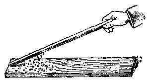

*图1.1*

电，或说它有了电荷。带电的物体叫做带电体。用摩擦的方法使物体带电叫做摩擦起电。

. 我们可以自己动手做一个摩擦起电的实验、取一根塑料棒或塑料笔杆，把它跟毛线摩擦后靠近纸屑可以看到纸屑会被吸引飞向塑料棒。这表示摩擦后的塑料棒已带有电荷。

#### 2. 两种电荷

用毛皮摩擦两根硬橡胶棒，把其中一根用丝线悬挂起来，拿另一根靠近它（使摩擦过的两端靠近），可以看到它们互相推斥（图1.2a）。如果用丝绸摩擦一根玻璃棒，用毛皮摩擦一根硬橡胶棒，然后将其中一根悬挂起来，用另一根去靠近它，则可以发现它们互相吸引（图1.2b）。但是用两根都是用丝绸摩擦过的玻璃棒来做实验时，它们也互相推斥。以上实验的结果说明什么呢？

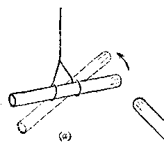

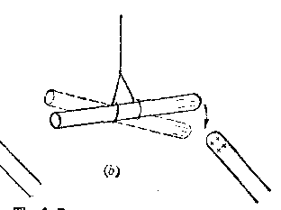

*图1.2*

首先， 它说明电荷之间存在着相互作用的斥力或引力； 其次， 它说明上述硬橡胶棒上的电荷和玻璃棒上的电荷是两种性质不同的电荷。

为了区别这两种性质不同的电荷，在1747年，美国科学家富兰克林把用丝绸摩擦过的玻璃棒上所带的电荷叫做正电荷，把用毛皮摩擦过的硬橡胶棒上所带的电荷叫做负电荷。以后无数的实验证明：所有其他的物体，无论用什么方法使它带电，它所带

> **提示：** 电荷有两种：正电荷和负电荷。同种电荷相斥、异种电荷相吸

的电荷不是和上述玻璃棒上的电荷（正电荷）相同，便是和上述硬橡胶棒上的电荷（负电荷）相同。所以我们说：在自然界里只存在正、负两种电荷。同时上面的实验结果还表明：同种电荷相互排斥；异种电荷相互吸引。

#### 3. 电量

把塑料棒跟毛线轻轻摩擦， 然后去靠近纸屑， 它能吸引少许纸屑、把塑料棒跟毛线重重地摩擦几下， 再去靠近纸屑， 它能吸引较多的纸屑。塑料棒吸引纸屑的本领是由于它带电而具有的， 我们不难想象， 塑料棒吸引纸屑的力量跟它所带电荷的多少有关， 带的电荷比较多， 吸引纸屑的力量就比较强。为了量度物体所带电荷的多少我们引入电量的概念， 电量表示物体所带电荷的多少。

如果两个物体带有等量异种电荷，则它们放在一起时由于正、负电荷电量相等，对外部其他物体的作用互相抵消，因此既不显示出带正电；也不显示出带负电，即不显示带电的性质，这时我们说物体处于电中性状态。

#### 习题 1.1

1. 把一块洗净擦干的玻璃板，架在平放在桌面上的两本练习簿上。在玻璃板的下面、两本练习簿中间的桌面上，放一些剪得很碎的纸屑。然后用干燥的手帕在玻璃板的上面摩擦，观察所发生的现象。

2. 用硬泡沫塑料做一个小球， 把它用丝线悬挂起来， 拿一枝塑料牙刷柄或塑料木梳和毛织物摩擦后靠近小球， 观察会发生什么现象。

3. 把自来水龙头稍稍转开，维持一线水流，拿上题中带了电的塑料柄靠近水流（不要碰着），试观察发生什么现象。

### § 1.2 物质的电结构

#### 1. 原子结构大意

为什么物体摩擦以后会带电？电是什么？下面我们来讨论这个问题。

我们知道，一切物体都是由分子组成的。分子又是由

> **提示：** 原子由原子核和核外电子组成

更小的微粒——原子——组成的。原子也不是组成物质的最小微粒，它也有复杂的结构。原子是由原子核和若干个绕核运动的电子组成的。 电子带负电， 原子核中有质子和中子紧密地束缚在一起。 质子带正电， 中子不带电， 所以原子核带正电。 一个质子所带的正电电量和一个电子所带负电电量是相等的。

不同元素的原子有不同的结构。氢原子的结构最简

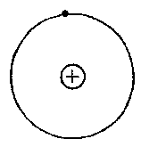

*② 质子 ● 电子*

*图1.3*

单， 它的原子核只由一个质子组成， 核外只有一个电子绕核旋转（图1.3）， 而象结构很复杂的铀原子， 它的原子核包含有92个质子和146个中子， 核外有92个电子分成好几层绕核运动， 在正常情况下， 一个原子的原子核内质子的数目和核外电子的数目相等，也就是说原子核所带的正电电量等于核外电子所带的负电电量。所以正常原子是呈现电中性的。

原子的质量差不多完全集中在原子核里，核外电子的质量是很小的。近代的精密实验测知，质子的质量是 \(1.67 \times 10^{-27}\) 千克，中子的质量跟质子的质量近乎相等，电子的质量是 \(9.11 \times 10^{-31}\) 千克，只是一个质子质量的1/1840。

#### 2. 摩擦起电现象的解释

和行星受太阳的引力绕太阳运动相似，原子里的电子受原子核的吸引分层地，按照各自的轨道绕核运动。在内层轨道上的电子受到原子核吸引力较大，被半周地束缚在原子内。在外层轨道上的电子受到原子

> **提示：** 物体带电的实质是获得电子或失去电子

核的束缚较弱，容易受到外界的影响。当两个物体互相摩擦时，一些束缚松弛的电子能够从一个物体转移到另一个物体上，一个物体获得一些电子，一个物体失去一些电子，失去电子的物体，由于其中正电荷总量多于负电荷而显示出带正电；获得电子的物体，由于其中负电荷总量多于正电荷而显示出带负电。例如，玻璃棒和丝绸摩擦时，玻璃棒由于失去电子而带正电，丝绸则由于获得多余的电子而带负电。所以摩擦起电时，两个物体总是同时带电，并且带有等量异种电荷。

由此可见，起电过程的实质就是物体间电子重新分配的过程。一个物体失去一定数量的电子，必有另一物体得到相等数量的电子。电电荷是守恒的荷是既不能消灭、也不能创造的，它只能从一个物体转移到另一个物体。这个结论叫做电荷守恒定律，它是自然界中又一个基本守恒定律。

如果两个物体原来带有等量的异种电荷，那么在接触后由于电子的转移，它们就变成都不带电的物体，这种现象叫做电的中和，大量正、负电荷中和时，往往会发生火花形成火花放电，并伴随有劈啪的声音。火花放电有时是需要避免的。例如，运输汽油的汽车，其中晃动着的汽油与器壁摩擦会带上电荷，为了让电荷泄放到大地中去以免积累起来引起火花放电事故，所以它们都有铁链拖在地上。

#### 3. 导体和绝缘体

如果我们用手握住一根金属棒来做摩擦起电的实验，则金属棒不会带电。但是如果在金属棒上装一个塑料柄，用手握住塑料柄，再用丝绸跟它摩擦，可以发现金属棒也会带电。为什么人手直接握住金属棒不能使它摩擦起电呢？原来金属棒和人体都有把所获得的电荷传导到别处去的能力。当人手握住金属棒做摩擦起电的实验时，棒上获得的电荷通过人体传导到大地里去了，所以棒就不会带电。塑料的性质与金属相反，它没有传导电荷的能力。装有塑料柄的金属棒，当它由于摩擦而获得电荷时，这些电荷不能通过塑料柄传导给人体再传到大地里去，它们能留在棒上使棒带电。

我们把容易传导电荷的物体叫做导电体，简称导体。所有的金属，如金、银、铜、铝、铁等都是良好的导体。人体、大地和酸、碱、盐的溶液也能传导电荷，也是导体。难以传导电荷的物体叫做绝缘体，绝缘体又叫做电介质（这里“介”字不能写成“解”字）。塑料、琥珀、玻璃、硬橡胶、云母、陶瓷、干燥的竹木、丝绸和油类等都是绝缘体。

为什么有的物体容易导电，有的物体又难以导电呢？简单地说这是因为有的物体内部有可以自由移动的电荷，而有的物体内部却几乎没有这种电荷。

由原子结构的知识， 我们知道， 原子中的电子受原子核束缚而绕核运动。金属原子的最外层电子受到原子核的束缠较弱，很容易挣脱原子核的束缚成为在金属内可以自由移动的电子，这类电子称为自由电子。金属原子失去电子后成为正离子（失去电子的原子或原子集团叫正离子），它在金属内部是不能移动的，图1.4是一个

> **提示：** 金属导电是由于内部有自由电子

属内部是不能移动的，图1.4是一个金属导体的模型。当

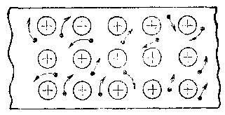

*③ 正离子 ● 自由电子*

*图 1.4 金属导体模型*

金属导体的某一部分得到多余电子时，这些电子就以自由电子的状态传到其他部分去；当它失去一些电子时，其他部分的自由电子就移过来补充，这就是金属的导电现象。金属内的自由电子数量是很多的。如果一个铜原子可以提供一个自由电子，则1克的铜里大约有 \(10^{23}\) 个自由电子，所以金属很容易导电。

对于绝缘体来说，原子中的电子受到原子核的束缚很强，即使是最外层的电子也被紧密地束缚在原子内，因此几乎没有可以自由移动的电荷，所以难以导电。在这里要指出一点，绝缘体也不是绝对不能导电，它

> **提示：** 绝缘体中几乎没有可以自由移动的电荷

在一定条件下也可能成为导体。例如，玻璃在通常情况下是绝缘体，但在熔融状态时却成了导体。

此外， 还有一类物质叫做半导体， 它的导电能力介于导体和绝缘体之间。半导体的一个特点是它的导电能力会随温度、光照和掺入杂质元素等外部条件而显著地改变。由于这些特性使它在近代科学技术上有很大的实用价值。晶体管和集成电路是应用广泛的半导体元件， 它们是用半导体材料硅或锗来制造的。

#### 4. 金箔验电器

金箔验电器是用来检验物体是否带电的仪器。它是利用同种电荷相斥，异种电荷相吸的作用制成的。它的构造如图1.5（a）所示，在一个金属杆上装一个金属球，在杆的下端贴两条很薄的金属箔，金属杆插在用绝缘体（如塑料）制成的瓶塞中，瓶塞塞在玻璃瓶或有玻璃窗的金属盒子上。

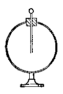

*（a）*

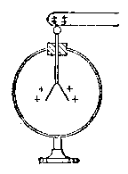

*（b）*

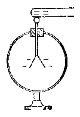

*（c）*

*图1.5 金箔验电器*

（1） 检验物体是否带电检验时，把物体和验电器的金属球接触，如果物体是带电的，那么金属球在接触物体时，就带了电，并将电荷传导到金属箔上去，于是两条金属箔就因为带同种电荷而相斥，张开。如果物体原来不带电，金属箔就不会张开。

电荷是怎样传导到金属箔上去的呢？设一根带正电棒接触验电器顶球，这时金属箔上自由电子受带电棒上正电荷的吸引移向顶球，并有一部分自由电子和接触处棒上的正电荷中和。结果金箔因缺少电子而带正电（图1.5（b））。这一过程相当于带电棒上接触处的正电荷传导到了金箔上。如果是带负电棒与验电器顶球接触，棒上接触处的电子受棒上其他部分多余电子的推斥，传到顶球上，并和顶球上的一些自由电子一起被推斥到金箔上，使金箔带负电。

（2） 检验物体带电性质设先让验电器带某种已知电荷（正的或负的），然后再把要检验的物体移近验电器顶球（不接触），根据金属箔张开角度的增大还是减小，就可以看出物体所带电荷是正的还是负的。当物体所带的电荷和验电器原先所带的电荷种类相同时，因同种电荷相斥，顶球原有的电荷有一部分被推斥到离物体较远的金属箔上，使箔上的电荷比原来增多，从而张角增加。反之，当物体所带的电荷和验电器原先所带的电荷种类不同时，由于异种电荷相吸，箔上原有电荷就有一部分被吸引到靠近物体的顶球上来。金属箔上电荷减小，它的张角也减小。如果物体原来不带电，则金属箔的张角就不会有显著变化。

#### 习题 1.2

1. 在正常情况下氦原子有 2 个核外电子， 锂原子有 3 个核外电子。问在氦和锂的原子核里各有多少个质子？

2. 从原子结构的观点来看，金属为什么容易导电？

3. 试试自己做一个验电器。取一只有塑料或橡皮塞的药片瓶子，用一根稍粗的铜丝（或铁丝）穿过瓶塞，上端弯成圆形，下端弯成直角，再把直角边弯成U形（图a），在U形边上挂两条金属箔（可用包糖果的金属箔）。这样就可做成一个验电器了（图b）。用呢绒摩擦塑料笔杆后，让它与验电器上端接触，观察金箔能否张开。

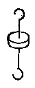

*（a）*

*（b）*

4. 取一枝金属笔套，塑料笔杆的钢笔。手 （第3题） 握笔杆，用丝绸摩擦金属笔套后，让它跟上题中自制验电器上端接触，看它是否带电。

5. 把带正电体靠近验电器金属球时， 即使不接触金属球， 金箔也会张开。 你能解释这个现象吗？ （提示： 金属中自由电子是可以移动的.）

### § 1.3 金属导体的带电现象

#### 1. 感应起电

把带电棒移近验电器，在带电棒还没有接触验电器顶球时，金箔就已经张开（图1.6），这表示金箔已经带电了。

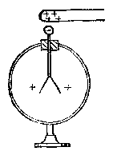

*图1.6 静电感应*

若把带电棒移去，验电器金箔又重新闭合，表示它不再带电。这种现象叫做静电感应。下面的实验可以帮助我们了解静电感应的特点。

取两个金属球 A 和 B，用丝线悬挂起来，并互相接触，这样它们就好象是一个导体。用一带正电棒移近 B球的右端（图1.7a），然后把A、B两球分开，再移开带电棒。把A、B两球先后放到验电器上去检验，可以发现，它们都已带电（图1.7b），若再把带正电棒与验电器接触，让验电器金箔先带上正电，再去检验A、B两球所带电荷的性质。则发现两球带有异种电荷，A球所带电荷与带电棒上电荷同种，是正电，B球所带电荷与带电棒上电荷异种，是负电。如果把A、B两球重新接触，再放到验电器上去检验，则发现它们已不再带电。这表明两球上所带异种电荷的电量是相等的，所以接触后就中和了。

如果用带负电棒来重做以上实验，则可以发现，A球带负电，仍然是与带电棒上电荷同种的，B球带正电，仍然

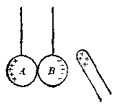

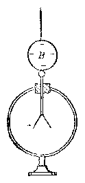

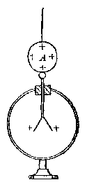

*（a）*

*（b）*

*图1.7 静电感应*

是与带电棒上电荷异种的。

为什么会产生这种现象呢？我们可以用导体中自由电子的移动来解释。当带电棒移近导体时，导体中自由电子受带电棒上电荷的作用而作定向移动。如果带电棒带正电，自由电子受到吸引作用，移向靠近带电棒的一端，使这一端得到多余电子而带负电，而远离带电棒的一端因缺少电子而带正电。如果带电棒带负电，自由电子受到排斥作用，移向远离带电体的一端，使远离的一端带负电，靠近带电体一端带正电。由于导体一端多余的自由电子数目正是另一端缺少的电子数目，所以导体两端所带正电荷和负电荷电量是相等的。在带电棒移开以前，把导体一分为二，如实验中把 \(A\)、\(B\) 两球分开，则两球就分别带有正负电荷。若移去带电棒后，把两球重新接触，则正电荷吸引自由电子，使自由电子移向正电荷一端互相中和了。

由此可见，把带电体移近导体，会使导体两端同时出现电量相等的异种电荷，在靠近带电体一端，出现和带电体上异种的电荷，在远离带电体的一端，出现和带电体上同种的电荷。这种现象叫做静电感应现象。

利用静电感应现象也可以使单个导体带电。这可以按下列步骤进行。

（1） 把导体放在绝缘支架上，使带电棒移近导体左端，如图 1.8（a） 所示。

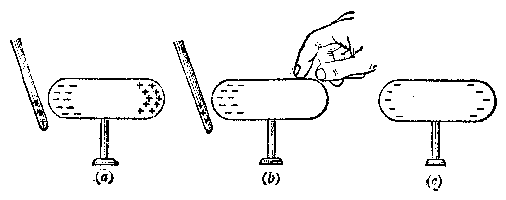

*图1.8 感应起电*

（2） 用手指接触一下导体的右端（图 1.8（b））。

（3） 先移开手指， 再移开带电棒， 则导体上就留下与带电棒异种的电荷 （图 1.8c）。

为什么这样做能使导体带电呢？这是因为人手和大地都是导体，当人手和导体右端接触时，导体就不再和大地绝缘，而是和人、大地组成一个大导体。这时在带电棒的作用下，与带电体同种的电荷被推斥到远离带电棒的大地里，在导体上就留下了与带电棒异种的电荷。所谓同种电荷被推斥到大地里是一种简化的讲法，实际上的过程是：若带电棒带正电，则大地中的自由电子被吸引移向导体，使导体有了多余电子而带负电；若带电棒带负电，则导体上的自由电子被推斥到大地中去，使导体上缺少电子而带正电。总之，大地获得的电荷是与带电棒上的电荷同种的。这种利用静电感应而使导体带电的方法叫做感应起电。

使导体与大地连接叫做接地，接地在实用上都用导体来连接，这里用手指只是方便罢了。在作图时，接地用符号寄来表示。

#### 2. 带电导体上电荷的分布

导体带电后，电荷在它上面是如何分布的呢？

英国物理学家法拉第为了研究这个问题，于1843年做了一个简单而很有启发性的实验。他用的仪器如图1.9所示。A和B是两个金箔验电器。A和普通验电器一样，它的顶端是一个金属球。B的顶端是一个几乎完全封闭的金属空心圆筒C.实验时，先用带电体和圆筒 C 接触一下，使圆筒 C 获得一定量的电荷。这时 B 的金箔张开一定角度。然后用装有绝缘柄的金属小球和圆筒 C 的外表面接触一下，再去和 A 的顶球接触，就发现 A 的金箔微微张开，B 的金箔张

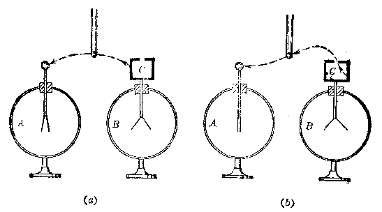

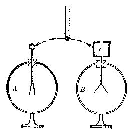

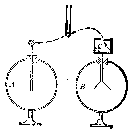

*图1.9 法拉第圆筒实验*

角略有减小。重复若干次后，验电器 A 和 B 的金箔的张角分别有了比较明显的增加和减少，如图 1.9（a） 所示。这说明圆筒 C 的外表面是带有电荷的，绝缘金属小球和它接触就可以取得电荷。

如果用绝缘金属小球和圆筒 \(C\) 的

> **提示：** 电荷都分布在导体的外部表面上

内表面接触一下，再去和验电器 \(A\) 的顶球接触，就会发现 \(\Delta\) 的金箔并不张开。并且不管重复多少次，\(\Delta\) 的金箔始终不张开，\(B\) 的金箔的张角始终不减小，如图1.9（b）所示。这说明圆筒 \(C\) 的内表面是不带电荷的，绝缘金属小球和它接触不能取得电荷。

不管圆筒所带的电荷是从内部传入的，还是从外部传入的，实验所得结果总和上面所述的一样，因此可以得出结论说：绝缘导体上所带的电荷都分布在导体的外部表面上。

#### 3. 静电屏蔽

既然电荷只分布在导体的外表面上，那么我们就能够把物体用金属网或金属壳罩起来，以隔离外部带电体对它的影响。下面的实验可以说明这种屏蔽作用。

用一带电体移近金箔验电器顶球， 由于静电感应， 顶球上呈现与带电棒异种的电荷， 金箔上呈现与带电体同种的电荷， 金箔张开一定角度， 如图 1.10（a） 所示。这时如果用一金属网把验电器罩起来， 则验电器金箔又闭合， 如图 1.10（b） 所示， 这表明金箔上已无电荷。如果事先把罩内验电器顶球与金属网用导线连接好， 再把带电体移近金属网， 或与金属网接触， 都不会影响罩内验电器， 不能使它的金箔张开。可见， 金属网（或金属壳）能够使罩内物体不受外部带电体的影响， 这种现象叫做静电屏蔽。

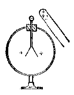

*（a）*

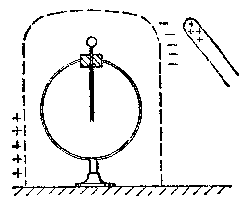

*（b）*

*图1.10 金属网实验*

静电屏蔽现象的原因可以解释如下：金属网把验电器罩起来以后，外部带电体只能在金属网外表面两侧感应出等量异种电荷，金属网内表面没有电荷，所以验电器就不受影响了。即使带电体与金属网接触，传导给金属网一些电荷，这些电荷亦只是分布在金属网的外表面上，对验电器仍然没有影响。

有些电学仪器、电子设备和电子元件，它们的外面都装置有金属罩壳，这些金属罩壳都有屏蔽外部带电体影响的作用。

#### 习题 1.3

1. 三个绝缘导体， 一个带正电， 两个不带电。 （1） 怎样才能使两个不带电的导体分别带上等量的异种电荷？ （2） 怎样才能使它们两个都带上正电？ （3） 怎样才能使它们两个都带上负电？

2. 在应用金箔验电器检验物体是否带电时，不使物体与验电器顶球相接触，也能检验吗？

3. 把一个原来不带电的导体移近一个原来已经带电的金箔验电器，金箔张角就要减小，使能解释这个现象吗？

4. 把一个带正电的金属小球用丝线悬挂到一个放在绝缘板上的金属罐内部。在下列两种情况下，金属罐内壁和外壁各带什么性质的电荷？（1）小球不与金属罐内壁接触；（2）小球与金属罐内壁接触。

5. 在下面四个图中，A 是一个金属圆筒，B 是带正电棒，C 是丝线悬挂的泡沫塑料小球。则在 a、b、c、d 四个图中，小球 c 是否会受到圆筒 A 的吸引？

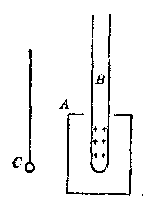

*（4）*

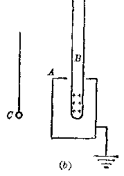

*（b）*

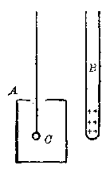

*（c）*

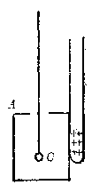

*（d）*

*（第5题）*

### § 1.4 库仑定律

#### 1. 库仑定律

电荷之间既然有相互作用的引力或斥力，那么就很自然地提出如何确定它们之间作用力的大小问题。法国物理学家库仑用实验解决了这个问题，他于1785年导出了电荷之间相互作用的引力或斥力所遵守的定律——后来被人们称为库仑定律。

库仑的实验，主要是研究电荷之间的斥力或引力与两

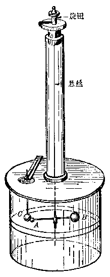

*图1.11 库仑扭秤*

个电荷之间的距离有何关系？与电荷的电量有何关系？他所用的仪器叫做库仑扭秤，这种扭秤是利用细金属丝扭转时产生一个很小的力矩来测定很微小的力的装置。库仑扭秤的构造如图1.11所示，它有一个较大的玻璃圆筒，圆筒中间有0~360°的分度。圆筒上有一块玻璃盖板，板上钻了两个孔，中间孔上装有一根长玻璃管。玻管上端装有一个有分度的旋钮。旋钮下夹持一根细的金属丝，叫做悬丝。悬丝下挂一根横杆，横杆一端有一个金属小球A，另一端有一个作平衡用的小球B。在悬丝无扭转时，使小球A处于0°处，悬丝顶端旋钮也使指示0°。在盖板的侧孔中放进一个与 A 球同样的小球 C，并使它们接触，然后使它们带同种电荷。由于斥力，两球分开，使 \(O\) 球固定不动，则 \(\Delta\) 球将转过一个角度，并使悬丝扭转同样的角度。这时悬丝扭转的弹力的力矩与电荷之间斥力的力矩平衡。因此斥力的大小与悬丝扭转的角度成正比。由 \(\Delta\) 球转过的角度，可确定 \(\Delta, O\) 两球的距离。库仑从实验得出的结果是：电荷之间相互作用力的大小与它们之间距离平方成反比。

进一步需要测定作用力的大小与电量的关系，但当时还不知道怎样测量电量，甚至连电量的单位也还没有确定。库仑找到了一个简单而很有教益的办法来比较电量，他把一个带电的金属球与另一个完全相同的金属球相接触，这样两个球就都带相等的电量，并等于原来球上电量的 \(\frac{1}{2}\)。用同样的办法，可以得到的 \(\frac{1}{4}, \frac{1}{8}\) 的原有电量。库仑用这种办法，在扭秤上进行了电荷之间的作用力与电量的关系的实验。实验的结果是：电荷之间的作用力的大小与两个球上电量的乘积成正比。

这里要指出一点，即在库仑的实验中，A、C两个小球的大小与它们之间距离比较起来是很小很小的，因此在测量它们之间距离时，点电荷的含义可以把它们看作两个点，那么距离也就是这两点之间的距离了。如果两个带电体的大小比起它们之间距离来不是很小，那么它们之间距离就很难确定了，这样也就难于应用库仑实验的结论了。所以严格说来，库仑实验的结论只适用于点电荷。所谓点电荷，从字面上来理解，就是一个小到和几何点一样的带电体。实际上，这是不存在的。但是，不管什么形状的带电体，只要它们的大小比起它们之间的距离来要小得多，以致它们的形状和大小对相互作用力的影响可以忽略不计时，这样的带电体就可以看成是点电荷。

同样两个任意形状的带电体，当它们相距很远时可以看成是点电荷，但当它们相距不够远时就不能看做是点电荷。所以，点电荷的意义是相对的，不是绝对的。

根据库仑实验的两个结论，可得出库仑定律：两个点电荷之间作用力的大小跟它们的电量的乘积成正比，跟它们之间距离的平方成反比，作用力的方向在它们的连线上。根据库仑定律求得的电荷之间的这种作用力叫做静电力，又叫做库仑力。

设用 \(Q_{1}, Q_{2}\) 表示两个点电荷的电量，用 \(\pmb{r}\) 表示它们

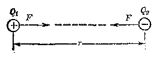

*图1.12*

之间的距离，用 F 表示它们之间的相互作用力，则库仑定律可写成下面的公式

$$
F = k \frac{Q_{1} Q_{2}}{r^{2}} \tag{1.1}
$$

作用力的方向在两点电荷的连线上，如图1.12所示。

在库仑定律公式中，\(k\) 是比例常数，它的数值和单位取决于公式中其他各个物理量的单位。过去许多年来，曾采用过一种静电系单位制，在这个单位制中，比例常数 \(k\) 等于1。但这个单位制在实用上很不方便，所以现在普遍采用国际单位制。在这个单位制中，虽然库仑定律公式中比例常数 \(k\) 似乎不象取1那样简单易记，但它带来了比较实用的好处。在国际单位制中，力的单位是牛顿，距离的单位是米，电量的单位叫做库仑*，简称库，常用符号C来代表。这时，\(k\) 的数值根据实验测定为

$$
k = 8.98755 \times 10^{9} \text{牛} \cdot \text{米}^{2} / \text{库}^{2}
$$

在本书的所有计算中，我们可取 \(k = 9.0 \times 10^{9}\) 牛·米²/库²。

k 的物理意义可以这样来理解： 如果两个点电荷各带 1

> **注：** * 国际单位制中规定电流的单位——安培——为电学基本单位，电量单位库仑是由安培导出的。当导线有1安培稳定电流时，在1秒时间内流过此导线任一横截面的电量就是1库仑。

库仑的电量， 它们在真空中相距 1 米时， 它们之间的相互作用力就等于 \(9.0 \times 10^{9}\) 牛顿。

为了使对于电量的单位——库仑，有一个比较具体的形象，这里指出以下的一些实验结果。电子和质子所带的电量都是很小很小的，基本电荷的电量都只有 \(1.60219 \times 10^{-19}\) 库仑，近似等于 \(1.60 \times 10^{-19}\) 库仑。所有的实验还未得到过电量小于这个数值的带电粒子，任何带电粒子，所带电量或者等于电子或质子的电量，或者是它们的整数倍*。因此人们认为所有带电体所带电荷是这个基本数值的整数倍数，并很自然地把 \(1.60 \times 10^{-19}\) 库仑叫做基本电荷。我们把基本电荷用符号 \(e\) 来表示

$$
e = 1.60 \times 10^{-19} \text{库}
$$

这样电子所带电量为-e，质子所带电量为+e.在应用库仑定律公式（1.1）时，要注意它只适用于点电荷，并只适用于点电荷在真空中或空气中的情况。若两个点电荷浸没在其他绝缘介质中时，由于绝缘介质的影响，它们

> **提示：** 应用公式时要注意的几点

之间的作用力要减小，所以（1.1）式需要加以修正（在以后要讲到）。此外在应用（1.1）式时，我们可以用“+”号表示正电荷，用“-”号表示负电荷来代入公式计算。这样，若两个电荷是同种的，则 \(Q_{1}\) 、 \(Q_{2}\) 同是正值或同是负值，计算得到的F就是正值，表示两电荷间是推斥力。若两电荷是异种的，则 \(Q_{1}\) 、 \(Q_{2}\) 的符号相反，那么计算所得的F总是负值，表示两电荷是吸引力。当然也可以用两电荷的绝对值代入进行计算，求出作用力的数值，然后根据电荷的性质确定力的方向。

> **注：** 近年来在高能物理的研究中提出了一个设想，认为质子、中子等粒子是由更基本的层子（又叫夸克）组成的。层子所带电量是基本电荷的1/3或2/3。但是迄今人们还没有在实验中观察到层子。

对于电荷均匀分布的带电球体来说， 理论证明， 在计算它和别的带电体之间的相互作用时， 可以认为它的全部电荷都集中在球心上。 因此， 在计算两个均匀带电球体间的作用力时， 可以把它们看做是两个位于球心的点电荷， 它们的距离 \(r\) 就是两球心的距离。 这样就可应用（1.1）式进行计算了。

##### 例 1

两个点电荷分别带电 +5×10\(^{-8}\) 库和 +2×10\(^{-8}\) 库，在真空中相距 5 厘米，求它们之间的作用力。

**［解］** 因题中给定的两个电荷都是正电荷，它们之间的静电力是推斥力，如图1.13所示。在把各量代入公式计算时，要注意所用单位必须与公式要求的单位一致。 \(r=5\) 厘米=0.05米。

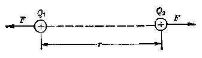

*图1.13*

$$
\begin{array}{l} F = k \frac{Q_{1} Q_{2}}{r^{2}} = 9.0 \times 10^{9} \frac{5 \times 10^{- 8} \times 2 \times 10^{- 8}}{0.05^{2}} \text{牛} \\ = 3.6 \times 10^{- 3} \text{牛} \\ \end{array}
$$

##### 例 2

设氢原子的电子绕原子核作圆周运动， 轨道半径 \(r = 5.3 \times 10^{-11}\) 米， 电子作圆周运动所需要的向心力就是原子核和电子之间的静电引力。 （1） 求此向心力的大小。 （2） 电子和原子核之间的万有引力在计算此向心力时可以忽略吗？ 设已知电子的质量 \(m_0 = 9.1 \times 10^{-31}\) 千克， 氢原子核就是一个质子， 它的质量 \(m_p = 1.67 \times 10^{-27}\) 千克， 万有引力常数 \(G = 6.67 \times 10^{-11}\) 牛·米²/千克².

**［解］** （1） 因已知电子和质子的电量都等于 \(e = 1.60 \times 10^{-19}\) 库， 代入公式就可以计算它们之间的静电引力

$$
\begin{array}{l} F_{g} = k \frac{e^{2}}{r^{2}} = 9.0 \times 10^{9} \frac{(1.60 \times 10^{- 19})^{2}}{(5.3 \times 10^{-11})^{2}} \text{牛} \\ = 8.2 \times 10^{- 8} \text{牛} \\ \end{array}
$$

这个力就是使电子作圆周运动的向心力。

（2） 电子和原子核之间的万有引力可以由公式 \(F_{g} = G \frac{m_{1}m_{2}}{r^{2}}\) 来计算， 把各量的数值代入， 可得

$$
\begin{array}{l} F_{g} = G \frac{m_{1} m_{2}}{r^{2}} \\ = 6.67 \times 10^{- 11} \frac{9.1 \times 10^{- 31} \times 1.67 \times 10^{- 27}}{(5.3 \times 10^{- 11})^{2}} \text{牛} \\ = 3.6 \times 10^{- 47} \text{牛} \\ \end{array}
$$

可以看出， 静电力比万有引力大得无可比拟， 约为后者的 \(10^{39}\) 倍。 因此， 在研究带电粒子之间的相互作用时， 常常把万有引力忽略不计。

以上我们讨论了计算两个点电荷之间作用力的方法。

有时我们碰到的问题常常是有几个点电荷同时存在，那时，每个点电荷所受的静电力怎样来求呢？在力学中我们知道一个物体同时受到几个力的作用时，它受

> **提示：** 静电力的合力可以用力的平行四边形法则来求

到的合力是这几个力的矢量和，可以用平行四边形法则求解。对于静电力也可以用同样的方法来处理，先求出每两个点电荷之间的作用力，然后求出每个点电荷所受其他点电荷对它的作用力的合力。求合力的法则仍然是用平行四边形法则。

##### 例 3

在三角形 ABC 的三个顶点上有三个点电荷， \(Q_{a}=-3.0\times10^{-6}\) 库， \(Q_{b}=-6.0\times10^{-6}\) 库， \(Q_{c}=+9.0\times10^{-6}\) 库。 三角形三条边的长度为 AB = 0.4 米， BC = 0.5 米， AC = 0.3 米。 求 A 点上电荷 \(Q_{a}\) 所受静电力的大小和方向。

**［解］** 首先按题意作出三角形 \(ABC\) 如图1.14所示，根据三个顶点上电荷的正、负可知 A 点的电荷受到 \(Q_{0}\) 的作用

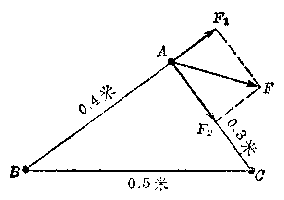

*图1.14*

力是斥力， 受到 \(Q_{0}\) 的作用力是引力。 设这两个力分别以 \(F_{1}\) 和 \(F_{2}\) 表示， 则 \(F_{1}\) 和 \(F_{2}\) 的矢量和就是 A 点电荷 \(Q_{0}\) 受到的合力。 题中未说明电荷处于什么绝缘物质中，我们都作为在真空中计算。对于任何两个点电荷之间的作用力仍旧可以按库仑定律计算。所以有

$$
\begin{array}{l} F_{1} = k \frac{Q_{0} Q_{0}}{A B^{2}} \\ = 9.0 \times 10^{9} \frac{(- 3.0 \times 10^{- 6}) (- 6 \times 10^{- 6})}{0.4^{2}} \text{牛} = 1.0 \text{牛} \\ \end{array}
$$

$$
F_{2} = k \frac{Q_{0} Q_{0}}{A C^{2}}
$$

$$
= 9.0 \times 10^{9} \frac{(- 3.0 \times 10^{- 6}) (+ 9.0 \times 10^{- 6})}{0.3^{2}} \text{牛}
$$

$$
= - 2.7 \text{牛}
$$

\(F_{1}\) 和 \(F_{2}\) 的方向分别如图 1.14 中所示。为了求出 \(F_{1}\) 和 \(F_{2}\) 合力的大小和方向，需要求出 \(F_{1}\) 和 \(F_{2}\) 之间的夹角。因三角形三条边的边长之比是 3：4：5，所以这是一个直角三角形。 \(\angle A\) 是直角，因此 \(F_{1}\) 和 \(F_{2}\) 互相垂直。由此可计算合力 F 的大小为

$$
F = \sqrt{F_{1}^{2} + F_{2}^{2}} = \sqrt{1.0^{2} + 2.7^{2}} \text{牛} = 2.9 \text{牛}
$$

合力 F 与 AC 边的夹角为

$$
\theta = \cos^{-1} \frac{2.7}{2.9} = 21^{\circ}
$$

##### 例 4

两个带有等量同种电荷的小球 A 和 B，质量都是 10 克。各自用 0.5 米长的细线挂在同一点上。两球因相斥而张开，在平衡状态下，它们相距0.2米，求每个球所带电量。 \((g=9.8\text{米/秒}^{2})\)

**［解］** 根据题意先作出一个简图，在图上画出一个小球受力的情况（图1.15）。在平衡状态下，两球各自受到三个力的作用：小球的重力 \(mg\)，细线对小球的拉力 \(T\)，两球之间的库仑力 \(F\)。这三个力的合力为零，所以 \(F\) 和 \(mg\) 的合力 \(R\) 的大小等于 \(T\)，方向与 \(T\) 相反。

由于对称，\(\triangle AOB\) 是等腰三角形，\(OC\) 是它的高。由图可以看出，由三个力 \(mg\)、\(F\) 和 \(R\) 组成的三角形与 \(\triangle OCB\) 相似，所以有

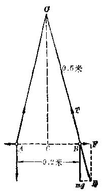

*图1.15*

$$
\frac{F}{m g} = \frac{U B}{O C} = \frac{0.1}{\sqrt{0.5^{2} - 0.1^{2}}} = \frac{0.1}{0.49}
$$

设两球带电量都是 \(Q\)，则它们之间的斥力为

$$
F = k \frac{Q^{2}}{A B^{2}}
$$

由以上两式解出 \(Q\) 得

$$
\begin{array}{l} Q = \sqrt{\frac{CB \times A B^{2} \times m g}{O C \times k}} = \sqrt{\frac{0.1 \times 0.2^{2} \times 0.01 \times 9.8}{0.49 \times 9.0 \times 10^{9}}} \text{库} \\ = 0.3 \times 10^{- 6} \text{库} \\ \end{array}
$$

#### 2. 电量的静电系单位

在国际单位制中，电量的单位是库仑，它是从电流的单位安培导出的。在过去的物理书中也曾采用过厘米·克·秒静电系单位制，这个单位制中电量的单位叫厘米·克·秒制静电系单位电量（简写为CGSE单位电量），有时简称静库。

静库的大小是这样规定的：有两个电量相等的点电荷，在真空中相距1厘米，如果它们之间的作用力适为1达因，我们就规定这两个电荷的电量各为1静库。

这样，当电量用静库、力用达因、距离用厘米作为单位时，库仑定律公式中的比例常数 k 就等于 1。因此，真空中适用的库仑定律公式可以简化为

$$
F = \frac{Q_{1} Q_{2}}{r^{2}}
$$

库仑和静库之间的换算关系是1 库仑 \(\rightarrow 3 \times {10}^{9}\) 静库

#### 习题 1.4

以下习题里的电荷都是在真空或空气中。

1. 一点电荷带电 \(+6 \times 10^{-9}\) 库对离它 \(0.5\) 米远处一个 \(+2.5 \times 10^{-9}\) 库的电荷作用力有多大？

2. 两个带电体各带电1微库（1微库= \(10^{-6}\) 库），相互的斥力是 \(1\times10^{-3}\) 牛，两者相距多远？

3. 两个带电体相距 r 时，相互作用力为 \(1.6 \times 10^{-4}\) 牛，若把它们移到相距 2r 处，则相互作用力有多大？

4. 一个氮核中含有2个质子、两个氮核接近到相距 \(10^{-11}\) 米时，它们之间斥力有多大？

5. 一个电荷 \(Q_{1} = +1.0 \times 10^{-6}\) 库位于 \(x\) 轴原点上，电荷 \(Q_{2} = +2.0 \times 10^{-6}\) 库位于 \(x\) 轴上 \(x = 5\) 米处，另一电荷 \(Q_{3} = -1.0 \times 10^{-6}\) 库位于 \(x\) 轴上 \(x = 15\) 米处，求 \(Q_{2}\) 受力的大小和方向。

6. 三个点电荷各带电 \(+2.0 \times 10^{-3}\) 库位于一直线上依次相隔 0.3 米， 求每个点电荷受力的大小和方向。

7. 在边长为 2 米的等边三角形三个顶点上放置三个电量都是 +5 ×10\(^{-6}\) 库的电荷， 试求其中一个电荷受力的大小和方向。

8. 两个点电荷 A、B 相距 10 厘米，带有异种电荷，电量都是 \(3 \times 10^{-9}\) 库，第三个点电荷 C 电量是 \(+1 \times 10^{-9}\) 库，放在离开 A 和 B 都是 20 厘米处，求电荷 C 受到的力的大小和方向。

9. 两个小球质量都是 0.1 克， 带有等量同种电荷， 分别用 4 厘米长的丝线悬挂在同一点上。由于电荷之间的斥力作用， 丝线间张角正好是 \(90^{\circ}\)， 试求小球所带电量。

### § 1.5 电场 电场强度

#### 1. 电场

打乒乓球时，乒乓板跟球接触把力作用到球上；推车时，手跟车子接触把力作用到车子上。带电体之间可以相隔一定距离而发生相互作用，它们之间的作用力是通过什么来传递的呢？经过长期的研究，人们终于认识到：在电荷的周围存在着一种叫做电场的特殊物质，电荷之间的相互作用是通过电场来发生的。电场这种物质虽然不象由原子、分子组成的物质那样看得见，摸得着，但

> **提示：** 电荷之间是通过电场来发生相互作用的

它跟其他物质一样是客观存在的东西。电荷和电场是一个不可分割的整体，只要有电荷存在，它周围空间里就一定有电场存在。当电荷 \(A\) 的周围空间里，放置另一个电荷 \(B\) 时，电荷 \(A\) 对电荷 \(B\) 的作用，实际上是电荷 \(A\) 的电场对电荷 \(B\) 发生作用。同时电荷 \(B\) 对电荷 \(A\) 的作用，实际上是电荷 \(B\) 的电场对电荷 \(A\) 发生作用。

因此，一个电荷对另一个电荷作用的静电力，实际上是一个电荷的电场对另一电荷的作用力，电场对电荷的作用力常叫做电场力，所以静电力也常常叫做电场力。

引入了电场的概念以后，我们对于一个电荷所受到的静电力就可以有两种考虑的方法。一种是从电荷对电荷的作用出发，应用库仑定律来计算；另一种是从电场对电荷的作用出发，来讨论这个电荷受到多大的电场力。这里需要明确一点，无论用电荷对电荷的作用这一讲法，还是用电场对电荷的作用这一讲法，实际上讲的是同一个力。用电荷对电荷的作用这一讲法，是讲这件事的现象方面，而用电场对电荷的作用这一讲法，是讲这件事的本质方面。但作用在电荷上的力是同一个力。

#### 2. 电场强度

既然一个电荷对另一个电荷的作用，实质上是这个电

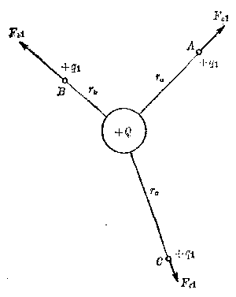

*图1.16 电场中不同的点， \(q_{1}\) 受力情况*

荷的电场对另一个电荷的作用，那么从电场对电荷的作用这个角度来考虑问题时，怎样计算这个电场力呢？

下面我们就来讨论这个问题，设有一个正点电荷 \(Q\)，在周围空间产生一个电场，另一个正点电荷 \(q_{1}\) 放在电场中的 \(A\) 点，\(A\) 点到 \(Q\) 的距离为 \(r_{0}\)，要问 \(q_{1}\) 在电场中受到多大的电场力？

图1.16 电场中不远的点， \(q_{1}\) 受力情况要回答这个问题，如果从电荷之间相互作用的库仑定律出发来讨论是很容易的，作用在 \(q_{1}\) 上的静电力

$$
F_{q 1} = k \frac{Q q_{1}}{r_{a}^{2}}
$$

力 \(F_{a2}\) 的方向如图1.16中所示。

如果用另外一个正点电荷 \(q_{2}\) 放在 \(A\) 点，则同样可以求得 \(q_{2}\) 受到的静电力

$$
F_{q 2} = k \frac{Q q_{2}}{r_{0}^{2}}
$$

作用力的方向不变。

这两个等式能告诉我们些什么呢？仔细考察一下可以发现，放在 \(A\) 点的电荷，它的电量越大，它受到的静电力也越大，把电荷受到的静电力与电荷电量相比，得到

$$
\frac{F_{a 1}}{q_{1}} = \frac{F_{a 2}}{q_{2}} = k \frac{Q}{r_{a}^{2}}
$$

可以看出，等式右边 \(k, Q, r_{a}\) 都是与放在 \(A\) 点的电荷 \(q\) 无关的量，所以，可以得出结论说：电荷在 \(A\) 点所受的静电力与电荷电量的比值是一个与电荷本身无关的量，它的大小只决定于产生电场的电荷 \(Q\) 和 \(A\) 点在电场中的位置。

> **提示：** 电场中的电荷受到的电场力与电荷电量的比值与电荷本身无关

上面的结论给我们一个启发，如果不用电荷对电荷作用的库仑定律来计算电荷的受力，那么只要测定一个点电荷* \(q\) 在电场中 \(A\) 点所受的静电力 \(F_{a}\)，并求出 \(F_{a}\) 与 \(q\) 的比值，也可以计算其他电荷 \(q_{1}, q_{2}\) 等在电场中 \(A\) 点所受静电力的大小。因为对于点电荷 \(Q\) 的电场来说，测定了 \(F_{a}/q\) 的值，就等于测定了 \(k \frac{Q}{r_{a}^{2}}\) 的值。设用 \(E_{a}\) 来代表 \(F_{a}/q\)，则放在 \(A\) 点的电荷 \(q_{1}, q_{2}\) 等所受的静电力 \(F_{a1}, F_{a2}\) 等就可以用 \(E_{a}\) 来计算了

$$
F_{a 1} = E_{a} q_{1}
$$

$$
F_{a 2} = E_{a} q_{2}
$$

可见对于电荷 \(Q\) 的电场中的 \(A\) 点，测出了 \(E_{a}\) 的值，我们就可以不必用电荷对电荷的作用，而直接用电场中的 \(E_{a}\) 来讨论电荷在 \(A\) 点的受力问题了。这样我们就可以从电荷对电荷的作用转到电场对电荷的作用这一角度上来讨论问题。\(F_{a}\) 与 \(q\) 的比值 \(E_{a}\) 反映了 \(A\) 点处电场的力的性质。

对于电场中任何其他的点是否也有这样的性质呢？即放在该点的点电荷所受的静电力与这个电荷电量的比值是

> **注：** * 用来探测电场性质的电荷必须是荷电量很小，并且几乎尺寸也很小，可以看做一个点的点电荷。这样它的引入不致影响原来电场，并且测定的是场中各点的性质。这样的点电荷叫做检验电荷。

否也是一个反映该点特性的，与该电荷无关的量呢？为此，我们进一步把 \(q_{1}\) 、 \(q_{2}\) 等放在电场中任意一点，设B点，来进行考察。同样由库仑定律可得

$$
F_{b 1} = k \frac{Q q_{1}}{r_{b}^{2}} \quad F_{b 2} = k \frac{Q q_{2}}{r_{b}^{2}}
$$

静电力与电荷电量的比值

$$
\frac{F_{b 1}}{q_{1}} = \frac{F_{b 2}}{q_{2}} = k \frac{Q}{r_{b}^{2}}
$$

仍然与该电荷无关，而只决定于产生电场的电荷 \(Q\) 和 \(B\) 点

> **提示：** 电场强度的定义和它的定义式

$$
E = \frac{F}{q}
$$

在电场中的位置。我们可以用 \(E_{b}\) 来代表在 \(B\) 点的 \(F_{b} / q\) 的值。用同样的方法，可以证明电场中其他的点，例如 \(C\) 点、\(D\) 点……等，也各自有一个反映它们特性的量 \(E_{b}, E_{b} \cdots\) 等。

由以上的讨论可知，从电场对电荷的作用力的角度来讨论问题时，可以用电场中的 \(E_{a}, E_{b} \cdots\) 等来计算电荷在电场中所受的静电力，即电场力。也就是说，\(E_{a}, E_{b} \cdots\) 等量反映了电场对其中的电荷有力的作用的性质，并且它们的大小反映了这个力的作用的强弱，所以 \(E_{a}, E_{b} \cdots\) 等有个名称，叫做电场强度，简称场强。用文字来表述得明确一点，可以这样说：电场中某点的电场强度就是放在该点的点电荷所受的电场力与这个电荷电量的比值。写成公式

$$
E = \frac{F}{q} \tag{1.2}
$$

因为 F 的单位是牛顿， q 的单位是库仑， 所以 E 的单位是牛顿/库仑。

假设 q 等于 1 库仑，则 E 和 F 在数值上相等，因此我们也可以这样讲：电场中某点的电场强度数值上等于单位正电荷在该点所受的电场力。

从电荷的相互作用可以知道，如果一个正电荷的作用力是排斥力，则对于另一个负电荷一定是吸引力。 同样道理， 在电场中一点， 如果正电荷受到电场力是向东的， 则负电荷在该点受到的电场力一定是向西的，两个力的方向正好相反。

有方向的，是矢量。电场中一点电场强度的方向与该点正电荷受力方向相同。负电荷在电场中受力方向则与电场强度方向相反。

以上关于电场强度的概念，虽然只是从一个特殊情况——点电荷的电场——引出的，但它的定义是普遍适用的。不管由什么样的形状和大小的带电体产生的电场，它的电场中每一点都有一个由 \(E / q\) 所确定的电场强度 \(\pmb{B}\) 的值。电场强度是反映电场本身物理性质的一个物理量。

当我们已经知道一个电场中各点的电场强度 \(E\) 以后，就可以根据 \(E\) 的大小和方向来讨论电荷在电场中的受力问题，而不必去考虑这个电场是由什么样的带电体产生的，这个带电体在何处等问题。

##### 例 5

一个负点电荷， 电量为 \(4 \times 10^{-9}\) 库， 放置在某电场中的 \(A\) 点上。 已知 \(A\) 点的电场强度 \(E = 5 \times 10^{4}\) 牛/库， 方向如图 1.17 中所示。 求该点电荷所受电场力的大小和方向。

**［解］** 由电场强度的定义式可知， 点电荷在电场中 A 点所受电场力的大小为

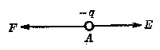

*图1.17*

$$
F = q E = 4 \times 10^{- 9} \times 5 \times 10^{4} \text{牛}
$$

$$
= 2 \times 10^{- 4} \text{牛}
$$

由于点电荷是带负电的，所以电场力的方向与电场强度方向相反，如图1.17中 \(F\) 所示。

#### 3. 点电荷周围的电场

从前面的讨论中，我们很容易知道，一个点电荷 \(Q\) 周围的电场中，各点电场强度可以用下式来计算，

$$
E = k \frac{Q}{r^{2}} \tag{1.3}
$$

对于一个均匀带电的球体来说，因为它对周围带电体的作用可以看做电荷集中在球心上的点电荷，所以在球体外边，距球心为 \(r\) 的一点的电场强度，也可以用点电荷的公式来计算。

##### 例 6

一个正点电荷， 电量为 \(10^{-4}\) 库， 求距点电荷 50 厘米处一点的电场强度。

**［解］** 由点电荷周围电场强度的计算式， 可知

$$
E = k \frac{Q}{r^{2}} = 9.0 \times 10^{9} \frac{10^{- 4}}{(0.5)^{2}} \text{牛/库} = 3.6 \times 10^{6} \text{牛/库}
$$

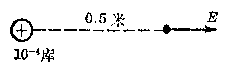

*图1.18*

电场强度 E 的方向如图 1.18 所示。

在计算电场强度问题的时候，要注意区别公式 \(E=\frac{F}{q}\) 和公式 \(E=k\frac{Q}{r^{2}}\) 两者不同时适用情况。

（1） 公式 \(E = F / q\) 是电场强度的定义式， 它表示场强的物理意义和量度方法。 在任何电场里， 我们可以根据实际测得或算得的 \(F\) 和 \(q\)， 应用定义式来计算电场强度， 它的适用范围是不受限制的。

（2） 公式 \(E = \frac{kQ}{r^2}\) 是点电荷电场的计算式， 只适用于计算点电荷的电场， 其他电场都不适用。

还要指出，如果同时有几个点电荷存在，那么在它们周围的空间里就有几个点电荷的电场迭加在一起。这时候，如果我们要求某一地点的电场强度，就应当先求出各个点电荷单独在该处产生的电场强度，然后再用矢量合成的方法求出它们的合场强。

##### 例 7

在直角三角形的两个顶点 \(A, B\) 上分别有两个点电荷 \(Q_{a} = +1.0 \times 10^{-9}\) 库，\(Q_{b} = -4.0 \times 10^{-9}\) 库，如图1.19 所示。 已知两直

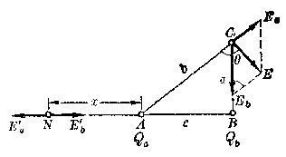

*图1.19*

角边 \(a = 0.3\) 米，\(c = 0.4\) 米。（1）求 \(C\) 点的电场强度。（2）求电场中电场强度为零的点的位置。

**［解］** 因为有两个点电荷同时存在，空间里就有两个点电荷的电场迭加在一起，任一点的场强应当等于两个点电荷单独在该点产生的场强的矢量和。

（1） 在 C 点处由电荷 \(Q_{n}\) 在该处产生的场强为

$$
E_{a} = k \frac{Q_{a}}{b^{2}} = 9 \times 10^{9} \frac{1.0 \times 10^{- 9}}{0.4^{2} + 0.3^{2}} \text{牛/库} = 36 \text{牛/库}
$$

由电荷 \(Q_{b}\) 在 \(C\) 点产生的场强为

$$
E_{b} = k \frac{Q_{b}}{a^{2}} - 9 \times 10^{9} \frac{4.0 \times 10^{- 9}}{0.3^{2}} \text{牛/库} = 400 \text{牛/库}
$$

\(E_{a}\) 、 \(E_{b}\) 的方向如图1.19中所示。

应用余弦定律可求得 C 点处合场强为

$$
\begin{array}{l} E = \sqrt{E_{a}^{2} + E_{b}^{2} + 2 E_{a} E_{b} \cos (1.80^{\circ} - \angle A C B)} \\ = \sqrt{36^{2} + 400^{2} + 2 \times 36 \times 400 \times (- 0.6)} \text{牛/库} \\ = 3.8 \times 10^{2} \text{牛/库} \\ \end{array}
$$

（上式中利用了关系式

$$
\cos (180^{\circ} - \angle A C B) = - \cos \angle A C B = - \frac{0.3}{0.5} = - 0.6)
$$

应用正弦定律可求得 E 的方向

$$
\frac{R_{0}}{\sin \theta} = \frac{E}{\sin (\angle A C B)}
$$

$$
\frac{36}{\sin \theta} = \frac{3.8 \times 10^{2}}{0.8}
$$

$$
\sin \theta = \frac{36 \times 0.8}{3.8 \times 10^{2}} = 0.0758
$$

$$
\therefore \quad \theta = 4^{\circ} 21^{\prime}
$$

（2） 合场强为零的点一定是该处的 \(E_{a}^{\prime}\) 和 \(E_{b}^{\prime}\) 大小相等而方向相反，所以该点一定在 \(AB\) 线上。又因 \(|Q_{a}| < |Q_{b}|\)，该点一定在 \(AB\) 线上靠近 \(A\) 的一侧，设在 \(N\) 点，\(NA = x\)，则 \(Q_{a}\) 在 \(N\) 点的场强为

$$
E_{a}^{\prime} = k \frac{Q_{a}}{x^{2}}
$$

\(Q_{b}\) 在 \(N\) 点的场强为

$$
E_{b}^{\prime} = k \frac{Q_{b}}{(x + 0.4)^{2}}
$$

这两个场强应该大小相等，即 \(E_{a}^{\prime} = E_{b}^{\prime}\)，把数量代入式中得

$$
k \frac{1.0 \times 10^{- 9}}{x^{2}} = k \frac{4.0 \times 10^{- 9}}{(x + 0.4)^{2}} 4 x^{2} = (x + 0.4)^{2}
$$

$$
\therefore x = \pm \frac{x + 0.4}{2}
$$

∴ x=0.4 米或 \(x=-\frac{0.4}{3}\) 米（不合理故舍弃）

#### 习题 1.5（1）

1. 电场强度的定义是什么？它的方向怎样确定？

2. 设一个 \(q = +3 \times 10^{-7}\) 库的点电荷在电场中某处受到的电场力是 0.36 牛， 方向向上。求该处电场强度的大小和方向。

3. 在电场强度 \(E = 5.0 \times 10^{4}\) 牛/库处，一个 \(4.0 \times 10^{-8}\) 库的电荷受到多大的电场力？

4. 一个电子在电场中某点受到 \(3.2 \times 10^{-11}\) 牛的向上的力，求该点场强的大小和方向。

5. 氢原子中电子绕核运动的轨道的平均半径是 \(0.53 \times 10^{-10}\) 米，求氢原子核在轨道上任一点处产生的场强。

6. 两个点电荷 \(Q_{1} = +10 \times 10^{-6}\) 库，\(Q_{2} = +4.0 \times 10^{-6}\) 库，相距 0.7 米，有一点 \(P\) 距两个点电荷的距离也都是 0.7 米，求 \(P\) 点的场强。

7. 上题中在什么位置场强等于零。

8. 在边长为2米的正方形的三个顶点上， 各有一个 \(Q = +8.0 \times 10^{-6}\) 库的点电荷， 求在第四个顶点处合场强的大小和方向。

#### 4. 电力线

前面已经提到，电场是一种看不到，摸不着的特殊物质，这使大家觉得电场比较抽象。为了使电场的形象比较具体，法拉第提出一种用图形来表示电场的方法。具体的做法是这样的：在电场中画许多线条，使线条的走向能够表示出各点电场强度的方向。因此规定，线条上每一点的切线方向必须和该点的电场强度方向一致。这样的线条叫做电力线。

图 1.20 是一个孤立正点电荷的电场中的电力线的图形，可以看出它们是一些从正电荷发出的，向外辐射出去的直线。为什么会是这个形状的呢？因为，如果把另一个正点电荷放在这个电场中任何一点上，由于同种电荷相斥，它受到的总是推斥力，力的方向都是背向中间的正电荷，向外辐射的。那就

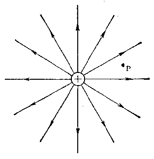

*图 1.20 正点电荷的电力线*

是说电场中任何一点的场强方向都是径向向外的。所以这个电场的电力线图就如图1.20中所示。按理说，一个孤立点电荷的电场是上下，左右充满周围空间的，它的电力线也应该是立体的， 但在纸上只能画它的一个平面图形。此外， 图中只画了少数几根电力线。实际上， 过场中任何一点， 例如图中 \(P\) 点， 都可以画一条电力线。又因为无论多少远处放一个点电荷， 它或多或少总要受到这中间正电荷对它的作用力， 也就是说， 无论多远处， 总有一点电场， 只是场强较弱而已。所以点电荷的电力线可以一直伸展出去， 直到无限远处。

从点电荷的电力线图形上还可以看出，电力线在越近点电荷处越密，在越远离点电荷处越稀。联系到点电荷的电场强度，在离它越近处，场强越强，在离它越远处，场强越弱。所以，可以看出，电力线的疏密是与电场的强弱相对应的。电力线越密的地方，表示电场越强。

对于一个负的点电荷， 它周围电场中， 电力线的图形如

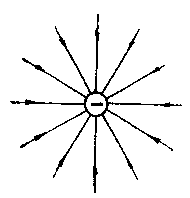

*图1.21 负点电荷的电力线*

图1.21所示。它与图1.20很相似，唯一的不同之处是，电力线的方向都是指向负电荷的，即电力线都终止于负电荷上。这是因为，在这个电场中任何一点，放一个正点电荷，它受到的电场力都是指向负点电荷的。跟前面所讲的理由一样，这些电力线也可以一直延伸出去，直到无限远处，即可以看做来自无限远处。

对于孤立的点电荷来说，电力线都是一些直线。但一般情况下，电力线是一些曲线，它们不象点电荷的电力线那样容易画出来。一般是用实验方法来得出的。

一种显示电场中电力线的实验方法是利用细小而能够自由转动的针状绝缘体，例如奎宁的针状结晶或很短的头发屑。把它们悬浮在蓖麻油面上，放在强电场里，就可以看到，这些细小的绝缘体首尾相接，按电场强度方向排列成线，显示出电力线的形象。图1.22（a）和（b）就是利用这种方法显示出来以后画下来的两个电量相等的点电荷的电力线图形。图（a）表示两个异种等量点电荷的电力线图形，图（b）是两个等量同种点电荷的电力线图形。过这些电力线上任何一点画该电力线的切线，这切线的方向就指示这一点的场强的方向，例如图1.22（a）中，过某条电力线上一点A作这条曲线的切线AB，AB的方向就是该点场强的方向。

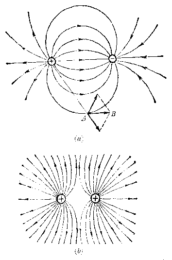

*图122 （a） 等量异种点电荷的电力线分布；*

*（b） 等量同种点电荷的电力线分布*

根据电力线的含义和上面介绍的几种电场的电力线图形，我们可以对电力线的性质作出四点结论：

电力线的一些性质

（1） 电力线是从正电荷出发（或来自无限远处），到负电荷终止（或伸向无限远处），如以上各图中箭头所示。它们不会在没有电荷的地方中断，也不会形成闭合曲线。

（2） 因为在电场中任一点处，只有一个电场强度的方向，所以任何两条电力线决不会相交。假如电力线在某点相交，那就表示这点的电场强度有两个方向，这显然是不可能的。

（3） 电力线的疏密是和电场强度的强弱相对应的，电力线越密的地方，场强也越强。

（4） 电场是真实存在的，电力线却并不是真实存在的，它是为了使电场形象化而假想的一些曲线。

最后要指出一点，电力线上各点的切线方向与场强方向一致，也就是说它表示正电荷所受电场力的方向。因此，电力线一般不表示正电荷的运动轨迹，因为运动轨迹上的切线方向是速度方向，与受力方向是不同的，不能误会。

#### 5. 匀强电场

在电场的某一区域里，如果各点处的电场强度的大小和方向都相同，那么这个区域里的电场就叫做匀强电场。

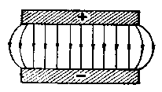

*图1.23 匀强电场*

在匀强电场里，由于各点处场强的方向都相同，所以电力线是互相平行的直线；又由于各点处场强的大小都相同，所以电力线的疏密程度也均匀。图1.23所示的是两块大小相等的平行金属板，它们分别带等量的正负电荷。当两板间的距离足够近时，除边缘附近之外，其余部分差不多是匀强电场。

#### 习题 1.5（2）

1. 什么叫做电力线？它有什么用处？为什么任意两条电力线总不会相交？为什么用米表示匀强电场的电力线是疏密均匀的平行线？

2. 两块互相平行金属板分别带等量异号电荷，试画出两板间的电力线。

3. 下面两个图分别表示两个电场的电力线图形，试比较每个图中 \(A, B, C\) 三点的电场强度（相对大小和方向）。

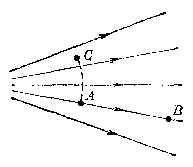

*（4）*

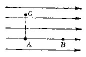

*（b）*

*（第3题）*

4. 在两个水平放置的平行金属板之间，有一个竖直向下的匀强电场 \(E = 3 \times 10^{5}\) 牛/库。有一带电油滴 \(m = 2.94 \times 10^{-11}\) 克正好能悬浮在两板之间处于平衡状态，它所带电荷是正的还是负的？电量是多少？\((g = 9.8\) 米/秒²）

5. 在匀强电场 \(E\) 中，一质量为 \(m\) 的点电荷 \(q\) 从静止出发将做怎样的运动？试写出 \(t\) 秒后此点电荷速度和动能的表示式。

### § 1.6 电势

#### 1. 电场中移动电荷的功

上一节我们从电场对电荷有力的作用方面来考察电场的性质，从而引入了电场强度的概念。下面我们要从另外一个角度——能量方面——来描述电场的物理性质。为此需要先讨论电场中移动电荷时，电场力作功的问题。

图 1.24 表示两块平行的金属板， 上板带正电， 下板带等量的负电， 两板之间是一个匀强电场 E. 现在我们来考察一个正检验电荷 q 在此电场中移动时， 电场力的功。 q 在此电场中所受到的电场力与 E 方向相同， 它的大小

$$
F = q E
$$

设 \(P\) 为检验电荷 \(q\) 的起始位置，当它顺着场强方向移

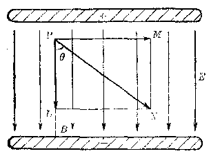

*图1.24*

动到位置 L 时，电场力作正功

$$
W = F \cdot \overline{PL} = qE \cdot \overline{PL}
$$

当它沿垂直于场强的方向移动到位置 M 时，电场力不作功。当它沿 PN 直线移动到位置 N 时，电场力作正功

$$
W = F \cdot PN \cos\theta = qE \cdot \overline{PL}.
$$

从图上可以看出，如果电荷 q 不是直接从 P 点移动到L 点， 而是经过路径 PMNL 到达 L 点， 那么电场力所作的总功等于在各段路程 （PM、MN 和 NL） 上所作功的和。 在

> **提示：** 电场力的功与路径无关

PM 段，电场力不作功；在 MN 段，电场力作功 \(qE \cdot MN\)；在 NL 段，电场力也不作功。因此，在整个路程 PMNL 上，电场力的功

$$
W = 0 + qE \cdot \overline{MN} + 0 = qE \cdot \overline{PL}
$$

如果经过路径是 \(PNL\)，那么根据同样的方法，可以求得电场力的功

$$
W = qE \cdot \overline{PN}\cos\theta + 0 = qE \cdot \overline{PL}
$$

理论证明，不管电荷 q 是沿直线路径、折线路径，还是沿任意的曲线路径从 P 点移动到 L 点，电场力所作的功总是等于 \(qE \cdot \overline{PL}\) .根据以上的讨论，我们可以得出结论：当电荷在电场里移动时，电场力的功只与电荷的起始位置和终止位置有关，而与电荷实际经过的路径无关。

上面的结论，不仅对匀强电场适用，对于任何静电场也同样适用。这是电场的又一重要性质。

##### 例 8

图 1.25 表示一个匀强电场 \(E=2\times10^{4}\) 牛/库，有一个检验电荷 \(q = +3 \times 10^{-8}\) 库沿图中所示两种不同路径 \(AB\) 和 \(ACB\) 从 \(A\) 处移动到 \(B\) 处，求两种情况下电场力的功。

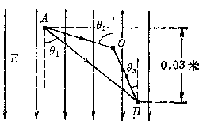

*图1.25*

**［解］** q 在电场中所受电场力

$$
F=qE=3\times10^{-8}\times4\times10^{4}\text{牛}=12\times10^{-4}\text{牛}
$$

q 沿 AB 线移动到 B 处时， 电场力的功为

$$
\begin{array}{l} W_{A B} = F \cdot A B \cos \theta_{1} = 12 \times 10^{- 4} \times 0.03 \text{焦耳} \\ = 0.36 \times 10^{- 4} \text{焦耳} \\ \end{array}
$$

q 沿 ACB 移动到 B 处时， 电场力的功为

$$
W_{ACB}=F\cdot AC\cos\theta_2+F\cdot CB\cos\theta_3
$$

$$
= F (A C \cos \theta_{2} + C B \cos \theta_{3})
$$

$$
\because AC\cos\theta_2+CB\cos\theta_3=0.03\text{米}
$$

∴ \(W_{ACB}=12\times10^{-4}\times0.03\) 焦耳 \(=0.36\times10^{-4}\) 焦耳。即沿不同路径，两次的功相等。

> 校注：原书题干场强印作 \(2\times10^4\) 牛/库，而解答代入 \(4\times10^4\) 牛/库；这里保留原印计算过程。

#### 2. 电势能

在力学里我们学习过，重力场中移动物体时，重力的功与路径无关，只与物体的始末位置有关，因此重力的功可以用重力势能的变化来计算。物体顺着重力方向运动，即物体下降时，重力作正功，重力势能减少；重力作多少正功，势能就减少多少。物体逆着重力方向运动，即上升时，重力作负功，重力势能增加；重力作多少负功，势能就增加多少。

电场中移动电荷时，电场力的功也跟路径无关。所以我们可以仿照重力场中的情况，引入电势能的概念。电荷在

> **提示：** 电场中电荷具有电势能

电场里具有电势能。电荷在电场里移动时，电场力要作功，电势能要发生变化。电场力的功等于电势能的变化量。电场力作正功时，电势能减少；电场力作负功时，电势能增加。电场力作多少功，电势能就有多少变化量。例如，图1.24中，电荷 \(q\) 从 \(P\) 点移动到 \(L\) 点时，电场力作正功，电势能减少。电势能的减少量为

$$
\Delta E_{p} = W = q E \cdot \overline {{P L}}
$$

我们知道，重力势能只有相对的意义，通常我们说某物

> **提示：** 电势能的数值与零电势能位置有关

体具有多少势能是相对于某一零势能位置而讲的。与此相似，电荷在电场中某一位置的电势能也只有相对的意义。只有选定了零电势能的位置以后，电势能才有确定的值。这时，电荷在电场中某点的电势能，就等于电荷从该点移动到零电势能位置时电场力的功，即

$$
E_{p} = W \tag{1.4}
$$

例如，在图1.24中，如果我们选取带负电金属板表面为零电势能位置，由图中可以看出 \(P\) 点到负电板距离为 \(\overline{PB}\)，\(L\) 点到负电板距离为 \(\overline{LB}\)，所以可以计算出电荷 \(q\) 在 \(P\) 点和 \(L\) 点的电势能分别为

$$
E_{P P} = W_{p} = q E \cdot \overline {{P B}}
$$

$$
E_{P L} = W_{L} = q E \cdot \overline {{L B}}
$$

\(q\) 从 \(P\) 点移动到 \(L\) 点时，电势能的减少量为

$$
E_{P P} - E_{P L} = q E \cdot (\overline {{P B}} - \overline {{L B}}) = q E \cdot \overline {{P L}}
$$

此值与零电势能位置的选择无关。

在力学里我们还曾学过，重力势能是为地球和重物所共有的，而不是为重物所独有的。同样，电势能也是为电场和电荷所共有的。离开电场，电荷就不受电场力的作用，当它从一个位置移到另一位置时就不作功，因而也就根本谈不到电势能的增减和电势能。通常我们说“电荷具有多少电势能”，只是一种惯用的简便说法，绝不能误解为电荷单独具有电势能。

##### 例 9

设图 1.24 中，两板之间匀强电场 \(E=5\times10^{4}\) 牛/库， \(\overline{PB}=2.4\) 厘米， \(\overline{LB}=0.4\) 厘米。若以带负电板为零电势能的参考位置（即 B 处为零电势能位置），试求电量 \(q=+3\times10^{-6}\) 库的电荷在 P、L 两点各具有多大电势能。

**［解］** 把 q 从 P 点移动到 B 处，电场力所作的功就等于 q 在 P 点具有的电势能，所以

$$
\begin{array}{l} E_{P P} = W_{P B} = q E \cdot \overline {{P B}} \\ = 3 \times 10^{- 6} \times 5 \times 10^{4} \times 2.4 \times 10^{- 2} \text{焦耳} \\ = 3.6 \times 10^{- 3} \text{焦耳} \\ \end{array}
$$

同理可求得 \(q\) 在 \(\pmb{L}\) 点的电势能

$$
\begin{array}{l} E_{P L} = W_{L B} = q E \cdot \overline {{{L B}}} \\ = 3 \times 10^{- 6} \times 5 \times 10^{4} \times 0.4 \times 10^{- 2} \text{焦耳} \\ = 0.6 \times 10^{- 3} \text{焦耳} \\ \end{array}
$$

#### 3. 电势和电势差

电荷在电场里具有电势能，这是电场特性的另一种表现。电势能虽然只有相对的意义，但在选定了零电势能位置以后，电荷在电场中的电势能就有完全确定的值。这说明电势能的大小与电场的某种性质有关。同一个电荷在电场中不同位置上，由于这种性质的不同，具有的电势能也就不同。用怎样的物理量来反映电场的这种性质呢？

我们仍旧用图1.24来讨论，前面我们已经得到，以 \(B\) 处为零电势能位置时， \(q\) 在 \(P\) 点的电势能为

$$
E_{P P} = q E \cdot \overline {{P B}}
$$

此电势能与电量 \(q\) 的比值为

$$
\frac{E_{P P}}{q} = E \cdot \overline {{P B}}
$$

上式表示比值 \(E_{PP} / q\) 只决定场强 \(E\) 和 \(P\) 点在电场中的位置， 它与电荷 \(q\) 的值无关。 可见比值 \(E_{PP} / q\) 能够反映电场赋予场中电荷以电势能的性质， 我们把它叫做电势。 电势常用符号 \(U\) 来表示。 \(A\) 点电势写成 \(U_A\)， \(B\) 点电势写成 \(U_B\).在我们的特例中， \(P\) 点的电势为

$$
U_{P} = \frac{E_{P P}}{q} = E \cdot \overline {{P B}}
$$

上式右边表示把1个单位电量的正电荷从 \(P\) 点移动到零

> **提示：** 电势的定义

电势能位置时，电场力所做的功。所以电势的定义也可以这样来表述：电场中某点的电势就是单位正电荷在该点具有的电势能，它在数值上等于把单位正电荷从该点移到所选定的零电势能处时电场力所作的功。写成表示式

$$
U = \frac{E_{P}}{q} \tag{1.5}
$$

以上关于电势的概念虽然是从匀强电场这一特殊情况下导出的，但得出的电势定义对于任何静电场都是适用的。

跟电势能一样，电势也只有相对的意义。所谓某点电势是多少，是相对于所选择的零电势位置而讲的。根据电势的定义，所选择的零电势能的位置也就是零电势的位置，在科学上常选择无限远处为零电势位置。在工程技术中，常选择大地为零电势位置。

电势和电场强度是描述电场性质的两个物理量。电场强度从力的方面反映电场的性质，它有大小和方向是矢量。电势从能量方面反映电场的性质，它是标量，只有大小，没有方向，但是有正负。电势的正负决定于所选择的零电势位置。一点电势为正，表示该点电势比零电势处高；一点电势为负，表示该点电势比零电势处低。

因能量或功的单位是焦耳，电量的单位是库仑，所以电势的单位是焦耳/库仑，它有个专门名称叫做伏特，简称伏，常用符号 V 表示。

电场中两点之间电势的差值就叫该两点之间的电势差。例如，设电场中 A 点电势为 \(U_{A}\)，B 点电势为 \(U_{B}\)，则A、B两点的电势差就用下式表示

$$
U_{A B} = U_{A} - U_{B} \tag{1.6}
$$

电势差的意义如果 \(U_{AB}\) 是正值，表示 A 点电势高于 B 点；如果 \(U_{AB}\) 是负值，则表示 A 点电势低于 B 点。

设正检验电荷 q 在 A、B 两点的电势能分别为 \(E_{PA}\) 和 \(E_{PB}\)，那么根据电势的定义式（1.5 式）

$$
E_{P A} = q U_{A}
$$

$$
E_{P B} = q U_{B}
$$

从而可以看出，检验电荷 q 从 A 点移动到 B 点时，它的电势能减少的量值是

$$
E_{P A} - E_{P B} = q (U_{A} - U_{B})
$$

或 \(E_{PA}-E_{PB}=qU_{AB}\)

由于电势能的减少量等于电场力所作的功，所以正检验电荷 q 从 A 点移到 B 点时电场力的功为

$$
W_{A B} = q U_{A B} \tag{1.7}
$$

上式中当 \(q\) 是1个单位电量正电荷时 \(U_{AB}\) 数值上等于\(W_{AB}\)，所以对于电势差，我们可以定义为：电场中两点的电势差就是单位正电荷在该两点具有的电势能的差值，它在数值上等于单位正电荷从一点移到另一点时，电场力所作的功。电势差又叫做电压或电势降落。

正电荷的电量 \(q\) 为正值，当它从电势较高的 \(A\) 点移向电势较低的 \(B\) 点时（如图1.26a），电势差 \(U_{AB}\) 也为正值，故此时 \(W = qU_{AB}\) 为正值，即电场力作正功；当它从电势较低的 \(A\) 点移向电势较高的 \(B\) 点时（如图1.26b），电势差 \(U_{AB}\) 为负值，故此时 \(W = qU_{AB}\) 为负值，即电场力作负功。原来静止在电场里的正电荷，如果只受电场力的作用，那么

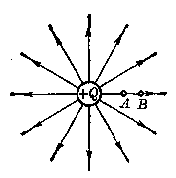

*（a）*

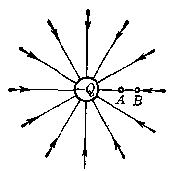

*（b）*

*图1.26*

它总是从电势较高的一点向着电势较低的一点运动。

负电荷的电量 \(q\) 为负值，当它从电势较高的 \(A\) 点移向电势较低的 \(B\) 点时（如图1.26a），电势差 \(U_{AB}\) 为正值，故此时 \(W = qU_{AB}\) 为负值，即电场力作负功；当它从电势较低的 \(A\) 点移向电势较高的 \(B\) 点时（如图1.26b），电势差 \(U_{AB}\) 为负值，故此时 \(W = qU_{AB}\) 为正值，即电场力作正功。原来静止在电场里的负电荷，如果只受电场力的作用，那么它总是从电势较低的一点移向电势较高的一点。

总之，原来静止在电场里的电荷，不管它带正电还是负电，只要是在电场力的单独作用下运动，总是向着电场力作正功的方向运动，也就是说，它总是从电势能较大的一点移向电势能较小的一点。

##### 例 10

A、B两平行金属板相距5厘米。A带正电，B带负

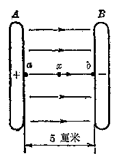

*图1.27*

电，如图1.27所示。A、B之间为匀强电场， \(E=2\times10^{3}\) 牛/库。（1）求把 \(q=+2\times10^{-4}\) 库的电荷从图中 \(\vec{b}\) 点（B板上）移到图中a点（A板上）时，和移到两板之间中点x处时，电场力的功各是多少？（2）a、b两点间电势差是多少？哪点电势高？（3）设以x处为零电势位置，则a、b两点电势各是多少？

**［解］** （1） 把正电荷从 \(b\) 点移向 \(x\) 处和 \(a\) 处时，移动方向与电场方向相反，电场力作负功，是外力反抗电场力作功。所以把 \(q\) 从 \(b\) 移到 \(a\) 时，电场力的功为

$$
\begin{array}{l} W_{b a} = - q E \cdot b a = - (2 \times 10^{- 4} \times 2 \times 10^{3} \times 0.05) \text{焦} \\ = -2 \times 10^{-2} \text{焦} \\ \end{array}
$$

从 b 移到 x 时， 电场力的功为

$$
\begin{array}{l} W_{b x} = - q E \cdot b x = - (2 \times 10^{- 4} \times 2 \times 10^{3} \times 0.025) \text{焦} \\ = - 1 \times 10^{- 2} \text{焦} \\ \end{array}
$$

（2） \(a, b\) 两点间电势差等于把单位正电荷从 \(a\) 移动到 \(b\) 时，电场力的功

$$
U_{a b} = \frac{W_{a b}}{q} = \frac{-W_{bx}}{q} = \frac{2 \times 10^{-2}}{2 \times 10^{-4}} \text{焦/库} = 100 \text{伏}
$$

同理，\(x,b\) 两点间电势差

$$
U_{a b} = \frac{W_{x b}}{q} = \frac{-W_{bx}}{q} = \frac{1 \times 10^{- 2}}{2 \times 10^{- 4}} \text{焦/库} = 50 \text{伏}
$$

\(U_{ab}\) 、 \(U_{xb}\) 都是正值，即 a 点和 x 点电势都高于 b 点。

（3） 若以 \(x\) 点为零电势位置， 则根据 （2） 中的结果可知 \(a\) 点电势比 \(x\) 处高 50 伏， \(b\) 点电势比 \(x\) 处低 50 伏， 所以

$$
U_{a} = 50 \text{伏}, \quad U_{b} = - 50 \text{伏}
$$

##### 例 11

在图1.28所示的电场中，已知 \(P\) 点电势为 \(500\) 伏，\(Q\)

点电势为 150 伏，把 \(q = +6 \times 10^{-6}\) 库的电荷沿图中路径从 Q 点移动到 P 点，求电场力的功。

**［解］** 虽然电荷移动的路径不规则，并且是在非匀强电场中，但利用电势差可以直接计算移动电荷的功。

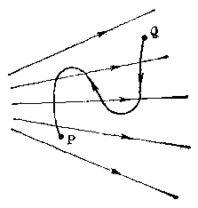

*图1.23*

$$
W_{Q P} = q U_{Q P} = q (U_{Q} - U_{P}) = 6 \times 10^{- 6} (150 - 500) \text{焦}
$$

$$
= - 2.1 \times 10^{- 3} \text{焦}
$$

电场力的功是负值，表示正电荷从电势低处移向高处。

#### 习题 1.6（1）

1. 把一个 \(q = +2 \times 10^{-6}\) 库的检验电荷从无限远处移到电场中 \(A\) 点，外力作功 \(4 \times 10^{-6}\) 焦，求 \(A\) 点电势。

2. 如附图所示的电场中， 电荷沿闭合的矩形 \(A B C D\) 移动一周， 电场力的功是多少？

3. 电场中某一点电势是500伏，先沿把 \(q_{1}=+1.5\times10^{-6}\) 库和 \(q_{2}=+2\times10^{-7}\) 库的电荷放在这一点，它们的电势能各是多少？

4. 上题中如果 \(q_{1}\) 和 \(q_{2}\) 是负电荷，它们在该点的电势能又各是多少？

5. 如果把正电荷从电场中某一点移向无限远时，电场力作正功，那么正电荷在该点的电势能是正值还是负值？负电荷放在这一点时，其电势能是正值还是负值？这一点的电势是正值还是负值？

6. 把电量为 \(5 \times 10^{-6}\) 库的正电荷从无限远处移到电场中 \(A\) 点，电场

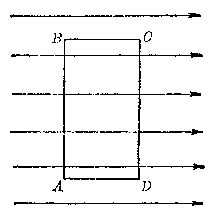

*（第2题）*

点电势是多少？把电量是 \(8\times10^{-6}\) 库的负电荷放在该点，它的电势能是多少？

7. 电场中 A、B 两点电势差 \(U_{AB}=150\) 伏，把 \(q=+0.3\) 库的电荷从 A 移动到 B，电场力作多少功？

8. 电场中把 \(q = -2 \times 10^{-5}\) 库的电荷从 \(A\) 点移动到 \(B\) 点，外力反抗电场力作功 \(6 \times 10^{-4}\) 焦，求 \(A, B\) 两点电势差，哪一点电势较高。

9. 原来静止在电场中的带正电粒子， 如果除电场力之外， 不受任何其他力的作用， 它将沿什么方向运动？ 电势能增减情况怎样？ 如果减少， 则减少的电势能变成什么了？

10. 1个 \(q = +3 \times 10^{-8}\) 库的带电粒子，在电场中，在电场力作用下，从 \(U_{a} = 100\) 伏处从静止出发加速移向 \(U_{b} = 50\) 伏处。问它经过50伏处时动能是多少？

11. 两平行金属板相距 10 厘米，把 \(q = +5 \times 10^{-8}\) 库的电荷从一板移到另一板上时，需要作功 \(1.8 \times 10^{-4}\) 焦，求两平行板之间的电势差和场强。

#### 4. 点电荷的电势

点电荷周围的电场不是匀强电场，它对引入电场中的检验电荷的作用力是随距离而变的，因此不能用前面恒力作功的方法来求点电荷电场中各点的点电荷电势计算式电势。理论计算证明，在点电荷 Q 的电场中，当以无限远处电势为零，则电场中各点电势为

$$
U = k \frac{Q}{r} \tag{1.8}
$$

式中 r 是该点到点电荷的距离。设场中 A、B 两点到点电荷的距离分别是 \(r_{A}\) 、 \(r_{B}\) （图 1.20），则 A、B 两点的电势分别为

$$
U_{A} = k \frac{Q}{r_{A}}, \quad U_{B} = k \frac{Q}{r_{B}}
$$

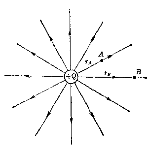

*图1.29*

A、B两点间电势差为

$$
U_{A B} = k Q \left(\frac{1}{r_{A}} - \frac{1}{r_{B}}\right) \tag{1.9}
$$

如果产生电场的电荷是正电荷，则 Q 是正值。电场中各点电势都是正值。距 Q 越近的点，电势越高。

如果产生电场的电荷是负电荷，则 Q 是负值，电场中各点电势都是负值，距 \(Q\) 越近的点，电势越低。这一点也是容易理解的，因为在

> **提示：** 一组点电荷产生的电势的计算

负点电荷的电场中，把正检验电荷移到无限远处时，电场力作负功，即外力要反抗电场力作功。所以正检验电荷在无限远处电势能最高，今以无限远处取作零电势点，则电场中其他各处电势均低于无限远处，必然都是负值了。

由于电势是标量， 当有一细点电荷存在时， 电场中一点的电势等

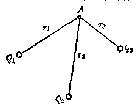

*图1.30*

于每个点电荷在该点产生的电势的代数和。例如，图1.30中有三个点电荷 \(Q_{1}\) 、 \(Q_{2}\) 、 \(Q_{3}\)，在它们的电场中有一点A距三个点电荷的距离分别为 \(r_{1}\) 、 \(r_{2}\) 、 \(r_{3}\)，则A点的电势为

$$
U_{A} = k \left(\frac{Q_{1}}{r_{1}} + \frac{Q_{2}}{r_{2}} + \frac{Q_{3}}{r_{3}}\right) \tag{1.10}
$$

##### 例 12

在边长为 4 厘米的正方形四个顶点上，顺次放置 -2.0\(\times10^{-8}\) 库、 \(+3.0\times10^{-8}\) 库、 \(-4.0\times10^{-8}\) 库和 \(+1.0\times10^{-8}\) 库四个点电荷，如图1.31所示。求正方形中点的电势。

**［解］** 正方形中点的电势是每个顶点上电荷在中点产生电势的代数和。由图可知，中点到各个顶点的距离是

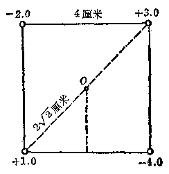

*图1.31*

*（电量单位为 \(10^{-8}\) 库）*

$$
r = \sqrt{2^{2}+2^{2}} \text{厘米} = 2.8 \times 10^{- 2} \text{米}
$$

中点的电势

$$
\begin{array}{l} U_{o} = k \left(\frac{Q_{1}}{r_{1}} + \frac{Q_{2}}{r_{2}} + \frac{Q_{3}}{r_{3}} + \frac{Q_{4}}{r_{4}}\right) \\ = \frac{9 \times 10^{9}}{2.8 \times 10^{-2}} (+ 1 - 2 + 3 - 4) \times 10^{-8} \text{伏} = - 6.4 \times 10^{3} \text{伏} \\ \end{array}
$$

#### 5. 电势差跟电场强度的关系

场强和电势都是用来表示电场特性的物理量，它们从不同的方面来反映电场的特性。场强反映电荷在电场里总要受到电场力的作用，电势反映电荷在电场里总要具有电势能。电场的这两个特性是相互联系的，所以场强和电势虽是两个不同的物理量，它们之间却存在着一定的关系。这种关系可用匀强电场作例子来作初步的说明。

图1.32表示一个场强等于 \(E\) 的匀强电场，如果把正电荷 \(q\) 放在 \(A\) 点，那么，在电场力的作用下它将顺着场

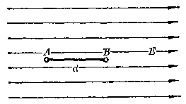

*图1.32 场强和电势差的关系*

强的方向（即电力线的方向）移向 B 点。这说明 A 点的电势高于 B 点的电势， 同时还说明电势顺着场强的方向降落。

这个结论对于非匀强电场也是适用的。例如对于图1.26（a）所示的点电荷电场来说，场强方向由A指向B，电势降落的方向也是由A指向B。对于图1.26（b）的点电荷电场来说，场强方向由B指向A，电势降落方向也是由B指向A。

场强和电势降落，不仅方向上存在着上述关系，在数量上也存在着一定的关系。

仍旧以图1.32所示的匀强电场为例，设 \(A, B\) 间的距离为 \(d\)，电势差（即电势降落）为 \(U_{AB}(=U_A-U_B)\)。当正检验电荷 \(q\) 从 \(A\) 点移到 \(B\) 点时，电场力所作的功可以用以下两个不同的等式来表示

$$
W_{A B} = q E \cdot d
$$

和 \(W_{AB} = qU_{AB}\)

由上面两个等式， 可以看出

$$
U_{A B} = E d
$$

或

$$
E = \frac{U_{A B}}{d} \tag{1.11}
$$

上式表明：在匀强电场中，电场强度的大小等于沿着

> **提示：** 匀强电场的场强与电势差的关系

场强方向单位距离上的电势降落，电场的方向指向电势降落的方向。

在匀强电场里，两点间电势差和沿场强方向的距离之比叫做匀强电场的电势梯度，所以（1.11）式表示，电场强度的大小等于电势梯度。

这里要指出一点，（1.11）式只适用于匀强电场。在非匀强电场里，因为各处场强都不相等，就不能用 \(U / d\) 来计算场强。但是对于电场中很邻近的两点来说，它们的场强变化不大，因此可以用很短的距离 \(\Delta d\) 上的电势差 \(\Delta U\) 跟 \(\Delta d\) 的比 \(\Delta U / \Delta d\) 来近似的表示该处的场强 \(E\)。\(\Delta d\) 取得越短，得出的结果越接近实际值。因此电场强度的大小等于电势梯度，方向指向电势降落的方向，这一结论对非匀强电场也是适用的。

根据 （1.11） 式，场强的单位是伏/米，也可用符号 V/m 表示。因为1 伏 = 1 焦 / 库 = 1 牛 · 米 / 库所以 1 伏/米 = 1 牛·米/库·米 = 1 牛/库可见场强的两个单位是一致的。在实用上伏/米这一单位用得更多一些。

##### 例 18

在图1.33的匀强电场中有A、B、C三点。 \(AB = BC = 10\) 厘米， \(\angle ABC = 120^{\circ}\)， 场强 \(E = 2 \times 10^{3}\) 伏/米。 求 \(U_{AB}, U_{BC}\) 和 \(U_{AC}\).

**［解］** 由等式 （1.11） 可知

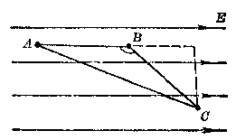

*图1.33*

\[
U_{AB}=E\cdot AB=2\times10^3\times0.1\text{伏}=200\text{伏}.
\]

为了求 \(U_{BC}\)，先要计算 \(BC\) 在 \(AB\) 线上的投影：

\[
BD=BC\cos60^\circ.
\]

原书接着计算

\[
U_{BC}=E\cdot BC\cos60^\circ=2\times10^3\times0.1\times0.87\text{伏}=174\text{伏}.
\]

A、C两点间电势差等于 \(U_{AB}\) 与 \(U_{BC}\) 之和：

\[
U_{AC}=U_{AB}+U_{BC}=(200+174)\text{伏}=374\text{伏}.
\]

> 校注：原书此处同时印有 \(\cos60^\circ\) 和数值0.87，二者不相符；以上保留原印数值链。

#### 6. 等势面

在电场中凡是电势相等的各点组成的面叫做等势面。点电荷的电场中，一点的电势是 \(U = k\frac{Q}{r}\)，可见以点电荷为球心，r 为半径的球面上各点的电势都是相等的。所以点电荷的等势面是一个个的同心球面，其球心在点电荷上，如图1.3所示。

> **提示：** 点电荷电场的等势面是许多同心球面

由等势面的定义可以知道，沿同一等势面移动电荷时，

*图1.34 点电荷电场的等势面和电力线*

电场力不作功。例如，图1.34中同一等势面上有A、B两点，电荷q从A点沿等势面移动到B点时，因移动过程中电势没有变化，q的电势能也没有变化，所以电场力不做功。

我们知道，在电场中，只有移动方向跟场强方向垂直时，

> **提示：** 等势面与电力线处处垂直

电场力才不做功。所以电场强度方向跟等势面一定垂直。又因电场强度方向可用电力线来表示，于是可以说等势面与电力线处处互相垂直。图1.34中由点电荷向外面的射线表示电力线。它们跟同心球面在相交处都是互相垂直的。

对于匀强电场， 因为电力线是均匀分布的平行线， 所以等势面是垂直于这些平行线的一簇平行平面如图1.35所示。

*图1.35 匀强电场的等势面*

因为匀强电场里 \(E = U / d\)， \(E\) 是处处相同的，所以相同的间隔 \(d\)，电势差 \(U\) 都相等，由此可知在匀强电场里，电势差相等的各个等势面之间的间隔相等，在点电荷的电场里，因场强随离点电荷的距离而减小，所以电势差相等的各个等势面之间，其间隔是不相等的。离点电荷越近，场强越强，那么等电势差的等势面间隔应该小些，离点电荷远的地方，场强较弱，等电势差的等势面间隔就应该大些，所以从等电势差的各等势面分布的密和疏可以看出场强的相对大小。

#### 习题 1.6（2）

1. 两点电荷相距5厘米，电量分别是 \(+8.0 \times 10^{-9}\) 库和 \(-5 \times 10^{-9}\) 库。求两点电荷联线中点的电势。

2. 在直角坐标系中有四个电荷 \(+Q(r,0)\)、\(+Q(0,-r)\)、\(-Q(-r,0)\)、\(-Q(0,r)\)。求坐标原点的场强和电势。

3. 在电场里，电势沿什么方向降落？沿什么方向升高？

4. 匀强电场中，沿场强方向依次排列 A、B、C 三点， \(\overline{AB}=4\) 厘米， \(\overline{BC}=6\) 厘米。设 \(U_{AB}=100\) 伏，求电势差 \(U_{BC}\) 、 \(U_{AO}\) 和场强 E。

5. 二平行金属板相距 0.5 厘米、两板间电势差为 \(10^{3}\) 伏求两板之间的场强。

6. 在非匀强电场里，在很短一段距离 \(4d\) 上，场强可以认为相等的，\(E = \frac{\Delta U}{\Delta t}\)。在附图的非匀强电场中，\(A, B\) 两点范围内若认为场强是相同的，已知 \(A, B\) 两个等势面的电势为 \(U_{A} = 22\) 伏，\(U_{B} = 20\) 伏，\(\overline{AB} = 0.5\) 厘米。求 \(A, B\) 两等势面间的场强。

*（第6题）*

*（第8题）*

7. 上题中，没有一个电荷 \(q = 2.5 \times 10^{-6}\) 库位于电场中 \(A\) 上，一次从 \(A\) 点移动到 \(B\) 点，另一次从 \(A\) 点移动到图中 \(C\) 点。求每次移动中电场力的功。两次的功有不同么？为什么？

8. 两水平放置的平行金属板相距2厘米（见附图），两板间场强 \(E=1.6\times10^{3}\) 伏/米，方向竖直向下。两板之间有两点，A点距下板1.5厘米，B点距下板0.5厘米。设下板接地，问A、B两点电势各是多少？

### § 1.7 带电粒子在匀强电场中的运动

#### 1. 带电粒子在匀强电场中的加速

在匀强电场中，带电粒子受到的电场力是恒定的，它等于

$$
F = q E
$$

如果粒子带正电， 电场力方向与场强方向相同； 如果粒子带负电， 电场力方向与场强方向相反。 在电场力作用下， 原来静止在电场中的带电粒子将获得加速度。 若带电粒子质量是 \(m\)， 则加速度为

$$
a = \frac{q E}{m} \tag{1.12}
$$

经过一段距离后，带电粒子运动速度达到 v，从而具有一定动能

$$
E_{k} = \frac{1}{2} m v^{2} \tag{1.13}
$$

显然此动能是电场力作功而转变来的，由电势一节

> **提示：** 由电场力的功计算带电粒子动能变化

可以知道，电场力的功可以用电势差来计算，设带电粒子在电场力作用下由场中 A 点移动 B 点（图 1.36），则达到 B 点时粒子具有的动能可通过 A、B两点电势差来计算

$$
E_{k} = \frac{1}{2} m v^{2} = q U_{A B} \tag{1.14}
$$

一个电子经过1伏电势差所获得的动能称为1电子伏，或写成 \(1\mathrm{eV}\) （因电子电量常用 \(e\) 来表示）。换算成焦耳值为

*图1.36*

1电子伏=\(1.6\times10^{-19}\times1\)焦耳 = \(1.6 \times 10^{-19}\) 焦耳“电子伏”常用来作为研究微观粒子时的能量单位。例如，镭核 \(^{238}\) Ra释放的α粒子能量达到4.7MeV（1MeV= \(10^{6}\) eV），要使氢原子中电子和质子分开所需的能量15.6eV等。

在近代研究高能粒子的设备中，有一种直线加速器，它利用电场对带电粒子的加速作用，可以将带电粒子反复加速以获得能量极为巨大的高速粒子（可达 \(2\times10^{3}\) 电子伏）。

##### 例 14

一个初速为零的电子在 \(E=10^{4}\) 伏/米的匀强电场中被加速，问通过 d=0.02 米的距离后，电子获得多大动能？

**［解］** 电子受电场力加速获得的动能可以用电场力的功来计算，由（1.14）式可得

$$
\frac{1}{2} m v^{2} = e U = e E d
$$

$$
\begin{array}{l} \therefore E_{k} = 1.6 \times 10^{-19} \times 10^{4} \times 0.02 \text{焦耳} \\ = 3.2 \times 10^{- 17} \text{焦耳} \\ \end{array}
$$

或 \(E_{k}=e\times10^{4}\times0.02\) 伏 \(-2.0\times10^{3}\) 电子伏

##### 例 15

一个质子以 \(v=10^{6}\) 米/秒的速度穿过一平行板 A 中间小孔，飞入 A、B 两平行板间的电场中，电场方向与速度方向相反（图 1.37）。 若 B 板电势比 A 板高 5000 伏，此质子能否打到 B 板上？

**［解］** 由于速度方向与电场方向相反，质子受到的电场力将使飞行速度逐渐减小，它的动能逐渐减小，质子动能

*图1.37*

的减小是由于反抗电场力前进要作功，质子打到 B 板上反抗电场力的功为

$$
W=eU=1.6\times10^{-19}\times5000\text{焦耳}=8.0\times10^{-16}\text{焦耳}
$$

质子原有动能为

$$
\begin{array}{l} E_k=\frac12mv^2=\frac12\times3.1\times10^{-27}\times(10^6)^2\text{焦耳} \\ = 1.55 \times 10^{- 15} \text{焦耳} \\ \end{array}
$$

可见质子原有动能大于所需要的功， 所以能够打到 B 板上， 并且在打到 B 板时还具有动能

$$
\begin{array}{l} F_{k}^{\prime} = F_{k} - W = (1.55 \times 10^{- 15} - 0.8 \times 10^{- 15}) \text{焦耳} \\ = 0.75 \times 10^{- 15} \text{焦耳} \\ \end{array}
$$

#### 2. 带电粒子在匀强电场中的偏转

如果带电粒子飞入电场中时，速度方向与电场方向垂

> **提示：** 匀强电场中带电粒子的运动和抛体运动相似

直，如图1.38所示，则粒子在电场中运动的轨迹将是一条抛物线，类似于重力场中平抛物体的运动。

设有一带负电粒子， 电量为 q， 质量为 \(m\)，以与电场相垂直的方向飞入电场中，如图1.38所示。粒子具有的初速为 \(v_0\)。我们来考察它的运动规律。

*图1.38*

如图所示， 取与电场垂直的方向为 x 轴， 与电场平行方向为 y 轴， 在粒子飞入电场处为坐标原点 0。设匀强电场场强为 E， 带电粒子飞入电场中时受到电场力为 F = qE，方向向上。因此将获得沿 y 轴方向的加速度

$$
a = \frac{q E}{m} \tag{1.15}
$$

在沿 \(x\) 轴方向，粒子的运动速度不受垂直于速度方向的偏转电场的影响。所以带电粒子的运动是 \(x\) 轴方向上的匀速直线运动和 \(y\) 轴方向上的匀加速直线运动的合成。当带电粒子在偏转电场中飞行了时间 \(t\) 以后，它在 \(x\) 轴方向上速度仍为 \(v_{0}\)，在 \(y\) 轴方向上速度为 \(v_{y} = at\)，用（1.15）式代去 \(\alpha\) 得

$$
v_{x} = v_{0} \tag{1.16}
$$

$$
v_{y} = \frac{q E}{m} t \tag{1.17}
$$

设产生偏转电场的平行板的长度为 l，则带电粒子在偏转电场里飞行的时间 \(t=\frac{l}{v_{0}}\)。它在飞出偏转电场时，在 y 轴方向上偏离原来飞行方向的距离为 \(y=\frac{1}{2}at^{2}\)，代去 a 和 t 得

$$
y = \frac{1}{2} \frac{q E}{m} t^{2} = \frac{q E l^{2}}{2 m v_{0}^{2}} \tag{1.18}
$$

带电粒子飞出偏转电场后， 不再受到偏转电场的作用， 所以将以飞出电场时的速度匀速前进。这时的速度方向与 \(x\) 轴的夹角 \(\varphi\)， 就是它飞离偏转电场时的偏角， 可由下式计算

$$
\operatorname{tg} \varphi = \frac{v_{y}}{v_{0}} = \frac{a t}{v_{0}} \tag{1.19}
$$

代去上式中 \(a\) 和 \(t\) 得

$$
\operatorname{tg} \varphi = \frac{q E l}{m v_{0}^{2}} \tag{1.20}
$$

##### 例 16

一电子以速度 \(v_{0}=2.0\times10^{7}\) 米/秒飞入两平行板间的偏转电场中（图 1.38）。 平行板长 l=2.0 厘米， 两板相距 0.5 厘米， 上板电势比下板高 100 伏。 求 （1） 电子在电场中获得的加速度，（2） 电子飞出偏转电场时的 \(v_x\) 和 \(v_y\)，（3） 这时的偏转距离 \(y\)。

**［解］** （1） 由场强与电势差关系的计算式 \(E=\frac{U}{d}\) 和 （1.15） 式可以计算加速度 \(a\)

$$
\begin{array}{l} a = \frac{q U}{m d} = \frac{1.6 \times 10^{- 19} \times 100}{9.1 \times 10^{- 31} \times 0.5 \times 10^{- 2}} \text{米/秒}^{2} \\ = 3.5 \times 10^{15} \text{米 / 秒}^{2} \\ \end{array}
$$

（2） 电子飞出平行板时， 沿 x 轴方向速度未变

$$
v_{x} = v_{0} - 2.0 \times 10^{7} \text{米 / 秒}
$$

要计算 y 轴方向的分速度，需要先计算飞出平行板所需要的时间

$$
t = \frac{l}{v_{x}} = \frac{2 \times 10^{- 2}}{2.0 \times 10^{7}} \text{秒} = 1.0 \times 10^{- 9} \text{秒}
$$

由（1.17）式，可得飞出平行板时，电子沿y轴分速度

$$
v_{y} = a t = 3.5 \times 10^{15} \times 1.0 \times 10^{- 9} \text{米/秒}
$$

$$
= 3.5 \times 10^{6} \text{米/秒}
$$

（3） 电子飞出平行板时， 在 y 轴方向偏转距离

$$
\begin{array}{l} y = \frac{1}{2} a t^{2} = \frac{1}{2} 3.5 \times 10^{15} \times (1.0 \times 10^{- 9})^{2} \text{米} \\ = 1.8 \times 10^{- 3} \text{米} \\ \end{array}
$$

#### 3. 阴极射线管

阴极射线管又叫电子射线管，是一种利用电子束打在荧光屏上可以在屏上显示出图形的器件。示波器里的示波管，电视机里的显象管都是阴极射线管。

> **提示：** 阴极射线管中电子束是高速电子流

阴极射线管的结构简图如图1.39所示。在一个抽成高真空的玻璃管内，装入灯丝、阴极、加速阳极、一对水平偏转板和一对垂直偏转板。在玻璃管右端为一荧光屏，电子束打在荧光屏就发出光点。

*图1.39*

阴极由灯丝加热，阴极被加热后有电子从表面逸出，加速阳极相对于阴极加有很高的电压（上千伏到1万多伏），从而产生一个指向阴极的电场。从阴极表面逸出的电子被此电场加速到很高的速度（可达 \(10^{7}\) 米/秒的数量级），形成高速电子流飞向荧光屏。这里，阴极发射电子，加速阳极加速电子，产生一束高速电子流，所以它们组成所谓电子枪。在电子束飞行的途径上，水平偏转板和垂直偏转板可以使电子束在水平和垂直两个方向上发生偏转。

如果每对偏转板的两板上电压相等，两板之间没有电场。电子束通过时，不会偏转，径直前进，打在荧光屏中心，使屏中心出现一个亮点（图1.40中O点）。

*图1.40*

如果给水平偏转板的两板之间加上一定电压，例如让 \(x_{3}\) 板电势高于 \(x_{1}\) 板，则电子束通过时，将向 \(x_{3}\) 板偏转。结果电子束将打在荧光屏上O点的右侧（图1.40中B点）。若只是给垂直偏转板的两板之间施加一定电压，例如， \(y_{3}\)

板电势高于 \(y_{1}\) 板，则电子束通过时将向 \(y_{3}\) 板偏转。结果电子束将打在荧光屏上 \(O\) 点的上方（图1.40中4点）。若同时给 \(x_{1}, x_{3}\) 和 \(y_{1}, y_{3}\) 施加上述的电压，则电子束通过时，先后受到两个电场的偏转作用，结果将打在荧光屏的右上角（图1.40中的 \(C\) 点）。

实用上，阴极射线管的水平偏转板上常加上一个重复变化的电压，使电子束在水平方向反复来回运动。这个过程叫做扫描，所加电压叫扫描电压。在垂直偏转板上加上需要观察其波形的被测电压。电子束在这两个电压作用下，打在荧光屏上的位置时刻在变化，屏上就显示出一条曲线。这条曲线就是加在垂直偏转板上被测电压的波形（图1.41）。

*图1.41 示波管上显示的交流电波形*

#### 4. 基本电荷的测定

在本章开始时我们曾用原子外层电子的转移来解释物体的带电现象。物体带电的多少决定于它获得或失去电子的多少，因为电子是可以一个一个地计数的，所以，人们有理由认为带电体所带电量一定是电子电量的整数倍数。事实是否确实是这样呢？一个电子电量又如何测定呢？下面介绍的实验回答了上面的两个问题。

单个电子的电量首先是由美国物理学家密立根通过有名的油滴实验测定的，他在1909年到1913年间做了无数次的实验，最后总结出：油滴所带电量总是某一基本电荷的整数倍数。同时测定了这个基本电荷的电量。

> **提示：** 电子电量的测定方法

密立根的实验装置如图1.42所示，图中 \(A, B\) 是两块平行金属板，上板中心有一小孔，上板上部有一喷雾器喷出雾状油滴，有些油滴会由于摩擦而带电。它们中间的几个油滴通过A板中心小孔落到两板之间空间。在水平方向有一显微镜可以观察两板之间油滴的运动。

给 A、B 两板加上一定电压，使两板可产生一个竖直向下的电场。观察者选择观察一个带负电的油滴，此油滴受到

*图1.42 密立根实验装置原理图*

两个力的作用（设忽略空气的浮力），电场力 \(F = qE\) 和重力 \(mg\)。调节加在两板上的电压，可以调节两板间场强 \(E\)，使作用在油滴上的电场力 \(qE\) 跟重力相等。这时油滴悬浮于两板之间不动。因此根据 \(qE = mg\) 可以计算油滴所带电量

$$
q = \frac{mg}{E} \tag{1.21}
$$

由加在两板上电压 \(U_{AB}\) 和两板间距离 d，可以算出场强 E，式中的 g 也是已知的，求得油滴质量 m，就可以计算油滴所带电量 q。油滴的质量可以由它体积 \(V = \frac{4}{3} \pi r^{3}\) 和密度 \(\rho\) 求得。这样，问题的关键就归结到测定油滴的半径 r 上。怎样测定 r 呢？密立根利用了流体力学的知识。

因为物体在流体中运动时，要受到粘滞阻力的作用，所以油滴在空气中运动时，也要受到空气粘滞阻力的作用。粘滞流体力学中斯托克斯定律，物体在流体中运动时，所遇到的粘滞阻力与运动速度成正比，并与物体的半径有关，可用公式

$$
F = 6 \pi \eta r v \tag{1.22}
$$

计算。 式中 \(\eta\) 是流体的粘滞系数， 是事先可以测定的。

在实验时， 先不加电场， 让油滴在两板间加速下落。 由于粘滞阻力随速度的增大而增大， 油滴随即达到一个极限速度 \(v\)， 这时油滴受到的重力与空气的粘滞阻力平衡， 油滴以匀速 \(v\) 下降。 因两个力平衡， 所以有

$$
mg = 6\pi\eta rv
$$

用显微镜和计时装置测定油滴在一段时间内下降的距离，即可算出它匀速下降的速度 v。

然后在两板间加上电压，即加上电场，并调节电场强度 \(E\)，使油滴悬浮于两板之间。这时油滴所受重力与电场力平衡，因此有 \(q=\frac{mg}{E}\)

因前面已经测出 v，由重力与粘滞阻力平衡的等式有

$$
m g = \frac{4}{3} \pi r^{3} \rho g = 6 \pi \eta r v
$$

解上式可得到油滴半径 r，代入油滴质量的计算式

$$
m = \frac{4}{3} \pi r^{3} \rho
$$

可算出油滴质量 m，从而进一步可算出油滴上的电量 q。

> **提示：** 油滴所带电量是基本电荷的整数倍

密立根和他的同事测定了成千上万个油滴的带电量，终于发现，每个油滴所带电量总是 \(1.6 \times 10^{-19}\) 库的整数倍数，从未发现过带电量小于这个数值的油滴。因此很自然地把电量 \(1.6 \times 10^{-19}\) 库叫做基本电荷，并用 \(e\) 来表示它。

因为物体带电是电子转移的结果，所以测出的基本电荷实际上就是一个电子所带的电量。油滴带电 \(1.6 \times 10^{-19}\) 库，\(3.2 \times 10^{-19}\) 库等，实际上就是它获得了多个余电子，2个多余电子等。

油滴实验的结果表明，电荷不是无限可分的”，它的变化是不连续的。例如，所有元素的原子数所带正电量都是基本电荷的整数倍数。

> **注：** 见第19页注。

#### 习题 1.7

1. 一个电子在 \(E = 4.0 \times 10^{3}\) 伏/米的匀强电场中被加速。设电子初速为零，求经过 \(2.0 \times 10^{-8}\) 秒后电子的速度和动能。

2. 一质子以 \(3 \times 10^{5}\) 米/秒的速度逆着场强方向飞入一匀强电场中，前进4厘米后停止，求该电场的场强。

3. 一个两价离子（即带有2个基本电荷）通过260伏的电压加速后获得多少电子伏的动能？

4 在附图中，左边是发射电子的阴极，阴极发射的电子流被加速飞向三根。（1）求电子通过A板中间小孔时的动能，（2）电子在从A板飞向B板时，动能有无变化？（3）电子穿过B板中间小孔内后能打到C板上吗？（4）若 \(U_{2}\) 改为大于100伏，情况又怎样？

*（第4题）*

5. 在图3.40的阴极射线管中，如果垂直偏转板 \(y_{1}\)、\(y_{2}\) 电压相等并保持不变，使水平偏转板 \(x_{2}\) 的电压相对于 \(x_{1}\) 来说，先是负的然后逐渐增加到与 \(x_{1}\) 相等，再逐渐增加到是正的，如附图所示，则在荧光屏上将看到光点怎样移动？

*（第5题）*

6. 试证明图1.38中，电子飞离平行板后运动轨迹的延长线与 \(x\) 轴的交点，在平行板中间 \(\frac{l}{2}\) 处。［提示：交点到平行板边缘距离

$$
x = y / \mathrm{tg} \varphi . ］
$$

7. 在图1.38中，设偏转板长度 \(l = 4\) 厘米，两板相距2厘米，两板间偏转电场强度 \(E = 5 \times 10^{4}\) 伏/米，方向竖直向上。电子以 \(v_{0} = 3 \times 10^{7}\) 米/秒的速度沿两板中间轴线射入电场中。（1）当电子飞出偏转板时，偏离轴线多远？（2）电子飞出偏转板后，运动轨迹与轴线成多大的角度？

8. 试计算一个油滴的质量， 设此油滴带有 6 个基本电荷， 它在两平行带电板之间正好处于平衡状态， 已知两板相距 1 毫米， 电势差为 196 伏。

### § 1.8 电场中的导体

在1.3节中，我们曾经讨论了金属导体带电的几个实验。初步了解了金属导体的带电现象。在学习了电场和电势的概念以后，我们已有条件对金属导体的带电现象讨论得稍为深入一点，并由此导出几个有关金属导体带电现象的重要结论。

#### 1. 导体上的静电平衡

在静电感应现象中，我们用带电体对导体中自由电子的作用，解释了导体两端出现等量异种电荷的现象。但是没有对积累电荷的多少作任何说明。那么究竟在带电体作用下，导体两端积累正负电荷的现象会进行到怎样的程度呢？

把导体移近带电体，实质上就是把导体放在带电体的

> **提示：** 静电平衡的条件是导体内部场强为零

电场中。 在电场力的作用下， 导体中自由电子要逆着电场方向移动， 结果使导体的一端有多余的自由电子而带负电， 另一端由于缺少自由电子而带正电， 这就是静电感应现象的实质。那么这过程会不会一直进行下去呢？这是不会的。

设把导体放在一个匀强电场 \(E_0\) 中，导体两端就分别积累了正、负电荷。 我们知道， 有了电荷就要产生电场。 当导体两端积累了正、负电荷后， 它们就要产生一个附加电场 \(E'\)， \(E''\) 与原来电场 \(E_0\) 相迭加。 在导体内部 \(E'\) 的方向与原来电场 \(E_0\) 方向相反 （图1.43a）， 因此迭加的结果， 使导体内的合电场削弱。 但是， 只要迭加后导体内的合场强不等于零， 导体内的自由电子将继续作定向

*（b）*

*图1.43*

移动， 导体两端正、负电荷将继续积累， 使附加电场 \(E'\) 进一步加强， 合场强进一步削弱。这一过程一直进行到导体内部附加电场 \(E'\) 与电场 \(E_0\) 相等， 使合场强等于零为止 （图1.43b）。这时导体内自由电子不再作定向移动， 导体两端电荷也不再增加。我们把导体内没有电荷作定向移动的状态叫做导体的静电平衡状态。可见只有在导体内部场强处处等于零的条件下， 导体才能处于静电平衡状态。

导体在电场中，两端有了正、负电荷的积累，所产生的附加电场也要影响导体附近原来的电场，使电力线的分布发

> **提示：** 静电平衡状态下，导体表面的场强和导体的电势

生变化。当达到静电平衡状态时，导体表面的电力线处处与表面垂直（图1.48b），换句话说，这时导体表面上各点场强的方向都跟表面垂直。为什么会这样呢？因为假如场强方向不跟表面垂直，它就有一个沿导体表面切线方向的分量，这样自由电子受到由这个场强分量所产生的电场力的作用，将沿表面移动。这就不是静电平衡状态了，所以，当导体处于静电平衡状态时，表面上任何一点的场强方向都垂直于该点的表面。

我们知道，电势差与电场强度之间有一定联系，电场强度等于电势梯度。在静电平衡时，导体内部场强处处为零，导体表面上场强都垂直于表面，没有沿表面的分量，这就是说，导体上各处的电势梯度为零，各处的电势都相等。这一点也可以用移动电荷的功来解释。导体内部场强处处为零，其表面场强没有沿表面的分量，则无论在导体内部，还是沿导体表面，移动电荷的功一定都等于零，所以导体上各处电势相等。由此可见，当导体处于静电平衡状态时，整个导体是一个等势体，导体表面是一个等势面。

#### 2. 带电导体上电荷的分布

上面讲到，在达到静电平衡时，导体内部场强处处为零。因为有电荷就要产生电场，既然导体内部场强处处为零，则导体内部就不可能有净电荷（即未被抵消的正电荷或负电荷），所以当导体在外电场中时，由静电感应产生的正、负电荷都分布在导体两侧表面上。

> **提示：** 带电导体上电荷分布在导体表面上

当一个导体本身带有电荷时，情况又怎样呢？它上面的电荷是怎样分布的呢？

当导体带有电荷时，如果电荷分布在导体内部， 则每一部分电荷要与其他电荷发生相互作用， 它们互相推斥， 移向导体表面（图 1.44）。 这一过程一直进行到所有电荷都分布到导体表面上为止。这时，电荷定向移动停止，导体内部没有净电荷，导体内部场强处处等于零，导体达到静电平衡状态。由此可见，当带电导体达到静电平衡状态时，电荷一定都分布在导体表面上。导体内部场强处处为零。既然导体上电荷都分布在表面上，那么在导体里挖去一部分，使导体成为空腔导体，对导体表面上的电荷是没有什么影响的。

*图1.44 内部电荷互相推斥移向表面*

事实也确实是这样，1.3节介绍的法拉第圆筒实验证实了这一点，金属圆筒带电时，电荷分布在它的外表面上

#### 3. 静电屏蔽

在1.3节中我们还介绍了金属网把验电器罩起来以后，它就不受网外带电体的影响。这一现象的实质是金属网不论是在外电场中，还是本身带电，电荷都分布在它的外表面上，它的内部场强等于零，所以能屏蔽网罩内验电器不受影响。

金属壳（或网）也可以屏蔽内部带电体对壳外物体的影响。但这时必须使金属壳接地。图1.45（a）表示金属壳内有一个带正电的物体，但这时金属壳没有接地，由于静电感应，金属壳内表面感应出负电荷，外表面感应出正电荷。壳内带正电物体发出的电力线终止于内表面负电荷上，外表面的正电荷向四周发出电力线，还是要影响外部物体。如果把金属壳接地（图1.45b），则外表面感应出的正电荷就传导到大地中去（对于正电荷来说，实际上是大地中自由电

*（a）*

*（b）*

*图1.45*

*（a） 外壳不接地；（b） 外壳接地*

子移动到外表面与正电荷中和）。这样外表面上就没有电荷， 因而也不会对罩壳外部的物体产生任何影响， 达到了屏蔽的目的。

因此一个接地的金属壳（网）罩既可以屏蔽罩外带电体对罩内物体的影响，又可以屏蔽罩内带电体对罩外物体的影响。

#### 习题 1.8

1. 什么是导体的静电平衡状态？导体处于静电平衡状态的必要条件是什么？

2. 下面叙述中，哪些是对的？哪些是错的？为什么？“导体处于静电平衡状态时，它的内部没有电场，也没有电力线，整个导体是个等势体，所以电势处处为零。”

3. 为什么从导体表面出发，或终止于导体表面的电力线总是与导体表面垂直的。

4. 两个装在绝缘支架上的金属球， 一个带电， 一个不带电， 两者接触后， 电势相等吗？

5. 把一个带正电导体放在一个接地导体附近，接地导体上有电荷吗？有何种电荷？它的电势有变化吗？

### § 1.9 电场中的电介质

#### 1. 电介质的极化

电介质就是绝缘体， 空气、云母、陶瓷、玻璃、塑料、纸和油等都是电介质。

导体在外电场中，由于其中有自由电子，两侧表面会感应出等量异种电荷。感应电荷在导体内部产生一个跟原电场大小相等，方向相反的电场，结果使导体内部合场强为零。电介质的分子中，电子和原子核结合得比较紧密，因此其中几乎没有自由电子，它在外电场中将会受到什么影响呢？

电介质可以分为两类。一类电介质，它的分子中正负电荷分布是不均匀的。这种电介质的分子，在电性能方面好象在一端带有负电荷，在另一端带有等量的正电荷，这种分子叫做有极分子。由于热运动这些分子在电介质中是杂乱排列的，如图1.46（a）所示。当有外电场存在时，电场将使它们取向排列，如图1.46（b）所示。

*（a）*

*（b）*

*图1.46*

*（a） 无外电场；（b） 无外电场中*

另一类电介质，它的分子中正负电荷原来是均匀分布的，如图1.47（a）所示。这种分子叫做无极分子，当它在外电场中时，分子中正负电荷受电场力的作用将发生微小的相对位移，结果使分子两端亦分别呈现正负电荷，也成了有极分子如图1.47（b）所示。它们在电场中也是沿电场方向排列的。

*（a）*

*（b）*

*图1.47*

*（a） 无外电场；（b） 在外电场中*

可见不管是由有极分子还是由无极分子构成的电介

*图1.48*

质，当有外电场存在时，其中分子都表现为具有极性，并趋向于电场方向排列，如图1.48所示。这样在电介质的两个跟电场方向垂直的表面上分别呈现出正电荷和负电荷。在电力线进入的一侧表面呈现负电荷，在相对的另一侧呈现出等量的正电荷。这些电荷，跟导体中的自由电子不同，它们还是被束缚在分子内部不能自由移动，所以叫做束缚电荷。 这种在外电场作用下，电介质表

> **提示：** 电介质极化，在相对的两个表面上出现等量异种电荷

面上出现束缚电荷的现象叫做电介质的极化。

电介质极化出现束缚电荷的多少跟外电场有关， 外电场越强， 产生的束缚电荷越多。 此外， 出现束缚电荷的多少还跟电介质本身性质有关，有的电介质容易极化，产生的束缚电荷就较多；有的电介质不大容易极化，产生的束缚电荷就较少。

*（a）*

*（b）*

*图1.49*

电介质极化而出现在两侧表面上的束缚电荷，在介质内部要产生一个附加电场，它使介质内部电场削弱。例如，图1.49（a）表示在真空中两块平行板分别带电 \(+Q_{0}\) 和 \(-Q_{0}\)，板间电场为 \(E_{0}\)。当把一块电介质

> **提示：** 电介质极化的结果，使介质内部电场削弱

插入两平行板间时，介质极化，在两侧表面上出现束缚电荷 \(+Q'\) 和 \(-Q'\)，束缚电荷在介质内部产生附加电场 \(E'\)，方向与原电场 \(E_0\) 相反，如图1.49（b）所示。在介质内部，这两

*图1.50*

个电场迭加的结果得到一个合电场 E，合电场的大小为

$$
E = E_{0} - E^{\prime}
$$

它的方向与原电场 \(E_0\) 相同，合电场 \(E\) 是维持电介质极化的电场，它不可能等于零。也就是说电介质极化不可能达到束缚电荷的电场与外电场相等的程度，这一点与金属导体静电感应的情况不同。

用电介质的极化现象可以解释带电体吸引轻小物体，如纸屑、泡沫塑料小球等现象。图1.50表示一个泡沫塑料小球用丝线悬挂在带正电棒的电场中。由于极化，小球两侧出现了异种束缚电荷，离棒近的一侧束缚电荷与棒上电荷异号，受到的是引力，离棒远的一侧束缚电荷与棒上电荷同号，受到的是斥力。因棒周围的电场是不均匀的，离棒越近，电场越强，所以小球受到的引力大于斥力，小球被棒吸引。

#### 2. 相对介电常数

实验和理论证明，每种电介质在外电场中被极化时，介质内部合电场 E 跟外电场 \(E_{0}\) 是成正比的，外电场越强，合电场也越强。 外电场 \(E_{0}\) 与合电场 E 之比 \(E_{0}/E\) 对每一种电介质来说是一个常数。 这个常数叫做电介质的相对介电常数，常用符号 \(\varepsilon_{r}\) 来表示。

$$
\varepsilon_{r} = \frac{E_{0}}{E} \tag{1.23}
$$

在同样的外电场 \(E_0\) 中， 不同性质的电介质极化的程度不同， 产生附加电场强弱不同， 介质内部合电场 \(E\) 也不同。 容易极化的电介质， 产生的束缚电荷较多， 内部附加电场较强， 合电场 \(E\) 就较小。 这样比值 \(E_0 / E\) 就较大， 即 \(\varepsilon_r\) 较大。 不容易极化的电介质， 产生的束缚电荷较少， 内部附加电场较弱， 合电场 \(E\) 就较大。 这样比值 \(E_0 / E\) 就较小， 即 \(\varepsilon_r\) 较小。 所以相对介电常数的大小反映了电介质极化难易的程

> **提示：** 在电介质中库仑力、场强和电势的计算式

度，是一个反映电介质本身性质的物理量。

若在真空中某处的电场为 \(E_{0}\)，当真空中放入电介质后，该处的电场将被削弱，削弱的程度决定于电介质的相对介电常数 \(\varepsilon_{\mathrm{r}}\)，可以根据等式（1.23）计算

$$
E = \frac{E_{0}}{\varepsilon_{r}}
$$

一个点电荷 \(Q\)，在真空中，在距它 \(\pmb{r}\) 处产生的电场为

$$
E_{0} = k \frac{Q}{r^{2}}
$$

当此点电荷浸没在电介质中时，在距它 r 处的场强，由 （1.23） 式可知，为

$$
E = k \frac{Q}{\varepsilon_{r} r^{2}} \tag{1.24}
$$

即减小到原来的 \(1 / \varepsilon_{r}\)

两个点电荷都置于电介质中时，由于电场被削弱，它们之间作用力要比在真空中时来得小。这时计算它们之间作用力的库仑定律公式应写成

$$
F = k \frac{Q_{1} Q_{2}}{\varepsilon_{r}r^{2}} \tag{1.25}
$$

同样， 在电介质中， 距点电荷 \(Q\) 的距离为 \(r\) 处的电势的计算式为

$$
U = k \frac{Q}{\varepsilon_{r} r}. \tag{1.26}
$$

空气的相对介电常数 \(\varepsilon_{r}=1.0005\approx1.00\)，所以在空气中场强跟在真空中相同。

下表列出各种常用电介质的相对介电常数。

表 1.1 一些常用电介质的相对介电常数

| 电介质 | 相对介电常数 \(\varepsilon_r\) | 绝缘强度 \(I_0\)（千伏/米） |
| --- | ---: | ---: |
| 空气 | 1.0005 | 3000 |
| 云母 | 6～8 | 160000 |
| 陶瓷 | 6 | 4000～24000 |
| 玻璃 | 4.5 | 13000 |
| 水 | 78 | — |
| 油 | 4.5 | 12000 |
| 石蜡 | 2.1 | — |
| 绝缘纸 | 3.5 | 14000～60000 |
| 聚乙烯 | 2.3 | 50000 |
| 钛酸钡 | 1000 | 5000～30000 |

#### 习题 1.9

1. 两个点电荷，一个带电+5微库，另一个带电-3微库。它们在煤油中相距1米，求它们之间相互作用力。（煤油的 \(\varepsilon_{\mathrm{r}} = 4.5\)）

2. 两块平行金属板相距 0.2 毫米， 中间填满云母片， 两板之间总势差为 200 伏， 求两板之间的电场强度。

### § 1.10 电容器

#### 1. 导体的电容

把带电棒跟验电器的顶球接触一下，验电器就带有一定量的电荷；把带电棒跟放在绝缘架上的导体接触一下，导体也就带有一定量的电荷。所以一个绝缘导体好象是一个能够贮存电荷的容器，跟带电体一接触，就能存贮一定量的电荷。下面我们来讨论绝缘导体存贮电荷的本领与哪些因素有关。

我们先用量筒盛水做个比喻，往量筒里注水，注入的

*图1.51*

水越多，水面升得越高。注入水的体积V与水面高度h的比就是量筒的截面积s，即s=V/h。它是一个只决定于量筒本身结构的量。量筒截面积s越大，在同样盛水高度下，盛水量越多。所以s的大小反映了量筒盛水的能力（图1.51）。

导体贮存电荷的情况与量筒盛水很相似。从电势一节的讨论中，可以知道，当导体带有一定量的电荷时，它就具有一定的电势。实验表明，对于同一个导体它所带电量 \(Q\) 跟它的电势 \(U\) 成正比，即

$$
Q \propto U
$$

把这个关系写成等式

$$
C = \frac{Q}{U} \tag{1.27}
$$

这里比例常数 \(C\) 是一个反映导体本身贮存电荷能力大小的物理量，叫做导体的电容。这与量筒盛水时，盛水体积与水面高度成正比很相似，电容 \(C\) 对应于量筒的截面积 \(s\)。

在1.26式中，若 \(U = 1\) 伏，则 \(C\) 在数值上就等于 \(Q\)。所以导体的电容就是使导体电势升高1伏时，所需要的电电容的定义因为电量的单位是库仑，电势的单位是伏特，所以由（1.27）式得出电容的单位是库仑/伏特，它有个专门名称叫做法拉，简称法，常用符号 \(I'\) 表示。

$$
1 \text{法} = 1 \text{库/伏}
$$

在实用上法拉的单位太大，常用微法 \((\mu \mathrm{F})\) 和皮法 \((\mathbf{p}^{\mathrm{U}})\) 做单位，它们换算关系是

$$
1 \text{微法} (\mu \mathrm{F}) = 10^{-6} \text{法} (\mathrm{F})
$$

$$
1 \text{皮法} (pF) = 10^{- 12} \text{法} (\mathrm{F})
$$

电容 \(C\) 的大小反映了导体在一定电势下能贮存电荷多少的能力，两个导体，电容 \(C\) 不同，则在相同的电势下，它们贮存的电量不同，电容 \(C\) 比较大的导体，贮存的电量 \(Q\) 亦比较多。反之，如果给它们以相等的电量，则电容比较大的导体，其电势就比较低，电容比较小的导体，其电势就比较高。

进一步的实验指出：导体的电容跟它的大小和形状有关而跟制成它的材料无关，它是一个反映导体本身性质的物理量。导体带电时，电量和电势的关系就是由这种性质决定的，但不要误认为导体要在带电时才有电容，在不带电时就没有电容。

> **提示：** 导体的电容决定于导体本身的性质

此外，还须指出，决定导体电容的条件，除了导体的大小和形状之外，还有它周围的导体和电介质。只有孤立导体的电容才只与它本身的大小和形状有关。而孤立导体，实际上是不存在的；在真空或空气中的导体，如果距离其他导体或电介质很远的话，可以近似地看成是孤立导体。

##### 例 17

金属圆球，不管是实心的还是空心的，在求它表面上或表面以外各点的电势时，可以认为球所带电荷集中在球心上。设一金属球半径 r=20 厘米，求此金属球的电容。

**［解］** 由点电荷电势的计算式（1.8）式， \(U = k \frac{Q}{r}\)，和孤立导体电容的定义式 \(C = \frac{Q}{U}\)，可以导出孤立球体的电容

$$
C = \frac{Q}{U} = \frac{Q}{k \frac{Q}{r}} = \frac{r}{k}
$$

球的半径 \(r = 20\) 厘米 \(= 0.2\) 米，把 \(r\) 和 \(k\) 的数值代入上式，可得此金属圆球的电容

$$
\begin{array}{l} C = \frac{0.2 \text{米}}{9 \times 10^{9} \text{牛} \cdot \text{米}^{2} / \text{库}^{2}} = 2.2 \times 10^{- 12} \text{库}^{2} / \text{牛} \cdot \text{米} \\ = 2.2 \times 10^{- 12} \text{库} / \text{焦} / \text{库} = 2.2 \times 10^{- 12} \text{库} / \text{伏} \\ = 2.2 \times 10^{- 12} \text{法} = 2.2 \text{皮法} \\ \end{array}
$$

以后我们把 C=r/k 作为计算金属圆球电容的公式。

#### 2. 电容器

孤立导体的电容很小，并且真正不受其他物体影响的孤立导体也是不存在的。所以实用上常用两个靠得很近而

> **提示：** 电容器上的电量与电势差成正比

彼此绝缘的导体来做贮存电荷的器件。这样的装置叫做电容器。最常用的电容器是由两块靠得很近而彼此绝缘的平行金属板组成，叫做平行板电容器。两块平行板叫做电容器的极板。

电容器在贮电方面有些什么特点呢？现在以平行板电容器为例加以讨论。

图 1.52 中 A 和 B 表示电容器的两块极板，B 板接地。使 A 板带上一定量的正电荷 Q，则由于静电感应，B 板上感应得到等量的负电荷，同时，两板间产生电势差 \(U_{AB}\)，如果使 A 板所带电量增加，则 B 板上感应得到的负电荷也相应增加，两板间电势差也跟着增大。理论和实验证明，对于同一个电容器，它所带电量 Q 跟两板之

*图1.52*

间电势差 \(U_{AB}\) 之比是一个常数。这个常数的大小完全决定于电容器本身的性质，它反映了电容器贮存电荷的能力，我们把它叫做电容器的电容。写成公式，电容器的电容

$$
C = \frac{Q}{U_{A B}} \tag{1.28}
$$

由上式可知，电容器的电容就是使两极板之间电势差升高1伏时所需要给予极板的电量。这里所谓极板的电量，或电容器的电量是指一块极板上所带的电量。

由于平行板电容器的两块极板靠得很近，以及异种电荷之间的吸引作用，两极板上电荷几乎完全分布在两板内侧的两个表面上。这些电荷产生电场也几乎完全局限在两板之间的空间，并且近似为匀强电场。这时周围其他导体对两板之间电势差的影响，实际上是可以忽略的，所以这种电容器的电容可以认为是稳定的。

#### 3. 平行板电容器电容的计算式

上面我们讨论了电容器电容的意义，那么平行板电容器的电容究竟由哪些条件来决定呢？

为了研究这个问题， 我们用图 1.53 所示的装置来进行实验。图的中间是一个容量可变的电容器， 改变两块极板 A、B 间的距离， 就可以改变它的电容量。图的右侧是一个静电计， 它是一种测量电势差的仪器。Z 是静电计的金属外壳， D 是一根金属杆， 它穿过绝缘塞与顶端金属球 C 相连接。M 是装在金属杆上的可转动指针， M 偏转角的大小指示出指针与金属外壳电势差的大小。从外形看， 静电计与验电器有些相似， 它们最大的区别是静电计必须有一个金属外壳， 而验电器就不一定需要。关于静电计的理论比较复杂， 已超出本书范围， 就不作介绍了。

*图1.53*

如果把静电计的金属外壳 Z 和金属顶球 C 分别与两个导体相连接， 那么指针 M 的偏转角度就表示两个导体间电势差的大小。

下面我们来讨论如何应用图 1.53 所表示的装置来进行实验， 以及实验所得出的结果：

（1） 维持电容器极板面积和所带电荷的电量不变，单独改变极板间的距离，并测出相应的电势差。结果指出：当距离增大时，电势差也加大，这表示电容在减小；当距离减小时，电势差也减小，这表示电容在加大。由此可见，平行板电容器的电容和极板间的距离有关。

（2） 维持电容器极板距离和所带电荷的电量不变，单独改变极板的面积，并测出相应的电势差。结果指出：面积增大时，电势差减小，这表示电容在增大；面积减小时，电势差增大，这表示电容在减小。这说明平行板电容器的电容和极板的面积有关。

（3） 维持电容器极板面积、距离和电量都不变， 依次用不同材料的电介质（如玻璃板， 塑料板等）插入两块极板之间代替空气介质， 并测出相应的电势差。结果指出： 所插入电介质的相对介电常数越大， 电势差越小， 这表示电容器的电容与两板间的介质有关， 电介质的 \(\varepsilon_{\mathrm{r}}\) 较大， 电容也较大。

通过以上实验， 使我们知道， 平行板电容器的电容跟极板间距离， 极板面积和极板之间电介质的性质都有关。理论推导证明， 平行板电容器的电容， 当极板间电介质是真空时， 由下式计算

$$
C_{0} = \frac{A}{4 \pi k d} \tag{1.29}
$$

式中 A 表示一块极板的面积（一般平行板电容器的两块极板大小相同的，如果大小不等，以小的一块面积计算）。 d 表示两极板间距离。 k 就是库仑定律中的常数等于 \(9.0 \times 10^{9}\) 牛·米 \(^{2}\) /库 \(^{2}\) .上式可以写成更简洁的形式，使

$$
\varepsilon_{0}=\frac{1}{4\pi k} \tag{1.30}
$$

则（1.29）式可写成

$$
C_{0} = \frac{e_{0} A}{d} \tag{1.31}
$$

上式中 \(\varepsilon_{0}\) 的值可由 （1.30） 式算出

$$
\varepsilon_{0}=\frac{1}{4\pi k}=\frac{1}{4\pi\times9.0\times10^{9}\,\text{牛}\cdot\text{米}^{2}/\text{库}^{2}}=8.9\times10^{-12}\,\frac{\text{库}^{2}}{\text{牛}\cdot\text{米}^{2}}
$$

对于一个极板面积 A 为 \(1 \, 米^{2}\)，板间距离为 1 米的电容器，它的电容 \(C_{0}\) 为

$$
\begin{array}{l} C_{0} = \varepsilon_{0} \frac{A}{d} = 8.9 \times 10^{- 12} \frac{\text{库}^{2}}{\text{牛} \cdot \text{米}^{2}} \times \frac{1 \text{米}^{2}}{1 \text{米}} \\ = 8.9 \times 10^{- 12} \text{库}^{2} / \text{牛} \cdot \text{米} \\ = 8.9 \times 10^{- 12} \frac{\text{库}^{2}}{\text{焦耳}} \\ = 8.9 \times 10^{- 12} \frac{\text{库}}{\text{焦耳} / \text{库}} \\ = 8.9 \times 10^{- 12} \text{库 / 伏} = 8.9 \times 10^{- 12} \text{法} \\ \end{array}
$$

由上面的计算可以知道 \(\varepsilon_0\) 实际上表示一个 \(A\) 为1米²，\(d\) 为1米的电容器在真空中的电容，所以 \(\varepsilon_0\) 叫做真空的电容率，又叫做真空的介电常数。

如果电容器的两极板之间充满其他电介质时，则电容将增大。设电容器在真空中时使它带上电荷 \(Q\)（图1.54a），这时两极板间电势差为 \(U\)，相应的场强为 \(E = U / d\)。当两板之间充满相对介电常数为 \(\varepsilon_r\) 的电介质时（图1.54b），若极板上带电量 \(Q\) 不变，则由于电介质极化，两板之间场强减小为 \(E' = \frac{E}{\varepsilon_r}\)，这时两板间电势差减小到 \(U' = \frac{U}{\varepsilon_r}\)。所以电容器的电容变为

$$
C = \frac{Q}{U^{\prime}} = \frac{Q}{U / \varepsilon_{r}} = \varepsilon_{r} \frac{Q}{U}
$$

但 \(Q / U = C_0\) 是两板间为真空时，电容器的电容。所以当电

*（a）*

*（b）*

*图1.54*

容器两板之间充满相对介电常数为 \(\varepsilon_{\mathrm{r}}\) 的电介质时，其电容为两板间是真空时的 \(\varepsilon_{\mathrm{r}}\) 倍，即

$$
C=\varepsilon_{r}C_{0} \tag{1.32}
$$

或

$$
C = \varepsilon_{r} \varepsilon_{0} \frac{A}{d} \tag{1.33}
$$

电容器在电路中常以符号“\(\mathbb{H}\)”表示。

#### 4. 电容器的充电

为了使电容器的两极板带上等量异种电荷，可以把两板分别跟电池的正、负极相连接，如图1.56（a）所示。在电池作用下，A板上的自由电子移向电池正极，极板B则从电池负极取得电子。从而使A板带正电，B板带负电，两板之间产生一定电势差。

> **提示：** 电容器充电相当于把一板上自由电子移到另一板上

这一过程叫做充电。 当充电达到 A、B 两板间电势差等于电池正、负极间电势差时， 电荷定向移动停止， 充电结束。 这时 A、B 两板带有等量异种电荷， 两板之间保持着一个电场。

*（2）*

*图 1.55*

给电容器充电也可以象图1.55（b）或（c）那样进行，这时只有电池的一个电极与电容器的一块极板连接，电池的另一电极和电容器的另一极板都接大地。由于静电感应，

*图1.55*

电容器的极板上总能带上等量异种电荷。

用导线把已充了电的电容器两板连接起来（图1.56），则两板上正、负电荷通过导线中和， 极板上电荷迅速消失， 极板间电场也同时消失。 这个过程叫做放电。

##### 例 18

一个电容器，电容为 20 微法，用 90 伏电池给它充电，问电容器能带有多少电荷？

**［解］** 充电结束时，电容器两极板间电势差等于电池电压90伏，由（1.28）式可知电容器带电

$$
Q = C U = 20 \times 10^{- 6} \times 90 \text{库} = 1.8 \times 10^{- 3} \text{库}
$$

##### 例 19

两平行金属圆板， 直径都是 10 厘米， 相距 3 厘米， 浸没在 \(\varepsilon_{r}=4.5\) 的绝缘油中。 （1） 它的电容是多少？ （2） 要使两板间电势差为 1.2 千伏需要给它多少电量？ （3） 这时两板间场强是多少？

**［解］** （1） 根据（1.33）式可以计算此两平行圆板构成的电容器的电容

$$
\begin{array}{l} C = \varepsilon_{r} \varepsilon_{0} \frac{A}{d} = 4.5 \times 8.9 \times 10^{- 12} \frac{\frac{\pi}{4} (10\times10^{-2})^{2}}{3 \times 10^{- 2}} \text{法} \\ = 11 \times 10^{- 12} \text{法} = 11 \text{皮法(pF)} \\ \end{array}
$$

（2） 所需电量 \(Q = CU\)

$$
Q = 11 \times 10^{- 12} \times 1.2 \times 10^{3} \text{库} = 13 \times 10^{- 9} \text{库}
$$

（3） 两板间电场可看作匀强电场

$$
E = \frac{U}{d} - \frac{1.2 \times 10^{3}}{3 \times 10^{- 2}} \text{伏/米} = 4 \times 10^{4} \text{伏/米}
$$

##### 例 20

上题中若保持两板上电量 \(Q\) 不变，两板间距离不变，把它们从油中提出来放在空气中，则（I）它的电容有何变化？（2）两板间电势差和场强有何变化？

**［解］**

（1） 因空气的相对介电常数可以认为等于1，所以这时的电容

$$
\begin{array}{l} C=\varepsilon_{r}\varepsilon_{0}\frac{A}{d}= 8.9 \times 10^{- 12} \frac{\frac{\pi}{4} (10 \times 10^{- 2})^{2}}{3 \times 10^{- 2}} \text{法} \\ = 2.3 \text{皮法} \\ \end{array}
$$

（2） 这时两板间的电势差

$$
U = \frac{Q}{C} = \frac{13 \times 10^{- 9}}{2.3 \times 10^{- 12}} \text{伏} = 5.7 \text{千伏}
$$

两板之间场强

$$
E = \frac{U}{d} = \frac{5.7 \times 10^{3}}{3 \times 10^{- 2}} \text{伏/米} = 1.9 \times 10^{5} \text{伏/米}
$$

#### 习题 1.10（1）

1. 一个孤立导体带电 \(2 \times 10^{-6}\) 点时，电势是500伏，问导体的电容是多少微法？

2. 一个孤立球形导体电容为 \(3 \times 10^{-12}\) 法，给它带上正电荷 \(6 \times 10^{-9}\) 库，它的电势有多高？

3. 两个金属球，一个较大，另一个较小。现在使它们带等量电荷。它们的电势是否恒等？如果用导线把两个球连接起来，会不会有电荷流动？负电荷流动的方向怎样？流到什么情况为止？

4. 两个完全相同的绝缘金属球，一个带电，一个不带电，它们相距很远。现用一张细导线把它们连接起来，试述两球的电量和电势将作怎样的变化。

5. 什么叫做电容器？电容器的电容是用什么来量度的？什么叫做平行板电容器？平行板电容器的电容与哪些因素有关？有怎样的关系？

6. 一个电容器，电容是0.01微法，把它与两板接在180伏的电源上，问电容器充电多少？

7. 两块电容器是20厘米的圆铝板，中间用纸隔开，做成一个电容器。设纸的相对介电常数为2.5，厚度为0.05毫米，（1）求此电容器的电容，（2）此电容器两板接到100伏的电池上充电时，极板上能充有多少电荷？

8. 一个电容器，两板间用 \(\varepsilon_{r} = 6\) 的云母做绝缘物。设把电容器充电到100伏电势差后，使它跟充电电源断开。然后把云母从两板间抽出，则两板间电势差将成为多大？

9. 一个电容器， 两板间电介质是空气， 电容是 0.001 微法， 接到 300 伏的电源上充电。然后， 切断电源， 在两板之间填入石蜡纸。此时测得两板间电势差降为 120 伏。求此石蜡纸的相对介电常数。

10. 一电容器， 两板由空气隔开。当它接到 500 伏的电源上充电时， 可以带电 2.0 微库。现在电容器两极板保持跟充电电源的正、负极连接， 但把电容器浸没到 \(\varepsilon_{r} = 4\) 的绝缘油中去， 电容器所带电量有何变化？

#### 5. 电容器的连接法

在实际应用中，常常需要把几只电容器连接起来使用，

*图 1.57 电容器并联*

连接电容器的方法基本上只有两种——并联和串联。

（1） 并联——图 1.57 表示三个电容器并联在一起，它们的电容分别为 \(C_{1}\) 、 \(C_{2}\) 和 \(C_{3}\)。所谓并联就是把各个电容器的一个极板连接在一起，另一个极板另外连接在一起。充电后（即使电容器组带电后），带正电荷的各个极板电势相等，带负电荷的各个极板电势也相等；这也就是说，各个电容器的板间电势差都等于 \(V\)。但是由于各个电容器的电容不同，所以它们的电量并不相同；如果 \(Q_{1}, Q_{2}\) 和 \(Q_{3}\) 分别表示各电容器所带的电量，则

$$
Q_{1} = C_{1} U
$$

$$
Q_{2} = C_{2} U
$$

$$
Q_{3} = C_{3} U
$$

因而三个电容器所带的总电量

$$
Q = Q_{1} + Q_{2} + Q_{3} = (C_{1} + C_{2} + C_{3}) U
$$

如果把这个并联组看成是一个电容器，那么它的电容 \(C\) 就称为这个并联组的合电容，并且

$$
C = C_{1} + C_{2} + C_{3} \tag{1.34}
$$

这就是说，电容器并联组的合电容等于各个电容器电容的总和。

如果把 \(n\) 个电容都是 \(C_1\) 的电容器并联在一起的话，那么这个并联组的合电容

$$
C = n C_{1} \tag{1.35}
$$

由此可见，并联组的合电容总比各个电容器原有的电容来得大。在需要电容器组能带大量电荷而不致引起过大的电势差时，常常采用并联接法。

（2） 串联——图 1.58 表示三个电容器串联在一起， 它们的电容分别为 \(C_{1}, C_{2}\) 和\(C_{3}\) . 串联就是使每一个电容器的一个极板只和另一

*图1.58 电容器串联*

个电容器的一个极板连接，向串联组两端的极板上充等量异种电荷 \(Q\) （或向一端的极板上充电荷 \(Q\)，并把另一端的极板接地），在达到静电平衡后，其他各极板就因静电感应分别带有电荷 \(+Q\) 或 \(-Q\)。由于各个电容器的电容不同，所以它们的电势差就各不相同；如用 \(U_{1}, U_{2}\) 和 \(U_{3}\) 来表示各电容器的板间电势差，则

$$
U_{1} = \frac{Q}{C_{1}}
$$

$$
U_{2} = \frac{Q}{C_{2}}
$$

$$
U_{3} = \frac{Q}{C_{3}}
$$

从图上可以看出，在串联组最左侧的一根导线和电容器 \(C_1\) 的左极板连接在一起的，它们可以看做是一个导体，因而它们的电势相等。同样的理由，电容器 \(C_1\) 的右极板、电容器 \(C_2\) 的左极板和它们之间的导线是一个等电势体；电容器 \(C_3\) 的右极板、电容器 \(C_3\) 的左极板和它们之间的导线是一个等电势体；电容器 \(C_3\) 的右极板和最右侧的导线也是一个等电势体。所以

$$
U_{1}=U_{ab}
$$

$$
U_{2}=U_{bc}
$$

$$
U_{2}=U_{bc}
$$

因而三个电容器的总电势差

$$
U_{a s} = U_{a b} + U_{b c} + U_{c d} = U_{1} + U_{2} + U_{3}
$$

$$
= \left(\frac{1}{C_{1}} + \frac{1}{C_{2}} + \frac{1}{C_{3}}\right) Q
$$

如果把这个串联组看成是一个电容器，那么它的电容 \(C\) 就称为这个串联组的合电容，并有

$$
U=\frac{Q}{C}
$$

由此可导出

$$
\frac{1}{C} = \frac{1}{C_{1}} + \frac{1}{C_{2}} + \frac{1}{C_{3}} \tag{1.36}
$$

这就是说，电容器串联组的合电容的倒数等于各个电容器电容的倒数之和。

如果把 \(n\) 个电容都是 \(C_1\) 的电容器串联在一起， 那么这个串联组的合电容

$$
C=\frac{C_{1}}{n} \tag{1.37}
$$

由此可见，串联组的合电容总比各个电容器原有的电容来得小。如果需要让电容器组充少量电荷就能获得很大的电势差，那么就采用串联接法。

##### 例 21

两个完全相同的平行板电容器，一个用空气作电介质，另一个用 \(s_r = 2.2\) 的松节油做电介质。当把它们并联在一起后， 给它们充电 3.2 微库， 问它们各带电荷多少？

**［解］** 假设空气电容器的电容为 \(C_{1}\)，所带电荷的电量为 \(Q_{1}\)，松节油电容器的电容为 \(C_{2}\)，所带电荷的电量为 \(Q_{2}\)。由于电容器在并联时，各个电容器的电势差相等，所以

$$
U = \frac{Q_{1}}{C_{1}} = \frac{Q_{2}}{C_{2}}
$$

因为电容器的电容和相对介电常数成正比，所以松节油电容器的电容 \(C_2 = 2.2C_1\)，把这一关系代入上式，得出

$$
\frac{Q_{1}}{C_{1}} = \frac{Q_{2}}{2.2 C_{1}}
$$

$$
2.2 Q_{1} = Q_{2}
$$

根据题意， 总电量 Q=3.2 微库， 所以

$$
Q_{1} + Q_{2} = 3.2 \text{微库}
$$

即 \(Q_{1} + 2.2Q_{1} = 3.2\) 微库解上式， 得 \(Q_{1}=1\) 微库

$$
Q_{2} = 2.2 \text{微库}
$$

##### 例 22

在实际应用中，常常应用一种由许多金属片和电介质片相间迭置而成的电容器。如果把所有的奇数金属片连接在一起，所有的偶数金属片另外连接在一起（如图1.59所示），那么它的含电容量多大呢？

*图1.59 荷守电容器并联*

**［解］** 充电后全部奇数金属片带正电荷，全部偶数金属片带负电荷，除最上一块和最下一块金属片只有一个表面带电之外，其余各块金属片都是两个表面带电，每一片电介质和它上下两侧带异种电荷的金属片表面构成一个电容器。如果在整个系统中有 \(n\) 块电介质片，这就是一个包含 \(n\) 个电容器的并联组合。每个电容器的电容

$$
C_{1} = \varepsilon_{r} \varepsilon_{0} \frac{A}{d}
$$

上式中 \(\varepsilon_{\mathrm{r}}\) 为所用电介质的相对介电常数，\(A\) 为极板的一个表面的面积，\(d\) 为极板间距离。

整个组合的总电容

$$
C = n C_{1} = n \varepsilon_{r} \varepsilon_{0} \frac{A}{d}
$$

##### 例 23

三个电容器 \(C_{1}\) 、 \(C_{2}\) 、 \(C_{3}\) 如图 1.60 连接起来接到 400

*图1.60*

伏的电源上。 （1） 三个电容器这样组合后的总电容是多少？ 设 \(C_{1} = 5\) 微法， \(C_{2} = 5\) 微法， \(C_{3} = 10\) 微法。 （2） 每个电容器上电荷是多少？ （3） \(C_{1}\) 上受到多大电压？ （4） \(C_{2}\) 和 \(C_{3}\) 并联组合上受到多少电压？

**［解］** （1） 为了求出总电容， 可以先把组合连接化简。 这里先把 \(C_{2}\) 和 \(C_{3}\) 并联后的合电容计算出来。 设合电容为 \(C_{4}\)， 则 \(C_{4} = C_{2} + C_{3} = (5 + 10)\) 微法 \(= 15\) 微法原来 \(C_2\) 和 \(C_3\) 并联后与 \(C_1\) 串联，\(C_3\) 和 \(C_2\) 的合电容 \(C_4\) 求出后，就可以看作是 \(C_1\) 和 \(C_4\) 相串联。此两电容串联后的总电容，就是所需要求出的总电容。设以 \(C\) 表示，则

$$
\frac{1}{C} = \frac{1}{C_{1}} + \frac{1}{C_{4}}
$$

∴ \(C=\frac{C_{1}C_{4}}{C_{1}+C_{4}}=\frac{15\times5}{15+5}\) 微法 = 3.75 微法

（2） 因 \(C_1\) 和 \(C_4\) 串联， \(C_3\) 上电荷 \(Q_1\) 和 \(C_4\) 上电荷 \(Q_4\) 是相等的， 它们就等于总电容 \(C\) 上的电荷 \(Q\). 所以有

$$
Q_{1}=Q_{4}=Q=CU = 3.75 \times 400 \times 10^{- 6} \text{库}
$$

$$
= 1.5 \times 10^{- 3} \text{库}
$$

\(C_{4}\) 上的电荷即 \(C_{3}\) 和 \(C_{3}\) 并联电容上的电荷 \(Q_{3}\) 和 \(Q_{3}\) 之和，即

$$
Q_{4}=Q_{2}+Q_{3} = 1.5 \times 10^{- 3} \text{库}
$$

又因并联电容器上的电荷与它的电容成正比，所以有

$$
Q_{2}:Q_{3}=5:10
$$

由此可解出 \(Q_{2} = 0.5\times 10^{-3}\) 库

$$
Q_{3}=1.0\times10^{-3} \text{库}
$$

（3） 电容器 \(C_{1}\) 两端电压为

$$
U_{1} = \frac{Q_{1}}{C_{1}} = \frac{1.5 \times 10^{- 3}}{5\times10^{-6}} = 300 \text{伏}
$$

（4） 电容器 \(C_{2}\) 和 \(C_{3}\) 并联组合上的电压可以从400伏减去 \(C_{1}\) 两端电压求得

$$
U_{2} = U_{3} = (400 - 300) \text{伏} = 100 \text{伏}
$$

或由等式 \(U_{2} = \frac{Q_{2}}{C_{2}} = \frac{0.5\times 10^{-3}}{5\times 10^{-6}}\) 伏 \(= 100\) 伏

#### 6. 几种常用电容器

电容器是电工和电子技术中用得很广泛的元件。

常用电容器，根据构造和用途的不同可以分为许多类别。按电容器的电容是否可变来分，则有固定电容器，可变电容器和半可变电容器（又叫微调电容器）三类。

电容不能随意改变的，叫做固定电容器。它又可以根据所用绝缘介质的不同分为云母电容器、瓷介电容器、纸质电容器、油浸纸介电容器、电解电容器等等。图1.61中 \((a)\sim (e)\) 分别画出了这些电容器的外形和符号。

电容量可以在一定范围内连续变动的，叫做可变电容器。它是由两组金属片组成的，如图1.61（f）所示。固定不动的一组叫做定片，另一组和转轴相连接，可以跟转轴一起转动的叫动片。转动动片就改变了两组金属片相重迭部分面积的大小，从而可以改变它的电容。可变电容器有以

*图1.61 各种电容器*

空气作介质的，也有以塑料膜作介质的（图1.61（g））。

电容只能在小范围里变动的， 叫做半可变电容器， 常见的有用陶瓷做介质的如图 1.61（h） 所示。

一般固定电容器上常注有电容器的两个主要性能指标：电容和耐压，所谓电容器的耐压是指正常使用时，电容器两极板上容许施加的电压。如果使用电压超过耐压值，则电容器两极之间电介质将被击穿而失去绝缘性能。这时通过电介质的电流急剧增加，介质温度迅速升高，最后介质被烧坏。各种电介质都有一定的击穿场强，又叫做介质的绝缘强度 \(E_{c}\)，它表示每单位厚度的电介质能耐受电压的限度。在第73页表1.1中列出了几种电介质的绝缘强度。

#### 习题 1.10（2）

1. 三只电容器，电容都是0.5微法，两只串联后再和另一只并联。画出它们的连接图，并计算这样组合后的含电容。

2. A 和 B 是两只串联容的电容器，B 的电容是 A 的 3 倍。充电后哪一只电容器极间电势差大？为什么？它们的比值是多少？

3. 两只电容器电容分别为1微法和2微法。（1） 把它们并联后接到 300 伏电源上充电；（2） 把它们串联后接到 300 伏电源上充电，问每种情况每个电容器带电量是多少？

4. 在附图中有四个电容器相组合， \(C_{1}=C_{2}=2\) 微法， \(C_{3}=4\) 微法， \(C_{4}=6\) 微法。试求 （1） K 断开时总电容为多少？（2） K 闭合时总电容为多少？（3） 若 \(U_{ab}=50\) 伏，上述两种情况下各电容器上电压是多少？

*（第4题）*

*（第5题）*

5. 如附图， 三个电容器 \(C_{1} = 1\) 微法， \(C_{2} = 2\) 微法， \(C_{3} = 3\) 微法， 求 \(C_{2}\) 和 \(C_{3}\) 各带电多少？

6. 一个电容器， 电容为 20 微法， 标明它的耐压值是 450 伏， 它最多可带电多少库？

### 本章提要

#### 1. 电荷和物质

电荷在自然界里只存在两种电荷：正电荷和负电荷，同种电荷互相排斥，异种电荷互相吸引。

物质的电结构一切物质都由原子组成，原子由带正电的原子核和带负电的电子组成，电子在核外绕核运动。原子核所带正电量和核外电子所带的总负电量相等，所以在通常情况下原子呈中性。物体的带电可以用物体上电子的转移来解释。

电量物体所带电荷的多少，单位是库仑。

电荷守恒定律电荷既不能创造， 也不能消灭， 它只能从一个物体转移到另一个物体。

导体和绝缘体容易传导电荷的物体叫导体，导体中有大量可以自由移动的电荷所以容易导电。难以传导电荷的物体叫绝缘体，绝缘体中几乎没有可以自由移动电荷，所以难以导电。

库仑定律在真空中，两点电荷之间相互作用力的大小跟两者电量的乘积成正比，跟它们之间距离平方成反比，作用力的方向沿着两点电荷之间的连线

$$
F = k \frac{Q_{1} Q_{2}}{r^{2}}
$$

$$
k = 9.0 \times 10^{9} \text{牛} \cdot \text{米}^{2} / \text{库}^{2}
$$

#### 2. 电场和电场强度

电场电荷的周围总存在着电场。电荷和电场是同时存在，不可分割的。电荷间的相互作用是通过它们的电场来进行的。

电场强度用来描述电场强弱的物理量，电场中某点的电场强度等于放在该点的正点电荷所受的电场力跟它的电量之比，即

$$
E = F / q
$$

电场强度是矢量，它的方向是正点电荷在该点受力的方向。电场强度的单位是牛/库或伏/米。

电力线是人为设想来形象地描述电场的一些线条。一条曲线，如果它上面任何一点的切线方向都跟该点的电场强度方向相同，这条曲线就叫做电力线。

点电荷的电场在真空中，点电荷周围某点的电场强度由下式计算

$$
E=k\frac{Q}{r^{2}}
$$

匀强电场电场中各点电场强度的大小和方向都相同的电场。

#### 3. 电势和电势差

电势能由电荷在电场中的位置所决定的能量。

电势用来描述电场有赋予场中电荷以能量的物理量，电场中一点的电势就是单位正电荷在该点具有的电势能，它在数值上等于把单位正电荷从该点移到零电势能处电场力的功。

$$
U = \frac{W}{q}
$$

电势的单位是伏。

电势差电场中两点电势之差，亦称电压。 电场中 A、B 两点间的电势差 \(U_{AB}\) 在数值上等于单位正电荷从电场中 A 点移动到 B 点时，电场力的功

$$
U_{A B} = \frac{W_{A B}}{q}
$$

电势差的单位也是伏。

点电荷电场的电势在真空中， 点电荷 Q 的电场中， 距点电荷 r 处的一点的电势由下式计算

$$
U = k \frac{Q}{r}
$$

电势差与电场强度的关系在匀强电场中电场强度与电势差的关系为

$$
E = \frac{U}{d}
$$

E 的方向指向电势降落的方向。

等势面由电势相等的点所组成的面，点电荷的等势面是一簇同心球面。

4. 带电粒子在匀强电场中的运动带电粒子在匀强电场中获得的加速度

$$
a = \frac{q E}{m}
$$

带电粒子在电场中从 A 点加速运动到 B 点时获得的动能

$$
E_{k} = q U_{A B}
$$

电子伏（oV） 电子经过1伏电势差所获得的能量

$$
1\,\mathrm{eV}=1.6\times10^{-19} \text{焦}
$$

基本电荷基本电荷 \(e=1.6\times10^{-19}\) 库是物体带电的最小电量。一个电子所带电量为 -e，一个质子所带电量为 +e。

#### 5. 电场中的导体

静电感应在外电场作用下，由于导体内部电荷移动而在导体两侧同时出现等量异种电荷的现象。

导体上静电平衡的条件：导体内部场强为零。

导体处于静电平衡状态时的特点：整个导体是一个等势体；电荷都分布在导体外部表面上；电力线都垂直于导体的外部表面。

静电屏蔽物体用金属网罩起来后可以避免受外部电场的影响， 这种现象叫静电屏蔽。

#### 6. 电场中的电介质

电介质的极化电介质在外电场中，在与电场垂直的相对两个表面上出现等量异种电荷的现象，叫做电介质的极化，电介质极化的结果使内部场强削弱。

相对介电常数电介质极化后， 外电场 \(E_0\) 与介质内部合电场 \(E\) 之比叫做相对介电常数 \(\varepsilon_r\)

$$
\varepsilon_{r}=\frac{E_{0}}{E}
$$

在电介质中的一些电学定律和公式的表示式：

库仑定律

$$
F=k\frac{Q_{1}Q_{2}}{\varepsilon_{r} r^{2}}
$$

点电荷的电场

$$
E = k \frac{Q}{\varepsilon_{r} r^{2}}
$$

点电荷的电势

$$
U = k \frac{Q}{\varepsilon_{r} r}
$$

#### 7. 电容和电容器

电容导体储存电荷的本领用导体所带的电量跟它的电势之比来表征叫做导体的电容C，

$$
C = \frac{Q}{U}
$$

电容器的电容两个靠得很近而互相绝缘的导体就组成一个电容器。电容器一个极板所带的电量 \(Q\) 跟它的两极板间的电势差 \(U\) 之比叫做电容器的电容 \(C\)，即 \(C = \frac{Q}{U}\)。

电容的单位是法， 常用更小的单位微法和皮法。

1 微法 = \(10^{-6}\) 法1 皮法 = \(10^{-12}\) 法平行板电容器的电容平行板电容器的电容 C 的计算式是

$$
C = \varepsilon_{0}\varepsilon_{r} \frac{A}{d}
$$

\(\varepsilon_{0}\) 是真空的介电常数

$$
\varepsilon_{0} = \frac{1}{4 \pi k} = 8.9\times10^{-12} \text{库/牛}\mathbin{\cdot}\text{米}^{2}
$$

电容器的联接并联 \(C = C_{1} + C_{2} + C_{3} + \cdots + C_{n}\)

串联 \(\frac{1}{C} \cdot \frac{1}{C_1} + \frac{1}{C_2} + \frac{1}{C_3} + \cdots + \frac{1}{C_n}\)

### 复习题一

1. 两个固定的带电球体 \(A\) 和 \(B\)， 分别带正电荷 \(q\) 和 \(9q\)， 它们之间相距 0.12 米。现在要在它们之间放一个电荷 \(C\)， 使它正好处于平衡状态。求 \(C\) 的位置。在什么情况下是稳定平衡？ 在什么情况下是不稳定平衡？

［提示：把物体从平衡位置稍稍移动，如果它所受的力能使它回到原来平衡位置，这就是稳定平衡。题中电荷 \(C\) 可能是正的，也可能是负的。］

2. 在边长为 \(r\) 的正方形的四个顶点上，各放一个 \(+q\) 的电荷，求每个电荷所受合力的大小。

3. 卢瑟福的实验证明， 两个原子核之间的斥力， 在它们之间的距离小到 \(10^{-12}\) 厘米时还遵循库仑定律。元素金的原子核里含有 79 个质子， 元素氖的原子核里含有 2 个质子。每个质子带一个正的基本电荷。（1） 当金原子核和氦原子核相距 \(10^{-12}\) 厘米时， 它们之间的静电斥力是多少牛顿？ （2） 这个斥力能使氦原子核得到多大的加速度？ 已知氦核的质量为 \(6.7 \times 10^{-27}\) 千克。

4 如附图所示，问：

（1） 两板间电势差为 ____ 伏。

（2） A板的电势为____伏。

（3） B 板的电势为 ____ 伏。

（4） P 点的电势为 ____ 伏。

（5） 一电子放在 P 点具有的电势能为 ____ 焦耳。

（6） 将电子从 P 点移向 A 板， 电场力做了____的功； 电子到达 A 板时电势能____（填“增加”或“减少”）了____焦耳。

*（第4题）*

*5. \(A\) 和 \(B\) 两个小球， 质量都是 \(1.0 \times 10^{-2}\) 千克， \(A\) 带正电， \(B\) 带负电， 带电量都是 \(5 \times 10^{-7}\) 库。它们被分别用 0.1 米长的丝线悬挂在 \(O\) 点。\(L\) 和 \(B\) 又被 0.1 米长的丝线联结着。在如附图所示电场的作用下， 三根丝线形成一个如图所示的等边三角形。求 \(AB\) 线中的张力。

*（第5题）*

*（第6题）*

6. 在等边三角形 \(ABO\) 的三个顶点上， 分别放置三个电荷 \(+q\)、\(+q\)、\(-q\) 如附图所示。 （1） 求此三角形三边中点的场强和电势， （2） 求此三角形重心处的电势。

7. 如附图所示一个金属空盒，盒盖上有一小孔。把一个 \(+q\) 的电荷用丝线悬挂着放入空盒中。如果用导线把外壁和大地相联，在联结的瞬间导线中有无电荷流过？是什么性质的电荷？

8. 金属中有无数的自由电子，设一个铜原子提供一个自由电子，那么1立方厘米的铜中有多少个自由电子？已知1克原子的铜，质量为64克，含有 \(6 \times 10^{23}\) 个铜原子。铜的密度为 \(9 \times 10^{3}\) 千克/米 \(^{3}\)。

*（第7题）*

*9. 两水平放置的平行板，上板带负电，下板带正电，相距2厘米。一个电子以速度 \(v_{0} = 6 \times 10^{3}\) 米/秒与下板成 \(60^{\circ}\) 角射入两板之间电场中，如附图所示。两板间场强为 \(5 \times 10^{3}\) 牛/库。此电子将

*（第9题）*

打在那块板上？在何处？

*10. 两块竖直放置的平行板 \(A\) 和 \(B, A\) 板电势比 \(B\) 板高 \(6.0 \times 10^{3}\) 伏， 两极相距 \(0.6\) 米。一个液滴质量为 \(8 \times 10^{-6}\) 千克， 带电 \(+4 \times 10^{-9}\) 库， 从距 \(A\) 板 \(0.2\) 米处开始运动， （1） 问要经过多长时间液滴能到达 \(B\) 板？ （2） 液滴到达 \(B\) 板时距出发点多远？

11. 把一个平行板电容器接到一个电源上充电， 这时如果把两平行板之间距离拉开到原来的 2 倍， （1） 电容有何变化？ （2） 板间电压有何变化？ （3） 板间场强有何变化？ （4） 极板上电荷有何变化？

12 上题中如果先切断电容器与电源的联结，然后再拉开两极板，则情况又怎样？

13. 平行板电容器极板尺寸是 \(0.2 \times 0.2\) 米²，极板间距离 \(0.5 \times 10^{-3}\) 米。中间绝缘介质一半是空气，另一半浸没在 \(\varepsilon_r = 4.5\) 的煤油中，如图所示。求此电容器的电容。

14. 两个电容器 \(C_1 = 3\) 微法， \(C_2 = 2\) 微法， 充电后它们极板间的电势差分别为300伏和200伏， （1） 求它们各带多少电荷？ （2） 若把它们并联起来， 则并联组合的电势差是多少？ （3） 有多少电荷从 \(C_1\) 迁移到 \(C_2\) 上？

*（第13题）*

15. 四个电容器 \(C_1 = C_2 = 3\) 微法、\(C_3 = 1.2\) 微法、\(C_4 = 1.6\) 微法，如附图所示联接到 \(200\) 伏的电池上，（1） 求 \(C_1, C_2, C_3, C_4\) 的合电容，（2） 求 \(C_1\) 上的电荷和两端的电压，（3） 求 \(C_3\) 上的电荷和两端的电压。

*（第15题）*

16. 如附图中电容 \(C_1 = C_2 = 0.2\) 微法，电源为100伏。E先闭合对\(C_1, C_2\) 充电，然后K打开，在电容器 \(C_1\) 的板间插入 \(\varepsilon_r = 3.0\) 的电介质，介质厚度等于板间宽度。（1）两个电容器在电介质插入前和插入后各有多少电荷？（2）两电容器在电介质插入后电压有何变化？

*（第16题）*

### 单元检查题（第1章）

#### 一、填充题

1. 两个点电荷 \(Q_{1}\) 和 \(Q_{2}\) 相距 \(r\)，它们之间的作用力用库仑定律来计算时为 ____，如果用电场对电荷的作用力来计算，则因 \(Q_{1}\) 在距它 \(r\) 处产生的电场 \(E = \_\)，所以在 \(r\) 处的 \(Q_{2}\) 受到电场力为 ____，与库仑定律计算结果 ____。

2. 一个 \(q = 2 \times 10^{-8}\) 库的检验电荷，在电场中 \(A\) 点受到的电场力是 \(6 \times 10^{-4}\) 牛，该点电场强度等于 ____。如果检验电荷电量增加到 \(2q\)，则它受到的电场力等于____，该点电场强度是____的。

3. 把 \(q = -3.0 \times 10^{-16}\) 库的电荷从电场中 \(U_{A} = 200\) 伏处移到 \(U_{B} = 600\) 伏处、电场力作_功，作功的大小是

4. 带电导体在静电平衡时， 它的内部没有____， 内部的场强____， 电荷都分布在导体____上， 整个导体是一个____体。

5. 质量为 \(3.2 \times 10^{-15}\) 千克的油滴上带有 2 个电子， 需要加一个方向 ____ 的电场， 场强 \(E =\) ____ 方才能与重力相平衡。 （电子电量 \(= -1.6 \times 10^{-19}\) 库， \(g = 9.8\) 米/秒²）

6. 匀强电场中有 A、B 两点，两点沿电力线方向的距离为 d 米，A 点电势比 B 点高 U 伏，则此电场的电场强度为 ____，一个电量为 -q 库的带电体，从 A 点移动到 B 点时电场力作功 ____。

7. 上题中， 一个质量为 \(m\)， 电量为 \(+q\) 的带电粒子， 在此电场中， 将获得加速度____， 此粒子从静止出发， 经过距离 \(l\) 后， 其速度将达到____.

8. 在负电荷的电场中， 另一负电荷在电场力作用下移动， 则此负电荷的电势能将____， 它是从____电势移向____电势处。

9. 一个已经充了电的电容器， 当把它的两极板间距离增大时， 它的电容将____， 两板间电势差将____.

10. 两个电容都是 \(O\) 的电容器并联时， 总电容为 \(\_\)， 串联时， 总电容为 \(\_\).

#### 二、计算题

1. 真空中 A、B 两点相距 4 米，两点上分别放置两个点电荷 \(Q_{A} = +2 \times 10^{-5}\) 库， \(Q_{B} = +5 \times 10^{-5}\) 库。设在 A、B中点 \(P\) 放置一个 \(\mathbf{Q}_P = -4\times 10^{-5}\) 库的点电荷。（1）求 \(\mathbf{Q}_P\) 受力的方向和大小，（2） \(\mathbf{Q}_P\) 放在 \(AB\) 线上何处，可以处于平衡状态？

2. 两水平放置的平行板，相距2厘米，两板间电势差为500伏，上板电势高。一个带电粒子， \(m=9.1\times10^{-31}\) 千克， \(q=-1.6\times10^{-19}\) 库，以初速 \(v_{0}=2\times10^{7}\) 米/秒垂直于电场方向飞入电场中。求（1）两板之间场强为多少？（2）带电粒子在电场中获得的加速度，（3）经过 \(10^{-9}\) 秒后，带电粒子在竖直方向上的分速度是多少？（4）这时它偏离原来飞行方向的距离多少？（5）这时它的动能是多少？

3. 两个电容器， \(C_1 = 0.05\) 微法， \(C_2 = 0.1\) 微法， 并联后接到100伏电源上。 （1） 两电容器的合电容是多少？ （2） 每个电容器上充有电量多少？ （3） 如果充电后电池断开， 再把一个 \(C_3 = 0.1\) 微法的电容器并联上去， 则三个并联电容器的电压是多少？

4. 已知两平行板， \(A\) 板带正电， \(B\) 板带负电， \(B\) 板上一个电子从静止出发飞向 \(A\) 板， 碰到 \(A\) 板时， 电子的动能为 \(1.6 \times 10^{-16}\) 焦耳， 求 \(A\)、\(B\) 两板的电势差。

## 第2章 稳恒电流

在前一章里，我们讨论过静电现象。已经有了关于电场、电势、电势差等的概念。在这一章里，我们将在这些基本概念的基础上，讨论电荷在作有规则移动时所产生的现象，以及有关的基本规律，进一步研究直流电路的基本定律和它的应用。

### § 2.1 电流和电路

#### 1. 什么是电流？

所谓电流就是指电荷的定向移动。那么，怎样才能使电荷作定向移动呢？

形成电流的根本原因是导体内部有能够自由移动的电荷（在金属导体中就是自由电子）。 但是， 在通常的状况下， 导体中的电荷只作无规则的热运动， 并不形成电流。 要使导体中能够自由移

*图2.1*

| 产生电流的条件： |
| --- |
| （1）要有可以移动的电荷； |
| （2）要有电场 |

动的电荷作定向移动而形成电流，必须有一定的条件。

如果我们把带异种电荷的两金属板A和B，用金属导线C连接，如图2.1所示，由于两金属板间存在着电势差（又称电压），所以在它们周围就形成电场，导线中的自由电子就在电场力的作用下，由电势较低的B向电势较高的A流动，形成电子的定向流动，也就是形成电流。一般地说，要想产生电流，就必须同时具备两个条件：第一，要有可以移动的电荷；第二，要有能使电荷作定向移动的电场。

在绝缘体中，因为几乎没有能够自由移动的电荷，所以，即便加上一定的电压，绝缘体中也几乎没有电流。

#### 2. 瞬时电流和稳恒电流

把带电导体接地，或把两个电势不相等的带电导体用导线连接起来（如图2.2所示），则在有电势差存在的这一段时间里，总有电荷在定向移动（自由电子从低电势体移向高电势体，但是这个变化过程是十分短促的，它们很快就达到静电平衡状态，电流也随之消失，所以我们称这种电流为瞬时电流。

*图2.2 瞬时电发*

*图2.3 持续电流*

在日常生活和生产技术上需要的是持续电流。所谓持续电流，就是能在长时间里存在的电流。

怎样才能获得持续电流呢？

在图2.3所示的装置里，如果我们能够经常保持 \(U_{1} > U_{2}\)，而不让它们因电荷迁移而达到静电平衡状态，那么就可以获得持续电流。为了经常保持 \(U_{1}>U_{2}\)，就需要采用一种叫做电源的装置。

图2.3所示的装置包含两个带电导体 \(A\) 和 \(B\)， 一个电源 \(C\)， 以及连接它们用的导线。\(A\) 的电势 \(U_{1}\) 高于 \(B\) 的电势 \(U_{2}\)， 在不装电源的那根导线上， 自由电子从低电势体 \(B\) 流向高电势体 \(A\)； 在装有电源的那根导线上， 电源发挥它的作用， 把流到导体 \(A\) 的自由电子及时地全部搬回到导体 \(B\) 上去， 维持一定的电势差 \(U_{1} - U_{2}\)， 使自由电子能在整个导体系统里周流不息， 形成持续电流。

电池、发电机等都是电源。电源不是电荷的补给者，也不能理解为电荷的制造者（电荷是不能创生的），它只是电荷的搬运者。把电子从高电势体搬回到低电势体是需要抵

> **提示：** 电源——能量的源泉

抗电场力作功的，也就是说，需要消耗能量。所以，电源必需是能量的供给者。

如果维持电流的方向和电荷流量（单位时间里流过的电量）都是常定而不随时间改变的，那么它就叫做稳恒电流，或称为直流电。

#### 3. 电流强度和方向

电流是有强弱的，导体中电流的强弱以一定时间内通过导体横截面电量的多少来量度。在一定的时间内，通过导体的任一横截面的电量越多，电流就越强，通过的电量越少。电流就越弱。电流的强弱用电流强度来表示。我们规定：流过导体中任一横截面的电量和通过这些电量所用时间的比叫做电流强度，在国际单位制中就称为电流。

如果在时间 t 内，流过导体中某一横截面的电量为 Q，那么电流（强度） I 的定义式就是

$$
I = \frac{Q}{t}, \tag{2.1}
$$

在国际单位制中，电流的单位是安培，简称安，如果在1秒内通过导体横截面的电量是1库仑，电流就是1安培。1安培=1库仑/秒。用安培做电流单位的名称，是为了纪念法国物理学家安培。

对于微小的电流，常用毫安和微安作单位，1毫安= \(10^{-3}\) 安培，1微安=\(10^{-6}\)安培。

电荷是不能脱离物质而独立存在的，电荷的定向移动，实际上就是带电的物质微粒在作定向移动。导体中的电流，可以是正电荷的流动，也可以是负电荷的流动，还可以是正、负电荷同时向相反方向的流动。按照习惯，人们规定：正电荷流动的方向叫做电流的方向。如图2.4中箭头所示。

负电荷的流动就是自由电子的流动，人们平常称为电子流，电子流的方向正好和电流的方向相反，如图2.4所示。在不包含电源的那根

*图2.4 I电流的方向 \(\ominus\rightarrow\) 电子流的方向*

导线上，电流从高电势体 A 流向低电势体 B；在包含电源的导线上，电流从低电势体 B 流向高电势体 A。

电流从高电势点流向低电势点的时候， 电场作正功； 电流从低电势点流向高电势点的时候， 电源作正功。

#### 4. 电路的组成

有电流通过的导体就叫做电路。周流不息的电荷所经过的整个导体系统叫做全电路。全电路中任何一部分导体叫做部分电路。

在全电路中，除了必须包含电源之外，还包含各种各样的用电装置，以及连接它们的导线。电灯、电炉、电铃和电动机等利用电能来工作的设备，都叫做用电器，或简称为电器。

在全电路中，还经常装有电键。电键的种类很多，例如电灯开关、电铃揿钮、闸刀开关等都是电键。电路里装有电键，就可以根据需要，随时接通电路或切断电路。处处连通的电路叫做通路或闭合电路。只有在通路的情况下，电路中才有电流。如果某一处断开，电路不再闭合，电流也随着消失。任何一处断开的电路都叫做断路或开路。

*图 2.5 几种电路元件的序号*

电源的种类很多，常用的有电池（化学电源）和发电机两种。不管是电池或是发电机，在构造上都包括图2.4所示的A、B和C三个部分。电源的正极就是电势较高的A物体，负极就是电势较低的B物体，C表示电源的内涵。

电路上的电源和各种电器，以及它们的连接方法，都可以用简单的符号作图来表示。这样的图叫做电路图。图2.6表示几种电路元件的符号。

#### 5. 电路的连接法

在一个电路里，往往要连接好几个电器，例如几盏电灯或几只电炉等。那么怎样把这些电器连接在一个电路里呢？

我们可以按图2.6那样，把两盏电灯顺次连接在电路里，把电器逐个顺次连接起来的方法叫做串联。从图中可

*图2.5 两块串*

以看出，在串联电路里，通过一盏灯的电流也要通过另一盏灯。如果熄灭一盏电灯，电路就被断开，另一盏灯也就不亮了，实际上串联电路是把几个电器连接在一条路线上，当电路接通时，通过各个电器的电流强度完全相同。

我们还可以按图2.7那样，把两盏

> **提示：** 串联电路和并联电路

电灯并列接在电路的两点间，把电器并列接在电路两点间的连接方法叫做并联。从图中可以看出，在并联电路里，干路中的电流在分支处（A点）分成两部分，断开一条支路，这条支路中的电灯就熄灭，但是另一条支路中的电灯仍旧继续发光，因为它与干路构成的整个电路仍旧是通路。实际上并联电路是把几个用电器分别连接在几个并列的支路上，在接通电路时，通过各个用电器的电流只是全部电流中的一部分，并且彼此也不一定都相等。

*图2.7 两灯并联*

串联和并联是两种最基本的电路连接方法，在实验室里和生产技术中都常常用到。

#### 6. 电路中电流和电压的测量

测量电流强度要使用电流表，测量电压的大小要使用

> **提示：** 电流表必须串联在电路里，使电流从“+”接线柱流进电流表，所测的电流强度不得超出电流表的量程

电压表。电流表和电压表是电学中两种不同用途的常用测量仪器。它们的构造原理，将在第三章里加以讨论，现在只讲它们的使用方法。

电流表中以安培为单位的又叫安培表，在刻度盘上标着一个字母 A（图 2.8）；以毫安为单位的，标着字母 mA，叫毫安表；以微安为单位的，标着字母 \(\mu \Delta\)，叫微安表，它们

*图2.8 有两个量程的安培表*

都是比较精密的仪器，要按照正确方法使用，以免损坏。

如果要测量通过某一电器的电流强度，就要把电流表和那一个电器串联在一起。图2.9（a）表示用电流表测量通过电灯 \(L_{1}\) 的电流强度，图（b）表示用电流表测量通过电灯 \(L_{2}\) 的电流强度，图（c）表示测量电路上的总电流强度。

电流表的两个接线柱分别标着“+”、“-”号，这种电流表的“0”点一般在刻度盘的最左端（图2.8）。把这样的电流表串联到电路里去的时候，必须使电流从“+”接线柱流进，从“-”接线柱流出来。如果接错了，电流表的指针就要向没有刻度的那边偏转，或者完全不动，这样将使电流表损坏。

每个电流表都有一定的测量范围——量程。允许通过电流表的电流是有限度的，如果电流强度超过了电流表的

*图 2.9 安培表的连接法*

刻度范围，仪器就有被损坏的可能。所以在把电流表正式串接电路之前，应该先估算一下电流强度的值，选用量程合适的电流表。实用的安培表常常有两种量度范围（例如0.3安培和3安培），在这种情况下，应该先用量程范围较大的接线柱。使用安培表的时候，绝对不允许不经过用电器而将安培表的两个“+”、“-”接线柱直接连到电源的两极上。

实验证明，在一个包含多个用电器的串联电路里，不管把电流表放在什么位置上（如靠近电源的正极、靠近电源的负极或放在任何两个用电器之间），只要电流表是串联在电路里，测得的电流值总是一样的，这说明：在串联电路里，各处电流强度都相等。

*图2.10 有两个量程的伏特表*

*（a）*

*（b）*

*（c）*

*图2.11 伏特表的连接法*

测量电路上任何两点间的电势差用电压表，刻度盘上以伏特为单位的电压表，标着字母 V，叫做伏特表。标着字母 mV 的，叫毫伏表（千分之一伏特），如图 2.10.要测量某一段电路上的电压，就要把电压表和那一段电路并联在一起。图2.11（a）表示用电压表测量电灯 \(L_{1}\) 上的电压（即电灯 \(L_{1}\) 两端的电势差），（b）表

*图2.12 并联电路上电压相等*

示用电压表测量电灯 \(L_{2}\) 上的电压，（c）表示测量电灯 \(L_{1}\)

电压表必须跟电路并联，它的“+”接线柱要接在电路流入电流的那端，所测的电压不得超出电压表的量程和 \(L_{2}\) 上的总电压。每个电压表都有一定的测量范围——量程，使用时必须注意所测的电压不得超出伏特表的量程，并且必须把电压表的“+”接线柱接在电路流入电流的那端。

图 2.12 表示一个接有电压表的并联电路，它的读数表示 P、Q 两点间的电压，因为 \(P\) 和 \(Q\) 即是支路 \(L_{1}\) 的两端，又是支路 \(L_{2}\) 的两端，所以电压表的读数既代表支路 \(L_{1}\) 上的电压，又代表支路 \(L_{2}\) 上的电压。这说明：在并联着的几个支路上，电压都相等。

#### 习题 2.1

1. 一盏电灯的电流强度是60毫安，合多少安培？5分钟通过它的电量是多少库仑？

2. 在一个装有电铃的电路里，想装两个按钮，只要揿它们中的任何一个，都能使电铃发出响声。试画一个电路图来表示连接法。

3. 将下列各符号按要求连接成电路图：

（1） \(L_{1}, L_{2}\) 串联，\(K\) 作总开关；

（2） \(L_{1}, L_{2}\) 并联，\(K\) 作总开关；

（3） \(L_{1}, L_{2}\) 并联，\(K\) 作 \(L_{1}\) 的开关；

*（第5项（1））*

*（3） \(\frac{1}{2}\) （2）*

*（第3题（3））*

（4） \(L_{1}, L_{2}\) 并联再与 \(L_{3}\) 串联，\(K\) 作 \(L_{1}\) 的开关；

*（第3题（4））*

（5） \(L_{1}, L_{2}\) 并联、⑤测 \(L_{1}\) 的电流强度；

（6） \(L_{1}, L_{2}\) 串联、⑤测 \(L_{1}\) 两端的电压。

*（第3题（5））*

*（第3题（6））*

4. 在电源、用电器均相同的条件下，试分别比较附图上两电路中电流表和电压表的读数有何不同，为什么？要正确量出用电器中通过的电流，电流表应如何连接？要正确量出用电器两端的电压，电压表又应该如何连接？

*（a）*

*（b）*

*（第4题）*

### § 2.2 欧姆定律、电阻

在 §2.1 里已经讲过，产生电流的条件是：（1） 具有可以移动的电荷；（2） 具有使电荷移动的电场。电路是由导体组成的，它具有大量可以移动的电荷（自由电子或离子），所以在电路里形成电流的唯一条件是具有电场，也就是说，在任一段导体上都要具有电压，或者说，在任一段导体的两端都要具有电势差。

究竟电流强度和电压之间存在着怎样的关系呢？这就是我们在这一节里所要讨论的主要问题。

#### 1. 欧姆定律

把电池组、导线绕制的线圈、电流表和电压表组成如图2.13所示的电路。从电压表的读数可以知道线圈上的电压（即线圈两端间的电势差），从安培表的读数可以知道通过线圈的电流强度*，为了肯定电压和电流强度的关系，让我们进行下面的实验。

作实验时， 先用一个电池作为电源， 记录电流表和电压表的读数。 然后再依次用两个、三个……相同的电池作为电源，并把每次增加电池后，电流表和电压表的读数记录下来。实验的结果指示：如果 \(U_{1}\) 、 \(U_{2}\) 、 \(U_{3}\) 等表示PQ两端的电压， \(I_{1}\) 、 \(I_{2}\) 、 \(I_{3}\) 等代表通过导体的相应电流，它们的关系是

*图 2.13 研究电流和电压的关系*

$$
\frac{U_{1}}{I_{1}}=\frac{U_{2}}{I_{2}}=\frac{U_{3}}{I_{3}}=\cdots=R (\text{一个恒量})
$$

由此可见，当电压一定时电流强度也一定，当电压增加到几倍时电流强度也增加到几倍，也就是说，对同一导体

> **注：** * 从理论上说，在图2.15所示的电路中，安培表的读数表示通过两个支路（线圈支路和电压表支路）的总电流。但因通过电压表的电流很小，所以在实际应用中，我们常常把电流表的读数看作是通过线圈的电流。

来讲，不论电压跟电流的数值怎样，导体两端的电压跟导体中电流强度的比值总是一个恒量，所以可以写为

$$
\frac{U}{I} = R
$$

式中 R 是一个显示导体性质的物理量，叫做电阻，R 值越大表示导体对电流的阻碍越大，即当电流强度一定时所需要的电势差越大，当电压一定时，随着 R 的值增大，电流强度就减小。

德国物理学家欧姆研究了电流强度跟电压、电阻的关系，首先在1827年得到下面的结论：

导体中的电流强度， 跟这段导体两端的电压成正比， 跟这段导体的电阻成反比， 这个规律叫做欧姆定律。

欧姆定律公式可以写作

$$
I=\frac{U}{R}
$$

式中的 \(I, U, R\) 的单位分别为安培、伏特、欧姆。

欧姆定律是电学里的一个基本定律，它在实践中有着重要的应用。如果知道了电流强度、电压、电阻三个物理量中的任何两个，根据欧姆定律的公式就可以求出第三个量。

#### 2. 导体的电阻、电阻定律

导体为什么会有电阻呢？就金属导体来说，在电场的作用下作定向移动的自由电子，经常要与导体中作热振动的

原子相碰撞，这种碰撞阻碍了自由电子的定向运动，导体中的电流就受到限制，实际上也就是对电流起了阻碍作用。

既然电阻是显示导体本身性质的物理量，当然它的大小就应该由导体本身的条件来决定。在温度不变的情况下，金属导体的电阻与导体的长度、粗细和材料有关。为了确定它们之间的定量关系，我们仍可以按图2.13所示的电路对很多根长度、粗细和材料各不相同的导线进行实验。

实验时，先拿一根导线连接在 \(P\) 和 \(Q\) 之间以代替图2.13里的线圈；读出电流表所示的电流强度 \(I\) 的数值和电压表所示的电压的数值。并根据欧姆定律算出这根导线的电阻 \(R\)。然后依次对且根长度不同、但粗细和材料都相同的导线进行同样的实验，并分别算出它们的电阻。结果指出：当材料和粗细一定时，导线的电阻和它们的长度成正比。

再对几根材料和长度都相同，但粗细不同的导线进行上述实验，结果指出：当材料和长度一定时，导线的电阻和它们的横截面积成反比。

依次将不同材料的金属镍铬和康铜导线接入 P 和 Q 实验， 结果指出： 当长度、粗细一定时， 得到电流强度不同， 这表明导体的电阻跟组成的材料有关系。

由此可见，导体的电阻跟导体的长度成正比，跟导体的横截面积成反比，还跟导体的材料有关系。这个规律叫做电阻定律。

#### 3. 电阻率

某种材料制成的长度是1米，横截面积是1米²的导线的电阻，叫做这种材料的电阻率。电阻率通常用字母ρ代表。

知道了某种材料的电阻率，根据电阻定律，可用公式表示如下：

$$
R = \rho \frac{L}{S}
$$

公式中的 R 表示导体的电阻，L 表示它的长度，S 表示它的横截面积， \(\rho\) 是材料的电阻率。

式中 R、L、S 的单位分别是欧姆、米、米 \(^{2}\) .把电阻定律公式改写成 \(\rho = R\frac{S}{L}\)，可以知道电阻率 \(\rho\) 的单位是欧姆·米。

几种材料在 \(20^{\circ}\) C 时的电阻率（欧姆·米）：

| 纯金属 | 银 | \(1.6 \times 10^{-8}\) |
| --- | --- | --- |
| 铜 | \(1.7 \times 10^{-8}\) |  |
| 铝 | \(2.8 \times 10^{-8}\) |  |
| 钨 | \(5.6 \times 10^{-8}\) |  |
| 铁 | \(1.0 \times 10^{-7}\) |  |
| 锰铜（85% 钢+5% 镍-12% 锰） | \(4.4 \times 10^{-7}\) |  |
| 合金 | 康铜（54% 钢+4% 镍） | \(5.0 \times 10^{-7}\) |
| 镍铬合金（67.5% 镍+15% 铬+16% 铁+1.5% 锰） | \(1.0 \times 10^{-6}\) |  |
| 绝缘体 | 赛璐珞 | \(10^{8}\) |
| 电木 | \(10^{19} \sim 10^{14}\) |  |
| 橡胶 | \(10^{13} \sim 10^{16}\) |  |

从表中可以看出，纯金属的电阻率小，合金的电阻率较大，绝缘体的电阻率非常大。所以，一般都用电阻率很小的纯金属（铜、铝等）作电线线芯，用电阻率非常大的绝缘体作电线的外皮，用合金线作电阻线。

导体的电阻率和导体的温度有关。差不多所有金属材料的电阻率都随着温度升高而增大。如果温度的变化不大，电阻的改变可以看作是均匀的，我们用电阻的温度系数这个物理量来描述电阻随温度而改变的性质。

设 \(R_{0}\) 为导体在 \(0^{\circ} \mathrm{C}\) 时的电阻，\(R_{t}\) 为导体在 \(t^{\circ}C\) 时的电阻，α为导体电阻的温度系数，那么 \(\alpha=\frac{R_{t}-R_{0}}{R_{0}t}\)

这就是温度升高 \(1^{\circ} \mathrm{C}\) 时电阻的增长跟它在 \(0^{\circ} \mathrm{C}\) 时电阻的比值，单位是度 \(^{-1}\)。下表是几种不同金属的电阻温度系数。

| 管 | 铜 | 铝 | 钨 | 铁 | 锰铝 | 深铬合金 |
| --- | --- | --- | --- | --- | --- | --- |
| 0.0041 | 0.0043 | 0.0047 | 0.0046 | 0.005 | 0.6002 | 0.60013 |

当温度变化大的时候，电阻的变化是不容忽视的，例如，40瓦白炽灯的灯丝电阻在不发光时约100欧姆，正常发光时，灯丝温度可达2000℃，这时的电阻超过1000欧姆，也就是超过原来的十倍。

利用金属电阻率随温度升高而增大的特性，可以制成电阻温度计，这种温度计的测量范围很大，它能测较高或较低的温度，但也有些合金的电阻率几乎不随温度的变化而变化，由于合金的这个性质它常被用来制作标准电阻。

1911年，荷兰科学家卡曼林·昂尼斯（K. Omnes）发现，某些纯金属如锌、汞、铊、铝、锡、钽、钛等，在温度降到很低时，\(-272 \sim -266^{\circ}\mathrm{C}\)（约绝对温度 \(1 \sim 7\mathrm{K}\)）电阻剧烈地减小，几乎接近于零。这种现象叫做超导电性，处于超导状态的物体叫超导体。利用超导电性，可制成辐射探测器，它能测到只有 \(10^{-16}\) 瓦特的热辐射。

##### 例 1

在测定导线电阻的实验中（参见图 2.13），测得导线的长度是 8 米，横截面积是 2 毫米 \(^{2}\)，电流表的读数是 1.4 安，电压表的读数是 2.5 伏。求导线的电阻和它的电阻率，并判别出它是用什么材料制造的。

**［解］** L=8 米， \(S=2\) 毫米 \(^{2}=2\times10^{-6}\) 米 \(^{2}\)，I=1.4 安，U=2.5 伏。

根据欧姆定律

$$
R=\frac{U}{I} = \frac{2.5}{1.4} \text{欧} = 1.78 \text{欧}
$$

又根据电阻定律可知

$$
\rho = \frac{R \cdot S}{L} = \frac{1.78 \times 2 \times 10^{- 6}}{8} \text{欧姆} \cdot \text{米}
$$

$$
\approx 4.4 \times 10^{- 7} \text{欧姆} \cdot \text{米}
$$

查表可知该导线是锰铜制造的。

#### 习题 2.2（1）

1. 灯泡上的电压是 220 伏，通过灯丝的电流是 0.18 安，求灯丝的电阻。

2. 小灯泡的电阻是 30 欧，当电压为 6 伏时，通过的电流应该是多少安？

3. 一个 440 欧电阻的灯泡， 需要通过 0.25 安的电流， 问灯泡两端的电压应是多少？

4. 用纵标表示通过导线的电流 \(I\)，用横标表示导线两端的电势差 \(U\)，试作一图线来表示电阻不变时的 \(I \sim U\) 关系。如果电阻增加了，图线将怎样改变？如果电阻减少了，图线又将怎样改变？如何利用这个图线来求导线的电阻？

5. 把两根长度和横截面积都相同的铜丝串联在电路里，哪一根导线上的电压高些？如果这两根铜丝的长度是相同的，但是一根粗一根细，那么哪一根导线上的电压较高？为什么？

6. 一金属导线， 经过拉丝机几次拉制以后， 长为原来的 10 倍， 而体积不变， 这时导线的电阻是原来的多少倍？

7. 一条合金线，电阻是4欧姆，电阻率是 \(4\times10^{-7}\) 欧姆·米，把它从中央剪为两段，每段的电阻是多少？每段的电阻率是多少？如果把这条合金线对折后，它的电阻将是多少？

8. 一条长 100 米， 截面积 4 毫米²的铁线， 两端电压是 8 伏特， 求这铁线的电阻和通过铁线的电流强度？

#### 4. 变阻器和电阻箱

我们已经知道，在电压一定的情况下，电路里的电流强度随着电阻的大小而改变。在生产技术和实验工作中，常常需要逐渐改变电路中的电流强度。例如在起动电动机时、调节收音机的声音强弱时、变更剧院中的照明强度时，都要用改变电阻大小的方法来改变电流强度。

用来改变电阻大小的装置叫做变阻器，变阻器的种类很多，最常用的有滑动变阻器、转柄变阻器等。

滑动变阻器如图 2.14 所示，用涂漆的镍铜线（铜 60%，镍 40%）绕在绝缘的瓷筒上，线的两头分别接在 A、

*图 2.14 沪岛变阻器*

B 两接线柱上，瓷筒上面装有一根和瓷筒平行的金属棒，棒上套有一个可以左右滑动的铜片 D，铜片下端与镍铜线相接触（线圈与铜片接触地方的漆已经刮掉）， 利用金属棒上的接线柱 C 及接线柱 A 或 B， 把变阻器接入电路里， 当滑动铜片左右移动时， 就改变了电路中所接入的镍铜线的长度， 相应地改变了电路中电阻的大小。

转柄变阻器如图 2.15 所示， 在用绝缘板制成的框架上安装许多金属片（图中的矩形片），把许多卷成螺旋形的电阻线分别接在各个金属片上；下方的各个金属片又分别跟固定在绝缘扳上的接触钉相连。T 是一个有绝缘把手的金属转柄，旋动转柄，使它能和任何一个接触钉紧密接触。当 T 向右旋转时，A、B 之间的电阻就变大；当 T 向左旋转时，A、B 之间的电阻就减小。如果使转柄跟最右面的一个接触钉相接触，电流就通过变阻器的全部电阻线

*图 2.15 转柄变阻器*

触，电流就通过变阻器的全部电阻线，A、B之间的电阻也就最大。应用这种变阻器时，电阻的增减是跳跃式进行的，而不是逐渐改变的，转柄依次与不同的接触钉相接触，每次电阻要有相当大的改变。

*图2.16 电灯变阻器*

如图 2.16 所示， 在一块板上安装几个并联的电灯， 每只灯泡电阻都相同， 只要把 A、B 两端串联在电路里， 它们也可用做变阻器。当使用一只灯泡时， 变阻器的电阻就等于灯泡的电阻 \(R\)； 当使用二只灯泡时， 电阻就减小为 \(\frac{R}{2}\)； 当使用 \(n\) 只灯泡时， \(A\)、\(B\) 间的电阻就减小为 \(\frac{R}{n}\). 这种变阻器的特点是构造简便， 而它的作用和转柄变阻器相类似。

一般变阻器能够逐渐地改变接入电路的电阻，但不能准确表示出接入电阻的数值。如果需要知道接入电路的电阻准确值，那就要用电阻箱。

*图 2.17 电阻箱和它的结构示意图*

电阻箱如图 2.17 所示，是一种箱形的电阻器，箱里装有定值电阻的合金线圈。箱盖上有一排铜块，铜块间有插孔，可以插入或拔出金属塞。箱内合金线圈的两个端点依次连接在相邻的铜块上，合金线圈的数值分别记在箱盖上各插孔的旁边。图中左侧的两个接线柱是供连入电路用的。如果在某两个铜块间的插孔里没有插入金属塞，那么电流就要通过铜块之间的合金线圈，则电路里也就有这个线圈的电阻。当同时拔出几个金属塞时，电路中的电阻就是这几个相应合金线圈电阻值的总和。随着需要的不同，有的电阻箱上能精确读出0.1欧姆的电阻，也有的能读出几百或几千欧姆的电阻。当金属塞插入铜块间的插孔里

*图 2.18 旋键式电阻箱*

时，金属塞就起了连结铜块的作用，因为金属塞是跟合金线圈并联的，它们的电阻与金属塞的电阻相比，小到可以忽略不计的程度。所以当所有金属塞都插入时，电阻箱的电阻应为“0”。

如果用合金线圈做成不同规格的定值电阻，可用几个旋键来控制，并能从旋键指度上直接读出电阻的数值，这样就组成旋键式电阻箱。它比电阻箱使用较方便，如图2.18所示。

#### 习题 2.2（2）

1. 在改变电路中的电流强度时，常常用一滑动变阻器串联在电路里，为什么？小实验：用铅笔芯代表滑动变阻器，线头 \(P\) 可在铅笔芯上滑动，把电池、小灯泡、铅笔芯（一端接固定端，另一端接线头 \(P\)）用导线串联组成电路，试观察线头 \(P\) 在铅笔芯上滑动时小灯泡亮度的变化，并说明理由。

2. 为什么用电阻箱就能直接读出定值电阻的值来？

3. 有一弧光灯在正常发光时，需要40伏电压和5安电流，现供给电压为110伏，问应联入一个多大的变阻器？怎样联法？

4. A、B两点间的电压保持120伏（见附图），仪器的电阻 \(R_{0}\) 是30欧。当变阻器的转柄从一个接触点转到相邻的另一个接触点时，通过仪器的电流强度改变1安，问变阻器上三段电阻线的电阻 \(R_{1}, R_{2}, R_{3}\) 各是多

*（第4题）*

少歇？

5. 在相距 16 千米的 A、B 两地间，并排架设两条相同的金属导线，每条电阻都是 40 欧。这两条导线在 A、B 间的某处发生了短路（即两条导线碰在一起互相连通），我们在 A 地，在这两条导线之间加 10 伏电压，用毫安表测得导线中通过的电流是 400 毫安（见附图），求短路处连 A 地多远？

*（第5题）*

### § 2.3 电流的功和功率

#### 1. 电功

当电流通过起重机上电动机时， 可使电动机旋转， 把重物升高， 电流做功， 在这过程中， 电能转化成重物的势能。

当电流通过电灯或其它用电器的过程中，也就是电能转化成热能、光能或其它形式的能。

*图2.19 源分电路*

电流通过导体可以看做是正电荷从电势较高的一端移

> **提示：** 电功——电场为了维持电流在作功，功的大小跟这段电路的电流强度、电压以及通电时间成正比

向电势较低的一端，这时电场作功。图2.19表示电路里的一段导线，它的电阻为 \(R\)， \(A\) 端的电势为 \(U_{A}\)， \(B\) 端的电势为\(U_{B}\)，通过的电流强度为 \(I\)，根据电流强度的定义，可以知道，在 \(t\) 秒钟里流过导线 \(AB\) 的电量。

$$
Q = I t
$$

根据电势差的定义，我们知道，当电荷Q从A端移到B端的时候，电场力作功

$$
W = U Q
$$

或写作 \(W = UIt\)

上式说明，只要有电流存在，电场力总是要作功的，习惯上称上式所示的功为电流的功。这样的叫法，并不表示电流或电荷在作功，而是表示电场为了维持电流在作功。

在应用上面的公式时，如果 \(I\) 的单位是安培，\(U\) 的单位是伏特，\(t\) 的单位是秒，则 \(Q\) 的单位是库仑，\(W\) 的单位是焦耳，所以1 焦耳 = 1 安培 × 1 伏特 × 1 秒我们可以得到这样的结论：在一段电路里，电流所作的功，等于这段电路两端的电压，通过其中的电流和通电时间三者的乘积。

##### 例 2

一只电灯接在电压是220伏的电路上，通电2小时所消耗的电能是324000焦耳，问通过灯丝的电流强度是多少？

**［解］** \(U = 220\) 伏，\(t = 2\) 小时 \(= 7200\) 秒，\(W = 321000\) 焦耳，\(W=UIt\)

$$
I = \frac{W}{U t} = \frac{324000}{220\times7200} \text{安} = 0.205 \text{安}
$$

#### 2. 电功率

电流通过各种用电器时都做了功，但是在相等时间里做功的多少不一定相同，例如，在相同电路里，比较亮的灯泡比亮度较差的灯泡，每秒钟作的功要多，于是我们就用电流所作的功配完成这些功通电时间的比叫

> **提示：** 电功率——电流在1秒内所做的功。 \(P = UI\)

做电功率。如果要做同样多的功，电功率大的用的时间短，电功率小的用的时间长。所以电功率是反映作功快慢的物理量。

电功率常用 P 表示：

因为 \(P = \frac{W}{t}, W = UIt\)

所以 \(P = UI\)

式中 U 的单位是伏特，I 的单位是安培，P 的单位是瓦特（焦耳/秒），所以1 瓦特 = 1 伏特 × 1 安培在一段电路中的电功率等于电路两端的电压跟通过的电流的乘积。

用电器上标着的功率（电功率也常常简称为功率）是用电器在额定电压时的电功率， 叫额定功率。 如果用电器两端的电压不等于它的额定电压， 它的实际功率也就不等于它的额定功率。

电功率的单位还有千瓦（kW）

1 千瓦 = 1000 瓦特根据电功率的定义， 可以知道， 若已知用电器的电功率 P 和用电时间 t， 就可以算出电流在这段时间里所作的功 W，

$$
W = P t
$$

当 P 的单位用瓦，t 的单位用秒时，W 的单位是焦耳。但在工业上，电功常用另外一个实用单位——千瓦小时——来计算。1 千瓦小时（又叫 1 度电），相当于电功率为 1 千瓦的用电器在 1 小时内所消耗的电能。千瓦小时与焦耳之间的换算关系为：

1 千瓦小时 = 1000 瓦 × 60 × 60 秒 = 3.6 × 10\(^{6}\) 焦耳

##### 例 3

电炉上标记着“220伏；600瓦”，这个符号说明：当这个电炉的电压（即电炉两端的电势差）为220伏时，它的电功率为600瓦。求：（1）在额定电压下，通过电炉丝的电流强度；（2）电炉丝的电阻；（3）如果把它接在电压为200伏的电路里，电功率应为多大？（4）如果把它接在电压为110伏的电路里，电功率又应该是多大？

**［解］** U = 220 伏；P = 600 瓦； \(U_{1} = 200\) 伏； \(U_{2} = 110\) 伏。

（1） 根据

$$
P = I U
$$

可以求得通过电炉丝的电流强度

$$
I = \frac{P}{U} = \frac{600}{220} \text{安} \approx 2.73 \text{安}
$$

（2） 根据欧姆定律

$$
I = \frac{U}{R}
$$

可以求得电炉丝的电阻

$$
R=\frac{U}{I} = \frac{220}{2.73} \text{欧} = 80.6 \text{欧}
$$

也可以根据电功率公式 P = IU，和欧姆定律公式 U = IR，导出下面两个等式：

$$
P = I^{2} R
$$

$$
P = \frac{U^{2}}{R}
$$

把后一等式改写成：

$$
R = \frac{U^{2}}{P}
$$

可以直接求出电炉丝的电阻

$$
R = \frac{(220)^{2}}{600} \text{欧} = 80.6 \text{欧}
$$

（3） 如果把电炉接在电压为 200 伏的电路里，由于电炉丝的电阻可以假定为不变，电流强度则为

$$
I^{\prime} = \frac{U_{1}}{R} - \frac{200}{80.6} \text{安} \approx 2.48 \text{安}
$$

因而电功率

$$
P^{\prime} = I^{\prime} U_{1} = 2.48 \times 200 \text{瓦} = 496 \text{瓦}
$$

（4） 如果把电炉接在电压为 110 伏特的电路里，则电功率 \(P'' = \frac{U_{2}^{2}}{R}\)：而 \(P = \frac{U^{2}}{R}\) （R 可以假定为不变） 则

$$
P^{\prime \prime}： P \cdot U_{2}^{\prime \prime}： U^{2}
$$

所以 \(F^{\prime \prime} = \frac{600\times(110)^{2}}{(220)^{2}}\) 瓦 \(= 150\) 瓦

#### 习题 2.3（1）

1. 一只电灯接在电压是220伏特的电路上，正电1小时所消耗的电能是216000焦耳，通过灯丝的电流强度为多少？

2. 一只灯泡上标着“220V、40W”的字样（V代表伏，W代表瓦）。求这只灯泡正常发光时转丝的电阻。

3. 断了丝的灯泡，若再把灯丝搭接上，放入原电路，为什么会比原来更亮？

4. 有两个电阻，一个是4欧，一个是6欧。先把它们串联起来接在4伏电池组的两极间，求每分钟电流通过每个电阻所做的功和整个串联电路的总功。再把它们并联起来接在4伏电池组的两极间，求每分钟电流通过每个电阻所做的功和整个并联电路的总功。

5. 一辆电车的电动机的电功率是60千瓦，它在额定电压600伏特下工作时，通过的电流强度是多大？

6. 正常工作时电阻为 2420 欧的电路铁，它的额定工作电压是 220 伏，它的电功率是多大？

7. 有两个25瓦的电灯泡，一个额定电压是220伏，另一个是36伏。当它们都在自己的额定电压下工作时，通过哪一个灯泡的电流大？这时它们的电阻各是多少？

#### 3. 焦耳定律

我们已经知道，作功的过程就是能量的转换过程。在有电流存在的时候，电场力作多少功，就有多少电能转换成别种形式的能（例如机械能、化学能、内能……）。

经验指出：在有电流通过导体时，导体的温度总要升高。这说明通电时电能转换成了导体的内能，电流能使导体温度升高的现象，称为电流的热效应。电热偶、电炉、电灯等都是利用电流热效应的用电器。

电流的热效应跟哪些因素有关呢？我们可以用下述的实验方法来研究这个问题。

*图 2.20 （a） 所示，把电阻丝 \(R_{1}\) 、 \(R_{2}\) 串联起来*

图 2.20（a） 所示，把电阻丝 \(R_{1}\) 、 \(R_{2}\) 串联起来，放在一个装满煤油的瓶子里，扭手用插上一根细长上端开口的玻璃管，电流流过电阻丝时发出的热量，使煤油温度升高而膨胀。在玻璃管内上升，电流产生的热量越多，煤油在玻璃管内上升得就越高。

如图2.20b）所示，只把 \(R_{1}\) 接入电路，先后用不同的电流强度做实验，而保持通电的时间不变，来研究电流产生的热量跟电流强度的关系。实验指出：当电流强度大的时候，煤油在玻璃管内上焦耳定律——电流通过导体时要发热，产生的热量跟电流强度的平方成正比，跟导体的电阻成正比，跟通电的时间成正比， \(Q=0.24R^{2}Rt\)

升得较高，这表明电流强度越大，电流产生的热量就越多。

然后，保持电流强度和通电时间一定，先只把 \(R_{1}\) 接入电路， 再把 \(R_{1}, R_{2}\) 串联起来接入电路， 如图2.20（c）所示， 继续研究电流产生的热量跟电阻的关系。实验指出： 电阻较大的时候， 煤油在玻璃管内上升得较高。这表明当电流一定的时候， 电阻越大， 电流产生的热量越多。

英国物理学家焦耳做了大量的实验，精确地确定了电流产生的热量跟电流强度、电阻和时间的关系，得出的结论是：电流通过导体所产生的热量 \(Q\) 跟电流强度的平方 \((I^2)\) 、导体的电阻 \((R)\) 和通电的时间 \((t)\) 成正比。

这个定律可以用公式表示如下：

$$
Q = K I^{2} R t
$$

公式中的 \(K\) 是比例常数， 它的数值与式中各量所取的单位有关。过去热量 \(Q\) 用卡做单位， 电流强度 \(I\) 的单位为安培， 电阻 \(R\) 的单位为欧姆， 时间 \(t\) 的单位为秒， 那么， 从实验知道， \(K\) 的数值等于 0.24， 这就是说， 如果导体的电阻是 1 欧姆， 通过它的电流强度是 1 安培， 那么在 1 秒钟里发放出的热量就是 0.24 卡。

在选用卡、安培、欧姆和秒作为各量的单位时，焦耳定律可以写作：

$$
Q = 0.24 I^{2} R t
$$

焦耳定律公式的物理意义是： 从改变物体温度（即增加物质内能）这个效果上来说， \(I^{2}Rt\) 焦耳的电流功相当于 \(Q\) 卡的热量， 即相当于 \(0.24I^{2}Rt\) 卡的热量。

当 \(I^2 Rt = 1\) 焦耳时，\(Q = 0.24\) 卡，意思就是说，1焦耳的电流功相当于0.24卡的热量。通常我们把 \(K = 0.24\) 卡/焦耳叫做功热当量。

在国际单位制中，Q 改用焦耳作单位，因此焦耳定律的公式可以简化为

$$
Q = I^{2} R t
$$

##### 例 4

在图 2.20 所示的实验装置中， 如果将细长玻璃管换成温度计， 瓶里液体不要装满， 可以用来测量液体的比热。我们用这套装置测煤油比热实验， 测得的数据有： 煤油的质量为 \(250\) 克， 电阻丝的电阻为 \(5\) 欧姆， 通过的电流为 \(1.4\) 安培， 通电时间为 \(8\) 分钟。在室温为 \(15^{\circ} \mathrm{C}\) 时， 煤油的温度由 \(15^{\circ} \mathrm{C}\) 升高到 \(24.2^{\circ} \mathrm{C}\)， 求煤油的比热 （假设电阻丝放出的热量全部被煤油吸收）。

**［解］** \(I = 1.4\) 安， \(R = 5\) 欧， \(t = 8\) 分 \(= 480\) 秒， \(m = 0.25\) 千克， \(\Delta t^{\circ} = 24.2^{\circ}\mathrm{C} - 15^{\circ}\mathrm{C} = 9.2^{\circ}\mathrm{C}\)

电阻丝发放出的热量

$$
Q_{\mathrm{铁}} = 0.24 I^{2} R t
$$

$$
Q_{\mathrm{铁}} = 0.24 \times 1.4^{2} \times 5 \times 480 \text{卡} = 1.13 \text{千卡}
$$

煤油吸收的热量

$$
Q_{\text{吸}} = c m \Delta t^{\circ}
$$

$$
\because Q_{\text{放}} = Q_{\text{吸}}
$$

$$
c m \Delta t^{\circ} = 1.13 \text{千卡}
$$

∴ \(c=\frac{1.13}{0.25\times9.2}\) 千卡/千克·度 = 0.49 千卡/千克·度

#### 习题 2.3（2）

1. 导体的电阻是 4 欧，在两分钟内通过导体的电量是 600 库仑。求在这段时间里导体放出的热量。

2. 把 0.5 千克的水从 \(20^{\circ}C\) 烧到 \(100^{\circ}C\) 需要多少热量？现在有一只电炉，它的电阻是 60 欧，把它接在电压为 220 伏的电路里，每分钟要放出多少热量？如果用这个电炉烧上述的水，需要经过 7.5 分钟。求电炉的效率为多少？

3. 在一个质量是 55.5 克的铝制量热器小容器里，装有煤油 314.2 克，煤油里浸着一个线圈。已知线圈两端的电势差是 8 伏，通过的电流是 1.1 安。通电 20 分钟后，煤油的温度从 14℃ 升高到 28.5℃。根据这些实验数据，求功热当量的数值。［提示：从本丛书物理第二册里查阅铝和煤油的比热。］

4. 有两根铜导线，长度的比是2：3，横截面半径的比是3：5，通过的电流强度的比是5：4，求在相等时间内，这两根导线发出的热量的比？

5. 某校开展科学实验，自制一台电烘箱，当它的电阻丝通过的电流是5安时，每分钟可放出 \(6.0\times10^{4}\) 焦耳的热量。求这台电烘箱的电功率及电阻丝工作时的电阻？

6. 把“220伏、880瓦”的电炉丝拉成原长的两倍，再接在220伏电压的电路上，它消耗的电功率是多少？行移内有多少电能转化为内能？

### § 2.4 导体的连接法

在实际应用的电路里，常常遇到由好几个导体连接起来的组合，这些导体可以按不同的方法连接，但是基本上只有串联和并联两种。

#### 1. 串联导体组

图 2.21 表示两个串联的导体（或两个串联的用电器） AB 和 BO，它们的电阻分别为 \(R_{1}\) 和 \(R_{2}\) .

*图2.21 串联导体组*

我们已经知道： 当有电流通过串联导体时， 各段电路上的电流强度相等； 各段电路上沿电流方向， 电势逐渐下降。

如果 A 点处的电势为 \(U_{A}\)，B 点处的电势为 \(U_{B}\)，C 点处的电势为 \(U_{C}\)，那么，AB 这段导体上的电压（即 A 点和 B 点间的电势差）为

$$
U_{1} = U_{A} - U_{B}
$$

BC 这段导体上的电压为

$$
U_{2} = U_{R} - U_{e},
$$

AC 这段导体上的电压为

$$
U = U_{A} - U_{0}
$$

显然， \(U = U_{1}:U_{2}\)

如果在电路中有 n 段导体串联在一起，则全段电路的总电压为

$$
U = U_{1} + U_{2} + \dots + U_{n}
$$

这就是说： 在串联电路里， 全段电路上的电压等于各分段电路上的电压之和。

设通过串联导体的电流强度为 I，那么，根据欧姆定律，求得

$$
U_{1} = I R_{1}
$$

$$
U_{2} = I R_{2}
$$

两式相加，求得

$$
U = I (R_{1} + R_{2})
$$

式中 \((R_{1}+R_{2})\) 叫做串联导体的总电阻。如用R表示总电阻，则两个串联导体的总电阻为

$$
R = R_{1} + R_{2}
$$

同理，n 个串联导体的总电阻为

$$
R = R_{1} + R_{2} + \dots + R_{n} \tag{2.2}
$$

这就是说： 串联导体的总电阻等于各导体的电阻之和。

根据以上的讨论， 还可以看出：

$$
U_{2}： U_{2}： \dots ： U_{n}： U = R_{1}： R_{2}： \dots ： R_{n}： R
$$

这就是说： 在串联电路里， 各段导体的电压跟它们的电阻成正比。

由于电流的功率

$$
P = I^{2} R
$$

因为 I 到处相等， 所以

$$
P_{1}： P_{2}： \dots ： P_{n}： P = R_{1}： R_{2}： \dots ： R_{n}： R
$$

这就是说： 在串联电路里， 各段的电功率跟它们的电阻成正比。

#### 2. 并联导体组

图 2.22 表示两个并联的导体，它们的电阻分别为 \(R_{1}\) 和 \(R_{2}\) .从图上可以看出，A 和 B 是各个分路的公共端点，所以两个分路上的电压都等于 U。这就是说：在并联电路里，各个分路两端的电压都相同。

*图2.22 并联导体组*

如果于路里的电流强度为 I，两个分路里的电流强度分别为 \(I_{1}\) 和 \(I_{2}\)，那么，在稳定的情况下，

$$
I = I_{1} - I_{2},
$$

否则， 每秒钟流到 A 点的电量将不等于每秒钟从 A 点流出的电量， 于是 A 点就有电荷集聚或脱节的不稳定现象。

如果有 n 个导体并联在一个电路上，则上面的等式应该写作

$$
I = I_{1} + I_{2} + \dots + I_{n}
$$

这就是说： 在并联电路里， 干路上的电流强度等于各分路上的电流强度之和。

根据欧姆定律，求得各个分路上的电流强度为

$$
I_{1} = \frac{U}{R_{1}}
$$

$$
I_{2} = \frac{U}{R_{2}}
$$

两式相加，求得干路上的电流强度

$$
I = U \left(\frac{1}{R_{1}} + \frac{1}{R_{2}}\right)
$$

式中 \(\left(\frac{1}{R_1} + \frac{1}{R_2}\right)\) 的倒数叫做并联导体的总电阻。如用 \(R\) 表示总电阻，则两个并联导体的总电阻的倒数应为

$$
\frac{1}{R} = \frac{1}{R_{1}} - \frac{1}{R_{2}} (\text{即总电阻} R = \frac{R_{1} \cdot R_{2}}{R_{1} + R_{2}})
$$

如有 \(n\) 个导体并联在一起，则总电阻的倒数

$$
\frac{1}{R} = \frac{1}{R_{1}} + \frac{1}{R_{2}} + \dots + \frac{1}{R_{n}} \tag{2.3}
$$

这就是说：并联导体的总电阻的倒数等于各个导体的电阻倒数之和。

从上面的等式可以看出，并联导体的总电阻比其中任一导体的电阻都要小。如果有 \(n\) 个电阻相等的导体并联在一起，它们的总电阻等于任一个分路电阻的 \(n\) 分之一。

根据以上的讨论， 我们可以看出：

$$
I_{1}： I_{2}： \dots ： I_{n}： I = \frac{1}{R_{1}}： \frac{1}{R_{2}}： \dots ： \frac{1}{R_{n}}： \frac{1}{R}
$$

这也就是说： 在并联电路里， 各分路的电流强度跟它们的电阻成反比。

由于电流的功率

$$
P = U I - \frac{U^{2}}{R}
$$

而且各并联分路上的电压相等，所以

$$
P_{1}： P_{2}： \dots ： P_{n}： P = \frac{1}{R_{1}}： \frac{1}{R_{2}}： \dots ： \frac{1}{R_{n}}： \frac{1}{R}
$$

这也就是说： 在并联电路里， 各分路的电功率跟它们的电阻成反比。

#### 3. 一般导体组

在很多情况下，电路里所包含的导体组常常不是单纯的串联或单纯的并联，一个比较复杂的导体组可以分解为若干个串联组或若干个并联组。在处理这一类问题时，首先应该全面地审查电路的结构，看出各个导体之间的串联或并联关系，作出简单明了的电路示意图。然后分别求出各个串联组或并联组的合电阻，用一个单导体来代替一个导体组。这样就可使复杂的电路逐步简化，一直到能够直接应用欧姆定律来计算。

下面将导体的连接法用几个例题来分析：

##### 例 5

图2.23里的 \(A\) 和 \(D\) 是外电路的两个接线头，它们间

*图2.23*

的电势差为220伏，A、B、C、D为室内电路，AB和CD是两根导线，它们的电阻各等于0.5欧，BC是一盏白炽灯，它的电阻是109欧，求电路上的电流强度、各段电路上的电压和各段电路上的电功率。

**［解］** 室内电路的总电阻

$$
R = (0.5 + 109 + 0.5) \text{欧} = 110 \text{欧}
$$

室内全电路上的电压（即 A 点和 D 点间的电势差）已知为

$$
U = 220 \text{伏}
$$

根据欧姆定律，求得电流强度

$$
l = \frac{U}{R} = \frac{220}{110} \text{安} = 2 \text{安}
$$

AB 段和 CD 段的电压各为

$$
U_{A B} = U_{C D} = I R_{12} + I R_{12} = 2 \times 0.5 \text{伏} = 1 \text{伏}
$$

AB 段和 CD 段的电功率各为

$$
P_{A B} = P_{C D} = U_{A B} I = U_{C D} I = 1 \times 2 \text{瓦} = 2 \text{瓦}
$$

BO段的电压

$$
U_{R^{\prime}} = I R_{B^{\prime}} = 2 \times 109 \text{伏} = 218 \text{伏}
$$

BC段的电功率

$$
P_{B^{\prime}} = U_{B^{\prime}} I = 10 S \times 2 \text{瓦} = 216 \text{瓦}
$$

想一想： 在上题已求得的数值中， 各部分电压和总电压有什么关系？ 各部分电阻和总电阻有什么关系？ 各部分的电功率跟它们的电阻有什么关系？ 这些关系应该在什么样的电路里才能成立？

##### 例 6

图 2.24 里的 A 和 B 是外电路的两个接线头，AODEFGHB 为室内电路，在它上面装着三只灯泡，它们的电阻分别为 \(R_{1}=20\) 欧， \(R_{2}=30\) 欧和 \(R_{3}=60\) 欧，已知干路上的电流强度 I=3.6 安培。如果不计全部连接导线的电阻，问：（1） A、B 两个接头间的电势差该是多大？（2） 流过各个灯泡的电流强度多大？（3） 各灯泡消耗的电功率是多少？

*图2.24*

**［解］** 首先应当看出，三只灯泡是并联在室内电路上的。其次由于不须考虑导线的电阻。在作电路示意图时，可以把 \(A O D E\) 这段导线看做是一点（如图2.24里的 \(A\) 点），把 \(B H G F\) 这段导线看做是另一点（如图2.24里的 \(B\) 点），在这两点之间并列着三条分路，每条分路上装一灯泡，它们的电阻分别为 \(R_{1}\)、\(R_{2}\) 和 \(R_{3}\)。

（I） 根据公式， 求排并联灯泡的总电阻的倒数

$$
\frac{1}{R} = \frac{1}{20} + \frac{1}{30} + \frac{1}{60} = \frac{3 + 2 + 1}{60} = \frac{6}{60} = \frac{1}{10}
$$

所以总电阻 \(R = 10\) 欧已知总电流强度

$$
I = 3.6 \text{安}
$$

根据欧姆定律，求得 A、B 两点间的电势差

$$
U = I R = 3.6 \times 10 \text{伏} = 36 \text{伏}
$$

（2） 可以求得各条分路上的电流强度

$$
I_{1}=\frac{U}{R_{1}} = \frac{36}{20} \text{安} = 1.8 \text{安}
$$

$$
I_{2} = \frac{U}{R_{2}} = \frac{36}{30} \text{安} = 1.2 \text{安}
$$

$$
J_{3} = \frac{U}{R_{3}} = \frac{36}{60} \text{安} = 0.6 \text{安}
$$

（3） 各灯泡消耗的电功率分别为

$$
P_{1} = I_{1} U = 1.8 \times 36 \text{瓦} = 64.8 \text{瓦}
$$

$$
P_{2} = I_{2} U = 1.2 \times 36 \text{瓦} = 43.2 \text{瓦}
$$

$$
P_{3} = I_{3} U = 0.6 \times 36 \text{瓦} = 21.6 \text{瓦}
$$

或用

$$
\left[ \begin{array}{ll} P_{1} = I_{1}^{2} R_{1}； & P_{1} = \frac{U^{2}}{R_{1}}； \\ P_{2} = I_{2}^{2} R_{2}； & P_{2} = \frac{U^{2}}{R_{2}}； \\ P_{3} = I_{3}^{2} R_{3}； & P_{3} = \frac{U^{2}}{R_{3}} \end{array} \right]
$$

想一想：在上题所求得的数值中，各分路电流和干路电流有什么关系？各分路电阻和总电阻是哪个大？有什么规律？各分路电功率跟它们的电阻有什么关系？这些关系应该在什么电路里才能成立？

##### 例 7

如图 2.25 中， 分别讨论 K 中断和闭合时， AB 段电路的总电阻。

**［解］** 根据题意，当 K 中断时，假定电流从 A 点流入网路，B 点流出，可以看出，电流在经过 A 点后，分入三条支路，

*图2.25*

*图2.26*

第一条支路经 \(R_{1}\) 到 \(B\)，第二条支路经 \(R_{2}\) 和 \(R_{3}\) 串联后到 \(B\)，第三条支路经 \(R_{4}\) 和 \(R_{5}\) 串联后到 \(B\)，而这三条支路又相互并联组成的。如果把上述电路改画为如图2.26，可以看出这是既有串联又有并联的导体组。\(R_{23}\) 表示 \(R_{2}, R_{3}\) 串联后的总电阻，\(R_{45}\) 表示 \(R_{4}, R_{5}\) 串联后的总电阻，则 \(R_{AB}\) 共有 \(R_{1}, R_{2}\)、\(R_{15}\)、\(R_{15}\) 三条支路相并联，所以，

$$
\begin{array}{l} \frac{1}{R_{A B}} = \frac{1}{R_{1}} + \frac{1}{R_{23}} + \frac{1}{R_{45}} = \frac{1}{90} + \frac{1}{30 + 15} + \frac{1}{30 + 60} \\ = \frac{1 + 2 + 1}{90} + \frac{4}{90} \\ \end{array}
$$

求得 \(R_{AB}=22.5\) 欧。

当 K 闭合时，表示 C 点就是 D 点，C、D 无电势差，

*图2.27*

是等电势。即 \(R_{2}\) 与 \(R_{4}\) 并联与 \(R_{35}(R_{2}\) 与 \(\overline{R}_5\) 并联）串联，它们的总电阻再与 \(R_{2}\) 并联，现改画如图2.27所示，

$$
\frac{1}{H_{24}} \quad \frac{1}{R_{2}} \quad \frac{1}{R_{4}} \quad \frac{1}{30} + \frac{1}{30} \cdot \frac{1}{15}
$$

$$
\therefore R_{34} = 35 \text{欧}
$$

$$
\frac{1}{R_{35}} - \frac{1}{R_{2}} + \frac{1}{R_{5}} - \frac{1}{15} + \frac{1}{60}
$$

$$
- \frac{4}{60} + \frac{1}{60} - \frac{5}{60} - \frac{1}{12}
$$

∴ \(R_{45}=12\) 欧； \(R_{24}=R_{35}=(15+12)\) 欧 = 27 欧

$$
\therefore \quad \frac{1}{R_{A B}} - \frac{1}{R_{1}} + \frac{1}{R_{24} + R_{37}} = \frac{1}{90} + \frac{1}{27} = \frac{3 + 10}{270}
$$

求得 \(R_{AB} = \frac{270}{13} \approx 20.8\) 欧

##### 例 8

用均匀导线折成一个正四边形框架，并用同样的导线焊上一根对角线，如图 2.28 所示。已知四边形每一边的电阻为 2 欧。如果把框架的两个顶点 A 和 D 连接在电压为 12 伏的电路里，求 （1） 干路电流，（2） 通过对角线和各边的电流。

*图2.28*

*图2.29*

**［解］** 根据题意，假定电流从 A 点流入框架，并从 D 点流出框架，我们可以看出，电流在经过 A 点后，分入三条支路：第一条支路由 A 直接到 D，第二条支路由 A 经 B、C 到 D，第三条支路由 A 经 C 到 D。这样的导体组可以用电路示意图（图2.29）来表示，这一部分电路可以认为是由两个分路所组成，一个分路里只包含一根导线 \(AD\)，另一个分路里包括四根导线，形成一个比较复杂的导体组。 \(AB\) 和 \(BO\) 是一个串联组，它和 \(AO\) 并联；这个并联组又和 \(CD\) 串联成为第二个分路。

ABO 串联组的总电阻

$$
r_{1} = 2 + 2 = 4 \text{欧}
$$

ABO 和 AO 并联的总电阻的倒数，

$$
\frac{1}{r_{3}} = \frac{1}{4} + \frac{1}{2 \sqrt{2}} = \frac{1 + \sqrt{2}}{4}
$$

所以总电阻

$$
r_{3} = \frac{4}{1 + \sqrt{2}} \text{欧}
$$

第二分路的总电阻

$$
r_{3} = r_{3} + 2 \text{欧} = \left(\frac{4}{1 + \sqrt{2}} + 2\right) \text{欧} = \frac{6 + 2 \sqrt{2}}{1 + \sqrt{2}} \text{欧}
$$

整个电路总电阻的倒数

$$
\frac{1}{R} = \frac{1}{r_{3}} \cdot \frac{1}{2} = \frac{1 + \sqrt{2}}{6 + 2 \sqrt{2}} + \frac{1}{2} = \frac{2 + \sqrt{2}}{3 + \sqrt{2}}
$$

所以总电阻

$$
R = \frac{8 + \sqrt{2}}{2 + \sqrt{2}} \text{欧} = \frac{4 - \sqrt{2}}{2} \text{欧}
$$

已知 A、D 两点间的电势差 U=12 伏特，根据欧姆定律，求得干路电流强度

$$
I = \frac{U}{I t} = 12 \times \frac{2}{4 - \sqrt{2}} \text{安} = 9.28 \text{安}
$$

通过第一分路 AD 的电流强度

$$
I_{1} = \frac{U}{r} = \frac{12}{2} \text{安} = 6 \text{安}
$$

通过第二分路 \(ABCD\) 的电流强度

$$
I_{2} = \frac{U}{r_{3}} = 12 \times \frac{1 + \sqrt{2}}{6 + 2 \sqrt{2}} \text{安} = 3.28 \text{安}
$$

A、C两点间的电势差

$$
U^{\prime} = I_{2} r_{2} = 12 \times \frac{1 + \sqrt{2}}{6 + 2 \sqrt{2}} \times \frac{4}{1 + \sqrt{2}} \text{伏} = 5.44 \text{伏}
$$

通过对角线 \(AC\) 的电流强度

$$
i_{1} = \frac{U^{\prime}}{r_{A 0}} = \frac{5.44}{2 \sqrt{2}} \text{安} = 1.92 \text{安}
$$

通过 ABC 串联组的电流强度

$$
i_{2} = \frac{U^{\prime}}{2 r} = \frac{5.44}{4} \text{安} = 1.36 \text{安}
$$

通过 \(CD\) 导线的电流强度

$$
I_{2} = i_{1} + i_{2} = (1.92 + 1.36) \text{安} = 3.28 \text{安}
$$

##### 例 9

如图 2.30 所示， 滑线变阻器的电阻 R=60 欧， 负载电阻 \(R_{x}=60\) 欧， AB 间的电压 U=18 伏保持不变。 先断开 K， 移动触点 C 到电压表读数为 9 伏， 然后闭合 K， 求 \(R_{x}\) 上通过的电流。

*图2.30*

**［解］** 此题有人认为很简单，不注意电路上各部分物理量的同时性，误认为 \(J_{x} = \frac{U}{R} = \frac{9}{60}\) 安 = 0.15 安，这是完全错误的，为了说明理由，现将此题中所发生的物理现象分析如下：

*图2.31*

K 切断时，电路如图 2.31 所示，R 可分成 \(R_{1}\) 、 \(R_{2}\) 两部分，设此时通过 R 的电流为 I，

$$
I = \frac{U}{R} \quad (R = R_{1} + R_{2})
$$

已知 \(U_{AC} = \frac{U}{2}\)

所以 \(IR_{1} = \frac{I(R_{1} + R_{2})}{2} = \frac{IR}{2}\)

由于 \(R_{1} = R_{2} - \frac{R}{2} = 30\) 欧而 \(U_{AC} = IR_1 = U - IR_2\)

当 K 闭合时， 电路变成图 2.32 形式。

*图2.32*

此时 AC 间总电阻 \(R_{AC}^{\prime}\) 为

$$
\frac{1}{R_{A C}^{\prime}} = \frac{1}{R_{1}} + \frac{1}{R_{2}} > \frac{1}{R_{1}}
$$

$$
\therefore R_{A C}^{\prime} < R_{1}
$$

此时电路总电阻

$$
R^{\prime} = R_{A C}^{\prime} + R_{2}
$$

$$
R^{\prime} < R_{1} + R_{2} = R
$$

所以这时电路总电流

$$
I^{\prime} - \frac{U}{R^{\prime}} > I
$$

而 \(R_{2}\) 两端电压

$$
U_{C B}^{\prime} = I^{\prime} R_{2} > I R_{2}
$$

$$
\therefore U_{A C}^{\prime} - U - I^{\prime} R_{2} < U_{A O}
$$

即此时 \(AC\) 间的电压小于9伏，若计算时仍按9伏代入求 \(R_{x}\) 中通过的电流，显然是错误的。

正确的解法应该是：

$$
R_{A C}^{\prime} = \frac{R_{1} \cdot R_{c}}{R_{1} + R_{c}} = 20 \text{欧}
$$

$$
R^{\prime} = R_{A C}^{\prime} + R_{2} = 50 \text{欧}
$$

$$
I^{\prime} = \frac{U}{R^{\prime}} = - 0.36 \text{安}
$$

∴ \(U'_{AC} = I'R'_{AC} = 7.2\) 伏（要注意 \(U'_{A'} \neq 9\) 伏）

$$
J_{2} = \frac{U_{A C}^{\prime}}{R_{x}} = 0.12 \text{安}
$$

#### 习题 2.4

1. 求如图所示的电路中 \(R\) 的值。

2. 有一个弧光灯，点燃时需要60伏电压和10安电流。现用电压为 120 伏的发电机对这个弧光灯供电。已知连接发电机和弧光灯的导线电阻为 0.2 欧，问在弧光灯处应该串联多大的电阻才能使它正常地工作。

*（第1题）*

8. 电热水壶里有两段电热丝，当其中的一段通电时，经过10分钟水就沸腾了，而当另一段通电时，要经过20分钟水才沸腾：（1）

如果把两段电热丝串联起来再通电，问要经过多少时间水才会沸腾？（2）如果把两段电热丝并联起来使用，可通电多少时间水会沸腾？（假使电压不变）

*（第4题）*

4. 在如图所示的电路中，电压 U 为 10 伏， 电阻 R 为 5 欧。（1） 当 C、D 连接起来时， 电路中的电流强度有多大？（2） 当内阻 \(R_{A}\) 为 0.1 欧的安培表两端分别接在 \(C\)、\(D\) 上时，电路中的电流强度有多大？（3） 当内阻 \(R_{A}\) 为 1.0 欧的安培表两端分别接在 \(C\)、\(D\) 上时，电路中的电流强度有多大？（4） 将安培表串联在电路中测量电流，对测量结果有什么影响？哪一个安培表的影响小一些？

5. 参考上题，读者自己编写把伏特表并联到电路中对所测电压的影响的习题，并加以讨论。

6. 照明电路的电压 \(U = 220\) 伏，并联了10盏电阻 \(R\) 都是860欧（发光时的电阻）的电阻，两条输电线的电阻 \(R'\) 各为1欧，问：（1） 10盏灯都使用时，整个电路消耗的电功率、输电线上的电势降落和损失的电功率各是多大？（2） 如果只使用5盏灯时，情况又怎样？（3） 如果全部没有用时，输电线上还有电势降落吗？为什么？

7. 有两只灯泡，电阻分别是 \(R_{1} = 484\) 欧和 \(R_{2} = 807\) 欧，问把它们串联在 \(U = 220\) 伏特的线路中，它们的功率各是多大？把它们并联在 \(U = 220\) 伏特的线路中，它们的功率各又是多大？

8. 如图所示， 当 \(R = 700\) 欧时， 表棒 \(A, B\) 短路， 正好使表头指针满刻度。 现在保持 \(R\) 不变， 接上 \(R_{2} = 1700\) 欧， 指针正好偏转一半刻度 （即半价）， 求表头内阻 \(R_{p}\) 的值？ （设电池内阻不计）

*（第8题）*

9. 如图所示， \(R_{1}=16\) 欧， \(R_{2}=4\) 欧， \(R_{2}=5\) 欧， \(R_{3}=4\) 欧， \(U_{1}=10\) 伏， \(U_{2}=9\) 伏。求：（1） A、B 两点哪一点电势高？ \(U_{AB}=?\) （2） 当 \(R_{2}\) 、 \(R_{3}\) 、 \(R_{4}\) 的值保持不变，而 \(R_{1}\) 为何值时？ \(U_{AB}=0\)。

*（第9题）*

### § 2.5 全电路欧姆定律

我们学过的部分电路欧姆定律，只是反映外电路里电流、电压和电阻之间的关系。在这个基础上，我们来进一步讨论全电路欧姆定律。所谓全电路就是指含有电源的闭合电路。首先我们来研究电源在电路中究竟起什么作用？

#### 1. 电源

在导体中要获得持续电流，必须使导体两端有一定的

> **提示：** 电源——保持导体两端电势差的装置

电势差（电压），而要维持导体两端有一定的电势差，就必须要有电源。

保持导体两端电势差的装置叫电源、电池、发电机等都是电源，在这一节里，我们着重讨论一切电源的共同特性。

一切电源都有两个叫做极的导电固体。一个极的电势较高，叫做正极；另一个电势较低，叫做负极。使用电源时，只要把一个导体或一个导体组的两端和两极接连在一起，就可以得到稳恒电流。

图 2.33 和图 2.34 分别表示用电池或发电机作为电源的简单电路。

*图 2.33 电池电源图*

*图 2.34 发电机电源图*

电荷周流的整个电路，从电源的正极出发回到电源的正极为止，叫做全电路。电源本身也是电路的一个部分；这部分电路，从电源的负极出发通过电源的内部到达电源的正极为止，叫做内电路。电源以外的那一部分电路叫做外电路。

内电路与外电路在外电路上，形成电流的实质是自由电子从电源的负极流向正极。但是在习惯上，总把它说成是正电荷从电源的正极流向负极，或者说成是电流从电源的正极流向负极。

在电源的内部，电荷的实际流动情况与电源的种类有关。在发电机里，那就是自由电子从正极流向负极；在电池里，那就是正离子和负离子分别向正负两极流动。但在习惯上，不管其内部实际情况怎样，总把它说成是正电荷从负极流向正极，或者说成是电流从负极流向正极。

在外电路上，电流从高电势的正极

> **提示：** 其它形式能与电能的转换

流向低电势的负极，也就是正电荷顺着电场的方向移动；此时，电场力作正功，电势能转换成其它形式的能（例如导体的内能）.在内电路上，电流从低电势的负极流向高电势的正极，也就是正电荷逆着电场的方向移动；此时，电场力作负功，其它形式的能转换成电势能。所以我们可以说：电源是把其它形式的能转换成电能的装置。

电池是把化学能转换成电能的装置。发电机是把机械能转换成电能的装置。此外还有把光能转换成电能的光电池，把物质内能转换成电能的热电偶等等。

#### 2. 电动势

我们已经知道，电源是把别种形式的能转换成电能的装置，也可以看做电源是把正电荷从负极移送到正极的装置（或把负电荷从正极移送到负极的装置）。但是，电源的这种性能是怎样发挥作用的呢？这种性能的强弱是用什么来量度的呢？这就是我们现在所要讨论的问题。

在一切电源里，都存在着一种抵抗电荷间相互作用力。电荷间相互作用的力叫做静电力；抵抗电荷间相互作用的力称作为电源力，电源力是非静电力。在不同种类的

> **提示：** 电源的电动势 ——非静电力把正电荷从电源负极移送到正极所作的功跟被移送的电量的比值 \(\varepsilon = \frac{W_{非静电力}}{q}\)

电源里，电源力的性质和起因都不同。例如在电池里，这种非静电力就叫做化学力，起因于金属和酸溶液之间的化学反应；在发电机里非静电力是起因于电磁感应作用。

化学电源的工作过程可简单描述如下： 开始时电源依靠化学力的作用， 把正电荷从负极 B 经电源内部移送到正极A，使正负两极上分别积累正负电荷（如图2.35a）。与此同时，由于极板上有了电荷，在电源内部形成电场。电源内部电场力 \(F_{d}\) 的方向与化学力 \(F_{m}\) （非静电力）的方向

*（c）*

*（b）*

*（c）*

*（1）*

*图 2.35 化学电源的工作过程*

相反，阻碍着电荷的移送，而且这个电场力随着极板上积累的电荷增加而增加（图2.35b），当电场力增加到与化学力相等时，极板上电荷将不再增加。这时两极板就有一定的电势差存在（图2.36c），当接上外电路后，正电荷在电场力作用下就从正极经外电路移向负极，形成电流（图2.35d），与此同时，极板上电荷将有所减少；电势差相应地减小，电场力也随着减损，这时化学力又大于电场力而又继续移送电荷，使两极板间维持一定电势差，从而电路中形成稳恒的电流。

非静电力在电源内把正电荷从负极移到正极，是要做功的。这个做功的过程，实际上就是把其它形式的能转化为电能的过程。例如：电池是把化学能转化为电能的装置，发电机是把机械能转化为电能的装置。

从实验知道，把一定量的正电荷从负极移送到正极上去的时候，各种电源的非静电力所作的功各不相同，有的比较大，有的比较小。我们用非静电力把单位正电荷从电源的负极通过电源内部移送到电源的正极所作的功，来表明电源的这种性能，叫做电源的电动势，常用符号 \(\varepsilon\) 表示。

若非静电力移送电荷 q 所做的功为 \(W_{*s}\)，则电源的电动势 \(\varepsilon\) 为

$$
\varepsilon = \frac{W_{\text{总}}}{q} \tag{2.4}
$$

由上面的等式， 我们也可以说： 电源的电动势等于非静电力把正电荷从电源负极移送到正极所做的功跟被移送的电量的比值。

其中功的单位是焦耳， 电量的单位是库仑， 电动势的单位就是伏特。

每个电源的电动势是由电源本身决定的，与电源以外的电路情况无关。同一种电源，电动势是相同的，不同种的电源， 由于它们把其它形式的能转变成电能的本领不同， 所以电动势也不相同。 例如一节干电池的电动势约 1.5 伏特； 一个铅蓄电池的电动势约 2 伏特； 各种不同类型的发电机， 电动势可从几伏特到几万伏特。

和规定电流的方向一样，我们规定正电荷在电源内部移动的方向为电动势的方向。所以，直流电源电动势的方向是由负极指向正极。

#### 3. 闭合电路的欧姆定律

使用电源工作时， 必须把电源、用电器用导线连成闭合电路。图 2.36 是一个最简单的闭合电路。

在闭合电路里，电源所起的作用是维持电流，它把别

*图2.36 简单的闭合电路*

种形式的能（如化学能、机械能等）转换成电能。

一般地说，电流通过电路时，电能可以转换成各种形式的能（如物质内能、化学能、机械能等）。现在我们所讨论的是只含有电阻的电路，即在这种电路上电能只能转换成物质的内能， 而不能转换成其它形式的能。 这种简单的外电路， 我们把它叫做单纯的电阻电路。 例如， 只包含有电灯、电炉等发光发热的用电器， 而不包含电动机、电解池等比较复杂的用电器的电路就是单纯电阻电路。

在闭合电路里，不但外电路有电阻，内电路也有电阻，内电路的电阻叫做内电阻。我们把外电路电阻用 \(R\) 来表示，内电阻用 \(r\) 来表示。

那么，在闭合电路里，电流强度是由哪些因素来决定的呢？这个问题我们可以用能量守恒定律和焦耳定律来导出。

首先，我们假设在时间 \(t\) 内有电量 \(q\) 通过闭合电路的横截面。那么在电源内部，非静电力把 \(q\) 从负极移到正极所做的功

$$
W = \varepsilon q
$$

考虑到 \(q = It\)

则 \(W = \varepsilon It\)

因为电流通过电阻 R 和 r 时，电能转化为内能。根据焦耳定律，

$$
Q = I^{2} R t + I^{2} r t
$$

根据能量守恒定律， 可知

$$
W = Q
$$

即 \(\varepsilon I t = I^2 R t + I^2 r t\)

所以 \(\varepsilon = IR + Ir\)

或

$$
I = \frac{\varepsilon}{R + r} \tag{2.5}
$$

这一等式的形式和欧姆定律公式相似，叫做闭合电路的欧姆定律， 它表示： 闭合电路里的电流强度跟电源的电动势成正比， 跟整个电路上的总电阻成反比。

> **提示：** 闭合电路的欧姆定律

\(IR = U\)，是外电路上的电势降落，也叫路端电压，\(Ir =\)

\(U'\)，是内电路上的电势降落， 所以，

$$
\varepsilon = U + U^{\prime}
$$

这就是说，电源的电动势等于内外电路电势降落的总和。

*图2.37 闭合电路图*

在闭合电路里，电流强度是由哪些因素决定的问题也可用另一种方法来求得。我们可按图2.37所示的电路来分析：图2.37表示一个由任一种电源组成的简单闭合电路。 \(R\) 为外电阻， \(r\) 为内电阻，\(U_{1}\) 为电源正极的电势， \(U_{2}\) 为电源负极的电势，两极间的电势差为

$$
U \rightarrow U_{1} - U_{2}
$$

欧姆定律指出，在电流通过有电阻的导体时，电势总要沿着电流的方向逐渐降低。假设通过闭合电路的电流强度为 \(I\)，那么外电路上的电势降落等于 \(IR\)，内电路上的电势降落等于 \(Ir\)。

外电路的情况比较简单， 只有电阻而没有电源， 电势只有降落而没有上升。 电源的两极就是外电路的两个端点， 正极的电势 \(U_{1}\) 经过降落成为负极的电势 \(U_{3}\)， 所以

$$
U_{1} - I R = U_{3}
$$

即 \(U_{1} - U_{2} = IR\)

又知 \(U = U_{1} - U_{3}\)

所以 \(U = IR\)

这就是说，电源两极间的电势差等于外电路上的电势降落。

内电路的情况比较复杂，除了电阻之外还有电源力存在。由于电阻的作用，电势要降落一个数值 \(Ir\)；由于电源力的作用，电势要上升一个数值 \(\varepsilon\)（即电动势）。这就是说，在电源内部，从负极到正极，电势既有降落又有上升。负极的电势 \(U_{2}\) 经过降落和上升成为正极的电势 \(U_{1}\)，所以

$$
U_{2} - I r \dots a = U_{1}
$$

即 \(\varepsilon - (U_{1} - U_{2}) + Ir\)

或 \(U = g - Ir\)

这就是说，电源两极间的电势差等于电源的电动势减去内电路上的电势降落。

把上面的两个等式 \(U = IR\) 和 \(U = s - Ir\) 合并在一起，消去 \(U\)，就可得到和前面相同的结果，即闭合电路的欧姆定律

$$
I = \frac{\varepsilon}{R + r}
$$

#### 4. 路端电压

我们知道，一个电源的电动势是由电源本身的结构决定的，与电路的组成没有关系，给定电源的电动势 \(\varepsilon\) 是恒定的，电源的内电阻 r，在温度变化不大的情况下，也可以认为接近恒定。但电源的极间电势差（即路端电压）U 却并不恒定，它与电路上的电流强度 I 有关。图 2.38 所示的实验，很容易看出，变阻器的电阻 R 改变了，伏特表所示

*图2.38 改变 \(R\) 求 \(U\) 的示数的实验*

的路端电压 U 也随着改变。R 增大，U 也增大；R 减小，U 也减小。

利用闭合电路的欧姆定律很容易说明这个现象，由于

$$
I = \frac{\varepsilon}{R + r}
$$

当外电路的电阻 R 增大时，电流强度 I 要减小；由于路端电压 \(U = \varepsilon - Ir\)，电流强度 I 减小时，路端电压 U 等于定值减去一个减小的值，所以它就增大了。反之，当外电路的电阻 R 减小时，路端电压 U 也就减小了。

现在来讨论两个特例：

（1） 当外电路断开时（称为断路）的情况。这时 R 变成无限大， 根据闭合电路的欧姆定律， 可知 I 变为零， 则 Ir 也变为零， 由 （2.3） 式可知 U 等于 s。这表明当外电路断开时，路端电压等于电源的电动势。

利用这个道理可以用伏特表来粗略测定电源的电动势。在图2.38中，断开开关 \(E\)，用伏特表测出的断路时的路端电压，这时，虽然伏特表本身构成一外电路，不过由于伏特表的电阻很大，\(I\) 就很小，\(I_r\) 也很小，因此伏特表测得的电压值近似等于电源电动势。所以在要求不严格的情况下，用这个办法来测电动势是很方便的。

（2） 当外电路短路时的情况， 外电路短路时 \(R\) 趋近于零， 路端电压 \(U\) 也趋近于零， 这时电流强度就趋近于 \(e / r\).这种情况叫做短路或叫捷路，\(\varepsilon / r\) 叫做短路电流强度，也叫捷路电流强度。

短路电流强度不仅与电源的电动势有关，还与内电阻有关。有些电源的内电阻比较大（例如干电池），短路时的电流强度不很大，但也不利于长期使用。有些电源的内电阻很小（例如铅蓄电池的内电阻只有0.005~0.1欧姆）。短路时的电流强度就常常大到足以烧坏电源的内部结构的程度。在用强大发电机作为电源的电力电路或照明电路里，由于电动势相当大，短路时的电流强度很大，不但有烧毁发电机的危险，还可能引起火灾事故。一般地说，短路是有害的，为了防止这类事故，在电力线路中必须装有保险装置。

##### 例 10

在图 2.39 中， 当单刀四掷开关 K 拨到位置 1 时， 外电路的电阻 \(R_{1}\) 为 7 欧， 测得电流 \(I_{1}\) 为 0.4

*图2.39*

安；当 K 拨到位置 2 时，外电路的电阻 \(R_{2}\) 为 4.5 欧，测得电流 \(I_{3}\) 为 0.6 安。求电源的电动势和内电阻。如果 \(R_{3}\) 为\(\infty\)，当 \(K\) 拨到位置3时，该电路的路端电压是多大？当 \(K\) 拨到位置4时，外电路的电阻为0欧，这时安培表的读度应为多大？

**［解］** 根据闭合电路的欧姆定律， 可列出联立方程：

$$
\varepsilon = I_{1} R_{1} + I_{1} r
$$

$$
\varepsilon = I_{2} R_{2} \cdot I_{2} r
$$

消去 \(\varepsilon\)，可得 \(I_{1}R_{1}:I_{1}r = I_{2}R_{2} + I_{2}r\)

所以，电源的内电阻

$$
r = \frac{I_{1} R_{1} - I_{2} R_{2}}{I_{3} - I_{1}} = \frac{0.4 \times 7 - 0.6 \times 4.5}{0.6 - 0.4} \text{欧} = 0.5 \text{欧}
$$

把 r 值代入 \(\varepsilon = I_{1} R_{1} + I_{3} r\) 中，可得电源的电动势

$$
\varepsilon = (0.4 \times 7 + 0.4 \times 0.5) \text{伏} = 3 \text{伏}
$$

因为 \(U = \varepsilon - I_3 r; I_3\) 趋近于 0，所以路端电压近似于电源电动势，也是 3 伏；当 \(K\) 拨到 4 位置时，安培表的读度 \(I_4 =\)

$$
\frac{\varepsilon}{R_{4} + r} = \frac{3}{0 + 0.5} \text{安} = 6 \text{安(这是短路电流).}
$$

#### 习题 2.5

1. 电源的电动势为 1.5 伏， 外电路上的总电阻为 3.5 欧， 用安培表测得电流强度为 0.4 安， 求电源的内电阻。

2. 电源的内电阻为 0.5 欧， 外电阻为 2.5 欧， 用伏特表测得路端电压为 2.5 伏， 求电源的电动势。

3. 电池的内电阻是 0.2 欧， 外电路上的电势降落是 1.8 伏， 电路里的电流强度是 0.5 安， 求电池的电动势和外电阻。

4. 把一个滑动变阻器和一个安培表串联在电池的两极上，并把一个伏特表和它们并联。当变阻器的滑动铜片移在某一位置时，安培表的读数是0.2安，伏特表的读数是1.8伏。当滑动铜片移到另一位置时，安培表和伏特表的读数分别是0.4安和1.6伏，求电池的电动势和内电阻。

5. 某一电源的捷路电流强度为 1.2 安；当外电路的电阻为 10 欧时，电流强度为 0.2 安，求电源的电动势和内电阻。

6. 电源的电动势为 96 伏，内电阻为 5 欧，断路时的路端电压是多少伏？捷路时的路端电压是多少伏？外电阻等于多大时路端电压等于电动势的一半？为什么用电阻很大的伏特表单独和电源的两极连接时，它的读数近似等于电动势？如果用一个电阻很小的导体和伏特表并联，它的读数将发生怎样变化？

7. 有一电源，其电动势为 225 伏特，内电阻为 2.5 欧，其外电路是由 220 伏、40 瓦的电灯并联组成。如果常温电灯正常发光，问点用的电灯数为几盏？（设连接导线的电阻不计）

8. 给你一只电压表和一只电阻箱， 几条连接导线， 怎样用它们来测定电池的电动势和内电阻？

9. 如果给你一只电压表，一只电流表，两只电阻，一个电键，几条导线，怎样用它们来测出电池的电动势和内电阻？

10. 电源的电动势为6伏，内电阻为0.8欧，外电路有三个电阻， \(R_{1}\) 为4欧， \(R_{2}\) 为2欧， \(R_{3}\) 为3欧，连接如图所示，求（1）干路中

*（第10题）*

的电流，支路中的电流；（2）外电路中各个电阻上的电势降落，电源内部的电势降落；（3）电源发出的功率，各个电阻消耗的功率，电源内部消耗的功率。

### § 2.6 电池组

任何一个电池都有一定的电动势和允许通过的最大电流。如果用电器的额定电压低于电池的电动势，额定电流也小于电池允许通过的最大电流，我们可以用单个电池来给电路供电。但是，往往有的用电器的额定电压高于电池的电动势，额定电流也常常大于电池允许通过的最大电流，为了增大电路中的电流或者提高电路上的电压，需要把几个电池连在一起使用，连在一起的几个电池叫做电池组。电池组通常都用相同的电池来组成的。电池组基本上有两种：即串联电池组和并联电池组。

#### 1. 串联电池组

电池的串联是把一个电池的负极和第二个电池的正极相连接，再把第二个电池的负极和第三个电池的正极相连接，这样连接下去，直到最后一个电池的正极为止。其中最初一个电池的正极就是电池组的正极，最后一个电池的负

*图2.40 串联电池组*

极就是电池组的负极，图2.40所示，就是组成的中联电池组。

如果串联电池组里各个电池的电动势都是 \(\varepsilon\)，并且内电阻都是 r，那么整个串联电池组的电动势和内电阻又各等于多大呢？

首先必须了解，相邻两电池的正负极是用导线连接的，在不考虑导线电阻的情况下，它们的电势应该相等。其次还应该了解，在没有接外电路的情况下，每个电池的正极电势总比它的负极电势高一个 \(\varepsilon\)。这样从

> **提示：** 串联电池组的电动势等于各个电池电动势之和

图中最右边一个电池的负极算起，向左每经过一个电池，电势就高一个 \(\varepsilon\)，经过 \(n\) 个电池，电势一共高起 \(n\) 个 \(\varepsilon\)，那就是说，串联电池组的极间电势差等于 \(n\varepsilon\)，也就是说：串联电池组的电动势等于组内各个电池的电动势的和。

> **提示：** 串联电池组的内电阻等于各个电池内电阻之和

由于电池是串联的，各个内电阻也是串联的，所以串联电池组的内电阻等于组内各个电池的内电阻的和，即等于 nr.如图 2.41 所示，是把串联电池组和外电路接通的电路，这个电池组就在闭合电路中维持稳恒电流，它的强度

$$
I = \frac{n \varepsilon}{\bar {R} + n \tau} \tag{2.6}
$$

#### 2. 并联电池组

电池的并联是把所有电池的正极连接在一起，成为电池组的正极，而把所有电池的负极连接在一起成为电池组的负极。图2.42所示，就是组成的并联电池组。

在并联电池组里， 所有电池的正极电势都相等， 所有电池的负极电势也都相等。 如果并联电池组里各个电池的电动势是 \(\varepsilon\)， 内电阻都是 \(r\)， 那么并联电池组的极间电势差等于 \(\varepsilon\). 也就是说： \(n\) 个相同的电池并联时， 并联电池组的电动势等于组内任意一个电池的电动势。

> **提示：** 并联电池组的电动势等于任意一个电池的电动势

*图 2.41 闭合电路中的电池组*

*图2.42 并联电池组*

由于电池是并联的，所以各个电池的内电阻也是并联的，由并联电路知识可知，此电池组的内电阻为 \(\frac{r}{n}\)，也就是说：\(n\) 个相同的电池并联时，并联电池组的内电阻等于组内任意一个电池内电阻的 \(1/n\)。

如图 2.43 所示，把并联电池组和外电路接通的电路，这个电池组就在闭合电路中维持稳恒电流，它的强度

$$
I = \frac{\varepsilon}{R + \frac{r}{n}} \tag{2.7}
$$

> **提示：** 并联电池组的内电阻等于任意电池内电阻的1/m

在什么情况下需要把电池串联起来使用，在什么情况下需要把电池并联起来使用呢？

如果需要获得较高的路端电压，那就应当使用串联电池组而不应当使用并联电池组。

如果需要获得较大的电流强度，那就要根据电路的具体情况来决定电池的串联或并联。对比上面两个等式就可以看出：在外电阻 \(R\) 比内电阻 \(r\) 大很多的情况下，宜用串联电池组；在外电阻 \(R\) 比内电阻 \(r\) 小很多的情况下，宜用并联电池组，在大多数的情况下，外电阻总比内电阻大，所以使用串联电池组的时候也就比较多。

当电池串联时， 全部电流都要通过每一个电池； 当电池并联时， 通过每一电池的电流只是总电流的一部分， 在有些电池里， 例如蓄电池， 通过的电流不宜过强， 否则会缩短它的使用寿命， 甚至会损坏电源结构。 所以在需要较强的总电流而通过每一个电池的电流又不宜过强时， 应当使用并联电池组。

如果需要获得较高的路端电压，同时还要获得较大的电流强度时，我们可以先组成几个串联电池组，使外电路获得所需要的电压，再把这几个串联的电池组并联起来，使每个电池实际通过的电流小于允许通过的最大电流。象这样把几个串联电池组再并联起来组成的电池组，叫做混联电池组，也叫做复联电池组。

##### 例 11

干电池的电动势为 1.5 伏， 内电阻为 2 欧。

（1） 用一个这样的电池作为电源， 接上一个 28 欧的电阻， 问电流为多少？

（2） 用五个这样的电池串联起来， 接上同样这个 28 欧的电阻， 问电流又为多少？ 通过每一电池的电流是多大？

（3） 若把这五个电池改为并联， 外电阻仍为 28 欧， 问干路上电流及通过每一电池的电流又是多大？

**［解］** （1） \(I = \frac{\varepsilon}{R + r} = \frac{1.5}{28 + 2}\) 安 \(= 0.05\) 安

（2） \(I = \frac{ne}{R + nr} = \frac{5 \times 1.5}{28+5\times2}\) 安 \(= 0.197\) 安由于电池串联，通过每一电池的电流也是0.197安；

（3） \(I = \frac{\varepsilon}{R + \frac{r}{n}} = \frac{1.5}{28 + \frac{2}{5}}\) 安 \(= 0.053\) 安由于电池并联，通过每一电池的电流为干路电流的 \(\frac{1}{n}\)，即 \(\frac{0.053}{5}\) 安 \(= 0.0106\) 安。

##### 例 12

某个用电器额定电压为 11 伏， 工作电流为 4 安。 现由复联电池组供电， 每节电池的电动势是 1.5 伏， 内电阻是 0.2 欧， 允许最大电流是 2 安。 问： （1） 应该用多少节电池？ 怎样联接？ （既能保证正常供电， 又不损坏电池）。 （2） 电池组的效率多大？

**［解］** （1） 设采用 \(n\) 个电池串联， \(m\) 组并联的混联电池组。则有

$$
I = m I_{1} \tag{1}
$$

$$
I = \frac{n m \varepsilon_{1}}{m R + n r_{1}} \left[ \begin{array}{cc} \ddots & I = \frac{n \varepsilon_{1}}{R + \frac{n r_{1}}{m}} \end{array} \right] \tag{2}
$$

即

$$
d = m \cdot 2 \tag{3}
$$

$$
4 = - \frac{n m \times 1.5}{m \cdot \frac{11}{4} + n \times 0.2} \tag{4}
$$

由（3）、（4）式解得

$$
m = 2 \text{组} n = 10 \text{只}
$$

所以电池总数为 \(n \cdot m = 10 \times 2 = 20\) 节，每10只串联成组后，再将两组并联成混联电池组，就可满足要求。

（2） 电池组效率：

$$
\eta = \frac{I U}{I e_{\mathrm{总}}} = \frac{U}{n e_{1}} = \frac{11}{70 \times 1.5} = 73.3 \%
$$

#### 习题 2.6

1. 电池的电动势为 1.1 伏，内电阻为 2.5 欧，现在有四个这样的电池，当外电阻为 6 欧时，把它们串联起来得到的电流强度大呢？还是并联起来得到的电流强度大？各等于多少？

2. 用四节干电池，它们的电动势各等于1.5伏，串联在一起向10欧电阻供电，测得的电流强度为0.15安。已知在这四个电池中，有三个电池的内电阻各等于0.5欧，求另一个电池的内电阻。如果不用这个电池，电流强度是增加呢还是减少？相差多少？

8. 在串联电池组中， 把个别电池倒接， 对电池组的总电动势和总内电阻有什么影响？ 原来并联的电池组中， 如有一个并联支路中某个电池倒接， 将发生什么现象？

4. 三只相同的电池串联， 外接一只电灯， 电灯正常发光。如把其中一只电池反接， 则通过电灯的电流为原来的几分之几？

5. 相同的两个电池，串联后接上外电路时，电流为0.2安，如改用并联后接上同一外电路时，电流为0.28安，求外电阻与一个电池内电阻的比。

6. 现有电动势为 1.5 伏， 内电阻为 1 欧的电池若干， 每个电池允许输出的电流为 0.05 安， 又有不同阻值的电阻可作为分压电阻， 试设计一种电路， 使额定电压为 6 伏、额定电流为 0.1 安的用电器正常工作， 画出电路图， 并标明分压电阻的阻值。

7. 有相同的干电池4只，电动势都是1.5伏，内电阻都是0.1欧。如果（1）全部串联；（2）全部并联；（3）每两只串联成一组，再把这两组并联起来，在三种不同的连接法中，对2欧的外电阻供电，问（1）通过该电阻的电流强度和消耗的功率？（2）哪种连接方法外电路中发热消耗的功率最大？为什么。

### § 2.7 欧姆定律的应用

欧姆定律在电路的分析中应用很广，例如在外电路负载中还含有另外的电源，我们将如何解决这样的问题呢？又如在什么情况下电源的输出功率最大呢？下面我们举几个例子来说明怎样应用欧姆定律分析电路。

#### 1. 电路上任何两点间的电势差

在许多实际问题中所遇到的电路，往往比较复杂。它可能包含许多电阻和若干个性质、大小和接法都不同的电动势。在应用欧姆定律处理这一类问题时，常常需要按照具体情况把整个电路分成若干部分，逐一分析电势变化的情况，并用方程式把它们表示出来。这样列出的方程式就是欧姆定律在各个部分电路上的应用。

在分析各电路上电势变化的情况时，必须掌握下列三点：（1） 电流每通过一个电阻（外电阻或内电阻），电势总有一个降落，它的大小等于 \(IR\) 或 \(Ir\)。电流通过电阻时，电能转换成物质内能，并使它发热。

（2） 电流每正向通过一个电源（这时电流从电源的负极流入、正极流出）， 电势总有一个上升， 它的大小等于电源电动势 \(\varepsilon\)。这时， 别种形式的能转换成电能。

（3） 电流每反向通过一个电源（如对蓄电池充电时， 电流从它的正极流入、负极流出）， 或通过电动机、电解池等具有反电动势（和电流方向相反的电动势）的电器时， 电势总有一个下降， 它的大小等于电源电动势或用电器的反电动势。 这时， 电能转换成别种形式的能（如化学能、机械能

*图 2.43 闭合电路中的并联电池组*

*图 2.44 电路上任何两点间的电势差*

等）。

上述分析方法的具体应用， 可用图 2.44 来说明。 其中图 （a） 表示： 电路 \(AB\) 中只含有纯电阻 \(R\)， 电流 \(I\) 从 \(A\) 通过电阻流向 \(B\) 时， 产生一个电势降落， 即 \(B\) 点的电势 \(U_B\) 低于 \(A\) 点的电势 \(U_A\)， 它们之间的电势差等于 \(IR\)， 即

$$
U_{A} - U_{B} = U_{A B} = I R
$$

图 （b） 表示电路里除了电阻 \(R\) 以外， 还有一个跟电流方向相反的电动势为 \(\varepsilon\) 的电源， 它的内电阻为 \(r\)， 根据电源的接法可知， 电势要降低一个电动势 \(\varepsilon\)， 同时在电源内阻 \(r\) 上产生一个电压降 \(Ir\). 所以 \(AB\) 间的电势差等于这三个电压降 （即电势降落） 之和， 即

$$
U_{A} - U_{B} = I R - I r + \varepsilon
$$

图 （c） 表示电路里除了电阻 \(R\) 以外， 还有一个跟电流方向相同的电动势为 \(\varepsilon\) 的电源， 它的内电阻也为 \(r\)， 我们同样以 \(\Delta\) 点为参考来分析这段电路 \(AB\) 间的电势差。 电流从 \(A\) 流经电阻 \(R\) 时有一个电压降 \(IR\)， 再经过电源 \(\varepsilon\) 时， 由于内电阻 \(r\)， 又有一个电压降 \(Ir\)， 但是电源是反向联接， 这时电势会升高 \(\varepsilon\)， 因此 \(AB\) 间的电势差为

$$
U_{A} - U_{B} = U_{A B} = I R + I r - \varepsilon
$$

下面再通过例题， 来说明上述分析方法的应用。

##### 例 13

图2.45所示， 是利用电源对蓄电池充电的电路， 蓄电池的电动势为 \(\varepsilon_{1} = 6\) 伏，内电阻为 \(r_1 = 1\) 欧，电源的电动势为 \(\varepsilon_{2} = 12\) 伏，内电阻为 \(r_2 = 1\) 欧，电路中的串联电阻为 \(R = 10\) 欧，问（1）充电电流强度？（2） \(A, B\) 两点间的电势差？（3） \(B, C\) 两点间的电势差？（4） \(A, C\) 两点间的电势差？（5）电源的功率以及能量转换的分析。

**［解］**从电路的连接方式可以看出，两个电源相反连接，由于 \(\varepsilon_{B} > \varepsilon_{1}\)， 因此电流的方向是 \(A \rightarrow B \rightarrow C \rightarrow A\) .

*图2.45*

从图上还可以看出，电流从蓄电池的正极流入、负极流出，A点的电势 \(U_{A}\) 经过一个降落 \(e_{1}\) 和一个降落 \(Ir_{1}\) 成为B点的电势 \(U_{B}\)，即

$$
U_{A} - \varepsilon_{1} - I r_{1} - U_{B}
$$

则 A、B 两点间的电势差

$$
U_{A B} - U_{A} - U_{B} = s_{1} + I r_{1}
$$

在 B、O 两点之间，只有电阻而没有电动势，B 点的电势 \(U_{B}\) 经过一个降落 IR 成为 O 点的电势 \(U_{0}\)，即

$$
U_{B} - I R = U_{C}
$$

则 B、O 两点间的电势差

$$
U_{B C} - U_{B} - U_{0} = I R
$$

从 O 到 A，电流正向通过电源，O 点的电势 \(U_{0}\) 经过一个降落 \(Ir_{2}\) 和一个上升 \(\varepsilon_{3}\) 成为 A 点的电势 \(U_{A}\)，即

$$
U_{0} + \varepsilon_{2} - I r_{2} = U_{A}
$$

则 \(A, O\) 两点间的电势差

$$
U_{A O} = U_{A} - U_{C} - \varepsilon_{2} - I r_{2}
$$

由于 \(U_{A0} \sim U_{A} + U_{B0}\)

所以 \(\varepsilon_{2} - Ir_{2} = \varepsilon_{1} + Ir_{1} + IR\)

则 \(\varepsilon_{2} - \varepsilon_{1} = I(R + r_{1} + r_{2})\)

可得

$$
I = \frac{\varepsilon_{2} - \varepsilon_{1}}{R + r_{1} + r_{2}}
$$

把 \(\varepsilon_{2} - \varepsilon_{1} = I(R + r_{1} + r_{2})\) 式中两边同乘以 \(I\)，则得

$$
I \varepsilon_{2} - I \varepsilon_{1} = I^{2} R + I^{2} r_{1} + I^{2} r_{2}
$$

\(I\varepsilon_{2}\) 是电源的功率： \(I\varepsilon_{2}\) 是在蓄电池中转换成别种能（化学能）的那部分功率； \(I^{2}R\) 、 \(I^{2}r_{1}\) 、 \(I^{2}r_{2}\) 是外电路、蓄电池内及电源内各部分转换成物质内能而发热的功率。

代入已知数值，可求得

（1） \(I = -\frac{\varepsilon_2 - \varepsilon_1}{R + r_1 + r_2} = \frac{12 - 6}{10 + 1 + 1}\) 安 \(= 0.5\) 安

（2） \(U_{AB} = \varepsilon_1 + Ir_1 = (6 + 0.5)\) 伏 \(= 6.5\) 伏

（3） \(U_{B1} = IR - 0.5 \times 10\) 伏 - 5 伏

（4） \(U_{A} = \varepsilon_{A} - Ir_{2} = (12 - 0.5)\) 伏 \(= 11.5\) 伏

（5） 电源的功率 \(P = I\varepsilon_{2} = 0.5 \times 12\) 瓦 = 6 瓦蓄电池中转换成别种能的功率

$$
P_{1} = I \varepsilon_{1} = 0.5 \times 6 \text{瓦} = 3 \text{瓦}
$$

转换成物质内能而发热的功率

$$
P_{2} = I^{2} I + I^{2} r_{1} - I^{2} r_{2} = 0.5^{2} (10 + 1 + 1) \text{瓦} = 3 \text{瓦}
$$

##### 例 14

两个不同的电池和几个不同的电阻组成如图 2.46 所示的闭合电路，已知： \(\varepsilon_{1}=20\) 伏， \(\varepsilon_{2}=30\) 伏， \(R_{1}=5\) 欧， \(R_{2}=10\) 欧， \(R_{3}=12\) 欧， \(r_{1}=4\) 欧， \(r_{2}=2\) 欧，求 \(I_{1}\) 、 \(I_{2}\) 和 \(I_{3}\) .

**［解］** 把整个电路分成 \(AR_{3}B\) 、 \(Ae_{1}R_{1}B\) 和 \(Ae_{2}R_{2}B\) 三段来考虑，对 \(AR_{3}B\) 这一段电路来说，根据所假设的电流方向，

$$
i_{A} - I R_{3} = U_{B}
$$

即

$$
U_{A} - U_{B} \cdot I R_{3} \tag{1}
$$

*图2.46*

对 \(A\varepsilon_{1}R_{1}B\) 这一段电路来说

$$
U_{A} - \varepsilon_{1} + I_{1} r_{1} + I_{1} R_{1} = U_{n}
$$

即

$$
U_{A} - U_{B} = \varepsilon_{1} - I_{1} \dot {v}_{1} - I_{1} R_{1} \tag{2}
$$

对 \(A\varepsilon_{2}R_{2}B\) 这一段电路来说

$$
U_{A} - \varepsilon_{2} + I_{2} r_{2} + I_{2} R_{2} = U_{B}
$$

即

$$
U_{A} - U_{B} = \varepsilon_{2} - I_{2} r_{2} - I_{2} R_{2} \tag{3}
$$

对整个电路来说根据并联电路性质

$$
I = I_{1} + I_{2} \tag{4}
$$

把已知数值代入（1）、（2）、（3）式得

$$
U_{A} - U_{B} = 12 I； U_{A} - U_{B} = 20 - 4 I_{1} - 5 I_{1} = 20 - 9 I_{1}
$$

及 \(U_{A} - U_{B} = 30 - 2I_{2} - 10I_{3} = 30 - 12I_{2}\)

解方程求得

$$
I = 1 \frac{5}{12} \text{安}； I_{1} = \frac{1}{3} \text{安}； I_{2} = 1 \frac{1}{12} \text{安}
$$

在解题过程中，各支路中电流的方向一般可以任意假设，如果得出的电流为正值，表示假设的电流方向是正确的；如果得出的电流为负值，表示该电流方向与所假设的方向相反。

#### 2. 电源的最大输出功率

电源的输出功率 P 等于路端电压 U 跟电流强度 I 的乘积，也就是 P = UI，利用闭合电路的欧姆定律来分析一下就可以知道，如果外电路的电阻很小，电流强度虽然较大，但路端电压却很小，这时的输出功率不会很大。反之，如果外电路的电阻很大，路端电压可以较大，但电流强度却很小，这时我们也难以确定输出功率会很大。那么，在什么情况下电源的输出功率会最大呢？

可见， 只用欧姆定律作定性分析是不够的， 下面我们用欧姆定律来进行定量讨论。 根据全电路欧姆定律，\(J = \frac{\varepsilon}{R + r}\)，而 \(U = \varepsilon - I\gamma = \varepsilon - \frac{\varepsilon r}{R + r}\)

因此， \(P = U I = \left(\varepsilon -\frac{\varepsilon r}{R + r}\right)\frac{\varepsilon}{R + r} -\frac{R\varepsilon^2}{(R + r)^2}\)

由于 \((R + r)^2 = (R - r)^2 + 4Rr\)，上式可改写为

$$
P^{2} - \frac{R e^{2}}{(R - r)^{2} + 4 R r} = \frac{\varepsilon^{2}}{\frac{(R - r)^{2}}{R} + 4 r}
$$

我们知道电源的电动势 \(\varepsilon\) 和内电阻 \(r\) 是与电路无关的，可以看作是一个恒定的量值，因此，只有当 \(R = r\) 时，上式的分母值最小，那么整个分式的值就最大，也就是电源的输出功率达到最大值，这时

$$
P_{\text{最大}} = \frac{\varepsilon^{2}}{4 r}
$$

因此可以得出结论说：当外电路的电阻等于电源的内电阻时，电源的输出功率最大。

电源把其它形式的能转化为电能的功率叫做电源的功率，这个功率等于 \(\varepsilon I\)。路端电压和电流的乘积（即 \(UI\)）是外电路上电能转化为其它形式的能，它的功率叫做电源的输出功率。输出功率 \(UI\) 跟电源的功率 \(\varepsilon I\) 的比值叫做电源的效率。

从以上的讨论知道， 当电源的输出功率最大时， 内外电路上消耗的功率相等， 这时电源的效率并不高， 电源的效率

$$
\eta = \frac{I U}{I \varepsilon} = \frac{U}{\varepsilon} = \frac{I \cdot R}{I (R \cdot r)}
$$

因为 \(R = r\)，所以

$$
\eta = 50 \%
$$

在电工和电子技术中， 可根据具体情况， 有时要求电源的输出功率尽可能大一些， 但有时又要求在保证一定功率输出的前提下， 尽可能提高电源的效率， 这就须要根据实际需要来选择适当的阻值， 以充分发挥电源的作用。

#### 3. 伏安法测电阻

利用电压表和电流表分别测出电阻两端电压的数值和通过电阻的电流数值，然后根据欧姆定律，可以计算出电阻伏安法测电阻时，当被测电阻阻值较大，可先串联电流表（内接法）；当被测电阻阻值较小，可先并联电压表（外接法）以减小误差的数值，这种测量电阻的方法叫做伏安法。

图 2.47（a） 所示是一种测定电阻阻值的电路，图中电压表的读数表示 R 两端的电压 U，电流表读数表示通过 R 的电流 I，则可测得电阻 R 的值为

$$
R = \frac{U}{I}
$$

但这种接法因电压表与被测电阻 \(R\)

并联，而电压表的内阻不可能为无限大，因此电流表的读数将是流过 \(R\) 的电流与流过电压表的电流之和，它比实际流过 \(R\) 的电流要大一些，因此测出的电阻 \(R'\) 也比实际电阻 \(R\) 小一些。

*（a）*

*（b）*

*图2.47 伏安法测电阻*

设电压表的内阻为 \(R_{\nu}\)，则测出的电阻 \(R'\) 等于 \(\frac{R \cdot R_{\nu}}{R + R_{\nu}}\)。当待测电阻 \(R\) 远小于 \(R_{\nu}\) 时，根据

$$
R^{\prime} = \frac{R}{\frac{R}{R_{v}} + 1} \approx R
$$

可知产生的误差是很小的。所以照上图 \((\alpha)\) 的接法，只适用于测量较小的电阻。

图 2.47（b） 所示是另一种测定电阻阻值的电路接法，这时电流表读数表示通过电阻 R 的电流，而电压表的读数就比待测电阻 R 上的实际电压略高一些，因为它是电阻 R 两端的电压和电流表两端电压的和。用这个方法测出的电阻 \(R'\) 将比实际的电阻 R 略大一些。设电流表的内阻为 \(R_{d}\)，这时测出的电阻 \(R'\) 等于 \(R + R_{A}\)。当实际电阻的阻值较大时，也就是电流表的内阻 \(R_{A}\) 与 R 相比，可忽略不计时，即 \(R \gg R_{A}\)，那么 \(R' \approx R\)，这时产生的误差相应地就比较小。所以照上图（b）的接法，只适用于测量阻值较大的电阻。

从以上的分析， 可知伏安法测电阻有以上的两种方法： 被测电阻阻值较小时可采用图（a）的电路， 把被测电阻先和电压表并联， 再和电流表串联， 又称外接法。 如果被测电阻阻值较大时， 可采用图（b）的电路， 把被测电阻先和电流表串联， 再和电压表并联， 又称内接法。 所谓外接或内接， 指的是电流表的连接位置。

用伏安法测电阻要用两只电表， 测量后要再进行计算， 才能求得电阻值， 测试手续麻烦， 故实用上常用能直接读出电阻值的欧姆表来测电阻。

#### 4. 欧姆表测电阻

欧姆表是根据全电路的欧姆定律制成的，它的构造如图2.48所示。灵敏电流表 \(G\) （一般是一个微安表），它的内阻为 \(R_{0}\)，满偏电流为 \(I_{c}\)；可变电阻 \(R\)，也叫调零电阻；电流表还串接一串电池，它的电动势为 \(\varepsilon\)，内电阻为 \(r\)；电流表

*图 2.48 欧姆表的构造原理*

G， 电池 \(\varepsilon\)， 电阻 R 串接起来就组成欧姆表。

如图2.49（a）所示，欧姆表的两端接有两枝测试表笔， 红表笔经电池与电流表“+”端连接， 黑表笔经电阻 R 与电流表“-”端连接。 当红、黑表笔相接时， 调节 R 的阻值， 使 \(\frac{\varepsilon}{R_{0}+r+R}=I_{0}\)， 这时电表的指针指到满刻度， 表明红、黑表笔间的电阻为零。

*（4）*

*（b）*

*（c）*

*图 2.49 用欧姆表测电阻*

如图 2.49（b） 所示， 当红、黑表笔不接触时， 电路中没有电流， 指针没有偏转， 也就是指针指着原来电流表的零点， 它表明红、黑表笔间的电阻是无限大。

如图 2.49（c） 所示，当红、黑表笔间接入某一阻值为 \(R_{x}\) 的电阻时，那么通过电流表的电流强度

$$
I = \frac{\varepsilon}{R_{x} + r + R + R_{x}},
$$

上式表明，在 \(\varepsilon, r, R_y\) 和 \(R\) 不变的情况下，\(I\) 的大小取决于待测电阻阻值 \(R_x\) 的大小。也就是说，对应于每一个 \(R_x\) 的值有一个确定的 \(I\) 值，改变 \(R_x, I\) 随着改变，因此，这样的装置就能直接测量电阻。两使指针偏转与被测电阻的数值相对应，只要在电流表的刻度盘上按固定的对应数值刻出欧姆数，就能直接读出待测电阻的阻值 \(R_{0}\)。

必须指出：在电流表和电压表中，指针偏转越大，表明待测电压或电流的值越大；而在欧姆表里，指针偏转越大，却表明待测电阻越小，所以两者的刻度顺序正好相反。用欧姆表测电阻，虽然很方便，但是电池用久了，它的电动势和内电阻都要变化的，也就是说随着使用时间增长电池的电动势 \(\varepsilon\) 逐渐下降，内电阻 \(\tau\) 逐渐增大，这时指示的电阻值就有较大误差。此外还有表面刻度精细程度等限制因素，使欧姆表只能用来粗略地测量电阻。

#### 5. 惠斯通电桥

惠斯通电桥是测定电阻的精密仪器，在实验室里要比较准确地测量电阻，常用这种电桥。

*图 2.50 惠斯通电桥*

图 2.50 所示是惠斯通电桥的原理图。

把四个电阻 \(R_{1}, R_{2}, R_{3}\) 和 \(R_{4}\) 联成四边形ABCD，每一边叫做电桥的一个臂。在四边形的一对对角 \(A\) 和 \(C\) 之间接有电源 \(\varepsilon\)，在另一对对角 \(B\) 和 \(D\) 之间联接灵敏电流表 \(G\)。

所谓“桥”指的就是对角线 \(BD\)，用灵敏电流表把 \(B\) 和 \(D\) 两个端点联接起来，直接比较这两点的电势。当 \(B\)、\(D\) 两点的电势相等时，加在灵敏电流表两端的电压 \(U_{BD} = 0\)，所以没有电流通过灵敏电流表，电表指针不偏转，叫做电桥平衡；如果当 \(B\)、\(D\) 两点的电势不相等时，加在灵敏电流表两端电压 \(U_{BD} \neq 0\)，电表指针就有偏转，叫做电桥不平衡。

图中 \(R_{1}, R_{2}, R_{3}\) 是三个可调的已知电阻，\(R_{4}\) 是待测的未知电阻。测量时，调节已知电阻的阻值，使通过电流表的电流强度 \(I_{g} = 0\)，指针无偏转表示电桥达到平衡。这时，\(B, D\) 两点的电势相等，所以 \(A, B\) 间的电压等于 \(A, D\) 间的电压，\(B, C\) 间的电压等于 \(D, C\) 间的电压，即

$$
U_{A B} - U_{A D 1} U_{B C} - U_{D C}
$$

又因为通过灵敏电流表 \(I_{g}\) 等于零，所以通过 \(AB\) 和 \(BC\) 两臂的电流一定相等；通过 \(AD\) 和 \(DC\) 两臂的电流也一定相等，即 \(I_{1} = I_{2}; I_{3} = I_{4}\)，根据欧姆定律，

$$
U_{A B} = I_{1} I_{2}； U_{A D} = I_{3} R_{3}； U_{B C} = I_{2} R_{2}； U_{D C} = I_{4} I_{4}
$$

由于 \(R_{1}\) 和 \(R_{3}\) 上的电势降落相等，\(R_{2}\) 和 \(R_{4}\) 上的电势降落也相等，所以

$$
I_{1}R_{1}=I_{3}R_{3};\quad I_{2}R_{2}=I_{4}R_{4}
$$

将两式相除，并考虑到 \(I_{1}=I_{2},\ I_{3}=I_{4}\)，可以得到

$$
\frac{R_{1}}{R_{2}}=\frac{R_{3}}{R_{4}}
$$

由于 \(R_{1}, R_{2}, R_{3}\) 都是已知的，利用上式就可以求出 \(R_{4}\).从上述的原理可以知道，用惠斯通电桥测量电阻阻值时，它的精确度跟电池的电动势没有关系，只跟已知电阻的准确程度和电流表的灵敏度有关。因为在测量时，我们是根据电流表指针是否偏转来判断电桥是否平衡的。电流表指针不偏转，并不能说明通过电流表的电流强度 \(I_g\) 绝对为零，只是说明 \(I_g\) 小到电流表检测不出来的程度。所以，已知电阻的准确程度越高，电流表的灵敏度越高，我们的测量结果就越精确。

惠斯通电桥有多种形式， 图 2.51 所示是滑线式电桥的简图。电桥的主要部分是一条 1 米长的均匀的电阻线 \(AO\)。待测电阻 \(R_x\) 接在 \(B\)、\(C\) 间， 作已知电阻用的电阻箱 \(R\) 接在 \(A\)、\(B\) 间。\(D\) 是滑动触头， 可沿 \(AO\) 线移动， 平时不跟 \(AO\) 线接触， 按下后接通， 松手后又断开。

*图2.51 滑线式电桥*

由于电阻线 \(AC\) 是均匀的，\(AD\) 段的电阻 \(R_{1}\) 跟 \(DO\) 段的电阻 \(R_{2}\) 之比等于它们的长度比，即 \(\frac{R_{1}}{R_{2}} = \frac{L_{1}}{L_{2}}\)。因此，在接通电路、按下触头后，经过调节，当电流表中没有电流通过，可用 \(R_{x} = \frac{R_{2}}{R_{1}} \cdot R_{1} = \frac{I_{1}}{I_{1}} \cdot R\) 来计算出 \(R_{x}\) 的阻值。

#### 6. 电势差计

电势差计是用来准确测量电源电动势的仪器，也可以用它准确地测定电压、电流和电阻。

在用电表测量电动势时，由于电路已经闭合，电压表测得的实际是路端电压 \(U - s - Ir\)，虽然电压表内阻比较大，电路的 \(I\) 很小，\(Ir\) 也很小，但总有一定的误差。如果能使 \(I = 0\)，则电源两端电压就等于电动势，电势差计就是根据这一设想来构成它的电路的。

*图2.52 电势差计的原则*

要测定一个电源的电动势，可采用如图5.52所示的电路。其中 \(\varepsilon_{x}\) 是待测电源，\(\varepsilon_0\) 是电动势大小可以调节的电源，两个电源通过灵敏电流表 \(G\) 反接在一起。当调节电动势 \(\varepsilon_0\) 的大小，使 \(G\) 的指针不偏转，也就是电路中没有电流时，两个电源的电动势大小相等，互相补偿，即 \(e_{x}=e_{0}\)。这时电路达到平衡，知道了平衡状态下 \(e_{0}\) 的大小，就可以由上式确定待测电动势 \(e_{x}\)。

实际测量时，如图2.53所示电路，图中 \(AC\) 是一根粗细均匀的电阻线。\(B_{1}\) 为一外接的电池组，用来供给电阻线 \(AC\) 中的电流。\(G\) 为灵敏电流表，\(B_{0}\) 是标准电池，\(B_{x}\) 是待测电池，滑动接头 \(D\) 可以沿 \(AC\) 线滑动，标准电池或被测电池的正极，可以经过一个转换开关和 \(AC\) 电阻线的高电势端 \(A\) 相接。

*图2.53 电势差计的校准测量*

测试时，首先将开关 \(K_{2}\) 扳到 \(M\) 位置使标准电池 \(B_{0}\) 接在电路中，而待测电池 \(B_{x}\) 这时不接入电路，接通 \(K_{2}\)，灵敏电流表 \(G\) 指针将偏转，说明这时 \(B_{0}\) 的电动势不等于 \(U_{AD}\)，调节滑动触头 \(D\) 在 \(AC\) 线上的位置到某一点 \(O\) 时，发现灵敏电流表指针不偏转，也就是灵敏电流表中没有电流。这时 \(G\) 的两端电势差等于零。可以确定 \(B_{0}\) 两端的电压就等于 \(U_{AO}\)，但因没有电流通过 \(B_{0}\)，所以 \(B_{0}\) 的路端电压就等于它的电动势。即 \(\varepsilon_{0} = U_{AO}\)，又因为没有电流通过标准电池和 \(G\)，所以电池组 \(B_{1}\) 供给的电流只通过电阻线 \(AC\)。设 \(B_{1}\) 的电动势为 \(\varepsilon_{1}\)，内电阻为 \(r_{1}\)，则 \(AC\) 线中的电流

$$
I = \frac{\varepsilon}{R_{A C} + r}
$$

于是 \(AO\) 段电阻线的电压 \(U_{AO} = IR_{AO}\)

然后，把开关 \(K_{2}\) 扳到 \(\bar{N}\) 位置，把待测电池 \(B_{x}\) 接在电路中，而标准电池 \(B_{0}\) 不接入电路。再移动滑动触头 \(D\) 到另一位置 \(X\) 点，使 \(G\) 的指针不偏转，根据同样的推理可得待测电池的电动势 \(\varepsilon_{x}\) 等于 \(U_{AX}\)，即 \(\varepsilon_{x} = U_{AX}\)，这时没有电流通过待测电池和 \(G\)，所以由 \(B_{1}\) 供给电阻线 \(AC\) 的电流仍为 \(I\) 不变，\(AX\) 一段电阻线上的电压 \(U_{AX} = IR_{AX}\)。由此可得

$$
\frac{\varepsilon_{x}}{\varepsilon_{0}} = \frac{U_{A X}}{U_{A 0}}
$$

由于 \(U_{AX} = IR_{AX}, U_{AO} = IR_{AO}\) 而且

$$
R_{AX}=\rho\frac{L_{AX}}{S};\quad R_{AO}=\rho\frac{L_{AO}}{S}
$$

代入上式，并整理可得

$$
\varepsilon_{x}=\varepsilon_{0}\frac{L_{AX}}{L_{AO}}
$$

式中 \(\varepsilon_0\) 为一标准电池组的电动势，常用的标准电池是汞-镉电池，它在 \(20^{\circ}\mathrm{C}\) 时电动势是1.0183伏特，非常稳定。\(L_{AO}\) 和 \(L_{AX}\) 可精确测量出来，由此可算出 \(\varepsilon_x\) 的值。由于 \(\varepsilon_0\)、\(L_{AX}\)、\(I_{AO}\) 都可以测得比较精确，因此这样测出的电动势精确度较高。

#### 习题 2.7

1. 如图所示，安培表的读数为 4 安，伏特表的读数为 100 伏，伏特表的内阻 r 为 2500 欧，求 R 为多大？

2. 如图所示， \(R_{1}\) 、 \(R_{2}\) 均为 60 欧， \(U_{AB}\) 为 120 伏，设伏特表的内阻为 120 欧，如果把伏特表接到 CD 之间，伏特表的读数该是多大？

*（第1题）*

*（第2题）*

3. 如图所示， 当 \(R\) 为 700 欧时， 表棒 \(A, B\) 短路， 正好使表头 （即电流表 \(G\)） 指针满标度。 现要保持 \(R\) 不变， 接上 \(R_{x} = 1700\) 欧， 指针正好偏转一半。 求表头内阻 \(r_{g}\). （电池的内阻可略去不计.）

*（第3题）*

*（第4题）*

4. 要测定一个毫安表的内电阻 \(r_g\)，可用如图所示的方法，\(R_1\) 和 \(R_2\) 是两个已知电阻 （\(R_1 \neq R_2\)），电源可选月膏电池（电池的内电阻可忽略不计），试分析这种测量方法所依据的原理和测算时的方程式。

5. 测量电阻时， 按图示 （a） 连接测得 \(I = 2.1\) 安， \(U = 47.9\) 伏， 按图示 （b） 连接， 测得 \(I' = 2\) 安， \(U' = 50\) 伏， 求 \(R\) 的电阻值。 （设电源的内阻不计。）

6. 指示是用惠斯通电桥来测量未知电阻 \(R_{x}\)。图1中 \(R\) 是已知电阻；\(K\) 是电键；\(G\) 是灵敏电流表；\(AC\) 是一条粗细均匀的长直电阻丝；\(D\) 是滑动触头，按下时就使电流表的一端与电阻丝接通；\(Z\)

*（第5题）*

是米尺。 （1） 简要说明测量 \(R_{n}\) 的实验步骤（其中要写出计算 \(R_{n}\) 的公式）。 （2） 如果滑动触头 \(D\) 在从 \(A\) 向 \(C\) 移动的整个过程中， 每次按下 \(D\) 时， 流过 \(G\) 的电流总是比前一次增大， 已知 \(AC\) 间的电阻丝是导通的， 那么， 电路可能在什么地方断路了？ 说明理由。 （分析时可认为电池内电阻和电阻 \(R'\) 均可忽略.）

*（第6题）*

### § 2.8 液体和气体中的电流

#### 1. 液体离子导电

液体是不是导电？这个问题我们可从下面简单实验来观察。图2.51是液体导电的实验装置：A和K是放在一个玻璃容器里的两块碳板，B是一组电源，L是一个小灯泡（或改用一个电流表），把它们串联在一起。实验时，先向容器内注入蒸馏水，这时我们看不到电路上有电流通过的迹象， 这说明纯水是不导电的。 再用糖溶液代替蒸馏水， 我们还是看不到电路上有电流通过的表示。 这说明糖溶液也是不导电的。如果用盐溶液来进行这个实验，那么就能发现电路上有电流通过（小灯泡发出了亮光或电流表指针有了偏移），这说明盐溶液是导电的。

用各种不同的液体进行实验，结果发现：所有单纯的溶剂都不导电，所有酸、碱、盐的稀溶液都能很好地导电，导电的。从化学研究知道：凡是能够导电的液离子的液体，因此我们可以得出这样子的液体才能导电。

*图2.54 液体导电实验*

能够导电的液体称为电解液。在电解液里，经常有一定百分比的正离子和负离子存在。正离子就是失去了一个

> **提示：** 液体导电——只有具有离子的液体才能导电

或几个电子的原子或原子团；负离子就是获得了一个或几个额外电子的原子或原子团；例如食盐（NaCl）溶液中，正离子就是失去了一个电子的钠原子，叫做钠离子 \(\left(\mathrm{Na}^{+}\right)\)；负离子就是获得了一个额外电子的氯原子，叫做氯离子（Cl⁻）。中性分子分解为正离子和负离子的现象叫做电离。一切酸、碱、盐的分子，在水溶液里都要电离。金属离子和氢离子都带正电荷，都是正离子；一切酸根离子和氢氧根离子都带负电荷，都是负离子。

*图2.55 离子导电*

溶液里的离子和分子一样，经常在作无规则的热运动。

在没有外电场的时候，溶液里的正、负离子只作无规则的热运动，而不作有规则的定向运动。在和电源接通后，碳板A（叫做阳极板）带了正电荷，碳板K（叫做阴极板）带了负电荷，这样就在溶液里建立起一个电场，它的方向从A极板指向K极板，如图2.55所示，在这个电场的作用下，正、负离子除了作无规则的热运动之外，还要作有规则的定向运动，也就是正离子顺着电场方向运动，负离子逆着电场方向运动。正、负离子分别向两极流动的结果，从导电的角度看来，和正电荷直接从A极板流向K极板没有什么两样，所以我们称这种现象为液体离子导电。

离子在作定向移动形成电流的过程中也会跟其它离子和分子碰撞，从而受到阻碍作用，所以导电的液体也有电阻。实验证明：欧姆定律也适用于导电液体。

#### 2. 电流的化学效应——电解

在电流通过电解液的过程中，正离子移到阴极板（K）后，从它那里获得电子；负离子移到阳极板（A）后，向它那里放出电子，结果它们都变成了中性的物质（原子或原子团），这种因为通过电流而分解化合物的反应叫做电解。电解化合物所用的整套设备叫做电解池。

*图2.56 电解盐酸*

例如图2.56所示的是电解盐酸（HCl）用的电解池。阳极板（1）和阴极板（K）一般是用铂板，或用碳板组成的；电解液为稀盐酸溶液、通电后，氢离子（H⁺）移向阴极板（K），在获得电子后变成氧原子，并生成氢气泡上升到液面；氯离子（Cl⁻）移向阴极板（A）在放出电子后变成氯原子，也生成氯气泡上升到液面，这一系列的化学反应可以用下面的方程来表示：

在溶液中 \(\mathrm{HCl}\longrightarrow \mathrm{H}^{+} + \mathrm{Cl}^{-}\)

在阴极板 \(2\mathrm{H}^{+} + 2\mathrm{e}\longrightarrow \mathrm{H}_{2}\uparrow ;\)

在阳极板 \(2Cl^{-}-2e\longrightarrow Cl_{2}\uparrow\)

上式中的 e 表示电子。

电解池是转变电能为化学能的装置。当有电流 I 通过电解池时，电源供给的电能是 UIt（U 为电解池两极间的电势差，t 为通电的时间），它一部分转换为物质内能并使电解池发热，另一部分转换为化学能使化合物分解，这是电流化学效应的结果。

电解在工业上有着广泛的应用，上面已举例说明，而电镀、电冶也是属于电解的应用。

电镀是在某种制品上为了防止锈蚀镀一层比较美观的或不易氧化的金属。电镀时，把被镀物品当作阴极，把所镀的金属当作阳极，而把所镀金属的盐溶液作为电解液，镀金、镀银、镀铜、镀镍、镀铬等时都是应用这种方法的。

用电解的方法提纯金属，叫做电冶。从矿石直接熔炼出来的铜，通常含有硫化铜等杂质，它们不宜于电气工业的应用。如果用这种不纯的铜作为阳极，用硫酸铜或硫酸的溶液作为电解液，通电后，阴极上就有纯铜析出。这样析出的纯铜叫做电解铜。

化学性质比较活泼的金属如钾、钠、镁、铅等，就是靠电冶制取的。电解这些金属的熔融的盐、碱或氧化物，在阴极就可以得到纯金属。

#### 3. 法拉第电解定律

我们已经知道电解过程就是液体导电过程。在电解池里，电流是由离子定向运动所形成的。每个离子都带有一定量的电荷，因此通过的电量越多，就意味着流过的离子越多， 因而析出的物质也越多。 法拉第在 1834 年通过一系列实验， 研究了析出物质的质量与通过电量之间的关系， 总结出了有关电解的两条重要定律， 称为法拉第电解定律。

法拉第电解定律法拉第电解第一定律在电解时，析出的物质质量 m 跟通过电解液的电流 I 和通电时间 t 成正比，也就是说，跟通过的电量 Q 成正比。用公式表示即为

$$
m=KI \tag{2.8}
$$

或

$$
m=KQ \tag{2.9}
$$

式中 K 叫做电化当量，它是一个视物质不同而不同的量。一种物质的电化当量表示电解时，通过 1 个单位电量时所能析出该物质的质量，所以电化当量的单位常用克/库仑来表示。各种物质的电化当量可以用电解实验来测定。下表列出几种常用物质的电化当量 K 的数值。

表 2.1 几种常用物质的电化当量

| 物质 | 原子量A | 化合价n | 电化当量K（克/库） | 克当量\(\frac{A}{n}\)（克） |
| --- | --- | --- | --- | --- |
| 氢 | 1.00797 | 1 | 0.01045×10-3 | 1.00797 |
| 氧 | 16.00 | 2 | 0.0200×10-2 | 8.00 |
| 银 | 107.87 | 1 | 1.1180×10-3 | 107.87 |
| 铜 | 63.54 | 2 | 0.3293×10-3 | 31.77 |
| 钠 | 22.967 | 1 | 0.2383×10-3 | 22.997 |
| 氧 | 35.46 | 1 | 0.3673×10-3 | 35.46 |

##### 例 15

在氯化铜溶液中通入 5 安培电流， 电解 30 分钟试计算在阴极上能析出多少铜。

**［解］** 由第一定律和铜的电化当量可知析出铜的质量为

$$
m = K I t - 0.3293 \times 10^{- 8} \times 5 \times 30 \times 60 \text{克} = 2.96 \text{克}
$$

上面已经讲到，不同物质的电化当量是不同的，那么电化当量到底与物质的什么性质有关呢？法拉第电解第二定律解决了这个问题。

法拉第电解第二定律各种物质的电化当量 K 跟它们的克当量 \(^{*}\) 成正比。用公式表示可写成

$$
K = C \frac{A}{n}
$$

式中 C 是一个比例常数。通常应用 O 的倒数来代替 C，并用代号 F 表示，即

$$
F = \frac{1}{C}
$$

F 有个专门名称， 叫做法拉第常数。 于是第二定律可写成

$$
K = \frac{1}{F} \frac{A}{n} \tag{2.10}
$$

把上式移项， 可写成

$$
\frac{A}{K n} \dots F
$$

上式的意义是它表明在电解时，析出1克当量的任何物质；所需的电量都是相等的，等于法拉第常数 \(F'\)。这个电量经过精确的测量测定为

$$
F = 9.648455 \times 10^{4} \text{库仑/克当量}
$$

在一般计算时可以近似用

$$
F = 96500 \text{库仑/克当量}
$$

如果我们对表2.1中几种元素进行计算，把它们的克当量除以各自的电化当量，则所得到的结果与 \(F\) 的值是非常接近的。例如氢 \(\frac{A}{Kn}=\frac{1.00797}{1\times0.0105\times10^{-3}}\) 库 =96456 库

> **注：** * 元素的克当量等于一定素原子量的克数除以它的化合价，设元素原子量为 \(A\)，化合价为 \(n\)，则它的克当量为 \(\frac{A}{n}\) 克。

氧 \(\frac{A}{Kn} = \frac{16.00}{2\times 0.08290\times 10^{-3}}\) 库 \(= 96502\) 库银 \(\frac{A}{Kn} = \frac{107.87}{1\times 1.1180\times 10^{-3}}\) 库 \(= 96485\) 库应用法拉第常数即使不知道某种元素的电化当量，也可以对电解问题进行计算。

##### 例 16

金的原子量是 197，化合价是 3，在电解池里析出 1 克金需要多少电量？

**［解］** 因金的克当量为 \(A / n\)，所以析出1克金所需的电量为

$$
Q = \frac{1}{A / n} F = \frac{3}{197} 96500 \text{库} = 1469 \text{库}
$$

在第二册分子物理学的学习中， 我们已经知道， 1 摩尔的任何物质， 含有 \(N = 6.022 \times 10^{23}\) 个物质分子或原子， 这个数目叫做阿伏加德罗常数。若某种物质的元素，原子量为 \(A\)，则1摩尔该种物质的质量为 \(A\) 克，那么质量为 \(A\) 克的该

> **提示：** 由法拉第常数确定基本电荷

种物质中就含有 \(6.022 \times 10^{23}\) 个原子。设该种物质元素的化合价为 \(n\)，那么1克当量的该种物质中含有原子的个数为 \(N / n\)。例如，铜的原子量为63.54，化合价为2，那么1克当量的铜，即31.77克的铜中就含有

$$
\frac{N}{n} = \frac{1}{2} \times 6.022 \times 10^{23} = 3.011 \times 10^{13}
$$

个铜原子。由法拉第常数的意义可知，析出1克当量的任何物质通过电解液的电量都等于 \(E\)，而这些电量都是由析出物质的离子所携带的，因此可以求出每个离子所带有的电量为

$$
q=\frac{1}{N/n}F = \frac{F}{N} \cdot n \tag{2.11}
$$

因为元素的化合价 \(n\) 都是整数，可见每种元素的离子所带电荷 \(q\) 都是某一电量 \(F / N\) 的整数倍。化合价 \(n = 1\) 的元素的离子带有最小电荷 e

$$
e = \frac{F}{N} = \frac{96485}{6.022 \times 10^{23}} \text{库} = 1.602 \times 10^{- 10} \text{库}
$$

法拉第认为一个1价离子所带电量是电荷的最小单元，把它称为“基本电荷”，由现代原子结构的理论知道，一个原子失去或获得几个电子，它就成为一个几价离子。因此法拉第所认为的电荷的最小单元，实际上就是一个电子的电量。法拉第的实验结果与后来密立根油滴实验所测得的电子电量相符合。

#### 4. 气体中的电流

我们已经知道，液体导电是靠溶液中离子的运动来实现的。对于气体来说，在通常情况下，它里面几乎没有可以自由移动的带电粒子（电子或正、负离子），所以气体是良好的绝缘体。但是在一定条件下，气体也可以转变成导体而产生气体导电现象，例如，日常见到的闪电、日光灯，以及气

*图2.57*

体激光器都是气体导电的实例。

气体的被激励电气体在某种外界因素作用下可以发生电离而转变成导体。图2.57为一种研究气体导电性能的实验装置，在充有某种常压气体的玻璃管内装有一对电极A和K，两电极分别接到电池组B的正极和负极上，电路中串接灵敏电流表 G 以指示有无电流，可以发现，接通电路后，电路并无电流通过，说明气体是不导电的。

然后用 X 射线照射管中的气体，则可以看到电流表发生了偏转。这时气体中有电流通过，气体已变成导体。当外界因素（如射线）的作用撤去，电流也就消失，气体又重新成为绝缘体。这种利用外界因素使气体电离转变成导体的现象叫做气体的被激导电。除了用 X 射线外，用紫外线或各种放射性射线照射，或者用火焰将气体加热都可以使气体发生被激导电现象。

气体发生被激导电的原因是这样的，在外界因素，如射线的作用下，一部分气体分子吸收了能量，使这些分子中的电子脱离束缚而成为自由电子，而失去电子的分子成为带正电的离子，电子和正离子在电场作用下各自沿相反方向运动。在运动过程中，电子又可能和其他中性分子相碰撞而结合成带负电的离子。这些存在于气体中的正、负离子和电子使气体具有导电性，它们在电场作用下作定向移动形成气体中的电流。

气体的自激导电在图2.57的实验中， 如果在射线照射的同时， 增加电池组 \(E\) 的电压， 则可以发现当两电极 \(A\)、\(E\) 之间电压超过某一数值之后， 电路中的电流急剧增加， 而在被激导电的情况下， 气体中的电流， 通常是很微弱的。这时， 即使撤去引起气体电离的射线， 气体中的电流仍旧能维持下去， 即气体能维持其导电性。这种现象叫做气体的自激导电。在气体自激导电时， 往往同时伴随发生声和光。自激导电因发生的情况不同而有不同的形式， 如弧光放电、辉光放电和火花放电等形式。

弧光放电把两根互相接触，而接触并不十分紧密的碳棒，分别跟电源的正极和负极相连，由于接触处只有若干点，接触处的电阻很大，按照焦耳定律，在有相当强的电流通过时，接触处就产生大量的热。这个热量使接触处附近的空气温度升得很高，成了能够导电的物质。为什么空气温度升高能够导电呢？那是因为空气温度升高，空气分子运动的速度增大，它们以很大的动能相互撞击，从而发生电离。因此，使碳棒稍微分离的时候，电流还是可以从空气里通过，并产生大量的热，这时碳棒的顶端就发出耀眼的强光，同时两根碳棒中间也产生明亮的电弧，这就叫做弧光放电。弧光放电是一种在大气压下气体导电的现象。图2.58所示是有手动调节器的弧光灯。弧光放电过程中，由于两极间的自由电荷数目很多，电阻很小，所以，两极间的电压虽然不高，而电流却很强，例如，探照灯里的电弧，电压仅几十伏特，而电流可达200安培。电弧不仅可以用来做强光源，还可以利用它产生的高温冶炼金属（电弧炉）和焊接金属（电焊）之用。

*图 2.58 有手动调节器的弧光灯*

*图 2.59 钢薄气体里的放电*

辉光放电取一根玻璃管， 它的两端各焊着一个电极， 中部有一个支管连接抽气机， 如图 2.59 所示， 把两个电极分别接到高压电源两极上， 当管中的空气在一个大气压时， 不会发生放电现象。如果把管中空气逐渐抽出， 使管中气压逐渐降低， 当管中气体压强降到一定程度时， 就开始放电， 管内出现绚丽的光柱， 所以稀薄气体里的放电， 也叫做辉光放电。

在大气压下不能放电的气体，为什么稀薄到一定程度就能放电呢？这是因为在大气压下的气体密度较大，分子间的距离较小， 原来在气体中存在的少量离子和电子， 在带电的极板作用下， 移动很短的距离就要碰撞到分子， 它们的速度不大， 不能使被碰撞的分子电离。 但是当气体稀薄时， 气体分子间的距离增大， 离子和电子在相连的两次碰撞间所经过的路程较长， 因而能够在一定的电场作用下获得较大的速度， 从而获得较大的动能， 使被碰撞的气体分子电离。 由于发生碰撞电离， 气体中的自由电荷急剧增多， 气体变成导体而发生放电。

火花放电在大气压下，当尖形电极之间加上很高的电压时，可以看到电极之间会发生多条曲折的线状火花，并且伴随有劈拍的爆裂声产生，这种现象就是一种火花放电现象。火花放电是一种大气压下的自激放电现象。由于尖形电极加上高电压时，它们之间的电场很强，在强电场作用下，气体中发生碰撞电离，碰撞电离沿着狭窄曲折路径进行，从而产生火花放电现象。雷雨时所看到的闪电就是一种自然界中的火花放电。

学习了金属、电解质、气体的导电之后，可以看出，它们的导电机构不同，金属靠电子导电，电解质靠正、负离子导电，气体靠电子和正、负离子三种带电粒子导电。

#### 习题 2.8

1. 要判别下列液体是否能导电，你需要哪些简单设备？怎样判别？试一试。

纯水糖水盐水碱水酒精汽油生油

2. 电解质导电有什么特点。

3. 如果在电解硫酸铜的实验中，测得通过电解液的电流是6安培，在1小时内能析出多少铜？

4. 锌的原子量是 65.38，化合价是 2，求锌的克当量和电化当量。

5. 把银电解池和铜电解池串联起来，让 15 安培电流通过 40 分钟，问析出银和银各多少克？

6. 在通常情况下，气体为什么不能导电？举例说明气体导电现象，并叙述理由。

7. 弧光放电和辉光放电产生的条件有什么不同？

### 本章提要

#### 1. 电流和电路

（1） 电流电荷的定向移动叫做电流。

产生电流的条件是：要有可以移动的电荷和要有能使电荷作定向移动的电场。

在电路中存在电流的条件是：电路中要有电源。

（2） 电流的强度和方向表示电流强弱的物理量叫电流强度。电流强度等于流过导体中任一横截面的电量和所用的时间的比。

$$
I = \frac{Q}{t}
$$

单位：1 安培 = 1 库仑秒正电荷流动的方向被规定为电流的方向。

电流强度可以用电流表来测量， 测量的时候， 电流表必须串联在电路里， 使电流从“+”接线柱流进电流表， 所测的电流强度不得超出电流表的量程。

（3） 电路有串联电路和并联电路。

电压可以用电压表来测量。测量的时候，电压表必须跟电路并联，它的“+”接线柱要接在电路流入电流的那端，所测的电压不得超出电压表的量程。

#### 2. 欧姆定律、电阻

（1） 部分电路的欧姆定律通过给定导线的电流强度跟导线两端的电势差成正比， 跟导线的电阻成反比。

$$
I = \frac{U}{R} \quad \text{或} U = I R
$$

当电流强度 I 的单位为安培， 电势差的单位为伏特时， 电阻的单位为欧姆。

（2） 电阻定律导体的电阻是表示导体对电流起阻碍作用的物理量。它为导体本身的物理条件所决定，而与导体两端的电压和通过导体的电流强度无关。

当导体的材料一定时，导体的电阻跟它的长度成正比，跟它的横截面积成反比。

$$
R = \rho \frac{L}{S}
$$

ρ 为材料的电阻率， 单位是 \(\frac{欧姆 \cdot 米^{2}}{米}\) 或欧姆·米， 大小由导体的性质决定。

#### 3. 电流的功和功率

（1） 电功和电功率电流在闭合电路里流过时，总在进行着能的转变。电源的非静电力移送电荷时，消耗了某种形式的能（例如化学能、机械能等），产生电能。电流在外电路里通过时，电能转变成其它形式的能（例如导体的内能等）。

在部分电路里：

电功 \(W = U\cdot Q = UIt\)

电功率 \(P = UI\)

在全电路里：

电功 \(W = a \cdot Q = \varepsilon It\)

电功率 \(P = \varepsilon I\)

单位：

电功焦耳千瓦小时（度）

1千瓦小时 \(= 3.6\times 10^{6}\) 焦耳电功率瓦特千瓦；1千瓦=1000瓦特（焦耳/秒）

（2） 焦耳定律电流通过导体时，消耗在电阻上的能量转变为导体的内能。焦耳定律指出：电流通过导体所放出的热量跟电流强度的平方、导体的电阻和通电的时间成正比。

$$
Q=KI^{2}Rt
$$

式中 K 为功热当量，

$$
K = 0.24 \text{卡 / 焦耳}
$$

#### 4. 导体的串联和并联

串联电路的特点：

（i） 通过各段串联导体的电流强度相等。

（ii） 整段电路上的电压等于各段电路上的电压之和，即

$$
U = U_{1} + U_{2} + \dots + U_{n}
$$

（iii） 导体组的总电阻等于各个导体电阻之和， 即

$$
R = R_{1} + R_{2} + \dots + R_{n}
$$

（iv） 各段电路上的电压跟它们的电阻成正比， 即

$$
U_{1}： U_{2}： \dots ： U_{n}： U - R_{1}： R_{2}： \dots ： R_{n}： R
$$

（v） 各段电路上的电功率跟它们的电阻成正比， 即

$$
P_{1}： P_{2}： \dots ： P_{n}： P \dots R_{1}： R_{2}： \dots ： R_{n}： R
$$

并联电路的特点：

（i） 各个分路上的电压都相同；

（ii）干路上的电流强度等于各分路上的电流强度之和，即

$$
I = I_{1} + I_{2} + \dots + I_{n}
$$

（iii） 并联导体的总电阻的倒数等于各个导体电阻的倒数之和， 即

$$
\frac{1}{R} \dots \frac{1}{R_{1}} + \frac{1}{R_{2}} + \dots + \frac{1}{R_{n}}
$$

（iv） 各分路的电流强度跟它们的电阻成反比， 即

$$
I_{1}： I_{2}： \dots ： I_{n}： I \dots \frac{1}{R_{1}}： \frac{1}{R_{2}}： \dots ： \frac{1}{R_{n}}： \frac{1}{R}
$$

（v） 各分路的电功率跟它们的电阻成反比， 即

$$
P_{1}： P_{2}： \dots ： P_{n}： P = \frac{1}{R_{1}}： \frac{1}{R_{2}}： \dots ： \frac{1}{R_{n}}： \frac{1}{R}
$$

5. 全电路欧姆定律全电路里的电流强度跟电源的电动势成正比， 跟全电路上的总电阻成反比。

$$
I = \frac{\varepsilon}{R + r}
$$

电源电动势：电源两极间电势差的限值 \(\varepsilon\) 叫做电源的电动势，电源的电动势等于电源力在迁移电荷中所作的功跟移送电荷的电量之比。

当外电路断开时，电源两极间的电势差（路端电压）就等于电源的电动势。

当闭合电路里有稳恒电流存在时，电源两极间的电势差总小于电源的电动势，并等于电动势减去内电路上的电势降落 \(U = \varepsilon - Ir\).

#### 6. 电池组的串联和并联

串联——串联电池组的电动势等于组中各个电池的电动势之和。如果各个电源的内电阻都为 r，电动势都为 s，那么全电路的总电阻为 \(R + nr\)，电路里的总电流强度应为

$$
I_{\text{总}} = \frac{n \varepsilon}{R + n r}
$$

并联——由几个相同的电池组成的并联电池组的电动势等于组中任意一个电池的电动势。全电路的总电阻为\(R+\frac{r}{n}\)，电路中的电流强度为

$$
I_{\text{总}} = \frac{\varepsilon}{R + \frac{r}{n}}
$$

*图 2.60 含有反电动势的电路*

#### 7. 欧姆定律的应用

（1） 含有反电动势的电路两个电池的电动势 \(\varepsilon_{1}, \varepsilon_{2}\) 以相反方向串联，若 \(\varepsilon_{1} > \varepsilon_{2}\)，电路中 \(I\) 的方向如图2.60所示电流反抗反电动势的做功过程是要消耗电能的，若 \(\varepsilon_{3}\) 是一只蓄电池，那它是处于吸收电能的充电状态。对于含反电动势的用电器来说，所消耗的电能并不是全部转化为内能，而是有一部分转化为化学能或机械能。

（2） 电源的最大输出功率当 \(R = r\) 时，

$$
P_{\text{最大}} = \frac{\varepsilon^{2}}{4 R} = \frac{\varepsilon^{2}}{4 r}
$$

（3） 电阻的测量（i） 伏安法根据欧姆定律 \(R = \frac{U}{I}\)， 应用伏特表和安培表测量电阻的方法， 叫做伏安法。

待测电阻值远小于伏特表的电阻值，采用图2.61接法，待测电阻值比安培表的电阻值大得多时，采用图2.62接法，从而引起的误差均较小。

*图2.61*

*图2.62*

（ii） 欧姆表欧姆表是由电流表 G、调零电阻 R 和电池组成，满偏电流 \(I_{g}=\frac{\varepsilon}{R_{g}+r+R}\) 时，指针所指为满刻度，如图 2.49 所示（见前），当红、黑表笔间接入电阻 \(R_{x}\) 时，装盘上的刻度已直接标出与 \(I_{x}\) 对应的 \(R_{x}\) 的值。

（iii） 惠斯通电桥要比较准确地测定电阻， 常用惠斯通电桥， 如图 2.51 所示（见前）， 由此可以算出 \(R_{2} = \frac{L_{3}}{L_{1}} R\).

#### 8. 液体和气体中的电流

#### （1） 液体导电

液体导电的特点液体是靠离子导电的，电解液里离子的定向移动形成电流。

电解当电流通过电解液时，在极极上进行着化学反应，结果极板上有物质析出，这种现象叫做电解。

法拉第电解定律第一定律电解时，析出物质的质量跟通过的电量 \(Q = I\) 成正比，用公式表示为

$$
m = K Q = K I t
$$

式中 K 是电化当量。

第二定律各种物质的电化当量与它的克当量成正比

$$
K = \frac{1}{F} \frac{A}{n}
$$

式中 F = 96500 库叫做法拉第常数。

（2） 气体导电被激导电气体在外界因素（如射线等）作用下发生电离而具有导电性叫做被激导电。

自激导电气体不是由外界因素的作用而维持其导电性能的现象叫做自激导电。自激导电有多种不同形式，如弧光放电、辉光放电和火花放电等。

### 复习题二

1. 图中 \(\varepsilon_{1}, \varepsilon_{2}\) 的电动势均各为 2 伏， \(r_{1}, r_{2}\) 是内电阻均各为 0.1 欧， \(R\) 的电阻为 0.95 欧， 求 \(R\) 两端的电压和通过 \(R\) 的电流强度。

*（第1题）*

*（第2题）*

2. 图中的电源 \(s_1\) 和 \(s_2\) 各为 2 伏，内电阻各为 0.1 欧，\(R_1\) 为 3 欧，\(R_2\) 为 4.8 欧，求通过 \(R_1\)、\(R_2\) 的电流强度，\(R_1\) 两端的电压和 \(R_3\) 两端的电压分别是多少？

3. 图中 \(R = 2.5\) 欧， \(s = 6\) 伏， \(r = 0.5\) 欧， \(D\) 点接地， 求 （1） 电池组内外电路的电流方向； （2） \(A, B, C, D\) 各点的电势； （3） 路端电压？ ［提示： 接地点的电势为零］4 如图所示，变阻器的阻值 \(R_{1}=12\) 欧， \(R_{2}=12\) 欧， \(R_{3}=2.5\) 欧，变阻器的滑动触头与中心点接触。当电键 K 接通时，伏特表读数为 3 伏，这时电源消耗的总电功率为 9 瓦，求电键 K 断开时，变阻器 \(R_{1}\) 消耗的电功率。

*（第3题）*

*（第4题）*

5. 图示，A、B、C 是三个具有相同电阻的灯泡，设电源的内电阻可略去不计，求（1）电键断开和闭合时 A 灯所消耗的功率之比；

（2） 电键断开和闭合时 B 灯所消耗的功率之比；（3） 说明原来断开的电键 K 在闭合后两灯明暗情况各有什么变化？

6. 有一个电池组，第一次用电阻为4欧的导线连接，第二

*（第5题）*

次用电阻为9欧的导线连接，在这两种情况下，测出外电路在相等时间里放出的热量相等。求电池组的内电阻是多少？

7. 有一个伏特表、一个电池和一个定值电阻，问怎样利用它们来测定一个未知导体的电阻？

8. 图示电路， \(U_{AB}\) 恒定，当 \(K_{1}\) 开、 \(K_{2}\) 闭时， \(U_{AB}=2U_{OB}\)，当 \(K_{1}\)

*（第8题）*

*（第9题）*

图、 \(K_{2}\) 开时， \(U_{ac}=I_{Lb}\)，已知 \(R_{3}=120\) 欧，求 \(R_{1}\) 、 \(R_{2}\) 各为多少？

9. 图示电路， \(R_{1}=1\) 欧， \(R_{2}=2\) 欧， \(R_{3}=3\) 欧， \(R_{4}=4\) 欧，电池的电动势8=4伏，电阻r=0.2欧，求：

（1） 开关 K 接通， \(K'\) 断开， 通过 \(R_{1}\) 和 \(R_{2}\) 的电流强度之比 \(I_{1}/I_{2}=\)？

（2） 两个开大都接通， \(R_{1}\) 、 \(R_{2}\) 上的电流之比 \(I_{1}/I_{2}=\)？

（3） 两个开关都接通时的总电流强度。

10. 图示 \(e = 3\) 伏，\(r = 0.5\) 欧，\(H = 5.5\) 欧，设安培表和伏特表的连接并不影响电路，而单刀三弹开关分别连接1、2、3位置时，安培表和伏特表的读数各是多少？

11. 图示 \(AB\) 间电压保持300伏不变，当电键 \(K\) 闭合时，调节滑动触点 \(D\)，使 \(CD = 270\) 欧，这时电灯正常发光，当电键 \(K\) 切断时，试问：（1）电灯两端的电压升高还是降低？为什么？改变了多少伏？（2）电功率是增大呢还是减少？（3）如果电键断开后要使电灯正常发光，变阻器电阻要增大还是减小？

*（第10题）*

*（第11题）*

12. 有电动势为 1.5 伏、内电阻为 2.5 欧的干电池两节，把它们串联起来使用。另有一个小电珠，其上标有“2.5 伏、0.625 瓦”字样。如果把这一小电珠接在电路里，能不能使用？这时小电珠实际功率是多少？如果两节干电池可以释放出的总电能为 4320 焦耳，问这一小电珠能连续使用多少时间？［注意：计算时不要忽略内电路也要消耗电能］。

13. 如图，G 为发电机，它的电动势为 120 伏，内电阻为 0.5 欧；B 为蓄电池组，其电动势为 110 伏；E 为外电阻。问当 R 值为多少欧时，蓄电池组内没有电流通过？当 R 值比该值大或小时，蓄电池是充电呢，还是放电？

*（第13题）*

14. 图示 \(R_{1} = R_{2} = R_{3} = 36\) 欧，\(R_{4} = 5\) 欧，电源电动势 \(s = 12\) 伏，内电阻 \(r = 1\) 欧，求：（1） \(R_{3}\) 上的电流大小和方向；（2） 输出端 \(OD\) 之间电压 \(U_{OD}\) 为多少？

*（第1+题）*

15. 图示 \(DE = HK = 400\) 米为一电缆，现因 \(HK\) 线上某处 \(P\) 破损而通地，为了找出 \(HP\) 的距离，利用图中左边的装置，分别用导线接通 \(AD\)、\(BH\) 和 \(EK\)，并调节电阻箱 \((R_{1}\) 使电流表 \(G\) 的示数为零，测得 \(R_{2} = 10\) 欧，\(R_{1} = 5\) 欧，求 \(HP\) 距离。

*（第15题）*

16. 给你一个安培表、一个电源、一个电阻值很小的电阻箱、一个开关，测定另一个安培表的电阻。（1）电路应如何连接？绘出电路图。（2）不用变阻器为什么不行？（3）说明实验做法，并用公式表示实验结果。

### 单元检查题（第2章）

#### 一、选择题：

1. 两个电阻器，第一个电阻是 \(R\)，第二个电阻是 \(2R\)，把它们串联起来，接在电源的两极上，如果第一个电阻器两端电压是 2 伏，那么第二个电阻器两端电压应是：（A） 1 伏；（B）

器两端电压应是：（A）1伏；（B）2伏；（C）4伏；（D）8伏；（E）0.5伏。 ［ ］

2. 图示：当开关断开时，BC间的电阻值应为：（A）6欧；（B）8欧；（C）12欧；（D）15欧。 ［ ］

*（1均为2欧姆）*

*（第2题）*

当开关闭合时，BC间的电阻值应为：（A）0欧；（B）8欧；（C）9欧；（D）15欧。 ［ ］

3. 图中三只小灯泡的额定电压都是12伏，额定功率相同，电键合上前后灯A消耗功率之比是（A）2：3；（B）

*（第3题）*

*（第4题）*

1：2； （C） 1：1； （D） 4：9； （E） 1：4. ［ ］

4. 图示滑线变阻器的总电阻 \(R_{AC}=30\) 欧，要使灯 D（标有“6 伏、1.8 瓦”的小灯泡）正常发光，那么 BC 间的电阻应为：（A） 15 欧；（B） 20 欧；（C） 10 欧；（D） 12 欧；（E） 8 欧。 ［ ］

5. 当电池与某外电阻相连时效率 \(\eta_{1} = 60\%\)，当外电阻增为6倍时，\(\eta_{9}\) 变为：（A） \(36\%\)；（B） \(90\%\)；（C） \(10\%\)；（D） 无法确定。 ［ ］

#### 二、填充题：

1. 已知铜的电阻率为 \(1.7 \times 10^{-8}\) 欧·米，铁的电阻率为 \(1.0 \times 10^{-7}\) 欧·米，那么长度和横截面积都相同的铜线和铁线，铁线的电阻是铜线的 ____ 倍，如果串联在电路里，哪一条放出的热量多？____，是另一条的几倍？____。如果并联在电路里，在相同的时间内哪一条放出的热量较多？____，是另一条的几倍？____。

2. 把两只安培表并联起来， 再和一只电解槽串联。 安培表 \(A_{1}\) 的读数为 3 安， \(A_{2}\) 的读数为 2 安， 每秒钟通过电解液的电量有多少库仑？ ____， 安培表 \(A_{1}, A_{2}\) 的内电阻之比 \(R_{1}: R_{2} -\) ____.

3. 如图所示的电路，电池的电动势 \(\varepsilon=2\) 伏，内电阻 r=0.5 欧，电阻 R=1.5 欧， \(R_{x}\) 的电阻可以均匀调节。现调节 \(R_{2}\) 到____值时这个电阻器上获得的电功率为最大，是____瓦。

4. 有两只额定电压和额定功率分别为 220 伏、60 瓦；220 伏、15 瓦的电灯，串联后接在 220 伏的电路上，是 ____ 瓦的电灯发光较强，因为 ____。

*（第3题）*

如果把它们并联在110伏特电压的电路上，它们的电功率分别是____瓦及____瓦。（假定电阻不变）

5. 图示 \(U_{AB} = 100\) 伏，且恒定不变，\(R_{1} = 10\) 欧；\(R_{2} = R_{3} = 30\) 欧，问下列情况，电压表的读度各为：

（1） \(K_{1}, K_{2}\) 都断开时，\(U_{1} =\) ____伏；

（2） \(K_{1}\) 断开 \(K_{2}\) 闭合时，\(U_{2} =\) ____伏；

（3） \(K_{1}, K_{2}\) 都闭合时，\(U_{3} =\) ____伏。

*（第3题）*

*（第2题）*

#### 三、计算

1. 一个电池的电动势为 1.5 伏，内电阻为 0.3 欧，串联一个外电阻 R。在下列情况求电路中的电流和路端电压：（1） R = 2.7 欧；（2） R = 0；（3） R → ∞。

2. 在图示电路中，电池组由五个相同的电池串联而成电池的电动势各为2伏，内电阻各为0.2欧。当 \(K_{1}\) 闭合， \(K_{2}\) 断开时，伏特表 \(V_{1}\) 的读数为9伏， \(K_{1}\) 、 \(K_{2}\) 都闭合时，伏特表 \(V_{1}\) 的读数为8伏，伏特表 \(V_{2}\) 的读数为2伏。求 \(R_{2}\)

和 \(R_{3}\) 的阻值。

*（第3题）*

3. 当电源电动势大于用电器的额定电压时，一般采用串联一只降压电阻的方法，使用电器正常工作，如图中电源组的总电动势为9伏，总内电阻为0.2欧，小灯泡标有6伏、6瓦符号，问在保证小灯泡正常发光的情况下：

（1） 只用一只小灯泡时，R 消耗的功率多大？

（2） 当小灯泡增加到几盏时，R 可以不用？

（3） 若再增加小灯泡盏数， 小灯泡的发光有何变化？

4. 图示电源电动势 \(s\) 为 10 伏，内阻不计，\(R_{1} = R_{2} = R_{3} = 10\) 欧，（1） 根据计算填充下表；（2） 为使 \(R_{1}\) 的电功率最大，需将 \(K\) 接到哪一点？这时 \(R_{1}\) 的电功率多大？

*（第4题）*

| K | V读数 | A读数 |
| --- | --- | --- |
| 接a |  |  |
| 接b |  |  |
| 接c |  |  |

## 第3章 磁场

远在两千多年前，人们就已经发现了磁现象，但长期把它孤立地看做是某种物质所具有的特殊性质，由于对它的认识不深，应用也不广泛。直到十九世纪初，奥斯特、安培、夫累铭等科学家先后发现了电流的磁场和磁场对电流的作用之后，才确定了磁现象与电现象之间的相互联系和相互转化，所以凡是用到电的地方，几乎都有磁参与其中的过程。在现代化的生产、科学研究和日常生活里，如发电机、电动机、变压器等电力装置，电报、电话、收音机和各种电子设备，无不与磁现象有关；从而大大地扩大了它的应用范围。到了二十世纪初，由于原子结构理论的建立，人们才开始认识到磁现象的本质。

在这一章里，我们将从介绍磁现象的基本知识出发，引出磁感应强度概念，着重讨论电流的磁场和磁场对电流的作用，并介绍磁电式电表的工作原理和带电粒子在磁场中的运动等原理和应用。

### § 3.1 磁的基本现象

#### 1. 有关磁现象的基本知识

（1） 磁体：磁现象和电现象一样，很早就被人们发现。我国是发现和应用磁铁最早的一个国家，约在公元前三百年，我们的祖先就发现了磁铁矿，这种矿石能够吸引铁制物体，如图3.1所示，这种矿石我们称为天然磁体。现在知道，人们最早发现的天然磁铁矿矿石的化学成分是四氧化三铁 \(\left(\mathrm{Fe}_{3}\mathrm{O}_{4}\right)\)，物体能够吸引铁、钴、镍等物质的性质叫做磁性。具有磁性的物体叫做磁体。

我们通常所用的磁体一般都是用钢或其它合金制成的，叫做人造磁体。人造磁体，根据需要可以加工成条形、针形、蹄形、棒形等各种形状，如图3.2所示。

*图3.1 天然磁体*

*图3.2 常用的几种形状的永磁体*

能够长期保持磁性的磁体叫做永磁体，天然磁体和人造磁体都是永磁体。使原来不具磁性的物体得到磁性叫做磁化，使磁体失去磁性叫做去磁。

（2） 磁极： 把一根条形磁铁放到铁屑里再拿出来， 我们可以看到它能吸起很多的铁屑， 如图 3.3 所示。吸引铁屑最多的地方磁性最强， 称为磁极。条形磁体和磁针的两端都是磁极； 蹄形磁体可以看做是弯曲了的条形磁体， 所以它的两个磁极也就在它的两端。

把一根条形或针形磁体悬挂或支撑起来，使它能在水平面里自由转动，我们就可以看到：当磁体静止下来以后，它的一个磁极总是指向北方，另一个磁极总是指向南方。我们把这个总是指北方的磁极叫做北极，用 \(N\) 表示；把这个总是指南方的磁极叫做南极，用 \(S\) 表示，我国首先利用磁

*图3.3 磁极*

*图3.4 简易罗盘*

针的定向性制造了指南针（又叫罗盘）。图3.4表示一种常用的简易罗盘，在刻度盘的中央放一根可以自由转动的磁针。使用时，先将罗盘水平放置，等磁针静止下来，然后转动刻度盘，使盘上的“北”字和磁针的北极相合，这就可以根据盘上的分度来确定方向。

磁极不但能比较显著地吸引铁磁性物质，它们彼此之间也有很显著的相互作用。实验指出：同号磁极相互排斥，异号磁极相互吸引。图3.5表示两个N极相斥，用同样的方法可以观察到，两个S极也相斥，但S极和N极则是相吸的。

> **提示：** 同号磁极相互排斥，异号磁极相互吸引。没有单独磁极的磁体

实验还指出：如果把一根磁棒折成两段，如图3.6所

*图3.5 磁极相互作用*

*图3.6 没有独立的磁极*

示， 那么在折断处就会出现了两个异号磁极， 因而每一段又都变成了具有南北两极的磁棒。再分下去， 每一小段又都具有南、北两极： 继续分别下去， 情况总是如此， 每一小段总是一根完全的磁体， 我们永远也得不到一个独立的磁极。在自然界里， 有单独存在的正电荷或负电荷， 却没有单独存在的南磁极或北磁极， 这就是磁极和电荷的根本区别。

（3） 磁感应： 夹在支架上的软铁棒， 下面放一盒铁屑， 铁屑并没有被软铁棒所吸引， 这表示软铁棒原来没有磁性， 如图 3.7（a） 所示。现在拿一个磁体靠近软铁棒， 虽然磁体没有和软铁棒接触。这时候用却被软铁棒吸引起来， 如图 3.7（b）， 这表示软铁棒有了磁性。

*图3.7 磁在运（一）*

*图3.8 磁感线（二）*

软铁棒有了磁性，我们说它磁化了。软铁棒在磁体附近被磁化的现象叫做磁感应。

从实验还可以发现，如果用磁铁的 N 极靠近软铁棒，

> **提示：** 铁棒或钢棒在磁体附近被磁化的现象叫做磁感应

那么，软铁棒靠近磁铁的一端被磁化后为 S 极，远离磁铁的一端为 N 极，如图 3.8 所示。如果把磁铁的两极对调，用 S 极靠近软铁棒，发现软铁棒靠近磁铁的一端被磁化后为 \(N\) 极，远离磁铁的一端为 \(S\) 极，磁铁取走，已被磁化的软铁棒的磁性也消失，如果被磁化的是钢棒，当磁铁取走后，钢棒上仍保留有磁性。

（4） 铁磁性材料： 软铁和钢是能够被磁化的材料， 我们称它们为铁磁性材料。铁磁性材料有的是金属， 也有的是非金属。

铁、镍、钴等属于金属的铁磁性材料，它们又可分为两种，一种如碳钢、钨钢、铝镍钴的合金等，一经磁化，磁性不易消失，这种材料叫做硬磁性材料。永磁铁就是用硬磁性材料制成的，它被应用在电工仪表、话筒、扬声器、永磁电机等电器设备中。另一种如软铁、硅钢、坡莫合金（镍铁合金）等，它们在磁化后，磁性容易消失，这种材料叫做软磁性材料，其中硅钢是制造电机、变压器等电器铁芯的重要材料。磁性材料的一类应用如图3.9所示。

*图3.9 磁电材料的一些应用*

近年来兴起的一种用途很广的非金属磁性材料叫铁氧体（又名铁淦氧）。由于它的制造过程类似陶瓷，所以又将其产品叫磁性瓷。

铁氧体是铁和其它一种或多种金属元素（如锌、锰、铜、镍、钡等）的复合氧化物， 就其导电性而言， 它和一般金属铁磁性材料有很大的不同。 铁氧体的电阻率很高， 约为 \(1 \sim 10^{4}\) 欧姆·米， 比金属的电阻率 （约 \(10^{-7}\) 欧姆·米） 要大几百万倍甚至几亿倍以上。由于金属磁性材料电阻率低，在高频率交变磁场中产生强烈的涡流损耗（涡流的意义将在下一章介绍）。所以解决在无线电技术中，尤其是在高频无线电线路中，所需高电阻率软磁材料就成为一项重要工作，铁氧体这门科学是近年来迅速发展起来的，它在尖端技术上有广泛应用，如雷达、微波通讯、自动控制和计算技术等。

#### 2. 磁场

（1） 磁场：我们已经知道，电荷的周围总存在着电场，电荷之间的相互作用是通过电场来进行的。同样，磁体周围空间存在着一种叫做磁场的物质。磁体间的相互作用就是以磁场作媒介的。磁场的一个最基本的特性就是对位于磁场中的磁体或运动电荷（电流）有磁场力的作用。

（2） 磁场的方向磁力线：在条形磁铁的磁场中的某一点，放一个小磁针（罗盘），磁场就对小磁针的磁极有力的作用，使磁针两极不再指南北，而指向新的方向。如果换用别的磁针，只要放的位置仍旧不变，磁针北极所指的方向就不变。可见，在磁场中的某一固定点，磁场对磁针北极的作用力有确定的方向。把小磁针放在磁场中其他各点上重做上述实验，可以发现小磁针北极所指的方向一般是不同的。可见，在同一磁体周围不同点的磁场对小磁针作用力的方

*图3.10 磁场中不同点的磁场方向分布*

间是不同的，如图3.10所示。

在磁场中的不同点，小磁针静止时指的方向一般并不相同，这一事实说明了磁场是有方向性的。我们规定：在磁场中的任何一点，小磁针北极受力的方向，也就是小磁针静止时北极所指的方向，就是那一点的磁场方向。

正如在电场中可以利用电力线来形象化地描述各点

*图3.11 磁力线*

的电场方向一样，在磁场中可以利用磁力线来形象化地描述各点的磁场方向，在磁场里，我们可以画出这样一些线（直线或曲线），使线上任一点的切线方向都跟该点的磁场方向一致，如图3.11所示。这样一些线就叫做磁力线。

> **提示：** 磁体周围的磁力线，都是从磁体北极出来，展伸到南极为止。

用铁屑代替磁针可以很方便地表示磁场中磁力线的形象。先在磁场里放一块玻璃板，并在板上撒一薄层铁屑，再用于指轻轻地敲击玻璃板，使铁屑可以自由转动，它们就按照磁力线的形状排列，如图3.12和图3.13所示。铁屑之所以能够用来代替小磁针，是由于铁屑能在磁场里被磁化为一枚枚小磁针，因而能按照磁场方向排列成线，形象地显示出磁力线的分布。

*图3.12 李其磁体周围向磁力线*

*图 3.13 两个同号磁极的磁力线*

永磁体外部的磁力线总是从磁体的北极出来，展伸到磁体的南极进去。因为在磁场里的任一点处，磁场只有一个方向，所以磁力线永不相交，同时通过一点只能而且总能作出一根磁力线。

最后要提醒一点，磁力线与电力线一样，实际上是不存在的，它只是人们假想出来的线条，以使对磁场的描述比较形象化。

（3） 地磁场磁针之所以能够指示南北方向，是由于地球本身是一个大磁体，在地球的周围存在着磁场。地球周围的磁场叫做地磁场。

根据前面的讨论，我们已知磁针在静止时的指向应是

*图3.14 磁场*

磁力线的方向。所谓磁针指南指北，只是一种近似的说法。对地磁场的研究结果，发现地磁的两极与地理的两极并不重合（图3.14）。因此，水平放置的磁针，它的指向与地理子午线*并不一致，而是有一交角，叫做磁偏角。地磁南、北极的位置，并不是固定不变的，它们的位

> **注：** * 通过图面上某一点并包含地球两极的平面与地球表面交线，也同经线。

置经常在缓慢地移动。根据1965年的测定，地磁的北极（N极）在南纬66°6，东经139°9的地方，地磁的南极（S极）在北纬75°5，东经259°5的地方。

#### 习题 3.1

1. 当铜条靠近磁针的磁极时，磁极自动接近两条，能不能根据这一现象确定铜条具有磁性吗？如果磁极解开两条呢？

2. 有两根外形完全相同的导体，一根有磁性，另一根没有磁性，如果没有任何其它用具，怎样才能知道哪一根有磁性，哪一根没有磁性？

3. 什么叫磁力线？根据磁力线的分布情况可以说明什么？放在磁场里的磁针最后仍在什么方向上？

4. 如果只有一根细针，你用什么方法可以辨别它是否具有磁性？

5. 在蹄形磁体的两极之前，跨接上一个软铁片，就能保护磁体的磁性长期不致减弱，为什么？

6. 下列各图为在磁铁旁边，磁针静止时所处的位置，试几断各图中磁铁的南、北极。

*（1） （2）*

### § 3.2 电流的磁场

1820年，丹麦物理学家奥斯特发现通电导体的周围存在着磁场，如图3.15所示，在静止磁针的上方平行地拉直一根导线，如果导线上有电流通过，磁针就转到一个新的位置：一旦电流消失，磁针又回到原来位置而静止。如果改变导线上电流方向，发现磁针的偏转方向也改变了。实验的结果说明：电流的周围存在着磁场，磁场的方向和电流的方向有关。

#### 1. 直线电流的磁场

用一根直导体，垂直地穿过一块水平玻璃板或硬纸板

*图3.15 奥斯特实验*

（在板中央有一小孔以便导体穿过），并在板上撒一层很薄的铁屑。当电流通过这个垂直导体时，我们用手指轻敲玻璃板以振动板上的铁屑。这时，铁屑在电流磁场的作用下，沿磁力线方向排列起来，如图3.16所示，至于磁力线的方向可用小磁针来检验，图3.17里小黑色箭头所指的方向就是磁力线的方向也就是磁场的方向。

*图 3.16 直线电流的磁场*

*图 3.17 直线电流的磁力线方向*

从图上还可以看出，电流磁场的磁力线，并不是从什么磁极出发到什么磁极终止的，而是环绕着电流的一些闭合曲线。其实磁体的磁力线也是闭合曲线，它在磁体的外部从北极到南极，在磁体的内部从南极到北极；并不象电力线那样从正电荷出发到负电荷终止。

直线电流周围的磁力线，是一些位于垂直于电流的平面上的同心圆，这些圆的公共中心就在电流穿过磁力线平面的地方。靠近电流的地方磁力线分布得比较密，这就表示磁场较强；远离电流的地方磁力线分布得比较疏，这就表示磁场着电流前进的方向，那么将会发现所有的磁力线都沿着顺时针的方向。磁力线方向和电流方向之间的关系，可以用安培定则（也叫右手螺旋法则）来判定。它的判定方法是：用右手握住导线并把拇指伸直，如果磁力线方向

*图3.18 安培定则（一）*

如果我们的眼睛沿安培定则（一）——判定直线电流的方向跟它的磁力线方向之间的关系。用右手握住导线，让大拇指所指的方向跟电流的方勾一致，那么弯曲的四指所指的方向就是磁力线的环绕方向拇指指向电流的方向，那么弯曲四指所指的方向就指示出磁力线的环绕方向，如图3.18所示。

#### 2. 环形电流的磁场

先把导体做成环状，再使它通电，电流方向如图3.19

*图3.19 对形电流的线中的磁力线*

*图3.20 环形电流磁场中磁力线的方向*

所示。用撒铁屑的方法可以得知磁力线的分布情况，并可看出它们都是环绕通电导体的闭合曲线，在靠近导体处有

*图3.21 安培定则判定环形电流磁场的方向*

些象同心圆。用小磁针检验，可以发现磁力线的方向如图3.20所示的小箭头方向。在环形导线的中心轴线上，磁力线和环形导线的平面垂直，环形电流的方向跟它的磁力线方向之间的关系，也可以用安培定则来判定：让右手弯曲的四指和环形电流的方向一致，那么伸直的大拇指所指的方向就是环形导线中心轴线上磁力线的方向。如图3.21所示。

#### 3. 通电螺线管的磁场

把导线绕成螺线管形，通电后磁力线分布情况如图3.22

*（a）*

*图 3.22 通电螺线管磁层*

所示。在螺线管内部的磁力线大部分是和管轴平行的，在螺线管的两端磁力线逐渐向外散开。每一根磁力线都是穿过螺线管内部的封闭曲线。

根据磁力线的分布情况，我们可以把整个螺线管看成是一个条形磁体，磁力线出发的一端相当于北极，磁力线进入的一端相当于南极。在螺线管内部，磁力线从南极指向北极，并和外部磁力线连线形成一些闭合曲线。如果把通电管悬挂起来，使它能够在水平面上自由转动，那么它也会象条安培定则（二）——判定环形电流的方向（或通电螺线管）跟它的磁力线方向之间的关系。用右手握住螺线管，让弯曲的四指所指的方向跟电流的方向一致，那么大拇指所指的那端就是通电螺线管的北极形磁体一样，静止在指南指北的方向上，如图3.23所示。所以我们可以说，通电螺线管具有两个磁极，各在管的一端。

*图 3.23 能自由转动的通电螺线管一端指北，一端指南*

*图 3.24 安培定则（二）*

通电螺线管的磁场方向和环形电流磁场的方向一样，可用图3.24所示的右手定则（二）来说明：用右手握住螺线管，使环绕螺线管弯曲的四指指示电流的方向，则伸直的拇指所指的是螺线管内部磁力线的方向，即拇指指向螺线管的北极。

不难想象通电螺线管可以看做是许多串联起来的环电流，而每匝线圈相当于一个环电流。于是环电流可以相当于一个很短的条形磁体，它也有北极和南极，并且也遵循上述的安培定则（二）的。

#### 4. 磁现象的电本质

从以上对于电流周围磁场的讨论，我们看到，磁体和电流都能够产生磁场，电流的磁场跟磁体的磁场一样能够对磁针有作用力，通电螺线管和条形磁体之间又是那样的相似，所有这些现象使我们想到：磁体的磁场和电流的磁场是不是起源于相同的物理原因。

十九世纪时，安培提出了这样一个假设：组成磁体的最小单元是分子环流。按近代的观点，原子是由带正电的原子核和绕核旋转的带负电的电子组成的。电子不仅绕核旋转，而且还有自旋运动。原子、分子等物质微粒内电子的这些运动形成了所谓分子环流，它和环形电流一样产生磁场，它的两侧相当于两个磁极，如图3.25所示。下面我们用分子环流的观点来解释软铁棒磁化后具有磁性的现象。

*图3.25 分子环流*

*图 3.26 磁体中的分子环流*

一根软铁棒， 没有磁化时， 它内部的分子环流是杂乱无章的， 如图 3.26（a） 所示， 它们的磁场互相抵消， 对外不显示磁性。 当软铁棒被磁化以后， 它内部各个分子环流的取向变成大致相同， 如图3.26（b）所示， 因此对外就显示出磁性来。 图3.26（b）的右侧是软铁棒的一个横截面。 山图可以看出， 对于磁体内任意两个相邻的分子环流来说， 它们相邻处的电流方向总是相反的。 因此它们对外的效果可以认为互相抵消。 但是沿横截面边缘上的各个分子环流的方向都是一致的， 从宏观看起来， 这些分子环流的总效果与沿横截面边缘的一个大环形电流等效。 又由于软铁棒磁化后， 在各个横截面的边缘上， 都有这种等效的大环形电流出现， 所以从整体来看， 一个磁化了的软磁棒就相当于一个由许多环形电流组成的通电螺线管（图3.26c）， 这也说明了为什么通电螺线管与条形磁体十分相似的原因。

综合上述可知，安培分子环流的假设阐明了磁现象的电本质，任何磁场都是由电流产生的。因为电流就是电荷的定向运动，所以可以进一步说，磁场是由运动电荷产生的。

#### 习题 3.2

1. 如图所示导线 \(AB\) 的正下方有一个小磁针，当有电流从 \(A\) 流向 \(B\) 时，小磁针将如何转动？

*（年1题）*

2. 已知通电直导线磁场的磁力线的方向，试标出电流的方向。

*（4）*

*（b）*

（1） 方向相同的图。

（2） 表示有方向的线。

3. 如图所示， 当电流通过导线 \(AB\) 时， 磁针 \(S\) 极转向读者， 试指出圆环 \(AB\) 的电流方向？

*（第2题）*

*（第3题）*

*（第4题）*

4. 如图所示，小磁针可以自由转动，当开关接通时，它们将如何转动：最后达到平衡时，问 A、B、C 位置各磁针 N 极的指向？（设磁针受地磁场影响忽略不计。）

### § 3.3 磁感应强度

我们已经知道磁场对小磁针有力的作用，那么，磁场对远电导体有没有力的作用呢？安培通过实验，发现磁场对电流确有力的作用，通电导体在磁场中要受到磁场力的作用。我们通过以下的实验来研究这个问题。

#### 1. 确定磁场对通电导体的作用

先把一根直导体 \(AB\) 的两端用两个细而轻的铜制螺旋弹簧吊住， 如图3.27所示。再通过一个电键把 \(AB\) 串联到电池的两极上， 然后移来一个蹄形磁铁， 使导体 \(AB\) 横在磁铁的两极之间， 并与磁力线相垂直。接通电键， 使电流从直导体的 \(A\) 端流入、\(B\) 端流出， 我们就可以看到通电导体 \(AB\) 要向上运动， 直到弹簧有了一定程度的缩短为止 （如图3.27a所示）。这说明： 当电流从 \(A\) 流入、从 \(B\) 流出时， 通电直导体 \(AB\) 受到一个向上的磁场力 \(F\) 的作用。如果不改变磁场的方向， 只改变电流的方向 （就是使电流从 \(B\) 端

*图 3.27 磁场对直线电流的作用*

流入、A端流出），则通电直导体AB要向下运动，直到弹簧有了一定程度的伸长为止（如图3.276所示）。这说明，当电流从B流入、从A流出时，通电直导体AB受到一个向下的磁场力F的作用。如果不改变原先电流的方向而仅仅反转一下磁场的方向，则作用在通电直导体AB上的磁场力方向也要改变（向下）。如果改用一个磁性较强的蹄形磁铁，在其它条件不变的情况下，重复上述实验，可以发现磁场力F的作用也增大。这些实验，一方面说明通电导体要受到磁场力的作用，另一方面说明通电导体所受磁场力的方向和大小不仅跟电流有关，而跟磁场的方向和强弱都有关。

实验又指出：当导线方向跟该处的磁场方向一致时，这时通电导线所受的磁场力最小（等于零），当导线方向跟该处的磁场方向垂直时，所受的磁场力最大，图3.27所示的实验是当导线方向跟该处的磁场方向垂直时的情况。这时导线所受到磁场力最大，我们用 \(F_{最大}\) 表示。

#### 2. 磁感应强度

我们曾利用电场对检验电荷的作用来描述电场，同样，我们可利用磁场对电流的作用来描述磁场，为了讨论问题

*图3.28 测磁感应强度实验*

的方便，我们从最简单的情况来考虑。现在按图3.28所示的装置原理进行研究。

图示是利用电流在马蹄形磁铁两极间的受力情况来讨论的，因为蹄形磁铁两极之间的磁场可以认为是均匀的，电流在这种磁场中受力情况比较容易讨论。设在弹簧秤下端挂一单匝矩形线圈，使矩形的短边L 处于蹄形磁铁两极之间（为了使通电导线处在磁场中，短边 L 应小于磁极的宽度）。短边 L 与磁场方向垂直，这样可以使短边中电流的方向与磁场方向垂直。当接通电流时，可以看到短边受磁场对它的作用向下移动，作用力的大小可以由弹簧秤读出。与此同时，矩形线圈两段长边在磁场中的部分也受到磁场的作用力，但它们的方向相反，由于这两部分是对称的，其作用力的大小相等，互相平衡，所以我们可以不去考虑。改变导线中电流的强度 L，可以发现作用力 F 跟 I 成正比。如果保持 I 不变而改变短边 L 的长度，则实验表明，磁场对短边 L 的作用力，不仅跟电流 I 成正比，并且也跟短边 L 的长度成正比。但对同一磁铁，作用力 F 跟电流 I 和短边长度 L 的乘积之比， \(F/I L\) 是一个定值，它跟 I 和 L 的大小无关。换用另一块蹄形磁铁重复上述实验，可以得到 F/I L 是另一个定值。由此可见，F/I L 是一个能够反映磁场强弱的物理量，它只决定于磁场本身的性质，我们称它为磁感应强度，磁感应强度用 B 来表示，即

$$
B=\frac{F}{Il} \tag{3.1}
$$

如果矩形线圈的短边 \(L\) 不垂直于磁场方向，则在 \(I\) 和 \(L\) 相间的条件下，磁场的作用力比短边垂直于磁场方向时要小，只有短边垂直于磁场方向时作用力最大。所以磁感应强度 \(B\) 是有方向的，是一个矢量。我们规定磁场中一点磁感应强度的方向就是该点磁场的方向，也就是小磁针在该点时 \(N\) 极所指的方向。

在一般情况下，磁场是不均匀的，即磁场中各点磁感应强度 B 的大小是不相等的，它们的方向也是各点不同的。因此检验磁场所用矩形导线的短边应该尽量地短，例如取很小的一段 \(\Delta L\)，在这很小的范围内磁场可以看成是均匀的，那么当 \(\Delta L\) 垂直于磁场方向时，若所受作用力为 F，则该处的磁感应强度就由公式：

$$
B=\frac{F}{I\Delta L} \tag{3.2}
$$

来定义。

磁感应强度是一个矢量，它的大小如上式所示，它的方向就是该点的磁场方向。磁感应强度 B 的单位，决定于 F、 \(\Delta L\) 和 I 的单位，在国际单位制中，F 的单位是牛顿，I 的单位是安培， \(\Delta L\) 的单位是米，B 的单位是特斯拉。

磁感应强度——在磁场中垂直于磁场方向的通电导线，受到的磁场的作用力跟电流强度和导线有效长度乘积的比值我们规定：1米长的导线，通以1安培的电流，如果受到的磁场作用力为1牛顿，那么该处的磁感应强度就定为

> **注：** * 这个物理量可以叫做磁感应强度，而没有叫做场强度，是由于历史上磁场强度一词已用来表示另外一个物理量。

磁感应强度的单位，叫做1特斯拉。也就是

$$
1 \text{特斯拉} = 1 \frac{\text{牛顿}}{\text{安培} \cdot \text{米}}
$$

一般永磁铁附近的磁感应强度约为0.4~0.7特斯拉，在电机和变压器的铁心中，磁感应强度可达0.8~1.4特斯拉，通过超导材料的强电流所产生磁场的磁感应强度可高达1000特斯拉，而地面附近地磁场的磁感应强度大约只有0.5×10\(^{-4}\)特斯拉。

在第一节中我们曾经用磁力线来形象地表示磁场中各处磁场的方向，仿照用电力线的疏密来表示电场中各处电场强弱的方法，我们也可以用磁力线的疏密来形象地表示磁场中各处磁感应强度 \(B\) 的大小。为此，我们规定通过磁场中某点处，与磁感应强度方向垂直的单位面积的磁力线数目与该处的磁感应强度 \(B\) 的大小成正比。这样，在磁感应强度 \(B\) 大的地方，磁力线就比较密集；在磁感应强度 \(B\) 小的地方，磁力线就比较稀疏。

#### 3. 匀强磁场

在磁场里，不同的地方磁感应强度的大小和方向一般是不同的。在磁场的某一区域里，如果各点的磁感应强度的大小和方向都相同，这个区域里的磁场就叫做匀强磁场。在匀强磁场里，由于各处的磁感应强度 \(B\) 的大小和方向都相同，磁力线是均匀分布的，互相平行的一些直线。

匀强磁场是最简单的，却又是很重要的磁场，在电磁仪

*图3.29 匀强磁场*

器和科学实验中常常要用到它。例如通电长螺线管内部的磁场、相距很近而又互相平行的两个异性磁极间的磁场与边缘除外），都是匀强磁场，如图3.29所示。

#### 4. 磁通量

在匀强磁场中的磁力线是一组疏密均匀，方向一致的平行线。在研究电磁现象中，我们常把垂直穿过磁场中某一面积的磁力线的多少叫做穿过这个面积的磁通量（简称磁通）常用符号 \(\Phi\) 来表示。

设在某匀强磁场中，它的磁感应强度为 B 特斯拉，那么，穿过垂直于磁感应强度方向的 S 平面的磁力线的数目比例于 B 和 S 的乘积，在选取适当的单位后，可以使

$$
\Phi = B S \tag{3.3}
$$

上式中，B的单位为特斯拉，S的单位为米²，这时Φ的单位叫韦伯，它的代号是Wb。所以1韦伯=1特斯拉×1米²。

如果在匀强磁场中，垂直于磁场方向上平面的面积为S，穿过它的磁通量为 \(\Phi\)，则可直接求出该磁场的磁感应强度

$$
B=\frac{\Phi}{S}
$$

上式表明，磁感应强度 B 在数值上就等于穿过单位面积上的磁通量。因此，在生产实际中，又把磁感应强度叫做磁通密度。由 \(B = \frac{\Phi}{S}\) 可知：

$$
1\text{特斯拉}=\frac{1\text{韦伯}}{\text{米}^{2}}
$$

由于历史的原因，在工程技术上，也常常使用“高斯”做磁感应强度的单位，它与特斯拉的换算关系是1特斯拉= \(10^{4}\) 高斯

##### 例 1

通电螺线管内部的磁场可以认为是匀强磁场，设此匀强磁场的磁感应强度 \(B\) 为 \(50 \times 10^{-4}\) 特斯拉，螺线管截面积为 \(5 \times 10^{-4}\) 米²，求通过螺线管截面的磁通量 \(\Phi\).

**［解］** 因为 \(B = 50 \times 10^{-4}\) 特斯拉，即磁通密度 \(R: 50 \times 10^{-4}\)

#### 习题 3.3

韦伯/米²，所以 \(\Phi = 50 \times 10^{-4} \times 5 \times 10^{-4} = 2.5 \times 10^{-6}\) 韦伯。

1. 描述磁场强弱的物理量是什么？它的单位是什么？

2. 把一根长5厘米的通电导线放在匀强磁场中，电流方向跟磁力线方向垂直，电流是4安培，所受作用力是0.12牛顿，求磁感应强度。

3. 什么叫做磁通量和磁通密度？它们的单位是什么？

4. 有一电磁铁，其截面积为6厘米²，已知垂直穿过此面积的磁通量为 \(1.5 \times 10^{-4}\) 韦伯，求其磁通密度。

5. 已知磁感应强度 B 为 \(4 \times 10^{-4}\) 特斯拉，如果磁场中有一平面 S 与磁场方向垂直，面积 S 为 \(2 \times 10^{-4}\) 米 \(^{2}\)，求通过 S 的磁通量。

### § 3.4 磁场对电流的作用力

我们已经知道，磁场对通电导线有作用力，称为磁场力。在这一节中我们来讨论它的大小和方向。

#### 1. 磁场力的大小

根据磁感应强度的定义， 可以得到： 在匀强磁场中， 一

*图3.30 通电导线与磁力线成任意角度6*

根垂直于磁场方向的通电导线所受的作用力，与磁感应强度成正比，与通过的电流强度成正比，与通电导体的长度成正比，即

$$
F = B I L \tag{3.4}
$$

式中 B 的单位是特斯拉， I 的单位是安培， L 的单位是米， F 的单位是牛顿。

如果电流方向不跟磁场方向垂直，电流受到的作用力又怎样呢？

我们知道，电流方向跟磁场方向垂直时，所受的磁场力最大，即 \(F = BIL_{1}\) 电流方向跟磁场方向平行时，电流根本不受力，即 \(F = 0\)；那么电流方向跟磁场方向间有一夹角 \(\theta\) 时，磁场力的大小怎样计算呢？这时我们可以把磁感应强度 \(B\) 分解为两个分量：一个是跟电流方向平行的分量 \(B_{1} = B\cos \theta\)，另一个是跟电流方向垂直的分量 \(B_{2} = B\sin \theta\)，如图3.30所示。可见 \(B_{1}\) 对电流没有作用力，电流受到的作用力完全由 \(B_{2}\) 决定，即

$$
F = B_{2} I L
$$

也就是 \(F = BIL\sin \theta\)

上式是电流方向与磁场方向成任意角度时，计算磁场力的公式，当 \(\theta = \frac{\pi}{2}\) 时，\(F\) 为最大，当 \(\theta = 0^{\circ}\) 时，\(F\) 为零。电流方向越偏离垂直于磁场的方向，它们的夹角 \(\theta\) 越小，磁场力 \(F\) 也越小。

#### 2. 磁场力的方向

上述公式描述了电流与磁感应强度方向成任意角度时的磁场力的大小。那么又怎样判定电流所受磁场力的方向呢？在第3.3节的实验中已知通电导线所受到磁场力的方

*图3.31 电流、磁场和磁场力的方向*

向，与磁感应强度 B 的方向和电流强度 I 的方向有关，根据 3.3 节实验的结果，我们可以把这三者的关系归纳起来，如图 3.31 所示， F 的方向和电流方向、磁场方向都是垂直的，为了更方便地掌握电流、磁场和磁场力三者之间的方向关系，我们可以应用所谓左手定则来帮助判断：如图3.32所示，伸出左手，把手掌摊平，让拇指和其余四指垂直并同在一个平面内；把伸开的左手放入磁场中，使掌心对着磁力线的来向，并使四指指着电流的方向，这时拇指所指的就是通电导线所受磁场力的方向。

*图3.32 左手定则*

#### 3. 直线电流周围的磁场

既然所有的磁场都可以看作是由电流所产生的，那么，电流产生的磁场中的磁感应强度又有什么规律呢？理论和实验都证明：

（1） 当一根很长的直导线中有电流通过时，在它周围磁场里任一点处的磁感应强度 B 跟电流强度 I 成正比，跟这一点到导体的垂直距离 r 成反比。即 \(B \propto \frac{I}{r}\) .

（2） 当一个环状导线中有电流通过时，在环中心处的磁感应强度 B 跟电流强度 I 成正比，跟环半径 R 成反比。 即 \(B \propto \frac{I}{R}\) .

（3） 当一个长螺线管中有电流通过时，螺线管内部的磁场大致均匀。这个匀强的磁感应强度 B 跟通过管内的电流强度 I 以及线圈的匝数 n 成正比，跟螺线管的长度 l 成反比，即 \(B \propto \frac{nl}{l}\) .

#### 4. 平行通电导线间的相互作用

我们已经知道电流的周围存在着磁场，还知道磁场对电流有力的作用，因此可以推论出：电流与电流之间通过它们的磁场应当有相互作用。

在图3.33里悬挂着两根互相平行的直导线 \(a\) 和 \(b\)，它们的下端同浸在一个水银杯里（水银是导电体，同时 \(a\) 和 \(b\) 的下端可自由运动）。图3.33（a）中的平行导线里有反向电流通过，图3.33（b）里的平行导线里有同向电流通过。实验的结果指出，在有反向电流通过时两根导线相斥，在有同

*（4）*

*（1）*

*图3.33 有电流的干直作压实验装置*

向电流通过时两根导线相吸，为什么会产生这种现象呢？我们可以用磁场对电流的作用来解释。

这种相互作用的原因，是由于 \(a\) 电流的磁场对 \(b\) 电流有作用，同时 \(b\) 电流的磁场对 \(a\) 电流也有作用，图3.34表示两根通电导体周围的磁场的情况（从上向下看），其中 \((a)\) 图里的两电流反向，在导线 \(a\) 里向上流，在导线 \(b\) 里向下流。（b）图里的两电流同向，在两根导线里电流方向都向下，磁力线的方向用安培定则来决定。

*（a）*

*（b）*

*图 3.34 平行电流周围的磁场*

现用图 3.35 来分析两个反向电流之间的相互作用， 先考虑电流 a 的磁场对通电导线 b 的作用。 我们以导线 a 的

*图 3.35 反向平行电流相斥*

横截面中心为圆心，两导线横截面中心间的距离为半径画一个圆，它是电流 a 周围磁场里的一根磁力线，方向是逆时针的，由安培定则决定。B 为导线 b 处的磁感应强度方向，它和磁力线相切。应用左手定则可判定通电导体 b 所受磁场力 F 的方向向左。 用同样的方法考虑电流 b 的磁场对通电导体 a 的作用， 可以得出它所受磁场力 F 的方向向右。 这就是说， 它们所受到的磁场力迫使它们相互分离， 即它们相斥。

用同样的方法来分析图 3.34（b） 所示的情况，结果得知，两同向的平行电流相互吸引。

#### 习题 3.4（1）

1. 下图表示一个放在磁场里的强电直导线，图中已标明了电流强度、磁感应强度和磁场为这三个物理量中的两个量的方向。试画出第三个量的方向。

*（第1题）*

2. 通电直导体在磁场中所受磁场力的大小和哪些物理量有关？有着怎样的关系？

3. 在两根互相平行的导线里，通过同向电流，问它们将怎样相互作用？为什么？

4. 在两根互相平行的导线里，通过反向电流，问它们将怎样相互作用？为什么？

5. 在磁感应强度为 0.20 特斯拉的匀强磁场中，有一根 0.50 米长的通电导线与磁力线垂直，当导线中电流为 0.5 安培时，求这导线所受的磁场力为多大？

6 有一段直导线长为 0.04 米，通有 5 安培的电流，现把它放在磁感应强度 B 为 1.5 特斯拉的匀强磁场中，设导线与磁场夹角为 \(30^{\circ}\)，试计算此导线受力的大小和方向？

7. 如图所示，有两条直导线互相垂直，但相隔一个小的距离，其中一条 \(AB\) 互相定向，另一条 \(CD\) 能自由活动，当直流电流交图中

*（第7题）*

*（第8题）*

所示方向通入两条导线时，导线 CD 将怎样运动？说明理由。

8. 将细钢丝绕制的弹簧的一端固定在支架上， 下端浸入水银中， 刚好接触着水银， 如图所示， 当通电时弹簧将发生什么现象？ 为什么？

9. 如图所示，均匀圆直棒 \(M\) 的直径为 2 厘米，重心 \(O\) 恰在棒的中心，在棒的右端缘有通电的轻导线 \(ABCD\)，其所在平面与棒轴的水平截面重合。过棒的中心用细线悬挂，悬点为 \(O'\)，棒的右端放入磁感应强度 \(B = 1\) 特斯拉的匀强磁场中，这时须在盘上放上 \(m = 1\) 克的砝码，直棒才能平衡。试求 \(ABCD\) 中的电流强度 \(I\)。设导线 \(ABCD\) 的重量忽略不计。

*（第9题）*

#### 5. 磁场对通电矩形线圈的作用

把一个通电的矩形线圈 ABCD 放入匀强磁场里， 使线

*图3.36 磁场对通电线圈的作用（一）*

圈平面和磁力线的方向平行，如图3.36所示。图中 \(PP'\) 和 \(QQ'\) 是两根悬在磁场外面的细导线，它们都不受磁场力的作用，线圈的AB边和CD边都和磁力线平行，它们也都不受磁场力的作用。只有线圈的AC边和BD边才是和磁力线垂直的，它们各受到一个磁场力F的作用。这两个力F的作用线平行，方向相反，大小都是

$$
F = B I l
$$

图3.37表示通电线圈在磁场中不同位置时，AC边和BD边的受力情况。由于在作图时是从上向下看的，所以只能看见线圈的AB边，而看不到其余各边。图中A端的②号表示AC边里的电流方向是从上向下，B端的③号表示BD边里的电流方向是从下向上。现就不同的情况分别说明如下：

*图3.37 场为通电线圈（甲、乙）*

（1） 当线圈平面跟磁力线平行时，AC边和BD边所受到的两个磁场力F组成一个如图3.37（a）所示的力偶，使线圈沿逆时针方向转动。这个力偶的转动

$$
M = F \cdot \overrightarrow {A B} \cdot B I A C \cdot \overrightarrow {A B}
$$

因为 \(\overrightarrow{AC} \cdot \overrightarrow{AB}\) 等于线圈的面积 \(N\)，所以上式可以写成 \(SI \cdot BIA \cdot \overrightarrow{AB} - BIS\)

（2） 在线圈平面跟磁力线垂直时，上述两个磁场力 F 的大小相等、方向相反并在同一直线上，如图 3.37（b） 所示。此时，通电线圈在磁场力的作用下处于平衡状态。这个位置（线圈平面和磁力线成 \(90^{\circ}\) 角称为线圈的平衡位置。

（3） 在线圈平面跟磁力线成任意角度 \(\theta\) 时，上述两个磁场力 \(F\) 的大小照旧不变，但力偶臂（两力间的垂直距离）有了缩短，不再象 \((\alpha)\) 图中所示的那样等于 \(\overline{AB}\)，而是象 \((c)\) 图和 \((d)\) 图那样等于 \(\overline{AB} \cos \theta\)。此时，通电线圈所受到的力偶使它向平衡位置转动。这个力偶的转矩

$$
M = F \cdot \overline {{{A B}}} \cos \theta = B \overline {{{I A C}}} \cdot \overline {{{A B}}} \cos \theta
$$

或写作 \(M = BIS\cos \theta\)

显然，在上述情况中线圈的 \(AB\) 边和 \(CD\) 边，除在第一种情况下不受磁场力的作用外，在其余位置都要受到磁场力的作用，不过两边所受的磁场力大小相等、方向相反，并在同一直线上，所以它们互相平衡。

上面所讲的第三种情况， 可以看做是一般的情况； 第一和第二两种情况可以看做是特殊情况， 前者 \(\theta = 0\)， 后者 \(\theta = 90^{\circ}\). 因此， 最后的一个等式也可以看做是一个一般公式， 它的意思就是说： 通电线圈在磁场里要受到磁场力的力偶作用， 这个力偶的转矩 \(M\) 跟通过线圈的电流强度 \(I\)、磁感应强度 \(B\)、线圈的面积 \(S\) 以及线圈平面和磁力线交角的余弦成正比。

理论证明， 上面这个公式不仅对矩形线圈适用， 对任何形状的通电线圈也都适用。但必需注意， 上面这个公式只适用于单匝线圈； 在求多匝线圈所受到的力偶矩作用时， 应当把公式写成

$$
M=NBIS\cos\theta
$$

式中 N 为线圈的匝数。

#### 6. 电流表的工作原理

电流表是一种用来测量电流强度并检验电流方向的仪表。最常用的电流表叫做动圈式电流表，它是根据通电线圈要在磁场中转动的道理制成的。

我们已经知道，通电线圈在匀强磁场里所受到的力偶矩为

$$
M=NBIS\cos\theta
$$

如果把蹄形磁体的两个磁极各做成半个空心圆柱状，并在两极之间装置一个圆柱形的软铁 \(K\)，使磁极和软铁柱之间的空隙很狭，那么我们就可以得到一种如图3.38所示的磁场。在这种磁场里，空隙里的磁力线几乎完全是沿圆柱的半径方向（即和圆

*图3.38 均匀辐向磁场*

柱面垂直）， 并且分布均匀。 这种磁场就称为均匀辐向磁场， 它的磁场强度大小均匀， 方向沿圆柱的半径， 即辐向。

均匀辐向磁场与匀强磁场不同，它的磁感应强度大小虽然相等，但磁力线的方向却不一样（沿着辐向），而匀强磁

*图3.39 反敏电流表构造示意图*

场的方向是平行的。

如果在软铁圆柱体的外面，套上一个矩形通电线圈 C，则不管它在什么位置，线圈平面总是和磁力线平行的，即 \(\theta=0^{\circ}\)，它所受到的力偶矩总是 M=NBIS，不象在匀强磁场里与角度 \(\theta\) 有关。

灵敏电流表就是根据以上道理制成的。图3.39所示是它的构造示意图。图中 \(N\) 表示蹄形永磁体的北极（为了显示内部构造，蹄形磁体的另一部分已被截去）；E表示软铁圆柱体；C表示套在圆柱体外面的矩形线圈（绕在一个与圆柱体不接触的很轻的铝框上）， 它能够绕 \(a - a\) 轴转动； \(a - a\) 轴被两个发丝弹簧 \(Q\) （象钟表里的游丝那样） 所固定， 在线圈的 \(a - a\) 轴上还固定一根指针 \(n\)； \(B\) 是一个刻度盘； 在线圈中没有电流通过时， 指针 \(n\) 指着刻度盘上的 0 点。

当电流通过发丝弹簧 \(Q\) 而流进线圈 \(C\) 时，线圈因受磁场力的力偶作用而带动轴和指针一起转动，它们的转动使弹簧扭转而出现一个还原力矩 \(M'\)（还原力矩的方向使线圈恢复原来的位置）。根据弹性理论，这个还原力矩 \(M'\) 的大小跟弹簧扭转的角度（即线圈转动的角度）\(\theta\) 成正比，即

$$
M'=K'\theta ,
$$

式中 \(K'\) 是弹簧的扭转恒量，它的大小由弹簧的性质来决定。当线圈转过一定的角度 \(\theta\) 后，磁场力矩和还原力矩平衡，线圈和指针就停止转动。此时，

$$
M=M'
$$

即 \(NBIS = K'\theta\)

从而求得： \(I = \left(\frac{K'}{NBS}\right)\theta\)

对给定的电流表来说，\(K'\)、\(N\)、\(B\) 和 \(S\) 都是确定的，因此上式右侧的括弧代表一个恒量，叫做电流表恒量，如果用 \(K\) 表示这一恒量，则上式可写作：

$$
I=K\theta
$$

这就是说：通过灵敏电流表的电流强度跟线圈的转动角度（即指针的转动角度）成正比。

指针偏转的方向跟通过线圈的电流方向有关。如果电流以某一方向通过线圈时，指针向0点的右侧偏转，那么改变电流的方向后，指针就向0点的左侧偏转。所以利用电流表不仅可以根据转动角度的大小来确定电流强度的大小，还可以根据指针偏转的方向来确定电流的方向。

象这种利用永久磁铁来使通电线圈偏转的仪表叫做磁电式仪表。这种仪表的优点是刻度均匀，准确度高，灵敏度也高，可以测出很微弱的电流；缺点是价格较贵，对过载很敏感，如果通入的电流超过允许值，就很容易把它的线圈烧掉，从而损坏了电表，这一点我们在使用时一定要谨慎注意。

我们在第二章已经学过，给电流表并联一个阻值很小的分流电阻，就可以把它改装成安培表，用来测量较强的电流。给电流表串联一个阻值很高的分压电阻，又可以把它改装成伏特表，用来测量电压，我们还学过欧姆表也是用电流表改装成的。下面分别把它们的构造原理予以说明。

安培表每个电流表都有一定的量程，一般电流表的量程范围不超过几百微安，而实际用的电流往往是从零点几安培，有时甚至高达几百或几十安培，要测量这样强的电流就需要量程大得多的电流表，我们常叫做安培表。

给电流表并联一个一定阻值的电阻 \(r\) （如图3.40），就可把电流表改装成安培表，这个并联电阻叫做安培表的分路，也叫分流电阻。通常装在安培表的外壳里面（如图3.41）。分路的作用是使流入安培表的电流大部分流过它，从而使流过电流表的电流不超过电流表的量程。根据通过分路中的电流 \(I_{0}\) 与通过电流表的电流 \(I_{0}\) 的比例关系，就可以知道电路中电流的大小。这样就可以扩大电流表的量程。我们可用一个实例来说明：有一只电流表共有250个刻度，每一刻度表示1毫安，它的电阻是1欧姆，现要把它改装成量程是0~2.5安培的安培表，需要加一个多大的分

*图 3.40 安培表构造的示意图*

*图 3.41 安培表中的分路*

流电阻？

这个电流表允许通过的最大电流是0.001安培×250=0.25安培，要把它改装成量程是0~2.5安培的安培表，这就要求当有2.5安培的电流通过安培表的时候，只有0.25安培的电流通过电流表，使电流表的指针指到最大刻度，其余2.25安培的电流则通过分流电阻。

设电流表的电阻是 \(R_{g}\)，通过电流表的电流是 \(I_{g}\)，分流电阻是 \(r\)，通过分流电阻的电流是 \(I_{r}\)。根据并联电路各支路的电流强度跟电阻成反比的关系，得：

$$
\frac{I_{n}}{I_{r}} = \frac{r}{R_{g}}
$$

即 \(\frac{0.25}{2.25} = \frac{r}{1}\)

则 \(r = \frac{1}{9}\) 欧姆可见，在这个电流表上并联一个阻值为 \(\frac{1}{9}\) 欧姆的分流电阻，它的量程就由 \(0 \sim 0.25\) 安培扩大到 \(0 \sim 2.5\) 安培，即量程扩大10倍。如果要把量程扩大 \(n\) 倍，则通过分流电阻的电流 \(I_{r} = (n - 1)I_{o}\)，由此可得：

$$
\frac{r}{R_{g}} \frac{I_{g}}{I_{r}} \div \frac{1}{n - 1}
$$

如图3.42所示，如果给电流表并联几个大小不同、阻值适当的分流电阻，并通过转换开关 \(K\) 分别与各分流电阻接通，就成为一个可变换几种量程的安培表。这就是万用表中测量直流电流部分的电路原理。

伏特表伏特表是用来测量电压的仪表，它也是由电流表改装成的。

既然电流表指针偏转的角度是随电流强度的改变而改变的，那么，根据部分电路欧姆定律 U=IR， 可以知道指针

*图3.42 为长表中测量值的电流值的电压，是图*

*图3.43 伏特表两毫的示意图*

偏转的角度必然要随着仪表两端电压的变化而改变，因此，只要在仪表的刻度盘上标出电压的数值，就可以用它来测量电压了。可是实际上不能直接用电流表来测量电压，这是因为电流表的电阻很小，如果把它并联到某段电路上，就会有较大的电流通过它，因而容易使它的线圈烧坏，同时还会改变这段电路中的电流，因而也改变这段电路上的电压。因此，通常在电流表上串联一个阻值很大的附加电阻 \(R\)，这样就成了一个伏特表，如图3.43所示下面我们可用一个实例来说明，有一个与上面实例中相同的电流表，要把它改装成量程为0~25伏特的伏特表，需要串联阻值多大的分压电阻？

这个电流表允许通过最大电流是0.25安培，允许加在电流表两端最大电压是0.25安培×1欧姆=0.25伏特。这就要求在测量25伏特的电压时，只允许有0.25伏特的电压加在电流表两端，其余的（25-0.25）伏特的电压加在分压电阻两端。

设电流表的电阻是 \(R_{y}\)，加在电流表两端的电压为 \(U_{y}\)，分压电阻为 \(R\)，加在分压电阻两端的电压是 \(U_{k}\)。根据串联电路各部分电路上的电压跟电阻成正比的关系，得到：

$$
\begin{array}{cc} U_{g} & K_{g} \\ U_{R} & R \end{array}
$$

即

$$
\frac{0.25 \text{伏特}}{24.75 \text{伏特}} = \frac{1 \text{欧姆}}{B}
$$

求得

$$
R = 99 \text{欧姆}
$$

可见，在这个电流表上串联一个99欧姆的分压电阻，这个电流表就改装成量程为25伏特的伏特表，即这个伏特表的量程比电流表能测量的最大电压扩大100倍。如果要把量程扩大n倍，则串联分压电阻上的电压 \(U_{R}=(n-1)U_{g}\)，由此可得

$$
\frac{R_{g}}{R} = \frac{U_{g}}{U_{R}} = \frac{1}{n - 1}
$$

伏特表的电阻很大，把它并联到某一段电路上，通过它

*图3.44 万用表中测量直流电压部分的电路示意图*

的电流很小，因此被测的这段电路的电流和电压的改变都很小，所以可以用来测定这段电路上的电压。

如图 3.44 所示， 给电流表串联几个阻值不同、大小适当的分压电阻， 通过转换开关 K 分别与各分压电阻接通， 就成为一个量程可变的伏特表。这是万用表测量直流电压部分的电路原理。

欧姆表万用表中测量电阻的部分叫做欧姆表。图3.45（a）所示的电路就是用来测量电阻的欧姆表的电路，待测电阻 \(R_{x}\) 就接在两测试棒之间，如图3.45（b）所示。图中 \(R_{1}\) 是固定电阻，它的作用是限制电路中的电流强度，以保护电流表， \(R_{2}\) 是可变电阻，它的作用是用来调整电路中的电流强度，从而调整零点。

如果两测试棒间不连电阻，使电路断开，这时两棒间的电阻相当于无限大，电流表中无电流通过，指针不偏转，将此时指针所指刻度盘的位置标上“∞”。如果使两测试棒短路

*（a）*

*（b）*

*图3.45 欧姆表*

（如图 3.45（a） 所示）， 这时两棒间的电阻是零， 指针发生偏转， 调节可变电阻 \(R_{2}\)， 使指针偏转到最大刻度， 并在指针所指刻度盘的最大刻度处 （即右边） 标上 “0”。 把许多个已知电阻分别接到两测试棒间， 电流表中有电流通过， 已知电阻的阻值越小， 通过电流表的电流越大， 指针偏转的角度就越大； 反之， 已知电阻的阻值越大， 指针偏转的角度就越小。 分别记下连接不同电阻时指针所指刻度盘上的位置， 并标出相应的数值， 这就成了欧姆表。

在使用欧姆表测量未知电阻时，由于表内电源的电动势不是恒定不变的，因此还需先把测试棒短路，调整调零电阻 \(R_{2}\)，使指针指到零点，然后再把待测电阻接到两测试棒之间，这时电流表偏转一定角度，从指针所指的刻度，就可以读出被测电阻的阻值。

欧姆表在电工和电子技术上应用很广泛，利用它不仅可以测定电阻的数值，而且可以检查各种电器和电路是通路或断路的情况。

#### 习题 3.4（2）

1. 把一个通电线圈放在匀强磁场里，问在什么位置时线圈所受磁场力的力偶矩最大？在什么位置时为零？在什么位置时为最大值的一半？

2. 把一个通电的矩形线圈悬在与强磁场里，试分别说明在下列两种情况下线圈四条边的受力情况。（1） 线圈平面和磁力线平行；

（2） 线圈平面和磁力线垂直。

9. 安培表的电阻是 0.04 欧姆，现在要把它的量度范围加大到 6 倍，问需要并联一个多大的电阻？

4. 匀强磁场和均匀辐向磁场有些什么不同？在这两种磁场里，通电线圈所受到的磁场力矩又有什么不同？

5. 灵敏电流表包括哪几个主要部分？各起什么作用？如果没有弹簧Q，将会产生怎样的现象？

6. 如果电流表里的磁场是匀强磁场，问通过线圈的电流强度和它的转角具有怎样的关系？试用公式表达。

7. 为什么电流表不能用来测量较强的电流？

8. 安培表和伏特表在构造上主要有些什么区别？为什么要有这样的区别？

9. 如果在实验时错误地把一个安培表并联在一个电路里，或把一个伏特表串联在电路里，将会产生怎样的后果？为什么？

10. 电流表的线圈电阻为 45 欧姆，通过它的电流强度为 1 毫安时，指针偏转一格，现在要把它改装成每格代表 1 安培的安培表，那应如何改装？

11. 一个伏特表的电阻是400欧姆，现在和它串联一个2000欧姆的附加电阻后，再用来测量某段电路上的电压，如果指针指在5伏的位置上，问这段电路上的电压实际是多大？

12. 怎样用电流表改装成欧姆表？调零电阻有什么用途？刻度盘上电流为0时，这时被测电阻值应是多大？在刻度盘上被测电阻为0时，这时指针应偏向哪方？

### § 3.5 磁场对运动电荷的作用力

上节讨论了通电导线在磁场中受力的现象，说明了磁场对电流有力的作用，由于电流是电荷的定向移动，所以，磁场对电流的作用实质上就是磁场对运动电荷的作用。本节将讨论单个点电荷（如微观带电粒子）在磁场中运动时所受磁场力的作用以及它们在磁场中运动的情况。这个问题在近代物理学的许多方面有着重大的意义，希望读者认真学习。

#### 1. 洛伦兹力

图 3.46 是一个阴极射线管，它是一个真空管，管内两端封装有两个电极，一个阴极，用来发射电子；一个阳极，用来接收电子。当在它两个电极之间加上高电压时（阴极接电势低的一端，阳极接电势高的一端），就会从它的阴极发射出电子来来，叫做阴极射线。电子束本身是不能用肉眼观察到的，为此在管中附有荧光屏，电子束打在荧光屏上将发出荧光，这样我们就可以看到电子的径迹。没有磁场时，电子束由阴极发出后沿直线前进。如果把永磁铁移近阴极射线管，就在荧光屏上看到电子运动轨

*（2）*

*（b）*

*（c）*

*图 3.46 磁场使用摄射线偏转的实验*

迹发生了弯曲。这说明在磁场中运动着的带电粒子要受到磁场力的作用。

在垂直于电子射线的方向上加一磁场，当磁场方向垂直纸面向外时，可以看到原来直线进行的电子射线，会向上弯曲（如图3.46b所示），改变磁场方向，电子运动径迹也随之改变。这证明运动着的电荷，在磁场中所受到作用力的方向和磁场方向有关。

运动电荷在磁场中受力方向同样可用左手定则来判定，但应注意：电子是带负电的粒子，所以取电流的方向时，应与电子射线方向相反，如果运动电荷是带正电的粒子则所取电流的方向就是射线的方向。

我们已经知道，导体上通过的电流强度，就是通过某一横截面的电量和通过这些电量所需时间的比值，如图3.17

*图3.47 金属导体中连续运动的电子*

所示，设在金属导体中长度为 \(l\) 的一段导体内共有 \(N\) 个自由电子，如果在 \(t\) 秒内有 \(N\) 个电子从导体一端流出，则同时有 \(N\) 个电子从导体另一端流入，所以在 \(t\) 秒内通过这段导体上任一横截面积的电子数为 \(N\) 那么，在 \(t\) 秒内通过导体上任一截面的电量是 \(Nq\)。导体中的电流强度 \(I = \frac{Q}{t} = \frac{Nq}{t}\)，根据磁场对通电导体的作用力公式可知，作用在这些运动电荷上的力为

$$
f = B I l
$$

代去 \(I\) 可得 \(F = \frac{Nq}{t} l\)

因为 \(\frac{l}{t}\) 就是导体中自由电子移动的速度，即

$$
r = \frac{l}{t}
$$

所以 \(F \cdot N q \cdot B\)

这个力是作用在 \(N\) 个电子上的，因此，作用在每个运动电子上的力为

$$
f=qvB
$$

如果电子运动速度的方向和磁力线方向并不垂直，而有夹角 \(\alpha\)，如图3.18所示，这时，因为磁感应强度 \(B\) 在电荷运动方向上的分量 \(B\cos \alpha\) 对运动电荷并无力的作用，只有垂直于运动方向的分量 \(B\sin \alpha\) 才对运动电荷有作用力。 作用力为

*图3.48 磁场对运动电荷的阻力*

$$
f=qvB\sin\alpha
$$

磁场对运动电荷的作用力常叫做洛伦兹力。式中 \(f\) 的单位是牛顿，\(q\) 的单位是库仑，\(v\) 的单位是米/秒，\(B\) 的单位是特斯拉。

这里还要指出一点，因洛伦兹力的方向总是和粒子速度方向垂直，洛伦兹力永远不对粒子做功。

#### 2. 带电粒子在匀强磁场中作圆周运动

在匀强磁场中有一个运动的带电粒子，它的初速度方向跟磁场方向垂直，在洛伦兹力 \(f\) 的作用下，粒子要偏离原来的运动方向，那么，粒子的运动径迹将是怎样的呢？

倘若粒子的初速度和它受力的方向都在跟磁场方向垂直的平面内， 没有任何作用使粒子离开这个平面， 粒子的运动只能在这个平面内。 由于洛伦兹力总是跟粒子的运动方向垂直， 它只改变粒子运动的方向， 而不改变粒子的速率。 所以带电粒子运动的速率 \(v\) 是不变的， 因此磁场力 \(f = qvB\) 的大小也是不变的， 这个磁场力方向始终跟运动速度 \(v\) 的方向垂直， 起着向心力的作用， 这时带电粒子就作匀速圆周运动。 图3.49（a）、（b）分别表示带正电粒子和带负电粒子在匀强磁场中作圆周运动的示意图。

*（a）*

*（b）*

*图 3.49 带电粒子在匀强磁场中作圆周运动*

带电粒子做圆周运动的轨道半径 r 有多大呢？我们在力学中曾经学过，如果粒子的质量是 m，匀速圆周运动的向心力就是 \(\frac{mv^2}{r}\)，这个力就是带电粒子所受的洛伦兹力 \(f\)，所以

$$
\frac{m v^{2}}{r} \cdot q v B
$$

由此得出 \(r - \frac{mv}{qB}\)

由此可见，在匀强磁场中做匀速圆周运动的带电粒子，它的轨道半径跟粒子的运动速率成正比，与磁感应强度 B 成反比，带电粒子运动的速率越大时，它的轨道半径也越大；匀强磁场的磁感应强度越强，轨道半径就越小。

带电粒子绕圆形轨道运动的周期 T 又应如何计算呢？我们知道 \(T = \frac{2\pi r}{v}\)，将上式中的 r、v 值代入，可得

$$
T = \frac{2 \pi m}{q B}
$$

由此可见，带电粒子在磁场中做匀速圆周运动的周期跟轨道半径和运动速率无关。这是一个很重要的结论，在后面要讲到的获得高能粒子的回旋加速器，就是根据这个道理制造的。

##### 例 2

如图 3.50 所示，有一带电粒子的电量为 \(q = +3.2 \times 10^{-11}\) 库仑，质量为 \(m = 6.7 \times 10^{27}\) 千克。在磁感应强度为B-2.6×10\(^{-2}\)特斯拉的匀强磁场中运动，速率为v=5×10\(^{4}\)米/秒，方向与磁场垂直，试求（I）带电粒子在磁场中受到的作用力的大小和方向；（2）带电粒子在磁场中所作匀速圆周运动的半径；（3）带电粒子运动的周期为多大？如果速率为2v，它的运动周期又为多大？

*图3.50*

**［解］** （1） 带正电荷的粒子在磁场中受到的作用力（即洛仑磁力）的大小

$$
\begin{array}{l} f = q v B - 3.2 \times 10^{- 19} \times 5 \times 10^{4} \times 2.6 \times 10^{- 2} \\ = 4.2 \times 10^{- 19} \text{牛} \\ \end{array}
$$

正电荷在磁场中运动所受洛伦兹力的方向，可根据速度方向由左手定则确定。洛伦兹力始终垂直于速度 \(v\)，这个力虽然不能改变电荷运动速度的大小，但能改变电荷的运动方向。

（2） 根据 \(r=\frac{mv}{qB}\)，可得半径

$$
r = \frac{6.7 \times 10^{- 27} \times 5 \times 10^{4}}{3.2 \times 10^{- 19} \times 2.6 \times 10^{- 2}} \text{米} = 4 \times 10^{- 2} \text{米}
$$

（3） 根据 \(T = \frac{2\pi m}{qB}\)，可得周期

$$
T = \frac{2 \times 3.14 \times 6.7 \times 10^{-27}}{3.2 \times 10^{-19} \times 2.6 \times 10^{-2}} \text{秒} = 5.1 \times 10^{-6} \text{秒}
$$

因带电粒子在磁场中做匀速圆周运动的周期与运动速率无关，所以速率变为2v时它的运动周期不变，仍为 \(5.1\times10^{-6}\) 秒。

#### 3. 测定带电粒子的质量

前面学过磁场对运动电荷的作用力，它在科学技术中有很重要的应用。

人们究竟用什么方法测出电子、质子等粒子的质量呢？如果我们知道1摩尔物质的质量，又知道阿伏伽德罗常数，是可以计算出单个原子的质量的，但这样算出的是大量原子的平均质量。要称量出单个粒子的质量，即使是用最灵敏的天平也难以做到。当人们认识了电场和磁场以后，终于找到了可以直接测定单个粒子质量的方法，制成了专门研究带电粒子质量的仪器，叫做质谱仪。下面就介绍质谱仪的简单原理，实际应用中的质谱仪则要比它复杂得多。

简单质谱仪的原理装置如图3.51所示，左侧离子源产生带电粒子，粒子经电势差为 \(U\) 的电场加速，使它获得一定的动能，然后进入磁场 \(B\)。在磁场中，粒子受洛伦兹力的作用沿圆弧运动，飞出磁场后打在右侧照相底板（或荧光屏上）。根据粒子打在照相底板上的位置，可以求出粒子的动量，由粒子的动量和动能，就可以算出它的质量。

*图 3.51 质谱仪原理示意图*

设带电粒子在电势差为 U 的极板间加速，则离开电场后粒子的动能

$$
\frac{1}{2} m v^{2} = q U \tag{1}
$$

让粒子垂直进入磁感应强度为 B 的磁场，设它在磁场中的轨道半径为 r，则由于向心力 \(\frac{mv^{2}}{r}\) 就是洛伦兹力 qvB，即

$$
\frac{m v^{2}}{r} = q v B
$$

可得

$$
mv=qBr \tag{2}
$$

（1）、（2）式消去可得

$$
m=\frac{B^{2}qr^{2}}{2U}
$$

上式中 B、U 是已知的，r 可以根据粒子打在荧光屏或照象底片上的位置计算出来。如果已知带电粒子的电量 q，它的质量就很容易计算出来的。

#### 4. 回旋加速器

近代物理中，回旋加速器是一种能使带电粒子加速的基本仪器，它可使带电粒子加速到具有一定的能量后，用来轰击原子核，引起核的转变。所以它是研究原子核结构的重要工具。下面我们简单介绍它的构造和原理。

回旋加速器的基本构造如图3.52所示，它的核心部分是两个D形箱盒，它们好象是一个扁圆金属盒沿直径剖为两半，每半都象字母“D”的形状。两D形盒之间留有窄缝，在中心附近放有离子源（如质子、氘核或α粒子源等）。两D形盒分别和高频率的交变电源相联接（约每秒变化几百万次）于是在它们的缝隙之间便产生高频率交变电场。由于D形盒是金属盒，对电场有屏蔽作用，所以盒的内部电场很弱。两D形盒装置在一个大的真空容器中，整个装置放在巨大电磁铁的两磁极之间，磁场方向垂直于D形盒的底面。

*图3.52 回旋加速*

设正好当 \(D_{2}\) 电势高于 \(D_{1}\) 时，从离子源产生一个正离子例如质子）。这个带正电的粒子在缝隙间电场力作用下被加速以速率 \(v_{1}\) 进入 \(D_{1}\) 内，因 \(D\) 形盒内电场近似为零，粒子运动速率不变，但由于垂直方向磁场的作用，粒子作圆弧运动。当绕行半周，又回到缝隙处时，若 \(D_{1}, D_{2}\) 上的交变电压刚好反向，则电场方向又将使粒子加速。因此粒子以大于 \(v_{1}\) 的速率 \(v_{2}\) 进入 \(D_{2}\)，在 \(D_{2}\) 内因磁场作用，粒子又绕行半周，但因这时速率 \(v_{2}\) 大于 \(v_{1}\)，绕行半径比在 \(D_{1}\) 中要大些。当粒子又到达缝隙时，交变电压又使 \(D_{1}, D_{2}\) 极性反转，再次使粒子获得加速。这一过程一直继续下去，粒子每经过缝隙一次，就被加速一次，作圆弧运动的半径也增大一次，动能也增大一次。粒子的运动轨迹如图中虚线所示的螺旋形状。最后，正离子达到 D 形盒的边缘，这时它已具有很大的动能，被用一定方式引出 D 形盒，用来轰击靶子 \(T\)。

用回旋加速器大致可使带电粒子加速到几兆电子伏特的能量，能量更高的带电粒子，它的运动速度已接近光速，这时质量随速率而增大的相对论效应将非常显著，使回旋加速器工作发生困难。因此要获得更高能量的带电粒子，就要选择其他类型的加速器，如同步加速器，直线加速器等。

#### 习题 3.5

1. 什么叫散洛仑兹力？

2. 在 \(f = qvB\) 中，哪几个是矢量？哪两个矢量始终是相互垂直的？

哪些矢量之间可以有任意角度？

3. 如图所示，匀强电场方向和匀强磁场方向相互垂直，设有一带电质点以速度 v 垂直穿过电、磁场而不改变方向，问这带电质点带什么性质的电荷？为什么？

*（第3题）*

4. 上期中，设匀强电场的场强为 \(E\)，匀强磁场的磁感应强度为 \(B\)，问 \(v, E, B\) 之间满足什么关系？（提示：在什么条件下带电粒子能不改变速度方向）

5. 已知质子的电量为 \(1.6 \times 10^{-19}\) 库仑，质子的质量为 \(1.7 \times 10^{-19}\)

千克，从静止状态受到高压加速后以 \(1.3 \times 10^{5}\) 米/秒的速度垂直射入磁感应强度为 0.01 特斯拉的匀强磁场中，求质子在磁场中作圆周运动的半径？

6. 用 360 伏特的电势差加速的一价钠离子， 垂直进入 0.2 特斯拉的匀强磁场，测出它在磁场中的轨道半径是0.066米，试求钠离子的质量？（已知 \(q = 1.6 \times 10^{-19}\) 库仑）

7. 一电子在如图所示的-1点，其速度 \(v_{0}=10^{2}\) 米/秒。（J）要使此电

*. 第7题）*

子沿图示半圆自 A 到 B，问在此区域中磁感应强度的大小与方向？（2） 电子由 A 到 B 要多少时间？

8. 一个原子和一个 \(\alpha\) 粒子以相同的速率，以垂直于磁力线的方向射入匀强磁场中，它们在磁场中作圆周运动的半径有何关系？

### 本章提要

#### 一、磁的基本现象

1. 磁体和磁极：具有磁性的物体叫磁体。磁体上磁性最强的部分叫做磁极（N极和S极），磁极间有相互作用，同性磁极互相排斥，异性磁极互相吸引。

2. 磁感应和铁磁检材料：铁磁性物质（铁、钴、镍和某些合金）在磁场中被磁化的现象叫做磁感应。软铁和钢是能够被磁化的材料，软铁保留磁性的本领很小，因而可以用来做电磁铁。钢或某些合金保留磁性（剩磁）的本领很大，因而可用来制造永久磁铁。铁氧体是一种非金属磁性材料。

3. 磁场和磁力线：磁体周围空间存在着磁场，磁场是一种物质，磁体是通过磁场相互作用的。

磁场的强弱和方向可以用磁力线来表示，即用磁力线疏密程度表示磁场的强弱，用磁力线上任一点的切线方向表示该点的磁场方向——小磁针 N 极所指的方向。在匀强磁场中，由于各处的磁场强弱程度和磁场方向都相同，所以磁力线是互相平行的直线。磁力线是闭合曲线。磁体的磁力线从 N 极出发，经空间回到 S 极，在磁体内部又回到 N 极。

4. 地磁场： 地球周围存在的磁场叫地磁场。地球的磁北极在地理的南极附近， 地球的磁南极在地理的北极附近， 所以地磁场的磁力线是从地理的南极附近指向地理的北极附近。在两极附近磁场较强， 在赤道处的地磁场的方向是水平的。

三、电流的磁场电流周围存在着磁场，磁场的方向跟电流方向的关系可用安培定则（即右手螺旋法则）来表示。

安培定则（一）——判定直线电流的方向跟它的磁力线方向之间的关系。 方法： 用右手抓住导线， 让大拇指所指的方向跟电流的方向一致， 那么弯曲的四指所指的方向就是磁力线的环绕方向。

安培定则（二）——判定环形电流（或通电螺线管）的方向跟它的磁力线方向之间的关系。 方法： 用右手握住环形导线， 让右手弯曲的四指和环形电流的方向一致。 那么伸直的大拇指所指的方向就是环形导线中心轴线上磁力线的方向。

#### 三、磁感应强度

1. 磁感应强度是表示磁场中某点磁场的强弱和方向的物理量，它显示了磁场的力的性质。

（1） 磁感应强度的定义：在磁场中垂直于磁场方向的

通电导线，受到的磁场作用力 F 跟电流强度 I 和导线长度 L 的乘积 IL 的比值，叫做通电导线所在处的磁感应强度。

即 \(B = \frac{F}{II}\)

（2） 磁感应强度的方向。磁感应强度的方向就是该点的磁场方向，即放在该点的小磁针 N 极所指的方向。

（3） 磁感应强度的单位：

$$
\text{1 特斯拉} = \frac{\text{牛顿}}{\text{安培} \cdot \text{米}}
$$

2. 磁通量：在匀强磁场中，一个与磁场方向垂直的平面 S，那么磁感应强度与这个面积的乘积，叫做穿过这个面积磁感应强度的通量，简称磁通量或磁通，用 \(\Phi\) 表示，

$$
\Phi = B S \quad (\Phi \text{的单位是韦伯})
$$

$$
1 \text{韦伯} = 1 \text{特斯拉} \times 1 \text{米}^{2}
$$

四、磁场对电流的作用力

1. 磁场对直线电流的作用直导线中电流所受磁场力的方向可以用左手定则来确定。

左手定则伸出左手，把手掌摊平，让拇指和其余四指垂直，并在同一平面上；把伸开的左手放入磁场中，使掌心对着磁力线的来向，并使四指指着电流的方向，这时拇指所指的就是通电导体所受磁场力的方向。

作用力的大小： \(F \cdot BIL \sin \theta\)

F 是导线受力的大小（牛顿），B 是磁感应强度（特斯拉），I 是电流强度（安培），I 是置于磁场部分的导线长度（米）， \(\theta\) 是通电导线和磁力线的夹角。如导线与磁力线平行， \(\theta = 0^{\circ}\)， \(\sin \theta = 0\)，则 F = 0。

2. 平行电流间的相互作用在有反向电流通过时，两根导线相斥；在有同向电流通过时，两根导线相吸。

3. 磁场对通电线圈的作用通电线圈在磁场里，要受到磁场力的力偶作用， 这个力偶的转矩 M 跟通过线圈的电流强度 I、磁感应强度 B、线圈的面积 S 以及线圈平面和磁力线的交角的余弦成正比。 \(M = BIS \cos \theta\) .

#### 4. 电流表、安培表、伏特表和欧姆表

（1） 电流表电流表是根据磁场对通电线圈的作用原理制成的，通过电流表的电流强度 I 跟线圈的转动角度 \(\theta\) 成正比： \(I = K\theta\) .

（2） 安培表和伏特表是由电流表改装而成，两者的特点和区别如下表所示：但在用法中，都要注意电势的高低，不得接反。

|  | 安培表 | 伏特表 |
| --- | --- | --- |
| 用途 | 测定电流强度 | 测定电压 |
| 构造 | 在电流表上并联一个低电阻的分路，以扩大幅度电流强度的范围 | 在电流表上串联一个高数值的附加电阻，以扩大量度电压的范围 |
| 扩大量度范围的计算方法 | 依照电阻并联的方法计算。如扩大量度范围为原来的n倍，则此并联的分路电阻阻值应为原来线圈电阻的\(1/(n-1)\)倍 | 依照电阻串联的方法计算。如扩大量度范围为原来的n倍，则此串联的附加电阻阻值应为原来线圈电阻的\((n-1)\)倍 |
| 用法 | 与待测电流的电路串联 | 与待测电压的那段电路并联 |

欧姆表万用表中测量电阻的部分叫做欧姆表，电路见图3.45所示。当测试棒不接触时，表示 \(R_{x}\) 为 \(\infty\)。当测试棒与 \(R_{x}\) 两端接触时，刻度盘上可直接标出它的电阻值。

#### 五、磁场对运动电荷的作用力

1. 洛仑兹力在磁场中运动的任何带电粒子受到磁场的作用力叫做洛仑兹力。

（1） 洛仑兹力的大小可从磁场对直线电流的作用力公式导出，设在磁感应强度为 B 的匀强磁场中，一个带电量为 q 的电荷，在垂直于磁场的方向上以速率 v 运动时，磁场对运动电荷的作用力为 \(f - qvB\) .如果 B 的方向不与 v 的方向垂直，而相交成 \(\theta\) 角，那么 \(f = qvB \sin \theta\) .式中 f、B、q 和 c 的单位分别为牛顿、特斯拉、库仑和米/秒。

（2） 洛伦兹力的方向仍可用左手定则确定，即力的方向垂直于磁感应强度 B 和带电粒子运动速度 v 所决定的平面。但要注意：当电荷为正时，四指应指向电荷运动的方向；当电荷为负时，四指的指向要与电荷运动的方向相反。

2. 带电粒子的圆周运动带电粒子以速度 v 垂直于磁场方向进入一匀强磁场中，在洛伦兹力 \(f = qvB\) 作用下，当 v 不变，q、B 又是恒量时，力 f 的大小也是恒定的，因此粒子在运动过程中始终受到一个大小不变、方向与 v 的方向垂直的力的作用，粒子将在与磁场垂直的平面内作匀速圆周运动，而洛伦兹力起着向心力的作用。

根据公式求得：圆半径 \(R=\frac{2nB}{qB}\)

周期 \(T=\frac{2\pi m}{qB}\)

可见： （1） 对一定的带电粒子来说， 如其荷质比 \(q / m\) 为定值， 当 \(B\) 也一定时， 运动的速率越大， 轨道半径也越大。

（2） 带电粒子在磁场中做匀速圆周运动的周期跟轨道半径和运动速率无关。即粒子速率大时在大圆上运动的周期和速率小时在小圆上运动的周期是相同的。

（3） 洛仑兹力处处都和速率垂直， 所以洛仑兹力永远不对粒子做功。

#### 3. 洛仑兹力在科学技术中的应用

质谱仪：质谱仪是分离各种元素的同位素并测量它们的质量的仪器，它是利用磁场和电场对带电粒子的作用进行工作的。根据公式导出，可求得：

$$
m = \frac{B^{2} q r^{2}}{2 U}
$$

式中 B、U 是已知的，r 可根据粒子打在荧光屏上的位置计算出来，g 为已知时，质量可算出。

回旋加速器：回旋加速器是使带电粒子加速从而获得较高能量的装置，它是利用电场对带电粒子的加速，磁场使带电粒子回旋而进行工作的。

### 复习题三

1. 磁和静电有哪些性质是类似的？有哪些性质是不同的？

2. 有一个磁针放在环形电流的下面，电流的方向如图所示，（1）求磁针的偏转方向；（2）如果在环中悬一个磁针，通电后，磁针的 S 极将向什么方向偏转？并说明理由。

3. 为什么永久磁铁不能用软铁来做？为什么电磁铁不能用钢来做？

4. 在一个盛着稀硫酸的大容器中，浮着一个软木塞，在木塞中插上一片锌片和一片铜片，它们的上部用一个小的铜线圈连起来，如附图所示，问在地磁场的作用下线圈将停置在什么方向？［提示：稀硫酸溶液和铜片、锌片组成最简单电池，铜片为正极，锌片为负极］。

5. 试决定附图中各种情况下通电线圈限磁力线垂直的两边所受力的方向或决定磁场方向。

*（第2题）*

*（第4题）*

*（a）*

*（b）*

*（c）*

*（d）*

*（第5题）*

6. 如图所示，AB为一根放置在 \(B=3\times10^{-2}\) 特斯拉的匀强磁场中的导体，长为10厘米，通以10安培的电流，求在下列各种情况下所受到的磁场作用力的方向和大小：（1）电流方向与磁场方向垂直如图；（2）导线以O点为中心（设OA=20B）顺时针转过60°时；（3）导线以O点为中心由图中位置顺时针转过90°时；（4）导线以O点为中心由图中位置垂直纸面将A端向纸外，B端向纸里转至60°角位置时。

*（第6题）*

*（第7题）*

7. 如图所示，在两个磁极间的水平磁场中，有一水平放置的导体，它的方向和磁场方向垂直，已知 B=0.02 特斯拉，导体单位长度的质量 m=0.01 千克/米，为使导体不下落而悬在空间，求通过导体的电流大小和方向。

8. 下列载流导线， \(L_{2}\) 可以自由运动， 试判断 \(L_{2}\) 运动情况。

*（a）*

*（b）*

*（第8题）*

9. 如图所示是一种测定磁感应强度 B 的实验示意装置。在天平的一端挂一个矩形线圈。它的底边放在待测的匀强磁场 B 中，磁场方向垂直于纸面向里。线圈共 5 匝，底边长 20 厘米。当线圈通入 100 毫安的电流时，天平达到平衡，此时电流方向如图所示。然后使电流反向，此时发现在左方秤盘中再加 8.2 克砝码才能使天平恢复平衡。求磁感应强度 B 的大小。

*（第9题）*

*（第10题）*

10. 如图所示，一铜棒的质量为 0.02 千克，长 0.1 米，在 B=0.11 特斯拉的匀强磁场中可无摩擦地滑动。当通过它的电流为 10 安培时，求铜棒运动的加速度的大小和方向。

11. 质量为 \(m\)，长度为 \(L\) 的水平金属棒 \(ab\) 通过两根细金属丝悬挂在绝缘架 \(MN\) 的下面，整个整置处在竖直方向的匀强磁场中。当金属棒通以由 \(\alpha\) 向 \(b\) 的电流 \(I\) 后，将离开原位置向前偏转 \(\alpha\) 角而重新平衡，如图所示。试求磁感应强度的方向和大小

*（第11题）*

12. 安培表的电阻是 0.05 欧姆，如果用一条长 15 厘米、截面积是 1 毫米² 的铜导线 （\(\rho=1.7\times10^{-8}\) 欧·米） 与它并联，再把这个装置串联在电路中，这时看出安培表上的读数是 0.2 安培。求电路中实际的电流强度？

13. 如图所示： 四个接线柱分别标出“+”、1.5伏特、3伏特及15伏特， 电流表 \(G\) 的线圈电阻为 27 欧姆， 最大容许电流强度为 2 毫安， 试求 \(R_{1} 、 R_{2} 、 R_{3}\) 的数值？

*（第13题）*

14. 如图所示： 是一只有两个量度范围的安培表的内部接线情况， 线圈的电阻 \(R_{g}\) 是 25 欧姆， 最大的许可电流是 0.02 安培， 求电阻 \(r_{1}\) 和 \(r_{2}\) 的值。

*（第14题）*

*（第15题）*

15. 有一束粒子， 以同一速度飞入匀强磁场中， 在磁场里它们的轨迹分别如图 ①②③ 位置所示， 已知磁场方向与速度方向垂直并垂直指向纸内， 且 \(R_{1} = \frac{1}{2} R_{2}\). 从这些轨迹中能得出什么结论？

16. 如图所示是一正方形空腔的截面， \(a, c, d\) 为三个微孔， 腔内均匀磁场 \(B\) 的方向垂直于纸面向里。 一束电子由 \(a\) 孔射入空腔。 如果从 \(c, d\) 两孔分别有电子射出， 求两孔射出电子的速度 \(v_{0}\) 与 \(v_{d}\) 之比。 （不考虑孔径）

17. 如图所示，一束具有各种速率的带一个基本正电荷的两种铜离子，质量数分别为 63 和 65。水平地经小孔 S 进入有匀强电场和匀强磁场的区域。电场 E 的方向向下，磁场 B 的方向垂直纸

*（第16题）*

*（第17题）*

面向里。只有那些路径不发生偏折的离子才能通过另一小孔 \(S'\)，为了把从 \(S'\) 射出的两种铜离子分开，再让它们进入另一方向垂直纸面向外的匀强磁场 \(B'\) 中，使两种离子分别沿不同半径的圆形轨道运动。试分别求出两种离子的轨道半径。（应明确说明演算过程的物理上的根据）

已知： \(E=1.00\times10^{3}\) 伏特/米，B=0.4 特斯拉，\(B'=0.5\) 特斯拉， 基本电荷 \(e=1.5\times10^{-19}\) 库仑，质量数为63的铜原子的质量 \(m_{1} = 63\times 1.63\times 10^{-27}\) 千克，质量数为 65 的铜原子的质量 \(m_{2}=65\times1.66\times10^{-27}\) 千克。

18. 有一回旋加速器，它的交流电压的频率为 \(13 \times 10^{6}\) 周/秒，半圆形 \(D\) 盒电极半径为 \(0.532\) 米。问 （1） \(D\) 盒接上电源，但盒内不存在电场，为什么？（2） 要加速氘核，所需的磁感应强度应为多大？（3） 氘核能达到的最大速度是多大？最大动能是多少？（氘核 \(m = 3.34 \times 10^{-27}\) 千克，电量 \(q = 1.6 \times 10^{-19}\) 库仑）

### 单元检查题（第3章）

#### 一、画图题：

1. 下列各图表示一个放在磁场里的通电直导线， 图中已分别标出电流 \(I\)、磁场 \(B\) 和磁场力 \(F\) 三个物理量中的两个量的方向。试分别画出第三个量的方向。

*（1）*

*（2）*

*（5）*

*（6）*

*（7）*

*（8）*

*（9）*

*（10）*

*（ii）*

*（12）*

2. 下列各图中，在磁场中的通电线圈可以绕固定轴 \(OO'\) 转动，试判断当线圈在所在位置时线圈的受力方向（用矢量符号标出），并说明这时的转动方向（在图的下方填写

*（1）*

*转向：*

*（2）*

*转向：*

*（3）*

*左视转向：*

*（4）*

*转向：*

*（5）*

*转向：*

“顺时针”或“反时针”），并画出它的平衡位置。

#### 二、选择题：

1. 有一匀强磁场，它的磁力线与一矩形线圈平面成 \(\alpha\) 角，穿过这线圈的磁通量为 \(\Phi\)，线圈面积为 \(S\)，那么这磁场的磁感应强度为：

> **提示：** ① \(\frac{\Phi}{S}\)；

> **提示：** ② \(\frac{\Phi\sin\alpha}{S}\)；

> **提示：** ③ \(\frac{\Phi}{S\cdot\sin\alpha};\)

> **提示：** ④ \(\frac{\Phi\cos\alpha}{S}\)；

> **提示：** ⑤ \(\frac{\Phi}{S\cdot\cos\alpha}\)

（2） 如图所示，一根长为 L 的导线用软导线（重量不计）悬挂在匀强磁场中可绕 AB 轴转动。今要使导线通电后，从纸面向外转出，转过 a 角后达到稳定平衡，已知电流方向从 \(A \rightarrow B\)，那么磁场方向必须：

① 竖直向上：

② 竖直向下：

③ 垂直纸面向外；

④ 垂直纸面向里。

（3） 上题中如果导线改用比重为原来的一半的材料做成， 要使保持原来的稳定平衡位置 （a 不变）， 可以改变：

① 将导线 L 的长度减小为原来的一半。

② 将磁感应强度增加一倍。

③ 将导线内的电流减为原来的一半。

④ 将悬线 ab 和 cd 的长度减为原来的一半。

（4） 有速度分别为 \(v\) 和 \(2v\) 的两个电子， 沿垂直磁力线方向射入匀强磁场， 则它们①所受的磁场力一样。 ②作圆周运动的角速度一样。 ③作圆周运动的半径一样。 ④速度为 \(2v\) 的电子， 其运动的周期较大。

（5） 如图所示， 带电微粒以初速 \(v_{0}\) 进入两个带电平行板间， 这一区域同时有垂直于纸面的匀强磁场， 带电微粒能否匀速直线穿过决定于：

① 微粒的带电量。

② 微粒带电的性质。

③ 微粒的质量。

④ 微粒的初速度 \(v_{0}\) 的大小。

⑤ 以上几种说法都不对。

#### 三、计算题：

1. 有一线圈，长0.4米，宽0.2米。处于磁感应强度为 \(2\times10^{-5}\) 特斯拉匀强磁场中，若通以5安培电流时，试求：（1）当线圈平面与磁感应强度方向平行时，线圈边所受作用力多大？力偶知多大？（2）当线圈平面与磁感应强度方向的夹角为60°时，线圈边所受作用力又为多大？作用力的方向与（1）相比有无变化？这时力偶矩又为多大？

2. 如图所示， 长 0.5 米， 重 0.01 千克的粗细均匀的金属棒， 两端用相同的弹簧挂起， 放在垂直于纸面向里， 磁感应强度为 0.49 特斯拉的匀强磁场中， 问： （1） 要使弹簧没有伸长， 金属棒中的电流大小和方向如何？ （2） 在金属

棒中，通入0.2安培的电流，方向自A向B，金属棒下降1厘米。若电流仍为0.2安培，但方向自B向A，这时金属棒下降多少？（设金属棒始终处于水平状态，弹簧伸长在弹性限度内）。

3. 怎样利用一只伏特表和一个小磁针， 判断图中直流电源究竟在 \(a, b\) 的左端或右端？

4. 如图所示：位于 \(A\) 点的电子具有 \(r_0 = 10^7\) 米/秒的初速度，问：（1）匀强磁场的磁感应强度的大小和方向应如何，才能使电子沿半径为0.05米的半圆周由 \(A\) 运动到 \(B\)？（2）电子从 \(A\) 运动到 \(B\) 需要多长时间？（3）电子在 \(B\) 点所具有的能量。

## 第4章 电磁感应

自从丹麦物理学家奥斯特在1820年发现了电流的磁场以后，人们提出了一个新的问题，能不能利用磁场来获得电流呢？很多人进行了大量的实验探索，首先获得成功的是英国物理学家法拉第。他经过十年坚持不懈的努力，终于在1831年作出了肯定的答复：利用导体在磁场里作适当的运动可以获得电流。

利用磁场获得电流的现象叫做电磁感应现象，所获得的电流叫做感生电流，形成感生电流的电动势叫做感生电动势。

电磁感应现象的发现，是物理学上的重大成就之一，它为制造发电机奠定了基础，为工农业生产电力化创造了条件。法拉第的这一发现是十九世纪最伟大的科学成就之一；它对电学理论的发展，生产技术的提高，人类生活条件的改善等都起了巨大的而且是决定性的作用。

在这一章里，我们将从电磁感应现象入手，着重讨论获得感生电流的方法、感生电流的方向和感生电动势的大小，并适当讨论自感现象和互感现象。在这个基础上，介绍变压器的工作原理，远距离输电的方法，以及涡电流的产生和它的热效应。

### § 4.1 电磁感应现象

为了清楚地了解法拉第是怎样解决“用磁来产生电”这个问题，我们来做以下实验：

用导线把螺线管的两端分别连接在灵敏电流表的两个接线柱上，组成一个闭合电路，按图4.1（a）所示，把一个磁铁靠近或者插入螺线管，可以看到，在磁铁运动的时候，电流表的指针就发生偏转，这表明螺线管里有了电流。可是只要磁铁的运动一停止，电流表的指针就回到零点，这表明电流消失了，如图4.1（b）所示。

*图 4.1 获得感生电流的实验（一）*

当磁铁从螺线管中取出时，电流表的指针又发生偏转，

> **提示：** 磁体对导线圈作相对运动时获得感生电流

但偏转的方向指向另外一侧，这表明改变磁铁的运动方向，螺线管里仍旧有电流产生，只是电流的方向改变了，通过上述实验可以知道，利用磁铁的运动能得到感生电流，这说明在一定的条件下，我们可以利用磁场来产生电流。

如果我们使磁铁不动， 让螺线管向磁铁运动， 如图 4.2 所示， 同样可以看到， 在螺线管运动的时候， 螺线管里产生了电流， 运动一停止， 电流就消失了。

从以上的实验说明，只要磁铁跟螺线管发生相对运动，螺线管里就会产生感生电流。我们知

*图4.2 磁场和导线圈的相对运动*

道磁铁的周围是存在着磁场的，连着电流表的螺线管是闭合电路的一部分， 所以， 当闭合电路的一部分导体和磁场做相对运动的时候， 导体中就产生电流。

那么，是不是闭合电路的一部分导体和磁场不论发生什么样的相对运动，导体中都会产生电流呢？为了回答这个问题，我们来做以下的实验。

> **提示：** 导体作切割磁力线运动时获得感生电流

*图 4.3 导体作切割磁力线运动的实验*

在磁场中悬挂一根直导体，把直导体两端分别连接在电流表的两个接线柱上，组成一个闭合电路，如图4.3所示。实验时，使导体AB做如下几种运动：

（1） 首先让 AB 在磁场中静止不动；

（2） AB 作平行于磁力线的运动，即顺着磁力线方向或逆着磁力线方向运动；

（3） AB 作垂直于磁力线方向的运动，即作切割磁力线的运动。

实验结果表明：在（1）、（2）两种情况下，电流表指针无偏转，即闭合电路中没有感生电流产生，只有在（3）的情况下，电流表才发生偏转，即闭合电路中有感生电流产生。这表明只有当它做切割磁力线运动的时候，才会产生电流。

可见，只有闭合电路的一部分导体在磁场里做切割磁力线的运动时，闭合电路中才产生感生电流。

那么是不是只有导体在磁场中做切割磁力线的运动才能发生电磁感应的现象呢？为了研究这个问题，我们来做下面的实验。

如图4.4所示， \(B\) 是一个软铁环； \(P\) 和 \(S\) 是两个用绝缘导线绕制的线圈，它们都绕制在软铁环 B 上。P 接有电源，叫做原线圈；S 不接电源，叫做副线圈；在原线圈的电路里，除了包含有电源之外，还串联着电

*图4.4 获得感生电流实验（二）*

> **提示：** 在同一铁心的磁场里，当改变原线圈里的电流强度时，副线圈就获得感生电流

电路里，则串联一个电流表 \(G\)。电键可以用来接通或断开原线圈电路，变阻器可以用来增减原线圈里的电流强度，实验指出：当原线圈里的电流强度发生变化（包括接通电路、断开电路和改变变阻器的电阻）时，副线圈里就有感生电流产生： 当原线圈里的电流恒定不变时， 副线圈里就没有感生电流。

上面的实验里既没有线圈的运动， 也没有磁铁的运动， 副线圈中的感生电流是怎样产生的呢？

我们知道，通电螺线管的周围是有磁场存在的，并且当螺线管里的电流有变化时（接通、切断、增强、减弱），它周围磁场的强弱，即磁感应强度也要发生变化。当原线圈P的电路接通或切断时，或者其中电流的强弱发生变化时，它周围磁场的磁感应强度也跟着发生变化，从而使铁心中的磁通量发生变化。在实验过程中，我们看到，副线圈中感生电流并不产生于原线圈电路已接通以后，或电流强弱保持不变的时候，而是产生在原线圈中电流有变化的时候。正是原线圈电流有变化时，使通过副线圈的磁通量也发生变化。可见副线圈中产生感生电流是由于其中磁通量发生变化的结果。通过以上对实验结果的分析，我们可以作出结论：当穿过闭合电路的磁通量发生变化时，电路里就有感生电流产生。

这个关于电磁感应现象的结论比前面得出的结论具有更普遍的意义。我们可以用它来解释前面做过的几个实验。

在图 4.1 和图 4.2 的实验中，由于磁体周围是有磁场的，当螺线管和磁铁互相移近时，穿过螺线管的磁力线就增加，即穿过螺线管磁通量增加；当螺线管和磁铁互相远离时，穿过螺线管的磁力线减少，即其中的磁通量减少。这就是说在两者做相对运动时，穿过螺线管的磁通量要发生变化，因此螺线管组成的闭合电路中就产生了感生电流。

在图 4.3 中实验的情况下，当导线 AB 向左运动切割磁力线时，穿过闭合电路 ABG 的磁通量在增加；当导线 AB 向右运动切割磁力线时，穿过 ABG 闭合电路的磁通量在减少，因此这种情况实际上也是穿过闭合电路的磁通量在变化，从而产生了感生电流。

#### 习题 4.1

1. “电流的磁效应”与“电磁感应”这两种现象有什么不同？

2. 如图所示： 是闭合电路的一部分导体在磁极间运动的情况。图中小圆圈表示导体的横截面， \(a, b, c, d\) 表示运动中的四个不同位置。箭头表示导体在那个位置上的运动方向。试判定导体在不同位置， 各有无感生电流产生？ 为什么？

3. 如图所示的装置做下列实验，用较小的线圈 I 跟电键、滑动变阻器和直流电源串联起来；较大的线圈 II 跟电流表连接。把线圈 I 插在线圈 II 内，当闭合电键的瞬时，线圈 II 中是否会出现感生电流？线圈 I 中的电流达到稳

*（第2题）*

定值后，线圈 II 中是否有电流？如果接入一只变阻器（未画出）移动变阻器的滑动片，会发生什么现象？试解释这些现象。

*（第3题）*

### § 4.2 感生电流的方向

感生电流的方向决定于产生感生电流的条件。如果我们重复一下图4.3所示的实验，就会看到，当闭合电路的一部分导体做切割磁力线运动的方向改变时，电流表指针的偏转方向也要改变。可见导体中感生电流的方向跟导体运动的方向有关系。如果导体切割磁力线运动的方向不变，而把两个磁极对调过来，使磁力线的方向改变，那末感生电流的方向也要改变。可见导体中感生电流的方向还跟磁力线的方向有关系。如果我们再重复一下图4.1及4.2所示的实验，就会发现：当穿过闭合线圈的磁通量从增加变为减少、从减少变为增加、或改变磁极方向时，电路中感生电流的方向都要改变。

为了确定感生电流的方向，人们根据实验的结果，总结出一条比较直观的法则——右手定则来。并抽象出一条比较原则的规律——楞次定律。现在分别叙述如后。

#### 1. 右手定则

如果系统地进行图 4.3 所示的实验，例如先使磁力线的方向由上向下（即磁 \(N\) 极在上， \(S\) 极在下）， 依次使导线 \(ab\) 向右和向左切割； 然后使磁力线的方向由下向上 （即磁 \(N\) 极在下， \(S\) 极在上）， 再依次使导线 \(ab\) 向右和向左切割。 可以得到图4.5的实验结果， 图中的圆圈 \(\alpha\) 表示导线的 \(\alpha\) 端， \(B\) 表示磁感应强度的方向， \(M\) 表示导线 \(ab\) 切割磁力线 （即磁感应强度） 的方向， \(\oplus\) 表示感生电流从 \(\alpha\) 端流向 \(b\) 端， \(\ominus\) 表示感生电流从 \(b\) 端流向 \(\alpha\) 端。

*图 4.5 切割磁力线获得感生电流的方向*

全面研究上述实验中感生电流、磁感应强度和切割运动三者之间的方向关系，人们提出了如图4.6所示的右手定则：伸出右手，把手掌摊平，让拇指和其余四指垂直并在同一个平面上；把伸开的右手放入磁场中，使掌心对着磁力线的来向，如果拇指指着切割运动的方向，四指就指着感生电流的方向。

右手定则——伸出右手使掌心对着磁力线的来向，如果拇指指着切割运动的方向，四指就指着感生电流的方向

*图4.6 右手定则*

进一步分析还可以看出：当导体 \(AB\) 里有了感生电流后，它就和有了其它电流一样，立刻受到了磁场的作用；按照左手定则，\(ab\) 这段导体所受磁场力的方向应如图4.6里的虚线箭头 \(F\) 所示。显然，磁场力 \(F\) 的方向和切割运动 \(M\) 的方向相反，即它对切割运动起着阻碍的作用。所以我们可以说：用切割磁力线的方法所获得的感生电流，使切割导体受到一个阻碍切割运动的磁场力的作用。

#### 2. 楞次定律

系统地进行图 4.1 中所示的实验， 就可以发现， 导线圈中感生电流的方向， 不但和磁通量是在增加还是在减少有关， 还和磁力线的方向有关。 图 4.7 记录了系统实验的结果：

*图4.7*

图中 M 表示磁体（永磁棒、电磁铁或通电螺线管）的运动方向， I 表示感生电流的方向。

在图4.7（a）所表示的情况下，磁体 \(N\) 极下方的磁力线向下发散， 而且越近磁极越密， 当磁体向下运动时穿过导线圈的磁通量（磁力线数）增加， 此时， 导线圈里有感生电流 \(I\) 产生， 按照安培定则（即右手拇指法则）可知， 在导线圈的内部， 此感生电流形成的磁场， 它的磁力线是向上的， 可见由感生电流产生的磁场， 对正在增加的、方向向下的磁场起削弱作用， 也就是说感生电流的磁场在阻碍着穿过线圈的磁通量的增加。

再看图 4.7（b） 所示的情况，磁体向上运动时，方向向下的穿过线圈的磁通量在减少，此时，线圈里的感生电流方向与前相反，在线圈的内部形成一个磁力线向下的磁场；这样形成的感生磁场对正在减少的、方向向下的磁场起补偿作用，或者说感生电流的磁场在阻碍着穿过线圈的磁通量减少。

从以上对于由磁通量变化而获得感生电流的方向的分析， 可以得出如下结论： 感生电流的磁场， 总是要阻碍穿过线圈的磁通量发生变化（增加或减少， 如图 4.8 所示）。

*图 4.8 感生电流的磁场阻碍着穿过导线圈的磁通量变化*

如果我们重新系统地进行图4.4所示的实验，则可得到如图4.9所记录的结果（因为这里只作定性的讨论，而不作定量的分析，所以图中没有画出软铁心来；在实际应用中，为了加强电流的磁场，需要采用如图4.4所示的环形铁心）：

*（接通）*

*（a）*

*（断开）*

*（b）*

*（接通）*

*（c）*

*（断开）*

*（d）*

*图4.9*

图中 P 表示原线圈，S 表示副线圈；原线圈上的箭头表示原线圈中电流（叫做施感电流）的方向，副线圈上的箭头表示副线圈中感生电流的方向。图 4.9（a） 和 （c） 表示原线圈电流在接通（或增加）那一瞬时的感生电流方向，图 4.9（b） 和 （d） 表示原线圈电流在断开（或减小）那一瞬时的感生电流方向。

从上面的实验结果，能得出一些什么结论呢？由于当原线圈里的电流强度在增强或减弱时，它周围的磁感应强度要有相应的增强或减弱，因而穿过副线圈的磁通量也要有相应的增加或减少。在图4.9（a）所表示的情况中，副线圈S里的感生电流是因为穿过它的方向向下的磁通量正在增加而产生的，此时的感生电流，在副线圈内部形成一个磁力线方向向上的磁场，可见它的方向是阻碍穿过副线圈的磁通量增加。在图4.9（b）所表示的情况中，副线圈S里的感生电流是因为穿过它的方向向下的磁通量正在减少而产生的，此时的感生电流，在副线圈内部形成一个磁力线方向向下的磁场，它阻碍穿过副线圈的磁通量减少。再逐一对图4.9（c）和（d）所表示的情况进行分析，可以得出相同的结论，那就是：感生电流的磁场总是要阻碍穿过副线圈的磁通量发生变化（增加或减少）。

德国物理学家楞次（1804~1865年），在1834年根据多次实验的结果，总结出一条重要结论，叫做楞次定律，它的内容是：

感生电流的方向，总是要使感生电流的磁场阻碍引起感生电流的磁通量的变化。

> **提示：** 楞次定律——感生电流的方向，总是要使感生电流的磁场阻碍引起感生电流的磁通量的变化。

楞次定律是判断感生电流方向的普适规律，应用楞次定律，首先要明确原来磁场的方向以及穿过闭合电路的磁通量是增加还是减少，然后根据楞次定律确定感生电流的磁场方向，最后利用安培定则来确定感生电流的方向。

##### 例 1

在图 4.10 中，导线 AB 和电源、电键 K 串联，导线 CD 的两端联到电流表的两个接头上，构成闭合电路。当接通电键 K 的瞬间，导线 CD 中感生电流的方向怎样？

*图4.10*

*图4.11*

**［解］** 应用楞次定律来解答：

（1） 当 K 接通时，导线 AB 中电流方向是从 A 到 B。（即 \(I_{An}\)）。根据安培定则，穿过回路 CDG 的磁力线方向系从纸面指向读者，在图 4.11 上画“·”（即原磁场方向）。

（2） 当 K 接通瞬时，穿过回路 CDG 的磁通量是从无到有，是磁通量增加的情况。

（3） 感生电流的磁场必须跟原磁场反向才能阻碍磁通量的增加。在图 4.11 中画出感生电流磁场的方向，用“×”表示。

（4） 根据安培定则，由感生电流的磁场方向定出感生电流通过导线 \(CD\) 的方向为从 \(D\) 到 \(C\) 经 \(G\) 回到 \(D\).

##### 例 2

图 4.12 里的 AB 是一个水平放置的螺线管， 它和一个电池组及一个电键串联着； C 和 D 是两个用绝缘线悬挂起来的金属环， C 环是闭合的， D 环是不闭合的， 它们的平面都和螺线管 AB 的轴线垂直。 试说明断开电路的瞬时， C、D 金属环里的电流方向以及它们的运动情况。

*图4.12*

**［解］** 我们可以把螺线管 \(AB\) 看做是原线圈， 把 \(C\) 和 \(D\) 看做是一个闭合的和另一个不闭合的副线圈。当原线圈里的电流强度发生变化时， 它周围的磁场也要发生变化， 穿过各个副线圈的磁通量也都要发生变化， 因此在 \(C\) 环里要产生感生电流； 它的方向可以根据楞次定律来确定。可是 \(D\) 环是不闭合的， 不能形成电流， 所以在 \(D\) 环中没有感生电流。

螺线管通电后，按照安培定则，它的 A 端相当于磁棒的 N 极，B 端相当于 S 极、金属环 C 在螺线管的 A 端附近，磁力线从右向左穿过它；金属环 D 在螺线管的 B 端附近，磁力线也是从右向左穿过它。

在拉开电键（即断开电路）的那一瞬时，C环因为从右向左穿过它的磁通量减少而产生感生电流，它的方向可以确定为顺时针方向（从右向左看），此时，C环的N极在环面的左侧，S极在环面的右侧，因受螺线管N极的吸引作用而向右侧作靠拢螺线管的运动。但 D 环因不是闭合电路，虽有从右向左穿过它的磁通量减少，而未产生感生电流，因之也无感生电流的磁场可言，当然螺线管两极对它没有作用，所以 D 环仍保持原来的静止状态。

#### 习题 4.2

1. 在附图所示的装置中，如果使磁棒的 N 极作移向线圈的运动，磁针的 N 极将向什么方向转动？如果我们把磁棒作离开线圈的移动，磁针的 N 极又落向什么方向转动？要求说明理由。

2. 在做上题所述的实验时，实验者会感到有一种阻碍磁棒运动的力存在；如果把线圈的电路

*（续1题）*

断开，那么这种阻力就不存在了。试说明这种现象。

3. 把第1题里的磁棒向左移动，使它从螺线管的右端插入，并从它的左端拔出，试说明电路中的感生电流在整个过程中的变化情况（包括有、无和方向）。

4. 让两根相同的条形磁铁作下落运动，其中一张在中途要穿过一个闭合线圈，试问当这根磁铁在通过线圈的过程中，它的运动和另一根自由降落的磁棒运动相比有什么不同？如果线圈不是闭合的，那么两根磁棒的运动还有什么不同？

5. 当闭合线路的一部分导线在切割磁力线时，是否要做功？为什么？如果线路不是闭合的，那是否要做功？为什么？

6. 把矩形金属框 abcd 放在匀强磁场里，使它的平面和磁力线平行，如附图所示。（1）让它沿磁力线方向移动，框中有没有感生电流产生？（2）让它垂直于磁力线的方向移动，框中有没有感生电流产生？（3）如果金属框绕 cd 边转动，框中是否有感生电流产生？（4）让它绕 bc 边转动，框中又是否有感生电流产生？（要求说明理由）

7. 用一根丝线悬挂一个闭合的铜环。在通常情况下，摆动的铜环要相当长的时间才能停下来。如图所示，现在在铜环旁边放一块磁铁，铜环很快就会停下来。试做这个实验并加以解释。

8. 如图所示： P 是一个接有电源的原线圈， S 是一个套在原线圈外

*（第6题）*

*（第7题）*

面的副线圈，\(E\) 是一根塞在原线圈里面的软铁棒。（1）当原线圈里有稳恒电流通过时，副线圈里有没有感生电流？为什么？（2）当把软铁棒拔出或插进的那一瞬时，副线圈里有没有感生电流？为什么？（3）拔出或插入软铁棒时，感生电流的方向是怎样的？（与原线圈里的电流方向相比较）（4）拔出或插入软铁棒时，要不要做功？是抵抗什么力做功？

*（第8题）*

*（第9题）*

9. 如图所示，cdef 是金属框。当导线 ab 向右移动时，试确定 abcd 和 abfe 两个电路中感生电流的方向。应用楞次定律，我们能不能用这两个电路中的任意一个来判定导线 ab 中感生电流的方向？

### § 4.3 法拉第电磁感应定律

我们已经知道： 在有电流通过一段导体时， 这段导体的两端一定存在有电压； 在有电流通过一个闭合电路时， 这个闭合电路里必须具有电动势。感生电流之所以能够形成，就是由于电路里有了感生电动势。

在定量地研究电磁感应现象的时候，感生电动势是比感生电流更重要的物理量。感生电动势只跟产生电磁感应的条件有关，而感生电流则由感生电动势和电路的电阻等条件来决定。知道了感生电动势的大小，我们就可以根据电路的条件，应用欧姆定律来确定感生电流的大小。

#### 1. 感生电动势的形成

在学习第二章的时候， 我们已经知道， 电池的电动势是由于化学力的存在而形成的。在电磁感应现象中， 感生电动势则是由于磁场力的作用而形成的。为了便于阐明感生电动势形成的过程， 让我们以导体切割磁力线为例来进行讨论。

图 4.13（a） 表示一根导线 AB，在磁场中沿 M 方向作切割磁力线的运动。导线 AB 本来是中性的，它所带的正、负电荷的电量相等，分布均匀，并且不作定向运动。但当导线 AB 在磁场中沿 M 方向作定向运动时，它所带的正负电荷也就都跟着沿 M 方向作定向运动。沿 M 方向运动的正电荷，形成沿 M 方向的电流；按照左手定则，它们要受到指

*图 4.13 惠宝电动势的形成*

向 B 端的磁场力作用。沿 M 方向运动的负电荷，形成与 M 方向相反的电流；它们所受到的磁场力方向与正电荷所受到的相反，指向导线的 A 端。导线中原子核所带的正电荷和绕核旋转的电子所带的负电荷，由于受到结晶点阵和正负电荷间相互作用的束缚，并不能因为受到磁场力的作用而发生电荷分离现象。只有在导线中作无规则运动的自由电子（如图 4.13b 所示），沿磁场力 f 的方向有附加的定向运动。这样就使导线 A 端的自由电子越来越多，而呈带负电现象，同时 B 端的自由电子越来越少，就呈带正电现象，并在导线中建立起一个越来越强的电场（场强的方向从 B 向 A）。这种新建立起来的电场，对自由电子的定向运动起阻碍作用；最后，当电场力和磁场力达到相互平衡，自由电子就不再向 A 端增加；此时，A、B 两端间的电势差最大，这就是这段导线上的感生电动势。

在有感生电动势存在的情况下，AB 这段导线就相当

> **提示：** 产生有感生电动势的导线相当于电源的内电路；电流是从电势低的一端流向电势高的一端。

于电池的内电路；它的 B 端电势较高，相当于电池的正极；A 端的电势较低，相当于电池的负极。在外电路没有接通时，导线 AB 上只有感生电动势 \(\varepsilon - U_{B} - U_{A}\)，而没有感生电流（如上节中例题2的不闭合的 D 环）。在用另一根导线（A 经磁场外到 B，设它的电阻为 R）把A、B两端接通以后，在外电路上，电流从高电势的B端流向低电势的A端，在内电路上，电流从低电势的A端流向高电势的B端，此时A、B两端间的电势差（即外电路电势降落） \(U_{B}-U_{A}\) 小于感生电动势 \(\varepsilon\)，而等于感生电流I和外电路电阻R的乘积 \(IR\)；闭合电路上的感生电动势 \(\varepsilon\) 和感生电流I的关系遵循全电路欧姆定律，即

$$
\varepsilon=Ir+IR
$$

式中 r 为内电阻（即 AB 导线上的电阻），Ir 为内电路的电势降落。

在讨论这类问题时， 可能有人会这样想： 在 \(AB\) 这段导线里， 电流的方向既然是从 \(A\) 向 \(B\)， 那么 \(A\) 端的电势就应当高于 \(B\) 端， 怎么会 \(B\) 端的电势反而高于 \(A\) 端呢？ 显然， 这是错误的想法。 导致这种错误的原因是把具有电动势的内电路看成了没有电动势的外电路了， 由于只注意到从 \(A\) 到 \(B\) 有一个电电势落 \(Ir\) 而忽略了有一个等于电动势 \(\varepsilon\) 的电势跃升。

#### 2. 感生电动势的大小

感生电动势的大小究竟跟哪些因素有关呢？

在图4.1的实验中，我们可以看到：磁铁相对于线圈运动得快，感生电流就较强（电流表的指针偏转角度大），说明感生电动势也较大。而磁铁相对于线圈运动得越快，穿过线圈的磁通量的变化也就越快。可见，穿过线圈的磁通量变化越快，所产生的感生电动势也越大。

上面的结论也可从图4.4的实验中得到同样的结果，如果用变阻器缓慢地改变图4.4中原线圈 \(P\) 的电流强度，也就是缓慢地改变穿过副线圈 \(S\) 的磁通量，可以看到，电流表的指针偏转较小，说明这时感生电流较弱，那么感生电动势也较小；如果用闭合或断开电键的方法，迅速改变原线圈 \(P\) 中的电流强度，也就是迅速改变穿过副线圈 \(S\) 中的磁通量，感生电动势也较大。

我们用单位时间内穿过线圈的磁通量的改变量（即做磁通量的变化率）来表示磁通量变化的快慢程度。

精确的科学实验表明：当穿过闭合电路的磁通量发生变化时，电路里感生电动势的大小跟穿过闭合电路的磁通量变化率成正比。

这是由法拉第首先提出的，所以我们把这个规律叫做法拉第电磁感应定律。

> **提示：** 法拉第电磁感应定律——电路中感生电动势的大小，跟穿过这一电路的磁通量的变化率成正比

设从时刻 \(t_1\) 到 \(t_2\)，穿过线圈的磁通量从 \(\phi_1\) 改变到 \(\phi_2\)，那么在时间 \(\Delta t = t_2 - t_1\) 内，穿过线圈的磁通量的改变量就是 \(\Delta \phi = \phi_2 - \phi_1\)，磁通量的变化率就是 \(\frac{\Delta \phi}{\Delta t}\)，根据法拉第电磁感应定律，单距线圈中的感生电动势

$$
\varepsilon = K \frac{\Delta \phi}{\Delta t}
$$

上式中，K 是比例常数，它的数值与单位的选择有关。若 \(\Delta\phi\) 用韦伯作单位， \(\Delta t\) 用秒作单位， \(\varepsilon\) 用伏特作单位，K 就等于 1。因此应用这些单位时，上式可写成

$$
\varepsilon = \frac{\Delta \phi}{\Delta t} (\text{伏特}) \tag{4.1}
$$

读者自己可以证明，1韦伯/秒=1伏特。

在实际工作中，为了获得较大的感生电动势，例如发电机的电枢线圈，都采用多匝线圈串联。 如果有 n 匝线圈串联，那么整个线圈所产生的感生电动势就是单匝线圈的 n 倍，即

$$
\varepsilon = n \frac{\Delta \phi}{\Delta t} (\text{伏特}) \tag{4.2}
$$

应该说明： 在有些书中把（4.1）、（4.2）式写成

$$
\varepsilon = - \frac{\Delta \phi}{\Delta t} \quad \text{和} \quad \varepsilon = - n \frac{\Delta \phi}{\Delta t}
$$

以便把楞次定律也包含在同一式子里，负号表示感生电动势的方向总是要使它的感生电流的磁场去阻碍原来的磁通量的变化。对初学的读者，建议还是分别用（4.1）或（4.2）式来确定感生电动势的大小，用楞次定律来确定感生电流的方向，这样就较为清楚，也容易接受。

理论和实验都证明，法拉第电磁感应定律对于任何形状的闭合线圈都是适用的。 \(\Delta\phi/\Delta t\) 为磁通量的变化率；在变化均匀的情况下，磁通量变化率等于单位时间里增加或减少的磁通量（注意：不要把磁通量变化率误解为磁通量变化量）。

*图4.14 研究感生电动势的大小*

下面根据法拉第电磁感应定律来研究一段导体 \(ab\) 作切割磁力线的运动时，\(ab\) 中感生电动势的大小。如图4.14所示，设均匀磁场的磁感应强度为 \(B\)，有一个矩形线框 \(abcd\) 放在均匀磁场里，它的平面和磁力线垂直。符号“\(\times\)”表示磁力线垂直穿进纸面。导线 \(ab\) 的长度为 \(L\)，它在跟磁力线垂直的方向上以速度 \(v\) 向右运动。设在时间 \(dt\) 内，导线从原来的位置 \(ab\) 移到 \(a'b'\)，那么，线圈的面积增加了 \(S_{aa'b'b} = L \cdot b'b' - L \cdot v \Delta t\)，所以穿过闭合电路 \(aGb\) 的磁通量的变化量是 \(\Delta \phi = B \cdot S_{aa'b'b} = BLv \Delta t\)。

根据公式

$$
\varepsilon=\frac{\Delta\Phi}{\Delta t}
$$

就得到

$$
\varepsilon = B L v \tag{4.3}
$$

*图 4.15 导线运动方向的磁动线成任意角度时的感生电动势*

式中 B 的单位是特斯拉， L 的单位是米， v 的单位是米/秒， \(\varepsilon\) 的单位是伏特。

如果导线运动速度 v 的方向跟本身的长度垂直，而跟磁力线方向有一个夹角a， 如图 4.15 所示， 那么， 只有跟磁力线垂直的分速度 \(v'\) 在

> **提示：** 磁场里运动导线的感生电动势 \(\varepsilon\) 的大小；

$$
\varepsilon = B L v \sin \alpha
$$

产生感生电动势上有作用，而跟磁力线相平行的分速度 \(v'\) 在产生感生电动势上没有作用。由于 \(v' = v \sin \alpha\)，所以在这种情况下，就得到

$$
\varepsilon = B \bar {I} v \sin \alpha \tag{4.4}
$$

上式表明，在磁场中运动的导线里，感生电动势的大小，跟磁感应强度、导线长度，运动速度以及运动方向和磁力线方向的夹角的正弦成正比。

感生电动势是有方向的，它的方向与感生电流的方向一致，可以用楞次定律或右手定则来判断。

在电磁感应现象中，无论电路是否闭合，即不论有无感生电流产生，感生电动势总是存在的。

从图 4.14 所示的实验还可以知道：使导线 ab 在磁场中向右运动时，ab 中就有了感生电流。与此同时，这根有电流通过的导线必然受到磁场力 F 的作用，从左手定则可知，这个力 F 的方向是向左的，它阻碍导线向右运动。要使导线里产生持续的感生电流，外力就必须克服这个阻力做功，是消耗了机械能。导线 ab 里产生感生电动势，闭合电路中就有感生电流，从而得到了电能。因此，矩形线框中的电能是通过外力做功，由机械能转变来的。电磁感应原理揭示了机械能与电能相互转化的规律。人们运用这个原理，设计、制造了各种电机和电器设备。

##### 例 3

在一个磁感应强度 \(B = 10^{-3}\) 特斯拉的匀强磁场里，放一个面积为 \(10^{-3}\) 米 \(^{2}\) 的线圈，其匝数为 500 匝。在 0.1 秒钟内，把线圈从平行于磁力线的方向转过 \(90^{\circ}\)，变成与磁力线的方向垂直，求感生电动势的平均值。

**［解］** 在线圈转动的过程中，导线切割磁力线的快慢是不均匀的，或者说穿过线圈的磁通量变化率是不均匀的，所以感生电动势也不均匀。但是，我们可以根据穿过线圈的磁通量的平均变化率来求得感生电动势的平均值。

在时间 0.1 秒里，线圈转过 \(90^{\circ}\)，穿过它的磁通量从 0 变成

$$
\phi = B \cdot S = 10^{- 3} \times 10^{- 9} = 10^{- 5}
$$

在这段时间里，磁通量的平均增加率

$$
\frac{\Delta\Phi}{\Delta t}=\frac{\Phi-0}{\Delta t} = \frac{10^{- 5} - 0}{0.1} = 10^{- 4}
$$

根据法拉第电磁感应定律公式，求得多匝线圈的感生电动势平均值

$$
\bar {\varepsilon} = n \frac{\Delta \phi}{\Delta t} = 500 \times \frac{10^{- 5} - 0}{0.1} \text{伏} = 5 \times 10^{- 3} \text{伏(即50毫伏)}
$$

##### 例 4

如图 4.16 所示，ab 长 0.3 米，整个矩形线圈放在磁感应强度为 0.5 特斯拉的匀强磁场里；磁场方向与纸面垂直（向纸内）。

（1） 若导线 \(ab\) 以 4 米/秒的速度向左运动， 求感生电动势的大小。 （2） \(ab\) 两端哪一端电势高？ （3）

*图4.16*

设矩形线圈的电阻恒定，为0.2欧姆，求移动导线ab所需要的外力。（4）比较外力所做的功率（即抵抗磁场力所做的功率）和全电路上的电功率。

**［解］** （1） 根据题意， 导线 \(ab\) 向左移动时切割磁力线， 因而产生感生电动势。

导线 \(ab\) 每秒钟移动的距离为 4 米， 每秒钟扫过的面积为 \(0.8 \times 4 = 1.2\) 米²， 因而每秒钟磁通量减少的变化， 即

$$
\frac{\Delta \phi}{\Delta t} = \frac{B \cdot \Delta S}{\Delta t} = B \cdot \frac{\Delta S}{\Delta t} = 0.5 \times 1.2 \text{韦伯} \cdot \text{秒} = 0.6 \text{韦伯} / \text{秒}
$$

根据法拉第电磁感应定律，求得感生电动势

$$
\varepsilon = \frac{\Delta \phi}{\Delta t} = 0.6 \text{伏特}
$$

（2） 因为 \(ab\) 是内电路，应用右手定则，可以知道导线 \(\pmb{b}\) 点电势高于 \(\pmb{a}\) 点电势。

（3） 在有感生电流通过时， 导线 ab 所受到的磁场力

$$
F = B I L = B \cdot \frac{\varepsilon}{R} \cdot L = 0.5 \times \frac{0.6}{0.2} \times 0.3 \text{牛} = 0.45 \text{牛}
$$

为了维持导线 \(ab\) 向左移动，需要一个大小等于 \(F\) 、方向和它相反的外力。

（4） 外力的功率

$$
P = F v = 0.45 \times 4 \text{瓦} = 1.8 \text{瓦}
$$

闭合电路上的电功率

$$
P^{\prime} = I^{2} R = \frac{\varepsilon^{2}}{R} = \frac{(0.6)^{2}}{0.2} \text{瓦} = 1.8 \text{瓦}
$$

对比以上结果可以看出，全电路的电功率等于外力的机械功率。

#### 习题 4.3

1. 如图 4.14 所示，匀强磁场的磁感应强度是 0.5 特斯拉，导线 ab 的长度是 30 厘米，求 （1） 如果导线 ab 以 4 米/秒的速度向右运动，求感生电动势的大小，并判定其方向。（2） 如果导线 ab 以 2 米/秒的速度向左运动，求感生电动势的大小，并判定其方向。

2. 把一个面积为 \(0.2 \times 0.4\) 米²的矩形导线圈放在磁感应强度 \(B\) 为 0.2 特斯拉的匀强磁场里，使线圈平面和磁力线方向平行，两个竖直边和磁力线垂直，如附图所示。在线圈绕 \(ab\) 边以每秒 30 转的速度旋转时，求：（1） 感生电动势的平均值等于多少？（2） 线圈在什么位置时的感生电动势为零？在什么位置时的感生电动势为最大？（3） 感生电动势的最大值等于多少？

［提示：（1） 每转 1/4 圈需时 1/120 秒，磁通量的变化情况重复一次；（2） 切割边的运动速度 \(v = 12\pi\) 米/秒.］

3. 有一个矩形线圈在匀强磁场中作平动， 如图所示， 有人说在这个线圈中有感生电流， 因为线圈的边在运动中切割了磁力线， 同时电路又是闭合的。 也有人说在这个线圈中没有感生电流， 因为穿过线圈的磁通量在运动中保持不变。 哪一个说法对？ 另一说

*（第2题）*

*（第3题）*

法为什么不对？

4. 有一个50匝的线圈，在0.2秒钟内穿过它的磁通量从0增加到0.4韦伯，求线圈的平均感生电动势。

5. 在磁感应强度为 0.5 特斯拉的磁场中，放一根长度为 0.2 米的导线，设导线以4米/秒的速度移动，移动的方向与磁力线方向成30°角，试计算导线中的感生电动势的大小。

6. 如图所示， 导线 abc， 其中 \(ab = bc = L\)， bc 和水平方向夹角为 \(\alpha\)， 若使导线以速度 v 向上匀速运动， 匀强磁场中磁感应强度 B 的方向指向读者， 问 ac 两端的电势差？

*（第6题）*

7. 如图所示，一个小铝框（框面垂直于磁场方向）自自落入磁铁的两极间，问当铝框经过 \(a, b, c\) 三点时，框内是否产生感生电流？经过这三点时铝框的运动状况怎样？（空气阻力不计。）

*（第7题）*

*（第8题）*

8. 如图所示，一个不变形的矩形线圈 abcd，正向着匀强磁场运动。试：（1）画出线圈内感生电流的方向，（2）画出线圈各边所受磁场力，（3）磁场力对线圈的运动起了什么作用？（4）当线圈全部进入磁场后请况有否变化，为什么？

### § 4.4 自感现象

自感现象是电磁感应现象的一种特殊表现，是法拉第在1855年首先发现的。它在无线电技术和其它生产技术方面，具有很重要的意义。

#### 1. 自感现象的实验观察

如图 4.17 所示， 用直流电源和两个并联的支路组成的

*图 4.17 自感现象实验（一）*

电路。在一支路中串联着小电灯泡 A 和带铁心的线圈 \(I_{4}\) 在另一支路中串联着小电灯泡 B 和变阻器 R。先调节变阻器 R，使两个支路的电阻相等。再调节变阻器 r，使两个灯泡正常发光，然后断开电路。

当我们再把电路接通时，可以看到，小灯泡 B 立刻达到白炽状态，而跟有铁心的线圈串联的小灯泡 A 却是慢慢达到白炽状态的。

这个实验表明： 当电路接通、电流要增大时， 线圈就有阻碍电流增大的作用。

再如图 4.18 所示， 把一个小灯泡和一个带铁心的线圈并联在一个直流电源上。 当断开电路这一瞬间， 可以

*图4.18 白总现象实验（二）*

看到：小灯泡在熄灭之前突然发出相当强的光，这种现象表明：当电路断开时，通过小灯泡的电流不是立刻减小为零，反而会瞬时地增大然后减小为零。

在上述两个实验中，我们所看到的两种自感现象是怎样形成的呢？我们可以根据电磁感应的一般规律——楞次定律和法拉第电磁感应定律来进行解释。

在第一个实验中，当接通电路时，通过线圈 \(L\) 的电流增强，穿过线圈的磁通量也随着增加，这样就在线圈中产生感生电动势。根据判定，这个感生电动势的方向和线圈中原来的电流方向相反，它阻碍线圈中电流的增强，所以小灯泡 \(A\) 只能慢慢达到白炽状态。

在第二个实验中， 当断开电路时， 通过线圈的电流趋向减弱并消失， 穿过线圈的磁通量也随着减少， 线圈中就产生感生电动势， 在和小灯泡组成的闭合电路里产生感生电流。在线圈中此电流要产生一个磁场阻碍原来磁场减弱。所以线圈中感生电流方向和原来电流方向相同。同时这个瞬间感生电动势往往比电源电动势大得多，使通过小灯泡电流比

> **提示：** 自感现象及自感电动势

原来强一些，所以会使小灯泡发出瞬时强光。此后磁场逐渐消失，此瞬时感生电动势也随着消失，小灯泡终于熄灭。

象这种由于导体本身的电流发生变化而产生的电磁感应现象，叫做自感现象。 在自感现象中产生的感生电动势，叫做自感电动势。

综合以上的讨论， 我们可以得出这样的结论： 当线圈中电流发生变化时， 线圈就产生自感电动势来阻碍电流的这种变化。 当电流增强时， 自感电动势与原来电流反方向； 当电流减弱时， 自感电动势与原来电流同方向。

#### 2. 自感系数

自感电动势和感生电动势一样，是眼磁通量的变化率 \(\frac{\Delta\phi}{\Delta t}\) 成正比的。在自感现象中，设在时间 \(\Delta t\) 里，通过电磁铁线圈的电流变化为 \(\Delta I\)，那么根据理论研究，可以知道穿过线圈的磁通量变化为

$$
\Delta \phi = K \Delta I,
$$

式中 K 为比例常数， 它的大小决定于线圈的形状、大小、匝数和软铁心性质等。

根据法拉第电磁感应定律，可以求得自感电动势

$$
\varepsilon = n \frac{\Delta \phi}{\Delta t} = n K \frac{\Delta I}{\Delta t}
$$

如用 L 代表 nK，则自感电动势公式可写作

$$
\varepsilon = L \frac{\Delta I}{\Delta t} \tag{4.5}
$$

式中的 L 叫做线圈的自感系数，它的大小跟线圈的几何条件（形状、大小、匝数）和铁心的性质有关。对同一个线圈来说，自感系数 L 是个定值；对不同的线圈来说，自感系数一般是不同的。

自感系数的单位是亨利，简称亨。如果通过线圈的电流变化率是1安/秒时，线圈里的自感电动势等于1伏，那么这个线圈的自感系数就叫做1亨利，即

$$
1 \text{亨利} = \frac{1 \text{伏特}}{1 \text{安培 / 秒}} = 1 \text{伏特} \cdot \text{秒 / 安洛}
$$

此外，自感系数的单位还有毫亨和微亨

$$
1 \text{毫 亨} = 10^{- 3} \text{亨}
$$

$$
1 \text{微 亨} = 10^{- 6} \text{亨}
$$

#### 3. 自感电路及能量转换

自感现象不仅存在于自感线圈里，即使在直导线上也存在着，不过由于直导线的自感系数 \(L\) 要比自感线圈的小得多，所以产生的自感电动势也很小，不容易被发现。自感系数比较大的电路叫做自感电路。

在有自感的电路里，开始通电时，电流从无到有，逐渐增加，最后才达到应有的最大值。这个电流逐渐增强的过程就是电路周围磁场逐渐建立的过程，磁场和电场相似，是具有能量的，这部分能量是由电源的能量转换来的，在电流强度还没有达到应有的最大值以前，电源供给的能量分成两部分来转换：一部分转换成电流的能量，消耗在电路上使导线发热；另一部分抵抗自感电动势做功（此时自感电动势与电流反方向），转换成磁场能。在电流已经达到应有的最大值之后，磁场已经稳定，磁场能不再增加，自感电动势也不再存在，此时，电源所供给的能量全部被转换成电流的能量而消耗在电路上使导线发热，除此之外不再有别的能量消耗。如果在电流稳定之后，除去电源的作用而不切断电路，如在图4.18中，拉开电键K，此时电源电路已被切断，但线圈与小灯泡仍旧组成闭合电路。则在一个很短的时间内，在线圈与小灯泡组成的闭合电路里仍有电流存在（前面已经分析，这个电流方向与线圈里原来电流方向相同）。这个电流的能量就是由磁场能转换来的，等到磁场完全消失，感生电流也降为零。综上所述，可以说：在有自感的电路里，电流逐渐增强的过程就是周围磁场的建立过程，是电能转换为磁场能的过程：电流逐渐减弱的过程就是周围磁场的消失过程。这时是磁场能转换为电能的过程。

#### 4. 自感现象的应用

自感现象在各种电器设备中及无线电技术上有着广泛的应用。现在，我们以日光灯电路中的镇流器为例，加以说明：图4.19是日光灯的电路，它是由灯管、镇流器、启动器和开关组成。镇流器实际上是一个带有铁芯的线圈，启动器的构造如图4.20所示，它是在一个充有氖气的小玻璃泡里面，装有两个电极——一个静触片和一个用双金属片制成的U形触片所构成的。灯管内充有稀薄的水银蒸气，当

*图 4.19 日光灯的电路图*

*图 4.20 启动后的构造*

水银蒸气导电时，就发出紫外线。紫外线作用在涂在管壁上的荧光粉上使之发出柔和的白光。要激发水银蒸气导电需要一个很高的瞬时电压，这个电压是怎样获得的呢？下面简单介绍一下产生这一瞬时高电压的过程。

当日光灯电路开关闭合时，由图4.19可见，在启动器的两触片之间就加有一个电压。这个电压使启动器内氖气发生辉光放电。辉光产生的热量使U形双金属片膨胀伸展，从而跟静触片接触，接通电路。电路一旦接通，启动器两触片间电压即不再存在，氖气停止放电，U形双金属片收缩，两触片分离，又把电路切断。在电路接通时，镇流器线圈中有一定电流通过。当电路突然切断的一瞬间，由于电流的迅速变化，在镇流器线圈里产生一个电压很高的瞬时自感电动势。这个瞬时高电压加在日光灯管两端，使管中水银蒸气导电，发出紫外线激发荧光粉发光。当日光灯正常发光后，流过镇流器线圈的交变电流又在线圈里产生一个数值较小的自感电动势，它阻碍电路里电流的变化，从而把通日光灯的电流限制在额定范围内。因此镇流器除了为点燃日光灯时提供一个瞬时高压外，还起着限流作用。这两方面的作用都是利用了自感现象。

在制造精密电阻时，为了消除导线中变化电流引起的自感现象，往往采用双线绕法

*图4.21 双线绕法*

4.21）。 由于两根平行导线中电流方向相反， 它们周围磁场互相抵消， 从而消除了导线绕组的自感。

#### 习题 4.4

1. 有一个线圈，在0.5秒内，电流从24安培增至32安培，线圈内产生的自感电动势为20伏，求这个线圈的自感系数。

2. 一个线圈的电流强度在 \(\frac{1}{1000}\) 秒内有 0.02 安培的变化时，所产生的自感电动势为 50 伏，求线圈的自感系数。若此电路中电流强度的变化率增大到 40 安/秒，自感系数有无变化？自感电动势有无变化？

3. 在图 4.18 实验的电路里，断开电键的瞬间，小灯泡并不立即熄灭，甚至还会发出比原来更亮的光来，这是什么原因？在什么条件下灯泡才会发出比原来更亮的光灭？

4. 试证：1 亨利=1 欧姆·秒。

### § 4.5 变压器

#### 1. 互感现象

在电磁感应实验中，我们知道当一个闭合回路中的电流发生变化时，随着电流的变化，电流产生的磁场也在变化。这种变化的磁场将在它附近的其它回路中产生感生电动势，这种现象叫做互感现象。由互感作用产生的感生电动势叫做互感电动势。

#### 2. 变压器的构造

变压器是利用互感原理制造的一种变换交流电电压和电流的装置。图4.22所示的是最简单的变压器结构示意图。它是由一个闭合铁心和绕在铁心上的两个线圈组成的。铁心是由涂有绝缘漆的硅钢片迭合而成；两个线

*图4.22 变压器结构示意图*

圈都用绝缘导线绕制而成，一个线圈和电源（供电网或发电机组等）相连接，叫做原线圈（也叫初级线圈）；另一个线圈限负载（用电系统）连接，叫做副线圈（也叫次级线圈）。

#### 3. 变压器的工作原理

在原线圈上加交变电压 \(U_{1}\)，原线圈中就有交变电流通过，在铁心中就产生交变的磁通量。这个交变的磁通量不仅穿过原线圈本身，也穿过副线圈，根据电磁感应原理，在原、副线圈中都要引起感生电动势。这种在原、副线圈中由于有交流电而互相感应，是变压器工作的物理基础。

原线圈和副线圈中的电流共同产生的磁通量，绝大部分是通过铁心的，只有一小部分漏到铁心之外。在粗略的计算中可以忽略漏掉的磁通量，认为穿过这两个线圈的交变磁通量相同，因而在原线圈和副线圈的每匝线圈中，它们的感生电动势可以看作是相等的。

设原线圈的匝数是 \(n_1\)，副线圈的匝数是 \(n_2\)，穿过铁心的磁通量是 \(\phi\)，那么原、副线圈中产生的感生电动势分别为

$$
\varepsilon_{1} = n_{1} \frac{\Delta \phi}{\Delta t}, \quad \varepsilon_{2} = n_{2} \frac{\Delta \phi}{\Delta t}
$$

式中 \(\frac{\Delta\phi}{\Delta t}\) 为磁通量变化率。

由此可得

$$
\frac{\varepsilon_{1}}{\varepsilon_{2}}=\frac{n_{1}}{n_{2}}. \tag{4.6}
$$

在原线圈里，感生电动势 \(\varepsilon_{1}\) 起着阻碍电流变化的作用，它的作用和加在线圈两端的电源电压 \(U_{1}\) 相反，这种电动势就是一种反电动势。副线圈相当于一个电源，它的感生电动势 \(\varepsilon_{2}\) 相当于电源电动势。

原线圈对电源来说，相当于用电器。原线圈两端加上交变电压 \(U_{1}\) 后，产生了交变电流 \(I_{1}\) 和感生电动势 \(\varepsilon_{1}\)，由于原线圈的电阻很小，所以电压损失也很小。

副线圈对所接的用电器来说，相当于电源。当副线圈电路闭合时，在其中就有交变电流。因副线圈的电阻也是很小的，所以电压损失也很小。在粗略计算时，我们可以忽略原、副线圈的电压损失，那么就可把它们近似地看成： \(U_{1}=\varepsilon_{1},U_{2}=\varepsilon_{2}\) .这样得到

$$
\frac{U_{1}}{U_{2}} = \frac{n_{1}}{n_{2}} \tag{4.7}
$$

可见：变压器原线圈两端的电压跟副线圈两端的电压之比等于它们的匝数之比。

当 \(n_2 > n_1\) 时，\(U_2 > U_1\)；这样的变压器叫做升压变压器。当 \(n_2 < n_1\) 时，\(U_2 < U_1\)；这样的变压器叫做降压变压器。

如果我们不考虑变压器内部的能量损耗， 根据能量守恒定律， 应有 \(I_{1}U_{1}t = I_{2}U_{2}t\)， 即

$$
I_{1} U_{1} = I_{2} U_{2} \tag{4.8}
$$

> **提示：** 变压器：在不考虑能量损耗的条件下：

$$
P_{\text{出}} = P_{\text{人}}
$$

（输出输入功率） 功率

$$
\frac{U_{1}}{U_{2}} = \frac{n_{1}}{n_{2}} = \frac{I_{2}}{I_{1}}
$$

上式表明， 在不考虑能量损耗的情况下， 变压器的输出功率等于输入功率。

严格地说，由于变压器原、副线圈和铁心里都有热损耗，所以输出功率 \(I_{2}U_{2}\) 总要比输入功率 \(I_{1}U_{1}\) 小一些。但实验证明，这种损耗并不很大，最多只有输入功率的百分之五左右，大型变压器的热损耗可以减小到百分之一以下。

根据（4.6）、（4.7）、（4.8）式，可以导出：

$$
\frac{I_{1}}{I_{2}} = \frac{U_{3}}{U_{1}} = \frac{n_{3}}{n_{1}}. \tag{4.9}
$$

上式表明： 变压器在工作时， 原线圈电流强度和副线圈电流强度跟它们的匝数成反比。

由此可见，在利用变压器升高电压的同时，可以相应地减小电流强度，但输出功率并不改变。

任何变压器必需有一个原线圈，也只有一个原线圈，但副线圈可以有一个或几个，它们是用相互绝缘的导线在同一个铁心磁路上绕成的，象电子管收音机内的电源变压器就属于这一种类型。

有的变压器铁心上只绕有一个线圈，这种变压器称为自耦变压器，如图4.23所示。图（a）为升压自耦变压器，它的输出电压比输入电压高。同一变压器只要把接线头更换一下，就可以改变为降压的自耦变压器，如图4.23（b）所示。

*图4.23 自耦变压器*

实际变压器的计算公式比较复杂，以上所说的是理想变压器的计算公式。所谓理想变压器是指穿过原副线圈的磁通量都相同；原副线圈的电阻都很小，可以忽略不计，铁心的热损耗也忽略不计，当它没有负载时（即空载，或输出端未接用电器）电流趋于零。

应该注意的是：变压器的输入功率在额定值范围内随负载的变化而变化。

在交变电流的电路中，常应用变压器的变压作用来提供用电器所需的各种不同的电压。

##### 例 5

把变压器的原线圈接入最大输出功率为 5.5 千瓦，电压是110伏特的发电机，变压器原、副线圈匝数比为1：2，线圈的内阻和变压器的其它损失不计。问：（1）如果副线圈接入功率为100瓦特的电灯，副线圈的路端电压及原、副线圈的电流各是多少？（2）如果副线圈接入功率为1.32千瓦的电炉，原、副线圈的电流又各为多大？（3）当切断副线圈的电路，这时变压器原线圈电路中，发电机输出功率是如何变化的？

**［解］** （1） 因为变压器原、副线圈的内阻略去不计，根据 \(\frac{U_1}{U_2} = \frac{n_1}{n_2}\) 得：副线圈的路端电压为

$$
U_{2} = \frac{n_{2}}{n_{1}} U_{1} = \frac{2}{1} \times 110 \text{伏} = 220 \text{伏}
$$

副线圈的电流为

$$
I_{2} = \frac{I_{2}}{U_{2}} = \frac{100}{220} \text{安} = 0.455 \text{安}
$$

原线圈的电流为

$$
I_{1} = \frac{n_{2}}{n_{1}} I_{2} = \frac{2}{1} \times 0.455 \text{安} = 0.91 \text{安}
$$

（2） 因为线圈的内阻和变压器的其它损失不计，所以 \(F_{2}^{\prime} = F_{2}^{\prime \prime}\)，即

$$
I_{1} U_{1} = I_{2} U_{2} = 1.32 \text{千瓦} = 1320 \text{瓦}
$$

所以副线圈电流

$$
I_{2} = \frac{P_{2}^{\prime}}{U_{2}} = \frac{1320}{220} \text{安}
$$

原线圈电流

$$
I_{1}^{\prime} = \frac{P_{1}^{\prime}}{U_{1}} = \frac{1320}{110} = 12 \text{安}
$$

（3） 当变压器的副线圈断路时，副线圈只有感生电动势而没有感生电流， \(I_{2}:0\)，变压器没有输出功率，这时的 \(I_{1}U_{1}\) 接近于零， \(I_{1}\) 非常小，变压器只从电源输入很小的功率，用来补偿铁心产生交变磁通量的损耗。

#### 4. 远距离输电

在电能输送的过程中， 由于输电线具有电阻， 所以电流通过输电线时， 必然会有一部分电能转变为热能而损耗。输电线路越长， 这种损耗也越大。

那么， 如何减少输电线上电能的损耗呢？

要减少输电过程中的电能损耗，就必须分析这种损耗与哪些因素有关，从中找出主要因素，采取措施，予以解决。我们知道，电流通过输电线时，由于发热而损耗的电能是 \(W = I^{2}Rt\)。因此，在一定的时间内要减少输电线上的电能损耗，可以从减少输电线的电阻和减少输电的电流强度这两方面来考虑。

采取减少输电线电阻的办法，虽然可以减少电能的损耗，但根据电阻定律 \(R = \rho \frac{l}{s}\) 可知，在输电距离一定的情况下，要减小电阻，就必须增大输电线的截面积或选用电阻率较小的金属作输电线。例如，当输电线的电阻减小为原来的百分之一时，虽然损耗的电能也变为原来的百分之一，但输电线的横截面积却要增大为原来的一百倍。这不仅造成材料上的浪费，也给输电线路的架设带来很大的困难。因此，这种方法实际上是行不通的。

因为输电线上电能的损耗是与电流强度的平方成正比的，所以，如果使输电的电流强度减小到原来的百分之一，那么损耗的电能就减少到原来的万分之一了。显然，电流强度对输电线上的电能的损耗起着主要的作用，因而是主要因素。因此，要减少输电线上电能的损耗，应从减小电流强度这方面来考虑。从电功率的公式 \(P = IU\) 可知，只要升高输电电压，就可以减小输电电流而保持输电功率不变。因此，高压送电就成为远距离输电中减少输电线上电能损耗的主要方法。

但是， 发电机输出的电压不很高， 一般是几百伏到上万伏。 这样的电压， 还必须通过升压变压器， 把电压升高， 才能作远距离输电。 目前， 我国远距离输电采用的电压等级有 380 千伏， 220 千伏， 110 千伏等。 这样的高压电送到用电地区是不能直接使用的， 必须经过降压变电所和高压配电所将电压降低到几万伏至几千伏， 再分配到各低压变电所， 将电压降低至 400 伏以下， 最后送到用户去。 上述的整个输、配电线路， 统称为电力网， 图 4.24 是电力网的示意图。

*图4.24 电力网示意图*

##### 例 6

发电机的路端电压是 220 伏特，输出电功率是 110 千瓦，用电阻为 0.3 欧姆的导线把电能输送到远处。（1）如果用 220 伏特的电压直接输送，导线上的功率损耗是多少？（2）如果先用变压器把电压升高到 3300 伏特，然后再输送到远处，导线上的功率损耗又是多少？（3）已知变压器原线圈有 440 匝，问副线圈的匝数是多少？（线圈中的能量损失不计）

**［解］** （1） 已知发电机的端电压 \(U = 220\) 伏特和输出电功率 \(P = 110\) 千瓦 \(= 110,000\) 瓦特，求得通过外电路的电流强度：

$$
I = \frac{P}{U} = \frac{110 , 000}{220} \text{安} = 500 \text{安}
$$

又知导线的电阻 R=0.3 欧姆，求得导线上损耗的电功率，

$$
P_{1} = I^{2} R = 500^{2} \times 0.3 \text{瓦} = 75, 000 \text{瓦} = 75 \text{千瓦}
$$

约合发电机输出功率的 68.2%.

（2） 已知变压器副线圈的电压 \(U' = 3300\) 伏特； 由于变压器的输出功率等于变压器的输入功率， 也等于发电机的输出功率 \(P\)， 因此我们可以求得变压器的输出电流强度：

$$
I^{\prime} = \frac{P}{U^{\prime}} = \frac{110 , 000}{3300} \text{安} = 33.3 \text{安}
$$

并求得导线上的功率损耗

$$
P_{3} = I^{\prime 2} R = 33.3^{2} \times 0.8 \text{瓦} = 333 \text{瓦} = 0.333 \text{千瓦}
$$

约合发电机输出功率的 0.3%.

（3） 因为变压器原、副线圈的端电压和线圈匝数成正比， 即

$$
\frac{U}{U^{\prime}} = \frac{n_{1}}{n_{3}}
$$

已知 \(U = 220\) 伏特，\(U' = 3300\) 伏特，原线圈的匝数 \(n_1 = 440\) 匝，求得副线圈的匝数：

$$
n_{3} = n_{1} \frac{U^{\prime}}{U} = 140 \times \frac{3300}{220} = 6000 \text{匝}
$$

讨论：通过这一例题的学习，我们应当了解下面三点：

（1） 在远距离输送电能的情况下，不管是用低电压输送或用高电压输送，发电机的输出功率都不能全部送到用电区（即不能全部消耗在用电器上，或用技术语言说：不能全部消耗在负载上），而总是有一部分要消耗在输电导线上使它发热，我们称这部分损耗为输电导线上的热损耗。

（2） 根据例题的计算我们可以看出：如果输出功率为 \(P\)，输电导线的电阻为 \(R\)，路端电压（即输电电压）为 \(U\)，则导线上的热损耗（请读者自己推导）：

$$
P^{\prime} = \frac{P^{2} R}{U^{2}}
$$

在发电机的输出功率和输电导线的电阻都一定的情况下，导线上的热损耗跟采用的输电电压 \(U\) 的平方成反比。在这一例题中，3300伏特是220伏特的15倍，所以高压输送的热损耗只有低压输送的1/225（即 \(1 / 15^{2}\)）。

在输出功率不超过规定的大小时（本例中规定为110千瓦），输电电压（即路端电压）由发电机或变压器维持恒定。在电路上的负载过大，输出功率超过了规定的大小时，输电电压要有显著的降低。这是一种不正常的输电状态，一般应该避免。

（3） 学习这一例题之后，善于思考的读者可能会提出这样一个问题：

在第二章里学习焦耳定律， 可得这样一个结论： 导线上的热损耗跟导线上的电压平方成正比， 可是现在我们又说： 导线上的热损耗跟路端电压的平方成反比， 这里有没有矛盾呢？

我们说： 这里没有矛盾。这个问题的提出， 对于进一步搞清概念十分有利， 它使我们学会具体分析问题的方法。

我们已经了解，所谓一段电路上的电压，就是这段电路两端的电势差，导线上的电压指导线两端的电势差，即指导线上的电势降落 \(IR\)；路端电压指整个外电路两端的电势差。在整个外电路上，不仅有来回两根输电导线，更重要的还有用电

*图4.25 输电路上电压分布情况*

区的负载（即各种用电器）。因此，路端电压就不仅包括来回两根输电导线上的电势降落 \(IR\)，还要包括负载两端的电势差。如果负载两端没有电势差，电流就不能通过所有的用电器，那就根本达不到输送电能的目的。图4.25表示整个外电路上的电压分布情况。从图上可以明显地看出：

$$
U_{\text{线}} = U_{\text{线}} + U_{\text{线}}
$$

设令输电导线的电阻为 R，通过它的电流强度为 I，那么根据欧姆定律，我们可以求得来回两根输电导线上的电势降落（即导线上的电压）为

$$
U_{\text{线}} = I R
$$

并且可以看出路端电压

$$
U_{\text{线}} \neq I R
$$

焦耳定律指出，导线上的功率损耗（热损耗）

$$
P_{\text{线}} = I^{2} R - \frac{U^{2}}{R}
$$

这个等式说明， 在给定导线电阻的条件下， 导线上的热损耗跟导线上的电压平方成正比。

由于 \(U_{\text{线}} \neq U_{\text{线}}\)

所以 \(P_{\text{线}} = \frac{U^2_{\text{线}}}{R}\)

即导线上的热损耗不跟路端电压的平方成正比。

从另一个角度来看，由于发电机输出的功率（即整个外电路上消耗的总功率）

$$
P_{\text{总}} = I U_{\text{线}}
$$

那么输电导线上的功率损耗（热损耗）

$$
I_{\text{线}}^{\prime} = J^{2} R = \frac{P^{2}}{U^{2}} R
$$

这个等式说明，在发电机的输出功率和输电导线的电阻都给定的条件下，导线上的热损耗跟路端电压平方成反比。

由于 \(U_{\text{线}} \neq U_{\text{线}}\)

所以

$$
P_{\mathrm{线}} \neq \frac{P_{\mathrm{总}}^{\mathrm{a}}}{U_{\mathrm{线}}^{2}} R
$$

即导线上的热损耗不跟导线上的电压平方成反比。

综合以上的讨论， 我们可以说： （1） 在所提出的问题中涉及到“导线上的电压”和“路端电压”， 当电路上有负载（即有用电器）时， 它们是两个不相等的物理量， 也是两个不同的概念， 不能把它们混淆起来。 （2） 在谈到输电导线的热损耗跟导线上的电压平方成正比， 或跟路端电压平方成反比时， 都必须注意比例关系成立的条件。 只有在导线电阻恒定的条件下， 导线上的热损耗才跟导线上的电压平方成正比； 只有在发电机输出功率和导线电阻都恒定的情况下， 导线上的热损耗才跟路端电压平方成反比。

明确概念和认清条件，是正确分析一切问题的重要关键之一。

#### 习题 4.5

1. 稳恒电流是否可用变压器来变压？为什么。

2. 如图所示， 有三个靠得很近具有铁心的线圈， 它们之间的匝数关系是 \(n_1 > n_2 > n_3\). 当电键压合上的瞬间， 问哪个线圈中的感生电动势最大？ 其中哪一个是自感电动势？ 分别画出各电动势的方向， 并标明 1、2、3、4 各线端的正负极性。

*（第2题）*

*（第3题）*

3. 电子管收音机里的变压器，原线圈接在220伏的电源上，有1210匝；副线圈上有四个接线头，它们之间的电压分别为5伏、6.3 伏和 300 伏。如图所示， 如果不计原、副线圈中的损失， 问副线圈上各个接线头之间的匝数分别等于多少？

4. 如图表示一个输电系统， 甲地有一具升压变压器， 乙地有一具匝数之比为 10：1 的降压变压器。降压变压器副线圈上的电流是 100 安培， 输出功率是 12 千瓦； 甲、乙两地间输电导线的电阻是 20 欧姆。（1） 求升压变压器副线圈的端电压。（2） 如果不用变压器， 而要在乙地得到同样大小的电流和电功率， 那么电能将在甲地用什么电压送出？ （3） 在后一情况下， 导线热损耗是前一情况的几倍？

*（第4题）*

5. 变压器的效率可以表示为次级电路中消耗的功率与初级电路中使用的功率之比， 现有一个降压器原线圈两端的电压是 220 伏， 通过的电流是 1.2 安洛， 副线圈的端电压是 20 伏， 通过电流是 13 安培， 求这个变压器的效率。

6. 为了安全生产，机床上照明用电的电压为 36 伏，而工业用电的电正为 380 伏，今用变压器降压，若原线圈是 1100 匝，求副线圈的匝数和变压器的变压比。

7. 把变压器的原线圈接入最大输出功率为 5.5 千瓦，电压是 110 伏的发电机，变压器原、副线圈匝数比为 1：2，线圈的内阻和变压器的其他损失不计。（1）如果副线圈接入功率为 100 瓦的电灯，求副线圈的路端电压及原副线圈的电流；（2）如果副线圈接入功率为 1.32 千瓦的电炉，求原、副线圈的电流；（3）切断副线圈的电路，变压器原线圈电路中，发电机输出功率如何变化？

8. 有一台变压器，它的原线圈为1100匝，允许通过的最大电流为0.9安培；它的副线圈为180匝，在副线圈上已并联接有3个阻值为90欧姆的用电器。当原线圈接上220伏的交流电源时，副线圈上最多还可以再并联多少个阻值为60欧姆的用电器？并画出电路图。

### § 4.6 涡电流

#### 1. 涡电流现象的实验

如图 4.26 所示，我们用整块金属做成一个摆，悬挂在电磁铁两极中间，让它摆动。当电磁铁没有通电时，摆可以往复摆动相当长时间才停下来。当电磁铁接通电流以后，再让金属块摆动，则它没有摆动几次就立即停下来了。这是什么原因呢？怎样来解释这一现象呢？

原来这也是电磁感应现象，当块状金属放在变化着的磁场中时，或者金属块的局部在磁场中运动

*图4.26 涡电流的实验*

时，金属块里也将产生电流，电流方向可由右手定则来确定。这种感生电流在金属块内自成回路，所以称为涡电流，

*图 4.27 绝缘的薄硅钢片达制的铁心*

简称涡流。由于金属块的电阻很小，所以涡电流一般很强。涡电流在磁场中也要受力的作用，按左手定则，这个力总是与金属摆运动的方向相反，阻碍摆的继续摆动，从而使它迅速停了下来。

在许多情况下，涡电流引起导体的大量发热，是有害的。例如在电机和变压器的铁心中，由于涡流使铁心发热，从而大量消耗电能，会降低电机和变压器的效率， 甚至要烧坏绝缘物， 使它们不能正常工作。 为了减少电机和变压器中的涡流，它们的铁心不能用整块材料来制造，而采用薄硅钢片迭压而成如图4.27所示。硅钢片之间用绝缘漆绝缘，这样，一方面由于硅钢片本身电阻率比较大，另一方面由于各片之间互相绝缘，涡流回路窄了，电阻增大，使铁心中的涡流大为减小，从而减少了电能损耗。

#### 2. 涡流热效应的应用

在各种电机和变压器中，涡流是有害的，应设法减小它，但涡流也有可以利用的一面，涡流的热效应可以用于加

*图 4.28 感应炉示意图*

热和冶炼金属。图4.28是冶炼金属的高频感应炉示意图，冶炼锅内装入被冶炼的金属，线圈通以高频交变电流，这时，被冶炼的金属中产生很强的涡流，从而产生大量的热使金属熔化。这种冶炼方法速度快， 温度容易控制， 并能避免有害杂质混入被冶炼的金属中， 因此适于冶炼特种合金和特种钢等。

电学测量仪表，要求指针的摆动很快停下来，以便迅速读出读数。我们在第三章讲的电流表的线圈要绕在铝框上，实际上铝框就是起着这个作用。当被测电流通过线圈时，线圈带动指针和铝框一起转动。铝框在磁场中转动时产生涡电流，磁场对涡电流的作用力阻碍它们的摆动，于是使指针很快地稳定到应指的读数位置上。

### 本章提要

1. 产生感生电动势和感生电流的条件导体在磁场里切割磁力线时， 导体内部就要产生感生电动势， 如果导体是闭合电路的一部分， 那么就有感生电流产生。 或者当通过线圈的磁通量发生变化时，线圈里就要产生感生电动势。如果电路是闭合的，电路中就有感生电流产生。

2. 感生电流的方向可由右手定则与楞次定律来确定。

（1） 右手定则伸出右手， 把手掌摊平， 让拇指和其余四指垂直并在同一个平面上， 把伸开的右手放入磁场中， 使掌心对着磁力线的来向， 如果拇指指着切割运动的方向， 那么四指就指着感生电流的方向 （而所获得的感生电流使切割导体受到一个阻碍切割运动的磁场力的作用）。

（2） 楞次定律楞次定律是确定感生电流方向的普遍适用的规律，它的内容是：感生电流的方向，总是要使感生电流的磁场阻碍引起感生电流的磁通量的变化。

注意： ① 具有感生电动势的导体， 可以被看成是一个电源的内电路， 感生电流从电势较高的一端流出， 相当于电池的正极， 从电势低的一端流入， 相当于电池的负极。

② 电磁感应现象是完全符合能量守恒定律的。

#### 3. 感生电动势的大小

（1） 当穿过闭合电路的磁通量发生变化时，电路里的感生电动势的大小跟穿过闭合电路的磁通量变化率成正比。

$$
\varepsilon = n \frac{\Delta \phi}{\Delta t}
$$

式中各量的单位： \(\Delta\phi\) 用韦伯， \(\Delta t\) 用秒， \(\varepsilon\) 用伏特，n 为匝数。

这个式子叫做法拉第电磁感应定律，求得的是平均感生电动势。

（2） 当导线在磁场中切割磁力线时，导线中所产生的感生电动势的大小跟磁感应强度、导线长度、运动速度以及运动方向和磁力线方向的夹角的正弦成正比。

即

$$
s = B L v \sin \alpha
$$

式中的 v 如果是即时速度，则所得的结果是即时感生电动势；如果是平均速度，则所得的结果是平均感生电动势。各量的单位是：ε 用伏特，B 用特斯拉，v 用米/秒，L 用米。当 \(\alpha=0^{\circ}\) 时， \(\sin\alpha=0, s=0\)；当 \(\alpha=90^{\circ}\) 时， \(\sin\alpha=1, s=BLv\)。

4. 自感现象自感现象是导体由于本身的电流变化而发生的电磁感应现象。

（1） 自感电动势的大小与通过线圈的电流强度的变化率成正比。

$$
\varepsilon = L \frac{\Delta I}{\Delta t}
$$

式中 L 是自感系数，单位是亨利（1亨利=1伏特·秒/安培）。

（2） 自感电动势的方向遵守楞次定律，总在阻碍原电流的变化。

（3） 在自感电路里，电流逐渐增强的过程就是周围磁场的建立过程，电流逐渐减弱的过程就是周围磁场的消失过程。电场能和磁场能的转换是符合能量转换和能量守恒定律的。

（4） 自感现象的应用：日光灯中的镇流器就是具有铁心的自感线圈应用的实例。

#### 5. 变压器和远距离送电

#### （1） 变压器

变压器是在交变电流的电路中，利用电磁感应的原理来传递能量和改变电压、电流的装置。

变压器的构造是用相互绝缘导线组成的原、副线圈绕在同一个由硅钢片迭成的框架上。

变压器中电压和电流的关系：

原、副线圈的感生电动势和匝数的关系： \(\frac{\varepsilon_1}{\varepsilon_2} = \frac{n_1}{n_2}\)

理想变压器是假设线圈中的电压损失不计，则

$$
\frac{U_{1}}{U_{2}} = \frac{\varepsilon_{1}}{\varepsilon_{2}}
$$

$$
I_{1} U_{1} = I_{2} U_{2}
$$

$$
\therefore \quad \frac{U_{1}}{U_{2}} = \frac{n_{1}}{n_{2}}, \quad \frac{I_{1}}{I_{2}} = \frac{n_{2}}{n_{1}}
$$

变压器的输入功率随输出功率的增大而增大。 因此， 当变压器的负载增加（即输出功率增大）时， 变压器的输入功率也相应增大。 在空载（没有负载）时， 副线圈没有功率输出， 原线圈的电流趋近于 0， 变压器不再从电源取得能量。 如果将副线圈短路， 变压器原线圈中的电流将很大， 对一定功率的变压器， 过大的电流会烧毁线圈的。

#### （2） 远距离送电

从发电站把电能输送到距离较远的用电地区时，在输电线上要损失一部分电功率。如果所输送的总功率为 UI，那么在导线上损耗的功率为 \(I^{2}R\)。

扩大导线横截面积以减少电阻和提高输出电压，是减少损耗的两种办法，惟前者需用很多有色金属，因而受到一定限制，而后者却是现代远距离送电的有效办法。

如将电压提高到原来的 n 倍，损耗功率即可减少到原来的 \(\frac{1}{n^{2}}\) 倍。

### 复习题四

1. 把一根通电直导线垂直于磁力线方向放入匀强磁场中，它的运动方向如附图（a）所示，试判断这根导线中的电流方向。如果一根直导线（它是闭合电路的一部分）由于切割磁力线而产生电流，电流方向如附图（b）所示，试判断导线的运动方向。在以上两种情况中哪一种应该用左手定则来判断，哪一种应该用右手定则来判断？为什么？

*（a）*

*（b）*

*（第1题）*

2. 如附图所示，问当条形磁铁插入线圈 \(Z_{1}\) 时和从线圈 \(Z_{1}\) 中取出时，磁针I和II的N极要怎样偏转？

*（第2题）*

*（第3题）*

3. 如附图所示， 问在 \(K\) 闭合的瞬时， 闭合以后和断开的瞬时， 安培表、灯泡和磁针将分别发生什么变化？ 为什么？ 如果 \(R\) 接通后， 改变电阻 \(R\) 的大小， 安培表、灯泡和磁针又将发生什么变化？

4. 有一个200匝的线圈，放在一个变化的磁场中，如果在0.4秒内线圈中的磁通量从0增加到 \(2\times10^{-2}\) 韦伯，求线圈中总的感生电动势的大小。若线圈是一个闭合电路，它的电阻为10欧姆，求感生电流的大小。

5. 在磁感应强度为 0.5 特斯拉的匀强磁场中，有一面积为 900 厘米²、匝数为 100 匝的线圈。使线圈平面从跟磁力线平行的位置转到跟磁力线垂直的位置，所需时间为 0.2 秒。求线圈中平均感生电动势的大小。

6. 如附图所示， 有一水平的匀强磁场， 磁场方向垂直纸面向内， 在垂直于磁场方向的竖直平面内放一个很长的导电金属框架。导线 \(AB\) 无摩擦地沿框架向下滑动， 且滑动时保持平行。（1） 在图中画出 \(AB\) 边下落时框中的感生电流方向； （2） 如果 \(AB\) 匀速下落，试用下列数据求出下落速度：磁感应强度 B=0.1 特斯拉，AB 长 10 厘米，AB 的质量为 0.1 克，AB 边的电阻为 0.1 欧姆，框架电阻忽略不计，空气阻力不计。

*（第6题）*

*（第7题）*

7. 如附图所示， 两铁心 \(A 、 B\) 相互垂直， 并且相距很远。试分析当 \(L_{1}\) 中的电流均匀变小时， \(L_{4}\) 中有无感生电流产生， 为什么？

8. 如附图所示：是法拉第圆盘发电机的导体圆盘。设圆盘的半径为 R，它的轴线与均匀外磁场 B 平行，它以角速度 \(\omega\) 绕轴线转动：（1）求盘边与盘心间的电势差；（2）当 R=15 厘米，B=0.6 特斯拉，转速为每秒 30 圈时，电势差等于多少？（3）盘边与盘心哪处电势高？当盘反转时，它们的电势高低是否也会反过来？

*（第8题）*

*（第9题）*

9. 在一与纸面垂直，方向向里，磁感应强度 \(B = 0.1\) 特斯拉的匀强磁场中有一铜环，铜环平面与磁力线垂直，环的半径 \(L = 10\) 厘米，一直金属杆 \(AB\) 通过环心，两端和环连在一起，此金属杆的电阻为0.8欧姆，铜环绕着通过杆中心而垂直于环面的铜轴顺时针匀速转动，转速为 \(n = 50\) 转/秒，一阻值 \(R = 1.37\) 欧姆的电阻经过电刷 \(K, L\) 分别与轴和环相接触，问通过电阻的电流强度是多少安培？方向怎样？（铜环和销轴的电阻很小，可忽略不计.）

10. 如附图所示，一个 U 形导体框架，宽为 1 米，其所在平面与水平面交角 \(\theta = 30^{\circ}\)，其电阻可以忽略不计。设匀强磁场与 U 形框架的平面垂直，磁感应强度 B = 0.2 韦伯/米 \(^{2}\)。今有一条形导体 ab，其质量 m = 0.2 千克，其有效电阻 R = 0.1

*（第10题）*

欧姆，跨放在 U 形架上，并且能无摩擦地滑动。假设框架足够长。求：（1） 导体 ab 下滑的最大速度 \(v_{m}\)； （2） 在最大速度 \(v_{m}\) 时，在 ab 上释放的电功率。

11. 降压变压器原线圈两端的电压是 2000 伏，通过的电流强度是 10 安培，副线圈两端的电压是 100 伏，通过的电流是 194 安培。

求这个变压器的效率？每小时能量的损失？

12. 有一变压器， 如图所示， 能将 100 伏电压升高到 3300 伏， 将一导线绕过铁心， 两端接到伏特表上， 此伏特表的读数是 0.5 伏， 问变压器两绕组的匝数是多少？

*（第12题）*

13. 一小型降压变压器，初级匝数 \(n_1 = 1210\) 匝，次级匝数 \(n_2 = 121\) 匝。不计损耗，如果初级接有 \(U_1 = 220\) 伏交流电压，次级接有 \(R = 5\) 欧姆的负载，问这变压器从电源取得的功率为多少？能否将220伏电压输入到这变压器原来的次级线圈，利用它将220伏交流电压升高到2200伏？

### 单元检查题（第4章）

#### 一、选择题：

1. 两条垂直交叉但不接触的导线， 流过每条导线的电流 I 大小相等， 方向如图所示， 问哪些区域中某些点的磁感应强度为零？

（1） 仅在象限 I，

（2） 仅在象限 \(\Pi\)，

（3） 仅在象限 I， IV，

（4） 仅在象限Ⅱ、Ⅳ，

（5） 仅在象限 I， II.

*（第1题）*

答：

2. 如图所示， \(ABOD\) 为一固定线圈， 磁铁绕 \(OO_{1}\) 轴旋转， 当 \(N\) 极离开读者， \(S\) 极向着读者运动的瞬间， \(AB\) 部分的电流方向为：

（1） B 到 A；

（2） A 到 B；

（3） 没有电流。

答：

*（第2题）*

*（第3题）*

3. abcd 矩形闭合导线框在垂直于纸面向外的匀强磁场中向右平动，则（1）因为通过 abcd 的磁通量不变，感生电动势为零，a、b、c、d 各点电势相同；（2）因为线框切割磁力线，线框中的感生电动势不为零，a 点电势高，c 点电势低；（3）感生电动势为零，无感生电流，但 c 点电势最高，c 点电势最低；（4）感生电动势为零，无感生电流，但 c 点电势最高，a 点电势最低。答：

4. 如图所示， 长 50 厘米的金属棒， 在 \(B - 0.5\) 特斯拉的匀强磁场中受 0.5 牛顿的外力作用沿金属框运动。设金属框足够长， 金属棒能在框上无摩擦地滑动， 回路 \(abcd\) 的总电阻 \(R = 0.1\) 欧姆， 并在运动过程中保持不变。导线滑动的最大速度为： （1） 0.1 米/秒； （2） 0.2 米/秒； （3） 0.8 米/秒； （4） 4 米/秒。答：

*（第4题）*

*（第5题：*

5. 金属棒 \(OA\) 在匀强磁场 \(B\) 中绕一端 \(O\) 以角速度 \(\omega\) 匀速转动， 则感生电动势为： （金属棒长度为 \(l\)）

（1） \(B l^{2} \omega\)；

（2） \(Bl\omega\)；

> **提示：** （3） \(\frac{1}{2} B l^{2}\omega;\)

（4） \(2\pi Bl\omega.\)

答：

#### 二、填充题：

1. 两根长度均为 \(l\) 的导线在匀强磁场 \(B\) 中，沿平行导电轨道分别用 \(v_{1}, v_{2}\) 匀速滑动，则回路中产生的感生电动势为：____。

2. 如图所示，小磁铁从高处自由落下，如不考虑空气

*（第1题）*

*（第2题）*

阻力，那么当它通过匝数很多的闭合线圈时的加速度是____（填大于、等于或小于）g的。

3. 如图所示，导线 \(ab\) 可以在水平放置的轨道上无摩擦地滑动，\(ab = 10\) 厘米，电池 \(\varepsilon = 2\) 伏，\(ab\) 电阻 \(R = 0.5\) 欧姆，其余电阻不计，磁感应强度 \(B = 1\) 特斯拉。（1）电路接通后，\(ab\) 趋向最大速度 \(v\) 为 ____ 秒/米，方向向 ____。（2）使 \(ab\) 以 \(10\) 米/秒的速度向左匀速运动，需要向 \(ab\) 加 ____ 牛顿的外力，方向向 ____。

*（第2题）*

*（第4题）*

4. 如图所示， 金属矩形线圈在磁场中匀速转动。磁感应强度为 0.5 特斯拉， 矩形线圈的面积为 1 米²， 匝数为 80 匝， 线圈转速为 50 转/秒。当线圈平面跟磁场方向成 90° 时， 感生电动势为最____， 等于____伏； 当线圈平面与磁场方向成 0° 时， 感生电动势为最____， 等于____伏； 当线圈平面转到跟磁场方向成 30° 角时， 线圈里的感生电动势为____伏。

5. 如图所示， 一曲折导线 \(abcd\)， 以 \(v = 2 \times 10^{2}\) 米。 秒。 速度向右运动。 \(ab\) 与 \(cd\) 的长均为 1 米， \(bc\) 长为 \(\sqrt{2}\) 米， \(B = 0.2\) 特斯拉。 求 （1） \(b, d\) 两点电势差 \(U_{ab} =\) ____ 伏； （2） \(a, e\) 两点电势差 \(U_{ac} =\) ____ 伏； （3） \(a, d\) 两点电势差 \(U_{ad} =\) ____ 伏。

*（第5题）*

#### 三、计算及画图题：

1. 已知导线长 \(l\)，速度 \(v\)，磁感应强度为 \(B\)，求以下三图中的感生电动势。

*（1）*

*（2）*

*（3）*

*（第1题）*

2. 匀强磁场的磁感应强度 B=0.3 特斯拉，金属框 abcd 中，电阻 \(R_{1}=0.3\) 欧姆， \(R_{2}=0.6\) 欧姆，棒 MN 电阻为

*（第2题）*

0.05 欧姆，长为 10 厘米，其余电阻不计，当棒以 1 米/秒的速度无摩擦地在框上向右滑时，求：（1） 画出通过 \(R_{1}, R_{2}\) 电流方向；（2） \(MN\) 两点哪点电势高？（3） 通过MN 棒的感生电流多大？（4） 通过 \(R_{1}\) 、 \(R_{2}\) 的电流分别为多大？

3. 如图所示：已知导线 \(ab\) 的质量为 \(m\) 千克，电阻为 \(R\) 欧姆，线圈 \(L_{1}\) 及其拖线的电阻为 \(r\)，视为不因 \(AB\) 移动而改变，处在磁感应强度为 \(B\) 韦伯/米²的匀强磁场中，\(ab\) 长为 \(l\) 米，可与沿 \(L_{1}\) 的拖线无摩擦地下滑，试求：（1） \(ab\) 下落的最大速度；（2） 标出通过 \(L_{2}\) 中电流表 \(G\) 的电流的方向；（3） 分析 \(G\) 中电流是否会变化？怎样变化？

4. 如图所示， 水平金属框上有一可动导线 \(ab\)， 通过框架平面的匀强磁场与框架平面成 \(30^{\circ}\) 角， 已知磁感应强度

*（第3题）*

*（第4题）*

B-1 特斯拉，ab 导线的有效长度为 0.1 米，ab 重量为 \(\frac{\sqrt{3}}{10}\) 牛顿，框架上接一电源 s=0.4 伏，r=0.1 欧姆，线框的总电阻为 0.4 欧姆，运动时假定阻值不变，运动时 ab 与框架的摩擦系数为 \(\frac{1}{\sqrt{3}}\)，试求：ab 导线以 2 米/秒的速度向左匀速运动时，应在 ab 上加一个多大的水平外力，方向如何？

5. 一个理想变压器， 初级线圈匝数为 1100 匝， 输入电压为 220 伏， 若次级匝数为 550 匝， 输出电压是多少？ 若输出功率是 1.1 千瓦， 初级线圈的电流强度是多少？

## 第5章 交流电

在第二章里，我们研究过稳恒电流的产生和它通过电路时所遵循的规律等问题。稳恒电流，又叫直流电，是指大小和方向不随时间变化的电流。在生产和生活中还经常应用另一种形式的电流，它的大小和方向是随着时间按正弦规律变化的。这样的电流叫做正弦形交变电流，习惯上常简称为交流电。家庭里的照明用电，工厂里作为动力的工业用电都是交流电。在这一章里，我们将学习一些关于交流电的基本知识，如它的产生，它的基本特征，它通过含有电阻、电感、电容的电路时的特点等。

### § 5.1 交流电的产生

#### 1. 交流电的获得

在第四章里曾经讲过，当导线在磁场中作切割磁力线

*图5.1*

的运动时，导线中就有感生电动势产生，它的大小跟导线切割磁力线的快慢成正比。如果这个切割磁力线的导线是闭合电路的一部分，那么在电路中就有了感生电流。现在我们来研究交流电是怎样获得的。

图5.1是一个产生交变电流的实验装置。矩形线圈abcd放在匀强磁场里。线圈可以绕中心轴转动。ab， cd两边分别通过金属滑环A、B和电刷A、L接到电流表上，组成闭合电路。线圈绕中心轴作匀速转动时，bc边和da边始终不切割磁力线，因而其中不产生感生电动势，它们只是起着导线的作用，为感生电流提供闭合通路。ab边和cd边是和磁力线相垂直的，当线圈转动时，它们切割磁力线，产生感生电动势。它们好象两个串联着的电源，在闭合电路里形成感生电流。此电流通过电流表，使电流表指针发生偏转。

线圈匀速转动时，ab 边和 cd 边的运动速率是均匀不变的，但它们切割磁力线的快慢却是随时改变的，因此线圈里的感生电动势和感生电流也是随时改变的。从串联在电路里的电流表上可以看到，指针偏转的角度和偏转的方向随着线圈的转动而改变，即线圈转动时，指针会左右来回摆动。这表明电路里感生电流的大小和方向是时刻变化的。

#### 2. 交流电的变化规律

下面就来分析线圈转动时，其中感生电动势的变化规律。

图5.2表示线圈转动时，它在各个不同瞬时的位置。当线圈在图5.2（a）所示的位置时，线圈平面与磁力线方向垂直，ab边向右运动，cd边向左运动；在这一瞬时，它们的运动方向都和磁力线平行，不切割磁力线，因此线圈里的感生电动势和感生电流都等于零。线圈所在的这个位置叫做中性面。转过了这个位置后，ab边和cd边的运动方向开始和磁力线成角度：ab边自下而上地切割磁力线，cd边自上而下地切割磁力线，因此线圈里开始有了感生电动势和感生电流。

*图5.2 交流电的变化规律*

设想线圈以均匀的角速度 \(\omega\) 转动，经过时间 \(t\) 转过角度 \(\omega t\)，到达图5.2（b）的位置。这时 \(ab\) 边的线速度方向与磁力线方向夹角等于 \(\omega t\)。以 \(v\) 表示线速度的大小，则 \(ab\) 边垂直于磁力线方向的分速度大小为 \(v_{1} = v \sin \omega t\)（见图（b）旁速度分解图）。在这一瞬间 \(ab\) 边以 \(v_{1}\) 速率切割磁力线，所以其中感生电动势为

$$
e_{1} = B l v \sin \omega t \tag{5.1}
$$

这里 B 是匀强磁场的磁感应强度，l 是 ab 边的长度。由右手定则可知，ab 边中感生电动势的方向是 \(a \rightarrow b\)。对于 cd 边，情况完全和 ab 边相似，只是切割磁力线方向与 ab 边相反；其中感生电动势的大小也等于 \(e_{1} = B l v \sin \omega t\)，方向为 \(c \rightarrow d\)。在线圈中感生电流的方向是 \(a \rightarrow b \rightarrow c \rightarrow d \rightarrow a\)。因为 ab 边和 cd 边中两个感生电动势是串联相加的，所以线圈里感生电动势的大小为

$$
e = 2 B l v \sin \omega t \tag{5.2}
$$

当线圈继续转动时，随着 \(\omega t\) 的增加，两边切割磁力线的分速度的大小以 \(v\sin \omega t\) 的规律增加，线圈里感生电动势的大小也以 \(2Blv\sin \omega t\) 的规律增加。线圈转到图5.2（c）的位置时，\(\omega t = 90^{\circ}\)，\(ab\) 边和 \(cd\) 边的速度方向都垂直于磁力线方向，两边切割磁力线的速率最大，\(v_{1} = v\sin \omega t = v\)。两边中感生电动势达到最大值，各等于 \(Blv\)，线圈里感生电动势

$$
e 2 B l v
$$

线圈转过 \(90^{\circ}\) 以后，\(ab\) 边的速度方向与磁力线方向的夹角继续增加，由于 \(\omega t\) 从 \(90^{\circ}\) 增加到 \(180^{\circ}\) 时，\(\sin \omega t\) 的值随 \(\omega t\) 的增加而减小，所以 \(ab\) 边切割磁力线的分速度逐渐减小，\(cd\) 边切割磁力线的分速度也同样减小。线圈中感生电动势的变化规律仍然是 \(e - 2Blv\sin \omega t\)。这时两边切割磁力线的方向没有改变（\(ab\) 边自下向上，\(cd\) 边自上而下见图 5.2（d），线圈中感生电动势方向也未改变。

当 \(\omega t = 180^{\circ}\)，线圈转动到图5.2（e）的位置时，它又处于中性面内。这时，\(ab\) 边和 \(cd\) 边的运动方向又和磁力线方向平行，两边都不切割磁力线，感生电动势都等于零。

当线圈转过了 \(180^{\circ}\) 以后，开始了下半周的转动。\(ab\) 边切割磁力线方向变成自上而下，\(cd\) 边切割磁力线方向变成自下而上，两边中感生电动势方向反转，成为 \(b \to a\)，和 \(d \to c\)，相应地其中感生电流方向为 \(b \to a \to d \to c \to b\)。

把图5.2（f）、（g）、（h）和图5.2（b）、（c）、（d）相比较，可以看出，除了 \(ab\) 边和 \(cd\) 边互换位置外，它们切割磁力线的速率的变化规律完全相同，所以线圈中感生电动势的变化规律同样是 \(e = 2B l v \sin \omega t\)。当 \(\omega t\) 从 \(180^{\circ}\) 向 \(360^{\circ}\) 增加时，\(\sin \omega t\) 是负值，所以感生电动势 \(e\) 为负值。这表明线圈中感生电动势的方向与上半周相反。这一结果与用右手定则分析所得结论是一致的。当 \(\omega t = 270^{\circ}\) 时，感生电动势达到负的最大值 \(-2B l v\)；当 \(\omega t = 360^{\circ}\) 时，线圈回到初始位置，

> **提示：** 线圈中感生电动势变化的规律是 \(e = \varepsilon_{n}\sin \omega t\)

它里面的感生电动势又减小到零。

这样，线圈绕轴线匀速转动时，每转动一周，其中感生电动势和感生电流就按上述规律变化一次。它们的变化规律是时间的正弦函数，可以用（5.2）式来表示。若用 \(\varepsilon_{m}\) 表示 \(2B/v\)，则线圈中感生电动势的表示式可写成

$$
e = \varepsilon_{m} \sin \omega t \tag{5.3}
$$

式中 e 表示感生电动势在任何瞬时的量值， 叫做瞬时值， \(\varepsilon_{m}\) 表示感生电动势的最大值， 又叫做感生电动势的峰值。

若线圈的电阻是 R，则线圈中感生电流为

$$
i = \frac{e}{R} - \frac{\varepsilon_{m}}{R} \sin \omega t
$$

这里 \(\varepsilon_{m}/R\) 是线圈中感生电流的峰值，常用 \(I_{m}\) 表示。以\(I_{m}\) 代上式中的 \(\varepsilon_{m}/R_{r}\) 得

$$
i = I_{m} \sin \omega t \tag{5.4}
$$

总结以上讨论， 我们可以得出： 当矩形线圈在匀强磁场中匀速转动时， 线圈中的感生电动势和感生电流是随着时间按正弦规律变化的。 这样的电动势和电流叫做正弦形交变电动势和正弦形交变电流， 它们亦常常被统称为交流电。

交流电的变化规律也可以用图线来表示。若以横坐标表示 \(\omega t\)，纵坐标表示相应时刻交变电动势（或电流）的大小，则可以画出交流电的变化图线如图5.2（i）所示。

##### 例 1

设图 5.2 中 abcd 是一个正方形导线框，每边长 0.2 米，匀强磁场 \(B = 0.4\) 特斯拉，线框以 5 转/秒的转速绕中心轴匀速转动。求 （1） 线框中感生电动势的最大值，（2） 设线框开始时位于中性面内，当它转过 \(150^{\circ}\) 时，线框中感生电动势的瞬时值是多少？

**［解］** （1） 线框切割磁力线的边长 \(l = 0.2\) 米，线框转动的角速度

$$
\omega = 2 \pi \times 5 \text{弧度/秒} = 31.4 \text{弧度/秒}
$$

所以线框边切割磁力线的线速度为

$$
v = \omega R = 31.1 \times \frac{0.2}{2} \text{米/秒} = 3.14 \text{米/秒}
$$

线框中感生电动势的最大值

$$
\varepsilon_{m} = 2 B l v - 2 \times 0.4 \times 0.2 \times 3.14 \text{伏} - 0.5 \text{伏}
$$

（2） 当线框从中性面转过 \(150^{\circ}\) 时， \(\omega t = 150^{\circ}\)， 感生电动势的瞬时值

$$
e = s_{m} \sin \omega t - 0.5 \sin 150^{\circ} \text{伏} = 0.25 \text{伏}
$$

#### 习题 5.1

1. 矩形线圈在匀强磁场中转动时，线圈平面转到什么位置时感生电动势最大；转到什么位置时感生电动势等于零？为什么？

2. 矩形线圈在匀强磁场中转动时，线圈中感生电动势按怎样的规律随着时间变化的？

3. 在图 5.1 中，线圈 ab 边长 0.3 米，bc 边长 0.2 米，匀强磁场的磁感应强度为0.5特斯拉，线圈的转速为每分钟3000转。（1）线圈中感生电动势的最大值是多少？（2）设线圈从中性面开始转动，写出感生电动势的表示式。（3）求开始转动后C、003秒，0.006秒时感生电动势的值。（4）从中性面开始计算，每转一圈中，在哪两个时刻线圈感生电动势达到峰值？

4. 试证明图5.2中，线圈用角速度 \(\omega\) 转动时，线圈中感生电动势的峰值也等于 \(BA_{0}\)，这里 \(A\) 为线圈的面积等于 \(ab \times bc\).

5. 试证明图 5.1 中， 若线圈有 N 匝， ab 边长度为 l， 两磁极间磁感应强度 B， 线圈以匀速转动时， A、B 两相环间电动势的最大值为 2NBW， 这里 c 是 cb 边线速度。

### § 5.2 交流电的基本参数

#### 1. 交流电的周期和频率

线圈每转动一周， 交流电的变化（包括电动势和电流的变化）也重复一次， 习惯上我们称为交流电完成一次全振动。 交流电完成一次全振动的时间叫做交流电的周期。 周期用字母 \(T\) 表示， 单位是秒。 在一秒钟里交流电振动的次数叫做交流电的频率。 频率用字母 \(f\) 表示， 单位是赫兹， 常用代号 \(\mathrm{Hz}\) 表示。 如果交流电在1秒钟里完成10次全振动， 我们就说交流电的频率为10赫兹。

频率和周期互为倒数，即

$$
f = \frac{1}{T} \quad \text{或} \quad T^{\prime} = \frac{1}{f} \tag{5.5}
$$

线圈转动的角速度 \(\omega\) （弧度/秒） 叫做交流电的圆频率或角频率， 它跟频率和周期有下列关系：

$$
\omega = 2 \pi f - \frac{2 \pi}{T} \tag{5.6}
$$

我国工农业生产和日常生活中所用的交流电，它的频率是50赫兹，周期是1/50秒。在1秒钟里，电流方向要改变100次。

#### 2. 交流电的有效值

直流电流通过电阻器时，由于它的功率是不随时间变化的，它所作的功可以由功率与时间的乘积来计算。正弦交流电通过电阻器时，由于电流是时刻变化的，它的功率也是时刻不同的，因此要计算电流所作的功就比较复杂。但是如果能够知道这个交变电流在作功方面与一个多大数值的直流电流相等效，则就可以用这个直流电流的值来计算交流电的功。为此，在交流电里引入了一个“有效值”的概念，它是这样规定的：两个相同的电阻，一个通以交变电流，另一个通以直流电流，如果在相等的时间里，两个电阻上产

> **提示：** 交流电有效值的定义

生的热量相等，则这个直流电流的数值就称为该交变电流的有效值。

交变电压的有效值可以用完全相同的方法来定义。

交变电流、电动势和电压的有效值常用代号 I、E 和 U 来表示。

由上述定义可知， 如果一个交变电流通过一个电阻器， 在时间 \(t\) 内所产生的热量跟一个 2 安的直流电流通过同一个电阻器， 在同样的时间 \(t\) 内， 产生的热量相同。 则这个交变电流的有效值就是 2 安。

交流电路里测量交变电压和交变电流的电表都是按有效值刻度的。一般用电器铭牌上注明的工作电压和工作电流的数值也是指交流电的有效值。例如供照明用的交流电的电压220伏，就是指它的有效值。

显然，交变电压和交变电流的有效值总比它们的峰值来得小，理论计算和实验证明，正弦交流电的有效值等于峰值的 \(1 / \sqrt{2}\) 倍，即0.707倍；因此可得出

$$
I = \frac{I_{m}}{\sqrt{2}} \tag{5.7}
$$

$$
E = \frac{\varepsilon_{m}}{\sqrt{2}} \tag{5.8}
$$

$$
U = \frac{U_{m}}{\sqrt{2}} \tag{5.9}
$$

用有效值代替峰值时，（5.3）式和（5.4）式可以写成

$$
e = \sqrt{2} E \sin \omega t
$$

$$
i = \sqrt{2} I \sin \omega t
$$

##### 例 2

已知一个电阻器两端交变电压有效值为 220 伏，此电阻器电阻为 440 欧，求电阻器上交变电压的峰值，通过电阻器的交变电流的有效值和峰值。

**［解］** 已知交变电压有效值为 220 伏， 由（5.9）式可知此电压的峰值为

$$
U_{m} = \sqrt{2} U - \sqrt{2} \times 220 \text{伏} = 310 \text{伏}
$$

通过电阻器电流的有效值为

$$
I = \frac{U}{R} = \frac{220}{440} \text{安} = 0.5 \text{安}
$$

此电流的峰值为

$$
I_{m} = \sqrt{2} I = \sqrt{2} \times 0.5 \text{安} = 0.71 \text{安}
$$

#### 3. 交流电的位相

频率和有效值（峰值）表示了交流电的变化快慢和大小，但是交流电是一个时刻变化的量，如果需要完整地说明一个交流电在某一时刻的状态（即它的瞬时值和它在以后时刻的变化趋势），则仅仅知道有效值和频率是不够的，还需要一个能反映它瞬时状态的量。从交流电的表示式（5.3）和（5.4）可知，交流电在任一瞬间的值决定于 \(\omega t\)。同时由 \(\omega t\) 的大小可以了解交流电变化的趋势（即 \(t\) 增加时，交流电的值将增加还是减小），因此 \(\omega t\) 可以用来描述交流电的瞬时状态。我们把 \(\omega t\) 叫做交流电的位相角，简称位相。

位相角也表示经过时间 t 以后，线圈平面与中性面所成的角度。如果在开始转动时，线圈平面与中性面已有夹角 \(\varphi\)，如图5.3所示，则当线圈开始转动后，经过时间 \(t\)，线圈平面与中性面夹角为 \(\omega t + \varphi\)，线圈中感生电动势的瞬时值为

$$
e = e_{m} \sin (\omega t + \varphi) \tag{5.10}
$$

这时位相角为 \(\omega t + \varphi\)，其中 \(\varphi\) 表示开始转动时，线圈平面与中性面的夹角，叫做初相角或初位相。

*图5.3*

位相的概念在讨论两个交变电压或电流， 或交变电压和电流之间关系时是极为重要的。 这一点在以后的讨论中将会逐渐理解。

如果有两个线圈 A、B，它们用相同的角频率 \(\omega\) 在磁场中旋转，当线圈 A 处于中性面的位置时，线圈 B 与中性面夹角为 \(\varphi\) （图 5.4a）。开始转动后，两个线圈中感生电动势的瞬时值分别为

$$
e_{A} = \varepsilon_{m A} \sin \omega t
$$

$$
e_{B} = \varepsilon_{m B} \sin (\omega t + \varphi)
$$

它们的变化图线如图5.4b所示。

从这两个电动势的位相来看， \(e_{A}\) 的初位相等于零， \(e_{B}\) 的初位相等于 \(\varphi\)。因两个线圈以同一角频率旋转，所以在任何时刻，两个电动势位相角的差等于

$$
(\omega t + \varphi) - \omega t = \varphi
$$

两个同频率交流电位相角的差叫做位相差，它等于两个交流电初位相的差。

两个电动势有位相差，表示它们到达某一指定值（例如，峰值或零值）的时间有先后的差别。从图5.4（a）来看，线圈B中电动势达到峰值时，线圈A中电动势还没有达到

*（a）*

*（b）*

*图5.4*

峰值，而是要再转过一个角度 \(\varphi\) 才能达到峰值。这在图5.4（b）中表现为 \(e_B\) 图线比 \(e_A\) 图线向左移过了一个角度 \(\varphi\)。这时 \(e_A\) 相对于 \(e_B\) 来说落后了一个位相角 \(\varphi\)，或者 \(e_B\) 对于 \(e_A\) 来说超前了一个位相角 \(\varphi\)。

因为正弦交流电是一个周期性变化的量， 它以 \(T\) （即线圈转动 \(2\pi\) 弧度或 \(360^{\circ}\)） 为周期而重复变化， 所以两个交流电之间的超前和落后是相对的。 说 \(e_1\) 比 \(e_2\) 超前 \(120^{\circ}\)， 也可以说成 \(e_1\) 比 \(e_2\) 落后 \(240^{\circ}\). 通常是用小于 \(180^{\circ}\) 的角度 （或 \(\pi\) 弧度） 来表示超前、落后的。 若 \(e_1\) 超前 \(e_2\) 的角度为 \(210^{\circ}\)， 那么就不用 \(e_1\) 超前 \(e_2\) 的说法， 而是说成 \(e_1\) 比 \(e_2\) 落后 \(150^{\circ}\). 两个交流电如果位相差等于 \(180^{\circ}\) （或 \(\pi\) 弧度）， 则说它们是反位相， 或简单地说反相。

由以上讨论可知，位相对于表征交流电的特征是很重要的。两个交流电，它们的有效值和频率相同，它们位相不同，则在同一时刻，它们状态就不同。所以对于一个交流电来说要用有效值（或峰值）、频率和位相三者来确定它的特征，这三者叫做交流电的三个基本参数。

##### 例 3

两个交变电流

$$
i_{1} = 17 \sin \left(100 \pi t + \frac{\pi}{6}\right) \text{安}
$$

$$
i_{2} = 12.6 \sin \left(100 \pi t - \frac{\pi}{4}\right) \text{安}
$$

试指出它们的有效值、频率、初位相和位相差。

**［解］** 仿照（5.10）式，一个初位相不等于零的交变电流，可以表示为

$$
i = I_{m} \sin (\omega t + \varphi)
$$

对比已给定的两个电流瞬时值的表示式，可以得到两个电流的有效值分别为

$$
I_{1} = \frac{I_{m 1}}{\sqrt{2}} = \frac{17}{\sqrt{2}} \text{安} = 12 \text{安}
$$

$$
I_{2} = \frac{I_{m 2}}{\sqrt{2}} = \frac{12.6}{\sqrt{2}} \text{安} = 8.9 \text{安}
$$

这两个电流的频率为

$$
f = \frac{\omega}{2 \pi} = \frac{100 \pi}{2 \pi} \text{赫} = 50 \text{赫}
$$

它们的初位相分别为

$$
\varphi_{1} = \frac{\pi}{6} \text{弧度} = 30^{\circ}
$$

$$
\varphi_{2} = \frac{\pi}{4} \text{弧度} = 15^{\circ}
$$

所以位相差为

$$
\varphi_{1} = \varphi_{2} - \varphi_{2} = 45^{\circ} - 30^{\circ} = 15^{\circ}
$$

即 \(i_{3}\) 比 \(i_{1}\) 超前 \(15^{\circ}\)，或 \(i_{1}\) 比 \(i_{3}\) 落后 \(15^{\circ}\)，图5.5是这两个电流的波形图线。

*图5.5*

#### 习题 5.2

1. 一个交流电的频率为 50 赫， 求它的角频率和周期。

2. 一个交变电流 \(i = l_{\mathrm{m}} \sin \left(400\pi t + \frac{\pi}{6}\right)\)，该交变电流的周期和初位相各是多少？

3. 已知一个交变电动势的瞬时值表示式为 \(e = 14.1 \sin \left( \omega t + \frac{\pi}{2} \right)\) 伏，求该交变电动势的有效值和初位相。

4. 一交变电流 \(t = 2\sin \left(100\pi t - \frac{\pi}{3}\right)\) 安，画出该电流的波形图线，并求 \(t = 0, t = 0.0067\) 秒，\(t = 0.01\) 秒时的瞬时值。

5. 两个交变电压 \(v_{t} = 30\sqrt{2}\sin \left(6.28\times 10^{3}t + \frac{\pi}{2}\right)\) 毫伏，\(u_{2} = 2\sqrt{2}\sin \left(6.28\times 10^{3}t - \frac{\pi}{2}\right)\) 毫伏，试指出它们的有效值、峰值、频率、初位相和位相差。

6. 在作波形图线时， 如果要把横坐标从角度值改为时间值， 则对应于原来 \(90^{\circ}, 180^{\circ}, 270^{\circ}, 360^{\circ}\) 处的时间值是多少周期？

7. 一个交流电它的波形图线如能图所示，试写出它的瞬时值表示式。

*（第7题）*

8. 一个交变电动势， 它的有效值等于 \(220\) 伏， 周期为 \(0.02\) 秒， 初位相为 \(+45^{\circ}\)， 试写出它的瞬时值表示式。

### § 5.3 发电机和电动机

#### 1 交流发电机

发电机是一种把机械能转变成电能的装置。本章开始一节中图5.1是一个最简单的交流发电机示意图。它主要由磁体（N、S磁极），电枢（线圈abcd）、滑环（A、B圆环）和电刷（K、L）组成。电枢转动时，线圈产生的交流电通过滑环和电刷输送到外部负载上去。

实际应用的发电机大都采用电枢不动，磁体转动的结构方式，它的结构示意图如图5.6所示。这种结构方式的优点是输出电压直接与外电路连接，没有滑环和电刷接触部分。因而可以输出较高的交

*图 5.6 三线制下的电机的构造示意图*

*（a） 转子；（b） 截面图*

变电动势，而不用担心接触产生火花的问题。

这种发电机的电枢是一个由硅钢片迭合而成的圆筒，它的内表面上有平行的沟槽，沟槽里嵌有纹圈。因整个电枢是发电机的固定部分，叫做定子。发电机的磁体是一个电磁铁，它可以在电枢中自由转动，故叫做转子。电磁铁通过滑环、电刷输入直流电以产生强磁场。当转子转动时，它的磁场也随着旋转，结果沟槽里的导线与磁力线就有相对的切割运动，电枢线圈中就有感生电动势产生。把电枢线圈与外电路连接，发电机就对外供给交流电。

#### 2. 三相交流电

现在工农业生产中所应用的电力都是三相交流电。什么是三相交流电呢？我们在5.2节中已学习了位相的概念，所谓三相交流电，就是指三个峰值和频率都相同，但彼此位相相差 \(120^{\circ}\left(\frac{2\pi}{3}\right)\) 的交流电。下面三个交变电动势

$$
e_{A} = \varepsilon_{m} \sin \omega t
$$

$$
e_{B} = \varepsilon_{m} \sin (\omega t - 120^{\circ})
$$

$$
e_{0} = e_{m} \sin (\omega t + 120^{\circ})
$$

它们就组成三相交流电。以 \(e_A\) 为标准，\(e_B\) 在位相上比 \(e_A\) 落后 \(120^\circ\)，\(e_C\) 在位相上比 \(e_A\) 超前 \(120^\circ\)，它们之间在位相上都相差 \(120^\circ\)，这三个

> **提示：** 三相交流电的产生

交变电动势的图线如图 5.7 所示。

三相交流电由三相交流发电机产生。三相交流发电机的结构示意图如图5.8所示，图中转子和图5.6所示相同，是一个匀速转动的电磁铁，定子是电枢，它

*图5.7 三相交流电*

上面装有 A、B、C 三个完全相同的线圈，它们彼此相隔 \(120^{\circ}\)。

当转子转动时，转子磁场的磁力线依次被 A、B、C 三个线圈的导体切割，在三个线圈中就分别产生了校正弧规律变化的感生电动势。因为三个线圈完全同向，每个线圈产生的感生电动势的峰值，频率都相同，只是达到最大值的时间上有先有后，并且有一定的顺序，彼此相隔 120° 或 1/3 周期，这就是三程交流电。它们的变化图线如图 5.7 中所示。

*图 5.8 三外交流发电机示意图*

在三相发电机中，每一个线圈都自成一个电源，都可以各自向一个电路输出电能，这样就需要有六根连接导线很不经济。在实际应用中，为了节省导线，常把发电机线圈的三个端点 \(X, Y, Z\) 连接在一

> **提示：** 三相交流电的星形接法

点 O，再把外电路三个用电器的末端连接在一点 \(O'\)，然后把 \(OO'\) 连接起来（图 5.9）。这样对每个用电器来说仍然有两相导线与发电机一相的线圈相连，但导线 \(OO'\) 作为三相的公用回路，使输电导线节省了两根。这种连接方法叫做三相四线制星形接法（或 Y 形接法）。

*图5.9*

从发电机各个线圈的始端引出的导线叫做相线，也叫做火线。从各个线圈的公共点（即 O 点）引出的导线，那三相的公用导线，叫做中性线。中性线通常都接地，接地的中性线又叫做地线。相线与中性线之间的电压叫做相电压。相线与相线之间的电压叫做线电压。根据理论计算，可以证明线电压与相电压之间关系为

$$
U_{R} = \sqrt{3} U_{R 0} \tag{5.11}
$$

上式是线电压有效值与相电压有效值之间关系的表示式，对于峰值，它们同样相差 \(\sqrt{3}\) 倍。

我国的照明线路干线都采用三相四线制星形接法送电。它的相电压是220伏，线电压是380伏。接到用户的导线是一根相线和一根中性线，照明用的电灯就接在相线与中性线之间（图5.10），所以电灯上电压为相电压，等于220伏。

*图 5.10 电灯接在一根相线与中性线之间*

#### 3. 直流发电机和直流电动机

虽然在生产和生活中，交流电的成月比较广泛，但是在许多实用方面，例如电车、电解、电镀、给蓄电池充电等方面只能用直流电，而不能用交流电。

能产生直流电的发电机叫做直流发电机。把图5.1的交流发电机中两个圆环用两个互相绝缘的半圆环来代替，让线圈两端分别和两个半圆环连结，它就构成一个简单的直流发电机，如图5.11所示。两个半圆环，在线圈转动一周时，轮流和两个电刷接触，起到使外电

> **提示：** 直流发电机的工作原理

路电流方向不变的作用，叫做换向器或整流子。

下面我们通过图 5.11 来说明直流发电机的工作原理。 当图中线圈从中性面开始逆时针方向转动后， 在 \(\omega t\) 从 \(0 \sim 180^{\circ}\) 的时间内， 线圈中感生电流方向为 \(a \cdot b \rightarrow c \rightarrow d\). 这时半圆环 \(\perp\) 与电刷 \(K_{1}\) 接触， 半圆环 \(B\) 与电刷 \(K_{2}\) 接触， 外电路中电流方向

*（a）*

*（b）*

*（c）*

*图 5.11 直流发电机换向器工作原理*

为从电刷 \(K_{2}\) 经过负载流向电刷 \(K_{1}\) （图5.11a）。

线圈平面转过中性面，在 \(\omega t\) 从 \(180\sim 360^{\circ}\) 过程中，线圈中电流方向改变为 \(d\rightarrow c\rightarrow b\rightarrow a\)，这时两半圆环所接触的电刷也交换了，半圆环 \(A\) 与电刷 \(K_{2}\) 接触，半圆环 \(B\) 与电刷 \(K_{1}\) 接触。所以外电路中电流方向仍然是从电刷 \(K_{2}\) 经负载流向电刷 \(K_{1}\) （图5.11c）。它的方向与上两周方向相同。由此可见，在线圈不断转动中，尽管线圈中感生电动势和其中的电流仍然是按正弦规律交变的，但两个电刷上电动势的“+”、“-”极性没有变，外电路上电流则只是改变大小而方向不变。图5.12表示了外电路和内电路上电流的变化情况，实线表示外电路上单向电流，虚线表示内电路上的交变电流。外电路上这

*图 5.12 单向脉动电流*

*图 5.13 直流发电机转子*

种大小在变而方向不变的电流叫做单向脉动电流。

单向脉动电流还不是平稳的直流电，它不能适合实际应用的需要。实际应用的直流发电机，它的电枢铁心上均匀排列着许多线圈，它的换向器也是由许多铜片组成（见图5.13），通过线圈与换向器的

> **提示：** 直流电动机的工作原理

适当连接，可以在电刷上输出比较平稳的直流电。

电动机是一种把电能转变为机械能的装置，直流电动机由直流电源供给电能。直流电动机的构造和直流发电机是相同的，同一直流电机，既可以用作发电机，也可以用作电动机直流电动机的工作原理可以用图5.14来说明。设起始时线圈位于图中（a）的位置，这时线圈中电流方向为 \(d\rightarrow c\rightarrow b\rightarrow a\)。由左手定则可知，ab边受到磁场力将向上运动，cd边则受到磁场力而向下运动。线圈受到一个转动力矩作用，将作顺时针方向转动。当转动到中性面位置时（图5.14b），A、B两半圆环与电刷脱离接触，线圈中无电流，但由于惯性，线圈将继续转动。转过中性面后，两电刷互换它们接触的半圆环，线圈中电流为 \(a\rightarrow b\rightarrow c\rightarrow d\)。cd边受到向上的磁场力，ab边受到向下的磁场力的作用，使线圈保持原来运动方向继续转动。这样每当线圈转过平衡位置时，换向器就自动改变线圈中电流方向，使线圈不停地转动。

*（a）*

*（b）*

*（c）*

*图 5.14 直流电动机工作原理*

直流电动机具有转速容易控制，启动时力矩较大的特点，所以在电力机车，轧钢机等上面应用很广。

#### 4. 三相异步电动机

交流电动机是一种把交流电源的电能转变成机械能的电机。在工农业生产中应用得最多的交流电动机是三相异步电动机。

三相异步电动机是怎样工作的呢？为了说明它的工作原理，我们先来做个实验。

> **提示：** 三相异步电动机的工作原理

做一个闭合的小铝框，用线系住它一边的中间，悬挂在蹄形磁铁的两磁极之间，如图5.15所示。当使蹄形磁铁绕 \(OO'\) 转动时，可以看到铝框跟着磁铁转动起来。为什么铝框会跟着磁铁转动呢？

*图 5.15 旋转磁场实验*

*图 5.16 磁场旋转时，铝框两边受到转动力矩*

我们知道， 当磁铁转动时， 磁极间的磁场也一起转动。闭合铝框的两条对边是垂直于磁力线方向的， 磁场转动时， 两条对边与磁力线有相对的切割运动， 铝框中就有感生电流产生。图 5.16 中画出了磁场和它的旋转方向， 以及铝框两条对边的截面（图中两个小方块）， 由右手定则可以判断出铝框左边中感生电流方向是流入纸面， 右边中感生电流方向流出纸面。铝框中有了电流就要受到磁场的作用力， 由左手定则可以判定铝框两条对边所受磁场力的方向如图中两个 \(F\) 所示。在这一对力的作用下， 铝框将顺着磁场旋转的方向旋转。

三相异步电动机的工作原理基本上与上述实验相同，只是旋转磁场不是由磁铁旋转产生，而是由三相交流电产生的。

三相交流电产生旋转磁场可以用下述装置来演示。

取三个完全相同的线圈，使它们互成 \(120^{\circ}\) 角放置，如图5.17（a）所示。三个线圈中间放一小磁针。把三个线圈按星形接法连接到三相交流

> **提示：** 三相交流电可以产生旋转磁场

*（a）*

*（b）*

*图 5.17 三相交流电产生旋转磁场*

源时，可以看到中间小磁针就旋转起来。小磁针的旋转表明三个线圈中间的空间有一个旋转磁场存在着。用小铝框代替小磁针，放在三个线圈中间（图5.17b），当接通电源时，小铝框也会旋转，跟铝框放在旋转的蹄形磁铁中间完全相同。这一结果表明三个按照相隔

> **提示：** 三相异步电动机的构造

120°放置的线圈，当通以三相交流电时，就会产生一个旋转磁场。

三相异步电动机的主要组成部分是一个定子和一个转子，如图5.18（a）、（b）所示。在定子内侧的沟槽内嵌着互成120°角的三组线圈。这三组线圈中通入三相交流电，在定子内部空间就产生一个旋转磁场。转子是可以转动部分，它由铁心和嵌在铁心沟槽内的短路铜条组成。沟槽内铜条是由装在铜条两端的两个铜环加以短路的。铜条和铜环构成一个鼠笼形状的笼子（图5.18c），所以这种电动机又叫做鼠笼式异步电动机。

*图 5.18 三相异步电动机定子和转子*

当定子绕组中通入三相交流电时，就产生一个旋转磁场。鼠笼式的短路铜条，在旋转磁场作用下，产生感生电流。它们受到磁场力的作用，使转子转动。

三相异步电动机转子的转速总比定子中旋转磁场的转速来得小。因为只有这样铜条和磁力线才有相对的切割运动，从而产生感生电流。如果转子转速与旋转磁场转速相等，铜条与磁力线就没有相对切割运动，铜条中没有感生电流产生，使转子转动的力矩也就不可能产生了。所以这种电动机转子转速一定跟不上旋转磁场的转速，这就叫做异步，异步电动机的名称也由此而来。又因为这种电动机是利用了电磁感应的原理所以也叫做感应电动机。

总结三相异步电动机的基本原理可以概括如下：把三相交流电通入定子线圈，建立起一个旋转磁场，利用它和转子之间的相对运动，在转子的铜条中产生感生电流，这个电流和磁场相互作用，使转子受到磁场力的力矩而转动。

三相异步电动机具有结构简单、运行可靠、维护方便等优点，所以获得广泛应用。

#### 习题 5.3

1. 试比较图5.1的交流发电机和图5.11的直流发电机，在结构上有何异同？在内电路和外电路上，它们的电流在方向上有什么异同？

2. 图 5.6 所示的交流发电机，如果转子每分钟转 3000 转，则电枢线圈中感生电动势每秒钟变化多少次？这个交流电的频率是多少？周期是多少？

3. 什么是三相交流电？写出每一相电动势的瞬时值表示式。

4. 什么是三相四线制星形接法？何谓相电压？何谓线电压？在星形接法中它们之间的大小有何关系？

5. 何谓火线？何谓地线？

6. 直流电动机电枢线圈上的转动力矩是怎样产生的？

7. 为什么放在旋转磁场中的铝框会跟着磁场旋转？它的转速能达到旋转磁场的转速吗？为什么？

8. 用图 5.1 的交流发电机来讨论， 当发电机对外供电时， 它线圈中的电流是否也要受到磁场的作用力？ 这个作用力的方向是阻碍线圈的转动， 还是帮助线圈转动？ 你能用能量守恒的观点来解释你自己的判断吗？

### § 5.4 交流电通过电阻、电感和电容

直流电路中电压和电流都是不随时间变化的量，所以只要求出它们的大小就可以了。在交流电的情况下，电路中除了电阻以外，还常常含有电感线圈和电容器等元件，要研究它们上面的电流和电压的关系就比较复杂。因为对于交流电来说，除了要讨论它的大小（峰值或有效值）以外，常常还需要考虑它们之间的位相关系，这就使问题的研究复杂多了。在这一节里，我们只能讨论一些最基本的电路，进一步的学习可参考有关的电工学书籍。

#### 1. 含纯电阻的电路

白炽电灯、电烙铁、电炉是常见的纯电阻用电器，它们在交流电路里的作用相当于一只电阻，可以用图5.19（a）所示电路来表示。

*（a）*

*（b）*

*图 5.19 纯电阻电路电流与电压使用*

设在电阻 \(R\) 两端施加交变电压 \(u = U_{m}\sin \omega t\)，根据欧姆定律，电路中电流为

$$
i = \frac{u}{R} = \frac{U_{m}}{R} \sin \omega t
$$

以 \(I_{m}\) 表示 \(U_{n} / R\)，则

$$
i = I_{m} \sin \omega t
$$

上式表明， 含纯电阻的电路中， 电流变化规律与电压变化规律相同， 电流与电压位相相同， 电流的最大值为

$$
I_{m} = \frac{U_{n}}{R}
$$

在实用上有效值比峰值更常用，用有效值表示时有

$$
I = \frac{U}{R}
$$

电流和电压的波形图线如图 5.19（b） 所示。

#### 2. 含有电感线圈的电路

在第四章自感的讨论中，我们知道线圈的自感有阻碍其中电流变化的作用。直流电是不随时间变化的，所以电感线圈接在直流电路里只有线圈导线的电阻起作用。对于交流电，由于电流和电压是随着时间变化的，所以电感线圈在交流电路里，除了线圈导线的电阻以外，电感的作用是必须考虑的，并且往往远远超过电阻的作用。我们可以通过下面几个实验来说明电感对交流电的阻碍作用。

实验（1） 把一个含有铁心的线圈跟一个小灯泡串联

*（a）*

*（b）*

*图 5.20 （a） 线圈互感作用小 （b） 线圈阻特性厚大*

*图 5.21 （a） 频率低线圈温的伟用小；（b） 频率高线圈阻碍作用大*

再接到一个适当大小的直流电源上，可以看到小灯泡发光明亮（图 5.20a）。

实验（2） 用一个电压有效值等于上面直流电压的交流电源，代替实验（1）中的直流电源，再做实验。可以发现，小灯泡发光比较暗淡（图 5.20b）。

以上实验表明，线圈的电感对交流电的通过有较大的阻碍作用。电感对于交流电的阻碍作用跟哪些因素有关呢？我们继续通过实验来研究这个问题。

实验（3） 所用电源和电路连接如实验（2）。 这时小灯泡发光暗淡。 现在把铁心从线圈中徐徐拉出， 可以看到小灯泡发光又逐渐明亮起来（图 5.21a）。

这一现象说明什么问题呢？把铁心从线圈中拉出，其效果是减小线圈的电感 \(I\)。所以这一现象表明，线圈对交流电的阻碍作用与电感 \(I\) 的大小有关。\(L\) 大，阻碍作用大；\(L\) 小，阻碍作用小。

实验（4） 电路保持实验（3）的状态，但改变交流电源的频率 f，每次改变，保持电压有效值不变。实验结果发现，电源的频率越高，小灯泡发光越暗淡（图 5.21b）。

这一现象说明，线圈对交流电的阻碍作用随频率的增加而增加。

进一步的实验和理论证明： 对于纯电感电路， 即线圈的电阻跟它的电感相比， 对交流电的阻碍作用小到可以忽略不计的电路， 这时通过线圈的电流与它两端电压的关系， 用交流电的有效值表示时为

$$
I = \frac{U}{2 \pi f L} \tag{5.12}
$$

式中 \(2\pi fL\) 是反映电感对交流电阻得作用的物理量，叫做电感的感抗，常用 \(X_{L}\) 表示，即

$$
X_{L} = 2 \pi f L = \omega L \tag{5.13}
$$

可以看出，L越大，f越高，感抗 \(X_{L}\) 亦越大。当L的单位用亨利，f的单位用赫兹时， \(X_{L}\) 的单位为欧姆。

电感线圈对交流电的阻碍作用，它的实质是：交流电通过它时，电流时刻在变化，其中就产生自感电动势，自感电动势的方向与外施电压方向相反，所以它总是阻碍电流的变化的，这就表现为线圈的感抗。

山以上讨论可知，电感线圈对交流电的阻碍作用随频率的增加而增加，频率越高，阻碍作用越大。所以电感线圈在电路中有“通直流、阻交流”和“通低频、阻高频”的作用。

在电工和电子技术中，电感线圈常被用来阻碍某一频率范围的交流电通过，而让直流或频率较低的交流电通过。用于这种目的电感线圈叫做扼流圈。用来阻碍低频率交流电通过的叫低频扼流圈，它由绝缘导线（漆包线）绕在铁心上制成，它的电感量约几亨到几十亨。在把交流电变换成直流电的整流电路中，常用低频扼流圈来平滑地输出直流电。用来阻碍高频率交流电通过的叫高频扼流圈，有的用绝缘导线绕在铁氧体磁心上制成，有的绕成空心线圈。高频扼流圈的电感量，根据适用频率的不同，有毫亨级的也有微亨级的。低频扼流圈和高频扼流圈的外形如图5.22所示。

*（1）*

*（a）*

*图5.22*

*（a） 低频扼流陷；（b） 高频扼流圈*

电感在交流电路中，除了要阻碍交流电通过外，还要影响电路中电流和电压的位相关系。下面就来研究这个问题。

> **提示：** 电感中电流的位相落后于电压 \(90^{\circ}\)

设已知通过纯电感 L 的电流 i 是一个正弦形交变电流，如图 5.23（a） 所示。根据自愿的知识，可以知道加在线圈两端的电压 u 决定于电流的变化率， 即

$$
u = L \frac{\Delta i}{\Delta t} \tag{5.14}
$$

我们在电流变化图线上取三个很短的时间小段 \(\Delta t\) 来考察，在每一个很短的 \(\Delta t\) 内，电流变化率是怎样的。一段 \(AB\)，电流从负值到正值，包括零点在内；一段 \(CD\)，在电流的峰值附近；一段 \(EF\)，电流从正流过零点变化到负值。从图线上可以看出，在 \(AB\) 段电流曲线最陡，即在很短的时间 \(\Delta t\) 内，电流变化量很大，并且是增加的。所以在这段时间内，电流变化率甚大，并且是正值，这时电感两端电压可达正的最大值。在 \(CD\) 段，电流曲线很平坦，即在很短的时间 \(\Delta t\) 内，电流近似无变化。所以在这段时间内，电流变化率甚小，可以达到零值，这时电感两端电压也能小到零值。在 \(EF\) 段，电流曲线陡势与 \(\Delta B\) 段相同，但变化方向是从正值到负值，是减小的。所以这时电流变化率可达负的最大值，因此电感两端电压也可达到负的最大值。

*图 5.23 （a） 由题中电流曲线；（b） 由感上电压曲线*

总结上述可得电感两端电压变化的趋势是，从 \(AB\) 间某点正最大值逐渐减小，经过 \(CD\) 间的零点，变为负值，并在 \(EF\) 间某点达负的最大值，以后又逐渐增加。进一步的理论证明，此电压的变化规律是余弦曲线，如图5.23（b）所示。比较图5.23中电流变化图线和电压变化图线，可以看出，电感两端电压在位相上要比其中电流超前 \(90^{\circ}\)；或者说，电感中电流在位相上比它两端电压落后 \(90^{\circ}\) 或 \(1/4\) 周期。

设电流的表示式为

$$
i = - \sqrt{2} I \sin \omega t
$$

则电压的表示式为

$$
u = \sqrt{2} U \sin (\omega t + 90^{\circ})
$$

式中

$$
U = I X_{L}
$$

综合以上讨论，纯电感电路的特点是：

（1） 电感对交流电荷阻碍作用，阻碍作用大小可用感抗来表示，感抗的大小与交流电的频率有关，其计算式为 \(\lambda_{L} = 2\pi fL = \omega L\)。电流、电压、感抗的关系为 \(I = \frac{U}{X_L}\)。

（2） 电感中电流在位相上比它两端电压落后 \(90^{\circ}\)， 或 \(1/4\) 周期。

##### 例 5

将 L=3 亨的线圈接在 U=100 伏的交流电路， 当交流电频率分别是50赫和400赫时， 试计算两种情况下线圈的感抗和其中的电流。

**［解］** 先分别求出两种频率下线圈的感抗。

当 \(f_{1} = 50\) 赫时

$$
X_{L 1} = 2 \pi f_{1} L = 6.28 \times 50 \times 3 \Omega = 9.42 \times 10^{2} \Omega
$$

当 \(f_{2} = 400\) 赫时

$$
X_{L2}=2\pi f_{2}L = 6.28 \times 400 \times 3 \Omega=7.55 \times 10^{3} \Omega
$$

应用（5.12）式，50赫时电流

$$
I_{1} = \frac{U}{X_{L 1}} = \frac{100}{9.42 \times 10^{2}} \text{安} = 0.11 \text{安}
$$

400赫时电流

$$
I_{2} = \frac{U}{X_{L 2}} = \frac{100}{7.55 \times 10^{3}} \text{安} = 0.013 \text{安}
$$

#### 习题 5.4（1）

1. 一个线圈，其电感为 0.6 字，试计算它对于 400 赫和 2 千赫音频电流的感抗。

2. 一个铁心线圈，自感系数（即电感）为5亨，电阻为2欧。当接入50赫的交流电路中时，它的感抗是多大？这个线圈可以看作纯电感电路吗？为什么？

3. 一个交变电流 \(= 120\sqrt{2}\sin 340t\) 毫安通过一个自感系数为0.1亨的线圈，求线圈上电压的有效值和它的瞬时值表示式。

#### 3. 含电容的电路

我们知道电容器是由两个互相绝缘而靠得很近的金属板组成，它接入电路中会有电流通过吗？为了回答这个问题，我们先做下面的实验。

取一个电容器与一小灯泡串联，接到直流电源上，如图5.24（a）所示。可以发现，小灯泡并不发光。这说明直流电不能通过电容器。

*（a）*

*（b）*

*图 5.24 （a） 真导电不能通过电容器；（b） 交流电通过电容器*

电容器在直流电路里只有在电源接通的瞬间，电路里才对电容器的充电电流流通。这时一块极板上积累正电荷，另一极板上积累负电荷，两板间建立起相应的电压。当电荷的积累，使两板间电压等于电源电压时，充电电流就消失了。这时电路就好象被切断一样，所以说直流电不能通过电容器。

用一个电容量适当的电容器与小灯泡串联， 然后接到低电压交流电源上。 如图 5.24（b） 所示， 可以发现。 小灯泡会发光。 这表明交流电可以通过电容器。 交流电是电电容器的呢？

我们用纯电容电路来进行讨论，所谓纯电容电路就是除了电容的作用外，电阻等作用可以忽略不计的电路。

> **提示：** 交流电通过电容器的实质是电容器的不断充电和放电

在第一章中已经学过，电容器两板间电压和它上面的电荷之间有如下的关系

$$
u = \frac{q}{Q}
$$

当有一个交变电压

$$
u = \sqrt{2} U \sin \omega t
$$

施加到电容器上时，由于电容 C 是不变的，电容器上电荷 q 将随外施电压而变化。 由上面两个表示式可知，电容器上电荷变化的规律为

$$
q = C u = \sqrt{2} C U \sin \omega t
$$

即电容器上电荷变化的规律与加在上面电压变化的规律相同。当电压按正弦曲线变化时，电荷也按正弦曲线变化，如图5.25所示。因为电流是电荷的变化率， \(i=\frac{dq}{dt}\)，电容器极板上电荷增加时，电路中就有充电电流通过；极板上电荷减少时，电路中就有放电电流通过。在交变电压作用下，电容器极板上电荷的多少和极性不断地变化，电路中就不断地有充、放电电流通过，使电路导通。所以说交流电能够通过电容器。

电容器在充电时， 极板上积累电荷， 两板间建立起相应的电压， 此电压与外施电压方向相反， 从而阻碍充电电流的

*图5.25*

增长，这就表现为电容器对于交流电的通过有一定的阻碍作用。那么在纯电容电路中电流的大小与哪些因素有关呢？

设外施电压的大小不变，则电容器每次充电或放电时极板上电荷变化量为 \(\sqrt{2} OU\)。若电容器的电容 \(C\) 比较大，则极板上电荷变化量也比较大，它每次充电或放电时，电路上通过的电荷就比较多，所以电路上电荷的变化率，即电流，也比较大。当外施电压频率增高时，电容器每次充电或放电的时间就缩短了，这也使电路上电荷的变化率增大，即电流增大。所以，电路中电流将随电容器电容和电源频率的增加而增加。进一步实验和理论证明，纯电容电路中，电流与电压，电容和频率之间的关系，用有效值来表示时为

$$
J = 2 \pi f C U \tag{5.15a}
$$

把上式改写一下，可写成

$$
I = \frac{U}{\frac{1}{2 \pi f C}} \tag{5.15b}
$$

上式中 \(1 / 2\pi fC\) 反映了电容器对交流电通过的阻碍作用，叫做电容器的容抗，常用 \(X_{c}\) 表示，即

$$
X_{c} = \frac{1}{2 \pi f C} - \frac{1}{\omega C} \tag{5.16}
$$

可以看出，电容 \(C\) 越大，\(f\) 越高，容抗 \(X_{c}\) 越小。当 \(C\) 的单位用法拉，\(f\) 的单位用赫兹时，\(X_{c}\) 的单位为欧姆。

由以上讨论可以知道，电容器容许交流电通过的实质是它的充放电作用，交流电的频率越高，电容器的充放电进行得越快，交流电越容易通过。所以，电容器在交流电路中有“通交流，隔直流”和“通高频，阻低频”的作用。

电容器在电子技术中是一个很重要的元件，在电路的许多地方都利用了它的“通交流、隔直流”和“通高频、阻低频”的特性。电子技术中的电路上大都同时存在几种电流成分例如既有直流成分，又有交流成分，交流成分中有时又会同时含有高频率的交流电和低频率的交流电。有时我们需要只让电路中的交流成分传送到后面的电路上去，而要把直流成分隔断，不让它传送到后面去。这时可以在前后两个电路之间串联接入一个电容器（图5.26a），就能完成这个任务。作此用途的电容器叫做耦合电容器。又有的电路需要只让直流电通过它，而不让交流电通过它；或者需要只让低频率交流电通过它，而不让高频率交流电通过它。这时可以用一个电容器并联在这个电路上（图5.26b），电容器为交流电或高频率交流电提供了一条分路，使不需要的电流成分通过它跑掉。作此用途的电容器叫做旁路电容器。

与电感在电路中的影响相似，电容器在电路中也要影

*（a）*

*（b）*

*图5.26*

（a） 电容与后面电阻串联，把直流制断只有交流通过；

（b） 电容与电阻并联，把高频率交流电旁路串，电且上只有低频率交流电响电流与电压间的位相关系，我们可以相同的讨论方法来对电容器上电荷的变化图线进行考察。前面已经证明，电容器上电荷变化图线是一条正弦曲线，这里重画于图5.27（a）中，它与纯电感电

> **提示：** 纯电容电路中电流的位相比电压超前90°

路中电流变化图线（图5.23a）十分相似。在电荷变化图线上，电荷变化率就对应于图5.23（a）中电流变化图线上电流变化率。由此可见，电荷变化率在正弦曲线的O点处有正最大值，在曲线的正峰值处为零值，在曲线的 \(\frac{T}{2}\) 处有负最大值。电荷变化率的这一变化规律，与纯电感电路中电压变化规律相似，也是一条余弦曲线，如图5.27（b）所示。可见，纯电容电路中，电流要比电容器上电荷超前90°，或

*图5.27*

*（a） 电容器上电压和电荷的变化曲线；（b） 通过电容器的电流曲线*

\(\frac{1}{4}\) 周期。因电容器上电荷的变化是与电压变化同相的，所以，纯电容电路中，电流要比电容器上电压超前 \(90^{\circ}\)，或 \(\frac{1}{4}\) 周期。若电压表示式为

$$
u = \sqrt{2} U \sin \omega t
$$

则电流表示式为

$$
i = \sqrt{2} I \sin \left(\omega t + \frac{\pi}{2}\right)
$$

式中 I 为电流有效值， 它与电压有效值的关系为 \(I = U / X_{0}\)，综合以上讨论可知含纯电容电路的特点是：

（1） 交流电能够通过电容器。电容器对于交流电的通过有阻碍作用，表现为具有容抗。容抗的大小与频率有关，其计算式为 \(X_{c} = \frac{1}{2\pi fC} = \frac{1}{\omega C}\)。电流、电压、容抗之间关系为 \(I = \frac{U}{X_c}\)。

（2） 通过电容器的电流在位相上比电压超前 \(90^{\circ}\)， 或 \(T / 4\).

##### 例 6

一个交变电压 \(u=30\sin800\pi t\) 毫伏，加到容量为 10 微法的电容器上，求（1）电容器呈现的容抗，（2）电路中电流有效值的大小，（3）电流的瞬时值表示式。

**［解］** （1） 先计算电容器能容抗， 电压表的表示式可知，

$$
\omega = 800 \pi
$$

得 \(X_{c}=\frac{1}{\omega C}=\frac{1}{800\pi\times10\times10^{-6}}\Omega=39.8\Omega\)

（2） 由电压表示式可知电压峰值为 30 毫伏， 故电压有效值为 \(U = \frac{30}{\sqrt{2}}\) 毫伏， 由 （5.16） 式

$$
I = \frac{U}{X_{c}} = \frac{30}{\sqrt{2} \times 39.8} \text{毫安} = 0.53 \text{毫安}
$$

（3） 因电流超前电压 \(90^{\circ}\)，故电流瞬时值表示式为

$$
i = 0.53 \sqrt{2} \sin \left(800\pi t+\frac{\pi}{2}\right) \text{毫安} = 0.75 \cos 800 \pi t \text{毫安}
$$

#### 习题 5.4（2）

1. 一个电容器的电容 0.01 微法，分别接到 \(400 \mu\) 赫、 \(5 \times 10^{4}\) 赫以及 \(6.5 \times 10^{6}\) 赫的交流电路中，求在这三种频率下电容器的容抗。

2. 一个电容器， 电容 \(C = 5\) 微法， 接在 \(u = 220\sqrt{2}\sin 100\pi t\) 伏的电路里。问通过电容器的电流有多大？ 电容器充电时能获得的电荷的峰值有多大？

3. 一个20微法的电容器与一个1千欧的电阻相串联，对于160赫兹以上的音频电流，电容器的阻碍作用可以不计吗？如果它与这个电阻并联，则它的分流作用大不大？

### § 5.5 电阻、电感和电容的串联电路

上节我们讨论了三种理想元件、纯电阻、纯电感和纯电容在交流电路里的作用。实际的电路往往是几种纯元件的组合。对于这种电路的处理就比只含有单一纯元件的电路来得复杂。在实际的电路中，含有电阻、电感和电容相串联的电路具有很基本的性质，对于它的分析处理方法是分析复杂电路的基础。下面就来介绍这种电路的分析方法。

#### 1. 电感和电阻串联的电路

设有一个电阻和一个电感串联后接到一个交变电压上，如图5.28所示，现在来讨论其中电流与电压的关系，设已知电路中电流为

$$
i = \sqrt{2} I \sin \omega t
$$

因为在串联电路中，电流是处处相等的，又因电阻上电压 \(u_{R}\) 是和电流i同相的；电感上电压 \(u_{L}\) 则比电流i超前 \(90^{\circ}\)，所以 \(u_{R}\) 和 \(u_{L}\) 的瞬时值表示式为

$$
\begin{array}{l} u_{R} = \sqrt{2} I R \sin \omega t \\ = \sqrt{2} U_{R} \sin \omega t \\ \end{array}
$$

$$
v_{L} = \sqrt{2} I X_{L} \sin (\omega t + 90^{\circ}) = \sqrt{2} U_{L} \cos \omega t
$$

*图5.28*

串联电路的总电压，在任何瞬时，都等于各个分电压的瞬时值之和

$$
u = u_{B} + u_{L} = \sqrt{2} U_{R} \sin \omega t + \sqrt{2} U_{L} \cos \omega t \tag{5.17}
$$

上式还不能显示出总电压的特点，为了使上式能清楚地表明总电压的性质，需要化简上式。设把 \(U_{R}\) 和 \(U_{L}\) 当作矩形的两条邻边，则矩形的对角线为

$$
U = \sqrt{U_{R}^{2} + U_{L}^{2}}
$$

如图 5.29 所示，由图可见，对角线 U与一边 \(U_{R}\) 的夹角为

$$
\varphi = \mathrm{tg}^{- 1} \frac{U_{L}}{U_{R}}
$$

*图5.29*

利用这个矩形， \(U_{L}\) 和 \(U_{r}\) 可分别写成

$$
U_{R} = U \cos \varphi , \quad U_{L} = U \sin \varphi
$$

把它们代入 \(u\) 的表示式，得

$$
u = \sqrt{2} U \sin \omega t \cos \varphi + \sqrt{2} U \cos \omega t \sin \varphi
$$

利用三角关系式

$$
\sin (A + B) = \sin A \cos B + \cos A \sin B
$$

电压 \(\psi\) 的表示式可化简为

$$
v = \sqrt{2} U \sin (\omega t + \varphi)
$$

上式说明：两个频率相同的正弦交变电压迭加后的结果是一个

> **提示：** R、L 串联电路中的欧姆定律

间频率的正弦交变电压，它的大小（有效值或峰值）和位相角可以由两个分电压所确定。

由以上分析，可以得到电阻和电感串联电路中求得电流与电压关系的定法。因为 \(U_{R} = IR, U_{L} = IX_{L}\) 把它们代入 \(U\) 的表示式，得

$$
U = \sqrt{(I R)^{2} + (I X_{L})^{2}} = I \sqrt{R^{2} + X_{L}^{2}}
$$

移项可以得到

$$
I = \frac{U}{\sqrt{R^{2} + X_{L}^{2}}} \tag{5.18}
$$

上式中 \(\sqrt{I^2 + X_L^2}\) 反映了电阻和电感串联后对交流电的共同阻碍作用，叫做阻抗，常用 \(Z\) 表示，即

$$
Z = \sqrt{R^{2} + X_{L}^{2}} \tag{5.19}
$$

代入上式，得

$$
I = \frac{U}{Z} \tag{5.20}
$$

（5.18）式或（5.20）式并欧姆定律在电阻和电感串联电路中的表现形式。

总电压U相对于电流的位相为

$$
\varphi = \log^{- 1} \frac{U_{L}}{U_{R}} = \lg^{- 1} \frac{\overline {{X}}_{L}}{\overline {{R}}} \tag{5.21}
$$

因为 \(\varphi\) 为正棱，所以在 \(R, l\) 串联电路中，电压比电流超前一位相角 \(\varphi\)，或说电流比电压落后一个位相角 \(\varphi\)。与纯电感电路相比，电流比电压落后的位相小于 \(90^{\circ}\)。

当电路的 R、L、U 给定后，利用上面的方法，可以求出电路的电流 I 和它与电压之间的位相 \(\varphi\)，并可以计算出分电压 \(U_{R}\) 和 \(U_{L}\)。

总结以上分析处理的方法， 可以看出， 它与第二册机械振动一章中求两个同频率振动的合成的方法完全相同。

上面的讨论也给我们一个启发，两个同频率正弦交变电压的迭加，不必用瞬时值迭加这

> **提示：** 交流电的矢量图示法

种复杂的运算方法，而只需要求得总电压的有效值（或峰值）和初位相就可以写出此交变电压的表示式。而有效值（或峰值）和初位相的求取可以利用矢量合成的方法（平行四边形法则）来求，这种方法实际上是把正弦交变电压当作矢量来处理，这里要注意的是，从本质来说，它并不是空间矢量，只是我们借用矢量的概念来表示它罢了。

把两个正弦交变电压用矢量来表示，并求它们合电压的具体方法可归纳如下：

（I） 在水平方向画一个参考矢量， 如图 5.30 所示。

（2） 从原点两个矢量 \(U_{1}\) 和 \(U_{2}\)， 它们的长度比例于分电压的有效值（或峰值）， 它们与参考矢量的夹角等于初位相。

*图 5.30 矢量图示法*

（3） 利用平行四边形法则， 求出这两个分矢量对角线的长度， 它就是合电压 \(U\) 的有效值 （或峰值）， 对角线与参考矢量的夹角就是合电压的初位律。

以上方法也可以用来求两个同频率正弦交变电流的合成。

在实际交流电问题中，重要的是各个正弦交变量之间相互的位相关系，而不是每个量的初位相。所以在作矢量图时，总是选择一个电流或电压作为参考矢量，即它的初位相取作零，而其他电流或电压可以根据它与参考电流或电机的相对位相关系来作出。例如，在所讨论的 \(R\)、\(L\) 串联电路中，电流是处处相同的，可以取电流 \(I\) 作为参考矢量。这样 \(U_{R}\) 与 \(I\) 相等，就画在 \(I\) 同一方向上，\(U_{L}\) 比 \(I\) 超前90°，就画在从参考矢量逆时针转过90°的位置上。这样画出的矢量图就是本节开始时间的图5.29。

下面我们就用矢量图的方法来分析电阻、电感和电容相串联的电路的问题。

#### 2. 电阻、电感和电容的串联电路

图 5.31 是一个 RLC 串联电路。电路中电流与电压的关系可以利用矢量图来分析。

*图5.31 RLC串联电路*

*图5.32 RLC串联电路中电流和电压矢量图*

因串联电路各处电流相等，作矢量图时可以用电流做参考矢量。电阻上电压 \(U_{R}\) 与电流间和面在电流矢量同一方向上，电感上电压 \(U_{L}\) 比电流超前 \(90^{\circ}\)，画一矢量与电流矢量成 \(+90^{\circ}\) 角。电容上电压 \(U_{C}\) 比电流落后 \(90^{\circ}\)，画一矢量与电流矢量成 \(-90^{\circ}\) 角， \(U_{R}\)、 \(U_{L}\) 和 \(U_{C}\) 三个矢量如图5.32所示。串联电路的总电压等于这三个电压的矢量和。因 \(U_{L}\) 与 \(U_{C}\) 方向相反，它们的合矢量大小等于 \(|U_{L}-U_{C}|\)，方向与其中数值大的一个相同。 \(U_{L}\) 和 \(U_{C}\) 的合电压与 \(U_{R}\) 的矢量和即等三总电压 \(U\)，如图5.32中所示。

由图可以计算总电压 U

$$
U = \sqrt{U_{R}^{2} + (U_{L} - U_{O})^{2}}
$$

因 \(U_{R} = IR, U_{L} = I X_{L}, U_{c} = I X_{c}\)

以之代入上式， 得

$$
U = \sqrt{T^{2} ［ R^{2} + (\overline {{{X_{L} - X_{O}}}})^{2} ］} = I \sqrt{H^{2} + (\overline {{{X_{L} - X_{O}}}})^{2}}
$$

移项后得 \(I=\frac{U}{\sqrt{R^{2}+(X_{L}-X_{O})^{2}}}=\frac{U}{Z}\) （5.22）

上式中 \(\left|X_{L}-X_{C}\right|\) 反映电感和电容对交流的共同阻碍作用，叫做电抗；而 \(\sqrt{R^{2}+(X_{L}-X_{C})^{2}}\) 则反映电阻与电抗对交流电的共同阻碍作用，叫做阻抗 Z。当 \(X_{C}\) 等于零时， \(Z=\sqrt{R^{2}+X_{L}^{2}}\) 就是电阻与电感串联电路的阻抗。（5.22）式就是欧姆定律在交流电路中的表示形式。

由图还可以计算电感电压与电流之间位相差 \(\varphi\)

$$
\varphi = \mathrm{ig}^{- 1} \frac{U_{i} - U_{0}}{U_{0}} = \mathrm{tg}^{- 1} \frac{X_{i} - X_{0}}{R}. \tag{5.23}
$$

由上式可以看出，当 \(X_{L} > X_{0}\) 时，\(\varphi\) 为正值，电压位相超前于电流。它的意义是，电路中电感的作用大于电容的作用，电路呈现电感性，故电压位相超前于电流。

当 \(X_{L} < X_{0}\) 时，\(\varphi\) 为负值，电压位相落后于电流。它的意义是，电路中电容的作用大于电感的作用，电路呈现电容性，故电压位相落后于电流。

当 \(X_{L} = X_{0}\) 时，\(\varphi\) 等于零，电压与电流岗位相。它的意义是，电路中电感的作用与电容的作用相抵消，电路象一个纯电阻电路，故电压与电流同位相。这种情况叫做串联谐振，在无线电技术中很有用处。

##### 例 7

一电容器 C=10 微法与一电阻 \(R=20\Omega\) 串联后接到 \(f=600\) 赫，U=50 伏音频信号源上，如图 5.33（a） 所示，求（1）串联电路的阻抗，（2）电路上的电流，（3）各个元件上电压，（4）电流与电压之间的位相差，（5）作出矢量图。

*（a）*

*（1）*

*图5.33*

**［解］** 本题可以看出 \(RLC\) 串联电路的特征，即其中电感被短路，\(X_{1}=0\)。

（1） 先计算电路的容抗

$$
X_{0} = \frac{1}{2 \pi f C} = \frac{1}{2 \times 3.14 \times 600 \times 10 \times 10^{- 6}} \Omega = 26.5 \Omega
$$

故电路阻抗为

$$
Z = \sqrt{R^{2} - X_{0}^{2}} = \sqrt{20^{2} + 26.5^{2}} \Omega = 38.2 \Omega
$$

（2） 电路中电流

$$
I = \frac{U}{Z} = \frac{50}{33.2} \text{安} = 1.51 \text{安}
$$

（3） 电阻上电压

$$
U_{n} = I R = 1.51 \times 20 \text{伏} = 30.2 \text{伏}
$$

电容器上电压

$$
U_{0} = I X_{0} = 1.51 \times 26.5 \text{伏} = 39.9 \text{伏}
$$

（4） 电压与电流之间的位相差

$$
\varphi = \mathrm{tg}^{- 1} \frac{- X_{0}}{\pi} = \mathrm{tg}^{- 1} \frac{- 26.5}{20} = - 52.8^{\circ}
$$

电压落后于电流一位相角 \(52.8^{\circ}\)

（5） 电压和电流的矢量图如图 5.33（b） 所示。

##### 例 8

一电感线圈，其自感系数 L=0.12 字，其电阻为 20 欧，与一个 1 微法电容器串联，然后接到一个频率可调的交流电源上。（1）求当频率为 50 赫、500 赫、5000 赫三种情况下，电路的阻抗，（2）设电源电压保持 U=120 伏不变，求三种情况下电路中的电流，它与电压的位相关系。

**［解］** 一个具有电阻的电感线圈可以看作一个电阻与电感相串联的电路，所以本题实际上是一个电阻、电感和电容相串联的电路。

（1） 为了求出三种频率下单联电路的阻抗，需要先计算出每种频率下感抗和容抗的大小。

在50赫时，线圈的感抗

$$
X_{L} = \omega L = 2 \pi \times 50 \times 0.12 \Omega = 37.7 \Omega
$$

电容器的容抗

$$
X_{0} = \frac{1}{\omega C} = \frac{1}{2 \pi \times 50 \times 10^{- 3}} \Omega = 3180 \Omega
$$

比较容抗与感抗和电阻（20Ω）的大小，可见 \(X_{0} \gg X_{L}, X_{0} \gg R\)，所以这时电路的阻抗 \(Z = \sqrt{IR^{2} + (X_{L} - X_{0})^{2}} \approx X_{0} = 31.80\Omega\)。

在 500 赫时，线圈的感抗

$$
X_{L} = 2 \pi \times 500 \times 0.12 \Omega = 377 \Omega
$$

电容器的容抗

$$
X_{c} = \frac{1}{2 \pi \times 500 \times 10^{- 6}} \Omega = 318 \Omega
$$

这时电路的阻抗

$$
\chi = \sqrt{20^{2} + (37 - 518)^{2}} \Omega = 65.3 \Omega
$$

在 5000 赫时， 线圈的感抗

$$
X_{L} = 2 \pi = 5000 \times 0.12 \Omega = 3779 \Omega
$$

电容器的容抗

$$
V_{c} = \frac{1}{2 \pi \times 5000 \times 10^{- 7}} \Omega = 31.8 \Omega
$$

比较感抗与容抗和电阻的大小，可见 \(X_{L} \gg X_{C}, X_{L} \gg R\)，所以这时电路的阻抗 \(X \approx X_{L} = 3770 \Omega\)。

（2） 电路的电流， 在 50 赫特，

$$
I = \frac{U}{Z} = \frac{120}{3180} \text{安} = 37.7 \text{毫安}
$$

因电路中容抗的数值远逊大于感抗和电阻，电路相当于纯电容电路，故电流的位相超前电压 \(90^{\circ}\)，在500赫时，

$$
I = \frac{U}{Z} = \frac{120}{65.3} \text{安} = 1.83 \text{安}
$$

电压与电流之间位相差为

$$
\varphi = \mathrm{tg}^{- 1} \frac{X_{1} - X_{n}}{I_{1}} = \mathrm{tg}^{- 1} \frac{59}{20} = 71.3^{\circ}
$$

电流的位相落后于电压71.3°。在5000赫时，

$$
I = \frac{U}{Z} = \frac{120}{370} \text{安} = 31.8 \text{毫安}
$$

因电路中感抗的数值远远大于容抗和电阻，电路相当于纯电感电路，故电流的位相落后于电压90°。

#### 习题 5.5

1. 一个日光灯镇流器相当于一个电阻和电感串联的电路若用12伏直流电压加在镇流器上，测出其中直流电流为0.4安，当把它接到50赫兹，有效值为36伏的交流电源上，交流电流表测得通过它的电流是0.09安（有效值）。（1）此镇流器的电阻是多大？（2）此镇流器的阻抗是多大？（3）此镇流器的感抗有多大？电阻与它相比能否忽略？（4）镇流器的电感量 \(l\) 有多大？

2. 一个线圈，其电感为 0.10 亨，电阻为 30Ω 接到 120 伏， \(\frac{180}{\pi}\) 赫的交流电源上。求电路中的电流和位相关系。

3. 一个电感为0.10字的线圈，接到100伏，50赫的电源上，测得电流为2.0安，求线圈的电阻。

4. 在 RLC 串联电路中 \(R=10.0\Omega, C=2.50\) 微法， \(L=2.50\) 字，接到 100 伏， \(\frac{200}{\alpha}\) 赫的电源上。（1）求电路的阻抗，（2）电路中总电流，（3）作出电压和电流的矢量图，并求出电流与电源电压之间的位相角。

5 一个线圈 \(L = 0.10\) 字，\(R = 10\Omega\)，接到一个60赫电源上，问电路中要串联接入一个多六的电容器才能使电路的阻抗为纯电阻等于 \(10\Omega\)？

6. 一个线圈 \(L = 50\) 毫亨，\(R = 6.5\Omega\)，与一个 \(C = 1.3\) 微法的电容器串联。当接到400赫的电源上时，电路的阻抗等于多大？你能判断这时电路电流是超前于，却是落后于电压？在什么条件下，电路的电抗为零？

### § 5.6 交流电的功率

对于直流电来说，电流的功率就是电流和电压的乘积。对于交流电来说，电路中的电流和电压都是随着时间变化的，因此电流和电压的乘积也是随着时间变化的，各个瞬时的功率是不同的。那么我们平常看到40瓦日光灯、25瓦电灯泡、20瓦电烙铁等，它们表示的是交流电的什么功率呢？原来用电器上标明的都是平均功率，即它是交流电一个周期内，用电器消耗的电能与一个周期的时间相比的比值。但习惯上交流电的平均功率就叫做功率。

不同性质的元件， 消耗的功率也是不同的。

我们知道， 交流电的有效值是用在相同的时间内， 在相同的电阻上， 产生相同的热量的直流电的值来定义的。因此， 对于一个纯电阻电路， 若电路上交变电流的有效值为 \(I\)， 则此交流电通过此电阻时， 在一个周期 \(T\) 内， 产生热量

$$
W = I^{2} R I^{\prime}
$$

电路消耗的平均功率

$$
P = \frac{W}{T} = I^{2} R
$$

因交变电流的有效值与电阻的乘积等于这个电阻上交变电压的有效值， 所以

$$
P = I U
$$

即纯电阻电路所消耗的功率等于交变电流有效值和它上面交变电压有效值的乘积。

对于纯电感电路来说， 它没有电阻， 电流通过它时没有电能消耗， 所以说纯电感电路是不消耗电能的。它从电源取得的平均功率等于零。从物理意义来看， 纯电感电路中， 电流从零增大时， 电源提供的能量转换为电感线圈中的磁场能， 贮存于线圈的磁场中。当电路中电流减小时， 线圈的磁场能又转换为电能返回电源。因此能量只是在电源和线圈之间转换， 并不消耗掉。关于这一点可以进一步解释如下。

我们已经知道，纯电感电路中电流落后于电压

$$
\frac{T}{4} \cdot 90^{\circ})
$$

它们的变化图线如图 5.34（c） 所示。在 \(0 \sim \frac{T}{4}\) 的期间里，电源电压是正值，电路中电流从正向增加，亦是正值，线圈中自感电动势的方向是阻碍电流的增加，它与电流方向相反。电源电压，电流和自感电动势方向如图 5.34（b） 中所示。可见电流方向与电源电压方向一致，这时电源供给外电路能量，此能量转换为磁场能贮存于线圈磁场中。在 \(\frac{T}{4} \sim \frac{T}{2}\) 的期间里，电源电压反向，如图 5.34（c） 中所示，由于线圈的自感作用，电路中电流并不立即反向，而是保持原来方向，但大小从峰值逐渐减小。这时线圈中自感电动势方向是阻碍电流减小，故亦反向（图5.34c）。电路中电流方向与线圈自感电动势方向一致，线圈好象电源提供能量。因电流方向与电源电压方向相反，电源好象一个蓄电池被充电一样。所以，这时磁场能又转换成电能返回电源。

*（a） 纯电感电路上电流与电压的位置关系*

（b） \(\left(0\sim \frac{T}{4}\right)\) 电源电压与电流同方向 （c） \(\left(\frac{T}{4}\sim \frac{T}{2}\right)\) 电流与电源电压反方向在下半个周期里 \(\left(\frac{T}{2} \sim T\right)\)， 情况与上半个周期相似， 也是在前 \(\frac{T}{4}\) 内， 电源提供能量， 成为线圈的磁场能； 在后 \(\frac{T}{4}\) 内， 线圈的磁场能又转换为电能返回电源。 所以在一个周期内， 电源与电感线圈之间， 两次交换能量， 但并无能量消耗。

纯电容电路与纯电感电路相似， 也不消耗能量， 所以它从电源取得的平均功率也等于零。纯电容电路中， 电流超前于电压 \(\frac{T}{4} (90^{\circ})\)，它们的变化图线如图5.35（a）所示。在\(0\sim \frac{T}{4}\) 的期间里，电源电压过零值向正峰值增加，电容器被充电。电路上电流方向与电源电压方向一致（图5.35b），电源提供电能。此电能转换为电容器极板间的电场能。在\(\frac{T}{4}\sim \frac{T}{2}\) 的间期里电源电压过正峰值趋向下降，因电容器在充电时，极板上电压亦已达到正峰值，电源电压下降时，电容器通过电源放电。电路上电流方向反向，与电源电压方向相反（图5.35c）。这时电源又好象蓄电池被充电一样吸收能量。所以这时电容器的电场能又转换成电能返回电源。

*图5.34*

*（a）*

*（a） 纯电容电路上电流与电压的位相关系*

*（b）*

*（c）*

*（c） \(\left(\frac{u}{\alpha}\right)^{n}C\) 充电*

*（c） \(\left(\frac{T}{4}\sim\frac{i}{2}\right)C\) 放电*

*图5.35*

下半个周期里， 情况与上半个周期相似， 也是电容器被充电， 电源电能转换为电容器的电场能， 然后电容器放电， 它的电场能又转换为电能返回电源。 所以， 纯电容电路， 在一个周期内也是两次与电源交换能量， 但并不消耗能量。

> **提示：** 交流电功率的计算公式

以上我们定性分析了交流电路里三种不同性质的元件消耗功率的情况，那么在交流电路里功率究竟怎样计算呢？

设有一个电阻与电抗性元件（即电容或电感等）串联的电路如图5.36（a）所示。电路中电流与总电压有位相差 \(\rho\)，它们的矢量图如图5.35（b）所示。由上面的讨论可知，只有电阻元件是消耗功率的，而电阻上消耗的功率可以根据电阻上电流的有效值和它上面电压的有效值来计算，即

$$
P = I U_{R}
$$

电阻上电压 \(U_{R}\) 是总电压中与电流同相的分量，由矢量图可知

$$
U_{R} = U \cos \varphi
$$

以之代入上式， 得电路所消耗的功率的计算式

$$
P = I U \cos \varphi \tag{5.24}
$$

*（a）*

*（1）*

*图5.36*

如果是电阻与电抗性元件并联的电路，如图5.37（a），则端电压 \(U\) 都相同。电阻中电流 \(I_{R}\) 与 \(U\) 同位相，电抗性

*（a）*

*（2）*

*图5.37*

元件中电流 \(I_{x}\) 则比 U 超前 \(90^{\circ}\) （电容性电路），或落后 \(90^{\circ}\) （电感性电路）。电路总电流为 \(I_{R}\) 与 \(I_{X}\) 的矢量和，它们的矢量图如图 5.37（b） 所示，因并联电路的端电压都相同，矢量图中以端电压有效值 U 为参考矢量。

由图可见， 当总电流与端电压之间位相差为 \(\varphi\) 时， 总电流中与端电压 \(U\) 同位相的分量为 \(I \cos \varphi\)， 它就是通过电阻元件的电流 \(I_{B}\). 所以电路消耗的功率

$$
P = I_{R} U = I U \cos \varphi
$$

因此不管是串联电路，还是并联电路，当电路的总电流 I 与总电压 U 之间有位相差 \(\varphi\) 时，电路从电源取得的功率（即平均功率）为 \(P = IU \cos \varphi\)。这个功率叫做交流电的有功功率，它表示电路消耗的功率（可能转变为热，或其他形式的能量）。

电路上总电流与总电压的乘积 UI 叫做视在功率，常用 S 来表示，即

$$
S = U I \tag{5.25}
$$

为了区别于有功功率， 视在功率的单位用“伏安”， 国际代号是 “VA”。

有功功率与视在功率之比，也就是总电流与总电压之间位相差的余弦 \(\cos\varphi\) 叫做功率因数，即

$$
\cos \varphi = \frac{P}{S} \tag{5.26}
$$

功率因数对于电气设备来说是很重要的。交流发电机、变压器等电气设备铭牌上所标的容量都是指它的视在功率，即伏安值。用电线路的功率因数越大，表示电气设备输送给负载的有用功率越多，即设备的利用率越高。因此对于电气设备来说，希望电路的功率因数要尽可能接近于1，这样可以充分发挥设备的容量。功率因数低下，既浪费电能，也浪费设备，是必须设法避免的。

#### 例 9

一交流电动机接在 50 赫，220 伏电源上，通过电动机电流为 2.0 安，已知电路功率因数为 0.8。求电动机的功率。如果电动机的功率不变，但电路功率因数提高到 1 则电路上电流为多少？

**［解］** 已知功率因数为0.8，可知 \(\cos \varphi = 0.8\)，电路的有功功率，即电动机的功率为

$$
P = I U \cos \varphi - 2 \times 220 \times 0.8 \text{瓦} = 352 \text{瓦}
$$

如果功率因数提高到1，即 \(\cos \varphi = 1\)，这时电路有功功率未变，为352瓦，电压为220伏，所以电路电流为

$$
I = \frac{P}{U \cos \varphi} = \frac{352}{220 \times 1} \text{安} = 1.6 \text{安}
$$

本题说明，电路功率因数提高后，输送相同的有功功率，电路上电流减小了。电流通过输电导线的热损耗亦相应减小，即减小了电能损失。

##### 例 10

一电感线圈， 其自感系数 \(L = 5\) 亨， 电阻 \(R = 200\Omega\)， 接到 220 伏， 50 赫的电源上。 为了把电路的功率因数提高到 1.0， （1） 电路中应串联一个多大的电容器？ （2） 此时电路中电流有多大？ （3） 对电容器的耐压有何要求？

**［解］** 一个具有电阻的电感线圈，其中电流比两端电压落后一个位相角 \(\varphi\)。为了使功率因数，即 \(\cos \varphi\)，提高到1.0要求位相角 \(\varphi = 0^{\circ}\)，即要求电路中电流与电源电压同位相。这就要求电路阻抗是电阻性的。当串入一只电容器后，电路阻抗

$$
Z = \sqrt{R^{2} + (X_{L} - X_{O})^{2}}.
$$

电路是电阻性的要求是 \(X_{L} - X_{O} = 0\)，即

$$
X_{c} = X_{L}
$$

$$
\frac{1}{2 \pi f C} = 2 \pi f L
$$

（1） 由上式可求出电路应该串联的电容

$$
C = \frac{1}{(2 \pi f)^{2} L} = \frac{1}{(314)^{2} \times 5} \text{法} = 2.0 \text{微法}
$$

（2） 这时电路阻抗 \(Z = R = 200\Omega\)，所以电路中电流

$$
I = \frac{U}{Z} = \frac{220}{200} \text{安} = 1.1 \text{安}
$$

（3） 电容器上电压为

$$
U_{c} = I X_{t} - 1.1 \times \frac{1}{314 \times 2 \times 10^{- 5}} \text{伏} = 1750 \text{伏}
$$

这是电压有效值， 电容器的耐压要用峰值计算， 电容器上承受电压的峰值为

$$
U_{c n} = \sqrt{2} U_{c} = \sqrt{2} \times 1750 \text{伏} = 2480 \text{伏}
$$

也许会觉得奇怪，为什么电源电压只有220伏，而电容器电压竟会有1750伏（峰值为2450伏）！实际上这是RLC串联电路的特点。因为RLC串联电路中，电容器上电压与电感上电压位相相反（见5.5节），所以两者在任何瞬时都是互相抵消的。因此尽管电容器上电压和电感上电压很大，但电路电压只等于电阻上电压，在本题中是220伏。

#### 习题 5.6

1. 一个电感线圈 \(L = 0.10\) 亨，\(R = 36\Omega\)，接在 \(120\) 伏，\(\frac{180}{\pi}\) 赫的交流电源上，（1） 求电路的功率因数，（2） 电路取得的有功功率。

2. 一个电磁铁接到120伏，50赫交流电源上。用交流电流表测得其中电流为0.50安（交流电流表读得是有效值），若用瓦特表测得电磁铁的有功功率为30瓦。（1）求电路的功率因数，（2）电磁铁的电阻等于多少？

3. 一个 RLC 串联电路， \(R=100\Omega\)， \(L=0.5\) 字， \(C=10\) 微法，接到220伏，60赫的交流电源上。（1）计算电路中的电流，（2）电路的功率因数为多少？（3）电路消耗的功率为多少？

4. 一个交流电源， 它的额定容量是 8 千伏安（即视在功率）， 用来供日光灯照明。若日光灯功率为 40 瓦， 功率因数为 0.5， （1） 此电源能为多少盏日光灯供电？ （2） 若每盏日光灯的功率因数提高到 0.8， 则能供多少盏灯用电？

5. 一个电感线圈 \(L = 1.0\) 字， \(R = 30\Omega\)， 接在交流电源上， 电源电压 \(u = 120\sqrt{2}\sin 314t\). （1） 问电路中应串联一只多大的电容器才能使功率因数为 \(1.0\)？ （2） 这时电路消耗功率有多大？

### 本章提要

#### 1. 交流电的基本性质

交流电随着时间按正弦规律变化的电流或电动势（或电压）统称为正弦交流电，简称交流电。

交流电的产生闭合线圈在匀强磁场中匀速转动时（转轴与磁力线垂直），线圈里产生的感生电动势和感生电流是正弦交流电。

感生电动势的表示式设线圈开始位置在中性面，以角速度 \(\omega\) 匀速转动，则在任何瞬时，其中感生电动势为

$$
e = s_{m} \sin \omega t
$$

\(\varepsilon_{m}\) 为感生电动势的峰值，对于单匝线圈，切割磁力线的边长为 l，则感生电动势峰值

$$
\varepsilon_{m} = 2 B l \omega
$$

感生电流的表示式当闭合电路总电阻为 R 时，电路中感生电流为

$$
i = \frac{8 m}{R} \sin \omega t
$$

交流电的周期和频率

$$
f = \frac{1}{T}
$$

$$
\omega = 2 \pi f = \frac{2 \pi}{T}
$$

交流电的有效值和位相交流电的有效值是用它产生的热效应来规定的，有效值与峰值之间有如下关系

$$
I = \frac{I_{\mathrm{max}}}{\sqrt{2}}, \quad U = \frac{U_{\mathrm{max}}}{\sqrt{2}}, \quad E = \frac{\varepsilon_{\mathrm{max}}}{\sqrt{2}}
$$

在交流电的瞬时值表示式 \(y = Y_{\mathrm{m}} \sin (\omega t + \varphi)\) 中，\((\omega t + \varphi)\) 叫做位相角或位相，其中 \(\varphi\) 叫做初相角或初位相。上式中 \(y\) 可代表电流，电压或电动势。

2. 发电机和电动机发电机是把机械能转变为电能的装置，可以分为交流发电机和直流发电机两类。

交流发电机由电枢、磁体（电磁铁）、电刷、滑环组成，一般电枢为定子，磁体为转子。

直流发电机由电枢、磁体（电磁铁）、电刷、换向器组成。电枢为转子，磁体为定子。

三相交流电，由三相交流发电机产生。三个峰值和频率都相同，但彼此位相相差 \(120^{\circ}\) 的交流电。

星形连接法三相交流电连接成星形接法时有三根相线（火线）和一根中线（地线）。 相线与中线之间电压叫相电压， 相线与相线之间的电压叫线电压。

$$
U_{\mathrm{线}} = \sqrt{3} U_{\mathrm{相}}
$$

电动机是把电能转变成机械能的装置。

三相异步电动机由定子和转子组成，定子中通入三相交流电，产生旋转磁场。转子由鼠笼式短路铜条组成。它与旋转磁场产生相对切割运动，铜条中产生感生电流，此电流受磁场力作用，使转子顺着旋转磁场转动方向转动。但转子转速总是小于旋转磁场转速。

直流电动机结构与直流发电机相同。

3. 交流电通过电阻、电感和电容

（1） 含纯电阻电路电流 \(I = U_{1} R\)

电流和电压同位相，式中 I 和 U 分别表示电流有效值和电压有效值（以下亦同）。

（2） 含纯电感电路感抗 \(X_{L} = \omega L = 2\pi fL\)

电流 \(I=\frac{U}{X_{L}}\) 电流比电压落后 \(90^{\circ}\)

（3） 含纯电容电路容抗 \(X_{C} = \frac{1}{\omega C} = \frac{1}{2\pi fC}\)

电流 \(I = -\frac{U}{X_{C}}\) 电流比电压超前 \(90^{\circ}\)

（4） 电阻、电感和电容串联电路串联电路的阻抗 \(Z = \sqrt{R^2 + (X_L - X_C)^2}\)

电流和总电压关系 \(I = \frac{U}{Z}\) 这是交流电路中的欧姆定律，电流与总电压之间的位相差 \(\varphi = \mathrm{tg}^{-1}\frac{X_L - X_C}{R}\)

交流电的矢量图示法为了简化运算，可以把同频率的正弦交流电用矢量来表示，作矢量图时，可选择一个正弦量（电流或电压）作参考矢量画在水平方向，其余正弦量按相对位相关系，用矢量画在同一图上。各矢量的长度可以比例于正弦量的有效值或峰值。

4. 交流电的功率交流电路上电压 U 与电流 I 的乘积叫视在功率。电压 U 与电流 I 之间位相角 \(\varphi\) 的余弦 \(\cos\varphi\) 叫功率因数。交流电的功率是指它的平均功率，叫有功功率，它等于视在功率与功率因数的乘积，即

$$
P = I U \cos \varphi
$$

### 复习题五

1. 交流电和直流电有什么不同？在用来给蓄电池充电时，使电炉发热时和使用变压器改变电压时，各应该使用哪种电流？

2. 一个矩形线框， 尺寸为 \(a \times b\)， 放在磁场中如图所示。 设线框以角速度 \(\omega\) 绕 \(OO'\) 轴转动， 转动轴 \(OO'\) 与线框 \(b\) 边重合。 问 （1） 线框在什么位置时， 其中感生电动势最大？ （2） 证明线框中感生电动势的最大值为 \(BA\omega\)， 其中 \(A = a \times b\).

3. 一个交流电，它的瞬时值表示式

$$
u = 156 \sin \left(120 \pi i + \frac{\pi}{3}\right) \text{伏.求(1)电压的有效值,(2)交流电的频率和周期,(3)初位相.}
$$

4. 在第2题附图中， 设矩形线框由一个有200匝的矩形线圈代替， 线圈截面积为20厘米×25厘米， 磁场的磁感应强度B=0.60韦伯/米². 为了能产生峰值为150伏的电动势， 线圈转动的角速度应该是多大？

5. 电感线圈在直流电路中和交流电路中作用有何不同？电容器在两种电路中作用有何不同？

6. 在电阻和电感串联的电路中，阻抗决定于什么？电流和电压的位相差决定于什么？

7. 试用矢量图分析，证明电阻和电容串联电路的阻抗

$$
Z = \sqrt{R^{2} + X_{0}^{2}}
$$

及电流比电压超前一位相 \(\varphi = \mathrm{tg}^{-1}\frac{X_0}{E}\)

8. 一个电感线圈，接到 12 伏直流电源上，测得其中电流为 0.6 安。当它接到 U=110 伏， f=50 赫的交流电源上时，其中电流 I=3 安。求（1）线圈从电源取得的有功功率，（2）线圈的自感系数。

9. 一个信号源（即交流电源）输出电压为10伏，频率为1000赫，加到一个RLC串联电路上，设 \(R=10\Omega\)， \(L=5mH\)， \(C=10\mu F\) .

（1） 求电路中的电流，（2） 电路的电压与电流之间的位相角，电流超前于电压？或滞后于电压？（3） 电路总信号源取得的功率（即有功功率），（4） 信号源频率要改变到多少才能使电压中电流与电压同相？

10. 一个电感线圈和一个电阻串联找到一个交流电路上，当用一只交流电压表接在电感线圈两端时，读数是40伏，接在电阻两端时，读数是20伏。（1）当交流电压表接在串联电路两端时，读数是多少？（2）求电路的功率因数。

### 单元检查题（第5章）

#### 一、填充题

1. 我们一般所说的交流电是指按____规律变化的交流电， 它的三个主要参数是____、____、____。

2. 无论是交流发电机，还是直流发电机，在电枢绕组中产生的感生电流都是____的，直流发电机是通过____和____的装置而使外电路的电流方向保持不变的。

3. 交流电通过电阻时， 它两端的电压与其中的电流在位相上是 ____.

4. 交流电通过电容器的实质是由于____的作用。

5. 电容器对交流电的容抗与____和____的乘积成反比。

6. 交流电通过电感线圈时， 线圈中电流在位相上比两端电压要____.

7. 交流电通过电容器时， 电路中电流在位相上比电容器电压____.

8. 交流电路上，电流有效值和电压有效值的乘积叫做____，这两者同相分量的乘积则表示____，功率因数就等于____。

#### 二、计算题

1. 一个电感线圈， \(L=0.5\) 亨，电阻可以忽略，接到 \(e=20\sqrt{2}\sin314t\) 伏的电源上，（1）求它的感抗，（2）计算电流的有效值，（3）写出电流的瞬时值表示式。

2. 一个电容器， \(C = 0.1\) 微法，接到

$$
e = 15.7 \sqrt{2} \sin 6280 t \text{毫伏}
$$

的电源上，（1）求它的容抗，（2）计算通过电容器电流的有效值，（3）写出电流的瞬时值表示式。

3. 一个电感线圈， \(L = 5.0\) 亨， \(R = 100\Omega\) 接到 220 伏 50 赫的电源上， 求 （1） 电路中电流的有效值， （2） 电流与电压之间的位相角， （3） 电阻上消耗的功率， （4） 画出矢量图。

4. 一个 RLC 串联电路，若 \(L = 0.15\) 亨，\(C = 4\) 微法，\(R = 8\) 欧，试计算它在 100 赫时的阻抗。在频率为多少时，电路呈现纯电阻？

## 第6章 晶体管基础知识

晶体管是由半导体做成的，是一种半导体器件，它具有体积小、重量轻、功耗低、寿命长等特点，被广泛应用于通信技术、计算机、自动控制、电子仪器等许多方面。本章主要介绍半导体的导电性能以及晶体二极管和晶体三极管的基本工作原理。

### § 6.1 半导体的导电性能

#### 1. 半导体的基本性质

半导体是导电能力介于导体和绝缘体之间的物质。它的电阻率约在 \(10^{-3}\) 欧·米到 \(10^{5}\) 欧·米之间。锗、硅、硒等元素和许多金属氧化物和化合物（如氧化亚铜、硫化铅、砷化镓、锑化铟）等都是半导体。

半导体之所以能获得如此广泛的应用，到并不在于它的导电能力介于导体和绝缘体之间，而是由于半导体的导电能力在外界条件影响下可以发生很大变化的特点。半导体的导电能力随温度、光照等变化很大。例如，在摄氏零度锗的电阻率约2欧·米，但温度升高到室温时，锗的电阻率可下降到0.6欧·米。当半导体受到光的照射时，它的导电能力也会明显增长。

半导体的另一个显著特性是它的导电能力受杂质的影响很大。例如，在纯净的硅半导体中掺入百万分之一的杂质，它的电阻率会减小到原来的十万分之一。人们正是利用半导体的这种特性，制成各种不同性质的半导体材料，再用这种半导体材料制成各种晶体二极管、晶体三极管以及其他各种半导体器件的。

#### 2. 半导体的结构和导电特性

半导体所以有以上特性是和它的内部结构分不开的。硅和锗是两种常用的制造晶体管的半导体材料，它们的结构与它们的导电特性之间有什么联系呢？

图 6.1 是硅原子和锗原子的结构示意图， 可以看到， 这两种原子的最外层都是 4 个电子。通常原子最外层的电子叫价电子， 有几个价电子就叫几价元素， 所以硅和锗都是四价元素。硅（或锗）的内层电子和原子核结合得较紧密， 把它们看做一个整体， 好象是一个带有 4 个基本电荷的正电荷， 因此可以用如图 6.2 的简化图来代表它的结构。

*图6.1*

把硅制成单晶体（整个晶体的原子按一定规律整齐排列）时，它的原子排列得很整齐。每个原子和周围相邻的4个原子相联结。每两个相邻原子共有一对价电子，这一对价电子中，任何一个电子一方面绕自身原子核运动，另一方面也常常出现在相邻原子的轨道

*图6.2 4价原子简化示意图*

上，这样的结构叫做共价键（键就是联结的意思）结构。硅（或锗）的共价键结构平面示意图如图6.3所示。

*图6.3 硅（锗）单晶体的共价键结构*

由原子结构的理论知道，原子的最外层电子达到8个时，呈现比较稳定的状态。从硅的原子结构来看，由于共价键的作用，相当于最外层轨道上有8个电子，所以比较稳定。但所谓稳定是相对的，共价键上电子所受的束缚并不象绝缘体里那样牢固，在一定温度下，由于热运动共价键上的少数电子有可能获得足够能量，挣脱原子核束缚而成为自由电子。没有外电场作用时，这些自由电子在晶体内部作无规则的运动，在有外电场作用时，它们受到电场力的作用。将逆着电场方向作定向移动形成电流，这叫做电子导电。

> **提示：** 纯净半导体里存在电子导电和空穴导电

在电子挣脱束缚成为自由电子的同时，在共价键原来的位置上留下一个空位置，叫做“空穴”。原子本来是中性的，当最外层失去一个电子后，就显示出带正电，所以在出现空穴的地方，就象有带正电荷的粒子存在（图6.4），由于空穴好象一个带正电的粒子，它很容易吸引邻近共价键上的电子（这种电子也叫束缚电子）前来填补，这样使邻近的共价键上出现一个新的“空穴”。这样就相当于原来的空穴移到了另一个新位置上，这个移动也相当于一个带正电粒子的移动。图6.5表示晶体中空穴的运动，箭头表示共价键的束缚电子去填补原有空穴，同时又留下一个新的空穴，没有外电场时，晶体中空穴的运

*图6.4 空穴相当于一个带正电的粒子*

动是毫无规则的。在有外电场时，束缚电子将逆着电场方向做填补空穴的运动，这相当于空穴顺着电场方向移动，因为空穴相当于带正电的粒子，空穴的定向移动相当于正电荷的定向移动，所以也要形成电流，这叫做空穴导电。对于空穴的运动，我们可以打个比方，就好象剧场里坐满了观众，前排走了一个人，出现了一个空位子，坐在后面的就喜欢向前坐，同时，后排又出现了一个新的空位子，再后面的又向前填补。这样，人们依次填补空位向前移动，看起来就好象

*图6.5 空穴的运动形式*

空位子向后移动一样。

由此可见，在半导体中同时存在着两种导电现象——

*图6.6*

电子导电和空穴导电，因此流过半导体中的总电流是电子移动形成的电流和空穴移动形成的电流之和。这两种带电粒子虽然在外电场作用下移动方向相反，但形成的电流方向是相同的（图6.6）.由于无论是自由电子还是空穴，它们的定向移动都形成电

> **提示：** 纯净半导体里电子-空穴对的产生和复合

流，所以常把它们叫做载流子。

在纯净半导体（即不含有任何杂质的半导体）里，由于热运动，不断产生自由电子的同时，也出现相应数量的空穴。

这是因为共价键上挣脱一个电子成为自由电子，必定留下一个空位置——空穴，所以自由电子和空穴在纯净半导体里，总是成对出现的，形成电子-空穴对。温度增高，热运动加剧，产生的电子-空穴对数目亦增多，使导电能力增加，这就是半导体导电能力随温度变化的原因。半导体的这种特性叫做热敏特性。此外，半导体在受到光照时，也能被激发产生自由电子，形成电子-空穴对。光照越强，形成电子-空穴对越多，这就是半导体的导电能力随光照而变化的原因。半导体的这种特性叫做光敏特性。

在半导体里，一方面不断产生电子-空穴对，另一方面，自由电子在运动过程中也有机会与空穴相遇，重新结合，电子-空穴对就消失，这个过程叫做复合。在一定的温度下，电子-空穴对达到一定数目后，在相同的时间里，新产生的电子-空穴对的数目和自由电子与空穴复合而消失的数目相等，这叫做达到动态平衡，这时，半导体里电子-空穴对就维持一定浓度，它的导电能力也保持一定。

由以上讨论可见，金属导体和半导体都可以导电，但两者的导电机构是不同的。在金属导体中，只有电子导电，而在半导体中，既有电子导电又有空穴导电。由于金属导体中，自由电子的数量要比半导体中自由电子和空穴的数量大得多，所以金属的导电性能要比半导体好得多。

#### 习题 6.1

1. 半导体的导电机构与金属导体有何不同？

2. 为什么在纯净半导体中自由电子和空穴是成对产生的？

3. 为什么空穴可以看作修正电的粒子？

4. 如何解释半导体的热敏特性和光敏特性？

### § 6.2 P型半导体和N型半导体

上面分析了纯净的半导体的导电特性，真正纯净半导体是不存在的。所谓纯净只是相对而言，以硅单晶体来说，现在能够做到的纯净程度约每十亿个硅原子中含有一个杂质原子。实际上，用来制造半导体器件的都是杂质半导体。所谓杂质半导体，就是在纯净半导体中有控制地掺入微量其他元素（称为杂质）。纯净半导体掺入微量杂质后极大地改变了它的导电性能，从而使它适合于制成不同的半导体器件，如晶体二极管、晶体三极管等。常用的杂质有磷、砷和锑等五价元素，以及硼、铝和铟等三价元素。

#### 1. \(N\) 型半导体

在纯净半导体中掺入微量的五价元素，可以制成 \(N\) 型半导体。设在硅晶体中掺入微量的五价元素磷，掺入的磷原子取代了晶体中某些硅原子的位置。因磷原子有五个价电子，其中的四个和相邻的四个硅原子组成共价键结合，还余下一个电子，它不在共价键内，受到磷原子的束缚较

*图6.7 \(N\) 型半导体*

弱， 很容易受到激发而成为自由电子 （图 6.7）。 这样， 掺入硅晶体中的每个磷原子都可能供给一个自由电子。 因此在这类半导体中， 自由电子的数量很多， 它主要靠电子导电， 故叫做电子型半导体， 又叫做 \(N\) 型半导体。 在这类半导体中， 由于热运动， 还产生一定数量的电子-空穴对， 所以也有少量空穴， 但电子的数量要比空穴多得多， 主要是靠电子导电。 每个磷原子失去一个价电子后就成为正离子， 它在半

*⊕ 五价杂质离子*

*- 自由电子*

*图6.8 \(N\) 型半导体简化示意图*

导体里是不能移动的。

由此可见，在 \(N\) 型半导体中，含有大量的自由电子（掺入杂质原子数目与原来半导体的原子数目相比，其百分比是很低的，但按绝对值来说，数目是很多的）和几乎同等数量的正离子，以及极少数由于热运动而产生的空穴。 从整块 \(N\) 型半导体来说， 它里面正、负电荷

的总数是相等的， 所以是电中性的。有时为了讨论方便， 常把 N 型半导体画成图 6.8 所示的样子。

#### 2. P型半导体

在纯净半导体中掺入微量三价元素， 可以制成 \(P\) 型半导体。设在硅晶体中掺入微量的三价元素硼， 掺入的硼原子取代了晶体中某些硅原子的位置。因硼原子只有三个价电子， 它只能和相邻的三个硅原子组成完整的共价键， 与第四个硅原子组成的共价键是不完整的， 产生了缺少一个电子的空位。这个空位很容易为其他硅原子共价键中的电子来填补， 使硼原子因获得一个电子而成为负离子 （不能移动的）， 而原来共价键则因缺少一个电子而形成了一个空穴 （图6.9）。因每个硼原子都能接受一个电子， 从而形成一个空穴， 所以空穴的数量就很多。在这类半导体中， 同样由于热运动， 会产生一定数量的电子-空穴对， 所以其中也有少量的电子， 但空穴的数量要比电子多得多。这类半导体主

*图6.9 P 基本半导体*

要靠空气导电，所以叫做空穴型半导体，又叫做 P 型半导体。

由此可见，在 \(P\) 型半导体中，含有大量相当于带正电粒子的空穴，和几乎同等数量的负离子，还有少量的自由电子。就整块 \(P\) 型半导体来说，它里面正、负电荷的总数是相等的，所以是电中性的。为了方便，也常把 \(N\) 型半导体画成图6.10

*图6.10 \(F\) 型半导体简化示意图*

### § 6.3 PN 结

#### 1. \(PN\) 结的形成

现在如果在一块半导体上，设法一边制成 \(P\) 型区另一边制成 \(N\) 型区，则在两个区的交界面处就形成一层具有特殊性质的薄层，叫做 \(PN\) 结。\(PN\) 结是晶体二极管、三极管和其他半导体器件的基本结构，在半导体器件中占有极为

> **提示：** PN 结的形成过程

重要的地位。

有一个现象大家是很熟悉的，把一滴蓝墨水滴入清水中，可以看到蓝色会向四周扩散开去。这一现象表明蓝墨水中蓝色颜料的分子在向四周运动。产生这一现象的原因是，滴入蓝墨水处蓝色颜料分子浓度很大，而四周清水中没有蓝色颜料的分子，所以蓝色颜料分子要从浓度大的地方向浓度小的地方运动，这种现象叫做扩散。

当一块半导体一边制成 \(P\) 型区，一边制成 \(N\) 型区，则在它们的交界处会产生空穴和电子的扩散运动。我们知道，在 \(P\) 型半导体中，空穴浓度很大，而 \(N\) 型半导体中空穴很少， 所以 \(P\) 区中的空穴要向 \(N\) 区扩散 （图6.11a）。 空穴越过交界面扩散到 \(N\) 区， 同 \(N\) 区的电子复合掉， 而在 \(P\) 区靠近交界面处留下一些带负电的离子。 在 \(N\) 型半导体中， 电子浓度很大， 而 \(P\) 型半导体中电子很少， 所以 \(N\) 区电子要向 \(P\) 区扩散。 电子越过交界面扩散到 \(P\) 区， 同 \(P\) 区的空穴复合掉， 而在 \(N\) 区靠近交界面处留下一些带正电的离子。 这样， 由于自由电子和空穴各向对方区域扩散， 在交界面附近两侧留下两个带净电荷的薄层。 在 \(P\) 区一侧留下杂质负离子， 带负电； 在 \(N\) 区一侧留下杂质正离子， 带正电 （图6.11b）， 因为这些杂质离子在半导体内是不能移动的，

*（1）*

*（3）*

*图 6.11 PN 结的形成*

*（2） 铁离子的扩散运动；D. PN结的宏观电荷*

它们形成了一个空间电荷区（意思就是在交界面两侧附近空间的两个净电荷区）.这个空间电荷区也就是一个PN结。

在 \(PN\) 结内， 由于一侧有正电荷 （正离子）， 另一侧有负电荷 （负离子）， 所以内部产生一个电场， 电场的方向是由正离子指向负离子， 或从 \(N\) 区指向 \(P\) 区， 如图6.11b所示。 \(PN\) 结的这个内电场对于载流子的扩散运动起着阻碍作用， 使扩散运动减弱另一方面， 这个内电场对于继续进入空间电荷区的空穴， 施加一个电场力使它向 \(P\) 区运动； 对于继续进入空间电荷区的自由电子， 施加一个电场力使它向 \(N\) 区运动。 我们把载流子在电场作用下的定向移动叫做漂移运动， 显然， 在这里漂移运动和扩散运动方向是相反的。 在扩散的初期， 空间电荷区很薄， 其中正、负电荷很少， 所建立的内电场很弱， 所以漂移运动很弱， 扩散运动占优势。 随着扩散的进行， 空间电荷区逐渐变厚， 其中正、负电荷逐渐增加， 所建立的内电场也逐渐增强， 漂移运动也逐渐增强， 而扩散运动， 则由于内电场的阻碍作用， 逐渐减弱。 最后， 漂移运动与扩散运动达到动态平衡。 也就是说， 这时， 从 \(P\) 区有多少空穴扩散到 \(N\) 区， 同时就有相等数量的空穴从 \(N\) 区漂移到 \(P\) 区； 同样， 从 \(N\) 区有多少自由电子扩散到 \(P\) 区， 同时就有相等数量的自由电子漂移到 \(N\) 区。 这样就在 \(P\) 型和 \(N\) 型半导体交界面两侧的薄层内建立起一个相对稳定的空间电荷区， 这就是 \(PN\) 结的形成过程。

空间电荷区也叫做阻挡层，因为它内部的电场对 \(P\) 区的空穴向 \(N\) 区扩散和 \(N\) 区的自由电子向 \(P\) 区扩散，起着阻挡的作用。阻挡层的厚度一般约数微米到数十微米，视杂质的浓度而定。

#### 2. \(PN\) 结的单向导电性

设把 \(PN\) 结的 \(P\) 区与电池的正极连接，\(N\) 区与电池的负极连接，如图6.12所示。这样的接法叫做加正向电压。这时外施电压产生的电场，其方向与 \(PN\) 结内电场方向相

*图6.12 \(P N\) 结加正向电压*

反，它驱使 \(P\) 区的空穴进入阻挡层，和阻挡层中一部分负离子中和；同时，它也驱使 \(N\) 区的自由电子进入阻挡层，和阻挡层中一部分正离子中和，结果减少了阻挡层中的正电荷和负电荷，使阻挡层变薄。在阻挡层变薄的同时，它的内电场也随之减弱，从而使载流子的扩散运动得到加强。\(P\) 区的空穴和 \(N\) 区的自由电子不断越过阻挡层注入对方区域，形成正向电流。这里要注意，虽然空穴和自由电子运动方向相反，但它们的极性也相反，所以形成的电流方向是一致的。又因为 \(P\) 区的空穴和 \(N\) 区的自由电子都是数量很多的，所以形成的正向电流可以比较大，也就是说，\(PN\) 结加上正向电压时，它呈现的电阻是较小的。当 \(PN\) 结所加正向电压增加时，阻挡层进一步变薄，正向电流将随之而增加。

如果把电池反过来接，让正极与 \(N\) 区连接，负极与 \(P\) 区连接，如图6.13所示。这样的接法叫做加反向电压。这时外施电压产生的电场与 \(PN\) 结内电场方向相同，外电场使 \(P\) 区的空穴和 \(N\) 区的自由电子背离 \(PN\) 结（图中 \(P\) 区空穴向左移动，\(N\) 区自由电子向右移动），结果使阻挡层内正、负电荷增加，阻挡层变厚，阻挡层变厚的同时，它的内电

*图 6.13 P 结加反向电压*

场也增强。于是载流子的扩散运动减弱，漂移运动超过了扩散运动。在这里，漂移运动是由 \(P\) 区的少数自由电子和 \(N\) 区的少数空穴（它们是由热运动产生的）的移动所形成的，所以形成的电流很小。又因为是反向电压作用下产生的电流，故叫做反向电流。\(PN\) 结在反向电压作用下，产生的反向电流很小这一事实，表明它对于反向电压来说是现实的电阻是很大的。

总结以上的讨论可以得出：PN 结在加正向电压时，可以容许较大的正向电流通过；而加反向电压时，只有很小的反向电流（粗略地可以认为没有电流）通过。因此可以认为 PN 结加正向电压时是导通的，加反向电压时是截止的。PN 结的这个特性叫做它的单向导电性。

#### 习题 6.3

1. N型半导体主要靠什么导电？P型半导体主要靠什么导电？

2. N型半导体中也存在空穴吗？P型半导体中也存在自由电子吗？它们是怎样产生的？

3. PN结在导电性能方面有何特点？怎样解释？

4. 你认为 PN 结的反向电流的大小会受到温度的影响吗？

### § 6.4 晶体二极管

#### 1. 晶体二极管的构造和特性

晶体二极管是由一个 \(PN\) 结和相应的电极引线和管壳构成的，按结构可分为点接触型和面接触型两类。图6.14分别表示它们的结构形式以及它们在电路中所用的代表符号。

*（a） 点接触型二极管结构*

*（b） 面接触型二极管结构*

*（c） 二极管全电路中的代表符号*

*图6.14*

晶体二极管既然是由 \(PN\) 结构成的，所以它的主要特点是具有单向导电性。我们可以自己动手做一个实验来验证晶体二极管的这种特性。实验时，用两节于电池，一只晶体二极管和一个1.5伏小电珠用导线串联连接，如图6.15（a）的接法，可以发现小电珠发光，表示晶体二极管导通。如果把晶体二极管反过来接如图6.15（b）的接法，则发现小电珠不发光，表示晶体二极管不导通。

*（a）*

*（b）*

*（a） 二极管加正向电压导通；（b） 二极管加反向电压不导通*

*图6.15*

从图可以看出， 按图 6.15（a） 的接法， 实际上是 \(PN\) 结被加上正向电压， 故有较大正向电流， 使小电珠发光； 而按图 6.15（b） 的接法， \(PN\) 结被加上反向电压， 故近乎没有电

> **提示：** 晶体二极管常用作检波元件和整流元件

流通过管子，小电珠就不发光。

晶体二极管（以下简称二极管）的这种单向导电特性，使它常被用作检波元件和整流元件（检波在下一章讲，整流在下面讲）。 整流都使用面接触型二极管。 因为整流时一般通过二极管的电流都较大， 面接触型二极管 \(PN\) 结面积较大， 可以容许通过比较大的正向电流。 作检波用的二极管都用点接触型的， 因为检波时， 通过二极管的电流都不大， 但工作频率比较高， 例如在收音机中工作频率为几百千赫，所以要求二极管的 \(PN\) 结的结电容要小，这样才能在高频率时，不影响二极管的单向导电性。点接触型二极管，由于接触点较小，形成的 \(PN\) 结面积较小，结电容也小，故适合作检波用。关于 \(PN\) 结的结电容是怎样形成的？这个问题已超出本书范围，我们不准备讨论它。下面简单解释一下为什么结电容会影响二极管的单向导电性。对于晶体二极管中 \(PN\) 结结电容的影响，我们可以用一只与二极管并联的小

*图6.16 结电容的影响和当于二极管并联了一只小电容*

电容来代替它，如图6.16所示。我们已经学习过电容器有通交流，隔直流，通高频，阻低频的作用，频率越高的交流电，越容易通过电容器。因此，二极管并联小电容以后，对于高频率交流电来说，小电容起了旁路作用，使二极管对反向电流的阻碍作用减小，影响了二极管的性能。

#### 2. 晶体二极管的主要参数

从上面的讨论可以知道，用作检波或用作整流要选用不同类型的二极管，即使是用作整流的二极管，也有许多不同的型号，它们的性能也是各不相同的。为了正确地使用二极管，需要了解它的性能。反映二极管性能的物理量叫做参数。二极管的主要参数有两个：

（1） 最大整流电流指允许长期通过二极管的直流电流的最大值。如果通过它的直流电流超过这个数值，二极管就容易损坏。

（2） 最高反向工作电压二极管加反向电压是不导通的，但如果所加反向电压超过了一定限度，会使 \(PN\) 结被击穿（即反向电流急剧增加），使二极管烧坏。 因此，对于各种不同的二极管，都分别规定一个最高的反向电压，使用时不允许所加的反向电压超过这个数值，否则就可能导致二极管击穿、损坏。

我们在用二极管的时候，要很好地了解它的参数，才能正确、合理地应用它。

> **提示：** 二极管好坏的简易测试方法

晶体二极管的好坏，可以用万用表的欧姆档来测试。先将万用表的黑表棒接二极管 P 区的引线（叫正极），红表棒接 N 区的引线（叫负极），如图 6.17（a） 所示。这时二极管加正向电压，如果二极管良好，应该有较大的正向电流，即测得的电阻值应该较小。几个同型号二极管相比较时，以测得的电阻值较小的，性能较好。然后将万用表的黑表棒接二极管 N 区引线，红表棒接 P 区引线，如图 6.17（b） 所示。这时二极管加反向电压，良好的二极管应该只有很微小的反向电流，即测得

*（a） 测正向电阻*

*（c） 万用表欧姆档的内部电路*

*（b） 测反向电阻*

*图 6.17 二极管测试方法*

的电阻值应该很大，一般应在几百千欧以上。如果加反向电压时，测得的电阻值较小，则表示二极管的单向导电性不好。如果二极管在加正向电压和加反向电压时，测得的电阻值都是零，则表示管子已经击穿，已失去二极管的作用成为导体。如果加正向电压和反向电压时，测得的电阻值都是无限大，则表示管子已经断路。

### § 6.5 二极管整流电路

前面已经提到，二极管的一个重要用途是用作整流元件。整流就是把交流电转换成直流电，说得更确切一些，整流是把交流电转换成单向脉动电流。电视机、收音机和电子设备都是用直流电来工作的，但它们都同样接在交流电源上。为什么它们也能工作呢？原来在它们内部都有一个把交流电转换成直流电的整流器在工作着。常用的整流器电路有三种：半波整流、全波整流和桥式整流。

#### 1. 半波整流

这是一种最简单的整流电路，由变压器 B、二极管 D 和负载电阻 R 组成（图 6.18）。220 伏交流电从变压器的初级输入，变压器初次级的匝数比，按需要选择好，这样在次级就能获得合乎需要的交变电

*图6.18*

压。设变压器次级交变电压 \(u_{3}\) 的波形如图6.19（a）所示。

在次级电压 \(u_{3}\) 的正学周期间，a 点电势高于 b 点，二极管 D 被加上正向电压而导通，电流的方向是从变压器次级绕组端点 a 通过二极管 D、负载电阻 R 到次级绕组端点 b 完成闭合回路。由于二极管导通时，正向电阻都很小，正向

*图 6.19 半波整流波形图*

（a） 次级电压波形；（b） R ［电压波形；（c） 通过 D 和 R 的电流波形电压降也很小， 所以可以近似地认为交变电压 \(u_{2}\) 全部加在负载 \(R\) 上。 \(R\) 上的电压波形在此期间与次级电压 \(u_{2}\) 的波形相同， 如图 6.19（b） 中 \(\left(0 \sim \frac{T}{2}\right)\) 一段波形。 相应的电流波形如图 6.19（c） 中 \(\left(0 \sim \frac{T}{2}\right)\) 一段所示。

在变压器次级电压 \(u_{2}\) 的负半周期间，\(a\) 点电势低于 \(b\) 点，二极管 \(D\) 被加反向电压而截止（即不导通）。这时可以认为电路中电流等于零，所以负载电阻 \(R\) 上电压也等于零。在此期间 \(\left(\frac{T}{2} \sim T\right)\)，电路中电流和 \(R\) 上电压波形分别如图6.19（c）和（b）中所示。这时，二极管好象一只断开的开关，负半周的交变电压都加在它的两端。当变压器次级交变电压达到负半周峰值时，二极管受到的反向电压达到最大值。

由以上讨论可见， 半波整流电路， 在交流电的一个周期中， 只有半个周期有电压和电流输出。输出的电压和电流的大小还是有变化的， 只是方向不变， 这种电压和电流叫做脉动直流电。又这种电路只利用了正弦交流电的半个波， 所以叫做半波整流电路。

半波整流电路所用元件少，电路简单，但负载电阻上得到的电压和电流是半个正弦波形，脉动程度大。同时，变压器绕组在一个周期中只有一半时间有电流通过，利用率较低，所以这种电路只适用于对平稳程度要求不高的小功率整流场合。

#### 2. 全波整流

如果在原有的半波整流电路中，再加上一个二极管和同样的次级绕组如图6.20所示，则可以做到在交流电的一个周期中都有电流输出。这种电路叫做全波整流电路。变压器的次级绕组有中心抽头，次级输出两个大小相等的交变电压 \(u_{20}\) 和 \(v_{20}\)。相对中心抽头O点来说，这两个电压位相相反，即当a端的电势为正的时候，b端电势为负，它们的波形分别如图6.21（a）和（b）所示。

*图6.20 全波整流电路*

全波整流电路的工作过程如下：

在 \(t\) 从 \(0 \sim \frac{T}{2}\) 的时间内，设 \(u_{2a}\) 为正半周，则 \(u_{2b}\) 为负半周。变压器次级绕组 \(a\) 端电势比中心点 \(O\) 为高，而 \(b\) 端的电势则比 \(O\) 点为低。二极管 \(D_1\) 受到 \(u_{2a}\) 的正向电压的作用而导通；二极管 \(D_2\) 受到 \(u_{2b}\) 的反向电压作用而截止。电路中电流由次级绕组 \(a\) 端通过 \(D_1, R\) 到中心抽头 \(O\) 点构

*图 6.21 全波整流的波形图*

成闭合回路，如图6.20中实线箭头所示。流过二极管 \(D_{1}\) 和 \(R\) 的电流 \(i_{1}\) 的波形如图6.21（c）所示。这时流过二极管 \(D_{2}\) 的电流为零。

在 \(t\) 从 \(\frac{T}{2} \sim T\) 的时间内，交变电压反向，\(u_{2a}\) 为负半周，\(u_{2b}\) 为正半周。次级绕组 \(a\) 端电势比中心点 \(O\) 为低，而 \(b\) 端的电势则比 \(O\) 点为高。二极管 \(D_2\) 受到 \(u_{2b}\) 的正向电压的作用而导通；二极管 \(D_1\) 受到 \(u_{2a}\) 的反向电压作用而截止。电路中电流由次级绕组 \(b\) 端通过 \(D_2\)、\(R\) 到中心抽头 \(O\) 点构成闭合回路，如图6.20中虚线箭头所示。流过二极管 \(D_2\) 和 \(R\) 的电流 \(i_2\) 的波形如图6.21（d）所示。这时二极管 \(D_1\) 中没有电流通过。

由以上讨论可知，在交流电的一个周期中，两个二极管各导通半个周期。每个二极管的电流都以同一方向通过负载电阻 \(R\)，\(R\) 上电流是两个二极管电流 \(i_1\) 和 \(i_2\) 的合成，它的波形如图6.21（e）所示。可见全波整流后输出的电流也是随时间变化的，只是方向不变。所以也是脉动直流电，但脉动的程度比半波整流要小。负载 \(R\) 上的电压等于 \(i_1\) 和 \(i_2\) 所产生电压的合成如图6.21（f）所示。

下面我们再讨论一下全波整流电路中二极管承受的反向电压问题。 当两个二极管一个导通， 另一个截止， 例如， 当 \(u_{2b}\) 处于正半周， \(u_{2b}\) 处于负半周， \(D_1\) 导通， \(D_2\) 截止时， 因导通二极管正向电压降很小， \(D_1\) 可以看作短路， 这时整流电路可以简化画成图6.22的样子。 \(D_2\) 的负极等于直接接到变压器次级绕组的 \(a\) 端上， 所以 \(D_2\) 受到的反向电压就等于次级绕组 \(ab\) 间的电压， 它等于次级半个绕组上电压的2倍。 例如， 设 \(a\) 端电势比 \(O\) 点高10伏时， 因 \(O\) 为次级绕组中点， \(O\) 点电势比 \(b\) 端电势也高10伏， 所以 \(a\) 端电势比 \(b\) 端高20伏， 即 \(ab\) 间电压是 \(aO\) 间的2倍。 在 \(v_{2a}\) 达到正半周峰值时， \(v_{nb}\) 也达到峰值， 等于 \(v_{2a}\) 峰值的2倍， 这时二极管 \(D_2\) 受到的反向电压达到最大值， 等于整个次级绕组的峰值电压， 即半个绕组峰值电压的2倍。 在选用整流二极

*图6.22 \(D_{1}\) 导通时的简化电路*

管时要选用能耐得住这个反向电压的二极管。

全波整流电路的特点是输出直流电压和直流电流的脉动程度都比半波整流有所改善，在交流电的一个周期中都有输出，效率较高。但需要有中心抽头的变压器，这是不方便的地方，对二极管的耐压要求亦比较高，因此它在电子设备中不如下面要讲到的桥式整流电路用得多。

#### 3. 桥式整流电路

桥式整流电路如图 6.23 所示，它不用具有中心抽头的变压器，而使用四只二极管接成电桥的形式同样可以获得全波整流的效果。

桥式整流电路的工作过程如下：

在次级电压的正半周。 \(\alpha\) 端电势高于 \(b\) 端，二极管

*图6.23*

\(D_{1}\) 、 \(D_{8}\) 受到正向电压作用而导通，电流从a端通过 \(D_{1}\) 、 \(R\) 、 \(D_{3}\) 而回到b端构成闭合回路。这时电路可以简化画成图6.24（a）的形式。二极管 \(D_{2}\) 、 \(D_{4}\) 因受到反向电压作用而截止，无电流通过。

在次级电压的负半周，b端电势高于a端，二极管 \(D_{3}\) 、 \(D_{4}\) 受到正向电压作用而导通，电流从b端通过 \(D_{3}\) 、R、 \(D_{4}\) 而回到a端构成闭合回路。这时电路可以简化画成图6.24（b）的形式。二极管 \(D_{1}\) 、 \(D_{3}\) 因受到反向电压作用而截止，无电流通过。

*图6.24 桥式整流工作时的简化电路*

从以上讨论可知，在交流电的一个周期中 \(D_{1}, D_{8}\) 和 \(D_{2}, D_{4}\) 轮流导通半个周期，截止半个周期，负载 \(R\) 上的电流是同一方向的，也是脉动直流电。桥式整流中流过二极

*图6.25 桥式整流波形*

管电流的波形和负载电阻 R 上电流的波形如图 6.25 所示，它们与全波整流的波形相同。

桥式整流电路输出电流和电压的脉动程度与全波整流相同，它不需要具有中心抽头的变压器，变压器次级绕组在交流电的一个周期中都有电流通过，利用率比较高，所以在电子设备中用得比较多。

桥式整流电路也可以画成图 6.26 的形式，以方便画图。

*图 6.26 桥式整流电路简便画法*

#### 4. 滤波电路

整流电路解决了把交流电转变成脉动直流电的问题，但是整流后输出的电压和电流脉动程度还是很大的。如果直接供给电子设备、收音机、电视机等使用，仪器将不能正常工作。例如，若桥式整流输出的脉动直流电直接接到晶体管收音机里，收音机就会发出嗡嗡的交流声。因此需要采取措施，使整流后输出的脉动直流电变成比较平稳的直流电。

由理论分析知道*，周期性变化的脉动直流电可以看作是由一个平稳的直流电和一些正弦交流电迭加而组成的。我

> **提示：** 滤波就是把脉动直流电中的交流成分滤掉

们以桥式整流电路输出的脉动直流电流为例，用图解来分析它是怎样由一个直流成分和一些交流成分迭加而成的。桥式整流的脉动直流电重画如图6.27（a）所示。由理论分析知道，它可以看作由图6.27（b）所示的直流电流和由同图中（c）、（d）所示的交流分量迭加而成（忽略了频率更高，振幅更小的一些交流分量）。图（b）、（c）、（d）中各分量在同一时刻纵坐标的代数和就近似等于这一时刻（a）图中脉动直流的纵坐标。例如在某一时刻 \(t_{1}\)，脉动直流电流 \(i(t_{1})\) 就近似等于同一时刻直流分量I和两个交流分量 \(i'(t_{1})\) 和

> **注：** * 这种分析方法叫做富里叶分析，有兴趣的读者可参考有关电路分析的书籍。

*图6.27 图 \(a\) 的脉动直流可看作由 \(b, c, d\) 的分量迭加而成*

\(\phi''(t_{1})\) 的代数和。

我们希望整流后输出的是平稳的直流电，那么必须把脉动直流电中的交流成分滤除掉，只让直流成分通过负载。从脉动直流电中滤去交流成分的过程叫做滤波。通常使用的滤波电路有电容滤波，电感滤波和 \(\pi\) 型滤波等几种。

（1） 电容滤波在交流电一章中， 我们学习过， 电容器与电阻并联后， 它能让交流电通过而不让直流电通过。 因此我们可以用一个容量比较大的电容器*与负载电阻并联，

> **注：** * 滤波用大容量电容器都用电解电容器，它是有极性的，正极接电路中高电势端，负极接电路中低电势端。它在电路里用符号“-”表示，空方块代表正极，粗横线代表负极。

*（b）*

*图 6.28： （a） 电容器滤波电路；（b） 滤波后电压波形*

组成滤波电路。图6.28（a）是一个带有电容滤波的桥式整流电路。由于电容器不能通过直流电，整流后输出的脉动电流中的直流分量只能通过负载电阻 \(R_{2}\)，而其中的交流分量则将在电容器和负载电阻之间分配。只要电容器的电容比较大，以致它的容抗 \(\frac{1}{\omega c}\) 比负载电阻 \(R_{2}\) 小得多，则脉动电流中绝大部分交流分量通过电容器组成的旁路而去掉，通过负载电阻 \(R_{2}\) 的只是交流分量的很小一部分。这样电容器起到了滤除交流成分的作用，使负载电阻上的电流和电压比较平稳。图6.28（b）中的粗实线表示经过电容滤波后的输出电压波形。因为电容器的容量越大，它对于交流电的容抗越小，它的分流作用越大，所以电容滤波电路中都使用容量很大的电容器（容量从几百到几千微法）以得到符合实用需要的平稳的直流电。

（2） 电感滤波我们知道，电感线圈具有阻碍交流电

*（b）*

*图 6.29 （a） 电感滤波电路；（b） 滤波后电压波形*

通过的作用。把一个电感量比较大的电感线圈与负载电阻 \(R\) 相串联，也可以达到滤波的目的。作滤波用的电感线圈叫做低频扼流圈，意思是扼制低频率交流电的电感线圈。图6.29（a）是带有电感滤波的桥式整流电路。设有一个脉动直流电压 \(U_{\text{直}} + u_{\text{交}}\) 加在电感滤波电路两端（图6.29a），因串联电路有分压作用，脉动电压将被扼流圈 \(L\) 和负载电阻 \(R\) 分压。若扼流圈电感量 \(L\) 比较大，它对交流成分的感抗 \(\omega L\) 比电阻 \(R\) 大得多时，脉动电压的交流成分 \(u_{\text{交}}\) 将大部分降落在扼流圈 \(L\) 上。一般扼流圈的直流电阻（即导线的电阻）与负载电阻 \(R\) 相比要小得多，脉动电压的直流成分 \(U_{\text{总}}\) 在扼流圈上电压降很小，绝大部分都降压在负载电阻上，从而使负载上获得比较平稳的直流电压和电流。图6.29（b）中粗实线表示经过电感滤波后输出电压的波形。

*（a）*

*（b）*

*图6.30*

*（a） \(\pi\) 型滤波电路；（b） 使用电阻的 \(\pi\) 型滤波电路*

（3） \(\pi\) 型滤波把两只大电容和一只低频扼流圈结合起来联接成图6.30（a）的形式，就组成一只 \(\pi\) 型滤波器。这种滤波器，由于有电容 \(C_1\) 、扼流圈 \(L\) 和电容 \(C_2\) 的多次滤波作用，整流后脉动直流中的大部分交流成分都被滤除掉了，所以在负载电阻上可以获得更为平稳的直流电压和电流。由于低频扼流圈都是用绝缘导线绕在铁心上制成的，它体积大而笨重，所以在负载电流不大的场合都用线绕电阻来代替扼流圈。这样滤波效果虽然稍差一些，但从减小体积和重量以及成本方面来考虑还是可取的。图6.30（b）是一个桥式整流电路，它带一个用电阻代扼流圈的 \(\pi\) 型滤波器。

#### 习题 6.5

1. 晶体二极管主要由什么构成？它的主要特性是什么？

2. 晶体二极管按结构分有哪两类？ 它们各适宜于什么用途？

3. 怎样用万用表判别晶体二极管的好坏？

4. 用做整流元件的晶体二极管在使用时要注意哪两点？

5. 如附图电路包括哪些组成部分， 电阻 R 上得到的是怎样的电压， R 的哪一点电压比较高。

*（第5题）*

6. 试说明附图电路的整流过程， 它是什么形式的整流电路， 画出 R 上电压波形。

*（第6题）*

7. 为什么要在整流以后进行滤波？电容滤波利用了电容器的什么特性？电感滤波利用了电感线圈的什么特性？

8. 如附图的电路，你认为通过电流表 G 的电流是单向的，还是两个方向都有的？为什么？

*（第8题）*

### § 6.6 晶体三极管

#### 1. 晶体三极管的结构

晶体三极管由两个 \(PN\) 结以及电极引线和管壳组成。它有两种型式，一种型式中间是 \(N\) 型半导体，两侧制成两个 \(P\) 型半导体区，叫做 \(PNP\) 型；另一种型式中间是 \(P\) 型半导体，两侧制成两个 \(N\) 型半导体区，叫做 \(NPN\) 型。图6.31表示PNP型三极管的结构和符号，图6.32表示NPN型三极管的结构和符号。

*图6.31 PNP型晶体三极管结构示意图和符号*

*（a）*

*（b）*

*（c）*

*图 8.32 NPV 型晶体三极管结的示意图和符号*

从图可以看出， 晶体三极管含有三个区， 中间一层很薄的半导体叫做基区， 它的引出线叫做基极 b； 与基极接触面积较小的那层半导体叫做发射区， 它的引出线叫做发射极 e； 另外一层半导体叫做集电区， 它的引出线叫做集电极 c. 发射区与基区之间的 PN 结叫做发射结， 集电区与基区之间的 PN 结叫做集电结。

晶体三极管的主要特点是有电流放大作用，这与管子的结构有关。晶体三极管基区两侧的发射区和集电区，虽然是同一类型的半导体，但它们在形成时掺入杂质原子的多少是不同的，即掺入杂质的浓度是不同的，它们与基区的接触面积也不同。发射区，顾名思义，是用来发射空穴（PNP型）或电子（NPN型）的，所以它掺入的杂质浓度比较高，以利于发射较多的空穴或电子，它与基区的接触面积也较小。集电区是用来收集由发射区发射出来的空穴或电子的，所以它与基区的接触面积比较大，以利收集发射过来的载流子。基区是一层很薄的半导体（厚度几微米到几十微米），这样有利于发射区发射的载流子越过它到集电区去。基区半导体掺入杂质的浓度也比较低（原因后面讲到）。由此可见，晶体管的结构有如下的特点：发射区杂质浓度较高，基区和集电区杂质浓度较低，基区的厚度很薄，集电区的面积较发射区为大。

因此，晶体三极管的发射区和集电区好象都是同一类型的半导体，无甚区别，但由于结构不同，不能倒过来使用。如果把发射极当集电极，集电极当发射极，它就不能正常工作。

晶体二极管和晶体三极管通常都称为晶体管，但一般提到晶体管时，大都是指晶体三极管，所以以下我们将把晶体三极管简称为晶体管。

#### 2. 晶体管各极电流关系的测试

为了研究晶体管的放大作用，我们先来测试它各极的电流，看看它们之间有什么规律性。PNP型晶体管和NPN型晶体管的基本工作原理都是一样的，下面我们用PNP型晶体管来进行测试。

实验时， 把晶体管按照图 6.33（a） 那样连接在电路中。 从图可以看出， 它有两个电流回路， 一个由电源 \(B_{b}\)、电阻 \(R_{b}\)、电位器 \(W_{1}\)、基极 \(b\)、发射极 \(e\) 和电键 \(K\) 组成的回路， 其中的电流是基极电流， 叫做基极回路； 另一个回路由电源

*（a）*

*（b）*

*图6.33*

\(E_{i}\)，集电极 c 和发射极 e 组成，其中电流是集电极电流，叫做集电极回路。 \(E_{b}\) 是给发射极与基极之间的 PN 结，即发射结加正向电压的。为了容易看清楚，这里用晶体管的示意图代替符号，把电路重画在图 6.33（b） 中（省略了几个电流表）。基极电流 \(I_{b}\) 的数值可由串联在电路中的微安表读出。电路中 \(E_{b}\) 是限流电阻，用来限制基极电流，以免它过大时损坏管子。电位器 W 是用来改变基极电流 \(I_{b}\) 的大小的。改变一次 \(I_{b}\)，就相应的改变集电极电流 \(I_{c}\) 和发射极电流\(I_{c}\)， \(I_{c}\) 和 \(I_{o}\) 的大小由串联在电路里的毫安表读出。 \(E_{c}\) 是用来产生集电极电流的，对于 PNP 型晶体管，它的负极接集电极，正极接发射极；对于 NPN 型晶体管，刚好相反，它的正极接集电极，负极接发射极。

先让电键 K 断开，这时基极回路没有电流，从毫安表上读得集电极只有很微小的电流。然后闭合 K，这时基极回路接通，从各电流表上可以看出，基极回路和集电极回路都已有了电流。调节电位器 W，使基极电流 \(I_{b}\) 从小逐渐增大，每调节一次 W，记下相应的 \(I_{b}\) 、 \(I_{c}\) 和 \(I_{e}\) 的读数。下表是对某个晶体管的测试记录。

| 测量次数 | 1. | 2 | 3 | 4 | 5 | 6 | 7 | 8 |
| --- | --- | --- | --- | --- | --- | --- | --- | --- |
| \(I_b\)（毫安） | 0 | 0.01 | 0.02 | 0.03 | 0.04 | 0.05 | 0.06 | 0.07 |
| \(I_c\)（毫安） | 很小 | 0.58 | 1.22 | 1.94 | 2.74 | 3.54 | 4.38 | 5.26 |
| \(I_e\)（毫安） | 很小 | 0.59 | 1.24 | 1.97 | 2.78 | 3.59 | 4.44 | 5.33 |

从测试的记录中， 我们能够找出一些什么规律性呢？ 首先我们会发现，每次测试中，基极电流 \(I_{b}\) 与集电极电流 \(I_{c}\) 加起来正好等于发射极电流 \(I_{e}\)，即它们之间存在着 \(I_{b}+I_{c}=I_{c}\) 的关系。也就是说从发射极流入晶体管的电流在晶体管内分为两路，一路从

> **提示：** 晶体管中发射极电流等于集电极电流与基极电流之和

基极流出，一路从集电极流出。这个电流分配的关系在图6.33（b）中用空心箭头示意地画在晶体管内。

其次，可以看出，基极电流 \(I_{b}\) 远小于集电极电流 \(I_{c}\)，并且 \(I_{b}\) 只要稍为改变一些 \(I_{c}\) 就有较大的变化。例如，从记录的第四项看，\(I_{b}\) 为0.03毫安时，\(I_{c}\) 为1.94毫

> **提示：** 晶体管有电流放大作用，电流放大系数 \(\beta\) 反映了这种能力的大小

加到0.04毫安时， \(I_{0}\) 要增加到2.74毫安。基极电流 \(I_{b}\) 只增加了0.01毫安，集电极电流 \(I_{0}\) 却增加了0.80毫安，集电极电流的变化量 \(\Delta I_{0}\) 达到基极电流变化量 \(\Delta I_{b}\) 的80倍之多！因此如果使基极电流稍作变化，就可以引起集电极电流很大的变化，所以说晶体管有电流放大作用。为了反映晶体管这种电流放大作用的大小，人们给晶体管定义了一个参数——电流放大系数 \(\beta\)，它是集电极电流变化量 \(\Delta I_{0}\) 与基极电流变化量 \(\Delta I_{b}\) 的比值*，即

$$
\beta = - \frac{\Delta I_{0}}{\Delta I_{b}} \tag{6.1}
$$

根据这个定义，对于我们测试的晶体管，从记录的数据来看，在 \(I_{b}\) 等于0.04毫安左右时，它的电流放大系数 \(\beta\) 等于80，在 \(I_{b}\) 略大于0.05毫安后， \(\beta\) 值比80要稍大一点，在 \(I_{b}\) 小于0.03毫安时， \(\beta\) 值比80稍小一点，但基本上在80左右。由此看来，晶体管在工作电流不同时，它的 \(\beta\) 值略有不同，但相差不太大，所以一般使用时常把 \(\beta\) 当作常数。一般说来，各个晶体管的 \(\beta\) 值是不相同的，即使是同一型号的晶体管，它的 \(\beta\) 值也相差很大。

晶体管的集电极电流与基极电流的比值，与它的 \(\beta\) 值很接近，所以也可以用这个比值来约略估算 \(\beta\) 值，即

$$
\beta \approx \frac{I_{c}}{I_{b}} \tag{6.2}
$$

例如，在测试记录的数据中， \(I_{b}=0.04\) 毫安时， \(I_{c}=2.74\) 毫安

$$
\frac{I_{c}}{I_{b}} = \frac{2.74}{0.04} \approx 70
$$

此值比 80 稍小一些，但还相差不太大，还能反映这个晶体管电流放大的性能。

最后，还可以看出一点，当基极回路开路时，集电极电

> **注：** * 严格地说，在测试时应该保持集电极与发射极之间的电压恒定不变。

流很小， 基本上没有。 只有在基极回路接通， 发射结被加上正向电压时， 晶体管才有基极电流， 同时才会有集电极电流。 所以， 晶体管要正常工作必须给发射结加正向电压， 同时集电极也要加工作电压。

#### 3. 晶体管电流放大作用的物理本质

晶体管为什么具有电流放大作用呢？分析晶体管内部载流子的运动可以解释上述现象。为此，把图6.33（b）重画如图 6.34，并在晶体管示意图上象征性地画了一些载流子。

晶体管内部载流子的运动可以分成三步来讨论。

第一，发射区向基区发射空穴的过程。

基极回路接有电源 \(E_{b}\)，它正极接发射极，

*图6.34 晶体管中载流子的运动*

*电子 0 空穴*

负极通过限流电阻 \(E_{b}\) 接基极，所以给发射结加正向电压。这时发射结阻挡层变薄，扩散运动加强，发射区的空穴源源不断地越过发射结进入基区，基区的电子亦越过发射结进入发射区，它们共同形成发射极电流 \(I_{c}\)。这里要提醒一下，我们在讲晶体管结构曾经谈到，基区杂质浓度比发射区杂质浓度低，因此基区进入发射区的电子与发射区进入基区的空穴相比，少到可以忽略的程度。所以可以认为 \(I_{c}\) 只是由发射区向基区发射的空穴所形成。

第二，空穴在基区中边扩散，边复合的过程。

集电极回路中，电源 \(E_{b}\) 负极接集电极，正极接发射极，它也使发射结加正向电压。由于 \(PN\) 结正向电压降很小，约为零点几伏，所以 \(E_{0}\) 的电压都加在集电结上，是反向电压。一般 \(E_{0}\) 要比 \(E_{b}\) 大，所以集电结被加上较大的反向电压，增强了集电结内部的电场，它的方向是从基区指向集电区。由发射区进入基区的空穴，要继续向集电区扩散，在到达集电结边界时，受到集电结电场的作用，使漂移到集电区。同时，空穴在扩散过程中，有很少的一部分与基区的电子相遇而复合，电源 \(E_{b}\) 则源源不断地向基区补充电子，这就形成基极电流 \(I_{b}\)。可见基区中扩散到集电结的空穴越多，则被复合的空穴越少，为了减少空穴被复合的机会，所以基区要做得很薄，杂质浓度很低。

##### 第三，集电极收集空穴的过程。

漂移到集电区的空穴与电源 \(E_{c}\) 提供的电子不断地复合，形成集电极电流 \(I_{c}\)。

图 6.34 示意地表示了晶体管内部载流子的这种运动。空心箭头表示空穴的运动方向，进入基区的空穴绝大部分流向集电区，一小部分在基区被复合，所以集电极电流 \(I_{c}\) 比基极电流 \(I_{b}\) 要大得多。

总结以上所述， 可以知道， （1） 由于晶体管发射结加正向电压， 发射区才有大量空穴进入基区， 由于集电结加反向电压， 所以基区中扩散到集电结边界的空穴才能漂移到集电区。 （2） 由发射区进入基区的空穴形成发射极电流 \(I_{c}, I_{o}\) 分成两部分： 基极电流 \(I_{b}\) 和集电极电流 \(I_{c}, I_{b}\) 由基区中复合的空穴形成， \(I_{c}\) 由扩散到达集电区的空穴形成。 （3） \(I_{o}\) 要比 \(I_{b}\) 大许多倍， \(I_{c} / I_{b}\) 的比值是由晶体管的内部结构决定的， 对于一个具体的晶体管来说， 这个比值可以粗略地认为一定的。 当发射结正向电压增加时， 扩散进入基区的空穴就增多， 因此 \(I_{c}, I_{c}\) 和 \(I_{b}\) 都按比例增加； 当发射结正向电压减少时， 扩散进入基区的空穴就减少， \(I_{a}, I_{c}\) 和 \(I_{b}\) 都按比例减小。 因为集电极电流与基极电流的分配比例基本

不变，所以集电极电流的变化量 \(\Delta I_{\mathrm{c}}\) 要比基极电流的变化量 \(\Delta I_{\mathrm{b}}\) 大许多倍。这就是晶体管电流放大作用的由来。

这里还需要指出一点， 因为集电结是加反向电压的， \(P\) 型的集电区中有少量自由电子， \(N\) 型的基区有少量的空穴 （都是由热运动产生的）， 它们在集电结反向电压作用下， 漂移越过集电结形成反向电流， 常用 \(I_{\mathrm{cbo}}\) 表示。 一般 \(I_{\mathrm{cbo}}\) 的数值是很小的， 但由于它是由热运动产生的， 所以受温度的影响很大。 \(I_{\mathrm{cbo}}\) 是使晶体管工作不稳定的一个因素， 所以晶体管的 \(I_{\mathrm{cbo}}\) 越小越好。 在电路上常采取一定措施来减小它的不良影响。

#### 习题 6.6

1. 晶体管的结构是怎样的含有几个PN结？各有什么名称？

2. 晶体管的结构有几种类型？在电路中各以怎样的符号来表示？

3. 晶体管中，发射极电流，集电极电流和基极电流之间有何关系？

4. 晶体管的电流放大系数的意义是什么？试计算第403页表中，第3次到第6次测试记录中每相邻两次之间的8值，它们相差大不大？

5. 试用 ONP 管中空穴的运动来说明， 为什么晶体管的发射结要加正向电压， 集电结要加反向电压？

6. 晶体管中，集电极电流是怎样形成的？基极电流是怎样形成的？它们之间的比例关系对晶体管的什么性能有影响？

### § 6.7 晶体管放大器

#### 1. 晶体管放大器的工作原理

由于晶体管具有电流放大作用，因此可以利用它来放大微弱的电信号（交变电流或电压）。图6.35是一个晶体管基本放大器电路。与图6.33的测试电路不同，图中集电极与电源 \(E_{0}\) 负极之间串联接入了--只电阻 \(R_{0}\)， \(R_{0}\) 叫做集电极负载电阻、两只电解电容器 \(C_{1}\) 和 \(C_{2}\) 叫做耦合电容，它们的作用是让交流电信号通过，但隔断直流电通路。图

*图6.35*

中左侧1与2两个端子叫做输入端，需要放大的电信号接在1、2两个端子上。图中右侧3与4两个端子叫输出端，经过晶体管放大以后的电信号从这两个端子送出去。对于交流电信号来说端子1等于与基极直接相通的，端子3等于与集电极直接相通的。

我们已经知道，为了使晶体管正常工作，发射结要加正向电压。在晶体管电路中，这叫做加正向偏置。电阻 \(R_{0}\) 用来控制没有电信号输入时基极电流的大小，常叫做偏流电

> **提示：** 无电信号输入时， 晶体管各个极上的电流和电压

阻。

没有交流电信号输入时，晶体管各极的电流和电压对于它的正常工作是很重要的，对于理解晶体管放大器怎样放大电信号也是必要的，因此，这里先讨论晶体管在没有信号输入时，各极电流和电压的关系。

先看图中基极回路， \(E_{b}\) 通过 \(R_{b}\) 给发射结提供正向偏压。设当发射结正向偏压为 \(U_{eh}\) 时，产生基极电流 \(I_{b}\)，则偏流电阻 \(R_{b}\) 上电压为 \(I_{b}R_{b}\)。 \(I_{c}R_{b}\) 与 \(U_{eb}\) 之和应该等于 \(B_{b}\)，所以有

$$
I_{b} R_{b} = E_{b} - U_{c 0}
$$

$$
I_{b}=\frac{E_{b}-U_{eb}}{R_{b}} \approx \frac{E_{b}}{R_{b}} \tag{6.3}
$$

因为一般 \(U_{e}\) 很小， 只有零点几伏， 与 \(E_{b}\) 相比大都可以忽略。

对于集电极回路来说， 负载电阻 \(R_{c}\) 上的电压降与晶体管发射极与集电极之间电压降之和应该始终等于 \(E_{0}\) . 设没有信号输入时， 集电极电流为 \(I_{c}\)， 发射极到集电极之间电压为 \(U_{cc}\)， 则有

$$
E_{c} = U_{c c} + I_{c} R_{c}
$$

移项可得发射极到集电极之间电压

$$
U_{c c} = E_{c} - I_{c} R_{c} \tag{6.4}
$$

集电极电流 \(I_{c}\) 可以由基极电流 \(I_{b}\) 和晶体管电流放大系数 \(\beta\) 求得，由（6.2）式可知

$$
I_{0} \approx \beta I_{b}
$$

因此，当 \(E_{b}, E_{b}, R_{b}, R_{c}\) 和晶体管的 \(\beta\) 和 \(U_{ab}\) 知道后，就可以确定 \(I_{b}, I_{c}\) 和 \(U_{cc}\) 了。

下面我们用一个实例来算出 \(I_{b}\) 、 \(I_{c}\) 和 \(U_{cc}\)，然后再在这个基础上讨论电信号是怎样被放大的。

设在图6.55的电路中， \(E_{6} = 6\) 伏，\(R_{6} - 3\) 千欧， \(E_{b} = 3\) 伏， \(R_{b} = 140\) 千欧，晶体管的 \(\beta=50\)，它的发射结正向压降 \(U_{eb}\) 设为 0.2 伏。在没有信号输入时的 \(I_{b}\) 、 \(I_{c}\) 和 \(U_{ee}\)，可以用 （6.2）、（6.3） 和 （6.4） 式来求。由 （6.3） 式，

$$
I_{b} = \frac{I_{b}^{\prime} - I_{e b}}{I_{b}^{\prime}} - \frac{3 - 0.2}{140 \times 10^{3}} \text{安} = 20 \text{微安}
$$

由（6.2）式 \(I_{0} = \beta I_{b} - 20\times 50\) 微安 \(= 1\) 毫安利用（6.4）式可求出发射极到集电极电压

$$
U_{\mathrm{ce}} = E_{0} - I_{0} R_{0} = (6 - 1 \times 10^{- 3} \times 3 \times 10^{3}) \text{伏} = 3 \text{伏}
$$

*（4）*

*（b）*

*（2）*

*（d）*

*图6.36*

*（a） 放大器电路；（b） 基爱电话；（c） 集电极电流；（d） \(U_{ac}\) 和 \(I_{0}R_{0}\)*

没有信号输入时，它们都是不随时间而变的，现把带有数据的电路和 \(I_{b}\) 、 \(I_{c}\) 、 \(U_{ce}\) 对时间的关系画于图6.36中。

现在设在输入端1、2施加一个正弦交变电压，频率为1千赫，峰值电压为10毫伏，即\(u_{4}=10\sin6280t\) 毫伏在3、4端接入一只内阻很大的交流毫伏表，以测量放大后的输出信号电压。

耦合电容 \(C_1\) 和 \(C_2\) 可以选用10微法，或大一点的，以使它们对于1千赫的交流电来讲，容抗小到可以忽略不计，即可以认为它们是短路的。这样输入信号等效于直接加在基极与发射极之间，它迭加在发射结正向电压 \(U_{cc}\) 上，使发射结正向电压变化，从而引起基极电流变化。设10毫伏的信号峰值电压可以引起10微安峰值基极电流的变化（由于我们的目的只是说明放大原理，这里不讨论由输入电压求基极电流的过程），则基极电流将在20微安的基础上，按正弦规律作峰值为10微安的变化。它是一个脉动电流可以看作由两个分量组成，一个分量是20微安的恒定基极电极 \(I_b\)，另一分量是交变的基极电流 \(i_b = 10\sin 6280t\) 微安，如图6.37所示。

*图6.37*

由于集电极电流与基极电流始终保持 \(\beta\) 倍的关系，所以集电极电流将随基极电流按同样的正弦规律变化。它们的对应关系如下基极电流平均 20 微安最大 30 微安最小 10 微安

$$
I_{b} + i_{b} = (20 + 10 \sin 6280 t) \text{微安}
$$

**集电极电流**平均 1毫安最大 1.5 毫安最小 0.5 毫安

$$
I_{c} + i_{c} = (1 + 0.5 \sin 6280 t) \text{毫安}
$$

这个变化的集电极电流也可以看作由两个分量组成，一个是直流分量 \(I_{c}=\beta I_{b}\)，即1毫安，另一个是交流分量 \(i_{c}=\beta i_{b}=0.5\sin6280t\) 毫安，如图6.38所示。

*图6.38*

由于集电极按有负载电阻 \(R_{c}\)，变化的集电极电流通过它时，产生变化的电压降 \((I_{c} + i_{c})R_{c}\)，所以发射极到集电极的电压也跟着变化，但两者加起来的数值总是等于 \(E_{0}\)。所以发射极到集电极电压 \(-E_{0}-(I_{c}+i_{c})R_{0}\)

$$
- R_{c} - I_{c} R_{c} - i_{c} R_{c}
$$

$$
= U_{c c} - i_{c} R_{c}
$$

因 \(U_{cc} = 3\) 伏\(i_{c}R_{o}=(0.5\sin6280t\times3\times10^{3})\) 伏=1.5sin6280伏所以发射极到集电极电压 \(= (3 - 1.5\sin 6280t)\) 伏可见，发射极到集电极电压是在3伏的基础上按正弦规律，有峰值为1.5伏的变化。它也可以看做由两个分量组成，一个是直流分量 \(U_{cc} = 3\) 伏，另一个是交流分量

$$
u_{c c} = - i_{c} R_{c} = - 1.5 \sin 6280 t \text{伏}
$$

*图6.39*

\(i_{c}R_{0}\) 前面的负号表示这个电压的变化方向与 \(i_{c}\)，也就是 \(i_{0}\) 的变化方向相反，在 \(i_{0}\) 的正半周， \(u_{00}\) 为负半周，在 \(i_{0}\) 的负半周， \(u_{00}\) 为正半周。它们变化波形如图 6.39 中所示。

\(O_{2}\) 对交流通路，把直流隔断，所以在 3、4 端输出的就是发射极到集电极电压的交流分量 \(v_{cc}\)。它的峰值是 1.5 伏，接在 3、4 端的交流毫伏表量得的是它的有效值为 \(\frac{1.6}{\sqrt{2}}\) 伏等于 1.06 伏。这个电压就是放大器输出放大了的信号电压 \(U_{0}\)。

由以上讨论可见，在输入端输入一个峰值为10毫伏的正弦信号电压，在输出端可以获得一个同频率的正弦信号电压，它的峰值为1.5伏。放大器把输入信号放大了。我们把输出信号电压的有效值（或峰值）与输入信号电压的有效值（或峰值）的比值叫做放大器的电压放大倍数，用 \(K_{w}\) 表示，即

$$
K_{v} = \frac{U_{0}}{U_{i}}
$$

在上面的例题中，输入电压有效值 \(U_{i}=\frac{10}{\sqrt{2}}\) 毫伏，输出电压有效值 \(U_{0}\cdot\frac{1.5}{\sqrt{2}}\) 伏，所以这个放大器的电压放大倍数

$$
K_{u}=\frac{U_{o}}{U_{i}}= \frac{\frac{1.5}{\sqrt{2}}}{\frac{10}{\sqrt{2}} \times 10^{- 5}} = 150
$$

这个放大器把输入信号放大了150倍。放大器所以能够放大电压是与集电极串联的负载电阻 \(R_{0}\) 有关的。如果没有串联 \(R_{0}\)，则象图6.33那样的电路，则发射极到集电极电压始终等于 \(E_{0}\)，就得不到变化的电压，也没有电压放大作用。在集电极串联了 \(R_{0}\) 以后，集电极的变化电流通过 \(R_{0}\)，在 \(R_{0}\) 上产生变化的电压，才能使发射极到集电极的电压跟着变化，从而获得放大了的交变电压输出。

从上面的具体例子中， 我们可以得出结论说， 晶体管的集电极串联负载电阻后， 它既有电流放大作用， 又有电压放大作用。因此， 只要适当选择元件数值， 晶体管放大器就可以用于放大电信号。

#### 2. 偏流电阻的影响

无信号输入时，晶体管基极电流 \(I_{b}\) 的大小对于放大器的正常工作是很重要的。基极电流 \(I_{s}\) 过大、过小都会使放大器的输出信号的波形产生失真。

设基极电流 \(I_{0}\) 比较大，则引起的集电极电流 \(I_{0}\) 也比较大。这样负载电阻 \(R_{0}\) 上的电压降 \(I_{0}R_{0}\) 也比较大，发射极到集电极的电压 \(U_{c0}\) 就相应地比较小，如图6.40中所示。

当有信号输入时，在 \(i_{b}\) 的正半周， \(I_{b}+i_{b}\) 的数值增大，

*（a）*

*（b）*

*图6.40 \(I_{b}\) 较大，输出波形负峰较前点*

使 \(I_{0} + i_{0}\) 的数值也增大，负载电阻 \(R_{0}\) 上电压降 \((I_{0} + i_{0})R_{0}\) 也增大，使 \(U_{0c} + u_{c0}\) 数值减小。如果在 \(i_{c}\) 达到峰值以前，\((I_{0} + i_{0})R_{0}\) 已经增大到与 \(R_{0}\) 相等，则 \(U_{0c} + u_{0c}\) 就减小到零。这时当 \(I_{0} + i_{0}\) 接近峰值时，\(I_{0} + i_{0}\) 已无法再增加（因为它已经等于 \(R_{0} / R_{0}\) 了，只要 \(R_{0}\) 不变，\(I_{0} + i_{0}\) 就无法再增大）。所以 \(U_{0c} + u_{0c}\) 继续保持等于零，它的负半周的峰被削去一部，如图6.40（b）中曲线部分所示。这样就产生了失真。

相反地， 如果 \(I_{b}\) 调节得比较小， 则 \(I_{c}\) 也比较小， 负载电阻 \(R_{c}\) 上的电压降 \(I_{c} R_{c}\) 也比较小， 晶体管的 \(U_{cc}\) 就比较大， 如图6.41中所示。

*（a）*

*（b）*

*图6.41 \(I_{0}\) 较小，输出波形正峰被削去*

当有信号输入时，在信号电压的负半周峰值附近，可能把发射结正向电压都抵消掉，使 \(I_{b}+i_{b}=0\)。这样集电极电流 \(I_{c}+i_{c}\) 也近似等于零，负载电阻 \(R_{o}\) 上无电压降。晶体管的 \(U_{eo}+u_{eo}\approx E_{c}\)。因此在输入信号峰值附近， \(I_{b}+i_{b}\) 的负峰被削去， \(U_{eo}+u_{eo}\) 的正峰被削去，如图6.41（b）中曲线波形所示。这样也产生失真。

由此可见，要使晶体管放大器正常工作，基极电流 \(I_{b}\) 不可过大，也不可过小，要取得适当。 \(I_{b}\) 靠什么来调节呢？当 \(E_{b}\) 选定以后， \(I_{b}\) 的大小由偏流电阻 \(R_{b}\) 来调节。所以在调整电路时，常常先用一只电位器与一只电阻串联（见图6.33）来调节 \(I_{b}\)。当 \(I_{b}\) 调整好以后，测出电位器和电阻的串联值， 再换上一只适当的电阻 \(R_{b}\) .在实际应用中，为了简化电路，晶体管的偏置电流 \(I_{b}\) 不另外用电源供给，而是与集电极共用电源 \(E_{0}\)。这时只要把 \(R_{b}\) 上原来接 \(E_{b}\) 负极的一端接到 \(E_{c}\) 的负极即可，如图6.42所示。改接后 \(R_{b}\) 的值要重新加以调整。

*图6.42*

#### 习题 6.7

1. 试述晶体管放大器中， \(E_{b}\) 、 \(R_{b}\) 和 \(E_{c}\) 、 \(R_{c}\) 的作用。

2. 晶体管的集电极如果没有串联电阻 \(R_{0}\) 则它能放大电压吗？ 能够放大电流吗？

3. 在图 6.35 中，设晶体管的 \(\beta=60\)，发射结正向电压 \(U_{e0}=0.2\) 伏、 \(E_{b}=2\) 伏、 \(E_{0}=6\) 伏、 \(R_{0}=150\) 千欧、 \(R_{0}=5.1\) 千欧，求 \(I_{b}\) 、 \(I_{0}\) 和 \(U_{e0}\)。

4. 如果上题中，设法使基极电流在 \(I_{b}\) 的基础上有±5微安的变化，则集电极电流和电压各有多少的变化？

5. 如果第3题中， 不用 \(E_{b}\)， 而把 \(R_{b}\) 的一端直接接到 \(E_{c}\) 的负极， 则 \(R_{b}\) 需改用多大才能使 \(I_{b}\) 保持不变？

6. 在图 6.42 中，若把晶体管改为 A、B 型，则 \(R_{0}\) 应该怎样联接？

7. 晶体管用来放大信号时，为什么要有适当的基极偏流？

### § 6.8 电子器件发展简介

在电子技术发展的过程中，电子管是发挥过重大作用的。由于无线电通信的需要，1904年制成第一个电子管——真空二极管，接着于1906年又制成了真空三极管。在随后的年代里，无线电通信和其他电子技术的发展，对电子器件提出了更多、更高的要求，因此多种多样的新型电子管不断地诞生出来。到1918年第一个晶体管问世以前，电子技术中使用的电子器件都是电子管。五十年代以后，晶体管的生产有了很大的发展，因而它逐渐取代电子管成为电子技术中使用的重要器件。但在超高频和大功率方面，电子管有它自己的优点，还不是晶体管所能完全取代的，因此在这些领域的设备中，仍然使用到电子管。电子管中结构最简单是真空二极管和真空三极管，下面就对这两种电子管作一简单介绍。

#### 1. 真空二极管和真空三极管

真空二极管是在抽成高度真空的玻璃管内装入两个金属电极——阴极和阳极构成的。阴极用来在加热后发射电子，阳极用来吸收电子。阴极加热的方式有两种：直热式和旁热式。直热式阴极就是灯丝，加热电流通过灯丝，使灯丝温度升高发射电子。旁热式阴极常做成圆筒形套管，套管中间放入加热用的灯丝，加热电流通过灯丝间接给阴极加热，使阴极温度升高发射电子。阳极常用金属板做成圆筒形，套在阴极外面以便于吸收阴极发射出来的电子。图6.43（a）是一个真空二极管的外形图，（b）是它的构造，（c）是它的符号。图6.44（a）和（b）分别表示旁热式阴极的构造和它的符号。

真空二极管工作时，给灯丝通以规定的电流加热，阴极温度升高，表面就有电子发射出来。如果使阳极接电源正极，阴极接电源负极，则阴极发射出来的电子就为阳极所吸引，移向阳极形成阳极电流，如图6.45（a）所示。若使阳极接电源负极，阴极接电源正极，则阴极发射出来的电子将被

*（a） 外形*

*（b） 结构*

*（c） 符号*

*图 6.43 真空二极管结构和符号*

*（a） 旁热式阴极*

*（b） 符号*

*图 6.44 旁热式阴极和符号*

吸引回到阴极，没有电子移向阳极，所以不能形成阳极电流，如图6.45（b）所示。可见，真空二极管与晶体二极管相似，也具有单向导电性，所以它也可以用来进行检波和整流。

在真空二极管的阴极和阳极之间加装一个栅形电极就构成真空三极管。栅形电极由金属丝绕制成螺旋状，如图6.46（a）所示，它套在阴极外面，离阴极较近，离阳极较远。图6.46（b）是它的符号。

如果按图 6.47 那样把真空三极管接入电路中， 当灯丝通以加热电流后， 阴极被加热而发射电子。若没有栅极， 则阴极发射的电子， 只受到阳极正电压的作用， 移向阳极形成阳极电流。现在由于有个栅极位于阴极和阳极之间， 从阴极向阳极移动的电子必须首先穿过栅丝中间的空隙，因此

*（a） 阳极加正电压*

*（b） 由波加负电压*

*图6.45*

栅极电势的高低对电子的通过就有影响。当栅极的电势低于阴极时（如图中的接法），它对于通过它的电子有阻碍作用，使通过它到达阳极的电子减少，阳极电流减小。并且由于栅极离阴极比阳极离阴极近得多，所以栅极电势微小的变化，对阳极电流的影响很大，如图6.47中那样移动电位器滑动接头，改变栅极对阴极的负电压，可以看到栅极负电压增大一点（绝对值增大一点）， 阳极电流便减小很多， 而栅极负电压减小一点 （绝对值减小一点）， 阳极电流便增加很多。 真空三极管的这种作用与晶体三极管很相似， 所以真空三极管也有放大作用， 可以用来放大电信号。

电子管的体积大，耗电多。复杂的电

*（a）*

*（b）*

*图6.46*

*图6.47*

子设备如果采用电子管将使设备庞大异常， 因此， 在晶体管问世以后， 它逐渐被体积小、重量轻、耗电省的晶体管所代替。 近代科学技术的发展， 例如， 宇宙航行、导弹、电子计算机等方面的发展， 进一步要求电子设备的微型化。 随着半导体材料、制造工艺的发展， 于六十年代初制成了集成电路。

#### 2. 集成电路

晶体管虽然比起电子管来要小而轻得多，但是对于现代的复杂电子设备来说，还不能满足要求。因为晶体管电路仍旧是把电阻、电容、电感等元件以及晶体管用导线连接起来构成电路来完成各种功能的。现代复杂的电子设备中，需要用到无数的元件，这样设备还是庞大，并且要装置这样多的元件，非但手续多，焊点多，也容易出现故障。因此为了提高可靠性，实现小型化，人们在晶体管的基础上又研制出了集成电路。

所谓集成电路就是把许多晶体三极管、晶体二极管和电阻、电容等元件以及电路的连线都制作在一小片半导体基片上，从而形成一个可以完成一定功能的单元电路。图6.48（a）是一个半导体集成电路的原理图，由图可以看出它含有11个晶体管和10个电阻，有8根引出线用来与外部

*（a）*

*（b）*

*图6.4B*

连接，图 6.48（b） 是它的外形图。这是一个放大倍数很高的放大器。虽然它包括了一共有 21 个元器件，但它的管壳直径还不到 10 毫米，高度仅 6.5 毫米，重量仅 1 克多点，可以算得上小而轻了。

集成电路的发展极为迅速，七十年代出现了大规模集成电路，并向着超大规模集成电路发展。一个普通的集成电路，一般含有几个到几十个晶体管，一个大规模集成电路，一般含有几千个到几万个晶体管，含有的晶体管更多的称为超大规模集成电路。

集成电路的优点是可靠性高、寿命长、耗电量低、元件密度高等。目前它不仅应用于宇宙航行、计算技术等方面，就是在日常生活中的电视机里也普遍采用着。

### 本章提要

#### 1. 半导体的导电性能

半导体电阻率介于导体与绝缘体之间，一般约在 \(10^{-5}\) 欧·米到 \(10^{6}\) 欧·米之间，锗、硅、硒等元素和许多金属氧化物和化合物等都是半导体。

半导体的导电机构有两种载流子： 自由电子和空穴， 它们的定向移动都能形成电流。 在外电场作用下， 两者移动方向相反， 但形成的电流方向相同。

半导体的热敏特性和光敏特性半导体的温度升高或受到光照时，共价键中有些电子挣脱束缚产生电子-空穴对，因此它的导电性得到增强，前者称为它的热敏特性，后者称为光敏特性。

#### 2. N 型半导体和 P 型半导体

N 型半导体锗或硅半导体中掺入微量五价杂质元素，使半导体中有大量自由电子存在，增强导电性能，它主要靠电子导电。

P 型半导体锗或硅半导体中掺入微量三价杂质元素，使半导体中出现大量空穴，增强导电性能，它主要靠空穴导电。

3. \(PN\) 结一块半导体一边制成 \(P\) 型，一边制成 \(N\) 型，在两者交界处两侧形成一薄层含有净电荷的区域，它对载流子的继续扩散有阻碍作用，叫做阻挡层，这就是 \(PN\) 结。

PN 结的主要特性是单向导电性，即只有外施电压产生的电场方向是从 P 区指向 N 区时，PN 结才能导电。

4. 晶体二极管由 \(PN\) 结和管壳、引线构成，它具有单向导电性，可以用来进行整流和检波。

5. 整流电路整流是把交流电转换成直流电的过程。常用的整流电路有三种：半波整流、全波整流和桥式整流。

半波整流使用一个晶体二极管，在交流电的一个周期中，只有半个周期有输出。负载上得到半波脉动直流。

全波整流使用两个晶体二极管和有中心抽头的变压器，在交流电的一个周期中，两个二极管轮流导通，负载上的电流是两个二极管电流的合成，如图6.21（a）。

桥式整流使用四个晶体二极管，变压器次级不需要中心抽头。在交流电的一个周期中，两对二极管轮流导通，负载上的电流是两对二极管电流的合成，如图6.25（d）。

滤波电路从脉动直流电中滤去交流成分，使输出成为更平稳的直流，这一过程叫做滤波。

电容滤波把一个容量较大的电容器与负载电阻并联就组成电容滤波电路。大电容对脉动直流电中的交流分量容抗很小，起分流作用，通过负载电阻的电流就比较平稳，从而达到滤波的作用。

电感滤波把一个大电感与负载电阻串联，组成电感滤波电路。大电感对脉动直流中交流分量感抗很大，因此脉动直流电压中的交流分量都降压在电感上，负载电阻上交流电压分量很小，从而达到滤波的作用。

6. 晶体三极管由两个 \(PN\) 结和管壳、引线构成。有两种类型：中间是 \(P\) 区，两侧是 \(N\) 区的叫 \(NPN\) 型；中间是 \(N\) 区，两侧是 \(P\) 区的叫 \(PNP\) 型。晶体三极管有三个极：中间是基极，两侧分别是发射极和集电极。

电流放大作用晶体管的主要特性是有电流放大作用，基极电流微小的变化，可以引起集电极电流很大的变化。集电极电流的变化量 \(\Delta I_{\mathrm{c}}\) 与基极电流变化量 \(\Delta I_{\mathrm{b}}\) 的比值叫做电流放大系数 \(\beta\)，是衡量晶体管电流放大作用的一个物理量。

晶体管放大器晶体管用来放大电信号时，发射结必须加正向电压，集电结必须加反向电压，集电极要接负载电阻。输入信号接在基极和发射极之间，放大后的输出信号从集电极与发射极之间取出。

### 复习题六

1. 温度升高时，对半导体的电阻率和金属的电阻率的影响有何不同？

2. 有人说 \(P\) 型半导体中空穴的数量大大超过自由电子，所以 \(P\) 型半导体是带正电的。\(N\) 型半导体中自由电子的数量大大超过空穴，所以 \(N\) 型半导体是带负电的。你认为这种说法对吗？为什么？

3. 试用载流子的扩散运动和漂移运动说明 \(PN\) 结的形成过程。

4. 晶体二极管加反向电压时， 其中是毫无电流的， 还是也有一点电流的？ 为什么？

5. 如附图的电路， \(u_{i}\) 是一个正弦交变电压，试画出 \(u_{e}\) 的波形（A 相对于 B 的电压波形）。

6. 如果要素图 6.33 中那样，测试一个 NPN 管，则 \(E_{b}\) 、 \(E_{c}\) 两个电源应如何接法？

*（第5题）*

对于一个 NPN 型晶体管， 怎样用它内部载流子的运动来说明它的电流放大作用？

7. 对于用锗半导体材料做的晶体管，管子正常工作时，发射结正向电压约为0.2~0.3伏，把一个PNP型锗管接入如附图电路，毫安表读数为1毫安，求此晶体管的 \(\beta\) 值（这是一种简易估测晶体

*（第7题）*

管 \(\beta\) 的方法， 毫安表可用万用表的毫安档）。

8. 对于用硅半导体材料做的晶体管， 管子正常工作时， 发射结正向电压约为 \(0.6 \sim 0.7\) 伏， 把一个 \(NPN\) 型硅管接入上题电路中， 电池和毫安表应如何接法？ 若毫安表读数为 \(0.8\) 毫安， 比晶体管的 \(\beta\) 值是多少？

9. 如图 6.42 的放大器电路中， 如果把 \(R_{0}\) 省略掉， 若在 1、2 端施加一个正弦形信号电压， 则通过晶体管负载电阻 \(R_{0}\) 的电流波形是怎样的？ 发射极到集电极的电压 \(u_{0}\) 的波形是怎样的？

## 第7章 电磁振荡和电磁波

电磁波是近代无线电技术的物理基础， 无线电通信、无线电广播、电视、雷达和导航等都是利用电磁波来传送信息的。电磁波是变化的电磁场在空间传播形成的， 它也是一种波动， 具有波动的一些共同特征和规律。

正象机械振动能够产生机械波一样，电磁振荡能够产生电磁波。在这一章中，我们将首先学习有关电磁振荡和电磁波的一些基本概念，然后进一步学习一些有关电磁波的发送和接收的基本原理。

### § 7.1 电磁振荡和振荡电路

#### 1. 电磁振荡的产生

什么叫做电磁振荡？我们还是通过一个实验来讨论它。

把电容器 \(C\)，电感线圈 \(L\)，电流表 \(G\) 和电池联接成如图

*图7.1 振荡电路*

7.1 的电路。图中 K 是单刀双掷开关，实验时先把 K 扳向电池一边，让电池对电容器充电。然后把 K 扳向线圈一边，让电容器通过线圈放电。这时我们可以看到电流表的指针左右来回摆动，这表明在电路中产生了大小和方向作周期性变化的电流。

我们把大小和方向作周期性变化的电流叫做振荡电流，并把能够产生振荡电流的电路叫做振荡电路。可见由电容器和线圈联接成的闭合电路可以产生振荡电流，是一种基本的振荡电路，常简称 \(LO\) 回路。

下面我们来分析 \(LO\) 回路中产生振荡电流的过程。

当 K 扳向电池一边，使电容器与电池接通时，电池对电容器充电，上极板带正电，下极板带负电，两板之间电势差等于电源电压，两板之间形成一个方向向下的电场，如图 7.2（a） 所示。这时电容器里的电场最强，充电时，电路从电源获得的能量全部集中在电容器的电场里，是电场能。

*（a）*

*（b）*

*（c）*

*（d）*

*（e）*

*图 7.2 电磁振荡的过程*

当 \(K\) 扳向线圈一边， 电容器与线圈组成闭合电路。 在它们刚接通的瞬间， 电容器尚未放电， 这时电路的能量仍旧全部是电容器里的电场能， 图7.2（a） 表示这一瞬时的情况。 随后电容器通过线圈放电， 但是由于线圈的自感作用， 阻碍放电电流的增加， 因此电路里电流不能立即到达最大值， 而是逐渐增强。 在放电过程中， 电容器极板上电荷逐渐减少， 电压逐渐降低， 电场逐渐减弱。 同时， 通过线圈的放电电流逐渐增强， 线圈中磁场也随着逐渐增强， 电容器里的电场能逐渐转换成线圈中的磁场能。 到放电完毕的瞬间， 电容器极板上电荷全部消失， 通过线圈的电流达到最大值， 电场能全部转换为磁场能（图7.2b）。

在电容器已经放完了电， 两板都已不带电荷后， 电路中电流是不是立即减小到零呢？ 由自感现象， 我们知道线圈中磁场的消失， 也是一个逐渐减弱的过程。 由于电流减小时， 线圈中产生跟电流方向相同的自感电动势， 电路中电流不可能从最大值突然减小到零， 而是按原方向继续流通， 强度逐渐减弱。 这个电流使电容器反方向充电， 即下板积累正电荷， 上板积累负电荷， 在电容器里建立电场， 电场的方向是从下板指向上板。 随着电容器极板上电荷的增加， 电路中电流减小， 电容器里的电场能逐渐增加， 线圈的磁场能逐渐减小。 当电路中电流减小到零的瞬间， 电容器两板上电荷达到最大值， 这时线圈中磁场消失， 磁场能又全部转换为电场能， 只是两板间电场方向跟原来相反， 如图7.2（c）所示。

随后， 电容器又重新通过线圈放电， 两板上电荷逐渐减少， 电路中电流逐渐增加， 但放电电流方向与前一阶段中的相反， 电场能又逐渐转换为磁场能。 到极板上电荷消失， 电路中电流达到最大值， 电场能又全部转换为磁场能， 只是磁场方向跟图 7.2（b） 中相反， 如图 7.2（d） 所示。

此后，在线圈自感的作用下，电流继续流动，但强度逐渐减弱。此电流再次使电容器充电，上板积累正电荷，下板积累负电荷。当电流减小到零时，电容器极板上积累的电荷达到最大值，其中电场亦达到最大值，磁场能又全部转换成电场能。这时电路的情况如图7.2（e）所示，电路回复到初始状态。

以后的情况就是重复上述过程，如果电路中没有能量损耗，则这些过程将反复地进行下去。电磁振荡的含义由此可见，在振荡电路里，电容器极板上电荷和电路中电流，以及跟它们相联系的电场和磁场都在作周期性变化，这种现象叫做电磁振荡。

LC 回路中的电磁振荡和弹簧振子的简谐振动十分相似， 电磁振荡时进行着电场能和磁场能的相互转换， 这与弹簧振子振动时进行着势能和动能的相互转换相似。我们已经学习过， 简谐振动中， 位移或速度是随着时间按正弦规律变化的。与此相似， LC 回路中的电磁振荡也是按正弦规律变化的， 也就是说， 电容器上的电荷和电路中电流， 以及相应的电场和磁场都是按正弦规律变化的。图 7.3 表示其中电流的变化曲线， 曲线上 A、B、C、D、E 各点对应于图 7.2 中 a、b、c、d、e 各个不同时刻的电流。

*图7.3*

在上面的实验中，LC回路在电容器最初充电时所获得的能量作用下产生振荡电流，此后，在振荡过程中LC回路不再从外界补充能量，这种振荡称为自由振荡。在振荡过程中，由于电路中不可避免地总有一些电阻，有一部分能量要在电阻上损耗掉；同时还有一部分能量辐射到周围空

> **提示：** LC回路中的自由振荡是阻尼振荡

间里去（后面要讲到），因此振荡电路的能量逐渐损耗，振荡电流的振幅（即峰值）逐渐减小，直到最后振荡停止。这种振荡电流振幅逐渐减小，直到最后消失的振荡叫做阻尼振荡或减幅振荡（图7.4a）。

上面讲到， 如果 LC 回路中没有能量损耗， 则振荡到一直进行下去， 这是一种理想情况。这时电路中振荡电流振幅始终保持不变， 这种振荡叫做无阻尼振荡或等幅振荡（图7.4b）， 对于单独的 LC 回路来说， 这实际上是不存在的。

*（b）*

*图7.4*

在无线电技术中，常常需要振幅不变的等幅振荡。这

> **提示：** 等幅振荡可以用振荡器来产生

种等幅振荡可以由一种叫做振荡器的装置来产生。振荡器由 \(LC\) 回路，晶体管（或电子管）和电源组成。晶体管的作用是控制电源，让电源周期地给振荡电路补充能量。在振荡过程中，振荡电路由于周期性地获得能量，补偿它的能量损耗，因而能够维持电路中振荡电流振幅始终不变。关于振荡器的具体电路和工作原理这里不讨论了，有兴趣的读者可以参考有关电子技术书籍。

#### 2. 振荡电流的周期和频率

前面已经提到， 振荡电流跟交流电一样， 也是一种正弦交变电流，所以周期和频率是表征它性质的两个很重要的物理量。在交流电一章中，我们用线圈转动一周，交流电变化重复一次定义为交流电的一次全振动。对于振荡电流来说，所谓变化重复一次可以这样来理解：当振荡电流过正峰值减小后再恢复到正峰值时，我们就说它完成了一次全振荡。完成一次全振荡所需要的时间，叫做振荡电流的周期，在1秒钟内完成全振荡的次数，叫做振荡电流的频率。振荡电流的周期和频率也就是电磁振荡的周期和频率。

在无阻尼振荡电路里，电路作自由振荡时的周期是由电路本身的性质决定的，我们把这个周期叫做振荡电路的固有周期，相应的振荡频率叫做固有频率。

> **提示：** LC回路的固有周期决定于L和C的大小

理论和实验指出，LO回路的固有周期可由下式计算

$$
T = 2 \pi \sqrt{L O} \tag{7.1}
$$

式中 L 的单位为亨利，C 的单位为法拉，T 的单位为秒。

因为频率 \(f = \frac{1}{T}\)，所以 \(LO\) 回路的固有频率为

$$
f = \frac{1}{2 \pi \sqrt{L O}} \tag{7.2}
$$

从以上的式子里可以知道：在 \(LO\) 回路中，振荡电流的周期将随线圈的电感和电容器的电容的增减而增减。这一点可以这样来理解，线圈的电感 \(L\) 越大，它阻碍电流增强或减弱的作用也越大，所以电容器放电和充电一次所需要的时间就越长，即周期越长。如果线圈 \(L\) 不变，最初加在电容器上的电压一定，那么电容 \(C\) 越大，它所容纳的电荷就越多，每放电和充电一次所需要的时间也就越长，即振荡电流的周期越长。

无阻尼的自由振荡只是一种理想情况，对于实际的 LO 回路，只要电路的能量损耗小到其影响可以忽略不计，则它的振荡周期就等于它的固有周期。

上面的公式表明，我们可以用两种方法来改变振荡电路的周期或频率：（1） 改变线圈的电感 L；（2） 改变电容器的电容 C。在实际应用中这两种方法都被采用，例如，在收音机里大都用改变电容 C 的办法来改变 LC 回路的振荡频率；而在电视机的高频调谐器里，大都用改变电感 L 的办法来改变振荡频率。

##### 例 1

一个线圈 L=180 微亨， 和一个 C=200 皮法的电容器构成振荡电路， 求它的固有周期和频率。

**［解］** 把题中数据代入（7.1）式和（7.2）式就可求得解答，代入时要注意把单位换算成亨和法。

$$
\begin{array}{l} T^{\prime} = 2 \pi \sqrt{I C} = 2 \pi \sqrt{180 \times 10^{- 12} \times 200 \times 10^{- 12}} \text{秒} \\ = 1.19 \text{微秒} \\ \end{array}
$$

$$
f = \frac{1}{T^{\prime}} = \frac{1}{1.19 \times 10^{- 6}} \text{赫} = 810 \text{千赫}
$$

#### 习题 7.1

1. 何谓振荡电流？LC回路中，振荡电流是按什么规律变化的？

2. 为什么 LC 回路中， 电容器放电时， 电流是逐渐增强而不是立即达到最大值的？

3. 为什么 LC 回路中，电容器放电完毕后，电路里电流不立即消失？

4. 阻尼振荡和无阻尼振荡有何不同？

6. 一个 \(L = 1.2\) 微亨的线圈和一个 \(C = 2.5\) 皮法的电容器组成振荡电路，问它的振荡频率是多少？

6. 已知 LC 回路中振荡电流的表示式为 \(i=14.1\sin3\times10^{8}\pi t\) 毫安，此振荡电流的有效值和频率各是多少？

### § 7.2 电磁场和电磁波

#### 1. 电磁场

在第二册中， 我们曾学习过机械振动能够产生机械波，例如，击鼓时鼓膜的振动能产生声波。与此类似，电磁振荡能够产生电磁波。电磁波的存在首先是由英国物理学家麦克斯韦于1865年提出的，麦克斯韦在总结法拉第等人关于电磁现象的实验和理论的基础上建立了电磁场理论。从这个理论出发，他预见到电磁波的存在。这一科学的预言，在20多年后（1887年）为赫兹的实验所完全证实。根据麦克斯韦的电磁场理论、变化的电场和变化的磁场是紧密联系的，变化的磁场能够产生电场，变化的电场能够产生磁场。

（1） 变化的磁场产生电场设空间有一个变化的磁场， 把一个闭合回路放在这个磁场中， 让变化的磁通穿过回路， 如图 7.5（a） 所示， 由法拉第的电磁感应定律可知， 回路中就有感生电流产生。 因为电流就是电荷的定向移动， 而电荷的定向移动一定是受到电场作用的缘故， 所以可以认为沿着闭合回路有一个电场存在， 这个电场是由变化的磁场产生的。 因此电磁感应现象也可以这样来表述： 当穿过闭合回路的磁场发生变化时， 会产生一个沿着闭合回路的电场。 麦克斯韦发展了这个观点， 把它推广到不存在闭合回路的情况。 他认为： 变化的磁场会在周围空间里产生电场（图 7.56）。 根据这一观点， 只要空间某处有磁场变化， 在它的周围就产生电场。 如果其中有闭合回路， 那么在此电场作用下， 导体中的自由电荷便作定向移动形成电流。 所以闭合回路中的电流是这个电场作用的表现， 不管有没

*（a）*

*（b）*

*图7.5 变化的磁场产生电场*

有导体存在，这一电场是确实存在的。

由变化的磁场产生的电场，与静电场有相同的地方，也有不同的地方。它们相同的地方是都对电荷有作用力。它们不同的地方是，静电场是由电荷产生的，它的电力线起始于正电荷，终止于负电荷；而由变化的磁场产生的电场，它的电力线是闭合的（见图7.5b）。

（2） 变化的电场产生磁场在交流电一章中，我们曾经学习过交流电通过电容器的过程，归纳起来交流电通过电容器的实质是电容器的充电和放电作用，由于电容器两块极板轮流充电和放电，电路才有电流流通。这里再来考察一下电容器在充电和放电时，两极之间电场的情况。当电容器充电时，极板上电荷增加，极板之间电场也随着增强；当电容器放电时，极板上电荷减少，极板之间电场也随着减弱。因此电容器的充放电是和极板之间电场的变化紧密联系的。换句话说，交流电通过电容器是和电容器极板之间电场的变化紧密联系的。麦克斯韦研究了交流电通过电容器的过程后，提出了一个观点，他认为极板间变化的电场也可以看作一个电流，他把它叫做位移电流。引入了位移电流的概念后，在含有电容器的电路里，交变电流的流通就可以连续不断了。在电容器外面的电路上，电流是由电荷的移动形成的，这种电流叫做传导电流，在电容器里则是

*图7.6 变化的电场产生磁场*

位移电流， 这样在整个电路上， 交变电流就可以持续不断地流通。

我们知道，传导电流会在周围空间里产生磁场。麦克斯韦认为，位移电流作为一种电流也会在周围空间产生磁场。这样，按照麦克斯韦的观点，变化的电场等效于一个电流——位移电流，并且认为位移电流也能够产生磁场，那么结论就是说：变化的电场会在周围空间产生磁场（图7.6）。

麦克斯韦的电磁场理论还指出：变化的磁场所产生的电场是稳定的？还是变化的？这与磁场的变化情况有关。如果磁场的变化是均匀的，也就是说，磁感应强度增强或减弱的速率是恒定的（或

> **提示：** 变化的电场和变化的磁场组成一个统一体，叫电磁场

者说，在相等的时间内，磁感应强度的变化是相等的），那么所产生的电场是稳定的，即所产生的电场是不随时间变化的；如果磁场的变化是不均匀的，则所产生的电场就是变化的。对于变化的电场产生的磁场，情况也一样，如果电场的变化是均匀的，则所产生的磁场是稳定的；如果电场的变化是不均匀的，则所产生的磁场是变化的。

总结以上的讨论可见，变化的磁场可以产生变化的电场，变化的电场又可以产生变化的磁场，所以变化的电场和变化的磁场总是相互依存，紧密联系，组成一个统一体，叫做电磁场。

#### 2. 电磁波和它的基本性质

从上面的讨论可以知道，如果空间某一区域中有不均匀变化的电场，那么在它周围的空间里产生变化的磁场，若这个磁场的变化是不均匀的，则在较远的空间又要产生新的变化的电场，新的变化的电场又会在更远的空间产生变化的磁场。这样，变化的电场和变化的磁

> **提示：** 变化的电场和磁场在空间的传播就是电磁波

场会不断地向周围空间传播出去，这个过程可以示意地用图7.7来表示。这种变化的电场和变化的磁场相互交替产生，由近及远地向四周空间传播就叫做电磁波。因为电场和磁场都是具有能量的，所以电磁波在空间传播的过程，也是电磁能量的传播过程，常叫做电磁辐射。

*图7.7*

电磁波由什么来产生呢？我们知道 \(LO\) 回路中的电磁振荡是按正弦规律变化的。按正弦规律变化的物理量，它的变化是不均匀的，例如按正弦规律变化的电流，在峰值附近它的变化很小，而在零值附近它的变化很大。因此，\(LO\) 回路中电磁振荡可以产生不均匀变化的电场或磁场，从而可以用来作为产生电磁波的一种电磁振荡源。

> **提示：** 电磁波的一些基本性质

麦克斯韦的电磁场理论指出：在电磁波传播到的空间，每处的电场强度和磁感应强度都随时间作周期性变化。

每处的电场强度方向和磁感应强度方向是互相垂直的，并且又都跟电磁波的传播方向垂直，也就是说，电场强度振动的方向和磁感应强度振动的方向是互相垂直的，并且垂直

*图 7.8 电磁波传播示意图*

于波的传播方向。在机械波的学习中，我们知道，质点的振动方向与波的传播方向垂直的，这种波是横波。所以电磁波也是横波。图7.8示意地表示电磁波沿X轴的传播。

麦克斯韦还从理论上算出电磁波在真空中传播的速度等于 \(3.00 \times 10^{8}\) 米/秒，这个数值跟由实验测得的光速相等。以后实验测定的结果，证明麦克斯韦的预言是正确的。电磁波在真空中传播的速度常用 \(c\) 来表示，即

$$
c = 3.00 \times 10^{6} \text{米/秒}
$$

电磁波在空气中传播的速度略小于 c，但一般仍可以用 c 来计算。

与机械波相似，电磁场完成一次全振荡的时间内，电磁场在空间传播的距离就是电磁波的波长。电磁场在单位时间内完成全振荡的次数就是电磁波的频率。所以电磁波的波长、频率和波速之间有下列关系

$$
c = f \lambda \tag{7.3}
$$

由于电磁波的传播速度都等于 c，可见，频率不同的电磁波波长不同，频率越高，电磁波的波长越短。

电磁波的频率由电磁振荡源的振荡频率决定，两者的频率是一致的。

电磁波的波长不同，它的性质和用途也有很大差别。例如，波长在 \(8 \times 10^{-7} \sim 4 \times 10^{-7}\) 米范围内的电磁波是可见光，波长从几毫米到3000米以上的电磁波用于无线电技术，叫做无线电波。

无线电波又可以根据波长的不同划分为几个波段。不同波长的无线电波，它的传播特性和用途也有很大不同。下表是无线电波的分段和它们的用途。

| 名称 | 波长范围 | 频率范围 | 主要用途 |
| --- | --- | --- | --- |
| 长波 | 3000米以上 | 100千赫以下 | 越洋远距离通讯 |
| 中波 | 3400~600米 100~200米 | 100~500千赫 500~1500千赫 | 海洋通讯无线电广播 |
| 中短波 | 200~50米 | 1.5~6兆赫 | 电报通讯 |
| 短波 | 50~10米 | 6~30兆赫 | 无线电广播、电视 |
| 短短波 | 10~1米 | 30~300兆赫 | 电视、雷达、导航 |
| 微波 | 1~0.1米 0.1~0.01米 0.01~0.001米 | 300~300000兆赫 | 电视、雷达、导航及其他专门用途 |

#### 习题 7.2

1. 为什么变化的电场和变化的磁场是相互联系着的？电磁场是指什么？

2. 何谓电磁波？电磁波的传播速度与光速有何关系？

3. 设广播电台发出频率为 500 千针的电磁波， 它的波长是多少？

4. 对应于波长为 25 米的电磁波， 它的频率是多少？

6 上海电视台五频道发送图象的电磁波的频率是 85.25 兆赫，它的波长是多少？

6. 地球到太阳的距离约 \(1.49 \times 10^{11}\) 米，从太阳发出的电磁波需要多长时间才能传送到地球上？

### § 7.3 电磁波的发送

#### 1. 电磁波的发送

前面已经提到 LO 回路中能够产生电磁振荡，它可以用做产生电磁波的电磁振荡源，但进一步的考察表明，一个由普通的电容器和电感线圈组成的振荡电路是不能用来直接辐射电磁能量的。因为在这种振荡电路中，电容器两极距离很近，电场能几乎完全集中在两板之间，而线圈是螺线管，磁场能几乎完全集中在螺线管内部。在振荡过程中，电场能和磁场能主要是在电路内互相转换，辐射出去的能量很少。因此这种电路不能用来直接发送电磁波，常叫做闭合电路。

那么怎样的电路才能有效地发送电磁波呢？我们设想

> **提示：** 发送电磁波要用开放电路

把图 7.9（a） 的闭合振荡电路改成图 7.9（b） 那样，这时由于电容器两板间距离拉大了，电路比较开放，电场和磁场分布得较分散，辐射电磁能量的本领就较好些。如果把电路改成图7.9（c）那样，则电场和磁场就分布在周围空间里，辐射电磁能量的本领就更好了。如图7.9（c）所示的电路常叫做开放电路。

*图 7.9 由闭合电路到开放电路*

为了在开放电路中产生振荡电流，在开放电路中接入线圈 \(L_{1}\) 和另一振荡电路的线圈 \(L\) 相耦合，如图7.10所示。当闭合振荡电路中产生电磁振荡时，由于 \(L_{1}\) 和 \(L\) 的互感作用，在开放电路中就产生了同样频率的振荡电流。实用上，常把开放电路上端伸入比较高的空间成为天线，下端接入大地成为地线。这样，开放电路中振荡电流产生的变化的电场

*图7.10*

和变化的磁场分布在广阔的空间向四周传播出去。

#### 2. 调制

在无线电技术里，发送电磁波的目的是要完成通讯任务，也就是说要把一定的消息——语言、音乐、图象和符号等，传送给接收者。普通的语言和音乐都是声波，它们都由空气传播、离开声源越远，声音越弱。因此无法进行远距离通讯。电磁波的传播速度等于光速，并且可以传播得很远，所以是现代远距离通讯的主要媒介。

用电磁波来传送讯号，好象飞机载运货物。飞机载着货物飞越高山峻岭，到达目的地后，货物就从飞机上取下来。电磁波传送讯号也是这样，先把讯号装载到电磁波上去，电磁波载着讯号传播到各处，在接收端再把装载在电磁波上的讯号取出来。因此，首先需要把语言、音乐、图象等讯号装载到电磁波上去。怎样来完成这个任务呢？

首先，把语言、音乐或图象等转变成电讯号（电流或电压）。例如，要传送语言或音乐，则把声音转变成同频率的交变电流——音频电流。然后再按声音频率变化的电流装载到高频率振荡电流上去，再用天线把装载有音频讯号的高频率电磁波发送出去，为什么不能直接发送音频频率的电磁波，而一定要用高频率电磁波呢？这是因为声音频率约在20赫兹～20000赫兹的范围内，相应于这一频率范围的电磁波的波长为 \(15\times10^{6}\) 米～ \(15\times10^{6}\) 米。理论和实践证明，发射天线的尺寸必须与电磁波的波长可以比拟时，它才能有效地辐射电磁能量。要制造相应于这样波长的天线是不现实的。如果发送的电磁波是 \(10^{6}\) 赫兹，则相应的波长是300米，制造相应于这个数量级的天线是可行的，所以无线电通讯都使用高频率电磁波。

把音频电讯号加载到高频率的振荡电流上去的过程叫

> **提示：** 调制就是把音频讯号加载到高频振荡电流上去

做调制。怎样才能实现调制呢？也就是说，怎样才能把音频讯号加载到高频率振荡电流上去呢？在交流电的学习中，我们已经知道，一个交流电的特征可以用它的振幅、频率和位相三个参数来表示。高频率振荡电流同样是一个交变电流，只是变化的频率比较高，它的特征也可以用振幅、频率和位相三个参数来表示。调制过程就是使高频率振荡电流这三个参数中的一个随着要传送的音频讯号变化。在无线电广播中，常用的调制方式有调幅和调频两种，但以调幅用得最为普遍。

所谓调幅就是使高频率振荡电流的振幅随着音频讯号而变化。如图7.11中，（a）表示一个音频电流，（b）表示一个等幅高频振荡电流，（b）的振荡电流被（a）的音频电流调幅后，就得到如（c）所示的振幅变化的振荡电流。由图可以看出，被调幅后的高频率振荡电流，它振幅的包络线（即图中沿高频振荡电流正、负峰点所画虚线）跟音频电流的变化完全一样，高频振荡电流振幅的变化比例于音频讯号的强弱，振幅变化的周期等于音频讯号的周期。

*图 7.11*

*（a） 音频调制信号；（b） 高频率等幅振荡电流；（c） 被调幅后的音频振荡电流*

图 7.12 示意地表示调幅广播的过程。声音由话筒转变为音频电讯号，经放大后送到调制器。高频振荡器产生高频率等幅振荡电流也送到调制器。在调制器中，高频振荡电流被音频讯号调幅。调幅后的高频振荡电流经高频放大后，送到发射天线向四周空间发送被调幅后的电磁波。被调幅后的电磁波称为调幅波。

所谓调频就是使高频率振荡电流的频率随音频讯号变

*图7.12*

*图7.13*

*（a） 音频调制信号；（b） 高频率等幅振荡电流；*

*（c） 被调频后的高频振荡电流*

化。调频在广播中也是常被采用的一种调制方式。例如我国电视广播中伴音（即与图象一起发送出去的声音讯号）是用调频方式的，北京、上海等地已建立了调频广播台。图7.18表示一个高频率等幅振荡电流（b）被一个音频电流（a）调频后，产生的调频振荡电流（c）。调频的特点是高频率振荡电流的振幅保持不变，它的频率按音频电流的大小而变化，在音频电流的峰值和谷值处，频率偏移（比原来振荡频率增加或减少的值）最大。振荡电流频率变化的周期等于音频电流的周期。由调频振荡电流产生的电磁波叫调频波。

调频波比起调幅波来具有比较强的抗干扰能力，因为外来干扰（如工业干扰和天电干扰）一般都影响振幅，而调频波是等幅波，接收调频波的接收机只对调频波的频率变化起作用，所以受到干扰就大大地减少了。

#### 3. 电磁波的传播

电磁波的波长不同，它的传播特性也有很大不同。这里只讨论无线电波的传播特性。无线电波从发射天线辐射出来，传播到接收地点，也有不同的传播方式。一般可把无线电波的传播方式分为地面波、空间波和天波三类。

和声波一样， 无线电波也具有直射、绕射、反射和折射等现象。绕着地球的弯曲表面而传播的无线电波叫做地面

> **提示：** 长波和中波沿地球表面传播

波。 如图 7.14（a） 所示， 无线电波沿地面传播时， 有一部分能量被地面吸收， 使地面波能量随传播距离增加而减少。 能量的损耗与波长有关， 波长越长， 损耗越小； 波长越短， 损耗越大， 所以长波和中波都以这种方式传播。 一般地面的电性能比较稳定， 无线电波沿地面传播也比较稳定。 长波沿地面可传播的距离约可达到 3000 千米， 它主要用于导航和

*图 7.14 不同波长的无线电波的传播*

播送标准时间讯号。中波沿地面传播衰减比长波快，一般传播距离约几百千米，常用在中近距离的无线电广播，例如

> **提示：** 短波靠电离层的反射传播

一般省市、地方广播电台都使用中波。

无线电波的另一种传播方式是利用电离层对波的反射来传播，按这种方式传播的无线电波叫做天波。什么是电离层呢？原来地球表面有一层一定厚度的大气层。由于受太阳照射，大气层上部的气体发生电离，产生自由电子和带正电的离子。这一部分大气层叫做电离层。电离层有一个重要特性就是对电磁波有折射和反射作用。同时电磁波也有一部分能量被电离层吸收而损失掉。电离层对电磁波的反射和吸收作用随着波长的增加而增强，所以长波基本上被电离层吸收掉。此外，实践证明，超短波和微波则又能穿过电离层而飞向宇宙空间。只有短波被电离层吸收的较少，可以靠电离层的反射来传播，如图7.14（b）所示。由于靠电离层反射传播，短波可以传播得很远。国际无线电广播，远距离无线电话和电报等都采用短波来传送。

无线电波的再一种传播方式是在空间以直线传播，如图7.14（c）所示。这

> **提示：** 超短波和微波直线传播

种无线电波叫空间波。由于地球表面是曲面，如果天线太低，电波沿直线传播时受到地面阻挡，传播不远，只能在视距范围之内。发射天线和接收天线越高，能够进行通讯的距离也越远。超短波和微波由于波长太短，绕地球表面传播的能力很差，它被电离层反射也很小，所以是以空间波形式沿直线传播的。沿地球表面它的传播距离约为数十公里。这种传播方式受大气的干扰小，能量损失也较小，讯号比较稳定。电视和调频广播，雷达和导航等都采用超短波和微波传播。

#### 习题 7.3

1. 为什么辐射电磁波需要用开放电路？

2. 什么叫做调幅？什么叫做调频？

3. 用 1000 赫的音频电流对 1000 千赫的高频振荡电流进行调幅，在音频电流的一个周期中含有多少次高频振荡电流？

4. 无线电波的传播有几种方式？不同波段的无线电波各用那一种方式传播的？

### § 7.4 电磁波的接收

在本节中我们要讨论电磁波的接收问题，也就是讨论如何接收广播电台发送出来的已调制的电磁波，并把它上面所携带的音频讯号取出来，再还原为声音。

我们日常生活中使用的收音机就是设计来完成以上接收任务的。一个简单的收音机，从原理上讲，至少应包括以下几个组成部分：天线和调谐回路，检波器，耳机。下面我们分别讨论它们的作用。

#### 1. 天线和调谐回路

天线是用来接收电磁波的触角，电磁波在空间传播时，如果遇到导体就会在导体中激起电动势，这电动势的变

> **提示：** 天线和调谐回路的作用是接收电磁波并选择需要的电台

化频率就是这个电磁波的频率。天线的作用是接收广播电台发出的电磁波，让它在其中产生讯号电动势。

因为在同一时间内，有许许多多电台在广播，每个电台都向空间发送一个固定频率的电磁波，这些电磁波在空间传播时，遇到天线，便在天线电路里产生出各个不同频率的电动势。如果我们不加选择地都接收下来，并都变成声音讯号，那么除了一片嘈杂声之外，什么也听不清。因此必须设法从许多电台中选择出所需要收听的电台来，也就是说，从各个不同频率的电磁波中选择出所需要的电磁波来。在收音机中这一任务是由电感线圈和电容器所组成的电路来完成的。

在学习交流电一章时，我们知道 RLO 串联电路的阻抗 \(Z = \sqrt{R^{2} + \left(\omega L - \frac{1}{\omega C}\right)^{2}}\)，当接入电路中的交变电动势的频率能使 \(\omega L - \frac{1}{\omega C} = 0\) 时，电路的阻抗最小，Z = R，电路中交变电流最大（即有效值或峰值最大）。这时我们说电路处于串联谐振状态。当电路的 L 和 C 一定时，使电路发生谐振的频率是多大呢？设以 \(\omega_{0}\) 表示能使电路产生串联谐振的角频率，根据

$$
\omega_{0} L - \frac{1}{\omega_{0} C} = 0 \quad \therefore \quad \omega_{0} L = \frac{1}{\omega_{0} C}
$$

可得 \(\omega_0 = \frac{1}{LC}\)

即电路发生谐振的角频率

$$
\omega_{0} = \frac{1}{\sqrt{1 C}}
$$

或谐振频率

$$
f_{0} = \frac{1}{2 \pi \sqrt{1 C}}
$$

我们知道上式即 \(LC\) 回路的固有频率，可见对频率等于 \(LC\) 回路固有频率的外施交变电动势，电路发生串联谐振，电路中频率等于这一频率的交变电流最大。对于频率高于 \(\omega_0\) 或低于 \(\omega_0\) 的交变电动势，因 \(\left|\omega L - \frac{1}{\omega C}\right| \neq 0\)

$$
Z = \sqrt{R^{2} + \left(\omega L - \frac{1}{\omega C}\right)^{2}} > R
$$

所以它们在电路中产生交变电流都较小，下面通过一个例题来具体说明这一点。

例设 RLC 串联电路中， \(R=10\Omega\)，L=100 微亨，C=200 皮法。电路中接入一个频率可变的交变电动势，其有效值 \(E=10.00\) 毫伏，求各相应频率下，电路中的电流有效值。设交变电动势的频率可分别取下表中各值。

**［解］** 首先作出这一题的电路如图 7.15（a），然后根据

$$
I = \frac{E}{\sqrt{R^{2} + \left(\omega L - \frac{1}{\omega C}\right)^{2}}}
$$

把各元件数值代入，并按下表中各个频率代入上式，分别计算每一频率下相应的交变电流有效值，计算结果如下表。若以频率 \(f\) 为横坐标，电流为纵坐标，可画出频率变化时，

*（b）*

*图7.15*

电路电流变化曲线如图 7.15（b） 所示。

| f（千赫） | ωL（Ω） | \(\frac{1}{\omega C}\)（Ω） | Z（Ω） | I（毫安） |
| --- | --- | --- | --- | --- |
| 1095 | 687 | 727 | 41.2 | 0.24 |
| 1105 | 694 | 720 | 27.8 | 0.36 |
| 1115 | 700 | 714 | 17.2 | 0.58 |
| 1125（\(f_0\)） | 707 | 707 | 10.0 | 1.00 |
| 1135 | 714 | 700 | 17.2 | 0.58 |
| 1145 | 720 | 694 | 27.8 | 0.36 |
| 1155 | 725 | 690 | 36.4 | 0.28 |

以上计算结果表明，当交变电动势频率为1125千赫时，电路发生串联谐振，电路中交变电流有效值为1.00毫安。当频率偏离谐振频率时，电路中电流很快衰减。

上面的例题告诉我们 RLC 串联电路有选择频率的作用，因此可以用来选择所接收的电台。收音机里有一个由可变电容器和电感线圈组成的 \(LO\) 回路，接收电磁波的天线下端有个线圈 \(L_{1}\) 与这个 \(LC\) 回路的线圈 \(L\) 相耦合，如图7.16所示。从各个广播电台传播过来的电磁波，在天线电路中产生各个不同频率的振荡电流，经过 \(L_{1}\) 和 \(L\) 的互感耦合，在 \(LO\) 回路中就感应出各个不同频率的电动势。调节可变电容器的电容 \(C\)，使 \(LC\) 回路的固有频率与所要接收电台的电磁波的频率相等，这时该电台在 \(LC\) 回路

*图7.16*

中产生的振荡电流最强，其他电台产生的振荡电流都很微弱。这样等于抑制了其他电台的讯号，选出了所要电台的讯号。当 \(LC\) 回路的固有频率与所接收的电磁波频率相等时，电路中振荡电流达到最强的现象叫做电谐振。调节 \(LC\) 回路的电容（或电感）使它发生电谐振的过程叫做调谐。这里的 \(LC\) 回路叫调谐电路。

收音机的天线并不需要真的在屋顶上装一根导线。一般电子管收音机机壳后面拖出一根1米左右的导线就相当于接收天线。此外，在晶体管收音机中，常常不另外接出天线，而是把调谐电路的线圈绕在铁氧体磁棒上以代替天线的作用（图7.17）。铁氧体磁棒具有较高的磁导率，它对于

*图7.17*

磁力线有很强的聚集作用，所以能够把所在处电磁波中的磁场聚集通过线圈。这样电磁波就能在线圈中感应出比较大的电动势，从而提高接收效果。

#### 2. 检波器

收音机的调谐电路选择出所需电台的讯号，这讯号还是一种高频率振荡电流，它载有音频讯号，但并不等于本身就是音频讯号。如果让这种高频率振荡电流直接通过耳机，则耳机中听不到声音。这是什么原因呢？我们先简单介绍一下耳机的结构。耳机是由一个罐形永磁体，一个套在永磁体圆柱芯上的线圈和一片置于永磁体上的振动膜片构成的，如图7.18所示。当通过线圈的电流的大小和方向变化时，膜片受到的吸力也跟着变化，从而产生振动发出声音来。高频率振荡电流变化很快，膜片的振动跟不上电流的变化，也无法反映高频电流振幅的变化（因高频电流振幅的变化就是音频讯号），所以人耳什么也听不到。

*（a）*

*（b）*

*图7.18*

*（a） 耳机外形；（b） 耳机内部结构*

因此，为了恢复由电磁波携带过来的声音讯号，必须从已调制的高频率振荡电流中把音频讯号检取出来。这个过程叫做检波。在收音机中，检波是利用晶体二极管来完成的。对于调频波和调幅波，由于调制方式不同，检波的方法也不同，关于调频波的检波，由于原理较复杂，是属于无线电技术课程的任务，这里不想涉及。下面简单介绍一下调幅波的检波原理。

图 7.19 是一个最简单的收音机电路。图中虚线右边部分是一个晶体二极管的检波电路。 \(L_{1}\) 和 \(L_{2}\) 是绕在铁氧体

> **提示：** 检波器的作用是把音频讯号从高频率振荡电流中检取出来

磁棒上的两个线圈。 \(L_{1}\) 和 \(C_{1}\) 组成调谐电路， \(L_{1}\) 绕在磁棒上成为磁性天线。因为是最简单的接收电路，这里再用一根天线以增加接收效果。这个电路的工作过程如下： \(L_{1}C_{1}\) 调谐电路谐振于所要接收电台的频率上，使这个电台的电磁波在其中产生的高频振荡电流最强。由于 \(L_{1}\) 和 \(L_{2}\) 的互感作用，在 \(L_{2}\) 中产生同频率的高频振荡电压，这是一个调幅的高频振荡电压如图 7.20（a） 所示。由于晶体二极管 D 有单向导电性， \(L_{2}\) 中的高频率交变电压加在二极管上时，只有交变电压的正半周，D 才导通，有电流通过 D，在交变电压的负半周，D 截止。因此通过 D 的电流是单向脉动电流，如图 7.20（b） 所示。理论分析指出，这种脉动电流既含有高频成分，也含有音频成分（图 7.20c）和直流成分。电容器 \(C_{2}\) 与耳机并联，选择适当的容量 \(C_{2}\)，可以让高频电流成分很容易通过 \(C_{2}\)；而对于音频电流成分， \(C_{2}\) 的阻碍作用

*图7.19*

*图7.20*

较大，所以音频电流成分通过耳机（因音频频率低，耳机线圈对它的感抗比较小），这样耳机里就发出原来电台里加载到电磁波上去的声音了。直流成分通过耳机线圈对耳机发出声音没有什么影响。

图7.18的电路虽然能够收听电台广播，但是它完全依靠电磁波在天线中产生的电动势来工作，能量很小，只能收听近处的电台。利用上一章学过的晶体管放大器的知识，在检波后加一级音频放大器，如图7.21所示，收听效果就可以好一点。图中 \(R_{1}\) 代替耳机做二极管 \(D\) 的负载，让音频电流通过它。音频电流在 \(R_{2}\) 上产生的音频电压通过耦合电容器 \(C_{3}\) 加到晶体管 \(BG\) 的基极和发射极之间进行放大。\(R_{2}\) 是晶体管的偏流电阻，耳机接在晶体管集电极电路里做晶体管的负载。由 \(BG\) 放大的音频电流通过耳机线圈，使耳机发出声音。这种收音机虽然把检波后的音频电流放大了一点，但性能还是很差的。现在实际使用的收音机，结构要复杂得多，它们的工作原理已超出本书范围，这里就不介绍了。

*图7.21*

#### 习题 7.4

1. 一个收音机至少应包括哪几个部分？

2. 在收音机中，调谐电路由什么组成？它的作用是什么？

3. 晶体二极管检波器是怎样完成检波作用的？为什么要用一只电容器与耳机并联？

\(\therefore m = \frac{3}{11}\)

4. 如果图 7.18 中， 线圈 \(L_{1}\) 的自感是 280 微亨， 要接收 990 千赫的电台广播， 电容器 \(C_{1}\) 需要调谐到多大的电容量？

### § 7.5 雷达、电视

随着科学技术的发展，电磁波的应用也越来越广，除了无线电厂播以外，它还被用来传送图象、测定物体位置、进行导航、遥控和遥测等。下面仅介绍有关雷达和电视的一些简单知识。

#### 1. 雷达

“雷达”两字的基本含义是用无线电波测定目标的位置。我们知道，任何一种波，包括电磁波，在传播过程中遇到障碍物的时候，就会发生反射。雷达就是利用这个道理工作的。由于电磁波的波长越短，它传播的直线性越好，反射性能也越好，所以雷达都工作在超短波和微波波段。

雷达的工作原理是这样的：

雷达发射机通过方向性很好的定向天线发射出一些持续时间很短的（如1微秒）电磁波， 这些电磁波称为主波。 主波被均匀的较长的停歇时间（如1千微秒）所分开（图7.22a）。 在停歇时间里， 雷达接收机做接收工作。 因为发射和接收是不在同一时间里进行的， 所以可以共用一付天线， 用天线转换开关来使天线轮流与发射机和接收机接通。

定向天线发射出去的电波， 如果遇到飞机、舰艇等目标时， 便被反射回来， 反射回来的电波称为回波。电波被反射回来时， 正好是发射的停歇时间 （图 7.22b）， 回波被天线接收送到接收机。根据发射主波和接收到回波之间的时间间隔 \(t\) 和电波在空气中的传播速度 \(v\)， 可以计算出目标距

*图7.22*

离 \(S\)

$$
S = \frac{c t^{2}}{2}
$$

式中除以2是因为电波传播到目标，再反射回来，所走路程是目标距离的两倍。例如，若测量一架飞机的距离，测得发出电波后500微秒接收到反射的回波讯号，那么雷达到飞机的距离为

$$
S = \frac{1}{2} 3 \times 10^{8} \times 500 \times 10^{- 6} \text{米} = 75 \text{千米}
$$

实际上，目标的距离是在一个叫做雷达指示器上直接显示出来的。雷达指示器有一个电子射线管，在发射机发射主波时，在电子射线管荧光屏上记录下一个尖形波（图7.23中A）。当接收到回波时，接收机把回波讯号送到雷达指示器，在荧光屏上又记录下一个尖形波（图7.23中A'）。根据两个尖形波的距离，可以直接从荧光屏上的刻度读出

*图7.23*

*图7.24*

目标的距离。

要确定一个目标在空间的位置，除了目标的距离外，还需要知道目标的方位角和仰角（或高度）（见图7.24）.雷达的定向天线是可以转动的，在搜索到目标后，天线即跟踪目标。从天线的方向可以确定目标的方位角和高度。这样目标的位置就确定了。

雷达除了用于军事方面搜索敌方的飞机、舰艇、导弹等目标外，还用于为飞机和船只等导航；在气象方面，可以用来探测雷电、台风、云雨等情况；在天文学方面，雷达可以补充光学观察的不足，对各类星体进行研究。

#### 2. 电视

电视是利用电磁波传送活动图象的技术。

怎样来传送图象呢？如果我们用放大镜观察报纸或杂志上的照片，可以发现它们原来是由许许多多非常小的黑白点子组成的（图7.25），由于这些点子很小，又排列得很紧密，因此所组成的照片看起来仍旧很清晰。在电视技术中，我们采取类似的办法，把一幅图象分解成许许多多的小块，它们按照图象各部分黑白色调的不同，有的小块是白的，有的小块是黑的，有的是深浅不同的灰色，每一个小块称为一个“象素”，意思是组成图象的元素。

为了把图象传送出去，需要把象素按照它的明暗程度的不同，一一对应地转变成强弱不同的电讯号。然后按时间、顺着次序去调制高频率振荡电流，从而形成被调制的电磁波发送出去。在接收端，再把接收到的电波加以放大，检波等检出图象电讯号，并把图象电讯号还原成明暗不同的象素，组成完整的图象。

*图7.25*

把图象分解成象素的工作是由摄象管完成的。摄象管有一个光电靶和一个电子枪。被传送的景物通过光学镜头成象在光电靶上，然后用电子枪产生的电子束在成象的靶上，自左至右，自上而下，一

*图7.26*

行一行地轰击靶上各点（图7.26），根据被轰击点的明暗程度，转变成强弱不同的电讯号输出。电子束的这种作用叫做“扫描”，可见扫描过程实际上是把图象分解为象素，并把每个象素的亮度转换成电讯号的过程。图象转换成电讯号后再去调制高频振荡电流，然后通过放大等设备送到天线，用电磁波发送出去。

在接收机里，图象是在显象管上重现出来的。显象管实际上是一个电子射线管（图7.27），不过电子束的偏转是用磁场来实现的。显象管中的电子束也做自左至右、自上而下、一行一行的扫描运动。在接收到电视台的电波后，显象管中电子束的扫描运动与电视台摄象管中电子束的扫描运动步调完全一致，接收到的图象讯号经过放大、检波等以后加到显象管的控制电极上，从而控制电子束的强弱，使它随图象电讯号的强弱而变化，强弱不同的电子束打到荧光屏上时，荧光屏

*图7.27*

上就产生明暗不同的亮点。这些亮点就是象素，它们是按图象原来的位置排列的。于是荧光屏上就重现出原来的图象。使接收端和发射端电子束扫描规律完全步调一致的做法叫做同步。

一幅图象，从质量来看，组成图象的象素越多，图象越细洁清晰。但考虑到人眼的分辨能力，过分细而多的象素也是不必要的。我国电视标准规定，一幅图象分为625行。所以一个象素的大小不会超过一行的宽度，而每一行又是由许多象素排列组成的。一幅图象大约含有约50万个左右的象素，由这样多的象素组成的图象，人眼在适当的距离看起来，清晰度已满足要求了。又因为我们要传送的是活动图象，所以采用跟电影类似的方式，每秒传送25幅完整的图象。这样，由于人的眼睛有视觉暂留作用（即观察图象时，图象消失后，人的主观视觉还能把图象保留约0.1秒的时间），看起来觉察不到图象的闪烁现象，而是觉得图象的动作是连续的。

以上只是介绍了黑白电视的基本原理，随着电视技术的发展，约在五十年代又实现了彩色电视广播，彩色电视传送了景物的颜色差别，使图象逼近天然色彩，更有真实感，所以更受人们欢迎。

电视技术的应用正在日益扩大，除了电视广播外，有线电视（又叫闭路电视）也得到了广泛的应用。自动化工厂中可以通过电视来观察、了解各条生产线的工作情况；教育方面，用有线电视来转播一堂课，可以让更多的学生听课，也可以把一堂课的教学过程用录象机记录下来，然后再重放出来加以研究。现在，电视技术已应用于生产、国防、科研、医学等各个方面。

### 本章提要

#### 1. 电磁振荡

振荡电流大小和方向都作周期性变化的电流。

振荡电路能够产生振荡电流的电路。一个电容器和一个电感线圈可以组成一个振荡电路。

电磁振荡在振荡电路里，电容器极板上的电荷和电路中电流，以及跟它们相联系的电场和磁场都在作周期性变化，这种现象叫做电磁振荡。

阻尼振荡和无阻尼振荡振荡电流的振幅逐渐减小，直到最后消失的振荡叫阻尼振荡。振荡电流的振幅始终保持不变的振荡叫无阻尼振荡。

振荡电流的周期和频率以 L 表示线圈的电感，O 为电容器的电容，则振荡电流的周期 T 为

$$
U = 2 \pi \sqrt{L O}
$$

振荡电流的频率 \(f\) 为

$$
f = \frac{1}{2 \pi \sqrt{L O}}
$$

式中 L 的单位为亨利，C 的单位为法拉，T 的单位为秒，f的单位为赫兹。

2. 电磁场和电磁波麦克斯韦的电磁场理论指出： 变化的电场能够在它周围空间产生磁场； 变化的磁场能够在周围空间产生电场。

变化的电场和变化的磁场总是相互依存，紧密联系，组成一个统一体叫做电磁场。

交替变化的电场和磁场，由近及远地在空间传播，就形成电磁波。

电磁波是横波，电场强度振动方向和磁感应强度振动方向互相垂直，并且都跟传播方向垂直。电磁波在真空或空气中传播速度为 \(3.00 \times 10^{8}\) 米/秒。

#### 3. 电磁波的发送

发送电磁波的过程就是振荡电路辐射能量的过程，开放的振荡电路能够向周围空间发送电磁波。

调制把音频电讯号加载到高频率振荡电流上去的过程叫调制。调制方式常用的有调幅和调频两种。调幅就是使高频率振荡电流的振幅随音频讯号变化。调频是高频率振荡电流的频率随音频讯号变化。

无线电波的传播有三种传播方式： 地面波、天波和空间波。长波和中波沿地球表面传播， 短波靠电离层的反射传播， 超短波和微波以直线传播。

#### 4. 电磁波的接收

天线和调谐回路用来接收电磁波并选择出所需要的电台。调谐回路由电感线圈和电容器组成。利用调谐回路与所接收的电磁波发生电谐振来选择出所需要的电台。所谓电谐振是指 \(LC\) 回路的固有频率等于所接收电磁波频率时，\(LC\) 回路中振荡电流达到最强的现象。

检波从已调制的高频率振荡电流中把音频讯号检取出来的过程叫做检波。检波一般由晶体三极管来完成。

### 复习题七

1. 试说明振荡电路中电磁振荡的过程。

2. 1.0 电路中的电磁振荡与弹簧振子的机械振动相比较有什么相似的地方？

3. 振荡电路中，电容器上电压是按正弦规律变化的，它上面的电荷按什么规律变化？为什么？

4. 设振荡电路中线圈的电感 L=2.5 微亨，要发出 30 米波长的电磁波，问它的电容器的电容应该是多大？

5. 中波广播的频率是535千赫到1605千赫，如果调谐回路的线圈的 \(L = 325\) 微亨，试求能接收这一频率范围的可变电容器的最大电容和最小电容。

6. 为什么说电磁波是横波？

7. 试计算上海人民广播电台 990 千赫电磁波的波长。上海电视台八频道图象电磁波的频率 184.25 兆赫，相应的波长为多少？两者相差多少倍？

8. 为什么收音机能收到外省市的电台播音，而电视机收不到外省市的电视广播？

9. 什么叫做电谐振？为什么 LC 回路能起选择电台的作用？

10. 检波和半波整流有何相仿的地方？对晶体二极管的要求有何不同？

### 单元检查题（第6~7章）

#### 一、填充题

1. 金属导体是靠____导电的；半导体则是靠____和____导电的。

2. 半导体的导电性能在温度升高或受到光照时会____，这种现象分别叫做____和____。

3. 在纯净的锗半导体中掺入微量的磷， 就形成____型半导体， 它主要靠____导电， 但其中也还有少量的____， 这是由于____而产生的。

4. 晶体三极管的____电流微小的变化， 可以引起____电流较大的变化， 这就是晶体三极管的____作用， 常用____来表示。

5. 调制就是把____加载到____上去的过程， 常用的调制方式有____和____.

#### 二、问答题和计算题

1. 下图是什么形式的整流电路？它是怎样工作的？画出输出波形。在电阻 R 上并联一个大电容 C 可起什么作用，这时输出电压波形怎样？

*（第1题）*

2. 有附图的几种元件和晶体管，试把它们连接成放大电路。一次用 PNP 管，一次用 NPN 管。

*（第三题）*

3. JC 回路中的电磁振荡与弹簧振子的机械振动有何相似的地方？

4. 根据麦克斯韦的理论， 变化的电场和变化的磁场之间有何联系？

5. 设一个晶体管的 \(\beta = 50\)，当 \(I_{b} = 15\) 微安时，\(I_{c}\) 等于多少？当 \(I_{b}\) 有 \(\pm 5\) 微安的变化时，\(I_{c}\) 有多大的变化？

6. 一个PNP晶体管， 发射结正向压降若忽略不计， 用3伏电源供给基极偏流， 要使 \(I_{b}=20\) 微安， \(R_{b}\) 应该用多少大小？

7. 晶体管放大器在 \(B_{c}\) 和 \(R_{c}\) 选定以后，如果 \(I_{b}\) 选择得过大会产生什么影响？

8. 收音机中为什么需要用一个调谐电路？调谐电路的谐振频率（固有频率）决定于什么？设调谐电路的 \(L = 1.7\) 微亨，要接收波长为25米的无线电波，试计算 \(C\) 的大小。

## 总复习题

1. 把丝绸摩擦过的玻璃棒靠近（不接触）全箔验电器，并保持带电棒与验电器相对位置不变。（1）这时金箔为什么张开？金箔带什么电？（2）若用手指接触金属球，金箔又为什么会下落？（3）这时让手指离开，金箔为什么仍然是下垂的？（4）把带电的玻璃棒拿走，为什么金箔又会张开？这时金箔上带的是什么电？

2. 在边长为 0.1 米的正方形顶点上各放置一个 2 微库的负电荷。问在正方形对角线交点上，应该放置一个多大的正电荷 g 才能使各个电荷都处于平衡状态？

3. 三角形 \(ABC\) 的三边 \(AB\) 长 0.8 米， \(BC\) 长 0.6 米， \(AC\) 长 1 米。 在 \(A\) 点放一点 10 微库的正电荷， \(B\) 点放一个 4 微库的正电荷， 如果在 \(C\) 点放一个 20 微库的正电荷， 求 \(C\) 点的正电荷所受作用力的大小和方向。

4. 两个相同的金属小球， 一个带正电 \(q_{1}\)， 另一个带正电 \(q_{2}\)， 两球相距 \(r_{0}\)， 然后使两球接触， 再重新放回到原来位置上。 试证明两种情况下， 后一情况电荷之间相互作用力要比前一情况来得大.［提示： 只要证明 \((q_{1} + q_{2})^{2} > 4q_{1}q_{2}]\)

5. 有一个绝缘的不带电的空心导体球。如在球内放一个带正电的小球，试问：（1）在什么地方有电场存在？（2）球面上有电荷出现吗？（3）小球在空心球内部移动时，球内的电场是否发生改变？（4）小球不动，如果把另一个带电体移近空心球，那么空心球内的电场是否改变？

6. 已知氢原子中电子绕核运动的轨道半径是 \(0.58 \times 10^{-10}\) 米。（1）试求轨道上任一点的电势，（2）试证明电子在此轨道上运动时的动能是它具有的电势能数值的一半。

7. 两个大小相等的金属球， 一个是空心的， 一个是实心的， 当它们带有等量同种电荷时， 它们的电势是否相等？ 如果用导线把它们连接起来， 有没有电荷从一个球移向另一个球？

8. 一个孤立绝缘导体不带电时，它的电势多大？如果把它和带正电的物体接近时，它的电势有无变化？为什么？

9. 两平行板 A 和 B， A 板带正电， B 板带负电， 电势差为 100 伏。一电子被电场加速从 B 板飞向 A 板。（1） 求电子达到 A 板时的动能， （2） 如果 \(U_{AB}\) 保持 100 伏不变， 改变两板间的距离， 电子达到 A 板时的动能与第一次相同吗？（3）两板距离增加时，对电子从 \(B\) 板飞到 \(A\) 板的时间有何影响？

10. 如附图所示一个电子在 5000 伏电压的作用下， 得到某一速度， 然后飞入两块平行金属板中央。若板长为5厘米，两板相距1厘米，间至少要在两板间加上多大电压才能使电子不再飞出平行金属板？

11. 一平行板电容器由两块正方形极板组成， 极板每边长 0.25 米， 板间距离 0.5 毫米。电容器浸没在相对介电常数 \(\varepsilon_{r} = 4.5\) 的绝缘油里。（1） 把电容器接

*（第10题）*

到100伏的电源上，电容器究有多少电荷？（2）如果切断电源，再把电容器从绝缘油中取出，则两板间电压为多少？

12. 如附图两平行板相距 \(l\)，两板分别带电 \(+Q\) 和 \(-Q\)，电势差为 \(U\)。今在中间插入一块厚度为 \(d\) 的金属板，则两板间电势差是多少？［提示：先证明插入金属板后的电容是原来的 \(\frac{1}{1 - \frac{d}{l}}\)。］

*（第12题）*

*（第13题）*

13. 在附图中，试求 （1） \(K\) 打开时，电容器上的电压和电荷，（2） \(K\) 闭合后电容器上的电压和电荷。

14. 如附图电路， 设电容器原来都不带电， 二极管导通时正向压降为零。 （1） 当 \(K\) 接到 \(a\) 时， \(C_1, C_2\) 上电荷是多少？ （2） 当 \(K\) 换接到 \(b\) 时， \(XY\) 间电压是多大？

15. 如图所示， \(R_{1}=R_{2}=2\) 欧，I=1.5 安， \(R_{3}=3\) 欧。如果保持 AB 间的电压不变，在 CD 上再并联一个电阻为 6 欧的 \(R_{4}\)，求通过 \(R_{4}\) 的电流强度。

*（第14题）*

*（第15题）*

16. 并联着 10 盏电阻各为 90 欧的电灯，用两条各长 200 米、横截面积为 7 毫米² 的铜导线把它们连到 200 伏的线路上去。求 （1） 加在电灯两端的电压； （2） 如果熄去其中 5 盏电灯，这时电灯两端的电压又将是多少？

17. 已知每只电池的电动势 \(s = 2\) 伏，每只电池的内电阻 \(r = 0.5\) 欧，外电阻如图所示，试求通过各电阻的电流强度和每只电阻两端的电势降落。

*（第17题）*

*（第18题）*

18. 已知安培表 \(A_{1}\) 的示数为 0.5 安， \(R_{1} = 5\) 欧， \(R_{2} = 7\) 欧， 如图所示。 试求： （1） 通过安培表 \(A_{2}\) 的电流强度； （2） \(AB\) 两点间的电压； （3） \(BC\) 两点间的电压； （4） 通过 \(R_{1}\) 的电流强度。

19. 试根据下列的要求画出一张电路图来：（1）一个电源向两盏并联着的电灯供电；（2）每盏电灯各有一个开关；（3）有一个总开关；（4）用一变阻器控制其中一盏电灯的电流；（5） 有一个安培表来量度通过两盏电灯的总电流；（6） 有一个伏特表来量电源的路端电压。

20. 如图所示， 电源由 8 节电动势各为 1.5 伏特的干电池组成， \(R_{1} = R_{2} = R_{3} = R_{4} = 2\) 欧， \(R_{5} = 3\) 欧。导线 \(BD\) 的电阻忽略不计。问： （1） \(R_{1}\) 断开时， 三只电表的读数各是多少？ （2） 闭合 \(K_{1}\) 和 \(K_{2}, U_{1}\) 表的读数是 4 伏。求 \(A\) 及 \(U_{2}\) 两表的读数？ 每节电池的内阻？ 四只电阻组成的骨架 \(ABCD\) 的电功率？ （3） 闭合 \(K_{1}\)， 断开 \(K_{2}\) 时， \(F, C, A\) 各点的电势是多少？

*（第20题）*

*（第21题）*

21. 如图所示， \(R_{1} = 3\) 欧， \(R_{2} = 6\) 欧， \(R_{3} = 3\) 欧， 电源电阻 \(r = 1\) 欧， 电容器 \(C = 3\) 微法。 当 \(K\) 断开时和闭合后， 求： （1） \(C\) 所带电量之比； （2） \(R_{2}\) 消耗功率之比。

22. 灯泡的额定电压为 \(U\)，额定电功率为 \(P\)，灯泡的电阻可按 \(R = \frac{U^2}{P}\) 计算，如果实际电压 \(U'\) 比 \(U\) 小，问实际电功率 \(P'\) 将按什么关系变化？这时求灯泡的电阻还能按 \(R = \frac{U^2}{P}\) 来计算吗？

23. 如图所示的电路中，问：（1） 当 K 断开时，a、b 两点的电势差是多少？哪点高？（2） 当 K 闭合时，b 点电势是多少？（3） 当 K 闭合后，每个电容器的电量各改变了多少？

24. 如图所示， \(R_{1}=R_{2}=R_{3}=36\Omega,\quad R_{4}=5\Omega\)，电源

*（第23题）*

电动势 \(e = 12\mathrm{V}\)，内电阻 \(r = 1\Omega\)，求：（1） \(R_{3}\) 上的电流大小和方向；（2） 输出端 \(CD\) 之间电压 \(U_{OD}\) 为多少？

25. 有人说：根据焦耳定律的公式 \(Q = K I^2 R t\)，可知电阻所产生的热量跟它本身的电阻成正比。但焦耳定律表达式也可写成 \(Q = K \frac{U^2}{R} t\)，这时产生的热量跟电阻成反比。这两个结论似乎有矛盾，你认为怎样？试说明理由。

*（第24题）*

*（第26题）*

26. 如图所示， 已知 \(R_{2} = R_{4} = 15\) 欧， 伏特表 \(U_{1}, U_{2}\) 示数分别为 70 伏和 30 伏， 求 \(C, D\) 间的电压。

27. 如图所示， \(R_{2}=R_{1}=R_{5}=5\) 欧，安培表 \(A_{1}\) 、 \(A_{2}\) 示数分别为 3 安和 7 安，求伏特表 U 的示数。

*（第27题）*

*（第28题）*

28. 图示电路， 滑动变阻器 \(M\) 的最大电阻值是 \(200 \omega\)， 电阻 \(R = 200 \omega\)， \(CD\) 间的电压保持 8 伏。 问 （1） 当电键 \(K\) 打开， 滑动片 \(P\) 移动时， \(R\) 两端可获得电压的范围是什么？ （2） 当电键 \(K\) 闭合， 滑动片 \(P\) 移动时， \(R\) 两端可获得电压的范围又是多大？

29. 如图所示电路中， \(R_{2}=3000\) 欧， \(U_{1}\) 是内阻为6000欧的电压表， \(U_{2}\) 是内阻为3000欧的电压表。已知： \(K_{1}\) 断开， \(K_{2}\) 接到A时，电压表的读数是4伏； \(K_{1}\) 接通， \(K_{2}\) 接到A时，电压表的读数是8伏； \(K_{1}\) 接通， \(K_{2}\) 接到B时，电压表的读数是7.5伏，求 \(R_{2}\) 的值。

*（第29题）*

*（第30题）*

30. 将额定电压为 110 伏、功率相等的四个灯泡，接到如图所示的 220 伏电源中去，灯泡正常发光。如果灯泡 A 的两个接触点 a、b 处发生短路，那么 A、B、C、D 灯泡各将会怎样？为什么？

31. 如图所示，一个质量为 \(10^{-4}\) 千克小球带有 \(4 \times 10^{-4}\) 库仑的电量，查在很长

*（第31题）*

的绝缘直棒上，现将此棒竖直地放入相互平行且都是水平的均匀电场和磁场中，电场强度 \(B\) 为10牛顿/库仑，磁感应强度 \(B\) 为0.5特斯拉，小球沿棒滑动时的摩擦系数设为0.2，求小球沿棒下落的最大速度？（不计空气阻力，\(g\) 取10米/秒²。）

*（第32题）*

32. 如图所示，斜面上放有一个木质圆柱，圆柱的质量 \(m = 0.25\) 千克，半径为 \(R\)，长 \(l = 0.1\) 米，顺着圆柱缠绕有 \(N\) 等与 \(10\) 匝的导线，而这个圆柱体的轴位于导线回路的平面内，在这个斜面处，有一铅直向上的匀强磁场，磁感应强度为 \(0.5\) 韦伯/米²，如果绕组的平面同斜面平行，则通过回路的电流至少要有多大，圆柱体才不致沿斜面向下滚动？（g取 \(10\) 米/秒²）

33、有两个环形导体，一个放在竖直的位置（固定不动），另一个放在水平位置（可自由转动），两环的直径几乎相等，两环面互相垂直，现在假如通过两环的电流方向如图中箭头所示，那么，可动环的运动方向如何？如果 \(i\) 和 \(i\) 方向改变一个，又将会怎么转动？

*（第33题）*

*（第34题）*

34. 用细丝绳把带正电荷为 \(q\)，质量为 \(m\) 的小球吊起，使其在竖直向上的匀强磁场中在水平面内作匀速圆周运动。如果圆的半径为 \(R\)，线速度为 \(v\)，悬绳与竖直方向的夹角为 \(\theta\)，运动方向如图所示，试证：\(B = \frac{m}{q^2} \left( q \operatorname{tg} \theta - \frac{v^2}{R} \right)\)。如果电荷电量改为 \(-q\)，其它条件不变，\(B\) 应如何？

35. 一电子以一定速度飞入匀强磁场中，若速度 v 和磁场方向成一角度，试证电子运动的轨迹为一螺旋曲线。已知螺线间距为 h，螺线半径为 r，磁感强度为 B，求 v。

36. 以一个单面矩形线圈在匀强磁场中匀速绕 \(OO'\) 轴旋转而切割磁力线为例，求其从中性面转过 \(90^{\circ}\) 时的平均感生电动势，证明 \(\bar{r} = \frac{2}{c\pi}\varepsilon_{m}\)。

*（第36题）*

*（3）37题）*

37. 如图所示 \(R_{1} - R_{2} - R_{3} = R_{4} = 10\) 欧，\(t = 4\) 伏，内阻不计，\(AB\) 是一根裸导线，两端套在两根延伸在匀强磁场中的裸导线上（其中电阻不计），\(AB\) 可自由滑动，其有效长度约为 \(0.5\) 次，\(B = 0.5\) 特斯拉，求：（1）当 \(K\) 闭合的瞬间，安培表、伏特表的示数和 \(AB\) 所受的磁场力各是多少？（此时设 \(AB\) 未动）。 （2） \(K\) 闭合后 \(AB\) 将向什么方向运动？ 安培表、伏特表的示数如何变化？ 定性说明。 （3） \(AB\) 运动时， 当伏特表的示数逐渐接近 \(4V\) 时， 安培表的示数将是多少？ \(AB\) 的速度最后将趋向多大？ （4） 如果导线 \(AB\) 的速度为 12 米/秒， 伏特表、安培表的示数是多少？

38. 如图所示： 在一个导体回路中， 接有一个电容器， 有一磁场垂直穿过线圈平面， 磁场的大小随时间以 \(5 \times 10^{-3}\) 非伯/米²·秒的速率增加， 已知 \(C = 10\) 微法， 线圈面积 \(S = 1 \times 10^{-2}\) 米². 试求电容器上的电荷为多少？ 并标出电容器上电荷的种类。

*（第38题）*

*（第39题）*

39. 如图所示：导棒 \(AB\)、\(CD\) 在相等外力作用下沿着光滑的导轨各朝相反方向以 0.1 米/秒的速度匀速运动，匀强磁场垂直纸面向里，磁感应强度 \(B = 4\) 特斯拉。导棒有效长度都是 0.5 米，电阻 \(r = 0.5\) 欧，导轨上接有一只 \(B = 1\) 欧的电阻和平行板电容器，它的两板相距 1 厘米，试求：（1）电容器板间电场强度的大小和方向；（2）外力 \(F\) 等于多少？

40. 如图所示， 两根固定的平行金属滑轨 \(MN\) 和 \(PQ\) 相距 20 厘米， 滑轨上放置 \(ab\) 和 \(cd\) 两根平行的可移动的金属细棒， 在棒中点栓一根 40 厘米长的绝缘细绳， 绳长保持不变， 若磁感应强度 \(B\) 以每秒 1 特斯拉的变化率均匀地减弱， 求当 \(B\) 值减小至 10 特斯拉时绳所受的张力是多少？ \(abcd\) 回路发热功率是多少？ （设回路电阻为 0.5 欧）

*（第40题）*

41. 如图所示：已知直导线 \(ab\) 长为 \(l\)，它绕轴 \(O\) 沿纸平面逆时针匀速转动，匀强磁场磁感应强度为 \(B\)，已知 \(l_{a} = 2l_{b}\)，转动的角速度为 \(\omega\)，当导线从图示位置转过θ角a'b'两端电动势大小如何？哪一端电势高？

*（第41题）*

*（第42题）*

42. 在一磁感应强度为 B 韦伯/米² 的匀强磁场中有一弯成 45° 角的金属线 PQQ，POQ 平面垂直于磁场方向。一导线 MN 以速度 v 米/秒，在 POQ 线上匀速滑动。速度 v 的方向与 OQ 平行而垂直于 MN，所有导线单位长度的电阻都等于 r 欧姆/米，试求：（1） 闭合电路中感生电动势如何随 ab = x 而变化；（2） aOb 中的感生电流及方向；（3） 作用在 MN 上的外力 F；（4） 外力 F' 所消耗的功率；（5） 感生电流消耗在电阻上的功率与外力消耗的功率是否相等（POQ 平面是水平的）。

43. 如图所示， 匀强磁场的磁感应强度为 \(B\). 方向垂直向下， 磁场的区域长度为 \(a\)， 宽为 \(l\). 线框长为 \(b\)， 宽为 \(l\) 水平放置， 导线电阻为 \(R\)， 在不考虑重力作用下， （1） 在 \(b > a\) 的条件下， 当线框以水平方向速度 \(v\) 向左拉动， 求证： \(B_{1}C_{1}\) 两端产生的感生电动势 \(s = Blv\)， （2） 以上的条件不变， 试讨论拉力的大小和速度大小的关系。

*（第43题）*

44. 如图所示，在 \(B = 0.2\) 特斯拉的匀强磁场中竖直放置两条平行轨道 \(AB\) 和 \(CD\)，它们所决定的平面刚好与磁场垂直，今有一长1米，电阻为0.2欧的导体 \(mn\) 水平放置并能在 \(AB, CD\) 上下无摩擦地滑动，\(mn\) 上下两部分轨道足够长，当开关 \(K\) 与 1 接触，待 \(mn\) 以 5 米/秒速度匀速下落时，迅速将 \(K\) 与 2 接触，试分析 \(mn\) 在这瞬间的受力情况，说明 \(mn\) 将做什么运动？它的最大速度是多少？

*（第44题）*

*（第45题）*

45. 用均匀导线弯成正方形闭合线框 \(a b c d\)，线框每边长8.0厘米，每边的电阻值为0.10欧姆。把线框放在磁感应强度为 \(B = 0.05\) 特斯拉的匀强磁场中，并使它绕轴 \(O O^{\prime}\) 以 \(\omega = 100\) 弧度/秒的匀角速度旋转，旋转方向如图所示。已知轴 \(O O^{\prime}\) 在线框平面内，并且垂直于 \(B, O d = 3 O a, O^{\prime} c = 3 O^{\prime} b\)。当线框平面转至和 \(B\) 平行的瞬时（如图所示），（1）每个边产生的感生电动势的大小各是多少？（2）线框内感生电流的大小是多少？在图中用箭头标出感生电流的方向。（3） \(e, f\) 分别为 \(ab\) 和 \(cd\) 的中点，\(e, f\) 两点间的电势差 \(U_{e}\)。

（即 \(U_{e}-U_{f}\)） 是多大？

46. 如图所示， 有一矩形金属框架， 水平放置在磁感应强度 \(B = 1\) 特斯拉的匀强磁场中， 磁场的方向竖直向上， 金属棒 \(ab\) 可在水平导轨上无摩擦地左右滑动， 其有效长度 \(l = 0.2\) 米， 质量 \(m_2 = 0.2\) 千克， 导轨的电阻 \(R_1 = 0.2\) 欧， 导轨上串联一只 \(R_2 = 1.2\) 欧的电阻。 已知电源的电动势 \(\varepsilon = 6\) 伏， 内电阻 \(r = 0.1\) 欧， 金属棒 \(ab\) 用细线通过定滑轮与放在地面上的物体

*（第46题）*

\(m_{1}=0.1\) 千克相连，试求：（1）当 \(K_{1}\) 接通瞬间，金属棒ab受到的磁场力，这时物体 \(m_{1}\) 对地面的压力；（2）若再将 \(K_{2}\) 接通，金属棒ab所能达到的最大速度；（3）当金属棒ab的运动达到稳定后，电源的输出功率、输出的机械功率和电路的发热功率。

47. 已知某个负载中交变电流为 \(i = 10\sqrt{2}\sin (3140t - 30^{\circ})\) 毫安，负载上交变电压为 \(u = 636\sin (3140t + 30^{\circ})\) 毫伏。（1）求此交流电的频率和周期，（2）求交变电流和交变电压的最大值和有效值，（3）求电流和电压的初位相位相差，哪一个超前？（4）此负载的阻抗是多少？

48. 一个交流电路两端电压和其中电流的波形如附图所示。（1） 写出电压和电流的瞬时值表示式，（2） 试分析这是一个什么性质的交流电路？（3） 画出矢量图。

49. 一个直流电阻为 100 欧自感系数为 5 亨的电感线圈与一个 10 徽法的电容器串联，接到频率为 100 周的交流电源上，测得电容器上交变电压有效值为 1.6 伏，求此交流电源的电压。

*（第48题）*

50. 一负载由电感与电阻串联组成，接到50赫220伏的交流电路上，测得其中电流有效值为10安，负载取得有功功率为1.76千瓦。（1）求电路的功率因数，（2）电路的视在功率，（3）电流滞后于电压的位相角。

51. 一个 BLC 串联电路 \(R = 8.8\) 欧，\(L = 240\) 微亨，\(C = 485\) 皮法。把它接到一个高频率信号源上，测得在某一频率下电路中电流达到最大值为 1 毫安。（1）求此高频信号的频率，（2）求电容器上的电压，（3）求电路两端的总电压。

52. 把一正弦形交变电压施加在附图电路的 \(ab\) 端，试画出 \(cd\) 端输出电压波形。

53. 附图的电路是一种什么电路？它是怎样工作的？

54. 如附图电路， 设晶体管发射结正偏电压忽略不计， 当 \(R_{b} = 200\) 千欧时， 测得 \(I_{0} = 1.5\) 毫安； 当 \(R_{b} = 300\) 千欧时， 测得 \(I_{0} = 1.0\) 毫安。 此晶体管的 \(\beta\) 等于多少？

55. 如附图放大电路中， 已知 \(E_{0} = 6\) 伏， \(R_{0} = 10\) 千欧， 晶体管 \(\beta = 80\)， 晶体管正常工作时 \(U_{be}\) 以 0.6 伏计算。 （1） 为了使没有信号输入时， \(U_{be} = 2.4\) 伏， \(R_{0}\)

*（第52题）*

*（第53题）*

*（第54题）*

*（第55题）*

应该选用多大的阻值？（2） 如果输入端使基极电流有 \(\pm2\) 微安的变化，则集电极电压 \(U_{c}\) 有多大的变化？

56. 我们知道晶体管有二个 \(PN\) 结——发射结和集电结，如何用万用表来判别每一个结有没有短路或断路？

## 习题答案

### 第一章

#### 习题 1.3

1. 提示：可利静电感应现象。3. 导体上感生的异种电荷吸引金箔上电荷，使它移向顶球。4. （1） 内壁带负电，外壁带正电；（2） 内壁不带电，外壁带正电。5. a. 能吸引，b. 不吸引，c. 不吸引，d. 不吸引。

#### 习题 1.4

1. \(5.4 \times 10^{-6}\) 牛。 2. 3米。 3. \(0.4 \times 10^{-4}\) 牛。 4. \(9.2 \times 10^{-6}\) 牛。 5. \(5.4 \times 10^{-4}\) 牛， 指向 \(Q_{1}\). 6. 两侧两个电荷各受力 \(5.0 \times 10^{-6}\) 牛。 方向相反， 中间电荷受力为零。 7. \(9.7 \times 10^{-2}\) 牛。 8. \(0.34 \times 10^{-4}\) 牛。 9. \(1.86 \times 10^{-8}\) 库。

#### 习题 1.5（1）

2. \(1.2 \times 10^{6}\) 牛/库。3. \(2.0 \times 10^{-3}\) 牛。4. \(2.0 \times 10^{8}\) 牛/库。5. \(5.1 \times 10^{-1}\) 牛/库。6. \(2.3 \times 10^{3}\) 牛/库。7. 在 \(Q_{1}, Q_{2}\) 连线上，距 \(Q_{1} 0.43\) 米处。8. \(3.4 \times 10^{4}\) 牛/库。

#### 习题 1.5（2）

3. （a） A、C场强相等，B处场强较弱；（b） 三点场强都相等。4. \(9.6 \times 10^{-19}\) 库。5. 匀加速运动，\(v = \frac{qEt}{m}\) \(E_{k} = \frac{(qEt)^{2}}{2m}\)。

#### 习题 1.6（1）

1.200伏。2.等于零。3. \(7.5 \times 10^{-4}\) 焦，\(3.0 \times 10^{-5}\) 焦。4. \(-7.5 \times 10^{-4}\) 焦，\(-3.0 \times 10^{-5}\) 焦。5.正电荷在该点电势能是正值，负电荷的电势能负值，电势是正值。6. -5000伏，\(4 \times 10^{-2}\) 焦。7.45焦。8.30伏，A点电势高。9.沿着电场方向运动，转变为动能。10. \(1.5 \times 10^{-4}\) 焦。11. \(6 \times 10^{3}\) 伏，\(6 \times 10^{4}\) 牛/库。

#### 习题 1.6（2）

1.1080伏。 2.电势为0，场强 \(2\sqrt{2}k\frac{Q}{r^{2}}\) . 4. \(U_{BO}=150\) 伏， \(U_{AC}=250\) 伏， \(E=2.5\times10^{3}\) 伏/米。 5. \(2\times10^{5}\) 伏/米。 6. \(4\times10^{3}\) 伏/米。 7. \(5\times10^{-6}\) 焦。 8.8伏，24伏。

#### 习题 1.7

1. \(1.4 \times 10^{7}\) 米/秒， \(8.9 \times 10^{-17}\) 焦。 2. \(1.17 \times 10^{4}\) 伏/米。 3. 400 电子伏。 4. （1） 100 电子伏， （2） 没有变化， （3） 能打到， （4） 不能。 5. 从左向右移动。 6. \(\operatorname{tg} \phi = \frac{q E l}{m v_0^2}\)， \(y = \frac{q E l^3}{2 m v_0^3}\) 代入 \(x = \frac{y}{\operatorname{tg} \phi}\) 即得。 7. \(0.79 \times 10^{-2}\) 米， \(21^{\circ}24'\). 8. \(1.92 \times 10^{-14}\) 千克。

#### 习题 1.8

4. 因接触后达到平衡状态， 两者电势必相等。5. 有负电荷， 电势不变。

#### 习题 1.9

1. \(3 \times 10^{-2}\) 牛。 2. \(1.67 \times 10^{5}\) 伏/米。

#### 习题 1.10（1）

1.0.004微法。2. \(2 \times 10^{8}\) 伏。3. 不相等，大球电势低，负电荷由大球流向小球，直到两球电势相等。4. 电量要平分，电势达到相等。5. 1.8微库。7. 0.056微法，5.6微库。8. 600伏。9. \(\varepsilon_{r} = 2.5\)。10. 8微库。

#### 习题 1.10（2）

1.0.75微法。2.因带电量相等，电容小的电势差大。大的是小的2倍。3.（1）300微库，600微库；（2）都是200微库。4.（1）3.4微法，（2）3.43微法，（3）K断开时， \(C_{1}\)， \(C_{2}\) 上电压各25伏， \(C_{3}\) 上30伏， \(C_{4}\) 上20伏；K闭合时， \(C_{1}\)， \(C_{2}\) 上电压28.6伏， \(C_{2}\)， \(C_{4}\) 上电压21.4伏。5.2微库，3微库。6. \(9\times10^{-3}\) 库。

#### 复习题一

1. 放在 \(AB\) 线上距 \(q0.03\) 米处。\(C\) 是负电荷，不稳定，\(C\) 是正电荷，稳定。 2. \(\left(\sqrt{2} + \frac{1}{2}\right)k\frac{q^2}{r^2}\)。3. （1） \(3.64 \times 10^2\) 牛，（2） \(5.4 \times 10^{28}\) 米/秒²。4. （1） 100伏，（2） 100伏，（3） 0伏，（4） 60伏，（5） \(9.6 \times 10^{-18}\) 焦，（6） 正，减少 \(6.4 \times 10^{-18}\) 焦。5. \(6.8 \times 10^{-2}\) 牛。6. （1） K点，M点场强 \(\frac{14\sqrt{3}}{3} k\frac{q}{a^2}\)；L点场强 \(\frac{4}{3} k\frac{q}{a^2}\)，\(U_K = U_M = \frac{2\sqrt{3}}{3} k\frac{q}{a}\)，\(U_L = \frac{2}{3}(6 - \sqrt{3}) \frac{kg}{a}\)，（2） 重心处电势 \(\sqrt{3} k\frac{q}{a}\)。7. 有，有电子从大地流向外壁。8. \(8.4 \times 10^{22}\) 个。9. 落在下板上距入射点3.5厘米处。10. （1） 0.4秒，（2） 0.88米。11. （1） 电容减为原来1/2，（2） 电压未变，（3） 场强减为原来的1/2，（4） 电荷减少为原来的 \(\frac{1}{2}\)。12. 电量不变，电容减为原来1/2，电压升高1倍，场强不变。13. 0.002微法。14. （1） 900微库，400微库，（2） 260伏，（3） 有120微库电荷从 \(C_1\) 迁移到 \(C_2\) 上。15. （1） 0.98微法，（2） 65伏，（3） 70伏。16. （1） 30微库，10微库，（2） 减少为50伏。

#### 单元检查题（第1章）

##### 一、填充题

2. \(3 \times 10^{4}\) 牛/库， \(1.2 \times 10^{6}\) 牛。 3. \(1.2 \times 10^{-13}\) 焦。 5. \(1.96 \times 10^{6}\) 伏/米。 6. \(E = U / d, -qU\). 7. \(\frac{qU}{dm}, \sqrt{\frac{2qU}{md}}\). 10. \(2C, \frac{C}{2}\).

##### 二、计算题

1. （1） 2.7 牛， （2） 距 \(Q_{4}1.55\) 米处。 2. （1） \(2.5 \times 10^{4}\) 伏/米， （2） \(4.4 \times 10^{15}\) 米/秒²， （3） \(4.4 \times 10^{6}\) 米/秒， （4） 2.2 毫米， （5） \(1.9 \times 10^{-16}\) 焦。 3. （1） 0.15 微法， （2） 5 微库， 10 微库， （3） 60 伏。 4. \(10^{3}\) 伏。

### 第二章

#### 习题 2.1

1.0.06安，18市。

#### 习题 2.2（1）

1. 1223 欧；2. 0.2 安；3. 110 伏；5. 相同，细的电压高；6. 100 倍；7. 2 欧，\(4 \times 10^{-7}\) 欧·米，1 欧；8. 2.5 欧，3.2 安。

#### 习题 2.2（2）

3. 14欧， 串联； 4. 10欧， 20欧， 60欧； 5. 5千米。

#### 习题 2.3（1）

1.3/11安；2.1210欧；4.38.4焦耳，57.6焦耳，96焦耳；240焦耳，160焦耳，400焦耳；5.100安；6.220瓦，220焦耳。7.0.114安，0.69安，1936欧，51.8欧。

#### 习题 2.3（2）

1.12，000焦耳；2.40千卡，11.6千卡，45.8%；3.0.238卡/焦耳；4.625：216；5.1000瓦，40欧；6.2.73安，496瓦。

#### 习题 2.4

1.6欧；2.5.8欧；3.（1）30分钟，（2）6.67分钟；4.2安，1.96安，1.67安；6.（1）550瓦，5伏，12.5瓦；（2）278瓦，2.52伏，3.18瓦；（3）无；7.14瓦，23.3瓦；100瓦，60瓦；8.1000欧；9.（1）B点高， \(U_{AB}=-2\) 伏，（2）6欧。

#### 习题 2.5

1.0.25欧；2.3伏；3.1.9伏，3.6欧；4.2伏，1欧；5.2.4伏，2欧；6.96伏，0伏，5欧；7.11盏；10.1安，0.6安，0.4安；4伏，1.2伏；6瓦，4瓦，0.72瓦，0.48瓦，0.8瓦。

#### 习题 2.6

1.0.275安，0.166安；2.28.5欧，0.39安；4.1/3；5.1/3；6.5只串联分2组共10只，12.5欧；7.2.5安，0.74安，1.43安；12.5瓦，1.09瓦，4.08瓦，全部串联。

#### 习题 2.7

1.2500/99欧；2.48伏；3.1000欧；5.24欧。

#### 习题 2.8

3.7.1克；4.32.69克， \(0.3388 \times 10^{-3}\) 克/库；5.银40克，铜12克。

#### 复习题二

1. 1.9伏， 2安； 2.0.5安， 1.5伏， 2.4伏； 3. A、B5伏， C、D“0”伏， 路端电压5伏； 4. 2.17瓦； 5. 9：4， 9：16； 6. 6欧； 8. 60欧， 40欧； 9. 3：2； 2：1； 1.55安； 10. 6安， 0伏， 0.5安， 2.75伏， 0安， 3伏； 11. 增大， 21伏，23瓦，90欧；12.2小时；13.5欧，大于5.5欧蓄电池充电，小于5.5欧蓄电池放电；14.2/15安，C→E， \(U_{OB}=6.8\) 伏；15.266.7米。

#### 单元检查题（第2章）

##### 一、选择题：

1. （C）； 2. （D）， （C）； 3. （D）； 4. （B）； 5. （B）。

##### 二、填充题：

1. 100/17倍，铁，100/17倍，铜，100/17倍；2. 5库，2：3；3. 2欧，0.5瓦；4. 15瓦，因它的电阻较大，在相同的电流条件下，实际功率也较大，15瓦，3.75瓦；5. 100伏，75伏，60伏。

##### 三、计算题：

1. 0.5安，1.35伏；5安，0伏；0安，1.5伏；2. 5.4欧，1.8欧；3. 2.8瓦，15盏，变暗；4. 5伏，0.5安，0伏，0安，10/3伏，1/3安，接b，10瓦。

### 第三章

#### 习题 3.1

1. 不能， 能； 2. 在竖直面中将两根钢棒垂直放置， 如果水平放置的一根， 只有两端能吸引另一根， 中端不能吸引， 则水平的一钢棒是有磁性。

#### 习题 3.2

1. \(N\) 极背读者而去；2. \(B \rightarrow A\)，电流指向读者；3. \(A \rightarrow B\)；4. 磁针 \(A\) 顺时针转动，\(N\) 极指向左端，\(B\) 逆时针转动，\(N\) 极指向右端，\(C\) 顺时针转动，\(N\) 极指向左端。

#### 习题 3.3

2.0.6特斯拉；4.2.5韦伯/米²；5.8×10⁻³韦伯。

#### 习题 3.4（1）

5.0.05牛顿；6.0.15牛顿，方向背读者；7.逆时针转动；8.弹簧在竖直方向上往复跳动；9.0.49安。

#### 习题 3.4（2）

1. 线圈面和磁力线平行时， 线圈面和磁力线垂直时； 线圈面和磁力线的夹角为 \(60^{\circ}\) 时； 3. 0.008 欧； 9. （I） 改变原电路的性质， 两表所测数据没有意义； （2） 电流表通过的电流很强， 可能将电表烧坏； 10. 并联一只 \(5 / 111\) 欧的分路电阻； 11.30 伏。

#### 习题 3.5

3. 正负电荷，所受洛伦兹力和电场力平衡；4. \(v = \frac{E}{B}\)；5.0.138米；6. \(38.7 \times 10^{-27}\) 千克；7. \(1.14 \times 10^{-3}\) 特斯拉，\(1.57 \times 10^{-8}\) 秒；8. 与质量成正比，与电量成反比。

#### 复习题三

2. （1） \(N\) 极向读者而来， （2） \(S\) 极向读者而来； 4. 铜片一端指北， 锌片一端指南；6. \(3 \times 10^{-2}\) 牛顿，\(1.5 \times 10^{-2}\) 牛顿，\(0, 3 \times 10^{-2}\) 牛顿；7. \(B = 4\)，4.9 安；9. 0.41 特斯拉；10. 5.5 米/秒²，向右；11. \(\frac{309}{IL} \lg a\)；12. 4.12 安；13. 723 欧，750 欧，6000 欧；14. \(r_1 = \frac{5}{98}\) 欧，\(r_2 = \frac{45}{98}\) 欧；15. ① 带正电，② 带负电，③ 不带电，荷质比：\(\frac{q_1}{m_1}: \frac{q_2}{m_2} = 2:1\)；16. \(v_c: v_a = 2:1\)；17. \(R_1 = 0.33\) 米，\(R_2 = 0.34\) 米；18. \(D\) 盒起静电屏蔽作用，1.57 特斯拉，\(4 \times 10^7\) 米/秒，\(2.67 \times 10^{-12}\) 焦耳。

#### 单元检查题（第3章）

##### 二、选择题：

1. ③；2. ①；3. ③；4. ②；5. ④。

##### 三、计算题：

1. （1） \(4 \times 10^{-3}\) 牛顿， \(8 \times 10^{-4}\) 牛·米； （2） \(4 \times 10^{-3}\) 牛顿， 不变， \(4 \times 10^{-4}\) 牛·米； 2. （1） 0.4 安， 方向 \(A \to B\)， （2） 3 厘米； 3. 将电压表接在 \(a, b\) 两端， 小磁针放在 \(a\) 点左边或右边， 如有偏转的一边即电源所在的一端； 4. （1） \(1.14 \times 10^{-3}\) 特斯拉， （2） \(1.57 \times 10^{-3}\) 秒， （3） \(4.55 \times 10^{-17}\) 焦耳。

### 第四章

#### 习题 4.1

2. \(a, c\) 有；\(b, d\) 没有；3. 有，没有。

#### 习题 4.2

1. 向读者， 向纸内； 3. 逆时针， 无， 逆时针； 4. 加速度小于 \(g\)， 加速度相同； 5. 要做功， 不做功； 6. （1）（2）（3）无感生电流， （4）有感生电流。

#### 习题 4.3

1. 0.6伏， \(b \to a\)， 0.3伏， \(a \to b\)； 2. （1） 1.92伏， （2） 线圈面垂直磁场方向； 3. 3.01伏； 4. 100伏； 5. 0.02伏； 6. \(U_{c} > U_{a}\)； 7. 经 \(a, c\) 有感生电流 \(a < g\)， 经 \(b\) 无感生电流 \(a = g\).

#### 习题 4.4

1.1.25亨利；2.2.5亨利，无，100伏；3.电流的变化率越大，灯越亮。

#### 习题 4.5

2. \(n_1, n_2; 3.27.5\) 匝，7.15匝，1615.15匝；4.1400伏，2120伏，100倍；5.98.5%；6.104.2匝，95.9；7.（1）220伏，\(\frac{10}{11}\)安，\(\frac{5}{11}\)安；（2）12安，6安；（3）无电流，输出功率也变为0；8.不超过7只。

#### 复习题四

1. （a） 电流指向读者， 用左手定则； （b） 向左运动， 用右手定则； 2. 插入时，针（I）N极向读者而来，磁针（II）N极背读者而去；

3.

|  | 4 | 灯泡 | 磁针 |
| --- | --- | --- | --- |
| （1） | K闭合瞬时，电流增强 | 亮 | N极向读者而来 |
| （2） | K闭合以后，电流隐恒 | 不亮 | 不动 |
| （3） | K断开瞬时，电流减弱 | 亮 | N极背读者而去 |

当 R 减小时同（1），R 增大时同（3）。

4. 10伏， 1安； 5. 22.5伏； 6. \(A \rightarrow B\)， 1米/秒； 7. \(L_{4}\) 中无感生电流产生； 8. （1） \(\frac{1}{2} B w R^{2}\)； （2） 1.27伏； （3） 盘边电势高， 会反过来； 9. 0.1安， 电流的方向自 \(L\) 经 \(R\) 至 \(K\)； 10. 2.5米/秒， 2.5瓦； 11. \(97\%\)， \(216 \times 10^{4}\) 焦耳； 12. 200瓦， 6600瓦； 13. 96.8瓦， 能。

#### 单元检查题（第4章）

##### 一、选择题：

1. （4）； 2. （1）； 3. （4）； 4. （3）； 5. （3）。

##### 二、填充题：

1. \(a = B(v_1 + v_2)\)； 2. 小于； 3. 20 米/秒， 向右， 0.6 牛顿， 向左； 4. 小； 0； 大， \(4000\pi\) 伏； \(2000\sqrt{3}\pi\) 伏； 5. 0 伏， 0 伏， -40 伏。

##### 三、计算题：

1. （1） \(\frac{1}{2} B l v\)； （2） 0； （3） \(B l v\)； 2. \(a \to d\)， \(b \to c\)， \(M\) 点电势高， 0.12 安， 0.08 安， 0.04 安； 3. \(v_{\text{最大}} = \frac{m g r}{B ^2 d^2}\)； 自左→右， 从增强至消失， 4： 0.1 牛顿； 5. 110 伏， 5 安。

### 第五章

#### 习题 5.1

3. （1） 9.4伏， （2） \(e = 9.4\sin 314t\) 伏， （3） 7.6伏， 8.9伏， （4） 0.005秒， 0.01秒， 4. \(2B / \omega \frac{bc}{2} = B\omega A\). 5. 因每匝的 \(\varepsilon_{m}^{\prime} = 2B / \omega\)， 现在有 \(N\) 匝串联。

#### 习题 5.2

1.314弧度/秒，20毫秒.2.0.005秒，30°.3.10伏 \(\frac{\pi}{2}\) 或90° ·480·

4. -1.73 安， 1.74 安， 1.73 安， 5. \(U_{1} = 30\) 毫伏， \(U_{2} = 2\) 毫伏， \(U_{1*} = 42.4\) 毫伏， \(U_{2m} = 2.82\) 毫伏， \(f_{1} = 1000\) 赫， \(f_{2} = 1000\) 赫， \(\varphi_{1} = \frac{\pi}{2}, \varphi_{2} = -\frac{\pi}{2}, \varphi_{1} - \varphi_{2} = \pi\). 6. \(\frac{T}{4}, \frac{T}{2}, \frac{3T}{4}, T\). 7. \(i = 14.1 \sin \left(314t - \frac{\pi}{6}\right)\). 8. \(e = 220\sqrt{2}\) \(\sin \left(314t + \frac{\pi}{4}\right)\).

#### 习题 5.3

2.50次/秒， 50赫， 0.02秒。 7. 不能达到。 若转速相同铝框的边与旋转磁场无相对运动， 框边中也无感生电流， 就无转动力矩了。 8. 线圈中电流要受到磁场作用力， 阻碍电枢转动。 要维持原来转速， 外力需多做功， 即提供更多能量。

#### 习题 5.4（1）

1.1.5千欧，7.5千欧.2.1570欧，可以，因 \(R \ll X_{Z}\) .3. \(U = 37.7\) 伏， \(u = 53.3\left(3140t + \frac{\pi}{2}\right)\) 伏。

#### 习题 5.4（2）

1.39.8千欧， 318欧， 2.45欧， 2.0.49安， \(1.56 \times 10^{-3}\) 库。

3. 容抗为 50 欧， 甚小于电阻 1 千欧， 可不计， 并联时分流作用显著 1 千欧中电流可不计。

#### 习题 5.5

1. （1） 30欧， （2） 400欧， （3） 400欧， （4） 1.27亨。 2.36安电流滞后 \(45^{\circ}\). 3.38.9欧。 4. （1） 10欧， （2） 10安， （3） 电流与电压同相。 5. 70微法。 6. 180欧， 电流超前电压， 当 \(f = 624\) 赫时。

#### 习题 5.6

1. （1） 0.71， （2） 200瓦， 2. （1） 0.5， （2） 120欧。 3. （1） 1.75安， （2） 0.8， （3） 310瓦。 4. 100盏， 160盏。 5. （1） 10微法， （2） 480瓦。

#### 复习题五

3. （1） 110 伏， （2） 0.0167 秒， （3） \(\frac{\pi}{3}\) 或 \(60^{\circ}\). 4. \(\omega = 25\) 弧度/秒。 5. （1） 180 瓦， （2） 0.1 亨。 9. （1） 0.54 安， （2） \(86^{\circ}18'\) 电流滞后于电压， （3） 2.9 瓦， （4） 710 赫。 10. （1） 44.7 伏， （2） 0.45.

#### 单元检查题（第5章）

##### 二、计算题

1. （1） 157 欧， （2） 0.19 安， （3） \(i = 0.27 \sin \left(314 \frac{\pi}{2}\right)\) 安。 2. （1） 1590 欧， （2） 10 微安， （3） \(i = 14.1 \sin \left(6280 t + \frac{\pi}{2}\right)\) 微安。 3. （1） 0.14 安， （2） \(86^{\circ} 21'\)， （3） 2 瓦。 4. 280 欧， 205 赫。

### 第六章

#### 习题 6.1

3. 原子失去一个电子， 出现一个空穴， 本身成为正离子。 所以空穴相当于带正电粒子。

#### 习题 6.3

4. 会， 温度升高， 电子-空穴对产生得多， 反向电流增加。

#### 习题 6.5

6. 桥式整流， \(R\) 上电压波形与图6.25（d）同。 8. 是单向的， 在正半周 \(D_{1}\) 导通， \(G\) 中有电流。 负半周， \(D_{1}\) 截止， \(D_{2}\) 导通， \(G\) 中无电流。

#### 习题 6.6

4.72，80，80.

#### 习题 6.7

2. 能放大电流， 不能放大电压。 3. \(I_{b} = 12\) 微安， \(I_{0} = 0.72\) 毫安， \(U_{ac} = 2.3\) 伏。 4. \(dI_{a} = \pm 0.3\) 毫安， \(dU_{ac} = \pm 1.53\) 伏。 5. 485 千欧。

#### 复习题六

1. 半导体电阻率下降，金属电阻率增加。2. 不对，不论是 \(P\) 型或 \(N\) 型半导体，内部在电性能上是中性的。6. 应把 \(E_{b}, E_{0}\) 的正、负极倒转过来接。发射结正偏，集电结反偏。发射区电子越过结进入基区，大部分越过基区到达集电区成为 \(I_{c}\)，小部分在基区与空穴复合形成 \(I_{b}, I_{0}\) 比 \(I_{b}\) 大得多，并按一定比例分配。7. 设 \(U_{eb} = 0.2\) 伏， \(I_{b} = 13\) 微安， \(\beta = 77.8\)。设 \(U_{eb} = 0.6\) 伏， \(\beta = 89\)。9. 都只有半个正弦波。

### 第七章

#### 习题 7.1

5. 约300兆赫，6. \(I = 10\) 毫安，\(f = 1500\) 千赫。

#### 习题 7.2

3. \(\lambda = 600\) 米。 4. \(f = 12\) 兆赫。 5. \(\lambda = 3.52\) 米。 6. \(t = 500\) 秒。 

#### 习题 7.3

3. 1000次/周。

#### 习题 7.4

4.94皮法。

#### 复习题七

3. 电荷也按正弦规律变化。4. 103皮法。5. 最大270皮法，最小30皮法。7. 303米，1.63米，18.7倍。8. 电视广播用超短波，它是直线传播的。由于地面是弯曲的，且有许多障碍物阻挡超短波的传播，故沿地面传播不远。

#### 单元复习检查题（第6~7章）

##### 二、问答题

5. \(I_{0} = 0.75\) 毫安， \(dI_{0} = \pm 0.25\) 毫安， 6. 忽略 \(U_{ab}, R_{b} = 150\) 千欧， 7. 会使 .482\(U_{e0}\) 太小，造成输出电压波形下面成为平顶而不是正弦波形。8. 用来选择电台， \(f=\frac{1}{2\pi\sqrt{LQ}}\)， \(C\neq100\) 皮法。

### 总复习题

1. （1） 感应起电， 带正电荷， （2） 从手上来的电子与正电荷中和， （3） 金箔上不带电， （4） 金箔带负电。 2. 1.91 微库正电荷。 3. 3.4 牛， 力的延长线与 \(AB\) 边夹角 \(65^{\circ}\). 5. （1） 空心球内外都有电场， （2） 球面上有正电荷， （3） 空心球内部的电场要改变， （4） 空心球内电场不发生变化。 6. 27.2 伏。 可以从 \(\frac{mv^2}{r} = k \frac{e^2}{r^2}\) 着手。 7. 相等， 没有。 8. 电势为零； 电势要升高， 因为这时如果把它和地球连接起来， 电子要从地球移向导体。 9. （1） 100 电子伏， （2） 相同， （3） 时间将增加。 10. 400 伏。 11. 0.5 微库， 450 伏。 12. \(U\left(1 - \frac{d}{l}\right)\). 13. （1） 12 伏， 120 微库； （2） 8 伏， 80 微库。 14. （1） \(Q_{1} = C_{1}E, Q_{2} = 0\)； （2） \(U = \frac{C_{1}E}{C_{1} + C_{2}}\). 15. 0.583 安。 16. 180 伏， 189.5 伏。 17. 0.8 安， 0.533 安， 0.267 安， 1.6 伏。 18. 0.5 安， 0， 3.5 伏， 0.20. （1） 6 伏， 0， 0； （2） 2 安， 0， 0.5 欧， 8 瓦； （3） 0， 3 伏， 5 伏。 21. 9：5； 81：25. 22. \(P' = \left(\frac{U'}{U}\right)^2 \cdot P\)， 能。 23. （1） 18 伏， \(U_a > U_b\)； （2） 6 伏； （3） \(Q_1, Q_2\) 均改变 \(3.6 \times 10^{-5}\) 库仑。 24. （1） \(\frac{2}{15}\) 安， 方向 \(C \to E\)； （2） 6.8 伏。 25. 设有矛盾， 它们不同点在于假定的条件不同， 前者是指电流 \(I\) 和通电时间 \(t\) 不变化， 如果电阻增大， 加在 \(R\) 两端电压必然要增大， 这和后者电压不变的条件是不同的， 不能混为一谈。 26. 100 伏。 27. 50 伏。 28. 8→4 伏， 8→0 伏。 29. 2500 欧。 30. \(B\) 烧毁， \(C\) 不亮， \(D\) 烧毁。 31. 15 米/秒。 32. 2.5 安。 33. \(b_{1}a\) 向下转动， 反之。 37. （1） 0.1 安， 2 伏， 0.025 牛顿； （2） 右， \(U_{1}\)， \(I_{1}\)； （3） 0， 16 米/秒； （4） 3.5 伏， 0.025 安。 38. \(5 \times 10^{-10}\) 库仑， 上板带正电荷。 39. 20 伏/米， 右向左， 0.4 牛顿。 40. 0， 32 牛顿， 0.0128 瓦。 41. \(\frac{B}{6} i^{2}\omega\)， \(b\) 端电势高。 42. \(\varepsilon_{ab} = Bvx\) 伏； \(b \to a \to o \to b\)， \(F_{外} = \frac{B^{2}v}{(2 + \sqrt{2})r} x\) 牛顿， \(P_{机} = P_{电} = \frac{B^{2}v^{2}}{(2 + \sqrt{2})r} x\) 瓦特。 44. 开始向下减速， 以后向上加速运动， 最后匀速上升， 最大速度为 5 米/秒。 45. （1） \(\varepsilon_{ba} = 0.008\) 伏； \(\varepsilon_{dc} = 0.024\) 伏； \(\varepsilon_{ad}\) 和 \(\varepsilon_{bc}\) 均为 0； （2） 0.8 安， \(d \to c \to b \to a \to d\)； （3） \(U_{ef} = 0\).

46. （1） 0.2牛顿；（2） 22.5米/秒；（3） 27.5瓦、22.5瓦、7.5瓦；47. （1） 500赫兹0.002秒；（2） 14.1毫安，10毫安，636毫伏，450毫伏；（3） \(\varphi_{u} = +30^{\circ}, \varphi_{i} = -30^{\circ}\) 电压超前于电流；（4） 452. 48. （1） \(u = 3\sin 6280\) 伏，\(i = 20\cos 6280t\) 毫安；（2） 电流超前于电压 \(90^{\circ}\) 是纯电容性。49. \(U \approx 30\) 伏。50. （1） 0.8；（2） 2.2千伏安；（3） \(37^{\circ}\)。51. （1） \(f = 0.43\) 兆赫；（2） 760毫伏；（3） 8.8毫伏。52. 正半周为平顶，负半周为正弦形。53. 桥式整流电路。54. \(\beta = 100\)。55. （1） 1.2兆欧；（2） \(\pm 1.6\) 伏。56. 按照判断二极管的办法。

## 附录一 本书主要物理量和单位

| 物理量 | 符号 | SI制单位 | 其他常用单位 | 备注 |  |  |
| --- | --- | --- | --- | --- | --- | --- |
| 名称 | 中文代号 | 国际代号 |  |  |  |  |
| 电流 | I | 安培 | 安 | A |  |  |
| 电量 | Q | 库仑 | 库 | C | 静电制电量单位 | 1库仑=3.0×10^9静电制电量单位 |
| 电场强度 | E | 伏特每米 | 伏/米 | V/m | 静电制电场强度单位 | 1伏特/米=\(\frac{1}{3.0\times10^{4}}\) 静电制电场强度单位 |
| 电势·电势差·电压 | U | 伏特 | 伏 | V | 静电制电势单位 | 1伏特=\(\frac{1}{300}\) 静电制电势单位 |
| 电容 | C | 法拉 | 法 | F |  |  |
| 真空介电常数 | \(\varepsilon_{0}\) | 法拉每米 | 法/米 | F/m |  | 1法拉/米=1库仑²/牛顿·米² |
| 相对介电常数 | \(\varepsilon_{r}\) | — | — | — |  |  |
| 电阻 | R | 欧姆 | 欧 | Ω |  |  |
| 电阻率 | ρ | 欧姆米 | 欧·米 | Ω·m | 欧姆\(\frac{毫米^{2}}{米}\) | 1欧·米=10^6欧姆\(\frac{毫米^{2}}{米}\) |
| 电功率 | P | 瓦特 | 瓦 | W |  |  |
| 电功 | W | 焦耳 | 焦 | J |  |  |
| 磁感应强度 | B | 特斯拉 | 特 | T | 高斯 | 1特斯拉=\(10^{4}\)高斯 |
| 磁通量 | Φ | 韦伯 | 韦 | \(W_{b}\) | 麦克斯韦 | 1韦伯=\(10^{8}\)麦克斯韦 |
| 真空磁导率 | \(\mu_{0}\) | 亨利每米 | 亨/米 | H/m |  | 1亨利/米=1韦伯/安培·米 |
| 相对磁导率 | \(\mu_{r}\) | — | — | — |  |  |
| 电感 | L | 亨利 | 亨 | H |  |  |
| 容抗 | \(X_{C}\) | 欧姆 | 欧 | \(\Omega\) |  |  |
| 感抗 | \(X_{L}\) | 欧姆 | 欧 | \(\Omega\) |  |  |
| 阻抗 | Z | 欧姆 | 欧 | \(\Omega\) |  |  |
| 频率 | f | 赫兹 | 赫 | Hz |  |  |
| 周期 | T | 秒 | 秒 | s |  |  |
| 波长 | \(\lambda\) | 米 | 米 | m |  |  |

## 附录二 本书常用的物理常数

| 物理常数 | 数值 |
| --- | --- |
| 基本电荷 | \(e=1.60\times10^{-19}\) 库仑 |
| 库仑定律中的比例常数 | \(k=9.0\times10^{9}\) 牛顿·米²/库仑² |
| 电子的质量 | \(m_e=9.1\times10^{-31}\) 千克 |
| 质子的质量 | \(m_p=1.67\times10^{-27}\) 千克 |
| 中子的质量 | \(m_n=1.67\times10^{-27}\) 千克 |
| α 粒子的质量 | \(m_\alpha=6.64\times10^{-27}\) 千克 |
| 真空介电常数 | \(\varepsilon_0=8.85\times10^{-12}\) 库仑²/牛顿·米² |
| 真空中光速 | \(c=3.00\times10^{8}\) 米/秒 |
