# 物理（第二册）

**丛书：** 数理化自学丛书  
**编者：** 数理化自学丛书编委会  
**出版社：** 上海科学技术出版社

## 内容提要

> 编辑说明：现有扫描来源未包含原书“内容提要”页，以下文字根据目录整理。

本书是《数理化自学丛书》的物理第二册，主要内容包括机械振动、机械波、声学基础知识、基本热现象、气体的性质、气体分子运动论、液体和固体的性质、物态变化以及热力学基础知识。

## 版本信息

- **书名：** 物理（第二册）
- **丛书：** 数理化自学丛书
- **编者：** 数理化自学丛书编委会
- **出版社：** 上海科学技术出版社
- **版次：** 第二版
- **印次、统一书号及定价：** 现有扫描来源未提供
- **电子版说明：** 根据现有扫描版重建整理

## 前言

> 来源说明：原书目录列有“第二版出版说明”和“编者的话”，但现有扫描来源未包含对应正文。

## 目录

- 第二版出版说明
- 编者的话
- 1. 机械振动
  - §1·1 简谐振动
  - §1·2 简谐振动方程
  - §1·3 简谐振动方程中的参量
  - §1·4 弹簧振子的固有频率和固有周期
  - §1·5 单摆的振动
  - §1·6 简谐振动的能量
  - §1·7 简谐振动的合成
  - §1·8 阻尼振动和受迫振动
  - 本章提要
  - 复习题一
- 2. 机械波
  - §2·1 机械波的产生条件
  - §2·2 机械波的形成和传播
  - §2·3 波长、波速和波频率
  - §2·4 波的干涉
  - §2·5 波的衍射
  - 本章提要
  - 复习题二
- 3. 声学基础知识
  - §3·1 声音的发生和传播
  - §3·2 乐音的特性
  - §3·3 声波的反射和吸收
  - §3·4 声音的共鸣 共鸣器
  - §3·5 超声波
  - 本章提要
  - 复习题三
  - 第一单元（机械振动、机械波、声学基础知识）检查题
- 4. 基本热现象
  - §4·1 温度和温度的测量
  - §4·2 热量 燃烧值 比热
  - §4·3 热平衡方程
  - §4·4 物体的热膨胀
  - §4·5 热传递的方式
  - 本章提要
  - 复习题四
- 5. 气体的性质
  - §5·1 气体的状态和状态量
  - §5·2 玻意耳-马略特定律
  - §5·3 盖·吕萨克定律
  - §5·4 查理定律
  - §5·5 理想气体的状态方程
  - §5·6 气态方程的应用
  - 本章提要
  - 复习题五
- 6. 气体分子运动论的基础
  - §6·1 物质结构的分子-原子学说
  - §6·2 物质分子运动论的实验基础
  - §6·3 气体分子运动速率的统计分布
  - §6·4 气体实验定律的微观解释
  - 本章提要
  - 复习题六
  - 第二单元（基本热现象、气体的性质、气体分子运动论基础）
  - 检查题
- 7. 液体、固体的性质
  - §7·1 液体分子运动的特点
  - §7·2 液体的表面张力
  - §7·3 毛细现象
  - §7·4 晶体
  - §7·5 胡克定律
  - 本章提要
  - 复习题七
- 8. 物态的变化
  - §8·1 熔解和凝固
  - §8·2 蒸发 饱和汽
  - §8·3 沸腾 汽化热
  - §8·4 气体的液化
  - §8·5 大气的湿度 露点
  - 本章提要
  - 复习题八
- 9. 热力学基础知识
  - §9·1 内能 内能的改变
  - §9·2 热力学第一定律
  - §9·3 理想气体在几种典型的变化过程中的能量转化关系
  - §9·4 热机 热机的效率
  - §9·5 蒸汽发动机
  - §9·6 内燃发动机
  - §9·7 喷气发动机
  - 本章提要
  - 复习题九
  - 第三单元（液体、固体的性质， 物态的变化， 热力学基础知识）检查题
- 总复习题
- 习题答案
- 附录一 本书主要物理量和单位
- 附录二 本书重要物理常数

## 第1章 机械振动

在第一册里 我们已经讨论过几种最基本的质点运动。当运动质点所受的合外力等于零时，质点作匀速直线运动。当运动质点所受的合外力是个不变的恒力时，质点作匀变速直线运动（合外力方向与速度的方向在一直线上）；或者作类似于抛体运动的曲线运动（合外力方向与速度的方向不在一直线上）。当运动质点所受的合外力在方向上始终与质点运动的方向垂直，在数值上恰好等于质点所需的向心力时，质点作匀速圆周运动。这些运动的一个特点就是在运动过程中它们的加速度的数值是不变的。如果质点在运动过程中，所受的合外力是个变力，那么质点运动的加速度的数值也将不断变化。这时质点的运动规律就复杂得多，这样的运动就称为质点的变速运动。

在质点的变速运动中，机械振动是一种十分普遍的运动形式。本章主要研究最简单最基本的机械振动——简谐振动。先从实例出发，分析简谐振动的运动规律，得出反映简谐振动规律的振动方程；然后简单介绍振动的迭加原理；最后分析受迫振动和共振现象。

### § 1.1 简谐振动

#### 1. 机械振动的概念

用弹簧拴在固定点上的重物，只要稍为离开它的平衡位置，就会上下摆动起来。物体在它的平衡位置附近来回往复的运动就称为机械振动，简称振动。振动是一种很普遍的运动形式。敲锣时，如果用手接触锣面，就会感觉到锣面在振动。火车过桥时，桥梁也在振动。一切正在发声的物体都在振动。

振动物体为什么会在它的平衡位置附近作往复运动呢？因为当振动物体离开它的平衡位置时，它始终受到一个方向指向平衡位置的合外力，通常把它称为回复力。正是这个回复力促使物体回到平衡位置去的。当振动物体运动到它的平衡位置时，虽然不再受到回复力，但又由于本身的惯性， 不会立即停止， 而将越过平衡位置。 这样， 振动物体又将重新受到回复力， 于是就在平衡位置附近来回运动不停。 由此可见， 物体所受的回复力和物体本身的惯性是它发生振动的必要条件。

> **旁注：** 回复力和惯性是任何物体发生振动的必要条件

必须指出，振动物体所受的回复力是周围其他物体对它作用的结果。例如用弹簧拴在固定点上的重物在振动过程中所需的回复力就是物体的重力和弹簧对它的拉力的合力。当重物回到它的平衡位置时，弹簧对它的拉力与物体的重力相互平衡。这时的回复力就等于零。

机械振动的形式是多种多样的。有的振动具有周期性，即每隔一个固定的时间间隔，振动完全重复一次。通常就把这个使振动重复出现的最小时间间隔称为振动的周期，用代号\(T\)表示，单位是秒。单位时间内的振动周期数称为振动的频率，用代号\(f\)表示，单位是赫兹（次/秒），中文代号为赫，国际代号为\(\mathbb{H}z\)。因此振动的周期与频率是互为倒数的，即

\[
f = \frac{1}{T} \tag{1.1}
\]

有的振动并不具有周期性，即振动没有固定的周期，或者每次振动不完全是重复，但理论研究表明：任何复杂的振动都可以看作是由许多最简单、最基本的周期性振动的合成。

#### 2. 简谐振动

现在我们先来仔细分析一种最简单的周期性振动。

如图1.1（a）所示， 将一个放在水平光滑桌面上的质量为m的物体M拴在一根水平的螺旋弹簧的一端， 弹簧的另一端是固定的， 弹簧的质量与物体M的质量相比可以忽略不计，它的倔强系数为 K。这样的振动系统就称为弹簧振子。当物体 M 静止于点 O 时，弹簧处于松弛状态，既没有受到拉伸，也没有受到压缩，因此对物体 M 没有弹力作用。这时物体 M 的重力与水平桌面对它的支承力平衡，弹簧振子处于平衡状态，点 O 就称为弹簧振子的平衡位置。如果用手把物体 M 自点 O 往右拉到点 B，然后放手（图 1.1（b））；弹簧振子就沿着水平桌面在平衡位置点 O 附近来回振动起来。

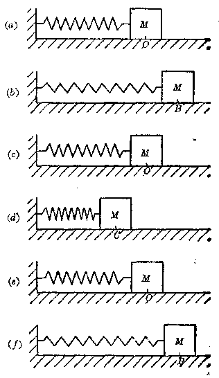

> 图1.1 弹簧振子的振动

仔细分析弹簧振子的振动过程。当物体 M 被拉到点 B 时，弹簧也被拉长了，就对物体 M 有个方向往左的弹力 F. 于是物体 M 就在弹力 F 的作用下开始往左作加速运动。当物体 M 到达点 O 时，弹力 F 已减小为零。但物体 M 这时仍具有方向往左的速度 v（图 1.1c），由于惯性作用继续越过点 O 往左运动。这以后，弹簧开始受到压缩，对物体 M 有个方向往右的弹力 F。物体 M 就在这个弹力 F 的作用下，继续往左作减速运动，直到点 A 就停止继续往左（图 1.1d）。接着物体 M 又在这个弹力 F 的作用下往右作加速运动。回到点 O 时，弹力 F 又已减小为零（图 1.1e），物体 M 又由于惯性继续越过点 O 往右运动。这时弹簧又被拉伸，又对物体 M 有个方向往左的弹力 F，起着阻力作用，使物体 M 作减速运动。当物体 M 到达点 B 时，速度已减小为零。这样，弹簧振子就完成了一次全振动。物体 M 以后的运动是不断重复上述过程。总之，在这过程中，弹簧的弹力不断使物体趋向平衡位置，而物体的惯性不断使它离开平衡位置，因此弹簧振子就在平衡位置附近不断地来回振动。很明显，如果不存在摩擦阻力，弹簧振子只要一经振动，就不会静止。象这种不存在摩擦阻力的振动称为自由振动。

根据胡克定律， 在弹簧的弹性形变中， 弹力的数值与弹簧的形变成正比， 而弹力的方向与形变的方向相反。于是对于弹簧振子说来， 如图 1.2 所示， 可以列出：

\[
F = - K x \tag {1.2}
\]

式中 F 是弹簧的弹力，x 是弹簧的形变，实际上就相当于弹簧振子 M 的位移， 而比例常数 K 则是弹簧的倔强系数， 它决定于弹簧本身的性质。 在国际单位制中， 弹簧倔强系数 K 的单位是牛/米。由于弹力 F、位移 x 的方向都可以用正、负号表示，因此上式中的\(F, x\)都可以用标量表示，而上式中的负号则表示弹力\(F\)与位移\(x\)方向始终相反。由此可见，弹簧振子在振动过程中，弹力的方向始终指向平衡位置点 O，或者说，弹力起着回复力的作用。

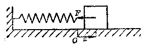

> 图1.2 弹力与位移的关系

通常把在与位移成正比而方向相反的回复力作用下的振动称为简谐振动。

> **旁注：** 回复力与位移成正比而方向相反的振动称为简谐振动

简谐振动就是最简单、最基本的周期性振动。

为了进一步研究简谐振动的加速度的变化规律，我们根据牛顿运动定律把公式（1.2）改写为

\[
m a = - K x
\]

式中\(m\)为弹簧振子的质量，即

\[
a = - \frac {K}{m} x \tag {1.3}
\]

这就是弹簧振子的即时加速度公式，对于任何弹簧振子说来，K、m都是固定不变的。由此可见：简谐振动的加速度与位移在数值上成正比，但方向始终相反；简谐振动的加速度方向总是指向它的平衡位置的。这个规律虽然是从弹簧振子的运动中推导出来的，但对于任何简谐振动都适用。它是简谐振动的基本特征。

> **旁注：** 简谐振动的特征：加速度与位移成正比，但方向始终相反，总是指向平衡位置

#### 3. 竖直放置的弹簧振子

将重物拴在一根竖直放置的螺旋弹簧的一端，弹簧的另一端是固定的。这样就构成了一个竖直放置的弹簧振子。只要使这个弹簧振子稍为离开它的平衡位置，它就沿竖直方向上下振动起来。

竖直放置的弹簧振子的振动是简谐振动吗？这就要看它的振动规律是否符合简谐振动的特征。为了做到这一点，我们必须证明：竖直放置的弹簧振子所受的回复力与它的位移在数值上成正比，但方向相反。

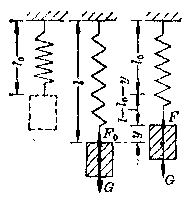

> （a）

> （b）

> 图1.3 竖直放置的弹簧振子的受力示意图

现在先来分析竖直放置的弹簧振子在它的平衡位置时的受力情况。图1.3（a）就是它在平衡位置点O时的受力图。这时弹簧虽已受到拉伸，对振子具有弹力\(F_{0}\)，方向向上，但由于振子同时受到重力G，它们大小相等、方向相反，因此振子处于平衡状态。假设弹簧原来的长度为\(l_{0}\)，在平衡位置时的长度为\(l(l > l_{0})\)。若以\(K\)表示弹簧的倔强系数，可以列出这时振子所受弹力的大小

\[
F _ {0} = K (l - l _ {0})
\]

由于它和振子的重力平衡， 故重力 G 的大小亦为

\[
G = K(l-l_0)
\]

当弹簧振子在平衡位置点 O 附近作上下的往复运动时，它所受的弹力和重力的合力就充当回复力的作用。如果振子在点 O 的上方，重力大于弹力，合力即回复力的方向向下；如果振子在点 O 的下方，弹力大于重力，合力即回复力方向向上。

当弹簧振子向上振动到具有位移\(y\)时，它的受力情况如图1.3（b）所示。为了使问题简化，我们假设位移\(y\)很小，这时弹簧仍处于拉伸状态，振子所受的弹力\(\pmb{F}\)方向向上，重力\(\pmb{G}\)方向向下。于是振子所受的回复力\(R\)，即重力\(\pmb{G}\)和弹力\(\pmb{F}\)的合力的方向是向下而指向平衡位置的。这时弹簧的实际形变量如图1.3（b）所示，为\((l - l_0 - y)\)。于是可以列出振子这时所受弹力\(\pmb{F}\)的大小

\[
F = K (l - l _ {0} - y)
\]

由此可见，竖直放置的弹簧振子在振动过程中，当位移为\(y\)时，所受的回复力的大小

\[
\begin{aligned} R &= F-G = F-F_0 \\ &= K(l-l_0-y)-K(l-l_0) = -Ky \end{aligned}
\]

式中负号表示位移方向与回复力的方向相反。因此竖直放置的弹簧振子的振动是简谐振动。

因为沿任何方向放置的弹簧振子的振动都可以看作是由水平放置的弹簧振子的振动和竖直放置的弹簧振子的振动合成的，所以沿任何方向放置的弹簧振子的振动都是简谐振动。

> **旁注：** 沿任何方向放置的弹簧振子的振动都是简谐振动

### § 1.2 简谐振动方程

我们研究一种运动， 最主要的是要掌握它的运动方程， 即掌握它的位移随时间变化而变化的规律。 对于简谐振动， 前面虽已提到它的加速度随位移变化的规律， 但要根据这个关系用初等数学方法推导出简谐振动方程是有困难的。 下面介绍一种运用运动的合成与分解的概念来推导简谐振动方程的方法。

#### 1. 匀速圆周运动的投影

在机械装置中有一种传动装置可以使转动转换成振动，例如缝纫机上皮带轮的转动通过一个偏心轮装置可以转换成机针的上下振动，这表明圆周运动和振动有着密切的联系。

为了仔细了解圆周运动与振动的关系，我们可以按图1.4作个演示实验。在电唱机的转盘的边缘上设法固定一根竖直的短棒。当转盘以最慢的一档转速转动时，短棒的端点是在作匀速圆周运动。这时如果我们用手电筒发出的光线水平地照射短棒，就会在墙上看到短棒端点的投影在沿着水平方向作往复的直线运动，即振动。这就清楚地表明作匀速圆周运动的质点的投影是在作振动。

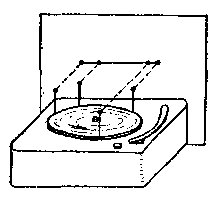

> 图 1.4 演示圆周运动与振动的关系的实验装置示意图

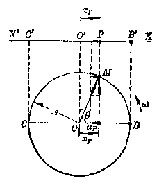

> 图1.5 匀速圆周运动的投影是简谐振动的证明

作匀速圆周运动的质点的投影的振动是简谐振动吗？这就要看它是否具有简谐振动的特征。现在就来证明它的加速度始终与位移成正比，而方向相反。

如图1.5所示，假设点\(P\)是作匀速圆周运动的质点\(\pmb{M}\)在直线\(XX'\)上的投影，因此在运动过程中，点\(P\)的加速度就等于质点\(\pmb{M}\)的加速度在直线\(XX'\)上的投影，而点\(P\)的位移就等于质点\(\pmb{M}\)的位移在直线\(XX'\)上的投影。

今已知质点\(M\)是由点\(B\)开始在以\(A\)为半径的圆周上作角速度为\(\omega\)的匀速圆周运动，那么根据向心加速度的公式，这时质点\(M\)的加速度的数值

\[
a _ {M} = A \omega^ {2}
\]

方向指向圆心 O。于是这时它的投影点 P 的加速度的数值就等于这时质点 M 的加速度在直线\(XX'\)上的投影。如图1.6所示， 在把这时质点\(M\)的加速度正交分解后可以列出点\(P\)的加速度的数值

\[
a _ {P} = a _ {M} \cos \theta = A \omega^ {2} \cos \theta
\]

方向是指着直线\(XX'\)的负方向的。上式中的角\(\theta\)是质点\(M\)由点\(B\)开始到达图1.6所示的位置时所转过的角度，另一方面又由于质点\(M\)这时相对于圆心\(O\)的位移

\[
x _ {M} = O M
\]

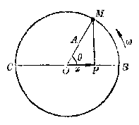

> 图1.6 简谐振动方程的推导

那么这时它的投影点\(P\)的位移就等于\(\overrightarrow{OM}\)在直线\(XX'\)上的投影。如果把\(\overrightarrow{OM}\)正交分解，就很容易列出这时点\(P\)的位移的数值

\[
x _ {p} = \overrightarrow {O M} \cos \theta = A \cos \theta
\]

方向是沿着直线\(XX'\)的正方向的。于是将上式代入前式就可以得出

\[
a _ {P} = - \omega^ {2} x _ {P} \tag {1.4}
\]

式中的负号表示加速度\(a_{P}\)的方向与位移\(x_{P}\)的方向相反。

上式表明，点 P 的运动完全符合简谐振动的基本特征。由此可见：作匀速圆周运动的质点在任何一条直线上，包括在它所在圆周的任何一条直径上的投影点的运动都是简谐振动。

> **旁注：** 匀速圆周运动的投影是简谐振动

#### 2. 简谐振动方程

在具体分析简谐振动的规律时，通常是反过来设想质点\(P\)是在一个圆的直径上作简谐振动，而这个圆就称为简谐振动的参考圆（图1.6），与质点\(P\)相应的在参考圆上作匀速圆周运动的点\(M\)就称为质点\(P\)的参考点。

假设参考点 M 从点 B 开始以角速度\(\omega\)作匀速圆周运动， 经过\(t\)秒后而到右图 1.6 所示的位置， 所转过的角度为\(\theta\). 根据参考圆的半径为\(A\)可以列出这时由点\(B\)开始作简谐振动的质点\(P\)相对于平衡位置\(O\)的位移

\[
x = A \cos \theta
\]

式中\(\theta = \omega t\)，即

\[
x = A \cos \omega t \tag {1.5}
\]

这就是简谐振动方程的最简形式，它反映了简谐振动的位移随时间变化的规律。

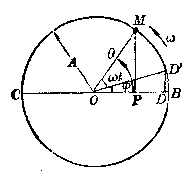

> 图1.7 简谐振动方程的一般形式

如果作简谐振动的质点\(P\)并不是从点\(B\)开始振动的，而是从点\(D\)开始振动的，经过\(t\)秒后到达图1.7所示的位置，那么与它相对应的参考点\(M\)就是从点\(D'\)开始作匀速圆周运动了。当时参考点\(M\)已转过角\(\varphi\)，经过\(t\)秒后到达图1.7所示的位置。因此在这种情况下\(\theta = \omega t + \varphi\)，于是作简谐振动的质点\(P\)的位移

\[
x = A \cos (\omega t + \varphi) \tag {1.6}
\]

这是简谐振动方程的一般形式。

#### 3. 简谐振动的图线

根据简谐振动方程可以看出作简谐振动的质点的位移随时间变化的关系是余弦函数的关系。这一关系还可以通过图1.8的装置用图线显示出来。图中的弹簧振子是竖直放置的。如果在弹簧振子上装一枝小笔，后面放一条记录纸带，使笔尖恰好与纸条接触。当弹簧振子振动时，匀速转动的卷筒使纸条匀速移动，笔尖就把振子的位置记录在纸条上，于是在纸条上就显示出一条余弦函数图线。因为纸带是匀速移动的，所以图线的横坐标是与时间\(t\)成正比的，而图线上各点的纵坐标就表示振子在各该时刻\(t\)相对于平衡位置的位移。由此可见，这个图线生动地反映出简谐振动的位移随时间变化的详细过程，表明振动的位移与时间的关系的图线就称为振动图线，简称振动的\(s - t\)图。图1.9是典型的简谐振动图线。

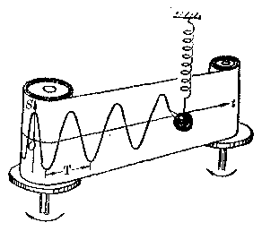

> 图1.8 显示振动图线的装置

从简谐振动的\(s - t\)图上可以看出简谐振动是具有周期性的运动，图线上任何一点的位移在每隔一个固定的时间间隔后都会重复出现一次。这个使位移值重复出现的最小时间间隔 T 就是简谐振动的周期。在简谐振动的 s-t 图上，相邻两个位移最大值（正的或负的）之间的时间间隔就等于简谐振动的周期。

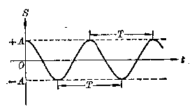

> 图1.9 典型的简谐振动图线

### § 1.3 简谐振动方程中的参量

对于简谐振动方程，我们还应该掌握它的每个参量的物理意义。

#### 1. 振幅

在简谐振动方程的一般形式中，A 称为简谐振动的振幅。从振动图线上可以看出，弹簧振子的位移总是在 +A 与 -A 之间变化，因此振幅 A 反映了简谐振动的幅度，即振动的范围；它是作简谐振动的质点离开平衡位置的最大位移。在国际单位制中，振幅的单位是米。

#### 2. 圆频率

在简谐振动方程的一般形式中，\(\omega\)称为简谐振动的圆频率，实质上就是简谐振动的参考点\(M\)的角速度，因而又称为角频率。圆频率\(\omega\)反映了简谐振动的快慢。根据参考点\(M\)在参考圆上转一周，即\(2\pi\)弧度所用的时间\(T\)就是简谐振动的周期，可以列出

\[
\omega = \frac{2\pi}{T} = 2\pi f \tag{1.7}
\]

所以简谐振动方程有时也可以写成如下的形式：

\[
x = A \cos \left(\frac {2 \pi}{T} t + \varphi\right) \tag {1.8}
\]

或者

\[
x = A\cos(2\pi f t+\varphi) \tag{1.9}
\]

> **旁注：** 简谐振动的圆频率是频率的\(2\pi\)倍

要弄清楚简谐振动的圆频率\(\omega\)和频率\(f\)的区别与联系。频率\(f\)是指每秒钟振动的次数，而圆频率\(\omega\)是指参考点每秒钟转过的弧度。由于每振动1次，参考点就转过\(2\pi\)弧度，所以振动的圆频率数等于频率数的\(2\pi\)倍。

#### 3. 位相

在简谐振动方程的一般形式中，\((\omega t + \varphi)\)称为简谐振动在时刻\(t\)的位相，或称相位，简称相，实质上就是简谐振动在时刻\(t\)的参考点\(M\)的角位移。因此位相\((\omega t + \varphi)\)反映了作简谐振动的质点在时刻\(t\)的运动状态，包括它的位置和位移变化趋势。在国际单位制中，位相的单位是弧度。例如当简谐振动的位相等于\(\pi / 2\)或者\(3\pi / 2\)时，虽然质点都在它的平衡位置点\(O\)上，但二者的位移变化趋势是不同的。当位相等于\(\pi / 2\)时，质点开始往左移动，具有负位移的趋势；而当位相等于\(3\pi/2\)时，质点开始往右移动，具有正位移的趋势。

两个完全相同的简谐振动，除了应该具有相同的振幅和圆频率外，还必须具有相同的位相，才能做到振动的步调一致，即在任何时刻\(t\)都具有完全相同的振动状态。

在简谐振动的位相\((\omega t + \varphi)\)中，\(\varphi\)称为简谐振动的初相，即在\(t = 0\)时，或者说在开始计时时的位相。两个圆频率相同的简谐振动，如果初相不同，它们的振动步调就不可能一致。通常把两个同频率的简谐振动的位相的差称为位相差，或称相位差。因为位相差实质上就是两个同频率的简谐振动的初相的差，所以位相差常用代号\(\Delta \varphi\)表示。

#### 4. 周期、频率

简谐振动的周期就相当于参考点 M 作匀速圆周运动的周期， 因此简谐振动的周期与圆频率有着密切联系， 根据前面提到的公式（1.7）可以列出

\[
T = \frac {2 \pi}{\omega} \tag {1.10}
\]

通常就是根据上式来计算简谐振动的周期的，同理，可以得出简谐振动的频率的计算公式

\[
f = \frac{\omega}{2\pi} \tag{1.11}
\]

##### 例 1

已知某质点作简谐振动的方程为

\[
x = \frac {1}{4} \cos \left(4 \pi t + \frac {\pi}{4}\right)
\]

式中\(x, t\)的单位依次为米、秒。求

（1） 振幅和圆频率；

（2） t=0 时的位相和位移；

（3） 5 秒末时的位相和位移；

（4） 周期和频率。

**解：** （1） 首先将上式与简谐振动方程的一般形式相对照， 可以得出质点作简谐振动的振幅和圆频率依次为

\[
A = 0.25 \text{米}; \quad \omega = 4 \pi \text{弧度/秒(或写作1/秒)}
\]

（2） 将\(t = 0\)代入上式可以得出简谐振动的初相和初位移依次为

\[
\varphi = \frac {\pi}{4} \text{弧度}
\]

\[
x _ {0} = \frac {1}{4} \cos \frac {\pi}{4} \text{米} = \frac {\sqrt {2}}{8} \text{米} = 0.177 \text{米}
\]

（3） 将 t=5 代入上式可以得出 5 秒末的位相和位移：

\[
\varphi_5 = 20\pi+\frac{\pi}{4}=\frac{81\pi}{4}\ \text{弧度}\equiv \frac{\pi}{4}\pmod{2\pi}
\]

\[
x_5=\frac14\cos\frac{\pi}{4}\ \text{米}=\frac{\sqrt2}{8}\ \text{米}=0.177\ \text{米}
\]

（4） 根据周期、频率与圆频率的关系可以算出：

\[
T = \frac {2 \pi}{\omega} = \frac {2 \pi}{4 \pi} \text{秒} = 0.5 \text{秒}
\]

\[
f = \frac {\omega}{2 \pi} = \frac {4 \pi}{2 \pi} \text{赫} = 2 \text{赫}
\]

##### 例 2

试作简谐振动\(x = \frac{1}{4}\cos \left(4\pi t + \frac{\pi}{4}\right)\)的振动图线。

**作法：** 这里介绍一种利用参考圆来作简谐振动图线的简便方法。

先以振幅\(A = 0.25\)米为半径作参考圆\(O\)，并将它进行8等分（图1.10a），这样，我们就很容易从图上得出位相角为\(0, \pi / 4, 2\pi / 4, 3\pi / 4 \cdots\)时，简谐振动的位移依次为线段\(Oa, Ob, O, Od \cdots\)，即相当于线段\(Oa', Ob', O, Od' \cdots\)。

再根据位相\(\omega t + \varphi = 4\pi t + \frac{\pi}{4}\)的关系可以得出振动时间\(t\)与位相\(\omega t + \varphi\)的关系，并列表如下：（这里一般以简谐振动的周期的1/8作为时间\(t\)的单位。）

| 时间t（秒） | 0 | \(\frac{1}{16}\) | \(\frac{2}{16}\) | \(\frac{3}{16}\) | \(\frac{4}{16}\) | \(\frac{5}{16}\) | \(\frac{6}{16}\) | \(\frac{7}{16}\) | \(\frac{8}{16}\) |
| --- | --- | --- | --- | --- | --- | --- | --- | --- | --- |
| 位相ωt+φ（弧度） | \(\frac{\pi}{4}\) | \(\frac{2\pi}{4}\) | \(\frac{3\pi}{4}\) | \(\frac{4\pi}{4}\) | \(\frac{5\pi}{4}\) | \(\frac{6\pi}{4}\) | \(\frac{7\pi}{4}\) | \(\frac{8\pi}{4}\) | \(\frac{9\pi}{4}\) |
| 位移 \(x\)（米） | \(\frac{\sqrt{2}}{8}\) | 0 | \(-\frac{\sqrt{2}}{8}\) | \(-\frac14\) | \(-\frac{\sqrt{2}}{8}\) | 0 | \(\frac{\sqrt{2}}{8}\) | \(\frac14\) | \(\frac{\sqrt{2}}{8}\) |

于是在时间轴上以\(\frac{1}{16}\)秒为单位，并借助于参考圆点出表示在上述各个位相时简谐振动的位移的点（图1.10b）.以曲线板为工具用光滑的曲线将这些点连接起来，就得到要作的振动图线。

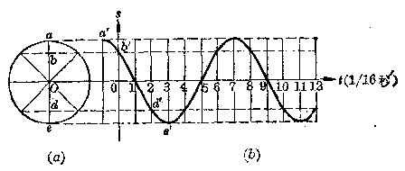

> 图1.10 振动图线的作法

### § 1.4 弹簧振子的固有频率和固有周期

怎样计算弹簧振子的振动频率和振动周期呢？关键在于首先找出弹簧振子的圆频率\(\omega\).

在研究简谐振动与匀速圆周运动的关系时，我们已经得出了如下的结论：简谐振动的加速度与位移成正比，但方向相反；而它们的比例常数就是圆频率的平方，即

\[
a = - \omega^ {2} x
\]

弹簧振子在振动过程中同样也符合上述规律，但比例常数却为\(K / m\)，即

\[
a = - \frac {K}{m} x
\]

式中 K 为弹簧的倔强系数，m 为弹簧振子的质量，于是通过对比可以得出

\[
\omega^2=\frac{K}{m}
\]

即弹簧振子的圆频率

\[
\omega=\sqrt{\frac{K}{m}} \tag{1.12}
\]

掌握了弹簧振子的圆频率， 就可以根据公式（1.10）、（1.11）列出弹簧振子的振动周期和振动频率：

\[
T=\frac{2\pi}{\omega}=2\pi\sqrt{\frac{m}{K}} \tag{1.13}
\]

\[
f=\frac{\omega}{2\pi}=\frac{1}{2\pi}\sqrt{\frac{K}{m}} \tag{1.14}
\]

上述公式表明： 在阻力可以忽略的情况下自由振动时， 弹簧振子的振动周期（或振动频率）与振幅的大小无关， 完全决定于弹簧的倔强系数和弹簧振子的质量。这个结论对于任何类型的弹簧振子都是适用的。对于确定的弹簧振子说来， 它的\(K\)和\(m\)都有确定的值， 是系统的固有特性， 因此通常把由上述公式所决定的周期和频率称为弹簧振子的固有周期和固有频率。例如弹簧振子质量较大的系统， 振动起来比较缓慢， 即周期较长； 而弹簧较硬， 即不易产生形变的系统， 倔强系数较大， 振动起来比较快， 即周期较短。

根据弹簧振子的圆频率公式（1.12），我们还可以列出弹簧振子在自由振动时的振动方程：

\[
x = A \cos \left(t \sqrt {\frac {K}{m}} + \varphi\right) \tag {1.15}
\]

#### 例 3

质量为 50 吨的火车车厢内四根倔强系数都等于 0.45 吨/厘米的弹簧支承着，求车厢上下振动的频率。

**解：** 整个火车车厢可以看作弹簧振子，它的等效的倔强系数和质量依次为

\[
K = 4 \times 0.45 \text{吨/厘米} = 1.8 \times 980000 \text{牛/米}
\]

\[
\approx 1.76 \times 10 ^ {6} \text{牛/米}
\]

\[
m=50\ \text{吨}=50000\ \text{千克}
\]

于是根据公式（1.14）可以算出车厢上下振动的频率

\[
f=\frac{1}{2\pi}\sqrt{\frac{K}{m}}=\frac{1}{2\pi}\sqrt{\frac{1760000}{50000}}\ \text{赫}=0.914\ \text{赫}
\]

#### 习题1.4

1. 怎样判别一个振动是不是简谐振动？

2. 弹簧振子的振动一定是简谐振动吗？如果使它起振的力超过弹簧的弹性限度呢？

3. 如果以图1.1为例，质点从经过平衡位置O算起，怎样才算完成了一次全振动？

4. 在简谐振动中，t=0 的时刻是指质点开始运动的时刻还是指开始计时的时刻？

5. 两根长度相同的螺旋弹簧，一根硬些，另一根软些，现在分别挂上质量相同的物体组成两个弹簧振子，问哪一个因有周期大些？为什么？

6. 把弹簧振子的弹簧剪去一半，问它的固有周期将会受到什么影响？为什么？

7. 已知某弹簧振子的振动方程为\(x = 0.1 \cos \left(5 \pi t - \frac{\pi}{4}\right)\)，式中\(x, t\)的单位都是国际制单位（下同），试求：

（1） 振幅和圆频率；

（2） t=0 时的位移和位移：

（3） 3 秒末时的位相和位移；

（4） 周期和频率。

8. 果弹簧振子是由倔强系数为 20 牛/米的螺旋弹簧和质量为 0.2 千克的振子所组成。现将振子从平衡位置拉开 2 厘米（假设在弹簧的弹性限度以内），然后放手让它自由振动，试求：

（1） 振幅、圆频率和初样；

（2） 简谐振动方程；

（3） 频率和周期。

9. 试证明简谐振动的速度随时间变化的关系式为

\[
v=-A\omega\sin(\omega t+\varphi)
\]

10. 如果弹簧振子在振动时， 振幅为 20 厘米， 周期为 0.5 秒， 初相为\(\frac{\pi}{3}\)， 试列出它的振动方程， 并求出当\(t = 2.75\)秒时的位移、速度和加速度。

11. 一质点作简谐振动的振幅为8厘米， 频率为3赫， 试求它的最大速度和最大加速度。

12. 质量为 0.1 千克的弹簧振子作简谐振动，已知其质量为 0.2 米，周期为 4 秒，当 t=0 时位移为 +0.2 米，试求：

（1） 弹簧振子在 t=0.5 秒时的位相和位移；

（2） 在 t=1 秒时所受的弹力；

（3） 到达位移为 -0.1 米的时刻；

（4） 在位移为 0.1 米时的位相和速度。

13. 已知某简谐振动的振幅为 3 厘米， 圆频率为\(2\pi / \text{秒}\)， 初相为\(\pi / 2\)， 试列出它的简谐振动方程， 并以位移为纵坐标， 时间为横坐标作出它的振动曲线。

### § 1.5 单摆的振动

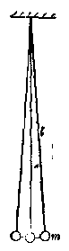

将质量为\(m\)的摆锤拴在一根一端固定的长度为\(l\)的细线上（图1.11），只要细线的质量与小球相比可以忽略不计，而小球的直径与细线长度相比显得很小，这样的振动系统就可以称为单摆，\(m\)称为摆的质量，\(l\)称为摆长（严格地说，是暂从细线的固定端到小球中心的长度，并假设细线没有伸缩性）。

我们已经知道， 单摆的摆动是一种振动， 但这种振动是否属于简谐振动， 还要看它是否具有简谐振动的特征。

#### 1. 单摆的简谐振动

当单摆静止不动时，它所受的重力 G 和细线的拉力 T 相互平衡，因而把单摆这时的位置\(O\)称为单摆的平衡位置（图1.12）。当单摆偏离平衡位置的偏角为\(\theta\)时，它所受的重力 G 与细线的拉力 T 不再平衡。把重力 G 沿着单摆摆动的圆弧的切向和法向正交分解成两个分力 F 和\(F'\)，可以看出力\(F'\)与细线的拉力 T 在一直线上，它们的合力对单摆起了向心力的作用，而分力 F 沿圆弧切线指向单摆的平衡位置，对单摆起了回复力的作用。于是可以列出

\[
F = G \sin \theta = m g \sin \theta
\]

式中\(\theta\)是单摆的偏角，如果用弧度作单位，\(\theta = \frac{x}{l}\)，即单摆的偏角就等于它相对于平衡位置\(O\)的圆弧位移\(x\)与摆长\(l\)的比。代入上式可得

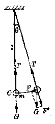

> 图1.12 单摆的受力情况分析

\[
F = m g \sin \left(\frac {x}{l}\right)
\]

上式表明： 单摆在振动时， 它的回复力与位移并不是简单的正比关系。 因此一般说来， 单摆的振动并不是简谐振动。

但如果单摆在振动过程中，摆角\(\theta\)很小，在\(5^{\circ}\)（或0.0873弧度）以下，\(\sin \theta\)与\(\theta\)弧度在数值上十分接近，因而可以列出\(\sin \theta \approx \frac{x}{l}\)。于是单摆所受的回复力

\[
F \approx - m g \frac {x}{l} \tag {1.16}
\]

式中单摆的摆角\(\theta\)（小于\(5^{\circ}\)或 0.0873 弧度） 所对的圆弧可以近似地看成直线， 即为单摆的位移； 式中的负号表示回复力与位移方向始终相反。 对于单摆说来\(mg, l\)都有确定的值， 表明上式符合简谐振动的特征。由此可见，当摆角很小时（在\(5^{\circ}\)或0.0873弧度以下）， 单摆所作的振动是简谐振动。

> **旁注：** 当摆角很小（小于\(5^{\circ}\)）时， 单摆所作的振动是简谐振动

#### 2. 单摆的振动定律

根据牛顿运动定律，上述有关单摆的回复力公式（1.16）可以改写为

\[
ma=-mg\frac{x}{l}
\]

即当偏角\(\theta\)小于\(5^{\circ}\)时，单摆振动的加速度

\[
a = - \frac {g}{l} x \tag {1.17}
\]

与简谐振动的加速度公式（1.4）进行对比，可以得出

\[
\omega^ {2} = \frac {g}{l}
\]

即单摆振动的的圆频率

\[
\omega = \sqrt {\frac {g}{l}} \tag {1.18}
\]

掌握了单摆作简谐振动的圆频率，就可以根据公式（1.10）、（1.11）列出单摆作简谐振动的周期和频率：

\[
T = \frac {2 \pi}{\omega} = 2 \pi \sqrt {\frac {l}{g}} \tag {1.19}
\]

\[
f = \frac {\omega}{2 \pi} = \frac {1}{2 \pi} \sqrt {\frac {g}{l}} \tag {1.20}
\]

上述公式表明： 在偏角\(\theta\)小于\(5^{\circ}\)或 0.0873 弧度时， 在阻力可以忽略的情况下， 单摆振动的周期与摆的质量以及振幅都没有关系， 而完全决定于摆长和单摆所在地点的重力加速度， 即与摆长的平方根\(\sqrt{l}\)成正比， 而与重力加速度的平方根\(\sqrt{g}\)成反比。 这个规律称为单摆振动定律， 是荷兰物理学家惠更斯首先发现的。 单摆振动周期与振幅无关的特点又称为单摆的等时性， 常被利用在钟摆上作为计时的单位。

根据单摆作简谐振动时的圆频率公式（1.18），我们还可以列出单摆在自由振动时的简谐振动方程：

\[
x = A \cos \left(t \sqrt {\frac {g}{l}} + \varphi\right) \tag {1.21}
\]

而单摆的振幅就相当于它的最大偏角\(\theta_{A}\)与摆长\(l\)的乘积。

#### 3. 单摆的实验

关于单摆的振动定律， 我们可以通过实验来进行验证。

用一个带穿心孔的小铁球作摆，让一根长1米左右的细线穿过球孔后打一个比孔径大些的线结，这样就制成了一个单摆。如果找不到这样的小球，用秤锤也行。把细线的一端用铁架台上的铁夹固定如图1.13所示，就可以开始实验。

实验可按下列步骤进行：

（1） 先用米尺量出摆长，注意必须从细线的固定端量到摆的中心；

（2） 让单摆振动，要尽量使单摆在一个平面弧线上振动而不要使它发生倾动，同时要让单摆的偏角保持在\(5^{\circ}\)以下；

（3） 用秒表（或手表）测出这时单摆的振动周期，为了能比较精确地测出单摆的周期，我们可以先测出单摆连续振动100次的时间，然后取它的平均值。在计数时，通常是以单摆振动到端点（如图1.13中的点\(B\)）作准的，即由点\(B\)开始计数，单摆每通过一次点\(B\)，就完成一次全振动。

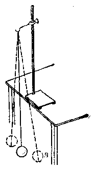

> 图1.13 实验装置

（4） 在其他条件不变的情况下改变单摆的振幅，再次测出单摆的振动周期，结果就会发现：无论怎样改变振幅， 只要保持偏角小于\(5^{\circ}\)，单摆振动的周期总是相同的。

（5） 用其他不同质量的摆代替小铁球，并保持原来的摆长，再次测出单摆的振动周期，结果就会发现：即使用质量不同的单摆，只要摆长一定，单摆振动的周期总是相同的。

（6） 如果改变摆长到 0.9 米左右，再次测出单摆的振动周期，结果就会发现：单摆的振动周期是与摆长的平方根成正比的。

表1.1是实验结果的记录表。 把实验数据记录在表内，便于我们得出实验结果。

表 1.1 利用单摆测定重力加速度的实验结果记录表

| 实验次数 | 摆球质量m（千克） | 摆长l（米） | 摆长平方根\(\sqrt{T}\)（米-2） | 全振动100次的时间（秒） | 周期T（秒） | 重力加速度g（米/秒2） |
| --- | --- | --- | --- | --- | --- | --- |
| 1 |  |  |  |  |  |  |
| 2 |  |  |  |  |  |  |
| 3 |  |  |  |  |  |  |
| 4 |  |  |  |  |  |  |
| 5 |  |  |  |  |  |  |

测得重力加速度的平均值为 ____ 米/秒² 当地重力加速度的公认值为 ____ 米/秒² 实验的相对误差=____% 由于单摆的振动周期是与实验地点的重力加速度有关的，因此我们可以通过测定单摆的振动周期测定当地的重力加速度的数值。具体的方法就是在测出摆长为\(l\)的单摆的振动周期为\(\overline{T}\)后，即按下列公式算出单摆所在地域的重力加速度

\[
g = \frac {4 \pi^ {2} l}{T ^ {2}} \tag {1.22}
\]

##### 例 4

某人在上海用摆长为 0.924 米的单摆测定重力加速度，测得振动 100 次的时间为 3 分 13 秒，问上海地区的重力加速度多大？

**解：** 根据实验数据先算出单摆振动周期的平均值

\[
T ^ {\prime} = \frac {3 \times 60 + 13}{100} \text{秒} = 1.93 \text{秒}
\]

再按公式（1.22）算出上海地区的重力加速度

\[
\begin{array}{l} g = \frac {4 \pi^ {2} l}{T ^ {2}} = \frac {4 \times (3.14) ^ {2} \times 0.924}{(1.93) ^ {2}} \text{米/秒} ^ {2} \\ = 9.79 \text{米/秒} ^ {2} \\ \end{array}
\]

上海地区重力加速度的公认值为9.794米/秒²。这表明由上述实验得出的结果并不是绝对精确的。实验值与精确值之间的差异称为误差。实验的误差是不可避免的。我们只有设法减小误差。

由于测量仪器本身的不精确，或者实验方法粗略而造成的误差称为系统误差。例如在上述例题的实验中所用的米尺在测量单摆的摆长时，至多能读出三位有效数字的数据，即\(l = 0.924\)米；又根据秒表确定的单摆连续振动100次的时间算出的周期值也只有三位有效数字，即\(T = 1.93\)秒，因此最后得出的重力加速度值也只能取三位有效数字，即\(g = 9.79\)米/秒²。这样造成的误差就是系统误差。一般说来，只有采用精确度更高的测量仪器和改进实验方法才能减小系统误差。

由各种偶然因素造成的误差称为偶然误差。例如即使用同样的秒表去测量同一个单摆的周期，不同的人就会得出不同的数据，甚至同一个人在多次测量中也会得出不同的数据。这样造成的误差就是偶然误差。因此在实验时，对于同一个数据多进行几次测量，取它们的平均值就可以减小偶然误差。

误差有两种表示法：一种是用实验值与精确值之间的绝对差数表示的称为绝对误差；另一种是用绝对误差与精确值的百分比表示的称为相对误差。实验结果的精确程度并不决定于绝对误差，而决定于相对误差。

##### 例 5

周期为 2 秒的单摆称为秒摆。已知北京地区的重力加速度为 9.8012 米/秒\(^{2}\)，求北京秒摆的摆长。

**解：** 在已知\(T = 2\)秒，\(g = 9.8012\)米/秒²的情况下根据公式（1.19）可以算出北京秒摆的摆长

\[
l=\frac{gT^2}{4\pi^2}=\frac{9.8012}{(3.1416)^2}\ \text{米}=0.99306\ \text{米}
\]

### § 1.6 简谐振动的能量

我们知道，作简谐振动的物体具有机械能，现在就来研究它们所具有的机械能与哪些因素有关，应该怎样进行计算。

#### 1. 弹簧振子的能量

弹簧振子的振动过程是它的动能与弹性势能相互转换的过程。如果以水平放置的弹簧振子系统为例来分析，当弹簧振子处于平衡位置\(O\)时（图1.2），它的弹性势能为零；又由于当时速度已达到它的最大值而动能最大。随着弹簧振子的偏离平衡位置，速度逐渐减小而弹簧逐渐发生形变，表明动能逐渐减少而弹性势能逐渐增大，即动能在逐渐转换成弹性势能。当弹簧振子到达端点\(B\)时，弹性势能已增大到它的最大值而动能为零，表明这时动能已全部转换成弹性势能。弹簧振子在以后的振动过程中，弹性势能又逐步转换成动能；动能又逐步转换成弹性势能。如果不存在阻力，即没有能量损耗，则根据机械能守恒定律可知，弹簧振子在任何位置上的弹性势能与动能的和是个常量，称为弹簧振子的振动能，用式子表示就是

\[
E=E_p+E_k=\frac12Kx^2+\frac12mv^2
\]

式中\(E_{p}, E_{k}\)分别表示弹簧振子振动到某一点时的弹性势能和动能；\(K\)是弹簧的倔强系数，\(x, v\)是弹簧振子这时的位移和速度，\(m\)是弹簧振子的质量。

由于弹簧振子振动到端点 B 时， 位移等于振幅 A 而速度为零， 因此这时弹簧振子的弹性势能就等于它的全部振动能， 即

\[
E = \frac {1}{2} K A ^ {2} \tag {1.23}
\]

##### 例 6

已知某弹簧振子的质量为 0.6 千克， 自由振动时， 每分钟振动 45 次， 振幅为 5 厘米， 求振动能。

**解：** 根据公式（1.23）可知弹簧振子的振动能与振幅的平方成正比，并与弹簧的倔强系数成正比。今已知弹簧振子的振幅\(A\)为5厘米，可见关键在于找出弹簧的倔强系数。

今已知弹簧振子的质量 m=0.6 千克，固有频率

\[
f=\frac{45}{60}\ \text{赫}=0.75\ \text{赫}
\]

因此根据公式（1.12）、（1.7）的关系可以列出

\[
\begin{array}{l} K = m \omega^ {2} = 4 \pi^ {2} m f ^ {2} \\ = 4 \times (3.14) ^ {2} \times 0.6 \times (0.75) ^ {2} \text{牛 / 米} \\ \approx 13.3 \text{牛 / 米} \\ \end{array}
\]

于是再按公式（1.23）可以算出弹簧振子的振动能

\[
E = \frac {1}{2} K A ^ {2} = \frac {1}{2} \times 13.3 \times (0.05) ^ {2} \text{焦} = 0.0166 \text{焦}
\]

#### 2. 单摆的能量

单摆作简谐振动的过程是它的动能与重力势能相互转换的过程。通常我们假设单摆在平衡位置\(O\)（图1.12）时的重力势能为零，又由于这时单摆的速度最大而动能最大。在单摆偏离平衡位置后，速度逐渐减小而位置逐渐升高，表明动能逐渐转换成重力势能。当单摆振动到端点\(B\)时，动能已减小为零，又由于位置已升高到它的最高点而重力势能最大，表明这时动能已全部转换成重力势能。单摆以后的振动过程就是重力势能逐步转换成动能，而动能又逐步转换成重力势能的过程。因此如果不存在阻力，没有能量损耗，根据机械能守恒定律，单摆在任何位置上的重力势能与动能的和是个常量，称为单摆的振动能，用式子表示就是

\[
E = E _ {p} + E _ {k} = m g h + \frac {1}{2} m v ^ {2}
\]

式中\(E_{p}, E_{k}\)分别表示单摆振动到某一点时的重力势能和动能；\(m\)是单摆的质量，\(h\)是单摆相对于平衡位置的高度， v 是单摆在这一点的速度。

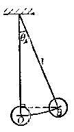

> 图1.14 单摆在端点\(B\)的重力势能

由于单摆振动到端点 B 时速度为零，因此单摆的振动能就等于单摆在端点上的重力势能。为了找出单摆在端点上的重力势能，假设这时单摆的摆角为\(\theta_{A}\)，如图 1.14 所示，我们可以列出这时单摆相对于平衡位置的高度

\[
h = l - l \cos \theta_ {A} = l (1 - \cos \theta_ {A})
\]

式中 l 是单摆的摆长。于是可以得出单摆重力势能的最大值

\[
E _ {p} = m g h = m g l (1 - \cos \theta_ {A}) = 2 m g l \sin^ {2} \frac {\theta_ {A}}{2}
\]

因为摆角\(\theta_{A} < 0.0873\)，所以\(\sin \frac{\theta_{A}}{2}\)的函数值与\(\frac{\theta_{A}}{2}\)弧度在数值上十分接近，而单摆这时的位移，即振幅\(A\)与\(l\theta_{A}\)也十分接近。于是上式可以改写成

\[
E _ {p} = 2 m g l \left(\frac {\theta_ {A}}{2}\right) ^ {2} = \frac {1}{2} \frac {m g}{l} (l \theta_ {A}) ^ {2}
\]

即单摆的振动能

\[
E=\frac12\frac{mg}{l}A^2 \tag{1.24}
\]

由此可见：单摆的振动能公式在形式上与弹簧振子的振动能公式十分相似，但在这里常数\(K\)是指摆所受的重力\(mg\)与摆长\(l\)的比。

##### 例 7

已知单摆的摆长为 40 米， 振动时的最大偏角为 0.0873 弧度， 求摆经过平衡位置时的速度， 并列出单摆的振动方程。

**解：** 由于摆经过平衡位置时重力势能等于零，当时的动能就等于单摆的振动能，于是可以列出

\[
\frac {1}{2} m v ^ {2} = \frac {1}{2} \frac {m g}{l} A ^ {2}
\]

即摆在经过平衡位置时的速度

\[
v=A\sqrt{\frac{g}{l}}=l\theta_A\sqrt{\frac{g}{l}}
\]

将已知数据代入， 取 g=9.8 米/秒\(^{2}\)， 可得

\[
v = (40) (0.0873) \sqrt {\frac {9.8}{40}} \text{米 / 秒} = 1.73 \text{米 / 秒}
\]

同时根据振幅

\[
A = l \theta_ {A} = 40 \times 0.0873 \text{米} = 3.49 \text{米}
\]

\[
\omega = \sqrt {\frac {g}{l}} = \sqrt {\frac {9.8}{40}} \text{弧度 / 秒} = 0.495 \text{弧度 / 秒}
\]

并取初相\(\varphi = 0\) 可以列出单摆的振动方程

\[
x=3.49\cos(0.495t)
\]

#### 3. 简谐振动的能量

归纳起来，弹簧振子的振动过程是动能与弹性势能的互换过程；而单摆是动能与重力势能的互换过程。由此可见：简谐振动的过程就是系统的动能与势能相互转换的过程，但总能量保持不变。

> **旁注：** 简谐振动的过程就是系统的动能与势能相互转换的过程

根据弹簧振子的机械能公式（1.23）和弹簧振子的圆频率公式（1.12）可以得出

\[
E = \frac {1}{2} K A ^ {2} = \frac {1}{2} m \omega^ {2} A ^ {2} \tag {1.25}
\]

上式如果运用单摆的振动能公式（1.24）和单摆的圆频率公式（1.18）同样可以得出。由此可见，上式对于任何简谐振动都是适用的，因而称为简谐振动的振动能公式。它表明：任何作简谐振动的物体的振动能与它的质量成正比；与它的圆频率的平方和振幅的平方也都是成正比的。

#### 习题1.6

1. 单摆的振动是简谐振动吗？为什么？

2. 摆长相等的两个单摆作简谐振动， 如果：

（1） 一个放在赤道， 另一个放在北极；

（2） 一个放在海平面上， 另一个放在高山顶上；

（3） 一个放在地球上， 另一个放在月球上；

（4） 一个放在地面上， 另一个放在加速上升的电梯里；

问哪一个的振动频率大？为什么？

3. 时钟是以钟摆的周期作为计时单位的。如果某时钟一昼夜慢3分钟，问应该如何调节摆长？假设时钟原来的摆长为1米，问必须调节到多长？

4. 在两个倔强系数相同的弹簧上挂质量不同的物体，当它们以相同的振幅作简谐振动时，问它们的能量是否相同？为什么？

5. 把弹簧振子的振幅减小为原来的一半，同时增大它的频率为原来的两倍，问弹簧振子的振动能有什么变化？

6. 已知单摆的摆长为 1.2 米，在重力加速度为 9.8 米/秒² 的地方作简谐振动，如果振幅为 0.08 弧度，初相为 π/3，试列出单摆的简谐振动方程。

7. 某人在某地测得摆长为 0.48 米的单摆振动 1000 次的时间为 23 分 10 秒， 求当地的重力加速度。

8. 两个单摆在同一地点作简谐振动， 其中一个振动 30 次的时间恰好等于另一个振次 20 次的时间， 试求它们的摆长之比。

9. 作简谐振动的质点的动能和势能相等时（1）位移是振幅的多少？（2） 位相多大？

10. 已知某弹簧振子的质量为 0.2 千克，作简谐振动的方程为\(x = 0.6 \cos \left(4\pi t + \frac{\pi}{2}\right)\)试求：

（1） 弹簧振子的振动能；

（2） 振子经过平衡位置时的速度。

11. 已知某简谐振动的振动方程为\(x = 0.25 \cos \left(3\pi t + \frac{\pi}{4}\right)\)，振子的质量为 0.1 千克。设

（1）\(t = \frac{1}{8} T\)时的动能和势能；

（2）\(t = \frac{3}{8} T\)时的动能和势能。

12. 已知单摆摆长为 1.2 米， 最大摆角为 0.06 弧度， 摆锤质量为 0.2 千克， 试求：

（1） 单摆的振动方程：

（2） 单摆的振动能；

（3） 摆经过平衡位置时的速度；

（4）\(t = \frac{5}{8} T\)时的动能和势能。

13 已知某弹簧振子质量为 500 克，每分钟振动 25 次，求当它的振幅为 5 厘米时的振动能。

### § 1.7 简谐振动的合成

前面已经提过，简谐振动是最简单、最基本的振动，其他复杂的振动都可以看作是由几个或者许多个简谐振动合成的。现在就来研究简谐振动的合成问题。

当一个质点同时参与两个简谐振动，例如同一个振子同时与两个一端固定的螺旋弹簧相连接（图1.15），这时质点所作的振动实际上就是由两个简谐振动所合成的合振动。根据运动的合成与分解的概念，我们知道，当一个质点同时参与两个运动，而同时具有两个位移，那么它的实际位移就等于那两个分位移的矢量和。我们正是根据这个原理来研究简谐振动的合成问题的。

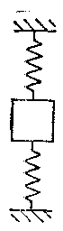

> 图1.15 振动的合成

简谐振动的合成是比较复杂的问题，在这里我们只研究几种最简单的情况。

#### 一、在同一直线上频率相同的简谐振动的合成

假设某一个质点\(P\)同时参与两个各自独立的在同一直线上的简谐振动。这两个简谐振动由于具有相同的频率和周期，因而具有相同的圆频率\(\omega\)；振幅分别为\(A_{1}, A_{2}\)；初相分别为\(\varphi_{1}, \varphi_{2}\)。于是根据简谐振动方程可以列出这两个简谐振动在任何时刻\(t\)的位移依次为

\[
x _ {1} = A _ {1} \cos (\omega t + \varphi_ {1})
\]

\[
x _ {2} = A _ {2} \cos (\omega t + \varphi_ {2})
\]

这表明质点 P 在时刻 t 将同时具有上述两个分位移。因为这两个分位移是在同一直线上的，所以质点 P 的实际位移就等于它们的代数和，即

\[
\begin{array}{l} x = x _ {1} + x _ {2} \\ = A _ {1} \cos (\omega t + \varphi_ {1}) + A _ {2} \cos (\omega t + \varphi_ {2}) \\ \end{array}
\]

为了进一步研究质点\(P\)所作的合运动的性质，即两个在同一直线上的频率相同的简谐振动的合运动的性质，我们先把这两个简谐振动的图线画在同一个坐标轴上，如图1.16所示。然后从图上按照求代数和的方法找出表示在一系列时刻上的合位移的点，并用光滑的曲线把这些点连按起来， 就得出质点 P 的合位移图线。 结果表明这个合运动也是简谐振动， 而且它的圆频率也等于\(\omega\)，即

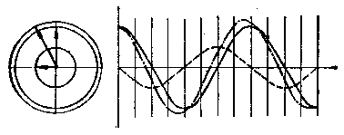

> 图1.16 在一直线上的频率相同的简谐振动的合成

\[
x = A \cos (\omega t + \varphi)
\]

运用数学方法还可以找出这个合成的简谐振动的振幅 A、初相\(\varphi\)与两个分振动的振幅\(A_{1}\)、\(A_{2}\)以及初相\(\varphi_{1}\)、\(\varphi_{2}\)的关系：

> **旁注：** 在同一直线上的两个同频率的简谐振动的合运动也是同频率的简谐振动

\[
A=\sqrt{A_1^2+A_2^2+2A_1A_2\cos(\varphi_2-\varphi_1)} \tag{1.26}
\]

\[
\varphi = \operatorname{tg} ^ {- 1} \frac {A _ {1} \sin \varphi_ {1} + A _ {2} \sin \varphi_ {2}}{A _ {1} \cos \varphi_ {1} + A _ {2} \cos \varphi_ {2}} \tag {1.27}
\]

* 关于上述两式的证明， 可将前式展开后得出， 具体方法如下：

\[
\because x _ {1} = A _ {1} \cos (\omega t + \varphi_ {1}) = A _ {1} (\cos \omega t \cos \varphi_ {1} - \sin \omega t \sin \varphi_ {1})
\]

\[
x _ {2} = A _ {2} \cos (\omega t + \varphi_ {2}) = A _ {2} (\cos \omega t \cos \varphi_ {2} - \sin \omega t \sin \varphi_ {2})
\]

\[
\therefore x = x _ {1} + x _ {2} = (A _ {1} \cos \varphi_ {1} + A _ {2} \cos \varphi_ {2}) \cos \omega t
\]

\[
- \left(A _ {1} \sin \varphi_ {1} + A _ {2} \sin \varphi_ {2}\right) \sin \omega t
\]

现在假设

\[
A_1\cos\varphi_1+A_2\cos\varphi_2=A\cos\varphi
\]

\[
A_1\sin\varphi_1+A_2\sin\varphi_2=A\sin\varphi
\]

于是上式变为

\[
x = A \cos \omega t \cos \varphi - A \sin \omega t \sin \varphi
\]

即\(x = A\cos (\omega t + \varphi)\) 将前面所假设的两式②、①相除，即可得出

\[
\operatorname{tg} \varphi = \frac {A _ {1} \sin \varphi_ {1} + A _ {2} \sin \varphi_ {2}}{A _ {1} \cos \varphi_ {1} + A _ {2} \cos \varphi_ {2}}
\]

再找出两式的平方和 ①\(^{2}\)+②\(^{2}\)，即可得出

\[
A ^ {2} = A _ {1} ^ {2} + A _ {2} ^ {2} + 2 A _ {1} A _ {2} \cos (\varphi_ {2} - \varphi_ {1})
\]

即\(A = \sqrt{A_1^2 + A_2^2 + 2A_1A_2\cos(\varphi_2 - \varphi_1)}\) 图1.16所示的作合振动图线的方法是一种常用的振动合成的作图法。只要几个分振动是在一直线上的，无论它们的频率是否相同，都可以运用这种方法来作合振动图线。但是这种方法比较麻烦，而且也不容易作得准确。现在来介绍一种关于在一直线上两个频率相同的简谐振动的合成的比较简便的作图法，称为旋转矢量合成法。

所谓旋转矢量，是一种表示简谐振动的简便方法。如图1.17（a）所示，我们可以用旋转矢量\(\overrightarrow{OM}\)表示简谐振动：

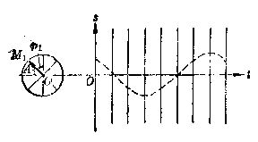

> （a）

> （b）

> 图1.17 表示简谐振动的\(x_{1} = A_{1}\cos (\omega t + \varphi_{1})\)的旋转矢量

\[
x_1=A_1\cos(\omega t+\varphi_1)
\]

用矢量的长度\(OM_{1}\)表示简谐振动的振幅\(A_{1}\)，用矢量与铅直线所成的夹角表示简谐振动的初相角\(\varphi_{1}\)。当矢量\(\overrightarrow{OM_{1}}\)以点\(O\)为圆心，按逆时针方向以角速度\(\omega\)开始旋转以后，矢量在任何时刻\(t\)在铅直平面上的投影就可以用来表示这个简谐振动在时刻\(t\)的位移\(x_{1}\)。图1.17（b）就是根据旋转矢量\(\overrightarrow{OM_{1}}\)作出的关于简谐振动 \(x_{1}=A_{1}\cos(\omega t+\varphi_{1})\)的振动图线。

同样，我们可以用旋转矢量\(\overrightarrow{OM}\)表示简谐振动：

\[
x_2=A_2\cos(\omega t+\varphi_2)
\]

如图1.18所示， 图1.18（b）也是根据旋转矢量 \(\overrightarrow{OM_{2}}\)作出的关于简谐振动\(x_{2}=A_{2}\cos(\omega t+\varphi_{2})\)的振动图线。

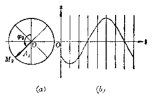

> 图 1.18 表示简谐振动\(x_{2}=\)

> \(A_{2}\cos (\omega t + \varphi_{2})\)的旋转矢量

如果上述两个简谐振动是在一直线上的两个分振动，而且它们的圆频率\(\omega\)是相等的，那么我们就可以运用矢量的合成法则作出表示它们的合振动的旋转矢量\(\overrightarrow{OM}\)，如图1.19（a）所示，图1.19（b）就是根据旋转矢量\(\overrightarrow{OM}\)作出的合简谐振动的振动图线。

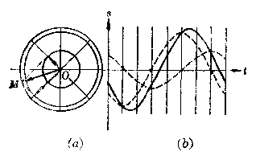

> 图 1.19 利用旋转矢量合成法作出在一直线上两个频率相同的简谐振动的合振动图线

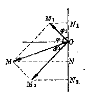

> 图1.20

为什么我们可以运用矢量合成的法则来作合简谐振动的旋转矢量呢？这可以从图1.20所示的关系中看出来。图中点\(M\)、\(M_{1}\)、\(M_{2}\)分别表示合振动和两个分振动的参考点的起始位置，根据\(OM_{1}MM_{2}\)是平行四边形的关系可以列出起始时合振动与分振动的位移关系：

\[
\overline{ON}=\overline{ON}_1+\overline{ON}_2
\]

即\(A\cos \varphi = A_{1}\cos \varphi_{1} + A_{2}\cos \varphi_{2}\) 式中\(A, A_{1}, A_{2}\)依次为合振动和分振动的振幅；\(\varphi, \varphi_{1}, \varphi_{2}\)依次为合振动和分振动的初相角。很明显，当两个分振动的矢量\(\overrightarrow{OM_{1}}\)和\(\overrightarrow{OM_{2}}\)同时以同样的角速度\(\omega\)旋转时，它们的位相差\(\varphi_{2} - \varphi_{1}\)在任何时刻都保持不变，因此合振动的矢量\(\overrightarrow{OM}\)的长度也始终不变，而且也保持同样的角速度\(\omega\)。所以合振动的方程可以写作

\[
x=A\cos(\omega t+\varphi)
\]

而且公式（1.26）、（1.27）也都可以从图1.20中得到证明。

#### 二、两个重要的特殊情况

由公式（1.26），我们还可以看出：合成的简谐振动的振幅\(A\)与两个分简谐振动的位相差\(\varphi_{2} - \varphi_{1}\)有着密切的联系。下面就来讨论两个重要的特殊情况：

（1） 当两个分简谐振动的位相差\(\varphi_{2} - \varphi_{1}\)等于零，或者等于\(2\pi\)的整数倍时，它们振动的步调是完全一致的，称为同相。这时两振动相互增强，因而合成的简谐振动的振幅最强。从公式（1.26）亦可看出：当\(\varphi_{2} - \varphi_{1} = \pm 2K\pi\)，而\(K = 0, 1, 2\cdots\)等正整数时，则\(\cos (\varphi_{2} - \varphi_{1}) = +1\)，合成的简谐振动的振幅

\[
A = \sqrt {A _ {1} ^ {2} + A _ {2} ^ {2} + 2 A _ {1} A _ {2}} = A _ {1} + A _ {2}
\]

如图1.21所示。

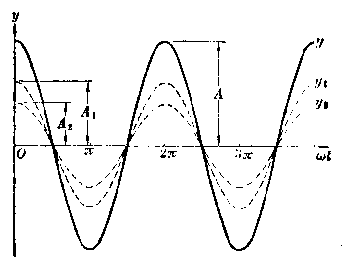

> 图1.21 两个同相分振动的合成

（2） 当两个分简谐振动的位相差\(\varphi_{2} - \varphi_{1}\)等于\(\pi\)，或者等于\(\pi\)的奇数倍时，它们振动的步调恰好相反，称为反相。这时两振动相互减弱，因而合成的简谐振动的振幅最小。从公式（1.26）亦可看出：当\(\varphi_{2} - \varphi_{1} = \pm (2K + 1)\pi\)，而\(K = 0, 1, 2\cdots\)等正整数时，则\(\cos (\varphi_{2} - \varphi_{1}) = -1\)，合成的简谐振动的振幅

\[
A = \sqrt {A _ {1} ^ {2} + A _ {2} ^ {2} - 2 A _ {1} A _ {2}} = \left| A _ {1} - A _ {2} \right|
\]

如图 1.22 所示。如果原来\(A_{1}=A_{2}\)，那么合成的简谐振动的振幅就完全减弱为零了。

关于这两个特殊情况很重要，它是我们在下一章里研究波的干涉现象的基础，因此务必把它理解清楚。

> **旁注：** 在一直线上频率相同的两个简谐振动，同相则相互增强；反相则相互减弱

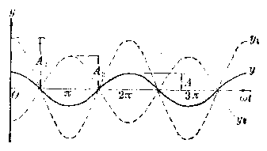

> 图1.22 两个反相的分振动的合成

##### 例 8

下面是两个在一直线上的简谐振动的方程：

\[
x _ {1} = 20 \cos \left(3 \pi t + \frac {\pi}{2}\right)
\]

\[
x_2=15\sin\left(3\pi t-\frac{\pi}{2}\right)
\]

试求它们的合振动方程。

**解：** 先将两个分振动方程化为简谐振动的一般形式：

\[
x_1=20\cos\left(3\pi t+\frac{\pi}{2}\right)
\]

\[
x_2=15\cos(3\pi t-\pi)
\]

通过对比可知它们的圆频率相同，因此可按公式（1.26）、（1.27）算出它们的合振动方程：

\[
\begin{array}{l} A = \sqrt {A _ {1} ^ {2} + A _ {2} ^ {2} + 2 A _ {1} A _ {2} \cos (\varphi_ {2} - \varphi_ {1})} \\ = \sqrt {20 ^ {2} + 15 ^ {2} + 2 (20) (15) \cos \left(- \frac {3 \pi}{2}\right)} \text{米} \\ = 25 \text{米} \\ \end{array}
\]

\[
\mathrm{tg} \varphi = \frac {A _ {1} \sin \varphi_ {1} + A _ {2} \sin \varphi_ {2}}{A _ {1} \cos \varphi_ {1} + A _ {2} \cos \varphi_ {2}}
\]

\[
= \frac {20 \sin \frac {\pi}{2} + 15 \sin (- \pi)}{20 \cos \frac {\pi}{2} + 15 \cos (- \pi)} = - \frac {4}{3}
\]

\[
\therefore \quad \varphi = 2.21 \text{弧度}
\]

可见合振动方程为

\[
x=25\cos(3\pi t+2.21)
\]

#### 三、在一直线上的几个频率不同的简谐振动的合成

至于在一直线上频率不同的两个简谐振动的合成问题就要复杂得多，因为它们的合振动已经不再是一个简谐振动了。

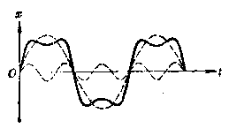

> 图1.23 频率成倍数的两个简谐振动的合成

图 1.23 中的两条虚曲线表示两个在一直线上的频率成倍数的简谐振动的振动图线；而实曲线就是它们的合运动的振动图线，从图上可以明显地看出，它们的合适动已经不再是简谐振动了，但还是个周期性的振动，它的频率是与两个分振动中的最低频率相等的。这个结论对于两个以上频率成倍数的在一直线上的简谐振动的合成也是适用的，即合振动的频率就等于各个分振动中的最低频率。

既然几个频率成倍数的简谐振动可以合成一个周期性的振动，那么反过来，任何一个周期性的振动也都可以分解成一系列频率成倍数的简谐振动。在这一系列简谐振动中，频率最低的分振动称为基频振动，它的频率是与原振动一致的；其他的分振动的频率都等于基频的整数倍，因而称为倍频振动。

> **旁注：** 几个在一直线上、频率成倍数的简谐振动的合运动是个周期性的振动，它的频率是与分振动中的最低频率相等

### § 1.8 阻尼振动和受迫振动

#### 1. 阻尼振动

前面所讨论的振动， 都是不考虑阻力的自由振动， 即在振动过程中假设机械能是守恒的振动。这显然是理想的情况。因此对于这些振动系统， 只要有外力使它振动起来， 它就会持续地振动不停。系统在自由振动中， 它的振幅是不会减小的， 它振动的频率与周期完全决定于系统本身的特性， 是按它的固有频率或固有周期振动的。

但是在实际情况中，外界对振动系统的摩擦阻力是不可避免的。例如当水平放置的弹簧振子在开始振动后，由于滑动摩擦力的存在，必须不断克服阻力作功，因此振动的能量很快就会被消耗掉，振动几次就停止下来；单摆在振动过程中由于只受到空气阻力，它的振动尚能持续一段时间。随着能量的被消耗，单摆的振幅逐渐减小，最后静止在它的平衡位置上。象这种振动的能量与振幅会随时间减小的现象称为振动的阻尼；振幅会随时间逐渐减小的振动称为阻尼振动，或称减幅振动。图1.24是阻尼振动的图线，从图上可明显看出：它的振幅是在逐渐减小，因此阻尼振动已经不再是简谐振动了。严格地说，阻尼振动也不是周期性振动了，但如果阻尼较小，就可以近似地看作具有周期的简谐振动。在这种情况下，阻尼振动的周期不仅与振动系统本身的特性有关，而且与阻尼的大小和性质也有关系。对于一定的振动系统说来，有阻尼存在时的振动周期要比没有阻尼，自由振动时的周期大些。

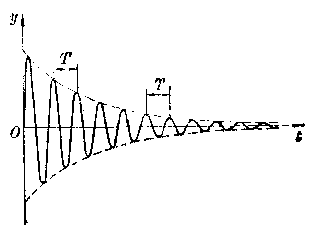

> 图1.24 阻尼振动图线

振动的阻尼现象是普遍存在的，锣声持续一段时间就消失，表明锣面的振动是阻尼振动。有时为了减少能量消耗而设法减小振动的阻尼。例如在钟表里为了使摆轮的振动减小阻尼，就要经常在摆轮的轴承里添加润滑油。有时为了不让系统作往复振动而很快回到它的平衡位置上，就需要设法增大振动的阻尼。例如在各种常用的电工仪表中，为了使仪表指针在工作时能很快地静止下来，而不会在它的平衡位置左右摆动一段时间造成读数的困难，通常在仪表里都设有阻尼器，产生阻尼作用来阻止指针的来回摆动。

#### 2. 受迫振动

我们知道阻尼振动的振幅减小的原因就在于振动系统的能量的消耗， 如果在振动过程中， 外界不断向系统提供能量， 那么即使存在阻力， 系统的振动也可以做到无阻尼， 即振幅不会减小， 通常把振幅保持不变的振动称为无阻尼振动， 或称等幅振动。

振动系统在周期性的外力持续作用下所作的无阻尼振动称为受迫振动，而这个周期性的外力就称为策动力，或称强迫力。例如缝纫机上机针的上下振动、扬声器（喇叭）中纸盆的振动都是在外界的策动力作用下进行的，因而都是受迫振动。又如机器开动时所引起的机座的振动、人在架空的木板上走动时木板的振动也都是受迫振动。

下面我们就利用图1.25所示的装置来研究受迫振动的规律。一个竖直放置的弹簧振子\(D\)拴在一根细线上，细线的另一端是固定在一根水平曲轴的点\(O\)上的。挡板\(B\)是用来保证弹簧振子只作上下振动而不会左右摆动的。水平曲轴由木架支撑着，通过转动手可以使曲轴转动。在用手匀速转动把手的过程中，曲轴上的点\(O\)就通过细线给弹簧振子一个周期性的策动力，这个策动力变化的周期就等于把手转动的周期。

实验表明：当开始用手匀速转动手时，弹簧振子的振动是十分复杂的，看不出它有什么规律。但经过很短的一段时间以后，弹簧振子的振动就达到稳定的状态。如果用不同的速度转动把手， 反复地进行上述实验数次， 就会发现在达到稳定状态以后， 弹簧振子的振动周期是与策动力的变化周期相同的。 这就是说， 作受迫振动的系统在达到稳定状态后的振动频率（或周期）就等于它所受的策动力的变化频率（或周期）， 而与系统的固有频率（或固有周期）没有关系。

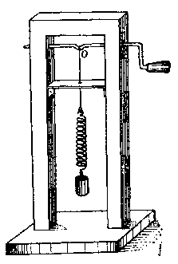

> 图1.25 研究受迫振动的规律的装置

为什么稳定后的受迫振动的频率就等于策动力的变化频率，而与系统的固有频率无关呢？当弹簧振子开始作受迫振动时，它同时参与着两种振动：一种是随着策动力的变化频率进行的无阻尼振动；另一种是按它的固有频率进行的阻尼振动。因此我们在开始观察到的弹簧振子的振动就是上述两种振动的合振动。这就是弹簧振子在开始所作的受迫振动为什么十分复杂的原因。在经过一段很短的时间以后，弹簧振子按固有频率进行的阻尼振动的振幅已经衰减到零。于是弹簧振子就开始稳定地按策动力的变化频率作无阻尼振动了。

> **旁注：** 稳定后的受迫振动的频率就等于策动力的变化频率而与固有频率无关

从能量上看来，受迫振动在稳定后，外界策动力对振动系统所作的功就恰好等于振动系统因阻尼而损耗的能量。因此，稳定的受迫振动是简谐振动。

#### 3. 共振

下面进一步来研究受迫振动的振幅的大小是与哪些因素有关的。

在一根绷紧的细绳\(LL'\)上同时挂着七个单摆\(A, B, C, D, E, F, G\)（图1.26）。 为了防止单摆的左右晃动， 我们可以把每一个摆拴在两根细线上，但它们的摆长还是应该按图上的实际摆长来量度。其中摆B和摆G的摆长与摆A的摆长相等；摆D的摆长较长；摆E的摆长较短。同时摆A具有质量较大的摆锤。当摆A作简谐振动时，它就通过绷紧的细绳，对其他六个单摆施加周期性的策动力，使它们也跟着它作受迫振动。但实验表明，在这六个作受迫振动的单摆中，摆 B、摆 G 的振动比较显著，即具有较大的振幅，而摆 D、摆 E 的振动不很显著，即它们的振幅都很小。

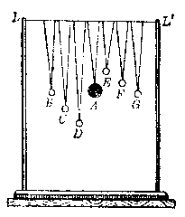

> 图1.26 共振现象的演示装置

我们知道，振幅的大小标志着振动能量的大小。为什么摆 A 对摆 B 提供能量多，而对摆 D、摆 E 就提供很少的能量呢？这就涉及到外界的策动力对受迫振动系统所作的功的效果问题。很明显，如果策动力的方向与单摆振动的方向一致，策动力就作正功，使作受迫振动的单摆能量增大；如果策动力的方向与单摆振动的方向正相反，策动力就作负功，使作受迫振动的单摆能量减少。因此外界策动力对受迫振动系统所作的功的效果如何，主要决定于策动力的变化频率与受迫振动系统的频率是否步调一致。例如我们要用力来使坐着小孩的秋千摆动起来，就必须顺着它的势来推，即使推力很小，只要是与秋千的摆动的步调一致的，就可以使秋千摆动的振幅增大。如果推力与秋千摆动的步调不一致，就不能使秋千很好地摆动。由此可见，当摆A的振动通过绷紧的细绳对其余六个单摆施加策动力时，这个策动力的变化频率就等于摆A的固有频率。正是由于摆B的摆长与摆A相等，这就保证了策动力的变化频率与受迫振动系统的频率步调一致，因此摆A对摆B所提供的能量就多，摆B的振幅就大。相反，由于摆D、摆E的摆长与摆 A 不等，表明策动力的变化频率与受迫振动系统的频率有很大的偏差，因此摆 A 对摆 D、摆 E 的策动力所作的功效果很差，所提供的能量也很少，摆 D、摆 E 的振幅就小。

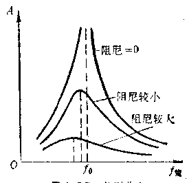

> 图1.27 共振曲线

受迫振动的振幅与外界策动力的变化频率的当外界策动力的变化频率接近于振动系统的固有频率时，受迫振动的振幅最大，这种现象称为共振还可以从图1.27的曲线上反映出来。无论是在阻尼较大或阻尼较小的情况下，当外界策动力的变化频率接近于振动系统的固有频率时，受迫振动的振幅最大，这种现象称为共振。这个与系统的固有频率相等的策动力的变化频率就称为共振频率。

共振现象在声学、光学、无线电以及工程技术等领域中都具有很重要的意义。例如在农业机械和矿山机械中常用的共振筛，就是利用共振的原理设制而成的，它可以使小功率的马达带动大筛子以产生较大的振幅，提高生产效率。关于共振现象在其他方面的应用将在以后各章中具体讨论。

然而，在其他的情况下共振现象又是有害的，必须设法避免。例如当部队或火车过桥时，整齐的步伐或火车轮对铁轨衔接处的撞击都会对桥梁产生周期性的策动力。如果这个策动力的变化频率接近于桥梁的固有频率，就要发生共振，使桥梁的振幅大到足以使桥梁断裂的程度。因此火车在过桥时必须放慢速度，使这种撞击力的频率远离共振频率；部队过桥时也要避免整步走，以防止由整齐步伐产生的力对桥梁周期性的冲击所引起的共振现象。

#### 习题1.8

1. 几个在一直线上的频率成倍数的简谐振动的合振动具有什么特点？

2. 共振现象是在什么情况下发生的？

3. 挑水桶担走路时，为什么有时桶里的水会振荡得很厉害而就出来？怎样才能避免这种现象？

4. 求两个在一直线上的振动

\[
x _ {1} = 3 \cos \left(16 \pi t + \frac {\pi}{4}\right)
\]

\[
x _ {2} = 5 \cos 16 \pi t
\]

的合振动方程，并作出它们的振动图线。

5. 在同一直线上的两个简谐振动的方程分别为

\[
x _ {1} = 0.3 \cos (3 \pi t + \varphi_ {1})
\]

\[
x _ {2} = 0.4 \cos (3 \pi t + \varphi_ {2})
\]

试列出：

（1）\(\varphi_{2}-\varphi_{1}=0\)时，它们的合振动方程；

（2）\(\varphi_{2}-\varphi_{1}=\frac{\pi}{2}\)时，它们的合振动方程。

6. 已知每节火车车厢的质量为 50 吨，车厢底部支承弹簧的等效屈强系数为\(1.6 \times 10^{3}\)牛/米，求火车车厢上下振动的固有频率。同时火车在行驶中车轮在铁轨衔接处所受的撞击力是周期性的，如果每节铁轨长12.8米，问火车车速多大时，车厢上下振动特别强烈？

### 本章提要

1. 物体在它的平衡位置附近沿直线或弧线来回往复的运动就称为机械振动，简称振动。振动物体所受的方向指向平衡位置的合外力称为回复力。物体所受的回复力和物体本身的惯性是它发生振动的必要条件。

2. 每隔一个固定的时间间隔完全重复一次的振动是具有周期性的振动，这个使振动重复出现的最小时间间隔称为振动的周期\(T'\)（秒）；单位时间内的振动周期数称为振动的频率\(f\)（赫），频率与周期的关系是

\[
f = \frac {1}{T ^ {\prime}}
\]

3. 在与位移成正比而方向相反的回复力作用下的振动称为简谐振动。简谐振动的加速度与位移具有下列关系：

\[
a = - \omega^ {2} x
\]

利用作参考圆的方法可以导出简谐振动的位移随时间的变化关系：

\[
x = A \cos (\omega t + \varphi)
\]

称为简谐振动方程，式中振幅 A 反映简谐振动的幅度，是作简谐振动的质点离开平衡位置的最大位移。

圆频率\(\omega\)反映简谐振动的快慢，是参考点在参考圆上的角速度，即作简谐振动的质点在\(2\pi\)秒内作全振动的次数：

\[
\omega=2\pi f=\frac{2\pi}{T}
\]

位相\((\omega t + \varphi)\)反映简谐振动的状态，即反映作简谐振动的质点在时刻\(t\)的运动状态，包括它的位置和位移变化的趋势。其中\(\varphi\)是\(t = 0\)，即开始计时时的位相。

4. 由质量为\(m\)的物体拴在一根一端固定的倔强系数为\(K\)的轻质螺旋弹簧上构成的振动系统称为弹簧振子。 在弹性限度内， 弹簧振子的振动是简谐振动。

弹簧振子的圆频率

\[
\omega = \sqrt {\frac {K}{m}}
\]

弹簧振子的周期

\[
T = 2 \pi \sqrt {\frac {m}{K}}
\]

弹簧振子的频率

\[
f = \frac {1}{2 \pi} \sqrt {\frac {K}{m}}
\]

弹簧振子的振动方程

\[
x = A \cos \left(t \sqrt {\frac {K}{m}} + \varphi\right)
\]

5. 将质量为\(m\)的摆锤拴在一根一端固定的长度为\(l\)的细线上构成的振动系统称为单摆。当摆角小于\(5^{\circ}\)，或0.0873弧度时，单摆的振动是简谐振动。

单摆的圆频率

\[
\omega=\sqrt{\frac{g}{l}}
\]

单摆的周期

\[
T = 2 \pi \sqrt {\frac {l}{g}}
\]

单摆的频率

\[
f=\frac{1}{2\pi}\sqrt{\frac{g}{l}}
\]

单摆的振动方程

\[
x = A \cos \left(t \sqrt {\frac {g}{l}} + \varphi\right)
\]

6. 质点作简谐振动的过程就是系统的动能与势能相互转换的过程，但总能量保持不变。

简谐振动的能量

\[
E = \frac {1}{2} m \omega^ {2} A ^ {2}
\]

弹簧振子的能量

\[
E=\frac12KA^2
\]

单摆的能量

\[
E=\frac12\frac{mg}{l}A^2
\]

7. 在同一直线上两个频率相同的简谐振动

\[
x _ {1} = A _ {1} \cos (\omega t + \varphi_ {1})
\]

\[
x _ {2} = A _ {2} \cos (\omega t + \varphi_ {2})
\]

的合运动也是简谐振动

\[
x = A \cos (\omega t + \varphi)
\]

它的频率与分振动相同；它的振幅与初相分别为

\[
A = \sqrt {A _ {1} ^ {2} + A _ {2} ^ {2} + 2 A _ {1} A _ {2} \cos (\varphi_ {2} - \varphi_ {1})}
\]

\[
\varphi = \operatorname{tg} ^ {- 1} \frac {A _ {1} \sin \varphi_ {1} + A _ {2} \sin \varphi_ {2}}{A _ {1} \cos \varphi_ {1} + A _ {2} \cos \varphi_ {2}}
\]

当两分振动同相时，即它们的位相差

\[
\varphi_ {2} - \varphi_ {1} = \pm 2 K \pi \quad (K = 0, 1, 2, \dots)
\]

时，两振动相互增强，合成的简谐振动的振幅最大

\[
A = \sqrt {A _ {1} ^ {2} + A _ {2} ^ {2} + 2 A _ {1} A _ {2}} = A _ {1} + A _ {2}
\]

当两分振动反相时，即它们的位相差

\[
\varphi_ {2} - \varphi_ {1} = \pm (2 K + 1) \pi \quad (K = 0, 1, 2, \dots)
\]

时，两振动相互减弱，合成的简谐振动的振幅最小

\[
A = \sqrt {A _ {1} ^ {2} + A _ {2} ^ {2} - 2 A _ {1} A _ {2}} = | A _ {1} - A _ {2} |
\]

8. 在同一直线上几个频率成倍数的简谐振动的合运动是一个具有周期性的振动，它的频率就等于各个分振动中的最低频率。频率最低的分振动称为基频振动；其他的分振动称为倍频振动。

9. 振动的能量与振幅会随时间减小的现象称为振动的阻尼；振幅会随时间逐渐减小的振动称为阻尼振动，或称减幅振动。严格地说，阻尼振动既不是简谐振动，也不是周期性振动。

振幅保持不变的振动称为无阻尼振动，或称等幅振动。

10. 振动系统在周期性的外力持续作用下所作的无阻尼振动称为受迫振动。这个周期性的外力称为策动力，或称强迫力。

作受迫振动的系统在达到稳定状态后的振动频率（或周期）就等于它所受的策动力的变化频率（或周期），而与系统的固有频率（或固有周期）没有关系。

当外界策动力的变化频率接近于振动系统的固有频率时，受迫振动的振幅最大，这种现象称为共振。这个与系统的固有频率相等的策动力的变化频率就称为共振频率。

### 复习题一

1. 把一个弹簧振子和一个单摆搬上月球，已知月球上物体的重量约为地球上的六分之一。问弹簧振子和单摆的固有周期有什么影响？

2. 所谓共振时受迫振动的振幅最大是和什么振幅相比较而得出的结论？

3. 归纳起来，你一共学过哪些描述简谐振动的物理量？其中哪些是用来描述振动快慢的？哪些是用来描述振动状态的？哪些决定于振动系统本身的性质？哪些是与振动系统本身的性质无关的？它们之间有些什么关系？

4. 某弹簧振子的质量为 0.2 千克，作简谐振动的周期为 1.5 秒，振幅为 0.05 米，初相为\(\pi / 4\).

（1） 列出它的振动方程；

（2） 求 t=3 秒时的位移、位相和加速度；

（3） 求 t=3 秒时的动能、势能和振动能；

（4） 求弹簧的倔强系数。

5. 某单摆的质量为 0.3 千克，作简谐振动的周期为 2 秒，最大摆角为 0.08 弧度，当地的重力加速度取 9.80 米/秒²，初相为\(\frac{\pi}{3}\)：

（1） 列出它的振动方程：

（2） 求 t=2.5 秒时的位移、位相和加速度；

（3） 求 t=2.5 秒时的动能、势能和振动能。

6. 试利用同一坐标轴作出下列两简谐振动的图线：

\[
x _ {1} = 5 \cos \left(4 \pi t + \frac {\pi}{4}\right)
\]

\[
x _ {2} = 3 \cos \left(4 \pi t + \frac {3 \pi}{4}\right)
\]

并在图上分别标出它们的初相和它们的位相差。然后在同一坐标轴上作出它们的合振动的图线，并列出合振动方程。

7. 某弹簧振子的质量为 0.02 千克，已知弹簧在 12 牛的外力作用下伸长 1.4 厘米，试求弹簧振子的圆频率和固有周期。

8. 已知一质量为 0.1 千克的弹簧振子的振动方程为\(x = 0.5 \cos 2\pi t\)，试求在下列位置上弹簧振子的位移、位相、速度、加速度以及所受弹力的大小和方向：

（1） 在正方向的端点上；

（2） 在平衡位置上， 并有向正方向运动的趋势。

9. 弹簧振子的质量为 0.5 千克， 周期为 2 秒， 求振幅为 5 厘米时的振动能。

10. 试求单摆的摆长，已知当最大摆角为 0.08 弧度时它经过平衡位置时的速度大小为 2 米/秒，并列出振动方程。

11. 已知作简谐振动的质点的位移为 8 厘米、12 厘米时的速度依次为 16 厘米/秒、8 厘米/秒，试求这一振动的振幅和周期。

12. 试证明简谐振动的位移与速度间的关系式为

\[
\frac{v^2}{A^2\omega^2}+\frac{x^2}{A^2}=1
\]

13. 质量为 50 克的质点作简谐振动， 初相为零， 周期为 1.6 秒， 振幅为 5 厘米， 求\(t = \frac{5}{8} T\)时振动的动能和势能。

14. 试证明作简谐振动的质点在时刻 t 的动能、势能和振动能分别为

\[
E_k=\frac12mA^2\omega^2\sin^2(\omega t+\varphi)
\]

\[
E_p=\frac12mA^2\omega^2\cos^2(\omega t+\varphi)
\]

\[
E=\frac12mA^2\omega^2
\]

15. 质量为 0.10 千克的物体以振幅\(1.5 \times 10^{-2}\)米作简谐振动，已知它的最大加速度为 0.4 米/秒\(^{2}\)，求：

（1） 振动的周期；

（2） 通过平衡位置时的动能和速度；

（3） 动能和势能相等时的位移。

16. 讨论在同一直线上的两个简谐振动：

\[
x _ {1} = 12 \cos \left(2 \pi t + \frac {\pi}{3}\right)
\]

\[
x _ {2} = 5 \cos (2 \pi t + \varphi)
\]

的合振动，在什么情况下，振幅最大；在什么情况下，振幅最小。

17. 在水平的光滑面上，质量为\(m\)的滑块两端分别连结在倔强系数为\(K_{1}\)、\(K_{2}\)的螺旋弹簧上，弹簧的另一端都是固定的，如附图所示。把滑块往在移动 A 然后放手，它就沿水平面作往复运动。试列出它的振动方程，并求出它的振动周期。

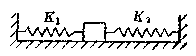

> （第17题）

## 第2章 机械波

18. 质量为\(m\)的子弹以水平速度\(\nu\)射中一水平放置的弹簧振子并嵌在质量为\(M\)的振子内，使原来静止在平衡位置上的弹簧振子振动起来（见附图），若弹簧的倔强系数为\(K\)，试列出它的振动方程。

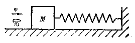

> （第18题）

我们已经初步掌握了机械振动的基本规律，现在进一步来研究机械振动的传播问题。当振动系统的周围存在象空气、水等弹性媒质时，一方面这些弹性媒质对振动系统具有阻力作用；而另一方面振动系统对周围的弹性媒质也有影响，它将使周围的弹性媒质跟着发生振动。同样，由于周围媒质的振动，就使较远的媒质也跟着振动起来，机械波就是机械振动在弹性媒质中由近及远地传播而形成的。

本章主要研究产生机械波的条件和机械波的传播规律：研究用来描述机械波的物理量；并通过惠更斯原理来分析波的干涉和衍射现象。学习时应该首先抓住机械波和机械振动的区别与联系，要分清波形图线和振动图线的区别，然后着重了解机械波的特性。这不仅是为后面学习声学打基础，就是对今后学习电学、光学也是有帮助的。

### § 2.1 机械波的产生条件

往平静的水面上投掷石块，从水面上可以看到以石块的落水点为中心一圈一圈向外扩展的水面波（图2.1），用手拉紧一端固定的橡皮绳的另一端作上下振动，从绳子上可以看到一个一个前凸后凹的波沿着橡皮绳传播开去（图2.2）。 水波是石块在接触水面时所激起的振动在水面的传播；细绳上的波是细绳的自由端所作的受迫振动在细绳上的传播。机械振动在弹性媒质中的传播过程就称为机械波，简称波，或称波动。

> 图2.1

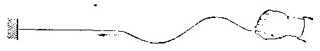

> 图 2.2 橡皮绳上面的后回的波形

如果仔细分析机械波的产生过程，就会发现：要产生机械波，先要有个波源。能使媒质作受迫振动的振动系统，或者在媒质中首先发生振动的质点都可以看作波源。例如在图2.2中，细绳的自由端就可以看作波源。

> **旁注：** 机械振动在弹性媒质中的传播过程就称为机械波

弹性媒质也是产生机械波的一个不可缺少的条件，因为机械振动只能在弹性媒质中传播。所谓弹性媒质是由无限多个连续不断的质点所构成的物质系统，这些质点之间就好比有弹簧连接着一样（图2.3），如果其中有一个质点在外力的作用下离开了它的平衡位置，就会使它与周围质点的距离发生改变， 从而就要受到周围质点对它的弹力作用而发生振动。显然这时周围质点对它的弹力的合力总是指向它的平衡位置的，因而起着回复力的作用。同时根据牛顿第三运动定律可知，这个质点也要对周围质点施加弹力作用，于是周围质点又将在它的弹力作用下偏离平衡位置而发生振动。由此可见，在弹性媒质中，只要有某一部分发生了振动，那么借助于质点间的弹性，振动必然会由近及远地传播开去而形成机械波。所以能传播振动的弹性媒质和使弹性媒质发生振动的波源是产生机械波的必要条件，两者不可缺一。

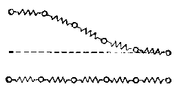

> 图2.3 质点之间就好比有弹簧连接着一样

> **旁注：** 弹性媒质和波源是产生机械波的两个必要的条件

一般地说，固体、液体和气体的质点间或多或少地都具有弹性， 因而机械振动在固体、液体和气体中都可以传播并在它们中间形成机械波。但在真空中机械振动是不能传播的。

### § 2.2 机械波的形成和传播

下面就来具体研究在具备了机械波的产生条件后，机械波是怎样形成和传播的。

#### 1. 横波

首先我们来研究橡皮绳中机械波的形成和传播问题。为了具体分析这个过程，我们设想把橡皮绳均匀分割成许多小段，每一小段都可以用质点表示，并且逐个都编上号。这些质点的质量显然是相等的；质点之间用弹簧连结表示它们之间都是具有弹性的。图2.4（a）就表示起初这些质点都在它们各自的平衡位置上。在质点1（波源）由于受到外力而在竖直方向上作周期为T、振幅为A的简谐振动后，与质点1相连的质点2、3、4…也相继作周期和振幅都相同的受迫振动。正是由于质点的惯性，各个质点的振动不是同时进行的而各具有一定的位相差。

从质点1开始运动算起，当\(t = T / 4\)时，如图2.4（b）所示，质点1已到达它的向上的最大位移点，并将开始向下运动；质点2、3在质点1的牵动下相继向上运动，同时它们的运动已开始影响到质点4。

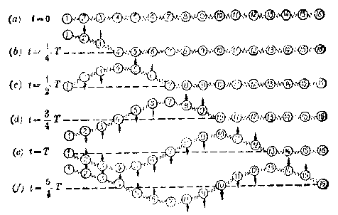

> 图2.4 横波的形成和传播

当\(t = T / 2\)时，如图2.4（c）所示，质点1已回到它的平衡位置，并将继续向下运动；质点2、3已相继通过它们的向上的最大位移点，正在向下运动；质点4刚到达它的向上的最大位移点；质点5、6在质点4的牵动下相继向上运动，同时振动已传到质点7.

当\(t = 3T / 4\)时，如图2.4（d）所示，质点1已到达它的向下的最大位移点，并将开始向上运动；质点2、3已相继通过它们的平衡位置，正在向下运动；质点4刚回到它的平衡位置；质点5、6已相继通过它们的向上的最大位移点，正在向下运动；质点7正在它的向上的最大位移点上；质点8、9正在相继向上运动；同时振动已传到质点10.

当\(t = T\)时，如图2.4（e）所示，质点1已完成了一次全振动，并将继续向上运动；质点4已到达它的向下的最大位移点，并将开始向上运动；质点7从上方回到它的平衡位置，并将继续向下运动；质点10已到达它的向上的最大位移点，并将开始向下运动；同时振动已传到质点13.

这时由质点1到质点18就形成一个完整的波形，向上凸起的最高处称为波峰；向下凹进的最低处称为波谷。

当\(t = 5T / 4\)时，如图2.4（f）所示，虽然质点1、2、3、4又重新到达它们在\(t = T / 4\)时的位置，但这时振动已传到质点16。同时波峰已前移到质点13；波谷已前移到质点7。因此只要橡皮绳足够长，随着时间的迁移，波形将不断向右移动，这个过程通常就称为机械波的传播过程。

在机械波的传播过程中，虽然波形是沿着波的传播方向不断向前运动，但是对于每一个弹性媒质的质点说来，它们并没有随着波形一起向右运动，而只是在它们各自的平衡位置附近作简谐振动，例如浮在水面上的树叶、纸团在水波经过时，只是跟着它所在的水面作上下振动，而并不会随着水波作任何迁移。由此可见：机械波只是振动形式的传播，而媒质本身并没有发生迁移，这是机械波的一个很重要的特点。

> **旁注：** 机械波只是振动形式的传播，而媒质本身并没有发生迁移

当机械波在媒质中传播时，原来静止的质点在波的带动下振动起来，这表明它们已经获得了能量。正是由于波源把能量传播给周围的质点，质点才振动起来的。因此波源就是能源，机械波的传播过程，实质上就是能量的传播过程。但是它与其他的能量传递过程不同，通过机械波来传播能量的质点（即波源），本身可以不必作任何迁移。

> **旁注：** 机械波的传播过程实质上就是能量的传播过程，而传播能量的质点不必作任何迁移

以上所讨论的机械波在橡皮绳中的传播， 各个质点的振动方向是与波的传播方向相互垂直的， 这样的波称为横波。

#### 2. 波形图线

为了把机械波的传播情况形象地表示出来，通常可以作一个直角坐标，用横坐标 r 表示在波传播方向上的质点距波源 O 的距离，而用纵坐标 y 表示质点相对于各自平衡位置的位移（图 2.5）。于是根据实际情况把各个质点在同一时刻 t 的位移依次作在这个坐标图上，由这些点连结而成的图线就称为这一列机械波在时刻 t 的波形图线。

例如图2.4（b）就可以看作是橡皮绳上的机械波在\(t = T / 4\)时的波形图线；而图2.4（d）就可以看作是\(t = 3T / 4\)时的波形图线。比较同一列机械波在不同时刻的波形图线，就可以了解到这一列波的传播情况。

虽然波形图线和振动图线在形式上十分类似，但是这两种图线在本质上是有很大区别的。振动图线是用来描述某一个振动质点在一段时间内的运动情况的；而波形图线则用来描述一系列振动质点在某一时刻的位移情况的。虽然它们的纵坐标都表示位移，但是它们的横坐标却是不同的。振动图线的横坐标\(t\)表示时间，因此振动图线表示某一个振动质点位移随时间的变化关系。波形图线的横坐标\(r\)表示在波的传播方向上的质点距波源 O 的距离，因此波形图线只能表示在波的传播方向上的一系列质点在某一时刻的位移情况。

> **旁注：** 振动图线描述某一个振动质点的位移随时间变化的关系，而波形图线描述一系列振动质点在某一时刻的位移情况

然而机械波在传播过程中，媒质中各个质点都在作受迫振动。如果不考虑阻尼，沿着机械波的传播方向上的一系列质点的振动情况，包括它们的振幅都和波源的振动相同，只是各具有一定的位相差。因此任何时刻的波形图线与波源的振动图线在形象上是完全一致的。例如某个波源在作简谐振动，它的振动图线是余弦曲线；那么在媒质中任何质点的振动图线也都是幅度相同的余弦曲线，只是各具有一定的位相差；而在媒质中传播所形成的波就是一列简谐波，它在任何时刻的波形图线也都是幅度相同的余弦曲线。

##### 例 1

试根据图 2.4（f） 进一步作出\(t=\frac{3T}{2}\)和\(t=\frac{7T}{4}\)时这 16 个质点所形成的波形图线，并标出各个质点当时的运动趋势。

**解：** 由于质点1（波源）所作的是简谐振动，因此这些质点在任何时刻所形成的波形图线总是余弦曲线，只是各点位置不同而已。

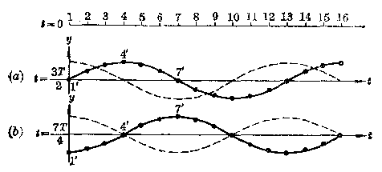

> 图2.5\(t = \frac{3}{2} T\)和\(t = \frac{7}{4} T\)时的波形图线

一种比较方便的作法是根据\(t=\frac{3T}{2}\)与图2.4（f）所表示的\(t=\frac{5T}{4}\)的波形相差\(\frac{T}{4}\)的关系先作出某些特殊质点（如质点1、4、7、10、13、16等）在\(t=\frac{3T}{2}\)时的位置，初步得出要作的波形的轮廓；再通过波峰和波谷沿波的传播方向的平移，作出其他的质点在\(t=\frac{3T}{2}\)时的位置；最后用曲线板将作出的各质点的位置连结成光滑的余弦曲线，就是在\(t=\frac{3T}{2}\)时的波形图线。在图2.5（a）中，虚曲线就是照抄图2·4（f）的\(t=\frac{5T}{4}\)时的波形图线；根据相差\(\frac{T}{4}\)的关系确定的特殊质点1、4、7…在\(t=\frac{3T}{2}\)时的位置为\(1'\)、\(4'\)、\(7'\)…；再通过波峰和波谷的平移确定质点2、3、5、6…在\(t=\frac{3T}{2}\)。

时的位置； 最后把它们连结成的实曲线就是\(t = \frac{3T}{2}\)时的波形图线。 在图2.5（b）中， 运用同样的方法先根据相差\(\frac{T}{2}\)的关系确定特殊质点1、4、7…在\(t = \frac{7T}{4}\)时的位置； 再通过波峰和波谷的平移确定质点2、3、5…等在\(t = \frac{7T}{4}\)时的位置； 最后把它们连结成实曲线就是\(t = \frac{7T}{4}\)时的波形图线。

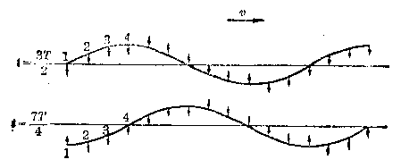

> 图 2.6 标出当时质点的运动趋势

在图2.6中，标在质点1、2、3…上的箭头表示该质点当时的运动趋势。由于波的传播方向是向右的，因此任何一个质点振动的位相总要比左邻质点的落后一些。如果左邻质点的位置与它相比，是在它的上方（或下方），那么这个质点运动的趋势就是向上（或向下）。

#### 3. 纵波

除了横波，还有另一种波，各个质点的振动方向是与波的传播方向在一直线上的，这样的波称为纵波。

用许多根细线把一根螺旋弹簧悬挂起来，使它保持水平如图2.7所示。然后用手拉住弹簧的左端沿着水平方向慢慢地作简谐振动，就可以看到弹簧的各个部分也相继振动起来。前面我们看到的横波的传播过程是一系列波峰和波谷沿波的传播方向移动；现在我们则看到纵波的传播过程是一系列疏、密状态沿波的传播方向移动。这是因为每当弹簧左端向右挤压时，附近的弹簧就受到压缩而处于密集状态；每当弹簧左端向左拉开时，附近的弹簧就受到拉伸而处于稀疏状态。由于弹簧各部分之间的弹性作用，这些弹簧的疏、密状态就逐渐向右移动。

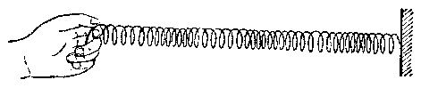

> 图 2.7 螺旋弹簧上的纵波

为了具体分析这个过程，象分析横波的形成和传播一样，也可以用一系列由弹簧连结着的质点来代替图2.7中的大弹簧。图2.8（a）就表示起初这些质点都在它们各自的平衡位置上，在质点1（波源）沿水平方向作周期为T、振幅为A的简谐振动后，与质点1相连的质点2、3、4…也相继作周期和振幅都相同的受迫振动。同样，这样质点的振动也各具有一定的位相差。

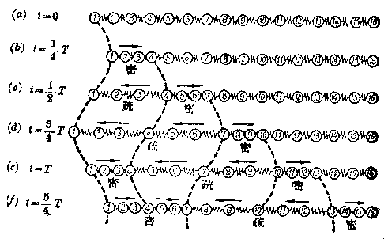

> 图2.8 纵波的形成和传播

从质点1开始运动算起，当\(t = T / 4\)时，如图2.8（b）所示，质点1已到达它的向右的最大位移点，并将开始向左运动： 质点 2、3 由于受到质点 1 的挤压相继向右运动， 同时它们的振动已开始影响到质点 4. 这样质点 1、2、3、4 就处于密集状态。

当\(t = T / 2\)时，如图2.8（c）所示，质点1已回到它的平衡位置，并将继续向左运动；质点2、3已相继通过它们的向右的最大位移点，正在向左运动；质点4刚到达它的向右的最大位移点；质点5、6在质点4的挤压下相继向右运动，同时振动已传到质点7，而且质点\(1\sim 4\)处于稀疏状态，而质点\(4\sim 7\)处于密集状态。

当\(t = 3T / 4\)时，如图2.8（d）所示，质点1已到达它的向左的最大位移点，并将开始向右运动；质点2、3已相继通过它们的平衡位置，正在向左运动；质点4刚回到它的平衡位置；质点5、6已相继通过它们的向右的最大位移点，正在向左运动；质点7正在它的向右的最大位移点上；质点8、9正在相继向右运动；同时振动已传到质点10，而且质点\(1\sim 7\)处于稀疏状态，质点\(7\sim 10\)处于密集状态。

当\(t = T\)时，如图2.8（e）所示，质点1已完成了一次全振动又回到它的平衡位置，并将继续向右运动；质点4已到达它的向左的最大位移点，并将开始向右运动；质点7已回到它的平衡位置，并将继续向左运动；质点10已到达它的向右的最大位移点，并将开始向左运动；同时振动已传到质点13，而且质点\(10\sim 13\)已处于密集状态，质点\(1\sim 4\)又处于新的密集状态，质点\(4\sim 10\)处于稀疏状态。

当\(t = \frac{5T}{4}\)时，如图2.8（f）所示，虽然质点1、2、3、4又重新到达它们在\(t = \frac{T}{4}\)时的位置，但这时振动已传到质点16。即密集状态已传到质点14、15、16；疏部已传到质点7~13。只要螺旋弹簧足够长，随着时间的迁移，这些弹簧的疏、密状态将不断向右移动。这就是纵波的形成和传播过程。

关于纵波的波形图线在形式上是与横波的波形图线十分类似的。这是因为我们规定波形图线的纵坐标是质点相对于平衡位置的位移的缘故。通常把质点沿纵波传播方向上的位移定为正位移作在横坐标轴的上方；而把相反方向上的位移定为负位移作在横坐标轴的下方。所以在波形图上，纵波具有类似于横波的波形图线。由此可见：象图2.8中的各图只能看作是当一列纵波经过时，在弹簧中各个质点在各个时刻\(t\)的位置图，而不能看作是这一列纵波的波形图线。

掌握了某一列纵波在某一时刻\(t\)各质点的位置图以后，如何作出它的波形图线来呢？这可以按照图2.9所示的方法进行。图2.9（a）表示沿纵波传播方向上一系列质点的平衡位置；图2.9（b）表示一列纵波在时刻\(t\)各质点的实际位置。在作这一列纵波在时刻\(t\)的波形图线，先按照图2.9（c）那样作好横坐标轴\(\sigma\)和纵坐标轴\(y\)，并依次在横坐标轴上确定各质点的平衡位置，然后比较图2.9（a）、（b）

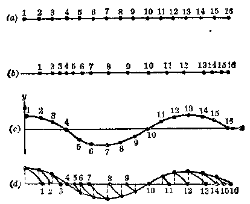

> 图2.9 纵波的波形图线的作法

得出各质点在时刻\(t\)相对于它们各自的平衡位置的位移。按照规定象质点1、2、3的位移是正的，而质点5、6…的位移是负的。在把各个质点的位移依次作在图上以后，用曲线板将这些点连接成光滑的曲线，如图2.9（c）所示，就是要作的纵波在时刻\(t\)的波形图线。如果已经掌握了纵波在某一时刻\(t\)的波形图线，就可以按图2.9（d）所示的方法作出各质点在该时刻\(t\)的实际位置。即以各质点的平衡位置为圆心，以它们的位移为半径作圆弧与横坐标轴的交点就是这些质点在时刻\(t\)的实际位置。作图时应该注意到：正位移表示质点沿纵波传播方向运动，交点应在平衡位置的右方；负位移表示质点沿相反的方向运动，交点应在平衡位置的左方。

在气体和液体中， 机械波只能按纵波的形式传播； 而在固体中， 机械波既可以按纵波又可以按横波的形式传播。

#### 习题2.2

1. 机械波和机械振动有什么区别和联系？

2. 波的传播方向和某质质点的振动方向有什么不同？

3. 波形图线与振动图线有什么不同？纵波的波形图线和横波的波形图线有什么不同？

4. 试由下图中一列横波在某一时刻的波形图线和波的传播方向作出\(1 / 4, 1 / 2\)和\(3 / 4\)周期后的波形图线。

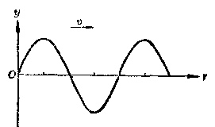

> （第4题）

5. 试作出图2.8中纵波在\(t = \frac{3}{4} T\)时的波形图线。

6. 试根据下图中一列横波在某一时刻的波形图线和波的传播方向，作出质点\(P_{1}, P_{2}, P_{3}, P_{4}\)和\(P_{5}\)当时的速度方向。

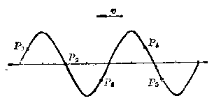

> （第6题）

### § 2.3 波长、波速和波频率

现在来研究几个用来描述机械波的特性的重要物理量以及它们之间的关系。

#### 1. 波长

当波在弹性媒质中传播时，媒质中沿波的传播方向上各个质点都在作频率和振幅（如果不考虑阻尼）都相同的振动，只是位相不同。但由于简谐振动的周期性，其中也有一些质点的振动，位相总是相同的。例如在图2.4所述的横波中，质点1与13、2与14、…的振动总是同相的。它们同时向上运动，同时到达端点后开始向下运动，又同时经过它们各自的平衡位置，…即它们振动的步调是完全一致的。又如在图2.8所述的纵波中，质点1与13、2与14、…的振动也总是同相的。也正是由于简谐振动的周期性，在波所经过的媒质中，只要任意取一个振动质点，那么沿着波的传播方向，我们每隔一定长度总可以找到一个与它同相的振动质点。

在波的传播方向上，通常把两个相邻的同相振动质点间的距离称为这一列波的波长，用代号\(\lambda\)表示。从波形图线上看来，波长就是一个完整的波形的长度（图2.10）。对于横波说来，波长就是相邻的两个波峰或者两个波谷间的长度；而对于纵波说来，波长就是相邻的两个密集中心或者两个稀疏中心之间的长度（图2.10）。波长的国际单位是米。

一列波的波长是由哪些因素决定的呢？它决定于波速和波频率。

波长决定于波速和波频率

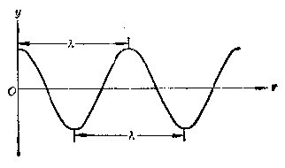

> 图2.10 波长

#### 2. 波速

所谓波速就是指波的传播速度，也就是指单位时间里波速决定于媒质本身的性质波沿着它的传播方向所移动的距离，通常用代号 v 表示，波速的国际单位是米/秒。

机械波传播速度的大小是由媒质本身的性质决定的。一般说来，固体中的波速较大，液体中的波速小些，气体中的波速更小。在固体中，纵波的波速较大；横波的波速较小。表2.1列出几种常见媒质中的波速。

地震发生时，从震源发出的沿地壳表面传播的地震波由于纵波和横波的波速不同，因此在同一个地震观测站里可以先后收到两次地震波的信号，根据这两次信号间的时间间隔，和地震波的纵波波速和横波波速，就可以推算出震源离观测站的距离，再根据几个不同地点的观测站的报告，就可以确定震源的位置。

掌握了波速，在已知某一时刻的波形图线的情况下就可以作出其他时刻的波形图线（图2.11）。

表 2.1 几种媒质中的波速（米/秒）

| 材 料 | 波 速 | 材 料 | 波 速 |
| --- | --- | --- | --- |
| 铝（纵波） | 6420 | 海水 | 1531 |
| （横波） | 3040 | 水 | 1497 |
| 铁铬（纵波） | 5640 | 乙醇 | 1207 |
| （横波） | 3240 | 乙醚 | 185 |
| 铜（纵波） | 5010 | 水蒸汽（3.54°C） | 494 |
| （横波） | 2270 | 空气（0°C） | 331.45 |
| 玻璃（纵波） | 6640 | 二氧化碳 | 259 |
| （横波） | 3280 | 氧 | 316 |
| 聚乙烯（纵波） | 1950 | 氮 | 965 |
| （横波） | 540 | 氢 | 1284 |

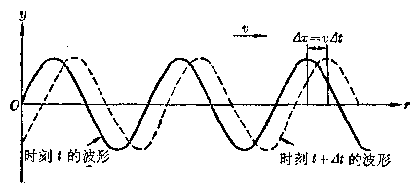

> 图2.11 时刻\(t\)和时刻\(t + dt\)的波形图线

#### 3. 波频率

单位时间里波沿着它的传播方向前进几个波形或几个波长的个数称为波频率，通常用代号f表示，单位为赫。波频率的倒数称为波周期，通常用代号T表示，单位为秒。波周期就是波沿着它的传播方向前进一个波形或一段波长所需的时间。波频率和波周期就相当于媒质中各个质点振动的频率和周期，它们都决定于波源的振动频率和振动周期。

> **旁注：** 波频率和波周期就等于波源振动的频率和周期

掌握了波频率（或波周期）和波速， 就可以找出这列波在这种媒质中的波长。 因为波频率是指单位时间里波前进几个波长， 所以波频率乘以波长就等于单位时间里波前进的距离， 也就是波速。 于是可以列出：

\[
f \lambda = v
\]

即

\[
\lambda = \frac {v}{f} = v T \tag {2.1}
\]

这就是波长与波速、波频率（或波周期）之间的基本关系。

值得注意的是：不能由上述关系得出波速与波频率成正比的结论。因为前面已经提过，波速决定于媒质的性质。在一定的媒质中，波速是个常量，它不会随波频率的变化而发生变化。所以在一定的媒质中，波长是与波频率成反比的。或者说：在一定的媒质中，波源振动得越快，波长就越短。

##### 例 2

已知波源的振动方程为\(y = 3 \times 10^{-2} \cos 240 \pi t\)，波是在温度为\(0^{\circ}C\)的空气中传播，求波频率、波周期和波长。

**解：** 由于波频率就等于波源的振动频率，因此根据波源的振动方程，可以得出波频率和波周期依次为

\[
f = \frac {\omega}{2 \pi} = \frac {240 \pi}{2 \pi} \text{赫} = 120 \text{赫}
\]

\[
T = \frac {1}{f} = \frac {1}{120} \text{秒}
\]

再通过查表2.1得出波速\(v = 331.45\)米/秒。因此波长

\[
\lambda = v T = \frac {331.45}{120} \text{米} = 2.76 \text{米}
\]

掌握了波长、波速和波频率的关系以后，我们就可以进一步分析波形图线和振动图线的关系问题.假设图2.12（a）是某一列简谐波在时刻\(l_{1}\)的波形图线；而图2.12（b）是在波的传播方向上距波源 O 为\(r_{1}\)的媒质质点 P 的振动图线。通过比较这两个图象可以看出：点 P 的振幅是与这一列波的波幅相等的；点 P 的振动频率与这一列波的频率也相等。这就使两个图象在形式上十分类似，然而在这列波的传播方向上所有的媒质质点的振动图线基本上都相同，因为它们振动的振幅和频率都决定于波源的振动，只是彼此之间存在着一定的位相差。由此可见，在距波源\(O\)为\(r_1\)的媒质质点\(P\)的振动图线中，当\(t = t_1\)时的位移必须与波形图线中点\(P\)的位移相等，此外还必须注意到在点\(P\)的振动图线中，两个相邻位移最大值之间的时间间隔就是点\(P\)的振动周期\(T\)， 之间的时间间隔就是点\(P\)的振动周期\(T\)，它决定于波源的振动周期；而在波形图线中两个相邻波峰之间的距离间隔等于这列波的波长\(\lambda\)，它不仅决定于波频率，还决定于波在媒质中的传播速度。

> **旁注：** 在振动图线中，两个相邻位移最大值之间的时间间隔是周期：在波形图线中，两个相邻波峰之间的距离间隔是波长

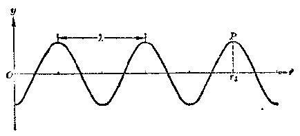

> （a） 一列简谐波在\(t = t_{1}\)时的波形图线

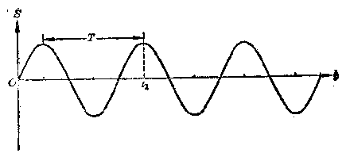

> （1） 距波源\(r=r_{1}\)的质点 P 的振动图线

> 图2.12 振动图线与波形图线的关系

##### 例 3

图 2.13（a） 是一列简谐波在 t=6 秒时的波形图线，波幅和波长如图所示。已知波速为 30 厘米/秒。试作出在波的传播方向上距波源 O 为 r=45 厘米的媒质质点 P 的振动图线，并列出它的振动方程。

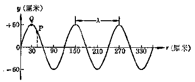

> （a） t=6 秒时的波形图线

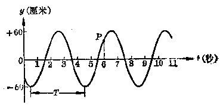

> （b） 距波源 r=45 厘米的质点 P 的振动图线

> 图2.13

**解：** 要作出距波源 O 为 45 厘米的媒质质点 P 的振动图线，首先必须找出它的振幅和振动周期。由于振幅和振动周期就等于波幅和波周期，因此根据已知的波速和图 2.13 （a） 所示的波长可以推知

\[
T = \lambda / v = 120 / 30 \text{秒} = 4 \text{秒}
\]

\[
A = 60 \text{厘米} = 0.60 \text{米}
\]

同时根据波形图线可以确定质点 P 在 t=6 秒时的位移，并且可以推知经过 T/8 以后，就相当于点 Q 的位移；经过 8T/8 以后回到它的平衡位置。即 t=6.5 秒时，y=60 厘米；t=7.5 秒时，y=0。从振动周期 T=4 秒可以推知 t=2.5 秒、-1.5 秒时 y=60 厘米，可见点 P 振动的切相角为\(\varphi=3\pi/4\)，而振动的圆频率

\[
\omega = \frac {2 \pi}{T} = \frac {\pi}{2}
\]

于是可以列出点\(P\)的振动方程

\[
y = 0.60 \cos \left(\frac {\pi}{2} t + \frac {3 \pi}{4}\right)
\]

#### 习题2.3

1. 波源的振动快慢与波的传播速度是否有影响？为什么？

2. 当一列机械波由一种媒质进入另一种媒质继续传播时，它的波速是否改变？波频率是否改变？波长是否改变？为什么？

3. 已知某波源的振动方程为\(y = 0.25 \cos 30 \pi t\)，求它在空气中和水中的波长。

4. 下图是某一列波在某一时刻 t 的波形图线， 如果已知波速\(v = 20\)米/秒。 试在同一图上作出\(\Delta t = 0.004\)秒后的波形图线， 并求出波频率。

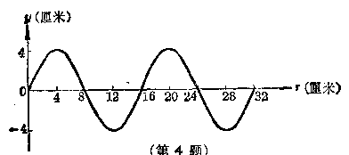

> （第4题）

5. 已知在下图中虚线表示某一列机械波在某一时刻 t 的波形图线， 实线表示在\(\Delta t = 5 \times 10^{-3}\)秒后的波形图线：

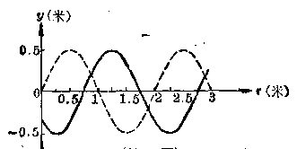

> （第5题）

（1） 问这一列波是横波还是纵波？为什么？

（2） 求这一列波的波长和波速；

（3） 求这一列波的周期和频率。

6. 某一列波在传播过程中，当它的第一个波峰经过2秒钟由波源传到2900米外处时，它的第2000个波峰已经在波源形成。试求这一列波的波长、波速、频率和周期。

7. 已知横波和纵波在钢轨中的波速依次为 3235 米/秒 和 5200 米/秒，今通过钢轨测得铁路沿线基地的地震波的两个信号相隔 8.2 秒，求震源离测点多远。

8. 试根据图 2.13（a） 的波形图线作出波源的振动图线，并列出振动方程。

### § 2.4 波的干涉

现在研究两列波相遇时的情况。

#### 1. 波的迭加

我们知道，当两个运动物体相遇时，它们就要发生碰撞。在碰撞后，它们速度的大小和方向显然都要发生变化，并且是遵从动量守恒定律的。当两列波在同一媒质中传播而相遇时情况就不同。图2.14表示两个在同一直线上相向传播的脉冲波*在相遇前后的情况。从这一系列波形图中可以看出：当这两个脉冲波相遇时，在它们相遇的区域里的质点同时参与两种振动。它们在任何时刻的合振动的位移就等于当时这两个脉冲波各自所引起的振动位移的代数和。在这两个脉冲波相遇以[^ch2-note1] 后，它们仍旧按照各自原来的波形继续向前传播，就象它们并没有相遇过一样。由此可见：两列波在传播过程中相遇时，在相遇区域内质点的振动是由这两列波各自所引起的振动的合成；相遇后仍保持它们各自的频率、波长和振幅，按各自原来的传播方向继续前进。这个规律称为波的迭加原理，又称为波的独立传播原理。

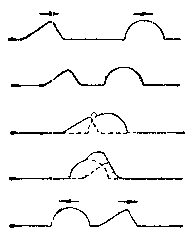

> 图 2.14 两个空间一直线上相向传播的脉冲波在相遇前后的情况

> **旁注：** 在两列波相遇的区域内，质点的振动是由这两列波各自所引起的振动的合成。这就是波的迭加原理

#### 2. 波的几何描述

在无限的均匀弹性媒质中，波可以从波源向四面八方传播。为了形象地描述波在空间的传播情况，通常可以从波源沿波的各个传播方向作一些带箭头的射线表示波所传播的途径和前进的方向（图2.19）。这样的射线就称为波线，或称波射线。当波在沿着各个方向传播时，由在同一时刻开始振动的点连成的面就称为这列波在这一时刻的波阵面，简称波面。很明显，在同一波阵面上各点的振动总是同相的。随着时间的推移，波阵面也在不断地向前移动。通常把最前面的波阵面称为波前（图2.15）。

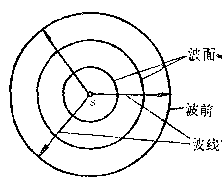

> （a） 球面波

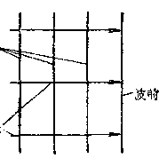

> （b） 平面波

> 图2.15 波的几何描述

如果波源的形状和大小可以忽略，这样的波源就称为点波源。由点波源在均匀弹性媒质中向四面八方发出的简谐波，它的波阵面是一个个球面。这样的波称为球面波。图2.15（a）所描述的就是一个由点波源O发出的球面波。由点O向外所作的射线就是它的波线；而它的波阵面就是一系列同心球面。图上用一系列同心圆表示它在各个时刻的球状波阵面，而用最外面的圆表示它的球状波前。从图上还可以看出在均匀媒质中波线总是与波阵面垂直的。

随着时间的迁移， 距离点波源越远的波阵面就越大， 其中的一部分就可以看作是一个个平面。这样的波称为平面波。图 2.15（b） 所描述的就是平面波。图上用一系列平行线表示它的波阵面， 最外面的一条表示它的波前。

#### 3. 波的干涉

关于两列频率和波长都不相同的机械波的迭加，在它们的相遇区域内所引起的合振动是十分复杂的。现在我们来研究关于波的迭加的一种重要的特殊情况。

图 2.16（a） 是一个专门用来演示水面波的装置，称为发波水槽。它的主要构造就是一个盛着水的玻璃盘，一边有个支架，上面装着一根竖直的探针。当支架与一个偏心轮相连由一个小马达带动作上下振动时，支架上的探针就会周期性地接触水面。在玻璃盘的水面上就会产生一列圆环形的波纹，逐渐向外扩展。于是点亮玻璃盘下方的电灯，就可以在天花板上看到波纹的象，如图 2.16（b） 所示。

> （a） 发波水槽结构示意图

> （b） 一列圆环形的波纹

> 图2.16 发波水槽

现在我们把两根探针并列地装在同一个支架上，让探针的针尖紧靠水面。当支架作上下振动时，这两根并列的探针同时周期性地接触水面，就成了两个波源，在玻璃盘的水面上同时形成两列频率相同、波长相同、振动方向相同、 位相也完全相同的圆环形波纹。图2.17就是在这两列波相遇的水面上所呈现的各部分振动情况的照片。从照片上可以看到：有些地方水面起伏得很厉害，表明这些地方水面的上下振动加强了；而有些地方水面的起伏不很显著，甚至没有起伏，表明这些地方水面的上下振动减弱了，甚至振动抵消了。这种由于波的迭加而引起的某些地方振动始终加强，某些地方振动始终减弱的现象就称为波的干涉。能引起稳定的干涉的波就称为相干波，它们的波源就称为相干波源。从照片上我们还可以看到：振动始终加强的区域和振动始终减弱的区域是相间的。通常把振动始终加强、振幅最大的点称为波腹，而把振动始终减弱、振幅最小甚至没有振幅的点称为波节。象这种由波腹和波节相间而形成的一个稳定的图样称为干涉图样。

> 图 2.17 水面波的干涉现象

为了具体说明波的干涉现象是怎样形成的，我们可以按照波的几何指述方法作出两列同时由相干波源\(S_{1}, S_{2}\)发出的相干波在同一时刻的波形简图，如图2.18所示。图中用实线表示正处于波峰的波阵面；而用虚线表示正处于波谷的波阵面。很明显，在图上由实线的交点或者虚线的交点连接而成的曲线\(aa'\)都是山波腹构成的。因为实线的交点表示两列波的波峰和波峰相遇；虚线的交点表示两列波的波谷和波谷相遇。这表明这些点的振动加强，况且在经过半个周期以后，原来的波峰就要变成波谷；原来的波谷就要变成波峰，于是实线的交点就变成虚线的交点，而虚线的交点就要变成实线的交点。所以这些点的振动是始终加强的，它们的振幅是最大的，即曲线\(a\alpha'\)都是由波腹构成的。

> 图2.18 波形的干涉的形成

再看图上由实线和虚线的交点连接而成的曲线\(bb'\)都是由波节构成的。因为实线与虚线的交点表示两列波的波峰与波谷相遇，这表明这些点的振动减弱。如果两列波的振幅相等，那么这些点的振幅就等于零，即振动相互抵消。况且在经过半个周期以后，原来的波峰就要变成波谷；原来的波谷就要变成波峰，而这些点却仍然是实线与虚线的交点。所以这些点的振动是始终减弱的，它们的振幅是最小的，甚至等于零，即曲线\(bb'\)都是由波节构成的。

从图上还可以看到： 曲线\(\alpha\alpha'\)和曲线\(b'b'\)是相间的， 在它们之间的各点的振动的振幅是介于两者之间的， 即比曲线\(\alpha\alpha'\)上的点的振幅小， 而比曲线\(b'b'\)上的点的振幅大。

为了进一步掌握在波的干涉图样中波腹和波节的规律，我们可以联系到在同一直线上频率相同的简谐振动的合成规律来考虑。

假设点\(P\)为干涉图样中的波腹，表明两列相干波在点\(P\)引起的振动始终是相互增强的；那么这两列波各自在点\(P\)引起的振动的位相差必定是\(2\pi\)的整数倍，即点\(P\)同时参与的两个分振动是同相的（图2.19（a））。假设点\(Q\)为干涉图样中的波节，表明两列相干波在点\(Q\)引起的振动始终是相互减弱的；那么这两列波各自在点\(Q\)引起的振动的位相差必定是\(\pi\)的奇数倍，即点\(Q\)同时参与的两个分振动是反相的（图2.19（b））。

> （a） 点 P 同时参与的两个分振动是同相的

> （b） 点 Q 同时参与的两个分振动是反相的

> 图 2.19 在干涉图样中形式波腹和波节的条件

通常把媒质中任何一点与两个波源\(S_{1}, S_{2}\)的距离的差\(\pmb{r}_{2} - \pmb{r}_{1}\)称为这两列波在这一点的波程差，用代号\(\delta\)表示。

因为在波的传播方向上， 媒质中振动位相差等于\(2\pi\)的整数倍的质点间的距离就等于波长的整数倍； 媒质中振动位相差等于\(\pi\)的奇数倍的质点间的距离就等于半波长的奇数倍。 于是可以得出如下的结论： 在两列相干波相遇的区域内， 振动始终增强， 振幅最大的波腹的波程差等于零或波长的整数倍， 即

\[
\delta = \left| r _ {2} - r _ {1} \right| = k \lambda (k = 0, 1, 2, \dots)
\]

振动始终减弱，振幅最小的波节的波程差等于半波长的奇数倍，即

\[
\delta = \left| r _ {2} - r _ {1} \right| = (2 k + 1) \frac {\lambda}{2} (k = 0, 1, 2, \dots)
\]

对于波程差介于\(k\lambda\)与\((2k + 1)\frac{\lambda}{2}\)之间的点说来，它们的合振动的振幅就介于波腹和波节的振幅之间。例如图2.19（a）中点\(P\)的波程差\(\delta\)就等于波长\(\lambda\)；而图2.19（b）中点\(Q\)的波程差\(\delta\)就等于半波长\(\lambda / 2\)。

必须强调指出：并不是任何两列波相遇都会发生干涉现象。两列波发生稳定的干涉现象的基本条件是：频率相同，即波长相等；振动方向在一直线上；并具有固定的位相差。如果两列波的波长不等，迭加后振动始终增强点和振动始终减弱点的位置就不能保持稳定。如果两列波的振动方向不在一直线上，就不能保证迭加后合振动的方向仍在这一直线上。如果两列波没有固定的位相差，迭加后各点的合振幅就不能保持不变。因此上述基本条件称为相干条件。

> **旁注：** 两列波的相干条件是频率即波长相等、振动方向在一直线上、并具有固定的位相差

两列相干波进行干涉的结果， 波节处的振幅减小， 甚至等于零， 即振动能等于零。 但这并不意味着两列波互相干涉后， 能量有所丧失。 相反在波腹处振幅增大， 振动能也增多了。由此可见：两列波的总能量是守恒的，互相干涉的结果只是能量重新分布而已。

波的干涉是波的基本特性之一。

#### 4. 驻波

驻波是一种特殊的干涉现象，它是由两列振幅、频率、振动方向都相同，但传播方向相反的波迭加而成的。

图 2.20 是一个专门用来演示驻波的装置简图。弦线 AB 的一端 A 固定在电动音叉上，另一端通过滑轮 P 系一砝码，用来使弦线拉紧。当音叉振动时，它就带动弦线 A 端振动，从而在弦线中产生一列波，这时如果我不断调节尖劈 B 的位置，当调节 AB 到一定长度时，弦线 AB 上的波就会如图 2.20 所示，被分成相等的几段，每段两端的点是驻定不动的，称为波节，而每段弦线的各点则在作步调一致的上下振动，其中振幅最大的是每段中间的点，称为波腹。象这种波形驻定不变的波就称为驻波，而相对地说，我们过去所讨论的波形不断沿传播方向移动的波就称为行波。

> 图 2.20 演示驻波的装置简图

弦线上的驻波是怎样形成的呢？当弦线的 A 端随着电动音叉按一定的频率作简谐振动时，在弦线上就产生一列连续的向右传播的简谐波，这列波在传到弦线的 B 端时，由于尖劈的固定又沿着弦线反射回来。于是在弦线上就同时存在着一列入射波和一列反射波，它们的频率和波长都相等，只是传播方向相反。弦线上的驻波正是这两列波迭加而发生干涉的结果。

那么在实验时为什么要调节尖劈的位置呢？因为要在弦线上形成驻波，弦线\(AB\)端的长度必须与驻波波长存在一定的关系，即弦线的两个固定端要恰好是驻波的波节。

很明显，驻波的两个相邻波节间的距离就等于驻波的半波长，因此只有当弦线AB端的长度等于半波长的整数倍时，弦线上才会形成驻波。所以调节尖劈位置的目的就在于使弦线AB端的长度等于半波长的整数倍，例如图2.20所示， 弦线\(AB\)端恰好等于半波长的3倍，而驻波波长则决定于电动音叉的频率和弦线上的波速。

> **旁注：** 只有当弦线的长度等于波的半波长的整数倍时弦线上才会形成驻波

##### 例 4

已知弦线上的波速为 225 米/秒， 而电动音叉的频率为 384 赫。 如果要想按图 2.20 的实验在弦线上形成驻波， 弦线 AB 端至少需多长？ 如果电动音叉的频率为 264 赫呢？

**解：** 先应该求出频率为384赫的波在弦线上传播时的波长，这可以根据波长与波速、频率的基本关系（2.1）来计算，即

\[
\lambda = \frac {v}{f} = \frac {225}{384} \text{米} = 0.586 \text{米}
\]

\[
\frac{\lambda}{2}=\frac{0.586}{2}\ \text{米}=0.293\ \text{米}
\]

可见要在弦线上形成驻波，AB端长度至少应为0.293米。如果电动音叉的频率为264赫，由于弦线上的波速是固定不变的，于是可以算出AB端长度至少应为

\[
\lambda / 2 = \frac {v}{2 f} = \frac {225}{2 \times 264} \text{米} = 0.426 \text{米}
\]

> 图 2.21 在井管和红管内的空气柱中形成的驻波

驻波不仅能在绷紧的弦线上形成， 也能在水中， 或空气柱中形成。 例如图2.21所示， 在长度为\(l\)的两端都开口金属管内的空气柱中可以形成波长近似为\(2l\)的驻波；而在一端封闭、另一端开口的金属管内的空气柱中则可以形成波长近似为\(4l\)的驻波。这是因为金属管的闭端可以成为驻波的波节；开端可以成为驻波的波腹。

必须强调指出： 两列沿着相反方向传播的频率相同、振动方向也相同、并具有固定位相差的纵波也能形成驻波。例如图2.21所示在金属管内的空气柱中的驻波就是纵波形成的， 但为了方便， 往往用类似于横波的表示方法来表示它的波腹和波节。

### § 2.5 波的衍射

现在来研究机械波遇到障碍或是穿过狭缝、小孔时的情形。

#### 1. 水面波的衍射现象

利用发波水槽可以演示水面波在遇到障碍或是穿过狭缝时的情形.如图2.22、2.23（a）、（b）所示，我们先在发波水槽里放置一块隔板，让它露出水面作为水波的障碍，或是在隔板上搞个缺口，作为水波要穿过的狭缝.当开动马达使支架上下振动，带动探针周期性地接触水面时，一列圆环形波纹不断向外扩展.如果障碍物的长度要比波长大得多，如图2.22（a）所示，圆环形波纹几乎不能到达由障碍物形成的“阴影”区，因而在这种情况下，波可以看作是沿着直线传播的.但如果障碍物的长度与波长差不多，如图2.22（b）所示，圆环形波纹就会不沿直线传播而绕到障碍物后面的“阴影”区去，并不受障碍物的影响.同样如果波所要穿过的狭缝的长度（或小孔的直径）比波长大得多，如图2.23（a）所示，圆环形波纹只能在由波源和狭缝两端（或小孔边缘）所连成的直线之间传播，因而在这种情况下，波可以看作是沿着直线传播的。但如果狭缝的长度（或小孔的直径）与波长差不多，如图2.23（b）所示，圆环形波纹就会不沿直线传播而绕到狭缝（或小孔）后面的整个区域里传播。

> （a） 障碍物的长度比波长大得多

> （b） 障碍物的长度与波长差不多

> 图 2.22 水面波遇到障碍时的现象

> （a） 狭缝长度（或缺口直径）比波长大得多

> （b） 狭缝长度（或缺口直径）与波长差不多

> 图 2.23 水面波穿过狭缝或缺口时的现象

> **旁注：** 波绕到障碍物后面或狭缝、小孔外面而偏离直线传播的现象称为波的衍射

波在遇到障碍物或狭缝、小孔时会绕到障碍物后面或狭缝、小孔外面而偏离直线传播的现象称为波的衍射，或称绕射。实验表明：障碍物、狭缝或小孔越小，或者波长越长，波的衍射就越显著；反过来，障碍物、狭缝的长度或小孔的直径如果远大于波长，或者波长很短，波的衍射就不显著，甚至观察不到，因而在这种情况下，波可以看作是直线传播的。例如，当河面上出现水波时，在小船后面的水面还是平静的。这是因为一般水波的波长只有几十厘米，而小船的长度远大于水波的波长，所以水波就不会绕到小船的后面去。

> **旁注：** 障碍物、狭缝、小孔越小，波长越长，波的衍射就越显著

#### 2. 惠更斯原理

怎样解释波的衍射现象呢？1690年，荷兰物理学家惠更斯曾提出过一个有关波的传播的原理，他认为机械波在媒质中传播的过程中，任何时刻的波前上的各点都可以看作新的波源，从这些新的波源所发出的波称为子波，而所有这些子波在下一时刻在传播方向上所形成的包迹*就是这列机械波在下一时刻的新的波前。这个原理就称为惠更斯原理。

运用惠更斯原理可以推知，在无限的均匀媒质中传播的平面波，经过任何时间间隔的新的波前还是平面。假设平面\(S_{1}\)是一列在均匀媒质中传播的平面波在时刻\(t\)的波前（图2.24），根据惠更斯原理在平面\(S_{1}\)上的任一点都可以看作是它的新的子波源。设这一列波的波速\(v\)，那么所有这些子波在时刻\(t + \Delta t\)的波前就是以平面\(S_{1}\)上所有的点（子波源）为圆心，以\(v\Delta t\)为半径的沿传播方向上的半球面。于是这些半球面的包迹平面\(S_{2}\)就是这一列平面波在时刻\(t + \Delta t\)的波前，用同样的方法还可以推知在无限的均匀媒质中传播的球面波的新的波前还是球面（图2.25）。

根据惠更斯原理，波的衍射现象实际上就是它的一系列子波相互干涉的结果。如图2.26所示，AB是一列平面波在接近一个宽度为d的狭缝时的波前，根据惠更斯原理，[^ch2-note2] 狭缝处各点都可以看作新的子波源，沿传播方向发出许多半球面形的子波。如果缝宽\(d\)大于波长\(\lambda\)，虽然狭缝前面的波前仍是平面，但狭缝两边的波前是弯曲的（图2.26a）。于是狭缝两端的波线改变了方向。如果缝宽\(d\)小于波长\(\lambda\)，狭缝就成了单独的子波源，由它发出的波前就成了半球面（图2.26b）。所以狭缝越小，波长越长，波的衍射就越显著。与波的干涉一样，波的衍射也是波的基本特性之一。

> 图 2.24 平面波的新的波前还是平时

> 图 2.25 球面波的新的波前还是球面

> （a） 缝宽 d 大于波长\(\lambda\)

> （b） 缝宽 d 小于波长\(\lambda\)

> 图 2.26 运用惠更斯原理解释波的衍射现象

#### 习题2.5

1. 如果两个相干波源的振动具有位相差\(\Delta \varphi = \pi / 2\)，那么由这两个波源发出的波在波程差\(\delta = \lambda / 4\)的点上干涉的结果怎样？

2. 如右图所示，\(S_{1}, S_{2}\)是两个相距为 0.10 米的同相相干波源， 已知相干波的频率为 30 赫， 在媒质中的波速为 1.5 米/秒， 试求这两列相干波在\(S_{1} S_{2}\)的垂直平分线上和在\(S_{1} S_{2}\)的连线上各点的干涉结果。

> （第2题）

3. 如右图所示，\(S_{1}\)、\(S_{2}\)是两列同相相干波的波源，若相干波的频率为2500赫，在媒质中的波速为750米/秒， 试判断这两列波在图中点\(P_{1}, P_{2}, P_{3}\)处的干涉结果，已知

> （第3题）

（1）\(S_{1}P_{1} = 2.35\)米，\(S_{2}P_{1} = 2.50\)米；

（2）\(S_{1}P_{2} = 1.98\)米，\(S_{2}P_{2} = 1.80\)米；

（3）\(S_{1}P_{3} = 2.50\)米，\(S_{2}P_{3} = 1.90\)米。

4. 在进行图2.20的驻波演示实验时，已经测得弦线AB间的长度为0.94米，若电动音叉的频率为 512 赫， 实验时弦线 AB 间具有 4 个波股， 试求弦线中的波速。

5. 一根1.5米长的弦线，用支架将它的两端夹紧，并把它绷紧，然后用手拨动弦线中点，在弦线上形成驻波，如果已经测得弦线中点的振动频率为8赫，试求：

（1） 驻波的波长；

（2） 弦线上的波速。

> （第3题）

### 本章提要

1. 机械振动在弹性媒质中的传播过程就形成机械波，简称波，或称波动。在弹性媒质中，只要有某一部分发生了振动，借助于质点间的弹性联系，振动必然会由近及远地传播开去而形成机械波。因此能传播振动的弹性媒质和使弹性媒质发生振动的波源是产生机械波的必要条件，两者不可缺一。

2. 质点的振动方向与传播方向相互垂直的波称为横波；质点的振动方向与传播方向在一直线上的波称为纵波。在气体和液体中，机械波只能按纵波的形式传播；而在固体中，机械波既可以按纵波又可以按横波的形式传播。

3. 机械波的传播过程实质上就是能量的传播过程，但它与其他的能量传递过程不同，通过机械波传播能量的质点本身可以不必作任何迁移。

4. 根据实际情况把各个质点在同一时刻相对于各自的平衡位置的位移依次作左坐标图上而连成的图线称为这一列机械波在这一时刻的波形图线。波形图的横坐标\(r\)表示在波的传播方向上的各个质点的平衡位置；纵坐标\(y\)表示质点相对于各自平衡位置的位移。

5. 在波的传播方向上， 两个相邻的同相振动质点间的距离称为机械波的波长。 机械波的波长决定于波速和波频率。

波速是指单位时间内波沿着它的传播方向所移动的距离。波速是由媒质本身的性质决定的。一般说来，固体中的波速较大，液体中的波速小些，气体中的波速更小。在固体中，纵波的波速较大；横波的波速较小。

波频率是指单位时间内波沿着它的传播方向前进几个波形或几个波长的个数。波周期是指波沿着它的传播方向前进一个波形或一段波长所需的时间。波频率和波周期分别等于波源的振动频率和振动周期。

波长、波速和波频率（或波周期）之间的关系是：

\[
\lambda = \frac {v}{f} = v T
\]

6. 在波的几何描述中， 由波源沿波的各个传播方向所作的表示波所传播的途径和前进的方向的射线称为波线， 或称波射线。由在同一时刻开始振动的点连成的面称为波阵面， 简称波面。随着时间的迁移， 波阵面也在不断地向前移动， 最前面的波阵面称为波前。在均匀媒质中， 波线总是与波阵面垂直的。

波阵面是球面的波称为球面波；波阵面是平面的波称为平面波。

7. 两列波在传播过程中相遇时，在相遇区域内质点的振动是由这两列波各自所引起的振动的合成；相遇后仍保持它们各自的频率、波长和振幅，按各自原来的传播方向继续前进，就象它们并没有相遇过一样。这个规律称为波的迭加原理，又称为波的独立传播原理。

8. 由于波的迭加而引起的某些地方振动始终加强（波腹），某些地方振动始终减弱（波节）的现象称为波的干涉。能引起稳定的干涉的波就称为相干波，它们的波源就称为相干波源。由波股和波节相间而形成的一个稳定的图样称为干涉图样。

媒质中任何一点与两个波源的距离的差称为这两列波在这一点的波程差，在两列相干波相遇的区域内，振动始终增强，振幅最大处即波腹所在处的波程差等于零或波长的整数倍，即

\[
\delta = \left| r _ {2} - r _ {1} \right| = k \lambda (k = 0, 1, 2, \dots)
\]

振动始终减弱、振幅最小处即波节所在处的波程差等于半波长的奇数倍，即

\[
\delta=\left|r_2-r_1\right|=(2k+1)\frac{\lambda}{2}\quad(k=0,1,2,\dots)
\]

对于波程差介于\(k\lambda\)与\((2k + 1)\frac{\lambda}{2}\)之间的点的合振动的振幅就介于波腹和波节的振幅之间。

两列波成为相干波的条件是：频率相同，即波长相等；振动方向在一直线上；并具有固定的位相差。这个条件就称为相干条件。

9. 驻波是干涉的特殊现象， 是由两列振幅、频率、振动方向都相同， 但传播方向相反的波迭加而成的。弦线上的驻波是由入射波和它的反射波迭加而成的。只有当弦线的长度等于波的半波长的整数倍时， 弦线上才会形成驻波。驻波不仅能在绷紧的弦线上形成， 也能在水中和空气柱中形成。不仅横波能形成驻波， 纵波也能形成驻波。

10. 波在遇到障碍物或狭缝、小孔时会绕到障碍物后面或狭缝、小孔外面而偏离直线传播的现象称为波的衍射，或称绕射、障碍物、狭缝、小孔越小，波长越长，波的衍射就越显著。

11. 机械波在媒质中传播的过程中，任何时刻的波前上的各点都可以看作新的波源，从这些新的波源所发出的波称子波，而所有这些子波在下一时刻在传播方向上所形成的包迹就是这列机械波在下一时刻的波前。这个原理称为惠更斯原理。

根据惠更斯原理，波的衍射现象实际上就是波的一系列子波相互干涉的结果。

### 复习题二

1. 要形成机械波必须具备的条件是什么？

2. 试分析下列关于波长的概念的说法，哪几条比较确切？哪几条不确切？为什么？

（1） 两个位相相同的振动质点之间的距离。

（2） 波源振动一次， 波前向前传播的距离。

（3） 两个相邻的同相质点间的距离。

（4） 波形图线上两个波峰间的距离。

3. 在一直线上两列频率不同的波相遇时为什么不会发生干涉现象？

4. 驻波是怎样形成的？驻波和行波有什么不同？

5. 周期为 0.1 秒的一列横波沿一直线传播。已知波峰与相邻波谷间的距离为 0.8 米，求：

（1） 这列波的波长；

（2） 这列波的传播速度。

6. 频率为\(3.9 \times 10^{14}\)赫的波从空气进入某种液体， 已经测得在这种液体中这列波的波长变为\(5.5 \times 10^{-7}\)米， 求：

（1） 这列波在这种液体内的传播速度；

（2） 这列波在空气中的波长， 若在空气中的传播速度为\(3.0 \times 10^{8}\)米/秒。

7. 试根据图2.13（a）的波形图线，作出2秒后的波形图线。

8. 试根据图2.13（a）的波形图线，作出距波源\(r=90\)厘米的媒质质点的振动图线，并列出振动方程。

9. 下列在波的传播方向上的两个媒质质点的位移是否始终相同？

（1） 相距半个波长；

（2） 相距一个波长；

（3） 距离是半波长的奇数倍；

（4） 距离是半波长的偶数倍。

10 已知媒质质点 M、N 分别近波源 40、50 厘米，当波源发出的波的波长为 25 厘米时，试计算质点 M、N 振动的位相差。

[^ch2-note1]: 由波源振动一次所形成的波称为脉冲波。——编著
[^ch2-note2]: 与一系列曲面相切的面就称为这一系列曲面的包迹。——编者

## 第3章 声学基础知识

一切正在发声的物体都在振动， 这种振动称为声振动。声振动在空气、水、钢铁等媒质中传播形成声波。当声波传到人的耳内时， 就会引起听觉。声音就是使人的听觉器官引起感觉的物理现象。声学所研究的正是有关声音的种种现象， 范围十分广泛。在物理学中， 我们只研究有关声音的发生和传播的规律以及声音的特性等。至于听觉器官的生理构造和效用则是生理学研究的对象， 不属于物理学的范围。

### § 3.1 声音的发生和传播

#### 1. 声源

把一条薄钢片的一端紧夹在台钳上，用手拨动薄钢片的自由端，使它作往返振动，如图3.1所示。如果薄钢片振劲的频率很大， 就会发出嗡嗡声。音叉是由钢杆弯成 U 字形构成的， 底部与一长柄相连（图 3.2）。 通常把音叉的两端称为叉股。 手握长柄， 用橡皮槌敲击叉股， 音叉就振动发声。 图 3.2 就表明一个音叉正在发声， 由于振动把与它接触的小球弹得很远。 一切正在发声的物体都在振动， 这样的振动体称为声源。

> 图3.1 薄钢片的振动

> 图3.2 音叉

然而并非任何机械振动都能引起人的听觉，实验表明，只有频率在16赫到20，000赫之间的振动才能引起人的听觉。严格说来，声振动是指频率在16~20，000赫范围内的机械振动。

#### 2. 声音的传播

声源的振动所以能传到人的耳朵里来，全靠声源与人耳之间的空气媒质。如果没有空气媒质来传播，即使有了声源也不能引起人的听觉。例如把正在发声的闹钟放在与抽气机相连通的玻璃罩内（图3.3），开动抽气机，当罩内空气被抽得十分稀薄时，闹钟的铃声就几乎消失了。声振动和所有的机械振动一样，不能在真空中传播。

媒质是靠弹性传播声振动而形成声波的。象空气一样，一般的固体、液体和气体也都或多或少地具有弹性， 因此都能成为传播声振动的媒质。潜水员潜没在水中可以听到岸上的声响；放在水中的特殊听音器可以用来监听远处敌潜艇的发动机的声音。这些都是液体可以传声的例子。把耳朵贴在地面上可以听到远处汽车、拖拉机的声音。这是固体可以传声的例子。

> 图3.3 声振动不能在真空中传播

在气体和液体中，机械振动只能以纵波的形式进行传播。因此一般说来，声波是纵波，但在固体中传播的声波也有可能是横波。

声波在媒质中的传播速率简称声速。声速主要决定于媒质的性质。在第二章表2.1中列出的数据都可以看作声波在这些媒质中的传播速率。一般说来，声速将随媒质温度的变化而变化，这一点在气体媒质中尤为显著。但在液体和固体媒质中，声速的变化并不大，可以忽略不计。

### § 3.2 乐音的特性

声波的波形图线是十分复杂的。有一种声音，它的波形图线虽然也很复杂，却具有明显的周期性（图3.4a），听起来比较悦耳，称为乐音。音叉、钢琴、胡琴发出的声音都是乐音。另一种声音，它是由爆炸或击发声结合而成的，听起来十分嘈杂，它的波形图线十分复杂，并且是无规则的非周期性的曲线（图3.4b），称为噪声。用力的关门声、连续的射击声都是噪声。这里我们主要研究乐音的特性。

> 图3.4

#### 1. 音调

吹口琴时，越往右边吹，发出的琴声越尖，我们就说琴声的音调越高，一般说来，女声的音调比男声的高；童声的音调比成年人的高。

乐音音调的高低是由什么因素决定的呢？我们可以来做个实验。图3.5所示是个多孔圆盘，盘上的孔排列成五个同心圆，其中最小一个圆周上的孔的间距是不规则的， 而其余四个圆周上的孔的间距是均匀的，圆圈越大，孔数越多。在实验时，先让多孔圆盘的轴与一个小电动机相连，开动电机使多孔圆盘转动起来，然后用一股空气流喷射转着的多孔圆盘就会发出声音。很明显，这声音是因为气流时面通过圆盘上的小孔，时而被圆盘所阻挡而引起的一系列振动所形成的。当圆盘匀速转动时，让气流由里往外依次对着各个圆周，即逐渐增大气流振动的频率，我们就会感到发出的声音的音调也在逐渐升高。如果让气流对着最外边的圆周，同时不断增大圆盘的转速，同时也会发现声音的音调在升高。只有当圆盘匀速转动，而气流对着间距均匀的孔不动时，才能听到一种音调稳定的声音，显然这时气流的振动频率是固定不变的。

> 图 3.5 音调与频率的关系

> **旁注：** 乐音的音调决定于声源振动的频率，频率越高，音调也越高

由此可见，乐音的音调决定于声源振动的频率，频率越高，音调也越高。例如杂技演员在表演扯铃时，用力越猛， 响铃转得越快，气流的振动频率越高，发出声音的音调也越高。

如果把气流对着圆盘最里边的圆周，就会听到一种难听的噪声，这是因为圆盘最里边的圆周上的孔的间距是不均匀的，从而使气流振动的频率也不是稳定的。可见噪声就是由各种频率的振动杂乱无章地混合在一起形成的，因而噪声是无所谓音调的。

音叉所发出的声音具有一定的音调，因为音叉具有一定的振动频率，称为音叉的固有频率。通常把固有频率为256赫的音叉所发出的声音的音调规定为C调。因此音叉又称为C调音叉，可以用来调节各种乐器发音的音调。

#### 2. 响度

用力敲锣，锣面振动的振幅就大，锣声就响；轻轻敲锣，锣面振动的振幅就小，锣声就轻。人们主观上感觉到的乐音的强弱程度称为响度。乐音的响度是与声强有关的。

声强是声波强弱的客观反映，它反映了声波在单位时间内沿传播方向所传播能量的多少，常用代号\(I\)表示。在国际单位制中，声强的单位为瓦/米²。如果声波每秒钟能使垂直于它的传播方向的1米²面积的媒质获得1焦耳的能量，它的声强就等于1瓦/米²。实验表明，声强与声波频率的平方、振幅的平方以及媒质的密度都是成正比的。

> 图3.6 声强与离开声源的距离的平方成反比

当声源发出的声波向各个方向传播时，它的声强将随着距离的增大而逐渐减弱。这是因为声源每秒钟发出的能量是一定的，离开声源的距离越远，能量的分布面就越大，通过单位面积的能量就越小了。

如图 3.6 所示，假设点 O 为声源，从声源发出的声波不断向四面八方传播，垂直于它的传播方向作一个个以声源为中心的球面。现在取以声源点\(O\)为中心，离开声源的距离\(r_1, r_2\)为半径作两个球面\(1, 2,\)那么这两个球面的面积依次为\(4\pi r_1^2, 4\pi r_2^2\)。假设由声源每秒钟发出的能量是定值\(E\)，那么声波传到球面\(I\)时的声强

\[
I _ {1} = \frac {E}{4 \pi r _ {1} ^ {2}}
\]

声波传到球面2时的声强

\[
I _ {2} = \frac {E}{4 \pi r _ {2} ^ {2}}
\]

比较上述两式可以得出

\[
I _ {1}： I _ {2} = r _ {2} ^ {2}： r _ {1} ^ {2} \tag {3.1}
\]

上式表明： 声强与离开声源的距离的平方成反比。也就是说， 距离增加到原来的 2 倍， 球面面积就增大到原来的 4 倍， 声强就减小到原来的四分之一。

然而乐音的响度和声强并不是简单的正比关系。这就是说，人耳对声音的灵敏度对于不同频率是不同的。实验表明：对于不同频率的声波，要能引起听觉都有一定的声强范围。能引起人耳听觉的最低声强称为听觉阈；能引起人耳听觉的最高声强称为痛觉阈。在这个范围以内，随着声强的增大，响度也增大。当声强超过这个限度，不但不能引起听觉，反而会引起痛感。但声波的听觉阈和痛觉阈都与频率有关。它们的关系如图3.7所示。这个图是通过对许多人的试验的综合性结果。从图上可以看出频率在2000～3000赫之间的声波的听觉阈最低，表示人耳对在这个频率范围内的声波最为敏感；频率为800赫的声波痛觉阈最高。

> 图3.7 人耳的听觉范围

声强由于变化范围很大， 如以瓦/米²为单位， 最低值到最高值可相差千亿万倍， 很不方便， 因此常用声强级来表示声强。通常规定用频率为 1000 赫的声波的听觉阈\(I_0 = 10^{-12}\)瓦/米²作为测定声强的标准， 并定为声强级的 0 级， 或 0 贝耳（声强级的单位）。某声波的声强若为\(I_0\)的 10 倍， 即\(10^3\) 倍，则它的声强级就是1级或1贝耳；若为\(I_{0}\)的1000倍，即\(10^{3}\)倍，则它的声强级就是3级或3贝耳。总之，若声强I 为\(I_0\)的\(10^{\alpha}\)倍，则它的声强级就等于\(\alpha\)级或\(\alpha\)贝耳。在实用上常用贝耳的\(\frac{1}{10}\)，即分贝作为声强级的单位，常用代号db表示，即 1 贝耳（b） = 10 分贝（db）

> **旁注：** 声音的响度与声强级近似成正比

表 3-1 列出了几种声音的声强级。一般说来，声音的响度是与声强级近似成正比的。

表 3.1 几种声音的声强级

| 声音 | 声强级（db） |
| --- | --- |
| 耳语 | 10～20 |
| 交谈 | 40～60 |
| 闹市 | 70～80 |
| 卡车 | 90 |
| 雷、炮声 | 110～120 |

##### 例 1

已知某纺织厂车间的声强\(I = 10^{-3}\)瓦/米\(^2\)，求它的声强级。

**解：** 根据纺织厂车间声强 I 与标准声强\(I_{0}\)的比

\[
\frac {I}{I _ {0}} = \frac {10 ^ {- 3}}{10 ^ {- 12}} = 10 ^ {9}
\]

可知其声强级为9贝耳，即90分贝。

#### 3. 音品

钢琴和胡琴等乐器在演奏时，即使它们发出的声音的音调和响度完全相同，我们也很容易辨认出哪一种是钢琴声，而哪一种是胡琴声。这是因为乐音除了具有音调和响度两种特性外，还具有第三种特性——音品，又称音色。正是由于每个人说话的声音的音品都不同，因此我们能听出熟悉的人的说话声，实际上除了象音叉发出的声音以外，音品完全相同的声音是不存在的。

乐音的音品是与哪些因素有关的呢？这要从音叉讲起。我们知道音叉的振动是简谐振动，音叉发出的声音最单纯，称为纯音。一般声源的振动都比较复杂，因此一般的乐音都不是纯音，然而通过第一章的学习，我们已经知道任何复杂的周期性的振动都可以看作是由许多频率成倍数和振幅各不相同的简谐振动所合成的，所以一般的乐音都是由许多个纯音所组成的，称为复音。

声谱分析仪是专门用来分析复音的仪器。通过分析可以发现在复音中，总有一个振幅最大而频率最低的纯音，称为基音。其他纯音的频率都等于基音的整数倍，而振幅都比基音的小，因而称为倍音，或称泛音。因此任何一个复音都是由一个基音和若干个泛音组成的。例如图3.8（a）、图3.9（a）分别表示由小提琴和钢琴所发出的声音的波形图线。它们的基音频率都等于440赫（A调），但由于泛音的个数、频率和振幅都完全不相同，因此它们的波形很不相同；图3.8（b）、图3.9（b）分别表示由声谱分析仪析出的上述小提琴声和钢琴声的声谱图。图中横坐标表示各纯音的频率，而纵坐标表示各纯音的振幅。虽然在这两个声谱图中有着相同的基音，但是它们所含的泛音的个数、频率和振幅都各不相同。在小提琴的声谱中存在着振幅较大的泛音。这就使它们的音品各不相同。音品是由泛音的多少、泛音的频率和振幅决定的。

> 图 3.8 小提琴所发出的声音的波形图

> 图 3.9 钢琴所发出的声音的波形图

> **旁注：** 乐音的音调决定于它的基音的频率，而音品决定于它的泛音的多少、频率和振幅

总的说来，一个复音的音调决定于它的基音的频率，而音品决定于泛音的多少，泛音的频率和振幅。

#### 习题3.2

1. 为什么声音不能在真空中传播？

2. 声强和响度有什么区别？它们又有什么关系？

3. 声强级为 50 分贝的声音， 它的声强等于多少瓦/米\(^{2}\)？

4. 在空气中传播的波长等于 1.5 厘米的机械波是否能引起人耳的听觉？

5. 为什么如下图所示，用传声筒讲话可以使声音传得比较远？

> （第5题）

### § 3.3 声波的反射和吸收

当声波在传播过程中遇到障碍物时，就会发生声波的反射现象。例如在空旷的山谷中叫喊能听到回声就是声波的反射引起的。然而并不是所有被反射回来的声波都能成为回声。因为通常人耳在听到声音以后，至少要经过0.05~0.1秒的时间，感觉才会完全消失。如果障碍物离我们过近，在对原声的感觉尚未消失以前，反射回来的声波又进入人耳。这样的反射声波与原声波混在一起，只能加强原声的响度，并不会使我们感到回声。在屋子里叫喊，一般不会感到回声，就是这个原因。

当声波在媒质中传播时，由于媒质中存在摩擦阻尼，声波的能量就有一部分转变为热，使声强减小得很快。声波在反射过程中，也不可避免地会损耗一部分能量而被障碍物所吸收。这些现象都称为声波的吸收。

各种材料反射和吸收声波的能力是不同的。例如大理石、水泥地、玻璃板、砖墙等硬而光滑的材料能把绝大部分的声波反射回去而吸收得较少，而干草堆、泡沫塑料、纤维板、地毯等纹而粗糙的材料对声波具有较大的吸收能力，而反射能力却较差。

在会场、剧院里演奏音乐时，声波要经过墙、天花板、地面等多次反射和吸收以后，声强才减小到听觉阈以下。象这种在声源停止发声后声音延续一段时间的现象称为交混回响。通常把声源停止发声到声强减小到原来的百万分之一所需的时间称为交混回响时间。

交混回响时间过长，会使声音前后重迭，模糊不清；交混回响时间过短，会使声音响度不够，感到干涩单调，影响音乐效果。经验表明：最适当的交混回响时间是在1~2秒之间。倾斜的天花板和人字型的侧墙可以提高对台上发出的声波的反射效果，以增加交混回响时间；装隔音板或者用纤维板做部分墙面可以提高对声波的吸收能力，以减小交混回响时间。北京的首都剧场，在满座时的交混回响时间为1.36秒，空座时为3.3秒。人民大会堂的交混回响时间，不论是满座还是空座，都能成功地控制在1.8秒左右。

### § 3.4 声音的共鸣 共鸣器

把音叉的长柄固定在一个一端开口的空木箱上，然后用橡皮锤敲击叉股，所发出的声音要比用手握住长柄敲击时宏亮得多，因为这时音叉的振动已经引起空木箱内空气柱的共振。发声振动中的共振现象称为声音的共鸣，这个空木箱就称为音叉的共鸣箱，又称共鸣器。

> **旁注：** 发声振动中的共振现象称为声音的共鸣

我们知道发生共振的条件是策动力的变化频率必须接近于振动系统的固有频率。由此可见，音叉的振动并不会使任何长度的空气柱都发生共鸣，只有固有频率接近于音叉的频率的空气柱才会发生共鸣。

#### 例 2

求频率为 260 赫的音叉的共鸣器的长度。

**解：** 已知在常温下声波在空气中的传播速度为 340 米/秒，根据波长公式（2.1）可以推算出音叉发出的声波在空气中的波长

\[
\lambda=\frac{v}{f}=\frac{340}{260}\ \text{米}=1.30\ \text{米}
\]

又因为长度为\(l\)的一端开口管内的空气柱可以形成波长近似为\(4l\)的驻波，于是可以推算出空木箱长度

\[
l = \frac {1}{4} \lambda = \frac {1}{4} \times 1.30 \text{米} = 0.325 \text{米}
\]

下面是一个有关共鸣现象的演示实验。把两个频率相同的音叉\(A\)和\(B\)并放在一起，让它们的共鸣器的开口端彼此相对，如图3.10所示。用橡皮锤敲击音叉\(A\)，然后用手握住音叉\(A\)，使它停止振动。这时就可以听到音叉\(B\)还继续在振动发声，说明由于音叉\(B\)的频率与音叉\(A\)相同而发生了共鸣。如果把音叉\(B\)换成频率与音叉\(A\)不同的音叉\(C\)，重做上述实验，音叉\(C\)就不发生共鸣了。

> 图 3.10 有关共鸣的演示实验

利用共鸣现象还可以来测定声波在空气中的传播速度。图3.11（a）就是一个专门用来测定声速的实验装置。它是由一根长玻璃管和一个带有漏斗的橡皮管连接而成的，管内装有部分水。这样在玻璃管水面上方就形成一段空气柱。用手握住漏斗上下移动可以调节玻璃管内水面的高低，从而改变水面上空气柱的长度。把正在发声的频率为\(f\)的音叉靠近玻璃管的开端，同时握住漏斗慢慢下降，使玻璃管内的水面跟着逐渐下降，从而使玻璃管内空气柱的长度不断增大。当空气柱的长度增大到一定值\(\alpha\)时，我们就听到管内发出的嗡嗡声的强度达到了最大值，表明这时音叉的振动已引起空气柱的共鸣（图3.11b）。如果继续敲击音叉，同时继续下降管内水面，增大空气柱的长度，当空气柱的长度增大到又一定值\(\delta\)时，我们就听到管内发出的嗡嗡声的强度又一次达到了最大值，表明这时音叉的振动又引起空气柱的共鸣（图3.11b）。于是根据管内空气柱在共鸣时所形成的驻波的波长， 就可以推知音叉所发出的声波的波长

> （a）

> （b）

> 图 3.11 测定声速的实验装置

\[
\lambda = 2 (b - a)
\]

于是运用波长公式可以算出声波在空气中的传播速度

\[
v = f \lambda = 2 f (b - a)
\]

##### 例 3

在进行上述测定声波在空气中的传播速度的实验时，所用音叉的频率为 1250 赫，测得发生第一次共鸣和第二次共鸣时空气柱的长度依次为 13.3 厘米、40.0 厘米。试计算声波在空气中的传播速度。

**解：** 根据所测得的数据， 在空气柱中形成的驻波的波长为

\[
\begin{array}{l} \lambda = 2 (b - a) \\ = 2 (0.40 - 0.133) \text{米} \\ = 0.267 \text{米} \\ \end{array}
\]

已知所用音叉的频率\(f=1250\)赫，根据波长公式可以推算出声波在空气中的传播速度

\[
v = f \lambda = (1250) (0.267) \text{米/秒}
\]

\[
\approx 334 \text{米/秒}
\]

### § 3.5 超声波

我们已经知道，可闻波的频率范围是在20～20000赫之间。在这个频率范围以外的机械波不能引起人耳的听觉。通常把频率低于20赫的机械波称为次声波；而把频率在20000赫以上的机械波称为超声波。

次声波通常是由巨大的波源产生的。地震、台风、海啸、核爆炸、导弹发射都能产生次声波，因此次声波与地球、海洋、大气的大规模运动都有着密切的关系。次声波由于频率极低，不容易为媒质所吸收，因此能传播到数千公里以外。随着各种次声波探测器的发展和次声波接收站的建立，次声波已成为地球、海洋的科学研究，台风、海啸的预报，导弹发射、核爆炸试验的遥测等方面的有力工具。

超声波与可闻波虽然只是频率不同，却具有不少可闻波所没有的特性，因而在科学研究和生产技术中应用十分广泛。

超声波由于频率极高，可达\(10^{9}\)赫，因此波长很短，不容易发生衍射现象，能聚集成狭小的一束，象光线那样直线传播和反射，能作定向发射。利用这种特性，可以把超声波作为一种探测工具去探测鱼群、敌潜艇，测量海洋深度等。在探测鱼群时，先由发射器发出一个电脉冲讯号，加到装在探测船底的换能器上。所谓换能器就是一个能使电能和振动能相互转换的装置。于是换能器就把电脉冲讯号转换成超声脉冲向海底作定向发射。当超声脉冲遇到与海水不同的媒质——鱼群时就反射回来，这时换能器又把微弱的超声脉冲讯号转换成电脉冲，经过放大器的放大后，由记录装置记录下来。从准确测出的超声脉冲来回所用的时间就可以了解鱼群在水中栖息、回游的位置和数量等。装有这种超声探测仪的海船在航线上还可以连续地自动记录沿线的海洋深度，在国防上还可以用来探测敌潜艇。由于海水是导体，一般雷达在海水中不能使用，因此对海面下的侦察工作就必须由这种“超声声纳”来承担。

在工业上，超声波可以用来检验金属内部的气泡、伤痕、裂缝等缺陷。它的原理与上述探测仪很类似。当一个超声脉冲进入工件，在正常情况下要传到工件底部才会反射回来。如图3.12（a）所示，\(F\)是超声脉冲发射探头，\(G\)是超声脉冲接收探头，它们都是紧贴在待测工件\(S\)的一定部位上的。这时在探测仪的示波器上可以观察到正常的超声脉冲波形。脉冲波\(f\)表示发射的超声脉冲；脉冲波\(g\)表示从工件底部反射回来的超声脉冲。脉冲波\(f\)、\(g\)之间的间隔表示超声脉冲从发射到接收之间的时间间隔，也就是超声脉冲在工件内来回传播一次所用的时间。如果在工件内部 Q 处存在缺陷，如图 3.12（b） 所示。那么部分超声脉冲将提前从存在缺陷的 Q 处反射回来。于是从探测仪的示波器上可以观察到在正常超声脉冲之间出现小脉冲 q。根据这种波形图不仅可以了解到工件内存在缺陷，并且从小脉冲 q 距离脉冲 f、g 的间隔推算出存在缺陷的确切位置。如果进一步研究小脉冲 g 的波形，还可以深入分析出缺陷的大小和形状等细节。在医疗上也可以用类似于上述的方法来检查人体内部的病变。

> （a） 正常情况

> （b） 探测到缺陷时的情况

> 图 3.12 超声波探测工件内部缺陷示意图

超声波由于频率极高，在媒质中传播时可以引起强烈的振动，产生巨大的作用力。利用这种特性，可以用超声波对各种物件进行超声处理，能起到清洗、加工和消毒的作用。例如把精密的金属零件放在清洗液内，经过超声处理可使它的内外表面清洗得非常洁净。超声处理还可以消除玻璃、陶瓷制品表面的污垢，击碎和剥落金属制品表面的氧化层等。经过超声处理，还可以使两种原来不容易互相混合的液体混合起来，它的作用就是把一种液体击成极细的微粒而悬浮在另一种液体之中而成为乳液。例如经过超声处理的溴化银，可以制成颗粒极细的优质照相乳胶，用于航空摄影上。经过超声处理的牛奶，由于细菌已被超声波所“粉碎”而能起到消毒的作用。

#### 习题3.5

1. 为什么声波容易发生衍射，而超声波却不容易发生衍射？

2. 为什么在将发声的音叉的长柄压在桌面上时，音叉发出的声音会更响一些？

3. 为了能听到回声，人至少应该距离高墙多远？

4. 某海船在雾中发出的汽笛声，在 4.5 秒后听到经冰山反射回来的回声，试估算冰山与海船相距多少米？

5. 某人在铁桥的一端敲击桥梁一下，为什么在铁桥的另一端却先后听到两下敲击声？如果这两下敲击声相差0.52秒，试求铁桥的长度。（假设在钢铁和空气中的声速分别为5000米/秒和340米/秒）

6 有人让一石块自由下落在一 250 米深的矿井里，问几秒钟后他才能听到石块落到井底的声音。（计算时可以不考虑空气阻力，并取声速为 340 米/秒）

### 本章提要

1. 一切正在发声的物体都在振动， 声振动是指频率在\(16 \sim 20000\)赫范围内的机械振动， 这样的振动体称为声源。

2. 声振动在媒质中的传播称为声波。一般的固体、液体和气体都能成为传播声振动的媒质，但声波是不能在真空中传播的。

3. 一般说来， 声波是纵波， 但在固体中声波也有可能以横波的方式传播。

4. 乐音的波形图线虽然很复杂，却具有明显的周期性、音调、响度、音品是乐音的三个特性。

5. 乐音的音调是指声音的尖厉程度， 它决定于声源振动的频率， 频率越高， 音调也越高。 复音的音调决定于基音的频率。

6. 乐音的响度是指人们主观感觉到的声音的强弱程度；而声强是指声波在单位时间内沿传播方向所传递能量的多少。声波的声强与离开声源的距离的平方成反比。响度和声强并不是简单的正比关系。能引起人耳听觉的最低声强称为听觉阈；能引起人耳听觉的最高声强称为痛觉阈，超过这个限度，不但不能引起听觉，反而会引起痛感。对于不同频率的声波，它的听觉阈和痛觉阈是不同的。

7. 声强级是一种常用的表示声波声强的方法。通常用频率为 1000 赫的声波的闻阈\(I_0 = 10^{-12}\)瓦/米²作为测定声强的标准，并定为声强级的 0 级，称为 0 贝耳。若声波的声强\(I\)为\(I_0\)的\(10^2\)倍时，它的声强级就等于\(x\)级，或\(x\)贝耳，乐音的响度与声强级近似成正比。

8： 音品是乐音的第三个特性， 人们正是根据各种乐音的不同音品来辨别由各种发声体发生的声音的。 乐音的音品决定于泛音的多少以及各个泛音的频率和振幅。

9. 当声波在传播过程中遇到障碍物时， 就会发生反射现象。 当声波在媒质中传播时和在反射过程中， 由于媒质中存在摩擦阻尼， 声波的能量就有一部分转变为热， 使声强减小得很快， 这些现象称为声波的吸收。

10. 在声源停止发声后声音延续一段时间的现象称为交混回响；通常把声源停止发声到声强减小到原来的百万分之一的时间称为交混回响时间。

11. 发声振动中的共振现象称为声音的共鸣。

12. 频率在 20000 赫以上的机械波称为超声波。超声波具有频率高、波长短、可以定向发射、在媒质中传播时能引起强烈振动等特性。

### 复习题三

1. 你能估算出声波在空气中传播时的波长范围吗？

2. 乐音的音调是由什么决定的？乐音的响度与声强有什么关系？乐音的音品又是由什么决定的？

3. 已知一间安静的办公室的声强级为 40 分贝，问相当于多少瓦/米²？如果在这间办公室里垂直于声波的传播方向放一个面积为 10 厘米² 的传声器，问需要多少时间才能使传声器接受 1 焦耳的声音？

4. 用硬纸片紧靠在旋转着的有 48 齿的齿轮上，发出的声音的频率为 512 赫兹，求齿轮的转速。

5. 如果在水下测得一“超声声纳”的回声在 2.5 秒后被接收到，而声波在水中的速度为 1450 米/秒，求反射这声波的暗礁的距离。

6. 将正在发声的音叉放在一只量筒口上，同时取水逐渐注入量筒。当量筒里的水面上的空气柱长\(h = 32.5\)厘米时，音叉发出的声音得到增强，求音叉所发的声音的频率。（取声速为340米/秒）

7. 某人打靶， 已知枪口距靶 280 米， 并测得枪弹离枪口 1.3 秒后听到枪弹中靶的声音， 求枪弹的平均速度， 取声速为 340 米/秒。

8. 利用图3.11的实验装置来测定音叉的频率。如果已知当时声波在空气中的传播速度为330米/秒，当待测的音叉靠近管的开端时，测得发生第一次共鸣和第二次共鸣的空气柱的尖度依次为7.65厘米，22.95厘米。求音叉的频率。

## 第一单元（机械振动、机械波、声学基础知识）检查题

### 一、选择题：（做对1题得3分，不做不得分，做错1题倒扣1分）

1. 已知某质点作简谐振动的方程为\(y = 0.5 \cos \left( \frac{2\pi}{3} t - \frac{\pi}{4} \right)\)，那么它的周期是：（1）\(\frac{1}{2}\)秒；（2）\(\frac{2}{3}\)秒；（3）\(\frac{\pi}{4}\)秒；（4）3秒；（5）\(\frac{3}{2}\)秒……

2. 根据下图所示的简谐振动图线可以列出它的振动方程：

> （第2题）

（1）\(S = 0.05\cos 2\pi t\)； （2）\(S = 0.05\cos 4\pi t\)； （3）\(S = 0.05\cos \left(\frac{\pi}{4} t - \frac{\pi}{2}\right)\)； （4）\(S = 0.05\cos \left(\frac{\pi}{2} t + \frac{\pi}{2}\right)\)……（）

3. 下图（a）、（b）分别为质点A、B的振动图线，从图上可以比较出它们振动的位相差 \(\varphi_A-\varphi_B\) 等于：（1）\(\pi/2\)；（2）\(\pi/3\)；（3）\(\pi/8\)；（4）\(\pi/4\)……（）。

4. 将单摆放到正在运行的人造地球卫星上，它的固有频率：（1）不变；（2）增大；（3）减小；（4）不能确定增大减小……（）。

> （第3题）

5. 下图所示的波形图线上，哪一点跟点 A 同相？（1） E；（2） B；（3） C；（4） D……（）

> （第5题）

6. 当一列机械波由一种媒质进入另一种媒质继续传播时，它的什么特征不会改变？（1）速度；（2）周期；（3）强度；（4）方向

7. 机械波在一定媒质中的传播速度：（1）决定于频率；（2）

决定于振幅；（3）决定于频率和振幅；（4）与频率和振幅无关……（）

8. 波长公式适用于：（1） 横波；（2） 纵波；（3） 声波；（4） 光波；（5） 一切波动 …… （）

9. 波长为 60 米的机械波在空气中传播时：（1）不能引起人耳的听觉；（2）不能发生反射；（3）不会发生衍射；（4）频率将发生改变……（）

10. 乐音的音调决定于：（1）基音的波长；（2）基音的频率；（3）泛音的多少；（4）振幅；（5）波速……（）

11. 乐音的音品决定于：（1）基音的波长；（2）基音的频率；（3）泛音的多少、频率和振幅；（4）声波的能量……（）

12. 两个相干波源必须满足下列哪几个条件？（1）频率相同；（2）振动方向相同；（3）位相差固定；（4）振幅相同；（5）周期成倍数……（）

### 二、改错题：判别下列各点说法是否正确，如果是正确的划上“√”号；如果是错误的，将它改正，并说明理由。（每做对1题得4分）

1. 质点作圆周运动的投影是简谐振动。

2. 一切振动的物体都在发声。

3. 在同一媒质中，波长越长的机械波传播得越快。

4. 阻尼振动并不是周期性振动。

5. 根据公式\(v=\lambda f\)可知，机械波的传播速度是跟它的频率成正比的。

### 三、计算题：（每题占11分）

1. 质量为 100 克的弹簧振子以 1 厘米的振幅作简谐振动，已知最大的加速度为\(4 \pi\)厘米/秒\(^{2}\)，求：

（1） 振动方程；（2） 振动周期；（3） 通过平衡位置时的动能。

2. 长 101 厘米的单摆， 振动 160 次所用的时间为 324.5 秒， 求单摆所在地域的重力加速度。

3. 下图所示是一个振动体的振动摆线在\(n\)它为波源而引起的波动在0.6秒后的波形图线。

（1） 指出哪一条是波形图线；哪一条是振动图线；

（2） 算出这一列机械波的传播速度；

（3） 根据波形图线作出 0.2 秒后的波形图线。

> （第3题）

## 第4章 基本热现象

4. 某人用铁锤在铁轨的一端敲击一下，另一人在铁轨的另一端听到两下敲击声。如果测得这两下敲击声相差2秒，求铁轨的长度。（已知声波在铁轨中和在空气中的传播速度依次为5100米/秒和340米/秒）

当温度发生变化时，物体的某些物理性质将随着发生变化。例如，一般物体都具有热胀冷缩的性质；水受热就会变成水蒸汽；金属导体和半导体的电阻也会随温度发生变化等等。象这种与温度有关的物理性质的变化就称为热现象。在物理学中，热学就是专门研究热现象的一个分支。

本章首先研究温度和温度的测量， 然后阐述热量、热容量、比热容等物理量的意义， 并讨论一些最基本的热现象， 如物体的热膨胀、热量的传递等。

### § 4.1 温度和温度的测量

#### 1. 温度

人们很早就在实践中获得了冷和热的感觉。夏天感到炎热；冬天感到寒冷。在日常生活中，我们往往习惯于用手直接接触物体来判断物体的冷热程度。其实，单凭人的主观感觉来判断物体的冷热程度是靠不住的。例如人们在夏天往往感到井水很凉，而到了冬天却又感到井水很暖。事实上在一年四季中，井水的冷热程度变化并不大。因此要科学地量度物体的冷热程度，就需要有一个客观的标准。

温度就是用来描述物体冷热程度的物理量，为了科学地测量物体的温度，不能单凭人的主观感觉， 温度的仪器——温度计，还要建立温标。

> **旁注：** 温度是描述物体冷热程度的客观标准

经验告诉我们， 让两个冷热程度不同的物体互相接触， 如果不受外界的影响，较热的物体就要变冷，较冷的物体就要变热，最后这两个物体的冷热程度就趋于一致而不再发生变化。这时我们就说这两个物体处于热平衡状态。因此相互处于热平衡状态的物体具有相同的温度。即使两个物体并未直接接触，只要它们都与第三个物体处于热平衡状态，它们也必定处于热平衡状态而具有相同的温度*。这就是我们可以用温度计来测量物体温度和比较不同物体温度高低的根据。

> **旁注：** 相互处于热平衡状态的物体具有相同的温度

#### 2. 温度计

在日常生活中，液体温度计是最常见的温度计。它是利用液体热胀冷缩的特性制成的，也就是用液体的体积来显示温度的。这种液体就称为测温物质，而液体的热胀冷缩的特性就称为测温属性。水银和酒精都是常用的测温物质。

液体温度计一般都采用摄氏温标，所谓温标就是指温度数值的表示法。摄氏温标又称为百分温标，是为了纪念创立这种温标的瑞典天文学家摄尔修斯而命名的。摄氏温标以在标准大气压下纯冰、纯水和饱和空气所处的热平衡状态的温度（冰点）规定为0度，而以在标准大气压下纯水和水蒸汽所处的热平衡状态的温度（汽化点）规定为100度。把这两个固定点之间的温度差分为100度，1度就称为摄氏温标的温度单位，常用代号℃表示。例如冰点的温度可记作0℃；汽化点的温度可记作100℃。低于0℃的温[^ch4-note3] 度可用负数表示，如水银在标准大气压下温度降低到 -39℃时，将凝结成固体，这个温度可以读作摄氏零下39度。

水银温度计（图4.1）是由一根装有水银的、孔径均匀的、下端连着一个小玻璃泡的密封细玻璃管制成的，这个小玻璃泡称为水银温度计的测温泡。在制作水银温度计时，先把水银装进测温泡，再让整个细玻璃管加热，使水银体积大大膨胀，造成有多余的水银从细玻璃管上端溢出。这时立即将管口封闭，等到冷却后，管内水银面由于收缩而逐渐下降，这就保证管内水银面上方是真空的。然后分别将测温泡放在正在沸腾的水蒸汽里（图4.2a）和冰水混合物中（图4.2b），依次用当时水银面的位置在细玻璃管上标出100℃刻度和0℃刻度。于是把细玻璃管上表示\(100^{\circ}C\)和\(0^{\circ}C\)的刻度之间的长度进行 100 等分，每一等分就是\(1^{\circ}C\)，对于\(100^{\circ}C\)以上和\(0^{\circ}C\)以下的部分同样用上述的等分距离来刻度，这样就制成了一根水银摄氏温度计。在测温时，只要让测温泡与待测物体接触，经过一段时间以后从细玻璃管上水银面的位置读出温度的数值。但在读数时，不能让测温泡脱离待测物体，否则读数就会出错。

> 图4.1 水银温度计

根据用途的不同，各种水银温度计都有不同的测温范围。一般实验室用的水银温度计的测温范围为\(-20\sim 140^{\circ}\mathrm{C}\)，而医用体温表的测温范围则为\(34\sim 42^{\circ}\mathrm{C}\)。然而水银温度计不宜用来测量过低的温度，由于酒精要到\(-114^{\circ}\mathrm{C}\)时才凝结成固体，因而酒精温度计可以用来测量较低的温度。但酒精高于\(80^{\circ}\)C 就要变成气体，不宜用来测量高温。

> （a）

> （b）

> 图 4.2 确定水银温度计的\(100^{\circ}\)C 刻度和\(0^{\circ}\)C 刻度

使用医用体温表时可以在体温表脱离人体后读数。这是因为体温表的测温泡与细玻璃管间 P 处（图 4.3）的孔径特别细。测温泡内的水银在膨胀时，虽然可以通过 P 处上升到细玻璃管中去，但当体温表脱离人体冷却时，泡内水银一收缩，水银柱就在 P 处断开，细玻璃管内的水银柱就停留在原处而不会退回到泡里去。因此，要使体温计水银柱退回到泡里去就必须把它用力甩下去。

除了液体温度计以外，我们还可以利用其他测温物质的测温属性制成各种不同的温度计。

> 图 4.3 医用体温表

电阻温度计是利用金属导体或半导体的电阻随温度变化的特性制成的。它主要是由感温元件、测量电阻的仪表和电源三部分组成的。图4.4就是电阻温度计的装置示意图。金属导体电阻温度计的感温元件是由铂或铜金属丝绕制而成的；半导体电阻温度计的感温元件是半导体热敏电阻。当温度升高时，金属导体的电阻值就会显著增大，而半导体热敏元件的电阻值就要显著减小，因此只要让感温元件放在测温处，通过测量仪表测出当时感温元件的电阻值即可确定它的温度。

> 图 4.4 电阻温度计的装置示意图

电阻温度计的优点是精确度高，可以用来校正其他温度计；测温范围广，如铂电阻温度计的测温范围为\(-200\sim 500^{\circ}\mathrm{C}\)；读数方便，将测量电阻的仪表表头经过校正，就可以直接把测得的温度数值显示出来。又由于电阻温度计可以把温度变化转换成电信号，因此能适用于遥测、遥控和自动记录。

光测高温计是利用高温物体的辐射作用来测量它的温度的。实践和理论研究都表明：任何高温物体都在不断地向四周辐射光线（电磁波），对于一定波长的光线说来，物体的辐射本领是和物体本身的温度有关的。这就是说，物体辐射一定波长的光线的亮度越高，它的温度也越高。因此比较物体辐射一定波长的光线的亮度，就可以确定它的温度。光测高温计就是根据待测高温物体辐射出的波长为0.65微米的红光的亮度来测定温度的。

图 4.5（a） 所示是光测高温计的结构示意图。在一架望远镜内装着一片红光滤色片，它只让波长为 0.65 微米的红光通过。中间还装有一个标准灯泡，调节变阻器改变通过灯丝的电流，可以改变标准灯泡内灯丝的亮度。在测温时先将望远镜对准待测高温物体，通过望远镜可以看到待测高温物体的发光背景，同时还可以看到标准灯泡内的弧形灯丝。如果比较灯丝和背景的亮度，发现灯丝比背景暗，如图 4.5（b） 所示，就调节变阻器，增大电流，增加灯丝的亮度。如果比较灯丝和背景的亮度，发现灯丝比背景亮，如图 4.5（c） 所示，就调节变阻器，减小电流，减少灯丝的亮度。直到灯丝和背景亮度相同时，就如图 4.5（d） 所示，象灯丝在背景上消失一样，这时根据电表上的读数就可以求出待测温度。

> （c）

> （c）

> （d）

> 图 4.5 光测高温计的结构示意图

光测高温计可以用来测量 800～3000℃ 甚至更高的温度。它的优点是在测温时，不必与待测高温物体直接接触，只是通过望远镜观察待测高温物体所发出的光辐射，比较发光亮度即可得出温度数值。高温计一般适用于测量炼钢炉的炉温以及火焰温度等。

#### 习题4.1

1. 试举例说明不能单凭主观感觉来判断物体的冷热程度？

2. 我们可以用温度计来测量物体温度的根据是什么？

3. 电阻温度计是利用什么测温特性和以什么测温物质来测温的？

4. 右图所示是伽里略在1593年发明的第一个温度计，它的构造很简单，是一个带有细长玻璃管的玻璃泡，插在有色的液体中形成的。在制作时先通过对玻璃泡加热，让其中一部分空气由玻璃管跑掉，然后再把玻璃管插在有色的液体中，等玻璃管冷却后，液体就沿玻璃管上升。问这种温度计是靠什么来指示温度高低的？在制作时为什么要让其中一部分空气跑掉？这种温度计有什么缺点？

5. 医用体温表与实验室用的水银温度计相比在构造上有什么特点？起什么作用？

> （第4题）

### § 4.2 热量 燃烧值 比热

#### 1. 热量

要使水壶里的水温度升高，就必须把它放在火炉上加热；烧红的煤块是在不断地向四周散热。由此可见，物体吸热后温度升高，放热后温度降低。热量就是用来表示物体吸热或者放热多少的物理量*，常用代号\(Q\)表示。

> **旁注：** 热量是用来表示物体吸热或者放热多少的物理量

在历史上人们曾把质量为1克的纯水在温度改变\(1^{\circ}C\)的过程中吸收或者放出的热量规定为热量的单位，称为卡路里，简称卡。由于卡这个单位较小，通常也有用于卡或大卡作为热量的单位的。

\[
1 \text{千卡(大卡)} = 1000 \text{卡}
\]

精密的量度表明，质量为1克的纯水在温度改变\(1^{\circ}C\)的过程中吸收或放出的热量，随着纯水的初温度不同而略有差异。初温度越高，纯水温度改变\(1^{\circ}C\)所吸收或放出的热量也略高。因此在精密的测定中，规定用质量为1克的纯水在温度由\(14.5^{\circ}C\)升高到\(15.5^{\circ}C\)的过程中所吸收的热量作为1卡。在一般量度中，可以不考虑这种差别。

从本质上看来，热量从一个物体传递给另一个物体是传递能量的一种方式。因此热量完全可以用功或能量的单位——焦耳来量度，而不必选用其他单位。在国际单位制中，热量的单位就是焦耳。根据国际间的协议，卡和焦耳的换算关系是：

> **旁注：** 在国际单位制中，热量的单位是焦耳。1卡=4.18焦

\[
1 \text{卡} = 4.1868 \text{焦}
\]

在一般计算中可取

\[
1 \text{千   卡} \approx 4.18 \times 10 ^ {3} \text{焦}
\]

#### 2. 燃烧值

燃料在燃烧时会放出大量的热量，这是我们取得热量的最常用的方法，然而质量相同的各种燃料在燃烧过程中[^ch4-note4] 放出热量的多少是各不相同的。

为了比较各种燃料的发热本领，我们把质量为1千克的燃料在完全燃烧过程中所放出的全部热量称为燃料的燃烧值，通常用代号\(q\)表示。燃烧值是表明燃料优劣的一个重要指标，表4.1列出了几种常用燃料的燃烧值。

表 4.1 几种常用燃料的燃烧值

<table><tr><td rowspan="2">燃料</td><td colspan="2">燃烧值</td><td rowspan="2">燃料</td><td colspan="2">燃烧值</td></tr><tr><td>千卡/千克</td><td>焦/千克</td><td>千卡/千克</td><td>焦/千克</td></tr><tr><td>干木柴</td><td>2690</td><td>\( 1.12 \times 10^{7} \)</td><td>汽油（40号）</td><td>9473</td><td>\( 3.96 \times 10^{7} \)</td></tr><tr><td>焦炭</td><td>6600</td><td>\( 2.76 \times 10^{7} \)</td><td>柴油</td><td>10203</td><td>\( 4.26 \times 10^{7} \)</td></tr><tr><td>木炭</td><td>8000</td><td>\( 3.34 \times 10^{7} \)</td><td>石油</td><td>10500</td><td>\( 4.39 \times 10^{7} \)</td></tr><tr><td>无烟煤</td><td>7500</td><td>\( 3.14 \times 10^{7} \)</td><td>煤油</td><td>11000</td><td>\( 4.60 \times 10^{7} \)</td></tr><tr><td>酒精</td><td>7200</td><td>\( 3.01 \times 10^{7} \)</td><td>汽油</td><td>11000</td><td>\( 4.60 \times 10^{7} \)</td></tr></table>

掌握了燃料的燃烧值\(q\)，就可以计算质量为\(m\)的燃料在完全燃烧过程中所放出的总热量

\[
Q=qm \tag{4.1}
\]

在燃料燃烧时放出的总热量中，除去被用热器（如水壶）吸收的部分外；不可避免地会有一部分热量散失在周围的空气中；由于燃料的不完全燃烧，还会有一部分热量损失在剩余的燃料（如煤渣）中，通常把被用热器吸收的有用热量\(Q_{1}\)与燃料在完全燃烧过程中应该放出的总热量Q的比称为供热装置的燃烧效率，通常用代号\(\eta_{燃}\)表示。即

\[
\eta_ {\text{燃}} = \frac {Q _ {1}}{Q} \times 100 \% \tag{4.2}
\]

在大型的热电站中，锅炉的燃烧效率可达90%，而一般的煤油炉、煤炉、柴灶的燃烧效率是很低的。

提高燃烧效率的主要关键是使燃料充分燃烧和减少热量的散失。

#### 3. 比热

用同样的煤气灯在相同的条件下对一杯水和一杯水银加热（图4.6）。如果我们随时观察水和水银的温度，就会发现它们在一定时间里所吸收的热量虽然一样多，但水的温度升高得慢，而水银的温度升高得很快，表明不同物体温度升高1℃所吸收的热量是不同的。通常把物体在温度升高1℃的过程中所吸收的热量称为物体的热容量，简称热容，用代号C表示，假设物体在温度由\(t_{0}^{\circ}C\)升高到\(t^{\circ}C\)的过程中所吸收的热量为Q，那么这个物体的热容量

\[
C = \frac {Q}{t - t _ {0}} \tag {4.3}
\]

> （a）

> （b）

> 图 4.6 比较水和水银的热容量的实验

必须指出，影响物体热容量大小的因素不仅是组成物体的物质的性质，即使由同种物质组成的物体，只要它们的质量不同，热容量也不同。例如3千克纯水的热容量就比1千克纯水的热容量大，前者是后者的3倍。

为了比较各种物质的热的性质，通常把单位质量的物质的热容量称为物质的比热容，简称比热，用代号 c 表示。比热是物质的固有属性。

假设质量为 m 的物体在温度由\(t_{0}^{\circ}C\)升高到\(t^{\circ}C\)的过程中所吸收的热量为 Q，那么组成这个物体的物质的比热

> **旁注：** 物体温度升高1℃所吸收的热量称为热容量。单位质量的物质的热容量称为比热

\[
c = \frac {C}{m} = \frac {Q}{m (t - t _ {0})} \tag {4.4}
\]

根据历史上对热量单位——卡的规定，可以推知水的比热为1千卡/（千克·度），从而得出比热的单位是千卡/（千克·度），热容量的单位是千卡/度。在国际单位制中，热容的单位是焦/开\(^{*}\)，国际代号为J/K；比热的单位是焦/（千克·开），国际代号是J/（kg·K）。

不同物质的比热是不同的；即使同一物质，随着温度的变化，比热也略有差异。但这种差别很小，在一般量度中可以不予考虑。表4.2列出了几种常见物质在常温下的比热。从表中可以看出，水的比热比其他固态和液态物质的比热要大得多，因此水是很好的冷却剂。沿海地区的气温早晚相差较小，就在于海水的比热大，起着调节作用。当白天气温较高时，海水由于比热较大，随着气温的升高吸收了大量的热量；到了晚上气温下降，海水又随着气温的下降把大量的热量放出来。从表中还可以看出：冰的比热只有水的比热的一半，表明物质在液态时的比热是与它在固态时的比热不同的。

在发电机中常用氢气作为冷却剂，因为氢气的比热比空气的比热大得多，冷却效果好。近几十年来，大型发电机多采用双水内冷的冷却方法来代替过去把空气或氢气吹入[^ch4-note5] 表 4.2 几种常见物质在常温下的比热

<table><tr><td rowspan="2">物质</td><td colspan="2">比热</td></tr><tr><td>千卡/（千克·度）</td><td>焦/（千克·开）</td></tr><tr><td>铝</td><td>0.214</td><td>\( 0.896 \times 10^{5} \)</td></tr><tr><td>黄铜</td><td>0.092</td><td>\( 0.385 \times 10^{8} \)</td></tr><tr><td>铜</td><td>0.094</td><td>\( 0.393 \times 10^{9} \)</td></tr><tr><td>冰</td><td>0.502</td><td>\( 2.048 \times 10^{9} \)</td></tr><tr><td>铁</td><td>0.119</td><td>\( 0.497 \times 10^{9} \)</td></tr><tr><td>铅</td><td>0.031</td><td>\( 0.129 \times 10^{9} \)</td></tr><tr><td>银</td><td>0.056</td><td>\( 0.234 \times 10^{9} \)</td></tr><tr><td>钢</td><td>0.11</td><td>\( 0.460 \times 10^{9} \)</td></tr><tr><td>锌</td><td>0.093</td><td>\( 0.389 \times 10^{9} \)</td></tr><tr><td>酒精</td><td>0.58</td><td>\( 2.424 \times 10^{9} \)</td></tr><tr><td>甘油</td><td>0.58</td><td>\( 2.424 \times 10^{9} \)</td></tr><tr><td>煤油</td><td>0.51</td><td>\( 2.132 \times 10^{8} \)</td></tr><tr><td>水银（液体）</td><td>0.033</td><td>\( 0.138 \times 10^{8} \)</td></tr><tr><td>水</td><td>1.0</td><td>\( 4.180 \times 10^{3} \)</td></tr><tr><td>氨（定压下）</td><td>1.26</td><td>\( 5.267 \times 10^{8} \)</td></tr><tr><td>氢（定压下）</td><td>3.41</td><td>\( 14.250 \times 10^{9} \)</td></tr></table>

发电机进行冷却的方法，所谓双水内冷是把发电机的定子（固定部分）线圈和转子（转动部分）线圈都制成空心的，因此可以让水通过这些空心铜管来冷却。实践证明：双水内冷的效果是空气冷却的50倍，是氢气冷却的12倍。

掌握了各种物质的比热，就可以计算各种物体在温度变化过程中所吸收或放出的热量。如果由比热为 c 的物质构成的物体的质量为 m，那么它在温度从\(t_{0}^{\circ}C\)改变到\(t^{\circ}C\)的过程中吸收或放出的热量可按下列公式计算：

\[
Q = c m (t - t _ {0}) \tag {4.5}
\]

若\(t > t_0, Q > 0\)，表示吸热；

若\(t < t_0, Q < 0\)，表示放热。

> **旁注：** 在按热量公式计算热量时，得出正值表示吸热；得出负值表示放热

##### 例 1

把质量为 0.5 千克的铜块从温度\(250^{\circ}C\)降低到室温\(20^{\circ}C\)，问它放出多少热量？

**解：** 从表4.2可以查得铜的比热为0.094千卡/（千克·度），表明1千克质量的铜块温度每降低1℃将释放热量0.094千卡。于是可以推知质量为0.5千克的铜块温度下降（250-20）℃所释放的热量为

\[
0.5 \times 0.094 \times (250 - 20) = 10.8 (\text{千   卡})
\]

本题也可以直接运用公式（4.5）算出。已知铜块质量\(m = 0.5\)千克，铜的比热\(c = 0.094\)千卡/（千克·度），初温度\(t_0 = 250^\circ \mathrm{C}\)，末温度\(t = 20^\circ \mathrm{C}\)，于是可以得出热量

\[
\begin{array}{l} Q = c m (t - t _ {0}) \\ = 0.094 \times 0.5 \times (20 - 250) \text{千卡} \\ = - 10.8 \text{千卡} \\ \end{array}
\]

负号表示铜块放热。

##### 例 2

已知某电化教室的容积为 150 米\(^{3}\)，室内空气的密度为 1.3 千克/米\(^{3}\)，比热为 0.24 千卡/（千克·度）。现在要把室内气温从 0℃ 加热到 25℃，假设空调设备平均每分钟释放热量 40 千卡，问需要多少时间？

**解：** 根据已知条件， 空气比热 c=0.24 千卡/（千克·度）， 空气初温度\(t_{0}=0^{\circ}C\)， 末温度\(t=25^{\circ}C\)， 空气质量

\[
m = \rho V = 1.3 \times 150 \text{千克} = 195 \text{千克}
\]

于是运用公式（4.5）可以算出将室内气温加热到\(25^{\circ}C\)所需要的热量

\[
\begin{array}{l} Q = c m (t - t _ {0}) \\ = 0.24 \times 195 \times (25 - 0) \text{千卡} \\ = 1170 \text{千卡} \\ \end{array}
\]

再根据空调设备热量的释放率算出所需的时间

\[
t = 1170 \text{千卡} \div 40 \text{千卡 / 分} \approx 29.3 \text{分}
\]

##### 例 3

40 升水温度从\(20^{\circ}C\)升高到\(100^{\circ}C\)，用去汽油 2 千克， 求汽油炉的燃烧效率。

**解：** 根据公式 （4.2） 可知汽油炉的燃烧效率等于用热器吸收的有用热量\(Q_{1}\)与燃料在完全燃烧过程中应该放出的总热量\(Q\)的比。现在有用热量就等于 40 升水所吸收的热量

\[
\begin{array}{l} Q _ {1} = c m (t - t _ {0}) \\ = 1 \times 40 \times (100 - 20) \text{千   卡} \\ = 3200 \text{千   卡} \\ \end{array}
\]

而总热量就等于2千克汽油完全燃烧所释放的热量

\[
Q = q m = 11000 \times 2 \text{千卡} = 22000 \text{千卡}
\]

于是可以得出汽油炉的燃烧效率

\[
\eta_ {\text{燃}} = \frac {Q _ {1}}{Q} \times 100 \% = \frac {3200}{22000} \times 100 \% \approx 14.6\%
\]

#### 习题4.2

1. 热量和温度有什么区别？

2. 热量、热容量和比热有什么区别和联系？

3. 在重量相等的铝块、铁块和铅块中，哪一块热容量最大？哪一块热容量最小？在体积相同的铝块、铁块和铅块中呢？

4. 把 3 千克水从温度\(15^{\circ}C\)加热到温度\(100^{\circ}C\)需要多少热量？

5. 3.5 千卡热量相当于多少焦耳的热量？\(5.4 \times 10^{8}\)焦耳的热量相当于多少千卡的热量？

6. 把一块铁从温度\(15^{\circ}C\)加热到温度\(815^{\circ}C\)其吸收热量\(7.36 \times 10^{4}\)焦，求铁块的质量。

7. 把质量为 5 千克的水放在质量为 0.6 千克的铝锅中从温度\(20^{\circ}C\)烧开，问需要多少热量？

8. 解放牌汽车的散热器内装水 21 千克，当温度从\(17^{\circ}C\)升高到\(85^{\circ}C\)时，已吸收多少热量？

9. 把质量为 5 千克的砖块从温度\(10^{\circ}C\)加热到\(35^{\circ}C\)需要\(3.34 \times 10^{8}\)焦耳，求砖块的比热。

10. 已知制冷机的额定制冷量为 400，000 千卡/小时，如果进入制冷机的水温为 35℃，问每小时制冷机能生产多少温度为 5℃ 的冷冻水？

11. 某热容量为 150 千卡/度的锅炉可装水 1500 升。如果进水温度为\(10^{\circ}\)C，燃烧效率为 20%，同把锅内水烧开需要消耗燃烧值为 7000 千卡/千克的煤多少千克？

### § 4.3 热平衡方程

前面已经讲过， 温度不同的物体互相接触。 如果不受外界的影响， 温度将趋于一致而处于热平衡状态。 很明显， 两个（或两个以上）相互接触的物体在趋向热平衡状态的过程中， 只要不受外界的影响， 即同外界没有交换热量， 那么原来温度较高的物体所放出的热量\(Q\)和原来温度较低的物体所吸收的热量\(Q'\)必然是大小相等， 符号相反。 即

\[
Q + Q ^ {\prime} = 0 \tag {4.6}
\]

这个关系式通常称为热平衡方程。

热平衡方程的实质是在几个物体趋向热平衡状态的过程中，低温物体的吸热等于高温物体的放热。但在考虑到热量的正、负号时，热平衡方程就表示为热量的代数和等于零，即\(Q+Q'=0\)的形式。这种表达式的优越性在于运用它列式时可以不必仔细考虑参与热交换的物体究竟是吸热还是放热，只要按热量计算公式（4.5）把温度

> **旁注：** 热平衡方程的实质是吸热等于放热，在考虑热量的正负号的情况下表示为

\[
Q + Q ^ {\prime} = 0
\]

差总写成末温度减去初温度，得出的热量正值表示吸热，负值表示放热，因而它们的代数和总等于零。

#### 例 4

钢齿轮的质量为 500 克，加热后投入温度为\(10^{\circ}C\)，质量为 2 千克的油中进行淬火，最后稳定时的温度为\(50^{\circ}C\)。求齿轮的初温度。已知油的比热为 0.45 千卡/（千克·度）。不考虑容器吸收的热量。

**解：** 在本例题中参与热交换的物体只有两个：钢齿轮和油。很明显，钢齿轮放热，油吸热。假设钢齿轮的初温度为 \(t_{0}^{\circ}C\)，根据钢的比热为0.11千卡/（千克·度）可以列出钢齿轮所释放的热量

\[
Q _ {1} = 0.11 \times 0.5 \times (50 - t _ {0}) \text{千卡(显然是负值)}
\]

油所吸收的热量

\[
Q ^ {\prime} = 0.45 \times 2 \times (50 - 10) \text{千卡} = 36 \text{千卡}
\]

根据热平衡方程\(Q + Q' = 0\)可以列出

\[
0.055 (50 - t _ {0}) + 36 = 0
\]

\[
\therefore 36t=90+800+600=1490
\]

于是可以得出钢齿轮的初温度

\[
t _ {0} \approx 705 ^ {\circ} \mathrm{C}
\]

##### 例 5

温度为\(9^{\circ}C\)的水 10 千克， 温度为\(40^{\circ}C\)的水 20 千克和温度为\(100^{\circ}C\)的水 6 千克混合， 求它们的最后温度。

**解：** 在本例题中参与热交换的有三种温度不同的水。最后温度显然低于\(100^{\circ}\mathrm{C}\)而高于\(9^{\circ}\mathrm{C}\)，然而要断定温度为\(40^{\circ}\mathrm{C}\)的水在热交换中是吸热还是放热就很不容易。如果按照吸热\(=\)放热的关系列式就很不容易，必须事先假设最后温度的范围。现在运用热平衡方程（4.6）可以不必仔细考虑哪一种水吸热，哪一种水放热。先假设混合后的温度为\(t^{\circ}\mathrm{C}\)，按水的比热为1千卡/（千克·度）分别列出这三种水交换的热量：

\[
Q _ {1} = 1 \times 10 (t - 9) \text{千   卡}
\]

\[
Q _ {2} = 1 \times 20 (t - 40) \text{千   卡}
\]

\[
Q _ {3} = 1 \times 6 (t - 100) \text{千   卡}
\]

于是运用热平衡方程\(Q_{1} + Q_{2} + Q_{3} = 0\)可以列出

\[
10 (t - 9) + 20 (t - 40) + 6 (t - 100) \dots 0
\]

\[
\therefore 86 t = 90 + 800 + 600 = 1490
\]

可见最后温度

\[
t \approx 41.4 ^ {\circ} \mathrm{C}
\]

在热学中有一种常用的实验方法称为混合量热法，利用这种实验方法可以测出从一个物体转移给另一个物体的热量的多少，或者测定物质的比热；而在计算中就要用到热平衡方程。

量热器是一种热学基本仪器，在用混合量热法进行实验时就要用到它。图4.7就是量热器的结构简图。它的主要部分是一个磨光的薄壁金属杯A，它是放在另一个较大的带盖的金属杯B中的，底上用软木塞支持着。搅拌器的一端露在量热器外，可以用手握着上端作上下移动来搅拌杯 A 内的液体，使它各处温度均匀。温度计用来观察杯 A 内液体的温度。它的一端也是露在外面的，在读数时不能让测温泡脱离液体。

> 图 4.7 量热器的结构简图

量热器的金属杯 A 所以这样装置的目的是为了减少外界的影响，尽量避免它与周围媒质进行热交换。因此在量热器内进行实验的过程中，可以认为它们是与外界隔绝的，没有交换热量。

##### 例 6

把 50 克的铜砝码放在炉火中燃烧片刻后钳出立即投入热容量为 10 卡/度的量热器中，已知量热器内原来装有\(20^{\circ}\)C 的水 250 克。搅拌后水温最后稳定在\(29.5^{\circ}\)C。求炉火的温度。

**解：** 假设炉火的温度为\(t_0^\circ \mathrm{C}\)，按照公式（4.5）可以列出铜砝码、水以及量热器在趋向热平衡状态过程中吸收或释放的热量：

铜砝码\(Q_{1}=0.094\times50\times(29.5-t_{0})\)卡水\(Q_{2}=250\times(29.5-20)\)卡量热器\(Q_{3}=10\times(29.5-20)\)卡再根据热平衡方程可以列出

\[
Q _ {1} + Q _ {2} + Q _ {3} = 0
\]

即\(0.094 \times 50 \times (29.5 - t_0) + (250 + 10)(29.5 - 20) = 0\)

\[
4.7 t _ {0} = 29.5 (4.7 + 260) - 260 \times 20
\]

可见炉火的温度

\[
t _ {0} = \frac {2608.65}{4.7} ^ {\circ} \mathrm{C} \approx 555 ^ {\circ} \mathrm{C}
\]

下面简单介绍利用混合量热法测定物质的比热的实验方法。

图 4.8 所示是这个实验所需的仪器设备，计有量热器、天平与砝码、正在沸腾的水、用细线系着的待测比热的黄铜块、冷水、温度计等。

实验的步骤是：（1） 先用天平测出待测比热的黄铜块的质量， 空量热器（指量热器内金属杯和搅拌器）的质量，装了水的量热器的质量，从而算出量热器内水的质量；

> 图4.8 测定物质的比热的实验的仪器设备

（2） 用温度计测出量热器内水的初始温度和正在沸腾的水的温度；

（3） 将黄铜块放在沸腾的水中一起加热十几分钟，然后通过细线迅速把它从沸腾的水中取出，并投入量热器内，显然黄铜块进入量热器时的温度就等于当时沸腾的水的温度；

（4） 用搅拌器搅动量热器内的水，同时仔细观察温度计，读出水的最高温度就是它们混合后的温度；

（5） 利用热平衡方程计算出黄铜块的比热（表4.3就是测定黄铜比热实验的记录表），并与黄铜比热的精确值相比较，算出实验误差。

表 4.3 测定黄铜比热实验的记录表

| 实验次数 | 空量热器质量（克） | 装水后量热器质量（克） | 水的质量m1（克） | 黄铜块质量m2（克） | 量热器热容量C（卡/度） | 水和量热器初温t01（°C） | 黄铜块初温t02（°C） | 混合后温度t（°C） | 黄铜比热c［卡/（克·度）］ | 误差（%） |
| --- | --- | --- | --- | --- | --- | --- | --- | --- | --- | --- |
| 1 |  |  |  |  |  |  |  |  |  |  |
| 2 |  |  |  |  |  |  |  |  |  |  |
| 3 |  |  |  |  |  |  |  |  |  |  |
| 4 |  |  |  |  |  |  |  |  |  |  |

##### 例 7

假设测定黄铜比热实验的数据已知为：

量热器的热容\(C = 15\)卡/度水的质量\(m_{1} = 220\)克黄铜块质量\(m_{2} = 185\)克水和量热器的初温\(t_{01} \sim 15.0^{\circ} \mathrm{C}\) 黄铜块的初温\(t_{02} = 99.6^{\circ}\mathrm{C}\) 混合后的温度\(t = 20.8^{\circ}\mathrm{C}\) 试根据上述实验数据算出黄铜的比热，并与表4.2上的数值相比算出相对误差。

**解：** 假设黄铜比热为\(c_{2}\)，可以列出黄铜块、水、量热器在趋向热平衡状态的过程中吸收或放出的热量：

水\(Q_{1} = c_{1}m_{1}(t - t_{01})\) 黄铜块\(Q_{2} = c_{2}m_{2}(t - t_{02})\) 量热器\(Q_{3} = C(t - t_{01})\) 再根据热平衡方程可得

\[
Q _ {1} + Q _ {2} + Q _ {3} = 0
\]

即\(c_{1}m_{1}(t - t_{01}) + c_{2}m_{2}(t - t_{02}) + C(t - t_{01}) = 0\) 可见黄铜的比热

\[
c_2=-\frac{(c_1m_1+C)(t-t_{01})}{m_2(t-t_{02})}
\]

将已知实验数据代入得

\[
\begin{array}{l} c _ {2} = - \frac {(220 + 15) (20.8 - 15.0)}{185 (20.8 - 99.6)} \text{千卡 / (千克}\mathbin{\cdot}\text{度)} \\ = 0.0935 \text{千卡 / (千克}\mathbin{\cdot}\text{度)} \\ \end{array}
\]

与表 4.2 中黄铜的比热值相比， 可以算出实验的相对误差：

\[
= \frac {0.0935 - 0.092}{0.092} \times 100 \% = 1.6 \%
\]

一般说来，这个实验的误差是较大的。这是因为量热器的绝热性能不够好；同时在黄铜块从沸水中取出而投入量热器的过程中不可避免地要向四周散发热量。因此在实验时量热器与煤气灯之间要用隔板隔开；所用冷水的初温要略低于实验室温度以保证混合后的温度略高于实验室温度。

##### 例 8

把一个质量为 15 千克的钢制零件加热到\(950^{\circ}C\)的高温， 然后把它放进温度为\(40^{\circ}C\)的锭子油中急剧冷却进行淬火。 为了使油温升高不超过\(60^{\circ}C\)， 问至少要用多少锭子油？ ［已知锭子油的比热为 0.45 千卡/（千克·度）］ **解：** 钢制零件的淬火过程也是它与锭子油的热交换过程。假设在淬火过程中没有散失热量，锭子油的质量为\(m\)时可以满足要求。于是按公式（4.5）列出它们释放或吸收的热量：

钢制零件\(Q_{1}=c_{1}m_{1}(t-t_{1})\) 锭子油\(Q_{2}=c_{2}m(t-t_{2})\) 根据热平衡方程可以列出

\[
c _ {1} m _ {1} (t - t _ {1}) + c _ {2} m (t - t _ {2}) = 0
\]

\[
\therefore \quad m = - \frac {c _ {1} m _ {1} (t - t _ {1})}{c _ {2} (t - t _ {2})}
\]

将已知数据代入可得锭子油的质量

#### 习题4.3

\[
m = - \frac {0.11 \times 15 \times (60 - 950)}{0.45 \times (60 - 40)} \text{千克} = 163.5 \text{千克}
\]

1. 把质量为 15 千克、温度为\(25^{\circ}\)C 的水和质量为 8 千克、温度为\(80^{\circ}\)C 的水混合在一起，问最后温度几度？

2. 把温度为\(50^{\circ}C\)、比热为 0.8 卡/（克·度）的液体 800 克，温度为\(20^{\circ}C\)、比热为 1 卡/（克·度）的液体 1000 克和温度为\(80^{\circ}C\)、比热为 0.58 卡/（克·度）的液体 250 克混合在一起，问最后温度几度？

3. 在质量为 100 克的黄铜量热器中装有温度\(18^{\circ}\)C 的水 200 克，在投入一块质量为 50 克加热到\(90^{\circ}\)C 的铝块以后，水温升高到\(21.6^{\circ}\)C。求铝的比热。

4. 在质量为 2 千克温度为\(25^{\circ}\)C 的容器中倒入温度为\(80^{\circ}\)C 的水 3 千克，最后水温降低到\(52^{\circ}\)C，求容器的热容量。

5. 为了测定铁的比热，在盛着\(500 \mathrm{~克} 13^{\circ} \mathrm{C}\)的水的量热器里放进温度\(100^{\circ} \mathrm{C}\)的质量为 400 克的铁砝码，结果水温升高到\(20^{\circ} \mathrm{C}\)。求铁的比热。（量热器的热容量忽略不计。）

6. 为了测定煤油的比热，在盛着100克20℃的煤油的量热器里投入质量为200克、温度为96℃的铁块，最后煤油温度升高到44℃。求煤油的比热。（量热器的热容量忽略不计。）

7. 把质量为 10 克的钢球放在火炉里烧半小时，取出以后立即投入温度\(10^{\circ}\)C 的水中，结果水温升高到\(25^{\circ}\)C，如果水的质量为 50 克，求火炉的温度。

8. 为了测量熔铁炉内的温度，先将一小块铂投入炉中，隔相当长的时间以后取出而立即放在水中，结果水温由\(15^{\circ} \mathrm{C}\)升高到\(80^{\circ} \mathrm{C}\)，由于不了解铂块的热容量和水的质量，再把铂块放在沸水里加热到\(100^{\circ} \mathrm{C}\)取白而立即放在同样质量的水中，结果水温由\(15^{\circ} \mathrm{C}\)升高到\(20^{\circ} \mathrm{C}\)，试求熔铁炉的温度。

9. 用铝壶在煤油炉上烧水。已知铝壶本身的质量为 0.4 千克，内盛温度为\(10^{\circ}\)C 的水 3 千克，水烧沸后共用去煤油 63 克，求煤油炉的燃烧效率。

10. 如果要用比热为 0.032 卡/（克·度） 的铅和比热为 0.052 卡/（克·度） 的锡混合成比热为 0.040 的铅锡合金， 求其中铅与锡的质量之比。

11. 右图所示是装在热电厂锅炉烟道里的省煤器。省煤器的作用是利用废烟气的余热使进入锅炉的水先预热一下以提高锅炉的燃烧效率。需要预热的水通过蛇形管不断流动，温度较高的烟气在蛇形管外流过。经过热交换，烟气放出热量而温度降低：水吸收热量而温度升高，如果进水温度为215℃，流量为每小时220吨，烟道里废气每小时排出240吨，经省煤器温度下降了330℃，问从省煤器流出的水的温度升高几度？［假设高温时水的比热为4314焦/（千克·开），烟气比热为1009焦/（千克·开）］

> （第11题）

### § 4.4 物体的热膨胀

前面已经提过，一般物体都具有热胀冷缩的性质。现在就米具体研究物体热胀冷缩的具体规律。

#### 一、固体的热膨胀

将一根铁棒的两端分别搁在木块 A、B 上，如图 4.9 所示。铁棒的左端固定在木块 A 上，右端是自由的。为了能观察到铁棒的热胀冷缩现象，在木块 B 上让铁棒下压一枚小针，小针下面垫一块光滑的玻璃板，并在针尖上固定一片厚纸。用酒精灯燃烧铁棒，随着温度的升高，铁棒向右端伸长。虽然铁棒长度的增长是极其微小的，但由于带动了压在下面的小针，小针的微动就使厚纸片发生显著的转动。取走酒精灯，让铁棒冷却，厚纸片又向反方向转动，表明铁棒随着温度的下降而收缩。用其他金属棒来做这个实验也会得到同样的结果，只是厚纸片转动的显著程度不同罢了。

> 图4.9 观察铁棒的热胀冷缩现象的装置

当温度升高时， 固体的线度（如长度、宽度、厚度、直径等）都有所增长， 因此它的体积也要增大。固体的线度随温度升高而增长的现象称为固体的线膨胀； 而固体的表面积、体积随温度升高而增大的现象分别称为固体的面膨胀和体膨胀。液体和气体由于没有一定的形状， 因而也没有固定的线度。所以线膨胀只有对固体才有意义。

为了研究固体线膨胀的具体规律，我们可以把不同长度的铁棒放在备有精密量度仪器的设备中加热，来仔细观察铁棒长度的增长情况。实验表明：铁棒温度每升高1℃， 它们的长度的增长基本上是相同的；而所增长的长度跟铁棒原来的长度有关。原来较长的铁棒随着温度的升高，长度的增长也大；由此可见，固体由于线膨胀而引起的增长量不仅跟温度的升高成正比，同时跟固体原来的线度也成正比。

> **旁注：** 固体由于线膨胀而引起的增长量跟温度的升高成正比，跟固体原来的线度也成正比

假设固体在温度\(0^{\circ}C\)时的线度为\(l_{0}\)米，在温度升高到 \(t^{\circ}C\)时的线度为\(l_{t}\)米，那么固体的线膨胀\(l_{t}-l_{0}\)不仅跟温度的升高 t 成正比，跟固体在温度\(0^{\circ}C\)时的线度\(l_{0}\)也成正比。于是可以列出：

\[
l _ {t} - l _ {0} = \alpha t l _ {0} \tag {4.7}
\]

式中的比例系数\(\alpha\)称为固体的线胀系数，将上式改写为

\[
\alpha = \frac {l _ {t} - l _ {0}}{l _ {0} t} = \frac {l _ {t} - l _ {0}}{t} / l _ {0} \tag {4.8}
\]

就可以看出固体的线胀系数的物理意义。式中\(\frac{l_1 - l_0}{t}\)是固体温度平均每升高\(1^{\circ}\mathrm{C}\)所增长的线度。由此可见：固体的线胀系数就是固体由于温度升高\(1^{\circ}\mathrm{C}\)所增长的线度跟它在温度\(0^{\circ}\mathrm{C}\)时的线度的比。如果固体在温度\(0^{\circ}\mathrm{C}\)时的线度\(l_0 = 1\)米，而升高的温度\(t = 1^{\circ}\mathrm{C}\)，那么体胀系数\(\alpha = l_t - l_0\)。这就是说，固体的线胀系数在数值上就等于线度为1米的固体温度从\(0^{\circ}C\)升高到\(1^{\circ}C\)时所增长的线度的米数。从上式可以看出：固体的线胀系数\(\alpha\)的单位是 1/度。

实验还表明：固体由于温度下降1℃所缩短的线度跟它在温度0℃时的线度的比也等于它的线胀系数。

> **旁注：** 固体的线胀系数在数值上就等于线度为1米温度从0℃升高到1℃所增长的线度的米数

由不同的物质组成的固体，它们的线胀系数是否相同呢？请看下面的演示实验，将两块不同的薄金属片，例如薄铜片和薄铁片铆合在一起，成为一条双金属片（复棒）。如果让双金属片的一端固定起来加热，使它的温度升高，如图4.10（a）所示，铜片在下，铁片在上，就会发现双金属片的自由端向上弯曲。如果用冰水浇在双金属片上，让双金属片的温度降低，就会发现双金属片的自由端向下弯曲，如图4.10（b）所示。这就说明在升高或降低同样温度的情况下，薄铜片比薄铁片的长度增长或缩短得更多一些。可见铜的线胀系数比铁的线胀系数大些。由于这种双金属片的弯曲程度跟它的温度变化有关，在工业上常用它来制成金属温度计。图4.11就是这种金属温度计的内部结构简图。图中盘着的就是双金属片，它的\(\Delta\)端固定；随着周围温度的变化，它的\(B\)端就会伸展或者更加弯曲，从而带动指针\(C\)发生偏转来指示温度。

> 图4.10

上面的演示实验充分表明各种物质构成的固体的线胀系数是不同的。表4.4列出了几种常见固体物质在常温范围内的线胀系数。从表上可以看出，殷钢和石英的线胀系数很小，在工业上常被用来制作精密仪器，可以不受温度变化的影响。

> 图4.11 金属温度计的内部结构简图

掌握了固体在温度\(0^{\circ}C\)时的线度和它的线胀系数，就可以把这块固体在任何温度下的长度计算出来。具体的方法是把公式（4.7）改写成

\[
l_t=l_0+\alpha t l_0
\]

即

\[
l _ {i} = l _ {0} (1 + \alpha t) \tag {4.9}
\]

式中的因式\((1+\alpha t)\)称为固体的线胀二项式，它反映了固体表 4.4 几种常见固体物质在常温范围内的线胀系数（单位：\(1/^{\circ}C\)）

| 物质 | 线胀系数 | 物质 | 线胀系数 |
| --- | --- | --- | --- |
| 锌 | 0.000029 | 铜 | 0.000011 |
| 铝 | 0.000024 | 生铁 | 0.000010 |
| 锡 | 0.000027 | 铅 | 0.000009 |
| 银 | 0.000019 | 殷钢 | 0.0000015 |
| 铅 | 0.000024 | 钨 | 0.000004 |
| 黄铜 | 0.000019 | 玻璃 | 0.000004~0.000010 |
| 铜 | 0.000017 | 石英玻璃 | 0.0000005 |
| 铁 | 0.000012 | 水泥 | 0.000014 |

在温度\(t^{\circ}C\)时与\(0^{\circ}C\)时的线度的比。

如果已知固体在温度\(t_1^\circ \mathrm{C}\)时的线度为\(l_{1}\)，要找它在温度\(t_2^\circ \mathrm{C}\)时的线度\(l_{2}\)。由于没有掌握固体在温度\(0^\circ \mathrm{C}\)时的线度\(l_{0}\)，我们可以先按公式（4.9）列出

\[
l _ {1} = l _ {0} (1 + \alpha t _ {1})
\]

\[
l_2=l_0(1+\alpha t_2)
\]

消去\(l_{0}\)，并通过除法可得

\[
\begin{array}{l} l _ {2} = l _ {1} \frac {1 + \alpha t _ {2}}{1 + \alpha t _ {1}} \\ = l _ {1} \left[ 1 + \alpha \left(t _ {2} - t _ {1}\right) - \frac {\alpha^ {2} t _ {1} \left(t _ {2} - t _ {1}\right)}{1 + \alpha t _ {1}} \right] \\ \end{array}
\]

因为线胀系数\(\alpha\)很小，它的平方\(\alpha^{2}\)就更小，所以最后一项分式可以忽略不计，上述公式就可以近似地简化为

\[
l _ {2} = l _ {1} \left[ 1 + \alpha (t _ {2} - t _ {1}) \right] \tag {4.10}
\]

##### 例 9

一根铁丝和一根铅丝，在温度\(0^{\circ}C\)时的长度都等于 200 米，问在温度\(35^{\circ}C\)时，哪一根长些？求它们的长度差。

**解：** 由表4.4查得\(\alpha_{\text{减}} = 0.000012 / ^{\circ}\mathrm{C}\)；\(\alpha_{\text{错}} = -0.000024 / ^{\circ}\mathrm{C}\)， 可以确定在温度\(35^{\circ}\mathrm{C}\)时铅丝比铁丝长， 再根据公式（4.9）可以列出

\[
l_{\text{铁},35}=l_0(1+35\alpha_{\text{铁}})
\]

\[
l_{\text{铅},35}=l_0(1+35\alpha_{\text{铅}})
\]

因此它们的长度差

\[
\begin{aligned}\Delta l&=l_{\text{铅},35}-l_{\text{铁},35}=35l_0(\alpha_{\text{铅}}-\alpha_{\text{铁}})\\&=35\times200\times(0.000024-0.000012)\ \text{米}\\&=0.084\ \text{米}\end{aligned}
\]

##### 例 10

在温度\(42^{\circ}C\)时用黄铜尺量得一根铁棒的长度为 0.92 米，已知黄铜尺是在温度\(0^{\circ}C\)时校准的。试求这根铁棒在温度\(42^{\circ}C\)和\(0^{\circ}C\)时的实际长度。

**解：** 黄铜尺上的刻度只有在温度\(0^{\circ}C\)时才是准确的。由于黄铜尺的热膨胀，在温度\(42^{\circ}C\)时量得的铁棒长度显然要比铁棒的实际长度小些。因此 0.92 米实际上是黄铜尺在温度\(0^{\circ}C\)时的刻度，算出在温度\(42^{\circ}C\)时将膨胀到多长就是铁棒在温度\(42^{\circ}C\)时的实际长度。即按公式（4.9）可以算出铁棒在温度\(42^{\circ}C\)时的实际长度

\[
\begin{array}{l} L _ {42 \text{铁}} = L _ {0 \text{黄铜}} (1 + 42 \alpha_ {\text{黄铜}}) \\ = 0.92 (1 + 42 \times 0.000019) \text{米} \\ = 0.920734 \text{米} \\ \end{array}
\]

再按公式（4.9）可以列出

\[
L _ {42 \text{铁}} = L _ {0 \text{铁}} (1 + 42 \alpha_ {\text{铁}})
\]

得出铁棒在温度\(0^{\circ}C\)时的实际长度

\[
L _ {0 \text{铁}} = \frac {L _ {42 \text{铁}}}{1 + 42 \alpha_ {\text{铁}}} = \frac {0.920734}{1 + 42 \times 0.000012} \text{米} = 0.920270 \text{米}
\]

固体受热时是要向各个方向膨胀的。因此不仅固体的线度会随着温度的升高而增长，而且固体的面积（指表面积或截面积）、体积也都会随着温度的升高而增大。

对于一般的固体\(^{*}\)（如各种金属）说来，在各个方向上的线胀系数都是相同的，这种性质称为一般固体的各向同性。假设有一个各向同性的立方体，在温度\(0^{\circ}\mathrm{C}\)时每边的长度都等于\(a\)；如图4.12 所示，在温度升高到\(t^{\circ}\mathrm{C}\)时每边长度都增长为\(a(1 + \alpha t)\)，于是可以列出立方体在温度\(0^{\circ}\mathrm{C}\)时的体积

> 图4.12 关于体胀系数的推导

\[
V _ {0} = a ^ {3}
\]

在温度\(t^{\circ}\mathrm{C}\)时的体积

\[
V_t=a^3(1+\alpha t)^3
\]

即\(V_{1} = V_{0}(1 + \alpha t)^{2} = V_{0}(1 + 3\alpha t + 3\alpha^{2}t^{2} + \alpha^{3}t^{3})\) 一般说来， 线胀系数\(\alpha\)的数值很小， 因而\(\alpha^2\)、\(\alpha^3\)项完全可以忽略不计， 由此可以得出

\[
V _ {t} = V _ {0} (1 + 3 \alpha t)
\]

与公式（4.6）相比，我们把\(3\alpha\)称为固体的体胀系数，常用代号\(\beta\)表示，即

\[
V _ {t} = V _ {0} (1 + \beta t) \tag {4.11}
\]

这就是说，对于各向同性的固体物质说来，体胀系数等于线胀系数的3倍.即

\[
\beta = 3 \alpha \tag {4.12}
\]

同理可以推知：各向同性的固体物质的面胀系数等于线胀系数的2倍，即

\[
S _ {t} = S _ {0} (1 + 2 \alpha t) \tag {4.13}
\]

同样， 由于固体物质的体胀系数和面胀系数都很小， 因此在没有掌握固体在温度\(0^{\circ} \mathrm{C}\)时的体积和截面积的情况下也可以运用下列近似公式：

\[
V_{t_2}=V_{t_1}[1+\beta(t_2-t_1)] \tag{4.14}
\][^ch4-note6]

\[
S_{t_2}=S_{t_1}[1+2\alpha(t_2-t_1)] \tag{4.15}
\]

##### 例 11

原来温度为\(1200^{\circ}C\)的钢质铸件的体积等于 3000 厘米\(^{3}\)，当冷却到\(20^{\circ}C\)时，体积缩小了多少？

**解：** 为了计算在温度\(20^{\circ} \mathrm{C}\)时钢质铸件的体积， 首先可按公式（4.14）列出

\[
V _ {1200} = V _ {20} [ 1 + \beta (1200 - 20) ]
\]

即\(V_{20} = \frac{V_{1200}}{1 + 1180\beta}\) 可见钢质铸件在冷却过程中缩小的体积

\[
\begin{aligned}V_{1200}-V_{20}&=V_{1200}-\frac{V_{1200}}{1+1180\beta}\\&=V_{1200}\left(1-\frac{1}{1+1180\beta}\right)=V_{1200}\frac{1180\beta}{1+1180\beta}\end{aligned}
\]

经查表4.4得\(\alpha_{\text{钢}} = 0.000011\)/度，即\(\beta_{\text{钢}} = 0.000033\)/度，将已知数据代入可得

\[
\begin{aligned}V_{1200}-V_{20}&=3000\cdot\frac{1180\times0.000033}{1+1180\times0.000033}\ \text{厘米}^3\\&=112.44\ \text{厘米}^3\end{aligned}
\]

如图 4.13（a） 所示，在一块钢板上有一个圆孔。随着温度的升高，钢板的线度、面积、体积都在增大，那么钢板上圆孔的线度（直径、周长等）、面积、体积是在增大还是缩小呢？

实践表明：随着温度的升高，钢板上的圆孔是在增大，而不是在缩小。我们可以设想用同样的材料做一块圆板补在圆孔中，使它成为一块完整的钢板（图4.13b）。当温度升高后，不仅整个钢板的线度、面积、体积增大了；小圆板的线度、面积、体积也增大了，并不会由于周围钢板的热膨胀而缩小，这时如果取下圆板就可以看出：钢板上圆孔的线度、面积、体积是增大了，而它的线胀系数、面胀系数和体胀系数决定于周围的物质。由此可见：一切有关固体的热膨胀的规律的公式对于固体内部的空孔也是适用的。

> （2）

> （5）

> 图 4.13 钢板上的圆孔

> **旁注：** 一切有关固体的热膨胀的规律的公式对于固体内部的空孔也是适用的

##### 例 12

某铝制容器在温度\(20^{\circ}C\)时的容积为 50 米\(^{3}\)，当温度升高到\(100^{\circ}C\)时，问它的容积多大？

**解：** 根据前面的讨论可知，随着温度的升高，铝制容器的容积也将随着增大。

于是按公式（4.14）可以列出

\[
V_{100}=V_{20}[1+\beta_{\text{铝}}(100-20)]
\]

由表4.4查得\(\alpha_{\text{铝}} = 0.000024\)度，则\(\beta_{\text{铝}} = 0.000072\)度。将已知数据代入可以算出铝制容器在温度\(100^{\circ}\mathrm{C}\)时的容积

\[
V_{100}=50[1+80\times0.000072]\ \text{米}^3\approx50.29\ \text{米}^3
\]

#### 二、热应力的防止和应用

固体的线胀系数很小，因而由于温度变化而引起的固体线度的增大或减小也是极其微小的。而当固体的这种微小的膨胀或收缩受到阻碍时，就会产生很大的应力（压力或拉力）。这种由于温度变化而在固体内部产生的应力就称为热应力。

在工程技术上，由于热应力而造成的破坏性往往是很强的，因此必须采取种种防护措施。例如为了防止钢铁桥梁因温度变化而引起的增长或收缩会破坏桥基，只能使钢铁桥梁的一端固定，而把另一端架在可以自由转动的滚子上（图4.14），这样钢铁桥梁就可以自由伸缩，不会产生热应力。又如在把两种材料焊接在一起时，必须考虑它们的线胀系数是否相等或者太不相等，否则当温度变化时在焊接处就会产生热应力，而发生断裂。因此在各种电灯泡、电子管中，为了使焊接在玻璃支柱里的金属引线具有同玻璃相近的线胀系数，专门设制一种由58%的铁和42%的镍组成的特种合金称为杜美丝。同样由于钢铁和混凝土的线胀系数很接近，因此在建筑工程上钢筋混凝土的结构应用十分广泛。

> 图 4.14 把钢铁桥梁的一端架在滚子上

热应力除了具有破坏性的一面，有时也可以用来加固器具。例如火车车轮是由轮箍和内轮两部分组成，轮箍是由硬质钢材制成的，比较耐磨。为了能使轮箍紧紧地箍在内轮上，通常把轮箍的内径做成稍稍小于内轮的外径。这就是说，在常温下，轮箍是不可能套到内轮上去的。在对轮箍进行加热以后，由于热膨胀轮箍的内径增大而大于内轮的外径。于是就乘热把轮箍套在内轮上，待轮箍冷却后就紧紧地箍在内轮上。当轮箍磨损后需要掉换时，同样需要先对轮箍加热，才能从内轮上取下来。

#### 三、液体的热膨胀

液体没有一定的形状，只有一定的体积。因此对于液体说来，只考虑它的体膨胀。

实验表明：液体的体膨胀规律是与固体一样的。液体由于温度升高而增大的体积也是与它在温度\(0^{\circ}\mathrm{C}\)时的体积成正比的；也是与它的温度成正比的。通常也把这个比例系数称为液体的体胀系数，也用代号\(\beta\)表示，即

\[
V_t-V_0=\beta tV_0
\]

\[
V _ {1} = V _ {0} (1 + \beta t) \tag {4.16}
\]

表 4.5 列出了几种常见液体物质在常温范围内的体胀系数。从表上可以看出，液体的体胀系数要比固体的大得多。因此对于液体的体膨胀，不宜采用类似（4.14）的近似公式，否则就会造成很大的误差。

表 4.5 几种常见液体物质在常温范围内的体胀系数（单位：\(1/^{\circ}C\)）

| 物质 | 体胀系数β | 物质 | 体胀系数β |
| --- | --- | --- | --- |
| 乙醚 | 0.00166 | 硫酸 | 0.00056 |
| 酒精 | 0.00110 | 甘油 | 0.00050 |
| 煤油 | 0.00100 | 水银 | 0.00018 |

##### 例 18

用圆柱形大桶装煤油， 桶底面积为 1 米²， 桶高为 1.60 米， 装油时的温度为 -5℃， 要求在温度 35℃ 时， 桶内煤油不致溢出， 问装油时油面到桶顶至少应该留出几厘米？ （圆柱形大桶的容积变化可以忽略不计）

**解：** 假设在温度\(-5^{\circ}C\)时在桶里装油 h 米高，当温度升高到\(35^{\circ}C\)时，桶内油面恰好到达桶顶。设\(V_{0}\)为这部分煤油在温度\(0^{\circ}C\)时的体积，按公式 （4.16） 可以列出

\[
V _ {- 5} = V _ {0} (1 - 5 \beta)
\]

\[
V_{35}=V_0(1+35\beta)
\]

消去\(V_{0}\)可得

\[
V _ {- 5} = \frac {1 - 5 \beta}{1 + 35 \beta} V _ {35}
\]

按题意\(V_{35} = 1.60\)米\(^3\)：\(V_{-5} = h\)米\(^3\)。查表4.5可得\(\beta = 0.001/\)度，代入上式可得

\[
h=\frac{1-5\times0.001}{1+35\times0.001}\times1.60\ \text{米}\approx1.53\ \text{米}
\]

可见在装油时油面到桶顶至少要留

\[
(160 - 153) \text{厘米} = 7 \text{厘米}
\]

##### 例 14

图 4.15 所示是一个专门用来测定液体的体胀系数的仪器。这种仪器是一个带有细口长颈的烧瓶，它的容积已知为100厘米\(^3\)。现在用来测定水银的体胀系数，先将水银装在烧瓶中，直到水银面齐颈口时为止。然后将烧瓶加热到温度270℃，这时有一部分水银溢出以保证这时水银的体积恰好等于100厘米\(^{3}\)。再将烧瓶放在冰水混合物中使它冷却到温度0℃，这时水银面已下降，从刻度上读出这时水银的体积为96厘米\(^{3}\)。

> 图4.15 测定液体体胀系数的仪器

试计算水银的体胀系数。如果考虑烧瓶玻璃的热胀冷缩，已知玻璃的线胀系数为0.000009/度，水银的体胀系数又是多少？

**解：** 如果不考虑烧瓶容积的变化，按公式（4.16）可以列出

\[
V _ {270} = V _ {0} (1 + 270 \beta_ {\text{水银}})
\]

即\(\beta_{\text{水银}} = \frac{V_{270} - V_0}{270V_0}\)[^ch4-note7] 将已知数值代入可得

\[
\beta_{\text{水银}}=\frac{100-96}{270\times96}/\text{度}=0.000154/\text{度}
\]

由于没有考虑烧瓶容积也在随温度升高而增大，这样算出的水银的体胀系数显然要比水银的实际体胀系数小些。

如果考虑烧瓶玻璃的热膨胀，并假设烧瓶上的刻度是在温度\(0^{\circ}\mathrm{C}\)时校准的。那么烧瓶在温度\(0^{\circ}\mathrm{C}\)时的容积为100厘米，在温度\(270^{\circ}\mathrm{C}\)时将增大为

\[
\begin{aligned}V^\prime_{270}&=V^\prime_0(1+270\beta_{\text{玻璃}})\\&=100(1+270\times0.000027)\ \text{厘米}^3\\&\approx100.73\ \text{厘米}^3\end{aligned}
\]

这也就等于水银在温度\(270^{\circ}\)C 时的实际体积。于是可以算出水银的实际体胀系数

\[
\beta_{\text{水银}}=\frac{V_{270}-V_0}{270V_0}=\frac{100.73-96}{270\times96}/\text{度}=0.000182/\text{度}
\]

#### 四、水的反常膨胀

在寒冷的冬天，即使地面的气温已经降低到摄氏零下十多度，在比较深的池塘、湖泊里的水都不会全部冻结成冰。凿开湖面结得很厚的冰层，就会发现湖底的水温仍然保持在\(4^{\circ}\mathrm{C}\)左右，因此水中的鱼类在寒冷季节仍能得以生存（图4.16）。这是什么原因呢？

原来水的热膨胀规律除了有同一般物质相同的一面， 还有它与其他物质不同的一面，实验表明：纯水在温度 0℃到4℃的范围内，随着温度的升高，体积不但不增大，反而缩小。即在这个温度范围内，水的体胀系数是负的，通常把这种情况称为水的反常膨胀。在温度超过4℃以后，水就和其他物质一样热胀冷缩了，因此对于一定质量的水说来， 它在温度\(4^{\circ} \mathrm{C}\)时体积最小，密度最大等于\(1000\)千克/米\(^{3}\)。

> 图 4.16 冬天湖底水温的分布

> **旁注：** 纯水在温度\(0^{\circ}C\)到\(4^{\circ}C\)的范围内，体胀系数是负的，这种情况称为水的反常膨胀

图 4.17 就是反映水的密度随温度变化的图象。

> 图 4.17 水的密度随温度变化的图象

当冬天地面上的气温降低到\(4^{\circ}C\)以下时，正是由于水的反常膨胀，湖面上的水的体积不仅不缩小，反而增大起来，因此使密度反而减小。于是冷水层就停留在上面继续冷却，直到温度降低到\(0^{\circ}C\)以下冻结成冰为止。另一方面在湖底温度较高的水由于密度较小而浮到湖面上来散发热量，直到温度降低到\(4^{\circ}C\)时由于密度最大而沉到湖底，不再上浮。所以湖底的水温仍可保持在\(4^{\circ}C\)左右。

#### 习题4.4

1. 试举出一些能说明固体和液体热胀冷缩的例子。

2. 在夏天安装电灯线时为什么不宜把线拉紧？

3. 如果同一个气压计的读数在冬季某一天和夏季某一天都是760毫米水银柱高。那么这两天的实际气压是否相等？哪一天气压高些？为什么？

4. 有一根实心棒和一根空心管，由同一种材料制成，在相同的温度时，外直径和长度完全一样，在升高相同的温度时，它们的尺寸是否还相同？为什么？

5. 当金属环的温度升高时，它的内径是增大还是减小？为什么？

6. 一根钢制尺在温度\(10^{\circ} \mathrm{C}\)时长 99.981 厘米，\(40^{\circ} \mathrm{C}\)时长 100.015 厘米， 求：

（1） 钢的线胀系数；

（2） 米尺恰好长 1 米时的温度。

7. 要使一根铜尺和一根铁尺在江河温度下的长度都相差\(l\)，问它们在温度\(0^{\circ} \mathrm{C}\)时的长度各是多少？

8. 由黄铜杆制成的钟摆在温度\(25^{\circ} \mathrm{C}\)时恰好很准时，问在温度\(0^{\circ} \mathrm{C}\)时一天要差几秒？是走得快还是走得慢？

9. 为什么铂丝很容易熔接在玻璃中，而铜丝却不能和玻璃熔接得很好：

10. 黄铜球在\(20^{\circ}\)C 时的直径为 4 厘米，要使它不能从一个内半径为 20.1 毫米的圆环中穿过，必须至少使它的温度升高到几度？

11. 在马路上铺水泥面，每块水泥长6米，宽5米。如果估计当地最大的温度差为\(60^{\circ}\mathrm{C}\)，问在冬季施工铺设时，纵横两相邻水泥块间各应留多大空隙？假设水泥的线胀系数为\(1.1 \times 10^{-5}\)/度。

12. 用玻璃量筒在温度\(0^{\circ} \mathrm{C}\)时量得煤油体积为 100 厘米\(^{3}\)； 在温度\(30^{\circ} \mathrm{C}\)时量得这部分煤油体积已增大为 103 厘米\(^{6}\). 假设玻璃的体胀系数为\(2.7 \times 10^{-3} / \text{度}\)， 量筒刻度在温度\(0^{\circ} \mathrm{C}\)时是准确的， 求煤油的体胀系数。

### § 4.5 热传递的方式

前面已经提过，温度不同的物体互相接触，如果不受外界的影响，热量就从温度较高的物体转移到温度较低的物体，直到温度趋于一致而处于热平热量从一个物体转移到另一个物体，或者从物体的一部分转移到另一部分的过程称为热传递衡状态为止。这种热量从一个物体转移到另一个物体，或者从物体的一部分转移到另一部分的过程称为热传递。现在就来讨论热传递是以什么方式进行的，热传递的主要方式有三种：传导、对流和辐射。

#### 一、热的传导

把铁丝的一端捅进火炉，很快就会感到铁丝的另一端也热起来。这表明热量已从铁丝的高温端传到了低温端。用热的烙铁接触焊锡，是把热量传给焊锡，使焊锡熔化。热量从物体的一端传到另一端，从一个物体传到另一个与它接触的物体的传热方式就称为热的传导。这种传热方式的特点是热量在相互接触的物体间传递，而传热的物质本身并没有发生移动。

然而并不是所有的物质都能传导热量。如果把相木柴的一端捅入火炉，甚至烧得发红，但用手握着另一端仍不会感到烫手。这表明各种物质的导热性能是不同的，通常把容易导热的物质称为热的良导体，一切金属都是热的良导体，其中以银、紫铜、铝的导热性能为最强，木材、陶瓷、玻璃、塑料、除了水银以外的各种液体和各种气体都是热的不良导体。

> **旁注：** 传导的特点是热量在相互接触的物体间传递，而传热的物质本身并没有发生移动

物体传导热量的效果不仅决定于构成物体的物质，还决定于物体间的接触面积以及物体与周围的温度差等等。传导的关键就在于“接触”，因此要想提高传导热量的效果，就必须增大接触面积。例如图4.18所示是一个大功率晶体管的铝质散热器。它的作用就在于吸收大功率晶体管在工作时所产生的热量，并通过铝片把热量散发到周围的大气中去，使体积很小、热容量很小的晶体管不致因发热过多、温度过高而影响工作性能甚至受到损坏。这种散热器所以制成片状就是为了增大与大气接触的面积以提高散热能力。

> 图 4.18 大功率晶体管的散热器

有时为了保持物体的温度、避免热量的损失，就需要防止热的传导。例如在棉花、羊毛、呢绒等多孔性物质内存有大量不流通的空气，因此导热性能极差，可以用来隔热保温。在我国北方，一般的住房都装有双层玻璃窗，中间存有不流通的不善于导热的空气层，这样在寒冷的冬天，室内的热量就不容易散失而保持温暖。

#### 二、热的对流

我们知道水是热的不良导体，把盛满水的玻璃管的上半段放在火上加热，如图4.19（a）所示，即使上面水烧开了，下半段的水还是冷的。如果手拿着上面把盛满水的玻璃管的底部放在火上加热，那么不一会儿手就感到发烫了（图4.19b）。但这并不说明水变成了热的良导体，而是水以另一种方式传递热量了。

为了仔细观察水是怎样传热的，请看图4.20所示的实验装置，一个玻璃瓶与一个环形玻璃管相连通。在环形玻璃管的右下角放一个热源，就会看到水沿着环形玻璃管循环流动起来。如果在水中加入少量的木屑，木屑就会在水流的带动下也跟着循环流动起来。

> （a）

> （b）

> 图 4.19 水的对流现象

水的这种循环流动是怎样形成的呢？先是在热源附近的水受热后体积膨胀，密度减小，就向上流动。于是左边的冷水就流过来补充，受热后又向上流动，这样就形成了水在环形玻璃管内的循环流动，正是通过这种循环流动，整个容器里的水才逐渐热起来。这种依靠物体本身的流动来传递热量的方式称为热的对流。这种传热方式的特点是传热物体本身的流动性，因此只有液体和气体才能进行对流。

对流的特点是传热物体本身的流动性，因此只有液体和气体才能进行对流在用水壶烧开水时，我们只对水壶底部加热，也是由于水的对流，热水上浮，冷水下沉，这样川流不息，最后使全壶水都热起来（图4.21a），气体也有类似的现象。在冬天室内生火取暖时，虽然火炉是在室内的一个角落里，但由于热空气上升，冷空气下降前来补充，形成空气的对流，最后使整个室内的气温逐渐暖和起来（图4.21b）。

> 图 4.20 滴水水的对流的装置

在沿海地区，白天由于陆地比海水容易晒热，陆地上的空气受热膨胀而上升，海面上的冷空气就前来补充，因此就形成从海洋流向陆地的风。晚间则情况恰好相反，陆地表面比海水冷却得快，海面上的热空气上升，风就从陆地流向海洋。

对流有两种：单靠液体或气体本身各部分的温度不同而引起的对流称为自然对流。上面所举的例子都属于自然对流。但在生产技术上，为了要加快热传递的过程，往往用水泵、引风机迫使水或空气加快流动而引起的对流称为强迫对流。

> （4）

> （1）

> 图 4.21 液体中气体的对流

> 图 4.22 维氏气冷球系统

在汽车和拖拉机的发动机中，都是采用水来冷却的。图4.22就是拖拉机的冷却系统的示意图。在汽缸臂和发动机外壳之间装满了水，形成一个水套。水套由连接管与散热器相连。整个冷却装置里的水就是用一个小水泵来强迫循环流动的，而散热器里的水还可以用风扇产生的气流进行冷却。小水泵和风扇都是安装在同一根轴上的。

#### 三、热的辐射

地球上绝大部分的热量来自太阳，那么太阳上的热量又是怎样传递到地球上来的呢？大家都知道，太阳与地球之间的空间几乎都是真空的。显然太阳上的热量不是以传导和对流的方式传递过来的，而是以光的形式直接发散到地球上来的。这种由热源直接向空间发散热量的方式称为热的辐射。辐射的特点是热量直接由热源表面以光（电磁波）的形式连续发射，以光速传播，可以不依靠其他物质。由热源辐射出来的热量称为辐射热。我们在太阳光下就会感到由太阳直接辐射来的热。

> **旁注：** 辐射的特点是热量直接由热源表面以光的形式连接发射，以光速传播，可以不依靠其他物质

一切物体都在辐射热量。我们用手放在火炉旁、发亮的灯泡前或者一杯沸水前，都能感到它在辐射热量。但如果用一块板、一张纸挡一挡，就感觉不到辐射热了。这表明辐射热是沿直线传播的。物体的温度越高，在单位时间里辐射的热量越多，即辐射本领越强。例如铜块在温度100℃时，每平方厘米的表面约辐射热量0.03瓦，而在温度500℃时，每平方厘米的表面约辐射热量0.54瓦，到了温度1000℃时，每平方厘米的表面约辐射热量4瓦，相当于温度\(100^{\circ}\)C 时的 130 倍。

热源的辐射本领除了与热源的温度有关外，还和它表面的颜色以及表面的性质有关。实验表明：黑色的表面粗糙的物体辐射本领较大，而白色的表面光滑的物体辐射本领较小。这就是说在与周围物体的温度差相同的情况下，黑色的表面粗糙的物体要比白色的表面光滑的物体在单位时间内辐射热量多。

任何物体在向四周辐射热量的同时，也在吸收来自四周的辐射热。辐射和吸收是同时进行的。实践和理论研究都表明：辐射本领大的物体吸收辐射热的本领也大。例如在土壤表面撒上黑色的碳粉或草木灰，可以提高它吸收太阳辐射热的能力而使土壤的温度升高。在我国西北有些地区，为了开发水源发展农业生产，在冰川雪山上撒下大量的黑色碳粉，促使冰雪融化，灌溉农田。

辐射、对流和传导是热传递的三种基本方式。但在实际的热传递过程中，它们往往是同时存在的。例如单纯的对流是不存在的，它总是同传导一起进行的，而一切物体又都在辐射热量，然而在同一个热传递过程中，这三种方式又有主次之分。因此对于热传递应根据具体情况作具体分析，抓住主要的传递方式，解决散热和保温的问题。

大容量的变压器在工作过程中为了避免让产生的热量聚集起来，它的主要部件是全部浸没在油箱中的（图4.23）。在油箱外面还装了许多与油箱相连通的散热油管，变压器所产生的热量就是通过对流传递给油箱壁以及油管的，然后再通过传导和辐射发散到周围的空气中去，这样就解决了大容量变压器的散热问题。

> 图 4.23 大容量的变压器的散热问题

#### 习题4.5

1. 在固体中的热传递主要是依靠什么方式进行的？在流体中呢？

2. 在冬天用手摸温度相同的铁板和木块时，为什么会感到铁板比木块冷得多？

3. 为什么把空锅放在火上要烧坏，而盛满水的锅放在火上就不会烧坏？

4. 为什么旧棉衣的保暖作用比不上新棉衣？又为什么把旧棉花弹一弹松，保暖作用可以提高？

5. 为什么北海地区白天常有海上吹来的风，而晚间却有吹向海面的风？

6. 为什么散热片要涂成黑色，而冷藏车的外厢要漆成白色？

7. 在简易冰箱内，冰块应放在上部还是下部？为什么？

8 重热器是采用哪些措施来隔热保温的？

### 本章提要

1. 温度是用来描述物体冷热程度的物理量。两个冷热程度不同的物体互相接触，如果不受外界的影响，冷热程度就趋于一致而达到热平衡状态。相互处于热平衡状态的物体具有相同的温度。

2. 温度计是用来计量物体温度的仪器。各种不同的温度计都是利用不同的测温物质的测温属性制成的。摄氏温标是日常生活中常用的温标。

3. 热量是用来表示物体吸热或者放热多少的物理量。在历史上曾把质量为1克的纯水在温度改变\(1^{\circ}C\)的过程中吸收或者放出的热量规定为热量的单位，称为1卡。但从本质上看来，热量的传递是传递能量的一种方式，因此在国际单位制中，热量的单位就是焦耳，1卡≈4.18焦。

4. 燃烧值是用来描述各种燃料的发热本领的物理量。

质量为1千克的燃料在完全燃烧过程中所放出的全部热量称为燃料的燃烧值\(q\)（千卡·千克/千克）。被用热器吸收的有用热量\(Q_{1}\)与燃料在完全燃烧过程中应该放出的总热量\(Q\)的比称为供热装置的燃烧效率，即

\[
\eta_{\text{燃}}=\frac{Q_1}{Q}\times100\%
\]

5. 物体在温度升高上（的过程中所吸收的热量称为物体的热容量\(Q\)（千卡·度、焦/开）；单位质量的物质的热容量称为物质的比热容，简称比热\(c\)［千卡/（千克·度）、焦/（千克·开）］。

即\(c = \frac{Q}{t - t_0}\)

\[
c=\frac{Q}{m(t-t_0)}
\]

因此物体在温度变化过程中所吸收或放出的热量

\[
Q=C(t-t_0)=cm(t-t_0)
\]

若\(l = t_{n}\)，\(Q_{1} = 0\)， 表示吸热 \(t \cdot t_{0}, Q \sim 0\)，表示放热

6. 两个（或两个以上）相互接触的物体在趋向热平衡状态的过程中，只要不受外界的影响，那么原来温度较高的物体所放出的热量\(Q\)和原来温度较低的物体所吸收的热量\(Q'\)必然是大小相等，符号相反，即

\[
Q + Q ^ {\prime} = 0
\]

称为热平衡方程。

7. 固体的线度（长度、厚度、直径等）随温度升高而增长的现象称为固体的线膨胀。固体由于线膨胀而引起的增长量跟温度的升高成正比，距固体原来的线度也成正比。固体的线胀系数\(\alpha(1\text{度})\)就是固体由于温度升高\(1^{\circ}C\)所增长的线度跟它在温度\(0^{\circ}C\)时的线度的比。即

\[
\alpha = \frac {l _ {t} - l _ {0}}{l _ {0} t}
\]

\[
l _ {t} = l _ {0} (1 + \alpha t)
\]

8. 固体的体积随温度升高而增大的现象称为固体的体膨胀。对于各向同性的固体物质说来，体胀系数\(\beta\)（1/度）等于线胀系数的3倍，即\(\beta = 3\alpha\)，一切有关固体的热膨胀的规律的公式对于固体内部的空孔也是适用的。

9. 液体没有一定的形状，只有一定的体积，因此液体只有体膨胀才有意义。液体的体胀系数要比固体的大得多，因此对于流体的体膨胀，不宜采用近似公式。

10. 纯水在温度\(0^{\circ} \mathrm{C}\)到\(4^{\circ} \mathrm{C}\)的范围内的体胀系数是负的，这种现象称为水的反常膨胀。

11. 热量从一个物体转移到另一个物体， 或者从物体的一部分转移到另一部分的过程称为热传递。传导、对流和辐射是热传递的三种主要方式。

热量从物体的一端传到另一端，从一个物体传到另一个与它接触的物体的传热方式称为热的传导。传导的关键就在于“接触”。在传导过程中，传热的物质本身并没有发生移动。

依靠物体本身的流动来传递热量的方式称为对流。对流的特点是流动，因此只有液体和气体才能进行对流。对流有自然对流和强迫对流两种。

由热源直接向空间发散热量的方式称为辐射。辐射的特点是热量直接由热源表面以光（电磁波）的形式连续发射，以光速传播，可以不依靠其他物质。

### 复习题四

1. 试列正下列各点说法的错误：

（1） 温度高的物体热量多；

（2） 温度为\(20^{\circ}\)C 的质量为 30 克的水有 600 卡热量；

（3） 热的物体把温度传给冷的物体， 最后两个物体温度相同；

（4） 比热小的物体容易吸收热量。

2. 为什么水壶、饭锅都是用金属做的，而它们的把手却是用木料做的？

3. 为什么夏天人们一般都喜欢穿浅色的衣服？

4. 质量相同的铝块和铜块吸收相等的热量后，它们的温度升高的比是多少？体积相同的铝块和铜块升高相同的温度，它们所吸收的热量的比又是多少？

5. 在实验室里测定黄铜的比热， 所得的实验数据如下：

量热器的质量 160.0 克水的质量 225.0 克 黄铜块质量 180 克

1. 热器比热 389 焦/（千克·开）

水和量热器的初温 18.0℃ 黄铜块的初温 99.5℃ 水、量热器和黄铜块的末温 23.7℃ 试根据上述数据算出黄铜的比热。

6. 有人在计算盛在质量为 0.8 千克的铝壶里的 3 千克水由温度\(15^{\circ}\)C 升高到\(100^{\circ}\)C 所需的热量时忽略了铝壶的热容量。问这样的计算将造成多大的相对误差？

7. 为了测定铜的比热，把质量为 500 克的铜铁码加热到\(100^{\circ}C\)，然后投入装有初温为\(15^{\circ}C\)的 400 克水的铜质量热器中，结果水温升高为\(23.4^{\circ}C\)。如果铜质量热器的质量为 140 克，求铜的比热。

8. 在温度\(20^{\circ}C\)时长度都等于 1 米的铜质米尺和铁质米尺在温度\(0^{\circ}C\)时各有多长？

9. 如果温度计中液体的体胀系数和玻璃的体胀系数相等，这样的温度计是否能用来测量温度？

10. 如果一根铁丝在温度由\(0^{\circ}C\)升高到\(500^{\circ}C\)的过程中长度增长 18 毫米，求铁丝在温度\(0^{\circ}C\)时的长度。

11. 假设在温度\(0^{\circ}C\)时把长度为\(l_{1}\)、线胀系数为\(\alpha_{1}\)的金属棒和长度为\(l_{2}\)、线胀系数为\(\alpha_{2}\)的金属棒焊接起来，得到一振长度为 \(l_{1}+l_{2}\)的复合金属棒，试求复合金属棒的线胀系数。

12. 在容积为 10 升的铁桶里，装满温度为\(5^{\circ}C\)的煤油，当温度升高到\(25^{\circ}C\)时，问有多少煤油从铁桶中溢出：

（1） 不考虑铁桶的膨胀；

（2） 考虑铁桶的膨胀。

13. 水银在温度\(0^{\circ}C\)时的密度为 13600 千克/米\(^{3}\)，该温度升高到\(100^{\circ}C\)时水银的密度。

[^ch4-note3]: 如果两个系统中的每一个系统都与第三个系统处于热平衡，那么这两个系统也必定处于热平衡，这个结论称为热力学第零定律。——编者
[^ch4-note4]: 关于热量的比较确切的含义详见本书第九章第一节。——编者
[^ch4-note5]: 关于国际单位制中的温度单位“开”将在第五章第三节中作详细介绍。——编者
[^ch4-note6]: 指多晶体和非晶体，关于晶体的概念详见本书第七章。——编者
[^ch4-note7]: 取不足近似值以保证煤油不致溢出。——编者

## 第5章 气体的性质

我们已经知道，根据分子中聚集状态不同，物质具有固态、液态、气态等三种聚集态，统称物质三态。

在第一册“流体力学”部分，我们已经研究过流体的一些力学性质，那些性质对于液体和气体都能适用。然而由于分子的聚集状态不同，液体和气体毕竟还有许多不同的性质。本章主要研究气体的热学性质。首先从气体的三条实验定律出发，归纳出理想气体的状态方程；然后再运用气体分子运动论的观点对这些定律的微观本质作些解释。

### § 5.1 气体的状态和状态量

在力学中，我们是用位移、速度、动量等物理量来描述一个运动物体的机械运动状态的。当物体处于某一运动状态时，它的位移、速度、动量都有确定的值。因此我们把这些物理量就称为状态量。随着物体运动状态的变化，物体的有些状态量就要发生变化，而有的状态量也会保持不变。例如当物体作匀加速直线运动时，虽然它的位移、速度都在发生变化，但是它的加速度却保持不变。

在研究气体的热学性质时，我们所研究的对象是一定质量的气体。当一定质量的气体处于热平衡状态时，它的温度具有确定的值，同时气体所占有的体积和所都有确定的值。于是我们就可以用气体的温度、体积和压强等物理量来描述气体当时所处的热运动状态，因此温度、体积、压强这三个物理量就称为气体的状态参量，简称状态量。当研究的对象是变质量的气体时，气体的质量也是状态量。

> **旁注：** 温度、体积、压强都是用来描述气体热运动状态的状态参量

气体由于很容易扩散，在密闭容器内的气体总是充满整个容器的。所谓气体的体积实际上就是储存气体的容器的容积，即气体所占有的空间的体积，常用代号\(V\)表示。在国际单位制中，体积的单位是米³，国际代号是\(\mathbf{m}^3\)。

\[
1 \text{米} ^ {3} (\mathrm{m} ^ {3}) = 10 ^ {3} \text{分米} ^ {3} (\mathrm{dm} ^ {3}) = 10 ^ {6} \text{厘米} ^ {3} (\mathrm{cm} ^ {3})
\]

在习惯上又把\(10^{3}\)厘米的容积称为1升，显然

\[
1 \text{米} ^ {3} = 10 ^ {3} \text{升}
\]

对于储存在粗细均匀的玻璃管内的气体，往往可用气体柱的长度来比较气体状态变化前后的体积，因为气体柱的截面积是一定的。

气体作用在物体（如容器壁）单位面积上的压力称为气体的压强，又称为气体的压力，常用代号p表示。根据帕斯卡定律，密闭气体的压强是处处相等的。假设S为容器壁上密闭气体的压强是处处相等的一块面积，而\(F\)是气体垂直作用在这块面积上的力，那么气体的压强\(p = F, S\)。在国际单位制中，压强的单位为帕斯卡，中文代号为帕；国际代号为 Pa，1 帕的压强相当于每 1 米² 面积上受力 1 斗的压强，即 1 帕 = 1 斗/米²。在实际应用中，除了国际制单位外，气体的压强还常用下列各种单位表示：

1 标准大气压（atm） = 76 厘米水银柱高（cmHg）

\[
= 1.018 \times 10 ^ {5} \text{帕} P a)
\]

\[
\approx 0.10 \text{兆帕} (M P a)
\]

1 厘米水银柱高（omHg） = 1.383 × 10\(^{5}\)帕（Pa）

≈1.3 千帕（KPa）

#### 例 1

试读出图 5.1 所示封闭在各玻璃管中气体的压强，已知当时的大气压\(p_{0} \sim 75.9\)厘米水银柱高，图 5.1（a）、（b）、（c） 中的液体是水银，（d） 中的液体是水。

**解：** 根据帕斯卡定律，与大气相通的气体压强等于当时的大气压，因此封闭在玻璃管内气体的压强就可以通过比较计算出来：

\[
\begin{array}{l} (a) p _ {0} = p _ {0} + 15 \mathrm{cmHg} \\ = (75.9 + 15) \mathrm{cmHg} = 90.9 \mathrm{cmHg} \\ \end{array}
\]

\[
\begin{array}{l} (b) p _ {0} = p _ {0} - 18 \mathrm{cmHg} \\ = (75.9 - 18) \mathrm{cmHg} = 57.9 \mathrm{cmHg} \\ \end{array}
\]

\[
\begin{array}{l} (0) p _ {0} = p _ {0} + (8 - 3) \mathrm{cmHg} \\ = (75.9 + 8 - 3) \mathrm{cmHg} = 70.9 \mathrm{cmHg} \\ \end{array}
\]

\[
\begin{array}{l} (d) p _ {d} = p _ {0} + 60 \mathrm{cmH} _ {2} \mathrm{O} \\ = \left[ 75.9 + \frac {60}{13.6} \right] \mathrm{cmHg} = 80.3 \mathrm{cmHg} \\ \end{array}
\]

> 图5.1

为了测定密闭容器内气体的压强，可以将容器与一个一端开口的U形管水银气压计相连如图5.2所示，根据U形管两端水银面的差值可以算出密闭容器内气体的压强p。设h为U形管水银面差的厘米数，而\(p_{0}\)是当时的大气压的厘米水银柱高值，那么当 U 形管开口端水银面较高时

\[
p=p_0+h\quad(\mathrm{cmHg})
\]

当 U 形管开口端水银面较低时

\[
p = p _ {0} - h (\mathrm{cmHg})
\]

> （a）

> （b）

> 图 5.2 U 型管水银气压计

我们知道，气体同样具有热胀冷缩的性质。把瘪的乒乓球放在沸水里泡一泡又会重新鼓起来，表明乒乓球内的空气在温度升高的情况下压强也增大了，从而使球壳恢复了原状，在打气时，如果堵住打气筒的出口，用力将打气筒的活塞往下压，就会感到越往下压越费劲，而且气筒还会发热，这就表明：随着气体体积的减小，压强在增大，温度在上升。

从上面的这些实例中可以看到，对于一定质量的气体说来，一个状态量的变化就会引起其他的状态量的变化。这就是说，气体的各个状态量之间存在着密切的联系。为了研究一定质量的气体的温度、体积、压强等三个状态量之间的变化规律，我们先通过实验方法来研究一定质量的气体在某一个状态量不变的情况下，其他两个状态量之间的变化规律，然后归纳出三个状态量之间的变化规律。

### § 5.2 玻意耳-马略特定律

现在就来研究在温度不变的过程中，一定质量气体的体积随压强的变化而变化的规律。这种变化过程称为气体的等温变化过程，简称等温过程。

图 5.3 所示是一根一端封闭、一端开口的粗细均匀的细玻璃管，用一段水银柱将一部分空气封闭在细玻璃管的底部，如图 5.3（a） 所示。用刻度尺量出水银柱的高度为 h = 3.20 厘米。将细玻璃管竖立，并使开口向上，测得这时空气柱的长度\(l_{1} = 5.6\)厘米。假设细玻璃管的直径为 d = 0.4 厘米， 而当时的大气压强为\(H = 75.8\)厘米水银柱高，可以列出管内空气在这一状态下的压强和体积分别为

> （b）

> 图5.3

\[
p _ {1} = H + h = (75.8 + 3.20) \mathrm{cmHg} = 79.0 \mathrm{cmHg}
\]

\[
V _ {1} = l _ {1} \times \frac {\pi d ^ {2}}{4} - 5.6 \times \frac {\pi}{4} \times (0.4) ^ {2} \mathrm{cm} ^ {3} \approx 0.704 \mathrm{cm} ^ {3}
\]

将细玻璃管倾斜到水平位置， 如图 5.3（b） 所示， 这时管内空气的压强已减小到当时的大气压强。 在这一状态下气体的体积有所增大。 经测量这时空气柱的长度\(l_{2} = 5.84\)厘米。 于是可以列出

\[
p _ {2} = H = 75.8 \mathrm{cmHg}
\]

\[
V _ {2} = l _ {2} \times \frac {\pi d ^ {2}}{4} = 5.84 \times \frac {\pi}{4} \times (0.4) ^ {2} \mathrm{cm} ^ {3} \approx 0.734 \mathrm{cm} ^ {3}
\]

再将细玻璃管竖直倒置，让开口向下，如图5.3（c）所示。在这一状态下，管内空气的压强进一步减小到当时的大气压强以下，可以发现管内空气的体积又有所增大。经测量这时空气柱的长度\(l_{3}=6.1\)厘米。于是可以列出：

\[
p _ {0} = H - h = (75.8 - 3.20) \mathrm{cmHg} = 72.6 \mathrm{cmHg}
\]

\[
V _ {3} = l _ {3} \times \frac {\pi d ^ {2}}{4} - 6.1 \times \frac {\pi}{4} \times (0.4) ^ {2} \mathrm{cm} ^ {2} \simeq 0.767 \mathrm{cm} ^ {3}
\]

把上述实验结果用表格的形式列出来，可以发现管内空气在等温变化过程中，虽然压强在不断减小，体积在不断增大；但是在任何状态下，它的压强与体积的乘积总是一个恒量，即

\[
p _ {1} V _ {1} = p _ {2} V _ {2} \quad p _ {3} V _ {3} = \text{恒量}
\]

表 5.1 关于图 5.3 的实验记录表

| 状态 | 压强/cmHg | 体积（cm3） | 压强与体积的乘积（cmHg·cm3） |
| --- | --- | --- | --- |
| 1 | \(p_1 = 79.0\) | \(V_1 = 0.704\) | \(p_1V_1 = 55.6\) |
| 2 | \(p_2 = 75.8\) | \(V_2 = 0.735\) | \(p_2V_2 = 55.6\) |
| 3 | \(p_3 = 72.6\) | \(V_3 = 0.767\) | \(p_3V_3 = 55.7\) |

如果我们用直角坐标系的横轴表示管内空气的体积\(V\)，而用纵轴表示管内空气的压强\(p\)，那么就可以把上述实验数据作在坐标图上，如图5.4所示，在图上的点分别表示管内空气当时所处的状态。由这些点连结而成的光滑的曲线反映了这部分空气在等温变化过程中的压强与体积的变化规律。通常把这种图线称为气体的压强-体积图线，简称 p-V 图。仔细分析上述空气在等温变化过程中的\(p - V\)图，可以看出它表示气体体积与压强有反比关系。这表明管内空气在等温过程中，它的体积与压强是成反比的。

> 图5.4

如果换用一定质量的其他气体在各种不同的情况下作类似的实验， 也可以得出同样的结论。 只裂是在等温变化过程中， 一定质量的气体的体积与压强的乘积总是等于恒量； 或者说， 在等温变化过程中， 一定质量的气体的体积是与压强成反比的。 这个规律是由英国科学家玻意耳 （1627~1691 年）和法国科学家马略特（1620~1684年）通过大量实验先后各自独立发现的，因此称为玻意耳-马略特定律，简称玻马定律，即

> **旁注：** 在等温变化过程中，一定质量气体的体积与压强成反比。这就是玻-马定律

\[
p V = \text{恒量} \tag {5.1a}
\]

或

\[
p _ {1} V _ {1} = p _ {2} V _ {2} \tag {5.1b}
\]

在\(pV\)图上的这条图线由于反映了一定质量气体在一定温度下体积随压强按反比变化的规律，称为气体的等温线。温度越高，等温线越往上移，如图5.5所示。

> 图5.5 等温线

> 图5.6

#### 例 2

在图 5.3 的实验中， 如果计细玻璃管倾斜， 使它与水平线成\(30^{\circ}\)角， 同时使开口向上， 如图 5.6 所示。 求这时管内空气柱的长度。

**解：** 由于气体的压强决定于水银柱的竖直高度，因此当细玻璃管倾斜时，管内空气的压强

\[
\begin{array}{l} p _ {4} = H + h \sin 30 ^ {\circ} \\ = (75.8 + 3.20 \times 0.5) \mathrm{cmHg} = 77.4 \mathrm{cmHg} \\ \end{array}
\]

设在这一状态下，空气柱的长度为\(l_{4}\)，于是可以列出

\[
V _ {4} = l _ {4} \times \frac {\pi}{4} \times d ^ {2} = 0.1257 l _ {4}
\]

于是根据玻-马定律可以列出

\[
p_4V_4=p_2V_2
\]

即\(77.4 \times 0.12577_{4} - 75.8 \times 0.734\) 可见这时空气柱的长度

\[
l _ {4} = \frac {75.8 \times 0.734}{77.4 \times 0.1257} \text{厘米} \approx 5.72 \text{厘米}
\]

玻-马定律的公式实际上是个比例式， 因此在实际应用中， 压强和体积的单位可以不限于用国际单位制。只要对同一种物理量采用同一种单位就行了。对于封闭在粗细均匀的玻璃管内的气体说来， 甚至可以用气体柱的长度来量度体积。如在解上述例题时， 可以直接列式如下：

\[
77.4 \times l _ {4} = 75.8 \times 5.84
\]

\[
\therefore l _ {4} = \frac {75.8 \times 5.84}{77.4} \text{厘米} \approx 5.72 \text{厘米}
\]

##### 例 3

已知气球 A 内气体的压强为\(1.5 \times 10^{6}\)帕，体积为\(6.5 \times 10^{-3}\)米\(^{3}\)。今将气球 A 与一未充气的体积为\(8 \times 10^{-3}\)米\(^{3}\)的气球 B 相连接。如果气球连接前后温度保持不变，求连接后气球内气体的压强。

**解：** 假设气体开始在气球 A 内处于状态 1，在两气球连接后气体处于状态 2。于是按题意可以列出：

\[
p_1=1.5\times10^6\ \text{帕};\quad V_1=6.5\times10^{-3}\ \text{米}^3
\]

\[
V_2=(6.5\times10^{-3}+8\times10^{-3})\ \text{米}^3=14.5\times10^{-3}\ \text{米}^3
\]

由于气球在连接前后气体温度保持不变，根据玻-马定律可以列出：

\[
p _ {2} V _ {2} = p _ {1} V _ {1}
\]

即气球连接后气体的压强

\[
p _ {4} = p _ {1} \frac {V _ {1}}{V _ {2}} = 1.5 \times 10 ^ {8} \times \frac {6.5 \times 10 ^ {3}}{14.5 \times 10 ^ {- 3}} \text{帕} = 0.67 \times 10 ^ {8} \text{帕}
\]

##### 例 4

用氧气瓶向气球充气。已知氧气瓶的容积为 20 升，气球容积为 0.85 米\(^{3}\)。充气后气球内气体的压强为 1.5 大气压，而氧气瓶内气体的压强为 25 大气压。求充气前氧气瓶内气体的压强，假设在充气过程中温度保持不变。

**解：** 设充气前氧气瓶内气体的压强为\(p_{x}\)，可以设想当时氧气瓶内的气体是由两部分组成的：一部分气体体积为\(\Gamma_{1}\)，充气后进入气球；另一部分气体体积为\(\Gamma_{2}\)，是剩下的气体，充气后充满整个氧气瓶，而\(\Gamma_{1} + \Gamma_{2} = 20\)升（详见示意图5.7）。由于在充气过程中温度保持不变，根据玻-马定律可以分别列式如下：

> 图5.7

\[
p _ {x} \Gamma_ {1} = p _ {x} \Gamma_ {2} = - ①
\]

\[
p _ {x} \Gamma_ {2} = p _ {x} \Gamma_ {\text{瓶}} = - ②
\]

两式相加可得

\[
p _ {x} \left(\Gamma_ {1} = \Gamma_ {2}\right) = p _ {x} \Gamma_ {2} + p _ {x} \Gamma_ {\text{瓶}}
\]

将已知数据代入上式可以算出充气前氧气瓶内气体的压强

\[
\begin{array}{l} p _ {x} = \frac {p _ {\text{瓶}} \Gamma_ {\text{瓶}} - p _ {\text{瓶}} \Gamma_ {\text{瓶}}}{1 + \Gamma_ {2}} \\ = \frac {(1.5) (850) \dots (25120)}{20} \text{大气压} \\ = - 88.75 \text{大气压} \\ \end{array}
\]

##### 例 5

在等温变化过程中， 由水银柱封闭在粗细均匀的 U 形管内的一定质量的空气的体积随压强的变化规律。已经测得如表 5.2 所示， 试用表中数据作出这一定量空气的\(p-V\) 图，并根据图线算出：

（1） 当压强为 1 大气压时， 空气体积为多少厘米\(^{3}\)；

（2） 当体积为 5.5 厘米\(^{3}\)时，空气的压强为多少大气压。已知 U 形玻璃管的截面积为 0.3 厘米\(^{2}\)。

表 5.2

| 空气柱的长度（cm） | 6 | 8 | 10 | 12 | 14 | 16 | 20 | 25 |
| --- | --- | --- | --- | --- | --- | --- | --- | --- |
| 空气的压强（atm） | 3.02 | 1.84 | 1.50 | 1.25 | 1.07 | 0.938 | 0.752 | 0.601 |

**解：** （1） 从\(p - V\)图（图5.8）上可以读出当压强为1大气压时，空气柱长度为15厘米，因此在这一状态下空气体积为

\[
V = 15 \times 0.3 \text{厘米} ^ {3} - 4.5 \text{厘米} ^ {3}
\]

（2） 当体积为 5.5 厘米\(^{3}\)时， 空气柱的长度为

\[
1 = \frac {5.5}{0.3} \text{厘米} - 18.33 \text{厘米}
\]

从\(p - V\)图上可以读出当空气柱长度为18.33厘米时，空气的压强为0.82大气压。

> 图 5.8 按表 5.2 作出的 g-V 图

#### 习题5.2

1. 如果外界大气压强\(p_{0}=76cmHg\)，试读出下图中各种情况下气体的压强 p.

2. 一定质量气体的体积为 20 升时压强为 75 厘米水银柱高，求气体体积减小为 12 升时压强多大，假设气体温度不变。

3. 容积为 100 升的钢瓶里装有压强为 20 大气压的氧，如果温度保持不变，把钢瓶开关打开后，这些氧的体积多大？

> （2）

> （4）

> （5）

> （6）

> （7）

> （8）

> （3）

> （11）

> （10）

> （9）

> （第1题）

4. 把一根一端封闭、长100厘米的细玻璃管倒插在一个水银深槽中，如图所示：

（1） 为什么用力往下插时，细玻璃管内水银会下降？

（2） 当插到\(h_{1}=60\)厘米时，\(h_{2}\)等于多少厘米？假设当时大气压\(p_{0}=76\)厘米水银柱高。

5. 在一根下端封闭的竖直细玻璃管内，一段60厘米长的空气柱被一段4厘米长的水银柱封闭着。如果从细玻璃管上端再插入一段10厘米长的水银柱，问空气柱的长度有什么变化？如果再使细玻璃管倾斜到与水平线成60°角呢？（假设当时大气压\(p_{0}=76cmHg\)，温度没有变化）

6. 如右图所示在一端闭合的 L 型管的顶端被水银封闭着一段空气柱，开始两端的水银面是相平的，后来又添入一些水银，使空气柱长度减小为原来的9/10，若当时大气压强\(p_{0}=76\)厘米水银柱高，求（1）最后空气柱的压强；（2）最后两端的水银面差。（假设空气柱温度没有发生变化）

> （第4题）

> （a）

> （b）

> （第6题）

7. 有一气泡从水底升到水面，体积增大为原来的3倍，如果当时大气压强为75厘米水银柱高，不计水底和水面的温度差，求水底深度。

8. 右图所示是用来验证玻-马定律的简单装置。A是上端封闭的长玻璃管，B是一个高约100厘米的玻璃筒，筒内盛水。把A管竖直地插入B筒的水中，水将进入管内。为什么？A管没入水中越深，进入管内的水也越多，为什么？设当时大气压强为75厘米水银柱高，A管长1米，当A管没入水中的深度为80厘米时，水进入A管中的高度h是多少厘米？

> （第8题）

9. 两端封闭的细玻璃管内有一段水银柱。当玻璃管水平放置时，水银柱适在管的中央，两侧空气柱的长度相等，压强均为76厘米水银柱高。当玻璃管竖直放置时，水银柱上面空气柱的长度恰巧等于水银柱下面空气柱的2倍。求水银柱的长度。

10. 已知氧气在标准状态下的密度等于 1.43 千克/米³，求容积为 60 升的容器内氧气的质量，如果容器内氧气的温度为 0℃，压强为 50 大气压。

11. 足球的容积是 2.8 升。假设球内原先完全没有空气，打气筒每次打入空气 200 厘米\(^{3}\)，问打气筒需要打几下才能使球内空气的压强达到 1.8 大气压？打气时空气温度假设保持不变，大气压强为 76 厘米水银柱高。

12. 试把第7题中气泡的状态变化用\(p - V\)图表示出来。

13. 氧气瓶的容积为 0.03 米³，出厂时瓶内氧气的压强为 12.7 兆帕，根据氧气厂规定每当压强降到 980 千帕时就应重新充气。某车间平均每天要用压强为 98 千帕的氧气 0.14 米³，问：这瓶氧气至少可用几天？设使用过程中温度保持不变。

### § 5.3 盖·吕萨克定律

#### 一、气体的等压变化

掌握了温度不变时，气体体积随压强变化的规律之后，再来研究压强不变时，气体体积随温度变化的规律。

我们知道一般物体都具有热胀冷缩的性质，气体也不例外。然而气体的热胀冷缩的性质只有在压强不变时才会表现出来。如果我们在增大气体的温度的同时，又增大气体的压强，那么气体的体积也有可能不增大，甚至还可能减小，一定质量的气体在压强不变的条件下所发生的变化过程就称为等压变化过程，简称等压过程。

图5.9所示是一个专门用来观察一定量气体在压强不变的条件下体积随温度变化而变化的规律的实验装置。它是由一个球形烧瓶和一根水平的细玻璃管连接而成的；在水平玻璃管上附有刻度尺，当我们用一小段水银柱将一定量的干燥空气封在球形烧瓶内时，只要用手掌接触烧瓶，就会看到细玻璃管内的水银柱往右移动。这是由于人的体温总比周围的气温高些。在手掌与烧瓶接触后，瓶内空气的温度有所增加，引起了体积的增大，从而使细玻璃管内的水银柱往右移动。这表明气体的热膨胀现象比固体、液体的明显得多。只要温度略有变化，气体的体积就会发生显著的变化，在体积随温度增大而增大的过程中，烧瓶内空气的压强始终等于当时的大气压强。因为细玻璃管内的水银柱是水平的。这就保证了空气的这个变化过程是等压过程。

现在利用图5.9的实验装置来测定气体在等压过程中的体胀系数，首先把烧瓶放在装有冰水混合物的容器中，如图5.9（a）所示，经过一段时间以后，瓶内空气的温度就等于0℃（为什么？），这时从水银柱左端（即A处）所指示的刻度可以测出瓶内空气在温度\(0^{\circ}C\)时的体积。然后在容器内掺入少量热水，如图 5.9（b） 所示。随着容器内水的温度的上升，瓶内空气的温度也在相应地上升。由于瓶内空气受热膨胀而使水银柱逐渐往右移动。等瓶内空气的体积稳定以后，用插在热水中的温度计读出这时瓶内空气的温度，并从刻度尺的 B 处读出相应的瓶内空气的体积。继续在容器内掺热水，提高瓶内空气的温度，重复上述实验步骤。在记下一系列温度\(t_{1}^{\circ}C\)、\(t_{2}^{\circ}C\)、\(t_{3}^{\circ}C\cdots\)的同时，读出瓶内空气相应的体积\(V_{t}\)、\(V_{a}\)、\(V_{s}\cdots\)。

> 图5.9

如果我们用直角坐标系的横轴表示瓶内空气的温度\(t\)，而用纵轴表示瓶内空气的体积\(V\)，那么就可以把上述实验数据作在坐标图上， 如图 5.10 所示。由这些点连接而成的图线反映了在压强不变的条件下一定质量气体的体积随温度变化而变化的规律， 因而称为气体的等压线。通常把这种坐标图称为气体的体积-温度图， 简称\(V - t\)图。很明显， 在\(p - V\)图上， 气体的等压线是一条水平线。压强越大， 等压线距横轴越远 （图 5.11）。

> 图5.10

> 图5.11

采用容积不同的烧瓶进行多次实验，结果表明：一定质量的气体在等压过程中由于温度升高所增大的体积，或者由于温度降低所减小的体积不仅与温度差成正比，与这部分气体在温度\(0^{\circ}\mathrm{C}\)时的体积也成正比。假设在一定的压强下，一定质量气体在温度\(0^{\circ}\mathrm{C}\)时的体积为\(V_{0}\)，在温度\(t^{\circ}\mathrm{C}\)时的体积为\(V_{t}\)，于是可以列出

\[
V_t-V_0=\beta tV_0 \tag{5.2}
\]

式中的比例系数\(\beta\)称为气体在等压条件下的体胀系数。将上式改写成

\[
\beta = \frac {V _ {t} - V _ {0}}{V _ {0} t} = \frac {V _ {t} - V _ {0}}{t} / V _ {0} \tag {5.3}
\]

同样可以看出在等压条件下气体的体胀系数就等于气体温度每升高1℃平均所增大的体积跟它在温度0℃时的体积的比。

法国科学家盖·吕萨克（1778~1850年）通过实验详细研究了各种气体的热膨胀规律，首先在1822年发现，一切气体在压强不变的条件下的体胀系数都相等。根据测定，气体在压强不变的条件下的体胀系数

\[
\begin{array}{l} \beta = \frac {1}{273.15} / ^ {\circ} \mathrm{C} \approx 0.0036610 / ^ {\circ} \mathrm{C} \\ \approx \frac {1}{273} / ^ {\circ} \mathrm{C} \approx 0.00367. ^ {\circ} \mathrm{C} \\ \end{array}
\]

上式表明：一定质量的任何气体在压强不变的条件下，温度每升高（或降低）\(1^{\circ}\)C所增大（或减小）的体积就等于它在温度\(0^{\circ}\)C时体积的1/278。这个规律称为盖·吕萨克定律。

掌握了气体在压强不变的条件下体胀系数，只要知道一定质量的气体在温度\(0^{\circ}C\)时的体积，就可以算出它在任何温度\(t^{\circ}C\)时的体积

\[
V _ {t} = V _ {0} + \beta V ^ {\prime}.
\]

即

\[
V _ {t} = V _ {0} \left(1 + \frac {t}{273}\right) \tag {5.4}
\]

> **旁注：** 一定质量的气体在压强不变的条件下，温度每升高1℃，体积增大温度0℃时的1/273，这个规律称为盖·吕萨克定律

这就是盖·吕萨克定的数学表达式。上述公式也可以用来计算气体温度在\(0^{\circ}C\)以下时的体积，这时公式中的 t 就取负值。

在运用上述公式解决实际问题时，必须强调指出：公式中的\(V_{0}\)是指待测气体在温度\(0^{\circ}\mathrm{C}\)时的体积，而\(\ell\)是待测气体的摄氏温度。不能象在解决有关固体的热膨胀问题时那样把\(V_{0}\)近似地看作气体原来的体积，而把\(\ell\)看作温度差。因为这两种情况是有区别的。一般说来，固体的体胀系数很小，只有十万分之几（例如\(\beta_{\text{铁}} = 0.000036 / ^{\circ}\mathrm{C}\)）因此在计算中用固体原有的体积代替在温度\(0^{\circ}\mathrm{C}\)时的体积，误差是很小的。但是对于气体说来，在压强不变下的体胀系数相比之下就大得多，\(\beta = 0.00367 / ^{\circ}\mathrm{C}\)，是固体的几百倍，因此如用气体原有的体积代替在温度\(0^{\circ}\mathrm{C}\)时的体积进行计算，就会造成极大的误差。

##### 例 6

已知一定质量的气体在温度\(200^{\circ}C\)时的体积为 25 升，如果在压强保持不变的条件下把气体的温度降低到\(-20^{\circ}C\)，求在这一状态下这部分气体的体积。

**解：** 要计算这部分气体在温度\(-20^{\circ}\mathrm{C}\)时的体积， 不能直接代公式， 而必须以这部分气体在温度\(0^{\circ}\mathrm{C}\)时的体积\(V_{0}\)作为过渡。根据盖·吕萨克定律的公式（5.4）可以列出

\[
V _ {200} = V _ {0} \left(1 + \frac {200}{273}\right) = V _ {0} \frac {473}{273}
\]

\[
V_{-20}=V_0\left(1-\frac{20}{273}\right)=V_0\frac{253}{273}
\]

将上述两式相除， 消去\(V_{0}\)可得

\[
\frac {V _ {200}}{V _ {- 20}} = \frac {473}{253}
\]

于是可以得出这部分气体在温度\(-20^{\circ}C\)时的体积

\[
V_{-20}=\frac{253}{473}V_{200}=\frac{253}{473}\cdot25\ \text{升}\approx13.4\ \text{升}
\]

#### 二、绝对温标

在压强不变的条件下，一定质量气体的体积跟温度究竟存在什么关系呢？从图5.10所示的\(V - t\)图上可以看出等压线是一条直线，这表明体积与温度是线性关系。但是我们不能因此就说，在压强不变的条件下，一定质量气体的体积是跟摄氏温度成正比的。因为根据盖·吕萨克定律可知，气体温度要升高到\(273^{\circ}\mathrm{C}\)时，体积才等于温度\(0^{\circ}\mathrm{C}\)时的2倍，显然它们并不成正比。从图5.10所示的\(V - t\)图上也可以看出，这条倾斜的等压线并没有通过原点。也就是说， 在温度\(0^{\circ}C\)时， 气体的体积并不等于零\(^{*}\). 但是如果我们设法将温度的零点迁移到气体的零体积点上， 采用另一种新的温标， 就可以使气体的体积， 在压强不变的条件下跟温度保持正比关系。

气体的零体积点在哪里呢？根据盖·吕萨克定律可以推知，一定质量的气体在压强不变的条件下，温度每降低1℃，体积就缩小温度0℃时的1/273。可以设想当气体温度降低到-273℃时体积就缩小到零了。这从V-t图上也可以看出，将等压线延长到与横轴相交，这个交点就是气体的零体积点，而这一点的温度就是-273℃（图5.12）。

> 图 5.12 绝对零度， 气体的零体积点

英国科学家威廉·汤姆孙（开耳文）（1824~1907年）创立了以-273℃为零度的新温标，称为绝对温标（又称热力学温标），而把\(-273^{\circ}\mathrm{C}\)称为绝对零度。根据盖·吕萨克定律，温度到达绝对零度时，一切气体的体积都已缩小为零。显然气体的体积是不可能等于零的。实际的情况是：在温度尚未降低到绝对零度以前，所有的气体都已液化甚至凝固成固体。然而科学实验和理论研究都表明：比绝对零度更低的温度是不存在的。尽管通过实验可以获得越来越接近于[^ch5-note8] 绝对零度的温度， 但是绝对零度是无法达到的\(^{*}\). 有人把物体处于绝对零度的状态想象为所有分子都停止运动， 因而分子动能为零的状态。 这种想法是不正确的。 理论研究表明： 在接近绝对零度时， 分子动能接近于一个很小的数值。 因此在绝对零度时， 分子的能量最小， 但不等于零。

> **旁注：** 以\(-273^{\circ}\mathrm{C}\)为零度的温标称为绝对温标，或热力学温标。而\(-273^{\circ}\mathrm{C}\)称为绝对零度

用绝对温标表示的温度称为绝对温度，又称热力学温度。热力学温度是国际单位制的七个基本量之一，通常用代号\(T\)表示，以区别于摄氏温度\(t\)。热力学温度的单位是开耳文，中文代号是开，国际代号是\(K\)。因此绝对零度可以记作\(0K\)。热力学温标中每\(1K\)的大小是与摄氏温标中的每\(1^{\circ}C\)是相同的，只是所取的零点不同。所以热力学温度与摄氏温度间的换算关系是：

\[
T = t + 273.15; t = T - 273.15
\]

在要求不很精确的情况下可以用

\[
T = t + 273; t = T - 273
\]

例如在正常情况下人的体温是\(t = 37^{\circ}\mathrm{C}\)。若要换算成热力学温度就是\(T = 310\mathrm{K}\)。由于这两种温标的单位大小是相同的，因此用这两种温标来量度同一个温度差，所得到的数值是相同的，即

\[
T _ {2} - T _ {1} = t _ {2} - t _ {1}
\]

采用热力学温标， 可以使盖·吕萨克定律的数学表达式简化。根据盖·吕萨克定律在摄氏温度\(t_1\)时， 一定质量气体的体积

\[
V_1=V_0\left(1+\frac{t_1}{273}\right)=V_0\frac{273+t_1}{273}
\]

如果压强保持不变， 在摄氏温度\(t_2\)时， 这部分气体的体积

\[
V _ {2} = V _ {0} \left(1 + \frac {t _ {2}}{273}\right) = V _ {0} \cdot \frac {273 + t _ {2}}{273}
\]

将上述两式相除可得[^ch5-note9]

\[
\frac {V _ {1}}{V _ {2}} = \frac {273 + t _ {1}}{273 + t _ {2}}
\]

即

\[
\frac {V _ {1}}{V _ {2}} = \frac {T _ {1}}{T _ {2}} \tag {5.5}
\]

上式表明：在压强不变的条件下，一定质量的气体的体积与热力学温度成正比。

#### 习题5.3

1. 气体的热膨胀与固体和液体的热膨胀量比，具有哪些特点？

2. 一定质量的气体， 如果压强保持不变， 在什么温度下的体积是它在温度\(0^{\circ} \mathrm{C}\)时体积的\(1 / 2, 1 / 3, \cdots, 1 / n\)？

3. 一定质量的气体在温度\(182^{\circ} \mathrm{C}\)时的体积为\(V\)， 问需要将它的温度降低到几度， 体积才减小到\(2 / 5 V\)？

4. 在定压下加热一定量的气体， 使温度升高\(1 \mathrm{~K}\)时， 气体体积比原来增大 0.008 倍， 求气体原来的温度。

5. 质量为 12 克的气体在温度\(7^{\circ}C\)时占有体积\(4 \times 10^{-8}\)米\(^{3}\)，在压强保持不变的情况下加热，问加热到多高温度时它的密度等于 0.6 千克/米\(^{3}\)？

6. 当室内温度由\(35^{\circ}C\)降低为\(20^{\circ}C\)时，问放在室内的一个开口瓶里空气的质量增加了百分之几？

### § 5.4 查理定律

一定质量的气体在体积不变的条件下所发生的变化称为等体积变化过程， 简称等体积过程， 又称等容过程。 现在研究气体在等容过程中压强随温度变化而变化的规律。

图5.13所示是一个专门用来观察一定质量的气体在体积不变的条件下压强随温度变化而变化的规律的实验装置。它是由一个球形烧瓶和一个U形管压强计连接而成的。实验时首先在球形烧瓶中封入一定质量的空气，然后将球形烧瓶放在装有冰水混合物的容器中如图5.13（a）所示。这时根据当时的大气压强和从U形管压强计两水银面的高度差算出的数据就是瓶内空气在温度\(0^{\circ}\mathrm{C}\)时的压强。同时用记号标出压强计左端水银面的位置\(A\)，接着在容器内掺入少量热水，如图5.13（b）所示。随着容器内水的温度上升，瓶内空气的温度也在相应上升。通过观察插在热水中的温度计，等瓶内空气的温度稳定以后，移动压强计的橡皮管，调节左端的水银面，使它仍保持在原来的位置\(A\)上以保证瓶内空气的体积不变。再从U形管压强计上读出当时温度下瓶内空气的压强。继续在容器内掺热水，提高瓶内空气的温度，重复上述实验步骤。在记下一系列温度\(t_1^\circ C\)、\(t_2^\circ C\)、\(t_3^\circ C\)…的同时，读出瓶内空气在体积不变条件下相应的压强\(p_1\)、\(p_2\)、\(p_3\)… 如果我们用直角坐标系的横轴表示瓶内空气的摄氏温度\(t\)，而用纵轴表示瓶内空气的压强\(p\)，那么就可以把上述实验数据作在坐标图上，如图5.14所示。由这些点连接而成的图线反映了在体积不变的条件下一定质量气体的压强随温度变化而变化的规律，因而称为气体的等体积线，或称等容线。通常把这种坐标图称为气体的压强-温度图，简称 p-t 图。很明显，在 p-V 图上，等容线是一条与纵轴平行的铅直线（图 5.15）。体积越大，等容线距纵轴越远。

> （a）

> （b）

> 图 6.13 观察气体压强随温度变化而变化的装置

> 图5.14

> 图5.15

采用容积不同的烧瓶进行多次实验，结果表明：一定质量的气体在等容过程中由于温度升高所增大的压强，或者由于温度降低所减小的压强不仅与温度差成正比，与这部分气体在温度\(0^{\circ}\mathrm{C}\)时的压强也成正比。假设在一定的体积下，一定质量气体在温度\(0^{\circ}\mathrm{C}\)时的压强为\(p_0\)，在温度\(t^{\prime \prime}\mathrm{C}\)时的压强为\(p_t\)，于是可以列出：

\[
p _ {t} - p _ {0} = \gamma t p _ {0} \tag {5.6}
\]

式中的比例系数\(\gamma\)称为气体在等容条件下的压强系数，将上式改写成

\[
\gamma = \frac {p _ {t} - p _ {0}}{p _ {0} t} = \frac {p _ {t} - p _ {0}}{t} / p _ {0} \tag {5.7}
\]

同样可以看出在等容条件下气体的压强系数就等于气体温度每升高\(1^{\circ}C\)平均所增大的压强跟它在温度\(0^{\circ}C\)时的压强的比。

法国科学家查理（1746～1823年）通过实验详细研究了各种气体的压强系数的规律，首先在1787年发现，一切气体在体积不变的条件下的压强系数都相等。根据测定，气体在体积不变的条件下的压强系数

\[
\begin{array}{l} \gamma = \frac {1}{273.15} / ^ {\circ} \mathrm{C} \approx 0.0036610 / ^ {\circ} \mathrm{C} \\ \approx \frac {1}{273} / ^ {\circ} \mathrm{C} \approx 0.00367 / ^ {\circ} \mathrm{C} \\ \end{array}
\]

> **旁注：** 一定质量的气体在体积不变的条件下温度每升高1℃，压强增大温度0℃时的1/278这个规律称为查理定律

上式表明：一定质量的任何气体在体积不变的条件下，温度每升高（或降低）1℃所增大（或减小）的压强等于它在温度\(0^{\circ}C\)时压强的 1/273。这个规律称为查理定律。

掌握了气体在体积不变的条件下的压强系数，只要知道一定质量气体在温度\(0^{\circ}C\)时的压强，就可以算出它在任何温度\(t^{\circ}C\)时的体积

\[
p _ {t} = p _ {0} + \gamma t p _ {0}
\]

\[
p _ {t} = p _ {0} \left(1 + \frac {t}{273}\right) \tag {5.8}
\]

这就是查理定律的数学表达式。

和盖·吕萨克定律一样，如果采用热力学温标，上述查理定律的数学表达式可以得到简化。根据查理定律，在摄氏温度\(t_1\)时，一定质量气体的压强

\[
p _ {1} = p _ {0} \left(1 + \frac {t _ {1}}{273}\right) = p _ {0} \cdot \frac {273 + t _ {1}}{273}
\]

如果体积保持不变，在摄氏温度\(t_{3}\)时，这部分气体的压强

\[
p _ {2} = p _ {0} \left(1 + \frac {t _ {3}}{273}\right) = p _ {0} \cdot \frac {273 + t _ {2}}{273}
\]

将上述两式相除可得

\[
\frac {p _ {1}}{p _ {2}} = \frac {273 + t _ {1}}{273 + t _ {2}}
\]

即

\[
\frac {p _ {1}}{p _ {2}} = \frac {T _ {1}}{T _ {2}} \tag {5.9}
\]

上式表明：在体积不变的条件下，一定质量的气体的压强是与热力学温度成正比的。

将查理定律与盖·吕萨克定律比较一下就可以看出：气体的压强系数\(\gamma\)是跟体胀系数\(\beta\)相等的。必须强调指出：这两个系数的相等并不是偶然的，是可以通过玻-马定律进行证明的。

如图 5.16（a） 所示，在一个带有活塞的汽缸里封闭着一定质量的气体。假设在这个状态（a）下，气体的温度为\(0^{\circ}C\)，体积为\(V_{0}\)，压强为\(p_{0}\)。设想第一次我们用电炉对汽缸加热，让汽缸内的气体的温度升高到\(t^{\circ}C\)，同时使活塞固定不动，让气体的体积保持不变，如图 5.16（b） 所示。根据查理定律可以推知在这个状态 b 下，气体的温度为\(t^{\circ}C\)，体积为\(V_{0}\)，压强为\(p_{0}(1+\gamma t)\)。设想第二次我们再从状态 a 出发，用电炉对汽缸加热，让汽缸内的气体的温度升高到\(t^{\circ}C\)，同时允许活塞自由滑动，让气体的压强保持不变，如图 5.16（c） 所示。根据盖·吕萨克定律可以推知在这个状态 c 下，气体的温度为\(t^{\circ}C\)，体积为\(V_{1}=V_{0}(1+\beta t)\)，压强为\(p_{0}\)（详见图 5.17 及表 5.3）。从 p-V 图上可以看出气体的这两次状态变化过程，于是比较这一定质量的气体所处的状态 b 和状态 c，由于温度相同，根据玻-马定律可以列出：

\[
p _ {i} V _ {0} = p _ {0} V _ {s}
\]

> （a）

> （b）

> （c）

> 图5.18

> 图5.17

表 5.3 证明\(\gamma = \beta\)的附表

<table><tr><td rowspan="2">状态</td><td colspan="3">状态参量</td></tr><tr><td>温度t</td><td>压强p</td><td>体积V</td></tr><tr><td>a</td><td>0°C</td><td>\( p_0 \)</td><td>\( V_0 \)</td></tr><tr><td>b</td><td>t°C</td><td>\( p_t=p_0(1+\gamma t) \)</td><td>\( V_0 \)</td></tr><tr><td>c</td><td>t°C</td><td>\( p_0 \)</td><td>\( V_t=V_0(1+\beta t) \)</td></tr></table>

即\(p_0V_0(1 + \gamma t) = p_0V_0(1 + \beta t)\) 由此可以得出

\[
\gamma = \beta
\]

#### 例 7

假设让一定质量的气体的体积保持不变，温度从原来的\(27^{\circ}C\)降低到什么温度时，压强才会减少到原来的\(1/2^{\circ}\)

［解法一］ 采用摄氏温标， 设原来的压强为\(p\)， 温度在\(0^{\circ} \mathrm{C}\)时的压强为\(p_{0}\)， 根据查理定律可以列出

\[
p = p _ {0} \left(1 + \frac {27}{273}\right) = p _ {0} \cdot \frac {300}{273}
\]

并假设温度降低到\(t^{\circ}C\)时，压强减小到p/2，则

\[
p / 2 = p _ {0} \left(1 + \frac {t}{273}\right) = p _ {0} \cdot \frac {273 + t}{273}
\]

将上述两式相除可得

\[
2=\frac{300}{273+t}
\]

可见气体必须降低到的温度

\[
t = \left(\frac {300}{2} - 273\right) ^ {\circ} \mathrm{C} = - 123 ^ {\circ} \mathrm{C}
\]

［解法二］ 采用热力学温标，假设气体温度降低到 TK 时压强由原来的 p 减小到 p/2。根据简化了的查理定律公式可以列出

\[
\frac{p}{p/2}=\frac{273+27}{T}=\frac{300}{T}
\]

∴ T = 150 K 可见气体必须降低到的温度

\[
t = T - 273 = (150 - 273) ^ {\circ} \mathrm{C} = - 123 ^ {\circ} \mathrm{C}
\]

比较上述两种解法就可以看出采用热力学温标在解决实际问题上的优越性。

#### 习题5.4

1. 一定质量的气体， 如果体积保持不变， 在什么温度下的压强是它在温度\(0^{\circ} \mathrm{C}\)时的压强的\(1 / 2, 1 / 3 \cdots 1 / m\)？

2. 某充气车间温度为\(18^{\circ}C\)，氧气瓶上压强计读数相当于 150 大气压，当送进温度为\(-30^{\circ}C\)的冷藏库时，发现瓶内氧气压强减小为 125 大气压。问氮气瓶是否漏气。

3. 电灯泡内充有氢和氩的混合气体，如果要使电灯泡内混合气体在温度\(500^{\circ}C\)时压强不超过 1 个大气压，问在室温\((20^{\circ}C)\)下，电灯泡内混合气体的压强至多只能充到多大？

4. 试求装在密闭容器里气体的温度， 如果使温度升高 1K， 气体压强比原来增大 0.4%.

### § 5.5 理想气体的状态方程

#### 一、气态方程

前面讨论的是一定质量的气体在状态变化中的一些特殊规律。对于一定质量的气体说来，玻-马定律只反映在温度不变的过程中，压强跟体积的关系；盖·吕萨克定律只反应在压强不变的过程中，体积跟温度的关系；而查理定律只反映在体积不变的过程中，压强跟温度的关系。

然而在实际过程中，气体的温度、体积、压强往往是同时发生变化的，因此要确定一定质量的气体在状态变化中；它的温度、体积和压强三者之间的相互关系就显得十分重要。下面就运用上述三条实验定律来归纳一定质量的气体的温度、体积和压强的关系。

如果我们考虑被封闭在带活塞的汽缸里的质量为\(M\)的气体为研究对象，如图5.18（a）所示。它所处的状态可以用\(p - V\)图（图5.19）上的点\(I\)表示，即温度为\(T_{1}\)、体积为\(V_{1}\)、压强为\(p_1\)，在用电炉对汽缸加热以后，汽缸内的气体不仅改变了温度，体积和压强也发生了变化，如图5.18（a）所示。这时气体所处的状态可以用\(p - V\)图上的点2表示，即温度为\(T_{2}\)、体积为\(V_{2}\)、压强为\(p_2\)，现在就来研究这部分气体处在这两个状态时的两组状态量\(T_{1},V_{1},p_{1}\)和\(T_{2},\)\(V_{2},p_{2}\)之间究竟存在着什么关系。

> （a）

> （b）

> （c）

> 图5.18

> 图5.19

表 5.4 关于图 5.18 中气体的状态变化过程

<table><tr><td rowspan="2">状态</td><td colspan="3">状态</td><td colspan="2">参 量</td><td rowspan="2">变化过程</td></tr><tr><td>温度</td><td>体</td><td>积</td><td>压强</td><td></td></tr><tr><td>1</td><td>\( T_1 \)</td><td></td><td>\( V_1 \)</td><td>\( p_1 \)</td><td rowspan="2">等压</td><td rowspan="2"></td></tr><tr><td>\( 1' \)</td><td>\( T_2 \)</td><td></td><td>\( p'_1 \)</td><td>\( p_1 \)</td></tr><tr><td>2</td><td>\( T_2 \)</td><td></td><td>\( V_2 \)</td><td>\( p_2 \)</td><td>等温</td><td></td></tr></table>

为了研究方便， 我们可以设想， 这部分气体由状态 1 变化到状态 2 的过程是分两个阶段进行的。 首先在压强\(p_1\)不变的条件下加热， 使温度由\(T_1\)升高到\(T_2\)， 到达状态\(1'\)， 这时体积已由\(V_1\)增大到\(V_4\)， 如图 5.18（b） 所示， 这个过程可以用\(p-V\)图上的等压线\(1 \to 1'\)表示出来。 然后又在温度\(T_{2}\)不变的条件下使气体的压强由\(p_{1}\)增大到\(p_{2}\)，到达状态2，这时体积已由\(V'\)减小到\(V_{2}\)，如图5.18（c）所示，这个过程可以用\(p - V\)图上的等温线\(1' \rightarrow 2\)表示出来。

根据盖·吕萨克定律，对于等压过程\(1 \rightarrow 1'\)可以列出

\[
\frac{V_1}{V_1^\prime}=\frac{T_1}{T_2}
\]

又根据玻-马定律，对于等温过程\(1'\rightarrow2\)可以列出

\[
p_1V_1^\prime=p_2V_2
\]

从上述两式中消去\(V_{1}^{\prime}\)可以得出

\[
V _ {1} \cdot \frac {T _ {2}}{T _ {1}} = V _ {1} ^ {\prime} = \frac {p _ {2}}{p _ {1}} \cdot V _ {2}
\]

即

\[
\frac {p _ {1} V _ {1}}{T _ {1}} = \frac {p _ {2} V _ {2}}{T _ {2}} \tag {5.10a}
\]

或者

\[
\frac{pV}{T}=\text{常量} \tag{5.10b}
\]

上述公式反映了一定质量的气体处在两个不同状态下的两组状态量之间的关系；同时表明：一定质量的气体在任何状态下，它的压强、体积的乘积与热力学温度的比值的数值等于一个恒量。上述公式称为理想气体的状态方程，简称气态方程。

> **旁注：** 一定质量的气体在任何状态下，它的\(pV / T\)的值是个恒量。这个规律称为理想气体的状态方程

根据气态方程，对于一定质量的气体所处的任何两个状态的两组状态量中，只要掌握任何五个量就可以把第六个量计算出来。

气态方程（5.10a）实际上是个复比例式，因此在实际应用中，除温度的单位必须用热力学温标的开耳文外，其他物理量的单位可以不限于用国际单位制。只要对同一种物理量采用同一种单位就行了。

##### 例 8

某柴油机的气缸容积为 827 厘米\(^{1}\)。在压缩前，缸内空气的温度为 47℃，压强为 0.88 大气压。在压缩后，缸内空气的体积被活塞压缩到原来的 1/16.9，这时温度已上升到 650℃。求这时缸内空气的压强。

**解：** 比较柴油机气缸内的空气在受到活塞的压缩前、后所处的两个状态：

在压缩前：\(V_{1}=827\)厘米\(^{3}\)，\(T_{1}=(273+47)K=320K\)

\[
p _ {1} = 0.88 \text{大气压}
\]

在压缩后：\(V_{2}=\frac{827}{16.9}\)厘米\(^{3}=48.9\)厘米\(^{3}\)

\[
T _ {2} = (273 + 650) \mathrm{K} = 923 \mathrm{K}
\]

假设在压缩后缸内空气的压强为\(p_2\)，根据气态方程 （5.10a） 可以列出

\[
\frac {p _ {1} V _ {1}}{T _ {1}} = \frac {p _ {2} V _ {2}}{T _ {2}}
\]

于是可以算出压缩后缸内空气的压强

\[
p _ {2} = \frac {p _ {1} V _ {1} T _ {2}}{T _ {1} V _ {2}} = \frac {0.88 \times 827 \times 923}{320 \times 48.9} \text{大气压} = 42.9 \text{大气压}
\]

##### 例 9

在容积为 25 升的钢瓶中盛有氮气 225 克， 如果钢瓶能承受的压强不超过 60 大气压， 同温度多大时钢瓶有爆炸的危险？ 已知氮在标准状态下的密度为 0.18 千克/米\(^{3}\).

**解：** 比较 225 克氮气在标准状态下和在钢瓶中有爆炸危险的状态：

在标准状态下：

\[
p _ {0} = 1 \text{大气压,} T _ {0} = 273 \text{开}
\]

\[
V _ {0} = \frac {M}{\rho} = \frac {0.225}{0.18} \text{米} ^ {3} = 1.25 \text{米} ^ {3} = 1250 \text{升}
\]

在钢桶中有爆炸危险时：

\[
p _ {1} = 60 \text{大气压,} V _ {1} = 25 \text{升}
\]

假设钢瓶温度到达\(T_{1}\)时有爆炸危险，则根据气态方程可以列出：

\[
\frac {p _ {0} V _ {0}}{T _ {0}} = \frac {p _ {1} V _ {1}}{T _ {1}}
\]

于是可以算出钢瓶有爆炸危险的温度

\[
\begin{array}{l} T _ {1} = \frac {p _ {1} V _ {1} T _ {0}}{p _ {0} V _ {0}} = \frac {60 \times 25 \times 273}{1 \times 1250} \text{开} \\ = 327.6 \text{开(即} 54.6 ^ {\circ} \mathrm{C)} \\ \end{array}
\]

#### 二、克拉珀龙方程

现在进一步来研究气态方程（6.10b）中恒量C的数值。很明显这个数值是与所研究的气体的质量有关的。我们先来确定一个摩尔气体的这个恒量C的数值。

摩尔是国际单位制中的七个基本单位之一。当一定量的任何物质所包含的结构粒子（不论是分子、原子还是离子）数目与0.012千克碳\(12(^{12}\mathrm{C})\)的原子数目相等（即等于阿伏伽德罗常数\(N_{A}=6.022\times10^{23}\)）时，这一定量物质的量就称为1摩尔，中文代号为摩，国际代号为mol。根据阿伏伽德罗定律，在标准状态下1摩尔的任何气体的体积都等于0.0224米\(^{3}\)，称为摩尔体积。很明显，我们只要通过计算出1摩尔气体在标准状态下的压强与体积的乘积和热力学温度的比\(\frac{p_{0}V_{0}}{T_{0}}\)的数值，即可得出1摩尔气体在任何状态下的压强与体积的乘积和热力学温度的比\(\frac{pV}{T}\)的数值，通常把这个数值称为普通气体恒量，用代号R表示。

普适气体恒量\(R\)的数值是由对压强、体积等物理量所采用的单位决定的。采用的单位不同，普适气体恒量\(R\)的数值也不同。在国际单位制中，压强的单位是帕，体积的单位是米³，因此在标准状态下的压强、体积和温度依次为

> **旁注：** 一摩尔气体在任何状态下的\(pV/T\)的值称为普适气体恒量\(R\)

\[
p_0=1.013\times10^5\ \text{帕}
\]

\[
V _ {0} = 22.4 \times 10 ^ {- 3} \text{米} ^ {3} / \text{摩}
\]

\[
T _ {0} = 273 \text{开}
\]

可见在国际单位制中，普适气体恒量

\[
R = \frac {p _ {0} V _ {0}}{T _ {0}} = \frac {1.013 \times 10 ^ {5} \times 22.4 \times 10 ^ {- 3}}{273} \text{帕}\mathbin{\cdot}\text{米} ^ {3} / \text{摩}\mathbin{\cdot}\text{开}
\]

\[
= 8.314 \text{焦   /   (摩}\mathbin{\cdot}\text{开)}
\]

此外，在化学计算中常用升作为体积单位，大气压作为压强单位，在这种情况下，标准状态下的压强、体积和温度依次为

\[
p _ {0} = 1 \text{大气压}
\]

\[
V _ {0} = 22.4 \text{升/摩}
\]

\[
T _ {0} = 273 \text{开}
\]

可见在这种情况下，普适气体恒量

\[
R = \frac {p _ {0} V _ {0}}{T _ {0}} = \frac {1 \times 22.4}{273} \text{大气压}\mathbin{\cdot}\text{升/摩}\mathbin{\cdot}\text{开}
\]

\[
= 0.08207 (\text{大气压} \cdot \text{升}) / (\text{摩} \cdot \text{开})
\]

掌握了普适气体恒量 R，就可以列出 1 摩尔任何气体的状态方程

\[
\frac{pV}{T}=\frac{p_0V_0}{T_0}=R
\]

即

\[
p V = R T \tag {5.11}
\]

如果所研究的气体的量不等于1摩尔，那么它在标准状态下的体积就不等于\(22.4\times10^{-3}\)米\(^{3}\)。然而只要掌握气体的质量和这种气体的摩尔质量（即1摩尔这种气体的千克数），就可以推算出它在标准状态下的体积。

假设某种气体的质量为\(M\)千克，它的摩尔质量为\(\mu\)千克/摩（例如氧气的摩尔质量\(\mu_{\mathrm{ox}} = 0.032\)千克/摩，即如果用克作单位，在数值上就等于氧气的分子量），那么它在标准状态下的体积

\[
V _ {0} ^ {\prime} = \frac {M}{\mu} V _ {0}
\]

式中\(V_{0}\)是指 1 摩尔这种气体的体积。于是可以列出这部分气体在标准状态下压强和体积的乘积与热力学温度的比

\[
\frac {p _ {0} V _ {0} ^ {\prime}}{T _ {0} ^ {\prime}} = \frac {M}{\mu} \frac {p _ {0} V _ {0}}{T _ {0}} = \frac {M}{\mu} R
\]

因此这部分气体在任何状态下压强和体积的乘积与热力学温度的比

\[
\frac {p V}{T} = \frac {p _ {0} V _ {0} ^ {\prime}}{T _ {0}} = \frac {M}{\mu} R
\]

即

\[
p V = \frac {M}{\mu} R T \tag {5.12}
\]

这是质量为\(M\)（千克）， 摩尔质量为\(\mu\)（千克/摩） 的气体的状态方程， 称为克拉珀龙方程。

克拉珀龙方程反映了气体在任何状态下各个状态量之间的关系。在运用克拉珀龙方程解决实际问题时，可以不必用气体的标准状态的参量来比较，但在选用普适气体恒量时，要注意它的单位必须与\(p, V\)等物理量的单位相适应。

> **旁注：** 克拉珀龙方程是质量为 M，摩尔质量为\(\mu\)的气体的状态方程

\[
p V = \frac {M}{\mu} R T
\]

##### 例 10

在容积为 40 升的钢筒中贮有氧气 640 克， 求钢筒温度到达\(20^{\circ}C\)时， 筒内氧气的压强。

［解法一］ 按照题意只给出氧气处于同一状态下的三个状态量（包括质量），而要找第四个状态量压强。在这种情况下运用克拉珀龙方程就比较方便。

假设温度达到\(20^{\circ}C\)时筒内氧气的压强为 p，根据克拉珀龙方程可以列出：

\[
pV=\frac{M}{\mu}RT
\]

即\(p = -\frac{MRT}{V\mu}\) 今已知\(V = 40\)升，\(M = 0.61\)千克，\(T = (273 + 20)\)开 \(\mu_{0a}=0.032\)千克/摩，取R=0.082升·大气压/摩·开代入上式可以算出筒内氧气的压强

\[
p = \frac {0.64 \times 0.082 \times 293}{40 \times 0.032} \text{大气压} = 12.0 \text{大气压}
\]

［解法二］ 本例题如要按公式\(\frac{p_1V_1}{T_1} = \frac{p_2V_2}{T_2}\)来解， 就必须找出氧气的另一个状态来跟它作对比， 同时还必须保持质量不变的条件。 根据在标准状态下氧气的密度等于 1.43 千克/米³， 可以推知在标准状态下， 640 克氧气的体积、压强、温度：

\[
V_0=\frac{m}{\rho_0}=\frac{0.64}{1.43}\ \text{米}^3=0.448\ \text{米}^3=448\ \text{升}
\]

\[
p _ {0} = 1 \text{大气压}
\]

\[
T _ {0} = 273 \mathrm{K}
\]

于是把钢筒中氧气所处的状态作为状态1，可以列出：

\[
V _ {1} = 40 \text{升}; T _ {1} = 293 \mathrm{K}
\]

代入公式\(\frac{p_1V_1}{T_2} = \frac{p_0V_0}{T_0}\) 可以算出钢筒内氧气的压强

\[
p _ {1} = \frac {p _ {0} V _ {0} T _ {1}}{V _ {1} T _ {0}} = \frac {1 \times 448 \times 293}{40 \times 273} \text{大气压} = 12.0 \text{大气压}
\]

#### 三、理想气体

虽然上述气态方程是从三条实验定律归纳出来的，但是进一步的精确实验表明：实际气体并不严格遵守气态方程。表5.5列出了在标准状态下1升氢气、氮气、氧气、空气，当温度不变而压强不断增大过程中的\(pV\)值。从表上可以看出，当压强增大到100大气压时，\(pV\)值尚能接近于各该气体在标准状态下的\(pV\)值：当压强增大到500、1000大气压时，就有相当大的出入而不再遵守玻-马定律了。表5.6列出了几种气体的体胀系数和压强系数，表明同一种气体的\(\beta\)和\(\gamma\)值并不完全相同，也不精确地等于1/273.15。精确实验还表明，随着测量的温度间隔不同，测得的即使同一气体的\(\beta\)值或\(\gamma\)值也有微小的差别。由此可见，实际气体也不严格遵守盖·吕萨克定律和查理定律。

表 5.5 标准状态下 | 升气体温度不变而压强增大时的 pV 值

<table><tr><td rowspan="2">p（大气压）</td><td colspan="4">pV（大气压·升）</td></tr><tr><td>氢气</td><td>氮气</td><td>氧气</td><td>空气</td></tr><tr><td>1</td><td>1.0000</td><td>1.0000</td><td>1.0000</td><td>1.0000</td></tr><tr><td>100</td><td>1.0690</td><td>0.9941</td><td>0.9265</td><td>0.9730</td></tr><tr><td>500</td><td>1.8565</td><td>1.3900</td><td>1.1550</td><td>1.3400</td></tr><tr><td>1000</td><td>1.7200</td><td>2.0685</td><td>1.7355</td><td>1.9920</td></tr></table>

表 5.6 几种气体的体胀系数和压强系数

| 气体 | \(\beta(1/2)\) | \(\gamma(1/2)\) |
| --- | --- | --- |
| 氢气 | 0.0036618 | 0.0036600 |
| 氦气 | 0.0036601 | 0.0036582 |
| 氨气 | 0.0036744 | 0.0036732 |
| 二氧化碳 | 0.0037262 | 0.0037414 |
| 空气 | 0.0036759 | 0.0036760 |

为什么实际气体不严格遵守这三条实验定律呢？因为上述实验定律都是在气体的压强较小的情况下得出的。从分子运动论的观点看来，压强较小时，气体分子间距离很大。相对地说，这时分子本身的体积只占总体积的极微小的部分，可以忽略不计；因此气体的压强与体积是成反比的。但是当压强增大到几百个大气压时，气体的总体积已经缩得很小。这时分子本身的体积就不能忽略不计，分子间的斥力也不能忽略不计；因此气体就不那么容易压缩了。例如在15000大气压的高压下，氮气的实际体积约等于由玻-马定律得出的计算值的16倍。

为了研究方便，我们对气体提出一个理想模型。我们把任何情况下都严格遵守玻-马定律、盖吕萨克定律、查理定律，因而也严格遵守克拉珀龙方程的气体称为理想气体。所以严格说来，前面推导出来的气态方程是理想气体的状态方程。

就象现实世界中并不存在质点、刚体一样，现实世界中也并不存在理想气体。但是在通常的压强和温度下，实际气体的性质非常接近于理想气体。图5.20所示的图线反映了气体的比值\(\frac{\rho V}{M} T\)与压强、温度的关系。对于理想气体说来，这个比值是个恒量\(R\)，而是与温度无关的；但对于实际气体说来，温度越低，变化越大。从图上可以清楚地看出：在压强较低，温度足够高的情况下，实际气体的这个比值是非常接近于理想气体的\(R\)值的，因此在通常的压强和温度下，我们可以将实际气体当作理想气体处理，所得的结果不仅与实际情况符合得很好，而且还使问题大大地简化。

> **旁注：** 在任何情况下都严格遵守克拉珀龙方程的气体称为理想气体。它是气体的理想模型

> 图5.20

#### 习题5.5

1. 气态方程可以表达为\(\frac{p_1V_1}{T_1} = \frac{p_2V_2}{T_2}\)， 也可以表达为\(pV = \frac{M}{\mu} RT\)， 在什么情况下运用第一种表达式比较方便？ 又在什么情况下运用第二种表达式比较方便？

2. 在运用质量为\(M\)千克的气态方程\(pV = \frac{M}{\mu} RT\)时， 如果所研究的气体是处于标准状态下， 那么式中的\(V\)一定等于 22.4 升吗？ 如果所研究的气并不处于标准状态， 那么式中的\(V\)一定不等于 22.4 升吗？

3. 在水深 20 米的湖底， 一个体积为 2 厘米\(^{3}\)的空气泡上升到湖面， 如果湖底温度为 4°C， 湖面温度为 17°C， 当时大气压强为 76 厘米水银柱高。 求空气泡到达湖面时的体积。

4. 在压强为 76cmHg、温度为 27℃时，一定量气体的体积为 1.25升。当气体体积膨胀为 2 升时，温度降为 20℃，求这时气体的压强。

5. 温度\(15^{\circ}C\)、压强 85cmHg、体积为 2 升的一定量氧气，在温度升高到\(25^{\circ}C\)时，需要多大的压强才能把它的体积压缩到 1.6 升？

6. 右图所示的 U 型管闭端有一段空气柱被一段水银柱封闭着，当温度为 21.3℃ 时测得：\(h_{1}=10\)厘米；\(h_{2}=5\)厘米；l=10 厘米在把 U 型管闭端浸在温度为\(100^{\circ}C\)的沸水中以后，测得\(h_{1}\)降为 8 厘米，求当时的大气压。

> （第6题）

7. 容积为 35 升的氧气瓶内贮有压强等于 148 个大气压的氧气， 如果当时温度为 25°C， 求瓶内氧气的质量。

8. 在室温\(25^{\circ}\)C 的情况下把 1 克氢气充入体积为 5 升的贮气瓶内，求瓶内氧气的压强。

9. 当温度为\(10^{\circ} \mathrm{C}\)、压强为\(78 \mathrm{cmHg}\)时， 容积为\(8 \mathrm{~米} \times 5 \mathrm{~米} \times 4 \mathrm{~米}\) 的房间内含有空气多少千克？（在标准状态下空气密度为1.29千克/米\(^{①}\)）

10. 右图所示是旧式炮上用来使大炮在发射后恢复原来位置的复座装置，其中的空气在温度17℃和50个大气压下，体积等于8升。当大炮反冲结束时，通过活塞挤压机油，使空气体积压缩为2升，温度上升到127℃，求这时空气的压强。

> （第10题）

11. 容积为 12 升的贮气瓶最多能贮二氧化碳多少千克？假设贮气瓶周围的温度最高可达\(80^{\circ}C\)，而贮气瓶所能承受的最大允许压强为\(6.08 \times 10^{6}\)时。

12. 用温度为\(20^{\circ}C\)、压强为 75 cmHg 的氢气充满容积为 300 米\(^{3}\)的大气球。如果每秒钟从贮气筒进入气球的氢气的质量为 2.5 克，问要用多少时间才能把气球充满？已知氢气在标准状态下的密度为 0.09897 千克/米\(^{3}\)。

### § 5.6 气态方程的应用

气态方程的应用十分广泛，我们可以运用它来计算气体的密度。把克拉珀龙方程改写成如下的形式：

\[
\rho=\frac{M}{V}=\frac{p\mu}{RT} \tag{5.13}
\]

可以看出：在测定了待测气体的压强\(p\)、温度\(T\)以后，按气体的分子量得出摩尔质量\(\mu\)，就可以根据上述公式算出气体在当时状态下的密度\(\rho\)。

气态方程还可以用来作为一种测定气体的摩尔质量的方法的原理，这种测定方法的具体步骤是：

（1） 先把待测气体装在一个容积为 V 的与 U 形管压强计相连接的密闭容器中， 用温度计测出它的温度 T， 并在 U形管压强计上读出待测气体当时的压强\(p_1\)，装气时必须做到压强\(p_2\)大于当时的大气压强\(p_0\)；

（2） 用天平称出待测气体连同容器（包括附件）的总质量\(M_{1}\)， 假设其中容器（包括附件）的质量为\(M\)， 那么待测气体这时的实际质量为\(M_{1} - M\)；

（3） 放开一下容器的密封口， 放出少量待测气体， 再在 U 形管压强计上读出待测气体的压强\(p_2\)， 显然这时压强\(p_2\)已小于压强\(p_1\)， 但是待测气体的温度仍旧保持\(T\)不变；

（4） 再用天平称出这时待测气体连同容器（包括附件）的总质量\(M_{2}\)， 那么待测气体这时的实际质量就等于\(M_{2} - M\). 由上述数据就可以推算出待测气体的摩尔质量。

假设待测气体的摩尔质量为\(\mu\)，根据克拉珀龙方程可以列出

\[
p_1V=\frac{M_1-M}{\mu}RT;\qquad p_2V=\frac{M_2-M}{\mu}RT
\]

即\(M_{1} - M = \frac{p_{1}V\mu}{RT}; M_{2} - M_{1} = \frac{p_{2}V\mu}{RT}\) 两式相减可得

\[
M_1-M_2=\frac{V\mu}{RT}(p_1-p_2)
\]

于是可以算出待测气体的摩尔质量

\[
\mu = \frac {(M _ {1} - M _ {2}) R T}{(p _ {1} - p _ {2}) V}
\]

用上述方法可以测出空气的摩尔质量

\[
\mu_{\text{空气}}=0.0289\ \text{千克/摩}
\]

#### 例 11

向汽车轮胎里充气。已知轮胎里空气原来的压强为 1.5 大气压，温度为\(20^{\circ}C\)；充气后轮胎里空气压强增为 7.5 大气压，温度升为\(25^{\circ}C\)。如果轮胎容积为 25 升，求充入空气的质量。如果充入的是温度为\(20^{\circ}C\)，压强为 1 大气压的空气，问充入的空气有几升？

**解：** 设在未充气前， 汽车轮胎内的空气处于状态1. 这时空气质量为\(M_{1}\)、压强为\(p_{1} = 1.5\)大气压、温度为\(T_{1} = 293\)开， 体积为\(V = 25\)升。 在充气后， 轮胎内空气处于状态2. 这时空气质量为\(M_{2}\)、压强为\(p_{2} = 7.5\)大气压、温度为\(T_{2} = 298\)开， 体积为\(V = 25\)升。 ［注意： 对于轮胎内空气的这两个状态， 我们不能按气态方程（5.10）列式， 因为空气的质量发生了变化； 我们只能分别运用克拉珀龙方程（5.12）.］ 取空气的摩尔质量\(\mu_{\text{空气}} = 0.0289\)千克/摩， 根据克拉珀龙方程可以列出：

\[
p _ {1} V = \frac {M _ {1}}{\mu_ {\text{空气}}} R T _ {1}; \quad p _ {2} V = \frac {M _ {2}}{\mu_ {\text{空气}}} R T _ {2}
\]

即\(M_{1} = \frac{p_{1}V\mu_{\text{空气}}}{RT_{1}}; M_{2} = \frac{p_{2}V\mu_{\text{空气}}}{RT_{2}}\) 由此可见，充入空气的质量

\[
\begin{aligned}M&=M_2-M_1=\frac{p_2V\mu_{\text{空气}}}{RT_2}-\frac{p_1V\mu_{\text{空气}}}{RT_1}\\&=\frac{V\mu_{\text{空气}}}{R}\left(\frac{p_2}{T_2}-\frac{p_1}{T_1}\right)\end{aligned}
\]

将已知数据代入得

\[
\begin{array}{l} M = \frac {25 \times 0.0289}{0.082} \left[ \frac {7.5}{298} - \frac {1.5}{293} \right] \text{千克} \\ = 8.81 \times 0.02 \text{千克} = 0.176 \text{千克} \\ \end{array}
\]

又由于充入空气的温度\(T = 293\)开，压强\(p = 1\)大气压，假设体积为\(V_{s}\)，根据克拉珀龙方程可以列出：

\[
pV_{\text{充}}=\frac{M}{\mu_{\text{空气}}}RT
\]

于是可以算出充入的这部分空气的体积

\[
V_{\text{充}}=\frac{MRT}{p\mu_{\text{空气}}}=\frac{0.176\times0.082\times293}{1\times0.0289}\ \text{升}=146.3\ \text{升}
\]

##### 例 12

钢瓶 A 的容积为 0.025 米\(^{3}\)，原来贮有氮气 4 摩尔；钢瓶 B 的容积为 0.020 米\(^{3}\)，原来贮有氮气 2.5 摩尔。今将钢瓶 A、B 连通后一起扔进冰水槽，发现这时瓶内氮气的压强\(2.95 \times 10^{5}\)帕，问在这过程中钢瓶有否漏气？如有漏气，问漏气多少千克？

**解：** 在两钢瓶连通一起扔进冰水槽后，6.5摩尔的氮气的体积\(V = (0.025 + 0.020)\)米\(^{3} = 0.045\)米\(^{3}\)，温度\(T = 273\)开。如果没有漏气，根据克拉珀龙方程，这时氮气的压强应为

\[
p = \frac {M}{\mu} \frac {R T}{V} = 6.5 \times \frac {8.31 \times 273}{0.045} \text{帕} \approx 3.36 \times 10 ^ {5} \text{帕}
\]

而瓶内氮气的实际压强\(p' = 2.95 \times 10^{5}\)帕，从\(p' < p\)可以判断钢瓶有漏气现象。至于漏去多少氮气，可以先由瓶内氮气的实际压强算出实际质量：根据克拉珀龙方程可以列出

\[
p ^ {\prime} V = \frac {M ^ {\prime}}{\mu_ {N _ {2}}} R T
\]

从而算出这时氮气的实际质量

\[
\begin{array}{l} M ^ {\prime} = \frac {p ^ {\prime} V \mu_ {N _ {2}}}{R T} = \frac {2.95 \times 10 ^ {5} \times 0.045 \times 0.028}{8.31 \times 273} \text{千克} \\ = 0.164 \text{千克} \\ \end{array}
\]

因此漏去氮气的质量

\[
m=M-M^\prime=(6.5\times0.028-0.164)\ \text{千克}=0.018\ \text{千克}
\]

#### 习题5.6

1. 温度为\(87^{\circ}C\)、压强为\(1.5 \times 10^{6}\)帕的氧气的密度有多大？

2. 在标准状态下二氧化碳的密度有多大？\(\left(\mathrm{CO}_{2}\right)\)的分子量为44）

3. 容积为 10 升的贮气瓶内贮有温度为\(27^{\circ}\)C 的氢气，原来压强为 50 个大气压，经过一段时间压强降为 48 个大气压，问漏掉多少氢气？

4. 在一个密闭容器内装有氧气120克，压强为\(10^{6}\)帕，温度为\(47^{\circ}C\)，经过一段时间以后，温度降为\(27^{\circ}C\)，容器由于漏气，压强降为\(6\times10^{5}\)帕。求：

（1） 密闭容器的容积；

（2） 漏掉氧气的质量。

5. 盛有氧气的钢筒在温度\(17^{\circ}C\)的室内时筒内氧气压强为 100 个大气压，当搬到零下\(15^{\circ}C\)的工地上用去一半氧气后压强降为 42 大气压。若钢筒容积为50升，问钢筒内原有氧气（几千克？漏去氧气几千克？

6. 容积为10升的贮气瓶内贮有氢气，在温度7℃时氢气压强为\(5\times10^{6}\)帕，当温度升高到17℃时，贮气瓶由于开关失灵而漏气，以致瓶上压强计读数未变。求在这过程中漏去氢气多少克？

7. 如图所示， 两个容积相同、有细管相连通的容器 1、2 内贮有某种气体 8.4 克。现将容器 1 加热到\(273^{\circ} \mathrm{C}\)， 而将容器 2 冷却到\(0^{\circ} \mathrm{C}\)， 问在这过程中， 有多少气体由容器 1 流向容器 2。

> （第7题）

> （第8题）

8. 如图所示， 两个容积相同， 有细管相连通的容器 1、2 内分别装有质量相同的氮气和氧气， 细管中有水银液将两容器隔开。问：

（1） 如果两容器内气体的温度相同， 水银滴能否保持平衡？

（2） 如果容器 1 内氮的温度为\(0^{\circ}C\)，容器 2 内氧气的温度为\(30^{\circ}C\)，问水银滴如何移动。

### 本章提要

1. 当一定质量的气体处于热平衡状态时，它的温度、体积和压强都有确定的值，因此温度、体积、压强都是用来描述气体的热运动状态的状态参量。

2. 在等温变化过程中， 一定质量气体的体积与压强成反比， 这就是玻意耳-马略特定律。 即

\[
p _ {1} V _ {1} = p _ {2} V _ {2} = \text{恒量}
\]

在\(p - V\)图上，等温变化是一条反比例图线，称为等温线。温度越高，等温线越往上移。

3. 一定质量的任何气体在压强不变的条件下， 温度每升高（或降低）\(1^{\circ}C\)所增大（或减小）的体积就等于它在温度\(0^{\circ}C\)时体积的1/273。这个规律就称为盖·吕萨克定律，即

\[
V _ {t} = V _ {0} \left(1 + \frac {t}{273}\right) = V _ {0} (1 + \beta t)
\]

式中\(\beta\)称为气体在等压条件下的体胀系数，在\(V - t\)图上，等压变化是一条不通过原点的倾斜直线，称为等压线；在\(p - V\)图上，等压线是一条水平线。压强越大，等压线距横轴越远。

4. 一定质量的任何气体在体积不变的条件下， 温度每升高（或降低）\(1^{\circ} \mathrm{C}\)所增大（或减小）的压强等于它在温度\(0^{\circ} \mathrm{C}\)时压强的 1/273. 这个规律就称为查理定律， 即

\[
p _ {1} = p _ {0} \left(1 + \frac {t}{273}\right) = p _ {0} (1 + \gamma t)
\]

式中\(\gamma\)称为气体在等容条件下的压强系数。在\(p - t\)图上，等容变化是一条不通过原点的倾斜直线，称为等压线；在\(p - V\)图上，等压线是一条与纵轴平行的铅直线。体积越大，等容线距纵轴越远。

5. 以\(-273.15^{\circ}\)为零度的温标称为绝对温标，又称热力学温标。\(-273^{\circ}C\)称为绝对零度。用绝对温标表示的温度称为绝对温度，又称热力学温度。

热力学温度是国际单位制的七个基本量之一，通常用代号\(T\)表示。热力学温度的单位是开耳文，中文代号是开，国际代号是K。热力学温标中每1K的大小是与摄氏温标中每1°C相同的，只是所取的零点不同，所以热力学温度与摄氏温度间的换算关系是

\[
T = t + 273; t = T - 273
\]

\[
T _ {2} - T _ {1} = t _ {2} - t _ {1}
\]

采用绝对温标可以使盖·吕萨克定律和查理定律的数学表达式分别简化为

\[
\frac {V _ {1}}{V _ {9}} = \frac {T _ {1}}{T _ {3}}; \quad \frac {p _ {1}}{p _ {2}} = \frac {T _ {1}}{T _ {3}}
\]

即在压强不变的条件下，一定质量的气体的体积与热力学温度成正比；在体积不变的条件下，一定质量的气体的压强与热力学温度成正比。

6. 一定质量的气体在任何状态下，它的压强、体积的乘积与热力学温度的比值等于一个恒量。即

\[
\frac {p _ {1} V _ {1}}{T _ {1}} \quad \frac {p _ {2} V _ {2}}{T _ {2}} = \text{恒量}
\]

称为气体的状态方程，简称气态方程。

7. 一摩尔气体在标准状态下的压强与体积的乘积和热力学温度的比值称为普适气体恒量，用代号 R 表示。

R： 8.314 焦/（摩·开）=0.08207（大气压·升）/（摩·开）因此 1 摩尔任何气体的状态方程为

\[
p V = R T
\]

对于质量为\(M\)（千克）、摩尔质量为\(\mu\)（千克/摩）的气态方程

\[
p V = \frac {M}{\mu} E I ^ {\prime}
\]

称为克拉珀龙方程。

8. 实际气体并不严格遵守气态方程。通常把在任何情况下都严格遵守玻-马定律、盖·吕萨克定律、查理定律，因而也严格遵守克拉珀龙方程的气体称为理想气体。理想气体是气体的理想模型。在通常的压强和温度下，实际气体的性质非常接近于理想气体。

### 复习题五

1. 一个气球内气体压强为\(1.2 \times 10^{5}\)帕，体积为 5 开，如果把它与一个未充气的容积为 8 开的气球相连通，假设温度保持不变，求连通后气体的压强。

2. 水银气压计中由于混进一个空气泡，因此读数比实际气压偏低。当实际气压为 74.8cmHg 时，它的读数为 73.8cmHg。问当气压计读数为 73.4cmHg 时，实际气压多大？假设气压计内水银面当时离管顶 10cm。

3. 在压强不变的情况下，必须使气体的温度升高到几度才能使它的体积变为它在温度\(273^{\circ}\)C 时体积的 2 倍？

4. 在温度\(20^{\circ}C\)时一定量气体的压强为 1 个大气压。如果在体积保持不变的情况下温度升高到\(50^{\circ}C\)时，它的压强增为多大？如果温度降低到\(-30^{\circ}C\)呢？

5. 一定质量的气体在压强不变的情况下温度升高\(1^{\circ} \mathrm{C}\)， 发现体积的增大等于它在温度\(0^{\circ} \mathrm{C}\)时体积的 1/300， 问这在什么条件下才有可能？

6. 在压强不变的情况下， 对温度为\(0^{\circ} \mathrm{C}\)的 1 摩尔氧气加热， 如果氧气在压强不变时的比热为 0.218 千卡/（千克·度）， 那么要想使气体体积增大 1 倍， 需要对它加热多少千卡？

7. 一定量理想气体的体积随温度变化的关系如图（a）的\(V - T\)图所示。图中\(A, B, C\)表示理想气体的三个状态。若将这个状态变化关系用\(\rho - V\)图、\(p - T\)图表示，就如图（b）、（c）所示。试在图上标出状态\(A, B, C\)。

> （a）

> （b）

> （c）

> （第8题）

> （第7题）

8. 两容器有细管相连，如右上图所示。在开关未接通时，容器1内贮有压强为\(p_{1}\)、容积为\(V_{1}\)的气体；容器2内贮有压强为\(p_{2}\)、容积为\(V_{2}\)的两种气体。试证明：在开关接通后气体的压强

\[
p = \frac {p _ {1} V _ {1} + p _ {2} V _ {2}}{V _ {1} + V _ {2}}
\]

细管的容积可以忽略不计，温度没有变化。

9. 质量为 10 克的氧气在温度\(10^{\circ}\)C 时的压强为 3 个大气压，在压强保持不变的情况下对它加热，使它的体积增大到 10 升。求：

（1） 氧气膨胀前的体积；

（2） 氧气膨胀后的温度；

（3） 氧气膨胀前的密度；

（4） 氧气膨胀后的密度。

10. 从水底升到水面的空气池， 直径增大为原来的 1.2 倍， 如果水底温度为\(4^{\circ} \mathrm{C}\)， 水面温度为\(27^{\circ} \mathrm{C}\)， 气压为\(76 \mathrm{cmHg}\)， 求水的深度。

11. 在容积为 2 升的烧瓶里，充有 2 个大气压的温度为\(27^{\circ}C\)的空气。当打开瓶塞，同时对烧瓶加热到\(127^{\circ}C\)。然后盖上瓶塞，再让烧瓶冷却到\(27^{\circ}C\)。问：

（1） 烧瓶中空气减少多少？

（2） 最后烧瓶中空气的压强多大？

12. 求 1 克氮气在温度\(27^{\circ}C\)、压强\(1.2 \times 10^{5}\)帕所占有的体积。已知氮的分子量为 28。

[^ch5-note8]: 从数学上看来，两个成正比的量必须满足这样的条件：\(y = kx\)，即当\(x = 0\)时，\(y = 0\)；——编者
[^ch5-note9]: 这个结论称为热力学第三定律。——编者

## 第6章 气体分子运动论的基础

我们已经研究过基本热现象，又通过实验归纳出反映气体的宏观性质的气态方程，表明一定质量的气体的体积与温度、压强之间存在着密切的关系。然而热现象是怎样产生的呢？究竟什么是热的本质呢？一定质量的气体的体积、温度、压强之间又是为什么存在这样的关系呢？这就需要从物质内部的结构来加以探讨。无数客观事实表明：热现象是由物质内部大量分子的无规则运动所引起的。

本章在介绍物质分子运动论的初步知识的基础上，着重研究气体分子运动论的基础知识，并用它来揭示气体的宏观性质的微观本质。

### § 6.1 物质结构的分子-原子学说

早在二千多年前，古代的哲学家们曾对物质的结构提出过种种看法。在我国远古时代，就有学者提出五行的学说，认为水、火、木、金、土等五行是万事万物的根本。这实际上是对物质的结构和性质的十分粗略的认识。在古希腊，哲学家德谟克利特也曾提出：万物的本原是细小的、不可再分的“原子”，它们在运动中不断聚集而形成了火、气、水、土等四种“元素”，这四种“元素”就形成了宇宙间的万物，万物最后又离散而复归于“原子”。这种朴素的“原子论”显然只是一种直观的猜测，而不是科学的论断。

十七、十八世纪以后，随着欧洲资本主义的兴起，科学获得了很大的发展。当时在物理学和化学领域内所发现的许多定律，例如物理学的玻-马定律和化学的定比定律和倍比定律等，对于物质结构的研究提供了科学的基础。经过罗蒙诺索夫、玻义耳、道耳顿、阿伏伽德罗等科学家的先后创议和补充，终于建立了比较完整的关于物质结构的原子-分子学说。

关于物质结构的原子-分子学说的基本内容是：

（1） 物质是由大量的极小的微粒——分子组成的，分子是独立存在的最小的物质微粒；

（2） 分子还可以通过化学方法分解成更简单的微粒——原子。

在化学中， 常以碳原子重量的 1/12 为单位来比较各种物质的分子的相对重量的， 称为物质分子的摩尔质量。假设某种物质分子的摩尔质量为\(\mu\)， 那么\(\mu\)千克这种物质就是 1 个摩尔。在 1 摩尔任何纯物质中， 都包含相同的分子数， 这个数目就称为阿伏伽德罗数， 通常用代号\(N_{A}\)表示。目前利用 X 射线测量晶体中分子层的间距而获得的最精确的阿伏伽德罗数为

\[
N _ {A} = 6.02277 \times 10 ^ {23} \text{分   子} / \text{摩   尔} \approx 6.02 \times 10 ^ {23} \text{分   子} / \text{摩   尔}
\]

掌握了阿伏伽德罗数，就可以估计出分子的线度以及各种分子的绝对质量，从而对微观世界的规模提供一些线索。

#### 例 1

试计算 1 厘米\(^{5}\)水中含有多少个水分子；每个水分子的线度有多大。

**解：** 我们知道 1 米\(^{5}\)纯水的质量为 1000 千克， 即 1 厘米\(^{3}\)纯水的质量为 0.001 千克， 而水的分子式为 H\(_{2}\)O， 摩尔质量为 0.018 千克/摩尔， 因此 1 厘米\(^{3}\)纯水中含有的分子数

\[
N=\frac{M}{\mu}N_A=\frac{0.001}{0.018}\times6.02\times10^{23}\ \text{分子}
\]

\[
\approx3.34\times10^{22}\ \text{分子}
\]

假设在水中分子是一个紧接着一个排列着的，那么每个水分子所占的体积

\[
V = \frac {V _ {\text{总}}}{N} = \frac {1}{3.34 \times 10 ^ {22}} \text{厘米} ^ {3} = 2.99 \times 10 ^ {- 23} \text{厘米} ^ {3}
\]

于是每个水分子的线度

\[
r=\sqrt[3]{V}=\sqrt[3]{2.99\times10^{-23}}\ \text{厘米}\approx3.10\times10^{-8}\ \text{厘米}
\]

##### 例 2

试计算在标准状态下1厘米\(^{3}\)理想气体的分子数。

**解：** 根据在标准状态下1摩尔理想气体的体积为\(V_{m}=22.4\)升，而分子数为\(N_{A}\)。于是可以算出1厘米\(^{3}\)理想气体的分子数

\[
N = \frac {N _ {A}}{V _ {m}} = \frac {6.02 \times 10 ^ {23}}{22.4 \times 10 ^ {3}} \text{分子 / 厘米} ^ {3}
\]

\[
= 2.69 \times 10 ^ {19} \text{分子 / 厘米} ^ {3}
\]

为了能看出这个数字有多大，设想有一个容积为1厘米\(^{3}\)的密闭容器，原来是真空的，现在容器壁上钻个孔，每秒钟往容器里注入1亿个理想气体分子，问需要多少时间才能使容器内气体的密度到达标准状态呢？答案是九千年，即需要九十个世纪！

#### 习题6.1

1. 什么是物质结构的分子-原子学说的主要内容？

2. 已知某种物质的密度\(\rho\)和摩尔质量\(\mu\)，试用阿夫伽德罗常数\(N_{A}\)表示单位质量的这种物质所含有的分子数和单位体积的这种物质所含有的分子数。

3. 1厘米\(^{3}\)的铁块中含有多少个铁（Fe）分子？

4. 1个硫酸\(\left(\mathrm{H}_{2}\mathrm{SO}_{4}\right)\)分子的质量有多大？

### § 6.2 物质分子运动论的实验基础

罗蒙诺索夫不仅是物质分子结构理论的创议者之一， 也是最早提出原子和分子是在永不停息地作无规则运动的科学家。他指出：“物体不断地产生和不断地破坏。这就非常有力地证明微粒是在运动着的。”

到了十九世纪后期，麦克斯韦、克劳修斯、玻耳兹曼等科学家在前人研究的基础上又把物质分子结构理论向前发展了一大步，创立了物质分子运动理论。根据这个理论，对于物质的某些热学性质，如气体的压强、温度等，不仅可以作定性的解释，而且还可以作定量的说明。

物质分子运动论的基本内容是：（1） 分子间存在着空隙；（2） 分子是在永不停息地作无规则运动；（3） 分子间存在着相互的引力和斥力。这些都是在一定的实验基础上提出来的。

#### 一、分子间的空隙

气体很容易被压缩， 自行车胎里的气可以多打些， 也可以少打些。 这说明气体分子之间存在着很大的空隙。

液体分子之间是否也存在着空隙呢？请看下面的演示实验：在一根长1米的一端开口的细玻璃管内，装上一半水，再从管口沿管壁用滴管慢慢往水面上注入带颜色的酒精。由于酒精比水轻，因此酒精就象油一样浮在水面上，如图6.1（a）所示，可以清楚地看到酒精和水的分界面。这时沿酒精的液面在细玻璃上做个记号，然后用手指堵住管口，把细玻璃管颠倒过来，这时在重力的作用下水将进入酒精，这样再把细玻璃管上下颠倒几次， 使水和酒精混合起来。这时仔细观察液面，就会发现如图 6.1（b） 所示， 混合后的液面比原来酒精的液面低了。这表明混合后液体的体积比混合前水和酒精两种液体体积的总和减小了。

> （a） （b）

> 图 6.1 水和酒精混合后总的体积减小

怎样解释这个实验结果呢？这只能说明液体分子间是有空隙存在的。当两种液体混合以后，分子排列得比以前更紧密了，原来一部分分子间的空隙被另一部分分子所占据，因此两种液体的总体积减小了。

关于固体分子间是否存在空隙的问题，有人曾经做过这样的实验，用20000大气压的压强压缩密闭在钢筒中的油，结果油透过钢筒壁而流出，表明即使钢铁也决不是“铁板一块”，它的分子间也有空隙存在。

总之，在任何物质中，分子间都有空隙存在。不同的物质分子间的空隙大小是不同的。对于同种物质分子说来，分子间的空隙在气态时最大；液态时小些；固态时最小。

#### 二、分子间的相互作用力

既然分子间存在着空隙，为什么固体分子并不散开，仍能保持一定的形状呢？这是因为固体分子之间存在着相互的引力作用，要分开它还需要有一定的外力。

在一段实心的铅圆柱体的两端装两个钩，用刀把这段铅圆柱体切断，再让两个断面重新接触，并用力压紧，使它们紧密地靠拢。然后如图6.2所示，把铅圆柱体的上端挂在支架上，在它的下端挂上许多砝码，结果铅圆柱体的两个断面仍不会被拉开，表明固体分子间不仅存在着相互的引力，而且这个引力是很大的。

当两滴水银相互靠近时， 就会自动地结合成一滴水银。这就表明液体分子间同样存在着引力作用。只是液体分子间的引力较之固体间的分子引力要小一些， 因而液体没有一定的形状， 具有流动性。但液体分子间的引力已能使液体分子聚集在一起而不致散开，因此液体具有一定的体积。

> 图 6.2 两块铅圆柱体重新结合在一起

> 图 6.3 液体层与液体层之间的引力

在弹簧秤的下端通过细线悬挂一块水平放置的玻璃片。用手拉住弹簧秤的上端，让玻璃片接触水面，如图6.3所示。实验表明：在玻璃片脱离水面的一瞬间，弹簧秤上的读数会有明显的增大。我们从玻璃片朝下的一面在脱离水面后仍沾有一层水可以看出，玻璃片在脱离水面的一瞬间，弹簧秤上读数的增大是由于两层水分子间的引力所引起的。当玻璃片脱离水面时，它迫使玻璃片朝下的一面上的一层水与水面脱离。使玻璃片脱离水面所用的力正是用来克服这两层水分子间的引力的。因此这时弹簧秤的读数中的增大部分就表示这两层水分子间引力的大小。

气体分子间的距离很大，因此气体分子间的引力是微不足道的， 往往可以忽略不计。

同种物质的分子间不仅存在着引力，实际上同时还存在着斥力。例如固体、液体都很难被压缩，除非施加一定的外力。这就是分子间存在斥力的表现，气体虽然比较容易被压缩，但在被压缩在一定程度以后，也难以压缩了。这也是分子间存在斥力的表现。

> 图6.4 分子力与分子距离的关系

物质分子间的引力和斥力统称为分子力。分子是由原子组成的，原子内部具有带负电的电子和带正电的原子核，分子力就是由这些带电的粒子的相互作用引起的。分子力的大小是与分子间的距离有关的。图6.4就是两个同种物质分子间的分子力随它们之间距离的变化而变化的函数图象。当分子间距离等于\(r_0\)时，分子间的引力和斥力相互平衡，即这时分子力等于零。因此距离\(r_{0}\)就相当于正常情况下分子间的空隙，大约为几个埃（1埃=10\(^{-10}\)厘米）；当距离小于\(r_{0}\)时，分子间的斥力和引力都增大，但斥力增大得较快，因此这时的分子力表现为斥力；当距离大于\(r_{0}\)时，即从几个埃增大到几百个埃时， 分子间的引力和斥力都减小， 但斥力减小得较快， 因此这时的分子力表现为引力； 当距离大于 600 埃时， 分子力就变得十分微弱而可以看作等于零， 表明这时两个分子之间就不存在相互作用了。通常取一个分子作为球心， 以 600 埃为半径， 作一个球， 那么凡是在这个球内的分子都与球心上的分子具有相互作用，而在这个球外的分子就与球心上的分子没有相互作用了。因此按照这样作出的球就称为分子作用球。

> **旁注：** 分子间的引力和斥力统称为分子力，分子力的大小与分子间的距离有关

#### 三、分子的无规则运动

如果在桌面上滴上几滴乙醚，不一会儿满屋子都会闻到乙醚的气味；在清水中滴几滴红墨水，经过一段时间，全部清水都染上了红色。物质分子从浓度较大的地方向浓度较小的地方迁移的现象称为扩散。

不仅在气体、液体中存在着扩散现象，在固体中也会出现扩散现象。长期堆煤的墙角上，白墙会变黑，而且擦洗不掉，表明煤的分子已经扩散到墙壁里去了。把一块铅和一块金磨光后紧压在一起，在室温下放置四、五年，结果金和铅就连接在一起了，它们互相渗入达0.5~1.厘米深。很明显，在室温下，金和铅是不会熔解的。因此在铅块和金块接触处形成的一层均匀的合金完全是这两种金属分子相互扩散的结果。

> **旁注：** 物质分子从浓度较大的地方向浓度较小的地方迁移的现象称为扩散

扩散现象是物质分子运动论的直接证明。正是由于相互接触的物体的分子是在作无规则的运动，这些分子才会越过接触面而形成扩散。由此可以推知扩散的快慢决定于分子运动的快慢。

把同样一滴红墨水分别滴在一杯冷水和一杯热水中，就会发现红墨水在热水杯中扩散得较快，表明在其他条件不变的情况下，温度愈高，分子扩散得愈快。可见物体的温度愈高，它的分子运动的速度也愈大。因此分子的运动又称为分子的热运动。

物质分子的运动是永不停息的， 是混乱而无规则的。 分子运动的这个特点还可以从布朗运动中得到证实。

1827年英国植物学家布朗在用显微镜观察浮悬在水中的花粉时，发现这些花粉颗粒不停地在作无规则的运动。这种运动就称为布朗运动。最初人们把这些花粉颗粒的运动看作是一种生命的形式，后来很快就发现，不仅是花粉，即使是很小的无机物颗粒也会有同样的表现。

把一滴墨汁滴在水中，使它变得很淡。取一滴这样的悬浊液放在载物玻璃里，用500倍的显微镜进行观察，如图6.5所示，就会看到浮悬在水中的墨汁颗粒在不停地作无规则运动。由于悬浊液是封闭在载物玻璃里进行观察的，因此不能认为布朗运动是在外界的影响下产生的。实际的观察表明：不论是白天还是黑夜，冬天还是夏天，布朗运动是永远不会停止的、颗粒越小，布朗运动也就越激烈。液体的温度越高，布朗运动也就越激烈。

> 图 6.5 观察布朗运动的装置示意图和在显微镜下看到的墨汁颗粒

图 6.6 是石人用带有电影摄象机的显微镜观察和研究布朗运动所得出的示意图。这个摄象机每秒钟拍摄 20 张照片，每张照片曝光时间为 1/320 秒。图中的折线表示连续的照片所记录下来的五个橡胶粒子的位置。显然这些线段并不代表这五个橡胶粒子运动的实际轨迹，只代表在连续两次曝光之间粒子的位移。图下的标度是以微米为单位的。从图中可以看出：布朗运动是无规则的。

布朗运动是怎样发生的呢？这个问题是在分子运动论发展以后才得到解释的。1905年爱因斯坦指出：悬浮在液体或气体中的粒子所以会作布朗运动是因为它们参与了液体或气体的分子热运动。 根据这个观点， 墨汁颗粒的布朗运动是由水分子的碰撞所引起的。

我们在显微镜下观察到的水是透明的、均匀而连续的一片，似乎是静止不动的，而实际上是由许许多多在作无规则运动的水分子组成的。水分子的大小只有作布朗运动的墨汁颗粒的几千分之一。由于水分子在作热运动，就跟墨汁颗粒相互碰撞起来。每一个墨汁颗粒同时受到它周围的来自四面八方的许多水分子的碰撞。由于水分子的运动是紊乱而无规则的，因此它们对墨汁颗粒的碰撞在各个方向上不可能是完全平衡的。有时墨汁颗粒在某一方向上受到的碰撞强一些，墨汁颗粒就向与之相反方向运动；接着如果墨汁颗粒在另一方向上受到的碰撞强一些，墨汁颗粒又向与之相反的另一方向运动。于是墨汁颗粒就这样不停地作无规则运动了。

> 图6.6 布朗运动示意图

布朗运动永远不会停止，并且随温度的升高而更加激烈的事实从侧面证实了液体分子是在不停地作无规则运动；温度越高，分子的运动越激烈。

通过扩散现象和布朗运动的讨论，可以确信：无论气体、液体还是固体的分子都在不停地作无规则运动。

#### 习题6.2

1. 为什么压缩气体比压缩液体和固体容易？

2. 在通常的情况下为什么气体的密度比液体的密度小得多？

3. 在什么情况下分子力表现吸引力？又什么情况下分子力表现为斥力？

4. 什么是分子作用球？它的半径的数量级是多少？

5. 为什么盐在热水中比在冷水中容易熔解？

6. 布朗运动是怎样产生的？为什么颗粒越小，布朗运动越明显？为什么温度越高，布朗运动越剧烈？

### § 6.3 气体分子运动速率的统计分布

自然界的一切热现象都是物质的大量分子的集体表现，而个别分子的运动状态并不会影响整个物体的宏观性质，因此在研究热现象的本质时，必须采用统计的方法，来分析大量分子的集体表现。虽然个别分子的运动是无规则的，它在某一时刻的运动速率的大小完全是偶然的，但就大量分子的整体看来，它们运动的速率分布却遵循着一定的统计规律。

为了说明统计规律的含义，我们先作个简单的演示实验。图6.7所示是一块竖直放置的木板，板上设有一排排小铁钉，板的下端是由隔板分隔成的许多宽度一样的狭槽，板的上端也是由隔板制成漏斗型的。这样的装置称为伽耳顿板。如果我们由板的顶端投入一颗小钢珠，它在下落过程中就会同许多小铁钉发生碰撞而不断改变下落方向，结果落在某一个狭槽内。用同一颗小钢珠，反复进行多次上运实验，就会发现小钢珠究竟落在哪一个狭槽完全是偶然的，但如果我们用大量的小钢珠不断由板的顶端投入，结果就会发现，落在中间狭槽中的小钢珠最多，落在两侧狭槽中的小钢珠最少。这就是说，落在各个狭槽中的小钢珠数的分布具有“中间多，两头少”的规律，从顶端投入的小钢珠越多，这个规律就越显著。图6.7虚线所示就称为小钢珠的统计分布曲线，表明这中间存在着一定的统计规律。

> 图6.7 伽耳顿板

对于气体分子运动的速率说来，在一定的温度下个别分子的运动速率有时大、有时小，完全是偶然的，没有一定的规律。但就大量分子的速率说来，速率很大和速率很小的分子总是占少数，而接近平均速率的分子总是占大多数。因此，在一定的温度下，气体分子速率的分布也符合“中间多、两头少”的统计规律。

早在近代测定气体分子运动速率的实验还没有获得成功以前，麦克斯韦、玻耳兹曼等科学家已从理论上确定了气体分子按速率分布的统计规律，图6.8所示就是根据麦克斯韦的理论作出的在某一温度下，理想气体的分子速率分布曲线。假设在某一温度下，一定量理想气体的分子总数为N，其中运动速率在\(v\sim v+\Delta v\)这一段区间内的分子数为\(\Delta N\)，那么\(\Delta N/N\)就表示运动速率在这个区间内的分子在分子总数中所占的比例。这就相当于图6.8所示曲线中由斜线构成的矩形的面积。随着所取的速率区间\(\Delta v\)的不断缩小，矩形的长度\(\frac{1N}{\Delta v} / N\)就是速率的函数\(f(v)\)，所以分子速率分布曲线的横坐标表示速率，纵坐标表示单位速率区间内的分子在分子总数中所占的比例，即\(f(v) = \frac{\Delta N}{\Delta v} / N\)。速率区间取得越小越密，矩形面积的数目就越多，这无数多个矩形面积的总和就等于分子速率分布曲线下区的总面积，即等于1。分子速率分布曲线表明：在一定的温度下，速率很大和速率很小的分子所占的比例是很小的。在曲线上的占比例最高的速率，就是在一定温度下气体分子最可能出现的速率，称为分子的最可几速率，常用代号\(v_p\)表示。按照麦克斯韦的理论推导可以得出最可几速率的计算公式

> 图6.8 在一定温度下，理想气体的分子速率分布曲线

\[
v _ {p} = \sqrt {\frac {2 R T}{\mu}} \tag {6.1}
\]

即表明温度越高， 最可几速率越大； 摩尔质量越大， 最可几速率越小。例如在室温\(27^{\circ}C\)下氧气分子的最可几速率约为 305 米/秒。

随着温度的变化，速率分布曲线也会有相应的变化。如图6.9 所示， 当温度升高时， 曲线向右移动， 表示速率较小的分子在减少， 而速率较大的分子在增多， 曲线变得较为平坦。

> 图6.9 不同温度下的分子速率分布曲线

### § 6.4 气体实验定律的微观解释

#### 一、气体压强的产生

从分子运动论的观点看来，理想气体是分子间的相互作用力可以忽略不计的气体，也是分子本身大小可以忽略不计的气体，这些是理想气体的微观模型；而严格遵守气态方程则是理想气体的宏观模型。

气体的压强是怎样产生的呢？气体对容器壁的压强以及气体对存在于其中的物体的压强，都是气体的大量分子对它们不断碰撞的结果，这就好比无数弹性小球接连不断地冲击容器壁一样。虽然单个气体分子对容器壁的冲力是短暂的，但大量密集的气体分子接连不断地冲击容器壁，就在容器壁上形成了持续而均匀的压力，而容器壁单位面积上所受的压力就是气体对容器壁的压强。

> **旁注：** 气体的压强是气体的大量分子对容器壁不断碰撞的结果

运用分子运动论的观点，可以推导出理想气体的压强公式：

\[
p = \frac {1}{3} n m \overline {{v}} ^ {2} \tag {6.2}
\]

式中 n 表示分子密度，即单位体积内的分子数；m 表示单个分子的质量；分子速率有大有小，式中\(\overline{v}^{2}\)表示所有分子速率平方的平均值。上述公式表明：气体的压强跟分子的密度、质量以及分子速率平方的平均值成正比。

关于理想气体压强公式的简化了的推导过程：

设想在一个边长为\(l\)的立方体密闭容器内（图6.10），配有分子总数为\(N\)的理想气体，它们都以平均速率\(\pmb{v}\)作无规则的运动。由于气体分子是大量的，它们的运动又是无规则的，因而它们与各个容器壁发生碰撞的机会也是相等的。于是我们可以进一步设想各有\(N / 3\)的气体分子在容器的上下、前后、左右两壁间来回碰撞。又由于我们把理想气体的分子看成是弹性体，它们与容器壁的碰撞都是完全弹性碰撞，因此在碰撞前后，分子速率不会发生变化。

> 图6.10 边长为\(l\)的立方体密闭容器

> 图6.11 跟容器壁\(A, B\)发生碰撞的分子

现在考虑分子对容器右壁 A 的碰撞，假设 m 是单个分子的质量；分子在碰撞前的动量为 mv，碰撞后的动量为 -mv（图 6.11），可见分子每碰撞容器壁 A 一次，它的动量变化就等于\((-mv) - mv = -2mv\)。分子在与容器壁 A 发生碰撞被弹回后，又去碰撞容器壁 B，被弹回后再来碰撞容器壁 A。因此分子连续两次与容器壁 A 发生碰撞的时间间隔\(t = \frac{2l}{v}\)。于是根据动量定理可以列出分子在单位时间内即所受的冲量，即分子在这段时间里所受的平均冲力

\[
\vec F=\frac{(-mv)-mv}{2l/v}=-\frac{mv^2}{l}
\]

再根据作用力与反作用力定律可以推知同时容器壁 A 也受到一个大小相等、方向相反的平均冲力

\[
F ^ {\prime} = - F = \frac {m v ^ {2}}{l}
\]

那么\(N / 3\)个分子在这段时间里对容器壁\(A\)的总的平均冲力

\[
\sum \overline{F^\prime}=\frac{N}{3}\cdot\frac{m}{l}\left(\frac{v_1^2+v_2^2+\cdots+v_N^2}{N}\right)=\frac{N}{3}\cdot\frac{m\overline{v^2}}{l}
\]

式中\(\overline{v}^{2}\)表示 N 个分子的速率的平方平均值。

于是可以得出气体对容器壁 A 的压强

\[
p=\frac{\sum F^\prime}{S}=\frac{N}{3}\frac{m\overline{v^2}}{lS}=\frac13\frac{N}{V}m\overline{v^2}
\]

式中 S 是容量 A 的面积， 即为\(l^{2}\)； 又\(\bar{v}^{2}\)就相当于整个容器的体积， 设分子密度\(n = \frac{N}{V}\)， 可以得出理想气体的压强公式

\[
p=\frac13nm\overline{v^2}
\]

#### 二、玻-马定律的微观解释

通过前面对气体分子运动速率分布的讨论，我们已经知道，在一定温度下，气体分子运动的速率分布是确定的。温度升高时，速率小的分子数减少，速率大的分子数增加。这就是说，气体的温度反映了大量气体分子无规则运动的激烈程度，它是与分子的平均速率紧密相关的。

对于一定质量的气体说来，温度保持不变就意味着分子总数和分子的平均速率保持不变。在这种情况下如果气体的体积缩小成为原来的1/5，那么由于分子总数未变，分子密度就要增大成为原来的5倍。于是根据理想气体的压强公式可知，在分子质量、分子平均速率不变的情况下，分子密度增大成为原来的5倍，表示气体的压强也增大成为原来的5倍。可见对于一定质量的气体说来，在温度保持不变时，它的体积与压强是成反比的。这就是玻-马定律的微观解释。

对于一定质量、总分子数为 N、占有体积 V 的气体说来，它的压强公式可以写作

\[
p = \frac {1}{3} \frac {N}{V} m \bar {v} ^ {2} \tag {6.3}
\]

即

\[
pV=\frac{N}{3}m\overline{v^2} \tag{6.4}
\]

这就是玻-马定律的微观表达式。

#### 三、气体温度是分子平均平动动能的量度

把克拉珀龙方程\(p\Gamma = \frac{M}{\mu} RT\)代入公式（6.4）可以列出

\[
\frac{M}{\mu}RT=\frac{N}{3}m\overline{v^2}
\]

式中\(M\)是气体的总质量，而\(\mu\)是气体的摩尔质量。即\(M = Nm, \mu = N\varphi m\)，这里\(N_0\)就是一摩尔气体的分子数，即阿伏伽德罗常数。代入上式可得

\[
\frac {N m}{N _ {0} m} R T = \frac {N}{3} m \bar {v} ^ {2}
\]

即\(\frac{3}{2}\frac{L}{N_0} T = \frac{1}{2} m\bar{v}^2\) 或者

\[
\frac32KT=\frac12m\overline{v^2} \tag{6.5}
\]

这就是理想气体的温度公式。 式中\(\frac{1}{2} m\bar{v}^2\)是指所有气体分子的平动动能*的平均值， 简称气体分子的平动动能。 常数\(K = \frac{R}{N_0}\)， 称为玻耳兹曼常数， 它的数值在国际单位制中是

\[
K = \frac {R}{N _ {0}} = \frac {8.314}{6.022 \times 10 ^ {23}} = 1.38 \times 10 ^ {- 23} \text{焦/开}
\][^ch6-note10]

相当于任何理想气体的分子在温度改变1K时，能量的变化量。上述理想气体的温度公式表明：理想气体的温度是分子的平均平动动能的量度。温度越高，气体内部分子热运动的能量越大。这就是温度的实质。上述公式虽然是由理想气体导出的，但对于一切物质都适用。无论处于什么物态的物体的温度，都是它的分子的平均平动动能的量度。可见温度是大量分子热运动的集体表现。

> **旁注：** 无论处于什么物态的物体的温度都是它的分子的平均平动动能的量度

由理想气体的温度公式还可以看出：当理想气体的热力学温度\(T = 0\)时，由于分子质量\(m \neq 0\)，分子运动的速率\(v = 0\)。这就是说，在绝对零度时，气体分子将停止运动。实际上这是不可能的，因为绝对零度是不可能达到的。

此外，理想气体的温度公式还提供了一种计算气体分子运动速率的平均值的方法。由公式（6.5）可得

\[
\bar {v} ^ {2} = \frac {3 K T}{m}
\]

\[
\therefore \sqrt {\bar {v} ^ {2}} = \sqrt {\frac {3 K T}{m}} = \sqrt {\frac {3 R T}{\mu}} \tag {6.6}
\]

式中\(\sqrt{v^2}\)称为气体分子的方均根速率，它反应了在一定的温度下，大量气体分子运动速率的平方的平均值的平方根。利用公式（6.6）可以算出在一定温度下气体分子运动速率的统计平均值\(\sqrt{v^2}\)，从而对在这种情况下气体分子的运动情况有一个统计的了解。

##### 例 1

试计算在温度\(0^{\circ}C\)时，氮分子的方均根速率。已知氮气的摩尔质量\(\mu = 0.028\)千克/摩尔。

**解：** 已知氨气的热力学温度\(T = 273\mathrm{K}\)，摩尔质量\(\mu = 0.028\)千克/摩尔，代入公式（6.6）即可求得

\[
\sqrt{\overline{v_0^2}}=\sqrt{\frac{3RT}{\mu}}=\sqrt{\frac{3\times8.31\times273}{0.028}}\ \text{米/秒}\approx493\ \text{米/秒}
\]

##### 例 2

在容积为 80 升的容器中贮有氧气 1.2 千克， 若已知这时氧气分子的方均根速率为 520 米/秒， 求：

（1） 氧气的温度；

（2） 氧气的压强。

**解：** 按题意可知氧气的体积\(V = 80\)升\(= 0.08\)米\(^3\)，质量\(M = 1.2\)千克，方均根速率\(\sqrt{v^2 - 520}\)米/秒，而\(\mu = 0.032\)千克/摩尔。由公式（6.6）可以列出：

\[
\overline{v^2}=\frac{3RT}{\mu}
\]

于是可以计算出氧气的温度

\[
T = \frac {\mu \overline {{v}} ^ {2}}{3 R} = \frac {0.032 \times (520) ^ {2}}{3 \times 8.31} \mathrm{K} = 347 \mathrm{K}
\]

又由气态方程（5.12）可以列出

\[
p = \frac {M}{V} \cdot \frac {R T}{\mu} = \frac {M}{V} \cdot \frac {1}{3} \overline {{v}} ^ {2}
\]

将已知数据代入可算出氧气的压强

\[
p=\frac{1.2}{0.08}\times\frac13\times(520)^2\ \text{帕}=1.35\times10^6\ \text{帕}
\]

#### 四、盖·吕萨克定律、查理定律的微观解释

从分子运动论的观点看来，一定质量的气体的压强保持不变，就是指一定数量的分子在单位时间内对容器壁单位面积上的总冲量保持不变。当温度升高时，分子的平均速率有所增加，它的动量以及对器壁碰撞后动量变化均有所增加。为了在单位时间内继续保持对容器壁单位面积上的总冲量不变，必须减小分子密度才行。在分子总数不变的情况下要减小分子密度，只有增大体积。因此一定质量的气体在压强保持不变时，体积是随着温度的升高而增大的。这就是盖·吕萨克定律的微观解释。

如果一定质量的气体的体积保持不变，就是指分子的密度保持不变。当温度升高时，分子的平均速率有所增加，那么在单位时间内分子对容器壁单位面积上的总冲量显然要增大，因此气体的压强要增大。可见一定质量的气体在体积保持不变时，压强是随着温度的升高而增大的。这就是查理定律的微观解释。

把理想气体的压强公式写成如下的形式：

\[
p V = \frac {N}{3} m \bar {v} ^ {2} = \frac {2}{3} N \left(\frac {1}{2} m \bar {v} ^ {2}\right)
\]

就可以用来解释一定质量的气体在压强不变时体积与温度的关系和在体积不变时压强与温度的关系。如果把理想气体的温度公式代入

\[
p V = N K T
\]

就更可以看出它们与热力学温度之间的正比关系。

#### 习题6.4

1. 玻耳兹曼常数的物理意义是什么？

2. 理想气体的压强公式表示什么物理意义？理想气体的温度公式又表示什么物理意义？

3. 把氧气筒里的氧气放走一部分以后，剩下的氧气的分子平均平动动能是否改变？筒中氧气分子的总动能是否改变？

4. 有人说：“当密闭在容器内的理想气体的分子的方均极速率增大为原来的2倍时，气体的温度和压强都将增大为原来的4倍。”你认为这种说法是否正确？为什么？

5. 试证明理想气体的分子密度与它的压强成正比，而与它的热力学温度成反比，即\(n - \frac{v}{K T}\).

6. 在容积为 80 升的密闭容器中充有温度为\(58^{\circ}C\)、压强为\(2 \times 10^{8}\)帕的氧气，求容器中氧气的分子数。

7. 求在温度\(300 \, K\)时理想气体分子的平均平动动能。

### 本章提要

1. 关于物质结构的原子-分子学说的基本内容是：

（1） 物质是由大量的极小的微粒——分子组成的，分子是独立存在的最小的物质微粒；

（2） 分子还可以通过化学方法分解成更简单的微粒——原子。

2. 物质分子运动论的基本内容是： （1） 分子间存在着空隙； （2） 分子是在永不停息地作无规则运动； （3） 分子间存在着相互的引力和斥力， 这些都是在一定的实验基础上提出来的。

在任何物质中，分子间都有空隙存在。不同的物质分子间的空隙大小是不同的，对于同种物质分子说来，分子间的空隙在气态时最大；液态时小些；固态时最小。

物质分子间的引力和斥力统称为分子力。分子力的大小是与分子间的距离有关的。正常情况下分子间的距离为\(r_0\)（约为几个埃），这时分子间的引力和斥力相互平衡，分子力等于零。当距离小于\(r_0\)时，分子力表现为斥力。当距离大于\(r_0\)时，分子力表现为引力。当距离大于600埃时，分子间就不存在相互作用了。通常把以分子为球心，600埃为半径的球称为分子作用球，凡是球内的分子都与球心上的分子具有相互作用，而球外分子与球心上的分子没有相互作用。

物质分子从浓度较大的地方向浓度较小的地方迁移的现象称为扩散。浮悬在水中的花粉颗粒所作的不停的无规则运动称为布朗运动。它是由于受到周围水分子的碰撞而产生的。扩散现象和布朗运动表明：无论气体、液体还是固体的分子都在不停地作无规则运动。

3. 自然界的一切热现象都是物质的大量分子的集体表现，而个别分子的运动状态并不会影响整个物体的宏观性质。在一定的温度下，气体分子的速率分布遵循“中间多、两头少”的统计规律。

4. 气体对容器膜的压强以及气体对存在于其中的物体的压强， 都是气体的大量分子对它们不断碰撞的结果， 理想气体的压强公式

\[
p = \frac {1}{3} n m \overline {{v}} ^ {2}
\]

表明：气体的压强是跟分子的密度、质量以及分子速率平方的平均值成正比的。

5. 理想气体的温度公式

\[
\frac {3}{2} K T ^ {\prime} = \frac {1}{2} m \overline {{v}} ^ {2}.
\]

表明：理想气体的温度是分子的平均平动动能的量度。温度越高，气体内部分子热运动的能量越大。这就是温度的实质。无论处于什么物态的物体的温度都是它的分子的平均平动动能的量度。

### 复习题六

1. 求在标准状态下每1厘米\(^{3}\)理想气体含有多少个分子。

2. 水和酒精混合后为什么总的体积会缩小？

3. 青菜为什么要腌好几天才有咸味，而放在咸水里煮几分钟就有咸味了？

4. 为什么说：“理想气体的温度是分子平均平动动能的量度。”它们之间的关系式是怎样推导出来的？

5. 在容积为 80 升的密闭容器中充入 240 克氧，当加热到温度为\(527^{\circ}\)C 时，求

（1） 氧气分子的平均平动动能；

（2） 容器内氧气的压强；

（3） 容器内氧气的分子密度。

6. 在容积为 30 升的密闭容器中充有氢气 20 克，若容器内氢气压强为 0.5 大气压，求氢气分子的最可几速率。

7. 试求氢气分子在温度\(500^{\circ}\)C 时的平均平动动能和方均根速率。

8. 求温度在\(17^{\circ}\)C 时理想气体的分子密度， 若

（1） 压强为1个大气压；

（2） 压强为\(1.39 \times 10^{5}\)帕， 相当于\(10^{-10}\)个大气压。

9. 比较在温度\(227^{\circ}C\)的情况下氧气的方均很速率和最可几速率。它们的物理意义有什么不同？

10. 在容积为 20 升的容器中，贮有理想气体 150 克，如果气体分子这时的均方根速率为 250 米/秒，求气体的压强。

## 第二单元（基本热现象、气体的性质、气体分子运动论基础）检查题

### 一、选择题：（做对1题得3分，不做不得分，做错1题倒扣1分）

1. 酒精的凝固点为\(-114^{\circ}\mathrm{C}\)， 如果采用绝对温标为： （1）\(387\mathrm{K}\)； （2）\(-387\mathrm{K}\)； （3）\(159\mathrm{K}\)； （4）\(-159\mathrm{K}\)……（）

2. 在下图所示的被水银封闭在玻璃管内的气体中，压强最大的是 ……（）

> （1）

> （2）

> （3）

> （5）

> （第2题）

3. 金属块上有个小孔， 当温度降低时， 小孔的体积： （1） 保持原状； （2） 增大； （3） 缩小； （4） 不能确定……（）

4. 某双金属片是由 A、B 两种金属片铆合而成的。已知 A 片在上，B 片在下。若 A 片的线胀系数比 B 片大，在温度下降后，双金属片：（1）长度缩短；（2）向上弯曲；（3）长度伸长；（4）向下弯曲 ……（）

5. 在实际气压为 76 厘米水银柱高的情况下作托里拆利实验，发现管内水银面仅高出槽内水银面 75 厘米，这是因为：（1）所用的玻璃管太粗；（2）玻璃管没有竖直放置；（3）玻璃管内混入少量空气；（4）水银不够干净……（）

6. 质量为 64 克的氧气在温度\(27^{\circ}C\)、压强 2 个大气压时的容积为 （1） 49.2 升；（2） 49.2 米\(^{3}\)；（3） 12.3 升；（4） 24.6 升……（）

7. 用水银制成温度计的优点主要有下面几条：（1）具有较大的体胀系数；（2）导电性强；（3）导热性强；（4）比热小……（）

8. 气态方程\(pV / T =\)恒量中的恒量：（1）对于摩尔数相等的气体是相同的；（2）对于质量相同的气体是相同的；（3）对于同类气体是相同的；（4）对于理想气体是相同的……（）

9. 设某种理想气体的密度为\(\rho\)，摩尔质量为\(\mu\)，阿伏伽德罗常数为\(N_0\)，那么单位质量的这种气体所含有的分子数为 （1）\(\frac{N_0}{\mu}\)； （2）\(\frac{\mu N_0}{\rho}\)； （3）\(\rho \frac{N_0}{\mu}\)； （4）\(\frac{N_0}{\rho \mu}\)…… （）

10. 一瓶氦气和一瓶氧气， 它们的压强和温度都相同， 但体积不同， 下面几点是正确的： （1） 单位体积内的分子数相同； （2） 单位体积内的质量相同； （3） 单位体积内原子数相同； （4） 每一摩尔的体积相同 …… （）

### 二、填充题：（做对1题得4分）

（1） 热的对流的特点是 ____。

（2） 悬浮在液体或气体中的粒子所以会作布朗运动是因为它们参与了____；它们的布朗运动是____产生的。

（3） 图 （a） 表示某种理想气体状态变化的\(p - V\)图。试在它的\(p - T\)图 （图 b） 和\(V - T\)图 （图 c） 上标出相应的状态 1、2、3、4。

> （a）

> （b）

> （c）

> （第3题）

（4） 20千克温度为\(90^{\circ} \mathrm{C}\)的水和30千克温度为\(25^{\circ} \mathrm{C}\)的水混合在一起， 最后温度为 ____.

（5） 质量为 200 克的铜块加热到温度\(100^{\circ}C\)，放在 500 克温度为\(20^{\circ}C\)的水中，最后温度上升为\(22.9^{\circ}C\)，铜的比热为 ____。

### 三、计算题：（第1、2题各占10分；第3、4题各占15分）

（1） 在\(0^{\circ}\)C 时将直径为 10.01 厘米的铁球放在内径为 10 厘米的铝环上。问对它们一起加热到多高温度时，铁球始能从铝环中下落？\((c_{\text{铜}}=0.000023/度, \alpha_{\text{铁}}=0.000012/度)\)

（2） 用煤法炉烧水，试求煤油炉的燃烧效率。如果将2千克水从温度16℃烧开用掉煤油450克。（煤油燃烧值为12000千卡/千克）

（3） 1和2是两个由开关相连接的密闭容器（如图）。 容器1的容积为8升， 原来充有10个大气压的空气， 容器2原来是真空的。 打开开关后让部分空气进入容器3， 当容器1内空气压强降到4个大气压时， 立即关闭开关， 这时测得容器2内空气压强为2.5个大气压。 求容器3的容积。

> （第3题）

（4） 在一个装有压缩空气的密闭钢筒中有一个空心的小钢球，半径为1厘米，质量为5克，要使小钢球就在压缩空气中浮起，问钢筒中压缩空气的压强至少应该多大？已知压缩空气的温度为\(27^{\circ} \mathrm{C}\)，摩尔质量\(\mu = 29\)。

[^ch6-note10]: 这里所谓平动动能是相对于转动动能而言的。理想气体的分子是没有大小的质点，因此不存在转动动能。——编著

## 第7章 液体、固体的性质

### § 7.1 液体分子运动的特点

我们已经知道，物质分子的运动是永恒的和无规则的。但由于气体、液体和固体分子间的相互作用力各不相同，因此它们的分子运动各有特点。

液体分子间的距离不象气体分子那样隔得远。实际上液体分子是互相紧靠着的，因而液体分子间的相互作用力相当大。这就使液体分子不能象气体分子那样自由地作直线运动。每一个液体分子都在周围分子的作用下作没有一定方向和一定周期的无规则振动，同时还可以在其他分子间作缓慢的相对移动。这就是说，液体分子是绕着一个可变的平衡位置而作无规则振动的。正是因为液体分子可以作相对移动，所以液体和气体一样具有流动性，并且具有自由表面。

为什么容器内平静的液面总是呈“水平面”呢？因为液体的各部分即使受到很小的作用力也很容易发生移动，所以只有当液体表面和它所受的作用力方向垂直时，液体才静止不动。容器内的液面显然要受到重力的作用，因此当液体静止不动时，它的表面就与重力方向垂直而呈“水平面”。假设某容器内的液体表面原来是弯曲的，如图7.1（a）所示，这时作用在液面上某一小部分液体 A 上的重力 G 跟液面成一角度。把它分解成与所在液面垂直和与所在液面相切的两个分力\(G_{1}\)、\(G_{2}\)，就可以看出，无论分力\(G_{0}\)多小，总可以使这一小部分液体\(A\)沿液面移动，而使液面的形状发生改变。直到液面与重力方向垂直时（图7.1b），分力\(G_{0}\)消失，液面的形状不再发生变化，而是“水平面”。

> **旁注：** 静止的液面总是与液体所受的作用力方向垂直的

> （a）

> （b）

> 图 7.1 外力作用于液面的形状

大湖和海洋的表面都是弯曲的；它们的形状呈球面，或者更确切地说，是呈椭球面的。这是因为与作用在表面上各点的重力方向相垂直的面是椭球面的缘故。

### § 7.2 液体的表面张力

#### 1. 液体自由表面的收缩趋势

前面研究了在外力作用下液体表面的形状，现在进一步研究在忽略重力和其他任何外力作用的情况下，液体的表面又将呈现什么形状，为此我们先来做个实验：

把水和酒精按一定的比例混合在一起，使水和酒精的混合液的比重和橄榄油的比重接近相等。然后把混合液盛在透明的玻璃容器内，再把橄榄油滴在混合液中。这时我们就会看到橄榄油悬浮在混合液中而呈球状，如图7.2所示。

很明显，根据阿基米德定律可以推知，悬浮在混合液中的橄榄油滴的重力已跟它在混合液中所受的浮力相平衡。我们可以把这时的油滴看作是不受外力的， 即所受合外力等于零的油滴，因此从上述演示实验结果表明：在没有外力影响下，液体的自由表面是呈球形的。

> 图 7.2 悬浮在水和酒精的混合液中的橄榄油滴呈球状

必须强调指出：我们过去说液体没有一定的形状是指液体在外力影响下非常容易改变形状。在没有外力影响下，液体总是呈球状的。

运用数学知识可以证明：对于体积相等的长方体、立方体、四面体、球体、…等各种立体形状说来，表面积最小的是球体，因此在没有外力影响下液体的自由表面呈球形的事实表明：液体的自由表面具有收缩到最小面积的趋势。

> **旁注：** 液体的自由表面具有收缩到最小面积的趋势

关于液体自由表面的收缩趋势，还可以通过其他演示实验表现出来。在一个由铅丝弯成的椭圆形框上系一根没有张紧的棉线，放在肥皂液里浸一浸，取出后框上就布满肥皂液膜，如图7.3（a）所示。如果用针尖刺破在棉线左侧的肥皂液膜，那么由于棉线右侧的肥皂液膜的表面的收缩，就会把框上的棉线拉向右侧而弯成弧状，如图7.3（b）所示。

> （a）

> （b）

> 图 7.3 肥皂液膜表面的吹泡线拉成弧状

此外， 象下落的小水滴， 草上的露珠之所以都呈球状也都是因为表面收缩的结果。

#### 2. 表面张力

根据上述演示实验结果可以知道，液体的表面就好象是一层张紧的薄膜，并且具有收缩趋势。这种使液体表面自动收缩的力就称为液体的表面张力。显然在图7.3（b）中的棉线是在肥皂液膜的表面张力的作用下被拉成弧状的。图上的箭头表示表面张必须强调指出，不仅在肥皂液膜与棉线接触的两边存在表面张力，而在肥皂液膜表面的任何一处都存在着表面张力， 否则液膜就无法收缩。 假设在液面上任意划一条直线\(AB\)， 如图7.4所示， 那么被直线\(AB\)分开的两部分液面甲、乙就相互吸引着。 设\(f_{1}\)是液面甲对液面乙的引力； 而\(f_{2}\)是液面乙对液面甲的引力。 这两个大小相等， 方向相反， 分别作用在直线\(AB\)两侧液面上的引力就是表面张力。

> **旁注：** 使液体表面自动收缩的力称为液体的表面张力

> 图7.4 液体的表面张力

表面张力的方向总是跟液面相切的，即总是沿着液面作用的。如果液面是平面，表面张力就在这个平面内；如果液面是曲面，表面张力就在这个曲面的切面上。作用在任何一部分液面上的表面张力，总是跟这部分液面的分界线垂直的（图7.4）。

#### 3. 表面张力系数

把一根弯成如图 7.5 所示形状的金属丝悬挂在一个灵敏弹簧测力计的下端，然后把它竖直地浸在盛有液体的杯子里，如图7.5所示。这时如果用手把测力计慢慢地向上移，让金属丝的水平部分从液体里露出来，就会感到在金属丝快要脱离液面时，液面上有一层薄膜在向下拉引金属丝。这时金属丝所受的拉力除重力外，显然就是液体的表面张力引起的。利用灵敏弹簧测力计可以测出金属丝在脱离液面的一瞬间所受的最大拉力 F。设金属丝的质量为 m，那么金属丝的重力就等于 mg。又因为金属丝在上移时受到两边的液膜对它的拉力（图7.5），设每一边液膜对它的拉力为\(f\)，所以根据金属丝在脱离液面的一瞬间的平衡条件可以列出

> 图7-5 表面张力系数的测定

\[
F=mg+2f
\]

即\(f = \frac{F - mg}{2}\) 这里\(f\)就相当于作用在长度为\(l\)（即金属丝的长度）的液膜上的表面张力。通常把作用在单位长度的液体表面上的表面张力，即\(f\)与\(l\)的比值称为液体的表面张力系数，常用代号\(\sigma\)表示。利用上述实验方法，可以粗略地测出液体的表面张力系数

\[
\sigma = \frac {f}{l} = \frac {F - m g}{2 l} \tag {7.1}
\]

在国际单位制中，液体表面张力系数的单位是牛/米。它的大小决定于液体的种类和温度，而与液面的大小无关。表7-1所列的是几种液体的表面张力系数，从表上可以看出，液体的表面张力系数是随着温度的升高而减小的。

表 7.1 几种液体的表面张力系数 （牛/米）

| 液体 | 温度（°C） | σ | 液体 | 温度（°C） | σ |
| --- | --- | --- | --- | --- | --- |
| 汽油 | 20 | 0.064 | 水 | 0 | 0.075 |
| 肥皂液 | 20 | 0.040 | 水 | 20 | 0.073 |
| 酒精 | 20 | 0.022 | 水 | 50 | 0.068 |
| 乙醚 | 20 | 0.017 | 水 | 100 | 0.059 |
| 水银 | 20 | 0.47 | 液态铁 | 1267 | 0.963 |

##### 例 1

图 7.6 所示是布满肥皂膜的矩形金属框，其中边 AB 可以上下滑动，长 3 厘米，重量忽略不计。如果不考虑摩擦，可动边 AB 将怎样运动？又可动边 AB 上受到多大的作用力？

**解：** 由于金属框上肥皂膜表面具有收缩的趋势，因而使框上的可动边\(AB\)向上运动。可动边所受的向上的力\(\pmb{F}\)显然是由于两侧肥皂膜的表面张力引起的。根据肥皂液的表面张力系数\(\sigma = 0.040\)牛/米，可动边\(AB\)的长度\(l = 0.03\)米，可以算出可动边可受向上的力

> 图7.8

\[
F = \sigma \cdot 2 l = 0.040 \times 2 \times 0.03 \text{牛}
\]

\[
= 0.0024 \text{牛}
\]

#### 4. 液体表面收缩趋势的说明

液体表面的收缩趋势，可以用液体分子间的作用力来说明。

我们知道液体分子间存在着分子引力。在液体内部的分子周围在各个方向上都有分子，基本上是对称的。因此液体内部的分子要受到各个方向上的分子对它的引力，这种引力作用都相互抵消了，如图7.7中液体分子A的情况。然而在液体表面上的分子和靠近表面的分子，情况就不同。它们周围的分子并不完全是对称的。它们只受到下方分子的引力，而受不到方向向上的引力，因而它们所受的分子力的作用就不能完全抵消。很明显它们所受的分子引力的合力总是指向液体内部的，如图7.7中液体分子B、C的情况。所以液体表面上和靠近表面的分子在周围分子引力的作用下，有从液体表面进入液体内部的趋势。这就是液体表面具有收缩趋势的原因。

> 图7.7 液体表面层里的分子

从能量观点上来分析，位于液体表面层中的每一个分子与液体内部的分子相比，具有较大的势能，它们都具有往液体内部运动的趋势。这就好比被举高的石块与地面上的石块相比，具有较大的重力势能，而具有往地面下落的趋势一样。液体表面层中全部分子所具有的额外的势能称为液体的表面能。因为液体表面层中的分子都要向势能较小的位置移动，即向液体内部移动，所以在达到稳定平衡的情况下，液体的表面能总是处于它的最小值。什么情况下液体的表面能才最小呢？只有当液体表面层中的分子数最少时，表面能才最小。或者说液体的表面积最小时，表面层中的分子数最少。因此，液体的表面总是尽可能地收缩，直到它的表面积最小时为止。

> **旁注：** 液体表面层中全部分子所具有的额外的势能称为液体的表面能

#### 习题7.2

1. 液体分子的运动具有什么特点？

2. 在消除重力影响后， 液滴呈现怎样的形状？ 为什么？

3. 制造铅丸时，把熔化了的铅从底处由细孔滴入水中。当液态铅在水中下沉时，逐渐冷却而凝成球状的铅丸。试解释为什么在水中凝成的铅丸是球状的。

4. 吹肥皂泡时， 如果吹到一定程度不再吹时， 放开管口， 为什么肥皂泡会自动缩小？

5. 下图是利用轻而均匀的开秤来测定肥皂液的表面张力系数的装置简图。杆秤的支点在中央，秤锤的质量为1克；铜丝框质量为0.4克，宽度为5厘米。在铜丝框脱离液面的一瞬间，杆上系铜丝框的点和挂秤锤的点分别离支点15、12厘米。试从这些数据算出肥皂液的表面张力系数。

> （第5题）

6. 试用液体分子间的作用力来说明为什么液体表面具有收缩的趋势。

### § 7.3 毛细现象

#### 1. 浸润现象

放在玻璃板上的小水银滴，总是收缩成球状，在玻璃板上滚来滚去，而不会象水滴那样附着在玻璃板上。这种现象称为不浸润现象，或者说水银对于玻璃说来是不浸润液体。水对于玻璃说来是浸润液体，水滴附着在玻璃板上的现象称为浸润现象。

浸润和不浸润现象是怎样产生的呢？当液体与固体发生接触时，与固体接触的那一层液体分子不仅受到液体内部的分子对它的引力，而且还受到固体分子对它的引力。通常把同种物质分子间的引力称为内聚力；而把不同种物质分子间的引力称为附着力。如果固体分子对这一层液体分子的附着力大于液体内部分子对这一层液体的内聚力，就会发生浸润现象。反过来，如果附着力小于内聚力，就会发生不浸润现象。由此可见，浸润和不浸润现象是由液体分子间的内聚力和固体分子与液体分子间的附着力的大小决定的。

> **旁注：** 附着力大于内聚力发生浸润现象；附着力小于内聚力发生不浸润现象

同一种液体，对于不同的同体说来，可以是浸润的，也可以是不浸润的。例如对玻璃说来，水银是不浸润液体；可是对铁说来，水银就是浸润液体了。

#### 2. 弯月面

把水装在玻璃容器里，由于水对于玻璃是浸润液体，因此在玻璃容器壁附近的水面向上弯曲，如图7.8（a）所示。把水银装在玻璃容器里，由于水银对于玻璃是不浸润液体，因此在玻璃容器壁附近的水银面向下弯曲，如图7.8（b）所示，离玻璃容器壁稍远的水面或水银面的形状，决定于重力和内聚力，因而是水平的。通常把器壁附近的液体所形成的弯曲表面称为弯月面。

> （a）

> （b）

> 图 7.8 浸润液体和不浸润液体在容器里的弯月面

从上面的分析可以推知： 在细管内， 浸润液体的表面是凹弯月面； 而不浸润液体的表面是凸弯月面。

#### 3. 毛细现象

用橡皮管把玻璃容器和一根极细的玻璃管连接成一个连通器，如图7.9所示。如果在连通器里装水，就会发现细玻璃管内的水面比容器内的水面高（图7.9a）；如果在连通器里装水银，就会发现细玻璃管内的水银面比容器内的水银面低（图7.9b），象这种浸润液体在细管内升高和不浸润液体在细管内降低的现象称为毛细现象，能够发生毛细现象的细管称为毛细管。把内径不同的毛细管插在水中，可以看到：在内径越小的细管中，毛细现象越显著（图7.10a、b）。

> **旁注：** 浸润液体在细管内升高和不浸润液体在细管内降低的现象称为毛细现象

浸润（或不浸润）液体在毛细管里上升（或下降）的最大高度（深度），除了与毛细管的内径有关外，还与液体的表面张力系数以及液体的密度等都有关系。下面就来研究这个问题。

当浸润液体与毛细管的内壁接触时，由于附着力大于内聚力，靠近内壁的液面向上弯曲，使液面形成凹弯月面。这样液体的表面积就比原来增大了。于是液体表面产生的收缩作用使管内液体随着上升以减小表面积，使液面趋于水平。这表明弯月面对液体施加一个附加的压强。对于凹弯月面下的液体说来，它所受的压强小于水平液面下液体的压强。同理可以推知，凸弯月面下液体所受的压强大于水平液面下液体的压强。理论研究表明，球形弯月面对液体施加的附加压强的大小

> （π）

> （1）

> 图7.9 毛细现象

> （a）

> （b）

> 图 7.10 在内径越小的毛细管中，毛细现象越显著

> 图 7.11 在毛细现象中浸润液体柱上升的最大高度的推导

\[
p = \frac {2 \sigma}{R} \tag {7.2}
\]

式中\(\sigma\)为液体的表面张力系数， R 为弯月面的球半径。 如图 7.11 所示， 由于毛细管外水平表面下的液体并未受到附加压强， 因此毛细管内的液体必然要上升， 直到高出管外的这段液柱的压强与附加压强平衡时为止。

为了简化起见， 假定液体能够很好地浸润毛细管内壁， 以致跟管壁接触的液面恰好是竖直的， 即弯月面呈半球状， 于是弯月面的球半径\(R\)恰好就等于毛细管的内半径\(r\). 假设液体的密度为\(\rho\)， 毛细管内液体上升的最大高度为\(h\)， 那么高度为\(h\)的液柱所产生的压强等于\(\rho gh\)， 式中\(g\)是重力加速度。 根据平衡条件可以列出：

\[
p = \frac {2 \sigma}{r} = \rho g h
\]

因此在毛细现象中，管内液柱上升的最大高度

\[
h = \frac {2 \sigma}{r \rho g} \tag {7.3}
\]

上述公式表明： 在毛细现象中， 管内液柱上升的最大高度与浸润液体的表面张力系数成正比， 而与毛细管的内半径以及液体的密度成反比。 这个公式也可以用来计算不浸润液体在毛细管中下降的最大竖直深度。

##### 例 2

求纯水在内半径为 0.1 毫米的毛细管内上升的最大高度， 若当时水温为\(50^{\circ}C\).

**解：** 根据已知条件和查表可以列出：

\[
r = 0.0001 \text{米}, \sigma = 0.068 \text{牛 / 米}
\]

\[
\rho=1000\ \text{千克/米}^3,\qquad g=9.8\ \text{米/秒}^2
\]

于是直接运用公式 （7.3） 可以算出管内水柱上升的最大高度

\[
h = \frac {2 \sigma}{r \rho g} = \frac {2 \times 0.068}{0.0001 \times 1000 \times 9.8} \text{米} = 0.139 \text{米}
\]

##### 例 3

一种利用毛细现象来测定液体的表面张力系数的粗略方法是先将两根内径不同的毛细管竖直地插在已知表面张力系数为\(\sigma\)的标准液体内，测出标准液体在这两根毛细管内的高度差为\(\Delta h\)；然后再将这两根毛细管竖直地插在待测表面张力系数的液体内，再测出这两根毛细管在待测液体内的高度差为\(\Delta h_{\infty}\)，试证明待测液体的表面张力系数为

\[
\sigma_ {x} = \frac {\rho_ {x}}{\rho} \cdot \frac {\Delta h _ {x}}{\Delta h} \cdot \sigma
\]

式中\(\rho\)、\(\rho_{x}\)依次为标准液体和待测液体的密度。

［证］ 假定这两根毛细管的内半径分别为\(r_1\)和\(r_2\)， 而\(r_1 < r_2\)， 那么运用公式 （7.2） 可以列出把它们竖直地插在待测液体中， 液体在毛细管内的高度差

\[
\Delta h _ {x} = \frac {2 \sigma_ {x}}{r _ {1} \rho_ {x} g} - \frac {2 \sigma_ {x}}{r _ {2} \rho_ {x} g} = \frac {2 \sigma_ {x}}{\rho_ {x} g} \left(\frac {1}{r _ {1}} - \frac {1}{r _ {2}}\right)
\]

同理可以列出标准液体在毛细管内的高度差

\[
\Delta h = \frac {2 \sigma}{\rho g} \left(\frac {1}{r _ {1}} - \frac {1}{r _ {2}}\right)
\]

于是将上述两式相除可以得出

\[
\frac {\Delta h _ {x}}{\Delta h} = \frac {\sigma_ {x} \rho}{\sigma \rho_ {x}}
\]

因此待测液体的表面张力系数

\[
\sigma_ {x} = \frac {\rho_ {x}}{\rho} \cdot \frac {\Delta h _ {x}}{\Delta h} \cdot \sigma
\]

毛细现象的应用是十分广泛的。在日常生活中，我们经常可以碰到很多具有“毛细管”的物体，如纸张、毛巾、土壤、砖块等。如果液体接触到这些物体，就很快会被吸入。例如我们可以用粉笔吸墨水、用毛巾揩汗水、利用灯芯吸油点灯，等等都是这个道理。

毛细现象对植物的生长很重要，它们所需要的养分就是由叶和茎里的导管把土壤里的盐类溶液从根部吸上来的。在工程技术上，常利用毛细现象来润滑机器等。

在生产技术上有时也要设法防止由于毛细现象而发生的害处。例如在建筑楼房时，要在砌砖的地基上铺垫一层涂过煤焦油的厚纸，以防止地下的水分沿着墙壁上升而使楼房受潮， 毛细现象在农业生产上也有非常重要的意义。由于土壤里存在着许多毛细管，地下的水分就是沿着这些毛细管上升到地面上来蒸发掉的。为了保证农作物的根部能从地下吸收到足够的水分，就必须设法破坏土壤里的毛细管，减少水分的蒸发。这就需要耕地，把土壤锄松以增大其中毛细管的“内径”。在缺少水分的地方，为了保存土壤里的水分，更要及早耕地，并且要耕得深一些。反过来，如果想把地下的水分引到地表附近来，这就不仅需要保存土壤里的毛细管，而且还要使它的“内径”变得更细；因此就要用滚子把垅压紧。

#### 习题7.3

1. 钢笔为什么不能在油纸上写字？

2. 焊接时必须先用氯化锌等溶液清除金属表面上的氧化层，否则焊剂就不能附着在金属面上而要脱落下来。试分析形成这种现象的原因。

3. 液体在毛细管里上升或下降的程度跟哪些因素有关？

4. 当水的温度上升时，问插在水中的毛细管里水面的高度会受到什么影响？为什么？

5. 温度为\(20^{\circ}C\)的汽油在某一根毛细管里的液面比管外液面高出 16 毫米，求这根毛细管的内半径。（汽油密度\(\rho=700\)千克/米\(^{3}\)）

6. 在内半径为 0.2 毫米的细管中，油的高度高出管外油面 3.5 厘米。已知油的密度为 910 千克/米\(^{3}\)，求油的表面张力系数。

7. 已知水银在某两根毛细管中的高度差为 10.5 毫米，而这两根毛细管的内半径分别为 0.5、2 毫米。求水银的表面张力系数。

8. 某种液体在内半径为 0.5 毫米的毛细管中的液面比管外液面高出 11 毫米。已知这种液体的表面张力系数为 0.022 牛/米，求它的密度。

### § 7.4 晶体

#### 1. 晶体和非晶体

冬天在下雪时，仔细观察雪花，可以看到雪花是由许多小冰粒排列而成的，它们整齐地排列成各种有规则的美丽的六角形图案，如图7.12所示。象这种在外表上具有一定规律的几何形状的固体称为晶体。例如食盐、砂糖、石英、云母等都是晶体。严格地说，只有晶体才是固体。

> 图 7.12 美丽的冰晶体

天然晶体的外形都是由若干个称为晶面的平面围成的多面体。例如图7.13就是食盐晶体的外形。晶面的交线称为晶棱；晶棱的交点称为晶体的顶点。对于同一种晶体说来，虽然可以有不同的外形，但是它的各个相应晶面间的夹角却是固定的。例如食盐晶体的外形可以是立方体，也可以是八面体，或者是立方八面混合体，但它的各个晶面间的夹角总是\(90^{\circ}\)。

> 图 7.13 食盐晶体的外形

其他一些固体， 象玻璃、松香、沥青、电木等在外形上没有一定的几何形状， 称为非晶体。

晶体的一个很重要的特征是：在各个方向上的物理性质，如热膨胀系数、导热性、导电性、强度等等都是不同的。晶体的这种性质称为各向异性。例如在一张云母片上，涂一层很薄的石蜡，用一根烧红了的钢针的尖端接触一下云母片的反面。这时就可以看到云母片上的石蜡从接触点开始向周围熔化，但结果如图7.14（a）所示熔化了的石蜡呈椭圆形。这说明云母晶体在各个方向上的导热性是不同的。

> （a）

> （b）

> 图 7.14 云母片的各向异性和玻璃片的各向同性

沿水平方向上热传导得快，而沿竖直方向上热传导得慢.如果用薄的玻璃片代替云母片重复上述实验，就可以看到，在玻璃片上被熔化的石蜡是呈圆形的，如图7.14（b）所示.这说明非晶体在各个方向上的导热性是相同的.非晶体的这种性质称为各向同性。

晶体的另一个重要的特征是：在熔解成液体的过程中具有一定的熔点。非晶体在熔解时没有一定的熔点，这个问题将在下一章里详细讨论。

严格地说，非晶体是温度处于凝固点以下的液体。非晶体具有不少液体的性质。例如非晶体象液体一样，在重力作用下形状可以随着盛它的容器而发生变化。把比重较大的铝丸放在松香的表面上，隔了一段时间以后，铅丸会沉到松香里面去；把比重较小的软木塞放在松香下面，软木塞也会慢慢经过松香而浮到松香的表面上来。所有这些现象都表明：非晶体是不稳定的。

> **旁注：** 晶体具有各向异性，在熔解时具有一定的熔点；而非晶体具有各向同性，在熔解时没有一定的熔点

晶体的各向异性在工程技术中有着极广泛的应用，例如硫化铅晶体具有让电流沿一个方向通过而不让电流沿相反的方向通过的特性，因而这种晶体可以用在矿石收音机上起整流作用，即把从天线上接收下来的交变电流转变成单向电流，又如钟表里的钻石轴承就是利用红宝石晶体在某个特殊方向上的耐磨强度而制成的。

#### 2. 晶体的微观结构

晶体为什么具有各向异性呢？这就要从晶体的微观结构上去找原因。早在一百多年前，人们根据晶体的有规则的外形，曾经提出过一种假说，认为晶体是白分子或原子等物质粒子有规则地排列而成的。在发现了X射线以后，人们开始用X射线作为研究晶体结构的有力工具，证实了晶体内部粒子有规则排列的假说。目前我们已能直接用电子显微镜对晶体的内部结构进行观察和研究。

晶体是由分子、原子或离子等物质粒子，按照一定的规律排成整齐的行列组成的。这种有规则的行列就称为晶体的空间点阵。例如食盐（氯化钠）晶体就是由钠离子（即失去一个电子的钠原子，带正电）和氯离子（获得一个电子的氯原子，带负电）组成的，它们如图7.15所示，等距离地交错地排列在三组相互垂直的平行线上。每个带正电的钠离子的周围存在着六个带负电的氯离子；而每个带负电的氯离子的周围同样也被六个带正电的钠离子包围着。象这种由离子组成的晶体就称为离子晶体。

> （a）

> （2）

> 图 7.15 食盐的空间点阵

在晶体的空间点阵中，用来表示晶体粒子中心所在位置的点称为结点。从点阵中的任何一个结点出发，向任何方向延展开去，如图7.16所示，可以看出：在不同的方向上，晶体粒子排列的密度是不同的，因此晶体在各个方向上的物理性质就不同。这就是造成晶体具有各向异性的根本原因。

化学成分相同的晶体如果空间点阵结构不同，它们的物理性质也不同。例如金刚石和石墨虽然都是由碳原子组成的。但由于它们的空间点阵结构不同（图7.17），它们的物理性质就大不相同。金刚石很硬，可以用来划玻璃，制成各种磨具、钻具；而石墨却很软，可以用来做铅笔芯。

> 图 7.16 在各个方向上晶体粒子排列的密度不同

> （a） 金刚石

> （b） 石墨

> 图 7.17 金刚石和石墨的空间点阵

#### 3. 单晶体和多晶体

把一块小的食盐晶体放在一杯极浓的盐水溶液中，几天以后，随着水分的蒸发，溶液里的钠离子和氯离子就会沿着小晶体的晶向结晶起来，越结越大。这样结晶而成的晶体就称为单晶体。所谓晶向就是在这些方向上晶体的物理性质是确定的。大的单晶体，如水晶的质量可达几千克以上。

有些晶体， 象各种金属、岩石等是由许多杂乱无章排列着的小晶体（晶粒）组成的。这样的晶体称为多晶体。用显微镜观察磨光了的金属材料的断面，就可以看到杂乱排列着的晶粒的断面。

> **旁注：** 多晶体不显示各向异性，但仍具有一定的熔点

多晶体是由于晶粒的杂乱排列所组成，因而它在外形上没有一定的几何形状， 也不显示各向异性。这就是说， 多晶体在各个方向上的物理性质是相同的， 但在熔解过程中仍具有一定的熔点。因此， 具有一定的熔点是一切晶体的重要特征， 也是晶体和非晶体的主要区别。

#### 4. 晶体和非晶体之间的相互转化

某些物质在一定的条件下是晶体，而在另一些条件下却变成了非晶体。例如，天然的石英是晶体，熔化后使它冷却便成为熔凝石英（石英玻璃），而是非晶体；砂糖粒是晶体，熔融后制成水果糖就成了非晶体。如果把晶体硫加热熔化，并使它的温度超过\(300^{\circ}\mathrm{C}\)，然后把它倒在冷水中，它就会变成柔软的非晶体的硫。非晶体的硫经过一段时间后又会转变成晶体硫。又如非晶体的玻璃，经过一定的热处理，它的透明度将减弱而逐渐显示出混浊现象，成为微晶玻璃。这种混浊现象就是由于玻璃内部产生了微小的晶体的缘故。

由此可见，晶体和非晶体之间的转化是有条件的，即需要有一定的温度和压强。在一定的条件下，不仅同一种物质的晶体和非晶体可以相互转化，而且同一种物质的晶体的不同形态也可以相互转化。正如前面提到的石墨和金刚石都是碳晶体，只是具有不同的形态，因而它们的物理性质大不相同。如果把石墨晶体加热到很高的温度，并且对它施加很大的压强，它就可以转化成金刚石。通常把用这种方法获得的金刚石称为人造金刚石。

#### 5. 固体分子运动的特点

根据固体之间也会发生扩散现象的事实，可以断定晶体内部排列成空间点阵的分子、原子或离子也在运动。但由于晶体内部各个分子、原子或离子间存在着很强的结合力，所以它们只能作无规则的振幅很小的振动。

一般说来， 组成晶体的分子、原子或离子都具有固定的平衡位置。在一定的温度下， 它们的大多数都在各自的平衡位置附近作没有一定方向和没有一定周期的无规则振动。只有极少数动能特别大的分子、原子或离子才能在其他的粒子间作无规则的移动。

#### 习题7.4

1. 晶体和非晶体各具有哪些重要特征？

2. 多晶体跟单晶体有什么不同？它们在物理性质上又有什么相同点和不同点？

3. 为什么石墨和金刚石虽然具有相同的化学成分，却具有不同的物理性质？

4. 晶体为什么具有各向异性？

5. 固体分子的运动具有什么特点？

### § 7.5 胡克定律

#### 1. 固体的形变

固体在外力作用下所发生的形状和体积的变化称为固体的形变。这里所谓固体不仅指晶体，也包括非晶体、多晶体在内。

固体在发生形变时，固体内部就产生企图使它恢复原状的分子力。这个分子力就称为弹力。图7.18就是用来说明弹力是怎样产生的晶体模型。当晶体不受外力作用时，各粒子间的引力和斥力恰好平衡。当晶体两端受到相等的拉力作用时，晶体内部粒子间距离增大，这就好比图7.18中的弹簧受到拉伸。于是弹力就表现为粒子间随距离的增大而加强的引力，直到弹力跟外界的拉力大小相等时，粒子间的距离不再增大，晶体的形变也就停止。当晶体两端受到相等的压力作用时，晶体内部粒子间距离减小。这就好比图7.18中的弹簧受到压缩。于是弹力就表现为粒子间随距离的减小而加强的斥力，直到弹力跟外界的压力大小相等时，粒子间的距离不再减小，晶体的形变也就停止。由此可见，弹力是由发生形变的固体内部分子间的分子力引起的。固体的形变越大，弹力也越大；固体的形变消失时，弹力也随着消失。

> 图 7.18 晶体内部各粒子间相互作用的简单模型

#### 2. 弹性形变的基本类型

固体在发生形变时， 如果在外力撤除后， 形变能立即完全消失的， 这种形变称为弹性形变； 固体的这种性质就称为固体的弹性。

弹性形变有下列四种基本类型：

（1） 拉伸或压缩形变 当棒\(AB\)的两端受到沿着纵轴方向两个大小相等、方向相反的拉力\(F, F'\)作用时所发生的形变称为拉伸形变。这时棒在纵向上伸长、横向上缩短，体积增大，如图7.19（a）所示。当棒\(AB\)的两端受到沿着纵轴方向两个大小相等、方向相反的压力\(F\)、\(F'\)作用时所发生的形变称为压缩形变。这时棒在纵向上缩短、横向上伸长，体积减小，如图7.19（b）所示。

> （a）

> （b）

> 图 7.19 拉伸和压缩形变

（2） 切变 当固体受到两个相距很近、大小相等、方向相反而垂直于纵轴的平行力\(F\)、\(F'\)作用时所发生的形变称为切变。固体发生切变时，它的各层之间都发生相对移动而体积不变，如图7.20（a）所示。

> （a） 切变

> （b） 扭转变形

> 图 7 20 切变和扭转形变

（3） 扭转变 当圆筒的两个端面上受到两个大小相等的正、负力矩时所发生的形变称为扭转形变。如果扭转前在圆筒上画许多正方格，那么在扭转后，这些正方格都变成了平行四边形，如图7.20（b）所示。

（4） 弯曲形变 当两端横放在支架上的（或者一端固定的）木板在中央（或者另一端）受到外力 F 的作用时所发生的形变称为弯曲形变， 如图 7.21（a）、（b） 所示。

> （a）

> （b）

> 图7.21 弯曲形变

横梁在发生弯曲形变时，从它的纵断面上可以看出：一部分发生拉伸形变；另一部分发生压缩形变（图7.22）.可以想象在梁的内部一定存在着一层既不发生拉伸、又不发生压缩，而仅改变形状，这一层称为中立层，在中立层和它附近的部分只产生极小的反抗形变的弹力，因此把这部分除去并不会影响横梁承担弯曲形变的性能。根据这个道理，工程上用工字梁来代替矩形截面或者利用管棒来代替实心棒（图7.23），这样不仅可以节省材料，还减轻了重量，而几乎并不会影响它们的抗弯性能。

> 图7.22 中立层

总的说来，我们所看到的物体的实际形变往往是很复杂的。但是任何一种复杂的形变总可以看作是由上述基本形变所组成的。例如钻头在对工件钻孔时，它一方面沿轴向受到压力而发生压缩形变；另一方面又由于转动而发生扭转变。

> 图7.23 截面积为\(A\)和\(B\)的梁和棒，反抗弯曲的作用几乎相等

#### 3. 胡克定律

固体所发生的形变的显著程度不仅与外力的大小有关，而且与构成固体的材料的性能也有关系。下面我们来仔细研究一下拉伸形变的情况。

图 7.24 所示是一根由铸钢材料制成的圆柱形拉伸试件，在把它装在材料试验机上，并在它的两端逐渐施加拉力 P 时，可以发现试件上\(AB\)两点间的距离也随着增大。设\(l_0\)为试件\(AB\)两点间的原来长度，\(l\)是发生拉伸形变后的长度，那么\(l - l_0\)就称为试件的绝对伸长。实验表明，在外力相同的情况下，试件的绝对伸长与试件的原来长度有关，因而不能作为试件拉伸形变的量度。通常是用绝对伸长与原来长度的比，即单位长度的伸长来量度的。这个量称为试件的相对伸长，或称胁变，常用代号\(\varepsilon\)表示。这就是说，胁变

> 图7.24 拉伸试件

\[
\varepsilon=\frac{\Delta l}{l_0}=\frac{l-l_0}{l_0} \tag{7.4}
\]

此外， 我们又把试件在单位截面积上所受的外力（无论承受的是拉力还是压力）称为胁强， 常用代号\(\sigma\)表示。如果试件的截面积为\(S\)， 所受的外力为\(P\)， 那么胁强

\[
\sigma = \frac {P}{S} \tag {7.5}
\]

实验结果表明： 对于任何固体材料说来， 它在弹性限度以内所发生的胁变总是跟它所受的胁强成正比的。即

\[
\varepsilon=K\sigma \tag{7.6}
\]

上述规律是英国科学家胡克（1635~1703）于1660年首先通过实验发现的，因而称为胡克定律。 式中的比例系数常用 1/E 的形式表示，而 E 称为构成试件的材料的弹性模量。

> **旁注：** 在弹性限度内，固体的胁变跟胁强成正比。这个结论称为胡克定律

或称杨氏模量， 它反映了材料弹性的大小。 于是上式可以改写为

\[
\varepsilon = \frac {\sigma}{E} \quad \text{或} \quad \sigma = E \varepsilon \tag {7.7}
\]

上式称为胡克定律的另一种表达形式。表7.2列出了几种材料的弹性模量，在国际单位中胁强、弹性模量的单位都是牛/米\(^{2}\)，胁变是个纯数；在工程上目前常用的胁强、弹性模量的单位都是公斤/毫米\(^{2}\)。

> **旁注：** 杨氏模量，又称弹性模量，它反映材料弹性的大小

所谓弹性限度是指能使材料发生弹性形变的最大胁强，例如低碳钢试件在受到拉力发生拉伸形变时，它的弹性限度约为\(1.96 \times 10^{8}\)牛/米²。胁强超过弹性限度以后，胡克定律不再适用；同时在撤除外力后，形变也不能完全消失。这种形变称为非弹性形变。在外力完全撤除后所保留下来的形变称为永久形变，或称范性形变。固体的这种性质就称为范性。

表 7.2 几种材料的弹性模量

<table><tr><td rowspan="2">材料</td><td colspan="2">弹性模量E</td></tr><tr><td>牛/米2</td><td>公斤/毫克2</td></tr><tr><td>铝</td><td>\( 6.86 \times 10^{10} \)</td><td>\( 0.7 \times 10^{4} \)</td></tr><tr><td>铜</td><td>\( 11.8 \times 10^{13} \)</td><td>\( 1.2 \times 10^{4} \)</td></tr><tr><td>铁</td><td>\( 19.6 \times 10^{10} \)</td><td>\( 2.0 \times 10^{3} \)</td></tr><tr><td>铅</td><td>\( 1.57 \times 10^{10} \)</td><td>\( 0.16 \times 10^{4} \)</td></tr><tr><td>银</td><td>\( 7.4 \times 10^{10} \)</td><td>\( 0.76 \times 10^{4} \)</td></tr><tr><td>钢</td><td>\( 21.6 \times 10^{10} \)</td><td>\( 2.2 \times 10^{4} \)</td></tr></table>

##### 例 4

试计算长为16米、直径为2厘米的钢筋在受到3600公斤的拉力作用下的绝对伸长，已知钢的弹性模量为\(1.96\times\) \(10^{11}\)牛/米\(^{2}\).

**解：** 根据胡克定律公式（7.6）可以列出

\[
\varepsilon = \frac {\Delta l}{l} = \frac {P}{S E}
\]

今已知\(l = 16\)米，\(S = \frac{\pi d^2}{4} = \frac{\pi(0.02)^2}{4}\)米\(^2\)

\[
= 3.14 \times 10 ^ {- 4} \text{米} ^ {2}
\]

\[
P = 3600 \times 9.8 \text{牛} = 3.53 \times 10 ^ {4} \text{牛}
\]

\[
E = 1.96 \times 10 ^ {11} \text{牛   /   米} ^ {2}
\]

可以算出钢筋的绝对伸长

\[
\begin{aligned}\Delta l&=\frac{Pl}{SE}=\frac{3.53\times10^4\times16}{3.14\times10^{-4}\times1.96\times10^{11}}\ \text{米}\\&=9.18\times10^{-3}\ \text{米}\end{aligned}
\]

##### 例 5

导线长 1.44 米， 横截面积为 0.36 毫米\(^{2}\)， 在 12 公斤的拉力作用下伸长 4 毫米， 求导线材料的弹性模量。并确定导线材料是哪一种金属。

**解：** 根据胡克定律公式（7.6）可以列出

\[
E = \frac {\sigma}{\varepsilon} = \frac {P \cdot l}{S \cdot \Delta l}
\]

今已知\(l = 1.44\)米，\(S = 0.36 \times 10^{-6}\)米²，\(\Delta l = 4 \times 10^{-8}\)米，\(P = 12 \times 9.8\)牛。

代入上式可得导线材料的弹性模量

\[
E = \frac {12 \times 9.8 \times 1.44}{0.36 \times 10 ^ {- 6} \times 4 \times 10 ^ {- 3}} \text{牛/米} ^ {2} = 11.8 \times 10 ^ {10} \text{牛/米} ^ {2}
\]

由查表7.2得出导线的材料为铜。

#### 习题7.5

1. 固体在发生形变时，它内部的结构有什么变化？

2. 弹性形变和范性形变有什么区别？拉伸形变一定是弹性形变吗？为什么？

8. 试分析下列各物体所发生的主要形变属于哪一种类型：

（a） 桥墩；（b） 起重机的钢索；（c） 开门时的钥匙；（d） 铆钉；（e） 天花板的梁；（f） 轮船的螺旋桨；（g） 测力计上的弹赞。

4. 自行车的车架为什么不用实心钢杆而用空心钢管制成的？

5. 长1.5米、截面积为3毫米²的铜线，在24公斤的拉力作用下伸长0.9毫米，求铜的弹性模量。

6. 长1.8米、直径为0.5毫米的铁丝，当它的上端固定，下端悬挂重量为20牛的物体时伸长多少？设铁的杨氏模量为\(20\times10^{10}\)牛米\(^{2}\).

7. 上题中如果铁丝的弹性限度为\(4 \times 10^{8}\)牛/米²，问在它下端再悬挂30牛的重物时是否超过弹径限度？

8. 高2.4米、横截面积为15分米²的铁铁圆柱体，问在它顶上放置10⁴公斤重的物体时高度将缩短多少？已知铁铁受压缩时的弹性模量为\(7.84 \times 10^{10}\)牛/米²。

9. 用四根木质圆柱共同支撑一个重200吨的平台。已知每根圆柱的直径为20厘米，长2.5米，木材受压缩时的弹性模量为\(9.8 \times 10^{9}\)牛/米\(^{2}\)，求每根木圆柱缩短多少？

10. 让尺寸完全相同的铁丝和铜丝上端固定，竖直地悬挂起来，下端用一根很轻的棒相连，这时棒是水平的。如果在棒的正中悬挂一重物，棒是否还能保持水平？为什么？

### 本章提要

1. 液体分子是互相紧靠着的， 因而分子间的相互作用力相当大。液体分子运动的特点是在周围分子的作用下作没有一定方向和一定周期的无规则振动， 同时还可以在其他分子间作缓慢的相对移动。

2. 液体的自由表面具有收缩到最小面积的趋势， 这种使液体表面自动收缩的力就称为液体的表面张力。表面张力的方向总是跟液面相切的， 即总是沿着液面作用的。通常把作用在单位长度的液体表面上的表面张力称为液体的表面张力系数， 常用代号\(\sigma\)， 单位是牛/米。它的大小决定于液体的种类和温度， 而与液面的大小无关。即

\[
\sigma = \frac {f}{l}
\]

3. 当液体与固体发生接触时，与固体接触的液体分子不仅受到液体内部的分子对它的内聚力作用，而且还受到固体分子对它的附着力作用。这里所谓内聚力是指同种物质分子间的引力，而附着力是指不同种物质分子间的引力。如果固体分子对它的附着力大于液体内部分子对它的内聚力，就会发生浸润现象，即液体附着在固体上，或者说这种液体对于这种固体来说是浸润液体。如果固体分子对它的附着力小于液体内部分子对它的内聚力，就会发生不浸润现象，即液体不附着在固体上，或者说这种液体对于这种固体说来是不浸润液体。

同一种液体对于不同的固体说来， 可以是浸润的， 也可以是不浸润的。

4. 在容器壁附近的液体所形成的弯曲表面称为弯月面。在细管内，浸润液体的表面是凹弯月面；而不浸润液体的表面是凸弯月面。

5. 浸润液体在细管内升高和不浸润液体在细管内降低的现象称为毛细现象。在内径越小的细管中，毛细现象越显著。

在毛细现象中，管内液柱上升或下降的最大长度与液体的表面张力系数成正比，而与毛细管的内半径以及液体的密度成反比。即

\[
h = \frac {2 \sigma}{r \rho g}
\]

6. 在外表上具有一定规律的几何形状的固体称为晶体。严格地说，只有晶体才是固体。晶体的重要特征是：

（1） 具有各向异性， 即在各个方向上的物理性质， 如热膨胀系数、导热性、导电性、强度等等都是不同的。

（2） 在熔解成液体的过程中具有一定的熔点。

晶体是由分子、原子或离子等物质粒子按照一定的规律排成整齐的行列组成的。这种有规则的行列就称为晶体的空间点阵。化学成分相同的晶体如果空间点阵不同，它们的物理性质也不同。

有些晶体是沿着小晶体（晶粒）的晶向结晶而成的称为单晶体；有些晶体则是由许多杂乱无章排列着的小晶体（晶粒）组成的称为多晶体。 多晶体在外形上没有一定的几何形状，因而并不显示各向异性，但在熔解过程中仍具有一定的熔点。

7. 非晶体在外形上没有一定的几何形状。非晶体具有各向同性，即在各个方向上的物理性质相同。严格地说，非晶体是处于凝固点以下的液体。象液体一样，非晶体在重力作用下形状可以随着盛它的容器而发生变化。

8. 由于晶体内部各个分子、原子或离子间存在着很强的结合力，因此固体分子运动的特点是在各自的平衡位置附近作没有一定方向和没有一定周期的无规则振动。只有极少数动能特别大的分子才能在其他分子间作无规则的移动。

9. 固体在外力作用下所发生形状和体积的变化称为固体的形变。固体在发生形变时，它的内部就产生企图恢复原状的弹力。弹力是由发生形变的固体内部分子间的分子力引起的。固体的形变越大，弹力也越大；固体的形变消失时，弹力也随着消失。

固体在发生形变时， 如果在外力撤除后， 能立即完全消失的形变称为弹性形变。 固体的这种性质称为固体的弹性。 固体的弹性形变有如下四种基本类型： （1） 拉伸或压缩形变； （2） 切变； （3） 扭转型变； （4） 弯曲形变。

10. 对于任何固体材料说来， 它在弹性限度以内所发生的肋变总是跟它所受的励强成正比的。这个关系称为胡克定律，即

\[
s = K ^ {\prime} \sigma
\]

式中\(\varepsilon\)是材料的绝对伸长\(\Delta l\)与原来长度\(l_0\)的比，称为材料的相对伸长，又称材料的勃变。即

\[
s = \frac {\Delta l}{l _ {0}} = \frac {l - l _ {0}}{l _ {0}}
\]

\(\sigma\)是材料在单位截面积上所受的外力\(\frac{P}{S}\)，称为材料所受的胁强，即

\[
\sigma = \frac {P}{S}
\]

式中的比例系数 K 常用 1/E 的形式表示，而 E 称为材料的弹性模量，或称杨氏模量；它反映了材料弹性的大小。于是胡克定律的公式可以有如下的形式

\[
\frac {\Delta l}{l _ {0}} = \frac {1}{E} \cdot \frac {P}{S}
\]

即\(\varepsilon = \frac{\sigma}{E}\)或\(\sigma = E\varepsilon\)

### 复习题七

1. 液体的表面张力是怎样产生的？表面张力的方向有什么特点？表面张力的大小跟哪些因素有关？

2. 湿的袜子、落水后的布料往往要收缩，为什么？

3. 为什么用丝绸不能揩干湿的手？

4. 能不能用丝线来做酒精灯的灯芯？为什么？

5. 物质的非晶体会自动转变为晶体，而晶体却不能自动转变为非晶体。从这一点可以看出，对同一种物质来说，处于非晶体时的能量大还是处于晶体时的能量大？

6. 在直立的 U 型毛细管内注以温度为\(20^{\circ}C\)的纯水。已知两管管的内半径分别为 5 毫米和 0.5 毫米，试求两管管内的水面的高度差。问这种现象与连通器原理是否有矛盾？为什么？

7. 把两根内径不同的毛细管插在温度为\(20^{\circ}\)C 水中，水面差为 2.6 厘米，问如果把它们插在温度为\(20^{\circ}\)C 酒精中，液面差有多大？

8. 一根金属丝，当悬挂\(G_{1}\)牛顿的重物时，长度为\(l_{1}\)米，当悬挂\(G_{2}\)牛顿的重物时，长度为\(l_{2}\)米。求金属丝原来的长度。

## 第8章 物态的变化

9. 温度为\(0^{\circ}C\)时长度为 1 米的钢梁，当温度升高到\(100^{\circ}C\)时，伸长多少？在这种情况下需要受到多大的胁强才能使钢梁压缩到 1 米长？

我们已经根据分子运动论讨论了气体、液体和固体的一些性质，并且对某些现象作了说明。但这些物理现象仅仅是物质处在某一种状态下，如气态、液态或固态下的性质，并没有涉及到物质从一种状态变化到另一种状态的问题。同一种物质在这三种状态下的主要区别就在于它们的分子间的距离以及分子力的大小，和它们的分子热运动的方式不同。因此在一定的条件下，物体就能从一种状态变化到另一种状态。这种现象就称为物态的变化。例如水在温度降到摄氏零点以下时可以结成冰；在\(1600^{\circ}\mathrm{C}\)的高温下铁可以变成铁水；氧气在\(-130^{\circ}\mathrm{C}\)的低温下也可以变成液态的氧等等。

在这一章里，我们主要研究物态变化的基本规律及其在工农业生产上的应用。

### § 8.1 熔解和凝固

#### 1. 熔点

物体从固态变成液态的现象称为熔解；物体从液态变成固态的现象称为凝固。现在通过下列的演示实验来研究熔解和凝固的过程。

把纯粹的萘（樟脑）粉放在试管里， 再插入一根温度计； 慢慢地给试管加热， 如图 8.1 所示。 如果不停地观察温度计就可以看到， 开始萘粉的温度是逐渐上升的。 当温度升高到\(80^{\circ} \mathrm{C}\)时， 萘粉开始熔解。 在萘粉熔解的过程中， 虽然继续对它加热，但是温度却并不上升而保持不变。直到萘粉全部熔解以后，如果继续加热，温度才继续上升。

> 图8.1 萘（樟脑）的熔解的演示

如果我们用横坐标表示加热时间，纵坐标表示萘的温度，作出萘在熔解前后温度随加热时间的变化关系图线，就可以得出图8.2（a）的图线。图线的AB部分表示萘在熔解过程中温度保持80℃不变。通常就把这个温度称为萘的熔点。

然后取走酒精灯，停止对萘加热，液态的萘就向四周散热而逐渐冷却，温度也就逐渐下降。这时如果不停地观察温度计就可以看到，开始液态的萘的温度是逐渐下降的。当温度降低到80℃时，液态的萘开始凝固。在液态的萘凝固的过程中，虽然继续向四周散热，但是温度却并不下降而保持不变。直到液态的萘全部凝固以后，如果继续向四周散热，温度才继续下降。

我们同样可以作出液态的萘在凝固前后温度随散热时间变化的关系图线，如图8.2（b）所示。图线的CD部分表示液态的萘在凝固过程中温度也保持80℃不变。

如果用其他晶体，如冰、锡、铅来做上述实验，也可以得出同样的结果，只是它们的熔点各不相同罢了。

> （a）

> （b）

> 图8.2 紫在熔解和凝固时温度的变化情况

> （a）

> （b）

> 图 8.3 松香熔解和凝固时温度的变化情况

上述实验表明：晶体在熔解和凝固过程中温度保持不变，这个不变的温度称为熔点或凝固点；同一种晶体在相同的条件下具有相同的熔点或凝固点；而且它们的凝固点和熔点也是相同的。

如果用任何非晶体， 如玻璃、松香、沥青来做上述实验， 情况就不同。 图 8.3（a）、（b） 分别是松香的熔解图线和凝固图线。 从图上可以看出松香没有固定的熔解温度（熔点）和凝固温度（凝固点）。 在整个熔解和凝固过程中， 松香的温度是不断上升和不断下降的。 在对非晶体加热使它熔解时， 它总是先逐渐变软， 然后变成液体的。 晶体在熔解过程中是不会变软的。 由非晶体熔解成的液体在高温下流动性较大， 粘滞性较小； 但在冷却过程中， 随着温度不断降低， 粘滞性却在逐渐增大， 最后凝结成固体。 液态晶体在凝固过程中粘滞性是不增大的。

为什么晶体和非晶体在熔解和凝固时有这样的区别呢？我们已经知道，晶体的分子是按一定的规则排列成为空间点阵的，分子只能在平衡位置附近作振动.由于在空间点阵中的分子之间具有相互作用，因此晶体的分子不仅具有动能， 同时还具有势能。在熔解过程没有开始以前， 晶体从热源获得的热量主要是转变为分子的动能， 因而温度是有所增高的。但在熔解过程开始以后， 晶体从热源获得的热量主要是使分子的有规则的排列发生改变， 也就是破坏空间点阵， 使分子结构涣散而呈现液态。因此在这过程中吸入的热量主要转变为分子的势能， 用以克服分子之间的引力而作功， 分子的动能变化很小。所以晶体在熔解过程中温度保持不变。同样在凝固过程中， 先是分子间的距离缩小， 由原来是杂乱无章的位置变成有规则的排列， 分子的势能是在减小。这部分势能显然已转变为热量而向四周发散， 但分子的动能变化很小。所以在凝固过程中温度也保持不变。

非晶体物质的分子结构是杂乱无章的。因此从热源获得的热量主要是转变为分子的动能。所以在任何情况下，只要有热量吸入或放出，分子的动能就相应地发生变化。因此在熔解和凝固过程中，温度是不断上升和不断下降的。

实验表明：不同的晶体具有不同的熔点。表8.1列出了几种晶体物质在标准大气压下的熔点。

表 8.1 几种晶体物质在标准大气压下的熔点

| 晶体物质 | 熔点（°C） | 晶体物质 | 熔点（°C） | 晶体物质 | 熔点（°C） |
| --- | --- | --- | --- | --- | --- |
| 碳 | 3500 | 黄铜 | 900 | 冰 | 0 |
| 钨 | 3370 | 银 | 960 | 水银 | -39 |
| 铂 | 1770 | 铝 | 660 | 酒精 | -114 |
| 铁 | 1530 | 锌 | 420 | 乙醚 | -117 |
| 镍 | 1460 | 铅 | 327 | 氨 | -77.7 |
| 铜 | 1300 | 锡 | 232 | 氯 | -101 |
| 铜 | 1083 | 萘 | 80 | 氢 | -259 |
| 金 | 1064 | 硫 | 113 | 氯 | -272.2 |

#### 2. 熔解和凝固时体积的变化

把石蜡放在杯子里加热，使它熔解：然后让它逐渐冷却，凝固起来。这时我们可以看到，凝固后石蜡的表面是往下凹的。这说明石蜡在凝固后体积缩小了。大多数的晶体物质在凝固为固体时，体积都要缩小；在熔解成液体时，体积都要增大。这是因为晶体分子有规则排列时所占的体积要比液体分子杂乱排列时所占的体积小些。

但是也有极少数个别晶体物质在凝固时体积反而增大；熔解时体积反而缩小。例如冰、生铁和铋等晶体物质都具有这种反常的性质。在寒冷的冬天，缸里的水结冰时，由于体积的膨胀可以把缸胀裂。冬天农作物之所以要防止霜冻，也就是因为植物体内的水分结冰时体积膨胀，可以把细胞胀裂而使植物死亡。此外印刷厂里常用含铋的合金来铸造“铅字”，也就是因为铋合金在凝固时要膨胀，结果就压入模型的细微深处，以保证字型没有缺陷。

> **旁注：** 大多数晶体物质在凝固后体积缩小，熔解后体积增大，但冰、生铁等晶体物质具有反常性质

#### 3. 影响晶体熔点的因素

表 8.1 所列出的晶体物质的熔点是指在标准大气压下。如果外界压强发生变化，晶体物质的熔点也将随着发生改变。

对于熔解时体积要膨胀的晶体物质说来，外界压强增大时熔点上升；外界压强减小时熔点下降。象石蜡、铜、锌、锡等大多数晶体物质都属于这一类。外界的压强对于这一类晶体物质在熔解时体积的膨胀起着阻碍作用。因此要想在较大的外界压强下熔解，就必须使晶体的分子振动得更激烈一些。所以熔点上升了。例如在15，000大气压的外界压强下，水银的熔点将上升到\(10^{\circ}\mathrm{C}\) 对于熔解时体积要缩小的晶体物质说来，外界压强增大时熔点下降；外界压强减小时熔点上升。象冰、生铁、铋等极少数个别晶体物质都属于这一类。外界的压强对于这一类晶体物质在熔解时体积的缩小起了推动作用。因此要想在较大的外界压强下熔解，晶体分子的振动就不需要那么激烈。所以熔点下降了，例如外界压强每增加1个大气压，冰的熔点就要下降0.0075℃。

> **旁注：** 大多数晶体在外界压强增大时熔点要略为上升；冰、生铁等晶体则略为下降

晶体物质的熔点不仅与外界压强有关， 还和它是否纯净， 含有杂质的种类和多少有关。例如在冰上撒一把盐，冰就比较容易熔解。实验表明：含有盐碱和酸类杂质的冰，它的熔点要降低。

一般说来， 由几种不同的金属按一定比例组成的合金， 它的熔点往往要比各组成合金的金属的熔点都低。例如锡在温度\(232^{\circ} \mathrm{C}\)时熔解， 铅在温度\(327^{\circ} \mathrm{C}\)时熔解， 而锡和铅的合金 （俗称焊锡） 在温度\(170^{\circ} \mathrm{C}\)左右时就熔解了。由铋、锡、铅、镉组成的合金的熔点只有\(70^{\circ} \mathrm{C}\)左右， 可以用作保险丝。因此工业上常用各种不同的金属， 按照需要的熔点和硬度来配制各种合金。

#### 4. 熔解热

我们已经知道，晶体物质在熔解过程中虽然温度保持不变，但仍需要吸收热量，用来克服分子引力作功，增加分子的势能以实现熔解。

然而各种晶体的空间点阵结构是不同的，因而它们在熔解时所需要的热量也是不等的。为了反映晶体物质的这种特性，通常把单位质量的晶体物质在熔点下全部熔解成同温度的液态物质所需要吸收的热量称为这种晶体物质的熔解热，用代号\(\lambda\)表示，假设晶体物质的总质量为\(m\)，那么它在熔解过程中所需要吸收的热量

\[
Q = \lambda m \tag {8.1}
\]

从上式可以看出熔解热的单位是由热量和质量的单位组成的。在国际单位制中，熔解热的单位是焦/千克，国际代号为J/kg。此外熔解热的常用单位还有千卡/千克，即KC/kg。表8.2列出了几种晶体物质在标准大气压下的熔解热。

表 8.2 几种晶体物质在标准大气压下的熔解热

<table><tr><td rowspan="2">晶体物质</td><td colspan="2">熔解热</td><td rowspan="2">晶体物质</td><td colspan="2">熔解热</td></tr><tr><td>千卡/千克</td><td>焦/千克</td><td>千卡/千克</td><td>焦/千克</td></tr><tr><td>镁</td><td>720</td><td>3.01×106</td><td>钠</td><td>27.5</td><td>1.15×106</td></tr><tr><td>铝</td><td>92.4</td><td>3.86×105</td><td>银</td><td>25</td><td>1.05×106</td></tr><tr><td>冰</td><td>80</td><td>3.54×105</td><td>金</td><td>16</td><td>6.69×104</td></tr><tr><td>铁</td><td>66</td><td>2.76×105</td><td>锡</td><td>14</td><td>5.85×104</td></tr><tr><td>钨</td><td>46</td><td>1.92×105</td><td>硫酸</td><td>10.35</td><td>4.33×104</td></tr><tr><td>铜</td><td>42</td><td>1.76×105</td><td>铅</td><td>6.3</td><td>2.63×104</td></tr><tr><td>锑</td><td>39</td><td>1.63×105</td><td>黄磷</td><td>5</td><td>2.69×104</td></tr><tr><td>萘</td><td>36</td><td>1.50×105</td><td>氧</td><td>3.3</td><td>1.38×104</td></tr><tr><td>锌</td><td>28</td><td>1.17×105</td><td>水银</td><td>2.6</td><td>1.17×104</td></tr><tr><td>铂</td><td>27</td><td>1.13×105</td><td>氯</td><td>0.82</td><td>3.43×103</td></tr></table>

液态晶体物质在凝固过程中就要放出熔解热，并将热量向四周散发。假设晶体物质的总质量为 m，那么它在凝固过程中所需要释放的热量

\[
Q = - \lambda m \tag {8.2}
\]

式中“一”号表示放热。 非晶体物质在熔解和凝固过程中， 不存在一定的熔点或凝固点， 因而也不存在熔解热。

对于熔点较低的晶体物质说来，可以通过量热器来测定它的熔解热。

##### 例 1

把温度为\(327^{\circ}C\)的液态铅 500 克倒入 900 克温度为\(19.5^{\circ}C\)的水中，混合后的温度是\(28^{\circ}C\)，求铅的熔解热，假设在混合过程中对外没有进行热交换。

> **旁注：** 晶体物质在熔解过程中需要吸热，在凝固过程中就要放热

**解：** 假设铅的熔解热为\(\lambda\)。原来在熔点\(t_1 = 327^\circ \mathrm{C}\)的液态铅，质量为\(m_1 = 0.5\)千克，比热为\(C_1 = 125.4\)焦/千克·度，最后到达温度\(\theta = 28^\circ \mathrm{C}\)所交换的热量

\[
Q _ {1} = - \lambda m _ {1} + C _ {1} m _ {1} (\theta - t _ {1})
\]

放熔解热 熔解后继续放热式中“-”号表示液态铅在凝固时放出熔解热。同时质量为\(m_{2}=0.9\)千克的水由原来温度\(t_{2}=19.5^{\circ}C\)，比热为\(C_{2}=4.18\times10^{3}\)焦/千克·度，最后到达温度\(\theta=28^{\circ}C\)所交换的热量

\[
Q _ {2} = C _ {2} m _ {2} (\theta - t _ {2})
\]

吸热于是根据热平衡方程\(Q_{1} + Q_{2} = 0\)可以列出

\[
- \lambda m _ {1} + C _ {1} m _ {1} (\theta - t _ {1}) + C _ {2} m _ {2} (\theta - t _ {2}) = 0
\]

因此铅的熔解热

\[
\lambda=\frac{C_1m_1(\theta-t_1)+C_2m_2(\theta-t_2)}{m_1}
\]

将已知数据代入可得

\[
\begin{array}{l} \lambda = \frac {62.7 \times (28 - 327) + 3762 (28 - 19.5)}{0.5} \text{焦 / 千克} \\ = 2.65 \times 10 ^ {4} \text{焦 / 千克} \\ \end{array}
\]

##### 例 2

把 50 克温度为\(-20^{\circ}C\)的冰放进量热器。已知量热器内原有温度为\(30^{\circ}C\)的水 280 克，混合后的温度为\(12.8^{\circ}C\)。若量热器的热容量为 20 卡/度，求冰的熔解热。

**解：** 假设冰的熔解热为\(\lambda_{s}\)质量为\(m_{1}=50\)克的温度为 \(t_{1}=-20^{\circ}C\)的冰，比热\(C_{1}=0.5\)卡/克·度，进入量热器熔解后直到最后温度为\(\theta=12.8^{\circ}C\)时所交换的热量（水的比热为\(C_{2}=1\)卡/克·度）

\[
Q _ {1} = C _ {1} m _ {1} (0 - t _ {1}) + \lambda m _ {1} + C _ {2} m _ {1} (\theta - 0)
\]

熔解前吸热 吸熔解热 熔解后继续吸热同时质量为\(m_{2}=280\)克的水由原来温度\(t_{2}=30^{\circ}C\)，比热为\(C_{2}\)，最后到达温度\(\theta=12.8^{\circ}C\)所交换的热量

\[
Q _ {2} = \underbrace {C _ {2} m _ {2} (\theta - t _ {2})} _ {\text{放热}}
\]

热容量为 C=20 卡/度的量热器在这过程中所交换的热量

\[
Q_3=C(\theta-t_2)
\]

于是根据热平衡方程\(Q_{1} + Q_{2} + Q_{3} = 0\)可以列出

\[
-C_1m_1t_1+\lambda m_1+C_2m_1\theta+C_2m_2(\theta-t_2)+C(\theta-t_2)=0
\]

因此冰的熔解热

\[
\lambda=\frac{C_1m_1t_1-C_2m_1\theta-(C_2m_2+C)(\theta-t_2)}{m_1}
\]

将已知数据代入可得

\[
\begin{array}{l} \lambda = \frac {- 500 - 640 - (280 + 20) (12.8 - 30)}{50} \text{卡/克} \\ = 80.4 \text{卡   /   克} \\ \end{array}
\]

##### 例 3

量热器的质量为 200 克， 比热为 0.1 卡/克·度， 内装温度为\(20^{\circ}\)C 的水 100 克。 如果把质量为 50 克温度为\(0^{\circ}\)C 的冰投入量热器， 求混合后的温度。

**解：** 首先假设混合后的温度为零上\(\theta\)度，于是可以列出在这过程中冰、水、量热器所交换的热量依次为

\[
Q_1=\lambda m_1+C_1m_1\theta
\]

\[
Q_2=C_2m_2(\theta-t_2)
\]

\[
Q_3=C_3m_3(\theta-t_3)
\]

根据热平衡方程\(Q_{1} + Q_{2} + Q_{3} = 0\)可以列出

\[
\lambda m_1+C_1m_1\theta+C_2m_2(\theta-t_2)+C_3m_3(\theta-t_3)=0
\]

将已知数据代入可以算出最后温度\(\theta\)，即

\[
80 \times 50 + 50 \theta + 100 (\theta - 20) + 0.1 \times 200 (\theta - 20) = 0
\]

\[
\therefore 170 \theta = 2000 + 400 - 4000 = - 1600
\]

\[
\theta\approx-9.4^\circ\mathrm{C}
\]

这个结果与假设不符，表明假设不成立，即最后温度并不在摄氏零度以上，为什么会出现这种情况呢？这是由于我们在计算时错误地认为冰会全部熔解所造成的，同时根据题意最后温度也不可能在摄氏零度以下，因为量热器内的水没有条件全部结冰.由此可见混合后的温度一定是摄氏零度，然而这时量热器内全部是0℃的水呢？还是有部分0℃的冰存在呢？这就需要进一步计算。

假设混合后的温度为\(0^{\circ}C\)，同时量热器内存在 m 克温度为\(0^{\circ}C\)的冰，其余都是温度为\(0^{\circ}C\)的水。那么冰、水、量热器在这个过程中所交换的热量应该依次为

\[
Q _ {1} = \lambda (m _ {1} - m)
\]

\[
Q _ {2} = C _ {1} m _ {2} (0 - t _ {2})
\]

\[
Q_3=C_3m_3(0-t_3)
\]

于是可以列出

\[
\lambda(m_1-m)=C_2m_2t_2+C_3m_3t_3
\]

即量热器内最后存在的温度为\(0^{\circ}\)C 的冰的质量

\[
\begin{aligned}m&=\frac{\lambda m_1-C_2m_2t_2-C_3m_3t_3}{\lambda}\\&=\frac{80\times50-100\times20-0.1\times200\times20}{80}\ \text{克}\\&=20\ \text{克}\end{aligned}
\]

#### 习题8.1

1. 晶体在熔解时， 温度并不升高， 但是为什么还需要吸收热量？

2. 非晶体在熔解过程中是否具有一定的熔点和一定的熔解热？

3. 把锡块扔在已经熔解的铅水里，锡块是否会熔解？

4. 为什么说冰和水的混合液的温度比较稳定，即使与外界有少量的热交换， 温度也不会改变？

5. 如果在温度为\(0^{\circ}C\)的水中投入一块温度为\(0^{\circ}C\)的冰，将会发生什么现象？

6. 为什么把一悬锯丝压在一块冰上，同时在钢丝两端各悬挂5千克的砝码，钢丝下面的冰会溶解，使锯丝陷入冰块内，而锯丝上面又结起冰来，如图8.4所示？

> （第6题）

7. 将两块温度为\(0^{\circ}C\)的冰压在一起，为什么它们就合熔接成一块冰？

8. 要把2升温度为\(90^{\circ}C\)的水降低到\(12^{\circ}C\)，需要向水里投入多少千克温度为\(0^{\circ}C\)的冰？

9. 把 40 克温度为\(-20^{\circ}C\)的冰投入 100 克温度为\(60^{\circ}C\)的水中，问冰是否会全部熔解？最后温度为几度？

10. 质量为 14 千克的温度为\(100^{\circ}\)C 的水和质量为 25 千克温度为\(0^{\circ}\)C 的冰相混合，求它们的最后温度。有人在解这个习题时列式如下：

\[
1\times14(t-100)+80\times25+1\times25t=0
\]

\[
\therefore t \approx - 15.4 ^ {\circ} \mathrm{C}
\]

问：他错在哪里？怎样做才不会出错？

11. 将温度为\(356^{\circ}C\)的液态铅 100 克，投入温度为\(0^{\circ}C\)的水槽中，水温升高\(0.1^{\circ}C\)。已知铅的熔点为\(327^{\circ}C\)，固态时的比热为 0.0316 千卡/千克·度，在液态时比热为 0.04 千卡/千克·度，熔解热为 5 千卡/千克。求水槽中水的质量。

12. 熔雪机是一种以木材为燃料，专门用来清除马路上积雪，使积雪熔化的机器。假设所要清除积雪的面积等于10000米²，积雪的厚度为10厘米，而雪的密度为100千克/米³，温度为-20℃，如果所用燃料（木材）的燃烧值为3200千卡/千克，熔雪机的效率为75%，问清除这些积雪需要消耗多少木材？

### § 8.2 蒸发 饱和汽

我们已经讲了固态和液态间物态变化的基本规律，其实在自然界中还普遍存在着液态和气态间的物态变化。海洋上和河面上大量的水分在太阳光的照射下不断转化成水汽；水汽上升到空中而形成云、雾，在一定的条件下又以雨、雪等形式落下来，通过江河流入海洋。这样的过程是在不断地重复进行着。物体从液态转变成气态的现象称为汽化；物体从气态转变成液态的现象称为液化。汽化有蒸发、沸腾两种形式，这里先研究蒸发现象。

#### 1. 蒸发

潮湿的衣服在阳光下很容易晒干；当一瓶酒精被打翻时，满屋子都能闻到酒精的气味。这些例子表明：在任何温度下，液体的表面都在发生汽化现象，通常把仅在液体表面发生的汽化现象称为蒸发。

运用分子运动论很容易说明液体的蒸发现象是怎样发用分子运动论解释液体的蒸发生的。我们知道液体分子都在不停地作无规则的运动，而且各个分子运动的速度是不同的。在靠近液体表面的分子中， 总有一些运动速度较大的分子能够克服表面上其他液体分子对它的引力而飞出液面相当远的距离，这时它就完全脱离了液体而成为汽分子，这就是蒸发现象。因为在任何情况下，液体中总有一些运动速度较大的分子能够飞出液面成为汽分子，所以在任何温度下，液体都会蒸发。

液体蒸发的快慢是和哪些因素有关的呢？ （1） 温度是分子平均动能大小的标志。如果液体的温度升高， 液体分子的平均动能就增大， 这就意味着液体分子运动的平均速度增大， 能飞出液面的分子数就增多。因此液体的温度越高， 蒸发的速度越大。这就是为什么湿衣服在太阳光下晒容易干的原因。

（2） 如果增大液体的自由表面，就增多了液体分子飞出液面的机会，那么在相同时间里飞出液面的分子数就增多。因此液体的自由表面越大，蒸发得越快，这就是为什么放在广口瓶里的液体比放在小口瓶里的液体蒸发得快的原因。

（3） 如果液体表面附近的气压较小，飞出液面的分子就容易被排除，而不会集聚在液面上，影响后面的分子飞出液面。因此液面上的气压越小，蒸发得越快。这就是为什么附近空气流通得快，湿衣服容易干的原因。

（4） 此外， 在同样的条件下， 不同的液体， 由于分子间的内聚力的不同， 有的容易蒸发， 有的不容易蒸发。 例如乙醚、汽油、酒精等液体蒸发较快； 而水蒸发较慢； 油和水银等液体蒸发就更慢。

液体在蒸发时，飞出液面的分子必须克服周围分子的引力而作功，这就需要消耗能量。如果液体在蒸发时得不到外界能量的补充，它将消耗液体本身的能量。具体地说，由于飞出液面的分子运动速度较大，因而它的动能总比液体分子的平均动能来得大。当这些分子脱离液体后，液体分子的平均动能显然要减小，液体本身的温度就要降低。所以液体在蒸发时，如果外界没有能量补充，它本身的温度就要降低。我们穿湿衣服之所以容易着凉，就是因为衣服上的水分在蒸发时要从人体上吸收热量。外科医生在施行小手术时，往往用一种蒸发得很快的液体——氯乙烷来做麻醉剂，使病人的皮肤冷却到失去疼痛感觉的程度。

在某些固体的表面上也会发生类似于蒸发的现象。例如冬天晾在外面的湿衣服，上面的水分虽已冻结成冰，但经过一段时间，衣服也会干。这说明即使是固体分子，只要具有足够的动能，也能挣脱周围分子的吸引，飞出固体表面而成为汽分子。物质从固态直接转变为气态的现象称为升华。衣箱里的樟脑丸放久了颗粒会变小，同时在箱子里可以闻到樟脑的气味，表明樟脑在升华。

#### 2. 饱和汽和饱和汽压

虽然象汽油、酒精等液体很容易蒸发，但是把它装在密闭的容器里，即使时间很长也不会全部蒸发掉，因为在密闭容器里，从液面蒸发出去的汽分子由于不能脱离容器，经过相互碰撞以及与器壁的碰撞就有可能被碰回到液体中去。在开始时，在单位时间里飞出液面的分子数总是多于回到液体中来的分子数，因而液体在逐渐减少，液面上的汽的密度在逐渐增大。当容器中液面上的汽的密度增大到一定程度时，由于碰撞而被碰回到液体中来的汽分子数就随着增多。最后当在单位时间里从液面飞出的分子数恰好等于回到液体中来的分子数时，液面上的汽分子的密度就不再增大，液体也不再减少.从这时起，汽和液体之间就达到了动态平衡（图8.4），或者说液面上的汽达到了饱和状态.通常把与液体处于动态平衡的汽称为饱和汽.一般说来，在密闭容器里如果有液体长期存在，它的液面上的汽就是这种液体的饱和汽。

> 图 8.4 密闭容器里的饱和汽和液体达到了动态平衡

> 图 8.5 研究液体饱和汽压的实验装置示意图

饱和汽的压强称为饱和汽压。图8.5所示是专门研究液体的饱和汽压的实验装置的示意图。它是由细橡皮管和两个玻璃管连接而成的装有水银的连通器，右管是开口管，左管上连有小漏斗，漏斗下有活门\(S\)，在实验时，先打开活门\(S\)，再提高右管使左管水银面上升到活门口以排除左管水银面上方的空气；然后关闭活门，降低右管，左管水银面上方就成为托里拆利真空（图8.5a），这时左、右两管水银面的高度差就表示当时的大气压强。为了测定乙醚的饱和汽压，将乙醚装在小漏斗里，再稍稍打开活门，让少量乙醚滴入左管内后立即关闭活门。进入左管的乙醚很快就全部蒸发掉。这时左管水银面上方不再是真空，因而左管水银面稍稍下降，右管水银面稍稍上升。稍稍降低右管使右管水银面回到原来的位置，如图8.5（b）所示。这时与图（a）相比，左管水银面下降部分就是当时水银面上方乙醚汽的压强。于是这时水银面上方乙醚汽的密度很小，尚未到达饱和状态。通常把尚未达到饱和状态的汽称为未饱和汽；未饱和汽的压强称为未饱和汽压。

如果再稍稍打开活门，继续让少量乙醚进入左管蒸发，直到左管水银面上长期出现乙醚液体时，表明水银面上方的乙醚汽已经到达饱和状态。这时再降低右管使右管水银面回到原来的位置，如图8.5（a）所示。这时与图（a）相比，左管水银面下降部分就是当时水银面上方乙醚饱和汽的压强，即为当时的乙醚饱和汽压。如果这时左、右两管水银面的高度差为h，而大气压强为H水银柱高，那么这时乙醚的饱和汽压就等于H-h水银柱高。实验表明，在常温下乙醚的饱和汽压约为44厘米水银柱高。

#### 3. 饱和汽的性质

利用图 8.5 的实验装置在研究乙醚的饱和汽压时，如果加在左管水银面上的乙醚液体足够多，那么无论我们如何通过提高或降低右管水银面的位置来改变左管水银面上方乙醚饱和汽的体积，左、右两管水银面的高度差\(h\)总是不变的（图8.6），这就表明乙醚的饱和汽压并没有因为体积的变化而发生变化。

> 图 8.6 在一定温度下，乙醚饱和汽的压强是跟体积无关的

利用其他液体在一定的温度下做上述实验，同样可以得出这样的结论：在一定的温度下，任何液体的饱和汽各具有一定的压强（饱和汽压），而是跟饱和汽所占的体积大小无关的。这是饱和汽的一个很重要的性质。

> **旁注：** 液体的饱和汽压只是温度的函数，而与体积大小无关

饱和汽的上述性质可以运用分子运动论进行解释，因为液面上的饱和汽和液体是处于动态平衡的状态，在单位时间内飞出液面和碰回到液体中来的分子数是相等的。在温度不变的情况下， 如果饱和汽由于体积减小而受到压缩，虽然在这一瞬间，饱和汽的密度有所增大，回到液体中的分子数有所增多，动态平衡受到破坏，但是就在这一瞬间，一部分汽转化成了液体，使液面上汽分子的密度逐渐减小。等到液面上汽分子的密度减小到压缩前的密度时，汽和液体又处于动态平衡，液面上的汽又达到了饱和状态，因而这时饱和汽压并没有由于体积受到压缩而增大，仍保持原来的数值不变。反过来，如果饱和汽由于体积增大而发生膨胀，虽然在这一瞬间，饱和汽变成了未饱和汽，压强有所减小，回到液体中来的分子数有所减少，但是就在这一瞬间，液体的蒸发加快了，一部分液体转化成了汽，又使液面上汽分子的密度增大起来，直到汽和液体间又恢复动态平衡为止。由此可见，只要附近存在足够数量的液体，在一定的温度下饱和汽体积的变化并不会影响饱和汽压的大小。

初看起来， 饱和汽的上述性质似乎违反了波义耳定律， 其实并不然。 在饱和汽的体积的变化过程中， 由于存在着汽和液体间的转化， 饱和汽的质量是在不断变化， 因而波义耳定律等有关一定质量理想气体的实验定律并不适用。

对于未饱和汽说来，情况就不同。未饱和汽在体积变化过程中，由于并不涉及到与液体转化的问题，质量是不变的，因此和其他一般气体一样，近似地遵从波义耳定律等有关理想气体的规律。

在利用图8.5的实验装置研究乙醚的饱和汽压时，如果用热毛巾围着左边玻璃管壁以提高饱和汽的温度，就会看到左管水银面有所下降，表明乙醚的饱和汽压随着温度的升高而增大。

饱和汽压随温度的升高而增大也是一切饱和汽的重要性质。表8.3列出了水在不同温度下的饱和汽压，水的饱和汽压和温度的关系还可以用图8.8所示的函数图象表表 8.3 水在不同温度下的饱和汽压

| t（°C） | p（emHg） | t（°C） | p'；cmHg） | t（°C） | p（cmHg） |
| --- | --- | --- | --- | --- | --- |
| -20 | 0.077 | 7 | 0.751 | 13 | 1.648 |
| -15 | 0.124 | 8 | 0.805 | 20 | 1.754 |
| -10 | 0.195 | 9 | 0.861 | 21 | 1.865 |
| -5 | 0.301 | 10 | 0.921 | 22 | 1.983 |
| -2 | 0.388 | 11 | 0.984 | 23 | 2.107 |
| 0 | 0.458 | 12 | 1.052 | 24 | 2.238 |
| 1 | 0.493 | 13 | 1.123 | 25 | 2.376 |
| 2 | 0.529 | 14 | 1.199 | 30 | 3.182 |
| 3 | 0.569 | 15 | 1.279 | 40 | 5.532 |
| 4 | 0.610 | 16 | 1.363 | 60 | 14.94 |
| 5 | 0.654 | 17 | 1.453 | 80 | 38.51 |
| 6 | 0.701 | 18 | 1.548 | 100 | 76.00 |

> 图 8.7 水的饱和汽压跟温度的函数图象

示出来。从图上可以看出它们之间函数图象不是直线，而是一条曲线。这表明饱和汽压和温度之间并不是简单的正比关系。当饱和汽的温度升高时，不仅由于饱和汽分子的平均动能增大，因而饱和汽压增大；而且由于液体分子的平均动能也增大，飞出液面成为汽的分子数也增大，从而使饱和汽的密度增大，同样使饱和汽压增大.正是由于这双重的原因，造成饱和汽压随温度的升高而增大得很快。

此外，饱和汽压与物质本身的性质也有关系。在相同的温度下，物质不同，饱和汽压的大小也不同。这可以用图8.8所示的装置演示出来。在相同的温度下，乙醚具有的饱和汽压\(h_{0}\)最大，酒精、水的饱和汽压\(h_{2}\)、\(h_{1}\)都较小。表8.4具体列出了在室温20℃时几种液体的饱和汽压。

> 图8.8 不同物质的饱和汽压

总之，液体的饱和汽压与物质的性质有关；是随着温度的升高而增大的；但跟饱和汽的体积是无关的。

表 8.4 几种液体在室温\(20^{\circ}\)C 时的饱和汽压

<table><tr><td rowspan="2">液体</td><td colspan="2">饱和汽压</td></tr><tr><td>帕斯卡</td><td>原来水银柱高</td></tr><tr><td>乙醚</td><td>\( 56.8 \times 10^{3} \)</td><td>43.7</td></tr><tr><td>酒精</td><td>\( 5.79 \times 10^{3} \)</td><td>4.45</td></tr><tr><td>水</td><td>\( 2.28 \times 10^{3} \)</td><td>1.75</td></tr><tr><td>二硫化碳</td><td>\( 38.7 \times 10^{3} \)</td><td>29.6</td></tr><tr><td>水银</td><td>\( 2.34 \times 10^{-1} \)</td><td>0.00018</td></tr></table>

#### 习题8.2

1. 举例说明液体蒸发的快慢是跟哪些因素有关的，并用分子运动论来加以说明。

2. 在同一温度下，为什么饱和汽压总是大于未饱和汽压的？

3. 把墨水写在纸上很容易干，为什么放在瓶里的墨水却可以保存很久而不会干？

4. 右图所示是一个带活塞的密闭玻璃管，其中存有少量乙醚和它的饱和汽：

> （第4题）

（1） 如果温度保持不变， 慢慢推进活塞， 玻璃管内将会发生什么现象？ 压强有何变化？

（2） 如果温度保持不变， 慢慢拉出活塞， 玻璃管内将会发生什么现象？ 压强有何变化？

（3） 如果不移动活塞， 而将整个玻璃管放在热水中， 玻璃管内将会发生什么现象？ 压强有何变化？

### § 8.3 沸腾 汽化热

#### 1. 沸腾

把水装在烧杯里加热到温度\(100^{\circ}\)C 时， 不仅在水面上， 就是在水的内部也要发生剧烈的汽化现象。内部的水发生汽化时， 放出大量蒸汽， 形成一连串的大汽泡。依靠水的浮力作用上升到水面后， 大汽泡就发生破裂， 把蒸汽释放出去。这种在一定的温度下在液体表面和内部同时发生的汽化现象称为液体的沸腾。

为什么液体必须加热到一定的温度以后才会发生沸腾呢？让我们仔细观察水在沸腾前的加热过程。

当水的温度还很低时，在烧杯底部的内壁上可以看到许多小气泡，随着温度的升高，这些小气泡逐渐增大而脱离器壁，受到水的浮力而上升，但是这些小气泡在上升过程中，体积并不增大，反而缩小，如图8.9（a）所示。因为这些小气泡原是附着在容器底部的空气泡，由于周围的水温较高，不断向气泡里蒸发，使气泡里的水汽很快达到饱和状态；因此脱离器底上升的小汽泡已从小空气泡变成小饱和汽泡了。小汽泡在上升过程中由于温度降低，饱和汽压也相应减小，因此是不断受到外部压强的压缩的，使小汽泡内一部分饱和汽又变成水。这就是小汽泡在上升过程中体积缩小的原因（图8.9a），所以小汽泡升到水面所释放的只是剩下的空气和极少的水汽。这时我们就说水响了，水内发出的“吱吱”声就是小汽泡的膨胀和缩小所引起的。

> （a）

> （b）

> 图 8.9 水在沸腾前的加热过程

当水的温度到达\(100^{\circ}C\)时，小汽泡在上升过程中体积不再缩小，而是不断增大，而发生沸腾现象（图 8.9b）。因为温度在\(100^{\circ}C\)时，水的饱和汽压已增大到 76 厘米水银柱高，所以小汽泡内的压强足以克服外部的压强。

根据上面的分析可以看出液体发生沸腾的条件是：液体的温度已经升高到它的饱和汽压等于外界的压强。这也就是为什么液体只有到达一定的温度时才会发生沸腾的根本原因，低于这个温度时，汽泡的饱和汽压就不能克服外部

> **旁注：** 只有当液体的饱和汽压和外部压强相等时液体内部才会发生沸腾现象

#### 2. 沸点

液体在沸腾时的温度称为液体的沸点。通常把液体在标准大气压下沸腾时的温度称为液体的正常沸点。由于各种液体的饱和汽压等于标准大气压时的温度不同，各种液体的正常沸点不同。表8.5列出了几种液体的正常沸点。

表 8.5 几种液态物质的正常沸点（℃）

| 物质 | 沸点 | 物料 | 沸点 | 物质 | 沸点 |
| --- | --- | --- | --- | --- | --- |
| 氨 | -268.9 | 酒精 | 78 | 铅 | 1755 |
| 氢 | -252.7 | 水 | 100 | 铜 | 2360 |
| 氮 | -196 | 松节油 | 160 | 铁 | 2450 |
| 空气 | -193 | 甘油 | 230 | 金 | 2500 |
| 氨 | -33.4 | 水银 | 357 | 钙 | 5300 |

各种液态物质具有不同的正常沸点这一事实，在化学工业上有很大的用处。例如在石油中含有汽油、煤油和其他较重的矿物油。为了把它们分离开来，可以对石油加热，这样沸点低的汽油就会首先沸腾而汽化出来；其次才是煤油、柴油、重油等。这种方法称为石油分馏法。此外象酒精的提纯也是利用酒精和水的沸点不同的原理进行的。

> 图 8.10 复沸腾现象

下面研究影响液体沸点的两个因素：

当水沸腾后，取走酒精灯，沸腾现象就停止了。这时如果取下烧瓶，用橡皮塞塞紧瓶口，倒置在铁架上，如图8.10所示，用冷水浇瓶底，就会看到烧瓶里的水又沸腾起来。这种现象称为复沸腾现象。这是因为冷水吸收走了烧瓶内水汽的热量，使水汽凝结成水，从而使水面上压强减小。于是水在较低的温度下又沸腾了。这个演示实验表明：当外界压强减小时，液体的沸点就会降低。可见当外界压强增大时，液体的沸点就会随着上升。例如在锅炉里的蒸汽压强可达几十个大气压，因此这时锅炉里的水的沸点可以在200℃以上。

在高原地带蒸饭， 水容易沸腾， 但饭却不容易蒸熟。这就是因为高原上气压低， 水的沸点较低的缘故。例如在拔海 1900 米的高原上， 气压约为 60 厘米水银柱高； 水的沸点约为 93.5°C。为了蒸熟食物就必须采用压力锅来提高沸点。一般的压力锅由厚铝板制成， 锅盖上连有安全阀。蒸饭时只要旋紧锅盖加热， 由于蒸汽不能泄出， 锅内压强可以增大到两个大气压； 锅内温度就可以接近 120°C。

除了外界压强会影响液体的沸点之外，杂质也会影响液体的沸点。液体中含有溶质后，它的沸点就要比它在纯净时的沸点高。这是因为在液体里存在溶质后，液体分子间的引力增大了，液体就不容易汽化。在相同的温度下，含有溶质的液体的饱和汽压就比较小，因此就必须通过提高温度来提高饱和汽压，使之等于外部压强而产生沸腾。实验表明：液体里所含的有机物越多，沸点就越高；如果在液体里加入一些酸碱盐类，沸点就更高。例如在煮菜时，加一些盐可以使菜容易煮熟、煮烂，就是因为沸点提高的原因。

#### 3. 汽化热

我们已经知道，液体在任何温度下都会蒸发。这时如果外界没有能量补充，液体的温度就要下降。为了维持液体的温度不变，外界必须对液体供给热量。即使液体在沸腾期间，外界也必须不断对液体加热，就象固体在熔解时一样。这些现象都表明：液体汽化时是需要吸收热量的。显然这些热量主要是转变为分子的势能，用来挣脱其他分子对它的阻碍的。

通常把单位质量的液体在一定温度下汽化成同温度的汽所吸收的热量称为这种液体在这一温度下的汽化热，用代号 L 表示。假设液体的总质量为 m，那么它在汽化为同温度的汽的过程中所需要吸收的热量

\[
Q = L m \tag {8.3}
\]

同样，饱和汽在液化成同温度的液体过程中就要放出汽化热。假设饱和汽的总质量为\(m\)，那么它在液化为同温度的液体过程中所需要释放的热量

\[
Q = - L m \tag {8.4}
\]

式中“-”号表示放热。从上式可以看出汽化热的单位是由热量和质量的单位组成的。在国际单位制中，汽化热的单位是焦/千克，国际代号为 J/kg。此外汽化热的常用单位还有千卡/千克，即 kC/kg。表 8.6 列出了几种液体在正常沸点下的汽化热的值。

表 8.6 几种液体在正常沸点下的汽化热

<table><tr><td rowspan="2">液体</td><td colspan="2">汽化热</td><td rowspan="2">液体</td><td colspan="2">汽化热</td></tr><tr><td>千卡/千克</td><td>焦/千克</td><td>千卡/千克</td><td>焦/千克</td></tr><tr><td>氨</td><td>6</td><td>0.0251×106</td><td>乙醚</td><td>84</td><td>0.351×106</td></tr><tr><td>氨</td><td>47.6</td><td>0.199×106</td><td>酒精</td><td>204</td><td>0.853×106</td></tr><tr><td>氨</td><td>327</td><td>1.37×106</td><td>铝</td><td>203</td><td>0.849×106</td></tr><tr><td>水银</td><td>69</td><td>0.288×106</td><td>铝</td><td>2409</td><td>10.1×106</td></tr><tr><td>水</td><td>559</td><td>2.25×106</td><td>金刚石</td><td>11907</td><td>49.8×106</td></tr></table>

实验表明：同一种液体在不同的温度下的汽化热是不同的。这是因为随着温度的升高，液体的体积发生膨胀，分子间的距离增大，因此液体分子间的引力有所减小；同时由于温度的升高，液面上饱和汽的密度也增大了，因此液面表 8.7 水在不同温度下的汽化热

<table><tr><td colspan="2">温度（°C）</td><td>0</td><td>50</td><td>100</td><td>200</td><td>300</td><td>374.2</td></tr><tr><td rowspan="2">汽化热</td><td>干卡/千克</td><td>505</td><td>568</td><td>539</td><td>468</td><td>330</td><td>0</td></tr><tr><td>焦/千克</td><td>\( 2.49 \times 10^{6} \)</td><td>\( 2.37 \times 10^{6} \)</td><td>\( 2.25 \times 10^{6} \)</td><td>\( 1.96 \times 10^{6} \)</td><td>\( 1.38 \times 10^{6} \)</td><td>0</td></tr></table>

上汽分子对将要脱离液面的分子的引力也增大了。正是这两方面的原因，使液体分子脱离液面所需要作的功减少了。所以汽化热是随着温度的升高而减小的。表8.7列出了水在不同温度下的汽化热的值。

#### 4. 汽化热的测定

现在来介绍一个测定水的汽化热的实验。

［实验目的］ 测定水在正常沸点下的汽化热。

［实验器材］ 量热器， 蒸汽锅， 温度计， 天平， 汽室， 铁架和玻璃管等。 整个实验装置如图 8.11 所示。

> 图 8.11 测定水的汽化热的实验装置

> A—蒸汽锅；B·汽室；C—显热器

图中的汽室是一个管口用软木塞盖好的试管。在软木塞上有两个小孔，插着玻璃管；其中一根与蒸汽锅相连通，另一根通到量热器的水中。在实验中汽室的作用是保证进入量热器的水汽中不含有小水珠，以免增大实验误差。

##### ［实验步骤］

（1） 先用天平测出空量热器的质量\(m_0\)； 在把\(200 \sim 300\)克温度接近当时室温的水倒入量热器后， 再在天平上测出量热器的质量\(m_0 + m_1\)； 把所得的数据填在后面的实验记录表上， 并算出这时量热器中水的质量\(m_1\).

（2） 把汽室的一根玻璃弯管与蒸汽锅接好，另一根玻璃弯管暂时不要插到量热器中去；然后点燃煤气灯，使敞口的蒸气锅里的水沸腾。

（3） 等到汽室的另一根玻璃弯管猛烈喷出水汽时，就可以把它插入量热器的水中，同时观察温度计，记下量热器内水的初温度\(t_0\).

（4） 用搅拌器搅动量热器中的水； 同时观察温度计， 等量热器中水的温度升高\(10 \sim 15^{\circ} \mathrm{C}\)时， 拔出玻璃弯管， 停止向水中通汽。

（5） 继续搅动水， 同时观察温度计， 记下量热器中水的最高温度\(\theta\).

（6） 再在天平上测出这时量热器的质量\(m_0 + m_1 + m_2\)。同时算出通入的水汽凝成水以后的质量\(m_3\)。

（7） 想想看，如何运用热平衡方程根据上述实验数据算出在正常沸点下水的汽化热。设量热器的比热为 C。

测定正常沸点下水的汽化热实验记录表

| 实验次数 | 量热器质量\(m_0\) | 装水以后量热器质量\(m_1 + m_2\) | 量热器内水的质量\(m_1\) | 量热器水的初温\(t_3\) | 通汽后量热器、水的最高温度\(\theta\) | 通汽后量热器质量\(m_3 + m_1 + m_2\) | 水汽质量\(m_2\) | 汽化热\(L\) |
| --- | --- | --- | --- | --- | --- | --- | --- | --- |
|  |  |  |  |  |  |  |  |  |
|  |  |  |  |  |  |  |  |  |
|  |  |  |  |  | \(m_1\) | \(m_2\) | \(L\) |  |

##### 例 4

在质量为 0.2 千克的铜制量热器小筒里，装有 0.5 千克温度\(8^{\circ}C\)的纯水。在通入 0.017 千克温度\(100^{\circ}C\)的水蒸汽以后，量热器内水温升高到\(28^{\circ}C\)。求水在正常沸点下的汽化热。

**解：** 假设水在正常沸点下的汽化热为 L，质量为\(m_{1}=0.017\)千克、温度为\(t_{1}=100^{\circ}C\)的饱和水蒸汽进入量热器凝结成水后直到最后温度为\(\theta=28^{\circ}C\)时所交换的热量：（水的比热为\(C_{1}=1\)千卡/千克·度）

\[
Q _ {1} = - L m _ {1} + C _ {1} m _ {1} (\theta - t _ {1})
\]

放汽化热 液化后继续放热式中“一”号表示放热，同时质量为\(m_{2} = 0.5\)千克、温度为\(t_2 = 8^{\circ}C\)的纯水在温度升高为\(\theta = 28^{\circ}C\)的过程中所交换的热量：

\[
Q_2=\underbrace{C_1m_2(\theta-t_2)}_{\text{吸热}}
\]

同时质量为\(m_0 = 0.2\)千克、温度为\(t_2 = 8^\circ \mathrm{C}\)的铜量热器小筒在温度升高为\(\theta = 28^{\circ}\mathrm{C}\)的过程中所交换的热量：（比热\(C_0 = 0.003\)千卡/千克·度）

\[
Q_3=\underbrace{C_0m_0(\theta-t_2)}_{\text{吸热}}
\]

于是根据热平衡方程\(Q_{1} + Q_{2} + Q_{3} = 0\)可以列出

\[
- L m _ {1} + C _ {1} m _ {1} (\theta - t _ {1}) + (C _ {1} m _ {2} + C _ {0} m _ {0}) (\theta - t _ {2}) = 0
\]

因此水的汽化热

\[
L = \frac {C _ {1} m _ {1} (\theta - t _ {1}) + (C _ {1} m _ {2} + C _ {0} m _ {0}) (\theta - t _ {2})}{m _ {1}}
\]

将已知数据代入可得

\[
L = \frac {0.017 (28 - 100) + 0.5186 (28 - 8)}{0.017} \text{千卡 / 千克}
\]

\[
= 538 \text{千卡 / 千克}
\]

##### 例 5

在热容量为0.1千卡/度的容器中， 装着质量为1千克。

温度为\(15^{\circ}C\)的水。现从熔铁炉里取出正在熔点下的铁水 0.2 千克倒入容器中，结果有一小部分水变成温度为\(100^{\circ}C\)的蒸汽散失，结果容器中还剩下温度为\(40^{\circ}C\)的水 0.99 千克。已知铁的熔解热为 33 千卡/千克，铁的比热为 0.11 千卡/千克·度，容器向四周散发的热量忽略不计，求铁的熔点。

**解：** 假设铁的熔点为\(t^{\circ}\mathrm{C}\)， 在熔点下的质量为\(m = 0.2\)千克的铁水倒入容器后在凝固成铁块的过程中和冷却到最后温度为\(\theta = 40^{\circ}\mathrm{C}\)的过程中所变换的热量：

\[
\begin{array}{l} Q _ {1} = - \lambda m + C _ {\text{铁}} m (\theta - t) \\ \text{放熔解热   凝固后继续放热} \\ = - 33 \times 0.2 \text{千卡} + 0.11 \times 0.2 (40 - t) \text{千卡} \\ \end{array}
\]

式中“-”号表示放热。同时容器中质量为\(m_{1}=0.99\)千克的水由初温度\(t_{0}=15^{\circ}C\)升高到最后温度\(\theta=40^{\circ}C\)的过程中所变换的热量：

\[
Q _ {2} = \underbrace {C _ {\text{水}} m _ {1} (\theta - t _ {0})} _ {\text{吸热}} = 0.99 (40 - 15) \text{千卡}
\]

一小部分质量为\(m_{2}=0.01\)千克水由初温\(t_{0}=15^{\circ}C\)升高到\(t_{沸}=100^{\circ}C\)，并汽化为温度\(100^{\circ}C\)的水蒸汽散失的热量：

\[
\begin{array}{l} Q _ {3} = C _ {\text{水}} m _ {2} (t _ {\text{沸}} - t _ {0}) + L m _ {2} \\ \text{吸热} \quad \text{吸汽化热} \\ = 0.01 (100 - 15) \text{千卡} + 539 \times 0.01 \text{千卡} \\ \end{array}
\]

同时热容量为\(C_{总}=0.1\)千卡/度的容器在由初温度\(t_{0}=15^{\circ}C\)升高到最后温度\(\theta=40^{\circ}C\)的过程中所变换的热量：

\[
Q_4=\underbrace{C_{\text{容}}(\theta-t_0)}_{\text{吸热}}=0.1(40-15)\ \text{千卡}
\]

于是根据热平衡方程\(Q_{1} + Q_{2} + Q_{3} + Q_{4} = 0\)可以列出

\[
- 6.6 + 0.022 (40 - t) + 24.75 + 0.85 + 5.39 + 2.5 = 0
\]

\[
0.022 (40 - t) = - 26.89
\]

\[
\therefore t = 40 + \frac {26.89}{0.022} = 1262 ^ {\circ} \mathrm{C}
\]

##### 例 6

在一双壁容器中装着温度为\(20^{\circ}C\)的水 8 千克， 双壁中储有液态氨， 要使容器中的水全部凝结成冰， 问需要蒸发液态氨多少千克？ 已知氨的汽化热为 500 千卡/千克。

**解：** 假设需要蒸发的液态氨为\(m\)千克， 则

\[
500 m + 8 (0 - 20) - 8 \times 80 = 0
\]

\[
\therefore m = \frac {160 + 640}{500} \text{千克} = 1.6 \text{千克}
\]

#### 习题8.3

1. 为什么被温度为\(100^{\circ} \mathrm{C}\)的蒸汽烫伤要比被温度\(100^{\circ} \mathrm{C}\)的开水烫伤更为严重？

2. 试用分子运动论解释为什么随着温度的升高，液体的汽化热要减少？

3. 在制糖厂里要想用沸腾的方法来除去糖汁中的水分。为了不使糖烧焦，希望沸腾温度大大低于\(100^{\circ}\mathrm{C}\)，问怎样才能做到这一点？

4. 在热容量为 0.1 千卡/度的量热器中装有 0.5 千克温度为\(15^{\circ}\)C 的水，要使它的温度升高为\(80^{\circ}\)C，应通入多少温度为\(100^{\circ}\)C 的水蒸汽？

5. 在质量为 0.1 千克的铜量热器内装着温度为\(0^{\circ}C\)的碎冰 0.3 千克和细铁珠 0.5 千克，如果慢慢通入温度为\(100^{\circ}C\)的水蒸汽 0.05 千克，求量热器的最后温度。

6. 把 12 克沸点（35℃）下的乙醚蒸汽通入 250 克温度为 16.2℃ 的水中， 结果水温升高到 20.7℃， 求乙醚的汽化热。［设乙醚的比热为 0.56 千卡/（千克·度）］

7. 用电热器烧水，把水从温度\(0^{\circ}C\)加热到沸腾，要 10 分钟。同样的加热条件下，使这些沸腾的水全部变成汽要 54 分钟，由此计算出水的汽化热。

8. 把 0.5 千克在熔点下的液态铅倒在 1 升温度为\(22^{\circ}C\)的纯水中，液态铅在水内凝固成铅粒，同时水的温度升高，并有一部分水变成温度为\(100^{\circ}C\)的蒸汽。如果未汽化的水的最后温度为\(27^{\circ}C\)，并且不考虑容器的热容量以及热量的散失，问变成蒸汽的那部分水的质量有多大？已知铅的熔点为\(527^{\circ}C\)，熔解热为 5 千卡/千克，比热为 0.03 千卡/千克·度；水在温度\(100^{\circ}C\)时的汽化热为 539 千卡/千克。

9. 容器内装有少量温度为\(0^{\circ}C\)的水。如果很快地将容器中的空气抽出去，由于急剧的汽化而使剩下的水全部凝结成冰。已知水在温度\(0^{\circ}C\)时的汽化热为 595 千卡/千克，求容器中的冰与原有的水的质量之比。

### § 8.4 气体的液化

#### 1. 把未饱和汽变成饱和汽的方法

我们已经知道， 减小饱和汽的体积， 增大饱和汽的压强或者降低饱和汽的温度， 都能使部分饱和汽变成液体。天上的云和接近地匝的雾就是大气中的饱和水汽遇冷凝结而成的。因此要使气体液化的先决条件就是把气体变成饱和汽。

> 图8.12 饱和水汽的\(p - t\)图

怎样才能使未达到饱和状态的气体变成饱和汽呢？现在就以水汽为例来研究。图8.12是饱和水汽的\(p - t\)图，它反应了水的饱和汽压和温度的关系。图中曲线上各点所表示的状态实际上就是饱和水汽的状态，也是水、汽共存的状态。图中曲线上方区域里各点所表示的状态就是水（液态）的状态。因此正如前面所指出的，要使饱和水汽变成水，只要增大压强，或者降低温度，如图上箭头所示的方法即可。

图中曲线下方区域里各点所表示的状态就是未饱和水汽的状态，也就是未达到饱和状态的水汽的状态。一般说来，未饱和汽的密度要比同温度下的饱和汽的密度小。因此在同一温度下，未饱和水汽压总是小于饱和水汽压的，这一点也可以从图上看出来。所以要使未饱和汽变成饱和汽的方法之一就是在温度保持不变的情况下增大未饱和汽的压强，如图中箭头01所示。

又由于饱和水汽压是随着温度的降低而减小的，因此在压强保持不变的情况下降低未饱和汽的温度也是使未饱和汽变成饱和汽的方法之一，如图中箭头02所示。

从图中还可以看出，一面增大未饱和汽的压强，同时降低它的温度，如图上箭头03所示，也是使未饱和汽变成饱和汽的常用方法。

气体的性质是跟未饱和汽的性质很相近的。 因此把气体液化的过程实际上就是把未饱和汽变成饱和汽的过程。具体的方法也不外乎是（1）在温度保持不变的情况下增大压强；（2）在压强保持不变的情况下降低温度；或者（3）增大压强同时降低温度。

#### 2. 临界温度

早在十九世纪初， 科学家们就进行了气体液化的研究。他们通过增大压强和降低温度的实验方法几乎液化了当时所了解的各种气体。但是对氧、氮、氢、一氧化碳、一氧化氮和甲烷等六种气体， 即使把压强增大到 3000 大气压， 同时温度降低到\(-110^{\circ}\mathrm{C}\)， 也不能使它们液化。于是他们以为这些气体是永远不会液化的， 而把它们称为“永久气体”。

后来经过进一步的研究， 直到 1869 年发现每一种气态物质都有一个特殊的温度， 在这个温度以上， 无论增加多大的压强也不会使它液化， 这个温度就称为临界温度。 例如水汽的临界温度为\(374.2^{\circ} \mathrm{C}\). 这就是说， 在温度大于\(374.2^{\circ} \mathrm{C}\)的情况下， 只有气态的水存在。 要液化温度在\(374.2^{\circ} \mathrm{C}\)以上的水气， 就必须先把水气的温度降低到\(374.2^{\circ} \mathrm{C}\)以下， 再增大它的压强才行。

要想把处于临界温度的气态物质液化成液态物质所必须施加的最小压强就称为临界压强。处在临界温度和临界压强下的物质的状态就称为物质的临界状态。物质处在临界状态时，液态和气态之间已经没有什么区别了。例如水的临界状态就是处于温度为374.2℃、压强为218.5个大气压下的状态。

> 图 8.13 乙醚的临界状态实验装置

在实验室里，我们可以用图8.13所示的装置来观察乙醚的临界状态。在一个坚固的小玻璃管里装着约占管内总容积的2/5的液态乙醚。在管内空气被驱逐干净后将玻璃管封闭好，并将小玻璃管悬挂在一个设有玻璃窗口的小铁箱里。当我们对铁箱加热，使乙醚温度升高时，开始小玻璃管内的乙醚的液和汽的分界面是很明显地呈凹月形，如图8.14（a）所示。随着温度的上升，液态乙醚的体积逐渐增大而使分界面上升，如图8.14（b）所示，同时凹月形的分界面也逐渐变平，这时乙醚汽的密度也在逐渐增大。当温度升高到193.8℃时，分界面逐渐模糊，进而消失如图8.14（c）、（d）所示。这时乙醚的液态和气态已经不存在任何区别了。我们就说这时乙醚已处于临界状态，在临界状态下，汽化热已减小到零。如果停止加热，让乙醚的温度逐渐下降。在乙醚脱离了临界状态以后，液态和气态之间的分界面又重新出现，如图8.14（e）所示。

> 图 8.14 乙醚的临界状态

当温度高于物质的临界温度时，物质只能处于气态，不可能出现液态。因为在这种情况下，物质分子的热运动十分剧烈，速度很大，使分子不能相互接近而呈现液态，即使通过增大压强来减小它的体积也不能使它发生液化。由此可知，上述六种气体之所以不能液化是因为它们的临界温度很低。对于这些气体的液化，关键就在于低温的获得。

表 8.8 列出了几种物质的临界温度和临界压强。

临界温度以上的气态物质由于不能直接液化，通常把它们称为气，而把处于临界温度和临界压强以下的气态物质称为汽。

> **旁注：** 气态物质在临界温度以上时称为气；处于临界温度和临界温度以下时称为汽

表 8.8 几种物质的临界温度和临界压强

<table><tr><td rowspan="2">物质</td><td colspan="2">临界温度</td><td>临界</td><td>压强</td></tr><tr><td>°C</td><td>K</td><td>大气压</td><td>帕</td></tr><tr><td>水</td><td>374</td><td>647</td><td>23.5</td><td>21.85×106</td></tr><tr><td>酒精</td><td>243</td><td>516</td><td>62.7</td><td>6.27×106</td></tr><tr><td>乙醚</td><td>193.8</td><td>467</td><td>35.0</td><td>3.53×106</td></tr><tr><td>氯</td><td>140</td><td>419</td><td>76</td><td>7.6×106.</td></tr><tr><td>二氧化碳</td><td>31</td><td>304</td><td>73</td><td>7.3×106</td></tr><tr><td>氧</td><td>-118</td><td>154</td><td>50</td><td>5.9×106</td></tr><tr><td>氮</td><td>-145</td><td>126</td><td>33.6</td><td>3.38×106</td></tr><tr><td>氢</td><td>-240</td><td>33</td><td>12.8</td><td>1.28×106</td></tr><tr><td>氦</td><td>-268</td><td>5.2</td><td>2.25</td><td>0.225×106</td></tr></table>

#### 3. 低温的获得

最简单的获得低温的方法是配制冷剂。例如把冰和食盐按三比一的重量混合所配制成的冷剂能得到\(-20^{\circ}\mathrm{C}\)的低温。这是因为冰和食盐混合时会发生熔解现象。熔解进行得很快，它所需要的热量如果不能从外界获得，就只能从熔解物质本身吸取，结果就使熔解物质变成冷剂。利用这种方法可以得到\(-15^{\circ}\mathrm{C}\)到\(-50^{\circ}\mathrm{C}\)的低温。

进一步获得低温的方法是利用液态气体在低压下蒸发或者沸腾时要吸收大量热量，这些热量如果不能从外界获得，就只能从汽化的液体本身吸取，从而获得很低的温度。

> 图 8.15 致冷机（电冰箱）的原理示意图

图 8.15 就是利用上述原理设制而成的致冷机装置（电冰箱）的原理示意图。一般冷冻装置采用的致冷剂是“氟利昂”，它具有不会爆炸、无毒、容易凝结等优点。整个致冷机装置是由蒸发器、压缩器和冷凝器三个主要部分所组成。先是压缩器将管道中的低压的氟利昂汽压入冷凝器的管道中。在压缩过程中，氟利昂汽的温度升高。经管外流逆的空气（风扇）进行冷却，氟利昂汽的温度就下降而凝结成液态氟利昂。液态氟利昂通过膨胀阀后，压强突然减小，因此在进入蒸发器后迅速蒸发，并从周围吸取所需的热量。这样就在周围形成一个低温区，可以用来制造冰块和作为冷藏之用。

从这里可以看出，在致冷机的装置中，压缩机的作用实际上就是不断将热量从低温区“赶走”。一般说来，热量总是从热区向冷区传递的。在致冷机中之所以能使热量沿相反的方向传递是因为压缩机作了功。这就好比水总是往低处流的，但是通过水泵作功就可以使水往高处流了。因此通常把致冷机装置中的压缩机称为“热泵”，意思是说它可以象水泵将水从低水位处抽向高水位处一样地将热量从冷区抽向热区。

图 8.16 是按致冷机原理设计而成的简易空调装置的示意图。它的特点是在冬天可以向室内开放暖气，而到了夏天又可以向室内开放冷气。图中所示是冬天的情况。装在室外泥土中的管道就相当于致冷机中的蒸发器，室内的管道就相当于致冷机的冷凝器。低压的氟利昂汽经压缩机后压强增大，温度升高。通过风扇输送暖气进入室内，同时管道内的氟利昂汽得到冷却而冷凝成液态氟利昂。再经过膨胀阀压强突然减小而迅速蒸发，使室外管道附近的气温下降。这样就在压缩机（热泵）的作用下通过适当降低室外的气温而向室内供给暖气。到了夏天，只要把压缩机反接一下，就使室外的管道成为冷凝器，而室内的管道成为蒸发器，即在压缩机的作用下可以把室内的热量传递到室外去，使室内气温适当降低。这个设计的缺点是由于泥土对热的传导能力较弱，而不容易把热量传导到管道里来，因此效率较低。

> 图 8.16 在空调装置中的热泵

连续地运用致冷机的原理还可以使临界温度较低的气体液化。例如先让高压的液态二氧化碳突然减小压强在一个容器中迅速蒸发在周围形成低温区。同时在这个容器里又通入装有高压的二氧化碳的螺旋管，这样由于二氧化硫迅速蒸发吸收热量而获得的低温就可以用来使高压的二氧化碳液化。接着再让高压的液态二氧化碳在另一个容器中突然减小压强而迅速蒸发形成更低的低温区。同时在这里又通入装有高压的氧的螺旋管。由于蒸发二氧化碳所获得的低温为\(-130^{\circ}\mathrm{C}\)，大大低于氧的临界温度，于是就可以使高压的氧气液化。象这样一环扣一环地获得低温，甚至可以使处于 190 个大气压的氢液化。

> 图 8.17 制造液态空气的林德机示意图

获得低温的另一种方法是利用气体膨胀时所产生的焦耳-汤姆逊效应。 理想气体是不考虑分子间的相互作用力的， 但真实气体的分子间具有分子引力。 气体在膨胀过程中， 由于克服内部的分子引力作功而温度下降的现象就称为焦耳-汤姆逊效应。 图 8.17 就是运用这个原理制造液态空气的装置——林德机的示意图。图中压缩机 a 的作用是要使管内空气沿着箭头所示的方向环流不息。空气在经过压缩机后成为高压和高温的空气经 b 流入冷却管 c，由冷水或周围的冷空气加以冷却；但在离开 c 管时，仍处于高压。再从小孔 d 逸出突然膨胀而发生焦耳-汤姆逊效应，使温度显著降低。膨胀后的冷空气在\(e\)和\(f\)管中仍保持低压，并被抽入压缩机再一次受到压缩。当这些空气再一次经过冷却管\(o\)从小孔\(d\)逸出时，又得到进一步的冷却。这样循环往复，空气的温度不断下降。在达到它的临界温度以下时就开始液化。

1~4K之间的低温通常是用降低蒸气压的方法获得的，把液态空气放在绝热的杜瓦瓶中（图8.18），将瓶口封闭起来，并留下一个连通管接到抽气机上。让抽气机不断抽走液面上的蒸汽，使液态空气在绝热的情况下不断蒸发而冷却。抽气机抽不断蒸发而冷却。抽气机抽得越快，蒸发得越快，温度下降得越低。利用这种方法可以使液态空气的温度降低到4K（-269℃）以下；使液态氮的温度降低到1K（-272℃）以下。

> 图8.18 降低液态空气的温度

液态气体在工业技术和科学研究上有着广泛的应用，利用气体液化的方法可以获得高纯度的气体，例如从液态空气里很容易得到纯氧，因为氮的沸点比氧低，只要让氮先汽化完，剩下的就是纯氧。通常在工业上用电解食盐溶液的方法所得到的氯的纯度只有95%左右，而利用液化氯气的方法让氯和杂质分开可以获得纯度在99%以上的液态氯。利用气体液化的方法还可以来获得真空。通常利用抽气机所能达到的真空程度离现代科学技术上的要求还很远。例如将一个充有空气的容器放在液态氢里，由于氢的沸点比空气的沸点低得多，因此容器里的空气就会全部液化，用这种方法就可以获得压强只有万分之几毫米高水银柱的真空。

此外，把液态氧和木屑、煤烟、萘以及其他容易氧化的物质混合在一起，还可以制成威力很大的爆炸物。山这种爆炸物制成的爆炸筒具有比较安全的优点。如果当引火线烧完以后还没有爆炸，就不会有再爆炸的危险，因为这时液态空气已经全部蒸发掉了。

#### 4. 物质在超低温下的特殊性质

物质在超低温下的性质与在一般温度下相比，有着显著的不同。早在1911年，荷兰物理学家卡曼林-昂尼斯发现，在温度4.17K时，水银的电阻突然消失，由导体变成了超导体。后来人们又发现有一系列元素具有这种性质，并把它称为物质在超低温下的超导电性。例如实验表明，在一个铅超导体环中，几百安培的电流循环了两年半以后，它的电流强度还没有发现有减小的趋势。人们过去把物体分为绝缘体、半导体、导体三种，从此又发现了第四种完全没有电阻的超导体。近年来，人们正在不断寻找临界温度较高的超导体，以便能在生产上实际应用。

在超低温的条件下人们发现物质的另一个奇异的性质是超流动性。1935年，人们发现液态氦在低于温度2.2K的条件下，其中有一部分能在水平放置的毛细管中来回流动，几乎完全不需要两端存在压强差。于是人们把这种粘滞性极小的液体称为超流体。在盛有超流体的玻璃杯里，超导体可以沿着杯壁自动流出。在超低温的条件下，物质的机械性能也会发生显著的变化。例如金属铅会变得象钢那样富有弹性，而橡皮却变成了很脆的物质。

由于物质在超低温条件下可以显示出在一般温度下所不能显示的特点和规律，因此深入研究这些特殊的现象可以使我们更深刻地认识和掌握物质运动的规律，这对于研究物质的性质和基本物理规律是十分重要的。

#### 习题8.4

1. 为什么冬天能看到呼吸时所呼出的“白气”，而夏天却看不到？

2. “汽”与“气”有什么区别？

3. 怎样理解在临界温度时， 物质的汽化热等于零？

4. 为什么说：“低温的获得是和气体的液化分不开的”？

5. 制造液态空气的林德机是利用什么原理设制而成的？

6. 液态气体在工业技术和科学研究上有哪些用途？

### § 8.5 大气的湿度 露点

#### 1. 绝对湿度和相对湿度

地球表面的空气层称为大气层。大气是由80%的氮气、18%的氧气和一小部分二氧化碳、水汽以及其他一些惰性气体混合而成的。由于各组成气体的相互渗透，它们相互间的比例总是固定不变的。但大气中含有水汽的多少却并不是固定不变的。因为地面上不断地在生成水汽，凡是有水的地方以及植物的表皮经常发生蒸发现象，从人类和各种动物呼出的气里也含有水汽。一般说来，来自海洋或潮湿地带的气流所含的水汽较多，而来自内陆或干燥地带的气流所含的水汽就较少。

由于水分的蒸发和凝结的过程总是伴随着吸热和放热，因此大气中水汽的多少将会影响大气的温度。同时在一定的温度下大气中所含水汽的多少还会影响农作物的生长和工业的生产以及人们的感觉。例如大气中的水汽过多，空气过分潮湿，会推迟农作物的成熟期，降低产量，还会使纺织厂里的棉纱发霉；大气中的水汽过少，空气过分干燥，会造成农作物枯萎，影响生长，还会影响纺织厂的生产，棉纱容易折断。大气中含有的水汽适量，人体水分蒸发正常， 感觉舒适。

大气的干湿程度，通常是用大气中水汽的密度来表示的，即以每1米\(^{3}\)大气所含水汽的克数表示的，称为大气的绝对湿度。但是要直接测出大气中水汽的密度，方法比较复杂，而理论计算表明，在一般的气温下，每1米\(^{3}\)大气中所含水汽的克数是跟大气中水汽的压强的水银柱高度的毫米数十分接近的。这一点可以从表8.9的数据中看出来。所以大气的绝对湿度又可以规定为大气中所含水汽的压强。可见通常所说的大气压强是由干燥大气的压强和大气中所含水汽的压强两部分组成的，其中大气所含水汽的压强又称为大气的绝对湿度，用代号II表示，常用单位是毫米水银柱高。

表 8.9 在同样气温下， 大气中的水汽压和密度

| 气温（°C） | 大气中的水汽压（mmHg） | 大气中水汽的密度（g/m3） |
| --- | --- | --- |
| 0 | 4.68 | 4.84 |
| 10 | 9.21 | 9.4 |
| 20 | 17.64 | 17.3 |
| 30 | 31.82 | 30.3 |

然而在许多跟大气的湿度有关的现象里，如蒸发的快慢、农作物的生长、棉纱的易断以及人们的感觉等等都与大气的绝对湿度没有直接的关系，主要是跟大气中的水汽离饱和状态的远近程度有关。举例来说，同样是6毫米水银柱高的绝对湿度，如果是在炎热的夏天的中午，气温为30℃，由于离当时的饱和水汽压（由表8.3查得为31.82毫米水银柱高）尚远而使人感到气候干燥；如果是在初冬的傍晚，气温为8℃，由于已接近当时的饱和水汽压（由表8.3查得为8.05毫米水银柱高）而使人感到潮湿。因此通常把大气的绝对湿度跟当时气温下的饱和水汽压的百分比称为大气的相对湿度，用代号 B 表示。 即

\[
B = \frac {H}{p} \times 100 \% \tag{8.5}
\]

上式表明，若大气中所含水汽的压强等于当时气温下的饱和水汽压时，这时大气的相对湿度就等于100%。

##### 例 7

当大气的温度为\(18^{\circ}C\)时， 若已经测得大气中所含水汽的压强为 8 毫米水银柱高， 求这时大气的相对湿度。

**解：** 按题意这时大气的绝对湿度 H=8 毫米水银柱高。为了利用公式（8.5）计算这时大气的相对湿度，首先必须根据表8.3查出当时气温\((18^{\circ}\mathrm{C})\)下的饱和水汽压p=15.48毫米水银柱高，于是可以算出这时大气的相对湿度

\[
B = \frac {8}{15.48} \times 100 \% \doteq 51.7 \%
\]

一般说来，大气的相对湿度在60~70%的范围内，人体水分蒸发正常，感觉舒适。在纺织厂纺纱、织布等车间里的相对湿度需要高达80%以上，否则棉纱易断。在炎热的季节里，过高的相对湿度更会使人感到闷热。这是因为在相对湿度过高的情况下，水分不容易蒸发，这样就抑制了人体皮肤上汗水的蒸发，使人体内的热量不能散发出去。

必须指出，大气的相对湿度与绝对湿度之间并不存在一定的函数关系。绝对湿度往往与气温有关。因为气温愈高，地面上的水分愈容易蒸发，从而使大气中水汽的密度增大；所以在一天之中，往往中午的绝对湿度比夜间的大，而在一年之中，夏季的绝对湿度比冬季的大。但是又由于饱和水汽压是随着气温的增大而增大的，因此在一天之中，往往中午的相对湿度比夜间的小，而在一年之中，冬季的相对湿度却比夏天的大。

#### 2. 大气中绝对湿度的测定方法——露点法

我们已经知道，降低温度可以使未饱和水汽变成饱和水汽。白天由于太阳光的照射使地面温度升高，水分蒸发较快；到了夜晚，又由于地面不断向四周辐射热量，而使接近地面的树木、石块、植物等温度降低。这样当空气接触到这些温度较低的树木、石块、植物时，就会使空气中的未饱和水汽达到或接近饱和状态而在这些物体上凝结成水滴。这些水滴称为露水。如果地面温度降低到\(0^{\circ}\mathrm{C}\)以下，空气中的饱和水汽接触到地面上的物体时就会直接凝结成冰晶，称为霜。露水对于农作物是有利的，它可以补偿白天农作物由于蒸发而失去的水分，但是结霜却会给农作物带来祸害。

从上面的分析可以看出，露、霜的形成都是跟大气中的相对湿度有着密切的关系。为了预防霜冻的出现，首先需要测出大气中的相对湿度，而测定相对湿度的关键就在于先测出大气中的绝对湿度。

露点法是测定大气中绝对湿度的一种简单方法，所谓露点就是使大气中原来所含有的未饱和水汽变成饱和水汽所必须降低到的温度。因此只要能测出露点，就可以通过表8.3查得当时大气中的绝对湿度。

> **旁注：** 当温度降低到露点时，大气中的未饱和水汽就变成饱和水汽

> 图 8.19 就是一种最简单的通过测

定露点来测定大气湿度的装置，称为露点湿度计。它的主要构造是一个玻璃杯，杯里装着少量的乙醚。杯盖有三个孔：一个孔插着一根温度计；另两个孔分别插两根弯成直角的玻璃管，一根与大气相通的是出气口，另一根的下端伸到乙醚里，上端跟一个打气球连接着。在实验时，先用手不断挤压打气球向杯里打气，目的是使乙醚迅速蒸发，从而使杯内的温度不断下降。当杯内温度降低到一定程度时，杯外翔圈空气里的未饱和水汽接触到冷玻璃就在杯的外壁上凝结出一层薄薄的露珠来，这表明大气中的未饱和水汽的温度在降低到冷玻璃杯的温度时就变成了饱和汽。由此可见，这时冷玻璃杯的温度就是当时大气的露点，因此当我们发现杯的外壁上出现露珠时，就立即观察温度计记下读数。同时在停止打气后，杯内温度由于受到周围热空气的影响，温度又要回升，等到杯壁上的露珠由于蒸发而完全消失时，再次观察温度计记下读数。这两次温度计的读数平均值就是当时玻璃杯周围大气的露点。利用表8.3就可以查出这个露点时的饱和水汽压，也就得出当时大气的绝对湿度。再根据当时的气温可以计算出当时大气的相对湿度。

> 图8.19 最简单的露点温度计

##### 例 8

在气温为\(20^{\circ}C\)处利用露点湿度计测得当时的露点为\(7^{\circ}C\)，求这时大气的绝对湿度和相对湿度。

**解：** 首先利用表8.3查出温度为\(7^{\circ} \mathrm{C}\)时的饱和水汽压\(H = 7.51\)毫米水银柱高。这就是当时大气的绝对湿度。

然后利用表8.3查出温度为\(20^{\circ}\mathrm{C}\)时的饱和水汽压\(p = 17.54\)毫米水银柱高。于是按照公式（8.3）可以算出这时大气的相对湿度：

\[
B = \frac {7.51}{17.54} \times 100 \% \approx 42.8 \%
\]

##### 例 9

白天气温为\(0^{\circ}C\)，测得大气的相对湿度为 62%，如果夜间地温降到\(-5^{\circ}C\)，而大气的绝对湿度基本保持不变，问是否会出现霜冻？

**解：** 首先利用表8.3查出温度为\(0^{\circ} \mathrm{C}\)时的饱和水汽压 p=4.58 毫米水银柱高，于是根据已知条件可以算出大气的绝对湿度

\[
H = B p = 4.58 \times 62 \% \text{毫米水银柱高}
\]

\[
= 2.84 \text{毫米水银柱高}
\]

再利用表 8.3 查出温度为\(-5^{\circ}C\)时的饱和水汽压为 3.01 毫米水银柱高。这表明只要大气里的绝对湿度不超过 3.01 毫米水银柱高，就不会出现霜冻。今已知

\[
H = 2.84 \mathrm{mmHg} <   3.01 \mathrm{mmHg}
\]

可见夜间估计不会出现霜冻。

#### 3. 毛发湿度计

我们人的毛发有一种特性，它吸收周围空气中水汽的多少是随着空气中相对湿度的增大而增加的，而毛发的长短又是和它所含有的水分的多少有关的。因此利用这一原理可以制成一种简易的毛发湿度计，可以直接读出大气的相对湿度。图8.20就是这种毛发湿度计的装置示意图，把一根脱了脂的经过适当方法处理过的毛发的一端固定在木架上，并让毛发的另一端绕过一根光滑杆而悬挂一个重物（小铁环）。为了能看清毛发的伸缩变化， 在重物旁安排一根竖直的标尺。由于重物的重力作用使毛发紧紧地压在光滑杆上，当由于大气相对湿度的增大而毛发伸长时，重物逐渐下移，所指示的刻度也跟着下移。当由于大气相对湿度的减小而毛发缩短时，重物逐渐上移，所指示的刻度也上移。设大气完全干燥时，重物所指的位置为零；

> 图 8.20 毛发湿度计

而设大气中的水汽达到饱和状态时，重物所指的位置为100，再用其他较精确的湿度计进行核对加以分度，就可以得出各种相对湿度的标度。这样就可以根据重物所指的刻度直接测出大气的相对湿度了。毛发湿度计的优点就在于构造简单，读数方便，但缺点是准确度较差。

#### 习题8.5

1. 在很热的浴室里，为什么地上的水不容易干？

2. 在冬天为什么戴眼镜的人在从室外进入室内时，镜片上总要形成一层雾？

3. 气温在\(10^{\circ}\)C 时测得大气的相对湿度为 75%，如果天气不刮风，大气中的绝对湿度基本不变，问当气温上升到\(13^{\circ}\)C 时，相对湿度是否会改变？如何改变？

4. 傍晚时的气温为\(15^{\circ}C\)，测得当时的相对湿度为 60%，如果夜间气温降低到\(8^{\circ}C\)，问是否会出现露水？

5. 露点湿度计是根据什么原理来测定大气的绝对湿度和相对湿度的？毛发湿度计又是根据什么原理来测定大气的相对湿度的？

### 本章提要

1. 熔解和凝固是物质在固态和液态之间的变化过程。

（1） 物体从固态变成液态的现象称为熔解；从液态变成固态的现象称为凝固。

（2） 晶体在熔解和凝固过程中温度保持不变，这个不变的温度称为熔点或凝固点。不同的晶体具有不同的熔点和凝固点。在同一条件下同一种晶体具有相同的熔点或凝固点，而且它们的熔点和凝固点也是相同的。

大多数晶体物质在凝固时体积都要缩小，但是也有少数晶体物质，如冰、生铁和铋等在凝固时体积反而增大。

影响晶体熔点的因素是外界的压强和晶体的纯净程度，即是否含有杂质。大多数晶体物质的熔点是随着外界压强的增大而稍为上升的，但是也有少数晶体物质，如冰的熔点是随着外界压强的增大而稍为下降的。

（3） 晶体物质在熔解过程中需要吸热，在凝固过程中就要放热。

单位质量的晶体物质在熔点下全部熔解成同温度的液态物质所需要的热量称为这种晶体物质的熔解热，常用代号\(\lambda\)表示。对于质量为\(m\)的晶体物质，在熔解过程中所需要吸收的热量

\[
Q = \lambda m
\]

而在凝固过程中所需要释放的热量

\[
Q = - \lambda m
\]

式中“—”号表示放热。

熔解热的国际制单位是焦/千克，其他常用单位是千卡/千克。

（4） 非晶体在熔解和凝固过程中，温度是不断上升和不断下降的，因而不存在一定的熔点或凝固点，也不存在熔解热。

2. 汽化和液化是物质在液态和气态之间的变化过程。

（1） 物体从液态变成气态的现象称为汽化；从气态变成液态的现象称为液化。蒸发和沸腾是汽化的两种方式。

（2） 蒸发是仅在液体表面发生的汽化现象。在任何温度下，液体都在蒸发。影响液体蒸发快慢的因素是：

1） 液体的温度越高， 蒸发得越快；

2） 液体的自由表面越大， 蒸发得越快；

3） 液面上的气压越小， 蒸发得越快；

4） 在同样的条件下，有的液体，如乙醚、汽油容易蒸发，即蒸发较快；有的液体，如水蒸发较慢；有的液体，如油和水银蒸发就更慢。

（3） 与液体处于动态平衡的汽称为饱和汽，即达到饱和状态的汽。一般说来，在密闭容器里如果有液体长期存在，它的液面上的汽就是这种液体的饱和汽。饱和汽的压强称为饱和汽压。

饱和汽具有如下的性质：

1） 在一定的温度下，任何饱和汽各具有一定的压强，而跟饱和汽所占的体积的大小无关；

2） 饱和汽压随温度的升高而增大， 但它们之间的函数图象不是直线， 而是一条曲线；

3） 在相同的温度下，物质不同，饱和汽压的大小也不同。

尚未达到饱和状态的汽称为未饱和汽。未饱和汽在体积变化过程中，由于并不涉及到与液体转化的问题，质量是不变的，因此和其他一般气体一样，近似地遵守波义耳定律等有关理想气体的规律，把未饱和汽变成饱和汽的方法是：

1）在温度保持不变的情况下增大未饱和汽压；

2）在压强保持不变的情况下降低未饱和汽的温度；

3）一面增大未饱和汽压，同时降低未饱和汽的温度。

（4） 沸腾是在一定温度下在液体表面和内部同时发生的汽化现象，而这个一定的温度就称为液体的沸点。液体发生沸腾的条件是：液体的温度已经升高到它的饱和汽压等于外界的压强。

液体在标准大气压下的沸点称为液体的正常沸点。不同的液体具有不同的正常沸点，影响液体沸点的因素是外界的压强和液体中的杂质。随着外界压强的增大或减小，液体的沸点就会升高或降低。当液体中含有溶质时，它的沸点就要比它在纯净时的沸点高。

（5） 液体在汽化时要吸热，在液化时要放热。

单位质量的液体在一定温度下汽化成同温度的汽所吸收的热量称为这种液体在这一温度下的汽化热，用代号 L 表示。对于质量为 m 的液体在汽化过程中所需要吸收的热重

\[
Q = L m
\]

而在液化过程中所需要释放的热量

\[
Q=-Lm
\]

式中“-”号表示放热。

汽化热的国际制单位是焦/千克，其他常用单位是千卡/千克。

同一种液体在不同温度下的汽化热是不同的。汽化热是随着温度的升高而减小的。当温度升高到临界温度时，汽化热就等于零。

（6） 气体液化的先决条件就是把气体变成饱和汽，因此气体液化的过程实际上就是把未饱和汽变成饱和汽的过程。具体的方法不外乎：

1） 在温度保持不变的情况下增大压强；

2） 在压强保持不变的情况下降低温度；

3） 增大压强， 同时降低温度。

然而每一种气态物质都有一个特殊的温度，在这个温度以上，无论增加多大的压强也不会液化。这个温度称为临界温度。把处于临界温度的气态物质液化成液态物质所必须施加的最小压强称为临界压强。处在临界温度和临界压强下的物质的状态称为物质的临界状态。物质处在临界状态时，液态和气态之间已经没有什么区别了。

临界温度以上的气态物质称为气，而处于临界温度和临界温度以下的气态物质称为汽。

（7） 最简单的获得低温的方法是配制冷剂。

进一步获得低温的方法是利用液态气体在低压下蒸发或者沸腾时要吸收大量热量，这些热量如果不能从外界获得，就只能从汽化的液体本身吸取，从而获得很低的温度。

获得低温的另一种方法是利用气体膨胀时所产生的焦耳-汤姆逊效应， 即气体在膨胀过程中由于克服内部的分子引力作功而温度下降的现象。

3. 大气的绝对湿度和相对湿度

（1） 大气所含水汽的压强称为大气的绝对湿度，用代号 H 表示，常用单位是毫米水银柱高。

（2） 大气的绝对湿度跟当时大气温度的饱和水汽压的百分比称为大气的相对湿度， 用代号 B 表示， 即

\[
B=\frac{H}{p}\times100\%
\]

一般说来，大气的相对湿度在 60~70% 的范围内，人体水分蒸发正常，感觉舒适。

（3） 露点法是测定大气中绝对湿度的一种简单方法。所谓露点就是使大气中原来所含有的未饱和水汽变成饱和水汽时的温度。利用露点湿度计可以测出大气的露点，通过查表（8.3），即可得出当时大气的绝对湿度。

### 复习题八

1. 物态变化需要什么条件？温度为\(0^{\circ}\)C 的冰和温度为\(0^{\circ}\)C 的水混合在一起是否会发生物态变化？

2. 石蜡和冰在熔解过程中体积的有什么变化？如果外界的压强减小时，它们的熔点又会发生什么变化？

3. 若制冰机经过 5 分钟将水的温度由 277 K 降低到 273 K，而再将这些水凝结成温度为 273 K 的冰却需要 1 小时 40 分钟，求冰的熔解热。

4. 某游泳池长 20 米，宽 10 米，水深 1.5 米。原来池水温度为\(10^{\circ}C\)，问必须通入多少千克池和水汽才能把池水温度提高到\(15^{\circ}C\)？如果通入温度为\(100^{\circ}C\)的沸水呢？

5. 在热容量为 0.01 千卡/度的重热器中原来盛有温度为\(15^{\circ}C\)的水 0.25 千克，在投入一块温度为\(0^{\circ}C\)的冰以后，水温稳定在\(8^{\circ}C\)。若已经测得量热器内最后盛水 0.271 千克，求冰的熔解热。

6. 有 A、B、C 三个 U 型管，如右图所示，A 管两端都是开口的，而 B、C 等管则有一端是封闭的。今在三管中均盛以水，在 B 管内封着一段空气，而在 C 管内封着一段饱和水汽。

假设三管在竖直放置并开口向上时，两边水柱高度相同。问如果将这三管沿箭头所指的方向倾侧时，管内水柱的表面是否仍保持在同一水平面上？如有高低，哪一面高？为什么？

7. 在热容量为 18 卡/度的量热器中，盛有温度为\(10^{\circ}\)C 的纯水 600 克，如果投入温度为\(-2^{\circ}\)C 的碎冰 80 克，同时通入温度为\(100^{\circ}\)C 的水蒸汽 40 克，求量热器内水的最后温度。

8. 将温度为\(-6^{\circ}\mathrm{C}\)的冰 20 克投入热容量为 15 卡/度的量热器内，如果其中原有温度为\(10^{\circ}\mathrm{C}\)的水 80 克，求最后温度，并算出这时量热器内水的质量。

9. 在质量为 100 克的铜制量热器中盛有温度为\(10^{\circ}C\)的纯水 335 克，在投入温度为\(-15^{\circ}C\)质量为 50 克的冰块后，最后温度为\(0^{\circ}C\)。问尚有多少克冰没有熔解？

10. 将温度为\(0^{\circ}C\)的冰、\(50^{\circ}C\)的水和\(100^{\circ}C\)的水蒸汽受 10：9：1 的质量之比混合起来，不考虑它们与外界的热交换，求最后温度。

11. 如右图所示， 在一端封闭的 U 型管 A 内用水银封入一段液态乙醚。为了要测定乙醚的正常沸点， 将整个 U 型管 A 放在水中加热， 让 U 型管的开端露出水面。同时可以通过温度计 B 观测水温。问利用这个装置怎样才能测出乙醚的正常沸点？

## 第9章 热力学基础知识

12. 在一个与大气相通的容器中装有温度为\(0^{\circ}C\)的冰 100 克， 若将 1 千克在熔点下的液态铅倒进容器， 在一瞬间就有一部分冰变成温度为\(100^{\circ}C\)的蒸汽而散失， 此外不考虑容器与外界的热交换以及容器的热容量。已知容器内的最后温度为\(4^{\circ}C\)， 求散失的蒸汽的质量。［假设铅的熔点为\(327^{\circ}C\)， 比热为 0.03 千卡/（千克·度）， 熔解热为 5 千卡/千克］ 在前几章里，我们运用分子运动论研究了气体、液体、固体的一些宏观现象的微观本质。这就是分子物理学的内容。分子物理学是热学的一个分支。

> （第11题）

热力学是热学的另一个分支。它并不考虑物质的微观结构，而是从能量观点出发，从宏观上分析研究系统在状态变化过程中热与功的转化关系。

在这一章里，我们主要研究热力学的一些基础知识。

### § 9.1 内能 内能的改变

#### 1. 热和功

用钢锯锯木头时，锯条会热得发烫；用车刀在车床上切削工件时，车刀和工件也都发烫。这些例子都说明，克服摩擦作功会产生热。所谓摩擦发热指的就是这种现象。

图 9.1 所示是一个带有活塞的厚壁玻璃筒，筒里放着一块浸过乙醚的棉花。当我们用力迅速将活塞往下压，棉花就会燃烧起来。这是因为在活塞迅速下压时，对筒内空气作了功，产生了热，使空气温度升高到乙醚的着火点以上，促使浸过乙醚的棉花燃烧。这个演示实验表明：除了摩擦作功会产生热外， 压缩空气作功也能产生热， 使空气温度升高。

> 图 3.1 作功会产生热

那么热是否也可以转化成功呢？在日常生活中，我们经常可以看到，水在沸腾时所生成的蒸汽会把茶壶盖顶开。这就是热转化为功的明显的例子。目前在工业上广泛应用的蒸汽机、蒸汽轮机、内燃机等也都是靠燃料燃烧时所发生的大量的热转化成功的。象这种可以不断把热转化为功的装置就称为热机。

> **旁注：** 在一定的条件下，热和功是可以相互转化的

在一定的条件下，热和功是可以相互转化的。早在一百多年前，人们为了改进蒸汽机，提高蒸汽机的效率，使它能消耗较少的燃料而尽可能多地作功，就很自然地提出在热与功之间是否存在一定的数量关系的问题。后来经过英国物理学家焦耳的许多次的各种实验，终于认识到：要获得单位热量所需要作的功是一定的。根据近代的精确实验表明：要产生1千卡的热量所需要作的功为4.18千焦，称为热功当量，用代号J表示。如果用Q表示所产生的热量，而用W表示由于产生这些热量所作的功，那么热功当量

\[
J = \frac {W}{Q} = 4.18 \text{千焦 / 千卡} \tag {9.1}
\]

##### 例 1

用质量为\(M = 0.5\)千克的铁锤，去敲质量为\(m = 50\)克的铁钉共\(n = 50\)下，如果铁锤每次的末速度都等于\(\nu = 12\)米/秒，而打击时所作的功能转化为热，并且假设只有\(10\%\)的热量向四周散发掉，问铁锤和铁钉的温度可以升高几度？

**解：** 要计算铁锤和铁钉温度升高几度，首先必须算出铁锤对铁钉作了多少功，将转化为多少热量，除向四周散发外，铁锤和铁钉共吸收了多少热量。然后才能按铁锤和铁钉的热容量，算出升高的温度。

按题意， 铁锤在这过程中所作的功为

\[
W = \left(\frac {1}{2} M v ^ {2}\right) n \text{焦}
\]

则转化为热量

\[
Q = \frac {W}{J} = \frac {n M v ^ {2} / 1000}{2 J} \text{千卡}
\]

已知铁的比热为\(c = 0.11\)千卡/千克·度，则铁锤和铁钉上升的温度

\[
\Delta t=\frac{90\%\,Q}{c(M+m)}=\frac{0.9\,nMv^2/1000}{2Jc(M+m)}
\]

将已知数据代入得

\[
\Delta t = \frac {45 \times (12) ^ {2}}{2000 \times 4.18 \times 0.11 \times 0.55} ^ {\circ} \mathrm{C} = 6.41 ^ {\circ} \mathrm{C}
\]

进一步的实验还表明：功可以全部转化成热，但热却不能持续地长时间地全部转化为功。例如汽车在行驶过程中，汽油燃烧发出的热量并不能全部转化成推动汽车前进的有用功，其中不可避免地要有很大一部分热量要在空中散失掉。通常把热机实际转化成有用功的热量\(Q_{1}\)与燃料完全燃烧时放出的总热量\(Q\)的百分比称为热机的总效率，常用代号\(\eta_{\text{总}}\)表示。即热机的总效率

> **旁注：** 功可以全部转化为热，但热却不能持续地长时间地全部转化为功

\[
\eta_ {\text{总}} = \frac {Q _ {1}}{Q} = \frac {W}{J Q} \times 100 \% \tag{9.2}
\]

一般说来， 热机的效率是很低的。 这个问题将在本章里详细讨论。

##### 例 2

拖拉机发动机的功率为 60 马力， 如果每工作 1 小时消耗柴油 13.3 千克， 求拖拉机的总效率。

**解：** 假设拖拉机发动机的功率为\(P\)，工作时间\(t\)所作的有用功为\(W = Pt\)；而拖拉机在时间\(t\)内消耗的总热量\(Q = gm\)，式中\(g\)为柴油的燃烧值，\(m\)为消耗柴油的质量。于是按总效率的公式（9.2）可以列出：

\[
\eta_ {\text{总}} = \frac {W}{J Q} = \frac {P t}{J q m}
\]

今已知\(P = 60\)马力\(= 44.1\)千瓦，\(t = 1\)小时\(= 3600\)秒， \(q = 10200\)千卡/千克，\(m = 13.3\)千克。

代入上式可以算出拖拉机的总效率

\[
\eta_ {\text{总}} = \frac {44.1 \times 3600}{4.18 \times 10200 \times 13.3} = 0.28 = 28 \%
\]

##### 例 3

汽车以 54 千米/小时的速度作长距离运输。若发动机的功率为 90 马力，总效率为 30%，而车上储备的汽油共有 25 千克，问汽车至多能行驶几千米的路程？

**解：** 假设汽车能行驶的路程为 s，速度为 v，功率为 P，另一方面汽油质量为 m，燃烧值为 q，于是按总效率的公式 （9.2） 可以列出：

\[
\eta_ {\text{总}} = \frac {W}{J Q} = \frac {P t}{J q m} = \frac {P}{J q m} \cdot \frac {s}{v}
\]

即\(s = \frac{\eta_{\text{总}}}{P} \cdot J q m v\) 今已知\(P = 90\)马力\(= 90 \times 0.735\)千瓦，\(\eta_{\text{总}} = 0.30\) m=25千克，v=54千米/小时=15米/秒。

查表 4.1 得 q=11000 千卡/千克。

将已知数据代入上式可以算出汽车至多能行驶的路程

\[
s = \frac {0.30}{90 \times 0.735} \times 4.18 \times 11000 \times 25 \times 15 \text{米}
\]

\[
= 78200 \text{米} (78.2 \text{千米})
\]

##### 例 4

图9.2所示是一个用来测定热功当量\(J\)的简易实验装置。图中\(I\)是一根内径约为2厘米的细玻璃管，中间灌满水，并放入一定质量的钢珠。2将两端用橡皮塞塞紧后，端面间的距离为1米。3是套在玻璃管外面的一根内径约为3.5厘米的硬纸筒，它的两端都用带孔的软木塞塞紧，并使玻璃管与硬纸筒的两端互相固定。4是插在橡皮塞上的温度计，是测定玻璃管内的水温用的。实验时，先除去玻璃管上端的橡皮塞，换上插有温度计的橡皮塞，测出水的初始温度。然后再换上原来的橡皮塞，并把橡皮塞塞紧。接着用手把整个装置颠倒过来，让水中的钢珠逐渐从玻璃管上端下落到底端后，再把整个装置颠倒过来，让钢珠再从上端下落到底端。这样来回颠倒几十次以后，再迅速换上插有温度计的橡皮塞，迅速测出这时玻璃管内的水温，就会发现水温略有上升。问玻璃管内的水温是怎样上升的？在这个实验中， 根据哪些数据可以测出热功当量？试把计算公式列出来。

> 图9.2

**解：** 当玻璃管里的钢珠在水中从上端下落到底端的过程中，要克服水的阻力而作功。显然水、玻璃管壁和钢珠由于温度的升高而获得的热量就是钢珠在整个装置颠倒几十次的过程克服水的阻力所作的功转化而来的。套在玻璃管外面的硬纸筒具有绝热作用。这是因为在玻璃管和硬纸筒之间存在着空气，可以使玻璃管的热量不容易向四周散发。

假设钢珠、玻璃管和水的质量分别为\(m\)、\(m_1\)、\(m_2\)千克，钢、玻璃和水的比热分别为\(c\)、\(c_1\)、\(c_2\)千卡/千克·度，整个装置颠倒过\(n\)次。每颠倒1次，钢珠下降1米，即钢珠共下降\(n\)米。又测得水、钢珠和玻璃管的初始温度为\(t_0^\circ C\)，最后温度为\(t^\circ C\)。于是可以推知在这过程中钢珠克服水的阻力所作的功

\[
W = m g \times n / 1000 \text{千焦}
\]

同时在这过程中钢珠、玻璃管和水所获得的热量

\[
\begin{aligned}Q&=cm(t-t_0)+c_1m_1(t-t_0)+c_2m_2(t-t_0)\\&=(cm+c_1m_1+c_2m_2)(t-t_0)\ \text{千卡}\end{aligned}
\]

于是可以算出热功当量

\[
J = \frac {W}{Q} = \frac {m g \cdot n / 1000}{(c m + c _ {1} m _ {1} + c _ {2} m _ {2}) (t - t _ {0})} \text{千焦/千卡}
\]

#### 2. 物体的内能

我们已经知道， 在一定的条件下， 热和功是可以相互转化的。 然而严格说来， 热和功之间的转化并不是直接进行的， 必须通过物体内能的变化。

物体内部所含有的能量称为物体的内能，通常用代号\(E\)表示。任何物体，无论是固体、液体还是气体都具有内能。从分子运动论的观点来看，物体的内能包含着物体内部所有分子的无规则运动的动能和分子间相互作用的势能的总和。广义地说，还包含着分子内、原子内以及原子核内的能量等等。这里所谓分子势能就是指分子由于相对位置改变而具有的能量，这就象弹簧由于相对位置改变而具有弹性势能一样。在一般情况下，分子间的作用力是引力。因此在引力范围内，分子间的距离越大，分子势能也越大。当分子间的距离超出引力范围之外时，分子势能就不再增大而保持恒量不变。

物体的内能与哪些因素有关呢？它的大小是由物体的热运动状态决定的。具体地说，它与物体的质量、温度以及物态等等都有关系。物体的质量越大，分子越多，内能也越大。物体温度越高，说明分子的平均动能越大，内能也越大。对于质量相等、温度是\(100^{\circ}\mathrm{C}\)的水和水蒸汽说来，虽然它们的分子数和分子的平均动能都相等，但由于水蒸汽的分子间的距离较大，分子势能较大，因此温度为\(100^{\circ}\mathrm{C}\)的水蒸汽的内能比温度为\(100^{\circ}\mathrm{C}\)的水大。这就是为什么当温度为\(100^{\circ}\mathrm{C}\)的水蒸汽凝结成温度为\(100^{\circ}\mathrm{C}\)的水时会放出热量的原因。对于理想气体说来，由于分子间的作用力可以忽略不计，因此理想气体的分子势能也可以忽略不计。这就是说，一定量理想气体的内能只决定于分子的动能，也就是只决定于温度。

应该指出：内能是不同于机械能的另一种形式的能量。物体在具有内能的同时，也可以具有机械能。例如在斜面上下滑的铁块，它的机械能决定于它的质量和它的机械运动状态，如速度、距地面的位置等；而它的内能则决定于它的质量和它的热运动状态，如温度、物态等。

由于物体的内能是指物体所有的分子的无规则运动的动能和势能的总和，而构成物体的分子又是大量的，因此我们不可能确切地算出一个物体的内能究竟有多大。这就是说，要想算出一杯水或者一块火红的铁块的内能的绝对量值是不可能的，也是不必要的。我们只需知道在一定的热运动状态下的一定质量的物体具有一定的内能。

和其他形式的能量一样，物体的内能也是状态量。随着物体状态的变化，它的内能就会发生改变。在热力学里，我们只研究一个物体，或者物质系统从一个状态过渡到另一个状态的过程中的内能变化，而不去追究系统内能的总数量。通常把系统在由一个状态变化到另一个状态的过程中内能的增量用代号\(\Delta E\)表示。

在什么情况下系统的内能会发生变化呢？一般说来，随着温度的升高和降低，系统的内能相应地会增大和减小。温度升高时，物质分子的平均动能在增大；同时物体体积膨胀，物质分子间距离增大，分子势能也随着增大。相反，温度降低时，物质分子的平均动能在减小；同时物体体积收缩，物质分子间的距离减小，分子势能也随着减小。此外，物态发生变化时，内能也随着发生变化。例如，在熔解、蒸发、沸腾等过程中，系统的内能在增大；在凝固、液化等过程中，系统的内能在减小。这都是由于物质分子间的距离变化所引起的。

我们从图9.1所示的实验中已经知道，在用力将活塞迅速下压时，对筒内空气作了功，产生了热，温度升高使浸过乙醚的棉花燃烧起来。这就是说作功可以改变系统的内能。因此只要系统与外界不存在热交换，或者说系统在绝热的过程中，我们就可以用作功的多少来量度系统内能的变化。即

\[
\Delta E = E _ {2} - E _ {1} = W \tag {9.3}
\]

上式表明：在绝热过程中，外界对系统所作的功就等于系统内能的增量。具体地说，只要是在系统与外界不存在热交换的情况下，外界对系统作了多少功，系统就增加多少内能；外界对系统作了多少负功，或者系统对外界作了多少功，系统就减少多少内能。

实际上作功并不是改变系统内能的唯一的过程。在图9.1所示的实验中，乙醚内能的增大过程就不是作功的过程，而是空气与乙醚进行热传递的结果。这就是说热传递也可以改变系统的内能。因此只要系统与外界不存在作功的情况，或者说系统在等容的过程中，我们就可以用热传递的多少来量度系统内能的变化。这里所谓等容过程就是指系统在这过程中体积没有发生变化，这样系统就不可能对外界作功，外界也不可能对系统作功。在这种情况下可以列出

\[
\Delta E=E_2-E_1=Q \tag{9.4}
\]

上式表明：在等容过程中，外界对系统所传递的热量就等于系统内能的增量。具体地说，只要是在系统与外界不存在作功的情况下，外界对系统传递了多少热量，即系统从外界吸收了多少热量，系统就增加多少内能；系统对外界传递了多少热量，即系统向外界散发多少热量，系统就减少多少内能。

由此可见，作功和热传递是可以改变系统内能的两种物理过程。这两种物理过程的作用是等效的，因此功和热量都可以用来量度系统内能的变化。在国际单位制中，功和热量具有相同的单位——焦耳。

现在我们就可以比较确切的说明什么是热量。所谓热量就是在热传递过程中所转移的内能。前面提到的热量与功之间的转化实际上并不是直接进行的，而要通过系统内能的变化来作媒介，就拿图9.1所示的实验来分析，先是活塞对空气作了功，使空气的内能有所增加，空气的湿度升高了；然后空气又通过热传递的过程消耗了内能把热量传递给乙醚；乙醚吸收了热量，内能有所增加，又通过热传递消耗内能把热量传递给棉花，使棉花的温度升高到燃点以上而燃烧起来。如果没有空气，活塞也不可能作功，棉花也不可能得到热量。

> **旁注：** 作功和热传递是可以改变系统内能的两种物理过程

> **旁注：** 热量就是在热传递过程中所转移的内能

必须指出：在改变系统内能的过程中，作功和热传递也有本质上的不同。作功是物质系统之间的机械能与内能转化的过程；而热传递只是物质系统之间内能转换的过程，即通过分子间的碰撞来转换内能的过程。

#### 习题9.1

1. 为什么热量和功只能用来量度物体内能的改变，而不能直接用来量度物体的内能？

2. 一个物质系统的内能是由哪些因素决定的？在什么情况下物质系统的内能就会发生改变？

3. 2马力的小型内燃机在1小时内所作的功如果全部转化热，将发出多少卡的热量？

4. 在铁块上钻孔，功率为0.5马力，问钻5分钟后转化为多少热量？如果其中有70%的热量使铁块温度升高，而铁块的质量为800克，求铁块的温度升高几度？

5. 从 50 米高处自由下落的水，如果全部动能转化成热量，其中有 60%使水温升高，求水温升高几度？

6. 飞机以 720 千米/小时的速度飞行 1800 千米。若发动机功率为 1600 马力，效率为 30%，求它所消耗的汽油量。

7. 用燃烧值为 10000 千卡/千克的天然气作燃料的燃气轮机，总效率为 48%，若每秒钟消耗天然气 2 千克，求输出功率。

### § 9.2 热力学第一定律

我们已经知道，作功和热传递是可以改变系统内能的两种物理过程；同时我们还可以通过作功的多少和热量传递的多少来计量系统内能的改变量。然而当一个系统在改变内能的过程中，往往同时存在着作功过程和热传递过程。在这种情况下，怎样来计量系统内能的改变量呢？下面就来研究这个问题。

#### 1. 热力学第一定律

假设图 9.3 所示是一个带有活塞的汽缸，里面盛着一定质量的未饱和蒸汽。汽缸的四周具有绝热层，可以防止热交换， 只有底部和一热源相接触。这样， 汽缸里的未饱和蒸汽显然会吸收一定量的热量。同时由于未饱和蒸汽的受热膨胀， 因此蒸汽要推动活塞向上作功。或者说同时外界对未饱和蒸汽作负功。

> 图9.3

从前面的分析可知，未饱和蒸汽从热源吸收热量， 它的内能必然要增大； 同时未饱和蒸汽又对外界作功， 表明它的内能又要有所减少。 因此在这种情况下， 要计算未饱和蒸汽的内能增量， 必须同时考虑热传递和作功两方面的因素。 假设未饱和蒸汽从热源吸收热量 400 焦耳， 而对外界作功 120 焦耳， 运用前面量度内能变化的公式（9.3）、（9.4）可以列出

\[
\left\{ \begin{array}{l} \Delta E _ {1} = W = - 120 \text{焦} \\ \Delta E _ {2} = Q = 400 \text{焦} \end{array} \right.
\]

于是未饱和蒸汽在这个受热膨胀过程中内能的总增量

\[
\Delta E = \Delta E _ {1} + \Delta E _ {2} = - 120 \text{焦耳} + 400 \text{焦耳} = 280 \text{焦耳}
\]

由此可见，在一般情况下，即在系统与外界同时发生作功和热传递的过程中，系统内能的增量就必须按如下的公式进行量度：

\[
\Delta E = E _ {2} - E _ {1} = W + Q \tag {9.5}
\]

上式表明：在一般情况下，系统内能的增量就等于外界对系统所作的功和系统从外界所吸收的热量的总和。这个结论就称为热力学第一定律。公式（9.5）称为热力学第一定律的数学表达式。

在运用热力学第一定律的数学表达式解决实际问题时，要特别注意式中各个量的正、负号。对于热量Q说来，通常规定外界传递给系统的热量为正，而系统传递给外界的热量为负。这一点同热平衡方程中热量正、负号的规定是完全一致的。即系统吸热为正、放热为负。对于功W说来，通常规定外界对系统所作的功为正，而系统对外界所作的功为负，或者说外界对系统作负功。这一点同力学中动能定理、功能原理等数学表达式对功的正负的规定也是完全一致的。至于内能增量\(\Delta E\)，也有正、负之别。当\(\Delta E\)为正时表明系统内能增加；当\(\Delta E\)为负时表明系统内能减少。此外还必须注意到式中各个量的单位要统一。在国际单位制中，这些量都是统一用焦耳为单位的。

> **旁注：** Q>0表示系统吸热，Q<0表示系统放热

> **旁注：** W>0 表示外界对系统作功，W<0 表示系统对外界作功

##### 例 5

已知某空气压缩机在一次压缩过程中，活塞对空气作功\(2.5 \times 10^{5}\)焦耳，同时空气往四周散失热量16千卡，问在这一过程中，空气内能增加多少？

**解：** 将空气压缩机中受压的空气看作系统，在压缩过程中：

\[
W = + 2.5 \times 10 ^ {5} \text{焦}
\]

\[
Q = - 16 \text{千   卡} = - 0.669 \times 10 ^ {5} \text{焦}
\]

于是按照热力学第一定律公式 （9.5） 可以列出空气在这一过程中内能的增量

\[
\begin{array}{l} \Delta E = W + Q \\ = 2.5 \times 10 ^ {5} \text{焦} - 0.669 \times 10 ^ {5} \text{焦} \\ \approx 1.83 \times 10 ^ {5} \text{焦} \\ \end{array}
\]

#### 2. 能量守恒与转化定律

热力学第一定律说明：要使一个系统的内能增加，其他系统就必须对它作功、传递热量或者既作功又传递热量；同时可以看出一个系统内能的增加是以其他系统的内能减少为代价的。

如果一个系统既与外界不存在热交换，又不存在与外界有作功的关系，这样的孤立系统的内能是不会改变的。这就是说，系统的内能只能靠它与外界的热传递或者作功来改变。

热力学第一定律实际上就是把机械能守恒与转换定律扩展到包括热现象在内的能量守恒与转化定律。我们在研究热运动的过程中认识了内能，然而物质的运动是多种多样的。对应于物质的各种不同的运动形式，就有各种不同形式的能量存在着，因而除了机械能、内能外，尚有电能、化学能、原子能等等。除了机械能可以与内能相互转化外，实际上各种形式的能都可以相互转化。例如太阳光把地面晒热就意味着由消耗太阳的内能而形成的光能转化成为土壤的内能，从而使土壤的温度升高；同时土壤又消耗了内能， 而把热量传递给它表面的空气，热空气上升使空气流动，从而转化成空气的动能。太阳光又把地面上的水晒热，并使一部分水分蒸发，蒸发的水汽上升到空中而形成云，又以雨雪等形式落回地面，通过江河流入海洋；从而转化成水的机械能。当太阳光的部分能量被地面上植物的叶子所吸收，并在植物中引起复杂的化学反应——光合作用，生成各种有机化合物，从而转化成植物的化学能，如果作为食物被动物所消化就转化成动物的化学能。植物和动物作为食物被人们所消化就转化成人们维持生命的能量。此外，古代的植物和动物在地质变迁中转化成煤、石油、天然气，就成为现代工农业生产所必需的主要能源。在水力发电站和火力发电站里，上述水的机械能和煤、石油、天然气的化学能又转化成电能。在工厂、矿山和室内，这些电能又转化成为生产和生活所必需的机械能、内能和光能。

总之，在自然界里，能量既不能凭空创造出来，也不会凭空被消灭掉。能量只能从一种形式转化成另一种形式，或者从一个物体转移到别的物体上去。这就是由热力学第一定律推出的能量守恒与转化定律。

能量守恒与转化定律是自然界中最基本和最重要的定律。由于这条定律是普遍适用的，因此被广泛地用来分析和研究各种自然现象，成为人们认识自然的重要依据。恩格斯曾经对能量守恒与转化定律作过很高的评价，认为它是在确立辩证唯物主义世界观的历史过程中在十九世纪自然科学上具有决定意义的三大发现之一*。

#### 3. 第一类永动机的不可能实现

所谓第一类永动机就是在热力学第一定律尚未建立以[^ch9-note11] 前不少科学家所幻想的一种机器。这种机器一经开动后，不需要消耗任何动力和燃料，就可以不断地运转而对外作功。当时由于力学机械的高度发展，人们以为能通过巧妙的设计而造出这种永动机。许多科学家把毕生的精力都花费在设计永动机上，提出了各种各样的设计方案，但是都失败了。无数的实践都一再证明这种努力是徒劳的，永动机是不可能实现的。

> 图9.4

例如图9.4所示，有人幻想用弹簧来代替汽缸里的蒸汽，利用弹簧的弹力来推动活塞作功。这样当弹簧一经振动起来，不断带动飞轮旋转就成了一台不需要蒸汽的蒸汽机。这不是一个典型的永动机吗？然而这是不可能实现的。

第一类永动机为什么不能实现呢？因为它违背了经过实践总结出来的热力学第一定律。根据热力学第一定律的公式可以列出

\[
W=\Delta E-Q
\]

如果这台机器不从外界吸收热量， 即 Q=0， 那么

\[
W = \Delta E
\]

若\(W < 0\)，则\(\Delta E < 0\)。这就是说，这台机器对外界作功必然会引起机器本身内能的减少。由此可见，“永动机”只能通过消耗它本身的内能来对外作功。等内能消耗完毕后，机器就停下来，根本不可能永远对外作功。要想不消耗机器的内能，那么在机器对外作功的同时，外界必须对它作功，或者对它传递热量，也就是不断地向它供给能量。因此无论把永动机设计得如何巧妙，要想在没有能量供给的情况下永远对外界作功；显然是不能实现的。

不少永动机的设计，从图上粗看似乎有点道理，但仔细分析一下，就会看出问题来。例如图9.4所示的永动机的失败就在于没有考虑摩擦阻力，即使用力使弹簧振动起来，它也会由于阻尼而立刻静止下来。

热力学第一定律实际上就是从第一类永动机的失败教训中总结出来的。

#### 习题9.2

1. 为什么说热和功之间的相互转化并不是直接进行的？

2. 试根据热力学第一定律来说明摩擦生热的物理意义。

3. 试举例说明，在什么情况下物体的动能会变成内能。

4. 已知一定量的理想气体在受热膨胀的过程中吸热 200 卡，同时对外作功 436 焦耳，问气体内能有何变化？

5. 质量为 2.5 千克的空气在带有活塞的汽缸里从热源吸收热量 25 千卡。在这过程中，假设它的内能增加 300 千焦，问空气是否对外界作功？作多少功？

6. 已知活塞在对汽缸里的空气进行压缩时做功 2 千焦，同时空气向外散热 0.85 千卡，问空气内能有何变化？

7. 在带活塞的汽缸里， 一定量气体发生等压膨胀， 如果活塞面积为 25 厘米²， 气体压强为\(1.2 \times 10^{7}\)帕， 活塞在膨胀过程中移动 5 厘米， 同时气体吸热 0.5 千卡， 问气体内能如何变化？

### § 9.3 理想气体在几种典型的变化过程中的能量转化关系

作为热力学第一定律的应用，下面来分析理想气体在几种典型变化过程中的能量转化情况。

#### 1. 等压过程

现在先来研究理想气体在压强不变的条件下膨胀作功的情况。图9.5所示是一个水平放置的带活塞的汽缸。如果对密闭在汽缸内的理想气体慢慢加热后，理想气体就逐渐膨胀，并推动活塞作功，或者说活塞对理想气体作负功。

由于在膨胀过程中，理想气体的压强始终等于汽缸外的大气压强，因此理想气体的这种膨胀称为等压膨胀。

根据热力学第一定律可知，在等压膨胀过程中，理想气体所吸收的热量，一部分使它的内能增加，另一部分消耗在它对活塞的作功上。

> 图 9.5 气体的受热等压膨胀示意图

> 图9.6 气体等压膨胀作功

怎样计算等压膨胀过程中理想气体所作的功呢？如图9.6所示，假设气缸内气体在膨胀前的体积\(V_{1}=CDEF\)。在压强p不变的情况下加热，使气体推动活塞向右移动一段距离s，结果气体的体积膨胀为\(V_{2}=CDE_{1}F_{1}\)。如果活塞的面积为A，就可以列出在这过程中气体对活塞所作的功

\[
W ^ {\prime} = F s = A p s
\]

而气体在膨胀过程中所增大的体积

\[
A s = V _ {2} - V _ {1}
\]

代入上式可得理想气体在等压膨胀过程中所作的功

\[
W ^ {\prime} = p \left(V _ {2} - V _ {1}\right) = p \Delta V \tag {9.6}
\]

而外界对理想气体在等压膨胀过程中所作的功

\[
W = - p (V _ {2} - V _ {1}) = - p \Delta V \tag {9.7}
\]

上式表明：外界对理想气体在等压过程中所作的功就等于它的压强与体积增量的乘积的负数。当它的体积增量\(\Delta V\) <0时，外界对理想气体作正功；当它的体积增量\(\Delta V > 0\) 时，外界对理想气体作负功。如果把理想气体的等压过程作在\(p - V\)图上如图9.7所示，就很容易看出：外界对理想气体所作的功在数值上就相当于它的\(p - V\)图线下方的面积。

按照热力学第一定律的公式可以列出理想气体在等压过程中的能量转化关系式：

> 图9.7\(p - V\)图上功的计算

\[
Q = \Delta E + p \Delta V \tag {9.8}
\]

上式表明：在等压过程中，理想气体所吸收的热量，一部分转换为本身的内能，另一部分转化为对外界所作的功。

理想气体在等压膨胀过程中，随着热量的吸收，温度必然有所升高.通常把1摩尔的理想气体在等压过程中温度升高（或降低）1K所需要吸收（或释放）的热量称为理想气体的定压摩尔热容量，用代号\(O_{p}\)表示.假设一定量理想气体的质量为M，摩尔质量为\(\mu\)，则由温度\(T_{1}\)改变到\(T_{2}\)所吸收或释放的总热量为

\[
Q = \frac {M}{\mu} C _ {p} (T _ {2} - T _ {1}) = \frac {M}{\mu} C _ {p} \Delta T \tag {9.9}
\]

在国际单位制中，定压摩尔热容量的单位为焦/摩·开，其他常用单位为卡/摩·开.按照气体分子运动论可以推知在常温下：

单原子气体：

\[
C _ {p} = 20.8 \text{焦   /   摩} \cdot \text{度} \approx 5 \text{卡   /   摩} \cdot \text{度}
\]

双原子气体：

\(C_{p}=29.1\)焦/摩·开\(\approx7\)卡/摩·度多原子气体 \(C_{p}=33.2\)焦/摩·开\(\approx8\)卡/摩·度

##### 例 6

一定质量的气体在8个大气压下体积由0.25米\(^{3}\)等压膨胀到0.40米\(^{3}\)，问气体作多少功？

**解：** 在等压过程中， 气体所作的功

\[
W ^ {\prime} = p (V _ {2} - V _ {1})
\]

今按题意\(p = 8\)大气压\(= 8 \times 1.013 \times 10^{5}\)帕

\[
V _ {1} = 0.25 \text{米} ^ {3}; V _ {2} = 0.40 \text{米} ^ {3}
\]

因此气体所作的功

\[
W ^ {\prime} = 8.10 (0.40 - 0.25) \times 10 ^ {5} \text{焦}
\]

\[
\approx 121.6 \text{千焦}
\]

##### 例 7

10 克氧气在\(3 \times 10^{5}\)帕的压强下受热等压膨胀。已知它的体积由 2.5 升增大到 10 升。

（1） 求氧气所作的功；

（2） 若在这过程中，氧气吸热 1890 卡，求氧气内能的增量；

（3） 若氧气的初温度为\(10^{\circ}C\)，求末温度。

**解：** （1） 在这等压过程中氧气所作的功

\[
\begin{aligned}W^\prime&=p(V_2-V_1)=3\times10^5\times(0.010-0.0025)\ \text{焦}\\&=2250\ \text{焦}\end{aligned}
\]

（2） 已知在这等压过程中， 氧气吸热

\[
Q = 1890 \text{卡} = 7900 \text{焦}
\]

于是根据热力学第一定律可以算出氧气内能的增量

\[
\Delta E = Q + W = 7900 - 2250 \text{焦} = 5650 \text{焦}
\]

（3） 根据等压过程中气体的热传递与温度差的关系

\[
Q = \frac {M}{\mu} C _ {p} \Delta T
\]

可以得出氧气在这等压过程中的温度差

\[
\Delta T = \frac {Q}{\frac {M}{\mu} C _ {p}} = \frac {7900}{\frac {10}{32} \times 29.1} \text{开} \approx 869 \text{开}
\]

由于氧气的初温度为\(10^{\circ}C\)，因此它的末温度为\(879^{\circ}C\)。

#### 2. 等容过程

图 9.8 所示是把一定质量的气体密闭在一个很坚固的容器里， 对它慢慢加热。根据查理定律可知， 这时气体的压强将随着温度的升高而增大。由于在加热过程中， 气体的体积一直保持不变， 因此它并未对外作功。可见在等容过程中， 外界对理想气体所作的功为零。如果把理想气体的等容过程作在 p-V 图上， 如图 9.9 所示， 可以看出它的 p-V 图线是一条竖直的线段。这就是说图线下方的面积为零。

> 图9.8 气体的等容过程

> 图9.9 p-V上的等容线

于是根据热力学第一定律可以列出理想气体在等容过程中的能量转化关系式：

\[
Q = \Delta E \tag {9.10}
\]

上式表明：在等容过程中，理想气体所吸收的热量全部转化为它的内能；所释放的热量也是全部靠消耗它本身的内能得来的。

理想气体在等容过程中， 随着热量的吸收， 温度不断升高。 通常把 1 摩尔的理想气体在等容过程中温度升高 （或降低） 1K 所需要吸收 （或释放） 的热量称为理想气体的定容摩尔热容量， 用代号\(C_v\)表示。 假设一定量理想气体的质量为\(M\)， 摩尔质量为\(\mu\)， 则由温度\(T_1\)改变到\(T_2\)所吸收或释放的总热量为

\[
Q = \frac {M}{\mu} C _ {v} \left(T _ {2} - T _ {1}\right) = \frac {M}{\mu} C _ {v} \Delta T \tag {9.11}
\]

在国际单位制中，定容摩尔热容量的单位为焦/摩·度。其他常用单位为卡/摩·度。按照气体分子运动论可以推知在常温下单原子气体：

\[
C _ {v} = 12.5 \text{焦 / 摩} \cdot \text{开} \approx 3 \text{卡 / 摩} \cdot \text{度}
\]

双原子气体：

\[
C _ {v} = 20.8 \text{焦 / 摩} \cdot \text{开} \approx 5 \text{卡 / 摩} \cdot \text{度}
\]

多原子气体：

\[
C _ {v} = 24.9 \text{焦 / 摩} \cdot \text{开} \approx 6 \text{卡 / 摩} \cdot \text{度}
\]

于是可以推知在等容过程中理想气体的内能增量与温度增量的关系：

\[
\Delta E=\frac{M}{\mu}C_v(T_2-T_1)=\frac{M}{\mu}C_v\Delta T \tag{9.12}
\]

上述关系虽然是通过等容过程推导出来的，但是对于其他任何过程同样适用，因为理想气体的内能只决定于它的温度。

##### 例 8

20 克氦气在体积保持不变的情况下温度由\(17^{\circ}C\)升高到\(37^{\circ}C\)，求氦气在这一过程中所吸收的热量和内能的增量。

**解：** 由于氦气是单原子气体，定容摩尔热容量\(C_{v}=12.5\) 焦/摩·开，而氦的摩尔质量\(\mu = 4\)，因此氦气在这一过程中所吸收的热量

\[
\begin{aligned}Q&=\frac{M}{\mu}C_v(T_2-T_1)\\&=\frac{20}{4}\times12.5(310-290)\ \text{焦}\\&=1250\ \text{焦}\end{aligned}
\]

氢气在这一过程中内能的增量

\[
\Delta E = Q = 1250 \text{焦}
\]

为什么理想气体的定压摩尔热容量总是比定容摩尔热容量大呢？因为1摩尔理想气体在等压过程中和在等容过程中温度升高1区时，内能的增加虽是相同的，但在等压过程中温度升高1区所吸收的热量除了使本身内能增加外，还要由于等压膨胀而对外作功；在等容过程中温度升高1区所吸收的热量只要使本身内能增加就够了，并不对外作功；所以定压摩尔热容量总比定容摩尔热容量大。

#### 3. 等温过程

图 9.10 所示是一个放在大水槽中的带活塞的气缸，气缸里密闭着一定量的理想气体。大水槽里盛满了水，由于水的热容量较大，只要周围不存在温度差过大的物体，从温度计上可以看到水温是保持不变的。这样就在气缸周围形成了一个恒温热源，使气缸内的气体保持一定的温度。然后用抽气机逐渐将气缸活塞上面的气体抽走，以便逐渐减小活塞上的压强，从而使密闭气体膨胀起来，对活塞作功。这时密闭气体的温度显然会有下降的趋势，但是由于抽气机抽气的过程非常缓慢，使密闭气体与周围的恒温热源有足够的时间进行热交换，以保持原来的温度不变。这样的过程就是等温过程，如图9.11所示，气体是在进行等温膨胀；

> 图9.10 气体的等温膨胀过程示意图

> 图9.11\(p - V\)图上的等温线

如果将抽气机改成打气筒，逐渐使活塞上的压强增大，气体就受到等温压缩。

把理想气体的等温过程作在\(p - V\)图上，如图9.11所示，可以看出它的\(p - V\)图线是一条双曲线，叫做等温线。由于气体在等温膨胀中，压强在逐渐减小，因此按照变力作功的规律，气体在等温膨胀过程中对外所作的功在数值上就相当于等温线下方的面积，例如在图9.11中，气体由状态\(\Delta\)等温膨胀到状态\(B\)对外所作的功在数值上就等于图中截线所示的面积。

理想气体的内能只决定于温度，因此等温过程的最大的特点是内能保持不变，即\(\Delta E = 0\)。所以理想气体的等温过程又可以称为等内能过程。

根据热力学第一定律可以列出理想气体在等温过程中的能量转化关系式：

\[
Q + W = 0 \tag {9.13}
\]

上式表明：在等温过程中，理想气体从恒温热源吸收的热量全部用来对外作功；或者外界对理想气体所作的功全部以热量的形式还给恒温热源。必须强调指出：在这里热和功的转化都不是直接进行的，而是以理想气体的内能变化为媒介的。例如在图9.10中的密闭气体在等温膨胀、对活塞作功的过程中，它一方面消耗着本身的内能来推动活塞作功；另一方面又通过吸热的方式从周围的恒温热源获得能量来补充偿失掉的内能。

#### 4. 绝热过程

理想气体的绝热过程是指气体在状态变化中跟周围物体并没有发生任何热交换。经验告诉我们，物体之间的热传递是需要时间的。例如要使一杯热水冷却需要一定的时间。如果时间很短，物体之间的热交换就来不及进行了。因此迅速地压缩气体，或者让气体迅速地膨胀，就可以使气体在状态变化中来不及跟周围的物体进行热交换。这样的过程就可以看作绝热过程。图9.1所示的用力迅速将活塞往下压气体的过程就是气体的典型的绝热压缩过程。

绝热过程的最大特点是气体与周围物体没有热交换，即\(Q = 0\)。于是根据热力学第一定律可以列出理想气体在绝热过程中能量转化的关系式：

\[
W = \Delta E \tag {9.14}
\]

上式表明：在绝热过程中，当外界对理想气体作功时，它的内能必然要增加，从而使它的温度升高，压强增大，称为绝热压缩；当外界对理想气体作负功时，即理想气体对外作功时，气体的内能必然要减少，从而使气体温度降低，压强减小，称为绝热膨胀。

把理想气体的绝热过程作在\(p - V\)图上，它的\(p - V\)图线也是一条曲线，称为绝热线。但是正如图9.12所示，对横坐标轴说来，绝热线要比等温线更陡一些，这就是说，在绝热过程中，理想气体的压强随着体积的增大而减小得比在等温过程中更快些。这是因为在等温过程中，理想气体的压强随体积的增大而减小的原因完全是由于气体密度的减小，而在绝热过程中，理想气体的压强随体积的增大而减小的原因，除了由于气体的密度减小外，还由于气体温度的下降，正是这双重的原因，所以绝热线比等温线更陡一些。

> 图9.12\(p - V\)图上的绝热线和等温线

#### 5. 循环过程

我们已经知道， 系统在受热膨胀的过程中， 可以将它从热源吸收的热量转换为系统本身的内能， 并通过消耗系统的内能而对外作功。例如在系统受热等温膨胀的过程中， 系统可以将吸收到的热量全部转化为对外界所作的功。然而要使这种内能与机械能之间的转化具有实际意义， 就必须使这种转化过程能不断持续下去。要做到这一点全靠单一的过程是不行的。例如系统在绝热膨胀过程中， 在膨胀对外作功的同时， 体积不断增大， 压强不断降低。当系统的压强降低到等于外界的压强时， 这个单一的过程就要中断。况且系统体积的增大也要受到容器的限制。

为了使系统从热源吸热转化为功的过程具有实际意义，能在长时间里连续地进行，就必须利用一系列不同的过程。构成一个循环过程。系统经过一系列变化后，又回到原来的状态。只有这样才能不断循环往复地工作。例如在大海轮上使用的冷凝式蒸汽发动机中，系统（在这种情况下是水）就是经历了一系列周而复始的过程而不断作功的。水先是在高温锅炉中蒸发成水蒸汽，在膨胀过程中推动巨大的涡轮作功，然后废气被排入海洋凝结成水，再由水泵送回锅炉。

> 图9.13 循环过程

系统从某一状态开始，经过一定的变化后又回到原来状态的过程称为循环过程，简称循环。在\(p - V\)图上，循环过程是一个封闭的曲线。这是循环过程的基本本特征。如图3.13所示，系统从状态a出发，沿曲线aob发生状态变化到达状态\(b\)，然后又沿滑曲线\(bda\)发生状态变化而回到原来的状态\(a\)，构成一个循环过程。

假设系统在沿曲线\(abcb\)膨胀的过程中，对外作功为\(W_{1}\)，那么

\[
W _ {1} = \text{曲线} a c b \text{下方的面积}
\]

在系统沿曲线\(bdx\)压缩的过程中，对外作负功\(W_{2}\)，那么

\[
W _ {2} = \text{曲线} b \ln 7 \text{下方的面积}
\]

因而正功大于负功，闭合曲线 acbd 所围成的面积就是系统每经过一次循环过程对外所作的净功，即

\[
W = W _ {1} - W _ {2} = \text{曲线} a c b d \text{所围成的面积}
\]

把各种循环过程作在\(p - V\)图上，通过分析系统对外所作净功的多少可以研究如何提高效率的途径。但是有些装置，如蒸汽机车、柴油机车在工作过程中，都不能使系统实现闭合循环。这是因为在这些装置里，废汽、废气都排入大气中而不复使用。因此必须通过与它们实际工作相近似的循环过程来分析。

##### 例 9

一定质量的理想气体， 沿着如图 9.14 中箭头所示的变化路线由状态1变化到状态2，又变化到状态3.问：

（1） 气体在由状态 1 变化到状态 2 的过程中是否对外界做功？做多少功？

（2） 气体在由状态 2 变化到状态 3 的过程中是否对外界做功？做多少功？

> 图9.14

（3） 气体处在状态 1 和状态 3 时，温度有否变化？为什么？

（4） 气体在由状态 1 变化到状态 2、3 的整个过程中，气体吸热还是放热？热量多少？

**解：** （1） 从图9.14可以看出， 气体由状态1到状态2的过程是等压过程。已知\(p_{\mathrm{B}} = p_{1} = 20\)千帕；\(V_{1} = 0.5\)米³；\(V_{2} = 0.2\)米³。按公式（9.6）可以算出气体对外所做的功

\[
\begin{array}{l} W _ {12} ^ {\prime} = p (V _ {2} - V _ {1}) = 20 \times 10 ^ {3} \times (0.2 - 0.5) \text{焦} \\ = - 6000 \text{焦} \\ \end{array}
\]

即在这过程中，气体对外做负功 6000 焦，或外界对气体做功 6000 焦。

（2） 气体由状态 2 到状态 3 的过程是等容过程。因此

\[
W_{2\to3}^\prime=0
\]

即气体对外未做功。

（3） 根据\(p_{3}=50\)千帕，\(V_{3}=0.2\)米\(^{3}\)，可以列出

\[
p _ {3} V _ {3} = p _ {1} V _ {1} = 10 \text{千帕} \cdot \text{米} ^ {3}
\]

由气态方程可知\(T_{3} = T_{1}\)，温度没有变化。

（4） 根据\(T_{3} = T_{1}\)， 可以确定理想气体经过状态 1 到状态 2、3 整个过程后， 内能没有发生变化。 即\(\Delta E_{13} = 0\)， 同时在这过程中， 外界对气体所做的功

\[
W_{1\to3}=W_{1\to2}+W_{2\to3}=6000\ \text{焦}
\]

运用热力学第一定律公式可以得出

\[
\Delta E_{1\to3}=Q_{1\to3}+W_{1\to3}=0
\]

即\(Q_{13} = -W_{13} = -6000\)焦表明气体在这过程中放热 6000 焦。

#### 习题9.3

1. 系统从外界吸收了热量， 温度一定上升吗？ 为什么？

2. 当质量为 4 克的氧气在体积保持不变的情况下， 温度由\(20^{\circ} \mathrm{C}\)升高到\(100^{\circ} \mathrm{C}\)， 问它的内能有何变化？

3. 质量为 32 克处于标准状态下的氧气， 需要吸收多少热量温度才能升高到\(100^{\circ} \mathrm{C}\)， 若

（1） 压强保持不变；

（2） 体积保持不变。

4. 在带有活塞的容器中，贮有一定质量的理想气体，已知压强为\(1.29 \times 10^{4}\)帕，若初始体积为\(0.25\)米\(^{3}\)，在受热等压膨胀的过程中，吸收热量\(380\)卡，体积增至\(0.3\)米\(^{3}\)，求：

（1） 理想气体对外界所做的功；

（2） 理想气体内能的变化。

5. 质量为 10 克的氧气在\(6 \times 10^{5}\)帕的压强下温度为\(10^{\circ} \mathrm{C}\)， 如果在等压的情况下加热， 气体的最后体积为 4.9 升， 求在这过程中：

（1） 气体所吸收的热量；

（2） 气体对外所做的功；

（3） 气体内能的变化。

6. 质量为 2.8 克的氮气如下图所示由状态 1 变化到状态 2、3、4。若氮气在状态 1 时温度为\(27^{\circ}C\)，状态 3 至状态 4 是等温过程。求（1） 氮气处于状态 1、2、3、4 时的体积；设\(V_{2}=2V_{1}\)

（2） 氮气在由状态 1→2、2→3 等过程中对外所做的功；

（3） 氮气在上述过程中吸收或释放的热量；

（4） 氮气在上述过程中的内能变化；

（5） 分析氮气在由状态 3→4 的过程中作功的正负、内能的变化以及热量转移的情况。

> （第6题）

### § 9.4 热机 热机的效率

长期以来，人们曾设计和制造了各种各样的机器来代替人力或畜力作功。然而机器的运转需要有一定的能源。水力和风力是最早为人类所利用的能源，因为这些能源具有可以直接利用的机械能。但是风力变化不定，无法广泛利用，而早期的水力发动机，效率也很低。直到十七世纪末叶，蒸汽机的发明开辟了利用内能转化成机械能的道路。热力学第一定律正是在这个基础上建立起来的。它揭示了内能和机械能之间的转化规律。

#### 1. 热机的基本部分

一切能利用燃料的化学能转化成机械能的发动机统称为热机、蒸汽机、蒸汽轮机、火箭发动机等都是热机。

> **旁注：** 一切能利用燃料的化学能转化成机械能的发动机统称为热机

为了能利用燃料的化学能转化成机械能，任何热机都需要有作机械功的媒介物质。这种作功的媒介物质就算为热机的工作物质，简称工质。例如蒸汽机就是以蒸汽为工质的；而内燃机是利用燃料燃烧后所生成的气体为工质的。

任何热机都具有三个基本部分：

（一）发热器 把燃料的化学能转化成工质的内能的部分；

（二）工作部分 让工质消耗内能膨胀作功的部分，在这里工质的一部分内能转化成机械能；

（三）冷凝器 容纳由工作部分排出的废工质的部分。消耗了一部分内能以后不能再作功的工质称为废工质。要想使热机连续工作，必须把废工质从工作部分排出，只有这样才能让工作部分吸入能够作功的新工质。

对于蒸汽机说来，锅炉就是它的发热器，汽缸是它的工作部分，凝汽器是它的冷凝器。有的蒸汽机没有凝汽器，就用大气作为它的冷凝器，废工质就直接排入大气中。对于内燃机说来，汽缸既是发热器，又是工作部分；而用大气作为冷凝器。因为燃料是在汽缸内燃烧的，燃烧所生成的气体又在汽缸里推动活塞作功，而废工质则排入大气中。

> **旁注：** 发热器、工作部分、冷凝器是热机工作时不可缺少的三个基本部分

#### 2. 热机的热效率

热机在工作时，工质从发热器获得的热量中，只有一部分可以转化为对外界的机械功，其余部分必然要传递给冷凝器。 这是一切热机的工作特点。 通常把发热器称为热源， 而相对地把冷凝器称为冷源。 如果把一定量的工质从热源（发热器）获得的热量用\(Q_{1}\)表示， 把这一定量工质成为废工质后传递给冷源（冷凝器）的热量用\(Q_{2}\)表示， 那么这一定量工质实际对外所作功相当于热量\(Q_{1} - Q_{2}\). 这可以通过热机的热流图（图9.15）表示出来。

> 图9.15 热机的热流示意图

工质在工作部分中转化为对外界机械功所消耗的热量与工质从热源（发热器）获得的热量的比称为热机的热效率， 通常用代号\(\eta_{热}\)表示， 即

\[
\eta_ {\mathrm{热}} = \frac {Q _ {1} - Q _ {2}}{Q _ {1}} = 1 - \frac {Q _ {2}}{Q _ {1}} \tag {9.15}
\]

> **旁注：** 热机在工作部分中转化为机械功的热量与工质从热源获得的热量的比称为热机的热效率

热效率反映了热机对热量的利用程度。热效率越高，转化成机械功的热量在总热量中所占的比例就越大。

早在十九世纪初，法国工程师卡诺（1796~1832）从理论上研究了如何提高热机的效率问题。他指出，对于理想的热机说来，热效率只决定于它的热源和冷源的绝对温度。即

\[
\eta_ {\mathrm{热}} = \frac {T _ {1} - T _ {2}}{T _ {1}} = 1 - \frac {T _ {2}}{T _ {1}} \tag {9.16}
\]

上述公式称为卡诺公式， 式中\(T_{1}\)为热源（发热器）的绝对温度；\(T_{2}\)为冷源（冷凝器）的绝对温度。 所谓理想热机就是工作时没有摩擦， 而且不存在热损耗的理想化了的热机。 任何一种同类型（热源、冷源绝对温度与它相同）的实际热机的热效率都比理想热机的低。 实际热机的结构越完善， 它的热效率就越接近于同类型的理想热机，但不能完全达到。

> **旁注：** 提高热机热效率的途径是提高热源的温度和降低冷源的温度

根据卡诺公式可以看出：提高热机热效率的途径是：提高热源的温度和降低冷源的温度。因为提高了热源的温度说明工质从热源可以获得较多的热量，即热量\(Q_{1}\)增大了；同时降低冷源的温度就意味着废工质传递给冷源的热量，即热量\(Q_{2}\)减小了，所以热效率提高了。

#### 3. 热机的燃烧效率

热机的燃料在发热器中燃烧时，往往由于设备不够完善而不能完全燃烧，再加上热量的耗散，因此不可能把燃料的化学能全部转化成为工质的内能。通常把工质实际获得的热量与燃料完全燃烧时所能放出的热量的比称为热机的燃烧效率，用代号\(\eta_{\text{燃}}\)表示。如果一定量燃料经过完全燃烧所能放出的全部热量为\(Q\)，而实际传递给工质的热量为\(Q_{1}\)，那么热机的燃烧效率

\[
\eta_ {\text{燃}} = \frac {Q _ {1}}{Q} \tag {9.17}
\]

燃烧效率反映了热机在发热器中热量的损耗情况。燃烧效率越高，热量在发热器中的损耗越少。

#### 4. 热机的机械效率

在热机的工作部分里，由热量\(Q_{1} - Q_{2}\)转化而成的机械功实际上并不能全部传到发动机的机轴上，成为热机输出的有用功，其中有一部分要消耗在传动装置上。通常把实际转化成输出的有用功的热量与在工作部分中转化成机械功的热量\(Q_{1} - Q_{2}\)的比称为热机的机械效率，用代号\(\eta_{\text{机}}\)表示。即

\[
\eta_ {1} = \frac {Q ^ {\prime}}{Q _ {1} - Q _ {2}} \tag {9.18}
\]

机械效率反映了热机在机械传动装置上的能量损耗情况。

#### 5. 热机的有效效率

通过前面的分析， 热机在工作时， 不可避免地存在着三方面的能量损耗。这可以明显地用热机的总的热流示意图 （图 9.16） 表示出来。假设一定量的燃料在完全燃烧时所能放出的热量为\(Q\)， 而在热机的发热器中损耗了一部分， 实际为工质所吸收的热量为\(Q_{1}\)。这部分热量在工作部分实际转化成机械功的只是\(Q_{1} - Q_{2}\)部分， 热量\(Q_{2}\)被废工质传递给冷凝器损失掉了。接着还有一小部分损耗在传动装置上， 实际转化成热机输出的有用功部分的热量为\(Q'\)。通常把实际转化成输出的有用功的热量\(Q'\)与燃料完全燃烧所能放出的全部热量\(Q\)的比称为热机的有效效率， 简称总效率。即

\[
\eta_ {\mathrm{B}} = \frac {Q ^ {\prime}}{Q} \tag {9.19}
\]

热机的总效率反映了热机的总的热量损耗情况。由下式可以清楚地看出：热机的总效率可由它的燃烧效率、热效率和机械效率的乘积来表示。

\[
\frac {Q ^ {\prime}}{Q} = \frac {Q _ {1}}{Q} \times \frac {Q _ {1} - Q _ {2}}{Q _ {1}} \times \frac {Q ^ {\prime}}{Q _ {1} - Q _ {2}}
\]

即

\[
\eta_ {12} = \eta_ {\text{燃}} \times \eta_ {\text{热}} \times \eta_ {\text{机}} \tag {9.20}
\]

> 图9.16 热机总的热流示意图

### § 9.5 蒸汽发动机

热机可分为两大类：蒸汽发动机和内燃发动机。所有的蒸汽发动机都是以蒸汽为工质的，这就需要以蒸汽锅炉为发热器。因此在研究蒸汽发动机以前先来研究产生高压蒸汽的装置——蒸汽锅炉。

#### 1. 蒸汽锅炉

蒸汽锅炉是高压蒸汽的发生器。在蒸汽锅炉中，燃料的化学能转化成为蒸汽的内能。

蒸汽锅炉主要是由火室和汽锅两部分组成的，根据它的构造和形式的不同，可以分为火管式锅炉和水管式锅炉两种。

火管式锅炉的蒸发量较小，图9.17所示是一种在蒸汽火车上常用的火管式锅炉。在火车车轮的上方横放着一个圆柱形的汽锅，它是由钢板制成的锅体和中间穿过的许多细火管构成的。汽锅的底部是由耐火砖砌成的火室。这是燃料燃烧的地方，燃料由炉门进入火室，燃烧后，炉灰通过炉篦落入灰室。燃烧生成的火焰和烟气通过火管，把一部分热量传递给汽锅中的水，使它转变成饱和汽。通过火管的烟气经过烟箱后由烟囱排出。在烟箱里还装有过热器。在汽锅里生成的饱和汽还要由汽包导入过热器在烟箱里再一次加热，成为过热蒸汽。这是因为饱和汽在温度稍为降低、压强稍为增大时就容易凝结成水，而这些水在蒸汽机中不能作功，不仅会造成热量的浪费，而且还将妨碍蒸汽机活塞的移动，所以需要进一步加热成为远离饱和状态的过热蒸汽，再进入蒸汽机的汽缸推动活塞作功。

> 图9.17 火管式锅炉示意图

水管式锅炉的蒸发量很大，大型的水管式锅炉就象一座楼房，它每小时可以供应高压蒸汽几十吨到几百吨。这对大型火力发电站里的蒸汽轮机和需要大量蒸汽的工厂来说是十分适用的。图9.18就是火力发电厂里专门用来供给蒸汽轮机过热蒸汽的大型水管式锅炉设备的示意图。为了增大汽锅的受热面积，提高锅炉的燃烧效率，让水通过许多与汽锅相连通的水管，而且燃料燃烧生成的炽热烟气来烧水管。图中原煤经煤斗进入粉碎机被轧成煤粉，然后与空气一起进入燃烧器在燃烧室里生成大量炽热烟气。炽热烟气沿着箭头表示的路线穿过两排水管和夹在中间的过热器，就把大部分热量传递给它们。最后又经过省煤器而进入废烟气出口从烟囱排出。两排水管都是与汽锅相连通的。在水管中的水受热后变成饱和汽上升到汽锅，再由汽管通入过热器进一步受热而成过热蒸汽，再经过热蒸汽出口，被送往蒸汽发动机内作功。在这里，过热器的作用是进一步对饱和蒸汽加热，使它成为过热蒸汽。因为饱和蒸汽稍一受压，或者温度稍有降低，就会部分地液化成水。这部分水在蒸汽发动机里不仅不能作功，还会影响发动机的正常运转。

> 图 9.10 大型水管式锅炉设备示意图

经过水管和过热器的废烟气的温度还是很高的，通常可以高达\(400^{\circ}\mathrm{C}\)。如果就让它从烟囱中排出，就会损失很大一部分能量。因此在烟道中通常装有省煤器和空气预热器等设备。省煤器也是由一排排水管构成的，管内与将要进入汽锅的冷水管相连通。当废烟气从管外通过时，管内冷水的温度就会升高。用这样预热过的水送进汽锅，既能节省燃料，又能避免汽锅由于加水而温度发生剧烈变化，延长汽锅的使用寿命。空气预热器则是由一排排烟管构成的。让废气经过烟管，同时让要进入燃烧器的冷空气在这些烟管之间通过，同样可以起预热作用。这就使燃料燃烧的温度得到提高，使燃料的热量更好地被利用。

为了保证安全，各种蒸汽锅炉的汽锅上都装有安全阀。安全阀平时是关闭着的，当汽锅里的蒸汽压强超过一定的限度时，蒸汽就会顶开安全阀而泄出一部分，使汽锅里的压强降低到安全限度以内。这样可以避免汽锅爆炸的危险。

#### 2. 蒸汽机

蒸汽机是一种往复式的蒸汽发动机。它是第一种被广泛应用在工业和运输业中的热机。蒸汽机是靠从锅炉送来的蒸汽不断推动汽缸里的活塞来做功的，在汽缸里蒸汽的内能被转变成活塞的动能，从而使蒸汽机不断对外做功，成为带动其他工作机运转的发动机。

图 9.19 是一个单缸卧式蒸汽机的构造示意图。由锅炉送来的高压过热蒸汽经过进汽管 8 进入汽室 3，在靠滑动阀 10 的帮助下，轮流地通过两条汽路进入汽缸 1，推动活塞 2 作来回的往复运动。活塞的往复运动通过活塞杆 11、连杆 12 和曲柄 4 等装置的帮助而变成机轴和飞轮 5 的转动。图中 6 是离心调速器，7 是排汽管，9 是偏心轮。

> 图 9.19 单缸卧式蒸汽机的构造示意图

滑动阀是怎样帮助改变汽路的呢？这可以通过图9.20来加以说明。当滑动阀8在汽室的左端时，如图9.20（a）所示，汽室通过汽路5跟汽缸相连通。沿进汽管6进入汽室的高压蒸汽经汽路5进入汽缸右端，推动活塞往左运动。

> （a）

> （3）

> 图9.20 滑动阀的作用

这时被滑动阀8覆盖着的汽路4跟排汽管7连接，因此活塞左边的废蒸汽就被活塞推压，从汽路4经排汽管7排入冷凝器（图中未画出）。

在活塞往左运动的同时，由于飞轮、偏心轮转动的带动下，滑动阀也在向右移动。当活塞到达汽缸左端时，滑动阀也已移动到汽室的右端，如图9.20（b）所示。这时汽室通过汽路4跟汽缸相连通，而被滑动阀覆盖的汽路5开始跟排汽管7连接。于是高压蒸汽经汽路4进入汽缸左端，推动活塞往右运动，而活塞右边的废蒸汽就被活塞推压，从汽路5经排汽管7排入冷凝器。

等活塞到达汽缸右端以后，一切又将重复图9.20（a）所示的情况，活塞又往左运动了。这样继续下去，活塞就不停地作往复运动。

那么活塞的往复运动又是怎样转变成机轴和飞轮的转动的呢？这可以用图9.21来加以说明。与活塞\(l\)相连的活塞杆2跟十字头3连在一起，十字头是在两块导板间运动的。由于这两块导板是彼此平行的，因此活塞杆只能左右移动，不能上下运动。同时十字头又通过连杆4和曲柄 5 与飞轮 6 的轴相连接。当活塞作往复运动时，通过连杆推动或拉动曲柄，使机轴转动起来。然而当活塞运动到最左端或最右端的位置时，活塞杆、连杆和曲柄位于一条直线上。这时单靠连杆的推或拉是不能使机轴继续转动的。这个位置称为死点。为了使曲柄处于死点位置时还能够继续转动，在机轴上装一个很重的飞轮。依靠飞轮的惯性，就能使曲柄顺利地通过两个死点，让机轴连续不停地转动。

> 图9.21 将活塞的往复运动变成机轴、飞轮转动的装置

##### 例 10

在现代的大型蒸汽机装置中，假设每1千克煤完全燃烧后可产生7000千卡热量。其中锅炉损失1400千卡，汽管传送蒸汽时损失280千卡，由于部分蒸汽在汽管和汽缸里液化而损失950千卡，废汽带走3409千卡，经过传动装置各部分摩擦损失170千卡，求燃烧效率、热效率、机械效率和蒸汽机的有效效率。

**解：** 按题意1千克燃料（煤）完全燃烧能放出的热量\(Q = 7000\)千卡，而其中锅炉损失1400千卡，即实际转化为蒸汽内能的热量\(Q_{1} = (7000 - 1400)\)千卡\(= 5600\)千卡，于是锅炉的燃烧效率

\[
\eta_ {\text{燃}} = \frac {Q _ {1}}{Q} = \frac {5600}{7000} = 0.80
\]

又因为蒸汽在汽缸里损失的热量

\[
Q_2=(280+950+3409)\ \text{千卡}=4639\ \text{千卡}
\]

于是蒸汽机的热效率

\[
\eta_{\text{热}}=\frac{Q_1-Q_2}{Q_1}=\frac{5600-4639}{5600}=0.17
\]

又因为在传动装置上的机械摩擦损失为 170 千卡，即实际转化为机轴输出的有用功的热量

\[
Q ^ {\prime} = (5600 - 4639 - 170) \text{千卡} = 791 \text{千卡}
\]

于是传动装置的机械效率

\[
\eta_{\text{机}}=\frac{Q^\prime}{Q_1-Q_2}=\frac{791}{5600-4639}=0.82
\]

可见蒸汽机的有效效率

\[
\eta_{\text{总}}=\eta_{\text{燃}}\eta_{\text{热}}\eta_{\text{机}}=0.80\times0.17\times0.82=0.113
\]

或者\(\eta_{\text{温}} = \frac{Q'}{Q} = \frac{791}{7000} = 0.113\)

##### 例 11

（1） 已知蒸汽锅炉的进水温度为\(100^{\circ}C\)，在锅炉里的沸腾温度为\(250^{\circ}C\)，这时水的汽化热为 408 千卡/千克。如果锅炉每小时生产 550 千克温度为\(280^{\circ}C\)的过热蒸汽（比热为 0.5 千卡/千克·度），而消耗燃烧值为 7000 千卡/千克的煤 40 千克。求锅炉的燃烧效率。

（2） 把这些蒸汽通入蒸汽机汽缸， 使它作机械功， 功率为 100 马力， 求热效率。

（3） 已知蒸汽机汽缸的活塞半径为 10 厘米， 冲程为 50 厘米， 飞轮转速为 150 次/分， 求活塞上的平均压强。

（4） 整个装置的机械损耗功率为 10 马力，求机械功率。

（5） 求蒸汽机装置的有效效率。

**解：** （1） 要计算锅炉的燃烧效率，首先算出在1小时内，550千克过热蒸汽在锅炉里所吸收的热量，其中包括：

① 550 千克水由温度\(100^{\circ}\)C 上升到\(250^{\circ}\)C 所吸收的热量为

\[
550 \times (250 - 100) \times 1 \text{千卡} = 82500 \text{千卡}
\]

② 550千克温度为\(250^{\circ} \mathrm{C}\)的沸水汽化为\(250^{\circ} \mathrm{C}\)的饱和蒸汽所吸收的热量为

\[
550 \times 408 \text{千卡} = 224400 \text{千卡}
\]

③ 550 千克温度为\(250^{\circ}C\)的饱和蒸汽，在过热器中化为\(280^{\circ}C\)的过热蒸汽所吸收的热量为

\[
550 \times (280 - 250) \times 0.5 \text{千卡} = 8250 \text{千卡}
\]

可见蒸汽在锅炉里所吸收的热量

\[
Q _ {1} = (82500 + 224400 + 8250) \text{千卡} = 315150 \text{千卡}
\]

而在这1小时内60千克煤完全燃烧所能放出的热量

\[
Q = 60 \times 7000 \text{千卡} = 420000 \text{千卡}
\]

因此锅炉的燃烧效率

\[
\eta_ {\text{燃}} = \frac {Q _ {1}}{Q} = \frac {315150}{420000} = 0.75
\]

（2） 为了计算热效率，先根据蒸汽作机械功的功率算出1小时蒸汽作多少机械功，相当于多少热量。即

\[
Q _ {1} - Q _ {2} = \frac {W}{J} = \frac {P t}{J}
\]

今已知 P=100 马力 =73.5 千瓦；t=3600 秒

\[
\therefore Q _ {1} - Q _ {2} = \frac {73.5 \times 3600}{4.18} \text{千卡} \approx 63300 \text{千卡}
\]

因此蒸汽机的热效率

\[
\eta_ {\text{热}} = \frac {Q _ {1} - Q _ {2}}{Q _ {1}} = \frac {63300}{315150} = 0.20
\]

（3） 为了计算活塞上所受的平均压强\(p\)，首先必须根据蒸汽作机械功的平均功率\(P\)、冲程\(s\)和活塞每秒移动的路程，算出活塞上所受的平均压力\(F\)，即

\[
P = \frac {W}{t} = \frac {5 F s}{t}
\]

这里由于飞轮每分钟转150次，相当于每秒钟转2.5次，而飞轮每转1周，活塞就往复移动一次。因此每秒钟活塞移动的路程相当于5个冲程的长度，即5秒。 可见活塞上所受的平均压力

\[
F = \frac {P t}{5 s} = \frac {73.5}{5 \times 0.5} \text{千牛} = 29.4 \text{千牛}
\]

而活塞的面积

\[
A=\pi r^2=3.14\times(0.1)^2\ \text{米}^2=0.0314\ \text{米}^2
\]

因此活塞上所受的平均压强

\[
p = \frac {F}{A} = \frac {29.4}{0.0314} \text{千帕} = 936 \text{千帕}
\]

（4） 机械效率也可以按功率计算， 即

\[
\eta_ {\text{机}} = \frac {\text{有用功率}}{\text{总功率}} = \frac {100 - 10}{100} = 0.90
\]

（5） 按有效效率的公式， 这台蒸汽机的有效效率

\[
\eta_ {\text{总}} = 0.75 \times 0.20 \times 0.90 = 0.135
\]

蒸汽机的效率是很低的。 原始的蒸汽机效率只有 0.03， 现代最好的蒸汽机的效率也只达到 0.15 左右。 但是在水路运输和铁路运输上蒸汽机的应用还相当广泛。 这主要是因为它具有制造、保养都比较方便， 坚固耐用， 操作简便， 容易开倒车， 可用各种燃料等许多优点。

#### 3. 蒸汽轮机

蒸汽机效率低的原因之一是因为在蒸汽机中，蒸汽是通过推动活塞作往复运动来作功的，而活塞的往复运动必须通过一整套曲柄、连杆机构的传动才能转换成机轴的转动。这样机轴每转动一周，活塞要通过两次死点。为了克服这一困难，就必须在机轴上安装大飞轮。结果使蒸汽机的结构十分笨重。蒸汽轮机正是为了避免蒸汽机的上述缺点而发明的。

蒸汽轮机也是以锅炉作为发热器的，只是工作部分有所不同。蒸汽轮机的工作原理和常见的风车很相似。我们知道风车是由轴轮和轮的外沿上的许多叶片组成的。当风吹动叶片时，风车就旋转起来。蒸汽轮机是由一个中央很厚的钢盘和钢盘外沿上所装的许多弧形叶片组成的。图9.22就是一个最简单的单级蒸汽轮机的旋转部分，称为转子。图中\(I\)是蒸汽轮机的轴，轴上装有叶轮2。叶轮中央很厚，它的外沿部分装有许多小叶片3，叶轮旁的喷管4是固定在机壳上的。工作时，来自锅炉的过热蒸汽流首先通过喷管，在喷管中把它的势能全部或部分地转变成动能，然后从喷嘴以很大的速度喷在叶轮的叶片上。于是蒸汽就把大部分的能变换成使叶轮转动的机械能。

> 图 9.22 单级蒸汽轮机的转子

> 1—机轴；8—叶轮；3—叶片；4—喷管

要想只通过一圈叶片就把蒸汽的全部动能接受下来是不可能的，在蒸汽流脱离叶轮以后实际上还含有很多的能量，为了提高效率，实际的蒸汽轮机往往是采用多级的。图9.23就是三级蒸汽轮机的结构示意图，当蒸汽流从喷管喷出，推动第一级叶轮上的动叶片发生转动以后，再经过一排固定在机壳上的定叶片，去推动第二级叶轮上的动叶片。在这里，定叶片的作用不仅在于改变蒸汽流的方向，而且还对第二级叶片起了喷管的作用，因而又称为第二级喷管。脱离第二级动叶片的蒸汽流再经过一排固定在机壳上的定叶片，即第三级喷管，去推动第三级叶轮上的动叶片。

> 图 9.23 三级蒸汽轮机结构示意图

由于蒸汽流的体积是在不断膨胀，因此叶轮是一级比一级略大些，它们都是安装在同一根机轴上一起转动的。在现代的蒸汽轮机里，机轴上装几个甚至十几个叶轮。图9.24就是这种多级蒸汽轮机的示意图。

> 图 9.24 多级蒸汽轮机示意图

蒸汽轮机与蒸汽机相比具有许多优点：

（1） 与功率相同的蒸汽机相比，重量轻，体积小；

（2） 由于没有滑动部分，因此摩擦损耗少，机械效率高；

（3） 废汽温度低， 热效率较高， 因而蒸汽轮机的有效效率可达 0.25~0.30；

（4） 转速高而均匀， 可以直接用它带动发电机， 不需要任何变速装置；

（5） 由废汽凝结的水很干净， 可以直接输入汽锅。

正是由于这些优点，在现代火力发电厂里都是用蒸汽轮机来带动发电机组的。此外，蒸汽轮机还用在快速军舰和远洋轮上。

但是蒸汽轮机也有一些缺点，如只能沿一个方向转动， 不能开倒车， 并且速度的变化范围不大， 不能象蒸汽机那样方便地被使用在机车上； 由于制造叶轮上叶片的材料需要耐高温高压， 机轴的锻造要求也很高， 因此蒸汽轮机还具有造价高， 加工困难等缺点。

#### 习题9.5

1. 热机有哪几种效率？各种效率各反映哪些损耗？

2. 某水管锅炉的进水温度为\(100^{\circ} \mathrm{C}\)， 锅炉内的汽压为 12 个大气压。已知在 12 个大气压下水的沸点为\(186.9^{\circ} \mathrm{C}\)， 这时的汽化热为 478.2 千卡/千克， 过热蒸汽的比热为 0.5 千卡/千克·度。如果锅炉的燃烧效率为 0.75， 要想每小时获得 600 千克温度为\(280^{\circ} \mathrm{C}\)、压强为 12 个大气压的过热蒸汽， 问锅炉每小时的耗煤率多大？ （假设煤的燃烧值为 7000 千卡/千克）

3. 如果把上题中的锅炉所产生的这些过热蒸汽通过汽缸转变为机械功， 功率是 100 马力， 求热效率。

4. 如果上题中的热机对外的实际有用功率为 90 马力， 求它的机械效率。

5. 求上题中热机的有效效率。

### § 9.6 内燃发动机

蒸汽发动机都必须以锅炉为发热器，由锅炉供给蒸汽。这样就使整个装置显得非常笨重，对于一般的交通车、拖拉机、飞机说来就很不适用。后来人们发明了一种不需要锅炉设备，而让燃料在气缸内直接燃烧的热机，称为内燃发动机。经过数十年的不断改进和发展，目前应用最为广泛的內燃发动机有两种：一种是奥托在1867年发明的，称为奥托内燃机；另一种是狄塞耳在1893年发明的，称为狄塞耳内燃机。

#### 1. 奥托内燃机

奥托内燃机通常是用汽油作燃料的，因而又称为汽油机。图 9.25 所示是奥托内燃机的主要结构和动作示意图。

> 图 9.25 奥托内燃机主要结构和动作示意图

汽缸里的活塞是可以上下运动的。汽缸上方有进气口和排气口，由汽化器供给的空气和汽油的混合物就是经过进气口进入汽缸的；而工作过的废气是经过排气口排出的。进气口和排气口之间的是火花塞，它的作用是点燃被活塞压缩的燃料混合物。

汽油机开动时，活塞在汽缸中作上下往复运动。活塞每从汽缸的一端运动到另一端，我们就说它完成了一个冲程。汽油机的循环过程就是由四个作用不同的冲程组成的：

第一冲程是吸气冲程，活塞自上向下运动，排气口关，进气口开，空气和汽油的混合物进入汽缸。当活塞运动到最下端时，进气口关，停止吸气。

第二冲程是压缩冲程，进气口和排气口都关闭着，活塞自下向上移动，将吸入的空气和汽油的混合物压缩，使它的温度升高到\(300^{\circ}\)C 左右。

在第二冲程的最后，火花塞发出电火花，起了点火的作用，空气和汽油的混合物就猛烈燃烧起来，温度骤然升高到1600~1800℃。随着温度的升高，由混合物燃烧而生成的烟气急剧膨胀，就推动活塞向下运动。运动的活塞又通过连杆、曲轴带动飞轮转动。这就是第三冲程。这是工质（燃烧生成的烟气）唯一做功的冲程，因而第三冲程称为做功冲程。在第三冲程中，进气口和排气口仍然关闭着。

第四冲程是排气冲程，活塞又开始向上运动，进气口关，排气口开，将废气排出。在第四冲程末，废气已排除完毕，排气口关，进气口开，活塞开始向下运动，又开始了新的吸气冲程。汽油机就是这样周而复始、循环不停地工作的。因此通常把这四个冲程称为一个循环。

从以上的分析可以看出：在一个循环中，工质只有第三冲程是做功的，其余三个冲程都是做功的准备阶段，不仅不做功，反而要消耗功。因此只有一个汽缸的汽油机都必须在机轴上安装一个很重的飞轮。它的作用是在做功冲程里把动能储藏起来，而在其余三个冲程中，消耗一部分动能促使活塞上下运动。

图9.26是单缸四冲程奥托内燃机的剖面图。图中1是汽缸，它的内壁非常光滑，顶端由汽缸盖封闭着，汽缸盖下面凹进去的部分就是燃烧室。汽缸里面有可以上下移动的活塞2。活塞是金属制的，外表面上有几条环形槽，槽内套有弹性很强的钢制活塞环，用来减少活塞往返运动时的磨耗损失，同时增加汽缸和活塞之间的紧密性。活塞通过一个活塞销（图中看不到）跟连杆5连在一起。连杆的作用是把活塞的运动传给曲柄6和机轴7。这样就能把活塞的上下往复运动转换成曲轴的转动。曲轴装在曲轴箱8里，在曲轴的一端还装着一个大飞轮9，用来防止曲轴转动的不均匀。

> 图 9.20 单缸四冲程汽托内燃机剖面图

汽缸上还装有两个气阀：3是进气阀，4是排气阀。进气阀和排气阀的开和关是由齿轮10、11以及凸轮12配合管理的。凸轮的形状象个桃子，俗称桃子板。它与气阀杆13相连接。凸轮轴上大齿轮的齿数正好是小齿轮齿数的2倍，因此曲轴每转动两周，才使大齿轮，即凸轮轴转动一次。这样就保证活塞上下往复移动两次，气阀才各打开一次。气阀原来是被气阀弹簧紧紧地压在气门上。当凸轮转到一定位置时就会将气阀杆13顶起，从而使气阀打开。

图中 15 是汽化器， 它的作用是把汽油和空气按一定的比例配制成雾状的混合气体， 以供给汽缸作为燃料使用。

火花塞 14 也是由齿轮来管理的。它能够按时在汽缸的燃烧室中产生电火花，使压缩的混合物猛烈燃烧。

汽缸盖和汽缸壁通常都具有夹层，称为水套，里面装着循环流动的冷却水，用来使汽缸冷却，防止汽缸因温度过高而遭到损坏。

为了研究奥托内燃机的效率，我们可以把奥托内燃机的循环过程作在\(p - V\)图上，如图9.27所示.图中 \(A \rightarrow B\)表示吸气冲程是个等压过程，气体压强几乎保持不变；

\(B \rightarrow C\)表示压缩冲程是个绝热过程，气体压强逐渐增加；

> 图9.27 奥托内燃机循环过程的\(p - V\)图

C→D 表示压缩冲 图9.27 奥托内燃机循环过程的 p-V 图程终了、做功冲程开始时，气体突然燃烧，压强激增，这一瞬间，体积还来不及变化而看作等容过程；

\(D \rightarrow E\)表示做功冲程是个绝对膨胀过程；

\(E \rightarrow B\)表示在做功冲程终了时，排气阀开，气体压强突然减小，体积还来不及变化而看作等容过程；

\(B \rightarrow A\)表示排气冲程是个等压过程。

图中由 BCDEB 所围成的面积可以看作在一次循环中气体对外界所做的净功。

理论计算表明：奥托内燃机的效率主要取决于工质在未受到活塞压缩前的体积和受到活塞压缩后的体积的比，简称内燃机的压缩比。在其他条件相同的情况下，内燃机的压缩比越大，输出功率越大，效率也越大。例如图9.28所示，当压缩比为3：1时，输出功率只有2马力，而当压缩比为 10：1 时，输出功率可达 40 马力。然而由于实际奥托内燃机的工质是汽油和空气的混合气体，它的压缩比不可能大于7：1，再大就会引起工质的自燃，即在火花塞点火前，工质自行燃烧起来。这样不仅不能提高效率，反而会造成发动机工作的突然停顿。因此实际汽油机的效率是不高的。到目前为止，最好的汽油机的效率也只能达到0.25左右。

> 压缩比：10比1

> 图9.28 内燃机的压缩比与输出功率的关系

奥托内燃机的功率，小的可以小到0.5马力，大的可以大到2500马力。这种内燃机的优点是：机身小巧轻便，动作迅速，因此被广泛地应用在汽车、飞机、坦克、潜水艇等交通工具和军事设备上。

#### 2. 狄塞耳内燃机

奥托内燃机的压缩比最大不能超过7：1，这是限制奥托内燃机效率的主要障碍。为了克服这一障碍，德国工程师狄塞耳首先设计出一种压缩比可以大大超过7：1的热机。这种热机就称为狄塞耳内燃机。狄塞耳内燃机可以用比汽油便宜的柴油作为燃料，因而又称为柴油机。

图 9.29 是一台卧式单缸四冲程狄塞耳内燃机剖面图。它的构造与奥托内燃机很相似，所不同的是在进气阀和排气阀之间有一个喷油嘴，而没有火花塞。进气阀、排气阀和喷油嘴的开和关都是由一个专门的调节轴通过凸轮来管理的。这个调节轴通过一组齿轮由狄塞耳内燃机的曲轴带动 1-汽缸体；2-汽缸套；3-活塞；4-连杆；5-曲轴；

> 图 9.29 卧式单缸四冲程狄塞耳内燃机剖面图

6 飞轮；7—进气阀；8—排气阀；9—摇臂；10—推杆；

11—挺杆；12—曲轴准时齿轮；13—凸轮轴准时齿轮；

14-凸轮轴；15-油泵凸轮；16-排气凸轮；17-进气凸轮；18—汽缸盖；19—气门导管；20—喷油嘴的，这种四冲程的狄塞耳内燃机的工作循环也是由吸气、压缩、做功、排气等冲程组成的（图9.30），它与四冲程奥托内燃机的不同点是：

> 图 9.30 狄塞耳内燃机主要结构和动作示意图

（1） 在吸气冲程中，吸进汽缸的是不带燃料的新鲜空气，因而狄塞耳内燃机不需要汽化器；

（2） 在压缩冲程中， 由于活塞压缩的是空气， 不会发生自燃现象， 因此狄塞耳内燃机的压缩比可以大大超过 7：1， 而到达 15：1 甚至 20：1， 这时空气的压强可达\(30 \sim 50\)个大气压， 温度高达\(500 \sim 700^{\circ} \mathrm{C}\)；

（3） 在压缩冲程接近结束时，装在汽缸盖上的喷油嘴在高压油泵的作用下把柴油喷成雾状进入汽缸。由于柴油的燃点是\(500^{\circ} \mathrm{C}\)，在雾状的油滴与汽缸里的高温高压空气接触后就立即燃烧起来。燃烧生成的气体温度很高，可达\(2000^{\circ} \mathrm{C}\)，压强可达\(60 \sim 100\)个大气压。这就迫使活塞往右移动而完成做功冲程。因此狄塞耳内燃机不需要火花塞等点火装置。

狄塞耳内燃机的供油系统是由油箱、柴油滤清器、高压油泵和喷油嘴等四部分组成的。柴油从油箱流出，经过滤清器滤去杂质，为了能被喷进汽缸，柴油的压强必须大大超过汽缸内压缩空气的压强。这就是高压油泵的作用。柴油经过高压油泵后，油压已升高到125大气压以上，再经过高压油管到达喷油嘴。喷油嘴（图9.31）的任务是将柴油喷成细小而均匀的雾粒，以便均匀地分布在汽缸里与空气混合而得到充分燃烧。喷油嘴头部中间有一针状阀，在不喷油时针状阀被顶杆由高压弹簧顶住。当高压油泵送来的高压柴油从左边的孔道进入头部后，顶杆被顶开，柴油就经过针状阀喷出。至于喷油时间是由凸轮轴上的油泵凸轮控制的。当油泵凸轮转到某一位置时，凸轮就推动油泵柱塞，将柴油压出。当油泵凸轮转过这一位置时，高压油泵就停止送油，针状阀就被顶杆顶住，不再喷油。

> 图 9.31 喷油嘴头部构造示意图

狄塞耳内燃机的循环过程也可以用 p-V 图表示出来，如图 9.32 所示。图中 A→B 表示吸气冲程也是个等压过程，气体压强几乎保持不变；

B→C 表示压缩冲程也是个绝热过程，气体压强逐渐增大；

C→D 由于将柴油喷入汽缸的过程并不是一瞬间完成的， 一面燃烧， 一面已经在推动活塞运动了； 因此这个过程可以看成是等压过程；

> 图9.32 狄塞耳内燃机循环过程的\(p - V\)图

\(D \rightarrow E\)表示燃烧完毕后， 气体还要作绝热膨胀， 因此做功冲程的后半段是绝热过程；

\(E \rightarrow B\)表示在做功冲程终了时， 排气阀开， 气体压强突然减小， 体积还来不及变化而看作等容过程；

\(B \rightarrow A\)表示排气冲程是个等压过程。

图中由 BCDEB 所围成的面积可以看作在一次循环中气体对外界所做的净功。

狄塞耳内燃机与奥托内燃机相比有很多优点。首先是它的效率，由于压缩比的提高，效率可以高达0.30~0.40。然而狄塞耳内燃机的压缩比也不宜过高，否则必须采用很笨重的机件才能承受压缩终了时的压强。

其次，狄塞耳内燃机所使用的柴油不仅比汽油便宜，而且燃点高，不象汽油那样容易点燃，因而储藏比较方便。

此外，狄塞耳内燃机的功率较大，大型多汽缸的柴油机的功率甚至可达几万匹马力。它常常用在规模不大的工厂或工地上作为动力来源，也能用在轮船、潜水艇、坦克、拖拉机、机车等比较大的交通工具上作为动力。

狄塞耳内燃机的缺点是结构笨重、转速较小，工作时振动比较剧烈，起动也慢。

对于内燃发动机说来，由于燃烧是在汽缸里直接进行的，因此它的燃烧效率）和热效率就无法区别而统称热效率。一般说来，内燃发动机的有效效率可根据实际输出功率和耗油率计算出来；内燃发动机的热效率可根据它在汽缸里产生的功率，称为指示功率和实际耗油率计算出来。指示功率通常可用一种称为示功器的仪器来测定。实际输出功率\(P\)与指示功率\(P_{\text{示}}\)的比就是内燃发动机的机械效率。即

\[
\eta_{\mathrm{机}}=\frac{P}{P_{\mathrm{示}}} \tag{9.21}
\]

小型内燃机在起动时，需要用手摇，使飞轮转动，引起第一个做功冲程，才能发动。大型多缸内燃机都备有起动马达或压缩空气起动系统来帮助发动。

#### 3. 燃气轮机

带活塞的内燃机，虽然没有锅炉设备，但仍和蒸汽机那样，具有曲柄、连杆装置，还有笨重的飞轮。这些机构不仅使发动机的体积庞大，而且还限制了发动机的输出功率和转速。为了避免上述缺点，人们吸取了蒸汽轮机的优点，设计出一种新型的热机，称为燃气轮机。

燃气轮机的基本原理与蒸汽轮机很相似，所不同的就是它以燃料燃烧后所生成的烟气作为工质，因而又称内燃气轮机。

图 9.53 是燃气轮机的示意图。先是空气压缩机 I 的转动把外面的空气压进来。空气经过压缩后沿着管道进入燃烧室 2，跟经过高压油泵 3 加压并从喷油嘴 4 喷出的液体燃料混合后燃烧。生成的炽热气体，就象蒸汽轮机中的蒸汽那样经过喷管 5 以很高的速度冲击轮机 6 的叶轮，使叶轮连同机轴一起旋转起来。工作过的废气经通道 7 往烟囱排出。机轴转动时，就带动装在同一根轴上的高压油泵和空气压缩机一起转动。

> 图 9.33 燃气轮机的示意图

> 1—空气压缩机；2—燃烧室；3—高压油泵；4—喷油嘴；

> 5—喷管；6—轮机；7—往烟囱通道

##### 例 12

已知某单缸器冲程狄塞耳内燃机的实际输出功率为 13.5 马力，在正常负荷下工作的耗油率为 2.8 千克/小时，试计算它的有效效率。（柴油的燃烧值为 10200 千卡/千克）

**解：** 首先根据它的实际输出功率可以推知每秒钟实际输出的有用功所相当的热量

\[
Q ^ {\prime} = \frac {W}{J} = \frac {P t}{J} = \frac {13.5 \times 0.735 \times 1}{4.18} \text{千卡} = 2.37 \text{千卡}
\]

然后按耗油率算出每秒钟柴油完全燃烧所放出的热量

\[
Q = q m = 10200 \times \frac {2.8}{3600} \text{千卡} = 7.9 \text{千卡}
\]

于是此狄塞耳内燃机的有效效率

\[
\eta_ {\text{总}} = \frac {Q ^ {\prime}}{Q} = \frac {2.37}{7.9} = 0.30
\]

##### 例 13

某单缸四冲程狄塞耳内燃机汽缸的直径 D=105 毫米，活塞冲程 s=120 毫米。经示功器测得烟气对活塞的平均指示压强\(\overline{p}=6.37\times10^{5}\)帕，而飞轮的转速为 2000 转/分， 求指示功率。如果耗油率为8千克/小时，求热效率。（假设柴油燃烧值为10200千卡/千克）

**解：** 对于四冲程内燃机说来，飞轮每转两周，活塞才完成一个循环。因此首先可以按飞轮转速推算出活塞完成一个循环的时间

\[
t = 2 \times \frac {1}{\frac {2000}{60}} \text{秒} = 0.06 \text{秒}
\]

再根据在一个循环中， 烟气只在做功冲程中做功， 可以算出在一个循环中烟气所做的功

\[
\begin{array}{l} W = F s = \frac {\pi D ^ {2}}{4} \times \bar {p} \times s \\ = \frac {3.14 \times (0.105) ^ {2}}{4} \times 6.37 \times 10 ^ {5} \times 0.12 \text{焦} \\ = 6.62 \times 10 ^ {2} \text{焦} \\ \end{array}
\]

因此这台内燃机的指示功率为

\[
F _ {\text{蒸}} = \frac {W}{t} = \frac {6.62 \times 10 ^ {2}}{0.06} \text{瓦} = 1.11 \times 10 ^ {4} \text{瓦} = 11.1 \text{千瓦}
\]

再根据内燃机的耗油率算出每秒钟内燃机所消耗的总热量

\[
\frac {Q}{t} = \frac {10200 \times 3}{3600} \text{千卡} = 8.5 \times 4.18 \text{千瓦} = 35.5 \text{千瓦}
\]

因此这台内燃机的热效率

\[
\eta_ {\text{热}} = \frac {11.1}{35.5} = 0.31
\]

为了运转平稳， 增加功率又不增加机件的重量， 大型内燃机都是利用多汽缸组合而成的。 图 9.34 是一台八汽缸的内燃发动机的示意图。 这种发动机的曲轴上有八个曲柄， 通过连杆与八个汽缸相连接， 其中每一个汽缸的活塞都能带动机轴转动。 只要把各个汽缸的做功冲程错开， 就可以保证内燃机在工作中， 总有两个汽缸在做功。 这样就可以不用很重的飞轮，甚至不用飞轮。汽缸越多，机轴转动就越均匀。

> 图 9.34 八汽缸内燃发动机示意图

燃气轮机由于同时具有蒸汽轮机和内燃机的优点，因此它与功率相同的其他发动机相比，不仅体积小，重量轻，结构简单；而且还具有功率大、效率高的优点。目前大型燃气轮机的功率可达二十万千瓦，而效率高达0.50~0.60，已被广泛地应用在飞机和海轮上作为动力装置。

但是燃气轮机也有不少缺点。首先，由于喷射在叶轮上的烟气，温度高达\(1300^{\circ}\mathrm{C}\)，因此叶轮上的叶片必须采用特殊的耐热合金来制造而且还要有较好的冷却装置，这就具有加工困难、成本高昂等缺点。其次，由于耗油量大，喷出的废气体积也大，容易造成周围环境的污染。

#### 习题9.6

1. 狄塞耳内燃机和奥托内燃机的主要区别在哪里？哪一种内燃机效率高些？为什么？

2. 一台奥托内燃机， 输出的有用功率为 100 马力， 若每小时的耗油量为 20 千克， 汽油的燃烧值为 11000 千卡/千克。求这台内燃机的有效效率。

3. 某狄塞耳内燃机的活塞直径为 95 毫米，冲程为 115 毫米，在做功冲程中气体对活塞的平均指示压强为\(6.54 \times 10^{5}\)帕。飞轮转速为 2000 转/分，试计算：

（1） 这台内燃机的指示功率；

（2） 这台内燃机的耗油率， 若这台内燃机的热效率为 0.32.

### § 9.7 喷气发动机

喷气发动机是把燃气轮机应用在飞机上发展而成的新型热机。以喷气发动机为动力装置的飞机就称为喷气式飞机。

我们知道，带螺旋桨的飞机是利用螺旋桨在转动时所推压的空气的反作用力来作牵引力的。对于这种飞机说来，要增大飞行速度，就要使螺旋桨转动得快，但是螺旋桨转得越快，它所受到的阻力也就越大，效率就大大减小。因此带螺旋桨的飞机的飞行速度是有限制的，一般不能超过211米/秒；而且只能在空气中飞行，这就限制了它的飞行高度。

把燃气轮机应用在飞机上，让燃料燃烧所生成的气体迅速向后喷出，就对发动机产生反冲作用。这种反冲作用就是发动机牵引力的来源。这种借助于喷气而获得牵引力的发动机就称为喷气发动机。喷气式飞机由于以喷气发动机为动力装置，能直接把燃料的化学能转化为燃气的动能和飞机前进的机械能，不需要通过螺旋桨等中间结构，减少了能量的损失，因此飞行速度不仅远远超过211米/秒，而且能超过音速的两三倍，还能冲出空气层作宇宙飞行。

喷气发动机可分空气喷气发动机和火箭喷气发动机两大类。

#### 1. 空气喷气发动机

空气喷气发动机本身只携带燃料，而是利用大气中的氧气来帮助燃烧的，因此它的飞行高度有一定的限度，不宜在空气稀薄的高空飞行。

图 9.35 所示是冲压式的空气喷气发动机的结构示意图，从外形上看，它好象一个圆筒，前面是高速空气的进气口，中间是燃烧室，燃烧室里有燃料喷口和火花塞，尾部是喷气口。当飞机向前飞行时，高速空气从进气口进入燃烧室，由于通道的截面积比进口大，空气速度减小，同时受到压缩而压强增大。飞机飞行的速度越大，空气就被压缩得越厉害，压强也越大。在燃烧室里，燃料喷口喷出雾状的燃料，与压缩空气混合后，被火花塞点火而燃烧，生成高温和高压的烟气，以更大的速度从尾部喷出，产生极大的反冲推力，使飞机向前飞速地航行。

> 图 9.35 冲压式空气喷气发动机结构示意图

冲压式空气喷气发动机适宜于高速飞行，在超音速飞行时的效率可达0.50，但缺点是在起飞时速度不大，需要其他的辅助发动机来帮助发动。

图 9.36 所示是轮机式的空气喷气发动机结构示意图。这是一种在航空工程上用得最广泛的空气喷气发动机，又称为涡轮式喷气发动机。它是由如下的五部分组成的：

（1） 进气口 高速空气进入后由于速度减小而得到初步的压缩。

（2） 空气压缩机 它的作用是进一步压缩空气；使空气压强增大到8~4个大气压。

> 图 9.36 轮机式空气喷气发动机结构示意图

（3） 燃烧室 压缩空气在这里与从燃料喷口喷出的雾状燃料混合起来，由火花塞点火燃烧，生成的气体用很大的速度向后喷出。

（4） 气轮机 从燃烧室喷来的气体冲击气轮机叶轮，促使气轮机转动，转速可达15000转/分。气轮机的转动也带动装在同一根轴上的空气压缩机一起转动。

（5） 尾喷管 经过气轮机喷出的气体以极大的速度从尾喷管喷出， 它的速度可达\(500 \sim 600\)米/秒， 这就使飞机得到巨大的反冲推力而向前飞行。

在刚起飞时，空气压缩机是由辅助发动机带动的，等到气轮机叶轮旋转到一定的速度以后，辅助发动机就停止工作，改由气轮机带动空气压缩机运转。

另一种在航空工程上应用比较广泛的空气喷气发动机称为轮机螺旋桨式喷气发动机（图9.37），这种喷气发动机跟轮机式喷气发动机的主要不同点是：在前面的机轴上装有螺旋桨。在这种喷气发动机里，经过燃烧而生成的气体在通过轮机时，把大部分能量传递给轮机，但这些能量远远超过了轮机推动空气压缩机、高压油泵所需要的能量。因此在机轴前面安装螺旋桨的目的是让轮机获得的多余的能量来推动螺旋桨转动，从而产生牵引力。由于机轴转速很大，螺旋桨不能和机轴同速转动，因此在机轴和螺旋桨之间装有减速装置，所以这种喷气发动机的牵引力是由螺旋桨的转动和由尾部喷出气体的反冲作用共同产生的。正是由于这个原因，装有这种发动机的飞机容易起飞，功率很大，燃料消耗低，飞行时间长，并且可以作低速飞行。

> 图 9.37 轮机螺旋桨式吹气发动机的小息图

与活塞内燃发动机相比，空气喷气发动机的最突出的优点是重量轻、体积小、功率大。例如一架安装在飞机上的重量只有13000牛顿的空气喷气发动机可以产生33000牛顿的牵引力；如果在飞机上安装活塞内燃发动机，要得到同样的牵引力，发动机的重量就要有90000牛顿。

#### 2. 火箭喷气发动机

火箭喷气发动机本身带有燃料和氧化剂，可以不需要外界空气来帮助燃烧。因此它的飞行高度不受限制，它不仅可以在高空飞行，而且还可以飞出大气层，成为星际航行的工具。

根据使用的燃料不同，火箭喷气发动机又可以分为用固体燃料的火箭喷气发动机和用液体燃料的火箭喷气发动机两种。

我国古代在战争中使用的火箭，实际上就是一种最原始的用固体燃料的火箭喷气发动机。这种火箭是在箭上包扎一个火药筒，里面装着碳粉较多的火药，点燃火药，生成的气体从火药筒后喷出，利用它的反冲作用就使火箭向前飞去，图9.38所示是现代用固体燃料的火箭喷气发动机的结构示意图。目前常用的固体燃料是硝化纤维、硝化甘油和其他少许附加物的混合物。使用时，先把燃料制成实心或空心的圆柱形火药管，贮存在火箭的燃烧室里，通过用电流点燃引火剂后，让它逐渐燃烧。这样生成的烟气的压强很均匀，当烟气从火箭尾部喷出时，产生巨大的反冲推力，推动火箭向前飞行。

> 图 9.38 用固体燃料的火箭结构示意图

> 图9.39 用液体燃料的火箭结构示意图

这种火箭的缺点是工作时间很短，一般只有几分之一秒到十几秒，只能用作其他类型的飞机起飞时的辅助发动机。

图 9.39 所示是用液体燃料的火箭喷气发动机的结构示意图。它主要是由贮藏箱、输送系统和燃烧室三部分组成的。贮藏箱在火箭的中部，是贮存液体燃料和氧化剂用的。它们分别贮存在两个容器中。如果用汽油或乙醇作为燃料，也可以用液体氧气作为氧化剂。输送系统的作用是按时按量地分别把燃料和氧化剂从贮藏箱输送到燃烧室中去，因此它的构造是两个各自带有一套复杂的附件的高压油泵。工作时，由两个高压油泵分别把液体燃料和氧化剂喷入燃烧室。在用电火花点燃后，燃烧生成的气体的温度高达 8700℃，压强高达 20～40 个大气压。当它以很高的速度从尾部排出时，就产生巨大的反冲推力，推动火箭不断前进。

火箭喷气发动机的特点是能发出很大的推力，功率巨大，可达1亿马力，相当于两万架喷气式飞机的总功率。因此大型火箭喷气发动机可以用来发射洲际导弹，而小型火箭喷气发动机可以用作飞机起飞的加速器，利用它可以使飞机迅速起飞，还可以缩短起飞时滑行的距离。

理论推算表明，在没有地球引力和空气阻力的宇宙空间里，火箭获得的最大速度主要取决它尾部的喷气速度和它所带的燃料和它本身的质量比。按照目前的技术水平，火箭能够到达的最大速度的理论值为7千米/秒，它的实际数值尚不能达到第一宇宙速度。因此在现代技术的条件下，用单级火箭还不能达到发射人造地球卫星所需要的速度。要发射人造卫星，必须采用多级火箭。火箭技术与科学技术和国防的现代化有着密切的联系，是现代的重要尖端技术之一。

#### 习题9.7

1. 喷气发动机有什么特点？

2. 火箭喷气发动机与空气喷气发动机有什么区别？

### 本章提要

1. 物体内部所含有的能量称为物体的内能。从分子运动论的观点来看，物体的内能是分子无规则运动的动能和分子间相互作用的势能的总和。广义地说，还包含着分子内、原子内以及原子核内的能量等等。

（1） 物体内能的大小是由物体的热运动状态决定的。具体地说，它与物体的质量、温度以及物态等等都有关系。

（2） 关于物体内能的绝对量值是不可能进行测量或计算的。在热力学里，我们只研究系统在从一个状态变化到另一个状态的过程中的内能变化。

（3） 作功和热传递是可以改变系统内能的两种物理过程。这两种物理过程的作用是等效的。

（4） 在一定的条件下，热和功是可以相互转化的。热功当量

\[
J = \frac {W}{Q} = 4.18 \text{千焦 / 千卡}
\]

然而热量与功之间的转化并不是直接进行的，而要通过系统内能的变化来过渡的。

2. 在一般情况下， 系统内能的增量就等于外界对系统所作的功和系统从外界所吸收的热量的总和。这个结论就称为热力学第一定律。

（1） 热力学第一定律的数学表达式为

\[
\Delta E = W + Q
\]

式中各个量的正、负号是这样规定的：

1）\(Q > 0\)表示系统吸热，\(Q < 0\)表示系统放热；

2）\(W > 0\)表示外界对系统作功，\(W < 0\)表示系统对外界作功；

3）\(\Delta E > 0\)表示系统内能增加，\(\Delta E < 0\)表示系统内能减少。

（2） 热力学第一定律实际上就是把机械能守恒与转换定律扩展到包括热现象在内的能量守恒与转化定律。

3. 在自然界里，能是既不能凭空创造出来，也不会凭空被消灭掉。能量只能从一种形式转化成另一种形式，或者从一个物体转移到别的物体上去。这就是能量守恒与转化定律。它是自然界中最基本和最重要的定律之一。

4. 理想气体在几种典型的变化过程中的能量转化存在着如下的关系

（1） 在等压过程中， 理想气体的能量转化关系式为：

\[
Q = \Delta E + p \Delta V
\]

表明理想气体在等压过程中所吸收的热量，一部分转换为本身的内能，另一部分转化为对外界所作的功。

（2） 在等容过程中， 理想气体的能量转化关系式为：

\[
Q = \Delta E
\]

表明在等容过程中理想气体所吸收的热量全部转换为本身的内能；所释放的热量也是全部靠消耗本身的内能得来的。

（3） 在等温过程中， 理想气体的能量转化关系式为：

\[
Q+W=0
\]

表明在等温过程中理想气体所吸收的热量全部转化为对外界所作的功；或者外界对理想气体所作的功将全部转化为热量释放出来。

（4） 在绝热过程中， 理想气体的能量转化关系式为：

\[
W = \Delta E
\]

表明在绝热过程中，外界对理想气体所作的功将全部转化为它的内能；或者理想气体对外界所作的功全部是以消耗本身的内能为代价的。

5. 一切能利用燃料的化学能转化成机械能的发动机统称为热机。

（1） 任何热机都需要有作机械功的媒介物质，称为热机的工作物质，简称工质。

（2） 任何热机都具有三个基本部分：

1） 发热器 把燃料的化学能转化成工质的内能的部分。

2） 工作部分 让工质消耗内能、膨胀做功的部分。工质在这里把一部分内能转化成机械能。

3） 冷凝器 容纳由工作部分排出的废工质的部分。

（3） 热机在工作时， 工质从发热器获得的热量中， 只有一部分可以转化为对外界的机械功， 其余部分必然要传递给冷凝器。这是一切热机的工作原理。

（4） 热机的几种效率：

1） 燃烧效率 工质在发热器里实际获得的热量\(Q_{1}\)与燃料完全燃烧所能放出的全部热量\(Q\)的比，即

\[
\eta_{\text{燃}}=\frac{Q_1}{Q}
\]

燃烧效率反映了热机在发热器中热量的损耗情况。

2） 热效率 工质在工作部分中转化为对外界的机械功所消耗的热量\(Q_{1} - Q_{2}\)与工质从发热器获得的热量\(Q_{1}\)的比，即

\[
\eta_ {\text{热}} = \frac {Q _ {1} - Q _ {2}}{Q _ {1}} = 1 - \frac {Q _ {2}}{Q _ {1}}
\]

热效率反映了热机对热量的利用程度。

3） 机械效率 实际转化成输出的有用功的热量\(Q'\)与工质在工作部分中转化为对外界的机械功所消耗的热量\(Q_{1} - Q_{2}\)的比，即

\[
\eta_{\text{机}}=\frac{Q^\prime}{Q_1-Q_2}
\]

4） 有效效率 实际转化成输出的有用功的热量\(Q'\)与燃料完全燃烧所能放出的全部热量的比，即

\[
\eta_ {\text{总}} = \frac {Q ^ {\prime}}{Q}
\]

或者\(\eta_{\text{总}} = \eta_{\text{燃}} \times \eta_{\text{热}} \times \eta_{\text{机}}\) 有效效率反映了热机的总的热量损耗情况。

6. 对于理想的热机说来， 热效率只决定于它的热源和冷源的绝对温度， 即

\[
\eta_{\text{热}}=\frac{T_1-T_2}{T_1}=1-\frac{T_2}{T_1}
\]

上述公式称为卡诺公式，式中\(T_{1}\)为热源（发热器）的绝对温度；\(T_{2}\)为冷源（冷凝器）的温度。任何一种同类型（热源、冷源绝对温度与它相同）的实际热机的热效率都比理想热机的低。

7. 蒸汽发动机都是以蒸汽为工质的热机，需要以蒸汽锅炉为发热器。

（1） 蒸汽机是一种往复式的蒸汽发动机，是靠从锅炉送来的蒸汽不断推动汽缸里的活塞来做功的、滑动阀起了帮助改变汽路的作用。

（2） 蒸汽轮机是靠从锅炉送来的蒸汽经过喷管由喷嘴喷出来推动叶轮和机轴转动的。

8. 内燃发动机是一种不需要锅炉设备， 而让燃料在汽缸内直接燃烧的热机， 都是以燃烧生成的气体为工质的。

（1） 往复式的内燃发动机的工作过程都是由吸气、压缩、做功、排气等四个冲程组成的。

1）奥托内燃机（汽油机）以汽油为燃料，需要汽化器先将汽油与空气混合，因此吸入汽缸的是汽油和空气的混合物，经压缩后，燃烧是由火花塞点燃的。

2）狄塞耳内燃机（柴油机）以柴油为燃料，不需要汽化器。首先吸入汽缸的是新鲜空气，经压缩后，由喷油嘴将高压柴油喷成雾状进入汽缸，引起燃烧。

（2） 对于内燃发动机说来，由于燃烧是在汽缸里直接进行的，因此它的燃烧效率和热效率就无法区别而统称热效率。一般是根据实际输出功率和耗油率来计算有效效率的。

（3） 燃气轮机的基本原理与蒸汽轮机很相似，所不同的就是它以燃料在燃烧室里燃烧生成的烟气为工质，因而又称内燃气轮机。

9. 喷气发动机是把燃气轮机应用在飞机上发展而成的新型热机，主要是利用工质从尾部高速喷出时所产生的反冲作用而获得牵引力的。

（1） 空气喷气发动机本身只携带燃料，而是利用大气中的氧气来帮助燃烧的，因此它的飞行高度有一定的限度，不宜在空气稀薄的高空飞行。

（2） 火箭喷气发动机本身带有燃料和氧化剂，可以不需要外界空气来帮助燃烧，因此它的飞行高度不受限制。多级火箭还可以飞出大气层，成为星际航行的工具。

### 复习题九

1. 温度相同的物体内能一定相同吗？为什么？

2. 试在热力学第一定律的基础上对“热量”下一个比较确切的定义。

3 步枪射击时，假设火药燃烧时将放出热量 750 卡，而其中 0.30 将转化为子弹的动能。若子弹质量为 5 克，求子弹的出膛速度。

4. 一定质量的理想气体在体积增大的膨胀过程中，温度保持不变（等温膨胀），或者压强保持不变（等王膨胀），它对外界所做的功是否相同？为什么？

5. 质量为 1 千克的水在 2 个大气压下沸腾为饱和蒸汽。已知在沸腾过程中，温度保持\(120^{\circ}\)C 不变。这时 1 千克水的体积为 0.001 米\(^{3}\)，而 1 千克饱和蒸汽的体积为 0.824 米\(^{3}\)。试计算：

（1） 在这个沸腾过程中对外所做的功；

（2） 在这个沸腾过程中水的内能的增量， 已知汽化热为\(2.2 \times 10^{8}\)千焦/千克。

6. 试用“+”、“-”或“0”符号填入下表的空格中表示各种变化过程中各个物理量的增量的正、负号和 W、Q 的正负号。

<table><tr><td colspan="2" rowspan="2">变化过程</td><td colspan="6">各个物理量或物理量增量的正、负号</td></tr><tr><td>Q</td><td>W</td><td>ΔK</td><td>Δp</td><td>ΔV</td><td>ΔT</td></tr><tr><td rowspan="2">等压</td><td>压缩</td><td></td><td></td><td></td><td></td><td></td><td></td></tr><tr><td>膨胀</td><td></td><td></td><td></td><td></td><td></td><td></td></tr><tr><td rowspan="2">等容</td><td>吸热</td><td></td><td></td><td></td><td></td><td></td><td></td></tr><tr><td>放热</td><td></td><td></td><td></td><td></td><td></td><td></td></tr><tr><td rowspan="2">等温</td><td>压缩</td><td></td><td></td><td></td><td></td><td></td><td></td></tr><tr><td>膨胀</td><td></td><td></td><td></td><td></td><td></td><td></td></tr></table>

7. 空气压缩机在一次压缩中， 活塞对空气做功 200 千焦， 同时空气的内能增加 100 千焦， 问在这过程中空气吸热还是散热？ 吸热或散热多少。

8. 某狄塞耳内燃发动机的输出功率为 100 马力，每小时耗油量为 20 千克，求有效效率。（柴油燃烧值为 10200 千卡/千克）

9. 某汽轮机所消耗的蒸汽是由燃烧天然气得来。已知天然气的燃烧值为 10000 千卡/千克。汽轮机每秒钟的耗气量为 2 千克，没有有效效率为 0.25，求汽轮机的输出功率。

10. 试利用下表比较各种热机的优缺点：

各种热机优缺点比较

<table><tr><td colspan="2">种类</td><td>工质</td><td>发热器</td><td>工作部分</td><td>冷凝器</td><td>效率</td><td>优点</td><td>缺点</td><td>主要应用</td></tr><tr><td rowspan="2">蒸汽发动机</td><td>蒸汽机</td><td></td><td></td><td></td><td></td><td></td><td></td><td></td><td></td></tr><tr><td>蒸汽轮机</td><td></td><td></td><td></td><td></td><td></td><td></td><td></td><td></td></tr><tr><td rowspan="4">内燃发动机</td><td>奥托</td><td></td><td></td><td></td><td></td><td></td><td></td><td></td><td></td></tr><tr><td>内燃机</td><td></td><td></td><td></td><td></td><td></td><td></td><td></td><td></td></tr><tr><td>狄塞尔</td><td></td><td></td><td></td><td></td><td></td><td></td><td></td><td></td></tr><tr><td>内燃机</td><td></td><td></td><td></td><td></td><td></td><td rowspan="2"></td><td rowspan="2"></td><td rowspan="2"></td></tr><tr><td rowspan="2">吸气发动机</td><td>燃气轮机</td><td></td><td></td><td></td><td></td><td></td></tr><tr><td>空气喷气发动机</td><td></td><td></td><td></td><td></td><td></td><td></td><td></td></tr></table>

## 第三单元（液体、固体的性质， 物态的变化， 热力学基础知识） 检查题

### 一、选择题：（做对一题得4分，做错一题倒扣1分。）

1. 当两个物体放在一起而不发生热传递时，表明它们具有相同的：（a） 比热；（b） 热量；（c） 内能；（d） 温度……（）

2. 当系统在吸热的过程中， 它一定会： （a） 温度升高； （b） 内能增大； （c） 体积膨胀； （d） 上述情况都不一定 …… （）

3. 一定质量的理想气体在等温膨胀过程中：（a） 吸热，对外做功；（b） 放热，对外做功；（c） 吸热，对外做负功，（d） 散热，对外做负功……（）

4. 冰是一种有效的冷却剂，主要是因为：（a） 冰的比热较大；（b） 冰具有较低的熔点；（c） 冰具有很大的熔解热；（d） 冰具有很好的导热性……（）

5. 液体的表面张力系数的国际制单位是；（a）达因；（b）牛顿/米²；（c）牛顿/米；（d）没有单位……（）

6. 把未盛满水的容器封闭起来，让容器内外的空气隔绝起来，那么容器内的水由于蒸发而减少的情况直到下列哪一种情况才停止：（a） 所有水分全部蒸发掉；（b） 水面上、下温度相同；（c） 水的饱和（比与水面上的气压相等；（d） 在同一时间内逸出水面的分子数与返回水中的分子数相等；（e） 水面下的分子停止逸出水面……（）

### 二、计算题：

（12分） 1. 质量为100克的液态铅在2分钟内温度由340℃降至327℃，再经过30分钟全部凝固成铅块。若每分钟铅释放的热量相等，求铅的熔解热。（已知铅的比热为0.032千卡/千克·度）

（12分） 2. 已知某锅炉的进水温度为\(100^{\circ} \mathrm{C}\)， 沸点为\(300^{\circ} \mathrm{C}\)， 汽化热为\(330\)千卡/千克， 如果饱和蒸汽的生产量是 600 千克/小时， 产生饱和蒸汽每十分钟的耗煤量为 10 千克， 求锅炉的燃烧效率。（假设煤的燃烧值为 7000 千卡/千克）

（12 分） 3. 温度为\(20^{\circ}\)C 的酒精在毛细管中的液面高出管外液面 10 毫米， 求这根毛细管的内半径。

（12 分） 4. 金属线长 10 米， 横截面积为 0.75 毫米\(^{2}\)， 在 98 牛顿的拉力下伸长 1 厘米， 求金属线的弹性模量。

（12 分） 5. 一定质量的空气在受热膨胀的过程中， 压强保持 1 个大气压不变， 若空气在这过程中吸收热量 410 卡， 体积由 10 升增至 15 升。 求空气对外界做了多少功； 空气内能改变了多少？

（16 分） 6. 柴油机的功率是 40 马力， 效率 0.30， 带动效率为 0.70 的抽水机将水抽到 8 米高处去， 问：

（1） 每小时可抽水多少米？

（2） 柴油机每小时的耗油量多大？

柴油燃烧值取 10200 千卡/千克。

## 总复习题

1. 试证浮在静止水面上的浮体的上下振动是简谐振动。［提示］要证明浮体离开它的平衡位置后，它所受的合外力与它的位移成正比，而方向始终相反。

2. 将质量为 600 克的重块挂在一根上端固定的螺旋弹簧的下端，使弹簧伸长 5 厘米。如果让重块作上下振动，不考虑阻力，那么它的振动频率有多大？

3. 在作单摆的实验时，为什么摆的偏角不得大于\(5^{\circ}\)？

4. 摆钟的摆每分钟摆动 40 周， 求摆长。 （取 g=9.794 米/秒\(^{2}\)）

5. 已知某星球上的重力加速度\(g' = 14.7\)米/秒\(^{2}\)，问用上题中的摆钟放在这个星球上记录时间，每分钟快或者慢多少时间？

6. 单摆振动到什么位置时，它的动能与势能恰好相等？ 弹簧振子呢？

7. 一质量为 5 克的物体作简谐振动， 频率为 0.5 赫， 振幅为 3 厘米， 初位相为\(\pi / 3\).

（I） 列出振动方程；

（2） t=20 秒时物体的位移；

（3） t=20 秒时物体受力的大小和方向；

（4） 振动物体的能量。

8. 试证：如果单摆的最大摆角为\(\alpha\)，那么单摆在摆角为\(\beta (\beta < \alpha)\)时的速度

\[
v = \sqrt {2 g l (\cos \beta - \cos \alpha)}
\]

式中 l 为摆长。

9. 已知质点同时参与两个在同一直线上的简谐振动：

\[
x _ {1} = 4 \cos \left(2 t + \frac {\pi}{6}\right) \text{米}
\]

\[
x _ {2} = 3 \cos \left(2 t + \frac {\pi}{3}\right) \text{米}
\]

求合振动的振幅和初相，并写出合振动方程。

10. 怎样确定纵波的波长？

11. 波形图线与振动图线有什么区别？它们的\(x\)轴、\(y\)轴各表示什么物理量？如果振动图线表示波形图线中某一点的振动情况，那么这两个图线之间存在什么联系？

12. 在一列波长为 2.5 米的平面波的传播方向上，在任意时刻，下列各振动质点的位移是否相等？

（1） 相距为 2.5 米的质点；

（2） 相距为 1.25 米的质点；

（3） 相距为 8.75 米的质点；

（4） 相距为 10 米的质点。

13. 一列沿着一根细绳传播的横波的频率为 12 赫，测得它的波峰与相邻波谷间的距离为1.5米，求：

（1） 波长；

（2） 波速。

14. 右图表示一列波在某一时刻 t 的波形图。

（1） 用箭头标出图上 A、B、C…等点在时刻 t 的运动方向；

（2） 作出这列波在时刻\(t + \frac{T}{4}\)的波形图；

（3） 如果图中 B、D 相距 6 厘米，A 回到平衡位置所需时间为 0.02 秒，求这列波的波长、频率和传播速度。

15. 下图中（a）表示 t=0.3 秒时某一列波的波形图线；（b）表示在波的传播方向上距波源 r=12 米的 P 点的振动图线。求这一列波的传播速度，并作出距波源 r=6 米的 Q 点的振动图线。

> （第 15 题）

16. 把一根 2 米长的弦线绷紧在两个夹子中间，在弦线的中点用手弹一下，就产生以夹子为波节而以两夹子中点为波膜的驻波。若测得弦线每秒完成 12 次全振动，求：

（1） 驻波的波长；

（2） 弦线中横波的波速。

17. 把一块质量为 1.5 千克的炽热钢块投入 3 升水中，使水的温度升高\(44^{\circ}\)C，求钢块温度降低几度。

18. 在运用量热器、天平、温度计、沸水壶、线和金属块测定固体比热的实验中：

（1） 实验是根据什么原理进行的？

（2） 怎样测定固体的初始温度？

（3） 怎样测出量热器中水的质量？量热器中水的质量过大或过小有什么缺陷？

（4） 怎样测出最后温度？

（5） 试根据下表中的数据测出铝的比热， 量热器的热容量为 1.8 卡/度。

| 实验次数 | 水的质量（克） | 铝块质量（克） | 水的初温（°C） | 铝的初温（°C） | 混合温度（°C） | 铝的比热（卡/克·度） |
| --- | --- | --- | --- | --- | --- | --- |
| 1 | 43.1 | 60.9 | 13 | 100 | 16.2 |  |
| 2 | 52.4 | 90 | 14.2 | 100 | 18.5 |  |

19. 在对质量为 20 千克的钢制工件进行淬火时，先把它加热到温度\(900^{\circ}C\)，然后把它放进温度为\(25^{\circ}C\)的锭子法中急剧冷却。为了使油温升高而不超过\(60^{\circ}C\)，问淬火时至少要用多少锭子油？假设锭子油的比热为 0.45 千卡/（千克·度），钢的比热为 0.11 千卡/（千克·度）。

20. 已知两个由比热分别为\(C_1\)和\(C_2\)的不同物质构成的物体，在吸收相同的热量后升高的温度也相同，求它们的质量之比。

21. 某热电厂锅炉烟道里的省煤器，进水温度为\(215^{\circ}C\)，流量为 220 吨/小时，若烟道的排烟量为 240 吨/小时，经过省煤器烟气温度降低\(320^{\circ}C\)，求从省煤器流出的预热水的温度，假设烟气的比热为 0.24 千卡/（千克·度）。

22. 为了测定铅的线胀系数，可以量出铅棒在两个不同温度时的长度。测量的结果是：温度\(10^{\circ} \mathrm{C}\)时铅棒长60.34厘米；\(100^{\circ} \mathrm{C}\)时60.50厘米。试求铅的线胀系数。

23. 用钢制米尺量铜丝的长度，在温度\(0^{\circ}\)C 时量得 100 米，问在温度\(30^{\circ}\)C 时，用同一根钢制米尺量同一根铜丝，读数将是多少米？

24. 在高5米，直径也是5米的圆柱形铁筒中装有煤油。当温度为\(5^{\circ} \mathrm{C}\)时，油面离铁筒边缘15厘米，问温度升高到几度时，煤油开始从铁筒边缘溢出？

计算时需要考虑铁筒本身的热膨胀。

25. 已知在温度\(0^{\circ}C\)时，把直径为 5.01 厘米的铁球放在内径为 5 厘米的铜环上，铁球不能穿过铜环，问同时至少加热到温度几度，铁球将穿过铜环。

26. 长江大桥的钢梁，一端固定，另一端为什么要制成能自由伸缩的？如果在温度\(-10^{\circ}\mathrm{C}\)时将大桥钢梁两端固定起来，当温度升高到\(40^{\circ}\mathrm{C}\)时，钢梁所承担的胁强有多大？说明钢梁所承担的胁强为什么与它的长度无关。（取\(E_{\text{钢}} = 23 \times 10^{10} \mathrm{~牛} / \mathrm{米}^{2}\)）

27. 将一端开口、一端封闭的玻璃管竖直倒插到深水银槽中去，当玻璃管封闭端恰好与槽内水银面相平时，测得玻璃管内空气柱长38厘米，求玻璃管的长度，假设周围温度无变化，气压为标准大气压。

28. 气泡由池底开到池面时， 体积增大为原来的 3 倍。如果池水温度无大变化， 当时气压为 750 毫米水银柱高， 求水池的深度。

29. 一氢气球的质量相当于它所充氢气质量的2.5倍。已知球内氢气的压强等于球外空气压强的1.5倍，而温度相同。求氢气球开始上升的加速度。（取\(\mu_{氢}=0.002\)千克/摩尔，\(\mu_{氢气}=0.029\)千克/摩尔）

30. 水银气压计中混进一个小空气泡，造成气压计的读数比实际略小。当精确的气压计读数为748毫米水银柱高时，它的读数为738毫米水银柱高，这时管中水银面距管顶80毫米。问：当它的读数为734毫米水银柱高时，实际的大气压值有多大？假设温度不变。

31. 装有空气的瓶子有小孔与外界相通，当温度由\(27^{\circ}C\)升高到\(127^{\circ}C\)时，间瓶中空气质量有何变化？

32. 容积是 10 升的钢筒中盛有压强为 90 个大气压、温度为\(-13^{\circ}C\)的氧气，求筒中氧气的质量。

33. 有阀门相连的两个容器 A 和 B， A 内盛有温度为\(27^{\circ}C\)， 压强为 5.4 个大气压、容积为 4.1 升的氢气； B 内盛有温度为\(127^{\circ}C\)， 压强为 6 个大气压、容积为 8.2 升的氢气。今将阀门打开， 问在两容器内氢气到达热平衡的过程中， 有几克氢气流过阀门？

34. 氧气筒盛有 2.5 个大气压、10°C 的氧气，已知氧气筒容积为 10 升，求：

（1） 氧气的质量；

（2） 氧气的分子数。

35. 玻璃比重计浮在液面上时，由于附着力的影响要受到液体对它的拉力。设比重计和液面接触部分的圆管的外直径为 D，求液体对它的拉力，并算出比重计因受此拉力而多下沉的深度。

36. 两片竖直放置的玻璃片，相距2毫米，问放在水中玻璃片间的水面较片外水面高出多少？假设水的表面张力系数为0.073牛/米。

37. 金属线长 10 米， 横截面积为 0.75 毫米²， 在 98 牛顿的拉力作用下伸长 1 厘米， 求这种金属的弹性模量。

38. 把横截面积相同、长度也相同的钢丝和铜丝竖直地连在一起，在它们的下端悬挂重1470牛的重物。已知铜和铜的弹性模量分别为\(21.6 \times 10^{10}\)，\(1.8 \times 10^{10}\)牛/米\(^{2}\)。问钢丝和铜丝所负担的重量各是多少？

［提示］钢丝和铜丝的伸长相间。

39. 质量为 2.27 千克的铁球至少要加热到多高温度才能把它投入温度为\(0^{\circ}\)C 的冰内使 1.25 千克冰全部熔解。

40. 要使质量为 0.5 千克的温度为\(-5^{\circ}C\)的冰全部变成温度为\(150^{\circ}C\)的过热蒸汽，需要燃烧多少燃烧值为 7000 千卡/千克的煤？假使煤炉的燃烧效率为 0.25 而冰和过热蒸汽的比热都是 0.5 千卡/千克·度。

41. 在一双壁容器内盛有温度为\(20^{\circ} \mathrm{C}\)的水 8 千克。容器的双壁中贮有液态氨。已知液态氨的汽化热为 500 千卡/千克，问要想使容器里的水全部凝结成冰，需要蒸发液态氨多少千克？

42. 将质量为 100 克、温度为\(20^{\circ}C\)的铜块突然投在温度为\(100^{\circ}C\)的水蒸汽中，问铜块上有多少蒸汽凝结成水？

43. 在降低未饱和汽的温度时， 如果让它的体积改变， 而保持它的压强不变， 问能不能使它变成饱和汽？ 为什么？

44. 当温度为\(25^{\circ}\)C 时， 只用增大压强的方法能否使二氧化碳液化？ 为什么？

45. 将两块温度为\(0^{\circ}\)C 的冰用力压紧，为什么它们就会熔接成一块？

46. 傍晚气温为\(28^{\circ}\)C 时，测得空气的相对湿度为 70%，问这时气温降到几度才会出现露水？如果气温降到\(24^{\circ}\)C，问这时相对湿度是多少？

47. 夏天温度为\(30^{\circ}\)C 时，相对湿度为 60%，冬天温度为\(5^{\circ}\)C 时，相对湿度为 100%，问在哪一种情况下空气的绝对湿度大？要使湿布干燥，在哪一种情况下比较容易？

48. 水从 15 米高处下落， 如果它的势能全部转变为本身的内能， 问落地时水的温度将升高几度？

49. 用功率为 9 千瓦的钻孔器对一铸件钻孔，同时向孔里倒入温度为\(20^{\circ}\)C 的冷却水 4 千克。假设钻孔器做的功有 80% 转化为铸件的内能，并以热量形式传递给冷却水，问开始钻孔后几分钟，冷却水会沸腾？

50. 汽车储备的汽油只有 20 千克，如果它的发动机功率为 50 千瓦，效率为 0.30，行驶速度为 10 米/秒。问汽车还能行驶多少路程？（汽油燃烧值取 12000 千卡/千克）

51. 对一定量的气体加热， 气体吸收热量 250 卡， 同时对外做功 600 焦耳； 求气体在这过程中内能的变化。

52. 一摩尔理想气体在标准状态下由热源吸收热量1.5千卡，同时体积等压膨胀到40.4升，求：

（1） 在这过程中气体所做的功；

（2） 在这过程中气体内能的增量；

（3） 气体膨胀后的温度。

53. 对于用活塞封闭在汽缸里的一定量气体说来，用什么办法可以使气体：

（1） 受热后而温度不升高；

（2） 不受热而温度升高；

（3） 体积减小而压强不变；

（4） 体积不变而压强增大；

（5） 体积增大而压强不变。

54. 在活塞面积为 250 厘米² 的汽缸里封闭着 10 克氮气，活塞上压有重物 120 牛顿。若外界气压为 1 个大气压，对氮气加热。问氮气温度由 25℃ 增大到\(625^{\circ}\)C 的过程中：

（1） 对外界做了多少功？

（2） 体积增大多少？

（3） 吸收多少热量？

（4） 内能如何变化？

55. 被活塞封闭在汽缸中的气体， 沿着图中箭头所示的状态变化过程构成一个循环。试在\(p - V\)图上作出这个循环的大致过程，并标出在哪些过程中气体吸热；在哪些过程中气体放热。

> （第55题）

56. 一台奥托内燃机在燃烧一千克汽油时所产生的热量可以大致分配如下：

（1） 相当于摩擦所损失的热量 1000 千卡

（2） 废烟气带走的热量 3500 千卡

（3） 汽缸散热的损失 3000 千卡

（4） 相当于有用功的热量 2500 千卡求它的热效率、机械效率和有效效率。

57. 万吨轮上的柴油发动机， 最大功率为 8820 马力， 效率为 0.35. 求它按最大功率工作时， 每小时消耗柴油多少？ 它能连续工作 40 昼夜， 问应准备多少柴油？ （取柴油燃烧值为 10200 千卡/千克）

58. 飞机发动机功率为 1600 马力，效率为 0.30，若以 720 千米/小时的速率飞行 1200 千米， 求它所消耗的汽油。 假设飞机所用汽油的燃烧值为 12000 千卡/千克。

59. 八汽缸四冲程狄塞耳内燃机的活塞面积为 450 厘米²，冲程为 0.4 米，第三冲程中气体的平均压强为\(4.9 \times 10^{5}\)帕，飞轮的转速为 600 周/分，求内燃机的功率。没燃料的燃烧值为 10000 千卡/千克，内燃机每小时消耗燃料 96 千克，求它的有效效率。

［提示］ 对于四冲程内燃机说来，每完成一次循环，飞轮转动两周。对于多汽缸内燃机说来，发动机的功率是指几个汽缸的功率的和。

60. 在容器 M 中有一个可以沿水平方向滑动的活塞，把容器分为 A、B 两室，如下图所示。A 室她有氧气 3 升，并与 U 型压强计相连，两端水银面高度差为 76 厘米，当时气压为 76 厘米水银柱高，温度为 27°C。B 室贮有氧气 6 升，由阀门 K 封闭着。问打开阀门 K 时，活塞将向哪一边滑动？同时当活塞停止滑动时，B 室中经阀门 K 排出的氧气的质量有多大？

> （第60题）

[^ch9-note11]: 在十九世纪自然科学上的另外两大发现是：细胞的发现和进化论的发现。——编者

## 习题答案

### 第一章

习题1.4 7. （1） 0.1米，\(5\pi/秒\)； （2） 0.0707米，\(\pi/4\)； （3） -0.0707米，\(5\pi/4\)； （4） 0.4秒， 2.5赫。 8. （1） 0.02米， 10秒， 0； （2）\(x=0.02\cos(10t)\)； （3） 1.59赫， 0.628秒， 10.\(x=0.2\cos(4\pi t+\pi/3)\)， -0.1米， 2.18米/秒， 15.8米/秒². 11. 1.51米/秒， 28.4米/秒². 12. （1）\(\pi/4\)， 0.141米； （2） 0； （3）\(4n+\frac{4}{3}\)秒、\(4n+\frac{8}{3}\)秒式中\(n=0,1,2,\cdots\)； （4） 位相为\(2n\pi+\frac{\pi}{3}\)时，\(n=0,1,2,3,\cdots\)， 速度为-0.272米/秒， 位相为\(2n\pi-\frac{\pi}{3}\)时，\(n=0,1,2,3,\cdots\)， 速度为+0.272米/秒。 13.\(x=0.05\cos(2\pi t+\pi/2)\). 习题1.6 2. （1） 在北极的； （2） 在海平面上的； （3） 在地球上的； （4） 在加速上升的电梯里的。 3. 减小摆长到0.9958米。 4. 相同。 5. 没有变化。 6.\(x=0.096\cos(0.9096\pi i+\pi/3)\). 7. 9.8160米/秒². 8. 4：9. 9. （1）\(x=\frac{\sqrt{2}}{2}A\)； （2）\(\frac{\pi}{4}\). 10. （1） 5.68焦； （2） 7.54米/秒。 11. （1） 0.278焦， 0； （2） 0， 0.278焦。 12. （1）\(x=0.072\cos(2.86t)\)； （2） 0.0042焦； （3） 0.205米/秒； （4） 0.00212焦， 0.00212焦。 13. 0.00428焦。

习题1.8 4.\(x = 7.43\cos (16\pi t + 0.092\pi)\) 5. （1）\(x = 0.7\cos (3\pi t + \varphi_1)\)； （2）\(x = 0.1\cos (3\pi t + \varphi_1)\) 6. 11.5米/秒。

#### 复习题一

1. 弹簧振子周期无影响，单摆周期增大为原来的2.45倍。4. （1）\(x = 0.05\cos \left(\frac{4}{3}\pi i + \frac{\pi}{4}\right)\)； （2） 0.0354米，\(4.25\pi\)，\(-0.621\)米/秒²； （3） 0.00219焦， 0.00219 焦， 0.00438 焦； （4） 3.51牛/米。5. （1）\(x = 0.0794\cos \left(\pi i + \frac{\pi}{3}\right)\)； （2）\(-0.0688\)米，\(2\frac{5}{6}\pi\)， 0.679 米/秒²； （3） 0.00233 焦， 0.00700 焦， 0.00933 焦。6.\(x = 2\cos \left(4\pi i + \frac{\pi}{4}\right)\)。7. 207/秒； 0.030 秒。8. （1） 0.5 米， 0， 0， -19.7 米/秒²， -1.97 牛； （2） 0， 1.5π， 3.14 米/秒， 0， 0。9. 0.00617 焦。10. 0.0026 米，\(x = 0.00021\cos (61.4t)\)。11. 0.13 米， 4.05 秒。13. 0.000482 焦， 0.000482 焦。15. （1） 1.22 秒；

（2） 0.0003 焦， 0.077 米/秒； （3） 0.0108 米。 16. 当\(\varphi = \frac{\pi}{3}\)时振幅最大 （17）； 当\(\varphi = \frac{4}{3}\pi\)时振幅最小 （7）。 17.\(x = A\cos \left(t\sqrt{\frac{K_1 + K_2}{m}} + \varphi\right)\)，\(T = 2\pi\sqrt{\frac{m}{K_1 + K_2}}\). 18.\(x = \frac{m}{K(m + A)}\cos \left(t\sqrt{\frac{K}{m + A}} + \varphi\right)\).

### 第二章

习题2.2 4. 这一列横波在\(J_{1}\)上、\(J_{2}\)和\(S_{1}4\)周期后的波形图线如附图（a）、（b）、（c）所示。5. 图2.8中纵波在\(t = \frac{3}{4} T\)时的波形图线可参考图2.4（d），6. 这一列横波的波形图线上质点\(P_{1}, P_{2}, P_{3}, P_{4}\)和\(P_{5}\)当时的速度方向为\(P_{1}\)向上、\(P_{2}\)向下、\(P_{3}\)向上、\(P_{4}\)向下、\(P_{5}\)向下。

> （第4题）

习题2.3 3.22.2米；90.8米。 4.\(\frac{1}{2} T\)后的波形图线如附图所示，

> （第4题）

5. （1） 不能确定； （2） 2 米， 150 米/秒； （3） 0.013 秒， 75 赫。 6. 1.45 米， 1450 米/秒， 1000 赫， 0.001 秒。 7. 约 70090 米。 8.\(y = 0.6 \cos \left( \frac{\pi}{2} t + \frac{\pi}{2} \right)\).

习题2.5 2、在\(S_{1}S_{2}\)的垂直平分线上振动始终加强；在\(S_{1}S_{2}\)的联线上的\(P\)点振动始终加强，而\(\left|PS_{1} - PS_{2}\right| = 0.05K\)，式中\(K = 0,1,2,\dots\)；联线上的\(Q\)点振动始终减弱，而\(\left|QS_{1} - QS_{2}\right| = 0.025(2K + 1)\)，式中\(K = 0,1,2,\dots\) 3.\(P_{1}\)点振动始终减弱、\(P_{2}\)点振动始终加强，而\(P_{2}\)点的振动强弱在\(P_{1}\)点与\(P_{2}\)点之间。4.241米/秒。5. （1） 3米，（2） 24米/秒。

#### 复习题二

2. （2）、（4） 比较确切；（1）、（3） 不确切。5. （1） 1.6 米，16 米/秒。6. （1）\(2.15 \times 10^{3}\)米/秒；（2）\(7.69 \times 10^{-7}\)米。7. 2 秒后的波形图线如附图所示。

8.\(y = 0.6\cos \left(\frac{\pi}{2} t\right)\). 9. （1） 否； （2） 是； （3） 否； （4） 是。 10.\(\frac{4}{5}\pi\).

> （第7题）

### 第三章

习题3.2 3.\(10^{-7}\)瓦/米²，4. 不能引起人耳的听觉。

习题3.5.3.16.6米，4.746米，5.190米，6.7.88秒。

#### 复习题三

1. 0.017~20.7 米，3. 10\(^{-8}\)瓦/米\(^{3}\)，10\(^{11}\)秒，4. 640 周/分，5. 1813 米。

6. 262 赫，7. 588 米/秒，8. 1078 赫。

### 单元检查题（第1~3章）

一、选择题 1. （4） 2. （3） 3. （3） 4. （3） 5. （3） 6. （2） 7. （4）

8. （6） 9. （1） 10. （2） 11. （3） 12. （1， 2， 3）

二、改错题 1. 质点作匀速圆周运动在任一直线上的投影是简谐振动。2. 一切振动的物体，如果振动频率在\(16 \sim 20000\)之间，就在发声。3. 在同一媒质中，波长越长的机械波，表示它的周期越大。4. 严格说来，阻尼振动并不是周期性振动。5. 根据公式\(v = \lambda f\)可知，机械波的波长是跟它的频率成反比的。

三、计算题 1. （1）\(x = 0.01\cos (40t)\)； （2） 0.5 秒； （3） 0.900063 焦。2. 9.792 米/秒²。3. （1） 图（a）是振动图线， 图（b）是波形图线； （2） 0.50 米/秒； （3） 详见下图。4. 729 米。

> （第3题）

### 第四章

习题4.2 3. 铝、铅；铁、铅。4. 1066千焦。5. 14.6千焦；1292千卡。6. 0.185千克。7. 1715千焦。8. 5968千焦。9. 2672焦/（千克·开）。10. 13.3吨。11. 106千克。

习题4.3 1.44.1°C， 2.35.6°C， 3.920.5焦/（千克·开）， 4.4644焦/开， 5.457焦/（千克·开）， 6.2153焦/（千克·开）， 7.706.5°C， 8.961°C， 9.0.025， 10.3：2， 11.83.4°C.

习题4.4 6. （1） 0.0000113/度；（2） 26.8°C， 7. 铁尺17/5；铜尺12/5， 8. 快21.6秒， 10. 283°C， 11. 长端留空隙3.96毫米，宽端留空隙33毫米， 12. 0.000973/度。

#### 复习题四

4. 11：25；29：20. 5. 381焦/（千克·升）。 6. 0.054. 7. 378焦/（千克·升）。 8. 0.99066米： 0.39976米。 10. 3米。 11.\(l_{1}\alpha_{1} + l_{2}\alpha_{2}\)， 12. （1） 204厘米； （2） 197厘米\(^{3}\). 13. 13360千克/米\(^{3}\).

### 第五章

习题5.2 1. （1）\(76\mathrm{cmHg}\)； （2）\(84\mathrm{cmHg}\)； （3）\(68\mathrm{cmHg}\)； （4）\(76\mathrm{cmHg}\)； （5）\(80\mathrm{cmHg}\)； （6）\(72\mathrm{cmHg}\)； （7）\(70\mathrm{cmHg}\)； （8）\(68\mathrm{cmHg}\)； （9）\(78\mathrm{cmHg}\)； （10）\(82\mathrm{cmHg}\)； （11）\(70\mathrm{cmHg}\). 2.\(125\mathrm{cmHg}\). 3. 2000升。 4. 19.5厘米。 5. 54.1厘米。 6. （1）\(84.4\mathrm{cmHg}\)； （2）\(8.44\)厘米。 7. 20.4米。 8. 7.3厘米。 9. 57厘米。 10. 4.29千克。 11. 25.2， 即26下。 13. 25.6即25天。

习题5.3 2. -136.5°C， -182°C， ……， -273\(\frac{n-1}{n}\)°C. 3. -91°C. 4.125K.5. 1227°C. 6. 5.12%.

习题5.4 1.\(-136.5^{\circ}\mathrm{C}, -132^{\circ}\mathrm{C}, \cdots, -273\frac{n-1}{n}^{\circ}\mathrm{C}\). 2. 基本上没有漏气， 3. 0.379 大气压， 4.\(-23^{\circ}\mathrm{C}\).

习题5.5 3.6.14厘米\(^{4}\). 4.46.4cmHg. 5.110cmHg. 6.76.2cmHg.7. 6.78千克。 8. 2.44大气压。 9. 158.4米\(^{3}\). 10. 276大气压。11. 1.094千克。 12. 2小时 44.3分。

习题5.6 1.1.60千克/米\(^{3}\). 2.0.00196千克/升。 3.1.63克。 4. （1） 9.98升； （2） 43.2克。 5.6.73千克； 0.195千克。 6.1.48克。 7.1.4克。 8. （1） 不能； （2） 水银滴由容器1向容器2移动。

#### 复习题五

1.\(4.6 \times 10^{4}\)帕。 2.\(74.4 \mathrm{~cmHg}\). 3.\(819^{\circ} \mathrm{C}\). 4. 1.10 大气压； 0.863 大气压。 5. 1.9 千卡。 9. （1） 2.42 升； （2）\(897^{\circ} \mathrm{C}\)； （3） 4.14 千克/米\(^{3}\)； （4） 1 千克/米\(^{3}\). 10. 6.17 米， 11. （1） 减少 5/8； （2） 0.75 大气压， 12. 0.743 升。

### 第六章

习题6.1 2.\(N_{\mathrm{A}} / \mu\)（个/千克）；\(\rho N_{\mathrm{A}} / \mu\)（个/米³）。3.\(8.41 \times 10^{23}\)个。4.\(1.628 \times 10^{-25}\)千克。

习题6.4 6.\(3.50 \times 10^{24}\)个。 7.\(6.21 \times 10^{-21}\)焦。

#### 复习题六

1.\(2.69 \times 10^{19}\)个。5. （1）\(1.66 \times 10^{-20}\)焦；（2） 61.5 大气压；（3）\(5.64 \times 0.384\) \(10^{26}\)个/米\(^{3}\)，6.389.6米/秒，7.\(1.6 \times 10^{-26}\)焦：9770米/秒，8. （1）\(2.53 \times 10^{26}\)个/米\(^{3}\)；（2）\(3.32 \times 10^{26}\)个/米\(^{3}\)，9.624米/秒；510米/秒。10.\(1.56 \times 10^{6}\)帕。

### 单元检查题（第4~6章）

一、选择题：1. （3）； 2. （3）； 3. （3）； 4. （4）； 5. （3）； 6. （4）； 7. （1）； 8. （1）； 9. （1）； 10. （1）、（4）。

二、填空题：（1）热的对流的特点是传热物体本身的流动性；因此只有液体和气体才能进行对流。（2）悬浮在液体或气体中的粒子所以会作布朗运动是因为它们参与了液体或气体的分子热运动；它们的布朗运动是由液体或气体分子的碰撞所引起的。（3）在图b中是1（右上角）→2（左上角）→3（左下角）→4（右下角）；在图c中是1（右下角）→2（右上角）→3（左上角）→4（左下角）。（4）…最后温度力51℃，（5）…铜的比热为0.094千卡/（千克·度）。

三、计算题：（1）91℃；（2）0.031；（3）19.2升；（4）1013大气压。

### 第七章

习题7.2 5.0.0392牛/米。

习题7.3 5.1.17毫米，6.0.031牛/米，7.0.406牛/米，8.816千克/米\(^{3}\)。

习题7.5 5.1.31×10\(^{11}\)牛/米\(^{3}\)。6、0.917毫米。7、未超过。8、0.02毫米。9、3.98毫米。

#### 复习题七

6. 2.68 厘米，7.0.09 厘米，8.\(\frac{I_1G_2 - L_2G_1}{G_2 - G_1}\)，9.\(2.38 \times 10^3\)牛/米²。

### 第八章

习题8.1 8.1.70千克，9.0℃，10.87.2℃，11.16.5千克，12.3750千克。

习题8.3 4.69.8克。 5.19.0℃，6.358.6千焦/千克。 7.2260千焦/千克。 8.327克。 9.80：595.

习题8.5 3. 减小为\(61.5\%\)，4. 不会出现露水。

#### 复习题八

3. 80 千卡/千克。 4. 2404 千克； 17600 千克。 5. 78.7 千卡/千克。

7. 34.2°C， 8. 0°C， 87.3克， 9. 11.7克， 10. 14.5°C， 12. 9.9克。

### 第九章

习题9.1 3.1266千克，4.19.8℃，5.0.07℃，6.767千克，7.40130千瓦。

习题9.2 4.400焦，5.195.5千焦，6.1.15千焦，7.0.59千焦。

习题9.3 2.208焦，3.（1）2.9千焦；（2）2.08千焦，4.（1）-645焦；（2）943焦，5.（1）2570焦；（2）-1470焦；（3）1100焦，6.（1）2.48升，4.92升，4.92升，9.84升；（2）-249焦，0；（3）873焦，1248焦；（4）624焦，1248焦；（5）对外作功，吸热。

习题9.5 2.69.9千克/小时，3.0.1725，4.0.9，5.0.1164。

习题9.6 2.0.288.3.（1）8.88千瓦；（2）2.17千克/小时。

#### 复习题九

3. 613 米/秒。 5. （1）\(-1.67 \times 10^{8}\)焦； （2） 2030 千焦。

6.

<table><tr><td colspan="2" rowspan="2">变化过程</td><td colspan="6">各个物理量或物理量增量的正负号</td></tr><tr><td>Q</td><td>m</td><td>ΔG</td><td>Δp</td><td>ΔV</td><td>ΔT</td></tr><tr><td rowspan="2">等压</td><td>压缩</td><td>-</td><td>+</td><td>-</td><td>0</td><td>-</td><td>-</td></tr><tr><td>膨胀</td><td>+</td><td>-</td><td>+</td><td>0</td><td>+</td><td>+</td></tr><tr><td rowspan="2">等容</td><td>吸热</td><td>-</td><td>0</td><td>+</td><td>+</td><td>0</td><td>+</td></tr><tr><td>放热</td><td>-</td><td>0</td><td>-</td><td>-</td><td>0</td><td>-</td></tr><tr><td rowspan="2">等温</td><td>压缩</td><td>-</td><td>+</td><td>0</td><td>+</td><td>-</td><td>0</td></tr><tr><td>膨胀</td><td>+</td><td>-</td><td>0</td><td>-</td><td>+</td><td>0</td></tr><tr><td rowspan="2">绝热</td><td>压缩</td><td>0</td><td>+</td><td>-</td><td>+</td><td>-</td><td>+</td></tr><tr><td>膨胀</td><td>0</td><td>-</td><td>-</td><td>-</td><td>-</td><td>-</td></tr></table>

7. -10% 焦（散热）。 8. 0.31. 9. 20990-干气。

<table><tr><td colspan="2">种类</td><td>工质</td><td>发热器</td><td>工作部分及主要部件</td><td>冷凝器</td><td>效率</td><td>优点</td><td>缺点</td><td>主要应用</td></tr><tr><td rowspan="2">蒸汽发动机</td><td>蒸汽机</td><td>蒸汽</td><td>锅炉</td><td>汽缸、活塞滑动阀、连杆、曲柄、飞轮</td><td>蒸汽器或大气</td><td>6~15%</td><td>制造、操作、保养较简单，燃料不拘，功率大，可直接开倒车</td><td>笨重、效率低，起动慢</td><td>轮船、机车</td></tr><tr><td>蒸汽轮机</td><td>蒸汽</td><td>锅炉</td><td>叶轮、叶片、机轴、喷嘴外罩</td><td>凝汽器</td><td>25~30%</td><td>比蒸汽机重量轻，体积小，效率高，转速大，转动均匀，不需要飞轮</td><td>构造复杂，工艺要求高</td><td>火力发电厂，快速军舰，远洋轮</td></tr><tr><td rowspan="3">内燃机</td><td>奥托内燃机</td><td>由汽化器供给的空气和汽油的混合物进入汽油油，压缩点火燃烧所生成的高温高压气体</td><td>汽缸</td><td>汽缸、活塞、汽化器、火花塞、连杆、曲柄、飞轮</td><td>大气</td><td>20~25%</td><td>功率可以小到0.5马力，大到2500马力，机身小巧轻便，动作迅速</td><td>压缩比最大不得超过71：1，效率限制，燃料（汽油）较贵</td><td>广泛应用在汽车、飞机、坦克、潜水艇上</td></tr><tr><td>狄塞尔内燃机</td><td>由空气进入汽缸，压缩后由喷油嘴喷柴油燃烧所生成的高温高压气体</td><td>汽缸</td><td>汽缸、活塞、高压油泵、喷油嘴、连杆曲柄、飞轮</td><td>大气</td><td>30~40%</td><td>功率较大，可达几万马力，效率高，燃料（柴油）比汽油便宜</td><td>结构笨重，转速较小，起动慢，工作时振动比较剧烈</td><td>轮船、潜艇、拖拉机、机车等</td></tr><tr><td>燃气轮机</td><td>压缩空气与燃料燃烧后所生成的气体</td><td>燃烧室</td><td>压气机、燃料泵轮机燃烧室</td><td>大气</td><td>50~60%</td><td>具备蒸汽轮机和狄赛尔内燃机的优点，功率大</td><td>构造复杂，需耐高温的合金与冷却装置</td><td>发电、高速轮、飞机</td></tr><tr><td rowspan="2">喷气发动机</td><td>空气喷气发动机</td><td>压缩空气与燃料燃烧所生成的气体</td><td>燃烧室</td><td>压气机、轮机、燃烧室</td><td>大气</td><td>50~60%</td><td>重量轻，体积小，利用反冲作用，适宜于高速飞行，可超音速</td><td>同上，燃料消耗量大</td><td>飞机</td></tr><tr><td>火箭喷气发动机</td><td>由燃料燃烧所生成的气体，自管氧化剂</td><td>燃烧室</td><td>氧化剂、燃料贮存箱、燃烧室</td><td>大气</td><td></td><td>同上，不需要外界空气带助燃烧</td><td>同上，构造更复杂，原材料要求更高</td><td>星际航行工具</td></tr></table>

### 单元检查题（第7~9章）

一、选择题 1. （d）； 2. （d）； 3. （a）； 4. （c）； 5. （c）； 6. （d）。

二、计算题 1.6.24 千卡/千克.2.0.757.3.0.57 毫米.4.\(1.31 \times 10^{11}\)牛/米².5.1.21 千焦.6.283.5 米³；8.27 千克。

### 总复习题

2. 2.8 赫， 4， 0.569 米， 5， 每分钟快 13.5 秒， 6. 当单摆离平衡位置的高度\(h = A^2 / 4l\)时， 势能与动能相等； 当弹簧振子位移\(x = A / \sqrt{2}\)时， 势能与动能相等。 7. （1）\(x = 0.03 \cos \left( \pi l + \frac{\pi}{3} \right)\)； （2） 0.015 米； （3） -0.00074 牛（负号表示方向与位移相反）； （4） 0.0000222 焦。 9. 6.77 米； 42.6°，\(x = 6.77 \cos (2l + 0.7435\pi)\). 13. （1） 3 米； （2） 36 米/秒。 14. （3） 12 厘米； 12.5 赫； 1.5 米/秒。 15. 20 米/秒。 16. （1） 4 米； （2） 48 米/秒。 17. 800°C. 18. （5） 0.0282 千卡/（千克·度）； 0.317 千卡/（千克·度）。 19. 117 千克。 20.\(\frac{m_1}{m_2} = \frac{c_2}{c_1}\). 21. 299°C. 22. 0.0000295/度。 23. 100.018 米。 24. 37.2°C. 25. 400°C. 26. 1.27×10\(^3\)牛/米\(^2\). 27. 57 厘米。 28. 20.4 米。 29. 22.5 米/秒\(^2\). 30. 743 毫米水银往高。 31. 减少为原来的 3/4. 32. 1.23 千克。 33. 有 0.0002 千克氢气由容器 A 流过阀门至容器 B. 34. （1） 0.0345 千克； （2） 6.49×10\(^{23}\)个。 35. πDσ， h =\(\frac{4\sigma}{D\gamma g}\). 36. 0.75 厘米。 37. 1.31×10\(^{11}\)牛/米\(^{2}\). 38. 951 牛； 519 牛。 39. 400°C. 40. 0.52 千克。 41. 1.6 千克。 42. 0.0014 千克。 46. 22°C； 88.7%. 48. 0.035°C. 49. 3 分 06 秒。 50. 60.2 公里。 51. 445 焦。 52. （1） -2.03 千焦； （2） 4.24 千焦； （3） 219°C. 54. （1） -177 焦； （2） 0.0017 米²； （3） 176 焦； （4） -1 焦。 55. 1→2 等温膨胀（吸热）； 2→3 等容增压（吸热）； 3→1 等压压缩（放热）。 56. 0.35； 0.714； 0.25. 57. 1564 千克/小时； 1500 吨。 58. 469 千克。 59. 0.316. 60. 0.0117 千克。

> （第55题）

## 附录一 本书主要物理量和单位

<!-- 损坏的原始OCR表格，仅供追溯
<table><tr><td>物质</td><td>符号</td><td>I</td><td>II</td><td>III</td><td>I</td><td>II</td><td>III</td><td>I</td><td>II</td><td>III</td><td>I</td><td>II</td><td>III</td><td>I</td><td>II</td></tr><tr><td>锂</td><td>锂</td><td>\( ^{7} \)</td><td>\( ^{1} \)</td><td>\( ^{6} \)</td><td>\( ^{1} \)</td><td>\( ^{6} \)</td><td>\( ^{1} \)</td><td>\( ^{6} \)</td><td>\( ^{6} \)</td><td>\( ^{6} \)</td><td>\( ^{6} \)</td><td>\( ^{6} \)</td><td>\( ^{5} \)</td><td>\( ^{5} \)</td><td>\( ^{5} \)</td></tr><tr><td>镧</td><td>镧</td><td>\( ^{7} \)</td><td>\( ^{6} \)</td><td>\( ^{5} \)</td><td>\( ^{5} \)</td><td>\( ^{5} \)</td><td>\( ^{5} \)</td><td>\( ^{5} \)</td><td>\( ^{6} \)</td><td>\( ^{6} \)</td><td>\( ^{6} \)</td><td>\( ^{6} \)</td><td>\( ^{6} \)</td><td>\( ^{5} \)</td><td>\( ^{5} \)</td></tr><tr><td>镤</td><td>镤</td><td>\( ^{7} \)</td><td>\( ^{6} \)</td><td>\( ^{5} \)</td><td>\( ^{5} \)</td><td>\( ^{5} \)</td><td>\( ^{5} \)</td><td>\( ^{5} \)</td><td>\( ^{6} \)</td><td>\( ^{6} \)</td><td>\( ^{6} \)</td><td>\( ^{6} \)</td><td>\( ^{6} \)</td><td>\( ^{5} \)</td><td>\( ^{5} \)</td></tr><tr><td>镤</td><td>镤</td><td>\( ^{7} \)</td><td>\( ^{6} \)</td><td>\( ^{5} \)</td><td>\( ^{5} \)</td><td>\( ^{5} \)</td><td>\( ^{5} \)</td><td>\( ^{6} \)</td><td>\( ^{6} \)</td><td>\( ^{6} \)</td><td>\( ^{6} \)</td><td>\( ^{6} \)</td><td>\( ^{5} \)</td><td>\( ^{5} \)</td><td>\( ^{5} \)</td></tr><tr><td>镤</td><td>镤</td><td>\( ^{7} \)</td><td>\( ^{6} \)</td><td>\( ^{5} \)</td><td>\( ^{5} \)</td><td>\( ^{5} \)</td><td>\( ^{5} \)</td><td>\( ^{6} \)</td><td>\( ^{6} \)</td><td>\( ^{6} \)</td><td>\( ^{6} \)</td><td>\( ^{5} \)</td><td>\( ^{5} \)</td><td>\( ^{5} \)</td><td>\( ^{4} \)</td></tr><tr><td>镤</td><td>镤</td><td>\( ^{7} \)</td><td>\( ^{6} \)</td><td>\( ^{5} \)</td><td>\( ^{5} \)</td><td>\( ^{5} \)</td><td>\( ^{5} \)</td><td>\( ^{6} \)</td><td>\( ^{6} \)</td><td>\( ^{6} \)</td><td>\( ^{5} \)</td><td>\( ^{5} \)</td><td>\( ^{5} \)</td><td>\( ^{4} \)</td><td>\( ^{4} \)</td></tr><tr><td>镤</td><td>镤</td><td>\( ^{7} \)</td><td>\( ^{6} \)</td><td>\( ^{5} \)</td><td>\( ^{5} \)</td><td>\( ^{5} \)</td><td>\( ^{5} \)</td><td>\( ^{6} \)</td><td>\( ^{6} \)</td><td>\( ^{6} \)</td><td>\( ^{5} \)</td><td>\( ^{5} \)</td><td>\( ^{5} \)</td><td>\( ^{4} \)</td><td>\( ^{4} \)</td></tr><tr><td>镤</td><td>镤</td><td>\( ^{7} \)</td><td>\( ^{6} \)</td><td>\( ^{5} \)</td><td>\( ^{5} \)</td><td>\( ^{5} \)</td><td>\( ^{5} \)</td><td>\( ^{6} \)</td><td>\( ^{6} \)</td><td>\( ^{6} \)</td><td>\( ^{5} \)</td><td>\( ^{5} \)</td><td>\( ^{5} \)</td><td>\( ^{4} \)</td><td>\( ^{4} \)</td></tr><tr><td>镤</td><td>镤</td><td>\( ^{7} \)</td><td>\( ^{6} \)</td><td>\( ^{5} \)</td><td>\( ^{5} \)</td><td>\( ^{5} \)</td><td>\( ^{5} \)</td><td>\( ^{6} \)</td><td>\( ^{6} \)</td><td>\( ^{6} \)</td><td>\( ^{5} \)</td><td>\( ^{5} \)</td><td>\( ^{5} \)</td><td>\( ^{4} \)</td><td>\( ^{4} \)</td></tr><tr><td>镤</td><td>镤</td><td>\( ^{7} \)</td><td>\( ^{6} \)</td><td>\( ^{5} \)</td><td>\( ^{5} \)</td><td>\( ^{5} \)</td><td>\( ^{5} \)</td><td>\( ^{6} \)</td><td>\( ^{6} \)</td><td>\( ^{6} \)</td><td>\( ^{5} \)</td><td>\( ^{5} \)</td><td>\( ^{5} \)</td><td>\( ^{4} \)</td><td>\( ^{4} \)</td></tr><tr><td>镤</td><td>镤</td><td>\( ^{7} \)</td><td>\( ^{6} \)</td><td>\( ^{5} \)</td><td>\( ^{5} \)</td><td>\( ^{5} \)</td><td>\( ^{5} \)</td><td>\( ^{6} \)</td><td>\( ^{6} \)</td><td>\( ^{6} \)</td><td>\( ^{5} \)</td><td>\( ^{5} \)</td><td>\( ^{5} \)</td><td>\( ^{4} \)</td><td>\( ^{4} \)</td></tr><tr><td>镤</td><td>镤</td><td>\( ^{7} \)</td><td>\( ^{6} \)</td><td>\( ^{5} \)</td><td>\( ^{5} \)</td><td>\( ^{5} \)</td><td>\( ^{5} \)</td><td>\( ^{6} \)</td><td>\( ^{6} \)</td><td>\( ^{6} \)</td><td>\( ^{5} \)</td><td>\( ^{5} \)</td><td>\( ^{5} \)</td><td>\( ^{4} \)</td><td>\( ^{4} \)</td></tr><tr><td>镤</td><td>镤</td><td>\( ^{7} \)</td><td>\( ^{6} \)</td><td>\( ^{5} \)</td><td>\( ^{5} \)</td><td>\( ^{5} \)</td><td>\( ^{5} \)</td><td>\( ^{6} \)</td><td>\( ^{6} \)</td><td>\( ^{6} \)</td><td>\( ^{5} \)</td><td>\( ^{5} \)</td><td>\( ^{5} \)</td><td>\( ^{4} \)</td><td>\( ^{4} \)</td></tr><tr><td>镤</td><td>镤</td><td>\( ^{7} \)</td><td>\( ^{6} \)</td><td>\( ^{5} \)</td><td>\( ^{5} \)</td><td>\( ^{5} \)</td><td>\( ^{5} \)</td><td>\( ^{6} \)</td><td>\( ^{6} \)</td><td>\( ^{6} \)</td><td>\( ^{5} \)</td><td>\( ^{5} \)</td><td>\( ^{5} \)</td><td>\( ^{4} \)</td><td>\( ^{4} \)</td></tr><tr><td>镤</td><td>镤</td><td>\( ^{7} \)</td><td>\( ^{6} \)</td><td>\( ^{5} \)</td><td>\( ^{5} \)</td><td>\( ^{5} \)</td><td>\( ^{5} \)</td><td>\( ^{6} \)</td><td>\( ^{6} \)</td><td>\( ^{6} \)</td><td>\( ^{5} \)</td><td>\( ^{5} \)</td><td>\( ^{5} \)</td><td>\( ^{4} \)</td><td>\( ^{4} \)</td></tr><tr><td>镤</td><td>镤</td><td>\( ^{7} \)</td><td>\( ^{6} \)</td><td>\( ^{5} \)</td><td>\( ^{5} \)</td><td>\( ^{5} \)</td><td>\( ^{5} \)</td><td>\( ^{6} \)</td><td>\( ^{6} \)</td><td>\( ^{6} \)</td><td>\( ^{5} \)</td><td>\( ^{5} \)</td><td>\( ^{5} \)</td><td>\( ^{4} \)</td><td>\( ^{4} \)</td></tr><tr><td>镤</td><td>镤</td><td>\( ^{7} \)</td><td>\( ^{6} \)</td><td>\( ^{5} \)</td><td>\( ^{5} \)</td><td>\( ^{5} \)</td><td>\( ^{5} \)</td><td>\( ^{6} \)</td><td>\( ^{6} \)</td><td>\( ^{6} \)</td><td>\( ^{5} \)</td><td>\( ^{5} \)</td><td>\( ^{5} \)</td><td>\( ^{4} \)</td><td>\( ^{4} \)</td></tr><tr><td>镤</td><td>镤</td><td>\( ^{7} \)</td><td>\( ^{6} \)</td><td>\( ^{5} \)</td><td>\( ^{5} \)</td><td>\( ^{5} \)</td><td>\( ^{5} \)</td><td>\( ^{6} \)</td><td>\( ^{6} \)</td><td>\( ^{6} \)</td><td>\( ^{5} \)</td><td>\( ^{5} \)</td><td>\( ^{5} \)</td><td>\( ^{4} \)</td><td>\( ^{4} \)</td></tr><tr><td>镤</td><td>镤</td><td>\( ^{7} \)</td><td>\( ^{6} \)</td><td>\( ^{5} \)</td><td>\( ^{5} \)</td><td>\( ^{5} \)</td><td>\( ^{5} \)</td><td>\( ^{6} \)</td><td>\( ^{6} \)</td><td>\( ^{6} \)</td><td>\( ^{5} \)</td><td>\( ^{5} \)</td><td>\( ^{5} \)</td><td>\( ^{4} \)</td><td>\( ^{4} \)</td></tr><tr><td>镤</td><td>镤</td><td>\( ^{7} \)</td><td>\( ^{6} \)</td><td>\( ^{5} \)</td><td>\( ^{5} \)</td><td>\( ^{5} \)</td><td>\( ^{5} \)</td><td>\( ^{6} \)</td><td>\( ^{6} \)</td><td>\( ^{6} \)</td><td>\( ^{5} \)</td><td>\( ^{5} \)</td><td>\( ^{5} \)</td><td>\( ^{4} \)</td><td>\( ^{4} \)</td></tr><tr><td>镤</td><td>镤</td><td>\( ^{7} \)</td><td>\( ^{6} \)</td><td>\( ^{5} \)</td><td>\( ^{5} \)</td><td>\( ^{5} \)</td><td>\( ^{5} \)</td><td>\( ^{6} \)</td><td>\( ^{6} \)</td><td>\( ^{6} \)</td><td>\( ^{5} \)</td><td>\( ^{5} \)</td><td>\( ^{5} \)</td><td>\( ^{4} \)</td><td>\( ^{4} \)</td></tr><tr><td>镤</td><td>镤</td><td>\( ^{7} \)</td><td>\( ^{6} \)</td><td>\( ^{5} \)</td><td>\( ^{5} \)</td><td>\( ^{5} \)</td><td>\( ^{5} \)</td><td>\( ^{6} \)</td><td>\( ^{6} \)</td><td>\( ^{6} \)</td><td>\( ^{5} \)</td><td>\( ^{5} \)</td><td>\( ^{5} \)</td><td>\( ^{4} \)</td><td>\( ^{4} \)</td></tr><tr><td>镤</td><td>镤</td><td>\( ^{7} \)</td><td>\( ^{6} \)</td><td>\( ^{5} \)</td><td>\( ^{5} \)</td><td>\( ^{5} \)</td><td>\( ^{5} \)</td><td>\( ^{6} \)</td><td>\( ^{6} \)</td><td>\( ^{6} \)</td><td>\( ^{5} \)</td><td>\( ^{5} \)</td><td>\( ^{5} \)</td><td>\( ^{4} \)</td><td>\( ^{4} \)</td></tr><tr><td>镤</td><td>镤</td><td>\( ^{7} \)</td><td>\( ^{6} \)</td><td>\( ^{5} \)</td><td>\( ^{5} \)</td><td>\( ^{5} \)</td><td>\( ^{5} \)</td><td>\( ^{6} \)</td><td>\( ^{6} \)</td><td>\( ^{6} \)</td><td>\( ^{5} \)</td><td>\( ^{5} \)</td><td>\( ^{5} \)</td><td>\( ^{4} \)</td><td>\( ^{4} \)</td></tr><tr><td>镤</td><td>镤</td><td>\( ^{7} \)</td><td>\( ^{6} \)</td><td>\( ^{5} \)</td><td>\( ^{5} \)</td><td>\( ^{5} \)</td><td>\( ^{5} \)</td><td>\( ^{6} \)</td><td>\( ^{6} \)</td><td>\( ^{6} \)</td><td>\( ^{5} \)</td><td>\( ^{5} \)</td><td>\( ^{5} \)</td><td>\( ^{4} \)</td><td>\( ^{4} \)</td></tr><tr><td>镤</td><td>镤</td><td>\( ^{7} \)</td><td>\( ^{6} \)</td><td>\( ^{5} \)</td><td>\( ^{5} \)</td><td>\( ^{5} \)</td><td>\( ^{5} \)</td><td>\( ^{6} \)</td><td>\( ^{6} \)</td><td>\( ^{6} \)</td><td>\( ^{5} \)</td><td>\( ^{5} \)</td><td>\( ^{5} \)</td><td>\( ^{4} \)</td><td>\( ^{4} \)</td></tr><tr><td>镤</td><td>镤</td><td>\( ^{7} \)</td><td>\( ^{6} \)</td><td>\( ^{5} \)</td><td>\( ^{5} \)</td><td>\( ^{5} \)</td><td>\( ^{5} \)</td><td>\( ^{6} \)</td><td>\( ^{6} \)</td><td>\( ^{6} \)</td><td>\( ^{5} \)</td><td>\( ^{5} \)</td><td>\( ^{5} \)</td><td>\( ^{4} \)</td><td>\( ^{4} \)</td></tr><tr><td>镤</td><td>镤</td><td>\( ^{7} \)</td><td>\( ^{6} \)</td><td>\( ^{5} \)</td><td>\( ^{5} \)</td><td>\( ^{5} \)</td><td>\( ^{5} \)</td><td>\( ^{6} \)</td><td>\( ^{6} \)</td><td>\( ^{6} \)</td><td>\( ^{5} \)</td><td>\( ^{5} \)</td><td>\( ^{5} \)</td><td>\( ^{4} \)</td><td>\( ^{4} \)</td></tr><tr><td>镤</td><td>镤</td><td>\( ^{7} \)</td><td>\( ^{6} \)</td><td>\( ^{5} \)</td><td>\( ^{5} \)</td><td>\( ^{5} \)</td><td>\( ^{5} \)</td><td>\( ^{6} \)</td><td>\( ^{6} \)</td><td>\( ^{6} \)</td><td>\( ^{5} \)</td><td>\( ^{5} \)</td><td>\( ^{5} \)</td><td>\( ^{4} \)</td><td>\( ^{4} \)</td></tr><tr><td>镤</td><td>镤</td><td>\( ^{7} \)</td><td>\( ^{6} \)</td><td>\( ^{5} \)</td><td>\( ^{5} \)</td><td>\( ^{5} \)</td><td>\( ^{5} \)</td><td>\( ^{6} \)</td><td>\( ^{6} \)</td><td>\( ^{5} \)</td><td>\( ^{5} \)</td><td>\( ^{5} \)</td><td>\( ^{4} \)</td><td>\( ^{4} \)</td><td>\( ^{4} \)</td></tr><tr><td>镤</td><td>镤</td><td>\( ^{7} \)</td><td>\( ^{6} \)</td><td>\( ^{5} \)</td><td>\( ^{5} \)</td><td>\( ^{5} \)</td><td>\( ^{5} \)</td><td>\( ^{6} \)</td><td>\( ^{5} \)</td><td>\( ^{5} \)</td><td>\( ^{5} \)</td><td>\( ^{4} \)</td><td>\( ^{4} \)</td><td>\( ^{4} \)</td><td>\( ^{4} \)</td></tr><tr><td>镤</td><td>镤</td><td>\( ^{7} \)</td><td>\( ^{6} \)</td><td>\( ^{5} \)</td><td>\( ^{5} \)</td><td>\( ^{5} \)</td><td>\( ^{5} \)</td><td>\( ^{6} \)</td><td>\( ^{5} \)</td><td>\( ^{5} \)</td><td>\( ^{5} \)</td><td>\( ^{4} \)</td><td>\( ^{4} \)</td><td>\( ^{4} \)</td><td>\( ^{4} \)</td></tr><tr><td>镤</td><td>镤</td><td>\( ^{7} \)</td><td>\( ^{6} \)</td><td>\( ^{5} \)</td><td>\( ^{5} \)</td><td>\( ^{5} \)</td><td>\( ^{5} \)</td><td>\( ^{6} \)</td><td>\( ^{5} \)</td><td>\( ^{5} \)</td><td>\( ^{5} \)</td><td>\( ^{4} \)</td><td>\( ^{4} \)</td><td>\( ^{4} \)</td><td>\( ^{4} \)</td></tr><tr><td>镤</td><td>镤</td><td>\( ^{7} \)</td><td>\( ^{6} \)</td><td>\( ^{5} \)</td><td>\( ^{5} \)</td><td>\( ^{5} \)</td><td>\( ^{5} \)</td><td>\( ^{6} \)</td><td>\( ^{5} \)</td><td>\( ^{5} \)</td><td>\( ^{5} \)</td><td>\( ^{4} \)</td><td>\( ^{4} \)</td><td>\( ^{4} \)</td><td>\( ^{4} \)</td></tr><tr><td>镤</td><td>镤</td><td>\( ^{7} \)</td><td>\( ^{6} \)</td><td>\( ^{5} \)</td><td>\( ^{5} \)</td><td>\( ^{5} \)</td><td>\( ^{5} \)</td><td>\( ^{6} \)</td><td>\( ^{5} \)</td><td>\( ^{5} \)</td><td>\( ^{5} \)</td><td>\( ^{4} \)</td><td>\( ^{4} \)</td><td>\( ^{4} \)</td><td>\( ^{4} \)</td></tr><tr><td>镤</td><td>镤</td><td>\( ^{7} \)</td><td>\( ^{6} \)</td><td>\( ^{5} \)</td><td>\( ^{5} \)</td><td>\( ^{5} \)</td><td>\( ^{5} \)</td><td>\( ^{6} \)</td><td>\( ^{5} \)</td><td>\( ^{5} \)</td><td>\( ^{5} \)</td><td>\( ^{4} \)</td><td>\( ^{4} \)</td><td>\( ^{4} \)</td><td>\( ^{4} \)</td></tr><tr><td>镤</td><td>镤</td><td>\( ^{7} \)</td><td>\( ^{6} \)</td><td>\( ^{5} \)</td><td>\( ^{5} \)</td><td>\( ^{5} \)</td><td>\( ^{5} \)</td><td>\( ^{6} \)</td><td>\( ^{5} \)</td><td>\( ^{5} \)</td><td>\( ^{5} \)</td><td>\( ^{4} \)</td><td>\( ^{4} \)</td><td>\( ^{4} \)</td><td>\( ^{4} \)</td></tr><tr><td>镤</td><td>镤</td><td>\( ^{7} \)</td><td>\( ^{6} \)</td><td>\( ^{5} \)</td><td>\( ^{5} \)</td><td>\( ^{5} \)</td><td>\( ^{5} \)</td><td>\( ^{6} \)</td><td>\( ^{5} \)</td><td>\( ^{5} \)</td><td>\( ^{5} \)</td><td>\( ^{4} \)</td><td>\( ^{4} \)</td><td>\( ^{4} \)</td><td>\( ^{4} \)</td></tr><tr><td>镤</td><td>镤</td><td>\( ^{7} \)</td><td>\( ^{6} \)</td><td>\( ^{5} \)</td><td>\( ^{5} \)</td><td>\( ^{5} \)</td><td>\( ^{5} \)</td><td>\( ^{6} \)</td><td>\( ^{5} \)</td><td>\( ^{5} \)</td><td>\( ^{5} \)</td><td>\( ^{4} \)</td><td>\( ^{4} \)</td><td>\( ^{4} \)</td><td>\( ^{4} \)</td></tr><tr><td>镤</td><td>镤</td><td>\( ^{7} \)</td><td>\( ^{6} \)</td><td>\( ^{5} \)</td><td>\( ^{5} \)</td><td>\( ^{5} \)</td><td>\( ^{5} \)</td><td>\( ^{6} \)</td><td>\( ^{5} \)</td><td>\( ^{5} \)</td><td>\( ^{5} \)</td><td>\( ^{4} \)</td><td>\( ^{4} \)</td><td>\( ^{4} \)</td><td>\( ^{4} \)</td></tr><tr><td>镤</td><td>镤</td><td>\( ^{7} \)</td><td>\( ^{6} \)</td><td>\( ^{5} \)</td><td>\( ^{5} \)</td><td>\( ^{5} \)</td><td>\( ^{5} \)</td><td>\( ^{6} \)</td><td>\( ^{5} \)</td><td>\( ^{5} \)</td><td>\( ^{5} \)</td><td>\( ^{4} \)</td><td>\( ^{4} \)</td><td>\( ^{4} \)</td><td>\( ^{4} \)</td></tr><tr><td>镤</td><td>镤</td><td>\( ^{7} \)</td><td>\( ^{6} \)</td><td>\( ^{5} \)</td><td>\( ^{5} \)</td><td>\( ^{5} \)</td><td>\( ^{5} \)</td><td>\( ^{6} \)</td><td>\( ^{5} \)</td><td>\( ^{5} \)</td><td>\( ^{5} \)</td><td>\( ^{4} \)</td><td>\( ^{4} \)</td><td>\( ^{4} \)</td><td>\( ^{4} \)</td></tr><tr><td>镤</td><td>镤</td><td>\( ^{7} \)</td><td>\( ^{6} \)</td><td>\( ^{5} \)</td><td>\( ^{5} \)</td><td>\( ^{5} \)</td><td>\( ^{5} \)</td><td>\( ^{6} \)</td><td>\( ^{5} \)</td><td>\( ^{5} \)</td><td>\( ^{5} \)</td><td>\( ^{4} \)</td><td>\( ^{4} \)</td><td>\( ^{4} \)</td><td>\( ^{4} \)</td></tr><tr><td>镤</td><td>镤</td><td>\( ^{7} \)</td><td>\( ^{6} \)</td><td>\( ^{5} \)</td><td>\( ^{5} \)</td><td>\( ^{5} \)</td><td>\( ^{5} \)</td><td>\( ^{6} \)</td><td>\( ^{5} \)</td><td>\( ^{5} \)</td><td>\( ^{5} \)</td><td>\( ^{4} \)</td><td>\( ^{4} \)</td><td>\( ^{4} \)</td><td>\( ^{4} \)</td></tr><tr><td>镤</td><td>镤</td><td>\( ^{7} \)</td><td>\( ^{6} \)</td><td>\( ^{5} \)</td><td>\( ^{5} \)</td><td>\( ^{5} \)</td><td>\( ^{5} \)</td><td>\( ^{6} \)</td><td>\( ^{5} \)</td><td>\( ^{5} \)</td><td>\( ^{5} \)</td><td>\( ^{4} \)</td><td>\( ^{4} \)</td><td>\( ^{4} \)</td><td>\( ^{4} \)</td></tr><tr><td>镤</td><td>镤</td><td>\( ^{7} \)</td><td>\( ^{6} \)</td><td>\( ^{5} \)</td><td>\( ^{5} \)</td><td>\( ^{5} \)</td><td>\( ^{5} \)</td><td>\( ^{6} \)</td><td>\( ^{5} \)</td><td>\( ^{5} \)</td><td>\( ^{5} \)</td><td>\( ^{4} \)</td><td>\( ^{4} \)</td><td>\( ^{4} \)</td><td>\( ^{4} \)</td></tr><tr><td>镤</td><td>镤</td><td>\( ^{7} \)</td><td>\( ^{6} \)</td><td>\( ^{5} \)</td><td>\( ^{5} \)</td><td>\( ^{5} \)</td><td>\( ^{5} \)</td><td>\( ^{6} \)</td><td>\( ^{5} \)</td><td>\( ^{5} \)</td><td>\( ^{5} \)</td><td>\( ^{4} \)</td><td>\( ^{4} \)</td><td>\( ^{4} \)</td><td>\( ^{4} \)</td></tr><tr><td>镤</td><td>镤</td><td>\( ^{7} \)</td><td>\( ^{6} \)</td><td>\( ^{5} \)</td><td>\( ^{5} \)</td><td>\( ^{5} \)</td><td>\( ^{5} \)</td><td>\( ^{6} \)</td><td>\( ^{5} \)</td><td>\( ^{5} \)</td><td>\( ^{5} \)</td><td>\( ^{4} \)</td><td>\( ^{4} \)</td><td>\( ^{4} \)</td><td>\( ^{4} \)</td></tr><tr><td>镤</td><td>镤</td><td>\( ^{7} \)</td><td>\( ^{6} \)</td><td>\( ^{5} \)</td><td>\( ^{5} \)</td><td>\( ^{5} \)</td><td>\( ^{5} \)</td><td>\( ^{6} \)</td><td>\( ^{5} \)</td><td>\( ^{5} \)</td><td>\( ^{5} \)</td><td>\( ^{4} \)</td><td>\( ^{4} \)</td><td>\( ^{4} \)</td><td>\( ^{4} \)</td></tr><tr><td>镤</td><td>镤</td><td>\( ^{7} \)</td><td>\( ^{6} \)</td><td>\( ^{5} \)</td><td>\( ^{5} \)</td><td>\( ^{5} \)</td><td>\( ^{5} \)</td><td>\( ^{6} \)</td><td>\( ^{5} \)</td><td>\( ^{5} \)</td><td>\( ^{5} \)</td><td>\( ^{4} \)</td><td>\( ^{4} \)</td><td>\( ^{4} \)</td><td>\( ^{4} \)</td></tr><tr><td>镤</td><td>镤</td><td>\( ^{7} \)</td><td>\( ^{6} \)</td><td>\( ^{5} \)</td><td>\( ^{5} \)</td><td>\( ^{5} \)</td><td>\( ^{5} \)</td><td>\( ^{6} \)</td><td>\( ^{5} \)</td><td>\( ^{5} \)</td><td>\( ^{5} \)</td><td>\( ^{4} \)</td><td>\( ^{4} \)</td><td>\( ^{4} \)</td><td>\( ^{4} \)</td></tr><tr><td>镤</td><td>镤</td><td>\( ^{7} \)</td><td>\( ^{6} \)</td><td>\( ^{5} \)</td><td>\( ^{5} \)</td><td>\( ^{5} \)</td><td>\( ^{5} \)</td><td>\( ^{6} \)</td><td>\( ^{5} \)</td><td>\( ^{5} \)</td><td>\( ^{5} \)</td><td>\( ^{4} \)</td><td>\( ^{4} \)</td><td>\( ^{4} \)</td><td>\( ^{4} \)</td></tr><tr><td>镤</td><td>镤</td><td>\( ^{7} \)</td><td>\( ^{6} \)</td><td>\( ^{5} \)</td><td>\( ^{5} \)</td><td>\( ^{5} \)</td><td>\( ^{5} \)</td><td>\( ^{6} \)</td><td>\( ^{5} \)</td><td>\( ^{5} \)</td><td>\( ^{5} \)</td><td>\( ^{4} \)</td><td>\( ^{4} \)</td><td>\( ^{4} \)</td><td>\( ^{4} \)</td></tr><tr><td>镤</td><td>镤</td><td>\( ^{7} \)</td><td>\( ^{6} \)</td><td>\( ^{5} \)</td><td>\( ^{5} \)</td><td>\( ^{5} \)</td><td>\( ^{5} \)</td><td>\( ^{6} \)</td><td>\( ^{5} \)</td><td>\( ^{5} \)</td><td>\( ^{5} \)</td><td>\( ^{4} \)</td><td>\( ^{4} \)</td><td>\( ^{4} \)</td><td>\( ^{4} \)</td></tr><tr><td>镤</td><td>镤</td><td>\( ^{7} \)</td><td>\( ^{6} \)</td><td>\( ^{5} \)</td><td>\( ^{5} \)</td><td>\( ^{5} \)</td><td>\( ^{5} \)</td><td>\( ^{6} \)</td><td>\( ^{5} \)</td><td>\( ^{5} \)</td><td>\( ^{5} \)</td><td>\( ^{4} \)</td><td>\( ^{4} \)</td><td>\( ^{4} \)</td><td>\( ^{4} \)</td></tr><tr><td>镤</td><td>镤</td><td>\( ^{7} \)</td><td>\( ^{6} \)</td><td>\( ^{5} \)</td><td>\( ^{5} \)</td><td>\( ^{5} \)</td><td>\( ^{5} \)</td><td>\( ^{6} \)</td><td>\( ^{5} \)</td><td>\( ^{5} \)</td><td>\( ^{5} \)</td><td>\( ^{4} \)</td><td>\( ^{4} \)</td><td>\( ^{4} \)</td><td>\( ^{4} \)</td></tr><tr><td>镤</td><td>镤</td><td>\( ^{7} \)</td><td>\( ^{6} \)</td><td>\( ^{5} \)</td><td>\( ^{5} \)</td><td>\( ^{5} \)</td><td>\( ^{5} \)</td><td>\( ^{6} \)</td><td>\( ^{5} \)</td><td>\( ^{5} \)</td><td>\( ^{5} \)</td><td>\( ^{4} \)</td><td>\( ^{4} \)</td><td>\( ^{4} \)</td><td>\( ^{4} \)</td></tr><tr><td>镤</td><td>镤</td><td>\( ^{7} \)</td><td>\( ^{6} \)</td><td>\( ^{5} \)</td><td>\( ^{5} \)</td><td>\( ^{5} \)</td><td>\( ^{5} \)</td><td>\( ^{6} \)</td><td>\( ^{5} \)</td><td>\( ^{5} \)</td><td>\( ^{5} \)</td><td>\( ^{4} \)</td><td>\( ^{4} \)</td><td>\( ^{4} \)</td><td>\( ^{4} \)</td></tr><tr><td>镤</td><td>镤</td><td>\( ^{7} \)</td><td>\( ^{6} \)</td><td>\( ^{5} \)</td><td>\( ^{5} \)</td><td>\( ^{5} \)</td><td>\( ^{5} \)</td><td>\( ^{6} \)</td><td>\( ^{5} \)</td><td>\( ^{5} \)</td><td>\( ^{5} \)</td><td>\( ^{4} \)</td><td>\( ^{4} \)</td><td>\( ^{4} \)</td><td>\( ^{4} \)</td></tr><tr><td>镤</td><td>镤</td><td>\( ^{7} \)</td><td>\( ^{6} \)</td><td>\( ^{5} \)</td><td>\( ^{5} \)</td><td>\( ^{5} \)</td><td>\( ^{5} \)</td><td>\( ^{6} \)</td><td>\( ^{5} \)</td><td>\( ^{5} \)</td><td>\( ^{5} \)</td><td>\( ^{4} \)</td><td>\( ^{4} \)</td><td>\( ^{4} \)</td><td>\( ^{4} \)</td></tr><tr><td>镤</td><td>镤</td><td>\( ^{7} \)</td><td>\( ^{6} \)</td><td>\( ^{5} \)</td><td>\( ^{5} \)</td><td>\( ^{5} \)</td><td>\( ^{5} \)</td><td>\( ^{6} \)</td><td>\( ^{5} \)</td><td>\( ^{5} \)</td><td>\( ^{5} \)</td><td>\( ^{4} \)</td><td>\( ^{4} \)</td><td>\( ^{4} \)</td><td>\( ^{4} \)</td></tr><tr><td>镤</td><td>镤</td><td>\( ^{7} \)</td><td>\( ^{6} \)</td><td>\( ^{5} \)</td><td>\( ^{5} \)</td><td>\( ^{5} \)</td><td>\( ^{5} \)</td><td>\( ^{6} \)</td><td>\( ^{5} \)</td><td>\( ^{5} \)</td><td>\( ^{5} \)</td><td>\( ^{4} \)</td><td>\( ^{4} \)</td><td>\( ^{4} \)</td><td>\( ^{4} \)</td></tr><tr><td>镤</td><td>镤</td><td>\( ^{7} \)</td><td>\( ^{6} \)</td><td>\( ^{5} \)</td><td>\( ^{5} \)</td><td>\( ^{5} \)</td><td>\( ^{5} \)</td><td>\( ^{6} \)</td><td>\( ^{5} \)</td><td>\( ^{5} \)</td><td>\( ^{5} \)</td><td>\( ^{4} \)</td><td>\( ^{4} \)</td><td>\( ^{4} \)</td><td>\( ^{4} \)</td></tr><tr><td>镤</td><td>镤</td><td>\( ^{7} \)</td><td>\( ^{6} \)</td><td>\( ^{5} \)</td><td>\( ^{5} \)</td><td>\( ^{5} \)</td><td>\( ^{5} \)</td><td>\( ^{6} \)</td><td>\( ^{5} \)</td><td>\( ^{5} \)</td><td>\( ^{5} \)</td><td>\( ^{4} \)</td><td>\( ^{4} \)</td><td>\( ^{4} \)</td><td>\( ^{4} \)</td></tr><tr><td>镤</td><td>镤</td><td>\( ^{7} \)</td><td>\( ^{6} \)</td><td>\( ^{5} \)</td><td>\( ^{5} \)</td><td>\( ^{5} \)</td><td>\( ^{5} \)</td><td>\( ^{6} \)</td><td>\( ^{5} \)</td><td>\( ^{5} \)</td><td>\( ^{5} \)</td><td>\( ^{4} \)</td><td>\( ^{4} \)</td><td>\( ^{4} \)</td><td>\( ^{4} \)</td></tr><tr><td>镤</td><td>镤</td><td>\( ^{7} \)</td><td>\( ^{6} \)</td><td>\( ^{5} \)</td><td>\( ^{5} \)</td><td>\( ^{5} \)</td><td>\( ^{5} \)</td><td>\( ^{6} \)</td><td>\( ^{5} \)</td><td>\( ^{5} \)</td><td>\( ^{5} \)</td><td>\( ^{4} \)</td><td>\( ^{4} \)</td><td>\( ^{4} \)</td><td>\( ^{4} \)</td></tr><tr><td>镤</td><td>镤</td><td>\( ^{7} \)</td><td>\( ^{6} \)</td><td>\( ^{5} \)</td><td>\( ^{5} \)</td><td>\( ^{5} \)</td><td>\( ^{5} \)</td><td>\( ^{6} \)</td><td>\( ^{5} \)</td><td>\( ^{5} \)</td><td>\( ^{5} \)</td><td>\( ^{4} \)</td><td>\( ^{4} \)</td><td>\( ^{4} \)</td><td>\( ^{4} \)</td></tr><tr><td>镤</td><td>镤</td><td>\( ^{7} \)</td><td>\( ^{6} \)</td><td>\( ^{5} \)</td><td>\( ^{5} \)</td><td>\( ^{5} \)</td><td>\( ^{5} \)</td><td>\( ^{6} \)</td><td>\( ^{5} \)</td><td>\( ^{5} \)</td><td>\( ^{5} \)</td><td>\( ^{4} \)</td><td>\( ^{4} \)</td><td>\( ^{4} \)</td><td>\( ^{4} \)</td></tr><tr><td>镤</td><td>镤</td><td>\( ^{7} \)</td><td>\( ^{6} \)</td><td>\( ^{5} \)</td><td>\( ^{5} \)</td><td>\( ^{5} \)</td><td>\( ^{5} \)</td><td>\( ^{6} \)</td><td>\( ^{5} \)</td><td>\( ^{5} \)</td><td>\( ^{5} \)</td><td>\( ^{4} \)</td><td>\( ^{4} \)</td><td>\( ^{4} \)</td><td>\( ^{4} \)</td></tr><tr><td>镤</td><td>镤</td><td>\( ^{7} \)</td><td>\( ^{6} \)</td><td>\( ^{5} \)</td><td>\( ^{5} \)</td><td>\( ^{5} \)</td><td>\( ^{5} \)</td><td>\( ^{6} \)</td><td>\( ^{5} \)</td><td>\( ^{5} \)</td><td>\( ^{5} \)</td><td>\( ^{4} \)</td><td>\( ^{4} \)</td><td>\( ^{4} \)</td><td>\( ^{4} \)</td></tr><tr><td>镤</td><td>镤</td><td>\( ^{7} \)</td><td>\( ^{6} \)</td><td>\( ^{5} \)</td><td>\( ^{5} \)</td><td>\( ^{5} \)</td><td>\( ^{5} \)</td><td>\( ^{6} \)</td><td>\( ^{5} \)</td><td>\( ^{5} \)</td><td>\( ^{5} \)</td><td>\( ^{4} \)</td><td>\( ^{4} \)</td><td>\( ^{4} \)</td><td>\( ^{4} \)</td></tr><tr><td>镤</td><td>镤</td><td>\( ^{7} \)</td><td>\( ^{6} \)</td><td>\( ^{5} \)</td><td>\( ^{5} \)</td><td>\( ^{5} \)</td><td>\( ^{5} \)</td><td>\( ^{6} \)</td><td>\( ^{5} \)</td><td>\( ^{5} \)</td><td>\( ^{5} \)</td><td>\( ^{4} \)</td><td>\( ^{4} \)</td><td>\( ^{4} \)</td><td>\( ^{4} \)</td></tr><tr><td>镤</td><td>镤</td><td>\( ^{7} \)</td><td>\( ^{6} \)</td><td>\( ^{5} \)</td><td>\( ^{5} \)</td><td>\( ^{5} \)</td><td>\( ^{5} \)</td><td>\( ^{6} \)</td><td>\( ^{5} \)</td><td>\( ^{5} \)</td><td>\( ^{5} \)</td><td>\( ^{4} \)</td><td>\( ^{4} \)</td><td>\( ^{4} \)</td><td>\( ^{4} \)</td></tr><tr><td>镤</td><td>镤</td><td>\( ^{7} \)</td><td>\( ^{6} \)</td><td>\( ^{5} \)</td><td>\( ^{5} \)</td><td>\( ^{5} \)</td><td>\( ^{5} \)</td><td>\( ^{6} \)</td><td>\( ^{5} \)</td><td>\( ^{5} \)</td><td>\( ^{5} \)</td><td>\( ^{4} \)</td><td>\( ^{4} \)</td><td>\( ^{4} \)</td><td>\( ^{4} \)</td></tr><tr><td>镤</td><td>镤</td><td>\( ^{7} \)</td><td>\( ^{6} \)</td><td>\( ^{5} \)</td><td>\( ^{5} \)</td><td>\( ^{5} \)</td><td>\( ^{5} \)</td><td>\( ^{6} \)</td><td>\( ^{5} \)</td><td>\( ^{5} \)</td><td>\( ^{5} \)</td><td>\( ^{4} \)</td><td>\( ^{4} \)</td><td>\( ^{4} \)</td><td>\( ^{4} \)</td></tr><tr><td>镤</td><td>镤</td><td>\( ^{7} \)</td><td>\( ^{6} \)</td><td>\( ^{5} \)</td><td>\( ^{5} \)</td><td>\( ^{5} \)</td><td>\( ^{5} \)</td><td>\( ^{6} \)</td><td>\( ^{5} \)</td><td>\( ^{5} \)</td><td>\( ^{5} \)</td><td>\( ^{4} \)</td><td>\( ^{4} \)</td><td>\( ^{4} \)</td><td>\( ^{4} \)</td></tr><tr><td>镤</td><td>镤</td><td>\( ^{7} \)</td><td>\( ^{6} \)</td><td>\( ^{5} \)</td><td>\( ^{5} \)</td><td>\( ^{5} \)</td><td>\( ^{5} \)</td><td>\( ^{6} \)</td><td>\( ^{5} \)</td><td>\( ^{5} \)</td><td>\( ^{5} \)</td><td>\( ^{4} \)</td><td>\( ^{4} \)</td><td>\( ^{4} \)</td><td>\( ^{4} \)</td></tr><tr><td>镤</td><td>镤</td><td>\( ^{7} \)</td><td>\( ^{6} \)</td><td>\( ^{5} \)</td><td>\( ^{5} \)</td><td>\( ^{5} \)</td><td>\( ^{5} \)</td><td>\( ^{6} \)</td><td>\( ^{5} \)</td><td>\( ^{5} \)</td><td>\( ^{5} \)</td><td>\( ^{4} \)</td><td>\( ^{4} \)</td><td>\( ^{4} \)</td><td>\( ^{4} \)</td></tr><tr><td>镤</td><td>镤</td><td>\( ^{7} \)</td><td>\( ^{6} \)</td><td>\( ^{5} \)</td><td>\( ^{5} \)</td><td>\( ^{5} \)</td><td>\( ^{5} \)</td><td>\( ^{6} \)</td><td>\( ^{5} \)</td><td>\( ^{5} \)</td><td>\( ^{5} \)</td><td>\( ^{4} \)</td><td>\( ^{4} \)</td><td>\( ^{4} \)</td><td>\( ^{4} \)</td></tr><tr><td>镤</td><td>镤</td><td>\( ^{7} \)</td><td>\( ^{6} \)</td><td>\( ^{5} \)</td><td>\( ^{5} \)</td><td>\( ^{5} \)</td><td>\( ^{5} \)</td><td>\( ^{6} \)</td><td>\( ^{5} \)</td><td>\( ^{5} \)</td><td>\( ^{5} \)</td><td>\( ^{4} \)</td><td>\( ^{4} \)</td><td>\( ^{4} \)</td><td>\( ^{4} \)</td></tr><tr><td>镤</td><td>镤</td><td>\( ^{7} \)</td><td>\( ^{6} \)</td><td>\( ^{5} \)</td><td>\( ^{5} \)</td><td>\( ^{5} \)</td><td>\( ^{5} \)</td><td>\( ^{6} \)</td><td>\( ^{5} \)</td><td>\( ^{5} \)</td><td>\( ^{5} \)</td><td>\( ^{4} \)</td><td>\( ^{4} \)</td><td>\( ^{4} \)</td><td>\( ^{4} \)</td></tr><tr><td>镤</td><td>镤</td><td>\( ^{7} \)</td><td>\( ^{6} \)</td><td>\( ^{5} \)</td><td>\( ^{5} \)</td><td>\( ^{5} \)</td><td>\( ^{5} \)</td><td>\( ^{6} \)</td><td>\( ^{5} \)</td><td>\( ^{5} \)</td><td>\( ^{5} \)</td><td>\( ^{4} \)</td><td>\( ^{4} \)</td><td>\( ^{4} \)</td><td>\( ^{4} \)</td></tr><tr><td>镤</td><td>镤</td><td>\( ^{7} \)</td><td>\( ^{6} \)</td><td>\( ^{5} \)</td><td>\( ^{5} \)</td><td>\( ^{5} \)</td><td>\( ^{5} \)</td><td>\( ^{6} \)</td><td>\( ^{5} \)</td><td>\( ^{5} \)</td><td>\( ^{5} \)</td><td>\( ^{4} \)</td><td>\( ^{4} \)</td><td>\( ^{4} \)</td><td>\( ^{4} \)</td></tr><tr><td>镤</td><td>镤</td><td>\( ^{7} \)</td><td>\( ^{6} \)</td><td>\( ^{5} \)</td><td>\( ^{5} \)</td><td>\( ^{5} \)</td><td>\( ^{5} \)</td><td>\( ^{6} \)</td><td>\( ^{5} \)</td><td>\( ^{5} \)</td><td>\( ^{5} \)</td><td>\( ^{4} \)</td><td>\( ^{4} \)</td><td>\( ^{4} \)</td><td>\( ^{4} \)</td></tr><tr><td>镤</td><td>镤</td><td>\( ^{7} \)</td><td>\( ^{6} \)</td><td>\( ^{5} \)</td><td>\( ^{5} \)</td><td>\( ^{5} \)</td><td>\( ^{5} \)</td><td>\( ^{6} \)</td><td>\( ^{5} \)</td><td>\( ^{5} \)</td><td>\( ^{5} \)</td><td>\( ^{4} \)</td><td>\( ^{4} \)</td><td>\( ^{4} \)</td><td>\( ^{4} \)</td></tr><tr><td>镤</td><td>镤</td><td>\( ^{7} \)</td><td>\( ^{6} \)</td><td>\( ^{5} \)</td><td>\( ^{5} \)</td><td>\( ^{5} \)</td><td>\( ^{5} \)</td><td>\( ^{6} \)</td><td>\( ^{5} \)</td><td>\( ^{5} \)</td><td>\( ^{5} \)</td><td>\( ^{4} \)</td><td>\( ^{4} \)</td><td>\( ^{4} \)</td><td>\( ^{4} \)</td></tr><tr><td>镤</td><td>镤</td><td>\( ^{7} \)</td><td>\( ^{6} \)</td><td>\( ^{5} \)</td><td>\( ^{5} \)</td><td>\( ^{5} \)</td><td>\( ^{5} \)</td><td>\( ^{6} \)</td><td>\( ^{5} \)</td><td>\( ^{5} \)</td><td>\( ^{5} \)</td><td>\( ^{4} \)</td><td>\( ^{4} \)</td><td>\( ^{4} \)</td><td>\( ^{4} \)</td></tr><tr><td>镤</td><td>镤</td><td>\( ^{7} \)</td><td>\( ^{6} \)</td><td>\( ^{5} \)</td><td>\( ^{5} \)</td><td>\( ^{5} \)</td><td>\( ^{5} \)</td><td>\( ^{6} \)</td><td>\( ^{5} \)</td><td>\( ^{5} \)</td><td>\( ^{5} \)</td><td>\( ^{4} \)</td><td>\( ^{4} \)</td><td>\( ^{4} \)</td><td>\( ^{4} \)</td></tr><tr><td>镤</td><td>镤</td><td>\( ^{7} \)</td><td>\( ^{6} \)</td><td>\( ^{5} \)</td><td>\( ^{5} \)</td><td>\( ^{5} \)</td><td>\( ^{5} \)</td><td>\( ^{6} \)</td><td>\( ^{5} \)</td><td>\( ^{5} \)</td><td>\( ^{5} \)</td><td>\( ^{4} \)</td><td>\( ^{4} \)</td><td>\( ^{4} \)</td><td>\( ^{4} \)</td></tr><tr><td>镤</td><td>镤</td><td>\( ^{7} \)</td><td>\( ^{6} \)</td><td>\( ^{5} \)</td><td>\( ^{5} \)</td><td>\( ^{5} \)</td><td>\( ^{5} \)</td><td>\( ^{6} \)</td><td>\( ^{5} \)</td><td>\( ^{5} \)</td><td>\( ^{5} \)</td><td>\( ^{4} \)</td><td>\( ^{4} \)</td><td>\( ^{4} \)</td><td>\( ^{4} \)</td></tr><tr><td>镤</td><td>镤</td><td>\( ^{7} \)</td><td>\( ^{6} \)</td><td>\( ^{5} \)</td><td>\( ^{5} \)</td><td>\( ^{5} \)</td><td>\( ^{5} \)</td><td>\( ^{6} \)</td><td>\( ^{5} \)</td><td>\( ^{5} \)</td><td>\( ^{5} \)</td><td>\( ^{4} \)</td><td>\( ^{4} \)</td><td>\( ^{4} \)</td><td>\( ^{4} \)</td></tr><tr><td>镤</td><td>镤</td><td>\( ^{7} \)</td><td>\( ^{6} \)</td><td>\( ^{5} \)</td><td>\( ^{5} \)</td><td>\( ^{5} \)</td><td>\( ^{5} \)</td><td>\( ^{6} \)</td><td>\( ^{5} \)</td><td>\( ^{5} \)</td><td>\( ^{5} \)</td><td>\( ^{4} \)</td><td>\( ^{4} \)</td><td>\( ^{4} \)</td><td>\( ^{4} \)</td></tr><tr><td>镤</td><td>镤</td><td>\( ^{7} \)</td><td>\( ^{6} \)</td><td>\( ^{5} \)</td><td>\( ^{5} \)</td><td>\( ^{5} \)</td><td>\( ^{5} \)</td><td>\( ^{6} \)</td><td>\( ^{5} \)</td><td>\( ^{5} \)</td><td>\( ^{5} \)</td><td>\( ^{4} \)</td><td>\( ^{4} \)</td><td>\( ^{4} \)</td><td>\( ^{4} \)</td></tr><tr><td>镤</td><td>镤</td><td>\( ^{7} \)</td><td>\( ^{6} \)</td><td>\( ^{5} \)</td><td>\( ^{5} \)</td><td>\( ^{5} \)</td><td>\( ^{5} \)</td><td>\( ^{6} \)</td><td>\( ^{5} \)</td><td>\( ^{5} \)</td><td>\( ^{5} \)</td><td>\( ^{4} \)</td><td>\( ^{4} \)</td><td>\( ^{4} \)</td><td>\( ^{4} \)</td></tr><tr><td>镤</td><td>镤</td><td>\( ^{7} \)</td><td>\( ^{6} \)</td><td>\( ^{5} \)</td><td>\( ^{5} \)</td><td>\( ^{5} \)</td><td>\( ^{5} \)</td><td>\( ^{6} \)</td><td>\( ^{5} \)</td><td>\( ^{5} \)</td><td>\( ^{5} \)</td><td>\( ^{4} \)</td><td>\( ^{4} \)</td><td>\( ^{4} \)</td><td>\( ^{4} \)</td></tr><tr><td>镤</td><td>镤</td><td>\( ^{7} \)</td><td>\( ^{6} \)</td><td>\( ^{5} \)</td><td>\( ^{5} \)</td><td>\( ^{5} \)</td><td>\( ^{5} \)</td><td>\( ^{6} \)</td><td>\( ^{5} \)</td><td>\( ^{5} \)</td><td>\( ^{5} \)</td><td>\( ^{4} \)</td><td>\( ^{4} \)</td><td>\( ^{4} \)</td><td>\( ^{4} \)</td></tr><tr><td>镤</td><td>镤</td><td>\( ^{7} \)</td><td>\( ^{6} \)</td><td>\( ^{5} \)</td><td>\( ^{5} \)</td><td>\( ^{5} \)</td><td>\( ^{5} \)</td><td>\( ^{6} \)</td><td>\( ^{5} \)</td><td>\( ^{5} \)</td><td>\( ^{5} \)</td><td>\( ^{4} \)</td><td>\( ^{4} \)</td><td>\( ^{4} \)</td><td>\( ^{4} \)</td></tr><tr><td>镤</td><td>镤</td><td>\( ^{7} \)</td><td>\( ^{6} \)</td><td>\( ^{5} \)</td><td>\( ^{5} \)</td><td>\( ^{5} \)</td><td>\( ^{5} \)</td><td>\( ^{6} \)</td><td>\( ^{5} \)</td><td>\( ^{5} \)</td><td>\( ^{5} \)</td><td>\( ^{4} \)</td><td>\( ^{4} \)</td><td>\( ^{4} \)</td><td>\( ^{4} \)</td></tr><tr><td>镤</td><td>镤</td><td>\( ^{7} \)</td><td>\( ^{6} \)</td><td>\( ^{5} \)</td><td>\( ^{5} \)</td><td>\( ^{5} \)</td><td>\( ^{5} \)</td><td>\( ^{6} \)</td><td>\( ^{5} \)</td><td>\( ^{5} \)</td><td>\( ^{5} \)</td><td>\( ^{4} \)</td><td>\( ^{4} \)</td><td>\( ^{4} \)</td><td>\( ^{4} \)</td></tr><tr><td>镤</td><td>镤</td><td>\( ^{7} \)</td><td>\( ^{6} \)</td><td>\( ^{5} \)</td><td>\( ^{5} \)</td><td>\( ^{5} \)</td><td>\( ^{5} \)</td><td>\( ^{6} \)</td><td>\( ^{5} \)</td><td>\( ^{5} \)</td><td>\( ^{5} \)</td><td>\( ^{4} \)</td><td>\( ^{4} \)</td><td>\( ^{4} \)</td><td>\( ^{4} \)</td></tr><tr><td>镤</td><td>镤</td><td>\( ^{7} \)</td><td>\( ^{6} \)</td><td>\( ^{5} \)</td><td>\( ^{5} \)</td><td>\( ^{5} \)</td><td>\( ^{5} \)</td><td>\( ^{6} \)</td><td>\( ^{5} \)</td><td>\( ^{5} \)</td><td>\( ^{5} \)</td><td>\( ^{4} \)</td><td>\( ^{4} \)</td><td>\( ^{4} \)</td><td>\( ^{4} \)</td></tr><tr><td>镤</td><td>镤</td><td>\( ^{7} \)</td><td>\( ^{6} \)</td><td>\( ^{5} \)</td><td>\( ^{5} \)</td><td>\( ^{5} \)</td><td>\( ^{5} \)</td><td>\( ^{6} \)</td><td>\( ^{5} \)</td><td>\( ^{5} \)</td><td>\( ^{5} \)</td><td>\( ^{4} \)</td><td>\( ^{4} \)</td><td>\( ^{4} \)</td><td>\( ^{4} \)</td></tr><tr><td>镤</td><td>镤</td><td>\( ^{7} \)</td><td>\( ^{6} \)</td><td>\( ^{5} \)</td><td>\( ^{5} \)</td><td>\( ^{5} \)</td><td>\( ^{5} \)</td><td>\( ^{6} \)</td><td>\( ^{5} \)</td><td>\( ^{5} \)</td><td>\( ^{5} \)</td><td>\( ^{4} \)</td><td>\( ^{4} \)</td><td>\( ^{4} \)</td><td>\( ^{4} \)</td></tr><tr><td>镤</td><td>镤</td><td>\( ^{7} \)</td><td>\( ^{6} \)</td><td>\( ^{5} \)</td><td>\( ^{5} \)</td><td>\( ^{5} \)</td><td>\( ^{5} \)</td><td>\( ^{6} \)</td><td>\( ^{5} \)</td><td>\( ^{5} \)</td><td>\( ^{5} \)</td><td>\( ^{4} \)</td><td>\( ^{4} \)</td><td>\( ^{4} \)</td><td>\( ^{4} \)</td></tr><tr><td>镤</td><td>镤</td><td>\( ^{7} \)</td><td>\( ^{6} \)</td><td>\( ^{5} \)</td><td>\( ^{5} \)</td><td>\( ^{5} \)</td><td>\( ^{5} \)</td><td>\( ^{6} \)</td><td>\( ^{5} \)</td><td>\( ^{5} \)</td><td>\( ^{5} \)</td><td>\( ^{4} \)</td><td>\( ^{4} \)</td><td>\( ^{4} \)</td><td>\( ^{4} \)</td></tr><tr><td>镤</td><td>镤</td><td>\( ^{7} \)</td><td>\( ^{6} \)</td><td>\( ^{5} \)</td><td>\( ^{5} \)</td><td>\( ^{5} \)</td><td>\( ^{5} \)</td><td>\( ^{6} \)</td><td>\( ^{5} \)</td><td>\( ^{5} \)</td><td>\( ^{5} \)</td><td>\( ^{4} \)</td><td>\( ^{4} \)</td><td>\( ^{4} \)</td><td>\( ^{4} \)</td></tr><tr><td>镤</td><td>镤</td><td>\( ^{7} \)</td><td>\( ^{6} \)</td><td>\( ^{5} \)</td><td>\( ^{5} \)</td><td>\( ^{5} \)</td><td>\( ^{5} \)</td><td>\( ^{6} \)</td><td>\( ^{5} \)</td><td>\( ^{5} \)</td><td>\( ^{5} \)</td><td>\( ^{4} \)</td><td>\( ^{4} \)</td><td>\( ^{4} \)</td><td>\( ^{4} \)</td></tr><tr><td>镤</td><td>镤</td><td>\( ^{7} \)</td><td>\( ^{6} \)</td><td>\( ^{5} \)</td><td>\( ^{5} \)</td><td>\( ^{5} \)</td><td>\( ^{5} \)</td><td>\( ^{6} \)</td><td>\( ^{5} \)</td><td>\( ^{5} \)</td><td>\( ^{5} \)</td><td>\( ^{4} \)</td><td>\( ^{4} \)</td><td>\( ^{4} \)</td><td>\( ^{4} \)</td></tr><tr><td>镤</td><td>镤</td><td>\( ^{7} \)</td><td>\( ^{6} \)</td><td>\( ^{5} \)</td><td>\( ^{5} \)</td><td>\( ^{5} \)</td><td>\( ^{5} \)</td><td>\( ^{6} \)</td><td>\( ^{5} \)</td><td>\( ^{5} \)</td><td>\( ^{5} \)</td><td>\( ^{4} \)</td><td>\( ^{4} \)</td><td>\( ^{4} \)</td><td>\( ^{4} \)</td></tr><tr><td>镤</td><td>镤</td><td>\( ^{7} \)</td><td>\( ^{6} \)</td><td>\( ^{5} \)</td><td>\( ^{5} \)</td><td>\( ^{5} \)</td><td>\( ^{5} \)</td><td>\( ^{6} \)</td><td>\( ^{5} \)</td><td>\( ^{5} \)</td><td>\( ^{5} \)</td><td>\( ^{4} \)</td><td>\( ^{4} \)</td><td>\( ^{4} \)</td><td>\( ^{4} \)</td></tr><tr><td>镤</td><td>镤</td><td>\( ^{7} \)</td><td>\( ^{6} \)</td><td>\( ^{5} \)</td><td>\( ^{5} \)</td><td>\( ^{5} \)</td><td>\( ^{5} \)</td><td>\( ^{6} \)</td><td>\( ^{5} \)</td><td>\( ^{5} \)</td><td>\( ^{5} \)</td><td>\( ^{4} \)</td><td>\( ^{4} \)</td><td>\( ^{4} \)</td><td>\( ^{4} \)</td></tr><tr><td>镤</td><td>镤</td><td>\( ^{7} \)</td><td>\( ^{6} \)</td><td>\( ^{5} \)</td><td>\( ^{5} \)</td><td>\( ^{5} \)</td><td>\( ^{5} \)</td><td>\( ^{6} \)</td><td>\( ^{5} \)</td><td>\( ^{5} \)</td><td>\( ^{5} \)</td><td>\( ^{4} \)</td><td>\( ^{4} \)</td><td>\( ^{4} \)</td><td>\( ^{4} \)</td></tr><tr><td>镤</td><td>镤</td><td>\( ^{7} \)</td><td>\( ^{6} \)</td><td>\( ^{5} \)</td><td>\( ^{5} \)</td><td>\( ^{5} \)</td><td>\( ^{5} \)</td><td>\( ^{6} \)</td><td>\( ^{5} \)</td><td>\( ^{5} \)</td><td>\( ^{5} \)</td><td>\( ^{4} \)</td><td>\( ^{4} \)</td><td>\( ^{4} \)</td><td>\( ^{4} \)</td></tr><tr><td>镤</td><td>镤</td><td>\( ^{7} \)</td><td>\( ^{6} \)</td><td>\( ^{5} \)</td><td>\( ^{5} \)</td><td>\( ^{5} \)</td><td>\( ^{5} \)</td><td>\( ^{6} \)</td><td>\( ^{5} \)</td><td>\( ^{5} \)</td><td>\( ^{5} \)</td><td>\( ^{4} \)</td><td>\( ^{4} \)</td><td>\( ^{4} \)</td><td>\( ^{4} \)</td></tr><tr><td>镤</td><td>镤</td><td>\( ^{7} \)</td><td>\( ^{6} \)</td><td>\( ^{5} \)</td><td>\( ^{5} \)</td><td>\( ^{5} \)</td><td>\( ^{5} \)</td><td>\( ^{6} \)</td><td>\( ^{5} \)</td><td>\( ^{5} \)</td><td>\( ^{5} \)</td><td>\( ^{4} \)</td><td>\( ^{4} \)</td><td>\( ^{4} \)</td><td>\( ^{4} \)</td></tr><tr><td>镤</td><td>镤</td><td>\( ^{7} \)</td><td>\( ^{6} \)</td><td>\( ^{5} \)</td><td>\( ^{5} \)</td><td>\( ^{5} \)</td><td>\( ^{5} \)</td><td>\( ^{6} \)</td><td>\( ^{5} \)</td><td>\( ^{5} \)</td><td>\( ^{5} \)</td><td>\( ^{4} \)</td><td>\( ^{4} \)</td><td>\( ^{4} \)</td><td>\( ^{4} \)</td></tr><tr><td>镤</td><td>镤</td><td>\( ^{7} \)</td><td>\( ^{6} \)</td><td>\( ^{5} \)</td><td>\( ^{5} \)</td><td>\( ^{5} \)</td><td>\( ^{5} \)</td><td>\( ^{6} \)</td><td>\( ^{5} \)</td><td>\( ^{5} \)</td><td>\( ^{5} \)</td><td>\( ^{4} \)</td><td>\( ^{4} \)</td><td>\( ^{4} \)</td><td>\( ^{4} \)</td></tr><tr><td>镤</td><td>镤</td><td>\( ^{7} \)</td><td>\( ^{6} \)</td><td>\( ^{5} \)</td><td>\( ^{5} \)</td><td>\( ^{5} \)</td><td>\( ^{5} \)</td><td>\( ^{6} \)</td><td>\( ^{5} \)</td><td>\( ^{5} \)</td><td>\( ^{5} \)</td><td>\( ^{4} \)</td><td>\( ^{4} \)</td><td>\( ^{4} \)</td><td>\( ^{4} \)</td></tr><tr><td>镤</td><td>镤</td><td>\( ^{7} \)</td><td>\( ^{6} \)</td><td>\( ^{5} \)</td><td>\( ^{5} \)</td><td>\( ^{5} \)</td><td>\( ^{5} \)</td><td>\( ^{6} \)</td><td>\( ^{5} \)</td><td>\( ^{5} \)</td><td>\( ^{5} \)</td><td>\( ^{4} \)</td><td>\( ^{4} \)</td><td>\( ^{4} \)</td><td>\( ^{4} \)</td></tr><tr><td>镤</td><td>镤</td><td>\( ^{7} \)</td><td>\( ^{6} \)</td><td>\( ^{5} \)</td><td>\( ^{5} \)</td><td>\( ^{5} \)</td><td>\( ^{5} \)</td><td>\( ^{6} \)</td><td>\( ^{5} \)</td><td>\( ^{5} \)</td><td>\( ^{5} \)</td><td>\( ^{4} \)</td><td>\( ^{4} \)</td><td>\( ^{4} \)</td><td>\( ^{4} \)</td></tr><tr><td>镤</td><td>镤</td><td>\( ^{7} \)</td><td>\( ^{6} \)</td><td>\( ^{5} \)</td><td>\( ^{5} \)</td><td>\( ^{5} \)</td><td>\( ^{5} \)</td><td>\( ^{6} \)</td><td>\( ^{5} \)</td><td>\( ^{5} \)</td><td>\( ^{5} \)</td><td>\( ^{4} \)</td><td>\( ^{4} \)</td><td>\( ^{4} \)</td><td>\( ^{4} \)</td></tr><tr><td>镤</td><td>镤</td><td>\( ^{7} \)</td><td>\( ^{6} \)</td><td>\( ^{5} \)</td><td>\( ^{5} \)</td><td>\( ^{5} \)</td><td>\( ^{5} \)</td><td>\( ^{6} \)</td><td>\( ^{5} \)</td><td>\( ^{5} \)</td><td>\( ^{5} \)</td><td>\( ^{4} \)</td><td>\( ^{4} \)</td><td>\( ^{4} \)</td><td>\( ^{4} \)</td></tr><tr><td>镤</td><td>镤</td><td>\( ^{7} \)</td><td>\( ^{6} \)</td><td>\( ^{5} \)</td><td>\( ^{5} \)</td><td>\( ^{5} \)</td><td>\( ^{5} \)</td><td>\( ^{6} \)</td><td>\( ^{5} \)</td><td>\( ^{5} \)</td><td>\( ^{5} \)</td><td>\( ^{4} \)</td><td>\( ^{4} \)</td><td>\( ^{4} \)</td><td>\( ^{4} \)</td></tr><tr><td>镤</td><td>镤</td><td>\( ^{7} \)</td><td>\( ^{6} \)</td><td>\( ^{5} \)</td><td>\( ^{5} \)</td><td>\( ^{5} \)</td><td>\( ^{5} \)</td><td>\( ^{6} \)</td><td>\( ^{5} \)</td><td>\( ^{5} \)</td><td>\( ^{5} \)</td><td>\( ^{4} \)</td><td>\( ^{4} \)</td><td>\( ^{4} \)</td><td>\( ^{4} \)</td></tr><tr><td>镤</td><td>镤</td><td>\( ^{7} \)</td><td>\( ^{6} \)</td><td>\( ^{5} \)</td><td>\( ^{5} \)</td><td>\( ^{5} \)</td><td>\( ^{5} \)</td><td>\( ^{6} \)</td><td>\( ^{5} \)</td><td>\( ^{5} \)</td><td>\( ^{5} \)</td><td>\( ^{4} \)</td><td>\( ^{4} \)</td><td>\( ^{4} \)</td><td>\( ^{4} \)</td></tr><tr><td>镤</td><td>镤</td><td>\( ^{7} \)</td><td>\( ^{6} \)</td><td>\( ^{5} \)</td><td>\( ^{5} \)</td><td>\( ^{5} \)</td><td>\( ^{5} \)</td><td>\( ^{6} \)</td><td>\( ^{5} \)</td><td>\( ^{5} \)</td><td>\( ^{5} \)</td><td>\( ^{4} \)</td><td>\( ^{4} \)</td><td>\( ^{4} \)</td><td>\( ^{4} \)</td></tr><tr><td>镤</td><td>镤</td><td>\( ^{7} \)</td><td>\( ^{6} \)</td><td>\( ^{5} \)</td><td>\( ^{5} \)</td><td>\( ^{5} \)</td><td>\( ^{5} \)</td><td>\( ^{6} \)</td><td>\( ^{5} \)</td><td>\( ^{5} \)</td><td>\( ^{5} \)</td><td>\( ^{4} \)</td><td>\( ^{4} \)</td><td>\( ^{4} \)</td><td>\( ^{4} \)</td></tr><tr><td>镤</td><td>镤</td><td>\( ^{7} \)</td><td>\( ^{6} \)</td><td>\( ^{5} \)</td><td>\( ^{5} \)</td><td>\( ^{5} \)</td><td>\( ^{5} \)</td><td>\( ^{6} \)</td><td>\( ^{5} \)</td><td>\( ^{5} \)</td><td>\( ^{5} \)</td><td>\( ^{4} \)</td><td>\( ^{4} \)</td><td>\( ^{4} \)</td><td>\( ^{4} \)</td></tr><tr><td>镤</td><td>镤</td><td>\( ^{7} \)</td><td>\( ^{6} \)</td><td>\( ^{5} \)</td><td>\( ^{5} \)</td><td>\( ^{5} \)</td><td>\( ^{5} \)</td><td>\( ^{6} \)</td><td>\( ^{5} \)</td><td>\( ^{5} \)</td><td>\( ^{5} \)</td><td>\( ^{4} \)</td><td>\( ^{4} \)</td><td>\( ^{4} \)</td><td>\( ^{4} \)</td></tr><tr><td>镤</td><td>镤</td><td>\( ^{7} \)</td><td>\( ^{6} \)</td><td>\( ^{5} \)</td><td>\( ^{5} \)</td><td>\( ^{5} \)</td><td>\( ^{5} \)</td><td>\( ^{6} \)</td><td>\( ^{5} \)</td><td>\( ^{5} \)</td><td>\( ^{5} \)</td><td>\( ^{4} \)</td><td>\( ^{4} \)</td><td>\( ^{4} \)</td><td>\( ^{4} \)</td></tr><tr><td>镤</td><td>镤</td><td>\( ^{7} \)</td><td>\( ^{6} \)</td><td>\( ^{5} \)</td><td>\( ^{5} \)</td><td>\( ^{5} \)</td><td>\( ^{5} \)</td><td>\( ^{6} \)</td><td>\( ^{5} \)</td><td>\( ^{5} \)</td><td>\( ^{5} \)</td><td>\( ^{4} \)</td><td>\( ^{4} \)</td><td>\( ^{4} \)</td><td>\( ^{4} \)</td></tr><tr><td>镤</td><td>镤</td><td>\( ^{7} \)</td><td>\( ^{6} \)</td><td>\( ^{5} \)</td><td>\( ^{5} \)</td><td>\( ^{5} \)</td><td>\( ^{5} \)</td><td>\( ^{6} \)</td><td>\( ^{5} \)</td><td>\( ^{5} \)</td><td>\( ^{5} \)</td><td>\( ^{4} \)</td><td>\( ^{4} \)</td><td>\( ^{4} \)</td><td>\( ^{4} \)</td></tr><tr><td>镤</td><td>镤</td><td>\( ^{7} \)</td><td>\( ^{6} \)</td><td>\( ^{5} \)</td><td>\( ^{5} \)</td><td>\( ^{5} \)</td><td>\( ^{5} \)</td><td>\( ^{6} \)</td><td>\( ^{5} \)</td><td>\( ^{5} \)</td><td>\( ^{5} \)</td><td>\( ^{4} \)</td><td>\( ^{4} \)</td><td>\( ^{4} \)</td><td>\( ^{4} \)</td></tr><tr><td>镤</td><td>镤</td><td>\( ^{7} \)</td><td>\( ^{6} \)</td><td>\( ^{5} \)</td><td>\( ^{5} \)</td><td>\( ^{5} \)</td><td>\( ^{5} \)</td><td>\( ^{6} \)</td><td>\( ^{5} \)</td><td>\( ^{5} \)</td><td>\( ^{5} \)</td><td>\( ^{4} \)</td><td>\( ^{4} \)</td><td>\( ^{4} \)</td><td>\( ^{4} \)</td></tr><tr><td>镤</td><td>镤</td><td>\( ^{7} \)</td><td>\( ^{6} \)</td><td>\( ^{5} \)</td><td>\( ^{5} \)</td><td>\( ^{5} \)</td><td>\( ^{5} \)</td><td>\( ^{6} \)</td><td>\( ^{5} \)</td><td>\( ^{5} \)</td><td>\( ^{5} \)</td><td>\( ^{4} \)</td><td>\( ^{4} \)</td><td>\( ^{4} \)</td><td>\( ^{4} \)</td></tr><tr><td>镤</td><td>镤</td><td>\( ^{7} \)</td><td>\( ^{6} \)</td><td>\( ^{5} \)</td><td>\( ^{5} \)</td><td>\( ^{5} \)</td><td>\( ^{5} \)</td><td>\( ^{6} \)</td><td>\( ^{5} \)</td><td>\( ^{5} \)</td><td>\( ^{5} \)</td><td>\( ^{4} \)</td><td>\( ^{4} \)</td><td>\( ^{4} \)</td><td>\( ^{4} \)</td></tr><tr><td>镤</td><td>镤</td><td>\( ^{7} \)</td><td>\( ^{6} \)</td><td>\( ^{5} \)</td><td>\( ^{5} \)</td><td>\( ^{5} \)</td><td>\( ^{5} \)</td><td>\( ^{6} \)</td><td>\( ^{5} \)</td><td>\( ^{5} \)</td><td>\( ^{5} \)</td><td>\( ^{4} \)</td><td>\( ^{4} \)</td><td>\( ^{4} \)</td><td>\( ^{4} \)</td></tr><tr><td>镤</td><td>镝</td><td>\( ^{7} \)</td><td>\( ^{6} \)</td><td>\( ^{5} \)</td><td>\( ^{5} \)</td><td>\( ^{5} \)</td><td>\( ^{5} \)</td><td>\( ^{6} \)</td><td>\( ^{6} \)</td><td>\( ^{6} \)</td><td>\( ^{6} \)</td><td>\( ^{5} \)</td><td>\( ^{5} \)</td><td>\( ^{5} \)</td><td>\( ^{4} \)</td></tr><tr><td>镝</td><td>镄</td><td>\( ^{7} \)</td><td>\( ^{6} \)</td><td>\( ^{5} \)</td><td>\( ^{5} \)</td><td>\( ^{5} \)</td><td>\( ^{5} \)</td><td>\( ^{6} \)</td><td>\( ^{6} \)</td><td>\( ^{6} \)</td><td>\( ^{6} \)</td><td>\( ^{5} \)</td><td>\( ^{5} \)</td><td>\( ^{5} \)</td><td>\( ^{4} \)</td></tr><tr><td>镄</td><td>镄</td><td>\( ^{7} \)</td><td>\( ^{6} \)</td><td>\( ^{5} \)</td><td>\( ^{5} \)</td><td>\( ^{5} \)</td><td>\( ^{5} \)</td><td>\( ^{6} \)</td><td>\( ^{6} \)</td><td>\( ^{6} \)</td><td>\( ^{6} \)</td><td>\( ^{5} \)</td><td>\( ^{5} \)</td><td>\( ^{5} \)</td><td>\( ^{4} \)</td></tr><tr><td>镄</td><td>镄</td><td>\( ^{7} \)</td><td>\( ^{6} \)</td><td>\( ^{5} \)</td><td>\( ^{5} \)</td><td>\( ^{5} \)</td><td>\( ^{5} \)</td><td>\( ^{6} \)</td><td>\( ^{6} \)</td><td>\( ^{6} \)</td><td>\( ^{6} \)</td><td>\( ^{5} \)</td><td>\( ^{5} \)</td><td>\( ^{5} \)</td><td>\( ^{4} \)</td></tr><tr><td>镄</td><td>镄</td><td>\( ^{7} \)</td><td>\( ^{6} \)</td><td>\( ^{5} \)</td><td>\( ^{5} \)</td><td>\( ^{5} \)</td><td>\( ^{5} \)</td><td>\( ^{6} \)</td><td>\( ^{6} \)</td><td>\( ^{6} \)</td><td>\( ^{6} \)</td><td>\( ^{5} \)</td><td>\( ^{5} \)</td><td>\( ^{5} \)</td><td>\( ^{4} \)</td></tr><tr><td>镄</td><td>镄</td><td>\( ^{7} \)</td><td>\( ^{6} \)</td><td>\( ^{5} \)</td><td>\( ^{5} \)</td><td>\( ^{5} \)</td><td>\( ^{5} \)</td><td>\( ^{6} \)</td><td>\( ^{6} \)</td><td>\( ^{6} \)</td><td>\( ^{6} \)</td><td>\( ^{5} \)</td><td>\( ^{5} \)</td><td>\( ^{5} \)</td><td>\( ^{4} \)</td></tr><tr><td>镄</td><td>镄</td><td>\( ^{7} \)</td><td>\( ^{6} \)</td><td>\( ^{5} \)</td><td>\( ^{5} \)</td><td>\( ^{5} \)</td><td>\( ^{5} \)</td><td>\( ^{6} \)</td><td>\( ^{6} \)</td><td>\( ^{6} \)</td><td>\( ^{6} \)</td><td>\( ^{5} \)</td><td>\( ^{5} \)</td><td>\( ^{5} \)</td><td>\( ^{4} \)</td></tr><tr><td>镄</td><td>镄</td><td>\( ^{7} \)</td><td>\( ^{6} \)</td><td>\( ^{5} \)</td><td>\( ^{5} \)</td><td>\( ^{5} \)</td><td>\( ^{5} \)</td><td>\( ^{6} \)</td><td>\( ^{6} \)</td><td>\( ^{6} \)</td><td>\( ^{6} \)</td><td>\( ^{5} \)</td><td>\( ^{5} \)</td><td>\( ^{5} \)</td><td>\( ^{4} \)</td></tr><tr><td>镄</td><td>镄</td><td>\( ^{7} \)</td><td>\( ^{6} \)</td><td>\( ^{5} \)</td><td>\( ^{5} \)</td><td>\( ^{5} \)</td><td>\( ^{6} \)</td><td>\( ^{6} \)</td><td>\( ^{6} \)</td><td>\( ^{6} \)</td><td>\( ^{6} \)</td><td>\( ^{5} \)</td><td>\( ^{5} \)</td><td>\( ^{5} \)</td><td>\( ^{4} \)</td></tr><tr><td>镄</td><td>镄</td><td>\( ^{7} \)</td><td>\( ^{6} \)</td><td>\( ^{5} \)</td><td>\( ^{5} \)</td><td>\( ^{5} \)</td><td>\( ^{6} \)</td><td>\( ^{6} \)</td><td>\( ^{6} \)</td><td>\( ^{6} \)</td><td>\( ^{6} \)</td><td>\( ^{5} \)</td><td>\( ^{5} \)</td><td>\( ^{5} \)</td><td>\( ^{4} \)</td></tr><tr><td>镄</td><td>镄</td><td>\( ^{7} \)</td><td>\( ^{6} \)</td><td>\( ^{5} \)</td><td>\( ^{5} \)</td><td>\( ^{5} \)</td><td>\( ^{6} \)</td><td>\( ^{6} \)</td><td>\( ^{6} \)</td><td>\( ^{6} \)</td><td>\( ^{6} \)</td><td>\( ^{5} \)</td><td>\( ^{5} \)</td><td>\( ^{5} \)</td><td>\( ^{4} \)</td></tr><tr><td>镄</td><td>镄</td><td>\( ^{7} \)</td><td>\( ^{6} \)</td><td>\( ^{5} \)</td><td>\( ^{5} \)</td><td>\( ^{5} \)</td><td>\( ^{6} \)</td><td>\( ^{6} \)</td><td>\( ^{6} \)</td><td>\( ^{6} \)</td><td>\( ^{6} \)</td><td>\( ^{5} \)</td><td>\( ^{5} \)</td><td>\( ^{5} \)</td><td>\( ^{4} \)</td></tr><tr><td>镄</td><td>镄</td><td>\( ^{7} \)</td><td>\( ^{6} \)</td><td>\( ^{5} \)</td><td>\( ^{5} \)</td><td>\( ^{5} \)</td><td>\( ^{6} \)</td><td>\( ^{6} \)</td><td>\( ^{6} \)</td><td>\( ^{6} \)</td><td>\( ^{6} \)</td><td>\( ^{5} \)</td><td>\( ^{5} \)</td><td>\( ^{5} \)</td><td>\( ^{4} \)</td></tr><tr><td>镄</td><td>镄</td><td>\( ^{7} \)</td><td>\( ^{6} \)</td><td>\( ^{5} \)</td><td>\( ^{5} \)</td><td>\( ^{5} \)</td><td>\( ^{6} \)</td><td>\( ^{6} \)</td><td>\( ^{6} \)</td><td>\( ^{6} \)</td><td>\( ^{6} \)</td><td></td></tr></table>
-->

## 附录二 本书重要物理常数

- 摩尔体积\(V_0=0.0224\)米\(^3\)/摩

- 阿伏伽德罗常数\(N_A=6.022\times10^{23}\)分子/摩

- 普适气体恒量\(R=8.314\)焦/（摩·开）

\[
=0.08207\ \frac{\text{大气压}\cdot\text{升}}{\text{摩}\cdot\text{开}}
\]

- 玻耳兹曼常数\(K=1.38\times10^{-23}\)焦/开
