# 物理（第四册）

**丛书：** 数理化自学丛书  
**编者：** 数理化自学丛书编委会  
**出版社：** 上海科学技术出版社

## 内容提要

> 编辑说明：现有扫描来源未包含原书“内容提要”页，以下文字根据目录整理。

本书是《数理化自学丛书》的物理第四册，主要内容包括几何光学、光学仪器、光的波动性和量子性、原子结构、激光、原子核与原子核能、放射性同位素以及基本粒子。

## 版本信息

- **书名：** 物理（第四册）
- **丛书：** 数理化自学丛书
- **编者：** 数理化自学丛书编委会
- **出版社：** 上海科学技术出版社
- **版次：** 第二版
- **印次、统一书号及定价：** 现有扫描来源未提供
- **电子版说明：** 根据现有扫描版重建整理

## 前言

> 来源说明：原书目录列有“第二版出版说明”和“编者的话”，但现有重建稿未包含对应正文。

## 目录

- 第二版出版说明
- 编者的话
- 1. 光的直线传播
  - §1·1 光源
  - §1·2 光线
  - §1·3 小孔成象
  - §1·4 本影和半影
  - §1·5 光的传播速度的测定
  - 本章提要
  - 复习题一
- 2. 光的反射和折射
  - §2·1 在两种媒质界面上的光现象
  - §2·2 光的反射和漫反射
  - §2·3 光的折射和全反射
  - §2·4 光的吸收和散射
  - 本章提要
  - 复习题二
- 3. 面镜
  - §3·1 平面镜 平面镜成象
  - §3·2 凹镜 凹镜成象
  - §3·3 凸镜 凸镜成象
  - §3·4 球面镜成象的作图
  - §3·5 球面镜成象的公式
  - 本章提要
  - 复习题三
- 4. 透镜
  - §4·1 平行透明板的折射
  - §4·2 棱镜的折射
  - §4·3 透镜
  - §4·4 透镜成象
  - §4·5 透镜成象的作图
  - §4·6 透镜成象的公式
  - §4·7 透镜成象的放大率
  - 本章提要
  - 复习题四
- 5. 光学仪器
  - §5·1 光学象差
  - §5·2 照相机
  - §5·3 幻灯机
  - §5·4 电影机
  - §5·5 眼睛 眼镜
  - §5·6 放大镜
  - §5·7 显微镜
  - §5·8 望远镜
  - 本章提要
  - 复习题五
- 第一单元检查题
- 6. 光的波动性
  - §6·1 光的干涉
  - §6·2 光的衍射
  - §6·3 衍射光栅
  - §6·4 光的偏振
  - §6·5 光的电磁本性
  - §6·6 可见光
  - §6·7 可见光谱
  - §6·8 红外线 紫外线 伦琴射线
  - §6·9 电磁波谱
  - 本章提要
  - 复习题六
- 7. 光的量子性
  - §7·1 光电效应
  - §7·2 光子说
  - §7·3 光导管和光电管
  - §7·4 光的量子性
  - §7·5 光的波粒二象性
  - §7·6 物质波
  - 本章提要
  - 复习题七
- 第二单元检查题
- 8. 原子的结构
  - §8·1 亚原子粒子
  - §8·2 阴极射线和电子的发现
  - §8·3 汤姆孙的原子结构模型
  - §8·4 α粒子的散射实验
  - §8·5 卢瑟福的原子结构模型
  - §8·6 原子的稳定性和原子光谱的不连续性
  - §8·7 氢原子光谱的规律性
  - §8·8 玻尔的氢原子模型
  - 本章提要
  - 复习题八
- 9. 原子的受激辐射、激光
  - §9·1 原子的自发辐射与受激辐射
  - §9·2 激光的形成
  - §9·3 激光的特性
  - §9·4 激光的应用
  - 本章提要
  - 复习题九
- 10. 原子核
  - §10·1 放射线的探测方法和探测器
  - §10·2 放射线的性质
  - §10·3 放射性原子核的衰变规律
  - §10·4 原子核的人工衰变
  - §10·5 中子
  - §10·6 原子核的组成
  - 本章提要
  - 复习题十
- 11. 原子核能
  - §11·1 原子核的结合能
  - §11·2 裂变
  - §11·3 核反应堆
  - §11·4 聚变
  - §11·5 可控热核反应
  - 本章提要
  - 复习题十一
- 12. 放射性同位素
  - §12·1 人工放射性同位素
  - §12·2 放射性同位素的应用
  - §12·3 使用放射性同位素时的安全防护
  - 本章提要
  - 复习题十二
- 13. 基本粒子
  - §13·1 宇宙射线
  - §13·2 加速器
  - §13·3 基本粒子的分类和性质
  - §13·4 基本粒子并不是不可分的
  - 本章提要
- 第三单元检查题
- 总复习题
- 习题答案
- 附录一 本书主要物理量和单位
- 附录二 本书常用的物理常数

## 第1章 光的直线传播

阳光照射在大地上，不仅供给我们能量，使我们赖以生存并得到温暖，它还为我们带来光明；依靠光线传来的信息，我们不仅能辨认周围的一切，通过仪器的帮助，我们还能观察广阔无垠的星际宇宙，和肉眼无法辨认的物质的细微结构；随着科学技术的发展，我们的视觉还在不断地延伸。光跟我们的关系是如此的密切，以致于很久以前，人们就怀着浓厚的兴趣去研究它了，直到二十世纪的今天，人类已经累积了很丰富的关于光的知识，并把它应用于生产和生活中了。

当然，人类在很早以前对光究竟是什么，并不了解，对它总是怀着一种很神秘的感觉，随着人类认识的发展，才逐渐有了一些感性的认识，例如，物体着火以后能发光，光投射在物体上，能投下阴影等等，逐渐知道除太阳和星光以外，其它物体也能发光，以及光的直线传播，并且由此逐渐形成了发光和光线等概念；我们也将大致循着人类对光的认识过程，来阐述关于光的基础知识。

### §1·1 光源

人类最早只知道太阳光、月光、星光和闪电发光等，自从能取火以后——这件事不仅对人类本身的生活和智力的发展有很大的影响，即对光的认识来说，也有重要的意义——就知道了用人为的方法也可以发光，人类对发光物体的认识范围扩大了，并且也开始取得对光的进一步认识的手段。我们现在都知道，太阳、恒星它们能自己发光，而月亮和许多其它星星，虽然看上去很亮，但它们都不是自己在发光，习惯上我们把自己能够发光的物体叫发光体，在物理学上，我们称它为光源；象太阳、其它恒星和萤火虫等都是天然光源，而火炬、白炽电灯和日光灯等则是人造光源。

常见的光源中，有的是固体发光，如电灯的灯丝；有的是气体发光，如霓虹灯；也有液体发光的，如炼钢炉中熔融的钢水，甚至可以发出白炽的光来，火油或松节油经过紫外线照射以后，在暗室中也会发出有颜色的光。

光源发光，一种形式是热发光，象白炽灯、弧光灯、蜡烛等，它们都是温度高达 \(800^{\circ} \mathrm{C}\) 以上才发光的；另一种形式是冷发光，象日光灯、萤火虫等，它们发光时温度并不高，而是把其它形式的能直接转变为光能的结果。

如果光源是一个很小的发光点，或者光源虽有一定大小的体积，但是比起与它被照射面的距离来却是很小的，这种光源我们称它为点光源；从点光源发出的光，是向四周发散的，所以也称为发散光源；如果光源附以适当的装置，使它发出的光成为平行的光束（如手电筒、探照灯等），这种光源我们称它为平行光源。

光源的种类和型式很多，如原子灯以及激光光源和很多新型电光源（镝灯、铟灯、钠灯等），适合于各种不同的用途，人们能造出各种不同的光源，是因为掌握了使物体发光的知识的结果。

### §1·2 光线

从光源发出的光，是怎样传播的呢？

在茂密的树林里，太阳光透过树叶，人们常常能看到一线线的阳光，径直地投射在地面上；有时光从门缝中投射进室内，在灰尘的闪烁下，呈现出一条细直的光带（图1.1）.因而人们习惯就称它为光线，含有光按直线传播的意思，这是长时间人们从经验观察中得出的结果。

当你透过纸板上的小孔去观察某一光源时，只有在光源、纸板上的小孔跟眼睛在一条直线上时，才能看见从光源发出的光（图1.2）。

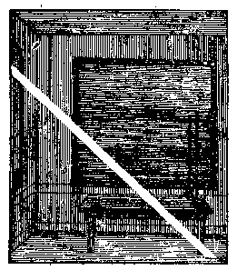

当你手上拿着一粒弹子，要使它落下时，恰好能击中地上某一个很小的目标，也只有当眼睛对着弹子，当弹子与地上的目标重合时，弹子竖直落下时才能击中地上的目标，这表明，来自地上目标的光线向上投射时，是直线进行的。

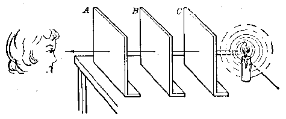

> 原书旁注：在同一媒质中，光是直线传播的

这些例子都说明了，光在同一种均匀媒质里（例如在空气中）是沿着直线传播的。

日常生活中有很多光现象，都可以用光的直线传播来解释，如象和影，它们都是光线直线传播的结果。

### §1·3 小孔成象

用硬纸板做成一个暗箱，在它的一面正中戳一个小孔，另一端是毛玻璃或半透明纸，把暗箱的小孔对着光源（例如蜡烛的火焰）置放着，如图1.3所示，适当调节暗箱的位置，当小孔不太大的情况下，就会在毛玻璃上得到一个光源的清晰的倒象，它跟光源正好是上下倒置、左右互换的（如图1.3的蜡焰），这个现象称为小孔成象。

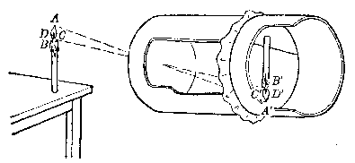

光源发出的光，经过小孔以后，为什么会在毛玻璃上形成光源的倒象呢？

我们知道，光源发出的光是向四周直线传播出去的，光源有一定的体积，它的任一个发光点（A、B、C、D、…）发出的光，只能在正对着小孔的毛玻璃上形成一个小光斑，其它光线都被纸板挡住了，这样光源的每一个发光点，都将同样在毛玻璃对应的位置上形成一个光斑，这许许多多小光斑集合起来，就形成了光源的倒象，从图中可以明显的看出，这个象对光源来说，是上下倒置左右互换的，这也是光线直线传播必然的结果。

> 原书旁注：小孔成象是光线直线传播的结果

为什么小孔的孔径不能太大呢？从图1.4中可以看出，当小孔放大以后，从光源（烛焰）上任一点（例如A点）发出的光，落在光屏上将是很大的范围而不再是对应的一点，这样必将跟从光源另一点（例如 B 点）发出的经过小孔落在光屏上的光互相重迭，互相交叉，因而不可能再形成轮廓清晰的象了。

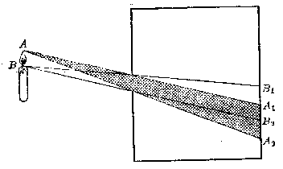

### §1·4 本影和半影

太阳光斜射在物体上，会在物体的另一侧后面投下一个阴影，这是很常见的光现象。如果光源很小，照在不透明的物体上，物体把光线挡住了，在它后面受不到光的地方，便形成一完全黑暗的阴影区（图1.5）称为物体的本影。如果有两个点光源，同时照射在同一物体上，这时在物体的后面，不仅有完全不受光照的阴影区（本影），在它的外侧还会有半阴暗的阴影区，叫做物体的半影。在图1.6中，有两个小蜡烛照在圆柱体上，在物体后的桌面上那个完全黑暗的锥形阴影就是它的本影，周围半阴暗的阴影，就是它的半影。在本影里，无论光源的那一点所发出的光都不能到达，所以它是完全黑暗的；在半影里，它能够受到光源中某一点或某一部分的照射，但是不能受到光源另一点或另一些部分的照射，所以它是半阴暗的。在图1.6中，半影区中 \(II_{1}\) 部分能够受到光源 \(S_{2}\) 的照射，但是不能受到光源 \(S_{1}\) 的照射；半影区中 \(H_{3}\) 部分则能够受到光源 \(S_{1}\) 的照射，但不能受到光源 \(S_{2}\) 的照射；在 \(H_{1}\) 和 \(H_{2}\) 以外的地方，则既能受到光源 \(S_{1}\) 的照射，又能受到光源 \(S_{3}\) 的照射，所以是完全明亮的。

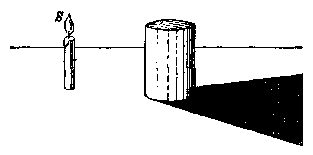

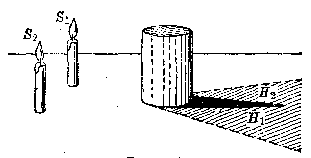

如果有两个以上点光源同时照射在物体上，这时半影区也会有阴暗程度的不同。图1.7为三支分开置放的小蜡烛，同时照射在物体上的情况。

这里可以看出：当光源是一个点光源的时候，物体后面只存在本影，不存在半影，本影的轮廓也是清晰的；当两个或两个以上光源同时照在物体上时，物体后面不仅有本影还有半影；光源分布的范围如果比物体小，这时本影是发散的（图1.5）；光源分布的范围如果比物体大，这时本影就是会聚的（图1.6、图1.7）；在距离相同的情况下，相对于物体来说，光源越大，物体的本影就越小，所以在太阳光的照射下，我们看不见架在电线杆上输电导线阴影；同样，医院外科手术室里的手术灯，就是利用光源分布的面积大，使手术时不致留下阴影，以免影响手术时的观察，所以又称为无影手术灯（图1.8）。

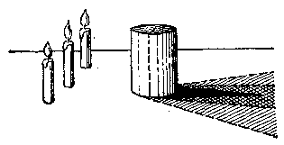

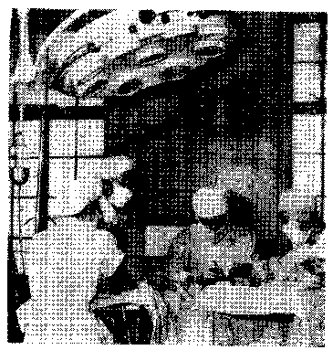

#### 习题1.4

1. 当光源照射在物体上，物体后面放置一个屏，能不能在屏上只出现物体的半影而不出现本影？如果可能的话，需要在什么情况下才能出现这种情况？试作图来说明它。

2. 在什么情况下，物体的本影既不是发散的，也不是会聚的？

3. 当月球运行到太阳和地球之间成一直线时，月球的影子就会落在地面上，这时就出现日蚀的现象（如附图），试指出这时在地球上哪一范围内才能观测到日全蚀（即完全看不见太阳）？

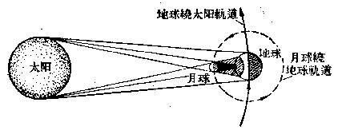

4. 当地球运行到太阳和月球之间成一直线时，月球就会进入到地球的本影里去（如附图）出现月蚀的现象，这时哪一半球上的人（按图上划分），可以看见月蚀？地球公转的轨道平面，和月球绕地球运行的轨道并不在同一平面上，想想看，地球上的人能每月看见一次月蚀吗？

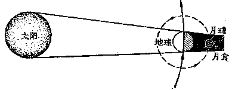

5. 太阳光下的电线杆，它在地面的投影，一天之内影的长度会有怎样的变化？这说明了什么？

6. 太阳的直径约为 \(1.4 \times 10^{6}\) 千米，与地面的平均距离约为 \(1.5 \times 10^{8}\) 千米，试在线板上载一小孔。将它对着太阳，并在孔后3米处置放另一光屏，使屏上映出太阳的象，测出象的直径来，并与计算的结果相核对。

### §1·5 光的传播速度的测定

在前面几节里，我们已经讨论了光在同一种均匀媒质中传播的规律，现在要讨论光的传播速度问题。

现代的人都已经知道，光既是一种物质的运动，它的传播当然应当有一定的速度，不过在很早很早以前，人们却不是这样想的，那时由于各种条件的限制，对光的认识还很不充分，误认为光从光源一发出，“同时”也就到达了被照射的物体上，这种印象无疑是由于光的传播速度极大所造成的，随着人类认识的发展和科学知识的积累，人们越来越感到这种想法是不合理的，于是逢有人尝试着去测定光的速度。发展到现在，光的速度不仅已经被很精确的测出了，而且光速的测定已经成为科学史上精密测量的最辉煌的成就之一，光的速度值也成为物理学中一个极重要的常数。

第一个尝试着去测量光速的是意大利物理学家伽利略（1564～1642年），他用的方法当然很原始，一天傍晚，他和他的助手，各带一个有开关的灯和计时装置，分别到达相距很远的两座小山的山顶上，两山之间的距离先已测定好了，实验开始时，伽利略先开亮他的提灯（如图1.9所示），同时记录下开灯的时刻 \(t_{1}\) 他的助手在另一座山顶上，看见他发来的灯光时，也立即开亮他的提灯，当伽利略看到对方发还的灯光时，立即记下这个时刻 \(t_{3}\) ，这样他就知道了灯光来回经过这两座山之间所经历的时间 \(t_{3}-t_{1}\) ，根据已经测定好的两山之间的距离L和时间 \(t_{3}-t_{1}\) ，从原理上就可以得出光的速度 \(v=\frac{2L}{t_{3}-t_{1}}\) 。但是，实际上伽利略这次测定并未获得成功，因为他们所选定的这两座山之间的距离太近，只有1.5公里左右，而光的速度又是如此之大，以致于往返于这两座山之间只需要十万分之一秒左右！这是人的感觉所觉察不到的，一般的计时装置也远不能达到这样的精确度，而且，即使有这样精确的时钟，象上述这样的测量方法，由于开灯、按表等机械动作所引进的误差，这些误差本身会比光往返于两座山之间所经历的全部时间大几万倍，因而这样的测量也就没有实际的意义了。

伽利略的实验测定给人们的启发是：由于光的速度极大，要测定它，一定要在更大得多的空间距离中进行，或者用更精巧的实验设计、实验装置来测定，十七世纪以后，科学家们沿着这两个方向继续探索测定光速的方法，果然获得了成功。

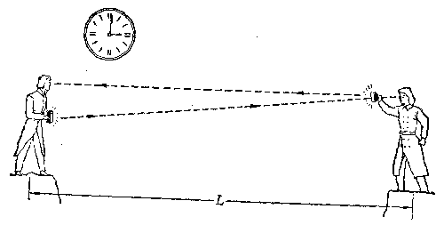

第一个用更大的空间距离来测定光速并获得成功的，是丹麦的天文学家罗麦（1644～1710年），他于1676年，通过对木星的几个卫星进行天文观测，这样就使光经历的路程比上述的方法增大了几亿倍，第一次成功地测量出光的有限速度。图1.10表示地球、木星绕太阳公转的情况，木星和地球都各有自己的卫星（“月亮”），当木星的“月亮”进入到木星的本影中时，便周期地发生“月蚀”现象，而每两次“月蚀”的时间间隔，即“月亮”绕木星一周所经历的时间，应当是相等的，但是罗麦观察的结果都是不相等的，并测出了它们的平均时间，他发现当地球与木星在太阳的同一侧去观测木星的“月蚀”时，比平均时间提前了约11分钟，而当地球与木星分居于太阳的两侧去观测木星的“月蚀”时，又比平均时间推迟约11分钟才发生，在太阳的两侧分别测出的时间相差共计22分钟，这是因为光线多通过了地球公转轨道的直径这样一段距离的结果，罗麦当时设想这段距离为 \(2.9\times10^{8}\) 千米，这样便第一次具体地算出了光的速度为 \(2.2\times10^{8}\) 米/秒，由于当时他所能知道的地球公转轨道直径的数值不如现在的确切，他那时所使用的时钟，准确性当然也不可能很高，因而测出的光速数值偏低一些；如果考虑到当时的技术条件，罗麦的测定实在是一次伟大的贡献，他第一次向人们证明了光速是有限的和可以测量的，所以他的测定也是值得人们纪念的。

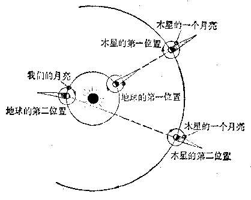

第一个用改进实验装置和技巧测定光速获得成功的，是法国的物理学家斐索（1819～1896年），1849年斐索首次在地面上相当短的距离内对光速进行了实际测量，图1.11是测定方法的示意图，从光源发出的光束，经倾斜置放的玻璃片反射后，穿过齿轮的齿间空隙投射到与齿轮相距8633米外的平面镜又反射回来，再经原来的齿间空隙进入观察者的眼内；当齿轮开始转动后，眼睛还是能够看见灯光的，只有转速增大到一定程度，穿过齿轮射到平面镜上被反射回来的光束，正好被齿轮的齿所阻挡，这时观察者看不到被反射回来的灯光；斐索继续将齿轮的转速增大，使发射光束穿过某一齿间空隙后，反射回来再经过齿轮时（这时光束间已经过 \(2 \times 8633 = 17266\) 米的路程），在这段时间内齿轮刚好转过一个齿，因而得以在下一个齿间空隙穿过到达观察者的眼睛，使观察者又第一次重新看见灯光，斐索所使用的齿轮为720齿，当转速增大到25.2转/秒时，才第一次重新看见灯光的，可知光通过 17266 米路程所经历的时间，也就是齿轮转过一个齿的时间为：\(1 / (25.2 \times 720) = 5.51 \times 10^{-5}\) 秒，这样就得出了光的速度：

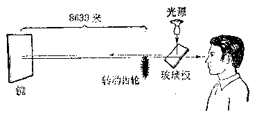

$$
c = \frac {1.7266 \times 10 ^ {4}}{5.51 \times 10 ^ {- 5}} = 3.18 \times 10 ^ {8} \text{米/秒}
$$

斐索当时用这种方法测出了短暂的时间，无疑是既简单又巧妙的。

继他们之后，又有很多学者不断改进方法，进一步精确地测出了光的速度，其中最重要的是美国实验物理学家迈克耳逊（1852～1931年）所进行的一系列的测定。

下面介绍迈克耳逊的一种测定方法，实验装置如图1.12所示，整个实验装置分别安装在两座距离已经由美国海岸大地测量局测定好了的山顶上，在威尔逊山顶装有：强光源、电动旋转八面镜A、望远镜筒、和直径是60厘米的大凹面镜M；在相距35.4公里远的圣安东尼山顶上装有一平面镜 \(M'\) 。从强光源发出的光，射到八面镜的镜面上，这时八面镜是静止的，反射以后到达凹面镜M，经凹面镜反射就到达圣安东尼山顶上的平面镜 \(M'\) ，再反射回凹面镜M，最后又射回到八面镜的另一镜面3上（如图中所示），调节望远镜筒，使从镜面3反射回来的光线，恰好能进入望远镜筒被观测到，这样实验装置就算调节好了。这时让电动机带动八面镜转动起来，原来能从望远镜筒看见的光线便立刻消失了，因为从镜面1、凹面镜M、平面镜M'反射回到八面镜上来时，镜面3已经转过去了一个角度，原来能够经过镜面3的反射而进入望远镜筒的光线，现在已不再能准确地射入镜筒中；继续加快电动机的转速，使从镜面1反射出去的光线，经过一系列镜面的反射回到八面镜上来时，八面镜恰好转过去1/8周，即镜面2正好转到原来静止时镜面3的位置上，这样，经镜面2的反射，光线又能够进入望远镜筒中，于是观察者从望远镜筒中又能看见从光源发出的光；记下这时电动机的转速，就知道了八面镜转动1/8周所经历的时间，迈克耳逊根据这段时间和两山顶间已经测出的距离，就计算出了光在空气中的传播速度，经过进一步计算，也就得出了光在真空中的传播速度：

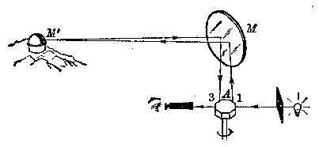

$$
c = 299, 796 \pm 4 \text{公里/秒} ^ {*}
$$

迈克耳逊的这一测定方法，实际上是对斐索齿轮装置的改进，迈克耳逊后来还多次设计了不同的精密而巧妙的测定方法，得出越来越精确的测定值。世界各国学者也作了大量这方面的精密测定。

近来，真空中光速的较精确的测定值为：

$$
c = (2.997924580 \pm 0.000000012) \times 10 ^ {8} \text{米/秒}
$$

随着人类认识的进步和科学技术的发展，测定光速的方法还将不断地改进，测定的结果也必将更加精确；光在真空中的速度 \(c\)，是物理学中最重要的常数之一，准确地测出它的数值具有很重要的意义。

> 注：\(c=299\,796\pm4\) 公里/秒，表示所测定出的数值，其误差的绝对值，最大不超过4公里/秒。

在一般情况下，光在真空中的传播速度，可约取作：

$$
c = 3 \times 10 ^ {8} \text{米/秒}
$$

光的速度是极大的，它在1秒钟内所能通过的路程，在数值上大约相当于地球赤道周长的七倍半，相对论指出：光速是一切物质运动速度的极限值，没有任何物质运动的速度是可以超过光速的。

> 原书旁注：光速 \(c=3\times10^{8}\) 米/秒）是一切速度的极限

实验和计算指出：光在透明媒质里的传播速度，比在真空里的小，法国物理学家傅科（1819～1868年）曾经用很长的水管，测出了光在水里的传播速度，测得的数值为 \(2.23\times10^{8}\) 米/秒约等于光在真空中传播速度的3/4，即 \(v_{水}=\frac{3}{4}c\) ；几年以后，迈克耳逊又测出光在二硫化碳液体中的速度为 \(1.71\times10^{8}\) 米/秒，约等于光在真空中传播速度的3/5，即 \(v_{二硫化碳}=\frac{3}{5}c\) 。现在知道，光在空气里的传播速度比在真空中小67公里左右，这个数值比光速本身小很多，所以它们可以看成是近似相等的。光在水晶里的传播速度大约是真空里的2/3，光在金刚石里的传播速度大约是在真空里的2/5。

#### 习题1.5

1. 已知地球离开太阳的平均距离为 \(1.5 \times 10^{8}\) 千米（这个距离通常也取作长度单位，叫做天文单位），冥王星离开太阳的平均距离为 \(5.9 \times 10^{9}\) 千米，问太阳光射到地球上和冥王星上，各需要多少时间？

2. 织女星离开地球的平均距离约为 \(2.6 \times 10^{14}\) 千米，当我们仰望天空，看见织女星时，这实际是多少年以前发出的光？

3. 天文学上常用1光年（就是光在一年时间内所经过的距离）来做长度的单位，已知北极星离开地球约为44光年，仙女座星云离开我们约为二百万光年，问北极星和仙女座星云离开地球的距离各为多少公里？

### 本章提要

1. 发光的物体叫光源。光源分为两类：天然光源和人造光源。光源有的是固体，有的是气体，也有液体发光的。按发光的型式来分，有的是热发光，有的是冷发光。

2. 光在同一种均匀媒质中是直线传播的。小孔成象、本影、半影、日食、月食等都是光的直线传播而产生的光现象。

3. 光在真空里的传播速度是 \(c = 3 \times 10^{8}\) 米/秒，它是一切运动速度的极限。

4. 光在其它媒质里传播速度，都比在真空里的传播速度小。光在空气中的传播速度可以近似看成是跟光在真空中的速度相等，光在水里的传播速度 \(v_{\text{水}} = \frac{3}{4}c\).

### 复习题一

1. 在太阳光的斜射下，一电线杆的影长为8米，旁边有一根长为2米的直立木杆，影长2.5米，问电线杆的实际长度是几米？

2. 有一长为12厘米的小孔暗箱，在小孔前8厘米处，置放一长3厘米的烛焰，问这时暗箱的毛玻璃上蜡焰的倒象有多长？

3. 在半径为 50 厘米的圆桌面的正上方 3 米高处，挂一有白瓷灯罩的电灯，灯罩的球半径为 20 厘米，桌子的高为 80 厘米，问桌面投射在地面上的本影有多大？

4. 已知太阳的半径为 \(6.95 \times 10^{5}\) 公里，地球公转轨道半径约为 \(1.5 \times 10^{8}\) 公里，求地球圆锥形影子的长度（地球的半径是 6400 公里）。

5. 月球离开地球的距离约为 384，000 公里，月球的直径对地球上的观察者的眼睛所张的角是 \(0.5^{\circ}\)，试根据所给的条件求出月球的直径。

## 第2章 光的反射和折射

光在同一均匀媒质里，是直线传播的，这已为大量经验事实所证实，上一章我们正是讨论了在这种情况下光的传播；当然，光如果不是在同一种媒质里传播（例如从空气射到水里，或从空气射入玻璃），或者，媒质是不均匀的（例如光从密度较小的稀薄空气斜射入正常密度的空气中）、不纯净的（例如媒质中悬浮有其它物质微粒），这时光的传播情况，就会比在同一种均匀的媒质里传播复杂些；在这一章里，我们将分别予以一一讨论。

### §2·1 在两种媒质界面上的光现象

当光线从一种媒质斜射入另一种媒质中时，在两种媒质的分界面处，光线就会改变原来传播的方向；例如，光从空气斜射入水中，当光传到空气和水的分界面处时，就分成了两部分，一部分光改变了原来的方向，回到空气里继续传播（水面上常见的反光或耀光现象，便是这部分光线形成的）；另一部分光线，同样也要改变原来的方向，进入水中继续传播；我们将一支铅笔半截插在水中（如图2.1），从玻璃杯外面看去，好象铅笔在水面处折断了一样，这就是光的传播方向在空气和水的分界面发生了偏折的缘故。

光从一种媒质射到另一种媒质时，有一部分光在媒质的分界面上改变了传播的方向，回到原来的媒质里继续传播，这种现象，叫做光的反射；另外一部分光在媒质的分界面上也改变了原来传播的方向，进入到另一种媒质里继续传播，这种现象，叫做光的折射。

我们把射到界面上的光线叫做入射光线（图2.2）；入射光线跟媒质分界面的交点，叫入射点；过入射点与媒质分界面垂直的直线称作法线；入射光线跟法线的夹角 \(a\) 叫入射角；从界面反射回到原来媒质的光线，叫反射光线；反射光线跟法线的夹角 \(b\) 叫反射角；折射入另一种媒质里去的光线叫折射光线；折射光线跟法线的夹角 r 叫折射角。

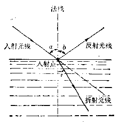

入射光线的强度（从而它的能量）*，可以近似地看成是反射光线强度和折射光线强度的总和，说它是近似相等，是因为还有一部分光的能量被媒质吸收了。例如将一盆水曝晒在强烈的太阳光下，过一些时候，水的温度就会升高一些，这就是水吸收了太阳光的能量以后，把太阳光的能量转变成水的内能的缘故。反射光线、折射光线的能量的分配百分比，是随着入射角大小的改变而改变的，在一定的范围内，入射角增大时，折射光的能量将有所减弱，反射光的能量则相应的增强，而它们能量的总和仍近似的等于入射光的能量。光的反射、折射和吸收等是光投射在两种媒质分界面上时发生的重要光现象，下面将分别加以讨论。

> 注：* 光的能量跟它强度的平方成正比。

### §2·2 光的反射和漫反射

光射到两种媒质的分界面上，如果界面是光滑的平面，平行的入射光线经过界面反射以后，会沿着某一方向反射出去，即反射光线也保持平行，这种反射称做光的单向反射，也简称为光的反射（图2.3）.在暗室里，让一束光线斜射到平面镜上，我们只有沿着一定的方向看过去，才能看见从镜面上反射出来的光，从其它方向看过去是看不见反射光的。这说明原来投射到平面镜上的光线，只是沿着某一方向反射出去的。

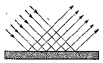

#### 1. 光的反射定律

光在反射时，它的规律是怎样的呢？下面我们通过实验来研究它：

（1） 先按照图 2.4 那样的实验装置，平板中央镶有一块小平面镜 \(M\)，镜面是朝上的，在平板上直立一块白色的屏，这屏是由两块矩形的平板镶接起来的，并能沿着接缝 \(ON\) 向前折或向后折，开始时，两块板在同一平面上，当光线沿着某一方向 （例如 \(AO\) 方向） 沿屏面射到平面镜 \(M\) 上，这时便能从屏面看到有光线 \(OB\) 沿着屏面射出；如果将原来含有反射光的那块板向前或向后折，这时在这块上就看不到从 \(A\) 点射来的经镜面反射出去的光线了，这表明：反射光和入射光是在同一平面里。

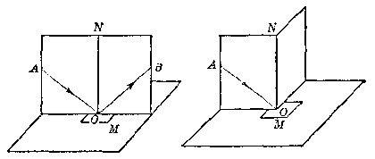

（2） 再照图 2.5 那样，在有刻度的圆盘的圆心处安放一个平面镜，使镜面跟圆盘平面相垂直，刻度盘边缘附有一光源S，穿过狭缝可以让光线投射到平面镜上，光源S跟圆盘是可以相对转动的，这样就可以任意改变入射角的大小，入射角a和反射角b都可以从刻度盘上直接读出来。改变光源的位置，使入射光线沿着不同的方向射到平面镜上，实验的结果表明：反射角总是等于入射角的。

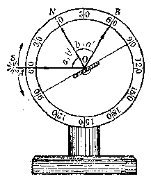

> 原书旁注：反射时：\(\angle a=\angle b\)

这样我们便从上述实验结果总结出光的反射定律：

（1） 反射光线总是在入射光线和法线所决定的平面里，并且跟入射光线分居在法线的两侧。

（2） 反射角等于入射角。

我们还可以做一个很简便的实验来验证一下光的反射定律。

把一块小平面镜侧放在水平木板上，使镜面跟板面垂直（如图2.6），沿着镜面和板面的相交处画一条直线\(M_{1}M_{2}\) ，在线上O点处钉一大头针，并过O点作ON垂直于 \(M_{1}M_{2}\) ，再在法线\(ON\) 的一侧 \(P_{1}\) 和 \(P_{2}\) 处各钉一枚大头针，使 \(P_{1}P_{2}O\) 在一条直线上，这时在平面镜内就有这两枚大头针的象（各在 \(P_{1}^{\prime}\) 和 \(P_{2}^{\prime}\) 处）.用一只眼睛在\(E\) 处去看平面镜中这两枚针的象，当眼睛看见两枚针的象跟 \(O\) 点的大头针重合为一的时候，这时就在 \(P_{1}^{\prime}P_{2}^{\prime}O\) 的延长线上再分别钉另外两枚大头针，例如在 \(P_{3}\) 和 \(P_{4}\) 处，然后用铅笔把 \(P_{1}P_{2}O\) 和 \(P_{4}P_{3}O\) 分别连成两条直线。眼睛在 \(E\) 处看见平面镜里的直线 \(P_{1}^{\prime}P_{2}^{\prime}O\) ，就是光线沿着 \(P_{1}P_{2}O\) 方向射到平面镜上，反射以后射到 \(E\) 处的结果，因而 \(OP_{3}P_{4}\) 也就是入射光 \(P_{1}P_{2}O\) 的反射光，它们在同一平面上，用量角器量得入射角 \(\angle P_{1}ON\) 和反射角 \(\angle NOP_{4}\)，结果也是相等的；改变 \(P_{1}, P_{2}\) 的位置，重复上述实验过程，得出的结果也相同。大家可以自己试试看。

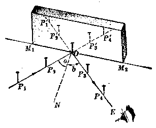

#### 2. 反射光路的可逆性

在图2.5的实验装置里，如果将光源 \(S\) 移至法线的另一侧 \(B\) 点处，使入射光线沿着 \(BO\) 方向射到平面镜上，也就是使入射角 \(\alpha'\) 等于原来的反射角 \(b\) ，根据反射定律，这时反射光线一定是沿着 \(OA\) 方向射出去，\((\because \angle b' = \angle a', \angle b = \angle a,\) 而 \(\angle a' = \angle b, \therefore \angle b' = \angle a.)\) 也就是说，这时的反射角等于原来的入射角，这说明光在反射时，光路是可逆的。根据这一光路的可逆性，可以作出如下的判断：如果有甲乙二人，中间被墙或其它障碍物阻隔，因而彼此都看不见对方，由于用几面平面镜的一再反射，终于使甲看见了乙，则可以断定这时乙也能看见甲的。

#### 3. 漫反射

实际表明并不是光线投射在任何表面上都能引起单向反射，要看反射面的情况而定。例如：在暗室里，让一束平行光线射到一张白纸上，情况就跟射到一平面镜的镜面上不同。射在白纸上，我们从各个不同方向都能看见被照亮的白纸，说明各个方向都有光线反射出去；这时入射光虽然是平行的，但是经过粗糙不平的表面（纸面）反射以后，反射光就不再平行了，而是射向各个不同的方向（如图2.7），这种反射称为漫反射。引起漫反射的粗糙平面，放大了看，可以看成是由许多小平面无规则的拼合而成的，这许许多多小平面方向都不一致；入射光束虽然是平行的，其中每一条光线在它所投射的那个微小平面上反射时也是符合反射定律的，但是从整个表面来看，由于各个微小平面方向的杂乱无章，反射光束当然也就不可能再保持平行了，而是散漫地射向各个不同的方向，形成漫反射。布、纸、墙壁和一般器皿的表面，粗略看来好象是平滑的，但是仔细观察就知道它们表面上都有许多微小的凹凸不平之处，从光源发出的光，射到这种表面上，就会引起漫反射。我们能够从各个不同的方向看见本身不发光的物体，就是由于物体表面漫反射的缘故，如果一个物体 （例如一个瓶子或一面洁净的镜子）它的表面非常光滑，那么，我们所能看见的就不是这个物体表面的真实面貌，而是物体表面由于单向反射而反映出的外界景象。象图2.8那样，我们所看见的就是瓶子表面所反映出的窗户的形象。光滑平面所形成的单向反射，由于它反映出外界的景象，这对于陈列橱窗常常成为一种干扰，例如，隔着玻璃看橱内的陈列品，尤其是艺术品，观察者看见的常常是两幅景象的重迭：橱内的陈列品和外界的景象，或强烈的耀光，妨碍了观察者正常的观察或欣赏（如图2.9）；为了防止这种单向反射而引起的外界干扰，有时也将橱窗的玻璃做成弧形的，使它反映出的外界景象不致进入观察者的眼中，而透过玻璃仍能看清橱内的陈列品（如图2.10）。

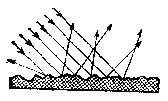

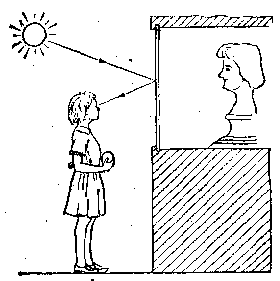

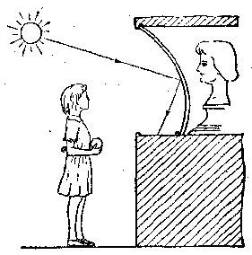

#### 例 1

一束光线垂直地射在平面镜上，把镜面动转一个 δ 角，这时反射光线跟入射光线的夹角将是多大？如果要利用镜面对光路进行控制，使反射光线与入射光线相垂直，那么，这时镜面应当怎样置放？

［解］ 这是在已知入射光方向的条件下，根据光的反射定律，从镜面的位置来求反射光方向、和从反射光方向来求镜面位置的问题。

根据题意，作出光路图（图2.11）。入射光 \(AO\) 原来是垂直地射到镜面 \(M\) 上，入射角是零度，由反射定律知道，反射角也是零度，这时反射光线、入射光线和法线是重合在一起的。在入射光线方向不变的情况下，镜面如果转动一个 \(\delta\) 角，这时法线 \(ON'\) 也随着转动一个 \(\delta\) 角，入射光线 \(AO\) 和反射光线 \(OB'\) 不再与法线 \(ON'\) 重合，而是分居在法线的两侧。从图2.11中可以看出，当镜面从 \(M\) 位置转到 \(M'\) 位置（转了一个 \(\delta\) 角）时，法线就从 \(ON\) 转到 \(ON'\) （也转了一个 \(\delta\) 角），使入射角从零度增大到 \(\angle a\) ，显然，\(\angle a = \angle \delta\) 。这时反射光线从 \(OB\) 转到 \(OB'\)，反射角也从零增大到 \(\angle b\) ，根据反射定律：

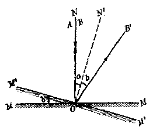

$$
\angle b = \angle a
$$

即 \(\angle b = \angle a = \angle \delta\)所以，反射光线 \(OB'\) 跟入射光线 AO 之间的夹角 \(\angle AOB'\) 是镜面转动角度 \(\delta\) 的两倍，即

$$
\angle A O B ^ {\prime} = \angle a + \angle b = 2 \angle \delta
$$

如果要利用镜面的反射，使反射光线跟入射光线垂直（如图2.12所示），设这时入射光 \(AO\) 与镜面的夹角是 \(\theta\) ，已知

$$
\angle a + \angle b = 90 ^ {\circ},
$$

根据反射定律：

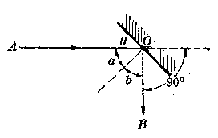

$$
\angle b = \angle a
$$

$$
\therefore \angle b = \angle a = 45 ^ {\circ}
$$

又因为 \(\angle \theta +\angle \alpha = 90^{\circ}\)

$$
\therefore \angle \theta = 90 ^ {\circ} - \angle a = 45 ^ {\circ}
$$

所以这时镜面的位置应当放置在跟入射光线成 \(45^{\circ}\) 角的方向上。

从上面的例题中可以知道，光线射在平面镜上，如果镜面转过一个微小的角度，由于镜面的转动，反射光线所扫过的角度将是镜面所转过角度的两倍；利用这个结果，可以用平面镜的反射，来测定一个不容易测量出的微小的角度（如图2.13所示），有一种灵敏电流计，在其中悬挂着的线圈上，附有一个小平面镜，当微小的电流通过线圈时，线圈就会转过一个很小的角度，这时让一束灯光射到小平面镜上，利用平面镜的反射，就可以比较明显的读出反射光线转过去的角度，从而量得这一微小电流的电流强度。此外，例如利用平面镜的反射来测定物体的微小形变等，也都是利用这个道理。

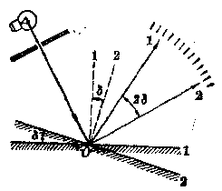

#### 习题2.2

1. 当一束光线与镜面成 \(\theta\) 角斜射到镜面上时，反射光正好跟入射光垂直，问 \(\theta\) 角是多大？如果反射光与入射光成 \(60^{\circ}\) 夹角时，\(\theta\) 角又为多大？

2. 从光源发出的光，垂直地投射在镜面上，在正对着平面镜的地方有一个很大的光屏，光屏离开平面镜的距离是5米，如果平面镜转过1°时，问镜面反射到光屏上去的光斑将移动多少距离？

3. 两平面镜互相垂直（如附图），一光束从A投射到其中一平面镜上，经两个平面镜反射后沿 CD 方向射出，试证明反射光线 CD 总是平行于 AB，方向相反，与 AB 的入射角无关。

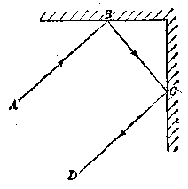

4. 如果黑板“反光”，我们为什么就看不清楚这时黑板上所写的字呢？要怎样才能使黑板不致于“反光”呢？

5. 用白粉在一个洁净的平面镜上写一个字，写好以后让太阳光射到镜面上，再反射到白墙上去，这时在墙上会看到什么现象？做这个实验并加以解释。

### §2·3 光的折射和全反射

前面已经讲到，光射到两种媒质的分界面上，除了有一部分光线改变方向反射回原来的媒质继续传播以外，还有一部分光线将折射入另一媒质进行传播，只有在满足一定的条件下，光射在两种媒质的分界面上，才只发生光的反射而没有光的折射现象，关于这种特殊情况，我们在讨论了一般情况之后，也要仔细讨论。

#### 1. 光的折射定律

光在折射的时候又遵循什么规律呢？我们将研究反射定律的装置（图2.5）中的平面镜换成一个半圆形的透明玻璃水缸，如图2.14所示，在暗室里先使光源S发出的光垂直地投射在水面上，这时入射角α等于零，光线沿原来的方向进入水中，折射角r也等于零；沿着圆盘改变光源S的位置，也就是改变射到水面的光线的入射角 \(\alpha_{1}\) ，这时折射角 \(r_{1}\) 可以从圆盘边缘的刻度中读出，\(\angle r_{1}\neq\angle\alpha_{1}\) ，继续改变光源 S 的位置，即改变入射角为 \(\alpha_{2}\) 、 \(\alpha_{3}\) 、 \(\alpha_{4}\) ，并从圆盘刻度中读出相应的折射角为 \(r_2, r_3, r_4\cdots\)，我们发现：除了入射角为零（正入射）的情况外，折射角都不等于入射角，入射角增大时，折射角也相应的有所增大，入射角减小时，折射角也有所减小。对于光从空气射入水中的情况来说，折射角 r 总是小于入射角 a 的，但是它们的比值 \(\alpha/r\) 不是常数，表明 \(\alpha\) 与 r 的关系并不是简单的正比关系，如果我们根据光从空气射入水中，和射入玻璃砖中测得的入射角和相对应的折射角的数据，画出图象来（如图2.15），则可以看出这两个相似的图象，都不是很简单的函数关系（例如一次函数或二次函数），所以在漫长的时间里，人们都没有找出入射角跟折射角之间的规律。直到1621年才由菲涅耳（1591～1626年）发现了光从空气射入玻璃时，入射角跟折射角之间的关系如图2.16所示。图象表明：入射角的正弦 \((\sin\alpha)\) 跟折射角的正弦 \((\sin r)\) 之比，是个常数。对于光从任何一种媒质斜射入另外任何一种媒质时，\(\sin\alpha\) 和 \(\sin r\) 的关系图象，都是一条倾斜的直线，只是倾率不同而已，也就是说随着媒质的不同，\(\sin\alpha/\sin r\) 的比值是不相同的。

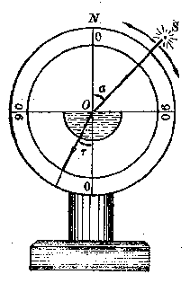

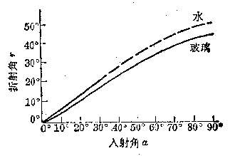

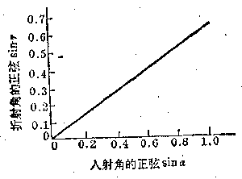

总括起来，光的折射定律就是（1） 折射光线总是在入射光线和法线所决定的平面里，并且和入射光线分居在法线的两侧。

（2） 不管入射角怎样改变，入射角的正弦跟折射角的正弦的比，对于所给定的两种媒质来说，总是一个常数（这

> 原书旁注：折射时：

$$
\frac {\sin \alpha}{\sin r} = \text{常数} (n)
$$

个常数就叫做光线由第一种媒质射入第二种媒质时的折射率）即：

$$
\frac {\sin \alpha}{\sin r} = n
$$

我们也可以做一个很简单的实验来验证一下光的折射定律。

在一块木板上画一个圆，再画出互相垂直的两个直径 \(MM'\) 和 \(NN'\)，把圆分为四个象限，过圆心O在第三象限内引任意半径OA，并在它上面A、B两处分别插上一枚大头针，然后把木块浸入盛水的玻璃容器中，使水面恰好落在 \(MM'\) 线上（如图2.17所示）；这时在第一象限内用一只眼睛来观察浸没在水中的大头针，并且在第一象限内的O点处插上另一枚大头针，使眼睛看过去时A、B、C三处的大头针在同一条直线上；之后再取出木板，用铅笔把OC联接起来，我们将发现：OA和OC实际上并不在同一条直线上。为什么当木板浸在水里的时候，从O点看过去，这几枚针好象是在同一条直线上呢？这是因为光线从AB两处的大头针上射到空气中来时，在水面处发生了折射，光线沿AB方向到达水面上的O点，折射以后就沿着OC的方向射入眼里，于是看上去好象它们是在同一条直线上。如图2.18所示，光从水射入空气，AO是入射光线，OC是折射光线，\(\angle AON'\) 是入射角，\(\angle CON\) 是折射角，于是我们可以量出入射角和折射角，并求出它们的正弦值的比来。重复以上实验，又可以求得 \(A'\)、\(B'\) 和 \(C'\) 三点，记下这时的入射角 \(a\) 和相应的折射角 \(r\)，用三角函数表查出 \(\sin a\) 和 \(\sin r\) 的数值，也可以求出它们的比来。多次重复上述实验，可以证实 \(\sin a / \sin r\) 总是一个常数。用这种方法也就测出了光线从水射到空气时的折射率。

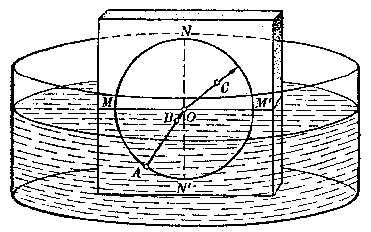

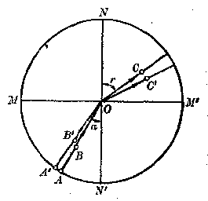

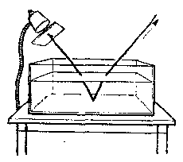

光线从一种媒质射入另一种媒质时，并非是在任何情况下，都是折射角小于入射角的，随着情况的不同，媒质的不同，也有折射角大于入射角的情况，而这时仍然是不违背折射定律的。如图2.19，这是什么缘故呢？下面我们就讨论这个问题。

#### 3. 折射率

光线从第一种媒质（即入射光原来传播的媒质），射入第二种媒质（即另一种媒质）发生折射时，入射角的正弦跟折射角的正弦的比值，对于所给定的两种媒质来说，是一个常数，用 \(n_{21}\) 来表示，根据折射定律就是

$$
\frac {\sin a}{\sin q} = n _ {g 1}
$$

常数 \(n_{21}\) 称做光线从第一种媒质射入第二种媒质时的折射率，或称做第二种媒质对于第一种媒质的相对折射率。它的数值取决于两种媒质的光学性质，跟入射角的大小无关。

实验证明：光从第一种媒质射入第二种媒质时的折射率，跟光在这两种媒质里的传播速度有联系，相对折射率

> 原书旁注：相对折射率跟速度的关系：

$$
n _ {21} = \frac {v _ {1}}{v _ {2}}
$$

\(n_{21}\) 在数值上又等于光在第一种媒质里的传播速度 \(v_{1}\) ，跟光在第二种媒质里的传播速度 \(v_{2}\) 的比，即

$$
\frac {\sin \alpha}{\sin r} = n _ {21} = \frac {v _ {1}}{v _ {2}}
$$

如果光线是从真空射到某种媒质里，则有：

$$
\frac {\sin \alpha}{\sin r} = n = \frac {c}{v}
$$

\(c\) 为光在真空中的传播速度。我们把光线从真空射入媒质时的折射率 \(n\)，叫做这种媒质的绝对折射率，简称为这种媒质的折射率。

实验表明：光在任何媒质里的传播速度 v 都比在真空里的传播速度 c 小，所以任何媒质的绝对折射率 \(\left(n=\frac{c}{v}\right)\) 都大于 1。光在空气里的传播速度比在真空里略小一些，可以看成是近似相等，因而空气的折射率 \(n_{空气}=\frac{c}{v}\approx1\) 。这样我们就常常把光线从空气射入某种媒质时的折射率，当做这一媒质的折射率。

下面是几种媒质的折射率。

| 固体 | 折射率 | 液体 | 折射率 | 气体 | 折射率 |
| --- | --- | --- | --- | --- | --- |
| 金刚石 | 2.42 | 甘油 | 1.47 | 水蒸汽 | 1.026 |
| 重火石玻璃 | 1.74 | 酒精 | 1.56 | 氖 | 1.015 |
| 二硫化碳 | 1.63 | 乙醚 | 1.85 | 空气 | 1.0003 |
| 岩盐 | 1.55 | 水 | 1.33 |   |   |
| 水晶 | 1.55 |   |   |   |   |
| 轻冠牌玻璃 | 1.52 |   |   |   |   |
| 冰 | 1.31 |   |   |   |   |

从媒质的折射率跟光在媒质中的传播速度之间的关系，还可以得出相对折射率跟绝对折射率之间的关系。

$$
\because n _ {1} = \frac {c}{v _ {1}}
$$

$$
n _ {2} = \frac {c}{v _ {2}}
$$

则有 \(\frac{n_2}{n_1} = \frac{\frac{c}{v_2}}{\frac{c}{v_1}} = \frac{v_1}{v_2}\)又因为 \(n_{21} = \frac{v_1}{v_2}\)

$$
\therefore \quad n _ {21} = \frac {n _ {2}}{n _ {1}}
$$

即 \(\frac{\sin\alpha}{\sin r} = n_{21} = \frac{v_1}{v_2} = \frac{n_2}{n_1}\)所以折射定律也有用下式来表示的：

$$
n _ {1} \sin \alpha = n _ {2} \sin r
$$

根据公式 \(n = \frac{c}{v}\) 可以知道，媒质

> 原书旁注：相对折射率跟绝对折射率的关系：

$$
n _ {21} = \frac {n _ {2}}{n _ {1}}
$$

的折射率 n 越大，光在这种媒质里的速度 v 就越小。两种媒质比较起来，我们把折射率比较小（光在里面传播速度比较大）的媒质，叫做光疏媒质；折射率比较大（光在里面传播速度比较小）的媒质，叫做光密媒质。

从关系式

$$
\frac {\sin \alpha}{\sin \gamma} = \frac {n _ {3}}{n _ {1}} = \frac {v _ {1}}{v _ {3}}
$$

可以看出，光线从光疏媒质 \(n_1\) 射入光密媒质 \(n_3\) 时 \((n_1 < n_3, v_1 > v_3)\)，折射角小于入射角 \((\sin \alpha > \sin r, \alpha > r)\)；如果光线是从光密媒质射入光疏媒质 \((n_1 > n_3, v_1 < v_3)\)，则折射角大于入射角 \((\sin \alpha < \sin r, \alpha < r)\)。

根据以上的分析，就可以了解在图 2.19 中为什么光从空气射入水中（从光疏媒质射入光密媒质）时，折射角小于入射角，经水底光洁的镜面反射后，光线再从水射入空气（从光密媒质射入光疏媒质）时，折射角则大于入射角。

> 原书旁注：光从光疏媒质射入 光密媒质时，折射 角小于入射角

为什么光从传播速度较大的媒质（光疏媒质）斜射入传播速度较小的媒质（光密媒质）时，折射角一定小于入射角呢？我们可以这样来理解：

设想有一束平行光，从一种媒质斜射入另一种媒质，光在第一种媒质里传播速度比较大，在第二种媒质里传播速度比较小 \((v_{1} > v_{2}, n_{1} < n_{2})\)；第一种媒质是光疏媒质，第二种媒质是光密媒质；当平行光射到 \(\Delta A'\) 位置时 （如图 2.20所示），\(A\) 处的光线首先进入到光密媒质里，速度开始减慢，而 \(A'\) 处的光线还继续在原光疏媒质（第一种媒质）里以较大的速度 \(v_{1}\) 传播，由于速度的不同，当 \(A'\) 处的光线射到 \(B'\) 时，\(A\) 处的光线在第二种媒质里传播到 \(B\) 处，\(A'B'\)将大于 \(AB\)，这以后平行光束又以同样的速度 \(v_{2}\) 在第二种媒质里继续传播，这样便在两种媒质的界面上发生了折射现象，折射角比入射角小。如果光线从光密媒质斜射入光疏媒质，那么情况恰好相反，折射角将大于入射角。如果光线是正入射（入射角等于零，入射光线与界面垂直），\(AA'\) 处的光线将同时进入第二种媒质，然后又同样以较小的速度在第二种媒质里传播，这时光线在界面处将不发生任何偏折现象。当然光线进入媒质时，受到媒质的影响和作用的情况是很复杂的，在这里还不能作具体的讨论。

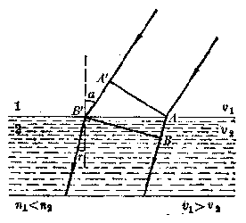

对任何一种媒质来说，孤立的问它是光疏媒质还是光密媒质，都是没有意义的，光疏媒质和光密媒质是相对的，它们只有在互相比较的时候才有意义，它们并不是由物质本身的密度来决定的。另外还应当注意，\(n_{21}\) 和 \(n_{12}\) 的脚码顺序也不能任意对调，即

$$
n _ {21} \neq n _ {12}
$$

根据 \(n_{21} = \frac{v_1}{v_2}\)

$$
n _ {12} = \frac {v _ {2}}{v _ {1}}
$$

可以得出它们之间的关系是

$$
n _ {21} = \frac {1}{n _ {12}}
$$

#### 3. 折射时光路的可逆性

光在折射时，光路也是可逆的吗？在前面图2.19的光路中，已经可以大致看出这一点，现在再略加讨论。当光线从第一种媒质斜射入第二种媒质时，根据折射定律：

$$
\frac {\sin \alpha}{\sin r} = n _ {21}
$$

如果这时让光线从第二种媒质沿着原来折射光的方向，回过来射到第一种媒质里去，即取原来的折射角 r 作为后来的入射角 \(\alpha\) ，则有

$$
\frac {\sin \alpha^ {\prime}}{\sin r ^ {\prime}} = n _ {12}
$$

$$
\because \angle \alpha^ {\prime} = \angle r
$$

$$
n _ {21} = \frac {1}{n _ {12}}
$$

$$
\therefore \quad \frac {\sin \alpha}{\sin r} = \frac {1}{n _ {12}} = \frac {1}{\frac {\sin \alpha^ {\prime}}{\sin r ^ {\prime}}} = \frac {\sin r ^ {\prime}}{\sin \alpha^ {\prime}}
$$

即 \(\sin r' = \sin \alpha\)

> 原书旁注：光在反射和折射时，光路都是可逆的

$$
\angle r ^ {\prime} = \angle \alpha
$$

表明这时折射光线将逆着原来入射光线的方向射去，也就是说，折射时光路也是可逆的。

#### 例 2

水池中的鱼，或盛有水的杯中的分币，从水外面看去，为什么要比原来的位置要浮起一些？

［解］这是由于光从水中射入空气时发生折射所引起的感觉：从图2.21中可以看出：从 \(A\) 点射出的光线，经水面射入空气时，发生了折射（折射角大于入射角），站在池旁的人看起来，好象是从 \(A'\) 点发出的一样，其它各点的情况也相似，这样整个鱼在水中的位置看上去就比实际的位置高一些。大家可以在盛水的杯中投入一个分币，试验一下看是不是有这样的感觉。

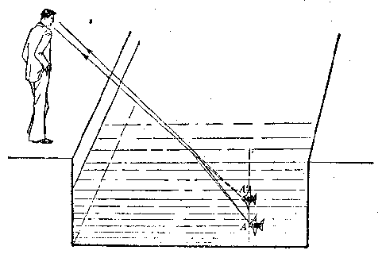

根据以上的分析，也可以说明为什么人站在水中时，从水面上看去好象人的腿短了一些似的 （如图 2.22、2.23）。类似的现象是我们常常可以遇见的。

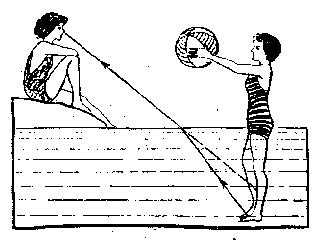

#### 例 3

已知光线从空气射入甲媒质时，入射角是 \(45^{\circ}\)，折射角是 \(30^{\circ}\)；从空气射入乙媒质时，入射角为 \(45^{\circ}\) 时，折射角是 \(18^{\circ}\)，问当光线从甲媒质射入乙媒质时入射角是 \(45^{\circ}\)，折射角应比入射角大还是比入射角小？为什么？是多少度？

［解］ 这个问题的要求是从入射角和折射角的大小来计算媒质的折射率，再根据媒质的折射率来判断哪一种媒质是光疏媒质，哪一种媒质是光密媒质，最后在给定入射角大小的条件下，计算出光从甲媒质射入乙媒质时折射角的大小。

根据题意作图 2.24（a） 和 （b），从图 （a） 中所给出的条件，可以计算出甲媒质的折射率：

$$
n _ {\mathrm{甲}} = \frac {\sin a}{\sin r} = \frac {\sin 45 ^ {\circ}}{\sin 30 ^ {\circ}} = \frac {0.707}{0.5} = 1.41
$$

从图（b）中所给出的条件，可以计算出乙媒质的折射率：

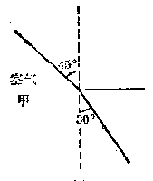

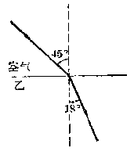

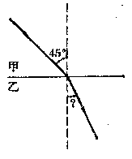

*图2.24*

$$
n _ {\mathrm{乙}} = \frac {\sin \alpha}{\sin r} = \frac {\sin 45 ^ {\circ}}{\sin 18 ^ {\circ}} = \frac {0.707}{0.309} = 2.25
$$

比较甲乙两种媒质的折射率，可以知道，甲媒质的折射率比较小，是光疏媒质，乙媒质的折射率比较大，是光密媒质。所以光从甲媒质射入乙媒质时，折射角比入射角小，即小于 \(45^{\circ}\). 于是可作图 2.24（σ）。

又根据计算式：

$$
\frac {\sin \alpha}{\sin r} = \frac {n _ {\mathrm{乙}}}{n _ {\mathrm{甲}}}
$$

$$
\frac {\sin 45 ^ {\circ}}{\sin r} = \frac {2.25}{1.41}
$$

$$
\sin r = 0.707 \times 0.627 = 0.443
$$

得 \(r = 26^{\circ}18'\)这说明，光从甲媒质射入乙媒质时，入射角是 \(45^{\circ}\)，折射角是 \(26^{\circ}18'\)。显然，与前面分析的结果一致：折射角比入射角小。

#### 4. 全反射

光从一种媒质射入另一媒质时，一般是同时发生反射和折射的，当然并不是在任何情况下都是这样，例如，光从玻璃（光密媒质）射入空气（光疏媒质）时，折射角是大于入射角的，随着入射角的增大，折射角也将相应增大，于是就会发生这样的情况，就是在入射角还没有增大到 \(90^{\circ}\) 以前，折射角就已经达到 \(90^{\circ}\)，这时折射光恰好掠过媒质的分界面，跟界面平行（折射角 \(\angle r=90^{\circ}\)）.如果再继续增大入射角，光线就全部反射回到玻璃中，并保持反射角等于入射角，不再有光线进入空气（如图2.25），形成全反射现象.我们把使折射角等于 \(90^{\circ}\) 的入射角A叫做临界角.所以，要发生全反射，必需满足下列条件：

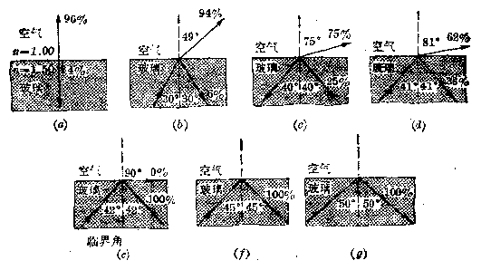

（1） 光线从光密媒质射入光疏媒质；

（2） 入射角大于或等于临界角。

当入射角等于临界角时，为什么也是全反射呢？因为随着入射角的增大，反射光的能量（强度）的百分比分配在逐渐增大，而折射光能量（强度）

> 原书旁注：只有光从光密媒质射入光疏媒质时，才有可能发生全反射

在逐渐减小，当入射角等于临界角时，折射光的强度已减弱为零，光已全部反射回原来的媒质了 （见图 2.25 从 （a） 到 （a） 的变化）。

随着媒质的不同，临界角的大小也不同，下面讨论临界角跟折射率的关系。

设有一束光线从折射率为 \(n_1\) 的光密媒质，射入折射率为 \(n_2\) 的光疏媒质，\(n_1 > n_2\)，根据折射定律：

$$
\frac {\sin a}{\sin r} = n _ {21} = \frac {n _ {2}}{n _ {1}}
$$

当折射角 \(\angle r = 90^{\circ}\) 时，入射角 \(\alpha\) 即为临界角 \(c\) ，即

$$
\frac {\sin c}{\sin 90 ^ {\circ}} = n _ {21} = \frac {n _ {2}}{n _ {1}}
$$

$$
\therefore \quad \sin c = n _ {21} = \frac {n _ {2}}{n _ {1}}
$$

如果是光从媒质射入真空（或空气）发生全反射，则计算临界角的公式：

$$
\sin c = \frac {1}{n}
$$

即

$$
\sin c = \frac {n _ {\text{真空}}}{n _ {\text{媒质}}}
$$

$$
\sin c = \frac {1}{n}
$$

下面是几种媒质相对于真空或空气的临界角。

| 固体 | 临界角 | 液体 | 临界角 |
| --- | --- | --- | --- |
| 金刚石 | 24.4° | 甘油 | 43° |
| 二氧化碳 | 38° | 酒精 | 47° |
| 各种玻璃 | 30°～42° | 水 | 48.5° |

由于全反射的缘故，潜水员在水中将会感到远处的游鱼或藻类，好象在天空云中浮游一样。而他实际所能看见的天空，实际上只有顶上方一块不太大的范围，其余部分他都无法看见（如图 2.26）。

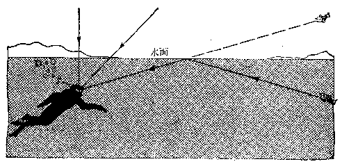

我们也可以自己做一个简单的实验来观察全反射现象。

在一个烧瓶里装半瓶清水，在瓶塞当中穿一根直钢丝，使它的下端恰好落在烧瓶的球心 O 处并与水面相靠近（如图 2.27 所示），把瓶的一个侧面从瓶底到水面分为 9 等分，即对于 O 点每隔 \(10^{\circ}\) 在瓶上贴一张有颜色的小纸条，并且在接近水面 A 处放一支点燃的小蜡烛，蜡烛发出的光，有一部分将平行于水面以接近 \(90^{\circ}\) 的入射角射入水中，这时眼睛从瓶底 N 点逐渐向 B 点 （ \(\angle NOB \approx 50^{\circ}\) ） 移动，等到移近 B 点时，就能看见从小蜡烛发出的光。已知光从水射入空气时的临界角是 \(48.5^{\circ}\) ，即当入射角 （从水到空气） 等于 \(48.5^{\circ}\) 时，折射角等于 \(90^{\circ}\) ，现在情况恰好相反，根据折射时光路的可逆性，光从空气射入水中的入射角为 \(90^{\circ}\) 时，折射角等于 \(48.5^{\circ}\) ，所以折射光会在 B 点附近射入眼中；当眼睛移到 B 点时，蜡烛的光亮却顿时就消失了，这时眼睛对着钢丝的下端 O 点时只能看到贴在 O 处的有颜色纸条，这就是从纸条射出的光线，在水面处引起全反射的结果，因为从 O 点射出的光线经水面 O 处反射到眼里，入射角 \(\angle CON\) 已经大于临界角 \(48.5^{\circ}\) 了 （ \(\angle CON = \angle BON \approx 50^{\circ}\) ）。

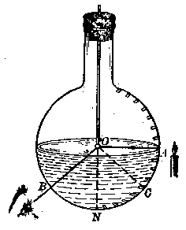

用这种方法也可以近似测定光从酒精或其它液体射到空气时的临界角。建议读者试试看。

在自然界里，我们也能经常见到一些全反射的现象，例如，露水或喷泉的水珠，常常显得明亮耀眼，这就是光在水珠内发生全反射的缘故。真的钻石由于它的临界角更易于产生全反射，所以它比假钻石的色泽更为夺目，人们常根据这个来辨别它的真伪，也是这个道理。关于技术上利用全反射的例子，我们留在后面再讨论。

#### 习题2.3

1. 光束从空气坠入水中 \((n_{\text{水}} = 1.33)\)，入射角 \(\angle a = 30^{\circ}\)，问折射角 \(r\) 是多大？如果光线从正入射 \((\angle a = 0^{\circ})\)，连续增大到掠入射 \((\angle a = 90^{\circ})\)，问折射角将有多大的改变？

2. 已知光在某种媒质里的传播速度 \(v = 1.99 \times 10^{8}\) 米/秒，求它的折射率 \(n\).

3. 金刚石的折射率是 2.42，光在金刚石中的传播速度将是多大？相对于水晶来说，它是光疏媒质还是光密媒质？

4. 已知水晶的折射率为 1.54，问水晶相对于金刚石的折射率是多大？光从水晶射入金刚石能否发生全反射？为什么？

5. 水晶的临界角 \(C\) 是多大？水晶跟冰相比哪个更有光泽？如何根据全反射的原理来解释？

6. 已知玻璃的折射率为 1.52，光线应以多大的入射角从空气射入玻璃，才能使反射光跟折射光成 \(180^{\circ}\) 和 \(120^{\circ}\) 的夹角？应以多大的入射角从玻璃射入空气才能发生全反射？

### §2·4 光的吸收和散射

#### 1. 光的吸收

光穿过媒质时，有一部分能量要被媒质所吸收，变为媒质的内能使媒质的温度升高。光的能量被媒质吸收的多少，与光所穿过的媒质的厚度、媒质的性质有关。相同的媒质，颜色深的又比无色透明的吸收光的本领大，例如：光穿过无色阴暗的赛璐珞，比穿过无色透明的赛璐珞，被吸收的能量多一倍左右。有颜色的绸比白绸吸收光的本领大2～7倍，视色绸深浅而定。所以我们冬天总是穿深色的衣服，夏天穿浅色或白色的衣服，为了防止胶片漏光，常常用黑纸将胶片包好，这是因为黑纸有较强的吸收光的本领。由于光被吸收的多少还与媒质的厚度有关系，所以有些透明体，当它非常厚时也就变成不透明了，深水或海水中，即使在白昼也是黑暗的，所以潜水员要用潜水灯照明，才能在深水中工作。

#### 2. 光的散射

光穿过媒质时，如果媒质中含有大量悬浮的其它物体微粒，或者媒质本身的密度有不停息的起伏变化，这时就会有部分光线偏离原来传播的方向而分散开来，形成散射现象。

如果散射是由于媒质中存在悬浮的微粒，那是因为微粒有的透明，有的不透明，而悬浮的微粒形状既不规则，而且又很紊乱，所以光遇到这些微粒时，有些在微粒表面反射，有些穿过透明微粒发生折射，微粒的数目既是大量的，这样反射、折射的结果，必将使光线向四处散射（如图2.28）；如果散射是由于媒质本身的密度因热运动等原因而发生起伏变化，这时媒质就不再是均匀的媒质了，因而光线不再是直线传播，由于密度起伏而使各个微小的局部间都存在有各种各样的密度差，从而使光线向四处散射；例如，白昼天空总是光亮的，就是由于大气密度的起伏和大气里存在细小水滴和烟尘等微粒，甚至空气本身的分子，对光线的自由通过也成了微小的障碍，使太阳光四处散射，以致于我们从任何方向看去，天空总是光亮的；如果天空是十分纯净的，没有大气，也不含烟尘，这时我们除了能够看见有太阳、月亮和星星以外，整个天空的背景将是完全黑暗的。如果我们从宇宙空间回过来看地球，由于地球周围裹着一层大气层，从太阳和其它星球射到地球上来的光线，在大气层的“外表面”，必然要引起漫反射，因而在宇航人员的眼中，地球是一个光亮的球体；光线相当大部分进入了大气层，由于大气层的密度随着高度的不同而不同，引起了折射率也相应发生变化，于是光线又将发生折射，大气折射的结果，使我们在地球上所看到的星星的位置，与它们实际的位置有了一定的偏离（图2.29）；使我们在太阳的实际位置还没有露出地平线时，就提早看见了太阳，而太阳实际已经西下以后，我们还能够看见夕阳留在地平线上；太阳和星光进入大气层还要被大气层吸收很大一部分，以至于太阳光只有 \(40\%\) 能够到达地面，使地面不致过于炎热；而太阳光和星光被大气层散射以后，又使天空显得十分明亮；这些几乎使我们用到了这一章里大部分的知识。

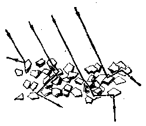

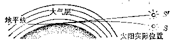

### 本章提要

1. 光从一种媒质射入另一媒质时，要发生反射、折射和吸收等现象。

2. 光的反射定律是：

（1） 反射光总是在入射光和法线所决定的平面里，跟入射光分居在法线的两侧；

（2） 反射角等于入射角。

3. 光的折射定律是：

（1） 折射光总是在入射光和法线所决定的平面里，跟入射光分居在法线的两侧；

（2） 入射角的正弦跟折射角的正弦的比，对所给定的两种媒质来说，是一个常数，叫做光线从第一种媒质射入第二种媒质的折射率 \((n_{21})\)，又叫做第二种媒质对于第一种媒质的相对折射率，

$$
n _ {21} = \frac {\sin \alpha}{\sin r}
$$

4. 相对折射率跟光在两种媒质中的速度的关系：

$$
n _ {21} = \frac {v _ {1}}{v _ {2}}
$$

5. 光从真空或空气射入媒质时的折射率，叫做这种媒质的绝对折射率（简称折射率），并有下列关系：

$$
\frac {\sin \alpha}{\sin r} = n = \frac {c}{v}
$$

6. 相对折射率跟绝对折射率的关系：

$$
n _ {21} = \frac {n _ {2}}{n _ {1}}
$$

并有 \(n_{21} = \frac{1}{n_{12}}\) 7. 光在反射和折射时，光路都是可逆的。

8. 光发生全反射的条件是：（1） 光从光密媒质射入光疏媒质；（2） 入射角大于或等于临界角 \(c\).

9. 计算临界角的公式：

$$
\sin c = n _ {\text{疏,密}} = \frac {n _ {\text{疏}}}{n _ {\text{密}}}
$$

$$
\sin c = \frac {1}{n} (\text{光从媒质射向真空或空气时})
$$

### 复习题二

1. 光的反射、漫反射、全反射有什么区别？漫反射和全反射是不是也遵循光的反射定律？

2. 媒质的相对折射率 \(n_{1}\) 数值上可以大于1、小于1或等于1吗？如果可能的话，这三种情况有什么不同？媒质的绝对折射率 \(n\)，在数值上能够大于1、小于1或等于1吗？为什么？

3. 水的折射率是 4/3，玻璃的折射率是 3/2，那么光在水中的速度是空气中速度的多少倍？是玻璃中的多少倍？

4. 一块平行玻璃板 \((n=1.60)\) 浸在水中，一条光线在水中以 \(40^{\circ}\) 的入射角射在玻璃板上，问（1）它在玻璃中的折射角是多大？（2）从玻璃再进入水中时的折射角是多大？

5. 光线从空气斜射入水中，已知水的折射率是1.33，要使得反射光跟折射光互相垂直，问入射角应该是多大？

6. 已知水晶的折射率是1.54，水的折射率是1.33，要发生全反射，光必须从哪一种媒质射入哪一种媒质？入射角必须大于多少度？如果光线从水晶射入空气时，临界角又是多大？

7. 在水面下 1 米深处，放置一个很强的点光源，问它能照亮多大面积的水面？已知水的临界角为 \(48^{\circ}30'\).

8. 试完成下图中的折射光路（作图前应先进行计算）。

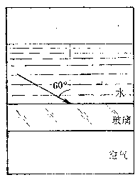

## 第3章 面镜

光在两种媒质的界面上有反射现象，光传播的路径（光路）在界面上便有了明显的改变，利用界面（反射面）这一特点，便可用来控制光路或成象；这样的反射面就叫面镜，反射面如果是光滑的平面，叫平面镜；反射面如果是光滑的球面，叫球面镜。

### §3·1 平面镜 平面镜成象

日常生活中我们用的镜子，就是平面镜。在平面镜中我们为什么能看见自己或镜面前其它物体的象呢？下面我们就用图来说明平面镜是怎样成象的。

图 3.1 就是一面平面镜成象的光路图。在镜前放着一支点燃的蜡烛，从蜡烛火焰发出的光线，经平面镜反射以后，光路就发生了改变。例如，从 S 点发出的光线 SO，垂直入射到镜面上，入射角等于零，根据反射定律，反射角等于入射角，因而也等于零。这样，反射光线跟入射光线便互相重合；同样，根据反射定律可以得出：入射光 SA 和 SB 的反射光分别为 AO 和 BD，这一束光射入眼里，看上去就好象它们是从镜里 \(S'\) 点发出来的一样；当然，它并不是真的从 \(S'\) 点发出的，它只是 \(AO\)和 \(BD\) 等光线的延长线的交点，镜子后面因而也并不存在这样一个实际的光点（如果用一个光屏放在 \(S'\) 处，是不会有光点在屏上映现出来的），我们把 \(S'\) 点就叫做 \(S\) 点的虚象。同样的道理，我们还可以得出蜡烛其它各点在平面镜相应的地方所形成的虚象，这些象点组合在一起，就形成了一幅跟蜡烛完全相同的完整的象（虚象），这就是我们能在镜子里看见物体或自己的象的缘故。

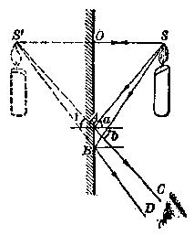

平面镜里所成的虚象，它的大小和位置又是怎样的呢？

从图3.1平面镜成象的光路图中可以看出，根据反射定律，在直角三角形 \(\triangle SOA\) 和 \(\triangle S'OA\) 中，\(\angle a = \angle b = \angle 1\)，所以 \(\angle SAO = \angle S'AO\)。\(OA\) 是公用边，则有 \(\triangle SOA\)\(\cong\triangle S^{\prime}OA,\therefore S^{\prime}O=S O.\) 同样可以证明，蜡烛其它各点跟它在镜里所成的象，对镜面也是对称的。这表明：物体在平面镜里所成的虚象，大小跟物体相等，并且跟物体相对称（相对于镜面里来说），如图 3.2 所示。

> 原书旁注：平面镜所成的象，大小跟物体相等，并且跟物体相对称

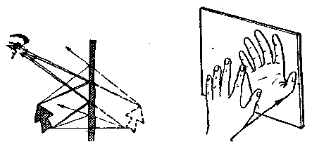

任何光滑的平面，由于它对于光线有单向反射的性质，所以都能起平面镜的作用；我们常常说“湖水平静得象一面镜子”，也常常看见山峰林木倒映在水中相映成趣的景色，这是水面反射的结果；又例如，我国生产高精度的磨床，能够进行“镜面磨削”，这说明金属表面经过磨床磨平以后，光洁得象镜子一样能够照得见人，这是金属表面的单向反射所引起的。我国古代的镜子就有用金属制的青铜镜，这说明我们的祖先在很久以前就已经掌握了金属冶炼和表面琢磨加工的很高的技艺了。

平面镜的应用是很广泛的，除了日常生活在盥洗室里要用镜子，或衣橱前装有穿衣镜等，有些精密的电学仪表的表面上也常常附有一个平面镜，只要眼睛正对着指针，看见指针和指针在镜子里的象相重合，这时指针的示数就是正确的，如图3.3所示.当然，有时候光滑表面由于平面镜成象的作用，也会引起一些对我们不利的结果，这时候就需要加以防止.例如，车或船在夜晚行驶的时候，驾驶室里不宜点灯，不然驾驶台前面的玻璃就会把后面的景象反射出来，和玻璃外的景象交织在一起，映入驾驶员的眼中，妨碍驾驶员作出正确的判断。

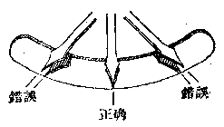

### §3·2 凹镜 凹镜成象

反射面是球面的镜叫做球面镜。利用球面镜的凹面做反射面的球面镜叫做凹面镜或凹镜，利用球面镜的凸面做反射面的球面镜叫做凸面镜或凸镜。凹镜和凸镜都可以看成是由许多微小的平面镜组合而成的。

球面镜的球心 O 和镜面上任一点的连接线，叫做球面镜的光轴，连接球心和镜面的顶点 O（镜面的中心点）的直线叫做球面镜的主光轴，简称主轴。

射到球面镜上的光线，如果跟主轴很靠近，我们称它为近轴光线。近轴光线射到球面镜（或透镜）上所得到的结果我们以后要经常用到它，而且我们以后的讨论也只限于近轴光线的情况。

对于球面镜来说，平行于主轴的近轴光线，经反射后跟主轴相交于一点，这一点恰好在半径的中点上。从图3.4（凹镜）和图3.5（凸镜）的光路图中可知，\(\angle \alpha = \angle b\) （根据反射定律），\(SP \parallel OC\) （\(SP\) 设为近轴平行光线），\(\therefore \angle \alpha = \angle 1\)，对于凸镜又有 \(\angle b = \angle 2\)，所以 \(\triangle FOP\) 为等腰三角形，并且 \(PF = FC\). 在 \(SP\) 为近轴光线的条件下，\(P\) 点与 \(O\) 点相隔很近，所以 \(\triangle POF\) 可近似的看作等腰三角形，即有：\(FO \approx FP = FC\)，也就是说 \(F\) 点恰好在半径 \(OC\) 的中点上。

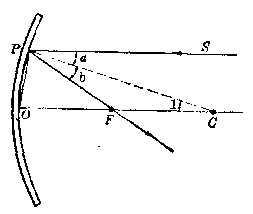

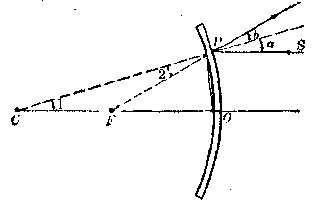

从这里还可以得出一个结论，即所有平行于主轴的近轴光线，经球面镜反射后，都将相交于同一点 \(F\) 上，这一点称为球面镜的焦点。习惯上用 \(F\) 来表示焦点的位置；从焦点 \(F\) 到顶点 \(O\) 的距离，叫做球面镜的焦距，焦距的大小用 \(f\) 来表示，如果球面镜的半径是 \(R\)，则有凹镜有实焦点，凸镜有虚焦点

$$
f = \frac {R}{2}
$$

对凹镜来说，焦点 F 是光线实际相交而成的，称为实焦点；对凸镜来说，焦点 F 是反射光的延长线的交点，并不是光线实际的聚合点，所以凸镜的焦点又称为虚焦点。（应当注意：不要把焦点跟一般光线的相交点这两个概念混同起来，并不是任意光线的相交点都可以称为焦点）。

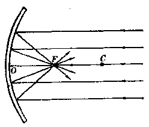

平行光射到凹镜上反射光束是会聚的，所以凹镜有聚光的作用，是一种会聚镜；平行光射到凸镜上，反射光束是发散的，所以凸镜是一种发散镜。

利用凹镜的聚光作用，可以把太阳光的能量聚集起来加以利用。需要加热的物体就放在凹镜的焦点处，凹面越大，能够会聚的太阳能越多，温度也越高，可以利用它来烧水、煮饭，这就是小型的太阳灶；还可以利用它来使水变成高温高压蒸汽，以推动汽轮机发电，这便是大型的太阳炉（图3.8）。在当前充分开发能源的情况下，太阳能的利用在工业发达国家中已经越来越受到重视，在有些高层建筑的设计中，屋顶上已经附有供取暖或发电的利用太阳能的装置，从长远的角度看，太阳能的资源既是地球上最基本、最丰富的能源，又是不会污染环境的理想的能源，大规模利用太阳能不仅有着光辉的前景，而且必将从根本上改变人类利用能源的状况，极大地推动生产力的向前发展。

凹镜的另一种利用，刚好跟上述情况相反，是把光源放在凹镜的焦点上，根据光路的可逆性，从光源发出的光经过凹镜的反射以后，就会形成一束平行光射出去，探照灯、手电筒就是根据这个原理制成的。

凹镜的反射能够改变光路，因此凹镜也能成象。凹镜成象有它自己的特点，如象的性质、大小、位置等都不完全和平面镜相同，下面先研究凹镜成象的几种情况。

首先，我们把物体放在离凹镜很远（有时物理上也称为无限远）的地方，从物体上射出的光，到达凹镜上的那些光束，必定是互相平行的，所以平行光射到镜面上，就可以看成是来自无限远的物体上发出的光，根据凹镜的性质，这些平行光反射以后，都相交于一点（焦点），因此，这一点（焦点）就是无限远处物体经凹镜所成的象；因为它是光线实际会聚而成的，这种性质的象，我们称它为实象；这个实象离凹镜的距离，实际上也就是凹镜的焦点离凹镜的距离（焦距f），用这个方法，可以近似的测出凹镜的焦距.如图3.9所示。

下面我们讨论物体（例如一支点燃烧的蜡烛）放在凹镜前不同的位置成象的情况和规律。先把蜡烛放在凹镜前焦点以外的地方，在同一侧面对着凹镜再竖放一个白纸做成的光屏，移动光屏到某一位置时，就会看见屏上有蜡烛的倒象出现（图3.10（a）），这个象既然在光屏上显现出来，眼睛就能从各个不同方向看见它，跟图3.9相同，这时所成的象是实象。当蜡烛放在凹镜的球心 \(C\) 以外（即2倍焦距以外）的地方，所成的实象离凹镜的距离，大于 \(f\) ，小于2f（如图3.10（a）所示）是一个缩小的倒立的实象；如果蜡烛向凹镜移近，在光屏上成的象，位置就远离凹镜，象也逐渐增大，但仍旧是倒立的实象；当蜡烛移到球心 \(C\) 上，蜡烛的倒立实象，也恰好成在球心处，象和物大小相等；继续把蜡烛向凹镜移近，当移到小于 \(2f\) 、大于 \(f\) 处，象就成在 \(2f\) 以外，光屏上倒立的实象比蜡烛本身大（如图3.10（b）所示）；如果把蜡烛移到小于 \(f\) 处，则无论把光屏放在什么地方也得不到蜡烛的实象，只能用眼睛对着凹镜才能看见镜里有一个正立、放大的蜡烛的象，这个象不能显现在光屏上，是一个虚象（如图3.10（c）所示）。

总之，随着物体位置的不同，凹镜可能成实象（只要物体离凹镜的距离大于f），实象总是倒立的，跟物体处于镜面的同一侧，实象可以比物体小（当物体离凹镜的距离大于2f时），也可以比物体大（当物体离凹镜的距离小于2f、大于f时）；凹镜还可能成虚象（只要物体离凹镜的距离小于f），虚象总是正立的，跟物体分居在凹镜的两侧，比物体大，只有对着凹镜才能看见它。

> 原书旁注：凹镜可能成实象，也可能成虚象

### §3·3 凸镜 凸镜成象

凸镜是发散镜，它具有虚焦点。研究凸镜成象的情况，跟上面的方法一样，用一支点燃的蜡烛，放在凸镜前无论什么地方，也无论把光屏放在什么地方，屏上不会得到蜡烛的实象，我们只能对着凸镜看见一个正立、缩小的虚象。我们可以把几种面镜作一个简单的比较：

> 原书旁注：凸镜只能成正立、缩小的虚象

凸镜不能成实象，它只能在镜的另一侧成一个正立的、缩小的虚象。

凹镜也可能成虚象（只有当物体离凹镜的距离小于f的时候），但所成的虚象比物体大。

平面镜跟凸镜相似，也不能成实象，只能成虚象，虚象跟物体一样大，而且相对于镜面来说总是跟物体相对称。这一点跟凹镜、凸镜都不相同。

从凸镜里能够看到外界的范围（视野），要比同样大小的平面镜大（如图3.11所示 \(\theta_{2}>\theta_{1}\) ）.所以在汽车驾驶室的外侧，常常竖立一个凸镜，作为观后镜，驾驶人员通过它能够很方便地看见车身外侧或车后的情况，以保证行车的安全（如图3.12 所示）。在有些大城市路口的岗亭上也装有相似的凸镜，用来帮助交通民警观察各个方向车辆行驶的情况，便于更好地指挥交通。

### §3·4 球面镜成象的作图

球面镜成象的基本原理，和成象的各种情况，通过作光路图就可以很容易搞清楚。

#### 1. 凹镜成象作图

在凹镜前有一发光点 A，怎样知道象点的位置呢？我我们可以通过作光路图来求出，先从 A 点任意选三条入射光线 AP、AQ 和 AT（如图 3.13 所示），P、Q 和 T 就是入射点，把它们和球心 C 联结起来，得半径 CP、CQ和 \(CT\)，它们显然就是 \(P\) 点、\(Q\) 点和 \(T\) 点处镜面的法线（因为半径总是与镜面垂直的），它们分别和入射光线的夹角，就是它们各自的入射角，根据反射定律，反射角等于入射角，用量角器分别作 \(\angle 2 = \angle 1, \angle 4 = \angle 3, \angle 6 = \angle 5\)，就得到反射光线 \(PA'\)、\(QA'\) 和 \(TA'\)，它们相交于 \(A'\) 点，\(A'\) 点显然就是 \(A\) 点的实象；在 \(A'\) 处如果放一个光屏，就会有光线会聚而成的亮点在屏上显现出来。这里我们只任意选用了三条入射光线作图，实际上从发光点 \(A\) 射到凹镜上的光线是大量的，但是实验证明：一个发光点在确定的位置，通过凹镜只存在一个实象，这个唯一性，就表明了从 \(A\) 点发出的其它的入射光线，经过凹镜反射以后，也必然都相交于同一点 \(A'\)，否则就会同时存在一个以上的实象了，这是与事实不相符合的，所以我们没有必要把其它的光线都画出来。

如果放在凹镜前面的不是一个发光点，而是一个物体，这时我们可以把物体看成是很多点组合而成的，每一点的象，都可以用上述作图的方法，得出它的象点来，这些象点组合起来，就是物体的实象。

但是，我们很容易就看出来，用量角器作图去求出物体上每一点的象来是很麻烦的，而且也没有这样的必要，既然球面镜成象时，只要物体的位置确定，物体上每一点所成的象也只有一点，那么，在作图的时候，就可以从物体上选几个有代表性的点，从每一个有代表性的点，只要选二条 （因为两条线就可以得出一个交点了） 入射光线，分别作出它们反射以后交点，由这些有代表性点的象，也就足以构成整个物体的象了。

那么，应该选择物体哪些有代表性的点呢？从这些点又应当选择哪些特殊的入射光线来作图比较方便呢？

关于物体上有代表性的点的选择问题，我们只要考虑到，象总是跟物体完全相似的，否则就不成其为象了。所以，我们只要选择物体的两个端点就足够了，得出这些端点的象以后，就可以确定象的位置、倒正和大小了。

关于从每一点选择哪些特殊光线作光路图比较方便的问题，这从球面镜反射的性质中可以很容易看出，从下列三条特殊光线中，选择其中任意两条入射光线来作光路图是比较方便的，这三条特殊光线是：

（1） 跟主轴平行的近轴入射光线。它射到凹镜上，反射以后经过焦点；射到凸镜上，反射以后，反射光的延长线经过凸镜的虚焦点（根据焦点的定义）。

（2） 通过焦点的入射光线（或它的延长线）。它反射以后，反射光跟主轴是平行的（根据光路的可逆性）。

（3） 通过球心的入射光线（或它的延长线）。它的反射光线跟入射光线重合（根据反射定律，这时入射角和反射角都等于零）。

根据上面所说的方法，我们就可以很方便的作出球面镜的光路图。

图 3.14 是蜡烛放在 2f 以外的地方成象的光路图。我们选择它的两个端点 （A 点和 B 点） 来作图：作端点 A 的象时，先选择特殊光线 （I），从 A 点作一条光线平行于主轴，反射以后，通过焦点 F；再选择特殊光线（2），即再从 A 点作另一条光线通过凹镜的焦点 \(F_{1}\) ，反射以后，跟主轴平行；这两条反射光线相交于 \(A'\) ，这一点就是 A 点实象所在的位置。用同样的方法得出 B 点实象的位置 \(B'\)，得出 \(A'\) 点和 \(B'\) 点，就可以完全确定整个蜡烛所成象的位置（跟物体在同一侧，位于2f和f之间）、大小（比物体小）和性质（倒立的实象），这个结果显然跟前面实验的结果是完全一致的。

图 3.15 和图 3.16 是蜡烛立在凹镜的主轴上成象的情况，这样作图时就更简单一些，只要作出顶端 A点这一点的象就够了。根据凹镜成象的性质，物体直立在凹镜的主轴上，成的实象就应当倒立在主轴下面，这样从A 点选择二条特殊光线，从它们的反射光的交点 \(A'\) ，就可以立即描出物体 AB 的象 \(A'B'\) 。图中表明得出的结果也是与实际相符合的。

图 3.17 是物体直立在焦点上的情况，作图的方法是选择特殊光线 （1） 和 （3），作图的结果表明，两条反射光互相平行，永远不会相交，所以物体这时既不会成实象也不会成虚象。

图 3.18 是物体离凹镜顶点的距离小于 f 的情况，作图时选择的特殊光线仍为（1）和（3），反射以后也不相交，但它的延长线相交于凹镜之后，成为正立的、放大的虚象。

#### 2. 凸镜成象作图

凸镜成象时作图的方法与凹镜相同，图 3.19 作物体顶点 A 的象时，选择的特殊光线仍为（1）和（3），它们的反射光不相交，但是它们的反向延长线却相交于 \(A'\) 点，这就是 \(A\) 点在凸镜中所成的虚象，作 \(A'B'\) 垂直于主轴，立即可以看出 \(AB\) 的象 \(A'B'\) 是正立的缩小的，位于凸镜另一侧的虚象，不管物体的位置向前或向后移动，都只能成一正立缩小的虚象，只不过象的大小和位置略有变化罢了。

### §3·5 球面镜成象的公式

前面已经用实验的方法、作图的方法讨论了球面镜成象的各种情况，这里再通过数学公式来计算球面镜成象的位置、大小和性质等。

下面先推导出球面镜成象的公式，再讨论它们的计算方法和具体应用。

图 3.20 是凹镜成实象的情况。用 u 表示物体 AB 到顶点 O 的距离（简称物距），用 v 表示物体的象 \(A'B'\) 到顶点 O 的距离（简称象距），用 f 表示焦点 F 到顶点 O 的距离（简称焦距）。

在图3.20中，

$$
\because \triangle A B C \sim \triangle A ^ {\prime} B ^ {\prime} C, \triangle P O ^ {\prime} F \sim \triangle A ^ {\prime} B ^ {\prime} F
$$

$$
\therefore \quad \frac {A B}{A ^ {\prime} B ^ {\prime}} = \frac {B C}{B ^ {\prime} C ^ {\prime}}, \quad \frac {P O ^ {\prime}}{A ^ {\prime} B ^ {\prime}} = \frac {O ^ {\prime} F}{B ^ {\prime} F}
$$

又 \(\because AB = PO', O'F - OF\)

$$
\therefore \quad \frac {B C}{B ^ {\prime} C} = \frac {O ^ {\prime} F}{B ^ {\prime} F} \approx \frac {O F}{B ^ {\prime} F}
$$

用符号 \(u, v, f\) 代入得

$$
B C = 2 f - u
$$

$$
B ^ {\prime} O = v - 2 f
$$

$$
O F = f
$$

$$
B ^ {\prime} F = v - f
$$

即得 \(\frac{2f - u}{v - 2f} = \frac{f}{v - f}\)化简后 \(vf + uf = uv\)用 \(uvf\) 除等式两边得到公式

$$
\frac {1}{u} + \frac {1}{v} = \frac {1}{f}
$$

很容易证明这个公式对凹镜成虚象和凸镜成象也是适用的，只要成虚球面镜成象公式：

$$
\frac {1}{u} + \frac {1}{v} = \frac {1}{f}
$$

象时，象距用 -v 代入；凸镜为虚焦点，焦距用 -f 代入就可以了。所以我们把上述公式看成是球面镜成象的普遍公式。

根据球面镜成象公式，只要知道物距 u、焦距 f，就可以求出象距 v 来，并且可以知道象的性质：v 如果是正值，说明象是实象；v 是负值的时候，说明象是虚象。在 u、v、f 中只要知道其中任意两个量，根据成象公式，就可以求出第三个量来。

#### 例 1

有一个物体放在离开球面镜的顶点 R/4 的地方，R 是球面镜的半径，这时在镜面的另一侧离开顶点 10 厘米的地方，成一正立、缩小的象，问这个球面镜是凸镜还是凹镜？为什么？这个球面镜的焦距是多少？

［解］由于题意没有直接说明象是实象还是虚象，所以不能直接看出象距 \(v\) 是正值还是负值；又由于不知道球面镜是凸镜还是凹镜，所以也不知道焦距的正负。应该在具体代入公式计算以前，要根据题意先判断出象的性质和镜的种类，这样才能根据物距 \(u\) 、象距 \(v\) 计算焦距 \(f\) 。

因为物体离开顶点的距离 \(u = \frac{R}{4}\)，而焦点离开顶点的距离总是 \(R / 2\)，可以知道是在 \(u < f\) 的情况下，形成一正立、缩小的象，因为象是正立的，表明象是虚象，因为虚象是缩小的，表明是凸镜不是凹镜（凹镜成的虚象是放大的），这样题目所给的条件就进一步明朗了，即：

已知：\(u=\frac{R}{4}\) ，v=-10厘米，\(f=-\frac{R}{2}\) ；

代入球面镜成象公式 \(\frac{1}{u} +\frac{1}{v} = \frac{1}{f}\)得 \(\frac{1}{\frac{R}{4}} + \frac{1}{-10} = \frac{1}{-\frac{R}{2}}\)即 \(\frac{4}{R} -\frac{1}{10} = -\frac{2}{R}\)

$$
\frac {6}{R} = \frac {1}{10}
$$

$$
R = 60
$$

$$
f = - \frac {R}{2} = \frac {- 60}{2} = - 30 \text{厘米}
$$

计算的结果表明：这个凸镜的焦距是30厘米。

#### 习题3.4

1. 用直尺和量角器，完成下列光路图：

（1） 画出发光点 A 在平面镜中所成象（附图（a））。

（2） 画出凹镜主轴上发光点 A 的象（附图（b））。

（3） 画出凹镜所成物体的象（附图（c））。

（4） 画出凹镜主轴上发光点 A 的象（附图（d））。

（5） 画出凸镜主轴上发光点 A 的象（附图（e））。

2. 用直尺完成下列光路图：

（1） 画出凹镜所成物体的象（附图（a））。

（2） 画出凹镜所成物体的象（附图（b））。

（3） 画出凹镜所成物体的象（附图（c））。

（4） 画出从焦点 F 发出的光束，经凹镜反射后的光路图（附图 （d））。

（5） 画出凸镜所成物体的象（附图（e））。

（6） 画出会聚于焦点 \(F\) 的会聚光束经凸镜反射后的光路图（附图（f））。

3. 人站在平面镜前，如果人向镜面移近 1 米，这时候人跟平面镜中所成的象的距离将比原来近多少？为什么？

4. 有一凹镜半径 \(R = 40\) 厘米，物体放在 \(u = 30\) 厘米的地方，问象成在什么位置？成实象还是成虚象？是正立的还是倒立的象？

5. 上题中如果是凸镜，其它条件均相同，问象成在什么地方？成实象还是成虚象？是正立的还是倒立的象？

### 本章提要

1. 平面镜只能成虚象，象的大小跟物体的大小相等，并且对称于镜面。

2. 凹镜和凸镜统称为球面镜。凹镜能够把沿着主轴射到镜面上来的近轴平行光线会聚到主轴的焦点上，焦点是实焦点，所以凹镜是会聚镜。根据光路的可逆性凹镜也能把从焦点射出的光线反射成为平行光线。

3. 凸镜能够把沿着主轴射到镜面上来的近轴平行光线反射成发散光线，好象它们是从镜面里的一点射出来的一样，这一点称为虚焦点，所以凸镜是发散镜。

4. 凹镜和凸镜都能成象。凸镜只能成正立、缩小的虚象，跟物体分居在凸镜的两侧、凹镜所成的象，它的大小、虚实、倒正决定于物体的位置。物体在不同位置时，分别在凹镜和凸镜成象的情况，见图3.21和图3.22。

### 复习题三

1. 两个平面镜互沿垂直地置放着（如附图所示），在镜前有一支点燃的蜡烛，这时我们从平面里可看到共有三个蜡烛的虚象，想想看这是什么道理。

2. 把物体分别放在凹镜的 \(2f\) 和 \(3f\) 的地方，象应当各成在什么地方？

3. 一个物体放在球面镜前 20 厘米的地方，所成的象距物体在镜面的同一侧，距离镜面的顶点 40 厘米，试判断这个球面镜是凹镜还是凸镜？焦距是多大？并作图验证。如果所成的象是在镜面的另一侧，距离镜面的顶点也是 40 厘米，那么这个球面镜是凹镜还是凸镜？焦距又是多大？作图验证并且跟前面的光路图相比较。

4. 用凹镜将一个烛焰的象成在离烛焰16厘米远的屏上，使象长为烛焰长的3倍，问这个凹镜应放在什么地方？它的焦距是多大？

5. 凹镜所成的象是物体长的1/4，把物体向凹镜移动5厘米，象长就变为物长的1/2，求凹镜的焦距。

## 第4章 透镜

前一章讨论了光在各种镜面上反射成象的各种情况，这一章将研究光穿过透明体折射的情况。光从空气射入一种透明体，或者从透明体里射出来，一般都要发生折射，随着透明体表面形状的不同，光穿过透明体的时候，光路改变的情况也不同，掌握这方面的知识和规律，就能够利用各种表面形状不同的透明体（例如：平行透明板、棱镜和透镜等）来控制光路。

平行透明板（两个折射面是平行平面的透明体，如平面玻璃或玻璃砖等）、棱镜（两个折射面互不平行的透明体，如三棱镜等）的折射面都是平面，情况比较简单一些，折射面不是平面而是曲面（例如球面或柱面）的透明体叫做透镜，透镜的情况要复杂一些，它的应用也广泛得多，这一章在平行透明板、棱镜讲完之后将比较详细地讨论透镜对于光路的控制。

### §4·1 平行透明板的折射

图4.1是一块玻璃砖的截面，光从平行透明板一个侧面（折射面）斜射进来时，发生一次折射，入射角为 \(\alpha_{1}\)，折射角为 \(r_{1}\)，设透明体的折射率为 \(n\)，根据光的折射定律，则有 \(\frac{\sin \alpha_{1}}{\sin \tau_{1}} = n\)。光从透明体射出时，又发生一次折射，入射角为 \(\alpha_{2}\)，折射角为 \(r_{2}\)，并且有 \(\frac{\sin \alpha_{2}}{\sin \tau_{2}} = \frac{1}{n}\)。因为折射面\(A_{1}B_{1}\parallel A_{2}B_{2}\)，所以通过入射点 \(O_{1}\) 和 \(O_{2}\) 的法线 \(O_{1}N_{1}\)\(O_{2}N_{2}\) 也互相平行，因而 \(\angle r_{1}=\angle a_{2}\)又 \(\because \frac{\sin\alpha_1}{\sin r_1} = n\)

$$
\frac {\sin \alpha_ {2}}{\sin r _ {2}} = \frac {1}{n} = \frac {\sin r _ {1}}{\sin a _ {1}}
$$

$$
\therefore \angle r _ {2} = \angle a _ {1}
$$

即 \(S_{2}O_{2}\parallel S_{1}O_{1}\)这说明光线穿过平行透明板的时候，方向是保持不变的，只是向侧面平移了一段距离 \(l\) ，透明板越薄，平移的距离也越小，平时我们隔着玻璃窗看外面的物体，并不感到物体的位置有明显的移动，就是这个缘故。如果隔着很厚的平行透明体去观察，就会看出有明显的侧向移动（图4.2）。

> 原书旁注：光通过平行透明板时，不改变方向，只发生侧向移动

### §4·2 棱镜的折射

如果透明体的两个折射面互不平行，光线通过时方向会不会改变呢？下面我们讨论光线穿过这种透明体——玻璃棱镜（它是玻璃做成的正三棱柱体）时的情形。

如图4.3所示，光线从棱镜的一个折射面射入，发生一次折射，再从另一个折射面射出时，又发生一次折射。棱镜的两个折射面 \((AB_{L}\) 和 \(AB_{2})\) 的夹角（图中的 \(\angle A\)）称做顶角，或称折射棱角，顶角所对的面，叫做棱镜的底面。棱镜的三个侧面，在不同的情况下，可以利用其中任意两个侧面作为折射面，所以一般说来棱镜的顶角和底面也不是固定不变的，要根据具体使用时的具体情况来决定。

当光线 \(S_{1}O_{1}\) 从图中所示的一个侧面由空气斜射入棱镜时，是从光疏媒质（空气）射入光密媒质（玻璃），折射角小于入射角，折射光线向法线向 \(O_{1}N_{1}\) 靠拢，即向底面偏折；当这一光线 \(O_{1}O_{2}\) 通过另一折射面 \(AB_{2}\) 从玻璃射到空气时，是从光密媒质射入光疏媒质，折射角大于入射角，折射光线 \(O_{2}S_{2}\) 将离开法线 \(O_{2}N_{2}\)，从而再一次向底面偏折；这样，光线通过棱镜由于两次折射的结果，方向将发生明显的改变，这跟光穿过平行透明板的情况是不相同的。从图中可以看出：光线沿 \(O_{2}S_{2}\) 方向从棱镜射出时，已经不是原来入射光线 \(S_{1}O_{1}\) 的方向了，已经向底面偏折了一个夹角 \(\delta\) 这个角称做偏向角。随着棱镜的顶角和入射角的不同，偏向角的大小也不同（图4.4）。

> 原书旁注：光通过棱镜折射以后，向底面偏折

利用棱镜可以用来改变光路，当光线从等腰直角棱镜的一个折射面正入射（入射角是零度），光线投射到斜表面上的时候，入射角正好是 \(45^{\circ}\) ，大于玻璃的临界角（约 \(42^{\circ}\) ），所以就发生全反射，最后从另一个折射面垂直地射出，使光路转过了 \(90^{\circ}\)，这种棱镜又称回转棱镜。利用两个这样的回转棱镜，可以组成一个潜望镜（如图4.5所示），潜水艇利用潜望镜可以在水下了望水面上的情况。图4.6是另一种全反射棱镜，利用这种棱镜的全反射，可以把物体的象倒转过来，所以这种棱镜又叫做倒转棱镜（图4.6）。

这种倒转棱镜常用于双筒望远镜中（图4.7）。

### §4·3 透镜

折射面不是平面而是球面，或者一面是球面，另一面是平面的透明体，称做透镜*. 中央比边缘厚的透镜，称做凸透镜。中央比边缘薄的透镜，称做凹透镜。透镜的两个球面的半径，可以相同，也可以不相同。图4.8和图4.9所示就是几种不同形状的凸透镜和凹透镜。

> 注：* 折射面是圆柱面的透镜叫做柱面透镜，我们这里不讨论这种透镜。

平行光投射在凸透镜上，经折射以后，光线就会聚在一点上（如图 4.10 所示），所以凸透镜又称会聚透镜。

平行光投射在凹透镜上，经折射以后，光线就会向外发散，成为发散光束，所以凹透镜又称发散透镜。

凸透镜很象两个底对着底的棱镜的组合，平行光通过这一对棱镜的时候，对于每一个棱镜来说，光线经过它以后都要向底边偏折，所以有会聚的作用；凹透镜好象两个顶对着顶的棱镜的组合，平行光通过它们的时候，同样也要各自向棱镜的底边偏折，由于两个棱镜的底边是向外的，所以平行光经过它们以后，折射的结果就向外散开，成为发散光束（图4.11）。

仔细分析起来，可以认为一个透镜是由许多顶角大小不同的、被截去了顶的棱镜组合而成的（如图4.12所示）。组成凸透镜的截顶棱镜是底面朝着透镜的中央排列的，而组成凹透镜的截顶棱镜则是底面朝着透镜的边缘排列的。它们的共同特点是：越靠近透镜的中央，组成透镜的棱镜，它的顶角也越小，因而光线穿过它的时候，偏向角 \(\delta\) 也越小；透镜正中央那一部分，可以看成是一小块平行玻璃板，光线通过它时，方向不会改变，只会发生侧移，我们这里所讨论的透镜，中央部分都是很薄的薄透镜*，所以侧移也是很小的，可以忽略不计。薄透镜两球面的中心点 \(O_{1}, O_{2}\) 离得很近 （如图4.13），可以近似地看成是互相重合的，用 \(O\) 点表示，称做透镜的光心，凡是通过光心 \(O\) 点的光线，既不改变方向 （相当于通过平行透明板） 也不发生侧移 （薄透镜的侧移极小可以忽略不计）。任何通过光心的直线，称做透镜的光轴，通过球心 \(C_{1}C_{2}\) 的光轴，称做透镜的主光轴 （简称主轴），其它的光轴称做副光轴 （简称副轴）。

> 注：* 一个透镜的中央部分的厚度（透镜两球面上中心点之间的距离），如果比两个球面半径小很多，这样的透镜就叫做薄透镜。

透镜的焦点、焦距和焦平面如图4.10所示，一束平行于主轴的近轴光线射到凸透镜上，折射以后会聚于主轴上的一点，这一点称为凸透镜的焦点（用符号 \(F\) 表示）。从焦点 \(F\) 到光心 \(O\) 的距离，称做透镜的焦距（用符号 \(f\) 表示）。如果平行于主轴的一束平行光射到凹透镜，折射以后就向外发散，它的反向延长线交于主轴上的一点，好象这束光是从这一点发出的一样，这一点称做凹透镜的焦点，它离开光心的距离，也就是凹透镜的焦距。因为它只是发散光束延长线的交点，不是光线实际会聚而成的，所以是虚焦点；而凸透镜的焦点是平行光束经凸透镜折射后实际会聚而成的，所以是实焦点。习惯上把实焦点到光心的距离（焦距）规定为正值；虚焦点离开光心的距离（虚焦距）规定为负值。

透镜的焦距是怎样决定的呢？

透镜的材料、形状确定之后，处在一定的媒质中，它的焦距 f 总是一个定值。它是由组成透镜的材料（例如玻璃）对于透镜所在媒质（例如空气）的相对折射率 \((n)\) 和透镜两个折射面的曲率半径 \((R_{1}, R_{2})\) 所共同决定的：

> 原书旁注：凸透镜的焦点是实焦点，焦距是正值；凹透镜的焦点是虚焦点，焦距是负值

$$
\frac {1}{f} = (n - 1) \left(\frac {1}{R _ {1}} + \frac {1}{R _ {2}}\right)
$$

式中 \(n\) 是光从媒质射入透镜的折射率，如果透镜是在空气中，\(n\) 也就是透镜的绝对折射率。\(R_{1}\) 和 \(R_{2}\) 分别是透镜两个折射面的曲率半径。如果是凸面，\(R\) 取正值；如果是凹面，\(R\) 就取负值。应当注意，对于透镜来说，\(f \neq \frac{R}{2}\)，跟球面镜的情况是不相同的。对于任何一个透镜，它的两侧各存在一个焦点，只要透镜两侧所在的媒质相同（一般情况下都是相同的，例如透镜的两侧面都是在空气中），不管透镜的两个折射面的曲率半径 \(R_{1}, R_{2}\) 是否相等，两个焦点分别离开光心的距离（焦距）总是相等。

透镜主轴上的焦点，称做透镜的主焦点。如果平行光束是沿着透镜的副光轴射到透镜上，经折射以后，就会聚在副轴上的某一点；如果是射到凹透镜上，折射以后，它们的延长线也相交于副轴上的某一点，这一点称做透镜的副焦点。透镜的副轴可以有任意多根，所以透镜的副焦点也有无数多个，在主焦点周围不太大的范围内，这些副焦点和主焦点恰好处在垂直于主轴的同一平面中，这个平面称做透镜的焦平面，图4.14是凸透镜的焦平面；同理，在凹透镜对称于光心的两侧也各存在一个垂直于主光轴的焦平面。

随着透镜焦距长短不同，光线通过凸透镜时会聚的程度和光线通过凹透镜时发散的程度也不同；同样一束光，经过焦距越短的凸透镜，经过折射后，发生偏折和会聚的程度也越显著，经过焦距越短的凹透镜，经过折射以后，发生偏折和发散的程度也越显著。也就是说，透镜的焦距越短，透镜使光线发生偏折的本领就越强。所以我们就用焦距的倒数 \(1 / f\) 来表示透镜折光本领的大小，并把它叫做透镜的焦度D：

$$
D = \frac {1}{f}
$$

$$
D = \frac {1}{f}
$$

焦度的单位是屈光度，规定：焦距是1米的透镜，它的焦度叫1屈光度。凸透镜的焦距f是正值，所以它的焦度D也是正值；凹透镜的焦距f是负值，所以它的焦度D也是负值。眼镜镜片的度数并不是以屈光度为单位的，眼镜镜片的100度等于1屈光度。

#### 习题4.3

1. 下图中分别表示光线从方框的一侧射入，方框中放有某种光学器件（平行透明板、棱镜或透镜等），经过光学器件反射或折射后，射出的光线也已在图中分别画出，试根据入射光线和射出光线的光路方向的改变，判断方框中置放有哪一种光学器件，并画出光学器件的位置和光路图。

2. 有两块比较厚的平行玻璃砖，中间夹着一层空气层（如附图所示），当光线从一块玻璃穿过空气层进入另一块玻璃砖的时候，试画出它的光路图，并且跟光线穿过空气中一块薄平行透明玻璃板的光路图相比较，看看有什么不同？

3. 有一块厚是1厘米的平行透明玻璃砖，已知玻璃的折射率是1.55，光从空气射入玻璃砖的入射角是 \(45^{\circ}\) ，如附图所示。试计算：光线穿过这块玻璃砖的时候，发生的侧位移l有多大？［提示：先从△ABN中计算AB的长，再从△ABC中计算出BC的长。］4. 完成下列各光路图：

5. 焦距是 20 厘米的凸透镜，它的焦度是多大？

6. 500度的眼镜镜片，合多少屈光度？

### §4·4 透镜成象

由于透镜的折射可以改变和控制光路，一个发光体，或一个被照明的物体，从它射出的光线，经过透镜折射以后，可以形成物体的象；随着物体离开透镜的远近不同和透镜性质的不同，成象的情况也各异。下面分别讨论凸透镜和凹透镜成象的各种情况。

#### 1. 凸透镜成象

凸透镜成象的情况和规律，我们可以通过实验的方法来了解它。

首先，为了知道凸透镜的焦距，我们可以用一个简便的方法：将凸透镜迎着太阳光，太阳离地面很远，射到凸透镜上来的这么小范围的一束光，可以看成是平行光 （以后我们就把从远处物体射来的光线，近似地看成是平行光），经过凸透镜折射以后，会聚了一点，这一点就是它的焦点，这样也就测出了它的焦距 \(f\).

将一个物体（例如一支点燃的蜡烛）放在凸透镜的主轴上离光心两倍于焦距以外的地方，即物距 \(u > 2f\)，这时用一张白纸做的光屏放在透镜的另一侧，移动光屏的位置，就会在离光心的距离大于焦距 \((f)\) 小于两倍焦距 \((2f)\) 的某一位置处，在光屏上显出一个倒立的、缩小的烛焰的实象。它是从烛焰发出的光，经透镜折射以后在光屏上实际会聚而成的，从各个方向向光屏看去，都能看见它的存在，所以我们说它是物体（烛焰）所成的实象；这说明：当物体放在离凸透镜两倍焦距以外的地方 \((u > 2f)\)，所成的象落在焦距以外、两倍焦距以内的地方 \((f<v<2f)\) ，象是倒立、缩小的实象，如图4.15（a）所示。

将烛焰移近透镜一些（物距u减小），所成的实象位置就远离透镜一些（象距v增大），象的大小也相应增大一些，但象的性质不变，仍为倒立的、缩小的实象。如图4.15（b）、（c）所示。

如果将烛焰移至离透镜的距离恰好等于焦距的两倍的地方，即物距 \(u = 2f\) ，这时象的位置（象距 \(\pmb{v}\) ）也恰好落在透镜另一侧两倍焦距的地方，即 \(v = 2f\) ，象仍然是倒立的实象，大小恰好跟物体（蜡焰）相等，如图4.15（d）所示。

将蜡焰继续向透镜移近至两倍焦距以内，焦距以外的地方，即 \(2f > u > f\) 时，要在屏上得到蜡焰的实象，就要把纸屏移到离开透镜更远一些的地方——透镜的两倍焦距以外的地方，即 \(v > 2f\) ，这时候屏上所成象比蜡焰大了，而且更暗了，但仍是倒立的实象，如图4.15（e）、（f）所示。

当蜡焰移近到凸透镜的焦点上时，即物距 \(u = f\) ，这时无论将纸屏移到什么地方，都不能在屏上得到蜡焰的象，只能在屏上看到一片亮光，因为这时从蜡焰射到透镜上的光，都是从焦点处发出的，经折射以后，成了一束平行光，不会相交成象。

如果将蜡焰继续推近到凸透镜的焦距以内，即物距\(u<f\)，这时无论把纸屏移到什么地方也不能得到物体实象，但是在放置纸屏的那一侧，用眼睛朝着凸透镜看去，会在透镜中看见有一个正立的、放大的、跟物体在透镜的同一侧的、蜡焰的象。这个象不是光线实际会聚而成的，因此它不能映显在屏上，只能用眼睛对着透镜才能看见它，它是蜡焰所成的虚象，如图4.15（g）所示。

> 原书旁注：凸透镜能够成实象（倒立、异侧），也能够成虚象（正立、同侧）

#### 2. 凹透镜成象

凹透镜成象的情况和规律，也可以用实验的方法去了解它。

首先测定出凹透镜的焦距：在纸片上剪一个比凹透镜略小的圆孔，用纸片遮住凹透镜的边缘，使孔的圆心正对着透镜的光心，然后把凹透镜正对着太阳光，如图4.16所示。平行光（太阳光）经过凹透镜折射以后，就成为发散光束，让它投射在一个白纸屏上，记下纸屏被光束照亮的圆面积的直径D、纸片上圆孔的直径d和纸片离开纸屏的距离L，从图4.17三角形相似的关系中，可以得出比例关系

$$
f: (f + L) = \frac {d}{2}: \frac {D}{2}
$$

即 \(Df = df + dL,\)

$$
\therefore f = \frac {d L}{D - d}
$$

根据这个结果就可以计算出凹透镜的焦距f，然后再把点燃的蜡烛放在凹透镜的焦点以内或焦点以外的地方，同样用一个纸屏在透镜的另一侧前后移动，这时候将会发现，无论把纸屏移到什么地方，屏上总不会得出烛焰的实象；但是，如果用眼睛对着凹透镜观察，则会通过透镜看到，在物体的同一侧有一个正立缩小的虚象。

> 原书旁注：凹透镜只能成虚象

### §4·5 透镜成象的作图

透镜成象的情况和规律，也可以用作图的方法得出来.根据前面实验的结果已经知道，除了物体放在透镜的焦点上，不能成象，在其它情况下，只要物体的位置确定，象的位置和性质也就确定了.也就是说，从位置确定的物体上射出的光线，经过透镜折射以后，只能形成一个确定的象。物体上任一点发出的光线，经透镜折射以后，也只相交于一点 （或延长线相交于一点）。只要从物体上的一点引出任意两条光线，通过透镜以后，找出它们的交点，就可以确定这一点的象的位置了。当然，从物体上这一点射出的光线还很多，但是可以肯定：它们经过透镜的折射以后，也一定相交于同一点，不然的话，物体上这一点所成的象就会不止一点，因而这个物体经过透镜折射以后也就能够形成两个或两个以上性质相同的象了，这是不符合实验事实的，从而是不可能的。所以，在透镜成象的时候，我们只需要在物体上选几个有代表性的点 （一般选取它的两个端点），从这些点各自引两条光线，经过透镜折射以后，得出它们的象点，这样把象点组合起来，就可以得出整个物体的象的大小和位置了。根据与球面镜作图相似的理由，在实际作光路图时，在以下三条光线中选择其中两条作为入射光线，是比较简便的：

（1） 跟主轴平行的入射光线。它通过凸透镜后，折射光线通过焦点；通过凹透镜后，折射光线的延长线通过焦点。

（2） 通过焦点（或延长线通过焦点）的入射光线。它经过透镜折射以后，折射光线跟主轴平行。

（3） 通过透镜光心的入射光线。它经过透镜折射以后，方向保持不变。

根据上述的一些原则，我们先讨论最简单的情况：一个发光点经过透镜成象的光路作图。

A 点是一个发光点，从 A 点引出一条光线平行于凸透镜的主轴，折射以后，通过焦点 \(F_{1}\) 再从 A 点引另一条光线通过凸透镜的主焦点 \(F_{2}\) ，折射以后，平行于主轴，这两条折射光线相交于 \(A'\) 点，\(A'\) 点就是 A 点的实象（如图 4.18）。

在作图时，并不需要画出光线两次通过透镜折射面时实际折射的情况，只需要过光心 O 作一垂直于主轴的折射面，让光线在这一折射面发生折射就可以了，这样就连透镜的球面部分也不必画出来了，只要画出过光心的折射面就可以代表透镜了，折射面两端分别用“矢端”和“矢木”的符号来区别凸透镜和凹透镜，这样就更简便了，如图4.19所示。

如果发光点 A 的位置是在凸透镜的主光轴上，将如何作出光路图呢？

这种情况显然有些特殊，因为从 A 点可能引出的三条特殊光线，都合并成为一条了，因而用上述方法不能得出折射光的交点。这时我们就需要利用焦平面、副光轴来辅助作图，下面就是利用副光轴的作图法。

从主光轴上的 A 点引任意一条入射光线 AB（如图 4.20 所示），再过凸透镜的光心 O，作副光轴 CO 平行于入射光 AB，并延长 CO，跟焦平面相交于 D 点，连接 BD，使它的延长线跟主轴相交，则交点 A' 就是 A 点的实象。为什么呢？因为入射光 AB 是平行于副光轴的，这样 AB 与 CO 就形成一束平行光，沿着副轴射入凸透镜的平行光束，折射以后，必将会聚于焦平面上的某一点（副焦点）即图中的 \(D\) 点，这样就作出了入射光 \(AB\) 的折射光为 \(BD\)；从 \(A\) 点引的另一条入射光线 \(AO\)，也就是主轴本身，因为是过光心的，所以折射以后方向不变，仍沿主轴方向，这两条折射光线的交点 \(A'\) ，当然就是A点的实象了。

另一种情况是发光点 \(A\) 离凸透镜的距离 \(u\)小于焦距f。作图的方法和步骤和上面的相同，只是这时两条折射光线并不相交，它们的延长线相交于主轴上的 \(A'\) 点。\(A'\) 点跟A点位于凸透镜的同一侧，是A点的虚象，如图 4.21 所示。

如果发光点 A 是落在凹透镜的主轴上，它的作图法则如图 4.22 所示。先从 A 点引任一入射光 AB，再过光心 O 作副光轴 CO 跟 AB 平行。CO 跟焦平面相交于 D 点，连接BD 跟主轴相交于 \(A'\) 点，\(A'\) 点就是 A 点的虚象。为什么这一点可以判定是 A 点的虚象呢？因为 AB 是平行于副轴 CO 的入射光线，经过凹透镜折射以后，它的延长线应当跟副轴（也作为一条平行于 AB 的入射光线）相交于焦平面上的一点 \(D_{1}\) 从 A 点引的另一条入射光线就是 AO，沿主轴方向通过凹透镜，方向保持不变，这两条折射光线不相交，但是延长后却相交于跟 A 点同侧的 \(A'\) 点，所以 \(A'\) 点就是 A 点的象（虚象）。

既然一个发光点通过透镜成象的作图方法已经知道了，那么一个物体通过透镜成象的光路作图方法就很清楚了。因为一个物体可以看成是由许多点的组合，每一点的象作图的方法既已如上所述，那么所有象点组合起来，就构成整个物体的象了。况且作图时并不需要把物体上每一点的象一一作出，只需要选择物体上有代表性的两个端点作光路图，就足以确定整个象的位置、大小和性质了。下面是物体 \(AB\) 放在不同位置上，经过透镜成象的光路图，得出的结果可以跟前面实验的结果相互比较和验证。

（1） 物体 AB 放在凸透镜的两倍焦距以外处 \((u > 2f)\) ：

按上述作图的方法，分别作物体 A、B 二端点的象 \(A'B'\) ，连接 \(A'B'\) 就是 AB 所成的倒立、缩小的实象（图 4.23）。可以理解：在AB 之间的物体的其它各点的象，必然都相应地落在象点 \(A'\) 和 \(B'\) 之间，自不必一一作出了。从图中可以看出：物体 AB 在凸透镜两倍焦距以外，成的象在透镜的另一侧，落在透镜的焦距以外，两倍焦距以内的地方，象是倒立、缩小的实象；也就是：当 u > 2f 时，f < v < 2f。

（2） 物体 \(AB\) 放在凸透镜前两倍焦距的地方 \((u = 2f)\)如图 4.24 所示，当 u=2f 时，v=2f。物体 AB 所成的象 \(A'B'\) 在透镜的另一侧，是倒立、跟物体大小相等、位于 2f 处的实象，这也跟实验的结果相符合。

（3） 物体 \(AB\) 放在凸透镜前焦距以外，两倍焦距以内的地方 \((f < u < 2f)\)，如图 4.25 所示，物体 \(AB\) 成的象 \(A'B'\) 位于两倍焦距以外处，是倒立、放大的实象，落在透镜的另一侧；也就是：当 \(f < u < 2f\) 时，\(v > 2f\).

（4） 物体 \(AB\) 放在凸透镜的焦点上 \((u = f)\)，如图4.26，这时既不形成实象，也不形成虚象。

（5） 物体放在凸透镜的焦距以内处 \((u < f)\)，如图4.27所示，这时光路图表明：分别从 \(A\) 点和 \(B\) 点所引的两条特殊光线（一条平行于主轴，另一条通过光心）折射后，都不相交，只是延长线分别相交于 \(A'\) 点和 \(B'\) 点，这就是 \(A\) 点和 \(B\) 点的虚象。这时，物体 \(AB\) 所成的象 \(A'B'\) 跟物体在透镜的同一侧，是正立、放大的虚象。

（6） 物体 \(AB\) 放在凹透镜前任意地方：从 \(A\) 点引一条入射光线平行于主轴，折射以后，它的反向延长线通过凹透镜的虚焦点 \(F\)；从 \(A\) 点引的另一条入射光线通过光心 \(O\)，通过透镜时直线进行，这两条折射光线在透镜的另一侧不相交，它们的反向延长相交于跟物体同一侧的 \(A'\) 点，这一点就是 \(A\) 点的虚象。同样方法可以作出 \(B\) 点的虚象 \(B'\) 点，\(A'B'\) 就是物体 \(AB\) 的虚象。图4.28表明：物体 \(AB\) 成的虚象是正立的，缩小的，跟物体处在透镜的同一侧。

以上各种不同情况的光路作图，表明所成的象它的位置、大小和性质，都跟实际情况是完全符合的。以上光路图还表明：凡是从物体射出的光线，经透镜折射以后，实际相交而成的象是实象，实象跟物体分居在透镜的两侧，凸透镜能成实象。从物体射出的光线，经透镜折射以后，它们的反向延长线相交而成的象是虚象，虚象跟物体在透镜的同一侧，凸透镜和凹透镜都能成虚象。

#### 例 1

如图 4.29 所示，A 是一个发光点，\(A'\) 是由透镜所形成的 A 点的象，之间的横线是透镜的主光轴。试判断这个透镜是凸透镜还是凹透镜？并且用作图法求出透镜的光心和焦点的位置。

［解］ 要判断透镜的性质，首先要根据题设的条件，先分析一下象的性质和位置，才便于逐步作出判断，并根据判断来着手解决问题。

\(A'\) 是实象还是虚象？我们不妨把 \(A\) 点设想成一个直立在主轴上的物体的顶端，那么，\(A'\) 点就应该是倒立于主轴上的放大的象的顶端，根据透镜成象的规律可以知道，经过单个透镜的成的象如果是倒立的，则应当是实象，这就可以判断出透镜是凸透镜，而这个象又是放大的，则进一步又可以知道，这是物体位于透镜前焦距以外，两倍焦距以内时，所形成的象，这样，情况就完全清楚了。

怎样来确定凸透镜光心的位置呢？只要能确定光心的位置，把凸透镜明确的画出来，进一步完成光路图，就是一件很容易的事情了。

确定光心的位置，仍需要根据透镜折射的基本性质和成象的基本规律来考虑。我们已经知道，从物体射出的光线，通过光心的，方向保持不变，作成象光路图时，一般都选用这一条作为入射光线比较简便，因此，我们便可以想象：将 \(AA'\) 连接起来，它跟主轴的交点就应该是这个凸透镜的光心O，如图4.30所示。光心的位置既已确定，只要过光心O作主轴的垂线，也就确定了凸透镜的位置，然后从A点作AD平行于主轴，作为另一条入射光线，经过透镜折射以后，必然要跟 \(AA'\) 会聚于 \(A'\) 点，因为 \(A'\) 是A点的实象。而平行于主轴的入射光 \(AD\)，折射以后，又必定要通过凸透镜的焦点的，因此，就可以知道：\(AD\) 的折射光 \(DA'\) 跟主轴的交点，便是凸透镜的焦点 \(F\)。

1. 物体 \(AB\) 直立在透镜的主光轴上，成的象 \(A'B'\) 跟物体大小相等，这是凸透镜还是凹透镜？并画出成象的光路图。

2. 有一焦距是0.2米的凸透镜，当物体放在离光心0.15米远的地方时，作成象的光路图。如果物距不变，凸透镜换成焦距相同的凹透镜，再作成象的光路图，并将两种透镜所成的象加以比较。

3. 凸透镜的焦距是10厘米，有一物体放在离开透镜20厘米远的地方，作出成象的光路图，并用直尺量出这时的象距，然后用这个象距作为物距，再作一次成象的光路图，量出这次的象距，可以得出什么结论？

4. 物体 \(AB\) 放在离开凹透镜 20 厘米处，成的象 \(A'B'\) 是物体长度的一半，作出成象的光路图，并用直尺量一量透镜的焦距是多少。然后再把物体AB放在焦点上，这时能不能成象？

5. 附图中 \(A'\) 是发光点 \(A\) 由透镜所成的象，横线是透镜的主轴，试判断这个透镜是凸透镜还是凹透镜？并通过作图求出透镜的光心和焦点的位置。

### §4·6 透镜成象的公式

前面已经通过实验的方法、作图的方法讨论了透镜成象的各种情况，包括所成象的性质、位置和大小等等，现在再用数学的方法，即通过透镜成象的公式，来计算透镜（包括凸透镜和凹透镜）在不同条件下成象的各种情况，再一次跟以前的结果相比较。

下面先推导出透镜成象的公式，再讨论具体应用的方法和计算结果所表示的意义。

图 4.31～图 4.33 是不同情况下透镜成象的光路图。

图 4.31 是物体 AB 经过凸透镜成实象的情况，图 4.32 是成虚象的情况，图 4.33 是凹透镜成虚象的情况。图中 \(A'B'\) 是 AB 的象。

在这些成象的光路图中，可以看出：

$$
\triangle A B O \sim \triangle A ^ {\prime} B ^ {\prime} O
$$

$$
\triangle D O F \sim \triangle A ^ {\prime} B ^ {\prime} F
$$

$$
\therefore \quad \frac {A B}{A ^ {\prime} B ^ {\prime}} = \frac {B O}{O B ^ {\prime}}
$$

$$
\frac {D O}{A ^ {\prime} B ^ {\prime}} = \frac {O F}{F B ^ {\prime}}
$$

又因 \(DO = AB\)

$$
\therefore \quad \frac {B O}{O B ^ {\prime}} = \frac {O F}{F B ^ {\prime}} \tag {4.1}
$$

对于图4.31凸透镜成实象的情况来说，可用 \(BO = u\) \(OB' = v, OF = f, FB' = v - f\) 代入（4.1）式，得：

$$
\frac {u}{v} = \frac {f}{v - f}
$$

化简后得到 \(fv + fu = uv\)用 \(uvf\) 除等式两边以后，就可以得出成象的公式：

$$
\frac {1}{u} + \frac {1}{v} = \frac {1}{f} \tag {4.2}
$$

对于图 4.32 凸透镜成虚象的情况来说，则有 \(FB' = v + f\) ，代入（4.1）式，得：

$$
\frac {u}{v} = \frac {f}{v + f}
$$

化简后得到 \(fv - fu = uv\)用 uvf 除等式两边以后，就可以得出：

$$
\frac {1}{u} - \frac {1}{v} = - \frac {1}{f}
$$

这个结果跟（4.2）式比较，只相差一个符号，如果考虑到这时象是虚象，象距 \(v\) 作为负值代入（4.2）式，则公式（4.2）也是适用于凸透镜成虚象的情况的，不必另外有一个成象公式。

对于图4.33凹透镜成象的情况来说，这时 \(F'B' = f - v\) 代入（4.1）式，得：

$$
\frac {u}{v} = \frac {f}{f - v}
$$

化简后得到 \(fv - fu = -uv\)用 \(uvf\) 除等式两边以后，得出：

$$
\frac {1}{u} - \frac {1}{v} = - \frac {1}{f}
$$

这个结果跟（4.2）式比较，有两项符号不同，如果考虑到这时凹透镜是虚焦点，焦距 \(f\) 作为负值代入（4.2）式；象是虚象，象距 \(\pmb{v}\) 也作为负值代入（4.2）式，那么立即可以看出：公式（4.2）不仅能适用于凸透镜成象，对于凹透镜成象也是完全适用的。这样，我们就导出了薄透镜成象普遍适用的成象公式：

$$
\frac {1}{u} + \frac {1}{v} = \frac {1}{f}
$$

利用这个公式，只要知道物距 \(u\)、象距 \(v\) 和焦距 \(f\) 其中任意二个量，就透镜成象公式：

$$
\frac {1}{u} + \frac {1}{v} = \frac {1}{f}
$$

可以算出第三个未知量来。如果计算的结果 v 是负值，则表明象是虚象；如果计算的结果 f 是负值，则表明这个透镜是凹透镜。同样，已知象是实象时，则 v 用正值代入，是虚象时 v 用负值代入；已知透镜是凸透镜时，f 用正值代入，是凹透镜时，f 用负值代入；一般情况下单个透镜一次成象时，物距 u 总是用正值代入成象公式进行计算的。

#### 例 2

有一物体放在距透镜 10 厘米远的地方，求在下列几种情况下，成象的位置和性质。（1） 透镜是焦距为 6 厘米的凸透镜；（2） 透镜是焦距为 15 厘米的凸透镜；（3） 透镜是焦距为 15 厘米的凹透镜。

> 原书旁注：实象的 v 是正值，虚象的 v 是负值；凸透镜 f 是正值，凹透镜 f 是负值

［解］ （1） 已知 \(u = 10\) 厘米；凸透镜 \(f\) 是正值，即 \(f = 6\) 厘米，代入成象公式：

$$
\frac {1}{u} + \frac {1}{v} = \frac {1}{f}
$$

得 \(\frac{1}{v} = \frac{1}{f} -\frac{1}{u} = \frac{1}{6} -\frac{1}{10} = \frac{2}{30}\)

$$
v = 15 \text{厘米}
$$

计算结果表明：象是实象，成象的位置在透镜的另一侧离透镜15厘米处。

（2） 已知 \(u = 10\) 厘米；\(f = 15\) 厘米。根据成象公式可以算出：

$$
\frac {1}{v} = \frac {1}{f} - \frac {1}{u} = \frac {1}{15} - \frac {1}{10} = - \frac {1}{30}
$$

$$
v = - 30 \text{厘米}
$$

计算结果表明：象是虚象，成象的位置在透镜的同一侧离透镜 30 厘米处。

（3） 已知 \(u = 10\) 厘米；凹透镜 \(f\) 是负值，即 \(f = -15\) 厘米，根据成象公式可以算出：

$$
\frac {1}{v} = \frac {1}{f} - \frac {1}{u} = - \frac {1}{15} - \frac {1}{10} = - \frac {5}{30}
$$

$$
v = - 6 \text{厘米}
$$

计算的结果表明：象是虚象，成象的位置在透镜的同一侧离透镜6厘米处。

#### 例 3

有一物体放在距透镜 20 厘米处，问在下列几种情况下，所用的透镜是凸透镜还是凹透镜？焦距是多少？（1） 象成在透镜的另一侧距光心 40 厘米处；（2） 象和物体在透镜的同一侧，成在距光心 40 厘米处；（3） 象和物体在透镜的同一侧，成在距光心 10 厘米处。

［解］ （1） 已知 \(u = 20\) 厘米，象在透镜的另一侧 40 厘米处，象是实象，即 \(v = 40\) 厘米，根据公式 \(\frac{1}{u} + \frac{1}{v} = \frac{1}{f}\) 可以算出：

$$
\frac {1}{f} = \frac {1}{20} + \frac {1}{40} = \frac {3}{40}
$$

$$
f = 13.3 \text{厘米}
$$

计算的结果表明：f 是正值，透镜是凸透镜，焦距为 13.3 厘米。

（2） 已知 \(u = 20\) 厘米，象在透镜的同一侧 40 厘米处，是虚象。即 \(v = -40\) 厘米，根据公式 \(\frac{1}{u} + \frac{1}{v} = \frac{1}{f}\) 可以算出：

$$
\frac {1}{f} = \frac {1}{20} - \frac {1}{40} = \frac {1}{40}
$$

\(f = 40\) 厘米计算的结果表明：这个透镜也是凸透镜，由于物距 u=20 厘米，小于焦距 f=40 厘米，所以形成虚象。

（3） 已知 \(u = 20\) 厘米，象在透镜同一侧10厘米处，是虚象，即 \(v = -10\) 厘米。代入成象公式 \(\frac{1}{u} + \frac{1}{v} = \frac{1}{f}\) 可以算出：

$$
\frac {1}{f} = \frac {1}{20} - \frac {1}{10} = \frac {- 1}{20}
$$

$$
f = - 20 \text{厘米}
$$

计算的结果表明：是凹透镜，焦距为20厘米。

### §4·7 透镜成象的放大率

在透镜成象的各种情况中，随着透镜性质的不同，物距的不同，成的象可能比物体大（放大的象又有实象、虚象两种可能），可能比物体小（缩小的象也有实象、虚象两种可能，要看是凸透镜还是凹透镜），也可能跟物体大小相等。为了说明象放大的情况，我们把象的长度（或线度）跟物体的长度的比叫做象的长度（或线度）放大率，简称为象的放大率，通常用 \(m\) 表示

$$
m = \frac {A ^ {\prime} B ^ {\prime}}{A B}
$$

放大率= \(\frac{象长}{物长}\)从图 4.31～图 4.33 中可以知道：

$$
\frac {A ^ {\prime} B ^ {\prime}}{A B} = \frac {v}{u}
$$

所以，象的放大率 \(m\) 也可以表示为：

$$
m = \frac {v}{u}
$$

式中 \(|m| > 1\) 时，表明象是放大的；\(|m| < 1\) 时，表明象是缩小的；如果象的放大率：

$$
m = \frac {v}{u}
$$

考虑到 v 的正负号，则象距 v 是负值时，m 也是负值，表明是虚象，然后根据它的绝对值是大于 1 或小于 1，来判定是放大的虚象还是缩小的虚象；象的大小和虚实有时也可以分开来考虑，这时 \(m\) 就不考虑它的符号了。

根据公式 \(\frac{1}{u} + \frac{1}{v} = \frac{1}{f}\)，用 \(v = \frac{fu}{u - f}\) 代入公式 \(m = \frac{v}{u}\) 中，则有：

$$
m = \frac {f}{u - f}
$$

这个结果表明：象的放大率是由物距和透镜的焦距决定的，对于一定的透镜来说，焦距是不变的，物距越大，象的放大率就越小。

长度放大率 m，实际是线放大率；即不仅在长度上而且在宽度上，即在任一方向的线度上，都有相同的放大倍数，如果考虑到象的面积放大时，显然可以按象的纵向放大率和横向放大率都是 m 来计算，即：当象的长度放大率为 m 时，则象的面积放大率为 \(m^{2}\) .

#### 例 4

有一个物体长 3 厘米，放在距凸透镜 12 厘米远的地方，透镜的焦距为 10 厘米，问成的象有多长？

［解］ 已知 \(u = 12\) 厘米，\(f = 10\) 厘米，物体长 \(AB = 3\) 厘米，代入：\(m = \frac{f}{u - f} = \frac{10}{12 - 10} = 5,\)根据放大率定义：\(m=\frac{A'B'}{AB}\)则可得出：象长 \(A'B' = m \times AB = 5 \times 3 = 15\) 厘米。

#### 例 5

有一个凸透镜，它的焦距是 6 厘米，有一个长 5 厘米的物体，问应放在距透镜多远的地方，才能形成长为 15 厘米的实象？如果要形成长为 15 厘米的虚象，物体又应当放在什么位置？

［解］ 已知象的放大率 \(m = \frac{15\text{厘米}}{5\text{厘米}} = 3\)，凸透镜焦距 \(f = 6\) 厘米，实象的象距 \(v\) 是正值。

$$
\because m = \frac {v}{u} = 3
$$

$$
\therefore v = 3 u
$$

代入成象公式：

$$
\frac {1}{u} + \frac {1}{3 u} = \frac {1}{6}
$$

$$
\frac {4}{3 u} = \frac {1}{6}
$$

∴ u=8 厘米计算的结果表明：这时物体应放在距透镜8厘米远的地方。

如果成的象是虚象，则 v 是负值，应当以 v = -3u 代入成象公式中：

$$
\frac {1}{u} - \frac {1}{3 u} = \frac {1}{6}
$$

$$
\frac {2}{3 u} = \frac {1}{6}
$$

u=4厘米这时物体应放在透镜的焦距以内，即距透镜4厘米远处。

#### 例 6

试根据透镜成象公式 \(\frac{1}{u} + \frac{1}{v} = \frac{1}{f}\)，证明：象距 \(v = \frac{f}{1 - \frac{f}{u}}\)；再根据 \(m = \frac{f}{u - f}\) 讨论：凸透镜和凹透镜在不同条件下（包括 \(u > f, u < f\) 等）成象的各种情况，以与实际情况相核对。

［解］ 1. 根据成象公式：\(\frac{1}{u} + \frac{1}{v} = \frac{1}{f}\)则有：\(\frac{1}{v} = \frac{1}{f} -\frac{1}{u} = \frac{u - f}{fu}\)

$$
\therefore v = \frac {f u}{u - f} = \frac {f}{1 - \frac {f}{u}}
$$

2. 根据公式：\(v=\frac{f}{1-\frac{f}{u}}\) 和 \(m=\frac{f}{u-f}\) ，可以分以下几种情况，讨论成象的位置、性质和大小。

（1） 凸透镜成象的情况 （f 是正值）。

（a） 当 \(u < f\) 时：

根据公式 \(v = \frac{f}{1 - \frac{f}{u}}\)

$$
\because u <   f, \frac {f}{u} > 1
$$

$$
\therefore 1 - \frac {f}{u} <   0
$$

可以看出：\(v=\frac{f}{1-\frac{f}{u}}<0\) ，象是虚象。

又根据公式 \(m = \frac{f}{u - f}\)

$$
\because 0 <   u <   f
$$

$$
\therefore \quad | u - f | <   f
$$

可以看出：\(|m|=\left|\frac{f}{u-f}\right|>1\) ，象是放大的。

（b） 当 \(u = f\) 时：

从公式 \(v = \frac{f}{1 - \frac{f}{u}}\) 和公式 \(m = \frac{f}{u - f}\) 中可以看出，当 \(u = f\) 时，都是没有意义的。这时既不成实象，也不形成虚象。

（c） 当 \(f < u < 2f\) 时：

不等式除以 \(f\) 得到 \(1 < \frac{u}{f} < 2\)即：\(1 > \frac{f}{u} >\frac{1}{2}\)

$$
0 <   \left(1 - \frac {f}{u}\right) <   \frac {1}{2}
$$

$$
\therefore v = \frac {f}{1 - \frac {f}{u}} > \frac {f}{\frac {1}{2}}
$$

即 \(v > 2f\) ，象是实象，成在两倍焦距以外。

又根据 \(m = \frac{v}{u},\because v > 2f,u < 2f\)∴ m>1，象是放大的（d） 当 \(u = 2f\) 时：

$$
\frac {f}{u} = \frac {1}{2}, 1 - \frac {f}{u} = \frac {1}{2}
$$

∴ \(v=\frac{f}{1-\frac{f}{u}}=2f\) ，象是实象，成在2f处。

又根据 \(m = \frac{f}{u - f}\)

$$
\because u - f = 2 f - f = f
$$

∴ m=1，象和物体大小相等（e） 当 \(u > 2f\) 时：

$$
\because \frac {f}{u} <   \frac {1}{2}
$$

$$
1 - \frac {f}{u} > \frac {1}{2}
$$

$$
\therefore v = \frac {f}{1 - \frac {f}{u}} <   \frac {f}{\frac {1}{2}}
$$

即 \(v < 2f.\)又 \(\because \frac{f}{u} > 0, 1 - \frac{f}{u} < 1\)

$$
\therefore v = \frac {f}{1 - \frac {f}{u}} > f
$$

即 \(f < v < 2f\)，象是实象，成在焦距 \(f\) 以外，\(2f\) 以内的地方。

又根据 \(m = \frac{v}{u}, \because v < 2f, u > 2f\)∴ m<1，是缩小的象（2） 凹透镜成象的情况（f 是负值）。

物体放在距透镜任何距离处，u总是正值，f<0，

$$
\therefore \quad \frac {f}{u} <   0, 1 - \frac {f}{u} > 0
$$

\(v=\frac{f}{1-\frac{f}{u}}<0,\) 象总是虚象。

又根据 \(m = \frac{f}{u - f}\)

$$
\because f <   0, | u - f | > | f |
$$

∴ \(\left|m\right|=\left|\frac{f}{u-f}\right|<1\) ，象比物体小以上所得结果，都是跟实际情况相符合的。

#### 例 7

已知烛焰和纸屏的距离为 \(L\)，在它们之间放一个焦距为 \(f\) 的凸透镜，要这个透镜放在两个不同的位置上时，纸屏上都能清楚地显出蜡焰的倒象，则烛焰跟纸屏之间的距离必须大于凸透镜焦距的4倍，即 \(L > 4f\)，试加以证明。

［解］设在屏上成实象时的烛焰离透镜的距离（物距）为 u，则象（光屏）的位置离透镜的距离 \(v = L - u\) ，代入透镜成象公式

$$
\frac {1}{u} + \frac {1}{L - u} - \frac {1}{f}
$$

化简后得出 \(f(L - u) + fu = u(L - u)\)整理后得出 \(fL - Lu - u^2\)即 \(u^{2} - L u + f L = 0\)从方程式解出它的两个根是：

$$
u = \frac {L \pm \sqrt {L ^ {2} - 4 f L}}{2}
$$

结果表明：要求透镜放在两个不同的位置上，屏上都能成实象，即要求上式中有两个实数根，就必须满足 \(L^{2}-4fL>0\) ，即 \(L(L-4f)>0\) 。因为L总是大于零的，所以应有 \((L-4f)>0\) ，即L>4f。

这个结果还表明：如果 \(L^2 - 4fI = 0\)，即 \(L - 4f = 0\)，\(L = 4f\) 时，方程式只有一个实数根：\(u = \frac{L}{2} = 2f\)，\(v = L - u = 4f - 2f = 2f\)，\(m = \frac{v}{u} = 1\)。这也是跟实际情况相符合的。如果 \(L^2 - 4fL < 0\)，即 \(L < 4f\)，则解出方程式的根 \(u\) 是虚数，表明烛焰和屏在这样的距离下，无论透镜放在它们之间什么地方，都不能在屏上成象。

#### 例 8

上题中如果凸透镜的焦距 f 是待测的，凸透镜放在烛焰和纸屏之间，曾先后两次成实象（即 L > 4f），两次成实象时透镜先后的位置相差距离 d，试证明这个透镜的焦距 \(f = \frac{L^{2} - d^{2}}{4L}\) .

［解］ 根据上题解出的结果 \(u = \frac{L \pm \sqrt{L^2 - 4fL}}{2}\)，可以知道两次成实象时物距的差，也就是透镜两次位置之间的距离 \(d\)，即：

$$
\frac {L + \sqrt {L ^ {2} - 4 f L}}{2} - \frac {L - \sqrt {L ^ {2} - 4 f L}}{2} = d
$$

化简后得出 \(\sqrt{L^2 - 4fL} = d\)等式两边平方：\(L^2 -4fL = d^2\)即：\(L^2 -d^2 = 4fL\)

$$
\therefore f = \frac {L ^ {2} - d ^ {2}}{4 L}
$$

这个问题还可用另一种方法来证明：

第一次成象时 \(\frac{1}{u} +\frac{1}{L - u} = \frac{1}{f},\)第二次成象时 \(\frac{1}{u + d} +\frac{1}{L - (u + d)} = \frac{1}{f},\)解联立方程式得出 \(u = \frac{L - d}{2}\)代入第一次成象时的计算式中，化简后即可得出

$$
f = \frac {L ^ {2} - d ^ {2}}{4 L}
$$

这里具体的运算过程，大家可以自己做做看。

#### 例 9

有一个物体直立在凸透镜的主光轴上，成一倒立的实象，如果将这个透镜的一半截去，问这时成的象是否也将被截去一半？如果将这半个透镜沿着垂直于主轴的方向向上移动一小段距离，对成象的位置有没有影响？

［解］ 设物体 \(AB\) 直立于凸透镜的主光轴上，\(M\) 为物体的中点，通过透镜所成的倒立实象如图4.34（a）所示。如果将凸透镜的一半截去，如图4.34（b）所示，这时所成的实象 \(A^{\prime}B^{\prime}\) 位置仍不变，只是象的亮度将减弱一些（图4.35）。如果被截去一半的透镜沿着垂直于主轴的方向向上移动一小段距离，如图4.34（c）所示，物体的中点M用副光轴作图法，得出象点的位置在 \(M^{\prime}\) 处，象仍为倒立实象，显然象的位置也向上移动了。

*图4.34*

#### 例 10

有一焦距为 15 厘米的凸透镜 \(O_{1}\) ，和另一焦距为 8 厘米的凸透镜 \(O_{2}\) ，它们的主轴互相重合，光心相距 36 厘米，物体 AB 放在凸透镜 \(O_{1}\) 前 40 厘米远的地方（两个透镜均在物体的同一侧），问物体经过透镜 \(O_{1}\) 、 \(O_{2}\) 最后所成的象在什么位置？

［解］ 物体 \(AB\) 经过凸透镜 \(O_{1}\) 成象：已知 \(u_{1} = 40\) 厘米，\(f_{1} = 15\) 厘米，根据成象公式 \(\frac{1}{u} + \frac{1}{v} = \frac{1}{f}\)，则有

$$
v _ {1} = \frac {f _ {1} u _ {1}}{u _ {1} - f _ {1}} = \frac {15 \times 40}{40 - 15} = \frac {600}{25} = 24 \text{厘米}
$$

成的象是实象，在凸透镜 \(O_{1}\) 的另一侧 24 厘米处，即距透镜 \(O_{2}\) 的距离应为 \(36 - 24 = 12\) 厘米，当它经过透镜 \(O_{2}\) 成象时，实际上就是把经过透镜 \(O_{1}\) 所成的实象 \(A'B'\) 当作物体，所以第二次成象时的物距为 \(u_{2} = 12\) 厘米，\(f_{2} = 8\) 厘米，再代入成象公式 \(\frac{1}{u} + \frac{1}{v} = \frac{1}{f}\)，得出

$$
v _ {2} = \frac {f _ {2} u _ {2}}{u _ {2} - f _ {2}} = \frac {8 \times 12}{12 - 8} = \frac {96}{4} = 24 \text{厘米}
$$

即最后所成的象为实象，在透镜 \(O_{2}\) 的另一侧 24 厘米处（如图 4.36 所示）。

#### 例 11

有一焦距为 10 厘米的凸透镜 O 与一平面镜 M 相距 30 厘米，透镜的主轴与平面镜的镜面垂直，在平面镜前 15 厘米处有一点光源 S，求象的位置。

［解］ （1） 点光源 S 在凸透镜中成一实象 \(S_{1}\) （因 u > f），已知 u = 15 厘米，f = 10 厘米，根据成象公式可以算出象距 \(v_{1} = \frac{u_{1}f}{u_{1} - f} = \frac{15 \times 10}{15 - 10} = 30\) 厘米。

（2） 点光源 S 在平面镜 M 中成一虚象 \(S'\) ，根据对称原理，虚象在平面镜的另一侧 15 厘米处，如图 4.37 所示。

（3） 点光源 S 发出的光，经平面镜反射后，再通过凸透镜还要成一次象，这次成象，可以看成是以 \(S'\) 为物体在透镜中成象，即 \(u = 15 + 30 = 45\) 厘米，f = 10 厘米，求象距 \(v_{3}\) （如图 4.37 中的 \(S_{2}\) ，即为 \(S'\) 在透镜中所形成的象）。根据成象公式可以算出 \(v_{2} = \frac{u_{3}f}{u_{3} - f} = \frac{45 \times 10}{45 - 10} = 12.9\) 厘米。

上述结果表明：如果没有平面镜 M，S 在透镜中只成一个实象 \(S_{1}\) ，象成在透镜的另一侧 30 厘米处；放了一个平面镜 M 以后（如图中所示位置），S 在透镜中除形成实象 \(S_{1}\) 外，还要形成另一个实象 \(S_{2}\) ，象的位置在透镜的另一侧 12.9 厘米处。

#### 习题4.7

1. 有一物体放在焦距为 8 厘米的凸透镜前 10 厘米远的地方，象成在什么地方？如果将透镜的中央用不透光的纸贴掉一部分，成的象有什么变化？

2. 物体长4厘米，凸透镜的焦距是30厘米，物体离开透镜的距离是45厘米，问象成在离透镜多远的地方？是实象还是虚象？象长是几厘米？

3. 上题中如果物体放在离开凸透镜15厘米的地方，那么成的象将离开透镜多远？象是实象还是虚象？象长又是几厘米？试作出光路图来检查你的答案是否正确。

4. 凸透镜的焦距是18厘米，一个长2厘米的烛焰要放在离透镜多远的地方，才能在纸屏上得到一个长6厘米的象？

5. 一个凹透镜焦距为12厘米，要得到缩小3倍的象，物体应放在离凹透镜多远的地方？

6. 物体离光屏的距离 L 已知大于凸透镜的焦距的 4 倍，在 L 保持不变的情况下，移动透镜在屏上先后两次形成实象，第一次象的放大率为 \(m_{1}\)，第二次象的放大率为 \(m_{2}\)，试证明：\(m_{1} \times m_{2} = 1\)。

### 本章提要

1. 光线通过平行透明板时，经过折射以后，方向保持不变，只发生侧移，透明板越薄，侧移也越少。

2. 光线通过棱镜时，折射以后，向棱镜的底面偏折。

3. 透镜有凸透镜和凹透镜，凸透镜对光线有会聚作用，它的焦点是实焦点，它的焦距是正值；凹透镜对光线有发散作用，它的焦点是虚焦点，它的焦距是负值。

4. 凸透镜和凹透镜都能成象。凹透镜只能成正立的缩小的虚象（这一点跟凸面镜成象的情况相同），虚象跟物体在透镜的同一侧（这一点跟凸面镜成象却不相同）。凸透镜既可能成实象，也可能成虚象，象的虚实、大小和位置，决定于物体离开透镜的距离。

5. 凸透镜和凹透镜成象的情况，归结如图 4.38 和图 4.39 所示。

6. 透镜成象跟球面镜成象的比较：

#### 球面镜成象

（1） 成象公式：\(\frac{1}{u} + \frac{1}{v} = \frac{1}{f}\).

u 是正值；

v>0 表示成实象（象跟物体在镜面的同一侧）；

v<0 表示成虚象（象跟物体分居在镜面的两侧）；

\(f > 0\) 表示凹镜的焦距；

f<0 表示凸镜的焦距。

（2） 象的放大率：

$$
m = \frac {A ^ {\prime} B ^ {\prime} (\text{象长})}{A B (\text{物长})},
$$

$$
m = \frac {v (\text{象距})}{u (\text{物距})}.
$$

凹面镜物体在球心以外 \((u > 2f)\)\(m < 1\) （缩小、倒立的实象）；

物体在球心上 \((u=2f)\) ；

m=1（跟物体大小相等的倒立实象）；

物体在球心以内、焦距以外 \((R>u>f)\) ，\(m > 1\) （放大、倒立的实象）；

物体在焦距以内 \((u < f)\)\(m > 1\) （放大、正立的虚象）。

凸面镜物体在任何地方，\(m < 1\) （缩小、正立的虚象）。

#### 透镜成象

（1） 成象公式：\(\frac{1}{u} + \frac{1}{v} = \frac{1}{f}\).

u 是正值；

v>0 表示成实象（象跟物体分居在透镜的两侧）；

v<0 表示成虚象（象跟物体在透镜的同一侧）；

\(f > 0\) 表示凸透镜的焦距；

f<0 表示凹透镜的焦距。

（2） 象的放大率：

$$
m = \frac {A ^ {\prime} B ^ {\prime} (\text{象 长})}{A B (\text{物 长})},
$$

$$
m = \frac {v (\text{象 距})}{u (\text{物 距})}.
$$

凸透镜物体在 2f 以外 \((u>2f)\) ，m<1（缩小、倒立的实象）；

物体在 2f 上 \((u=2f)\) ，m=1（跟物体大小相等的倒立实象）；

物体在 2f 以内、焦距以外 \((2f>u>f)\) ，m>1（放大、倒立的实象）；物体在焦距以内 \((u<f)\) ，m>1（放大、正立的虚象）。

凹透镜物体在任何地方，\(m < 1\) （缩小、正立的虚象）。

### 复习题四

1. 凸透镜成象时，当物体从透镜的两倍焦距以外很远的地方沿着主轴向透镜移动时，象从哪里开始移动？向什么方向移动？象的大小和性质有什么变化？象跟物体相比，移动的快慢程度有什么不同？试分段加以说明和比较。

2. 透镜的焦距是 \(f\)，为了得到放大率是 \(g\) 的象，求物体跟透镜间的距离。

3. 用透镜在光屏上形成灯丝的实象，屏和灯丝相距90厘米。如果灯丝的象是灯丝长度的3.5倍，问灯丝离开透镜有多远？

4. 用凸透镜成象时，已知物体离透镜30厘米，象的面积是物体面积的4倍，求象的位置和透镜的焦距。

5. 在发光体与纸屏之间放着一个凸透镜，调节发光体的位置使在光屏上成的象是物体长度的2倍，然后把透镜向屏移动36厘米，则这时象长只有物长的1/2，求透镜的焦距。

6. 在物体和光屏之间放着一个凸透镜，物体和光屏之间的距离不变；透镜第一次成实象时，象长为 \(a\)，移动透镜第二次又在屏上成一实象，象长为 \(b\)；试证明物长 \(l = \sqrt{ab}\).

7. 凸透镜焦距为 18.75 厘米，有一平面镜镜面与透镜的主轴成 \(45^{\circ}\) 交角，交点与透镜光心相距 20 厘米，已知有一物体放在透镜的另一侧，经凸透镜的折射和平面镜的反象以后，在屏上成一实象，屏与透镜主轴平行，其间距离为 2.8 米，求物体离开透镜的距离。

## 第5章 光学仪器

球面镜和透镜等光学器件都有改变和控制光路的作用，利用它们控制光路和成象的特点，可以制成各种类型的光学仪器，用来帮助我们进行观察和测量；不同性质的光学仪器，在生产、科研、国防和日常生活中的应用，已经越来越广泛了。这一章我们将在球面镜和透镜成象的基础上，讨论几种常见的光学仪器的构造和原理。

### §5·1 光学象差

前面我们在讨论单个球面镜或透镜成象时，都假定物体的位置确定之后，物体上每一点都只有一个确定的象点，这样所成的象就必然是清晰的。但是这个结论是建筑在以下的前提上的，即平行光束沿着一定方向（如沿着主轴方向）射到球面镜或透镜镜上时，都严格地会聚或延长后会聚于一点，也就是说具有一个确定的焦距。然而实际上情况却并不是这么理想、这么简单。这就产生了所谓象差的问题，影响了象的清晰度。

对球面镜来说，平行光沿一定方向射到镜面上并不聚焦于一点，镜面越大，光线反射后越不集中，如图5.1所示，这种现象叫做球象差，消除球象差的办法是把反射面做成抛物面，这样，平行光束沿一定方向射到抛物镜面上就能很好的聚焦于一点，成的象就清晰了，不会象球面镜那样由于存在球象差而模糊了。

*图5.1*

对透镜来说，平行光束沿一定方向射到透镜上，由于白光*中含有不同波长的单色光，而透明体（玻璃或塑料）对不同波长的光，折射率并不相同，对波长较短的紫光，折射率较大；对波长较长的红光，折射率较小，所以复色光（白光）平行地射到透镜上时，折射以后，各种成分就不会聚焦于同一点，这样成的象也就不清晰了，这种现象叫做色象差。消除色象差的方法，是用一组透镜来代替单个透镜，透镜组中不同透镜具有不同的折射率和正负不同的焦度以互相补偿，来达到消色差的目的，如图5.2所示.所以质量较好的光学仪器的镜头都由透镜组组成。

> 注：* 白光例如太阳光，是复色光，它是由红、橙、黄、绿、蓝、靛、紫等单色光合成的，这些单色光的频率、波长各不相同，红光的频率最小，波长最长，紫光的频率最大，波长最短。

除了上述两种象差以外，还有其它形式的象差，在光学仪器的设计制作中，都要用各种办法力求使各种象差达到最小的程度。

### §5·2 照相机

照相机是一种普通的光学仪器，不仅生活中常常用到它，它也是研究物理现象的一种重要的工具，例如在研究天文现象、光现象、原子核的变化等过程中，常常要把瞬时即逝的现象或过程拍摄下来并加以保存，供人们反复地分析、比较和研究，在这里每一张照片都是事实最好的见证。

照相机是利用凸透镜成缩小实象的原理制成的。它属于 \(u > 2f, f < v < 2f, m < 1\) 的情况。它一般是由镜头、光圈、快门、暗箱等几个主要部分组成的。图5.3是照相机的外形。

（1） 镜头：最简单的镜头就是由一个单凸透镜组成，一般照相机由于要消除象差等原因，往往是由一组透镜组合而成的，它的作用相当于一个凸透镜；它的第一片透镜的位置是能够调节的，从而还可以改变整个透镜组的焦距 \(f\) ，使得在不同的距离下摄影，景物的实象都能清晰地成在底片上。图 5.4 是从正面看照相机的镜头。

（2） 光圈：光圈是在镜头后面（或者是在镜头的透镜之间）的一个孔，它是由十多片弧形的金属薄片组成的，孔的大小可以放大或缩小，用来调节进入镜头的光线的多少，图 5.5 表示几种大小不同的光圈，\(f11\)、\(f8\) 等都是表示光圈大小的数字。

（3） 快门：快门是控制光线进入镜头时间长短的机械装置。图 5.6 是一种合页式的快门，快门从开启到闭合的过程，依次如图中所示，在这一段时间内，光线进入了镜头，它和光圈的大小共同控制和决定了进入镜头的光线的多少，在摄影的时候，快门开启的时间，和光圈的大小要很好的配合起来。

（4） 暗箱：暗箱就是照相机的机身部分，有的暗箱长度（从镜头到底片之间的距离）是可以调节的，有的照相机暗箱是固定的。在暗箱里，底片有药膜的一面正展开对着镜头，在快门闭合的状态下，底片上不会受到任何光线的照射，因而是不会感光的。

摄影的时候，先将镜头对着要拍摄的景物（取景），调节暗箱的长度或调节镜头的焦距，使景物的象能清晰地成在毛玻璃上（从而也一定能清晰地成在感光片（底片）上），这个过程叫做对光，如图5.7所示，有的照相机利用反光镜把毛玻璃改装到镜箱的正上方，使毛玻璃跟镜头相互垂直，这样使用时更方便一些，当毛玻璃上出现清晰的象的时候（对光对好了），就可以揿动快门，使感光片曝光（或称露光），物体的象就成在感光片上了。现在质量较好的照相机都有自动对光和自动拍摄等装置，使用时就更方便了。

将照片放大时，要用放大机，放大机是利用凸透镜成放大实象的原理制成的，它属于f<u<2f，v>2f，m>1的情况，它是由镜头、强的照明光源、升降支架等部分组成，如图5.8所示。

它的原理是：在暗室中，照相底片被强光源照亮，底片上的景物（对于镜头来说是物体，它跟镜头之间的距离，就是物距 \(u\)），经过镜头（凸透镜）折射以后，就形成一放大的实象，调节支架上镜头的位置使象正好清晰地成在底板上，然后，把照相纸放在底板上相应的地方，经过一定时间的曝光以后，就可以使照相纸感光而得到一清晰、放大的相片了。

### §5·3 幻灯机

幻灯机跟放大机一样，也是根据凸透镜成放大实象的原理制成的，属于 \(f<u<2f,\ v>2f,\ m>1\) 的情况。幻灯机一般用来放映幻灯图片的。它的主要组成部分有：镜头（凸透镜）、光源（功率较大的电光源）、聚光镜（是由一对直径很大、焦距较短的平凸透镜组成的）、反光镜（凹面镜）和机身外壳等部分组成。

放映时，将幻灯片 \(AB\)，倒插在镜头的焦距以外、两倍焦距以内的地方，经光源照亮以后，就在幕上形成一个正立的放大的实象，象离开镜头的距离大于镜头焦距的两倍。为了增强幕上映象的亮度，除了使用很强的光源以外，还要用聚光镜 \(L'\) 和反光镜 \(M\)，使从光源发出的光比较集中地投射到幻灯片上。

### §5·4 电影机

电影机的基本原理大致和幻灯机相似，它相当于一部连续自动快速换片的幻灯机，每秒钟经过放映机镜头的影片有24幅画面，这些画面是电影摄影机对着活动的景物连续拍摄的，电影摄影机的镜头每1/24秒会自动拍摄一次，这样就把一个连续的动作，均匀地分解成24张不连续的画面依次记录下来，每一幅画面与相邻的下一幅画面，都会有一些差别。图5.10是一撑竿跳高运动员，在越过跳竿的瞬时，摄像机1秒钟内连续拍摄出的24张照片中选出的几幅画面。放映影片时，这些画面又以同样的速度通过镜头，一秒内银幕上就会依次映出24幅放大的实象，使运动员越过跳竿的动作又重现出来。连续的电影胶片由电动机带动通过镜头时，为了不让画面与画面接头的地方在银幕上映出，每当镜头上更换画面的时候，电影机里的开闭器就自动把镜头遮住，当下一幅画面正对着镜头时，开闭器又自动把镜头打开，于是完整的画面又出现在银幕上，开闭器这样不断交替地自动开闭，使每幅画面在银幕上停留的时候大约为0.4秒，更换画面时银幕上黑暗的时间大约是0.1秒，但是我们在看电影的时候，看见银幕上的动作总是连续的，并不感到有一亮一暗的闪动，这是什么缘故呢？原来，人的眼睛有一种叫做视觉暂留的作用，当我们张开眼睛看见任何物体的时候，眼睛就好象照象机一样，也会形成一幅物体的象，物体移去以后，视神经对它的印象并不立即消失，而要延续0.1秒的时间，这就是视觉暂留。我们可以做一个实验来证实眼睛有视觉暂留的作用：取一把小团扇，或一个有柄的小纸片，在它的一面画一个倒立分腿的运动员，另一面画一鞍马，用手将柄迅速转动起来，看起来就好象运动员在鞍马上运动一样，这就是眼睛的视觉暂留的缘故。有时候为了要仔细观察某一个动作或过程，我们只需要以每秒钟多于24张的拍摄速度用电影摄影机将这个动作或过程拍摄下来，然后在放映影片时，却以每秒24张的速度放映，这样就会看见这个动作或过程放“慢”了。例如，我们经常将优秀运动员的某些难度较大的动作，用这种方法拍下影片并放映出慢动作，以供广大运动员的学习和观摩。有时候为了要看清一个本身是非常缓慢的过程，例如花开的过程，我们要用跟上述相反的方法，就是摄影机每隔较长一段时候才拍一张，拍完这个过程后，再用每秒24张的正常速度将影片放映出来，这样我们就可以很快看清楚从蓓蕾初绽到花朵盛开整个连续的过程。

> 原书旁注：人眼视觉暂留的时间是0.1秒

### §5·5 眼睛眼镜

人的眼睛很象一个照相机，虽然眼球的半径平均只有2.5厘米左右，但是眼球里却具一般照相机里的全部设备，如图5.12所示，相当于镜头的是在透明角膜后的晶状体，它很象一个焦距可以调节的凸透镜，边缘支承在特殊的肌肉和韧带上。晶状体和角膜之间是无色透明的水状液。相当于照相机毛玻璃或感光片的是眼睛的视网膜，在视网膜和晶状体之间，充满着另一种无色透明的液体——玻璃体。眼睛是怎样看见外面物体的呢？原来从物体射出的光线，穿过透明的角膜进入眼球的时候，要经过水状液、晶状体和玻璃体而达到视网膜，光线经过晶状体犹如经过凸透镜一样，要形成一倒立缩小的实象（晶状体的焦距很短，物体总是在晶状体的两倍焦距以外），又因为晶状体有调节焦距的能力，所以一般情况下总能使象成在视网膜上，刺激分布在视网膜上的感光细胞，视神经就会把印象传给大脑，这样我们就看见外面的物体了。

怎么能证明成在视网膜的象是倒立的呢？

我们可以做一个简单有趣的实验来证实它：在一张硬纸片上戳一个很小的针孔，用手拿在离眼睛8～10厘米处（如图5.13所示）；另一支手拿着一枚大头针，竖直地放在贴近眼睛的地方，使眼睛、大头针跟纸片上的小孔对齐，恰好在同一直线上，并通过小孔向着窗外看，这时眼睛不仅能看见窗户，还能看见大头针清晰的倒影。

我们也可以用动物的眼球来重复演示一下这个事实：买一只牛眼睛，把它放在盛有生理食盐水（很淡的盐水）的玻璃烧杯中，使晶状体对着杯外适当距离处的物体，这时就可以看见在牛的眼球视网膜上成有这个物体的倒象。

我们看见一个物体的条件，是物体的象成在视网膜上；而我们要求看清楚这个物体，也就是能够清晰地分辨出物体的这一部分和那一部分，则必须还要满足以下二个条件：（1） 成在视网膜上物的象要足够明亮，太暗了也就不清楚了；（2） 我们要分清的这一部分跟那一部分对眼睛的光心所张的角——视角，至少不小于1分，如果小于一分的话，这两部分在视网膜上的象，就会落在同一个感光细胞上，从而两个部分重迭在一起，也就是无从分辨了。这时候眼睛甚至连哑铃和铅球也分辨不清。只有当物体的两部分对眼睛的光心所张的视角大于1分的时候，这两部分的象才会落在两个不同的感光细胞上，如图 5.14 所示，这时眼睛才算是把这两部分看清楚了。

> 原书旁注：眼睛要能够分辨两点，必须这两点所张的视角不小于1分

人的眼睛为什么又能够在距离远近不同、光线强弱不同的情况下，看清楚外面的物体呢？

首先，眼睛能够看清楚距离远近不同的物体，是因为晶状体边缘的肌肉，有一种收缩和张弛的机能，从而可以改变晶状体的曲率和焦距，使物体的象正好成在视网膜上。也就是说，晶状体到视网膜上的象的距离 （象距 v） 是固定的，而物距 u 有远近不同，是通过晶状体调节焦距 f 来满足公式 \(\frac{1}{u} + \frac{1}{v} = \frac{1}{f}\) 的。

其次，眼睛还有另一种适应能力，就是能够控制进入眼球的光线的多少，使成在视网膜上的象保持一定的亮度，既不太刺激眼睛，也不暗淡模糊。眼睛有控制光线进入眼球的能力是靠瞳孔的放大、收缩来实现的，眼睛晶状体前面有一层虹膜，虹膜当中有一个孔（图5.12），这个孔就是瞳孔，它的作用就相当于照相机的光圈一样，可以随着外界光线的强弱不同，而自动地放大或缩小；例如，白天我们在室外工作时，光线总是比较强的，为了防止有过多的光线进入眼球产生过强的刺激，这时瞳孔就收缩得比较小；当我们从室外进入正在开映的电影院或其它暗室时，就会周围什么也看不见，这是因为这时眼睛还来不及适应新的环境，瞳孔还是缩小了的，进入眼球的光线少，在视网膜上成的象太暗的缘故；等坐定一些时间以后，瞳孔就开始慢慢放大，进入眼球光线也渐渐增多，就又能看见邻近的人了。人的瞳孔在强烈的光线下，直径可以收缩到2毫米，在光线很微弱的情况下，可以放大到8毫米左右。其它如动物中的猫，鸟类中的猫头鹰，它们眼睛的瞳孔都可以放得特别大，以适应在黑夜中捕捉食物。

还有，眼睛要看清楚一个物体，这个物体的两端对眼睛光心所张的视角，要大于 1 分。物体离开眼睛越远，张的视角也越小，从而在视网膜上成的象也越小（如图 5.15）。这时物体大的轮廓可能看得清楚，因为这一大部分跟另一大部分对眼睛所张的视角仍大于 1 分；但是物体上的细节可能就看不清楚了，因为这一细小部分跟相邻的另一细小部分对眼睛所张的视角已小于 1 分了，所以就不能将这两个细小部分分辨清楚。

眼睛观察外界的物体时，物体离开眼睛的距离是一定的，眼睛可以调节晶状体的焦距，使象成在视网膜上；外界的光线亮暗程度也是一定的，眼睛可以调节瞳孔的大小，使成在视网膜上的象亮度适宜；但是眼睛自身是没有调节成象大小的能力的，感到视角太小的时候，我们只能把物体移近一些，或者使眼睛靠近一些去观察，这样视角就增大一些，物体看起来也清楚一些。从视角这方面考虑似乎越近看起来越清楚，但是从成象这方面来考虑，物体靠近眼睛是有个限度的，即有个最短距离，小于这个距离，即使晶状体作了最大限度的调节，也不能使物体的象成在视网膜上，这时候，眼睛仍旧没有看清楚这个物体。眼睛经过调节能够看得清楚的最短距离，叫做近点。年青人的正常眼睛，近点约在10厘米左右。

那么，正常的眼睛，最远又能看得见多大的距离呢？

正常的眼睛，晶状体能将平行光束会聚在视网膜上，也就是说能看得见无限远的物体（因为从无限远物体上射来的光线是平行的）。在天气晴朗的夜晚，我们能够看清楚月亮的清晰的轮廓，说明正常的眼睛，能够看清楚很远处（物理上的无限远）的物体。眼睛能够看得清楚的最远距离，叫做远点。正常的眼睛远点是无限远。

人的眼睛虽然有一定调节能力，但是长时间在高度调节的情况下作很近距离的观察，眼睛很快就会感到疲劳。这是不符合用眼卫生的、人们的眼睛比较习惯于在适当的距离下看东西，这时眼睛不作调节象就成在视网膜上，所以不容易感到疲劳，对正常的眼睛来说，这个距离约为25厘米，我们就把25厘米称为眼睛的明视距离。

> 原书旁注：正常的眼睛：

> 原书旁注：明视距离是25厘米；

> 原书旁注：近点是10厘米；

> 原书旁注：远点是无限远

由于生理上的变化，无论是先天遗传或后天的原因（包括不注意用眼卫生等），眼睛会出现病态，象近视眼和远视眼等，下面讨论这两种眼睛的缺陷和矫正的方法：

（1） 近视 这种眼睛的病态是由于它的晶状体的折光本领比正常的眼睛大些，或由于眼球比正常的眼睛长些（角膜与视网膜之间距离长），平行光束经过晶状体的折射，虽经过最大限度的调节，也不能会聚在视网膜上，而是会聚在视网膜前，可见这种眼睛的远点不是无限远，只适合于看较近的物体，近点也比10厘米小。要使这种眼睛能够看清很远的物体，必须把物体所成的象，从视网膜前向后移动，使它成在视网膜上，因此矫正的方法，是要戴一副用凹透镜作的眼镜（俗称近视眼镜），利用它的发散作用，使晶状体成的象，离晶状体远一些，再经过晶状体边缘肌肉的节调，象正好成在视网膜上，这样就弥补了由于晶状体的折射率较大或眼球较长，支承晶状体的肌肉调节能力的不足 （如图 5.16 所示）。根据眼睛近视程度深浅的不同，矫正时所配戴的眼镜也要选择适当焦度的凹透镜片，使远处物体的象，能够成在视网膜上。

> 原书旁注：近视眼：

> 原书旁注：明视距离小于25厘米；

> 原书旁注：近点小于10厘米；远点比较近

（2） 远视 这种眼睛的病态是由于它的晶状体的折光本领比正常的眼睛小些，或由于眼球比正常的眼睛偏些（角膜与视网膜之间距离短），平行光束经过晶状体折射时，如果不调节晶状体的曲率，就会聚在视网膜的后面了，也就是说无限远处的物体，象成在视网膜的后面，要经过适当的调节才能看清楚远处的物体；因而较近处的物体，象就成在视网膜的更后面了，这时要看清楚它，就需要作更大的调节，由于眼睛的调节总是有限度的，它能看得清楚的最近距离（近点）也就大于25厘米。当物体放在25厘米以内时，眼睛虽然作最大限度的调节，也不能把物体的象从视网膜后向前移到视网膜上，所以远视眼看不清楚离开眼睛很近的物体。矫正的方法是戴一副凸透镜做的眼镜（俗称远视眼镜）。利用它的会聚作用，可以把物体所成的象适当的向前移动，再经过晶状体本身的调节，就可以使近处物体的象成在视网膜上了（如图5.17所示）。同样，根据远视程度深浅的不同，配戴远视眼镜时，要选择适当焦度的凸透镜片，使近处物体的象，能够成在视网膜上。

> 原书旁注：远视眼：

> 原书旁注：明视距离大于25

> 原书旁注：厘米；近点大于

> 原书旁注：10 厘米；看远处

> 原书旁注：晶状体也需调节

（3） 散光 这种眼睛的病态是由于眼睛的晶状体纵向的曲率和横向的曲率不相同而引起的，所以在视网膜上成的象一部分是清晰的，而另一部分却不清晰，矫正的方法，也需要配戴眼镜，根据眼睛纵向和横向曲率的不同，眼镜的镜片纵向和横向的曲率磨得也不相同，以达到互相补偿，这样就可以纠正由于曲率的偏差而造成的成象的局部模糊了。

眼睛能够通过晶状体的调节，可以使远处或近处物体的象成在视网膜上；近视或远视眼可以通过凹透镜或凸透镜来增大眼睛的调节能力，使它恢复到正常的近点、明视距离和远点；但是这种调节能力，包括矫正以后的调节能力总是有限的，例如：一个物体移到近点以内，它对眼睛光心的张角仍小于1分，这时候要看清楚它，必须再进一步增大视角，而这是不能再通过向眼睛移近的方法了，因为物体处于近点以内，眼睛再也不能通过晶状体本身的调节使象成在视网膜上了。还有另一种情况，就是物体离我们太远，它对眼睛所张的视角太小，以致于我们看不清楚它，而被观察的物体离开眼睛的距离又不能缩短，例如：观测天上的星星、作战时观察敌情、坐在很远的座位上看戏等，眼睛本身没有放大视角的能力，就要依靠各种光学仪器的帮助，来增大视角。下面是几种常见的用来增大视角的光学仪器。

### §5·6 放大镜

放大镜是用来观察细小物体的最简单的光学仪器，它是一个焦距很短的凸透镜，当物体放在它的焦距以内时，我们就能看见这个物体的放大了的虚象。

图 5.18 是用放大镜观察物体时增大视角的光路图。设物体 AB 原来放在明视距离处（如图中位置①），它对眼睛所张的视角是 a，如果物体 AB 够大，因而它所张的视角 a 也够大，这时眼睛既看得清楚，又不感到疲劳；如果物体本身很小，所张的视角也小，为了看清楚它，需要将物体移近至 \(A_{1}B_{1}\) 处，这时视角为 b（如图中位置②），比在位置①时的视角增大了，可以看得清楚了，但是由于物体的位置比明视距离近，观察时眼睛需要调节，时间长了眼睛会感到疲劳，为了观察细小物体时，既清楚又不疲劳，就通过一个放大镜来观察，让物体 \(A_{1}B_{1}\) 放在凸透镜的焦距以内，并适当调节放大镜的位置，使物体的虚象 \(A^{\prime}B^{\prime}\) 刚好落在明视距离处（如图中位置③），这样，视角既增大了，观察时眼睛又不需调节，又清楚又舒适，这就是放大镜增大视角的作用。为了保持物体的象成在明视距离处，一般放大镜的焦距取在 \(1 \sim 10\) 厘米之间，视角约增大 \(2.5 \sim 25\) 倍左右。

视角增大的倍数，就是光学仪器的角放大率，或称仪器的放大率，定义为：

光学仪器的角放大率：

$$
M = \frac {b}{a}
$$

$$
M = \frac {b}{a}
$$

a 是不用光学仪器时物体所张的视角，b 是用了光学仪器后物体的虚象所张的视角。对于放大镜来说，它的放大率可以这样来计算：由于被观察的物体总是很小的，因此视角 \(\alpha\) 和放大以后的视角 b 一般都是比较小的，从图 5.18 中可以得出

$$
a \approx \operatorname{tg} a = \frac {A B}{d}
$$

$$
b \approx \operatorname{tg} b = \frac {A ^ {\prime} B ^ {\prime}}{d} \approx \frac {A _ {1} B _ {1}}{f} = \frac {A B}{f}
$$

> 原书旁注：放大镜的放大率：

$$
M = \frac {d}{f}
$$

放大镜的放大率 \(M=\frac{b}{a}=\frac{\frac{AB}{f}}{\frac{AB}{d}}\) \(=\frac{d}{f}.\)已知明视距离 d 为 25 厘米，放大镜焦距 f 约为 1～10 厘米，所以放大率约在 2.5～25 倍左右。要进一步增大放大率 M，就要把凸透镜的焦距 f 做得更短一些，这样凸透镜的球面曲率就要做得更大，用这样的放大镜观察物体，当某一部分看得清楚时，旁边的部分都很模糊，可以清晰观察的范围就减小了，所以一般放大镜的焦距都在 1～10 厘米之间；在工艺上，焦距更短（即球面有更大的曲率）的透镜也更不容易磨得很精确。

跟放大镜一样，显微镜和望远镜也是用来增大视角的，它们的视角放大倍数 \(M\)，也就是仪器的角放大率。

$$
M = \frac {b}{a}
$$

跟以前学过象的放大率在意义上是不相同的，象的放大率 \(m=\frac{A'B'}{AB}\) 是长度放大率。

### §5·7 显微镜

放大镜虽然能够增大视角，但由于放大镜的角放大率约在2.5～25之间，放大倍数不够大，在观察物体的更细微部分，或对物体进行微观结构的观察时，就显得无能为力了，这时就需要应用放大率更高的光学仪器，例如各种类型的显微镜，它的放大率要比放大镜高得多。

显微镜是由两组焦距不同的透镜组合而成的，对着物体（被观测的标本）的一组透镜叫做物镜，对着观察者眼睛的一组透镜叫做目镜。物镜 \(O_{1}\) 的焦距 \(f_{1}\) 比较短，目镜 \(O_{2}\) 的焦距 \(f_{2}\) 比较长，目镜和物镜之间的距离L就是显微镜筒的长，在标本的下方有一面反光镜，这是为了将外面射来的光线经它反射后以照亮标本，观察时可以更清楚一些（如图5.19）。

图 5.20 是显微镜成象的原理和它的光路图。物体 AB（被观测的标本）放在靠近物镜 \(O_{1}\) 的下方，因物镜的焦距 \(f_{1}\) 很短，所以仍落在它的焦距 \(f_{1}\) 以外。

况，通过物镜 \(O_{1}\) 成一放大的实象 \(A_{1}B_{1}\) （图 5.20（a）），这个实象 \(A_{1}B_{1}\) 对于目镜 \(O_{2}\) 来说，可以看成是一个物体，落在它的焦距 \(f_{2}\) 以内，属于 \(u_{2} < f_{2}\) 的情况，通过目镜 \(O_{2}\) 又形成一放大的虚象 \(A_{2}B_{2}\) （图 5.20（b）），因此，物体 \(A_{1}B_{1}\) 分别经过显微镜的物镜和目镜的两次放大成象 （第一次实象放大，第二次虚象放大） 以后，虚象 \(A_{3}B_{3}\) 最后成在明视距离处，它跟物体 （标本） \(AB\) 是上下倒置、左右互换的 （图 5.20（c））。

因为显微镜是经过二次放大的，所以它的放大率比放大镜的放大率大。如果物体 \(AB\) 不经过显微镜，放在明视距离处用肉眼直接观察，则 \(AB\) 所张的视角是

$$
a = \frac {A B}{d}
$$

物体 \(AB\) 经过显微镜放大以后，虚象 \(A_{3}B_{3}\) 也成在明视距离处，\(A_{3}B_{3}\) 所张的视角是

$$
b = \frac {A _ {3} B _ {3}}{d} \approx \frac {A _ {1} B _ {1}}{f _ {2}}
$$

所以显微镜的放大率

$$
M = \frac {b}{a} = \frac {A _ {1} B _ {1}}{f _ {2}} / \frac {A B}{d} = \frac {d}{f _ {2}} \times \frac {A _ {1} B _ {1}}{A B}
$$

图 5.20 中物体第一次成实象时，放大率 \(\frac{A_{1}B_{1}}{AB} = \frac{v}{u} \approx \frac{L}{f_{1}}\) ，代入上式后，得出显微镜的放大率：

$$
M = \frac {d L}{f _ {1} f _ {2}}
$$

显微镜的放大率：

$$
M = \frac {d L}{f _ {1} f _ {2}}
$$

这里可以看出：明视距离 \(d\) 是不变的数值（25厘米），对于确定的显微镜，镜筒长 \(L\) 也是不变的（一般约为18厘米），这样显微镜的放大率便是由物镜和目镜的焦距 \(f_{1}, f_{2}\) 来决定了，例如：对于物镜的焦距 \(f_{1} = 1\) 厘米，目镜的焦距 \(f_{2} = 2.5\) 厘米的显微镜，它的放大率应为：

$$
M = \frac {25 \times 18}{1 \times 2.5} = 180 \text{倍}
$$

如果 \(f_{1}=0.8\) 厘米，\(f_{2}=2\) 厘米，这时的放大率则为：

$$
M = \frac {25 \times 18}{0.8 \times 2} \doteq 281 \text{倍}
$$

显微镜的目镜和物镜是可以根据需要而更换的。更换目镜时，可将原来的目镜拔出，然后换一个我们所需要的、焦距 \((f_{2})\) 不同的目镜装上；更换物镜的方法是将原来的物镜转过去，这时转盘上另一个焦距 \((f_{1})\) 不同的物镜就会转到镜筒的下端，以代替原来的物镜（如图5.19所示）。

显微镜的放大倍数，还可以从以下关系式中看出

$$
M = \frac {d}{f _ {2}} \times \frac {A _ {1} B _ {1}}{A B}
$$

\(\frac{A_{1}B_{1}}{AB}\) 是物镜成实象的放大率，\(\frac{d}{f_{3}}\) 是目镜（放大镜）的放大率，物镜的放大倍数和目镜的放大倍数的乘积，就是显微镜的放大倍数，例如，我们常常在目镜上刻有“×10”的字样，这表明目镜的放大倍数是10，在物镜上刻有“×8”的字样，这表明物镜的放大倍数是8，显微镜的放大倍数就是：8×10=80。

一般光学显微镜的放大倍数最高可以达到3000倍，这种高倍率的显微镜可以把物体上相距 \(2 \times 10^{-5}\) 厘米的两点清晰地分辨开来，如果还需要进一步提高放大率，要求把相距比 \(2 \times 10^{-5}\) 厘米更近的两点分辨开来，就不能够用光学显微镜，而要用另一种根据电磁原理制成的电子显微镜来放大了。电子显微镜的放大率可高达几十万倍以上，能够把相距比 \(10^{-5}\) 更近的两点清晰地分辨开来。图5.21是我国自制的电子显微镜。图5.22是用电子显微镜拍摄下来的病毒的照片，病毒的直径只有 \(1.2 \sim 1.8 \times 10^{-9}\) 厘米左右，但是在电子显微镜下却能够看得很清楚。

### §5·8 望远镜

物体离开眼睛越远，对眼睛所张的视角也越小；物体离我们太远当然就看不清楚了，为了能看清楚远处的物体，就要用望远镜来增大视角。望远镜也是由物镜和目镜组成的，它跟显微镜不同的地方是，望远镜物镜的焦距比较长，目镜的焦距比较短，折射式望远镜的物镜一般总是由凸透镜组成，而目镜却可以是由凸透镜也可以是由凹透镜组成，物镜和目镜都是由凸透镜组成的叫做开普勒望远镜；物镜是凸透镜而目镜是凹透镜的叫做伽利略望远镜。反射式望远镜的物镜是凹面镜，而目镜是凸透镜。

无论折射式望远镜或是反射式望远镜，物镜成实象时，总是有象差的，为了消除象差，折射式望远镜的物镜，总是用两片透镜组合而成；而反射式望远镜的物镜，总是用抛物镜面来代替球面镜.下面先介绍折射式望远镜（开普勒望远镜、伽利略望远镜等），再介绍反射式望远镜（牛顿式望远镜、卡塞格伦式望远镜等）。

开普勒望远镜 这种望远镜又称天文望远镜，是天文学家开普勒在1611年发明的。它的物镜和目镜都是凸透镜，物镜的直径很大（比目镜大得多），用以接受来自外界的大量的光线，焦距很长（比目镜长得多），物镜跟目镜的距离（望远镜筒的长）近似地等于这两个透镜焦距的和，物镜的后焦点跟目镜的前焦点几乎是重合的。对于望远镜来说，比较物体（例如天上的星星）跟象的大小是没有什么意义的，仍然须要从增大视角的方面来考虑。图5.23是开普勒望远镜成象的光路图。

物镜对着天上的星星或远处的物体观察时，物体 \(AB\) 对物镜 \(O_{1}\) 的张角为 \(\alpha\)，因为距离很远，无论从 \(A\) 端或 \(B\) 端射入镜筒的光线都可以近似地看成是平行光束，它们经物镜 \(O_{1}\) 折射以后，分别会聚在焦平面上的 \(A_{1}\) 和 \(B_{1}\) 处，这就是物体 \(AB\) 的倒立实象；又因为物镜的后焦平面和目镜的前焦平面是重合的，所以 \(A_{1}B_{1}\) 经目镜 \(O_{2}\) 折射以后，进入观察者眼睛的，又成为近似的平行光束，不过这时两平行光束所张的视角 \(b\)，比原来所张的视角 \(a\)，有了显著的增大，这样，通过望远镜就可以看清远方的物体。

其实我们所观测的物体并非是无限远的，第一次经过物镜所成的实象也不是在物镜的焦平面上，而是在焦平面外，属于 \(u > 2f, 2f > v > f\) 的情况；但是对于目镜来说却落在它的前焦平面之内，因此成一放大的虚象，属于 \(u < f, v\) 为负值的情况（如图5.24所示）。

望远镜的放大率 \(M\) 应如何计算呢？以开普勒望远镜为例（如图5.23所示），物体原来没有经过放大时所张的视角为 a，经过望远镜放大以后的视角为 b，

$$
a \approx \operatorname{tg} a = \frac {A _ {1} B _ {1}}{f _ {1}}
$$

$$
b \approx \operatorname{tg} b = \frac {A _ {1} B _ {1}}{f _ {2}}
$$

所以望远镜的放大率为：

$$
M = \frac {b}{a} = \frac {A _ {1} B _ {1}}{f _ {2}} / \frac {A _ {1} B _ {1}}{f _ {1}} = \frac {f _ {1}}{f _ {3}}
$$

例如物镜的焦距为2米，目镜的望远镜的放大率：

$$
M = \frac {f _ {1}}{f _ {2}}
$$

放大率为10倍（放大镜 \(M=\frac{d}{f}\) ，所以焦距为 \(f_{2}=\frac{25}{10}=2.5\)厘米）的望远镜，放大率 \(M=\frac{f_{1}}{f_{2}}\) \(=\frac{200}{2.5}=80\) 倍。

可以看出：物镜的焦距 \(f_{1}\) 越大，目镜的焦距 \(f_{2}\) 越短，望远镜的放大率也越大。天文望远镜可以使视角增大几十倍甚至几百倍。为了使望远镜的放大率增大，就要使物镜的焦距尽量长一些，而望远镜筒的长等于物镜和目镜的焦距之和，这样镜筒在结构上就要做得很长。为了缩短镜筒的长度而又不影响放大率。

常在物镜和目镜之间用一对回转棱镜，将光路“折迭”起来，从而可以缩短镜筒的长度，并且利用一组回转棱镜不仅缩短了镜筒的长度，还可以把原来的放大了的倒象再倒转过来，成为正立的象以适合于地面观察，这就是双筒棱镜望远镜的原理。

伽利略望远镜 这种望远镜是物理学家伽利略在1609年发明的，它的物镜是凸透镜，目镜是凹透镜，物镜跟目镜的距离，也就是望远镜筒的长，等于这两个透镜的焦距之差（物镜的后焦点跟目镜的后焦点相重合），如图5.26所示。

当物镜对着远方的物体时，物体 \(AB\) 对物镜 \(O_1\) 的张角 （视角） 为 \(a\)，从物体的端点射来的光束，因为距离很远，可以看成是平行光束，经过物镜 \(O_1\) 折射以后，应当会聚于物镜的后焦平面的附近，形成一倒立的实象 \(A_1B_1\)；但是在光束还没有会聚成象以前，就已经遇到目镜了，使原来应当会聚的光束，经过目镜 （凹透镜） 的折射，又变成为发散光束，这些发散光束的延长线的交点，就最后形成了物体的正立的虚象，这个虚象对眼睛的张角 \(b\)，跟原来没有经过望远镜放大时物体的张角 \(\alpha\) 相比，是增大了。从伽利略望远镜中所观察到的是物体的正立、放大的虚象，常常用来作地面观察或作为观剧镜 （图 5.27）。

伽利略望远镜的放大率：

$$
M = \frac {b}{a} = \frac {\frac {A _ {1} B _ {1}}{f _ {2}}}{\frac {A _ {1} B _ {1}}{f _ {1}}} - \frac {f _ {1}}{f _ {2}}.
$$

跟开普勒望远镜的情况相同。

伽利略望远镜所观察到的是物体的正立虚象，而从开普勒望远镜所观察到则是倒立的虚象，如果要把这个虚象从倒立的变成正立的，除了前面已经讲过的用回转棱镜的方法以外，还可以在物镜和目镜之间再加一个凸透镜，这样跟伽利略望远镜一样，也可以最后观察到物体的正立的虚象，图5.28是两种望远镜光路图简略的比较。

牛顿式反射望远镜 这种望远镜的物镜是很大的凹面镜，它的镜面是正面涂银的抛物面镜，用以改善反射的效果和消除象差；目镜是凸透镜，镜筒中有一个成 \(45^{\circ}\) 角倾斜置放的平面镜，来自远处物体的光线 （近似的看成是平行光） 经凹面镜反射后，成为会聚的光束，这一会聚的光束又经平面镜的反射，在目镜前形成实象，因为它落在目镜的焦距之内，所以从目镜中观察它时，便会看到远方物体的放大的虚象（图 5.29）。

卡塞格伦式反射望远镜 这种望远镜在物镜（抛物镜面）的中心有一个孔，在面对小孔处有一个小的凸面副镜，来自远处物体的平行光束，经物镜（抛物镜面）反射后，成为会聚的光束，这一会聚光束在还未成实象以前，就遇到小的凸面副镜，由于凸面镜反射时有发散作用，原来会聚的光锥就相对地拉长了，也就是延长了物镜的有效焦距，有效焦距可以达到镜筒长度的三倍左右，从而增大了望远镜的放大率，被凸面副镜反射后，使物体第一次经物镜所成的实象落在目镜（凸透镜）前，并落在目镜的焦距以内，因此观察者从目镜中将会看到一个放大的虚象。光路图如图5.30所示。

反射式望远镜作为天文望远镜有很多优点，如物镜镜面直径可以做得很大，以容纳更大量的光线进入镜筒，使成的象更明亮、清楚；在用抛物镜面来消除象差方面也有它的优越性；其它如可以用副镜来增大物镜的有效焦距（从而增大放大率）等等，现在很多天文望远镜都采用了以抛物面镜作为物镜的反射式望远镜了。图5.31是我国自制的反射望远镜，凹镜的直径长达60厘米。

### 本章提要

1. 本章所讨论的光学仪器，可以分为两种类型：

（1） 成实象的：如照相机、放大机、幻灯机、电影机等。

（2） 成虚象的：如放大镜、显微镜、望远镜等。

2. 眼睛也可以看成是一个能自动调节的“照相机”。眼睛能够看见物体的条件是：物体的象成在视网膜上。眼睛能够看清楚物体的条件是：（1） 物体的象成在视网膜上；（2） 成在视网膜上的象要足够明亮；（3） 物体对眼睛所张的视角要大于 1 分。

3. 正常的眼：远点是无限远，明视距离是25厘米，近点是10厘米。

近视眼：远点比较近（不是无限远），明视距离小于25厘米，近点也小于10厘米；矫正的方法是戴一副用凹透镜做成的近视眼镜。

远视眼：看无限远处的物体时，晶状体需要调节，明视距离大于25厘米，近点也大于10厘米；矫正的方法是戴一副用凸透镜做成的远视眼镜。

4. 显微镜和望远镜都是用来增大物体的视角的，使原来看不清楚的物体能够看清楚。它们都是由一个物镜和一个目镜组成的，显微镜的物镜的焦距比较短，目镜的焦距比较长；望远镜的物镜的焦距比较长，目镜的焦距比较短。

5. 望远镜有折射式的（如开普勒望远镜、伽利略望远镜）和反射式的（如牛顿式和卡塞格伦式望远镜）两种。折射式的望远镜，物镜是凸透镜组成的；反射式的望远镜，物镜是由凹面镜组成的。

6. 开普勒望远镜的物镜和目镜都是由凸透镜组成的，物镜和目镜之间的距离（镜筒的长）等于两个透镜的焦距之和 \((f_{1}+f_{2})\) ，从目镜观察到的是物体的倒立的虚象。伽利略望远镜的物镜是凸透镜，目镜是凹透镜，物镜和目镜的距离（镜筒的长）等于两个透镜的焦距之差 \((f_{1}-f_{2})\) ，从目镜中观察到的是物体正立的虚象。

7. 牛顿式和卡塞格伦式反射望远镜，物镜都是凹面镜（抛物面镜），目镜都是凸透镜，不过所用的副镜不同，牛顿式反射望远镜的副镜是平面镜，卡塞格伦式反射望远镜的副镜是凸面镜。从反射式望远镜目镜中观察到的都是物体的倒立的虚象。

8. 光学仪器的放大率：

$$
M = \frac {b (\text{光学仪器中物体的虚象所张的视角})}{a (\text{不用光学仪器时,物体直接所张的视角})}
$$

下面是几种简单光学仪器的角放大率的计算公式：

放大镜的放大率：\(M=\frac{d}{f}\)显微镜的放大率：\(M=\frac{Ld}{f_{1}f_{2}}\)

望远镜的放大率：\(M = \frac{f_1}{f_2}\).

### 复习题五

1. 照相机拍照时，镜头已经对准了近处的物体，如果这时要拍摄远处的景物，（a）对于暗箱长度是固定的照相机，应如何调节镜头的焦距？为什么？（b）对于暗箱长度是可以调节的照相机，应如何调节暗箱的长度？为什么？

2. 高空摄影时如果要求拍摄的照片与所摄地面面积的比为 1：2.5 × 10\(^{7}\)，飞机飞行高度为 3000 米，问这时照相机焦距应取多大？

3. 已知幻灯片离开幻灯机的镜头的距离是 40 厘米，屏幕上的象离开镜头的距离为 9 米，如果要使象清楚地映在 12 米的屏幕上，幻灯机的镜头应怎样调节？调节多少距离？

4. 正常的眼睛在 25 厘米远处要将二点区别开来，则这两点的距离不能小于多少厘米？

5. 有一个放大率是 10 倍的放大镜，它的焦距是多大？焦度合多少屈光度？

6. 有一天文望远镜，物镜焦距为 2 米，目镜焦距为 32 毫米，问这个望远镜的放大率是多大？

7. 有两个凸透镜，它们的焦距分别为 \(f_{1} = 2.5\) 厘米，\(f_{2} = 20\) 厘米，问要怎样组装才能成为一个显微镜？这个显微镜的放大率是多大？怎样组装才能成为一个望远镜？这个望远镜的放大率又是多大？

8. 有一放大率为 160 倍的显微镜，它的目镜放大率是 8 倍，如果换一个焦距是 1 厘米的凸透镜作目镜，这时显微镜的放大率将是多大？

## 第一单元（几何光学）检查题

一、选择题：（把你认为正确的答案的编号填在题目后面的括号里，有几个答案正确就填几个编号，每答对一题得2分，每答错一题扣1分，未答的题不得分，也不扣分）。

1. 一束光线斜射到平面镜上，入射角是 \(40^{\circ}\)，如果入射角再增大 \(5^{\circ}\)，则这时反射光线跟入射光线的夹角将是：（1） \(45^{\circ}\)；（2） \(90^{\circ}\)；（3） \(40^{\circ}\)；（4） \(50^{\circ}\)。……（）

2. 光由真空射入某种媒质，入射角是 \(60^{\circ}\)，折射角是 \(30^{\circ}\)，则这种媒质的绝对折射率是：（1） 2；（2） \(\frac{\sqrt{3}}{2}\)；（3） \(\frac{2}{\sqrt{3}}\)；（4） \(\sqrt{3}\)。……（）

3. 光在金刚石中的传播速度是在真空中传播速度的 \(\frac{2}{5}\)，则金刚石的绝对折射率是：（1） 0.4；（2） 2.5；（3） 0.6；（4） 1.7.

4. 凸透镜成实象时：（1） 物距变大，象距不变；（2） 物距变小，象距也变小；（3） 物距变大，象距的变化不能确定；（4） 物距变大，象距变小。……（）

5. 将一个凸透镜放空气中测得其焦距为 \(f_{1}\)，将同一透镜浸在水中测得其焦距为 \(f_{2}\)，则可判断：（1） \(f_{1} < f_{2}\)；（2） \(f_{1} > f_{2}\)；（3） \(f_{1} = f_{2}\)；（4） 不能确定。……（）

6. 已知水晶的折射率是 1.54，水的折射率是 1.33，要在这两种媒质的分界面上产生全反射现象，则必须：

（1） 光从水射向水晶，入射角等于或大于 \(\arcsin\frac{1.35}{1.54}\) ；

（2） 光从水晶射向水，入射角等于或大于 \(\arcsin\frac{1.54}{1.33}\) ；

（3） 光从水晶射向水，入射角等于或大于 \(\arcsin\frac{1.33}{1.54}\) ；

（4） 光从水射向水晶，入射角等于或大于 \(\arcsin\frac{1}{1.33}\) . ……（）

7. 某物体经凸透镜在屏上成一实象，当物体从 u=3f处移向 \(u = 2f\) 处时，则：（1） 象的放大率减小了；（2） 象距减小了；（3） 象的亮度减小了；（4） 象与物体之间的距离减小了。……（）

8. 显微镜的 （1） 物镜的焦距很短而目镜的焦距很长；（2） 放大倍数等于物镜放大倍数与目镜放大倍数之和；（3） 放大倍数等于物镜放大倍数与目镜放大倍数的乘积；（4） 物镜所成的象是虚象。…… （ ）

二、填充题：（把你认为正确的答案填在空格里，每答对一题得3分）。

1. 已知玻璃的折射率为 1.52，光线从空气斜射入玻璃，当入射角等于（）时，折射光线跟入射光线之间的夹角刚好为 \(120^{\circ}\) .

2. 玻璃对水的折射率是 \(\frac{9}{8}\)，甘油对水的折射率是 \(\frac{10}{9}\)，则玻璃对甘油的折射率是（ ）。

3. 上题中水对玻璃的折射率是（ ），水是（ ）媒质，玻璃是（ ）媒质。

4. 烛焰通过透镜成一虚象，并且象距大于物距，这个透镜一定是（ ）透镜。

5. 近视眼镜的镜片是 -500 度，它的焦距是（ ）厘米，是（ ）透镜。

6. 天文望远镜的物镜是（ ）透镜，目镜是（ ）透镜，物镜的焦距比目镜的焦距（ ）。

三、问答题：（回答下列各题，每答对一题得7分）。

1. 物体（例如发光点 s）经过玻璃三棱镜所成的象是虚象还是实象？试画出成象的光路图。

2. 用焦距为 \(f\) 的凸透镜成象时，如果象长为物体长度的 \(\frac{1}{n}\) 倍，你能够证明这时物距 \(u = (n + 1)f\) 吗？如果是凸镜，情况也相同吗？试将两种结果加以比较。

3. 在物体和光屏之间放置一个凸透镜，使屏上成一清晰的实象。（a） 如果将透镜的表面用黑纸遮去一部分，这时屏上的象与原来屏上的象有什么不同？（b） 比较在下列二种情况下，屏上所成的象有什么不同：第一次是将透镜的左边遮去一半，第二次是将透镜的右边遮去一半。（c） 比较在下列二种情况下，屏上所成的象又有什么不同：第一次是用黑纸将透镜的边缘遮去，光线通过当中较大的圆孔在屏上成象，第二次是用黑纸剪成一个圆形将透镜的当中部分遮去，二次透镜被遮去的面积均等于透镜表面的一半。

四、计算题：（计算下列各题，算对一题得9分）。

1. 在物体和光屏之间，放置一个凸透镜，使屏上成一放大2倍的实象，如果将凸透镜向屏移动36厘米，则这时象长是物长的一半，问这透镜的焦距是多大？

2. 会聚透镜使某物体在光屏上成一实象，象长为 \(a\)，屏和物体保持不动当透镜向屏移动在屏上出现第二个清晰的象时，象长为 \(b\)，试证明：物长为 \(\sqrt{ab}\).

3. 在透镜前放一长为 3 厘米的物体，象成在透镜的另一侧，跟物体相距 6 厘米处，象长为 4.5 厘米，试求透镜的焦度，并画出成象的光路图。

4. 在凸透镜的主光轴上有二个点光源，它们相距24厘米，其中一个点光源与透镜光心的距离为6厘米，这时两个光源的象成在同一点，求透镜的焦距，并画出成象的光路图。

5. 已知正常眼睛的明视距离是 25 厘米，有一近视眼明视距离为 15 厘米，问要矫正并恢复正常的明视距离应戴哪种眼镜？多少度？

## 第6章 光的波动性

从前面几章里，我们已经讨论了光的传播规律，包括在同一均匀媒质中的直线传播、在两种媒质界面上的反射、折射和吸收等；媒质吸收光以后要转化为热的，表明光具有能量，通过太阳炉，光的能量已经大量的被利用；然而，光究竟是什么？到这里为止，我们还一点也没有讨论过它。

光的本性的问题，很久以前就是人们所关心和研究的课题了，随着人的认识的发展，我们对它也有一认识的过程，到了十七世纪，人们对于光的认识，可以以两种学说为代表：一种是牛顿所提出的微粒说，认为光是从光源发出的，透明而有弹性的物质微粒，在均匀媒质里以一定的速度传播，遇到不同的媒质时，在分界面上就会发生弹性碰撞，被弹回来，这就形成了反射等等；另一种是惠更斯所提出波动说，认为光是从光源（振源）发出的机械波，在媒质里以一定的速度传播，它跟水波一样，可以反射和折射等等；它们各自都能解释一些光现象，但是也都在不同程度上遇到了一些困难，例如：对于两束光交叉相遇可以毫无妨碍地互相穿过等现象时，微粒说就无法作出合理的解释，而波动说则能够解释它，因为对于水波或声波来说，这种相遇而互相穿过各自独立传播的现象是经常发生的，然而在另一方面，光在物体的后面会留下清晰的影子，在当时来说，用波动说又不能解释了，因为水波、声波总是要绕射到物体的后面去的等等。总之，这两种解释光的本性的学说，即按这两种不同的物理模型来解释光的本性，各有成功的一面，又各有自己的局限性，不能很好地解释当时所知道的各种光现象。不过由于牛顿在学术界的巨大声望，以致在长达一个多世纪的时间里，人们还是宁可相信微粒说，一直到十九世纪初期，由于发现了光的干涉现象和衍射现象，而这是光的微粒说所无法解释的波动特征，这才给了光的波动说以决定性的支持。下面就从光的波动性开始加以讨论，再进一步叙述以后的进展。

### §6·1 光的干涉

十九世纪初，是英国物理学家托马斯·杨首先观察到了光的干涉现象。

> 原书旁注：相干波（或光）源的条件是：它们的频率相同，相位差保持不变

我们知道，两列机械波相遇而互相迭加，并非都能产生干涉现象的，只有从相干波源（它们的频率相同、相位差保持不变）发出的两列波相遇，才会产生干涉现象。但是要找到两个相干光源却不象机械振动那么容易，甚至两个完全相同的灯泡发光时，在同时被它们照亮的区域里，一般也看不见光的干涉现象。托马斯·杨在1801年想了一个巧妙的办法，他将同一光源发出的光，用人为的方法分成两束，这样就保证了这两束光必然具有相同的频率和恒定的相位差，然后使这两束光相遇，果然发生了光的干涉现象！

> 原书旁注：只有两列从相干光源发出的光相遇，才能发生光的干涉现象

杨氏实验的方法是让太阳光穿过一个屏上的小孔，然后投射到另一个开有双孔的屏上，穿过这两个孔时，就把光线分成了两束，这样双孔就可以看成是两个相干的点光源，它们发出的这两束光在象屏上相遇而迭加时，在相位相同处，就互相加强，在相位相反处，就互相减弱或抵消，太阳光 （白光） 是复色光，它是由波长不同的单色光组成的，每一种单色光都各自在屏上不同的位置得到加强和削弱，最后在屏上就会看见彩色的干涉条纹 （如图 6.1 所示）。

1802年托马斯·杨又把双孔改为双缝做了上述实验，光源先照在单缝上，然后穿过单缝照到两条离得很近、互相平行并跟单缝平行的双狭缝上，成为相干线光源，然后在屏上形成干涉条纹。如果在光源（例如白炽电灯）跟单缝之间放着一块透明度很好的有色玻璃片，则屏上呈现的就是这种色光的单一颜色的明暗相间的干涉条纹。

图 6.2 是双缝干涉（或双孔干涉）的示意图，设双缝（或双孔）的距离为 d，\(S_{1}\) 、 \(S_{2}\) 被看成是两个相干光源，双缝屏跟象屏之间的距离为 l，实际上 l 是远大于 d 的，图中双缝间的距离 d 是有意画得夸大了一些。从 \(S_{1}\) 、 \(S_{2}\) 射来的光束在屏上任一点 P 相遇，它们到达 P 点的路程差是

$$
\delta = r _ {1} - r _ {2}
$$

从图6.2中可以看出：

$$
r _ {1} ^ {2} = l ^ {2} + (x + d / 2) ^ {2}
$$

$$
r _ {2} ^ {2} = l ^ {2} + (x - d / 2) ^ {2}
$$

两式相减：\(r_1^2 - r_2^2 = (x + d / 2)^2 - (x - d / 2)^2 = 2dx\)即：\((r_1 - r_2)(r_1 + r_2) = 2dx\)

$$
\because \quad l \gg d
$$

$$
\therefore \quad r _ {1} + r _ {2} \approx 2 l
$$

即有：\(\delta = r_{1} - r_{2}\approx \frac{2dx}{2l}\)

$$
\delta = \frac {d}{l} x
$$

根据光的波动说，运用 \(\delta = \frac{d}{l} x\) 这一结果，对干涉条纹的出现可以作出令人满意的解释：光既然是波，当路程差 \(\delta\) 等于光波波长的整数倍时，则两列波到达 \(P\) 点时，相位相同，在这里就互相加强成为明条纹，即满足 \(\delta = K\lambda = \frac{d}{l} x\) ，或 \(x = K\frac{l}{d}\lambda, K = 0, \pm 1, \pm 2, \cdots\) 这一条件时，出现明条纹，所以出现明条纹的位置依次为：

$$
x _ {0} = 0
$$

$$
x _ {1} = \pm \frac {l}{d} \lambda
$$

$$
x _ {2} = \pm 2 \frac {l}{d} \lambda
$$

当路程差 \(\delta\) 等于半波长的奇数倍时，两列波到达 \(P\) 点时，正好相位相反，互消削弱或抵消，在这里就出现暗条纹，即满足 \(\delta = (2K + 1)\frac{\lambda}{2} = \frac{d}{l}\alpha\) ，或 \(x = (2K + 1)\frac{l}{d}\frac{\lambda}{2}, K = 0,\) \(\pm 1,\pm 2,\dots\) 这一条件时，出现暗条纹，所以出现暗条纹的位置依次为：

$$
x _ {0} = \pm \frac {1}{2} \frac {l}{d} \lambda
$$

$$
x _ {1} = \pm \frac {3}{2} \frac {l}{d} \lambda
$$

$$
x _ {2} = \pm \frac {5}{2} \frac {l}{d} \lambda
$$

总括起来可以看出：当中为一明亮条纹 \((x_{0}=0)\) ，随即对称出现两条暗条纹（在 \(x=\pm\frac{1}{2}\frac{l}{d}\lambda\) 处），再向外又依次对称出现两条明条纹（在 \(x=\pm\frac{l}{d}\lambda\) 处），下一级暗条纹则对称出现于 \(x=\frac{3}{2}\frac{l}{d}\lambda\) 处等等，形成明暗相间的干涉条纹。

还可以从上述条件中得出，两条相邻的明条纹（或暗条纹）之间的距离 \(\Delta x\) 跟波长 \(\lambda\) 之间的关系是：

$$
\Delta x = \frac {l}{d} \lambda
$$

如果用不同的单色光做上述实验，由于波长 \(\lambda\) 不同，条纹之间的距离两相邻明（或暗）条纹之间的距离，跟波长之间的关系：

$$
\Delta x = \frac {l}{d} \lambda
$$

\(\Delta x\) 也将不同，红光的波长比紫光的长，所以红光的干涉图样中暗条纹之间的距离，也将比紫光在同样条件下产生的干涉图样中暗条纹间的距离大一些。

如果在双缝实验中，量出某一单色光干涉图样中相邻两暗条纹之间的距离 \(\Delta x\) 、双缝跟象屏之间的距离 \(l\) 和双缝之间的距离 \(d\) ，则根据关系式 \(\Delta x = \frac{l}{d}\lambda\) ，就可以测出这一单色光的波长来。

还有另一种重要的情况，就是由于薄膜而形成的干涉现象，称为薄膜干涉。我们常常从水面上的油膜，或肥皂泡膜上，可以看到五光十彩的花纹，这就是光的干涉所形成的彩色干涉图样。因为光照到透明薄膜上，一部分光是从前表面反射回来的，还有一部分光是从后表面反射回来的，这两部分光由于频率相同，相位差恒定，相遇迭加就可能发生干涉，又因为膜各处的厚度不同，白光中不同的单色光就会各自在不同的厚度处相迭加，由于同相位而得到加强，因而显示出各种彩色花纹。

光的干涉在科学研究、精密测量和工业生产上都有很广泛的应用。例如在工业上可以利用光的干涉来检验光学玻璃表面或其它表面平面的质量。

检验时用一块透明的标准板（称做光学平面验规，或称平晶）覆盖在样品上，使平晶的标准表面和样品的被测表面相密合，于是在这两个表面之间就一定存在一层楔形的空气薄膜，然后用单色光垂直照射在透明的平晶上，跟前面所讲的在皂膜上产生干涉的情况相似，也会产生干涉现象出现干涉条纹.如果被检验的表面也是非常光洁平滑的，那么出现的干涉条纹就是一组平行直线；如果被测表面上有高低不平的缺陷，那么在跟缺陷相应的位置处干涉条纹就会弯曲，根据干涉条纹的位置和形状，就能确定样品表面缺陷的所在和不规则的程度.图6.3就是利用光的干涉通过平晶来检验平面质量的示意图。

### §6·2 光的衍射

跟水波一样，光在一定条件下也能产生衍射现象吗？实验的结果回答了这个问题。

让点光源 S 照在一个大小可以调节的圆孔上（如图 6.4（a） 所示），开始时，孔的直径调节到比光的波长*大得多，在孔后适当位置处的光屏上，出现的是一个圆形明亮的光斑，这说明光是沿着直线传播的（如图 6.4（b） 所示）。逐渐将孔径调小，直到孔的直径比光的波长大得不多的时候，屏上除了原来正对小孔处有圆形的亮斑外，外围也出现明暗相间的花样，这表明光已绕射（衍射）到小孔的外面，形成如图 6.4（c） 所示的衍射花样，整个衍射花样分布的面积比原来光斑大得多，它说明这时光已经不沿直线传播而形成明显的衍射现象。

*图6.4 小孔衍射*

还可以将上述小孔换成宽度可以调节的单狭缝，让一个有直线灯丝的光源照在狭缝上，当缝宽较大时，狭缝后的光屏上，出现的是一条轮廓清晰的光带，如图6.5（a）、（b）所示，逐渐将狭缝的宽度调节小，光屏上就会出现如图6.5（c）所示那样的衍射花样，当中的亮条纹最亮，旁边的亮条纹就比较暗。

> 注：* 光的波长很短，可见光的波长范围约在 4000～7700 块左右。块是长度的单位，1 埃 = 10\(^{-8}\) 厘米。

*图 6.5 单缝衍射*

平常我们用两支铅笔并拢来，透过当中的单狭缝去看电灯，就可以见到单缝的衍射条纹。

> 原书旁注：光通过大小跟光的波长可以比拟的小孔或物体，会产生光的衍射现象

光通过大小跟光的波长可以比拟的细小物体时，也会产生衍射现象。例如光照在显微镜的结构精细的标本上时，由于光的绕射就会影响显微镜成象的清晰性，从而也就限制了显微镜的放大倍数，也限制了把标本上靠得极近的相邻两点清晰地分辨开来的本领，我们知道光学显微镜的放大率最大只能到达3000倍左右，而不能再进一步提高，主要也就是这个道理。

光的衍射现象，再一次表明光具有波动性。

### §6·3 衍射光栅

单狭缝衍射所产生的干涉条纹，也可以用来测定光的波长，其原理和方法这里不一一加以介绍了。但是从图6.5（e）中可以看出，单缝的衍射条纹比较宽，利用单缝干涉条纹测量的结果得出的光的波长，将会是不够精确的。如果我们将单狭缝改为平行的多狭缝，也就是增加缝的数目，则入射光从各条单狭缝衍射出来之后相遇而互相干涉所形成的衍射花样，其明条纹变狭了，缝的数目越多，明条纹就越细、越明亮、分得也越开，如图6.6所示，对于这一实验结果的具体分析，由于比较复杂，这里就不一一细讲了。

既然平行多狭缝的衍射花纹，它的明亮条纹更细、分得更开、更明亮清晰，这样用来测定光的波长就比用单狭缝来测定就更精确了。

我们把一块薄的平面透明板上刻有很多平行、等间距、等宽度的狭缝，就形成了衍射光栅。第一个制成衍射光栅的是夫琅和费（1787～1826年，德国物理学家），他于1821年首次用极细的金属丝并排张紧而形成一密集而有等间隔的多狭缝——衍射光栅。后来，罗兰（1848～1910年）用金刚钻在薄玻璃片上刻划极细而密集的平行直线来制成光栅，凡经金刚钻刻过的线条都是不透光的，两刻线间就形成一透光的狭缝，这样很多平行、等间距、等宽度的狭缝便组成衍射光栅了。有的光栅每厘米长度上有几百条狭缝，现代高级的光栅甚至可达一万条以上。

### §6·4 光的偏振

光的干涉现象和衍射现象已经很好的说明了光的波动性，那么，光是横波还是纵波呢？

十九世纪初，托马斯·杨和其他一些科学家通过一些实验研究了这个问题。为了便于说明和验的结果，我们不妨先通过机械波来看看纵波和横波在表现上有什么主要的区别。

如果有一列沿着绳子传播的横波，让它穿过木栅的狭缝，可以清楚地看出，只到当狭缝的方向跟绳的振动方向相同时，绳上的横波才能通过木栅；当狭缝的方向跟绳的振动方向垂直时，绳上的横波就不能通过木栅（如图6.7所示），这种现象叫做横波的偏振。

如果我们用一根长的螺旋弹簧来代替图67中的绳子，并沿着弹簧的方向产生一列纵波，则不管两个木栅的狭缝取相同的方向还是取其它任意方向，都不会妨碍纵波穿过这两个木栅的。这表明纵波不会产生偏振现象。

根据这一特征我们就可用来检验光是纵波还是横波。

让太阳光或灯光入射到一块电气石晶体薄片或人造偏振片（它是由很多针状晶体碘硫酸奎宁或其它长链形分子在塑料膜中按一定方向平行地排列起来做成的），光线透过它时强度减弱了，但是以入射光线为轴旋转这块晶体薄片，我们看到透射光的强度不再有任何变化。这时如果让透射光再投射到同样的晶体薄片，我们就会看到透过第二片晶体薄片的光强度就跟第二片晶片相对于第一片晶片的方向有关：同样以透射光线为轴旋转第二片晶片，透过后一晶片光的强度会发生周期性的变化，转到某一方向时，透射光最强（如图6.8（a）所示），从这个位置起再转过 \(90^{\circ}\)，透射光最弱，强度接近于零（如图6.8（6）所示）。当入射光透过第一片晶片时，即使旋转这片晶片，透射光的强度也不随晶片的转动而有任何变化，但是，当光束再透过第二片同样的晶片时，则这晶片只让沿着某一方向振动的光波通过，这表明：光不是纵波。现在知道原来从光源（太阳或灯）发出的光包含着在垂直于传播方向的平面上沿一切方向振动的光，而且沿着各个方向振动的强度都相同，这种光我们称它为自然光，当它透过第一片晶片时，总会有沿某一方向振动的光波通过，即使将晶片转动至另一角度，也会有沿另一方向振动的光波通过晶片，因为只沿一个方向振动，所以我们把这样的光称为偏振光，如图6.8所示，晶片（偏振片）上的标线就是表示这一偏振片所能允许通过的偏振光的振动方向，这个方向又称为偏振片的偏振化方向。既然自然光通过第一片晶片（偏振片）后已经是偏振光了，所以当我们再通过第二片晶片（偏振片）去观察这束偏振光时，就只有当第二片晶片与第一片晶片的偏振化的方向一致时，观察到的光线才最强，两片晶片的偏振化方向互相垂直时，观察到的光线最弱（图 6.8（a）、（c））。我们把第一个偏振片叫起偏器，第二个偏振片叫检偏器。通过光的偏振现象，表明光是横波。

> 原书旁注：在垂直于传播方向的平面上，包含着沿一切方向振动、强度相同的光，称为自然光

*图6.8*

> 原书旁注：只沿一个方向振动的光称为偏振光

> 原书旁注：光的偏振表明光是横波

我们的眼睛不能直接鉴别射入我们眼中的是否一定是偏振光，例如上述通过第一片晶片的灯光或太阳光，我们就无法从眼睛中直接判别它；一般除了从光源直接射来的是自然光以外，其它例如经过反射以后的光基本上都是偏振光.我们很容易做这个实验：用一块偏振片去观察从水面、玻璃表面或其它媒质的界面反射来的光线，旋转偏振片，就会看到透过晶片的光线随着晶片的转动，光的强度也发生周期性的变化，垂直于入射面的反射光（偏振光）的振动较强，平行于入射面的反射光振动较弱，如果沿着某一反射角用检偏片去观察它，可以发现这时反射光最弱.对于不同的界面，这个特殊的反射角是不同的（对于普通的玻璃这个反射角约等于 \(57^{\circ}\) ）.这表明媒质界面对于振动方向不同的入射光，反射的本领是不同的。

在有些情况下，为了防止某种不必要的光线的干扰，我们常常先使它偏振化，然后用偏振片做检振器把它滤掉，如果它本来就是偏振的，则只要用一片偏振片来滤光就可以了.例如在拍摄水面下的景物或橱窗内的陈列品时，为了防止水面或橱窗玻璃的耀光，可以在照相机的镜头上加一个偏振片，就可以把这些反射光滤掉，使照片中拍摄的景物清晰。汽车在行驶时，为了防止路面反光耀眼，以致看不清路面的标志线，驾驶人员就用偏振光镜片来滤去路面强烈的反射光（图6.9）。夜间行车时，为了防止从迎面开来的汽车前灯灯光耀眼，常常在汽车前灯上和司机座位前面的窗玻璃上各安装一块偏振片，并使它们偏振化方向互相垂直（都跟水平方向成 \(45^{\circ}\) 交角），这样就不致于受到汽车前灯迎面直接射来的灯光的影响，而又能看清自己车灯所照亮的路面，保证行车的安全。

### §6·5 光的电磁本性

光的干涉、衍射和偏振现象，表明光具有明显的波动性，也有力的支持了光的波动说，不过波动说认为光是一种象水波、声波那样的机械波，因而需要在媒质中才能传播的，但是事实上光在真空中也能传播，这又使光的波动说遇到了一个很大的困难，直至十九世纪麦克斯韦的理论研究和后来赫兹的实验证实才解决了这个问题。

1865 年英国物理学家麦克斯韦通过理论研究指出：

（1） 变化的电场和变化的磁场联系在一起形成统一的电磁场，并以电磁波的形式从产生的地方以一定的速度向空间四周传播，它的传播是不必依赖媒质的；（2） 在电磁波中，电场矢量 E 和磁场矢量 B 互相垂直，并且都垂直于电磁波传播的方向，即电磁波是横波；（3） 电磁波的传播速度跟实验测得的光的传播速度相同。在此基础上他提出了光的电磁说：光现象实质上是一种电磁现象，光是一种电磁波。

1888 年德国物理学家赫兹（1857～1894 年）首先用实验的方法产生了电磁波，并通过电谐振接收到它，证实了电磁波的存在.后来又通过实验发现了电磁波的反射、聚焦、折射、干涉、衍射、偏振等现象，从而证实了电磁波跟光波在本质上是一样的.十九世纪末，科学家们又分别用实验的方法测出了电磁波的速度和迈克尔逊测得的光速符合得很好.这就从实验上证明了光是一种电磁波.光波作为一种横波，它的E矢量和B矢量都垂直于光的传播方向，其中E矢量是引起视觉和化学作用的主要原因，而光的偏振方向也是指B矢量的方向而言的.光波作为一种电磁波，它是变化着的电场和变化着的磁场联系在一起形成的统一的电磁场，场（包括电磁场）本身就是物质，它的传播当然就不必依赖别的物质来作为媒介，这就是为什么光在真空中也能传播的原因.光的电磁说无疑比波动说已经前进了一步。

> 原书旁注：光具有电磁本性，表明光是一种电磁 波

光作为电磁波，它的波长要比无线电波短得多，而能够引起视觉的可见光，则只是一个很狭的波段，在可见光这个波段之外，波长比它长的是红外线，比它短的是紫外线、伦琴射线等。下面根据不同的波段就可见光、红外线、紫外线、伦琴射线等分别加以讨论。

### §6·6 可见光

可见光是指能引起我们视觉的那一波段的电磁波，虽然各人对于光的视觉感受的范围可能有一些细微的区别，但大体上是相同的。生活经验又告诉我们，在白光中还“包含”有各种颜色的色光，例如玻璃在折光时，白光经过薄膜（如油膜、皂膜）干涉时，都显示出色光来，然而白光究竟是由哪些色光组成的呢？我们可以通过实验来进一步研究它。

如图 6.10 所示，让一束白光穿过狭缝，使它成为一束狭细的白光，射到一个由玻璃制成的三棱镜上，光线经过棱镜两次折射以后，投射到棱镜另一侧的白纸屏上，便形成一条彩色的光带，它的颜色总是这样分布的：靠近棱镜顶角的一端是红色，靠近棱镜底边的一端是紫色，中间依次是：橙、黄、绿、蓝、靛，这样的光带叫做光谱。这个实验表明：白光经过棱镜折射以后会分解成各种不同的色光来。

如果我们在上述实验的白纸屏上有颜色光带处开一条狭缝，只让其中的一种色光通过狭缝，再投射到屏后的另一棱镜上，我们将发现，这一色光第二次经过棱镜的折射时，只会发生偏折，不能再从中分解出其它颜色的色光来，这表明：白光经过棱镜折射后所“分解”出的色光只含有一种成分，我们把这种色光称为单色光。

如果在图 6.10 的装置中，在棱镜和白纸屏之间再放一个凸透镜，如图 6.11 所示，我们就会看到原来被棱镜分解开来的各种色光，又被凸透镜会聚拢来，成为一条狭长的白光带投射在白纸屏上。这样，白光经过棱镜后分解成各种色光，经过会聚透镜后又复合成白光，这个实验表明：白光是由各种单色光复合而成的。

> 原书旁注：白光是由各种单色光复合而成的

由单色光混合而成的光叫复色光，太阳光和白炽电灯、弧光灯、日光灯发出的光等都是复色光（白光），把复色光分解成单色光的现象叫做光的色散。

怎样用光的电磁说来解释光的色散现象呢？

> 原书旁注：把复色光分解成单色光的现象叫做光的色散

光照然是一种电磁波，就有它的频率、波长和在媒质中传播的速度，每一种单色光都有它一定的频率，不同颜色的单色光频率也不同；复色光（白光）就是由各种频率不同的单色光复合而成的，红、橙、黄、绿、蓝、靛、紫就是组成它的几种主要的色光。根据实验的测定知道：红光的频率最小，紫光的频率最大，各色光的频率、波长依次如下表所列：

| 光谱的区域 | 频率（赫兹） | 波长（在真空中）（埃）* |
| --- | --- | --- |
| 红 | \(3.9 \times 10^{14} \sim 4.7 \times 10^{14}\) | 7700～6400 |
| 橙、黄 | \(4.7 \times 10^{14} \sim 5.2 \times 10^{14}\) | 6400～5800 |
| 绿 | \(5.2\times10^{14}\sim6.1\times10^{14}\) | 5800～4950 |
| 蓝、靛 | \(6.1 \times 10^{14} \sim 6.7 \times 10^{14}\) | 4950～4400 |
| 紫 | \(6.7 \times 10^{14} \sim 7.5 \times 10^{14}\) | 4400～4000 |

1埃=\(10^{-8}\)厘米白光在真空中传播速度是一个常数，它的数值 \(c\) 已经反复经过各国科学家用各种精密的方法测定出了（见第一章中光速的测定），这是物理学中最重要的常数之一。白光虽由各种不同频率的单色光组成，但是它们在真空中的传播速度则是相同的，都等于 \(c\) （在真空中略小于 \(c\)），当不同频率的单色光在媒质中传播时，由于媒质的作用，传播速度都比在真空中的速度减小，频率不同速度的减小也不同。白光从真空（或空气）斜射入棱镜的折射面后，因为速度的改变而发生折射，折射率 \(n = \frac{c}{v}\)，\(v\) 就是光在媒质（例如玻璃）中的传播速度，不同频率的单色光在媒质中的 \(v\) 不同，所以折射率 \(n\) 也随着频率 \(f\) 的不同而不同。实验指出：同一种媒质对于频率较小的单色光（例如红光）折射率也较小，对于频率较大的单色光（例如紫光）折射率也较大。根据光的折射定律：

$$
\frac {\sin \alpha}{\sin r} = n
$$

当白光斜射入棱镜时，入射角 \(\alpha\) 对于白光中所包含的各种频率的单色光都是相同的，但是却由于不同频率的单色光折射率 \(n\) 不同，因而折射角 \(r\) 也将因各单色光的频率的不同而不同，通过棱镜两次折射后的偏向角 \(\delta\) ，也就随着频率的不同而不同了，如图6.12所示，这样白光通过棱镜时就形成了色散现象。如果将折射定律的公式变换一下形式：

$$
\sin \alpha = n \sin r
$$

白光斜射入棱镜时，在入射角 \(\alpha\) 相同的情况下，红光的折射率 \(n_{\mathrm{i}}\) 最小，所以折射角最大，从而偏向角 \(\delta_{1}\) 最小，因而红光发生的偏折也最少，这样它在光谱中的位置就处在靠近棱镜顶角的一端；随着频率的逐渐增大，橙、黄、绿、蓝、靛、紫等色光的偏向角也依次增大，所以在光谱中是按红、橙、黄、绿、蓝、靛、紫的次序排列起来的，紫光的折射率最大，折射角 \(r_{2}\) 最小，从而偏向角 \(\delta_{2}\) 最大，所以在光谱中紫光排在最靠近棱镜底边的一端，如图6.12所示。

### §6·7 可见光谱

可见光是指能够引起我们视觉的光线，包括单色光和白光（如太阳光、白炽灯或荧光灯的灯光），它们经过三棱镜的色散以后所形成的光谱也不同。

一般说来，光谱按产生的方法不同又可分为两大类，一类叫发射光谱，另一类叫吸收光谱。

> 原书旁注：光谱按产生的方法 不同可分为：发射 光谱和吸收光谱

#### 1. 发射光谱

由发光体所发出的光直接形成的光谱叫发射光谱。由于产生的情况不同，它又分为连续光谱和明线光谱两种。

> 原书旁注：发射光谱是由发光体所发出的光直接形成的

（1） 连续光谱：由炽热的固体、液体或高压气体发光所形成的，包含着由红到紫一切波长的光在内的连续光带组成的光谱，这种光谱叫做连续光谱。

弧光灯的炭粒发光，弧坝的温度高达 \(4000^{\circ}\) C 左右；白炽电灯发光，灯丝的温度也达到 \(2000^{\circ}\) C 左右；它们都是炽热的固体发光的例子。熔融的钢水发光，温度也在 \(2000^{\circ}\) C 左右，这是炽热液体发光的例子。它们发出的光直接通过三棱镜形成的光谱，都是连续光谱。

（2） 明线光谱：由稀薄气体或蒸汽在高温下发光所形成的、只由一些不连续的若干明线所组成的光谱，这种光谱叫做明线光谱。

例如将盐类的粉末放在煤气灯或酒精灯的火焰中，由于盐类在高温下分解，金属蒸发后的炽热蒸汽也会发光，把这种火焰发出的光通过色散以后，我们就会见到：除了火焰所形成的微弱的连续光谱以外，还在连续光谱的背景上出现由炽热的金属蒸汽发光所形成的明线光谱的若干明线。通过封闭玻璃管内的稀薄气体辉光放电的方法，也能得到这种气体的明线光谱。不同的惰性气体在气体放电时，发出的光也不同，有的主要是红光（当然不只含有一条谱线），有的主要是黄光等等，霓虹灯主要就是利用这一原理制成的。

稀薄气体辉光放电，产生一定颜色的光，看上去好象是一种色光，其实并不是单色光，常含有好多条明线，不过只用三棱镜来观察是看不出的，要用分光镜才能看到它的光谱中的分立的明线。

分光镜是由平行光管 A、三棱镜 P、望远镜筒 B 和标度管 O 组成的（如图 6.13～6.14 所示）。在平行光管 A 的前端有一个宽度可以调节的狭缝 S，它的位置正好处在凸透镜 \(L_{1}\) 的焦平面上，光线从狭缝 S 射入平行光管后经透镜 \(L_{2}\) 折射而成为平行光束，投射到三棱镜 P 上，不同频率的入射光经过三棱镜的两次折射之后，便会沿不同的方向射出，并在望远镜筒的凸透镜 \(L_{3}\) 的后方焦平面 MN 上分别会聚成不同颜色的明亮的谱线（这就是被照亮的狭缝 S 的实象），如图 6.14 所示。再通望远镜筒的另一凸透镜（目镜）

就可以看到放大的光谱的虚象。如果要测量明线光谱各条谱线的具体位置，则可通过另一标尺被照亮了的标度管C，标尺的象经棱镜表面反射和透镜折射后，也在MN处形成标尺上标度的象，这样光谱线就落在有标度的背景上，成为位置可以测量的了（如图6.15所示）。如果我们要拍摄光谱线的象，只要在望远镜筒的MN处放上照相底片就可以了，具有这种照相装置的光谱仪器叫做摄谱仪。

我们已经知道，明线光谱是处于游离状态的原子在发光时产生的，所以也叫做原子光谱。各种原子都有它一定的明线光谱，原子不同，明线光谱也不同。可见，每一种原子在发光时只能发出它独有的、具有原子本身特征那些波长的光。正是因为这个缘故，我们又把明线光谱的谱线叫做该元素原子的特征谱线或标识谱线。

#### 2. 吸收光谱

高温物体发出的白光，穿过温度较低的蒸气或气体后所形成的、在连续光谱的背景上，分布着许多暗线，这种光谱叫做吸收光谱。

> 原书旁注：吸收光谱是高温物体发出的白光穿过温度较低的蒸汽或气体之后所形成的

例如，让弧光灯发出的白光，穿过温度较低的钠（Na）的蒸汽，经过棱镜的色散以后，形成的光谱就是钠的吸收光谱，背景是明亮的连续光谱，而在钠的黄色特征谱线的位置处出现了暗线。如果白光是穿过别的元素的低温蒸汽，则连续光谱的背景中该元素的特征谱线的位置处，出现该元素相应的暗线。研究的结果表明：各种原子的吸收光谱中的每一条暗线，都跟该种原子的发射光谱中的一条明线相对应。这表明低温气体原子所能吸收的光，跟它在高温时所能发出的光是一致的。只是通常在吸收光谱中看到的特征谱线，要比明线光谱中的谱线条数少。

因为每一种元素的原子光谱都有它的特征谱线，其谱线的条数、位置都因元素的不同而不同，现在已经发现的一百多种元素原子的各自不同的特征谱线，都已经很清楚地从摄谱仪中拍摄记载下来，所以就可用来作光谱分析用了，只要把某物质所形成的明线光谱，跟已知的各种元素的特征谱线相核对，就可以知道这种物质是由哪些元素组成的了，不仅对物质的化学成分作定性分析，还可以特征谱线的强度来作定量分析，即确定各种元素含量百分比的多少。

> 原书旁注：各种原子的吸收光谱中的每一条暗线，都跟该原子的发射光谱中的一条明线相对应

1817年夫琅和费首先发现太阳光谱这个本来应该是连续的光谱中有许多条暗线（夫琅和费线），这就是因为太阳发出的白光，要穿过温度比太阳表面低得多的太阳大气层，这里存在从太阳蒸发出来的许多元素的气体，太阳光穿这个大气层的时候，就被吸收掉某些谱线而成为吸收光谱，根据光谱分析的原理，经过核对，就可以知道太阳外围的大气层有哪些元素的蒸汽存在。天文学家也经常用光谱分析的方法来研究天体的化学成分。通过太阳光谱的分析，知道太阳大气层里至少含有氢、氧、钠、钾、钙、铁、铜、镍、钴等66种元素。我国南京紫金山天文台就有太阳光摄谱仪，专门用来研究太阳光谱。其它恒星天体表面大气层的成分、恒星的温度（温度不同的天体呈现的颜色不同，如温度较低的呈红色，它的光谱线最亮的部分也是红色，温度最高的呈蓝色，光谱中也会蓝色部分最亮。）等也都可以用光谱分析来测定，这就大大开挖了我们对宇宙的认识。

光谱分析还可以用来分析矿石中是否含有稀有金属、检验合金的成分（包括炼钢时测定钢汞串其它元素的含量是否合格）等。光谱分析的优点主要表现在（I）灵敏度高。物质中杂质含量在一亿分之一克左右，也能够准确地分析出来；（2） 分析迅速。用化学分析的方法要几天才能完成的工作，用光谱分析只要几十分钟就能完成了，大大提高了工作效率。

### §6·8 红外线 紫外线 伦琴射线

在可见光的光谱研究中，人们又在可见光区（从红光到紫光，波长范围是7700～4000埃）之外，发现还有我们眼睛看不见的红外线、紫外线和伦琴射线等不可见光存在。

#### 1. 红外线

1800年英国物理学家赫谢耳（1738～1822年）用灵敏度计首次发现了在可见光区红端以外有明显的热作用的现象，他认为是这里存在着一种看不见的光线；后来用特制的感光底片拍摄的光谱证实了这里的确有谱线存在，它的位置表明这种射线的频率比红光更低，同样服从可见光透循的定律，由于它处于红光区域的外侧，所以称为红外线，或称为红外光。

> 原书旁注：红外线是频率比可见光低的看不见的光线

红外线的热作用非常强。工业上常利用这一特点来烘干涂漆等，不仅速度快，而且使相当厚的涂漆层中受热均匀，避免皱纹、裂痕和产生气泡等缺点，现在烘干汽车外壳的喷漆，同样一辆用热空气要几十小时才能烘干的汽车，用红外线只要几十分钟就可以了。

红外线还能够穿过很厚的云层或浓雾。这一特点在军事上可用来通讯、定位、跟踪*和黑夜摄影**等。

红外线在农业上的应用是烘干和种子处理，某些种子经过红外线处理以后，可以使发芽率高、生长加快、产量提高。

红外线在医疗上可以用来对病人的内脏加热等，理疗效果很好。

#### 2. 紫外线

1802年德国物理学家里特（1766～1810年）又发现在可见光区紫端的外侧，有使含有氯化银的照相底片感光的作用，并且能使涂有铂氧化钡的物质发绿色的荧光***。他认为这里也有一种看不见的光线存在，由于它处于紫光外侧，所以称为紫外线，或称为紫外光。紫外线的频率比紫光更高，波长 比紫光更短。

> 原书旁注：紫外线是频率比可见光高的看不见的光线

紫外线最显著的性质是荧光作用强。象煤油、曙红溶液、含有氧化铀的玻璃等受到紫外线的照射时会发荧光，甚至人的皮肤、指甲、牙齿在紫外线的照射下也会发出很微弱的荧光来。利用紫外线照射在不同涂料或表面上发出的荧光不同还可以用来检定文件有否涂改的情况，或通过比较来鉴定字画文物用纸是否符合实际的年代等；荧光灯管也是利用紫外线的这种性质，因为荧光灯管的内壁涂有一种荧光物质，使用时先使管内的气体产生辉光放电，水银的蒸气产生的紫外线就会使管壁上的荧光物质发出白色或其它颜色荧光来。

> 注：* 远处的军舰、高空的飞机、导弹，由于发动机使机体发热，会辐射出红外线来，利用红外线接收器，可以确定机体（热源）的方位，如果附设自动跟踪设备，还可以使接收器的方位始终跟踪着目标。

> 注：** 在夜间或在灯火管制的情况下，可以利用对红外线敏感的特制照相底片进行摄影，甚至夜间在高空卫星上也能清晰地拍摄地面的情况，或隐蔽伪装得很好的工厂、军舰等目标，因为这些目标的温度较高的部分，即使在停止工作的情况下也会继续辐射出大量的红外线来。

> 注：*** 物质在紫外线照射下发出的可见光叫做荧光，能够发荧光的物质叫做荧光物质。

紫外线还有一种生理作用。由于它可以被有生命的组织所吸收而产生反应，这种反应可以破坏极小的有机体（如细菌之类），因而有消毒的作用；有皮肤病的病员常用紫外线灯照射治疗；矿井下的工人，在发射紫外线的太阳灯下进行日光浴以保护身体健康；衣被常丽可以保持卫生都是这个道理。但是太强的紫外线对人的皮肤又是不利的，应当防止。电焊工人在工作时要穿工作服、戴防护眼镜和面罩，也是为了防止电弧发出强烈的紫外线伤害人的皮肤和眼睛。

#### 3. 伦琴射线

1895年德国物理学家伦琴（1845～1923年）又发现了另一种看不见的射线——伦琴射线。他用高速电子束冲击玻璃或金属表面时，发现有一种射线能穿过木板并使荧光物质发光，还能透过包在胶卷外面的黑纸筒使照相底片感光；由于当时对它还很不了解，把它看成是个“未知数”，所以就称它为“X光”，或“X射线”，后来为了纪念伦琴的这一发现，才把这种射线命名为“伦琴射线”

> 原书旁注：伦琴射线的频率比紫外线更高

伦琴射线管（图 6.17）是抽成高真空的（气压约 \(10^{-6}\) 毫米水银柱高）电子管，里面封闭有两个电极：K 是阴极，由钨制的灯丝组成；A 是对阴极（阳极），是由钨、钼或铂做成的倾斜靶面，通过变压器供给灯丝的电压约在8～12伏左右，它使灯丝发热，射出热电子，而加在两极上的电压约有50～2000千伏，这样，从阴极灯丝射出的热电子就会在高电压的作用下，以很大的速度冲击对阴极的靶面，使金属靶面发出伦琴射线。

跟红外线、紫外线一样，实验表明：伦琴射线也产生反射、折射、干涉和衍射现象。进一步研究知道，它的频率比紫外线更高，波长比紫外线更短。

德国物理学家劳厄曾经做了一个很著名的实验。因为对伦琴射线来说，任何用锋利的刀片刻成的狭缝都嫌太宽了，因而不能产生衍射现象，于是他利用晶体薄片中的结晶点阵（结晶格子）让伦琴射线穿过晶体中原子之间的许多狭细间隙作为光栅而产生衍射，这个实验设想终于在1902年获得成功，图 6.18 就是伦琴射线穿过食盐 （NaCl） 单晶体产生的衍射花纹，用这种方法可以来研究各种晶体的结构。伦琴射线穿过晶体产生衍射现象同时证实了它是一种波长更短的射线。

伦琴射线具有比紫外线更强的贯穿本领，射线的波长越短（也就是越“硬”的伦琴射线），贯穿本领越大，它能够穿透硬纸板、肌肉、木头甚至5～15厘米的铅板，物质的密度越大，它能够贯穿的厚度就越小。在医疗上可以利用伦琴射线来检查人体组织内的病变，例如肺病的病灶、肿瘤、骨折或射入肌肉的弹片等。硬伦琴射线有时还用来抑制细胞的增生；在工业上可以用来检查金属工件内部有无气泡、裂痕等缺陷存在。

伦琴射线也有激发荧光物质发出荧光，使照相底片感光和使气体电离等作用。

比伦琴射线波长更短的射线还有 \(\gamma\) 射线，它的贯穿本领更大一些，关于 \(\gamma\) 射线以后还要讲到。

### §6·9 电磁波谱

根据光的电磁理论，光是一种频率很高的电磁波。可见光的频率范围大致是 \(3.9 \times 10^{14} \sim 7.5 \times 10^{14}\) 赫兹，紫外线的频率比可见光的频率高，伦琴射线的频率又比紫外线的频率高，而从放射性元素射出的 \(\gamma\) 射线频率更高，它是目前阶段所知道的电磁波中频率最高的一种；比可见光频率低的是红外线，无线电波则比红外线的频率更低，它的频率范围大约是 \(10^{5} \sim 8 \times 10^{13}\) 赫兹。

我们按无线电波、红外线、可见光、紫外线、伦琴射线、γ射线等频率高低排列，合起来就构成了范围非常广泛的电磁波谱。随着各种电磁波的频率大小数量上的变化，可以知道它们的性质也有明显的不同。下面是按频率、波长依次排列成的电磁波谱。

| 电磁波种类 | 频率（赫兹） | 在真空里的波长（厘米） |
| --- | --- | --- |
| 无线电波 | \(10^{5} \sim 3 \times 10^{13}\) | \(3 \times 10^{5} \sim 10^{-2}\) |
| 红外线 | \(10^{12} \sim 3.9 \times 10^{14}\) | \(3 \times 10^{-2} \sim 7.7 \times 10^{-5}\) |
| 可见光线 | \(3.9\times10^{14}\sim7.5\times10^{14}\) | \(7.7\times10^{-5}\sim4\times10^{-5}\) |
| 紫外线 | \(7.5 \times 10^{14} \sim 5 \times 10^{15}\) | \(4 \times 10^{-5} \sim 6 \times 10^{-7}\) |
| 伦琴射线 | \(3 \times 10^{16} \sim 3 \times 10^{20}\) | \(10^{-6} \sim 10^{-10}\) |
| γ射线 | \(3\times10^{19}\)以上 | \(10^{-9}\)以下 |

### 本章提要

1. 光的干涉现象就是从相干光源（它们的频率相同、相位差保持不变）发出的光相遇时，出现明暗相间的条纹（干涉花纹）的现象。同一光源发出的光，穿过双孔或双缝之后，就好象是从两个独立的相干光源发出的一样，所以能够产生光的干涉现象。

2. 从双缝干涉实验结果所得出的干涉花纹中，测出两条相邻的明条纹（或暗条纹）之间的距离 \(\Delta x\)，再根据关系式：\(\Delta x = \frac{l}{d} \lambda\)，就可以测出单色光的波长 \(\lambda\).

3. 薄膜干涉是光分别从薄膜的前表面和后表面反射以后相迭加而形成的，如光是单色的，则干涉花纹也是单色明暗相间的，如果入射光是白光，则干涉花纹是彩色的。

4. 光的衍射现象是光通过小孔或障碍物（它们的尺寸和光的波长可以比拟）能够绕到孔的外面或障碍物的后面继续传播的现象。光的衍射也产生明暗相间的花纹。

5. 自然光在垂直于光的传播方向的平面上包含有沿一切方向振动，而且沿着各个方向的强度都相同；而偏振光则是只沿着一个方向振动的。光的偏振现象表明光是横波。

6. 光的干涉、衍射和偏振现象都表明具有波动性。麦克斯韦的理论和赫兹的实验则证明：光是电磁波。

7. 把白光分解单色光的现象，叫做光的色散。光的色散现象表明白光是由从红到紫一切频率不同的单色光组合而成的。单色光的颜色是由它的波长决定的。白光或不同频率的单色光在真空（或空气）中传播的速度是相同的（都等于 \(c\)），在媒质中的传播速度比真空中的传播速度小，并且光的频率不同，传播速度也不同，根据公式 \(n=\frac{c}{v}\) 可知，同一媒质对各种不同频率的单色光的折射率不同。这就是白光通过棱镜时能够发生色散现象的原因。

8. 白光经过色散以后，按频率（或波长）依次排列而成的光带叫光谱。光谱按产生的方法不同可以分为发射光谱和吸收光谱两大类。

发射光谱是由发光体发出的光直接形成的；吸收光谱则是由高温光源发出的白光通过温度较低的蒸汽或气体以后形成的。

发射光谱由于产生的情况不同，又分为连续光谱和明线光谱等。由炽热的固体、液体或高压气体发光所形成的光谱是连续光谱；由炽热的蒸汽或气体发光所形成的光谱是明线光谱。明线光谱是处于游离状态的原子在发光时产生的，所以明线光谱又叫原子光谱。原子不同它的明线光谱中的特征谱线也不同。

吸收光谱是高温物体发出的白光，穿过温度较低的蒸汽或气体之后所形成的。

每一种元素的吸收光谱里暗线的位置，跟同一元素的明线光谱里明线的位置是一一对应的。

9. 红外线是频率比可见光的红光低的不可见光，它的特性是：热辐射作用强，能穿透大气层和云雾，可以使特制的底片感光等。

10. 紫外线是频率比可见光的紫光高的不可见光，它的特性是：荧光作用强，有生理作用，能使照相底片感光等。

11. 伦琴射线是频率比紫外线更高的不可见光，它是由高速电子束冲击在金属靶面上产生的，这种射线有很强的贯穿本领，有杀菌作用，能激发某些物质发荧光，使照相底片感光栅且具有使气体电离的率额：

12. 无线电波、红外线、可见光、紫外线、伦琴射线、γ射线等本质都是电磁波，由于它们各自的频率不同，因而性质也有所不同。

### 复习题六

1. 用手将两片干净玻璃片捏在一起，它们中间夹着一层空气薄膜，将玻璃片的表面迎着洒有食盐的烛焰，这时支着玻璃表面看去，就会看见有明暗相间的条纹出现。试做这个实验，并说明形成条纹的原因。

2. 月针尖在塑料片上戳一个小而光滑针孔，通过这个小孔来观察一个体积很小的“点”光源（例如手电筒小电珠发光的灯丝），这时会看见什么现象？试做这实验，并说明针孔要很小？

3. 白光通过三棱镜后投射在屏上，会看到各种颜色，跟飘在空中的肥皂泡，可以看到肥皂泡上也有各种颜色，它们有什么不同？各是什么现象？

4. 拿一根鸡毛放在眼前对着太阳或电灯观看，会看到什么现象？仔细再看看这片鸡毛，它相当于什么？

5. 什么叫自然光？什么叫偏振光？为什么光的偏振现象可以说明光是横波？

6. 在拍摄照片时，有时为了避免某些反射光的干扰，要在照相机的镜头加上一片偏振片，并旋转到一个合适的方向上，就可以使拍摄的照片清晰，想想看这是为什么？

7. 一束单色光从空气射入水中，想想看它的频率、传播速度、波长、颜色有没有改变？如果改变的话，将会怎样改变呢？

8. 什么是原子光谱？是在怎样的情况下产生的？对于同一种元素来说，它的明线光谱中的光谱线与吸收光谱中的暗线相互间有什么关系？

9. 日光灯（荧光灯）发出的可见的白光，想想看如果灯管的内壁没有涂上荧光粉，那么这时将会是怎样的？为什么？

## 第7章 光的量子性

我们前面已经从各种光现象中知道了光具有波动性，然而自然界事物的性质总是复杂多样的，光的物质性也同样是复杂多样的，复杂的光现象常常还呈现出跟光的波动性（连续性）相互矛盾的地方，从而引起了人们对光的本性更进一步深入的研究。下面我们就从光电效应开始，去认识光的本性的另一方面：量子性。

### §7·1 光电效应

1887年赫兹首先发现了一个很重要的光现象：用紫外线照射到电压很高的两块金属板中的一块金属板上，会使极板之间发生火花放电的现象。第二年俄国物理学家斯托列托夫（1839～1896年）重复上述实验时，又发现：用紫外线照射在带负电的单独金属板上，也会使极板失去负电荷。这种在射线的照射下能使金属表面失去负电荷的现象，我们称它为光电效应。

> 原书旁注：在射线的照射下能使金属表面失去负电的现象，叫做光电效应

观察光电效应现象，可以用一块表面洁净的、绝缘的锌板，带负电后用导线与一个验电器的金属杆相连，然后用紫外线照到锌板上，这时验电器指针的偏角会立即减小；第二次再让锌板先带正电，重复上述实验时，指针的偏角不是减小而是增大，这就表明：在紫外线的照射下，锌板是失去了负电荷（如图 7.1 所示）。如果用频率比紫外线更高的伦琴射线照射锌板，效果会更明显一些。

为什么紫外线照射在锌板上会使它失去负电荷呢？

我们可以通过如图7.2所示的实验装置来进一步研究它。用导线将金属板 \(K\) 、金属网 \(A\) 、灵敏电流计 \(G\) 和电池组依次串联起来，让射线穿过金属网 \(A\) 射到带负电的 \(K\) 板上（接电池负极），这时可以看出电流计中有电流通过；如果将电池组反接，使金属板 \(K\) 接正极，金属网接在负极上，这时射线照射在 \(K\) 板上也不会有电流出现，这说明电流是 \(K\) 板上释放出的电子，在电场的作用下跑到电势高的金属网上而形成的。用不同金属板作 \(K\) 极，在射线的照射下都能发生光电效应。只是有的金属要用紫外线照射才行，如锌、铁、铜等，而有的金属甚至用频率较小的可见光照射也能发生光电效应，如锂、钠、钾等金属。

下面我们再将上述装置的 K 极和 A 极封闭在石英玻璃真空管中（石英不足以克服反向电场的阻力而达到极板4端因而光电子的最大初始能 \(\left(\frac{1}{2} mV_{m}^{2}\right)\) 就可以根据测得的反向截止电压 \((U_{RA})\) 计算出来了：

$$
\frac {1}{2} m V _ {m} ^ {2} = e U _ {R A}
$$

\(eU_{RA}\) 就是电子 e 克服反向截止电压 \(U_{RA}\) 所做的功。而且实验还表明：增加入射光的强度，反向截止电压仍不变；这就是说，光电子的最大初动能与入射光的强度是无关的。

（6） 如果改变入射光的频率，而不是改变强度，因为光电子的初动能已经证明与入射光的强度无关了（见上面所述），例如开始用可见红光，再用绿光、紫外线、伦琴射线等入射到金属板E的表面上，实验又指出：随着入射光线频率的增大，光电子的最大初动能也随之而成正比的增大，它们的关系如图7.4中的图象所示，其中横坐标 \(\nu\) 表示入射光的频率，纵坐标 \(E_{k}\) 表示光电子的最大初动能。

（7） 如果我们再用不同的金属材料做 K 极，重复上述实验，又发现：无论甚么金属都能产生光电效应，但是对每一种金属都存在某一个最低频率 （极限频率） \(\nu_0\)，只要入射光的频率小于这个极限频率，不管入射光线有多么强也不能使这种金属发生光电效应。反过来，只有入射光线的频率大于某一极限频率才能使这种金属产生光电效应。而不同的金属，它的极限频率也互不相同。例如铯的 \(v_{0}=4.545\times10^{14}\) 赫兹，钠的 \(v_{0}=6.000\times10^{14}\) 赫兹；锌的 \(v_{0}=8.065\times10^{14}\) 赫兹；银的 \(v_{0}=1.158\times10^{15}\) 赫兹；铂的 \(v_{0}=1.529\times10^{15}\) 赫兹等等。

> 原书旁注：只有当入射光的频率大于金属的极限频率时，才能产生光电效应

应当怎样来解释这些实验结果呢？

### §7·2 光子说

如果按照光的波动性来解释，则经典的波动理论告诉我们：金属表面层的电子是接受了入射光的足够的能量才能脱出金属表面的，而光的能量是由光的强度决定的，强度越大，光的能量越大；而光的强度又是由光波的振幅决定的，跟频率无关。因此不论入射光的频率如何只要入射光的强度足够大，或照射的时间足够长，都可以提供足够的能量给金属表面的电子，使它能够克服原子对它引力而逸出表面，以产生光电效应，然而这却与上述实验事实相矛盾！况且，对波动理论来说，能量是跟频率完全无关的。何以低于某极限频率的入射光，即使入射光再强，也不能激发出光电子？照射的时间再长也不能激发光电子？相反，只要入射光大于某一极限频率，即使很弱，也能在那么短促的时间内，把分散在整个表面上的光能量，好象是如此迅速、如此集中地传递给一个光电子，使它从金属表面飞出来，这些是波动理论所无法解释的，也是很长时间内使人们感到困惑的问题。

这个问题之能逐步得到正确的解释，首先是1900年德国物理学家普朗克（1858～1947年）在研究电磁辐射的能量分布时，发现实验结果有用经典理论不能解释的困难，于是他创造性地提出：电磁波的发射和吸收是不连续的，而是一份一份地成量子状态（每一份就是一个能量子）

地进行的，每一份能量都是一个常数 \(h\) 的整数倍 \((h\nu)\)，\(\nu\) 是光的频率；\(h\) 是一个普适恒量 （后来实验测出 \(h = 6.63 \times 10^{-34}\) 焦耳·秒），经过理论计算果然跟实验事实相符合，很好地解决了他所面临的巨大困难。提出电磁波是以能量子的形式传播的这个崭新的概念，为以后的量子力学开辟了道路，是普朗克在物理学上的一大贡献，后来为纪念他，普适恒量 \(h\) 便叫做普朗克恒量。

1905 年，爱因斯坦（1879～1955 年） 在这个学说的启发下，为了合理的解释光电效应，他提出光也不是连续的，而是一份一份成量子状态的，每一份称为一个光子（或光量子），它的能量 \(E = h\nu, \nu\) 就是光的频率，\(h\) 是普朗克

> 原书旁注：光子的能量：

$$
E = h \nu
$$

恒量。用这个学说他是这样来解释光电效应的：

电子要从金属表面脱离出来，就必须克服金属原子的引力做一定数量的功（称做逸出功），对不同的金属来说，电子从这种金属表面脱出或逸出时，克服金属原子引力所做的功也不同。不同频率 \(\nu\) 的入射光，各具有不同的能量 \(h\nu\) 的光子，射到金属表面上时，可以被金属中的某个电子所立即吸收（不需要积累能量的过程），转化为电子的动能，如果光子的能量 \((E = h\nu)\) 足够大，从而电子吸收之后动能也足够大，大到能够克服该种金属内部原子对它的引力，那么，这时电子就可以离开该金属表面而逃逸出来，成为光电子，这就是光电效应。如果它接受光子的能量之后克服引力做功而有余，则表现为逸出后的初动能。如果所接受光子的能量，连表面层的电子也不足以克服引力而逸出，那么，这一入射光的频率 \(\nu\) ，必然小于该金属的极限频率 \(\nu_0\) ；电子吸收光子的能量以后，当然可能向各个方向运动，有的向金属内部运动，这些电子是不会逸出的，即使是向金属表面运动的电子，由于相互作用它所经过的路径、损失的能量也会各不相同，逸出表面时的初动能也就各不相同，只有表面上的电子直接逸出时，才具有最大初动能。这些直接从金属表面逸出的光电子克服金属原子引力所做的功，叫做逸出功，各种金属原子的结构、引力也不同，因而不同的金属，逸出功 \(W\) 的大小也不同。

根据能量守恒定律，光电子的最大初动能 \(\left(\frac{1}{2} m V_{m}^{2}\right)\)，跟入射光的频率 \(\nu\)、逸出功 \(W\) 之间的关系式称为爱因斯坦光电效应方程：

> 原书旁注：爱因斯坦光电效应方程：\(\frac{1}{2} m V_{m}^{2} = h\nu - W\)

$$
\frac {1}{2} m V _ {m} ^ {2} = h \nu - W
$$

当然，对于同一金属来说，入射光的频率大于极限频率越多，光电子的初动能越大；入射光的频率小于极限频率即它的能量小于金属的逸出功，就不能产生光电效应。极限频率 \(v_{0}\) ，可以根据：

$$
h \nu_ {0} = W
$$

求出：\(v_{0} = \frac{W}{h}\)根据爱因斯坦所提出的这一理论，后来我们称它光子说，光的强度越大，就是单位时间内通过的光子的数量多；光的频率高，就是每一个光子的能量大；当入射光越强时，单位时间内入射光的光子数目就多，因而从金属激发出的光电子也越多，这就是饱和电流值越大的缘故。

光电效应表明：光还具有另一重要的性质——量子性。

#### 例题

1. 波长是 1 埃的伦琴射线，跟波长是 5000 埃的可见光的光子的能量哪一个大？各是多少？

［解］ 根据公式 \(E = h\nu\) 求光子的能量时，首先应从已知条件中的波长算出它的频率，即已知 \(c=3\times10^{10}\) 厘米/秒，波长是1埃的伦琴射线的频率是：

$$
\nu_ {1} = \frac {c}{\lambda_ {1}} = \frac {3 \times 10 ^ {10}}{1 \times 10 ^ {- 8}} \text{秒} ^ {- 1} = 3 \times 10 ^ {18} \text{秒} ^ {- 1} (\text{赫兹})
$$

它的光子的能量是：

$$
E _ {1} = h \nu_ {1} = 6.62 \times 10 ^ {- 27} \times 3 \times 10 ^ {18} \text{尔格} = 2 \times 10 ^ {- 8} \text{尔格}
$$

波长是 5000 埃的可见光的频率是：

$$
\nu_ {2} = \frac {c}{\lambda_ {2}} = \frac {3 \times 10 ^ {10}}{5000 \times 10 ^ {- 8}} \text{秒} ^ {- 1} = 6 \times 10 ^ {14} \text{秒} ^ {- 1} (\text{赫兹})
$$

它的光子的能量是：

$$
\begin{array}{l} E _ {2} = h \nu_ {2} = 6.62 \times 10 ^ {- 27} \times 6 \times 10 ^ {14} \text{尔格} \\ = 4 \times 10 ^ {- 13} \text{尔格} \\ \end{array}
$$

计算表明：波长短的伦琴射线的光子能量大于波长较长的可见光的光子能量。

#### 例 2

已知铯的极限频率为 \(4.545 \times 10^{14}\) 赫兹，问要使铯金属产生光电效应的入射光的最大波长（又称为红限波长 \(\lambda_{0}\) ）是多大？铯的逸出功是多少？

［解］ 根据题意要使铯金属产生光电效应的入射光的极限频率，是最低频率 \(\nu_{0}\) . 因而它的波长应为最长波长 \(\lambda_{0}\) （红限波长），根据 \(\nu\) 和波长 \(\lambda\) 的关系：

$$
\lambda \nu = c
$$

可以算出：\(\lambda_{0}=\frac{c}{\nu_{0}}=\frac{3\times10^{10}}{4.545\times10^{14}}\) 厘米=6.600×10 \(^{-5}\) 厘米=6600埃。

铯的逸出功：\(W = h\nu_{0} = 6.62 \times 10^{-27} \times 4.545 \times 10^{14}\) 尔格 = \(3.008 \times 10^{-13}\) 尔格。

#### 例 3

用频率为 \(7 \times 10^{14}\) 赫兹的紫光照射在铯金属表面上，问能不能产生光电效应？如果能够，则所产生的光电子应具有的最大初动能是多大？

［解］ 已知铯的极限频率为 \(4.545 \times 10^{14}\) 赫兹，而入射光的频率为 \(7 \times 10^{14}\) 赫兹，大于铯的极限频率 \(v_{0}\)，所以能够产生光电效应。

根据爱因斯坦光电效应方程，可以算出最大初动能为：

$$
\begin{array}{l} \frac {1}{2} m V _ {\mathrm{m}} ^ {2} = h v - W = h v - h v _ {0} \\ = 6.62 \times 10 ^ {- 27} \times 7 \times 10 ^ {14} \text{尔格} - 6.62 \times 10 ^ {- 27} \\ \times 4.545 \times 10 ^ {14} \text{尔格} \\ = 4.634 \times 10 ^ {- 12} \text{尔格} - 3.008 \times 10 ^ {- 12} \text{尔格} \\ = 1.626 \times 10 ^ {- 12} \text{尔格} \\ \end{array}
$$

### §7·3 光导管和光电管

光电效应实际分为两种，一种是外光电效应，另一种是内光电效应。

入射光射在金属表面上激发出光电子的效应，称为外光电效应；入射光射在半导体或绝缘体的表面上，使束缚电子受到激发以后，从原子的内层跳到外层甚至成为自由电子，以增加它的导电性，这种光电效应称为内光电效应。

#### 1. 光导管

它是利用半导体的内光电效应制成的器件。这种光导管的电阻值较大，含有光导管、继电器、直流电源的电路中，本来电流很弱以致不能推动继电器工作；但是，当光导管受到光照以后，由于内光电效应，光导管的导电性增强（电阻突然减小），电路中电流也就随光照而立即增强，以致可推动继电器工作（例如使电铃发出声响等），这样就把光讯号变成了电讯号以实现光控。这种半导体也称做光敏电阻，如：硫化镉、硫化铅、硫化铊、硫化铟等半导体都是光敏电阻，这种光敏元件体积小、牢固耐用，常用于远距离探测和某些自动控制设备中。

#### 2. 光电管

它是一种利用碱金属的外光电效应制成的真空二极管，阴极五是由内壁涂有碱金属（例如：钾、钠、铯或它的氧化物）的金属制成，与阳极A一同封入管内，管中常充有惰性气体（例如：氩、氦、氖等），其外形如图7.5所示。管内的阳极A接电源的正极，阴极K接电源的负极，电源电压约为80～100伏特（如图7.6所示）。当入射光投射到阴极五的内表面时，就引起外光电效应，激发出的光电子在电源电压的作用下，向着阳极A作加速运动，并且跟惰性气体的原子相碰击而产生气体电离现象，从而有更多的电子飞向阳极，形成较强的光电流。入射光越强，产生的光电子数目越多，通过电流表的电流强度也越大。光电管常用在自动控制、无线电传真、有声电影、电视摄象及其它光电转换设备上；下面通过电影影片的录音和声音重发过程来简单介绍一下光电管的实际应用。

影片录音时（如图7.7的装置所示），声音通过发话器时使金属薄片在磁场中振动而产生相应音频电流，放大以后再流入录音机的磁场中的金属薄片，由于这个磁场对电流有作用，因而又使它随着声音电流的变化而振动，这就影响到从光源穿过磁铁上的小孔射到胶片上去的光束的宽度，随着发话声音的不同，在胶片上记录下来痕迹的宽度也就不同了。

> 注：* 充入光电管的惰性气体的压强约是1毫米水银柱高。

影片放音时（如图7.8装置所示），光源、胶片的声迹和光电管的位置被安放在同一条直线上，光源发出的光，透过影片边缘上的声迹，射入光电管中，由于声迹宽度的起伏变化，进入光电管的光线强弱也发生相应的变化，光电流就跟着发生强弱的变化，经过扩音器放大以后，送入扬声器，就能把变化着的电流又还原成为跟原来相同的声音，在银幕后面重放出来。

### §7·4 光的量子性

爱因斯坦的光量子学说（光子说）成功地解释了光电效应，从而也表明了光还具有不连续性（量子性）的一面。

下面实验可以直接显示出光所具有的量子性。

这个实验是让伦琴射线直接射到一个薄膜 A 上，使 A 发出一种波长极短的荧光（按光的量子性来说，它的能量就较大）。在 A 的两侧对称地各放置一个计数器 \(O_{1}\) 和 \(C_{3}\) （如图 7.9 所示），射入计数器的光子能在小于 0.001 秒内引起反应（例如通过与它相连的静电计的振动而记录在纸带上），如果从 A 发出的荧光是波的话，它必将是对称地向四周发射，两个记数器中所记录下来的应当是一致的：如果从 A 发出的荧光是不连续的一份一份的量子的话，那就是或者射向左侧计数器，或者是射向另一计数器，一个光量子不可能同时射入两个计数器，从而计数器中的记录会是无规则、互相不一致的；实验的结果证实，记录在纸带上的踪迹果然是无规则，从而表明，从 A 发出的是光量子，而不是连续的对称的波。

另一个有趣的实验，是物理学家瓦维洛夫（1891～1951年）首先设计并获得成功的。装置如图7.10所示，由于光源发出的光量子不是均匀而有规律的，而是无秩序地飞出来的，有时飞出的光子多一些，有时飞出来的光子少一些，如果光源发光强度足够微弱，那么，从光源发出的光子流的起伏就有可能被人的眼睛所觉察。为了防止眼球本身活动而引起的视觉变化干扰对实验的观察，瓦维洛夫用一个发红光的点光源放在发光点 \(A\) 的近旁，当眼睛同时观察红色点光源和发光点 \(A\) 的时候，眼球就不致于那么习惯性地活动，从而可以相对地固定一些。又由于眼睛有视觉暂留作用，它会使光子的起伏现象不能被觉察出来，所以在圆盘边上开了一个小孔，圆盘每秒转一圈，跟小孔、光源处在同一直线上的眼睛就能一秒钟看见一次闪光，这时把光源调节到如此微弱，使得从光源发出的起伏的光量了流，在数目少的时候不能被眼睛所看见。只有在数目多的时候才能被眼睛所看见。这样，在圆盘转动以后，就不一定每秒钟都能看见一次闪光了。这样瓦维洛夫终于第一次用眼睛直接看见了光量子的不连续性，从而又一次证明了光的量子性。

照相感光是与光的强弱、时间长短（即光子的多少）有关系的，落在同样一张照片上的光子越多则图象显得越清晰，图7.11是由于落在一张照片上光子数目不同而显示不同的清晰程度。（a）是 \(3\times10^{3}\) 个光子形成的图象；（b）是\(1.2 \times 10^{4}\) 个光子形成的图象；（c） 是 \(9.8 \times 10^{4}\) 个光子形成的图象；（d） 是 \(7.6 \times 10^{5}\) 个光子形成的图象；（e） 是 \(3.6 \times 10^{5}\) 个光子形成的图象；（f） 是 \(2.8 \times 10^{7}\) 个光子形成的图象。

### §7·5 光的波粒二象性

第六章中光的干涉、衍射和偏振等现象，都表明了光具有波动性，而光电效应现象中所表现出的规律和其它的一些实验，又表明了光具有量子性；这就是说光既表现出连续性（波动性）、又表现出有间断性（量子性），这是不是互相矛盾的呢？

从以上种种光现象中，已经可以看出光的性质是很复杂的，甚至有些地方很难用与我们日常生活经验相符合的图象来加以比拟或描述。我们可以理解，作为微观世界的物质性质，不可能跟我们所熟悉的宏观世界的物体的性质相同。光这种特殊的物质，在不同的具体条件或情况下，它会显示出不同的特性（即不同的侧面）。在一些具体情况下，它的波动性表现得很明显，而在另一些完全不同的具体情况下，它的粒子性（量子性）又表现得显著起来，好象一个物体，有时它以这一面向着我们，有时又以另一面向着我们一样。由于光既有波动性，又有粒子性，因此我们就说它具有波粒二象性。其实，象光这样的微观粒子，也只有用波粒二象性才能说明它的各种行为。例如：光子说认为光的能量 \(E = h\nu\) （或 \(E = \frac{hc}{\lambda}\)），其中频率 \(\nu\) （或 \(\lambda\)） 表示的仍然是波的特征；光具有动量是已经为实验所证实了的，光子说推算出来的光子的动量 \(P = \frac{h\nu}{c}\)，而电磁说计算的结果，光的辐射能 \(E\) 具有的动量 \(P = \frac{E}{c}\). 根据光子能量 \(E = h\nu\)，则 \(P = \frac{E}{c} = \frac{h\nu}{c}\) 又使二者的结论互相统一、相互一致起来了。显然，我们接受光具有波粒二象性，既不能把光看成宏观的粒子 （例如：宏观的微粒，可以测出它静止时的质量等等），也不能把它看成是宏观观念中的波，在微观世界中，光子所表现出的波动性，我们可以从下述著名的实验中来理解它：在双缝干涉实验的象屏上放一照相底片，减弱光的强度，根据光子流的能量和每一个光子的能量 \((h\nu)\)，就可以算出含有光子的数目。当光减弱到使光子只能一个一个地通过狭缝时，光子打在底片上是一些无规则分布的点，这时光突出地表现出它的粒子性，然而它并无一定轨道，所以是跟宏观世界中质点的运动完全不同的。如果曝光的时间足够长，则落在底片上的光子的数目就是大量的了，这时底片上就会出现明显的干涉条纹，就象用强光在短时间内曝光所产生的效果一样。这说明，光的波动性是大量光子的行为表现 （或者是大量光子表现出来的现象）。底片上干涉条纹中的明线，用波动性的语言说，就是光波强度大的地方，用量子性的语言说，也就是粒子到达机会多（几率大）的地方；暗线是光波强度小的地方，也就是光子出现机会少（几率小）的地方。从这样的意义上来说，光波可以看成是表明大量光子运动规律的（记住：单独每一个光子的运动或行为虽然是无规则或无规律的）一种几率波。因而我们可以这样一般地说：个别光子产生的效果常常显示出光的粒子性，而大量光子产生的效果则往往显示出光的波动性来。两个互相矛盾着的性质，在同一事物的身上是可以得到统一的。我们对光的认识虽已逐渐深入，并且已初步接触到一些微观世界的特殊规律，但是关于光的本性的进一步认识还处在发展的过程中，更为完善的、统一的关于光的本性的学说，随着科学的发展和人的认识能力的提高，必将更深刻地为人们所掌握。

### §7·6 物质波

光作为电磁波，但它又具有粒子的性质，使得人们在理解光的本性时感到很大的困惑；同样在理解其它微观粒子的行为时也遇到很多困难，为了解决当时所面临的有待解决的困难，1924年法国物理学家德布罗意（1892～）首先将光的“波粒二象性”这一概念加以推广，他假设任何微观粒子，包括电子、质子、中子和其它微观实物粒子都同样具有这种波粒二象性。他明确提出：质量为 \(m\)，速度为 \(v\) 的粒子，当它表现出波动性时，其波长 \(\lambda = \frac{h}{m v}\)，即等于普朗克恒量与粒子动量之

> 原书旁注：德布罗意计算物质波长的公式：

$$
\lambda = \frac {h}{m v}
$$

这个假设后来果然为实验所证实。

首先是电子衍射实验获得成功。图7.12是观察电子衍射的实验装置，K是连接在电源上的灯丝，\(A_{1}\) 、 \(A_{2}\) 是开有小孔的金属板，其中 \(A_{1}\) 与电源的正极相联接，P是照相底片。从灯丝飞出的热电子，在加速电场的作用下，穿过 \(A_{1}\) 、 \(A_{2}\) 的小孔后形成狭细的电子流，当它们穿过很薄的铜膜的结晶格子时，果然发生了衍射现象（正象伦琴射线穿过食盐晶体产生衍射现象一样），在底片形成如图7.13所示的衍射花样。这个实验表明：电子也具有波的性质。

同样，后来用中子束穿过食盐单晶也产生了衍射现象。图7.14是中子穿过食盐晶体时所产生的衍射花样，可以跟伦琴射线穿过相同的食盐单晶时所产生的衍射花样（图 6.18）相比较。

由于得到一系列实验的证实，后来就把关系式：\(\lambda=\frac{h}{mv}\) 称为德布罗意公式。

#### 例题

电子的质量 \(m = 0.91 \times 10^{-30}\) 千克，带电量 \(\varepsilon = 1.6 \times 10^{-19}\) 库仑，经过200伏特的加速电压之后，电子的波长是多少？

［解］ 电子加速后获得的能量为：

$$
E = e U = 1.6 \times 10 ^ {- 19} \times 200 \text{焦耳} = 3.2 \times 10 ^ {- 17} \text{焦耳}
$$

因为这个能量就是电子的动能，所以：

$$
\frac {1}{2} m v ^ {2} = e U
$$

$$
v = \sqrt {\frac {2 e U}{m}} = \sqrt {\frac {2 \times 3.2 \times 10 ^ {- 17}}{0.91 \times 10 ^ {- 30}}} \text{米/秒} = 8.4 \times 10 ^ {6} \text{米/秒}
$$

按照德布罗意公式，就可以求出电子的波长：

$$
\begin{array}{l} \lambda = \frac {h}{m v} = \frac {6.62 \times 10 ^ {- 34}}{0.91 \times 10 ^ {- 30} \times 8.4 \times 10 ^ {6}} \text{米} \\ = 8.7 \times 10 ^ {- 11} \text{米} = 0.87 \text{埃} \\ \end{array}
$$

计算结果表明这时电子的波长跟伦琴射线的波长很相近，所以它利伦琴射线一样，穿过食盐单晶（把它的晶格作为光栅）时都产生了衍射现象。

由于实物粒子（包括原子射线和分子射线等）都能产生衍射现象，证明一切微观粒子都具有波粒二象性，而且波长与动量的关系又都符合德布罗意公式 \(\lambda=\frac{h}{mv}\) ，所以后来人们就把这种波称为物质波。

物质波按现代的解释，也是一种几率波，物质波在某一地方的强度是跟在该处到找到它所代表的粒子的几率成正比的。

一切微观粒子都有的这种波粒二象性，不是牛顿力学所能解释的，德布罗意的这一理论上的贡献，遂为以后海森堡、薛定谔、玻尔、玻恩等人建立反映微观粒子运动规律的量子力学奠定了一定的基础。从牛顿力学到相对论和量子力学，是物理学在近代的两个重大的发展和辉煌的成就。

### 本章提要

1. 光（包括不可见光）照射在金属表面上，使它失去负电的现象，叫做光电效应。光电效应的规律是：

（1） 光照射在金属表面上，从金属表面每单位时间释放出来的光电子数，跟照射光的强度成正比。

（2） 光电子的最大初动能与入射光的强度无关，只随着入射光频率的增大而增大。

（3） 每一种金属都存在某一最低频率 \(v_{0}\) （极限频率），只有入射光的频率大于该金属的极限频率时，才能产生光电效应；低于这个极限频率的光，无论强度如何，照射时间多长，也不能产生光电效应。

2. 光子说的内容是：在空间传播的光不是连续的，而是一份一份成量子状态，每一份叫一个光量子或光子，光子的能量跟它的频率成正比：\(E = h\nu(h\) 是普朗克恒量）。

3. 光子说对光电效应的解释是：对每一种金属来讲，要使电子从表面释放出来，必须克服原子的引力做一定数量的功（逸出功 W），根据爱因斯坦光电效应方程：

$$
\frac {1}{2} m V _ {m} ^ {2} = h v - W
$$

只有入射光光子的能量大于金属的逸出功 W 时，才能产生光电效应。入射光的频率越大，光子的能量 hv 也越大，逸出的光电子的最大初动能就越大。入射光的强度大，是入射光光子的数目多，它只可能使释放出的光电子数目增多，而不能改变光电子的最大初动能。

4. 光具有波粒二象性，一般地说，个别光子产生的效果常常显示出粒子性，而大量光子产生的效果则往往显示出波动性来。从波粒二象性的观点来看，光量子所表现出的波动性，不是宏观概念中的波，而是几率波。

5. 德布罗意提出：一切微观粒子都有波粒二象性，其波长可以按德布罗意公式：\(\lambda=\frac{h}{mv}\) 计算。这种实物粒子所表现出的波，称为物质波，物质波也是一种几率波。

### 复习题七

1. 根据光子说应当怎样解释光电效应的几个特征？改变入射光的强度或频率，从金属表面逸出的光电子可能有哪些变化？

2. “高速电子流轰击金属表面，释放出γ光子”跟“用γ光子照射金属表面，释放出电子”，各属于哪一种现象？

3. 如果把图 7.6 中电源的正负极反过来联接，这时照射到光电管的内壁上，电流计中会不会有电流？为什么？

4、试求 \(\lambda_{1}=6000\) 埃的单色橙光和 \(\lambda_{2}=2537\) 埃的单色紫光光子的能量。

5. 已知钨的逸出功 \(W = 7.2 \times 10^{-12}\) 尔格，现在分别用紫光 （\(v_1 = 7 \times 10^{14}\) 赫兹） 和紫外线 （\(v_2 = 5 \times 10^{15}\) 赫兹） 照射在金属钨的表面上，间能不能产生光电效应？

6. 已知钠的逸出功 \(W = 3.5 \times 10^{-12}\) 尔格，如果要使钠产生光电效应，入射光的频率必须大于多少赫兹？

7. 铯的红限波长 \(\lambda_{0}=6600\) 埃，如果入射光的波长 \(\lambda=4000\) 埃，问这时铯释放的光电子具有的最大初速度是多少？

8. 如果入射光照射在金属铯表面上，释放出的光电子最大初动能为 2 电子伏特，问入射光的波长是多大？

有功率为1瓦的单色光源的灯泡，设它的光是均匀地向四周辐射的，它的波长为100埃，试求在距离10千米远处垂直于光线的1厘米²的表面上，每秒钟能接受到多少个光子？

## 第二单元（光的本性）检查题

一、选择题：（把你认为正确的答案的编号填在题目后面的括号里，有几个答案正确就填几个编号，每答对一题得3分，每答错一题扣1分，未答的题不得分，也不扣分）。

1. 一束单色光由玻璃斜射入水中，已知玻璃的折射率是 \(\frac{3}{2}\)，水的折射率是 \(\frac{4}{3}\)，则光的速度、波长、频率的变化情况是：（1） 光速、波长、频率都变大；（2） 光速、波长、频率都变小；（3） 光速变大，频率不变，波长变大；（4） 光速变小，频率不变，波长变短。…… （ ）

2. 用一束红色平行光通过一凸透镜，测出这时透镜的焦距；然后再用一束紫色平行光再通过这个透镜，测出这时透镜对紫光的焦距，则这两次测量的结果：（1） 焦距相同；（2） 用红光测得的焦距比用紫光测得的焦距长；（3） 用红光测得的焦距比用紫光测得的焦距短；（4） 不能确定。…… （ ）

3. 已知入射光光子的能量为 6.0 电子伏特，射到某金属的表面上引起光电效应，逸出的光电子最大初动能为 2.8 电子伏特，则要使这种金属产生光电效应入射光光子的能量应不小于：（1） 3.2 电子伏特；（2） 2.8 电子伏特；（3） 6.0 电子伏特；（4） 8.8 电子伏特。…… （ ）

4. 频率为 \(\nu\) 的单色光照射在光电管的阴极上，当极板 \(K\) 与极板 \(A\) 间加适当反向电压后，光电流刚好截止，要使电路中重新出现光电流必须：（1） 增强入射光的强度；（2） 延长入射光照射的时间；（3） 减小反向电压；（4） 改变入射光的频率 \(\nu'\)，使 \(\nu' > \nu\). …… （ ）

二、填充题：（把你认为正确的答案填在空格里，每答对一题得3分）。

1. 光的干涉现象、衍射现象表明光具有（ ）性；光电效应表明光又具有（ ）性。

2. 在单色光的干涉图样中，由于红光的波长比紫光的 （ ），红光的干涉图样暗纹间的距离，就要比紫光在同样条件下产生的干涉图样暗纹间的距离 （ ）。

3. 在单色光穿过狭缝产生衍射的实验中，随着缝数的增多，同一单色光产生的明条纹随着（ ）而变。利用衍射的条纹也可以测定光波的（ ）。

4. 光的偏振现象表明光波是（ ）。沿着各个方向振动的光波强度都相同的光，叫做（ ）。经过界面（玻璃或水面等）反射以后的反射光，都是（ ）。

5. 在光电效应中，单位时间内从阴极发射出的光电子数，跟入射光的（ ）成正比。光电管的阴极和阳极之间的正向电压逐渐增大，可以使光电流（ ），阴极和阳极之间如果加反向电压，并逐渐增大反向电压，则可以使光电流（ ）。测出这时的反向电压值，就可以求出光电子的（ ）。

三、问答题：（回答下列各题，每答对一题得10分）。

1. 在点光源（例如发光的小电珠）和光屏之间放一个当中有圆孔的平板，板面和屏面平行，调节圆孔的孔径，从直径为数厘米逐渐缩小直至完全闭合，在这一过程中从光屏上先后可以看到哪几种现象？

2. 白光通过三棱镜为什么会产生色散现象？在光屏上形成的连续光谱靠近棱镜底边的一端是什么颜色？靠近顶角的一端是什么颜色？其间各种色光是如何排列的？如果白光不是从空气射入棱镜，而是从另一种相对于棱镜来说是光密媒质射入棱镜，则所形成的光谱中各种色光的排列情况会是怎样的？为什么？如果是单色光射入棱镜则情况又如何？

3. 在什么条件下光才能产生稳定的干涉现象？试说明下列情况各属于什么光现象：（1） 白光通过单缝后在光屏上形成彩色条纹；（2） 白光通过玻璃三棱镜在另一侧屏上形成连续光谱带；（3） 胞皂膜上在太阳光下呈现出各种颜色；（4） 马路积水上油膜是彩色的。

4. 光电效应的规律有哪些是无法用经典的波动理论来解释的？这些规律又应该如何用光子说来解释它？

四、计算题：（计算下列各题，算对一题得11分）。

1. 已知单色光橙光在真空中的波长为 \(\lambda\)，频率为 \(\nu\)，速度为 \(c\)，当它射入折射率为 \(n\) 的透明媒质中传播时，速度是多大？频率是多少？波长是多长？在透明媒质中光的颜色有没有改变？

2. 波长为 \(\lambda\) 的单色光照射在某金属表面上，释放出的光电子最大初动能为 \(\varepsilon\)，用波长较短的单色光 \(\lambda'\) 照射时，则释放出的光电子最大初动能 \(\varepsilon'\) 是多大？

3. 使金属锂产生光电效应的最大波长（红限波长）为5000埃，如果用波长为4000埃的单色光照射在锂表面上，问释放出的光电子最大初速度将是多大？

## 第8章 原子的结构

我们前面曾经讲到光谱，各种各样的光谱，尤其是那原子光谱，不同的元素发出的光谱线（特征谱线）竟是那么互不相同，而同一元素的特征谱线又是如此确定不变，这不能不使我们很自然地想到，应当从原子的内部去找原因，那不同的特征谱线，很可能就是原子中所给出的信息。

对于原子的认识，人类已经走过一条漫长的道路。远在二千多年以前人们就已提出了构成万物的基元的原子的构想，然而原子的内部结构被我们所认识还是近代的事。

早在我国的殷周时代，就已提出了“万物皆由金、木、水、火、上构成”的五行说，这是认为自然界万物都是由几种最基本的单元构成的朴素的唯物论的思想萌芽。到了战国时代，墨子又认为将物质不断地分割下去，直到不能再分的地步，这种最小物质单元名之为“端”；古希腊的思想家德莫吉利特，于公元前420年左右也曾经说过：“自然界中无穷多的事物，只是由很少几组相同的原子构成的，它们占据着空间不同的位置和作着各种不同的运动”。但是这些作为思辩哲学而存在的原始的朴素的了论的思想，由于缺乏具体的科学实验证据，还不能正式成为一种系统的自然科学而存在，这种朴素唯物论的思想萌芽，到了中世纪在漫长的封建统治和宗教神学的桎梏下，长期不能得到发展。

到了十七世纪，由于生产力的发展，欧洲资产阶级革命首先从英国兴起，科学的实验方法也开始得到发展，例如英国科学家波义耳（1627～1691年）通过大量的实验，认为用化学的方法将物质加以分解是不可能无限地分解下去的，因而他首次提出“元素”的概念，他认为用化学的方法将各种物质分解下去，所得到的最简单的物质，将只是若干种不同的元素。从此把化学确立为科学，有力批判了点金术。不久便陆续发现了元素磷（1669年）、钴（1735年）、铂（1741年）、铋（1758年）、镍（1754年）、氢（1766年）、氟（1771年）、氮（1772年）、氯（1774年）、氧（1774年）等。

到了十八世纪，法国化学家把各种不同的化合物组成从定性到仔细的定量研究，发现每种化合物都有完全确定的组成，建立了定比定律；十九世纪初，英国化学家道尔顿（1766～1844年）又创立了倍比定律，并第一次提出了原子量的概念和最初的原子量表，1808年发表了道尔顿原子学说，他所提出的原子——分子学说，认为一切元素都是由一些极为微小的粒子——原子（在希腊文中，原子atom就是不可分割的意思）构成的，原子是物质存在的最小单元，是不可分割的。每一种元素都有一种和它相对应的原子，同种元素的原子具有相同的性质，例如它们的形状、大小和质量等都是相同的；不同元素原子的性质各不相同。由这些原子的互相结合可以构成无穷多种分子，其中每一个分子都是由一种或几种原子按一定的比例彼此结合而成的。这以后，到了1869年俄国的科学家门捷列夫（1834～1907年）又发现了元素的周期律，制订了元素的周期表，并科学地预言了新元素的发现并为实验事实所证实。这便是人类认识物质原子结构的大致的科学发展过程，在这个认识阶段，人们一直是把原子看成是组成物质的最“基本”的微粒的，因而人们还不能够解释为什么元素会出现周期律，要进一步认识和解释它，还有赖于对物质的更深一层次的认识，即深入到原子的内部结构中去。

直至十九世纪末和二十世纪初，由于电气工业的发展，促进了对电现象的研究，从而导致了一系列重大的发现，如阴极射线、伦琴射线、放射性元素的发现等等，这些重大的发现不仅进一步证实了原子的存在，更重要的是启示了我们：原子不仅不是不可分割的，而且它的结构还应该是相当复杂的，这样便开启了对原子内部进行深入研究的大门。原子物理学就是研究原子（和分子）的内部结构与运动规律的一门科学，下面我们就来看看，原子的复杂结构是怎样一步步被发现的。

### §8·1 亚原子粒子

十九世纪人们在科学实验中发现了一种稀薄气体放电现象，随着当时抽真空的技术的提高，发现在充有气体的玻璃管中的气压被抽到很稀薄时，封在管内的两个电极间加有一定的电压，即可引起明显的放电现象。如果经过抽气以后管内气压降到2毫米高水银柱以下时，管中气体放电就会发出辉光来；当气压继续降低到0.1毫米高水银柱以下时，管内气体发光的现象就会完全消失；管内气压再降到\(10^{-3}\) 毫米高水银柱以下，又会在对着阴极的玻璃管壁上出现绿色的荧光，这种玻璃管又称为克鲁克斯管。

十九世纪末期发现的气体放电等现象，开始显示出有比原子更小的微粒——亚原子的存在，从而表明原子并非是组成物质的基本微粒。

图 8.1 玻璃管中都充有低气压的氢气，管中封闭有二个电极：当中是阴极的引出线接电源的负极，右侧顶端是阳极的引出线接电源的正极，当两极间加上高电压时，从图中可以看出：从玻璃管中部的阴极分别向左右两个相反的方向发出两条光束，两条光束的颜色又是不相同的。这就表明氢原子中至少包含有两个不同的部分，向着右方（正极）射去的光束是带负电的微粒所引起的辉光放电，由于受正极的排斥，而向着左方射去的光束是带正电的微粒所引起的辉光放电；用磁铁去靠近左侧带正电的粒子束时，发生的偏折很小（图8.1上），而当磁铁去靠近右侧负电的粒子束时，发生的偏折却非常大，进一步研究表明原来包含在氢原子中的这两种带有相反电荷的微粒，质量也有很大差别，后者比前者质量大很多倍（当然比氢原子都小），所以它在磁场中的偏转很小。我们已经知道在所有原子中氢原子是最小的，所以这个实验就表明了有比原子更小的亚原子微粒的存在，从而说明原子并不是自然界中的基本微粒，原子也不是不可分割的实体，它必然还有其复杂的微观结构。当然，表明有亚原子存在的还有其它很多实验现象，这里就不一一介绍了。

### §8·2 阴极射线和电子的发现

前面已经在稀薄气体放电时讲到，当克鲁克斯管在电压的作用下，对着阴极的玻璃管内壁发出绿色的荧光。这种绿色的荧光是怎么引起的呢？

我们可以象图8.2中所示的那样将克鲁克斯管中的阳极做成五角星的形状，在管的两极加上电压以后，就会看见：在对着阴极的玻璃管壁并不是全部发绿色荧光，而在阳极后出现了和阳极形状完全相似的阴影。这表明管壁发光是由于受到从阴极发出的一种射线照射所引起的结果，所以就把这种射线叫做阴极射线，并把这种放电管叫做阴极射线管。但是，这种阴极射线究竟是具有什么样性质的射线呢？

我们再象图8.3那样在阴极射线管中装一个可以自由转动的小叶轮，让阴极射线可以冲击在小叶轮的叶片上，结果发现在阴极射线的推动下，小叶轮果然转动起来，这表明阴极射线是一束具有动量的微粒流。如果在阴极射线管沿着射线的方向装有一块涂有荧光物质的荧光屏，就可以用来观察阴极射线的径迹和在磁场或电场中偏转的情况。图8.4所示是阴极射线在磁场作用下发生偏转的情况；图8.5所示则是阴极射线在电场作用下发生偏转的情况。根据磁场方向和带电粒子在磁场中受洛伦兹力而运动的方向，以及同一种带电粒子在已知电场作用下的偏转方向，就可以判断出阴极射线是由带负电荷的微粒组成的粒子流。

英国物理学家汤姆孙（1856～1940年）在对阴极射线作了仔细的研究以后，于1897年指出，用不同的金属作阴极都能产生阴极射线；一切阴极射线都具有相同的性质，这种带负电的亚原子微粒，便是电子。虽然早在1891年爱尔兰的物理学家斯托尼已将电量的基本单位命名为电子，任何带电体的带电量都是这个基本单位电量的整数倍。但是真正从实验结果的测定中首先发现电子这种带负电的粒子的，还是应当归功于汤姆孙。

电子的荷质比 \((e/m)\) 对电子的进一步的定量测定，是当时（1897年）汤姆孙用实验的方法首先测出了电子的荷质比 \((e/m)\) ，就是电子所带的电荷（e）跟它的质量（m）的比值。

实验装置如图 8.6 所示，阴极射线管内的气压约为 \(10^{-3}\) 大气压，管极 K 与阳极 D、A、B 之间有几千伏的直流高电压，A、B 两个电极的中心各有一个小孔，使从阴极发射出来的电子流，经过 D、A 之间的电场时，由于受到强电场力的作用而得到加速，电子流穿过 \(A, B\) 两电极中心小孔就成为一线狭细的电子束，射到荧光屏上形成一个发光点。当电子束穿过管内垂直于纸面的磁场 \(B\) 时，由于受到洛伦兹力 \((F_{\text{磁}} = e v B)\) 的作用，本来是要向下偏转的（见图8.6的磁场方向），但是又因为 \(M, N\) 两极之间又存在一个匀强的静电场 \(F, F\) 的方向向下，因而电子同时又受到一个方向向上的电场力作用 \((F_{\text{电}}=eE)\)，适当调节 \(M, N\) 之间的电压 \(V\)、电场强度 \(E(V=Ed,\ d\) 为 \(M, N\) 之间的距离），便可以使电子束在平衡力 \((F_{\text{磁}} = F_{\text{电}})\) 的作用下不发生任何偏转，沿着加速电场的方向作直线运动，径直射到荧光屏的中心点上。设电子的质量为 \(m\)，电荷的绝对值为 \(e\)，磁场强度为 \(B, M, N\) 间的电场强度为 \(E\)，在平衡力作用下 \(F_{\text{磁}} = E_{\text{电}}\)，便得到下列关系式：

> 原书旁注：带电粒子所带的电荷跟它的质量的比，叫做它的荷质比

$$
e v B = e E
$$

即：

$$
v = \frac {E}{B} \tag {8.1}
$$

然后，撤去磁场，使电子束只受到垂直于速度 \(v\) 方向的电场力 \(eE\) 的作用，在 \(M, N\) 两板间作类似平抛运动的曲线运动，其水平分运动为 \(L = vt\) （\(L\) 为 \(M\) 或 \(N\) 的板长，\(v\) 为电子的水平分速度，即（8.1）式中的速度 \(v = \frac{E}{B}\)，因为磁场、电场的作用都是竖直方向不影响电子水平方向的速度）；在同一时间 \(\left(t = \frac{L}{v}\right)\) 内，电子在竖直方向的分运动为 \(S = \frac{1}{2} at^2\) （\(S\) 为离开 \(M, N\) 板边缘时偏离原来中心线的竖直距离）。因而可以得出：

$$
S = \frac {1}{2} a t ^ {2} = \frac {1}{2} \left(\frac {F}{m}\right) \left(\frac {L}{v}\right) ^ {2}
$$

上式中：\(F = eE, v = \frac{E}{B}\)代入后：\(S=\frac{1}{2}\left(\frac{eE}{m}\right)\left(\frac{LB}{E}\right)^{2}=\frac{1}{2}\left(\frac{e}{m}\right)\frac{L^{2}B^{2}}{E}\)因而得出荷质比：

$$
\frac {e}{m} = \frac {2 E S}{L ^ {2} B ^ {2}}
$$

又因为在匀强电场中 \(E = \frac{V}{d}\)

$$
\therefore \quad \frac {e}{m} = \frac {2 V S}{d L ^ {2} B ^ {2}} \tag {8.2}
$$

从已知数据和实验测量值中得到的 V、S、d、L、B 等数值，便可以测出电子的荷质比 \((e/m)\) ，当时汤姆孙的实验精度还不高，测出的结果用二位有效数字表示为：

$$
\frac {e}{m} = 1.7 \times 10 ^ {11} \text{库仑/千克}
$$

汤姆孙还发现所测出的荷质比的数值，跟管内所充气体的性质、阴极 \(K\) 的材料的性质都无关，这就表明从阴极射出的粒子流的荷质比是完全确定的。

随着实验方法和仪器装置的改进，测定电子荷质比的精确度也随之提高。现在电子的荷质比的公认值为：

$$
\frac {e}{m} = 1.758796 \times 10 ^ {11} \text{库仑/千克}
$$

不仅阴极射线管（包括用各种金属材料做的阴极、管内充不同的气体）能发射电子流，而且用其它各种方法，如用紫外线、伦琴射线照射在不同的金属板上，从炽热的金属丝上，从放射性物质中，都能释放出电子来，测得的荷质比都相同。电子作为亚原子微粒普遍存在于物质的原子之中是明白无疑的了。然而电子所带电荷的数值，当时虽已有人分别作出估算和实验测定，但是确定电子所带的电荷是一不可再分的基本单位，并且是恒定不变的，则是经过美国的实验物理学家密立根（1868～1953年）的实验测定，才得到真正的证明的。这是密立根作出的一项重要的贡献。

电子的电荷（\(e\)） 著名的密立根油滴实验在第三册第一节中已经作过介绍，这里再作一些具体的说明。在如图8.7所示的实验装置简图中，平行板电容器放在密闭的金属盒里，盒内的温度和气压可以通过调节保持恒定，尘埃也被清除干净。将轻油（如钟表油之类）喷成雾状，通过上面金属板的针孔降入平行板电容器中，进入望远镜的视场之中，当电容器的金属板不带电时，由于灯光的照明可以看见亮晶晶的油滴，在重力的作用下降落，油滴下降时由于与气体相摩擦而带电，因为电容器极板上没有电压，油滴不管何种电荷都将是向下降落的。然后在电容器内极板上加电压，由于受到向上的电场力，便可以使油滴在电场中悬着不动或向上运动，去掉电场，油滴在重力的作用下又下降，加上电场油滴又上升，这样可以使同一个油滴下降之后又上升，上升之后又下降，反复很多次，使它留在视场中对它作很长时间的观察；由于密立根使用的是油滴，而不是象用水蒸汽急剧膨胀致冷而凝聚形成的小水滴那么容易蒸发，这不仅是为了便于精细地观察，也保证了同一液滴在观测的过程中质量可以保持不变。油滴喷入以后在没有电场的情况下，在气体中向下运动时受到的阻力，好象一粒微型小钢珠落入水中或其它流体中由于内摩擦而受到阻力一样，是跟运动的速度 \(v\) 成正比的，\(F_{\mathrm{m}} = Kv\)，比例常数 \(K\) 是可以测定的；所以油滴在重力场中下降时随着速度的增大，阻力也随之增大，并随即达到平衡而作匀速运动，这一匀速运动的速度 \(v\)，可以从进入电容器中的油滴通过望远镜视场中一段距离所经历的时间而测量出来；当电容器加上电压时，则油滴在重力 \((G = mg)\)、电场力 \((F_{\mathrm{th}} - qE)\) 和空气对它的阻力 \((F_{\mathrm{m}} = Kv = 6\pi \eta r^2 v)\) 的作用下达到平衡，即：\(qE - mg = Kv\)，油滴作匀速运动。然后，再用伦琴射线照射电容器中的气体，使它电离，这样如上所述油滴在电容器中不断上升和下降的往复运动时，便有可能获得正离子或负离子而改变它的带电量 \((q')\)，从而改变了油滴所受到的电场力 \((q'E)\)，油滴的速度便相应地发生改变，于是油滴又在新的情况下获得平衡，以不同的速度 \(v'\) 作匀速运动，即：

$$
q ^ {\prime} E - m g = K v ^ {\prime}
$$

与前一次比较（二式相减）可以得出：

$$
(q ^ {\prime} - q) E = K (v ^ {\prime} - v)
$$

即 \(q^{\prime} - q = \frac{K}{E} (v^{\prime} - v)\)或：\(q^{\prime} - q = \frac{KS}{E} (t^{\prime} - t)^{-1}\)观察时，记录油滴经过望远镜中二条横丝间（距离 S 是已知的）所需的时间 t，油滴的速度从 v 变为 \(v'\) 时，相应的时间就从 t 变为 \(t'\) 等等。密立根分别对成千个单独的油滴在电容器中穿过电离后的空气中上下运动作了大量的观测，发现：在没有电场作用的情况下，油滴下落时经过二条横丝间的时间总是相等的；加电压后油滴上升的时间 t，有时保持相等，这表明，油滴在一上一下的过程中，并未擒住任何离子，电荷量没有增减；有时时间 t 有所改变，并且出现二种不同的情况：时间的增量 \(\Delta t\) 有时为正值，表明油滴擒住了与油滴带电荷号相反的离子；\(\Delta t\) 有时为负值，表明油滴擒住了与油滴带电符号相同的离子，所以受到更大的电场力，使油滴通过二条横丝间所需的时间缩短了；密立根从以上大量数据的观测中，最后得出如下的结论：

（1） 油滴所获得的正电荷或负电荷，都是某一个数值 \((1.6 \times 10^{-19}\) 库仑） 的整数倍；

（2） 油滴上所带的电荷不会小于这个电荷的基本量\((1.6 \times 10^{-19}\) 库仑 \()^{*}\)密立根正确地断定：他从油滴实验中所测得的最小电荷值 \((1.6\times10^{-19}\) 库仑），就是一个电子的电荷。密立根的实验是如此的灵敏和精确，就连小

> 原书旁注：电子所带的电量，是电量的基本单位。其数值为

$$
e = 1.6021917
$$

$$
\times 10 ^ {- 19} \text{库仑}
$$

> 注：* 参见第三册19页的注。

油滴上失去或获得一个电子时，也能被测定出来。

现在，电子所带的电量，我们已称它为电荷的基本单位，或基本单位电量，其公认的测定值为：

$$
e = 1.6021917 \times 10 ^ {- 19} \text{库仑}
$$

电子的质量 根据汤姆孙所测出的电子的荷质比 \((e/m)\)，和密立根所测出的电子的电量 \((e)\)，就可以测出电子的质量 \(m\) 了。

$$
m = \frac {e}{e / m} = \frac {1.6021917 \times 10 ^ {- 19} \text{库仑}}{1.758796 \times 10 ^ {11} \text{库仑/千克}}
$$

$$
m = 9.10956 \times 10 ^ {- 31} \text{千克}
$$

电子的质量很小，约为氢原子质量的1/1837.

#### 例 1

设在密立根的油滴实验中，当电容器两平行金属板间的电场强度调节到 \(E = 5 \times 10^{5}\) 牛顿/库仑时，其中有一个重为 \(1.6 \times 10^{-13}\) 牛顿的带负电的油滴，刚好悬在空气中静止不动，问这个油滴上带有多少基本单位的电量？

［解］ 这时油滴在电容器中由于受到重力和电场力而平衡，重力 \(G = mg = 1.6 \times 10^{-13}\) 牛顿，电场力 \(F = qE\)

$$
\therefore q = \frac {m g}{E} = \frac {1.6 \times 10 ^ {- 13} \text{牛顿}}{5 \times 10 ^ {5} \text{牛顿/库仑}} = 3.2 \times 10 ^ {- 19} \text{库仑}
$$

油滴所带的电量所相当的基本单位电数量为：

$$
\frac {3.2 \times 10 ^ {- 19} \text{库仑}}{1.6 \times 10 ^ {- 19} \text{库仑}} = 2
$$

表明这个油滴上在平衡以前已经擒住了二个电子。

### §8·3 汤姆孙的原子结构模型

既然物质的原子中普遍地含有这种带负电的微粒——电子，而原子在正常的情况下又是呈中性的，那么在原子中必有带正的部分，在原子中正电和负电是怎样分布的呢？很自然的便提出了原子的结构问题。

在1897年汤姆孙发现了或者说用实验证实了电子的存在之后的第六年，即1903年，汤姆孙首次提出了一种原子的结构模型（假说）——汤姆孙模型。他提出：在原子里正电荷是均匀分布在整个原子球体中的，这个弹性球体的直径约在 \(10^{-8}\) 厘米左右，带负电的电子就嵌在其中，好象蛋糕中嵌着很多葡萄干一样。每一个电子都受到来自各个正电荷的吸引，这些吸引力的合力总是指向球心的，于是电子都在正电的作用下被吸引向球心游动，向球心聚拢的带负电的电子又因为彼此互相排斥而散开，直至达到平衡时为止，平衡以后每一个电子都在平衡位置上作简谐振动从而稳定下来；汤姆孙是用如下的类比实验来说明原子的稳定性的，他用一个盛着水的容器来表示原子（如图8.8），水面上漂浮着的小软木塞（在它的顶端有一个可以自由转动的小磁针）表示电子；又在容器的正上方置放一根条形磁铁，磁铁的一极指向容器液面的中心，由于受到磁极的吸引，小木塞便向中心处聚拢，相当于正电荷对电子的吸引，同时，小磁针彼此之间的排斥，又阻碍它们进一步靠拢。这样便可以达到一种平衡的状态：如果象氢原子那样，只有一个电子，则模拟实验的容器中仅有的一个小木塞就平衡在容器液面的中心位置处（如图8.8（a）所示）；如果是象氨那样的原子，含有两个电子的，则模拟的容器中与它相对应的二个小木塞，在磁铁的作用下，便会漂浮到容器中心的两侧稳定下来（如图8.8（b）所示），如果原子中含有三个电子的，平衡三个小木塞则排列成一个等边三角形（如图8.8（c）所示）；如果原子中含有四个电子，则平衡时四个小木塞便排成正方形（如图8.8（d）所示），以此类推。只是在模拟电子的小木塞过多的情形下，这种排列便显得很不稳定了，汤姆孙又假定电子在这种情况下按内层和外层排列，便又可以获得稳定的结构，并且还得出了跟门捷列夫周期律很类似的电子排列规律。另一方面，他根据电磁学的理论，设电子平衡于离开球心的距离为 \(a\) 的地方 \((a < r)\)，均匀分布在原子中的正电荷密度为 \(\rho\)，则电子所受到正电荷的静电引力（库仑力）为：

$$
F = - k \frac {e}{a ^ {2}} \left(\frac {3}{4} \pi a ^ {8} \rho\right) = - \frac {3 K \pi \rho e}{4} \cdot a
$$

令：\(\frac{3}{4} K\pi \rho e - K'\)则有：\(F = -K'\)电子使在回复力 \(F = -K' \alpha\) 的作用下，作简谐振动。汤姆孙认为振动着的电子，辐射出的电磁波，有各种频率，这就相当于所观察到的原子光谱中的各种频率等等，这在当时的情况下，使得汤姆孙的原子结构模型在一段时间内得到了比较广泛的承认。

以后，汤姆孙的假说在新的实验现象面前，终于遇到了不可逾越的困难。从而不能不修正原有的模型，或者用更合理的模型去代替它。

### §8·4 α 粒子的散射实验

汤姆孙的模型是在怎样的实验现象面前遇到困难的呢？

1909年，曾经是汤姆孙助手的英国物理学家卢瑟福（1871～1931年），指导他的助手盖格和马斯登做了一个用α粒子穿透金属箔的实验，看看会发生什么情况，按卢瑟福的预想，α射线的粒子一定会径直穿过金属箔的，只可能有极少数α粒子略微有所偏折，因为根据汤姆孙的原子结构模型来分析，金属箔的原子里是没有任何带电粒子或静电力大到足以使质量较大的α粒子发生很大的偏折的。

盖革和马斯登的实验装置示意图如图8.9所示，图中B是一个插在套筒C上的可以转动的圆柱形金属匣；在套筒中心安装一个杆子，杆上装置一片重金属箔P，它还跟一个安置放射物质的铅制小匣B相连，但跟B匣是不相关的。M是显微镜筒，在它的前面装有荧光屏S，它们与B匣连在一起，转动B匣时，可以调节显微镜筒M和荧光屏S的位置，使它们对准所要观察的方向，而金属箔P和放射性物质 R 都是固定不变的。在这个实验里卢瑟福所选用的放射源是钋，它放出的 \(\alpha\) 粒子带有两个单位正电荷，质量约是氢原子质量的 4 倍，从放射性源射出的速度达 \(10^{7}\) 米/秒，有很大的动能。

实验时，先从下方把 \(B\) 厘中的空气抽掉，以避免使 \(\alpha\) 粒子由于空气分子的影响而发生附加的散射。如果在 \(F\) 处不安装金属箔片，那就只有当显微镜 \(M\) 和荧光屏 \(S\) 对准放射性源 \(B\) 时，才能观察到 \(\alpha\) 粒子在荧光屏上所激发出的闪光，每一次闪光，表明有一个 \(\alpha\) 粒子射到了荧光屏上。显微镜和荧光屏能够围绕金属箔 \(F\) 在一个圆周上转动，如图8.9（b）所示。装上金属箔 \(F\) 以后，用显微镜观察 \(\alpha\) 粒子穿过金属箔的情况，原来以为只有对着 \(\alpha\) 射线源的方向附近不太大的范围内，才有可能看荧光屏上的闪光，但是实验的结果却使卢瑟福和他的同事、助手们大吃一惊，虽然大多数的 \(\alpha\) 粒子穿过金箔后散射的角度不大，有的甚至仍然是直线进行的，好象没有金属箔存在一样，但是奇怪的是竟有少数 \(\alpha\) 粒子，在射到金属箔上好象被反弹回来了一样，还有1/8000的 \(\alpha\) 粒子散射角 \(\theta\) （荧光屏 \(S\) 与金属箔片中心点的连线，跟金属箔的法线之间的夹角，如图8.9（b）所示）在\(90^{\circ}\) 以上（如图8.10所示）。试想，\(\alpha\) 粒子的质量是电子的7300倍左右，速度又高达 \(10^{7}\) 米/秒，因而动量是相当大的，在原子中有什么作用力可以使 \(\alpha\) 粒子发生这么大的偏折呢？卢瑟福后来的回忆说：“那简直不可思议，就好象你以为是向一张薄纸发射一颗炮弹，居然它被纸反弹回来，打到你一样”。显然，用汤姆孙的原子模型是不能解释上述 \(\alpha\) 粒子的散射现象的。因而这个模型终于成了历史的陈述。

### §8·5 卢瑟福的原子结构模型

在 \(\alpha\) 粒子散射实验现象的面前，卢瑟福抓住了问题的关键，象1微米厚的金箔，从金原子直径（大约是 \(3 \times 10^{-10}\) 米）计算起来，至少有三千多层原子，而大多数 \(\alpha\) 粒子穿过这么多层原子仍能沿原子的方向前进，这表明原子中必然绝大部分是空的，而少数 \(\alpha\) 粒子竟然被反弹回来，又不能不使人想到在原子中必然还有一个电荷密集的极小区域，这样才有可能当 \(\alpha\) 粒子与它正碰时发生反弹，与它极靠近时产生很大的散射角。这个带正电的密集的区域相对于整个原子来说毕竟是太微小了，以致整个原子空隙占了绝大部分。在这样的假设之下，1911年卢瑟福便提出了原子的核式结构模型。这个学说认为：原子内大部分是空的，中心有一个很小的核，叫做原子核，原子的全部正电荷和几乎全部质量都集中在原子核里，带负电的电子在核外空间绕核高速旋转着，好象行星围绕着太阳运转一样。原子核所带的单位正电荷数等于核外的电子数，所以整个原子是中性的，电子绕核旋转所需要的向心力，就是原子核的正电荷对电子的静电引力（库仑力）。

图 8.11 是 \(\alpha\) 粒子穿过金属箔，按卢瑟福原子模型（b）给出的解释及与汤姆孙模型（a）的比较。

根据卢瑟福的假设，如金属箔的原子核所带的电量为\(\pm Ze, Z\) 为正整数，\(e\) 为基本单位电量，而 \(\alpha\) 粒子的带电量已知为2个单位正电荷即 \(2e\)，当 \(\alpha\) 粒子穿过金箔时与原子核之间的库仑斥力为：\(F = K \frac{2Ze^{3}}{r^{3}}\)，\(r\) 为 \(\alpha\) 粒子与原子核之间靠近的距离，当 \(\alpha\) 透过金箔时，离各个原子核的距离都很远，库仑斥力对它影响很小，可以忽略不计，\(\alpha\) 粒子这时直线前进不发生偏转，这就是散射角 \(\theta = 0\) 的情况，如图8.12中最上面一条 \(\alpha\) 粒子的径迹。当 \(\alpha\) 粒稍靠近一些原子核，斥力便随之明显增大，\(\alpha\) 粒子的散射角 \(\theta\) 也增大，进一步的理论推导表明，\(\alpha\) 粒子的散射角的大小将决定于 \(\alpha\) 粒子的初速度 \(v_0\)、金属箔的原子核的带电量 \(Z_e\) 和 \(\alpha\) 粒子穿过原子时跟原子核的最短距离。在 \(\alpha\) 粒子的散射实验中，虽然 \(\alpha\) 粒子的初速度 \(v_{0}\) 和金属原子核的带电量 \(Ze\) 都是固定不变的，但是 \(\alpha\) 粒子穿过时跟原子核之间的最短距离不仅是无法测定的，而且是难以控制的。由实验中 \(\alpha\) 粒子数是相当大的，每个 \(\alpha\) 粒子穿过金属箔时又要穿过大量的原子核，根据这种情况，卢瑟福就利用统计的规律，算出了在穿过一定厚度的金属箔后，沿不同角度散射的 \(\alpha\) 粒子数跟 \(\alpha\) 粒子总数之间的关系。1913年盖革和马斯登在卢瑟福的指导下，又用金箔和银箔多次进行散射实验的精确测定，结果都证明了卢瑟福关于 \(\alpha\) 粒子散射理论的正确。运用卢瑟福的核式结构模型和 \(\alpha\) 粒子散射理论，算出 \(\alpha\) 粒子在反弹时 \((\theta = 180^{\circ})\) 可能达到离原子核中心最短的距离 \(d\) 从而对原子核的大小作出估算。下面就用能量守恒定律将这一估算的方法作一个简单的介绍：

*图8.11*

设 \(\alpha\) 粒子的质量和初速度分别为 \(M\) 和 \(v_{0}\)，当它与原子核正碰的过程中，开始它的速度逐渐减小，动能逐渐转变为电势能。直到 \(\alpha\) 粒子趋近到某一点 \(P\) 时，它的全部动能都已转换为电势能（如图8.13），速度减小到0，离原子核中心的距离 \(d\) 为最短；\(\alpha\) 粒子的初动能为 \(\frac{1}{2} M v_0^2\)，原子核在 \(P\) 点处的电势为 \(K \frac{Z e}{d}\)，\(\alpha\) 粒子在 \(P\) 点处与电场所共有的电势能为 \(K \frac{Z e}{d} \cdot 2 e\)，根据能量守恒定律：

$$
\frac {1}{2} M v _ {0} ^ {2} = K \frac {2 Z e ^ {2}}{d}
$$

$$
\therefore d = \frac {4 K Z e ^ {2}}{M v _ {0} ^ {2}}
$$

这个推算是直接建筑在库仑定律的基础上的。α粒子的初动能越大，d就越小。因此，卢瑟福就进一步用快速α粒子来做散射实验，以研究库仑定律的适用范围。结果发现对银原子来说，α粒子可以达到的离原子核中心的最短距离 \(d=2\times10^{-19}\) 厘米；对铜原子来说，\(d=1.2\times10^{-19}\) 厘米；对金原子来说，\(d=3.2\times10^{-19}\) 厘米，即在这样短的距离内，库仑定律还是适用的。这就表明原子核直径的数量级应在 \(10^{-19}\) 厘米以下。后来，由其它实验得出的结果也指出，原子核直径的数量级是 \(10^{-19}\sim10^{-18}\) 厘米，这跟原子直径的数量级 \(10^{-8}\) 厘米相比较，原子核在原子中所占的体积的确是很小的，它只占整个原子体积的亿万分之一，所以原子中充满着大量的空间。

因为卢瑟福的原子模型能够成功地解释 \(\alpha\) 粒子散射等实验现象，所以很快就被大家所接受了。当然，正如下面将要讲到的它还显得比较简单，并且也没有核外电子的分布情况和运动规律，因而还需要根据理论研究和实验分析，将原子的结构学说进一步向前推进，提出更完善的模型。

### §8·6 原子的稳定性和原子光谱的不连续性

卢瑟福的原子核式结构模型，虽然很好地解释了 \(\alpha\) 粒子的散射现象，但是从经典的电磁理论知道，任何作加速运动的带电体，都要不断地向外辐射出电磁波，电子绕核旋转是具有向心加速度的，它既要不断向外辐射出能量，这就会由于能量的不断减少，而导致最终落到原子核上去，这就破坏了原子的稳定性，这个结论当然是跟事实相矛盾的。然而这个矛盾是由于原子的模型本身有问题呢？还是经典的电磁理论不适用于象原子这样微观的领域？这是卢瑟福模型首先遇到的第一个问题，即原子的稳定性问题。

卢瑟福模型所遇到的第二个问题，就是如何解释原子的线状光谱的问题。

前面第六章光的波动性中已经讲到；处于游离状态的原子发出的明线光谱，都具有元素它自己的分立的特征谱线，例如氢原子线状光谱的特征谱线中就含有波长分别为：6562.10埃 \((H_{\alpha})\) 、4860.74埃 \((H_{\beta})\) 、4340.10埃 \((H_{\gamma})\) 4101.20埃 \((H_{\delta})\cdots\) 的单色光，也就是说从氢原子中只能发出这样一些确定的光谱线，即波长、频率确定的单色光，或者说只能发出这样一些能量确定的光量子 \((E=hv)\) ，而不可能是任意的或其它的波长、频率或能量。原子发光既然只可能是由于内部运动状态发生变化而产生的结果，于是便产生了另一个矛盾：按照经典理论，电子绕核运转时辐射出的电磁波的频率，应等于电子绕核运转的频率，随着能量的减少轨道半径随着也要减小，而轨道半径的不断变化，又导致电子绕核运转的频率的不断变化，相应地原子发出的光谱线的频率也要随着变化，这样，大量氢原子发出的光谱线就应该是包含一切频率的连续光谱，而实际上氢原子或其它原子发出的光谱却是由一些不连续的亮线所组成的明线光谱。

卢瑟福由经典理论建立起来的核式模型，虽然有它非常成功的地方，但是面临上述这些矛盾和困难，却显得无能为力。这些困难甚至不是通过对模型做一些简单的修改所能够解决的。看来要引起一些新的观念，才能有助于问题的解决。

### §8·7 氢原子光谱的规律性

原子发光既然只可能是由于原子内部运动状态发生变化而产生的结果，氢原子是原子中最简单的，所以氢原子明线光谱的规律性，便成了进一步探索原子结构的一个线索。

图 8.14 就是氢原子在可见光和近紫外光区这一范围内的明线光谱。

1885年，一位瑞士的数学教师巴耳麦（1825～1898年）

对当时已知的四条氢光谱线波长之间是否有一定的关系发生了兴趣，例如图中各条谱线在波长标度上的距离，随着波长的减小而逐渐减小，直至紫外区到达它的极限，这些谱线好象组成了一个收敛的线系.经过他的观察和研究，终于提出了（或者说凑出了）一个表示这组线系中各条谱线波长的经验公式：

$$
\lambda_ {m} = 3645.6 \frac {n ^ {2}}{n ^ {2} - 4} 10 ^ {- 10} \text{米}, \quad n = 3, 4, 5, 6, \dots
$$

公式的计算值与实验的测定值符合得很好（见下表）。

| 巴耳麦线系的波长（埃） |   |   | （1埃=10-8厘米） |
| --- | --- | --- | --- |
| 谱线名称 | 实验测定值 | 公式计算值 | n |
| \(H_{\alpha}\) | 6562.10 | 6562.08 | 3 |
| \(H_{\beta}\) | 4860.74 | 4860.80 | 4 |
| \(H_{\gamma}\) | 4340.10 | 4340.00 | 5 |
| \(H_{0}\) | 4101.20 | 4101.30 | 6 |
| \(\vdots\) |   |   | \(\vdots\) |
|   | 3645.81 | 3645.6 | ∞ |

这个经验公式我们也称它为巴耳麦公式。巴耳麦公式也可写成为：

$$
\lambda_ {n} = B \frac {n ^ {2}}{n ^ {2} - 4}
$$

式中 B 是一个恒量，等于 \(3645.6 \times 10^{-10}\) 米。\((n = 3, 4, 5, 6, \cdots) n = 3\) 时，算得的波长即为可见的氢光谱中的第一条谱线 \(H_{\alpha}\) ，其余类推。n = 7 时，已落入紫外光区。在日蚀时可以拍到 n > 7 以上的氢光谱线达数十条之多。我们常把这些线系称为巴耳麦线系。

后来，瑞典物理学家里德伯（1854～1919年）将上述巴耳麦公式中的波长改用波长的倒数来表示，结果公式的形式变得更简单了：

$$
\frac {1}{\lambda} = B \left(\frac {1}{2 ^ {2}} - \frac {1}{n ^ {2}}\right), n = 3, 4, 5, \dots
$$

式中 \(B = \frac{4}{B}\)，称为里德伯恒量，其实验测定值

$$
R = 1.096776 \times 10 ^ {7} \text{米} ^ {- 1}
$$

后来在氢原子光谱的紫外线区域和红外线区域中又发现了很多条不属于巴耳麦线系的谱线，其中有一些谱线可以用如下的公式来表示的：

$$
\frac {1}{\lambda} = R \left(\frac {1}{1 ^ {2}} - \frac {1}{n ^ {2}}\right), n = 2, 3, 4, \dots
$$

称为赖曼线系（1906～1914年发现），这些都是在紫外线区域的。

另外还有一些存在于红外区域的谱线，可以用下列公式来表示：

$$
\frac {1}{\lambda} = R \left(\frac {1}{3 ^ {2}} - \frac {1}{n ^ {2}}\right), n = 4, 5, 6, \dots
$$

称为帕邢线系（1908年发现）。

这样，氢光谱线便可以用一个统一的总公式来表示，即：

$$
\frac {1}{\lambda} = R \left(\frac {1}{K ^ {2}} - \frac {1}{n ^ {2}}\right), \quad K = 1, 2, 3, \dots
$$

$$
n = (K + 1) \text{、} (K + 2) \text{、} (K + 3) \dots
$$

| K值 | 线系名称 | n值 | 性质 |
| --- | --- | --- | --- |
| 1 | 赖曼 | 2，3，4... | 远紫外线 |
| 2 | 巴耳麦 | 3，4，5... | 除\(H_{2}\)、\(H_{3}\)、\(H_{4}\)、\(H_{5}\)为可见光外，其余都是近紫外线 |
| 3 | 帕那 | 4，5，6... | 近红外线 |
| 4 | 布喇开 | 5，6，7... | 远红外线 |

上述总公式表明，氢原子光谱具有严整的规律性，每一条谱线都是由两个与整数 \((K, n)\) 有关的项决定的，这些项

> 原书旁注：氢光谱总公式：

$$
\frac {1}{\lambda} = R \left(\frac {1}{K ^ {2}} - \frac {1}{n ^ {2}}\right)
$$

$$
K = 1, 2, 3 \dots
$$

$$
n = (K + 1), (K +
$$

$$
2), (K + 3) \dots
$$

叫做光谱项。随着光学实验技术的进步，人们又在红外线区域发现了 \(K = 4; n = 5, 6, 7 \cdots\) 的布喇开线系（1922年发现）和 \(K = 5; n = 6, 7, 8, \cdots\) 的逢德线系（1924年发现）。

氢光谱的确定的始终如一的分立的特征谱线，它们所具有的严整的规律性，对我们进一步认识原子的结构，解决卢瑟福原子模型所面临的困难，有什么启示呢？

### §8·8 玻尔的氢原子模型

1915年，丹麦的物理学家玻尔（1885～1962年）在卢瑟福的核式结构模型的基础上，结合着对氢光谱的规律的研究，并且把普朗克的量子化的基本观念引用到原子结构中去，提出了他的氢原子结构模型，玻尔模型不仅解决了卢瑟福模型中所包含的原子不稳定性的矛盾，而且还成功地解释了氢光谱的规律，玻尔理论的三个基本假设是：

（1） 原子的定态假设：原子只能处在一系列不连续的能量状态中，在这些状态中的原子才是稳定的，这时电子虽然做加速运动，但并不向外辐射能量。这些状态叫做定态。

（2） 辐射的量子化假设：原子从一种定态（设能量为 \(E_{n}\)） 跃迁到另一种定态（设能量为 \(E_{k}\)） 时，它辐射或吸收一定（而不是任意）频率的光子，光子的能量是量子化了的，它由这两种定态的能量差来决定：

$$
h \nu_ {n k} = E _ {n} - E _ {k}
$$

（3） 轨道的量子化假设：原子的不同能量状态跟电子沿不同的圆形轨道绕核运动相对应。原子的定态既是不连续的（量子化的），电子的可能轨道半径的分布因而也是不连续的（量子化的）。只有满足下列量子化条件的轨道才是可能的轨道，这个条件是：轨道的半径 \(r\) 跟电子的动量 \(mv\) 的乘积（动量矩 \(mvr\)） 必需是恒量 \(h/2\pi\) 的整数倍，即：

$$
m v r = n \frac {h}{2 \pi}, \quad n = 1, 2, 3, \dots
$$

式中 n 是正整数，叫做量子数。这样，核外电子的轨道分布就被量子化了，也就是电子绕核运动的轨道是不允许取任意半径的。

玻尔在这样的假设下，便给出了氢原子的结构模型：氢原子中的一个电子绕着原子核在作圆周运动（后来索末菲尔把圆运动修改成了椭圆运动）。正常的状态下，这个电子在离核最近的可能轨道上稳定地运动着，这时电子在轨道上运动的能量（包括动能和势能）是最小的，原子在这一定态所具有能量值也是最低的，是最稳定的状态，这种定态称为基态。

根据库仑定律和牛顿定律，电子绕氢核作圆周运动时：

$$
K \frac {e ^ {2}}{r ^ {2}} = m \frac {v ^ {2}}{r}
$$

根据玻尔的轨道的量子化假设：

$$
m v \cdot r = \frac {h}{2 \pi} \cdot n, \quad n = 1, 2, 3, \dots
$$

解上述二式得到：

$$
r _ {n} = \frac {n ^ {2} h ^ {2}}{4 \pi^ {2} K m e ^ {2}}, \quad n = 1, 2, 3, \dots
$$

对氢原子来说，\(m=9.1\times10^{-31}\) 千克，\(e=1.6\times10^{-19}\) 库仑，\(h=6.63\times10^{-34}\) 焦耳·秒，\(K=9.0\times10^{9}\) 牛顿·米 \(^{2}\) /库仑 \(^{2}\) ，令n=1时：

$$
r _ {1} = 0.53 \text{埃}
$$

这便是氢原子核外电子离核最近的可能轨道半径。其它可能轨道半径将依次为：

当 \(n = 2\) \(r_2 = 2^2 \times 0.53\) 埃 \(= 4r_1\)

$$
n = 3 \quad r _ {3} = 3 ^ {2} \times 0.53 \text{埃} = 9 r _ {1}
$$

$$
n = 4 \quad r _ {4} = 4 ^ {2} \times 0.53 \text{埃} = 16 r _ {1}
$$

即 \(r_n = 0.53n^2\)也就是说核外电子只能沿一些不连续的（量子化的）可能轨道作圆周运动。这些可能轨道半径，对氢原子来说，是按 \(r_{n}=0.53n^{2}(n=1,2,3,\cdots)\) 分布的。

根据电子在轨道上运动的总能量：

$$
E = E _ {\text{势}} + E _ {\text{动}} = - \frac {K e ^ {2}}{r} + \frac {1}{2} m v ^ {2}
$$

根据电子作圆周运动时：

$$
K \frac {e ^ {2}}{r ^ {2}} = m \frac {v ^ {2}}{r}, m v ^ {2} = K \frac {e ^ {2}}{r}
$$

代入上式后，则得到：

$$
E = - \frac {K e ^ {2}}{r} + \frac {K e ^ {2}}{2 r} = - \frac {K e ^ {2}}{2 r}
$$

再以上述 \(r = \frac{n^2h^2}{4\pi^2Kme^2}\) 代入则：

$$
E _ {n} = - \frac {2 \pi^ {2} K ^ {2} e ^ {4} m}{n ^ {2} h ^ {2}}, \quad n = 1, 2, 3, \dots
$$

当 \(n = 1\) 时，得到：

$$
E _ {1} = - 13.6 \text{电子伏特},
$$

这便是氢原子核外电子在离核最近的可能轨道上运动时所具有的能量，也是氢原子在这一定态所具有的能量，因为计算时取离核无限远处的电势为零，所以原子的能量 \(E_{n}\) 取负值。n=1，无疑是 \(E_{n}\) 的最小值，因而是最稳定的状态（基态）。在 \(E_{n}=-\frac{2\pi^{2}K^{2}e^{4}m}{n^{2}h^{2}}\) 式中n只能取整数值，这表明原子的能量状态是不连续的，也就是原子的能量量子化了。如果我们把由量子数n决定的氢原子的各个定态的能量值，叫做氢原子的能级，则根据上述能级公式，便可以算出氢原子的能级的分布：

当 \(n = 1\) \(E_{1} = -13.6\) 电子伏特\(n = 2\) \(E_{2} = -3.40\) 电子伏特\(n = 3\) \(E_{3} = -1.51\) 电子伏特\(n = 4\) \(E_{4} = -0.850\) 电子伏特\(n = 5\) \(E_{5} = -0.544\) 电子伏特即 \(E_{n} = -\frac{13.6}{n^{2}}\) 电子伏特，\(n = 1,2,3,\dots\)原子的能级还可以形象地用能级图来表示，图 8.15 便是氢原子的能级图。

根据玻尔理论，原子在定态中，电子运动是稳定的，不向外辐射能量的。原子处于基态时，电子在最低能级的轨道上运动，物体中的某些原子能够从相互碰撞或从入射光中吸收一定的能量，从基态跃迁到较高的能级（对电子来说，则是从离核较近的轨道跳跃到离核较远的轨道上运动），这些定态叫激发态。当电子从离核较远的轨道 \(n_{3}\) 跳跃到离核较近的轨道 \(n_{2}\) 上运动时，就要放出一定的能量并以光子的形式发射出来 （如图 8.16 所示），即：

$$
h \nu = E _ {n _ {3}} - E _ {n _ {2}} > 0
$$

原子的明线光谱就是这样形成的。当电子从离核较近的轨道 \(n_{\mathrm{F}}\) 由于外界的原因跳跃到离核较远的轨道 \(n_{2}\) 上运动时，电子就要吸收一定的能量，即：

$$
h \nu = E _ {n _ {2}} - E _ {n _ {1}} > 0
$$

如果电子吸收的是外界入射光光子的能量，这便形成了原子的吸收光谱。无论原子吸收或发射光子，光子的频率并不决定于电子的能量，而决定于电子在跳跃前后所具有的能量差，或者说决定于原子在跃迁前后两个能级间的能量差。这就说明，为什么原子光谱是明线光谱而不是连续光谱。

而且，根据玻尔辐射的量子化假设，和氢原子能级公式：

$$
h \nu = E _ {n} - E _ {k}； E _ {n} = - \frac {2 \pi^ {2} K ^ {2} e ^ {4} m}{n ^ {2} h ^ {2}}, n = 1, 2, 3, \dots
$$

当氢原子从能级 n 跃迁到能级 \(K(n>K)\) 时，则辐射出的光子的频率应为：

$$
\nu = \frac {E _ {n} - E _ {k}}{h} = \frac {2 \pi^ {2} K ^ {2} e ^ {4} m}{h ^ {3}} \left(\frac {1}{K ^ {2}} - \frac {1}{n ^ {2}}\right)
$$

根据 \(v=\frac{c}{\lambda}\) ，代入上式以后，便可导出表示氢光谱规律的公式：

$$
\frac {1}{\lambda} = \frac {2 \pi^ {2} K ^ {2} e ^ {4} m}{h ^ {3} c} \left(\frac {1}{K ^ {2}} - \frac {1}{n ^ {2}}\right)
$$

而上一节中氢原子光谱的经验公式为：

$$
\frac {1}{\lambda} = R \left(\frac {1}{K ^ {2}} - \frac {1}{n ^ {2}}\right)
$$

相比较以后，就得到：

$$
R = \frac {2 \pi^ {2} K ^ {2} e ^ {4} m}{h ^ {3} c}
$$

代入数值后，计算的结果为：

$$
R = 1.097373 \times 10 ^ {7} \text{米} ^ {- 1}
$$

这个理论值与 \(R\) 的实验值 \(1.096776 \times 10^{7}\) 米\(^{-1}\) 符合得相当好。说明根据玻尔理论不仅可以推导出表示氢原子光谱的规律性的公式，而且还能从理论上计算出里德伯恒量 \(R\) 的数值。玻尔理论对氢光谱的规律的解释也是相当成功的：

从玻尔的推导中：

$$
h \nu = E _ {n} - E _ {k} = \frac {2 \pi^ {2} K ^ {2} e ^ {4} m}{h ^ {2}} \left(\frac {1}{K ^ {2}} - \frac {1}{n ^ {2}}\right)
$$

或：\(\frac{1}{\lambda} = \frac{1}{hc}\left(E_n - E_k\right) = \frac{2\pi^2K^2e^4m}{h^3c}\left(\frac{1}{K^2} -\frac{1}{n^2}\right)\)可以知道，光谱项跟原子的能级是对应的，原子从不同量子数的较高能级，跃迁到同一量子数的较低能级时，也就是电子从不同的能量较高的可能轨道，跳跃到同一个能量较低的可能轨道上时，所发出的光谱线（或者说所辐射出的光子）是属于同一谱线系的。例如，氢原子从量子数 \(n=2,3,4,\cdots\) 的能级跃迁到量子数 \(n=1\) 的能级（即电子从 \(n=2,3,4,\cdots\) 等可能轨道上跳跃到 \(n=1\) 的可能轨道上）时，发出的谱线（或辐射出的光子）都属于赖曼线系。即

$$
\frac {1}{\lambda} = R \left(\frac {1}{1 ^ {2}} - \frac {1}{n ^ {2}}\right), \quad n = 2, 3, 4, \dots
$$

原子从 \(n = 3,4,5,\dots\) 的能级跃到 \(n = 2\) 的能级时所发出的谱线都属于巴耳麦线系，即

$$
\frac {1}{\lambda} = R \left(\frac {1}{2 ^ {2}} - \frac {1}{n ^ {2}}\right), \quad n = 3, 4, 5, \dots
$$

原子从 \(n = 4,5,6,\dots\) 的能级跃迁到 \(n = 3\) 的能级时所发出的谱线都属于帕邢线系，即

$$
\frac {1}{\lambda} = R \left(\frac {1}{3 ^ {2}} - \frac {1}{n ^ {2}}\right), \quad n = 4, 5, 6, \dots
$$

如图8.15所示，相当于原子能级的跃迁如果用电子的跳跃来表示，则如图8.17所示，意思是等同的，不过表述的方式不同而已。从能级差中算出的光子的频率 \((h\nu = E_3 - E_k)\)跟氢光谱线中的谱线频率是相一致的。例如：氢原子处于n=4 的激发态时（图 8.15），即电子被激发在 n=4 的可能轨道上，它可能一下子跳回到 n=1 的可能轨道（即原子跃迁到 n=1 的基态），同时发出一条紫外线

$$
\begin{array}{l} (h \nu = - 0.850 \mathrm{eV} \\ + 13.60 \mathrm{eV} \\ = 12.75 \mathrm{eV})； \\ \end{array}
$$

另外它也可能先跳回 \(n = 2\) 的可能轨道（原子跃迁到 \(n = 2\) 的能级），同时发出一条蓝光 \((H_{\beta}\) 线，即 \(h\nu = -0.850\mathrm{eV} + 3.40\mathrm{eV} = 2.35\mathrm{eV})\) ，然后再跳回到 \(n = 1\) 的可能轨道（跃迁到基态），并发出一条紫外线 \((h\nu = -3.40\mathrm{eV} + 13.60\mathrm{eV} = 10.20\mathrm{eV})\) ；它还可能先跃迁到 \(n = 3\) 的能级，发出一条红外线 \((h\nu = -0.850\mathrm{eV} + 1.51\mathrm{eV} = 0.66\mathrm{eV})\) ，然后再跃迁到 \(n = 2\) 的能级，发出一条红光（\(H_{\alpha}\) 线，即 \(h\nu = -1.51\mathrm{eV} + 3.40\mathrm{eV} = 1.89\mathrm{eV})\) ，最后再跃迁到 \(n = 1\) 的能级 \((h\nu = -3.40\mathrm{eV} + 13.60\mathrm{eV} = 10.20\mathrm{eV})\) ，发出一条紫外光。反过来，如果氢原子原来处于稳定的基态，由于从外界获得了一定的能量，例如获得20电子伏特的能量，这就可以使它从 \(n = 1\) 跃迁到 \(n = \infty\) 的能级，从而使电子脱离氢原子并具有：\(20\mathrm{eV} - 13.60\mathrm{eV} = 6.4\mathrm{eV}\) 的动能；如果氢原子获得的能量正好是 \(13.6\mathrm{eV}\)，那就正好使电子脱离氢原子核，在这两种情况下，氢原子都成了正离子。如果外界的能量少于 \(13.60\mathrm{eV}\)，那么氢原子（或者说它的电子）就不一定能够吸收它，只有当能量的大小正好等于任一较高能级与最低能级的差时，才能被氢原子（或电子）所吸收，从而使氢原子跃迁到较高的能级上去（即电子跳跃到离氢核较远的可能轨道上去），在这种情况下，氢原子只是被激发，并没被电离。

玻尔的能级假设不仅成功地解释了氢光谱的规律，而且在玻尔理论提出后的第二年，还直接被实验所证实，图8.18就是一个用来验证原子能级存在的实验装置示意图。将一个充有少量低压氢气的三极电子管处于恒温的状态下，使灯丝 \(F\) 的一端接地，栅极 \(G\) 和板极 P 通过电流计、分压器跟电池组 B 连成通路（如图所示），实验时，先用电池组 A 使灯丝 F 加热，跳出的热电子在 FG 之间正向电压的作用下，电子作加速运动，设 FG 之间的电压为 V，这时电子穿过栅极所获得的动能是：

$$
E _ {\text{动}} = \mathrm{eV} = \frac {1}{2} m v ^ {2}
$$

电子总是能够到达板极 P 形成板极电流的，因为 GP 间的板极反向电压总是调节到远小于 FG 间的栅极正向电压的，不足以阻碍电子到达板极。如果电子穿过栅极 G 之后在到达极板 P 之前，与氢原子相碰撞时并未损失能量，即电子能量没有被氢原子所吸收，那么板极电流将不变。

三极管中的氢气是足够使电子穿过时发生多次碰撞的，当调节分压器使 \(FG\) 间的栅极正向电压 \(V\) 增大时，电流表中的板极电流 \(I\) 开始也随着增大，但是当栅极电压增大到某数量值（20.20伏特）时，极极电流突然下降，这表明电子的动能（20.20电子伏特）全部被氢原子所吸收，因而不能到达极极，这个数值（20.20电子伏特）恰等于氢原子从 \(n = 1\) 的能级（-13.60电子伏特）跃迁到 \(n = 2\) 的能级（-3.40电子伏特）的能量差。继续增大栅极电压 \(V\) ，极极电流 \(I\) 又开始增大，当栅极电压增大到另一数值时，极极电流又再一次骤然下降……；直到栅极电压增大到使电子所获得的动能足以使氢气电离，这时电流计中的读数急剧上升，表明这时到达极极的不仅有来自灯丝的热电子，还有由于氢原子的电离而脱离原子核束缚的电子，由实验测出的使氢气电离的电离电压为13.54伏特，跟由玻尔理论计算得出的数值13.60伏特，符合得很好。从而证实了玻尔理论中能级假设的正确。

#### 例 2

试根据（1）玻尔理论的能级假设来计算氢原子光谱中巴耳麦线系的第三条谱线 \(H_{\gamma}\) 的波长；（2）巴耳麦公式来计算 \(H_{\gamma}\) 的波长，并计算结果加以比较。

［解］ （1）根据玻尔的能级假设，\(H_{\gamma}\) 是氢原子从n=5的能级跃迁到n=2的能级时，所放出的光子，即

$$
h\nu=E_{5}-E_{2}
$$

即：\(\nu=\frac{E_{5}-E_{2}}{h}\)

$$
= \frac {[ (- 0.544) - (- 3.40) ] \times 1.6\times10^{-12}}{6.63 \times 10 ^ {- 34}} \text{秒} ^ {- 1}
$$

$$
= 6.9 \times 10 ^ {14} \text{秒} ^ {- 1}
$$

\(H_{\gamma}\) 的波长 \(\lambda\) 为

$$
\lambda = \frac {c}{\nu} = \frac {2.997 \times 10 ^ {18}}{6.9 \times 10 ^ {14}} \text{埃} = 4340 \text{埃}
$$

（2） 根据巴耳麦公式：

$$
\lambda = B \frac {n ^ {2}}{n ^ {2} - 4}, n = 3, 4, 5, \dots
$$

对于光谱线 \(H_{\gamma}\) 说来，\(\mathcal{C}_N = 5\)

$$
\therefore \lambda = 3645.6 \times \frac {25}{25 - 4} \text{埃} = 4340 \text{埃}
$$

表明根据以上两种不同的计算得出的结果是相符合的。而且实际跟实验的观测值也符合得相当好。玻尔模型对氢光谱的解释是相当成功的。

但是任何反映自然规律的理论，总是有它的局限性的，都是要随着人类对客观事物的不断深入而不断向前发展的，对于玻尔理论来说也是如此。玻尔的原子模型，虽然当时在解释氢原子光谱上获得明显的成功，但是用它来说明较复杂的其它原子光谱却遇到很大的困难。例如，氦原子只比氢原子多一个电子，但是玻尔的模型竟不能用来计算氢原子的能级，解释氦原子的光谱规律。即使对氢原子来说，它也只能计算氢光谱中各条谱线所对应的频率，而不能计算各条氢光谱谱线的强度即辐射发生几率的大小。玻尔理论的成功之处在于他引进了量子观念，这对于经典理论来说是一个变革，但是这个变革是不彻底的。他仍然保留了宏观物体运动中轨道的观念等等，虽然他实际上并不是用轨道来描述电子的“运动”的，而是用“允许轨道”来对应于原子的一些“定态”，有它合理性的一面，但是他的原子模型的失败之处仍在于保留了过多的经典物理理论和把量子观念跟经典理论的不自然的结合。看来要取得较大的进展和突破，进一步揭开微观世界的秘密，还得摆脱经典理论的束缚，进一步更加彻底地运用量子观念。

在经典物理理论的基础上，经过二十多年的孕育成长，终于建立了量子力学。1924 年，法国物理学家德布罗意迈出了第一步，他把每一个质点的运动和波对应起来，提出了物质波的概念，并能计算出波长，粒子的波动性现已为实验所证实；1926 年，奥地利物理学家薛定谔 （1877～1961 年）

发展了德布罗意的研究成果，建立了波动力学。同时，1925年德国物理学家海森堡（1901～）、玻恩（1882～1970年）等创立了量子力学，乍看起来量子力学跟波动力学是如此不同，但是人们终于理解了它们在数学上是等价的。1927年海森堡又提出了测不准原理等，于是具有严密数学形式的彻底的量子理论——量子力学终于建立起来了。量子力学不但成功地解释了玻尔理论所能解释的现象，而且能够解释大量玻尔理论所不能解释的现象。原来作为玻尔理论的假设，在量子力学理论中已成为它所推导出的必然结果。量子力学认为：对子象电子这样的微观粒子，它的运动不能象经典理论描述宏观物体那样用一定的坐标和速度来描述，而要用几率波来描述，电子在原子核外某处出现的几率（机会，可能性）可以根据电子的几率波计算出来（几率波在某一点的振幅的平方是与电子在这一点出现的几率成正比 的），而不是在核外某些确定的轨道上运动，也不是在核周围任何地方都具有同等出现的几率。电子频繁地出现在那些几率大的地方，我们可以想象为有一团“电子云”在萦绕着原子核的外围，电子云又形成许多层，处于不同层中的电子，具有不同的能量，这样便形成了原子的定态和能级等等。量子力学完全摒弃了经典理论中那些如轨道、确定的坐标和速度等观念，它已成为研究微观世界的有力的工具。

### 本章提要

1. 在克鲁克斯管中从阴极发出的射线叫阴极射线。对阴极射线的研究表明，它是带负电的电子形成的射线。

2. 经过对电子的荷质比 \(e / m\) （电量与质量之比） 的测定和密立根油滴实验对电子电量 \(e\) 的测定，知道电子的电量 \(e=1.6\times10^{-19}\) 库仑，为电荷量的最小单位，电子的质量 \(m=9.1\times10^{-31}\) 千克，为氢原子质量的 1/1837。它是一种比原子更小的亚原子粒子。

3. 既然各种物质的原子中都普遍存在这种亚原子粒子——电子，所以原子必然有它的结构，因为在正常的情况下，原子总是中性的，所以原子中还应当有带正电的部分。

4. \(\alpha\) 粒子的散射实验（\(\alpha\) 粒子穿过金属箔发生散射现象的实验）否定了汤姆孙的原子结构模型，卢瑟福通过对散射角的计算和研究，提出原子的核式结构模型：

（1） 一切原子都是由一个原子核和核外电子组成的。原子中有很大的空间，原子核的直径大小的数量级在 \(10^{-18}\) 厘米以下，其体积只占整个原子体积的亿万分之一。在原子核里集中了原子所带的全部正电荷和几乎全部原子的质量。

（2） 原子序数为 \(Z\) 的元素，其原子核所带的电荷为 \(+Ze\)，它的核外电子数也等于 \(Z\)，所以正常情况下的原子是呈电中性的。

（3） 由于原子核和核外电子间存在着库仑引力，因此它们不能构成静平衡，即电子如果不运动的话，势必会因吸引而落到原子核上去，只能假设电子在绕着原子核运动，就象行星绕着太阳运行一样，才能构成一种动平衡。

4. 从经典物理理论建立起来的卢瑟福原子结构模型不能解释原子的稳定性和原子结构的不连续性。最简单的原子光谱——氢原子光谱所显示出的规律性，提供了进一步探索原子结构的线索。

5. 氢原子光谱的规律性：

巴耳麦公式

$$
\lambda_ {n} = B \frac {n ^ {2}}{n ^ {2} - 4}, \quad n = 3, 4, 5, \dots
$$

式中 \(B \neq 3645.6 \times 10^{-10}\) 米，或写成：

$$
\frac {1}{\lambda} = R \left(\frac {1}{2 ^ {2}} - \frac {1}{n ^ {2}}\right), \quad n = 3, 4, 5, \dots
$$

式中 \(R = \frac{4}{B} = 1.096776 \times 10^{7}\) 米\(^{-1}\)，称为里德伯恒量。

氢光谱总公式：

$$
\frac {1}{\lambda} = R \left(\frac {1}{K ^ {2}} - \frac {1}{n ^ {2}}\right), \quad K = 1, 2, 3, \dots
$$

$$
n = (K + 1), (K + 2), (K + 3), \dots
$$

\(K = 1\) 为赖曼线系（远紫外线）

$$
\frac {1}{\lambda} = R \left(\frac {1}{1 ^ {2}} - \frac {1}{n ^ {2}}\right), \quad n = 3, 4, 5, \dots
$$

K=2 为巴耳麦线系（除 \(H_{x}\) 、 \(H_{\delta}\) 、 \(H_{\gamma}\) 、 \(H_{\delta}\) 属可见光外，其余都是近紫外线）

$$
\frac {1}{\lambda} = R \left(\frac {1}{2 ^ {2}} - \frac {1}{n ^ {2}}\right), \quad n = 3, 4, 5, \dots
$$

K=3 为帕邢线系（近红外线）

$$
\frac {1}{\lambda} = R \left(\frac {1}{3 ^ {2}} - \frac {1}{n ^ {2}}\right), \quad n = 4, 5, 6, \dots
$$

K=4 为布喇开线系（远红外线）

$$
\frac {1}{\lambda} = R \left(\frac {1}{4 ^ {2}} - \frac {1}{n ^ {2}}\right), \quad n = 5, 6, 7, \dots
$$

6. 玻尔在卢瑟福原子结构模型的基础上，结合着对氢光谱规律的研究，把量子化的基本观念引用到原子结构中，提出了他的原子结构模型，玻尔理论包含以下三个假设：

（1） 原子的定态假设：原子只能处在一系列不连续的能量状态中，在这些状态中的原子才是稳定的，这时电子虽然做加速运动，但并不向外辐射能量。这些状态称为定态。

（2） 辐射的量子化假设：原子从一种定态（设能量为 \(E_{k}\)），跃迁到另一种定态（设能量为 \(E_{k}\)）时，它辐射或吸收一定频率的光子，光子的能量是量子化的，它由这两种定态的能量差来决定：

$$
h \nu_ {n k} = E _ {n} - E _ {k}
$$

（3） 轨道的量子化假设：原子的不同能量状态跟电子沿不同的圆形轨道绕核运动相对应。原子的定态既是不连续的，电子的可能轨道半径的分布也是不连续的 （即量子化的）。只有满足下列量子化条件的轨道才是可能的轨道，这个条件是：轨道半径 \(r\) 跟电子的动量 \(mv\) 的乘积 （动量矩 \(mvr\)） 必需是恒量 \(\frac{h}{2\pi}\) 的整数倍，即：

$$
m v r = n \frac {h}{2 \pi}, \quad n = 1, 2, 3, \dots
$$

式中 n 是正整数，叫做量子数，h 是普朗克恒量。

7. 根据玻尔理论推导出的能级公式为：

$$
E _ {n} = - \frac {2 \pi^ {2} m e ^ {4} K ^ {2}}{h ^ {2} n ^ {2}}, \quad n = 1, 2, 3, \dots
$$

对氢原子来说，\(E_{1}=-13.6\) 电子伏特（基态）。

其它能级为：\(E_{n}=-\frac{13.6}{n^{2}}\) 电子伏特（激发态）。

8. 根据玻尔理论推导出的相对应的可能轨道半径公式为：

$$
r _ {n} = \frac {n ^ {2} h ^ {2}}{4 \pi^ {2} K m e ^ {2}}, \quad n = 1, 2, 3, \dots
$$

对氢原子来说，\(r_{1}=0.53\) 埃。

其它可能轨道为：\(r_{n}=0.53n^{3}\) 埃。

9. 根据玻尔理论，当电子从离核较远的可能轨道 \(n_{2}\) （其能级为 \(E_{n_{1}}\) ）跳跃到离核较近的可能轨道 \(n_{1}\) （其能级为 \(E_{n_{2}}\) ）上运动时，以光子的形式释放出一定的能量：

$$
h \nu = E _ {n _ {2}} - E _ {n _ {1}} > 0
$$

由于原子的可能轨道、能级都是量子化的，所以原子发出的光谱是明线光谱而不是连续光谱。原子从低能级由于吸收外界一定的能量而跃迁到较高的能级，则表现为吸收光子、无论原子吸收光子或发射光子，光子的频率并不决定于电子的能量，而决定于电子在跳跃前后所具有的能量差。所以同一元素的吸收光谱和发射光谱其特征谱线是一一对应的。

### 复习题八

1. 原子的核式结构模型是在怎样的实验事实的基础上提出来的？汤姆孙的原子结构模型为什么说是不正确的？

2. 为什么说在 \(\alpha\) 粒子的散射实验中，\(\alpha\) 粒子的散射不是由于氢核与电子的碰撞所引起的？

3. 在 \(\alpha\) 粒子的散射实验中，假设一射在铜箔上的 \(\alpha\) 粒子具有动能 7.08 电子伏特。如果有一铜原子核 \((Z = 29)\) 的位置恰好在 \(\alpha\) 粒子的前进方向上，求 \(\alpha\) 粒子所能到达的离铜原子核中心的最短距离。

4. 怎样用玻尔理论来解释氢光谱的规律性？

5. 氢原子中的电子在它的第五 \((n = 5)\) 个可能轨道上的总能量是多少？

6. 根据玻尔的假设计算氢原子核外电子的 \(n = 50\) 可能轨道的半径。

7. 已知氢原子光谱中 \(^{①}\) 耳麦线系的第一条谱线 \(H_{a}\) 的波长为6563埃，试推算里德伯恒量。

8. 根据玻尔的假设计算氢原子核外电子的第四条 \((n = 4)\) 可能轨道半径，并算出电子沿着这条可能轨道运动时的速度。

9. 什么叫原子的能级？怎样验证氢原子能级的存在？

10. 在氢原子核外第三条可能轨道上运动的电子至少要吸收具有多少能量的光子才能脱离氢原子而成为自由电子？

11. 一个处于稳定态的氢原子至少要获得多少电子伏特的能量才可能发出一条巴耳麦线系里的光谱线 \(H_{\alpha}\)？

12. 一个氢原子从 \(n = 4\) 跃迁到 \(n = 3\) 时，发射出的光子波长是多少？

是不是可见光？是属于哪一线系的？

13. 在一充有少量氢气的电子管内（见图 8.18），如果电子的最大动量为 13.0 电子伏特，问管内氢气能发出氢原子光谱中的哪几条谱线？为什么？

［提示：首先考虑电子在碰撞氢原子的过程中，氢原子处于基态的核外电子受激后至多能跳跃到哪一条可能轨道上去。］

## 第9章 原子的受激辐射、激光

在第八章讨论原子光谱时，我们已经初步知道原子发光的过程了。原子处于基态时是不会发光的，只有当原子受激发后跃迁到较高能级上时，由于处在激发态的原子不稳定，随即又自发地跃迁到较低能级才会发光。这一章我们将讨论原子另一种在特定条件下产生激光的情况。

### §9·1 原子的自发辐射与受激辐射

原子处于激发态时，只能保持很短暂的时间（大约 \(10^{-8}\) 秒左右），便自发地跃迁到较低的能级去，同时辐射出一个能量为 \(h\nu = E_{n} - E_{k}(n > K)\) 的光子，这种发光过程称为自发辐射。光源发光时，发光体中的大量原子跃迁的情况各不相同，因此各自进行的自发辐射发射出的光子的频率、振动方向、位相都不一定相同，而且每个原子每次发光持续的时间很短（大约 \(10^{-9}\) 秒左右），下一次发光又会发出跟前一次不同的光子。总的形成一种杂乱无章的，向原子在没有外界影响的情况下，处在高能级的电子会自发地向低能级跃迁而发光，这种发光过程叫做自发辐射着四面八方的辐射，这些光迭加在一起也不会发生干涉的，象电灯日光灯等普通光源所发出的光就是这样，这种光就是自然光。图9.1就是气体放电管在高电压下，气体中大量原子自发辐射的示意图。

原子还可以在另一种特定的条件下发光，那就是当原子处于激发态 \(E_{n}\) 时，如果刚好有一个能量为 \(h\nu = E_{n} - E_{k}\)的光子从附近通过，在这一入射光子的电磁场的影响下，原子便定向地向着低能级 \(E_{k}\) 跃迁（而在自发辐射的情况下，原子是不一定跃迁到能级 \(E_{k}\) 去的），同时发射出一个跟入射光完全相同的新的光子。这样，原来只原子处于高能级的电子在外来光子的诱发下，由高能级向低能级跃迁而发光，这种发光过程叫做受激辐射有一个光子，就变成了两个光子，这两个光子的频率、发射方向、初相等都是完全相同的。这种在入射光子的激发下，原子会发出一个同样光子而跃迁到较低能级去的过程，称为受激辐射。图 9.2（a）、（b） 分别是自发辐射和受激辐射的示意图。在受激辐射时，一个光子能使处于激发态的原子激发出另一个光子，成为两个特征完全相同的光子，这是一种光放大作用。如果这两个光子又能引起其它原子的受激辐射，又激发出另外两个特征相同的新的光子，这样就会雪崩似的产生越来越多的相同的光子，使光得到加强。这种由于受激辐射而得到加强的光就是激光。

### §9·2 激光的形成

当然，要实际形成一束激光也不是很容易实现的。从1917年爱因斯坦从理论上提出受激辐射，到1960年美国物理学家梅曼制成第一台可供使用的红宝石激光器，经历了这么多年的时间，理论才发展到实际应用的阶段。因为要维持原子的自发辐射，例如普通光源——白炽灯发光，只要通电使灯丝维持一定的温度，以补充它的能量就可以维持继续发光。但是要原子维持并成为很强的受激辐射，也就是要形成一束激光，那就复杂得多。

那么，产生激光要具备哪些条件呢？

首先，必须选择某种工作物质，这种物质的能级结构可以用某种方法，使原子处于高能级的数目多于低能级上的数目。这种状态叫做粒子数反转。在通常的情况下，原子处于低能级的数目总是多于高能级的数目，这是粒子数的正常分布。所以总是光的吸收过程占优势，或者光的吸收过程胜过光的放大过程，不能形成激光。只有当激光的工作物质内的原子通过某种方法从正常分布转化为反转分布 （图 9.3），即实现了粒子数反转以后，在 \(E_{n}\) 与 \(E_{k}\) 能级之间受激辐射才会占优势，光子 \((h\nu = E_{n} - E_{k})\) 在这种工作物质中传播时才会产生越来越强的受激辐射，这是形成激光的必要条件。

要实现粒子数反转，就要选择工作物质以便利用它的一些特殊能级。当原子处于这些特殊能级上时（也是处于激发态），能够停留的时间（例如 \(10^{-3}\) 秒），要比原子处在其它较高的能级上（即一般激发态）时，能够停留的时间（只有 \(10^{-8}\) 秒左右）要长得多，因而相对地说是不易发生自发辐射的，比较稳定一些，所以就把这种激发态叫做亚稳态。因此只要用适当的方法，从外界供给能量，使处于基态的原子大量激发到亚稳态，由于原子处于亚稳态的寿命比激发态长十万倍，因而来得及在一段时间内在亚稳态 \(E_{n}\) 上累积足够多的粒子，大大超过处于比亚稳态 \(E_{n}\) 低的另一激发态 \(E_{i}\) 上的粒子数，这样便在 \(E_{n}\) 和 \(E_{k}\) 之间实现了粒子数反转。这一过程很象水泵抽水一样，先将水从低处抽运到高处水塔上暂时“贮存”一下，然后再向下流出。泵抽水是需要消耗能量的。同样，将粒子从基态抽运到亚稳态上去的过程叫做激励也称为泵浦，或称为抽运，随着工作物质的不同，激励的方式也不同，例如工作物质是固体时多用光激励（“光泵”），工作物质是气体时多用气体放电激励（“电泵”）等等。实际上激光能量就是由激励能量转换而来的，因此产生激光还需要有激励能源。

例如，有一种以固体（红宝石）为工作物质来产生激光的，这种工作物质的主要成分是渗入少量（重量百分比约为0.05%）铬离子 \(\left(\mathrm{Cr}^{+++}\right)\) 的氧化铝 \(\left(\mathrm{Al}_{2}\mathrm{O}_{3}\right)\) 。图9.4是红宝石晶体中铬离子的能级示意图。工作时以脉冲氙灯作为激励能源，采用光激励（光泵）来实现红宝石的粒子数反转：当红宝石受到由脉冲氙灯发出的强光照射时，原来处于基态的铬离子吸收入射光光子的能量以后，便纷纷跃迁到激发态上去了，由于激发态的不稳定，很快便又自发的以无辐射的方式转移到能级较低的两个亚稳态上，所放出的能量只使红宝石发热，只要激励能量（入射光）足够强，甚至可以在千分之几秒的时间内把一半以上的粒子（铬离子）激发并转移到亚稳态上，从而形成亚稳态和基态之间的粒子数反转分布。

又例如，另一种以气体（氦和氖）为工作物质的。氦和氖以 5：1～10：1 的比例混合，产生受激辐射的是氖原子，氦原子只起传递能量的作用。它们的原子能级分布如图9.5所示。氦原子的能级中有两个亚稳态，氖原子也有两个亚稳态，与氦的两个亚稳态靠得很近，另外还有一个寿命极短的激发态3. 这时用高压气体放电的方式（电泵），使电子在电场下加速运动，以很大的动能跟在基态上的氦原子相碰撞，将它激发到氦的两个亚稳态上去，由于氦的亚稳态的二个能级跟氦的亚稳态的二个能级彼此是极为接近的，所以氦原子在与氦相碰撞时就很容易把能量传递给氖原子，使氖原子从基态激发到亚稳态而氦原子本身则无辐射地跃迁回到基态。在氖原子的亚稳态下面又有一个激发态3，它比亚稳态低，于是在氖的亚稳态与激发态3之间便形成了粒子数反转。

以上说明，通过不同激励的方式，在激励能源的作用下，使不同的工作物质中的原子实现粒子数反转，这样便可以在外来光子（或工作物质中偶然产生的自发辐射的光子）

的诱发下，产生受激辐射，由于光放大作用而得到大量特征相同的光子。但是这样还不足以保证能够形成很强的激光束。

最后，还必须要有一个光学谐振腔，使光在谐振腔中来回反射，形成振荡，产生振荡放大，以获得很强的激光。光学谐振腔（图 9.6）又称激光振荡器。当中是处于粒子反转分布的工作物质，两端各有一面反射镜，镜面严格地保持互相平行，并且与轴线相垂直，其中一面是完全反射镜，另一面是部分透光的反射镜，两镜面之间的距离对于所发射的激光来说是一定的，使光经过镜面来回反射时刚好以相同的相位迭加而得到加强，这样反射镜的作用如同提供了“正反馈”，起了反馈放大的作用，从而形成很强的相干光束，从半透明反射镜中射出。这里应当指出，在谐振腔内，除了有使光得到放大的因素（增益），同时还会存在使光受到衰减的因素（损耗），例如工作物质中含有少量有害杂质的原子（或离子）会对光产生吸收；一部分光会因工作物质不均匀等原因而散射到腔外去等等。只有当谐振腔内增益大于损耗时，才能形成振荡。

图 9.7 表明激光器的工作顺序。（a） 是工作物质在激发以前；（b） 是工作物质中的原子受到激励（例如光激励）实现粒子数反转；（c）工作物质中偶然产生的自发辐射光子，只要有一个是沿着与轴线平行的方向，在它诱发下就开始产生受激辐射了。（d）在镜面之间来回反射的过程中，这些光子就越来越多的被那些处于亚稳态的原子“共振吸收”，诱发出更多的具有相同特征的光子，形成激光。

> 原书旁注：激光器的组成部分：

> 原书旁注：（1） 工作物质；

> 原书旁注：（2） 激励能源；

> 原书旁注：（3） 谐振腔

这里可以看出，一个激光器至少要包括三个基本组成部分：工作物质、激励能源和谐振腔，才能在激励能源的作用下，使工作物质实现粒子数反转分布，并在一定光子的诱发下产生受激辐射和在来回反射中产生反馈放大（或称振荡放大）作用，实现激光输出。

### §9·3 激光的特性

跟普通光相比激光有很多特性：

#### 1. 方向性好

激光具有高方向性是它的一个明显的特点。普通光通过光学设备产生的平行光束（例如探照灯、平行光管等）总是具有一定的发散角的，平行度不高。一具直径以米计的探照灯，照射几公里远它的光束直径就已经扩大到几十米了，因而被照面上的光就显得很暗了。而一个氦-氖激光器发出的激光平行光束，射出二十公里远处，光束的直径也只不过十厘米左右。假定探照灯的“平行”光束能够照到三十八万公里远处的月球上，它的光束直径就要扩大到几千公里的范围。但是激光束射到月球上，光束的直径还不到两千米，比探照灯的方向性要高得多了。

激光之所以有这么好的方向性，从上面讨论谐振腔的作用中已经知道了，因为只有那些传播方向严格与谐振腔轴线平行的光子才能在来回反射中形成雪崩式的受激放大，方向稍有偏离的都从侧面逸出腔外去了。这样输出的激光便是与轴线平行的平行光束了。

#### 2. 单色性好

所谓单色性好就是它的颜色很纯。我们所获得单色光，其实并不能得到严格的只含一种频率（或一种波长）的光子（它的光谱中只含有一条谱线），也就是说并未纯到这种程度。我们说的单色光是指谱线宽度很窄的一段光波，用 \(\lambda\) 表示波长，\(\Delta \lambda\) 则表示谱线宽度，一种单色光，它的谱线宽度越窄 （\(\Delta \lambda\) 越小），它的单色性就越好。例如，普通光源中的氪 \(\left[\mathrm{Kr}^{89}\right]\) 灯，是单色光源中最好的了，它的波长 \(\lambda = 6057\) 埃，谱线宽度 \(\Delta \lambda = 0.0047\) 埃；而氦-氖激光器发出的单色光（红光），波长 \(\lambda = 6828\) 埃，谱线宽度 \(\Delta \lambda < 10^{-7}\) 埃。单色性要高一万倍。所以，激光要算是目前最好的单色光源了。

激光的单色性这么好，是因为在谐振腔里，工作物质是在某两个能级之间实现粒子数反转的，因此诱发产生的受激辐射光子绝大多数都是符合这两个能级差的特征相同的光了，从其它能级间跃迁产生的其它频率的光子，数目很少，而且两反射镜面间有严格的距离，只使受激辐射光在其间来回反射时，才恰好以相同的相位迭加而得到加强，其它波长（或频率）的光相迭加时，则以相位不同而被削弱的缘故。

#### 3. 相干性好

所谓相干性好，就是指激光是很好的相干光源，相干光波在迭加区能得到极稳定的干涉花样。

激光之所以有这么好的相干性，正如上面说的，因为谐振腔镜面间有严格的距离，使某一波长的受激辐射光反射后总是以相同的相位迭加而加强，发出特征完全相同的光子的缘故。

#### 4. 能量集中

普通的光源，一般总是向四周辐射的，例如白炽电灯等，光能量很分散，不象激光器发出的激光那么集中，普通光源发出的光即使用通过光学设备 （例如透镜） 把它集中起来，也只能集中它的一部分，而且还难于聚集到极小的范围内（如图9.8所示）。而激光由于方向性好，输出时几乎是一束平行光，所以经过透镜会聚后，好象集中在一点似的，范围很小，具有空间上的高度集中性。另外激光还能在很短的时间内以脉冲的形式瞬时发射出去，这种脉冲激光又具有时间上的高度集中性。激光光源的明亮程度也比普通光源亮。例如，一盏五万瓦的氙灯明亮的程度（亮度）大约相当于一千盏一百瓦普通灯泡的亮度，高压脉冲氙灯的亮度甚至超过太阳表面亮度好几倍，而一台巨型红宝石脉冲激光器的亮度，能够比太阳表面亮度高出百亿倍。这样的激光束会聚起来可以产生几百万度的高温，用来引起轻核的聚变反应。

> 原书旁注：激光的特性：

> 原书旁注：（1） 方向性好；

> 原书旁注：（2） 单色性好；

> 原书旁注：（3） 相干性好；

> 原书旁注：（4） 能量集中

由于激光具有时间上的高度集中性，有些激光器的即时功率可以高达 \(10^{12}\) 瓦的峰值。

### §9·4 激光的应用

由于激光具有以上这些特性，所以得到了广泛的应用。

#### 1. 激光测量

激光的方向性好，亮度也高，利用激光平行光束的准直性，根据从发射到反射回来所经历的时间，就可以测出跟目标之间的距离，利用激光测定地球与月球之间的距离，精确度达到±15厘米左右。利用激光的单色性好，用于涉的方法测量几米的长度，精确度可达到0.1微米以内。在激光测距的基础上，又可制成激光雷达，不仅可以测出目标的距离，还可以测出它的方位、速度等等。激光雷达在导航、气象、天文、军事、人造卫星、卫星跟踪等方面都有很重要的应用。

#### 2. 激光加工

利用激光能量集中的特性，可以用来打孔、切割、焊接等加工工艺上，将激光聚焦在工件上，焦点附近的温度可达一万度左右，表面材料急剧由熔解而汽化，汽体反冲所产生的冲激，在0.3～1毫秒的短暂时间内就打出一个小孔，例如钟表元件上的钻孔等。激光切削的原理也相似，可用来切割钛、碳化硅等硬度极大的材料，用几十千瓦的激光切割几毫米厚的不锈钢板，切割速度可达每分钟一米多，而且有切缝狭、浪费少、噪声小等优点。利用激光甚至可以焊接金属和非金属。

#### 3. 激光医疗

激光医疗在眼科中的应用已较成熟，如用激光治疗已经成熟的青光眼；治疗视网膜脱离，用激光使视网膜同脉络膜“点焊”在一起，用红宝石脉冲激光器产生的激光“点焊”（对病灶局部加热）时，既无痛苦又迅速，在 \(10^{-3}\) 秒的短促时间内，眼球还来不及作出反应手术就完成了，因而也不会改变点焊的准确部位。其它还有激光手术刀、激光内窥镜在医疗上的应用，利用这种内窥镜在作内腔手术时，在观察到出血部位时，就可以立即作出反应，用烧灼的方法使出血点止血。

激光的应用还很多，如用来培育农作物的新品种；用全息照相来储存信息；以及激光通讯，激光分离同位素、激光核聚变的应用等等。

### 本章提要

1. 原子发光就是原子从激发态向较低能级跃迁时以光子的形式释放能量的辐射过程。原子从高能级向低能级跃迁有两种形式，一种是自发辐射，另一种是受激辐射。

2. 原子在没有外界影响的情况下，处在高能级的电子会自发地向低能级跳跃而发光，这种发光过程叫做自发辐射。

3. 光源自发辐射时，大量原子跃迁的情况各不相同的，因此这些无关连的各自进行的自发辐射发射出的光子，其光子的频率、振动方向、位相都不一定相同，而且每个原子每次短促地发光后，下一次发光又会发出跟前一次不同的光子，总的形成一种杂乱无章的向着四面八方的辐射，这便是普通光源发出的自然光。

4. 原子处于高能级的电子在外来光子的诱发下，由高能级向低能级跳跃而发光，这种发光过程叫做受激辐射。

5. 在受激辐射时，一个光子能使处于激发态的原子诱发出另一个光子，成为两个特征完全相同的光子，这是光放大作用。如果这两个光子又能引起其它原子的受激辐射，则又诱发出另外两个特征相同的新的光子，这样就会雪崩似的产生越来越多的相同的光子，使光得到加强。这种由于受激辐射而得到加强的光就是激光。

6. 产生激光的条件，首先是要用某种方法使工作物质（无论气体、液体或固体）中的原子大量地从基态激发到亚稳态，使处于亚稳态的原子的数目大大超过处于基态的原子的数目，这种状态叫做粒子数反转；这个过程叫做激励.除了通过激励能源的作用使工作物质实现粒子数反转分布以外，还必须使光在谐振腔中来回反射，恰好以相同的相位迭加而得到加强.谐振腔中反射镜的作用如同提供了“正反馈”，起了反馈放大作用，当增益大于损耗时，就形成激光向外输出。

7. 激光器的基本组成部分是：工作物质、激励能源和谐振腔。激光器的工作顺序是：工作物质在激励能源的作用下实现粒子数反转分布，工作物质中偶然产生的自发辐射光子，只要有一个是沿着与轴线平行的方向，在它的诱发下就开始产生受激辐射，经谐振腔中反射镜面的来回反射，使更多处于亚稳态的粒子因共振吸收而产生受激辐射实现反馈放大（或称振荡放大），从而输出激光。

8. 激光的特性：

（1） 方向性好；（2） 单色性好；（3） 相干性好；

（4） 能量集中；等。

9. 激光的应用有：激光测量、激光加工、激光医疗、激光通讯、及其它在国防、科研、农业上育种的应用等。

### 复习题九

1. 什么是自发辐射？什么是受激辐射？它们各有什么特点？自然光，偏振光、激光有什么不同？

2. 什么叫做粒子数反转？什么是激励？

3. 激光产生的条件和过程如何？是不是实现了工作物质的粒子数反转分布，有了激励能源的作用就一定能够产生激光？为什么？

4. 光学共振腔的作用是什么？为什么共振腔中两反射镜面之间的距离不能是任意的？为什么两反射镜面必须严格的保持互相平行并与共振腔的轴线垂直？共振腔的“共振”二字是什么意思？

5. 为什么在共振腔中只有当增益大于（至少等于）损耗时才能输出激光？

6. 激光的能量是从哪里取得的？

7. 激光器有哪些基本组成部分？每一部分有什么作用？

8. 激光有哪些特性？

## 第10章 原子核

我们知道，人们对于物质的微观结构的认识是一层一层深入下去的。在第八章里，我们已经初步研究了原子的结构。如果把原子算作物质微观结构的一个层次，那么从现在起，我们将进一步来研究物质微观结构的更深的层次，即开始研究原子核的结构。

虽然有关原子的核式结构模型是卢瑟福在1912年提出来的，但是人们对于原子核的研究却应该说是从1896年发现天然放射现象时就开始了。这是因为实验表明：任何放射现象都是在原子的最深处——原子核里发生的。对天然放射现象的研究促进了人们对放射性元素的衰变规律的研究，从而认识到不仅原子是可分的，原子核也是可分的。

本章先介绍放射性元素的衰变规律，再介绍原子核的人工衰变，从而说明研究原子核的结构的方法。最后介绍原子核的质子-中子模型。

### §10·1 放射线的探测方法和探测器

在第八章里，我们已经对天然放射现象作了初步的介绍，然而由放射性物质放出的射线都是不能直接观察和测量的。要研究各种放射线的性质，就必须利用这些射线与其它物质作用时所产生的效应来确定。专门用来探测各种放射线或粒子的仪器叫做放射性探测器。利用各种放射性探测器不仅能探测到放射线的存在，还可以测出它们的径迹，辨别并测量它们的各种物理性质，或者对通过的放射性粒子进行计数。

放射性探测器的种类很多。一般说来，常用的放射性探测器大多是依靠放射线或粒子的下列三种主要性质进行工作的：（1） 放射线能使气体电离，其中 \(\alpha\) 射线的电离作用最强，\(\beta\) 射线的电离作用较弱，\(\gamma\) 射线，即光子的电离作用最弱；（2） 放射线能使某些荧光物质发光；（3） 放射线能使照相底片感光。

下面就来介绍几种常用的放射性探测器。

#### 1. 威耳逊云室

威耳逊云室是利用放射线或粒子能使气体分子电离的性质来探测它们的径迹的探测器，它是英国物理学家威耳逊（1869～1959年）在1911年发明的。

图 10.1 是最原始的威耳逊云室的示意图，其主要部分就是一个圆筒型的容器 O，里面装着干净的气体（氢气、氮气或空气）和少量的酒精、水；P 是一个可以上下滑动的活塞。在使用前先把活塞 P 向上挤压云室内的气体，然后使活塞 P 迅速地向下运动。于是室内气体就发生绝热膨胀，使室内温度迅速下降到它的露点以下。这时室内气体中所含有的蒸汽就处于过饱和状态。如果事先把放射源放在云室内 A 点处，这时从 A 点发出的 \(\alpha\) 粒子或 \(\beta\) 粒子就沿着它的径迹使气体分子电离，而产生一些离子，那么过饱和蒸汽就会以这些离子为核心凝结成一连串雾滴。就在这一瞬间，如果我们从侧面用很强的光束照射，就可以在 \(\alpha\) 粒子或 \(\beta\) 粒子的径迹上看到白色的由雾滴形成的痕迹。这些粒子的径迹还可以用照相拍摄下来。这种原始的云室在每次使用后，还必须在活塞 P 和玻璃板 G 之间加上一个电场，来清理云室内部的带电离子，以保证下一次使用时的效果。

> 原书旁注：威耳逊云室的工作原理是利用带电粒子能使气体分子电离的性质

> 图中标注：1-光源 2-干冰 3-酒精

> 图中标注：4—放射源——针

改进后的扩散云室的示意图。它的底部不是活塞而是安放在一块干冰（凝固的二氧化碳）上的，这样就使云室的底部形成了一个低温区。围绕在云室内壁上的是一块浸透着酒精的黑布。实验时，从黑布上蒸发出来的酒精蒸汽在扩散到云室低部的低温区时就可以形成一个持续的过饱和区，因而当放射性粒子进入过饱和区使气体分子电离形成一连串雾滴后，就能连续不断地进行观察和照相。

> 原书旁注：扩散云室的特点是能连续不断地进行观察和照相

如果把云室放置在匀强磁场中，再来观察放射性粒子的径迹，那么我们就能根据粒子径迹的长短、粗细、弯曲方向及曲率半径推得粒子的许多特性。

#### 2. 气泡室

气泡室是一种比较新型的带电粒子探测器。它出现于1952年，是由威耳逊云室发展而成的，专门用于探测高能的带电粒子的径迹。图 10.3 是气泡室的结构示意图，在气泡室里装有加压的过热液体，即温度略高于它的正常沸点的液体，常用的过热液体是丙烷、液态氢等。由于气泡室内压强较高，液体尚未沸腾。当通过抽气机使室内压强突然下降时，液体就处于过热状态。如果就在这一瞬间有高速粒子或射线通过，就会在液体中形成离子。围绕这些离子周围的液体的沸腾要比气泡室其余部分的液体的沸腾早千分之几秒，因此通过照相就可以把气泡记录下来，从而显示出粒子的径迹。因为液体的密度比气体的大，所以只有能量相当大的粒子才能通过气泡室。图10.4就是高能 \(\gamma\) 射线在气泡室里形成的电子和正电子的径迹的照片。照片里的圆形径迹是电子在磁场中回转而形成的。1959年，我国著名物理学家王淦昌教授等所发现的 \(\Sigma^{-}\) 反超子的工作就是用液体丙烷气泡室作出的。现代的气泡室已是一种结构复杂、工程浩大的探测系统，使用液态氢的气泡室还需要附设一个液氢工厂，而且由于过热状态的液氢一遇到氧就要发生爆炸，因此安全措施十分重要。

> 图中标注：1--照相机 2--射线束 3—气泡室 4—通往抽气机

> 原书旁注：只有能量相当大的粒子才能通过气泡室

#### 3. 闪烁镜

闪烁镜是早期的放射性探测器，它是根据放射线或粒子能使荧光物质发光的性质设计而成的。它含有一块硫化锌制成的屏和一个放大镜（图10.5）。当从极微量的放射源发出的每一个α粒子击中荧光屏时，都会发出一次微弱的闪光。在黑暗的室内，观察者通过闪烁镜上的放大镜就可以看到这样的闪光。但由于人的眼睛反应迟钝，计数不可靠，因此这种仪器不久就被淘汰了。但在1944年，由于发明了光电倍增管来代替人眼，这种仪器再度获得了新生。

> 原书旁注：闪烁镜的工作原理是利用带电粒子能使荧光物质发光的性质

*图10.5 闪烁镜*

#### 4. 闪烁计数器

闪烁计数器就是由荧光晶体、光电倍加器和电子计数设备所组成的整套计数系统。光电倍加器是一种灵敏度非常高的光电管（图10.6），其主要部分是一组百叶窗状的电极，在各个电极上都具有一定的电压以形成电场，其中每个电极上的电压都比前一个电极上的电压高出100伏左右。当光束照射到最上端那个能够产生光电效应的阴极上时，在阴极上就发出光电子。光电子在电场的作用下加速，又打到下一个电极上，产生更多的电子。这些电子叫做次级电子。显然对于再下一个电极说来，前一个电极是阴极，因此从每一个电极发出的电子总可以在电场的作用下加速地打在再下一个电极上，产生更多的次级电子。由于光电倍加管的电极甚多，一般有10～14个。这样就使最后到达下端阳极的电子总数比原来的光电子数大几十万倍。这就是为什么光电倍加器具有非常高的灵敏度的原因。

在闪烁计数器里，在光电倍加器的光灵敏阴极附近装有荧光晶体。当放射线或粒子射到晶体上时，晶体就发出闪光，从而使光电倍加器的光灵敏阴极发出光电子。于是在光电倍加器里就有了放大了的光电流，从而在它的阳极上输出一个较大的脉冲讯号。再通过电子计数设备将它放大，并把它记录下来，就可以对进入闪烁计数器的粒子进行计数。

> 原书旁注：闪烁计数器具有较高的分辨本领，是当前最快的探测器之一

闪烁计数器的优点就在于它具有较高的分辨本领，是当前最快的探测器之一。它不但可以计数，还可以从脉冲电压的大小来推测闪光的强度，从而确定入射粒子的能量。

#### 5. 盖-弥计数器

盖-弥计数器是由盖-弥计数管配上电子计数设备而组成的计数系统，它是根据射线或粒子能使气体分子电离的性质设制而成的。图10.7就是盖-弥计数管的示意图，其主要部分是一个两端用绝缘物质封闭着的铜质圆筒和一根与筒的中心轴重合的金属细丝，在圆筒外面还套有一个玻璃管，管内充有低压的惰性气体。在金属细丝和铜质圆筒间加上1000伏以上的电压，以铜质圆筒为阴极，金属细丝为阳极。这个电压略低于筒内气体的击穿电压，以保证在没有射线穿过时，筒内不会发生放电现象。当有高能带电粒子进入管内时，它就使管内气体电离，并在强电场的作用下连续发生碰撞电离。这样当它们到达阳极时，一个电子就已经形成了几千个电子，产生所谓电子“雪崩”现象。因此当粒子进入计数管后，就产生脉冲电压，利用电子仪器设备放大，并把它自动记录下来。

> 图中标注：1—放大器 2—铜质圆筒 3—玻璃管 4—高能带电粒子

> 原书旁注：盖-弥计数管的工作原理是根据带电粒子能使气体分子电离的性质

当利用盖-弥计数器对 \(\alpha\) 射线进行计数时，由于 \(\alpha\) 粒子的贯穿能力较小，因此必须在计数管上装一个很薄的云母小窗 \(A\) ，如图10.8所示。

#### 6. 乳胶照相

乳胶照相是利用射线能使照相底片感光的性质来探测射线或粒子的径迹的方法。乳胶片与一般照相底片的不同就在于它的溴化银含量较高，晶粒极细，乳胶层也较厚。探测时，先在暗室中将乳胶片迭成乳胶堆（图10.9），然后让放射源的截面紧贴乳胶堆，让发出的射线或粒子使乳胶感光，也就是使乳胶片中的溴化银分解。于是射线或粒子的径迹就被记录在乳胶堆中。对这些乳胶片进行适当的显影和定影处理，粒子所造成的径迹就可以用高度精密的显微镜进行观察和测量。根据径迹的长短、形状以及颗粒的疏密程度，就可以推测出粒子的性质和种类。

> 图中标注：1--乳胶堆 2--粒子堆

> 原书旁注：乳胶堆的工作原理是利用射线能使乳胶感光的性质

乳胶照相是一种非常简便的探测工具，它可以很方便地被带到山顶上，也可以用气球或火箭送上高空去长期地暴露在宇宙射线之下，对宇宙线进行研究。

此外，还有一种利用火花放电来显示高能带电粒子径迹的探测方法，展起来的。这种探测系统就叫做火花室。它是由许多块平行的导电玻璃板装置在透明材料制成的箱内构成的，导电玻璃板的间隔为几毫米到一厘米左右，箱内装有惰性气体。把导电玻璃板每隔一层用导线连接起来，并接在电源上，如图10.10所示。这样就在火花室里的导电玻璃板间形成了电场，其正电极和负电极是交替排列着的，极板间的电压略低于惰性气体的击穿电压。当外来的带电粒子闯入火花室，就会在导电玻璃板间使气体分子电离，形成离子对，从而在离子对形成的地方发生火花放电。一般说来，这种离子对可以在板间保留几个微秒。由于火花是沿着粒子径迹发生的，因此记下这些电火花的痕迹，也就相当于看到外来带电粒子的径迹。

> 原书旁注：火花室是利用火花放电来显示高能带电粒子的径迹的

### §10·2 放射线的性质

在第八章里，我们已经知道天然放射线是由 \(\alpha\)、\(\beta\) 和 \(\gamma\) 等三种性质不同的射线组成的。其中 \(\alpha\) 射线是带正电的高速粒子流，\(\beta\) 射线是带负电的高速粒子流，而 \(\gamma\) 射线则是一种光子流。现在就来进一步研究它们的性质。

#### 1. \(\alpha\) 粒子的性质

根据 \(\alpha\) 射线在电场和磁场中的偏转情况可以确定 \(\alpha\) 粒子的荷质比约为电子荷质比的1/3600。同时利用盖-弥计数器可以测出1克纯镭每秒钟放出 \(\alpha\) 粒子 \(3.71 \times 10^{10}\) 个，再测出这些 \(\alpha\) 粒子所带的总电量后，就可以算出 \(\alpha\) 粒子所带的电荷 \(q = +2e\)；再经过精密的测量，可以测出 \(\alpha\) 粒子的质量相当于氢原子的4倍，由此可知 \(\alpha\) 粒子就是失去2个电子的氦原子核.为了验证这一点，卢瑟福早在1909年就做过一个实验.他把大量的 \(\alpha\) 粒子收集在放电管中，这主要是通过图10.11的实验装置实现的.图中 \(A\) 是一个薄玻璃容器，它的厚度以 \(\alpha\) 粒子可以穿透为准。整个容器 \(A\) 是安置在一个上端比较细狭的并且封有两个电极的厚玻璃管 \(B\) 里。实验时先把 \(B\) 管内的空气抽空，并用水银封住如图10.11所示，水银由橡皮管与水银槽相通。然后利用容器 \(A\) 下端的阀门放入少许放射性气体氡，作为 \(\alpha\) 粒子源。大约在一星期以后，容器 \(A\) 里由氡放出的 \(\alpha\) 粒子就穿过薄玻璃壁而进入 \(B\) 管，并在那里获得两个电子而变成氦原子。于是通过管外水银槽的上提而将水银压至 \(B\) 管颈部，含有 \(\alpha\) 粒子的稀薄气体就被压入放电管。同时在两个电极上加上高电压，则 \(B\) 管上端就会有放电现象产生，从而发出强烈的光芒。经过光谱分析，可以观察到氦的特征光谱，此外在所有能放出 \(\alpha\) 粒子的放射性物质的矿穴中，总可以发现有氮气存在；而在所有没有放射性物质的矿穴中又都没有氮气存在。这些事实都充分说明 \(\alpha\) 粒子是氮原子核。

> 原书旁注：α 粒子是失去2个电子的氦原子核

关于 \(\alpha\) 粒子的速度，实验表明：由不同放射性物质所放出的 \(\alpha\) 粒子的速度是各不相同的；但由同一种放射性物质所放出的 \(\alpha\) 粒子的速度几乎是一定的。\(\alpha\) 粒子的最高速度可达光速的 1/10。用这样的速度只要 2 秒钟就可以绕地球一周。

α 射线很容易被其它物质所吸收。一片很薄的云母片，或者一片只有0.05毫米厚的铝片就可以把 \(\alpha\) 射线全部吸收掉。这是因为\(\alpha\) 粒子带有2个单位正电荷，对电子的电磁作用很大。当 \(\alpha\) 粒子经过物质时，很容易使物质电离，而在它的径迹上产生许多离子对。α粒子经过碰撞每产生一对离子，都要消耗它本身一定的动能，因此α粒子在经过其它物质时，总是愈走愈慢，最后就和物质中的某2个电子结合成中性的氦原子。所以在物质中电离作用越强的射线，就越容易被物质所吸收。

> 原书旁注：在物质中电离作用愈强的射线，就愈容易被物质所吸收

为了描述 \(\alpha\) 粒子或者其它带电粒子在被物质吸收方面的特性，通常我们把带粒子在物质中所走过路程的长度叫做这种带电粒子在这种物质中的射程。带电粒子的种类不同，放射的情况不同，所具有的能量就不同，它们在各种物质中的射程也就不同。实验表明：在一般情况下，\(\alpha\) 粒子在空气中的射程只有几个厘米。

#### 2. \(\beta\) 粒子的性质

\(\beta\) 射线是一种贯穿能力较大的射线。根据 \(\beta\) 射线在电场和磁场中的偏转情况，可以确定 \(\beta\) 粒子的电荷和质量与电子相同。因此 \(\beta\) 射线有很多性质跟阴极射线相似，但是 \(\beta\) 粒子所具有的能量却比阴极射线能量高得多。后来才知道 \(\beta\) 射线是一种高速电子流。\(\beta\) 粒子以巨大的速度发出来，速度可达光速的0.9995。

\(\beta\) 粒子所带负电荷的电量只有 \(\alpha\) 粒子的一半，而质量又只有 \(\alpha\) 粒子的1/7200，因此 \(\beta\) 粒子在经过物质时，电离作用较弱，不象 \(\alpha\) 粒子那么容易被物质所吸收，这就是 \(\beta\) 粒子具有较强的贯穿能力的原因。大多数的 \(\beta\) 粒子可以穿过几毫米厚的铝片。这就是说，\(\beta\) 粒子在物质中的射程要比 \(\alpha\) 粒子大得多。例如能量为3百万电子伏特的 \(\alpha\) 粒子在1个大气压 \(15^{\circ} \mathrm{C}\) 的空气中，其射程约为2.8厘米，在每毫米射程中约产生4000个离子对，而能量相同的 \(\beta\) 粒子在同样的空气中，其射程却是1000厘米，在每毫米射程中约产生4个离子对，\(\beta\) 粒子在每毫米射程中产生的离子对数是随着它的速度的减小而增大的，最后就成了物质中的自由电子，或者与某个离子结合成中性原子。

\(\beta\) 粒子与 \(\alpha\) 粒子的性质不同还可以从它们在威耳逊云室里的径迹中表现出来。图10.12就是关于它们的径迹的照片。\(\beta\) 粒子由于电离作用较弱，而且容易散射，因此其径迹细而稀，并且有弯弯曲曲的现象。\(\alpha\) 粒子由于电离作用强，而又不易散射，因此其径迹粗而浓，并且是笔直的。

#### 3. \(\gamma\) 射线的性质

γ 射线在放射线中往往是伴随着 α 射线或者 β 射线产生的。它在磁场中并不发生偏转，表明它不可能是带电粒子流。然而它与 X 射线有相似的地方，进一步的实验表明，γ 射线实质上是一种波长极短的电磁波，其波长约为 X 射线的 1/100，或者说它是 γ 光子流。γ 射线的能量很大，一个 γ 光子的能量在几十万电子伏特以上，而一般可见光的光子能量只有几个电子伏特。

光子的速度是固定不变的。γ 光子在经过物质时，可能把全部能量都传给原子中的一个电子而使原子电离；也可能把一部分能量传给原子或自由电子，从而变成能量较低的光子，同时改变了运动方向，脱离了原来的光子流。因此 γ 射线在经过物质时，速度并不减小，只是光子数目逐渐减少。因此对于 γ 射线来说，研究它的射程意义并不大，而是用穿过多厚的物质后强度减弱多少来说明它被物质吸收的情况。实验表明，γ 射线在空气中行进几百米以后，强度并没有显著的减弱。

从原子核会发射 \(\gamma\) 射线的事实，可以知道原子核中也存在着能级，即原子核中能量的分布也是不连续的。当原子核从能级较高的激发状态跃迁到能级较低的状态时，就发出相应的 \(\gamma\) 光子。这个现象和原子中的电子在跃迁中发射可见光子或者X射线的光子十分相似。由于原子核中能级间的能量差很大，一般说来要比核外电子壳层间的能量差大得多，因此发射出来的 \(\gamma\) 光子的能量也比可见光子大得多。

#### 习题10.1～10.2

1. 常用的放射性探测器主要依靠放射线的哪些效应进行工作？

2. 运用威耳逊云室是否可以观察到带电粒子在物质中的径迹？为什么？

3. 扩散云室与或耳逊云室相比在哪些地方有了改进？为什么？

4. 气泡室与云室有什么区别？

5. 闪烁计数器是由哪几个主要部分组成的？其中光电倍增器所倍加的是什么？这是如何做到的？

6. 从哪些事实和实验可以说明 \(\alpha\) 粒子是氦原子核？

7. \(\beta\) 粒子与 \(\alpha\) 粒子的不同性质是怎样在通过威耳逊云室探测到的径迹中表现出来的？为什么？

8. 为什么说，对于 \(\gamma\) 射线，研究它的射程的意义并不大？

9. 根据哪些事实可以判断在原子核中也存在着能级，而且能级间的能量差要比核外电子壳层间的能量差大得多？

### §10·3 放射性原子核的衰变规律

1898年，即发现放射性元素后的第三年，玛丽·居里和她的丈夫皮埃尔·居里在很原始的条件下以极大的毅力在几吨沥青铀矿石中分离出极小量的放射性比铀强得多的新元素。为了纪念她的祖国波兰，她把这种放射性新元素命名为钋（Po），后来又从中提炼出放射性更强的新元素镭（Ra）。经过研究才知道，这些新元素都是铀、钍等放射性原子核在放出射线后逐步转变而成的。当一种放射性元素的原子核在自发地放射出一个 \(\alpha\) 粒子或是 \(\beta\) 粒子原子核的衰变是指一种元素的原子核由于放出某种粒子而转变成另一种元素的原子核的变化过程以后，它本身就转变成另一种元素的原子核了。通常把原子核由于放出某种粒子而转变成另一种元素的原子核的变化过程就叫做原子核的衰变。例如一个镭原子核在自发地放出一个 \(\alpha\) 粒子后，它本身就衰变成一个氡原子核。

#### 1. 衰变规律

放射性元素的原子核衰变虽然是自发进行的，但个别的原子核的衰变总带有一定的偶然性。对于一块放射性物质说来，其原子核的衰变总是有先有后的，而不会在一瞬间同时衰变成另一种元素的原子核。它们必然要遵循一定的统计规律。

假设有一块质量已知的放射性物质，在时刻 \(t\) 具有 \(N\) 个原子核，经过一段时间 \(\Delta t\) 后，就有 \(\Delta N\) 个原子核发生了衰变。实验表明，在这段时间 \(\Delta t\) 内发生衰变的原子核数 \(\Delta N\) 不仅与时间间隔 \(\Delta t\) 成正比，而且与时刻 \(t\) 的原子核总数 \(N\) 也是成正比的。即

$$
\Delta N = - \lambda N \Delta t \tag {10.1}
$$

式中的负号表示放射性原子核数是随时间的增长而不断减少的，因而 \(\Delta N\) 不是增量，而是减量。式中的比例系数 \(\lambda\) 叫做放射性元素的衰变常数。它的物理意义可以从下式中表现出来：

$$
\lambda = - \frac {\Delta N}{N \Delta t} \tag {10.2}
$$

即放射性元素的衰变常数是指在单位时间内发生衰变的原子核与原子核总数的比。由此可见，在有着大量原子核的放射性物质中，在相同的时间内发生衰变的原子核数与原子核总数的比总是一定的。例如我们知道，钋原子核在放出1个α粒子后就衰变成没有放射性的铅原子核。假设取一块质量已知的放射性元素钋，把它放在闪烁镜里，根据观在有着大量原子核的放射性物质中，在相同的时间内发生衰变的原子核数与原子核总数的比总是一定的察到的闪光数目就可以确定从这块放射性元素钋放出的 \(\alpha\) 粒子数。至于这块放射性元素钋所具有的原子核总数，可以根据钋原子量按其质量推算出来。如果我们仔细观察一昼夜，就会发现其中每100，000个钋原子核中有 495 个发生了衰变；如果我们继续观察一昼夜，就会发现在剩下的每 100，000 个钋原子核中仍然有 495 个发生了衰变；如果继续进行观察，结果仍旧一样。于是我们就可以写出放射性元素钋的衰变常数

$$
\lambda_ {\mathrm{钋}} = \frac {495}{100 , 000} \text{天} ^ {- 1} = 0.00495 \text{天} ^ {- 1}
$$

对于不同的放射性元素说来，它们的衰变常数是各不相同的。衰变常数越大，表示这种放射性元素越不稳定。

#### 2. 半衰期

掌握了放射性元素的衰变常数，就可以推算出使一块放射性物质有半数的原子核发生衰变所需要的时间。通常把在一定量的放射性物质中有半数的原子核发生衰变所需要的时间叫做放射性元素的半衰期，常用 \(T_{\frac{1}{2}}\) 表示。计算表明：放射性元素的半衰期是跟它的衰变常数成反比的。它们之间的关系是：

$$
T _ {\frac {1}{2}} = \frac {\ln 2}{\lambda} = \frac {0.693}{\lambda} \tag {10.3}
$$

因此，对于放射性元素钋说来，它的半衰期

$$
T _ {\mathrm{钋}} = \frac {0.693}{0.00495} \text{天} = 1.40 \text{天}
$$

这就是说，如果有一块质量为20毫克的放射性钋，那么过了140天就只剩下10毫克，另外10毫克已衰变为没有放射性的铅；再过140天就只剩下5毫克，又有5毫克衰变为铅；再过140天就只剩下2.5毫克……。

各种放射性元素的半衰期是不同的，它反映了放射性元素发生衰变的快慢程度。例如铀元素的半衰期为45亿年，而放射性镭*的半衰期为1600年，氡元素的半衰期只有3.8天。一般说来，半衰期小于1亿年的天然放射性元素，随着地球年龄的增长，现在已逐渐减少到快要消失了。因为放射性元素只要经过六个多半衰期，它的含量就会衰减到 \(1\%\) 以下，再经过六个多半衰期，它的含量就会衰减到0.01%以下。由此可见，宇宙间所有的天然放射性镭都应该在一百万年左右的时间内几乎全部消失。我们今天所以能在这个已经有几十亿年龄的地球上发现它，是因为其它放射性元素，如铀、钍正在不断衰变成镭的缘故。

> 原书旁注：半衰期反映了放射性元素发生衰变的快慢程度

此外，半衰期也是放射性元素的一种标志。通过测定放射性物质的半衰期，可以鉴别它属于哪一种放射性元素。

> 注：* 镭226的半衰期为1600年，镭225的半衰期为14.8天。

例题 已知放射性镭 225 的半衰期为 14.8 天，求它的衰变常数，并计算 5 毫克放射性镭 225 在 1 小时内有多少个原子核发生衰变？

［解］ 根据半衰期与衰变常数间的关系式（10.3）可以算出放射性镭225的衰变常数为

$$
\lambda_ {\mathrm{Ra}} = \frac {0.693}{T _ {\frac {1}{2}}} = \frac {0.693}{14.8} \text{天} ^ {- 1} = 0.0468 \text{天} ^ {- 1}
$$

再根据阿伏加德罗数 \(N_{A}=6.02\times10^{30}/千摩尔\) 可以算出 5 毫克放射性镭 225 中的原子总数

$$
N = \frac {M}{\mu} N _ {\mathrm{A}} = \frac {5 \times 10 ^ {- 6}}{225} \times 6.02 \times 10 ^ {26} = 1.34 \times 10 ^ {19}
$$

式中 \(\mu\) 为放射性镭 225 的摩尔质量，相当于它的原子量。因此运用公式 （10.2） 可以列出 1 小时内在这块放射性镭 225 中有多少个原子核发生衰变，即

$$
\begin{array}{l} \Delta N = - \lambda N \Delta t \\ = - 0.0468 \times 1.34 \times 10 ^ {19} \times \frac {1}{24} = - 2.61 \times 10 ^ {18} \\ \end{array}
$$

负号表示放射性镭 225 的原子核总数随时间的增长而在减少。在代公式时还必须考虑单位的一致性。例如由于式中 \(\lambda\) 的单位为天 \(^{-1}\) ，因此 \(4h\) 为 1 小时必须化为 1/24 天代入。否则就会出错。

#### 3. 原子核的质量数和电荷数

我们已经知道，在原子中，原子核几乎占有全部质量。同时原子核带正电荷，它所带的正电量就相当于核外电子所带的负电量。由于不同元素的原子核具有不同的质量和电量，因此质量和电量反映了原子核的特征。

对于原子序数为 \(Z\) 的原子说来，它具有 \(Z\) 个核外电子，因此它的原子核所带的正电量就等于 \(+\mathrm{Ze}\)，通常把 \(\mathbf{Z}\)叫做原子核的电荷数。这就是说，在原子核物理中，是以基本电荷 \(e\) 作为原子核所带电荷的单位的。

原子核的质量，几乎就等于原子的全部质量。在原子核物理中，现作为原子的质量单位，常用 \(u\) 表示。国际制单位——千克之间的换算关系是1 原子质量单位（u） = 1.66043 × 10\(^{-27}\) 千克（kg）

> 原书旁注：原子核的电荷数就等于它的原子序数Z

如果采用原子质量单位，那么各种元素的原子核的质量都接近于某一整数。通常就把这个整数叫做原子核的质量数，常用 \(A\) 表示。实际上原子核的质量数就表示原子核内的核子数。

> 原书旁注：原子核的质量数就表示原子核内的核子数

假设 \(X\) 为某一元素的符号，如果在它的左上角标上它的原子核的质量数 \(A\)，并在它的左下角标上它的原子核的电荷数 \(Z\)，那么 \(\frac{1}{2} X\) 就表示元素 \(X\) 的原子核的符号。按照这个规定，\(^{13}\mathrm{C}\) 就表示碳原子核；\(^{15}\mathrm{He}\) 就表示氮原子核，即 \(\alpha\) 粒子。有时电子也可以用符号 \(-\beta\) 表示。因为电子的质量若以原子质量单位计，可以忽略不计；而电子所带的电荷就相当于负的基本电荷，因而它的电荷数为 -1.

任何元素的化学性质决定于它的原子序数 \(Z\)，也就是它的原子核的电荷数。同种元素的原子核具有相同的电荷数，但是它们的质量数可以不同。由电荷数相同，而质量数不同的原子核组成的原子，虽然属于同种元素，它们的化学性质相同，在元素周期表上的位置相同，但是它们的原子核内部的结构是不同的。这样的原子就叫做该种元素的同位素。几乎所有的元素都具有同位素。例如氢元素就共有三种同位素，它们的原子核符号分别为H、H、H，依次叫做氢、氘、氚，其中氘又叫重氢。

表 10.1 中列出了几种同位素的原子质量。

表 10.1 几种同位素的原子质量 \(^{*}\) （单位：原子质量单位）

<!-- 损坏的原始OCR表格，仅供追溯
| 同位素 | 原子质量 | 同位素 | 原子质量 | 同位素 | 原子质量 |
| --- | --- | --- | --- | --- | --- |
| 氢\(^{1}\)H | 1.007825 | 碳\(^{12}\)C | 13.00335 | \(^{28}\)H | 47.94795 |
| 氘\(^{2}\)H | 2.014102 | 氮\(^{15}\)N | 12.01364 | \(^{19}\)C | 58.93319 |
| 氧\(^{3}\)He | 3.016029 | \(^{14}\)N | 14.00307 | \(^{32}\)C8 | 132.90509 |
| \(^{5}\)He | 4.002603 | 氧\(^{16}\)O | 15.99492 | 铅\(^{214}\)Pb | 213.99976 |
| 锂\(^{6}\)Li | 6.015124 | \(^{17}\)O | 16.99913 | 铊\(^{205}\)Bi | 213.99868 |
| \(^{7}\)Li | 7.018003 | 氟\(^{19}\)F | 18.99840 | 钋\(^{209}\)Po | 218.00893 |
| 铍\(^{20}\)Be | 6.019717 | 氖\(^{20}\)Ne | 19.99244 | 氡\(^{222}\)Ra | 222.01753 |
| \(^{8}\)Be | 8.005307 | 钠\(^{20}\)Na | 22.98977 | 镭\(^{223}\)Ra | 228.05113 |
| 硼\(^{20}\)B | 10.012958 | 氯\(^{20}\)Cl | 34.96885 | 铀\(^{220}\)U | 235.04391 |
| \(^{19}\)B | 11.009805 | \(^{20}\)Cl | 36.96590 | \(^{220}\)U | 238.05077 |
| 碳\(^{18}\)C | 12.000000 | \(^{20}\)Se | 44.95592 | 钚\(^{220}\)Eu | 239.05215 |
-->

#### 4. 位移定则

和其它物理过程一样，原子核的衰变过程也遵循电荷守恒定律和质量守恒定律，由于原子核的电荷是由电荷数表示的，原子核的质量又是近似地由质量数表示的，因此衰变后新生成的原子核和粒子的总电荷数和总质量数分别等于衰变前的原子核的电荷数和质量数。

> 原书旁注：原子核的衰变过程 遵循电荷守恒定律 和质量守恒定律

从原子核放出 \(\alpha\) 粒子的衰变叫做 \(\alpha\) 衰变。实验表明：

> 注：* 表中列出的原子质量是指中性原子的质量，其中包括核外电子的质量。例如表中 \(\frac{1}{2}\) He的质量4.002603u是1个α粒子和2个电子的质量总和。

一个放射性铀核在发生 \(\alpha\) 衰变后就转变成一个钍核；一个放射性镭核在发生 \(\alpha\) 衰变后就转变成一个氡核。上述 \(\alpha\) 衰变过程可以用核反应方程表达如下：

$$
\begin{array}{l} { } _ {92}^{238}\mathrm{U}\longrightarrow { } _ {90}^{234}\mathrm{Th}+{ } _ {2}^{4}\mathrm{He} \\ { } _ {88}^{226}\mathrm{Ra}\longrightarrow { } _ {86}^{222}\mathrm{Rn}+{ } _ {2}^{4}\mathrm{He} \\ \end{array}
$$

这就是说，一个放射性原子核在发生 \(\alpha\) 衰变后，它的电荷数 \(Z\) 将减少2，在周期表上的位置向左移动2格；同时它的质量数 \(A\) 将减少4.

从原子核放出 \(\beta\) 粒子的衰变叫做 \(\beta\) 衰变。实验表明：由铀核发生 \(\alpha\) 衰变而生成的钍核仍具有放射性，它将放出一个 \(\beta\) 粒子而转变成一个镤核；一个放射性铅核（铅元素的一种同位素）在发生 \(\beta\) 衰变后转变成一个铋核。上述 \(\beta\) 衰变过程可以用核反应方程表达如下：

$$
{ } _ {90}^{234}\mathrm{Th}\longrightarrow { } _ {91}^{234}\mathrm{Pa}+{ } _ {-1}^{0}\mathrm{e}
$$

$$
{ } _ {82}^{210}\mathrm{Pb}\longrightarrow { } _ {83}^{210}\mathrm{Bi}+{ } _ {-1}^{0}\mathrm{e}
$$

这就是说，一个放射性原子核在发生 \(\beta\) 衰变后，它的电荷数 \(Z\) 将增加1，在周期表上的位置向右移动1格；同时它的质量数 \(A\) 保持不变。

放射性原子核由于发生 \(\alpha\) 衰变或 \(\beta\) 衰变所转变而成的新原子核在元素周期表上的位置的变动规律就叫做位移定则。若用 X、Y 分别表示衰变前后的元素符号，其中 X 是母元素，Y 是子元素，那么 \(\alpha\) 衰变和 \(\beta\) 衰变的位移定则就可以用下列的公式表达出来：

> 原书旁注：α 衰变和 β 衰变的 位移定则

$$
{ } _ { Z } ^ { A } X \longrightarrow { } _ { Z - 2 } ^ { A - 4 } Y + { } _ { 2 } ^ { 4 } \mathrm{He} \quad ( \alpha \text{衰变} )
$$

$$
{ } _ { Z } ^ { A } X \longrightarrow { } _ { Z + 1 } ^ { A } Y + { } _ { -1 } ^ { 0 } e \quad ( \beta \text{衰变} )
$$

掌握了放射性元素所放出的射线的性质，就可以根据放射性衰变的位移定则确定出衰变后所生成的是哪一种元素。

由于 \(\gamma\) 光子并不带电，因此放射性原子核在放出 \(\gamma\) 光子后，在元素周期表上的位置并不发生变动。它只是从不稳定的激发态转变到稳定态。

#### 5. 放射性衰变系

科学研究表明，原子序数大于 83 的元素都具有天然放射性。而目前存在于地球上所有的天然放射性元素，归纳起来都是由三种原始的母亲元素衰变而来的。每一种原始的母亲元素都衰变而生成一代代子元素，直到最后衰变成没有放射性的稳定的子元素为止，组成一个放射性衰变系。这三个放射性衰变系就是铀（U）系、钍（Th）系和锕（Ac）系。

图10.13表示这三个放射性衰变系的衰变规律。图中的横坐标代表原子核的电荷数 \(Z\)，纵坐标代表原子核的质量数 \(A\)。从图上可以看到母元素发生一次 \(\alpha\) 衰变，位置就向左移动2格，同时向下移动4；发生一次 \(\beta\) 衰变，位置就向右水平移动1格。从图上还可以看到，少数母元素既可以发生 \(\alpha\) 衰变，又可以发生 \(\beta\) 衰变。例如铀238系中的元素镭 \(\mathrm{C(RaC)}\)，它是铋元素的一种放射性同位素Bi214，既可以发生 \(\alpha\) 衰变而转变成镭 \(\mathrm{C}^{11}(\mathrm{RaC}^{11})\)，即铊元素的一种放射性同位素Ti210，又可以发生 \(\beta\) 衰变而转变成镭 \(\mathrm{C}^{7}(\mathrm{RaC}^{7})\)，即钋元素的一种放射性同位素Po214。在这种情况下，对于它的每一个原子核说来，仍然是发生 \(\alpha\) 衰变或发生 \(\beta\) 衰变，但就整块放射性物质说来，则同时发射 \(\alpha\) 射线和 \(\beta\) 射线。这三个放射性衰变系的最后一个子元素都是铅的没有放射性的同位素。所以放射性元素的产地总有铅同时存在。

后来又发现一个放射性衰变系，开始于镎（Np237），因而叫做镓系。这种元素并不是天然存在的，而是人工地产生在核反应堆中。它的最后一个子元素是铋的稳定同位素。

#### 6. 放射性强度

在使用放射性物质时，需要了解放射性物质或放射源的放射性的强弱程度。通常是通过单位时间内衰变的原子核数的多少来量度它的放射性强度的。对一定质量的放射性物质说来，单位时间内发生衰变的原子核数，就叫做这块放射性物质的放射性强度。放射性强度的常用单位是居里。按照规定，1居里的放射源每秒钟有 \(3.7 \times 10^{10}\) 个原子核发生衰变。这个数字就相当于1克纯镭和它的子元素氡达到平衡时，氡的每秒衰变数。

一般说来，居里这个放射性强度的单位太大。常用的是毫居里和微居里，它们之间的换算率是：

1 毫居里（mO） = \(10^{-3}\) 居里（O）

1 微居里 \((\mu \mathrm{O}) = 10^{-6}\) 居里 \((\mathbf{O})\)

#### 习题10.3

1. 放射性元素的半衰期的物理意义是什么？它与衰变常数之间存在什么关系？

2. 为什么说半衰期小于1亿年的天然放射性元素，随着地球年龄的增长，现在已逐渐减少到快要消失了？

3. 利用盖-弥计数器测得1克放射性镭226每秒钟发射α粒子 \(3.71\times10^{10}\) 个，求它的衰变常数和半衰期。

4. 已知放射性氡的半衰期为3.82天，现有32毫克纯氡，问几天后将减少为 1 毫克？

5. 某种放射性物质的样品在 15 天后只余下原来的 1/8，求这种放射性物质的半衰期。

6. 写出下列各元素的原子核符号：

硼11，钠23，磷31，钋210，铀235（元素后面的数字代表原子核的质量数.）

7. 怎样解释衰变反应式两边的总质量数和总电荷数都相等。

8. 写出下列各放射性原子核的 \(\alpha\) 衰变的核反应方程：

\({}^{214}_{83}\mathrm{Bi}\)，\({}^{210}_{84}\mathrm{Po}\)，\({}^{222}_{86}\mathrm{Rn}\)，\({}^{239}_{90}\mathrm{Th}\)，\({}^{237}_{93}\mathrm{Np}\)。

9. 写出下列各放射性原子核的 \(\beta\) 衰变的核反应方程：

\({}^{234}_{91}\mathrm{Pa}\)，\({}^{210}_{83}\mathrm{Bi}\)，\({}^{238}_{89}\mathrm{Ac}\)，\({}^{60}_{29}\mathrm{Cu}\)，\({}^{32}_{15}\mathrm{P}\)。

10. 同位素 \(^{238}_{92}\mathrm{U}\) 在连续进行一次 \(\alpha\) 衰变和两次 \(\beta\) 衰变后将转变成什么核？

11. 同位素 \(^{238}_{92}\mathrm{U}\) 衰变成 \(^{206}_{82}\mathrm{Pb}\)，要经过几次 \(\alpha\) 衰变和几次 \(\beta\) 衰变？

12. 镎放射性衰变系是从人造元素 \(^{237}_{93}\mathrm{Np}\) 开始的，这个系包含了7次 \(\alpha\) 衰变和 4 次 \(\beta\) 衰变。试写出这个系的最后稳定同位素的原子核符号。

### §10·4 原子核的人工衰变

自从发现了天然放射现象以后，人们开始知道：在自然界里有些元素的原子核能自发地发生衰变，从而转变成性质完全不同的另一种元素的原子核。这些事实给科学家们一个启发：有可能人工地将一种物质转变为另一种物质。然而天然放射性原子核的衰变过程是自发进行的，不能用任何物理的或化学的方法来加以控制。要想进一步研究原子核的变化规律，就必须设法使原子核发生人工的衰变。于是科学家们就开始研究如何通过人工制造的外来原因使一些稳定的没有放射性的元素的原子核发生衰变。他们曾在水银蒸气中进行高压放电，并用阴极射线去射击氮气；但是都失败了。因为原子核是一个相当坚固的组织，要想使它内部结构发生变化就必须使用具有相当高能量的“炮弹”去轰击它。后来他们终于想到利用高速的 \(\alpha\) 粒子作为“炮弹”。由于 \(\alpha\) 粒子是带正电的粒子，用它来轰击重元素的原子核必然会遭到散射，但用它来轰击轻元素的原子核，击中的可能性就大了。

#### 1. 第一次实现原子核人工衰变的实验

1919年，卢瑟福利用高能的 \(\alpha\) 粒子轰击氮原子，迫使氮原子核发生分裂。这个实验的重要性不仅在于第一次实现了原子核的人工衰变，而且还从中发现了一种新的粒子——质子。

图10.14就是当时卢瑟福所用的实验装置的示意图。其主要部分是一个密闭的容器 \(C\)，其中充有纯净的气体。

> 图中标注：1—气体 8—往抽气机

在容器 \(C\) 内有一个可以前后滑动的座架，在其顶端 \(\Delta\) 处是专门安放 \(\alpha\) 粒子放射源的。在容器 \(C\) 的侧面上有一个小窗口，窗口上贴着一层银箔 \(F\)，它的厚度是以恰好能吸收由 \(\Delta\) 处射出的 \(\alpha\) 粒子为准，而 \(AF\) 间的距离 \(d\) 是可以调节的。窗口外放置着一层涂有硫化锌的荧光屏 \(S\)，显微镜 \(M\) 是用来观察荧光屏 \(S\) 上的闪光的。容器 \(C\) 还有一个管口与抽气机相通。

当容器 C 内充有纯净的氧气或者二氧化碳时，在调节 d 到 7 厘米时，荧光屏 S 上开始观察不到闪光，表明这时 \(\alpha\) 粒子已全部被气体所吸收，即在这些气体中，\(\alpha\) 粒子的射程只有 7 厘米。但是当容器 C 内充有纯净的氮气时，将 \(\Delta P\) 间的距离 d 调节到 40 厘米时，荧光屏 S 上仍可观察到闪光。

怎样来解释这个实验结果呢？卢瑟福认为这时在荧光屏上所观察到的闪光，并不是 \(\alpha\) 粒子所激发的，而是 \(\alpha\) 粒子轰击了氮原子核，使氮原子核发生分裂而放出的一种贯穿本领很强的新粒子所激发的。后来对这些新粒子用磁场进行分析，知道了这些新粒子的质量和所带的电荷，确定就是氢原子核 \(^{1}\mathrm{H}\)，从而把它叫做质子。卢瑟福认为所发生的人为衰变过程可以用如下的核反应方程表达出来：

$$
{ } _ {7}^{14}\mathrm{N}+{ } _ {2}^{4}\mathrm{He}\longrightarrow { } _ {8}^{17}\mathrm{O}+{ } _ {1}^{1}\mathrm{H}
$$

> 原书旁注：原子核的人工衰变 过程同样遵循电荷 守恒定律和质量守 恒定律

这就是说，氮原子核在被高速的 \(\alpha\) 粒子击中以后，放出一个质子而衰变成一个氧原子核 \({}^{17}_{8}\mathrm{O}\) （氧的稳定同位素）。实际上在进行了上述实验后，在容器 \(C\) 中出现了氧气。这就进一步证实了卢瑟福的判断是正确的。从上述核反应方程的两边可以看出：原子核的人工衰变过程同样遵循电荷守恒和质量守恒等普遍定律。

根据玻尔的解释，上述氦原子核在 \(\alpha\) 粒子的轰击下发生衰变的过程是分两个阶段进行的：第一阶段是高能的 \(\alpha\) 粒子在击中靶核 \(^{14}\mathrm{N}\) 以后，被靶核所俘获，形成了一个不稳定的复核 \(^{15}\mathrm{P}\)，这种氟原子核在自然界并不存在，是氦的一种不稳定的同位素；第二阶段是这个不稳定的复核在极短的一瞬间放出一个高速的质子，从而衰变成一个反冲核 \(^{13}\mathrm{O}\)，它显然是氧的一种稳定的同位素。因此关于上述人为衰变的核反应方程又可以表达为

$$
{ } _ {7}^{14}\mathrm{N}+{ } _ {2}^{4}\mathrm{He}\longrightarrow ( { } _ {9}^{18}\mathrm{F})\longrightarrow { } _ {8}^{17}\mathrm{O}+{ } _ {1}^{1}\mathrm{H}
$$

这里所以把 \(^{15}\) O 叫做反冲核，因为原子核人工衰变的整个过程是遵循“弹性碰撞”的规律的，这就是说，复核 \(^{15}\) F 在放出了一个高速的质子后，对新生成的原子核 \(^{15}\) O 就产生了反冲运动。

复核存在的寿命极短，只有几个 \(10^{-15}\) 秒。同一种复核可以由几种不同的方式形成。同时根据复核不同的不稳定状态，也可以衰变成几种不同的原子核。例如，靶核硼 \(10(^{19}\mathrm{B})\) 俘获一个 \(\alpha\) 粒子，或者靶核碳 \(13(^{19}\mathrm{C})\) 俘获一个质子都能构成复核氮 \(14(^{14}\mathrm{N})\). 如果入射粒子的能量极大，这个复核就可能放出一个氚核 \({}^{2}\mathrm{H}\) 而衰变成碳 \(11(^{14}\mathrm{C})\)；如果入射粒子的能量不很大，这个复核也可能放出一个氚核 \({}^{2}\mathrm{H}\) 而衰变成碳 \(12(^{19}\mathrm{C})\). 它们的核反应方程可以表达如下：

$$
\begin{array}{l} { } _ { 3 } ^ { 10 } \mathrm{B} + { } _ { 2 } ^ { 4 } \mathrm{Ho} \\ { } _ { 3 } ^ { 10 } \mathrm{C} + { } _ { 1 } ^ { 1 } \mathrm{H} \end{array} \xrightarrow { ( 1 ^ { 4 } N ) } \begin{array}{l} { } _ { 3 } ^ { 10 } \mathrm{C} + { } _ { 1 } ^ { 3 } \mathrm{HI} \\ { } _ { 3 } ^ { 10 } \mathrm{C} + { } _ { 1 } ^ { 2 } \mathrm{H} \end{array}
$$

1932 年，美国物理学家柯克罗夫特和华尔顿用高速的质子轰击锂核，结果观察到如下的反应：

$$
{ } _ {3}^{7}\mathrm{Li}+{ } _ {1}^{1}\mathrm{H}\longrightarrow ( { } _ {4}^{8}\mathrm{Be})\longrightarrow 2 { } _ {2}^{4}\mathrm{He}
$$

这是人们第一次实现用人工加速的粒子去轰击原子核，成功地促使原子核发生人工衰变。当时采用的是150，000伏高压的质子枪，虽然入射质子的能量并不大，随着上述核反应释放的能量却相当可观。

#### 2. \(\alpha - p\) 型核反应

在卢瑟福的人工衰变证实成功以后，科学家们发现：除了氧和碳这两种元素以外，原子序数在21以下的轻元素的原子核，在α粒子的轰击下几乎都能发生类似的核反应。例如：

$$
{ } _ {9}^{19}\mathrm{F}+{ } _ {2}^{4}\mathrm{He}\longrightarrow { } _ {10}^{22}\mathrm{Ne}+{ } _ {1}^{1}\mathrm{H}
$$

$$
{ } _ {13}^{27}\mathrm{Al}+{ } _ {2}^{4}\mathrm{He}\longrightarrow { } _ {14}^{30}\mathrm{Si}+{ } _ {1}^{1}\mathrm{H}
$$

通常就把原子核俘获 \(\alpha\) 粒子、放出质子 \(p\) 的核反应叫做 \(\alpha - p\) 型核反应。上述核反应方程还可以简写成 \(^{19}\mathrm{F}(\alpha,p)^{22}\mathrm{Ne}\)、\(^{27}\mathrm{Al}(\alpha, p)^{30}\mathrm{Si}\) 等。括号中的 \(\alpha\) 表示入射的 \(\alpha\) 粒子，\(p\) 表示反应后放出的质子；括号前的 \(^{19}\mathrm{F}\)、\(^{27}\mathrm{Al}\) 等表示受到轰击的靶核，括号后的 \(^{22}\mathrm{Ne}\)、\(^{30}\mathrm{Si}\) 等表示复核放出质子后衰变成的反冲核。

α-p型核反应还可以通过威耳逊云室进行探测，但是被探测到的机会极少。因为不是颗颗 \(\alpha\) 粒子都能击中靶核。有人曾经在充有 \(90\%\) 氮气和 \(10\%\) 氧气的威耳逊云室中摄取了成千上万张 \(\alpha\) 粒子的径迹的照片，结果只有在极少数的照片上发现 \(\alpha\) 粒子的径迹中有了“分叉”。图10.15就是其中的一张径迹照片。从照片上可以看到：在发生“分叉”后形成了两条新的径迹，其中细而长的一条是质子的径迹，粗而短的一条是新生成的反冲核的径迹。“分叉”的起点就是发生 \(\alpha - p\)型核反应的地方。

经过分析可知：既然轻核在 \(\alpha\) 粒子的轰击下都能放出质子，那么质子显然是原子核的组成部分之一。

### §10·5 中子

#### 1. 发现中子的实验

1930年，德国物理学家玻特和白克尔在仔细研究 \(\alpha - p\) 型核反应时，发现一种轻元素铍在 \(\alpha\) 粒子的轰击下并不放出质子来，而放出一种贯穿本领很强的射线，它几乎不能使气体电离，在电磁场中并不发生偏转。当时他们错误地以为这是一种 \(\gamma\) 射线。但是根据这种射线在穿透铅板后强度减弱的情况，可以肯定它的能量比任何天然放射性物质所发出的 \(\gamma\) 射线的能量还要大。后来约里奥-居里夫妇发现，用这种射线射击石蜡片时，就会从石蜡片中击出速度高达 \(3 \times 10^{7}\) 米/秒的质子来，从而对这种射线是不是 \(\gamma\) 射线发生了怀疑。因为质子的质量较大，\(\gamma\) 光子不可能给质子那么大的速度。

1932年，英国物理学家查德威克（1891～1974年）又对这种射线在经过不同物质时的情况进行了系统的研究。他认为只有假定这种射线不是 \(\gamma\) 射线，而是一种质量跟质子差不多的中性粒子流，才能解决上述矛盾。查德威克把这种中性粒子叫做中子。不久，查德威克的这个假定就被其它许多实验证实了。他因而获得了1935年的诺贝尔奖金。

图 10.16 就是查德威克当时发现中子的实验装置示意图。图中左边的容器 I 是用来产生中子的，其中 P 是个金属盘，上面涂着一层放射性元素钋 （Po） 作为 \(\alpha\) 粒子源；B 是铍 （Bo） 片，它在 \(\alpha\) 粒子的轰击下就放出中子流。图中右边的容器 II 是个带有铝箔窗 W 的电离室，也就相当于一个简单的盖-弥计数器。放在电离室前面的 D 是石蜡片，即含氢物质。

实验时，如果不放石蜡片 \(D\)，就可以看到在左、右两容器相隔 3 厘米时，计数器上指出每分钟的粒子数是 4. 显然这并不等于说这时每分钟只有 4 个中子进入电离室，由于中子是中性粒子，它们进入电离室并不能使室内的气体电离。只有极少数的中子在撞击电离室内壁的过程中能引起原子核的运动从而产生离子。可见这时计数器对进入电离室的中子的计数是不精确的。

在左、右两容器间插入一块石蜡片 D，计数器上的计数就大大地增多了。这表明含氢的石蜡片 D 在中子的轰击下击出了速度很高的质子，而这些质子在容器 II 内产生了强烈的电离作用。

中子由于是中性粒子，即使利用威耳逊云室，也不能观察到它的运动径迹。但是被中子轰击出来的原子核却能在其运动路径上产生大量离子，可以在威耳逊云室中观察到，查德威克为了推算中子的质量，通过实验测出了由中子轰击出来的两种原子核的速度之比，运用弹性正碰的公式得出了中子质量接近于质子质量的结论。根据最新的数据：

中子的质量 \(m_{n}=1.0086654\) 原子质量单位质子的质量 \(m_{p}=1.0072766\) 原子质量单位因此中子的质量数 \(M = 1\)，在核反应方程中，中子的符号可以写作 \({}^{1}_{0}n\)。上述有关产生中子的核反应方程可以表达为

$$
{ } _ { 4 } ^ { 2 } \mathrm{Be} + { } _ { 2 } ^ { 4 } \mathrm{He} \longrightarrow ( { } _ { 4 } ^ { 10 } \mathrm{C} ) \longrightarrow { } _ { 4 } ^ { 29 } \mathrm{C} + { } _ { 4 } ^ { 10 } \mathrm{n}
$$

#### 2. 中子的性质

中子由于是中性粒子，很难使气体电离，不能使荧光物质发出闪光，也不能使乳胶片“感光”，因此我们不能利用或归还云室来观察它的径迹，或利用盖-弥计数器来对它进行计数。通常只能运用间接的方法来探测它的存在和它的能量，例如利用中子与原子核发生碰撞而产生的反冲核的径迹，间接地探测中子的存在；并根据反冲核的射程来推算出中子的能量。

因为中子和质子的质量很接近，所以当中子和原来静止的质子碰撞时，中子几乎就把全部动能传递给质子。通常把通过含氢物质的中子叫做慢中子，因为这时中子的速度已经降低到分子热运动的速度了。

中子由于是中性粒子，不容易和原子中的电子或原子核发生作用，因此当中子经过物质时，能量损失很少。这就是中子具有很强的贯穿本领的原因，中子能穿透几十厘米的铅板。

中子在核反应中，是一种很好的“炮弹”。我们知道，用 \(\alpha\) 粒子作为“炮弹”来轰击重核，容易发生散射；轰击轻核，则命中率很低，大约需要 \(10^{10}\) 个 \(\alpha\) 粒子“炮弹”才能使一个原子核发生衰变。这是因为 \(\alpha\) 粒子带正电，在轰击中要受到原子核的排斥，结果就把大部分的能量消耗在使那些原子发生电离上，而剩下的能量已经不足以侵入原子核。中子的情况就不同。由于是中性粒子，它可以自由地通过原子而不会受到核外电子和原子核的作用，这样命中原子核的机会就多了。因此，中子几乎能使一切元素的原子核发生衰变。例如卢瑟福曾经利用当时能量最大的 \(\alpha\) 粒子作“炮弹”，也没有能够引起氧原子核发生衰变。后来利用中子轰击氧原子核，就得到如下的核反应：

> 原书旁注：中子几乎能使一切元素的原子核发生衰变

$$
{ } _ { 10 } ^ { 10 } \mathrm{O} + { } _ { 0 } ^ { 1 } n \longrightarrow ( { } _ { 8 } ^ { 10 } \mathrm{O} ) \longrightarrow { } _ { 6 } ^ { 10 } \mathrm{O} + { } _ { 2 } ^ { 10 } \mathrm{He}
$$

#### 3. \(\alpha - n\) 型核反应

在查德威克等科学家发现用 \(\alpha\) 粒子轰击轻元素铍而能使它放出中子以后，科学家们不久就发现，除了氧和碳以外，原子序数在19以下的轻元素的原子核在 \(\alpha\) 粒子的轰击下几乎都能发生类似的核反应。例如：

$$
{ } _ {3}^{7}\mathrm{Li}+{ } _ {2}^{4}\mathrm{He}\longrightarrow { } _ {5}^{10}\mathrm{B}+{ } _ {0}^{1}n
$$

$$
{ } _ {13}^{27}\mathrm{Al}+{ } _ {2}^{4}\mathrm{He}\longrightarrow { } _ {15}^{30}\mathrm{P}+{ } _ {0}^{1}n
$$

通常就把原子核俘获 \(\alpha\) 粒子、放出中子 \(n\) 的核反应叫做 \(\alpha - n\) 型核反应。上述核反应方程还可简写成 \(^7\mathrm{Li}(\alpha, n)^{10}\mathrm{B}\)、\(^{27}\mathrm{Al}(\alpha, n)^{30}\mathrm{P}\) 等。由此可知，轻元素的原子核在 \(\alpha\) 粒子的轰击下不一定放出质子，可能放出中子。

经过分析可知：既然大多数轻核在 \(\alpha\) 粒子的轰击下都能放出中子，那么中子显然也是原子核的组成部分之一。

核反应的种类很多，除了 \(\alpha - p\) 型、\(\alpha - n\) 型核反应外，以中子作为“炮弹”的还有 \(n - \alpha\) 型、\(n - p\) 型和 \(n - 2n\) 型的核反应等。例如：

$$
\begin{array}{l} {} ^ {14} _ {7} \mathrm{N} + {} _ {0} ^ {1} n \longrightarrow {} ^ {14} _ {6} \mathrm{C} + {} _ {1} ^ {1} \mathrm{H} \\ {} ^ {10} _ {5} \mathrm{B} + {} _ {0} ^ {1} n \longrightarrow {} ^ {7} _ {3} \mathrm{Li} + {} _ {2} ^ {4} \mathrm{He} \\ {} ^ {27} _ {13} \mathrm{Al} + {} _ {0} ^ {1} n \longrightarrow {} ^ {26} _ {13} \mathrm{Al} + 2 {} _ {0} ^ {1} n \\ \end{array}
$$

此外，不仅 \(\alpha\) 粒子、中子可以用作轰击原子核的“炮弹”，质子、氘核甚至 \(\gamma\) 光子等粒子也都能用作轰击原子核的“炮弹”，使它发生衰变。实验表明：各种能量不同的粒子都有可能被原子核所俘获，但能量较大的粒子的命中率较大。因此，为了提高“炮弹”的命中率，就需要运用各种加速器来提高“炮弹”的能量。

加速器的种类很多，静电加速器是通过高电压所形成的电场来加速带电粒子的加速器；回旋加速器是通过不很高的电压所形成的电场反复多次地加速带电粒子的加速器。此外还有直线加速器和同步加速器等，加速器除了能产生各种高能量的电子、质子外，还能产生多种重离子。用经过加速器加速的碳原子核、氮原子核、氧原子核等作为“炮弹”来轰击原子核，可以获得某些罕见的不稳定同位素和新元素。例如用加速的碳原子核 \(^{13}\) C轰击镉（Cm），可以获得原子序数Z为102的超铀元素。有关各种加速器的原理将在第十三章§13.2里具体讨论。

### §10·6 原子核的组成

#### 1. 关于原子核是质子和电子组成的假说

早在十九世纪初，人们从轻元素的原子量近似为整数的事实出发，提出过所有的元素都是由氢原子组成的假说。可是这一假说不久就被否定掉，因为根据精确的测量，若以氢原子的重量为单位，许多元素的原子量，尤其是重元素的原子量都不是整数。

直到1919年，卢瑟福使原子核发生人为衰变的实验成功以后，人们看到许多种元素的原子核在 \(\alpha\) 粒子的轰击下都能放出质子，又开始认为一切元素的原子核都是由氢原子核——质子组成的。另一方面人们又发现许多天然放射性元素的原子核会放出 \(\beta\) 粒子，认为电子也是原子核的组成部分之一。于是就有人提出原子核是由质子和电子组成的假说，认为原子序数为 \(Z\) 的原子核是由 \(A\) 个质子和 \(A - Z\) 个电子组成的。这里 \(A\) 就是原子核的质量数。这种假说由于能解释原子核的质量数和电荷数，曾被认为是正确的。

然而原子核是由质子和电子组成的假说后来也由于与许多实验事实发生矛盾而被否定掉。根据量子力学所论述的法则可以证明：在原子核中不可能有电子存在，否则将会产生与实验事实相矛盾的效应。

#### 2. 原子核的质子-中子假说

1932年，在发现中子以后，苏联物理学家伊凡宁科又提出了原子核是由质子和中子组成的假说，叫做原子核的质子-中子假说。他认为在原子核中，质子的数目等于原子核的电荷数，即元素的原子序数 \(Z\)，而中子的数目等于原子核的质量数和电荷数的差 \(A - Z\)。这个假说成功地解决了上述矛盾，不久就获得了普遍的承认。从此，质子和中子就统称为核子。

> 原书旁注：原子核是由质子和中子组成的

根据原子核的质子-中子假说，氮原子核 \({}^{14}_{7}\mathrm{N}\) 是由7个质子和7个中子组成的；α粒子即氦原子核 \({}^{4}_{2}\mathrm{He}\) 是由2个质子和2个中子组成的。氢原子核 \({}^{1}_{1}\mathrm{H}\) 里只有1个质子而没有中子，可见氢原子核就是质子。

根据上述假说还可以说明，各种元素的同位素所以会有不同的质量数，是因为在它们的原子核中具有的中子数不同。例如，在铀的同位素中：核 \({}^{234}_{92}\mathrm{U}\) 是由92个质子和142个中子组成的；核 \({}^{235}_{92}\mathrm{U}\) 是由92个质子和143个中子组成的；而核 \({}^{238}_{92}\mathrm{U}\) 是由92个质子和146个中子组成的。天然的铀是这三种同位素的混合物，但它们之间的比例数是确定的，铀238占99.2789%，铀235占0.7205%，铀234占0.0056%。

既然原子核中没有电子，为什么很多放射性元素的原子核会发生 \(\beta\) 衰变而放出电子来呢？根据原子物理学研究表明：质子和中子这两种基本粒子是可以相互转化的。在原子核中，质子和中子并不是简单地堆积在一起的，它们是在不断地变化着。在适当的条件下，中子可以放出电子而转化成质子；质子也可以放出正电子[^physics4-positron]而转化成中子。在这些转化过程中都要放出一个不带电的而质量几乎等于零的基本粒子——中微子，通常用符号 \({}_{0}^{0}\nu\) 表示。因此，上述转化过程可以表达为：

$$
{} _ {0} ^ {1} n \longrightarrow {} _ {1} ^ {1} \mathrm{H} + {} _ {-1} ^ {0} e + {} _ {0} ^ {0} \nu
$$

$$
{} _ {1} ^ {1} \mathrm{H} \longrightarrow {} _ {0} ^ {1} n + {} _ {+1} ^ {0} e + {} _ {0} ^ {0} \nu
$$

这就是说，在原子核里当中子转化为质子时，就有电子放出，即发生 \(\beta^-\) 衰变；当质子转化为中子时，就有正电子放出，即发生 \(\beta^+\) 衰变。例如放射性钠 \({}^{24}_{11}\mathrm{Na}\) （钠的一种同位素）在发生 \(\beta\) 衰变时，放出一个电子，同时本身衰变成镁核 \({}^{24}_{12}\mathrm{Mg}\)。这个衰变过程可以表达为

> 原书旁注：在原子核中，当中子转化为质子时就有电子放出；当质子转化为中子时就有正电子放出

$$
{} _ {11}^{24}\mathrm{Na}\longrightarrow {} _ {12}^{24}\mathrm{Mg}+{} _ {-1}^{0}\mathrm{e}
$$

[^physics4-positron]: 正电子是一种质量和带电量都与电子相同、但是带正电的粒子，常用符号 \({}_{+1}^{0}e\) 表示。从原子核中放出一个正电子而引起的衰变叫做 \(\beta^+\) 衰变。

放射性钠的原子核是由11个质子和13个中子组成的；而镁原子核是由12个质子和12个中子组成的。由此可知，在 \(\beta\) 衰变过程中，钠核里的一个中子变成了质子，本身就转化成镁核。

#### 3. 原子核的大小

根据实验的测定，各种不同元素的原子核的半径是在 \(1.5\times10^{-15}\) 米与 \(9.0\times10^{-15}\) 米之间。一般说来，随着原子核的质量数A的增大，原子核的半径是跟质量数的立方根成正比的。即

$$
R = R _ {0} \sqrt [ 3 ]{A}
$$

式中的比例常数 \(R_0 = 1.20 \times 10^{-15}\) 米，对于各种元素的原子核，都是适用的。按照上述规律还可以推知：一切原子核的物质密度是相同的。假设 \(M\) 是原子核的质量，而原子核的体积 \(V = \frac{4}{3}\pi R^3\) ，则原子核物质的密度

$$
\rho = \frac {M}{V} = \frac {M}{\frac {4}{3} \pi R ^ {3}} = \frac {M}{\frac {4}{3} \pi R _ {0} ^ {3} A} = \frac {3}{4 \pi R _ {0} ^ {3} N _ {0}}
$$

式中 \(N_{0} = \frac{A}{M} =\) 阿佛加德罗常数。将已知数据代入上式可以得出原子核物质的密度

$$
\rho = 10 ^ {17} \text{千克 / 米} ^ {3}
$$

可见原子核物质的密度是十分巨大的。可以设想，如果把原子核毫无空隙地装满一火柴匣，那么它的质量就相当于一座喜马拉雅山。宇宙间某些天体如白矮星，由于受到强大的压强，把构成这些天体的原子中的核外电子“剥离”了，因此只剩下原子核，就具有这么巨大的密度。

#### 4. 核力

从原子核物质密度的巨大，可见核子在原子核里集聚得非常紧密；其中质子都带有正电荷，因而质子间还存在着巨大的静电斥力。那么究竟是什么力使这些核子能集聚在一起组成一个稳定的系统——原子核的呢？是核子间的万有引力吗？不可能，因为核子间的万有引力要比质子间的静电斥力小得多。由此可见，在原子核中，核子之间一定存在着另一种引力，我们把这种引力叫做核力。

实验表明：核力非常强大，它比一般的静电力大137倍，比万有引力大40个数量级。但是核力的作用范围却十分小。只有当两个核子间的距离在 \(3\times10^{-15}\) 米以内时，核力才起作用；当两个核子间的距离超过 \(3\times10^{-15}\) 米时，核力就立即减小到可以忽略的地步。通常把核力叫做短程力，也正是这个原因，原子核里的核子只与它周围的几个核子发生核力作用，而不是与核内所有的核子都起核力作用的。

此外，实验也表明核力是与电荷无关的。无论核子是否带电，任何两个核子间的核力大致相同。这就是说，质子与质子、中子与中子或质子与中子间的核力都是相同的。

#### 5. 核模型

关于原子核内部结构的研究，目前正在进行中，尚未获得比较全面和成熟的结论。科学家们曾经针对某些实验事实提出过好几种核模型，对原子核的内部结构作近似的描述。每一种核模型都只能用来解释某一些实验事实，而至今还没有一种核模型能用来解释所有的实验事实。

液滴模型是玻尔1936年首先提出来的。玻尔认为原子核的内部结构就好比是一颗不可压缩的密度极大的液滴；而核子在原子核内的不断运动，就象液滴里的分子在不断作热运动一样。玻尔利用这个液滴模型成功地解释了原子核发生核反应的过程。原子核中的核子只同周围几个核子起作用，这正如液滴中的分子只同周围的分子有作用一样。当原子核俘获入射粒子时，入射粒子的动能就分散给所有紧密排列着的核子，就象“液滴”受热一样。因此，这样就不会有某一个核子能立即得到足够大的能量而脱离原子核。也许经过 \(10^{-15}\) 秒以后，在核子间发生了 \(10^{9}\) 次的杂乱碰撞以后，某一个核子才积累到足够的能量，向核外飞去，就象从“液滴”里蒸发出一个“分子”来一样。于是“液滴”的温度降低，原子核又恢复正常状态。

此外，根据许多放射性原子核能发生 \(\alpha\) 衰变的事实又有人提出原子核的 \(\alpha\) 粒子模型，认为在原子核中，两个质子和两个中子常常更紧密地结合成一个 \(\alpha\) 粒子。这个模型可以用来解释为什么质子数和中子数相同，而且都是偶数的原子核（例如 \({}^{16}H_{0}\) 、 \({}^{19}O\) 、 \({}^{19}O\) 、 \({}^{20}No\cdots\) 等）显得特别稳固。

随着核模型的发展，人们对原子核的内部结构的了解也在逐步地加深。

#### 习题10.4～10.6

1. 卢瑟福是怎样发现原子核的人工演变现象的？

2. 中子是怎样被发现的？它具有哪些性质？为什么我们不能利用或亚通宝或者气泡室来探测中子的径迹？

3. 轻元素的原子核在 \(\alpha\) 粒子的轰击下一定会放出质子来吗？

4. 既然原子核中没有电子，为什么许多放射性元素的核会发生 \(\beta\) 衰变？

5. 根据给出的条件完成下列各核反应方程，并指出核反应的类型：

（1） \({}^{23}_{11}\mathrm{Na}+\alpha\longrightarrow(\quad)\longrightarrow ?+{}^{1}_{1}\mathrm{H}\quad(\quad)\)；

（2） \({}^{27}_{13}\mathrm{Al}+\alpha\longrightarrow(\quad)\longrightarrow{}^{30}_{15}\mathrm{P}+?\quad(\quad)\)；

（3） \({}^{14}_{7}\mathrm{N}+?\longrightarrow({}^{15}_{7}\mathrm{N})\longrightarrow ?+{}^{1}_{0}\mathrm{n}\quad(\quad)\)；

（4） \(?+{}^{1}_{0}\mathrm{n}\longrightarrow({}^{60}_{29}\mathrm{Cu})\longrightarrow{}^{60}_{28}\mathrm{Ni}+?\quad(\quad)\)；

（5） \({}^{7}_{3}\mathrm{Li}+?\longrightarrow({}^{8}_{4}\mathrm{Be})\longrightarrow{}^{4}_{2}\mathrm{He}+?\quad(\quad)\)。

6. 写出下列各原子核中的质子数和中子数：

$$
{ } _ {6}^{12}\mathrm{C},{ } _ {8}^{17}\mathrm{O},{ } _ {10}^{22}\mathrm{Ne},{ } _ {12}^{25}\mathrm{Mg},{ } _ {13}^{27}\mathrm{Al},
$$

$$
{ } _ {14}^{28}\mathrm{Si},{ } _ {15}^{31}\mathrm{P},{ } _ {17}^{37}\mathrm{Cl},{ } _ {18}^{38}\mathrm{Ar},{ } _ {93}^{237}\mathrm{Np}
$$

7. 在威耳逊云室中用高速质子轰击硼核（ \(^{11}_{5}\mathrm{B}\) ），可以观察到三条相同的几乎是从一点发出的径迹（详见附图），这说明硼核俘获质子后衰变成三个相同的新核。问新生成的是什么核？把具体的核反应方程写出来。

8. 硫核 S32 俘获 1 个中子后生成新核 P32，而 P32 具有 β 放射性。试写出这个人工衰变过程的核反应方程。

### 本章提要

1. 专门用来探测各种放射线或粒子的仪器就叫做探测器。常用的放射性探测器大都是依靠放射线或粒子的三种主要性质工作的：① 放射线能使气体电离（如威耳逊云室）；② 放射线能使某些荧光物质发光（如闪烁镜）；③ 放射线能使照相底片感光（如乳胶照相）。

威耳逊云室、扩散云室、气泡室、乳胶照相和火花室都是用来观察放射线或粒子在一定物质中的径迹的探测器。

闪烁镜、闪烁计数器和盖-弥计数器都是对进入仪器的粒子进行计数的探测器。

2. 天然放射线是由 \(\alpha, \beta, \gamma\) 等三种性质不同的射线组成的。

α射线是带正电的高速粒子流。α粒子就是失去两个电子的氦原子核，由不同放射性物质所放出的α粒子的速度是各不相同的，速度最高可达光速的1/10。α射线的电离作用较强；α粒子很容易被其它物质所吸收，在空气中的射程只有几个厘米。

β 射线是带负电的高速粒子流，具有较大的贯穿能力。β 粒子就是高速的电子，它的速度可达光速的 0.9995.

γ 射线是一种光子流，实质上是一种波长极短的电磁波。γ 射线具有很大的能量；一个 γ 光子的能量在几十万电子伏特以上。

3. 原子核的衰变是指一种元素的原子核由于放出某种粒子而转变成另一种元素的原子核的变化过程。在有着大量原子核的放射性物质中，在相同时间内发生衰变的原子核数与原子核总数的比总是一定的。这个比值就叫做放射性元素的衰变常数，即

$$
\lambda = - \frac {\Delta N}{N \Delta t}
$$

式中的负号表示 \(\Delta N\) 始终不是增量而是减量。

4. 在一定量的放射性物质中有半数的原子核发生衰变所需要的时间叫做放射性元素的半衰期。半衰期与衰变常数之间的关系是

$$
T _ {\frac {1}{2}} = \frac {\ln 2}{\lambda} = \frac {0.693}{\lambda}
$$

5. 对于原子序数为 \(Z\) 的原子说来，它具有 \(Z\) 个核外电子，它的原子核所带的正电量就等于 \(+Ze\)，因此 \(Z\) 就叫做原子核的电荷数。在核物理中，规定以碳原子质量的 \(1/12\) 作为原子质量单位 u。

$$
1 u = 1.66043 \times 10 ^ {-27} \mathrm{kg}
$$

采用原子质量单位，各种元素的原子核的质量都接近于某一整数 \(A\)。这个整数 \(A\) 就叫做原子核的质量数。原子核的质量数就等于原子核内的核子数，即原子核内的质子数和中子数的和。

假设 \(X\) 为某一元素的符号，那么 \(\frac{1}{2} X\) 就表示元素 \(X\) 的原子核的符号，式中 \(A\) 是它的质量数，而 \(Z\) 是它的电荷数。

6. 从原子核放出 \(\alpha\) 粒子的衰变叫做 \(\alpha\) 衰变；从原子核放出 \(\beta\) 粒子的衰变叫做 \(\beta\) 衰变。若用 \(X, Y\) 分别表示衰变前后的元素符号，其中 \(X\) 是母元素，\(Y\) 是子元素，那么 \(\alpha\) 衰变和 \(\beta\) 衰变的位移定则就可以用下列的公式表达出来：

$$
{ } _ {Z}^{A}X\longrightarrow { } _ {Z-2}^{A-4}Y+{ } _ {2}^{4}\mathrm{He} \quad (\alpha \text{衰变})
$$

$$
{ } _ {Z}^{A}X\longrightarrow { } _ {Z+1}^{A}Y+{ } _ {-1}^{0}e \quad (\beta \text{衰变})
$$

7. 对于一定质量的放射性物质说来，单位时间内发生衰变的原子核数就叫做这块放射性物质的放射性强度。放射性强度的常用单位是居里。按照规定，1 居里的放射源每秒钟有 \(3.7 \times 10^{10}\) 个原子核发生衰变。

8. 通过人工制造的外来原因使一些稳定的没有放射性的元素的原子核发生衰变的过程就叫做原子核的人工衰变。原子核的人工衰变过程同样遵循电荷守恒定律和质量守恒定律。

9. 原子核是由质子和中子组成的。在原子核中，质子的数目就等于它的电荷数 \(Z\)；中子的数目就等于它的质量数减去电荷数，即 \(A - Z\)。质子和中子统称为核子。

原子核的半径是跟它的质量数的立方根成正比的，即

$$
R = R _ {0} \sqrt [ 3 ]{A}
$$

式中的比例常数 \(R_{0} = 1.20 \times 10^{-15}\) 米，对于各种元素的原子核都适用。原子核物质的密度十分巨大，约等于 \(10^{17}\) 千克/米\(^{3}\)。

10. 在原子核中，核子之间存在着非常强大的核力，它比一般的静电力大 137 倍，比万有引力大 40 个数量级。核力是短程力，只有当核子间的距离在 \(3 \times 10^{-15}\) 米以内时才起作用，而与电荷无关。

### 复习题十

1. 一次原子弹试验产生了少量放射性裂变物质。已知它的半衰期为4个月。问需要经过多少时间以后这种特殊物质的放射性才能减小到它原来强度的百分之一以下？

2. 问 3 毫克放射性镭 226 在 1 年内有多少原子核发生衰变？已知它的半衰期为 1600 年，它的放射性强度有多大？

3. 质量数分别为 12、13、14、15、16、17 的氮核，各含多少个质子和中子？分别列出它们的原子核符号。

4. 钴 59 俘获 1 个中子后变成具有放射性的同位素钴 60，钴 60 又发生 \(\beta\) 衰变。试写出它们的核反应方程。

5. 镁 25 俘获氘核时，硅 30 俘获质子时都能放出中子，并衰变成另一种新原子核，试列出它们的核反应方程。

6. 中子在回旋加速器中能得到加速吗？为什么？

7. 完成下列各核反应方程：

（1） \(^{19}_{9}\mathrm{F} + \alpha \longrightarrow (\quad) + {}^{1}_{1}\mathrm{H}\)；

（2） \(^{10}_{5}\mathrm{B} + \alpha \longrightarrow (\quad) + {}^{1}_{0}\mathrm{n}\)；

（3） \(^{27}_{13}\mathrm{Al} + \alpha \longrightarrow (\quad) + {}^{1}_{0}\mathrm{n}\)；

（4） \(^{58}_{28}\mathrm{Ni} + {}^{2}_{1}\mathrm{H} \longrightarrow (\quad) + {}^{1}_{0}\mathrm{n}\)；

（5） \(^{14}_{7}\mathrm{N} + {}^{1}_{0}\mathrm{n} \longrightarrow (\quad) + {}^{1}_{1}\mathrm{H}\)，生成的核素继续发生 \(\beta\) 衰变：\((\quad) \longrightarrow (\quad) + \beta\)。

8. 放射性衰变系钍系开始于 \(^{232}_{90}\mathrm{Th}\)，终止于稳定的 \(^{208}_{82}\mathrm{Pb}\)，问这个系包含几次 \(\alpha\) 衰变和几次 \(\beta\) 衰变？

## 第11章 原子核能

在上一章里，我们已经初步分析了一些核反应的规律。就象化学反应一样，在核反应的过程中还伴随着能量的变化。有的核反应要吸收能量；有的核反应要释放能量。但是，核反应所释放的能量要比化学反应释放的能量高100万倍。例如，合成4克氨核所释放的热量需要燃烧12吨煤才能得到。

伴随着原子核反应所释放的能量叫做原子核能，简称原子能。原子能是一种极为重要的能源。本章主要研究原子核能及其计算方法；同时还要讨论两种释放原子能的核反应——裂变和聚变及其应用。

### §11·1 原子核的结合能

#### 1. 结合能

我们已经知道，1个 \(\alpha\) 粒子（即氦原子核）是由2个质子和2个中子结合而成的。如果要把1个 \(\alpha\) 粒子拆散成2个自由质子和2个自由中子，外力就必须对它做功，即外界必须对它提供能量。这是因为在 \(\alpha\) 粒子中，由于核力的存在，2个质子和2个中子是结合得很紧密的。由此可知：一个由几部分结合而成的复合体，在被拆散成几个独立部分的过程中，外界必须对它提供能量。这个能量就叫做复合体的结合能。例如要使一个原来处于基态的氢原子发生电离，也就是要使氢原子的核外电子脱离原子核而成为自由电子，外界所需要提供的能量是13.6电子伏特。这个能量可以叫做氢原子的电离能，实际上也就是氢原子的一个复合体的结合能就是把它拆散成几个独立部分的过程中外界必须提供的能量；或者在把它的各个组成部分结合成复合体的过程中它对外界释放过的能量结合能。

反过来，根据能量守恒定律可以推知，在把它的各个组成部分结合成一个复合体的过程中，它也一定对外界释放过能量，这个能量也就等于复合体的结合能。例如把一个自由电子和一个氢离子结合成一个处于基态的氢原子，它对外界所释放的能量也就等于13.6电子伏特，即等于氢原子的结合能。总之，一个复合体的结合能就是把它拆散成几个独立部分的过程中，外界必须提供的能量；或者在把它的各个组成部分结合成复合体的过程中它对外界释放过的能量。

原子核是一个复合体，可见在几个自由核子结合成一个原子核的过程中，对外界释放过结合能。实验表明：不同元素的原子核的结合能是不同的。原子核的结合能的大小反映了原子核的稳固程度。原子核的结合能越大，表示原子核越稳固。

#### 2. 爱因斯坦质能联系方程

1901年，考夫曼在利用放射性镭发生的 \(\beta\) 射线测定电子的质量时，发现测得的电子质量要比汤姆孙通过阴极射线测得的数据大得多。他还发现电子的质量随着它的速度变化的现象。这个奇怪的现象直到爱因斯坦发表了相对论以后才获得了解释。

1905年，爱因斯坦发表了他的狭义相对论。从狭义相对论出发可以推知：对于高速粒子说来，它的质量是随着它的速度不断在增大：即

$$
m = \frac {m _ {0}}{\sqrt {1 - \frac {v ^ {2}}{c ^ {2}}}} \tag {11.1}
$$

式中 \(m_0\) 是粒子在静止时的质量，叫做静止质量；\(v\) 是粒子的速度；\(c\) 是光速。从上式中可以看出，这种质量随速度增大的效应只有当粒子的速度与光速可以比拟时才显得出来。当粒子的速度远小于光速时，就显不出来。即当 \(v \ll c\) 时，则 \(m = m_0\)。由此可见，汤姆孙所测得的是电子的静止质量，而考夫曼所测得的电子质量数据较大是因为 \(\beta\) 射线是高速电子流的关系。\(\beta\) 粒子的速度可以高达光速的 \(98\%\)。

从上述公式出发，在粒子的速度远小于光速的情况下还可以推导出如下的能量公式 \(^{*}\) ：

$$
m c ^ {2} = m _ {0} c ^ {2} + \frac {1}{2} m _ {0} v ^ {2} \tag {11.2}
$$

式中 \(mc^2\) 叫做粒子的总能量，可用符号 \(E\) 表示；\(m_0c^2\) 叫做粒子的静能，可用符号 \(E_0\) 表示；\(\frac{1}{2} m_0v^2\) 是粒子的动能，可用符号 \(E_k\) 表示。上式表明：物体的总能量就等于物体的静能和动能的总和。即

$$
E = E _ {0} + E _ {k} \tag {11.3}
$$

如果把物体的动能看作是物体的“外能”，那么物体的静能就可以看作是物体的内能，它包括所有组成这个物体

> 注：* 这个推导过程很简单，只要将公式 （11.2） 变形为 \(m = m_0[1 - (v/c)^2]^{-1/2}\)，然后按二项式定理将它展开为

$$
m = m _ {0} \left[ 1 + \frac {1}{2} \left(\frac {v}{c}\right) ^ {2} + \frac {3}{8} \left(\frac {v}{c}\right) ^ {4} + \dots \right]
$$

再根据 \(v \ll c\) 的条件可知 \(\frac{0}{c} \ll 1\)，于是略去式中的后面几项，即可得到

$$
m = m _ {0} \left[ 1 + \frac {1}{2} \left(\frac {v}{c}\right) ^ {2} \right]
$$

再在等式两边乘以 \(c^{2}\) ，即可得出公式（11.2）。

的分子的无规则运动的动能和势能、原子以及原子核内部各个核子间的结合能等等。爱因斯坦还预言过：物体的能能在一定的条件下可以转化为动能，并以电磁能、化学能、辐射能等形式释放出来。这个预言后来已被无数实验所证实，通常把公式

$$
E = m c ^ {2} \tag {11.4}
$$

叫做爱因斯坦质能联系方程。它阐明了质量和能量这两个重要物理量之间的紧密联系，由爱因斯坦质能联系方程还可以列出

$$
\Delta E = \Delta m c ^ {2} \tag {11.5}
$$

上式表明：当一个物质系统的质量发生变化时，它的能量也要发生相应的变化；反过来，当一个物质系统的能量发生变化时，它的质量也要发生相应的变化。过去我们曾把质量看作是对物体所含有的物质多少的量度；或者把质量看作是对物体惯性大小的量度。现在看来，把质量看作物体含有物质多少的看法是不全面的。

> 原书旁注：物体的质量是对物体蕴藏能量多少的量度

物体的质量是对物体蕴藏能量多少的量度，因此，一个物质系统对外释放了能量以后，质量的减少就标志着它的能量蕴藏量的减少，而不能错误地把质量的减少认为是有部分质量“变成”了能量释放出去了。

#### 3. 原子核结合能的计算法

关于质量和能量相互联系的规律在相对论发表以前一直没有受到人们的注意。就拿人们最熟悉的放热化学反应

$$
2 \mathrm{CO} + \mathrm{O}_{2} \longrightarrow 2 \mathrm{CO}_{2} + \text{热量}
$$

来说，大家总认为反应前和反应后，系统的质量是相等的。但是根据爱因斯坦的质量与能量存在着紧密联系的规律看来，由于在这个化学反应过程中，释放了能量，系统在反应后的质量要略小于反应前的质量。然而在这个化学反应过程中，所释放的能量 \(\Delta E\) 并不大，而光速的平方 \(c^2\) 却是一个很大的数字，因而按爱因斯坦质能联系方程得出的相应的质量变化 \(\Delta m = \Delta E / c^2\) 就极其微小而很难被人们所觉察。

但是在原子核物理的研究中，根据大量的实验数据发现：一个原子核的质量总比组成它的各个核子的质量的总和小些。例如我们知道一个 \(\alpha\) 粒子（氦核）是由2个质子和2个中子组成的，但是精确的量度表明，\(\alpha\) 粒子的质量

$$
m _ {\alpha} = 4.001509 \text{原 子 质 量 单 位} (u)
$$

而组成 \(\alpha\) 粒子的各个核子的总质量可按下式算出：

$$
2 m _ {p} = 2 \times 1.007277 (u) = 2.014554 (u)
$$

$$
2 m _ {n} = 2 \times 1.008665 (u) = 2.017330 (u)
$$

$$
\therefore 2 m _ {p} + 2 m _ {n} = 4.031884 (u)
$$

由此可见，2个质子和2个中子在结合成1个 \(\alpha\) 粒子后，质量略有减少，即\(\Delta m = 4.03[884(u) - 4.00[509(u)\) \(= 0.030375(u)\)这种现象就叫做原子核的质量亏损。

> 原书旁注：原子核的质量略小于组成它的各个核子的质量的总和的现象就叫做原子核的质量亏损

根据爱因斯坦质能联系方程，不仅可以从质量亏损多少判断出这些核子在结合成 \(\alpha\) 粒子的过程中释放过能量，而且还可以计算出释放了多少能量。具体的计算过程是：

∵ 1 原子质量单位 = 1.660 × 10\(^{-37}\) 千克真空中的光速 \(c = 3.00 \times 10^{8}\) 米/秒1. 焦耳 = 6.242 × 10\(^{12}\) 兆电子伏于是可以按公式（11.5）计算出变化1原子质量单位的质量就相当于能量变化

$$
\begin{array}{l} \Delta E = \Delta m \cdot c ^ {2} \\ = 1.660 \times 10 ^ {- 27} \times (3.00 \times 10 ^ {8}) ^ {2} \times 6.242 \times 10 ^ {12} \text{兆电子伏} \\ = 931 \text{兆电子伏} (\mathrm{MeV}) \\ \end{array}
$$

那么当质量亏损 \(\Delta m = 0.030375(\mathrm{u})\) 时，释放的能量

$$
\Delta E = 0.030375 \times 931 \text{兆电子伏}
$$

$$
= 28 \text{兆电子伏} (\mathrm{MeV})
$$

显然，这就是 \(\alpha\) 粒子的结合能。由此可见，通过原子核的质量亏损就可以推算出原子核的结合能。

#### 例 1

计算氧原子核 \({}^{16}_{8}O\) 的结合能。

［解］ 先算出氧原子核的质量亏损：（有关数据详见表 10.1）

$$
\begin{array}{l} \Delta m = 8 m _ {p} + 8 m _ {n} - m _ {016} \\ = [ 8 \times (1.007825 ^ {*} + 1.008665) - 15.99492 ] (\mathrm{u}) \\ = 0.13700 (\mathrm{u}) \\ \end{array}
$$

于是根据 \(\mathrm{J.u} = 931\mathrm{MeV}\) 的关系可以得出氧原子核 \(^5\mathrm{O}\) 的结合能

$$
\Delta E = 0.137 \times 931 \mathrm{MeV} = 128 \mathrm{MeV}
$$

我们还可以根据核反应前后质量的变化情况，运用爱因斯坦质能联系方程判断任何一种核反应是释放能量，还是吸收能量；并且算出释放或者吸收能量的量值。

#### 例 2

判断在下列核反应的过程中

$$
{ } _ { 32 } ^ { 48 } \mathrm{Sc} + { } _ { 2 } ^ { 4 } \mathrm{Ha} - > { } _ { 2 } ^ { 4 } \mathrm{Li} + { } _ { 1 } ^ { 4 } \mathrm{H}
$$

是释放能量，还是吸收能量；并算出释放或者吸收能量的量值。

［解］ 首先根据表10.1上的数据算出反应前后的总质量：

反应前 \(m_{0}=[44.95592+4.002603]u=48.958523u\)反应后 \(m = [47.94795 + 1.007825] u = 48.955775 u\)从 \(m_{0}>m\) 的关系可以判断在这个核反应过程中有能量释放出来。所释放的能量可按质量亏损情况计算如下：

> 注：* 这里用氢原子质量代替质子质量代入可以更精确些，因为在 \(m_{0}\) 中还包括有8个电子的质量，这样电子的质量就可以在相减过程中消去。

$$
\begin{array}{l} \Delta E = (m _ {0} - m) c ^ {2} \\ = (48.958523 - 48.955775) \times 931 \mathrm{MeV} \\ = 2.558 \mathrm{MeV} \\ \end{array}
$$

可见在上述反应后，质子的动能以及反冲核 \(^{27}_{17}\) Ti 的动能之和将比反应前 \(\alpha\) 粒子轰击 \({}^{27}_{15}Sc\) 时的动能多 2.558 MeV，

#### 例 3

判断在下列核反应的过程中

$$
{ } _ { 12 } ^ { 14 } \mathrm{N} + { } _ { 20 } ^ { 11 } \mathrm{He} \longrightarrow { } _ { 10 } ^ { 19 } \mathrm{O} + { } _ { 11 } ^ { 21 } \mathrm{H}
$$

是释放能量，还是吸收能量；并算出释放或者吸收能量的量值。

［解］ 同样根据表10.1上的数据可以列出反应前 \(m_{0}=[14.00307+4.002603]u=18.005673\)反应后 \(m=\left[16.99913+1.007825\right]u=18.006955\)从 \(m_{0}<m\) 的关系可以判断在这个核反应过程中必须吸收能量。所吸收的能量可按质量差计算如下：

$$
\Delta E = (m - m _ {0}) c ^ {2} = (18.006955 - 18.005673)
$$

$$
\times 931 \mathrm{MeV} = 1.19 \mathrm{MeV}
$$

可见当 \(\alpha\) 粒子轰击氮核 \(^{14}\mathrm{N}\) 引起上述核反应时，其动能必须大大超过 \(1.19\mathrm{MeV}\)，否则就不能引起上述核反应。在核反应发生以后，质子的动能和反冲核 \(^{15}\mathrm{O}\) 的动能和必然比 \(\alpha\) 粒子轰击氮核 \(^{14}\mathrm{N}\) 时的动能少 \(1.19\mathrm{MeV}\)，说明这部分能量已在反应过程中被系统所吸收。

注意在例2和例3中计算原子核的质量时都是以表10.1中的原子质量代入的。其中显然还包含着核外电子的质量，因此在用到 \(\alpha\) 粒子和质子的质量时，也以氦原子和氢原子质量代入。这样电子的质量就可以在相减过程中消去，并不影响结果。

#### 4. 原子核的核子平均结合能

由于各种元素的原子核的核子数不同，为了便于比较各种元素的原子核的稳固程度，通常把原子核的结合能除以它的核子数叫做该种原子核的核子平均结合能，通常用符号 \(\bar{\varepsilon}_0\) 表示，即

$$
\overline {{\varepsilon_ {0}}} = \frac {\Delta E}{A}
$$

式中 \(\Delta E\) 是原子核的结合能，而 \(A\) 是这种原子核的核子数。核子平均结合能越大，表示原子核越稳固，即越不容易被拆散。表11.1列出了几种元素的原子核的结合能和核子平均结合能。

表11.1 几种元素原子核的结合能和核子平均结合能

<!-- 损坏的原始OCR表格，仅供追溯
| 原子核 | \(\Delta E(MeV)\) | \(\bar{\varepsilon}_{0}(MeV)\) | 原子核 | \(\Delta E(MeV)\) | \(\varepsilon_{0}(MeV)\) |
| --- | --- | --- | --- | --- | --- |
| 氘\(^{1}H\) | 2.223 | 1.111 | 氦\(^{1}N\) | 115.471 | 7.698 |
| 氚\(^{1}II\) | 8.478 | 2.826 | 氧\(^{2}O\) | 127.581 | 7.974 |
| 氦\(^{3}He\) | 28.288 | 7.072 | 氚\(^{3}H\) | 147.752 | 7.776 |
| 锂\(^{5}Li\) | 39.231 | 5.330 | 氘\(^{6}Ne\) | 160.596 | 8.030 |
| 铍\(^{9}Be\) | 58.132 | 6.459 | 钠\(^{22}Na\) | 186.497 | 8.109 |
| 硼\(^{10}B\) | 64.729 | 6.473 | 镁\(^{22}Mg\) | 198.21 | 8.259 |
| 碳\(^{12}C\) | 92.133 | 7.678 | 铁\(^{60}Fe\) | 492.20 | 8.789 |
| 氩\(^{14}N\) | 104.631 | 7.474 | 铀\(^{238}U\) | 1802.27 | 7.575 |
-->

如果以核子的平均结合能为纵坐标，相应的核子数为横坐标，作出各种元素原子核的核子平均结合能曲线，如图11.1所示，可以看出：在核子数较小的轻核中，除了极个别的如 \(^{3}He\) 、 \(^{3}Be\) 等外，一般的核子平均结合能都较小；而且是随着核子数的增大而逐渐增大的。对于中等核子数的核说来，它们的核子平均结合能都比较大；而且都近似相等，约为8.6MeV。因而这种中等核子数的核也就最稳固。

对于核子数超过 80 的重核说来，它们的核子平均结合能就有所下降，而且随着核子数的增大而逐渐下降。这就说明为什么重核不稳固而具有放射性。

#### 习题11.1

1. 氢原子核具有结合能吗？为什么？

2. 用什么方法可以把原子核的结合能推算出来？

3. 原子核的核子平均结合能与原子核的结合能有什么区别？在比较各种元素的原子核的稳固程度时，为什么不能直接比较它们的结合能，而必须比较它们的核子平均结合能？

4. 我们应该如何正确理解高速粒子的质量随它的速度增大而增大的现象？

5. 为什么说：“把质量看作物体含有物质多少的看法是不全面的”？

6. 已知铍9的原子质量为9.01219u，试计算它的原子核的结合能。

7. 计算铀 238 的原子核的结合能。

8. 氡222在发生α衰变时将放出多少能量？

9. 判断下列核反应是释放能量还是吸收能量，并算出它释放或吸收的能量的量值：

（1） \({}^{10}_{6}B + {}_{9}n \longrightarrow {}^{7}_{3}Li + \alpha\)（2） \({}^{22}_{11}Na + {}^{1}_{1}H \longrightarrow {}^{20}_{8}Ne + \alpha\)

### §11·2 裂变

#### 1. 裂变的发现

自从发现了中子以后，科学家们都热衷于利用中子作为“炮弹”来轰击各种元素的原子核，想人工制造出一些新元素出来。例如，铝核 \(^{27}_{13}Al\) 在俘获一个中子以后就变成它的同位素 \(^{27}_{13}Al\)，而俘获了中子的原子核往往是不稳定的。于是在核 \(^{27}_{13}Al\) 中的一个中子就很快地变成一个质子，从而放出一个 \(\beta\) 粒子来。这样就使原来原子序数为13的铝核变成了原子序数为14的硅核 \(^{28}_{13}Si\)。

但是当德国物理学家哈恩、施特拉斯曼以及奥地利物理学家梅特涅用中子轰击铀核，想人工制造原子序数大于92的超铀元素时，并没有发现什么超铀元素，相反却发现了原子序数比92小得多的钡、镧等元素。经过分析，梅特涅于1939年对这一实验结果作出解释。她认为这是铀核在中子的轰击下发生分裂后形成的“碎片”。这种假说不久就被许多实验所证实。

铀和超铀元素的重核在中子的轰击下分裂成两个中等核子数的核碎片的核反应叫做重核的裂变。重核含有大量的核子，只要受到极微小的扰动库仑斥力就会分裂成两个中等核。但是用质子或 \(\alpha\) 粒子等带正电的粒子去轰击都不能引起裂变，这是因为强大的斥力使这些粒子根本不能靠近。只有不带电的中子才能使重核发生裂变。实验还表明：高能量的快中子只能使 \(^{235}\mathrm{U}\) 发生裂变，而对 \(^{235}\mathrm{U}\) 很少反应；相反慢中子却容易被 \(^{235}\mathrm{U}\) 吸收而发生裂变。

铀核裂变后所形成的两块核碎片并不是每次都相同的，可以有许多种。下面的核反应式是比较典型的：

$$
{ } _ {92}^{235}\mathrm{U}+{ } _ {0}^{1}n\longrightarrow { } _ {54}^{140}\mathrm{Xe}+{ } _ {38}^{94}\mathrm{Sr}+2{ } _ {0}^{1}n
$$

由于铀核中原有的中子数比质子数多得多，在裂变成两个中等原子量的核后就使它们都具有过多的中子，因而很不稳定，必须经过一系列放射性衰变后才能转变成稳定核。例如：

$$
{ } _ {54}^{140}\mathrm{Xe}\xrightarrow{\beta}{ } _ {55}^{140}\mathrm{Cs}\xrightarrow{\beta}{ } _ {56}^{140}\mathrm{Ba}\xrightarrow{\beta}{ } _ {57}^{140}\mathrm{La}\xrightarrow{\beta}{ } _ {58}^{140}\mathrm{Ce} (\text{稳定})
$$

$$
{ } _ {38}^{94}\mathrm{Sr}\xrightarrow{\beta}{ } _ {39}^{94}\mathrm{Y}\xrightarrow{\beta}{ } _ {40}^{94}\mathrm{Zr} (\text{稳 定})
$$

在这些 \(\beta\) 衰变中还同时放出光子。

铀核受到中子轰击后也可能裂为三块甚至四块核碎片，但几率比裂为二块小得多。这是我国科学家钱三强、何泽慧在1946年首先发现的。图11.2就是在云室中看到的铀核裂为三块的照片。

重核裂变的最大特点是能释放出巨大的能量，这可以从原子核的核子平均结合能曲线（图11.1）上看出。由于铀核 \(^{235}_{92}\) U 的核子平均结合能约为 7.6 MeV，而裂变后形成的核碎片，其核子数在 70 与 160 之间，核子平均结合能约为 8.5 MeV，因此一个铀核裂变为两个中等原子量的核碎片在稳定后总共释放的能量，根据粗略的估计应为

$$
(8.5 - 7.6) \times 235 \cong 200 \mathrm{MeV}
$$

这个数字显然要比一般核反应所释放的能量大十多倍，而是化学反应所释放的能量的四千五百万倍。

#### 2. 链式反应

尽管铀核裂变所释放的能量能达到200 MeV，但如果每个击中铀核的中子只能引起一个铀核裂变，那么所释放的能量与为了促使中子击中铀核所消耗的能量比较起来，还是微不足道的。因此，要想通过铀核的裂变而获得巨大的能量，就必须设法使铀核的裂变能自动地持续地进行，即引起铀核裂变的链式反应。

首先认真研究铀核裂变的链式反应的可能性的是匈牙利物理学家西拉德。经过研究，他找到了铀核裂变能持续进行的关键是铀核在裂变的同时还放出2～3个中子（详见铀核裂变的反应式）。如果一个铀核在俘获了一个中子发生裂变的同时，又放出两个中子；这两个中子若能分别被其它两个铀核所俘获而发生裂变，同时又分别放出两个中子，那么就会又有其它四个铀核俘获中子而发生裂变；它们再分别放出的两个中子又会引起另外十六个铀核发生裂变，……这样不断进行下去，就会有千千万万个铀核发生裂变，从而释放出巨大的能量。图11.3就是这种链式反应的示意图。

然而铀核裂变的链式反应不是在任何情况下都能进行的，要使链式反应持续下去还必须解决如下几个问题：

（1） 前面已经提过，天然铀是由 99.3% 的铀 238、0.7% 的铀 235 和微量的铀 234 组成的，而这几种铀同位素跟中子的作用很不相同。铀 238 只有在俘获了能量在 1 兆电子伏以上的快中子才有可能发生裂变，而且这种几率很小；能量在1兆电子伏以下的慢中子只能被铀238吸收，或者与它发生弹性碰撞，不会使它发生裂变。铀235在俘获各种能量的中子的情况下都会发生裂变，而在俘获慢中子的情况下发生裂变的几率较大。因此，为了使裂变容易发生链式反应，必须利用铀235。这就必须对天然铀进行提炼，以提高铀235的浓度，即所谓制取纯净的铀235作为裂变物质。

（2） 实验表明：铀 235 在裂变过程中放出的中子是能量在 1 MeV 以上的快中子，不容易被其它的铀 235 所俘获。因此，为了使裂变的链式反应持续下去，还须在铀堆里加进重水（由氘和氧组成的水 D₂O）或石墨作为中子的减速剂，让在铀 235 裂变过程中放出的快中子迅速减速为慢中子，以引起新的裂变，如图 11.4 所示。

（3） 铀堆的体积对于裂变的链式反应是否能持续进行也很重要。因为铀原子核非常小，如果铀堆的体积不够大，由铀核裂变所放出的中子有可能在没有碰到铀核前就飞出铀堆，使链式反应中断。通常把能使裂变发生链式反应的铀堆的最小体积叫做铀堆的临界体积。

#### 3. 核弹（原子弹）

铀核裂变的链式反应提供了大规模释放原子能的有效方法。理论计算表明：从一个铀核发生裂变传到下一个铀核发生裂变只需要五十万亿分之一秒的时间间隔。因此只要发生链式反应，在一瞬间就会有亿万个铀核发生裂变，同时释放出巨大的能量，必然导致一场巨大的爆炸。

核弹（原子弹）就是利用链式反应，在极短的时间内使大量铀核发生裂变而释放原子能的爆炸装置。图11.5（a）是原子弹构造的示意图。在弹完内装着两块互相分开，各小于临界体积的裂变物质，在铀块外面分别包着一层能够反射中子的物质（如铍），叫做中子反射层，以防止中子飞出铀块，减少中子的损失。由于核弹要求链式反应能加速进行，其裂变是在快中子的作用下进行的，因而不需要减速剂。外侧的引爆装置采用普通的炸药。引爆时，由炸药爆炸生成的高压气体就把原来互相分开的铀块压到一起，使合成的铀块大大超过了它的临界体积，立刻发生裂变的链式反应而引起强烈的爆炸。图11.5（b）是我国1964年10月16日第一颗原子弹爆炸时随即升起的蘑菇状烟云的照片。据估计，1克铀全部裂变所产生的爆炸力就相当于20吨TNT烈性炸药。

*图 11.5 原子弹构造和爆炸*

### §11·3 核反应堆

核弹爆炸时，链式反应的速度是无法控制的，因而产生了巨大的爆炸力。为了实现原子能的和平利用，科学家们就设法用人为的方法来控制链式反应的速度，使原子核能可以较缓慢地释放出来。这样的装置就叫做核反应堆，又称原子反应堆，或者简称反应堆。

#### 1. 核反应堆的主要组成部分

核反应堆主要是由核燃料、减速剂、控制调节系统和载热系统等部分组成的。

（1） 核燃料 核燃料就是反应堆中所采用的裂变物质。在反应堆中，一般并不采用纯净的铀235，而是采用浓缩铀作为核燃料的。虽然浓缩铀中含有的铀235的含量要比天然铀高得多，但其中仍然含有一定量的铀238。铀238很容易吸收中子而不发生裂变，尤其是吸收能量为几十个电子伏的中子，能量低于几十个电子伏的中子被铀238吸收的可能性就减小了；而铀235却很容易俘获这种能量较低的慢中子，所以，为了防止由于裂变而放出的快中子全部被铀238吸收掉，必须尽快地降低中子的速度，这就使得链式反应在浓缩铀中也能持续进行。

（2） 减速剂 世界上第一个核反应堆是以“堆”砌起来的石墨块作为减速剂。这也就是为什么把这种装置叫做核反应“堆”的原因。减速剂使中子减速的原理就是采用碰撞的方法，中子每与原子核碰撞一次，就会失去一定的能量。由于中子的质量很小，因而被中子碰撞的原子核的质量越小，中子的能量越容易传给它，从而减速得越快。例如要使原来能量为 \(1.75\mathrm{MeV}\) 的快中子减速为 \(0.025\mathrm{MeV}\) 的慢中子，用不同质量的原子核作减速剂，所需与中子碰撞的次数是不同的。具体的次数可见表11.2。

表 II.2 不可减速剂达到同样效果与中子碰撞次数的比较

| 减速剂 | \(\frac{1}{2}H\) | D | \(\frac{3}{4}He\) | \(\frac{1}{2}Fe\) | \(\frac{1}{2}O\) | \(\frac{1}{2}O\) | \(\frac{3}{2}H\) |
| --- | --- | --- | --- | --- | --- | --- | --- |
| 碰撞次数 | 18 | 24 | 41 | 50 | 170 | 145 | 2130 |

被选作减速剂的物质，其原子核除了质量要比较小，吸收中子的本领要比较小外，还要具有较大的密度。因为原子核的密度大，就可以增加与中子发生碰撞的机会，所以一般都用液态或固态物质而不用气态物质作减速剂。例如水 （含氢）、重水 （含氘）、液态金属钠等都是液态的减速剂；氧化铍 （含铍）、石墨 （含碳） 等都是固态的减速剂。

（3） 控制调节系统 由于铀核裂变的链式反应进行得很快，大概每秒钟可以产生一千代中子，因此核反应的速度必须加以控制。如果不加控制，能量一下子释放出来，就会引起爆炸。控制调节系统就是用来控制和调节链式反应速度和功率大小的装置。这个系统的主要部分就是用能强烈吸收中子的物质镉或硼制成的控制棒以及跟它相联系的一套自动控制系统。当链式反应速度过大时，控制棒就向反应堆里推进些，让它多吸收些中子，链式反应就会减慢；当链式反应速度过小时，控制棒就从反应堆里拉出些，让它少吸收些中子，链式反应就会增快。这样核反应堆就可以自动地保持一定的功率，既安全又稳定地工作。表11.3所列的数据具体说明了每秒钟所发生裂变的铀核数跟反应堆放出的功率大小的关系。

表 11.3 每秒发生裂变的铀核数与放出的功率的关系

| 每秒发生裂变的铀核数（个） | \(10^{16}\) | \(10^{17}\) | \(10^{18}\) | \(10^{19}\) | ...... |
| --- | --- | --- | --- | --- | --- |
| 放出的功率（千瓦） | 300 | 3，000 | 30，000 | 300，000 | ...... |

（4） 载热冷却系统 由链式反应释放出来的大量原子核能，必须载送出来加以利用。如不载送出来，整个核反应堆也会由于温度过高而被毁坏掉。通常是由水、重水或液态金属钠等载热剂将反应堆里产生的巨大热量输送出来，再通过热交换把热量输送给其它工质来加以利用。因此，载热剂始终是在一个封闭的循环系统中流动着，从而对整个反应堆起着冷却作用。这样的系统就叫做载热冷却系统。

（5） 保护层 在进行裂变链式反应的过程中，反应堆要向外放射出大量的 \(\gamma\) 射线和中子流，为了防止这些射线对人的伤害，反应堆总是安放在很厚的水泥保护层里。这样极大部分这些射线在穿过保护层时就会被吸收掉。

#### 2. 核反应堆的类型

根据所用的减速剂不同，核反应堆可分为石墨型的和重水型的两种。

图 11.6（a） 就是石墨型核反应堆的构造示意图。它的核心部分如图（b）所示，是由空心的石墨块堆成，作为燃料的铀棒和用来控制链式裂变反应速度的镉棒都插在石墨堆中。铀棒是由天然铀或浓缩铀构成。中子在穿过石墨的过程中与碳核碰撞而很快减速为慢中子；上下移动镉棒即可控制裂变的速度。在反应过程中所产生的巨大热量，由液态金属钠作为载热剂输送到外面来，再把热量传给以水为工质的蒸汽动力装置。石墨型的核反应堆的成本比重水型的低。世界上第一座核反应堆就是石墨型的，它是1942年12月在美国芝加哥建成的。

*图 11.6 石墨型核反应堆构造示意图*

图 11.7 是另一种类型——重水型核反应堆（核电站）的构造示意图。这种核反应堆的结构基本上和石墨型的很相似，所不同的就在于这种核反应堆的减速剂和载热剂都是用的重水。用重水作减速剂的效果要比石墨好，这可以从表 11.2 中看出来，因此，重水型核反应堆的体积可以比石墨型核反应堆的小些。重水型核反应堆所用的核燃料是一种浓缩的铀盐的水溶液。重水作为减速剂与燃料混合在一起装在一个不锈钢的球状容器内，并由不锈钢导管与外部相通。这个球状容器就是核反应堆的核心部分。链式裂变反应只能在这里发生，因为在导管中，燃料的体积大大小于其临界体积。于是通过热交换器，将水加热成蒸汽，从而推动汽轮机使发电机发电。这种核电站的投资虽然比一般火力发电站高，但由于使用的燃料比较经济，发电的成本较我国1958年6月建成的第一座核反应堆就是重水型的，这座供实验用的核反应堆功率为7000千瓦，最大功率可达10，000千瓦。

> 图中标注：1—驱动马达 8—反应堆核心 3—泵

> 图中标注：4—热交换室 5—阀门 6—蒸汽

> 图中标注：？—水 8—蒸汽轮机 9—发电机

> 图中标注：10—冷凝器 11—安全阀 12—控制

> 图中标注：棒 13—水泥屏蔽

*图 11.7 重水型核反应堆（核电站）的构造示意图*

#### 3. 增殖反应堆

核反应堆不仅可以提供强大的原子核能，还可以用来生产新的核燃料。能生产核燃料的核反应堆就叫做增殖反应堆，简称生产堆。

如果只有铀235才能发生裂变，那么利用原子核能作为能源仍然是十分有限的，因为铀235这种同位素只占天然铀的 \(0.7\%\) 。后来科学家们通过实验发现虽然铀238在中子的轰击下不能直接发生裂变，但是当它吸收了一个快中子变成铀239以后，很不稳定，会连续发生两次 \(\beta\) 衰变而变成钚239。钚239在中子的轰击下也会发生裂变，因而是一种很好的核燃料。上述核反应过程可以表达为

$$
\begin{array}{l} { } _ {92}^{238}\mathrm{U}+{ } _ {0}^{1}n\longrightarrow { } _ {92}^{239}\mathrm{U} \\ { } _ {92}^{239}\mathrm{U}\longrightarrow { } _ {93}^{239}\mathrm{Np}+{ } _ {-1}^{0}e \\ { } _ {93}^{239}\mathrm{Np}\longrightarrow { } _ {94}^{239}\mathrm{Pu}+{ } _ {-1}^{0}e \\ \end{array}
$$

钚既然是不同于铀的元素，就可以通过化学方法从铀里分离出来。可以设计这样一个核反应堆，使它产生的钚239比消耗的铀235多，这就是增殖反应堆的作用原理。

增殖反应堆的构造与一般核反应堆差不多，只是其中不用减速剂。这样就使快中子川流不息地进入用天然铀制成的外层，使外层中的铀238变成钚239。这样只要反应堆内部有一个铀235发生裂变，在外层就可以产生好几个钚原子。把生成的钚原子用化学方法从铀中分离出来，从而使获得的核燃料比原来的多得多。可见，采用这种方法可以使地球上所有的铀，不仅是铀235，都成为潜在的核燃料。

此外，实验还表明：完全由钍232组成的钍元素也是一种潜在的核燃料。因为钍232在吸收了一个快中子以后会变成人造同位素钍233。同样，钍233很不稳定，会立即连续发生两次β衰变而变成铀233。铀233也是一种很好的裂变燃料，它可以在慢中子的作用下发生裂变，并且不断进行自持的链式反应。因此，只要在核反应堆外面围上一层钍，同样可以构成一个增殖反应堆，专门生产裂变燃料铀233。在地球上钍的蕴藏量约为铀的5倍。可见，采用这种方法可以使钍也加入了潜在的核燃料的行列。

#### 4. 原子核反应堆的其它用途

原子核反应堆除了可以用来发电、生产核燃料外，还具有十分广泛的用途。

（1） 核动力源 由核反应堆构成的核动力源具有消耗燃料少、不需要氧气或其它助燃剂等优点。例如1千克铀的体积只有52厘米³，制成铀棒仅相当于儿童玩具中的一厘积水。但是当它在发生裂变过程中所释放的热量完全被利用时，它的燃烧值就相当于通常燃烧300吨优质煤所释放的热量。因此装备核动力源的核潜艇实际上具有无限动力的发动机，能无限期地呆在水下；而不象普通潜艇那样必须经常露出水面，以便用柴油发动机为它的电池再充电。普通潜艇的航速至多只能到达每小时8海里，而核潜艇的航速可达每小时20海里。核动力源由于不需要助燃剂，因此还可以装配在宇宙火箭上作长期的太空航行。

（2） 原子电池 当铀核或钚核在核反应堆里发生裂变时，它们所生成的碎片通常叫做裂变产物，是多种多样的，而且大多数具有放射性。这些裂变产物仍然含有能量，其中有些可以用来制造原子电池，为人造卫星中的某些设备提供动力。

（3） 材料试验反应堆 利用核反应堆中大量的裂变产物的放射性，可以试验各种材料在受到强放射性下的性能。这样的核反应堆就叫做材料试验反应堆。

（4） 热中子源 核反应堆是很强的热中子源，可以用来进行科学研究。通常的方法是把所要研究的样品放进核反应堆，让它受到热中子的撞击以观察其变化；也可以在核反应堆壁上开孔，引出热中子来进行各种科学研究。

### §11·4 聚变

#### 1. 太阳的能量

在地球上的各种能源中，太阳辐射能占有特别重要的地位。尽管太阳向四面八方辐射的能量只有二十二亿分之一到达地球大气的最高层，并且还有一部分被大气反射掉和消耗在加热空气上，然而太阳向地球表面辐射的总能量的功率仍然高达80万亿千瓦。

对于太阳不断向地面辐射能量的测量，不仅可以推算出太阳中心的温度约为摄氏2千万度，还可以推算出太阳辐射总能量为每秒钟 \(3.8\times10^{26}\) 焦耳。根据爱因斯坦质能联系方程 \(\Delta E=\Delta mc^{2}\) 还可以算出太阳的质量是在不断减少，每秒减少420万吨。这个数字虽然很大，但与太阳的总质量 \(1.98\times10^{27}\) 吨相比是微不足道的。

关于太阳为什么会不断地产生这么巨大的能量的问题，早在1920年英国天文学家埃丁顿就猜测过。他认为太阳的能量可能来自比原子更小的粒子间的相互作用，即来自某种核反应。后来人们发现太阳总体积的80%是氢。由于在这样的高温下，又由于在太阳的强大的引力场的作用下，这些氢原子以极高的能量相互碰撞，以致于它们的电子几乎都已被脱落而只剩下赤裸的氢原子核。所以这些氢原子核可以靠得很近。这也就是为什么太阳的密度极高的原因。

理论表明，这些赤裸的氢原子核在太阳中心极高的温度下就会结合起来，形成较复杂的其它元素的原子核，同时释放出巨大的能量。这一点还可以粗略地在核子平均结合能曲线上看出来。从图11.1的曲线上可以看出：与其它轻核相比，某些轻核，如 \(^{4}_{2}He\) 、 \(^{9}_{4}Be\) 的核子平均结合能特别大，因此当其它轻核结合成这几种核时，就会释放出巨大的能量。

#### 2. 轻核的聚变

几个轻核结合成质量较大的原子核的核反应叫做轻核的聚变。例如，下列核反应

$$
{ } _ { 1 } ^ { 2 } \mathrm{H} + { } _ { 1 } ^ { 2 } \mathrm{H} \longrightarrow { } _ { 2 } ^ { 3 } \mathrm{He} + { } _ { 0 } ^ { 1 } n + 3.25 \mathrm{MeV}
$$

$$
{ } _ {1}^{2}\mathrm{H}+{ } _ {1}^{3}\mathrm{H}\longrightarrow { } _ {2}^{4}\mathrm{He}+{ } _ {0}^{1}n+17.6\mathrm{MeV}
$$

$$
{ } _ { 2 } ^ { 3 } \mathrm{He} + { } _ { 1 } ^ { 2 } \mathrm{H} \longrightarrow { } _ { 2 } ^ { 4 } \mathrm{He} + { } _ { 1 } ^ { 1 } \mathrm{H} + 18.3 \mathrm{MeV}
$$

都是属于聚变。聚变的特点是能释放出巨大的能量。如果仅以一次聚变和一次裂变来比较，例如：

$$
{ } _ { 38 } ^ { 29 } \mathrm{U} + { } _ { 0 } ^ { 1 } n \longrightarrow { } _ { 42 } ^ { 10 } \mathrm{Xo} + { } _ { 38 } ^ { 10 } \mathrm{Sr} + 2 { } _ { 0 } ^ { 1 } n + 200 \mathrm{MeV}
$$

$$
{ } _ {1}^{2}\mathrm{H}+{ } _ {1}^{3}\mathrm{H}\longrightarrow { } _ {2}^{4}\mathrm{He}+{ } _ {0}^{1}n+17.6\mathrm{MeV}
$$

我们还看不出聚变所释放的能量的巨大，似乎聚变释放的能量远小于裂变所释放的能量，但如果以1克轻核聚变所释放的能量与1克重核裂变所释放的能量相比，就可以看出聚变的威力了。

#### 例 1

试比较 1 克氘核和氚核发生聚变所释放的能量和 1 克铀核发生裂变所释放的能量各等于多少吨燃烧值为 8000 千卡/千克的好煤所释放的能量。

［解］ 根据铀核裂变的反应式可知，1 个铀 235 发生裂变所释放的能量为 200 兆电子伏，即相当于合制的大 \(200 \times 10^{6}\) 电子伏 \(= 2 \times 10^{8} \times 1.6 \times 10^{-13} \times 10^{-7}\) 焦\(= 3.2 \times 10^{-11}\) 焦而1克铀235所含有的铀核个数为

$$
N _ {\mathrm{soU}} = \frac {6.02 \times 10 ^ {23}}{235} = 2.56 \times 10 ^ {21}
$$

因此1克铀235全部发生裂变所释放的能量

$$
E _ {1} = 3.2 \times 10 ^ {- 11} \times 2.56 \times 10 ^ {21} \text{焦} = 8.19 \times 10 ^ {10} \text{焦}
$$

1吨好煤完全燃烧所释放的能量

$$
E = 1000 \times 8000 \times 4180 \text{焦} = 3.34 \times 10 ^ {10} \text{焦}
$$

可见1克铀235全部发生裂变所释放的能量相当于

$$
\frac {8.19 \times 10 ^ {10}}{3.34 \times 10 ^ {10}} \text{吨} = 2.45 \text{吨}
$$

好煤所释放的能量。

根据氘核与氚核聚变的反应式可知，1个氘核和1个氚核发生聚变所释放的能量为17.6兆电子伏，即相当于

$$
17.6 \times 10 ^ {6} \text{电子伏} = 1.76 \times 10 ^ {7} \times 1.6 \times 10 ^ {- 13} \times 10 ^ {- 19} \text{焦}
$$

$$
= 2.82 \times 10 ^ {- 12} \text{焦}
$$

而1克氘核和氚核含有的对数为

$$
N _ {\mathrm{H} + \mathrm{H}} = \frac {6.02 \times 10 ^ {23}}{2 + 3} = 1.2 \times 10 ^ {23}
$$

因此1克氘核和氚核全部发生聚变所释放的能量

$$
E _ {2} = 2.82 \times 10 ^ {- 12} \times 1.2 \times 10 ^ {23} \text{焦} = 3.38 \times 10 ^ {11} \text{焦}
$$

可见1克氘核和氚核全部发生聚变所释放的能量相当于

$$
\frac {3.38 \times 10 ^ {11}}{3.34 \times 10 ^ {10}} \text{吨}=10.1\text{吨}
$$

好煤所释放的能量。

计算表明：1克氘核和氚核全部发生聚变所释放的能量大约相当于1克铀核全部发生裂变所释放的能量的4倍多。

然而要使轻核发生聚变，必须使它们接近到核力能起作用的程度，也就是必须使它们靠近到 \(3 \times 10^{-15}\) 米以内。要做到这一点，首先就必须设法克服它们之间的很大的库仑斥力，因为它们都带有正电荷。这就需要先给轻核很大的动能。

怎样才能使轻核获得足够的动能而相互接近到能发生聚变的程度呢？在实验室里，我们可以利用加速器对轻核加速。但是要使大量轻核发生聚变，加速器就无能为力了。后来科学家们在对太阳的研究中得到启发，认为在极高的温度下，大量的轻核以极大的速度作无规则的热运动，彼此连续地进行碰撞，就有可能克服库仑斥力，接近到能发生大量聚变的程度。象这种由于原子核的热运动而发生的核反应就叫做热核反应。理论计算表明：当温度到达五千万度时，热核反应就可以持续进行。

#### 3. 氢弹

要人为地获得这样高的温度是相当困难的。只有在核弹爆炸时，才可能在极短的时间内产生几千万度的高温。这时就有可能让氘核和氚核发生聚变，使大量的能量以爆炸的形式释放出来。这就是氢弹的作用原理。

氢弹的爆炸就是氢的同位素的热核反应。它是以核弹爆炸作为“引爆装置”的。这种热核反应过程，短暂而猛烈，是不能控制的。

图 11.8 是氢弹的构造示意图。在弹壳里装着氘和氚等轻元素，中间有一个普通的核弹装置，即有两块分开放置的铀块或钚块，外面包有普通炸药和信管。当信管引起普通炸药发生爆炸时，就使核弹装置中的两块分开的铀块或钚块合在一个同刻起，产生核爆炸。由核爆炸产生的高温使氘和氚发生热核反应，释放出更巨大的原子核能，造成更猛烈的爆炸。这就是氢弹爆炸。因此氢弹又叫做热核弹，又称热核武器。

在氢的同位素中，氚具有放射性，而且半衰期只有12.5年。因此，用氘、氚制成的氢弹不能长期储存。有的氢弹改用氘和锂6做原料。因为锂6在中子的轰击下可以生成氚，其核反应如下式所示：

$$
{ } _ { 3 } ^ { 6 } \mathrm{Li} + { } _ { 0 } ^ { 1 } n \longrightarrow { } _ { 1 } ^ { 2 } \mathrm{H} + { } _ { 2 } ^ { 4 } \mathrm{He} + 4.8 \mathrm{MeV}
$$

利用所生成的氚跟氘发生聚变，释放巨大的能量。图11.9是我国第一颗氢弹爆炸时产生的巨大火球的照片。

#### 习题11.2～11.4

1. 要使铀核裂变的链式反应能持续下去必须解决哪些问题？

2. 235克U235全部发生裂变能释放多少原子核能？

3. 已知钚核的裂变核反应式为

$$
{}^{239}_{94}\mathrm{Pu}+{}^{1}_{0}\mathrm{n}\longrightarrow{}^{137}_{52}\mathrm{Te}+{}^{100}_{42}\mathrm{Mo}+3{}^{1}_{0}\mathrm{n}
$$

计算它在裂变中释放的能量。（已知 \({}^{239}_{94}\mathrm{Pu}\)、\({}^{137}_{52}\mathrm{Te}\) 和 \({}^{100}_{42}\mathrm{Mo}\) 的原子质量依次为239.0522 u、137.0000 u和99.9076 u。）

4. 某核反应堆每小时消耗 10 克含 5% \(^{235}\) U 的浓缩铀，假设每个铀核裂变时平均释放能量 200 MeV。核反应堆的波率为 90%，求输出功率。

5. 增殖反应堆是怎样生产核燃料的？简述它的作用原理。

6. 氢弹为什么必须由普通的核弹来引爆？

### §11·5 可控热核反应

虽然氢弹所释放的能量是巨大的，但是它是以爆炸的形式在几百万分之一秒的一瞬间释放出来的，因此只能造成破坏，而根本不可能和平地利用。如果能使热核反应缓慢而稳定地进行，并且能得到人工控制，就可以使它所释放的能量用于发电，成为一种新的能源。这就是可控热核反应。

#### 1. 在太阳内部进行的热核反应

太阳是个庞大的热核反应炉。它是以非常缓慢而稳定的速率不断向四面八方释放能量的。因此在太阳内部进行的热核反应是受到控制的，尽管这种控制是与人力无关的，而是受到自然规律的控制。

在太阳内部进行的热核反应所以会受到控制，能缓慢而稳定地不断对外释放能量，关键就在于太阳具有十分庞大的质量，从而形成一个十分强大的引力场，其主要成分是氢。正是这个十分强大的引力场把氢核约束在一起，使太阳内部具有极高的密度和温度，为氢核的聚变创造了良好的条件，使太阳内部每时每刻都有极少部分的氢核发生聚变；同时也正是这个十分强大的引力场使太阳克服了向外膨胀的倾向，并保持太阳本身的完整。

然而在地球上是无法人为地形成这么强大的引力场的，因此也无法同时实现象太阳内部那样的高密度和高温度。

目。即对题。实现可控热核反应的条件“说明”中一般说来，要获得高温度所消耗的能量要比获得高密度所消耗的少得多，而且也容易实现得多。因此近半个世纪以来，科学家们都在没法把稀薄的氢气加热到极高的温度，以形成氢核聚变的条件。但由于在稀薄的氢气中，氢核之间的距离很大，相互碰撞的机会就大大减少；因此在这种情况下要实现氢核的聚变，温度就必须比太阳内部高出许多。例如在太阳内部实现旧聚变的温度仅有一千五百万度；而在地面上必须把温度提高到十亿度以上才能实现旧聚变。可见极高的温度是实现可控热核反应的首要条件。当温度到达某一个临界值时，由于核原料聚变而释放的能量就足以加热下一次添加的核原料，这样就可以使热核反应持续下去。这个温度的临界值就叫做可控热核反应的“点火”温度。理论计算表明：以氘和氚为核原料的可控热核反应的“点火”温度为五千万度。

在热核反应的极高温度下，所有参与反应的气体原子，如氘原子和氚原子都已被高度电离成为带正电的原子核 （正离子） 和带负电的电子的混合体。象这种高电离的气体就叫做等离子体。

除了需要极高的温度，要实现可控热核反应还必须使这些等离子体具有一定的粒子密度，并且把它“约束”在一起，保持一定的约束时间。所谓粒子密度，就是指单位体积内原子核的个数。粒子密度越大，就越有利于热核反应的持续进行。然而等离子体就象气体一样，充满容器的等离子体会对容器施加一定的压强。温度越高，粒子密度越大，它对容器的压强也越大。例如相当于大气密度的等离子体在一亿度的高温下将对容器施加七十万大气压的压强。显然象这样的高温和高压是由任何材料制成的容器所承受不了的。为了不使容器被等离子体烧化，同时也不使等离子体本身的温度下降，就必须使等离子体与容器脱离接触。目前所采用的方法是把等离子体装在一个看不见的“磁瓶”里，让强大的磁场来对等离子体进行“约束”。在磁瓶的外面，才装上由其它材料制成的“炉壁”。这样就使等离子体的绝大部分的压强由磁瓶来承受，以减轻炉壁的负担。

等离子体在磁瓶里会受到磁场约束的现象就叫做等离子体的收缩效应，因为磁场能使等离子体收缩起来，并且保持在一定的位置上。然而等离子体受磁场约束的状态是极不稳定的。通常只能保持短暂的一瞬间，就翻滚着向四周散开。显然，等离子体受约束的时间越长就越有利于热核反应的持续进行。理论研究表明：对于氘-氚热核反应说来，在五千万度的高温下，只要使等离子体的粒子密度达到每立方厘米 \(10^{14} \sim 10^{18}\) 个*，约束时间达到 \(0.01 \sim 1\) 秒，可控热核反应即可持续进行。

此外，还要防止杂质混入等离子体。因为在等离子体内混有杂质，就会大大增加辐射损失，使等离子体的温度下降。

#### 3. 热核聚变反应堆的实验装置

就象核（裂变）反应堆是可控的裂变反应装置一样，可控热核反应的装置就叫做热核聚变反应堆。目前这种反应堆还处于实验研究阶段。下面介绍两种比较成熟的实验装置：

（1） 准稳态环形强磁场型热核聚变反应堆（托卡马克型热核聚变反应堆） 这种实验装置是目前最受重视、性能最好的可控热核反应装置之一。它所采用的核燃料是氘、氚热偶一水立备半的非常稀薄的气体，密度只有大气密度的百万分之一。

> 注：* 这个粒子密度与常温、常压下的大气密度相比是相当稀薄的，因为大气密度为每立方厘米 \(3 \times 10^{19}\) 个，即相当于这个粒子密度的 \(3000 \sim 300000\) 倍。

> 图中标注：1—等离子体环圈 8—等离子体 8—磁场

图 11.10 就是这种实验装置的主要部分的原理示意图。这是一个环形装置，等离子体在环圈内就相当于变压器的次级线圈。当变压器初级线圈中通有强大的脉冲电流时，等离子体就在环圈内流动，出现强大的感生电流。正是这股强大电流使等离子体获得一亿度的高温。在环形装置上还绕有线圈，适当通以电流后所形成的强磁场可以代替容器对等离子体形成约束。在环形装置外层还设有壁厚约1、2厘米的真空室，它的作用是使等离子体处在一定的真空度之下，并与外层结构相分开。在真空室的外面，紧紧地围着一层熔解的液态金属锂层。它的作用不仅是吸收在热核反应中所产生的快中子的能量来提高本身的温度，而且还通过锂核与中子的相互作用而产生氚核，从而成为氚燃料的消耗得到补充的来源。

图 11.11 是整个托卡马克型热核聚变反应堆的结构简图。从图上可以看到作为载热剂的液钾循环管道有一部分是铺设在锂层中的。当管道中的液钾在锂层中吸收了热量而沸腾，成为高压的钾蒸气后，就被用来推动涡轮发电机发电，用过了的废钾蒸气温度仍然相当高，可以通过水-钾热交换器产生高压水蒸汽，再用常规的方法生产更多的电力。

（2） 激光打靶型热核聚变反应堆 激光技术的发展为实现可控热核反应开辟了新的途径。图 11.12 就是一种激光打靶型热核聚变反应堆的原理示意图。这个实验装置的特点是不需要磁场约束，它所采用的核燃料是固态的氘-氚小球，由入口1不断射入，自由地落在空腔2的中心处。每当有小球到达空腔中心，就在这一瞬间，几路甚至十几路大功率脉冲强激光从不同的方向同时一闪，集中射到氘-氚小球上，其中一路如图中3所示。这样就在小球尚未来得及显著膨胀之前已把1—小球入口 2—空腔 3—激光射口 4—液态锂入口 5—锂蒸气出口它加热到点火温度，并进行高度的压缩，即实现激光引爆。这个爆炸过程是在球形空腔中进行的。在空腔周围约有1米厚的液态金属锂层，爆炸所产生的热辐射以及各种快速粒子包括快中子就在空腔的内壁上被锂层所吸收，从而使这层液态锂全部蒸变成锂蒸气，而迅速从空腔底部的出口5排出，成为载热剂冷凝后交出热量再循环使用由入口4进入锂层。由锂蒸气所释放的热量通过热交换器到发电设备，就可以用常规的方法进行发电。为了使这个过程能持续地进行，在空腔的内壁上设有许多细孔，叫做湿壁。

测量壁的内侧总有一层液态锂作为它的保护层，每爆炸一次使这层液态锂蒸发掉以后，就有新的液态锂从锂层经过这些细孔渗入湿壁，为下一次爆炸作好准备。

#### 4. 可控热核反应的优点

作为一种理想的新能源可控热核反应具有不少突出的优点。

首先，这个新能源具有燃料省、释放能量多的优点。就以激光打靶型热核聚变反应堆为例，一颗核燃料（氘-氚）小球的质量只有1毫克左右，约相当于1粒米的二十分之一，但爆炸一次所释放的能量却相当于10千克优质煤所释放的化学能。这说明一个100万千瓦的发电站，只需要每秒钟爆炸100颗这样的核燃料小球就行了。

其次，作为可控热核反应所需要的核燃料——氘在世界上的储量十分丰富。在一升海水中所含有氘0.03克，如果用它全部进行热核反应所释放的能量来驾驶汽车就相当于三百升汽油。虽然氢的同位素氘在自然界中极为稀少。但是，它却可以通过中子和锂核作用，不断增殖出来。

此外，与重核裂变反应堆相比，热核聚变反应堆不会产生强放射性物质，对环境污染并不严重。因此可控热核反应被视为今后若干世纪最有希望的能源。但是要实现可控热核反应，还有许多理论问题和技术问题需要解决。

#### 习题11.5

1. 可控热核反应作为一种理想的新能源具有哪些突出的优点？

2. 根据理论分析，要使可控的氘-氚热核反应能持续进行的条件是什么？

### 本章提要

1. 一个由几个核子结合而成的原子核在被拆散成几个自由核子的过程中，外界必须提供能量，这个能量就叫做原子核的结合能。反过来根据能量守恒定律可以推知，在把几个自由核子结合成一个原子核的过程中，它也一定对外界释放过能量，这个能量就等于原子核的结合能。

总之，一个原子核的结合能就是把它拆散成自由核子的过程中外界必须提供的能量，或者在把它的自由核子结合成原子核的过程中它对外界释放过的能量。

原子核的结合能越大表示原子核越稳固。

2. 当一个物质系统的质量发生变化时，它的能量也要发生相应的变化；反过来，当一个物质系统的能量发生变化时，它的质量也要发生相应的变化。爱因斯坦质能联系方程可以表达为

$$
E = m c ^ {2}
$$

即 \(\Delta E = \Delta m\cdot c^2\)它阐明了质量和能量这两个重要物理量之间的紧密联系。

根据爱因斯坦质能联系方程可以认识到：物体的质量是对物体蕴藏能量多少的量度。过去把质量看作物体含有物质多少的看法是不全面的。

3. 原子核的质量小于组成它的各个核的质量的总和的现象就叫做原子核的质量亏损。根据爱因斯坦质能联系方程，不仅可以从质量亏损多少判断出这些核子在结合成原子核的过程中释放过能量，而且还可以算出释放过多少能量，即把原子核的结合能推算出来。

根据核反应前后的质量变化情况可以判断这个核反应是释放能量还是吸收能量，并且算出释放或吸收能量的量值。

4. 把原子核的结合能除以它的核子数就叫做该种原子核的核子平均结合能，即

> 原书页眉/栏题：一 转 支 节 数

$$
\bar {\varepsilon} _ {0} = \frac {\Delta E}{A}
$$

核子平均结合能越大，表示原子核越稳固，即越不容易被拆散。

从各种元素原子核的核子平均结合能曲线上可以看出：除了极个别的外，轻核的核子平均结合能一般都较小；中等核子数的核的核子平均结合能都比较大，而且都近似相等，因而最稳固；核子数超过80的重核的核子平均结合能随着核子数的增大而逐渐下降，说明重核不稳固而具有放射性。

5. 铀和超铀元素的重核在中子的轰击下分裂成两个中等核子数的核碎片的核反应叫做重核的裂变。重核裂变的最大特点是能释放出巨大的能量，要想通过铀核的裂变而获得巨大的能量，就必须设法使铀核的裂变能自动地持续地进行，即引起铀核裂变的链式反应。

要使铀核裂变的链式反应持续下去还必须解决的问题是：（1）对天然铀进行提炼，以提高铀235的浓度；（2）在铀堆里加进重水或石墨作为中子的减速剂，因为快中子不容易被铀235所俘获；（3）使铀堆的体积超过它的临界体积。

6. 为了实现原子能的和平利用，设法用人为的方法来控制链式反应的速度，使原子核能可以较缓慢地释放出来，这样的装置就叫做核反应堆。核反应堆的主要组成部分是：（1） 核燃料；（2） 减速剂；（3） 控制调节系统；（4） 载热冷却系统；（5） 保护层。

7. 能生产核燃料的核反应堆就叫做增殖反应堆，又称生产堆。在天然铀中，在中子轰击下能发生裂变的铀 \(^{235}\) 只占 0.7%，大量的铀 238 在中子轰击下虽然不能直接发生裂变，但在吸收一个快中子变成铀 239 以后很不稳定，会连续发生两次 β 衰变而变成钚 239。钚 239 是一种很好的核燃料，在中子的轰击下也会发生裂变。可以设计这样一个核反应堆，使它生产的钚239比消耗的铀235多。这就是增殖反应堆的作用原理。

8. 几个轻核结合成质量较大的原子核的核反应叫做轻核的聚变。聚变的特点是能释放比裂变所释放的更巨大的能量。1克氘核和氚核全部发生聚变所释放的能量大约相当于1克铀核全部发生裂变所释放的能量的4倍多。

然而要使轻核发生聚变，必须使它们接近到核力能起作用的程度。在极高的温度下；大量的轻核以极大的速度作无规则的热运动，彼此连续地进行碰撞，就有可能克服库仑斥力，接近到能发生大量聚变的程度。象这种由于原子核的热运动而发生的核反应就叫做热核反应。

氢弹的爆炸就是氢的同位素的热核反应，它是以核弹爆炸作为“引爆装置”的。这种热核反应过程，短暂而猛烈，是不能控制的。

9. 可控热核反应是一种理想的新能源。目前还处于实验研究阶段。

### 复习题十一

1. 你能用各种元素原子核的核子平均结合能曲线来说明为什么重核不稳固而具有放射性吗？

2. 我们应该如何正确认识原子核的质量亏损现象？

3. 计算放射性铅核 \(^{210}_{82}Pb\) 在 \(\beta\) 衰变时放出的能量。

4. 在下列核反应中：

$$
{ } _ { 1 } ^ { 1 } \mathrm{H} + { } _ { 6 } ^ { 7 } \mathrm{Li} \longrightarrow { } _ { 2 } ^ { 3 } \mathrm{He} + { } _ { 2 } ^ { 4 } \mathrm{He} + 17.3 \mathrm{MeV}
$$

没有1克质子完全击中了 \(^{3}\) Li，问将放出多少原子核能？

5. 某核反应堆的功率为 \(10^{4}\) 千瓦，用的核燃料是含铀 \(235.5\%\) 的浓缩铀，已知每个铀核裂变时释放的能量约为 \(200\mathrm{MeV}\)，问这个反应堆一昼夜要消耗多少克核燃料。

## 第12章 放射性同位素

放射性同位素是指某种元素的具有放射性的同位素。放射性同位素在工业、农业、医学、科研等方面的应用十分广泛。这是原子能和平利用的一个重要方面。

### §12·1 人工放射性同位素

1934年，居里夫妇的女儿，伊丽芙·居里和她的丈夫约里奥·居里正在研究用 \(\alpha\) 粒子轰击铝核时，发现同时有中子和正电子发射出来。当他们把 \(\alpha\) 粒子源移开之后，发现仍有正电子从靶核中射出来。经过研究才知道这些正电子是从新生成的磷核中自发放射出来的。具体的核反应方程是：

$$
{}^{27}_{13}\mathrm{Al}+{}^{4}_{2}\mathrm{He}\longrightarrow{}^{30}_{15}\mathrm{P}+{}^{1}_{0}\mathrm{n}
$$

$$
{}^{30}_{15}\mathrm{P}\longrightarrow{}^{30}_{14}\mathrm{Si}+{}^{0}_{+1}\mathrm{e}
$$

这就是说，在 \(\alpha\) 粒子停止轰击铝核之后，虽然不再有中子发射出来，但是新生成的磷核 \(^{30}_{15}\mathrm{P}\) 却具有放射性，因此仍有正电子自发放射出来。象这种具有放射性的同位素就叫做放射性同位素。这是第一次实现用原子核人工衰变的方法获得放射性同位素。

在自然界存在的各种元素中，虽然 \(Z > 84\) 的元素都具有放射性，但是天然放射性元素比较稀少，加上不易提炼，价格昂贵，所以大大限制了放射性元素的应用范围。由此可见，上述发现的重大意义就在于它开辟了获得人工放射性同位素的新道路。

后来科学家们又相继利用中子、氘核作为炮弹制成了一系列的人工放射性同位素。例如，

$$
\begin{aligned}
{}^{24}_{12}\mathrm{Mg}+{}^{1}_{0}\mathrm{n}&\longrightarrow{}^{24}_{11}\mathrm{Na}+{}^{1}_{1}\mathrm{H},\\
{}^{24}_{11}\mathrm{Na}&\longrightarrow{}^{24}_{12}\mathrm{Mg}+{}^{0}_{-1}\mathrm{e}+\gamma \quad (T=15\text{小时}),\\
{}^{31}_{15}\mathrm{P}+{}^{1}_{0}\mathrm{n}&\longrightarrow{}^{32}_{15}\mathrm{P},\\
{}^{32}_{15}\mathrm{P}&\longrightarrow{}^{32}_{16}\mathrm{S}+{}^{0}_{-1}\mathrm{e}\quad (T=14.3\text{天}),\\
{}^{10}_{5}\mathrm{B}+{}^{4}_{2}\mathrm{He}&\longrightarrow{}^{13}_{7}\mathrm{N}+{}^{1}_{0}\mathrm{n},\\
{}^{13}_{7}\mathrm{N}&\longrightarrow{}^{13}_{6}\mathrm{C}+{}^{0}_{+1}\mathrm{e}\quad (T=9.39\text{分}),\\
{}^{59}_{27}\mathrm{Co}+{}^{1}_{0}\mathrm{n}&\longrightarrow{}^{60}_{27}\mathrm{Co}+\gamma,\\
{}^{60}_{27}\mathrm{Co}&\longrightarrow{}^{60}_{28}\mathrm{Ni}+{}^{0}_{-1}\mathrm{e}\quad (T=5.27\text{年})
\end{aligned}
$$

除了用原子核人工衰变的方法来制取放射性同位素以外，重核裂变时生成的裂变产物，也都是放射性同位素，例如在铀核 \(^{235}_{92}\) U裂变过程中所生成的产物 \(^{140}_{54}\mathrm{Xe}\)、 \(^{140}_{55}\mathrm{Cs}\)、 \(^{140}_{56}\mathrm{Ba}\)、 \(^{140}_{57}\mathrm{La}\)、 \(^{94}_{38}\mathrm{Sr}\)、 \(^{94}_{39}\mathrm{Y}\)等核都具有β放射性（详见第十一章§11.2裂变）。因此，随着核反应堆的出现，放射性同位素已经成为核反应堆的“副产品”。图12.1是利用核反应堆所产生的多余的中子来产生放射性同位素的示意图。当核反应堆在工作时，只要将普通的稳定元素插入石墨块中，经过中子轰击后，即可取出而成为放射性同位素。由于在插入和移开靶物质时采用了特殊的控制和屏蔽设备，核反应堆可以照常工作而无需停止运转。

目前已发现的人工放射性同位素已有一千多种，几乎几乎所有的元素都具有放射性同位素，包括很轻的元素在内。

与天然放射性元素相比，人工放射性同位素的半衰期一般都比较短。天然放射性元素一般都要发生一连串连续的衰变（有的甚至多达一、二十次），最后才形成稳定的同位素，而人工放射性同位素，除了极个别的外，大都只衰变一次就变成稳定的原子核。

### §12·2 放射性同位素的应用

根据放射性同位素的性质和特点，在应用上大致可以分为两类：

#### 1. 放射线的利用

放射性同位素放出的射线（α射线、β⁺射线、β⁻射线及γ射线等）都具有一定的穿透本领，其中以γ射线的穿透本领为最大；并且能使物质分子电离，其中以α射线的电离作用最强；还能引起化学变化和生理变化.下面列举放射线在工农业、医疗和科研中的一些应用。

（1） 工业方面 放射线能贯穿物体并能被物质所吸收，但吸收的程度是跟物体的密度和厚度有关。物体的密度和厚度越大，放射线被吸收得越多。根据放射线的这一特性在工业上可以用来检查金属材料内部的损伤情况和控制金属板的厚度。

图 12.2 是利用 \(\gamma\) 射线探伤的示意图。金属零件内部的缺陷会大大影响它的强度，过去检查金属制品内部损伤，一般是用硬 X 射线透视的方法。但是 X 射线设备复杂，笨重，而且 X 射线的穿透本领较小，现在采用放射性钴 60，成本较低。它放出的 \(\gamma\) 射线可以贯穿 20 厘米厚的金属材料，并能使照相胶片感光，从而可以检查出有没有缺陷存在和缺陷所在的部位、图中 I 是放置放射源——放射性同位素钴60的地方；2是待检查的金属零件；在零件下面放着一张照相胶片3.由放射源发出的γ射线贯穿过金属零件后使照相胶片感光。如果零件内部有损伤，那么由于损伤处与完好处吸收γ射线的程度不同，必然会反应在照相胶片上，如图中4处所示，这样就把零件内部损伤的部位显示出来。

> 图中标注：1—放射性同位素钴 60；2—被检查的金属零件；3—照相胶片 4—缺陷

图12.3是轧钢机上钢板厚度自动控制装置的原理图。钢板是在放射源和探测器之间通过。于是通过探测器所测得的透过钢板的放射线的强度就可以了解钢板的厚度，在厚度指示装置上显示出来。当钢板厚度发生变化时，探测器即可测出放射线的强度发生了变化，厚度控制装置就立即根据钢板厚度变化自动调整轧钢机上两压辊间的距离，从而使钢板厚度保持均匀，这种厚度自动控制装置还可以用来控制各种金属板、塑料板以及纸张的厚度问题。

此外，还可以利用放射线的电离作用来消除有害的静电积累。在化纤、纺织等工业生产中，常常会在快速运转中由于摩擦、分离等原因，在织物和纤维上聚集大量的静电，给生产造成困难，甚至带来危险。例如印染机的滚筒由于静电积累而产生的电火花，容易使易燃溶液燃烧起来。利用放射线的电离作用，可以使空气电离，从而使积累的静电中和掉。在滚筒附近装上静电消除器，就可以保证生产的安全进行。

（2） 农业方面 利用放射线的生理效应，不仅可以激发生长，使农作物早熟和增产，还可以防治病虫害。

实验表明，在适当的放射性元素的溶液中浸过的豌豆种子，产量可以提高。经过较弱的放射线的照射，有些农作物的品种可以得到改良。例如小麦和燕麦经过中子射线的照射以后，可以获得抗锈菌力很强的优良品种。

在田间用适度的射线照射，可以使害虫的成虫失去生殖能力，幼虫失去发育能力；大剂量的照射可以直接杀死害虫。由于射线的穿透本领较强，因此对躲在树皮、土壤或农作物里面的害虫也具有同样的杀害能力。比一般的农药的效果好。例如用钴60的γ射线照射棉花红铃虫蛹，可以使雄虫失去生殖能力，在放回大田后造成雄性不育，以达到消灭红铃虫的目的。用较强的放射线照射谷仓，可以使粮食的最主要的害虫——鼻虫的幼虫受到严重的抑制，甚至死亡，从而使粮食得到妥善的保藏。

此外，放射线的照射还能引起生物的遗传特性发生突变，使蔬菜、谷物的贮存时间延长，保持新鲜和丰富的营养等。

（3） 医疗方面 由于肿瘤对放射线的作用比较敏感，因此放射线在医疗上可以用来抑制或医治癌症。例如利用钴 60 的 \(\gamma\) 射线可以治疗肺癌、食道癌等肿瘤。对于皮肤病，如毛细血管瘤、牛皮癣、皮肤癌等也可用锶 90 和磷 32 的 \(\beta\) 射线进行敷贴治疗。

放射性同位素由于体积小，可以制成各种不同形状适合于各种部位使用的放射源。这就使它在治疗癌症方面有X射线所不能比拟的优点。有些肿瘤所在的部位不固定，很难用X射线照射，这就可以让病员内服一些含有放射性同位素的药剂进行治疗。

#### 2. 示踪原子的利用

放射性同位素和它的稳定同位素具有完全相同的化学性质，所不同的只是在不断发出射线。因此在某种物质中渗入微量的放射性同位素，让它们经历同样的过程，就可以利用它所放射的某种射线作为标识，来研究这种物质在一定的物理、化学或生物等变化过程中的“踪迹”。这种放射性同位素就叫做示踪原子，这种研究方法就叫做示踪原子法。下面列举一些示踪原子在工业、农业以及科学技术中的具体应用。

（1） 工业方面 在炼钢时，磷杂质的含量过高往往要影响到钢的各种性能。为了在冶炼时能及时作出鉴定，就要利用示踪原子法。具体的方法是在炼钢炉里渗入微量的放射性同位素磷32，它就会很快地和钢水中的磷杂质混在一起，然后从钢水中取出试样，一方面用化学分析的方法测出当时的钢水中的磷含量；一方面用计数器测出试样中放射线的强度，就可以找出射线强度跟钢水中磷含量的对应关系。以后在检查这炉钢的磷含量时，就不必再作化学分析，只要测定钢水试样中放射线的强度就行了。只要射线强度降低到一定程度，就表明这炉钢的磷含量已经降低到合格的标准。

示踪原子还可以用来研究机械零件，如发动机的活塞、齿轮、轴承等的磨损情况。过去为了测定这些零件的磨损情况，必须把它们拆下，极其细致地测量它们的尺寸。根据它们尺寸的变化情况来进行研究。这种方法不仅工作量大，而且也不够精确。利用示踪原子法，只要事先将待测磨损的机械零件放在核反应堆中进行中子照射，使零件带上放射性。当零件由于高速转动而磨损下来的金属粉末混在润滑油里时，使润滑油也带上了放射性。于是只要测量润滑油的放射性强度，即可测出机械零件的磨损情况。

此外，示踪原子也可以用来检查水库是否有漏水的情况。把微量的放射性同位素放在水库中，由于扩散作用，示踪原子很快就会均匀地分布在水分子中。通过计数器在各方面的周密探测，就可以了解到水库是否有渗水或漏水的情况。

（2） 农业方面 在农业上可以利用示踪原子来研究如何合理施肥的问题。例如在棉桃快要成熟时，将含有微量带有放射性磷 32 的磷肥施在棉花根部，就会发现在棉株中出现的放射性很弱。这表明在棉花成熟期，根部已不大能够吸收肥料。但如果把这种含有微量放射性磷 32 的磷肥喷洒在棉叶上，计数器就会很快指示出，在棉株中有放射性磷的“踪迹”，并且迅速地移向棉花的子房，可以防止棉桃脱落，使棉花增产这就表明在棉花成熟期，叶部能很好地吸收肥料。可见在棉花成熟期，要使棉花增产而追肥，就必须采用这种根外施肥法，把磷肥喷洒在棉花的叶部。又例如把钾肥浇在果树的树干上，钾肥就会透过树皮进入干内，并迅速地沿着支条上升，积累在花芽中。象这种追肥的方法也是利用示踪原子法研究出来的。

又如在天旱的时候，农作物的根部特别需要水分，这时如果没有足够的水分为根部所吸收，根尖就会追逐水源。在农业上往往利用这一点来促使农作物的根部很快地成长。图12.5所示就是关于燕麦的这样的实验，实验前先把含有微量的放射性磷32的磷肥和充足的水分埋在离表面17厘米深的土层里当作目标，然后利用计数器探测施肥的与不施肥的燕麦的幼苗。如果探测到放射性，就表明燕麦的根尖已经伸展到离表面17厘米深的水源处。实验结果发现，施肥的燕麦根比不施肥的燕麦根早四天伸展到既定目标的地方。

（3） 医学和生物学方面 在医学上可以利用示踪原子来作临床诊断。例如在皮下注入含有放射性钠24的生理食盐水，就可以研究人体血液循环的情况。对正常人说来，3小时以后放射性钠就可以遍布全身；而有些患心脏病的人，血液循环时间却要增加到6～12小时。又例如，人体内的甲状腺的吸碘能力比其它器官大1000倍。根据碘在甲状腺内浓集的速度和程度，就可以诊断出甲状腺的机能状态。因此让病员服用含有微量放射性碘131的碘，就可以根据从人体外探测到的放射性，帮助诊断病员甲状腺的病情。

利用示踪原子还可以进行有关生理方面的科学研究。例如在对动物注射放射性同位素的实验研究表明，大脑在兴奋时磷的新陈代谢速度要比大脑在抑制时快得多。此外，利用示踪原子还可以对植物的光合作用、动物体内蛋白质的合成等许多问题进行研究。

综上所述，应用示踪原子的优点是：

（1） 灵敏度高，能通过测定极微量的放射性物质，对所研究的问题作出精确地判断。最好的天平的感量只能到达 \(10^{-6}\) 克，最灵敏的光谱定量分析也只能到达 \(10^{-9}\) 克，但是应用示踪原子法，通过灵敏的计数器可以把含有 \(10^{-14} \sim 10^{-18}\) 克的微量的放射性物质探测出来，从而使定量研究的问题的精确度大大超过光谱定量分析的限度。

（2） 容易辨识，操作方法和过程都很简便。

### §12·3 使用放射性同位素时的安全防护

由于放射线能伤害人体组织，因此在使用放射性同位素时要注意安全防护问题，要严防放射线对周围环境，如水流、空气、用具、工作场所的污染。

放射线对人体组织的伤害，不仅决定于放射性强度，而且与射线的种类、能量、照射方式均有关系。例如，在放射线的种类中，γ射线由于贯穿本领最强，对人体组织的伤害能力也特别大；又如放射线从外部照射人体就没有从内部进行照射的伤害能力大等等。

为了保护工作人员的身体健康，在不影响使用效果的前提下，应尽量选用放射性强度小一些、半衰期短一些、射线能量低一些、对人体组织伤害能力小一些的放射性同位素。因为放射性强度小就保证在单位时间内放出的粒子少；半衰期短就可以使放射性减弱得快；射线能量低就容易被防护用具所阻挡掉。

此外在运输和保存放射源时，应将它密封在铅罐中.在工作时一定要让射线照射人体的时间尽可能地短；人要离开放射源远一些.对于带有放射性的废物、废液，必须进行妥善处理。

总之，只要安排好必要的防护设备，操作时严格遵守操作规程，放射线对人体的伤害是完全能够避免的。

### 本章提要

1. 具有放射性的同位素就叫做放射性同位素；用原子核人工衰变的方法获得的放射性同位素就叫做人工放射性同位素。目前已发现的人工放射性同位素已有一千多种，几乎所有的元素都具有放射性同位素，包括很轻的元素在内。

与天然放射性元素相比，人工放射性同位素的半衰期一般都比较短。天然放射性元素一般都要发生一连串连续的衰变（有的甚至多达一、二十种），最后才形成稳定的同位素；而人工放射性同位素，除了极个别的外，大多只衰变一次就变成稳定的原子核。

2. 根据放射性同位素的性质和特点，在应用上大致可以分为两类：（1） 利用放射线的穿透本领，并能被物质所吸收的性质在工业上可以用来探伤、测厚；利用放射线的生理效应的性质在农业上可以用来激发作物的生长，培育良种；在医疗上用来抑制或医治癌症。（2） 利用微量的放射性同位素渗入物质作为示踪原子，来研究这种物质在一定的物理、化学或生物等变化过程中的“踪迹”。

### 复习题十二

1. 铀 238 在中子的轰击下会放出 \(\gamma\) 光子，同时生成具有 \(\beta\) 放射性的铀 239。问铀 239 在连续发生两次 \(\beta\) 衰变后将各生成哪种新核？试列出表示上述原子核人工衰变的核反应方程。

2. 人工放射性同位素跟天然放射性元素相比，有哪些不同？

3. 为了保护工作人员的身体健康，在选用放射性同位素时，必须考虑哪些因素？

4. 为什么一般不选用天然放射性元素作为示踪原子？

5. 示踪原子法是根据什么原理工作的？它具有哪些优点？

## 第13章 基本粒子

自从1897年英国科学家汤姆孙发现电子以来，在短短的三、四十年时间里，科学家们又先后发现了质子、光子、中子、正电子、\(\pi\) 介子、\(\Sigma\) 超子等等许多种微观粒子，统称为基本粒子。近二、三十年来，随着生产力的不断发展，探索微观世界的实验能力也大大增强。人们通过实验又发现了一大批微观粒子，这样就使基本粒子的总数达到三百种以上。

和原子物理、原子核物理相比，基本粒子物理是人们探索物质结构的一个更深层次。很多迹象表明：人类关于物质结构的认识目前正酝酿着新的突破，而目前已经发现的各种基本粒子是否都属于物质结构的同一个层次，还有待于进一步的研究。

本章主要是对基本粒子的发现、分类、性质、相互作用和衰变过程作个极其简单的介绍。

### §13·1 宇宙射线

1911年，奥地利物理学家赫斯通过乘气球在高空中用简单的验电器发现了一种来自宇宙的有电离作用的放射线。赫斯还注意到这种穿透力很强的放射线的强度是随着高度的增加而迅速增大的。这就说明它并不是由地壳内存在着的放射性元素放出来的；而来自宇宙空间，由于这个发现，赫斯获得了1936年的诺贝尔物理学奖。后来人们就把这种来自宇宙空间的能量很高的射线叫做宇宙射线。

进一步的研究表明宇宙射线是一种高能的粒子流。它是在各种天体的物理过程中产生的，因而不停地在无限的宇宙间飞驰，而射向地球的只是其中极微小的一部分。从距地面160千米的太空下降到50千米的范围内的宇宙射线叫做初级宇宙射线。它主要是由高速的带正电的粒子组成的，其中约有80%是质子，其余是α粒子，此外还有极少量的包括从锂到铁等各种质量较大的原子核。初级宇宙射线的能量极大，有的粒子的能量甚至大到 \(10^{18}\) 兆电子伏以上，而射线的强度会随太阳的运动而略有变化。在50千米以下的范围内，宇宙射线的强度反而增大；约在离地20千米的高度时，强度最大。这是因为部分初级宇宙射线在进入大气层后，与大气层内的原子核相互作用，产生大量的新粒子。这种新的粒子流叫做次级宇宙射线。随着高度的继续下降，次级宇宙射线大量被空气吸收，强度也逐渐减弱。

1932 年，美国物理学家安德逊在次级宇宙射线中第一次发现反粒子——正电子。图13.1所示就是正电子穿过云室中铅板后在磁场中偏转的径迹的照片。根据它的径迹的偏转方向和穿过铅板时曲率的改变，可以确定这种带电粒子所带的电荷与电子相反，而电量和质量都与电子相同。1930年，英国科学家狄喇克曾在理论上预言过每个粒子必定有一个“反粒子”。当时在科学界并未引起多大重视。在安德逊从宇宙射线中发现了“反电子”以后，人们开始对宇宙射线的研究发生了兴趣。

当时，安德逊在运用威耳逊云室探测和研究次级宇宙射线时，还发现了由一个粒子同时产生大量的粒子流的现象。这种现象就叫做簇射。如果在云室中放置一排6、7毫米厚的铅板，簇射的产生情况就更为明显。在这里铅板的作用是消耗所通过的粒子的能量；图13.2就是在云室中发生簇射现象的照片。照片中的黑色横条就是放置在云室内的铅板。因为高能的γ光子消耗能量的主要方式就是产生电子对，即转变为一个正电子和一个负电子。可是正电子并不会单独存在很久的，大约在百万分之一秒内将与附近的负电子相结合而转化成一对γ光子，这种现象叫做湮没。γ光子在与铅原子核相互作用又产生新的电子对，这样交替变化下去，从一个粒子出发就可以转变出许多粒子——电子和光子，直到γ光子的能量减小到1.02兆电子伏以下不能再产生电子对为止。这就是簇射产生的原因。产生簇射的第一个粒子显然可以是电子，也可以是γ光子。当电子或γ光子进入铅板中在一个很短的距离内，能经过好几次交替变化，在穿出铅板时就有好多个粒子了。

在以后的宇宙射线研究中，人们又发现了质量介于电子和质子、中子之间的新粒子——\(\mu\) 子、\(\pi\) 介子和 \(\mathbf{K}\) 介子；还有质量比质子、中子大得多的新粒子——\(\Lambda\) 超子、\(\Sigma\) 超子等。这些重要的发现，使人们对物质结构的认识，从原子、原子核进入到基本粒子的领域。

从许多基本粒子首先在宇宙射线中发现，人们逐渐认识到，宇宙射线是探索基本粒子的重要途径，而只用人工破坏原子核的方法是不容易获得的。

早在 1965 年，我国在海拔 3200 米的云南东川地区建成了世界上最大的一组高山云室。1972 年，我国宇宙射线工作者用大磁云室发现了一个质量大于 \(10^{4}\) MeV 的单电荷重粒子，受到国际物理学界的重视。1977 年，我国又在西藏海拔 5500 米的高山上建立起用 12 吨铅板垒成的乳胶室群，为在高能物理的研究方面赶超世界先进水平打下基础。

此外，宇宙射线的研究对了解其它星球上物质的成分，星球所产生的磁场的特性和天文学上的一些基本问题，都有着很重要的意义。

#### 习题13.1

1. 研究宇宙射线有什么重要意义？

2. 在图13.1中，正电子的径迹为什么是弯曲的？为什么在穿过铅板后弯曲的程度会发生改变？在这里铅板起了什么作用？

3. 簇射现象是怎样产生的？

### §13·2 加速器

研究基本粒子的另一个途径是利用各种类型的粒子加速器，使基本粒子加速而获得极高的能量，用以轰击靶核获得新粒子.许多新的基本粒子就是在用加速器进行实验中发现的.下面简单介绍几种粒子加速器的原理：

#### 1. 静电加速器

静电加速器是利用范德格喇夫在1931年发明的静电高压发生器所产生的静电高压来加速带电粒子的。图 13.3是静电加速器的原理示意图。图中一个表面没有棱角的大金属薄球壳，由绝缘支柱支撑着。由橡胶布制成的电荷输送带，套在两个滑轮上。在电动机的带动下，输送带按图上的箭头所示的方向不断运转。输送带的下端附近有一排金属尖针 \(P\)，与50，000伏的直流电源的负极相连接，在输送带后面的接地正极的作用就在于使尖针 \(P\) 加强向传送带喷射电子。在输送带的上端也有一排与大金属薄球壳相连接的金属尖针 Q。当带有电子的输送带运转到尖针 Q 附近时，电子就通过尖针 Q 而到达大金属薄球壳上，并进而移至球壳的外表面上，使大金属薄球壳带负电。随着球壳上的负电荷的不断增加，它的负电势也越升越高。但是随着球壳上负电势的升高，漏电的情况也不断增加，因此球壳上的负电势不会无限制地升高，最后必然会达到一稳定值。整个装置是用钢筒密封起来的，其中装有 8～20 多个大气压的干燥的氮气和少量的 \(CO_{2}F_{2}\) 气。这种气体能俘获电子，以防止发生放电现象。因此球壳上的负电势可以高达 5 百万伏。

在静电高压发生器内装有真空加速管如图13.3中所示。在管的上端的金属高压体内有离子源，如加速电子，可将阴极射线管放在体内，电子进入加速管后，就被向下加速，在加速管的下端可以放置靶体，并进行观测。

#### 2. 直线加速器

直线加速器是利用高频电场使带电粒子在加速腔内沿直线方向加速的。图13.4是质子直线加速器的原理示意图。它的主体是一个很长的高度真空的加速腔，外壳是直径约1米的金属圆筒，内壁是铜质的，光洁得象镜子一样。沿加速腔的轴线装着一系列金属管，叫做飘移管，它的长度是逐个增大的。飘移管之间的间隙叫做加速间隙，它的长度也是逐个增大的。整个加速腔通过弧形联合器与一个雷达发射振荡器相连接。振荡器工作时，就在加速腔内产生高频电场。这就是说，加速腔内电场的强度和方向都在随时间作周期性的变化，它的变化频率高达200兆赫。在由静电加速器进行初步加速而获得4兆电子伏的质子沿轴线从一端被射进真空加速腔的飘移管以后，由于飘移管内不存在电场，质子只作惯性运动而速度保持不变。但质子每经过飘移管之间的加速间隙一次，就要受到电场力的作用而作匀加速直线运动一次。因此只要使质子通过每一个飘移管的时间和高频电场的变化周期协调起来，就能做到：每当质子离开飘移管进入加速间隙时，电场的方向总是与质子前进的方向一致而起加速作用；每当电场方向与质子前进的方向相反时，质子恰好进入飘移管而不受减速的影响。这样一次次地逐级加速，就使质子获得极高的速度而成为具有40 MeV的高能粒子。

#### 3. 回旋加速器

回旋加速器是英国实验物理学家劳伦斯在1931年发明的，它是使带电粒子沿着螺旋线的路径运动以获得高速的装置。它一方面使带电粒子处于匀强磁场中作匀速圆周运动；另一方面又通过高频电场使带电粒子在加速间隙中不断获得加速，同时增大作圆周运动的半径，最后使带电粒子从回旋加速器的边缘喷射出来。它的结构的主要部分是两个半圆形的金属扁盒，叫做 \(D\) 盒，中间隔着一段间隙如图13.5（a）所示。这两个 \(D\) 盒 \(D_{1}, D_{2}\) 是装在一个较大的密闭的真空 \(V\) 盒中的，\(V\) 盒内保持着大约 \(10^{-5} \sim 10^{-6}\) 毫米汞柱的真空度。同时两个D盒又装在两个由强电磁铁构成的磁极之间，即D盒处于均匀强磁场之中，如图13.5（b）所示。回旋加速器在工作时，先对两个D盒加上高频电压，使两个D盒间存在着高频电场。于是让一股氢气进入V盒，在中心的热灯丝F就会使氢气电离而产生质子（氢原子核）。具有一定速度的质子在两个D盒中由于磁场的作用而作匀速圆周运动；而在两个D盒的间隙中又由于电场的作用而作匀加速直线运动。随着质子速度的增大，它在D盒中作匀速圆周运动的半径也不断增大。要做到这一点，也必须使质子通过D盒的时间跟D盒间隙间的高频电场的变化周期协调起来。每当质子脱离D盒进入间隙时，电场的方向总是与质子前进方向一致而起加速作用；每当电场方向与质子前进方向相反时，质子恰好进入D盒而不受减速的影响。这个过程不断持续下去，质子的速度就越来越大，能量也越来越高。最后从D盒的边缘喷射出来。图13.6就是一股能量为11 MeV的氘核“气”从回旋加速器喷射出来的情景。劳伦斯由于这项发明而获得1939年的诺贝尔物理学奖。

*图 13.5 回旋加速器的原理示意图*

用回旋加速器加速质子，在能量达到25～30 MeV以后，就很难再进一步提高了。这是因为当微观粒子的速度增高到接近光速时，它的质量将随着速率的增加而增大。而回旋加速器的原理是以粒子的质量不变为基础的，这样就破坏了加速器的工作条件。因为随着粒子的质量增大，它在D盒中回旋的周期就要减慢，与加速间隙间高频电场的变化周期就要发生矛盾。

#### 4. 同步加速器

同步加速器就是在克服回旋加速器的缺点和困难的基础上设制而成的。一种叫做大型同步回旋加速器是在1945年出现的。它的改进方法是不断改变回旋加速器电场的变化频率，以适应粒子由于质量增大在 \(D\) 盒中回旋的周期逐渐放慢。这就是说，随着粒子能量的增大及回旋周期的放慢，电场的变化周期也逐渐放慢*。这种加速器的缺点就在于它的工作是“脉冲式”的，只能每隔一段时间输出一小批粒子，而不能连续地输出高能粒子。

回旋加速器的另一个缺点是：加速粒子的轨道是旋涡状的，即粒子的运动轨道半径是逐步加大的，这就使形成磁场的磁极必须是个实心的圆柱，极为笨重。同步加速器改进了这种情况，设法使粒子沿着半径一定的圆轨道上“回旋”，同时受到加速。这就需要使粒子的加速情况和磁场的磁感应强度的增大同步起来。但由于轨道固定在一定的圆周上，就可以沿着圆周装配磁铁，这样不仅可以节约磁铁，而且还能得到能量更高的粒子。

1953年，在美国纽约郊区建成的一台叫做“Cosmotron”的质子同步加速器，第一次利用2300 MeV的质子束打在原子核上，产生了新的粒子。两年后一台叫做“Bevatron”

> 注：* 这就是1945年提出的稳相原理。

的质子同步加速器开始运转，用它把质子加速到4200 MeV，再轰击重核，从而成功地产生了反质子，再一次证实了反物质的存在。图13.7就是“Bevatron”质子同步加速器的照片。

专门用来加速电子的电子同步加速器出现于1946～1947年间。由于电子的静止质量很小，因此利用这种加速器，目前已能把电子加速到12吉电子伏，即12000 MeV。然而让接近光速的电子作圆周运动，由于所需的向心加速度极大而会使它们强烈地辐射出光子来。这种现象叫做同步辐射。这就使电子的能量消耗很大。这是电子同步加速器进一步提高电子能量的主要障碍。为了减小电子所需的向心加速度，就不得不加大电子运动轨道的半径，这就导致建造一些巨型的加速器。

高能加速器的种类很多，有的实际上是由几种加速器串联在一起构成的。例如美国在1960年建成的一台强聚焦质子同步加速器，简称AGS。它先由静电加速器将质子加速到4 MeV，然后注入到直线加速器将质子能量加速到20 MeV，接着再注入强聚焦质子同步加速器的真空室，进一步把质子加速到3200 MeV，用这种高能质子去轰击静止的靶，可以产生各种核级的高能粒子流，如反质子流、π介子流…等等。1974年，美籍华裔物理学家丁肇中正是用这台加速器发现了著名的J粒子。

为进一步提高加速器的能量，减少加速器的占地面积，目前世界上出现了一种机器，叫对撞机，就是使两束高能粒子对头碰撞的机器。目前世界上最大的质子-质子对撞机能量可从 \(11 \times 10^{8} \mathrm{eV} \times 11 \times 10^{9} \mathrm{eV}\) 变到 \(31 \times 10^{9} \mathrm{eV} \times 31 \times 10^{9} \mathrm{eV}\)，如相当于普通高能加速器的能量则约为 2，600 MeV 到 21，000 MeV. 利用对撞机，能获得极高能量。可是在对撞机上，进行的实验必竟有限，所以它不能代替高能加速器，而只是高能加速器的补充。

#### 习题13.2

1. 如果我们要利用静电加速器加速质子，图13.3所示的静电加速器装置必须作哪些变动？

2. 直线加速器的原理是怎样的？图13.4中的飘移管起了什么作用？为什么飘移管的长度是逐个增大的？

3. 回旋加速器在加速质子时，为什么只能加速到 25～30 MeV 就很难再进一步提高呢？大型同步回旋加速器为此作了怎样的改进？

4. 同步加速器与回旋加速器有哪些区别？

### §13·3 基本粒子的分类和性质

基本粒子的分类是按照它们的静止质量、平均寿命等主要性质，以及它们参与哪些相互作用来划分的。

#### 1. 基本粒子的相互作用

早在原子核物理的研究中人们已经发现，除了万有引力和电磁力外，在原子核内核子之间还存在着一种比电磁力强得多的核力。如果把万有引力和电磁力叫做基本粒子间的引力作用（显然可以忽略不计）和电磁作用，那么核子间的核力就可以叫做基本粒子间的强相互作用。

此外还有一种作用力与原子核的 \(\beta\) 衰变有关。这种作用力比电磁力弱得多，因而就叫做基本粒子间的弱相互作用。在上一章里，我们曾经把原子核的 \(\beta\) 衰变过程解释为中子放出电子转变为质子的过程。后来发现这种说法与能量守恒定律有矛盾。如果把中子看作是质子和电子的复合粒子，它也和量子力学发生矛盾。德国物理学家泡利于1932年从理论上推测：只有假设在 \(\beta\) 衰变时不仅放出电子，同时还放出没有质量也不带电的粒子，才能满足能量守恒等定律。1936年，美国物理学家费米根据泡利的假说，把这种粒子定名为中微子。

中微子的存在虽然在理论上非常确实，但由于它和其它基本粒子的相互作用是属于弱相互作用，所以一直到1956年才由直接的实验得到证实。中微子和光子一样，不带电而它的静止质量等于零，因此它只能以光速运动而存在，不会静止下来。

基本粒子间的这三种相互作用的相对强度之比，如果按强相互作用、电磁作用、弱相互作用来排列大致为 \(1:10^{-2}:10^{-14}\) 。

通常把参与强相互作用的基本粒子，如质子、中子等叫做强子。

#### 2. 基本粒子的静止质量

基本粒子的静止质量一般是以电子的静止质量为单位的。按照这个规定，质子、中子的静止质量大致为1840单位左右。

还有比质子、中子的静止质量更大的基本粒子吗？早在三十年前，人们陆续发现了一批静止质量超过质子、中子的基本粒子，统称为超子。例如 \(\Lambda\) 超子的静止质量约为2180单位。Σ超子和同超子的静止质量更大，依次约为2580和3280单位。在实验室里，超子都具有一种奇异的性质。即超子是通过强相互作用而产生，并通过弱相互作用而发生衰变的。超子和核子由于静止质量都比电子大得多，因而统称为重子。

电子是不参与强相互作用的。在三十年代后期，人们又发现一种带电粒子叫做 \(\mu\) 子。它也不参与强相互作用。由于 \(\mu\) 子的静止质量约为电子的207倍，在性质上又很象电子，因此又称为重电子。中微子虽然有与光子相类似的一面，但与电子、\(\mu\) 子又有更多的共同之处。因此人们又把电子、\(\mu\) 子和中微子统称为轻子。

在四十年代末期，人们还发现另一类基本粒子，它们的静止质量介于重子和轻子之间，统称为介子。例如 \(\pi\) 介子的静止质量约为 270 单位；K介子的静止质量约为970单位。它们都参与强相互作用，其中 K 介子还具有类似于超子的奇异性质，因此超子、核子和介子都是强子。\(\mu\) 子由于静止质量接近于 \(\pi\) 介子，曾经被划在介子中称为 \(\mu\) 介子。后来发现它并不参与强相互作用，而又有许多属于轻子的性质，就改称 \(\mu\) 子。

#### 3. 粒子和反粒子

自从狄喇克从理论上预言“反粒子”的存在以后，不久就得到实验的证实。正电子是在宇宙射线中首先发现的；负质子是通过高能加速器，由6200 MeV的质子撞击质子而产生的。

在基本粒子物理学中，通常是在粒子的符号上加个“一”号来表示反粒子的。粒子和反粒子具有相同的静止质量；相反的电荷和相反的磁性。

接着超子的反粒子也先后发现，其中反 \(\Sigma\) 超子 \(\Sigma^{-}\) 是1960年由我国物理学家王淦昌所领导的小组首先发现的。

不带电的中性粒子也具有反粒子。有的中性粒子，如\(\pi^{0}\) 介子和光子，它们的粒子和反粒子是相同的，或者说它们的反粒子就是它们自身。有的中性粒子，它们的粒子和反粒子是有区别的。例如中子 \(n\) 和反中子 \(\overline{n}\) 的区别就在于它们的磁性*不同；而中微子 \(\nu^{0}\) 和反中微子 \(\overline{\nu}^{0}\) 的区别就在于它们的自旋**和动量的方向相反。

正粒子和它的反粒子相遇会发生湮灭，即转化为其它粒子。我们在介绍簇射现象时，已经提到过正电子和电子的湮灭现象；而质子和反质子的湮没可以转化成 \(\pi\) 介子或K介子：

$$
p + \bar {p} \longrightarrow \pi (\text{或} K)
$$

粒子和反粒子虽然是对称的，但是有的科学家认为在宇宙间，粒子和反粒子的数量是绝对不平衡的。因此在基本粒子的世界内即使出现反粒子，也只有极少一部分粒子被湮没，绝大部分基本粒子依然存在。

#### 4. 基本粒子的平均寿命

除了电子和质子外，绝大多数基本粒子都是不稳定的。它们在产生以后，在极短的时间内就会发生衰变，并且转变为其它的粒子。平均寿命就是用来量度基本粒子的不稳定性的物理量。某一种基本粒子的平均寿命，就是指它们从产生的时刻起直到衰变为其它基本粒子时为止所经历的时间的平均值。在稳定的原子核内，中子是稳定的粒子；但处于自由状态的自由中子却是不稳定粒子。它将衰变为一个质子和一个电子，同时放出一个反中微子；而它的平均寿命只有14分钟。

> 注：* 它们的磁矩的正、负不同，虽然数值是相同的。** 基本粒子都象一个小陀螺那样不停地旋转着，叫做自旋。

利用威耳逊云室或乳胶照相等装置可以探测到基本粒子从发生到湮灭的径迹，并以此为线索来计量它的平均寿命。例如 \(\pi\) 介子的平均寿命很短，约为 \(2 \times 10^{-8}\) 秒；它将衰变为 \(\mu\) 子，同时放出中微子。即：

$$
\pi^{+}\longrightarrow\mu^{+}+\nu
$$

$$
\pi^{-}\longrightarrow\mu^{-}+\nu
$$

\(\mu\) 子的平均寿命约为 \(2.2 \times 10^{-6}\) 秒；它将衰变成稳定的电子，同时放出中微子和反中微子。

#### 5. 基本粒子的分类

到了本世纪的五十年代末期，已经发现的和理论上预言存在的基本粒子，加上它们的反粒子，再加上光子，总共已有三十多种。除光子外，基本粒子一般可分为重子、介子和轻子三类，在重子中又包括超子和核子。重子和介子由于表 13.1 基本粒子的分类表

<!-- 损坏的原始OCR表格，仅供追溯
| 分 类 |   | 粒子符号 | 反粒子符号 | 质量（电子单位） | 平均寿命（秒） |   |
| --- | --- | --- | --- | --- | --- | --- |
| 光 子 |   | \(\gamma\) | \(\gamma\) | 0 | 稳 | 定 |
| 轻 子 |   | \(\nu_{\mu \nu \mu}\)\(e^{-}\)\(\mu^{-}\) | \(\overline{\nu}_{\mu} \overline{\nu}_{\mu}\)\(e^{+}\)\(\mu^{+}\) | 01203.8 | 稳稳2.2×\(10^{-6}\) | 定定 |
| 弱 | 介 子 | \(\overline{\nu}^{0}\)\(\overline{\nu}^{2}\)\(K^{+}\)\(K^{0}\) | \(\overline{\nu}^{0}\)\(\overline{\nu}^{-}\)\(K^{-}\)\(\overline{K}^{0}\) | 264.32373.3965.7975 |   | \(<4\times10^{-16}\)\(2.6\times10^{-8}\)\(1.2\times10^{-8}\)\(5\times10^{-8}\sim8\times10^{-8}\) |
| 弱 | 介 子 | \(\overline{\nu}^{0}\)\(\overline{\nu}^{2}\)\(K^{+}\)\(K^{0}\) | \(\overline{\nu}^{0}\)\(\overline{\nu}^{-}\)\(K^{-}\)\(\overline{K}^{0}\) | 264.32373.3965.7975 |   | \(<4\times10^{-16}\)\(2.6\times10^{-8}\)\(1.2\times10^{-8}\)\(5\times10^{-8}\sim8\times10^{-8}\) |
| 弱 | 介 子 | \(\overline{\nu}^{0}\)\(\overline{\nu}^{2}\)\(K^{+}\)\(K^{0}\) | \(\overline{\nu}^{0}\)\(\overline{\nu}^{-}\)\(K^{-}\)\(\overline{K}^{0}\) | 264.32373.3965.7975 |   | \(<4\times10^{-16}\)\(2.6\times10^{-8}\)\(1.2\times10^{-8}\)\(5\times10^{-8}\sim8\times10^{-8}\) |
| 弱 | 介 子 | \(\overline{\nu}^{0}\)\(\overline{\nu}^{2}\)\(K^{+}\)\(K^{0}\) | \(\overline{\nu}^{0}\)\(\overline{\nu}^{-}\)\(K^{-}\)\(\overline{K}^{0}\) | 264.32373.3965.7975 |   | \(<4\times10^{-16}\)\(2.6\times10^{-8}\)\(1.2\times10^{-8}\)\(5\times10^{-8}\sim8\times10^{-8}\) |
| 重子 | 核子 | \(\frac{p}{n}\) | \(\overline{p}\) | 1836.0.1538.6 | 稳定700 |   |
| 重子 | 核子 | \(\frac{p}{n}\) | \(\overline{p}\) | 1836.0.1538.6 | 稳定700 |   |
| 重子 | 核子 | \(\frac{p}{n}\) | \(\overline{p}\) | 1836.0.1538.6 | 稳定700 |   |
| 重子 | 核子 | \(\frac{p}{n}\) | \(\overline{p}\) | 1836.0.1538.6 | 稳定700 |   |
| 子 | 超子 | \(\frac{40}{2^{+}}\)\(\frac{2^{-}}{2^{30}}\)\(\frac{50}{3^{0}}\)\(\frac{50}{5^{+}}\) | \(\frac{10}{2^{+}}\)\(\frac{2^{-}}{2^{30}}\)\(\frac{50}{3^{0}}\)\(\frac{50}{4^{+}}\) | 2182 | \(2.5 \times 10^{-10}\)\(0.8 \times 10^{-10}\)\(1.6 \times 10^{-10}\)\(<10^{-11}\)\(1.5 \times 10^{-10}\)\(2 \times 10^{-10}\) |   |
| 子 | 超子 | \(\frac{40}{2^{+}}\)\(\frac{2^{-}}{2^{30}}\)\(\frac{50}{3^{0}}\)\(\frac{50}{5^{+}}\) | \(\frac{10}{2^{+}}\)\(\frac{2^{-}}{2^{30}}\)\(\frac{50}{3^{0}}\)\(\frac{50}{4^{+}}\) | 2182 | \(2.5 \times 10^{-10}\)\(0.8 \times 10^{-10}\)\(1.6 \times 10^{-10}\)\(<10^{-11}\)\(1.5 \times 10^{-10}\)\(2 \times 10^{-10}\) |   |
| 子 | 超子 | \(\frac{40}{2^{+}}\)\(\frac{2^{-}}{2^{30}}\)\(\frac{50}{3^{0}}\)\(\frac{50}{5^{+}}\) | \(\frac{10}{2^{+}}\)\(\frac{2^{-}}{2^{30}}\)\(\frac{50}{3^{0}}\)\(\frac{50}{4^{+}}\) | 2182 | \(2.5 \times 10^{-10}\)\(0.8 \times 10^{-10}\)\(1.6 \times 10^{-10}\)\(<10^{-11}\)\(1.5 \times 10^{-10}\)\(2 \times 10^{-10}\) |   |
| 子 | 超子 | \(\frac{40}{2^{+}}\)\(\frac{2^{-}}{2^{30}}\)\(\frac{50}{3^{0}}\)\(\frac{50}{5^{+}}\) | \(\frac{10}{2^{+}}\)\(\frac{2^{-}}{2^{30}}\)\(\frac{50}{3^{0}}\)\(\frac{50}{4^{+}}\) | 2182 | \(2.5 \times 10^{-10}\)\(0.8 \times 10^{-10}\)\(1.6 \times 10^{-10}\)\(<10^{-11}\)\(1.5 \times 10^{-10}\)\(2 \times 10^{-10}\) |   |
| 子 | 超子 | \(\frac{40}{2^{+}}\)\(\frac{2^{-}}{2^{30}}\)\(\frac{50}{3^{0}}\)\(\frac{50}{5^{+}}\) | \(\frac{10}{2^{+}}\)\(\frac{2^{-}}{2^{30}}\)\(\frac{50}{3^{0}}\)\(\frac{50}{4^{+}}\) | 2182 | \(2.5 \times 10^{-10}\)\(0.8 \times 10^{-10}\)\(1.6 \times 10^{-10}\)\(<10^{-11}\)\(1.5 \times 10^{-10}\)\(2 \times 10^{-10}\) |   |
| 子 | 超子 | \(\frac{40}{2^{+}}\)\(\frac{2^{-}}{2^{30}}\)\(\frac{50}{3^{0}}\)\(\frac{50}{5^{+}}\) | \(\frac{10}{2^{+}}\)\(\frac{2^{-}}{2^{30}}\)\(\frac{50}{3^{0}}\)\(\frac{50}{4^{+}}\) | 2182 | \(2.5 \times 10^{-10}\)\(0.8 \times 10^{-10}\)\(1.6 \times 10^{-10}\)\(<10^{-11}\)\(1.5 \times 10^{-10}\)\(2 \times 10^{-10}\) |   |
| 子 | 超子 | \(\frac{40}{2^{+}}\)\(\frac{2^{-}}{2^{30}}\)\(\frac{50}{3^{0}}\)\(\frac{50}{5^{+}}\) | \(\frac{10}{2^{+}}\)\(\frac{2^{-}}{2^{30}}\)\(\frac{50}{3^{0}}\)\(\frac{50}{4^{+}}\) | 2182 | \(2.5 \times 10^{-10}\)\(0.8 \times 10^{-10}\)\(1.6 \times 10^{-10}\)\(<10^{-11}\)\(1.5 \times 10^{-10}\)\(2 \times 10^{-10}\) |   |
-->

都参与强相互作用，又统称强子。表 13.1 列出了它们的符号和一些数据；图 13.8 是用来表示它们的分类以及粒子-反粒子对称性的图。表中的中微子有两种。这是因为后来发现有两种中微子，一种叫做 \(e\) 中微子 \((\nu_{e})\)，另一种叫做 \(\mu\) 中微子 \((\nu_{\mu})\).

#### 6. 共振态粒子

在六十年代前期，由于建成了大型的高能加速器，人们又发现了大批的平均寿命极短的基本粒子，叫做共振态粒子。它们的平均寿命只有 \(10^{-23} \sim 10^{-24}\) 秒。这样就使基本粒子的总数达到三百多种。这些粒子由于都参与强相互作用，因而都属于强子类。

### §13·4 基本粒子并不是不可分的

基本粒子的相互转化，形式多样，表现也十分复杂。这些事实使人怀疑基本粒子是否是组成物质的最基本的不可分的单元。早在五十年代初期，就有人开始进一步去研究基本粒子的结构。

1950年，费密和杨振宁就曾提出过 \(\pi\) 介子是由核子和反核子组成的复合粒子的假说。1956年，日本物理学家坂田昌一又提出了著名的坂田模型。他认为所有的强子都是由三种更基本的“基础粒子”和它们的反粒子所组成的。当时他认为这三种基础粒子就是质子、中子和 \(\Lambda\) 超子。这个模型在系统地解释介子的性质和强子的一些衰变规律上获得了成功。但由于这个模型把质子、中子和 \(\Lambda\) 超子取作基础粒子，而在系统地解释重子的性质方面发生了困难。

1964年，美国物理学家盖尔曼在运用对称性的基础上对基本粒子进行了整理，提出了有关强子结构的“夸克模型”，他认为强子是由三种带分散电荷的具有一定对称性质的夸克子组成的。根据这种对称性质既可以解释介子的性质，又可以解释重子的性质。然而盖尔曼当时只认为夸克子是一种数学实体，并不相信夸克子真正存在。

1965年，我国北京的研究基本粒子的物理学家们进一步对强子的内部结构提出了“层子模型”。他们认为强子是由更深一层的粒子——层子组成的。根据当时的实验资料，认为层子可能有三种，即 \(u, d, s\)，还有相应的反层子 \(\overline{u}, \overline{d}, \overline{s}\)，它们都带分数电荷。根据层子模型所得出的结果，都与实验符合得很好。但由于近年来又陆续发现的新粒子，质量很大，它们的性质不能由三种层子的模型来解释；因此人们开始认识到层子的数目可能不止三种。每种层子还可能处于几种不同的状态。至于轻子的内部结构以及轻子与层子的内在联系还有待于进一步的探索和研究。

总之，越来越多的事实都表明基本粒子并不是不可分的。这也就进一步证实了“物质是无限可分的”这个辩证唯物主义的观点。由此可见：我们人类认识世界、改造世界的斗争是永远没有止境的。

#### 习题13.3～13.4

1. 正电子是怎样发现的？它与电子有什么区别？

2. 基本粒子是怎样进行分类的？

3. 为什么说，基本粒子并不是不可分的？

### 本章提要

1. 来自宇宙空间的能量很高的射线叫做宇宙射线。从距地面160千米的太空下降到50千米范围内的宇宙射线叫做初级宇宙射线。它主要是自高速的带正电的粒子组成的，其中约有 \(80\%\) 是质子，其余是 \(\alpha\) 粒子，此外还有极少量的包括从锂到铁等各种质量较大的原子核。在50千米以下的范围内，宇宙射线的强度反而增大，约在离地20千米的高度时，强度最大。这种由于部分初级宇宙射线在进入大气层后，与大气层内的原子核相互作用所产生的新的粒子流叫做次级宇宙射线。

宇宙射线是探索基本粒子的重要途径。人们不仅在宇宙射线中发现了正电子和基本粒子的簇射现象，还发现了许多新的基本粒子，如 \(\mu\) 子、\(\pi\) 介子、K介子和\(\Lambda\)超子、\(\Sigma\) 超子等。

2. 利用各种类型的粒子加速器，使基本粒子加速而获得极高的能量，用以轰击靶核获得新粒子是研究基本粒子的另一个重要的途径。

静电加速器是利用范德格喇夫静电高压发生器所产生的静电高压来加速带电粒子的。

直线加速器是利用高频电场使带电粒子在加速腔内沿直线方向加速的。

回旋加速器是使带电粒子沿着螺旋线的路径运动以获得高速的装置。它一方面使带电粒子处于匀强磁场中作匀速圆周运动；另一方面又通过高频电场使带电粒子在加速间隙中不断获得加速，同时增大作圆周运动的半径，最后使带电粒子以极高的速度，从回旋加速器的边缘上喷射出来。

同步加速器是在克服了回旋加速器的缺点和困难的基础上设制而成的。大型同步回旋加速器是用不断改变回旋加速器电场的变化频率，以适应带电粒子由于速度接近光速，质量不断增大，回旋周期逐渐放慢的困难的。同步加速器通过使带电粒子的加速情况与磁场的磁感应强度的增大同步起来，从而使加速的带电粒子可以在半径一定的圆轨道上“回旋”。

3. 基本粒子的分类是按照它们的静止质量、平均寿命等主要性质以及它们参与哪些相互作用来划分的。

除了电磁作用和万有引力作用（对于基本粒子说来，显然可以忽略不计的）以外核子间的核力作用叫做基本粒子间的强相互作用；与原子核的 \(\beta\) 衰变有关的作用，例如中微子与其它基本粒子间的作用叫做基本粒子间的弱相互作用。通常把参与强相互作用的基本粒子叫做强子。

基本粒子的静止质量是以电子的静止质量为单位的。静止质量超过质子、中子的基本粒子统称为超子。超子和核子由于静止质量都比电子大得多，因而统称为重子。重子都参与强相互作用。

电子、\(\mu\) 子和中微子由于都不参与强相互作用，统称为轻子，其中 \(\mu\) 子又称为重电子。

静止质量介于重子和轻子之间的基本粒子统称为介子。它们也参与强相互作用，因而超子、核子和介子都是强子。

基本粒子都有它的反粒子。它们具有相同的静止质量，相反的电荷和相反的磁性。中性粒子也有反粒子。有的中性粒子的反粒子就是它们自身，如 \(\pi^0\) 介子和光子。有的中性粒子与它的反粒子是有区别的，如中子和反中子的区别就在于它们的磁性不同。正粒子和它的反粒子相遇会发生湮灭，即转化为其它粒子。

除电子和质子外，绝大多数的基本粒子都是不稳定的，它们的平均寿命都很短。

4. 近年来，人们通过大型高能加速器又发现大批平均寿命极短的基本粒子，称为共振态粒子，它们都参与强相互作用，因而都属于强子。这样就使基本粒子的总数从 1957 年末的 30 多种增加到 300 多种。

5. 基本粒子并不是不可分的，这就进一步证实了“物质是无限可分的”这个辩证唯物主义的观点。

## 第三单元（原子、原子核物理）检查题

I. 选择题：把你认为正确的答案的编号填在题目后面的括号里，有几个答案正确就填几个编号。每答对一题得2分，每答错一题扣1分，未答的题不得分，也不扣分。

1. 原子光谱是 （1） 连续光谱；（2） 明线光谱；（3） 吸收光谱；（4） 太阳光谱，……（）

2. 原子的核式结构模型的实验基础是：（1） 斯托列托夫发现光电效应；（2） 居里夫人发现放射性镭和钋，（3） 卢瑟福的 \(\alpha\) 粒子散射实验；（4） 巴耳麦发现氢原子光谱的规律性，…… （ ）

3. 氢原子的能级是根据 （1） 卢瑟福的核式结构模型得出来的；（2） 普朗克常数得出来的；（3） 巴耳麦公式中的黎德堡常数得出来的；（4） 玻尔的氢原子模型的基本假设得出来的。…… （ ）

4. 原子序数 Z 的意义表示：（1） 原子在元素周期表上的次序编号；（2） 原子内的核外电子数；（3） 原子核内的中子数；（4） 原子核内的质子数。…… （ ）

5. 比较哪一种元素的原子核最容易拆散要看它的（1）结合能最大；（2）结合能最小；（3）平均结合能最小；（4）平均结合能最大。……（）

6. 铀核 \(^{235}_{92}\) U 中具有：（1） 92 个中子 235 个质子；（2） 235 个中子 92 个质子；（3） 327 个中子 92 个质子；（4） 143 个中子 92 个质子，……（）

7. 粒子和反粒子具有相同的 （1） 质量；（2） 电量；（3） 符号；（4） 平均寿命。…… （ ）

8. 爱因斯坦的质能方程 （1） 是质量和能量的转换公式；（2） 表明质量和能量之间的密切联系；（3） 表明质量等于能量；（4）表明能量可以转化为质量……（）

9. 乳胶堆是利用放射线 （1） 能使气体电离的性质；（2） 能使荧光物质发光；（3） 遇到物质会使物质发热的性质；（4） 能使照相底片感光的性质；来探测它的径迹的。…… （ ）

10. 原子质量单位是以 （I） 质子的质量；（2） 电子的质量；（3） 碳原子 \(^{14}\) C 质量的 1/12；（4） 氧原子 \(^{18}\) O 质量的 1/16；为标准单位的。…… （ ）

II. 填充题：把你认为正确的答案填在空格里，每答对一题得3分。

1. 卢瑟福的原子核式结构模型能成功地解释____，但是不能解释____。

2. 原子序数是由原子核的____决定的；原子量是由原子核内的____和____决定的；元素的化学性质是由原子的____决定的。

3. \(\alpha\) 粒子是____；\(\beta\) 粒子是____；\(\gamma\) 粒子是____。

4. 放射性铋 \(^{20}_{18}\) Bi 的半衰期是 5 天，那么 10 毫克铋经过 ____ 天将剩下 2.5 毫克；经过 30 天剩下 ____ 毫克。

5. 同位素具有相同的____，因此具有相同的____性质；但它们的____是不同的。

6. 因为中子____，所以不能用回旋加速器使它加速。

7. 铀核 \(^{235}_{92}\) U 衰变成稳定的铅核 \(^{206}_{82}\) Pb 要经过____次α衰变和____次β衰变。

8. 完成核反应式：

$$
\begin{array}{rl} & {^ {14} \mathrm{N} + ^ {1} \mathrm{n} \longrightarrow {} ^ {14} \mathrm{C} + (\quad)} \\ & {\quad \longrightarrow {} ^ {14} \mathrm{N} + (\quad) _ {\circ}} \end{array}
$$

9. 原子核的结合能可以通过推算出来。

10. 临界体积是能使裂变物质____的最小体积。

III. 问答题：回答下列各题，每答对一题得 10 分。

1. 玻尔关于氢原子模型提出了哪些基本假设？他又是怎样根据这些假设来解释氢原子光谱的规律性的？

2. 试述放射性元素的衰变规律。为什么在放射性元素的产地总有铅矿同时存在？

IV. 计算题：计算下列各题，算对一题得 10 分。

1. 试估算一个铀核 \(^{235}_{92}\) U 分裂成两个质量数大致相等的原子核时所释放的核能，已知铀核的平均结合能为 7.5 MeV，而中等质量的原子核的平均结合能为 8.6 MeV，并求出 1毫克铀235全部裂变所释放的能量。取 \(N_A=6.02\times10^{26}/\text{千摩尔}\)；

2. 氢原子能级 \(E_{2} = -3.40\mathrm{eV}\)，\(E_{5} = -0.544\mathrm{eV}\)，求当氢原子从能级 \(n = 5\) 跃迁到 \(n = 2\) 时所发射的光子的频率，取普朗克常数 \(h = 6.63 \times 10^{-34}\) 焦耳·秒；

3. 已知质子的质量为 1.007277 u，中子的质量为 1.008665 u，氘核的质量为 2.013553 u，试计算氘核的平均结合能。

## 总复习题

1. 已知甲媒质的折射率是 \(\sqrt{7}\)，乙媒质的折射率是 2，要发生全反射光线必须从哪一媒质射向哪一媒质？入角射角应为多大？

2. 光线从某透明媒质射入水中时，发生全反射的临界角是 \(45^{\circ}\)，已知水的折射率是 1.33，问光在这种透明媒质中的传播速度是多少？

3. 物体在凹镜前 30 厘米处时，成的象长是物长的 1/4，问物体应向凹镜移近多少距离可以使所成的象长是物长的 1/2？

4. 有一顶角为 \(30^{\circ}\) 的等腰玻璃三棱镜，光线从空气射入棱镜的一侧时，入射角为 \(60^{\circ}\)，问光线从另一侧射出时的方向跟原来光线射入棱镜时的方向成多大的夹角（偏向角）？玻璃的折射率为 1.5.

5. 光线从空气射入一块厚 5 厘米的平行玻璃板，入射角是 \(60^{\circ}\) ，玻璃的折射是 1.5，问光线通过玻璃板后的平行位移是多少？

6. 在物体和光屏之间，放置一个凸透镜，使屏上成一实象，象长是物长的 \(1 / 4\)，如果物体向透镜移近 5 厘米，则象长是物长的 \(1 / 2\)，问透镜的焦距是多大？

7. 物体到凸透镜的距离是透镜焦距的 5 倍，问所成象长是物长的几分之几？

8. 照相机的镜头离物体 8.5 米时，成的象高 13.5 毫米；当镜头离物体 2 米时，象高则为 60 毫米，求镜头的焦距。

9. 物体离凸透镜多远才能使它的虚象成在透镜的焦平面上？设凸透镜的焦距为 \(f\)。

10. 有一显微镜物镜的焦距 0.3 厘米，目镜的焦距 2 厘米，物镜和目镜相距 16 厘米，问标本离物镜的距离是多少时显微镜所成的虚象离目镜的距离为 25 厘米？

11. 已知铯的红限波长为 6600 埃，如果用波长为 4000 埃的单色光照射在铯表面上，释放出的光电子的最大初速度是多少？

12. 已知金的逸出功是 4.8eV，使金产生光电效应的红限波长是多大？

13. 动能为 \(100 \, eV\) 的电子，它的德布罗意波长是多大？

14. 已知放射性钋 \(231\alpha\) 衰变的半衰期为 \(3.2 \times 10^{4}\) 年，求它的衰变常数。

15. 假定居里夫人当时（1898年）成功地分离出来的200毫克镭不受干扰，问到8378年还剩下多少毫克？［提示］镭的半衰期为1620年。

16. 钍核 \({}^{232}_{90}\mathrm{Th}\) 经过两次 \(\beta\) 衰变和一次 \(\alpha\) 衰变将转变成它的哪一种同位素？

17. 完成下列核反应方程：

（1） \({}^{26}_{13}\mathrm{Al}\longrightarrow(\quad)+{}^{0}_{+1}\mathrm{e}\)；

（2） \({}^{32}_{15}\mathrm{P}\longrightarrow(\quad)+{}^{0}_{-1}\mathrm{e}\)；

（3） \({}^{11}_{5}\mathrm{B}+{}^{1}_{1}\mathrm{H}\longrightarrow3({}^{4}_{2}\mathrm{He})+(\quad)\)；

（4） \({}^{14}_{7}\mathrm{N}+{}^{2}_{1}\mathrm{H}\longrightarrow4(\quad)\)。

18. 求下列原子核的平均结合能：

（1） 铍 \({}^{9}_{4}Be\) ；（2） 氧 \({}^{17}_{8}O\) .

19. 计算氡核 \({}^{222}_{86}\mathrm{Rn}\) 在 \(\alpha\) 衰变时所放出的能量。

20. 求下列核反应过程中所释放或吸收的能量：

$$
{}^{9}_{4}\mathrm{Be}+{}^{4}_{2}\mathrm{He}\longrightarrow{}^{12}_{6}\mathrm{C}+{}^{1}_{0}\mathrm{n}
$$

已知 \({}^{9}_{4}\mathrm{Be}\) 的原子质量为9.01219 u。

21. 4个氢核聚变成一个氦核，同时放出两个正电子，并释放能量 \(28 \mathrm{MeV}\) 。试列出核反应方程，并计算 1 克氢全部完成这个反应后，将释放多少焦耳的能量。

## 习题答案

### 第一章

习题1.5 1. 500秒；约19667秒；2. 约 27.5 年前；3. \(4.16 \times 10^{14}\) 公里；\(1.89 \times 10^{19}\) 公里。

#### 复习题一

1. 6.4米；2. 4.5厘米；3. 10563厘米²；4. 约 \(1.5 \times 10^{6}\) 公里；5. 约3340公里。

### 第二章

习题2.2 1. \(45^{\circ}\)；\(60^{\circ}\)；2. 17.5厘米。

习题2.3 1. \(22^{\circ}6'\)；\(0 < \gamma < 48^{\circ}46'\)；2. 1.51；3. \(1.24 \times 10^{8}\) 米/秒；光密媒质；4. 0.632；不能；5. \(40^{\circ}28'\)；6. \(0^{\circ}\)；\(36^{\circ}35'\).

#### 复习题二

3. \(\frac{3}{4}\) 倍；\(\frac{9}{8}\) 倍；4. \(32^{\circ}8'\)；\(40^{\circ}\)；5. \(53^{\circ}\)；6. 从水晶射入水，入射角大于 \(59^{\circ}40'\)；\(40^{\circ}30'\)；7. \(4.04\) 米².

### 第三章

习题3.4 3.2米；4.60厘米；倒立的实象；5.12厘米；正立的虚象。

#### 复习题三

2、2f；1.5f；3. 凹镜，f=13.3 厘米；凹镜，f=40 厘米；4. u=4 厘米；f=3 厘米；5. f=2.5 厘米。

### 第四章

习题4.3 3. \(l = 0.35\) 厘米；5.5屈光度；6.5屈光度。

习题4.7 2. \(V = 90\) 厘米，实象，象长8厘米；3. \(V = -30\) 厘米，虚象，象长8厘米；4. \(u = 24\) 厘米；5. \(u = 24\) 厘米。

#### 复习题四

2 \(u = \frac{g + 1}{g} \cdot f\)；3. \(u = 20\) 厘米；4. \(V = 60\) 厘米；\(f = 20\) 厘米；5. \(f = 24\) 厘米；7. \(u = 20\) 厘米。

### 第五章

#### 复习题五

2. \(f = 60\) 厘米；3. 向幻灯片移动，移动0.4厘米；4. \(7.3 \times 10^{-3}\) 厘米；5. \(f = 2.5\) 厘米；40屈光度；6. 62.5；7. 9；8；8. 500。

### 单元检查题（第1～5章）

1. 1.（2）；2.（4）；3.（2）；4.（4）；5.（2）；6.（3）；7.（3，4）；8.（1，3）。

II. 1. （36°52'）；2. （81/80）；3. （8/9；光疏；光密）；4. （凸）；5. （凹）；6. （凸、凸、长）。

III. 1. （24厘米）；3. （0.28屈光度）；4. （9厘米）；5. （凹透镜；-267度）。

### 第七章

#### 复习题七

4. \(E_{1} = 3.3 \times 10^{-12}\) 尔格；\(E_{2}=7.8\times10^{-12}\) 尔格；5. \(h\nu_{1} < w; h\nu_{2} > w\) 6. \(\nu_{0} = 5.3 \times 10^{14}\) 赫兹；7. \(v_{m}=6.6\times10^{5}\) 米/秒；8. \(\lambda = 3260\) 埃；9. \(4 \times 10^{3}\) 个光子。

### 单元检查题（第6～7章）

1. 1. （3）；2. （2）；3. （1）；4. （3，4）；II. 1. （波动；粒子）；2. （长；宽）；3. （窄；波长）；4. （横波；自然光）；5. （强度；饱和；截止；最大初动能）；III. 1. \(\left(\frac{c}{n}; v; \frac{\lambda}{n}; \text{颜色不变}\right)\)；2. \(\left(\varepsilon' = hc\left(\frac{1}{\lambda} - \frac{1}{\lambda}\right) + \varepsilon\right)\)；3. （4.67×10\(^{5}\) 米/秒）。

### 第八章

#### 复习题八

3. 109 埃；5. \(-8.72 \times 10^{-22}\) 焦耳；6. 1325 埃；7. \(1.097 \times 10^{9}\) 米-1；8. 8.48 埃；546 公里/秒；10. \(1.51 \mathrm{eV}\)；11. \(12.75 \mathrm{eV}\)；12. 1876 埃；不是可见光；属于帕那线系；13. 赖曼线系中的第 1、2、3 条谱线；巴耳麦线系中的第 1、2 条谱线；帕那线系中的第 1 条谱线。

### 第十章

习题10.3 3. \(1.39 \times 10^{-11}\) 秒\(^{-1}\)；约1584年；4. 19.1天；5. 5天；10. \(^{234}_{92}\mathrm{U}\)；11. 8次 \(\alpha\) 衰变和6次 \(\beta\) 衰变；12. \(^{209}_{83}\mathrm{Bi}\).

习题10.4～10.6

5. （1）\({}^{27}_{13}\mathrm{Al};{}^{26}_{12}\mathrm{Mg};\alpha-p\)；（2）\({}^{31}_{15}\mathrm{P};{}^{1}_{0}\mathrm n;\alpha-n\)；（3）\(\alpha;{}^{14}_{7}\mathrm N;\alpha-n\)；（4）\({}^{65}_{29}\mathrm{Cu};{}^{1}_{1}\mathrm H;n-p\)；（5）\({}^{1}_{1}\mathrm H;\alpha;p-\alpha\)； 6. 质子数依次为6、8、10、12、13、14、15、17、18、93；中子数依次为6、9、12、13、14、14、16、20、20、144；7. \({}^{11}_{5}\mathrm{B}+{}^{1}_{1}\mathrm{H}\longrightarrow3\,{}^{4}_{2}\mathrm{He};\) 8. \({}^{32}_{16}\mathrm{S}+{}^{1}_{0}\mathrm{n}\longrightarrow{}^{32}_{15}\mathrm{P}+{}^{1}_{1}\mathrm{H};\ {}^{32}_{15}\mathrm{P}\longrightarrow{}^{32}_{16}\mathrm{S}+{}^{0}_{-1}\mathrm{e}.\)

#### 复习题十

1. 约2年4个月；2. \(3.46\times10^{15}\) 年\(^{-1}\)；\(2.97\times10^{-3}\) 居里；3. \({}^{12}_{7}\mathrm{N},{}^{13}_{7}\mathrm{N},{}^{14}_{7}\mathrm{N},{}^{15}_{7}\mathrm{N},{}^{16}_{7}\mathrm{N},{}^{17}_{7}\mathrm{N}\) 质子数均为7个；中子数依次为5、6、7、8、9、10个；4. \({}^{59}_{27}\mathrm{Co}+{}^{1}_{0}\mathrm{n}\rightarrow{}^{60}_{27}\mathrm{Co};\ {}^{60}_{27}\mathrm{Co}\rightarrow{}^{60}_{28}\mathrm{Ni}+{}^{0}_{-1}\mathrm{e};\) 5. \({}^{25}_{12}\mathrm{Mg}+{}^{2}_{1}\mathrm{H}\rightarrow{}^{26}_{13}\mathrm{Al}+{}^{1}_{0}\mathrm{n};\ {}^{30}_{14}\mathrm{Si}+{}^{1}_{1}\mathrm{H}\rightarrow{}^{30}_{15}\mathrm{P}+{}^{1}_{0}\mathrm{n};\) 7. \({}^{60}\mathrm{Ne}; {}^{1}\mathrm{N}; {}^{60}\mathrm{P}; {}^{60}\mathrm{Cu}; {}^{14}\mathrm{C} \rightarrow {}^{14}\mathrm{N};\) 8. 6次α衰变和4次β衰变。

### 第十一章

习题11.1 6. 58.127 MeV；7. 1800.76 MeV；8. 5.583 MeV；9. （1）释放2.79 MeV；（2）释放2.376 MeV.

习题11.2～11.4 2. \(1.93 \times 10^{15}\) 焦耳；3. \(118.5 \mathrm{MeV}\)；4. \(1.03 \times 10^{4}\) 千瓦。

#### 复习题十一

4. \(1.67 \times 10^{12}\) 焦耳；5. 210.5 克。

### 第十二章

#### 复习题十二

1. \(^{238}_{92}\mathrm{U}+{}^{1}_{0}\mathrm{n}\longrightarrow{}^{239}_{92}\mathrm{U}+\gamma;\ {}^{239}_{92}\mathrm{U}\longrightarrow{}^{239}_{93}\mathrm{Np}+{}^{0}_{-1}\mathrm{e};\ {}^{239}_{93}\mathrm{Np}\longrightarrow{}^{239}_{94}\mathrm{Pu}+{}^{0}_{-1}\mathrm{e}.\)

### 单元检查题（第8～12章）

1. 1. （2）；2. （3）；3. （4）；4. （1，2，4）；5. （3）；6. （4）；7. （1，2，4）；8. （2）；9. （4）；10. （3）。

II. 1. （α粒子散射实验的结果；有关原子光谱的规律性）；2. （质子数；质子数；中子数；原子序数）；3. （氦原子核；高速的电子；能量很大的光子）；4. （10；0.15625）；5. （原子序数；化学；原子核内的中子数）；6. （是中性粒子）；7. （8；6）；8. （H；-1e）；9. （原子核的质量亏损）；10. （发生链式反应）。

IV. 1. （262 MeV；\(6.63 \times 10^{20}\) MeV）；2. \(6.892\times10^{14}\) 赫兹；

3. 1.114 MeV。

### 总复习题

1. 从乙媒质射向甲媒质；\(\alpha\geqslant50^{\circ}\) ；2. \(1.59\times10^{8}\) 米/秒；3. 0.12米；4. \(32^{\circ}26'\) ；5. 3.62厘米；6. 2.5厘米；7. 1/4；8. 11.3厘米；9. \(\frac{f}{2}\) ；10. 0.306厘米；11. \(6.55\times10^{5}\) 米/秒；12. 2590埃；13. 1.2埃；14. \(2.17\times10^{-5}\) 年 \(^{-1}\) ；15. 12.5毫克；16. \({}^{234}_{90}\mathrm{Th}\)；

17. （1）\({}^{28}_{14}\mathrm{Si}\)；（2）\({}^{28}_{14}\mathrm{Si}\)；（3）0；（4）\({}^{4}_{2}\mathrm{He}\)；18. （1） 7.058MeV；（2） 7.596MeV；

19. 5.478 MeV；20. 释放 5.70 MeV；21. （1） \(4\,{}^{1}_{1}\mathrm{H}\longrightarrow{}^{4}_{2}\mathrm{He}+2\,{}^{0}_{+1}\mathrm{e}+28\,\mathrm{MeV}\) ；（2） \(6.75 \times 10^{11}\) 焦耳。

## 附录一 本书主要物理量和单位

| 物理量 | 符号 | SI制单位 |   |   | 其它常用单位 | 备注 |
| --- | --- | --- | --- | --- | --- | --- |
| 物理量 | 符号 | 名称 | 中文代号 | 国际代号 | 其它常用单位 | 备注 |
| 焦距 | f | 米 | 米 | m |   |   |
| 波长 | λ | 米 | 米 | m | 埃 | 1埃=\(10^{-10}\)米 |
| 频率 | f、v | 赫兹 | 赫 | Hz |   | 1赫=\(1\text{秒}^{-1}\) |
| 半衰期 | \(T_{\frac{1}{2}}\) | 秒 | 秒 | s |   |   |
| 结合能 | ΔB | 焦耳 | 焦 | J |   | 1兆电子伏特（MeV） |
| 平均结合能 | \(e_0\) | 焦耳 | 焦 | J |   | =\(1.602\times10^{-13}\)焦（J） |
| 平均寿命 | τ | 秒 | 秒 | s |   |   |

## 附录二 本书常用的物理常数

真空中光速 \(c = 3 \times 10^{8}\) 米/秒

普朗克常数 \(h = 6.62 \times 10^{-34}\) 焦耳·秒

电子的电量 \(e = 1.60 \times 10^{-19}\) 库仑

电子的质量 \(m_{e} = 9.1 \times 10^{-31}\) 千克

质子的质量 \(m_{p} = 1.67 \times 10^{-27}\) 千克

中子的质量 \(m_{n} = 1.67 \times 10^{-27}\) 千克

里德堡常数 \(R = 1.097 \times 10^{7}\) 米\(^{-1}\)
