# 立体几何

**丛书：** 数理化自学丛书  
**编者：** 数理化自学丛书编委会  
**出版社：** 上海科学技术出版社

## 内容提要

> 编辑说明：现有扫描来源未包含原书“内容提要”页，以下文字根据目录整理。

本书是《数理化自学丛书》的立体几何分册，主要内容包括空间中的直线与平面、多面体和旋转体。

## 版本信息

- **书名：** 立体几何
- **丛书：** 数理化自学丛书
- **编者：** 数理化自学丛书编委会
- **出版社：** 上海科学技术出版社
- **版次：** 第二版
- **印次、统一书号及定价：** 现有扫描来源未提供
- **电子版说明：** 根据现有扫描版重建整理

## 前言

> 来源说明：原书目录列有“第二版出版说明”和“编者的话”，但现有扫描来源未包含对应正文。

## 目录

- 第二版出版说明
- 编者的话
- 1. 直线与平面
  - 平面
    - §1·1 平面以及平面的判定
    - §1·2 平面的表示法
    - §1·3 在水平位置的平面内画平面图形
    - §1·4 平面的基本性质
    - §1·5 确定平面的条件
    - §1·6 空间作图题的解法
  - 直线和直线的位置关系
    - §1·7 两条直线的相关位置
  - 直线和平面的位置关系
    - §1·8 直线和平面的相关位置
    - §1·9 直线和平面平行的判定
    - §1·10 直线和平面平行的性质定理
    - §1·11 两条异面直线所成的角
    - §1·12 直线和平面垂直的判定
    - §1·13 直线和平面垂直的性质定理
    - §1·14 平面的垂线和斜线
    - §1·15 直线与平面所成的角
    - §1·16 三垂线定理
  - 平面和平面的位置关系
    - §1·17 两个平面的相关位置
    - §1·18 平面和平面平行的判定
    - §1·19 平面和平面平行的性质定理
    - §1·20 二面角
    - §1·21 二面角的平面角
    - §1·22 直二面角和互相垂直的平面
    - §1·23 平面和平面垂直的判定
    - §1·24 平面和平面垂直的性质定理
    - §1·25 点和线在平面内的射影
    - §1·26 多面角
    - §1·27 补三面角、三面角和多面角的性质定理
    - §1·28 多面角的全等
    - §1·29 多面角的对称
  - 本章提要
  - 复习题一 A
  - 复习题一 B
  - 第一章测验题
- 2. 多面体
  - 棱柱、棱锥和棱台
    - §2·1 多面体
    - §2·2 棱柱
    - §2·3 平行六面体
    - §2·4 棱锥
    - §2·5 棱台
    - §2·6 棱柱、棱锥和棱台的直观图
  - 棱柱、棱锥和棱台的面积
    - §2·7 棱柱的侧面积和全面积
    - §2·8 正棱锥的侧面积和全面积
    - §2·9 正棱台的侧面积和全面积
  - 棱柱、棱锥和棱台的体积
    - §2·10 关于体积的概念
    - §2·11 长方体的体积
    - §2·12 祖暅定理
    - §2·13 棱柱的体积
    - §2·14 棱锥的体积
    - §2·15 棱台的体积
    - \*§2·16 拟柱体
    - §2·17 正多面体、欧拉公式
  - 本章提要
  - 复习题二 A
  - 复习题二 B
  - 第二章测验题
- 3. 旋转体
  - 圆柱、圆锥和圆台
    - §3·1 圆柱
    - §3·2 圆锥
    - §3·3 圆台
    - §3·4 圆柱、圆锥和圆台的直观图
  - 圆柱、圆锥和圆台的面积
    - §3·5 圆柱的侧面展开图和它的侧面积
    - §3·6 圆锥的侧面展开图和它的侧面积
    - §3·7 圆台的侧面展开图和它的侧面积
  - 圆柱、圆锥和圆台的体积
    - §3·8 圆柱的体积
    - §3·9 圆锥的体积
    - §3·10 圆台的体积
  - 球、球的截面和切面
    - §3·11 球
    - §3·12 球的截面和切面
  - 球面和它的部分面积
    - §3·13 球冠、球带
    - §3·14 球面、球冠、球带的面积
  - 球和它的部分体积
    - §3·15 球扇形
    - §3·16 球扇形的体积
    - §3·17 球的体积
    - §3·18 球缺和球台的体积
  - 本章提要
  - 复习题三 A
  - 复习题三 B
  - 第三章测验题
- 总复习题 A
- 总复习题 B
- 总测验题
- 习题答案

## 第一章 直线与平面

### 平面

#### §1·1 平面以及平面的判定

在平面几何的绪论里已经讲过：体的界限是面。面就是物体的表面，有平的和不平的。现在先讨论物体表面是平的情形。象窗玻璃面、平静的水面、桌子面等等，这些都给我们平面的形象。

木工用角尺检查刨的木板是否平整，水泥工用一根直的木尺在刚铺水泥的面上刮平，这些做法，都与平面的性质有关。木工常常用角尺的一条直边放到刨过的木板表面上（图1·1），看角尺的这条直边是不是处处和木板面密合；如果把角尺的直边随便放到木板表面的任何位置上，它总是与木板表面密合的， 这就说明这块木板已刨平了， 也就是这木板表面已被刨成平面了。这里必须注意， 在检查时只要发现一次角尺的直边不与木板面处处密合， 这就表明木板表面还没有刨平。

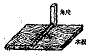

*图1·1*

木工用角尺检查板面是否刨平的方法，水泥工利用直的木尺铺平地板的方法，这些都是劳动人民经历了无数次实践的结果。人们用这个总结出来的经验来判定一个平面，把这个经验写成定理的形式就是：

经过面内任意两点的直线，如果这直线全部在这个面内，那末这个面是平面。

我们也可以利用这个性质来判定不平的物体表面，例如，玻璃瓶、煤气管、茶杯等的表面都不是平面。如果用直尺去检查一下，很快就会发现它们的表面与直边不可能总是密合的，这就从反面证明了上述各物的表面是不平的。

#### §1·2 平面的表示法

日常生活中所看到的平面图形， 如地板、桌面、匣子表面等， 它们的周界都是确定的， 而且比较常见的是矩形。 当我们站在适当的位置和距离去观察一个矩形的表面时， 看上去都象一个平行四边形。因此我们常把矩形表面画成平行四边形，这样可使图形有立体感（图1·2）。

上面的左图是表示水平位置的平面，右图是表示直立的平面。在平面内画空间图形的时候，通常画一个平行四边形以表示平面，但必须注意：用平行四边形表示平面仅仅是表示平面的一部分，而整个平面应当想象它是无边且无限延伸开来的一片平面。

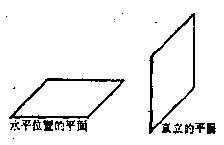

*图1·2*

表示一个平面的方法，通常用一个大写的字母写在平行四边形某一个顶角的内部，如图1·3中的 \(M\)，记做“平面 \(M\)”。有时也用平行四边形对角的两个大写的字母来标明，如用“平面 \(AC\)”或“平面 \(BD\)”等来表示。

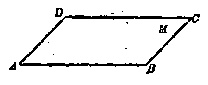

*图1·3*

**［注意］** 

（1） 用一个字母或两个字母表示平面的时候，在字母

前面应该写“平面”两个字，以免与点、直线混淆。

（2） 当画一个平面的一部分被另一个平面遮住时，应该把被遮住部分的线段画成虚线（图1·4左）或者连虚线也不画（图1·4右）。

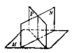

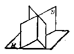

*图1·4*

#### §1·3 在水平位置的平面内画平面图形

在水平位置的平面内画平面图形，一般分为下面几个步骤：

（1） 先画出水平位置的平面（一般用 \( a=45^{\circ} \)， \( k=\frac{1}{2} \)）。

（2） 把平面图形上的一条边画成水平方向，也就是和平行四边形的横边平行，它的长度等于原来的长度，或者按比例尺的长度。

（3） 在平面图形上如果有垂直于该边的线段（看作垂直于水平方向），就把这些垂直线段画成和平行四边形的纵边平行（就是和横边成 \(45^{\circ}\) 角），垂直线段的长度等于原来长度的一半，或按比例尺长度的一半截取。

（4） 对于其他位置的线段，应当先在原来的平面图形上从线段的各个端点画出这水平方向边的垂线，再按（3）画出这些垂直的线段，端点确定后就可以画出这些线段了。

下面用例题来说明如何在水平位置的平面内表示平面图形（在下列各例中，水平位置的平面P内的图中取a=45°，k= \( \frac{1}{2} \)）。

##### 例 1

在水平位置的平面 P 内表示已知的正方形 ABCD（图1·5）。

横边 \(AB\) 移到水平位置的平面 \(P\) 内为 \(A_{1}B_{1}\)，它的长度不变。但纵边 \(AD\) 和 \(BC\) 移到平面 \(P\) 内时，须画成与线段 \(A_{1}B_{1}\) 成 \(45^{\circ}\) 的角，并且它的长度为原来实长的一半。则 \(A_{1}B_{1}C_{1}D_{1}\) 就是所要画的正方形。

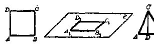

*图1·5*

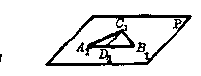

*图1·6*

##### 例 2

在水平位置的平面 P 内表示已知的 \( \triangle ABC \) （图1·6）。

先在 \(\triangle ABC\) 内作高 \(CD\). 在平面 \(P\) 内作 \(A_{1}B_{1} = AB\)， \(A_{1}B_{1}\) 须与表示平面的平行四边形的横边平行。 在 \(A_{1}B_{1}\) 上取 \(D_{1}\) 点， 使 \(A_{1}D_{1} = AD\). 再由点 \(D_{1}\) 作一直线使它与 \(A_{1}B_{1}\) 成 \(45^{\circ}\) 的角， 并且自点 \(D_{1}\) 起在这线上截取 \(C_{1}D_{1} = \frac{1}{2} CD\)， 从而得出点 \(C_{1}\). 连 \(C_{1}A_{1}\) 和 \(C_{1}B_{1}\)， 那么， \(\triangle A_{1}B_{1}C_{1}\) 就是所要画的三角形。

##### 例 3

在水平位置的平面 P 内表示四边形 ABCD （图1·7）。

除了上面所说的把一条边画成水平的方法那样，还可以采取如下的作法。过四边形的顶点 \(A\) 作一条水平的直线 \(MN\)，从 \(B、C\) 和 \(D\) 各顶点分别作 \(BK, CF\) 和 \(DE\) 垂直于 \(MN\)。

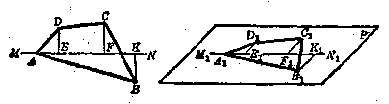

*图1·7*

在平面 \(P\) 内，任作一条和横边平行的直线 \(M_{1}N_{1}\)。在 \(M_{1}N_{1}\) 上任取一点 \(A_{1}\)；再在 \(M_{1}N_{1}\) 上顺次截取 \(A_{1}E_{1}, E_{1}F_{1}\)和 \(F_{1}K_{1}\) 分别等于 \(AE, EF\) 和 \(FK\). 过 \(E_{1}, F_{1}\) 和 \(K_{1}\) 分别画出和 \(M_{1}N_{1}\) 成 \(45^{\circ}\) 的直线； 在这些直线上取 \(E_{1}D_{1}, F_{1}C_{1}\) 和 \(K_{1}B_{1}\) 分别等于 \(\frac{1}{2}ED, \frac{1}{2}FC\) 和 \(\frac{1}{2}KB\). 分别连结 \(A_{1}B_{1}, B_{1}C_{1}, C_{1}D_{1}\) 和 \(D_{1}A_{1}\)， 则 \(A_{1}B_{1}C_{1}D_{1}\) 就是所要画的四边形。

##### 例 4

在水平位置的平面内表示一个已知的圆（图1·8）。

在已知圆内，画一条水平直径 \(AB\)。把这直径 \(n\) 等分（图中 \(n = 12\)），过各个分点作直径 \(AB\) 的垂线。

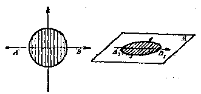

*图1·8*

在平面 M 内画一条水平直线， 在此直线上截取 \( A_{1}B_{1}=AB \) . 并且， 将 \( A_{1}B_{1} \) 也 n 等分 （图中 n=12）。

过 \(A_{1}B_{1}\) 的各个分点，画出与 \(A_{1}B_{1}\) 成 \(45^{\circ}\) 角的直线，再分别在这些直线上截取等于对应原弦长的一半且被 \(A_{1}B_{1}\) 平分的各线段。

顺次连结上述线段的端点所成的平滑曲线，就是在水平平面 M 内所表示的已知圆。

1. 对于一个正方体，试分别用记在角上的两个大写字母来表示出上下前后左右六个平面。

2. 观察一只漱口杯，哪一部分是平面？哪一部分不是平面？

3. 观察右面的两个图形，它们有什么不同？

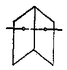

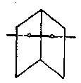

*（第3题）*

4. 在水平位置的平面 \(P\left(\alpha = 45^{\circ}, k = \frac{1}{2}\right)\) 内表示一个已知的矩形。

5. 在水平位置的平面 \(P\left(\alpha = 45^{\circ}, k = \frac{1}{2}\right)\) 内表示一个已知的直角三角形。

6. 在水平位置的平面 \(P\left(\alpha = 45^{\circ}, k = \frac{1}{2}\right)\) 内表示一个已知的正六边形。

7. 在水平位置的平面 \(P\left(\alpha = 45^{\circ}, k = \frac{1}{2}\right)\) 内表示一个已知的直角梯形。

8. 在水平位置的平面 \(P\left(\alpha = 30^{\circ}, k = \frac{1}{3}\right)\) 内表示一个已知的三角形。

9. 在水平位置的平面 \(P\left(\alpha = 60^{\circ}, k = \frac{2}{3}\right)\) 内表示一个已知的正方形。

#### §1·4 平面的基本性质

研究空间图形的性质， 同平面几何一样， 也是依据几何公理作为基础的。研究空间图形的性质， 又必须充分应用平面图形的性质。因此， 在立体几何里首先要讨论关于平面基本性质的三条公理。

公理1

如果一条直线上有两个点在一个平面内，那么这直线上所有的点都在这平面内。

这条公理描述了平面的基本性质，它是用直线与平面的关系来揭露的。只要直线上的任何两点在一个平面内，这两点可以落在这平面内的任何位置，那么这条直线上的所有点就都落在这个平面内了。这时，我们称直线在平面内，也可以说成平面通过这直线。因此，如果要知道一平面是否通过某一直线，只要知道这平面通过这直线上的任何两个点就可以了。§1·1 提到的判定平面的那个定理就是根据这条公理推导而得到的。从这条公理可以推知，如果一个多边形的各个顶点都落在同一个平面内，那末就可以断定这个多边形上的所有点全部落在同一个平面内；具有这种性质的多边形称为平面多边形。反之，如果一个多边形的各个顶点不能全部落在同一个平面内，这个多边形通常称为空间多边形。

##### 公理2

过不在一直线上的三点可以画一个平面，也只能画一个平面。

这条公理可以简单地说成：不在一直线上的三点确定一个平面。这里所谓“确定”是指“可以而且唯一”地确定一个平面的意思。

这条公理同样来自劳动人民经验的积累。例如，农村中常常用三根竹竿张开来架在地面上做成三脚架，在两只这样的架子之间搁上一根竹竿，就可以用来晒衣服，这样架起来的是很平稳、很牢固的。这主要是运用了上述的公理，张开的三根竹竿和地面接触的一端，就相当于不在同一直线上的三个点，而这样的三个点就可以确定一个平面。

我们还常看到，木工锯木料时用的三脚马，老年人用一手杖后就可以比较平稳地行走，平板仪和照相机所用的三脚架等，这些都是这一公理的实际例子。

##### 公理3

如果两个平面有一个公共点，那么它们相交于经过这点的一条直线。

在很多地方都可以看到这一公理的实际应用。例如，两堵墙壁的相交处都是一条直线，因为墙壁都砌得很平，所以两堵墙壁和两个平面一样，它们相交处一定是一条直线。又如把一张纸折起来，并且把纸折平所成的折痕就是一条直线；如果折纸时不把纸折平，那么折痕就不是一条直线了。这里说明了一点，就是两个平面的相交处一定是一直线，而两个面中只要有一个不是平面，那么它们的相交处就不一定是一直线。

如图1·9（1）中，平面 \(M\) 和平面 \(N\) 相交于直线\(AB\)如图1·9（2）中，平面 \(Q\) 和曲面 \(P\) 相交于 \(CD\)，显然，\(CD\) 是一条曲线。而在图1·9（3）中，平面 \(S\) 和曲面 \(R\) 相交于 \(EF\)，但 \(EF\) 却是一条直线。

对于公理3，也许有人会怀疑：两个平面能不能只相交于一点？正确的回答是不可能的。因为平面实质上是无限伸展的，既然两个平面有了一个交点，那末只要扩展这两个平面，一定有无数多个交点，而且这无数个交点必然在一条直线上（图1·10）。

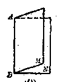

*（1）*

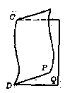

*（2）*

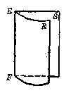

*（3）*

*图1·9*

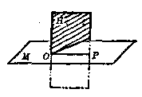

*图1·10*

如图1·10中，平面 \(M\) 和平面 \(H\) （如只画成有斜线的部分）相交于点 \(O\)，如果把平面 \(H\) 画大一些（图上用——画出的部分），平面 \(H\) 就和平面 \(M\) 相交于直线 \(OP\) 了。

上面叙述的三条平面公理，是讨论空间图形性质的基础。公理1是描述平面的基本性质，公理2是确定一个平面的根据，公理3是描述两平面相交的关系。

学习空间图形的性质，或者计算图形的大小，都要先画出空间图形，而空间图形又只能画在一个平面内，这与平面几何里画平面图形是不相同的。 因此，完全依赖于圆规和直尺就不能把空间图形画在平面内，还必须根据平面公理和图形的某些条件来研究画空间图形的方法。 因此学会画立体图形就成为学习立体几何的基本训练了。 希望读者在学习过程中随时注意这一点。

#### §1·5 确定平面的条件

具有哪些条件可以确定一个平面？我们以平面公理2为基础，再应用其他两条平面的性质公理，就可以推导出具有哪些条件即可确定一个平面的几个推论：

##### 1. 一条直线和这条直线外一点， 可以确定一个平面

如图1·11，已知直线 \(\pmb{a}\) 和直线 \(\pmb{a}\) 外的一点 \(A\)，我们来证明直线 \(\alpha\) 和点 \(A\) 可以确定一个平面。

**［证］** 在直线 \(\alpha\) 上可以任意取两点 \(B\) 和 \(C\). 因为 \(A, B, C\) 这三点不在一

直线上， 所以确定了一个平面 \(M\). 又因为直线 \(\pmb{\sigma}\) 上有两点 \(B, O\) 落在平面 \(M\) 内， 故知直线 \(\pmb{\sigma}\) 上所有的点都在平面 \(M\) 内。 这就证明了过直线 \(\pmb{\alpha}\) 和它外面的一点 \(A\) 可以画一个平面 \(M\).

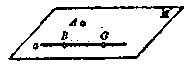

*图1·11*

其次，是不是只可以画一个平面呢？过直线 \(\alpha\) 和直线 \(\alpha\) 外的点 \(A\) 如果还可以画出第二个平面 \(N\)，这样，点 \(A, B, O\) 又要在平面 \(N\) 内，因此，这三点 \(A, B, O\) 既在 \(M\) 内又在 \(N\) 内，即确定两个平面，显然这是与不在一直线上的三点确定一个平面的公理相矛盾的，所以平面 \(N\) 必与平面 \(M\) 重合。这就证明了过直线 \(\alpha\) 和直线 \(\alpha\) 外的一点 \(A\) 只能画一个平面 \(M\)。

**［注意］** 本推论的证明过程分两步，第一步证明它的可能性，第二步证明它的唯一性。

本推论在日常生活中的应用是常见的。例如，箱子加锁就可以固定箱盖；门上加一开关就可以关闭，这些都是由于固定了一直线（箱盖和门的一边）和这直线外的一点（箱子的锁和门的开关）， 平面（指箱盖和门）的位置必定被固定的直线和它外面的一点所确定， 所以这平面也被固定了。

##### 2. 两条相交直线可以确定一个平面。

如图1·12， 设 \(a, b\) 是相交于点 \(O\) 的两条直线， 我们来证明相交直线 \(a\) 和 \(b\) 确定一个平面。

**［证］** 在直线 b 上任取异于点 O 的一点 B. 这样， 经过直线 a 和点 B 可

以确定一个平面 P。由于直线 b 上有两点 B 和 O 落在平面 P 内，所以直线 b 也落在平面 P 内，就是平面 P 过相交直线 a 和 b。

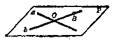

*图1·12*

其次， 假定经过相交直线 \(a\) 和 \(b\) 还可以作一个平面 \(N\)， 那么直线 \(a\) 和点 \(B\) 也必在平面 \(N\) 内， 这与过一直线和这直线外的一点只能确定一个平面的结论相矛盾， 因此平面 \(N\) 必与平面 \(P\) 重合。

综上两个方面，这就证明了相交两直线只能确定一个平面。

本推论的实际例子也是很多的。例如，墙壁损坏的地方往往向外凸出来，为了防止倒塌，可用木料撑头抵住墙壁，这时往往需要先用两块木板交叉紧贴在墙壁的凸出部分把它压平后，再用撑头顶住这两块木板的重迭部分。这样做的目的之一是使损坏的墙壁恢复并保持平面的状态。

3. 两条平行直线可以确定一个平面如图1·13，设 \(a\) 和 \(b\) 是平行的两条直线，我们来证明直线 a 和 b 确定一个平面。

**［证］** 根据平面几何里关于平行线的定义，两条平行直线必在一个平面

内，所以经过两条平行的直线 \(\alpha\) 和 \(\delta\) 可以作一个平面 \(M\).

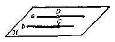

*图1·13*

其次， 经过平行直线 \(a, b\) 能不能作出第二个平面呢？ 假定经过平行直线 \(a, b\) 还可以作一个平面 \(N\)， 那末这两个平面 \(M\) 和 \(N\) 都要经过直线 \(a\) 和直线 \(b\) 上的一点 \(C\) （或者经过直线 \(b\) 和直线 \(a\) 上的一点 \(D\)； 这里的点 \(C\) 或 \(D\) 都是该直线上的任意一点）， 而过一直线和这直线外的一点只能确定一个平面， 显然过平行直线 \(a, b\) 所作的第二个平面 \(N\) 与平面 \(M\) 是重合的。 因此， 经过两平行直线只能作一个平面。

从本推论就容易推知：平行四边形或者梯形一定是平面图形。这是因为，梯形或平行四边形至少有两条对边是平行的，这两条平行直线确定了一个平面，而且其他两条对边都各有两点（图形的顶点）落在已确定的平面内，因此图形上各点全部落在同一个平面内，由此可见梯形或平行四边形都是平面图形。但是连结空间任意四个点，就不一定同在一平面内。例如，对于空间四个点 \(A, B, C, D\) （图1·14），我们可以分几种情况来讨论：

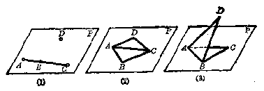

*图1·14*

（1） 如果空间四点 \(A, B, C, D\) 正好在一条直线上， 显然可知这四点同在一平面内。 但是必须注意， 过一直线的平面有无数个， 也就是说， 同在一直线上的四点不确定任何一个平面。 所以说， 这四点同在一平面内， 但不确定一个平面。

（2） 设 \(A, B, O\) 三点在一直线上， 而点 \(D\) 不在这直线上 （图1·14（1））， 那末由一直线和这直线外一点确定一个

平面 \(P_{\bullet}\)

（3） 设 \(A, B, C, D\) 中没有任何三点在一直线上， 因此其中的任何三点可以确定一个平面。 假如取 \(A, B, C\) 三点确定一个平面 \(P\). 至此又可分如下两种情形：

（i） 如果第四点 \(D\) 落在平面 \(P\) 内， 那末 \(A, B, C, D\) 这四点便确定一个平面 \(P\) （图1·14（2））。

（ii） 如果第四点 \(D\) 在平面 \(P\) 外， 那末 \(A, B, C, D\) 四点就不同在一平面内 （图1·14（3））。

所以， 空间四点是不一定同在一平面内的。

##### 例 1

AB、OD、EF 是三条直线， 其中 \( AB \parallel CD \)， EF 与 AB和 \(CD\) 都相交， 求证 \(AB, CD, EF\) 三直线在同一平面内 （图1·15）。

分析要证明三条直线在同一平面内，可以先由其中两条直线确定一个平面， 然后再证明第三条直线也落在这个平面内。 因为 \(AB\) 和 \(CD\) 是两条平行的直线， 所以可先确定一平面 \(P\)， 再证明直线 \(EF\) 也落在平面 \(P\) 内就可以了。

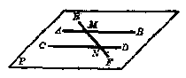

*图1·15*

**［证］** 

因为 \(AB \parallel CD\)，所以 \(AB\) 和 \(CD\) 可以确定一个平面 \(P\).

设 \(EF\) 与 \(AB\)、\(CD\) 分别相交于点 \(M\)、\(N\).

因为 \(M, N\) 两点分别是直线 \(AB\) 和 \(CD\) 上的点，所以点 \(M\) 和点 \(N\) 都在平面 \(P\) 内。既然直线 \(EF\) 上有两点 \(M, N\) 在平面 \(P\) 内，那么直线 \(EF\) 也就落在平面 \(P\) 内，故知直线 \(AB, CD, EF\) 同在一个平面内。

##### 例 2

试证明两两相交而不通过同一点的四条直线必在同一平面内。

分析根据题设条件，这四条直线有两种可能，如图1·16所示。

（1） 如图1·16 的 （1）， 直线 \(a, b, c, d\) 是两两相交的， 且没有三直线相交于同一点。 要证明这四条直线在同一平面

内， 可先取其中的两条直线（设 \(a, b\)）， 由题设， 它们是相交的（设交点为 \(P\)）， 所以可确定一平面（设为平面 \(R\)）， 再根据题设证明另两直线 （c 和 d） 也落在这平面 （\(R\)） 内就可以了。

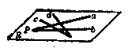

*（1）*

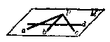

*（2）*

*图1·16*

（2） 如图1·16 的 （2）， 直线 \(a, b, c, d\) 是两两相交的， 其中直线 \(a, b, c\) 相交于一点 \(P\). 如取直线 \(d\) 和 \(a, b, c\) 中任一直线这两相交直线确定一平面 \(M\)， 要证明这四条直线在同一平面内的步骤完全同 （1） 的分析。

作为练习，希望读者自己来写出本题的详细证明。

1. 三角形一定是平面图形，为什么？

2. 当三个点的位置怎样时，则经过它们的平面不止一个？

3. 过空间的一点作三条直线，试问这三条直线是否同在一个平面内，为什么？

4. 空间有五个点，且其中没有四个点同在一平面内，这样的五个点能确定几个平面？

5. 空间三条直线两两平行，且不在同一个平面内，可确定几个平面？

6. 一直线如果与若干条平行线都相交，那末这些平行直线是不是同在一平面内，为什么？

7. 过一条直线上的一个已知点，能作多少条直线和这已知直线垂直？

［提示：过已知直线可以画出无数个平面，而在每一个平面内都可以过已知点作已知直线的一条垂线。］

8. 过一直线和这直线外不在同一直线上的三点，可以确定几个平面？

［提示：分如下三种情况，（1）三点中任何两点与直线不共面；（2）其中有两点与直线共面；（3）三点与直线在同一平面内。］

#### §1·6 空间作图题的解法

在平面几何里，作图问题都是在一个平面内应用圆规和直尺等作图工具来进行的；而空间作图题就不能全在一个平面内完成，先要考虑到图形在哪一个平面内，然后再在这平面内作图，所以空间作图要比平面作图多了一个确定平面的步骤。

对空间图形的作法，通常作出下面的规定：

（1） 如果已知的条件可以确定一个平面的位置时，那末这平面就认为是可以作出的。这就是说，如果具有下列条件之一，就认为这平面可以作出：

（i） 过不在一直线上的三个已知点；

（ii） 过一已知直线和这直线外的一已知点；

（iii） 过已知的两条相交直线；

（iv） 过已知的两条平行直线。

（2） 如果已知两个平面相交，它们的交线就认为是可以作出的。

（3） 如果已知空间的一个平面，就认为在这平面内可以完成平面几何中所能完成的一切作图。

因此，所谓解空间作图题，就是指把它归结到有限次的运用上面的三种基本作图。

**［注意］** 

（1） 根据上面的叙述可知， 空间作图题的解法， 是和平面几何中的作图题有很大区别的。 空间作图往往必须作出平面， 或者作出某些平面的交线， 最后再在作出的平面内进行平面几何的作图。 例如“过已知直线 \(a\) 外的一个点 \(A\)， 求作这直线的平行线”， 在解这个作图题时， 首先应该过直线 \(a\) 和点 \(A\) 决定平面 \(M\)， 然后在平面 \(M\) 内过点 \(A\) 作直线 \(b\) 平行于直线 \(a\). 如果不通过作平面 \(M\) 而直接过点 \(A\) 作直

线 b 平行于已知直线 a，那是不妥当的，因为只有在一个平面里才可以应用作图工具进行平面几何的一切作图。请读者观察右面的两个图（图1·17），哪一个是不妥当的？为什么？

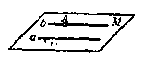

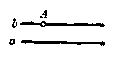

*图1·17*

（2） 对某些简单的作

图题，只应用上述三种基本作图就行了。而对于较复杂的作图题，除了应用这三种基本作图之外，还应该考虑图形中各个元素间的位置关系。例如，已知两个平面有一个公共点，那么在作图时，这两个平面的交线就一定要画成过这个公共点。上面的图1·18中，请读者观察一下，哪一个画得不妥当？为什么？

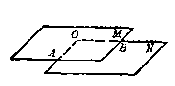

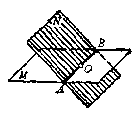

*图1·18*

（3） 在画两个或者两个以上的相交平面图形时，除了清楚地画出它们的交线外，被平面遮住的直线或线段等，都要画成虚线，必要时可以用不同颜色的铅笔，在图形上涂上颜色会更显得直观。

##### 例 1

从已知直线外一已知点，作一直线与已知直线相交，并与已知直线所成的角等于已知角 \( \alpha \) （图1·19）。

**［解］** 设 BC 为已知直线， A 为直线外一点。 过 BC 及点 A 可确定平面 P.

在 BC 上任取一点 \( S_{1} \)，在平面P 内过点 \( S_{1} \) 作角 \( A_{1}S_{1}C = \alpha \)。再在平面 P 内过点 A 作 \( AS \parallel A_{1}S_{1} \)，使 AS 与 BO 相交于 S、那么 \( \angle ASC = \angle A_{1}S_{1}C = \alpha \)，所以 AS 是所求的直线。同理可以作

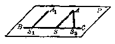

*图1·19*

$$
\angle A S _ {2} B = \alpha
$$.

当 \(\alpha = 90^{\circ}\) 时，本题一解；当 \(\alpha = 180^{\circ}\) 时，本题无解。

**［注意］** 

本题中，作 \(\angle A_{1}S_{1}C = \alpha\)，以及作 \(AS\parallel A_{1}S_{2}\) 都是平面几何的作图，所以特别先加注明这些作图是在平面 \(P\) 内进行。当我们在空间中要进行平面几何的作图时，必须先确定一个平面，脱离了平面，直线是作不出来的。这是初学立体几何的人容易忽视的，应当加以注意。

##### 例 2

求作已知平面 P 与不在这平面内的已知直线 a 的公共点（图1·20）。

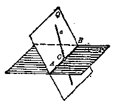

*图1·20*

**［解］** 

在平面 \(P\) 内任取一点 \(A\)， 过点 \(A\) 和直线 \(\alpha\) 作平面 \(Q\). 平面 \(Q\) 和平面 \(P\) 有公共点 \(A\)， 所以相交于过点 \(A\) 的直线 \(AB\). 在平面 \(Q\) 内的直线 \(\alpha\) 和 \(AB\) 相交于点 \(C\)， 那么点 \(C\) 即为所求的公共点。

若 \(a \parallel AB\)，本题无解。

##### 习题1·6

1. 已知一直线 \(\alpha\) 和直线 \(\alpha\) 外的一点 \(P\)， 求过点 \(P\) 作直线 \(\alpha\) 的垂线。

2. 已知空间两直线 \(\alpha\) 和 \(b\) （不在同一个平面内） 和它们外面的一点C， 求过点 O 作一直线使它和直线 a、b 都相交。

3. 在已知平面 \(M\) 内求作一条直线， 使它过平面 \(M\) 内的一个已知点 \(P\)， 并且与不在这平面内的一条已知直线 \(AB\) 相交。

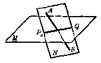

*（第3题）*

［提示：过 \(P\) 和 \(AB\) 可以确定平面 \(N\)， 那么平面 \(M, N\) 的交线 \(PQ\) 就是所求作的直线。如果直线 \(AB\) 与两平面的交线 \(PQ\) 平行， 注意一下这时本题有解否？］

### 直线和直线的位置关系

#### §1·7 两条直线的相关位置

由平面几何知识可以知道，在同一平面内的两直线的位置关系有下述三种：

（1） 如果两条直线有两个公共点，那末它们一定有无数个公共点，这时两直线重合。

（2） 如果两条直线只有一个公共点，那么这两条直线相交。

（3） 如果同一平面内两条直线没有公共点，那么这两条直线平行。

所以，在同一平面内的两直线只有重合、相交、平行这三种位置关系。但是，在空间图形中，两直线的位置关系是否也是这样呢？由于空间图形是不完全在一个平面内的点所组成的图形，因此有不在同一平面内的直线存在.例如，在我们常见的长方体中（图1·21），上底面的长 \(A_{1}B_{1}\) 与下底面的宽\(AD_{1}\) 或者上底面内一条矩形的对角线 \(B_{1}D_{1}\) 与这长方体的高 \(AA_{1}\) 等，它们都是不在同一平面内的直线.例如，操场跳高架上的横竿与直立于操场上的旗竿， 如果将它们看作直线， 它们也是不在同一个平面内的。

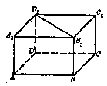

*图1·21*

不在同一个平面内的两条直线，叫做异面直线。两条异面直线既不相交，也不平行（因为两条相交或平行的直线都在同一平面内）。

因此，空间两条不重合的直线的位置关系有：

（1） 异面直线——没有公共点， 不在同一个平面内；

（2） 平行直线——没有公共点，
（3） 相交直线——只有一个公共点，在同一平面内。

如果空间两直线是异面直线，作图时可以过其中一条直线作一个平面，使另一条直线与这个平面相交。这样就容易体现出两条异面直线的位置关系。

例如， 在图1·22（1） 中， 直线 \(a\) 在平面 \(M\) 内， 直线 \(b\) 与平面 \(M\) 相交于 \(S\). 因点 \(S\) 不在直线 \(a\) 上， 所以容易看出 \(a\)、\(b\) 两直线是异面直线。

表示异面直线图形的另一方法，是将两条异面直线分别画在两个相交的平面内。如图1·28。直线 \(a\) 和直线 \(b\) 是异面直线。

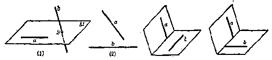

*图1·22*

*图1·23*

图1·22（2） 中， 直线 a 与直线 b 是异面直线， 但是这样的画法就不如上两种画法来得明显。

读者还可以在图1·21中仔细进行观察，在这个长方体中，除了直线 \(BC\) 与 \(C_1D_1\) 是异面直线外，能否再找出其他几对异面直线？在平面 \(BB_1C_1C\) 内，连结 \(BC_1\)，那么 \(BC_1\) 与 \(CD\) 是否是异面直线？为什么？

##### 例 1

三个平面两两相交得到三条直线， 如果其中有两条相交于一点， 那么第三条也经过这点。

**［已知］** 平面 \(N\) 和平面 \(P\)、平面 \(M\) 和平面 \(P\) 的交线都经过点 \(O\)（图1·24）。

**［求证］** 平面 M 和平面 N 的交线也经过点 O.

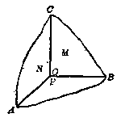

*图1·24*

**［证］** 由于平面 \(N\) 和平面 \(P\) 的交线经过点 \(O\)， 所以点 \(O\) 在平面 \(N\) 内。

又， 平面 \(M\) 和平面 \(P\) 的交线也经过点 \(O\)， 可知点 \(O\) 也在平面 \(M\) 内。

因此， 点 \(O\) 是平面 \(M\) 和平面 \(N\) 的公共点， 所以平面 \(M\) 和平面 \(N\) 的交线经过点 \(O\).

##### 例 2

已知 A、B、C、D 是空间的四个点，AB、CD 是异面直线。

**［求证］** AC 和 BD， AD 和 BC 也都是异面直线。

分析 要证明 \(AC\) 和 \(BD\) 是异面直线， 就是要证明 \(AC\) 和 \(BD\) 不在同一个平面内。

可以应用反证法，先假定 \(AC\) 和 \(BD\) 在同一个平面内，然后证明它与已知条件“AB 和 CD 是异面直线”发生矛盾，由此证明结论成立。同理可证 AD 和 BC 是异面直线。

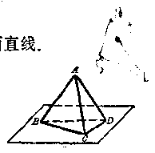

*图1·25*

**［证］** 假定 \(AC\) 和 \(BD\) 不是异面直线，那末 \(AC\) 和 \(BD\) 在同一个平面内。

因此，A、C、B、D 四点在同一个平面内。这样，AB、CD 就分别有两个点在这个平面内，所以 AB 和 CD 在这个平面内，即 AB 和 CD 不是异面直线。这就与已知条件产生矛盾。

所以 \(AC\) 和 \(BD\) 是异面直线。

同理可以证明 \(AD\) 和 \(BC\) 也是异面直线。

**［注意］** 要证明两条直线是异面直线， 常常应用反证法。 先假定它们在同一个平面内， 然后引出矛盾， 由此证明结论成立。

1. 两条直线分别在两个平面内， 它们是否一定是异面直线？

2. 四边形中有三边在同一个平面内，第四边和两条对角线为什么也在这个平面内？

##### 习题1·7

3. 垂直于同一条直线的许多空间直线，它们是不是互相平行？

4. 已知两个相交平面 \(P\) 和 \(Q\). 过它们的交线上两个点 \(A\) 和 \(B\)， 在平面 \(P\) 内作直线 \(AC\)， 在平面 \(Q\) 内作 \(BD\). 求证 \(AC\) 与 \(BD\) 是异面直线。

［提示：可用反证法，若 \(AC\) 与 \(BD\) 在一个平面内，这将导致平面 \(P\) 和 \(Q\) 重合，这与题设平面 \(P\) 和 \(Q\) 相交矛盾，故结论成立。］

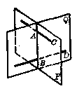

*（第4题）*

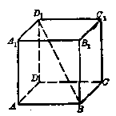

*（第7题）*

5. 一条直线和两条异面直线相交，每两条相交直线可以确定一个平面，一共可以确定几个平面？

6. 两条相交直线能不能与两条异面直线都相交？

7. 正方体相邻两个表面的交线中，哪几条与 \(BD_{1}\) 是异面直线？

［提示：请读者仔细进行观察，计能找出六条.］

### 直线和平面的位置关系

#### §1·8 直线和平面的相关位置

我们已经知道，如果一条直线上有两个点在某一平面内，那么这直线上的所有点都在这个平面内，这时直线就在平面内。

如果一条直线和平面只有一个公共点，那么这条直线就和这个平面相交。

如果一条直线和一个平面没有公共点，则称这条直线和这个平面互相平行。所以，一条直线和一个平面的位置关系有：

（1） 直线和平面平行——没有公共点；

（2） 直线和平面相交——只有一个公共点；

（3） 直线在平面内——有无数个公共点。

一条直线与一个平面之间，有没有既不相交、又不平行的位置关系呢？

事实上是不可能有这样的位置关系的。例如，图1·26中的直线AB和平面M，从图形上看好象不相交也不平行，但是由于直线可以无限延长， 平面可以无限伸展， 它们如果不平行， 那么一定相交。

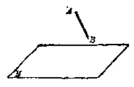

*图1·26*

画直线与平面相交时，要把直线画得延伸到表示平面的平行四边形的外面。如图1·27（1）的画法比较明显，（2）的图形就不明显。

画直线和平面平行时，宜把直线画在表示平面的平行四边形的外面，如图1·28（1）的画法比较好，（2）的画法就不明显。

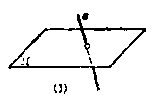

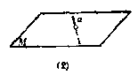

*图1·27*

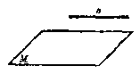

*（1）*

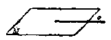

*（2）*

*图1·28*

#### §1·9 直线和平面平行的判定

在图1·29中，a是门框的边缘。当门M绕着a在转动时，门框的另一边缘 \(b\) 是与门 \(M\) 平行的。如将门框的边缘看成直线，门 \(M\) 看成平面 \(M\)，那么这一事实启发我们如何去判定一直线和一平面平行。

平面外一条直线，如果和平面内的一条直线平行，那么这条直线就和这个平面平行。

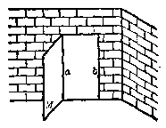

*图1·29*

**［已知］** 

a 是平面 M 外的一直线，b 是平面 M 内的一直线， \( a \parallel b \) （图1·30）。

**［求证］** 

分析直线 a 平行于平面 M.

只要证明直线 a 和平面 M 没有公共点，就可以确定直线 a 平行于平面 M.

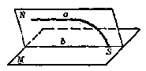

*图1·30*

**［证］** 两平行直线 \(a, b\) 所确定的平面是 \(N\)， 假定直线 \(a\) 和平

面 \(M\) 有公共点 \(S\). 因点 \(S\) 在直线 \(a\) 上， 所以点 \(S\) 必在平面 \(N\) 内； 又因点 \(S\) 为直线 \(a\) 与平面 \(M\) 的交点， 所以点 \(S\) 又在平面 \(M\) 内。 因此， 点 \(S\) 必定在平面 \(M\) 和平面 \(N\) 的交线 \(b\) 上。 也就是说， 直线 \(a\) 和直线 \(b\) 相交。 但这与已知条件 \(a \parallel b\) 矛盾， 这是不可能的， 所以直线 \(a\) 与平面 \(M\) 没有公共点， 因此直线 \(a\) 平行于平面 \(M\).

**［注意］** 上面叙述的“直线和平面平行的判定定理”，为便于记忆起见，读者可以用“线线平行，线面平行”来理解它。意思就是说，要判定一直线和某一个平面是否平行，只要判定这直线是否与这个平面内的一条直线平行就可以了。

这一定理也可以这样来叙述：当一个平面过两条平行线中的一条时，那末这平面必定和另一条直线平行。

上面证明中所用的方法，称为反证法，这种方法已在平面几何中叙述过.它也是证明定理时常用的一种方法，特别在立体几何开始的一个阶段，我们要经常应用到反证法。

##### 例

\(AB, BC, CD\) 是不在同一个平面内的三条线段，求证经过这三条线段的中点 E、F、G 的平面 M 和 AC 平行，也和 BD 平行。

分析 根据“线线平行，线面平行”的定理，要证明 \( AC \parallel \) 平面 M， 只要证明 AC 平行于平面 M 内的一条直线；由图1·31可知，也就是证明 \(AC \parallel EF\).

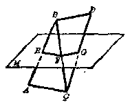

*图1·31*

**［证］** 在 \(\triangle ABC\) 所在的平面中，\(E, F\) 分别是 \(AB, BC\) 的中点。

$$
\therefore A C \parallel E F
$$.

于是 AC ∥ 平面 M.

同理可证 BD || 平面 M.

1. 如果一条直线平行于一个平面，这直线是不是和这平面内所有直线都平行？为什么？

2. 如果一条直线平行于另一条直线，那末它就和经过这另一条直线的任何平面都平行，这一结论对不对？为什么？

3. 一块矩形板 \(ABCD\) 的一边 \(AB\) 在平面 \(M\) 内，把这块矩形板绕着 \(AB\) 转动，这时 \(AB\) 的对边 \(CD\) 是不是都和平面 \(M\) 平行？为什么？

4. 过平面 M 内的一点 C，引一直线 CD，平行于平面 M 外的一直线 AB，如果 CD 在平面 M 内，试证明 AB 平行于平面 M.

5. 空间四边形相邻两边中点的连线平行于经过另外两边的平面。

6. 求证空间四边形 \(ABCD\) 的两条对角线 \(BD\) 和 \(AC\) 都平行于由四边中点所确定的平面 \(EFGH\).

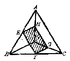

*（第6题）*

#### §1·10 直线和平面平行的性质定理

已知直线和一个平面平行，它们之间的基本性质由下述两条定理来描述：

定理 1 如果一条直线和一个平面平行，而经过这直线的一个平面和这个平面相交，那末这直线就和两平面的交线平行。

**［已知］** 直线 \(a \parallel\) 平面 \(M\)； 平面 \(N\) 过直线 \(a\)， 且与平面 \(M\) 相交于 \(b\) （图1·32）。

**［求证］** \(a \parallel b\).

**［证］** 因为 \(\alpha\) 和 \(\pmb{b}\) 在同一平面 \(N\) 内，

所以只要证明它们不相交就证得了它们互相平行。我们用反证法来证明，如果 \(a\) 与 \(b\) 相交，那末 \(a\) 就要与 \(b\) 所在的平面 \(M\) 相交，这与已知条件矛盾。所以上述假定的“\(a\) 和 \(b\) 相交”不可能，因此 \(a\) 和 \(b\) 平行。

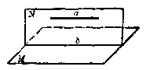

*图1·32*

**［注意］** 对于上述定理，为便于记忆起见，也可以和判定定理一样，用“线面平行，线线平行”来理解它.所谓线面平行，就是已知直线和平面平行，所谓线线平行，就是指过这直线的任一平面和已知平面的交线，和这已知直线平行。

定理2 如果一条直线和一个平面平行，那么过已知平面内任一点而和已知直线平行的直线只有一条，而且这直线必在已知平面内。

**［已知］** \(\alpha\) 平行于平面 \(M\)， 点 \(P\) 在平面 \(M\) 内， \(PQ \parallel \alpha\).

**［求证］** PQ 在平面 M 内（图1·33）。

**［证］** 过两平行直线 \(\alpha\) 和 \(PQ\) 可决定平面 \(N\). 那么， 平面 \(M\) 和平面 \(N\) 必相交于过点 \(P\) 的一条直线 \(PQ_{1}\). 根据性质定理1可知 \(\alpha \parallel PQ_{1}\). 既

然已知 \(\alpha \parallel PQ\)，故 \(PQ, PQ_1\) 为在同一平面 \(N\) 内同过点 \(P\) 且平行于平面内的直线 \(\alpha\)，所以 \(PQ\) 与 \(PQ_1\) 重合。即得 \(PQ\) 也在平面 \(M\) 内（请读者自行证明其唯一性）。

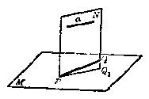

*图1·33*

由上述直线和平面平行的性质定理和判定定理可以知道，要判定一直线和一个平面平行，只要判定这直线和平面内的一条直线平行即可；反过来，如果一直线平行于一个平面，那么过这直线的所有平面和已知平面的交线，都与这条直线平行.下面的一些结论，主要由上述两条定理推导得出，希望读者加以注意。

从上面的讨论可以看出：

（1） 两条平行直线可以同时平行于一个平面，两条相交直线可以同时平行于一个平面，两条异面直线也可以同时平行于一个平面；

（2） 两条平行直线中的任一条如果平行于一个平面， 那么另一条直线或者也平行于这个平面， 或者在这个平面内 （图1·34（1）（2））；

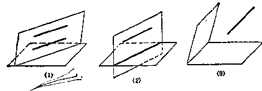

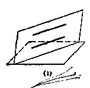

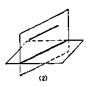

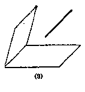

*图1·34*

（3） 一直线如果与两个相交平面的交线平行，那么这

直线同时和这两个平面平行（图1·34（3））。

##### 例 1

两个相交平面如果分别过两条平行直线中的每一条，试证它们的交线就与这两条直线平行。

**［已知］** 直线 \(a \parallel\) 直线 \(b\)， 平面 \(M\) 和 \(N\) 分别过直线 \(a\) 和 \(b\)， \(M\) 和 \(N\) 相交于直线 \(c\) （图1·35）。

*图1·35*

**［求证］** \(c \parallel a, c \parallel b\).

**［证］** 直线 \(\alpha\) 与平面 \(N\) 内的直线 \(\delta\) 平行， 所以 \(\alpha\) 与平面 \(N\) 平行。

因为 \(a \parallel\) 平面 \(N\)， 而直线 \(c\) 是过直线 \(a\) 的平面 \(M\) 与平面 \(N\) 的交线， 所以 \(c \parallel a\). 同理可证c || b.

##### 例 2

如果两条直线各与第三条直线平行， 这两条直线互相平行（图1·36）。

**［已知］** \(a \parallel c, b \parallel c\).

**［求证］** \(a \parallel b\).

**［证］** 如果直线 \(a, b, c\) 在同一平面内，这在平面几何中早已证明了这结论，在此不再重复。

设直线 \(a, b, c\) 不在同一平面内。在直线 \(b\) 上任取一点 \(A\)， 过直线 \(a\) 与点 \(A\) 可确定平面 \(S\)， 两平行直线 \(b\) 与 \(o\) 所确定的平面为 \(P\)， 平面 \(S\) 和 \(P\) 有公共点 \(A\)， 它们必相交于过 \(A\) 的一直线， 设此直线为 \(AB\).

*图1·36*

已知 \(c \parallel a\)，所以 \(c\) 必平行于平面 \(S\)，\(c\) 也平行于 \(S\)、\(P\) 两平面的交线 \(AB\)。但是直线 \(AB\)、\(b\)、\(c\) 在同一平面 \(P\) 内，因为过同一点 \(A\) 的两条直线 \(AB\) 与 \(b\) 同时平行于 \(c\)，所以 \(AB\) 重合于 \(b\)。

因为 \(a \parallel c\)，则直线 \(a\) 平行于平面 \(P\)，所以直线 \(a\) 平行于 \(AB\)，即 \(a \parallel b\).

因为由 \(a \parallel c, b \parallel c\) 可得出 \(a \parallel b\) 这一性质， 故称这一定理为平行直线的传递性， 也称为三线平行定理。

由这一定理可知： 平面几何里的“如果两条直线分别与第三条直线平行， 那么这两条直线互相平行”的性质， 可以推广到空间。

读者可以做这样一个实验，在一张纸上画三条平行直线 \(a, b\) 和 \(c\)，以中间的一条 \(b\) 为折痕把纸折过来（图1·37），观察在空间中 \(\alpha\) 是否和 \(c\) 平行？

*图1·37*

*图1·38*

##### 例 3

在空间四边形中，连结不相邻两边中点的两直线必相交，并且互相平分（图1·38）。

**［已知］** ABCD 为空间四边形，E、F、G、H 分别为 AB、BC、CD、AD 各边的中点。

**［求证］** EG、FH 必相交并且互相平分。

**［证］** 在 \(\triangle ABD\) 所在的平面内， \(E, H\) 分别为 \(\triangle ABD\) 的两边 \(AB, AD\) 的中点， 根据平面几何中关于三角形两边中点连线的性质有 \(EH \parallel BD\)， 且 \(EH = \frac{BD}{2}\). 同理可证明， 在 \(\triangle BDC\) 中， \(FG \parallel BD, FG = \frac{BD}{2}\). 因此 \(EH \parallel FG\)， 可知 \(E, F, G, H\) 在一个平面内， 且四边形 \(EFGH\) 为平行四边形。 但是 \(EG, FH\) 为 \(\square FGHE\) 的对角线， 所以 \(EG, FH\) 必定相交， 并且互相平分。

##### 例 4

空间的两个角， 如果它们的对应边互相平行， 并且方向相同， 那么这两个角相等。

**［已知］** \(\angle BAC\) 和 \(\angle B_{1}A_{1}C_{1}\) 是不在同一个平面内的两个角，它们的对应边互相平行，并且方

向相同（图1·39）。

**［求证］** \(\angle BAC = \angle B_{1}A_{1}C_{1}\)

**［证］** 在 \(AB\) 和 \(A_{1}B_{1}\) 上分别取相等的线段 \(AD\) 和 \(A_{1}D_{1}\)， 在 \(AC\) 和 \(A_{1}C_{1}\) 上分别取相等的线段 \(AE\) 和 \(A_{1}E_{1}\)， 连结 \(AA_{1}, DD_{1}, EE_{1}, DE\) 和

因为 \(AD \parallel A_1D_1\)，所以 \(ADD_1A_1\) 是平行四边形，即 \(AA_1 \parallel DD_1\)。同理知 \(AA_1 \perp EE_1\)。根据线段相等的传递性和三线平行定理有 \(DD_1 \parallel EE_1\)，所以 \(DEE_1D_1\) 是平行四边形。由此有 \(DE = D_1E_1\)。因此 \(\triangle AED \cong \triangle A_1E_1D_1\)，所以 \(\angle BAC = \angle B_1A_1C_1\)。

*图1·39*

**［注意］** 

在平面几何里，我们知道：“如果两个角的两双边对应平行并且方向相同或相反，那么这两个角相等；如果有一条边方向相同，而另一条边方向相反，那么这两个角互为补角”。这个性质对空间的两个角来讲也是成立的。希望读者自行证明。

##### 习题1·10

1. 如果平面外的两条平行线中有一条和平面内的某一直线平行，试证另一条直线和这个平面平行。

2. 如果两条平行线中的一条与一个已知平面相交，试证另一条直线也一定和这个平面相交。

［提示：可参考上题，用反证法来证明。］

3. 已知直线 \(AB\) 平行于平面 \(M\)， 经过直线 \(AB\) 作一系列平面和平面 \(M\) 相交， 求证交线 \(a, b, c, \cdots\) 是一组平行线。

4. 如果一条直线和一个平面平行， 求证： 关在这条直线和这个平面间的平行线段都相等。

5. 如果一条直线和两个相交的平面平行， 则和它们的交线平行。

［提示：过已知直线作两个平面分别与这两个相交平面相交.］

6. 过已知点 \(P\) 求作一个平面，使它分别与不过这点的两条已知异面直线 \(a\) 和 \(b\) 平行。

*（第6题）*

*（第7题）*

7. 已知 \(AB\) 是平面 \(M\) 外一直线， \(P\) 是平面 \(M\) 外一定点， 设 \(AB\) 不和平面 \(M\) 平行。过点 \(P\) 作一条直线， 使它平行于平面 \(M\)， 并且和 \(AB\) 相交。

［提示：过点 \(P\) 和直线 \(AB\)，确定平面 \(N\)，则平面 \(N\) 和平面 \(M\) 一定相交；在平面 \(N\) 内，过点 \(P\) 作直线平行于平面 \(M\) 和 \(N\) 的交线，此即所求的直线。］

8. 已知两条异面直线 \(a\) 和 \(b\)， 以及 \(a\) 和 \(b\) 外的一个点 \(c\). 过点 \(c\) 和直线 \(a, b\) 分别作两个平面 \(M\) 和 \(N\)， \(M\) 和 \(N\) 相交于 \(PQ\)， 那末直线 \(PQ\) 和 \(a, b\) 的位置关系怎样？

*（1）*

*（2）*

*（3）*

*（4）*

*（第8题）*

**［解］** 因为 PQ 是平面 M 和 N 的交线， 所以 PQ 在平面 M 内。

又 \(a\) 在平面 \(M\) 内，所以 \(PQ\) 和 \(a\) 在同一个平面 \(M\) 内。

则 PQ 和 a 的位置关系可能有两种情形：

（1） 相交；（2） 平行。

同理，PQ 和 b 的位置关系也可能有两种情形：

（1） 相交；（3） 平行。

因此， 可能产生下列几种情形：

（1） PQ 和 a， b 都相交；

（2） PQ 和 a 平行， 和 b 相交；

（3） PQ 和 a 相交， 和 b 平行；

（4） PQ 和 a、b 都平行。

而（4）是不可能的。因为 \(PQ \parallel \vec{a}, PQ \parallel b\)，则 \(a \parallel b\)，这与已知 \(a, b\) 是异面直线的条件产生矛盾。

综上所述， 可见直线 PQ 和 a、b 的位置关系是： 或者 PQ 和 a、b 都相交； 或者 PQ 和 a、b 中一条平行， 和另一条相交。

9. 已知直线 \(BC\) 平行于平面 \(M, B, D, C\) 是直线 \(BC\) 上的三个点。从平面 \(M\) 外一个定点 \(A\) 作直线 \(AB, AD, AC\)， 分别交平面 \(M\) 于 \(B, F, G\) 三点。已知 \(BC = a, AD = b, DF = c\)， 求 \(EG\) 的长。

*（1）*

*（2）*

*（3）*

*（第9题）*

［提示：显然 \(A, B, E, C, G\) 在一个平面内，在这平面内两次运用相似三角形的比例关系，即可求得结果；本题须分三种情况分别讨论，即 \(A\) 和 \(BC\) 在平面 \(M\) 的异侧，同侧且 \(A\) 在 \(M\) 和 \(BC\) 之间、同侧且 \(BC\) 在 \(M\) 和 \(A\) 之间。］

#### §1·11 两条异面直线所成的角

两条异面直线之间不相交成角，为了研究两条异面直线间的位置关系，在此给它们新的定义。

图1·40中，a、b是两条异面直线。经过空间任一点O，作OA、OB分别平行于直线a、b。直线OA和OB所成的锐角AOB称为异面直线所成的角，也称为异面直线的交角。

若在空间再任取一点 \(O_{1}\)， 自点 \(O_{1}\) 也分别作 \(O_{1}A_{1}\) 及 \(O_{1}B_{1}\) 平行 \(a, b\)， 那么根据 §1·10 例 4“空间的两个角， 如果它们的对应边互相平行并且方向相同，那么这两个角相等”知 \( \angle AOB = \angle A_{1}O_{1}B_{1} \) . 因此，这些角的大小是由 a 和 b 的方向来决定，而与所选取的点 O、点 \( O_{1} \) 的位置无关。

*图1·40*

如果两条异面直线所成的角是直角， 就称两异面直线互相垂直。

*图1·41*

##### 例

在图1·41中的正方体里，下列直线所成的角分别是多少度？

（1） \(A_{1}A\) 和 \(B_{1}C_{1}\)；

（2） \(A_{1}C_{1}\) 和 \(AB\)；

（3） \(A_{1}C_{1}\) 和 \(B_{1}C\).

**［解］** （1） 因为 \(B_{1}B \parallel A_{1}A\)， 所以 \(B_{1}B\) 和 \(B_{1}C_{1}\) 所成的角就是 \(A_{1}A\) 和 \(B_{1}C_{1}\) 所成的角。 而 \(\angle BB_{1}C_{1} = 90^{\circ}\)

∴ \( A_{1}A \) 和 \( B_{1}C_{1} \) 成 \( 90^{\circ} \) 的角。

（2） 因为 \(A_{1}B_{1} \cap AB\)， 所以 \(A_{1}B_{2}\) 和 \(A_{1}C_{1}\) 所成的角就是 \(A_{1}C_{2}\) 和 \(AB\) 所成的角。 而 \(\angle B_{1}A_{1}C_{1} = 45^{\circ}\)，

∴ \( A_{1}C_{1} \) 和 AB 成 \( 45^{\circ} \) 的角。

（3） 连结 \(AC\)， 因为 \(AC \parallel A_{1}C_{1}\)， 所以 \(AC\) 和 \(B_{1}C\) 所成的角就是 \(A_{1}C_{1}\) 和 \(B_{1}C\) 所成的角。

连结 \(AB_{1}\)， 因为 \(AB_{1}, AC, B_{1}C\) 分别为正方形 \(ABB_{1}A_{1}, ABCD, BCC_{1}B_{1}\) 的对角线， 而这三个正方形是全等的， 所以 \(AB_{1} = AC = B_{1}C\)， 则 \(\triangle AB_{1}C\) 是等边三角形。

$$
\therefore \angle A C B _ {1} = 60^{\circ}，
$$

即 \(A_{1}C_{1}\) 和 \(B_{1}C\) 成 \(60^{\circ}\) 的角。

**［注意］** 由这个例子可知： 欲求两条异面直线所成的角， 常常在其中一条直线上取一点， 引另一条直线的平行线， 求出这两条直线的交角即可。

#### §1·12 直线和平面垂直的判定

在 §1·8 中已经讲过：一直线和一个平面只有一个公共点时，这直线就和这个平面相交。

直线和平面相交，有下列两种情况：图1·42中直线 \(\alpha\) 和平面 \(M\) 是斜交；而直线 \(b\) 和平面 \(M\) 相交的情况显然不同于直线 \(\alpha\) 和平面 \(M\) 相交的情况。

*图1·42*

如果一条直线和一个平面相交，并且与这个平面内的任何一条直线都垂直，则称这条直线与这个平面互相垂直（⊥）。这条直线称为这个平面的垂线。这个平面称为这条直线的垂面。平面的垂线和平面的交点称为垂线足。

观察一下室内相邻两垛墙壁的交线，它们都分别与墙壁和地面的交线成直角；如把相邻两垛墙壁的交线看作直线，地面看成平面，这一现象启发了我们如何去判定一条直线和一个已知平面垂直。

判定定理1如果一条直线和一个平面内的两条相交直线都垂直，那么这条直线就垂直于这个平面。

**［已知］** 

直线 \(AB\) 和平面 \(M\) 相交于点 \(B\)， 并且和平面 \(M\) 内两条相交直线 \(a, b\) 都垂直。

**［求证］** 

AB 垂直平面 M.

**［证］** 

在平面 \(M\) 内过点 \(B\) 引直线 \(a, b\) 的平行线 \(BD, BC\)， 则 \(AB \perp BD, AB \perp BC\). 再过点 \(B\) 任意引一直线 \(BE\). 延长 \(AB\) 至 \(A_{1}\)， 使 \(AB = A_{1}B\). 在平面 \(M\) 内不过点 \(B\) 引一直线与过点 \(B\) 的三条直线 \(BC, BD, BE\) 分别相交于 \(C, D, E\)， 把这三点分别与 \(A, A_{1}\) 连结 （图1·43）。

在 \(\triangle ACD\) 及 \(\triangle A_{1}CD\) 中，\(CD\) 为公共边，\(C, D\) 两点分别是线段 \(AA_{1}\) 的垂直平分线 \(CB, DB\) 上的点，

*图1·43*

$$
\therefore A C = A _ {1} C， A D = A _ {1} D
$$.

所以 \(\triangle ACD \cong A_1CD\)，因此 \(\angle ACD = \angle A_1CD\).

在 \(\triangle ACE\) 及 \(\triangle A_{1}CE\) 中， \(CE\) 为公共边， \(AC = A_{1}C\)， 已证得 \(\angle ACE = \angle A_{1}CE\)， 所以 \(\triangle ACE \cong \triangle A_{1}CE\)， 因此 \(AE = A_{1}E\).

所以 \(\triangle AA_{1}E\) 是等腰三角形， \(BE\) 是它的底边 \(AA_{1}\) 上。

的中点，因此 \( AA_{1} \perp BE \) .

因为 BE 是平面 M 内过点 B 的任意一直线， 可知 AB 和平面 M 内的任何一直线都垂直， 所以直线 AB 垂直平面 M.

判定定理2如果两条平行直线中的一条垂直于一个平面，那么另一条也垂直于这个平面。

**［已知］** \(AB \parallel CD\)， 并且 \(AB\) 垂直平面 \(M\).

**［求证］** CD 垂直平面 M.

**［证］** 在平面 M 内， 过点 D 任意引两条射线 DG 和 DH， 并

且过点 B 在平面 M 内作

$$
B E \parallel D G， B F \parallel D H
$$

（图1·44）。

因为 \(\angle ABE\) 和 \(\angle CDG\) 的两边分别互相平行，并且有相同的方向， 所以 \(\angle ABE = \angle CDG\)； 依同理可知 \(\angle ABF = \angle CDH\).

*图1·44*

已知 \(AB\) 与平面 \(M\) 垂直， 所以 \(\angle ABE\)、\(\angle ABF\) 都是直角， 因此 \(\angle CDG\)、\(\angle CDH\) 也都是直角。 所以 \(CD\) 也垂直于平面 \(M\).

**［注意］** 

（1） 在上述两条定理的证明中， 为了判定一直线与一个平面垂直， 都是证明直线垂直于平面内过交点的任意两条直线， 然后得出直线垂直这个平面。 很明显， 在平面内过交点的两条直线一定是相交的。

（2） 如果一直线和一个平面内两条平行直线都垂直， 那么这直线是不是和这个平面垂直呢？

例如， 在图1·45 中， 直线 c 与平面 M 斜交于 O， 平面内一直线 b 与直线 c 垂直于点 O， 那么在平面 M 内与直线

b 平行的直线 a，一定也与直线 c 垂直。这时直线 c 垂直于平面 M 内两直线 a、b，但是直线 c 并不垂直于平面 M。

*图1·45*

由此看来， 如果一直线与平面内两条平行直线都垂直， 这直线与平面是不一定垂直的， 这一点希望读者注意。

（3） 经过平面内（或平面外）一点，与一个已知平面垂直的直线只有一条。

例如，在下图中， \(P\) 是平面 \(M\) 外（图1·46（1））或平面

M 内（图1·46（2））一点， 直线 PA、PB 过点 P 且和平面 M 相交。 假定直线 PA、PB 都和平面 M 垂直，并设 \(PA\)、\(PB\) 所确定的平面和平面 \(M\) 相交于直线 \(l\)，那么 \(PA\) 和 \(PB\) 就都要与 \(l\) 垂直。但是，\(PA\)、\(PB\)、\(l\) 在同一个平面内，而在一个平面内过任意一点只能引一条直线垂直于已知直线，因此直线 \(PA\)、\(PB\) 都和平面 \(M\) 垂直是不可能的。所以经过一点与一个平面垂直的直线只有一条。

*（1）*

*（2）*

*图1·46*

线段的垂直平分面如果经过线段的中点且垂直于这线段的平面，叫做这线段的垂直平分面。如图1·47中，点 \(M\) 是线段 \(AB\) 的中点，又 \(MC\) 和 \(MD\) 都垂直于 \(AB\)，则 \(MC\) 和 \(MD\) 所确定的平面 \(N\) 就是线段 \(AB\) 的垂直平分面。

定理 与线段的两个端点等距离的点的轨迹是线段的垂直平分面。

*图1·47*

*图1·48*

**［证］** 关于空间点的轨迹的证明， 也和平面几何里一样， 必须从轨迹的纯粹性和完备性这两方面来证明。

设如图1·48， 平面 \(N\) 垂直平分线段 \(AB\). 点 \(O\) 是平面 \(N\) 和线段 \(AB\) 的交点：

（1） 完备性 证明具有与两定点等距离性质的点都在图形上：如图，设 \(PA = PB\)，连结 \(PO\)，因 \(AO = BO\)，所以 \(PO \perp AB\) 于 \(O\)。\(PO\) 与平面 \(N\) 重合，可知点 \(P\) 在垂直平分 \(AB\) 的平面 \(N\) 内。

（2） 纯粹性 证明不在图形上所有的点，都不具有与两定点等距离的性质：设点 \(Q\) 是不在平面 \(N\) 上的任一点，又 \(QB\) 与平面 \(N\) 相交于 \(P_{1}\)，连结 \(QA, P_{1}A, P_{1}O\)，则 \(P_{1}O\) 垂直平分 \(AB\)，所以 \(P_{1}A = P_{1}B\)，在 \(\triangle QP_{1}A\) 中，\(QP_{1} + P_{1}A > QA\)，就是 \(QP_{1} + P_{1}B = QB > QA\).

综合（1）、（2），定理得证。

##### 例 1

试证明：一条直线如果平行于一个平面，那么这个平面的任何垂线都和这条直线垂直（不一定相交）。

**［已知］** 直线 \(a \parallel\) 平面 \(M\)， 直线 \(b \perp\) 平面 \(M\) （图1·49）。

**［求证］** \(a \perp b\).

分析 要证明 \(a \perp b\)，就是要证明直线 \(a\) 和 \(b\) 成 \(90^{\circ}\) 的角。

a 和 b 在一般情况下是异面直线，不妨在一条直线上取一点作另一条直线的平行线，求这两条直线的夹角。例如，在直线 \(b\) 上，取直线 \(b\) 和平面 \(M\) 的交点 \(A\)，过点 \(A\) 作直线 \(c \parallel\) 直线 \(a\)。问题便化为只须证明直线 \(b\) 和直线 \(c\) 成 \(90^\circ\) 的角。注意到直线 \(c\) 可以由直线 \(a\) 和点 \(A\) 所确定的平面 \(N\) 和平面 \(M\) 相交得到，由此得出下面的证法。

*图1·49*

**［证］** 令直线 b 和平面 M 交于点 A.

过直线 a 和点 A 作平面 N，和平面 M 交于直线 c.

因为 \(\alpha \parallel\) 平面 \(M\)，故由线面平行判定定理可知：

$$
a \parallel c
$$.

所以直线 \(\sigma\) 和直线 \(b\) 所成的角就是直线 \(\alpha\) 和直线 \(b\) 所成的角。

而 \(\delta \perp\) 平面 \(M\)，由垂直的定义可知：

$$
\delta \perp c
$$.

即直线 \(\sigma\) 和直线 \(b\) 成 \(90^{\circ}\) 的角，所以直线 \(\alpha\) 和直线 \(b\) 也成 \(90^{\circ}\) 的角，即

$$
a \perp b
$$.

##### 例 2

有一旗杆高 12 米，从它的顶端挂下一条长 13 米的绳子。拉紧绳子，把它的下端放在地平面上两点，而这两点和旗杆的脚不在同一条直线上。如果这两点和旗杆脚的距离都是5米，求证这旗杆和地面垂直。

*图1·50*

**［已知］** 如图1·50中，旗杆 \( PO=12 \) 米，

绳子长 \(PA = PB = 13\) 米，\(OA = OB = 5\) 米，且点 \(O, A, B\) 不在一直线上。

**［求证］** 旗杆 \(PO \perp\) 地面。

分析 要证明旗杆 \(PO \perp\) 地面， 由线面垂直的判定定理可知， 只须证明 \(PO \perp OA\)， \(PO \perp OB\)， 即证明 \(\angle POA = \angle POB = 90^\circ\). 而这可由已知 \(\triangle POA\)， \(\triangle POB\) 的三边长而应用勾股定理的逆定理来证得。

**［证］** 在 \(\triangle POA\) 中， 已知

\(PO = 12\) 米， \(PA = 13\) 米， \(OA = 5\) 米，

$$
\because 12^{2} + 5^{2} = 13^{2}，
$$

$$
\therefore P O ^ {2} + O A ^ {2} = P A ^ {2}，
$$

$$
\therefore \angle P O A = 90^{\circ}；
$$

同理 \(\angle POB = 90^{\circ}\)即 \(PO \perp OA, PO \perp OB\).因为 \(O, A, B\) 不在一直线上，所以 \(OA, OB\) 是两条相交直线，根据线面垂直判定定理可得：

\( PO \perp \) 地面。

##### 例 3

在一条已知直线上求和两个已知点等距离的点。

**［已知］** 空间两定点 A、B 和直线 l.

**［求］** 在直线 l 上取一点 P，使 PA = PB.

**［解］** 如图1·51， 连结 \(AB\) 线段， 过 \(AB\) 的中点 \(O\) 画平面 \(N\) 垂直平分线段 \(AB\)， 使与直线 \(l\) 相交于点 \(P\). 则点 \(P\) 在 \(AB\) 的垂直平分面 \(N\) 上， 所以 \(PA = PB\)， 点 \(P\) 又在平面 \(N\) 与 \(l\) 的交点上， 所以点 \(P\) 即为所求的点。

（注意）

*图1·51*

（1） 如果 \(AB\) 线段的垂直平分面 \(N\) 与直线 \(l\) 平行， 则本例无解。

（2） 如果直线 \(l\) 在 \(AB\) 线段的垂直平分面 \(N\) 内， 则 \(l\) 上的所有点都和 \(A, B\) 两点等距离， 故本例有无穷多解。

1. 求证：如果一条直线和两条平行线中的一条垂直（不一定相交），那么也和另一条垂直（不一定相交）。

［提示：应用异面直线互相垂直的定义.］

2. 能不能作一条直线同时垂直于两条相交直线？为什么？

3. 两个相交平面为什么不能有一条公共的垂线？

**［解］** 平面 \(M\) 和平面 \(N\) 相交，我们用反证法来证明。假定平面 \(M\) 和 \(N\) 有一条公共的垂线 \(AB\)，我们来推出矛盾。

过 \(AB\) 任作一平面，与平面 \(M\) 和 \(N\) 分别相交于 \(AC\) 和 \(BC\) 因为 \(AB \perp\) 平面 \(M\)，而 \(AC\) 是平面 \(M\) 内的一直线，所以 \(AB \perp AC\)；同理可证 \(AB \perp BC\)。

*（第3题）*

这样，在同一平面 \(ABC\) 内，过一点已有两条直线 \(AC, BC\) 同时垂直于 \(AB\)， 这是不可能的。 所以上面的假定不成立， 即：

平面 M 和 N 没有公共的垂线。

4. 一直线与一个平面相交，但不垂直，能不能在平面内过交点作一条和它垂直的直线？

5. 如图平面 \(M, N\) 相交于 \(PQ\)， 线段 \(OA, OB\) 分别垂直于平面 \(M, N\).

求证 （1） \(PQ \perp\) 平面 \(OAB\)； （2） \(PQ \perp AB\).

*（第5题）*

*（第6题）*

6. 在平面 \(P\) 内有直角 \(BCD, AB\) 垂直于平面 \(P\)， 求证 \(CD\) 垂直于 \(AB\) 和 \(BC\) 确定的平面。

7. 已知平面 \(M\) 和平面 \(M\) 外的两已知点 \(A, B\)， 求在平面 \(M\) 上并与 \(A, B\) 两点有等距离点的轨迹。

8. 已知 \(A, B, C\) 三个点，求与这三点有等距离点的轨迹。如果 \(A, B, C\) 三点在一直线上，轨迹是否存在？

#### §1·13 直线和平面垂直的性质定理

性质定理1

**［已知］** 

**［求证］** 

**［证］** 

如果两条直线垂直于同一个平面，那么这两条直线互相平行。

直线 \(AB\)、\(CD\) 都垂直于平面 \(M\).

\( AB \parallel CD \) （图1·52）。

假定 \(AB\) 和 \(CD\) 不平行，那么可以自点 \(D\) 作 \(DE \parallel BA\)，因为 \(AB\) 垂直平面 M，根据直线和平面垂直判定定理 2，可知 ED 垂直平面 M，但题设 CD 也垂直平面 M 于点 D，所以 DC 与 DE 重合（判定定理 2 中的注意 （3）），就是 \( AB \parallel CD \) .

*图1·52*

性质定理2

过直线上一点而与这直线垂直的直线，都在过这点而垂直于这直线的平面内。

**［已知］** 直线 \(AB, AC, AD, \cdots\) 等都和直线 \(l\) 垂直于点 \(A\).

**［求证］** \(AB, AC, AD, \cdots\) 等直线都在垂直 \(l\) 于点 \(A\) 的平面内。

**［证］** 过 \(AD, AC\) 确定平面 \(M\)， 那么平面 \(M\) 垂直直线 \(l\) 于

点 A（图1·53）。

过 \(AB, l\) 确定平面 \(N\)， 因为平面 \(M\) 和 \(N\) 有一个公共点 \(A\)， 它们一定相交于过点 \(A\) 的一直线， 设交线为 \(AB_{1}\).

因为直线 l 垂直平面 M，所以\( l \perp AB_{1} \) . 又知 l 垂直 AB， 所以 l 同时垂直 AB、 \( AB_{1} \) 于点 A. 因为 AB、 \( AB_{1} \) 在同一平面 N 内， 因此 AB 与 \( AB_{1} \) 重合。 即 AB 也在平面 M 内。

*图1·53*

同理可以证明，垂直直线 l 于点 A 的任何直线，都在垂直 l 于点 A 的平面内。

所以， 过直线上一点而与这直线垂直的直线， 都在过这点而垂直于这直线的平面内。

##### 例

\(AB\) 和 \(CD\) 都是平面 \(M\) 的垂线， 垂足分别为 \(B, D\). 已知 \(AB = 4\mathrm{cm}\)， \(CD = 8\mathrm{cm}\)， \(BD = 3\mathrm{cm}\)， 求 \(AC\) 之间的距离。

**［解］** 本题有两种情况：

（1） 点 A 和 C 在平面 M 的同侧（如图1·54（1））。

因为 \(AB \perp\) 平面 \(M, CD \perp\) 平面 \(M\)， 根据线面垂直性质定理1可得：

*（1）*

*（2）*

*图1·54*

$$
A B \parallel C D
$$.

又由线面垂直的定义可知

$$
A B \perp B D， C D \perp B D，
$$

即 ABDC 为一直角梯形；在 ABDC 所在的平面内，过点 A 作 \( AE \parallel BD \)，则 \( CE \perp AE \) .

在直角 \(\triangle ACE\) 中：

$$
A E = B D = 3 \mathrm{cm}，
$$

$$
C E = C D - E D = C D - A B = 8 - 4 = 4 \mathrm{cm}，
$$

$$
\therefore A C = \sqrt {A E ^ {2} + E C ^ {2}} = \sqrt {3^{2} + 4^{2}} = 5 \mathrm{cm}
$$.

（2） 点 A 和 C 在平面 M 的异侧（如图1·54（2））。

同（1）可证

$$
A B \parallel C D， A B \perp B D， C D \perp B D
$$.

在相交直线 \(AC\)、\(BD\) 所决定的平面内，过点 \(A\) 作 \(AE \parallel BD\)，与 \(CD\) 延长线交于点 \(E\).

在直角 \(\triangle ACE\) 中：

$$
A E = B D = 3 \mathrm{cm}，
$$

$$
C E = C D + D E = C D + A B = 8 + 4 = 12 \mathrm{cm}，
$$

$$
\therefore A C = \sqrt {A E ^ {2} + C E ^ {2}} = \sqrt {3^{2} + 12^{2}} = \sqrt {153} \approx 12.4 \mathrm{cm}
$$.

答：当点 A 和 C 在平面 M 的同侧时 AC = 5 cm；

当点 A 和 C 在平面 M 的异侧时 \( AC \approx 12.4 \, cm \) .

1. 两直线同时垂直于一个平面，试问它们的位置关系如何？同时垂直于一条直线呢？

2. 如果一条直线和一个平面同和一条直线垂直，求证这条直线或者平行于这个平面，或者在这个平面内。

3. 求证：两条异面直线不能同时和一个平面垂直。

［提示：应用反证法。］

4. 地面上有两根相距 a 米而直立于地面的竹竿，它们的长分别为 b 米和 c 米，求它们上端的距离 \( (b > c) \) .

##### 习题1·13

#### §1·14 平面的垂线和斜线

如果一条直线和一个平面相交，但不和这个平面垂直，这直线称为这个平面的斜线。 斜线和平面的交点称为斜线足，简称为斜足。

从平面外一点， 到这个平面引垂线和斜线， 从这点到垂线足的线段的长称为从这点到这个平面的垂线的长， 从这点到斜线足的线段的长称为从这点到这个平面的斜线的长， 在平面内连结垂线足和斜线足的线段称为斜线在平面内的射影。 例如， 在图1·55中， \(AB\) 是从点A 到平面 M 的垂线的长， AC、AD、AE 等是从点 A 到平面 M 所引斜线的长， BC、BD 和 BE 等分别是斜线 AC、AD 和 AE 等在平面 M 内的射影。

关于射影的一般定义和应用，以后还要作进一步的叙述，现在先证明斜线长定理和射影长定理。

*图1·55*

定理 从平面外一点到这平面引一条垂线和若干条斜线：

（1） 射影相等的两条斜线相等；

（2） 射影较长的斜线较长。

**［已知］** AB 垂直平面 M， AC、AD、AE 是从点 A 到平面 M 的斜线， 并且 BC = BD， BE > BC （图1·55）。

**［求证］** （1） \(AC = AD\)；

（2） \(AE > AC\).

**［证］** 既然 AB 垂直平面 M，所以 \( AB \perp BC, AB \perp BD, AB \perp BE \).

（1） 在 \(\triangle ABC\) 及 \(\triangle ABD\) 中，因两条直角边对应相等，

$$
\therefore \triangle A B C \cong \triangle A B D，
$$

于是 \(AC = AD\).

（2） 既然 \(BE > BC\)，故可在 \(BE\) 上截取 \(BF = BC\)，连结 \(AF\).

$$
\because B F = B C， \quad \therefore A F = A C
$$.

但在 \(AB\) 和 \(AE\) 所确定的平面内，\(BE > BF\)，所以 \(AE > AF\)。因此 \(AE > AC\)。

定理 从平面外一点向这平面引一条垂线和若干条斜线：

（1） 相等斜线的射影相等；

（2） 较长斜线的射影较长。

上述射影长定理是斜线长定理的逆定理，希望读者应用反证法自己加以证明。

在 §1·12 中已经证明，经过平面外（或平面内）一点作与一个已知平面垂直的直线只有一条；注意到平面的垂线在平面内的射影可以看作是一个点。因此，从平面外一点引和这个平面相交的斜线和垂线，从而可以看出，垂线比任何一条斜线都短。也就是说，连结平面外一点和平面内各点的一切线段中，以垂线最短。从平面外一点到这个平面所引垂线的长，称为从这点到这个平面的距离。

##### 例 1

P 是 \( \triangle ABC \) 所在平面 M 外的一点，如果点 P 和 A、B、C三点的距离相等，求证点P到平面M的垂线足O是△ABC的外心（图1·56）。

*图1·56*

**［证］** 因为 \(PO\) 是平面 \(M\) 的垂线，而

\( P_{A} \)、PB、PC 是平面 M 的斜线，连接 OA、OB、OC，则它们是斜线 PA、PB、PC 在平面 M 内的射影。

因为 \(PA = PB = PC\)，根据射影长定理可知：

$$
O A = O B = O C
$$.

则点 O 是 \( \triangle ABC \) 的外心。

**［注意］** 这个问题的逆命题也是成立的。如果点 \(O\) 是 \(\triangle ABC\)

的外心，过点 \(O\) 作 \(\triangle ABC\) 所在平面 \(M\) 的垂线，则此垂线上任意一点 \(P\) 到 \(\triangle ABC\) 的三顶点 \(A, B, C\) 的距离都相等。这一事实可根据斜线长定理来证明。

##### 例 2

一条直线和一个平面平行，试证明直线上各点到平面的距离相等。

**［已知］** 直线 \(\alpha \parallel\) 平面 \(P\) （图1·57）。

**［求证］** 直线 \(\alpha\) 上各点到平面 \(P\) 的距离相等。

分析 要证明直线 \(\alpha\) 上各点到平面 \(P\) 的距离相等， 只要在直线 \(\alpha\) 上任意取两点 \(A, B\)， 证明 \(A, B\) 两点到平面 \(P\) 的距离相等就可以了。

*图1·57*

**［证］** 在直线 \(\alpha\) 上任意取两点 \(A, B\)， 过 \(A, B\) 分别作平面 \(P\) 的垂线 \(AA_{1}, BB_{1}\)， 垂线足分别为 \(A_{1}, B_{1}\).

∵ \( AA_{1} \perp \) 平面 P， \( BB_{1} \perp \) 平面 P，∴ \( AA_{1} \parallel BB_{1} \) （直线和平面垂直性质定理 1）。

过两平行直线 \(AA_{1}\) 和 \(BB_{1}\) 作平面 \(Q\)， 和平面 \(P\) 交于过 \(A_{1}\) 和 \(B_{1}\) 的直线 \(A_{1}B_{1}\).

∵ \( \alpha \parallel \) 平面 P，∴ \( a \parallel A_{1}B_{1} \) （线面平行的性质定理）。

∵ \( AA_{1} \perp \) 平面 P， \( BB_{1} \perp \) 平面 P，

$$
\therefore A A _ {1} \perp A _ {1} B _ {1}， B B _ {1} \perp A _ {1} B _ {1}，
$$

即 \( AA_{1} \)、 \( BB_{1} \) 是平行线 \( \alpha \) 和 \( A_{1}B_{1} \) 间的距离，

$$
\therefore A A _ {1} = B B _ {1}，
$$

即直线 \( \alpha \) 上各点和平面 P 的距离相等。

**［注意］** 

这个问题的证明，实际上是把立体几何中直线上的点到平面的距离的问题，转化成平面几何中平行直线之间的距离的问题。这种把立体几何的问题转化成平面几何的问题的方法，是解立体几何问题时常常要用到的。

一条直线平行于一个平面，这条直线上任意一点到这平面的距离称为互相平行的直线和平面之间的距离。

#### §1·15 直线与平面所成的角

设有一个平面 \(M\) 和这平面的一条斜线 \(AB\) （如图1·58），这斜线和平面 \(M\) 内过斜线足 \(B\) 的各直线组成大小不同的角，这些角中有一个角是最小的。

定理 平面的斜线和它在平面内的射影所成的锐角，是这斜线和平面内过斜线足的直线所成的一切角中最小的角。

**［已知］** \(\angle ABC\) 是斜线 \(AB\) 和它在平面 \(M\) 内的射影 \(BO\) 所成的锐角，\(BD\) 是平面 \(M\) 内过 \(B\) 而异于 \(BC\) 的任意一条直线（图1·58）。

**［求证］** \(\angle ABC < \angle ABD\).

*图1·58*

**［证］** 在 \(BD\) 上取 \(BE = BC\)， 并连接 \(AE\). 在 \(\triangle ABC\) 和 \(\triangle ABE\) 中， \(AB\) 是公共边， \(BC = BE\)； 因为 \(AC\) 是垂线， 而 \(AE\) 是斜线， 即有 \(AC < AE\)， 根据平面几何中两个三角形边角关系的定理， 可知 \(\angle ABC < \angle ABD\).

由于平面的斜线和它在平面内的射影所成的锐角，小于斜线和平面内过斜线足的一切直线所成的角；对于确定的平面和确定的斜线来讲，这个角也是确定了的，因此，这个角便可以作为斜线对平面倾斜程度的度量，我们把斜线和它在这个平面内的射影所成的锐角，称为这条直线和这平面所成的角，也可称为直线和平面的交角。

在特殊情况下， 如果某直线是某平面的垂线， 便称这条直线和这个平面所成的角是直角； 如果一条直线和这个平面平行， 或者直线在平面内， 便称这条直线和这平面所成的角是 \(0^{\circ}\).

##### 例 1

自平面 \(M\) 外的一点 \(P\) 作平面 \(M\) 的两条斜线 \(PA\)、\(PB\)。如果 \(PA\)、\(PB\) 和平面 \(M\) 的交角相等，求证：\(PA=PB\)。

*图1·59*

**［证］** 过点 \(P\) 作垂直于平面 \(M\) 的直线 \(PO\)，垂足是点 \(O\)。连结 \(OA\)、\(OB\)，则 \(\angle PAO\) 及 \(\angle PBO\) 就是 \(PA\)、\(PB\) 对于平面 \(M\) 的交角。由题设

$$
\angle PAO=\angle PBO
$$。

于是，在直角三角形 \(POA\)、\(POB\) 中，直角边 \(PO\) 为公共边，

$$
\therefore \triangle POA \cong \triangle POB，
$$

$$
\therefore PA=PB
$$。

##### 例 2

自平面 \(M\) 外一点 \(A\)，向平面 \(M\) 引垂线 \(AO\) 和两条斜线 \(AB\)、\(AC\)。已知这两条斜线和平面所成角的差为 \(45^\circ\)，它们在平面 \(M\) 内射影的长分别是 \(2\ \mathrm{cm}\) 与 \(12\ \mathrm{cm}\)，求点 \(A\) 到平面 \(M\) 的距离（图1·60）。

*图1·60*

**［解］** 斜线 \(AC\)、\(AB\) 与平面 \(M\) 所成的角分别是 \(\beta\) 和 \(\alpha\)（\(\alpha>\beta\)），那么

$$
\alpha-\beta=45^\circ
$$。

设 \(AO=x\)，那么

$$
\operatorname{tg}\alpha=\frac{AO}{BO}=\frac{x}{2}，\qquad
\operatorname{tg}\beta=\frac{AO}{CO}=\frac{x}{12}
$$。

因

$$
\operatorname{tg}(\alpha-\beta)
=
\frac{\operatorname{tg}\alpha-\operatorname{tg}\beta}
{1+\operatorname{tg}\alpha\operatorname{tg}\beta}
=
\frac{\frac{x}{2}-\frac{x}{12}}
{1+\frac{x}{2}\cdot\frac{x}{12}}
=
\frac{10x}{24+x^2}，
$$

但

$$
\operatorname{tg}(\alpha-\beta)=\operatorname{tg}45^\circ=1，
$$

所以有

$$
\frac{10x}{24+x^2}=1，
$$

即

$$
x^2-10x+24=0，
$$

所以

$$
x=4\quad\text{或}\quad x=6
$$。

答：点 \(A\) 到平面 \(M\) 的距离为 \(4\ \mathrm{cm}\) 或 \(6\ \mathrm{cm}\)。

##### 习题1·15

1. 过直角三角形的斜边中点作垂直它所在平面的直线，试证明：这直线上任意一点到直角三角形的各顶点的距离相等。

2. 线段 \(AB\) 平行于平面 \(M\)，点 \(A\) 在平面 \(M\) 内的射影为 \(A_1\)，连结 \(BA_1\)；已知 \(AB=a\)，\(BA_1\) 和平面 \(M\) 的交角为 \(60^\circ\)，求线段 \(BA_1\) 的长。

3. 从平面外一点引平面的两条斜线，求证：

   （1）如果斜线相等，它们和平面所成的角也相等；

   （2）长的斜线和平面的交角小。

4. 设斜线和平面所成的角是 \(\theta\)，斜线的长是 \(l\)，求它在平面内的射影的长（用三角函数表示）。

5. 一条与平面相交的线段，其长度为 \(10\ \mathrm{cm}\)，两端到平面的距离分别等于 \(2\ \mathrm{cm}\)、\(3\ \mathrm{cm}\)，求这线段与平面的交角。又假如此线段和平面不相交，而两端到平面的距离仍是 \(2\ \mathrm{cm}\)、\(3\ \mathrm{cm}\)，求它与平面的交角。

6. 梯形 \(ABCD\) 的底边 \(AD\) 在平面 \(M\) 内，另一条底边 \(BC\) 到平面 \(M\) 的距离为 \(5\ \mathrm{cm}\)。若 \(DA:CB=7:3\)，求这梯形的对角线的交点 \(P\) 到平面 \(M\) 的距离。

［解法举例：过点 \(B\)、\(P\) 分别作平面 \(M\) 的垂线 \(BB_1\)、\(PO\)，和平面 \(M\) 交于 \(B_1\)、\(O\) 两点，则 \(BB_1\parallel PO\)（线面垂直性质定理1）。连接 \(DB_1\)，显见 \(DB_1\) 为斜线 \(DB\) 在平面 \(M\) 上的射影，而 \(P\) 为 \(DB\) 上的点，那末点 \(O\) 即在直线 \(DB_1\) 上。于是 \(\triangle DOP\sim\triangle DB_1B\)。则

$$
\frac{PO}{BB_1}=\frac{DP}{DB}
$$。

但在梯形 \(ABCD\) 所在的平面中，\(\triangle APD\sim\triangle CPB\)，从而

$$
\frac{DP}{PB}=\frac{DA}{CB}=\frac{7}{3}，
$$

则

$$
\frac{DP}{DB}
=
\frac{DP}{DP+PB}
=
\frac{7}{7+3}
=
\frac{7}{10}
$$。

所以

$$
\frac{PO}{BB_1}=\frac{7}{10}，
$$

$$
PO=\frac{7}{10}BB_1=\frac{7}{10}\times 5=3.5\ \mathrm{cm}
$$。

答：这梯形的对角线交点 \(P\) 到平面 \(M\) 的距离是 \(3.5\ \mathrm{cm}\)。］

7. 将 \(10 \mathrm{~m}\) 高的旗杆 \(PO\) 直立在地面上， 绳子 \(PA\)、\(PB\) 分别和地面成 \(45^{\circ}\) 和 \(60^{\circ}\) 的角。\(O\)、\(A\)、\(B\) 都在地面上。求绳子 \(PA\)、\(PB\) 的长以及它们在地面上的射影 \(OA\)、\(OB\) 的长。

#### §1·16 三垂线定理

定理 平面内的一条直线，如果和一条斜线在这个平面内的射影垂直，那么它也和这条斜线垂直。

**［已知］** \(AB, AC\) 分别是平面 \(M\) 的垂线和斜线，\(DE\) 为平面 \(M\)

内的一条直线，斜线 \(AC\) 在平面 \(M\) 内的射影 \(BC\) 垂直于 \(DE\) （图1·61）。

**［求证］** \(AC \perp DE\).

**［证］** 因为 \(AB\) 垂直于平面 \(M\)， 所以

AB 垂直于平面 M 内的一切直线，因此 \( AB \perp DE \)。又知 \( DE \perp BC \)，所以 DE 与两相交直线 AB、BC 所确定的平面 ABC 相垂直，因此 \( AC \perp DE \)。

*图1·61*

逆定理 平面内的一条直线，如果和这平面的一条斜线垂直，那么它也和这条斜线在这平面内的射影垂直。

请读者自己证明这个结论。

上面的定理和其逆定理，都是刻划三条垂线间的关系，正因为这样，才把这定理称做三垂线定理。

**［注意］** 在上面的证明中， 直线 \(DE\) 是过斜线 \(AC\) 在平面 \(M\) 内的斜线足 \(C\) 的。 但是直线 \(DE\) 也可以不过点 \(C\). 如图1·62中， \(DE\) 可以与 \(BC\) 或 \(BC\) 的延长线相交， 通过异面直线所成的角的概念， 同样可以证明这个定理。

上述的三垂线定理和它的逆定理有很广泛的应用，譬如说，有时可以通过三垂线定理来判定空间两条直线的垂直，从而决定图形的形状。例如在图1·63中，VA垂直平面 \(M\) 于点 \(A\)， 四边形 \(ABCD\) 是平面 \(M\) 内的正方形， 根据三垂线定理知道 \(\angle VBC = \angle VDC = 90^\circ\)， 所以三角形 \(VBC\) 及 \(VDC\) 都是直角三角形。

*图1·62*

在谈到平面和平面的位置关系时，以至在第二、三章还要经常应用到这一定理，希望读者注意。

*图1·63*

##### 例 1

经过直角三角形 ABC 的直角顶点 C，作线段 CD 垂直于这个三角形所在的平面 M；已知 CA = 30cm，CB = 40cm，CD = 35cm，求点 D 到 AB 的距离。

**［解］** 在 \(\triangle ABC\) 所在的平面 \(M\) 内，过点 \(C\) 作 \(CE \perp AB\)，连结 \(DE\).

根据三垂线定理可知：

$$
D E \perp A B，
$$

所以 DE 就是点 D 到 AB 的距离。

在直角 \(\triangle ABC\) 中， \(CE\) 是斜边 \(AB\) 上的高，

*图1·64*

$$
A B = \sqrt {O A ^ {2} + C B ^ {2}} = \sqrt {30^{2} + 40^{2}} = 50，
$$

$$
C E = \frac {C A \cdot C B}{A B} = \frac {30 \times 40}{50} = \frac {120}{5} = 24
$$.

因为 \(DC \perp\) 平面 \(M\)， 所以 \(DC \perp CE\). 在直角 \(\triangle DCE\) 中，

$$
D E = \sqrt {D C ^ {2} + C E ^ {2}} = \sqrt {35^{2} + 24^{2}} \approx 42.4 （\mathrm{cm}），
$$

答：点 D 到 AB 的距离约为 42.4cm.

##### 例 2

经过一个角的顶点引这个角所在平面的斜线，如果斜线和这个角的两边成相等的角，那么斜线在平面内的射影是这个角的平分线（或它的反向延长线）。

**［已知］** 

在平面 M 内有一角 \( \angle BAC, PA \) 是平面 M 的斜线。

且 \(\angle PAB = \angle PAC; PA\) 在平面 \(M\) 内的射影为 \(AD\).

**［求证］** 

分析

$$
\angle B A D = \angle C A D
$$.

因为 AD 是 PA 在平面 M 内的射影，所以过点 P 作平面 M 的垂线 \(PO\)， 垂足 \(O\) 必在 \(AD\) 上。 要证明 \(\angle BAD = \angle CAD\)， 只要证明点 \(O\) 到 \(\angle BAC\) 的两边的距离相等。 过点 \(O\) 作 \(OE \perp AB\)， \(OF \perp AC\)， 即要证 \(OE = OF\). 连结 \(PE\)， \(PF\). 也即证明 \(\triangle POE \cong \triangle POF\).

*图1·65*

而在 \(\triangle POE\) 和 \(\triangle POF\) 中，∵ PO⊥平面M，∴ \( \angle POE = \angle POF = 90^{\circ} \)；

又 \(PO\) 是公共边。

还需证明 \(PE = PF\)，这就归结到要证明

$$
\triangle P A E \cong \triangle P A F，
$$

$$
\because O E \perp A B， OF \perp AC，
$$

根据三垂线定理可知

$$
P E \perp A B， PF \perp AC，
$$

$$
\therefore \angle P E A = \angle P F A = 90^{\circ}
$$.

又 \(\angle PAE = \angle PAF, PA\) 是公共边，

$$
\therefore \triangle P A E \cong \triangle P A F
$$.

这样， 结论就可以证得了。

**［证］** 过点 P 作 \( PO \perp \) 平面 M. 因为 AD 是 PA 在平面 M 内的射影， 所以垂足 O 在 AD 上。

过点 O 作 \( OE \perp AB \)， \( OF \perp AC \)， 连结 PE、PF. 根据三垂线定理可知：

$$
P E \perp A B， P F \perp A C
$$.

所以，在 \(\triangle PAE\) 和 \(\triangle PAF\) 中，

$$
\angle P E A = \angle P F A = 90^{\circ}
$$.

而 \(\angle PAE = \angle PAF\) （已知）， \(PA\) 是公共边，

$$
\therefore \triangle P A E \cong \triangle P A F，
$$

则 \(PE = PF\).因为 \(PO \perp\) 平面 \(M\)， 所以 \(PO \perp OE\)、\(PO \perp OF\)， 即

$$
\angle P O E = \angle P O F = 90^{\circ}
$$.

又 \(PO\) 是公共边，

$$
\therefore \triangle P O E \cong \triangle P O F， \quad \therefore O E = O F
$$.

即点 O 到 \( \angle BAC \) 的两边的距离相等。所以点 O 在 \( \angle BAC \) 的平分线上，即：

$$
\angle B A D = \angle C A D
$$.

这里只证明了射影是角平分线的情况，至于射影是角平分线的反向延长线的情况，可延长角的两边，用类似的方法证得。

**［注意］** 

（1） 例 2 的逆命题也是成立的。即：经过一个角的顶点引这个角所在平面的斜线，如果斜线在平面内的射影是这个角的平分线，那么斜线和这个角的两边成相等的角。

（2） 如果 \(\angle BAC\) 是平角， 则 \(\angle PAB = \angle PAC = 90^{\circ}\)，

即 \(PA \perp BAC\)。这时得到 \(\angle BAD = \angle CAD = 90^\circ\)，即 \(AD \perp BAC\)（如图1·66）。这个命题变成：\(PA\) 是平面 \(M\) 的斜线，\(AD\) 是 \(PA\) 在平面 \(M\) 内的射影；如果 \(PA \perp BC\)，那么 \(AD \perp BC\)。

这也就是三垂线定理的逆定理。因此，三垂线定理的逆定理可以看作例2的特例。

*图1·66*

同样，在例2的逆命题中，如果 \(\angle BAC\) 是平角，于是 \(\angle BAD = \angle CAD = 90^{\circ}\)，即 \(AD \perp BC\)。这时得到 \(\angle PAB = \angle PAC = 90^{\circ}\)，即 \(PA \perp BC\)（如图1·63）。这个问题就变成：\(PA\) 是平面 \(M\) 的斜线，\(AD\) 是 \(PA\) 在平面 \(M\) 内的射影，如果 \(AD \perp BC\)，则 \(PA \perp BC\)。这就是三垂线定理。因此，三垂线定理可以看作例2的逆命题的特例。

因此，例2与其逆命题可以看作是三垂线定理与其逆定理的推广。

##### 例 3

在平面 \(M\) 内，过一定点 \(A\) 引直线 \(AB\)，使 \(AB\) 与平面 \(M\) 外一定点 \(P\) 的距离等于定长 \(l\)。

**［分析］** 设直线 \(AB\) 已经作出（图1·67）。过点 \(P\) 向直线 \(AB\) 作垂线 \(PT\)，那么 \(PT=l\)。过点 \(P\) 向平面 \(M\) 作垂线 \(PO\)，连结 \(OT\)。根据三垂线定理可知 \(OT\perp AB\)。

*图1·67*

因 \(P\) 为定点，\(PO\) 是定长，\(PT=l\)。在直角三角形 \(PTO\) 中，

$$
OT=\sqrt{PT^2-PO^2}=\sqrt{l^2-PO^2}，
$$

即 \(OT\) 可以求得，因而得出如下作法。

**［作法］** 过点 \(P\) 向平面 \(M\) 作垂线 \(PO\)。在平面 \(M\) 内，以 \(O\) 为圆心，以 \(\sqrt{l^2-PO^2}\) 的长为半径作圆。自点 \(A\) 在平面 \(M\) 内向圆 \(O\) 作切线 \(AB\)，那么 \(AB\) 就是所求的直线。

**［注意］** 如果定长 \(l=PO\)，或 \(l=PA\)，本题只有一解；如果 \(PO<l<PA\)，本题有两解；如果 \(l<PO\) 或 \(l>PA\)，本题就无解。

##### 习题1·16

1. 平面 \(M\) 内有一个正六边形，它的中心是 \(O\)，每边的长是 \(4\ \mathrm{cm}\)，作 \(OP\) 垂直于平面 \(M\)，且 \(OP=2\ \mathrm{cm}\)。求点 \(P\) 到正六边形各顶点和各边的距离。

2. 正三角形的一边长是 \(3a\)，从它所在平面外的一点到它的三个顶点的距离都等于 \(2a\)，求这点到这平面的距离，并求这点到这个正三角形各边的距离。

［提示：如图，\(O\) 为正三角形 \(ABC\) 的中心。］

3. 过三角形 \(ABC\) 的垂心 \(O\)，作它所在平面的垂线 \(OR\)。点 \(P\) 是 \(OR\) 上任意一点，求证 \(PA\perp BC\)，\(PB\perp AC\)，\(PC\perp AB\)。

4. 在平面 \(M\) 内有距离为 \(6\ \mathrm{cm}\) 的两条平行直线 \(AB\) 和 \(CD\)，在平面 \(M\) 外有定点 \(S\)，已知点 \(S\) 和 \(AB\) 的距离为 \(25\ \mathrm{cm}\)，和 \(CD\) 的距离为 \(29\ \mathrm{cm}\)，求点 \(S\) 到平面 \(M\) 的距离。

5. 平面 \(M\) 内有正三角形 \(ABC\)，点 \(O\) 是平面 \(M\) 外和 \(A\)、\(B\)、\(C\) 有等距离的点，\(P\)、\(Q\)、\(R\)、\(S\) 分别是线段 \(OB\)、\(AB\)、\(AC\)、\(OC\) 各边的中点，求证四边形 \(PQRS\) 是矩形。

［提示：先证明 \(OA\perp BC\)，再证明 \(PQ\)、\(QR\) 分别平行于 \(OA\)、\(BC\)。］

6. 线段 \(AB\) 平行于平面 \(M\)，\(AC\)、\(BD\) 为垂直于 \(AB\) 的两条相等的斜线，且分别在 \(AB\) 的两侧；若 \(AB=5\ \mathrm{cm}\)，\(AC=BD=8\ \mathrm{cm}\)，\(AB\) 和平面的距离为 \(7\ \mathrm{cm}\)，求 \(CD\) 的长。

［提示：先求出 \(B_1D\) 和 \(A_1C\)，并证明 \(A_1B_1\perp B_1D\)，\(A_1B_1\perp A_1C\)。］

7. 正方体 \(A'B'C'D'-ABCD\) 中，求异面直线 \(A'C\) 和 \(AD\) 间的交角。

［提示：因 \(AD\parallel BC\)，故只须求出 \(\angle A'CB\) 即可。由三垂线定理可证 \(BC\perp A'B\)。于是，在直角三角形 \(A'BC\) 中，设 \(BC=a\)，则 \(A'B=\sqrt{2}a\)，用反三角函数即可表出 \(\angle A'CB\)。］

8. \(AB\) 为平面 \(M\) 内的一已知线段，其长为 \(a\)；\(AC\) 和 \(BD\) 是长度同为 \(b\) 的两线段，线段 \(AC\) 垂直于平面 \(M\)，线段 \(BD\) 垂直 \(AB\) 且和平面 \(M\) 的交角为 \(30^\circ\)，求 \(C\)、\(D\) 两点间的距离。

［解：当 \(C, D\) 在平面 \(M\) 的同侧时，过 \(D\) 作平面 \(M\) 的垂线 \(DD_{1}, D_{1}\) 是垂足，在直角三角形 \(DBD_{1}\) 中，已知 \(\angle DBD_{1} = 30^{\circ}\)，即得 \(DD_{1} = \frac{BD}{2} = \frac{b}{2}, BD_{1} = \sqrt{BD^{2} - DD_{1}^{2}} = \frac{b\sqrt{3}}{2}\)。因 \(DD_{1}\) 垂直平面 \(M, DB \perp AB\)，由三垂线定理知 \(AB \perp BD_{1}\)，即 \(\angle ABD_{1} = 90^{\circ}\)。所以，在直角 \(\triangle ABD_{1}\) 中，\(AD_{1} = \sqrt{a^{2} + \frac{3b^{2}}{4}}\)。

又，在两平行直线 \(AC\)、\(D_1D\) 所决定的平面内，自点 \(D_1\) 作 \(D_1E \parallel DC\)，交 \(AC\) 于 \(E\)。则 \(CED_1D\) 为平行四边形，即知 \(CE = DD_1 = \frac{b}{2} = AE\)，且 \(D_1E = CD\)。

在直角 \(\triangle EAD_{1}\) 中，

$$
E D _ {1} = \sqrt {A E ^ {2} + A D _ {1} ^ {2}} = \sqrt {\left(\frac {b}{2}\right) ^ {2} + a ^ {2} + \frac {3 b ^ {2}}{4}} = \sqrt {a ^ {2} + b ^ {2}}，
$$

即 \(CD = \sqrt{a^2 + b^2}\)当 \(C, D\) 在平面 \(M\) 的异侧时，读者试自演算，这时

$$
C D = \sqrt {a ^ {2} + 3 b ^ {2}}. ］
$$

### 平面和平面的位置关系

#### §1·17 两个平面的相关位置

根据平面公理2（§1·4），不在一直线上的三点确定一个平面；因此，如果两个平面有不在一直线上的三个公共点，那末这两个平面重合；对于不重合的两个平面，如果它们有一个公共点，那末必相交于过这公共点的一直线，这时的两个平面相交。

没有公共点的两个平面称为互相平行。

不重合的两个平面的位置关系有：

（1） 平行——没有公共点；

（2） 相交——至少有一个公共点 （或者说有一条公共直线）。

画两个平行的平面时，要注意把表示平面的平行四边形的边画成对应平行，如图1·68（1），而图1·68（2）的画法是不恰当的。

*图1·68*

#### §1·18 平面和平面平行的判定

判定定理如果一个平面内的两条相交直线分别平行于另一个平面内的两条相交直线，那么这两个平面互相平行。

**［已知］** 

平面 M 内两条相交直线 a、b 分别平行于平面 N 内直线 \( a_{1} \)、 \( b_{1} \)。

**［求证］** 

平面 \(M\) 平行于平面 \(N_{\text{平}}\)

**［证］** 

如图1·69，假若这两个平面不平行，并设这两个平面相交于 \(AB\)。因直线 \(a\) 平行于平面 \(N\) 内直线 \(a_1\)，平面 \(M\) 过直线 \(a\) 而与平面 \(N\) 相交于 \(AB\)，根据直线和平面平行的性质定理可知 \(a \parallel AB\)；同理，直线 \(b\) 也平行 \(AB\)。

但是，在同一平面内的相交两直线不可能都和第三条直线平行，所以相交直线 \(a, b\) 都平行于 \(AB\) 是不可能的，也就是平面 \(M, N\) 相交是不可能的，所以平面 \(M\) 平行于平面 \(N\).

*图1·69*

这里必须注意，在判定两个平面平行时，为什么一定要考虑一个平面内的两条相交直线和另一个平面内的两条相交直线分别平行，才能判定两个平面互相平行？把相交直线改成平行直线行不行呢？这只须用下面的例子即可说明：设两个相交平面 M、N（图1·70） 的交线是 AB，在这两个平面内可以分别作交线 \(AB\) 的平行线 \(a, b\) 和 \(c, d\)， 根据平行直线的传递性， 那么 \(a \parallel b \parallel c \parallel d\). 这就可以看出， 一个平面内的两条平行直线平行于另一平面内的两条平行直线， 不能判定这两个平面互相平行。

其次，一个角的两边可以看作是相交于角顶的两条直线。对于不在同一平面内的两个角，若它们的对应边平行，不论它们的方向相同、相反或者一同一反，前面已经证明，对于这两个角来讲，它们或是相等或是互为补角，但对于它们所决定的平面，一定是互相平行的。常见的长方体、正方体等几何体，在相对的两个平面中由于交于顶点的两条直线对应平行，因此它们相对的两个平面是互相平行的。房间内的天花板与地面也具有这样的性质。

*图1·70*

由上面的定理，不难得出：

推论 如果两条相交直线分别与同一个平面平行，那么过这两条相交直线的平面也与这平面平行。

##### 例 1

a 和 b 是两条异面直线， 求证： 经过 a 而平行于 b 的平面 M，必和经过 b 而平行于 a 的平面 N 平行。

分析 要证明平面 \(M \parallel\) 平面 \(N\)， 只要证明平面 \(M\) 内有两条相交直线分别平行于平面 \(N\) 内的两条相交直线就可以了，既然 \(b \parallel\) 平面 \(M\)，则在平面 \(M\) 内可以找到一条直线平行于直线 \(b\)，这只须过直线 \(b\) 作一平面 \(P\)和平面 \(M\) 相交，则交线 \(b' \parallel\) 直线 \(b\)（根据线面平行的性质定理）；同理，过直线 \(a\) 作一平面 \(Q\) 和平面 \(N\) 相交，则交线 \(a' \parallel\) 直线 \(a\)。这样，在平面 \(M\) 和平面 \(N\) 内分别有两条直线 \(a, b'\) 和 \(a', b\) 对应互相平行，并且 \(a, b'\) 和 \(a', b\) 分别都是相交直线（这是因为，如果 \(a \parallel b'\)，则因 \(b \parallel b'\)，就有 \(a \parallel b\)，这与已知条件 \(a\) 和 \(b\) 是异面直线发生矛盾。所以 \(a\) 和 \(b'\) 是相交直线。同理，\(a'\) 和 \(b\) 也是相交直线）。于是，根据平面和平面平行的判定定理便可以证明平面 \(M \parallel\) 平面 \(N\)。

*图1·71*

证明请读者自行完成。

**［注意］** 

本题也可应用平面和平面平行的判定定理的推论来加以证明。由平面和平面平行的判定定理的推论可知，只要证明平面 \(M\) 内有两条相交直线分别平行于平面 \(N\)。今已知直线 \(a \parallel\) 平面 \(N\)，只要在平面 \(M\) 内再找一条直线平行于平面 \(N\) 就可以了。这只须过直线 \(b\) 作平面 \(P\) 与平面 \(M\) 相交，则交线 \(b' \parallel\) 直线 \(b\)（根据线面平行的性质定理），可知直线 \(b' \parallel\) 平面 \(N\)。并且直线 \(a\) 和 \(b'\) 是两条相交直线（证明同前），故可得平面 \(M \parallel\) 平面 \(N\)。

##### 例 2

过平面 M 外一个已知点 A，作一个平行于 M 的平面 N.

**［作法］** 在平面 \(M\) 内任作两条相交直线 \(a'\) 和 \(b'\)，过点 \(A\) 和直

线 \(a'\)，过点 \(A\) 和直线 \(b'\) 分别作平面 \(P\) 和 \(Q\)。在平面 \(P\) 和 \(Q\) 内，过点 \(A\) 分别作直线 \(a \parallel a', b \parallel b'\)，则直线 \(a\) 和 \(b\) 确定的平面 \(N\) 即为所求作的平面（如图1·72）。

**［证］** 由作法可知， 平面 \(N\) 内两条相交于点 \(A\) 的直线 \(a\) 和 \(b\) 分别平行于平面 \(M\) 内的直线 \(a'\) 和 \(b'\)， 由平面和平面平行的判定定理可知平面 \(N \parallel\) 平面 \(M\)， 而平面 \(N\) 过点 \(A\)， 所以平面 \(N\) 即为

所求作的平面。

*图1·72*

##### 例 8

求证同时垂直于一条直线的两个平面互相平行。

**［已知］** 直线 \(a \perp\) 平面 \(M\)， 直线 \(a \perp\) 平面 \(N\).

**［求证］** 平面 \(M \parallel\) 平面 \(N\).

**［证］** 过直线 \(\alpha\) 作平面 \(P\) 和 \(Q\) 分别和平面 \(M\) 和 \(N\) 交于 \(b\).

c、d、e. 因为直线 \( a \perp \) 平面 M，

$$
\therefore a \perp b， a \perp c
$$.

同理 \(a \perp d, a \perp e\).因为 b、d 同在平面 Q 内，

$$
\therefore b \parallel d；
$$

同理 \(c \parallel e\).

且因 \(b, c\) 相交，\(d, e\) 相交，∴ 平面 M || 平面 N.

*图1·73*

**［注意］** 可以应用本题来判定两个平面是否互相平行。

##### 习题1·18

1. 回答下列问题：

（1） 平行于同一条直线的两个平面是否平行？

（2） 两个平面分别通过两条平行直线，这两个平面是不是平行平面？

（3） 两个平行平面内的直线是不是都是平行直线？

2. 回答下列问题：

（1） 如果一个平面内的一条直线平行于另一个平面内的一条直线， 这两个平面是否平行？

（2） 如果一个平面内的两条直线平行于另一个平面内的两条直线， 这两个平面是否平行？

3. 求证：如果夹在两个平面间的三条线段，它们不全在同一个平面内，平行并且相等。那么这两个平面平行。

4. 如果两条平行直线分别垂直于两个平面， 则此两平面平行。

［提示：应用直线和平面垂直的判定定理2和§1·18例3.］

5. 设 \(a\) 和 \(b\) 是两条异面直线。过空间任意两点 \(A\) 和 \(B\)， 分别有两个平面 \(M\) 和 \(N\) 都同时平行于直线 \(a\) 和 \(b\). 求证平面 \(M\) 和平面 \(N\) 互相平行。

*（第5题）*

［提示：设直线 \(a\) 和点 \(A\)、直线 \(a\) 和点 \(B\)、直线 \(b\) 和点 \(A\)、直线 \(b\) 和点 \(B\) 所确定的平面，和平面 \(M\) 和 \(N\) 的交线分别为 \(AO, BE, AD, BR_{j}\) 则 \(a \parallel AC, a \parallel BE, b \parallel AD, b \parallel BF_{j}\)］

#### §1·19 平面和平面平行的性质定理

已知两个平面平行， 它们具有下述一些性质：

性质定理1

两个平行平面分别和第三个平面相交，它们的交线互相平行。

**［已知］** 

平面 P 分别和两个平行平面 M、N 相交于 a、b.

**［求证］** 

\(a \parallel b\) （图1·74）。

**［证］** 

假定直线 \(a\) 与直线 \(b\) 相交，那么这个交点因为在直线 \(a\) 上，即在平面 \(M\) 内；又因这个交点在直线 \(b\) 上，所以在平面 \(N\) 内。这说明了已知两个平面有一公共点。即也是相交的。这与假设平行矛盾，所以直线 \(a\) 和 \(b\) 不相交。而直线 \(a, b\) 在同一平面 \(P\) 内，因此 \(a \parallel b\)。

*图1·74*

性质定理2

如果一条直线垂直于两个平行平面中的一个平面，那末也垂直于另一个平面。

**［已知］** 

平面 M 平行于平面 N，直线 \( AA_{1} \) 垂直于平面 M（图1·75）。

*图1·75*

**［求证］** 直线 \(AA_{1}\) 垂直于平面 \(N\).

**［证］** P、Q 是过直线 \( AA_{1} \) 的两个平面，因为平面 M 与平面 N 互相平行，所以平面 P 和 M 的交线 AB 平行于平面 P 和 N 的交线 \( A_{1}B_{1} \)。同理 \( AC \parallel A_{1}C_{1} \)。又因为 \( AA_{1} \) 垂直于平面 M，所以 \( AA_{1} \perp AB \)，因此 \( AA_{1} \perp A_{1}B_{1} \)；同理 \( AA_{1} \perp A_{1}C_{1} \)。今 \( AA_{1} \) 垂直于平面 N 内两条相交直线 \( A_{1}C_{1} \)、 \( A_{1}B_{1} \)，所以直线 \( AA_{1} \) 垂直于平面 N。

必须注意， 已知两个平面平行， 虽然一个平面内的任何直线都平行于另一个平面，但是这两个平面之间的所有直线并不一定相互平行，它们的位置关系可能是平行，也可能是异面直线，只是不可能是相交直线（否则将导致这两个平面有一个公共点，它们就要相交于过这点的一直线）。 如图1·76中， 平面 \(M\) 平行于平面 \(N\)， 直线 \(\alpha\) 与直线 \(b\) 分别在 \(M, N\) 两个平面内， 它们是异面直线。 只有当直线 \(\alpha\) 和直线 \(b\) 在同一个平面内时， 根据平面和平面平行的性质定理， 它们才可能平行。

*图1·76*

由平面和平面平行的性质定理， 还可以得出下述推论：

夹在两个平行平面之间的平行线段的长是相等的。如图1·77中，M、N是两个平行平面，AB、CD为夹在这两个平行平面间的平行线段，过AB、CD两平行线段所确定的平面为P，根据平面和平面平行性质定理1知 \(AC \parallel BD\)，所以四边形ABDC为平行四边形，因此 \(AB = CD\).

*图1·77*

和两个平行平面垂直的直线，称为平行平面的公垂线.因为两个平行平面的所有的公垂线都是互相平行的，所以夹在两个平行平面之间的所有公垂线的长都相等。

夹在两个平行平面间的公垂线的长，称为两个平行平面之间的距离。

##### 例 1

过平面外一点且平行于这平面的所有直线，都在过这点且平行于这平面的一个平面内。

**［已知］** A 是平面 N 外的一点，平面 M 过点 A 且平行于平面 N.

**［求证］** 过点 A 且平行于平面 N 的所有直线都在平面 M 内。

分析 要证明过点 A 且平行于平面 N 的所有直线都在平面 M 内，只要证明过点 A 且平行于平面 N 的任意一条直线在平面 M 内就可以了。

*图1·78*

**［证］** 过点 A 任意引一条平行于 N 的直线 AB. 过 AB 作一平面 P， 和平面 M 和 N 分别相交于 \( AB' \) 和 CD. 由平面和平面平行性质定理 1 可知

$$
A B ^ {\prime} \parallel C D
$$.

由直线和平面平行性质定理可知

$$
A B \parallel C D
$$.

而 \(AB\)、\(AB'\)、\(CD\) 在同一平面 \(P\) 内，因为在同一平面内过一点只能引一条直线平行于已知直线，所以 \(AB\) 和 \(AB'\) 重合。

因为 \(AB'\) 在平面 \(M\) 内， 所以 \(AB\) 也在平面 \(M\) 内。 这就证得了过点 \(A\) 且平行于平面 \(N\) 的所有直线都在平面 \(M\) 内。

##### 例 2

一条直线如果与两个平行平面中的一个相交，必定和另一个也相交。

**［已知］** 平面 \(M \parallel\) 平面 \(N\)， 直线 \(\alpha\) 和平面 \(M\) 相交于点 \(A\).

**［求证］** 直线 \(\alpha\) 和平面 \(N\) 相交。

**［证］** 用反证法来证明：假设直线 \(\alpha\) 和平面 \(N\) 不相交，则直线 \(\alpha\) 平行于平面 \(N\)，因直线 \(\alpha\) 经过点 \(A\)，且点 \(A\) 在平面

M 上， 又题知平面 M 平行于平面 N， 由例 1 可知直线 a 在平面 M 内， 这与已知条件直线 a 和平面 M 相交矛盾。 因此假设不能成立， 就证得直线 a 必和平面 N 相交。

*图1·79*

**［注意］** 本例的证明应用的反证法是归缪法。因为过已知平面 \(N\) 外的一点 \(A\) 的直线 \(\alpha\)，只有两种情况（1）平行；（2）相交。所以结论的反面只有一个。

##### 例 3

一个平面如果与两个平行平面中的一个相交，必定与另一个也相交。

**［已知］** 平面 \(M \parallel\) 平面 \(N\)， 平面 \(S\) 和平面 \(M\) 相交于 \(AB\).

**［求证］** 平面 S 和平面 N 相交，

**［证］** 在平面 S 内作一直线 PQ 与 AB 交于点 R.

因为 R 在 AB 上， 即 R 在平面 M 内， 所以直线 PQ 和平面 M 相交。于是，根据上面的例 2，可知 PQ 必定和平面 N 相交。设交点为点 K，则平面 S 和 N 有一个公共点 K，所以平面 S 和平面 N 相交。

*图1·80*

##### 例 4

如果两个平面分别平行于第三个平面，那么这两个平面互相平行。

**［已知］** 平面 \(M \parallel\) 平面 \(P\)， 平面 \(N \parallel\) 平面 \(P\).

**［求证］** 平面 \(M \parallel\) 平面 \(N\).

**［证］** 假定平面 M 不平行于平面 N，则平面 M 必定和平面 N 相交。

由题设， 平面 \(N\) 和平面 \(P\) 互相平行； 但根据上面的例3， 平面 \(M\) 必定和平面 \(P\) 也相交。 这与已知条件平面 \(M \parallel\) 平面 \(P\) 矛盾。

*图1·81（1）*

所以假定不成立。

即平面 \(M \parallel\) 平面 \(N\).

**［注意］** 此题也可以不用反证法来证明，下面给出另外两种证法。

证法2 在平面 \(P\) 内任意作两条相交直线 \(\pmb{e}\) 和 \(f\). 过 \(\pmb{e}\) 和 \(f\) 分别作两个平面 \(S\) 和 \(R\). 它们和平面 \(M\) 和 \(N\) 分别交于 \(a, b, c, d\).

根据平面和平面平行的性质定理1，可知

$$
a \parallel e， b \parallel f， c \parallel e， d \parallel f
$$.

由三线平行定理可得

$$
a \parallel c， b \parallel d
$$.

根据平面和平面平行的判定定理可知：

平面 \(M \parallel\) 平面 \(N\).

*图1·81（2）*

证法3 作直线 \(a \perp\) 平面 \(P\). 因为平面 \(M \parallel\) 平面 \(P\)， 根据平面和平面平行的性质定理2可知：

直线 \(a \perp\) 平面 \(M\).

同理直线 \(a \perp\) 平面 \(N\).

根据 §1·18 例 3 可知：

平面 \(M \parallel\) 平面 \(N\).

*图1·81（3）*

##### 例 5

\(AO\) 和 \(BD\) 分别是夹在两个平行平面 \(P\) 和 \(Q\) 间的两条线段， 若 \(AO = 13\mathrm{cm}, BD = 15\mathrm{cm}, AC, BD\) 在同一个平面内的射影的和为 \(14\mathrm{cm}\). 求这两条射影的长， 并求这两个平面间的距离。

**［解］** 设 \(AO\) 和 \(BD\) 在平面 \(Q\) 内射影的长为 \(A_{1}O = x\) 和 \(B_{1}D = 14 - x\).

∵ 平面 P ∥ 平面 Q，

$$
\therefore A A _ {1} = B B _ {1}；
$$

而

*图1·82*

$$
A A _ {1} = \sqrt {13^{2} - x ^ {2}}， B B _ {1} = \sqrt {15^{2} - （14 - x） ^ {2}}，
$$

$$
\therefore \sqrt {13^{2} - x ^ {2}} = \sqrt {15^{2} - （14 - x） ^ {2}}，
$$

即 \(13^{2} - x^{2} = 15^{2} - (14 - x)^{2},\)从上面式中解出 \(x\)，得 \(x = 5\).

$$
\therefore A _ {1} C = 5， B _ {1} D = 9，
$$

$$
A A _ {1} = \sqrt {13^{2} - 5^{2}} = 12
$$.

答： \(AC\) 和 \(BD\) 在平面 \(Q\) 内的射影长分别为 \(5\mathrm{cm}\) 和 \(9\mathrm{cm}\)； 两个平面间的距离为 \(12\mathrm{cm}\).

1. 能不能作一条直线和两个平行平面中的一个相交，且和另一个平行？为什么？

2. 两个平行平面被另两个平行平面所截，试证明它们的交线互相平行。

3. 两个相交平面被两个平行平面所截，则它们的交线或者互相平行或者相交成相等的两个角。

4. 求证：一条直线和两个平行平面所成的角相等。

［提示：应分下列几种情形分别加以研究：

（1） 直线和两个平行平面相交；

（i） 直线和其中一个平面垂直；

（ii） 直线和两个平行平面斜交；

（2） 直线平行于其中一个平面；

（3） 直线在其中一个平面内。

5. 求证：

（1） 不都在同一个平面内的三条平行直线和两个平行平面相交， 那么在每一个平面内以交点为顶点的两个三角形全等。

（2） 不都在同一个平面内的三条直线相交于一点，这三条直线和两个平行平面相交，那么在每一个平面内以交点为顶点的两个三角形相似。

*（1）*

*（2）*

*（第5题）*

##### 习题1·19

6. 求证：两条直线被三个平行平面所截，那么所截得的对应线段成比例。

［提示：过其中一条直线与一个平面的交点，作另一条直线的平行线.］

7. 夹在两个平行平面间的两条线段，它们长度的和为 \(c\)，它们在一个平面内的射影的长分别等于 \(a, b\)，求这两条线段的长。

*（第6题）*

8. 平面 \(M\) 和平面 \(N\) 互相平行， 过平面 \(M\) 内的两点 \(A\) 和 \(B\) 向平面 \(N\) 引斜线 \(AC\) 和 \(BD\). 已知 \(AC = 37 \mathrm{~cm}\)， \(BD = 125 \mathrm{~cm}\)， 斜线 \(AC\) 在一个平面内的射影长为 \(12 \mathrm{~cm}\)， 求斜线 \(BD\) 在这个平面内的射影长。

9. 夹在两个平行平面间的两条斜线的长分别等于 51cm 和 53cm，这两线段在同一个平面内的射影的比为 6：7，求这两个平面间的距离。

［提示：如图， \( AB^{2}-A_{1}B^{2}=CD^{2}-C_{1}D^{2} \) .］

*（第9题）*

*（第10题）*

10. 两条直线与两个平行平面相交， 求证： 夹在平行平面间的两条线段中点的连线与这两个平面平行。

［提示：如图，过线段 \(AB\) 的中点 \(E\) 作 \(GH \parallel CD\)，证明 \(GHDC\) 是一个平行四边形.］

11. 夹在两个互相平行的平面间有一条长 \(4\mathrm{cm}\) 的垂线和一条长 \(6\mathrm{cm}\) 的斜线，在每一个平面内，这两线段端点的距离都是 \(3\mathrm{cm}\)，求这垂线中点到斜线中点的距离。

［解：如图，连结 \(CE\)、 \(CF\)，在直角三角形 \(ACE\) 中，

*（第11题）*

$$
C E = \sqrt {A C ^ {2} + A E ^ {2}} = \sqrt {13}；
$$

在直角三角形 \(BCF\) 中，

$$
C F = \sqrt {B C ^ {2} + B F ^ {2}} = \sqrt {13}
$$.

$$
\therefore C E = C F
$$.

则 \(\triangle CEF\) 是等腰三角形。

因为 D 是 EF 的中点， 所以 \( CD \perp EF \) .

$$
\therefore C D = \sqrt {C E ^ {2} - D E ^ {2}} = \sqrt {13 - 9} = 2
$$.

答：垂线 \(AB\) 的中点到斜线 \(EF\) 的中点的距离为 \(2\mathrm{cm}\)。

12. 夹在两个平行平面间的两条斜线长之比是 2：3，这两斜线和其中一个平面所成的角之比是 2：1，求这两个角的大小。

［提示：设 \(AA' = CC' = h, AB = 2d, CD = 3d, \angle ABA' = 2\alpha, \angle CDC' = \alpha\). 因为 \(\sin 2\alpha = \frac{h}{2d}, \sin \alpha = \frac{h}{3d}\)，则：

$$
3 \sin \alpha = 2 \sin 2 \alpha ，
$$

由此求出 \(\alpha\).

*（第12题）*

*（第13题）*

*13. 线段 \(PQ\) 分别交两个平行平面 \(M, N\) 于 \(A, B\)， 线段 \(PD\) 分别交平面 \(M, N\) 于 \(C, D\)， 线段 \(QF\) 分别交平面 \(M, N\) 于 \(F, E\). 已知 \(PA = 9\mathrm{cm}\)， \(AB = 12\mathrm{cm}\)， \(BQ = 16\mathrm{cm}\)， \(\triangle ACF\) 的面积 \(= 72\mathrm{cm}^2\)， 求 \(\triangle BDE\) 的面积。

［提示：易证 \(AC \parallel BD, AF \parallel BE\)，则 \(\angle CAF = \angle EBD\)。应用平面几何中面积比的性质“一个角对应相等的两个三角形面积之比，等于夹这个角的两边的积之比”，\(\triangle AFC\) 面积：\(\triangle BDE\) 面积 \(= (AC \cdot AF): (BE \cdot BD)\)。］

#### §1·20 二面角

空间两个相交的平面必相交于一直线，这种相交平面的图形，在我们日常生活中是常见的，例如室内相邻的墙壁、屋顶的两个屋面以及车床上用的车刀等等。两个平面相交的这些图形，分别组成了适当的角度，就以车床用的车刀来说吧，一般讲来，角度小的比较锋利，角度大的比较耐用。至于组成屋顶的两个屋面的大小，它又与房屋的坚固、耐久、美观等有关。这些事例都说明了有研究两个相交平面所成角的需要。

在一个平面内任意作一条直线， 它把平面分成两部分， 称每一部分为半平面。 半平面绕着这条直线旋转， 它的最初位置和最终位置所组成的图形称为二面角。 两个半平面称为二面角的面， 这条直线称为二面角的棱①. 如图1·82， 就是一个以 \(P\)、\(Q\) 为半平面， \(a\) （或者 \(AB\)） 为棱的二面角。 通常记作“二面角 \(P-a-Q\)”， 或者记作“二面角 \(P-AB-Q\)”。 有时也可用棱的字母来表示， 如记作“二面角 \(AB\)”或“二面角 \(a\)”。

对于二面角的概念，也不能单纯从半平面绕直线旋转而形成来理解，例如过同一直线的两个平面所组成的图形也是二面角。

*（1）*

*（2）*

*（3）*

*（4）*

*（5）*

*图1·83*

必须注意，二面角的大小和它的面的宽窄没有关系。图1·83中的（2）、（3）、（4）、（5），都是含有二面角的图形，

> 脚注：① “棱”字读作 lèng 不能读作 lìng。

请读者观察一下图1·83的（3）和（4），其中一共有几个二面角？

#### §1·21 二面角的平面角

研究二面角的大小不能完全从图形直观得出，应该从它们度量的大小来决定。在二面角棱上任取一点，过这点作平面垂直于这条棱（图1·84）： 垂直于棱的平面和二面角的两个面的交线就形成了一些角（\( \angle OPD \)、 \( \angle C_{1}P_{1}D_{1} \)），而这些角的两边都垂直于棱（AB），这样的角都称为这个二面角的平面角。由于二面角M-AB-N的两个平面角 \( \angle CPD \)、\(\angle C_{1}P_{1}D_{1}\) 的两组对应边分别在两平面内都垂直于棱 \(AB\) 所以它们是互相平行的。根据“空间两个角的两边对应平行且方向相同，则两个角相等”的性质（§1·10，例4），\(\angle CPD = \angle C_{1}P_{1}D_{1}\)。如果在二面角 \(M - AB - N\) 的棱上再任取一点，过这点作平面与棱 \(AB\) 垂直，那么所得的平面角仍与 \(\angle CPD\) 相等。这说明了同一个二面角的所有平面角都相等，而且和它们在棱上的顶点的位置无关。所以，对于每一个二面角，其平面角的大小是唯一确定的。由于二面角的平面角 \(\angle CPD, \angle C_{1}P_{1}D_{1}\) 等都是平面图形，可以度量出它们的大小，于是就借助于二面角的平面角来度量二面角的大小。具有相等平面角的两个二面角称为相等。

*图1·84*

为什么度量二面角的大小一定要利用它的平面角呢？这主要是二面角的大小与它的平面角的大小有着一一对应的关系。因为对于顶点在二面角的棱上而角的两边在二面角的两个半平面内的其他一些角，它们与二面角就没有这种一一对应的关系，例如在图1·85中，在二面角 \(M - AB\)—N 的棱上任取一点 P，自点 P 在这个二面角的两个半平面内任意作直线 PO、PD，那么 \( \angle CPD \) 的大小是不一定的，可以等于 \( 0^{\circ} \)，也可以等于 \( 180^{\circ} \)，在一切这样的角中只有二面角的平面角的大小是唯一确定的。

把两个相等的二面角迭合在一起，它们的平面角是相等的。反过来，如果两个二面角的平面角相等，由于两条相交直线只能确定唯一的平面，这两个二面角的半平面就分别重合了，所以这两个二面角也就相等。因此，二面角可以用它的平面角来度量，二面角的平面角是几度，这个二面角就称作是几度。平面角是直角的二面角称为直二面角。

*图1·85*

由于二面角的概念是平面几何中角的概念的发展，为帮助读者记忆起见，两者间可对比如下：

##### 角

（1） 直线上一点把直线分成两条半直线（射线），一条半直线在同一平面内绕这分点旋转，始边和终边所组成的图形叫角。

（2） 从同一点出发的两条半直线组成的图形叫做角。

（3） 角的两边可无限延伸而不影响角的大小。

##### 二面角

（1） 平面内一直线把平面分成两个半平面，一个半平面绕着这条直线旋转，它的最初位置和最终位置所组成的图形叫二面角。

（2） 从同一直线出发的两个半平面组成的图形叫做二面角。

（3） 二面角的两个半平面可无限延展而不影响二面角的大小。

##### 例 1

有一山坡，它的倾斜度是 \( 30^{\circ} \)，如果在斜坡平面内沿着一条与斜坡底线成 \( 45^{\circ} \) 角的直路前进一公里，问升高了多少？

**［解］** 如图1·86， 平面 \(M\) 是斜坡平面， 平面 \(N\) 是地面， \(AB\) 是和斜坡底线成 \(45^{\circ}\) 的路， \(AB = 1000\) 米， \(\angle BAD = 45^{\circ}\).

过点 B 作 \( BC \perp \) 平面 N，则 BC 的长就是上升的高度。过点 C 在平面 N 内作 \( CD \perp AD \)，连结 BD，则由三垂线定理知 \( BD \perp AD \)，于是 \( \angle BDC \) 是二面角 M-AD-N 的平面角，

*图1·86*

$$
\therefore \angle B D C = 30^{\circ}
$$.

在直角 \(\triangle ABD\) 中： 已知 \(\angle BAD = 45^{\circ}\)， \(AB = 1000\)， 则

$$
B D = A B \sin 45^{\circ}
$$.

在直角 \(\triangle BDC\) 中：

$$
\begin{array}{l} B C = B D \cdot \sin 30^{\circ} = A B \sin 45^{\circ} \sin 30^{\circ} \\ = 1000 \cdot \frac {\sqrt {2}}{2} \cdot \frac {1}{2} = 250 \sqrt {2} \approx 353. \\ \end{array}
$$

答：前进一公里，升高约353米。

##### 例 2

直角三角形 ABC 的两条直角边分别等于 7cm 和 24cm，过斜边 AB 作平面 M，使它与这直角三角形所在平面成 \( 30^{\circ} \) 的二面角。求这直角三角形的直角顶点 C 到平面 M 的距离。

**［解］** 在直角 \(\triangle ABC\) 中，自点 \(C\) 作 \(CD \perp\) 平面 \(M\)。在平面 \(M\) 内，过 \(D\) 作 \(DE \perp AB\)，连结 \(CE\)。则由三垂

线定理知 \( CE \perp AB \)，所以 \( \angle CED \) 是这二面角的平面角。因此 \( \angle CED = 30^{\circ} \)，由此得到

*图1·87*

$$
C D = \frac {1}{2} C E
$$.

而 \(CE\) 是直角 \(\triangle ABC\) 斜边上的高，

$$
\because \triangle ABC \text {   的面积   } = \frac {1}{2} CE \cdot AB = \frac {1}{2} AC \cdot BC，
$$

$$
\therefore CE \cdot AB = AC \cdot BC，
$$

$$
\therefore CE = \frac{AC\cdot BC}{AB} = \frac {24 \times 7}{\sqrt {24^{2} + 7^{2}}} = 6.72，
$$

$$
\therefore CD = \frac{1}{2} \times 6.72 = 3.36
$$.

答：直角顶点 C 到平面 M 的距离等于 3.36cm.

##### 例 3

一个二面角和反向伸展这个二面角的两个面所成的二面角， 称为对棱二面角。 求证： 对棱二面角相等。

**［已知］** 二面角 \(M - AB - N\) 和二面角 \(P - AB - Q\) 是对棱二面角。

**［求证］** 二面角 \(M - AB - N =\) 二面角 \(P - AB - Q\).

分析 要证明两个二面角相等， 只要证明它们的平面角相等。 因此， 我们在它们的棱 \(AB\) 上任取一点 \(O\)， 作出它们的平面角 \(COD\) 和 \(EOF\)， 再证明它们互为对顶角就可以了。

**［证］** 在二面角的棱 \(AB\) 上任取一点 \(O\)， 过点 \(O\) 在半平面

M、N 内作 \( OC \perp AB \)、 \( OD \perp AB \)，则 \( \angle COD \) 即为二面角 M—AB—N 的平面角。

在半平面 P 和 Q 内分别延长 OC、OD，得 OE、OF。则 \( OE \perp AB \)、 \( OF \perp AB \)。

所以 \(\angle EOF\) 即为二面角 \(P - AB - Q\) 的平面角。

\( \because \angle COD \) 和 \( \angle EOF \) 为对顶角，

*图1·88*

$$
\therefore \angle C O D = \angle E O F
$$.

则二面角 \(M - AB - N =\) 二面角 \(P - AB - Q\).

**［注意］** 由上例可知： 要证明二面角相等， 不妨先证明它们的平面角相等。 同样， 欲求二面角的大小， 可以先求出它的平面角的大小。

##### 习题1·21

1. 一平面和两个平行平面相交，求证它们的内错二面角相等、同位二面角也相等。

［提示：内错二面角和同位二面角的意义可与平面几何中内错角、同位角的意义相对照。］

2. 求证：如果两个二面角的二个面对应平行，并且方向相同（相反），则这两个二面角相等。

3. 在二面角的一个面内有两个已知点 \(A, B\)， 过点 \(A, B\) 分别向另一个面作垂线 \(AC\) 和 \(BD\)， 已知 \(AC = 1\mathrm{cm}\)， \(BD = 2\mathrm{cm}\)； 又过点 \(A, B\) 在它们所在的面内棱作垂线 \(AE, BF\). 若 \(AE = 3\mathrm{cm}\)， 求 \(BF\) 的长。

［提示：\(\triangle ACE \sim \triangle BDR\).］

4. 在二面角的一个面内有已知点 \(A\)， 从 \(A\) 向另一个面作垂线 \(AB\)， 又从 \(A\) 向棱作垂线 \(AC\)， 连结 \(BC\)； 已知 \(AB = 4 \mathrm{~cm}\)， \(AC = 6 \mathrm{~cm}\)， 求这个二面角的度数 （精确到 \(1'\)）。

5. 设 \(A, B\) 是二面角 \(M - PQ - N\) 棱上两点，\(AC, BD\) 分别在二面角的两个面内，并且垂直于棱 \(PQ\)；已知这二面角是 \(120^\circ\)，又 \(AC = AB = BD = a\)，求 \(CD\)。

［提示：过点 B 在平面 M 内作 \( BE \perp AC \)，连结 CE、DE，先求出 DE.］

*（第5题）*

*（第6题）*

6. 有两个底边公共的等腰三角形，它们所在的平面成 \(60^{\circ}\) 的二面角；公共底边的长为 \(16 \mathrm{~cm}\)，一个三角形的腰为 \(17 \mathrm{~cm}\)，另一个三角形的两腰互相垂直。求这两个三角形顶点间的距离。

［提示：\(\triangle ABC\) 和 \(\triangle ABD\) 为两个具有公共底边 \(AB\) 的等腰三角形，取 \(AB\) 的中点 \(M\)，于是易证 \(\angle CMD\) 为这两三角形所在平面所夹二面角的平面角，即 \(\angle CMD = 60^\circ\)。而在 \(\triangle ABC\) 和 \(\triangle ABD\) 中，分别可求出 \(CM\) 和 \(DM\) 的长。欲求 \(CD\) 之长，只需在 \(\triangle CMD\) 中应用余弦定理即可。］

“7. 自二面角 \(M - AB - N\) 棱上一点 \(C\)， 分别在这二面角的两个面内作垂直于棱 \(AB\) 的垂线 \(CP, CQ\)， 在棱上再取一点 \(D\)， 再在这二面角的两个面内作 DE、DF，使分别与 CP，CQ 相交 E、F，并使 \( \angle ADE = \angle ADF \)。求证 \( \angle EDF < \angle ECF \)。

*（第7题）*

［提示：先证明 \(\triangle DEF\) 和 \(\triangle CEF\) 是等腰三角形，再应用余弦定理比较角的大小.］

8. 屋顶的坡度是 \(20^{\circ}\)， 在屋面上引一直线 \(MN\)， 使它和最短斜线 \(MK\) （在斜面上并且垂直于两个面交线的直线） 的交角是 \(25^{\circ}\)， 求直线 \(MN\) 与水平面的交角 \(\phi\).

*（第8题）*

*（第9题）*

*9. 直角三角形 \(ABC\) 的斜边在平面 \(M\) 内，两直角边分别与平面 \(M\) 成 \(\alpha\) 及 \(\beta\) 的交角，求这个直角三角形所在平面与平面 \(M\) 的二面角 \(\phi\).

［提示：设 \(CD = h\)，则

$$
A C = \frac {h}{\sin \alpha}， B C = \frac {h}{\sin \beta}， C E = \frac {A C \cdot B C}{\sqrt {A C ^ {2} + B C ^ {2}}}， \sin \phi = \frac {C D}{C E}，
$$

消去 \(h\) 即可求出 \(\phi\).］

#### §1·22 直二面角和互相垂直的平面

平面角是直角的二面角叫做直二面角。两个平面相交，如果所成的二面角是直二面角，则称这两个平面互相垂直。互相垂直的两个平面，是两个相交平面中比较多见的一种图形，例如墙壁面和地板面是互相垂直的，桌子、书本、箱子等器具中的相邻两个面大都是互相垂直的。

两个互相垂直的平面可以这样画，如图1·89的（1）、（2）、（3）是把竖立的平面的竖边（HE、GF）画成和水平的平面横边 \( (AB, DC) \) 垂直，图1·89的（4），是把两个竖立的平面的一边 \( (DC, DE) \) 画成 \( 45^{\circ} \) 的交角。

*图1·89*

平面 M 和平面 N 垂直， 记作： 平面 \( M \perp \) 平面 N.
［注意］ 由于直二面角的平面角是直角， 所以凡是直二面角都相等。 其次， 两个平面相交所成的四个二面角中， 如有一个角是直二面角， 那么其余三个二面角也都是直二面角。

#### §1·23 平面和平面垂直的判定

在砌墙时，泥工常用一根一端系有石块的线悬挂在要砌墙的那个地方，然后通过这条直线把砖块逐块地砌上去。用这个方法所砌的墙就能和地面保持垂直，这个事例启发了我们如何去判定两个平面互相垂直。

定理 如果一个平面经过另一个平面的一条垂线，那么这两个平面互相垂直。

**［已知］** AB 垂直平面 N， 平面 M 通过直线 AB（图1·90）。

**［求证］** 平面 \(M \perp\) 平面 \(N\).

**［证］** 设平面 M 与平面 N 的交线为

CD. 题设 \( AB \perp \) 平面 N，所以 \( AB \perp CD \)。现在要证明平面 \( M \perp \) 平面 N，只要证明二面角 M—CD—N 是直二面角。在平面 N 内，过点 \( B_{1} \) 作 \( BE \perp CD \)，因 \( AB \perp \) 平面 N，所以 \( AB \perp BE \)。即二面角 M—CD—N 为直二面角，也就是平面 \(M \perp\) 平面 \(N\).

*图1·90*

由于过一直线的平面有无数多个，所以已知一直线垂直于一个平面时，那么通过这一直线的所有平面都与这个平面垂直。如图1·91中，直线 \(AB \perp\) 平面 \(M\)，那么过 \(AB\) 的所有平面 \(P\)、\(Q\)、\(R\) 等，它们都与平面 \(M\) 垂直。从上述定理可以得出如下的推论：

*图1·91*

推论 如果一个平面垂直于另一个平面内的一条直线，那么这两个平面互相垂直。

##### 例 1

如图1·92， AB 是圆 O 的直径， PA 垂直于圆 O 所在的平面，C 是圆周上的任意一点，求证 \( \triangle PBC \) 所在的平面垂直于 \( \triangle PAC \) 所在的平面。

分析 要证明 \(\triangle PAC\) 所在平面 \(\perp \triangle PBC\) 所在平面，根据平面和平面垂直的判定定理，只须在其中一个平面上找到一条直线垂直于另一个平面就可以了。由直线和平面垂直的判定定理可知：这条直线必须垂直于另一个平面内的两条相交直线，因此只要在其中一个平面内找到一条直线垂直于另一个平面上的两条相交直线，于是结论就可以证明了。

*图1·92*

**［证］** \(\because PA \perp\) 圆 \(O\) 所在平面，

$$
\therefore P A \perp B C
$$.

∵ AB 是直径，∠ACB 是半圆上的圆周角，

$$
\therefore \angle A C B = 90^{\circ}， \quad \therefore A C \perp B C
$$.

根据直线和平面垂直的判定定理，\( BC \perp \triangle PAC \) 所在平面，而 \(\triangle PBC\) 所在平面过 \(BC\).

根据平面和平面垂直的判定定理可知 \(\triangle PBC\) 所在平面 \(\perp \triangle PAC\) 所在平面。

##### 例 2

如果一条直线平行于一个平面，那么垂直于这条直线的平面必垂直于这个平面。

**［已知］** 

直线 \(a \parallel\) 平面 \(M\)， 直线 \(a \perp\) 平面 \(N\).

**［求证］** 

平面 \(M \perp\) 平面 \(N\).

分析要证明平面 \(M \perp\) 平面 \(N\)， 只要在其中一个平面内找到另一个平面的垂线即可。由直线 \(\alpha \perp\) 平面 \(N\)，根据直线和平面垂直的判定定理2，只要在平面 \(M\) 内找到一条和直线 \(\alpha\) 平行的直线，这直线必定垂直于平面 \(N\)。

而由这直线和直线平行的性质定理可知， 只须过直线 \(a\) 任意作一个平面 \(P\) 和平面 \(M\) 相交， 则交线 \(b \perp\) 平面 \(N\)， 由此可以证明结论成立。

*图1·93*

**［证］** 过直线 \(a\) 任作一个平面 \(P\)， 和平面 \(M\) 相交于直线 \(b\).

∵ 直线 \( a \parallel \) 平面 M， ∴ \( a \parallel b \) .

∵ \( a \perp \) 平面 N， ∴ \( b \perp \) 平面 N.

而平面 M 过直线 b，∴ 平面 \( M \perp \) 平面 N.

##### 习题1·23

1. 以等腰直角三角形 \(ABC\) 斜边上的高 \(AD\) 为棱，把 \(\triangle ABD\) 和 \(\triangle ACD\) 所在的半平面折成一个直二面角，求证这时 \(DB\) 和 \(DC\) 互相垂直，\(AB\) 和 \(AC\) 的夹角是 \(60^\circ\).

2. 如果一个平面垂直于两个相交平面的交线，则此平面垂直于这两个平面。

3. 如果三条直线相交于一点， 其中每两条直线都互相垂直； 求证过其中每两条直线所作的三个平面， 每两个也都互相垂直。

［提示：每两条直线所成的角都分别是相邻两个平面所成的二面角的平面角.］

4. 从二面角内一点到二面角的两个面各作垂线， 求证： 经过这两条垂线的平面和二面角的两个面互相垂直， 并且和二面角的棱互相垂直。

5. 过空间一点 A 向相交两平面 M、N 分别引垂线 AB、AC，又从点 C 向平面 M 引垂线 CD，则直线 BD 垂直于平面 M 和 N 的交线。

［提示：应用第4题的结论.］

*（第5题）*

*（第6题）*

6. 如图， \(AB\) 是平面 \(M\) 的垂线， \(AC\) 是平面 \(M\) 的斜线， \(DC\) 在平面 \(M\) 内而和 \(AC\) 垂直。 求证： \(AB\)、\(AC\) 所确定的平面 \(N\) 和 \(AC\)、\(DC\) 所确定的平面 \(P\) 互相垂直。

7. 直线 \(a\) 平行于平面 \(M\)， 过 \(a\) 求作平面， 使与已知平面所成的二面角等于 \(\alpha\).

［提示：过直线 \(a\) 上任意一点作平面 \(M\) 的斜线，使它和平面 \(M\) 所成的角是 \(\alpha\).］

8. 过平面 \(M\) 外一条斜线求作平面 \(N\)， 使 \(N\) 与已知平面 \(M\) 垂直。

#### §1·24 平面和平面垂直的性质定理

已知两个平面互相垂直， 它们具备着下述的一些性质：

如果两个平面互相垂直，那么，在一个平面内垂直于它们交线的直线，必垂直于另一个平面。

平面 \(M \perp\) 平面 \(N, CD\) 是平面 \(M\) 和 \(N\) 的交线， 直线 \(AB\) 在平面 \(M\) 内， 并且垂直 \(CD\) （图1·94）。

**［求证］** AB 垂直平面 N.

**［证］** 在平面 \(N\) 内作直线 \(BE\)， 使

BE 垂直交线 CD. 那么 \( \angle ABE \) 就是二面角 \(M - CD - N\) 的平面角。已知平面 \(M \perp\) 平面 \(N\)，所以二面角 \(M - CD - N\) 是直二面角，\(\angle ABE\) 是直角，即\( AB \perp BE \) . 今直线 AB 垂直于平面 N 内两条相交直线 OD 和 BE， 所以 AB 垂直平面 N，从上述定理1可得出如下的推论：

*图1·94*

推论 如果两个平面 \(M\) 和 \(N\) 互相垂直， 那么经过平面 \(M\) 内一点 \(A\) 而垂直于平面 \(N\) 的直线 \(AB\)， 必定在平面 \(M\) 内。

**［已知］** 平面 M 和平面 N 互相垂直， 直线 AB 过平面 M 内一点 A 而垂直于平面 N.

**［求证］** 直线 \(AB\) 在平面 \(M\) 内。

**［证］** 在平面 \(M\) 内过点 \(A\) 作直线 \(AC\) 垂直于 \(M, N\) 两平面的交线 \(DE\). 根据上述性质定理1， \(AC\) 就垂直于平面 \(N\). 因为 \(AB\) 和 \(AC\) 都经过点 \(A\) 并且垂直于平面 \(N\)， 所以它们重合， 也就是 \(AB\) 在平面 \(M\) 内 （图1·95）。

*（1）*

*（2）*

*（3）*

*图1·95*

性质定理2

如果两个相交平面都垂直于第三个平面，那么它们的交线也垂直于第三个平面（图1·95（3））。

**［已知］** 

两个相交平面 M 和 N 都垂直于平面 P，它们的交线是 AB.

**［求证］** 

\(AB \perp\) 平面 \(P\).

**［证］** 

自点 A 作直线 \( AB_{1} \) 垂直于平面 P。因为平面 M、N 都垂直于平面 P，点 A 在 M、N 两个平面的交线上，所以根据平面和平面垂直的性质定理 1，垂线 \( AB_{1} \) 应该既在平面 M 内、又在平面 N 内，所以 \( AB_{1} \) 与交线 AB 重合，即 \( AB \perp \) 平面 P。

**［注意］** 

通过平面和平面垂直的性质定理2. 可以用来判定直线和平面的垂直。

二面角的角平分面 如果经过二面角的棱的平面，分这二面角为两个相等的二面角时，那末这个平面叫做二面角的平分面。

定理 与二面角的各面等距离点的轨迹，是二面角的角平分面。

**［证］** （1） 纯粹性 设如图1·96（1），平面 \(B\) 是二面角 \(M - AB - N\) 的角平分面，在平面 \(B\) 上任取一点 \(P\)，自点 \(P\) 作 \(PK \perp\) 平面 \(M\)，垂足为 \(K\)，作 \(PH \perp\) 平面 \(N\)，垂足为 \(H\)，则 \(PK\) 和 \(PH\) 两相交直线所决定的平面 \(PKOH\) 垂直于平面 \(M\) 和 \(N\)，即垂直于平面 \(M\) 与平面 \(N\) 的交线 \(AB\)。其中 \(KO, PO, HO\) 都是平面 \(PKOH\) 与平面 \(M\)、平面 \(B\) 和平面 \(N\) 的交线。所以 \(\angle POK\) 和 \(\angle POH\) 是二面角 \(M-AB-R\) 和二面角 \(R-AB-N\) 的平面角，题设平面 \(B\) 是二面角 \(M-AB-N\) 的角平分面，\(\therefore \angle POK = \angle POH\)，又 \(PO = PO\)，所以直角 \(\triangle PKO \cong \triangle PHO\)，从而证得 \(PK = PH\)。

*（1）*

*（2）*

*图1·96*

（2） 完备性 设如图1·96（2），二面角 \(M - AB - N\) 点 \(P\) 是与平面 \(M\) 和 \(N\) 等距离之点，自点 \(P\) 引两平面的垂线 \(PK, PH\)，则有 \(PK = PH\)，又 \(PK\) 和 \(PH\) 所决定的平

面 \(PKOH \perp AB\)， 而直角 \(\triangle PKO \cong \triangle PHO\)， \(\therefore \angle POK = \angle POH\)， 今知 \(KO \perp AB\)， \(HO \perp AB\)， 所以 \(\angle KOH\) 是二面角 \(M-AB-N\) 的平面角， 而 \(PO\) 平分 \(\angle KOH\)， 故可证得点 \(P\) 在二面角 \(M-AB-N\) 的角平分面上。

推论 与两相交平面有等距离点的轨迹，是相交平面的两个角平分面（它们是互相正交的两个平面）。

##### 例 1

平面 P 和平面 Q 互相垂直。在平面 Q 内，直线 CD 平行于两个平面的交线 AB，且 CD 到 AB 的距离为 60 cm。

在平面 P 内， 点 E 到 AB 的距离为 91cm， 求点 E 到直线 CD 的距离。

**［解］** 在平面 P 内， 过点 E 作 \( EF \perp AB \) . 因为平面 \( P \perp \) 平面 Q， 根据平面和平面垂直的性质定理，

\( EF \perp \) 平面 Q.

*图1·97*

过 F 作 \( FG \perp CD \)，连结 EG。由三垂线定理可知：

$$
E G \bot C D
$$.

所以 \(EG\) 为点 \(E\) 到直线 \(CD\) 的距离。 在直角 \(\triangle EFG\) 中：

$$
E F = 91 \mathrm{cm}， \quad F G = 60 \mathrm{cm}，
$$

$$
\therefore E G = \sqrt {E F ^ {2} + F G ^ {2}} = \sqrt {91^{2} + 60^{2}} = 109 （\mathrm{cm}）
$$。

答：点 E 到直线 CD 的距离等于 109 cm.

##### 例 2

已知平面 N 垂直平面 M 相交于 EF，自 EF 上的任一点 O 在平面 M 上引直线 OA、OB 使与 EF 成等角，则在平面 N 过点 O 引任意直线 OP 亦与 OA、OB 成等角 （图1·98）。

**［证］** 已知平面 N 垂直平面 M 相交于 EF，自 OP 上任一点 P 在平面 N 上作 EF 的垂线 PH，则 \( PH \perp \) 平面

M， ∴ OH 就是 OP 在平面 M 上的射影。 又题设 \( \angle AOE = \)\(\angle BOE\)，在平面 \(M\) 上作 \(HB \perp OB\)，\(HG \perp OA\)，则 \(HB = HG\)，连结 \(PB\) 和 \(PG\)，由三垂线定理可知 \(PB \perp OB\)，\(PG \perp OA\)，且 \(OB = OG\)，\(\therefore\) 直角 \(\triangle PBO \cong \triangle PGO\)，\(\therefore \angle POB = \angle POA\).

*图1·98*

1. 如果一条直线和一个平面都垂直于另一个平面，那么这直线和这平面的位置关系如何？

2. 在两个互相垂直的平面的交线上有两个已知点 \(A\) 和 \(B, AC\) 和 \(BD\) 分别是在这两个平面内垂直于 \(AB\) 的线段。已知 \(AC = 3\mathrm{cm}, AB = 4\mathrm{cm}, BD = 5\mathrm{cm}\)，求 \(CD\)。

［提示：先求 \(BC\)。］

*（第2题）*

*（第3题）*

3. 平面 \(M\) 和平面 \(N\) 相交于直线 \(AB\)， 平面 \(M\) 垂直于平面 \(P\)， 它们的交线为 \(CD\). 如果 \(CD\) 垂直于 \(AB\)， 求证平面 \(N\) 和平面 \(P\) 互相垂直。

［提示：因为平面 M 垂直平面 P，又 \( CD \perp AB \)，可知 BC 垂直平面 P.］

4. 三个平面如果每两个互相垂直， 则它们每两个平面的交线， 也互相垂直。

5. 如果几个相交平面的交线互相平行，求证过空间任意一点所引这些平面的垂线在同一个平面内。

*（第4题）*

［提示：垂线所在的平面与已知的几个相交平面都垂直.］

6. 求证：一个平面如果经过一个角的平分线并且垂直于这个角所在的平面，那么这平面内的任意一点到这角两边（或两边的延长线）的距离相等。

7. 求证：一条直线和一个平面不垂直，经过这条直线上各点和这个平面垂直的直线都在同一个平面内。

8. 求证： 如果两个平行平面中的一个平面和第三个平面互相垂直， 那么另一个平面也和第三个平面垂直。

9. 如果两个平面分别过两条平行直线， 且都垂直第三个平面 （两平行直线不垂直于这一平面）， 则此两个平面互相平行。

10. 如果一条直线不和一个平面垂直，那么经过这条直线可以作一个平面，并且只可以作一个平面，使之和这个平面垂直。

［提示：如图所示，直线 \(a\) 不和平面 \(M\) 垂直，要证明经过直线 \(a\) 可以作一个平面和平面 \(M\) 垂直，在直线 \(a\) 上任取一点 \(A\)，过点 \(A\) 作平面 \(M\) 的垂线 \(b\)，根据平面和平面垂直的判定定理，由相交直线 \(a\) 与 \(b\) 所决定的平面 \(N\)，即满足我们的要求；其次证明经过点 \(A\) 只可以作一个平面和平面 \(M\) 垂直，可以采用反证法，假定过直线 \(a\) 可作出两个平面 \(N, N'\) 同时和平面 \(M\) 垂直，显然直线 \(a\) 为平面 \(N\) 和 \(N'\) 的交线，由平面和平面垂直的性质定理2，可知 \(a\) 垂直平面 \(M\)，这和题设矛盾，所以证得了经过直线 \(a\) 只可以作一个平面和平面 \(M\) 垂直.］

*（第10题）*

*（第11题）*

*11. \(A, B\) 为平面 \(M\) 同侧的两个已知点，在平面 \(M\) 内求作一点 \(P\)，使 \(AP\) 与 \(BP\) 的和为最小。

［提示：过 \(A, B\) 两点作平面 \(N\) 和已知平面 \(M\) 垂直。设 \(M, N\) 两个平面的交线是 \(CD\)，只需在直线 \(CD\) 上作出一点 \(P\)，使 \(AP + BP\) 的和是最小。］

#### §1·25 点和线在平面内的射影

在 §1·14 曾叙述过：从一点到一个平面引垂线和斜线，在平面内连结斜线足和垂线足的线段称为斜线在平面内的射影。这里将给射影以更一般的定义。

（1） 一点在一个平面内的正射影就是从这点到这平面

所作垂线的垂线足，如在图1·99中，点 \(A\) 在平面 \(M\) 内的正射影是垂足 \(a\)。平面 \(M\) 称为射影面，垂线 \(Aa\) 叫投射线（一般以大写字母表示原来的点，用相应的小写字母来表示它在平面内的射影）。投射线不一定都垂直于射影面，例如上午的太阳光照耀下的影子是斜的，象这样的射影叫斜射影。本书中只研究正射影，简称射影。

*图1·99*

（2） 一条线在一个平面内的射影，就是这条线上所有

的点在这平面内射影的集合。例如图1·100中，bc就是线BC在平面M内的射影。

一条直线如果不与一个平面垂直，那么这条直线在平面内的射影是一条直线。图1·101，自直线上 A、B 两点分别作 \( Aa, Bb \) 垂直平面 M。设 \( Aa, Bb \) 所确定的平面是 N，那么平面 M 与平面 N 互相垂直。从 AB 上任一点 P 到平面 M 作垂线 \( P_{1}P \)，垂足 p 一定在两个相互垂直平面 M、N 的交线 ab 上。反过来，如果过直线 ab 上任何一点 q 作平面 M 的垂线，这条垂线也一定在平面 N 内，且和 AB 交于 Q，所以直线 ab 上任何一点都是直线 AB 上的某一点在平面 M 内的射影，直线 ab 也就是直线 AB 上所有的点在平面 M 内射影的集合。

*图1·100*

*图1·101*

一般地， 一线段在一平面内的射影是一条线段， 但当线段与平面垂直时， 它在平面内的射影只是一个点。

已知线段的长是 \(l\)，它和平面所成的角是 \(\alpha\)，那么它在平面内射影的长是 \(l \cdot \cos \alpha\)。例如，在图1·102中，\(AB\) 是线段 \(AB\) 在平面 \(M\) 内的射影；设 \(AB = l, \angle BAB = \alpha\)，那么

$$
Ab = l\cdot\cos\alpha
$$.

**［注意］** 

图1·102中的线段 \(l\) 有一个端点\(A\) 是在平面 \(M\) 内的，至于对图1·103中线段 \(l\) 与平面 \(M\) 的几种不同的位置关系，上述关系式仍旧成立的，读者可自行证明这一点。

*图1·102*

其次，还应该注意：

*图1·103*

1. 当图形在射影面上的射影是一个点， 这个图形不一定是个点（为什么？）。

2. 当图形在射影面上的射影是一条直线， 这个图形不一定是一条直线。例如当一条曲线或一个任意多边形在一个与射影面垂直的平面内， 那么它们在射影面内的射影都是一条直线。

##### 例 1

设 P 为二面角 M-AB-N 内一点。 点 P 到平面 M的距离 \(PC\) 为 \(2\sqrt{2}\mathrm{cm}\)， 点 \(P\) 到平面 \(N\) 的距离 \(PD\) 为 \(4\mathrm{cm}\)， 点 \(P\) 到棱的距离是 \(4\sqrt{2}\mathrm{cm}\). 求点 \(P\) 在这二面角的两个平面内射影间的距离 \(CD\).

**［解］** 在平面 M 内自 D 作 \( DE \perp AB \)，连 PE。根据三垂线定理知， \( PE \perp \)

AB， 于是 \( PE = 4\sqrt{2} \, cm \) . 在直角三角形 PDE 中， \( DE = \sqrt{PE^{2} - PD^{2}} = 4 \, cm \)， 所以 \( \triangle PDE \) 为等腰直角三角形。 即 \( \angle PED = 45^{\circ} \) . 在直角 \( \triangle PCE \) 中，

*图1·104*

$$
P C = 2 \sqrt {2} \mathrm{cm}， P E = 4 \sqrt {2} \mathrm{cm}， \therefore \angle C E P = 30^{\circ}
$$.

由于 \(CE\)、\(PE\)、\(DE\) 等直线同时垂直 \(AB\) 于点 \(E\)，根据直线和平面垂直性质定理2，直线 \(CE, PE, DE\) 同在垂直直线 \(AB\) 于点 \(E\) 的一个平面内，即 \(P, C, E, D\) 四点共面，于是：

$$
\angle C E D = \angle C E P + \angle P E D = 75 ^ {\circ}
$$.

又 \(\angle PCE = \angle PDE = 90^{\circ},\therefore \angle CPD = 105^{\circ}\).在 \(\triangle CPD\) 中，

$$
C D ^ {2} = C P ^ {2} + D P ^ {2} - 2 C P \cdot P D \cdot \cos 105 ^ {\circ}
$$

$$
= 24 + 16 \sqrt {2} \cos 75 ^ {\circ}
$$.

$$
\therefore C D \approx 5.47 \mathrm{cm}
$$.

答：CD的长约等于5.47cm.

##### 例 2

过三角形一边的平面与三角形所在平面所成的二面角为 \( \alpha \)，求证三角形在这平面内射影的面积，等于这个三角形的面积乘以这二面角 \( \alpha \) 的余弦。

**［已知］** 平面 M 过三角形的一边 BC， \( \triangle A_{1}BC \) 为 \( \triangle ABC \) 在 M 平面内的射影， 二面角 A—BC— \( A_{1}=\alpha \) （图1·105）。

**［求证］** \(\triangle A_{1}BC\) 的面积 \(= \triangle ABC\) 的面积 \(\cdot \cos \alpha\)

**［证］** 在平面 \(M\) 内自点 \(A_{1}\) 作 \(A_{1}D \perp BC\)， 连结 \(AD\). 根据三垂线定理知 \(AD \perp BD\)， 所以 \(\angle ADA_{1} = \alpha\). 则

\(\triangle A_{1}BC\) 面积 \(= \frac{1}{2} BC\cdot A_{1}D\)，但 \(A_{1}D = AD\cdot \cos \alpha ,\)

*图1·105*

$$
\therefore \triangle A _ {1} B C \text {   面积   } = \frac {1}{2} B C \cdot A D \cdot \cos \alpha
$$

$$
= \triangle A B C \text {   的面积   } \cdot \cos \alpha
$$.

**［注意］** 作为本题的推广，如下两种情形里也有同样的结果，希望读者自己加以证明：

（1） 设 \(\triangle ABC\) 只有一个顶点 \(B\) 在平面 \(M\) 内， \(\triangle ABC\) 所在平面和平面 \(M\) 间的交角仍是 \(\alpha\) （图1·106）；

*图1·106*

*图1·107*

（2） 设 \(\triangle ABC\) 在平面 \(M\) 外，它们的交角仍是 \(\alpha\) （图1·107）。

根据多边形的面积等于它分成的各个三角形面积的和，我们还可以推出：任意多边形在一个平面内射影的面积，等于这多边形的面积乘以这多边形所在平面与它的射影平面所成的二面角的余弦所得之积，下面以多边形的一边在一个平面内的情况证明如下：

设多边形 \(ABCDE\) 与平面 \(M\)所成的二面角为 \(\alpha\) （图1·108），而C、D 在平面 M 内，自多边形三个顶点 A、B、E 分别向平面 M 作垂线 \( AA_{1} \)、 \( BB_{1} \)、 \( EE_{1} \)，那么多边形 \( A_{1}B_{1}CDE_{1} \) 为多边形 ABCDE 在平面 M 内的射影。

*图1·108*

根据上述三角形射影面积的证明可知：

$$
S _ {\triangle A _ {1} D E _ {1}} = S _ {\triangle A D E} \cdot \cos \alpha ，
$$

$$
S _ {\triangle A _ {1} C D} = S _ {\triangle A C D} \cdot \cos \alpha ，
$$

$$
S _ {\triangle A _ {1} B _ {1} C} = S _ {\triangle A B C} \cdot \cos \alpha ，
$$

所以

$$
S _ {\triangle A _ {1} D E _ {1}} + S _ {\triangle A _ {1} C D} + S _ {\triangle A _ {1} B _ {1} C} = （S _ {\triangle A D E} + S _ {\triangle A C D} + S _ {A B C}） \cdot \cos \alpha
$$.

则 \(S_{\text{多边形} A_1B_1CDE_1} = S_{\text{多边形} ABCDE} \cdot \cos \alpha\).

##### 例 3

铺有铁皮的两个屋顶， 一个向一面倾斜（图1·109（1））， 一个向四面倾斜（图1·109（2））。 它们所盖住的平面范围都是边长为 \(a\) 和 \(b\) 的矩形； 并且坡度都是 \(a\). 今要对这两屋顶涂上油漆， 试问哪个屋顶需用较多的油漆材料？

*（1）*

*（2）*

*图1·109*

**［解］** 要计算哪个屋顶在油漆时需要较多的材料，只要计算出这两个屋顶的面积就可以了。如图所示，一面倾斜的屋顶面只是一个矩形，记其面积为 \(P_{1}\)；而四面倾斜的屋顶面是由两个三角形和两个梯形组成，这四部分的面积和记为 \(P_{2}\)。可以看出这两种屋顶面在水平面内的投影同为两边长为 \(a\) 和 \(b\) 的矩形，根据上面求得的多边形在射影面内射影面积公式，即有 \(a \cdot b = P_{1} \cos \alpha\) 及 \(a \cdot b = P_{2} \cos \alpha\)。所以 \(P_{1} \cos \alpha = P_{2} \cos \alpha\)，即 \(P_{1} = P_{2}\)。由此表明这两个屋顶的面积是相等的，在油漆时需要同样多的材料。

1. 一条和平面相交的线段长 \(10\mathrm{cm}\)， 它的两端到这平面的距离分别为 \(5\mathrm{cm}\) 和 \(3\mathrm{cm}\)， 求这线段在平面内射影的长。

2. 过等腰直角三角形的斜边有一平面 \(M, M\) 与这等腰三角形所在平面成 \(\alpha\) 的二面角。已知等腰直角三角形的斜边长为 \(c\)， 求它在平面 \(M\) 内射影的周长和面积。

3. 一条长为 \(2a\) 的线段， 夹在互相垂直的两个平面 \(M, N\) 内。 它的两个端点在平面 \(M\) 和 \(N\) 的交线上的射影相距 \(a\)， 并知这线段和其中一个平面所成的角是 \(45^{\circ}\)， 求它和另一个平面所成角的度数。

4. 一个正三角形三个顶点到它们在已知平面内射影之间的距离分别为 \(10 \mathrm{~cm}, 15 \mathrm{~cm}, 17 \mathrm{~cm}\)， 求这个正三角形的中心到这个射影平面的距离。

5. 如果两条相交直线在一个平面内的射影也是两条相交直线，求证原来两条直线的交点在这平面内的射影就是它们在平面内射影的交点。

*（第5题）*

［提示：过 \(AB\)、\(CD\) 两相交直线分别作两个平面都与平面 \(M\) 垂直.］

6. 平行四边形 \(ABCD\) 在平面 \(M\) 内的射影是 \(A_{1}B_{1}C_{1}D_{1}\). 求证：

（1） 平行四边形 ABCD 的对角线的交点 O 在 M 内的射影 \( O_{1} \) 就是四边形 \( A_{1}B_{1}C_{1}D_{1} \) 的对角线的交点 \( O_{1} \)；

（2） \(O O_{1} = \frac{1}{2} (A A_{1} + C C_{1}) = \frac{1}{2} (B B_{1} + D D_{1})\).

*（第6题）*

*（第7题）*

7. \(\triangle ABC\) 在平面 \(M\) 内的射影是 \(\triangle A_{1}B_{1}C_{1}\). 求证：

（1） \(\triangle ABC\) 的重心 \(G\) 在平面 \(M\) 内的射影 \(G_{1}\) 就是 \(\triangle A_{1}B_{1}C_{1}\) 的重心；

（2） \(GG_{1} = \frac{1}{3} (AA_{1} + BB_{1} + CC_{1})\)

8. 设直线 \(AB\) 在平面 \(M\) 内的射影是直线 \(A'B'\)， 平面 \(N\) 和直线 \(AB\) 垂直并且和平面 \(M\) 相交于直线 \(CD\)， 求证 \(A'B' \perp CD\).

9. 如果两条直线在两个相交平面内的射影分别平行，且这两条直线与两个相交平面都不垂直，则此两条直线互相平行。

10. 设直角三角形 \(ABC\) 在平面 \(M\) 内的射影为正三角形 \(A_{1}B_{1}C_{1}\)， 且 \(AA_{1} = a, BB_{1} = b, CC_{1} = c\)， 则斜边

$$
A B = \sqrt {（a - b） ^ {2} - 2 （c - a） （c - b）}
$$.

［解：过点 \(A\) 引 \(AD \parallel A_1C_1, AE \parallel\)

\( A_{1}B_{1} \)； 过 C 引 \( CF \parallel C_{1}B_{1} \) .

设正 \(\triangle A_{1}B_{1}C_{1}\) 的边长为 \(l\)，则

$$
A D = A E = C F
$$

$$
= A _ {1} B _ {1}
$$

$$
= A _ {1} C _ {1}
$$

$$
= B _ {1} C _ {1} = l
$$.

因 \(CC_{1} \perp\) 平面 \(M\)， 所以 \(CC_{1} \perp A_{1}C_{1}\)， 而 \(AD \parallel A_{1}C_{1}\)， 所以 \(CD \perp AD\)， 则：

*（第10题）*

$$
A D ^ {2} = A C ^ {2} - C D ^ {2}；
$$

同理

$$
A E ^ {2} = A B ^ {2} - B E ^ {2}， C F ^ {2} = B C ^ {2} - B F ^ {2}
$$.

即

$$
l ^ {2} = A C ^ {2} - （c - a） ^ {2}， l ^ {2} = A B ^ {2} - （b - a） ^ {2}，
$$

$$
l ^ {2} = B C ^ {2} - （b - c） ^ {2}
$$.

$$
\therefore 2 ［ A B ^ {2} - （b \cdot a） ^ {2} ］ = 2 l ^ {2} = l ^ {2} + l ^ {2}
$$

$$
= A C ^ {2} - （c - a） ^ {2} + B C ^ {2} - （b - c） ^ {2}
$$.

但 \(\triangle ABC\) 是直角三角形， 所以有 \(AB^{2} = BC^{2} + AC^{2}\)， 于是

$$
2 ［ A B ^ {2} - （b - a） ^ {2} ］ = A B ^ {2} - （c - a） ^ {2} - （b - c） ^ {2}，
$$

$$
A B ^ {2} = 2 （b - a） ^ {2} - （c - a） ^ {2} - （b - c） ^ {2}
$$

$$
= （a - b） ^ {2} - 2 （c - a） （c - b），
$$

$$
A B = \sqrt {（a - b） ^ {2} - 2 （c - a） （c - b）}. ］
$$

##### 例 4

求作一条直线，使它与两条已知的异面直线分别垂直且相交。

**［已知］** a、b 为异面直线。

［求作］ 与 \(a, b\) 垂直且相交的直线。

**［作法］** 过直线 b 作平面 M 平行直线 a，过直线 a 作平面 N 垂直于平面

M. 设平面 M 和 N 的交线是 c，那末直线 c 平行于直线 a（线面平行，线线平行），所以直线 c 也一定与直线 b 相交，设直线 b 和 c 的交点是 A。在平面 N 内自点 A 作直线 d 垂直于直线 c 并与直线 a 相交于 \( A' \)，那么 \( AA' \) 就是所求的直线。

*图1·110*

**［证］** 直线 \(a\) 平行于平面 \(M\)， 所以 \(a \parallel c\). 又因 \(d \perp e\)， 所以 \(d \perp a\)， 在平面 \(N\) 内， \(d\) 既然与 \(c\) 相交， 所以 \(d\) 也与 \(a\) 相交。 又因平面 \(N\) 垂直于平面 \(M\)， 直线 \(d\) 在平面 \(N\) 内而垂直于平面 \(M\) 和平面 \(N\) 的交线 \(c\)， 所以直线 \(d\) 垂直于平面 \(M\)， 于是 \(d \perp b\)， 依作法可知 \(d\) 与 \(b\) 必定相交。

**［注意］** 所求作的直线要垂直于 a 和 b，也就是要垂直于 c 和 b，即要垂直于平面 M；但它同时要和直线 b 相交，所以它

必须过点 A. 因此本题只能有一解。

可以证明， \( AA' \) 为 a、b 间最短的线段。设在直线 a、b 上分别取点 E 及 F，连 EF；自点 E 在平面 N 内作交线 e 的垂线 EG，EG 就是平面 M 的垂线，所以 EG < EF；而 \( EG = AA' \)，所以 EF > AA'。

通过作直线与两条已知异面直线都垂直相交的作图，我们还可以知道：

（1） 与两条异面直线都垂直的直线叫做异面直线的公垂线。与两条异面直线都相交的公垂线只有一条。

（2） 与两条异面直线都相交的公垂线夹在两异面直线间的线段的长称为两条异面直线间的距离。如图1·110中的线段 \(AA'\)。

（3） 在 §1·14 例 2 已经证明： 一条直线和一个平面平行， 那么直线上各点到平面的距离相等。因此这些与两条异面直线垂直但不是都相交的线段， 它们的长度是和两条异面直线间的距离相等的。如图1·110 中， \(EG = A'A\)。可以应用这一性质来求两条异面直线间的距离。

##### 例 5

设在长方体 \( ABCD-A_{1}B_{1}C_{1}D_{1} \) 中， \( CC_{1}=15\ cm \)，CD=20cm，求线段 \( B_{1}D \) 与 BC 间的距离（图1·111）。

**［解］** 由上例知道， 欲求 \(B_{1}D\) 与 \(BC\) 两线段间的距离， 只要求出 \(BC\) 上任一点到过 \(B_{1}D\) 而与 \(BC\) 平行的平面的距离即可。

在长方体的一个侧面 \(CDD_{1}C_{1}\)内，连结 \(C_1D\)。因为 \(B_1C_1 \parallel BC\)，所以 \(BC\) 平行于平面 \(B_1C_1D\)，在平面 \(CC_1D_1D\) 内，自 \(C\) 作 \(CH \perp C_1D\)，因为平面 \(B_1C_1D\) 与平面 \(CC_1D_1D\) 互相垂直，而 \(CH\) 垂直于它们的交线 \(C_1D\)，所以 \(CH\) 垂直于平面 \(B_1C_1D\) 在 \(\triangle CDC_1\) 中，\(\angle C_1CD = 90^\circ, CC_1 = 15, CD = 20,\)

*图1·111*

$$
\therefore C_{1}D = 25\mathrm{cm}
$$.

$$
C H = \frac {C C _ {1} \times C D}{C _ {1} D} = \frac {20 \times 15}{25} = 12 （\mathrm{cm}）
$$。

答：线段 \(B_{1}D\) 与 \(BC\) 间的距离为 \(12\mathrm{cm}\)

1. \(ABCD - A_{1}B_{1}C_{1}D_{1}\) 是正方体，它的每条棱长是 \(a\)。求：（1） \(CC_{1}\) 和 \(AB\) 的距离；（2） \(A_{1}B\) 和 \(D_{1}C_{1}\) 的距离；（3） \(AA_{1}\) 和 \(B_{1}D_{1}\) 的距离。

*（第1题）*

*（第2题）*

2. \(a, b\) 是两条异面直线， 平面 \(M\) 经过 \(a\) 而平行于 \(b\)， 求证 \(b\) 和平面 \(M\) 的距离就等于 \(b\) 和 \(a\) 的距离。

3. 求证：如果两个平面分别垂直于两条异面直线中的一条，那么这两个平面的交线平行于这两条异面直线的公垂线。

*（第3题）*

*（第4题）*

4. 求证：一个平面如果垂直于两条异面直线的公垂线而不经过它们中的每一条，那么这个平面和这两条异面直线分别平行。

［提示：如图，分别画出 \(a, c\) 和 \(b, c\) 所确定的平面和平面 \(M\) 的交线.］

5. \(a, b\) 是两条异面直线， 平面 \(M\) 和 \(N\) 是分别过 \(a, b\) 的两个平行平面， 求证平面 \(M\) 与 \(N\) 的距离和直线 \(a\) 与 \(b\) 的距离相等。

［提示： 证明两异面直线的公垂线即为两平行平面的公垂线.］

*（第6题）*

*6. 不在同一平面内的四点， 两两连以线段， 每两点的连线长都等于a， 求它的相邻两面的二面角以及相对两线段间的距离。

［提示：自点 \(A\) 向 \(\triangle BCD\) 所在平面引垂线 \(AO\)，因为 \(AB = AC = AD = a\)，且 \(BC = CD = DB\)，即 \(\triangle BCD\) 等边，\(\therefore\) 点 \(O\) 是等边 \(\triangle BCD\) 的中心，再引长 \(BO\) 交 \(CD\) 于 \(E\)，连 \(AE\)，则 \(\angle AEO\) 是二面角 \(CD\) 的平面角。再经过计算即可求得 \(\angle AEO = \arccos \frac{1}{3}\)。其次再取 \(AB\) 的中点 \(M\)，则可证得 \(ME\) 是相对两线段的公垂线，然后再算出 \(ME = \frac{\sqrt{2}}{2} a\)。］

#### §1·26 多面角

在 §1·20~§1·24，主要讨论了两个相交平面的位置关系以及它们的性质，下面将研究三个或三个以上的平面相交于一点的图形的位置关系和性质。

观察一下相邻的两面墙壁和平屋顶这三者之间所成的屋角， 公园中六个角或八个角的亭子的尖顶， 这些图形中的角， 不同于 §1·20 所叙述的二面角， 这就引出了多面角的概念。

设有已知平面 \(M\) 和这平面 \(M\) 内的任意一个简单多边形。例如图1·112中的四边形ABCD，在平面 \(M\) 外取任意一点 S，把它和已知的多边形各顶点用射线 SA、SB、SC、SD 连结起来，并过已知多边形相邻顶点的每两条射线分别作平面，由这些射线所限制的平面部分组成的图形，称为多面角。

组成多面角的射线称为多面角的棱（图中 \(SA, SB \cdots\) 即是）。 这些射线的公共端点称为多面角的顶点（图中的点 \(S\)）， 相邻两棱间的平面称为多面角的面 （图中 \(SA, SB\) 间的平面部分等等）。 在每个面内由两条棱组成的角称为多面角的面角 （如 \(\angle ASB, \angle BSC\) 等等）， 每相邻两个平面间的二面角称为多面角的二面角（如 D--SA-B 等等）。

*图1·112*

一个多面角的面数等于它的棱数、面角数、二面角数。多面角的面数至少的是三；有三个面的多面角称三面角，有四个面的多面角称四面角，其余类推。把一个多面角的上一个面伸展成平面，如果所有其他各个面都在这个平面的同旁，这样的多面角称凸多面角。如图1·112的多面角是凸多面角，图1·113的多面角就不是凸多面角。

对于一个凸多面角，如果用一个平面截它的各个面，得到的是一个凸多边形。

本书只研究凸多面角，以后讲到的多面角都是指凸多面角。

多面角可以用几个字母来表示，例如图1·112 中的四面角， 我们可以记作多面角 S—ABCD， 有时也可以用顶点的一个字母表示， 例如多面角 S.

*图1·113*

**［注意］** 

图1·114（1） 中阴影部分不是组成多面角的一个元素，主要是为了使图形比较容易看清楚，才把它作出，否则，如图1·114（2），它也是一个四面角，但看起来不及图1·114（1） 中四面角来得直观和清晰。

经常接触到的多面角是三面角，而三面角中常见到的又是三个面角都是直角的三面角，例如：屋顶，箱子的一角，等等。象这样三个面角都是直角的三面角，称为直三面角。图1·115（1）是一个直三面角的一般画法，图中 \(Ox\)、\(Oy\)、\(Oz\) 是三面角的棱，\(M\)、\(N\)、\(P\) 是面，点 \(O\) 是三面角的顶点。

*（1）*

*（2）*

*图1·114*

所有面角相等，所有二面角也相等的多面角称为正多面角。如图1·115（2）是一个正四面角，其中面角 \(\angle ASB = \angle BSC = \angle CSD = \angle DSA\)，二面角 \(SA\) 等于二面角 \(SB\) 等于二面角 \(SC\) 等于二面角 \(SD\)。

*（1）*

*（2）*

*图1·115*

##### 例 1

一个平面截直三面角的三条棱，求证截面三角形的垂心是这三面角的顶点在这平面内的射影。

**［已知］** 直三面角 \(S - ABC\)，一平面和它的棱分别相交于 \(A, B, C, \triangle ABC\) 的垂心为 \(O\).

**［求证］** 点 O 是点 S 在平面 ABC 内的射影。

**［证］** \(\because S - ABC\) 是直三面角，

∴ \( SA \perp SB, SA \perp SC, \)∴ \( SA \perp \) 平面 BSC；

因此 \(SA \perp BC\).∵ 点 O 是 \( \triangle ABC \) 的垂心，∴ AD⊥BC.

∴ BC⊥平面 SAD；

则 \(SO \perp BC\).

同理可证 \(SO \perp AB\).

*图1·116*

∴ \( SO \perp \) 平面 ABC.

即点 O 是点 S 在平面 ABC 内的射影。

##### 例 2

在三面角 \(S - ABC\) 中，\(\angle BSC = 90^{\circ}\)，\(\angle ASB = \angle ASC = 60^{\circ}\)，\(SA = SB = SC\)。求证过 \(A, B, C\) 三点的平面必垂直于平面 \(BSC\)。

*图1·117*

**［证］** 设 \(SA = SB = SC = a,\)

$$
\angle A S B = \angle A S C = 60^{\circ}，
$$

∴ \( \triangle SAB \) 和 \( \triangle SAC \) 是等边三角形，

$$
\therefore A B = A C = S A = a
$$.

$$
\because \angle B S C = 90^{\circ}，
$$

∴ \( \triangle BSC \) 是等腰直角三角形，

$$
\therefore B C = \sqrt {2} S B = \sqrt {2} a
$$.

在平面 ABC 内， 自点 A 作 \( AD \perp BC \) .

$$
\because A B = A C，
$$

∴ \( \triangle ABC \) 是等腰三角形，

$$
\therefore B D = D C，
$$

因此 \(DC = \frac{1}{2} BC = \frac{\sqrt{2}}{2} a\).在直角 \(\triangle ADC\) 中

$$
A D = \sqrt {A C ^ {2} - C D ^ {2}} = \sqrt {a ^ {2} - \left(\frac {\sqrt {2}}{2} a\right) ^ {2}} = \frac {\sqrt {2}}{2} a
$$.

∵ \( \triangle BSC \) 是等腰直角三角形，

$$
\therefore D S = B D = D C = \frac {\sqrt {2}}{2} a
$$.

从而 \(DS^2 + AD^2 = \left(\frac{\sqrt{2}}{2} a\right)^2 + \left(\frac{\sqrt{2}}{2} a\right)^2 = a^2 = SA^2,\)

$$
\therefore \angle A D S = 90^{\circ}， \therefore A D \perp D S
$$.

既然 BC 和 DS 是两条相交直线， 因此

##### \( AD \perp \) 平面 \( BSC \).

∵ 平面 ABC 过直线 AD，∴ 平面 \( ABC \perp \) 平面 BSC.

1. 求证：在三面角中，如果有两个二面角是直二面角，那么，它们所对的两个面角都是直角。

2. 已知一个三面角的三个二面角都是直二面角，求证它的三个面角都是直角。

3. 在直三面角内， 一个点到三个面的距离分别等于 \(1 \mathrm{dm}, 2 \mathrm{dm}, 2 \mathrm{dm}\). 求这点到三面角顶点的距离。

4. 直三面角 \(O - ABC\) 内有一点 \(P\)， 已知 \(OP\) 在三面角的三个面内的射影的长分别是 \(a, b, c\)， 求证 \(OP = \sqrt{\frac{a^2 + b^2 + c^2}{2}}\).

5. 在一个三面角中，两个面角都是 \(45^{\circ}\)，它们所夹的二面角是直角，求第三个面角。

6. 一个三面角各个面角都是 \(60^{\circ}\)， 在一条棱上自顶点截取 \(3 \mathrm{~cm}\) 长的线段， 求这线段的另一端向所对的面所作垂线的长。

［提示：过垂足 O 作 \( OD \perp SC \)，连结 AD，依次求出 SD、SO。］

*（第6题）*

*（第7题）*

7. 在三面角 \(V - xye\) 中，两个面角 \(\angle xVy, \angle xVs\) 都是 \(45^{\circ}\)，面角 \(\angle yVs\) 为 \(60^{\circ}\)，求二面角 \(Vx\) 的大小？

［略解：在二面角 \(Vx\) 棱上任取一点 \(A\)，自点 \(A\) 分别在平面 \(xVy\) 及 \(xVs\) 内作 \(AB, AC\) 垂直 \(Vx\)，那么 \(\angle BAC\) 即为二面角 \(Vx\) 的平面角。

设 \(VA = a\)，在等腰直角三角形 \(CVA\) 中，\(VC = \sqrt{2} a\)。同理，\(VB = \sqrt{2} a\)。

因为 \(\angle BVC = 60^{\circ}\)， \(VB = VC\)，即 \(\triangle BVC\) 为正三角形，所以\(BC = VB = \sqrt{2} a\).在 \(\triangle ABC\) 中，\(AB = AC = a\)，\(BC = \sqrt{2} a\)，因 \(AB^2 + AC^2 = BC^2\)，所以 \(\angle BAC = 90^\circ\)，也就是二面角 \(Vx = 90^\circ\)。

8. 一个三面角的两个面角相等，求证这两个面角所对的二面角也相等。

［提示：过棱 \(VB\) 上任一点 \(B\) 作平面 \(AVC\) 的垂线 \(BH\)，自垂足 \(H\) 作 \(\overrightarrow{HA} \perp VA, HC \perp VC\)，分别连结 \(BA\) 和 \(BC\)。可以证得 \(\angle HAB\) 和 \(\angle HCB\) 分别是二面角 \(VA\) 和 \(VC\) 的平面角，再求得它们相等就好了。］

*（第8题）*

9. 一个三面角的两个二面角相等，求证这两个二面角所对的两个面角也相等。

10. 如果一个三面角的三个面角相等， 则它们所对的二面角也相等； 并证明它的逆命题也成立。

#### §1·27 补三面角、三面角和多面角的性质定理

任何一个多面角，可以将其看作是由若干个三面角组成的。例如四面角，可以作过相对的两棱的平面将它分成两个三面角。由此表明，三面角是研究多面角的基础。

如果一个三面角的三条棱分别垂直于另一个三面角的三个面，这个三面角就称为后一个三面角的补三面角。

如图1·118中的三面角 \(S_{1}\) —\(A_{1}B_{1}C_{1}\) 是三面角 \(S - ABC\) 的补三面角，则后一个也是前一个的补三面角。

事实上，如果 \(S_{1}B_{1}\) 垂直于面\(SAC\)，则 \(S_{1}B_{1}\bot SA\)，同理 \(S_{1}C_{1}\bot SA\) 因此 \(SA\) 垂直于面 \(S_{1}B_{1}C_{1}\) .同样，\(SB\)、SC分别垂直于面 \(S_{1}A_{1}C_{1}\) 和 \(S_{1}A_{1}B_{1}\)如果两个三面角 \(S - ABC\) 与 \(S_{1} - A_{1}B_{1}C_{1}\) 是互补的，则其中一个三面角的面角分别与另一个三面角的对应二面角的平面角互补。

*图1·118*

事实上，\(\angle AB_{1}S_{1} = \angle AC_{1}S_{1} = 90^{\circ}\)，则 \(\angle B_{1}AC_{1}+\)\(\angle B_{1}S_{1}C_{1}=180^{\circ}\)，又 \(\angle A_{1}BS=\angle A_{1}CS=90^{\circ}\)，则 \(\angle BA_{1}C+\angle BSC=180^{\circ}\)。同理其他面角与对应二面角的平面角也互补。

性质定理

三面角的任何一个面角小于其他两个面角的和。

三面角中的不是最大的一个面角，当然小于其他两个面角之和；因此，要证明这个定理，必须证明三面角中最大的一个面角小于其他两个面角的和。

**［已知］** 

三面角 \(S = A_{1}B_{1}C_{1}\) 中，\(\angle A_{1}SC_{1}\) 是最大的一个面角（图1·119）。

*图1·119*

**［求证］** 

$$
\angle A _ {1} S C _ {1} <   \angle A _ {1} S B _ {1} + \angle B _ {1} S C _ {1}
$$.

**［证］** 

在面角 \(A_{2}SC_{1}\) 内，以 \(S\) 为顶点，\(SA_{1}\) 为边，作 \(\angle A_{1}SD_{1} = \angle A_{1}SB_{1}\)。在 \(SD_{1}\) 上任取一点 \(D\)，自点 \(D\) 任意作一直线分别交 \(SA_{1}, SC_{1}\) 于 \(A, C\)，在 \(SB_{1}\) 上截取 \(SB = SD\)，并且连结 \(AB, BC\)。

在 \(\triangle SAD\) 和 \(\triangle SAB\) 中，因为 \(SA = SA, SD = SB,\) \(\angle ASD = \angle ASB\)，所以 \(\triangle ASD \cong \triangle ASB\)，因此 \(AD = AB\). 在 \(\triangle ABC\) 中，\(AC < AB + BC\)，即 \(AD + DC < AB + BC\)；因 \(AD = AB\)，所以 \(DC < BC\)。在 \(\triangle SOD\) 和 \(\triangle SOB\) 中，\(SC = SC, SD = SB, DC < BC\)，所以 \(\angle DSC < \angle BSC\). 因为 \(\angle ASD = \angle ASB\)，所以 \(\angle ASD + \angle DSC < \angle ASB + \angle BSC,\) 即 \(\angle A_{1}SC_{1} < \angle A_{1}SB_{1} + \angle B_{1}SC_{1}\)从不等式 \(\angle A_{1}SC_{1} < \angle A_{1}SB_{1} + \angle B_{1}SC_{1}\) 的两边减去 \(\angle B_{1}SC_{1}\) 得到 \(\angle A_{1}SC_{1} - \angle B_{1}SC_{1} < \angle A_{1}SB_{1}\)， 由此可得：

推论 三面角的任何一个面角大于其他两个面角的差。

性质 多面角的所有面角的和小于 \(4d\) （即 \(360^{\circ}\)）。

定理

**［已知］** \(V - A_{2}B_{1}O_{1}D_{1}E_{1}\) 是多面角（图1·120）。

**［求证］** 它的所有面角的和小于 \(360^{\circ}\)

**［证］** 以一个任意的平面截这多面角的 \(n\) 条棱， 得到 \(n\) 边形 \(ABCDE\). 把这多边形的每一个顶点 （如 \(A, B\) 等） 都看作顶点， 都得到一个三面角 （如三面角 \(A-\)

EVB， B--AVC 等等）； 在这些三面角中， 根据三面角的性质定理， 有：

*图1·120*

$$
\begin{array}{rl} & {\text {   /   } \angle E A B <   \angle V A E + \angle V A B，} \\ & {\angle A B C <   \angle V B A + \angle V B C，} \end{array}
$$

$$
\angle D E A <   \angle V E D + \angle V E A
$$.

把这些同向不等式的两边分别相加，得到左边的和仍小于右边的和，但左边的和就是 \(n\) 边形 \(ABCDE\) 的所有内角的和，它们是等于 \((n - 2)2d\)。右边的和就是从 \(n\) 个三角形 \(VAB, VBC\) 等的内角和中减去多面角的所有面角的和 \(S\) 所得之差，所以等于 \(2nd - S\)。因此可以得到 \(2nd - 4d < 2nd - S\)，即 \(S < 4d\)。

**［注意］** 

对于一个三面角，它的任一面角要小于其他两个面角的和，并且它的三个面角的和也要小于 \( 360^{\circ} \)，对于多面角也是如此。例如以 \( 100^{\circ} \)、 \( 50^{\circ} \)、 \( 50^{\circ} \) 作为面角就不能组成一个三面角（因为其中一个面角等于另两个面角的和）。又如以 \( 150^{\circ} \)、 \( 130^{\circ} \)、 \( 70^{\circ} \)、 \( 50^{\circ} \) 四个面角也不能组成一个四面角（它虽符合任一面角小于其他面角之和，但四个面角的和已大于 \( 360^{\circ} \) 了）。

其次，一个多面角中，它的任何一个面角不能等于 \( 180^{\circ} \)，这是因为，如果有一个面角等于 \( 180^{\circ} \)，那么它的其余各个面角的和一定要大于这个角，这样，这个多面角各个面角的和就要大于 \(360^{\circ}\)

##### 例 1

空间四边形每相邻两边所成的四个角之和小于 \( 360^{\circ} \) .

**［已知］** 在空间四边形 \(ABCD\) 中， \(\angle A\)、\(\angle ABC\)、\(\angle C\)、\(\angle ADC\) 是每相邻两边所成的角。

**［求证］** \(\angle A + \angle ABC + \angle C\) \(+\angle ADC < 360^{\circ}\).

*图1·121*

**［证］** 在三面角 \(D - ABC\) 中，

$$
\angle A D B + \angle B D C > \angle A D C； \tag {1}
$$

在三面角 \(B - ACD\) 中，

$$
\angle A B D + \angle D B C > \angle A B C； \tag {2}
$$

（1） + （2）， 得：

$$
\angle A D B + \angle B D C + \angle A B D + \angle D B C
$$

$$
> \angle A D C + \angle A B C； \tag {3}
$$

（3）式两边都加上 \(\angle A + \angle C\)；得

$$
\angle A + \angle A D B + \angle A B D + \angle B D C + \angle D B C + \angle C
$$

$$
> \angle A + \angle A B C + \angle A D C + \angle C. \tag {4}
$$

但在 \(\triangle ABD\) 和 \(\triangle BCD\) 中，

$$
\angle A + \angle A D B + \angle A B D = 180^{\circ}，
$$

$$
\angle B D C + \angle D B C + \angle C = 180^{\circ}，
$$

$$
\therefore \angle A + \angle A D B + \angle A B D + \angle B D C
$$

$$
+ \angle D B C + \angle C = 360^{\circ}
$$.

代入（4）式的左边得

$$
360^{\circ} > \angle A + \angle A B C + \angle A D C + \angle C，
$$

即 \(\angle A + \angle ABC + \angle ADC\)

$$
+ \angle C <   360^{\circ}
$$.

##### 例 2

三面角中，较大的二面角所对的面角也较大。

**［已知］** 在三面角 S—ABC 中，二面角 B—

\(SA - C >\) 二面角 \(A - SB - C\).

*图1·122*

**［求证］** \(\angle BSC > \angle ASC\).

**［证］** 作二面角 \(B - SA - D\)，使它等于二面角 \(A - SB - C\)，\(SD\) 为平面 \(SAD\) 和平面 \(SBC\) 的交线。

∵ 二面角 B—SA—C>二面角 A—SB—C，∴ 二面角 B—SA—C>二面角 B—SA—D，∴ 平面 SAD 在二面角 B—SA—C 的内部，∴ SD 在 \( \angle BSC \) 的内部。

在三面角 S-ABD 中， 因为二面角 B SA-D=二面角 A-SB-C，由习题1·26第9题可知：

$$
\angle A S D - \angle B S D
$$.

但在三面角 S—ACD 中，根据三面角的性质定理可知：

$$
\angle A S D + \angle C S D > \angle A S C，
$$

$$
\therefore \angle B S D + \angle C S D > \angle A S C
$$.

即 \( \angle BSC > \angle ASC \).

**［注意］** 上例的证明可以与平面几何学中的“在同一个三角形中，较大的角所对的边也较大”相对照。它们的证明方法也是类似的。与平面几何学一样，它的逆命题也是成立的。即“三面角中较大的面角所对的二面角也较大”。可以应用反证法加以证明。

由此可见，立体几何学中的三面角与平面几何学中的三角形是相对应的。平面几何学中有关三角形的许多定理可以推广到立体几何学的三面角中来。本节的三面角的性质定理，下面两节中多面角的全等和多面角的对称以及有关的一些习题都可以与三角形性质对照研究。

##### 习题1·27

1. 由下列每一组中的三个角做面角， 能不能构成三面角？

（1） \(73^{\circ}, 62^{\circ}, 47^{\circ}\)； （2） \(150^{\circ}, 52^{\circ}, 84^{\circ}\)； （3） \(180^{\circ}, 90^{\circ}, 90^{\circ}\).

2. 求证：多面角的任何一个面角小于其他面角的和。

［提示：过其中一条棱和其他各棱分别作平面.］

3. 用下列每一组中的几个角做面角， 为什么不能构成多面角：

（1） \(180^{\circ}, 70^{\circ}, 60^{\circ}, 60^{\circ}\)； （2） \(100^{\circ}, 150^{\circ}, 130^{\circ}, 90^{\circ}\)； （3） \(150^{\circ}, 20^{\circ}, 70^{\circ}, 50^{\circ}\).

4. 过一点 \(A\) 的三条直线 \(AB, AC\) 和 \(AD\) 间的角为 \(\angle BAC = 120^\circ\)， \(\angle CAD = 75^\circ\)， \(\angle BAD = 102^\circ\)， 这三条直线是否在同一个平面内？ 为什么？

5. 从平面外一点向平面引两条斜线，如果它们和平面所成的角分别为 \(64^{\circ}\) 和 \(23^{\circ}\)，求这两条斜线夹角的范围。

6. 在二面角 \(V - ABC\) 内， 自顶点 \(V\) 引一直线 \(VX\)， 求证：

（1） \(\angle AVX + \angle BVX + \angle CVX > \frac{1}{2} (\angle AVB + \angle BVC + \angle CVA)\)；

（2） \(\angle AVX + \angle CVX < \angle AVB + \angle BVC;\)

（3） \(\angle AVX + \angle BVX + \angle CVX\)

$$
<   \angle A V B + \angle B V C + \angle C V A
$$.

［解法举例：（1） 在三面角 \(V - ABX\)、\(V - BCX\) 和 \(V - CAX\) 中，由三面角的性质定理可知：

$$
\angle A V X + \angle B V X > \angle A V B；
$$

$$
\angle B V X + \angle C V X > \angle B V C；
$$

$$
\angle C V X + \angle A V X > \angle C V A
$$.

将三式两边分别相加， 得：

*（第6题）*

$$
2 （\angle A V X + \angle B V X + \angle C V X） > \angle A V B + \angle B V C + \angle C V A，
$$

$$
\therefore \angle A V X + \angle B V X + \angle C V X
$$

$$
> \frac {1}{2} （\angle A V B + \angle B V C + \angle C V A）
$$。

（2） 延展平面 AVX， 和平面 BVC 交于直线 VD.

在三面角 V-ABD 中：

$$
\angle A V B + \angle B V D > \angle A V D；
$$

在三面角 V—CDX 中：

$$
\angle D V X + \angle C V D > \angle C V X
$$.

将上两式的两边分别相加， 得

$$
\begin{array}{l} \angle A V B + \angle B V D + \angle D V X + \angle C V D > \angle A V D + \angle C V X. \\ \because \angle B V D + \angle C V D = \angle B V C， \angle A V X + \angle D V X = \angle A V D， \\ \therefore \angle A V B + \angle B V C + \angle D V X > \angle A V X + \angle D V X + \angle O V X. \\ \therefore \angle A V B + \angle B V C > \angle A V X + \angle C V X. \\ \end{array}
$$

即 \(\angle AVX + \angle CVX < \angle AVB + \angle BVC\).

（3） 由（2）得

$$
\angle A V X + \angle C V X <   \angle A V B + \angle B V C；
$$

同理可证

$$
\angle A V X + \angle B V X <   \angle A V C + \angle B V C；
$$

$$
\angle B V X + \angle C V X <   \angle A V B + \angle A V C
$$.

三式两边分别相加，得

$$
2 （\angle A V X + \angle B V X + \angle C V X） <   2 （\angle A V B
$$

$$
+ \angle B V C + \angle C V A），
$$

$$
\therefore \angle A V X + \angle B V X + \angle C V X
$$

$$
<   \angle A V B + \angle B V C + \angle C V A. ］
$$

#### §1·28 多面角的全等

把一个多面角放到另一个多面角上，如果它们的各个对应的部分（顶点、面、面角、二面角）能够完全重合，那末这两个多面角称为全等的多面角。

判定两个三面角全等，有下列定理：

定理1

如果一个三面角的两个面角和它们所夹的二面角，与另一个三面角的两个面角和它们所夹的二面角对应相等，并且位置顺序相同，那么这两个三面角全等。

在证明这一定理之前，首先要搞清楚什么是位置顺序相同？所谓位置顺序相同，一般是指两个多面角的对应元素（例如二面角、面角等）的排列顺序是否全部按照顺时针方向，或者全部按照逆时针方向。例如在图1·123（1）中的两个三面角中，\(\angle AVB < \angle BVC < \angle AVC\)，\(\angle A_1V_1B_1 < \angle B_1V_1O_1 < \angle A_2V_1O_1\)，从顶点 \(V\) 及 \(V_1\) 向下看时，这三个不相等的面角， 它们的位置顺序都是按逆时针方向转动的， 因此这两个三面角的三个对应面角的位置顺序是相同的。

如果两个三面角中（图1·123（2）），设 \(\angle AVB < \angle BVC < \angle AVO\)， \(\angle A_1V_1B_1 < \angle B_1V_1O_1 < \angle A_1V_1C_1\)，但它们的排列顺序是不同的，其中三面角 \(V\) 是逆时针方向，而三面角 \(V_{1}\) 是顺时针方向，那么这两个三面角的三个对应面角的位置顺序是相反的。

*（1）*

*（2）*

*图1·123*

**［证］** 在三面角 \(V - ABC\) 和 \(V_{1} - A_{1}B_{1}C_{1}\) 中（图1·124），设两对相等的面角是 \(\angle AVB = \angle A_{1}V_{1}B_{1}, \angle AVC = \angle A_{1}V_{1}C\).

把三面角 V 放到三面角 \( V_{1} \) 上， 使顶点 V 和 \( V_{1} \) 重合， 棱 \( V_{A} \) 和 \( V_{1}A_{1} \) 重合， \( V_{A}, VB \) 所在的平面和 \( V_{1}A_{1}, V_{1}B_{1} \) 所在的平面重合。 由于所设的面角和二面角的位置顺序相同， \(VA\)、\(VC\) 所在的平面和 \(V_{1}A_{1}\)、\(V_{1}C_{1}\) 所在的平面都在 \(V_{1}A_{1}\)、\(V_{1}B_{1}\) 所在的平面的同旁； 既然二面角 \(VA\) 和二面角 \(V_{1}A_{1}\) 相等， 所以 \(VA\)、\(VC\) 所在的平面和 \(V_{1}A_{1}\)、\(V_{1}C_{1}\) 所在的平面重合。 又因 \(\angle AVB = \angle A_{1}V_{1}B_{1}\)， \(\angle AVC = \angle A_{1}V_{1}C_{1}\)， 所以棱 \(VB\) 与 \(V_{1}B_{1}\) 重合， 棱 \(VC\) 与 \(V_{1}C_{1}\) 重合； 因此 \(VB\)、\(VC\) 所夹的面和 \(V_{1}B_{1}\)、\(V_{1}C_{1}\) 所夹的面重合。 这样， 三面角 \(V\)—\(ABC\) 和 \(V_{1}\)—\(A_{1}B_{1}C_{1}\) 的各部分就完全重合， 所以这两个三面角全等。

*图1·124*

定理2

如果一个三面角的两个二面角和它们所夹的面角，与另一个三面角的两个二面角和它们所夹的面角对应相等，并且位置顺序相同，那么这两个三面角全等。

读者可以参考证明定理1的方法，用选合法加以证明。

如果一个三面角的三个面角与另一个三面角的三个面角对应相等，并且位置顺序相同，那么这两个三面角全等（图1·125）。

*图1·125*

**［证］** 

在三面角 \(V, V_{1}\) 各对应棱上分别截取 \(VA = V_{1}A_{1}\)， \(VB = V_{1}B_{1}\)， \(VC = V_{1}C_{1}\). 连结 \(AB, BC, AC; A_{1}B_{1}, B_{1}C_{1}, A_{1}C_{1}\).

在 \(\triangle VAB\) 及 \(\triangle V_{1}A_{1}B_{1}\) 中，\(VA = V_{1}A_{1}, VB = V_{1}B_{1}\)，题设 \(\angle AVB = \angle A_{1}V_{1}B_{1}\)，所以 \(\triangle AVB \cong \triangle A_{1}V_{1}B_{1}\)，因此 \(AB = A_{1}B_{1}\)。同理可证 \(BC = B_{1}C_{1}, AC = A_{1}C_{1}\)。即知 \(\triangle ABC \cong \triangle A_{1}B_{1}C_{1}\)。

在棱 \(VA\) 上取一点 \(D\)， 并在 \(V_{1}A_{1}\) 上截取 \(V_{1}D_{1} = VD\)， 分别在二面角 \(VA\) 及 \(V_{1}A_{1}\) 的两个平面内自点 \(D\) 及 \(D_{1}\) 作 \(DE \perp VA\)， \(DF \perp VA\)； \(D_{1}E_{1} \perp V_{1}A_{1}\)， \(D_{1}F_{1} \perp V_{1}A_{1}\)， 则 \(\angle EDF\) 及 \(\angle E_{1}D_{1}F_{1}\) 分别是二面角 \(VA\) 及二面角 \(V_{1}A_{1}\) 的平面角。

在 \(\triangle DAE\) 及 \(\triangle D_{1}A_{1}E_{1}\) 中，因为 \(\angle ADE = \angle A_{1}D_{1}E_{1} = d, \angle DAE = \angle D_{1}A_{1}E_{1}\)，又 \(AD = AD\)，所以 \(\triangle ADE \cong \triangle A_{1}D_{1}E_{1}\)，则 \(AE = A_{1}E_{1}, DE = D_{1}E_{1}\)；同理可证 \(\triangle ADF \cong \triangle A_{1}D_{1}F_{1}\)，则 \(DF = D_{1}F_{1}, AF = A_{1}F_{1}\)；既然 \(\triangle ABC \cong \triangle A_{1}B_{1}C_{1}\)，即有 \(\angle EAF = \angle E_{1}A_{1}F_{1}\)，所以 \(\triangle AEF \cong \triangle A_{1}E_{1}F_{1}\)，从而 \(EF = E_{1}F_{1}\)。于是 \(\triangle DEF \cong \triangle D_{1}E_{1}F_{1}\)，从而 \(\angle EDF = \angle E_{1}D_{1}F_{1}\)，即二面角 \(VA, V_{1}A_{1}\) 的平面角相等， 所以二面角 \(VA =\) 二面角 \(V_{1}A_{1}\). 于是， 根据两个三面角全等的判定定理 1， 即可知这两个三面角全等。

定理4

如果一个三面角的三个二面角与另一个三面角的三个二面角对应相等，并且位置的顺序相同，那么这两个三面角全等。

读者可应用补三面角的性质，把上面这两个三面角的条件，转化为它们的补三面角，则具有三个面角对应相等，并且位置的顺序相同，由定理3可证得它们的补三面角全等，从而证得原来的两个三面角也全等。

#### §1·29 多面角的对称

在平面几何里已经讲过，平面内的两个对称图形是可以重合的；但空间对称图形却不具有这一性质。下面以多面角的对称来说明这一问题。

设将三面角 \(V - ABC\) 的各棱向顶点 \(V\) 的方向分别延长到 \(A_{1}, B_{1}, C_{1}\)， 那么这三条棱延长的部分和它们所夹的面组成了一个新的三面角 \(V - A_{1}B_{1}C_{1}\)。在三面角 \(V - ABC\) 与三面角 \(V - A_{1}B_{1}C_{1}\) 中，它们的对应面角都是分别在同一平面内的对顶角，所以 \(\angle AVB = \angle A_{1}VB_{1}\)，\(\angle AVC = \angle A_{1}VC_{1}\)，\(\angle BVC = \angle B_{1}VC_{1}\)。

其次，它们的对应二面角由于都是对棱二面角，所以二面角 \( {VA} = \) 二面角 \( {VA}_{1} \)，二面角 \(VB =\) 二面角 \(VB_{1}\)，二面角 \(VC =\) 二面角 \(VC_{1}\)。但是，它们的对应元素的位置顺序相反。象这样的两个三面角称为对称的。对称的三面角的对应元素是相等的，但是对应元素的位置顺序正好相反，所以它们不能重合。例如，可以把两只手套看作是对称的，但是要把它们套起来，使各个对应部分（即手心、手背、以及五个指头）的顺序都一样却不可能。除非有这样一种手套，即不分手心和手背，不分拇指与小指，那末它们既对称又能重合。对于多面角也是一样的，两个对称的多面角不一定可以将它们重合，而它们的各对应部分是相等的。

*图1·126*

**［注意］** 

多面角的全等和对称，是多面角这一内容中较难掌握的一部分。读者不妨自己制作一些模型，再对照本书的叙说，进行演示和练习，这样会减少理解时的困难。

图1·127 是三个三面角的模型，其中图（1）和（2）是两个全等三面角的模型，图（1）和（3）或（2）和（3）是两个对称三面角的模型，按照附图所示来粘贴，制作三个三面角。

*（1）*

*（2）*

*（3）*

*图1·127*

##### 例

在四面角 \(S - ABCD\) 和 \(S_{1} - A_{1}B_{1}C_{1}D_{1}\) 中，已知：

二面角 \(D - SA - B =\) 二面角 \(D_{1} - S_{1}A_{1} - B_{1},\)二面角 \(A - SB - C =\) 二面角 \(A_{1} - S_{1}B_{1} - C_{1}\)二面角 \(B - SO - D =\) 二面角 \(B_{1} - S_{1}C_{1} - D_{1}\)又 \(\angle ASB = \angle A_{1}S_{1}B_{1},\angle BSC = \angle B_{1}S_{1}C_{1}\) 并且各相等部分的位置顺序相同．试证明：

二面角 \(A - SD - C =\) 二面角 \(A_{1} - S_{1}D_{1} - C_{1}\)

*图1·128*

**［证］** 在三面角 \(S - ABC\) 和 \(S_{1} - A_{1}B_{1}C_{1}\) 中，因为

$$
\begin{array}{l} \angle A S B = \angle A _ {1} S _ {1} B _ {1}， \\ \angle B S C = \angle B _ {1} S _ {1} C _ {1}， \\ \end{array}
$$

二面角 \(A - SB - C =\) 二面角 \(A_{1} - S_{1}B_{1} - C_{1}\)并且它们的位置顺序相同，根据三面角全等的判定定理1可知：

三面角 \(S - ABC =\) 三面角 \(S_{1} - A_{1}B_{1}C_{1}\)则 \(\angle ASC = \angle A_{1}S_{1}C_{1},\)二面角 \(B - SA - C =\) 二面角 \(B_{1} - S_{1}A_{1} - C_{1}\)二面角 \(A - SC - B =\) 二面角 \(A_{1} - S_{1}C_{1} - B_{1}\)但 二面角 \(B - SA - D =\) 二面角 \(B_{1} - S_{1}A_{1} - D_{1}\)二面角 \(B - SC - D =\) 二面角 \(B_{1} - S_{1}C_{1} - D_{1}\)所以， 在三面角 \(S - ACD\) 和 \(S_{1} - A_{1}C_{1}D_{1}\) 中：

二面角 \(C - SA - D =\) 二面角 \(C_1 - S_1A_1 - D_1\)二面角 \(A - SC - D =\) 二面角 \(A_{1} - S_{1}C_{1} - D_{1}\)

$$
\angle A S C = \angle A _ {1} S _ {1} C _ {1}
$$.

并且它们的位置顺序相同。根据三面角全等的判定定理2可知：

三面角 \(S - ACD =\) 三面角 \(S_{1} - A_{1}C_{1}D_{1}\)∴ 二面角 A-SD-C=二面角 \( A_{1}-S_{1}D_{1}-C_{1} \)

1. 一个多面角的全等多面角和它的对称多面角之间，有什么相同之处和不同之处？

2. 求证：直三面角的对称三面角和原来的直三面角全等。

3. 求证：两个三面角的两个面角和它们所夹的二面角对应相等，并且位置顺序相反，则这两个三面角对称。

［提示：延长一个三面角的三条棱，证明所得的三面角与另一个三面角全等.］

### 本章提要

本章主要是叙述直线与直线、直线与平面、平面与平面等各种位置关系和它们的性质；在平面内表示平面图形的绘图方法；以及点、线、面之间的距离计算。

1. 平面 平面的基本性质和平面的确定， 是研究立体几何的基础， 因为一个空间图形确定它是一个平面图形后， 就可以运用平面几何知识进行研究。

从平面的性质公理和不在一直线上的三点确定一平面的公理， 推得三个确定平面的条件： （1） 过一条直线和这直线外一点； （2） 过两条相交直线； （3） 过两条平行直线。

#### 2. 直线与直线的位置关系

（1） 重合——有无数个公共点；

（2） 相交——有一个公共点；

（3） 平行——在同一平面内但没有公共点；

（4） 异面直线——不在同一平面内的两直线。

重合、相交、平行都是同一个平面内的两直线，要确定它们的位置，只要知道它们的交角或距离就可以了。例如，知道了两相交直线的交角的度数，就可以确定这两相交直线的位置关系；知道了两平行线之间的距离，就可以确定这两平行直线的位置关系。要确定两异面直线的位置关系，不仅要知道它们的交角的度数，而且还要知道它们之间的距离。至于两条重合的直线，可以看成是交角等于零度，或者看成它们的距离等于零。

##### 3. 直线与平面的位置关系

（1） 直线在平面内——直线和平面有无数个公共点；

（2） 平行——直线和平面没有公共点；

（3） 相交——直线和平面有一个公共点。

要判定直线在平面内，只要知道直线上有两点在这平面内；要判定直线和平面平行，只要知道直线和平面没有公共点；要判定直线和平面相交，只要知道直线和平面有一个且仅有一个公共点。但是，直线和平面相交要分直线与平面垂直和直线与平面斜交来讨论，就要根据直线与平面的交角来判定。如果直线与平面的交角是锐角，那末这直线和平面是斜交的；如果直线与平面内所有的直线都成直角，也就是直线与平面的交角是直角，那末这直线和平面垂直。要判定直线和平面垂直，只要知道这直线与平面内两相交直线都垂直就可以了。

要确定直线和平面平行的位置关系，只要知道直线与平面的距离。直线在平面内可以看成它们之间的距离等于零。

##### 4. 平面与平面的位置关系

（1） 重合——两平面有不在一直线上的三个公共点；

（2） 平行——两平面没有公共点；

（3） 相交——两平面相交于一直线。

要判定两平面重合，只要知道两平面有不在一直线上的三个公共点；要判定两平面平行，只要知道两平面没有公共点；要判定两平面相交，只要知道它们的公共点都在一直线上。但是，相交平面又得分垂直和不垂直两种情形来讨论，这就要根据两相交平面所成的二面角的大小来判定。如果两相交平面所成的是直二面角，那末这两平面互相垂直；如果两相交平面所成的是锐角二面角（二面角的平面角是锐角），那末这两平面不垂直。

要确定两平行平面的位置关系，只要知道两平行平面间的距离。两平面重合可以看成它们之间的距离等于零。

##### 6. 几条重要的性质

（1） 空间三直线平行定理： “直线 \(a \parallel\) 直线 \(b\)， 直线 \(b \parallel\) 直线 \(c\)； 那末直线 \(a \parallel\) 直线 \(c\)”。 这称为平行线的传递性。

（2） 直线平行于平面的性质定理： “直线 \(a\) 平行于平面 \(M\)； 那末过直线 \(a\) 作与平面 \(M\) 相交的平面 \(N\)， 则平面 \(M\)

和 N 的交线与直线 \( \alpha \) 平行”。

（3） 直线垂直于平面的性质定理： “直线 \(a \perp\) 平面 \(M\)； 那末直线 \(a\) 与平面 \(M\) 内的一切直线都成直角”。

（4） 三垂线定理：它的原定理和逆定理 （§1·16） 不仅是刻划三条垂线间的关系，而且还可以利用它们来研究两条异面直线间的位置关系。

（5） 平面和平面垂直的性质定理及其推论 （§1·24）， 对于直线与平面的垂直、平面与平面的垂直都有应用。

（6） 三面角的性质定理和多面角的性质定理 （§1·27） 是第二章研究多面体和正多面体的基础知识，因为多面体的顶点都呈现一个多面角。

（7） 三面角的全等和对称： 如果两个三面角具有下列条件之一， 而且它们的顺序相同则全等， 如果顺序相反则对称。

（i） 两个面角和它们所夹的二面角对应相等；

（ii） 两个二面角和它们所夹的面角对应相等；

（iii） 三个面角对应相等；

（iv） 三个二面角对应相等；

如果两个三面角全等或对称，那么它们的对应面角，对应二面角都相等。

##### 6. 轨迹

（1） 与线段两端点等距离点的轨迹，是线段的垂直平分面。（2）与两相交平面等距离点的轨迹，是两相交平面的角平分面（两个互相正交的平面）。

##### 7. 作图和计算

（1） 在平面内表示平面图形的绘图方法。

（2） 简易的空间作图问题。

（3） 有关点与点、点与直线、平行直线间、直线与平面（平行的）、平行平面间的距离的计算等。

### 复习题一A

1. 试问下列叙述是否正确？

（1） 在两个平面内的直线就是异面直线；

（2） 过直线上一点， 只可作一条直线， 与这条直线垂直；

（3） 平行于一个平面的任何直线， 它们之间都是互相平行的；

（4） 分别垂直于两个相交平面的两条直线， 它们一定相交；

（5） 与两个相交平面分别相交的两个平面， 也是相交平面。

2. 已知立方体的棱长等于 \(a\)，求：

（1） \(B_{1}C_{1}\) 与 \(DD_{1}\) 间的距离和交角；

（2） \(AB_{1}\) 与 \(CD_{1}\) 间的距离和交角；

（3） \(B_{1}C_{1}\) 与 \(CD_{1}\) 间的距离和交角；

（4） BC 与 \( B_{1}D \) 间的距离和交角。

3. 如果平面 M 和直线 a 都平行于直线 b， 那么平面 M 和直线 a 的位置关系怎样？

4. 线段 \(AB\) 平行平面 \(M\)， 自点 \(A\) 作 \(AC\) 垂直平面 \(M, BD\) 是垂直 \(AB\) 于 \(B\) 的直线。 设 \(\hat{AB} = a\)， 求 \(AC\) 与 \(DB\) 间的最短距离。

5. 已知线段 \(AB = a\)，它的两端与已知平面的距离分别等于 \(m, n (m > n)\)，求 \(AB\) 与已知平面的交角（分两种情况考虑）。

6. 求证：平行于两条异面直线的平面，与这两条异面直线的公垂线垂直。

［提示：a || 平面 M， b || 平面 M， AB 是异面直线 a 和 b 的公垂线，点 O 为 AB 与平面的交点。在平面 M 内自点 O 作 \( OA_{1} \parallel a, OB_{1} \parallel b \)，证明 \( AB \perp OA_{1}, AB \perp OB_{1} \)。］

*（第6题）*

*（第7题）*

7. 与已知平面有已知距离的点的轨迹，是平行于已知平面且等于已知距离的两个平面。

［提示：设如图，已知平面 M，又平面 P 和平面 Q 都平行于平面 M，且都与平面 M 有已知距离 d.］

（1） 证明轨迹的完备性 就是证明与平面 \(M\) 有已知距离 \(d\) 的点都在平面 \(P\) 和 \(Q\) 上。

（2） 证明轨迹的纯粹性 就是证明平面 \(P\) 和 \(Q\) 上的任一点都与平

面 M 的距离等于 d.

8. 平面 M 内的三角形 ABC 三边长分别等于 6、8、10，V 为平面外一点，已知 VA = VB = VC = 7，求点 V 到平面 M 的距离。

*（第8题）*

［提示：已知 \(VA = VB = VC\)，设 \(VO\bot\)

平面 M，那么 OA=OB=OC，因此知点 O 为 \( \triangle ABC \) 外接圆的圆心。因 \( \triangle ABC \) 的三边是 6、8、10，所以它是直角三角形，由此得知点 O 必定在斜边 BC 的中点上。

9. 平行四边形 \(ABCD\) 的顶点 \(A, D\) 在平面 \(M\) 内， 顶点 \(B, C\) 在平面 \(M\) 外。 已知 \(AD = 10\mathrm{cm}\)， \(AB = 15\mathrm{cm}\)， \(AC, BD\) 在平面 \(M\) 内的射影分别等于 \(13.5\mathrm{cm}\) 和 \(10.5\mathrm{cm}\)， 求 \(AC, BD\) 的长。

［提示：应用平行四边形对角线的平方和等于各边的平方和的性质.］

10. 在三面角 \(V - ABC\) 中， \(\angle BVC = 90^{\circ}\)， \(\angle AVB = \angle AVC = 60^{\circ}\)， 求 \(VA\) 与平面 \(BVC\) 的交角。

［提示：设 \(VA = a\)，求出 \(VD\)，再求 \(VO\)。由 \(\cos \angle OVA = \frac{VO}{VA}\) 求出\(\angle OVA\).］

*（第10题）*

*（第11题）*

11. 已知直线 \(a\) 和直线 \(b\) 是异面直线，直线 \(c\) 和 \(a\) 平行而不和 \(b\) 相交，求证 \(c\) 和 \(b\) 是异面直线。

［提示：应用反证法.］

12. 过直线外一点而与这直线垂直（不一定相交）的直线， 都在过这点而垂直于这直线的平面内。

13. 过平面内一个已知点， 在这平面内求作一条直线， 使它与这平面的一条已知斜线垂直。

14. 一条直线如果平行于一个平面，那么这平面的任何垂线都与这直线垂直。

15. 过一个已知点求作一条直线，使它与两条已知异面直线都垂直（不一定相交）。

16. 过已知平面外一个已知点， 求作到这平面内一点的一条线段， 使它等于定长， 并且与另一个已知平面平行。

17. 过一个已知点求作一个平面， 使它垂直于两个已知平面 （这两个已知平面有两种位置关系， 即相交或平行）。

*18. 正方体 \(ABCD - A_{1}B_{1}C_{1}D_{1}\) 的棱长等于 \(a\)， 求 \(A_{1}C_{1}, B_{1}C\) 间的距离。

*（第18题）*

［略解：因 \(A_{1}C_{1}\) 平行平面 \(AB_{1}C_{1}\)，所以 \(A_{1}C_{1}\) 上的任何点到这个平面的距离就是 \(A_{1}C_{1}, B_{1}C\) 两异面直线的距离。因为 \(\angle O_{1}B_{1}O = \angle O_{1}B_{1}A\)，所以点 \(O_{1}\) 到这个平面所引的垂线一定在 \(\angle AB_{1}C\) 的角平分线 \(B_{1}O\) 上。设 \(O_{1}H \perp\) 平面 \(AB_{1}C\)，因为 \(O_{1}H \cdot OB_{1} = OO_{1} \cdot O_{1}B_{1}\)，

$$
\therefore O _ {1} H = \frac {O O _ {1} \cdot O _ {1} B _ {1}}{O B _ {1}}. ］
$$

### 复习题一B

1. 已知平面 \(M\) 内的线段 \(AB = 12\mathrm{cm}\)， 在点 \(A\) 和 \(B\) 作平面 \(M\) 的垂线 \(AC = 9\mathrm{cm}, BD = 4\mathrm{cm}\). 求这两条垂线的端点 （CD） 间的距离。

［提示：本题有两解.］

2. 在平面 \(M\) 内的两点向平面的同侧作平面的垂线， 它们的长分别是 \(a\) 和 \(b\)， 连结这两条垂线端点的线段被点 \(P\) 分成 \(m:n\). 求分点 \(P\) 离开平面 \(M\) 的距离。

3. 在二面角的一个面上取两个点使它们到另一个面的距离分别为 \(5 \mathrm{~cm}\) 和 \(8 \mathrm{~cm}\)， 第二个点到二面角的棱的距离等于 \(16 \mathrm{~cm}\). 求第一个点到二面角棱的距离。

4. 一个四面角的两双相对的面角分别相等，则两双相对的二面角也分别相等。

5. 三面角的三个二面角的平分面，相交于过顶点的同一条直线。

［提示：设三面角 \(V - ABC\)，先作二面角 \(VA, VB\) 的平分面相交于 \(VO\)，然后证明 \(VO\) 上的点在二面角 \(VC\) 的平分面上.］

*（第5题）*

6. 如果一个三面角的两个二面角相等，则它们所对的两个面角也相等。

7. 如果一个三面角的三个二面角相等， 则三个面角也相等。

8. 如果一个三面角的两个面角不等，则较大的面角所对的二面角也较大。

［提示：用反证法；根据1.27节例2.］

9. 直三面角被一个平面所截。求证截面三角形的垂心是这三面角的顶点在截面内的射影。

10. 求离三面角的三条棱等距离的点的轨迹。

［提示：经过三面角的顶点作各面角的平分线，过每一个面角的平分线作平面垂直这面角所在的平面，求证这样的三个平面相交于过顶点的一条直线。］

11. 在三面角 \(V - ABC\) 中过顶点 \(V\) 在三面角内引任意直线 \(VD\)， 求证 \(\angle DVB + \angle DVC < \angle AVB + \angle AVC\).

### 第一章 测验题

#### （希望在 120 分钟内完成）

1. 如果一条斜线的射影的长等于 \(a\)，又斜线和平面所成的角为 （1） \(45^{\circ}\)； （2） \(60^{\circ}\)，求斜线的长。

2. 设如图，AB、AC 和 AD 是三条互相垂直的直线，线段 AB 在这三条直线上的射影分别为 a， b， c。求线段 AB 的长。

3. 两个平行平面间的距离等于2米，一条直线和它们相交成 \(60^{\circ}\) 的角。求这直线夹在两个平面间的线段的长。

*（第2题）*

4. 把一个已知点关于一个二面角的两个面的两个对称点连结起来， 如果这条连线和二面角的棱相交。 求这个二面角的大小。

5. 在平面 \(M\) 内的平行四边形ABCD，它的两条对角线相交于 \(O\) 如果 \(G\) 是平面 \(M\) 外的一点，并且 \(AG = CG, BG = DG\)，则 \(GO \perp\) 平面 \(M\).

6. 直三面角被一个平面所截，求证截面三角形是一个锐角三角形。

7. 在一个已知平面内求和不在这个平面内的一个已知三角形的三个顶点等距离的点。

8. 已知平面 \(M, A, B\) 是平面 \(M\) 同旁的两个点，今在平面 \(M\) 内求一点 \(x\)，使 \(Ax + xB\) 的和为最小。

［提示：先求得点 \(A\) 关于平面 \(M\) 的对称点 \(A_{1}\)，再连结 \(A_{1}B, A_{1}B\) 交平面 \(M\) 于 \(x\)，点 \(x\) 即为所求。］

## 第二章 多面体

### 棱柱、棱锥和棱台

#### §2·1 多面体

我们在日常生活中所看到的课桌、文具盒、箱子、书本、矿石的结晶体等等，它们的外表大都是由几个平面围成的。由几个平面围成的封闭立体称为多面体。图2·1（1）是由六个平面围成的多面体，称为六面体；图2·1（2）是由四个平面围成的多面体，称为四面体；但图2·1中的（3）、（4），因为它们的表面不都是平面，所以都不是多面体。

多面体中相邻两平面的相交线段称为多面体的棱。如图2·1（1）中的AB、BC、AE、CG、EF等，都是六面体的棱。相交于同一点的几个平面组成一个多面角，各多面角的顶点称为多面体的顶点。如图2·1中的A、B、C、D、E等都是顶点。多面体的每一个面的图形都是多边形。如图2·1（1）的每个面的图形是四边形，（2）是三角形。连结不在同一个平面内的两个顶点的线段称为多面体的对角线。图2·2（1） 中的 AG、BH、EC、FD 都是，但图2·2（2） 的多面体中就找不到对角线。

*（1）*

*（2）*

*（3）*

*（4）*

*图2·1*

如果多面体的每个面上的图形都是凸多边形，称这样的多面体为凸多面体。本书只研究凸多面体，以后讲到的多面体都是指凸多面体。

多面体通常以它的面数来命名。如四面体、五面体、六面体等等。

*（1）*

*（2）*

*图2·2*

一个平面与多面体相交，所截得的多边形称为多面体的截面。

#### §2·2 棱柱

在一个多面体中，如果有两个面互相平行，而其余每相邻的两个面的交线互相平行，这样的多面体称为棱柱（图2·3）。

棱柱的表示法，可以记作棱柱 \( ABCDE-A_{1}B_{1}C_{1}D_{1}E_{1} \)，也可以用它的一条对角线的两个端点上的字母来表示，如记作棱柱 \( AD_{1} \) 或棱柱 \( EC_{1} \) 等。

棱柱中互相平行的两个面称为棱柱的底面，其余各个面称为棱柱的侧面。侧面与侧面的公共棱称为棱柱的侧棱。两个底面间的距离称为棱柱的高。读者可以观察图2·3的棱柱，哪两个面是它的底面，哪些面是它的侧面，哪些棱是侧棱等等。

*图2·3*

由于夹在两个平行平面间的平行线段的长相等（§1·19定理2的推论），因此可知棱柱的侧棱都是相等的。又因侧棱都是平行的，就容易推知棱柱的侧面都是平行四边形。

可以证明，棱柱的两个底面是全等的多边形。

**［证］** 因为棱柱的侧面都是平行四边形（图2·4），则：

$$
A B = A _ {1} B _ {1}， B C = B _ {1} C _ {1}， \dots ；
$$

又 \(AB \parallel A_{1}B_{1}, BC \parallel B_{1}C_{1}, \cdots;\)所以

$$
\angle A B C = \angle A _ {1} B _ {1} C _ {1}，
$$

$$
\angle B C D = \angle B _ {1} C _ {1} D _ {1}， \dots ，
$$

从而多边形 \(ABCDE \cong\) 多边形 \(A_{1}B_{1}C_{1}D_{1}E_{1}\).

*图2·4*

如果以两个平行的平面来截一个棱柱，且都与棱柱的所有侧棱相交，则它们的截面是全等的多边形。如图2·4中的 \(P\) 和 \(Q\)。

如果以一个垂直于侧棱的平面来截棱柱，所截得的图形称为棱柱的直截面。

棱柱有下面的一些性质：

（1） 侧棱相等且平行；

（2） 侧面都是平行四边形；

（3） 两底面是全等的多边形。

侧棱和底面垂直的棱柱称为直棱柱，侧棱和底面斜交的棱柱称为斜棱柱。如图2·5中的（1）是斜棱柱，（2）、（3）都是直棱柱，直棱柱的侧面图形都是矩形，侧棱长等于它的高。如果直棱柱的底面是正多边形，这样的直棱柱称为正棱柱。如图2·5中的（3）称为正五棱柱。

棱柱通常以它的底面的边数来命名，如三棱柱、四棱柱、五棱柱等等。

*（1）*

*（2）*

*（3）*

*图2·5*

不相邻两侧棱所决定的截面称为棱柱的对角面。如图2·6中的截面 \(E_{1}ECC_{1}\) 及截面 \(B_{1}BEE_{1}\) 都是对角面。棱柱的对角面都是平行四边形。

为了更直观地了解棱柱的性质，读者可按图2·7照样画一个剪下来，再以图中虚线折起来粘拢，做一个棱柱的模型。照下图做成的是一个正五棱柱。希望读者根据斜棱柱的性质设计一个斜棱柱的模型。

*图2·6*

*图2·7*

##### 例 1

求证棱柱被平行于侧棱的平面所截得的截面是平行四边形。

**［已知］** 在棱柱 \(ABCDE - A_{1}B_{1}C_{1}D_{1}E_{1}\) 中，平面 \(M \parallel AA_{1}\)，且截棱柱所得截面为 \(PQRS\)（图2·8）。

**［求证］** PQRS 是平行四边形。

**［证］** 由棱柱的性质可知：

平面 \(AC \parallel\) 平面 \(A_{1}C_{1}\).

但这两平面被平面 M 所截， 截得的交线为 PQ 和 RS.

由平面和平面平行的性质定理可知 \( PQ \parallel RS \) .

*图2·8*

因为 \(AA_{1} \parallel\) 平面 \(M\)， 由直线和平面平行的性质定理可知

$$
A A _ {1} \parallel Q R，
$$

同理 \(AA_{1}\parallel PS,\)

$$
\therefore Q R \parallel P S
$$.

∴ PQRS 是平行四边形。

##### 例 2

已知正六棱柱的侧面都是正方形，底面正六边形的每边长是 a（图2·9）。 求这棱柱各对角面的面积。

**［解］** 连结 \(AC\)、\(AD\).

在正六边形 \(ABCDEF\) 中， 已知

$$
A B = B C = a，
$$

而 \(\angle ABC = 120^{\circ},\)则 \(AC = \sqrt{AB^2 + BC^2 - 2AB\cdot BG}\cdot \cos 120^{\circ}\)

$$
= \sqrt {a ^ {2} + a ^ {2} - 2 \cdot a \cdot a \cdot \left(- \frac {1}{2}\right)} = \sqrt {3} a，
$$

而 \(AD\) 为边长等于 \(\pmb{a}\) 的正六边形 \(ABCDEF\) 的外接圆直径，

*图2·9*

$$
\therefore A D = 2 a
$$.

因为 \(AA_{1}C_{1}C\) 是棱柱的对角面，所以 \(AA_{1}C_{1}C\) 是平行四边形；

\( \therefore AA_{1}\perp \) 平面 \( A_{1}C_{1},\quad\therefore AA_{1}\perp A_{1}C_{1}, \)∴ \( AA_{1}C_{1}C \) 是矩形。

于是 \(AA_{1}C_{1}C\) 的面积 \(= AA_{1} \cdot AC = a \cdot \sqrt{3} a = \sqrt{3} a^{2}\). 同理，\(AA_{1}D_{1}D\) 是矩形，∴ \( AA_{1}D_{1}D \) 的面积 = \( AA_{1} \cdot AD = a \cdot 2a = 2a^{2} \)易见，这棱柱的其余各个对角面的面积都分别等于这两个对角面的面积。

答：这棱柱的对角面的面积分别为 \(\sqrt{3} a^2\) 和 \(2a^2\)。例3 底面是菱形的直棱柱，对角线的长是 \(9\mathrm{cm}\) 和 \(15\mathrm{cm}\)，高是 \(5\mathrm{cm}\)，求它的底面的一边的长。

**［解］** 在直棱柱 \(ABCD - A_{1}B_{1}C_{1}D_{1}\) 中，底面 \(ABCD\) 和

\( A_{1}B_{1}C_{1}D_{1} \) 为菱形。连结直棱柱的对角线 \( A_{1}C \) 和 \( D_{1}B \)，则由已知条件有 \( A_{1}C=15cm, D_{1}B=9cm \)。

连结 \(AC, BD\).

∵ \( AA_{1} \) ⊥ 底面 ABCD，

$$
\therefore A A _ {1} \perp A C，
$$

$$
\therefore A C = \sqrt {A _ {1} C ^ {2} - A A _ {1} ^ {2}}
$$

$$
= \sqrt {15^{2} - 5^{2}} = 10 \sqrt {2}，
$$

同理 \(BD = \sqrt{D_1B^2 - DD_1^2} = \sqrt{\theta^2 - 5^2} = 2\sqrt{14}\)因为 \(AC, BD\) 为底面菱形 \(ABCD\) 的对角线， 设它们的交点为 \(O\). 则：

*图2·10*

$$
A O = \frac {1}{2} A C = \frac {1}{2} \times 10 \sqrt {2} = 5 \sqrt {2}，
$$

$$
B O = \frac {1}{2} B D = \frac {1}{2} \times 2 \sqrt {14} = \sqrt {14}，
$$

且因 \(AC \perp BD\)

$$
\therefore A B = \sqrt {A O ^ {2} + B O ^ {2}} = \sqrt {（5 \sqrt {2}） ^ {2} + （\sqrt {14}） ^ {2}} = 8
$$.

答：底面的边长为8cm.

1. 一个多面体的顶点数和多面角数有什么关系？棱数和各个面边数的和有什么关系？

2. 在一个多面体中， 同一顶点的各个面的面角的大小有什么关系？

3. 举出几个日常生活中所见的多面体的实例。

4. 正四棱柱的四条对角线相等吗？它的四个侧面全等吗？

5. 斜棱柱、直棱柱和正棱柱，这三者之间有哪些相同之处和不同之处？

6. 四棱柱、五棱柱和 n 棱柱各有多少个对角面？

［提示：考虑它的底面多边形有多少条对角线。］

7. 从四棱柱、五棱柱和 \(n\) 棱柱的某一顶点出发，各能引几条对角线？四棱柱、五棱柱和 \(n\) 棱柱各有几条对角线？

8. 求证：正 \(n\) 棱柱每相邻两个侧面之间的二面角等于

$$
\frac {（n - 2） \times 180^{\circ}}{n}
$$

［提示：底面正多边形的内角即是每相邻两个侧面之间的二面角的平面角。］

9. 正四棱柱的一个侧面的面积为 \(S\)， 求它的对角面的面积。

10. 设斜三棱柱的相邻侧面组成的两个二面角分别等于 \(30^{\circ}\) 和 \(95^{\circ}\)， 求第三个二面角的大小。

［提示：作出斜三棱柱的直截面。］

11. 已知正四棱柱的底面边长为 \(a\)，高为 \(h\)，求它的对角线的长和对角面的面积。

12. 在直三棱柱中，过底面一边，作一个与底面成 \(45^{\circ}\) 的二面角且和这边所对的棱相交的平面，已知这个棱柱的底面积是 \(Q\)，求所作截面的面积。

［提示：参考 §1·25 例 2.］

*（第12题）*

#### §2·3 平行六面体

底面是平行四边形的棱柱称为平行六面体。侧棱和底面斜交的称斜平行六面体，侧棱和底面垂直的称直平行六面体。

图2·11（1） 是斜平行六面体；图2·11（2） 是直平行六面体。

底面是矩形的直平行六面体称为长方体。如图2·11（3），它的六个面都是矩形。如果长方体的底面和侧面都是正方形，那末这种长方体就称为正方体（也称为立方体），如图2·11（4）。

*图2·11*

容易证得， 平行六面体有下面的性质：

（1） 六个面都是平行四边形；

（2） 相对的两个面互相平行， 并且全等。

读者可用硬纸板按图2·12的样子画好剪下，再依虚线折起粘拢，做成一个直平行六面体和一个斜平行六面体的模型，然后可直观地考察它们的一些性质。

*图2·12*

##### 例 1

长方体的任意一条对角线的平方，等于它的三度的平方的和。

**［已知］** 长方体 \(ABCD - A_{1}B_{1}C_{1}D_{1}\) 中，\(A_{1}C\) 是它的任意一条对角线，\(A_{1}C = l\)，而长方体的三度的长分别为 \(a, b, c\).

**［求证］** \(l^2 = a^2 + b^2 + c^2\).

**［证］** 连结 \(AC\)，因为 \(AB \perp BC, AD = BC,\)

$$
\therefore A O ^ {2} = A B ^ {2} + B C ^ {2}
$$

$$
= A B ^ {2} + A D ^ {2}
$$.

∵ \( AA_{1} \perp \) 平面 ABCD，

$$
\therefore A A _ {1} \perp A O，
$$

$$
\therefore A _ {1} C ^ {2} = A _ {1} A ^ {2} + A C ^ {2} = A _ {1} A ^ {2} + A B ^ {2} + A D ^ {2}
$$.

*图2·13*

$$
l ^ {2} = a ^ {2} + b ^ {2} + c ^ {2}
$$.

即 \(l^2 = a^2 + b^2 + c^2\).

##### 例 2

已知点 P、Q、R 是长方体 \( A_{1}C \) 的棱 \( A_{1}B_{1} \)、 \( B_{1}C_{1} \) 和 \( DD_{1} \) 上的点，求过 P、Q、R 三点所作截面与长方体 \( A_{1}C \) 所截的截面图形。
［解］ 今点 P、Q、R 不在一直线上，可以确定一个平面，但这平面与长方体各相关平面的截线，就必须在截线上找到两点，才能确定这条截线的位置。要达到上述目的，只能把已经确定的截线延长，如图2·14中把 \(PQ\) 向两方延长，使与 \(D_{1}A_{1}\) 相交于 \(O_{1}\)，与 \(D_{1}C_{1}\) 相交于 \(O_{2}\)，这样延长 \(PQ\) 线段，实际就是扩大平面 \(PQR\) 为平面 \(O_{1}O_{2}R\)。从而可知截面PQR 和平面 \( A_{1}D \) 的截线可由 \( O_{1}B \) 确定，又 \( O_{1}B \) 交 \( AA_{1} \) 于 T，则 TP 就是截面 PQR 与平面 \( A_{1}B \) 的截线。同理由 \( O_{2}R \) 确定截线 RS 和 SQ。最后得到平面 PQR 截长方体 \( A_{1}C \) 的截面为五边形 PQSRT。

*图2·14*

**［注意］** 

求作某一平面与多面体的截面图形时，可先延长已经确定的截线，使它与多面体中相关平面相交，并在这个平面与截面的交线上有两点已知，这样就可确定它们的截线。依照这个画图方法，逐步把所要求的截面图形画出来。象本例这种画截面图形的方法，一般称为截痕法。

##### 例 3

直平行六面体各条棱之长都等于 \(a\)，底面四边形的一个角为 \(60^{\circ}\)，求这直平行六面体各对角线之长。

**［解］** 

\(ABCD - A_{1}B_{1}C_{1}D_{1}\) 为直平行六面体，因此对角面是矩形，于是同一个对角面内的两条对角线之长相等，即 \(AC_{1} = A_{1}C, BD_{1} = B_{1}D\) （图2·15）。

既然此直平行六面体的棱长都等于a，故而它的两个底面是菱形，各个侧面在底面菱形 \(ABCD\) 中，\(\angle A = 60^{\circ}\)，\(\angle ABC = 120^{\circ}\)。由余弦定理：

*图2·15*

$$
A C ^ {2} = A B ^ {2} + B C ^ {2} - 2 A B \cdot B C \cdot \cos 120 ^ {\circ}，
$$

$$
\therefore A C ^ {2} = 2 a ^ {2} - 2 a ^ {2} \cos 120 ^ {\circ} = 3 a ^ {2}
$$.

因此 \(AC = \sqrt{3} a\).在直角三角形 \(A_{1}AC\) 中，

$$
A _ {1} C = \sqrt {A A _ {1} ^ {2} + A C ^ {2}} = \sqrt {a ^ {2} + 3 a ^ {2}} = 2 a
$$.

同理，可以求出

$$
B D _ {1} = \sqrt {B B _ {1} ^ {2} + B D ^ {2}} = \sqrt {2 a ^ {2}} = \sqrt {2} a
$$.

答：这平行六面体对角线的长是：

$$
A _ {1} C = A C _ {1} = 2 a _ {1} B D _ {1} = B _ {1} D = \sqrt {2} a
$$.

##### 例 4

求证：如果平行六面体的两个对角面都垂直于底面，那么这个平行六面体是直平行六面体。

**［已知］** 平行六面体

$$
A B C D - A _ {1} B _ {1} C _ {1} D _ {1}
$$

中，对角面 \(A_{1}ACC_{1}\perp\) 底面ABCD，对角面 \(B_{1}BDD_{1}\perp\) 底面ABCD.

**［求证］** 平行六面体

*图2·16*

$$
A B C D - A _ {1} B _ {1} C _ {1} D _ {1}
$$

是直平行六面体。

分析 欲证明平行六面体 \(ABCD - A_{1}B_{1}C_{1}D_{1}\) 是直平行六面体，只要证明它的侧棱垂直于底面，例如 \(A_{1}A \perp\) 底面 \(ABCD\).

既然两对角面都垂直于底面，根据 §1·24 平面和平面垂直的性质定理 2 可知，它们的交线 \(O_{1}O \perp\) 底面 \(ABCD\).

于是，根据“两条平行直线中的一条垂直于一个平面，那么另一条也垂直这个平面”只要证明 \(A_{1}A \parallel O_{1}O\).

要证明两条直线平行，可以应用直线和平面平行的性质定理，证明 \(A_{1}A \parallel\) 平面 \(B_{1}BDD_{1}\)，而要证明直线和平面平行，只要证明它平行于平面内一条直线即可。这是显见的，因为 \(A_{1}A \parallel B_{1}B\)。由此可以证明结论成立。

证明由读者自行完成。

1. 回答下列问题：

（1） 长方体是不是直四棱柱？是不是正四棱柱？为什么？

（2） 正四棱柱是不是正方体？为什么？

2. 求证：过平行六面体一条棱的截面是平行四边形。

3. 直平行六面体底面两边的长分别等于 \(2\mathrm{cm}\)、\(5\mathrm{cm}\)，底面两短边间的距离为 \(4\mathrm{cm}\)，侧棱长 \(2\sqrt{2}\mathrm{cm}\)，求这平行六面体各对角线长。

4. 直平行六面体底面两边的长分别等于 \(3\mathrm{cm}\) 和 \(4\mathrm{cm}\)， 夹角为 \(60^{\circ}\)， 侧棱的长为底面两边长的比例中项， 求这直平行六面体各对角线的长。

*图2·16*

5. 四棱柱的对角线相交于一点， 那么这个四棱柱是平行六面体。

［提示：证明两个底面都是平行四边形。］

6. 平行六面体的一个面是有一个锐角为 \(60^{\circ}\) 的菱形， 侧棱和这个面的交角为 \(60^{\circ}\)， 已知一个对角面 \(AA_{1}C_{1}C\) 垂直这个面， 求证另一个对角面 \(BB_{1}D_{1}D\) 与对角面 \(AA_{1}C_{1}C\) 面积的比为 2：3.

［提示：自点 \(A_{1}\) 作 \(A_{1}H \perp\) 底面，则垂足 \(H\) 在底面对角线 \(AC\) 上。根据三垂线定理知 \(BD \perp AA_{1}\)，从而 \(BD \perp BB_{1}\)，亦即对角面 \(DD_{1}B_{1}B\) 为矩形，其面积为 \(BB_{1} \cdot BD\)。而对角面 \(AA_{1}C_{1}C\) 的面积等于 \(AA_{1} \cdot A_{1}C_{1} \sin 60^{\circ}\)。］

*（第6题）*

*（第7题）*

7. 如图正方体 \(AC_{1}\)， 点 \(P, Q, R\) 分别是棱 \(AB, BC\) 和 \(A_{1}D_{1}\) 的中点。 求作 \(PQR\) 平面截正方体的截面图形。

8. 求证：如果一个平行六面体的两个对角面都是矩形，那么这个平行六面体是一个直平行六面体。

9. 如图， \(ABCD - A_{1}B_{1}C_{1}D_{1}\) 是正方体， 它的每条棱长是 \(a\)， \(E_{1}, F_{1}\) 分别是 \(B_{1}C_{1}\) 和 \(C_{1}D_{1}\) 的中点

（1） 求证 \( B, E_{1}, F_{1}, D \) 在同一个平面内；

（2） 求截面 \( BE_{1}F_{1}D \) 的面积。

［提示：连结 \(B_{1}D_{1}\)，证明 \(E_{1}F_{1}\parallel BD\).］

“10. 平行六面体的底 \(ABCD\) 是菱形， 侧棱 \(AA_{1}\) 与和它相交的底边成相等的角， 求证 \(AA_{1}\) 所对的对角面 \(BB_{1}D_{1}D\) 为矩形， 并且过 \(AA_{1}\) 的对角面 \(AA_{1}C_{1}C\) 是和底面垂直的。

*（第9题）*

*（第10题）*

［提示：自点 \(A_{1}\) 向底面ABCD作垂线 \(A_{1}H\)，则根据§1·16例2可知：点 \(H\) 必在直线 \(AC\) 上，于是 \(A_{1}H\) 在平面 \(AA_{1}C_{1}C\) 内，即知对角面\(AA_{1}C_{1}C\) 和底面垂直。据三垂线定理可知 \(BD\bot AA_1\)，而 \(AA_{1}\parallel BB_{1}\) 故而 \(BD\bot BB_{1}\)。］

*11. 求证：长方体的一条对角线与过它的一个端点的三条棱所成的三个角的余弦平方和，等于对角线与过一个端点的三个平面所成的三个交角的正弦平方和。

*（第11题）*

［提示：这些角的三角函数值可由长方体边之比来表示，证明这两个和的值都等于1.］

#### §2·4 棱锥

一个多面体有一个面是多边形，其余各个面是共有一个顶点的三角形，这种多面体称为棱锥。

如图中的多边形 \(ABCDE\) 是棱锥的底面， 其余的各个面是棱锥的侧面。 侧面上会集于公共点的棱称侧棱， 图中 \(VA, VB, \cdots\) 等都是。 侧棱的公共点称为棱锥的顶点， 如图中的点 \(V\). 从顶点到底面的距离， 称为棱锥的高， 如图中的 \(VH(VH \perp\) 平面 \(AO)\).

不相邻的两条侧棱所决定的平面称为棱锥的对角面。如图2·17中的平面VAC、VBE等，很明显，棱锥的对角面都是三角形。

棱锥可以记作“棱锥 \(V - ABCDEE\)”，也可以记作“棱锥 \(V\)”（即取顶点的字母表示）。

棱锥通常以它底面的边数来命名，如底面是三角形的棱锥称三棱锥，底面是四边形的棱锥称四棱锥，等等。

*图2·17*

如果棱锥的底面是一个正多边形，并且从顶点到底面的垂线足正好是底面正多边形的中心，这个棱锥称为正棱锥。如图2·18中棱锥 \(V - ABCDEF, VO \perp\) 平面 \(AD\)，点 \(O\) 是正多边形 \(ABCDEF\) 的中心，所以它是一个正六棱锥。

正棱锥的侧棱 \((VA, VB, \cdots\) 等）在它底面上的射影 \((OA, OB, \cdots\) 等）都是正多边形的半径， 所以是相等的； 由此可推知正棱锥的侧棱都相等。 也就是

*图2·18*

$$
V A = V B = V C = \dots = V F
$$.

∴ 等腰三角形 \( VAB \cong \triangle VBC \cong \cdots \cong \triangle VFA \) .

这些等腰三角形的底边上的高（例如 VM）称为正棱锥的斜高。每一个侧面的斜高都是相等的。

正棱锥的高、斜高、斜高在底面内的射影，这三线所组成的三角形都是全等的直角三角形。所以，正棱锥侧面和底面所成的二面角都相等。

正棱锥的高、侧棱、侧棱在底面的射影，这三线所组成的三角形也都是全等的直角三角形。所以，正棱锥的侧棱和底面的交角都相等。

**［注意］** 

在解正棱锥的问题时， 必须灵活运用图2·18 中的四个直角三角形（即 \(\triangle VAO\)、\(\triangle VMO\)、\(\triangle VAM\) 和 \(\triangle OAM\)）。 在这四个直角三角形中， 它们分别含有侧棱、高、斜高、侧棱在底面内的射影、斜高在底面内的射影以及正多边形的边长等六个元素中的三个， 如果知道了这六个元素中的两个， 便可以应用这些直角三角形求出另外的一个、在以后计算它的侧面积或体积时， 这一方法非常重要。

下面的两个定理，是平行于棱锥底面的截面的性质定理。

定理 1 如果一个棱锥被平行于底面的一个平面所截，那么：

（1） 棱锥的侧棱和高， 被这平面分成比例线段。

（2） 所得的截面是和底面相似的多边形。

（3） 截面面积与底面面积的比，等于从顶点到截面和从顶点到底面的距离的平方比。

**［已知］** 棱锥 V-ABCDE 中，平面 P 平行这棱锥的底面，所截得的多边形是 \( A_{1}B_{1}C_{1}D_{1}E_{1} \) （图2·19）。 棱锥的高 VO 与截面的交点是点 \( O_{1} \) .

**［求证］** 

（1） \(\frac{VO_1}{VO} = \frac{VA_1}{VA} = \frac{VB_1}{VB} = \cdots\).

（2） 多边形 \(A_{1}B_{1}C_{1}D_{1}E_{1}\) 多边形 \(ABCDE\).

（3） 多边形 \(A_{1}B_{1}C_{1}D_{1}E_{1}\) 的面积 \(= \frac{VO_{1}^{2}}{VO^{2}}\) 多边形 \(ABCDE\) 的面积

**［证］** （1） 在 \(\triangle VAB\) 中， 因为平面 \(P \parallel\) 平面 \(AD\)， 根据平面平行性质定理， 所以 \(A_{1}B_{1} \parallel AB\)，

$$
\therefore \frac {V A _ {1}}{V A} = \frac {V B _ {1}}{V B}；
$$

同理，在 \(\triangle VBC\) 中，可证得

$$
\frac {V B _ {1}}{V B} = \frac {V O _ {1}}{V O}；
$$

• • • • • • • • • • • • • • • • • • • • • • • • • • • • • • • • • • • • •

$$
\frac {V A _ {1}}{V A} = \frac {V O _ {1}}{V O}
$$.

$$
\therefore \frac {V O _ {1}}{V O} = \frac {V A _ {1}}{V A} = \frac {V B _ {1}}{V B} = \dots = \frac {V E _ {1}}{V E}
$$.

（2） 在多边形 \(A_{1}B_{1}C_{1}D_{1}E_{1}\) 和多边形 \(ABCDE\) 中，已证得：

$$
A _ {1} B _ {1} \parallel A B， B _ {1} C _ {1} \parallel B C， \dots
$$.

$$
\therefore \angle E _ {1} A _ {1} B _ {1} = \angle E A B， \angle A _ {1} B _ {1} C _ {1} = \angle A B C， \dots ，
$$

又因 \(\triangle VA_{1}B_{1}\sim\triangle VA_{1}AB\)， \(\triangle VB_{1}C_{1}\sim\triangle VBC\)，…，

$$
\therefore \quad \frac {A _ {1} B _ {1}}{A B} = \frac {B _ {1} C _ {1}}{B C} = \frac {C _ {1} D _ {1}}{C D} = \frac {D _ {1} E _ {1}}{D E} = \frac {E _ {1} A _ {1}}{E A}
$$.

至此证得了两多边形的对应角相等，对应边成比例，∴ 多边形 \( A_{1}B_{1}C_{1}D_{1}E_{1}\sim \) 多边形 ABODE.

（3） 因为两相似多边形面积之比等于它们的对应边平方比， 所以

$$
\frac {S _ {\triangle A _ {1} B _ {1} C _ {1} D _ {1} E _ {1}}}{S _ {\triangle A B C D S}} = \frac {A _ {1} B _ {1} ^ {2}}{A B ^ {2}}；
$$

但 \(\frac{A_1B_1^2}{AB^2} = \frac{VA_1^2}{VA^2} = \frac{VO_1^2}{VO^2},\)

$$
\therefore \quad \frac {S _ {\triangle A _ {1} B _ {1} C _ {1} D _ {1} E _ {1}}}{S _ {\triangle A B C D E}} = \frac {V O _ {1} ^ {2}}{V O ^ {2}}
$$.

定理 2 如果两个等高的棱锥，分别被离顶点等远的平行于底

面的平面所截，那末这两个截面面积的比等于它们底面面积的比。

**［已知］** 棱锥 V 和 \( V_{1} \) 的高都是 h，底面积分别是 S 和 \( S_{1} \)，同被平行于它们底面 M 的一个平面 N 所截，顶点到截面的距离是 \( h_{1} \)，所得截

面多边形面积分别是 P 和 \( P_{1} \) （图2·20）。

*图2·20*

**［求证］** \(\frac{P}{P_1} = \frac{S}{S_1}\).

**［证］** 因平面 N 平行于平面 M， 根据上面的定理 1，

$$
\frac {P}{S} = \frac {h _ {1} ^ {2}}{h ^ {2}}， \quad \text {又} \quad \frac {P _ {1}}{S _ {1}} = \frac {h _ {1} ^ {2}}{h ^ {2}}
$$.

$$
\therefore \frac {P}{S} = \frac {P _ {1}}{S _ {1}}， \quad \text {即} \quad \frac {P}{P _ {1}} = \frac {S}{S _ {1}}
$$.

从上述证明中可以知道，如果两个等高的棱锥的底面积相等，那么它们与底面平行且与顶点等距的截面面积也相等。

为了便于直观理解， 请读者制作一些棱锥的模型。 图2·21 给出一种正五棱锥的制作图，读者可参考这图画到硬纸板上，剪下粘成。

*图2·21*

*图2·22*

##### 例 1

棱锥的高是 h，有一个平行于底面的截面，截面面积为底面面积的 \( \frac{1}{n} \)，求顶点到这截面的距离（图2·22）。

**［解］** 不妨以五棱锥为例。在棱锥 \(V - ABODE\) 中，截面 \(A_{1}B_{1}C_{1}D_{1}E_{1}\) 平行底面，设顶点 \(V\) 到截面 \(A_{1}B_{1}C_{1}D_{1}E_{1}\) 的距离 \(VO_{1}\) 为 \(x\)，截面多边形的面积为 \(P\)，底面多边形的面积为 \(S\)。由平行于棱锥底面的截面的性质定理1，\(\frac{P}{S} = \frac{x^2}{VO^2}\)。

已知 \(VO = h, P = \frac{S}{n}\)， 故 \(\frac{x^2}{h^2} = \frac{1}{n}\)， 所以 \(x = \frac{h}{\sqrt{n}} = \frac{h\sqrt{n}}{n}\).

答：顶点到截面的距离等于 \(\frac{h\sqrt{n}}{n}\)

##### 例 2

已知点 P、Q、R 分别在四棱锥 V-ABCD 的棱 AB、VB 和 AD 上， 求平面 PQR 截棱锥 V-ABCD 的截面图形。

**［解］** 已知点 P、Q、R 分别在棱锥 V-ABCD 的棱 AB、VB 和 AD 上，我们应用截痕法来求它的截面图形，连结 QP 并引长交 VA 的延长线于 \( O_{1} \)，在平面 VDA 上连结

\( O_{1}R \) 并延长交 VD 于 T，则 RT 就是截面与平面 VDA 的交线。再连结 PR 并延长使交 CD 的延长线于 \( O_{2} \)，则 \( O_{2}T \)都在平面 \(VDO\) 上，因此连结 \(O_{2}T\) 并延长交 \(VC\) 于 \(S, TS\) 就是截面与平面 \(VDC\) 的交线，再连结 \(SQ\)，则五边形 \(PQSTR\) 就是过点 \(P, Q, R\) 的平面截棱锥 \(V - ABOD\) 所成的截面图形。

*图2·23*

##### 例 3

棱锥 V-ABC 的侧棱长都等于 13 cm，底面为一等腰三角形 ABC；在底面三角形中，底边 BO=6 cm，BC 上的高 AD=9 cm，求这三棱锥的高（图2·24）。

**［解］** 自顶点 V 作 VO 垂直于棱锥的底面。因为 VA = VB = VO，所以侧棱在底面内的射影也相等，因此 AO = BO =

CO， 从而知垂足 O 是底面三角形 ABC 的外接圆圆心。

*图2·24*

在 \(\triangle ABC\) 中，\(AB = AC, BC = 6, AD = 9, AD \perp BC,\)

$$
\therefore A B = A C = \sqrt {A D ^ {2} + \left(\frac {B C}{2}\right) ^ {2}} = \sqrt {81 + 9} = \sqrt {90}
$$.

由公式 \(R = \frac{abo}{4S}\) 可求得 \(R = \frac{6\times\sqrt{90}\times\sqrt{90}}{4\times3\times9} = 5\)，也就是 \(AO = BO = CO = 5\)，于是，在 \(\triangle AVO\) 中，

$$
V O = \sqrt {V A ^ {2} - A O ^ {2}} = \sqrt {13^{2} - 5^{2}} = 12 \mathrm{cm}
$$.

答：这三棱锥的高等于 \(12\mathrm{cm}\)

##### 例 4

三棱锥 \(V - ABC\) 的底面是边长为 \(\pmb{a}\) 的正三角形，它的一条侧棱 \(VA\) 垂直底面，另两条侧棱 \(VB\)、\(VO\) 与底面的交角都等于 \(\beta\)，求侧面 \(VBO\) 和底面所成的二面角（图2·25）。

**［解］** 在 \(\triangle ABC\) 内作 \(AD \perp BC\)， 连结 \(VD\). 由三垂线定理可知， \(VD \perp BC\). 所以 \(\angle VDA\) 为侧面 \(VBC\) 和底面 \(ABC\) 所成的

二面角的平面角。而 \(VA\) 垂直于底面，所以 \(VA \perp AB\)，故而 \(VB\) 和底面的交角即为 \(\angle VBA\)。所以 \(\angle VBA = \beta\)。在直角三角形 \(VAB\) 中，\(VA = AB \cdot \operatorname{tg} \beta = a \operatorname{tg} \beta\)。而 \(AD\) 为正三角形 \(ABC\) 的中线，所以 \(AD = \frac{a\sqrt{3}}{2}\)。设 \(\angle VDA = \varphi\)，于是，在直角三角形 \(VDA\) 中，\(\operatorname{tg} \varphi = \frac{VA}{AD}\)，因此

*图2·25*

$$
\operatorname{tg} \varphi = \frac {a \operatorname{tg} \beta}{\frac {a \sqrt {3}}{2}} = \frac {2 \sqrt {3} \operatorname{tg} \beta}{3}
$$.

$$
\therefore \varphi = \operatorname{arctg} \left(\frac {2 \sqrt {3}}{3} \operatorname{tg} \beta\right)
$$。

答：侧面 \(VBC\) 和底面所成的二面角

为 \(\operatorname{arctg}\left(\frac{2\sqrt{3}}{3}\operatorname{tg}\beta\right)\).

1. 回答下列问题：

（1） 底面是正多边形的棱锥， 是不是正棱锥？ 为什么？

（2） 所有的侧棱的长都相等的棱锥， 是不是正棱锥？ 为什么？

2. （1） 棱锥的侧棱和底面所成的角都相等，则顶点在底面内的射影是底面多边形的外接圆的圆心。为什么？

［提示：考虑所有由侧棱、高和侧棱在底面内的射影这三线所组成的直角三角形之间的关系。］

（2） 棱锥的侧面和底面所成的二面角都相等，则顶点在底面内的射影是底面多边形的内切圆的圆心。为什么？

［提示：考虑所有由斜高、高和斜高在底面内的射影这三线所组成的直角三角形之间的关系。］

3. 一个三棱锥的每条棱的长都是 \(a\)，求证它是正三棱锥，并求出它的高。

4. 在一个三棱锥的六条棱中，五条棱的长都等于 \(a\)，另一条棱长等于 \(b(a \neq b)\)，这三棱锥是不是正三棱锥，为什么？

［提示：以长度为 \(a\) 的三条棱所在的平面作为底面，判别它的顶点到底面的垂线足是不是底面正三角形的中心.］

5. 正三棱锥的底面正三角形的边长为 \(a\)，侧棱长都等于 \(b\)，求过它的侧棱和高所作截面的面积。

［提示：可先求出正三棱锥的高 \(VO\)，这里 \(CO = \frac{2}{3} CD\).］

*（第5题）*

*（第6题）*

6. 如果正棱锥的底面边长是 \(a\)，底面的半径是 \(r\)，底面的边心距是 \(d\)，斜高是 \(h_1\)，高是 \(h\)，侧棱长是 \(l\)，分别写出 \(h\)、\(l\) 和 \(r\)；\(h\)、\(h_1\) 和 \(d\)；\(h_1\)、\(l\) 和 \(a\)；\(r\)、\(d\) 和 \(a\)，每三者之间的关系式。

［提示：研究四个直角三角形 VOB， VOM， VMB 和 BOM.］

7. 已知正棱锥的底面多边形边长是 \(a\)，底面多边形的边心距是 \(d\)，并知棱锥的高是 \(h\)，求侧棱的长 \(l\)。

8. 已知正四棱锥底面正方形的边长为 6cm，高为 4cm，求它的侧棱和斜高。

9. 已知正六棱锥的高为 12 cm，侧棱为 13 cm，求它的斜高和底面六边形的边长。

10. 正四棱锥的所有棱长都等于 \(\alpha\)，求它的侧面和底面所成的二面角。

11. （1） 一个棱锥的底面面积是 \(S\)， 经过这棱锥的高的中点， 作一个平行于底面的截面， 这个截面的面积是多少？

（2） 一个棱锥的高是 \(h\)，要作一个与棱锥的底面平行，并且面积为底面面积的一半的一个截面，这个截面离顶点的距离应该是多远？

12. 已知一棱锥的底面面积是 \(80 \mathrm{~cm}^{2}\)， 平行于底面的截面面积是 \(45 \mathrm{~cm}^{2}\)， 底面和这个截面间的距离是 \(6 \mathrm{~cm}\)， 求这个棱锥的高。

13. 两个等高的棱锥被和底面平行并且和顶点有等距离的平面所截，如果一个棱锥的底面面积和截面面积分别为 \(175 \mathrm{~cm}^{2}\) 和 \(49 \mathrm{~cm}^{2}\)；另一个棱锥的底面面积为 \(325 \mathrm{~cm}^{2}\)，求另一个棱锥的截面的面积。

14. 求证：正三棱锥的侧棱与它所对的底面的一边互相垂直。

［提示：作出侧棱 VA 和高 VO 确定的平面 VAM，证明 BC⊥平面 VAM.］

*（第14题）*

*（第15题）*

15. 求证：正四棱锥的一条侧棱垂直于底面内不和它相交的一条对角线。

［提示：证明 \(BD \perp\) 对角面 \(VAC\).］

16. 求证：正棱锥的高和斜高所决定的平面，垂直于斜高所在的侧面。

*17. 棱锥的底面为腰长等于 \(10 \mathrm{~cm}\) 底边等于 \(12 \mathrm{~cm}\) 的等腰三角形， 它的各个侧面和底面所成的二面角都是 \(45^{\circ}\)， 求这棱锥的高。

［提示：作棱锥的高 \(VO_{1}\) 可以证明点 \(O\) 是 \(\triangle ABC\) 的内心；作 \(OD \perp AB\)，证明 \(VO = OD\)。］

*（第17题）*

*（第18题）*

*18. 在正四棱锥内有一个内接正方体，这正方体的四个顶点分别在棱锥的四条侧棱上，另外四个顶点在棱锥的底面内，如果棱锥底面的边长是 \(a\)，棱锥的高是 \(h\)，求这正方体的棱长。

［解：如图所示，已知 \(VO = h, AB = a\).

设正方体的棱长 \(A_{1}B_{1} = x\)，则

$$
O O _ {1} = A _ {1} A _ {2} = A _ {1} B _ {1} = x， \quad V O _ {1} = h - x
$$.

∵ 平面 \( A_{1}B_{1}C_{1}D_{1} \) ∥ 平面 ABCD，

$$
\therefore \quad \frac {S _ {A _ {1} B _ {1} O _ {1} D _ {1}}}{S _ {A B O D}} = \frac {V O _ {1} ^ {2}}{V O ^ {2}}； \quad \text {即} \quad \frac {x ^ {2}}{a ^ {2}} = \frac {（h - x） ^ {2}}{h ^ {2}}，
$$

$$
\therefore \quad \frac {x}{a} = \frac {h - x}{h}
$$.

解之，得

$$
x = \frac {a h}{a + h}
$$.

答：这正方体的棱长为 \(\frac{ah}{a + h}\).

#### §2·5 棱台

一个棱锥如果被一个平行于底面的平面所截，截面与底面间的部分称为棱台。如图2·26中的截平面 \(A_{1}C_{1}\) 与底面 \(AC\) 之间的部分，这两个平行的面称为棱台的底面；根据与棱锥底面平行的截面性质定理1，可知棱台的两个底面是相似的多边形。其余各面称为棱台的侧面，棱台的侧面都是梯形。夹在两底面间的棱称为棱台的侧棱。两个底面间的距离称为棱台的高。图中的 \( OO_{1} \) 垂直于两底面， \( OO_{1} \) 是这棱台的高。

*图2·26*

棱台可记作 \(ABCDE - A_{1}B_{1}C_{1}D_{1}E_{1}\)，也可记作棱台 \(AC_{1}\)（对角的两个端点）。

由正棱锥截得的棱台称为正棱台；正棱台的两底是相似的正多边形，两个底面中心的连结线段垂直于底面，它的长等于正棱台的高。

因为棱台是由平行于棱锥的底面的截面所截而成的，所以有关棱台的一些性质，可由棱锥的性质推导而得。例如，正棱锥的侧棱长相等，因此正棱台的侧棱长也相等；正棱锥的侧面是全等的等腰三角形，正棱台的侧面是全等的等腰梯形，正棱台侧面梯形的高就是正棱台的斜高。

**［注意］** 

在解某些正棱台的问题时，要考虑侧面等腰梯形以及斜高、侧棱与两个底面中心连线所组成的两个直角梯形的应用（图2·27中的梯形\( B_{1}BCC_{1} \)、 \( O_{1}OBB_{1} \)、 \( O_{1}OEE_{1} \)。因为在这三个梯形中，包含了高、斜高、侧棱、两个底面的边长、两个底面正多边形外接圆半径和内切圆半径等九个元素，每个梯形中分别具有着这九个元素中的四个，如果知道其中的三个，就可以应用勾股定理求出其余的一个。

*图2·27*

根据棱台的定义， 画棱台的时候， 必须将它的两个底面各对应边画成平行， 并且延长各侧棱要能够相交于一点， 如图2·28的（1）。 否则， 如图2·28（2）所画的图形所表示的便不是棱台（可以知道， 仅当上下底面图形的对应边互相平行且成比例（但比值不等于1）时， 才能保证各侧棱能相交于一点）。

为了便于读者制作棱台模型，下面给出一个正五棱台的制作图（图2·29）。

*（1）*

*（2）*

*图2·29*

*图2·28*

##### 例 1

已知正三棱台的两个底面的边长分别是 2cm 和 3cm，侧棱的长为 3cm，求这个棱台的高和斜高。

**［解］** 设两底面的中心分别为 \(O_{1}\) 和 \(O\). 连结 \(O_{1}O, O_{1}A_{1}, OA\). 取 \(A_{1}B_{1}\) 和 \(AB\) 的中点 \(D_{1}\) 和 \(D\)， 连结 \(O_{1}D_{1}, OD, D_{1}D\). 则 \(O_{1}O\) 是

棱台的高， \( D_{1}D \) 是棱台的斜高；并知 \( OO_{1}A_{1}A \) 和 \( OO_{1}D_{1}D \) 是两个直角梯形。

*图2·30*

在直角梯形 \(OO_{1}A_{1}A\) 所在的平面内，过点 \(A_{1}\) 作\(A_{1}E\bot OA\)，既然上下底面的边长分别是 \(2\mathrm{cm}\) 和 \(3\mathrm{cm}\)，则

$$
O _ {1} A _ {1} = \frac {\sqrt {3}}{3} \times 2 = \frac {2}{3} \sqrt {3}，
$$

$$
O A = \frac {\sqrt {3}}{3} \times 3 = \sqrt {3}
$$.

$$
\therefore A E = O A - O _ {1} A _ {1} = \sqrt {3} - \frac {2}{3} \sqrt {3} = \frac {1}{3} \sqrt {3}
$$.

在直角 \(\triangle AA_{1}E\) 中，

$$
A _ {1} E = \sqrt {A _ {1} A ^ {2} - A E ^ {2}} = \sqrt {3^{2} - \left(\frac {\sqrt {3}}{3}\right) ^ {2}}
$$

$$
= \sqrt {\frac {78}{9}} \approx \frac {8 . 83}{3} \approx 2.94，
$$

$$
\therefore O O _ {1} = A _ {1} E \approx 2.94
$$.

又在直角梯形 \(O_{1}ODD_{1}\) 所在的平面内，过点 \(D_{1}\) 作 \(D_{1}F \perp OD\)，于是

$$
O _ {1} D _ {1} = \frac {\sqrt {3}}{6} \times 2 = \frac {\sqrt {3}}{3}，
$$

$$
O D = \frac {\sqrt {3}}{6} \times 3 = \frac {\sqrt {3}}{2}，
$$

$$
D F = O D - O _ {1} D _ {1} = \frac {\sqrt {3}}{2} - \frac {\sqrt {3}}{3} = \frac {\sqrt {3}}{6}
$$.

在直角 \(\triangle DD_{1}F\) 中，

$$
\begin{array}{l} D D _ {1} = \sqrt {D F ^ {2} + D _ {1} F ^ {2}} = \sqrt {D F ^ {2} + O _ {1} O ^ {2}} \\ = \sqrt {\left(\frac {\sqrt {B}}{6}\right) ^ {2} + \frac {26}{8}} = \frac {\sqrt {315}}{6} \approx 2.95. \\ \end{array}
$$

答：这楼台的高≈2.04cm，斜高≈2.95cm。

##### 例 2

正六棱台的上底面的边长为 \(a\)，下底面的边长为 \(2a\)，侧面与下底面所成的二面角为 \(60^{\circ}\)，求这棱台的高和截得这棱台的原棱锥的高。

**［解］** 设截得这棱台的原棱锥为 \(V - ABCDEF\) （图2·31）。

自顶点 V 作 \( VO \perp \) 正六边形 ABCDEF，则 O 即为正六边形的中心，又 \(VO\) 交棱台的上底面于 \(O_{1}\)，则 \(O_{1}\) 就是上底面正六边形 \(A_{1}B_{1}C_{1}D_{1}E_{1}F_{1}\) 的中心。过 \(V\) 作斜高 \(VM\)，交 \(CD\) 于 \(M\)，交 \(C_{1}D_{2}\) 于 \(M_{1}\)，连结 \(OM\) 和 \(O_{1}M_{1}\)，则 \(\angle VMO = 60^{\circ}\)，在直角 \(\triangle VOM\) 中，\(MO = a\sqrt{3}\)，

*图2·31*

$$
\therefore V O = a \sqrt {3} \operatorname{tg} 60^{\circ} = a \sqrt {3} \cdot \sqrt {3} = 3 a
$$.

又在直角 \(\triangle VO_{1}M_{1}\) 中，

$$
M _ {1} O _ {1} = \frac {a \sqrt {3}}{2}， \angle O _ {1} M _ {1} V = 60^{\circ}，
$$

$$
\therefore V O _ {1} = \frac {a \sqrt {3}}{2} \operatorname{tg} 60^{\circ} = \frac {a \sqrt {3}}{2} \cdot \sqrt {3} = \frac {3 a}{2}，
$$

因此， \(O_{1}O = VO - VO_{1} = 3a - \frac{3a}{2} = \frac{3a}{2}\).

答：截这棱台的原棱锥的高等于 \(3a\)，棱台的高等于 \(\frac{3a}{2}\).

##### 例 3

棱台的上下两个底面积分别等于 q 和 Q，求它的中截面（就是过高的中点而平行于底面的截面）的面积。

**［解］** 延长棱台各条侧棱相交于 \(V\)，设点 \(V\) 到棱台上底面的距离 \(VO_{2}\) 为 \(x\)，棱台的高 \(O_{2}O\) 为 \(2h\)，中截面面积为 \(M\)（图2·32）。

既然棱台的上底面面积为 \(q\)，下底面面积为 \(Q\)，根据与棱锥底面平行截面的性质定理1，有

*图2·32*

$$
\frac {q}{M} = \frac {x ^ {2}}{（x + h） ^ {2}}， \quad \therefore \frac {\sqrt {q}}{\sqrt {M}} = \frac {x}{x + h}
$$.

依同理， \(\frac{\sqrt{Q}}{\sqrt{M}} = \frac{x + 2h}{x + h}\)把上两式相加，有：

$$
\frac {\sqrt {q} + \sqrt {Q}}{\sqrt {M}} = \frac {2 （x + h）}{x + h} = 2，
$$

即 \(\sqrt{M} = \frac{\sqrt{q} + \sqrt{Q}}{2},\quad \therefore M = \frac{1}{4} (q + Q + 2\sqrt{Qq})\).

答：中截面的面积是 \(\frac{1}{4} (q + Q + 2\sqrt{Qq})\)

1. 如果两个相似三角形的对应边互相平行，连结它们的对应顶点，所围成的多面体是不是三棱台？为什么？

［提示：研究它们的对应顶点的连线是否相交于一点。］

2. 如果正棱台的上下底面边长分别是 \(a_1\) 和 \(a\)， 上下底面的外接圆半径分别是 \(r_1\) 和 \(r\)， 上下底面边心距分别是 \(d_1\) 和 \(d\)， 斜高是 \(h_1\)， 高是 \(h\)， 侧棱长是 \(l\)， 试分别写出：

（1） \(r_1, r, h\) 和 \(l\)； （2） \(d_1, d, h_1\) 和 \(h\)；

（3） \(a_{1}, a, h_{1}\) 和 \(l\)； （4） \(r_{1}, d_{1}\) 和 \(a_{1}\)；

（5） r， d 和 a 的关系式。

［提示：研究直角梯形 \(OBB_{1}O_{1}\)、OMM1O1和BMM1B1，直角三角形 \(O_{1}B_{1}M_{1}\) 和OBM.］

*（第2题）*

3. 已知正六棱台的上下底面边长分别为 \(a, b (a < b)\)， 侧棱长为 \(c\)， 求它的高和斜高。

4. 正三棱台两个底面的边长分别等于 \(2 \mathrm{~cm}\) 和 \(6 \mathrm{~cm}\)， 侧面和下底面所成的二面角为 \(60^{\circ}\)， 求棱台的高。

5. 正四棱台上下两底面的边长分别是 \(a\) 和 \(b (a < b)\)， 侧棱和底面成 \(45^{\circ}\) 的角， 求它的侧棱和斜高的长。

6. 正四棱台的高、侧棱、对角线分别等于 \(7 \mathrm{~cm}, 9 \mathrm{~cm}\) 和 \(11 \mathrm{~cm}\)， 求它的两个底面的边长。

［提示：四棱台的对角线即为上下底面间相对两顶点的连线；解本题时不妨先求出它的底面的对角线的长。］

7. 棱台的两底面的面积分别是 \(16 \mathrm{~cm}^{2}\) 和 \(81 \mathrm{~cm}^{2}\)， 求它的中截面的面积。

8. 正四棱台的对角线长为 5cm，高为 3cm，求它的对角面的面积。

*（第8题）*

［提示：对角面 \(ACC_{1}A_{1}\) 为等腰梯形，\(A_{1}C_{1} + AC = 2HC\).］

9. 棱台的两个底面面积分别为 \(9 \mathrm{~cm}^{2}\) 和 \(36 \mathrm{~cm}^{2}\)， 高为 \(3 \mathrm{~cm}\)， 求平行于底面、且和下底面的距离为 2 cm 的截面的面积。

*10. 已知正三棱台 \(ABC - A_{1}B_{1}C_{1}\) 中，两底的边长分别等于 \(5\mathrm{cm}\) 及8cm， 高是 3cm， \(\triangle A_{1}BC\) 为过底面一边 \(BC\) 和上底面一个顶点 \(A_{1}\) 所作的截面， 求截面 \(\triangle A_{1}BC\) 和底面 \(ABC\) 所成的二面角， 以及截面 \(\triangle A_{1}BC\) 的面积。

*（第10题）*

［提示：取 BC 和 \( B_{1}C_{1} \) 的中点 D、 \( D_{1} \)，则点 \( A_{1} \) 向平面 ABC 所引垂线的垂足 H 必在 AD 上，取上

下底面三角形的中心 \(O_{1}, O\)，则 \(DO, OH (= O_{1}A_{1})\) 之长可求，既然已知 \(A_{1}H\) 和 \(DH\) 之长，从而可求出 \(A_{1}D\) 之长以及 \(\angle A_{1}DA\) 的大小。

11. 把一个棱台的高三等分，过各个分点作平行于底面的截面。已知棱台的两个底面积分别等于 \(q\) 和 \(Q\)，求各个截面的面积。

［略解：延长棱台各侧棱，设相交于 V. 设点 V 到棱台上底面的距离为 x，并设棱台的高为 3h. 根据与棱锥底面平行的截面性质定理：知道：

$$
\frac {\sqrt {q}}{\sqrt {M}} = \frac {x}{x + h}， \quad \frac {\sqrt {Q}}{\sqrt {M}} = \frac {x + 3 h}{x + h}，
$$

将前一式的2倍加上后一式，即有：

$$
\frac {\sqrt {Q} + 2 \sqrt {q}}{\sqrt {M}} = \frac {3 （x + h）}{x + h} = 3，
$$

即 \(\frac{\sqrt{Q} + 2\sqrt{q}}{\sqrt{M}} = 3\).

$$
\therefore M = \frac {1}{9} （4 q + Q + 4 \sqrt {Q q}），
$$

依同样方法可以求得：

$$
N = \frac {1}{9} （4 Q + q + 4 \sqrt {Q q}）。 ］
$$

*（第11题）*

#### §2·6 棱柱、棱锥和棱台的直观图

在平面内绘制立体图形时，必须把空间的图形画得既富有立体感，又能表达出图形各主要部分之间的位置关系和度量关系，我们把这种图称作直观图。

例如， 图2·33（1）、（2） 就是正方体和桌子的直观图， 它不同于一般的图画， 图画的立体感很强， 但不易从图中求出真实的尺寸 （如图2·34）， 它也不同于工厂中机械零件的视图， 视图的尺寸正确， 但是缺乏立体感 （如图2·35）。

直观图有各种不同的画法，这里研究其中最常用的一种。

*（1）*

*（2）*

*图2·33*

*图2·34*

*（1）*

*（2）*

*图2·35*

##### 1. 棱柱的直观图

如图2·36是正方体的直观图（图（1）和（2）所取的三条互相垂直的轴虽然不同，但是画出的直观图是一样的），它的特点是水平平面上的图形——正方形——用一个平行四边形来表示，这个平行四边形的一个锐角是 \(45^{\circ}\)，这个平行四边形与 \(OX\) 轴重合的那一条边长等于正方形的边长，与 \(OY\) 轴重合的那一条边长等于正方形边长的一半，正方体的高等于原来正方体的高。

如果在图上定出三条互相垂直的轴，如图2·36中OX轴、OY轴在水平平面内、而OZ轴垂直于水平平面，那末这种直观图的特点是：与OX轴平行的线段和与OZ轴平行的线段取实际长度，而与 OY 轴平行的线段取实际长度的一半，且在图中 OX 轴和 OZ 轴互相垂直，OY 轴和 OZ 轴成 \( 45^{\circ} \) 的角。

下面研究这个正方体的直观图的画法，它的步骤是：

*（1）*

*（2）*

*图2·36*

（1） 画出底面正方形 \(AOCD\)， 使它的边长等于正方体的棱长， 取直线 \(OA\) 为 \(OX\) 轴、\(OO\) 为 \(OY\) 轴 （图2·37（1））。

（2） 画 \(O_{1}X_{1}, O_{1}Y_{1}\) 和 \(O_{1}Z_{1}\) 三条轴，使 \(\angle X_{1}O_{1}Z_{1} = 90^{\circ}, \angle Y_{1}O_{1}Z_{1} = 45^{\circ}\).

在 \(O_{1}X_{1}\) 轴上截取 \(O_{1}A_{1} = OA\)，在 \(O_{1}Y_{1}\) 轴上截取 \(O_{1}C_{1} = \frac{1}{2} OO\)，画出平行四边形 \(A_{1}O_{1}C_{1}D_{1}\)。这个平行四边形就是正方体直观图的底面（图2·37（2））。

*a）*

*（2）*

*图2·37*

（3） 在 \(O_{1}Z_{1}\) 轴上截取 \(O_{1}O_{2}\) 等于正方体的棱长（图2·37（3））。

（4） 画和 \(O_{1}O_{2}\) 平行且相等的线段 \(A_{1}A_{2}, C_{1}O_{2}\) 和 \(D_{1}D_{2}\) （图2·37（3））， 顺次连结 \(A_{2}, O_{2}, C_{2}, D_{2}\) 各点， 就得到这个正方体的直观图 （图2·37（4））。

在直观图中， 被遮住的线段（如图2·37（4） 中的 \(A_{1}D_{1}\)、\(D_{1}C_{1}\)、\(D_{1}D_{2}\)）都要画成虚线。\(O_{1}X_{1}\)、\(O_{1}Y_{1}\) 和 \(O_{1}Z_{1}\) 三条轴是用来帮助画图的， 图画好后， 应把它们擦去。

如果原来形状的尺寸太大或太小，可以按一定的比例尺，把原来形状缩小或放大来画。

由此， 我们得到画这种直观图的一般步骤是：

（1） 在平面内按比例尺画出底面， 定出 \(OX\) 轴和 \(OY\) 轴， 使 \(OX \perp OY\). 再定 \(O_1X_1, O_1Y_1\) 和 \(O_1Z_1\) 三条轴， 使 \(O_1X_1 \perp O_1Z_1, O_1Y_1\) 与 \(O_1Z_1\) 成 \(45^\circ\) 角。

（2） 在 \(O_{1}X_{1}\) 轴上取 \(OX\) 轴上的实际长， \(O_{1}Y_{1}\) 轴上取 \(OY\) 轴上实际长的 \(\frac{1}{2}\)， 画出直观图的底面。

（3） 从直观图底面各顶点引 \(O_{1}Z_{1}\) 轴的平行线，按（1）里所定的比例尺截取高度。

（4） 连结各顶点， 并加以整理， 画出直观图。

##### 例 1

有一个正五棱柱， 底面的边长是 40 cm； 高是 70 cm， 画出它的直观图。

**［解］** （1） 取 1：20 的比例尺， 画出底面的图形正五边形 \(ABCDE\) （图2·38（1））。

（2） 和正五边形 \(ABCDE\) 对应地画出直观图的底面五边形 \(A_{1}B_{1}C_{1}D_{1}E_{1}\) （图2·38（2））。

（3） 过 \(A_{1}B_{1}C_{1}D_{1}E_{1}\) 的各顶点， 引平行于 \(O_{1}Z_{1}\) 轴的直线， 按比例尺截取各侧棱， 得 \(A_{2}, B_{2}, O_{2}, D_{2}, E_{2}\) 各点 （图2·38（3））。

*（1）*

*（2）*

*（3）*

*（4）*

*图2·38*

（4） 顺次连结 \(A_{2}, B_{2}, O_{2}, D_{2}, E_{2}\) 各点， 加以整理， 就得到所求的正五棱柱的直观图 （图2·38（4））。

上面的叙述是为了说明画法，在实际画直观图时不必加以叙述，只要画出图形，注明所用的比例尺就可以了。

这里只举例研究了正棱柱的直观图的画法，至于直棱柱和斜棱柱的直观图的画法也是类似的，这里就不多提了。

##### 2. 棱锥和棱台的直观图

棱锥和棱台的直观图的底面画法，与棱柱的底面画法相同。但是，棱锥要确定它的顶点的位置，棱台要画出它的上底面，这里主要研究正棱锥和正棱台的画法。

画正棱锥的直观图的步骤是：

（1） 按比例尺在平面上画出底面，定出 \(OX\) 和 \(OY\) 轴，使 \(OX \perp OY\)。再定 \(O_1X_1, O_1Y_1\) 和 \(O_1Z_1\) 三条轴，使 \(O_1X_1 \perp O_1Z_1, O_1Y_1\) 和 \(O_1Z_1\) 成 \(45^\circ\) 角。

（2） 在 \(O_{1}X_{1}\) 轴上取 \(O'X\) 轴的实际长， \(O_{1}Y_{1}\) 轴上取 \(O'Y\) 轴上实际长的一半， 画出直观图的底面。

（3） 过直观图的底面中心， 作直线平行于 \(O_{1}Z_{1}\) 轴。 按比例尺在它上面截取棱锥的高， 得到棱锥直观图的顶点。

（4） 分别连结棱锥的顶点和底面各顶点，整理后画出棱锥的直观图。

##### 例 2

正六棱锥的底面边长为 6 cm，高为 8 cm，画出它的直观图。

**［解］** （1） 取 1：4 的比例尺， 画出底面正六边形 ABCDEF. 再画出直观图中和底面 ABCDEF 对应的六边形 \(A_{1}B_{1}C_{1}D_{1}E_{1}F_{1}\) （图2·39（1）、（2））。

（2） 画出底面正六边形的中心 H 和对应的直观图中底面六边形的中心 \( H_{1} \) .

（3） 过 \(H_{1}\) 作 \(\hat{H}_{1}\hat{S}_{1} \parallel O_{1}Z_{1}\)， 按比例尺截取棱锥的高 \(S_{1}H_{1}\)， 得到棱锥直观图的顶点 \(S_{1}\)（图2·39（3））。

*（1）*

*（2）*

*（3）*

*（4）*

*图2·39*

（4） 分别连结 \(S_{1}\) 和底面各顶点， 加以整理， 就得到所求的棱锥的直观图 （图2·39（4））。

同样，画棱台的直观图的一般步骤是：

（1） 同棱锥直观图画法步骤中的（1）、（2），画出下底面图形和直观图的下底面。

（2） 在下底面内， 画出上底面在下底面内的射影， 并画出这射影在对应的直观图中的图形。

（3） 过直观图中上底面在下底面内的射影的各顶点，引 \(O_{1}Z_{1}\) 轴的平行线，并按比例尺截取高度，得到上底面的各顶点。

（4） 顺次连结上底面的各顶点，并分别连结上下底面的对应顶点，加以整理，画出直观图。

##### 例 3

正四棱台上下底面的边长分别为 20 cm 和 30 cm，高为 10 cm，画出它的直观图。

**［解］** （1） 按 1：10 的比例尺画出下底面正方形 OABC 和上底面在下底面内的射影正方形 \( O'A'B'C' \)，并画出直观图中

和它们对应的图形 \(O_{1}A_{1}B_{1}C_{1}\) 和 \(O_{1}^{\prime}A_{1}^{\prime}B_{1}^{\prime}C_{1}^{\prime}\) （图2·40（1）、（2））。

*（3）*

*（2）*

*（3）*

*（4）*

*图2·40*

（2） 过 \(O_{1}^{\prime}, A_{1}^{\prime}, B_{1}^{\prime}, C_{1}^{\prime}\)； 引 \(O_{1}^{\prime}O_{2}, A_{1}^{\prime}A_{2}, B_{1}^{\prime}B_{2}, C_{1}^{\prime}C_{2}\) 平行于 \(O_{1}Z_{1}\) 轴， 按比例尺截取 \(O_{1}^{\prime}O_{2}, A_{1}^{\prime}A_{2}, B_{1}^{\prime}B_{2}\) 和 \(C_{1}^{\prime}C_{2}\) 等于高 （图2·40（3））。

（3） 顺次连结 \(O_{2}, A_{2}, B_{2}, C_{2}\) 各点，分别连结 \(O_{1}O_{2}, A_{1}A_{2}, B_{1}B_{2}\) 和 \(O_{1}C_{2}\)，整理后就得到所求的棱台的直观图（图2·40（4））。

1. 画出棱长是 \(15 \mathrm{~cm}\) 的正方体的直观图。

2. 画出长、宽、高分别为 \(13 \mathrm{~cm}、 14 \mathrm{~cm}\) 和 \(25 \mathrm{~cm}\) 的长方体的直观图。

3. 一个正三棱柱的底面边长是40 mm，高是60 mm，画出它的直观图。

［解法举例：作图如右.］

4. 画出底面边长是 5 cm，高是 8 cm 的正六棱柱的直观图。

5. 一个直三棱柱的底面是两条直角边分别为 5 cm 和 12 cm 的直角三角形， 侧棱长是 15 cm， 画出它的直观图。

*（第3题）*

［提示：使两条直角边分别为 \(OX\) 和 \(OY\) 轴.］

6. 画出底面边长为 36 mm， 高为 54 mm 的正五棱锥的直观图。

7. 画出底面边长为 12 mm， 斜高为 10 mm 的正四棱锥的直观图。

［提示：先求出正四棱锥的高.］

8. 画出侧棱长为 \(10 \mathrm{~cm}\)， 侧棱和底面成 \(60^{\circ}\) 角的正三棱锥的直观图。

［提示：先求出正三棱锥的底面边长和高.］

9. 一个正五棱台的上下底面边长分别为 \(15 \mathrm{~cm}\) 和 \(25 \mathrm{~cm}\)， 高为 20 cm， 画出它的直观图。

19. 一个正六棱台的上底面边长为 \(12 \mathrm{~cm}\)， 高为 \(24 \mathrm{~cm}\)， 侧棱为 26 cm， 画出它的直观图。

11. 一个正三棱锥的底面边长为 \(20 \mathrm{~cm}\)， 高为 \(30 \mathrm{~cm}\)， 画出中截面截得棱台的直观图。

［提示：先求出中截面的边长.］

### 棱柱、棱锥和棱台的面积

#### §2·7 棱柱的侧面积和全面积

在 §2·2 中已经知道，棱柱的侧棱都相等，侧面都是平行四边形。 它的所有侧面面积的和称为棱柱的侧面积。 侧面积与两底面面积的和称为棱柱的全面积。

定理 棱柱的侧面积等于它的侧棱长与直截面周长的乘积。
［已知］ 棱柱 \( A_{1}D \) 的侧棱之长为 l，直截面 HKLMN 的周长为 p.

**［求证］** 侧面积 \(S = lp\).

**［证］** 已知 HKLMN 是棱柱的直截面， 所以线段 HK、KL、… 等分别与侧棱垂直， 于是：

□ABB1A1的面积=AA1·HK，□BCC1B1的面积=BB1·KL，• • • • • • • • • • • • • • • • • • • • • • • • • • • • • • • • • • • • •□EAA1E1的面积=EE1·NH.

但 \(AA_{1} = BB_{1} = \dots = EE_{1} = l,\)

$$
H K + K L + \dots + N H = p，
$$

∴ （□ABB₁A₁+□BOC₁B₁+⋯+□EAA₁E₁）面积=lp.

$$
\therefore S = l p
$$.

上面证明的棱柱侧面积公式适用于一般棱柱。如果是直棱柱，它的底面就是它的直截面，所以直棱柱的侧面积等于它的侧棱长与底面的周长的乘积。

*图2·41*

棱柱的全面积等于它的侧面积与二倍底面积的和。设棱柱的全面积为 \(T\)，侧面积为 \(S\)，底面积为 \(A\)，则有

$$
T = S + 2 A
$$.

##### 例 1

一个正方体和一个平行六面体，所有的棱的长度都等于 a，哪一个全面积较大（图2·42）。

*图2·42*

**［解］** 正方体和平行六面体都分别有六个面，而且在每一个多面体中，这六个面都是四边形。其中正方体是六个全等的正方形，平行六面体是六个菱形。由平面几何可知，边长

为 \(a\) 的正方形面积大于边长为 \(a\) 的平行四边形的面积， 所以， 平行六面体的每一个面皆比正方体的一个面来得小， 由此可知边长为 \(a\) 的正方体的全面积大于边长为 \(a\) 的平行六面体的全面积。

*图2·43*

##### 例 2

正六棱柱的所有棱长都等于 3cm，求它的全面积（图2·43）。

**［解］** \(S_{\text{两}} = 6 \times 3 \times 3 = 54,\)

$$
S _ {\text {底}} = \frac {1}{2} \times 6 \times 3 \times \frac {\sqrt {3}}{2} \times 3 = \frac {27}{2} \sqrt {3}，
$$

$$
S _ {\text {各}} = S _ {\text {侧}} + 2 \cdot S _ {\text {底}} = 54 + 2 \times \frac {27}{2} \sqrt {3} = 27 （2 + \sqrt {3}）
$$。

答：这个正六棱柱的全面积为 \(27(2 + \sqrt{3})\mathrm{cm}^2\)

##### 例 3

一个斜棱柱的高是 h，直截面的周长是 p，侧棱和底面所成的角是 \( \alpha \)，用三角函数表示它的侧面积。

**［解］** 不妨以斜三棱柱为例（图2·44）。 在斜棱柱 \(ABC - A_{1}B_{1}C_{1}\) 中，直截面 \(A_{2}B_{2}C_{2}\) 的周长为 \(p\)。作高 \(A_{1}H\)，连结 \(AH\)，则 \(A_{1}H = h, \angle A_{1}AH = \alpha\).

在直角 \(\triangle A_{1}A H\) 中：

*图2·44*

$$
A _ {1} A = \frac {A _ {1} H}{\sin \angle A _ {1} A H} = \frac {\hbar}{\sin \alpha}
$$.

则 \(S_{\text{侧}} = p \cdot A_1 A = \frac{ph}{\sin \alpha}\).

答：这个斜棱柱的侧面积为 \(\frac{ph}{\sin\alpha}\).

##### 例 4

一个正四棱柱的对角线的长是9 cm， 全面积等于144 cm²， 求这棱柱底面一边的长和侧棱的长（图2·45）。

**［解］** 设这正四棱柱底面一边长为 \(x\)，侧棱长为 \(y\)。已知它的对角线 \(A_{1}C = 9\)，则

$$
\begin{array}{l} 9 = A _ {1} C = \sqrt {A C ^ {2} + A _ {1} A ^ {2}} \\ = \sqrt {2 x ^ {2} + y ^ {2}}. \\ \end{array}
$$

即 \(2x^{2} + y^{2} = 81\).它的全面积是

$$
2 x ^ {2} + 4 x y = 144
$$.

将此两式联立解出 \(x\) 和 \(y\)：

*图2·45*

$$
x = 4， y = 7； \quad \text {或} \quad x = 6， y = 3
$$.

答：这个正四棱柱底面一边长是4cm；侧棱长是7cm。或者，底面一边长是6cm；侧棱长是3cm。

1. 正方体的全面积为 \(24 \mathrm{~m}^{2}\)， 求它的一条棱长。

2. 正方体的对角线长为 \(l\)， 求它的全面积。

3. 长方体的高为 \(H\)， 底面积为 \(Q\)， 对角面面积为 \(M\)， 求它的侧面积。

4. 直平行六面体底面两边的长分别等于 6 cm、8 cm，夹角为 \( 30^{\circ} \)，侧棱等于 5 cm，求全面积。

5. 王四棱柱的对角线为 14cm， 侧面的对角线为 10cm， 求全面积。

6. 直三棱柱底面各边的比为 17：10：9，侧棱长为 16 cm，全面积为 \( 1440 \, cm^{2} \)，求底面各边的长。

7. 一个正六棱柱， 它的底面边长 \(a \approx 3.6 \mathrm{~m}\)， 高 \(h \approx 4.15 \mathrm{~m}\)， 在它周围 （不包括底面） 包上白铁皮， 如果白铁皮每张宽 \(b \approx 0.9 \mathrm{~m}\)， 长 \(c \approx 1.2 \mathrm{~m}\)， 问最少需要多少张？

##### 习题2·7

8. 斜三棱柱 \(ABC - A_{1}B_{1}C_{1}\) 的底面是边长为 \(\alpha\) 的正三角形， 侧棱长等于 \(b\)，一条侧棱 \(AA_{1}\) 和底面相邻两边 \(AB\)、AC 都成 \( 45^{\circ} \) 的角， 求这三棱柱的侧面积。

［提示：借助于侧棱 \(AA_{1}\) 在底面上的射影，可以运用三垂线定理来证明 \(AA_{1} \perp BC\)，从而知 \(BCC_{1}B_{1}\) 是一个矩形；而 \(ABB_{1}A_{1}\) 和 \(ACC_{1}A_{1}\) 皆为平行四边形，这三个四边形的面积皆可求得.］

*（第8题）*

9. 在一个正四棱柱中， 对角线与侧面的交角是 \(30^{\circ}\)， 求这条对角线与底面的交角， 设此正四棱柱的对角线长为 \(l\)，求这长方体（正四棱柱）的全面积。

［提示： 设正四棱柱 \(A_{1}C\) 中， 对角线 \(A_{1}C = l, \angle A_{1}CB_{1} = \angle ACD_{1} = 30^{\circ}\)， 又对角线 \(A_{1}C\) 与底面的交角为 \(\angle A_{1}CA = \alpha\)， 利用直角 \(\triangle A_{1}CB_{1}\) 求出 \(A_{1}B_{1}\)， 直角 \(\triangle A_{1}CA\) 求出 \(A_{1}A\)， 从而可求得 \(\angle A_{1}CA\) 的角度和正四棱柱的全面积.］

*（第9题）*

#### §2·8 正棱锥的侧面积和全面积

定理 正棱锥的侧面积等于它的底面的周长和斜高的乘积的一半。

**［已知］** 设正棱锥 V 的斜高为 l，底面的周长为 p，侧面积为 S.

**［求证］** \(S = \frac{1}{2} lp\).

**［证］** 既然正棱锥的侧面都是全等的等腰三

角形，所以正 \(n\) 棱锥的侧面积就等于一个等腰三角形面积的 \(n\) 倍。设底面正多边形的边长为 \(a\)，正棱锥的斜高为 \(l\)，可知正 \(n\) 棱锥的侧面积

*图2·46*

$$
S = \frac {1}{2} l a \cdot n
$$.

但是 \(na = p,\)

$$
\therefore S = \frac {1}{2} l p
$$.

**［注意］** 正棱锥的侧面积公式不适用于一般棱锥，因为一般棱锥各侧面的斜高不一定全相等，因此就不能利用前面证明的公式来求它的侧面积。欲求一般棱锥的侧面积，可以把所有的侧面三角形的面积分别求出，然后加起来。

正棱锥的全面积等于它的侧面积与底面积之和。

$$
T = \frac {1}{2} l p + A. （A \text {表示底面积}）
$$

##### 例 1

求证：棱锥的侧面积大于它的底面积。

**［证］** 设在棱锥 \(V - ABCD\) 中（图2·47）， \(VO\) 是棱锥的高，

连结点 O 与底面多边形各个顶点，那么底面多边形也分成若干个与这个棱锥侧面个数相同的三角形，它们的公共顶点是垂足。

显见，这些三角形分别为各个侧面三角形在底面上的正射影，而棱锥的一切侧面三角形在底面上的正射影之和即底面多边形； 根据 §1·25 例 2， 因为各个侧面和底面所成的二面角都介乎 \(0^{\circ}\) 到 \(90^{\circ}\) 之间， 而这范围里的一切角的余弦都小于 1， 可知棱锥的侧面积大于它的底面积。

*图2·47*

如果斜棱锥的高 \(VO\) 作到底面的外部， 上述结论同样成立。

##### 例 2

已知正三棱锥 V-ABC 的高是 h，侧面和底面所成的二面角是 \( 60^{\circ} \)，求它的全面积。

*图2·48*

**［解］** 在正三棱锥 \(V - ABC\) 中， \(O\) 是底面正 \(\triangle ABC\) 的中心。 连结 \(CO\) 延长交 \(AB\) 于 \(D\)， 则 \(CD \perp AB\).

连结 \(VD\)，则 \(VD \perp AB\)，所以 \(\angle CDV\) 是侧面 \(AVB\) 和底面 \(ABO\) 所成的二面角的平面角。

$$
\therefore \angle C D V = 60^{\circ}
$$.

在直角 \(\triangle VOD\) 中：

$$
V D = \frac {V O}{\sin 60^{\circ}} = \frac {h}{\frac {\sqrt {3}}{2}} = \frac {2}{3} \sqrt {3} h，
$$

$$
O D = V O \cdot \operatorname{ctg} 60^{\circ} = \frac {\sqrt {3}}{3} h
$$.

$$
\therefore C D = 3 O D = 3 \cdot \frac {\sqrt {3}}{3} h = \sqrt {3} h
$$.

$$
B C = \frac {C D}{\sin 60^{\circ}} = \frac {\sqrt {3} h}{\frac {\sqrt {3}}{2}} = 2 h
$$.

$$
\therefore S _ {\text {侧}} = \frac {1}{2} \cdot 3 \cdot 2 h \cdot \frac {2}{3} \sqrt {3} h = 2 \sqrt {3} h ^ {2}，
$$

$$
S _ {\text {底}} = \frac {1}{2} \cdot \sqrt {3} h \cdot 2 h = \sqrt {3} h ^ {2}
$$.

$$
\therefore S _ {\text {全}} = S _ {\text {侧}} + S _ {\text {底}} = 2 \sqrt {3} h ^ {2} + \sqrt {3} h ^ {2} = 3 \sqrt {3} h ^ {2}
$$.

答：这个正三棱锥的全面积是 \(3\sqrt{3} h^2\)

##### 例 3

棱锥的底面是边长分别等于 20 cm、36 cm，夹角为 \( 30^{\circ} \)的平行四边形，棱锥的高等于12cm，并且顶点在底面内的射影为底面对角线的交点，求这棱锥的侧面积（图2·49）。

**［解］** 在四棱锥 V-ABCD 中，设

\(AB = 36\mathrm{cm}\)， \(BC = 20\mathrm{cm}\)； \(VE, VF\) 分别为 \(\triangle VAB\)、\(\triangle VBC\) 中 \(AB\)、\(BC\) 边上的高， \(EE_1, FF_1\) 为 \(\square ABCD\) 两组对边间的距离。

*图2·49*

□ABCD 的面积=AB·AD sin 30°=36×20× \( \frac{1}{2} \) =360.

因 \(EE_{1} \cdot AB = 360\)，所以 \(EE_{1} = \frac{360}{AB} = 10\mathrm{cm}\)。依同理可以求出 \(FF_{1} = 18\mathrm{cm}\)设底面 □ABCD 对角线的交点为 O，连结 VO，那么 VO 垂直底面。根据三垂线定理的逆定理， \( OE \perp AB \)， \( OF \perp BC \)，所以点 O 又为 \( EE_{1} \) 和 \( FF_{1} \) 的交点，又根据 §1·14 的射影长定理，可知点 O 为 \( EE_{1} \) 和 \( FF_{1} \) 的中点。

在直角三角形 \(VOE\) 中，

$$
V E = \sqrt {V O ^ {2} + O E ^ {2}} = \sqrt {12^{2} + 5^{2}} = 13 \mathrm{cm}
$$.

在直角三角形 \(VOF\) 中，

$$
V F = \sqrt {V O ^ {2} + O F ^ {2}} = \sqrt {12^{2} + 9^{2}} = 15 \mathrm{cm}
$$.

于是，所求的侧面积

$$
\begin{array}{l} S = 2 （\triangle V A B + \triangle V B C） \\ = 2 \left(\frac {1}{2} A B \cdot V E + \frac {1}{2} B C \cdot V F\right) \\ = 36 \times 13 + 20 \times 15 = 763 \mathrm{cm} ^ {2}. \\ \end{array}
$$

答：棱锥的侧面积为 \( 768 \, cm^{2} \) .

##### 例 4

正六棱锥的斜高为 \(l\)，侧面与底面所成的二面角为 \(\alpha\)，求这正六棱锥的全面积。

**［解］** 设此正六棱锥底面中心是 \(O\) （图2·50）， 连结 \(VO\)， 那么 \(VO\) 垂直于底面。 自点 \(O\) 在底面内作 \(OM \perp BC\)， 连结 \(VM\)， 由三垂线定理知 \(VM \perp BC\)， 所以 \(\angle VMO\) 为侧面和底面所成的二面角的平面角， 于是 \(\angle VMO = \alpha\)， \(V\)

在直角三角形 BOM 中：

*图2·50*

$$
\angle B O M = 30^{\circ}，
$$

$$
B M = \frac {\sqrt {3}}{3} O M = \frac {\sqrt {3}}{3} l \cos \alpha ，
$$

$$
B C = \frac {2 \sqrt {3} l \cos \alpha}{3}
$$.

$$
S _ {\text { 图 }} = 6 \times \frac {1}{2} \times \frac {2 \sqrt {3} l \cos \alpha}{3} l = 2 \sqrt {3} l ^ {2} \cos \alpha
$$.

设此棱锥底面正六边形的周长为 \(p\)，则 \(p = 4\sqrt{3} l\cos \alpha\)，于是

$$
S _ {\text {底}} = \frac {1}{2} p \cdot O M = 2 \sqrt {3} l ^ {2} \cos^ {2} \alpha ，
$$

$$
S _ {\text {全}} = S _ {\text {侧}} + S _ {\text {底}} = 2 \sqrt {3} l ^ {2} \cos \alpha + 2 l ^ {2} \sqrt {3} \cos^ {2} \alpha
$$

$$
= 2 l ^ {2} \sqrt {3} \cos \alpha （1 + \cos \alpha） = 4 l ^ {2} \sqrt {3} \cos \alpha \cos^ {2} \frac {\alpha}{2}
$$.

答：六棱锥的全面积等于 \(4l^{2}\sqrt{3}\cos \alpha \cos^{2}\frac{\alpha}{2}\)

1. 求棱长全是 a 的四面体的全面积。

2. 正三棱锥的高等于 \(4 \mathrm{~cm}\)， 斜高等于 \(8 \mathrm{~cm}\)， 求侧面积。

3. 已知一棱锥的侧面和底面所成的二面角都相等，求证这棱锥的底面积等于它的侧面积乘以侧面和底面所成的二面角的余弦。

［提示：利用 §1·25 例 2 的结论.］

4. 已知正四棱锥的棱长都等于 \(a\)，求全面积。

5. 棱锥被平行于底面的平面所截， 求证： 所截得的小棱锥的侧面积和原来棱锥侧面积的比， 等于从顶点到截面与从顶点到底面的这两距离的平方比。

6. 一个正六棱锥形的塔顶，它的底面每边的长是 \(a \approx 4\mathrm{m}\)，高是 \(h \approx 16\mathrm{m}\)，求塔顶的侧面积。

7. 已知正三棱锥的侧棱等于 \(10 \mathrm{~cm}\)， 则面积等于 \(144 \mathrm{~cm}^{2}\)， 求此棱锥的底面边长与斜高。

8. 三棱锥底面边长分别等于 \(13\mathrm{cm}, 14\mathrm{cm}, 15\mathrm{cm}\)， 又 \(14\mathrm{cm}\) 的边所对的侧棱垂直底面、并且等于 \(16\mathrm{cm}\)， 求这三棱锥的全面积。

9. 正方体的棱长为 \(a\)，求以它的上底面中心和下底面各边中点为顶点的四棱锥的侧面积。

*（第8题）*

10. 已知正三棱锥 \(V - ABC\) 的底面边长是 \(a\)，侧棱和底面所成的角是 \(45^\circ\)，求它的全面积。

［提示：过 \(V\) 作 \(VO\) 垂直于底面，则 \(\angle VCO = 45^{\circ}\) 且点 \(O\) 为 \(\triangle ABC\) 的中心。延长 \(CO\) 交 \(AB\) 于 \(D\)，则 \(OD\) 为边长为 \(O\) 的正三角形的内切圆半径，\(VO = OC = 2OD\)；连接 \(VD\)，由三垂线定理知 \(VD \perp AB\)，即

VD 为这正棱锥的斜高，在直角三角形 VOD 中，运用勾股定理易求得 VD。既求得斜高，本题不难解出了。

*（第10题）*

*（第11题）*

11. 棱锥的高是 \(h\)，底面是菱形，两个侧面都垂直底面，并且它们所成的二面角等于 \(120^{\circ}\)，另外两个侧面与底面成 \(30^{\circ}\) 的二面角，求这棱锥的全面积。

［解：设侧面 VAD、VCD 都垂直于底面，那么它们的交线 VD⊥底面 ABCD.

$$
\therefore \angle V D A = \angle V D C = 90^{\circ}
$$.

因此 \(\angle ADC\) 是侧面 \(VAD\) 和 \(VCD\) 所成的二面角的平面角，

$$
\begin{array}{l} \therefore \angle A D C = 120 ^ {\circ}， \\ \angle D A B = \angle D C B = 60^{\circ}. \\ \end{array}
$$

自点 \(D\) 在底面 \(ABCD\) 内作 \(DE \perp AB, DF \perp BC\)， 连结 \(VE, VT\)， 则 \(VE \perp AB, VF \perp BC\)， 所以， \(\angle VED\) 和 \(\angle VFD\) 是侧面 \(VAB, VBC\) 和底面所成的二面角的平面角。

$$
\therefore \angle V E D = \angle V F D = 30^{\circ}
$$.

因此，在直角 \(\triangle VED\) 中，

$$
V E = 2 V D = 2 h，
$$

$$
D E = V D \cdot \operatorname{ctg} 30^{\circ} = \sqrt {3} h
$$.

同理 \(VF = 2h, DF = \sqrt{3} h\).在直角 \(\triangle ADE\) 中，

$$
A D = \frac {D E}{\sin 60^{\circ}} = \frac {\sqrt {3} h}{\frac {\sqrt {3}}{2}} = 2 h
$$.

同理 \(DC = 2h\).于是： \(S_{\triangle AVD} = S_{\triangle GVD} = \frac{1}{2} AD\cdot \overline{VD} = \frac{1}{2} 2h\cdot h = h^2,\)

$$
S _ {\triangle A V B} = S _ {\triangle B V O} = \frac {1}{2} V E \cdot A B = \frac {1}{2} \cdot 2 h \cdot 2 h = 2 h ^ {2}，
$$

$$
S _ {A B C D} = D E \cdot A B = \sqrt {3} h \cdot 2 h = 2 \sqrt {3} h ^ {2}
$$.

$$
\therefore S _ {\text {余}} = S _ {\triangle A P D} + S _ {\triangle C P D} + S _ {\triangle A P B} + S _ {\triangle B P C} + S _ {A B C D}
$$

$$
= h ^ {2} + h ^ {2} + 2 h ^ {2} + 2 h ^ {2} + 2 \sqrt {3} h ^ {2} = （6 + 2 \sqrt {3}） h ^ {2}
$$.

答：这棱锥的全面积为 \( (6+2\sqrt{3})h^{2} \)

#### §2·9 正棱台的侧面积和全面积

定理 正棱台的侧面积等于两个底面周长的和与斜高乘积的一半。

**［已知］** 正棱台 \(A_{1}D\) 的上、下底面的周长分别为 \(p_{1}\) 和 \(p\)， 斜高为 \(l\)， 并设侧面积为 \(S\).

**［求证］** \(S = \frac{1}{2} (p_1 + p)l\).

**［证］** 已知正棱台的侧面都是全等的等腰梯形，所以正 \(n\) 棱台的侧面积就等于一个梯形侧面面积的 \(n\) 倍。设上底面正多边形的边长为 \(a_1\)，下底面正多边形的边长为 \(a\)，斜高 \(l\)，则

*图2·51*

$$
S = \frac {1}{2} （a _ {1} + a） l \cdot n
$$.

但是 \(na_{1} = p_{1},\quad na = p,\)

$$
\therefore S = \frac {1}{2} （p _ {1} + p） l
$$.

**［注意］** 正棱台的侧面积公式不适用于一般棱台，因为一般棱合的各侧面的斜高不一定全相等，因此就不能利用上面所证明的公式来求它的侧面积，要求一般棱台的侧面积，则可把所有的侧面梯形的面积分别求出，然后加起来。

正棱台的全面积等于侧面积与两个底面积的和：

$$
\begin{array}{l} T = S + A _ {1} + A \\ = \frac {1}{2} （p _ {1} + p） l + A _ {1} + A _ {2}. （A _ {1}， A \text {分别表示两底的面积}） \\ \end{array}
$$

如果已知正棱台的中截面（平行于底面且过高的中点的截面）的周长（m），则正棱台侧面积公式可写成（因为 \( m=\frac{p_{1}+p}{2} \)）：

$$
S = m l
$$.

至此， 我们已经学习了棱柱、棱锥和棱台的侧面积和全面积的计算公式。 如果以运动的观点来观察这三个多面体的侧面积公式时， 就有下面的一些看法。

如果使棱台的上底（扩大或缩小）和下底相等时，则棱台就变成了棱柱，只要令 \( p_1 = p \)，棱台的侧面积公式也适用于求棱柱的侧面积：

$$
\because \text {棱台侧面积} S = \frac {1}{2} （p _ {1} + p） l，
$$

但当 \(p_1 = p\) 时，

$$
S = \frac {1}{2} （p + p） l = p l
$$.

如果把棱台的上底缩小成一点时，则棱台就变成了棱锥，只要令 \( p_1 = 0 \)，棱台的侧面积公式也适用于求棱锥的侧面积。

$$
\because \text {棱台侧面积} S = \frac {1}{2} （p _ {1} + p） l，
$$

但当 \(p_1 = 0\) 时，

$$
S = \frac {1}{2} （0 + p） l = \frac {1}{2} p l
$$.

所以对于棱柱、棱锥的侧面积公式， 如果以运动的观点来分析， 都可以看成是棱台的侧面积公式的特例。

##### 例 1

一个正三棱台的上下底面每边的长分别是 6cm 和 18cm，侧面和下底面所成的二面角是 \( 60^{\circ} \)，求它的全面积。

**［解］** 在正三棱台 \(ABC - A_{1}B_{1}C_{1}\) 中，\(O_{1}O\) 是高，\(M_{1}M\) 是斜高。连结 \(OM, O_{1}M_{1}\)，得

直角梯形 \( OMM_{1}O_{1} \)，则 \( \angle OMM_{1} \) 是侧面和下底面所成的二面角的平面角，

*图2·52*

$$
\therefore \angle O M M _ {1} = 60^{\circ}
$$.

在直角梯形 \( OMM_{1}O_{1} \) 所在平面里，过点 \( M_{1} \) 作 \( M_{1}H \perp OM \)。在直角 \( \triangle M_{1}HM \) 中，

$$
M H = O M - O _ {1} M _ {1} = \frac {\sqrt {3}}{6} \times 18 - \frac {\sqrt {3}}{6} \times 6 = 2 \sqrt {3}
$$.

$$
M _ {1} M = \frac {M H}{\cos 60^{\circ}} = \frac {2 \sqrt {3}}{\frac {1}{2}} = 4 \sqrt {3}
$$.

$$
\therefore S _ {\text {侧}} = \frac {1}{2} （3 \times 6 + 3 \times 18） 4 \sqrt {3} = 144 \sqrt {3}
$$.

而 \(S_{\text{上底}} = \frac{\sqrt{3}}{4} \times 6^2 = 9\sqrt{3}\).

$$
S _ {\text {下底}} = \frac {\sqrt {3}}{4} \times 18^{2} = 81 \sqrt {3}
$$.

$$
\begin{array}{l} \therefore S _ {\text {全}} = S _ {\text {侧}} + S _ {\text {上底}} + S _ {\text {下底}} \\ = 144 \sqrt {3} + 9 \sqrt {3} + 81 \sqrt {3} = 234 \sqrt {3}. \\ \end{array}
$$

答：这个棱台的全面积为 \(234\sqrt{3}\mathrm{cm}^2\)

##### 例 2

一个正四棱台的高是 8 cm， 斜高是 10 cm， 侧面积是 \( 360 \, cm^{2} \)， 求它的两个底面每边的长。

**［解］** 在正四棱台 \(ABCD - A_{1}B_{1}C_{1}D_{1}\) 中（图2·53），高 \(O_{1}O = 8\mathrm{cm}\)，斜高 \(M_{1}M = 10\mathrm{cm}\)。连结 \(OM, O_{1}M_{1}\)，得直角梯形 \(OMM_{1}O_{1}\)。

设上下底面的每边的长分别为 \(x\) 和 \(y\)， 过点 \(M_{1}\) 作 \(M_{1}H \perp OM\)， 则

*图2·53*

$$
M H = \sqrt {M _ {1} M ^ {2} - M _ {1} H ^ {2}} = \sqrt {10^{2} - 8^{2}} = 6
$$.

但 \(MH = OM - O_{1}M_{1} = \frac{1}{2} y - \frac{1}{2} x,\)

$$
\therefore \frac {1}{2} y - \frac {1}{2} x = 6； \tag {1}
$$

又因棱台的侧面积为 \( 360 \, cm^{2} \)，

$$
\therefore \frac {1}{2} （4 x + 4 y） \cdot 10 = 360. \tag {2}
$$

解（1）和（2），得 \( \left\{\begin{aligned}x&=3,\\ y&=15.\end{aligned}\right. \)

答：这个棱台上下底面每边的长分别为3cm和15cm。

##### 例 3

正四棱台两底面的边长分别是 a 和 b，它的侧面积等于两个底面面积的和，求证它的高是 \( \frac{ab}{a+b} \) .

**［已知］** 正四棱台 \(ABCD - A_{1}B_{1}C_{1}D_{1}\) 的上下底面的边长分别是 \(a\) 和 \(b, S_{\text{圆}} = S_{\text{上底}} + S_{\text{下底}}\).

**［求证］** 高 \(h = \frac{ab}{a + b}\).

**［证］** 设斜高为 l， 则：

$$
S _ {\mathrm{侧}} = \frac {1}{2} （4 a + 4 b） l = 2 （a + b） l，
$$

$$
S _ {\text {上底}} = a ^ {2}， \quad S _ {\text {下底}} = b ^ {2}
$$.

由题设 \(\bar{S}_{\text{表}} = \bar{S}_{\text{上底}} + \bar{S}_{\text{下底}}\)

*图2·54*

$$
\therefore 2 （a + b） l = a ^ {2} + b ^ {2}， \quad \therefore l = \frac {a ^ {2} + b ^ {2}}{2 （a + b）}
$$.

在直角梯形 \(OMM_{1}O_{1}\) 中，

$$
O _ {1} O = h， M _ {1} M = l， O _ {1} M _ {1} = \frac {1}{2} a， O M = \frac {1}{2} b
$$.

过点 \(M_{1}\) 作 \(M_{1}H \perp OM\)，则：

$$
\begin{array}{l} h = M _ {1} H = \sqrt {M _ {1} M ^ {2} - M H ^ {2}} = \sqrt {l ^ {2} - \left(\frac {b - a}{2}\right) ^ {2}} \\ = \sqrt {\left[ \frac {a ^ {2} + b ^ {2}}{2 （a + b）} \right] ^ {2} - \left(\frac {b - a}{2}\right) ^ {2}} \\ = \sqrt {\frac {（a ^ {2} + b ^ {2}） ^ {2} - （b ^ {2} - a ^ {2}） ^ {2}}{4 （a + b） ^ {2}}} = \frac {a b}{a + b}. \\ \end{array}
$$

##### 习题2·9

1. 在一个正四棱台中， 两个底面的边长分别等于 \(8 \mathrm{~cm}、 2 \mathrm{~cm}\)， 高为 \(4 \mathrm{~cm}\)， 求全面积。

2. 一个正三棱台的两个底面的边长分别等于 \(8 \mathrm{~cm}\) 和 \(18 \mathrm{~cm}\)， 侧棱长等于 \(13 \mathrm{~cm}\)， 求它的侧面积。

3. 一个正六棱台的两个底面的边长分别是 \(2 \mathrm{~cm}\) 和 \(8 \mathrm{~cm}\)， 侧棱和底面成 \(60^{\circ}\) 的角， 求它的全面积。

4. 一个正匹棱台的斜高是 \(12 \mathrm{~cm}\)， 侧棱的长是 \(13 \mathrm{~cm}\)， 侧面积是 \(720 \mathrm{~cm}^{2}\)， 求它的两个底面每边的长。

5. 一个正六棱台的斜高是 \(3\sqrt{3}\mathrm{dm}\)， 两个底面边长的差是 \(10\mathrm{dm}\)， 它的全面积是 \(480\sqrt{3}\mathrm{dm}^2\)， 求两个底面的边长。

6. 棱台的两个底面对应边的比是 3：11，求它的侧面被中截面分得的面积的比。

7. 棱台的两个底面是矩形，而两个底面对角线交点的连线垂直于底面，已知下底面矩形的两边分别等于 30 cm、54 cm，上底面矩形的周长等于 112 cm，棱台的高等于 12 cm，求这棱台的侧面积。

［提示：棱台两个底面为相似多边形，因此可以先求出上底面矩形两

边的长。 两个底面对角线交点的连线垂直于底面， 可见两个底面对角线交点的连线的长就是这棱台的高。 这样， 再通过勾股定理分别求出各个侧面的斜高.］

*（第8题）*

*8. 正四棱台上下两个底面的边长分别等于b、 \( a(a>b) \)，侧棱和底面的交角为 \( \alpha \)，求这棱台的侧面积。

［提示：自顶点 \(A_{1}\) 作 \(A_{1}O\) 垂直下底面，并在下底面内作 \(OE \perp AB\)，\(OE \perp AD\)。易求得

$$
O E = \frac {a - b}{2}， \quad O A = \frac {\sqrt {2}}{2} （a - b），
$$

$$
A _ {1} O = A O \operatorname{tg} \alpha = \frac {\sqrt {2}}{2} （a - b） \operatorname{tg} \alpha
$$.

最后，可求得正棱台的斜高：在直角三角形 \( A_{1}OE \) 中，

$$
A _ {1} E = \sqrt {A _ {1} O ^ {2} + O E ^ {2}} = \frac {a - b}{2} \sqrt {1 + 2 \mathrm{tg} ^ {2} \alpha}. ］
$$

*9. 正三棱台侧面和下底面所成的二面角为 \(60^{\circ}\)， 棱台下底面的边长为 \(a\)， 全面积为 \(S\)， 求上底面的边长。

［提示：如图所示， \( OO_{1} \) 为两底面中心连线，那么 \( DD_{1} \) 为斜高， \( \angle D_{1}DB=60^{\circ} \)；设上底面边长为 x，则可求得 \( O_{1}D_{1} \) （以 x 表示）、OD，从而求得 DH， \( DD_{1} \)；既得斜高之表达式，即可表出全面积；由已知全面积为 S 即可解出 x。］

*（第9题）*

*（第10题）*

*10. 在正四棱台内有一个内接棱锥， 它以棱台的上底面为底面， 棱台的下底面中心为顶点。 已知棱台上下两个底面的边长分别为 \(b, a (a > b)\)， 并且这棱台的侧面积与这一内接棱锥的侧面积相等， 求这棱台的高。

［略解：设此棱台的高是 \(h\)，那么内接棱锥的高也是 \(h\)，并知这个内接四棱锥是一个正四棱锥。

在直角三角形 \(OO_{1}F_{1}\) 中，棱锥的斜高 \(OF_{1} = \sqrt{h^{2} + \left(\frac{b}{2}\right)^{2}}\)在梯形 \(O_{1}OEF_{1}\) 中，棱台的斜高 \(EF_{1} = \sqrt{h^{2} + \left(\frac{a - b}{2}\right)^{2}}\)题设棱台的侧面积等于这个内接棱锥的侧面积，所以棱台的一个侧面的面积等于棱锥的一个侧面的面积。

$$
\therefore \quad \frac {b}{2} \sqrt {h ^ {2} + \frac {b ^ {2}}{4}} = \frac {a + b}{2} \sqrt {h ^ {2} + \frac {（a - b） ^ {2}}{4}}，
$$

即 \(b^{2}\left(h^{2} + \frac{b^{2}}{4}\right) = (a + b)^{2}\left[h^{2} + \frac{(a - b)^{2}}{4}\right]\).

$$
\therefore h = \frac {1}{2} \sqrt {\frac {a （2 b ^ {2} - a ^ {2}）}{a + 2 b}} = \frac {\sqrt {（2 b ^ {2} - a ^ {2}） （a + 2 b） a}}{2 （a + 2 b）}
$$.

而 \(a > b\)，要使 \(h\) 有意义必须 \(2b^{2} - a^{2} > 0\)，即 \(\sqrt{2} b > a\)，所以，当\(b < a < \sqrt{2} b\) 时，本题才有解。

### 棱柱、棱锥和棱台的体积

#### §2·10 关于体积的概念

在生产实践中，经常会碰到一些物体的计算问题，例如，计算了仓库、厂房等等的容积，就可以比较精确地知道它们的容量。设计一段路基所需的石料，一堵砖墙所需的砖数，计算某些物体的重量等，也需要计算出它们的体积。因此，体积计算具有广泛的应用。

几何体所占有的那一部分空间的大小称为体积。这里所说的大小， 是应该用一个确定的“数”表示出来， 而这个数就是度量物体的体积所得的量数。在讲述度量物体的体积之前， 应当先确认下面的两条公理：

（1） 两个全等的几何体（对应部分都重合的两个几何体）， 它们的体积相等。

（2） 如果把一个几何体分成若干部分，那么各部分体积的和等于整个几何体的体积。

这里必须说明，两个全等的几何体的体积一定相等，但是两个体积相等的几何体就不一定全等。如图2·55（1）中棱锥V-ABC的底是一个等腰三角形，即AB=AC，过侧棱VA与底面BC边上的高AD作一平面，便把棱锥V-ABC分成V-ABD与V-ADC两个棱锥，再把锥棱 V-ADC 沿着 AD 轴旋转，使它的底面 \( \triangle ADC \) 与棱锥 V-ADB 的底面 \( \triangle ADB \) 重合，这时形成另一个多面体（图2·55（2））。

*（1）*

*（2）*

*图2·55*

很明显， 这个多面体的体积是由棱锥 \(V - ABC\) 的两部分合成的， 所以它们的体积是相等的， 但是它们就不可能重合。

要度量物体的体积，还需要先确定度量体积的单位，通常用棱长等于单位长度（例如1米，1分米，1厘米等等）的正方体（称做单位立方体）作为度量体积的单位。

度量体积的基本方法，是把单位正方体堆积到要度量的几何体内，这样，几何体内被每一个单位正方体所占有的部分就是一个体积单位，几何体内最多能容有多少个单位正方体，便是这个几何体含有多少个体积单位。但是，在实际度量体积时，并不采用这种直接度量的方法，而是应用间接度量的方法，就是先量出几何体的某些线段的长度后，再由这些线段的长度计算出体积的量数。

下面来讨论怎样度量长方体的体积。

#### §2·11 长方体的体积

定理 长方体的体积等于它的长、宽、高的量数的积。

设 V 表示长方体所含体积单位的量数，a、b、c 分别表示长方体的长、宽、高（简称三度）所含相应的长度单位的量数，则长方体的体积可用下面的公式表示：

$$
V = a b c
$$.

**［证］** 分三种情况来讨论：

（1） 长、宽、高都是整数。如图2·56中，设 \(AB = a\)

\(AC = b, AD = c\) （这里 \(a, b, c\) 皆是整数）， 每层含有 \(a \cdot b\) 个单位正方体， 共有 \(c\) 层， 所以长方体共含有 \(abc\) 个单位正方体， 就是

$$
V = a b c
$$.

（2） 长、宽、高中至少一个是分数。把

长、宽、高长度单位的量数化为同分母的分数，设它们的最小公分母为 \(m\)，则有

*图2·56*

$$
A B = \frac {p}{m} = a，
$$

$$
A C = \frac {q}{m} = b，
$$

$$
A D = \frac {r}{m} = c \quad （p， q， r， m \text {都是整数}）
$$。

我们用原来长度单位的 \(\frac{1}{m}\) 作新的长度单位， 因此，

$$
A B = p \text {个} \left(\frac {1}{m}\right)， A C = q \text {个} \left(\frac {1}{m}\right)， A D = r \text {个} \left(\frac {1}{m}\right)
$$。

再用新的长度单位 \(\left(\frac{1}{m}\right)\) 相应的体积单位 \(\left(\frac{1}{m}\right)^3\) 来度量长方体：

$$
\therefore V = p q r \left(\frac {1}{m}\right) ^ {3}，
$$

就是 \(V = \frac{p}{m}\cdot \frac{q}{m}\cdot \frac{r}{m},\)即 \(V = abc\).

**［注意］** 上面的证明方法是使长度单位缩小， 使长方体的长、宽、高是缩小后的长度单位的整数倍。 度量体积的单位自然相应地缩小， 这样就可仿第一种情况的证法而证得了。

例如， 在一个长方体中， 长等于 \(4 \frac{1}{5}\) 米， 宽等于 \(2 \frac{1}{2}\) 米， 高等于 \(3 \frac{2}{5}\) 米。 上面证明的思想方法便是： 取分米为长度单位， 则长等于 42 分米， 宽等于 25 分米， 高等于 34 分米， 所以长方体的体积等于 \(42 \times 25 \times 34 = 35700\) 立方分米。 因为一立方分米 \(= \frac{1}{1000}\) 立方米， 如果用原来体积单位， 那么这个长方体的体积 \(= 35700 \times \frac{1}{1000} = 35.7\) 立方米。

*（3） 长、宽、高中至少有一个是无理数①下， 根据平面几何中线段度量的方法， 对于线段 \(AB\)、\(AC\)、\(AD\)，可以求出它们任意精确度的近似值。例如在图2·57中，若要求精确到 \(\frac{1}{10^n}\) 的近似值，可以在 \(AB\) 及它的延长线上，取 \(AB_1\) 及 \(AB_2\)，使它们的长度分别等于 \(\frac{p_n}{10^n}\) 和 \(\frac{p_n + 1}{10^n}\)；依同理，在 \(AC\) 及它的延长线上取 \(AC_1\) 及 \(AC_2\)，使它们的长度分别等于 \(\frac{q_n}{10^n}\) 和 \(\frac{q_n + 1}{10^n}\)；在 \(AD\) 及它的延长线上取 \(AD_1\) 及 \(AD_2\)，使它们的长度分别等于 \(\frac{r_n}{10^n}\) 和 \(\frac{r_n + 1}{10^n}\)，其中 \(\frac{p_n}{10^n}, \frac{q_n}{10^n}, \frac{r_n}{10^n}\) 分别是 \(AB, AC, AD\) 的量数（设为 \(a, b, c\)）的不足近似值，\(\frac{p_n + 1}{10^n} \cdot \frac{q_n + 1}{10^n} \cdot \frac{r_n + 1}{10^n}\) 分别是 \(a, b, c\) 的过剩近似值，这些近似值都精确到 \(\frac{1}{10^n}\)，即：

*图2·57*

$$
\frac {p _ {n}}{10 ^ {n}} <   a <   \frac {p _ {n} + 1}{10 ^ {n}}； \quad \frac {q _ {n}}{10 ^ {n}} <   b <   \frac {q _ {n} + 1}{10 ^ {n}}；
$$

$$
\frac {r _ {n}}{10 ^ {n}} <   e <   \frac {r _ {n} + 1}{10 ^ {n}}
$$.

设以 \(AB_{1}, AC_{1}, AD_{1}\) 为三度的长方体为 \(Q_{1}\)，以 \(AB_{2}, AC_{2}, AD_{2}\) 为三度的长方体为 \(Q_{2}\)，原长方体为 \(Q\)。由于长方体 \(Q_{1}\) 和 \(Q_{2}\) 的三度的量数是整数或分数，所以 \(V_{Q_{1}} = \frac{P_{n}}{10^{n}} \cdot \frac{Q_{n}}{10^{n}} \cdot \frac{r_{n}}{10^{n}}\)，\(V_{Q_{2}} = \frac{P_{n} + 1}{10^{n}} \cdot \frac{Q_{n} + 1}{10^{n}} \cdot \frac{r_{n} + 1}{10^{n}}\)，而且原来的长方体 \(Q\) 介于这两个长方体之间。

当 \(n\) 无限增大时，\(Q_{1}\) 和 \(Q_{2}\) 都无限接近于 \(Q\)，所以取

> 脚注：① 读者如果在“代数”中还未学到极限的内容，这一段证明可暂时不看，只须承认结论便可以了，待学了极限方法后再看这一段。

\( V_{Q_{1}} \) 和 \( V_{Q_{2}} \) 的公共极限为长方体 Q 的体积，当 \(n\to \infty\)

$$
\frac {P _ {n}}{10 ^ {n}} \rightarrow a； \quad \frac {P _ {n} + 1}{10 ^ {n}} \rightarrow a；
$$

$$
\frac {Q _ {n}}{10 ^ {n}} \rightarrow b； \quad \frac {Q _ {n} + 1}{10 ^ {n}} \rightarrow b；
$$

$$
\frac {r _ {n}}{10 ^ {n}} \rightarrow c； \quad \frac {r _ {n} + 1}{10 ^ {n}} \rightarrow c
$$.

根据代数中“几个因数乘积的极限等于这几个因数极限的乘积”这一定理知

$$
\frac {P _ {n}}{10 ^ {n}} \cdot \frac {Q _ {n}}{10 ^ {n}} \cdot \frac {r _ {n}}{10 ^ {n}} \rightarrow a \cdot b \cdot c，
$$

$$
\frac {P _ {n} + 1}{10 ^ {n}} \cdot \frac {Q _ {n} + 1}{10 ^ {n}} \cdot \frac {r _ {n} + 1}{10 ^ {n}} \rightarrow a \cdot b \cdot c
$$.

即 \(Q_{1}\rightarrow abc,\quad Q_{2}\rightarrow abc\).所以这两个体积的公共极限是 abc，即 \( V = a \cdot b \cdot c \)。

由上面三种情况的证明，可知无论长方体长、宽、高的量数 \(a, b, c\) 是整数、分数或无理数，长方体的体积的量度都等于长 \(\times\) 宽 \(\times\) 高的量数的相乘积。

根据上定理，不难推导出有关长方体及正方体求体积的几个推论：

（1） 长方体的体积等于它的底面积与高的积。

（2） 正方体的体积等于它的棱长的立方。

（3） 两个长方体体积的比等于它的底面积与高的乘积的比， 若它们的底面积相等， 那么体积的比等于它们的高的比， 若它们的高相等， 体积的比等于它们的底面积的比。

（4） 两个正方体的体积的比，等于它们的棱长的立方的比。

##### 例 1

已知一个正方体的对角线的长是 l，求它的体积。

**［解］** 设正方体的棱长为 \(a\)，则

$$
3 x ^ {2} = l ^ {2}
$$.

解之， 得 \( x=\frac{\sqrt{3}}{3}l \).

$$
\therefore V = x ^ {3} = \left(\frac {\sqrt {3}}{3} l\right) ^ {3} = \frac {\sqrt {3}}{9} l ^ {3}
$$.

答： 这个正方体的体积为 \( \frac{\sqrt{3}}{9} l^{3} \) .

*图2·58*

*图2·59*

##### 例 2

长方体的对角线长为 l，这对角线与一个面的交角为 \( 30^{\circ} \)，与另一个面的交角为 \( 45^{\circ} \)，求这长方体的体积。

**［解］** 在长方体 \(AC_{1}\) 中（图2·59），已知

$$
\angle A C A _ {1} = 30^{\circ}， \quad \angle A _ {1} C D _ {1} = 45^{\circ}， \quad A _ {1} C = l
$$.

在直角三角形 \( ACA_{1} \) 中，既然 \( \angle ACA_{1}=30^{\circ}, A_{1}C=l \)，所以 \( AA_{1}=\frac{l}{2} \) .

同样，在直角三角形 \(A_{1}CD_{1}\) 中，可求得

$$
C D _ {1} = A _ {1} D _ {1} = \frac {\sqrt {2}}{2} l
$$.

而 \(BC = A_{1}D_{1},\)

$$
\therefore B C = \frac {\sqrt {2}}{2} l
$$.

那末，在直角三角形 \(CD_{1}D\) 中，

$$
\because C D _ {1} = \frac {\sqrt {2} l}{2}， D D _ {1} = A A _ {1} = \frac {l}{2}，
$$

$$
\therefore C D = \frac {l}{2}
$$.

于是，长方体 \(AC_{1}\) 的体积为

$$
V = C C _ {1} \cdot C B \cdot C D = \frac {l}{2} \cdot \frac {\sqrt {2 l}}{2} \cdot \frac {l}{2} = \frac {\sqrt {2 l ^ {3}}}{8}
$$.

答：这个长方体的体积是 \(\frac{\sqrt{2} l^3}{8}\).

#### §2·12 祖暅定理

定理

夹在两个平行平面间的两个几何体，如果被平行于这两个平面的任何平面所截得的两个截面的面积都相等，那么这两个几何体的体积相等。

例如， 在图2·60 中， 如果被平行于平面 M 的任何平面截得的面积都相等， 即

多边形 \(A_{1}B_{1}C_{1}D_{1}E_{1}\) 面积 \(= \triangle P_{1}Q_{1}R_{1}\) 面积，多边形 \(A_{2}B_{2}C_{2}D_{2}E_{2}\) 面积 \(= \triangle P_{2}Q_{2}R_{2}\) 面积，等等，那么这两者的体积相等。

大约在公元五世纪末或六世纪初的时候，我国数学家祖暅首先运用了这个原理，解决了球的体积的计算。在欧洲，直到十七世纪，意大利数学家卡瓦利里（Cavalieri）才提出这个命题，但是他也没有给出证明。后来这个定理得到了证明，可是需用到高等数学知识，在此也就不加证明了。

*图2·60*

**［注意］** 

（1） 夹在两平行平面间的两个几何体，不一定指都是多面体，如果一个是多面体，另一个不是多面体，甚至两个都不是多面体，都是可以的（图2·6L）。

（2） 两个几何体夹在两个平行平面之间，这意味着此

两几何体有相同的高。

（3） 祖暅定理要求， 夹在两平行平面间的两个几何体，

被平行于这两个平面的任何平面所截，截得的截面面积都相等。很明显，如果只对一个平行于这两个平行平面的平面所截得的面积相等，或者只要找到某个平行于这两平行平面的平面所截得的截面面积不相等，那么这两个几何体的体积是不能运用祖暅定理的。

*图2·61*

##### 例

应用祖暅定理，证明：长方体的一个对角面把长方体分成体积相等的两个部分。

**［已知］** 长方体 \(ABCD - A_{1}B_{1}C_{1}D_{1}\) 中，对角面 \(BD_{1}\) 分它成两个直三棱柱

$$
A B D - A _ {1} B _ {1} D _ {1}
$$

和 \(BCD - B_{1}C_{1}D_{1}\)这两直三棱柱的体积分别为 \(V_{1}\) 和 \(V_{2}\).

**［求证］** \(V_{1} = V_{2}\)

**［证］** 既然 \(ABCD - A_{1}B_{1}C_{1}D_{1}\) 是长方体，则

平面 \(ABCD \parallel\) 平面 \(A_{1}B_{1}C_{1}D_{1}\).

*图2·62*

故而直三棱柱 \(ABD - A_{1}B_{1}D_{1}\) 和 \(BCD - B_{1}C_{1}D_{1}\) 夹在两个平行平面 \(ABCD\) 和 \(A_{1}B_{1}C_{1}D_{1}\) 之间。

任作一个平面平行于长方体的底面，截长方体得截面 \(A_{2}B_{2}C_{2}D_{2}\)。于是将其看作是截两个直三棱柱所得的截面为

$$
\triangle A _ {2} B _ {2} D _ {2} \quad \text {和} \quad \triangle B _ {2} C _ {2} D _ {2}
$$.

∵ 平面 \( A_{2}B_{2}C_{2}D_{2} \parallel \) 平面 ABCD，∴ \( A_{2}B_{2}C_{2}D_{2} \) 也是矩形，∴ \( \triangle A_{2}B_{2}D_{2} \) 的面积 \( -\triangle B_{2}O_{2}D \) 的面积。

因此，这两个直三棱柱被平行于两个底面的任何平面所截得的两个截面的面积都相等。

根据祖暅定理， 可知 \( V_{1}=V_{2} \) .

##### 习题2·12

1. 已知一个正方体的体积是 \(64 \mathrm{~cm}^{3}\)， 求它的全面积。

2. 一个长方体的三度分别是 \(15 \mathrm{~m}, 50 \mathrm{~m}\) 和 \(36 \mathrm{~m}\)， 求与它等积的立方体的棱长。

3. 两个正方体的全面积分别为 \(S\) 和 \(Q\)， 求这两个正方体的体积的比。

4. 长方体中相交于一个顶点的三个面的面积分别是 \(4 \mathrm{~cm}^{2}, 8 \mathrm{~cm}^{2}\)， \(18 \mathrm{~cm}^{2}\)， 求它的体积。

5. 把棱长分别是 8 cm 和 12 cm 的两个正方体形状的铁块， 熔合成一个正方体的铁块， 求所得铁块的棱长。

6. 一个无盖的正方体形铸铁箱，外棱的长是 \(52 \mathrm{~cm}\)，壁厚 \(30 \mathrm{~mm}\)，求它的重量。

［提示：铸铁的北量约是7.4克/厘米 \( ^{3} \) .］

7. 用长4米、宽0.3米、厚0.4米的木梁18根；结成木筏，求它的最大载重量是多少吨。

［提示：木的比重约是0.84克/厘米 \( ^{3} \) .］

8. 利用祖暅定理， 证明： 两个等高的棱柱， 如果它们的底面积相等， 那么它们的体积也相等。

#### §2·13 棱柱的体积

定理 棱柱的体积等于它的底面积和高的乘积。

**［已知］** 棱柱 \(A_{1}B_{1}C_{1}D_{1}E_{1}\) —ABCDE的底面积是 \(S\)，高是 \(h\)

体积是 \(V\) （图2·63）。

**［求证］** \(V = Sh\).

**［证］** 设在棱柱

$$
A _ {1} B _ {1} C _ {1} D _ {1} E _ {1} - A B C D E
$$

的底面所在的平面 M 内， 作一个矩形 \(A_{2}B_{2}C_{2}D_{2}\)，使这矩形的面积等于棱柱的底面多边形 \(ABCDE\) 的面积 \(S\). 再以这个矩形为底面， 棱柱的高 \(h\) 为高， 作成一个长方体， 于是它的另一个底面必与棱柱的底面在同一个平面 \(N\) 内。 由此可知， 此长方体和已知棱柱夹在平行平面 \(M\) 与 \(N\) 之间。

*图2·63*

用任意一个平行于平面 \(M\) 的平面 \(P\) 截棱柱和长方体，所得的截面是两个多边形（图中的 \(F_{1}\) 与 \(F_{2}\)），由平行于棱柱底面的截面性质可知：它们分别与长方体和棱柱的底面是全等的。因为矩形 \(A_{2}B_{2}C_{2}D_{2}\) 的面积等于多边形 \(ABCDE\) 的面积，所以长方体和棱柱截面多边形的面积也是相等的。

根据祖暅定理，可知棱柱的体积等于这个长方体的体积。而此长方体体积为矩形 \(A_{2}B_{2}C_{2}D_{2}\) 的面积 \(\cdot h - Sh\)，所以 \(V = Sh\)。

**［注意］** 这定理虽上面是对五棱柱证明的，但不失一般性，对任意 \(n\) 棱柱都成立，因为总可作一个矩形使它的面积等于任意一个棱柱的底面积。也就是说，对于任意一个棱柱，总可以作出一个和它等底等高的长方体。

对于平行六面体，不论是直平行六面体，或是斜平行六面体，由于它们都是四棱柱，所以也可以应用棱柱的体积公式求出它们的体积。

##### 例 1

直平行六面体底面的两边长分别等于 8 cm 和 15 cm，夹角为 \( 60^{\circ} \)，并且此平行六面体较短的对角线和底面成 \( 30^{\circ} \) 的角。求这平行六面体的体积。

*图2·64*

**［解］** 设直平行六面体 \(AC_{1}\) 中（图2·64），\(\angle DB_{1}D_{1}=30^{\circ}\)，\(AB=8\mathrm{~cm}\)，\(AD=15\mathrm{~cm}\)，\(\angle DAB=60^{\circ}\)。

$$
S _ {D A B C D} = A B \cdot A D \cdot \sin 60^{\circ} = 8 \times 15 \times \sin 60^{\circ} = 60 \sqrt {3}
$$.

另一方面，在 \(\triangle A_{1}B_{1}D_{1}\) 中：

$$
\begin{array}{l} B _ {1} D _ {1} ^ {2} = A _ {1} B _ {1} ^ {2} + A _ {1} D _ {1} ^ {2} - 2 A _ {1} B _ {1} \cdot A _ {1} D _ {1} \cdot \cos 60^{\circ} \\ = 8^{2} + 15^{2} - 2 \times 8 \times 15 \cos 60^{\circ} = 169， \\ \therefore B _ {2} D _ {1} = 13. \\ \end{array}
$$

在直角三角形 \(B_{1}D_{1}D\) 中，\(h = DD_{1} = 13\mathrm{tg}30^{\circ}\)，则：

$$
V = S _ {\square A B C D} \cdot A A _ {1} = 60 \sqrt {3} \times 13 \mathrm{tg} 30^{\circ} = 780 （\mathrm{cm} ^ {3}）
$$。

答：这个直平行六面体的体积等于 \(780\mathrm{cm}^3\)

##### 例 2

一座底是长方形的仓库（图2·65），它的屋顶是两个全等的斜面。如果仓库之长为 8 m，宽为 6 m，墙高 3 m，屋顶到地面的距离是 5 m，求这仓库的容积（墙厚略去不计）。

**［解］** 由于墙与地面垂直， 在 \(ABCDE\) 平面内自点 \(A\) 作 \(DE\) 的垂线 \(AH\)，

那么 \(AH\) 即为屋顶 \(AK\) 到地面的距离。已知 \(AH = 5m, MH = 3m\)， 所以 \(AM = 2m\).

*图2·65*

若以多边形 ABDEC 为底面，EF 为高，可以把它看作一个直五棱柱，所以它的容积是：

$$
\begin{array}{l} V = \left(\frac {A M \cdot B O}{2} + D E \cdot E C\right) E F \\ = \left(\frac {2 \times 6}{2} + 3 \times 6\right) \times 8 \\ = 192 \left(\mathrm{m} ^ {3}\right)。 \\ \end{array}
$$

答：这个仓库的容积是 \( 192m^{3} \) .

##### 例 3

斜三棱柱中一个侧面的面积为 S，并且这侧面到与它相对侧棱间的距离为 a，求这棱柱的体积。

**［解］** \(ABC - A_{1}B_{1}C_{1}\) 为斜三棱柱，其中侧面 \(ACC_{1}A_{1} = S\)

与它相对的侧棱 \(BB_{1}\) 到这个侧面的距离 \(PQ = a\)。过侧棱 \(BB_{1}\) 及 \(OC_{1}\) 分别作侧面 \(AC_{1}\) 及 \(AB_{1}\) 的平行平面，\(DD_{1}\) 是这两平面的交线。再伸展两个底面，那么 \(ABDC - A_{1}B_{1}D_{1}C_{1}\) 是一个平行六面体（图2·66）。

设以侧面 \( ACC_{1}A_{1} \) 为底面，PQ 即为这个平行六面体的高，所以 \(V = aS\)。而三棱柱 \(ADC - A_{1}D_{1}C_{1}\) 的体积等于这平行六面体体积的一半，则：

*图2·68*

$$
V _ {\text {三棱柱}} = \frac {a S}{2}
$$.

答：三棱柱的体积等于 \(\frac{1}{2} aS\).

**［注意］** 

这个例题中求斜三棱柱的体积方法，是在原有的斜三棱柱上再补充一个与它全等的斜三棱柱，使之变成一个斜平行六面体。然后求出这个斜平行六面体的体积，最后求出它的一半，即为斜三棱柱的体积。这种方法称为体积的补充法。这在计算几何体体积时是比较常用的一种方法。例如在习题2·13第5题中求底面是梯形的斜棱柱的体积，就可以应用这种方法。它可以看作平面几何学中面积的补充法，在立体几何学中的推广。

这个题目也可以用其他方法来解。

解法2取 \(AB, A_1B_1, BC, B_1C_1\) 的中点 \(D, D_1, E, E_1\). 连结 \(DE, D_1E_1, DD_1, EE_1\). 则 \(DE \parallel D_1E_1\)， 所以两平行直线 \(DE\) 和 \(D_1E_1\) 确定平面 \(DEE_1D_1\). 过\( CC_{1} \) 作平面 \( CFF_{1}C_{1} \) 平行于平面 \( ABB_{1}A_{1} \)，平面 \( DEE_{1}D_{1} \) 和平面 \( CFF_{1}C_{1} \) 交于 \( FF_{1} \).

平面 \(ABC\) 和平面 \(A_{1}B_{1}C_{1}\) 分别和平面 \(CFF_{1}C_{1}\) 交于 \(CF\) 和 \(C_{1}F_{1}\) 则 \(ADFC - A_{1}D_{1}F_{1}C_{1}\) 为平行六面体。

平行四边形 \(ADFO\) 和 \(\triangle ABC\) 具有同一底 \(AC\)。同时，因点 \(D\) 是 \(AB\) 的中点，因而平行四边形 \(ADFO\) 的底 \(AO\) 上的高是 \(\triangle ABC\) 的底 \(AO\) 上的高的一半。

*图2·67*

$$
\therefore S _ {\triangle A D F G} = S _ {\triangle A B C}
$$.

平行六面体 \(ADFO - A_{1}D_{1}F_{1}C_{1}\) 和三棱柱 \(ABC - A_{1}B_{1}C_{1}\) 的高相等，设它们的高为 \(h\)，则：

$$
V _ {\text { 平行六面体 }} = S _ {C A D F C} \cdot h，
$$

$$
V _ {\text {三棱柱}} = S _ {\triangle A B C} \cdot h，
$$

$$
\therefore V _ {\text {三棱柱}} - V _ {\text {平行六面体}}
$$.

在三棱柱中， 已知四边形 \(ACC_{1}A_{1}\) 面积 \(= S\)， \(BB_{1}\) 到侧面 \(ACC_{1}A_{1}\) 的距离 \(PQ = a\). 而 \(PQ\) 和平面 \(DFF_{1}D_{1}\) 交于 \(K\)， 则

$$
P K = \frac {1}{2} P Q = \frac {1}{2} a
$$.

平行六面体 \(ADFC - A_{1}D_{1}F_{1}C_{1}\) 可以看作是以 \(ACC_{1}A_{1}\) 为底，\(QK\) 为高，则

$$
V _ {\text {平行六面体}} = S \cdot \frac {1}{2} a = \frac {1}{2} a S
$$.

$$
\therefore V _ {\text {三棱柱}} = \frac {1}{2} a S
$$.

1. 正四棱柱的对角线为 3.5cm， 侧面的对角线为 2.5cm， 求它的体积。

2. 一块正六棱柱形铸铁， 高是 \(1.6 \mathrm{~m}\)， 底面边长是 \(20 \mathrm{dm}\)， 沿着它的轴有一个每边长是 \(20 \mathrm{dm}\) 的正方形孔， 已知铸铁的比重是 \(7.2 \mathrm{~g} / \mathrm{cm}^{3}\)， 求这块铸铁的重量。

3. 正八棱柱的高是 \(H\)， 底面边长是 \(a\)， 求它的体积。

4. 正三棱柱的侧棱和底面三角形的高相等，过侧棱和底面三角形的高所作截面的面积为 \(Q\)，求这棱柱的体积。

5. 已知一斜棱柱的底面是梯形，求证它的体积等于两个平行侧面的面积的和与它们间距离乘积的一半。

［解法举例：证明这一题的方法很多，下面提供一种证法，希望读者再考虑其他证明方法。

证法一：设 \(ABB_{1}A_{1}\) 的面积为 \(S_{1}, CDD_{1}C_{1}\) 的面积为 \(S_{2}\)，它们间的距离是 \(H\)，过 \(CC_{1}\) 作平面 \(C_{1}CEE_{1}\) 平行于平面 \(ADD_{1}A_{1}\)，那么这个四棱柱被平面 \(C_{1}CEE_{1}\) 分成两部分，其中 \(DE_{1}\) 是平行六面体，另一是三棱柱 \(BCE - B_{1}C_{1}E_{1}\)，平行六面体 \(DE_{1}\) 的体积是 \(S_{2}h\)，三棱柱 \(BEC - B_{1}E_{1}C_{1}\) 的体积由 §2·13 例 3 知道是 \(\frac{S_1 - S_2}{2} h\)，所以四棱柱的体积 \(= S_2h + \frac{S_1 - S_2}{2} h = \frac{S_1 + S_2}{2} h\).］

*（第5题）*

6. 直平行六面体的底面是面积为 \(Q\) 的菱形， 两个对角面的面积分别等于 \(M\) 和 \(N\)， 求它的体积。

7. 铁路路基的横断面 （即路轨的直截面） 如图所示， 其中长度以米为单位，求一公里长的路基需用若干立方米的土？

8. 已知正六棱柱的底边长等于 \(a\)，侧棱等于 \(m\)。在这个正六棱柱内有一内接正棱柱， 它的顶点是已知六棱柱上下两底面各边的中点， 求这两个棱柱体积的差。

*（第7题）*

［提示：内接的棱柱也是正六棱柱，底面边长为 \(\frac{\sqrt{3}}{2} a\).］

9. 平行六面体的各个面都是全等的菱形，菱形的锐角为 \(60^{\circ}\)，边长为 \(a\)，求它的体积。

［解法举例：过点 \(A_{1}\) 作 \(A_{1}O \perp\) 底面ABCD. 因为

$$
\angle A _ {1} A D = \angle A _ {1} A B = 60^{\circ}，
$$

所以点 \(O\) 在 \(\angle DAB\) 的平分线上（见§1·16 例 2）。 而 ABCD 是菱形， 所以点 O 在 AC 上。

*（第9题）*

在底面 \(ABCD\) 内，过 \(O\) 作 \(OE \perp AB\)，连接 \(A_{1}E\)，则 \(A_{1}E \perp AB\).

在直角三角形 \(A_{1}AE\) 中，已知 \(A_{1}A = a, \angle A_{1}AE = 60^{\circ}\) 所以

$$
A E = A A _ {1} \cos 60^{\circ} = \frac {1}{2} a
$$.

在直角三角形 OAE 中， 因 \( \angle OAE = 30^{\circ} \)，

$$
\therefore A O = \frac {A E}{\cos 30^{\circ}} = \frac {\frac {1}{2} a}{\frac {\sqrt {3}}{2}} = \frac {\sqrt {3}}{3} a
$$.

在直角 \(\triangle A_{1}A O\) 中，

$$
A _ {1} O = \sqrt {A A _ {1} ^ {2} - A O ^ {2}} = \sqrt {a ^ {2} - \left(\frac {\sqrt {3}}{3} a\right) ^ {2}} = \frac {\sqrt {6}}{3} a
$$.

又因 \(S_{\text{底}} = AB \cdot AD \sin 60^{\circ} = \frac{\sqrt{3}}{2} a^{2}\).

$$
\therefore V _ {\text {平行四边形}} = \frac {\sqrt {3}}{2} a ^ {2} \cdot \frac {\sqrt {6}}{3} a = \frac {\sqrt {2}}{2} a ^ {3}
$$.

答：这个平行六面体的体积等于 \(\frac{\sqrt{2}}{2} a^3\).

*10. 平行六面体底面是边长为 \(1 \mathrm{~m}\) 的正方形， 一条长 \(2 \mathrm{~m}\) 的侧棱与底面相邻两边的夹角都是 \(60^{\circ}\)， 求它的体积。

［提示：参考第9题.］

#### §2·14 棱锥的体积

定理 1 底面面积和高分别相等的两个棱锥， 它们的体积相等。

**［已知］** 棱锥 \(P - ABC\) 和 \(P_{1} - A_{1}B_{1}C_{1}D_{1}\)，它们的底面面积和

高分别相等。设它们的体积是

$$
V， V _ {1}
$$.

**［求证］** \(V = V_{1}\)

**［证］** 把这两个棱锥的底面放置到同一个平面 M 内（图2·68），那么，平行于平面 M 的任何平

面（如图中的平面 N）截这两个棱锥， 根据 §2·4 定理 2， 所得的这两个截面的面积是相等的。

*图2·68*

已知这两个棱锥的高相等，由祖暅定理可知它们的体积是相等的，即 \(V = V_{1}\)

定理 2 棱锥的体积等于它的底面面积和高的乘积的三分之一。

**［已知］** 在棱锥 \(P - ABC \cdots E\) 中， 高是 \(h\)， 底面面积是 \(S\)， 体积是 \(V\).

**［求证］** \(V = \frac{1}{3} Sh\).

**［证］** 过棱锥 \(P - ABC \cdots E\) 的一条侧棱 \(PA\)， 作对角面

PAC、PAD等。那么，这些对角面将棱锥分成若干个与它等高的三棱锥（图2·69），这些三棱锥的各个底面三角形面积的和即是棱锥 \(P - ABC\cdots\) 的底面面积。因此，我们可以先证明这定理对于三棱锥成立，然后把它推广到多棱锥。

（1） 以三棱锥 \(P - ABC\) 的底面为底面， 作一个棱柱 \(ABC - A_{1}PC_{1}\)， 使它的高等于棱锥的高 \(h\)， 并且使它的一条侧棱与三棱锥的侧棱 \(PB\) 重合 （图2·70（2））。

在三棱柱 \(A_{1}PC_{1} - ABC\) 中，除原有的三棱锥 \(P - ABC\) 外，剩下的多面体是四棱锥 \(P - ACO_{1}A_{1}\)。在这个四棱锥中，过它的侧棱 \(PA_{1}\) 和 \(PC\) 作一个平面，那么这四棱锥就被分成底面在同一个平面内的两个三棱锥 \(P - ACA_{1}\) 和 \(P - CC_{1}A_{1}\)。这两个三棱锥有公共的顶点 \(P\) 和在同一平面内相等的底面 \(\triangle ACA_{1}\) 和 \(\triangle OC_{1}A_{1}\)，因这两个三棱锥底面面积和高分别相等，由定理1可知它们的体积也是相等的。

*图2·69*

再取这两个三棱锥中的一个，例如 \(P - CC_{1}A_{1}\)， 将其和三棱锥 \(P - ABC\) 比较。 三棱锥 \(P - CC_{1}A_{1}\) 又可看作是三棱锥 \(C - PC_{1}A_{1}\) （即把点 \(C\) 看作为顶点、\(\triangle PC_{1}A\) 看作为底面）， 所以它的高就等于已知三棱锥 \(P - ABC\) 的高； 又因 \(\triangle PC_{1}A_{1}\) 的面积 \(= \triangle ABC\) 的面积， 所以由定理 1 知这两个三棱锥 \(P - CC_{1}A_{1}\) 和 \(P - ABC\) 的体积也是相等的。

由此可见，三棱柱 \(ABC - A_{1}PC_{1}\) 被分成三个体积相等的三棱锥，即 \(P - ABC, P - CC_{1}A_{1}, P - ACA_{1}\) （图2·70（3）～（5））。这三个三棱锥体积的和是三棱柱 \(ABC - A_{1}PC_{1}\) 的体积，三棱柱 \(ABC - A_{1}PC_{1}\) 的体积等于 \(Sh\)，所以三棱锥 \(P - ABC\) 的体积等于这三棱柱体积的三分之一，即

*（1）*

*（2）*

*（3）*

*（4）*

*（5）*

*图2·70*

$$
V = \frac {1}{3} S h
$$.

（2） 在图2·69 中， 我们用 \(S_{1}, S_{2}, \cdots\) 等分别表示 \(n\) 棱锥 \(P - ABCDE\) 的底面被对角而所分成 \(n - 2\) 个三角形的面积 \((S = S_{1} + S_{2} + \cdots + S_{n-2})\)， 那末

$$
\begin{array}{l} V = \frac {1}{3} S _ {3} h + \frac {1}{3} S _ {2} h + \dots + S _ {n - 2} h \\ = \frac {1}{3} （S _ {1} + S _ {2} + \dots + S _ {n - 2}） h = \frac {1}{3} S h. \\ \end{array}
$$

##### 例 1

求底面一边长为 a，侧棱长为 b 的正三棱锥 P-ABC 的体积。

**［解］** 已知正三角形 \(ABC\) 一边长是 \(a\)， 所以

$$
S _ {\triangle A B C} = \frac {a ^ {2} \sqrt {3}}{4}
$$.

自顶点 P 作 \( PO \perp \) 底面，易证垂足 O 是底面正三角形 ABC 的中心。作 \( \triangle ABC \) 中 AB 边上的中线 CD，则

*图2·71*

$$
C O = \frac {2}{3} C D = \frac {2}{3} \times \frac {a \sqrt {3}}{2} = \frac {a \sqrt {3}}{3}
$$.

在直角三角形 PCO 中，

$$
P O = \sqrt {P O ^ {2} - C O ^ {2}} = \sqrt {b ^ {2} - \frac {a ^ {2}}{3}} = \sqrt {\frac {3 b ^ {2} - a ^ {2}}{3}}
$$.

那么， 此正三棱锥 P-ABC 的体积为

$$
V = \frac {1}{3} \times \frac {a ^ {2} \sqrt {3}}{4} \times \frac {\sqrt {3 b ^ {2} - a ^ {3}}}{\sqrt {3}} = \frac {a ^ {2} \sqrt {3 b ^ {2} - a ^ {3}}}{12}
$$.

答：此正三棱锥的体积等于 \(\frac{a^2\sqrt{3b^2 - a^2}}{12}\)

##### 例 2

正五棱锥 V-ABCDE 中，底面多边形的周长是 2P，它的内切圆半径是 r，侧面与底面所成的二面角是 a，求它的体积。

**［解］** 自 \(V\) 作 \(VO\) 垂直底面， 垂足是 \(O\) （图2·72）， 那么点 \(O\) 是底面正多边形的中心。 在底面上自点 \(O\) 作 \(OF \perp AB\)， 连结 \(VF\)， 由三垂线定理知 \(VF \perp AB\)， 因此 \(\angle VFO\) 是侧面和底面所成的二面角的平面角， 即

正多边形 \(ABCDE\) 的面积等于

*图2·72*

$$
\frac {1}{2} 2 P \cdot r = P r， V O = r \operatorname{tg} a，
$$

$$
\therefore V = \frac {1}{3} P r \cdot r \operatorname{tg} a = \frac {1}{3} P r ^ {2} \operatorname{tg} a
$$.

答：这棱锥的体积等于 \(\frac{1}{3} Pr^2\mathrm{tg}a\).

##### 例 8

在直三面角 S 的各棱上取 SA = a， SB = b， SC = c， 经过 A、B、O 三点作一截面，求所截得的三棱锥 S-ABC 的体积（图2·73）。

**［解］** 因为 S-ABC 是直三面角，所以三棱锥 S-ABC 的三条侧棱两两垂直。如把三棱锥 S-ABC 看作是以 C 为顶点、 \( \triangle SAB \) 为底面的三棱锥 C-SAB，则：

*图2·73*

$$
V = \frac {1}{3} \text {三角形} S A B \text {的面积} \cdot c = \frac {1}{3} \cdot \frac {1}{2} a b c = \frac {1}{6} a b c
$$.

##### 例 4

求证：棱锥被平行于底面的平面所截，所截得的小棱锥的体积和原棱锥的体积的比，等于从顶点到截面和从顶点到底面的距离立方的比。

**［已知］** 棱锥 \(P - ABCDE\) 被平行于底面 \(ABCDE\) 的平面所截，截面图形为 \(A_{1}B_{1}C_{1}D_{1}E_{1}\)。棱

锥 \(P - ABCDE\) 和 \(P - A_{1}B_{1}C_{1}D_{1}E_{1}\) 的体积分别为 \(V\) 和 \(V_{1}\).

*图2·74*

顶点 \(P\) 到底面 \(ABCDE\) 和截面 \(A_{1}B_{1}C_{1}D_{1}E_{1}\) 的距离 \(PO = h, PO_{1} = h_{1}\).

**［求证］** \(\frac{V_1}{V} = \frac{h_1^3}{h^3}\).

**［证］** 根据棱锥的性质（§2·4定理1（3））， 因为

平面 \(A_{1}B_{1}C_{1}D_{1}E_{1}\parallel\) 平面ABCDE，则： \(\frac{S_{A_1B_1C_1D_1E_1}}{S_{ABODE}} = \frac{h_1^2}{h^3}\)由棱锥的体积公式， 可知

$$
\frac {V _ {1}}{V} = \frac {\frac {1}{3} S _ {A _ {1} B _ {1} C _ {1} D _ {1} E _ {1}} \cdot h _ {1}}{\frac {1}{3} S _ {A B C D E} \cdot h} = \frac {S _ {A _ {1} B _ {1} C _ {1} D _ {1} E _ {1}} \cdot h _ {1}}{S _ {A B C D E} \cdot h} = \frac {h _ {1} ^ {2} \cdot h _ {1}}{h ^ {2} \cdot h} = \frac {h _ {1} ^ {3}}{h ^ {3}}
$$.

##### 习题2·14

1. 已知正四棱锥的底面积为 \(Q\)， 侧面积为 \(S\)， 求体积。

［提示：每一侧面的面积 \(= \frac{S}{4}\)，那末斜高 \(= \frac{S}{2\sqrt{Q}}\)；然后再求它的高.］

2. 求底面一边与侧棱长分别为 \(a, b\) 的正四棱锥的体积。

3. 正三棱锥的高为 \(h\)，侧面与底面所成的二面角为 \(60^{\circ}\)，求体积。

4. 三棱锥的体积为 \(40 \mathrm{~cm}^{3}\)， 侧面与底面所成的二面角都相等， 底面各边长分别为 \(7 \mathrm{~cm}, 8 \mathrm{~cm}, 9 \mathrm{~cm}\)， 求它的侧面积。

［提示：自顶点 O 作底面三角形的垂线 VO，垂足 O 为底面三角形的内心.］

5. 棱锥的底面是面积为 Q 的矩形， 矩形对角线交角为 \( 60^{\circ} \)， 棱锥的侧棱与底面的交角都是 \( 45^{\circ} \)， 求这棱锥的体积。

6. 已知正六棱锥的体积为 \(24 \mathrm{~cm}^{3}\)， 底面的边长是 \(2 \mathrm{~cm}\)， 求它的侧棱的长以及侧棱和底面所成的角。

7. 求证各棱之长都相等的正三棱锥内， 任意一点， 到各面距离的和是一个定值。

［提示：连结这一点和棱锥的各顶点，应用所得的四个三棱锥的体积的和等于原三棱锥的体积来证明。］

8. 三棱锥的两个侧面都是等腰直角三角形， 它们的斜边都是 3， 并且两个斜边间的夹角是 \(\alpha\)，求棱锥的体积。

［提示：先求出 \(BC\) .］

9. 三棱锥的底面是底角为 \(\alpha\) 的等腰三角形，三侧面与底面所成的二面角都为 \(\phi = 90^{\circ} - \alpha\)，棱锥的侧面积为 \(S\)，求这棱锥的体积。

*（第8题）*

［提示：设底面积为 \(S_{1}\)，那么由 §1·25 例 2 的推论知 \(S_{1} = S \cos \phi\).］

10. 三棱锥每条侧棱长都等于 \(l\)，底面三角形三边长分别等于 \(a, b, c\)，求证它的体积 \(V = \frac{1}{12} \sqrt{16 l^2 p(p - a)(p - b)(p - c) - a^2 b^2 c^2}\).

这里 \(p = \frac{a + b + c}{2},\sqrt{p(p - a)(p - b)(p - c)} = S_{\triangle ABC}\).

［提示：作出棱锥的高，则它的垂足是底面三角形的外心。先求出底面三角形的外接圆的半径。］

11. 棱锥 \(V - ABCDE\) 被平行于它底面的截面分成等积的两部分，求这棱锥的顶点到截面与顶点到底面距离的比。

*（第11题）*

*（第12题）*

*12. 已知正三棱锥的体积为 \(V\)， 侧面与底面所成的二面角为 \(\alpha\)， 求全面积。

解：设 \(AO \perp\) 底面，自 \(O\) 在底面内作 \(OE \perp BD\)，连结 \(AE\)。则 \(\angle AEO = \alpha\)，既然侧面与底面所成的二面角为 \(\alpha\)。根据 §1·25 例 2 的推论可知 \(S_{\text{底}} = S_{\text{侧}} \cos \alpha\)，即

$$
S _ {\mathrm{侧}} = \frac {S _ {\mathrm{底}}}{\cos \alpha}
$$.

设底面积为 \(S_{1}\)，全面积为 \(T\)，则 \(T = S_{1} + \frac{S_{1}}{\cos\alpha}\) 即

$$
T = S _ {1} \frac {1 + \cos \alpha}{\cos \alpha} = \frac {2 S _ {1} \cos^ {2} \frac {\alpha}{2}}{\cos \alpha}，
$$

设底面正三角形边长为 \(x\)，那么

$$
S _ {1} = \frac {x ^ {2} \sqrt {3}}{4}，
$$

于是 \(T = \frac{x^2\sqrt{3}\cos^2\frac{\alpha}{2}}{2\cos\alpha}\).设此三棱锥体积为 \(V\)，那末

$$
V = \frac {S _ {1} \cdot A O}{3} = \frac {1}{3} \cdot \frac {x ^ {2} \sqrt {3}}{4} A O = \frac {x ^ {2} \sqrt {3}}{12} \cdot \frac {C E}{3} \mathrm{ig} a，
$$

$$
\therefore V = \frac {x ^ {2} \sqrt {3} \operatorname{tg} a}{12} \cdot \frac {C E}{3} = \frac {x ^ {2} \sqrt {3} \operatorname{tg} a \cos \sin 60^{\circ}}{36} = \frac {x ^ {3} \operatorname{tg} a}{24}
$$.

从中解出 \(x\)，得 \(x = 2\sqrt{3V}\operatorname{ctg}\alpha\)，以 \(x\) 之值代入求全面积公式，即得

$$
T = \frac {2 \sqrt {3} \cos^ {2} \frac {\alpha}{2} \sqrt ［ 3 ］{9 V ^ {2}} \operatorname{ctg} ^ {2} \alpha}{\cos \alpha}
$$.

答：此三棱锥的全面积等于 \(\frac{2\sqrt{3}\cos^2\frac{\alpha}{2}\sqrt[3]{9V^2}\operatorname{ctg}^2\alpha}{\cos\alpha}\).

#### §2·15 棱台的体积

定理 棱台的体积等于三个棱锥的体积的和；这三个棱锥的高都等于棱台的高，而它们的底面积分别等于：（1）棱台的

下底面面积；（2）棱台的上底面面积；（3）棱台的上下底面面积的比例中项。

**［已知］** 棱台 \(ABODE - A_{1}B_{1}C_{1}D_{1}E_{1}\) （图2·75） 的上下两底面积分别是 \(S_{1}\) 与 \(S\)， 高是 \(h\)， 体积是 \(V\).

**［求证］** \(V = \frac{h}{3} (S_{1} + S + \sqrt{S_{1}S})\).

**［证］** 延长棱台各个侧棱， 设相交于 \(V\). 那么， 棱台的体积是棱锥 \(V - A_{1}B_{1}C_{1}D_{1}E_{1}\) 与棱锥 \(V - ABCDE\) 的体积差。 设

\( VO_{1} \)、VO分别是这两个棱锥的高，并设 \( VO_{1}=x \)、VO= \( x+h \)。

*图2·75*

$$
\begin{array}{l} V = \frac {S （x + h）}{3} - \frac {S _ {1} x}{3} = \frac {S h + S x - S _ {1} x}{3} \\ = \frac {1}{3} ［ S h + （S - S _ {1}） x ］。 \\ \end{array}
$$

另一方面，有

$$
\frac {\sqrt {S}}{\sqrt {S _ {1}}} = \frac {h + x}{x}， \quad \therefore \quad x = \frac {\sqrt {S _ {1}} h}{\sqrt {S} - \sqrt {S _ {1}}}，
$$

$$
\begin{array}{l} \therefore V = \frac {1}{3} \left[ S h + \frac {（S - S _ {1}） \sqrt {S _ {1} h}}{\sqrt {S} - \sqrt {S _ {1}}} \right] \\ = \frac {1}{3} ［ S h + \sqrt {S _ {1}} h （\sqrt {S} + \sqrt {S _ {1}}） ］ \\ = \frac {h}{3} （S + S _ {1} + \sqrt {S S _ {1}}）。 \\ \end{array}
$$

和考察棱台侧面积公式相仿地， 同样， 在公式

$$
V = \frac {h}{3} （S + S _ {1} + \sqrt {S S _ {1}}）
$$

中，如果 \(S_{1} = S\)，那么这公式成为 \(V = hS\)，这就是求棱柱的体积公式；如果 \(S_{1} = 0\)，那末这公式成为 \(V = \frac{Sh}{3}\)，这就是求棱锥的体积的公式。

##### 例 1

已知棱台两底的面积分别为 \( 245 \, m^{2} \)、 \( 80 \, m^{2} \)，截成这棱台的棱锥的高是 \( 35 \, m \)，求这棱台的体积。

**［解］** 设截成这棱台的棱锥顶点 V 到棱台上底面的距离 \( VO_{1} \) 为 \( h_{1} \)，棱台的高 \( O_{1}O \) 为 h（图2·76）。那么

*图2·76*

$$
\frac {80}{245} = \frac {h _ {1} ^ {2}}{（h _ {1} + h） ^ {\frac {1}{2}}}，
$$

$$
\therefore h _ {1} = \sqrt {\frac {80 （h _ {1} + h） ^ {2}}{245}} = \sqrt {\frac {80 \times 35^{2}}{245}} = 20，
$$

$$
h = 35 - 20 = 15
$$.

于是，根据上面的定理，该棱台的体积为：

$$
\begin{array}{l} V _ {\Delta_ {1} B _ {1} C _ {1} - A B C} = \frac {h}{3} （S + S _ {1} + \sqrt {S S _ {1}}） \\ = \frac {15}{3} （80 + 245 + 140） = 2325. \\ \end{array}
$$

答：这个棱台的体积等于 \(2325\mathrm{m}^3\)

##### 例 2

一个棱台的高是 20 cm， 体积为 \( 1720 \, cm^{3} \)， 两个底面对应边的比是 5：8， 求这棱台的两个底面积。

**［解］** 设棱台两个底面积分别是 \(S_{1}, S_{2}\)，因棱台两底是相似多边形，所以 \(\frac{S_{1}}{S} = \frac{5^{2}}{8^{2}} = \frac{25}{64}\)，即这两个面积分别等于 \(25x \mathrm{~cm}^{2}\) 和 \(64x \mathrm{~cm}^{2}\)。代入棱台体积公式，得：

$$
1720 = \frac {20}{3} （25 x + 64 x + \sqrt {25 x \cdot 64 x}） = 860 x
$$.

$$
\therefore x = 2
$$.

于是 \(S_{1} = 50\mathrm{cm}^{2}, S_{2} = 128\mathrm{cm}^{2}\)

答：这棱台的两个底面积分别等于 \(50\mathrm{cm}^2\) 和 \(128\mathrm{cm}^2\)

##### 例 3

已知正六棱台 \(ABCDEF - A_{1}B_{1}C_{1}D_{1}E_{1}F_{1}\) 的体积为18135 cm\( ^{3} \)， 两底面的边长分别为 17 cm 和 28 cm， 求这棱台的侧棱的长。

**［解］** 易求此正六棱台的两个底面的面积分别为：

*图2·77*

$$
S = \frac {1}{2} \times 6 \times 28 \times 23 \times \frac {\sqrt {3}}{2} = \frac {23^{3}}{2} \times 3 \times \sqrt {3}，
$$

$$
S _ {1} = \frac {1}{2} \times 6 \times 17 \times 17 \times \frac {\sqrt {3}}{2} = \frac {17^{2}}{2} \times 3 \times \sqrt {3}
$$.

而其体积为 \(V = \frac{1}{3} h(S + S_1 + \sqrt{SS_1})\)，即

$$
\begin{array}{l} 18135 = \frac {1}{3} h \left(\frac {23^{2}}{2} \times 3 \sqrt {3} + \frac {17^{2}}{2} \times 3 \sqrt {3} \right. \\ + \sqrt {\frac {23^{3}}{2} \times 3 \sqrt {3} \times \frac {17^{2}}{2} \times 3 \sqrt {3}}）， \\ \end{array}
$$

$$
18135 = \frac {\sqrt {3}}{2} \cdot 1209 h， \quad h = 10 \sqrt {3}
$$.

从而可求出侧棱

$$
l = \sqrt {（10 \sqrt {3}） ^ {2} + （23 - 17） ^ {2}} = 4 \sqrt {21}
$$.

答： 这棱台的侧棱的长为 \( 4\sqrt{21} \) cm.

##### 例 4

一个高为 4 m 的正四棱台，它的上下两底面边长分别为 2m、5m。通过上底面两个相对的边分别作垂直于下底面的平面，所作的两平面将这个棱台分成三部分，求各部分的体积（图2·78）。

**［解］** 设过直线 \(A_{1}B_{1}, C_{1}D_{1}\) 垂直于下底面的平面为 \(A_{1}B_{1}FE\) 及 \(D_{1}C_{1}GH\)，因 \(A_{1}B_{1} \parallel C_{1}D_{1}\)，且这两个平面同时垂直于底面，\(A_{1}B_{1}FE\) 与平面 \(D_{1}C_{1}GH\) 互相平行（这一点为什么？请读者考虑）。

这棱台被这两个平行平面分成三部分，中间部分是一个以等腰梯形 \(A_{1}B_{1}FE\) 为底的直四棱柱 \(A_{1}B_{1}FE - D_{1}C_{1}GH\)，其余两部分是各个对应部分都能重合的多面体.设棱台的体积是 \(V\)，直四棱柱的体积是 \(V_{1}\)，则：

*图2·78*

$$
V = \frac {4}{3} （4 + 25 + 10） = 52 （\mathrm{m} ^ {3}），
$$

$$
V _ {1} = \frac {2 + 5}{2} \times 4 \times 2 = 28 （\mathrm{m} ^ {3}）
$$。

所以其余每个多面体的体积为

$$
\frac {V - V _ {1}}{2} = \frac {52 - 28}{2} = 12 （\mathrm{m} ^ {3}）
$$。

答：正四棱台的体积被分成 \(12\mathrm{m}^3, 28\mathrm{m}^3, 12\mathrm{m}^3\) 三部分。

##### 习题2·15

1. 已知正四棱台的侧棱长 3 m，两底面每边长分别是 5 m 和 1 m，求它的体积。

2. 上下底面的边长分别是 \(a\) 和 \(b (a < b)\) 的正四棱台，侧棱和下底面成 \(30^{\circ}\) 的角，求它的体积。

3. 两底面的边长分别是 \(30 \mathrm{~m}\) 和 \(20 \mathrm{~m}\) 的正三棱台，它的侧面积等于两底面积的和，求这个正三棱台的体积。

4. 一个高是 \(15 \mathrm{~m}\)、体积是 \(475 \mathrm{~m}^{3}\) 的棱台，两底面积的比为 4：9，求这两底的面积。

5. 正六棱台的侧棱长为 \(l\)，两个底面边长分别等于 \(a, b (a > b)\)，求它的体积。

6. 对角线长 9 cm 的正四棱台中， 两个底面边长分别为 5 cm、7 cm， 求它的体积。

［提示： \(AH = \frac{1}{2} (AC - A_1C_1)\).

7. 棱台两底对应边的比等于 5：2，求它的中截面分它的体积成怎样的比？

8. 棱台的上下底面面积的比是 1：4，

*（第6题）*

（1） 求截得这个棱台的棱锥的顶点到这个棱台的上下底面距离的比；

（2） 求这个棱台的中截面把这个棱台分成的两部分的体积的比。

9. 一个棱锥被平行于它的底面的平面分成体积相等的三部分，求这两个平面把棱锥的高分成三部分的比。

［提示：先证明 \(V_{P - A_1B_1O_1}:V_{P - A_2B_2O_2}:V_{P - ABG} = PH_1^2:PH_2^2:PH^3\).］

10. 过棱锥的高的三等分点作平行于底面的平面，求棱锥被这两个平行平面分成的三部分的体积之比。

*（第10题）*

*（第11题）*

11. 在两个底面对应边的比是 1：2 的三棱台中，过上底面一边作一个平面平行于这边的对棱，求这个平面截三棱合成两部分体积的比。

12. 正六棱台的两个底面的较长对角线之长分别等于 \(a, b, (a > b)\)， 侧棱长等于两底面外接圆直径之差， 求它的体积。

#### *§2·16 拟柱体

拟柱体是多面体的一种， 是由两个平行的平面做底， 底面的图形是多边形， 它的侧面图形是梯形或三角形， 而且这些梯形或三角形的顶点都落在它的底上。 拟柱体两底间的距离叫做高。 通过高的中点而平行于底的截面叫做中截面。

设拟柱体的体积为 V，高为 H，两底的面积为 \( Q_{1} \)、 \( Q_{2} \)，中截面的面积为 \( Q_{0} \)，则拟柱体的体积公式

$$
V = \frac {H}{6} （Q _ {1} + Q _ {2} + 4 Q _ {0}）
$$。

这个公式证明如下：

设 \(A_{1}B_{1}C_{1}D_{1} - A_{2}B_{2}C_{2}D_{2}\) 是拟柱体，它的两个底面面积是 \(Q_{1}, Q_{2}\)，高是 \(H\)，中截面 \(A_{0}B_{0}C_{0}D_{0}\) 的面积为 \(Q_{0}\)。在中截面内任意取一点 \(P\)，将 \(P\) 和拟柱体各顶点连结起来，这便把拟柱体分成若干个棱锥，拟柱体的体积就等于这些棱锥体积的和。

这些棱锥可以分作两类，一类是以拟柱体的底面作底面，一类以拟柱体的侧面为底面（图2·79（2））。

第一类有两个棱锥，它们的体积分别是：

*（1）*

*（3）*

*图2·79*

$$
P - A _ {1} B _ {1} C _ {1} D _ {1} E _ {1 \text {体积}} = \frac {1}{3} Q _ {1} \cdot \frac {H}{2} = \frac {Q _ {1} H}{6}，
$$

$$
P - A _ {3} B _ {3} C _ {2} D _ {2} E _ {2 \text {体积}} = \frac {Q _ {2} H}{6}
$$.

在第二类棱锥中，可以先求出 \(P - B_{1}C_{1}C_{2}B_{2}\) 的体积.如在图2·79（2），在平面 \(PB_{0}C_{0}\) 内作 \(PE \perp B_{0}C_{0}\)，并且在平面 \(B_{1}C_{1}C_{2}B_{2}\) 内过点 \(E\) 作 \(FH \perp B_{0}C_{0}\).

然后，再在平面 \(PFH\) 内作 \(PK \perp FH\)、\(FG \perp PE\)。因为 \(B_0C_0 \perp FH\)、\(B_0C_0 \perp PE\)，因此 \(B_0C_0 \perp\) 平面 \(PFH\)。

因此， \( PK \perp B_{0}C_{0} \)， \( PK \perp FH \)，所以 \( PK \perp \) 平面 \( B_{1}C_{1}C_{2}B_{2} \)，PK 就是棱锥 \( P-B_{1}C_{1}C_{2}B_{2} \) 的高。

同样， \( FG \perp B_{0}C_{0} \)， \( FG \perp PE \)，所以 \( FG \perp \) 平面 \( PB_{0}C_{0} \)，FG 就等于拟柱体的高的一半。

$$
\begin{array}{l} \therefore P - B _ {1} C _ {1} C _ {2} B _ {2} - \frac {P K}{3} \cdot S _ {B _ {1} C _ {1} C _ {2} B _ {2}} \\ = \frac {P K}{3} \cdot F H \cdot B _ {0} C _ {0} \\ = \frac {P K}{3} \cdot 2 E F \cdot B _ {0} C _ {0}. \\ \end{array}
$$

在 \(\triangle PEF\) 中，\(PK \cdot EF = FG \cdot PE\)，于是

$$
\begin{array}{l} P - B _ {1} C _ {1} C _ {2} B _ {2} = \frac {F G}{3} \cdot 2 P E \cdot B _ {0} C _ {0} \\ = \frac {F G}{3} \cdot 4 S _ {\triangle P B _ {0} C _ {0}} \\ = \frac {H}{6} \cdot 4 S _ {\triangle P B _ {0} C _ {0}}. \\ \end{array}
$$

同样可以证明：

$$
P - A _ {1} B _ {1} B _ {2} A _ {2} = \frac {H}{6} \cdot 4 S _ {\triangle P A _ {0} B _ {0}}，
$$

• • • • • • • • • • • • • • • • • • • • • • • • • • • • • • • • • • • • •把第二类棱锥的体积相加， 可得：

$$
\begin{array}{l} \frac {H}{6} \left(4 S _ {\triangle P B _ {1} C _ {0}} + 4 S _ {\triangle P A _ {1} B _ {0}} + \dots\right) \\ = \frac {H}{6} 4 S _ {A _ {1} B _ {1} C _ {0} B _ {0}} = \frac {H}{6} 4 Q _ {0}. \\ \end{array}
$$

再把第一类的两个棱锥加在一起， 就得出

$$
V = \frac {H}{6} Q _ {1} + \frac {H}{6} Q _ {2} + \frac {H}{6} 4 Q _ {0}
$$

$$
= \frac {H}{6} \left(Q _ {1} + Q _ {2} + 4 Q _ {0}\right)
$$。

不难看出，棱柱和棱台都可以看作拟柱体，如果把棱锥的顶点看成是一个平面缩成的，这便也可把棱锥看成是一个拟柱体.因此，拟柱体的求体积公式也适用于求棱柱、棱锥和棱台的体积.下面举例说明拟柱体的体积公式的应用。

##### 例 1

要筑一道土堤， 下底面是长 58 m、宽 4.6 m 的矩形， 上底面是长 50 m、宽 3.4 m 的矩形， 高 2.3 m， 问共需用土多少立方米？

**［解］** 这一土堤的几何形状易证不是一个棱台（见 §2·5，因上下底面对应边不成比例），但可看作一个拟柱体；它的

中截面矩形的长 \(= \frac{1}{2} (58 + 50) = 54(\mathrm{m})\)中截面的宽 \(= \frac{1}{2} (4.6 + 3.4) = 4(\mathrm{m})\)设上下两个底面及中截面的面积分别是 \( Q_{1} \)、 \( Q_{2} \)、 \( Q_{0} \)，则：

$$
Q _ {1} = 58 \times 4.6 = 266.8 \left(\mathrm{m} ^ {2}\right)，
$$

$$
Q _ {2} = 50 \times 3.4 = 170 \left(\mathrm{m} ^ {2}\right)，
$$

$$
Q _ {0} = 54 \times 4 = 216 \left(\mathrm{m} ^ {3}\right)
$$。

∴ 这拟柱体之体积

$$
= \frac {1}{6} \times 2.3 （286.8 + 170 + 4 \times 216）
$$

$$
= 498.6 \left(\mathrm{m} ^ {3}\right)
$$。

答：筑此土堤共需用土498.6立方米。

##### 例 2

一个楔形（即一个底面是多边形，另一个底是一线段的拟柱体）的底面是矩形，它的尺寸如图2·80所示（单位cm），求它的体积。

**［解］** 把这个楔形看作一个拟柱体，那么它的高等于 \(60 \mathrm{~cm}\)，

中截面矩形的长 \(= \frac{1}{2} (55 + 40)\)

$$
= \frac {95}{2} （\mathrm{cm}），
$$

中截面矩形的宽 \(= \frac{35}{2} (\mathrm{cm})\)那么，这个拟柱体的上下两个底面和中截面面积分别为：

*图2·80*

$$
Q _ {1} = 0，
$$

$$
Q _ {2} = 55 \times 35 = 1925 （\mathrm{cm} ^ {2}），
$$

$$
Q _ {0} = \frac {95}{2} \times \frac {85}{2} = \frac {3325}{4} （\mathrm{cm} ^ {2}）
$$。

所以楔形的体积 \(= \frac{1}{6}\times 60\left(1925 + 4\times \frac{3325}{4}\right)\)

$$
= 52500 \left(\mathrm{cm} ^ {3}\right) = 52.5 \left(\mathrm{dm} ^ {3}\right)
$$。

答：这楔形的体积等于 \( 52.5 \, dm^{3} \) .

本题还可用如下方法来解：

解法2 过点 \(B\) 作平面平行于侧面 \(ACF\)， 交侧面和底面于 \(BG\)、\(BH\) 和 \(GH\)（图2·81），易证多面体 \(BGH - ACF\) 是三棱柱。

在这三棱柱中，已知侧面 \(CGHF\) 的面积以及侧棱 \(AB\) 到平面 \(CGHF\) 的距离，三棱柱 BGH—ACF 的体积

*图2·81*

$$
= \frac {40 \times 35 \times 60}{2} = 42000 （\mathrm{cm} ^ {3}）
$$。

B—GDEH 是四棱锥， 它的底面是矩形 GDEH， 它的高是 AB 到平面 CDEF 的距离，∴ 四棱锥 B—GDEH 的体积

$$
= \frac {60 \times 35 \times 15}{3} = 10500 （\mathrm{cm} ^ {3}）
$$。

楔形的体积 V 等于三棱柱 \( ACF-BGH \) 与四棱锥 B-GDEH 体积的和，则

$$
\begin{array}{l} V = 42000 \left(\mathrm{cm} ^ {3}\right) + 10500 \left(\mathrm{cm} ^ {3}\right) \\ = 52500 \left(\mathrm{cm} ^ {3}\right) = 52.5 \left(\mathrm{dm} ^ {3}\right)。 \\ \end{array}
$$

1. 一个砂堆， 下底面是长为 \(a\)， 宽为 \(b\) 的矩形， 上底面是长为 \(a_{1}\)、宽为 \(b_{1}\) 的矩形， 高为 \(h\)， 求这堆砂的体积 （\(a=6.8\)， \(b=5.2\)， \(a_{1}=3.6\)， \(b_{1}=2.4\)， \(h=1.4\)， 长度单位是 m）。

2. 上下两底都是直角三角形、高为 67.5 cm 的拟柱体，上底的直角边分别为 20 cm、50 cm，下底的两直角边分别为 30 cm、75 cm，求它的体积。

3. 验证拟柱体求体积公式也适用于棱柱，棱锥和棱台。

4. 一个楔形， 尺寸如图所示， 求它的体积。

*（第4题）*

*（第5题）*

*5. 用不平行于棱柱底面的平面截一个棱柱，所得棱柱的一部分称为截棱柱。今有一截三棱柱，其侧棱的长分别是 \(l, m, n\)，每两条侧棱间的距离都是 \(a\)，求它的体积。

［提示：如以 \(m, n\) 两侧棱组成的面为底面，那么这个截三棱柱可看作是拟柱体。因三条侧棱间的距离都是 \(a\)，所以边长为 \(a\) 的正三角形的高就是这拟柱体的高（直截面 \(FQR\) 与底面垂直）。又，这拟柱体的中截面是一梯形，它的两底分别等于 \(\frac{l+m}{2}, \frac{l+n}{2}\)，这两底间的距离是 \(\frac{a}{2}\)。］

#### §2·17 正多面体、欧拉公式

如果一个多面体的各个面的图形都是全等的正多边形，而各个多面角都是全等的正多面角，这种多面体称为正多面体。

因为正多面角的所有面角相等，故而所有二面角也相等的；又因为正多面体各面的多边形都是全等的正多边形，因此它的所有的棱长都相等的。

如图2·82（1） 是一个正四面体，它的每一个面都是正三角形，每个多面角都是全等的三面角，它有 4 个顶点，有 6 条棱。

如图2·82（2） 是一个正八面体， 它的每一个面都是正三角形， 每个多面角都是全等的四面角， 它有 6 个顶点， 有 12 条棱。

*（1）*

*（2）*

*（3）*

*图2·82*

如图2·82（3） 是一个正二十面体，它的每一个面都是正三角形，每个多面角都是全等的正五面角，它有 12 个顶点，有 80 条棱。

观察这三个正多面体，可见它们的每一个面都是正三角形。如果以正三角形一内角（即 \( 60^{\circ} \)）为面角，可以组成的多面角仅有三面角、四面角和五面角这三种，因为六个面角便 \( 60^{\circ}\times6=360^{\circ} \)，已不符合多面角关于面角和的性质。

因此，各面是正三角形的正多面体只有上述三种。

如图2·33 是一个正六面体（又称正方体或立方体），它的每一个面都是正方形，每一多面角都是全等的直三面角，它有 8个顶点，有12条棱。 易见不存在有直四面角（因为 \( 90^{\circ}\times4=360^{\circ} \)），因此各面是正方形的正多面体只有这一种。

*图2·83*

如图2·84 是一个正十二面体， 它的每一个面都是正五边形， 每个多面角都是全等的三面角， 它有 20 个顶点， 有30 条棱。 正五边形的每一内角为 \(108^{\circ}\)， 用 \(108^{\circ}\) 为面角不可能组成四面角， 因为 \(108^{\circ} \times 4 = 432^{\circ}\) 已超过了 \(360^{\circ}\)， 因此各个面都是正五边形的正多面体只有这一种。

此外，有没有以每个面都是正六边形（或者多于六边的正多边形）的正多面体？ 我们的回答是否定的。 因为正六边形的每一内角已等于 \(120^{\circ}\) （如果 \(n > 6\)， 则每一内角要大于 \(120^{\circ}\)）， 3个 \(120^{\circ}\) 的和就等于 \(360^{\circ}\)， 已不能组成一个三面角； 如果 \(n > 6\) 的正多边形的内角作为面角就显然不能组成一个三面角了， 因此作为正多面体的每个面上的图形， 只能是正三角形、正方形和正五边形这三种。 所以， 正多面体仅有上面所述的五种。

*图2·84*

下面我们来研究凸多面体的顶点数 \(V\)，棱数 \(E\)，面数 \(F\) 之间有什么关系。不仿取一个四面体 \(ABCD\)，把一个底面 \(BCD\) 去掉后，并假定它的面和棱都是橡胶薄膜做成的，因此可以把它变形为平面图形［图2·85（2）］。这时，四面体的顶点数 \(V\)、棱数\(E\) 和余下的面数 \(F_{1}\) 都没有变动。因此，要研究 \(V\)、E、F 之间的关系，可参照平面图形进行研究 \( V + F_{1} - E \) 的值。

*图2·85*

（1） 如果去掉一条棱， 例如 \(BC\)， 则减少一个面 \(BCA\)， 同样去掉棱 \(CD\) 和 \(DB\) 时， 也随着减少一个面 \(CDA\) 和面 \(DBA\)， 由于顶点 \(V\) 未变， \(F_{1} - E\) 也未变， 因此， \(V + F_{1} - E\)

的关系不变［图2·85（3）］。

（2） 如果从剩下的树枝形（3）去掉一条 \(CA\)， 则减少一个顶点 \(C\)， 同样， 去掉棱 \(DA\) 随着减少一个顶点 \(D\)， 最后剩下棱 \(AB\) ［图2·85（4）］。 因为树枝形的 \(F_{1}\) 是 \(O, V - E\) 又未变， 所以 \(V + F_{1} - E\) 的值仍未变， 并且最后只剩下棱 \(AB\)， 因此 \(V + F_{1} - E = 1\)， 加上最初去掉的一个面， 则得 \(V + F - E = 2\).

如果对于任意凸多面体，应用上述方法，也能得到同样的结论.把它写成定理如下：

定理 凸多面体的顶点数 \(V\)、棱数 \(E\)、面数 \(F\)， 有下面的关系 \(V + F - E = 2\).

上述定理中的等式称为欧拉公式。

现在，我们应用欧拉公式来证明正多面体仅有五种。

**［证］** 设正多面体的顶点数、面数、棱数为 V、F、E，每个面的边数为 m，每个多面角的棱数为 n.

1. 因为每个面有 \(m\) 条边， 所以总共有 \(mF\) 条边， 但每条棱由两条边合起来的， 因此

$$
m F = 2 E. \tag {1}
$$

2. 因为每个多面角有 \(n\) 条棱， 所以总共有 \(nV\) 条棱， 但每条棱为两个多面角公用， 因此

$$
n V = 2 E. \tag {2}
$$

3. 由（1）、（2）两式得 \(F = \frac{2E}{m}, V = \frac{2E}{n}\)， 并代入欧拉公式

$$
V + F - E = 2，
$$

则得 \(\frac{2E}{n} +\frac{2E}{m} -E = 2,\)即 \(\frac{1}{n} +\frac{1}{m} -\frac{1}{2} = \frac{1}{E}\).因 E 是正整数， 所以 \( \frac{1}{n} + \frac{1}{m} - \frac{1}{2} > 0 \)， 但 \( m \geqslant 3, n \geqslant 3 \)， 并且都是正整数， 下面来解这个不等式。

当 \(m = 3\) 时，得 \(n = 3,4,5\).m=4 时， 得 n=3.

m=5 时， 得 n=3.

今 \(m\) 不可能大于5. 因此， 我们得到 \((m, n)\) 的值为（3， 3）， （3， 4）， （3， 5）， （4， 3）， （5， 3）。

再从等式

$$
\frac {1}{n} + \frac {1}{m} - \frac {1}{2} = \frac {1}{E}， \quad V = \frac {2 E}{n}， \quad F = \frac {2 E}{m}
$$

可求得 E、V、F 如下表：

| 正多面体 | m | n | E | V | F |
| --- | --- | --- | --- | --- | --- |
| 正四面体 | 3 | 3 | 6 | 4 | 4 |
| 正六面体 | 4 | 3 | 12 | 8 | 6 |
| 正八面体 | 3 | 4 | 12 | 6 | 8 |
| 正十二面体 | 5 | 3 | 30 | 20 | 12 |
| 正二十面体 | 3 | 5 | 30 | 12 | 20 |

从上表可知正多面体有且仅有五种，并且它们的顶点数、面数和棱数也完全确定。

作图 根据上面的叙述可知，可能存在的正多面体只有五种，而且，我们能够在空间中用平面把这五种正多面体都作出来。例如，在平面 \(M\) 内作正方形，过这正方形的各边分别作垂直于平面 \(M\) 的平面，这样的平面一共可以作出四个；然后再作与平面 \(M\) 的距离等于正方形边长的平行平面 \(Q\)，这样六个平面就构成了一个正六面体。

作出了正六面体，其余的四种正多面体随之可以作出.例如，在图2·88（1）中，作出正方体各个面内的对角线，多面体 \(B_{1} - ACD_{1}\) 即为正四面体。又如，在图2·86（2）中，连接各个面上的正方形的中心，就可以作出正八面体。读者不难证明这些作法的正确性。

至于正十二面体和正二十面体的作图，由于需要比较繁琐的论证，这里将其省略了。

*（1）*

*（2）*

*图2·86*

读者们可以按照图2·87 的图形放大， 画到较厚的纸板上剪下， 再依虚线折起来， 用胶水粘好， 便成为五种正多面体的模型。

正多面体的二面角 由于每一个正多面体的所有二面角是全等的，所以只要计算出它的一个二面角即可。现在以正二十面体为例，来说明如何计算出它的二面角。

图2·88 是正二十面体中相邻的二个平面 APB 和 ABQ。设这个正二十面体的棱长为 a，取棱 AB 的中点 M，连结 PM、QM，则 \( PM \perp AB, QM \perp AB \)。所以 \( \angle PMQ \) 是二面角 AB 的平面角。

*图2·87*

*图2·88*

连结 PQ， PQ 是对角面正五边形 PBQCD 的对角线。 平面几何中边长为 a 的正五边形的对角线长 \( \frac{a(\sqrt{5}+1)}{2} \) . 自点 M 在平面 MPQ 内作 \( MH \perp PQ \)，并设 \( \angle QMH = \varphi \)，则在直角三角形 MHQ 中，

$$
\sin \varphi = \frac {H Q}{M Q} = \frac {\frac {a （\sqrt {5} + 1）}{4}}{\frac {a \sqrt {3}}{2}} = \frac {\sqrt {15} + \sqrt {3}}{6} \approx 0.934
$$.

$$
\therefore \varphi = 69 ^ {\circ} 6 ^ {\prime}， \quad \therefore \angle P M Q = 138 ^ {\circ} 12 ^ {\prime}
$$.

即正二十面体的二面角为 \(138^{\circ}12'\).

正多面体的体积 棱长为 \(a\) 的正六面体（即正方体）的体积为 \(a^3\)，至于正四面体、正八面体，可以根据棱锥求体积的公式分别求出它们的体积。下面以正十二面体为例，说明如何计算棱长为 \(a\) 的正十二面体的体积。

图2·89 是一个正十二面体（图中仅仅作出了它相邻的两个平面）， 自它的一个面 P 的中心 M， 作这个平面 P 的垂线与二面角 \(AB\) 的分角面相交于点 \(O\)。自点 \(O\) 作 \(OM_{1}\) 垂直于平面 \(ABCDE\)，自 \(M\) 在平面 \(P\) 内作 \(MH \perp AB\)，在平面 \(ABCDE\) 内连结 \(M_{1}H\)，那么 \(M_{1}H \perp AB\)。

*图2·89*

连结 \(OH\)，在直角三角形 \(HMO\) 及 \(HM_{1}O\) 中，

$$
H O = H O， \angle M H O = \angle M _ {1} H O，
$$

$$
\therefore \triangle H O M \cong \triangle H O M _ {1}，
$$

$$
\therefore O M = O M _ {1} \cdot \text { 及 } M H = M _ {1} H，
$$

即 \(M_{1}\) 为正五边形 \(ABCDE\) 的中心，以同样的方法可以得出自点 \(O\) 到正十二面体各个面内的垂线是相等的，而且垂足都分别是各个面内正五边形的中心。

这样，就可将这个正十二面体分割成十二个正五棱锥，它们的底是边长为 \(a\) 的正五边形， 它们的高都相等， 因此只要计算出点 \(O\) 到一个面的距离 \(OM\)， 那么这个正十二面体的体积就可以求出了。

在直角三角形 \(OMH\) 中， \(MH\) 为边长为 \(a\) 的正五边形的内切圆半径， 利用平面几何知识不难求出； \(\angle MHO\) 为正十二面体二面角的平面角的一半， 可以作另一个五棱台， 它的上底边和侧棱的长为 \(a\)， 下底边长为 \(\frac{\sqrt{5} + 1}{2} a\)， 则此棱台的上底面与侧面的二面角就是正十二面体的二面角， 于是可求得 \(\angle MHM_{1} = 116^{\circ}34'\). 所以 \(OM\) 的长是可以计算出来的。

##### 例 1

分别以正四面体的高和棱为一边作出两个正方形，求证这两个正方形面积的比为 2：8.

**［证］** 设正四面体 \(ABCD\) 的棱长为 \(a, AO\) 垂直平面 \(BCD\) （图2·90）。

在直角三角形 ABO 中，

$$
\begin{array}{l} A O = \sqrt {A B ^ {2} - B O ^ {2}} = \sqrt {a ^ {2} - \left(\frac {\sqrt {3} a}{3}\right) ^ {2}} \\ = \sqrt {\frac {2 a ^ {2}}{3}} = \frac {a \sqrt {6}}{3}. \\ \end{array}
$$

以正四面体的高 AO 为一边的正方形面积为

*图2·90*

$$
\left(\frac {a \sqrt {6}}{3}\right) ^ {2} = \frac {2 a ^ {2}}{3}；
$$

以正四面体棱长为一边的正方形面积 \( =a^{2} \)所以这两个正方形面积的比为2：3.

##### 例 2

正八面体的棱长为 a，求它的两个相对平面间的距离。

**［解］** 在正八面体中，\(\triangle AOD\) 及 \(\triangle BEF\) 为相对的两个平面（图2·91）。

在平面 BODE 内， 自对角线的交点 O作 \(OM \perp CD\)， 连结 \(AM\). 由三垂线定理知 \(AM \perp CD\).

*图2·91*

因 \(AO \perp CD, AM \perp CD\)， 所以平面 \(ACD\) 与平面 \(AOM\) 互相垂直， \(AM\) 为它们的交线。 自点 \(O\) 在 \(\triangle AOM\) 平面内作 \(OP \perp AM\)， 那么 \(OP\) 垂直平面 \(ACD\)， 所以 \(OP\) 是点 \(O\) 到平面 \(ACD\) 的距离， 也就是两个相对平面 \(ACD\) 与 \(BEF\) 距离的一半。

在直角 \(\triangle AOM\) 中，\(OM = \frac{a}{2}\)，\(AM = \frac{a\sqrt{3}}{2}\)，所以

$$
\begin{array}{l} A O = \sqrt {A M ^ {2} - O M ^ {2}} = \sqrt {\left(\frac {a \sqrt {3}}{2}\right) ^ {2} - \left(\frac {a}{2}\right) ^ {2}} \\ = \frac {a \sqrt {2}}{2}. \\ \end{array}
$$

在 \(\triangle AOM\) 中，\(OP \cdot AM = AO \cdot OM = 2S_{\triangle AOM}\)，

$$
\begin{array}{l} \therefore O P = \frac {A O \cdot O M}{A M} = \frac {\frac {a \sqrt {2}}{2} \cdot \frac {a}{2}}{\frac {a \sqrt {3}}{2}} \\ = \frac {\sqrt {2} a}{2 \sqrt {3}} = \frac {a \sqrt {6}}{6}. \\ \end{array}
$$

因此知这两个相对的平面的距离为 \(\frac{a\sqrt{6}}{3}\).

答：棱长为 \(a\) 的正八面体相对两个平面间的距离为 \(-\frac{a\sqrt{6}}{3}\)。

1. 求正四面体的二面角。

2. 求正八面体的二面角。

3. 两个棱长相等的正四面体， 将它们的一个面重合， 所得到的多面体为什么不是正多面体？

［提示：研究它的每一个多面角是不是都全等.］

4. 求棱长为 \(\alpha\) 的正八面体中相邻两个面的中心的距离。

［提示：先求出正八面体的二面角。］

5. 求棱长为 \(\alpha\) 的正八面体对角线的长。

*（第3题）*

6. 求立方体和以这个立方体各面的中心为顶点的正八面体的体积的比。

7. 求棱长为 a 的正八面体的体积。

［提示：将正八面体分成两个体积相等的正四棱锥.］

8. 内接于正八面体的立方体，它的各个顶点在正八面体棱上；已知正八面体棱长为 \(a\)，求这个立方体的

*（第6题）*

*（第8题）*

*（第9题）*

9. 求证正四面体的二面角与正八面体的二面角之间，互为补角。

［提示：本题可以通过分别求出正四面体和正八面体的两面角而得到证明。也可以采用另一种证法：过正八面体 \(ABCDEF\) 的一顶点 \(A\)，作 \(AG \perp BC\)。易见 \(\triangle ABC\) 和 \(\triangle AGC\) 共面，只须证明拼上去多面体 \(GACD\) 是正四面体就可以了。］

10. 已知凸多面体的各面都是四边形， 试证 \(V = F + 2\).

### 本章提要

本章主要是叙述棱柱、棱锥和棱台等的概念、性质以及度量它们的表面积和体积的计算公式；直观图的画法。

#### 1. 概念和分类

（1） 棱柱的概念（§2·2）。

棱柱的分类 \( \left\{\begin{array}{l} 斜棱柱(侧棱不垂直底面); \\ 直棱柱(侧棱垂直底面)——正棱柱(底是正多边形的直棱柱). \end{array}\right. \)

（2） 棱锥的概念（§2·4）。

棱锥的分类 \( \left\{\begin{array}{l} 斜棱锥; \\ 正棱锥(\text{§}2-4). \end{array}\right. \)

（3） 棱台的概念（§2·5）。

棱台的分类 \( \left\{\begin{array}{l} 斜棱台; \\ 正棱台(\text{§}2\cdot5). \end{array}\right. \)

（4） 正多面体的概念（§2·17）。

正四面体（各面都是全等的正三角形， 各项都是全等的正三面角）；
正八面体（各面都是全等的正三角形， 各项都是全等的正四面角）；

正多面体
正二十面体（各面都是全等的正三角形， 各
项都是全等的正五面角）；
正六面体（就是正方体）；
正十二面体（各面都是全等的正五边形， 各
项都是全等的正三面角）。

（5） 凸多面体的分类：

凸多面体
 棱柱；
 棱锥；
 棱台；
 正多面体；
 拟柱体（§2·16）；
 其他凸多面体（本书只介绍简易的组合体）。

##### 2. 几条重要的性质

（1） 平行于棱锥底面的截面的性质定理 1 和 2（§2·4）。 这两条定理对于度量棱台的表面积和体积都有用处。

（2） 祖暅定理（§2·12）。 这条定理在本书是以公理的形式给出的。 关于棱柱、棱锥、棱台的体积公式都是以本定理为基础的。

（3） 关于正棱锥、正棱台的一些性质：

正棱锥——由它的高、侧棱、斜高、底面正多边形的半径和边心距、底面的边长等所组成的四个直角三角形（§2·4中图2·18）很有用处，在计算它的侧面积或体积时，要利用这些直角三角形的边角关系。

正棱台——由两底中心的连结线段、侧棱、斜高、两底面的半径和边心距、两底的边长等所组成的三个直角梯形（§2·5中图2·27），对于计算它的侧面积和体积都很有用。

欧拉公式：

$$
V + F - E = 2
$$.

3. 计算公式 对于棱柱、棱锥和棱台，设 \(l\) 是棱柱侧棱长或者是棱锥、棱台的斜高，\(h\) 是它们的高，\(P\) 是棱柱直截面周长或者是棱锥和棱台的底面周长，则

|  | 侧面积 | 全面积 | 体积 |
| --- | --- | --- | --- |
| 棱柱 | \( lP \) | \( lP+2S_{\text{底}} \) | \( S_{\text{底}} \cdot h \) |
| 棱锥 | \( \frac{1}{2}lP \) | \( \frac{1}{2}lP+S_{\text{底}} \) | \( \frac{1}{3}S_{\text{底}} \cdot h \) |
| 棱台 | \( \frac{1}{2}l(P_1+P) \) | \( \frac{1}{2}l(P_1+P)+S+S_1 \) | \( \frac{1}{3}h(S_1+S+\sqrt{SS_1}) \) |

注：对于侧面积和全面积指的是正棱锥和正棱台。

设拟柱体的上下两个底面面积分别等于 \(Q_{1}, Q_{2}\)，中截面面积是 \(Q_{0}\)，高是 \(h\)，那么这拟柱体的体积公式是：

$$
V = \frac {1}{6} h （Q _ {1} + Q _ {2} + 4 Q _ {0}）
$$。

4. 作图 棱柱、棱锥和棱台直观图的画法。

### 复习题二A

1. 正方体 \(AC_{1}\) 中，在对角面 \(B_{1}BD\) 内自点 \(B\) 作 \(BE\) 垂直对角线\(B_{1}D\)，求证 \(HD = 2HB_{1}\)

2. 一个棱锥的侧棱都相等，底面多边形的边长也都相等，这个棱锥是否正棱锥？为什么？

3. 立方体的棱长增加一倍，它的体积是否也增加一倍？

4. 求三个面的面积分别为 \(Q_{1}, Q_{2}, Q_{3}\) 的长方体的体积。

*（第1题）*

［提示：设交于一个顶点的三条棱长为 \(x, y, z\)，那么 \(xy = Q_1, xz = Q_2, yz = Q_3\)，从中解出 \(x, y, z\)。］

5. 一斜棱柱的底面， 是一个一边长 \(2 \mathrm{~cm}\)、其他两边长 \(3 \mathrm{~cm}\) 的等腰三角形， 它的侧棱长 \(4 \mathrm{~cm}\)； 且侧棱和底面成 \(45^{\circ}\) 的交角， 求与此棱柱体积相等的立方体的棱长。

6. 正四棱柱底面的对角线为 \(8 \mathrm{~cm}\)， 侧面的对角线为 \(7 \mathrm{~cm}\)， 求这正四棱柱的对角线。

7. 将正棱锥的高 \(n\) 等分， 过各分点引平行于底的截面； 若这棱锥的底面积为 \(Q\)， 求各截面的面积。

［提示：应用平行于棱锥底面的截面性质定理.］

8. 直平行六面体底面两边分别长 \(a, b\)， 夹角为 \(30^{\circ}\)， 侧面积为 \(S\)， 求它的体积。

9. 正四棱台两底面的边长分别是 \(a, b\)，它的侧面积等于两个底面面积的和，求这棱台的高。

10. 一个斜棱柱的高是 \(h\)，直截面的周长是 \(p\)，侧棱与底面所成的角是 \(\alpha\)，试用三角函数表示它的侧面积。

11. 过棱锥的各侧棱分别作垂直于底面的平面，求证这些平面相交于一直线。

12. 求证正四面体各顶点到对面所引的垂线的长相等。

13. 在正方体 \(ABCD - A_{1}B_{1}C_{1}D_{1}\) 中，依次连结 \(AA_{1}, A_{1}B_{1}, B_{1}C_{1}, C_{1}C, CD, DA\) 这六棱的中点，证明所得的图形是正六边形。

14. 求证三棱柱的两个侧面的面积之和， 大于第三个侧面的面积。

15. 求证正棱锥的侧面积与底面积的比，等于斜高与底面正多边形的边心距的比。

［提示：从两个求面积公式中去考虑.］

16. 过棱长为 \(a\) 的正方体中交于一点的三条棱的中点作一个平面，将这个正方体截去一只角。求正方体剩余部分的体积。

［提示：截去的部分可看作是一个直三棱锥.］

17. 三棱锥底面一边的长为 \(16 \mathrm{~cm}\)， 和这边相对的侧棱为 \(18 \mathrm{~cm}\)， 其余四条棱为 \(17 \mathrm{~cm}\)， 求其体积。

18. 截正四棱柱的底面的边长为 \(a\)，两条相邻的侧棱的长都是 \(b\)，另两条侧棱长为 \(c\)，求它的体积。

［提示：以原来的一个侧面为底面，那末可应用拟柱体求积公式。］

*（第18题）*

*（第19题）*

19. 在直三棱柱 \(ABC - A_{1}B_{1}C_{1}\) 中，底面是一个直角三角形，\(\angle ACB = 90^{\circ}\)，锐角 \(\angle A = \alpha, BC = \alpha\)，自角顶 \(C\) 作截面与斜边 \(AB\) 平行，并与侧面 \(A_{1}ABB_{1}\) 所成的二面角是 \(90^{\circ} - \alpha\)，求截面与下底面间这一部分的体积。

［略解：在底面内自 \(C\) 作 \(CG \perp AB\)，则易证 \(CG\) 为四棱锥 \(C - EABD\) 的高。在侧面 \(ABB_{1}A_{1}\) 内自 \(G\) 作 \(GF \perp AB\)，连结 \(CF\)，则应用三垂线定理可证 \(CF \perp ED\)。又，\(\triangle CFG \cong \triangle CBG\)，从而得出 \(FG = BG\)，于是：

四棱锥 \(C - A B D E\) 体积 \(= \frac{AB\cdot FG\cdot CG}{3} = \frac{AB\cdot BG\cdot CG}{3}\)而 \(BC^{2} = AB\cdot BG,\quad CG = a\cdot \cos \alpha ,\)

$$
\therefore V = \frac {a ^ {3}}{3} \cos \alpha . ］
$$

### 复习题二B

1. 试证凸多面体的棱数，不能少于6.

2. 试证凸多面体的面角之和等于 \(4(V - 2)d\).

3. 求过正四棱柱对角线 \(BD_{1}\) 并平行于底的对角线 \(AC\) 的截面。

*（第3题）*

*（第4题）*

4. 已知三棱柱 \(AC_{1}\)， 过上底面中一点 \(P\) 和棱 \(AB\) 上一点 \(Q, BC\) 上一点 \(R\)， 作这三棱柱的截面图形。

5. 设一四面体被一平面所截， 如果截面为一平行四边形， 则此截面平行于四面体的一组对棱。

6. 已知四点 \(A, B, C, D\) 在平面 \(M, N\) 之外，这四点在平面 \(M\) 上的射影在一直线上，在平面 \(N\) 上的射影是一平行四边形。试证这四点也构成一平行四边形。

7. 已知长方体 \(AC_{1}\) 的对角线 \(AC_{1}\) 与对角线 \(A_{1}C\) 的夹角 \(\angle AOC = 120^{\circ}\)， 底面边长 \(AB = 4\mathrm{cm}\)、\(BC = 3\mathrm{cm}\)。求这长方体的体积。

8. 已知长方体的对角线长为 \(l\)，它与底面所成的角为 \(\alpha\)，底面两条对角线的夹角为 \(\beta\)。

求证长方体的体积 \(V = \frac{l^3}{2}\sin \alpha \cos^2\alpha \sin \beta\).

*（第7题）*

9. 用铁皮做一个上大下小的正四棱台形状的容器（上面开口），使其容积为208立方厘米，高为4厘米，上口边长与下底边长的比为 5：2，做这样的容器（不计铁皮的厚度和加工余料）需要多少平方厘米的铁皮？

10. 截头直三棱柱的体积等于其底面积与三条侧棱之和的三分之一的乘积。

*（第10题）*

［提示：求证 \(V = \frac{1}{3} (AA_{1} + BB_{1} + CC_{1})\triangle ABC\).］

11. 有一定的全面积为 \(2a^{2}\) 的诸长方体中，试求其体积为极大的各棱之长。

［简解：设长方体的三条棱各为 \(x, y, z\)，则其全面积为 \(2(xy + yz + zx) = 2a^2\)，它的体积 \(V = xy^2\)，因 \(V\) 与 \(V^2\) 同样有极大值，今欲求 \(V = xy^2\) 的极大值，则可求 \(V^2 = xy^2z^2\) 的极大值。而 \(x^2y^2z^2 = xy, y^2, z^2\)，但题设 \(xy + yz + zz = a^2\) 是一常数，故知其积

的极大当 \(xy = yg = gx\)，就是 \(x = y = z\) 时，长方体的体积 \(V\) 有极大值，这就是说全面积一定的诸长方体中以正方体的体积为极大.］

12. 设有一正棱锥，以平行于它的底面的平面截之，并以其截口为上底，在棱锥的底面上取下底，作一棱柱，今设此棱柱有极大的体积，则由底面至截面的距离是多少？

［提示：如图，棱锥 \(V - AB\)，它的底面积为 \(m\) 高为 \(h\)，又设棱柱的底面 \(A'B'\) 的面积为 \(m'\)，高

为 \(x\)，今根据平行于棱锥底面的截面的性质，则有 \(\frac{m'}{m} = \frac{(h - x)^2}{h^2}\)，而棱柱的体积 \(V = m'x\)，把前式代入得，\(V = m'x = \frac{m(h - x)^2x}{h^2}\)。再设法求得上式的极大值时，不难求得 \(x = \frac{1}{3} h\) 时，棱柱有极大值。

*（第12题）*

### 第二章 测验题

#### （希望在 120 分钟内完成）

1. 已知正方体的一条对角线的长为 \(\alpha\)，求它的一条棱的长。

2. 在正六棱锥 \(V - ABCDEF\) 中， 底面多边形的边长为 \(b\)， 侧棱长为 \(2b\)， 求这棱锥的高和斜高。

3. 设如图，点 P、Q、R 分别是正方体各棱的中点，求过 P、Q、R 三点的截面图形。

4. 设凸多面体的各个面都是三角形，则其面数一定是偶数，试证明之。

*（第3题）*

5. 如果两个四面体中， 有一个三面角的三个面角对应相等， 并且顺序相同，则这两个四面体的体积的比等于其等三面角的三条棱的乘积的比。

［提示：设四面体 VABC 和 \( V'A_{1}B_{1}C_{1} \)，其中三面角 V 全等于 \( V' \)。今把三面角 \( V' \) 重送到三面

角 V 上， 然后再证明它们的体积之比等于 \( VA \cdot VB \cdot VC: V'A_{1} \cdot V'B_{1} \cdot \)\( \nabla^{\prime}G_{1} \) .

*（第5题）*

6. 体积为一定的诸长方体中， 试求其全面积为极小时， 各棱之长。

7. 设由四面体 \(ABCD\) 的各顶点至各个对面所引的垂线为 \(a, b, c\)， \(d\)， 又设这四面体内的任一点 \(P\) 至各面所引的垂线为 \(a', b', c'\).

\( d' \) . （其中 \( a' \) 与 a， \( b' \) 与 b， … 是同一面上的垂线之长.） 试证 \( \frac{a'}{a} + \frac{b'}{b} + \frac{c'}{c} + \frac{d'}{d} = 1 \) .

8. 任意三棱台， 如果把它分成三个三棱锥时， 则其中一个的体积是其他二个棱锥体积的比例中项。

［提示：如图，分为三个棱锥 \(E - ABC, E - ACD\) 和 \(E - DCF\)，再设法证明 \(V_{2 - ACD}\) 是 \(V_{2 - ACD}\) 与 \(V_{2 - DCF}\) 的

项.］

*（第8题）*

## 第三章 旋转体

### 圆柱、圆锥和圆台

#### §3·1 圆柱

如果把矩形 \(O_{1}OAA_{1}\) （图3·1）的一边 \(O_{1}O\) 所在直线为旋转轴，旋转一周所成的图形称为圆柱。\(O_{1}O\) 所在的直线称为圆柱的轴。\(A_{1}A\) 称为圆柱的母线，由母线 \(A_{1}A\) 旋转所成的圆柱面称为圆柱的侧面。矩形中的其他两边 \(OA\) 和 \(O_{1}A_{1}\) 旋转所成的两个互相平行并且相等的圆面，称为圆柱的底面。两个底面间的距离称为圆柱的高（如 \(O_{1}O\) 及 \(A_{1}A\) 都等于圆柱的高）。我们容易证得，圆柱有下述一些性质（如图3·2）：

*图3·1*

*图3·2*

1. 圆柱的轴过两个底面的圆心，并垂直于两个底面。

2. 垂直于圆柱轴的平面、截圆柱所得的截面，是和底面相等的圆（如图3·2中的圆 \( O' \)）。

3. 过圆柱的轴的平面，截圆柱所得的截面是一矩形 \((A_{1}ADD_{1})\)，称为轴截面，\(A_{1}A\) 和 \(D_{1}D\) 是圆柱的母线，\(D_{1}A_{1}\)和 \(DA\) 是两个底面圆的直径。

4. 平行于圆柱轴的平面， 截圆柱所得的截面是一个矩形 \((B_{1}BCC_{1})\)， \(B_{1}B\) 和 \(C_{1}O\) 是圆柱的母线， \(C_{1}B_{1}\) 和 \(CB\) 是底面圆的弦。

##### 例 1

圆柱的任两条母线， 决定一个平面， 这个平面平行或通过圆柱的轴（图3·3）。

**［证］** 因为圆柱是以矩形的一边为轴旋转一周而成的图形，又因轴 \(O_{1}O\) 的对边 \(A_{1}A\) 平行于 \(O_{1}O\) 的，因此 \(A_{1}A\) 的任何位置都平行于轴的，也就是任何一条母线平行于其轴。根据空间三直线平行的性质，可知任两条母线都是平行的。从而证得任两条母线决定一个平面，而这个平面含有与轴平行的母线，所以平面平行于轴。

如果两条母线位于底圆直径的两端（如 \(A_{1}A\) 和 \(B_{1}B\)），则平面 \(A_{1}B\) 包含轴 \(O_{1}O\)，或者说平面通过它的轴 \(O_{1}O\)。

*图3·3*

*图3·4*

##### 例 2

一个高是 8cm 的圆柱， 作一个平行于轴并且和轴相距 2cm 的平面去截它， 这截面在圆柱底面内截得的弧含有 \( 60^{\circ} \)， 求这截面的面积（图3·4）。

**［解］** 设截面为 \(AA_{1}B_{1}B\)。在底圆 \(O\) 内，作 \(OM \perp AB\)，则有 \(OM = 2\mathrm{cm}\)，并且 \(OM\) 平分 \(\angle O\)，但 \(\angle AOB = 60^{\circ}\)，所以

$$
\angle B O M = 30^{\circ}
$$

$$
\begin{array}{l} \therefore B A = 2 B M = 2 \cdot O M \operatorname{tg} \angle B O M \\ = 2 \cdot O M \operatorname{tg} 30^{\circ} = 2 \times 2 \times \frac {\sqrt {3}}{3} = \frac {4}{3} \sqrt {3}. \\ \end{array}
$$

∴ 截面 \( AA_{1}B_{1}B \) 的面积

$$
= B B _ {1} \cdot B A = 8 \times \frac {4 \sqrt {3}}{3} = \frac {32 \sqrt {3}}{3} （\mathrm{cm} ^ {2}）
$$。

答：这截面的面积是 \(\frac{32\sqrt{3}}{3}\mathrm{cm}^2\)，约是 \(18.47\mathrm{cm}^2\)

#### §3·2 圆锥

如把一个直角三角形 \(VAO\) 的直角边 \(VO\) 所在的直线为轴， 旋转一周所成的图形称为圆锥 （如图3·5）。 \(VO\) 称为圆锥的轴。 直角三角形的斜边 \(VA\) 称为圆锥的母线。 由母线 \(VA\) 旋转所成的圆锥面称为圆锥的侧面。 直角三角形另一条直角边 \(OA\) 旋转所成的圆面称为圆锥的底面。 从顶点 \(V\) 到底面的距离称为圆锥的高 （\(VO \perp\) 底圆 \(O\)， 所以 \(VO\) 就等于圆锥的高）。 我们容易证得圆锥有下面的一些性质 （如图3·6）：

*图3·5*

*图3·6*

1. 圆锥的轴 \(VO \perp\) 底圆 \(O\)， 并过底圆的中心。

2. 垂直于圆锥的轴的平面截圆锥所得的截面是圆， 截面面积和底圆面积之比， 等于自顶点 \((V)\) 至截面和自顶点至底面距离平方的比。

3. 过圆锥的轴的平面去截圆锥， 所得的截面（轴截面）是一个等腰三角形， 它的腰是圆锥的两条母线， 底边是底面圆的直径（如图3·6 中的 \(\triangle VAA'\)）。

4. 过圆锥的顶点（V）并和它的底面相交的平面去截圆锥， 所得的截面是一个等腰三角形（如 \( \triangle VBC \)）， 它的腰是两条母线， 底边是底面圆的弦。

##### 例 1

求证圆锥的顶角大于任何不在一个轴截面内的两条母线间的夹角。

**［解］** 在圆锥的一个轴截面内的两条母线间的夹角， 叫做圆锥的顶角。

在图3·7 中的圆锥的轴截面 VAB， 其中 \(\angle AVB\) 为圆锥的顶角。又 \(VO\) 和 \(VD\) 是不在一个轴截面内的两条母线，它们的夹角为 \(\angle CVD\).

*图3·7*

在 \(\triangle AVB\) 和 \(\triangle CVD\) 中，\(VA = VB = VO = VD\) （都是圆锥的母线），∵ AB > CD （AB 是底圆的直径， CD 是弦），

$$
\therefore \angle A V B > \angle O V D
$$

（两三角形有二边相等，第三边大的对角大）。

因为含有不在一个轴截面内的两条母线的截面，它和底面圆的截线是这圆的弦，而轴截面和底圆的截线是直径，因直径是圆的最大的弦，所以圆锥的顶角大于（不在直径两端点的）任两母线所成的角。

轴截面是等边三角形的圆锥， 叫做等边圆锥。 如图3·8 中， 圆锥的轴截面 \(\triangle VAB\) 是等边三角形。

高和底面圆的直径相等的圆柱，叫做等边圆柱。如图3·8中，内接圆柱的高CE等于底面圆的直径CD。这圆柱是等边圆柱。

##### 例 2

一个等边圆锥的底面圆的半径是 r，求它的内接等边圆柱的底面圆的半径。

**［解］** 因为 \(\triangle VAB\) 等边， \(OA = r\)， 可求得高 \(VO = r\sqrt{3}\).

今设 \(OC = x\)，则 \(OO = 2x\)在等边圆锥和等边圆柱的共同的轴截面中（如图3·9），\(\triangle VCO' \sim \triangle VAO\)，则有

*图3·8*

*图3·9*

$$
\frac {C O ^ {\prime}}{A O} = \frac {V O ^ {\prime}}{V O}，
$$

又 \(VO' = VO - O'O = r\sqrt{3} - 2x,\)把已知的条件代入上面的比例式，则得

$$
\frac {x}{r} = \frac {r \sqrt {3} - 2 x}{r \sqrt {3}}，
$$

即 \(r\sqrt{3} x + 2rx = r^2\sqrt{3},\)

$$
（r \sqrt {3} + 2 r） x = r ^ {2} \sqrt {3}，
$$

$$
\therefore x = \frac {r ^ {2} \sqrt {3}}{r （2 + \sqrt {3}）} = \frac {r \sqrt {3}}{2 + \sqrt {3}} = （2 \sqrt {3} - 3） r
$$.

答：内接等边圆柱的底面圆半径为 \( (2\sqrt{3}-3)r \) .

##### 例 8

圆锥的底面圆的半径是 r，高是 h，在它里面作一个各侧面都是正方形的内接正三棱柱，求这棱柱每条棱的长（图3·10）。

**［解］** 设 \(x\) 为这棱柱的棱长，那末从圆锥的顶点到内接正三棱柱上底面的距离等于 \(h - x\)；又上底面

正三角形的半径

$$
O _ {1} O _ {1} = \frac {\sqrt {3} x}{3}
$$.

又 \(OD = r\)因为 \(\triangle VO_{1}C_{1}\sim\triangle VOD,\)

$$
\therefore O _ {1} O _ {1}： O D = V O _ {1}： V O，
$$

即

*图3·10*

$$
\frac {\sqrt {3} x}{3}： r = （h - x）： h，
$$

$$
\therefore x = \frac {\sqrt {3} h r}{h + \sqrt {3} r}
$$.

答：这棱柱的棱长是 \(\frac{\sqrt{3}hr}{h + \sqrt{3}r}\)

1. 已知圆柱的底面圆半径是 2cm，高是 3cm，求它的轴截面内对角线的长。

2. 已知圆柱的轴截面是一个面积为 \(Q\) 的正方形，求这圆柱一个底面的面积。

3. 圆柱的底面圆半径是 20cm，高是 15cm，有一平面平行于轴且和轴相距 12cm 的截面，求这截面的面积。

4. 一个等边圆柱的轴截面的面积是 \(36 \mathrm{~cm}^{2}\)， 求它的内接正六棱柱的体积。

*（第4题的轴截面）*

［提示：等边圆柱的轴截面是一个正方形，其中 \(AB\) 是底面圆的直径，\(AA'\) 是母线.］

5. 圆柱的内接三棱柱的一个侧面过圆柱的轴，求证这棱柱的其他两个侧面互相垂直。

［提示：如图，三棱柱 \(AC_{1}\) 内接于圆柱，又侧面 \(AB_{1}\) 过圆柱的轴 \(OO_{1}\)，要证其他两侧面 \(AC_{1}\) 和 \(BC_{1}\) 互相垂直，只要证其二面角 \(A - CC_{1} - B_{1}\) 是直角二面角。］

6. 一个圆锥的母线长是 \(l = 12\mathrm{cm}\)， 母线和轴的夹角为 \(30^{\circ}\)， 求这圆锥的底面积。

*（第5题）*

7. 已知圆锥底面的直径是 8cm，高是 3cm，求母线的长。

8. 圆锥的高是 20 cm，底面半径是 15 cm，过它的顶点作一个截面，如果底面的圆心到截弦的距离是 12 cm，求这截面的面积。

9. 过高为 \(12 \mathrm{~cm}\) 的圆锥的顶点， 作一个与底面成 \(45^{\circ}\) 的二面角的截面， 这截面把底面的圆周截去 \(\frac{1}{4}\)， 求这截面的面积。

10. 一个圆锥底面的半径是 \( r \)，高是 \( h \)，求它的内接正方体的体积。

#### §3·3 圆 台

如把直角梯形（如图3·11中的 \( O_{1}OAA_{1} \)）的垂直底边的腰所在直线 \( (OO_{1}) \) 为轴，旋转一周所得的图形称为圆台。

直角梯形的垂直底边的腰 \( (OO_{1}) \) 叫做圆台的轴。梯形的另一腰 \( (A_{1}A) \) 叫做圆台的母线。由母线旋转所成的面，叫做圆台的侧面。梯形的两条底边 \( (O_{1}A_{1} \) 和OA）旋转一周所成的两个互相平行的圆面叫做圆台的底面。两个底面圆间的距离叫做圆台的高（如轴 \( O_{1}O \) 垂直于两底面， \( O_{1}O \) 就我们容易证得圆台有下面的一些性质：

*图3·11*

定理 1 圆台的轴过两个底面的中心，且垂直于两个底面。

**［证］** 圆台可以看成是一个圆锥 \((V - OA)\) 截去一个圆锥 \((V - O_{1}A_{1})\) 的余下部分， 并且这个截面平行其底面（图3·12）。

我们作圆锥 \((V - OA)\) 的轴截面 \(VAB\) （如图3·13），则截面 \(VA_{1}B_{1}\) 就是截去那个圆锥的轴截面，因为这两个圆锥的底面平行，所以圆锥 \(V - OA\) 的轴 \(VO\) 与圆锥 \(V - O_{1}A_{1}\) 的轴 \(VO_{1}\) 是重合的，即 \(VO\) 垂直于两个圆锥的底面，且过两个底圆的中心。从而可知圆台 \(A_{1}B\) 的轴 \(O_{1}O\) 过两个底面圆的中心，且垂直于它的两底面。

*图3·12*

*图3·13*

定理2 圆台中任两条母线在一个平面内。

**［证］** 如图3·14中， \(A_{1}A\)， \(B_{1}B\) 和 \(C_1C\) 都是圆台 \(A_{1}C\) 的母

线， 如果要证明两条母线在一个平面内， 则要证明这两条母线能相交于一点。 因为圆台可以看成是一个圆锥， 作平行其底的截面， 截去一个圆锥的余下部分。 现在把截去的圆锥 \(V - O_{1}A_{1}\) 再放到圆台 \(A_{1}C\) 上去， 再引长圆台的母线 \(AA_{1}, BB_{1}\) 和 \(OC_{1}\)， 显然这些母线都相交于圆锥的顶点 V。也就是圆台的任两条母线都相交于 V，因此在同一个平面内。

*图3·14*

定理3 过两条母线的平面截圆台所得的截面图形，是一个等腰梯形。如果截面包含这圆台的轴时，则称这截面为圆台的轴截面。

**［证］** 如图3·15中，截面 \(B_{1}BCC_{1}\) 的 \(B_{1}B\) 和 \(C_1C\) 是二条母线，延长 \(BB_{1}\) 和 \(CC_{1}\) 使相交于 \(V\).

则 \(VB = VC,\)又 \(VB_{1} = VC_{1},\)

$$
\therefore B _ {1} B = C _ {1} C
$$.

因为底面圆 \(O_{1}\) 平行于底面 \(O\)，可知截面和两底的交线 \(B_{1}C_{1} \parallel BC\).

*图3·15*

所以梯形 \(B_{1}BOC_{1}\) 等腰。

*图3·16*

如果圆台的两条母线位于两底圆的直径两端点时，则这两条母线所在的平面，截圆台时，通过它的轴，如图3·16中的等腰梯形 \(A_{1}AE E_{1}\)，就是圆台 \(A_{1}C\)（图3·15）的轴截面。

**［注意］** 

从本定理的证明过程中，得知圆台的母线都是相等的.同时画圆台的母线时，要注意到每一条母线延长后，都和它的轴的延长线交于一点V.

前面已经讨论了圆柱、圆锥和圆台的一些性质。在解这类问题时，要注意利用它们的轴截面。因为，这三个旋转体的轴截面都包含了底面的半径、母线和高这三个元素；再结合应用轴截面图形的性质，有时可把这类问题转化为平面几何问题而获得解决。

例如， 图3·17 中的等腰三角形 OAB 是圆锥的轴截面， 其中 \( OO_{1} \) 是圆锥的轴。 设它的母线、底面半径、高、母线与底面的交角分别为 l、R、h 和 \( \alpha \)， 那么就有下面的一些计算公式：

（1） \(l^2 = R^2 + h^2;\)

（2） \(\sin \alpha = \frac{h}{l}\)；

（3） \(\cos \alpha = \frac{R}{l}\).

在图3·18中的等腰梯形ABOD是圆台的轴截面，其中 \( OO_{1} \) 是圆台的轴，设圆台的母线、两个底面半径、高、母线与下底面的交角分别为l、r、R、h和 \( \alpha \)，那么就有下面的一些计算公式：

*图3·17*

*图3·18*

（1） \( l^{2}=h^{2}+(R-r)^{2}; \)

（2） \(\sin \alpha = \frac{h}{l}\)；

（3） \(\cos \alpha = \frac{R - r}{l} (R > r)\).

##### 例 1

圆台的一个底面的周长是另一个底面的周长的 3 倍， 轴截面的面积等于 \( 392 \, cm^{2} \)，母线和底面的夹角是 \( 45^{\circ} \)，求这圆台的高、母线和两底面的半径的长。

**［解］** 设上下底面的半径分别为 r 和 R，则由题设可知

$$
2 \pi R = 3 \cdot 2 \pi r
$$.

$$
\therefore R = 3 r
$$.

作出圆台的轴截面 \(ABB_{1}A_{1}\)，它是一个等腰梯形（图3·19）。则

*图3·19*

$$
O _ {1} A _ {1} = r， O A = 3 r
$$.

在轴截面内，过点 \(A_{1}\) 作 \(A_{1}H \perp OA_{1}\) 那么

$$
A H = O A - O _ {1} A _ {1} = 3 r - r = 2 r
$$.

在直角三角形 \(AH A_{1}\) 中：已知 \(\angle A_{1}AH = 45^{\circ}\)，则

$$
A A _ {1} = \frac {A H}{\cos 45^{\circ}} = \frac {2 r}{\frac {\sqrt {2}}{2}} = 2 \sqrt {2} r
$$.

$$
A _ {1} H = A H \cdot \mathrm{tg} 45^{\circ} = 2 r
$$.

现在的问题是求出 r 就可以了。由题设，轴截面的面积等于 \( 392 \, cm^{2} \)，但另一方面，轴截面 \( ABB_{1}A_{1} \) 的面积 = \( \frac{1}{2}(A_{1}B_{1} + AB) \cdot O_{1}O = \frac{1}{2}(2r + 6r) \cdot 2r \)。

$$
\therefore \quad \frac {1}{2} （2 r + 6 r） \cdot 2 r = 392
$$.

$$
\therefore r = 7
$$.

因此，圆台的高

$$
O _ {1} O = 2 r = 14
$$.

母线的长

$$
A A _ {1} = 2 \sqrt {2} r = 14 \sqrt {2}
$$.

上底面半径

$$
O _ {1} A _ {1} = r = 7
$$.

下底面半径

$$
O A = 3 r = 21
$$.

答：这圆台的高是14cm，母线的长是 \( 14\sqrt{2} \) cm，两底面的半径分别为7cm和21cm，

##### 例 2

过圆台的轴的中点而平行于底面的截面，称之为圆台的中截面。已知一圆台上下两个底面的面积分别为 P、Q，求它的中截面的面积。

**［解］** 作出该圆台的轴截面（图3·20）， EF 是圆台中截面的直径， 它经过高 \( OO_{1} \) 的中点 M. 设这圆台上下两个底面半径分别为 r、R.

因为 \(\pi r^2 = P\)，所以 \(r = \sqrt{\frac{P}{\pi}}\)。同理 \(R = \sqrt{\frac{Q}{\pi}}\)。

*图3·20*

在等腰梯形 ABCD 中：

$$
M F = \frac {O B + O _ {1} C}{2} = \frac {r + R}{2}，
$$

即 \(MF = \frac{\sqrt{P} + \sqrt{Q}}{2\sqrt{\pi}}\).∴ 中截面的面积= \( \pi MF^{2} \)

$$
= \pi \left(\frac {\sqrt {P} + \sqrt {Q}}{2 \sqrt {\pi}}\right) ^ {2} = \frac {（\sqrt {P} + \sqrt {Q}） ^ {2}}{4}
$$.

答：圆台中截面面积等于 \(\frac{1}{4} (\sqrt{F} +\sqrt{Q})^2\).

**［注意］** 可以发现圆台的中截面的面积公式与棱台的中截面的面积公式是一致的。

##### 例 3

圆台两底面半径分别为 r、R，过圆台的两条母线作出一个截面，已知它与底面的二面角是 \( \alpha \)、不与轴相交、又截面截得两底弧的度数都是 \( \delta \)，求这截面的面积。

*图3·21*

**［解］** 如图3·21， \( A_{1}B \) 为过圆台的两条母线 \( AA_{1} \) 和 \( BB_{1} \) 所作的截面。因圆台的两个底面平行，所以这个截面是等腰梯形。

取 \(A_{1}B_{1}, AB\) 的中点 \(C_{1}, C\)， 连接 \(C_{1}C\) 及 \(OC\)， 那么 \(\angle C_{1}CO = \alpha\). 而已知 \(\angle A_{1}O_{1}B_{1} = \angle AOB = \delta\)， 于是

$$
A _ {1} B _ {1} = 2 A _ {1} C _ {1} = 2 r \sin \frac {\delta}{2}， A B = 2 A C = 2 R \sin \frac {\delta}{2}；
$$

$$
O _ {1} C _ {1} = r \cos \frac {\delta}{2}， O C = R \cos \frac {\delta}{2}
$$.

自点 \(C_1\) 作 \(C_1H \perp OC\)，

$$
C H = O C - O H = O C - O _ {1} C _ {1} = （R - r） \cos \frac {\delta}{2}
$$.

在直角三角形 \(C_1HC\) 中，

$$
C _ {1} C = \frac {C H}{\cos \alpha} = \frac {（R - r） \cos \frac {\delta}{2}}{\cos \alpha}
$$.

∴ 截面 \( A_{1}B_{1}BA \) 面积 \( =\frac{1}{2}(A_{1}B_{1}+AB)\cdot C_{1}C \)

$$
= \frac {1}{2} \left(2 r \sin \frac {\delta}{2} + 2 R \sin \frac {\delta}{2}\right) \cdot \frac {（R - r） \cos \frac {\delta}{2}}{\cos \alpha}
$$

$$
= （R + r） \sin \frac {\delta}{2} \cdot \frac {（R - r） \cos \frac {\delta}{2}}{\cos \alpha}
$$

$$
= \frac {2 （R ^ {2} - r ^ {2}） \sin \frac {\delta}{2} \cos \frac {\delta}{2}}{2 \cos \alpha}
$$

$$
= \frac {（R ^ {2} - r ^ {2}） \sin \delta}{2 \cos \alpha}
$$.

答：截面面积等于 \(\frac{(R^2 - r^2)\sin\delta}{2\cos\alpha}\).

##### 习题3·3

1. 圆台的两个底面半径分别是 3cm 和 8cm，母线的长为 13cm，求这圆台的高。

2. 圆台的高是 10cm，上底面的半径为 5cm，母线与下底面的夹角为 \( 45^{\circ} \)，求这圆台下底面的半径。

3. 圆台的上底面半径、下底面半径和高这三者的比分别为 1：4：4，母线的长是 10 cm，求截得这个圆台的圆锥的底面半径和高。

4. 圆台的上底面半径是 r，下底面半径是 R，高是 h。求截得这个圆台的圆锥的高。

5. 圆台的两个底面半径分别等于 3cm 和 7cm，母线长 5cm，求它的轴截面面积。

6. 圆台的高等于 10 cm，两个底面半径分别等于 8 cm 和 18 cm；一个平行于两底的截面的面积是两个底面面积的比例中项，求这个截面与两个底面的距离。

7. 圆台两个底面的面积分别为 \(9\pi \mathrm{cm}^2\) 和 \(25\pi \mathrm{cm}^2\)，求它的中截面的面积。

8. 一个圆台的两个底面面积分别是 \(4\pi \mathrm{cm}^2\) 和 \(36\pi \mathrm{cm}^2\)， 高为 \(8\mathrm{cm}\)， 有一个平行于底面的截面， 已知这截面面积为 \(9\pi \mathrm{cm}^2\)， 求这个截面和两个底面的距离。

9. \(A_{1}A, B_{1}B, C_{1}C\) 是圆台的三条母线，\(A_{1}, B_{1}, C_{1}\) 在上底面内，\(A, B, C\) 在下底面内，求证：\(\triangle ABC \sim \triangle A_{1}B_{1}C_{1}\).

*10. 圆台的两个底面面积分别为 \(4\mathrm{m}^2\) 和 \(25\mathrm{m}^2\)，三等分它的高，并过分点分别作与两个底面平行的截面，求所得两个截面的面积。

［解：设所求两截面面积分别为 \(a, y\)，那么截面 \(x\) 是这个圆台的上底面和截面 \(y\) 的中截面；而截面 \(y\) 是截面 \(x\) 与圆台下底面的中截面。

由例（2）知：

$$
x = \frac {（\sqrt {4} + \sqrt {y}） ^ {2}}{4}， \quad \therefore 2 \sqrt {x} = 2 + \sqrt {y}
$$.

同理： \(2\sqrt{y} = 5 + \sqrt{x}\)将上两式联立，解出 \(x\) 和 \(y\)：

$$
x = 9， y = 16
$$.

答：这两个过三等分圆台高的分点的截面面积分别等于 \(9\mathrm{m}^2\) 和 \(16\mathrm{m}^2\)。

*（第11题）*

11. 圆台的两个底面半径分别为 \(5 \mathrm{~m}\) 和 \(10 \mathrm{~m}\)， 高为 \(8 \mathrm{~m}\). 有一个过两条母线且和两个底面分别相交的截面， 如果两底面的中心到截面和两底面的交线的距离分别是 \(3 \mathrm{~m}\) 和 \(6 \mathrm{~m}\). 求这个截面的面积。

#### §3·4 圆柱、圆锥和圆台的直观图

圆柱、圆锥和圆台的直观图可以应用和棱柱、棱锥和棱台的直观图的画法类似的方法来画，但是由于它们的底面图形不是多边形，而是椭圆，采用这种画法比较麻烦，不妨应用另一种画法。

下面先来研究底面椭圆的画法。一种是描点法，这在第一章中已经研究过了；另一种是近似画法，这就是：把三条轴 \(O_{1}X_{1}, O_{1}Y_{1}\) 和 \(O_{1}Z_{1}\) 两两所夹的角都画成 \(120^{\circ}\)，各对应点的坐标的长度都取得和原来的一样。具体的画法如下：

在 \(O_{1}X_{1}\) 和 \(O_{1}Y_{1}\) 上分别取 \(C\) 和 \(D\)， 使 \(O_{1}C\) 和 \(O_{1}D\) 等于原来底面圆的直径 \(AB\)； 以 \(O_{1}C\) 和 \(O_{1}D\) 为两条邻边作菱形 \(O_{1}OED\). 取各边的中点 \(M, N, P, Q\)， 连结 \(O_{1}N, O_{1}P, EM\) 和 \(EQ\)， 得到交点 \(K, L\). 分别以 \(O_{1}\) 和 \(E\) 为圆心， 以 \(O_{1}N\) 为半径画 \(\widehat{NP}\) 和 \(\widehat{MQ}\)； 再分别以 \(K\) 和 \(L\) 为圆心， 以 \(KM\) 为半径画 \(\widehat{MN}\) 和 \(\widehat{PQ}\). 这样就画出了一个近似椭圆。 菱形 \(O_{1}CED\) 的对角线的交点就是原来底面圆心的对应点 （图3·22）。

底面圆画好以后， 可以按照棱柱、棱锥和棱台同样的画法， 画出圆柱、圆锥和圆台的高和上底面， 然后连结其他线段， 就得到圆柱、圆锥和圆台的直观图。

*（1）*

*（2）*

*图3·22*

##### 例 1

圆柱的底面半径是 18cm，高是 50cm，画出它的直观图。

**［解］** （1） 取比例尺 1：20，画互成 \(120^{\circ}\) 角的 \(OX\)、\(OY\) 和 \(OZ\) 三条轴。在 \(OX\)、\(OY\) 轴上分别取 \(OA\)、\(OC\) 等于 \(1.8\mathrm{cm}\)、画菱形 \(OABC\)，并画出它的内切近似椭圆。这就是圆柱直观图的下底面。

（2） 设 \(AC\) 和 \(BO\) 相交于 \(D\)， 沿 \(OZ\) 轴方向取 \(DD_{1} = 2.5\mathrm{cm}\). 以 \(D_{1}\) 为对角线交点作菱形 \(A_{1}B_{1}C_{1}O_{1}\)， 使 \(A_{1}C_{1} \perp AC\)、\(B_{1}O_{1} \perp BO\)， 再画出它的内切近似椭圆， 就得到了圆柱直观图的上底面 （图3·23（1））。

（3） 设 \(A_{1}C_{1}\) 和 \(AC\) 分别与上下近似椭圆相交于 \(E_{1}, F_{1}\) 和 \(E, F\) 点，连结 \(E_{1}E\) 和 \(F_{1}F\)，整理后就得到所求圆柱的直观图（图3·23（2））。

*（1）*

*（2）*

*图3·23*

##### 例 2

圆锥的底面半径为 0.5cm，高为 1.5cm，画出它的直观图。

**［解］** （1） 取比例尺 2：1. 按照例 1 的画法，取 \(OA = OC = 2\mathrm{cm}\)，画出圆锥直观图的底面。

（2） 设 AC 和 BO 交于点 D. 沿 OZ 轴的方向取

\(SD = 3\mathrm{cm}\)，得到圆锥直观图的顶点。

（3） 设 \(AC\) 和近似椭圆交于 \(E\) 和 \(F\)， 连结 \(SE\) 和 \(SF\)， 整理后就得到所求圆锥的直观图 （图3·24）。

*（1）*

*（2）*

*图3·24*

##### 例 3

圆台的上下底面半径分别为 6cm 和 10cm，高为 20cm，画出它的直观图。

**［解］** （1） 取比例尺 1：8. 按照例 1 的画法，取 OA = OC = 2.5cm，画出圆台直观图的下底面。

（2） 设 \(AC\) 和 \(BO\) 交于点 \(D\)， 沿 \(OZ\) 轴方向取 \(DD_{1} = 2.5\mathrm{cm}\). 过点 \(D_{1}\) 作直线 \(l \parallel AC\). 在 \(OC\) 上取 \(OC_{1}' = 1:5\mathrm{cm}\)， 过 \(C_{1}'\) 作 \(C_{1}'C_{1} \parallel OZ\)， 交 \(l\) 于 \(C_{1}\) （注意， 这只是平面内的作图过程， 不要看作空间的直线相交）。 过点 \(C_{1}\) 作 \(C_{1}C_{1} \parallel CO\)， 交 \(OZ\) 于 \(O_{1}\)， 那么 \(O_{1}C_{1} = 1.5\mathrm{cm}\)， 以 \(O_{1}C_{1}\) 为一边作菱形 \(O_{1}A_{1}B_{1}C_{1}\)， 使 \(A_{1}C_{1} \parallel AC\). 画出 \(O_{1}A_{1}B_{1}C_{1}\) 的内切近似椭圆， 就得到直观图中圆台的上底面。

（3） 设 \(A_{1}O_{1}\) 和 \(AC\) 分别交上下近似椭圆于 \(E_{1}, F_{1}\) 和

E、F，连结 \( EE_{1} \)、 \( FF_{1} \)，整理后就得到所求圆台的直观图（图3·25）。

*（1）*

*（2）*

*图3·25*

**［注意］** 

在画圆锥和圆台的直观图时，由于画椭圆的方法是近似的，往往会产生下面的情况：如图3·26（1），连结SE和SF时，结果与底面近似椭圆相交。如图3·26（3），连结 \( E_{1}E \) 和 \( F_{1}F \) 时，结果与底面近似椭圆相交，这样的图形就不够直观；因此，在实际画图时，对于圆锥，一般过顶点作底面椭圆的切线，如图3·26（2）；对于圆台，则作上下底面椭圆的公切线，如图3·26（4）。

*（1）*

*（2）*

*（3）*

*（4）*

*图3·26*

##### 习题3·4

1. 画出底面半径是 25cm，高是 40cm 的圆柱的直观图。

2. 画出底面半径是 7cm 的等边圆柱的直观图。

3. 画出底面半径是 2cm，母线为 3cm 的圆锥的直观图。

［提示：先求出圆锥的高.］

4. 一个圆锥的母线长 \(15 \mathrm{~cm}\)， 顶角为 \(60^{\circ}\)， 画出它的直观图。

［提示：先求出圆锥的底面半径和高.］

5. 一个斜边长为 \(20 \mathrm{~cm}\) 的等腰直角三角形， 以它的一腰为轴旋转一周， 得到一个圆锥。画出这个圆锥的直观图。

6. 圆台的上底面半径是 \(4.5 \mathrm{~mm}\)， 下底面半径是 \(7.5 \mathrm{~mm}\)， 高是 \(15 \mathrm{~mm}\)， 画出它的直观图。

7. 画出上下底面半径分别是 \(10 \mathrm{~cm}\) 和 \(15 \mathrm{~cm}\)， 母线长 \(20 \mathrm{~cm}\) 的圆台的直观图。

8. 一个直角梯形， 上底长 \(20 \mathrm{~cm}\)， 下底长 \(30 \mathrm{~cm}\)， 一腰与下底成 \(60^{\circ}\) 角。以另一腰为轴旋转一周， 得到一个圆台， 画出这个圆台的直观图。

［提示：先求出圆台的高。］

### 圆柱、圆锥和圆台的面积

#### §3·5 圆柱的侧面展开图和它的侧面积

在生产实践中，例如要制造一个圆柱形的罐头，一般是将一块矩形的铁皮卷成圆筒，再焊接起来。

已知一个圆柱形的物件， 例如电池、食品罐头等， 如果将它的侧面的商标纸剪开、摊平， 那么将是一个矩形。 因此，为了求圆柱的侧面积，先作出它的侧面展开图。

把一个高为 h、底面半径为 R 的圆柱的侧面，沿着一条母线剪开，根据上面的叙述，就可以得到一个圆柱的侧面展开图（图3·27）。 显然， 它的侧面展开图是一个矩形， 它的一边 \(AB\) 等于圆柱底面的周长 \(2\pi R\)， 而另一边 \(BC\) 等于圆柱的高 \(h\). 因此， 这个圆柱的侧面积等于 \(AB \cdot BC\). 设 \(R, h, S_{n}\) 分别表示圆柱的底面半径、高和侧面积， 那末

*图3·27*

$$
S _ {\text { 底 }} = 2 \pi R h
$$.

因此得到下面的定理：

定理

圆柱的侧面积等于它的底面的周长和高的乘积。

由于圆柱的两个底面半径相等，那末，圆柱的全面积为

$$
S _ {\text { 金 }} = 2 \pi R h + 2 \pi R ^ {2} = 2 \pi R （h + R）
$$。

##### 例 1

圆柱的母线长10cm，一个平行于轴并且与轴距离等于2cm的平面，截得圆柱底面圆的弧为 \( 120^{\circ} \)，求这圆柱的侧面积（精确到 \( 1cm^{2} \)）。

**［解］** 

已经知道了圆柱的母线长，要求圆柱的侧面积，只要再求出圆柱的底面圆半径就可以了。

在圆柱的底面内，自点 \(O\) 作 \(OD \perp AB\) （图3·28）。

$$
\because \angle A O B = 120 ^ {\circ}，
$$

$$
\therefore \angle A O D = 60^{\circ}
$$.

在直角三角形 AOD 中，

$$
A O = \frac {O D}{\cos 60^{\circ}} = \frac {2}{\frac {1}{2}} = 4
$$.

∴ 圆柱的侧面积 \( =2\pi \times 4 \times 10 = 80\pi \approx 251 \, (\text{cm}^{2}) \) .

*图3·28*

答：这圆柱的侧面积约等于 \(251\mathrm{cm}^2\)

##### 例 2

要制造一个圆柱形的锅炉，使它的直径为1m，高2.5m；假如在焊接处需要损耗全面积的4%，求制造这锅炉需要多少钢板？

**［解］** 由于锅炉是圆柱形，所以本题是求圆柱的全面积的问题。因此，所需钢板的面积是：

$$
\pi \times 1.0 \times 2.5 + 2 \pi \times 0.5^{2}，
$$

又因焊接处需要损耗 4% 的全面积，所以实际需要的钢板面积是

$$
（\pi \times 1.0 \times 2.5 + 2 \pi \times 0.5^{2}） （1 + 4 \%） \approx 9.81 （\text { 平   方   米 }）
$$。

答：所需钢板的面积约9.81平方米。

##### 例 3

在高为 H、底面半径为 R 的圆柱内，作一个平行于底面的截面，如果这截面的面积等于圆柱侧面被截成的两部分的面积的比例中项，求这截面的位置（图3·29）。

**［解］** 设此截面与下底面的距离 \(O_{2}O_{3}\) 为 \(x\)，那末 \(O_{1}O_{2} = H - x\)；并设圆柱侧面被截面分成两部分的面积分别为 \(P, Q\)，那末

*图3·29*

$$
P = 2 \pi R （H - x）， Q = 2 \pi R x
$$.

而截面面积为 \(\pi R^2\)。于是：

$$
（\pi R ^ {2}） ^ {3} = 2 \pi R （H - x） 2 \pi R x，
$$

即 \((\pi R^2)^2 = 4\pi^2 R^2 x(H - x),\)

$$
\therefore 4 x ^ {2} - 4 x H + R ^ {2} = 0，
$$

$$
x = \frac {4 H \pm \sqrt {16 H ^ {2} - 16 R ^ {2}}}{8} = \frac {H \pm \sqrt {H ^ {2} - R ^ {2}}}{2}
$$.

但本题须 \(H^2 - R^2 \geqslant 0\)，即必须 \(H \geqslant R\).

答：截面在与下底面距离为 \(\frac{H + \sqrt{H^2 - R^2}}{2}\)

或 \(\frac{H - \sqrt{H^2 - R^2}}{2} (H \geqslant R)\) 处。

##### 例 4

全面积为 \( 144\pi cm^{2} \) 的圆柱，高比底面半径大 10cm，求它的底面半径和高。

**［解］** 设圆柱底面半径为 R，高为 \( h = R + 10 \)。那末

$$
2 \pi R ^ {2} + 2 \pi R （R + 10） = 144 \pi ，
$$

$$
\therefore R ^ {2} + R （R + 10） = 72，
$$

$$
R ^ {2} + 5 R - 36 = 0，
$$

$$
（R - 4） （R + 9） = 0
$$.

因 \(R\) 须取正值，

$$
\therefore R = 4， h = 14
$$.

答：此圆柱的底面半径为 \(4\mathrm{cm}\)，高为 \(14\mathrm{cm}\)。

1. 矩形的两条邻边分别等于 \(a, b\)， 分别以 \(a\) 和 \(b\) 为轴各旋转一周， 求所得的两个圆柱的侧面积。如果 \(a > b\)， 这两个圆柱的侧面积是不是相等？ 全面积是不是相等？

2. 等边圆柱的高等于 \(h\)，求它的侧面积。

3. 圆柱的底面积等于 \(Q\)，轴截面面积等于 \(M\)，求它的全面积。

4. 等边圆柱的侧面积为 \(P\)，求它的全面积。

5. 求圆柱的侧面积和它轴截面面积之比。

6. 圆柱底面半径为 \(R\)，侧面积等于底面积的三倍，求这圆柱的高。

7. 求圆柱的侧面积和它的内接正六棱柱侧面积之比。

8. 正四棱柱高 \(6\mathrm{cm}\)， 底面的一边长 \(5\mathrm{cm}\)， 以它的两个底面中心为轴， 钻一个直径是 \(4\mathrm{cm}\) 的圆柱形的孔， 求剩余部分的全面积。

［提示：剩余部分的全面积是正四棱柱的全面积减去圆柱的两个底面积，再加上圆柱的侧面积。］

9. 求证两个圆柱侧面积之比，等于它们的轴截面面积之比。

10. 用薄铁皮制造一个圆柱形的烟囱，使它的高是 \(7 \mathrm{~m}\)， 直径为 \(0.5 \mathrm{~m}\)， 如果姿合处需要另加材料 \(2 \%\)，全部所用材料是多少平方米薄铁皮？

*（第8题）*

11. 用铁板制造一个圆柱形的铁桶，它的高为 \(18 \mathrm{~m}\)，底面直径为 \(0.65 \mathrm{~m}\)。假如焊接处的损耗占全面积的 \(3 \%\)，问制造这铁桶共需多少铁板？

12. 圆柱形的蒸汽锅高是 4 米， 底面直径是 0.8 米， 如果锅内每平方厘米的面积所受的蒸汽压力是 11.5 公斤， 求这蒸汽锅内部全面积所受的蒸汽压力。

#### §3·6 圆锥的侧面展开图和它的侧面积

在制造一个圆锥形的铁漏斗器皿时，一般是先剪一个扇形，然后将它卷成圆锥再焊接；这一事例启发了我们，在计算圆锥的侧面积时，也与圆柱一样，先将它侧面展开，然后再求它的侧面积。

把母线长为 l、底面半径为 R 的圆锥侧面，沿着一条母线剪开，并且把它展开；由于圆锥母线的长都相等，它们相交于圆锥的顶点，因此侧面展开图是一个扇形（图3·30），这扇形的半径等于圆锥母线长 l，扇形的弧长等于圆锥底面的周长 \( 2\pi R \) .

*图3·30*

在平面几何中，已知扇形的面积等于扇形的弧长和扇形半径乘积的一半。设 \(R, l\) 和 \(S_{\text{侧}}\) 分别表示圆锥的底面半径、母线和侧面积，那末：

$$
S _ {\text { 扇 }} = \frac {1}{2} \cdot 2 \pi R l，
$$

$$
\therefore S _ {\text { 侧 }} = \pi R l
$$.

因此， 得到下面的定理：

定理 圆锥的侧面积，等于它的底面的周长和母线长乘积的一半。 设 \(S_{\text{全}}\) 表示圆锥的全面积， 那末

$$
S _ {\text { 全 }} = \pi R l + \pi R ^ {2}，
$$

$$
\therefore S _ {\text { 全 }} = \pi R （l + R）
$$。

已知一个圆锥底面的半径为 R，母线长 l，可以求出它的侧面展开图的圆心角。例如，图3·31是一个圆锥的侧面展开图，扇形的半径 \( VA=l \)，扇形的弧长 \( =2\pi R \)，设这扇形的圆心角为 \( \alpha \)，由平面几何知识可以知道：

*图3·31*

$$
2 \pi R = \frac {\pi l a}{180^{\circ}}， \quad \therefore \quad \alpha = 360^{\circ} \cdot \frac {R}{l}
$$.

式子 \( \alpha=360^{\circ}\cdot\frac{R}{l} \) 不但指出了扇形的圆心角的大小，并且还表示了圆锥的母线、底面半径和扇形圆心角这三个量之间的关系，在这三个量中，如果知道两个量就可以求得第三个量。

**［注意］** 公式 \(\alpha = \frac{R}{l} \cdot 360^{\circ}\) 中的 \(R\) 是圆锥底面的半径， 而不是它的侧面展开图的扇形的半径； \(l\) 是圆锥的母线的长， 也就是它的侧面展开图扇形的半径； 角 \(\alpha\) 是侧面展开图扇形的圆心角， 而不是圆锥的顶角， 注意不要混淆。

##### 例 1

求等边圆锥（轴截面是等边三角形的圆锥）侧面积和底面积的比。

**［解］** 在等边圆锥 V 中 （图3·32）， \( \triangle VAB \) 为它的轴截面。 设 OB = R， 于是侧棱 \( VA = VB = 2R \) . 因 \( S_{侧} = \pi \cdot R \cdot VA = \pi R \cdot 2R \)， \( S_{底} = \pi R^{2} \) .

*图3·32*

$$
\therefore \frac {S _ {\text {圆}}}{S _ {\text {底}}} = \frac {\pi R \cdot 2 R}{\pi \cdot R ^ {2}} = \frac {2}{1}
$$.

答：等边圆锥侧面积与底面积的比是2：1.

##### 例 2

母线为一定长线段 a 的许多圆锥中，试求其中侧面积为极大的那个圆锥。

**［解］** 设圆锥的母线长为 a，底圆的半径为 x，高为 y（图3·33）。并设圆锥的侧面积为 \( \pi m \)。在直角 \( \triangle VOB \) 中，则有

$$
x ^ {2} + y ^ {2} = a ^ {2}. \tag {1}
$$

侧面积

*图3·33*

$$
\pi a x = \pi m. \tag {2}
$$

今欲求圆锥的侧面积 \((\pi ax)\) 为极大时，也就是求 \(x\) 为极大时（因为侧面积 \(\pi ax\) 中 \(\pi a\) 都是常数），由（1）得

$$
x ^ {2} = a ^ {2} - y ^ {2}
$$.

从上式可知 \(x\) 的极大值在 \(y\) 为极小值时，就是在 \(y = 0\) 时，因此圆锥的侧面积在 \(y = 0, x = a\) 时有极大值 \(\pi a^2\)。也就是圆锥的顶点 \(V\) 落在底面圆上，而圆锥变形为圆时。

##### 例 3

设一个圆锥的侧面积是 \( 10 \, cm^{2} \)，它的侧面展开图扇形的圆心角等于 \( 36^{\circ} \)，求它的全面积。

**［解］** 设圆锥的底圆半径为 \(r\mathrm{cm}\)，母线长为 \(l\mathrm{cm}\)，\(\alpha = 36^{\circ}\)（如图3·34），由公式 \(\alpha = 360^{\circ} \cdot \frac{r}{l}\)，以 \(36^{\circ}\) 代 \(\alpha\)，得

$$
36 ^ {\circ} = 360^{\circ} \cdot \frac {r}{l}；
$$

$$
\therefore l = 10 r
$$.

因为 \(S_{\text{某}} = \pi r l,\)已知 \(S_{\text{有}} = 10,\)故 \(xr l = 10,\)以 \(10r\) 代式中的 \(l\)， 得

$$
\pi r \cdot 10 r = 10，
$$

*图3·34*

$$
\therefore \quad \pi r ^ {2} = 1，
$$

因此， \(S_{全} = S_{侧} + \pi r^2 = 10 + 1 = 11(\mathrm{cm}^2)\).

答：这圆锥的全面积是 \(11\mathrm{cm}^2\)

1. 圆锥的高 \(h = 5\mathrm{cm}\)， 底面半径 \(r = 4\mathrm{cm}\)， 求它的侧面积和它的侧面展开图的圆心角。

2. 圆锥的高 \(h = 6\mathrm{cm}\)， 母线 \(l = 10\mathrm{cm}\)， 求它的全面积。

3. 求证圆锥的侧面积等于它的中截面的周长与母线的长的积。

［提示： \( S_{侧}=\pi rl \)，只要证明中截面的周长为 \( \pi r \) 即可。］

*（第3题）*

*（第4题）*

4. 圆锥的侧面积等于它的高乘以母线的垂直平分线夹在母线和轴间的线段为半径的圆周长之积。

［提示：设如图，VO=h， OA=r， MN⊥VA， M 是 VA 中点，

$$
V M = M A = \frac {1}{2}，
$$

因为直角 \(\triangle VMN\sim\) 直角 \(\triangle VOA\)，因此，

$$
\frac {V M}{M N} = \frac {V O}{O A}， \text {即} \frac {\frac {l}{2}}{M N} = \frac {h}{r}，
$$

化简得， \(2MN\cdot h = rl\). ］

5. 用帆布作一个圆锥形的帐篷， 它的高 \(h = 3\frac{1}{2} m\)， 底面直径 \(4m\)， 需要帆布多少平方米？

6. 圆锥形的塔尖， 它的侧面积是 \(14.13 \mathrm{~m}^{2}\)， 底圆半径是 \(1.5 \mathrm{~m}\)， 求塔尖的高 （精确到 \(0.1 \mathrm{~m}\)）。

7. 一个圆锥的侧面积是 \(106.76 \mathrm{~cm}^{2}\)， 高是 \(7.5 \mathrm{~cm}\)， 求它的母线的长 （取 \(\pi = 3.14\)）。

8. 把一个圆锥的侧面展开成扇形，试证这扇形的圆心角等于 \(360^{\circ}\) 乘以圆锥的半顶角的正弦。

9. 把底圆半径是3，高是4的圆锥的侧面展开，得一扇形，求这扇形的圆心角。

10. 母线为一定长线段 \(a\) 的许多圆锥中，试求其中全面积为极大的那个圆锥。

［提示： 参考本节例 2 的解法.］

#### §3·7 圆台的侧面展开图和它的侧面积

圆台的侧面展开图，可以看成是两个圆锥侧面的展开图的差（图3·35）。 也就是说， 圆台侧面的展开图是从一个大扇形中减去一个小扇形后， 所余下的部分。 这两个扇形有相同的圆心角 \((\alpha)\). 这个圆心角 \(\alpha\) 可以这样求得。 设圆台母线的长为 \(l\)， 小扇形的半径为 \(l_{1}\)， 那末大扇形的半径是 \(l + l_{1}\)， 由弧长的公式， 得

*图3·35*

$$
\frac {\pi （l + l _ {1}） \alpha}{180^{\circ}} = 2 \pi r，
$$

$$
\frac {\pi l _ {1} \alpha}{180^{\circ}} = 2 \pi r _ {1}
$$.

上面二式相减， 得

$$
\frac {\pi l \alpha}{180^{\circ}} = 2 \pi （r - r _ {1}），
$$

$$
\therefore \quad \alpha = 860^{\circ} \cdot \frac {r - r _ {1}}{l}
$$.

定理 圆台的侧面积等于它的两个底面周长的和与母线的长的积的一半。

设圆台（如图3·35）上底面的半径为 \( r_{1} \)，下底面的半径为r，母线的长为l。

**［求证］** \( S_{侧}=\pi(r_{1}+r)l \).

**［证］** 我们从圆台的侧面展开图中，可以看出它的侧面积等于两个扇形面积之差。今设小扇形的半径为 \( l_{1} \)，则大扇形的半径就等于 \( l_{1} + l \)。由扇形的面积公式，得

大扇形的面积是 \(\pi r(l + l_1)\)小扇形的面积是 \(\pi r_1l_2\)上面的两个扇形面积之差， 是

$$
S _ {\text {圆}} = \pi r （l + l _ {1}） - \pi r _ {1} l _ {1} = \pi ［ r l + l _ {1} （r - r _ {1}） ］。 \tag {1}
$$

现在我们要设法用已知量来代替 \(l_{1}\)。设如图3·36是圆台扩充成圆锥后的轴截面，其中 \(A_{1}O_{1} = r_{1}, AO = r, A_{1}A = l, A_{1}V = l_{1}\)。因为

$$
\triangle V O _ {1} A _ {1} \sim \triangle V O A，
$$

$$
\therefore \frac {l + l _ {1}}{l _ {1}} = \frac {r}{r _ {1}}，
$$

化简，得 \(l_{1} = -\frac{r_{1}l}{r - r_{1}}\)，把它代入（1）式，故

$$
S _ {\text {圆}} = \pi （r l + r _ {1} l） = \pi （r + r _ {1}） l
$$.

*图3·38*

推论 圆台的全面积等于它的两底面积之和再加上它的侧面积。

即 \(S_{\text{全}} = \pi (r_1^2 + r^2 + r_1 l + r l)\).

##### 例 1

试证一个圆台的侧面积， 等于它的中截面的周长和母线之长的积。

**［解］** 我们作圆台的轴截面 ACDB， MN 是圆台中截面的直径， 设 \( O_{1}B = r_{1}, OD = r, BD = l \)， 在梯形 ACDB 中， MN 是它的中位线， 因此

$$
M N = \frac {1}{2} （A B + C D） = \frac {1}{2} （2 r _ {1} + 2 r） = r _ {1} + r，
$$

所以中截面的周长为 \(\pi (r_1 + r)\)，今再乘以母线 \(l\)，得

$$
S _ {\text { 圆 }} = \pi （r _ {1} + r） l
$$.

*图3·37*

*图3·38*

##### 例 2

圆台的侧面积等于它的高与以母线的垂直平分线夹在母线和轴间的线段为半径的圆的周长的积。

**［解］** 作圆台的轴截面（如图3·38），M是AB中点， \( KM \perp AB \) 交 \( O_{1}O \) （轴）于K，又N是 \( O_{1}O \) 的中点，连MN则 \( MN \perp O_{1}O \)，过 \( O_{1} \) 作 \( O_{1}B_{1} \parallel AB \) .

**［求证］** \(S_{\text{侧}} = 2\pi MK \cdot O_1O\)。如设 \(AB = l, O_1O = h\)，则要证明

$$
S _ {\text {侧}} = 2 \pi h M K
$$.

因为，直角 \(\triangle MNK\sim\) 直角 \(\triangle O_1OB_1\)（因为锐角 \( \angle KMN = \angle OO_{1}B_{1} \)，它们的两边相互垂直），

$$
\therefore M K： O _ {1} B _ {1} = M N： O _ {1} O，
$$

今以 \(h\) 代 \(O_{1}O, \frac{1}{2}(O_{1}A + OB)\) 代 \(MN\)， 又 \(O_{1}B_{1} = AB = l\)， 于是上式可写成

$$
M K： l = \frac {1}{2} （O _ {1} A + O B）： h，
$$

即 \(MK\cdot h = \frac{1}{2} (O_1A + OB)l,\)又 \(O_{1}A = r_{1}, OB = r,\)

$$
\therefore M K \cdot h = \frac {1}{2} （r _ {1} + r） l，
$$

$$
\therefore 2 \pi \cdot M K \cdot h = \pi （r _ {1} + r） l，
$$

由例1知 \(S_{\text{侧}} = \pi (r_1 + r)l,\)

$$
\therefore S _ {\text {侧}} = 2 \pi h \cdot M K
$$.

##### 例 3

圆台的侧面积是 S，上下底面的半径分别是 r 和 R，求截成这圆台的原来圆锥的侧面积（图3·39）。

**［解］** 设圆锥的母线长是 l，那末圆锥的侧面积是 \( \pi Rl \) .

现在我们用 S， R， r 来表示 l. 因为圆台的侧面积 \(S = \pi (R + r)\cdot A_{1}A\)，所以圆台母线 \(A_{1}A\) 的长为 \(\frac{S}{\pi(R + r)}\)又因 \(\triangle VA_{1}O_{1}\sim \triangle VAO\)，得

*图3·39*

$$
\left[ l - \frac {S}{\pi （R + r）} \right]： l = r： R，
$$

$$
\therefore R \left[ l - \frac {S ^ {\prime}}{\pi （R + r）} \right] = r l，
$$

即 \((R - r)l = \frac{RS'}{\pi(R + r)}\)

$$
l = \frac {R S}{\pi （R ^ {2} - r ^ {2}）}，
$$

∴ 圆锥的侧面积= \( \pi R\cdot l=\pi R\cdot\frac{RS}{\pi(R^{2}-r^{2})} \)

$$
= \frac {R ^ {2} S}{R ^ {2} - r ^ {2}}
$$.

答：原来圆锥的侧面积是 \(\frac{R^2S}{R^2 - r^2}\).

##### 例 4

一个圆台的全面积等于 \(572\pi\)，两底面半径是6和14，求这圆台的高。

**［解］** 作圆台的轴截面（图3·40），则

$$
O _ {1} A _ {1} = 6， O A = 14， A _ {1} H \perp O A，
$$

并设 \(A_{1}H = h\)，由圆台的全面积公式，得

$$
S _ {\text { 条 }} = \pi （6^{3} + 14^{2} + 20 l） = 572 \pi ，
$$

即 \(20l = 572 - 234,\)

$$
\therefore l = 17
$$.

在直角 \(\triangle A_{1}HA\) 中，\(HA = 14 - 6 = 8\)，\(A_{1}A = 17\).

$$
\therefore h = \sqrt {17^{2} - 8^{2}} = 15
$$.

答：圆台的高 h 等于 15.

*图3·40*

##### 习题3·7

1. 一个圆台的上下两个底面半径分别为 \(r_1\) 和 \(r\)，母线与底面的夹角是 \(60^\circ\)，求这圆台的侧面积。

2. 油漆 100 个倒圆台形的水桶外部的侧面和下底面，每个水桶的上下两底面的直径分别是 30 cm 和 25 cm，母线的长是 27.5 cm。已知每 \( 1 \, m^{2} \) 的面积需 150 克油漆，问共需油漆多少？

3. 打算用薄铁皮作一个钢炉上的圆台形的罩盖， 尺寸如图所示（单位是米， \(\phi 0.2\) 表示直径是 0.2 米）， 需要铁皮多少平方米 （不考虑焊接处的损失）？

*（第3题）*

*（第4题）*

4. 圆台的上下底面半径分别是 r 和 R，平行于底面的截面把圆台的侧面分成上下两部分，它们面积的比等于 p：q，求这截面的半径。

［提示：如图， \( O_{1}A=r \)，OB=R，QP=x，AH⊥OB，又圆台被截分上下两部分侧面积之比为p：q，则有

$$
p = \pi （r + x） \cdot A P，
$$

即 \( AP=\frac{p}{\pi(r+x)} \)， （1）又 \(p + q = \pi (R + r)AB,\)即 \(AB = \frac{p + q}{\pi(R + r)}\). （2）令 \(\triangle ANPc\sim \triangle AHB,\)则有 \(\frac{AP}{x - r} = \frac{AB}{R - r}\). （3）把（1）和（2）代入（3），并化简便得

$$
x = \sqrt {\frac {p R ^ {2} + q r ^ {3}}{p + q}}. ］
$$

5. 一个圆台的两个底面半径分别是1和3，它的侧面展开图是圆环的一部分，已知全圆环的面积和这圆台的全面积相等，求这圆台的母线之长。

［提示：设母线长为 \(x\)，则部分环面积 \(= 4\pi x\)，全环面积 \(= \pi (10 + 4x)\)。

因此 \(\pi (10 + 4x):4\pi x = 360^{\circ}:\frac{360^{\circ}(3 - 1)}{x}\)，解这个方程，可求得\(x = 1 + \sqrt{6}\) .］

6. 一个圆台的高是 \(8\mathrm{cm}\)， 两底面半径与母线长之比为 1：4：5， 求这圆台的侧面积。

7. 已知圆台的轴截面的面积为 \(F\)，母线与底面的夹角是 \(30^{\circ}\)，求这圆台的侧面积。

### 圆柱、圆锥和圆台的体积

#### §3·8 圆柱的体积

当一个圆柱的内接正棱柱的侧面数无限增加的时候，这棱柱的体积的极限叫做圆柱的体积。

定理 圆柱的体积等于它的底面面积和高的积。

**［已知］** 在圆柱中， 底面面积是 S， 高是 h， 体积是 V.

**［求证］** \(V = Sh\).

**［证］** 在已知圆柱内作一个内接正棱柱 \(AE'\) （如图3·41）， 分

别用 \(V_{1}, S_{1}\) 和 \(h\) 表示这棱柱的体积、底面面积和高，那末 \(V_{1} = S_{1}h\).

当这棱柱的侧面面数无限增加时，它的底面面积 \(S_{1}\) 的极限就是圆柱底圆面积 \(S\)，而它的高 h 没有变。 因此， 乘积 \( S_{1}h \) 的极限就是乘积 \(Sh\)。依照上述的定义，\(V_{1}\) 的极限就是 \(V\)，故得 \(V = Sh\)。

*图3·41*

推论 如果用 \(r, h\) 和 \(V\) 分别表示圆柱的底圆半径、高和体积， 那末

$$
V = \pi r ^ {2} h
$$.

##### 例 1

一个圆柱的高是 H，它的侧面展开图中，母线与对角线的夹角为 \( 60^{\circ} \)，求它的体积（图3·42）。

**［解］** 圆柱的母线的长等于圆柱的高 H. 圆柱侧面的展开图是一个矩形，它的一边长等于 H，另一边的长就是底面圆的周长。因为母线与对角线的夹角是 \( 60^{\circ} \)，所以圆柱底面的周长等于

$$
H \operatorname{tg} 60^{\circ} = \sqrt {3} H
$$.

$$
\therefore 2 \pi r = \sqrt {3} H
$$.

于是得 \(r = \frac{\sqrt{3}H}{2\pi}\).由圆柱的体积公式， 得

$$
V = \pi r ^ {2} h = \pi \left(\frac {\sqrt {3} H}{2 \pi}\right) ^ {2}， H = \frac {3 H ^ {3}}{4 \pi}
$$.

答：圆柱的体积是 \(\frac{3H^3}{4\pi}\)

*图3·42*

*图3·43*

##### 例 2

设矩形的一边长为 a，另一边长为 b，分别以 a 和 b 为轴，旋转所成二个圆柱，求它们的体积之比。

**［解］** 设如图3·43 中， 圆柱 \( AB_{1} \) 是以边长 a 为轴旋转一周而成的， 圆柱 \( BA_{1} \) 是以边长 b 为轴旋转一周而成的。 现在依照圆柱的体积公式， 得

圆柱 \(AB_{1}\) 的体积

$$
V _ {A} = \pi b ^ {2} a，
$$

圆柱 \(BA_{1}\) 的体积

$$
V _ {\mathrm{B}} = \pi a ^ {2} b，
$$

$$
\therefore \quad \frac {V _ {A}}{V _ {B}} = \frac {\pi b ^ {2} a}{\pi a ^ {2} b} = \frac {b}{a}
$$.

答：它们体积之比为 \(b:a\)，也就

是半径大的圆柱的体积大。

##### 例 8

设圆柱的全面积为一定值 \( 2\pi a^{2} \)，试求其体积为极大时的值。

**［解］** 设圆柱的底圆半径为 \(x\)，圆柱的高为 \(y\)，又它的全面积为 \(2\pi a^2\)。

则圆柱的全面积应是：

$$
S _ {2} = 2 \pi x y + 2 \pi x ^ {2} = 2 \pi a ^ {2}，
$$

即

*图3·44*

$$
x y + x ^ {2} = a ^ {2}. \tag {1}
$$

又圆柱的体积为 \(V\)，则有

$$
V = \pi x ^ {2} y. \tag {2}
$$

今由（1）得

$$
y = \frac {a ^ {2} - x ^ {2}}{x}， \tag {3}
$$

以（3）代入（2），

$$
V = \pi x （a ^ {2} - x ^ {2}）。 \tag {4}
$$

今由（3）知 \(\alpha\) 不能大于 \(a\)，于是由（4）的两边平方，得

$$
V ^ {2} = \pi^ {2} x ^ {2} （a ^ {2} - x ^ {2}） ^ {2}
$$.

而 \(V\) 与 \(V^2\) 同时为极大， 因 \(x^2\) 与 \((a^2 - x^2)\) 的和为一常数 \(a^2\) 所以一定， 就是

$$
x ^ {2} + \frac {a ^ {2} - x ^ {2}}{2} + \frac {a ^ {2} - x ^ {2}}{2} = a ^ {2}
$$.

所以当 \(x^{2} = \frac{a^{2} - x^{2}}{2},\)即 \(x = \frac{a}{\sqrt{3}},\)

$$
y = \frac {a ^ {2} - \frac {a ^ {2}}{3}}{a \sqrt {3}} = \frac {2 a}{\sqrt {3}}
$$

时，圆柱的体积

$$
V = \pi x ^ {2} y = \pi \cdot \frac {a ^ {2}}{3} \cdot \frac {2 a}{\sqrt {3}} = \frac {2 \pi \sqrt {3} a ^ {2}}{9}
$$

为极大。

从上述结论可知全面积为一定值的圆柱中，其高等于底圆半径的2倍时，圆柱的体积为极大。

##### 习题3·8

1. 圆柱的底面不变，要它的体积扩大 n 倍，那末它的高应当扩大多少倍？

2. 圆柱的高不变，要它的体积扩大 n 倍，那末它底面的半径应当扩大多少倍？

3. 已知圆柱的侧面积是 S，底面的周长是 C，求它的体积。

4. 已知圆柱侧面的展开图是边长为 \(a\) 的正方形，求这圆柱的体积。

5. 正六棱柱形的铅笔， 长 \(18 \mathrm{~cm}\)， 每个侧面的宽是 4 毫米， 铅心是圆柱形的， 它的直径是 \(3 \frac{1}{2}\) 毫米， 如果木材的比重是 0.7 克/\(\mathrm{cm}^{3}\). 问制作这种铅笔 144 支的木材重量是多少？

6. 圆柱的高和底圆的半径的和等于一定量 \(a\)，试求其体积为极大的圆柱。

［提示：设底圆半径为 \(x\)，圆柱的高为 \(y\)，则圆柱的体积 \(V\) 等于 \(\pi x^2 y\)，但题设圆柱的高和底圆半径的和为定量 \(a\)，即 \(x + y = a\)，再以 \(y = a - x\) 代入体积公式得 \(V = \pi x^2 (a - x)\)，而 \(x\) 与 \((a - x)\) 的和等于常数 \(a\)，以下可参照本节例3的解法，即可解得圆柱的极大体积为 \(\frac{2\pi a^3}{9}\)。］

#### §3·9 圆锥的体积

当一个圆锥的内接正棱锥的侧面数无限增加的时候，这棱锥的体积的极限叫做圆锥的体积。

定理
［已知］

圆锥的体积等于它的底面面积和高的积的三分之一。

在圆锥 S-ABC 中， 底面积是 S， 高是 h， 体积是 V.

**［求证］** \(V = \frac{1}{3} Sh\).

**［证］** 设图3·45 中，内接于圆锥的正棱锥的底面面积为 \(S'\)、高为 \(h\)，棱锥的体积为 \(V'\)。

则有 \(V^{\prime} = \frac{1}{3} S^{\prime}h\).当这内接棱锥的侧面面数无限增加时，它的底面面积 \(S'\) 的极限就是圆锥底面面积 \(S\)，而它的高不变。因此 \(\frac{1}{3} S'h\) 的极限，就是 \(\frac{1}{3} Sh\)。\(V'\) 的极限就是 \(V\)，故得

*图3·45*

$$
V = \frac {1}{3} S h
$$.

推论 如果用 \(r, h\) 和 \(V\) 分别表示圆锥的底面圆的半径、高和体积，那末

$$
V = \frac {1}{3} \pi r ^ {2} h
$$.

##### 例 1

已知圆锥轴截面的面积为 \( 27.9 \, dm^{2} \) 的等腰直角三角形， 求这圆锥的体积。

**［解］** 作圆锥的轴截面（如图3·46），又 \( SA=SB,\angle ASB=90^{\circ},SO\perp \) 等分AB，并设SA=l， \( AO=r=SO \) .

*图3·46*

$$
\because O A = O S，
$$

$$
\therefore V _ {B} = \frac {1}{3} \pi \cdot O A ^ {2} \cdot O S = \frac {\pi}{3} O A ^ {2}
$$.

今 \(OA^2 = 27.9\mathrm{dm}^2\)

$$
\therefore V _ {S} = \frac {\pi}{3} \times 27.9 \sqrt {27 . 9} \approx 154 （\mathrm{dm} ^ {3}）
$$。

答：圆锥体积约等于 \(154\mathrm{dm}^3\)

##### 例 2

全面积为一定量 \( \pi a^{2} \) 的许多圆锥中，试求其中体积为极大的那一个圆锥。

**［解］** 设如图3·47所示.圆锥的底圆半径为 \(x\)，它的高为 \(y\)

全面积为 \(\pi a^2\)，则圆锥的体积为

$$
V = \frac {1}{3} \pi x ^ {2} y. \tag {1}
$$

又圆锥的全面积为

$$
S _ {\text {全}} = \pi x \sqrt {x ^ {2} + y ^ {2}} + \pi x ^ {2} = \pi x ^ {2}，
$$

化简，得

$$
x ^ {2} （x ^ {2} + y ^ {2}） = （a ^ {2} - x ^ {2}） ^ {2}. \tag {2}
$$

就是 \(x^{2}y^{2} = a^{4} - 2a^{2}x^{2}\)上式两边都乘以 \(x^{2}\)，得

$$
x ^ {4} y ^ {3} = x ^ {2} （a ^ {4} - 2 a ^ {2} x ^ {2}），
$$

再把等式右边提取 \(2a^{2}\) 的因式，得

$$
x ^ {4} y ^ {2} = 2 a ^ {2} x ^ {2} \left(\frac {a ^ {3}}{2} - x ^ {2}\right)，
$$

而 \(x^{3}\) 与 \(\left(\frac{a^2}{2} - x^3\right)\) 的和为一常数 \(\frac{a^2}{2}\) 是一定值，且 \(x^3 y\) 与 \(x^4 y^2\) 同时有极大，故当

$$
x ^ {2} = \frac {a ^ {2}}{2} - x ^ {2}，
$$

即当 \(x = \frac{a}{2}, y = \sqrt{2} a\)时，圆锥的体积

$$
V = \frac {\sqrt {2}}{12} \pi a ^ {3}
$$

为极大值。

##### 例 3

圆锥的高和母线的夹角是 \( \beta \)，底面圆内一条长为 a 的弦所对的圆心角是 \( \alpha \)，求这圆锥的体积。

**［解］** 在圆锥 \(S - A B O\) 的底面圆 \(O\) 内（图3·48），\(A B = a, \angle A O B = \alpha\)，作 \(O M \perp A B\)，则 \(A M = \frac {a}{2}, \angle A O M = \frac {\alpha}{2}\)，在直角 \(\triangle A O M\) 中，

*图3·48*

$$
r = \frac {\frac {a}{2}}{\sin \frac {\alpha}{2}} = \frac {a}{2 \sin \frac {\alpha}{2}}
$$.

在直角 \(\triangle AOS\) 中，已知 \(\angle ASO = \beta\)∴ 圆锥的高 \( h = r \operatorname{ctg} \beta = \frac{a \operatorname{ctg} \beta}{2 \sin \frac{\alpha}{2}} \) .

因此，得圆锥的体积

$$
\begin{array}{l} V = \frac {1}{3} \pi r ^ {2} h = \frac {1}{3} \pi \left(\frac {a}{2 \sin \frac {\alpha}{2}}\right) ^ {2} \cdot \frac {a \operatorname{ctg} \beta}{2 \sin \frac {\alpha}{2}} \\ = \frac {\pi a ^ {3} \operatorname{ctg} \beta}{24 \sin^ {3} \frac {\alpha}{2}}. \\ \end{array}
$$

答：圆锥的体积是 \(\frac{\pi a^3\mathrm{ctg}\beta}{24\sin^3\frac{\alpha}{2}}\).

##### 例 4

求证：圆锥被平行于底面的截面所截得的小圆锥与原来圆锥的体积之比等于截面半径与底面半径的立方之比。

**［解］** 设如图3·49中，截面圆 \(O_{1}\) 的半径为\(r^{\prime},OB = r,SO = h,SO_{1} = h^{\prime}\)，因为

$$
\triangle S O _ {1} B _ {1} \sim \triangle S O B
$$.

$$
\therefore \frac {h ^ {\prime}}{h} = \frac {r ^ {\prime}}{r}
$$.

圆锥 \(S - O_{1}B_{1}\) 的体积 \(V^{\prime} = \frac{\frac{1}{3}\pi r^{\prime 2}\cdot h^{\prime}}{\frac{1}{3}\pi r^{2}\cdot h} = \frac{r^{\prime 2}}{r^{2}}\cdot \frac{h^{\prime}}{h}\).以 \(\frac{r'}{r'}\) 代替上式右边的 \(\frac{h'}{h}\)，则得

*图3·49*

$$
\frac {V ^ {\prime}}{V} = \frac {r ^ {\prime 2}}{r ^ {2}} \cdot \frac {r ^ {\prime}}{r} = \frac {r ^ {\prime 3}}{r ^ {3}}
$$.

##### 习题3·9

1. 圆锥的底面直径扩大 3 倍， 并使它的体积不变， 那末它的高应当缩小几倍？

2. 圆锥的弯扩大4倍， 并使它的体积不变， 它的底面直径应当缩小几倍？

3. 圆锥的底面半径为 10 cm，母线和底面的夹角是 \( 60^{\circ} \)，求它的侧面积和体积。

4. 一个倒圆锥形容器，高 \(10\mathrm{cm}\)，底面直径是 \(12\mathrm{cm}\)，先装满液体，然后把液体倒入底面直径是 \(8\mathrm{cm}\) 的圆柱形容器内，求液柱的高。

5. 一个圆锥侧面的展开图的半径为 \(9 \mathrm{~cm}\)， 圆心角为 \(240^{\circ}\) 的扇形， 求这圆锥的体积。

6. 一个圆锥的底面半径为 \(R\)，高是 \(h\)，平行于底面的截面，把这圆锥截成两个等积部分，求这个截面的半径，并求顶点到这截面的距离。

7. 已知圆锥的体积为 \(9\pi \sqrt{3} \mathrm{~cm}^3\)，顶角是 \(60^\circ\)，求这个圆锥的高和它的侧面积。

8. 侧面积为一定量 \(\pi a^2\) 的许多圆锥中，试求其体积为极大的那个圆锥。

［提示：可设圆锥底圆半径为 \(x\)，它的高为 \(y\)，侧面积为 \(\pi a^2\)，则圆锥的侧面积为 \(\pi x \cdot \sqrt{x^2 + y^2} = \pi a^2\)，把上式两边平方并化简，得

$$
x ^ {2} y ^ {2} = a ^ {4} - x ^ {4}，
$$

又体积 \(V = \frac{1}{3}\pi x^{2}y\).令 \(x^{2}y\) 与 \(x^{6}y^{4}\) 同时为极大，因此先把上式两边乘以 \(x^{2}\)，得

$$
x ^ {4} y ^ {2} = x ^ {2} （a ^ {4} - x ^ {4}），
$$

再把它两边平方， 得 \(x^{3}y^{4} = x^{4}(a^{4} - x^{4})^{2}\)， 以下可参照本节例 2 的解法， 不难求得这圆锥的高等于其底圆半径为一边的正方形对角线的长时， 它的体积为极大.］

#### §3·10 圆台的体积

前面已经讲过，一个圆台可以看成是一个圆锥由平行于其底面的截面截去这个圆锥的余下部分。因此圆台的体积是原圆锥和截去圆锥的体积之差。

定理 圆台的体积等于三个圆锥的体积之和，这三个圆锥的高都等于圆台的高，而它们的底面积分别等于：

（1） 圆台的下底面面积； （2） 圆台的上底面面积；

（3） 圆台上下底面面积的比例中项。

**［已知］** 在圆台中，上下底面的面积分别是 \(S_{1}\) 和 \(S\)， 高是 \(h\)， 体积是 \(V\).

*图3·50*

**［求证］** \(V = \frac{1}{3} h(S + S_1 + \sqrt{SS_1})\)

**［证］** 我们把截去的圆锥补充好， 如图3·51 中的圆锥 P—S. 并设 \( S_{1} \) 到顶点 P 的距离为 x. 因此

$$
\begin{array}{l} V = \frac {1}{3} （h + x） S - \frac {1}{3} \cdot x S _ {1} \\ = \frac {1}{3} \cdot h S + \frac {1}{3} \cdot x （S - S _ {1}）。 \tag {1} \\ \end{array}
$$

现在我们设法把（1）式右边的 \(x\) 用已知量 \(h, S\) 和 \(S_{1}\) 来表示它。在圆锥 \(P - S\) 中，\(S_{1}\) 平行于 \(S\).

$$
\therefore \frac {S}{S _ {1}} = \frac {（h + x） ^ {2}}{x ^ {2}}，
$$

把等式两边同时开平方，并取正值，得

$$
\frac {\sqrt {S}}{\sqrt {S _ {1}}} = \frac {h + x}{x}，
$$

再把等式两边的前项减后项比它的后项，则得

*图3·51*

$$
\frac {\sqrt {S} - \sqrt {S _ {1}}}{\sqrt {S _ {1}}} = \frac {h}{x}，
$$

将等式左端的分子和分母同乘以 \((\sqrt{S} + \sqrt{S_1})\)，得

$$
\frac {S - S _ {1}}{S _ {1} + \sqrt {S S _ {1}}} = \frac {h}{x}，
$$

即

$$
x = \frac {h （S _ {1} + \sqrt {S S _ {1}}）}{S - S _ {1}}. \tag {2}
$$

今以（2）代入（1）的右边，就可证得

$$
V = \frac {1}{3} \cdot h S + \frac {1}{3} \cdot h （S _ {1} + \sqrt {S S _ {1}}），
$$

$$
\therefore V = \frac {1}{3} h （S + S _ {1} + \sqrt {S S _ {1}}）
$$。

推论 如果用 \(r_1, r, h\) 和 \(V\) 分别表示圆台的上下底面半径、高和体积， 那末

$$
V = \frac {\alpha h}{3} （r ^ {2} + r _ {1} ^ {2} + r r _ {1}）
$$。

**［注意］** 在公式 \(V = \frac{\pi h}{3} (r^2 + r_1^2 + rr_1)\) 中，如果 \(r_1 = r\)，那末这公式成为 \(V = \pi r^2 h\)，这就是圆柱的体积公式；如果设 \(r_1 = 0\)，那末这公式成为 \(V = \frac{1}{8} \pi r^2 h\)，这就是圆锥的体积公式。

##### 例 1

体积为 \( 52 \, cm^{3} \) 的圆台， 它的上底面面积是下底面面积的九分之一。 求截得这圆台的圆锥的体积。

**［解］** 作这圆锥的轴截面如图3·52，设 \(O_{1}O = h, PO_{1} = x\)，上底面 \(O_{1}\) 的面积为 \(a\)，下底面 \(O\) 的面积则为 \(9a\)，先代入圆台的体积公式，得

*图3·52*

$$
52 = \frac {h}{3} （a + 9 a + 3 a），
$$

即 \(h = \frac{158}{13a}\)又 \(\frac{a}{9a} = \frac{x^2}{(h + x)^2},\)等式两边同时开平方，取正值得

$$
\frac {1}{3} = \frac {x}{h + x}， \quad \therefore \quad x = \frac {h}{2}
$$.

今圆锥的体积

$$
V = \frac {1}{3} \cdot 9 a \cdot \frac {3 h}{2} = \frac {1}{2} \cdot 9 a h
$$.

再以 \(\frac{156}{13a}\) 代式中的 \(h\)，则有

$$
V = \frac {1}{2} \cdot 9 a \cdot \frac {156}{13 a} = 54 （\mathrm{cm} ^ {3}）
$$。

答：这圆锥的体积等于 \(54\mathrm{cm}^3\)

##### 例 2

设圆台的体积等于一圆柱体积的一半，这圆柱的底等于圆台的下底，高等于圆台的高。求圆台上下两底面积的比值（精确到小数第三位）。

*图3·53*

**［解］** 设如图。 圆台上底面面积为 \(b\)， 下底面面积为 \(B\)， 高为 \(h\)， 圆柱的底面积为 \(B\)， 高为 \(h\). 则圆台的体积为

$$
V _ {\text {台}} = \frac {h}{3} （b + B + \sqrt {b B}）。 \tag {1}
$$

由题设圆柱体积是圆台的2倍，因此有

$$
B h = \frac {2 h}{3} （b + B + \sqrt {b B}）。 \tag {2}
$$

把（2）约简并整理，得

$$
2 b + 2 \sqrt {b B} - B = 0，
$$

各项除以 \(2B\)，得

$$
\frac {b}{B} + \sqrt {\frac {b}{B}} - \frac {1}{2} = 0，
$$

令 \(\sqrt{\frac{b}{B}} = y\)，代入上面，得

$$
y ^ {2} + y - \frac {1}{2} = 0，
$$

解之， 得 \( y = \frac{-1 \pm \sqrt{3}}{2} \)，其中 \(\frac{-1 - \sqrt{3}}{2}\) 不合则删去，

$$
\begin{array}{l} \therefore \quad y ^ {2} = \frac {b}{B} = \left(\frac {- 1 + \sqrt {3}}{2}\right) ^ {2} = \frac {2 - \sqrt {3}}{2} \\ = \frac {2 - 1 . 732}{2} = \frac {0 . 268}{2} \approx 0.134. \\ \end{array}
$$

答： 圆台上底面积比下底面

积的比值约等于0.134.

##### 例 3

求一个以正六边形的一边为轴，旋转一周所成的旋转体的体积。

**［解］** 正六边形 \(ABCDEF\) 以一边 \(AF\) 为轴旋转一周，所得的旋转体如图3·54（2）。

在正六边形 \(ABCDEF\) 中， 过点 \(B, E\)， 分别作 \(BH \perp AF, EG \perp AF\). 连结 \(AC, DF\).

*（1）*

*（2）*

*图3·54*

设旋转直角梯形 \(AHBC\) 和 \(FGED\)， 所得圆台的体积为 \(V_{BC}\) 和 \(V_{DE}\)； 旋转直角三角形 \(ABH\) 和 \(FEG\)， 所得圆锥的体积为 \(V_{AB}\) 和 \(V_{EF}\)； 旋转矩形 \(ACDF\)， 所得圆柱的体积为 \(V_{CD}\).

在直角 \(\triangle ABH\) 中， 已知 \(AB = a\)， 易知 \(\angle ABH = 30^{\circ}\)， 所以

$$
A H = G F = \frac {1}{2} A B = \frac {1}{2} a，
$$

$$
B H = E G = A B \cos 30^{\circ} = \frac {\sqrt {3}}{2} a
$$.

而 \(AC = DF = 2BH = 2 \times \frac{\sqrt{3}}{2} a = \sqrt{3} a\).于是，所得旋转体的体积

$$
\begin{array}{l} V = V _ {B C} + V _ {D E} + V _ {C D} - V _ {A B} - V _ {E F} \\ = \frac {1}{3} \pi \cdot \frac {a}{2} \cdot \left[ \left(\frac {\sqrt {3}}{2} a\right) ^ {2} + \left(\sqrt {3} a\right) ^ {2} + \frac {\sqrt {3}}{2} a \cdot \sqrt {3} a \right] \\ + \frac {1}{3} \pi \cdot \frac {a}{2} \left[ \left(\frac {\sqrt {3}}{2} a\right) ^ {2} + \left(\sqrt {3} a\right) ^ {2} + \frac{\sqrt{3}}{2} a \cdot \sqrt{3} a \right] \\ + \pi \cdot \left(\sqrt {3} a\right) ^ {2} \cdot a - \frac {1}{3} \pi \cdot \left(\frac {\sqrt {3}}{2} a\right) ^ {2} \cdot \frac {a}{2} \\ - \frac {1}{3} \pi \cdot \left(\frac {\sqrt {3}}{2} a\right) ^ {2} \cdot \frac {a}{2} = \frac {9}{2} \pi a ^ {3}. \\ \end{array}
$$

答：所得旋转体的体积为 \(\frac{9}{2}\pi a^3\)

**［注意］** 多边形围绕着某一条直线旋转，在求所得旋转体的体积时，常把它分成几个圆柱、圆锥、圆台，然后求出它们的和差，而对于原多边形来说，即把它分成几个矩形、直角三角形、直角梯形，使它们之面积的和差正好等于原多边形的面积，这就需要过原多边形的各顶点作轴的垂线。本例即是过点 \(B\)、\(C\)、\(D\)、\(E\) 分别作轴 \(AF\) 的垂线，把六边形 \(ABCDEF\) 分成两个直角梯形 \(AEBG\) 和 \(FGED\)、两个直角三角形 \(ABH\) 和 \(FEG\)、一个矩形 \(ACDF\)，而

$$
S _ {A B C D E F} = S _ {A H B C} - S _ {A B H} + S _ {A C D F} + S _ {F G E D} - S _ {F B G}
$$.

1. 已知一圆台的两个底面半径分别等于 3cm 和 5cm，它与另一个和它等高的圆锥的体积相等，求这个圆锥底面半径的长。

2. 圆台两个底面半径分别等于 \(r, B_{r}\) 它的母线与下底面的交角等于 \(45^{\circ}\)， 求这圆台的本积。

3. 圆台两底半径分别等于 \(r\)、\(R\)，作平行于底的截面将圆台的体积两等分，求这截面的半径。

［提示：设 V 是截得该圆台的原圆锥，既然截面圆 \( O_{2} \) 将圆台的体积二等分，不妨设此两部分的体积都为 Q，并设以圆 \( O_{1} \) 为底的圆锥体积为 P。如果截面的半径为 x，那么

$$
\frac {P}{P + Q} = \frac {r ^ {3}}{x ^ {3}}， \frac {P + Q + Q}{P + Q} = \frac {R ^ {3}}{x ^ {3}}
$$.

将上两式相加，即可求得 \(x\)。］

4. 圆台的高是 8cm，母线长 10cm，下底面的半径是上底面半径的3倍，求这圆台的体积。

5. 圆台的两个底面面积的比是 1：4，母线长 10cm，并且它和底面的夹角是 \( 60^{\circ} \)，求这圆台的体积。

6. 圆台的体积是 \(21000 \pi \mathrm{cm}^{3}\)， 它的高是 \(30 \mathrm{~cm}\)， 并且下底面的面积是上底面面积的 16 倍， 求它的上底面的半径。

7. 一个熔矿炉的纵断面如图所示，它的内部是两个共底的圆台，求它的容积（图中所注的尺寸是近似值，单位是米）。

8. 熟铁铆钉有圆柱形的钉身及圆台形的钉头。圆柱的底面直径是3cm，高是9.5cm。圆台的上、下底面直径分别是 3cm 和 5cm，高是 1.5cm。已知熟铁的比重是 7.85g/cm³，求这铆钉的重量。

9. 以圆台下底面为底面，上底面的圆心为顶点，作出一个圆锥；已知这圆锥的侧面将圆台的体积两等分，求这圆台的上下两个底面半径的比。

［提示：设圆台上、下底面半径分别为 r 和 R，高是 h，由题意可得 \( \frac{1}{3}\pi R^{2}h=\frac{1}{2}\cdot\frac{\pi h}{3}(R^{2}+r^{2}+Rr) \)，由此可求出 \( \frac{r}{R} \) .］

10. 菱形的较长对角线为 \(d\)，锐角为 \(\alpha\)；以过菱形长对角线的一端而平行于短对角线的直线为轴，将菱形旋转一周，求所成旋转体的体积。

11. 已知圆台的两个底面半径分别等于 \(4 \mathrm{~cm}\) 和 \(22 \mathrm{~cm}\)， 求与这圆台等高并且体积相等的圆柱的底面半径。

*（第3题）*

*（第7题）*

12. 圆台的两个底面半径之比是 1：4； 今将此圆台的高三等分， 并过各分点作两个平行于底的截面， 求这圆台被分成三部分体积的比。

［提示：设圆台上底面半径是 r，下底面半径是 4r，那么两个平行截面的半径分别是 2r， 3r.］

13. 圆台两个底面积的比为 1：4，母线长 l，母线与下底面的交角为 \( \alpha \)，求这圆台的体积。

［提示：可知圆台两个底面圆半径之比 \( r:R=1:2 \)，而 \( R-r=l\cos\alpha \)，即 \( r=l\cos\alpha \)。同时， \( h=l\sin\alpha \)。］

*14. 梯形的一腰与下底成 \(\alpha\) 角，这腰的长与两底的比是 2：1：3；设这腰的长为 \(a\)，求梯形以这腰为轴旋转一周所成旋转体的体积。

*（第1.4题）*

［提示：过 \(D, C\) 作轴 \(AB\) 的垂线 \(DE, CF\)，所求旋转体的体积

$$
V = V _ {C F B} + V _ {F C D B} - V _ {A D E}，
$$

而 \(AB = a, AD = \frac{a}{2}, BC = \frac{3}{2} a,\)于是 DE、CF 之长可求出.］

*15. \(\triangle ABC\) 的两边分别等于 \(b, c\)， 夹角为 \(a\). 以过 \(a\) 角顶外部而与 \(b, c\) 两边成等角的直线为轴， 将此三角形旋转一周， 求所得旋转体的体积。

### 球、球的截面和切面

#### §3·11 球

将半圆的直径 \(AB\) 作为轴，则这半圆旋转一周所成的图形称为球。

在球中，AB 的中点 O 是球心。半圆弧 ACB 旋转所成的面称为球面。连结球心和球面上任一点的线段称为球的半径。同一球的半径相等。

通过球心而端点在球面上线段称为球的直径。如图3·55中的 \(AB\) 和 \(CD\) 都是直径，同一球的直径相等。

*图3·55*

球可以记作“球 O”。

我们知道， 球面上任一点至球心的距离相等， 且等于它的半径之长。 因此， 到球心距离等于球半径的点， 都在球面上； 到球心距离小于球的半径的点， 都在球的内部； 到球心距离大于球的半径的点， 都在球的外部。

#### §3·12 球的截面和切面

定理 1 一个平面截一个球，所得的截面图形是一个圆。

因为截球的平面可能通过球的球心，也可能不通过球的球心，因此要分下面的两种情况分别加以证明。

**［证］** 

（1） 设平面 \(M\) 通过球心 \(O\) （图3·56）， 并设 \(A, B, O\) 为平面 \(M\) 与球面的交线上任意三个点。在平面 \(M\) 内连结 \(AO, BO, CO\)， 因为 \(AO, BO, CO\)， 都是球 \(O\) 的半径， 所以 \(AO = BO = CO\)， 因此交线是一个圆， 它的圆心是球心， 它的半径等于球的半径。

*图3·58*

*图3·57*

（2） 设平面 \(M\) 不过球心 \(O\) （图3·57）。 自球心 \(O\) 作 \(OO_{1}\) 垂直于平面 \(M\). 设 \(A, B, C\) 为平面 \(M\) 与球 \(O\) 的交线上任意三个点。 连结 \(AO, BO, CO\)， 因为 \(AO = BO = CO\)， 所以它们在平面 \(M\) 内的射影 \(AO_{1} = BO_{1} = CO_{1}\)， 因此平面 \(M\) 与球 \(O\) 的交线是一个圆， 它的圆心是球心 \(O\) 到平面 \(M\) 的垂线的垂足 \(O_{1}\)； 如果用 \(R, r\) 分别表示球的半径和它的截

面的半径，d 表示由球心到截面的距离，那么

$$
r = \sqrt {R ^ {2} - d ^ {2}}
$$.

由此可得出有关球的截面的如下一些性质：

（1） \(d = 0\)，这时截面过球心，所以 \(r = R\)。也就是说，这时的截面的半径最大，这个圆称为球的大圆。

（2） \(d = R\)，这时 \(r = 0\)，这时的截面圆缩成一个点。

（3） 与球心距离相等的截面， 所截得的圆相等。

（4） 与球心距离不等的截面， 所截得的圆不等； 距离球心较近的截面所得的圆较大。

上述的四条性质， 可以应用公式 \(r = \sqrt{R^2 - d^2}\) 来加以证明。

如把地球近似地看成是一个球，那末地球仪上的经线（通过南北极的大圆）都是大圆弧（图3·58（1）），纬线（垂直于过南北极那条直径的平行平面所截得的圆）只有赤道圆是大圆弧；其他的都是小圆弧（图3·58（2））。

上面已经知道， 当截面离球心的距离 d = R 时， 截面圆就缩成一点， 这时截面 M 和球 O 只有一个公共点 A （图3·59）。

*（1）*

*（2）*

*图3·58*

和球只有一个公共点的平面称为球的切面。这个公共点 A 称为平面 M 同球 O 的切点，在切面 M 内经过点 A 的直线都是球上

*图3·59*

定理2 垂直于球的半径且过半径外端的平面是球的切面。

**［已知］** 平面 \(M\) 垂直于球 \(O\) 的半径 \(OA\)， 垂线足 \(A\) 在球面上。 ［求证］ 平面 \(M\) 是球 \(O\) 的切面。

**［证］** 要证明平面 M 是球 O 的切面，只要证明平面 M 内除 A 以外的任何一点都不在球面上。在平面 M 内任取一点 B，连结线段 OB。因为 OA 是平面 M 的垂线，OB 是平面 M 的斜线，所以 OB > OA。因点 A 在球面上，所以点 B 在球面外；也就是说，平面 M 除 A 以外的任何点都不在球面上、即平面 M 与球面只有一个公共点 A，所以平面 M 是球的切面。

我们还可以证明下面的定理3，它是定理2的逆定理。

定理3 球的切面垂直于过切点的球的半径。

**［证］** 已知平面 M 是切面，A 为切点（图3·59）。 于是，在平面 M 内除点 A 以外所有的点都在球面外，也就是说，这些点到球心 O 的距离都大于点 A 到球心的距离。即线段 OA 是球心 O 到平面 M 的最短距离，所以 OA 垂直于平面 M.

##### 例 1

过球面上任两点， 可以作这个球的几个大圆？

**［解］** 首先考虑这两点在球面上的位置。设这两点不是球直径的两个端点［图3·60（1）］，那么，过这两点和球心 \(O\)，能且只能确定一个平面，这平面和球面的交线即是该球的大圆，也就是说，过这样的两点，能且只能作一个大圆。

如果这两点是球直径的两个端点，那么过这一直径的端点所有的圆都是大圆（图3·60（2）），所以过直径的两端点可以作无数个大圆。

*（1）*

*（2）*

*图3·60*

##### 例 2

在半径是 25cm 的球内有一个截面，它的面积是 \( 49\pi cm^{2} \)，求球心到这个截面的距离（图3·61）。

**［解］** 过球心 O 作截面的垂线，则垂足 M 即是截面圆的圆心。点 A 是 OM 上任意一点，连结 OA、MA，则 \( \triangle OAM \) 是直角三角形。

既然圆 M 的面积等于 \( 49\pi \, cm^{2} \)，所以

$$
\pi \cdot A M ^ {2} = 49 \pi ，
$$

$$
\therefore A M = 7 \mathrm{cm}
$$.

而已知 \(OA = 25\mathrm{cm}\)，则球心到截面的距离

$$
O M = \sqrt {O A ^ {2} - A M ^ {2}} = \sqrt {25^{2} - 7^{2}} = 24
$$.

答：球心到这截面的距离是24cm。

*图3·81*

*图3·62*

##### 例 3

A 地位于北纬 \( 18^{\circ} \)，由于地球的自转，在一小时内 A 地转了多少路程（地球的半径约是 6370 公里）？

**［解］** 如图3·62 点 O 是地球的中心， OA 是地球的半径； M 是北纬 \( 18^{\circ} \) 圈的中心， AM 是北纬 \( 18^{\circ} \) 圈的半径， OM 是地球球心到北纬 \( 18^{\circ} \) 圈的平面的距离。

在直角 \(\triangle OAM\) 中，

$$
\angle O A M = \angle A O B = 18 ^ {\circ}，
$$

$$
\therefore A M = A O \cdot \cos 18 ^ {\circ} = 6370 \times 0.9511 \approx 6059
$$.

因地球自转一周的时间是 24 小时， A 地在 1 小时内转过的路程， 就是

$$
\frac {2 \times \pi \times 6059}{24} \approx 1586
$$.

答： \(A\) 地在一小时内转过的路程

约等于1586公里。

**［注意］** 

本题只考虑地球的自转，这就可近似地看作球 \(O\) 绕轴\(OM\) 的自旋；所转过的路程指的是地面路程，并不是两点间距离。

##### 例 4

已知球 \(O\) 的半径是 \(48\mathrm{cm}\)， 它的切面 \(M\) 内的一点 \(A\) 与切点 \(T\) 的距离是 \(14\mathrm{cm}\)， 求点 \(A\) 到球面的最短距离。

**［解］** 

∵ T 是切点，∴ OT⊥平面M，∴ \( OT \perp AT \).在直角 \(\triangle OAT\) 中，

$$
\because O T = 48 \mathrm{cm}， A T = 14 \mathrm{cm}，
$$

$$
\therefore O A = \sqrt {O T ^ {2} + A T ^ {2}} = \sqrt {48^{2} + 14^{2}} = 50
$$.

设 \(OA\) 与球面相交于点 \(B\)， 则 \(AB\) 即为点 \(A\) 到球面的最短距离， 所以

$$
A B = O A - O B = 50 - 48 = 2
$$.

答：点 A 到球面的最短距离是 2cm.

*图3·63*

*图3·64*

##### 例 5

球面上两点间的大圆劣弧的长称为两点的球面距离。 已知球面上两点 A 与 B 的球面距离是 \( 5\pi cm \)，过这两点的两条半径间的夹角 \( \angle AOB \) 是 \( 50^{\circ} \)，求这个球的半径（图3·64）。

**［解］** 过球 O 的半径 OA 和 OB 作平面，则所截得的圆即为球 O 的大圆，在这圆上，已知

$$
\angle A O B = 50 ^ {\circ}， \quad \widehat {A B} = 5 \pi \mathrm{cm}；
$$

设球的半径为 R，由平面几何学中弧长公式可得：

$$
5 \pi = \frac {50 \pi R}{180}， R = 18
$$.

答：这个球的半径是 18cm.

##### 习题3·12

1. 画一个球的图形，并且在这球上画出两个和球心距离不相等的小圆。

2. 半径为 13cm 的球面上有 A、B、C 三个点，每两点间的距离（注意：不是两点在球面上的距离）是 AB = 6cm、BC = 8cm、AC = 10cm，求这三点所在的平面和球心的距离。

［提示：\(\triangle ABC\) 是直角三角形.］

3. 过球半径的中点，作一个垂直于这半径的截面，求这个截面圆面积与大圆面积之比。

4. 地球仪上两点间的球面距离等于 5cm，这地球仪的半径等于 4.7cm，求这两点与球心连结线的交角。

5. A 是直径为 25cm 的球面上的一点，已知这球的一个截面圆上的所有的点到点 A 的直线距离都等于 15cm，求这截面的面积。

6. 两个平面同时与球相切， 两个切点的球面距离是 \(70 \mathrm{~cm}\)， 这两个平面相交成 \(120^{\circ}\) 的二面角， 求这球的半径。

*（第6题）*

*（第7题）*

7. 求证两个球的交线是一个圆。

［证：设球 O 和球 \( O_{1} \) 相交，在交线上任取一点 A，过点 A 和球心 \( O, O_{1} \) 作平面，这平面将两个球分别截成两个大圆（如图）。

连结 \(AO, AO_{1}\) 及 \(OO_{1}\)，在 \(\triangle AOO_{1}\) 中，自点 \(A\) 作 \(AP \perp OO_{1}\)，因为 \(OA, O_{1}A\) 都是球的半径，它们的长一定，\(OO_{1}\) 的长和位置也都一定，所以 \(\triangle AOO_{1}\) 的形状和大小不因点 \(A\) 在交线上位置的改变而改变。因此 \(\triangle AOO_{1}\) 一边 \(OO_{1}\) 上的高 \(AP\) 的长是定长，\(OO_{1}\) 上的点 \(P\) 的位置也固定。

根据“过直线上的一点而与这直线垂直的直线，都在过这点而垂直于这直线的平面内”（§1·13）的性质，在交线上各点到 \( OO_{1} \) 的垂线足足是定点P，所以交线上各点在同一平面内，且它们到点P的距离都等于定值AP，所以两个球面的交线是以P为圆心、AP长为半径的圆。

8. 半径长都是 \(R\) 的两个球相交，其中一个球的球心在另一个球的球面上，求两个球面交线的长。

［提示：两个球面的交线是一个圆；过这两个等球的球心作截面（如图），那么所求圆的半径是 \(\triangle AOO_{1}\) 一边 \(OO_{1}\) 上的高.］

*（第8题）*

*（第9题）*

*9. 对于圆柱、圆锥和圆台， 为什么可以分别作它们的外接球？ 在这三个旋转体中， 是不是都可以分别作它们的内切球？

［提示：可以从平面几何中圆的内接多边形与外切多边形的性质来考虑。例如，在等腰三角形 VAB 中， \( VO \perp AB \)。设点 \( O_{1} \) 是 \( \triangle VAB \) 的内切圆的圆心，以 VO 为轴将 \( \triangle VOB \) 旋转一周，所得到的即是圆锥与它的内切球。很明显，圆柱、圆台（它们的轴截面图形不一定有内切圆）不一定可以作出它们的内切球。但是，圆柱、圆锥和圆台一定可以作它们的外接球。］

*10. 已知一圆锥的高为 \(h\)、母线长 \(l\)，求这圆锥的外接球半径。

［提示：作圆锥的轴截面，这轴截面图形的外接圆半径就是圆锥外接球的半径，并设此外接圆半径为 \(R\)，作 \(OM \perp BC\)，则

$$
\triangle D C B \sim \triangle M C O，
$$

$$
\therefore R： l = \frac {l}{2}： h， \quad \therefore R = \frac {l ^ {2}}{2 h}. ］
$$

*（第10题）*

*（第11题）*

*11. 已知一圆台的母线长 \(13\mathrm{cm}\)，在这圆台中有一个半径为 \(6\mathrm{cm}\) 的内切球，求这个圆台的体积。

［提示：作圆台的轴截面 ABCD，那么这截面图形（等腰梯形）的内切圆就是圆台内切球的大圆。

由圆外切四边形的性质知道，

$$
A D + B C = A B + D C， \text {   而   } B C - A D = 2 G C，
$$

从而可分别求出圆台两个底面的半径.］

12. 求证： 球的两个大圆互相平分。

13. 一个球的半径是 \(18 \mathrm{~m}\)， 经过球面上一点作一个平面， 使之和经过这点的半径成 \(45^{\circ}\) 角， 求这个平面截球所得截面的面积。

14. 在南纬 \(80^{\circ}\) 上有 \(A, B\) 两地，它们的经度相差 \(60^{\circ}\)，求这两地间的纬度圈的劣弧的长（地球的半径约为6370公里）。

15. 在半径是 \(r\) 的球 \(O\) 的球面上有两点 \(M, N\)， 半径 \(OM\) 和 \(ON\) 的夹角是 \(n^{\circ}(n < 180)\)， 求 \(M, N\) 两点的球面距离。

16. 一个平面和半径是 \(R\) 的球相切，切面内一点 \(A\) 和球心的连结线和切面所成的角是 \(\alpha\)，求点 \(A\) 到切点的距离和点 \(A\) 到球心的距离。

17. 外切于已知球的多面体的体积，等于这多面体的表面积与已知球半径的乘积的三分之一。

*（第17题）*

［提示：将已知多面体的顶点分别与球心相连，将多面体的各面分别看作棱锥的底面，而球心看作棱锥的顶点，那么，已知的 \(n\) 面体可看作是 \(n\) 个棱锥所组成，所求的体积也就等于 \(n\) 个棱锥体积的和，而棱锥的体积等于底面面积和高的乘积的三分之一。］

### 球面和它的部分面积

#### §3·13 球冠、球带

在 §3·12 中已经谈到，任何一个平面截一个球面，所得的截面是一个圆面；很明显，这个平面将球面分成了两部分，其中球面被平面所截得的每一部分都称为球冠。如图3·65， A—PQS 及 B—PQS 都是球冠。

这平面截球所得的圆（图中的PQS）称为球冠的底，垂直于这截面的球的直径被这个截面截得的线段（图中的AH及BH）称为球冠的高。

夹于两个平行截面间的一部分球面（如图3·66的 \( M_{1}N_{1}NM \)）称为球带，截得的两个圆（图中的PQS及 \( P_{1}Q_{1}S_{1} \)）称为球带的底，这两个平行截面间的距离（图中的HH）称为球带的高。

*图3·65*

球冠和球带都是球面的一部分，都只是曲面，并不是立体。

将地球近似地看成是一个球，在宇宙飞船上所能看到的部分球面即是球冠。地球的北寒带和南寒带的地面可看成是球冠，而北温带、热带、南温带的地面可看成是球带（图3·67）。

*图3·66*

*图3·67*

球冠和球带也可看作是一段弧绕这弧所在圆的直径旋转一周而得的图形。例如半圆 \(AMNB\) 以直径 \(AB\) 为轴旋转一周时（图3·66），这半圆上的弧 \(\widehat{AM}\) 和 \(\widehat{MN}\) 分别旋转成球冠和球带。

#### §3·14 球面、球冠、球带的面积

作半圆的内接正折线（图3·68中的 \( ABC\cdots F \)），以这半圆的直径AF为轴，将这正折线旋转一周所得的面，当这内接正折线的边数无限增多时，这个面的面积就逐渐趋近于一个极限，把极限值定义为球面积。同样，对于球冠和球带的面积，也相仿来定义。

定理 球面积等于它的大圆的周长和直径的积；或者等于它的大圆的面积的四倍。

**［已知］** 球 \(O\) 的半径为 \(R\)， 球面积为 \(S\).

**［求证］** \(S = 2\pi R\cdot 2R = 4\pi R^{2}\).

**［证］** 先考虑旋转成球 \(O\) 的半圆弧上的一正折线 \(ABC \cdots F\)， 设球心 \(O\) 到正折线 \(ABC \cdots F\) 的每边的距离为 \(a\). 自这正折线顶点 \(B, C, D, \cdots\) 等， 分别向直径 \(AF\) 作垂线 \(BB_{1}, CC_{1}, \cdots\) 等（图3·68）。

（1） 以 \(AF\) 为轴， 旋转 \(AB\) 一周， 所得的面是一个圆锥的侧面 （图3·68（1））， 它的面积 \(S_{AB} = \pi \cdot BB_1 \cdot AB\).

因为 \(OM \perp AB, OM = a\)，所以

$$
S _ {A B} = \pi \cdot B B _ {1} \cdot A B = 2 \pi \cdot A M \cdot B B _ {1}，
$$

因为 \(\triangle ABB_{1} \sim \triangle AOM\)，所以 \(\frac{BB_{1}}{OM} = \frac{AB_{1}}{AM}\)，

$$
O M \cdot A B _ {1} = B B _ {1} \cdot A M，
$$

因此 \(S_{AB} = 2\pi \cdot AM \cdot BB_1 = 2\pi a \cdot AB_1\).

（2） 以 \(AF\) 为轴， 旋转 \(BC\) 一周， 所得的面是一个圆台的侧面 （图3·68（2））， 它的面积 \(S_{BC} = \pi(BB_1 + CC_1) \cdot BC\).

自点 N 作 \( NN_{2} \perp AF \)，那末

$$
S _ {B O} = \pi （B B _ {1} + C O _ {1}） \cdot B C = 2 \pi \cdot N N _ {1} \cdot B C；
$$

自点 B 作 \( BG \perp OC_{1} \)，因 \( \triangle CBG \sim \triangle ONN_{1} \)，故

*（1）*

*（2）*

*（3）*

*图3·68*

$$
\frac {B C}{O N} = \frac {B G}{N N _ {1}}，
$$

即 \(NN_{1} \cdot BC = ON \cdot BG\)，而 \(ON = a\)，所以

$$
S _ {B C} = 2 \pi \cdot N N _ {1} \cdot B C = 2 \pi \cdot O N \cdot B G = 2 \pi a \cdot B _ {1} C _ {1}，
$$

（3） 假使 \(CD \parallel AF\) （图3·68（3））， 以 \(AF\) 为轴旋转 \(CD\) 一周， 所得的面是一个圆柱的侧面， 它的底面半径 \(DD_{1}\) 等于弦心距 \(OS = a\)， 它的高为 \(C_{1}D_{1}\)， 所以

$$
S _ {C D} = 2 \pi \cdot C _ {1} D _ {1} \cdot D D _ {1} = 2 \pi a \cdot C _ {1} D _ {1}；
$$

同样可以得到：

旋转 \(DE\) 所得的面积 \(= 2\pi a \cdot D_{1}E_{1}\)；

旋转 \(EF\) 所得的面积 \(= 2\pi a \cdot E_{1}F\).

把上面旋转正折线 \(ABC \cdots F\) 各边 \(AB\)、\(BC\)、\(CD\)、\(\cdots\)、\(EF\) 所得的面的面积相加，那么旋转 \(ABC \cdots F\) 所得的面的面积 \(= 2\pi a \cdot AF\).

当内接正折线的边数无限增加时，它的边心距 \(a\) 逐渐趋近于球的半径，同时旋转内接正折线所得的面的面积逐渐趋近于一个极限，这极限即球面积 \(S\)，因此：

$$
S = 2 \pi R \cdot 2 R = 4 \pi R ^ {2}
$$.

**［注意］** 在上面定理的证明中，实际上也证得了圆柱、圆锥、圆台的统一的侧面积公式：“如果圆柱、圆锥或圆台的高是 \(h\)

母线的垂直平分线在母线与轴间的线段的长是 \(l\)，那末这三种旋转体的侧面积都等于以 \(l\) 为半径的圆的周长和 \(h\) 的乘积。”

通过球面的面积公式的证明， 也可以同样地求出球冠、球带的面积公式。 例如， 考虑以直径 \(AF\) 为轴旋转 \(\widehat{AD}\) 一周所得的球冠， 作出正折线 \(ABCD\) （图3·69）， 那么正折线 \(ABCD\) 绕 \(AF\) 旋转一周， 所得的面的面积

$$
S _ {A B O D} = 2 \pi a （A B _ {1} + B _ {1} C _ {1} + C _ {1} D _ {1}） = 2 \pi a \cdot A D _ {1}
$$.

当内接正折线边数无限增加时，它的边心距 a 逐渐趋近于球半径 R，旋转内接正折线 ABCD 所得的面的面积逐渐趋近于一个极限，即球冠的面积 S。如果球冠的高 \( AD_{1}=h \)，那么

$$
S _ {\text {球冠}} = 2 \pi R \cdot h
$$.

同样， 也可以得出： 球带的面积

$$
S _ {\text {球带}} = 2 \pi R \cdot h
$$.

式中 h 是球带的高。

*图3·69*

一个平面截球面， 把球面分成两个球冠， 所以可以把球面看成由这两个球冠组成的， 也可以看作是 \(h = 2R\) 的球冠， 这样， 从球冠的面积公式也能推出球面积公式。

##### 例 1

求证： 等边圆锥的全面积， 等于以它的高为直径的球面的面积。

**［证］** 设等边圆锥 V-AB 的底面半径为 R，母线 VA=l，则其全面积 T 为

*图3·70*

$$
T = \pi R l + \pi R ^ {2} = \pi R （l + R）
$$。

因为等边圆锥母线长等于底面圆的直径， 即 l=2R， 因此：

$$
T = \pi R \cdot 3 R = 3 \pi R ^ {2}
$$.

在正三角形 VAB 中，

$$
V O = \sqrt {l ^ {2} - R ^ {2}} = \sqrt {4 R ^ {2} - R ^ {2}} = R \sqrt {3}，
$$

于是，以 \(VO\) 为直径的球面的面积

$$
S = \pi \cdot V O ^ {2} = 3 \pi R ^ {2}
$$.

所以， 等边圆锥的全面积， 等于以它的高为直径的球面的面积。

##### 例 2

有两个圆柱， 它们的高分别为 h 及 \( h' \)， 它们的侧面积之和等于半径为 \( \alpha \) 的球面积， 设它们体积之和为极小， 则两圆柱的底半径各长如何？

*图3·71*

**［解］** 设如图。 两圆柱的底半径分别为 \(x, y\)， 高分别为 \(h\)， \(h'\).

由题设它们侧面积的和等于球的面积（半径为 a），因此有

$$
2 \pi x h + 2 \pi y h ^ {\prime} = 4 \pi a ^ {2}，
$$

即

$$
x h + y h ^ {\prime} = 2 a ^ {2}. \tag {1}
$$

再设两圆柱体积的和为 \(\pi m^3\)，则有

$$
\pi x ^ {2} h + \pi y ^ {2} h ^ {\prime} = \pi m ^ {3}，
$$

即

$$
x ^ {2} h + y ^ {2} h ^ {\prime} = m ^ {2}. \tag {2}
$$

由（1）得

$$
y = \frac {2 a ^ {2} - h x}{h ^ {\prime}} \tag {3}
$$

今以（3）代入（2），得

$$
x ^ {2} h + \frac {（2 a ^ {2} - h x） ^ {2}}{h ^ {\prime 2}} \cdot h ^ {\prime} = m ^ {3}
$$.

把上式整理化简后，得

$$
（h h ^ {\prime} + h ^ {2}） x ^ {2} - 4 a ^ {2} h x + 4 a ^ {2} - h ^ {\prime} m ^ {3} = 0. \tag {4}
$$

欲使上边方程有实数解，则其条件为它的判别式 \(\Delta \geqslant 0\)，就是

$$
4 a ^ {4} h ^ {3} - （h h ^ {\prime} + h ^ {2}） （4 a ^ {4} - h ^ {\prime} m ^ {3}） \geqslant 0，
$$

即 \(m^3 \geqslant \frac{4a^4}{h + h'}\)可知 \(m^3\) 的极小值为 \(\frac{4a^4}{h + h'}\)， 而对应于此的 \(x\) 值， 可由 （4） 求得

$$
x = \frac {2 a ^ {2}}{h + h ^ {\prime}}，
$$

从而求得 \(y = \frac{2a^2}{h + h'}\)由此可知所，求得两个圆柱的半径相等。

答：两圆柱的半径相等，都等于 \(\frac{2a^2}{h + h'}\).

##### 例 3

已知球冠轴截面上的弧为 \( \alpha(\alpha<180^{\circ}) \)，球半径为 R，求这球冠的面积。

**［解］** 本题已知球的半径为 R，欲求球冠的面积，只须求出这个球冠的高。

在这球冠的轴截面上（图3·72），过圆心 O 作半径 OA 垂直于 CD，则

$$
\angle A O C = \frac {1}{2} \alpha
$$.

于是，在直角三角形 \(COB\) 中，\(OB = R \cdot \cos \frac{1}{2} \alpha\)。则

*图3·72*

$$
\begin{array}{l} h = O A - O B = R - R \cos \frac {1}{2} \alpha \\ = R \left(1 - \cos \frac {1}{2} \alpha\right) = 2 R \sin^ {2} \frac {1}{4} \alpha . \\ \end{array}
$$

所以，球冠 \(ADC\) 的面积 \(= 2\pi R\cdot h\)

$$
= 2 \pi R \cdot 2 R \sin^ {2} \frac {1}{4} \alpha = 4 \pi R ^ {2} \sin^ {2} \frac {1}{4} \alpha
$$.

答：这球冠的面积等于 \(4\pi R^{2}\sin^{2}\frac{1}{4}\alpha\).

##### 例 4

球带的两个底的半径分别是 20 cm 和 24 cm，球的半径是 25 cm，求球带的面积。

**［解］** 本题可以分成两种情形：

（1） 球心不在两个底面之间 ［如图3·73（1）］。

作球的大圆， 和球带的两底交于 \(AO\) 和 \(BD\). \(ON\) 是过球心 \(O\) 的两个底面的垂线， 则 \(M, N\) 是两个底面圆的圆心， 连结 \(OA, OB\).

因为 \(OM\) 垂直于球带的底面 \(BD, ON\) 垂直于球带的底面 \(AC\)， 所以 \(ON \perp NA, OM \perp MB\).

在直角三角形 OAN 和 OBM 中， 已知

*（1）*

*（2）*

*图3·73*

$$
O A = O B = 25 \mathrm{cm}， M B = 24 \mathrm{cm}， N A = 20 \mathrm{cm}，
$$

则 \(OM = \sqrt{OB^2 - MB^2} = \sqrt{25^2 - 24^2} = 7,\)

$$
O N = \sqrt {O A ^ {2} - N A ^ {2}} = \sqrt {25^{2} - 20^{2}} = 15
$$.

于是 \(MN = ON - OM = 15 - 7 = 8\).所以， 这个球带的面积

$$
S = 2 \pi \cdot R h = 2 \pi \times 25 \times 8 = 400 \pi \approx 1257 （\mathrm{cm} ^ {2}）
$$。

（2） 球心在两个底面之间 ［如图3·73（2）］。

同第一种情形，可以求出

$$
O M _ {1} = 7， O N _ {1} = 15，
$$

则 \(M_{1}N_{1} = OM_{1} + ON_{1} = 7 + 15 = 22\).所以， 这个球带的面积

$$
S _ {1} = 2 \pi R h _ {1} = 2 \pi \times 25 \times 22 = 1100 \pi \approx 3456 （\mathrm{cm} ^ {2}）
$$。

**［注意］** 

答： 这个球带的面积约等于 \(1257 \mathrm{~cm}^{2}\) 或 \(3456 \mathrm{~cm}^{2}\). 由本例可以看出： 在同一个球或两个全等的球内， 具有相同的两个底的球带的面积不一定相等 （只当一个底经过球心时才相等）， 换句话说， 如果在同一个球或两个全等的球内， 已知球带的两底， 它们所决定的球带不是唯一的， 而可以有两个， 它们的区别在于球心在或不在两个底面之间。 因此， 如果已知球的半径和球带的两底的半径而欲求球带的面积时， 必须考虑两种情形。

##### 习题3·14

1. 一个球的半径扩大5倍，它的面积是不是随之也扩大5倍？为什么？

2. 半径为 R 的半球， 它的全面积是不是等于 \( 2\pi R^{2} \)？

3. 火星的直径约为地球直径的一半，它和地球面积的比约为多少？

4. 木星的直径约为地球直径的十一倍，它的面积约为火星的多少倍？

5. 球带的一个底面是球的大圆，这球带的面积等于它的两个底面圆的面积的和，球的半径为 \(R\)，求这球带的高。

6. 求证： 正方形绕它的一边旋转一周所得的旋转体的表面积， 等于以它的一边为半径的球面的面积。

7. 球带的面积等于 \( 22.609 \, cm^{2} \)，球半径为 \( 2.4 \, cm \)，求这球带的高。

8. 要使一个光源照着半径为 \(R\) 的球面的三分之一，这光源应该距离球心多少远？

9. 已知球带的两个底的面积相等，并且该球带的面积等于两个底的面积的和，求它的轴截面上的弧所含的度数。

［略解：本题是求轴截面中 \(\angle AOB\) 的度数，设这球带两个底面的半径都是 \(r\)，球的半径为 \(R\)， \(\angle AOB = \alpha\)，球带的高 \(O_{1}O_{2}\) 为 \(h\)，从题设条件 \(2\pi r^2 = 2\pi R\cdot h\) 中可以求出

$$
R = \frac {（1 + \sqrt {2}） h}{2}，
$$

于是 \(\cos \angle AOO_{1} = \frac{\frac{h}{2}}{R} = \frac{1}{1 + \sqrt{2}}\).

$$
\because \quad \sin \frac {\alpha}{2} = \cos \angle A O O _ {1} = \frac {1}{\sqrt {2} + 1} = \sqrt {2} - 1，
$$

$$
\therefore \quad \alpha \approx 48 ^ {\circ} 56 ^ {\prime}. ］
$$

*（第9题）*

*（第10题）*

10. 设法量出篮球的直径， 并计算它的面积。

［略解：用圆规在篮球上任意作一个圆，并在这个圆上任取三点 \(A\)、\(B\)、\(C\)，用圆规量出 \(AB\)、\(BC\)、\(AC\) 的长，再以此三边长在平面内作 \(\triangle A_1B_1C_1\)，并作 \(\triangle A_1B_1C_1\) 的外接圆 \(O_1\)。圆 \(O_1\) 的半径（象 \(O_1B\)）就是截面圆的半径。弦 \(MB\) 的长可用圆规量出。用 \(O_1B\)、\(MB\) 分别为直角边、斜边作直角三角形 \(MBO_1\)，从而作出直角三角形 \(NBM\)，那么 \(MN\) 为这个球的直径。］

11. 地球的半径约为 6370 公里 （取 \(\pi \approx 3.1416\)， 并以万平方公里为单位）。 求

（1） 地球的面积；

（2） 在北极圈以北的球冠形地面的面积；

（3） 北温带的面积；

（4） 热带的面积。

12. 半径是 5cm 的球，被一个平面截得的截面半径是 3cm，求所截得的两个球冠的面积。

13. 一个弓形的弧是 \(120^{\circ}\)， 半径是 \(R\). 以过弧的中点的半径为轴， 将这弓形旋转一周， 求所得旋转体的全面积。

［提示：所得的旋转体的全面积等于一个球冠的面积加上它的底面积.］

14. 测定材料的硬度， 可以用标准钢珠放在材料上， 加上一定的压力 \(P\) （用 \(\mathrm{kg}\) 做单位）， 使材料表面留下球冠形的凹痕， 如果凹痕的面积是 \(S\) （用 \(\mathrm{mm}^2\) 作单位）， 那么这种材料的硬度就可以用 \(\frac{P}{S}\) （以 \(\mathrm{kg/mm}^2\) 作单位） 来表示。

如果所用钢珠的直径约是 10 mm，所加的压力约是 \( 30 \times 10^{3} \) kg，用卡尺量得凹痕的直径是 4.2 mm，计算这种钢材的硬度。

*（第14题）*

*（第15题）*

*15. 在半径为 \(10 \mathrm{~cm}\) 的球内， 以它的直径作轴， 钻一个直径为 \(12 \mathrm{~cm}\) 圆柱形的孔， 求剩余部分的全面积。

［提示：剩余部分的全面积是球面积减去两个球冠的面积再加上圆柱的侧面积。本题也可以直接求球带的面积与圆柱侧面积的和的方法来解。］

*16. 作半径为 \(R\) 的球的截面，如果球冠的面积与这截面面积的和为 \(S\)，求球冠的高。

［提示：如果设该球冠的高是 \(h\)，那么截面的半径

$$
r = \sqrt {E ^ {2} - （R - h） ^ {2}}，
$$

于是球冠的面积和截面圆的面积皆可表出，由题设条件布列方程，从中解出 \(h\) 即可.］

### 球和它的部分体积

#### §3·15 球 扇 形

§3·11 已经谈到，球是由一个半圆绕着它的直径旋转一周而形成的几何体。而半圆是一个圆心角等于 \(180^{\circ}\) 的扇形，如果半圆内一个圆心角小于 \(180^{\circ}\) 的扇形绕着这半圆的直径旋转一周，所得的几何体称为球扇形。

例如，图3·74（1） 球扇形 O—A'MA 是由扇形 MOA 绕着直径 MN 旋转一周而形成的；图3·74（2） 球扇形 O—B'A'BA 是由扇形 BOA 绕着直径 MN 旋转一周而形成；图3·74（3） 球扇形 O—ABA'B' 是由扇形 AOB 绕着直径 MN 旋转一周而形成。

在旋转过程中，扇形的弧（图3·74（1）的 \( \widehat{MA} \)，或3·74（2）的 \( \widehat{BA} \)）经过旋转得到的是球面的一部分（球冠或球带），这个球冠或球带称之为球扇形的底面（图3·74（1）球扇形的底是球冠，图3·74（2）、（3）球扇形的底是球带）；球扇形的底面球冠或球带的高，称为球扇形的高，图3·74（1）球扇形的高是 \( MA_{1} \)，图3·74（2）、（3）中球扇形的高是 \( A_{1}B_{1} \)。

*图3·74*

#### §3·16 球扇形的体积

定理 球扇形的体积等于它的底面（球冠或球带）的面积和球半径的乘积的三分之一。

**［已知］** 球的半径是 \(R\)，球扇形的体积是 \(V\)，它的底面的面积是 \(S\).

**［求证］** \(V = \frac{1}{3} S R\).

**［证］** 设球扇形的底面是球冠（图3·75）.作球面上的许多大圆弧，把这球扇形的底面

球冠分成许多部分，当组成这些球面部分的弧长很短的时候，这球冠上每一小部分都可近似看作平面图形，于是以球心为顶点、以其中一个部分为底，就组成一个近似于锥体的图形。如果把它看成锥体，它的高就是球的半径 \(R\)；设它的底面积是 \(S_{1}\)，那么这个锥体的体积是 \(\frac{1}{3} S_{1} R\)。

我们把球扇形看作是这样许许多多个锥体所组成的，每一个锥体的顶点就是这个球的球心、每个锥体的底面积分别是 \(S_{1}, S_{2}, S_{3}, \cdots\).

*图3·75*

设这些锥体底面面积的和是 \(S\)，那么球扇形的体积

$$
\begin{array}{l} V = \frac {1}{3} S _ {1} R + \frac {1}{3} S _ {2} R + \frac {1}{3} S _ {3} R + \dots \\ = \frac {1}{3} R \left(S _ {1} + S _ {2} + S _ {3} + \dots\right) = \frac {1}{3} R \cdot S. \\ \end{array}
$$

如果组成球扇形底面的球冠的高是 h，因为

$$
S _ {\text {球冠}} = 2 \pi R h，
$$

所以 \(V = \frac{1}{3} R \cdot 2\pi Rh = \frac{2}{3} \cdot \pi R^2 h\).上面证明了底为球冠的球扇形的体积公式，希望读者用类似的方法证明底为球带的球扇形的体积公式。

##### 例

半径是 13cm 的球，被一个平面截得的截面的面积是 \( 25\pi cm^{2} \)，求以截得的两个球冠为底面的两个球扇形的体积（图3·76）。

*图3·76*

**［解］** 过球心 O 引直径 BC 垂直于截面， 与截面交于点 A， 则点 A 是截面圆的圆心。 过直径 BO 作球 O 的大圆， 与截面交于 DE. 连结 OD， 则 OD = 13 cm.

由圆 A 的面积为 \( 25\pi cm^{2} \)，故圆 A 的半径

$$
A D = \sqrt {\frac {25 \pi}{\pi}} = 5 （\mathrm{cm}）
$$。

因为 \(BC \perp\) 截面， 所以 \(BO \perp DE\)， 在直角三角形 \(OAD\) 中：

$$
O A = \sqrt {O D ^ {2} - A D ^ {2}} = \sqrt {13^{2} - 5^{2}} = 12
$$.

于是 \(AB = OB - OA = 13 - 12 = 1,\)

$$
A C = O A + O C = 12 + 13 = 25
$$.

所以， 以球冠 B—DE 为底的球扇形 O—DBE 体积

$$
S _ {1} = \frac {2}{3} \pi R ^ {2} h _ {1} = \frac {2}{3} \pi \times 13^{3} \times 1 \approx 354
$$.

以球冠 C—DE 为底的球扇形 O—DCE 体积

$$
S _ {2} = \frac {2}{3} \pi R ^ {2} h _ {2} = \frac {2}{3} \pi \times 13^{2} \times 25 \approx 8850
$$.

答：以截得的两个球冠为底面的两个球扇形的体积约分别等于 \(354\mathrm{cm}^3\) 和 \(8850\mathrm{cm}^3\)

1. 半径是 20 m 的球被一个平面所截， 截得的球冠的面积为 \( 36 \, m^{2} \)， 求以这个球冠为底面的球扇形的体积。

2. 一球带的面积是 \(320 \mathrm{~cm}^{2}\)， 高是 \(8 \mathrm{~cm}\)， 求以这球带为底面的球扇形的体积。

3. 一个球被一个平面所截， 截得的两个球冠的高为 \(h\) 和 \(H\)， 求以这两个球冠为底面的两个球扇形的体积之比。

4. 底为球冠的球扇形，球的半径为 \(R\)，它的轴截面上的圆心角为 \(120^{\circ}\)，求这球扇形的体积。

5. 半径为 R 的半圆被两条半径三等分，将此半圆绕直径旋转一周，求所得各部分的体积。

*6. 弦长是 \(a\) 的弓形，以平行于弦的直径为轴旋转一周，求所得旋转体的体积。

解： 弓形 CDF 以平行于它的底的直径 AB 为轴旋转一周，所得的旋转体体积，等于球扇形O-DFC的体积减去△OCD绕AB旋转一周所得旋转体的体积。

*（第6题）*

\(\triangle OCD\) 以直径 \(AB\) 为轴旋转一周，所得旋转体体积是矩形 \(CC_{1}D_{1}D\) 以直径 \(AB\) 为轴旋转一周所得圆柱体体积的 \(\frac{2}{3}\) （其理由请读者考虑）；球扇形 \(O - DFC\) 的高 \(CD\) 等于 \(a\) 则：

$$
V = \frac {2 \pi R ^ {2} a}{3} - \frac {2 \pi O E ^ {2} a}{3} = \frac {2 \pi a （E ^ {2} - O E ^ {2}）}{3}
$$.

在直角三角形 OCE 中， \( R^{2}-OE^{2}=\frac{a^{2}}{4} \)

$$
\therefore V = \frac {2 \pi a}{3} \cdot \frac {a ^ {2}}{4} = \frac {\pi a ^ {3}}{6}
$$.

答：所得旋转体的体积为 \(\frac{\pi a^3}{6}\).

#### §3·17 球的体积

定理

**［证］** 

球的体积等于球面积和半径的积的三分之一。

如果把球看成是圆心角为 \(180^{\circ}\) 的扇形旋转而得的球扇形， 设球的半径为 \(R\)， 球面积为 \(S\)， 那么把球看作球扇形时， 根据球扇形求体积公式， 即可求得球体积

$$
V = \frac {1}{3} S R
$$.

在上面公式中，如果将球半径 R 或直径 d 来代替 S，则有：

$$
V = \frac {4}{3} \pi R ^ {3}， V = \frac {1}{6} \pi d ^ {3}
$$.

球的体积公式， 也可以由祖暅定理来证明。

在图3·77 中， 平面 P 内有一个半径是 R 的球， 和底面半径是 R、高是 2R 的圆柱。

设点 A 是圆柱轴 \( O_{1}O_{2} \) 的中点。如果以圆柱上、下两个底面为底面，以点 A 作为顶点，那么在圆柱里有两个等底等高的圆锥。现在来证明，圆柱减去这两个圆锥后，剩余部分的体积，等于球的体积。

*图3·77*

显见， 这两几何体的高度同为 \(2R\). 今任作一个平行于平面 \(P\) 的平面 \(Q\)， 和这两几何体相截。 设球心到平面 \(Q\) 的距离是 \(d\)， 平面 \(Q\) 截球所得截面圆的半径是 \(\sqrt{R^2 - d^2}\)， 那么这个截面的面积等于 \(\pi(R^2 - d^2)\).

平面 Q 截圆柱的剩余部分， 所得截面是一个圆环（图中的阴影部分）， 它的外面的圆的半径是 R、里面的圆的半径是 MN， 在直角三角形 ANM 中，

$$
\angle A N M = \angle N A M = 45^{\circ}，
$$

所以 \(MN = MA = d\)。因此这圆环的面积等于

$$
\pi R ^ {2} - \pi d ^ {2} = \pi （R ^ {2} - d ^ {2}）
$$。

这就是说， 平行于平面 P 的任意平面截球和圆柱的剩余部分， 所得的截面面积相等。

根据祖暅定理， 球的体积就等于圆柱剩余部分的体积； 而圆柱的剩余部分的体积等于圆柱的体积减去两个圆锥的体积， 所以球的体积也就等于：

$$
\begin{array}{l} V = \pi R ^ {3} \cdot 2 R - 2 \cdot \frac {1}{3} \pi R ^ {3} \cdot R = 2 \pi R ^ {3} - \frac {2}{3} \pi R ^ {3} \\ = \frac {4}{3} \pi R ^ {3}. \\ \end{array}
$$

##### 例 1

将直径为 25cm 及 35cm 的两个铸铁球， 熔成一个球， 如果不考虑损失， 试问这球的大小？

**［解］** 设此球的直径为 \(x\)，它的体积等于这两个铸铁球体积的和，即

$$
\frac {\pi 25^{3}}{6} + \frac {\pi 35^{3}}{6} = \frac {\pi x ^ {3}}{6}，
$$

$$
x ^ {3} = 25^{3} + 35^{3}，
$$

$$
\therefore x \approx 39
$$.

答：熔成后的那个球的直径约等于 390m.

##### 例 2

已知球的半径为 r，求这球外切圆锥的全面积为极小的那个圆锥。

**［解］** 设如图球半径 \(OA = r\)，球的外切圆锥的底半径 \(AC = x\)，圆锥的高 \(VA = y\)。并设它的全面积为 \(\pi m^2\)，今圆锥的全面积为

$$
\pi m ^ {2} = \pi x ^ {2} + \pi x \cdot V C，
$$

而 \(VC = \sqrt{x^2 + y^2}\)，代入上式后约简，得

$$
m ^ {2} = x ^ {2} + x \sqrt {x ^ {3} + y ^ {3}}. \tag {1}
$$

今知 \(\triangle VDO \sim \triangle VAC\)，因此有

*图3·78*

$$
C A： O D = V A： V D，
$$

就是 \(\frac{x}{r} = \frac{y}{\sqrt{(y - r)^2 - r^2}}\)两边平方化简整理， 得

$$
x ^ {2} = \frac {y r ^ {2}}{y - 2 r}. \tag {2}
$$

故 \(x^{2} + y^{2} = \frac{yr^{2}}{y - 2r} +y^{2} = \frac{y(y - r)^{2}}{y - 2r},\)因此 \(x^{2}(x^{2} + y^{2}) = \frac{r^{2}y^{2}(y - r)^{2}}{(y - 2r)^{2}}\).现在把上式代入（1），得

$$
m ^ {2} = \frac {y r ^ {2}}{y - 2 r} + \frac {r y （y - r）}{y - 2 r} = \frac {r y ^ {2}}{y - 2 r}
$$.

就是 \(ry^{2} - m^{2}y + 2rm^{2} = 0\).欲这个方程的根为实数，其条件为它的判别式 \(4 \geqslant 0\)，就是

$$
m ^ {2} - 8 r ^ {2} m ^ {2} \geqslant 0，
$$

$$
\therefore \quad m ^ {2} \geqslant 8 r ^ {2}
$$.

故知 \(m^2\) 的极小值为 \(8r^2\). 对应于这个极小值的 \(y = 4r\)， \(x = \sqrt{2} r\).

##### 例 3

三个球的半径之比是 1：2：3，求证：最大球的体积等于其他两个球体积和的三倍。

**［证］** 三个球半径之比是 1：2：3，于是，可设这三个球的半径分别是 r、2r、3r。

最大球的体积是

$$
\frac {4 \pi （3 r） ^ {3}}{3} = 36 \pi r ^ {3}；
$$

另外两个球的体积和是

$$
\frac {4 \pi r ^ {3}}{3} + \frac {4 \pi （2 r） ^ {3}}{3} = \frac {4 \pi （r ^ {3} + 8 r ^ {3}）}{3} = \frac {4 \pi \cdot 9 r ^ {3}}{3} = 12 \pi r ^ {3}
$$.

所以， 最大球的体积等于其他两个球体积的和的三倍。

##### 习题3·17

1. 铅的比重是每立方厘米重 11.4 克，求 1 公斤重的铅能铸成多少个直径是 1 厘米的小铅球？

2. 一个空心铁球的内直径是 \(6 \mathrm{~cm}\)， 外直径是 \(8 \mathrm{~cm}\)， 已知铁的比重是每立方厘米重 7.8 克， 求这空心铁球的重量。

3. 火星的直径约是地球直径的一半，求火星和地球面积的比以及体积的比，约是多少？

4. 木星的面积约是地球面积的 120 倍，它的体积约是地球体积的多少倍？

5. 铜球由于加热膨胀而使半径增加千分之一，求它的体积增加几分之几（精确到千分之一）。

6. 把直径分别等于 5cm、12cm 和 13cm 的三个铅球， 熔成一个大的铅球， 求这大铅球的直径。

7. 球的半径为一定长，求球的内接圆柱的侧面积为极大的那个圆柱。

提示：设球半径为 r，内接于球的圆柱半径为 x，圆柱高为 2y。则圆柱的侧面积为 \( S = 4\pi xy \)。然而

$$
x ^ {2} + y ^ {2} = r ^ {2}，
$$

故知 \(S = 4\pi x\sqrt{r^2 - x^2},\)上式两边平方，则有

$$
S ^ {2} = 16 \pi^ {2} x ^ {2} （r ^ {2} - x ^ {2}），
$$

但 \(S^2\) 与 \(S\) 同时为极大，且 \(x^2\) 与 \((r^2 - x^2)\) 的和等于 \(r^2\) 是一定值。

所以在 \(x^{2} = r^{2} - x^{2}\)，即

$$
x = \frac {\sqrt {2} r}{2}， y = \sqrt {2} r
$$

时，内接圆柱的侧面积为极大，且其侧面积

$$
S = 4 \pi \cdot \frac {\sqrt {2} r}{2} \cdot \sqrt {2} r = 4 \pi r ^ {2}. ］
$$

#### §3·18 球缺和球台的体积

用一个平面截球而得的球的部分（如图3·79中的NBGE）叫做球缺；截面BGE圆叫做球缺的底面，垂直于截面的球的直径被这截面截得的线段NA的长叫做球缺的高。

用两个平行的平面 BGE 和 DKF 去截一个球，它们之间所夹的球的部分叫做球台（如图中的BGE—DKF）； 两个平行的截面叫做球台的底面（如圆BGE和圆DKF）； 两个平行截面间的距离AC叫做球台的高。

球缺和球台， 可以由圆面的一部分（如图3·79 中的 NAB 或 ABDC） 以直径 NS 为轴旋转一周面得到。

*图3·79*

计算球缺（如图3·80中的NBGE）的体积，我们可以求相应的球扇形（OBNE）的体积与圆锥（OBGE）的体积之差。设球的半径为R，球缺的体积是V，高是h，底面的半径为r，并设h<R。那末

（1） \(V = \frac{2}{3}\pi R^2 h - \frac{1}{3}\pi r^2 (R - h)\).

下面用 R 和 h 表示 r.

在图3·81中，NS是球的直径，NA=h， \( AS=2R-h \)， \( \angle NES \) 是半圆内的弓形角等于 \( 90^{\circ} \)，EA=r， \( EA\perp NS \)，在直角 \( \triangle NES \) 中 \( EA^{2}=NA\cdot AS \)，即 \( r^{2}=h(2R-h) \)，把它代入上面式子中，则得

*图3·80*

*图3·81*

$$
\begin{array}{l} V = \frac {2}{3} \pi R ^ {3} h - \frac {1}{3} \pi h （2 R - h） （R - h） \\ = \frac {2}{3} \pi R ^ {3} h - \frac {2}{3} \pi R ^ {3} h + \pi R h ^ {2} - \frac {1}{3} \pi h ^ {3}， \\ \end{array}
$$

$$
\therefore V = \pi h ^ {2} \left(R - \frac {1}{3} h\right)。 \tag {1}
$$

如果一个球缺， 已知它的高 \(h\) 和底面的半径 \(r\) 时， 则上面球缺的体积公式可化为它的高 \(h\) 和底半径 \(r\) 的表达式， 因为 \(r^2 = h(2R - h)\)， 所以 \(R = \frac{r^2 + h^2}{2h}\)， 把它代入上面的球缺的体积公式， 则有

$$
V = \pi h ^ {2} \left(\frac {r ^ {2} + h ^ {2}}{2 h} - \frac {1}{3} h\right)
$$。

整理后， 得 \( V=\frac{\pi h}{6}(h^{2}+3r^{2}) \) .

（2） 当 \(h = R\) 时， 则 \(r = R\)， 这个球缺实际上是一个半球； 因此球缺的体积就等于半球的体积。 以 \(R\) 代替 （1） 式中的 \(h\)， 可得

$$
V = \pi R ^ {2} \left(R - \frac {1}{3} R\right) = \frac {2}{3} \pi R ^ {3}
$$.

以上是在 \(R = h = r\) 时的特殊情形。

（3） 当 \(h > R\) 时，同样成立 \(r^2 = h(2R - h)\)，于是：

$$
\begin{array}{l} V _ {\text {球缺} A - C D E} = V _ {\text {球扇形} O - C A B} + V _ {\text {圆锥} O - C D E} \\ = \frac {2}{3} \pi R ^ {2} h + \frac {1}{3} \pi r ^ {2} （h - R） \\ = \frac {2}{3} \pi R ^ {2} h + \frac {1}{3} \pi h （2 R - h） （h - R） \\ = \frac {2}{3} \pi R ^ {2} h - \frac {2}{3} \pi R ^ {2} h + \pi R h ^ {2} - \frac {1}{3} \pi h ^ {3} \\ = \pi h ^ {2} \left(R - \frac {h}{3}\right)。 \\ \end{array}
$$

同样，以 \(R = \frac{r^2}{2h} +\frac{h}{2}\) 代入上式，又可得

$$
V _ {\text {球缺} A - C D E} = \frac {\pi h}{6} （h ^ {2} + 3 r ^ {2}）
$$。

所以，不论 \(h < R, h = R\)，还是 \(h > R\)，计算球缺体积的公式是同一个表达式：

$$
V _ {\text {球缺}} = \pi h ^ {2} \left(R - \frac {h}{3}\right) = \frac {\pi h}{6} \left(h ^ {2} + 3 r ^ {2}\right)，
$$

这就证得了定理的结论。

球台的体积公式可以从相应的两个球缺体积之差来求得，下面我们来求球台的体积公式：

设球台的上下底的半径分别为 \(r_1\) 和 \(r_2\)，球台的高为 \(h\)，球台的体积为 \(V\)。

**［求证］** \(V = \frac{\pi h}{6} (3r_1^2 + 3r_2^2 + h^2)\).

**［证］** 如图3·82所示设球缺 \(P - CD\) 的高\(P N = h_{2}\)，体积为 \(V_{2}\)，球缺 \(P - AB\) 的高 \(PM = h_{1}\)，体积为\(V_{1}\) .并设球的半径为 \(R\)，所以

*图3·82*

$$
\begin{array}{l} V = V _ {2} - V _ {1} = \pi h _ {2} ^ {2} \left(R - \frac {h _ {2}}{3}\right) - \pi h _ {1} ^ {2} \left(R - \frac {h _ {1}}{3}\right) \\ = \pi R \left(h _ {2} ^ {2} - h _ {1} ^ {2}\right) - \frac {\pi}{3} \left(h _ {2} ^ {3} - h _ {1} ^ {3}\right) \\ = \pi \left(h _ {2} - h _ {1}\right) \left(h _ {1} R + h _ {2} R - \frac {h _ {1} ^ {2} + h _ {1} h _ {2} + h _ {2} ^ {2}}{3}\right)。 \\ \end{array}
$$

但直径 PQ 与弦 AB 和 CD 分别相交于 M、N，且 M 和 N 都是所在弦的中点，故有

$$
r _ {1} ^ {2} = h _ {1} （2 R - h _ {1}）， r _ {2} ^ {2} = h _ {2} （2 R - h _ {2}）；
$$

因此， \(h_1R = \frac{r_1^2 + h_1^2}{2}, h_2R = \frac{r_2^2 + h_2^2}{2};\)此外， \(h_2 - h_1 = h\)，所以有

$$
\begin{array}{l} V = \pi h \left(\frac {r _ {1} ^ {2} + h _ {1} ^ {2}}{2} + \frac {r _ {2} ^ {2} + h _ {2} ^ {2}}{2} - \frac {h _ {1} ^ {2} + h _ {1} h _ {2} + h _ {2} ^ {2}}{3}\right) \\ = \frac {\pi h}{6} ［ 3 r _ {1} ^ {2} + 3 r _ {2} ^ {2} + （h _ {2} - h _ {1}） ^ {2} ］。 \\ \end{array}
$$

即 \(V = \frac{\pi h}{6} (3r_1^2 + 3r_2^2 + h^2)\).

##### 例

一个球缺的高是球直径的 \(\frac{1}{10}\)， 这个球缺的体积是球体积的几分之几？

**［解］** 设 \(R\) 为球半径， 已知这球缺的高 \(h\) 等于球直径的 \(\frac{1}{10}\)， 即 \(h = \frac{R}{5}\)， 于是这球缺的体积

$$
V _ {1} = \pi h ^ {2} \left(R - \frac {h}{3}\right) = \pi \left(\frac {R}{5}\right) ^ {2} \cdot \left(R - \frac {R}{15}\right) = \frac {14}{375} \pi R ^ {3}，
$$

而球的体积 \(V = \frac{4\pi R^3}{3}\)于是 \(V_{1}:V = \frac{14\pi R^{3}}{375}:\frac{4\pi R^{3}}{3} = 7:250\).

答：球缺的体积等于球体积的 \(\frac{7}{250}\).

1. 铆钉的头部是一个球缺，钉杆是一个圆柱，已知 \(D \approx 64 \mathrm{~mm}\)，\(h \approx 24 \mathrm{~mm}\)、\(d \approx 36 \mathrm{~mm}\)，把铆钉铆过厚 \(t \approx 20 \mathrm{~mm}\) 的钢板以后，使钉杆剩余部分正好能打成和头部的形状大小一样的球缺（如图），求原来的钉杆的长度 \(l\)。

*（第1题）*

2. 两面都是凸形的镜片， 它的两面都是球冠形， 球半径分别是 10 cm 和 17 cm， 球心距离是 21 cm， 求这镜片的体积。

3. 半径为 5cm 的球中有一个两底半径分别为 3cm 和 4cm 的球台， 求这球台的体积（分两种情形考虑）。

*4. 在半径为 \(2\mathrm{cm}\) 的球内，以直径为轴钻一个圆柱形的孔，如果这孔的半径为 \(1\mathrm{cm}\)，求这个球剩余部分的体积。

［提示：剩余部分的体积是球的体积减去圆柱的体积再减去两个球缺的体积.］

*5. 圆锥的高等于 \(H\)，高与母线的交角为 \(\alpha\)，作一个以圆锥的高为直径的球，求在圆锥外部的球的这一部分的体积。

*（第5题）*

［略解：作出这圆锥的平面截面（如图）， \(PN = H, \angle CPN = \alpha\)，设球缺 \(P - AKB\) 的高 \(PK\) 为 \(h\)，底面半径 \(AK\) 为 \(r\)，球半径为 \(R\)。在直角 \(\triangle PAN\) 中

$$
A P = P N \cos \alpha = H \cos \alpha ， h = P K = P A \cos \alpha = H \cos^ {2} \alpha ，
$$

$$
r = A K = P A \sin \alpha = H \cos \alpha \sin \alpha ， R = \frac {1}{2} H
$$.

于是，所求的体积

$$
\begin{array}{l} V = V _ {\mathrm{球缺} P - A K B} - V _ {\mathrm{圆锥} P - A B} = \pi h ^ {2} \left(R - \frac {1}{3} h\right) - \frac {1}{3} \pi r ^ {2} h \\ = \pi （H \cos^ {2} \alpha） ^ {2} \left(\frac {H}{2} - \frac {1}{3} H \cos^ {2} \alpha\right) - \frac {1}{3} \pi （H \cos \alpha \sin \alpha） ^ {2} H \cos^ {2} \alpha \\ = \pi H ^ {3} \left[ \cos^ {4} \alpha \left(\frac {1}{2} - \frac {1}{3} \cos^ {2} \alpha\right) - \frac {1}{3} \cos^ {4} \alpha \sin^ {2} \alpha \right] \\ = \frac {1}{6} \pi H ^ {3} \cos^ {4} \alpha . \\ \end{array}
$$

答：所求的圆锥外部的球的一部分的

体积为 \(\frac{1}{6}\pi H^3\cos^4\alpha\).

### 本章提要

本章主要是叙述圆柱、圆锥、圆台和球等旋转体的性质，和它们的表面积及体积的计算公式；直观图的画法。

#### 1. 概念和性质

（1） 旋转体——一个面绕它所在平面内不通过它的内部的一条直线旋转一周而成的图形。圆柱、圆锥和圆台都是常见的旋转体。一个半圆绕它的直径旋转一周而成的图形是一个球，我们也称它为旋转体。

（2） 几条重要的性质：

（i） 平行于圆柱、圆锥、圆台底面的截面， 所截得的截面图形都是一个圆；

（ii） 圆柱、圆锥、圆台的轴截面所截得的截面图形依次是一个矩形、等腰三角形、等腰梯形，这些图形包含了高、母线长、底面圆的半径长等元素，对于计算它们的表面积和体积都很有用。

（ii） 一个平面截一个球，所得的截面图形是一个圆，通过球心的截面所得的截面图形是一个大圆。

（iv） 球面上两点间的距离， 是指这两点所在大圆的劣弧的长； 如果这两点正好是所在大圆的直径两端， 它们的距离等于半个大圆弧的长。

##### 2. 计算公式

（1） 对于圆柱、圆锥和圆台， 如果以 \(R\) （圆台用 \(r\)、\(r_1\)）、\(h\)、\(l\) 分别表示这三种旋转体的底面半径、高和母线， 则

|  | 侧面积 | 全面积 | 体积 |
| --- | --- | --- | --- |
| 圆柱 | \(2\pi Rh\) | \(2\pi R(R+h)\) | \(\pi R^{2}h\) |
| 圆锥 | \(\pi Rl\) | \(\pi R(R+l)\) | \(\frac{1}{3}\pi R^{2}h\) |
| 圆台 | \(\pi(R+r)l\) | \(\pi(Rl+rl+R^{2}+r^{2})\) | \(\frac{1}{3}\pi h(R^{2}+r^{2}+Rr)\) |

（2） 对于球的面积（球面的部分）和体积（球的部分）， 如果以 \(R, d\) 分别表示球半径和球直径的长， \(h\) 表示球冠、球带、球扇形和球缺的高， 则：

（i） 球、球冠和球带的面积公式：

球的面积： \(S = 4\pi R^2\) 或者 \(S = \pi d^2\)球冠的面积： \(S = 2\pi Rh\).球带的面积： \(S = 2\pi Rh\)（ii） 球、球扇形、球缺和球台的体积公式：

球的体积： \(V = \frac{4}{3}\pi R^3\) 或者 \(V = \frac{1}{6}\pi d^3\).球扇形的体积： \(V = \frac{2}{3}\pi R^2 h\).球缺的体积：

$$
V = \pi h ^ {2} \left(R - \frac {1}{3} h\right) \frac {\pi h}{6} （h ^ {2} + 3 r ^ {2}）
$$

（其中 h 是球缺的高， r 是球缺的底半径）。

球台的体积：

$$
V = \frac {\pi h}{6} （3 r _ {1} ^ {2} + 3 r _ {2} ^ {2} + h ^ {2}）
$$。

（其中 \( r_{1} \) 和 \( r_{2} \) 是球台上下底的半径， h 是球台的高.）

3. 作图 圆柱、圆锥和圆台的直观图的画法（§3·4）。 可以看出， 这种画法与棱柱、棱锥、棱台的直观图的画法不一样， 把三条轴 \(OX\)、\(OY\)、\(OZ\) 两两所夹的角都画成 \(120^{\circ}\)， 各对应点的坐标的长度都取得和原来的一样， 这样画法不仅比较简捷， 而且也很直观。

### 复习题三A

1. 求证： 圆柱或圆锥的切面垂直于它所过的母线和轴决定的平面。

2. 有一个圆柱， 它的高是 \(12 \mathrm{~cm}\)， 底面半径为 \(5 \mathrm{~cm}\)， 设有一线段长 \(13 \mathrm{~cm}\)， 它的两端点分别在上下底面的圆周上， 求这线段和轴的距离以及它们所成的角。

3. 某自来水厂设计一坐圆柱形自来水塔，它的全面积设计为 \(150\pi\) 平方米的钢板，要使这坐水塔有最大的容量，我们怎样定出水塔的高和底面圆的半径，才能达到要求，并算出水塔的容量。

提示：设水塔的高为 \(h\)，底面半径为 \(E\)，由题设水塔的全面积是 \(150\pi\) 平方米的钢板。所以 \(2\pi R(h + R) = 150\pi\)，又水塔的容积 \(V = \pi R^2 h\)，由前式得 \(h = \frac{75}{R} - R\)，再代入后式，则得 \(V = 75\pi R - \pi R^3\)。以下再求 \(V\) 的极大值，即可得水塔的高和底面半径的长。

4. 设圆台的母线长为 \(l\)，它和下底面所成的角是 \(\alpha\)，并且母线 \(A_{1}A\) 垂直于它的轴截面的对角线 \(AB_{1}\)。求证这圆台的侧面积是 \(\pi l^{2} \operatorname{tg} \alpha \sin \alpha\)。

*（第4题）*

*（第5题）*

5. 平行于圆锥底面的二个截面，把圆锥的侧面积截成相等的三部分，已知圆锥的高为 \(3\sqrt{3}\mathrm{cm}\)，求自圆锥的顶点到这两个截面的距离。

［提示：相似圆锥的侧面积之比，等于它们的半径的平方之比。也等于它们的高的平方之比。设 \(VO = 3\sqrt{3}\mathrm{cm}\)，\(VO_{2} = h_{2}\)，\(VO_{1} = h_{1}\)，因此有 \(\frac{(3\sqrt{3})^{2}}{3} = \frac{h_{2}^{2}}{2} = \frac{h_{1}^{2}}{1}\)。］

注意 以相似直角三角形的对应直角边为轴，旋转一周所成的圆锥，叫做相似圆锥。

6. 已知圆锥的侧面积等于 \(a\)，它的全面积等于 \(a + b\)。求证它的母线间的最大夹角为 \(2 \arccos \frac{b}{a}\)。

7. 圆柱的底面半径是 \(10 \mathrm{~cm}\)， 高是 \(12 \mathrm{~cm}\)， 平行于轴的一个截面在底面内截得的弦等于底面的半径， 求圆柱被这截面截去的体积。

8. 在一个圆锥内，以它的底面作为底面再作一个圆锥，小圆锥的高和母线所成的角等于 \(\alpha\)，大圆锥的高和母线所成的角等于 \(\beta\)，又两个圆锥的高的差等于 \(h\)。试证这两个圆锥侧面间所夹的部分的体积是 \(\frac{\alpha h^3 \sin^2 \alpha \sin^2 \beta}{3 \sin^2 (\alpha - \beta)}\)。

*（第8题）*

［提示：这两个圆锥侧面间所夹部分的体积 V 等于两个圆锥的体积的差，设如图中的底面半径为 r，再用 h、a 和 \( \beta \) 来表示 r.］

9. 一个圆锥的体积为 \(V\)， 把它的高三等分， 过分点作与底面平行的两个截面， 把圆锥截成三部分， 求中间那部分的体积。

［提示：相似圆锥的体积之比等于对应高的立方比.］

10. 已知圆台的体积等于以它的大底的底面为底面并且与它等高的圆柱体积的一半。求这圆台两底面面积之比。

11. 求证： 对于一个四面体， 可以有一个外接球。

12. 一球的外切圆台的两个底面半径分别是 \(r_1\) 和 \(r_2 (r_1 > r_2)\). 求： （1） 球的面积； （2） 圆台的母线和下底面的夹角。

*（第12题）*

*（第13题）*

13. 一个倒圆锥的容器， 它的轴截面是一个等边三角形， 在这容器内注入水， 并且放入半径是 \(r\) 的一个球， 水平面恰好和球相切， 将球从圆锥内取出后， 问水平面的高是多少？

14. 有相等体积的正四面体、正六面体、正八面体和球，它们的全面积哪一个最大？哪一个最小？

15. 球缺的体积是 \(\frac{8\pi}{3}\mathrm{cm}^3\)，底面面积是 \(5\pi \mathrm{cm}^2\)，求球的半径。

16. 求证： （1） 面积是 \(\mathbb{Q}\) 的 \(\triangle ABC\)， 以长等于 \(a\) 的一边 \(BC\) 为轴旋转一周， 则所得的旋转体的体积 \(V_{a} = \frac{4}{3} \pi \frac{Q^{2}}{a}\).

（2） 任意一个三角形依次以一边为轴各旋转一周，则所得各旋转体的体积和各边的长成反比例。

17. 一个球台的底面的半径分别是 \(6 \mathrm{~cm}\) 和 \(4 \mathrm{~cm}\)， 它的高为 \(2 \mathrm{~cm}\). 求球台的体积。

［提示：设如图中， \(AB = 6\mathrm{cm}\)， \(CD = 4\mathrm{cm}\)，高 \(BD = 2\mathrm{cm}\)，又 \(AB\) 和\(CD\) 都垂直于NM.设 \(OA = OC = x,OB = y\).

在直角 \(\triangle ABO\) 中，则有

$$
x ^ {2} = y ^ {3} + 36； \tag {1}
$$

在直角 \(\triangle CDO\) 中，则有

$$
x ^ {2} = （y + 2） ^ {2} + 16. \tag {2}
$$

解（1）和（2），得

$$
y = 4， x = \sqrt {52}
$$.

设球台的体积为 \( V(ABDC) \)，则有

$$
V （A B D C） = V （O A C） + V （O C D） - V （O A B）。 ］
$$

18. 把边长为 \(\alpha\) 的正三角形的一边延长一倍， 由此端点 \((F)\) 引延长线的垂线（PQ），以此垂线为轴，将正三角形旋转一周，求所得到的旋转体的体积。

*（第17题）*

*（第18题）*

［提示：设如图，过 \(A\) 点作 \(AM \perp BC\)。因为旋转 \(\triangle ABC\) 所生成的体积应等于两个梯形 \(EABF\) 和 \(EACF\) 旋转一周而生成的体积之差。］

### 复习题三B

1. 今有一块圆环形的铁皮，它的内半径是 \(45\mathrm{cm}\)、外半径是 \(75\mathrm{cm}\) 今用这圆环形的五分之一，做一个圆台形水桶的侧面，这个水桶的容积是多少立方厘米？

2. 如果把地球看做半径为 \(R\) 的球， 设 \(A、 B\) 两地的纬度相同等于 \(\alpha\) 度， 它们的经度相差 \(\beta\) 度 \((0^{\circ} < \beta \leqslant 180^{\circ})\)， 求 \(B、 A\) 两地之间的球面距离。

［提示：B、A两地的球面距离是经过B、A两点的大圆的劣弧.］

3. 每边为 \(a\) 的立方体， 今有一球过它的一条棱的两个端点， 并与这棱的对棱相交的两个面相切。 试求这个球的半径之长。

［提示：本题有两解，如果球的半径取小于 \(\alpha\) 之值，则球的中心在立方体内，如果取球半径大于 \(\alpha\) 之值，则球的中心在正方形外部.］

4. 圆柱的体积为一定量 \(\pi a^3\)，试证其全面积为极小的那个圆柱的高等于底的直径。

［简解：设圆柱的体积为 \( \pi a^{3} \)，底半径为 x，高为 y。它的全面积为 \( 2\pi m^{2} \)。则圆柱体积 \( \pi x^{2}y = \pi a^{3} \)。（1）

圆柱的全面积 \(2\pi xy + 2\pi x^2 = \pi m^2\). （2）由（1），得

$$
x y = \frac {a ^ {3}}{x}. \tag {3}
$$

（3）代入（2）得

$$
\frac {a ^ {3} + x ^ {3}}{x} = m ^ {2}. \tag {4}
$$

今 \(m^2\) 与圆柱的全面积同时为极小，而 \(m^2\) 的极小则与其倒数 \(\frac{x}{a^3 + a^3}\) 的极大相对应，又 \(\frac{x}{x^3 + a^3}\) 与 \(\left(\frac{x}{x^3 + a^3}\right)^3\) 同时有极大。故知 \(\frac{x^3}{(x^3 + a^3)^3}\) 的极大有

$$
\frac {x ^ {3}}{（x ^ {3} + a ^ {3}） ^ {3}} = \frac {x ^ {3}}{x ^ {3} + a ^ {3}} \cdot \frac {1}{（x ^ {3} + a ^ {3}） ^ {2}} = \frac {x ^ {3}}{x ^ {3} + a ^ {3}} \cdot \left(\frac {a ^ {3}}{x ^ {3} + a ^ {3}}\right) ^ {2} \cdot \frac {1}{a ^ {6}}
$$.

今知 \(\frac{x^3}{x^3 + a^3}\) 与 \(\frac{a^3}{x^3 + a^3}\) 的和为一定值1. 所以

$$
\frac {x ^ {3}}{x ^ {3} + a ^ {3}}： \frac {a ^ {3}}{x ^ {3} - a ^ {3}} = 1： 2，
$$

就是 \(x^{2}:a^{3} = 1:2\)，即

$$
x = \frac {a}{\sqrt ［ 3 ］{2}}， y = \frac {2 a}{\sqrt ［ 3 ］{2}}
$$.

故当 \(y = 2x\) 时，就是圆柱的高等于底的直径时，圆柱的全面积有极小值.］

5. 母线为一定长的许多圆锥中，试求其中体积为极大的那个圆锥。

6. 内接于所设圆锥的许多圆柱中，试求其体积为极大的那个圆柱的高等于圆锥的高的三分之一。

7. 一个圆柱和一个圆锥的底面直径和高都等于一个球的直径，求证这圆锥、球、圆柱的体积的连比等于1：2：3.

8. 从一个大小一定（半径为 r） 的球面上的一个任意点 P，依任意方向作球的两两互相垂直的三条弦 PA、PB 和 PC（如图）。 求证

$$
P A ^ {2} + P B ^ {2} + P C ^ {2} = 4 r ^ {2}，
$$

*（第8题）*

9. 如果一个圆柱的底面直径和高都等于一个球的直径，求证它们的全面积之比等于它们的体积的比。

10. 过一定半径 r 的球内的一个定点的所有弦，被这点所分成的两条线段的积是一个定值。

［提示：过球内的这个定点作球的直径.］

11. 如果球冠的顶点和底面周上一点间的弦长为 \(a\)，那末球冠的面积等于 \(\pi a^2\).

［提示：\(\triangle ACE \sim \triangle DCA\).］

12. 如图。 设等边 \(\triangle PQR\)， 以 \(PQ\) 为直径作半圆 \(\widehat{PMPQ}\)， 过半圆弧的中点 \(M\) 作 \(BA \parallel PQ\) 并交 \(PR\) 于 \(A\)， 交 \(QR\) 于 \(B\). 今以 \(PQ\) 为轴旋转一周， 则有

*（第11题）*

*（第12题）*

$$
S _ {P \overline {{A}} Q} = S _ {P A B Q}
$$.

### 第三章测验题

（希望在 150 分钟内完成）

1. 已知圆锥的侧面积为 \(S\)，全面积为 \(T\)，求圆锥的高与母线之间的夹角。

2. 一个圆锥的侧面展开图是一个半圆， 求这圆锥的轴截面的底角。

3. 钢制垫圈的外口直径是 56 毫米，内口直径是 24 毫米，厚是 2.5 毫米，已知钢的比重为 7.8 克/cm³，求这垫圈的重量。

4. 已知正六棱柱的每条棱长都等于 \(l\)，求它的内切圆柱的体积。

5. 圆台的母线长为 12cm，它和下底面的夹角是 \( 60^{\circ} \)，又圆台的轴截面的对角线互相垂直，求这圆台的体积。

6. 如果把地球近似地看作一个球， 求宇宙飞船距地面 4000 公里高度时， 对于地球表面的视野（取地球的半径的近似值 6000 公里）。

7. 一个倒圆锥形的漏斗， 底面半径是 \(10 \mathrm{~cm}\)， 母线的长是 \(26 \mathrm{~cm}\). 把一个球放在这漏斗内， 圆锥的底面正好和球相切， 求这个球的体积。

8. 已知一个球台的体积等于 \(1011\pi\) 立方厘米， 它的上底半径为 10 厘米， 下底半径为 15 厘米。求球台的高。

### 总复习题A

1. 在正六棱锥 \(V - ABCDEF\) 中， 底面多边形的边长为 \(a\)， 侧棱长为 \(2a\)， 求这棱锥的高和斜高的长。

2. 如果一个四面体的三组对棱分别相等，则组成这个四面体的三角形都是锐角三角形。

［提示：根据三面角的性质可得出结论.］

3. 如图， 设正方体 \(ABCD - A_{1}B_{1}C_{1}D_{1}\)， 其中

$$
A Q = \frac {1}{3} A B _ {1}， B P = \frac {1}{3} B D
$$.

求证 PQ 是异面直线 \( AB_{1} \) 和 BD 的公垂线。

*（第3题）*

［提示：在平面 \(AB_{1}\) 内过点 \(Q\) 作 \(QR / / B_{1}B\) 交棱 \(AB\) 于 \(R\)， 连结 \(RP\)， 再根据三垂线定理证明 \(QP \perp BD\)， 同理可证 \(PQ \perp AB_{1}\).］

4. 已知直线 \(a, b\) 和平面 \(M\)， 如果 \(a \parallel M\) 和 \(b \perp M\)， 则 \(a \perp b\).

5. 已知两个相交平面 \(M\) 和 \(N\)， 两条直线 \(a\) 和 \(b\)， 又 \(a_1\) 和 \(b_1\) 分别是 \(a\) 和 \(b\) 在平面 \(M\) 内的射影， \(a_2\) 和 \(b_2\) 分别是 \(a\) 和 \(b\) 在平面 \(N\) 内的射影， 如果 \(a_1 \parallel b_1\) 和 \(a_2 \parallel b_2\)， 则 \(a \parallel b\). 问这个结论有例外否？

6. 和已知平面 \(M\) 有已知距离 \(a\)， 且和垂直于平面 \(M\) 的直线 \(l\) 有已知距离 \(b\) 的点的轨迹。

［提示：是两个平行于平面 M 的圆周.］

7. 直三面角 \(V - ABC\) 被一个平面 \(P\) 所截和三面角的棱分别相交于 \(A, B, C\).

（1） 求证 \(\triangle VBC\)、\(\triangle VCA\)、\(\triangle VAB\) 中的任何一个的面积是这个三角形在平面 \(P\) 内的射影的面积与 \(\triangle ABC\) 的面积的比例中项。

（2） \(\triangle VBC\)、\(\triangle VCA\) 和 \(\triangle VAB\) 的面积的平方的和，等于 \(\triangle ABC\) 的面积的平方。

8. 求平行平面截一个三面角所得截面三角形的外心的轨迹。

［提示：是经过三面角顶点的一条射线。］

9. 如果一个三面角的三个面角相等，那末它的三个二面角也相等。

10. 两个三面角 \(V - ABC\) 和 \(V - DEF\) 有一个公共顶点 \(V\)， 其中 \(VD, VE, VF\) 分别在三面角 \(V - ABC\) 的三个面内， 求证 \(V - DEF\) 的三个面角的和小于三面角 \(V - ABC\) 的三个面角的和。

［提示：应用两个面角的和大于第三面角的性质.］

11. 如果三面角 \(V - ABC\) 中面角 \(\angle AVB\) 的平分线 \(VD\)， 且 \(\angle CVD\) 是一个锐角， 则 \(\angle CVD < \frac{1}{2} (\angle AVC + \angle BVC)\).

［提示：以 \(VD\) 为轴把三面角 \(V - CDA\) 旋转 \(180^{\circ}\)，并使 \(VA\) 与 \(VB\) 重合，这时 \(VC\) 落在 \(VC'\) 的位置，可知 \(VDC\) 和 \(VDC'\) 在同一平面内，这样就不难证得结论了.］

12. 如果三面角 \(V - ABC\) 中的面角 \(\angle AVB\) 的平分线 \(VD\)， 且 \(\angle CVD\) 是一个钝角。 则 \(\angle CVD > \frac{1}{2} (\angle AVC + \angle BVC)\).

13. 半径为 1 的球内切于圆锥， 已知圆锥的母线与底面的夹角为 \(2\theta\).

（1） 求证 圆锥的母线与底面半径的和是

$$
\frac {2}{\operatorname{tg} \theta （1 - \operatorname{tg} ^ {2} \theta）}；
$$

（2） 求证 圆锥的全面积是

$$
\frac {2 \pi}{\operatorname{tg} ^ {2} \theta （1 - \operatorname{tg} ^ {2} \theta）}；
$$

（3） 当 \(\theta\) 是什么值时， 圆锥的全面积为最小？ （\(\theta\) 的值可用反三角函数表示.）

14. 已知球的半径为 \(R\)，试求内接于球的正方体的体积。

15. 今有两正方体， 它们一组对边长的和为 \(a\)， 它们的体积之和为 \(b^{3}\)， 如设 \(a\) 为定量， 而欲使 \(b^{3}\) 为极小， 则两正方体的边长如何？

［提示：设两正方体的边长分别为 \(x, y\)，则 \(x + y = a\)，两正方体体积之和为

$$
x ^ {3} + y ^ {3} = b ^ {3}，
$$

今从前两式设法求得 \(xy = \frac{a^3 - b^3}{3a}\)。再以 \(x, y\) 为新方程的两根，依根与系数的关系造出方程

$$
m ^ {2} - a m + \frac {a ^ {3} - b ^ {3}}{3 a} = 0，
$$

再从方程的判别式 \(d \geqslant 0\)，可求得 \(b^3 \geqslant \frac{a^3}{4}\)，从而求得当 \(x = y = \frac{a}{2}\) 时，\(b^3\) 的极小值为 \(\frac{a^3}{4}\).

16. 圆锥与所设圆柱同轴，且这圆锥外接于圆柱，试证这圆锥极小时的体积为内接圆柱体积的 \(\frac{9}{4}\) 倍。

［提示：设圆锥的底半径为 \(y\)，高为 \(x\)，圆柱的底半径为 \(r\)，高为 \(h\)。则有圆锥的体积

*（第16题）*

$$
V = \frac {1}{3} \pi x y ^ {2}，
$$

由于 \(\triangle VDN\sim \triangle VAM\)，故知

$$
\frac {x - h}{r} = \frac {x}{y}， \text {即} y = \frac {r x}{x - h}，
$$

以之代入前式，得

$$
V = \frac {1}{3} \pi r ^ {2} \frac {x ^ {3}}{（x - h） ^ {3}}，
$$

再设法求 V 的极小值， 从而可求得当 x=3h 时， V 的极小值为

$$
\frac {9}{4} \pi r ^ {2} h，
$$

以下就容易求得本题的结论了.］

17. 内接于所设球的许多圆锥中， 试求其侧面积极大值为

$$
\frac {8 \pi \sqrt {3}}{9} r ^ {2} \quad （r \text {是球的半径}）
$$。

18. 今有同中心的两个球， 其半径分别为 \(r_1, r_2\)， 设在这两球中心的同侧， 且距离这中心为 \(a\) 及 \(a + b\) 之两平行平面截之。 求证这两平行平面与两球面间部分之体积为 \(\pi b (r_1^2 - r_2^2)\).

### 总复习题B

1. 求证内接于一个空间四边形的任何平面四边形的对边相交于这个空间四边形的对角线上。有无例外情形？

2. 求从一条已知直线外的一个已知点，向经过这条直线的所有平面作的垂线的足的轨迹。

［提示：过这点五垂直于这直线的平面内的一个圆.］

3. 过一个已知点作一直线和已知的两条异面直线都垂直。

4. 试证明任何四面体总有一个内切球。

5. 如果自球的外部的一个已知点 \(P\) 作球的任意割线 \(PAB\) （其中 \(A, B\) 是和球的交点）求证 PA·PB 是一个常数。

［提示：过球心与割线 PAB 作一个球的截面.］

3. 如果在圆台内可以容纳一个内切球，那末这个圆台的母线等于两个底面半径的和。

*（第5题）*

7. 求通过已知三角形的三个顶点的球的中心的轨迹。

8. 由每边长为 \(a\) 的正方形的四个角截去相等的四个正方形，把四边的四个矩形折起来合拢成一无盖的匣子，如果要使这样的匣子的容积为极大时，问四角截去的正方形的边长如何？

9. 一个正四棱锥，它的斜高与底边一半的长的和等于常数 \(k\)，试求证这正四棱锥的极大体积为 \(\frac{16\sqrt{5}k^3}{375}\)

10. 一物体是由圆柱在两底加上等直径的半球组成，如果这物体的全面积为 \(\pi a^2\)。试求其体积为极大时，圆柱的高和底半径的值。

［提示：当 \(y = 0, x = \frac{a}{2}\) 时其体积为极大.］

*（第10题）*

11. 已知一球的半径为 \(r\)，试求球的内接圆柱的全面积为极大时，圆柱的底半径和高各多少？

12. 设球的半径为 \(a\)，今以平行的两平面截球所生球带的面积等于定量 \(2\pi ab\)，并使这两平面所夹的球台体积为极大，试求这球台的上下底半径的大小如何？

［提示：设如图，从球心 \(O\) 到两平面截面的距离分别为 \(OM = x, ON = y\)，则从球带面积可知

*（第12题）*

$$
2 \pi a （x + y） = 2 \pi a b， \quad \therefore x + y = b
$$.

然后应用球台的体积公式求极值.］

### 总测验题

#### （希在 180 分钟内完成）

1. 求作一直线和两条已知的异面直线相交，并且平行于第三条已知直线。

［提示：过两条异面直线之一，作一平面平行于第三直线.］

2. 如果两个平面分别垂直于两条异面直线 \(a\) 和 \(b\)， 则这两个平面的交线平行于异面直线 \(a\) 和 \(b\) 的公垂线。

3. 求在已知平面内有公共端点并且和这个平面成等角 \(\alpha\) 的相等线段的另一个端点的轨迹。

［提示：在和已知平面平行的平面内的两个圆，］

4. 在四面角 \(V - ABCD\) 中， 如果 \(\angle AVB = \angle AVD\)， \(\angle CVB = \angle CVD\)， 求证二面角 \(VB = VD\).

5. 如果三面角 \(V - ABC\) 的面角 \(\angle AVB\) 的平分线 \(VD\)， 若 \(\angle CVD\) 是直角， 则 \(\angle CVD = \frac{1}{2} (\angle AVC + \angle BVC)\).

6. 在已知半径等于 r 的球内，作内接于球的长方体，问这长方体的长、宽、高在什么情形时，这长方体的体积为极大。

7. 已知矩形的周长为一定（设为 2p），今以其一边为轴旋转一周所成的圆柱，欲使这圆柱的体积为极大，则矩形的两边如何？

8. 在四面体 \(VABC\) 中，过两对棱 \(VA\)、\(BC\) 的中点 \(D\)、\(E\) 作平面使截棱 \(VB\) 于 \(F\)，截棱 \(AC\) 于 \(G\)，则直线 \(FG\) 被直线 \(DE\) 所平分。

*（第8题）*

［提示：如图.取 \(AB\) 的中点 \(M\)，连结 \(DM\) 交 \(AF\) 于 \(R\)，连结 \(ME\)，连结 \(RN\)，先证点 \(R\) 是 \(AF\) 的中点，再证 \(RN / / AC\).］

## 习题答案

### 第一章 直线与平面

习题1.5 1.三点决定一平面。2.三点在一直线上，则有无数个平面。3.因为空间4点，不一定在一个平面内。4. \(C_3^3 = \frac{5\times 4\times 3}{3\times 2\times 1} = 10\)，5.决定3个平面。6.同在一平面内，因为平行线都和一直线相交。8.（1）决定4个平面；（2）决定3个平面；（3）决定1个平面。

习题 1.7 1. 不一定。2. 因它的第四边过这平面内的二个点，所以一定在这平面内，对角线也是一样的道理。3. 不一定平行。5. 二个平面。6. 仅当一条异面直线经过相交直线的交点时有可能。7. 其中 \(AA_{1}, A_{1}B_{1}, AD, DC, CC_{1}, B_{1}C_{1}\) 与 \(BD_{1}\) 都是异面直线。

习题 1.10 9. （1） \( EG = \frac{a(b - c)}{b} \)； （2） \( EG = \frac{a(c - b)}{b} \)； （3） \( EG = \frac{a(b + c)}{b} \).

习题 1.13 4. \( \sqrt{a^{2}+(b-c)^{2}} \)习题 1.15 2. \( \alpha, 4, \cos\theta, 5, 30^{\circ} \)，又 \( \arcsin\frac{1}{10} \)。7. 绳子 \( PA=10\sqrt{2} \) 

m. \( PB=\frac{20\sqrt{3}}{3} \) m， \( OA=10 \) m， \( OB=\frac{10\sqrt{3}}{3} \) m.

习题 1.16 1. P 点到正六边形各顶点的距离为 \( 2\sqrt{5} \) cm， P 到各边的距离为 4cm. 2. P 到平面的距离为 a， P 到各边的距离为 \( \frac{\sqrt{7}}{2}a \) . 4. S 到平面 M 的距离为 20cm. 6. \( CD \approx 9.2cm \) . 7. \( \angle A'CB = \arctan\sqrt{2} \) .

习题 1.19 7. 两条线段分别等于 \( \frac{c^{2}+a^{2}-b^{2}}{2c} \)， \( \frac{c^{2}+b^{2}-a^{2}}{2c} \)。6. BD 的射影为 120cm。9. 两个平面间的距离是 45cm。12. \( a=\operatorname{arc}\cos\frac{3}{4} \)。
13. \( \triangle BDE \) 的面积是 \( 96cm^{2} \) .

习题 1.21 8. BF=6cm. 4. \( 41^{\circ}50' \) . 5. CD=2a. 6. CD=13cm.
8. \( \phi=18^{\circ}3' \) . 9. \( \phi=\arcsin\sqrt{\sin^{2}\alpha+\sin^{2}\beta} \) .

习题 1·25（1） 1. 射影长为 6cm. 2. 射影的周长 = c + c√1 + cos²α， 射影面积 = \(\frac{c^2}{4}\) cosα. 3. 它和另一个平面所成角的度数为 30°. 4. 中心到射影平面的距离 = \(\frac{10 + 15 + 17}{3}\) = 14（cm）。

习题 1·25（2） 1. （1） a； （2） a； （3） \( \frac{\sqrt{2}}{2}a \) .

习题 1.26 3. 这点到三面角的顶点的距离是 3dm. 5. 第三个面角是 \( 60^{\circ} \) .
6. 垂线的长为 \( \sqrt{6} \) cm.

习题 1.27 1. （1） 能；（2） 不能；（3） 不能。3. （1） 不能，因其面角的和大于 \( 360^{\circ} \)； （2） 不能，面角和大于 \( 360^{\circ} \)； （3） 不能，一个面角大于其余面角之和。4. 三直线不在同一平面内，因其面角之和小于 \( 360^{\circ} \)，任两个面角之和大于第三面角。5. 设斜线的夹角为 \( \alpha \)，则角 \( \alpha \) 的范围是 \( 41^{\circ} \leqslant \alpha \leqslant 93^{\circ} \)。

#### 复习题一A

1. （1）， （2）， （3）， （4）都不正确。2. （1）距离为 \(a\)， 交角为直角； （2）距离为 \(a\)， 交角为直角； （3）距离为 \(\frac{\sqrt{2}}{2} a\)， 交角为直角； （4）距离为 \(\frac{\sqrt{2}}{2} a, a = 54^{\circ}48'\). 3. 平面 \(M\) 和直线 \(a\) 平行， 或者直线 \(a\) 在平面 \(M\) 内。4. \(AC\) 与 \(BD\) 间的最短距离为 \(a\)。5. 本题有二解： 交角 \(\theta = \arcsin \frac{m - n}{a}\)， 或者 \(\theta = \arcsin \frac{m + n}{a}\)。8. \(VO = 4.89\)。9. \(AC = 19\mathrm{cm}\)， \(BD = 17\mathrm{cm}\)。

#### 复习题一B

1. \(CD = 13\mathrm{cm}\) 或 \(CD \approx 17.7\)。2. 分点 \(P\) 离平面 \(M\) 的距离为 \(\frac{na + mb}{m + n}\)。3. \(10\mathrm{cm}\)。

#### 第一章 测验题

1. （1） \( a\sqrt{2} \)； （2） 2a， 2. \( AR = \sqrt{a^2 + b^2 + c^2} \). 3. 夹在两平面间的线段的长为 \( \frac{4\sqrt{3}}{3} \) 米， 4. 是直二面角。

### 第二章 多面体

习题2-2 1. 一个多面体的顶点数和多面角数相等，核数是各个面的边数的和的一半。2. 因为同一顶点的各个面角的和应小于 \(360^{\circ}\)，如果每个面角增大，则会减少它的面数。4. 正四棱柱的对角线相等，它的四个侧面是全等的矩形。5. 它们的相同之处：两底平行且全等，侧棱相等且平行。它们的不同之处：斜棱柱的侧棱不垂直其底面，侧面是平行四边形；直棱柱的侧棱垂直其底面，侧面是矩形；正棱柱的侧棱垂直其底面，两底面是正多边形，侧面是全等的矩形。6. 四棱柱有 \(\frac{4(4 - 3)}{2} = 2\) 个对角面；五棱柱有 \(\frac{5(5 - 3)}{2} = 5\) 个对角面；n棱柱则有 \(\frac{n(n - 3)}{2}\) 个对角面。7. 从四棱柱某一顶点出发，可引1条对角线；从五棱柱某一顶点出发，可引2条对角线；从n棱柱某一顶点出发，可引 \((n - 3)\) 条对角线。四棱柱可引4条对角线；五棱柱可引10条对角线；n棱柱可引 \(n(n - 3)\) 条对角线。9. 对角面的面积为 \(S\sqrt{2}\)。10. 第三个二面角等于 \(55^{\circ}\)。11. 对角线的长等于 \(\sqrt{2a^{2} + h^{2}}\)；对角面的面积等于 \(ha\sqrt{2}\)。12. 截面的面积等于 \(q\sqrt{2}\)。

习题2·3 1. （1）长方体是直四棱柱，但不是正四棱柱，因为它的底面不一定是正方形；（2）正四棱柱不是正方体，因为它的侧面是矩形，而不是正方形；3. 它的对角线的长为 \(5\mathrm{cm}\) 和 \(7\mathrm{cm}\)。4. 它的对角线长分别为 \(5\mathrm{cm}\) 和 \(7\mathrm{cm}\)。9. 梯形 \(BE_{1}F_{1}D\) 的面积等于 \(\frac{9}{8} a^{2}\)。

习题2.4 1. （1）不一定是正棱锥，因为一个正棱锥除底面是正多边形外，所有的侧棱都应当相等；（2）不一定是正棱锥，因为一个正棱锥除侧棱相等外，还要底面是正多边形。2. （1）设侧棱和底面所成的角都是 \(\alpha\)，高等于 \(h\)，则顶点在底面的射影到底面各顶点的距离都等于 \(h \cdot \operatorname{ctg} \alpha\)，所以它是底面外接圆的中心；（2）棱锥的侧面和底面所成的角都是 \(\beta\)，并设高为 \(h\)，则顶点在底面的射影，到底面各边的距离都等于 \(h \cdot \operatorname{ctg} \beta\)，所以这射影点是底面内切圆的圆心。3. 它的高等于 \(\frac{\sqrt{6}}{3} a\)。5. 截面的面积等于 \(\frac{a}{4} \sqrt{3b^2 - a^2}\)。7. \(l = \sqrt{d^2 + h^2 + \frac{a^2}{4}}\)。8. 它的侧棱等于 \(\sqrt{34} \mathrm{~cm}\)，斜高等于 \(5 \mathrm{~cm}\)。9. 斜高约等于 \(12.75 \mathrm{~cm}\)，底面一边的长等于 \(5 \mathrm{~cm}\)。10. 侧面和底面所成的二面角为 \(\arccos \frac{\sqrt{3}}{3}\)。11. （1） 这个截面的面积为 \(\frac{S}{4}\)；（2） 截面和顶点的距离等于 \(\frac{\sqrt{2}}{2} h\)。12. 高 \(h = 24 \mathrm{~cm}\)。13. 另一个棱锥的截面的面积等于 \(91 \mathrm{~cm}^2\)。17. 这棱锥的高 \(h = 3 \mathrm{~cm}\)。

习题2.5 1. 是三棱台，应用相似三角形的比例关系，可以证明它的对应顶点连线的引长线交于一点。2. （1） \( l^{2} = (r - r_{1})^{2} + h^{2} \)； （2） \( h_{1}^{2} = (d - d_{1})^{2} + h^{2} \)； （3） \( l^{2} = h_{1}^{2} + \frac{(a - a_{1})^{2}}{4} \)； （4） \( r_{1}^{2} = d_{1}^{2} + \left(\frac{a_{1}}{2}\right)^{2} \)； （5） \( r^{2} = d^{2} + \left(\frac{a}{2}\right)^{2} \). 3. 高 \( h = \sqrt{c^{2} - (b - a)^{2}} \)； 斜高 \( h_{2} = \frac{1}{2}\sqrt{4c^{2} - (b - a)^{2}} \). 4. 高 \( h = 2\mathrm{cm} \). 5. 斜高 \( h_{1} = \frac{(b - a)}{2}\sqrt{3} \)； 侧棱 \( l = b - a \). 6. 底面边长分别为 \( 10\mathrm{cm} \) 和 \( 2\mathrm{cm} \). 7. 中截面的面积等于 \(42.25\mathrm{cm}^2\)。8. 对角面的面积为 \(12\mathrm{cm}^2\)。9. 截面面积等于 \(16\mathrm{cm}^2\)。10. 三角形 \(A_1BC\) 和底面所成的二面角 \(\alpha\) 等于 \(30^\circ\)；\(\triangle A_1BC\) 的面积等于 \(24\mathrm{cm}^2\)。

习题 2.7 1. 正方体的一条棱长为 2m. 2. 正方体的全面积等于 2P. 3. 它的侧面积等于 \(2\sqrt{M^2 + 2QH^2}\). 4. 它的全面积等于 \(188cm^2\). 5. 全面积等于 \(192 + 32\sqrt{6} \approx 270.37cm^2\). 6. 它的底面各边长为 \(34cm\)、\(20cm\) 和 \(18cm\). 7. 最少需要白铁皮 83 张。 8. 这三棱柱的侧面积为 \(ab(\sqrt{2} + 1)\).

9. 对角线 1 与第三个平面的交角为 \(45^{\circ}\)，它的全面积为 \(\frac{p}{2}(1 + 2\sqrt{2})\)。

习题 2-8 1. 四面体的全面积为 \( a^{2}\sqrt{3} \)，2. 侧面积等于 288 平方厘米。
4. 全面积为 \( (\sqrt{3}+1)a^{2} \)。6. 塔顶的侧面积约等于 196.4 平方米。7. 本题有二解：（1） 底边等于 12cm，斜高等于 8cm；（2） 底边等于 16cm，斜高等于 6cm。8. 三棱锥的全面积等于 448 平方厘米。9. 这四棱锥的侧面积是 \( \frac{3}{2}a^{2} \)。10. 正三棱锥全面积为 \( \frac{a^{2}}{4}(\sqrt{15}+\sqrt{3}) \)。

习题 2-9 1. 正四棱台的全面积等于 \(168\mathrm{cm}^2\)。2. 正三棱台的侧面积为 \(468\mathrm{cm}^2\)。3. 它的全面积 \(= 102\sqrt{3} + 90\sqrt{15} \approx 525.3\mathrm{cm}^2\)。4. 正四棱台的上底每边长 \(10\mathrm{cm}\)，下底每边长 \(20\mathrm{cm}\)。5. 两个底面的边长分别为 \(4\mathrm{dm}\) 和 \(14\mathrm{dm}\)。6. 棱台侧面被中截面分成二部分面积的比为 \(5:9\)。7. 这棱台的侧面积等于 \(1920\) 平方厘米。8. 这棱台的侧面积等于 \((a + b)(a - b)\sqrt{1 + 2tg^2 a}\)。

9. 上底面的边长等于 \(\frac{1}{3} \sqrt{27a^2 - 12\sqrt{3}S}\).

习题 2·12 1. 正方体的全面积等于 \(96 \mathrm{~cm}^{2}\). 2. 立方体的棱长为 \(30 \mathrm{~cm}\). 3. 两个正方体的体积之比为 \(S \sqrt{S}: Q \sqrt{Q}\). 4. 它的体积 \(= 24 \mathrm{~cm}^{3}\). 5. 铁块的棱长为 \(13.07 \mathrm{~cm}\). 6. 铸铁箱约重 271.24 公斤。 7. 它的最大载重量为 1.38 吨。

习题 2.13 1. 正四棱柱的体积等于 \(3\mathrm{cm}^3\)。2. 这块铸铁约重73.64吨。3. 正八棱柱的体积等于 \(2H a^2 (\sqrt{2} + 1)\)。4. 三棱柱的体积等于 \(\frac{Q\sqrt{3Q}}{3}\)。6. \(V = \frac{\sqrt{2MHQ}}{2}\)。7. 一公里长的路基需要35200立方米的土。8. 这两个棱柱的体积之差为 \(\frac{3\sqrt{3}ma^2}{8}\)。

习题 2.14 1. \( V=\frac{1}{6}\sqrt{Q(S+Q)(S-Q)} \) . 2. \( V=\frac{a^{3}}{6}\sqrt{4b^{2}-2a^{2}} \) . 3. \( V=\frac{\sqrt{3}h^{3}}{3} \) . 4. 它的侧面积等于 \( 60cm^{2} \) . 5. \( V=\frac{Q}{9}\sqrt{3\sqrt{3}Q} \) . 6. 侧棱长等于 \(2\sqrt{13}\mathrm{cm}\)，侧棱对于底面所成的角为 \(\operatorname{arctg} 2\sqrt{3}\)。8. 三棱锥的体积等于 \(\frac{b^3}{6} \sin \frac{\alpha}{2} \sqrt{\cos \alpha}\)。9. \(V = \frac{S \sin 2\alpha \sqrt{S \cos \alpha}}{12 \cos^2 \frac{\alpha}{2}}\)。11. 设棱锥顶点到截面的距离为 \(h_1\)，顶点到底面的距离为 \(h\)，则有 \(\frac{h_1}{h} = \frac{1}{\sqrt[3]{2}}\)。

习题2.15 1. \(V = 10\frac{1}{3} m^3\) 2. \(V = \frac{(b^3 - a^3)\sqrt{6}}{18}\) 3. \(V = 1900\mathrm{m}^3\)

4. 两底的面积各等于 \(20 \mathrm{~m}^{2}\) 和 \(45 \mathrm{~m}^{2}\). 5. \(V = \frac{\sqrt{3}}{2} (a^{2} + ab + b^{2})\)\(\sqrt{b^{2} - (a - b)^{2}}\) 6. \(V = 109\mathrm{cm}^3\) 7. 中截面分它的体积之比为31：73.

8. （1） 原棱锥顶点到棱台上下底面距离之比为 1：2； （2） 中截面把棱台分成两部分的体积之比为 19：37. 9. 设棱锥的高分成 \(m, n, p\) 三部分， 则有 \(m:n:p=1:(\sqrt[3]{2}-1):(\sqrt[3]{3}-\sqrt[3]{2})\). 10. 设棱锥被两个平行平面三等分， 所分成的三部分的体积为 \(V_A\)、\(V_{AB}\)、\(V_{BC}\)， 则有 \(V_A:V_{AB}:V_{BC}=1:7:19\).

11. 体积之比为 4：3. 12. \(\frac{9}{48} (a^3 - b^3)\).

习题 2·16 1. 这堆沙的体积≈28.71立方米。2. 它的体积约等于53.44立方分米。4. 楔形的体积等于1500立方厘米。5. \(V = \frac{a^2\sqrt{3}}{12}(l + m + n)\)。习题 2·17 1. 正四面体的二面角等于70°30'。2. 正八面体的二面角等于109°30'。3. 因为正多面体的多面角，都是相等的正多面角，而重合后的那几个多面角是四面角，不等于原正四面体的三面角。所以合成的多面体不是正多面体。4. 棱长为a的正八面体中相邻两个面的中心的距离为\(\frac{\sqrt{2}a}{3}\)。5. 棱长为a的正八面体对角线的长为\(a\sqrt{2}\)。6. 立方体的体积和这立方体各面中心为顶点的正八面体的体积之比为6：1。7. 棱长为a的正八面体的体积为\(\frac{\sqrt{2}a^3}{3}\)。8. 内接于正八面体的立方体的棱长为\(a(2-\sqrt{2})\)。9. 由本习题的1、2两题的答案可知，正四面体的二面角和正八面体的二面角是互补的，因为它们的和等于\(180^\circ\)，即\(70^\circ30' + 109^\circ30' = 180^\circ\)。

#### 复习题二A

2. 因为它的侧棱都相等，则它的底面多边形内接于一圆。又这多边形的边都相等，根据圆内接等边多边形的性质，必是正多边形，所以这棱锥是正棱锥。
3. 立方体的棱长增加一倍，则它的体积增加8倍。
4. 长方体的体积为 \( \sqrt{3} \) \( \sqrt{2} \) \( \sqrt{3} \)。
5. 立方体的棱长为 2cm。
6. 这正四棱柱的对角线长 9cm。

7. 各截面的面积分别为 \( Q_{1} = \frac{(n - 1)^{2}}{n^{2}} Q \)， \( Q_{2} = \frac{(n - 2)^{2}}{n^{2}} Q \)， \( Q_{3} = \frac{(n - 3)^{2}}{n^{2}} Q \)， \( Q_{4} = \frac{(n - 4)^{2}}{n^{2}} Q \). 8. \( V = \frac{abS}{4(a + b)} \)， 9. \( h = \frac{ab}{a + b} \). 10. 侧面积为 \( ph \csc \alpha \). 16. 正方体剩余部分的体积为 \( \frac{47}{48} a^{3} \). 17. \( V = 576cm^{3} \). 18. \( V = \frac{a^{2}}{2}(b - c) \).

#### 复习题二B

7. \(V = 20\sqrt{3}\mathrm{cm}^3\) 9. 需要铁皮 \(156\mathrm{cm}^2\)

#### 第二章 测验题

1. 棱长等于 \(\frac{a}{\sqrt{3}}\)。2. 棱锥的高为 \(\sqrt{3} b\)，斜高为 \(\frac{\sqrt{15}}{2} b\)。6. 各棱相等，就是正方体时。

### 第三章 旋转体

习题 3·2 1. 圆柱的轴截面的对角线长为 5cm。2. 一个底面的面积为 \(\frac{\pi Q}{4}\)。3. 这截面的面积为 \(480\mathrm{cm}^2\)。4. 内接正六棱柱的体积是 \(81\sqrt{3}\mathrm{cm}^3\)。6. 圆锥的底面积为 \(36\pi\) 平方厘米。7. 母线的长等于 \(5\mathrm{cm}\)。8. 这截面的面积是 \(3\sqrt{34} \approx 209\mathrm{cm}^2\)。9. 这截面的面积为 \(144\sqrt{2} \approx 203.9\mathrm{cm}^2\)。10. 圆锥的内接正方体的体积等于 \(\frac{8r^3h^3}{(\sqrt{2}h + 2r)^3}\)。

习题 3.8 1. 这圆台的高为 \(12cm\)。2. 圆台下底面的半径为 \(15cm\)。3. 截得这圆台的圆锥的底面半径 \(r=3cm\)，\(h=10\frac{2}{3}cm\)。4. 截得这圆台的圆锥的高是 \(\frac{Rh}{R-r}\)。5. 它的轴截面面积为 \(30cm^2\)。6. 这截面与上底面的距离是 \(4cm\)，它与下底面的距离是 \(6cm\)。7. 它的中截面面积等于 \(16\pi cm^2\)。8. 这个截面与上底面的距离是 \(2cm\)，它与下底面的距离是 \(6cm\)。11. 这个截面的面积为 \(12\sqrt{73} \approx 102.5\) 平方米。

习题 3·5 1. 这两个圆柱的侧面积是相等的，但是它们的全面面积不等，以 b 为轴的那个圆柱的全面面积较大。2. 等边圆柱的侧面积为 \( h^{2}\pi \)。3. 它的全面积等于 \( M\pi + 2Q \)。4. 等边圆柱的全面积为 \( \frac{3P}{2} \)。5. 圆柱的侧面积和它的轴截面面积之比为 \(\pi, 6\). 这圆柱的高等于 \(\frac{3R}{2}\). 7. 圆柱的侧面积和它的内接正六棱柱的侧面积的比为 \(\pi:3\). 8. 正四棱柱的剩余部分的全面积等于 \(170 + 16\pi \approx 220.2\mathrm{cm}^2\). 9. 因为圆柱的侧面积等于它的轴截面的面积的 \(\pi\) 倍， 因此两个圆柱的侧面积之比， 等于它们的轴截面面积之比。 10. 需要薄铁皮约 11.22 平方米。 11. 共需铁板 38.6 平方米。 12. 这蒸汽锅内全面积所受的蒸汽压力为 1271.9 吨。

习题 3-6 1. 它的侧面积为 \(80.4 \mathrm{~cm}^{2}\)， 侧面展开图的圆心角等于 \(225^{\circ}\)。2. 它的全面积约等于 \(452.6 \mathrm{~cm}^{2}\)。5. 需要帆布约 25.6 平方米。6. 塔尖的高等于 2.6 米。7. 它的母线的长约为 8.45 厘米。8. 因为 \(\sin \frac{\alpha}{2} = \frac{R}{l}\)， 其中 \(\alpha\) 是圆锥的顶角。9. 扇形的圆心角等于 \(216^{\circ}\)。10. 当圆锥的高等于 0， 底半径等于 \(a\) 时全面积等于 \(\pi a^{2}\) 为极大。

习题 3·7 1. 这圆台的侧面积为 \(2\pi (r^2 - r_1^2)\)。2. 约需油漆 4300 克。3. 约需铁皮 0.94 平方米。6. 这圆台的侧面积等于 \(100\pi \mathrm{cm}^2\)。7. 这圆台的侧面积等于 \(2\pi R^2\)。

习题 3·8 1. 它的高应当扩大 n 倍。2. 它的底面的半径扩大 \( \sqrt{n} \) 倍。
3. \( V=\frac{SC}{4\pi} \) . 4. 圆柱的体积 \( V=\frac{a^{3}}{4\pi} \) . 5. 木材的重量约等于 579.6 克。
6. 内切圆柱的体积等于 \( \frac{3\pi h^{3}}{4} \) .

习题 3·9 1. 它的高应当缩小 9 倍。2. 它的底面直径应当缩小 2 倍。3. 圆锥的侧面积为 \(200\pi\) 平方米， 它的体积为 \(577.3\pi\) 立方厘米。4. 液柱的高为 \(7.5\mathrm{cm}\)。5. 这圆锥的体积 \(\approx 252.77\mathrm{cm}^3\)。6. 这个截面的半径为 \(\frac{R\sqrt{4}}{2}\)； 顶点到截面的距离为 \(\frac{h\sqrt{4}}{2}\)。7. 它的高为 \(3\sqrt{3}\mathrm{cm}\)， 侧面积为 \(18\pi\mathrm{cm}^2\)。

习题 3·10 1. 等积圆锥的底半径为 7cm。2. 圆台的体积等于 \(\frac{\pi}{3}(R-r)\) （\(R^2 + r^2 + Rr) = \frac{\pi}{3}(R^3 - r^3)\)。3. 截面的半径为 \(\frac{\sqrt[3]{R^3 + r^3}}{\sqrt[3]{2}}\)。4. 这圆台的体积为 \(312\pi \mathrm{cm}^3\)。5. 圆台的体积约等于 1586.2 立方厘米。6. 圆台的上底面的半径为 \(10\mathrm{cm}\)。7. 熔矿炉的容积约等于 \(44.1\pi \approx 138.4\) 立方米。8. 铆钉的重量约等于 680.2 克。9. 这圆台的上底面半径和下底面半径的比为 \(R: r = (\sqrt{5} + 1): 2\)。10. 这旋转体的体积是 \(\frac{\pi d^3}{2} \operatorname{tg} \frac{\alpha}{2}\)。11. 圆柱的底面半径为 \(14\mathrm{cm}\)。12. 圆台被两个平行截面分成三部分的体积之比为 7：19：37。

13. 圆台的体积等于 \(\frac{7}{3}\pi b^3\sin \alpha \cdot \cos^2\alpha\)。14. 旋转体的体积为 \(\frac{13}{12}\cos^2\alpha\sin^2\alpha\)。

15. 旋转体的体积为 \(\frac{2\pi}{3} \cdot bc(b + c) \sin \frac{\alpha}{2} \cos^2 \frac{\alpha}{2}\).

习题 3.12 2. 平面 ABC 与球心的距离为 12cm。3. 截面圆的面积与大圆的面积之比为 3：4。4. 这两点与球心连结线的交角约为 \( 61^{\circ} \)。5. 这截面圆的面积约为 \( 643.8cm^{2} \)。6. 球的半径 \( \approx 66.8cm \)。8. 这两个等球的交线的长为 \( \sqrt{3}\pi R \)。9. 因为圆柱、圆锥和圆台的轴截面分别是矩形、等腰三角形和等腰梯形，它们都可以作一个外接圆，因此，我们把它们的对称轴作为旋转轴，旋转一周所成的图形就是圆柱、圆锥和圆台及它们的外接球，但是圆柱和圆台的轴截面图形（矩形和等腰梯形），就不一定可作它的内切圆，因此圆柱和圆台就不一定可作它们的内切球。只有圆锥的轴截面是等腰三角形，它可以作一个内切圆，因而也可以作出圆锥的内切球。10. 这圆锥的外接球的半径为 \( \frac{l^{2}}{2h} \)。11. 这圆台的体积约为 \( 1673 cm^{3} \)。13. 这平面截球所得截面的面积约为 \( 508.9 m^{2} \)。14. 两地间的纬度圈的劣弧长约为 1157 公里。15. M、N 两点的球面距离为 \( \frac{n^{2} r \pi}{180^{\circ}} \)。16. A 点到球的切点的距离等于 \( R \cot \alpha \)，A 点到球心的距离为 \( \frac{R}{\sin \alpha} \)。

习题 3.14 1. 球的半径如果扩大 5 倍， 它的面积则扩大 25 倍。 2. 半径等于 \(R\) 的半球的全面积不等于 \(2\pi R^2\)， 应等于 \(2\pi R^2\) 加上一个大圆的面积 \(\pi R^2\)， 即 \(3\pi R^2\). 3. 火星和地球的面积之比约为 1：4. 4. 木星的面积约等于火星面积的 484 倍。 5. 这球带的高是 \(R(\sqrt{3} - 1)\). 6. 设一边为 \(a\) 的正方形， 以它的一边为轴， 旋转一周所成圆柱的面积等于 \(4\pi a^2\)， 而 \(a\) 为半径的球的面积也等于 \(4\pi a^2\)， 所以它们的表面积是相等的。 7. 球带的高约等于 \(1.5\mathrm{cm}\). 8. 这光源离球心为 \(3R\). 11. （1） 地球的面积约等于 50990 万平方公里； （2） 北极圈内球冠的面积约等于 2229 万平方公里； （3） 北温带的面积约等于 13108 万平方公里； （4） 热带的面积约等于 20316 万平方公里， 12. 平面截得的两个球冠的面积分别是 \(31.42\mathrm{cm}^2\) 和 \(282.78\mathrm{cm}^2\). 13. 旋转体的全面积为 \(\frac{7}{4}\pi R^2\). 14. 测定的材料的硬度为 \(2067\mathrm{kg/mm}^2\). 15. 剩余部分的全面积等于 \(512\pi \mathrm{cm}^2\). 16. 这球冠的高 \(h = 2R - \sqrt{4R^2 - \frac{S}{\pi}}\)， 要本题成立， 必须当 \(S < 4\pi R^2\)， 也就是说球冠的面积和这截面的面积之和 \(S\) 要小于球的面积， 否则问题就不能成立。

习题 3.16 1. 这球扇形的体积为 \( 240 \, m^{3} \)。2. 球扇形的体积为 \( 630 \, cm^{3} \)。

3. 它们的体积之比为 \(h: E, 4\). 球扇形的体积为 \(\frac{\pi}{3} R^3, 5\). 它们的体积分别等于 \(\frac{\pi}{3} R^3, \frac{2\pi}{3} R^3\) 和 \(\frac{\pi}{3} R^3\).

习题 3.17 1.1 公斤重的铅能铸成直径为 1 厘米的铅球 167 个。2. 这空心铁球的重量为 1209 克。3. 火星和地球的面积之比， 约为 1：4， 火星和地球的体积之比约为 1：8。4. 木星的体积约是地球体积的 1315 倍。5. 铜球半径增加千分之一， 铜球的体积则增加千分之三。6. 熔成的大铅球的直径约等于 15.95cm。

习题 3·18 1. \( l \approx 65.04 \, mm \)。2. 这镜片的体积约等于 \( 643 \, mm^{3} \)。3. （1） 这球台的两底面在同一半球内的体积约等于 \( 39.76 \, cm^{3} \)。（2） 球台的两底面在球的上下半球内的体积约等于 \( 454.4 \, cm^{3} \)。4. 这个球的剩余部分的体积约等于 \( 21.75 \, cm^{3} \)。

#### 复习题三A

2. 这线段和轴的距离约为 \(4.33\mathrm{cm}\)， 线段和轴所成的角 \(\alpha = 22^{\circ}30'\). 3. 水塔的高为 10 米， 它底面的半径为 5 米； 水塔的最大容量是 \(250\pi\) 立方米。 5. 顶点到第一个截面的距离为 \(3\mathrm{cm}\)； 顶点到第二个截面的距离为 \(3\sqrt{2}\mathrm{cm}\). 7. 截去的月柱形体积约为 \(108.72\mathrm{cm}^{3}\). 9. 中间部分的体积为 \(\frac{7}{27} V\). 10. 圆台的上底面积和它下底面积之比约为 1：4. 11. 通过四面体的底面三角形的外心作底面的垂直线， 则垂线上的任何一点都和底三角形的三个顶点等距离， 再作一侧棱的垂直平分面， 在这垂直平分面上的任一点都和这侧棱的两端点等距离， 因此这平分面和垂线的交点 \(O\) 与四面体的 4 个顶点等距离， \(O\) 点即为它的外接球的球心。 12. （1） 球的面积为 \(4r_1r_2\pi\)； （2） 圆台母线和下底面的夹角为 \(\arccos \frac{r_1 - r_2}{r_1 + r_2}\). 13. 水平面的高约为 \(2.463r\). 14. 正四面体的全面积最大， 球的面积最小。 15. 这球的半径等于 \(3\mathrm{cm}\). 17. 球台的体积约等于 \(167.6\mathrm{cm}^3\). 18. 旋转体的体积等于 \(\frac{3\sqrt{3}}{4}\pi a^3\).

#### 复习题三B

1. \(V \approx 1764\sqrt{6}\pi \mathrm{cm}^3\) 2. \(B, A\) 间的球面距离为 \(\frac{2\pi R}{180} \cdot \arcsin \left( \cos \alpha \sin \frac{\beta}{2} \right)\).

8. 这球的半径为 \(\frac{a}{2} (4 \pm \sqrt{7})\). 如果球的半径取 \(\frac{a}{2} (4 - \sqrt{7})\) 小于 \(a\) 之值， 则球的中心在正方体内， 如果取球的半径为 \(\frac{a}{2} (4 + \sqrt{7})\) 时， 则球的中心在正方体外部。

#### 第三章 测验题

1. 圆锥的高与母线的夹角为 \(\arcsin \frac{T - S}{S}\). 2. 这圆锥的轴截面的底角等于 \(60^{\circ}\). 3. 钢垫圈约重 39.2 克。 4. \(V = \frac{3\pi r^{3}}{4}\). 5. 圆台的体积等于 \(180\pi \sqrt{3} \mathrm{~cm}^{3}\). 6. 飞船对地球表面的视野约 \(288\pi \cdot 10^{6}\) 平方公里。 7. 这球的体积约等于 \(395\mathrm{cm}^{3}\). 8. 球台的高等于 6 厘米。

### 总复习题A

1. 棱锥的高等于 \(a\sqrt{3}\)， 斜高等于 \(\frac{a\sqrt{15}}{2}\). 13. （3） 当 \(\theta\) 等于 \(\operatorname{arctg} \frac{1}{\sqrt{2}}\) 时， 圆锥的全面积为最小。 14. 内接于球的正方体的体积为 \(\frac{8\sqrt{3}}{9} B^{2}\).

### 总复习题B

7. 是透过已知三角形的外心且垂直于这三角形所在平面的直线。8. 四角所截去的正方形的边长为 \(\frac{1}{6} a\)。11. 当圆柱的底半径为 \(\frac{r\sqrt{10(5 + \sqrt{5})}}{10}\)，高为 \(\frac{r\sqrt{10(5 - \sqrt{5})}}{5}\)。

12. 上下底的半径都等于 \(\frac{1}{2} \sqrt{4a^2 - b^2}\) 时， 球台体积为极大。

### 总测验题

6. 当长、宽、高都等于 \(\frac{25}{\sqrt{3}}\) 时，正方体的体积为极大。

7. 当底半径为 \(\frac{2p}{3}\)、高为 \(\frac{p}{3}\) 时，圆柱的体积为极大。
